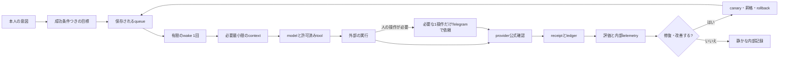

<!-- startup-context-version: 2026-09-01.1 -->
<!-- startup-context-digest: f61cbb3cd2878abfb67756de2b23e816070aa3d991c71f748b2dfe1dbd3180d6 -->

# Life Manager

> **Life Managerは、あなたの人生をあなた自身より上手に管理するAIです。**

Life Managerは、あなたの**身体・心・お金**を管理する、先回り型の汎用エージェントです。目標を「次にやる具体的な行動」へ分解し、**委任された範囲**で実行し、公式の結果を確認し、証拠から学びます。解決したい問題は、人生が停滞することです。何をすればよいか分かっていても、続けて前へ進めない苦しさを減らします。

長期的には、一人の人間から始めて、すべての生き物に安心できるcareと行動力を届ける「生命のmanager」を目指します。これは将来の方向であり、現在のrepositoryがすでに達成したという意味ではありません。

[Life Managerを開く](https://aniccaai.com/lm) · [Telegramで始める](https://t.me/LifeManagerBotbot?start=lp) · [source](https://github.com/Daisuke134/life-manager)

Life Managerが製品名です。Aniccaはformが会社名を明示的に求めた時だけ使います。

## 管理する3つの領域

| 領域 | 例 |
|---|---|
| **Daily** | 目標、カレンダー、優先順位、応募、やり切ること |
| **身体と心** | 習慣、体調の合図、careの継続、今日の小さな一歩 |
| **お金** | 仕事、執筆、応募、収入、支出、資産運用（明示したrisk gateの内側） |

資産増加や投資収益は保証しません。下書き、クリック、local processの成功は「完了」ではありません。providerの公式receipt、または`setup_required`のような明示した状態が必要です。

## 1つの製品、2つの動かし方

LocalとCloudは別製品ではなく、**同じcore**を動かす2つの方法です。

| 方法 | 目的 | 変化するdataの置き場所 | 利用者の体験 |
|---|---|---|---|
| **Local** | 開発、自分で運用、復旧、local完了判定 | ownerの端末（Gitの外） | 最初だけ端末で設定。重要な結果はTelegramまたはlocal channel |
| **Cloud** | 常時稼働、本番、複数人 | tenant単位のdatabase/object storageとsecret store | phoneだけで使える。worker、schedule、browserは遠隔で動く |

目標→context→有限のwake→tool実行→公式確認→receipt→評価、という契約は共通です。違うのはsupervisor、保存先、secret store、browserの接続方法だけです。Localの受入れが終わる前にCloudへ移しません。Localの変化するdataを別tenantへコピーもしません。

## 1回のwakeが成果になる流れ



通常のwakeやraw logは内部に残します。Telegramへ送るのは、人の操作、緊急の安全問題、重要な成果、長く続くblockerだけです。毎時の細かい実行ログは送りません。

## 14本のproduct loop

これは14個の能力です。14個のprocessを常時起動するという意味ではありません。1つの能力を、発見・browser・worker・healthcheck・照合などの小さなjobに分けます。

| # | loop | 役割 |
|---:|---|---|
| 1 | Gig — Coconala | 案件発見、選別、応募、交渉、納品支援、公式結果の確認 |
| 2 | Gig — Lancers | Lancersのルールで同じ収益の流れを実行し、receiptを残す |
| 3 | Gig — CrowdWorks | 条件に合う案件へ安全に応募し、確認を照合する |
| 4 | Writer | 有償執筆を探し、応答・公開・支払を照合する |
| 5 | Affiliate | attributionできる機会を探し、公開し、成果を測る |
| 6 | Investment | paper/shadow/liveをrisk gateの後ろで動かし、注文を照合する |
| 7 | Agent Economy | owner資金、agent収入、compute費、reserveを分離する |
| 8 | Job Hunter | 条件に合う求人へ応募し、mail/providerの返事を照合する |
| 9 | Fundraiser | accelerator、grant、fellowshipなどを探し、条件を満たせば応募する |
| 10 | Connector | eventを探し、応募し、登録を確認し、確定した予定をCalendarへ入れる |
| 11 | Self-Build | 確認済みのfeedbackと証拠から改善を作る |
| 12 | Mobile Apps | appを作り、build・公開・marketing・計測・改善を一つの流れで行う |
| 13 | Capafy | productの販売、成果、audience-growthを運用する |
| 14 | CFO | 確認済みの収入、費用、残高、payout、財務判断を照合する |

現在のregistryは[`config/loop-registry.json`](config/loop-registry.json)、14本の修復方針と担当表は[architecture refinement spec](docs/superpowers/specs/2026-09-15-life-manager-agent-architecture-refinement.md)です。

## 全員で同じdataの形を使う

全員が同じschema（項目の形）を使います。しかし中身と履歴は人ごとに完全に分離します。境界は常に`tenant_id` + `user_id` + `owner_id`です。

| 記録 | 保存するもの | 約束 |
|---|---|---|
| Goal | 望む結果、期限、優先度、成功条件 | 成功条件なしに完了にしない |
| Context | 好み、制約、許可、必要な履歴 | そのwakeに必要な最小分だけ読む |
| Graph | 目標、task、機会、依存、人物、providerのつながり | つながりに出所と新しさを付ける |
| Execution | job、wake、tool、effect、retry、人の操作待ち | idempotency keyで二重実行を防ぐ |
| Evidence | 公式確認、receipt、成果物hash、失敗理由 | `unknown`を勝手に`0`や成功へ変えない |
| Evaluation | 基準値、score、失敗分類、候補、canary、rollback | 未使用の確認用データで自己満足を防ぐ |

個人data、credential、browser session、実行記録はruntime stateです。source codeではありません。Git、別tenantへ渡すprompt、公開skill、Telegramには入れません。移行後の共通レイアウトは次の通りです。

```text
Git repository                 code、schema、skill、spec、immutable release
Local owner state              ~/.local/state/life-manager/<tenant>/<owner>/
Cloud tenant state             PostgreSQL + object storage（tenant/user/ownerで分離）
Secret・browser state          hostのsecret storeまたはcloud vault（provider単位）
```

LocalとCloudのadapterは同じ契約と保存期間・匿名化ルールを実装します。移行するときはreceiptを残す変換だけを行い、別tenantへ個人の変化するstateをコピーしません。

## 自己修復・自己改善・再帰的自己改善

「人が付きっきりにならない」を、次の3層で実装します。

1. **自己修復:** 失敗を分類し、影響するownerだけを隔離し、範囲を限定した修復を行い、最小の確認を再実行します。providerや人が必要なら安全に止まります。
2. **自己改善:** 基準値を測り、変更候補を1つ作り、未使用の確認用データで評価し、canary後に昇格またはrollbackします。
3. **再帰的自己改善:** 評価器、修復recipe、contextの選び方、skill自体を改善できます。ただし同じ証拠gateを通し、権限・scheduler・外部効果を自分で増やしたり、receiptなしに成功宣言したりはできません。

この約束を再利用可能な7つのskillにまとめています。[harness](skills/harness-engineering/SKILL.md)、[context](skills/context-engineering/SKILL.md)、[loop](skills/loop-engineering/SKILL.md)、[graph](skills/graph-engineering/SKILL.md)、[eval](skills/eval-engineering/SKILL.md)、[observability](skills/observability-engineering/SKILL.md)、[goal](skills/goal-engineering/SKILL.md)。調査したOSSの固定版は[`docs/agent-engineering/REFERENCE-REPOS.md`](docs/agent-engineering/REFERENCE-REPOS.md)にあります。

## folder map

```text
life-manager/
├── apps/life-manager/              product registryと利用者向けorchestration
├── config/loop-registry.json       14本の能力registry
├── skills/                         再利用するagent recipeとprovider adapter
│   └── agent-engineering/tests/    skillの契約test
├── runtime/                        local supervisorと有限wake worker
├── docs/agent-engineering/         固定したOSS参照とsource map
├── docs/superpowers/specs/         architectureと受入れ契約
├── docs/superpowers/plans/         local→cloudのatomic実装順
└── install.sh / bin/lm-loop        local設定と診断の入口

~/.local/state/life-manager/        個人dataと実行記録（Gitの外）
```

## ロードマップ

**今 — Localのcoreを信頼できる状態にする**

- identity、resource、goal、context、graph、effect、receipt、人の操作待ち、評価、内部報告の共通契約を完成させる。
- すべてのloopに、owner、release identity、resource class、retry policy、公式の完了条件を1つずつ持たせる。
- browserは原則headlessで動かし、測定したmemoryに応じて仕事を受け入れる。画面表示は人への引き継ぎ・debugだけにする。
- 14本すべてをLocalの受入れ表で確認する。providerを動かせない場合は、成功したふりをせず明示的な状態を返す。

**次 — 同じreleaseをCloudへ昇格する**

- tenantごとのstateとproviderごとのbrowser sessionを必要時だけ作る。
- 小さなCloud canaryでLocalのreceipt・評価と比較し、問題がなければ同時実行数を少しずつ増やす。
- 通常のtelemetryは内部に置き、phoneには重要な人向けeventだけ送る。

**最終 — phoneだけで人生を前へ進める**

- 人がTelegramまたはappでgoalを伝える。
- Life Managerが委任された範囲で計画・実行し、人にしかできない操作だけを頼み、結果を確認する。
- privacy、権限、証拠の境界を守りながら、失敗を修復し、recipeを改善し続ける。

実装のatomicな順序と現在のcursorは[local-to-cloud plan](docs/superpowers/plans/2026-09-15-life-manager-local-to-cloud.md)にあります。repositoryは開発中であり、14本すべてが今すぐ本番完成しているわけではありません。現在の実測値はloopごとのspecとreceiptを正本にします。

## はじめ方

**Cloud:** [Telegramで開始](https://t.me/LifeManagerBotbot?start=lp)または[Life Manager](https://aniccaai.com/lm)を開きます。端末を24時間つけておく必要はありません。

**Local:**

```bash
git clone https://github.com/Daisuke134/life-manager.git
cd life-manager
LIFE_MANAGER_INSTALL_DAEMON=0 ./install.sh
./bin/lm-loop doctor
```

Localは開発、自分での運用、復旧用です。processの終了コードだけでproviderの効果を推測せず、公式receiptを確認してください。

## 詳細リンク

- [agent-engineeringのOSS source catalog](docs/agent-engineering/REFERENCE-REPOS.md)
- [architecture refinement](docs/superpowers/specs/2026-09-15-life-manager-agent-architecture-refinement.md)
- [Local→Cloud実装計画](docs/superpowers/plans/2026-09-15-life-manager-local-to-cloud.md)
- [loop-engineering recipe](skills/loop-engineering/SKILL.md)
- [Security](SECURITY.md) · [Soul](SOUL.md) · [Thesis](THESIS.md)
- [English README](README.md)

## North Star（変更不可）

Life Managerは、あなたの人生をあなた自身より上手に管理するAIです。安心できるcareと行動力を常に使えるようにし、人生の停滞が生む苦しみを減らし、最終的にはすべての生命を思いやりをもって管理します。

## ライセンス

MIT。[LICENSE](LICENSE)を参照してください。

- **リポジトリ（プロダクト全体）：** <https://github.com/Daisuke134/life-manager>
