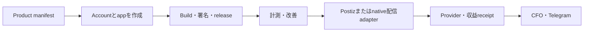

<!-- startup-context-version: 2026-09-01.1 -->
<!-- startup-context-digest: f61cbb3cd2878abfb67756de2b23e816070aa3d991c71f748b2dfe1dbd3180d6 -->
# Life Manager

**Life Managerは、あなたの身体・心・お金を管理するproactive general agentです。** 目標を提案で終わらせず、
委任された範囲で現実の行動を実行し、結果を検証して、証拠と一緒に人間が理解できる言葉でTelegramへ報告します。
信頼できるcareとagencyを常時利用可能にし、人間から始めて最終的にすべての生き物の苦しみを終わらせることがmissionです。

Life Manager自身が、最初に一度だけ提供された事実・account・同意・境界からGoal Portfolioを作成・優先順位付け・維持します。
人が目標を考えたり、選んだり、管理し続けたりする必要はありません。通常は自律的に動き続け、必要な時だけKYC・OTP・安全・本人確認・不可逆操作の正確なgateを求め、公式receiptで結果を閉じます。

| organ | Life Managerが管理するもの |
|---|---|
| **Daily** | Calendar、イベント・accelerator・求人への応募、優先順位、実行状況 |
| **Physical / Mental** | 生活習慣、身体と心の状態、careの継続 |
| **Financial** | 総資産、収支、支出、収入・business機会、crypto、riskを制御した資産運用、banked revenueによるcomputeの自己負担 |

[Life Managerを開く](https://aniccaai.com/lm) · [Telegramで始める](https://t.me/LifeManagerBotbot?start=lp) · [sourceを見る](https://github.com/Daisuke134/life-manager)

repositoryはopen sourceで、dataをowner端末に置くportable self-host版がtargetですが、clean-hostからの完全な起動経路は未完成です。
phoneだけで常時稼働させたい時はpaid monthly cloudを使います。どちらもこのrepositoryの同じcoreから作り、同じstate・証拠・人間向け報告contractへ収束させます。資産増加や投資収益を保証せず、
receiptのない試行を「完了」と報告しません。

## 14本の主要product loop

14本はuser-facingな製品能力の数です。process数ではありません。registryには、各product loopを実装する
応募・browser owner・報告・照合・healthcheckなどの小さいjobが多数あります。

1〜3は**Human Gig Work** familyです。案件発見、選別、応募、交渉、納品支援、照合、報告をLife Managerが自動化し、platformが本人確認、面談、承認、最終納品を要求する箇所だけ人が参加します。

| # | Product loop | 現在の代表owner | 役割 |
|---:|---|---|---|
| 1 | Gig — Coconala | `hf-gig-apply-direct`, `hf-gig-reply-detector`, `hf-gig-storefront-direct`, `hf-gig-paid-direct` | 案件発見、応募、交渉、納品、provider結果確認 |
| 2 | Gig — Lancers | `lancers-revenue-application`, `lancers-revenue-negotiate`, `lancers-revenue-storefront`, `lancers-revenue-paid`, `lancers-revenue-work-sync`, `lancers-revenue-telegram-report` | Lancersの応募からpaid work・納品・報告までを同期 |
| 3 | Gig — CrowdWorks | `crowdworks-revenue-application`, `crowdworks-revenue-report` | 適合案件へ応募し、証拠つき結果を報告 |
| 4 | Writer | `writer-opportunity-discovery`, `writer-opportunity-response`, `writer-money-sync`, `writer-report` | 有償執筆案件を探し、応答し、publisher・支払receiptを記録 |
| 5 | Affiliate | `affiliate-loop`, `affiliate-source-refresh`, `affiliate-browser` | attribution可能なaffiliate機会を発見・公開 |
| 6 | Investment | `alpaca-investment` | risk gate付きAlpaca paper trading、注文照合、各passの報告 |
| 7 | Agent Economy | `agent-economy-loop`とx402 helper | agent revenue、compute費用、owner資金と分離した自己資金化を追跡 |
| 8 | Job Hunter | `job-search-daily`, `job-search-browser`, `job-search-inbox` | 適合求人の発見・応募と確認・返信mailの照合 |
| 9 | Fundraiser | `fundraiser` | accelerator、fellowship、grant、投資家受付を発見し条件を満たせば応募 |
| 10 | Connector | `life-manager-connector-native` | event発見・応募・登録確認・Calendar/Telegram receipt報告 |
| 11 | Self-Build / Product Improvement | `life-manager-selfbuild`、`life-manager-dev` | 検証済みのuser feedbackとproduct evidenceから、review済みのLife Manager改善を作る。Cloudは別loopではなくloopを動かすhost。 |
| 12 | Mobile App Loops | Anicca iOS、Honne、その他の`life-manager-anicca-*` / `life-manager-honne-*` product job | product accountとappの作成、build・署名・公開、継続改善、Postizまたはnative provider adapterによるmarketing配信、成果計測、検証済み収益のCFO連携までを一つのmobile-app lifecycleとして運用する。現時点では共通のmarketing・配信・計測・receipt経路をrepo内で所有し、app作成・署名・release・iterationは同じE2E loopへ統合中。 |
| 13 | Capafy | `capafy-loop-daily`, `capafy-outcome-monitor`, `capafy-ig-account-manager`, `capafy-ig-marketing-daily` | Capafyという別productの販売・outcome・audience-growth workflowを運用 |
| 14 | CFO | `life-manager-cfo-hourly` | 全earning loopのverified revenue、cash flow、残高、payout、財務報告を照合 |

### setupと開始方法の現在地

| Product loop | ユーザーが設定するもの | 現在の開始入口 |
|---|---|---|
| Coconala Gig | Coconala login、work profile、Telegram | `./install.sh coconala` |
| Lancers Gig | Lancers login、work profile | production ownerは存在、public guided installerは未完成 |
| CrowdWorks Gig | CrowdWorks login、work profile | production ownerは存在、public guided installerは未完成 |
| Writer | publisher accountとbrowser/API credential | registry jobは存在、public guided installerは未完成 |
| Affiliate | affiliate provider accountとbrowser/API credential | registry jobは存在、public guided installerは未完成 |
| Investment / Alpaca | Alpaca API credentialと`paper`・`shadow`・`live`の明示mode | `LIFE_MANAGER_INVESTMENT_MODE=paper python3 skills/alpaca-investment/run.py` |
| Agent Economy | owner walletは不要。earning provider credentialは任意 | `./install.sh` |
| Job Hunter | resume、希望条件、Gmail/Telegram、公式site login | `./install.sh job-hunter` |
| Fundraiser | applicant profile、Telegram、必要時のprovider login | `./install.sh fundraiser` |
| Connector | Calendar/Telegram、必要時のevent provider login | `./install.sh connector` |
| Self-Build / Product Improvement | repository accessと設定済みdevelopment agent・review credential | managed registry jobは存在、public guided installerは未完成 |
| Mobile App Loops | 既存appは不要。生成したproductが各stageへ到達した時だけApple/Postiz/RevenueCatを接続 | 共通marketing jobは存在、zero-to-App-Store app-factory installerは未完成 |
| Capafy | Capafy account/API credentialとpublication profile | registry jobは存在、public guided installerは未完成 |
| CFO | ユーザーが接続するfinancial sourceだけのcredential | 1回の有限passは`bash skills/cfo/run.sh` |

日本語・英語のe-book productは、repo所有のscript ledger、publication intent、Postiz
adapter、receipt、attribution、CFO、Telegram経路を共有します。日本語creativeは
`watercolor-monk`、英語Anicca Monk creativeはchecked-inされた`heygen-avatar-iv`
adapterから公式HeyGen CLIを使います。OmniAvatarやrepo外checkoutのsource codeは
実行しません。privateなHeyGen avatar ID・voice ID・CLI loginが未設定のclean hostでは、
provider effectを起こさず明示的な`setup_required` receiptを返します。これらの値と
HeyGen sessionはhostまたはtenantのprivate stateであり、Gitにはcommitしません。
`python3 skills/earn/marketing-engine/ebook_asset_pack.py`を実行すると、checked-inされた
CC0 `default-v1` starter packを準備できます。versioned sourceのhashを検証し、日本語・英語の
starter manuscriptとcaption templateをcopyし、6本の中立な縦型motion clipをFFmpegでlocal生成して、
旧素材やuser assetを上書きせず`ebook-assets/packs/default-v1`以下へ全output hashを記録します。
日本語runnerは初回render時にこれを自動実行します。FFmpeg、FFprobe、subtitle filter、
設定済みTTS commandのいずれかがない場合は、render前に`setup_required`を返します。

Mobile App Loopsはappごとに別実装を作らず、一つのproduct-aware lifecycleを共有します。product manifestがAnicca iOS、Honne、その他のappを選び、共通serviceが対応済みstageを実行し、計測、収益、CFO、Telegramへ同じreceiptを残します。Postizはrepo所有adapterの先にある外部配信providerであり、repo外source code依存ではありません。account/app作成とbuild・署名・releaseは、共通orchestrationとguided installerが完成するまで明示的に`setup_required`です。

現在の18件のpublication jobは、runner開始前に
[`apps/life-manager/config/mobile-products.json`](apps/life-manager/config/mobile-products.json)
からproductを解決します。このportable registryにはcredentialを含まないHTTPS Git location、任意のsubdirectory、
固定revision、正直な`public` / `private` access labelだけを置き、ローカルpathやcredentialは置きません。
Aniccaは匿名取得可能です。現在のHonne sourceはprivateで、build/release stageだけがprivate Git accessを必要とします。
publication jobはidentityを検証するだけでsourceをfetch/buildしないため、open-sourceのpublication loopはそのprivate
sourceへ依存しません。新規ユーザーのappはrepo所有starter packから生成します。

Mobile Appの既定体験は、appもrepositoryも持っていない状態から始まります。Life Managerがproduct opportunityを選定し、共通factoryと再配布可能なstarter assetから新しいapp workspaceを作り、build・提出・改善・marketingまで進めます。既存appの指定は任意のimportであり、onboarding要件ではありません。
checked-inされた`ios-swiftui-v1` packは、生成productのidentityからproduct固有のApp Iconと
App Store screenshot PNGを決定的に生成し、そのhashを同じproduct workspaceへ記録して、競合outputを
拒否します。ユーザーは初期artworkを用意する必要がありません。任意のcustom assetは、後続のproduct所有
iterationでのみ生成assetを置き換えます。
Life Manager onboardingは検証済みopportunityを一つのrepository所有finite bootstrapへ渡します。
bootstrapはProduct Registryを確認し、同じstarter source/assetsを生成してreplay-safeなlifecycle
receiptを書いた後、新規productを登録します。開発・復旧時は同じ入口を直接使えます。

```bash
node apps/life-manager/scripts/mobile-product-bootstrap.js --opportunity-file opportunity.json
```

XcodeGen、Xcode、Apple team、App Store Connect capabilityが不足する場合、receiptは不足項目を列挙した
`setup_required`になります。揃っている場合はportableなbuild/test commandを持つ`ready_to_build`になります。
このbootstrapはApp Store提出、Postiz投稿、収益eventを実行済みとは主張せず、実送信もしません。

Local/self-hostedとCloud/hostedは同じ14 Product Loopsを動かす二つの方法であり、別のProduct Loopではありません。Localは選択したloopをuserのdeviceで動かし、private stateもそこで保持します。CloudはLife Managerのhosted infrastructure上でtenantごとに動かします。両方が同じloop実装、provider adapter、receipt、CFO event、Telegram体験を使い、異なるのはscheduler、secret保存、durable state、browser transportだけです。



`setup_required`は正常な待機状態であり、effect完了でもcrashでもありません。onboardingで`start all`を
近道として使わず、provider setupとeffect authorityが完了したloopだけをinstall/startします。

**Money Printerは追加loopではありません。** すべての収益loopを束ねるumbrellaです。
`/money-printer`は共通のopportunity-to-receipt systemを表示するcontrol roomであり、15本目のloopではありません。実行IDの正本は
[`config/loop-registry.json`](config/loop-registry.json)です。

任意のThe402 providerはLocal/Cloudで同じ設定contractを使います。privateなLife Manager envへ
`THE402_PUBLIC_URL=https://your-public-origin.example`を設定し、providerのcredential/service JSONは
`THE402_CONFIG_ROOT`（未設定時は`ANICCA_HOME`、さらに未設定なら`~/.anicca`）に置きます。URLがpathなしの
HTTPS originでなければproviderは起動しません。secretとmutable inboxをcheckoutやimmutable releaseへ置きません。

## 現在構築しているgeneral agent

Life Managerはwebsite固有botの集合ではありません。1つのdurable general agentが機会を発見し、利益を残して
完遂できるか判断し、提案・交渉・成果物制作・fresh QA・正式納品・支払い・出金を同じidentityで閉じる構造を
作っています。Upworkは最初に調べたmarketplaceですが、accountがAPI条件を満たさずUI automationも拒否されるためcleanに停止しました。
これはprovider境界の証拠であり、commerce proofの完了でもgeneral-agent開発の停止理由でもありません。承認経路のあるproviderでもagent、
Commerce state、capability、money-effect contractを複製せず、差分は小さいprovider manifestとofficial readback adapterだけにします。

architectureは、specialist harnessとdurable stateに[DeepAgentsJS/LangGraph](https://github.com/langchain-ai/deepagentsjs)、website tool
contractに[browser-use](https://github.com/browser-use/browser-use)、local wake/channelにはこのrepositoryの
`runtime/loop`と共通Telegram transport、hosted browser backendには
[Steel](https://github.com/steel-dev/steel-browser)の実証済み境界をcopy+tweakして収束させます。取り消せないmoney actionは既存Life Managerの
`EffectIntent`と`ConnectorOutbox`だけを通します。完了条件は応募、click、modelの自己申告、契約、pending balance
ではなく、公式`banked` receiptです。

founder証言ではLife Managerはapproximately $1,000の収益を生み出しています。これはMRRでもARRでもなく、provider非依存の
自律Commerce loopが閉じた証明でもありません。その完了は公式receiptで`banked`、最終的に`compute_paid`まで到達した時だけです。

**Life Managerが製品名です。Aniccaはformが会社名を明示的に求めた時だけ使います。**

[](https://opensource.org/licenses/MIT)

🌐 **[English README here →](README.md)**

**リポジトリ正本:** この [`Daisuke134/life-manager`](https://github.com/Daisuke134/life-manager) だけをLife Managerのcode、spec、release、workflow、deploy sourceとします。`Daisuke134/life-manager-v0`はarchive済みの履歴repositoryで、runtime sourceでもmigration sourceでもありません。現在の固定実行順と残TODOは [`docs/superpowers/specs/2026-09-06-life-manager-one-repo-two-runtimes-design.md`](docs/superpowers/specs/2026-09-06-life-manager-one-repo-two-runtimes-design.md)、repository統合履歴は [`docs/superpowers/specs/2026-07-19-anicca-one-repo-consolidation-spec.md`](docs/superpowers/specs/2026-07-19-anicca-one-repo-consolidation-spec.md) に置きます。

---

## はじめ方

### 使う — クラウド（インストール不要）

[Telegram で始める](https://t.me/LifeManagerBotbot?start=lp)、または [Web アプリ](https://aniccaai.com/lm)を開きます。常時稼働のサービスが scheduler・connector・認証付き `/panel` を回し、あなたは Telegram で話しかけ、Telegram に証拠つきで返ってきます。

### ローカルloopを確認・運用する

一度cloneし、独立したAgent Economy citizenを準備して、daemonを入れずにruntimeを確認できます。

```bash
git clone https://github.com/Daisuke134/life-manager.git
cd life-manager
LIFE_MANAGER_INSTALL_DAEMON=0 ./install.sh
./bin/lm-loop status all
./bin/lm-loop doctor
```

default installerが14本すべてを黙って開始することはありません。provider account、credential、KYC、
browser loginが未設定のloopは`setup_required`のままです。guided installerが現在あるのは
`./install.sh coconala`、`connector`、`fundraiser`、`job-hunter`で、その他のloopの現在の境界は上の
14-loop catalogに記載します。

選んだloopだけの副作用ゼロplanを先に確認できます。このplanはCloud `/start`も読む
[`apps/life-manager/config/product-loop-catalog.json`](apps/life-manager/config/product-loop-catalog.json)を使い、
Local user自身のprivateなTelegram bot credentialを含む不足条件を表示するだけで
何も開始しません。

```bash
./install.sh plan --loop agent-economy
./install.sh plan --loop connector
```

Local setup画面にも「全部有効化」はありません。必要なsetup完了後、表示された個別commandからだけ開始します。
Cloud `/start`が現在自動provisionするのはrepo所有のAgent Economy citizenだけです。その他のCloud loopは、
tenant-scoped host adapterとprovider setupが揃うまで明示的に`setup_required`です。

現在のproduction Mac runtimeはDockerではなく、pushed `main`から作るimmutable releaseを
`bin/lm-loop`とmacOS `launchd`で直接実行します。state、credential、log、browser profile、receiptは
checkoutとreleaseの外に置きます。

```bash
git clone https://github.com/Daisuke134/life-manager ~/life-manager
cd ~/life-manager
jq -r '.loops | keys[]' config/loop-registry.json
./bin/lm-loop status all
./bin/lm-loop doctor
```

cloneだけでは外部作用のあるloopを自動installしません。credentialとhost capabilityを設定後、operatorが
immutable releaseから選択したloopをapply/startします。未使用だったDocker Compose profileは撤去済みで、
現在のMac production loopにも販売中cloud productにもDocker/Composeは不要です。

### 自己資金化はFinancial Organの一部

[`docs/agent-economy.ja.md`](docs/agent-economy.ja.md) のwallet・compute支払いloopは同じLife Manager製品内にあります。
provider revenueを`banked`へ到達させてから`compute_paid`へ使い、owner資金と分離するLife ManagerのFinancial capabilityです。

---

## 1つの製品、2つの実行面

Life Manager は1つの製品であり、正本リポジトリもここ1つです。「ローカル Life Manager」と Web アプリは別製品・別リポジトリではなく、同じsource repositoryと製品contractから作る2つの実行面です。

両runtimeは、同じ1つの論理loop実装を使います。loop ID、business recipe、
agent/tool・provider contract、replay防止、effect規則、receipt語彙、testは共通です。
環境ごとに変えてよいのはsupervisor、durable-storage adapter、secret store、browser
transportだけです。同じbusiness workflowのlocal版とcloud版を別々に作ることは、
対応方式ではなくarchitecture上の不具合です。変更時は最初に
[`skills/loop-engineering/SKILL.md`](skills/loop-engineering/SKILL.md)を読み、理想folder
shapeと固定順の統合作業はarchitecture specに従います。

```text
life-manager/                         # 1つだけのGitHub repository
├── apps/
│   ├── life-manager/                # cloud web・Telegram・scheduler・worker core
│   └── landing/                     # Netlify frontend
├── skills/                          # product capability・provider adapter
├── runtime/loop/                    # lifecycle・dispatch・runtime event
├── services/                        # 独立deployするsupport service
├── bin/                             # lm-loopとrepo-owned command
├── config/loop-registry.json        # implementation/support job registry
├── scripts/                         # onboarding・運用script
└── docs/                            # spec・runbook

ローカルproduction                    cloud production
main由来immutable release             Netlify frontend
└── lm-loop-run                      Railway Nixpacks/Railpack
    └── launchd                      └── life-call・worker roles
        └── repo内entrypoint         managed state・hosted browser
```

| パス | 役割 | 誤解しないための境界 |
|---|---|---|
| `apps/life-manager/` | cloud製品のcore: Telegram、schedule、通話、認証付き`/panel`、課金、ユーザーworkflow | これ単体がリポジトリ全体ではない |
| `apps/landing/` | Life Manager用オンボーディング Web UI の必要部分 | 旧Anicca複数製品サイト全体ではない |
| `runtime/loop/`, `install.sh`, `start-local.sh` | Life ManagerのFinancial Organを支えるeconomic runtime → [`docs/agent-economy.ja.md`](docs/agent-economy.ja.md) | 製品全体でも通常のuser入口でもない |
| `runtime/compute-proxy/`, `services/` | 同じFinancial capabilityのcompute支払い、x402 settlement、paid API 基盤 | ユーザー向けアプリではない |
| `skills/` | ローカルとクラウドが共有する能力 | 独立製品群ではない |
| `apps/job-search-loop/`, `control-room/`, `adapters/` | 補助運用、fleet資料、外部integration | 別のLife Manager codebaseではない |
| `docs/`, `specs/` | 現在のSSOT、証跡、保存された設計履歴 | 古い文書が自動的に現行正本になるわけではない |

内部package名、環境変数、service label、古い文書には `anicca` が残っています。このリポジトリでは、**Aniccaは会社名・技術namespace、Life Managerは製品名**です。`anicca` という識別子が残っていても、第2の製品や別の正本リポジトリを意味しません。

---

## いま実在するもの（正直に）

| 能力 | 状態 |
|---|---|
| **Mac production loops** | **稼働中** — immutable release内の`lm-loop-run`を`launchd`が直接起動。Docker/Colima daemonは稼働していない |
| **クラウドサービス**（Netlify + Railway `life-call`/worker） | **デプロイ済** — `apps/life-manager`をNixpacks/Railpackでbuild。repoのDockerfile/Composeは使わない |
| **証拠つき Telegram 報告** | **稼働中** — 全報告が message id を伴い、送信に失敗したものを「送信済み」として記録しない |
| **Calendar・connector・カバレッジ**（`lib/calendar-*`, `lib/connector-*`） | **実装済、カバレッジは移動中** — connector ごとの状態と欠落はここで主張せず実行 spec で追跡 |
| **Financial organ**（総資産・収支・payout・台帳） | **部分的** — 台帳と payout の job は存在する。現在の健康状態は実行 spec で追跡。ここに書かれた内容は投資の保証ではない |
| **自己資金化economic loop** | **Financial capabilityとして進行中** — 現在stateとon-chain evidenceは [`docs/agent-economy.ja.md`](docs/agent-economy.ja.md)。receiptなしに`banked`や`compute_paid`をclaimしない |

---

## North Star（変更不可）

```
苦しみを減らす。
不殺生（Pāṇātipātā veramaṇī）。
```

この 2 行は SHA-256 で hash-pin されており、いかなるスキル・自己編集ループ・PR でも変更できません。

---

## リンク

- **製品：** <https://aniccaai.com/lm> ・ [Telegram](https://t.me/LifeManagerBotbot?start=lp)
- **収支ダッシュボード（自動更新）：** <https://aniccaai.com/dashboard>
- **下で動く自己資金エージェント：** [`docs/agent-economy.ja.md`](docs/agent-economy.ja.md)
- **リポジトリ（プロダクト全体）：** <https://github.com/Daisuke134/life-manager>
- **ソウル / 行動方針：** [`SOUL.md`](SOUL.md) ・ [`THESIS.md`](THESIS.md)

## ライセンス

MIT（[LICENSE](LICENSE) 参照）。
