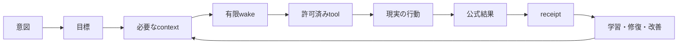

<!-- startup-context-version: 2026-09-01.1 -->
<!-- startup-context-digest: f61cbb3cd2878abfb67756de2b23e816070aa3d991c71f748b2dfe1dbd3180d6 -->

# Life Manager

> **AI that manages your life better than you ever can.**

Life Managerは、あなたの**身体・心・お金**を管理する先回り型の汎用エージェントです。意図を「人生を前へ進める行動」に変え、**委任された範囲**で実行し、現実の結果を確認し、改善を続けます。長期的には、すべての生命を管理するmanagerを目指します。

Life Managerが製品名です。Aniccaはformが会社名を明示的に求めた時だけ使います。

[Life Managerを開く](https://aniccaai.com/lm) · [Telegramで始める](https://t.me/LifeManagerBotbot?start=lp) · [source](https://github.com/Daisuke134/life-manager)

Telegramは暫定の操作口です。製品の本体はchannelではなく、人生を管理するmanagerです。

## 1つの製品、2つの動かし方

LocalとCloudは**同じcore**を動かします。違うのはhost、保存adapter、secret store、browser接続だけです。

| Local | Cloud |
|---|---|
| 開発、自分で運用、復旧 | 常時稼働、phoneだけで利用 |
| owner端末のprivate state | tenantで分離したdatabase/object storage |
| 必要時だけheadless browser | 必要時だけ作るheadless browser session |

Localの受入れが終わる前に、同じimmutable releaseをCloudへ移しません。

## 利用者の体験

1. 人がappまたはphoneから意図を一言送る。
2. Life Managerが必要なcontextを読み、次の行動を決める。
3. 有限のwakeで実行し、providerの公式結果と証拠を保存する。
4. 人には重要な結果、避けられない操作、解決しないblockerだけを見せる。

通常のwake、retry、health、raw logはprivateに残します。最終的にはcomputerも付きっきりの監視も不要な、自己管理される人生を目指します。

## wakeが成果になる流れ



## 14本のproduct loop

14本は常時起動する14個のprocessではなく、14個の能力です。Coconala、Lancers、CrowdWorks、Writer、Affiliate、Investment、Agent Economy、Job Hunter、Fundraiser、Connector、Self-Build、Mobile Apps、Capafy、CFOを、registry内の小さなjobで実装します。正本は[`config/loop-registry.json`](config/loop-registry.json)、修復方針は[architecture spec](docs/superpowers/specs/2026-09-15-life-manager-agent-architecture-refinement.md)です。

## 同じdataの形、別々の中身

全員が同じschemaを使いますが、中身と履歴は`tenant_id`・`user_id`・`owner_id`で分離します。

```text
Git repository          code、skill、schema、spec、immutable release
Local state             ~/.local/state/life-manager/<tenant>/<owner>/
Cloud state             tenant単位のPostgreSQL/object storage
Secrets/session         hostのsecret storeまたはcloud vault
```

個人data、credential、browser session、実行記録はGitや他人のcontextに入りません。

## 自己修復と再帰的自己改善

共通の流れは`observe → classify → repair → verify → promoteまたはrollback`です。recipe、評価器、context選択を変える時も、基準値、held-out試験、安全確認、canaryを通します。権限を勝手に増やしたり、証拠なしに外部結果を完了にしたりはしません。

再利用する7つのskillは、[harness](skills/harness-engineering/SKILL.md)、[context](skills/context-engineering/SKILL.md)、[loop](skills/loop-engineering/SKILL.md)、[graph](skills/graph-engineering/SKILL.md)、[eval](skills/eval-engineering/SKILL.md)、[observability](skills/observability-engineering/SKILL.md)、[goal](skills/goal-engineering/SKILL.md)です。

## folder map

```text
life-manager/
├── apps/life-manager/          product orchestration
├── config/loop-registry.json   lifecycle job registry
├── skills/                     再利用するagent recipe
├── runtime/                    supervisorと有限wake
└── docs/superpowers/           specとatomic plan

~/.local/state/life-manager/    個人dataと実行記録（Gitの外）
```

## ロードマップ

- **今:** identity、state、resource、context、証拠、評価、静かな報告の共通契約を完成し、14本をLocalで受け入れる。
- **次:** tenant分離したCloud stateを作り、読み取りcanary→effect canary→段階的な容量拡大へ進む。
- **最終:** phoneから意図を伝えるだけで、Life Managerが人生全体を継続的かつ安全に管理する。

atomicな実装順と証拠は[Local→Cloud plan](docs/superpowers/plans/2026-09-15-life-manager-local-to-cloud.md)にあります。現在は開発中であり、Loopごとの実測状態は各receiptを正本にします。

## はじめ方

**Cloud:** [Telegramで開始](https://t.me/LifeManagerBotbot?start=lp)または[Life Manager](https://aniccaai.com/lm)を開きます。

**Local:**

```bash
git clone https://github.com/Daisuke134/life-manager.git
cd life-manager
LIFE_MANAGER_INSTALL_DAEMON=0 ./install.sh
./bin/lm-loop doctor
```

## 詳細リンク

- [agent-engineering source catalog](docs/agent-engineering/REFERENCE-REPOS.md)
- [architecture refinement](docs/superpowers/specs/2026-09-15-life-manager-agent-architecture-refinement.md)
- [Local→Cloud実装計画](docs/superpowers/plans/2026-09-15-life-manager-local-to-cloud.md)
- [Security](SECURITY.md) · [Soul](SOUL.md) · [Thesis](THESIS.md)
- [English README](README.md)

## North Star（変更不可）

Life Managerは、あなたの人生をあなた自身より上手に管理するAIです。安心できるcareと行動力を常に使えるようにし、停滞が生む苦しみを減らし、最終的にはすべての生命を思いやりをもって管理します。

## ライセンス

MIT。[LICENSE](LICENSE)を参照してください。

- **リポジトリ（プロダクト全体）：** <https://github.com/Daisuke134/life-manager>
