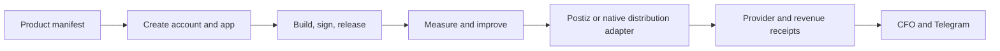
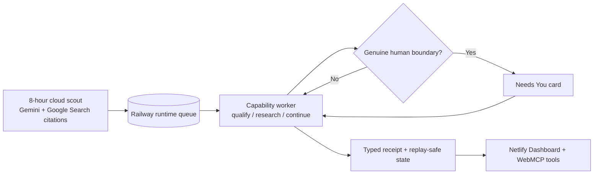
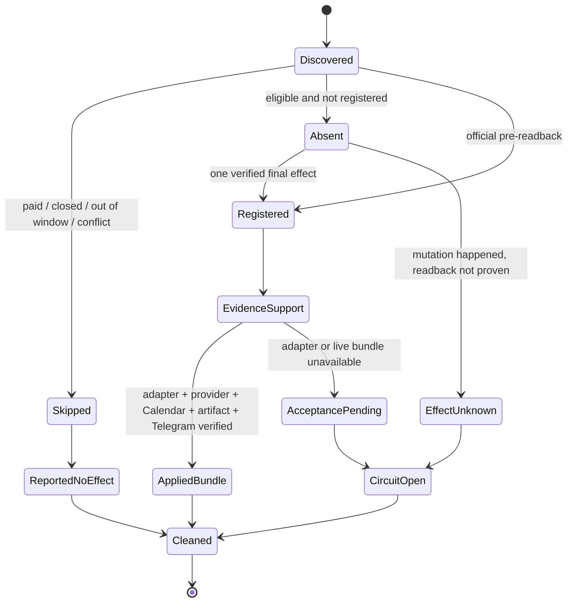

<!-- startup-context-version: 2026-09-01.1 -->
<!-- startup-context-digest: f61cbb3cd2878abfb67756de2b23e816070aa3d991c71f748b2dfe1dbd3180d6 -->
# Life Manager

**Life Manager is an AI that manages your life better than you ever can.** It is a proactive general agent that
manages your body, mind, and money. It turns goals into
completed real-world actions, acts within delegated boundaries, verifies what happened, and reports the result
in plain language with evidence in Telegram. Its mission is to make dependable care and agency continuously
available and end suffering for humans and, ultimately, all living beings.

| Group | What Life Manager manages through its loops |
|---|---|
| **Daily** | Calendar, event and accelerator applications, job applications, priorities, and follow-through |
| **Physical / Mental** | Routines, wellbeing, and continuity of care |
| **Financial** | Net worth, cash flow, spending, income and business opportunities, crypto, risk-managed investing, and self-funding compute from banked revenue |

[Open Life Manager](https://aniccaai.com/lm) · [Start in Telegram](https://t.me/LifeManagerBotbot?start=lp) · [View the source](https://github.com/Daisuke134/life-manager)

The repository is open source. Local runs repository-owned processes and durable state directly on the owner's
computer; Docker and Docker Compose are not required. Use the paid monthly cloud service when you want an
always-on manager with only a phone. Both surfaces use the same core from this repository
and converge on the same state, evidence, and human-readable reporting contracts. Life
Manager never guarantees wealth or investment returns, and it never reports an attempted action as completed
without a receipt.

## The 14 main product loops

Life Manager has fourteen user-facing product loops. A product loop is a capability,
not necessarily one process: the lifecycle registry contains the smaller
application, browser-owner, reporting, healthcheck, and reconciliation jobs that
implement and support these 14 loops.

Loops 1–3 form the **Human Gig Work** family. Life Manager automates discovery,
screening, application, negotiation, delivery support, reconciliation, and
reporting; a person participates only where the marketplace requires identity,
an interview, approval, or final delivery.

| # | Product loop | Representative current owners | What it does |
|---:|---|---|---|
| 1 | Gig — Coconala | `hf-gig-apply-direct`, `hf-gig-reply-detector`, `hf-gig-storefront-direct`, `hf-gig-paid-direct` | Finds suitable work, applies, negotiates, delivers, and verifies provider outcomes |
| 2 | Gig — Lancers | `lancers-revenue-application`, `lancers-revenue-negotiate`, `lancers-revenue-storefront`, `lancers-revenue-paid`, `lancers-revenue-work-sync`, `lancers-revenue-telegram-report` | Runs the same earning lifecycle for Lancers and keeps applications, paid work, delivery, and reporting state consistent |
| 3 | Gig — CrowdWorks | `crowdworks-revenue-application`, `crowdworks-revenue-report` | Applies to suitable CrowdWorks projects and reports evidence-backed outcomes |
| 4 | Writer | `writer-opportunity-discovery`, `writer-opportunity-response`, `writer-money-sync`, `writer-report` | Finds paid writing work, responds, and records publisher and payment receipts |
| 5 | Affiliate | `affiliate-loop`, `affiliate-source-refresh`, `affiliate-browser` | Finds and publishes attributable affiliate opportunities through an owned browser path |
| 6 | Investment | `alpaca-investment` | Runs the risk-gated Alpaca shadow/live loop, reconciles orders, and reports every five-minute pass |
| 7 | Agent Economy | `agent-economy-loop` plus x402 helpers | Tracks agent revenue, compute cost, and self-funding without mixing owner funds |
| 8 | Job Hunter | `job-search-daily`, `job-search-browser`, `job-search-inbox` | Discovers and submits qualified applications, then reconciles confirmations and replies |
| 9 | Fundraiser | `fundraiser` | Discovers accelerators, fellowships, grants, and public investor intakes and applies when eligible |
| 10 | Connector | `life-manager-connector-native` | Finds eligible events, applies, verifies registration, and reports Calendar and Telegram receipts |
| 11 | Self-Build / Product Improvement | `life-manager-selfbuild`, `life-manager-dev` | Turns verified user feedback and product evidence into reviewed Life Manager improvements; Cloud is a host for loops, not a separate Product Loop |
| 12 | Mobile App Loops | Anicca iOS, Honne, and the other `life-manager-anicca-*` / `life-manager-honne-*` product jobs | Runs the owned mobile-app lifecycle: create the product account and app, build and sign releases, publish them, continuously improve the apps, distribute marketing content through Postiz or a native provider adapter, measure outcomes, and feed verified revenue back into CFO. Today the repository owns the shared product-aware marketing, distribution, measurement, and receipt path; app creation, signing, release, and iteration are still being unified into the same end-to-end loop. |
| 13 | Capafy | `capafy-loop-daily`, `capafy-outcome-monitor`, `capafy-ig-account-manager`, `capafy-ig-marketing-daily` | Operates Capafy's separate product, sales, outcome, and audience-growth workflows |
| 14 | CFO | `life-manager-cfo-hourly` | Reconciles verified revenue, cash flow, balances, payouts, and financial reports across the earning loops |

### Setup and start truth

| Product loop | User setup | Current start path |
|---|---|---|
| Coconala Gig | Coconala login, work profile, Telegram | `./install.sh coconala` |
| Lancers Gig | Lancers login and work profile | Managed production owner; public guided installer pending |
| CrowdWorks Gig | CrowdWorks login and work profile | Managed production owner; public guided installer pending |
| Writer | Publisher accounts and browser/API credentials | Registry jobs; public guided installer pending |
| Affiliate | Affiliate-provider account and browser/API credentials | Registry jobs; public guided installer pending |
| Investment / Alpaca | Alpaca API credentials and explicit `paper`, `shadow`, or `live` mode | `LIFE_MANAGER_INVESTMENT_MODE=paper python3 skills/alpaca-investment/run.py` |
| Agent Economy | No owner wallet; optional provider credentials for earning | `./install.sh` |
| Job Hunter | Resume, preferences, Gmail/Telegram, official site logins | `./install.sh job-hunter` |
| Fundraiser | Applicant profile and Telegram; provider login when required | `./install.sh fundraiser` |
| Connector | Calendar/Telegram and event-provider login when required | `./install.sh connector` |
| Self-Build / Product Improvement | Repository access plus the configured development agent and review credentials | Managed registry jobs; public guided installer pending |
| Mobile App Loops | No existing app required; connect Apple/Postiz/RevenueCat only when the generated product reaches those stages | Shared marketing jobs exist; zero-to-App-Store app-factory installer pending |
| Capafy | Capafy account/API credential and publication profile | Registry jobs; public guided installer pending |
| CFO | Credentials for only the financial sources the user connects | `bash skills/cfo/run.sh` for one finite pass |

The ebook products share the same repository-owned script ledger, publication
intent, Postiz adapter, receipt, attribution, CFO, and Telegram path. Japanese
ebook creative uses the `watercolor-monk` renderer. English Anicca Monk creative
uses the official HeyGen CLI through the checked-in `heygen-avatar-iv` adapter;
it never calls OmniAvatar or source code under an external checkout. A clean host
that has not configured the private HeyGen avatar ID, voice ID, and CLI login gets
an explicit `setup_required` receipt with no provider effect. Those values and the
HeyGen session remain private host or tenant state and are never committed.
Run `python3 skills/earn/marketing-engine/ebook_asset_pack.py` to provision the
checked-in CC0 `default-v1` starter pack. It verifies the versioned source hashes,
copies Japanese and English starter manuscripts and caption templates, generates
six neutral vertical motion clips locally with FFmpeg, and records every output
hash under `ebook-assets/packs/default-v1` without replacing legacy or user assets.
The Japanese runner performs this provisioning automatically on first render.
Missing portable media or text-to-speech capabilities (FFmpeg, FFprobe, a
subtitle-capable FFmpeg build, or the configured TTS command) return
`setup_required` before rendering.

Mobile App Loops use one product-aware lifecycle rather than separate scripts per
app. A product manifest selects Anicca iOS, Honne, or another app; shared services
then perform the supported stages and write the same measurement, revenue, CFO,
and Telegram receipts. Postiz is an external distribution provider behind a
repository-owned adapter, not a source-code dependency. The future account/app
creation and build/sign/release stages remain explicitly `setup_required` until
their shared orchestration and guided installer are complete.

The default Mobile App journey starts from no app and no repository. Life Manager
finds a viable product opportunity, creates a new app workspace from its shared
factory and redistributable starter assets, then builds, submits, improves and
markets it. Supplying an existing app is an optional import path, not onboarding.
The checked-in `ios-swiftui-v1` pack deterministically creates product-specific
App Icon and App Store screenshot PNGs from the generated product identity, records
their hashes in that product workspace, and refuses conflicting output. Users do not
need to supply initial artwork; optional custom assets replace the generated assets
only in a later product-owned iteration.
Life Manager onboarding passes a validated opportunity to one finite repository-owned
bootstrap. It checks the Product Registry, materializes the same starter source and
assets, writes a replay-safe lifecycle receipt, and then registers a new product. The same entrypoint is
available for development and recovery:

```bash
node apps/life-manager/scripts/mobile-product-bootstrap.js --opportunity-file opportunity.json
```

The receipt reports `setup_required` with the exact missing XcodeGen, Xcode, Apple
team, or App Store Connect capability. When they are present it reports
`ready_to_build` with portable build/test commands. It neither claims nor performs an
App Store submission, Postiz publication, or revenue event.
The 18 current publication jobs all resolve their product through
[`apps/life-manager/config/mobile-products.json`](apps/life-manager/config/mobile-products.json)
before a runner starts. That portable registry pins a credential-free HTTPS Git
location, optional subdirectory, exact revision, and an honest `public` or `private`
access label for each reference app; it contains no local path or credential. Anicca
is anonymously fetchable. The current Honne source is private and requires private
Git access only at its build/release stage. Publication jobs validate identity but do
not fetch or build either app, so the open-source publication loop does not depend on
that private source. New users generate their own app from the repository-owned starter pack.

Local/self-hosted and Cloud/hosted are two ways to run this same catalog, not
additional Product Loops. Local runs selected loops on the user's device and stores
private state there. Cloud runs selected loops for a tenant on Life Manager's hosted
infrastructure. Both hosts use the same loop implementation, provider adapters,
receipt vocabulary, CFO events, and Telegram experience; only scheduling, secret
storage, durable state, and browser transport differ.



`setup_required` is a healthy waiting state, not a completed effect and not a crash. Never use `start all` as an
onboarding shortcut: install and start only the loops whose provider setup and effect authority are complete.

**Money Printer is not another loop.** It is the umbrella for all revenue-producing
loops. The `/money-printer` control room shows their shared opportunity-to-receipt
system; it does not compete with them as a fifteenth loop.

The complete lifecycle registry is [`config/loop-registry.json`](config/loop-registry.json).
List every loop and inspect its live state through the canonical interfaces:

```bash
jq -r '.loops | keys[]' config/loop-registry.json
./bin/lm-loop status all
./bin/lm-loop doctor
```

Being present in the registry proves that a loop is part of Life Manager; it does
not prove the loop is healthy or that an external effect succeeded. Health comes
from the latest terminal event, and business success comes only from the official
provider receipt.

The optional The402 provider uses the same host-neutral configuration contract on
Local and Cloud. Put `THE402_PUBLIC_URL=https://your-public-origin.example` in the
private Life Manager environment file and keep its provider credential/service JSON
under `THE402_CONFIG_ROOT` (falling back to `ANICCA_HOME`, then `~/.anicca`). The
provider refuses to start unless the URL is an HTTPS origin without a path; secrets
and mutable inbox data never live in the checkout or immutable release.

Loop architecture and reuse decisions start at [`skills/loop-engineering/SKILL.md`](skills/loop-engineering/SKILL.md).
Release and launchd work then follows its required `loop-development` route.

### Run the Alpaca investment loop

The same Python core supports isolated `paper`, real-account read-only `shadow`, and
risk-bounded `live` modes. It uses the checksum-pinned Alpaca CLI for official reads
and effects, stable client-order IDs, durable receipts, reconciliation, and one
Telegram report every five minutes. It never treats a deposit as profit or promises
returns.

Run and inspect one finite pass from a checkout:

```bash
LIFE_MANAGER_INVESTMENT_MODE=paper python3 skills/alpaca-investment/run.py
./bin/lm-loop status alpaca-investment
```

The repository's managed macOS path installs only from an immutable main-derived
release through `lm-loop apply`. Never
run two live writers for one Alpaca account. A successful process is not proof of
profit: use the reported account, position, order, fee, slippage, and net-P&L
readbacks.

## The general agent we are building

Life Manager is not a collection of website-specific bots. We are building one durable general agent that can
discover an opportunity, decide whether it can complete the work profitably, propose and negotiate, produce and
QA the deliverable, submit it, and follow the same identity through payment and payout. Upwork was the first
marketplace investigation; it is now cleanly contained because the account is not eligible for API access and UI
automation is denied. That is evidence about a provider boundary, not a completed commerce proof and not a reason
to stop the general-agent work. Approved providers must reuse the same agent, commerce state, capabilities, and
money-effect contract; their differences belong in a small provider manifest and official readback adapter.

The architecture uses repository-owned wake, scheduling, Telegram, browser, state, effect, receipt, and outbox
boundaries. It also adapts useful design ideas from
[DeepAgentsJS/LangGraph](https://github.com/langchain-ai/deepagentsjs) for the specialist harness and durable state,
[browser-use](https://github.com/browser-use/browser-use) for the website-tool contract,
[Steel](https://github.com/steel-dev/steel-browser) for the hosted browser backend. Existing Life Manager
`EffectIntent` and `ConnectorOutbox` rails remain the only path for irreversible money actions. The completion
signal is an official `banked` receipt—not an application, click, model claim, contract, or pending balance.

The roadmap extends that verified loop recursively: observe failures and outcomes, isolate one owner, repair or
improve the shared implementation with Codex, evaluate it against recorded provider evidence, and promote it
through an immutable release. The marketplace meta-loop discovers and validates new providers and adds only a
thin adapter. Local and hosted execution share this core; Telegram is the first phone-only interface, while the
long-term direction is proactive management that needs progressively less interface and serves humans first and
ultimately all living beings. Self-healing never means blind self-modification: every change remains fenced by
tests, independent evidence, official readback, rollback, and tenant isolation.

## Money Printer — cross-loop control room

[Open the live Money Printer](https://aniccaai.com/money-printer) · [60-second judge guide](docs/webmcp-judge-guide.md)

Money Printer is the shared earning-work surface across Life Manager's revenue-producing loops, not a separate
loop. Its cloud scout searches the public Web for current paid opportunities, admits only citation-backed public
URLs, deduplicates them in Railway Postgres, and hands each one to the relevant durable capability worker. The person sees one six-column board and is asked
only when identity, authority, judgment, payment information, or a physical action is genuinely required.
The zero-login judge tenant cannot perform external application, delivery, payment, or money effects.



| WebMCP tool | What it does | External effect |
|---|---|---|
| `inspect_money_printer` | Reads metrics, six board columns, and safe recent activity | None |
| `add_opportunity` | Adds one public HTTPS opportunity to the durable queue with an idempotency fence | Internal state only |
| `inspect_workroom` | Reads the selected opportunity, job, and receipt timeline | None |
| `inspect_next_human_task` | Reads the oldest exact open human task | None |
| `record_human_answer` | Records a versioned answer and resumes the same job; registered only when a task is open | Internal state only |

### Challenge-period changes

The WebMCP work added after August 25 includes the `/money-printer` guest route, provider-neutral projection,
responsive board, top-level imperative WebMCP registration, durable Opportunity and HumanTask contracts,
Railway runtime-store separation, dedicated capability worker, citation-grounded recurring scout, safe failed
receipt projection, Netlify proxy/security headers, and adversarially tested idempotency and tenant boundaries.
Earlier Life Manager scheduling, marketplace, Telegram, billing, and evidence systems remain pre-existing work.

Current live proof includes a zero-login page/API, replay-zero internal writes, a page-independent worker,
multiple public opportunities, completed qualification and scout receipts, restart-stable counts, and a
read-only verified Lancers application receipt (`project 5593484`, `proposal 27863414`). An application is not
revenue: `Paid & verified` remains empty until an independently verified payment receipt exists. The required
24-hour three-natural-cycle record and ChatGPT/Chrome client recordings are still being accumulated.

The founder attests that Life Manager has generated approximately $1,000 in revenue. This is not MRR or ARR, and
it is not proof that a provider-independent autonomous commerce loop is closed. That loop remains proven only by
official receipts through `banked` and, eventually, `compute_paid`.

**Life Manager is the product. Anicca is the company name only when a form explicitly asks for it.**

[](https://opensource.org/licenses/MIT)

🌐 **[日本語版 README はこちら →](README.ja.md)**

**Repository SSOT:** this repository, [`Daisuke134/life-manager`](https://github.com/Daisuke134/life-manager), is the only Life Manager code, spec, release, workflow, and deployment source. `Daisuke134/life-manager-v0` is an archived historical repository, not a runtime or migration source. The current ordered execution plan and remaining work are maintained in [`docs/superpowers/specs/2026-09-06-life-manager-one-repo-two-runtimes-design.md`](docs/superpowers/specs/2026-09-06-life-manager-one-repo-two-runtimes-design.md); repository consolidation history remains in [`docs/superpowers/specs/2026-07-19-anicca-one-repo-consolidation-spec.md`](docs/superpowers/specs/2026-07-19-anicca-one-repo-consolidation-spec.md).

---

## Quick start

### Use it — cloud (nothing to install)

[Start in Telegram](https://t.me/LifeManagerBotbot?start=lp), or open the
[web app](https://aniccaai.com/lm). The always-on service runs the scheduler, the connectors, and the
authenticated `/panel`; you talk to it in Telegram and it reports back there with receipts.

### Run it yourself — local (your machine holds the data)

Clone once, prepare one isolated Agent Economy citizen, and inspect the runtime without installing a daemon:

```bash
git clone https://github.com/Daisuke134/life-manager.git
cd life-manager
LIFE_MANAGER_INSTALL_DAEMON=0 ./install.sh
./bin/lm-loop status all
./bin/lm-loop doctor
```

The default installer does not silently start all 14 product loops. Each provider-backed loop remains
`setup_required` until its account, credentials, KYC or browser login is configured. Guided installers currently
exist for `./install.sh coconala`, `connector`, `fundraiser`, and `job-hunter`; the README catalog states the current
boundary for the other product loops.

Preview a zero-effect plan for only the loops you select. The plan reads the same
[`apps/life-manager/config/product-loop-catalog.json`](apps/life-manager/config/product-loop-catalog.json) used by
Cloud `/start` and lists every
missing requirement—including the Local user's private Telegram bot credentials—without starting anything:

```bash
./install.sh plan --loop agent-economy
./install.sh plan --loop connector
```

The Local setup screen likewise has no “enable all” action. A loop is started only through its listed command after
its required setup is complete. Cloud `/start` currently provisions only the repository-owned Agent Economy citizen;
other Cloud loops stay visibly `setup_required` until their tenant-scoped host adapter and provider setup exist.

To start the Job Hunter loop on an Apple Silicon Mac:

```bash
/bin/bash -c "$(curl -fsSL https://raw.githubusercontent.com/Daisuke134/life-manager/main/scripts/bootstrap-job-hunter.sh)"
```

The command installs only missing dependencies, asks for the finalized resume and
job preferences in Terminal, and opens the dedicated CloakBrowser for official
login. It also installs `gog`, opens Gmail OAuth for the application email, and asks
for the owner's Telegram bot token privately plus numeric chat ID. Finish the
official login, then run the exact same command again. Life Manager verifies Gmail
and a real Telegram message ID before starting the owners. Passwords, OTPs and bot
tokens are never printed or committed.

Job Hunter is pre-release until Dais's installed 30-minute Workday loop closes the
current production acceptance: dynamic discovery, fit-qualified application,
descriptive loop-owned Telegram, official Gmail/Ledger proof and duplicate zero.
Ashby, Greenhouse, Lever, Mercor and generic ATS lanes are not working products.

### Inspect and operate local loops

The current production Mac runtime is direct-process, not Docker. Pushed `main`
is cut into an immutable release; `bin/lm-loop` installs and supervises selected
registry jobs through macOS `launchd`. Mutable state, credentials, logs, browser
profiles, and receipts stay outside the checkout and outside the release.

```bash
git clone https://github.com/Daisuke134/life-manager ~/life-manager
cd ~/life-manager
jq -r '.loops | keys[]' config/loop-registry.json
./bin/lm-loop status all
./bin/lm-loop doctor
```

Installing an effectful loop is an operator action performed from an immutable
release after its credentials and host capabilities are configured; cloning the
repository never starts every loop automatically. The repository has retired the
unused Docker Compose profile; neither the current Mac production loops
nor the selling cloud product require Docker or Compose.

### Self-funding is part of the Financial Organ

The wallet and compute-payment loop in [`docs/agent-economy.md`](docs/agent-economy.md) is not a separate product.
It is Life Manager's Financial capability: provider revenue must become `banked` before it can fund
`compute_paid`, and owner funds must remain separate.

---

## One product, two execution surfaces

Life Manager is one product in one repository. “Local Life Manager” and the web app are not separate products or repositories; they are two execution surfaces built from the same source repository and product contracts.

The target contract does not copy loops into separate local and cloud folders. The current lifecycle inventory
contains the implementation and support jobs in [`config/loop-registry.json`](config/loop-registry.json), with repository-relative
entrypoints across the repository. The current Mac and cloud surfaces use different supervisors and not every loop
is portable yet. In the target, both dispatch the same entrypoints and only the scheduler, storage, secret, and browser adapters differ. The
complete architecture and ordered portability work are tracked in
[`docs/superpowers/specs/2026-09-06-life-manager-one-repo-two-runtimes-design.md`](docs/superpowers/specs/2026-09-06-life-manager-one-repo-two-runtimes-design.md).

```text
life-manager/                       # the only source repository
├── apps/life-manager/              # cloud web, Telegram, scheduler and worker core
├── skills/ · runtime/ · services/  # capabilities, lifecycle and services
├── bin/ · tools/                   # repository-owned commands and support entrypoints
├── config/loop-registry.json       # one catalog for local and cloud loops
├── apps/landing/                   # Netlify web frontend
└── docs/                           # product, runtime and operations documentation
```

| Runtime | What runs | Where private data lives |
|---|---|---|
| Local / self-hosted today | Immutable release → `lm-loop-run` → repository-relative Python/Node/shell entrypoint; macOS uses `launchd` | Owner-controlled state, credential, log, receipt, and browser-profile directories outside Git |
| Cloud today | Netlify serves the web frontend; Railway builds `apps/life-manager` with Nixpacks and runs `life-call`/worker roles | Tenant-scoped managed database, object store, and secrets |

Both surfaces run one logical loop implementation. They share the loop ID,
business recipe, agent/tool and provider contracts, replay protection, effect
rules, receipt vocabulary, and tests. Only host infrastructure changes:
supervision, durable-storage adapter, secret store, and browser transport. A
local-only or cloud-only copy of the same business workflow is an architecture
bug, not a supported deployment pattern. Contributors start with
[`skills/loop-engineering/SKILL.md`](skills/loop-engineering/SKILL.md); the
target folder shape and ordered convergence work live in the architecture spec
linked above.

`launchd` is the current macOS supervisor adapter, not the loop definition. Linux and Windows are portability targets
that still need their own proven supervisor/install path. Phones are
clients: they use the cloud runtime or connect to another always-on self-hosted machine.

Required runtime source is repository-owned and does not import code from OpenClaw,
Hermes, another checkout, or a worktree. Portability is still capability-specific:
macOS is the verified full local supervisor/browser host today, while Linux and
Windows supervisor adapters and several public guided installers remain unfinished.
The Cloud surface runs without the user's local device, but it currently hosts only
the loops listed as Cloud-supported rather than silently claiming all 14.

| Path | Role | What it is not |
|---|---|---|
| `apps/life-manager/` | The cloud product core: Telegram, scheduling, calls, authenticated `/panel`, billing, and user workflows | Not the whole repository |
| `apps/landing/` | The Life Manager onboarding web subset | Not the old multi-product Anicca website |
| `runtime/loop/`, `install.sh`, `start-local.sh` | Economic runtime supporting Life Manager's Financial Organ — see [`docs/agent-economy.md`](docs/agent-economy.md) | Not the whole product or the normal user entry point |
| `runtime/compute-proxy/`, `services/` | Compute-payment and x402 settlement/API infrastructure for the same Financial capability | Not user-facing apps |
| `skills/` | Shared capabilities used by local and cloud execution | Not independent products |
| `apps/job-search-loop/`, `control-room/`, `adapters/` | Supporting operations, fleet documentation, and integrations | Not another Life Manager codebase |
| `docs/`, `specs/` | Current SSOT, evidence, and retained architecture history | Historical files are not automatically current authority |

Some internal package names, environment variables, service labels, and older documents still use `anicca`. In this repository, **Anicca is the company/technical namespace; Life Manager is the product**. A remaining `anicca` identifier does not imply a second product or another canonical repository.

---

## Connector agent — how event applications work

Connector is the local Life Manager agent that fills a rolling 28-day Tokyo event horizon. It ranks YC hackathons, open lightning talks, AI, crypto, and startup events first; applies only to strong or moderate matches; uses Luma as the primary actionable source and the official connpass v2 API as the primary read-only fallback; then uses the remaining rails only after both primary sources are exhausted. It verifies provider results and reports evidence-backed outcomes in Telegram. It is not a blind form-filler: a click is never treated as success by itself.

```mermaid
flowchart LR
    TRIGGER["Hourly launchd trigger<br/>or supervised launchd kickstart"] --> ENTRY["run.sh<br/>single lock + heartbeat"]
    ENTRY --> CAL["Google Calendar<br/>28-day busy inventory"]
    CAL --> RAIL["One CloakBrowser target<br/>one owned page"]

    subgraph LOOP["Forward-only provider loop"]
        PROVIDERS["Luma action → connpass API advisory<br/>→ remaining fallback rails"]
        DISCOVER["Provider discovery<br/>privacy-safe count audit"]
        GATE{"Free · open · Tokyo · in window<br/>and Calendar-safe?"}
        NEXT["Next candidate<br/>or next provider"]
        PROVIDERS --> DISCOVER --> GATE
        GATE -->|No| NEXT --> PROVIDERS
    end

    RAIL --> PROVIDERS
    GATE -->|Yes| NAV["Navigate on the same page"]
    NAV --> PRE{"Official parent / child-frame readback<br/>already registered?"}
    PRE -->|Yes| SUPPORT
    PRE -->|No| CACHE["Verified action cache"]
    CACHE -->|registered / pending| SUPPORT
    CACHE -->|not completed| DIRECT["Provider script-first action"]
    DIRECT -->|completed| POST
    DIRECT -->|effect unknown| CIRCUIT
    DIRECT -->|safe not completed| HARNESS["Bounded Browser Harness<br/>observe → propose → operate"]
    HARNESS -->|completed| POST{"Official parent / child-frame readback<br/>registered or pending?"}
    HARNESS -->|safe failure / auth required| NEXT
    POST -->|No / safe failure| NEXT
    POST -->|Yes| SUPPORT

    subgraph EVIDENCE["External proof — agent self-report is insufficient"]
        SUPPORT{"Evidence adapter<br/>available?"}
        PROVE["Provider receipt / state"] --> GCAL["Idempotent Calendar write<br/>plus independent readback"]
        GCAL --> PNG["Privacy-safe screenshot<br/>and SHA-256"]
        PNG --> TG["Telegram message + photo<br/>positive provider IDs"]
        TG --> BUNDLE["Durable applied_bundle"]
    end

    SUPPORT -->|Yes| PROVE
    SUPPORT -->|No| EVIDPENDING["Acceptance pending<br/>no applied_bundle claim"]

    NEXT -->|All exhausted| NOEFFECT["completed_no_effect<br/>healthy external write 0"]
    HARNESS -->|effect unknown| CIRCUIT["circuit_open<br/>effect unknown · evidence failure · safety threshold"]
    EVIDPENDING --> CIRCUIT
    BUNDLE --> REPORT["Durable wake report"]
    NOEFFECT --> REPORT
    CIRCUIT --> REPORT
    REPORT --> CLEAN["Release owned target and lock<br/>leave unrelated tabs untouched"]
    CLEAN --> TERMINAL{"Terminal result"}
    TERMINAL -->|applied_bundle / completed_no_effect| HEALTHY["worker_finished<br/>process exit 0"]
    TERMINAL -->|circuit_open| FAILED["worker_failed<br/>non-zero exit"]
    ENTRY -. startup / contract error .-> FAILED
```





| Provider | Production rail | Acceptance status |
|---|---|---|
| Luma | Discovery, action, readback, evidence | Live bundle proven |
| Connpass | Official v2 API discovery only; Telegram action boundary | API application submitted; key and explicit automated-action permission remain external gates |
| Peatix | Discovery, action, readback, evidence | Live bundle proven |
| Meetup | Discovery, action, readback, evidence | Connected; current strict candidates conflict with Calendar |
| Doorkeeper | Discovery, action, readback, evidence | Connected; all four current eligible candidates conflict with Calendar, so live bundle remains pending |
| Eventbrite | Three-page discovery, ticket/attendee/final action, child-frame readback, evidence | Connected; current production inventory has no eligible candidate, so external write is correctly zero |
| TECH PLAY | RSS/detail discovery, input/review/final action, registered readback, evidence | Connected; all three current eligible candidates conflict with Calendar, so live bundle remains pending |
| KokuchPro | Official listing/detail discovery, strict free/Tokyo/open gate, entry/login readback, bounded Harness | Connected; current official first page has no event inside the 28-day window. Login is classified as `auth_required` and safely hands off without private-value or retry effects |

Safety invariants: one hourly schedule owner, one browser target per wake, one external mutation at most per wake, `effect_unknown` means no retry, private form values never enter action history, and only an `applied_bundle` proves a new completed application. A verified open lightning-talk application consumes that wake's effect budget before attendance; payment, CAPTCHA, identity verification, and unknown required fields always stop for human action. `completed_no_effect` is a healthy process result with zero new external writes. Current evidence and remaining gates live in the [Connector execution SSOT](docs/superpowers/specs/2026-08-01-dais-life-manager-five-phase-execution-spec.md).

### Connector local install and uninstall

Keep private identity, Calendar, Telegram, Gemini, and connpass values in a mode-0600 file outside the repository. The connpass key is optional while its official application is pending; without it, connpass discovery fails closed and no browser fallback is attempted.

1. Run `skills/connector/render-launchd.sh` into a private temporary directory, passing the canonical repository root, a private Life Manager state directory, and the external connector env file.
2. Validate the rendered plist with `plutil -lint`. Install only `ai.anicca.life-manager-connector-native.plist` in the user's `Library/LaunchAgents`, mode 0600.
3. Run `bin/launchctl-safe preflight`, then bootstrap only `ai.anicca.life-manager-connector-native`. Read it back with `bin/launchctl-safe print gui/$UID/ai.anicca.life-manager-connector-native`; it must show `StartInterval = 3600`, one label, and no `StartCalendarInterval`, `RunAtLoad`, or `KeepAlive`.
4. To uninstall, boot out that exact label through `bin/launchctl-safe`, remove only its exact installed plist, and preserve the external env file, state, receipts, Calendar entries, and unrelated browser tabs.

The renderer deliberately refuses to write directly into `Library/LaunchAgents`. This keeps rendering and live launchd mutation as separate, auditable steps.

Current canonical acceptance: PR `#1936` established the production baseline at `4f1960592`, and follow-up PR `#1947` merged the final documentation plus provider-specific fallback budget fix at `f1a13b2e7`. The post-baseline production wake traversed all seven configured providers and KokuchPro on one owned page, reused existing bundles without a duplicate external effect, delivered a positive Telegram receipt, restored the exact unrelated browser pages, released the lock, and exited zero. Generic providers now fail closed above the Browser Harness 10-step limit while TECH PLAY retains its reviewed 15-step flow. The only remaining event-rail work is conditional: Meetup, Doorkeeper, Eventbrite, and TECH PLAY need a future Calendar-safe live candidate before their first real `applied_bundle` can be proven.

---

## What's real today (honest)

| Capability | Status |
|---|---|
| **Mac production loops** | **Live** — `launchd` directly starts immutable-release `lm-loop-run`; no Docker/Colima daemon is running. |
| **Cloud service** (Netlify + Railway `life-call`/worker) | **Deployed** — Railway builds `apps/life-manager` with Nixpacks/Railpack, without the repository Dockerfile or Compose. |
| **Telegram reporting with receipts** | **Live** — every report carries a message id, and a send that fails is not recorded as sent. |
| **Calendar, connectors, coverage** (`lib/calendar-*`, `lib/connector-*`) | **Implemented, coverage still moving** — per-connector state and gaps are tracked in the execution spec rather than claimed here. |
| **Financial loops** (net worth, cash flow, payouts, ledgers) | **Partial** — the ledger and payout jobs exist; their current health is tracked in the execution spec. Nothing here is an investment guarantee. |
| **Self-funding economic loop** | **Financial capability in progress** — current state and on-chain evidence live in [`docs/agent-economy.md`](docs/agent-economy.md); do not infer `banked` or `compute_paid` without those receipts. |

---

## North Star (immutable)

```
Reduce suffering.
No killing (Pāṇātipātā veramaṇī).
```

These two lines are SHA-256 hash-pinned and cannot be changed by any skill, self-edit loop, or PR.

---

## Links

- **Product:** <https://aniccaai.com/lm> · [Telegram](https://t.me/LifeManagerBotbot?start=lp)
- **Live dashboard (auto-updated):** <https://aniccaai.com/dashboard>
- **The agent economy underneath:** [`docs/agent-economy.md`](docs/agent-economy.md)
- **Repository (whole product):** <https://github.com/Daisuke134/life-manager>
