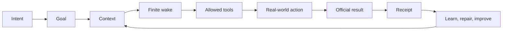

<!-- startup-context-version: 2026-09-01.1 -->
<!-- startup-context-digest: f61cbb3cd2878abfb67756de2b23e816070aa3d991c71f748b2dfe1dbd3180d6 -->

# Life Manager

> **AI that manages your life better than you ever can.**

Life Manager is a proactive general agent for your **body, mind, and money**. It turns intent into a life that moves forward, acts within delegated boundaries, verifies reality, and keeps improving. The long-term vision is a manager for every life, ultimately all living beings.

Life Manager is the product. Anicca is the company name only when a form explicitly asks for it.

[Open Life Manager](https://aniccaai.com/lm) · [Start in Telegram](https://t.me/LifeManagerBotbot?start=lp) · [Source](https://github.com/Daisuke134/life-manager)

Telegram is a temporary control surface. The product is the manager, not the channel.

## One product, two modes

Local and Cloud run the **same core**. Only the host, storage adapter, secret store, and browser transport change.

| Local | Cloud |
|---|---|
| Development, self-hosting, recovery | Always-on production, phone-only |
| Private state on the owner's machine | Tenant-isolated database/object storage |
| Headless browser when automation is needed | On-demand headless browser sessions |

The local acceptance gate must pass before the identical immutable release is promoted to Cloud.

## User experience

1. The person states an intention in the app or phone channel.
2. Life Manager remembers the relevant context and chooses the next useful action.
3. It works in a finite wake, checks the real provider result, and records the evidence.
4. The person sees only a meaningful result, an unavoidable action, or a persistent blocker.

Routine wakes, retries, health, and raw logs stay private. The long-term goal is a self-managing life, without requiring a computer or constant supervision.

## How a wake becomes progress



## The 14 product loops

The loops are capabilities, not fourteen permanent processes: **Gig — Coconala**, **Gig — Lancers**, **Gig — CrowdWorks**, Writer, Affiliate, Investment, Agent Economy, Job Hunter, Fundraiser, Connector, Self-Build / Product Improvement, Mobile App Loops, Capafy, and CFO. Their lifecycle jobs remain separately owned in [`config/loop-registry.json`](config/loop-registry.json); the identity contract is in the [architecture spec](docs/superpowers/specs/2026-09-15-life-manager-agent-architecture-refinement.md).

## One data shape, private values

Every person uses the same schema, while values and history remain isolated by `tenant_id`, `user_id`, and `owner_id`.

```text
Git repository          code, skills, schemas, specs, immutable releases
Local state             ~/.local/state/life-manager/<tenant>/<owner>/
Cloud state             PostgreSQL/object storage scoped to one tenant
Secrets/sessions        host secret store or cloud vault, provider-scoped
```

Personal data, credentials, browser sessions, and execution records never enter Git or a different person's context.

## Self-healing and recursive improvement

`observe → classify → repair → verify → promote or rollback` is the shared loop. Self-improvement can change a recipe, evaluator, or context selector only after baseline, held-out evaluation, safety checks, and a canary. It cannot silently grant permissions or claim an external result without evidence.

The reusable recipes are [harness](skills/harness-engineering/SKILL.md), [context](skills/context-engineering/SKILL.md), [loop](skills/loop-engineering/SKILL.md), [graph](skills/graph-engineering/SKILL.md), [eval](skills/eval-engineering/SKILL.md), [observability](skills/observability-engineering/SKILL.md), and [goal](skills/goal-engineering/SKILL.md).

## Folder map

```text
life-manager/
├── apps/life-manager/          product orchestration
├── config/loop-registry.json   lifecycle job registry
├── skills/                     reusable agent recipes
├── runtime/                    supervisors and finite wakes
└── docs/superpowers/           specs and atomic plans

~/.local/state/life-manager/    personal state and execution records (outside Git)
```

## Roadmap

- **Now:** finish the shared identity, state, resource, context, evidence, evaluation, and quiet-reporting contracts; pass Local acceptance for all 14 loops.
- **Next:** provision tenant-scoped Cloud state, run read-only then effect canaries, and increase capacity only after official readback and replay-zero.
- **North Star:** a phone is enough to state an intention; Life Manager manages the rest of life continuously and safely.

The atomic implementation cursor and proof for each task live in the [Local-to-Cloud plan](docs/superpowers/plans/2026-09-15-life-manager-local-to-cloud.md). The repository is actively being built; current measured status belongs in loop-specific receipts, not in this short overview.

## Start

**Cloud:** [start in Telegram](https://t.me/LifeManagerBotbot?start=lp) or open [Life Manager](https://aniccaai.com/lm).

**Local:**

```bash
git clone https://github.com/Daisuke134/life-manager.git
cd life-manager
LIFE_MANAGER_INSTALL_DAEMON=0 ./install.sh
./bin/lm-loop doctor
```

## Links

- [Agent-engineering source catalog](docs/agent-engineering/REFERENCE-REPOS.md)
- [Architecture refinement](docs/superpowers/specs/2026-09-15-life-manager-agent-architecture-refinement.md)
- [Local-to-Cloud plan](docs/superpowers/plans/2026-09-15-life-manager-local-to-cloud.md)
- [Security](SECURITY.md) · [Soul](SOUL.md) · [Thesis](THESIS.md)
- [日本語版 README](README.ja.md)

## North Star (immutable)

Life Manager is an AI that manages your life better than you ever can. It should make dependable care and agency continuously available, reduce the suffering caused by stagnation, and ultimately manage every life with compassion.

## License

MIT. See [LICENSE](LICENSE).

- **Repository (whole product):** <https://github.com/Daisuke134/life-manager>
