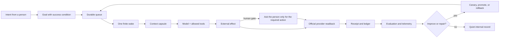

<!-- startup-context-version: 2026-09-01.1 -->
<!-- startup-context-digest: f61cbb3cd2878abfb67756de2b23e816070aa3d991c71f748b2dfe1dbd3180d6 -->

# Life Manager

> **An AI that manages your life better than you ever can.**

Life Manager is a proactive general agent for your **body, mind, and money**. It turns a goal into a bounded plan, acts within delegated boundaries, verifies the official result, and learns from the evidence. The problem it is designed to solve is life stagnation: knowing what would help, but not being able to keep moving.

The long-term vision is a manager for every life—starting with one person, then making dependable care and agency available to all living beings. That is a direction, not a claim that the current repository has already reached it.

[Open Life Manager](https://aniccaai.com/lm) · [Start in Telegram](https://t.me/LifeManagerBotbot?start=lp) · [Source](https://github.com/Daisuke134/life-manager)

Life Manager is the product. Anicca is the company name only when a form explicitly asks for it.

## What it manages

| Organ | Examples |
|---|---|
| **Daily** | Goals, calendar, priorities, applications, follow-through |
| **Body & mind** | Routines, wellbeing signals, care continuity, small next actions |
| **Money** | Work opportunities, writing, applications, revenue, cash flow, risk-gated investing |

Life Manager does not promise wealth or investment returns. A draft, click, or local success is not a completed outcome; completion requires the provider's official receipt or an explicit capability state such as `setup_required`.

## One product, two modes

Local and cloud are two ways to run the **same core**, not two products.

| Mode | Purpose | Where mutable data lives | User experience |
|---|---|---|---|
| **Local** | Development, self-hosting, recovery, and the local completion gate | The owner's machine, outside Git | Terminal for setup; Telegram or the local channel for important results |
| **Cloud** | Always-on production and many independent users | Tenant-scoped database/object storage and secret store | A phone is enough; workers, schedules, and browser sessions run remotely |

The execution contract is shared: goal → context → finite wake → tool effect → official readback → receipt → evaluation. Only the supervisor, storage adapter, secret store, and browser transport change between modes. Cloud promotion happens only after the local acceptance gate passes; mutable local state is not copied into cloud state.

## How one wake becomes progress



Routine wakes stay inside the system. Telegram is reserved for a human action, urgent safety issue, material outcome, or persistent blocker—not hourly raw logs.

## The 14 product loops

These are fourteen user-facing capabilities, not fourteen permanently running processes. The registry may split a capability into discovery, browser, worker, healthcheck, reconciliation, and reporting jobs.

| # | Loop | Responsibility |
|---:|---|---|
| 1 | Gig — Coconala | Find, screen, apply, negotiate, support delivery, and verify provider outcomes |
| 2 | Gig — Lancers | Run the same earning lifecycle with Lancers-specific rules and receipts |
| 3 | Gig — CrowdWorks | Find eligible projects, apply safely, and reconcile confirmations |
| 4 | Writer | Discover paid writing, respond, publish when allowed, and reconcile payment |
| 5 | Affiliate | Find attributable opportunities, publish through an owned path, and measure results |
| 6 | Investment | Run paper/shadow/live modes behind explicit risk gates and reconcile orders |
| 7 | Agent Economy | Separate owner funds, agent revenue, compute cost, and reserves |
| 8 | Job Hunter | Discover qualified roles, submit applications, and reconcile email/provider replies |
| 9 | Fundraiser | Find accelerators, grants, fellowships, and investor intakes and apply when eligible |
| 10 | Connector | Discover eligible events, apply, verify registration, and place confirmed events on the calendar |
| 11 | Self-Build | Turn verified feedback and product evidence into reviewed improvements |
| 12 | Mobile Apps | Create, build, release, market, measure, and improve owned apps through one lifecycle |
| 13 | Capafy | Operate the product's sales, outcome, and audience-growth workflows |
| 14 | CFO | Reconcile verified revenue, costs, balances, payouts, and financial decisions |

The live registry is [`config/loop-registry.json`](config/loop-registry.json). The shared remediation and ownership matrix is in the [architecture refinement spec](docs/superpowers/specs/2026-09-15-life-manager-agent-architecture-refinement.md).

## The shared data contract

Every person uses the same shape of data, while each person's values and history remain isolated. The identity boundary is always `tenant_id` + `user_id` + `owner_id`.

| Record | Stored content | Rule |
|---|---|---|
| Goal | Desired outcome, priority, deadline, success condition | No goal is complete without a measurable condition |
| Context | Preferences, constraints, permissions, and relevant history | Load the smallest capsule needed for this wake |
| Graph | Goal, task, opportunity, dependency, person, and provider relationships | Edges carry provenance and freshness |
| Execution | Job, wake, tool call, effect, retry, and human-gate states | Idempotency key prevents duplicate effects |
| Evidence | Official readback, receipt, artifact hash, and failure reason | `unknown` is never silently changed to `0` or `success` |
| Evaluation | Baseline, score, error class, candidate, canary, and rollback decision | Held-out cases protect against self-deception |

Personal data, credentials, browser sessions, and execution records are runtime state—not source code. They never enter Git, prompts copied between tenants, public skills, or Telegram. The target canonical layout is:

```text
Git repository                 code, schemas, skills, specs, immutable releases
Local owner state              ~/.local/state/life-manager/<tenant>/<owner>/
Cloud tenant state             PostgreSQL + object storage, scoped by tenant/user/owner
Secret and browser state       OS/host secret store or cloud vault; provider-scoped sessions
```

The local and cloud adapters implement the same contract and retention/redaction rules. A migration may transform records through an explicit receipt, but it does not copy a user's mutable local state into another tenant.

## Self-healing and recursive improvement

Three layers make “no babysitting” an engineering property instead of a slogan:

1. **Self-healing:** detect a typed failure, isolate the affected owner, choose a bounded repair, rerun the smallest proof, and stop safely when the provider or a human is required.
2. **Self-improvement:** measure a baseline, create one candidate change, evaluate it on held-out cases, canary it, and promote or roll back using the same receipt contract.
3. **Recursive self-improvement:** the system may improve its evaluator, repair recipe, context selection, and skills only through the same evidence gate. It cannot grant itself new permissions, change the scheduler, or declare an external effect without a receipt.

The seven reusable engineering skills encode these rules: [harness](skills/harness-engineering/SKILL.md), [context](skills/context-engineering/SKILL.md), [loop](skills/loop-engineering/SKILL.md), [graph](skills/graph-engineering/SKILL.md), [eval](skills/eval-engineering/SKILL.md), [observability](skills/observability-engineering/SKILL.md), and [goal](skills/goal-engineering/SKILL.md). Their pinned source catalog is [`docs/agent-engineering/REFERENCE-REPOS.md`](docs/agent-engineering/REFERENCE-REPOS.md).

## Folder map

```text
life-manager/
├── apps/life-manager/              product registry and user-facing orchestration
├── config/loop-registry.json       the 14-loop capability registry
├── skills/                         reusable agent recipes and provider adapters
│   └── agent-engineering/tests/    contract tests for the recipes
├── runtime/                        local supervisors and finite wake workers
├── docs/agent-engineering/         pinned open-source references and source map
├── docs/superpowers/specs/         architecture and acceptance contracts
├── docs/superpowers/plans/         atomic local-to-cloud execution plan
└── install.sh / bin/lm-loop        local setup and diagnosis entry points

~/.local/state/life-manager/        personal state and execution records (outside Git)
```

## Roadmap

**Now — make the local core dependable**

- Finish the shared contracts for identity, resources, goals, context, graph, effects, receipts, human gates, evaluation, and internal reporting.
- Give every loop one owner, one release identity, one resource class, one retry policy, and one official completion condition.
- Run browser work headlessly by default, admit work against measured memory, and keep a viewer only for human handoff or debugging.
- Bring all fourteen loops through the local acceptance matrix; a provider that cannot run reports an explicit capability state instead of pretending to succeed.

**Then — promote the same release to cloud**

- Provision tenant-scoped state and provider-scoped browser sessions on demand.
- Run a small cloud canary, compare receipts and evaluations with local, then expand concurrency gradually.
- Keep routine telemetry internal; send only important human-facing events to the phone.

**North star — phone-only life management**

- A person states a goal in Telegram or the app.
- Life Manager plans and executes within delegated boundaries, asks only for unavoidable human gates, and verifies the result.
- The manager continuously repairs failures and improves its own recipes while preserving privacy, permission, and evidence boundaries.

The atomic implementation order and current cursor live in the [local-to-cloud plan](docs/superpowers/plans/2026-09-15-life-manager-local-to-cloud.md). The repository is actively being built; not every loop is production-complete today. Current measured status belongs in the loop-specific specs and receipts, not in a marketing claim here.

## Start

**Cloud:** [start in Telegram](https://t.me/LifeManagerBotbot?start=lp) or open [Life Manager](https://aniccaai.com/lm). No computer needs to stay on.

**Local:**

```bash
git clone https://github.com/Daisuke134/life-manager.git
cd life-manager
LIFE_MANAGER_INSTALL_DAEMON=0 ./install.sh
./bin/lm-loop doctor
```

Local setup is for development, self-hosting, and recovery. Do not infer a provider effect from a process exit code; inspect the official receipt.

## Further reading

- [Agent-engineering source catalog](docs/agent-engineering/REFERENCE-REPOS.md)
- [Architecture refinement](docs/superpowers/specs/2026-09-15-life-manager-agent-architecture-refinement.md)
- [Local-to-cloud implementation plan](docs/superpowers/plans/2026-09-15-life-manager-local-to-cloud.md)
- [Loop-engineering recipe](skills/loop-engineering/SKILL.md)
- [Security and contribution notes](SECURITY.md) · [Soul](SOUL.md) · [Thesis](THESIS.md)
- [日本語版 README](README.ja.md)

## North Star (immutable)

Life Manager is an AI that manages your life better than you ever can. It should make dependable care and agency continuously available, reduce the suffering caused by stagnation, and ultimately manage every life with compassion.

## License

MIT. See [LICENSE](LICENSE).

- **Repository (whole product):** <https://github.com/Daisuke134/life-manager>
