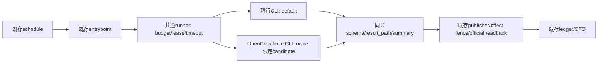

# Life Manager移行readiness — 収益経路を保つ最小切替

## 目的・今回の境界

specとwriting-plansはmainに存在する。今回の目的は既知の接続不明点を実装前に狭め、既に稼働する収益ownerを変更せず移行方法を確定すること。production/provider/browser/credential/scheduler/gatewayへのmutationは0。private fake-runtime probeだけを行う。売上の別auditはしない。

## 結論

現行の共通runnerは既にCodex/Claudeの既製CLIを呼ぶ。独自部分は主にjob lifecycle/budget/lease/effect/readbackであり、全収益agentが自作のLLM tool loopで動くという前提は正しくない。このため新harnessへの全面置換自体を成果にせず、利益ownerの変更を最小にする。

**前版の『gateway・工具体系・scheduler・stateを一緒に移す』構成は簡単な差替えではない。初回は既存scheduler/entrypoints/state/tools/model/account/外部effect ownerを残し、共通runnerの有限CLI backendだけをowner/task限定で替える。** 公開CLIのagent execを第一接続点とし、Gateway RPC/新broker/cron移行・OSS/cloud・self-improve変更は後続の独立案件へ外す。既存loopが自然に回る間、candidateはdefault disabledのまま検証する。

新harnessを全jobへ一括適用しない。完了済み注文を移し直さず、pending/fenced/running occurrenceを旧経路で閉じる。既存profitable ownerがあるという利用者の前提を守り、キャッシュ/ledger/ブラウザ認証/旧jobを片付けてから移行する案は採用しない。

## sourceとconfigured baselineで確定したこと

- audit source=c32f8ad86ca5de711bc9041740921e85265e0f44。registry184/catalog15、provider_route=shared-agent-runner65。**actual sourceでは24 shared到達、7別/条件付き、34モデル非到達/固定guard**。[分類](harness-runner-classification.json)。
- 65routeの外にCapafy supplyとPromptBase examplesのnested shared runnerがある。逆にbrowser/Stripe/ledger/CFO・Alpaca strategy・quarantined self-improveはroute文字列だけで変更しない。Alpaca choose()はrunner/workdirをdiscardする。
- configured immutable release=3aaabcca69ddf4752b516df44a669f1f88350d6b。Writer/Capafy/PromptBase/Agent Economyの4plistが同releaseを参照。関連17sourceのhashはaudit baseと一致。[baseline](../evidence/harness-migration/2026-10-07-configured-baseline.json)。**plistはconfigured argvであり実loaded argv/envの証明ではない。**
- Writer configured provider=codex、CLI override flagsなし。Agent Economy configured ANICCA_BRAIN=codex。ただしprivate dotenv override/実process env・認証backendは未観測。旧local main refは古いため比較正本にしない。

## 実装前に見つけた具体的問題と処理

| 問題 | 証拠 | 確定した対処 |
|---|---|---|
| 65routeを65model consumersと誤認 | 65/65 source分類 | eligibilityはactual callerとtask class。34は変更不要、7は別調査 |
| CLI stdoutは純JSONとは限らず、既存caller結果とも違う | private実行で[state/agent-db] prefix+envelope、current parseはouterstatus=ok、caller expected=success | envelope候補一つだけをJSON grammarで抽出→finalを既存schema validate→同result_path保存。曖昧な複数候補は拒否 |
| usageが未認識 | current extract_provider_usage(openclaw)はunavailable/null | usage.input/output/total/cacheを明示projection。欠測を0にしない |
| finiteCLIとgatewayRPCのlifetime差 | agent execはcleanup後終了、RPC ACKは終了前 | 初回はfiniteCLIを既存process supervisor内で使う。gateway claim transferを抱き合わせない |
| timeout/cleanup失敗後の再実行で二重effect |既存fallbackはCodex event形、candidateは別envelope | 新backendはprocess開始後の不明/timeout/cleanup_errorで別harnessへ同occurrenceをfallbackしない |
| builtin runtimeのretry/deadlineが前提と異なる | default fake disconnectで5requests/30.46秒、retry0 overrideで1request/9.48秒/timeout2 | public session settings retry.provider.maxRetries=0をprivatefixtureで確認。native parityとproduction設定配置は未測定、outer guardを維持 |
| tool/credential/scopeを一緒に変える危険 |長い売買promptは既存CLIのshell/CDP/scriptを前提 | 初回publisher/既存scriptsは変更せず、tool-lessから検証。native/tool parityが未証明のownerはcandidate disabled |
| 旧model/account/backendが曖昧 |source configと4configured flags | businessモデル/アカウントを同時変更しない。新API課金へ黙って切替えない |
| Node25はtargetpackage非対応 |公開engines | private/immutable Node24.16を使用、global runtime upgradeなし |
| installedOpenClaw6.6.1とtarget9.8の混在 | package metadata |既存global gateway/profileに依存せず固定private packageを使う |
| repo skillのharness禁止が新specと矛盾 |loop-development source/state条項 |Daisの明示移行検討を優先し、repo-owned locked dependency bundleだけ許可する規律へ統一 |
| capabilityと初版工具不足 |tool-less/vision/repair/resume各branch、旧80atom |初回tool-less限定。image/repair/resume/paid browser pathsはverifiedになるまでlegacy |
| 大きいpackageで稼働hostのcapacityを圧迫 |388955824bytes本体、privateinstall計測 |dependenciesはmain由来bundleで共有。fakeprobeは私有、disk/memory guard、global install無し |

## 今すぐ証明できないことを隠さない

fake probeはCLIの入出力・tool実行・timeout/cancel/cleanupを検証できるが、本物modelのtask品質、同一native account/runtime/rollout-budgetの互換性、live browser・platformの成功、売上維持を証明しない。この部分は『実装して初めて知る新課題』ではなく、**cutover前に満たす既知の検証条件**として固定する。未測定の欄をPASSにしない。

## 初回switchとrollback

1. sourceにdefault-offのbackend adapterを追加して、既存runner/consumerの契約testを通す。scheduler・state・publisherにdiffを作らない。
2. fake/私有fixtureでCLI/schema/usage/failure/cleanupを確認。backend/model/account/budget/toolが元の条件を保つ実証を別recordへ保存する。
3. new releaseを対象ownerだけloaded-idleでapply。現行running/pending/fenced occurrenceを移し替えない。最初は診断/semanticなtool-less自然wakeだけcandidateへ。
4. 次の自然occurrenceでsame output/schema/trace/budgetと正式readbackを確認。異常時は新wakeを止め、実processをdrain/stop確認してselectorだけlegacyへ戻す。ledger/credential/ブラウザ/stateをrollbackしない。
5. tool-lessが成立してから1収益ownerを同じ手順で拡張する。外部effect unknownのoccurrenceは両backendでfencedのままreconcileする。購入や売上が一時的に無いことをadapter成功と混同しない。

一括切替の停止時間や実装工数は未実測。『絶対無停止』『未知ゼロ』『すぐ全移行』とは保証しない。計画の変更点を小さくし、失敗を収益ownerの切替前に検出する構成を採る。

## 現時点の判定

source scopeと既知integration問題の整理=PASS。default-off finite adapterのMX-01〜08設計=限定ready。**全収益ownerのproduction cutover=HOLD**。fake成功だけではsame-native account/model/tool/rollout budgetが未証明であり、実測builtin retry/deadlineの差もある。『スムーズで簡単』『これ以上finding無し』と保証する根拠はない。収益保全の単一推奨は、現行を動かしたままcandidateを隔離検証し、既知gateが揃ったtool-less一件だけ切り替えること。

## 実配布物で行った隔離runtime試験

[JSON証拠](../evidence/harness-migration/2026-10-07-oneshot-preflight.json): OpenClaw2026.9.8 / Node24.16.0 / darwin-arm64。fresh HOME/state/fixture、fake API key、OS sandboxで指定loopback port以外のnetworkを拒否。globalNode/OpenClaw/gateway/profile/credential/browserへ変更なし。real model calls0、production mutations0。本体388955824bytesのpackageとdependencyを私有installしNode/SHA/package integrityを固定した。

正常exit0、工具write1回、二回目invocationで旧tool再実行無し、timeoutexit2、SIGTERM143、後続state lock再取得を確認。いずれもchild process group survivor0。usageはfake37/4/41などのsimulated値であり、実費・実provider receiptではない。

default-config disconnectは最大8retry設定下で5requests、timeout10秒を越えouter30秒で143。public設定`agents.defaults.embeddedAgent.projectSettingsPolicy=trusted`と、private cwdの`.openclaw/settings.json`に`retry.provider.maxRetries=0`を置いた限定再試験はrequest1/retry0、9.48秒でtimeout2、nextinvoke成功/lock再取得/survivor0。**default-configはHOLD、override限定fake-runtimeはPASS、native/account/business parityは未測定。**

設定ファイルの読込元はglobal `<agentDir>/settings.json`とproject `<cwd>/.openclaw/settings.json`。mergeはglobal→project→runtime overrides。本番repo/releaseへproject設定をその場で書く方法は採用しない。operator-owned private agentDirのpublic settings contractで制御し、sourceだけで確定した配置とfakeで測ったproject配置を区別する。nativeやrealaccountへ設定がeffectiveかはMX parity recordで確認する。

## 独立read-only検証

fresh contextのgpt-6.1-sol/mediumがsource分類/17hash/4configuredbaseline/fake9+2casesと報告を照合し、報告・MX計画について限定PASS、全収益cutoverはHOLDと判定した。唯一の文書混線指摘（旧HA plan/cursorが直読でactiveに見える）をMX入口参照へ訂正した。source・credential・provider・GUI操作は検証者も未実施。
