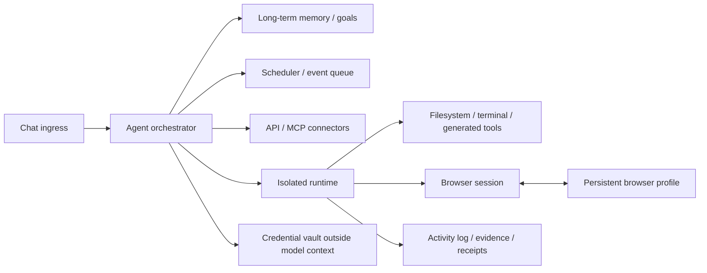
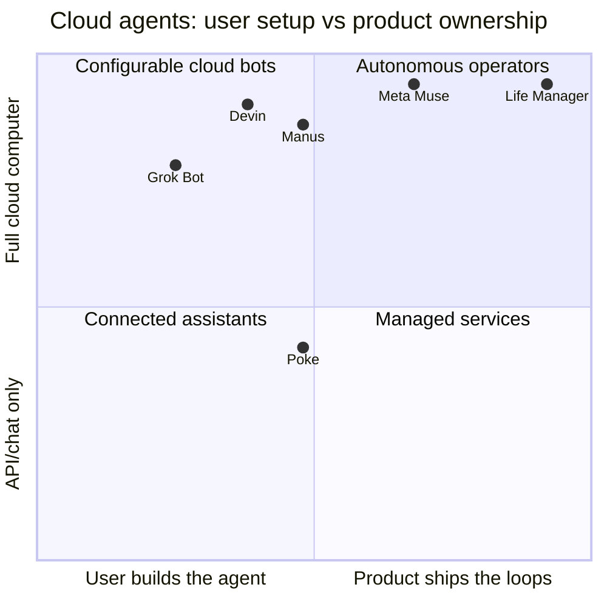

# Consumer Cloud Agent Runtime Benchmark

この文書は、消費者向けクラウドエージェントが裏側で何を動かしているかを比較し、Life Managerが再利用する設計と独自に所有する設計を固定する調査正本である。製品画面の類似だけで同一アーキテクチャと断定せず、公開一次資料で確認した事実、公開実装からの推定、非公開部分を分ける。

## 1. 結論

Meta Muse、Grok Bot、Devin、Manus、Poke、Instinctは、次の部品を異なる比率で組み合わせている。

競合の差は「VMを持つか」だけではない。永続する単位、idle compute、APIとbrowserの優先順位、credential分離、task設計の所有者が違う。

Life Managerは「利用者ごとの論理Cloud Computer」を持たせる。永続するのは人格、goal、memory、files、browser profile、credential ref、job、receipt、costであり、CPUとbrowser sessionは有限jobにだけ割り当てる。共有browserの閲覧、停止、任意のbreak-glass操作は観測・復旧面として提供できるが、自動loopの成功条件、credential取得、resume条件にはしない。

## 2. 証拠の扱い

- **確認済み:** 製品運営者の公式ページまたは公式documentationが明記している。
- **公開実装からの推定:** 公開client、CLI、network vocabularyから上位構造は読めるが、低層仮想化方式は非公開。
- **未確認:** marketing上の挙動は見えるが、VM/container/session所有契約を確認できない。

`persistent VM`は「物理CPUを24時間占有する」と同義ではない。disk、memory snapshot、browser stateを永続化し、idle中にsuspendまたはcold startしても、利用者から同じcomputerとして見える。各社がidle時に常時起動、suspend、snapshot再開のどれを使うかは、明記がない限り断定しない。

## 3. Meta Muse

### 確認済み

[Meta Muse](https://ai.meta.com/muse/)は、利用者とagentが共有する`Muse Secure VM`を、persistentかつisolatedなLinux computerとして説明している。VMにはfull browser、storage、CPU、memoryがあり、Museはterminalとfilesystemを使ってコードを書き、taskに必要なtoolを作れる。

[Metaのprivacy/security説明](https://www.meta.com/help/1047255454427887/)は、各Muse利用者のVMが独立し、他の利用者のagentから到達できず、core environmentのdataをbackupすると明記している。将来のConfidential VMも予告されている。

Museは次を持つ。

- mobile、Mac、WhatsAppの会話入口。
- main chat、side chat、persistent memory、Goals、Ideas。
- scheduleと外部eventに反応するbackground work。
- browser、terminal、filesystem、code generation、Artifacts。
- Meta製または第三者のConnector。custom connectorもagentが作れる。
- modelがpasswordを読めないSecure Credentials Store。
- activity log、予定task、permission log。
- browserを利用者とagentが共有し、利用者が観察、停止、制御できるUI。
- checkout時に実カードをagentやmerchantへ見せないone-time card number。

[Museの設計説明](https://introducing.muse.ai/)は、background task完了後に通知価値を評価し、意味のある変化または入力が必要な場合だけproactive messageを出すとしている。

### 非公開

- idle VMが常時起動、suspend、snapshot restoreのどれか。
- VM hypervisor、orchestrator、scheduler、queueの製品名。
- tenantごとのCPU/memory sizeとscale limit。
- browser profileとVM diskの正確な分離境界。

### Life Managerへの採用

- 1 tenant = 1 logical computerという利用者model。
- modelから分離したcredential broker。
- Goals、memory、files、activityを利用者が読めること。
- background workが通知価値を判定すること。
- shared browserのlive observation、emergency stop、audit trail。
- 必要なtoolを生成できるが、検証済みSkill/API adapterを先に再利用する順序。

Museは重要actionでhuman approvalを求める。Life Managerはpermission UIをjobごとの承認待ちにせず、事前にversioned policy、spend cap、site/action scopeへ変換する。任意の利用者介入は許すが、通常loopの完了は介入に依存しない。

## 4. Grok Bot

### 確認済み

[CursorのGrok Bot help](https://cursor.com/help/grok-bot/plans)は、複数platformが同じbackendとusage bucketを使い、利用量をagent stepsとtokensで測ることを説明している。Botの編集、group chat、Bot間message、Skill、Automationが製品面に存在する。

### 公開実装からの推定

公開されている[grok-bot-cli](https://github.com/ScriptedAlchemy/grok-bot-cli)は、Bot、Group、thread、account-wide Skill libraryをgateway経由で管理する。client vocabularyにはsandbox確保、`*.cursorvm.com` gateway、agent boxの`HOME=/home/box`、登録済みuser machineへのShell routingが現れる。

したがって、Grok Botは`persistent Bot identity/thread/skills + Cursor-managed isolated cloud box + optional registered local machine execution + automation and bot-to-bot messaging`という上位構造を持つと判断できる。ただし、boxがVM、container、microVMのどれか、Botごとまたはrunごとの割当かは公式には公開されていない。

Life Managerは複数agentの役割分担、account-level Skill、cloud/local host adapter、step/token usage meteringを採用する。Bot作成、instruction記述、Skill選択は利用者へ委ねず、完成済みProduct Loopを標準装備する。

## 5. Devin

[Devin environment](https://docs.devin.ai/onboard-devin/environment)は、Linux VMをdeveloper laptop相当のworkspaceとして使い、organization snapshotから各sessionのfresh copyをbootすると説明している。session変更はsnapshotへ自動的に戻らない。

[Devin session tools](https://docs.devin.ai/work-with-devin/devin-session-tools)は、同じsession内にShell、IDE、Interactive BrowserまたはComputerを置き、command、edit、browser activityを統合表示する。利用者は作業を見て、停止後にterminal、IDE、browserを直接操作できる。

[Devin browser authentication](https://docs.devin.ai/work-with-devin/browser-auth)は、CookieとlocalStorageを含むbrowser data directoryをzipにし、organization blueprintへ保存してfuture sessionでrestoreする。password storeは含めず、session stateとsecretを分ける。

Life Managerはimmutable environment snapshot、fresh isolated session、browser/file/terminalの統合timeline、runtimeから分離したprofile、takeover前にagent writerを停止するownership ruleを採用する。goal/job/receiptはVM外の正本にする。

## 6. Manus

[Manus documentation](https://manus.im/docs)は、internet、persistent filesystem、software install、custom toolを持つcomplete sandboxをvirtual computerとして説明している。

Manusは二つのbrowser modeを持つ。

- [Cloud Browser](https://manus.im/docs/features/cloud-browser): cloudのisolated browser。長時間taskとpublic researchに向くが、data-center IPで追加認証を受けやすい。
- [Browser Operator](https://manus.im/docs/features/browser-operator): userのlocal Chrome/Edge extensionを使い、既存loginとresidential IPを利用する。desktopがonlineである必要があり、sessionごとの許可を要求する。

[Manus MCP Connectors](https://manus.im/docs/integrations/mcp-connectors)は、Gmail、Calendar、Notion、Stripe等のstructured API actionをbrowserより先に使えるintegration面を提供する。

Life ManagerはAPI/MCP、cloud browser、local adapterの順にroutingし、cloud/local browserを同一session owner contractで扱う。Local Browser Operatorはphone-only/no-human-loopの標準経路にせず、Cloud版の完了条件に数えない。

## 7. Poke

[Poke](https://poke.com/)は、iMessage、WhatsApp、Telegramにいるproactive personal agentであり、memory、schedule、background automation、Gmail、Calendar、Notion、Oura等のintegrationを中心にする。[Poke Recipes](https://poke.com/docs/creating-recipes)は、onboarding context、first message、required MCP integration、share/install linkをbundleする。

Pokeの中心はfull computerではなく、event-driven control planeとAPI/MCPである。communityの[Poke Gate](https://github.com/f/poke-gate)は、Poke cloudからWebSocket tunnelでuser Mac上のlocal MCP serverを呼び、command、file、screenshotを扱う。このprojectはPoke公式ではないため、Poke本体の内部実装証拠にはしない。

[Cognitionの発表](https://cognition.com/blog/interaction)は、PokeとDevinをalways-on cloud agentsという同じ方向性として扱う。Life Managerはordinary chat surface、event/API優先、materiality threshold付きproactive message、再利用可能なconnector/loop bundleを採用する。

## 8. Instinct

公開web clientにはAgent chat、Workspace、Vault、iMessage Relay、WhatsApp onboarding、Trusted Networksが存在し、`api.instinct.com`のGraphQL APIを使う。公開例の[Instinct agent-operated repository](https://github.com/instinct-agent-yk2c8c/imessage-agent)は、agentがGitHub accountとrepositoryを自律運営したと説明する。

userまたはagentごとのVM/container所有契約、filesystem/browser永続化、scheduler、queue、credential broker、scale、cost modelは未確認である。したがって「persistent identity + workspace + vault + messaging」は比較できるが、VM方式を事実として扱わない。

## 9. 技術比較表

| Product | 永続する主単位 | 実行computer | Browser continuity | Background work | Human intervention |
|---|---|---|---|---|---|
| Meta Muse | user agent + dedicated VM data | userごとのpersistent isolated Linux VM | shared full browser | schedule + event | critical actionでdefault approval、恒久許可あり |
| Grok Bot | Bot/thread/Skill | Cursor-managed cloud box。低層方式非公開 | 詳細非公開 | Automation | permission policy依存 |
| Devin | org snapshot + session | sessionごとのfresh VM | zipped profileをblueprintへrestore | Automations | interactive browser/IDE takeover |
| Manus | task/sandbox/files | complete cloud sandbox | Cloud Browserまたはlocal Browser Operator | long-running task | verification時takeover |
| Poke | contact/memory/recipes | API/MCP中心。full VM契約は非公開 | integration token中心 | schedule/event/proactive | integrationごとの認証 |
| Instinct | agent/workspace/vault | 非公開 | 非公開 | agent-operated例あり | 非公開 |
| Life Manager | tenant logical computer + Product Loops | finite AgentCore microVM | tenant/provider Browser Profile | Inngest schedule/event | 標準loopは0。任意viewer/stop/break-glassは成功依存外 |

## 10. Life Managerが実装する共通primitive

1. **Tenant Workspace:** goal、memory、files、generated tools、browser profile ref、credential ref、job、receipt、costを1 tenantへ束ねる。
2. **Finite Runtime:** active jobだけ隔離computeを起動し、checkpoint後に終了する。
3. **Browser Session + Profile:** job sessionとlogin continuityを分け、profileをtenant/providerへ固定する。
4. **Credential Broker:** model、prompt、traceへsecret値を渡さず、scopeされたactionだけを実行する。
5. **Scheduler + Event Inbox:** clock、connector event、message、provider callbackを同じdurable queueへ入れる。
6. **Tool Router:** official API、MCP、cloud browser、local adapterの順に安い経路を選ぶ。
7. **Generated Tool Registry:** agentが作ったtoolは即座にproduction権限を得ず、owner、source hash、permission、test、rollbackを持つ。
8. **Activity/Evidence Timeline:** tool call、browser action、provider receipt、costを時系列にする。
9. **Shared Browser Observation:** userはphone/webから画面、URL、action、planned effectを見てemergency stopできる。任意break-glass controlはagent writerをleaseで停止してから単一ownerとして開始する。
10. **No-human Completion:** viewerを開く、takeoverする、credentialを入力する、approve/resumeする行為をautomated success、revenue、SLAに数えない。人間principal必須候補は閉じ、別jobを続ける。

## 11. Lightning talk用の一枚

> Cloud agentの共通発明は、AIに隔離computer、browser、memory、credentials、clockを与えること。Life Managerの差は、そのcomputerへ完成済みの生活・収益loopと結果責任を最初から載せることにある。

## 12. 未確認事項と次のprobe

- Meta Museのidle VM lifecycle、resource size、scale limitは非公開。公開資料または実accountでsleep/resume latencyとfilesystem/browser continuityを測る。
- Grok Bot boxのallocation単位とbrowser profile契約は非公開。公式architecture資料が出るまでVMと断定しない。
- Instinctのruntime契約は非公開。公式docsまたはproduct accessでworkspace、browser、scheduler、vault境界を確認する。
- Life ManagerのAgentCore runtime/browser/profile/identityはlocal packageまでしか証明していない。CL00のreal Tokyo canaryとcost readbackを先に完了する。
