# Foundation Local Integration Atomics Implementation Plan

> **For agentic workers:** REQUIRED SUB-SKILL: Use superpowers:subagent-driven-development (recommended) or superpowers:executing-plans to implement this plan task-by-task. Steps use checkbox (`- [ ]`) syntax for tracking.

**Goal:** Integrate the existing Life Manager foundation candidate with independent domain owners, then prove Local continuous progress for Connector, Mobile publishing and Metrics without weakening paid-work priority or inventing a second scheduler.

**Architecture:** Keep `config/loop-registry.json`, `runtime/host/resource_admission.py`, `runtime/loop/lm_loop_run.py`, `lm-loop`, and the existing provider adapters as the only paths. Foundation owns admission, lifecycle, observation, owner-scoped repair and Eval contracts; domain owners own provider judgment, mutation and official readback. Perform one atomic test/change/release/readback at a time. Cloud follows Local and Eval; this plan does not implement Cloud or alter Coconala provider behavior.

**Tech Stack:** Python 3.14, SQLite admission protocol v2, launchd, Node.js, immutable releases, existing private runtime events and provider receipts.

**Spec:** `docs/superpowers/specs/2026-09-15-life-manager-agent-architecture-refinement.md` (architecture; maintained in `/private/tmp/lm-agent-engineering-skills-20260915`) and `skills/earn/gig/TODO.md` section “Remaining execution order” (domain SSOT; maintained in `/private/tmp/lm-runtime-admission-reservations-20260914`). Resolve their precedence against current user instructions before editing either.

## Global constraints

- This plan is a **read-only audit and Local integration plan**, not approval to mutate another owner's locked worktree, browser, account, provider state, or launchd label.
- Do not create a scheduler/framework or copy provider-specific code into foundation. Keep existing owner labels and state roots.
- Paid and accepted-contract work precedes new acquisition. Aging must prevent indefinite starvation; an age threshold does not by itself guarantee a start time when the host lacks capacity.
- Keep safe host limits. Raise concurrency only from measured memory, swap, browser, CPU, disk, and queue-age evidence; no automatic `5→7→10` rollout.
- A process exit, `loaded`, `runs=1`, mock, test pass, or Telegram message is not a provider effect. Unknown external effects require official readback before retry.
- Do not alter Coconala-specific application, reply, paid, or storefront provider code in this foundation plan.
- Do not include Claude-p as an implementation or acceptance target for this handoff. The architecture spec has contradictory legacy-label language; record this scope decision rather than silently editing it.
- Identity, permissions, receipt rules, and Eval acceptance are not self-modifying.
- Local natural-wake proof and S-04 Eval precede Cloud. Production releases come from pushed main; a candidate release is explicitly a bounded Local canary, not final production acceptance.

## Ownership and current evidence (audit completed; re-read before execution)

| Surface | Owner / exact path | Current evidence | Boundary |
|---|---|---|---|
| Foundation candidate | `/private/tmp/lm-fundamental-runtime-20260916`, branch `fix/lm-fundamental-runtime-20260916`, HEAD `3a70e98867` | Clean, pushed, 87 commits ahead and 6 behind observed `origin/main`; 83 changed files against main | Its owner alone edits this branch; do not bulk-merge |
| Domain TODO | `/private/tmp/lm-runtime-admission-reservations-20260914/skills/earn/gig/TODO.md` | Clean handoff branch `docs/coconala-storefront-handover-20260916` at `ac1bdbe361` | Domain effects remain with platform owner |
| Architecture spec | `/private/tmp/lm-agent-engineering-skills-20260915/docs/superpowers/specs/2026-09-15-life-manager-agent-architecture-refinement.md` | R1 observation completed; R2 Local gate blocked; S-04 and Cloud open | Observed is not verified |
| Main / runtime | `origin/main` `ae55b6f3`; `~/loops/current` `ae55b6f3` at audit | Connector alone loaded candidate `3a70e988`; other owners may be on different immutable SHAs | Selector, loaded argv and event SHA are separate facts |
| Connector | `life-manager-connector-native` | Candidate manual wake `18d5c083…` outer pass, no external effect; next natural wake `18d5c215…` outer fail `wake_deadline`; no new provider/Calendar receipt | R2-03 and R2-04 remain open |
| Local completion gate | `~/.local/state/life-manager/completion/r2-local-gate-20260916T123132.json` | `decision=block`, reason `blocked_product_loop` | No Cloud promotion |
| Mobile / Metrics | Registry Mobile publication owners 18; Instagram/TikTok Metrics 2 | Candidate has absolute Node/Python and common private Marketing env code; no current-SHA natural Postiz effect proof | Verify each lane, not one group-level exit |
| Coconala Storefront | Label loaded `2c8f83c9`, running at audit, previous exit 75 | Official listing effect/readback not established | Domain owner tracks same run; do not restart |

The previous “21 lanes” shorthand means Connector 1 + Mobile publication 18 + Metrics 2. The `mobile-apps` product row has 22 jobs: those 20 Mobile/Metric jobs plus `life-manager-daily` and persistent `life-manager-daily-driver`. These are not two additional posting lanes. Use the registry for launchd owner count. The all-fleet catalog has 14 product-loop rows, not 14 launchd jobs.

## Existing call graph and contract boundaries

```mermaid
flowchart LR
  Registry["registry: cadence / priority / resource class"] --> Launchd["launchd owner wake"]
  Launchd --> Runner["lm_loop_run.py: occurrence / admission / heartbeat"]
  Runner --> Admission["resource_admission.py: queue / capacity / claim / reservation"]
  Admission --> Owner["domain owner: Connector, Mobile, Paid, etc."]
  Owner --> Fence["domain effect intent + duplicate fence"]
  Fence --> Provider["provider action"]
  Provider --> Readback["official provider readback"]
  Readback --> Terminal["outer terminal + domain receipt"]
  Terminal --> Status["lm_loop.py status / product manifest"]
  Status --> LocalGate["Local gate"]
  Status --> Recovery["same-owner recovery intent"]
  Recovery --> Reconcile["existing lm-loop reconcile"]
  Terminal --> Admission
```



The model decides open-ended domain work. Deterministic runtime owns resource accounting, leases, identity and effect bookkeeping. Existing structured runtime events should correlate owner, occurrence, run, release and provider receipt; [OpenTelemetry's signal model](https://opentelemetry.io/docs/concepts/signals/) supports this separation, but adding OpenTelemetry as a new dependency is not required.

## Stop-the-line findings to resolve atomically

1. `_effective_priority()` promotes an aged waiter while `_capacity_available()` still applies the legacy `borrow` floor. This is not itself a defect: a running borrow owner legitimately occupies its one reserved slot. A full enqueue→claim→release regression now proves that, when five Paid owners fill the host and one releases, an aged support waiter is reserved before a newer Paid waiter. Keep the floor unless natural-wake evidence shows a distinct starvation mechanism.
2. The candidate records `occurrence_id` from a wake's `run_id`, but durable occurrence retention, dispatch, claim and terminal effect identity must be tested end-to-end. A queued occurrence is not proof of a posted item; repeated wake dispatch must not duplicate an uncertain provider action.
3. Candidate canary outer pass and natural fail are different runs. The nested agent report must never replace the outer terminal. The natural `wake_deadline` plus provider/Calendar effect zero is the current Connector result.
4. Local gate is blocked. Observability can truthfully classify that blocker without declaring the domain verified. Do not make every provider's verified outcome a prerequisite for observing the foundation.
5. The architecture spec's R3/R5/R6 table orders Cloud before final main merge, while production Local proof requires a main-derived immutable release. Separate candidate canary from production acceptance: Local candidate canary → S-04 Eval → one main integration → main-derived Local natural readback → Cloud canary/gate on the same main SHA.

---

### Task 1: Freeze ownership and the two SSOTs (first, before editing code)

**Files:** Read `docs/superpowers/specs/2026-09-15-life-manager-agent-architecture-refinement.md`, `skills/earn/gig/TODO.md`, `docs/runbooks/worktree-lifecycle.md`; update only the foundation owner's spec and the domain owner's TODO through their respective owners.

**Interface:** Input = current branch, upstream, HEAD, dirty paths and owner lease for each worktree. Output = one ownership table and explicit handoff receipt; no code or production mutation.

- [x] Re-run `git status --short --branch`, `git rev-parse HEAD`, `git rev-parse --abbrev-ref --symbolic-full-name '@{upstream}'`, and fresh `git fetch origin main` for both owner worktrees; compare with the table above.
- [x] Assign foundation files (`runtime/host/*`, shared `runtime/loop/*`, manifest/gates/Eval) to one implementation owner; assign Coconala provider/state/browser to the domain owner; keep independent read-only review separate.
- [x] Record the direct-scope decisions: Claude-p excluded here, no Coconala provider edits, no new scheduler, no Cloud before Local/Eval, no mock as production proof.
- [x] Obtain a handoff from any currently running owner before touching its exact branch, state, browser or release. If ownership cannot be established, stop mutation but continue read-only audit.

**Task 1 receipt — complete for isolated planning ownership:** Dais supplied the Foundation and domain handoffs and explicitly assigned takeover. Foundation worktree is clean at `3a70e98867`; its lock names `codex-foundation`, and its lease is expired but the worktree remains locked. Domain TODO worktree is clean at `ac1bdbe361`, lock owner `codex-root`, lease active. This plan's isolated worktree is clean and actively leased. Remote main is `ae55b6f3`. The available cross-agent team does not list `codex-foundation`; the current shell resolves to a different agent identity, so no message was sent under that identity. The old Foundation branch is **read-only source evidence**, not an editable target. Future Foundation code goes in a new latest-main-derived worktree with one assigned owner; domain provider/state/browser remains with the active domain owner. Re-check concurrent ownership before any main integration, shared state or production apply. Task 1 completion does not imply permission to mutate the old locked worktree.

### Task 2: Inventory the complete foundation/domain seam

**Files:** Read `config/loop-registry.json`, `runtime/host/resource_admission.py`, `runtime/loop/lm_loop_run.py`, `runtime/loop/lm_loop.py`, `runtime/loop/lm_loop_apply.py`, `apps/life-manager/lib/product-onboarding.js`, `apps/life-manager/config/product-loop-catalog.json`.

**Interface:** Input = registry and existing candidate diff; output = a reviewable map `loop_id → resource_class → priority → entrypoint → state_root → loaded SHA → outer terminal → provider receipt`.

- [ ] Compare `origin/main...candidate` by contract, not by total files: admission/occurrence, runtime projection, lifecycle/read-only status, recovery, Eval/gate, domain adapter, and skills/docs.
- [ ] Enumerate all 14 product-loop catalog rows separately from launchd jobs. For Connector record one owner and eight provider workflows; for Mobile record every current registry publication owner plus both Metrics.
- [ ] Read exact loaded `ProgramArguments` and latest **outer** runtime terminal for Connector, Mobile, Metrics, Coconala lanes and representative other owners; do not derive success from plist text or a child report.
- [ ] Record each domain's effect contract: provider intent, official receipt/readback, replay-zero, and whether the latest wake made effect zero. No fresh external mutation is needed for this inventory.
- [ ] Identify the first failing boundary per owner: schedule, queue, claim, runtime executable/env, browser lease, provider action, readback, terminal, or release drift. Put one owner/one boundary on each repair row.

**Task 2 checkpoint — partial, read-only:** Candidate registry has 165 jobs. The 18 `mobile-app` entrypoints are `resource_class=agent`, `priority=revenue`, `admission_class=revenue`; Connector is `browser/revenue/revenue`; Instagram/TikTok Metrics are `deterministic/support/borrow`. The catalog has 14 product rows and maps Connector to one job and Mobile Apps to 22 jobs, including the daily and persistent-browser owners. Code path is registry → `lm_loop_run._run_admitted` → `enqueue_durable/claim_durable/release_and_reserve` → domain entrypoint → outer event → `product-onboarding.buildRuntimeEvidence` → Local gate/recovery. The inspected 14-row private manifest has `verified=0, blocked=14, unknown=0`: 13 rows cite `runtime_release_drift`, one cites `runtime_terminal_not_pass`. Connector contributes one mismatched/non-pass job; Mobile Apps contributes 22 mismatched/non-pass jobs. Its target release SHA is `9ae770c1`, whereas the current main selector was `ae55b6f3` at audit. This gate result is valid evidence of release/evidence mismatch, **not** proof that every domain failed its provider action. Per-job current loaded SHA, exact latest outer terminal and official effect map are still open; do not mark this task complete from catalog structure alone.

**Observed status-reader split:** The next Connector outer run `18d5c47ea65f77b0-16054` started at `2026-09-16T09:54:35Z` from loaded candidate `3a70e988` and was still running when inspected. Its inner Codex report `8e8bbff93e47a5c87b7d2814` passed at `09:56:24Z`. The main-selector CLI (`~/loops/current`, `ae55b6f3`) incorrectly returned `last_terminal_result=pass` while launchd still had PID `16054` running; the candidate-release CLI returned `last_terminal_result=running` for the same live state. Thus the status reader's release is part of the evidence provenance. Never use the main-selector's inner pass as this run's outer terminal. This is a concrete regression/acceptance fixture for Task 5 and the observability integration.

**Same-run terminal update:** Outer run `18d5c47ea65f77b0-16054` later emitted `lm-loop://` `report/pass` at `2026-09-16T10:04:29Z`; launchd became idle with exit 0. Its distinct inner report passed earlier, and its Connector wake `wake-2c85ffcc56a5c758656c6784` ended `completed_no_effect / fallback_deferred_for_wake_budget` with a Telegram delivery ID. This proves one candidate-SHA **natural lifecycle pass and no-effect classification**, not a registration, Calendar create, provider readback, or R2-04 Local gate PASS.

**Fresh scoped runtime inventory:** Candidate-release `lm-loop status all` returned the 21 Connector/Mobile/Metrics rows. Mobile publication 18/18 were loaded-idle on older immutable releases: 16 latest outer terminals were `host_admission_deferred` (`capacity_busy` or `fifo_wait`), while `life-manager-anicca-jp1-tiktok` and `life-manager-anicca-main-tiktok` were `entrypoint_exit_1`. Those two entrypoint causes require exact same-run log/receipt inspection; do not infer Node solely from an older shared stderr line. Instagram and TikTok Metrics were both loaded-idle on old release `2a53ce25`, latest `resource_capacity_busy`. Connector alone was candidate-loaded `3a70e988` and still outer-running. This snapshot proves the admission boundary for 18 blocked Mobile/Metric lanes, but does not prove any current Postiz/provider effect.

**Fourteen-row status census:** A later read-only `3a70e988` status snapshot grouped the catalog's jobs as follows. Counts are lifecycle states, not official provider effects. `other` includes rows without one of the three displayed terminal classes.

| Product row | Jobs | pass | blocked | fail/running | loaded SHA differs from candidate |
|---|---:|---:|---:|---:|---:|
| gig-coconala | 7 | 0 | 3 | 4 | 7 |
| gig-lancers | 7 | 0 | 3 | 4 | 7 |
| gig-crowdworks | 4 | 1 | 2 | 1 | 4 |
| writer | 7 | 0 | 5 | 1 | 7 |
| affiliate | 6 | 0 | 1 | 5 | 6 |
| investment | 1 | 0 | 0 | 1 | 1 |
| agent-economy | 19 | 0 | 11 | 3 | 19 |
| job-hunter | 7 | 0 | 5 | 2 | 7 |
| fundraiser | 1 | 0 | 0 | 1 | 1 |
| connector | 1 | 1 | 0 | 0 | 0 |
| self-build | 3 | 0 | 3 | 0 | 3 |
| mobile-apps | 22 | 0 | 19 | 2 | 22 |
| capafy | 8 | 0 | 8 | 0 | 8 |
| cfo | 3 | 0 | 2 | 1 | 3 |

Only Connector was loaded from candidate `3a70e988`. A Local gate demanding one candidate SHA across all 14 rows will remain blocked until release convergence; that gate does not establish whether each domain did or did not produce an external result from its own loaded SHA. Exact official-effect rows and the two Mobile entrypoint failure causes remain open.

### Task 3: Audit the candidate and keep only coherent foundation slices

**Files:** Read changed paths from `git diff origin/main...HEAD --name-only` in candidate; focus on `runtime/host/resource_admission.py`, `runtime/loop/lm_loop_run.py`, `runtime/loop/lm_loop_apply.py`, `runtime/loop/lm_loop.py`, `apps/life-manager/lib/product-onboarding.js`, `apps/life-manager/eval/agent-contract/*`.

**Interface:** Output = a per-slice disposition: already merged, retain for Local, return to domain owner, defer to Eval/Cloud, or delete as unneeded.

- [ ] For each slice, record exact producer, consumer, durable state/schema, focused test, live acceptance, and rollback path. Mark source-only tests green separately from real effects.
- [ ] Return Lancers/Connector/Marketing provider-specific behavior to the appropriate domain owner unless it is a proven shared contract. Do not move files for cosmetic architecture.
- [ ] Check compatibility of protocol-v2 SQLite migration and mixed loaded releases before changing queue logic. Snapshot queue counts and schema read-only; never edit the live DB by hand.
- [ ] Reject duplicate observer, scheduler, retry store or agent harness when the existing runtime already owns that contract.
- [ ] Produce a small merge ledger: source commits/SHA, target path, conflict owner, required gate, and whether production is currently using it.

**Task 3 checkpoint — provisional disposition, no merge:** The candidate changes 83 files overall; 48 inspected foundation/adjacent files account for roughly 4,687 additions and 121 deletions. The following is a review queue, not approval to merge.

| Slice / candidate commits | Exact paths | Provisional disposition | Required next evidence |
|---|---|---|---|
| Admission priority, occurrence, heartbeat, browser class (`0e2f0d6e50`, `43382934ad`, `7f96d7dfd4`, `c6e91551b1`, `fb637d5492`, `d1617edc69`, `3bfd49d39e`) | `runtime/host/resource_admission.py`, `runtime/loop/lm_loop_run.py`, focused tests | Retain for Local; inspect old `borrow` floor and migration before promotion | Task 4/5 regression, queue schema/row preservation, natural owner claim/release |
| Launchd runtime and Marketing env (`96af987b43`, `fc918a2a2b`, `ee36f14718`) | `runtime/loop/lm_loop_apply.py`, `apps/life-manager/scripts/mobile-app`, both metrics boots, env loader | Retain for Local; do not reimplement | Exact loaded argv/env-key presence and lane-specific natural readback |
| Outer terminal/status/recovery (`94c52d50a5`, `72d9619339` and related) | `runtime/loop/lm_loop.py`, `harness-health*.mjs`, `bin/reconcile-agent-runner-release.sh`, tests | Retain for Local if same-owner-only contract survives review | Nested-report race, one-owner repair and no effect resend |
| Connector-specific diagnosis | `skills/connector/native-pass.js`, its test | Connector owner review; not a generic foundation kernel by default | Same-wake deadline/provider/Calendar evidence |
| Lancers-specific behavior | `skills/earn/lancers/scripts/{application_tick,paid_adapter,work_sync}.py`, tests | Return to Lancers owner; keep out of foundation merge unless a shared call-site dependency is proven | Domain tests and official provider effect/readback |
| Eval/Cloud and global instructions | `apps/life-manager/eval/agent-contract/*`, `cloud-promotion-gate.js`, `AGENTS.md`, new skill packages | Defer to S-04/Cloud or separate governance review; do not make Local canary depend on their deployment | Held-out/safety/cost/live evidence, exact policy approval |

The active production `current` is main SHA `ae55b6f3`; Connector alone was loaded from candidate `3a70e988` at the last audit. No current production label is proven to use the candidate's full fleet behavior. Foundation owner handoff, complete per-file review, mixed-release migration evidence and domain-owner acceptance are still open, so Task 3 is not complete.

### Task 4: Prove paid-first without indefinite starvation

**Files:** Modify only after Tasks 1–3: `runtime/host/resource_admission.py`; test `runtime/host/tests/test_resource_admission.py` and `runtime/loop/tests/test_lm_loop_run_bounds.py`.

**Interface:** Input = current queue rows, `admission_class`, priority, `queued_at`, resource class and live claim identity. Output = a bounded reservation or an explicit capacity reason; no dropped occurrence.

- [ ] Write the failing regression with one paid owner repeatedly arriving, one Connector revenue waiter, one support Metrics waiter, and the current revenue floor. Advance simulated time past each aging threshold; assert paid wins initially and both older waiters eventually claim when compatible physical capacity becomes free.
- [ ] Run `python3 -m unittest runtime.host.tests.test_resource_admission runtime.loop.tests.test_lm_loop_run_bounds`; record RED evidence. If the existing candidate already passes the exact scenario, do not rewrite admission.
- [ ] If RED, change only the legacy floor/candidate selection interaction needed for an aged waiter to fit. Keep the global physical ceiling, class ceilings, mixed-release fence and existing reservation lease.
- [ ] Re-run the focused suite; verify same-owner claim, crashed-owner requeue, FIFO within effective priority, and no sibling dispatch regression.
- [ ] Confirm host feasibility: a bounded queue-age target is not a mathematical guarantee under sustained overload. If arrival workload exceeds safe service capacity, retain the job, emit an internal capacity incident and measure the required resource, rather than claiming aging solved throughput.

**Task 4 hypothesis result — candidate path tested, production still open:** A direct function probe showed aged support rank 0 but capacity false while a different borrow owner held the sole borrow allocation. That alone was incorrectly interpreted as starvation; the allocation was legitimately occupied. The correct lifecycle fixture put five Paid claims in a five-slot host, queued aged Metrics support before a new critical Paid job, and released one Paid claim. Existing candidate code reserved Metrics first. The regression is pushed on an isolated branch `fix/admission-aged-borrow-floor-20260916` at `a3e4924`; full host admission suite 63/63 and diff check PASS. No admission production code was changed. This proves the tested handoff semantics, **not** fleet-wide queue-age bounds, memory headroom, or natural launchd dispatch. Next diagnosis should inspect actual queue occupancy, per-class throughput, stale claims and loaded release identity rather than deleting the revenue floor speculatively.

### Task 5: Prove occurrence and terminal identity through one natural owner

**Files:** `runtime/loop/lm_loop_run.py`, `runtime/host/resource_admission.py`, `runtime/loop/lm_loop.py`; tests `runtime/loop/tests/test_lm_loop_run_bounds.py`, `runtime/loop/tests/test_lm_loop_readonly.py`.

**Interface:** Input = `<loop_id>:<run_id>` occurrence identity. Output = durable queued/claimed/released state and an outer terminal bound to the same run and release SHA.

- [ ] Test busy, memory-deferred, child-timeout and crashed-owner paths: no occurrence silently disappears; one owner never executes two identical provider effects from duplicate wakes.
- [ ] Test the nested agent-report race: an outer `execute/running` remains running until the matching `lm-loop://` report exists, even if an `agent-runner://` report arrives later.
- [ ] Run only the focused tests above. If candidate behavior is already green, record coverage and proceed to live proof rather than adding another framework.
- [ ] On one owner-scoped Local canary, read outer run ID, event SHA, occurrence row and claim release together. Do not count an inner report or launchd exit alone.

### Task 6: Close Connector R2-03, then R2-04

**Files:** Existing `skills/connector/run.sh`, `skills/connector/native-pass.js`, `apps/life-manager/lib/connector-minimal-production.js`, Connector private wake reports, Calendar/provider receipt; no Coconala files.

**Interface:** Input = current candidate-loaded Connector SHA and one natural scheduled wake. Output = matching outer terminal and truthful provider effect/readback state.

- [ ] Reconcile the existing manual-pass run `18d5c08330b452c8-37886` and natural-fail run `18d5c2159cb8d1e0-77962` separately. The latter's `wake_deadline` is the active failure, not an admission failure.
- [ ] Determine which stage exhausted the wake budget using the same wake's discovery/action history and browser lease. Do not repeat an uncertain submission; inspect official provider/Calendar state first.
- [ ] If a bounded provider-specific fix is required, assign it to Connector owner and retain one secret-free real failure fixture. Foundation changes only if a shared timeout/lease/receipt defect is demonstrated.
- [ ] Observe the next **natural** Connector wake from the intended SHA: matching outer terminal, one truthful no-effect or verified effect, claim release and no duplicate provider action.
- [ ] Rebuild the private manifest from fresh runtime status and run the existing gate with its complete CLI contract:

```bash
umask 077
lm_audit_stamp=$(date -u +%Y%m%dT%H%M%SZ)
lm_audit_dir=/Users/anicca/.local/state/life-manager/completion
~/loops/current/bin/lm-loop status all > "$lm_audit_dir/runtime-status-r2-$lm_audit_stamp.json"
node apps/life-manager/scripts/product-loop-completion.js --host local --release-sha "$(git rev-parse HEAD)" --runtime-status "$lm_audit_dir/runtime-status-r2-$lm_audit_stamp.json" --output "$lm_audit_dir/manifest-r2-$lm_audit_stamp.json"
node apps/life-manager/scripts/local-completion-gate.js --manifest "$lm_audit_dir/manifest-r2-$lm_audit_stamp.json" --runtime-status "$lm_audit_dir/runtime-status-r2-$lm_audit_stamp.json" --output "$lm_audit_dir/gate-r2-$lm_audit_stamp.json"
```

Run from the candidate worktree. The private filenames are unique and `umask 077` protects the status file; the two Node CLIs write mode 0600. Record exact R2-04 decision and reasons; do not force PASS by relabeling unknown effects.

### Task 7: Verify Mobile and Metrics runtime projection lane by lane

**Files:** `runtime/loop/lm_loop_apply.py`, `apps/life-manager/scripts/mobile-app`, `apps/life-manager/scripts/instagram-metrics-production-boot.sh`, `apps/life-manager/scripts/tiktok-metrics-production-boot.sh`; tests `runtime/loop/tests/test_lm_loop_apply.py`, `apps/life-manager/scripts/load-env-file.test.js`.

**Interface:** Input = loaded plist runtime paths and private Marketing env path. Output = each lane's natural wake, terminal and Postiz/provider readback; credentials stay private.

- [ ] Run existing focused candidate tests for absolute Node/Python, bounded version/import smoke and shared Marketing env. Do not recreate already-green implementation.
- [ ] For each current registry Mobile publication row, verify intended account/content slot and loaded release. Confirm the real process receives required key names without printing values.
- [ ] After owner-scoped apply from an allowed release, wait for one natural wake per lane. Classify each as published+official readback, queued/deferred, no-content/no-approval, or failed. A group-level pass does not substitute for 18 lane receipts.
- [ ] For Instagram and TikTok Metrics, verify correct Postiz env/API readback and deterministic class without consuming a browser/model slot.
- [ ] Reconcile unknown Postiz submissions before retry, and require replay-zero for exact slot/account/content identity.

**Task 7 source slice — code complete, production open:** Loaded Mobile plist for `life-manager-anicca-jp1-tiktok` had no `LIFE_MANAGER_NODE`/`NODE_BIN` and launchd's default PATH lacked Homebrew. Its shared `mobile-app` entrypoint resolves Node from that environment and exits 1 if absent. Loaded Instagram Metrics plist pointed `LIFE_MANAGER_ENV_FILE` at the general `.env`; only private `marketing.env` contained the required `LM_POSTIZ_API_KEY` and `LM_DATA_DIR` key names. A latest-main-derived isolated worktree `/Users/anicca/Projects/life-manager-main/.worktrees/mobile-marketing-plist-runtime-20260916` owns only `runtime/loop/lm_loop_apply.py` and its test. Branch `fix/mobile-marketing-plist-runtime-20260916`, pushed commit `450b255`, pins absolute Node/Python and the private Marketing env for the shared Mobile entrypoint and both Metrics launchers. The new plist contract test failed RED on all three entrypoints with missing `LIFE_MANAGER_NODE`, then passed GREEN; the complete apply test module passed 83/83 and `git diff --check` passed. This is **source-level repair only**: no main merge, immutable production release, targeted apply, natural posting wake, Postiz receipt or provider readback yet. Connector plist was deliberately not changed in this slice.

**Task 7 second source slice — Postiz key preflight:** Same isolated branch commit `58cf4f7` adds `lm_require_env_keys` to the existing shared loader and invokes it from Mobile and both Metrics launchers before Node/provider work. The real launcher test failed RED with missing function/Node error, then passed GREEN: Node tests 9/9, shell syntax and diff check PASS. On missing `LM_POSTIZ_API_KEY` it returns exit 2 with the key name only; no value is logged. The private production env contains the key name and `LM_DATA_DIR`, but actual launchd environment, natural Postiz requests and provider readback remain unverified. `LM_DATA_DIR` validation is a separate consumer contract; do not infer it is universally required by Metrics solely from the publication runners.

**Task 7 third source slice — executable smoke:** Same isolated branch pushed `10e7947`. A real executable fixture that exits 42 made the new apply test fail RED because plist generation accepted it; after adding bounded `node --version` and release-Python import checks before plan generation, it passed GREEN. Complete apply suite 84/84, syntax and diff check PASS. This rejects a broken runtime before any target plist install; it does not prove that the actual Postiz provider call or a scheduled Mobile publication succeeds. The branch remains unmerged, so the loaded 18 Mobile and 2 Metrics labels still use older releases.

### Task 8: Connect internal observability to bounded same-owner repair

**Files:** `runtime/loop/harness-health.mjs`, `runtime/loop/lm_loop.py`, `bin/reconcile-agent-runner-release.sh`, `apps/life-manager/lib/product-onboarding.js`; existing recovery tests.

**Interface:** Input = outer event, owner, occurrence, release, runtime blocker and provider receipt. Output = correct typed state plus at most one owner-scoped recovery intent.

- [ ] Verify five failure boundaries independently: missing scheduled event, queued-not-claimed, started-no-terminal, terminal-without-provider-readback, and release drift. Persist first cause separately from later symptoms.
- [ ] Verify only `retry_owner` of the same `job_id` reaches existing `lm-loop reconcile --recovery-intent`; `escalate_repair` records an item but cannot silently restart or resend.
- [ ] Use the current candidate's recovery tests; add only a failing real-prefix fixture if a live counterexample remains. Internal observability is not customer-facing product UI.
- [ ] Demonstrate one naturally recovered effect-zero owner and one safely blocked uncertain-effect owner. No all-fleet restart, browser wipe, or policy self-edit.

### Task 9: Close Local gate and prepare the separate Eval/Cloud plan

**Files:** `apps/life-manager/scripts/local-completion-gate.js`, `apps/life-manager/lib/product-onboarding.js`, `apps/life-manager/eval/agent-contract/*`, foundation architecture spec and domain TODO through their owners.

**Interface:** Output = fresh Local gate result, list of non-verified domain rows, candidate SHA, and an Eval/Cloud handoff; no Cloud mutation here.

- [ ] Run focused foundation tests and `~/loops/current/bin/lm-loop doctor`; verify the candidate diff is free of unintended provider mutations and secrets.
- [ ] Build one fresh 14-row manifest from exact current runtime and official receipts using the Task 6 command contract. Execute Local gate without reusing a stale manifest; retain `BLOCK` if any row is actually blocked.
- [ ] Distinguish foundation Local readiness from domain outcome verification in the report. Do not claim all 14 product loops verified merely because the observation projection works.
- [ ] Prepare S-04 Eval as its own atomic plan: baseline, held-out, safety, cost, live evidence and rollback pointer. Cloud tenant/Steel/phone canaries remain later and cannot substitute for Local proof.
- [ ] Before a single main merge, fetch main, inspect every conflicting file/owner, rerun the required checks and obtain fresh read-only review. After merge, cut a main-derived immutable release, target-apply idle labels and re-prove the same Local natural wake. Only then use the same main SHA for Cloud promotion.

## Done for this planning turn

- Read-only ownership and call-graph audit are captured above. Live owner handoff and per-slice merge disposition are **not** complete.
- The next implementation cursor is Task 1, then Task 2 and Task 3. Task 4 starts only after current owners revalidate those findings.
- No claim that Connector, Mobile, the 14 product loops, self-healing or Cloud are already working.
