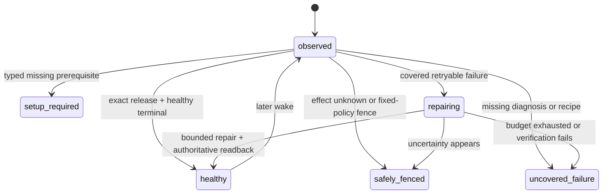

# Fourteen-Loop Self-Healing Foundation Implementation Plan

> **For agentic workers:** REQUIRED SUB-SKILL: Use `superpowers:executing-plans` to implement this plan task-by-task. Steps use checkbox (`- [ ]`) syntax for tracking.

**Goal:** Make all fourteen Product Loops share one observable, bounded self-healing control plane that diagnoses and recovers covered failures without Codex, without waiting for revenue and without touching the separately owned Paid fulfillment runtime.

**Architecture:** Keep `config/product-loop-catalog.json` as the only Product Loop catalog and `lm-loop` as the only runtime operator surface. Extend the existing runtime event/status contract, reuse the existing recovery-intent policy and supervisor, and project a separate foundation/recovery gate from the same rows used by commercial completion. Covered deterministic repairs stay owner-scoped; code-fix candidates flow through the existing isolated self-build PR/guard/release path. Promotion requires exact post-repair readback and sibling isolation. Commercial receipts remain a separate later gate.

**Tech Stack:** Python 3 runtime/CLI contracts, Node.js CommonJS and ESM control-plane modules, `node:test`, Python `unittest`/`pytest`, immutable Git releases, existing `lm-loop` and `launchctl-safe` boundaries.

**Spec:** `docs/superpowers/specs/2026-09-15-life-manager-agent-architecture-refinement.md`, “The operating order is a control loop” through “Fresh fourteen-loop foundation baseline”.

## Global constraints

- Tasks 1–8 are merged through PR #5821 at main SHA `60c1e93e6d1056fee9f2705f4a9cf25f0de52bc2`. Task 9 uses only `/private/tmp/lm-recovery-owner-20260924`, its current result branch, and the `codex-root` worktree lease. Shared-owner scheduling is merged through PR #5822 and its control-plane admission classification through PR #5823.
- Never modify or operate the separate Paid fulfillment worktree/branch, Paid source/tests/config/state/effect fences, Paid provider sessions/tabs, Coconala project `18211957`, or Paid runtime owners. Their health and receipts are read-only inputs.
- Do not wait for Affiliate commission, application acceptance, contract, order, payout or any other natural business event. Foundation acceptance proves execution, diagnosis and recovery; commercial completion remains separate.
- Do not create a second loop registry, scheduler, release mechanism, evaluator platform or browser owner. Extend the catalog, runtime event, `lm-loop`, recovery modules, completion projections and guarded self-build path already present.
- `effect_unknown` is not retryable. No recovery recipe may resend, submit, publish, trade, pay, apply, deliver or reconcile an external effect without the existing owner-specific official receipt contract.
- Fixed policy, identity, evidence rules, credentials, permissions, spend caps, evaluator and protected paths are outside self-modification authority.
- Every task is test-driven. A failing regression test precedes the minimum implementation; run the focused tests after each task and commit/push before proceeding.

## Acceptance state model

Local foundation acceptance permits `healthy`, `setup_required` and `safely_fenced` only when each row has an exact typed reason and next action. It rejects `repairing`, `uncovered_failure`, missing jobs, release drift and opaque terminal results. It does not require a commercial receipt.

---

### Task 1: Separate foundation acceptance from commercial completion

**Status:** Complete on the implementation branch. The commercial gate is unchanged; the new foundation
projection and CLI pass 44/44 focused tests. A read-only live projection returns
`uncovered_failure=14` (thirteen release-drift loops plus Connector terminal failure) without consulting
revenue or changing production state.

**Files:**
- Modify: `apps/life-manager/lib/product-onboarding.js`
- Modify: `apps/life-manager/lib/product-onboarding.test.js`
- Create: `apps/life-manager/scripts/local-foundation-gate.js`

**Contract:**
- Keep `product.loop.completion.v1` and `evaluateLocalCompletionGate()` unchanged as the commercial gate.
- Add `product.loop.foundation.v1`, `buildProductLoopFoundationManifest()` and `evaluateLocalFoundationGate()` over the same catalog and runtime rows.
- Closed foundation states: `healthy`, `setup_required`, `safely_fenced`, `repairing`, `uncovered_failure`.

- [x] Write failing tests proving a no-revenue, exact-release, healthy runtime passes the foundation gate but still fails commercial completion.
- [x] Add failures for missing catalog jobs, release drift, opaque failures, untyped setup/fence rows and `repairing` rows.
- [x] Add pass cases for typed `setup_required` and `safely_fenced`; prove `effect_unknown` cannot become `healthy`.
- [x] Implement the minimum shared projection and CLI; do not duplicate catalog or runtime indexing logic.
- [x] Run `node --test apps/life-manager/lib/product-onboarding.test.js` and focused CLI tests.
- [x] Commit and push the gate split.

### Task 2: Complete the shared runtime diagnostic envelope

**Status:** Complete on the implementation branch. Old v1 rows remain valid. New terminal rows carry the
all-or-nothing diagnostic group, while raw argv/env and credentials never enter the event. Contract/runtime
tests pass 87/87 and runner-bound tests pass 80/80.

**Files:**
- Modify: `runtime/loop/runtime_event.py`
- Modify: `runtime/contracts/common-record.schema.json`
- Modify: `runtime/contracts/test_common_contracts.py`
- Modify: `runtime/loop/tests/test_runtime_event.py`
- Modify: `runtime/loop/lm_loop_run.py`
- Modify: `runtime/loop/tests/test_lm_loop_run_bounds.py`

**Contract:**
- Preserve existing v1 readers while adding bounded optional diagnostic fields or introduce a versioned v2 with an explicit v1 projection; choose the smaller backward-compatible path after the RED tests.
- Required observable identity: `product_loop_id`, `job_id`, `owner_id`, `run_id`, `wake_id`, `occurrence_id`, `release_sha`, phase, exit code, effect class/status, provider receipt/readback ref, evidence refs, failure layer, error class, retryable and next action.
- Loaded command/environment identity is a secret-free digest plus allowlisted metadata, never raw secrets or private paths.

- [x] Write failing validation tests for exact identity, secret rejection, malformed occurrence/receipt refs and typed terminal diagnosis.
- [x] Write failing runner tests proving claimed occurrence and entrypoint outcome reach the terminal event.
- [x] Implement the minimum envelope and builders, keeping install/start/terminal events valid.
- [x] Update the common JSON schema from the same closed enums and prove schema/runtime parity.
- [x] Run the focused runtime-event, contract and runner-bound tests.
- [x] Commit and push the diagnostic envelope.

### Task 3: Expose the full diagnosis through the existing `lm-loop` status

**Status:** Complete on the implementation branch. The existing status row now projects catalog Product Loop
identity plus every terminal diagnostic field, and marks old/incomplete events explicitly. Read-only/runtime
tests pass 51/51, registry tests pass 82/82 and foundation/product tests pass 45/45. The fresh local gate still
blocks all fourteen loops for foundation reasons, not commercial revenue.

**Files:**
- Modify: `runtime/loop/lm_loop.py`
- Modify: `runtime/loop/tests/test_lm_loop_readonly.py`
- Modify: `apps/life-manager/lib/product-onboarding.js`
- Modify: `apps/life-manager/lib/product-onboarding.test.js`

- [x] Write a failing read-only status test for every diagnostic field required by Task 2.
- [x] Prove older events remain visible but classify as `uncovered_failure` when required diagnosis is absent.
- [x] Project product-loop identity from the catalog without renaming the registry job identity.
- [x] Make the foundation manifest consume these rows and report exact missing fields instead of `unknown`.
- [x] Run the focused read-only status and foundation tests.
- [x] Commit and push the status projection.

### Task 4: Emit one durable recovery intent for every shared-runner failure

**Status:** Complete on the implementation branch. Normal shared-runner failures call the existing JavaScript
classifier through one narrow CLI seam; Python contains persistence/identity checks, not a second policy table.
Intent identity includes owner, occurrence and immutable release. Queue append is private, locked and replay-zero.
Success/admission/setup states do not enqueue, unknown effects become a non-retryable hold, and `critical_paid`
or Paid-owner entrypoints remain read-only and never enter this recovery queue. Recovery tests pass 13/13,
runner bounds pass 83/83 and neighboring runtime tests pass 82/82.

**Files:**
- Modify: `runtime/loop/recovery-intent.mjs`
- Modify: `runtime/loop/recovery-intent-record.mjs`
- Modify: `runtime/loop/lm_loop_run.py`
- Modify: `runtime/loop/__tests__/recovery-intent.test.mjs`
- Modify: `runtime/loop/__tests__/recovery-intent-record.test.mjs`
- Modify: `runtime/loop/tests/test_lm_loop_run_bounds.py`

- [x] Write failing tests that a normal `lm_loop_run` terminal failure emits exactly one owner/occurrence/release-bound intent.
- [x] Prove success, admission deferral and duplicate event replay do not enqueue duplicate repair work.
- [x] Prove `effect_unknown` becomes a hold with `mutates_external_effect=false`; setup/admission states do not enqueue and Paid ownership remains read-only outside the queue.
- [x] Reuse one recovery classifier; do not fork Python and JavaScript policy tables. Add only a narrow JSON CLI seam around the existing pure classifier.
- [x] Append atomically to the existing private recovery queue and keep event/intent evidence cross-referenced.
- [x] Run the focused intent and runner tests.
- [x] Commit and push universal intent emission.

### Task 5: Close recovery with outcome, readback, budget and replay-zero

**Files:**
- Modify: `runtime/loop/recovery-apply-plan.mjs`
- Modify: `runtime/loop/recovery-executor.mjs`
- Modify: `runtime/loop/recovery-supervisor.mjs`
- Modify: `runtime/loop/__tests__/recovery-apply-plan.test.mjs`
- Modify: `runtime/loop/__tests__/recovery-executor.test.mjs`
- Modify: `runtime/loop/__tests__/recovery-supervisor.test.mjs`
- Inspect only at this task: the recovery consumer is implemented as `recovery-supervisor-cli.mjs`. Production ownership is verified separately in Task 9 instead of being inferred from a similarly named release reconciler.
- Leave every Paid registry row unchanged.

- [x] Write failing tests for attempt budget, cooldown, same-owner/same-release binding and duplicate-intent replay-zero.
- [x] Add a versioned `recovery_outcome` record with action, before/after event IDs, exit/result, readback, evidence and next action.
- [x] After an allowed reconcile, read `lm-loop status <job>` and accept recovery only when the exact owner/release is healthy; otherwise retain the failure and stop within budget.
- [x] Prove a sibling owner and every Paid owner are never selected or mutated.
- [x] Run all recovery module tests plus registry contract tests: recovery 28/28, registry 82/82 and read-only status 18/18 pass.
- [x] Commit and push the closed deterministic recovery loop.

### Task 6: Route uncovered code failures into the guarded self-build path

**Files:**
- Modify: `apps/life-manager/scripts/life-manager-dev-d0.sh`
- Modify: `apps/life-manager/lib/self-build-daily.js`
- Modify: `apps/life-manager/lib/dev-merge-guard.js`
- Modify: corresponding existing tests under `apps/life-manager/lib/`
- Modify: `runtime/agent-runner/config.json`, `runtime/agent-runner/agent_runner.py` and focused route tests
- Modify: `skills/earn/marketing-engine/run_agent.sh`
- Create: `apps/life-manager/lib/recovery-self-build-bridge.js`
- Create: `apps/life-manager/lib/recovery-self-build-bridge.test.js`

- [x] Write failing tests for a sanitized recovery outcome becoming one deduplicated `lm:type:self-heal` issue with exact owner/release/evidence refs.
- [x] Expand the isolated candidate scope only as required for shared runtime files; keep credentials, state, policy, evaluator, guard and Paid paths protected.
- [x] Require a retained regression fixture plus focused tests before the producer may open a marked PR.
- [x] Keep issue/candidate/review contracts distinct and fail every marked recovery PR closed before merge until Task 7 proves, and Task 8 binds, the separate immutable-release, canary, exact-health and rollback stages. The existing Railway-only app deploy check is not reused as false runtime proof.
- [x] Prove the candidate agent is Codex-only, workspace-write and network-disabled; it cannot edit its own guard/evaluator or directly push main/deploy around the guard.
- [x] Run the existing self-build/merge-guard/bridge tests (158/158), recovery tests (29/29) and agent-runner tests (76/76).
- [x] Commit and push the guarded code-repair bridge.

### Task 7: Prove one safe end-to-end recovery canary

**Files:**
- Create: `runtime/loop/fixtures/self-heal/` fixture files only as required
- Modify: existing recovery and foundation tests
- Modify: architecture spec evidence section after the run

- [x] Select canonical `life-manager-connector-native`: non-Paid, `effect_class=none`, deterministic and catalog-owned by Connector.
- [x] Inject `wake_boundary_failed` only in a test-owned installation; no production agent, browser, network, authentication service or Paid owner is stopped/restarted.
- [x] Demonstrate event -> typed intent -> bounded repair -> exact status readback -> recovery outcome -> replay-zero.
- [x] Demonstrate a forced verification failure stops within cooldown/budget; the real `install_one` snapshot rollback restores the target byte-for-byte and leaves the sibling byte-for-byte unchanged.
- [x] Retain both the success and forced-failure paths as regression fixtures.
- [x] Record exact evidence and commit/push. Node recovery is 32/32 and the real-installer canary is 1/1. This is isolated foundation proof, not a production Connector repair or production-wide acceptance.

### Task 8: Enrol all fourteen Product Loops through shared classes

**Status:** Complete on the implementation branch. The canonical Product Loop catalog declares one sorted
set drawn from six closed recovery classes while the runtime registry remains the single source for job
attributes. After registering the shared recovery owner in Task 9, the contract derives every job's class,
maps 98 catalog jobs once across 14 loops, validates all 168 registry jobs, and reports zero duplicate
mappings or errors. Six retained fixtures exercise the shared
classifier and intent policy. Paid owners derive to `read_only_external_owner` and are rejected before local
queue selection or plan construction. Marked recovery PRs now carry their registry-derived class; the old
boolean promotion bypass is removed. Every class remains explicitly `unbound` for production PR promotion
until a separate loop-runtime path actually invokes immutable release, isolated canary, exact-health and
rollback hooks; the Railway application deploy path is not reused. Recovery tests pass 36/36,
foundation/guard/self-build/catalog tests pass 197/197, the real-installer rollback canary passes 1/1, and the
current catalog contract reports 14 loops, 98 mapped jobs, 168 registry jobs, zero shared jobs and zero errors.

**Files:**
- Modify: `apps/life-manager/config/product-loop-catalog.json`
- Modify: catalog/contract tests
- Create or modify only shared recovery fixture metadata; do not change Paid implementation files.

- [x] Add one closed recovery class declaration per Product Loop: deterministic, model, browser, continuous service, external-effect owner, or read-only external-owner.
- [x] Map every declared job exactly once and reject missing/duplicate/unrecognized recovery classes.
- [x] Add at least one retained failure fixture per class, not one new supervisor per loop.
- [x] Classify Paid jobs as read-only external-owner and consume only their status/receipt projections.
- [x] Bind marked recovery PR promotion to the declared class policy only where immutable release, isolated canary, exact-health and rollback hooks exist; keep the Railway app path separate and unsupported classes fail-closed. No class currently claims a production hook bundle, so all remain closed rather than inheriting Railway proof.
- [x] Run catalog, registry, foundation and recovery suites; require fourteen loops and zero catalog/registry errors.
- [x] Commit and push fourteen-loop enrolment.

### Task 9: Pass local foundation acceptance

**Status:** Current task. Revenue, conversion, commission and natural-business-event waits are not gates. Capafy,
Self-build, Investment and Fundraiser are locally accepted. Mobile Apps is actively repairing under its existing
Postiz canary owner, Affiliate retains one confirmed-effect official-readback fence, and the next non-conflicting
Product Loop cursor is Writer.

Affiliate diagnosis reaches the shared release boundary. One historical run succeeds while releasing older
occurrence `affiliate-loop:18d6048b69d38938-35148`, then hits a SQLite lock during next-owner reservation. The
current fence `affiliate-loop:18d7bd776d9c8a78-1576` is a later FIFO occurrence and cannot inherit the older
run's evidence. The shared source fix is test-driven: release and next-owner reservation are one transaction,
the retiring claim alone is excluded from capacity accounting, and only BUSY/LOCKED plus `control_busy` receive
bounded retry. Focused regressions pass 2/2 and full admission/runner tests pass 217/217. PR #5844 merges at
`091ec4d59b78c685b32eb8b707f5ac357cf14786`; complete immutable release
`20260924T190842-091ec4d5` is active and only Affiliate is reconciled to it. Its immediate wake preserves the
fence and performs no provider entrypoint. No Paid owner, Connector, Postiz owner or provider state is changed.

The target now has an exact proof window. Its immediate FIFO predecessor
`affiliate-loop:18d7bd64cdd76c40-680` reports pass at `2026-09-23T08:38:43.386976Z`; the adjacent next runtime
pair stops at `host_admission_deferred:resource_effect_unknown` at `2026-09-23T08:56:06.001927Z`. The target was
already queued, no older Affiliate occurrence remains open, and the Affiliate job, child-run and tool-attempt
journals each contain zero overlapping rows. A narrow reconciler and nine regression tests return
`PROOF_READY` against production read-only data. PR #5847 merges it with the existing atomic queued/reserved wake
coalescing at `19d04a3469ea44f9b5e48bbd613aee21cbab295a`; release `20260924T193337-19d04a34` repeats the same proof.
The exact occurrence becomes released/effect-known, Affiliate unknown becomes zero and its 0600 receipt is
`RESOLVED`. Two exact-release base-loop wakes stop pre-entrypoint at retryable FIFO wait without growing the
48 queued occurrences.

The three continuous Affiliate browser owners then load the exact release and remain running, but status keeps
their old terminal reports because it ignores current execute events. This is a shared continuous-observability
gap, not three provider repairs. The current test-driven candidate emits complete diagnostic identity at start,
selects a running event only when bound to the live launchd PID, and classifies explicit pre-effect FIFO/capacity
deferral with admission unknown false separately from provider effect unknown. Runtime/status/runner tests pass
126/126, the full runtime suite passes 622 tests plus 522 subtests, and the foundation suite passes 47/47.
Integration, release-owned readback, the two deterministic
Affiliate owners and final two-pass Affiliate foundation evidence remain; revenue and natural time do not.
Tasks 1–8 are merged by PR #5821 at `60c1e93e6d1056fee9f2705f4a9cf25f0de52bc2`; complete immutable release
`20260924T134241-60c1e93e` is active with `release_paths=ALL` and
`provenance=ancestor-of-origin-main`. A fresh read-only caller audit then found zero registry owners and zero
production callers for `recovery-supervisor-cli.mjs`: failures can emit durable intents, but no scheduled
owner consumes them. This is an implementation gap, not a revenue wait and not permission to repair fourteen
loops manually.

The follow-up adds exactly one shared owner, `life-manager-recovery-supervisor`, at a 60-second cadence. It is
`effect_class=none`, deterministic, consumes at most one intent per wake, rejects every Paid fulfillment owner,
and belongs once to the existing `self-build` Product Loop. RED reproduced the missing registry owner. GREEN
passes 23 recovery tests, 200 registry/apply tests with 174 subtests, and the catalog contract at 14 loops,
168 registry jobs, 98 mapped jobs, zero duplicate mappings and zero errors. PR #5822 is merged at
`b5855ae558ecc94a7405439be1da5a89cefd987b`; complete release `20260924T135557-b5855ae5` is active and the
single owner is loaded on that exact SHA.

The first immediate production canary does not reach the queue consumer. It ends before entrypoint with typed
`host_admission_deferred:resource_control_busy`, exit 75, while multiple ordinary data-plane owners held the
shared admission control lock. The shared release reconciler, disk cleanup and healthcheck already bypass that
lock, but the new recovery supervisor was omitted from the same safety-owner set. RED reproduced that omission;
the minimum fix adds only this owner to the existing control-plane exemption. Runner bounds pass 83/83 and
recovery remains 23/23. PR #5823 is merged at `188dcb53cd513679e21f7e25d1a422ddf20a6e86`, and complete release
`20260924T140650-188dcb53` is available.

The next targeted reconcile correctly refuses to replace the loaded owner because seven wakes created by the
old release remain as `queued` occurrences. They are all effect-free, unclaimed and unreserved, but the old
apply guard knows only how to rebind ordinary data-plane policy and returns `skipped_pending`. Manual SQL or
deleting the queue would discard audit history and leave the same migration bug for the next control-plane
owner. The current RED→GREEN slice therefore adds one atomic migration: a loop newly classified as a
control-plane safety owner may close only effect-free queued occurrences as `cancelled`, retain their history,
and remove the queue row. Any claim, active reservation or `effect_unknown` remains fenced. The runner and
apply paths consume one shared safety-owner set. Admission 127/127, apply 119/119 plus 31 subtests, runner
83/83 and recovery canary 1/1 pass locally. PR #5824 is merged at
`e00ce6f732da34ea1eb27e86a774d22a52866c7c`; complete release `20260924T142850-e00ce6f7` is active. Targeted
reconcile applies only the supervisor, preserves all 24 accumulated old occurrences as `cancelled`, and leaves
its queue, priority and reservation rows empty.

The next bounded wake reaches the new release but exits 127 before the supervisor CLI: launchd's narrow PATH
cannot resolve the JavaScript shebang's `node`. The same missing runtime identity also prevents a failed owner
from invoking the recovery-intent classifier, so this is a shared self-healing transport defect rather than a
supervisor-only issue. RED proves that a `.mjs` entrypoint and the classifier both fail when PATH is
`/usr/bin:/bin`. The minimum GREEN projects one absolute `LIFE_MANAGER_RUNTIME_NODE` through every managed
plist and uses it for JavaScript entrypoints and recovery classification. Apply passes 119 tests plus 31
subtests, runner passes 84/84, the live catalog contract remains 14/168/98 with zero errors, and the OSS
boundary passes. PR #5825 merges the fix at `1f03abd4150278b234edbb28e5b9cca17dc9d867`; complete release
`20260924T144407-1f03abd4` is active. A supervisor-only apply loads that exact release and
`LIFE_MANAGER_RUNTIME_NODE=/opt/homebrew/bin/node`. Two bounded wakes both exit 0 with
`idle/no_pending_intent`; the intent and recovery journals remain absent, Paid selection and external effect are
zero, and official `lm-loop status` reports `diagnostic_complete=true`, terminal `pass`, clean failure layer and
next action `none` for event `07b2bee7499be44ba7b2c07e`.

**Execution-order correction:** The previous text assumed the release reconciler already called the recovery
consumer. Repository search and registry readback disprove that assumption. The shortest safe order is now:
register and test one shared owner -> integrate it once -> cut and activate its exact main release -> load only
that new owner -> remove its observed data-plane admission dependency through the existing safety exemption ->
atomically close its old effect-free queue history -> reapply only that owner -> kickstart one bounded wake ->
pin the shared Node runtime observed missing at that wake -> kickstart one bounded wake -> verify one eligible
non-Paid repair or idle receipt -> then reconcile the remaining non-Paid fleet and run the 14-loop foundation
gate twice. The Node-corrected idle receipt now passes. A fresh gate observes all 14 Product Loops with zero
missing mapped jobs, but remains `block`: 97 mapped jobs have release mismatch, 90 are diagnostically
incomplete and 49 expose unknown-effect runtime rows. The current cursor is explicit, bounded release alignment
of non-Paid owners only; this does not authorize touching the separately owned Paid runtime.

The first one-owner alignment canary targets `life-manager-dev` in Self-build. It safely returns
`skipped_pending` twice with zero mutation. Read-only admission evidence shows 19 queued occurrences, all
effect-free, with zero claimed occurrences, effect-unknown rows or live reservations. The actual boundary is
canonical registry enrollment: this legacy owner omits `resource_class`, `admission_class` and `priority`, so
the existing reconciler correctly refuses to infer a migration policy. The minimum candidate declares the
already-effective runner defaults for all four Self-build jobs (`deterministic` or `agent`, `borrow`, `support`)
without changing runner logic or weakening any fence. Apply passes 119/119, runner 84/84, registry 82/82 and
the catalog contract remains 14/168/98 with zero errors. PR #5826 integrates the contract at
`0468d61bb99d5f2d963f03bebab5b7c7a0974d8f`; complete release `20260924T151348-0468d61b` is active.
`life-manager-dev` and `self-improve-evolve` then reconcile individually to the exact release while remaining
loaded-idle, and their 19 and 58 queued occurrences remain effect-free.

`life-manager-selfbuild` first defers behind a live reservation. After that lease expires, an old
2026-09-22 occurrence is recovered by a natural run from the still-loaded old release. The entrypoint passes,
but the stale-recovery path leaves that released occurrence `effect_unknown=1`; the next reconcile correctly
refuses mutation. This is not an external-effect ambiguity because the registry contract is
`effect_class=none`. The existing `clear_no_effect_unknown()` primitive already closes exactly this state, but
the release reconciler does not call it. The minimum candidate connects that existing primitive only after a
loaded-idle readback and only for a no-effect owner, then retries the same rebind once. The new regression and
the full apply suite pass 120/120 and runner bounds pass 84/84. PR #5827 merges the fix at
`7cbc861929cd75ef7a6ad08ad05b24ab35b100ff`; complete release `20260924T152741-7cbc8619` is active. The
production retry clears only the released no-effect fence through that runtime path, preserves nine queued
occurrences, and moves `life-manager-selfbuild` to the exact release with unknown 0. `life-manager-dev`,
`life-manager-recovery-supervisor` and `self-improve-evolve` are then reconciled individually. All four
Self-build owners are loaded-idle on the exact SHA with unknown 0; queue counts remain 19/0/9/58.

The post-slice shared readback is still a foundation block, as expected for an unfinished fourteen-loop
rollout. `lm-loop doctor` reports 168 registry entries with missing entrypoints 0, unmanaged labels 0 and
installed retired labels 0. Immediate targeted wakes produce current-release, complete diagnostics for all
four Self-build owners without waiting for revenue. The supervisor passes; `life-manager-dev`,
`life-manager-selfbuild` and `self-improve-evolve` return the same typed transient backpressure contract:
`host_admission_deferred:resource_capacity_busy`, retryable true, next action `retry_after_eligibility`,
effect none and unknown 0. This removes Self-build release drift and reduces the aggregate to 92
release-mismatch jobs and 87 diagnostic-incomplete jobs, while unknown-effect jobs remain 49.

The existing foundation evaluator nevertheless labels any non-pass terminal `uncovered_failure`, contradicting
its own acceptable `safely_fenced` state. The minimum candidate recognizes only the complete transient tuple
above as `safely_fenced/runtime_capacity_deferred`; missing fields, non-retryable rows, external effects and
mixed failures remain fail-closed. Product/foundation tests pass 46/46, repository CI is green, and PR #5829
merges at `9503276595fc778740c08b6938325e15e52b548d`.

The first main readback does not stay safely fenced because a later natural supervisor wake is a real failure.
It consumes Connector intent `32fd477f478f6511410ff4c4c329fcf9` and safely stops at
`release_sha_mismatch`: the intent belongs to event SHA `1f03abd4150278b234edbb28e5b9cca17dc9d867`, while the
installed Connector plist is `7cbc861929cd75ef7a6ad08ad05b24ab35b100ff`. The supervisor's own exit-1
terminal is then classified into a new recovery intent. Repeated wakes claim those self-intents, return
`healthy_readback_pending` with unchanged before/after event IDs, and produce another self-intent. The strict
capacity projection correctly fails this mixed state closed. This recovery-owner self-recursion is the current
cursor; it must be fixed once in the shared healer before any additional per-loop alignment.

Candidate `5e2275d977` prevents new self-intent emission, terminally drains one persisted self-intent per wake
without executing a reconcile or spending budget, and refuses self-reconcile plan construction as a final
guard. Recovery tests pass 36/36, runner bounds pass 84/84, apply/registry tests pass 202 tests plus 174
subtests, and foundation/catalog tests pass 65/65. A candidate CLI probe against temporary copies of the live
queue/journal closes pending self-intent `fa82ab50703c57ea6540cb35b93576f8` as
`skipped/supervisor_self_recovery_excluded`, appends exactly one journal row and leaves production unchanged.
PR/CI/main integration and the production drain/readback remain open.

Connector is not accepted as healthy. Its installed plist remains on `5b8e3c3b...` after `current` advances to
`208b0a36...`; the latest complete status is `entrypoint_exit_1`, and the underlying run fails at
`browser_open`. Host evidence shows Google Chrome owns IPv4 `127.0.0.1:9222` while managed Cloak
Chromium owns IPv6 `[::1]:9222`; Connector is pinned to the IPv4 endpoint and receives HTTP 404. The shared
browser guard also uses curl without fail-on-HTTP-error and therefore misreports that 404 as `ALIVE`, which is
why the outward report collapses to `circuit_open/wake_boundary_failed`. An existing locked, separately owned
candidate branch contains the shared endpoint-owner validation and recovery fix through `e96e8c422d`; it is
pushed and clean, but has no PR. It is therefore not on main, not in a main-derived immutable release, not
loaded and not production-verified. This worktree does not duplicate, merge, apply or restart that shared
browser owner.

The remaining Capafy audit finds a shared backlog cause rather than four independent implementations to repair.
`capafy-loop-daily`, `capafy-outcome-monitor`, `capafy-ig-account-manager` and
`capafy-ig-marketing-daily` are recurring effectful owners but are declared `effect_class=none` and omit wake
coalescing. Their read-only queued counts are 168/8037/1635/71. The existing coalesced claim path closes only one
old queued wake before claiming the current occurrence, so a recurring owner can never drain a legacy backlog.
The retained RED fixture reproduces two old queued wake signals surviving a current coalesced claim. The minimum
shared fix cancels every prior queued, effect-known occurrence for only that owner after the existing unknown
fences pass. It does not touch claimed, released, unknown or sibling-owner history.

Host admission passes 128 tests, runtime-loop passes 532 tests, registry passes 15 tests and the live contract
remains 14 loops / 168 jobs / 98 mapped / zero errors. PR #5835 passes all nine repository checks and merges at
`208b0a36634c60a031b317eb1e3ec596b2faa101`. Complete exact-main release
`20260924T173838-208b0a36` is active with `release_paths=ALL`, `provenance=ancestor-of-origin-main`, doctor
168/168 and the release-owned coalescing regression passing. Cutting the release starts or applies no Capafy,
Paid, Connector or browser owner. The fresh read-only foundation gate is 98 observed, missing 0, release
mismatch 98, diagnostic incomplete 84, unknown 49 and `uncovered_failure` 14. The mismatch increases because
`current` advances before one-owner reconciliation; it is an explicit deployment cursor.

The next slice reuses the same registry, durable admission, coalescing, reconciler and recovery supervisor. It
first declares the four observed effect classes (`publish`, `message`, `account_mutation`, `publish`) and their
already-effective admission policies, with coalescing enabled. It then aligns the already-complete
`capafy-loop-healthcheck` and the three goal monitors, followed by one effectful owner at a time with official
readback and no fence clearing. No replacement orchestration framework or manual admission-database cleanup is
allowed.

**Files:**
- Modify: architecture spec current-state/TODO evidence
- Modify: this plan checkbox/status text

- [x] Build a complete, read-only candidate immutable release from the pushed accepted branch with `LOOPS_ACTIVATE_CURRENT=0`; prove production `current` is unchanged.
- [x] Run `bin/launchctl-safe preflight`; it passes for `gui/501`/Aqua. Registry doctor reports 167 entries with zero missing entrypoints, unmanaged labels or installed retired labels.
- [x] Run the focused acceptance from the immutable candidate itself: recovery 36/36, foundation/guard/self-build/catalog 197/197, real-installer canary 1/1 and live contract 14 loops/zero errors.
- [x] Create the foundation PR, require repository CI, merge Tasks 1–8 to main, and record exact merge SHA `60c1e93e6d1056fee9f2705f4a9cf25f0de52bc2`.
- [x] Cut and activate complete immutable release `20260924T134241-60c1e93e`; prove `release_paths=ALL` and `provenance=ancestor-of-origin-main`.
- [x] Audit the live scheduling seam and reproduce the missing recovery consumer owner with a RED contract test; do not mistake intent emission for autonomous consumption.
- [x] Add one shared recovery supervisor owner and map it once to `self-build`; keep Paid owners rejected and unchanged. Focused recovery, registry/apply and catalog contracts pass.
- [x] Push the shared-owner branch, require all ten repository checks, merge PR #5822 once at `b5855ae558ecc94a7405439be1da5a89cefd987b`.
- [x] Cut and activate complete immutable release `20260924T135557-b5855ae5`; prove `release_paths=ALL` and `provenance=ancestor-of-origin-main`.
- [x] Apply only `life-manager-recovery-supervisor` through `launchctl-safe`; loaded argv and installed SHA are exact `b5855ae558ecc94a7405439be1da5a89cefd987b`; no Paid owner is started/restarted.
- [x] Kickstart the first bounded supervisor wake and retain its typed failure evidence: it never reaches the queue consumer because data-plane admission returns `resource_control_busy`/75. Do not call this self-healing success.
- [x] Add a RED→GREEN regression and the minimum existing control-plane exemption for the shared supervisor. Runner bounds pass 83/83; recovery passes 23/23.
- [x] Push/CI/merge the admission fix as PR #5823 at `188dcb53cd513679e21f7e25d1a422ddf20a6e86`, then cut complete exact-main release `20260924T140650-188dcb53`.
- [x] Reproduce the second canary boundary: targeted reconcile returns `skipped_pending`; seven old occurrences are queued, effect-free, unclaimed and unreserved.
- [x] Add the atomic control-plane queue migration and regression tests. Preserve cancelled occurrence history and refuse claim, reservation or effect unknown.
- [x] Push/CI/merge the queue migration as PR #5824 at `e00ce6f732da34ea1eb27e86a774d22a52866c7c`, cut complete release `20260924T142850-e00ce6f7`, and reapply only the shared supervisor.
- [x] Verify queue migration in production: 24 old occurrences are `cancelled`; queue, priority and reservation rows are zero; loaded argv/SHA are exact.
- [x] Kickstart one bounded wake and retain the next typed boundary: entrypoint exits 127 because launchd cannot resolve `node`; no intent, Paid selection or external effect occurs.
- [x] Add RED→GREEN shared Node runtime identity for every managed plist, JavaScript entrypoint and recovery classifier. Apply passes 119 plus 31 subtests; runner passes 84/84.
- [x] Push/CI/merge the Node runtime fix as PR #5825 at `1f03abd4150278b234edbb28e5b9cca17dc9d867`, cut complete release `20260924T144407-1f03abd4`, and reapply only the shared supervisor.
- [x] Kickstart the Node-corrected bounded supervisor wake twice. Both exit 0 with `idle/no_pending_intent`; exact loaded SHA and pinned Node read back, Paid selection/external effect/sibling mutation are zero.
- [ ] Apply/reconcile only the remaining shared non-Paid foundation owners through `launchctl-safe`; do not start/restart Paid owners.
- [x] Run the first Self-build one-owner canary and retain the safe `skipped_pending` result plus exact admission evidence; no owner is reloaded.
- [x] Add the missing explicit admission contract to the four Self-build registry jobs using their existing runtime defaults; focused suites and the 14-loop catalog contract pass.
- [x] Integrate the Self-build registry enrollment as PR #5826 at `0468d61bb99d5f2d963f03bebab5b7c7a0974d8f` and activate complete release `20260924T151348-0468d61b`.
- [x] Reconcile `life-manager-dev` and `self-improve-evolve` individually to the exact release; retain loaded-idle and all effect-free queued occurrences.
- [x] Diagnose the remaining `life-manager-selfbuild` refusal to one released no-effect stale occurrence; do not clear the fence manually or retry blindly.
- [x] Integrate the idle/no-effect reconciler connection to the existing `clear_no_effect_unknown()` primitive as PR #5827 at `7cbc861929cd75ef7a6ad08ad05b24ab35b100ff`, activate complete release `20260924T152741-7cbc8619`, and retry only `life-manager-selfbuild`.
- [x] Verify the production self-heal: released no-effect unknown 1→0, queued occurrences stay 9, reservation 0, exact installed SHA, loaded-idle, and no manual database mutation.
- [x] Reconcile all four Self-build owners individually to the same exact SHA; unknown remains 0 and queue counts remain 19/0/9/58.
- [x] Generate immediate current-release terminal diagnostics for all four effect-free Self-build owners; release drift becomes zero for the loop and all rows are complete/unknown-free.
- [x] Diagnose the remaining Self-build failure classification as evaluator drift: three owners are typed, retryable capacity deferrals behind shared FIFO reservations, not broken executions.
- [x] Integrate the strict capacity-deferral-to-`safely_fenced` projection as PR #5829 at `9503276595fc778740c08b6938325e15e52b548d`; retain fail-closed behavior for mixed failures.
- [x] Reproduce and fix the shared recovery-supervisor self-recursion in pushed candidate `5e2275d977`: the runner does not enqueue it, one old self-intent becomes terminal skipped per wake, and the plan compiler cannot reconcile it.
- [x] Integrate the self-recursion fix through PR/CI/main as PR #5830 at `25cd0141f9b867cb15c3538d1d0ad9c78f010894`, activate complete release `20260924T161321-25cd0141`, apply only the loaded-idle supervisor, drain its pending self-intents 14 -> 0 with the unique total fixed at 22, and prove exact-SHA replay-zero in wake `9955a84a526f12f2091c451d`.
- [x] Immediately trigger one safely eligible non-self, non-Paid recovery and prove it reaches an authoritative exact-release terminal and replay-zero; do not wait for a natural schedule, and preserve the old Connector intent and every effect fence. `capafy-goal-monitor` was the single selected effect-free owner: it was applied from old release state to exact current `d4fe0819931c50caaf41f25e86f1052cd8a0359c`, its live wake first deferred at typed `resource_capacity_busy`/75, then reached `loaded-idle`/`pass`/exit 0 with exact installed/event SHA, complete diagnostics, `effect_status=not_applicable`, admission unknown false and no provider receipt. A second targeted reconcile returned `eligible=0` and the same event/occurrence, proving replay-zero.
- [x] Perform the 2026-09-25 JST eligibility audit before triggering that canary. The loaded recovery supervisor is exact-current `2f809c8621d9c6d92d96c68c01e2c99da8aea3eb`, but the durable queue initially had no non-self intent on that release that this workstream could safely execute: the current Connector intent is separately owned, while Agent Economy and the remaining candidates pointed to older releases. Read-only supervisor evidence recorded `healthy_readback_pending` for Connector and `release_sha_mismatch` for Agent Economy; no provider/browser/wallet effect was run. The later Capafy owner alignment created one eligible exact-release effect-free target, which was consumed by the canary above; no intent was forged and no revenue wait was used.
- [ ] Consume the separately owned Connector CDP fix only after its owner publishes an accepted main commit; the current pushed `e96e8c422d` has no PR and is not merged/released/loaded/production-verified. Do not duplicate its branch or restart the shared browser from this worktree.
- [x] Read the first post-supervisor `lm-loop doctor`, `lm-loop status all`, foundation manifest and recovery journal. The gate sees all 14 loops and zero missing mapped jobs, but blocks on 97 release mismatches, 90 incomplete diagnostics and 49 unknown-effect rows; no recovery journal is created by the idle wakes.
- [x] Re-read `lm-loop doctor`, `lm-loop status all` and the foundation manifest after current-release wakes: 14/14 observed, missing 0, release mismatch 92, diagnostic incomplete 87, unknown 49. The candidate projects safely fenced 1 and uncovered failure 13; the overall gate correctly remains blocked on the other loops.
- [x] Re-read after PR #5829 and the natural supervisor failure: 98 mapped jobs observed, missing 0, release mismatch 90, diagnostic incomplete 87 and unknown 49. All 14 loops are uncovered; Self-build is now a real supervisor terminal failure, not evaluator drift.
- [x] Re-read after PR #5830 and the supervisor replay-zero: 98 mapped jobs observed, missing 0, release mismatch 95, diagnostic incomplete 87 and unknown 49. The newest release is intentionally loaded only for the supervisor, so all 14 loops remain uncovered until the remaining non-Paid owners are aligned and receive current-release diagnostics.
- [x] Reuse the existing admission/reconciliation primitives for the Capafy goal-monitor family instead of adding a second healer: PR #5831 adds the missing deterministic/borrow/support contract, PR #5832 enables the existing queued/reserved-wake coalescing for the base monitor, and PR #5833 applies the same contract to `capafy-goal-monitor-daily-close` and `capafy-goal-monitor-hourly`.
- [x] Close the claimed-only idle/no-effect reconciliation gap through PR #5834 at main `5b8e3c3bba65a99938e30fa43e79dd9716e9433f`; complete release `20260924T170628-5b8e3c3b` is active. The shared reconciler now invokes the existing `clear_no_effect_unknown()` only when the owner is loaded-idle, the registry declares `effect_class=none`, and admission reports `not_queued`; running, unloaded and effectful owners remain fail-closed.
- [x] Verify all three Capafy goal monitors on the exact immutable release: diagnostics are complete, terminal deferral is typed `resource_capacity_busy`, retryable with `retry_after_eligibility`, effect is `not_applicable`, and admission unknown is zero. Repeated immediate wakes preserve queued counts at base 34, daily-close 12 and hourly 190; no queue row, effect fence or provider state is manually edited.
- [x] Re-read the authoritative gate after the Capafy slice: 98 mapped jobs observed, missing 0, release mismatch 93, diagnostic incomplete 84 and unknown 49. The goal-monitor family leaves both Capafy mismatch and incomplete lists; the remaining Capafy release-drift owners are `capafy-ig-account-manager`, `capafy-ig-marketing-daily`, `capafy-loop-daily`, `capafy-loop-healthcheck` and `capafy-outcome-monitor`.
- [x] Diagnose the remaining Capafy backlog at the shared durable-admission boundary: coalesced claim cancels only one old queued wake, while four recurring effectful owners omit coalescing and expose 168/8037/1635/71 queued occurrences. Do not delete admission history or create per-loop healers.
- [x] Integrate the shared all-prior-queued coalescing fix through PR #5835 at main `208b0a36634c60a031b317eb1e3ec596b2faa101`; retain every unknown/effect fence and sibling boundary.
- [x] Activate complete exact-main release `20260924T173838-208b0a36`; verify complete provenance, doctor 168/168 and the release-owned regression. No effectful owner is applied or awakened by the release cut.
- [x] Re-read the exact-current foundation gate: 98 observed, missing 0, release mismatch 98, diagnostic incomplete 84, unknown 49 and all 14 loops uncovered. Record that the mismatch increase is expected until deliberate one-owner reconciliation.
- [x] Declare the observed Capafy effect contracts and existing admission policies for `capafy-loop-daily`, `capafy-outcome-monitor`, `capafy-ig-account-manager` and `capafy-ig-marketing-daily`; enable the existing coalescing contract with RED→GREEN registry coverage. Focused Capafy passes 3/3, registry 82/82, full runtime-loop 532/532, adapter registry 15/15 and live contract 14 loops / 168 jobs / 98 mapped / zero errors.
- [x] Integrate the contract through PR #5838 and all repository CI into main `05d235b46b7c76f27d2aec71e8f30d93b98b4728`; activate complete immutable release `20260924T180152-05d235b4`. Reconcile the no-effect Capafy healthcheck and three goal monitors first, then the four effectful owners individually; Paid and Connector remain untouched.
- [x] Run one immediate bounded wake for every Capafy owner. All eight owners load the exact release and emit complete diagnostics. Healthcheck exits 0/clean; the other seven stop before their entrypoints at typed `resource_capacity_busy` or `resource_fifo_wait`. The four external-effect admission fences remain zero, reservations remain zero and queued counts remain 168/8078/1643/72. No provider effect or receipt occurs, so the existing scheduler owns the next eligible attempt and this foundation cursor advances without waiting for revenue or natural acceptance.
- [x] Re-read the authoritative gate: 14 loops observed, `safely_fenced=1` (Capafy), `uncovered_failure=13`, release mismatch 88, diagnostic incomplete 80 and unknown-effect jobs 0. Capafy has zero release mismatch and zero incomplete diagnostics.
- [x] Align Self-build's three remaining release-drift owners to exact release `05d235b46b7c76f27d2aec71e8f30d93b98b4728`. All four Self-build owners emit complete diagnostics; the supervisor exits 0/clean and the other three return typed retryable capacity deferral before entrypoint, with effect unknown 0 and reservations 0.
- [x] Re-prove the shared supervisor replay-zero with two exact-release exit-0 terminals: recovery storage stays fixed at 27 intents and 66 journal events, so no duplicate intent or recovery action is emitted.
- [x] Re-read the authoritative gate after Self-build: 14 loops observed, `safely_fenced=2` (Capafy and Self-build), `uncovered_failure=12`, release mismatch 83, diagnostic incomplete 80 and unknown-effect jobs 53. Doctor remains clean at 168 entries with zero missing entrypoints, unmanaged labels or installed retired labels.
- [x] Audit Mobile Apps without provider mutation: all 22 jobs are observed; 21 have release mismatch, 21 have incomplete diagnostics and the gate has 20 unknown-effect jobs. Admission holds 344 claimed unknown and 16 released unknown occurrences; no fence is cleared or retried.
- [x] Preserve the two active Mobile/Postiz leases and their JP1 canary contract. PR #5813/#5814 source is already on main; the owning workstream must still prove exact official receipt and replay-zero before staged rollout, so Mobile remains `repairing` rather than falsely closed.
- [x] Integrate the shared atomic final-release and bounded BUSY/LOCKED retry fix through PR #5844 at main `091ec4d59b78c685b32eb8b707f5ac357cf14786`; activate complete release `20260924T190842-091ec4d5`, reconcile only Affiliate and verify the preserved fence prevents provider entrypoint execution.
- [x] Separate the historical lock-failure occurrence from the current Affiliate fence, define the exact FIFO proof window and retain regressions for positive proof, in-window job/child/tool evidence, older-open occurrence rejection, exact resolver binding and private receipt output.
- [x] Run the candidate reconciler read-only against production. It returns `PROOF_READY` for `affiliate-loop:18d7bd776d9c8a78-1576`, predecessor `affiliate-loop:18d7bd64cdd76c40-680`, window `08:38:43.386976Z`–`08:56:06.001927Z`, and job/child/tool counts `0/0/0`.
- [x] Merge the exact Affiliate reconciler plus existing atomic queued/reserved-wake coalescing contract through PR #5847, cut complete release `20260924T193337-19d04a34` and repeat the release-owned dry proof with the same evidence hash.
- [x] Resolve only `affiliate-loop:18d7bd776d9c8a78-1576` through `resolve_pre_effect_occurrence`; its private receipt is 0600/`RESOLVED`, the target is released/effect-known, all Affiliate unknown is zero and no provider action occurs.
- [x] Reconcile the Affiliate base owner and run it twice on the exact release. Both wakes stop before entrypoint at typed retryable `resource_fifo_wait`; queued occurrences stay 48, reservations/unknown stay zero and no duplicate provider effect occurs.
- [x] Reconcile the three continuous Affiliate browser owners to the exact release and diagnose the remaining drift as a shared status bug: live current-release running events exist, but status selects older terminal reports because healthy continuous services do not exit.
- [x] Integrate the PID-bound continuous-running diagnostic and explicit pre-effect admission-deferral projection through PR #5849 at `ff11bb0a2c2ae81af087c687fb6ba3eda049b87b`; cut complete immutable release `20260924T195546-ff11bb0a`. Exact PID-bound, complete running diagnostics pass for all three browser owners, and exact typed capacity deferral passes for composition/source-refresh. Five of six Affiliate owners are aligned without manufacturing exits.
- [x] Diagnose the final `affiliate-loop` base occurrence as a real Telegram effect fence. Its old-release child finishes
  `SUCCEEDED`, claim release fails with ownership mismatch and leaves
  `affiliate-loop:18d83ba82b14fb40-24990` claimed/effect-unknown. The local sender ledger says provider ID
  `92843`, but that ID is not sufficient proof: the official user-MTProto readback with the same body hash is
  message `94637` in `Local Life Manager` at `2026-09-24T11:15:43Z`. The branch-only
  `telegram_effect_reconcile.py` proof requires exact outbox body hash, chat, sender and time window and records
  the ID mismatch; its read-only proof returns `provider_receipt_id=telegram:8613473574:94637` and
  `provider_message_id_mismatch=true`. No admission state or provider message was changed.
- [ ] Promote the Affiliate official-body reconciler in an accepted immutable release, then resolve only
  `affiliate-loop:18d83ba82b14fb40-24990` through that exact provider proof. Require a mode-0600 reconciliation
  receipt, canonical loaded/event SHA, zero remaining Affiliate admission unknowns, base-owner rebind and two
  exact current-release foundation projections with replay-zero. Never use the generic pre-effect resolver and never
  resend the Telegram report.
- [x] Diagnose Investment read-only: one old installed owner, 16 known released, 64 known queued, one released/effect-unknown occurrence, one queue row and no reservation. The sole unknown `alpaca-investment-live:18d5feb0983a54b8-35815` is an exact 0.28-second pre-entrypoint `resource_capacity_busy` terminal with no effect reference.
- [x] Add the shared loaded-idle exact pre-effect reconciler with a private 0600 receipt, fail-closed negative coverage, and Investment's existing `agent/borrow/support` plus wake-coalescing contract. Reconcile/registry tests pass 206/206 with 174 subtests; runtime passes 624 plus 522 subtests and the unrelated CEO timeout passes alone. Production remains unchanged until integration.
- [x] Integrate the shared Investment self-heal through PR #5851 at `209f879ec862a24fa0ed5cd954a7680422905c3a`, activate complete release `20260924T203525-209f879e`, resolve only the exact pre-effect occurrence with a 0600 `RESOLVED` receipt, and coalesce 64 stale effect-known wakes. The first current-release wake exits 0 with Alpaca account `ACTIVE`, equity USD 66.74, orders 4, `NO_TRADE`, unresolved orders 0 and Telegram message `92860`; the immediate replay makes no entrypoint/trade, remains unknown-free and stops safely at typed capacity backpressure.
- [x] Diagnose Fundraiser read-only. Its official Startuped AI `submitted_verified` receipt at `02:13:28Z` is preserved. The sole later unknown `fundraiser:18d5fda7a1962e60-16555` is a separate exact two-event pre-entrypoint `resource_capacity_busy` run with no effect reference; admission is claimed-unknown 1, known queued 10, known released 2, queue row 1 and reservation 0.
- [x] Reuse the shared exact pre-effect reconciler and add only Fundraiser's existing `agent/borrow/support` plus queued/reserved-wake coalescing contract. The RED registry test fails before the declaration; focused tests pass 2/2, full apply/registry passes 207/207, and production dry proof selects exactly the one target. Candidate `d5d4f5ee15` is pushed without production mutation.
- [x] Integrate the Fundraiser contract through PR #5852 at `2ff81f6eb1c0e9fb3160fd4bbe654a5810b8d167`, activate complete release `20260924T205828-2ff81f6e`, reconcile only `fundraiser`, and verify its 0600 `RESOLVED` receipt. The 652-row ledger remains byte-identical with 56 verified submissions; apply plus immediate replay both stop pre-entrypoint at typed capacity backpressure, unknown stays zero, and the exact-release foundation row is `safely_fenced` with no mismatch or diagnostic gap.
- [x] Diagnose Writer read-only as seven independent owners sharing one private state root. All seven have historical `agent/borrow/support` policy but no registry declaration; known queued counts are 402/9/1622/8/89/123/78. Craft and discovery each have one safe effect-free stale claim; response has one exact pre-entrypoint FIFO fence in the rotated private journal; report has one real message effect backed by durable Telegram IDs 89203–89206 and therefore is not a pre-effect fence.
- [x] Add only Writer's observed admission/coalescing contract to all seven owners. The RED test fails for every missing row, focused contract/fixture tests pass 2/2. Extend the shared exact proof to at most four private rotated gzip journals while retaining per-file 50,000-row, owner, mode, link, exact-two-event and no-effect-reference checks; production read-only proof selects response and rejects report. Focused archive/current/negative proof tests pass 3/3 and full apply/registry passes 209/209. Do not change Writer business code.
- [x] Preserve the historical readback for report occurrence `18d69e54e1050578-20866` from the existing user MTProto session. Provider IDs 89203–89206 were previously recorded in the same bot dialog with matching sender/content evidence; preserve those effects and never resend them.
- [x] Re-prove the report effect against the current outbox. The stored IDs 89203–89206 were not the provider-side IDs, but a fresh isolated MTProto readback found exact payload hashes, send times and bot sender for provider messages 90905–90908 in the target dialog. Resolve only `writer-report:18d69e54e1050578-20866` through that proof, write a mode-0600 receipt preserving both ID sets, and never resend.
- [x] Merge and release the Writer contract/proof into production. The source merge is complete in PR #5853 (`73270f2c`); all seven owners are now loaded on current `6e609eba` and one bounded wake per owner is complete with `diagnostic_complete=true`, `admission_effect_unknown=false`, typed pre-entrypoint capacity deferral and no new provider effect. The response archive proof and report official effect proof are both retained.
- [x] Rebind all seven Writer owners to the latest immutable selector `1657972036bddc842682108334e5d30b5e48defe` while loaded-idle. No provider session was restarted; report's historical effect receipt remains preserved.
- [x] Run the effect-free portion of the Writer immediate replay check one owner at a time. `writer-claim-loop`, `writer-money-sync`, `writer-opportunity-discovery` and `writer-sales-measure` stop before entrypoint at typed `resource_capacity_busy` with `effect_status=not_applicable`, `admission_effect_unknown=false` and complete diagnostics; `writer-craft-train` reaches a current-release terminal `pass` with the same no-effect contract. The response owner is also current-release and stops before its application effect at the same typed boundary.
- [ ] Complete the Writer immediate replay check for the effectful owners only after the provider-specific effect fence proves no duplicate message/application can be emitted. `writer-report` remains held by its existing official Telegram readback (90905–90908) and its latest terminal evidence is still historical release `6e609eba`; do not start it merely to manufacture a current event. This remains separate from the final two-pass 14-loop replay-zero gate.
- [ ] Continue the remaining independent non-Paid foundation slices in this order while Mobile remains owned: Agent Economy, CFO and Job Hunter. Do not wait for revenue; accept exact typed `setup_required` or `safely_fenced` states and move to the next slice. Affiliate remains an asynchronous official-readback reconciliation and does not block this cursor.
- [x] Reconcile Agent Economy onto the then-current main-derived release `403e272eb615951b7a125006e2e5797cf28c4b7b` and record its provider boundary. The previous BlockRun HTTP 429s are durable `wake_error/brain_transport` evidence; the existing proxy brain retries three times and the new run is loaded with complete diagnostics on `gpt-5.6-terra`. No trade, payment, or revenue receipt is claimed.
- [x] Add a read-only status projection for continuous-owner harness failures. A running PID no longer masks a same-run `harness-failures.jsonl` row: the status row projects `last_terminal_result=fail`, `failure_layer=runtime`, a normalized `error_class` (`tool_missing` for taskmarket `ENOENT`), typed `next_action`, and bounded `latest_harness_failure` evidence. A later clean `wake`/`narrate` deactivates the incident but retains its history. RED→GREEN focused tests pass 2/2; readonly status passes 22/22 and registry/apply passes 210/210. This is branch-only until main/release acceptance.
- [x] Diagnose the first Agent Economy effect-free admission gap without waking it. `x402-acquisition-controller` has a large durable FIFO of known, effect-free occurrences, but its registry row omitted the already-observed `deterministic/borrow/support` policy and queued/reserved coalescing. The production reconciler therefore returned `skipped_pending`; no entrypoint, wallet, payment or provider effect was attempted.
- [x] Add the smallest Agent Economy registry contract for `x402-acquisition-controller`: explicit `deterministic/borrow/support`, queued/reserved coalescing and `reconcile_queued_release=true`. The RED contract test fails before the declaration and passes after it; rendered registry tests pass 87/87 and the shared apply suite passes 124/124 (only pre-existing sqlite `ResourceWarning`s). This remains branch-only until main/release acceptance.
- [x] Inspect `x402-experiment-franklin1` independently: its durable queue is `deterministic/borrow/support` with 1,427 known effect-free occurrences, loaded-idle, no claimed or unknown occurrence, and a typed capacity deferral. Add only its matching registry contract and queued-release reconcile flag. RED→GREEN contract/fixture tests pass 89/89 and the shared apply suite passes 124/124; no experiment entrypoint or financial effect was run.
- [x] Inspect `x402-inflow-watch` independently: its durable queue is `deterministic/borrow/support` with 316 known effect-free occurrences, loaded-idle, no claimed or unknown occurrence, and a prior clean terminal. Add only its matching registry contract and queued-release reconcile flag. RED→GREEN contract/fixture tests pass 90/90; no inflow watcher or financial effect was run.
- [x] Inspect `x402-inflow-watch-claude-p` independently: its shared-agent route uses `agent/borrow/support` with 343 known effect-free occurrences, loaded-idle, no claimed or unknown occurrence, and a typed capacity deferral. Add the agent-class contract and queued-release reconcile flag only. RED→GREEN contract/fixture tests pass 91/91 and the shared apply suite passes 124/124; no model wake or financial effect was run.
- [x] Inspect `x402-inflow-watch-franklin1` independently: its deterministic route uses `deterministic/borrow/support` with 393 known effect-free occurrences, loaded-idle, no claimed or unknown occurrence, and a typed capacity deferral. Add only its matching contract and queued-release reconcile flag. RED→GREEN contract/fixture tests pass 92/92 and the shared apply suite passes 124/124; no watcher or financial effect was run.
- [x] Inspect `x402-inflow-watch-franklin2` independently: its deterministic route uses `deterministic/borrow/support` with 391 known effect-free occurrences, loaded-idle, no claimed or unknown occurrence, and a typed capacity deferral. Add only its matching contract and queued-release reconcile flag. RED→GREEN contract/fixture tests pass 93/93 and the shared apply suite passes 124/124; no watcher or financial effect was run.
- [x] Inspect `x402-sale-observer` independently: its deterministic route uses `deterministic/borrow/support` with 1,459 known effect-free occurrences, loaded-idle, no claimed or unknown occurrence, and a typed capacity deferral. Add only its matching contract and queued-release reconcile flag. RED→GREEN contract/fixture tests pass 94/94 and the shared apply suite passes 124/124; sale observation was not treated as a revenue effect.
- [x] Inspect `citizen-refill` independently: its deterministic route had 144 known effect-free queued occurrences and no claimed/unknown occurrence, but the loaded `f7d4ff46afa42539a6def192774de66ff3317cec` launcher repeatedly exited before its entrypoint with `node executable not found`. The shared plist injects `LIFE_MANAGER_RUNTIME_NODE`, while this launcher only read `LIFE_MANAGER_NODE`; the launchd PATH has no usable Node. Add the smallest managed-runtime fallback and the existing `deterministic/borrow/support` coalescing/reconcile contract. RED→GREEN launcher/registry tests pass; registry/rendered-fixture 95/95 and shared apply 124/124 pass. No wallet, refill, payment or provider effect was run; the fix remains branch-only until exact main/release acceptance.
- [x] Inspect `life-manager-x402-ledger` independently: its deterministic ledger route had 1,711 known effect-free queued occurrences, 600 released occurrences, no claimed/unknown occurrence and no reservation. The loaded owner is repeatedly typed `resource_admission_unavailable`/capacity-blocked before its ledger entrypoint; no trade, payment or provider effect was observed. Add only the existing `deterministic/borrow/support` coalescing/reconcile contract. RED→GREEN registry/fixture 97/97 and shared apply 124/124 pass; this remains branch-only until exact main/release acceptance.
- [x] Inspect `life-manager-taskmarket-ledger` independently: its deterministic ledger route had 1,438 known effect-free queued occurrences, 424 released occurrences, and no admission unknown. It was loaded-idle with a typed capacity deferral before the entrypoint; no task-market payment or provider effect was run. Add only the existing `deterministic/borrow/support` coalescing/reconcile contract. RED→GREEN registry/fixture 97/97 and shared apply 124/124 pass; this remains branch-only until exact main/release acceptance.
- [x] Inspect `life-manager-ugig-invoice-observer` independently: its deterministic invoice-observer route had 1,454 known effect-free queued occurrences, 421 released occurrences, no claimed/unknown occurrence and no reservation. It was loaded-idle with a typed capacity deferral before the observer entrypoint; no invoice submission, payment or provider effect was run. Add only the existing `deterministic/borrow/support` coalescing/reconcile contract. RED→GREEN registry/fixture 98/98 and shared apply 124/124 pass; this remains branch-only until exact main/release acceptance.
- [x] Diagnose `life-manager-cfo-hourly` read-only: the message-effect owner has one claimed `effect_unknown` occurrence, eight queued occurrences and eleven released occurrences under durable `deterministic/borrow/support`; it is loaded-idle and blocked at `resource_effect_unknown`. Add only the observed admission/coalescing contract in branch source. RED→GREEN registry/fixture 99/99 and shared apply 124/124 pass. No CFO message was resent, no fence was cleared and no financial receipt was inferred.
- [x] Diagnose `life-manager-financial-report` read-only: the message-effect owner has one claimed `effect_unknown` occurrence, 53 queued occurrences and two released occurrences under durable `deterministic/borrow/support`; it is loaded-idle and blocked at `resource_effect_unknown`. Add only the observed admission/coalescing contract in branch source. RED→GREEN registry/fixture 100/100 and shared apply 124/124 pass. No financial report message was resent, no fence was cleared and no receipt was inferred.
- [x] Diagnose `life-manager-payout` read-only: the money-effect owner has 54 queued occurrences, five released occurrences (one released `effect_unknown`) and no claimed occurrence under durable `deterministic/borrow/support`; it is loaded-idle and blocked at `resource_effect_unknown`. Add only the observed admission/coalescing contract in branch source. RED→GREEN registry/fixture 101/101 and shared apply 124/124 pass. No payout or transfer was executed, no fence was cleared and no payment receipt was inferred.
- [x] Diagnose `job-search-health` read-only: the application-effect owner has one claimed `effect_unknown` occurrence, 69 queued occurrences and two released occurrences under durable `deterministic/borrow/support`; it is loaded-idle and blocked at `resource_effect_unknown`. Add only the observed admission/coalescing contract in branch source. RED→GREEN registry/fixture 102/102 and shared apply 124/124 pass. No application was submitted, no fence was cleared and no provider proposal ID was inferred.
- [x] Diagnose `job-search-learning` read-only: the calendar-scheduled application-effect owner has one claimed `effect_unknown` occurrence, two queued occurrences and eight released occurrences, with no durable `priorities` row. The existing `lm_loop_run` defaults are authoritative (`deterministic` resource, `borrow` admission and admission-default `support` priority), so make them explicit in the registry without changing the effect fence. RED→GREEN registry/fixture 103/103 and shared apply 124/124 pass. No application was submitted, no fence was cleared and no provider proposal ID was inferred.
- [x] Diagnose Agent Economy's two durable money observers read-only: `sol-funding` has 234 known queued,
  one known released and one released `effect_unknown` occurrence; `x402-settlement-recorder` has 50 known queued,
  six known released and one released `effect_unknown` occurrence. Both priorities already read
  `deterministic/borrow/support`; no money movement, wallet action or settlement receipt is inferred.
- [x] Add only the existing `deterministic/borrow/support` admission, queued/reserved coalescing and queued-release
  reconcile contract to `sol-funding` and `x402-settlement-recorder`. Registry/rendered-fixture tests pass 104/104
  and shared apply passes 124/124. The released effect-unknown rows remain fenced; this is branch-only until an
  accepted immutable release and official provider readback.
- [x] Make the Lancers non-Paid `lancers-revenue-work-sync` resource contract explicit. Read-only registry evidence
  already showed `admission_class=revenue`, `priority=revenue` and `provider_route=deterministic`; the missing
  `resource_class=deterministic` was added with a RED `KeyError` regression and GREEN registry/fixture coverage.
  The focused work-sync test passes and the combined macOS-registry/read-only suite passes 127 tests with 154
  subtests. The generated byte-stable fixture is synchronized. This is branch-only; no Lancers provider session,
  work-sync entrypoint, admission state or external effect was run.
- [x] Make the existing Capafy `capafy-loop-healthcheck` control-plane contract explicit. Its observed
  `provider_route=deterministic`, `effect_class=none` and `admission_class=revenue` imply the current runner
  defaults `resource_class=deterministic` and `priority=revenue`; a RED missing-field assertion became GREEN after
  those two registry fields and the byte-stable fixture were regenerated. The combined macOS-registry/read-only
  suite passes 127 tests with 154 subtests. No Capafy provider, marketplace, admission state or external effect was
  run; this remains branch-only until accepted-release promotion.
- [x] Declare the observed Lancers non-Paid Telegram-report admission contract. Read-only durable admission shows
  every occurrence as `deterministic/borrow/support` (194 queued, 53 released-known and one claimed
  `effect_unknown`), with no reservation or queue row. Add only `resource_class=deterministic`,
  `admission_class=borrow`, `priority=support`, queued/reserved coalescing and
  `reconcile_queued_release=true`; RED→GREEN registry/fixture tests pass and the combined suite is 128 tests with
  154 subtests. The claimed message effect remains fenced; no Telegram resend, provider session, admission state or
  Lancers entrypoint was run. This is branch-only until exact-release promotion and official readback.
- [x] Declare the observed CrowdWorks non-Paid report admission contract. Durable read-only admission shows
  `deterministic/borrow/support` (69 queued, 41 released-known and one released `effect_unknown`), one durable queue
  row and no reservation. Add only the same explicit resource/admission/priority, coalescing and queued-release
  reconciliation fields. The RED assertion becomes GREEN; the combined registry/read-only suite passes 129 tests
  with 154 subtests. The released unknown remains fenced; no report message, provider session, admission state or
  Paid fulfillment was run. This is branch-only until accepted-release promotion and official readback.
- [x] Declare the observed Gig non-Paid `hf-gig-apply-evidence-gc` contract. Durable read-only admission shows
  `deterministic/borrow/support` (35 queued, 145 released-known, no claim, unknown or reservation, one queue row).
  Add only the explicit resource/admission/priority, queued/reserved coalescing and queued-release reconciliation
  fields. RED→GREEN registry/fixture coverage passes; the combined suite is 130 tests with 154 subtests. This
  effect-free evidence cleanup was not run, no Paid source/state/session was touched, and no marketplace or revenue
  effect is inferred; accepted immutable release and exact-SHA readback remain required.
- [x] Declare the observed Gig non-Paid `hf-gig-daily-report` contract. Durable admission is
  `deterministic/borrow/support` (68 queued, 149 released-known and one claimed `effect_unknown`, with no queue row
  or reservation). Add only the explicit resource/admission/priority, coalescing and queued-release reconciliation
  fields. RED→GREEN registry/fixture coverage passes; the combined suite is 131 tests with 154 subtests. The
  historical unknown remains fenced; no report, provider, Paid or marketplace effect was run, and exact official
  readback is still required.
- [x] Classify the CrowdWorks continuous browser owner explicitly. Its registry has a unique CDP/profile
  `browser_owner` (9228) and keep-alive cadence but no finite admission rows, so add only
  `resource_class=browser`; do not invent admission/priority fields. The RED assertion becomes GREEN and the
  combined registry/read-only suite passes 132 tests with 154 subtests. No browser session, provider state or
  marketplace effect was started; accepted-release loaded-idle/readback remains pending.
- [x] Classify the Lancers continuous browser owner explicitly. Its unique CDP/profile `browser_owner` (9227) and
  keep-alive cadence identify a browser resource, while no finite admission rows justify admission/priority fields.
  Add only `resource_class=browser`; RED→GREEN registry/fixture coverage passes and the combined suite is 133 tests
  with 154 subtests. No Lancers browser session, provider state, Paid fulfillment or marketplace effect was started;
  exact-release loaded-idle/readback remains pending.
- [x] Classify the Gig continuous browser owner explicitly. Its unique CDP/profile `browser_owner` (9223) and
  keep-alive cadence identify a browser resource with no finite admission rows. Add only
  `resource_class=browser`; RED→GREEN registry/fixture coverage passes and the combined suite is 134 tests with
  154 subtests. No Gig browser session, Paid source/state/session or marketplace effect was started; exact-release
  loaded-idle/readback remains pending.
- [x] Classify the Affiliate `affiliate-browser` continuous owner explicitly. Its unique CDP/profile
  `browser_owner` (9324) and keep-alive cadence identify a browser resource; no finite admission rows justify
  admission/priority fields. Add only `resource_class=browser`; RED→GREEN registry/fixture coverage passes and the
  combined suite is 135 tests with 154 subtests. No Affiliate browser session, Telegram/provider effect or
  admission state was started; exact-release loaded-idle/readback remains pending.
- [x] Classify the Affiliate `affiliate-impact-browser` continuous owner explicitly. Its unique CDP/profile
  `browser_owner` (9327) and keep-alive cadence identify a browser resource; no finite admission rows justify
  admission/priority fields. Add only `resource_class=browser`; RED→GREEN registry/fixture coverage passes and the
  combined suite is 136 tests with 154 subtests. No Impact/Affiliate browser session, provider effect, Telegram
  send or admission state was started; exact-release loaded-idle/readback remains pending.
- [x] Classify the Affiliate `affiliate-x-browser` continuous owner explicitly. Its unique CDP/profile
  `browser_owner` (9326) and keep-alive cadence identify a browser resource; no finite admission rows justify
  admission/priority fields. Add only `resource_class=browser`; RED→GREEN registry/fixture coverage passes and the
  combined suite is 137 tests with 154 subtests. No X/Affiliate browser session, post, provider effect, Telegram
  send or admission state was started; exact-release loaded-idle/readback remains pending.
- [x] Classify the top-level `agent-economy-loop` continuous owner explicitly. Its
  `provider_route=shared-agent-runner`, keep-alive cadence and no finite admission rows justify only
  `resource_class=agent`; no admission/priority policy is invented. RED→GREEN registry/fixture coverage passes and
  the combined suite is 138 tests with 154 subtests. No Agent Economy/x402 model, wallet, payment or provider
  effect was started; accepted-release loaded-idle/readback remains pending.
- [x] Classify the continuous `x402-claude-p` model owner explicitly. Its
  `provider_route=shared-agent-runner`, keep-alive cadence and no finite admission rows justify only
  `resource_class=agent`; no admission/priority policy is invented. RED→GREEN registry/fixture coverage passes and
  the combined suite is 139 tests with 154 subtests. No x402 model wake, wallet, payment or provider effect was
  started; accepted-release loaded-idle/readback remains pending.
- [x] Classify the continuous `x402-franklin1` deterministic owner explicitly. Its
  `provider_route=deterministic`, keep-alive cadence and no finite admission rows justify only
  `resource_class=deterministic`; no admission/priority policy is invented. RED→GREEN registry/fixture coverage
  passes and the combined suite is 140 tests with 154 subtests. No Franklin model, wallet, payment or provider
  effect was started; accepted-release loaded-idle/readback remains pending.
- [x] Classify the continuous `x402-franklin2` deterministic owner explicitly. Its
  `provider_route=deterministic`, keep-alive cadence and no finite admission rows justify only
  `resource_class=deterministic`; no admission/priority policy is invented. RED→GREEN registry/fixture coverage
  passes and the combined suite is 141 tests with 154 subtests. No Franklin2 model, wallet, payment or provider
  effect was started; accepted-release loaded-idle/readback remains pending.
- [x] Classify the continuous `x402-research-serve` deterministic owner explicitly. Its
  `provider_route=deterministic`, keep-alive cadence and no finite admission rows justify only
  `resource_class=deterministic`; no admission/priority policy is invented. RED→GREEN registry/fixture coverage
  passes and the combined suite is 142 tests with 154 subtests. No research service, wallet, payment or provider
  effect was started; accepted-release loaded-idle/readback remains pending.
- [x] Classify the continuous `the402-provider` money owner explicitly. Its
  `provider_route=deterministic`, keep-alive cadence and no finite admission rows justify only
  `resource_class=deterministic`; no admission/priority policy is invented. RED→GREEN registry/fixture coverage
  passes and the combined suite is 143 tests with 154 subtests. No x402 server, wallet, payment or provider effect
  was started and no money receipt is claimed; accepted-release loaded-idle/readback remains pending.
- [x] Classify the continuous `the402-worker` money owner explicitly. Its
  `provider_route=deterministic`, keep-alive cadence and no finite admission rows justify only
  `resource_class=deterministic`; no admission/priority policy is invented. RED→GREEN registry/fixture coverage
  passes and the combined suite is 144 tests with 154 subtests. No x402 worker, wallet, payment or provider effect
  was started and no money receipt is claimed; accepted-release loaded-idle/readback remains pending.
- [x] Classify the continuous `x402-seller-8404` money owner explicitly. Its
  `provider_route=deterministic`, keep-alive cadence and no finite admission rows justify only
  `resource_class=deterministic`; no admission/priority policy is invented. RED→GREEN registry/fixture coverage
  passes and the combined suite is 145 tests with 154 subtests. No seller, wallet, payment or provider effect was
  started and no money receipt is claimed; accepted-release loaded-idle/readback remains pending.
- [ ] Promote the continuous harness-failure projection to an accepted main-derived release, then re-read Agent Economy. The current production owner is loaded on `403e272eb615951b7a125006e2e5797cf28c4b7b`; its taskmarket `ENOENT` intent `f5a0b9a428ef34544c7471443819e585` is durable, while the recovery supervisor safely returns `release_sha_mismatch`/`escalate_owner`. Do not clear or replay the owner until exact release identity and a clean post-repair readback agree.
- [x] Add the narrow legacy-continuous-event diagnosis on this branch. A loaded-running keep-alive owner whose PID-bound event is an old `execute/running` envelope now reports `legacy_runtime_event_schema`, retryable `true`, and `reload_current_release`; it never clears an effect fence or infers provider success. RED→GREEN read-only/status tests pass 23/23 and runtime-event/runner tests pass 19/19. This remains branch-only until an accepted main-derived immutable release is loaded.
- [x] Preserve the typed diagnostic contract through recovery readback sanitization on this branch. `recovery-supervisor` and `recovery-executor` now retain `diagnostic_error`, `failure_layer`, `error_class`, `retryable` and `next_action` in before/after evidence, so the self-healer can choose a bounded repair from the observed failure instead of receiving an opaque status. RED reproduced two dropped-field failures; focused supervisor/executor tests are 16/16 and the complete recovery suite is 40/40. This is branch-only until an accepted main-derived immutable release is loaded; no provider effect, fence or production state changed.
- [x] Classify a `reconcile` result that is `skipped_pending` for the requested owner as a typed admission boundary instead of a repair failure. When the loaded registry contains `reconcile_queued_release=true`, `recovery-executor` returns `queued / admission_pending / retry_after_eligibility` with `budget_consumed=false`; when that contract is missing, it returns terminal `blocked / admission_contract_missing / promote_release` with the same zero budget. Both paths preserve the exact before/after readback and reconcile payload. RED regressions reproduced the old `reconcile_target_not_applied` classification; the focused recovery suite is now 34/34 after GREEN. This prevents a durable FIFO backlog from either consuming the repair budget or retrying forever on a release that cannot reconcile it. No production/provider state changed.
- [x] Type the immutable-release boundary in the recovery executor. A plan whose release manifest SHA does not match the intent now returns `blocked / release_sha_mismatch / promote_release` instead of an opaque next action; the existing no-command/no-effect behavior remains unchanged. The release-mismatch regression is covered in the 34/34 focused recovery suite. No release, launchd owner or provider state changed.
- [x] Re-run the complete bounded canary/recovery contract after the admission and immutable-release boundaries. The canary plus recovery-intent, apply-plan, executor, intent-record and supervisor suites pass **38/38** with zero failures; the four additional canary cases remain test-owned and no production/provider state changes.
- [x] Remove one static self-improvement guard false positive without changing runtime behavior: an existing comment containing the legacy launcher filename was being counted as a forbidden call site. The guard now passes 1/1 while the actual no-autoaction source rule remains unchanged.
- [x] Refresh the registry classification fixture for the two live utility slots added after the original 13-slot table (`resource-resolver` and `x-repost`). All three classification checks now pass 3/3; no runtime behavior or external effect changed.
- [x] Close the Claude brain infrastructure gap on this branch. When `ANICCA_BRAIN=claude-p` cannot spawn the configured executable, `think()` now falls back to the configured proxy; OAuth, timeout and non-zero Claude exits remain typed failures and never silently switch brains. A successful fallback is carried into the terminal ledger as `brain_fallback={from:claude-p,to:proxy,reason:claude_not_found}`, while a failed proxy recovery remains `brain_fallback_failed` with both boundaries in the typed error. The direct brain contract is now aligned with the implementation (5/5), and the missing-binary integration plus ledger-observability assertions pass. An earlier temporary-directory cleanup race did not reproduce in the latest full run.
- [x] Re-run the complete runtime suite after the fallback and fixture updates: 304 tests, 301 pass. The only remaining three file-level failures are environment dependency gaps (`@solana/web3.js` and `fast-check` absent from this worktree), not failures in the self-healing changes; the focused recovery/harness suites remain green.
- [ ] Promote the `x402-acquisition-controller` contract to an accepted immutable release, reconcile only this loaded-idle effect-free owner, and run one bounded wake. Require exact loaded/event SHA, complete diagnostics, `effect_status=not_applicable`, zero admission effect-unknown and replay-zero; retain the durable FIFO and do not touch x402 money/seller/settlement owners.
- [ ] After the acquisition controller, promote and reconcile `x402-experiment-franklin1` separately with the same exact-SHA, complete-diagnostics, no-effect and replay-zero proof. Preserve its FIFO history and do not infer experiment revenue from a pass/no-op.
- [ ] Promote and reconcile `x402-inflow-watch` separately after the preceding x402 owners; require exact loaded/event SHA, complete diagnostics, zero admission effect-unknown and replay-zero, without treating watcher pass as revenue.
- [ ] Promote and reconcile `x402-inflow-watch-claude-p` separately with the `agent/borrow/support` contract; require exact SHA, complete diagnostics, zero unknown and replay-zero without treating a model no-op as revenue.
- [ ] Promote and reconcile `x402-inflow-watch-franklin1` separately with exact SHA, complete diagnostics, zero unknown and replay-zero; preserve its FIFO and do not treat watcher health as revenue.
- [ ] Promote and reconcile `x402-inflow-watch-franklin2` separately with exact SHA, complete diagnostics, zero unknown and replay-zero; preserve its FIFO and do not treat watcher health as revenue.
- [ ] Promote and reconcile `x402-sale-observer` separately with exact SHA, complete diagnostics, zero unknown and replay-zero; preserve its FIFO and do not convert observation into a payment receipt.
- [ ] Promote the `citizen-refill` launcher fallback and admission contract to an accepted immutable release, then reconcile only this loaded-idle effect-free owner. Require exact loaded/event SHA, complete diagnostics, `effect_status=not_applicable`, zero admission effect-unknown and replay-zero; do not infer a wallet refill or revenue receipt from a launcher pass.
- [ ] Promote the `life-manager-x402-ledger` admission contract to an accepted immutable release, then reconcile only this loaded-idle effect-free ledger owner. Require exact loaded/event SHA, complete diagnostics, `effect_status=not_applicable`, zero admission effect-unknown and replay-zero; do not infer a trade, payment or revenue receipt from a ledger pass.
- [ ] Promote the `life-manager-taskmarket-ledger` admission contract to an accepted immutable release, then reconcile only this loaded-idle effect-free ledger owner. Require exact loaded/event SHA, complete diagnostics, `effect_status=not_applicable`, zero admission effect-unknown and replay-zero; do not infer a task-market payment or revenue receipt from a ledger pass.
- [ ] Promote the `life-manager-ugig-invoice-observer` admission contract to an accepted immutable release, then reconcile only this loaded-idle effect-free observer. Require exact loaded/event SHA, complete diagnostics, `effect_status=not_applicable`, zero admission effect-unknown and replay-zero; do not infer an invoice, payment or revenue receipt from an observer pass.
- [ ] Promote the `sol-funding` admission contract to an accepted immutable release. Keep its released
  effect-unknown occurrence fenced until the exact wallet/provider receipt is bound; then reconcile only the
  occurrence that has an official readback, coalesce known queued wakes and prove replay-zero without inferring
  funding or revenue from scheduler health.
- [ ] Promote the `x402-settlement-recorder` admission contract to an accepted immutable release. Keep its released
  effect-unknown occurrence fenced until the exact settlement/provider receipt is bound; then reconcile only the
  occurrence with official readback, coalesce known queued wakes and prove replay-zero without inferring settlement
  or revenue from a recorder pass.
- [ ] After official readback resolves or explicitly preserves `life-manager-cfo-hourly`'s claimed message effect, promote its admission contract to an accepted immutable release and reconcile only its owner. Keep the effect fence closed until the exact provider receipt is bound; require exact SHA, complete diagnostics and replay-zero, and never infer a CFO message or payout from a scheduler pass.
- [ ] After official readback resolves or explicitly preserves `life-manager-financial-report`'s claimed message effect, promote its admission contract to an accepted immutable release and reconcile only its owner. Keep the effect fence closed until the exact provider receipt is bound; require exact SHA, complete diagnostics and replay-zero, and never infer a report message or financial receipt from a scheduler pass.
- [ ] After official readback resolves or explicitly preserves `life-manager-payout`'s released effect-unknown occurrence, promote its admission contract to an accepted immutable release and reconcile only its owner. Keep the money-effect fence closed until the exact payment receipt is bound; require exact SHA, complete diagnostics and replay-zero, and never infer a payout from a scheduler pass.
- [ ] After official readback resolves or explicitly preserves `job-search-health`'s claimed application effect, promote its admission contract to an accepted immutable release and reconcile only its owner. Keep the application fence closed until the exact provider proposal/application receipt is bound; require exact SHA, complete diagnostics and replay-zero, and never infer an application from a scheduler pass.
- [ ] Promote the explicit `job-search-learning` default contract to an accepted immutable release only after official readback resolves or preserves its claimed application effect. Keep the application fence closed until the exact provider proposal/application receipt is bound; require exact SHA, complete diagnostics and replay-zero, and never submit or replay an application from a scheduler pass.
- [ ] Promote the Job Search effect-free admission declaration from this branch to an accepted main-derived release, then reconcile `job-search-daily` and `job-search-inbox`. The production attempt on loaded `403e272e` correctly skipped both pending owners because that loaded release predates the declaration; no external application was run.
- [ ] Consume the Mobile owner's accepted main/production evidence before the final gate; require exact release, complete diagnostics, official effect readback and replay-zero without clearing historical unknowns by inference.
- [ ] Consume the separately owned Connector fix only after an accepted main commit exists; current `e96e8c422d` has no PR and is absent from main/production. Continue other loops meanwhile.
- [ ] Align Gig non-Paid owners without changing the separately leased Paid fulfillment source, state, sessions or runtime controls.
- [ ] Re-read the same surfaces and recovery journal after each remaining non-Paid Product Loop slice.
- [ ] Require 14/14 Product Loops observed, zero opaque states, zero uncovered failures, exact release for applicable owned jobs, bounded recovery evidence and sibling isolation.
- [ ] Accept typed `setup_required`/`safely_fenced` without inventing revenue or clearing an effect fence.
- [ ] Run the same foundation gate twice and require replay-zero/no duplicate recovery effects.
- [ ] Record official local evidence, commit/push and retain the exact accepted release as the Cloud input.

## Latest production cursor (read-only recheck)

The following is the current control-plane state. It is evidence for the next bounded action, not a completion claim.

- [x] Newest read-only recheck 2026-09-25 JST: `origin/main` and the `current` selector have advanced to
  immutable release `d4fe0819931c50caaf41f25e86f1052cd8a0359c` at
  `/Users/anicca/loops/releases/20260925T031007-d4fe0819` from the separately owned Coconala change. Most
  loaded launchd entries, including `life-manager-recovery-supervisor`, still point to the prior immutable release
  `2f809c8621d9c6d92d96c68c01e2c99da8aea3eb`; the supervisor's latest row is `loaded-idle` but
  `entrypoint_exit_1` on that old SHA (`18d8544a60d082f8-48064`), with `diagnostic_complete=true`,
  `effect_status=not_applicable`, and no provider receipt. A fresh 271-row status against the new selector yields
  `running=4`, `blocked=82`, `pass=41`, `fail=28`, `None=116`, eight event/installed SHA mismatches and 233
  diagnostically incomplete rows; the local foundation gate remains `decision=block` for diagnostic/runtime
  evidence incompleteness and uncovered failure. `launchctl-safe preflight --json` passes, but no launchd mutation,
  provider effect, effect-fence change or revenue claim was made. This supersedes the earlier `2f809c86` readback;
  the next safe cursor remains accepted-release alignment followed by one-owner non-Paid reconciliation.

- [x] Read-only recheck 2026-09-25 JST: the `current` selector is
  `/Users/anicca/loops/releases/20260925T005608-2f809c86`, whose exact SHA is
  `2f809c8621d9c6d92d96c68c01e2c99da8aea3eb`. `launchctl-safe preflight --json` is `pass` with
  `mutation_allowed=true` for `gui/501`/Aqua; no launchd mutation was performed. Running the local foundation
  gate against this exact release and a fresh `lm-loop status all --json` readback returns
  `healthy=0`, `setup_required=0`, `safely_fenced=1`, `repairing=0`, `uncovered_failure=13`,
  `decision=block`, with reasons `foundation_diagnostic_incomplete`,
  `foundation_runtime_evidence_incomplete` and `uncovered_failure`. `investment` is the one exact-release
  `runtime_admission_deferred`/`retry_after_eligibility` row; the remaining rows are release/diagnostic drift or
  Connector's typed terminal failure. No loop is counted healthy merely because its status row exists. This is a
  read-only release-alignment cursor, not a production repair or a revenue claim. Branch-only admission contracts
  are not in this release. Next safe action is an accepted main-derived immutable release followed by one-owner
  loaded-idle reconciliation, while all external-effect fences and the separately owned Paid/Connector/Mobile
  owners remain untouched.

- A fresh `lm-loop status all --json` readback contains 271 managed rows. The terminal projection is
  `None=116`, `blocked=70`, `pass=51`, `fail=30`, `running=4`; the dominant blockers are missing terminal
  result, `host_admission_deferred:resource_effect_unknown`, `entrypoint_exit_1`, capacity, exit 143 and FIFO.
  These are runtime observations, not commercial revenue measurements.
- [x] Later read-only recheck on the same current selector/SHAs: the fresh status still contains 271 rows and
  maps 98 jobs to the 14 Product Loop catalog rows. The exact local foundation gate now projects
  `healthy=0`, `setup_required=0`, `safely_fenced=1`, `repairing=0`, `uncovered_failure=13`, `decision=block`.
  `investment` is the one exact-release `runtime_admission_deferred`/`retry_after_eligibility` row; the other
  12 loops remain `runtime_release_drift`, and Connector is separately `runtime_terminal_not_pass`/`diagnose_failure`.
  This is a read-only observation only: no launchd mutation, provider effect, fence clearing or revenue claim was
  made. The status terminal projection at this later readback is `None=116`, `blocked=81`, `pass=42`, `fail=28`,
  `running=4`; these are control-plane observations, not commercial completion.
- [x] Re-run the branch catalog contract and exact-current local foundation gate after the registry slices above.
  `bin/lm-loop-contract` returns `ok=true`, 14 catalog loops, 169 registry jobs, 98 mapped jobs, zero shared IDs and
  zero errors. Against the fresh 271-row status and exact current release `2f809c8621d9c6d92d96c68c01e2c99da8aea3eb`,
  the read-only gate remains `healthy=0`, `setup_required=0`, `safely_fenced=1`, `repairing=0`,
  `uncovered_failure=13`, `decision=block`; reasons are diagnostic incomplete, runtime evidence incomplete and
  uncovered failure. The remaining missing explicit resource fields are owned Mobile jobs (`life-manager-daily` and
  `life-manager-daily-driver`); continuous owners intentionally have no finite admission/priority policy. Do not
  touch the Mobile owner. The next safe cursor is accepted main-derived immutable release promotion, then one-owner
  loaded-idle reconciliation; no provider effect or revenue is inferred.
- [x] Re-read the recovery supervisor after the gate. The exact-current owner
  `life-manager-recovery-supervisor` is `loaded-idle` with matching installed/event SHA,
  `last_terminal_result=pass`, `exit_code=0`, `blocker=null`, `diagnostic_complete=true`,
  `effect_status=not_applicable` and `next_action=none` at occurrence
  `life-manager-recovery-supervisor:18d8532572e108d0-20098`. The prior `entrypoint_exit_1`/`node` and
  SQLite-lock lines remain historical log evidence; the latest wake is a clean supervisor terminal. This does
  not repair sibling release drift or authorize an external effect, so no launchd/provider/fence mutation was
  performed.
- [x] Attempt the next one-owner non-Paid canary through the existing reconciler, targeting
  `x402-acquisition-controller` on route `deterministic`. Read-only preconditions were safe
  (`loaded-idle`, `effect_class=none`, `effect_status=not_applicable`, admission effect-unknown=false), but the
  current main-derived release does not yet carry the branch's `reconcile_queued_release` contract. The bounded
  command therefore returned `ok=true`, `eligible=1`, `applied=[]`, `skipped_pending=[x402-acquisition-controller]`
  without reloading the job or entering its entrypoint. This is the expected fail-closed result: the next step is
  accepted-release promotion of the explicit Agent Economy contract, not a blind retry or a manual admission
  database edit. No wallet, payment, model, provider or revenue effect occurred.
- [x] Probe the next independent effect-free Job Hunter owner, `job-search-daily`, against the same current
  release. Its readback is loaded-idle with `effect_class=none`, `effect_status=not_applicable` and admission
  effect-unknown=false, but the current release likewise lacks the branch's explicit queued-release contract.
  The bounded command returned `ok=true`, `eligible=1`, `applied=[]`, `skipped_pending=[job-search-daily]`; no
  launchd reload, job-search entrypoint or external application occurred. This confirms the blocker is shared
  release promotion, not a provider/application failure, and the next action remains the accepted immutable
  release containing the branch admission contracts.
- [x] Re-run the complete `runtime/loop` Node suite at this branch boundary. It reports 304 tests, 301 pass and
  three file-level failures, all environment dependency gaps: `@solana/web3.js` is absent for
  `always-act-reroute` and `always-act-wire-seam`, and `fast-check` is absent for `always-act-router`. Focused
  recovery/registry/read-only suites remain green; no dependency install is attempted under the low-capacity host
  constraint, and these are not self-healing implementation regressions.
- Read-only x402 acquisition recheck 2026-09-25 JST: `x402-acquisition-controller` is loaded-idle on old
  installed/event SHA `f7d4ff46afa42539a6def192774de66ff3317cec`, with a typed pre-entrypoint
  `host_admission_deferred:resource_capacity_busy`/exit 75. Durable admission has 1,727 queued and 595 released
  effect-free occurrences, zero claimed, zero effect-unknown, one queue row and zero reservations under observed
  `deterministic/borrow/support`. No entrypoint, wallet, payment or trade effect ran. Its old event is still
  diagnostically incomplete, so this is not acceptance. The next safe action remains accepted-release promotion,
  one-owner reconciliation, one bounded wake and replay-zero; no production mutation was performed.
- Read-only x402 experiment recheck 2026-09-25 JST: `x402-experiment-franklin1` is loaded-idle on old
  installed/event SHA `f885e963e4784af316855a2d390f8945899cd1a2`, with the same typed pre-entrypoint capacity
  deferral/exit 75. Durable admission has 1,440 queued and 472 released effect-free occurrences, zero claimed,
  zero effect-unknown, one queue row and zero reservations under `deterministic/borrow/support`. No experiment,
  trade, payment or revenue effect ran. Its explicit branch contract is not production evidence until accepted
  immutable release and exact-SHA replay-zero.
- Read-only x402 inflow recheck 2026-09-25 JST: `x402-inflow-watch` is loaded-idle on old installed/event
  SHA `f7d4ff46afa42539a6def192774de66ff3317cec`, with typed capacity deferral and no entrypoint effect. Durable
  admission has 319 queued and 425 released effect-free occurrences, zero claimed, zero effect-unknown, one queue
  row and zero reservations under `deterministic/borrow/support`. The observer remains branch-contract-only until
  accepted release, exact-SHA wake and replay-zero.
- Read-only x402 agent inflow recheck 2026-09-25 JST: `x402-inflow-watch-claude-p` is loaded-idle on old
  installed/event SHA `e6cdef15b8d63c53ed91450e87feac54d481a5b1`, with typed control-busy deferral/exit 75.
  Durable admission has 346 queued and 547 released effect-free occurrences, zero claimed, zero effect-unknown,
  one queue row and zero reservations under the observed `agent/borrow/support` policy. No model wake or financial
  effect ran; preserve the agent resource class through accepted-release promotion and replay-zero.
- Read-only x402 Franklin1 inflow recheck 2026-09-25 JST: `x402-inflow-watch-franklin1` is loaded-idle on old
  installed/event SHA `14ae9e04088f7839e8c2348fb9b1b5de3768d408`, typed capacity deferral/exit 75, and durable
  admission 395 queued/532 released effect-free occurrences with zero claimed, zero effect-unknown, one queue row
  and zero reservations under `deterministic/borrow/support`. No watcher or financial effect ran.
- Read-only x402 Franklin2 inflow recheck 2026-09-25 JST: `x402-inflow-watch-franklin2` is loaded-idle on old
  installed/event SHA `f86bacceaba2133ecf0568994bd2a48b2ad2c8cd`, typed admission-unavailable deferral/exit 75, and
  durable admission 393 queued/541 released effect-free occurrences with zero claimed, zero effect-unknown, one
  queue row and zero reservations under `deterministic/borrow/support`. No watcher or financial effect ran.
- Read-only x402 sale-observer recheck 2026-09-25 JST: `x402-sale-observer` is loaded-idle on old installed/event
  SHA `766ef884e5881e0752c268b91b6fdbbd9bd7ec71`, typed capacity deferral/exit 75, and durable admission 1,468
  queued/464 released effect-free occurrences with zero claimed, zero effect-unknown, one queue row and zero
  reservations under `deterministic/borrow/support`. Sale observation is not a payment or revenue receipt.
- Read-only x402 money-observer recheck 2026-09-25 JST: `sol-funding` is loaded-idle on `a76c8931ea87644696017f6ef87c820bc3651425`,
  blocked at `host_admission_deferred:resource_effect_unknown`, with 234 queued and one released unknown occurrence
  (`sol-funding:18d60103c86ce420-74237`), zero claimed and zero reservations. `x402-settlement-recorder` is
  loaded-idle on `93cb74594755f18f3e4e8fc08aaa9a8cd2cb9648`, with 50 queued, six released-known and one released
  unknown occurrence (`x402-settlement-recorder:18d606127c37d290-73497`), zero claimed and zero reservations.
  No official wallet/provider receipt is available, so both effect fences remain closed and no replay/clear/money
  movement was performed.
- Read-only CFO recheck 2026-09-25 JST: `life-manager-cfo-hourly` is loaded-idle on old
  `135fa822be58bb40c038c8ee6bbdbfecceca80bf` with one claimed message `effect_unknown`
  (`life-manager-cfo-hourly:18d679cb82869d48-98528`), eight queued, eleven released-known, one queue row and zero
  reservations. `life-manager-financial-report` is loaded-idle on old `d2dca0d18bc6de03dd80b4fdb847b742620423bd`
  with one claimed unknown (`life-manager-financial-report:18d601655af3e1c0-86661`), 53 queued, two released-known,
  one queue row and zero reservations. `life-manager-payout` is loaded-idle on old
  `5748aaf859173eb2532847c65c0982a30d024f5d` with one released money unknown
  (`life-manager-payout:18d6026a3dc85558-829`), 54 queued, five released-known, one queue row and zero reservations.
  All remain fenced at `resource_effect_unknown`; no message, payout or wallet effect was replayed.
- Read-only Job Hunter recheck 2026-09-25 JST: `job-search-health` is loaded-idle on old
  `37384185bcc36b7033154a6d321a84288b41b8aa` with one claimed application unknown
  (`job-search-health:18d5fc3605f58c20-90948`), 69 queued, two released-known, one queue row and zero
  reservations. `job-search-learning` is loaded-idle on old `f3e518681e8482be734d4e432badc05f33415412` with one
  claimed unknown (`job-search-learning:18d6ff42778e8868-14131`), two queued, eight released-known, no queue row
  and zero reservations. Both remain at `resource_effect_unknown`; no application/proposal replay or fence clear.
- Read-only Job Hunter effect-free recheck 2026-09-25 JST: `job-search-daily` is loaded-running on old
  `2fab674b28ddbc11f9a08e4cf5283a3650559304`, typed FIFO wait/exit 75, with one claimed, 305 queued and 439
  released effect-free occurrences, zero unknown, no queue row and no reservation. `job-search-inbox` is
  loaded-idle on old `3bf95b4787863f5cece5c084a481a6567bf9b307`, typed capacity deferral/exit 75, with 462 queued
  and 499 released, zero claimed/unknown, one queue row and zero reservations. No application effect ran; the
  branch-only contract still needs accepted-release readback.
- Read-only Connector recheck 2026-09-25 JST: `life-manager-connector-native` is on current exact
  `2f809c8621d9c6d92d96c68c01e2c99da8aea3eb`, loaded-idle with complete diagnostics but typed
  `entrypoint_exit_1`, retryable true, effect none and no provider receipt. This worktree does not touch the
  separately owned browser/provider fix, session or state; accepted main-derived release evidence remains pending.
- Read-only Gig non-Paid recheck 2026-09-25 JST: `hf-gig-apply-direct` is current exact and diagnostic-complete with
  outer pass but application `effect_status=unknown` and no provider receipt (admission 5 queued/30 released/0
  unknown). `hf-gig-apply-reconcile` is unloaded; evidence-gc is old-release diagnostic-incomplete (35 queued/144
  released); the continuous browser is old-release `entrypoint_exit_1`; daily-report has one claimed
  effect-unknown (68 queued/149 released); reply-detector is old-release pass with one reservation (635 queued/4,868
  released); storefront has one publish effect-unknown (81 queued/22 released). This worktree does not touch
  `hf-gig-paid-direct` or any Paid fulfillment state/session/source, and no marketplace success is inferred without
  official receipt/readback.
- The detailed 98-row and older-release bullets below are retained historical snapshots for provenance; they do not
  override the 2026-09-25 selector/gate above.
- Historical snapshot: an earlier `lm-loop status all --json` readback contained 98 mapped managed jobs: 33 complete diagnostics, 48 typed
  admission-blocked rows, 17 terminal failures, 23 passes, 4 running rows and 6 rows without a terminal event. It
  still exposes 57 effect-unknown rows and 5 installed/event release mismatches. This is why the 14/14 foundation
  gate remains blocked; these numbers are not commercial revenue measurements.
- At that historical snapshot, the `current` selector pointed to main-derived release `1657972036bddc842682108334e5d30b5e48defe`, while
  Agent Economy remains loaded on `403e272eb615951b7a125006e2e5797cf28c4b7b` and the seven Writer owners remain
  loaded on the previously accepted `6e609eba3c7ae593c923621c919fbb2f3c5dc1af` release. Source
  merge, release cut, current selector and production loading are therefore not conflated.
- `writer-opportunity-response` has a mode-0600 pre-effect reconciliation receipt and no remaining admission
  unknown; its old status event is retained as history. No effectful response wake is replayed.
- `writer-report` had a receipt-ID mismatch: stored IDs 89203–89206 mapped to unrelated provider messages, while
  exact payload/time readback mapped the actual four effects to 90905–90908. The claimed occurrence is now
  `released/effect_unknown=0` with a mode-0600 official-effect reconciliation receipt; no message was resent.
- Agent Economy is loaded on `403e272eb615951b7a125006e2e5797cf28c4b7b` with complete diagnostics. Historical
  BlockRun HTTP 429s are recorded as `wake_error/brain_transport`; the existing brain retry/backoff path is present,
  and the fresh run uses `gpt-5.6-terra`. A later taskmarket wake records `ENOENT` for the release-local CLI and emits
  recovery intent `f5a0b9a428ef34544c7471443819e585`; the supervisor refuses reconciliation on a release mismatch
  rather than guessing. The branch-only status projection now preserves that failure as `latest_harness_failure` and
  treats it as active until a later clean wake. No trading, payment, or revenue receipt is claimed. CFO remains
  effect-unknown; Job Hunter has typed capacity, control, admission, entrypoint, and effect-unknown boundaries across
  its owners. Effectful/unknown owners are not retried blindly.
- Job Search's `daily` and `inbox` rows were missing the shared admission/coalescing declaration. A branch-only RED→GREEN
  change adds `resource_class=deterministic`, `admission_class=borrow`, `priority=support`, and queued/reserved wake
  coalescing; registry and rendered-fixture tests pass 86/86. It is not production evidence until an accepted
  main-derived release loads it.
- Release reconciliation continues to encounter `ENOSPC`/cut-lock pressure. Available bytes are above the nominal
  floor, but release export and database/temp writes are not stable. No broad release/worktree/state deletion is
  performed from this workstream.
- The execution cursor is now: (1) promote the branch's shared observability/self-healing source only through the
  accepted main-derived immutable release gate; (2) consume the Affiliate official-body reconciliation and Writer
  effectful fence evidence without resending; (3) continue Agent Economy → CFO → Job Hunter one owner at a time with
  typed `setup_required`/`safely_fenced` outcomes; (4) consume Mobile/Connector/Paid-owner evidence only from their
  owning workstreams; (5) run the 14/14 foundation gate twice with replay-zero; then (6) promote the accepted control
  plane to cloud and enable economic self-improvement. Revenue waits do not block this cursor, but unverifiable external
  effects and release drift do.

- [x] Diagnose the shared supervisor's latest `entrypoint_exit_1` boundary without mutating production. An exact
  launchd-like run of the old immutable release with an empty queue exits `0`; the pending-owner path records the
  typed `queued` outcome (`healthy_readback_pending`/bounded retry) but the CLI previously converted every
  `result.ok=false` into exit `1`. That made a safe control-plane wait look like a supervisor entrypoint failure and
  obscured the typed recovery reason. The branch-only fix exports a small `supervisorExitCode` contract, returns `0`
  for `queued` while retaining non-zero for hard `blocked`/`escalated` outcomes, and guards direct CLI execution so
  the helper is testable without side effects. RED→GREEN is recorded by the new regression; the focused recovery
  suite is **39/39**. The full runtime suite is **307 tests, 304 pass, 3 file-level dependency failures** for missing
  `@solana/web3.js`/`fast-check`; these are environment gaps, not failures from this fix. The branch is pushed, but
  no main merge, release promotion, launchd mutation, provider effect, effect-fence change or revenue claim exists.
- [ ] Promote this supervisor exit contract only through the accepted main-derived immutable release gate, then run
  one bounded loaded-idle supervisor wake and verify the typed journal/readback. Do not clear or replay any external
  effect fence while doing so.
- [x] Fresh production read-only recheck after subsequent natural wakes: `/Users/anicca/loops/current` is now
  exact release `d4fe0819931c50caaf41f25e86f1052cd8a0359c`, and the supervisor plist/installed/event SHA all match
  that release with pinned `/opt/homebrew/bin/node`. The latest `entrypoint_exit_1` is not the safe queued case:
  the recovery journal shows Connector's old intent rejected as `blocked / release_sha_mismatch / escalate_owner`.
  That is a hard release-identity boundary and must remain non-zero. The earlier `healthy_readback_pending` queued
  outcome is the separate false-failure case addressed by commit `8393380bb2`; no launchd/provider/fence mutation
  or external effect occurred in this recheck.
- [x] Fresh exact-current foundation gate after that read-only recheck remains closed: all 14 catalog loops are
  observed, `healthy=0`, `setup_required=0`, `safely_fenced=1` (`investment`), `repairing=0`,
  `uncovered_failure=13`, with reasons `foundation_diagnostic_incomplete`,
  `foundation_runtime_evidence_incomplete` and `uncovered_failure`. The remaining 13 loop states are
  `runtime_release_drift` with next action `load_exact_immutable_release`; this is a release-alignment cursor,
  not a revenue wait. No mutation, provider action, fence clear or revenue claim was made.

### Latest host-cleanup readback boundary (2026-09-25 JST)

- [x] Diagnose and narrow the disk-cleanup host-governor readback boundary without mutating production. The current
  exact release reports `entrypoint_exit_1`/`last_exit=78`; launchd logs show `ENOSPC` and the host governor can
  emit no final JSON. Previously `central_cleanup.py` collapsed that missing stdout to `{}`, so the outer receipt
  could not distinguish a valid empty result from a failed host cleanup. The branch-only `host_cleanup_readback`
  helper now preserves typed `host_cleanup_result_missing`/`host_cleanup_result_invalid` outcomes and typed
  timeout/invocation errors while retaining valid receipts. RED→GREEN readback tests pass and the complete cleanup
  unittest file is **51/51**. The disk-cleanup pytest attempt reached 4 passes and 87 `tmp_path` errors because
  the host had no usable temporary directory; this is recorded as the capacity blocker, not as a code failure.
  No launchd/provider/effect-fence mutation or revenue claim exists.

### Latest launchd preflight receipt boundary (2026-09-25 JST)

- [x] Preserve a typed failure when the launchd preflight cannot persist its canonical receipt. The branch candidate's
  real probe reads back UID/Directory Services/Aqua/GUI successfully, but the canonical state path fails with
  `errno=28`; it now returns `blocked_control_plane`, `receipt_write_failed`, `receipt_written=false`, typed
  `error_class`/`errno`, and exit 75 instead of a traceback. The same probe succeeds at a temporary path, separating
  state-path capacity from the launchd owner probe. RED→GREEN preflight coverage is **7/7**. This is branch-only;
  no launchctl mutation, loop restart, provider effect, fence change or revenue claim exists.
- [ ] Promote this preflight receipt contract only through an accepted main-derived immutable release, then re-run the
  canonical-path preflight and require a durable typed receipt before any non-Paid owner apply/reconcile. Do not use
  the temporary-path success as permission to mutate production.

### Latest non-Paid canaries (2026-09-25 JST)

- [x] Align and verify `capafy-goal-monitor-daily-close` as the second independent effect-free canary. It moved from
  old `05d235b46b7c76f27d2aec71e8f30d93b98b4728` to current d4, initially emitted typed capacity deferral, then
  reached `loaded-idle`/`pass`/exit 0 with exact installed/event SHA, complete diagnostics,
  `effect_status=not_applicable`, admission unknown false and no provider receipt. A second targeted reconcile
  returned `eligible=0` with unchanged event/occurrence, proving replay-zero.
- [x] Align and verify `affiliate-composition` as the next independent effect-free owner. It moved from old
  `ff11bb0a2c2ae81af087c687fb6ba3eda049b87b` to current d4 and reached an exact current-release terminal
  `loaded-idle`/`blocked`/exit 75 with typed `resource_capacity_busy`, `retryable=true`, complete diagnostics,
  `effect_status=not_applicable`, admission unknown false and no provider receipt. A second targeted reconcile
  returned `eligible=0` with unchanged event/occurrence, proving replay-zero. This proves runtime fencing only; it
  is not affiliate traffic, conversion or commission revenue.
- [x] Probe the next Agent Economy effect-free owner, `x402-acquisition-controller`, without breaking its FIFO:
  `lm-loop reconcile` returned `eligible=1`/`skipped_pending`, so no old-release apply or entrypoint ran. Readback
  remains `effect_class=none`, `effect_status=not_applicable`, `admission_effect_unknown=false`, loaded-idle and
  typed `resource_capacity_busy`; its promotion/reconcile remains pending the accepted-release/capacity cursor.
- [x] Probe `x402-experiment-franklin1` without breaking its FIFO. Two consecutive targeted reconciles both returned
  `eligible=1`, `applied=[]`, and `skipped_pending=[x402-experiment-franklin1]` against current release
  `d4fe0819931c50caaf41f25e86f1052cd8a0359c`; the old loaded/event release was not executed. The owner is
  deterministic and `effect_class=none`, so no wallet, payment, seller, experiment or provider effect ran and no
  revenue was inferred. The separate promotion/wake/replay-zero checkbox remains open until admission advances and
  the exact current-release terminal readback has complete diagnostics.
- [x] Probe `x402-inflow-watch` without breaking its FIFO. Two consecutive targeted reconciles both returned
  `eligible=1`, `applied=[]`, and `skipped_pending=[x402-inflow-watch]` against current release
  `d4fe0819931c50caaf41f25e86f1052cd8a0359c`; the old loaded/event release was not executed. Readback remains
  `effect_class=none`, `effect_status=not_applicable`, and `admission_effect_unknown=false`, so no watcher, wallet,
  payment or provider effect ran and no revenue was inferred. Its exact-current wake/replay-zero checkbox remains
  open until the durable admission cursor advances.
- [x] Probe `x402-inflow-watch-franklin1` without breaking its FIFO. Two consecutive targeted reconciles both
  returned `eligible=1`, `applied=[]`, and `skipped_pending=[x402-inflow-watch-franklin1]` against current release
  `d4fe0819931c50caaf41f25e86f1052cd8a0359c`; the old loaded/event release was not executed. It remains an
  effect-free deterministic watcher with no wallet/payment/provider effect or revenue claim. Exact-current
  terminal/replay-zero acceptance remains open until admission advances.
- [x] Probe `x402-inflow-watch-franklin2` without breaking its FIFO. Two consecutive targeted reconciles both
  returned `eligible=1`, `applied=[]`, and `skipped_pending=[x402-inflow-watch-franklin2]` against current release
  `d4fe0819931c50caaf41f25e86f1052cd8a0359c`; the old loaded/event release was not executed. It remains an
  effect-free deterministic watcher with no wallet/payment/provider effect or revenue claim. Exact-current
  terminal/replay-zero acceptance remains open until admission advances.
- [x] Probe `x402-sale-observer` without breaking its FIFO. Two consecutive targeted reconciles both returned
  `eligible=1`, `applied=[]`, and `skipped_pending=[x402-sale-observer]` against current release
  `d4fe0819931c50caaf41f25e86f1052cd8a0359c`; the old loaded/event release was not executed. The typed
  `resource_capacity_busy` observer remains effect-free, so no sale, wallet, payment or provider effect ran and no
  revenue was inferred. Exact-current terminal/replay-zero acceptance remains open until admission advances.
- [x] Probe `citizen-refill` without breaking its FIFO. Two consecutive targeted reconciles both returned
  `eligible=1`, `applied=[]`, and `skipped_pending=[citizen-refill]` against current release
  `d4fe0819931c50caaf41f25e86f1052cd8a0359c`; its old loaded/event release was not executed. The registry marks
  this owner effect-free, so no wallet/refill/provider effect ran and no revenue was inferred. Exact-current
  terminal/replay-zero acceptance remains open until admission advances.
- [x] Probe `life-manager-x402-ledger` without breaking its FIFO. Two consecutive targeted reconciles both returned
  `eligible=1`, `applied=[]`, and `skipped_pending=[life-manager-x402-ledger]` against current release
  `d4fe0819931c50caaf41f25e86f1052cd8a0359c`; the old loaded/event release was not executed. Its effect-free
  ledger path caused no trade, payment, wallet/provider effect or revenue claim. Exact-current terminal/replay-zero
  acceptance remains open until admission advances.
- [x] Probe `life-manager-taskmarket-ledger` without breaking its FIFO. Two consecutive targeted reconciles both
  returned `eligible=1`, `applied=[]`, and `skipped_pending=[life-manager-taskmarket-ledger]` against current
  release `d4fe0819931c50caaf41f25e86f1052cd8a0359c`; the old loaded/event release was not executed. No task-market
  payment, wallet/provider effect or revenue was inferred. Exact-current terminal/replay-zero acceptance remains
  open until admission advances.
- [x] Probe `life-manager-ugig-invoice-observer` without breaking its FIFO. Two consecutive targeted reconciles
  both returned `eligible=1`, `applied=[]`, and `skipped_pending=[life-manager-ugig-invoice-observer]` against
  current release `d4fe0819931c50caaf41f25e86f1052cd8a0359c`; the old loaded/event release was not executed. No
  invoice, payment, wallet/provider effect or revenue was inferred. Exact-current terminal/replay-zero acceptance
  remains open until admission advances.

### Latest foundation gate re-read (2026-09-25 JST)

- [x] Re-read the exact current local foundation gate after the x402 effect-free probes. `lm-loop status all` yielded
  271 managed runtime rows; the catalog projection observed all 14 Product Loops and returned
  `healthy=0`, `setup_required=0`, `safely_fenced=1`, `repairing=0`, `uncovered_failure=13`,
  `decision=block`, with reasons `foundation_diagnostic_incomplete`, `foundation_runtime_evidence_incomplete`,
  and `uncovered_failure`. This is a release/diagnostic alignment blocker, not a revenue wait. No Paid, Connector,
  Mobile/Postiz owner, effect fence, provider session or external effect was changed, and no revenue was claimed.
- [x] Expand the gate readback into the 14-loop cursor. `investment` is the sole acceptable
  `safely_fenced` loop. The other 13 are still `uncovered_failure`: Coconala/Gig, Lancers, CrowdWorks, Writer,
  Affiliate, Agent Economy, Job Hunter, Fundraiser, Self-build, Mobile Apps, Capafy and CFO are blocked by
  exact-release/diagnostic drift (with effect-unknown rows retained), while Connector is blocked by its typed
  terminal failure and `diagnose_failure` action. The next order remains accepted immutable release promotion,
  one-owner alignment, current terminal/readback, and official effect reconciliation where a fence exists; no
  effect-unknown row is cleared by scheduler health or a pass/no-op.
- [x] Probe `job-search-daily` without touching application owners. It was loaded-idle with
  `effect_class=none`; two targeted reconciles against current release `d4fe0819931c50caaf41f25e86f1052cd8a0359c`
  returned `eligible=1`, `applied=[]`, and `skipped_pending=[job-search-daily]`. The old release was not executed,
  no application/proposal effect ran, and the separate health/learning application fences were left unchanged.
- [x] Probe `job-search-inbox` without restarting its loaded owner. Two targeted reconciles against current release
  `d4fe0819931c50caaf41f25e86f1052cd8a0359c` both returned `eligible=1`, `applied=[]`, and
  `skipped_pending=[job-search-inbox]`; no old-release inbox/application action ran. The health/learning
  application effect-unknown fences remain untouched.
- [x] Rebind the non-Paid, effect-free `hf-gig-reply-detector` through its declared `shared-agent-runner` route.
  The first deterministic-route attempt was rejected before any effect because the route was wrong; the correct
  route then applied current release `d4fe0819931c50caaf41f25e86f1052cd8a0359c`. Readback is `loaded-idle`,
  `effect_class=none`, `effect_status=not_applicable`, and admission unknown false, but the terminal event remains
  old `fa4a8128…`, exit 78/pass and diagnostics incomplete. A second scoped reconcile returned `eligible=0`,
  proving reconciler replay-zero without a reply/provider effect. This owner is not accepted healthy until a current
  event and complete diagnostics are durable.
- [x] Reconcile the three safe Writer internal owners without touching external report/response effects. `writer-craft-
  train` applied current d4 and remained effect-free/diagnostically complete, but retained old event `1657972…`; its
  second reconcile returned `eligible=0`. `writer-opportunity-discovery` applied d4 and reached exact current
  event/installed SHA with typed `resource_capacity_busy`, complete diagnostics and unknown false; its second
  reconcile returned `eligible=0`. `writer-sales-measure` was already installed on d4 but retained old event
  `2f809c…`; its scoped reconcile returned `eligible=0`. No writer publication, application or report message ran;
  the stale-event owners remain open until a current durable event exists.
- [x] Re-read `writer-claim-loop` and `writer-money-sync` through the same shared-agent-runner route. Both returned
  `eligible=0` without an external action and now show exact current d4 installed/event SHA, complete diagnostics,
  typed `resource_capacity_busy`, `effect_class=none`, `effect_status=not_applicable` and admission unknown false.
- [x] Re-read `capafy-goal-monitor-hourly` without touching Capafy account/marketing effect owners. It already shows
  exact current d4 installed/event SHA, complete diagnostics, typed `resource_capacity_busy`,
  `effect_class=none`, `effect_status=not_applicable` and admission unknown false; the scoped deterministic reconcile
  returned `eligible=0`.
- [x] Rebind the effect-free `life-manager-selfbuild` owner through its deterministic route. It applied current d4,
  then reported typed retryable `host_admission_deferred:resource_control_busy`, complete diagnostics,
  `effect_class=none`, `effect_status=not_applicable` and admission unknown false; its terminal event remains old
  `05d235b4…`. A second scoped reconcile returned `eligible=0`; no self-build/provider effect ran. The stale event
  remains open until a current durable terminal is produced.
- [x] Rebind the effect-free `life-manager-dev` owner through its deterministic route. It applied current d4, then
  reported typed retryable `host_admission_deferred:resource_control_busy`, complete diagnostics,
  `effect_class=none`, `effect_status=not_applicable` and admission unknown false; its terminal event remains old
  `05d235b4…`. A second scoped reconcile returned `eligible=0`; no self-build/provider effect ran. The stale event
  remains open until a current durable terminal is produced.
- [x] Probe the remaining catalog effect-free Lancers candidate, `lancers-revenue-work-sync`. Its scoped
  deterministic reconcile returned `eligible=1`, `applied=[]`, and `skipped_running=[lancers-revenue-work-sync]`
  because the scheduler moved it to running between the read-only status and reconcile. No restart or external
  application/reply/Paid effect was attempted; the unknown Lancers owners remain fenced.
- [x] Align and verify the non-Paid, effect-free `affiliate-source-refresh` owner. It moved from old
  `ff11bb0a…` to current d4 and reached `loaded-idle`, exact installed/event SHA, typed retryable
  `resource_capacity_busy`, complete diagnostics, `effect_status=not_applicable` and admission unknown false. A
  second targeted reconcile returned `eligible=0`; no affiliate click, commission or provider effect was run.
- [x] Re-probe `citizen-refill` and `life-manager-x402-ledger` without breaking their FIFO. Each owner returned
  `eligible=1`, `applied=[]`, and `skipped_pending=[owner]` twice against current d4; no old entrypoint, wallet,
  refill, ledger, payment or provider effect ran. Their exact-current terminal/diagnostic acceptance remains open
  until durable admission advances.
- [x] Close this work slice with a registry/worktree readback. `lm-loop doctor` returns `ok=true`, zero missing
  entrypoints and zero unmanaged labels; `git diff --check` passes and the dedicated branch is clean at
  `d1ac5d166e`. This proves control-plane consistency only. Main merge, accepted release promotion, external
  effect readback, 14-loop foundation pass and revenue remain open.
- [x] Re-read the 14-loop foundation gate after the Writer, Capafy and Self-build safe rebinds. It remains
  `healthy=0`, `setup_required=0`, `safely_fenced=1`, `repairing=0`, `uncovered_failure=13`,
  `decision=block` for `foundation_diagnostic_incomplete`, `foundation_runtime_evidence_incomplete` and
  `uncovered_failure`. The safe rebinds did not create an effect or clear a fence; the next executable cursor is
  accepted main-derived release promotion plus stale-event/official-fence resolution.

### Latest branch verification (2026-09-25 JST)

- [x] Re-run the branch-only self-healing control-plane regressions after the FIFO-safe probes. Recovery intent,
  apply-plan, executor, intent-record and supervisor tests pass **35/35**; cleanup unittest passes **51/51**; and
  launchd preflight pytest passes **7/7** with no cache. Cleanup emits expected fixture stderr for unavailable
  recovery-intent/receipt paths but exits 0. These are source-contract results only; no main merge, production
  release promotion, effect-fence change or revenue claim exists.

## Deferred until this plan passes

1. Cloud/one-phone tenant isolation and promotion of the exact accepted control plane.
2. CFO economic adapters Task 4.2 onward.
3. Economic evaluation, Affiliate/Mobile/Capafy/x402 revenue optimization and portfolio allocation.
4. Public LM-EAB benchmark product and verified net USD 10,000 MRR/self-funding proof.

None of these deferred outcomes blocks Tasks 1–9. In particular, zero revenue is a valid foundation baseline, not a reason to wait.

### Latest self-healing blocker diagnosis (2026-09-25 JST)

- [x] Read the release-reconciler stderr and prove the control-plane failure boundary. The current immutable release
  `d4fe0819931c50caaf41f25e86f1052cd8a0359c` repeatedly executes `lm-recovery-supervise` with bare `node`, while
  launchd supplies no Node on PATH; it exits `127` before the recovery supervisor can reconcile owners.
- [x] Add the smallest source fix: `bin/lm-recovery-supervise` now uses the plist-injected
  `LIFE_MANAGER_RUNTIME_NODE` fallback, validates the executable, and returns typed `69` when unavailable. Add a
  no-PATH fake-Node regression test; the macOS registry suite passes `123/123`.
- [ ] Cut and promote a main-derived immutable release containing this launcher fix, then read back the supervisor
  process and exact loaded/event SHA. Do not clear any effect fence or manually edit admission state.
- [ ] After supervisor recovery is live, let its bounded FIFO reconciler advance one non-Paid effect-free owner at a
  time. Require exact current release, complete diagnostic envelope, typed terminal result, and replay-zero before
  marking that owner healthy. Paid, Connector and Mobile/Postiz remain outside this plan's mutation scope.

### Shared portable-runtime follow-up (2026-09-25 JST)

- [x] Trace `life-manager-taskmarket-ledger` and `life-manager-ugig-invoice-observer` setup failures to the shared
  helper: both old production launchers report `missing=node` because `portable-runtime.sh` ignores the plist-injected
  managed runtime under launchd's minimal PATH.
- [x] Update `portable-runtime.sh` to resolve `NODE_BIN`/`PYTHON_BIN`, then `LIFE_MANAGER_RUNTIME_NODE`/
  `LIFE_MANAGER_RUNTIME_PYTHON`, then `LIFE_MANAGER_NODE`/`LIFE_MANAGER_PYTHON`, then PATH. The no-PATH fake-runtime
  regression is green and the three boot scripts pass `bash -n`.
- [ ] Promote this helper with the supervisor fix in one accepted main-derived immutable release, then verify both
  owners produce current diagnostic terminal events. No taskmarket/UGig provider or wallet effect is allowed during
  this alignment step.
- [ ] Restore the missing dependency bundle (`@noble/hashes/sha3.js`) in the release build and rerun the two
  provider-specific test files; until then their import failures remain an explicit environment gap.
- [x] Harden the non-platform-Paid CFO payout wrapper with the same managed Node/Python fallback. `bash -n` passes;
  the JavaScript test remains blocked at import by the recorded `@noble/hashes/sha3.js` dependency gap. No payout,
  wallet or transfer effect was executed.

### Current fleet readback after source-only fixes (2026-09-25 JST)

- [x] Re-read the bounded full status and local foundation gate. The 271-row projection completes in 15.8 seconds and
  remains `healthy=0`, `safely_fenced=1`, `repairing=0`, `uncovered_failure=13`, `setup_required=0`,
  `decision=block`, with `foundation_diagnostic_incomplete`, `foundation_runtime_evidence_incomplete`, and
  `uncovered_failure`. No revenue or external effect was inferred.
- [x] Correct the bootstrap cursor: the live release-reconciler is still installed/running at old release
  `09a59ba1b899849ae7e3be8c67e239ec664dea22` with latest terminal `entrypoint_exit_1`; the selector points at
  `d4fe0819931c50caaf41f25e86f1052cd8a0359c`, but the reconciler has not promoted itself. The branch launcher,
  portable-runtime, and payout-wrapper fixes are source-ready only.
- [ ] Promote one accepted main-derived immutable release containing these runtime fixes, then verify the
  release-reconciler's loaded SHA, managed Node/Python path, current terminal event, and replay-zero before allowing
  its FIFO reconciler to advance any owner. This is the next cursor; do not clear effect fences or mutate admission
  state manually.

### Observability ENOSPC hardening (2026-09-25 JST)

- [x] Reproduce the read-only failure boundary from the old reconciler logs: disk-backed `TemporaryFile()` in
  `lm-loop status`/`launchctl-safe` fails with `No usable temporary directory` under the host's ENOSPC pressure,
  before launchd is queried.
- [x] Replace those two read-only probes with bounded in-memory `capture_output` while preserving exit code and
  stderr readback. No launchd mutation, admission state, effect fence, provider session or external effect changes.
- [x] Add RED→GREEN regression coverage. Readonly tests pass **25/25**; apply passes **124 tests + 31 subtests**;
  macOS registry passes **123 tests + 154 subtests**.
- [x] Run the branch `lm-loop status all` against the current host boundary. It completed in 17.1 seconds and
  returned all 271 rows, including the old reconciler's exact installed/event SHA and `entrypoint_exit_1`, without
  failing in tempfile setup.
- [ ] After main-derived immutable promotion, re-run full status under the host boundary and verify the reconciler
  reports typed launchd/ENOSPC evidence instead of crashing in tempfile setup. This remains downstream of the
  bootstrap cursor and does not authorize broad cleanup or manual admission mutation.

### Admission-read fail-closed hardening (2026-09-25 JST)

- [x] Reproduce the safe `writer-craft-train` targeted reconcile failure at the shared SQLite admission read. The
  command stopped before any effect and exposed only a generic `OperationalError`.
- [x] Add bounded retries for transient `SQLITE_BUSY`/`SQLITE_LOCKED` reads and typed fail-closed errors. A failed
  fence read is no longer interpreted as an empty effect-fence set; retryable lock contention is explicitly marked
  `admission_database_locked` with `next_action=retry_admission_read`.
- [x] Add regression coverage: readonly 28/28, apply 124 tests plus 31 subtests, macOS registry 123 tests plus 154
  subtests; `py_compile` and `git diff --check` pass.
- [x] Re-run one-owner `writer-craft-train` reconcile after the source fix was pushed. It returned `rc=0`,
  `eligible=0`, `applied=[]`, and `failed=[]` against current d4; no plist reload or external effect occurred.
  Two consecutive status readbacks were byte-identical: `loaded-idle`, `pid=null`, `effect_class=none`,
  `admission_effect_unknown=false`, `diagnostic_complete=true`, terminal `pass`, exit `0`, and `next_action=none`.
  This proves the lock-safe read path at the production boundary for this already-current owner only; it does not
  clear any fence or promote the branch.

### Post-probe fleet/registry readback (2026-09-25 JST)

- [x] Re-read the full fleet after the admission probe. The selector d4 projection returned 271 rows and the local
  foundation gate stayed `healthy=0`, `setup_required=0`, `safely_fenced=1`, `repairing=0`, `uncovered_failure=13`,
  `decision=block`; no new external/provider failure was inferred.
- [x] Run read-only `lm-loop doctor` against the same selector. It returned `rc=0`, `ok=true`, zero missing
  entrypoints and zero unmanaged labels. The remaining blocker is accepted-release/owner evidence alignment, not
  registry entrypoint loss.
- [ ] Promote the accepted main-derived immutable release containing the pushed control-plane fixes before any
  further owner rebind. Do not apply the branch's registry-only contracts to production, clear admission fences,
  or infer provider/revenue success from scheduler health.

### Natural release-reconciler wake readback (2026-09-25 JST)

- [x] Observe the existing keep-alive reconciler without restarting it. Run `18d85a7bf85334e0-99067` reached
  `report:fail:entrypoint_exit_1` and returned to `loaded-idle` with no PID; installed/event SHA stayed old
  `09a59ba1...`.
- [x] Reconfirm the production failure boundary from stderr: bare `node` is still missing for the old supervisor,
  old d4 still uses disk-backed `TemporaryFile()` for launchctl readback, and shared admission contention still
  logs `database is locked`. This is evidence that the pushed branch is not production-loaded, not permission to
  retry or mutate owners.
- [ ] Keep accepted immutable-release promotion as the next cursor. After promotion, verify the reconciler's
  managed runtime, in-memory observability, typed admission errors, current terminal event and replay-zero before
  allowing any further FIFO owner alignment.

### Immutable-release inventory check (2026-09-25 JST)

- [x] Inspect every local release for the managed supervisor fallback and in-memory launchctl probes. Main-derived d4
  and `1f03abd4` still carry the old bare-`node`/`TemporaryFile()` code; the newest local c755 release is marked
  `pushed-not-yet-on-main` and also lacks both fixes.
- [x] Confirm there is no safe pre-existing immutable release to promote. Do not point the selector at c755 or any
  other non-accepted release; the next cursor remains accepted main integration, immutable cut, and exact
  reconciler readback.

### Fundraiser pre-effect fence hardening and scoped integration analysis (2026-09-25 JST)

- [x] Close the drained-queue gap in the shared rebind guard. When an effectful owner returns `not_queued`, invoke
  the exact pre-effect resolver instead of treating the missing queue row as evidence that an external effect did not
  occur. Effect-free owners retain the existing no-effect clear path.
- [x] Accept fundraiser `entrypoint_exit_75` as a pre-effect terminal only for the exact fundraiser entrypoint and
  `application` effect class. Generic exit 75 and all other effectful owners remain fenced.
- [x] Add the drained-fundraiser regression with a durable claimed/effect-unknown occurrence and matching private
  runtime journal. The test proves only the evidence-backed path resolves to `released/effect_unknown=0`; the existing
  external-effect fence test remains green.
- [x] Verify the change: apply **127/127** (including the exact-entrypoint negative proof and locked-read proof), readonly **28/28**, Python
  compile, and `git diff --check`.
- [x] Re-run the non-mutating main integration analysis. The only textual conflicts remain `lm_loop.py` and the
  whole-array macOS fixture. Keep the conflict unresolved until field-by-field fixture merging can preserve current
  branch resource classifications and latest main enrollment without touching the separate Paid/Gig/Connector/Mobile
  workstreams.
- [ ] Integrate the self-healing control-plane changes onto accepted latest main without merging or editing the
  separate Paid fulfillment implementation. Resolve the lm-loop helper composition and fixture entries, rerun full
  registry/apply acceptance, then cut an immutable release only after the user-level foundation gate passes.

### Pre-effect proof lock handling (2026-09-25 JST)

- [x] Route `_pre_effect_admission_proof` through the bounded admission-read helper. A persistent `SQLITE_BUSY`/
  `SQLITE_LOCKED` now returns no proof and preserves `effect_unknown`; it cannot be mistaken for a clean fence.
- [x] Add a locked-read fail-closed regression. Focused proof/rebind plus readonly verification passes **30/30**.
- [ ] After accepted immutable promotion, re-read one real fundraiser fence under the production reconciler and verify
  the typed retry/readback path before allowing any fence resolution.

### Node recovery/control-plane verification (2026-09-25 JST)

- [x] Run the focused Node recovery/control-plane subset: **50/50** pass across intent, apply-plan, executor,
  intent-record, supervisor, integration, and registry-classification contracts.
- [x] Hydrate the root lockfile dependencies in this dedicated worktree as a bounded verification probe. The complete
  loop suite reached **348/362**: 11 failures are the explicitly-RED Phase-2a always-act scenarios, and 3 are
  concurrent Node 25 `ENOTEMPTY` temp-cleanup races in integration tests. The recovery/control-plane subset remains
  50/50; no source or lockfile changed.
- [x] Remove the generated `node_modules` after the probe restored free space above the configured floor. This is
  recoverable build output only; production and other worktrees were untouched.
- [ ] In an accepted immutable release build with its full dependency bundle, rerun the app-specific provider tests
  (`portable-runtime` and payout) and the separate always-act product slice. Their current failures are not evidence
  against the shared self-healing control plane and must not be hidden by changing the acceptance gate.
- [x] Probe the app-specific tests after root hydration: `portable-runtime` **2/2** passed; payout collection stopped
  before tests at missing `canonicalize`. Do not hydrate the full nested app tree under the current capacity floor;
  preserve this as a release-build dependency task with no payout/provider effect.

### Latest-main self-healing control-plane candidate (2026-09-25 JST)

- [x] Create a dedicated candidate from accepted latest `origin/main=d4fe0819931c50caaf41f25e86f1052cd8a0359c`,
  excluding the separate Paid/Gig/provider worktrees and state.
- [x] Carry only generic recovery/control-plane fixes: managed runtime resolution, ENOSPC-safe launchctl probes,
  admission read retry/fail-closed handling, typed harness/recovery readback, brain fallback evidence, and cleanup
  preflight readback. Do not carry registry-only provider classifications or Paid fulfillment changes.
- [x] Push candidate branch `fix/self-healing-control-plane-integration-20260925`, latest generic registry slice
  `6ff4a5e73c`, then occurrence-level observability heads `2e759d41f3`, `1be7f402b2` and `6a424932dc`, and verify
  Python **162 passed (31 subtests)**, Node **36/36**, macOS registry/cleanup/gateway
  **241 passed (212 subtests)**, product-onboarding **48/48**, contract gate 14/169/98/zero-errors, shell syntax,
  managed-runtime no-PATH probe, and `git diff --check`.
- [x] Review the candidate diff for ownership boundaries. The clean candidate now contains 29 files: 25 generic
  control-plane/runtime/test paths, two Affiliate receipt-identity files, and two x402 settlement-receipt identity
  files. Its registry delta is limited to 31 non-Paid loop IDs; it contains no `skills/earn/gig`, Capafy catalog,
  Affiliate provider session state, or Paid-fulfillment-spec path, and `git diff --check` is clean.
- [ ] Integrate only this generic slice into main after the user-level foundation gate is green; do not merge the
  separate Paid/Gig/provider implementation or mutate production state in this step.
- [ ] After the single accepted main integration, cut one immutable release and read back exact loaded/event SHA,
  managed Node/Python paths, typed recovery terminal result, and replay-zero. Only then allow the FIFO reconciler to
  advance one non-Paid effect-free owner at a time.

### Fresh read-only gate after candidate verification (2026-09-25 JST)

- [x] Re-read `/Users/anicca/loops/current` without mutation. It still selects immutable `d4fe0819`; status returns
  **271 rows** with `rc=0` and terminal projection `None=135`, `blocked=72`, `pass=37`, `fail=23`, `running=4`.
- [x] Re-run the local foundation evaluator against that exact status. It remains `decision=block`, with
  `13 uncovered_failure`, `1 safely_fenced`, and reasons `foundation_diagnostic_incomplete`,
  `foundation_runtime_evidence_incomplete`, and `uncovered_failure`.
- [ ] Do not merge or promote the candidate while this gate is blocked. The next safe cursor remains resolving the
  generic foundation evidence/release alignment after the user-level gate becomes green; Paid/Gig/provider state and
  external effects remain untouched.

### Foundation-gate diagnostics projection (2026-09-25 JST)

- [x] Add a private, typed diagnostics projection to the local foundation-gate output. It reports state/reason/
  next-action counts and the exact actionable Product Loop rows without changing the existing gate decision.
- [x] Verify against the current d4 readback: `13 runtime_release_drift`, `1 runtime_admission_deferred`, and
  `1 runtime_terminal_not_pass`, with explicit next actions for release promotion, eligibility retry, and diagnosis.
- [x] Run the full product-onboarding suite: **48/48**, including a release-drift regression that requires
  `load_exact_immutable_release`. Output remains private mode `0600`; no production/provider/effect state changed.
  Candidate commits: `e9145a094c`, `824b6b6f4b`.
- [ ] Load this candidate only through the accepted main-derived immutable-release path after the foundation gate
  permits integration; do not bypass the gate by selecting the branch or mutating launchd directly.

### Main-derived integration dry run (2026-09-25 JST)

- [x] Run a non-mutating `git merge-tree` against latest `origin/main=d4fe0819931c50caaf41f25e86f1052cd8a0359c`.
  The only textual conflicts are `runtime/loop/lm_loop.py` and
  `runtime/loop/tests/fixtures/macos-loop-jobs.json`; no merge was started.
- [x] Record the ownership boundary before integration: the branch diff also contains files under Paid/Gig and other
  provider workstreams. The eventual integration must resolve only the self-healing/control-plane source and fixture
  conflicts, preserve the separate Paid/Connector/Mobile owners, then rerun the focused acceptance suites before
  any PR or immutable promotion.

### Affiliate fence identity and next cursor (2026-09-25 JST)

- [x] Read the authoritative admission DB without mutation. `affiliate-loop` has 94 durable occurrences: 48
  cancelled/effect-known and one claimed `effect_unknown` fence, `affiliate-loop:18d83ba82b14fb40-24990`,
  `deterministic/revenue`, sequence `143954`; no queue, priority, deferred or reservation row remains for the
  owner.
- [x] Read the current production status without mutation. The owner is exact d4/PID 38327 with complete
  diagnostics, while the latest event occurrence `affiliate-loop:18d85cdb10d5b3b0-30136` repeatedly stops at
  `host_admission_deferred:resource_effect_unknown`/75; provider receipt and official readback are absent. The
  event occurrence is not the durable fenced occurrence, so the resolver must bind by durable occurrence identity.
- [x] Preserve the non-pre-effect classification. Historical child/Telegram evidence includes a provider message
  ID (`92843`), so the generic pre-effect resolver is prohibited; no resend or fence clear is allowed without exact
  official body/readback proof.
- [x] Add occurrence-level fence projection to the branch-only status readback at candidate commit `2e759d41f3`,
  then thread it through the full resolver path at `1be7f402b2` after a real `status all` probe caught the missing
  call-site. Carry the same identity into foundation/actionable diagnostics at `6a424932dc`. Read-only tests pass
  **30/30**, product-onboarding **48/48**, and combined read-only/apply/registry tests **243/243**.
- [x] Run the candidate CLI against the live selector in read-only mode. It returns `rc=0` and exposes the latest
  event occurrence separately from the durable fenced occurrence, with no provider receipt or official readback;
  this is diagnostic evidence only.
- [x] Re-read the full fleet after the resolver call-site fix. The candidate returns 271 rows and the gate remains
  `block` with 13 `uncovered_failure`/1 `safely_fenced`; current terminal projection is
  `running=4`, `blocked=71`, `pass=38`, `fail=23`, `None=135`. Natural movement here is not acceptance.
- [ ] Integrate the candidate only after the user-level foundation gate is green, then promote one immutable
  release and re-read this exact owner. The next Affiliate operation is official readback of the durable target,
  followed by a mode-0600 receipt, exact owner rebind and two replay-zero foundation projections; never use the
  generic pre-effect path or wait for commission as a foundation gate.

### Agent Economy / CFO / Job Hunter read-only cursor (2026-09-25 JST)

- [x] Read the next independent non-Paid slices from candidate status without waking providers. `agent-economy-loop`
  is exact-release/diagnostic-complete/running; the other owners remain release-drift or legacy-diagnostic rows.
- [x] Re-read admission once after a typed SQLite lock. Preserve released money-effect unknowns
  `sol-funding:18d60103c86ce420-74237` and `x402-settlement-recorder:18d606127c37d290-73497`; no claimed Agent
  Economy fence was cleared or inferred as no-effect.
- [x] Record CFO's two claimed message fences and one released payout fence, and Job Hunter's two claimed
  application fences plus protected Mercor application/reply fences. No message/application/payout/provider effect
  was run; official readback remains mandatory.
- [ ] After the accepted immutable release is available, align only effect-free Agent Economy/CFO/Job Hunter owners
  one at a time and retain every effect fence. Then run the two-pass foundation/replay-zero gate; do not wait for
  revenue or use a natural wake as an acceptance condition.

### Affiliate provider-identity cursor (2026-09-25 JST)

- [x] Read the Affiliate business journals without exposing message bodies. The historical provider receipt
  `92843` is real, but it lacks the host admission `occurrence_id`; the durable target remains
  `affiliate-loop:18d83ba82b14fb40-24990`.
- [x] Add branch-only identity propagation at candidate commit `e53a99adc0`: validate the runtime-provided
  `LIFE_MANAGER_OCCURRENCE_ID`, include it in future Affiliate Telegram delivery receipts, and include it in the
  receipt identity hash. Invalid or missing values fail closed.
- [x] Verify the Affiliate local-loop suite **83/83**, `py_compile`, and `git diff --check`; push the candidate.
- [ ] Do not resolve the existing fence from timestamp correlation or the historical message ID. Obtain an exact
  official provider readback bound to `affiliate-loop:18d83ba82b14fb40-24990`, persist a private mode-0600
  reconciliation receipt, then use the owner-specific resolver only if its proof includes the exact durable identity.
- [ ] After accepted-main immutable promotion, run one read-only Affiliate status/reconciliation pass and confirm the
  new receipt chain on a natural non-effectful wake. A missing chain is a self-healer diagnostic failure, not permission
  to resend; replay-zero and the two-pass foundation gate remain required before promotion.
- [x] Run the owner-specific read-only reconciler against the durable target. It returns `HELD /
  predecessor_not_released` because the immediate predecessor is `cancelled` at the same queued timestamp; the
  pre-effect window is therefore invalid and no resolver was called.
- [ ] Restore an official Telegram history-readback path (the current session probe has no Telethon module), then bind
  the provider body/message ID to the exact durable occurrence. Do not infer the binding from timestamps, local outbox
  rows, or a different wake UUID.
- [x] Run the bounded read-only Telegram probe in an isolated temporary environment. The configured Affiliate target
  chat does not contain message `92843`; the same numeric ID appears only in another accessible dialog, with a
  different timestamp and body hash, and no local outbox body matches it. Mark that ID as non-evidence for the durable
  fence; do not resolve or resend.
- [ ] Obtain a provider readback in the correct authenticated target context that returns chat identity, provider
  message identity and body hash, then bind all three to the exact host occurrence before invoking any resolver.
- [x] Rerun the branch acceptance subset after the receipt change: combined Python control-plane/read-only/apply/
  registry/Affiliate **326/326** and product-onboarding **48/48**. Only pre-existing `ResourceWarning` diagnostics
  remain; no production-load or main-integration condition changed.

### Agent Economy / CFO exact-fence cursor (2026-09-25 JST)

- [x] Re-read the canonical admission database for the next slice. Preserve five effect-unknown occurrences:
  `sol-funding`, `x402-settlement-recorder`, two CFO message owners, and `life-manager-payout`; no row was edited.
- [x] Inspect owner journals read-only. Sol-funding/x402/CFO/payout historical blocked rows expose no
  `provider_receipt_id`, `official_readback_ref`, or host `occurrence_id`; local wallet/ledger/financial records are
  not occurrence-bound provider proof.
- [x] Implement and connect the owner-specific official readback adapters for x402 settlement, Sol-funding, both CFO
  message owners and payout. Each adapter returns the exact durable occurrence, provider receipt and readback reference
  only after its provider-specific fresh readback. Historical money/message fences remain closed until that proof exists;
  no-effect is never inferred from an empty local journal or a successful unrelated RPC/ledger observation.
- [ ] After the accepted immutable release is loaded, run the adapters one owner at a time, persist mode-0600
  reconciliation receipts, verify replay-zero, then re-run the foundation gate. Do not start wallet, x402, payout or
  message effects merely to clear these historical fences.

### x402 settlement receipt identity (2026-09-25 JST)

- [x] Add candidate commit `aed3314918`: `settlement-recorder.mjs` validates the runtime host occurrence and emits it
  in the one-shot JSON result; null/malformed identity fails closed and no settlement or wallet mutation is added.
- [x] Verify focused x402 identity/wiring tests **2/2**, `node --check`, and diff cleanliness.
- [x] Probe the broad x402 suite: **154/165** pass; 11 failures are dependency/environment gaps (`viem`, `express`,
  `@x402/fetch`) plus two server-port assertions that cannot reach the missing server dependencies. Do not hydrate
  optional dependencies under the current capacity floor; preserve this as a release-build task.
- [ ] After immutable promotion, bind the x402 output occurrence to a finalized Base receipt and persist the exact
  reconciliation proof before touching the released `x402-settlement-recorder` fence.

### CFO receipt identity hardening (2026-09-25 JST)

- [x] Add candidate commit `29aaccb0d8`: validate `LIFE_MANAGER_OCCURRENCE_ID` in the local CFO runner and persist
  the exact occurrence beside the provider message ID in the private snapshot receipt.
- [x] Preserve the original pending-snapshot occurrence across a later retry; malformed or absent values fail
  closed instead of inventing identity.
- [x] Verify focused CFO/financial-transition tests **18/18**, `node --check`, combined Python control-plane/
  read-only/apply/registry/Affiliate **326/326**, and product-onboarding **48/48**; push the candidate branch.
- [ ] Do not treat the new future-proofing chain as evidence for historical CFO fences. Obtain official message
  readback for each exact durable occurrence, persist mode-0600 reconciliation receipts, then run the owner-specific
  resolver only when the receipt and occurrence match.
- [ ] Keep main integration, immutable release promotion, Telegram/payout effects and revenue claims closed while
  the foundation gate remains blocked; the candidate now contains **31 files** and remains source-only.

### Sol-funding receipt identity hardening (2026-09-25 JST)

- [x] Add candidate commit `4e9d7eed26`: validate `LIFE_MANAGER_OCCURRENCE_ID` in `sol-to-usdc.py` and emit a
  secret-free structured result on no-op/configuration paths and after a transaction submission.
- [x] Keep the submitted Solana signature separate from official readback: `provider_receipt_id` is populated only
  after `sendTransaction`, while `official_readback_ref` remains null until Solana/Relay confirmation is read.
- [x] Verify Sol-funding contract/readback tests **5/5**, `py_compile`, and the unconfigured occurrence fixture;
  push the candidate branch. No quote/sign/send/RPC effect was started by verification.
- [x] Build the owner-specific read-only adapter for exact Sol-funding occurrence -> Solana signature -> confirmed
  signature -> Relay destination status. The candidate persists a mode-0600 future receipt and the adapter calls no
  resolver; every identity must match before any future resolver is eligible. Never infer no-effect from the current
  old journal.
- [ ] Keep the historical `sol-funding:18d60103c86ce420-74237` fence held and keep main/immutable promotion closed;
  the candidate now contains **33 files** and remains source-only.

### x402 occurrence-bound Base readback adapter (2026-09-25 JST)

- [x] Extend `settlement-recorder.mjs` so every newly verified sale row retains the validated host occurrence,
  provider transaction ID, `base://tx/<hash>` reference and `base_finalized_usdc_transfer` proof kind.
- [x] Add the read-only `settlement_reconcile.py` adapter. It accepts only the exact x402 owner/occurrence, reads
  admission state without mutation, requires exactly one matching private ledger receipt, and checks a fresh Base
  mainnet finalized receipt with the exact USDC sender, destination and atomic amount.
- [x] Verify focused Python reconciler **4/4**, Node wiring/identity **3/3**, `py_compile` and `git diff --check`;
  push candidate commit `e4b74a13f7`.
- [x] Probe the historical target read-only: it returns `inconclusive / occurrence_receipt_missing` because old
  ledger rows contain no host occurrence. Keep `x402-settlement-recorder:18d606127c37d290-73497` fenced.
- [ ] After accepted immutable promotion, run this adapter once against a future occurrence and persist a private
  mode-0600 reconciliation receipt. Invoke the resolver only if exact occurrence, tx and fresh finalized Base
  readback all match; never infer no-effect from an empty ledger or a successful unrelated RPC query.

### Sol-funding cross-chain readback adapter (2026-09-25 JST)

- [x] Extend `sol-to-usdc.py` with a secret-free, mode-0600 future receipt journal containing occurrence,
  Solana signature, Relay endpoint/status, destination tx hash, chain/currency and recipient; no quote/sign/submit
  semantics or wallet destination changed.
- [x] Add the read-only `sol_funding_reconcile.py` adapter. It requires exact occurrence identity and independently
  verifies Solana confirmation, Relay success/destination hash, and finalized Base USDC delivery to the recipient.
- [x] Verify adapter tests **3/3**, Sol-funding contract **5/5**, `py_compile`, and `git diff --check`; push
  candidate commit `39e7579733`.
- [x] Probe the historical target read-only: `inconclusive / occurrence_receipt_missing`; keep
  `sol-funding:18d60103c86ce420-74237` fenced and do not start a swap to manufacture evidence.
- [ ] After accepted immutable promotion, run the adapter against one future occurrence, persist the mode-0600
  reconciliation proof, and invoke the resolver only when all three independent provider readbacks match exactly.

### CFO Telegram occurrence-bound readback adapter (2026-09-25 JST)

- [x] Persist the exact rendered CFO message SHA-256 in `last-delivered-snapshot.json` beside the host occurrence
  and Telegram provider message ID; preserve it across same-day retry.
- [x] Add the read-only `cfo-telegram-reconcile.py` adapter. It requires exact occurrence, private snapshot,
  official target chat/message identity, delivered state and exact body hash; no provider or admission mutation.
- [x] Verify adapter **3/3**, CFO local runner **11/11**, focused Node **14/14**, `py_compile` and `git diff --check`;
  push candidate commit `98cf68949e`.
- [x] Probe the historical CFO occurrence `life-manager-cfo-hourly:18d679cb82869d48-98528`; current snapshot
  lacks occurrence/body hash and returns `snapshot_identity_mismatch`. Keep it fenced.
- [ ] After accepted immutable promotion, obtain a fresh official Telegram readback in the correct target chat,
  persist a mode-0600 proof, and invoke the resolver only on exact occurrence/message/body identity match. Do not
  treat a missing legacy snapshot or an unrelated message ID as no-effect.

### Payout occurrence-bound Base readback adapter (2026-09-25 JST)

- [x] Add candidate commit `4e4e7b7ca6`: propagate a validated `LIFE_MANAGER_OCCURRENCE_ID` into the payout runtime
  and append a private mode-0600 provider-settlement receipt after the existing exact Base settlement receipt.
- [x] Keep the local payout row honest: it is `base_provider_settlement_receipt`; finality is not claimed until a
  separate fresh Base readback proves the finalized block and exact USDC Transfer.
- [x] Add the read-only `payout-reconcile.py` adapter. It requires the exact payout owner/occurrence, one unambiguous
  local receipt, Base chain 8453, a finalized block, a successful transaction, and exactly one matching transfer.
  It never sends funds or edits admission.
- [x] Verify adapter tests **3/3**, `py_compile`, `node --check`, and `git diff --check`. Existing Node payout suites
  remain environment-limited because `viem` and `@noble/hashes/sha3.js` are absent; do not hydrate dependencies
  under the capacity floor.
- [x] Probe `life-manager-payout:18d6026a3dc85558-829` read-only: `inconclusive / occurrence_receipt_missing`.
  Keep the historical money fence held; this is not a no-effect proof.
- [ ] After accepted immutable promotion, run one future payout occurrence, obtain the exact official Base readback,
  persist the reconciliation proof, and invoke any resolver only when occurrence, transaction, amount, wallet and
  finalized transfer all match. Then run replay-zero and the two-pass foundation gate.

### Candidate gate and merge re-read (2026-09-25 JST)

- [x] Re-read candidate `status all` without mutation: **271** rows; selected production immutable release remains
  `d4fe0819931c50caaf41f25e86f1052cd8a0359c`.
- [x] Re-run the local foundation gate against that exact release: `decision=block`, reasons
  `foundation_diagnostic_incomplete`, `foundation_runtime_evidence_incomplete`, `uncovered_failure`; manifest is
  **13 `uncovered_failure` / 1 `safely_fenced`** with twelve release-load actions, one eligibility retry and one
  diagnosis action.
- [x] Re-run non-mutating `git merge-tree --write-tree` against `origin/main`; it is clean at tree
  `846ee714d8d98ffed599c7463745532de7b3736f`. Candidate remains **44 files**, with no Paid fulfillment source or
  provider-session state.
- [ ] Do not interpret clean merge-tree as merge authorization. Keep main integration, immutable promotion and
  production reload closed until the user-level foundation gate is green and the Paid ownership boundary remains
  intact.

### Readback null-safety hardening (2026-09-25 JST)

- [x] Add candidate commit `04ec25045e`: payout, x402 and Sol-funding official readback adapters reject null or
  non-object RPC responses as inconclusive instead of raising an untyped exception.
- [x] Verify the three focused adapter suites **10/10**, `py_compile` and `git diff --check`; no provider, wallet,
  admission or production state was changed.
- [x] Re-run Node evidence through an existing read-only dependency tree via `NODE_PATH`: payout/Base settlement
  **34/34**, x402 wiring **3/3**, CFO local runner **11/11**. A fresh `npm ci` still hit ENOSPC, its partial
  candidate `node_modules` was removed, and no lockfile/source was modified.

### Connector diagnostic readback (2026-09-25 JST)

- [x] Read `life-manager-connector-native` status without waking it: current terminal is `entrypoint_exit_1`,
  retryable, `effect_class=none`, no provider receipt and no effect-unknown admission row.
- [x] Record the bounded failure clue from the available runner log: Playwright's dialog-dismiss race
  (`Page.handleJavaScriptDialog: No dialog is showing`) is followed by an OpenClaw gateway timeout on
  `ws://127.0.0.1:18789` while `reportWake` runs. The report failure can overwrite the underlying safe reason as
  `wake_boundary_failed`; it must be retained as nested diagnostic evidence by the Connector owner.
- [x] Keep the clue non-authoritative because the log excerpt is not bound to the current occurrence ID. No provider,
  browser, admission or Connector source mutation was made; the active Connector-owned branch remains the repair
  boundary.
- [ ] After that owner publishes an accepted main-derived release, re-read the exact Connector occurrence with
  structured nested error evidence, then require a clean no-effect wake and replay-zero before calling the Connector
  loop healthy.

### CFO second message owner probe (2026-09-25 JST)

- [x] Run the read-only CFO adapter for `life-manager-financial-report:18d601655af3e1c0-86661`; it returns
  `inconclusive / private_receipt_unavailable` because the exact occurrence-bound private snapshot/provider proof is
  absent.
- [ ] Obtain the correct report-owner snapshot and official Telegram chat/message/body readback after an accepted
  immutable release. Do not treat the missing proof as no-effect or clear the message fence.

### Shared control-plane Node verification (2026-09-25 JST)

- [x] Run the shared control-plane Node suite through the same read-only dependency tree: catalog/foundation gate,
  brain fallback, recovery executor/supervisor, integration and bounded runtime properties **84/84**.
- [ ] Keep the production acceptance cursor separate: candidate tests do not replace exact immutable loading,
  owner readback, replay-zero or the two-pass 14-loop foundation gate.
