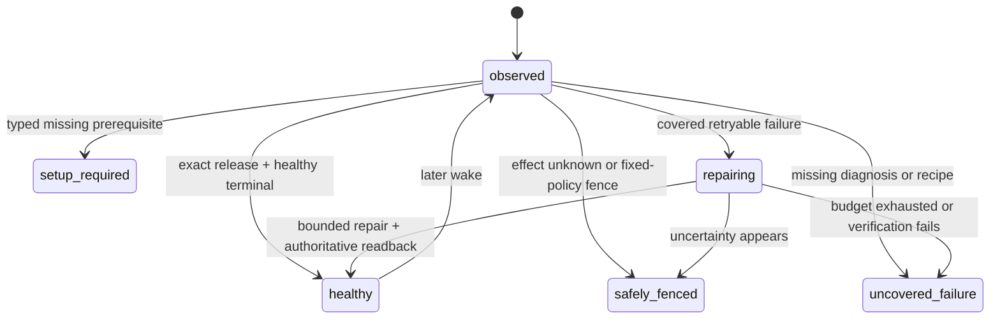

# Fourteen-Loop Self-Healing Foundation Implementation Plan

> **For agentic workers:** REQUIRED SUB-SKILL: Use `superpowers:executing-plans` to implement this plan task-by-task. Steps use checkbox (`- [ ]`) syntax for tracking.

**Goal:** Make all fourteen Product Loops share one observable, bounded self-healing control plane that diagnoses and recovers covered failures without Codex, without waiting for revenue and without touching the separately owned Paid fulfillment runtime.

**Architecture:** Keep `config/product-loop-catalog.json` as the only Product Loop catalog and `lm-loop` as the only runtime operator surface. Extend the existing runtime event/status contract, reuse the existing recovery-intent policy and supervisor, and project a separate foundation/recovery gate from the same rows used by commercial completion. Covered deterministic repairs stay owner-scoped; code-fix candidates flow through the existing isolated self-build PR/guard/release path. Promotion requires exact post-repair readback and sibling isolation. Commercial receipts remain a separate later gate.

**Tech Stack:** Python 3 runtime/CLI contracts, Node.js CommonJS and ESM control-plane modules, `node:test`, Python `unittest`/`pytest`, immutable Git releases, existing `lm-loop` and `launchctl-safe` boundaries.

**Spec:** `docs/superpowers/specs/2026-09-15-life-manager-agent-architecture-refinement.md`, “The operating order is a control loop” through “Fresh fourteen-loop foundation baseline”.

## Global constraints

- Tasks 1–8 are merged through PR #5821 at main SHA `60c1e93e6d1056fee9f2705f4a9cf25f0de52bc2`. Task 9 uses only `/private/tmp/lm-recovery-owner-20260924`, its current result branch, and the `codex-root` worktree lease. Shared-owner scheduling is merged through PR #5822 and its control-plane admission classification through PR #5823.
- Never modify or operate the separate Paid fulfillment worktree/branch, Paid source/tests/config/state/effect fences, Paid provider sessions/tabs, Coconala project `18211957`, or Paid runtime owners. Their health and receipts are read-only inputs.
- Do not wait for Affiliate commission, application acceptance, contract, order, payout or any other natural business event. Foundation acceptance proves execution, diagnosis and recovery; commercial completion remains separate.
- Do not create a second loop registry, scheduler, release mechanism, evaluator platform or browser owner. Extend the catalog, runtime event, `lm-loop`, recovery modules, completion projections and guarded self-build path already present.
- `effect_unknown` is not retryable. No recovery recipe may resend, submit, publish, trade, pay, apply, deliver or reconcile an external effect without the existing owner-specific official receipt contract.
- Fixed policy, identity, evidence rules, credentials, permissions, spend caps, evaluator and protected paths are outside self-modification authority.
- Every task is test-driven. A failing regression test precedes the minimum implementation; run the focused tests after each task and commit/push before proceeding.

## Acceptance state model

Local foundation acceptance permits `healthy`, `setup_required` and `safely_fenced` only when each row has an exact typed reason and next action. It rejects `repairing`, `uncovered_failure`, missing jobs, release drift and opaque terminal results. It does not require a commercial receipt.

---

### Task 1: Separate foundation acceptance from commercial completion

**Status:** Complete on the implementation branch. The commercial gate is unchanged; the new foundation
projection and CLI pass 44/44 focused tests. A read-only live projection returns
`uncovered_failure=14` (thirteen release-drift loops plus Connector terminal failure) without consulting
revenue or changing production state.

**Files:**
- Modify: `apps/life-manager/lib/product-onboarding.js`
- Modify: `apps/life-manager/lib/product-onboarding.test.js`
- Create: `apps/life-manager/scripts/local-foundation-gate.js`

**Contract:**
- Keep `product.loop.completion.v1` and `evaluateLocalCompletionGate()` unchanged as the commercial gate.
- Add `product.loop.foundation.v1`, `buildProductLoopFoundationManifest()` and `evaluateLocalFoundationGate()` over the same catalog and runtime rows.
- Closed foundation states: `healthy`, `setup_required`, `safely_fenced`, `repairing`, `uncovered_failure`.

- [x] Write failing tests proving a no-revenue, exact-release, healthy runtime passes the foundation gate but still fails commercial completion.
- [x] Add failures for missing catalog jobs, release drift, opaque failures, untyped setup/fence rows and `repairing` rows.
- [x] Add pass cases for typed `setup_required` and `safely_fenced`; prove `effect_unknown` cannot become `healthy`.
- [x] Implement the minimum shared projection and CLI; do not duplicate catalog or runtime indexing logic.
- [x] Run `node --test apps/life-manager/lib/product-onboarding.test.js` and focused CLI tests.
- [x] Commit and push the gate split.

### Task 2: Complete the shared runtime diagnostic envelope

**Status:** Complete on the implementation branch. Old v1 rows remain valid. New terminal rows carry the
all-or-nothing diagnostic group, while raw argv/env and credentials never enter the event. Contract/runtime
tests pass 87/87 and runner-bound tests pass 80/80.

**Files:**
- Modify: `runtime/loop/runtime_event.py`
- Modify: `runtime/contracts/common-record.schema.json`
- Modify: `runtime/contracts/test_common_contracts.py`
- Modify: `runtime/loop/tests/test_runtime_event.py`
- Modify: `runtime/loop/lm_loop_run.py`
- Modify: `runtime/loop/tests/test_lm_loop_run_bounds.py`

**Contract:**
- Preserve existing v1 readers while adding bounded optional diagnostic fields or introduce a versioned v2 with an explicit v1 projection; choose the smaller backward-compatible path after the RED tests.
- Required observable identity: `product_loop_id`, `job_id`, `owner_id`, `run_id`, `wake_id`, `occurrence_id`, `release_sha`, phase, exit code, effect class/status, provider receipt/readback ref, evidence refs, failure layer, error class, retryable and next action.
- Loaded command/environment identity is a secret-free digest plus allowlisted metadata, never raw secrets or private paths.

- [x] Write failing validation tests for exact identity, secret rejection, malformed occurrence/receipt refs and typed terminal diagnosis.
- [x] Write failing runner tests proving claimed occurrence and entrypoint outcome reach the terminal event.
- [x] Implement the minimum envelope and builders, keeping install/start/terminal events valid.
- [x] Update the common JSON schema from the same closed enums and prove schema/runtime parity.
- [x] Run the focused runtime-event, contract and runner-bound tests.
- [x] Commit and push the diagnostic envelope.

### Task 3: Expose the full diagnosis through the existing `lm-loop` status

**Status:** Complete on the implementation branch. The existing status row now projects catalog Product Loop
identity plus every terminal diagnostic field, and marks old/incomplete events explicitly. Read-only/runtime
tests pass 51/51, registry tests pass 82/82 and foundation/product tests pass 45/45. The fresh local gate still
blocks all fourteen loops for foundation reasons, not commercial revenue.

**Files:**
- Modify: `runtime/loop/lm_loop.py`
- Modify: `runtime/loop/tests/test_lm_loop_readonly.py`
- Modify: `apps/life-manager/lib/product-onboarding.js`
- Modify: `apps/life-manager/lib/product-onboarding.test.js`

- [x] Write a failing read-only status test for every diagnostic field required by Task 2.
- [x] Prove older events remain visible but classify as `uncovered_failure` when required diagnosis is absent.
- [x] Project product-loop identity from the catalog without renaming the registry job identity.
- [x] Make the foundation manifest consume these rows and report exact missing fields instead of `unknown`.
- [x] Run the focused read-only status and foundation tests.
- [x] Commit and push the status projection.

### Task 4: Emit one durable recovery intent for every shared-runner failure

**Status:** Complete on the implementation branch. Normal shared-runner failures call the existing JavaScript
classifier through one narrow CLI seam; Python contains persistence/identity checks, not a second policy table.
Intent identity includes owner, occurrence and immutable release. Queue append is private, locked and replay-zero.
Success/admission/setup states do not enqueue, unknown effects become a non-retryable hold, and `critical_paid`
or Paid-owner entrypoints remain read-only and never enter this recovery queue. Recovery tests pass 13/13,
runner bounds pass 83/83 and neighboring runtime tests pass 82/82.

**Files:**
- Modify: `runtime/loop/recovery-intent.mjs`
- Modify: `runtime/loop/recovery-intent-record.mjs`
- Modify: `runtime/loop/lm_loop_run.py`
- Modify: `runtime/loop/__tests__/recovery-intent.test.mjs`
- Modify: `runtime/loop/__tests__/recovery-intent-record.test.mjs`
- Modify: `runtime/loop/tests/test_lm_loop_run_bounds.py`

- [x] Write failing tests that a normal `lm_loop_run` terminal failure emits exactly one owner/occurrence/release-bound intent.
- [x] Prove success, admission deferral and duplicate event replay do not enqueue duplicate repair work.
- [x] Prove `effect_unknown` becomes a hold with `mutates_external_effect=false`; setup/admission states do not enqueue and Paid ownership remains read-only outside the queue.
- [x] Reuse one recovery classifier; do not fork Python and JavaScript policy tables. Add only a narrow JSON CLI seam around the existing pure classifier.
- [x] Append atomically to the existing private recovery queue and keep event/intent evidence cross-referenced.
- [x] Run the focused intent and runner tests.
- [x] Commit and push universal intent emission.

### Task 5: Close recovery with outcome, readback, budget and replay-zero

**Files:**
- Modify: `runtime/loop/recovery-apply-plan.mjs`
- Modify: `runtime/loop/recovery-executor.mjs`
- Modify: `runtime/loop/recovery-supervisor.mjs`
- Modify: `runtime/loop/__tests__/recovery-apply-plan.test.mjs`
- Modify: `runtime/loop/__tests__/recovery-executor.test.mjs`
- Modify: `runtime/loop/__tests__/recovery-supervisor.test.mjs`
- Inspect only at this task: the recovery consumer is implemented as `recovery-supervisor-cli.mjs`. Production ownership is verified separately in Task 9 instead of being inferred from a similarly named release reconciler.
- Leave every Paid registry row unchanged.

- [x] Write failing tests for attempt budget, cooldown, same-owner/same-release binding and duplicate-intent replay-zero.
- [x] Add a versioned `recovery_outcome` record with action, before/after event IDs, exit/result, readback, evidence and next action.
- [x] After an allowed reconcile, read `lm-loop status <job>` and accept recovery only when the exact owner/release is healthy; otherwise retain the failure and stop within budget.
- [x] Prove a sibling owner and every Paid owner are never selected or mutated.
- [x] Run all recovery module tests plus registry contract tests: recovery 28/28, registry 82/82 and read-only status 18/18 pass.
- [x] Commit and push the closed deterministic recovery loop.

### Task 6: Route uncovered code failures into the guarded self-build path

**Files:**
- Modify: `apps/life-manager/scripts/life-manager-dev-d0.sh`
- Modify: `apps/life-manager/lib/self-build-daily.js`
- Modify: `apps/life-manager/lib/dev-merge-guard.js`
- Modify: corresponding existing tests under `apps/life-manager/lib/`
- Modify: `runtime/agent-runner/config.json`, `runtime/agent-runner/agent_runner.py` and focused route tests
- Modify: `skills/earn/marketing-engine/run_agent.sh`
- Create: `apps/life-manager/lib/recovery-self-build-bridge.js`
- Create: `apps/life-manager/lib/recovery-self-build-bridge.test.js`

- [x] Write failing tests for a sanitized recovery outcome becoming one deduplicated `lm:type:self-heal` issue with exact owner/release/evidence refs.
- [x] Expand the isolated candidate scope only as required for shared runtime files; keep credentials, state, policy, evaluator, guard and Paid paths protected.
- [x] Require a retained regression fixture plus focused tests before the producer may open a marked PR.
- [x] Keep issue/candidate/review contracts distinct and fail every marked recovery PR closed before merge until Task 7 proves, and Task 8 binds, the separate immutable-release, canary, exact-health and rollback stages. The existing Railway-only app deploy check is not reused as false runtime proof.
- [x] Prove the candidate agent is Codex-only, workspace-write and network-disabled; it cannot edit its own guard/evaluator or directly push main/deploy around the guard.
- [x] Run the existing self-build/merge-guard/bridge tests (158/158), recovery tests (29/29) and agent-runner tests (76/76).
- [x] Commit and push the guarded code-repair bridge.

### Task 7: Prove one safe end-to-end recovery canary

**Files:**
- Create: `runtime/loop/fixtures/self-heal/` fixture files only as required
- Modify: existing recovery and foundation tests
- Modify: architecture spec evidence section after the run

- [x] Select canonical `life-manager-connector-native`: non-Paid, `effect_class=none`, deterministic and catalog-owned by Connector.
- [x] Inject `wake_boundary_failed` only in a test-owned installation; no production agent, browser, network, authentication service or Paid owner is stopped/restarted.
- [x] Demonstrate event -> typed intent -> bounded repair -> exact status readback -> recovery outcome -> replay-zero.
- [x] Demonstrate a forced verification failure stops within cooldown/budget; the real `install_one` snapshot rollback restores the target byte-for-byte and leaves the sibling byte-for-byte unchanged.
- [x] Retain both the success and forced-failure paths as regression fixtures.
- [x] Record exact evidence and commit/push. Node recovery is 32/32 and the real-installer canary is 1/1. This is isolated foundation proof, not a production Connector repair or production-wide acceptance.

### Task 8: Enrol all fourteen Product Loops through shared classes

**Status:** Complete on the implementation branch. The canonical Product Loop catalog declares one sorted
set drawn from six closed recovery classes while the runtime registry remains the single source for job
attributes. After registering the shared recovery owner in Task 9, the contract derives every job's class,
maps 98 catalog jobs once across 14 loops, validates all 168 registry jobs, and reports zero duplicate
mappings or errors. Six retained fixtures exercise the shared
classifier and intent policy. Paid owners derive to `read_only_external_owner` and are rejected before local
queue selection or plan construction. Marked recovery PRs now carry their registry-derived class; the old
boolean promotion bypass is removed. Every class remains explicitly `unbound` for production PR promotion
until a separate loop-runtime path actually invokes immutable release, isolated canary, exact-health and
rollback hooks; the Railway application deploy path is not reused. Recovery tests pass 36/36,
foundation/guard/self-build/catalog tests pass 197/197, the real-installer rollback canary passes 1/1, and the
current catalog contract reports 14 loops, 98 mapped jobs, 168 registry jobs, zero shared jobs and zero errors.

**Files:**
- Modify: `apps/life-manager/config/product-loop-catalog.json`
- Modify: catalog/contract tests
- Create or modify only shared recovery fixture metadata; do not change Paid implementation files.

- [x] Add one closed recovery class declaration per Product Loop: deterministic, model, browser, continuous service, external-effect owner, or read-only external-owner.
- [x] Map every declared job exactly once and reject missing/duplicate/unrecognized recovery classes.
- [x] Add at least one retained failure fixture per class, not one new supervisor per loop.
- [x] Classify Paid jobs as read-only external-owner and consume only their status/receipt projections.
- [x] Bind marked recovery PR promotion to the declared class policy only where immutable release, isolated canary, exact-health and rollback hooks exist; keep the Railway app path separate and unsupported classes fail-closed. No class currently claims a production hook bundle, so all remain closed rather than inheriting Railway proof.
- [x] Run catalog, registry, foundation and recovery suites; require fourteen loops and zero catalog/registry errors.
- [x] Commit and push fourteen-loop enrolment.

### Task 9: Pass local foundation acceptance

**Status:** Current cursor. Revenue, conversion, commission and natural-business-event waits are not gates.
Tasks 1–8 are merged by PR #5821 at `60c1e93e6d1056fee9f2705f4a9cf25f0de52bc2`; complete immutable release
`20260924T134241-60c1e93e` is active with `release_paths=ALL` and
`provenance=ancestor-of-origin-main`. A fresh read-only caller audit then found zero registry owners and zero
production callers for `recovery-supervisor-cli.mjs`: failures can emit durable intents, but no scheduled
owner consumes them. This is an implementation gap, not a revenue wait and not permission to repair fourteen
loops manually.

The follow-up adds exactly one shared owner, `life-manager-recovery-supervisor`, at a 60-second cadence. It is
`effect_class=none`, deterministic, consumes at most one intent per wake, rejects every Paid fulfillment owner,
and belongs once to the existing `self-build` Product Loop. RED reproduced the missing registry owner. GREEN
passes 23 recovery tests, 200 registry/apply tests with 174 subtests, and the catalog contract at 14 loops,
168 registry jobs, 98 mapped jobs, zero duplicate mappings and zero errors. PR #5822 is merged at
`b5855ae558ecc94a7405439be1da5a89cefd987b`; complete release `20260924T135557-b5855ae5` is active and the
single owner is loaded on that exact SHA.

The first immediate production canary does not reach the queue consumer. It ends before entrypoint with typed
`host_admission_deferred:resource_control_busy`, exit 75, while multiple ordinary data-plane owners held the
shared admission control lock. The shared release reconciler, disk cleanup and healthcheck already bypass that
lock, but the new recovery supervisor was omitted from the same safety-owner set. RED reproduced that omission;
the minimum fix adds only this owner to the existing control-plane exemption. Runner bounds pass 83/83 and
recovery remains 23/23. PR #5823 is merged at `188dcb53cd513679e21f7e25d1a422ddf20a6e86`, and complete release
`20260924T140650-188dcb53` is available.

The next targeted reconcile correctly refuses to replace the loaded owner because seven wakes created by the
old release remain as `queued` occurrences. They are all effect-free, unclaimed and unreserved, but the old
apply guard knows only how to rebind ordinary data-plane policy and returns `skipped_pending`. Manual SQL or
deleting the queue would discard audit history and leave the same migration bug for the next control-plane
owner. The current RED→GREEN slice therefore adds one atomic migration: a loop newly classified as a
control-plane safety owner may close only effect-free queued occurrences as `cancelled`, retain their history,
and remove the queue row. Any claim, active reservation or `effect_unknown` remains fenced. The runner and
apply paths consume one shared safety-owner set. Admission 127/127, apply 119/119 plus 31 subtests, runner
83/83 and recovery canary 1/1 pass locally. PR #5824 is merged at
`e00ce6f732da34ea1eb27e86a774d22a52866c7c`; complete release `20260924T142850-e00ce6f7` is active. Targeted
reconcile applies only the supervisor, preserves all 24 accumulated old occurrences as `cancelled`, and leaves
its queue, priority and reservation rows empty.

The next bounded wake reaches the new release but exits 127 before the supervisor CLI: launchd's narrow PATH
cannot resolve the JavaScript shebang's `node`. The same missing runtime identity also prevents a failed owner
from invoking the recovery-intent classifier, so this is a shared self-healing transport defect rather than a
supervisor-only issue. RED proves that a `.mjs` entrypoint and the classifier both fail when PATH is
`/usr/bin:/bin`. The minimum GREEN projects one absolute `LIFE_MANAGER_RUNTIME_NODE` through every managed
plist and uses it for JavaScript entrypoints and recovery classification. Apply passes 119 tests plus 31
subtests, runner passes 84/84, the live catalog contract remains 14/168/98 with zero errors, and the OSS
boundary passes. PR #5825 merges the fix at `1f03abd4150278b234edbb28e5b9cca17dc9d867`; complete release
`20260924T144407-1f03abd4` is active. A supervisor-only apply loads that exact release and
`LIFE_MANAGER_RUNTIME_NODE=/opt/homebrew/bin/node`. Two bounded wakes both exit 0 with
`idle/no_pending_intent`; the intent and recovery journals remain absent, Paid selection and external effect are
zero, and official `lm-loop status` reports `diagnostic_complete=true`, terminal `pass`, clean failure layer and
next action `none` for event `07b2bee7499be44ba7b2c07e`.

**Execution-order correction:** The previous text assumed the release reconciler already called the recovery
consumer. Repository search and registry readback disprove that assumption. The shortest safe order is now:
register and test one shared owner -> integrate it once -> cut and activate its exact main release -> load only
that new owner -> remove its observed data-plane admission dependency through the existing safety exemption ->
atomically close its old effect-free queue history -> reapply only that owner -> kickstart one bounded wake ->
pin the shared Node runtime observed missing at that wake -> kickstart one bounded wake -> verify one eligible
non-Paid repair or idle receipt -> then reconcile the remaining non-Paid fleet and run the 14-loop foundation
gate twice. The Node-corrected idle receipt now passes. A fresh gate observes all 14 Product Loops with zero
missing mapped jobs, but remains `block`: 97 mapped jobs have release mismatch, 90 are diagnostically
incomplete and 49 expose unknown-effect runtime rows. The current cursor is explicit, bounded release alignment
of non-Paid owners only; this does not authorize touching the separately owned Paid runtime.

The first one-owner alignment canary targets `life-manager-dev` in Self-build. It safely returns
`skipped_pending` twice with zero mutation. Read-only admission evidence shows 19 queued occurrences, all
effect-free, with zero claimed occurrences, effect-unknown rows or live reservations. The actual boundary is
canonical registry enrollment: this legacy owner omits `resource_class`, `admission_class` and `priority`, so
the existing reconciler correctly refuses to infer a migration policy. The minimum candidate declares the
already-effective runner defaults for all four Self-build jobs (`deterministic` or `agent`, `borrow`, `support`)
without changing runner logic or weakening any fence. Apply passes 119/119, runner 84/84, registry 82/82 and
the catalog contract remains 14/168/98 with zero errors. PR #5826 integrates the contract at
`0468d61bb99d5f2d963f03bebab5b7c7a0974d8f`; complete release `20260924T151348-0468d61b` is active.
`life-manager-dev` and `self-improve-evolve` then reconcile individually to the exact release while remaining
loaded-idle, and their 19 and 58 queued occurrences remain effect-free.

`life-manager-selfbuild` first defers behind a live reservation. After that lease expires, an old
2026-09-22 occurrence is recovered by a natural run from the still-loaded old release. The entrypoint passes,
but the stale-recovery path leaves that released occurrence `effect_unknown=1`; the next reconcile correctly
refuses mutation. This is not an external-effect ambiguity because the registry contract is
`effect_class=none`. The existing `clear_no_effect_unknown()` primitive already closes exactly this state, but
the release reconciler does not call it. The minimum candidate connects that existing primitive only after a
loaded-idle readback and only for a no-effect owner, then retries the same rebind once. The new regression and
the full apply suite pass 120/120 and runner bounds pass 84/84. PR #5827 merges the fix at
`7cbc861929cd75ef7a6ad08ad05b24ab35b100ff`; complete release `20260924T152741-7cbc8619` is active. The
production retry clears only the released no-effect fence through that runtime path, preserves nine queued
occurrences, and moves `life-manager-selfbuild` to the exact release with unknown 0. `life-manager-dev`,
`life-manager-recovery-supervisor` and `self-improve-evolve` are then reconciled individually. All four
Self-build owners are loaded-idle on the exact SHA with unknown 0; queue counts remain 19/0/9/58.

The post-slice shared readback is still a foundation block, as expected for an unfinished fourteen-loop
rollout. `lm-loop doctor` reports 168 registry entries with missing entrypoints 0, unmanaged labels 0 and
installed retired labels 0. Immediate targeted wakes produce current-release, complete diagnostics for all
four Self-build owners without waiting for revenue. The supervisor passes; `life-manager-dev`,
`life-manager-selfbuild` and `self-improve-evolve` return the same typed transient backpressure contract:
`host_admission_deferred:resource_capacity_busy`, retryable true, next action `retry_after_eligibility`,
effect none and unknown 0. This removes Self-build release drift and reduces the aggregate to 92
release-mismatch jobs and 87 diagnostic-incomplete jobs, while unknown-effect jobs remain 49.

The existing foundation evaluator nevertheless labels any non-pass terminal `uncovered_failure`, contradicting
its own acceptable `safely_fenced` state. The minimum candidate recognizes only the complete transient tuple
above as `safely_fenced/runtime_capacity_deferred`; missing fields, non-retryable rows, external effects and
mixed failures remain fail-closed. Product/foundation tests pass 46/46, repository CI is green, and PR #5829
merges at `9503276595fc778740c08b6938325e15e52b548d`.

The first main readback does not stay safely fenced because a later natural supervisor wake is a real failure.
It consumes Connector intent `32fd477f478f6511410ff4c4c329fcf9` and safely stops at
`release_sha_mismatch`: the intent belongs to event SHA `1f03abd4150278b234edbb28e5b9cca17dc9d867`, while the
installed Connector plist is `7cbc861929cd75ef7a6ad08ad05b24ab35b100ff`. The supervisor's own exit-1
terminal is then classified into a new recovery intent. Repeated wakes claim those self-intents, return
`healthy_readback_pending` with unchanged before/after event IDs, and produce another self-intent. The strict
capacity projection correctly fails this mixed state closed. This recovery-owner self-recursion is the current
cursor; it must be fixed once in the shared healer before any additional per-loop alignment.

Connector is not accepted as healthy. Its installed plist is exact current release, but the latest complete
run fails at `browser_open`. Host evidence shows Google Chrome owns IPv4 `127.0.0.1:9222` while managed Cloak
Chromium owns IPv6 `[::1]:9222`; Connector is pinned to the IPv4 endpoint and receives HTTP 404. The shared
browser guard also uses curl without fail-on-HTTP-error and therefore misreports that 404 as `ALIVE`, which is
why the outward report collapses to `circuit_open/wake_boundary_failed`. An existing locked, separately owned
candidate branch contains the shared endpoint-owner validation and recovery fix through `e96e8c422d`; it is
pushed and clean, but has no PR. It is therefore not on main, not in a main-derived immutable release, not
loaded and not production-verified. This worktree does not duplicate, merge, apply or restart that shared
browser owner.

**Files:**
- Modify: architecture spec current-state/TODO evidence
- Modify: this plan checkbox/status text

- [x] Build a complete, read-only candidate immutable release from the pushed accepted branch with `LOOPS_ACTIVATE_CURRENT=0`; prove production `current` is unchanged.
- [x] Run `bin/launchctl-safe preflight`; it passes for `gui/501`/Aqua. Registry doctor reports 167 entries with zero missing entrypoints, unmanaged labels or installed retired labels.
- [x] Run the focused acceptance from the immutable candidate itself: recovery 36/36, foundation/guard/self-build/catalog 197/197, real-installer canary 1/1 and live contract 14 loops/zero errors.
- [x] Create the foundation PR, require repository CI, merge Tasks 1–8 to main, and record exact merge SHA `60c1e93e6d1056fee9f2705f4a9cf25f0de52bc2`.
- [x] Cut and activate complete immutable release `20260924T134241-60c1e93e`; prove `release_paths=ALL` and `provenance=ancestor-of-origin-main`.
- [x] Audit the live scheduling seam and reproduce the missing recovery consumer owner with a RED contract test; do not mistake intent emission for autonomous consumption.
- [x] Add one shared recovery supervisor owner and map it once to `self-build`; keep Paid owners rejected and unchanged. Focused recovery, registry/apply and catalog contracts pass.
- [x] Push the shared-owner branch, require all ten repository checks, merge PR #5822 once at `b5855ae558ecc94a7405439be1da5a89cefd987b`.
- [x] Cut and activate complete immutable release `20260924T135557-b5855ae5`; prove `release_paths=ALL` and `provenance=ancestor-of-origin-main`.
- [x] Apply only `life-manager-recovery-supervisor` through `launchctl-safe`; loaded argv and installed SHA are exact `b5855ae558ecc94a7405439be1da5a89cefd987b`; no Paid owner is started/restarted.
- [x] Kickstart the first bounded supervisor wake and retain its typed failure evidence: it never reaches the queue consumer because data-plane admission returns `resource_control_busy`/75. Do not call this self-healing success.
- [x] Add a RED→GREEN regression and the minimum existing control-plane exemption for the shared supervisor. Runner bounds pass 83/83; recovery passes 23/23.
- [x] Push/CI/merge the admission fix as PR #5823 at `188dcb53cd513679e21f7e25d1a422ddf20a6e86`, then cut complete exact-main release `20260924T140650-188dcb53`.
- [x] Reproduce the second canary boundary: targeted reconcile returns `skipped_pending`; seven old occurrences are queued, effect-free, unclaimed and unreserved.
- [x] Add the atomic control-plane queue migration and regression tests. Preserve cancelled occurrence history and refuse claim, reservation or effect unknown.
- [x] Push/CI/merge the queue migration as PR #5824 at `e00ce6f732da34ea1eb27e86a774d22a52866c7c`, cut complete release `20260924T142850-e00ce6f7`, and reapply only the shared supervisor.
- [x] Verify queue migration in production: 24 old occurrences are `cancelled`; queue, priority and reservation rows are zero; loaded argv/SHA are exact.
- [x] Kickstart one bounded wake and retain the next typed boundary: entrypoint exits 127 because launchd cannot resolve `node`; no intent, Paid selection or external effect occurs.
- [x] Add RED→GREEN shared Node runtime identity for every managed plist, JavaScript entrypoint and recovery classifier. Apply passes 119 plus 31 subtests; runner passes 84/84.
- [x] Push/CI/merge the Node runtime fix as PR #5825 at `1f03abd4150278b234edbb28e5b9cca17dc9d867`, cut complete release `20260924T144407-1f03abd4`, and reapply only the shared supervisor.
- [x] Kickstart the Node-corrected bounded supervisor wake twice. Both exit 0 with `idle/no_pending_intent`; exact loaded SHA and pinned Node read back, Paid selection/external effect/sibling mutation are zero.
- [ ] Apply/reconcile only the remaining shared non-Paid foundation owners through `launchctl-safe`; do not start/restart Paid owners.
- [x] Run the first Self-build one-owner canary and retain the safe `skipped_pending` result plus exact admission evidence; no owner is reloaded.
- [x] Add the missing explicit admission contract to the four Self-build registry jobs using their existing runtime defaults; focused suites and the 14-loop catalog contract pass.
- [x] Integrate the Self-build registry enrollment as PR #5826 at `0468d61bb99d5f2d963f03bebab5b7c7a0974d8f` and activate complete release `20260924T151348-0468d61b`.
- [x] Reconcile `life-manager-dev` and `self-improve-evolve` individually to the exact release; retain loaded-idle and all effect-free queued occurrences.
- [x] Diagnose the remaining `life-manager-selfbuild` refusal to one released no-effect stale occurrence; do not clear the fence manually or retry blindly.
- [x] Integrate the idle/no-effect reconciler connection to the existing `clear_no_effect_unknown()` primitive as PR #5827 at `7cbc861929cd75ef7a6ad08ad05b24ab35b100ff`, activate complete release `20260924T152741-7cbc8619`, and retry only `life-manager-selfbuild`.
- [x] Verify the production self-heal: released no-effect unknown 1→0, queued occurrences stay 9, reservation 0, exact installed SHA, loaded-idle, and no manual database mutation.
- [x] Reconcile all four Self-build owners individually to the same exact SHA; unknown remains 0 and queue counts remain 19/0/9/58.
- [x] Generate immediate current-release terminal diagnostics for all four effect-free Self-build owners; release drift becomes zero for the loop and all rows are complete/unknown-free.
- [x] Diagnose the remaining Self-build failure classification as evaluator drift: three owners are typed, retryable capacity deferrals behind shared FIFO reservations, not broken executions.
- [x] Integrate the strict capacity-deferral-to-`safely_fenced` projection as PR #5829 at `9503276595fc778740c08b6938325e15e52b548d`; retain fail-closed behavior for mixed failures.
- [ ] Reproduce and fix the shared recovery-supervisor self-recursion: the recovery owner must not enqueue or reconcile itself, and an old-SHA intent must terminate once without producing an unbounded chain.
- [ ] Prove one eligible non-self, non-Paid recovery reaches an authoritative exact-release terminal and replay-zero; preserve the old Connector intent and every effect fence.
- [ ] Consume the separately owned Connector CDP fix only after its owner publishes an accepted main commit; the current pushed `e96e8c422d` has no PR and is not merged/released/loaded/production-verified. Do not duplicate its branch or restart the shared browser from this worktree.
- [x] Read the first post-supervisor `lm-loop doctor`, `lm-loop status all`, foundation manifest and recovery journal. The gate sees all 14 loops and zero missing mapped jobs, but blocks on 97 release mismatches, 90 incomplete diagnostics and 49 unknown-effect rows; no recovery journal is created by the idle wakes.
- [x] Re-read `lm-loop doctor`, `lm-loop status all` and the foundation manifest after current-release wakes: 14/14 observed, missing 0, release mismatch 92, diagnostic incomplete 87, unknown 49. The candidate projects safely fenced 1 and uncovered failure 13; the overall gate correctly remains blocked on the other loops.
- [x] Re-read after PR #5829 and the natural supervisor failure: 98 mapped jobs observed, missing 0, release mismatch 90, diagnostic incomplete 87 and unknown 49. All 14 loops are uncovered; Self-build is now a real supervisor terminal failure, not evaluator drift.
- [ ] Re-read the same surfaces and recovery journal after each remaining non-Paid Product Loop slice.
- [ ] Require 14/14 Product Loops observed, zero opaque states, zero uncovered failures, exact release for applicable owned jobs, bounded recovery evidence and sibling isolation.
- [ ] Accept typed `setup_required`/`safely_fenced` without inventing revenue or clearing an effect fence.
- [ ] Run the same foundation gate twice and require replay-zero/no duplicate recovery effects.
- [ ] Record official local evidence, commit/push and retain the exact accepted release as the Cloud input.

## Deferred until this plan passes

1. Cloud/one-phone tenant isolation and promotion of the exact accepted control plane.
2. CFO economic adapters Task 4.2 onward.
3. Economic evaluation, Affiliate/Mobile/Capafy/x402 revenue optimization and portfolio allocation.
4. Public LM-EAB benchmark product and verified net USD 10,000 MRR/self-funding proof.

None of these deferred outcomes blocks Tasks 1–9. In particular, zero revenue is a valid foundation baseline, not a reason to wait.
