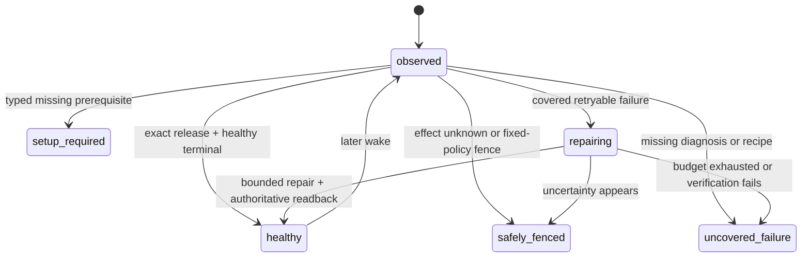

# Fourteen-Loop Self-Healing Foundation Implementation Plan

> **For agentic workers:** REQUIRED SUB-SKILL: Use `superpowers:executing-plans` to implement this plan task-by-task. Steps use checkbox (`- [ ]`) syntax for tracking.

**Goal:** Make all fourteen Product Loops share one observable, bounded self-healing control plane that diagnoses and recovers covered failures without Codex, without waiting for revenue and without touching the separately owned Paid fulfillment runtime.

**Architecture:** Keep `config/product-loop-catalog.json` as the only Product Loop catalog and `lm-loop` as the only runtime operator surface. Extend the existing runtime event/status contract, reuse the existing recovery-intent policy and supervisor, and project a separate foundation/recovery gate from the same rows used by commercial completion. Covered deterministic repairs stay owner-scoped; code-fix candidates flow through the existing isolated self-build PR/guard/release path. Promotion requires exact post-repair readback and sibling isolation. Commercial receipts remain a separate later gate.

**Tech Stack:** Python 3 runtime/CLI contracts, Node.js CommonJS and ESM control-plane modules, `node:test`, Python `unittest`/`pytest`, immutable Git releases, existing `lm-loop` and `launchctl-safe` boundaries.

**Spec:** `docs/superpowers/specs/2026-09-15-life-manager-agent-architecture-refinement.md`, “The operating order is a control loop” through “Fresh fourteen-loop foundation baseline”.

## Global constraints

- Work only in `/private/tmp/lm-eab-v1-20260924` on `feat/lm-eab-v1-20260924`, rebased from the current `origin/main` baseline and protected by the `codex-root` worktree lease.
- Never modify or operate the separate Paid fulfillment worktree/branch, Paid source/tests/config/state/effect fences, Paid provider sessions/tabs, Coconala project `18211957`, or Paid runtime owners. Their health and receipts are read-only inputs.
- Do not wait for Affiliate commission, application acceptance, contract, order, payout or any other natural business event. Foundation acceptance proves execution, diagnosis and recovery; commercial completion remains separate.
- Do not create a second loop registry, scheduler, release mechanism, evaluator platform or browser owner. Extend the catalog, runtime event, `lm-loop`, recovery modules, completion projections and guarded self-build path already present.
- `effect_unknown` is not retryable. No recovery recipe may resend, submit, publish, trade, pay, apply, deliver or reconcile an external effect without the existing owner-specific official receipt contract.
- Fixed policy, identity, evidence rules, credentials, permissions, spend caps, evaluator and protected paths are outside self-modification authority.
- Every task is test-driven. A failing regression test precedes the minimum implementation; run the focused tests after each task and commit/push before proceeding.

## Acceptance state model

Local foundation acceptance permits `healthy`, `setup_required` and `safely_fenced` only when each row has an exact typed reason and next action. It rejects `repairing`, `uncovered_failure`, missing jobs, release drift and opaque terminal results. It does not require a commercial receipt.

---

### Task 1: Separate foundation acceptance from commercial completion

**Status:** Complete on the implementation branch. The commercial gate is unchanged; the new foundation
projection and CLI pass 44/44 focused tests. A read-only live projection returns
`uncovered_failure=14` (thirteen release-drift loops plus Connector terminal failure) without consulting
revenue or changing production state.

**Files:**
- Modify: `apps/life-manager/lib/product-onboarding.js`
- Modify: `apps/life-manager/lib/product-onboarding.test.js`
- Create: `apps/life-manager/scripts/local-foundation-gate.js`

**Contract:**
- Keep `product.loop.completion.v1` and `evaluateLocalCompletionGate()` unchanged as the commercial gate.
- Add `product.loop.foundation.v1`, `buildProductLoopFoundationManifest()` and `evaluateLocalFoundationGate()` over the same catalog and runtime rows.
- Closed foundation states: `healthy`, `setup_required`, `safely_fenced`, `repairing`, `uncovered_failure`.

- [x] Write failing tests proving a no-revenue, exact-release, healthy runtime passes the foundation gate but still fails commercial completion.
- [x] Add failures for missing catalog jobs, release drift, opaque failures, untyped setup/fence rows and `repairing` rows.
- [x] Add pass cases for typed `setup_required` and `safely_fenced`; prove `effect_unknown` cannot become `healthy`.
- [x] Implement the minimum shared projection and CLI; do not duplicate catalog or runtime indexing logic.
- [x] Run `node --test apps/life-manager/lib/product-onboarding.test.js` and focused CLI tests.
- [x] Commit and push the gate split.

### Task 2: Complete the shared runtime diagnostic envelope

**Status:** Complete on the implementation branch. Old v1 rows remain valid. New terminal rows carry the
all-or-nothing diagnostic group, while raw argv/env and credentials never enter the event. Contract/runtime
tests pass 87/87 and runner-bound tests pass 80/80.

**Files:**
- Modify: `runtime/loop/runtime_event.py`
- Modify: `runtime/contracts/common-record.schema.json`
- Modify: `runtime/contracts/test_common_contracts.py`
- Modify: `runtime/loop/tests/test_runtime_event.py`
- Modify: `runtime/loop/lm_loop_run.py`
- Modify: `runtime/loop/tests/test_lm_loop_run_bounds.py`

**Contract:**
- Preserve existing v1 readers while adding bounded optional diagnostic fields or introduce a versioned v2 with an explicit v1 projection; choose the smaller backward-compatible path after the RED tests.
- Required observable identity: `product_loop_id`, `job_id`, `owner_id`, `run_id`, `wake_id`, `occurrence_id`, `release_sha`, phase, exit code, effect class/status, provider receipt/readback ref, evidence refs, failure layer, error class, retryable and next action.
- Loaded command/environment identity is a secret-free digest plus allowlisted metadata, never raw secrets or private paths.

- [x] Write failing validation tests for exact identity, secret rejection, malformed occurrence/receipt refs and typed terminal diagnosis.
- [x] Write failing runner tests proving claimed occurrence and entrypoint outcome reach the terminal event.
- [x] Implement the minimum envelope and builders, keeping install/start/terminal events valid.
- [x] Update the common JSON schema from the same closed enums and prove schema/runtime parity.
- [x] Run the focused runtime-event, contract and runner-bound tests.
- [x] Commit and push the diagnostic envelope.

### Task 3: Expose the full diagnosis through the existing `lm-loop` status

**Status:** Complete on the implementation branch. The existing status row now projects catalog Product Loop
identity plus every terminal diagnostic field, and marks old/incomplete events explicitly. Read-only/runtime
tests pass 51/51, registry tests pass 82/82 and foundation/product tests pass 45/45. The fresh local gate still
blocks all fourteen loops for foundation reasons, not commercial revenue.

**Files:**
- Modify: `runtime/loop/lm_loop.py`
- Modify: `runtime/loop/tests/test_lm_loop_readonly.py`
- Modify: `apps/life-manager/lib/product-onboarding.js`
- Modify: `apps/life-manager/lib/product-onboarding.test.js`

- [x] Write a failing read-only status test for every diagnostic field required by Task 2.
- [x] Prove older events remain visible but classify as `uncovered_failure` when required diagnosis is absent.
- [x] Project product-loop identity from the catalog without renaming the registry job identity.
- [x] Make the foundation manifest consume these rows and report exact missing fields instead of `unknown`.
- [x] Run the focused read-only status and foundation tests.
- [x] Commit and push the status projection.

### Task 4: Emit one durable recovery intent for every shared-runner failure

**Status:** Complete on the implementation branch. Normal shared-runner failures call the existing JavaScript
classifier through one narrow CLI seam; Python contains persistence/identity checks, not a second policy table.
Intent identity includes owner, occurrence and immutable release. Queue append is private, locked and replay-zero.
Success/admission/setup states do not enqueue, unknown effects become a non-retryable hold, and `critical_paid`
or Paid-owner entrypoints remain read-only and never enter this recovery queue. Recovery tests pass 13/13,
runner bounds pass 83/83 and neighboring runtime tests pass 82/82.

**Files:**
- Modify: `runtime/loop/recovery-intent.mjs`
- Modify: `runtime/loop/recovery-intent-record.mjs`
- Modify: `runtime/loop/lm_loop_run.py`
- Modify: `runtime/loop/__tests__/recovery-intent.test.mjs`
- Modify: `runtime/loop/__tests__/recovery-intent-record.test.mjs`
- Modify: `runtime/loop/tests/test_lm_loop_run_bounds.py`

- [x] Write failing tests that a normal `lm_loop_run` terminal failure emits exactly one owner/occurrence/release-bound intent.
- [x] Prove success, admission deferral and duplicate event replay do not enqueue duplicate repair work.
- [x] Prove `effect_unknown` becomes a hold with `mutates_external_effect=false`; setup/admission states do not enqueue and Paid ownership remains read-only outside the queue.
- [x] Reuse one recovery classifier; do not fork Python and JavaScript policy tables. Add only a narrow JSON CLI seam around the existing pure classifier.
- [x] Append atomically to the existing private recovery queue and keep event/intent evidence cross-referenced.
- [x] Run the focused intent and runner tests.
- [x] Commit and push universal intent emission.

### Task 5: Close recovery with outcome, readback, budget and replay-zero

**Files:**
- Modify: `runtime/loop/recovery-apply-plan.mjs`
- Modify: `runtime/loop/recovery-executor.mjs`
- Modify: `runtime/loop/recovery-supervisor.mjs`
- Modify: `runtime/loop/__tests__/recovery-apply-plan.test.mjs`
- Modify: `runtime/loop/__tests__/recovery-executor.test.mjs`
- Modify: `runtime/loop/__tests__/recovery-supervisor.test.mjs`
- Inspect only: the existing release-reconciler already invokes `lm-recovery-supervise`; no new launchd job or registry owner is required.
- Leave every Paid registry row unchanged.

- [x] Write failing tests for attempt budget, cooldown, same-owner/same-release binding and duplicate-intent replay-zero.
- [x] Add a versioned `recovery_outcome` record with action, before/after event IDs, exit/result, readback, evidence and next action.
- [x] After an allowed reconcile, read `lm-loop status <job>` and accept recovery only when the exact owner/release is healthy; otherwise retain the failure and stop within budget.
- [x] Prove a sibling owner and every Paid owner are never selected or mutated.
- [x] Run all recovery module tests plus registry contract tests: recovery 28/28, registry 82/82 and read-only status 18/18 pass.
- [x] Commit and push the closed deterministic recovery loop.

### Task 6: Route uncovered code failures into the guarded self-build path

**Files:**
- Modify: `apps/life-manager/scripts/life-manager-dev-d0.sh`
- Modify: `apps/life-manager/lib/self-build-daily.js`
- Modify: `apps/life-manager/lib/dev-merge-guard.js`
- Modify: corresponding existing tests under `apps/life-manager/lib/`
- Modify: `runtime/agent-runner/config.json`, `runtime/agent-runner/agent_runner.py` and focused route tests
- Modify: `skills/earn/marketing-engine/run_agent.sh`
- Create: `apps/life-manager/lib/recovery-self-build-bridge.js`
- Create: `apps/life-manager/lib/recovery-self-build-bridge.test.js`

- [x] Write failing tests for a sanitized recovery outcome becoming one deduplicated `lm:type:self-heal` issue with exact owner/release/evidence refs.
- [x] Expand the isolated candidate scope only as required for shared runtime files; keep credentials, state, policy, evaluator, guard and Paid paths protected.
- [x] Require a retained regression fixture plus focused tests before the producer may open a marked PR.
- [x] Keep issue/candidate/review contracts distinct and fail every marked recovery PR closed before merge until Task 7 proves, and Task 8 binds, the separate immutable-release, canary, exact-health and rollback stages. The existing Railway-only app deploy check is not reused as false runtime proof.
- [x] Prove the candidate agent is Codex-only, workspace-write and network-disabled; it cannot edit its own guard/evaluator or directly push main/deploy around the guard.
- [x] Run the existing self-build/merge-guard/bridge tests (158/158), recovery tests (29/29) and agent-runner tests (76/76).
- [x] Commit and push the guarded code-repair bridge.

### Task 7: Prove one safe end-to-end recovery canary

**Files:**
- Create: `runtime/loop/fixtures/self-heal/` fixture files only as required
- Modify: existing recovery and foundation tests
- Modify: architecture spec evidence section after the run

- [x] Select canonical `life-manager-connector-native`: non-Paid, `effect_class=none`, deterministic and catalog-owned by Connector.
- [x] Inject `wake_boundary_failed` only in a test-owned installation; no production agent, browser, network, authentication service or Paid owner is stopped/restarted.
- [x] Demonstrate event -> typed intent -> bounded repair -> exact status readback -> recovery outcome -> replay-zero.
- [x] Demonstrate a forced verification failure stops within cooldown/budget; the real `install_one` snapshot rollback restores the target byte-for-byte and leaves the sibling byte-for-byte unchanged.
- [x] Retain both the success and forced-failure paths as regression fixtures.
- [x] Record exact evidence and commit/push. Node recovery is 32/32 and the real-installer canary is 1/1. This is isolated foundation proof, not a production Connector repair or production-wide acceptance.

### Task 8: Enrol all fourteen Product Loops through shared classes

**Status:** Complete on the implementation branch. The canonical Product Loop catalog declares one sorted
set drawn from six closed recovery classes while the runtime registry remains the single source for job
attributes. The contract derives every job's class, maps 97 catalog jobs once across 14 loops, validates all
167 registry jobs, and reports zero duplicate mappings or errors. Six retained fixtures exercise the shared
classifier and intent policy. Paid owners derive to `read_only_external_owner` and are rejected before local
queue selection or plan construction. Marked recovery PRs now carry their registry-derived class; the old
boolean promotion bypass is removed. Every class remains explicitly `unbound` for production PR promotion
until a separate loop-runtime path actually invokes immutable release, isolated canary, exact-health and
rollback hooks; the Railway application deploy path is not reused. Recovery tests pass 36/36,
foundation/guard/self-build/catalog tests pass 197/197, the real-installer rollback canary passes 1/1, and the
live catalog contract reports 14 loops, 97 mapped jobs, 167 registry jobs, zero shared jobs and zero errors.

**Files:**
- Modify: `apps/life-manager/config/product-loop-catalog.json`
- Modify: catalog/contract tests
- Create or modify only shared recovery fixture metadata; do not change Paid implementation files.

- [x] Add one closed recovery class declaration per Product Loop: deterministic, model, browser, continuous service, external-effect owner, or read-only external-owner.
- [x] Map every declared job exactly once and reject missing/duplicate/unrecognized recovery classes.
- [x] Add at least one retained failure fixture per class, not one new supervisor per loop.
- [x] Classify Paid jobs as read-only external-owner and consume only their status/receipt projections.
- [x] Bind marked recovery PR promotion to the declared class policy only where immutable release, isolated canary, exact-health and rollback hooks exist; keep the Railway app path separate and unsupported classes fail-closed. No class currently claims a production hook bundle, so all remain closed rather than inheriting Railway proof.
- [x] Run catalog, registry, foundation and recovery suites; require fourteen loops and zero catalog/registry errors.
- [x] Commit and push fourteen-loop enrolment.

### Task 9: Pass local foundation acceptance

**Status:** Current cursor. Revenue, conversion, commission and natural-business-event waits are not gates.
Host preflight passes for `gui/501`/Aqua, registry doctor reports 167 entries and zero errors, and available
disk is above the prior floor. The production foundation baseline still blocks honestly: all 14 loops are
observed, but 13 have release drift, Connector has an old incomplete diagnostic, all 97 mapped rows are
diagnostically incomplete and 48 installed release SHAs are mixed. Candidate immutable release
`02ae4f91a9da56baed6dd6bb6fcaa13a8d17c129` is complete/read-only and leaves `current` unchanged. From that
release, recovery passes 36/36, foundation/guard/self-build/catalog passes 197/197, the catalog contract has
zero errors and the real-installer canary passes 1/1 with unrelated global pytest plugins/cache disabled.

**Execution-order correction:** The old order attempted production apply/readback before main integration.
That cannot run: `cut-loop-release.sh` permits a non-main candidate only with `LOOPS_ACTIVATE_CURRENT=0`, while
production activation requires an `origin/main` ancestor. The shortest safe order is now: validate a pushed,
non-activated immutable candidate -> integrate the already accepted implementation once -> cut and activate
the exact merged main release -> apply only shared non-Paid owners -> read back twice. Current cursor is the
single PR/main integration gate; this does not authorize touching the separately owned Paid runtime.

**Files:**
- Modify: architecture spec current-state/TODO evidence
- Modify: this plan checkbox/status text

- [x] Build a complete, read-only candidate immutable release from the pushed accepted branch with `LOOPS_ACTIVATE_CURRENT=0`; prove production `current` is unchanged.
- [x] Run `bin/launchctl-safe preflight`; it passes for `gui/501`/Aqua. Registry doctor reports 167 entries with zero missing entrypoints, unmanaged labels or installed retired labels.
- [x] Run the focused acceptance from the immutable candidate itself: recovery 36/36, foundation/guard/self-build/catalog 197/197, real-installer canary 1/1 and live contract 14 loops/zero errors.
- [ ] Create the one final PR, require repository CI, merge the accepted implementation to main, and record the exact merge SHA. Do not deploy a branch SHA.
- [ ] Cut and activate one complete immutable release from that exact main merge SHA; prove `release_paths=ALL` and `provenance=ancestor-of-origin-main`.
- [ ] Apply only the shared non-Paid foundation/recovery owners through `launchctl-safe`; do not start/restart Paid owners.
- [ ] Read `lm-loop doctor`, `lm-loop status all`, the foundation manifest and recovery journal.
- [ ] Require 14/14 Product Loops observed, zero opaque states, zero uncovered failures, exact release for applicable owned jobs, bounded recovery evidence and sibling isolation.
- [ ] Accept typed `setup_required`/`safely_fenced` without inventing revenue or clearing an effect fence.
- [ ] Run the same foundation gate twice and require replay-zero/no duplicate recovery effects.
- [ ] Record official local evidence, commit/push and retain the exact accepted release as the Cloud input.

## Deferred until this plan passes

1. Cloud/one-phone tenant isolation and promotion of the exact accepted control plane.
2. CFO economic adapters Task 4.2 onward.
3. Economic evaluation, Affiliate/Mobile/Capafy/x402 revenue optimization and portfolio allocation.
4. Public LM-EAB benchmark product and verified net USD 10,000 MRR/self-funding proof.

None of these deferred outcomes blocks Tasks 1–9. In particular, zero revenue is a valid foundation baseline, not a reason to wait.
