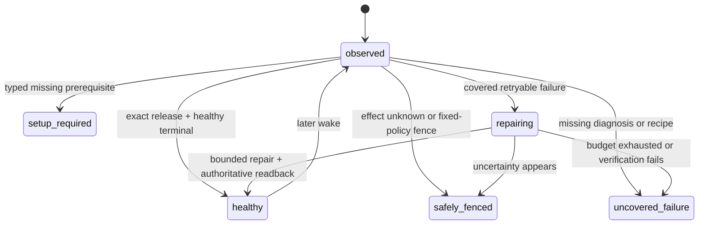

# Fourteen-Loop Self-Healing Foundation Implementation Plan

> **For agentic workers:** REQUIRED SUB-SKILL: Use `superpowers:executing-plans` to implement this plan task-by-task. Steps use checkbox (`- [ ]`) syntax for tracking.

**Goal:** Make all fourteen Product Loops share one observable, bounded self-healing control plane that diagnoses and recovers covered failures without Codex, without waiting for revenue and without touching the separately owned Paid fulfillment runtime.

**Architecture:** Keep `config/product-loop-catalog.json` as the only Product Loop catalog and `lm-loop` as the only runtime operator surface. Extend the existing runtime event/status contract, reuse the existing recovery-intent policy and supervisor, and project a separate foundation/recovery gate from the same rows used by commercial completion. Covered deterministic repairs stay owner-scoped; code-fix candidates flow through the existing isolated self-build PR/guard/release path. Promotion requires exact post-repair readback and sibling isolation. Commercial receipts remain a separate later gate.

**Tech Stack:** Python 3 runtime/CLI contracts, Node.js CommonJS and ESM control-plane modules, `node:test`, Python `unittest`/`pytest`, immutable Git releases, existing `lm-loop` and `launchctl-safe` boundaries.

**Spec:** `docs/superpowers/specs/2026-09-15-life-manager-agent-architecture-refinement.md`, “The operating order is a control loop” through “Fresh fourteen-loop foundation baseline”.

## Global constraints

- Tasks 1–8 are merged through PR #5821 at main SHA `60c1e93e6d1056fee9f2705f4a9cf25f0de52bc2`. Task 9 uses only `/private/tmp/lm-recovery-owner-20260924`, its current result branch, and the `codex-root` worktree lease. Shared-owner scheduling is merged through PR #5822 and its control-plane admission classification through PR #5823.
- Never modify or operate the separate Paid fulfillment worktree/branch, Paid source/tests/config/state/effect fences, Paid provider sessions/tabs, Coconala project `18211957`, or Paid runtime owners. Their health and receipts are read-only inputs.
- Do not wait for Affiliate commission, application acceptance, contract, order, payout or any other natural business event. Foundation acceptance proves execution, diagnosis and recovery; commercial completion remains separate.
- Do not create a second loop registry, scheduler, release mechanism, evaluator platform or browser owner. Extend the catalog, runtime event, `lm-loop`, recovery modules, completion projections and guarded self-build path already present.
- `effect_unknown` is not retryable. No recovery recipe may resend, submit, publish, trade, pay, apply, deliver or reconcile an external effect without the existing owner-specific official receipt contract.
- Fixed policy, identity, evidence rules, credentials, permissions, spend caps, evaluator and protected paths are outside self-modification authority.
- Every task is test-driven. A failing regression test precedes the minimum implementation; run the focused tests after each task and commit/push before proceeding.

## Acceptance state model

Local foundation acceptance permits `healthy`, `setup_required` and `safely_fenced` only when each row has an exact typed reason and next action. It rejects `repairing`, `uncovered_failure`, missing jobs, release drift and opaque terminal results. It does not require a commercial receipt.

---

### Task 1: Separate foundation acceptance from commercial completion

**Status:** Complete on the implementation branch. The commercial gate is unchanged; the new foundation
projection and CLI pass 44/44 focused tests. A read-only live projection returns
`uncovered_failure=14` (thirteen release-drift loops plus Connector terminal failure) without consulting
revenue or changing production state.

**Files:**
- Modify: `apps/life-manager/lib/product-onboarding.js`
- Modify: `apps/life-manager/lib/product-onboarding.test.js`
- Create: `apps/life-manager/scripts/local-foundation-gate.js`

**Contract:**
- Keep `product.loop.completion.v1` and `evaluateLocalCompletionGate()` unchanged as the commercial gate.
- Add `product.loop.foundation.v1`, `buildProductLoopFoundationManifest()` and `evaluateLocalFoundationGate()` over the same catalog and runtime rows.
- Closed foundation states: `healthy`, `setup_required`, `safely_fenced`, `repairing`, `uncovered_failure`.

- [x] Write failing tests proving a no-revenue, exact-release, healthy runtime passes the foundation gate but still fails commercial completion.
- [x] Add failures for missing catalog jobs, release drift, opaque failures, untyped setup/fence rows and `repairing` rows.
- [x] Add pass cases for typed `setup_required` and `safely_fenced`; prove `effect_unknown` cannot become `healthy`.
- [x] Implement the minimum shared projection and CLI; do not duplicate catalog or runtime indexing logic.
- [x] Run `node --test apps/life-manager/lib/product-onboarding.test.js` and focused CLI tests.
- [x] Commit and push the gate split.

### Task 2: Complete the shared runtime diagnostic envelope

**Status:** Complete on the implementation branch. Old v1 rows remain valid. New terminal rows carry the
all-or-nothing diagnostic group, while raw argv/env and credentials never enter the event. Contract/runtime
tests pass 87/87 and runner-bound tests pass 80/80.

**Files:**
- Modify: `runtime/loop/runtime_event.py`
- Modify: `runtime/contracts/common-record.schema.json`
- Modify: `runtime/contracts/test_common_contracts.py`
- Modify: `runtime/loop/tests/test_runtime_event.py`
- Modify: `runtime/loop/lm_loop_run.py`
- Modify: `runtime/loop/tests/test_lm_loop_run_bounds.py`

**Contract:**
- Preserve existing v1 readers while adding bounded optional diagnostic fields or introduce a versioned v2 with an explicit v1 projection; choose the smaller backward-compatible path after the RED tests.
- Required observable identity: `product_loop_id`, `job_id`, `owner_id`, `run_id`, `wake_id`, `occurrence_id`, `release_sha`, phase, exit code, effect class/status, provider receipt/readback ref, evidence refs, failure layer, error class, retryable and next action.
- Loaded command/environment identity is a secret-free digest plus allowlisted metadata, never raw secrets or private paths.

- [x] Write failing validation tests for exact identity, secret rejection, malformed occurrence/receipt refs and typed terminal diagnosis.
- [x] Write failing runner tests proving claimed occurrence and entrypoint outcome reach the terminal event.
- [x] Implement the minimum envelope and builders, keeping install/start/terminal events valid.
- [x] Update the common JSON schema from the same closed enums and prove schema/runtime parity.
- [x] Run the focused runtime-event, contract and runner-bound tests.
- [x] Commit and push the diagnostic envelope.

### Task 3: Expose the full diagnosis through the existing `lm-loop` status

**Status:** Complete on the implementation branch. The existing status row now projects catalog Product Loop
identity plus every terminal diagnostic field, and marks old/incomplete events explicitly. Read-only/runtime
tests pass 51/51, registry tests pass 82/82 and foundation/product tests pass 45/45. The fresh local gate still
blocks all fourteen loops for foundation reasons, not commercial revenue.

**Files:**
- Modify: `runtime/loop/lm_loop.py`
- Modify: `runtime/loop/tests/test_lm_loop_readonly.py`
- Modify: `apps/life-manager/lib/product-onboarding.js`
- Modify: `apps/life-manager/lib/product-onboarding.test.js`

- [x] Write a failing read-only status test for every diagnostic field required by Task 2.
- [x] Prove older events remain visible but classify as `uncovered_failure` when required diagnosis is absent.
- [x] Project product-loop identity from the catalog without renaming the registry job identity.
- [x] Make the foundation manifest consume these rows and report exact missing fields instead of `unknown`.
- [x] Run the focused read-only status and foundation tests.
- [x] Commit and push the status projection.

### Task 4: Emit one durable recovery intent for every shared-runner failure

**Status:** Complete on the implementation branch. Normal shared-runner failures call the existing JavaScript
classifier through one narrow CLI seam; Python contains persistence/identity checks, not a second policy table.
Intent identity includes owner, occurrence and immutable release. Queue append is private, locked and replay-zero.
Success/admission/setup states do not enqueue, unknown effects become a non-retryable hold, and `critical_paid`
or Paid-owner entrypoints remain read-only and never enter this recovery queue. Recovery tests pass 13/13,
runner bounds pass 83/83 and neighboring runtime tests pass 82/82.

**Files:**
- Modify: `runtime/loop/recovery-intent.mjs`
- Modify: `runtime/loop/recovery-intent-record.mjs`
- Modify: `runtime/loop/lm_loop_run.py`
- Modify: `runtime/loop/__tests__/recovery-intent.test.mjs`
- Modify: `runtime/loop/__tests__/recovery-intent-record.test.mjs`
- Modify: `runtime/loop/tests/test_lm_loop_run_bounds.py`

- [x] Write failing tests that a normal `lm_loop_run` terminal failure emits exactly one owner/occurrence/release-bound intent.
- [x] Prove success, admission deferral and duplicate event replay do not enqueue duplicate repair work.
- [x] Prove `effect_unknown` becomes a hold with `mutates_external_effect=false`; setup/admission states do not enqueue and Paid ownership remains read-only outside the queue.
- [x] Reuse one recovery classifier; do not fork Python and JavaScript policy tables. Add only a narrow JSON CLI seam around the existing pure classifier.
- [x] Append atomically to the existing private recovery queue and keep event/intent evidence cross-referenced.
- [x] Run the focused intent and runner tests.
- [x] Commit and push universal intent emission.

### Task 5: Close recovery with outcome, readback, budget and replay-zero

**Files:**
- Modify: `runtime/loop/recovery-apply-plan.mjs`
- Modify: `runtime/loop/recovery-executor.mjs`
- Modify: `runtime/loop/recovery-supervisor.mjs`
- Modify: `runtime/loop/__tests__/recovery-apply-plan.test.mjs`
- Modify: `runtime/loop/__tests__/recovery-executor.test.mjs`
- Modify: `runtime/loop/__tests__/recovery-supervisor.test.mjs`
- Inspect only at this task: the recovery consumer is implemented as `recovery-supervisor-cli.mjs`. Production ownership is verified separately in Task 9 instead of being inferred from a similarly named release reconciler.
- Leave every Paid registry row unchanged.

- [x] Write failing tests for attempt budget, cooldown, same-owner/same-release binding and duplicate-intent replay-zero.
- [x] Add a versioned `recovery_outcome` record with action, before/after event IDs, exit/result, readback, evidence and next action.
- [x] After an allowed reconcile, read `lm-loop status <job>` and accept recovery only when the exact owner/release is healthy; otherwise retain the failure and stop within budget.
- [x] Prove a sibling owner and every Paid owner are never selected or mutated.
- [x] Run all recovery module tests plus registry contract tests: recovery 28/28, registry 82/82 and read-only status 18/18 pass.
- [x] Commit and push the closed deterministic recovery loop.

### Task 6: Route uncovered code failures into the guarded self-build path

**Files:**
- Modify: `apps/life-manager/scripts/life-manager-dev-d0.sh`
- Modify: `apps/life-manager/lib/self-build-daily.js`
- Modify: `apps/life-manager/lib/dev-merge-guard.js`
- Modify: corresponding existing tests under `apps/life-manager/lib/`
- Modify: `runtime/agent-runner/config.json`, `runtime/agent-runner/agent_runner.py` and focused route tests
- Modify: `skills/earn/marketing-engine/run_agent.sh`
- Create: `apps/life-manager/lib/recovery-self-build-bridge.js`
- Create: `apps/life-manager/lib/recovery-self-build-bridge.test.js`

- [x] Write failing tests for a sanitized recovery outcome becoming one deduplicated `lm:type:self-heal` issue with exact owner/release/evidence refs.
- [x] Expand the isolated candidate scope only as required for shared runtime files; keep credentials, state, policy, evaluator, guard and Paid paths protected.
- [x] Require a retained regression fixture plus focused tests before the producer may open a marked PR.
- [x] Keep issue/candidate/review contracts distinct and fail every marked recovery PR closed before merge until Task 7 proves, and Task 8 binds, the separate immutable-release, canary, exact-health and rollback stages. The existing Railway-only app deploy check is not reused as false runtime proof.
- [x] Prove the candidate agent is Codex-only, workspace-write and network-disabled; it cannot edit its own guard/evaluator or directly push main/deploy around the guard.
- [x] Run the existing self-build/merge-guard/bridge tests (158/158), recovery tests (29/29) and agent-runner tests (76/76).
- [x] Commit and push the guarded code-repair bridge.

### Task 7: Prove one safe end-to-end recovery canary

**Files:**
- Create: `runtime/loop/fixtures/self-heal/` fixture files only as required
- Modify: existing recovery and foundation tests
- Modify: architecture spec evidence section after the run

- [x] Select canonical `life-manager-connector-native`: non-Paid, `effect_class=none`, deterministic and catalog-owned by Connector.
- [x] Inject `wake_boundary_failed` only in a test-owned installation; no production agent, browser, network, authentication service or Paid owner is stopped/restarted.
- [x] Demonstrate event -> typed intent -> bounded repair -> exact status readback -> recovery outcome -> replay-zero.
- [x] Demonstrate a forced verification failure stops within cooldown/budget; the real `install_one` snapshot rollback restores the target byte-for-byte and leaves the sibling byte-for-byte unchanged.
- [x] Retain both the success and forced-failure paths as regression fixtures.
- [x] Record exact evidence and commit/push. Node recovery is 32/32 and the real-installer canary is 1/1. This is isolated foundation proof, not a production Connector repair or production-wide acceptance.

### Task 8: Enrol all fourteen Product Loops through shared classes

**Status:** Complete on the implementation branch. The canonical Product Loop catalog declares one sorted
set drawn from six closed recovery classes while the runtime registry remains the single source for job
attributes. After registering the shared recovery owner in Task 9, the contract derives every job's class,
maps 98 catalog jobs once across 14 loops, validates all 168 registry jobs, and reports zero duplicate
mappings or errors. Six retained fixtures exercise the shared
classifier and intent policy. Paid owners derive to `read_only_external_owner` and are rejected before local
queue selection or plan construction. Marked recovery PRs now carry their registry-derived class; the old
boolean promotion bypass is removed. Every class remains explicitly `unbound` for production PR promotion
until a separate loop-runtime path actually invokes immutable release, isolated canary, exact-health and
rollback hooks; the Railway application deploy path is not reused. Recovery tests pass 36/36,
foundation/guard/self-build/catalog tests pass 197/197, the real-installer rollback canary passes 1/1, and the
current catalog contract reports 14 loops, 98 mapped jobs, 168 registry jobs, zero shared jobs and zero errors.

**Files:**
- Modify: `apps/life-manager/config/product-loop-catalog.json`
- Modify: catalog/contract tests
- Create or modify only shared recovery fixture metadata; do not change Paid implementation files.

- [x] Add one closed recovery class declaration per Product Loop: deterministic, model, browser, continuous service, external-effect owner, or read-only external-owner.
- [x] Map every declared job exactly once and reject missing/duplicate/unrecognized recovery classes.
- [x] Add at least one retained failure fixture per class, not one new supervisor per loop.
- [x] Classify Paid jobs as read-only external-owner and consume only their status/receipt projections.
- [x] Bind marked recovery PR promotion to the declared class policy only where immutable release, isolated canary, exact-health and rollback hooks exist; keep the Railway app path separate and unsupported classes fail-closed. No class currently claims a production hook bundle, so all remain closed rather than inheriting Railway proof.
- [x] Run catalog, registry, foundation and recovery suites; require fourteen loops and zero catalog/registry errors.
- [x] Commit and push fourteen-loop enrolment.

### Task 9: Pass local foundation acceptance

**Status:** Current task. Revenue, conversion, commission and natural-business-event waits are not gates. Capafy,
Self-build, Investment and Fundraiser are locally accepted. Mobile Apps is actively repairing under its existing
Postiz canary owner, Affiliate retains one confirmed-effect official-readback fence, and the next non-conflicting
Product Loop cursor is Writer.

Affiliate diagnosis reaches the shared release boundary. One historical run succeeds while releasing older
occurrence `affiliate-loop:18d6048b69d38938-35148`, then hits a SQLite lock during next-owner reservation. The
current fence `affiliate-loop:18d7bd776d9c8a78-1576` is a later FIFO occurrence and cannot inherit the older
run's evidence. The shared source fix is test-driven: release and next-owner reservation are one transaction,
the retiring claim alone is excluded from capacity accounting, and only BUSY/LOCKED plus `control_busy` receive
bounded retry. Focused regressions pass 2/2 and full admission/runner tests pass 217/217. PR #5844 merges at
`091ec4d59b78c685b32eb8b707f5ac357cf14786`; complete immutable release
`20260924T190842-091ec4d5` is active and only Affiliate is reconciled to it. Its immediate wake preserves the
fence and performs no provider entrypoint. No Paid owner, Connector, Postiz owner or provider state is changed.

The target now has an exact proof window. Its immediate FIFO predecessor
`affiliate-loop:18d7bd64cdd76c40-680` reports pass at `2026-09-23T08:38:43.386976Z`; the adjacent next runtime
pair stops at `host_admission_deferred:resource_effect_unknown` at `2026-09-23T08:56:06.001927Z`. The target was
already queued, no older Affiliate occurrence remains open, and the Affiliate job, child-run and tool-attempt
journals each contain zero overlapping rows. A narrow reconciler and nine regression tests return
`PROOF_READY` against production read-only data. PR #5847 merges it with the existing atomic queued/reserved wake
coalescing at `19d04a3469ea44f9b5e48bbd613aee21cbab295a`; release `20260924T193337-19d04a34` repeats the same proof.
The exact occurrence becomes released/effect-known, Affiliate unknown becomes zero and its 0600 receipt is
`RESOLVED`. Two exact-release base-loop wakes stop pre-entrypoint at retryable FIFO wait without growing the
48 queued occurrences.

The three continuous Affiliate browser owners then load the exact release and remain running, but status keeps
their old terminal reports because it ignores current execute events. This is a shared continuous-observability
gap, not three provider repairs. The current test-driven candidate emits complete diagnostic identity at start,
selects a running event only when bound to the live launchd PID, and classifies explicit pre-effect FIFO/capacity
deferral with admission unknown false separately from provider effect unknown. Runtime/status/runner tests pass
126/126, the full runtime suite passes 622 tests plus 522 subtests, and the foundation suite passes 47/47.
Integration, release-owned readback, the two deterministic
Affiliate owners and final two-pass Affiliate foundation evidence remain; revenue and natural time do not.
Tasks 1–8 are merged by PR #5821 at `60c1e93e6d1056fee9f2705f4a9cf25f0de52bc2`; complete immutable release
`20260924T134241-60c1e93e` is active with `release_paths=ALL` and
`provenance=ancestor-of-origin-main`. A fresh read-only caller audit then found zero registry owners and zero
production callers for `recovery-supervisor-cli.mjs`: failures can emit durable intents, but no scheduled
owner consumes them. This is an implementation gap, not a revenue wait and not permission to repair fourteen
loops manually.

The follow-up adds exactly one shared owner, `life-manager-recovery-supervisor`, at a 60-second cadence. It is
`effect_class=none`, deterministic, consumes at most one intent per wake, rejects every Paid fulfillment owner,
and belongs once to the existing `self-build` Product Loop. RED reproduced the missing registry owner. GREEN
passes 23 recovery tests, 200 registry/apply tests with 174 subtests, and the catalog contract at 14 loops,
168 registry jobs, 98 mapped jobs, zero duplicate mappings and zero errors. PR #5822 is merged at
`b5855ae558ecc94a7405439be1da5a89cefd987b`; complete release `20260924T135557-b5855ae5` is active and the
single owner is loaded on that exact SHA.

The first immediate production canary does not reach the queue consumer. It ends before entrypoint with typed
`host_admission_deferred:resource_control_busy`, exit 75, while multiple ordinary data-plane owners held the
shared admission control lock. The shared release reconciler, disk cleanup and healthcheck already bypass that
lock, but the new recovery supervisor was omitted from the same safety-owner set. RED reproduced that omission;
the minimum fix adds only this owner to the existing control-plane exemption. Runner bounds pass 83/83 and
recovery remains 23/23. PR #5823 is merged at `188dcb53cd513679e21f7e25d1a422ddf20a6e86`, and complete release
`20260924T140650-188dcb53` is available.

The next targeted reconcile correctly refuses to replace the loaded owner because seven wakes created by the
old release remain as `queued` occurrences. They are all effect-free, unclaimed and unreserved, but the old
apply guard knows only how to rebind ordinary data-plane policy and returns `skipped_pending`. Manual SQL or
deleting the queue would discard audit history and leave the same migration bug for the next control-plane
owner. The current RED→GREEN slice therefore adds one atomic migration: a loop newly classified as a
control-plane safety owner may close only effect-free queued occurrences as `cancelled`, retain their history,
and remove the queue row. Any claim, active reservation or `effect_unknown` remains fenced. The runner and
apply paths consume one shared safety-owner set. Admission 127/127, apply 119/119 plus 31 subtests, runner
83/83 and recovery canary 1/1 pass locally. PR #5824 is merged at
`e00ce6f732da34ea1eb27e86a774d22a52866c7c`; complete release `20260924T142850-e00ce6f7` is active. Targeted
reconcile applies only the supervisor, preserves all 24 accumulated old occurrences as `cancelled`, and leaves
its queue, priority and reservation rows empty.

The next bounded wake reaches the new release but exits 127 before the supervisor CLI: launchd's narrow PATH
cannot resolve the JavaScript shebang's `node`. The same missing runtime identity also prevents a failed owner
from invoking the recovery-intent classifier, so this is a shared self-healing transport defect rather than a
supervisor-only issue. RED proves that a `.mjs` entrypoint and the classifier both fail when PATH is
`/usr/bin:/bin`. The minimum GREEN projects one absolute `LIFE_MANAGER_RUNTIME_NODE` through every managed
plist and uses it for JavaScript entrypoints and recovery classification. Apply passes 119 tests plus 31
subtests, runner passes 84/84, the live catalog contract remains 14/168/98 with zero errors, and the OSS
boundary passes. PR #5825 merges the fix at `1f03abd4150278b234edbb28e5b9cca17dc9d867`; complete release
`20260924T144407-1f03abd4` is active. A supervisor-only apply loads that exact release and
`LIFE_MANAGER_RUNTIME_NODE=/opt/homebrew/bin/node`. Two bounded wakes both exit 0 with
`idle/no_pending_intent`; the intent and recovery journals remain absent, Paid selection and external effect are
zero, and official `lm-loop status` reports `diagnostic_complete=true`, terminal `pass`, clean failure layer and
next action `none` for event `07b2bee7499be44ba7b2c07e`.

**Execution-order correction:** The previous text assumed the release reconciler already called the recovery
consumer. Repository search and registry readback disprove that assumption. The shortest safe order is now:
register and test one shared owner -> integrate it once -> cut and activate its exact main release -> load only
that new owner -> remove its observed data-plane admission dependency through the existing safety exemption ->
atomically close its old effect-free queue history -> reapply only that owner -> kickstart one bounded wake ->
pin the shared Node runtime observed missing at that wake -> kickstart one bounded wake -> verify one eligible
non-Paid repair or idle receipt -> then reconcile the remaining non-Paid fleet and run the 14-loop foundation
gate twice. The Node-corrected idle receipt now passes. A fresh gate observes all 14 Product Loops with zero
missing mapped jobs, but remains `block`: 97 mapped jobs have release mismatch, 90 are diagnostically
incomplete and 49 expose unknown-effect runtime rows. The current cursor is explicit, bounded release alignment
of non-Paid owners only; this does not authorize touching the separately owned Paid runtime.

The first one-owner alignment canary targets `life-manager-dev` in Self-build. It safely returns
`skipped_pending` twice with zero mutation. Read-only admission evidence shows 19 queued occurrences, all
effect-free, with zero claimed occurrences, effect-unknown rows or live reservations. The actual boundary is
canonical registry enrollment: this legacy owner omits `resource_class`, `admission_class` and `priority`, so
the existing reconciler correctly refuses to infer a migration policy. The minimum candidate declares the
already-effective runner defaults for all four Self-build jobs (`deterministic` or `agent`, `borrow`, `support`)
without changing runner logic or weakening any fence. Apply passes 119/119, runner 84/84, registry 82/82 and
the catalog contract remains 14/168/98 with zero errors. PR #5826 integrates the contract at
`0468d61bb99d5f2d963f03bebab5b7c7a0974d8f`; complete release `20260924T151348-0468d61b` is active.
`life-manager-dev` and `self-improve-evolve` then reconcile individually to the exact release while remaining
loaded-idle, and their 19 and 58 queued occurrences remain effect-free.

`life-manager-selfbuild` first defers behind a live reservation. After that lease expires, an old
2026-09-22 occurrence is recovered by a natural run from the still-loaded old release. The entrypoint passes,
but the stale-recovery path leaves that released occurrence `effect_unknown=1`; the next reconcile correctly
refuses mutation. This is not an external-effect ambiguity because the registry contract is
`effect_class=none`. The existing `clear_no_effect_unknown()` primitive already closes exactly this state, but
the release reconciler does not call it. The minimum candidate connects that existing primitive only after a
loaded-idle readback and only for a no-effect owner, then retries the same rebind once. The new regression and
the full apply suite pass 120/120 and runner bounds pass 84/84. PR #5827 merges the fix at
`7cbc861929cd75ef7a6ad08ad05b24ab35b100ff`; complete release `20260924T152741-7cbc8619` is active. The
production retry clears only the released no-effect fence through that runtime path, preserves nine queued
occurrences, and moves `life-manager-selfbuild` to the exact release with unknown 0. `life-manager-dev`,
`life-manager-recovery-supervisor` and `self-improve-evolve` are then reconciled individually. All four
Self-build owners are loaded-idle on the exact SHA with unknown 0; queue counts remain 19/0/9/58.

The post-slice shared readback is still a foundation block, as expected for an unfinished fourteen-loop
rollout. `lm-loop doctor` reports 168 registry entries with missing entrypoints 0, unmanaged labels 0 and
installed retired labels 0. Immediate targeted wakes produce current-release, complete diagnostics for all
four Self-build owners without waiting for revenue. The supervisor passes; `life-manager-dev`,
`life-manager-selfbuild` and `self-improve-evolve` return the same typed transient backpressure contract:
`host_admission_deferred:resource_capacity_busy`, retryable true, next action `retry_after_eligibility`,
effect none and unknown 0. This removes Self-build release drift and reduces the aggregate to 92
release-mismatch jobs and 87 diagnostic-incomplete jobs, while unknown-effect jobs remain 49.

The existing foundation evaluator nevertheless labels any non-pass terminal `uncovered_failure`, contradicting
its own acceptable `safely_fenced` state. The minimum candidate recognizes only the complete transient tuple
above as `safely_fenced/runtime_capacity_deferred`; missing fields, non-retryable rows, external effects and
mixed failures remain fail-closed. Product/foundation tests pass 46/46, repository CI is green, and PR #5829
merges at `9503276595fc778740c08b6938325e15e52b548d`.

The first main readback does not stay safely fenced because a later natural supervisor wake is a real failure.
It consumes Connector intent `32fd477f478f6511410ff4c4c329fcf9` and safely stops at
`release_sha_mismatch`: the intent belongs to event SHA `1f03abd4150278b234edbb28e5b9cca17dc9d867`, while the
installed Connector plist is `7cbc861929cd75ef7a6ad08ad05b24ab35b100ff`. The supervisor's own exit-1
terminal is then classified into a new recovery intent. Repeated wakes claim those self-intents, return
`healthy_readback_pending` with unchanged before/after event IDs, and produce another self-intent. The strict
capacity projection correctly fails this mixed state closed. This recovery-owner self-recursion is the current
cursor; it must be fixed once in the shared healer before any additional per-loop alignment.

Candidate `5e2275d977` prevents new self-intent emission, terminally drains one persisted self-intent per wake
without executing a reconcile or spending budget, and refuses self-reconcile plan construction as a final
guard. Recovery tests pass 36/36, runner bounds pass 84/84, apply/registry tests pass 202 tests plus 174
subtests, and foundation/catalog tests pass 65/65. A candidate CLI probe against temporary copies of the live
queue/journal closes pending self-intent `fa82ab50703c57ea6540cb35b93576f8` as
`skipped/supervisor_self_recovery_excluded`, appends exactly one journal row and leaves production unchanged.
PR/CI/main integration and the production drain/readback remain open.

Connector is not accepted as healthy. Its installed plist remains on `5b8e3c3b...` after `current` advances to
`208b0a36...`; the latest complete status is `entrypoint_exit_1`, and the underlying run fails at
`browser_open`. Host evidence shows Google Chrome owns IPv4 `127.0.0.1:9222` while managed Cloak
Chromium owns IPv6 `[::1]:9222`; Connector is pinned to the IPv4 endpoint and receives HTTP 404. The shared
browser guard also uses curl without fail-on-HTTP-error and therefore misreports that 404 as `ALIVE`, which is
why the outward report collapses to `circuit_open/wake_boundary_failed`. An existing locked, separately owned
candidate branch contains the shared endpoint-owner validation and recovery fix through `e96e8c422d`; it is
pushed and clean, but has no PR. It is therefore not on main, not in a main-derived immutable release, not
loaded and not production-verified. This worktree does not duplicate, merge, apply or restart that shared
browser owner.

The remaining Capafy audit finds a shared backlog cause rather than four independent implementations to repair.
`capafy-loop-daily`, `capafy-outcome-monitor`, `capafy-ig-account-manager` and
`capafy-ig-marketing-daily` are recurring effectful owners but are declared `effect_class=none` and omit wake
coalescing. Their read-only queued counts are 168/8037/1635/71. The existing coalesced claim path closes only one
old queued wake before claiming the current occurrence, so a recurring owner can never drain a legacy backlog.
The retained RED fixture reproduces two old queued wake signals surviving a current coalesced claim. The minimum
shared fix cancels every prior queued, effect-known occurrence for only that owner after the existing unknown
fences pass. It does not touch claimed, released, unknown or sibling-owner history.

Host admission passes 128 tests, runtime-loop passes 532 tests, registry passes 15 tests and the live contract
remains 14 loops / 168 jobs / 98 mapped / zero errors. PR #5835 passes all nine repository checks and merges at
`208b0a36634c60a031b317eb1e3ec596b2faa101`. Complete exact-main release
`20260924T173838-208b0a36` is active with `release_paths=ALL`, `provenance=ancestor-of-origin-main`, doctor
168/168 and the release-owned coalescing regression passing. Cutting the release starts or applies no Capafy,
Paid, Connector or browser owner. The fresh read-only foundation gate is 98 observed, missing 0, release
mismatch 98, diagnostic incomplete 84, unknown 49 and `uncovered_failure` 14. The mismatch increases because
`current` advances before one-owner reconciliation; it is an explicit deployment cursor.

The next slice reuses the same registry, durable admission, coalescing, reconciler and recovery supervisor. It
first declares the four observed effect classes (`publish`, `message`, `account_mutation`, `publish`) and their
already-effective admission policies, with coalescing enabled. It then aligns the already-complete
`capafy-loop-healthcheck` and the three goal monitors, followed by one effectful owner at a time with official
readback and no fence clearing. No replacement orchestration framework or manual admission-database cleanup is
allowed.

**Files:**
- Modify: architecture spec current-state/TODO evidence
- Modify: this plan checkbox/status text

- [x] Build a complete, read-only candidate immutable release from the pushed accepted branch with `LOOPS_ACTIVATE_CURRENT=0`; prove production `current` is unchanged.
- [x] Run `bin/launchctl-safe preflight`; it passes for `gui/501`/Aqua. Registry doctor reports 167 entries with zero missing entrypoints, unmanaged labels or installed retired labels.
- [x] Run the focused acceptance from the immutable candidate itself: recovery 36/36, foundation/guard/self-build/catalog 197/197, real-installer canary 1/1 and live contract 14 loops/zero errors.
- [x] Create the foundation PR, require repository CI, merge Tasks 1–8 to main, and record exact merge SHA `60c1e93e6d1056fee9f2705f4a9cf25f0de52bc2`.
- [x] Cut and activate complete immutable release `20260924T134241-60c1e93e`; prove `release_paths=ALL` and `provenance=ancestor-of-origin-main`.
- [x] Audit the live scheduling seam and reproduce the missing recovery consumer owner with a RED contract test; do not mistake intent emission for autonomous consumption.
- [x] Add one shared recovery supervisor owner and map it once to `self-build`; keep Paid owners rejected and unchanged. Focused recovery, registry/apply and catalog contracts pass.
- [x] Push the shared-owner branch, require all ten repository checks, merge PR #5822 once at `b5855ae558ecc94a7405439be1da5a89cefd987b`.
- [x] Cut and activate complete immutable release `20260924T135557-b5855ae5`; prove `release_paths=ALL` and `provenance=ancestor-of-origin-main`.
- [x] Apply only `life-manager-recovery-supervisor` through `launchctl-safe`; loaded argv and installed SHA are exact `b5855ae558ecc94a7405439be1da5a89cefd987b`; no Paid owner is started/restarted.
- [x] Kickstart the first bounded supervisor wake and retain its typed failure evidence: it never reaches the queue consumer because data-plane admission returns `resource_control_busy`/75. Do not call this self-healing success.
- [x] Add a RED→GREEN regression and the minimum existing control-plane exemption for the shared supervisor. Runner bounds pass 83/83; recovery passes 23/23.
- [x] Push/CI/merge the admission fix as PR #5823 at `188dcb53cd513679e21f7e25d1a422ddf20a6e86`, then cut complete exact-main release `20260924T140650-188dcb53`.
- [x] Reproduce the second canary boundary: targeted reconcile returns `skipped_pending`; seven old occurrences are queued, effect-free, unclaimed and unreserved.
- [x] Add the atomic control-plane queue migration and regression tests. Preserve cancelled occurrence history and refuse claim, reservation or effect unknown.
- [x] Push/CI/merge the queue migration as PR #5824 at `e00ce6f732da34ea1eb27e86a774d22a52866c7c`, cut complete release `20260924T142850-e00ce6f7`, and reapply only the shared supervisor.
- [x] Verify queue migration in production: 24 old occurrences are `cancelled`; queue, priority and reservation rows are zero; loaded argv/SHA are exact.
- [x] Kickstart one bounded wake and retain the next typed boundary: entrypoint exits 127 because launchd cannot resolve `node`; no intent, Paid selection or external effect occurs.
- [x] Add RED→GREEN shared Node runtime identity for every managed plist, JavaScript entrypoint and recovery classifier. Apply passes 119 plus 31 subtests; runner passes 84/84.
- [x] Push/CI/merge the Node runtime fix as PR #5825 at `1f03abd4150278b234edbb28e5b9cca17dc9d867`, cut complete release `20260924T144407-1f03abd4`, and reapply only the shared supervisor.
- [x] Kickstart the Node-corrected bounded supervisor wake twice. Both exit 0 with `idle/no_pending_intent`; exact loaded SHA and pinned Node read back, Paid selection/external effect/sibling mutation are zero.
- [ ] Apply/reconcile only the remaining shared non-Paid foundation owners through `launchctl-safe`; do not start/restart Paid owners.
- [x] Run the first Self-build one-owner canary and retain the safe `skipped_pending` result plus exact admission evidence; no owner is reloaded.
- [x] Add the missing explicit admission contract to the four Self-build registry jobs using their existing runtime defaults; focused suites and the 14-loop catalog contract pass.
- [x] Integrate the Self-build registry enrollment as PR #5826 at `0468d61bb99d5f2d963f03bebab5b7c7a0974d8f` and activate complete release `20260924T151348-0468d61b`.
- [x] Reconcile `life-manager-dev` and `self-improve-evolve` individually to the exact release; retain loaded-idle and all effect-free queued occurrences.
- [x] Diagnose the remaining `life-manager-selfbuild` refusal to one released no-effect stale occurrence; do not clear the fence manually or retry blindly.
- [x] Integrate the idle/no-effect reconciler connection to the existing `clear_no_effect_unknown()` primitive as PR #5827 at `7cbc861929cd75ef7a6ad08ad05b24ab35b100ff`, activate complete release `20260924T152741-7cbc8619`, and retry only `life-manager-selfbuild`.
- [x] Verify the production self-heal: released no-effect unknown 1→0, queued occurrences stay 9, reservation 0, exact installed SHA, loaded-idle, and no manual database mutation.
- [x] Reconcile all four Self-build owners individually to the same exact SHA; unknown remains 0 and queue counts remain 19/0/9/58.
- [x] Generate immediate current-release terminal diagnostics for all four effect-free Self-build owners; release drift becomes zero for the loop and all rows are complete/unknown-free.
- [x] Diagnose the remaining Self-build failure classification as evaluator drift: three owners are typed, retryable capacity deferrals behind shared FIFO reservations, not broken executions.
- [x] Integrate the strict capacity-deferral-to-`safely_fenced` projection as PR #5829 at `9503276595fc778740c08b6938325e15e52b548d`; retain fail-closed behavior for mixed failures.
- [x] Reproduce and fix the shared recovery-supervisor self-recursion in pushed candidate `5e2275d977`: the runner does not enqueue it, one old self-intent becomes terminal skipped per wake, and the plan compiler cannot reconcile it.
- [x] Integrate the self-recursion fix through PR/CI/main as PR #5830 at `25cd0141f9b867cb15c3538d1d0ad9c78f010894`, activate complete release `20260924T161321-25cd0141`, apply only the loaded-idle supervisor, drain its pending self-intents 14 -> 0 with the unique total fixed at 22, and prove exact-SHA replay-zero in wake `9955a84a526f12f2091c451d`.
- [ ] Immediately trigger one safely eligible non-self, non-Paid recovery and prove it reaches an authoritative exact-release terminal and replay-zero; do not wait for a natural schedule, and preserve the old Connector intent and every effect fence.
- [ ] Consume the separately owned Connector CDP fix only after its owner publishes an accepted main commit; the current pushed `e96e8c422d` has no PR and is not merged/released/loaded/production-verified. Do not duplicate its branch or restart the shared browser from this worktree.
- [x] Read the first post-supervisor `lm-loop doctor`, `lm-loop status all`, foundation manifest and recovery journal. The gate sees all 14 loops and zero missing mapped jobs, but blocks on 97 release mismatches, 90 incomplete diagnostics and 49 unknown-effect rows; no recovery journal is created by the idle wakes.
- [x] Re-read `lm-loop doctor`, `lm-loop status all` and the foundation manifest after current-release wakes: 14/14 observed, missing 0, release mismatch 92, diagnostic incomplete 87, unknown 49. The candidate projects safely fenced 1 and uncovered failure 13; the overall gate correctly remains blocked on the other loops.
- [x] Re-read after PR #5829 and the natural supervisor failure: 98 mapped jobs observed, missing 0, release mismatch 90, diagnostic incomplete 87 and unknown 49. All 14 loops are uncovered; Self-build is now a real supervisor terminal failure, not evaluator drift.
- [x] Re-read after PR #5830 and the supervisor replay-zero: 98 mapped jobs observed, missing 0, release mismatch 95, diagnostic incomplete 87 and unknown 49. The newest release is intentionally loaded only for the supervisor, so all 14 loops remain uncovered until the remaining non-Paid owners are aligned and receive current-release diagnostics.
- [x] Reuse the existing admission/reconciliation primitives for the Capafy goal-monitor family instead of adding a second healer: PR #5831 adds the missing deterministic/borrow/support contract, PR #5832 enables the existing queued/reserved-wake coalescing for the base monitor, and PR #5833 applies the same contract to `capafy-goal-monitor-daily-close` and `capafy-goal-monitor-hourly`.
- [x] Close the claimed-only idle/no-effect reconciliation gap through PR #5834 at main `5b8e3c3bba65a99938e30fa43e79dd9716e9433f`; complete release `20260924T170628-5b8e3c3b` is active. The shared reconciler now invokes the existing `clear_no_effect_unknown()` only when the owner is loaded-idle, the registry declares `effect_class=none`, and admission reports `not_queued`; running, unloaded and effectful owners remain fail-closed.
- [x] Verify all three Capafy goal monitors on the exact immutable release: diagnostics are complete, terminal deferral is typed `resource_capacity_busy`, retryable with `retry_after_eligibility`, effect is `not_applicable`, and admission unknown is zero. Repeated immediate wakes preserve queued counts at base 34, daily-close 12 and hourly 190; no queue row, effect fence or provider state is manually edited.
- [x] Re-read the authoritative gate after the Capafy slice: 98 mapped jobs observed, missing 0, release mismatch 93, diagnostic incomplete 84 and unknown 49. The goal-monitor family leaves both Capafy mismatch and incomplete lists; the remaining Capafy release-drift owners are `capafy-ig-account-manager`, `capafy-ig-marketing-daily`, `capafy-loop-daily`, `capafy-loop-healthcheck` and `capafy-outcome-monitor`.
- [x] Diagnose the remaining Capafy backlog at the shared durable-admission boundary: coalesced claim cancels only one old queued wake, while four recurring effectful owners omit coalescing and expose 168/8037/1635/71 queued occurrences. Do not delete admission history or create per-loop healers.
- [x] Integrate the shared all-prior-queued coalescing fix through PR #5835 at main `208b0a36634c60a031b317eb1e3ec596b2faa101`; retain every unknown/effect fence and sibling boundary.
- [x] Activate complete exact-main release `20260924T173838-208b0a36`; verify complete provenance, doctor 168/168 and the release-owned regression. No effectful owner is applied or awakened by the release cut.
- [x] Re-read the exact-current foundation gate: 98 observed, missing 0, release mismatch 98, diagnostic incomplete 84, unknown 49 and all 14 loops uncovered. Record that the mismatch increase is expected until deliberate one-owner reconciliation.
- [x] Declare the observed Capafy effect contracts and existing admission policies for `capafy-loop-daily`, `capafy-outcome-monitor`, `capafy-ig-account-manager` and `capafy-ig-marketing-daily`; enable the existing coalescing contract with RED→GREEN registry coverage. Focused Capafy passes 3/3, registry 82/82, full runtime-loop 532/532, adapter registry 15/15 and live contract 14 loops / 168 jobs / 98 mapped / zero errors.
- [x] Integrate the contract through PR #5838 and all repository CI into main `05d235b46b7c76f27d2aec71e8f30d93b98b4728`; activate complete immutable release `20260924T180152-05d235b4`. Reconcile the no-effect Capafy healthcheck and three goal monitors first, then the four effectful owners individually; Paid and Connector remain untouched.
- [x] Run one immediate bounded wake for every Capafy owner. All eight owners load the exact release and emit complete diagnostics. Healthcheck exits 0/clean; the other seven stop before their entrypoints at typed `resource_capacity_busy` or `resource_fifo_wait`. The four external-effect admission fences remain zero, reservations remain zero and queued counts remain 168/8078/1643/72. No provider effect or receipt occurs, so the existing scheduler owns the next eligible attempt and this foundation cursor advances without waiting for revenue or natural acceptance.
- [x] Re-read the authoritative gate: 14 loops observed, `safely_fenced=1` (Capafy), `uncovered_failure=13`, release mismatch 88, diagnostic incomplete 80 and unknown-effect jobs 0. Capafy has zero release mismatch and zero incomplete diagnostics.
- [x] Align Self-build's three remaining release-drift owners to exact release `05d235b46b7c76f27d2aec71e8f30d93b98b4728`. All four Self-build owners emit complete diagnostics; the supervisor exits 0/clean and the other three return typed retryable capacity deferral before entrypoint, with effect unknown 0 and reservations 0.
- [x] Re-prove the shared supervisor replay-zero with two exact-release exit-0 terminals: recovery storage stays fixed at 27 intents and 66 journal events, so no duplicate intent or recovery action is emitted.
- [x] Re-read the authoritative gate after Self-build: 14 loops observed, `safely_fenced=2` (Capafy and Self-build), `uncovered_failure=12`, release mismatch 83, diagnostic incomplete 80 and unknown-effect jobs 53. Doctor remains clean at 168 entries with zero missing entrypoints, unmanaged labels or installed retired labels.
- [x] Audit Mobile Apps without provider mutation: all 22 jobs are observed; 21 have release mismatch, 21 have incomplete diagnostics and the gate has 20 unknown-effect jobs. Admission holds 344 claimed unknown and 16 released unknown occurrences; no fence is cleared or retried.
- [x] Preserve the two active Mobile/Postiz leases and their JP1 canary contract. PR #5813/#5814 source is already on main; the owning workstream must still prove exact official receipt and replay-zero before staged rollout, so Mobile remains `repairing` rather than falsely closed.
- [x] Integrate the shared atomic final-release and bounded BUSY/LOCKED retry fix through PR #5844 at main `091ec4d59b78c685b32eb8b707f5ac357cf14786`; activate complete release `20260924T190842-091ec4d5`, reconcile only Affiliate and verify the preserved fence prevents provider entrypoint execution.
- [x] Separate the historical lock-failure occurrence from the current Affiliate fence, define the exact FIFO proof window and retain regressions for positive proof, in-window job/child/tool evidence, older-open occurrence rejection, exact resolver binding and private receipt output.
- [x] Run the candidate reconciler read-only against production. It returns `PROOF_READY` for `affiliate-loop:18d7bd776d9c8a78-1576`, predecessor `affiliate-loop:18d7bd64cdd76c40-680`, window `08:38:43.386976Z`–`08:56:06.001927Z`, and job/child/tool counts `0/0/0`.
- [x] Merge the exact Affiliate reconciler plus existing atomic queued/reserved-wake coalescing contract through PR #5847, cut complete release `20260924T193337-19d04a34` and repeat the release-owned dry proof with the same evidence hash.
- [x] Resolve only `affiliate-loop:18d7bd776d9c8a78-1576` through `resolve_pre_effect_occurrence`; its private receipt is 0600/`RESOLVED`, the target is released/effect-known, all Affiliate unknown is zero and no provider action occurs.
- [x] Reconcile the Affiliate base owner and run it twice on the exact release. Both wakes stop before entrypoint at typed retryable `resource_fifo_wait`; queued occurrences stay 48, reservations/unknown stay zero and no duplicate provider effect occurs.
- [x] Reconcile the three continuous Affiliate browser owners to the exact release and diagnose the remaining drift as a shared status bug: live current-release running events exist, but status selects older terminal reports because healthy continuous services do not exit.
- [x] Integrate the PID-bound continuous-running diagnostic and explicit pre-effect admission-deferral projection through PR #5849 at `ff11bb0a2c2ae81af087c687fb6ba3eda049b87b`; cut complete immutable release `20260924T195546-ff11bb0a`. Exact PID-bound, complete running diagnostics pass for all three browser owners, and exact typed capacity deferral passes for composition/source-refresh. Five of six Affiliate owners are aligned without manufacturing exits.
- [ ] Reconcile the final `affiliate-loop` base occurrence through exact official effect readback. Its old-release child finishes `SUCCEEDED`, but claim release fails with ownership mismatch and leaves `affiliate-loop:18d83ba82b14fb40-24990` claimed/effect-unknown; Telegram send is confirmed as provider message `92843`, so the generic pre-effect resolver must not clear it. Then rebind the base owner and run the Affiliate foundation projection twice with exact current-release evidence, zero opaque diagnostics and replay-zero.
- [x] Diagnose Investment read-only: one old installed owner, 16 known released, 64 known queued, one released/effect-unknown occurrence, one queue row and no reservation. The sole unknown `alpaca-investment-live:18d5feb0983a54b8-35815` is an exact 0.28-second pre-entrypoint `resource_capacity_busy` terminal with no effect reference.
- [x] Add the shared loaded-idle exact pre-effect reconciler with a private 0600 receipt, fail-closed negative coverage, and Investment's existing `agent/borrow/support` plus wake-coalescing contract. Reconcile/registry tests pass 206/206 with 174 subtests; runtime passes 624 plus 522 subtests and the unrelated CEO timeout passes alone. Production remains unchanged until integration.
- [x] Integrate the shared Investment self-heal through PR #5851 at `209f879ec862a24fa0ed5cd954a7680422905c3a`, activate complete release `20260924T203525-209f879e`, resolve only the exact pre-effect occurrence with a 0600 `RESOLVED` receipt, and coalesce 64 stale effect-known wakes. The first current-release wake exits 0 with Alpaca account `ACTIVE`, equity USD 66.74, orders 4, `NO_TRADE`, unresolved orders 0 and Telegram message `92860`; the immediate replay makes no entrypoint/trade, remains unknown-free and stops safely at typed capacity backpressure.
- [x] Diagnose Fundraiser read-only. Its official Startuped AI `submitted_verified` receipt at `02:13:28Z` is preserved. The sole later unknown `fundraiser:18d5fda7a1962e60-16555` is a separate exact two-event pre-entrypoint `resource_capacity_busy` run with no effect reference; admission is claimed-unknown 1, known queued 10, known released 2, queue row 1 and reservation 0.
- [x] Reuse the shared exact pre-effect reconciler and add only Fundraiser's existing `agent/borrow/support` plus queued/reserved-wake coalescing contract. The RED registry test fails before the declaration; focused tests pass 2/2, full apply/registry passes 207/207, and production dry proof selects exactly the one target. Candidate `d5d4f5ee15` is pushed without production mutation.
- [x] Integrate the Fundraiser contract through PR #5852 at `2ff81f6eb1c0e9fb3160fd4bbe654a5810b8d167`, activate complete release `20260924T205828-2ff81f6e`, reconcile only `fundraiser`, and verify its 0600 `RESOLVED` receipt. The 652-row ledger remains byte-identical with 56 verified submissions; apply plus immediate replay both stop pre-entrypoint at typed capacity backpressure, unknown stays zero, and the exact-release foundation row is `safely_fenced` with no mismatch or diagnostic gap.
- [x] Diagnose Writer read-only as seven independent owners sharing one private state root. All seven have historical `agent/borrow/support` policy but no registry declaration; known queued counts are 402/9/1622/8/89/123/78. Craft and discovery each have one safe effect-free stale claim; response has one exact pre-entrypoint FIFO fence in the rotated private journal; report has one real message effect backed by durable Telegram IDs 89203–89206 and therefore is not a pre-effect fence.
- [x] Add only Writer's observed admission/coalescing contract to all seven owners. The RED test fails for every missing row, focused contract/fixture tests pass 2/2. Extend the shared exact proof to at most four private rotated gzip journals while retaining per-file 50,000-row, owner, mode, link, exact-two-event and no-effect-reference checks; production read-only proof selects response and rejects report. Focused archive/current/negative proof tests pass 3/3 and full apply/registry passes 209/209. Do not change Writer business code.
- [x] Preserve the historical readback for report occurrence `18d69e54e1050578-20866` from the existing user MTProto session. Provider IDs 89203–89206 were previously recorded in the same bot dialog with matching sender/content evidence; preserve those effects and never resend them.
- [x] Re-prove the report effect against the current outbox. The stored IDs 89203–89206 were not the provider-side IDs, but a fresh isolated MTProto readback found exact payload hashes, send times and bot sender for provider messages 90905–90908 in the target dialog. Resolve only `writer-report:18d69e54e1050578-20866` through that proof, write a mode-0600 receipt preserving both ID sets, and never resend.
- [x] Merge and release the Writer contract/proof into production. The source merge is complete in PR #5853 (`73270f2c`); all seven owners are now loaded on current `6e609eba` and one bounded wake per owner is complete with `diagnostic_complete=true`, `admission_effect_unknown=false`, typed pre-entrypoint capacity deferral and no new provider effect. The response archive proof and report official effect proof are both retained.
- [x] Rebind all seven Writer owners to the latest immutable selector `1657972036bddc842682108334e5d30b5e48defe` while loaded-idle. No provider session was restarted; report's historical effect receipt remains preserved.
- [x] Run the effect-free portion of the Writer immediate replay check one owner at a time. `writer-claim-loop`, `writer-money-sync`, `writer-opportunity-discovery` and `writer-sales-measure` stop before entrypoint at typed `resource_capacity_busy` with `effect_status=not_applicable`, `admission_effect_unknown=false` and complete diagnostics; `writer-craft-train` reaches a current-release terminal `pass` with the same no-effect contract. The response owner is also current-release and stops before its application effect at the same typed boundary.
- [ ] Complete the Writer immediate replay check for the effectful owners only after the provider-specific effect fence proves no duplicate message/application can be emitted. `writer-report` remains held by its existing official Telegram readback (90905–90908) and its latest terminal evidence is still historical release `6e609eba`; do not start it merely to manufacture a current event. This remains separate from the final two-pass 14-loop replay-zero gate.
- [ ] Continue the remaining independent non-Paid foundation slices in this order while Mobile remains owned: Agent Economy, CFO and Job Hunter. Do not wait for revenue; accept exact typed `setup_required` or `safely_fenced` states and move to the next slice. Affiliate remains an asynchronous official-readback reconciliation and does not block this cursor.
- [x] Reconcile Agent Economy onto the then-current main-derived release `403e272eb615951b7a125006e2e5797cf28c4b7b` and record its provider boundary. The previous BlockRun HTTP 429s are durable `wake_error/brain_transport` evidence; the existing proxy brain retries three times and the new run is loaded with complete diagnostics on `gpt-5.6-terra`. No trade, payment, or revenue receipt is claimed.
- [x] Add a read-only status projection for continuous-owner harness failures. A running PID no longer masks a same-run `harness-failures.jsonl` row: the status row projects `last_terminal_result=fail`, `failure_layer=runtime`, a normalized `error_class` (`tool_missing` for taskmarket `ENOENT`), typed `next_action`, and bounded `latest_harness_failure` evidence. A later clean `wake`/`narrate` deactivates the incident but retains its history. RED→GREEN focused tests pass 2/2; readonly status passes 22/22 and registry/apply passes 210/210. This is branch-only until main/release acceptance.
- [x] Diagnose the first Agent Economy effect-free admission gap without waking it. `x402-acquisition-controller` has a large durable FIFO of known, effect-free occurrences, but its registry row omitted the already-observed `deterministic/borrow/support` policy and queued/reserved coalescing. The production reconciler therefore returned `skipped_pending`; no entrypoint, wallet, payment or provider effect was attempted.
- [x] Add the smallest Agent Economy registry contract for `x402-acquisition-controller`: explicit `deterministic/borrow/support`, queued/reserved coalescing and `reconcile_queued_release=true`. The RED contract test fails before the declaration and passes after it; rendered registry tests pass 87/87 and the shared apply suite passes 124/124 (only pre-existing sqlite `ResourceWarning`s). This remains branch-only until main/release acceptance.
- [x] Inspect `x402-experiment-franklin1` independently: its durable queue is `deterministic/borrow/support` with 1,427 known effect-free occurrences, loaded-idle, no claimed or unknown occurrence, and a typed capacity deferral. Add only its matching registry contract and queued-release reconcile flag. RED→GREEN contract/fixture tests pass 89/89 and the shared apply suite passes 124/124; no experiment entrypoint or financial effect was run.
- [x] Inspect `x402-inflow-watch` independently: its durable queue is `deterministic/borrow/support` with 316 known effect-free occurrences, loaded-idle, no claimed or unknown occurrence, and a prior clean terminal. Add only its matching registry contract and queued-release reconcile flag. RED→GREEN contract/fixture tests pass 90/90; no inflow watcher or financial effect was run.
- [ ] Promote the continuous harness-failure projection to an accepted main-derived release, then re-read Agent Economy. The current production owner is loaded on `403e272eb615951b7a125006e2e5797cf28c4b7b`; its taskmarket `ENOENT` intent `f5a0b9a428ef34544c7471443819e585` is durable, while the recovery supervisor safely returns `release_sha_mismatch`/`escalate_owner`. Do not clear or replay the owner until exact release identity and a clean post-repair readback agree.
- [ ] Promote the `x402-acquisition-controller` contract to an accepted immutable release, reconcile only this loaded-idle effect-free owner, and run one bounded wake. Require exact loaded/event SHA, complete diagnostics, `effect_status=not_applicable`, zero admission effect-unknown and replay-zero; retain the durable FIFO and do not touch x402 money/seller/settlement owners.
- [ ] After the acquisition controller, promote and reconcile `x402-experiment-franklin1` separately with the same exact-SHA, complete-diagnostics, no-effect and replay-zero proof. Preserve its FIFO history and do not infer experiment revenue from a pass/no-op.
- [ ] Promote and reconcile `x402-inflow-watch` separately after the preceding x402 owners; require exact loaded/event SHA, complete diagnostics, zero admission effect-unknown and replay-zero, without treating watcher pass as revenue.
- [ ] Promote the Job Search effect-free admission declaration from this branch to an accepted main-derived release, then reconcile `job-search-daily` and `job-search-inbox`. The production attempt on loaded `403e272e` correctly skipped both pending owners because that loaded release predates the declaration; no external application was run.
- [ ] Consume the Mobile owner's accepted main/production evidence before the final gate; require exact release, complete diagnostics, official effect readback and replay-zero without clearing historical unknowns by inference.
- [ ] Consume the separately owned Connector fix only after an accepted main commit exists; current `e96e8c422d` has no PR and is absent from main/production. Continue other loops meanwhile.
- [ ] Align Gig non-Paid owners without changing the separately leased Paid fulfillment source, state, sessions or runtime controls.
- [ ] Re-read the same surfaces and recovery journal after each remaining non-Paid Product Loop slice.
- [ ] Require 14/14 Product Loops observed, zero opaque states, zero uncovered failures, exact release for applicable owned jobs, bounded recovery evidence and sibling isolation.
- [ ] Accept typed `setup_required`/`safely_fenced` without inventing revenue or clearing an effect fence.
- [ ] Run the same foundation gate twice and require replay-zero/no duplicate recovery effects.
- [ ] Record official local evidence, commit/push and retain the exact accepted release as the Cloud input.

## Latest production cursor (read-only recheck)

The following is the current control-plane state. It is evidence for the next bounded action, not a completion claim.

- A fresh `lm-loop status all --json` readback contains 98 mapped managed jobs: 33 complete diagnostics, 48 typed
  admission-blocked rows, 17 terminal failures, 23 passes, 4 running rows and 6 rows without a terminal event. It
  still exposes 57 effect-unknown rows and 5 installed/event release mismatches. This is why the 14/14 foundation
  gate remains blocked; these numbers are not commercial revenue measurements.
- The latest `current` selector readback points to main-derived release `1657972036bddc842682108334e5d30b5e48defe`, while
  Agent Economy remains loaded on `403e272eb615951b7a125006e2e5797cf28c4b7b` and the seven Writer owners remain
  loaded on the previously accepted `6e609eba3c7ae593c923621c919fbb2f3c5dc1af` release. Source
  merge, release cut, current selector and production loading are therefore not conflated.
- `writer-opportunity-response` has a mode-0600 pre-effect reconciliation receipt and no remaining admission
  unknown; its old status event is retained as history. No effectful response wake is replayed.
- `writer-report` had a receipt-ID mismatch: stored IDs 89203–89206 mapped to unrelated provider messages, while
  exact payload/time readback mapped the actual four effects to 90905–90908. The claimed occurrence is now
  `released/effect_unknown=0` with a mode-0600 official-effect reconciliation receipt; no message was resent.
- Agent Economy is loaded on `403e272eb615951b7a125006e2e5797cf28c4b7b` with complete diagnostics. Historical
  BlockRun HTTP 429s are recorded as `wake_error/brain_transport`; the existing brain retry/backoff path is present,
  and the fresh run uses `gpt-5.6-terra`. A later taskmarket wake records `ENOENT` for the release-local CLI and emits
  recovery intent `f5a0b9a428ef34544c7471443819e585`; the supervisor refuses reconciliation on a release mismatch
  rather than guessing. The branch-only status projection now preserves that failure as `latest_harness_failure` and
  treats it as active until a later clean wake. No trading, payment, or revenue receipt is claimed. CFO remains
  effect-unknown; Job Hunter has typed capacity, control, admission, entrypoint, and effect-unknown boundaries across
  its owners. Effectful/unknown owners are not retried blindly.
- Job Search's `daily` and `inbox` rows were missing the shared admission/coalescing declaration. A branch-only RED→GREEN
  change adds `resource_class=deterministic`, `admission_class=borrow`, `priority=support`, and queued/reserved wake
  coalescing; registry and rendered-fixture tests pass 86/86. It is not production evidence until an accepted
  main-derived release loads it.
- Release reconciliation continues to encounter `ENOSPC`/cut-lock pressure. Available bytes are above the nominal
  floor, but release export and database/temp writes are not stable. No broad release/worktree/state deletion is
  performed from this workstream.
- The execution cursor remains: stabilize release/cleanup admission, run Writer-only replay-zero, then continue Agent
  Economy → CFO → Job Hunter with typed `setup_required`/`safely_fenced` outcomes;
  afterwards consume Mobile/Connector/Paid-owner evidence, run the 14/14 gate twice, and only then promote to cloud
  and economic self-improvement. Revenue waits do not block this cursor, but unverifiable external effects do.

## Deferred until this plan passes

1. Cloud/one-phone tenant isolation and promotion of the exact accepted control plane.
2. CFO economic adapters Task 4.2 onward.
3. Economic evaluation, Affiliate/Mobile/Capafy/x402 revenue optimization and portfolio allocation.
4. Public LM-EAB benchmark product and verified net USD 10,000 MRR/self-funding proof.

None of these deferred outcomes blocks Tasks 1–9. In particular, zero revenue is a valid foundation baseline, not a reason to wait.
