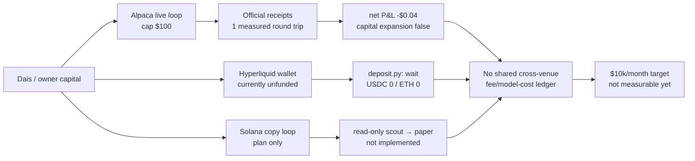
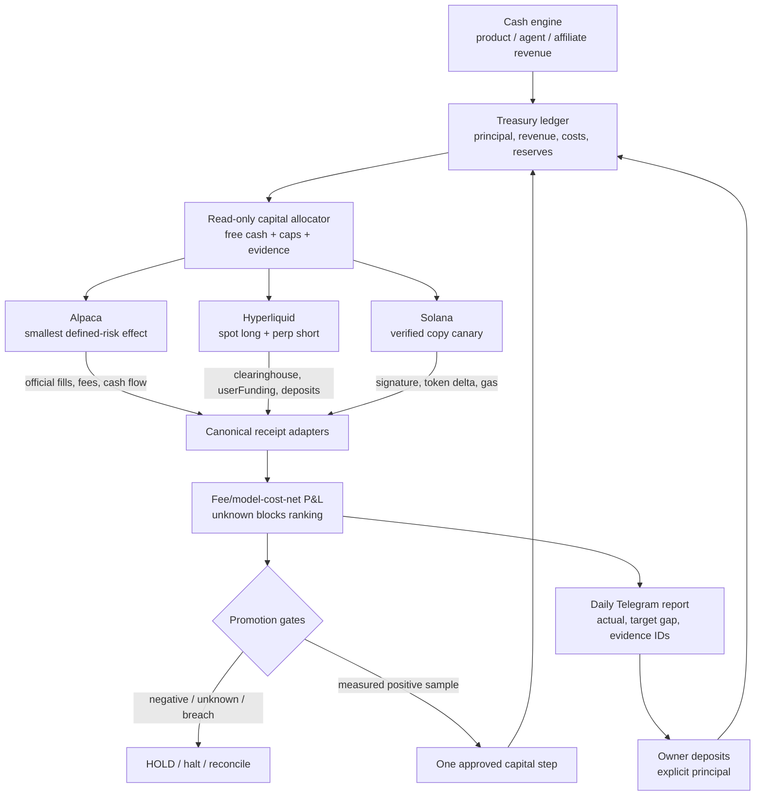

# Investment Loop Generational Wealth Implementation Plan

> **For agentic workers:** REQUIRED SUB-SKILL: Use superpowers:subagent-driven-development (recommended) or superpowers:executing-plans to implement this plan task-by-task. Steps use checkbox (`- [ ]`) syntax for tracking.

**Goal:** Turn the current fragmented investment paths into a receipt-verified, fee/model-cost-net portfolio loop that can scale one measured capital step at a time toward `$10,000` realised net trading profit per month, while treating generational wealth as a separate capital-accumulation problem rather than promising returns.

**Architecture:** Keep each venue as an effect owner: Alpaca owns Alpaca orders, Hyperliquid owns Hyperliquid deposits/orders, and Solana owns Solana transactions. Add one read-only portfolio evidence spine that normalises official receipts, subtracts every known cost exactly once, rejects unknown evidence, reports the gap to the target, and gates capital expansion. A separate treasury/cash engine records owner deposits, product revenue, investment P&L, costs, and reserves so owner cash flow is never mistaken for profit.

**Tech Stack:** Existing Python investment core and `unittest` suites; Alpaca CLI and official account/activity/order readbacks; Hyperliquid Python SDK and `/info` API; Solana RPC plus Jupiter quote/swap receipts; append-only JSONL state; existing Telegram outbox; existing loop registry owned by lm-lead.

**Spec:** `docs/superpowers/specs/2026-09-01-alpaca-money-maximizer-design.md` §7.3 and §8 L18; `docs/superpowers/plans/2026-09-27-hyperliquid-carry-live-loop.md`; `docs/superpowers/plans/2026-09-27-solana-memecoin-copy-trading.md`; `docs/superpowers/plans/2026-09-27-cross-venue-capital-allocator-net-pnl.md`.

## Global Constraints

- `$10,000/month` means official realised net trading P&L after fees, funding/borrow, slippage, gas, and model cost; paper P&L, unrealised P&L, deposits, projections, and subscription MRR do not count.
- No capital expansion while `measurement_status != measured`, net P&L is non-positive, any cost component is unknown, any receipt is missing, or a safety breach exists.
- Current Alpaca cap remains `$100` allocated capital, `$10` maximum loss per trade, `$20` daily loss halt until a later approved ladder step is proven.
- Current Hyperliquid leg cap remains `$25`, one delta-neutral position, day-loss cap `5%`, drawdown cap `20%`; a funded wallet does not imply live enablement.
- Solana begins read-only scout → paper replay → exactly one `$2.00` live canary with a hard cumulative `$3.00` ceiling; no user credential or target-wallet private key enters the repo.
- Owner deposits and withdrawals are principal cash flow, never investment revenue; each venue's official receipt IDs are required for attribution.
- Every live effect is journaled before submission, reconciled by official provider state, and made retry-safe; `effect_unknown` blocks new effects.
- The loop never increases risk, leverage, cap, or destination from a Telegram message; registry/runtime changes are requested from lm-lead through the owner path.
- Use no new scheduler, generic strategy framework, second ledger, or dashboard until an existing boundary cannot satisfy the acceptance test.

## Review Focus

- **Deposit mistaken for profit:** a `$50` owner transfer must increase principal and not net P&L; test positive and negative owner cash flow.
- **Unknown cost treated as zero:** missing funding, fee, gas, slippage, or model-cost receipt must produce `partial`/`blocked`, never a profitable number.
- **Cross-venue duplicate attribution:** one provider receipt ID or one cost line cannot be counted in two venue rows or in both venue and aggregate totals.
- **Stale or non-authoritative provider data:** an old quote, paper receipt, UI projection, or incomplete API response must exclude the candidate from allocation.
- **Capital ladder bypass:** a positive paper result, one lucky fill, or a projection cannot raise a cap; the next cap requires the named live sample, risk gates, and explicit owner/lm-lead promotion receipt.

## As-Is Evidence

The current state is not one investment machine:

### Verified repo/runtime facts

- `skills/alpaca-investment/performance.py` reports `capital_expansion_allowed: false`, requires at least `30` round trips for statistical support, and hard-caps the current performance gate at `$100`.
- The retained Alpaca live receipt reports one completed round trip with fee-inclusive net P&L `-$0.006970681885`; the sealed performance projection reports net `-$0.04`, realised `-$0.01`, unrealised `-$0.03`, fees `$0.01`, and `statistically_supported: false`.
- The current Alpaca readback has equity about `$66.60`, no trade allocation, and a `USDCUSD` holding; this is account state, not revenue.
- Hyperliquid carry code and tests are merged, but the registry row/runtime lock was owner-requested rather than directly changed by this lane; the current agent wallet readback is USDC `0` / ETH `0`, with no `userFunding`, deposit transaction, entry receipt, or daily P&L.
- The Solana copy-trading and cross-venue allocator documents exist, but their implementation TODOs remain open.

## Target Economics

These are planning calculations, not forecasts:

| Target | Required net capital at 10% APR | at 15% APR | at 20% APR |
|---|---:|---:|---:|
| `$10,000/month` net (`$120,000/year`) | `$1.20M` | `$800k` | `$600k` |
| `$1,000/month` net | `$120k` | `$80k` | `$60k` |

The current `$100` Alpaca cap at a hypothetical 10% net annual return produces about `$0.83/month`; a `$24` Hyperliquid leg at the plan's measured 11% APR produces about `$0.22/month` gross before variable funding and fees. Therefore the path to generational wealth must combine a measured investment engine with a cash-generation engine and recurring contributions. The investment loop alone cannot turn `$100` into `$10k/month` without assuming an unsafe, unmeasured return.

## To-Be Architecture

### Promotion ladder

| Stage | Capital boundary | Required evidence | Allowed action |
|---|---:|---|---|
| S0 | `$0–100` | current receipts, no unknowns, baseline reports | measure only; no expansion |
| S1 | `$100–1,000` | at least `30` completed live round trips per venue, positive net after every cost, no risk breach, and no `unknown` evidence | explicit cap promotion; one venue at a time |
| S2 | `$1,000–10,000` | 90-day rolling positive net, drawdown within policy, venue concentration and liquidity checks | add a second verified venue |
| S3 | `$10,000–100,000` | 6–12 months positive net, stress/replay evidence, tax/reserve accounting, operational owner review | measured diversification and treasury contributions |
| S4 | `$100,000–600,000+` | audited monthly receipts, stable net APR, external custody/legal/tax review, no single-strategy dependency | pursue `$10k/month` target |

No stage is automatic. A stage recommendation is data; a stage promotion is a separately recorded owner-approved capital boundary.

---

### Task 1: Canonical multi-venue receipt and net-P&L spine

**Files:**
- Create: `apps/life-manager/investment-core/portfolio_receipts.py`
- Create: `apps/life-manager/investment-core/portfolio_performance.py`
- Test: `apps/life-manager/investment-core/test_portfolio_performance.py`
- Modify: `apps/life-manager/investment-core/performance.py` only where the common schema can be reused without changing Alpaca's accepted receipt contract
- Parity check: `skills/alpaca-investment/` remains byte-equivalent where it is a release copy; do not silently update one copy only

**Interfaces:**
- Consumes: venue-specific official receipt readers and owner cash-flow records.
- Produces: `VenueSnapshot` with `venue`, `observed_at`, `equity_usd`, `free_cash_usd`, `gross_pnl_usd`, `trading_fees_usd`, `funding_or_borrow_usd`, `slippage_usd`, `gas_usd`, `model_cost_usd`, `source_receipt_ids`, `risk`, and `measurement_status`; `aggregate(snapshots, owner_cash_flow_usd) -> dict`.

- [x] **Step 1: Write failing tests** for owner deposits excluded from P&L, exact `net_pnl = gross - trading_fees - funding_or_borrow - slippage - gas - model_cost`, duplicate receipt rejection, missing-cost blocking, stale snapshot exclusion, and cross-venue source ID uniqueness.
- [x] **Step 2: Run the focused test** with `cd apps/life-manager/investment-core && python3 -m unittest test_portfolio_performance`; the expected missing-adapter `ModuleNotFoundError` was observed.
- [x] **Step 3: Implement the pure schema/aggregate boundary** without provider submit/signing imports; preserve unknown fields as blocked evidence, never as zero.
- [x] **Step 4: Run focused tests and existing `skills/alpaca-investment/test_performance.py`**; new tests pass `6/6`, existing performance tests pass `7/7`, and the complete investment suite passes `139/139`.
- [x] **Step 5: Commit** `feat(investment): add canonical fee-model-cost net pnl spine` (`fa710b6310`); focused task-done verification records `6/6` passing.

### Task 2: Hyperliquid funded canary and verified carry evidence

**Files:**
- Reuse: `skills/earn/hyperliquid-carry/{deposit.py,run.py,market.py,ledger.py,execute.py}`
- Reuse tests: `skills/earn/hyperliquid-carry/test_hyperliquid_carry.py`
- Operational owner path: `config/loop-registry.json` and production runtime, owned by lm-lead; do not edit directly in this lane

**Interfaces:**
- Consumes: agent-wallet Arbitrum deposit and Hyperliquid official `/info` responses.
- Produces: verified deposit receipt, `clearinghouseState`, `userFunding`, entry/exit receipts, and a venue snapshot for Task 1.

- [ ] **Step 1: Obtain lm-lead readback** for registry row `hyperliquid-carry`, cadence `3600s`, `HL_CARRY_LIVE=1`, `HL_CARRY_MAX_LEG_USD=25`, state root, daily `deposit.py` wake, and locked SDK install. Read-only repo/runtime evidence currently shows no `hyperliquid-carry` registry row; an explicit readback request was sent to `lm-lead`, with no reply yet. This is not treated as live enablement.
- [x] **Step 2: Re-run deposit preflight without live env** and verify the exact Arbitrum address, native USDC token, ETH gas balance, and no pending `effect_unknown` deposit before any send. Result: wallet `0xA428…9302`, USDC `0`, ETH `0`, action `wait/usdc_below_bridge_minimum`, no journal/pending deposit.
- [ ] **Step 3: After owner funding, reconcile the Arbitrum tx** through provider receipt and Hyperliquid `userNonFundingLedgerUpdates`; record the tx hash and credited amount as principal, not profit.
- [ ] **Step 4: Run one smallest delta-neutral entry/exit canary** only after equity, market, and risk gates pass; read back `clearinghouseState`, fills, and `userFunding`.
- [ ] **Step 5: Require 14 days of daily net evidence** before any additional capital; report gross funding, trading fees, bridge/gas, slippage, and net separately.
- [ ] **Step 6: Commit only documentation/evidence updates** if code remains unchanged; runtime/registry mutation is lm-lead's owner action.

### Task 3: Alpaca capital-ladder promotion gate

**Files:**
- Create: `apps/life-manager/investment-core/capital_ladder.py`
- Modify: `apps/life-manager/investment-core/performance_gate.py`
- Modify: `apps/life-manager/investment-core/risk_policy.py`
- Mirror after parity review: `skills/alpaca-investment/capital_ladder.py`, `skills/alpaca-investment/test_capital_ladder.py`
- Reference: `skills/alpaca-investment/{performance.py,performance_gate.py,test_performance.py}`

**Interfaces:**
- Consumes: official measured net-P&L receipt, round-trip count, drawdown, current cap, explicit approved next cap, and venue health.
- Produces: `recommend_next_cap(evidence, current_cap, requested_cap) -> {status: "hold"|"recommend"|"reject", current_cap_usd, next_cap_usd, reasons, evidence_ids}`. It never submits an order or changes the cap itself.

- [x] **Step 1: Write failing tests** proving current negative/one-round-trip evidence rejects expansion, paper evidence rejects expansion, unknown cost rejects expansion, and a positive fixture with `round_trips >= 30` recommends only the next discrete cap. Added a regression for a missing unknown-cost vector.
- [x] **Step 2: Implement the pure ladder** with exact caps `$100 → $1,000 → $10,000 → $100,000`; require an explicit requested cap and preserve the existing `$10` trade / `$20` daily loss gates until a separately approved risk revision exists.
- [x] **Step 3: Add receipt-backed promotion evidence** to the Telegram/report schema without exposing secrets or allowing a message to authorize promotion. The report is recommendation-only and always requires owner authorization.
- [x] **Step 4: Run `cd skills/alpaca-investment && python3 -m unittest test_performance test_capital_ladder test_risk_policy` plus the existing investment suite, then run the app/skill parity check.** Focused tests pass `25/25`, app tests pass `3/3`, full investment discovery passes `147/147`, and parity is clean.
- [ ] **Step 5: Commit** `feat(investment): gate capital ladder by measured net pnl`.

### Task 4: Solana read-only scout → paper → `$2–3` canary

**Files:**
- Implement the existing plan: `docs/superpowers/plans/2026-09-27-solana-memecoin-copy-trading.md`
- Create under that plan: `skills/earn/solana-memecoin-copytrade/`
- Reuse verified swap pattern: `skills/earn/sol-trade/lib/record-swap.mjs`

**Interfaces:**
- Consumes: public target-wallet RPC history, GMGN/DexScreener metadata, Jupiter quotes, and Solana confirmed transaction receipts.
- Produces: public-wallet `scout_unknown|ok`, paper receipts, and one on-chain-verified canary receipt with source signature, token delta, fee, slippage, and final balance.

- [ ] **Step 1: Write tests** for transfer-vs-swap discrimination, provider disagreement, stale/illiquid quote, duplicate source signature, mismatched token delta, and failed transaction fee accounting.
- [ ] **Step 2: Implement read-only scout and deterministic paper policy**; no signing path is imported by scout/paper mode.
- [ ] **Step 3: Run one public-target read-only scout** and save evidence without target-wallet secrets.
- [ ] **Step 4: Run paper replay until the policy has a measured sample**; do not use paper returns as capital-expansion evidence.
- [ ] **Step 5: Run exactly one `$2.00` live canary with a hard `$3.00` cumulative ceiling** only after explicit owner funding and all RPC receipt checks pass.
- [ ] **Step 6: Run each focused `node --test` command named in `docs/superpowers/plans/2026-09-27-solana-memecoin-copy-trading.md` and obtain a fresh read-only review before any second canary.

### Task 5: Cross-venue allocator and daily target-gap report

**Files:**
- Implement the existing plan: `docs/superpowers/plans/2026-09-27-cross-venue-capital-allocator-net-pnl.md`
- Reuse: `apps/life-manager/investment-core/allocator.py`, `performance.py`, `reporter.py`, `telegram_outbox.py`
- Tests: the plan's `test_venue_snapshots`, `test_aggregate`, `test_allocator`, and `test_reporter` files

**Interfaces:**
- Consumes: Task 1 venue snapshots, free cash, risk caps, stale/unknown state, and target `$10,000/month`.
- Produces: `rank(...) -> allocate|hold|halt`, daily aggregate receipt, `rolling_30d_net_pnl_usd`, `target_gap_usd`, `capital_expansion_allowed`, and source receipt IDs.

- [ ] **Step 1: Add failing tests** for positive net vs unknown-cost candidates, owner cash-flow adjustment, stale venue exclusion, drawdown halt, deterministic tie-breaks, duplicate daily report, and target-gap accuracy.
- [ ] **Step 2: Implement read-only ranking**; the allocator must not import or call venue submit/signing functions.
- [ ] **Step 3: Implement one UTC-daily report** through the existing idempotent Telegram outbox; unknown values render `不明`, never zero.
- [ ] **Step 4: Run focused tests, existing investment tests, and replay-zero checks**; prove the allocator cannot create a second order or reinterpret a deposit as revenue.
- [ ] **Step 5: Commit** `feat(investment): rank verified cross-venue net returns`.

### Task 6: Treasury and generational-wealth cash engine

**Files:**
- Create: `apps/life-manager/investment-core/treasury.py`
- Create: `apps/life-manager/investment-core/test_treasury.py`
- Modify: `apps/life-manager/config/product-loop-catalog.json` only through the normal owner/release path if a new economic source is actually wired
- Reference: existing agent-economy, affiliate, and investment financial adapters

**Interfaces:**
- Consumes: official customer-revenue receipts, owner cash-flow receipts, venue net-P&L receipts, model/API cost receipts, and reserve policy.
- Produces: `treasury_snapshot(period) -> {customer_revenue_usd, investment_net_pnl_usd, owner_cash_flow_usd, model_cost_usd, tax_reserve_usd, investable_surplus_usd, evidence_status}`.

- [ ] **Step 1: Write tests** for principal/revenue/P&L separation, missing cost evidence, duplicate receipt IDs, reserve calculation, and negative investable surplus.
- [ ] **Step 2: Implement a read-only treasury rollup**; it never transfers funds and never counts projected investment return as cash.
- [ ] **Step 3: Connect only existing receipt producers**; a missing product financial adapter remains visible as `partial`, not silently omitted.
- [ ] **Step 4: Report two separate targets:** investment net P&L target `$10k/month` and total treasury surplus target; never merge subscription MRR with trading P&L.
- [ ] **Step 5: Commit** `feat(investment): separate treasury cash from investment pnl`.

### Task 7: Acceptance, promotion, and $10k/month scoreboard

**Files:**
- Modify: `docs/superpowers/specs/2026-09-01-alpaca-money-maximizer-design.md` L18 status only after evidence
- Modify: `docs/superpowers/plans/2026-09-28-investment-loop-generational-wealth.md` with the current cursor and receipts
- Test/replay: all venue focused suites, loop contract, natural wake, provider readbacks

- [ ] **Step 1: Record S0 baseline**: current Alpaca net `-$0.04`, Hyperliquid `unfunded`, Solana `not implemented`, allocator `not implemented`; no capital promotion.
- [ ] **Step 2: Close each canary with official receipts**: entry, exit, fees, funding/borrow, gas, slippage, model cost, and cash-flow classification.
- [ ] **Step 3: Require the first positive monthly net receipt** and no safety breach before recommending S1; one positive day is insufficient.
- [ ] **Step 4: Promote only one discrete cap at a time**, with an explicit owner/lm-lead receipt and a rollback/hold path.
- [ ] **Step 5: Mark `$10k/month` achieved only when a rolling monthly official receipt says `net_pnl_usd >= 10000`; mark generational wealth only from the treasury/net-worth ledger, not from a projected APR.**
- [ ] **Step 6: Run the final verification package**: all focused suites, `git diff --check`, loop contract, replay-zero, provider readbacks, and independent safety review.

## Current TODO Cursor

1. Do not send more owner capital yet; the current measured evidence is negative/insufficient.
2. Hyperliquid read-only preflight is complete; obtain `lm-lead` owner/runtime receipt before any funding or canary.
3. Task 1 canonical fee/model-cost net-P&L spine is implemented and verified (`fa710b6310`); its source contract is ready for venue adapters.
4. Task 3 Alpaca capital-ladder recommendation gate is implemented and verified; keep the cap at `$100` until its live evidence is complete.
5. Implement the Solana plan only through read-only scout and paper before the `$2` canary.
6. Continue Alpaca measurement until the first 30-round-trip decision gate; no cap increase.
7. Implement the allocator and treasury rollups.
8. Return to Hyperliquid only after owner/runtime receipt and explicit funding boundary; require 14 daily net receipts before expansion.
9. Promote capital one measured step at a time; never chase the `$10k/month` number with leverage or blind deposits.

### Execution order ruling

The original task order was `Task 1 → Task 2 full canary → Task 3`. The safe executable order is now
`Task 1 → Task 2 read-only evidence → Task 3 pure gate → Task 4 read-only/paper → Task 2 effect steps → Task 5–7`.
The change keeps all owner-funded effects behind the missing `lm-lead`/funding receipt while allowing independent
read-only and pure measurement work to proceed; no production registry or wallet state is changed by this reorder.

## Source References

- Hyperliquid funding is hourly, peer-to-peer, and rate-dependent: <https://hyperliquid.gitbook.io/hyperliquid-docs/trading/funding>
- Hyperliquid fees vary by rolling volume/tier and differ between spot/perps: <https://hyperliquid.gitbook.io/hyperliquid-docs/trading/fees>
- Hyperliquid official `clearinghouseState`, `userFunding`, and non-funding ledger readbacks: <https://hyperliquid.gitbook.io/Hyperliquid-docs/for-developers/api/info-endpoint>
- Alpaca paper trading is simulation and can differ from live execution; live crypto fees are volume/order-type dependent: <https://docs.alpaca.markets/us/docs/paper-trading>, <https://docs.alpaca.markets/us/docs/crypto-fees>
- Solana transaction fees include base and optional prioritisation fees, including on failed transactions: <https://solana.com/docs/core/fees/fee-structure>
- Diversification lowers concentration risk but cannot guarantee against losses: <https://www.investor.gov/introduction-investing/investing-basics/diversify-your-investments>
