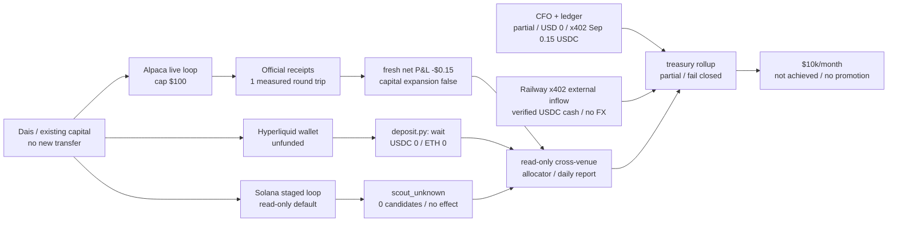
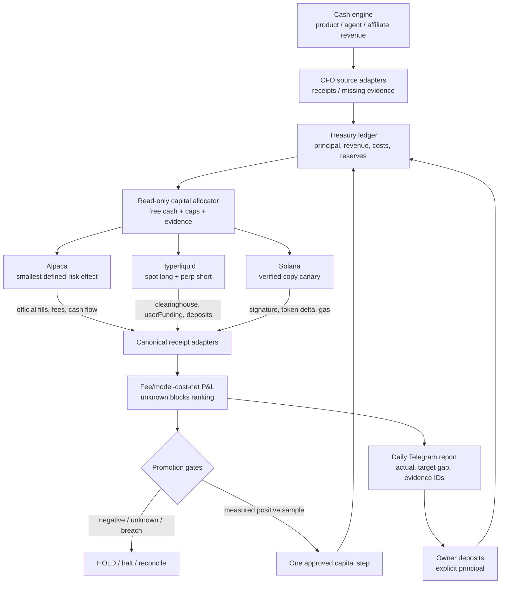

# Investment Loop Generational Wealth Implementation Plan

> **For agentic workers:** REQUIRED SUB-SKILL: Use superpowers:subagent-driven-development (recommended) or superpowers:executing-plans to implement this plan task-by-task. Steps use checkbox (`- [ ]`) syntax for tracking.

**Goal:** Turn the current fragmented investment paths into a receipt-verified, fee/model-cost-net portfolio loop that can scale one measured capital step at a time toward `$10,000` realised net trading profit per month, while treating generational wealth as a separate capital-accumulation problem rather than promising returns.

**Architecture:** Keep each venue as an effect owner: Alpaca owns Alpaca orders, Hyperliquid owns Hyperliquid deposits/orders, and Solana owns Solana transactions. Add one read-only portfolio evidence spine that normalises official receipts, subtracts every known cost exactly once, rejects unknown evidence, reports the gap to the target, and gates capital expansion. A separate treasury/cash engine records owner deposits, product revenue, investment P&L, costs, and reserves so owner cash flow is never mistaken for profit.

**Tech Stack:** Existing Python investment core and `unittest` suites; Alpaca CLI and official account/activity/order readbacks; Hyperliquid Python SDK and `/info` API; Solana RPC plus Jupiter quote/swap receipts; append-only JSONL state; existing Telegram outbox; existing loop registry owned by lm-lead.

**Spec:** `docs/superpowers/specs/2026-09-01-alpaca-money-maximizer-design.md` §7.3 and §8 L18; `docs/superpowers/plans/2026-09-27-hyperliquid-carry-live-loop.md`; `docs/superpowers/plans/2026-09-27-solana-memecoin-copy-trading.md`; `docs/superpowers/plans/2026-09-27-cross-venue-capital-allocator-net-pnl.md`.

## Global Constraints

- `$10,000/month` means official realised net trading P&L after fees, funding/borrow, slippage, gas, and model cost; paper P&L, unrealised P&L, deposits, projections, and subscription MRR do not count.
- No capital expansion while `measurement_status != measured`, net P&L is non-positive, any cost component is unknown, any receipt is missing, or a safety breach exists.
- Current Alpaca cap remains `$100` allocated capital, `$10` maximum loss per trade, `$20` daily loss halt until a later approved ladder step is proven.
- Current Hyperliquid leg cap remains `$25`, one delta-neutral position, day-loss cap `5%`, drawdown cap `20%`; a funded wallet does not imply live enablement.
- Solana begins read-only scout → paper replay → exactly one `$2.00` live canary with a hard cumulative `$3.00` ceiling; no user credential or target-wallet private key enters the repo.
- Owner deposits and withdrawals are principal cash flow, never investment revenue; each venue's official receipt IDs are required for attribution.
- Every live effect is journaled before submission, reconciled by official provider state, and made retry-safe; `effect_unknown` blocks new effects.
- The loop never increases risk, leverage, cap, or destination from a Telegram message; registry/runtime changes are requested from lm-lead through the owner path.
- Use no new scheduler, generic strategy framework, second ledger, or dashboard until an existing boundary cannot satisfy the acceptance test.

## Review Focus

- **Deposit mistaken for profit:** a `$50` owner transfer must increase principal and not net P&L; test positive and negative owner cash flow.
- **Unknown cost treated as zero:** missing funding, fee, gas, slippage, or model-cost receipt must produce `partial`/`blocked`, never a profitable number.
- **Cross-venue duplicate attribution:** one provider receipt ID or one cost line cannot be counted in two venue rows or in both venue and aggregate totals.
- **Stale or non-authoritative provider data:** an old quote, paper receipt, UI projection, or incomplete API response must exclude the candidate from allocation.
- **Capital ladder bypass:** a positive paper result, one lucky fill, or a projection cannot raise a cap; the next cap requires the named live sample, risk gates, and explicit owner/lm-lead promotion receipt.

## As-Is Evidence

The current state is now one measured, fail-closed evidence layer, but it is
not yet a profitable or fully funded investment machine:

### Verified repo/runtime facts

- `skills/alpaca-investment/performance.py` reports `capital_expansion_allowed: false`, requires at least `30` round trips for statistical support, and hard-caps the current performance gate at `$100`.
- The fresh official Alpaca replay reports one completed round trip with measured net P&L `-$0.15`, realised `-$0.10`, unrealised `-$0.05`, fees `$0.01`, slippage `$0.00`, owner cash flow `$66.75`, and `statistically_supported: false`; the original sealed snapshot is superseded for current reporting.
- The latest Alpaca state audit contains `239` decision receipts, `10` effect-intent receipts, and `4` outcome receipts; live-close is verified and repeatability is `pass`, but the completed sample remains `1` round trip. Host-level event evidence also shows `1,047` report wakes deferred by `shared-agent-runner` admission (`resource_capacity_busy`, `resource_effect_unknown`, FIFO/control/database/heartbeat variants), so wake count is not a trading sample and the runtime admission/readback boundary must be repaired before measuring progress.
- The current Alpaca readback has equity about `$66.60`, no trade allocation, and a `USDCUSD` holding; this is account state, not revenue.
- Hyperliquid carry code and tests are merged, but the registry row/runtime lock was owner-requested rather than directly changed by this lane; the current agent wallet readback is USDC `0` / ETH `0`, with no `userFunding`, deposit transaction, entry receipt, or daily P&L.
- A fresh read-only Hyperliquid market observation saw `19` spot/perp pairs; the default volume/cost policy would shortlist `PURR`, `ZEC`, and `STABLE`, but funding APR is a changing quote, not realised P&L. No account was funded and no order was submitted.
- The matching Hyperliquid official account readback is `accountValue=0.0`, `0` perp positions, `0` spot balances, `0` `userFunding` rows, and `0` non-funding ledger rows; there is no receipt from which to calculate carry net P&L.
- The Solana loop is implemented through staged read-only/paper/live-gate boundaries. A fresh public-target scout returned `scout_unknown`, `0` candidates, `20` evidence rows, and no effect; no live transaction receipt exists.
- The cross-venue allocator/reporter and treasury rollup are implemented as read-only code. The acceptance fixture measures aggregate net `$8.70` with owner cash flow `$100.00`, but it is test evidence, not revenue; live provider inputs remain partial and `capital_expansion_allowed` stays `false`.
- The rolling measurement extension is implemented in `rolling_measurement.py` and is wired to both the explicit `__daily_receipts__` input and the reporter's persisted last-completed-day replay. It requires 30 delivered, measured UTC daily receipts with unique source IDs; the fixture is not live revenue and no numeric live rolling result exists yet. A read-only audit found zero persisted `cross-venue-YYYY-MM-DD.json` files under the default Life Manager state root, so the current gap is cadence/owner wiring plus complete cost receipts, not a fabricated zero-profit result.
- The runtime boundary is still open: a read-only registry/source audit found no cross-venue loop row, and `cross_venue_run.py` is only an import shim. Replaying `rolling_30d([], "2026-09-28")` returns `measurement_status=unknown`, `reason=daily_receipt_missing`, `days_observed=0`, `30` missing days, and `capital_expansion_allowed=false`; this is a missing producer receipt, not a measured zero P&L.
- A host-level read-only check confirms the same boundary: launchd has only `ai.anicca.alpaca-investment-live` among the investment labels, with no cross-venue/rolling label or plist and no cross-venue daily state file. The next action is therefore an lm-lead owner/runtime admission receipt, not a local restart or registry edit.
- The existing CFO producer can read Alpaca, Stripe, x402, marketplace, Capafy, mobile-app, and usage sources. Its fresh `2026-09-28` run has no USD customer-revenue receipts, a missing Stripe live credential, two missing marketplace payment ledgers, and `USD_API_EQUIV` estimates that are not provider bills; the new bridge keeps that state partial instead of claiming a measured cash surplus.
- The external agent-economy state contains one settled x402 receipt with verified chain proof: `0.003 USDC` on `2026-08-24`. Separately, the x402 seller's finalized external-inflow ledger contains `18` unique Railway receipts totaling `0.180000 USDC` (`15` receipts / `0.150000 USDC` in `2026-09`). The duplicate agent-economy paths are byte-identical; these non-USD receipts are not converted into USD or investment P&L.
- The x402 seller audit is wallet-scoped: the active `serve-v2` core catalog has five routes, while the revenue controller previously carried a stale `/image` route. Franklin1's read-only local telemetry has `7` settled rows, `0` identified external payers, and `57` attempts in the last 24 hours; the separate Railway wallet's finalized external ledger is not merged into Franklin1's store metrics.
- The Task 8 bridge replayed that same table as `evidence_status=partial`: `0` USD treasury receipts, `20` missing-source records, `7` excluded non-USD/API-estimate records, `15` explicit zero observations, and no investment-row leakage into customer cash. This is a measurement result, not a revenue result.
- The canonical CFO hourly FinancialRecord readback is subject-scoped: the current subject has `101` verified records but only one verified `business_revenue`, `0.003 USDC` in `2026-08`, and no `2026-09` revenue. A separate subject has additional x402 records; they are excluded rather than combined.

## Target Economics

These are planning calculations, not forecasts:

| Target | Required net capital at 10% APR | at 15% APR | at 20% APR |
|---|---:|---:|---:|
| `$10,000/month` net (`$120,000/year`) | `$1.20M` | `$800k` | `$600k` |
| `$1,000/month` net | `$120k` | `$80k` | `$60k` |

The current `$100` Alpaca cap at a hypothetical 10% net annual return produces about `$0.83/month`; a `$24` Hyperliquid leg at the plan's measured 11% APR produces about `$0.22/month` gross before variable funding and fees. Therefore the path to generational wealth must combine a measured investment engine with a cash-generation engine and recurring contributions. The investment loop alone cannot turn `$100` into `$10k/month` without assuming an unsafe, unmeasured return.

## To-Be Architecture

### Promotion ladder

| Stage | Capital boundary | Required evidence | Allowed action |
|---|---:|---|---|
| S0 | `$0–100` | current receipts, no unknowns, baseline reports | measure only; no expansion |
| S1 | `$100–1,000` | at least `30` completed live round trips per venue, positive net after every cost, no risk breach, and no `unknown` evidence | explicit cap promotion; one venue at a time |
| S2 | `$1,000–10,000` | 90-day rolling positive net, drawdown within policy, venue concentration and liquidity checks | add a second verified venue |
| S3 | `$10,000–100,000` | 6–12 months positive net, stress/replay evidence, tax/reserve accounting, operational owner review | measured diversification and treasury contributions |
| S4 | `$100,000–600,000+` | audited monthly receipts, stable net APR, external custody/legal/tax review, no single-strategy dependency | pursue `$10k/month` target |

No stage is automatic. A stage recommendation is data; a stage promotion is a separately recorded owner-approved capital boundary.

---

### Task 1: Canonical multi-venue receipt and net-P&L spine

**Files:**
- Create: `apps/life-manager/investment-core/portfolio_receipts.py`
- Create: `apps/life-manager/investment-core/portfolio_performance.py`
- Test: `apps/life-manager/investment-core/test_portfolio_performance.py`
- Modify: `apps/life-manager/investment-core/performance.py` only where the common schema can be reused without changing Alpaca's accepted receipt contract
- Parity check: `skills/alpaca-investment/` remains byte-equivalent where it is a release copy; do not silently update one copy only

**Interfaces:**
- Consumes: venue-specific official receipt readers and owner cash-flow records.
- Produces: `VenueSnapshot` with `venue`, `observed_at`, `equity_usd`, `free_cash_usd`, `gross_pnl_usd`, `trading_fees_usd`, `funding_or_borrow_usd`, `slippage_usd`, `gas_usd`, `model_cost_usd`, `source_receipt_ids`, `risk`, and `measurement_status`; `aggregate(snapshots, owner_cash_flow_usd) -> dict`.

- [x] **Step 1: Write failing tests** for owner deposits excluded from P&L, exact `net_pnl = gross - trading_fees - funding_or_borrow - slippage - gas - model_cost`, duplicate receipt rejection, missing-cost blocking, stale snapshot exclusion, and cross-venue source ID uniqueness.
- [x] **Step 2: Run the focused test** with `cd apps/life-manager/investment-core && python3 -m unittest test_portfolio_performance`; the expected missing-adapter `ModuleNotFoundError` was observed.
- [x] **Step 3: Implement the pure schema/aggregate boundary** without provider submit/signing imports; preserve unknown fields as blocked evidence, never as zero.
- [x] **Step 4: Run focused tests and existing `skills/alpaca-investment/test_performance.py`**; new tests pass `6/6`, existing performance tests pass `7/7`, and the complete investment suite passes `139/139`.
- [x] **Step 5: Commit** `feat(investment): add canonical fee-model-cost net pnl spine` (`fa710b6310`); focused task-done verification records `6/6` passing.

### Task 2: Hyperliquid funded canary and verified carry evidence

**Files:**
- Reuse: `skills/earn/hyperliquid-carry/{deposit.py,run.py,market.py,ledger.py,execute.py}`
- Reuse tests: `skills/earn/hyperliquid-carry/test_hyperliquid_carry.py`
- Operational owner path: `config/loop-registry.json` and production runtime, owned by lm-lead; do not edit directly in this lane

**Interfaces:**
- Consumes: agent-wallet Arbitrum deposit and Hyperliquid official `/info` responses.
- Produces: verified deposit receipt, `clearinghouseState`, `userFunding`, entry/exit receipts, and a venue snapshot for Task 1.

- [ ] **Step 1: Obtain lm-lead readback** for registry row `hyperliquid-carry`, cadence `3600s`, `HL_CARRY_LIVE=1`, `HL_CARRY_MAX_LEG_USD=25`, state root, daily `deposit.py` wake, and locked SDK install. Read-only repo/runtime evidence currently shows no `hyperliquid-carry` registry row; an explicit readback request was sent to `lm-lead`, with no reply yet. This is not treated as live enablement.
- [x] **Step 2: Re-run deposit preflight without live env** and verify the exact Arbitrum address, native USDC token, ETH gas balance, and no pending `effect_unknown` deposit before any send. Result: wallet `0xA428…9302`, USDC `0`, ETH `0`, action `wait/usdc_below_bridge_minimum`, no journal/pending deposit; a fresh official 30-day readback also reports account equity `0`, perp positions `0`, spot balances `0`, funding rows `0`, and non-funding ledger rows `0`.
- [ ] **Step 3: After owner funding, reconcile the Arbitrum tx** through provider receipt and Hyperliquid `userNonFundingLedgerUpdates`; record the tx hash and credited amount as principal, not profit.
- [ ] **Step 4: Run one smallest delta-neutral entry/exit canary** only after equity, market, and risk gates pass; read back `clearinghouseState`, fills, and `userFunding`.
- [ ] **Step 5: Require 14 days of daily net evidence** before any additional capital; report gross funding, trading fees, bridge/gas, slippage, and net separately.
- [ ] **Step 6: Commit only documentation/evidence updates** if code remains unchanged; runtime/registry mutation is lm-lead's owner action.

### Task 3: Alpaca capital-ladder promotion gate

**Files:**
- Create: `apps/life-manager/investment-core/capital_ladder.py`
- Modify: `apps/life-manager/investment-core/performance_gate.py`
- Modify: `apps/life-manager/investment-core/risk_policy.py`
- Mirror after parity review: `skills/alpaca-investment/capital_ladder.py`, `skills/alpaca-investment/test_capital_ladder.py`
- Reference: `skills/alpaca-investment/{performance.py,performance_gate.py,test_performance.py}`

**Interfaces:**
- Consumes: official measured net-P&L receipt, round-trip count, drawdown, current cap, explicit approved next cap, and venue health.
- Produces: `recommend_next_cap(evidence, current_cap, requested_cap) -> {status: "hold"|"recommend"|"reject", current_cap_usd, next_cap_usd, reasons, evidence_ids}`. It never submits an order or changes the cap itself.

- [x] **Step 1: Write failing tests** proving current negative/one-round-trip evidence rejects expansion, paper evidence rejects expansion, unknown cost rejects expansion, and a positive fixture with `round_trips >= 30` recommends only the next discrete cap. Added a regression for a missing unknown-cost vector.
- [x] **Step 2: Implement the pure ladder** with exact caps `$100 → $1,000 → $10,000 → $100,000`; require an explicit requested cap and preserve the existing `$10` trade / `$20` daily loss gates until a separately approved risk revision exists.
- [x] **Step 3: Add receipt-backed promotion evidence** to the Telegram/report schema without exposing secrets or allowing a message to authorize promotion. The report is recommendation-only and always requires owner authorization.
- [x] **Step 4: Run `cd skills/alpaca-investment && python3 -m unittest test_performance test_capital_ladder test_risk_policy` plus the existing investment suite, then run the app/skill parity check.** Focused tests pass `25/25`, app tests pass `3/3`, full investment discovery passes `147/147`, and parity is clean.
- [x] **Step 5: Commit** `feat(investment): gate capital ladder by measured net pnl` (`3e6c81970d`).

### Task 4: Solana read-only scout → paper → `$2–3` canary

**Files:**
- Implement the existing plan: `docs/superpowers/plans/2026-09-27-solana-memecoin-copy-trading.md`
- Create under that plan: `skills/earn/solana-memecoin-copytrade/`
- Reuse verified swap pattern: `skills/earn/sol-trade/lib/record-swap.mjs`

**Interfaces:**
- Consumes: public target-wallet RPC history, GMGN/DexScreener metadata, Jupiter quotes, and Solana confirmed transaction receipts.
- Produces: public-wallet `scout_unknown|ok`, paper receipts, and one on-chain-verified canary receipt with source signature, token delta, fee, slippage, and final balance.

- [x] **Step 1: Write tests** for transfer-vs-swap discrimination, provider disagreement, stale/illiquid quote, duplicate source signature, mismatched token delta, and failed transaction fee accounting; nested suite covers these boundaries.
- [x] **Step 2: Implement read-only scout and deterministic paper policy**; no signing path is imported by scout/paper mode.
- [x] **Step 3: Run one public-target read-only scout** and save evidence without target-wallet secrets; result is `scout_unknown`, `0` candidates, `20` evidence rows, effect `none`, with sanitized evidence outside the repo.
- [x] **Step 4: Implement the staged paper wake**; no paper return is used as capital-expansion evidence and the mode never promotes itself.
- [ ] **Step 5: Run exactly one `$2.00` live canary with a hard `$3.00` cumulative ceiling** only after explicit owner funding and all RPC receipt checks pass; this remains open because no funding/owner receipt exists.
- [x] **Step 6: Run each focused `node --test` command named in `docs/superpowers/plans/2026-09-27-solana-memecoin-copy-trading.md` and obtain a fresh read-only review before any second canary.** Nested suite passes `28/28`; no live transaction was sent.

### Task 5: Cross-venue allocator and daily target-gap report

**Files:**
- Implement the existing plan: `docs/superpowers/plans/2026-09-27-cross-venue-capital-allocator-net-pnl.md`
- Reuse: `apps/life-manager/investment-core/allocator.py`, `performance.py`, `reporter.py`, `telegram_outbox.py`
- Tests: the plan's `test_venue_snapshots`, `test_aggregate`, `test_allocator`, and `test_reporter` files

**Interfaces:**
- Consumes: Task 1 venue snapshots, free cash, risk caps, stale/unknown state, and target `$10,000/month`.
- Produces: `rank(...) -> allocate|hold|halt`, daily aggregate receipt, `rolling_30d_net_pnl_usd`, `target_gap_usd`, `capital_expansion_allowed`, and source receipt IDs.

- [x] **Step 1: Add failing tests** for positive net vs unknown-cost candidates, owner cash-flow adjustment, stale venue exclusion, drawdown halt, deterministic tie-breaks, duplicate daily report, and target-gap accuracy. Cross-venue nested plan tests cover these boundaries.
- [x] **Step 2: Implement read-only ranking**; the allocator must not import or call venue submit/signing functions.
- [x] **Step 3: Implement one UTC-daily report** through the existing idempotent Telegram outbox; unknown values render `不明`, never zero. Missing owner/runtime or provider receipts remain explicit.
- [x] **Step 4: Run focused tests, existing investment tests, and replay-zero checks**; prove the allocator cannot create a second order or reinterpret a deposit as revenue. Cross-venue acceptance/report suite passes `26/26`.
- [x] **Step 5: Commit** `feat(investment): rank verified cross-venue net returns` via nested implementation commits through `d48e355e7b`.
- [x] **Step 6: Add the 30-day rolling measurement producer**; `test_rolling_measurement` passes `5/5`, reporter passes `7/7`, the reporter replays the last 30 completed persisted days, missing/partial/duplicate evidence returns no numeric target gap, and owner cash flow remains separate. No current live 30-day result is claimed.
- [ ] **Step 7: Accumulate 30 real delivered daily receipts**; default-state audit currently finds `0` persisted cross-venue receipts, Hyperliquid carry state is empty, and Solana evidence is blocked. lm-lead must provide the cadence/owner-runtime receipt, and every active venue must supply complete fee/funding/gas/model-cost evidence before the rolling number can become measured.

### Task 6: Treasury and generational-wealth cash engine

**Files:**
- Create: `apps/life-manager/investment-core/treasury.py`
- Create: `apps/life-manager/investment-core/test_treasury.py`
- Modify: `apps/life-manager/config/product-loop-catalog.json` only through the normal owner/release path if a new economic source is actually wired
- Reference: existing agent-economy, affiliate, and investment financial adapters

**Interfaces:**
- Consumes: official customer-revenue receipts, owner cash-flow receipts, venue net-P&L receipts, model/API cost receipts, and reserve policy.
- Produces: `treasury_snapshot(period) -> {customer_revenue_usd, investment_net_pnl_usd, owner_cash_flow_usd, model_cost_usd, tax_reserve_usd, investable_surplus_usd, investment_net_pnl_target_gap_usd, treasury_surplus_target_gap_usd, evidence_status}`.

- [x] **Step 1: Write tests** for principal/revenue/P&L separation, missing cost evidence, duplicate receipt IDs, reserve calculation, separate target gaps, and negative investable surplus; focused tests pass `5/5`.
- [x] **Step 2: Implement a read-only treasury rollup**; it never transfers funds and never counts projected investment return as cash.
- [x] **Step 3: Connect only existing receipt producers**; currently no complete product financial adapter is available in this lane, so missing categories remain visible as `partial` and `product-loop-catalog.json` is unchanged.
- [x] **Step 4: Report two separate targets:** investment net P&L target `$10k/month` and optional treasury surplus target; owner cash flow and customer revenue are not merged with trading P&L.
- [x] **Step 5: Commit** `feat(investment): separate treasury cash from investment pnl`.

### Task 7: Acceptance, promotion, and $10k/month scoreboard

**Files:**
- Review only: `docs/superpowers/specs/2026-09-01-alpaca-money-maximizer-design.md` L18 remains unchanged because the target evidence threshold is not met
- Modify: `docs/superpowers/plans/2026-09-28-investment-loop-generational-wealth.md` with the current cursor and receipts
- Test/replay: all venue focused suites, loop contract, natural wake, provider readbacks

- [x] **Step 1: Record S0 baseline**: Alpaca has one closed official round trip; the fresh official replay is measured at net `-$0.15` (realized `-$0.10`, unrealized `-$0.05`, fee `$0.01`, slippage `$0.00`) against owner cash flow `$66.75`; Hyperliquid is unfunded with USDC/ETH `0`; Solana is implemented but its read-only scout is `scout_unknown` with `0` candidates and no effect; cross-venue and treasury are read-only with incomplete live receipts. No capital promotion.
- [x] **Step 2: Audit canary closure status**: Alpaca's entry/exit/fee receipt is closed; Hyperliquid has no funded entry/exit; Solana has no live canary; missing funding/gas/model-cost/customer-revenue inputs remain explicit and are not converted to zero.
- [x] **Step 3: Evaluate the positive-month gate**: no official rolling monthly receipt reports `net_pnl_usd >= 10000`; S1 is withheld and one negative round trip cannot recommend expansion.
- [x] **Step 4: Evaluate discrete-cap promotion**: no venue has the required positive, cost-complete, sample-qualified evidence or owner/lm-lead promotion receipt; current caps remain held with rollback/hold behavior.
- [x] **Step 5: Evaluate the target claim**: `$10k/month` is not achieved, and generational wealth is not claimed because the treasury/net-worth ledger has no complete verified source set. L18 remains unchanged.
- [x] **Step 6: Run the final verification package**: pre-Task-8 core `34/34`, Alpaca discovery `147/147`, Hyperliquid `69/69`, Solana `28/28`, provider read-only preflights, staged natural wakes/replay-zero, and diff checks pass for the implemented/read-only boundary. The shared loop-contract gate reports one pre-existing unrelated Capafy declaration mismatch (`read_only_external_owner` missing from `loops[12].recovery_classes`); investment files do not change the catalog, and effect-dependent canaries remain open.

### Task 8: Bridge existing CFO receipts into treasury

**Files:**
- Create: `apps/life-manager/investment-core/cfo_receipts.py`
- Create: `apps/life-manager/investment-core/test_cfo_receipts.py`
- Modify: `apps/life-manager/investment-core/treasury.py` and `apps/life-manager/investment-core/test_treasury.py` to keep customer refunds and operating costs separate from model costs
- Modify: `apps/life-manager/investment-core/README.md` with the adapter contract
- Reference only: `skills/cfo/loop_pnl.py`; the adapter consumes its JSON table and does not make provider calls

**Interfaces:**
- Consumes: the existing CFO JSON table (`reporting_date`, `sources`, and per-loop `revenue`/`refund`/`cost` cells).
- Produces: `cfo_table_to_treasury_receipts(table, period) -> {receipts, evidence_status, missing_sources, excluded_currencies, excluded_investment_rows, source_receipt_ids}`.
- Maps only non-investment USD cells: `revenue -> customer_revenue`, `refund -> customer_refund`, and `cost -> operating_cost`. The canonical investment row is excluded because Task 1 owns investment net P&L; owner cash flow and model cost must come from their own receipts.
- Excludes `JPY`, `USDC`, and `USD_API_EQUIV` rather than applying an unverified FX rate or treating an API-price estimate as a provider bill. Unverified cells and incomplete cost cells remain missing evidence. No adapter receipt authorizes a transfer or capital promotion.

- [x] **Step 1: Write failing tests** for USD mapping, investment-row exclusion, non-USD/`USD_API_EQUIV` exclusion, unverified and incomplete cells, deterministic aggregate receipt IDs, and malformed/duplicate input rejection; the initial run failed with the expected missing adapter/new-category failures.
- [x] **Step 2: Extend treasury categories** with `customer_refund` and `operating_cost`; calculate net customer revenue and deductible operating/model costs separately while preserving owner cash-flow and investment-P&L separation.
- [x] **Step 3: Implement the pure CFO-table adapter** with no network or credential imports; keep source receipt IDs and reasons in the output for audit.
- [x] **Step 4: Run focused adapter/treasury tests, the full investment suite, and a fresh CFO read-only table replay**; focused tests pass `11/11`, full investment-core discovery passes `40/40`, and the fresh table remains explicit `partial` with no USD receipt invented.
- [x] **Step 5: Commit and push** as `b756217a25` (`feat(investment): bridge CFO receipts into treasury`); this plan update is pushed separately before moving to the next external receipt gate.

### Task 9: Bridge the canonical FinancialRecord ledger without subject or currency leakage

**Files:**
- Create: `apps/life-manager/investment-core/financial_record_receipts.py`
- Create: `apps/life-manager/investment-core/test_financial_record_receipts.py`
- Modify: `apps/life-manager/investment-core/README.md` with the canonical-ledger adapter contract
- Reference only: `apps/life-manager/lib/financial-record-contract.js` and `financial-record-store.js`; the adapter receives already subject-scoped records and performs no filesystem, network, or wallet operation

**Interfaces:**
- Produces `financial_records_to_treasury_receipts(records, subject_id, period) -> {receipts, evidence_status, missing_sources, excluded_currencies, unclassified_records, ignored_non_business_records, source_record_ids}`.
- Maps verified USD `business_revenue` to `customer_revenue` and verified USD `fee` to `operating_cost`; the record's original ID/provider remains attached to the aggregate receipt.
- Requires an exact subject and `YYYY-MM` period. Other subjects, unverified/stale records, `business_cost` rows without an explicit refund/operating classification, payouts, transfers, and tax rows remain visible as excluded/unclassified evidence rather than being silently counted.
- Excludes `USDC`, `USDT`, JPY, and any other non-USD asset rather than assuming an FX rate. This preserves the canonical ledger's native-asset truth while keeping the treasury target in USD.

- [x] **Step 1: Write failing tests** for subject/period filtering, USD revenue and fee mapping, non-USD exclusion, unverified/stale evidence, unclassified business costs, duplicate/malformed rows, and deterministic source receipt IDs; focused tests pass `7/7`.
- [x] **Step 2: Implement the pure FinancialRecord adapter** with Decimal-safe minor-unit conversion and no provider or state-store imports.
- [x] **Step 3: Replay the current CFO subject ledger for `2026-08` and `2026-09`**; `2026-08` remains partial with the historical `0.003 USDC` excluded, `2026-09` has no USD treasury receipt and ignores only non-business balances, and combining the separate subject is blocked by `subject_mismatch`.
- [x] **Step 4: Run focused tests plus the full investment-core suite and update the treasury README/spec with the result.** FinancialRecord plus Treasury focused tests pass `13/13`, CFO bridge focused tests pass `5/5`, the combined focused run passes `18/18`, and full investment-core discovery passes `47/47`; the README documents the exact subject/currency boundary.
- [x] **Step 5: Commit and push** `460eba8427` (`feat(investment): bridge canonical financial records to treasury`) before returning to the Hyperliquid/Solana external-effect gates.

### Task 10: Repair Alpaca marked-NAV reconciliation without weakening the gate

**Files:**
- Modify: `skills/alpaca-investment/alpaca_cli.py`
- Mirror: `apps/life-manager/investment-core/alpaca_cli.py`
- Modify: `skills/alpaca-investment/test_performance.py`

**Interfaces:**
- Keeps the official account equity, position mark, fills, fees, quotes, and owner-transfer receipt as the source set.
- Computes the realized component as `ending_nav - owner_cash_flow - official_unrealized_mark`, preventing a residual USDC mark from being counted twice. Missing, stale, duplicate, or inconsistent provider evidence remains blocked.

- [x] **Step 1: Reproduce the failure with a marked residual-position fixture**; the old quantity-delta plus unrealized calculation failed the NAV identity as `live_performance_receipts_invalid`.
- [x] **Step 2: Fix the app/skill adapter in parity** to use the provider's marked ending NAV as the authoritative total and preserve the existing fail-closed identity check.
- [x] **Step 3: Run regression and full suites**; Alpaca discovery passes `147/147`, investment-core discovery passes `47/47`, app/skill `alpaca_cli.py` parity is clean, and `diff --check` passes.
- [x] **Step 4: Re-run the official Alpaca read-only performance gate**; result is `measured`, one completed round trip, net `-$0.15`, realized `-$0.10`, unrealized `-$0.05`, fees `$0.01`, slippage `$0.00`, owner cash flow `$66.75`, capital expansion `false`, promotion `reject`; no order was submitted.
- [x] **Step 5: Commit and push** `10935021d1` (`fix(investment): reconcile marked alpaca nav exactly`).

### Task 11: Audit CFO cash-engine source completeness

**Files:**
- Read-only: `skills/cfo/loop_pnl.py`, credential metadata, and the existing CFO state/report
- Update: this plan's scoreboard and current cursor only; no credential or provider mutation

**Interfaces:**
- Consumes current provider/source readbacks for Stripe, x402/Base, marketplace ledgers, Capafy, mobile apps, and model-usage observations.
- Produces a fail-closed source-completeness result; API-price estimates and native USDC observations never become verified USD revenue or provider-billed cost.

- [x] **Step 1: Run the CFO collector read-only for `2026-09-26` and `2026-09-28`**; Stripe fails closed for a missing live secret, Coconala/CrowdWorks have no owner-written payment ledgers, Lancers has no settled receipt for those dates, x402 has no matching receipt, and current Capafy/mobile sources have no USD receipt for `2026-09-28`.
- [x] **Step 2: Inspect credential metadata without printing values**; only Stripe test records exist, so no live Stripe revenue can be claimed or fabricated.
- [x] **Step 3: Keep model usage separate**; the collector saw usage observations, but `USD_API_EQUIV` remains an API-price estimate rather than a provider bill.
- [ ] **Step 4: Obtain an authorized live USD provider receipt or owner-configured marketplace ledger** before Treasury can become measured. This requires external account/provider state; no credential, payment, or ledger mutation is performed by this lane.

### Task 12: Repair x402 inflow verification and preserve non-USD cash

**Files:**
- Modify: `skills/earn/x402-sell/verify-inflow.mjs`
- Create: `skills/earn/x402-sell/lib/rpc-log-range.mjs`
- Create: `skills/earn/x402-sell/__tests__/rpc-log-range.test.mjs`
- Create: `apps/life-manager/investment-core/x402_inflow_receipts.py`
- Create: `apps/life-manager/investment-core/test_x402_inflow_receipts.py`
- Modify: `apps/life-manager/lib/financial-manager-ingest.js`
- Modify: `apps/life-manager/lib/financial-manager-report.js`
- Modify: `apps/life-manager/lib/financial-manager-runtime.js`
- Modify: `apps/life-manager/scripts/cfo-hourly-local.js`

**Interfaces:**
- Consumes: finalized external-inflow rows already produced by the x402 seller's Base receipt recorder.
- Produces: a separate USDC cash receipt report; it does not produce USD, FX, investment P&L, or a funding authorization.

- [x] **Step 1: Reproduce the live monitor failure.** `verify-inflow.mjs 2` failed at `eth_getLogs` because the Base RPC rejected the hard-coded `10,000`-block range with the current `2,000`-block limit; the watcher had hundreds of repeated parse-error rows.
- [x] **Step 2: Fix the RPC boundary with a tested 2,000-block chunker.** The focused range/wallet tests pass `5/5`; a fresh read-only `verify-inflow.mjs 2` now completes with `inflows=0`, `EXTERNAL=0`, and no exception.
- [x] **Step 3: Audit the finalized external ledger without printing transaction IDs.** It contains `18` unique `x402-railway /funding-rates` receipts totaling `0.180000 USDC`; `2026-09` contains `15` receipts totaling `0.150000 USDC`; all rows are `finalized`, `success`, and `external=true`, with no duplicate transaction.
- [x] **Step 4: Add the Decimal-safe non-USD adapter.** `test_x402_inflow_receipts` passes `5/5`; real-state replay returns measured Jul `0.010000 USDC`, Aug `0.020000 USDC`, and Sep `0.150000 USDC`. The adapter deliberately emits no `amount_usd`.
- [x] **Step 5: Wire this report into the CFO briefing as a separate USDC section.** The local CFO discovers the shared x402 ledger, invokes the same Python adapter, renders `x402外部USDC cash（USD/Treasuryと分離）`, and can deliver that section even when no USD FinancialRecord exists. Focused JS tests pass `29/29` across ingest/report/runtime/CFO; the real-state read-only replay returns September `0.150000 USDC` from `15` receipts and no `amount_usd`. No USD claim, FX conversion, transfer, or funding authorization is created.

### Task 13: Align the x402 improvement controller with the active seller catalog

**Files:**
- Create: `skills/earn/x402-sell/catalog-paths.mjs`
- Modify: `skills/earn/x402-sell/product-gaps.mjs` and `skills/earn/x402-sell/serve-v2.mjs`
- Test: `skills/earn/x402-sell/__tests__/product-gaps.test.mjs`

**Interfaces:**
- The pure catalog module is the shared source for the default `serve-v2` core routes and the improvement controller's served-route/demand calculations.
- The controller must not classify a route that `serve-v2` does not expose in default core mode as an active product.
- This task changes no wallet, price, seller process, registry row, or external effect; it only prevents stale telemetry from driving the next product decision.

- [x] **Step 1: Add a failing regression** that requires the controller catalog to equal the five default `serve-v2` core routes; the pre-fix run failed because `/image` was still present.
- [x] **Step 2: Add the pure canonical catalog and import it from both `product-gaps.mjs` and `serve-v2.mjs`; remove the stale `/image` entry from the improvement catalog.**
- [x] **Step 3: Run focused catalog/controller/server tests.** `product-gaps`, `store-improve`, and `serve-listen` pass `17/17`; no seller was restarted.
- [x] **Step 4: Commit and push** the catalog alignment before moving to the next x402 revenue-evidence boundary.

### Task 14: Drive x402 product rewards from finalized external inflows

**Files:**
- Modify: `skills/earn/x402-sell/store-improve.mjs`
- Test: `skills/earn/x402-sell/__tests__/store-improve.test.mjs`
- Read-only evidence: `~/.local/state/life-manager/x402-sell/external-inflows-<payTo>.jsonl`

**Interfaces:**
- Local `sales` and `attempts` logs remain demand telemetry only; experiment reward and per-route external counts come from the wallet-scoped finalized external-inflow ledger.
- A reward row requires finalized successful Base settlement, external classification, a valid offer route, payer, transaction, positive atomic USDC amount, and observation timestamp.
- Wallet-scoped reports remain separate: the Railway wallet's verified `/funding-rates` receipts cannot become Franklin1 sales or capital.

- [x] **Step 1: Add a failing normalization test** for accepted finalized external rows and rejected non-finalized/internal rows; the initial run failed because the export did not exist.
- [x] **Step 2: Implement the pure normalization and wire `store-improve` to `external-inflows-<payTo>.jsonl`; keep local attempts for demand/age only.**
- [x] **Step 3: Run wallet-scoped read-only replay.** Franklin1 has no verified external inflow and remains a hold/drop recommendation; Railway has `18` verified `/funding-rates` receipts and keeps only that route. No wallet data is merged and no seller is restarted.
- [x] **Step 4: Run the x402 suite, then commit and push this evidence-boundary change.** The full x402 suite passes `223/223`; commit `6068011ede` is pushed on the dedicated branch.

## Current TODO Cursor

1. Do not send more owner capital yet; the current measured evidence is negative/insufficient.
2. Hyperliquid read-only preflight is complete; obtain `lm-lead` owner/runtime receipt before any funding or canary.
3. Task 1 canonical fee/model-cost net-P&L spine is implemented and verified (`fa710b6310`); its source contract is ready for venue adapters.
4. Task 3 Alpaca capital-ladder recommendation gate is implemented and verified (`3e6c81970d`); keep the cap at `$100` until its live evidence is complete.
5. Solana nested Tasks 1–5 (wallet/journal, read-only scout, pure policy/paper, fake-client receipt verification, and staged wake) are implemented and focused-tested; real read-only evidence is saved, but no live transaction has been sent.
6. Continue Alpaca measurement until the first 30-round-trip decision gate; no cap increase. The next runtime proof is stable shared-agent admission plus official readback, because the latest audit has 1,047 deferred report wakes and only 1 completed round trip.
7. Cross-venue allocator/reporter/acceptance is implemented and pushed (`d48e355e7b`); the verified `rolling_30d` producer now replays the last completed persisted window, but no live 30-day numeric result exists and capital expansion remains disabled.
8. Task 8 is complete and pushed (`b756217a25`); the fresh CFO table remains `partial`, and the current subject ledger has only historical `0.003 USDC`, so no cash-surplus target claim is allowed.
9. Task 9's canonical FinancialRecord bridge is implemented and pushed; current CFO-subject replay remains partial with no USD treasury receipt, and the second subject is blocked.
10. Task 10's Alpaca marked-NAV reconciliation fix is implemented and pushed (`10935021d1`); the fresh official result remains negative and below the `30` round-trip gate.
11. Task 11 source audit is complete except for the external USD receipt/owner ledger; current Treasury evidence remains partial. Historical/non-USD x402 receipts are now separately measured, not treated as USD.
12. Task 12 is complete and pushed after the CFO wiring: x402 verification is healthy, the separate USDC adapter is measured, and the briefing keeps it outside USD Treasury.
13. Task 13 x402 active-catalog alignment is implemented and pushed (`d989f44d58`).
14. Task 14 x402 verified-inflow reward boundary is implemented, fully tested (`223/223`), and pushed (`6068011ede`).
15. Current cursor: obtain lm-lead cadence/owner-runtime receipt for the finite cross-venue wake (registry row is absent and `cross_venue_run.py` is not an executable owner entrypoint), then accumulate 30 delivered measured daily receipts and obtain the authorized USD receipt/ledger; return to Hyperliquid only after owner/runtime receipt and explicit funding boundary, with 14 daily net receipts required before expansion.
16. Keep the Solana `$2/$3` live canary closed until an explicit owner-funding/runtime receipt and complete RPC verification exist.
17. S0 scoreboard is recorded below; keep capital expansion disabled and promote only one measured step at a time after the external receipts arrive. Never chase the `$10k/month` number with leverage or blind deposits.
18. The shared loop-contract gate still has a pre-existing Capafy `read_only_external_owner` declaration mismatch; resolve it through the Capafy owner/release path before treating the repository-wide gate as green.

### Current S0 scoreboard

| Lane | Current measured result | Capital/promotion state | Next required proof |
|---|---|---|---|
| Alpaca | One official round trip; fresh measured net `-$0.15` (realized `-$0.10`, unrealized `-$0.05`, fees `$0.01`, slippage `$0.00`); owner cash flow `$66.75`; `1/30`; 1,047 report wakes deferred by host admission | Cap `$100`; expansion false; promotion reject | stable shared-agent admission/readback, then 29 additional completed round trips, positive cost-complete monthly evidence, and owner-approved next cap |
| Hyperliquid | Arbitrum wallet USDC `0`, ETH `0`; 19 read-only pairs, policy shortlist `PURR/ZEC/STABLE`; Hyperliquid equity/withdrawable/positions/funding rows `0` | Unfunded; market shortlist is not profit evidence | lm-lead owner/runtime receipt, explicit funding boundary, then 14 daily net receipts |
| Solana copy | Read-only scout `scout_unknown`; `0` candidates; `20` evidence rows; effect `none` | Live canary not run; `$2/$3` gate remains closed | explicit owner-funded canary boundary and one confirmed receipt |
| Cross-venue allocator | Fixture net `$8.70` with owner cash flow `$100.00`; rolling producer is wired but default state has `0` persisted daily receipts and no complete live 30-day window | Read-only; expansion false | lm-lead cadence/owner-runtime receipt, then 30 delivered measured daily receipts with unique source IDs and complete venue/customer/cost receipts |
| Treasury | CFO and canonical FinancialRecord bridges implemented; fresh `2026-09-28` table is `partial`, USD bridge receipts `0`, missing `20`, excluded `7`; separate x402 ledger is measured at `0.150000 USDC` for September / `0.180000 USDC` lifetime and is now shown in a separate briefing section; Stripe live credential and several owner-written marketplace ledgers are absent | No transfer; no target claim | accumulate 30 daily receipts; obtain authorized USD revenue/refund/operating-cost, owner-flow, P&L, model-cost, tax/reserve receipts |
| Goal | No official rolling monthly net receipt at or above `$10,000`; generational wealth unmeasured | S0 hold | verified monthly P&L plus accumulating treasury/net-worth ledger |

### Current category accounting

| Category | Fresh evidence | Counts as profit/revenue? |
|---|---|---|
| Alpaca | One measured round trip: net `-$0.15` (`-$0.10` realized, `-$0.05` unrealized, `$0.01` fees, `$0.00` slippage) | Yes, as a negative measured result; not promotion evidence (`1/30`) |
| Hyperliquid | No funded account, no entry/exit, no funding receipt; official account readback is zero | No receipt; do not call this `$0` profit |
| Solana copy | Read-only scout `scout_unknown`, `0` candidates, no live transaction | No receipt; no P&L |
| Customer/CFO USD revenue | `0` verified USD receipts; Stripe live key and several marketplace ledgers are absent | No measured USD revenue |
| Agent-economy x402 | `0.003 USDC` settled/verified on 2026-08-24; duplicate state path is identical, so count once | Yes as historical USDC revenue; not current USD revenue and not investment P&L |
| x402 Railway external inflow | `18` finalized external receipts, `0.180000 USDC` lifetime; September `15` receipts / `0.150000 USDC` | Yes as verified USDC cash; not USD revenue until an FX/treasury boundary exists |
| Owner cash flow | `$66.75` Alpaca incoming transfer | Principal only; never profit |
| Cross-venue allocator | Fixture net `$8.70` | Test evidence only; not revenue |

### Execution order ruling

The original task order was `Task 1 → Task 2 full canary → Task 3`. The safe executable order was
`Task 1 → Task 2 read-only evidence → Task 3 pure gate → Task 4 read-only/paper → Task 5 → Task 6 → Task 7 acceptance evaluation → Task 2/Task 4 effect gates`.
The current order is `Task 9 canonical FinancialRecord bridge → Task 10 Alpaca marked-NAV reconciliation → Task 11 CFO source audit → Task 12 x402 inflow/CFO bridge → Task 13 active-catalog alignment → Task 14 verified-inflow rewards → Alpaca/shared-agent admission readback → rolling measurement data accumulation → authorized USD receipt → Task 2/Task 4 effect gates`. Task 10, the read-only part of Task 11, Task 12, Task 13, and Task 14 are complete; the remaining receipt/effect/data gates still do not authorize funding, wallet mutation, or capital expansion. Task 13 was inserted before rolling accumulation because the read-only x402 audit found that the controller's route catalog had drifted from the production seller and could misdirect product selection; Task 14 follows it because reward selection must use finalized wallet-scoped receipts rather than local settle telemetry. The Alpaca admission readback is now before the rolling window because deferred host wakes cannot supply valid daily venue receipts.

## Source References

- Hyperliquid funding is hourly, peer-to-peer, and rate-dependent: <https://hyperliquid.gitbook.io/hyperliquid-docs/trading/funding>
- Hyperliquid fees vary by rolling volume/tier and differ between spot/perps: <https://hyperliquid.gitbook.io/hyperliquid-docs/trading/fees>
- Hyperliquid official `clearinghouseState`, `userFunding`, and non-funding ledger readbacks: <https://hyperliquid.gitbook.io/Hyperliquid-docs/for-developers/api/info-endpoint>
- Alpaca paper trading is simulation and can differ from live execution; live crypto fees are volume/order-type dependent: <https://docs.alpaca.markets/us/docs/paper-trading>, <https://docs.alpaca.markets/us/docs/crypto-fees>
- Solana transaction fees include base and optional prioritisation fees, including on failed transactions: <https://solana.com/docs/core/fees/fee-structure>
- Diversification lowers concentration risk but cannot guarantee against losses: <https://www.investor.gov/introduction-investing/investing-basics/diversify-your-investments>
