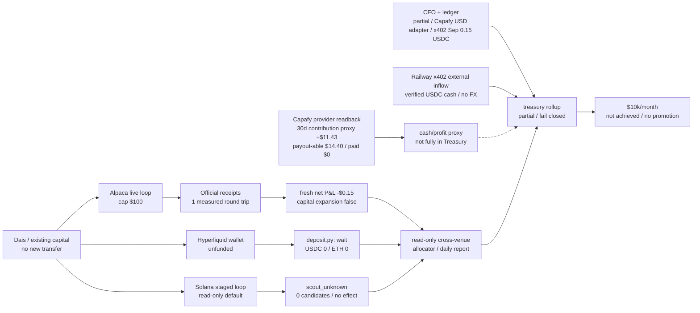
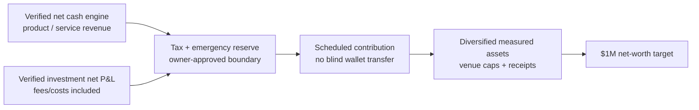
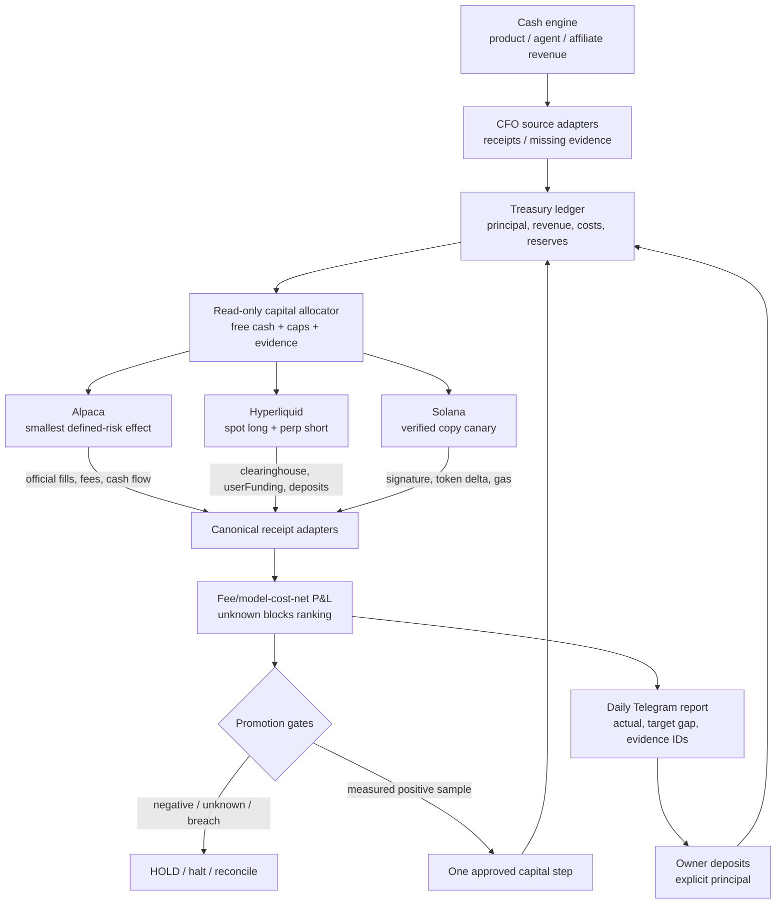

# Investment Loop Generational Wealth Implementation Plan

> **For agentic workers:** REQUIRED SUB-SKILL: Use superpowers:subagent-driven-development (recommended) or superpowers:executing-plans to implement this plan task-by-task. Steps use checkbox (`- [ ]`) syntax for tracking.

**Goal:** Turn the current fragmented investment paths into a receipt-verified, fee/model-cost-net portfolio loop that can scale one measured capital step at a time toward `$10,000` realised net trading profit per month, while treating generational wealth as a separate capital-accumulation problem rather than promising returns.

**Architecture:** Keep each venue as an effect owner: Alpaca owns Alpaca orders, Hyperliquid owns Hyperliquid deposits/orders, and Solana owns Solana transactions. Add one read-only portfolio evidence spine that normalises official receipts, subtracts every known cost exactly once, rejects unknown evidence, reports the gap to the target, and returns a capital-expansion recommendation without changing capital. A separate treasury/cash engine records owner deposits, product revenue, investment P&L, costs, and reserves so owner cash flow is never mistaken for profit.

**Tech Stack:** Existing Python investment core and `unittest` suites; Alpaca CLI and official account/activity/order readbacks; Hyperliquid Python SDK and `/info` API; Solana RPC plus Jupiter quote/swap receipts; append-only JSONL state; existing Telegram outbox; existing Life Manager loop registry.

### Ownership correction (`2026-09-28`)

Life Manager is the investment-loop runtime owner. `config/loop-registry.json` confirms `alpaca-investment-live` with a 300-second cadence, `skills/alpaca-investment/run.py`, and an effect-reconcile entrypoint. The earlier `lm-lead` wording was an unverified agent label, not a required person or dependency; it is historical context only. The active order starts with finishing and verifying the investment worktree, then Life Manager natural wake → official P&L → conditional sample measurement → cap review.

### Scope correction: no external investment promotion gate (`2026-09-29`)

The phrase “promotion gate” is not a person, agent, service, or prerequisite that owns this investment work. Two concrete code checks were previously conflated:

- `skills/alpaca-investment/performance_gate.py` reads official performance and returns a recommendation. It cannot move money, raise a cap, submit an order, or authorize itself.
- `./bin/lm-loop-contract` is a repository-wide catalog consistency command. It is not the investment manager and a failure in another loop does not stop investment-code development in this worktree.

The manager/owner map is therefore: **Life Manager** owns runtime scheduling, release loading, and provider acknowledgement; **`alpaca-investment-live`** owns the Alpaca loop; **this investment worktree** owns investment code, tests, evidence, and this plan. No `lm-lead`, Claude session, or Capafy work is required for the source-side TODO below. A release handoff is a later operational step, not a reason to leave the investment implementation unfinished.

## Actual wealth architecture

The recommended game is a barbell, not a single trading bot:

1. **Core wealth engine — 90% long-run target:** a Japanese regulated brokerage NISA account holding a low-cost, broadly diversified fund/ETF selected from the current eligible list. This is the compounding and inheritance base; Life Manager records contributions, balances, fees, and monthly net worth but does not invent returns.
2. **Measured trading engine — 5% long-run target:** Life Manager's Alpaca strategy. It stays at the current `$100` cap until official cost-complete net P&L is positive and the promotion gate passes. The percentage is a future allocation rule, not a request to transfer money now.
3. **High-risk research sleeve — 3% long-run target:** Hyperliquid only after read-only/shadow evidence and a separate funding boundary. Current leg cap remains `$25`; no Binance transfer now.
4. **Experimental sleeve — 2% long-run target:** Solana/meme-coin scout → paper → one `$2` canary with a `$3` cumulative ceiling, only after a prior venue has reproducible positive net. This is not a generational-wealth foundation.

The 90/5/3/2 split is a planning default after emergency/tax/operating reserves are funded; it does not authorize a deposit, order, wallet, or leverage. The current live caps and fail-closed gates override it.

### Capital reality

`$10,000/month` of trading net is a measured outcome, not a platform promise. Pure arithmetic says the required capital would be `$500,000` at a hypothetical 2% monthly net return, `$200,000` at 5%, or `$100,000` at 10%; none of those returns is assumed or guaranteed. With a `$100` cap, a 5% monthly result would be `$5`, not `$10,000`.

For long-run wealth, a hypothetical 8% annual nominal return with monthly contributions would require approximately `$671/month` for `$1M` in 30 years, `$3,355/month` for `$5M`, or `$6,710/month` for `$10M`. These are planning illustrations before tax, inflation, fees, and losses; they are not forecasts.

**Spec:** `docs/superpowers/specs/2026-09-01-alpaca-money-maximizer-design.md` §7.3 and §8 L18; `docs/superpowers/plans/2026-09-27-hyperliquid-carry-live-loop.md`; `docs/superpowers/plans/2026-09-27-solana-memecoin-copy-trading.md`; `docs/superpowers/plans/2026-09-27-cross-venue-capital-allocator-net-pnl.md`.

## Global Constraints

- `$10,000/month` means official realised net trading P&L after fees, funding/borrow, slippage, gas, and model cost; paper P&L, unrealised P&L, deposits, projections, and subscription MRR do not count.
- No capital expansion while `measurement_status != measured`, net P&L is non-positive, any cost component is unknown, any receipt is missing, or a safety breach exists.
- Current Alpaca cap remains `$100` allocated capital, `$10` maximum loss per trade, `$20` daily loss halt until a later approved ladder step is proven.
- Current Hyperliquid leg cap remains `$25`, one delta-neutral position, day-loss cap `5%`, drawdown cap `20%`; a funded wallet does not imply live enablement.
- Solana begins read-only scout → paper replay → exactly one `$2.00` live canary with a hard cumulative `$3.00` ceiling; no user credential or target-wallet private key enters the repo.
- Owner deposits and withdrawals are principal cash flow, never investment revenue; each venue's official receipt IDs are required for attribution.
- Every live effect is journaled before submission, reconciled by official provider state, and made retry-safe; `effect_unknown` blocks new effects.
- The loop never increases risk, leverage, cap, or destination from a Telegram message; registry/runtime changes follow the Life Manager runtime path.
- Use no new scheduler, generic strategy framework, second ledger, or dashboard until an existing boundary cannot satisfy the acceptance test.

## Review Focus

- **Deposit mistaken for profit:** a `$50` owner transfer must increase principal and not net P&L; test positive and negative owner cash flow.
- **Unknown cost treated as zero:** missing funding, fee, gas, slippage, or model-cost receipt must produce `partial`/`blocked`, never a profitable number.
- **Cross-venue duplicate attribution:** one provider receipt ID or one cost line cannot be counted in two venue rows or in both venue and aggregate totals.
- **Stale or non-authoritative provider data:** an old quote, paper receipt, UI projection, or incomplete API response must exclude the candidate from allocation.
- **Capital ladder bypass:** a positive paper result, one lucky fill, or a projection cannot raise a cap; the next cap requires the named live sample, risk gates, and explicit Life Manager promotion receipt.

## As-Is Evidence

The current state is now one measured, fail-closed evidence layer, but it is
not yet a profitable or fully funded investment machine:

### Verified repo/runtime facts

- `skills/alpaca-investment/performance.py` reports `capital_expansion_allowed: false`, requires at least `30` round trips for statistical support, and hard-caps the current performance gate at `$100`.
- The fresh official Alpaca replay reports one completed round trip with measured net P&L `-$0.15`, realised `-$0.10`, unrealised `-$0.05`, fees `$0.01`, slippage `$0.00`, owner cash flow `$66.75`, and `statistically_supported: false`; the original sealed snapshot is superseded for current reporting.
- The latest Alpaca state audit contains `239` decision receipts, `10` effect-intent receipts, and `4` outcome receipts; live-close is verified and repeatability is `pass`, but the completed sample remains `1` round trip. Host-level event evidence also shows `1,047` report wakes deferred by `shared-agent-runner` admission (`resource_capacity_busy`, `resource_effect_unknown`, FIFO/control/database/heartbeat variants), so wake count is not a trading sample and the runtime admission/readback boundary must be repaired before measuring progress.
- The current Alpaca readback has equity about `$66.60`, no trade allocation, and a `USDCUSD` holding; this is account state, not revenue.
- Hyperliquid carry code and tests are merged, but the registry row/runtime lock was owner-requested rather than directly changed by this lane; the current agent wallet readback is USDC `0` / ETH `0`, with no `userFunding`, deposit transaction, entry receipt, or daily P&L.
- A fresh read-only Hyperliquid market observation saw `19` spot/perp pairs; the default volume/cost policy would shortlist `PURR`, `ZEC`, and `STABLE`, but funding APR is a changing quote, not realised P&L. No account was funded and no order was submitted.
- The matching Hyperliquid official account readback is `accountValue=0.0`, `0` perp positions, `0` spot balances, `0` `userFunding` rows, and `0` non-funding ledger rows; there is no receipt from which to calculate carry net P&L.
- A fresh investment-only Hyperliquid readback at `2026-09-28T12:29Z` confirms the same official boundary: `accountValue=0.0`, `withdrawable=0.0`, `0` perp positions, `0` spot balances, and `0` rows for both 30-day funding and non-funding ledgers. No wallet creation, deposit, transfer, order, or signed action occurred.
- The Solana loop is implemented through staged read-only/paper/live-gate boundaries. A fresh public-target scout returned `scout_unknown`, `0` candidates, `20` evidence rows, and no effect; no live transaction receipt exists.
- The cross-venue allocator/reporter and treasury rollup are implemented as read-only code. The acceptance fixture measures aggregate net `$8.70` with owner cash flow `$100.00`, but it is test evidence, not revenue; live provider inputs remain partial and `capital_expansion_allowed` stays `false`.
- The rolling measurement extension is implemented in `rolling_measurement.py` and is wired to both the explicit `__daily_receipts__` input and the reporter's persisted last-completed-day replay. It requires 30 delivered, measured UTC daily receipts with unique source IDs; the fixture is not live revenue and no numeric live rolling result exists yet. A read-only audit found zero persisted `cross-venue-YYYY-MM-DD.json` files under the default Life Manager state root, so the current gap is cadence/owner wiring plus complete cost receipts, not a fabricated zero-profit result.
- The runtime boundary is still open: a read-only registry/source audit found no cross-venue loop row or owner cadence receipt. `cross_venue_run.py` is now an owner-ready finite read-only entrypoint that consumes canonical snapshot files and delegates idempotent reporting, but it has not been admitted or naturally run. Replaying `rolling_30d([], "2026-09-28")` returns `measurement_status=unknown`, `reason=daily_receipt_missing`, `days_observed=0`, `30` missing days, and `capital_expansion_allowed=false`; this is a missing producer receipt, not a measured zero P&L.
- A host-level read-only check confirms the same boundary: launchd has only `ai.anicca.alpaca-investment-live` among the investment labels, with no cross-venue/rolling label or plist and no cross-venue daily state file. The next action is a Life Manager runtime admission/readback, not a local restart or registry edit.
- The existing CFO producer can read Alpaca, Stripe, x402, marketplace, Capafy, mobile-app, and usage sources. The production CFO last-result is still an older `2026-09-26` delivery with missing Stripe and marketplace ledgers. A fresh isolated replay using the current Capafy adapter and the provider snapshot produced `16` verified daily Capafy records totaling `$93.78` for `2026-09`, but did not send a production notification; this is now USD revenue evidence, not a claim that Treasury cash has settled.
- The Capafy provider snapshot at `2026-09-28T09:09:22Z` reports last-30d `net30_usd=$55.04`, actual OpenRouter cost `$43.61` for `2026-08-28..2026-09-27`, and `profit30_actual_usd=$11.43`; payout-able balance is `$14.40` and paid-out balance is `$0.00`. The contribution is a measured operating proxy, but true MRR is unknown, payout is not settled, and the cost window is not identical to the calendar-month revenue records, so it remains outside investment P&L and the Treasury surplus gate until the join is explicit.
- A newer money-only Capafy readback at `2026-09-28T11:18:59Z` reports fresh September-to-date gross sales `$68.80`, creator earnings `$52.30`, `83` units, payout-able `$14.40`, pending `$15.40`, and paid-out `$0.00`; MRR remains unknown. The command exits `1` because usage/model-cost evidence and OpenRouter host-key usage are unknown, so this latest readback proves cash-side activity but no current net contribution. The earlier `$11.43` remains a dated historical proxy, not a current profit number.
- A complete isolated Capafy reconcile at `2026-09-28T11:19:47Z` returned `verdict=success` with fresh sources: all-time gross/net `$88.78` (`98` orders), last-30d net `$68.80` (`85` orders), `net30_usd=$55.04`, payout-able `$14.40`, and paid-out `$0.00`. It produced a list-price model-cost estimate `$3.86`, but actual OpenRouter cost and actual contribution are null because `openrouter_actual.status=unavailable:key_unavailable`; the displayed estimate-based `$51.18` is not provider-billed profit. The reconcile used an isolated temporary output and did not send a notification or change investment state.
- The cause was then fixed in `skills/earn/capafy-marketing/scripts/capafy_hourly_reconcile.py`: it now reads simple assignments from the private Life Manager `.env` as a fallback, while process environment values retain precedence and the file is never executed. Focused reconcile tests pass `31/31`. A natural full reconcile through this fixed producer at `2026-09-28T11:30:29Z` returned `verdict=success`, actual OpenRouter cost `$43.61`, actual contribution `$11.43`, payout-able `$14.40`, paid-out `$0.00`, and exit `0`; no investment state, order, transfer, or production notification was changed.
- The external agent-economy state contains one settled x402 receipt with verified chain proof: `0.003 USDC` on `2026-08-24`. Separately, the x402 seller's finalized external-inflow ledger contains `18` unique Railway receipts totaling `0.180000 USDC` (`15` receipts / `0.150000 USDC` in `2026-09`). The duplicate agent-economy paths are byte-identical; these non-USD receipts are not converted into USD or investment P&L.
- The x402 seller audit is wallet-scoped: the active `serve-v2` core catalog has five routes, while the revenue controller previously carried a stale `/image` route. Franklin1's read-only local telemetry has `7` settled rows, `0` identified external payers, and `57` attempts in the last 24 hours; the separate Railway wallet's finalized external ledger is not merged into Franklin1's store metrics.
- The latest persisted public Bazaar scout on `2026-09-28T10:59:03Z` observed `17,863` resources, `836,842` paid calls/30d, `53,282` payer signals, and paid demand in `8` categories. The largest measured category totals were `other` `498,440` calls, `llm` `206,954`, `search` `88,544`, `defi` `23,667`, and `data` `13,458`; these are market-level demand signals, not this seller's revenue. The verified Railway ledger remains the only own-cash proof: `18` receipts / `0.180000 USDC`, an observed average of `0.010000 USDC` per receipt, with no USD conversion.
- The read-only product-gap replay at `2026-09-28T10:59:39Z` ranks unserved `defi` as the strongest new-category candidate (`23,667` calls/30d, `2,616` payer signals, `$0.01` median); `image` and `audio` follow. This is market opportunity evidence only: it does not authorize a new route, price change, catalog change, seller restart, or external spend while current route-level net margin is unknown.
- A read-only The402 acquisition API check on `2026-09-28` returned HTTP `200` with `0` total postings, `0` open postings, and `0` eligible postings. The local inbox has `3` completed jobs, `0` pending, `0` dead, and no acquisition-action log; no bid or external message was sent. The402 acquisition is therefore not a current revenue lever, and the next safe action is another read-only check when an open eligible posting exists.
- The route-level own-cash replay is concentrated in `/funding-rates`: `18` finalized receipts / `0.180000 USDC` lifetime (`15` / `0.150000 USDC` in September), average `0.010000 USDC` per receipt; the other active core routes have no verified external receipt. This is gross non-USD cash only: infrastructure, upstream, model, and FX costs are not yet measured, so verified net profit is still unknown.
- The latest main merge includes a PromptBase publisher/readback path; its browser-free tests pass `15/15`. A real `reels-hook-lab` catalog build succeeds with a `$4.99` Claude 5 Sonnet text listing and verified example, while the older `hook-lab` catalog is missing its required evidence file and is not fabricated. At the browser-free stage no PromptBase listing was publicly submitted; PromptBase revenue remains `$0` measured until a confirmed listing/payout readback exists.
- The measured-positive `marketing-strategist` and `youtube-script-writer` catalogs now have repository-owned offline demonstrations that preserve the input-only and no-invented-metrics contracts. The PromptBase builder and pure test suite pass `15/15` for these catalogs; this is listing preparation only, not a live model receipt, public listing, or revenue source.
- Three Slide Maker-family catalogs with repo-owned verified demonstrations now pass the browser-free PromptBase builder: `sales-account-plan-deck`, `research-findings-deck-storyboard`, and `experiment-readout-deck` (each `$4.99` / Claude 5 Sonnet / Text). This is listing preparation only; no public submit, CAPTCHA, listing readback, or payout receipt exists.
- A live PromptBase dry-run for `sales-account-plan-deck` reached the real reCAPTCHA gate and stopped with `recaptcha_requires_human_verification`. The publisher ran without `--confirm`; no public submit, PromptBase ledger row, listing readback, payout, or revenue effect occurred. The next public action is a human CAPTCHA boundary, not an autonomous retry.
- A subsequent read-only PromptBase publisher readback returned `ok=true`, `checked=0`, and `updates=[]` because the local ledger has no tracked submitted listing. This confirms no local listing status or payout evidence has been added; it is not a public-submission or revenue receipt.
- A continuation audit after the latest `origin/main` merge rechecked the owner boundary: the registry and host still expose only the Alpaca investment label, with no cross-venue/rolling owner receipt or persisted daily state. No external owner action, funding, order, wallet transfer, public listing submit, or payout readback was performed.
- The current Life Manager runtime readback provides no delivered cross-venue receipt. This lane remains read-only at the registry/runtime boundary until the runtime owner exposes a complete admission receipt or an exact typed blocker and next action.
- A subsequent 15-second inbox poll after that follow-up returned no new message; the owner session remains active and no registry, host, state, provider, funding, or order evidence changed.
- The same fresh Capafy analytics ranks the cash engine by 30-day product evidence: Marketing Strategist revenue `$11.18`, actual allocated model cost `$4.10`, contribution `$7.08`; TikTok Script Pro `$4.78` / `$0.54` / `$4.24`; YouTube Script Writer `$3.18` / `$0.91` / `$2.27`; Hook Lab `$19.91` / `$36.40` / `-$16.49` and under review; Slide Maker `$15.98` with `$0.00` allocated actual cost, so its apparent profit is not cost-complete. `43/49` skills have zero sales, and the cost window does not exactly match the local revenue window.
- A read-only inspection of the current Slide Maker receipt (`8828622062`, observed `2026-09-28T12:07:22Z`) found `7` usage requests and all `7` with zero tokens. Its `$0.00` estimate/actual allocation is therefore unobservable cost, not free inference; the product-level profit must remain `unknown` until a natural cost-complete receipt can attribute billed usage or prove no billable work.
- A fresh official Capafy remote-status readback at `2026-09-28T12:06:47Z` reports Hook Lab version `v1.0.3`, `platform_status=1`, `audit_status=2`, `status_reason=under_review`, and `can_report_published=false`. The cost/profit snapshot above therefore remains the pre-approval measurement; do not claim that the revised configuration has reduced cost or turned the skill profitable until a later natural receipt proves it.
- Capafy traffic-source discovery at `2026-09-28T12:11:22Z` found the public JS contract for read-only `agent-options`, `v2/{visits,impressions,sales}/stats`, `internal/stats`, `referrer/stats`, and `utm-source/stats`. Both the local publisher token and the canonical `capafy-publisher` credential-SSOT token returned HTTP `401` / `Token is invalid or expired`; the shared browser lease was held by another live process, so no authenticated dashboard readback was attempted and no zero-traffic conclusion is allowed.
- A repo-owned read-only trafficSources adapter was added at `2026-09-28T12:18:27Z`: it builds the public page's UTC-millisecond ranges, calls only `agent-options`, `v2/{visits,impressions,sales}/stats`, `internal/stats`, `referrer/stats`, and `utm-source/stats`, and exposes `--traffic-sources` without writing provider state or calling campaign creation. Auth failures remain `unknown`; even an empty response remains `fresh_unparsed` with no fabricated zero metrics. The focused Capafy reconcile file passes `37/37` and `py_compile` passes. The natural provider invocation did not yield a captured authenticated readback, so traffic metrics remain unknown.
- The product-cost allocator and summary now fail closed when an agent has a zero estimated cost share or missing actual allocation: product-level actual cost/profit remains `unknown` instead of falling back to `$0` cost and apparent profit while account-level actual spend is fresh. The focused reconcile file now passes `37/37`; the broader Capafy package is `223` passed / `5` failed, with the same five unrelated launchd/self-heal and cutover failures.
- A fresh Capafy money-only readback at `2026-09-28T11:55:18Z` reports September gross sales `$68.80`, creator earnings `$52.30`, `83` units, confirmed balance `$36.90`, payout-able `$14.40`, pending `$15.40`, paid-out `$0.00`, fresh host-key usage, and estimated model cost `$3.86`; MRR remains unavailable. It is current cash-side evidence only, not actual provider-billed profit and not an investment receipt.
- The Task 8 bridge replayed that same table as `evidence_status=partial`: `0` USD treasury receipts, `20` missing-source records, `7` excluded non-USD/API-estimate records, `15` explicit zero observations, and no investment-row leakage into customer cash. This is a measurement result, not a revenue result.
- The canonical CFO hourly FinancialRecord readback is subject-scoped: the current subject has `101` verified records but only one verified `business_revenue`, `0.003 USDC` in `2026-08`, and no `2026-09` revenue. A separate subject has additional x402 records; they are excluded rather than combined.

## Target Economics

These are planning calculations, not forecasts:

Terminology boundary: `$10,000/month` of customer revenue is `$120,000/year` gross, while `$100,000/year` is about `$8,333.33/month`. Neither number is the same as `$10,000/month` of realised net investment P&L. The CFO/Treasury ledger tracks customer cash and investment P&L as separate categories, so deposits, gross sales, unrealised gains, and projections cannot be substituted for net profit.

External guardrail checked `2026-09-28`: [Investor.gov](https://www.investor.gov/introduction-investing) states that investments have no set rate of return and that asset allocation/diversification manage risk but do not guarantee against loss. The `7%` accumulation math below is therefore a sensitivity assumption only, not a promised return or funding authorization.

| Target | Required net capital at 10% APR | at 15% APR | at 20% APR |
|---|---:|---:|---:|
| `$10,000/month` net (`$120,000/year`) | `$1.20M` | `$800k` | `$600k` |
| `$1,000/month` net | `$120k` | `$80k` | `$60k` |

The current `$100` Alpaca cap at a hypothetical 10% net annual return produces about `$0.83/month`; a `$24` Hyperliquid leg at the plan's measured 11% APR produces about `$0.22/month` gross before variable funding and fees. Therefore the path to generational wealth must combine a measured investment engine with a cash-generation engine and recurring contributions. The investment loop alone cannot turn `$100` into `$10k/month` without assuming an unsafe, unmeasured return.

The observed x402 route average is `0.010000 USDC` per finalized receipt. As planning arithmetic only (not an FX conversion and not net profit), gross `10,000` units/month at that average would require `1,000,000` receipts/month. September's `15` verified receipts are `0.0015%` of that volume. The current x402 seller is therefore an evidence-producing seed, not yet a credible `$10k/month` engine; the next wealth-building bottleneck is verified USD cash generation and net-margin measurement, not sending more Binance capital.

### Cash-engine scale math from the latest Capafy evidence

The latest provider snapshot is a small operating-cash signal, not investment capital: 30-day provider net revenue is `$55.04`, actual model cost is `$43.61`, and the contribution proxy is `$11.43`. Holding that observed ratio constant only for sensitivity math:

| Cash target | Approximate scale from current 30-day evidence | Implied provider net revenue | Implied model cost | Implied contribution |
|---|---:|---:|---:|---:|
| `$10,000/month` provider net revenue | `181.7x` | `$10,000` | `$7,923` | `$2,077` |
| `$100,000/year` provider net revenue (`$8,333/month`) | `151.4x` | `$8,333` | `$6,603` | `$1,731` |
| `$10,000/month` contribution proxy | `874.9x` | `$48,154` | `$38,154` | `$10,000` |

These are arithmetic scenarios, not forecasts: the current sample is too small, MRR is unknown, payout is unsettled, and the cost/revenue windows are not perfectly period-matched. The operating plan is therefore to improve measured product volume and margin, then join provider revenue, actual model cost, payout, refunds, tax, and reserve receipts before routing any surplus to investments.

### Cash-engine product triage

| Priority | Product evidence | Decision |
|---|---|---|
| 1 | Marketing Strategist `+$7.08`, TikTok `+$4.24`, YouTube `+$2.27` on actual allocated cost | Replicate the winning format and measure each new unit with the same cost join |
| 2 | Hook Lab `-$16.49` on `$19.91` revenue; actual cost exceeds revenue | Keep expansion paused; reduce prompt/input cost or change price before more traffic |
| 3 | Slide Maker `$15.98` revenue but `$0.00` actual cost allocation | Treat apparent profit as unverified until model-cost attribution is complete |
| 4 | `43/49` skills have zero sales | Do not spread effort across the whole catalog; use winners and measured distribution first |

This is an operating-cash priority, not an investment promotion signal. No product revenue becomes investable capital until payout, actual cost, refund, tax, reserve, and owner-flow receipts are joined.

### Generational-wealth accumulation boundary

`$10,000/month` is a realised net-profit target, not gross sales and not a promise. A separate planning target is `$1,000,000` net worth. The accumulation path is:

Illustrative math only: starting from `$0`, contributing monthly, assuming a constant `7%` nominal annual return compounded monthly, before tax, fees, and inflation. This is a planning sensitivity table, not a forecast or a capital authorization:

| Horizon | Required monthly contribution to reach `$1M` |
|---|---:|
| 10 years | `$5,777.51` |
| 15 years | `$3,154.95` |
| 20 years | `$1,919.66` |
| 25 years | `$1,234.46` |
| 30 years | `$819.69` |

The operational rule is to route only verified net cash through reserves and then an explicitly recorded contribution. Owner deposits remain principal, and no contribution schedule overrides the venue caps, missing-receipt holds, tax reserve, or owner approval boundary.

## To-Be Architecture

### Promotion ladder

| Stage | Capital boundary | Required evidence | Allowed action |
|---|---:|---|---|
| S0 | `$0–100` | current receipts, no unknowns, baseline reports | measure only; no expansion |
| S1 | `$100–1,000` | at least `30` completed live round trips per venue, positive net after every cost, no risk breach, and no `unknown` evidence | explicit cap promotion; one venue at a time |
| S2 | `$1,000–10,000` | 90-day rolling positive net, drawdown within policy, venue concentration and liquidity checks | add a second verified venue |
| S3 | `$10,000–100,000` | 6–12 months positive net, stress/replay evidence, tax/reserve accounting, operational owner review | measured diversification and treasury contributions |
| S4 | `$100,000–600,000+` | audited monthly receipts, stable net APR, external custody/legal/tax review, no single-strategy dependency | pursue `$10k/month` target |

No stage is automatic. A stage recommendation is data; a stage promotion is a separately recorded owner-approved capital boundary.

---

### Task 1: Canonical multi-venue receipt and net-P&L spine

**Files:**
- Create: `apps/life-manager/investment-core/portfolio_receipts.py`
- Create: `apps/life-manager/investment-core/portfolio_performance.py`
- Test: `apps/life-manager/investment-core/test_portfolio_performance.py`
- Modify: `apps/life-manager/investment-core/performance.py` only where the common schema can be reused without changing Alpaca's accepted receipt contract
- Parity check: `skills/alpaca-investment/` remains byte-equivalent where it is a release copy; do not silently update one copy only

**Interfaces:**
- Consumes: venue-specific official receipt readers and owner cash-flow records.
- Produces: `VenueSnapshot` with `venue`, `observed_at`, `equity_usd`, `free_cash_usd`, `gross_pnl_usd`, `trading_fees_usd`, `funding_or_borrow_usd`, `slippage_usd`, `gas_usd`, `model_cost_usd`, `source_receipt_ids`, `risk`, and `measurement_status`; `aggregate(snapshots, owner_cash_flow_usd) -> dict`.

- [x] **Step 1: Write failing tests** for owner deposits excluded from P&L, exact `net_pnl = gross - trading_fees - funding_or_borrow - slippage - gas - model_cost`, duplicate receipt rejection, missing-cost blocking, stale snapshot exclusion, and cross-venue source ID uniqueness.
- [x] **Step 2: Run the focused test** with `cd apps/life-manager/investment-core && python3 -m unittest test_portfolio_performance`; the expected missing-adapter `ModuleNotFoundError` was observed.
- [x] **Step 3: Implement the pure schema/aggregate boundary** without provider submit/signing imports; preserve unknown fields as blocked evidence, never as zero.
- [x] **Step 4: Run focused tests and existing `skills/alpaca-investment/test_performance.py`**; new tests pass `6/6`, existing performance tests pass `7/7`, and the complete investment suite passes `139/139`.
- [x] **Step 5: Commit** `feat(investment): add canonical fee-model-cost net pnl spine` (`fa710b6310`); focused task-done verification records `6/6` passing.

### Task 2: Hyperliquid funded canary and verified carry evidence

**Files:**
- Reuse: `skills/earn/hyperliquid-carry/{deposit.py,run.py,market.py,ledger.py,execute.py}`
- Reuse tests: `skills/earn/hyperliquid-carry/test_hyperliquid_carry.py`
- Operational owner path: `config/loop-registry.json` and production runtime, owned by Life Manager runtime; do not edit directly in this lane

**Interfaces:**
- Consumes: agent-wallet Arbitrum deposit and Hyperliquid official `/info` responses.
- Produces: verified deposit receipt, `clearinghouseState`, `userFunding`, entry/exit receipts, and a venue snapshot for Task 1.

- [ ] **Step 1: Obtain Life Manager runtime readback** for registry row `hyperliquid-carry`, cadence `3600s`, `HL_CARRY_LIVE=1`, `HL_CARRY_MAX_LEG_USD=25`, state root, daily `deposit.py` wake, and locked SDK install. Read-only repo/runtime evidence currently shows no `hyperliquid-carry` registry row. This is not treated as live enablement.
- [x] **Step 2: Re-run deposit preflight without live env** and verify the exact Arbitrum address, native USDC token, ETH gas balance, and no pending `effect_unknown` deposit before any send. Result: wallet `0xA428…9302`, USDC `0`, ETH `0`, action `wait/usdc_below_bridge_minimum`, no journal/pending deposit; a fresh official 30-day readback also reports account equity `0`, perp positions `0`, spot balances `0`, funding rows `0`, and non-funding ledger rows `0`.
- [ ] **Step 3: After owner funding, reconcile the Arbitrum tx** through provider receipt and Hyperliquid `userNonFundingLedgerUpdates`; record the tx hash and credited amount as principal, not profit.
- [ ] **Step 4: Run one smallest delta-neutral entry/exit canary** only after equity, market, and risk gates pass; read back `clearinghouseState`, fills, and `userFunding`.
- [ ] **Step 5: Require 14 days of daily net evidence** before any additional capital; report gross funding, trading fees, bridge/gas, slippage, and net separately.
- [ ] **Step 6: Commit only documentation/evidence updates** if code remains unchanged; runtime/registry mutation is a Life Manager owner action.

### Task 3: Alpaca capital-ladder promotion gate

**Files:**
- Create: `apps/life-manager/investment-core/capital_ladder.py`
- Modify: `apps/life-manager/investment-core/performance_gate.py`
- Modify: `apps/life-manager/investment-core/risk_policy.py`
- Mirror after parity review: `skills/alpaca-investment/capital_ladder.py`, `skills/alpaca-investment/test_capital_ladder.py`
- Reference: `skills/alpaca-investment/{performance.py,performance_gate.py,test_performance.py}`

**Interfaces:**
- Consumes: official measured net-P&L receipt, round-trip count, drawdown, current cap, explicit approved next cap, and venue health.
- Produces: `recommend_next_cap(evidence, current_cap, requested_cap) -> {status: "hold"|"recommend"|"reject", current_cap_usd, next_cap_usd, reasons, evidence_ids}`. It never submits an order or changes the cap itself.

- [x] **Step 1: Write failing tests** proving current negative/one-round-trip evidence rejects expansion, paper evidence rejects expansion, unknown cost rejects expansion, and a positive fixture with `round_trips >= 30` recommends only the next discrete cap. Added a regression for a missing unknown-cost vector.
- [x] **Step 2: Implement the pure ladder** with exact caps `$100 → $1,000 → $10,000 → $100,000`; require an explicit requested cap and preserve the existing `$10` trade / `$20` daily loss gates until a separately approved risk revision exists.
- [x] **Step 3: Add receipt-backed promotion evidence** to the Telegram/report schema without exposing secrets or allowing a message to authorize promotion. The report is recommendation-only and always requires owner authorization.
- [x] **Step 4: Run `cd skills/alpaca-investment && python3 -m unittest test_performance test_capital_ladder test_risk_policy` plus the existing investment suite, then run the app/skill parity check.** Focused tests pass `25/25`, app tests pass `3/3`, full investment discovery passes `147/147`, and parity is clean.
- [x] **Step 5: Commit** `feat(investment): gate capital ladder by measured net pnl` (`3e6c81970d`).

### Task 4: Solana read-only scout → paper → `$2–3` canary

**Files:**
- Implement the existing plan: `docs/superpowers/plans/2026-09-27-solana-memecoin-copy-trading.md`
- Create under that plan: `skills/earn/solana-memecoin-copytrade/`
- Reuse verified swap pattern: `skills/earn/sol-trade/lib/record-swap.mjs`

**Interfaces:**
- Consumes: public target-wallet RPC history, GMGN/DexScreener metadata, Jupiter quotes, and Solana confirmed transaction receipts.
- Produces: public-wallet `scout_unknown|ok`, paper receipts, and one on-chain-verified canary receipt with source signature, token delta, fee, slippage, and final balance.

- [x] **Step 1: Write tests** for transfer-vs-swap discrimination, provider disagreement, stale/illiquid quote, duplicate source signature, mismatched token delta, and failed transaction fee accounting; nested suite covers these boundaries.
- [x] **Step 2: Implement read-only scout and deterministic paper policy**; no signing path is imported by scout/paper mode.
- [x] **Step 3: Run one public-target read-only scout** and save evidence without target-wallet secrets; result is `scout_unknown`, `0` candidates, `20` evidence rows, effect `none`, with sanitized evidence outside the repo.
- [x] **Step 4: Implement the staged paper wake**; no paper return is used as capital-expansion evidence and the mode never promotes itself.
- [ ] **Step 5: Run exactly one `$2.00` live canary with a hard `$3.00` cumulative ceiling** only after explicit owner funding and all RPC receipt checks pass; this remains open because no funding/owner receipt exists.
- [x] **Step 6: Run each focused `node --test` command named in `docs/superpowers/plans/2026-09-27-solana-memecoin-copy-trading.md` and obtain a fresh read-only review before any second canary.** Nested suite passes `28/28`; no live transaction was sent.

### Task 5: Cross-venue allocator and daily target-gap report

**Files:**
- Implement the existing plan: `docs/superpowers/plans/2026-09-27-cross-venue-capital-allocator-net-pnl.md`
- Reuse: `apps/life-manager/investment-core/allocator.py`, `performance.py`, `reporter.py`, `telegram_outbox.py`
- Tests: the plan's `test_venue_snapshots`, `test_aggregate`, `test_allocator`, and `test_reporter` files

**Interfaces:**
- Consumes: Task 1 venue snapshots, free cash, risk caps, stale/unknown state, and target `$10,000/month`.
- Produces: `rank(...) -> allocate|hold|halt`, daily aggregate receipt, `rolling_30d_net_pnl_usd`, `target_gap_usd`, `capital_expansion_allowed`, and source receipt IDs.

- [x] **Step 1: Add failing tests** for positive net vs unknown-cost candidates, owner cash-flow adjustment, stale venue exclusion, drawdown halt, deterministic tie-breaks, duplicate daily report, and target-gap accuracy. Cross-venue nested plan tests cover these boundaries.
- [x] **Step 2: Implement read-only ranking**; the allocator must not import or call venue submit/signing functions.
- [x] **Step 3: Implement one UTC-daily report** through the existing idempotent Telegram outbox; unknown values render `不明`, never zero. Missing owner/runtime or provider receipts remain explicit.
- [x] **Step 4: Run focused tests, existing investment tests, and replay-zero checks**; prove the allocator cannot create a second order or reinterpret a deposit as revenue. Cross-venue acceptance/report suite passes `26/26`.
- [x] **Step 5: Commit** `feat(investment): rank verified cross-venue net returns` via nested implementation commits through `d48e355e7b`.
- [x] **Step 6: Add the 30-day rolling measurement producer**; `test_rolling_measurement` passes `5/5`, reporter passes `7/7`, the reporter replays the last 30 completed persisted days, missing/partial/duplicate evidence returns no numeric target gap, and owner cash flow remains separate. No current live 30-day result is claimed.
- [ ] **Step 7: Accumulate 30 real delivered daily receipts**; default-state audit currently finds `0` persisted cross-venue receipts, Hyperliquid carry state is empty, and Solana evidence is blocked. Life Manager runtime must provide the cadence/owner receipt, and every active venue must supply complete fee/funding/gas/model-cost evidence before the rolling number can become measured.

### Task 6: Treasury and generational-wealth cash engine

**Files:**
- Create: `apps/life-manager/investment-core/treasury.py`
- Create: `apps/life-manager/investment-core/test_treasury.py`
- Modify: `apps/life-manager/config/product-loop-catalog.json` only through the normal owner/release path if a new economic source is actually wired
- Reference: existing agent-economy, affiliate, and investment financial adapters

**Interfaces:**
- Consumes: official customer-revenue receipts, owner cash-flow receipts, venue net-P&L receipts, model/API cost receipts, and reserve policy.
- Produces: `treasury_snapshot(period) -> {customer_revenue_usd, investment_net_pnl_usd, owner_cash_flow_usd, model_cost_usd, tax_reserve_usd, investable_surplus_usd, investment_net_pnl_target_gap_usd, treasury_surplus_target_gap_usd, evidence_status}`.

- [x] **Step 1: Write tests** for principal/revenue/P&L separation, missing cost evidence, duplicate receipt IDs, reserve calculation, separate target gaps, and negative investable surplus; focused tests pass `5/5`.
- [x] **Step 2: Implement a read-only treasury rollup**; it never transfers funds and never counts projected investment return as cash.
- [x] **Step 3: Connect only existing receipt producers**; currently no complete product financial adapter is available in this lane, so missing categories remain visible as `partial` and `product-loop-catalog.json` is unchanged.
- [x] **Step 4: Report two separate targets:** investment net P&L target `$10k/month` and optional treasury surplus target; owner cash flow and customer revenue are not merged with trading P&L.
- [x] **Step 5: Commit** `feat(investment): separate treasury cash from investment pnl`.

### Task 7: Acceptance, promotion, and $10k/month scoreboard

**Files:**
- Review only: `docs/superpowers/specs/2026-09-01-alpaca-money-maximizer-design.md` L18 remains unchanged because the target evidence threshold is not met
- Modify: `docs/superpowers/plans/2026-09-28-investment-loop-generational-wealth.md` with the current cursor and receipts
- Test/replay: all venue focused suites, loop contract, natural wake, provider readbacks

- [x] **Step 1: Record S0 baseline**: Alpaca has one closed official round trip; the fresh official replay is measured at net `-$0.15` (realized `-$0.10`, unrealized `-$0.05`, fee `$0.01`, slippage `$0.00`) against owner cash flow `$66.75`; Hyperliquid is unfunded with USDC/ETH `0`; Solana is implemented but its read-only scout is `scout_unknown` with `0` candidates and no effect; cross-venue and treasury are read-only with incomplete live receipts. No capital promotion.
- [x] **Step 2: Audit canary closure status**: Alpaca's entry/exit/fee receipt is closed; Hyperliquid has no funded entry/exit; Solana has no live canary; missing funding/gas/model-cost/customer-revenue inputs remain explicit and are not converted to zero.
- [x] **Step 3: Evaluate the positive-month gate**: no official rolling monthly receipt reports `net_pnl_usd >= 10000`; S1 is withheld and one negative round trip cannot recommend expansion.
- [x] **Step 4: Evaluate discrete-cap promotion**: no venue has the required positive, cost-complete, sample-qualified evidence or Life Manager owner promotion receipt; current caps remain held with rollback/hold behavior.
- [x] **Step 5: Evaluate the target claim**: `$10k/month` is not achieved, and generational wealth is not claimed because the treasury/net-worth ledger has no complete verified source set. L18 remains unchanged.
- [x] **Step 6: Run the final verification package**: pre-Task-8 core `34/34`, Alpaca discovery `147/147`, Hyperliquid `69/69`, Solana `28/28`, provider read-only preflights, staged natural wakes/replay-zero, and diff checks pass for the implemented/read-only boundary. The shared loop-contract gate reports one pre-existing unrelated Capafy declaration mismatch (`read_only_external_owner` missing from `loops[12].recovery_classes`); investment files do not change the catalog, and effect-dependent canaries remain open.

### Task 8: Bridge existing CFO receipts into treasury

**Files:**
- Create: `apps/life-manager/investment-core/cfo_receipts.py`
- Create: `apps/life-manager/investment-core/test_cfo_receipts.py`
- Modify: `apps/life-manager/investment-core/treasury.py` and `apps/life-manager/investment-core/test_treasury.py` to keep customer refunds and operating costs separate from model costs
- Modify: `apps/life-manager/investment-core/README.md` with the adapter contract
- Reference only: `skills/cfo/loop_pnl.py`; the adapter consumes its JSON table and does not make provider calls

**Interfaces:**
- Consumes: the existing CFO JSON table (`reporting_date`, `sources`, and per-loop `revenue`/`refund`/`cost` cells).
- Produces: `cfo_table_to_treasury_receipts(table, period) -> {receipts, evidence_status, missing_sources, excluded_currencies, excluded_investment_rows, source_receipt_ids}`.
- Maps only non-investment USD cells: `revenue -> customer_revenue`, `refund -> customer_refund`, and `cost -> operating_cost`. The canonical investment row is excluded because Task 1 owns investment net P&L; owner cash flow and model cost must come from their own receipts.
- Excludes `JPY`, `USDC`, and `USD_API_EQUIV` rather than applying an unverified FX rate or treating an API-price estimate as a provider bill. Unverified cells and incomplete cost cells remain missing evidence. No adapter receipt authorizes a transfer or capital promotion.

- [x] **Step 1: Write failing tests** for USD mapping, investment-row exclusion, non-USD/`USD_API_EQUIV` exclusion, unverified and incomplete cells, deterministic aggregate receipt IDs, and malformed/duplicate input rejection; the initial run failed with the expected missing adapter/new-category failures.
- [x] **Step 2: Extend treasury categories** with `customer_refund` and `operating_cost`; calculate net customer revenue and deductible operating/model costs separately while preserving owner cash-flow and investment-P&L separation.
- [x] **Step 3: Implement the pure CFO-table adapter** with no network or credential imports; keep source receipt IDs and reasons in the output for audit.
- [x] **Step 4: Run focused adapter/treasury tests, the full investment suite, and a fresh CFO read-only table replay**; focused tests pass `11/11`, full investment-core discovery passes `40/40`, and the fresh table remains explicit `partial` with no USD receipt invented.
- [x] **Step 5: Commit and push** as `b756217a25` (`feat(investment): bridge CFO receipts into treasury`); this plan update is pushed separately before moving to the next external receipt gate.

### Task 9: Bridge the canonical FinancialRecord ledger without subject or currency leakage

**Files:**
- Create: `apps/life-manager/investment-core/financial_record_receipts.py`
- Create: `apps/life-manager/investment-core/test_financial_record_receipts.py`
- Modify: `apps/life-manager/investment-core/README.md` with the canonical-ledger adapter contract
- Reference only: `apps/life-manager/lib/financial-record-contract.js` and `financial-record-store.js`; the adapter receives already subject-scoped records and performs no filesystem, network, or wallet operation

**Interfaces:**
- Produces `financial_records_to_treasury_receipts(records, subject_id, period) -> {receipts, evidence_status, missing_sources, excluded_currencies, unclassified_records, ignored_non_business_records, source_record_ids}`.
- Maps verified USD `business_revenue` to `customer_revenue` and verified USD `fee` to `operating_cost`; the record's original ID/provider remains attached to the aggregate receipt.
- Requires an exact subject and `YYYY-MM` period. Other subjects, unverified/stale records, `business_cost` rows without an explicit refund/operating classification, payouts, transfers, and tax rows remain visible as excluded/unclassified evidence rather than being silently counted.
- Excludes `USDC`, `USDT`, JPY, and any other non-USD asset rather than assuming an FX rate. This preserves the canonical ledger's native-asset truth while keeping the treasury target in USD.

- [x] **Step 1: Write failing tests** for subject/period filtering, USD revenue and fee mapping, non-USD exclusion, unverified/stale evidence, unclassified business costs, duplicate/malformed rows, and deterministic source receipt IDs; focused tests pass `7/7`.
- [x] **Step 2: Implement the pure FinancialRecord adapter** with Decimal-safe minor-unit conversion and no provider or state-store imports.
- [x] **Step 3: Replay the current CFO subject ledger for `2026-08` and `2026-09`**; `2026-08` remains partial with the historical `0.003 USDC` excluded, `2026-09` has no USD treasury receipt and ignores only non-business balances, and combining the separate subject is blocked by `subject_mismatch`.
- [x] **Step 4: Run focused tests plus the full investment-core suite and update the treasury README/spec with the result.** FinancialRecord plus Treasury focused tests pass `13/13`, CFO bridge focused tests pass `5/5`, the combined focused run passes `18/18`, and full investment-core discovery passes `47/47`; the README documents the exact subject/currency boundary.
- [x] **Step 5: Commit and push** `460eba8427` (`feat(investment): bridge canonical financial records to treasury`) before returning to the Hyperliquid/Solana external-effect gates.

### Task 10: Repair Alpaca marked-NAV reconciliation without weakening the gate

**Files:**
- Modify: `skills/alpaca-investment/alpaca_cli.py`
- Mirror: `apps/life-manager/investment-core/alpaca_cli.py`
- Modify: `skills/alpaca-investment/test_performance.py`

**Interfaces:**
- Keeps the official account equity, position mark, fills, fees, quotes, and owner-transfer receipt as the source set.
- Computes the realized component as `ending_nav - owner_cash_flow - official_unrealized_mark`, preventing a residual USDC mark from being counted twice. Missing, stale, duplicate, or inconsistent provider evidence remains blocked.

- [x] **Step 1: Reproduce the failure with a marked residual-position fixture**; the old quantity-delta plus unrealized calculation failed the NAV identity as `live_performance_receipts_invalid`.
- [x] **Step 2: Fix the app/skill adapter in parity** to use the provider's marked ending NAV as the authoritative total and preserve the existing fail-closed identity check.
- [x] **Step 3: Run regression and full suites**; Alpaca discovery passes `147/147`, investment-core discovery passes `47/47`, app/skill `alpaca_cli.py` parity is clean, and `diff --check` passes.
- [x] **Step 4: Re-run the official Alpaca read-only performance gate**; result is `measured`, one completed round trip, net `-$0.15`, realized `-$0.10`, unrealized `-$0.05`, fees `$0.01`, slippage `$0.00`, owner cash flow `$66.75`, capital expansion `false`, promotion `reject`; no order was submitted.
- [x] **Step 5: Commit and push** `10935021d1` (`fix(investment): reconcile marked alpaca nav exactly`).

### Task 11: Audit CFO cash-engine source completeness

**Files:**
- Read-only: `skills/cfo/loop_pnl.py`, credential metadata, and the existing CFO state/report
- Update: this plan's scoreboard and current cursor only; no credential or provider mutation

**Interfaces:**
- Consumes current provider/source readbacks for Stripe, x402/Base, marketplace ledgers, Capafy, mobile apps, and model-usage observations.
- Produces a fail-closed source-completeness result; API-price estimates and native USDC observations never become verified USD revenue or provider-billed cost.

- [x] **Step 1: Run the CFO collector read-only for `2026-09-26` and `2026-09-28`**; that historical delivery had Stripe fail closed for a missing live secret, no owner-written Coconala/CrowdWorks payment ledgers, no settled Lancers receipt, and no current Capafy/mobile USD receipt for the exact `2026-09-28` daily boundary. A later isolated replay of the current Capafy adapter produced the separate September evidence recorded above; it did not replace the stale production delivery or settle Treasury cash.
- [x] **Step 2: Inspect credential metadata without printing values**; only Stripe test records exist, so no live Stripe revenue can be claimed or fabricated.
- [x] **Step 3: Keep model usage separate**; the collector saw usage observations, but `USD_API_EQUIV` remains an API-price estimate rather than a provider bill.
- [ ] **Step 4: Obtain an authorized live USD provider receipt or owner-configured marketplace ledger** before Treasury can become measured. This requires external account/provider state; no credential, payment, or ledger mutation is performed by this lane.

### Task 12: Repair x402 inflow verification and preserve non-USD cash

**Files:**
- Modify: `skills/earn/x402-sell/verify-inflow.mjs`
- Create: `skills/earn/x402-sell/lib/rpc-log-range.mjs`
- Create: `skills/earn/x402-sell/__tests__/rpc-log-range.test.mjs`
- Create: `apps/life-manager/investment-core/x402_inflow_receipts.py`
- Create: `apps/life-manager/investment-core/test_x402_inflow_receipts.py`
- Modify: `apps/life-manager/lib/financial-manager-ingest.js`
- Modify: `apps/life-manager/lib/financial-manager-report.js`
- Modify: `apps/life-manager/lib/financial-manager-runtime.js`
- Modify: `apps/life-manager/scripts/cfo-hourly-local.js`

**Interfaces:**
- Consumes: finalized external-inflow rows already produced by the x402 seller's Base receipt recorder.
- Produces: a separate USDC cash receipt report; it does not produce USD, FX, investment P&L, or a funding authorization.

- [x] **Step 1: Reproduce the live monitor failure.** `verify-inflow.mjs 2` failed at `eth_getLogs` because the Base RPC rejected the hard-coded `10,000`-block range with the current `2,000`-block limit; the watcher had hundreds of repeated parse-error rows.
- [x] **Step 2: Fix the RPC boundary with a tested 2,000-block chunker.** The focused range/wallet tests pass `5/5`; a fresh read-only `verify-inflow.mjs 2` now completes with `inflows=0`, `EXTERNAL=0`, and no exception.
- [x] **Step 3: Audit the finalized external ledger without printing transaction IDs.** It contains `18` unique `x402-railway /funding-rates` receipts totaling `0.180000 USDC`; `2026-09` contains `15` receipts totaling `0.150000 USDC`; all rows are `finalized`, `success`, and `external=true`, with no duplicate transaction.
- [x] **Step 4: Add the Decimal-safe non-USD adapter.** `test_x402_inflow_receipts` passes `5/5`; real-state replay returns measured Jul `0.010000 USDC`, Aug `0.020000 USDC`, and Sep `0.150000 USDC`. The adapter deliberately emits no `amount_usd`.
- [x] **Step 5: Wire this report into the CFO briefing as a separate USDC section.** The local CFO discovers the shared x402 ledger, invokes the same Python adapter, renders `x402外部USDC cash（USD/Treasuryと分離）`, and can deliver that section even when no USD FinancialRecord exists. Focused JS tests pass `29/29` across ingest/report/runtime/CFO; the real-state read-only replay returns September `0.150000 USDC` from `15` receipts and no `amount_usd`. No USD claim, FX conversion, transfer, or funding authorization is created.

### Task 13: Align the x402 improvement controller with the active seller catalog

**Files:**
- Create: `skills/earn/x402-sell/catalog-paths.mjs`
- Modify: `skills/earn/x402-sell/product-gaps.mjs` and `skills/earn/x402-sell/serve-v2.mjs`
- Test: `skills/earn/x402-sell/__tests__/product-gaps.test.mjs`

**Interfaces:**
- The pure catalog module is the shared source for the default `serve-v2` core routes and the improvement controller's served-route/demand calculations.
- The controller must not classify a route that `serve-v2` does not expose in default core mode as an active product.
- This task changes no wallet, price, seller process, registry row, or external effect; it only prevents stale telemetry from driving the next product decision.

- [x] **Step 1: Add a failing regression** that requires the controller catalog to equal the five default `serve-v2` core routes; the pre-fix run failed because `/image` was still present.
- [x] **Step 2: Add the pure canonical catalog and import it from both `product-gaps.mjs` and `serve-v2.mjs`; remove the stale `/image` entry from the improvement catalog.**
- [x] **Step 3: Run focused catalog/controller/server tests.** `product-gaps`, `store-improve`, and `serve-listen` pass `17/17`; no seller was restarted.
- [x] **Step 4: Commit and push** the catalog alignment before moving to the next x402 revenue-evidence boundary.

### Task 14: Drive x402 product rewards from finalized external inflows

**Files:**
- Modify: `skills/earn/x402-sell/store-improve.mjs`
- Test: `skills/earn/x402-sell/__tests__/store-improve.test.mjs`
- Read-only evidence: `~/.local/state/life-manager/x402-sell/external-inflows-<payTo>.jsonl`

**Interfaces:**
- Local `sales` and `attempts` logs remain demand telemetry only; experiment reward and per-route external counts come from the wallet-scoped finalized external-inflow ledger.
- A reward row requires finalized successful Base settlement, external classification, a valid offer route, payer, transaction, positive atomic USDC amount, and observation timestamp.
- Wallet-scoped reports remain separate: the Railway wallet's verified `/funding-rates` receipts cannot become Franklin1 sales or capital.

- [x] **Step 1: Add a failing normalization test** for accepted finalized external rows and rejected non-finalized/internal rows; the initial run failed because the export did not exist.
- [x] **Step 2: Implement the pure normalization and wire `store-improve` to `external-inflows-<payTo>.jsonl`; keep local attempts for demand/age only.**
- [x] **Step 3: Run wallet-scoped read-only replay.** Franklin1 has no verified external inflow and remains a hold/drop recommendation; Railway has `18` verified `/funding-rates` receipts and keeps only that route. No wallet data is merged and no seller is restarted.
- [x] **Step 4: Run the x402 suite, then commit and push this evidence-boundary change.** The full x402 suite passes `223/223`; commit `6068011ede` is pushed on the dedicated branch.

## Current TODO Cursor

### System-first correction (`2026-09-28T12:42:32Z`)

`29` is **not** a manual-wake task and it is not a promise that the next 29 trades will make money. It is the downstream sample requirement for the Alpaca promotion gate. The system must first run unattended, make its own decisions, reconcile official provider state, emit cost-complete P&L, notify, and recover/fence failures without Dais babysitting. Only then may natural runtime wakes accumulate the remaining sample.

### Strategy-source correction (`2026-09-28T14:00:00Z`)

The previous plan had detailed receipt/runtime gates but did not yet prove where the trading edge came from. The OSS/source survey is now recorded in [`docs/superpowers/research/2026-09-28-open-source-investment-strategies.md`](../research/2026-09-28-open-source-investment-strategies.md) and its implementation boundary is in [`docs/superpowers/plans/2026-09-28-open-source-grounded-investment-strategy-validation.md`](./2026-09-28-open-source-grounded-investment-strategy-validation.md). Freqtrade, Hummingbot, NautilusTrader, published momentum research, Berkshire letters, and backtest-overfitting research are references, not guaranteed-profit sources. No Alpaca, Hyperliquid, or Solana strategy is approved until it has an explicit StrategyCard, cost-complete holdout result, paper/shadow parity, and a release-pinned natural receipt.

### Active implementation plan (`2026-09-28`)

The active Superpowers writing plan is [`docs/superpowers/plans/2026-09-28-open-source-grounded-investment-strategy-validation.md`](./2026-09-28-open-source-grounded-investment-strategy-validation.md); the ETF runtime handoff is tracked in [`docs/superpowers/plans/2026-09-29-alpaca-etf-runtime-handoff.md`](./2026-09-29-alpaca-etf-runtime-handoff.md). The unattended runtime plan remains the downstream execution companion. Life Manager is the investment-loop owner: its registry already contains `alpaca-investment-live` at a 300-second cadence. The cross-venue entrypoint, inclusive-window fix, pure ETF policy, completed daily ingestion, and paper order/ownership/reconcile code boundary are complete; current cursor: **Life Manager runtime health → release handoff → natural paper receipt**, before the old `30`-round-trip sample gate. The latest readback is occurrence `alpaca-investment-live:18d98b3bac7bfd08-2993`, a typed `resource_capacity_busy` defer on the old loaded release. The branch registry contract now declares `revenue/revenue` and queued-release reconciliation in `9dbc773bff`, but no sample or funding step is open until that contract is in an immutable production release.

**Runtime read-only correction (`2026-09-28T15:42:45Z`, JST `2026-09-29T00:42:45+09:00`)**: the Life Manager fleet doctor passes (`missing_entrypoints=[]`, `registry_entries=170`), and the investment registry contract is present, but `selected-strategy.json` is absent and the deterministic selector remains `NO_STRATEGY` / `validation_reports_missing`. The production LaunchAgent is `loaded-idle` but its service state is `not running`; its loaded immutable release is `05a5988bd108fc51e5d0cd966d065d4bdfbe06d9` at `~/loops/releases/20260929T002338-05a5988b`, which does not contain the selector boundary from the investment worktree. The latest investment occurrence is `alpaca-investment-live:18d9866e72498460-33758`: `host_admission_deferred:resource_capacity_busy`, `status=blocked`, `effect_status=unknown`, `exit_code=75`, `retryable=true`, `next_action=retry_after_eligibility`. Read-only host admission showed the finite limit `8/8` occupied (five running agent/revenue owners plus three reservations); the investment occurrence has no owner reservation and no provider-effect receipt. This is a typed runtime hold, not a trade, P&L, or 30-round-trip sample; no runtime mutation was performed.

**Runtime read-only continuation (`2026-09-28T15:53:30Z`)**: the natural scheduler retried the owner without a manual kick. The latest occurrence is `alpaca-investment-live:18d986faf60ed908-49752`, still `host_admission_deferred:resource_capacity_busy`, `status=blocked`, `effect_status=unknown`, `exit_code=75`, and `next_action=retry_after_eligibility`; it has no provider-effect receipt or trade. This confirms the blocker persists across a natural cadence; it does not count as a sample or P&L.

**Official candidate-validation correction (`2026-09-29`)**: using the pushed evaluator (`ba235e66c0`, `2b5ea444b7`) against read-only Alpaca paper BTC/USDC 5-minute data returned from `2026-08-30T00:00:00Z` through `2026-09-28T15:30:00Z` (`6,855` bars, `22` bounded queries, raw SHA-256 `283ca45e9b14e8573120b7a3d73bba8b51700878626097465f4349d66801c5a0`), both declared cards were rejected after costs. Reversion: train/validation/holdout `30/8/12`, holdout net `-$0.89`; trend: `7/5/1`, holdout net `-$0.08`. Both also failed the nine-point sensitivity completeness gate. This is research evidence, not Alpaca account P&L; no card, selected release, natural sample, capital expansion, or owner funding is authorized.

**Bounded candidate-screen correction (`2026-09-28T15:53:30Z`)**: a read-only screen of predeclared Freqtrade/research-inspired rule families (Bollinger/RSI reversion, lower-band reclaim, RSI-open rebound, Donchian 10/20 breakout, trend pullback, and volatility breakout; fixed `$10` notional and declared `25` bps fee + `5` bps slippage per side) found no positive holdout candidate on either BTC/USDC (`6,855` bars, `845` indicator candles) or ETH/USDC (`7,715` bars, `2,021` indicator candles) over the same window. This was an exploratory screen, not a passing validation report; no new StrategyCard was added and `NO_STRATEGY` remains the correct result. The next strategy work must change the evidence-backed hypothesis or timeframe/venue, then pass the official evaluator and sensitivity gate; it must not promote the best-looking screen result.

### Atomic investment TODO — canonical order

1. **Source/OSS evidence ledger — done and pushed in `264751ff05`.** Record source, license, mechanism, limitation, and whether each source is reference/candidate/rejected. No OSS claim becomes profit evidence.
2. **StrategyCard contract — done and pushed in `9c0e14ca84`.** `StrategyCard` is frozen/recursive-immutable, preserves `Decimal` values as strings, rejects missing exit/cost/risk/evidence and unknown status, and has focused `8/8` plus investment-core discovery `74/74` green. Require explicit instrument, timeframe, entry, exit, cost, sizing, risk, kill conditions, and evidence references before any venue can be a live candidate.
3. **Cost-complete out-of-sample validation — implementation done and pushed in `e990d03c22`, `ba235e66c0`, `2b5ea444b7`; candidate gate failed.** The evaluator enforces chronological 60/20/20 splits, future-candle rejection, explicit fee/slippage subtraction, no-trade/unknown states, nine-point sensitivity, and paper/rejected gates; current investment-core discovery is `91/91` and Alpaca discovery is `164/164`. The official replay rejected both current cards on holdout net and sensitivity, and the bounded BTC/ETH hypothesis screen found no positive holdout candidate, so the next strategy action is a new evidence-backed candidate or a justified timeframe/venue research revision—not a live selection or forced sample.
4. **Alpaca declared policy — implementation done and pushed in `f66302aa28`, extended by `ba235e66c0` / `2b5ea444b7`.** Replaced free-form model selection with two immutable BTC/USDC research cards (`alpaca-btc-5m-reversion-v1` and `alpaca-btc-5m-trend-v1`), pure Decimal signal/exit evaluation, cost/spread/quote/history gates, contiguous official-bar validation, and release-pinned `NO_TRADE`/`HOLD` behavior. The full current Alpaca suite is `164/164`. Both cards remain research candidates, not approved live strategies.
5. **Hyperliquid bounded carry policy — done and pushed in `327d3366b7`.** The pure policy admits only BTC/ETH spot-perp matches, rejects high-APR PURR/ZEC, requires 14-day funding to beat measured round-trip, bridge, model, and fixed-buffer costs, and exits on decay/unknown or allowlist mismatch. Focused policy tests are `13/13`; the full offline suite is `74/74`; no Binance transfer, wallet funding, signing, or live order occurred.
6. **Solana explicit exits — done and pushed in `6a19b08615`.** Added explicit mirror-sale, hard-stop, time-stop, position-first wake routing, fee/token-delta receipt verification, and replay-zero paper exits; focused policy/paper `14/14`, complete Solana suite `39/39`. Live exits and the `$2` canary remain closed.
7. **Deterministic strategy selection — implementation done and pushed in `b1b050793e` / `8bee56babb`; no candidate selected.** Selection is release-pinned and fail-closed on incomplete or rejected evidence. The official replay rejected both current cards, and no passing report is persisted; runtime readback therefore remains `NO_STRATEGY` / `validation_reports_missing`, with allocator `NO_TRADE`. Selection focused tests remain `8/8`; current investment-core and Alpaca suites are `91/91` and `164/164`.
8. **Life Manager runtime health — not done.** Read-only contract verification is partial: the registry and fleet entrypoint doctor pass, but latest natural wake `alpaca-investment-live:18d98b3bac7bfd08-2993` is deferred as `resource_capacity_busy` with exit `75`, `effect_status=unknown`, `provider_receipt_id=null`, and `official_readback_ref=null`; LaunchAgent is `loaded-idle`, and loaded release `92f04c91…` lacks the ETF evaluator/selector/policy boundary. The branch registry contract now changes this investment owner to `revenue/revenue` with `reconcile_queued_release=true` in `9dbc773bff`; it is not yet in production. Repair/verify through the Life Manager runtime path only; no manual wake, restart, funding, queue deletion, or capital increase from this lane.
9. **Natural runtime/P&L proof — not done.** Prove one natural terminal event with one writer, pre-effect journal, official provider readback, durable receipt, cost-complete net P&L, and Telegram delivery.
10. **Selected Alpaca sample — not done.** The ETF policy, daily ingestion, paper order boundary, ownership, and reconcile code are tested and pushed (`faab25176a`), but selected state, immutable release handoff, paper order/receipt, and a release-pinned natural run are still missing; only then may natural completed round trips count toward `30/30`. No wake count, paper backtest, fixture, historical replay, or manual run counts.
11. **Cross-venue receipts and promotion — not done.** Accumulate measured daily receipts, then promote one cap step only if the deterministic gate and separate authorization receipt pass.
12. **Hyperliquid shadow/14-day evidence — not done.** No funded leg until read-only/shadow evidence and the funding boundary pass; official reconciliation after every effect.
13. **Solana paper/canary — not done.** Paper first; live remains closed until prior positive venue, explicit exit policy, target evidence, and complete RPC receipt exist.
14. **$10,000/month verification — not done.** Claim only from official rolling 30-day realized net P&L after every cost.
15. **Generational-wealth accumulation — not done.** After settled surplus exists, reserve tax/emergency/operating cash and route explicit contributions to diversified long-term assets.

0. **Scope correction (`2026-09-28T12:25:31Z`)**: Dais directs this lane to investment execution/evidence and Telegram notification only. Capafy, PromptBase, and other cash-engine work are parked as historical context and are not active work for this lane. The active cursor is the Life Manager investment runtime/evidence path below.
1. Do not send more owner capital yet; the current measured evidence is negative/insufficient.
2. Hyperliquid read-only preflight is complete; obtain the Life Manager owner/runtime receipt before any funding or canary. This is downstream of the system-first items above.
3. Task 1 canonical fee/model-cost net-P&L spine is implemented and verified (`fa710b6310`); its source contract is ready for venue adapters.
4. Task 3 Alpaca capital-ladder recommendation gate is implemented and verified (`3e6c81970d`); keep the cap at `$100` until its live evidence is complete.
5. Solana nested Tasks 1–6 (wallet/journal, read-only scout, pure policy/paper, fake-client receipt verification, staged wake, and explicit exits) are implemented and focused-tested; fresh read-only evidence is `scout_unknown` with no effect, and no live transaction has been sent.
6. Continue Alpaca measurement only after system-first items 1–3 pass. The latest audit has 1,047 deferred report wakes and only 1 completed round trip; wake count is not trading evidence and the remaining sample must be generated by the unattended loop.
7. Cross-venue allocator/reporter/acceptance is implemented and pushed (`d48e355e7b`); the verified `rolling_30d` producer now replays the last completed persisted window, but no live 30-day numeric result exists and capital expansion remains disabled.
8. Task 8 is complete and pushed (`b756217a25`); the fresh CFO table remains `partial`, and the current subject ledger has only historical `0.003 USDC`, so no cash-surplus target claim is allowed.
9. Task 9's canonical FinancialRecord bridge is implemented and pushed; current CFO-subject replay remains partial with no USD treasury receipt, and the second subject is blocked.
10. Task 10's Alpaca marked-NAV reconciliation fix is implemented and pushed (`10935021d1`); the fresh official result remains negative and below the `30` round-trip gate.
11. Task 11 source audit is complete except for the external USD receipt/owner ledger and a complete Capafy revenue/cost/payout join; current Treasury evidence remains partial. Historical/non-USD x402 receipts are now separately measured, not treated as USD.
12. Task 12 is complete and pushed after the CFO wiring: x402 verification is healthy, the separate USDC adapter is measured, and the briefing keeps it outside USD Treasury.
13. Task 13 x402 active-catalog alignment is implemented and pushed (`d989f44d58`).
14. Task 14 x402 verified-inflow reward boundary is implemented, fully tested (`223/223`), and pushed (`6068011ede`).
15. Current cursor: continue Task 8 system-first runtime health through the Life Manager owner/runtime path, using the finite `cross_venue_run.py` entrypoint. The official replay rejects both BTC cards, while the ETF report is still research-only and not present in the loaded release. The deterministic runtime selector remains fail-closed; do not accumulate Alpaca samples, fund Binance, or open a canary until the ETF policy is release-pinned and produces a natural runtime receipt.
15a. The402 acquisition is currently hold-only: the read-only API returned no postings eligible for a bid, so do not run the acquisition controller or send an external bid until a fresh read-only check finds an eligible job and the send boundary is explicitly satisfied.
15b. Capafy is a measured USD operating-cash proxy, not investment capital: the fixed natural producer now measures last-30d net `$68.80`, actual model cost `$43.61`, contribution proxy `$11.43`, payout-able `$14.40`, and paid-out `$0.00`; true MRR remains unknown and the cost window is not identical to the local revenue window. Keep it outside the investment allocator until revenue, actual model cost, payout, and matching periods are joined in CFO/Treasury.
15c. PromptBase is an available cash-engine route, not yet revenue: publisher/readback code and `15/15` pure tests are present; `reels-hook-lab`, three Slide Maker-family catalogs, `marketing-strategist`, and `youtube-script-writer` now have verified offline examples. A live dry-run reached the reCAPTCHA human gate and stopped fail-closed; public submit and listing/payout readback remain unrun. Do not count PromptBase as revenue or investment capital until an external listing and payout readback are confirmed.
16. Keep the Solana `$2/$3` live canary closed until an explicit owner-funding/runtime receipt and complete RPC verification exist.
17. S0 scoreboard is recorded below; keep capital expansion disabled and promote only one measured step at a time after the external receipts arrive. Never chase the `$10k/month` number with leverage or blind deposits.
18. The shared loop-contract gate still has a pre-existing Capafy `read_only_external_owner` declaration mismatch; resolve it through the Capafy owner/release path before treating the repository-wide gate as green.
19. Latest focused verification passes: cross-venue `35/35`, Capafy reconcile (actual-cost plus traffic adapter) `37/37`, and PromptBase publisher `15/15`. The broader Capafy package is `223` passed / `5` failed; the five failures are pre-existing launchd/self-heal test boundaries (`LIFE_MANAGER_RELEASE_ROOT invalid` and a missing cutover marker anchor) outside this investment-lane change, so the package is not reported green.
20. Continuation audit after the latest main merge is recorded: no complete Life Manager runtime admission receipt has arrived yet. Keep the exact next step as runtime receipt → unattended runtime proof → official reconciliation/reporting → automatic samples → authorized USD ledger → promotion review; do not skip to Binance funding or a live canary.
21. **Parked outside this lane**: Capafy cash-engine work (Hook Lab, Slide Maker, payout, and acquisition) is retained as historical context only; do not resume it from the investment loop.
22. Cost-truth gate is implemented: a zero estimated model-cost share or missing fresh actual allocation cannot create product-level verified profit, and summary output cannot fallback to an estimate while actual billing is fresh. Re-run the natural producer after the readback completes and keep any remaining missing attribution visible as unknown.
23. PromptBase cursor: verified demos now cover three Slide Maker-family candidates plus the measured-positive Marketing Strategist and YouTube Script Writer catalogs; browser-free builder/tests pass `15/15`. The live dry-run proves the remaining public step is human CAPTCHA verification; do not infer examples, retry the challenge autonomously, or submit without that boundary being explicitly satisfied.
24. Runtime coordination cursor: obtain the Life Manager admission receipt or exact typed blocker from the runtime state. Do not replace this dependency with a local registry edit, a fabricated daily receipt, or owner capital.
25. Latest Capafy money-only readback is fresh but estimate-based; keep the dated actual-cost proxy `$11.43` separate and do not promote the `$3.86` estimate or `$52.30` creator earnings into investable surplus.
26. Latest PromptBase readback is a no-op read-only result (`checked=0`, `updates=[]`) because no submitted listing is tracked locally; keep PromptBase revenue at `$0` and treat the CAPTCHA human gate as the only remaining public-action boundary.
27. Fresh Capafy official readback confirms Hook Lab `v1.0.3` is still `under_review` (`platform_status=1`, `audit_status=2`, `can_report_published=false`); after approval, obtain a natural cost-complete receipt before judging whether the cash-engine repair worked.
28. **Parked outside this lane**: Capafy trafficSources work is not an investment-loop task. Do not refresh Capafy auth, run acquisition, or normalize traffic from this cursor.
29. **Investment-only verification (`2026-09-28T12:30:31Z`)**: focused investment-core tests pass `35/35`; Alpaca investment tests pass `147/147`. The default-state audit still has `0` cross-venue daily receipts, and `rolling_30d` remains `unknown/daily_receipt_missing` with `capital_expansion_allowed=false`.
30. **Investment notification (`2026-09-28T12:30Z`)**: the current Alpaca, Hyperliquid, Solana, and cross-venue status was sent to Telegram and acknowledged by the sender as `TELEGRAM_SENT=true`; this is a status report only and cannot authorize funding or promotion.
31. **Next action remains runtime-side**: obtain the complete Life Manager admission receipt (entrypoint, cadence, state root, argv/env, release SHA, provider ack). Until it exists, do not send Binance funds, create a wallet, submit an order, or open a live canary.
32. **General execution boundary**: act only inside the explicitly assigned current objective; never initiate or modify another agent's, another owner's, another worktree's, or another project's work. For this plan, self-directed work is limited to investment receipts, realized cost-complete net P&L, capital gates, and Telegram notification.
33. **Investment entrypoint slice (`2026-09-28T12:51:49Z`, pushed `3a4a6cacae`)**: `cross_venue_run.py` now provides a tested finite owner entrypoint. It reads only canonical snapshot files, preserves missing Alpaca/Hyperliquid/Solana inputs as `unknown`, requires source IDs for owner cash-flow evidence, defaults available capital to `0`, and never imports credentials or venue-effect functions. The detailed plan also fail-closes canonical snapshots with missing cost evidence before aggregation; the focused suite is `5/5` and investment-core discovery is `66/66` green. Task 1 is complete. The next cursor is Task 2 owner admission handoff; the remaining dependency is owner-side cadence/provider acknowledgement, not another manual wake.
34. **Historical investment plan cursor (`2026-09-28T13:03:28Z`)**: an owner-side handoff for commit `3a4a6cacae` and the complete receipt schema had no delivered response. This historical handoff is superseded by the direct runtime readback recorded below; an active session, registry row, lock, intent, or sent message is not admission evidence.
35. **Current investment runtime cursor (`2026-09-28T15:57:21Z`)**: Task 8 Step 1–3 remain incomplete. The exact blockers are `strategy_release_missing` (`NO_STRATEGY`, no selected card/release), LaunchAgent `loaded-idle`/service `not running`, loaded release `05a5988b…` without the selector, and repeated shared `resource_capacity_busy` admission at `8/8` finite capacity. The latest natural scheduler occurrence is `alpaca-investment-live:18d9874128866860-60418`, blocked with exit 75 and `retry_after_eligibility`; it produced no provider-effect receipt or trade. Next proof is a Life Manager-owned selected release plus one natural terminal wake with official provider readback and replay-zero delivery. Until then, do not count a wake, add the Alpaca sample, fund Binance, or open the Solana canary.
36. **Long-window strategy evidence (`2026-09-28T16:05:01Z`)**: a read-only official Alpaca paper BTC/USDC 5-minute replay over 20,126 unique bars (2026-06-30T00:00:00Z–2026-09-28T15:30:00Z; canonical hash `1a00e5e02496e117419beceaf7626649d34f95d73c381fc4a916be4c97d7f713`) kept the same `$10` notional and 25bp fee + 5bp slippage per side. Reversion holdout was `-$2.18` / 29 trades. Trend holdout was `+$0.13` / 7 trades, but sensitivity was incomplete with `0/9` positive neighbors. Both remain rejected; no card, selected release, or additional capital is authorized.
37. **Research-only ETF momentum evidence (`2026-09-28T16:15:54Z`)**: the TDD pure evaluator used official Alpaca IEX split-adjusted daily bars for fixed `SPY,QQQ,IWM,DIA,EFA,EEM,TLT,GLD` common sessions `2020-07-27`–`2026-09-28` (canonical hash `83d5ba8290d940f63880a2770f846a1addf19ea8632ce9ed626b73cf9490336a`). With `$10` notional, zero commission, and 10bp slippage per side, `alpaca-etf-126d-momentum-v1` measured `40/13/14` train/validation/holdout trades and holdout net `+$1.62`; the fixed 9-cell grid was `9/9` positive with median `+$1.62`. This is research evidence only: no standard selection report, selected release, paper receipt, account P&L, or funding authorization exists.
38. **Standard validation/selection readback (`2026-09-28T16:18:36Z`)**: the same official bars were converted to report `alpaca-etf-126d-momentum-v1-20260929` using release SHA `afc476bcab1f7a10f5695bd4224af4242f1d8f09`; the report returned `decision=paper` and pure `select_strategy` returned `selected`. This remains an in-memory read-only selection: runtime has no persisted selected card, daily ingestion or stock order policy, official paper receipt, or applied release, so no account P&L or funding authorization exists.
39. **Runtime health continuation (`2026-09-28T16:21:05Z–16:25Z`)**: registry contract and fleet doctor pass, but loaded release `92f04c91fa594ae2209b2ff323fe9fdfa91e5b5e` does not contain the ETF evaluator/selector boundary. Natural occurrence `alpaca-investment-live:18d9888cb2a1fbd0-26491` ended with typed `host_admission_deferred:resource_fifo_wait`, exit 75, `effect_status=unknown`, no `provider_receipt_id`, and `retry_after_eligibility`. The read-only admission DB showed the investment queue row sequence `260560` and heartbeat-backed owner claims; no expired/stale claim or investment-local repair was proven. This is a shared capacity wait, not an order, P&L, or sample. TODO 1–3 remain incomplete.
39. **Runtime health continuation (`2026-09-28T16:21:05Z–16:25Z`)**: registry contract and fleet doctor pass, but loaded release `92f04c91fa594ae2209b2ff323fe9fdfa91e5b5e` does not contain the ETF evaluator/selector boundary. Natural occurrence `alpaca-investment-live:18d9888cb2a1fbd0-26491` ended with typed `host_admission_deferred:resource_fifo_wait`, exit 75, `effect_status=unknown`, no `provider_receipt_id`, and `retry_after_eligibility`. This is a shared capacity wait, not an order, P&L, or sample. TODO 1–3 remain incomplete.
40. **Latest runtime health readback (`2026-09-28T16:31:06Z`)**: the same registry and doctor contract remains present, but the next natural occurrence `alpaca-investment-live:18d98918acd36f68-40013` is `host_admission_deferred:resource_capacity_busy`, `effect_status=unknown`, exit 75, `provider_receipt_id=null`, `official_readback_ref=null`, and `next_action=retry_after_eligibility`; LaunchAgent remains `loaded-idle`. No provider effect, P&L, round trip, selected release, or funding authorization was created. The next cursor remains runtime health, followed by ETF daily-policy handoff.
41. **ETF pure policy implementation (`2026-09-29`)**: added `skills/alpaca-investment/etf_policy.py` and `test_etf_policy.py` using RED→GREEN. The policy accepts only the canonical eight-ETF card, requires completed common daily sessions, ranks the 126-session Decimal return with a stable tie-break, blocks effect fences and foreign positions, and exits at 21 sessions or a rank change. Focused policy/strategy tests pass `24/24`; full Alpaca discovery passes `175/175`. No broker call, order, selected state, receipt, P&L, release apply, or capital change occurred.
42. **ETF selection/allocator code boundary (`2026-09-29`)**: added the canonical ETF card to `candidate_cards()`/`load_selected_card()`, dispatched it to the pure policy, exposed fixed ETF candidates only when all daily bars exist, added a paper-only `us_equity` gate/order shape, and rejected live ETF mode. Focused selection/allocator tests pass `21/21`; full Alpaca discovery passes `183/183`. Temporary test state is the only selected state; the loaded production release still lacks these files.
43. **ETF daily ingestion code boundary (`2026-09-29`)**: added `read_etf_daily_bars()` and connected it to both initial/fresh allocator snapshots. It uses the installed Alpaca CLI `data multi-bars` contract with IEX/split/1Day, excludes an open NY session, rejects future/duplicate/missing rows, aligns 127 common sessions, and emits a deterministic source hash. Adapter tests now pass `6/6`; the production-shaped paper read-only preflight passes with all eight symbols and 127 common sessions. No provider order, paper receipt, account P&L, production release, or capital change occurred. The code cursor advanced to paper order/ownership/reconcile, and that boundary is recorded in item 44; runtime cursor remains shared admission health.
44. **ETF paper execution boundary (`2026-09-29`, pushed `faab25176a`)**: added exact paper-only `us_equity` submission (`$10.00`, market/day, fixed eight-symbol universe), typed live ETF refusal, owner/strategy/client identity checks, provider order/fill/account readback, durable `etf-owned-position.json`, foreign-state rejection, effect callback ordering, and replay-zero identity handling. RED→GREEN execution tests pass `11/11`; the complete Alpaca discovery suite passes `200/200`. The real paper read-only preflight returned all eight symbols, 127 common sessions through `2026-09-25`, and one source receipt; it submitted no order and created no P&L. A production-shaped `data_multi-bars` response exceeded the old 64KiB generic cap, so only that operation now has a bounded 512KiB budget; the regression is covered.
45. **Current release/runtime truth (`2026-09-29`)**: code commit `faab25176a` and registry admission fix `9dbc773bff` are pushed on the investment branch, but the loaded Life Manager release remains `92f04c91fa594ae2209b2ff323fe9fdfa91e5b5e` without the ETF boundary or new admission contract. The latest natural investment occurrence `alpaca-investment-live:18d98b3bac7bfd08-2993` is `host_admission_deferred:resource_capacity_busy`, exit `75`, `effect_status=unknown`, `provider_receipt_id=null`, and `official_readback_ref=null`. Next proof is owner-path release handoff, selected state, one natural paper order/fill/account receipt, durable receipt ID, Telegram delivery, and replay-zero; no Binance funding, cap increase, live canary, or 29 manual wakes are authorized.

46. **Latest natural runtime readback (`2026-09-29`)**: Life Manager registry/doctor still pass (`missing_entrypoints=[]`, `unmanaged_labels=[]`), LaunchAgent remains `loaded-idle`, and the latest occurrence has `phase=report`, `failure_layer=clean`, `next_action=none`, `last_pass=2026-09-28T17:00:02.852133+00:00`, and release `92f04c91fa594ae2209b2ff323fe9fdfa91e5b5e`. Because the loaded release is old and no provider receipt or official account readback exists, this does not advance the paper sample or P&L. The active cursor remains the Life Manager owner-path release handoff, then a natural paper receipt.

47. **Investment admission-contract fix (`2026-09-29`, pushed `9dbc773bff`)**: TDD changed only `alpaca-investment-live` from implicit `borrow/support` to explicit `revenue/revenue`, added `reconcile_queued_release=true`, and regenerated the byte-stable loop fixture. RED was observed against the old row; GREEN verification is registry `124/124`, loop-contract gate `9/9`, and Alpaca suite `200/200`. The production loaded release is still old, so this is source evidence—not a production runtime readback or paper trade.

48. **Main-ready investment release candidate (`2026-09-29`, pushed `5415939083`)**: started from `origin/main` `d0a2f91635` and transplanted only the investment code, Alpaca adapter, registry admission contract, and investment test fixture changes; unrelated Capafy/PromptBase work was excluded. Verification is Alpaca `200/200`, investment-core `101/101`, registry `124/124`, loop-contract gate `9/9`, runtime/loop `669/669`, adapter `15/15`, and fleet doctor PASS. This is a pushed source candidate, not an installed production release: no provider order, paper receipt, account readback, or P&L was created.

49. **Latest production revalidation (`2026-09-29`)**: the investment label remains `classification=managed` with `missing_entrypoints=[]`, but the old loaded release's `lm-loop doctor` returns `ok=false`, `registry_entries=164`, and `unmanaged_labels=8`. The loaded release is still `92f04c91fa594ae2209b2ff323fe9fdfa91e5b5e`; the latest natural occurrence `alpaca-investment-live:18d98c540f732260-44694` is a typed `host_admission_deferred:resource_capacity_busy` with exit `75`, `effect_status=unknown`, no provider receipt, and `retry_after_eligibility`. This is not evidence of a trade or P&L. Do not edit sibling loops from the investment lane.

50. **Candidate-versus-loaded-release revalidation (`2026-09-29`)**: running the repository-owned doctor from the investment candidate and `origin/main` returns `ok=true`, `registry_entries=170`, `missing_entrypoints=[]`, and `unmanaged_labels=[]`; the old loaded release returns `ok=false`, `registry_entries=164`, and eight unmanaged labels. The candidate row is explicitly `revenue/revenue` with queued-release reconciliation, while the loaded row remains implicit `borrow/support`. This narrows the next action to the Life Manager promotion path for the pushed candidate; no sibling-loop repair or manual trade is authorized.

51. **Promotion contract-gate revalidation (`2026-09-29`)**: candidate/source doctor passes, but the repository-wide `./bin/lm-loop-contract` returns `ok=false` at `loops[12]` (`capafy`) because declared recovery classes omit observed `read_only_external_owner`. The investment candidate has no diff in `apps/life-manager/config/product-loop-catalog.json`; investment registry tests remain `124/124`. This is an external Capafy gate, not an investment defect; do not edit Capafy from this lane, and do not cut/apply a release while the mandatory gate is red.

52. **Repeated natural wake confirmation (`2026-09-29`)**: a later scheduler wake produced occurrence `alpaca-investment-live:18d98c540f732260-44694` with the same `resource_capacity_busy` admission defer, exit `75`, no provider receipt, and `admission_effect_unknown=false`. This confirms the runtime is safely deferring before a provider effect; it does not authorize a retry, manual wake, funding, or sample-count increment.

53. **Blocked audit (`2026-09-29`, third consecutive occurrence)**: the mandatory repository-wide contract gate remains RED on the unchanged Capafy `loops[12]` recovery-class mismatch; `origin/main` remains `d0a2f91635`, no investment PR exists, and production remains on `92f04c91…`. Investment candidate doctor and investment-specific tests pass, but this lane cannot safely or legitimately edit Capafy/shared promotion policy. The investment goal remains incomplete and awaits an external owner/state change before immutable release handoff.

54. **External main/release movement without investment promotion (`2026-09-29`)**: `origin/main` is now `e0fd94a1a5` and production loaded release is `1105615058`, but that release contains no ETF boundary and retains investment `borrow/support` admission without queued-release reconciliation. Natural occurrence `alpaca-investment-live:18d993ba15e0a1f0-96273` remains a typed capacity defer with no provider receipt. The investment candidate still starts at `d0a2f91635`; it must be refreshed against current main before a valid promotion attempt, while the Capafy contract gate remains outside this lane.

55. **Why the promotion gate is red and the exact owner fix (`2026-09-29`)**: `runtime/loop/recovery-class.cjs` maps any registry job with `priority=critical_paid` to `read_only_external_owner`. Capafy’s `capafy-loop-daily` has `priority=critical_paid`, `effect_class=publish`, and a deterministic entrypoint, while catalog `loops[12]` omits `read_only_external_owner`; the gate therefore reports declared `{deterministic, external_effect_owner}` versus observed `{deterministic, external_effect_owner, read_only_external_owner}`. The Capafy owner must either declare that recovery class in its catalog or correct the job’s priority/classifier and its tests. The investment lane must not make that change. After `./bin/lm-loop-contract` returns `ok=true`, refresh the investment candidate onto current main before release promotion.

56. **Investment candidate refresh and verification（2026-09-29）**: `origin/main=8348587ac2a39787747868733cc2dd9b7e1e5c49`を取り込み、merge commit `97b821b9b7`をpushした。競合はSSOT文書だけで、最新mainの文書と投資記録を統合した。投資コードは追加変更していない。candidate doctorは`ok=true`・`registry_entries=170`・`missing_entrypoints=[]`・`unmanaged_labels=[]`、Alpacaは`200/200`、investment-coreは`101/101`。一方、全体`./bin/lm-loop-contract`はなおCapafy `loops[12]`の`read_only_external_owner` mismatchでREDのため、Capafyを投資laneから修正せずreleaseを切らない。
57. **Current production investment truth（2026-09-29）**: loaded releaseは`/Users/anicca/loops/releases/20260929T031323-11056150`、investment rowは`admission_class=borrow`・`priority=support`・`reconcile_queued_release`なし、ETF policyと`investment-core/cross_venue_run.py`は未搭載。最新natural occurrence `alpaca-investment-live:18d99400582f1be0-5050`は`host_admission_deferred:resource_capacity_busy`・exit `75`・`effect_status=unknown`・provider receiptなし・`next_action=retry_after_eligibility`。これは安全な事前admission deferで、trade/P&L/sampleではない。次の実作業は、shared gateがgreenになった後のLife Manager owner-path release handoff → ETF selected state → natural paper receipt。Binance送金、cap増額、29回の手動wakeはしない。
58. **Latest main sync and natural wake revalidation（2026-09-29 04:54 JST）**: `origin/main=ce3a85cb49`はCapafy/SSOT文書の更新だけだったため、投資ファイルを保持したままmerge commit `c2bb9a4a11`を作成しpushした。candidateの投資専用状態は変わらず、全体`./bin/lm-loop-contract`はCapafy `loops[12]` mismatchでRED。最新natural occurrence `alpaca-investment-live:18d9944687719400-16005`は`host_admission_deferred:resource_fifo_wait`・exit `75`・provider receiptなし・`retry_after_eligibility`で、trade/P&L/sampleには数えない。loaded releaseとinvestment rowは旧状態のまま。次はshared gate green後のowner-path release handoffであり、投資laneからCapafyを修正しない。
59. **Admission root-cause readback（2026-09-29 05:00 JST）**: authoritative DB `/Users/anicca/.local/state/life-manager/host-admission/resources/admission-v2.sqlite3`で、`alpaca-investment-live` は`agent` queue sequence `269435`、production priority rowは`borrow/support`、reservationは0、effect-unknown claimもない。readback時のqueueは74件、別ownerのactive reservationのみで、投資のstale claimではない。`resource_fifo_wait`/`resource_capacity_busy`はloaded releaseが古いadmission契約を使っている結果で、candidateの`revenue/revenue`修正をimmutable releaseへ反映できれば次の診断境界へ進める。DBを直接変更せず、shared contract gate green後のLife Manager owner-path releaseだけを次操作とする。
60. **Latest natural wake after admission audit（2026-09-29）**: occurrence `alpaca-investment-live:18d9948d01173300-25286`（`2026-09-28T20:01:02Z`）はloaded release `110561505844ab79fc524273ae86250cda697d50`のまま`host_admission_deferred:resource_capacity_busy`・exit `75`・`effect_status=unknown`・provider receiptなし・`next_action=retry_after_eligibility`。effect前の安全なdeferであり、trade/P&L/round-trip sampleには数えない。shared gateは未修正で、次の投資操作は変わらない。
61. **Latest main sync（2026-09-29）**: `origin/main=20753ada4c`をmerge commit `84400303e7`でcandidateへ同期しpushした。差分はYouTube marketing修正だけで、投資core・ETF境界・registryは保持。`./bin/lm-loop-contract`はCapafy `loops[12]` mismatchでREDのまま、loaded release `110561...`も`borrow/support`・ETF/cross-venue未搭載のまま。投資laneの次操作はshared gate green後のimmutable release handoffであり、marketing/Capafy実装は触らない。
62. **Final resumed-run audit（2026-09-29）**: current candidate `e9b9a66b66`は最新main同期後の投資専用検証（Alpaca `200/200`、investment-core `101/101`、doctor PASS）を通過。shared `./bin/lm-loop-contract`は同じCapafy `loops[12]` recovery-class mismatchでRED、loaded releaseは`110561...`の`borrow/support`、admission DBはqueue `269435`・reservation 0・stale claim 0、自然wakeはeffect前defer。投資laneで安全に実行できるcandidate同期・根因診断・spec更新・検証を完了したため、immutable release handoffは外部gate greenというstate change待ち。資金・注文・DB直接変更・Capafy変更はしない。

### Current S0 scoreboard

| Lane | Current measured result | Capital/promotion state | Next required proof |
|---|---|---|---|
| Alpaca | Account: one official round trip, net `-$0.15` (realized `-$0.10`, unrealized `-$0.05`, fees `$0.01`, slippage `$0.00`); owner cash flow `$66.75`; `1/30`. BTC research: 30-day and 90-day cards rejected. Separate ETF research-only candidate: `+$1.62` holdout / 14 trades and `9/9` positive grid; paper execution boundary is code-tested but has no paper order/P&L receipt | Cap `$100`; expansion false; promotion reject | Life Manager runtime health → selected immutable release → one natural paper order/fill/account receipt and replay-zero notification; only then conditionally collect the remaining sample |
| Hyperliquid | Arbitrum wallet USDC `0`, ETH `0`; 19 read-only pairs, policy shortlist `PURR/ZEC/STABLE`; Hyperliquid equity/withdrawable/positions/funding rows `0` | Unfunded; market shortlist is not profit evidence | register a Life Manager read-only/shadow loop after Alpaca health and positive evidence; explicit funding boundary, then 14 daily net receipts |
| Solana copy | Explicit exit policy and paper replay implemented; fresh read-only scout `scout_unknown`; `0` candidates; no receipt/effect | Live canary not run; `$2/$3` gate remains closed | prior positive venue, Life Manager owner-funding/runtime admission, then paper/canary with one confirmed entry or exit receipt |
| Cross-venue allocator | Fixture net `$8.70` with owner cash flow `$100.00`; rolling producer is wired but default state has `0` persisted daily receipts and no complete live 30-day window | Read-only; expansion false | Life Manager natural venue receipts, then 30 delivered measured daily receipts with unique source IDs and complete venue/customer/cost receipts |
| Treasury | CFO and canonical FinancialRecord bridges implemented; production last-result remains `partial`; isolated current Capafy replay produces `16` verified USD records / `$93.78` for September; fixed natural Capafy reconcile has last-30d net `$68.80`, actual cost `$43.61`, contribution `$11.43`, payout-able `$14.40`, paid `$0.00`; PromptBase publisher is ready but has no public listing/payout receipt; separate x402 ledger is `0.150000 USDC` for September / `0.180000 USDC` lifetime; Stripe and marketplace ledgers remain absent | No transfer; Capafy/PromptBase are not yet investment contributions or settled Treasury surplus | join Capafy revenue + actual cost + payout windows; obtain PromptBase listing/payout readback; accumulate 30 daily investment receipts; obtain authorized USD owner-flow, P&L, tax/reserve receipts |
| Goal | No official rolling monthly net receipt at or above `$10,000`; `$1M` generational-wealth target unmeasured | S0 hold | verified monthly P&L plus accumulating treasury/net-worth ledger and scheduled contribution evidence |

### Current category accounting

| Category | Fresh evidence | Counts as profit/revenue? |
|---|---|---|
| Alpaca | One measured round trip: net `-$0.15` (`-$0.10` realized, `-$0.05` unrealized, `$0.01` fees, `$0.00` slippage) | Yes, as a negative measured result; not promotion evidence (`1/30`) |
| Hyperliquid | No funded account, no entry/exit, no funding receipt; official account readback is zero | No receipt; do not call this `$0` profit |
| Solana copy | Read-only scout `scout_unknown`, `0` candidates, no live transaction | No receipt; no P&L |
| Customer/CFO USD revenue | Production delivered CFO subject has no current USD receipt; isolated current Capafy adapter replay yields `16` verified USD revenue records totaling `$93.78` for September | Capafy revenue is measured provider evidence, but not yet a settled Treasury surplus or investment P&L |
| Capafy operating engine | Fixed natural full reconcile: last-30d net `$68.80`, actual OpenRouter cost `$43.61`, contribution proxy `$11.43`; payout-able `$14.40`, paid `$0`; true MRR unknown | Measured operating proxy, not investment P&L; cost window and payout settlement still require a matched Treasury join |
| PromptBase publisher | Browser-free `reels-hook-lab`, three Slide Maker-family listings, Marketing Strategist, and YouTube Script Writer builds pass with `$4.99` metadata; live dry-run stopped at reCAPTCHA; local readback found `0` tracked listings and `0` updates | No revenue; keep at `$0` until public listing and payout receipts exist |
| Agent-economy x402 | `0.003 USDC` settled/verified on 2026-08-24; duplicate state path is identical, so count once | Yes as historical USDC revenue; not current USD revenue and not investment P&L |
| x402 Railway external inflow | `/funding-rates` only: `18` finalized external receipts, `0.180000 USDC` lifetime; September `15` receipts / `0.150000 USDC`; observed average `0.010000 USDC` per receipt; other active core routes have `0` verified receipts | Gross USDC cash only; net profit unknown until infrastructure/upstream/model costs and an FX/treasury boundary are measured |
| The402 acquisition | Read-only API `200`; `0` total/open/eligible postings; inbox `3` completed, `0` pending, `0` dead; no action log and no bid sent | No revenue; hold until a fresh eligible posting exists and the external-send boundary is satisfied |
| Owner cash flow | `$66.75` Alpaca incoming transfer | Principal only; never profit |
| Cross-venue allocator | Fixture net `$8.70` | Test evidence only; not revenue |

### Execution order ruling

The original task order was `Task 1 → Task 2 full canary → Task 3`. The safe executable order was
`Task 1 → Task 2 read-only evidence → Task 3 pure gate → Task 4 read-only/paper → Task 5 → Task 6 → Task 7 acceptance evaluation → Task 2/Task 4 effect gates`.
The current order is `Task 9 canonical FinancialRecord bridge → Task 10 Alpaca marked-NAV reconciliation → Task 11 CFO source audit → Task 12 x402 inflow/CFO bridge → Task 13 active-catalog alignment → Task 14 verified-inflow rewards → Alpaca/shared-agent admission readback → rolling measurement data accumulation → authorized USD receipt → Task 2/Task 4 effect gates`. Task 10, the read-only part of Task 11, Task 12, Task 13, and Task 14 are complete; the remaining receipt/effect/data gates still do not authorize funding, wallet mutation, or capital expansion. Task 13 was inserted before rolling accumulation because the read-only x402 audit found that the controller's route catalog had drifted from the production seller and could misdirect product selection; Task 14 follows it because reward selection must use finalized wallet-scoped receipts rather than local settle telemetry. The Alpaca admission readback is now before the rolling window because deferred host wakes cannot supply valid daily venue receipts.

## Source References

- Hyperliquid funding is hourly, peer-to-peer, and rate-dependent: <https://hyperliquid.gitbook.io/hyperliquid-docs/trading/funding>
- Hyperliquid fees vary by rolling volume/tier and differ between spot/perps: <https://hyperliquid.gitbook.io/hyperliquid-docs/trading/fees>
- Hyperliquid official `clearinghouseState`, `userFunding`, and non-funding ledger readbacks: <https://hyperliquid.gitbook.io/Hyperliquid-docs/for-developers/api/info-endpoint>
- Alpaca paper trading is simulation and can differ from live execution; live crypto fees are volume/order-type dependent: <https://docs.alpaca.markets/us/docs/paper-trading>, <https://docs.alpaca.markets/us/docs/crypto-fees>
- Solana transaction fees include base and optional prioritisation fees, including on failed transactions: <https://solana.com/docs/core/fees/fee-structure>
- Diversification lowers concentration risk but cannot guarantee against losses: <https://www.investor.gov/introduction-investing/investing-basics/diversify-your-investments>

63. **Life Manager ownership handoff revalidation（2026-09-29）**: Dais confirmed that Life Manager is the owner of the investment loop; this Codex investment lane owns the candidate, evidence, and promotion handoff. `origin/main=5dfb1f84f6039a0e0a9661ee2f7977acfff0d163` was synchronized into candidate merge `7efcd1a13a`; the investment files remain present and no sibling-lane implementation was changed here. The loaded immutable release is `/Users/anicca/loops/releases/20260929T052319-5dfb1f84` and still has the old investment admission (`borrow/support`, no queued-release reconciliation) and no ETF/cross-venue boundary. The latest natural investment wakes remain typed pre-effect capacity defers with no provider receipt or P&L. Candidate/source doctor and investment-specific tests are the next verification; the repository-wide shared contract gate must be green before an immutable release handoff. No direct host-DB mutation, funding, live order, or manual 29-wake loop is authorized by this state.

64. **Candidate verification after ownership handoff（2026-09-29）**: at candidate `46eec8d617`, `./bin/lm-loop doctor` passed (`ok=true`, `registry_entries=170`, no missing or unmanaged labels), Alpaca discovery passed `200/200`, and investment-core discovery passed `101/101`. The repository-wide shared contract gate remains RED with one recovery-class mismatch; this was recorded as an external promotion gate and not altered from the investment lane. The generated `risk-day.json` fixture was removed, the worktree is clean, and the branch is pushed. No provider order, funding, or P&L was created; the next safe cursor remains gate-green immutable release handoff.

65. **Cross-venue pure reporter verification（2026-09-29）**: the specified investment-core reporter boundary passed `27/27` (`test_venue_snapshot`, `test_net_pnl`, `test_cross_venue_reporter`, `test_cross_venue_run`, `test_rolling_measurement`) at candidate `0696a45558`; `git diff --check` passed. This closes only the pure-test substep. There is still no natural `cross-venue-YYYY-MM-DD.json`, delivered Telegram provider ID, replay-zero readback, or rolling live P&L, so runtime receipt work remains next after the shared gate.

66. **Authoritative Life Manager runtime recheck（2026-09-29）**: `lm-loop status alpaca-investment-live` reports `owner=life-manager`, `launchd_state=loaded-idle`, `installed_release_sha=5dfb1f84f6039a0e0a9661ee2f7977acfff0d163`, cadence `300s`, and latest occurrence `alpaca-investment-live:18d99c8032903b98-81460` with `host_admission_deferred:resource_capacity_busy`, exit `75`, `effect_status=unknown`, `provider_receipt_id=null`, `official_readback_ref=null`, and `next_action=retry_after_eligibility`. The loaded release registry still has `admission_class=borrow`, `priority=support`, and no queued-release reconciliation; `etf_policy.py` and `investment-core/cross_venue_run.py` are absent. The current `./bin/lm-loop-contract` remains RED with the same single recovery-class mismatch. This is a Life Manager-owned runtime handoff gap, not a reason to manually wake, fund, order, or alter host state.

67. **Investment-core owner wording correction（2026-09-29）**: removed the stale, undefined `lm-lead` owner reference from `apps/life-manager/investment-core/README.md`; the documented runtime owner is now explicitly Life Manager. This is a documentation correction inside the investment lane and does not change admission, release, provider state, or external effects.

68. **Latest-main synchronization and verification（2026-09-29）**: `origin/main=b79275cfed` was merged without conflict into candidate merge `41bc8be6d3` and pushed. On that HEAD, candidate doctor passed (`170` registry entries, no missing/unmanaged labels), Alpaca passed `200/200`, investment-core passed `101/101`, and the specified cross-venue reporter tests passed `27/27`. The shared contract gate remains RED on the same single recovery-class mismatch; the generated fixture was removed and the worktree is clean. No provider effect, funding, or P&L was created.

69. **Shared-gate handoff（2026-09-29）**: after verifying team registration, sent the exact gate evidence to the registered shared-gate owner through the `lm` agent channel: candidate `528108c4c4`, latest main `b79275cfed`, doctor/Alpaca/core/cross-venue PASS, and the precise `recovery_class_mismatch`. This investment lane will not edit that owner’s files or bypass the gate. The next investment action is candidate refresh and immutable release handoff immediately after a green gate; no funding or order was requested.

70. **External release install readback（2026-09-29）**: Life Manager recorded an `install`/`pass` event for immutable release `b79275cfed5f61a01137e2105da0cf089873f8a2` at `/Users/anicca/loops/releases/20260929T073044-b79275cf`. Read-only inspection shows that release still lacks `skills/alpaca-investment/etf_policy.py` and `apps/life-manager/investment-core/cross_venue_run.py`, and its investment registry remains `borrow/support` without queued-release reconciliation. The latest investment terminal occurrence is still the pre-install `5dfb1f84…` capacity defer; no new-SHA natural terminal or provider receipt exists. Do not count the install as investment promotion or a paper sample.

71. **Pure promotion-gate readback（2026-09-29）**: using the current official performance state (`net_pnl_usd=-0.15`, `completed_round_trips=1`, cap `$100`, official source receipt IDs), the pure `recommend_next_cap` gate evaluated requested cap `$1,000` and returned `status=reject`, `capital_expansion_allowed=false`, with reasons `net_non_positive`, `sample_insufficient`, `cost_unknown`, `drawdown_unknown`, and `venue_unhealthy`. This is progress in the investment control loop: it proves the cap remains closed without changing funds, orders, or runtime state.

72. **Candidate-versus-installed proof（2026-09-29）**: candidate `HEAD=e35831019c` contains `alpaca-investment-live` admission `revenue/revenue` with `reconcile_queued_release=true`, plus `skills/alpaca-investment/etf_policy.py` and `apps/life-manager/investment-core/cross_venue_run.py`. Installed release `b79275cfed` contains the same entrypoint but `borrow/support`, no queued-release reconciliation, and neither investment boundary file. This proves the installed release is stale; it does not prove that the source-side investment loop is finished.

## Canonical remaining TODO after scope correction (`2026-09-29`)

The entries above are historical readbacks. This section is the current source of truth. The investment worktree continues independently; no repository-wide check or other agent is a prerequisite for items 1–2.

### Done

- OSS/source survey, StrategyCard contract, cost-complete evaluator, ETF research card, ETF daily policy, daily-bar ingestion, paper order shape, ownership/reconcile, and fail-closed cross-venue reporter are implemented and pushed.
- Candidate-side verification is green: Alpaca `200/200`, investment-core `101/101`, cross-venue focused boundary `27/27`, and candidate doctor `ok=true`.
- The measured account result is still only `1/30` round trip and net `-$0.15`; this is not a profitable system and does not authorize more capital.
- The source-side Life Manager connection is now implemented: registry job ID `investment-cross-venue-report`, daily cadence `86400` seconds, entrypoint `apps/life-manager/investment-core/cross_venue_run.py`, state root `~/.local/state/life-manager/investment-cross-venue`, and product-catalog mapping beside `alpaca-investment-live`. The owner input boundary is the `inputs.json` manifest; missing or invalid input is recorded as `unknown`/`missing`/`invalid`, never as profit.
- The connection verification is green: investment-core discovery `105/105`, focused runtime-contract plus entrypoint tests `9/9`, JSON validation, and `git diff --check`. This proves source wiring only; it does not prove an installed release, natural wake, provider receipt, or profit.

### Remaining, in order

1. **INV-001 — Life Manager runtime handoff.** Life Manager loads the pushed candidate release and confirms the `investment-cross-venue-report` and `alpaca-investment-live` rows, fixed argv/env, single writer, effect-reconcile path, reviewed owner `inputs.json` manifest, and—only when an explicit reviewed validation-report path is configured—a release-pinned `selected-strategy.json`. Missing reports remain `NO_TRADE`; source wiring is complete, but production handoff is open.
2. **INV-002 — One natural paper wake.** The loaded release must produce one official provider order/fill/account receipt, durable ownership state, and exactly one notification with replay-zero behavior. A manual run or test fixture does not count.
3. **INV-003 — Official cost-complete P&L.** Reconcile order, fill, account, fees, slippage, model cost, owner cash flow, source IDs, and drawdown. Keep the current Alpaca cap at `$100`; if any value is unknown or negative, hold.
4. **INV-004 — Natural Alpaca sample.** Accumulate only official, unattended completed round trips from `1/30` to `30/30`. Wake count, paper backtest, fixtures, and manual kicks never count as trades.
5. **INV-005 — Cross-venue measurement.** Produce 30 complete UTC daily receipts for the venue snapshots and owner cash flow, with one Telegram provider ID per day and replay-zero. Keep Hyperliquid and Solana at read-only/shadow until their own evidence is complete.
6. **INV-006 — Hyperliquid shadow and 14-day net evidence.** Measure funding, fees, slippage, model cost, and reconciliation before any owner-funded leg. No Binance transfer is part of the current TODO.
7. **INV-007 — Solana paper then canary.** Require a prior reproducibly positive venue, explicit exits, and complete RPC receipts before the single `$2` canary under the `$3` cumulative ceiling.
8. **INV-008 — Target and wealth accounting.** Claim `$10,000/month` only from an official rolling 30-day realized net receipt of at least `$10,000`; then separate tax/emergency/operating reserves and contribute settled surplus to diversified long-term assets.

**Current cursor:** `INV-001`, Life Manager runtime handoff. **Manager:** Life Manager. **Investment loop owner:** `alpaca-investment-live`; daily report owner ID: `investment-cross-venue-report`. **Not a dependency:** `lm-lead`, Claude/Capafy work, or a repository-wide “promotion gate.”

**Latest main synchronization and runtime readback（2026-09-29）**: candidate merge `5936108972` contains latest `origin/main=00cc2c9d1f`; `./bin/lm-loop-contract` is green (`catalog_loops=14`, `registry_jobs=171`, `errors=[]`), candidate doctor is `ok=true`, investment-core is `105/105`, and the runtime fixture/contract checks are `2/2` and `9/9`. The installed `alpaca-investment-live` remains an older release (`f143cbaa…`) with a prior typed `resource_capacity_busy` defer and no provider receipt. The installed `investment-cross-venue-report` is `unloaded` with no occurrence or receipt yet. Therefore item 1 is still open at the production handoff boundary; no natural wake, paper order, P&L, funding, or cap increase is counted.

**Alpaca owner-state snapshot adapter（2026-09-29）**: added the read-only `apps/life-manager/investment-core/alpaca_snapshot.py` adapter and wired `investment-cross-venue-report` to `--alpaca-state-dir ~/.local/state/life-manager/alpaca-investment-live`; an explicit `alpaca=/...` snapshot still wins. The adapter reads only the durable performance/observation/risk JSON files and leaves missing funding/borrow, gas, and model-cost values as `null`, so the current official state is `measurement_status=partial`, gross `-$0.14`, trading fees `$0.01`, receipt IDs `9`, and completed round trips `1`; it is not a profit or promotion result. Verification after this slice: investment-core `108/108`, runtime fixture `2/2`, contract/entrypoint `9/9`, `./bin/lm-loop-contract` `ok=true` with `registry_jobs=171`, doctor `ok=true`, JSON validation, and `git diff --check`. The production handoff, natural receipt, and cost-complete P&L remain open.

**External runtime recheck after shared main fix（2026-09-29）**: `lm-loop status alpaca-investment-live` now shows event release `00cc2c9d…`, installed release `c2e99f7…`, `loaded-idle`, and a natural `pass` with `exit=0`; it still has `provider_receipt_id=null` and `official_readback_ref=null`, so it is not a paper/order/P&L receipt. `investment-cross-venue-report` remains `unloaded` with no occurrence or provider ID. The investment candidate `363d456f24` is pushed but not installed; no production mutation, funding, order, wallet change, or cap increase was performed.

**Latest main sync after shared fix（2026-09-29）**: merged and pushed `origin/main=c2e99f7327` as candidate merge `3c890851d4`. The main delta was writer/docs only; the investment-core adapter, registry job, generated fixture, and investment specs remain in the candidate. Post-merge verification is green: investment-core `108/108`, runtime fixture `2/2`, contract/entrypoint `9/9`, `./bin/lm-loop-contract ok=true` (`registry_jobs=171`), doctor `ok=true`, JSON validation, and `git diff --check`. Production remains separate: `investment-cross-venue-report` is still unloaded and the installed investment release has no official provider receipt.

**Manifest fail-closed correction（2026-09-29）**: the new fixed `--alpaca-state-dir` path initially bypassed the missing-manifest boundary; a regression test caught that a valid Alpaca state could be reported while `input_manifest_status=missing`. `cross_venue_run.run_once` now enables the fixed owner-state reader only for `configured` manifests; explicit snapshot readers remain explicit. RED→GREEN: `test_cross_venue_run` `9/9`; full investment-core `109/109`. Runtime `2/2`, contract/entrypoint `9/9`, shared contract `ok=true` (`registry_jobs=171`), doctor `ok=true`, JSON, and `git diff --check` also pass.

**Latest Life Manager readback（2026-09-29）**: installed `alpaca-investment-live` is still release `c2e99f7327…`; its latest occurrence is `alpaca-investment-live:18d99fad71173a08-89160`, `host_admission_deferred:resource_capacity_busy`, exit `75`, `retry_after_eligibility`, and no provider or official readback receipt. `investment-cross-venue-report` remains `unloaded` with no occurrence. Candidate `099ab41c33` is source-complete for this slice and pushed, but no production install, funding, order, wallet mutation, or cap increase was performed.

**Latest main synchronization（2026-09-29）**: merged and prepared to push `origin/main=65854805e8` as candidate merge `83969f345c`; the main delta is writer-only and investment source files remain intact. Post-merge checks are green: investment-core `109/109`, runtime fixture `2/2`, contract/entrypoint `9/9`, `lm-loop-contract ok=true` (`registry_jobs=171`), doctor `ok=true`, JSON validation, and `git diff --check`. The production handoff remains open: report job unloaded and Alpaca provider receipt absent.

**Owner-input provisioning audit（2026-09-29）**: the production state root `~/.local/state/life-manager/investment-cross-venue` has no `inputs.json`. This is consistent with the fail-closed contract: a future natural report must record `input_manifest_status=missing` and keep venue/capital evidence unknown rather than inventing profit. The next runtime-handoff action is to provision a reviewed owner manifest in the Life Manager release/deployment path, then obtain the natural report and replay-zero receipt; the report wake itself must not create that manifest.

**Manifest validation hardening（2026-09-29）**: malformed or duplicate `snapshot_specs` in an owner manifest now resolve to `status=invalid` before reader construction, so a bad manifest produces a durable unknown receipt instead of an entrypoint exception. TDD was RED before the fix and GREEN after it; investment-core is `110/110`, runtime contract checks are `2/2`, `./bin/lm-loop-contract` is `ok=true`, doctor is `ok=true`, JSON validation and `git diff --check` pass. This closes an input-failure boundary inside `INV-001`; it does not provision production, create a provider receipt, or prove profit.

**INV-001 deployment handoff connection（2026-09-29）**: added `apps/life-manager/investment-core/provision_manifest.py` and connected it to `bin/reconcile-agent-runner-release.sh`. After a complete current release is selected and before owner reconciliation, the deployment path creates only the zero-capital default manifest when absent; it preserves a valid owner manifest and refuses to overwrite an invalid one. A provision failure now stops the release handoff before any owner apply. TDD was RED→GREEN (`provision_manifest` `4/4`, release-reconciler fleet suite `14/14`); investment-core is `114/114`, runtime contract checks `2/2`, shared contract `ok=true`, doctor PASS. The installed production release does not contain this candidate yet, so production `inputs.json` and the natural report remain uncreated.

**INV-001 candidate release proof（2026-09-29）**: cut isolated immutable release `d14f12306a8fe30558391685226e74436548f673` with `release_paths=ALL` and `provenance=pushed-not-yet-on-main`. The release contains the provisioner, cross-venue entrypoint, deployment hook, and registry row (`86400s`, `revenue`, `reconcile_queued_release=true`, fixed manifest/Alpaca argv). `current` and all production launchd state remain unchanged; the next handoff is main integration followed by production install/readback, not a manual wake.

**INV-001 selected-strategy handoff boundary（2026-09-29）**: added `apps/life-manager/investment-core/provision_selection.py`. It reads only an explicitly configured validation-report JSON, runs the existing deterministic `select_strategy`, writes a release-pinned `selected-strategy.json` only when a complete report is selected, atomically with `0700/0600` state permissions, and never overwrites existing valid state. Missing/rejected reports do not create a selection. `provision_selection` tests pass `5/5`; investment-core discovery is `119/119`; Alpaca discovery is `200/200`; release-reconciler fleet tests are `16/16`; contract and doctor gates pass. The hook is opt-in via `LIFE_MANAGER_INVESTMENT_VALIDATION_REPORTS_PATH`; production has not supplied that path and has not received this candidate, so no selected state, paper order, provider receipt, P&L, funding, or cap change exists.
