# 無人投資収益ループ Implementation Plan

> **For agentic workers:** REQUIRED SUB-SKILL: Use superpowers:subagent-driven-development (recommended) or superpowers:executing-plans to implement this plan task-by-task. Steps use checkbox (`- [ ]`) syntax for tracking.

**Goal:** 投資loopを人間の手動wakeなしで動かし、公式provider receiptから全コスト控除後のrealized net P&Lを測定し、正の証拠がある時だけ一段ずつ資本を増やす。`$10,000/month`は予測ではなく、rolling 30-day official net receiptで初めて達成とする。

**Architecture:** Alpaca、Hyperliquid、Solanaはそれぞれのeffect ownerを維持する。`investment-core`は注文・署名・送金をせず、各ownerの公式状態をcanonical `VenueSnapshot`へ変換し、fee/funding/borrow/slippage/gas/model costを一度だけ控除してreportする。`lm-lead`だけがregistry、cadence、release/apply、runtime admissionを所有し、このlaneはread-only evidence spineと投資仕様を所有する。

**Tech Stack:** Python 3.14、stdlib `decimal`/`json`/`unittest`、既存のAlpaca official readback、Hyperliquid official `/info`、Solana RPC/Jupiter receipt、既存Telegram outbox、append-only state。

**Spec:**

- `docs/superpowers/plans/2026-09-28-investment-loop-generational-wealth.md`
- `docs/superpowers/plans/2026-09-27-cross-venue-capital-allocator-net-pnl.md`
- `docs/superpowers/specs/2026-09-25-life-manager-unified-ssot.md` §8-4
- `docs/superpowers/plans/2026-09-27-hyperliquid-carry-live-loop.md`
- `docs/superpowers/plans/2026-09-27-solana-memecoin-copy-trading.md`

## Global Constraints

- `$10,000/month`に数えるのは、fee、funding/borrow、slippage、gas、model cost控除後の公式realized net P&Lだけ。deposit、unrealized P&L、paper結果、fixture、顧客売上は投資利益ではない。
- 現在のAlpaca capは`$100`、最大損失は一取引`$10`、日次loss haltは`$20`。30往復と正のcost-complete net P&Lなしにcapを上げない。
- Hyperliquidはleg cap`$25`、delta-neutral一ポジション、日次loss cap`5%`、drawdown cap`20%`。口座残高0の現在、Binanceから送金しない。
- Solanaはread-only scout → paper → exactly one `$2.00` canary、累積`$3.00` ceiling。先行venueの再現可能なpositive netなしにcanaryを開けない。
- `unknown`、`effect_unknown`、cost欠損、重複receipt、delivery uncertainはゼロや成功に変換せずhold/blockする。
- productionのmanual wake、manual restart、fabricated receipt、duplicate schedulerを進捗と数えない。
- このlaneは`config/loop-registry.json`、`runtime/loop`、`runtime/host`、`bin/`、他agentのworktree、Capafy、PromptBaseを変更しない。runtime admissionは`lm-lead`に依頼する。
- owner wallet/口座から外部へ資金を出す操作、Binance transfer、wallet creation、signed orderはこの計画では実行しない。

## Review Focus

- deferred wakeがtrade sampleに化ける: `1,047` wakeは往復数ではなく、official completed round tripだけを数える。
- cost欠損が利益に化ける: funding、gas、model costのどれかが欠けたvenueは`cost_unknown`/`partial`でallocation対象外にする。
- depositが利益に化ける: owner cash flowはP&Lと別列にし、正負どちらもnetへ加算しない。
- 同一receiptが二重計上される: venue間source ID、daily provider ID、cost evidenceの重複をblockする。
- 自動化が手動運用に戻る: natural wake、single writer、pre-effect journal、official readback、Telegram provider ID、replay-zeroを一組で確認する。

## Current truth (2026-09-28)

- Alpacaは公式net P&L`-$0.15`（realized`-$0.10`、unrealized`-$0.05`）、completed round trips`1/30`、capital expansion `false`。残り29回を手動で起こす段階ではない。
- Hyperliquidはofficial account value、withdrawable、positions、funding rows、non-funding rowsが0。これは「$0利益」ではなく、P&L receiptが無い状態。
- Solanaは`scout_unknown`、候補0、effectなし。live transaction receiptは無い。
- cross-venue daily receiptは0件。rolling 30-day netは`unknown/daily_receipt_missing`で、`$10,000` gapは数値化できない。
- `cross_venue_run.py`のowner-ready read-only入口と仕様更新、およびcanonical snapshotのfail-closed validationはcommit `3a4a6cacae` としてpush済み。`test_cross_venue_run` 5件とinvestment-core全体66件がgreen。
- `lm-lead`へのadmission receipt依頼（Task 2 Step 1）は送信済みだが、entrypoint/cadence/state root/release/provider acknowledgementを含む返答は未着。これは「仕事が終わった」証拠ではない。

```mermaid
flowchart LR
    A["As-is\nAlpaca 1/30\nHL/Solana receiptなし"] --> B["Task 1\nfail-closed入口をcommit"]
    B --> C["Task 2\nlm-lead admission receipt"]
    C --> D["Task 3\nnatural unattended run"]
    D --> E["Task 4\n公式reconcile + daily report"]
    E --> F["Task 5\nAlpaca残り29往復 + 30日receipt"]
    F --> G["Task 6\npositive net時だけ一段promotion"]
    G --> H["Task 7/8\nHL/Solanaを条件付き測定"]
    H --> I["Task 9\n30d net >= $10,000を検証"]
    I --> J["Task 10\nreserve・税・長期資産へ蓄積"]
```

## File map

- `apps/life-manager/investment-core/cross_venue_run.py`: canonical snapshotだけを読む有限entrypoint。credentials、signing、order、fundingを呼ばない。
- `apps/life-manager/investment-core/test_cross_venue_run.py`: entrypointのunknown、cost validation、idempotent delivery、CLI境界。
- `apps/life-manager/investment-core/cross_venue_reporter.py`: UTC daily aggregate、Telegram outbox、provider message ID、rolling replay。
- `apps/life-manager/investment-core/venue_receipts.py` / `portfolio_receipts.py` / `net_pnl.py`: canonical schema、全コスト控除、重複・unknown防止。
- `docs/superpowers/plans/2026-09-28-investment-loop-generational-wealth.md`: 全体の投資cursorとカテゴリ別accounting。
- `docs/superpowers/plans/2026-09-27-cross-venue-capital-allocator-net-pnl.md`: cross-venue acceptanceと30日data gate。
- `docs/superpowers/specs/2026-09-25-life-manager-unified-ssot.md`: 投資loopのSSOTとruntime ownership。

---

### Task 1: Fail-closed cross-venue entrypointを確定する

**Files:**

- Modify: `apps/life-manager/investment-core/cross_venue_run.py`
- Modify: `apps/life-manager/investment-core/test_cross_venue_run.py`
- Modify: `docs/superpowers/plans/2026-09-28-investment-loop-generational-wealth.md`

**Interfaces:**

- `parse_snapshot_spec(value: str) -> tuple[str, Path]`
- `build_readers(snapshot_specs: Iterable[str]) -> dict[str, Callable[[], Any]]`
- `run_once(*, snapshot_specs, state_dir, today, owner_cash_flow_path, available_capital_usd, send) -> dict[str, Any]`
- missing standard venue、malformed snapshot、missing cost、invalid owner cash flowはunknownのまま返す。

- [x] **Step 1: Write failing tests.** `test_reader_rejects_snapshot_with_missing_cost_before_aggregation`を追加し、canonical snapshotの`model_cost_usd`欠損が`cost_unknown`になることを固定する。
- [x] **Step 2: Run the focused test and observe RED.** `cd apps/life-manager/investment-core && python3 -m unittest test_cross_venue_run`で、入口が欠損costを受け入れる失敗を確認した。
- [x] **Step 3: Implement the minimum validation.** `VenueSnapshot.from_mapping()`と`validation_reason()`を入口で実行し、valid snapshotだけを`wake()`へ渡す。
- [x] **Step 4: Run verification.** `python3 -m unittest test_cross_venue_run`と`python3 -m unittest discover -s . -p 'test_*.py'`を実行し、期待値はそれぞれ`5/5`、`66/66`。
- [x] **Step 5: Commit and push.** `git fetch origin && git add ... && git commit -m "fix(investment): validate cross-venue snapshots before aggregation" && git push origin HEAD`を実行し、commit `3a4a6cacae` をprimary planとSSOTへ記録した。

### Task 2: Owner admission receiptを取得する

**Files:**

- Do not modify: `config/loop-registry.json`, `runtime/loop`, `runtime/host`, `bin/`
- Modify after evidence: `docs/superpowers/plans/2026-09-28-investment-loop-generational-wealth.md`, `docs/superpowers/plans/2026-09-27-cross-venue-capital-allocator-net-pnl.md`, `docs/superpowers/specs/2026-09-25-life-manager-unified-ssot.md`

**Interfaces:**

`lm-lead` must return one structured admission receipt containing `run_id`, `owner_id`, `occurrence_id`, `release_sha`, loaded entrypoint, fixed redacted argv/env, cadence, state root, phase, command, `exit_code`, `effect`, official `readback`, `provider_receipt_id`, `evidence_refs`, `error_class`, `retryable`, and `next_action`.

- [x] **Step 1: Send one owner handoff.** `agmsg`でcommit `3a4a6cacae`、固定entrypoint contract、exact receipt schemaを`lm-lead`へ送信した。owner runtimeはこのlaneから編集していない。
- [ ] **Step 2: Read the owner response.** Accept only a complete receipt; an active session, registry row, lock file, or intent is not sufficient evidence.
- [ ] **Step 3: Classify the result.** `admitted` must include provider acknowledgement; otherwise record the exact missing field and keep the investment lane closed.
- [ ] **Step 4: Update the three spec files.** Record the receipt references, loaded SHA, current cursor, and whether the next task is natural runtime verification.

### Task 3: Prove one natural unattended runtime wake

**Files:**

- Read-only provider/runtime state owned by `lm-lead`
- Modify only the three investment plan/spec files after evidence

**Acceptance:** one natural wake proves a single owner/writer, fixed release, pre-effect journal, official provider reconciliation, durable state receipt, and typed failure handling. No manual kick, restart, or duplicate scheduler is allowed in the evidence.

- [ ] **Step 1: Wait for the admitted cadence, not a manual invocation.** Inspect the owner event and state receipt by read-only means.
- [ ] **Step 2: Verify the event fields.** Require `run_id`, `owner_id`, `occurrence_id`, `release_sha`, loaded argv/env, phase, command, exit code, effect, readback, and next action.
- [ ] **Step 3: Verify financial truth.** Confirm official order/fill/account/cash readback and cost-complete P&L; `resource_capacity_busy`, `resource_effect_unknown`, stale release, or heartbeat/database failure must be typed hold/recovery, not a successful sample.
- [ ] **Step 4: Record pass/fail in the specs.** If it fails, fix the failing owner boundary through `lm-lead`; do not count the wake as one of the 29 samples.

### Task 4: Connect automatic cross-venue reporting to natural receipts

**Files:**

- Read-only source receipts from Alpaca, Hyperliquid, Solana, and owner cash-flow ledger
- Existing: `apps/life-manager/investment-core/cross_venue_run.py`, `cross_venue_reporter.py`, `rolling_measurement.py`
- Modify: `apps/life-manager/investment-core/README.md` and the three investment plan/spec files after evidence

**Acceptance:** one natural UTC report writes `cross-venue-YYYY-MM-DD.json`, delivers exactly one Telegram message through the outbox, stores the provider message ID, and makes a same-day replay without a second send. Missing inputs remain visible as unknown.

- [ ] **Step 1: Supply canonical snapshots from the admitted owner.** Every venue snapshot must contain official `source_receipt_ids`, observed time, equity/free cash, gross P&L, all five cost fields, risk, and `measurement_status`.
- [ ] **Step 2: Run the existing reporter tests.** `python3 -m unittest test_venue_snapshot test_net_pnl test_cross_venue_reporter test_cross_venue_run test_rolling_measurement` must pass.
- [ ] **Step 3: Verify one natural delivered receipt.** Require `status=delivered`, a provider message ID, unique event key, and `measurement_status` that truthfully reflects missing/partial sources.
- [ ] **Step 4: Verify replay-zero.** Read the same UTC day twice and prove no second Telegram provider ID or duplicate daily file was created.

### Task 5: Accumulate the Alpaca sample without babysitting

**Files:**

- Read-only: `~/.local/state/life-manager/alpaca-investment-live/performance-latest.json`, official receipt ledger, account/order/fill/fee readbacks
- Modify: investment plan/spec files only after each verified milestone

**Acceptance:** completed round trips reach `30/30` through natural owner wakes, every round trip has official provider evidence, all costs are known, net P&L is positive, risk caps never breach, and `capital_expansion_allowed` remains false until explicit promotion.

- [ ] **Step 1: Keep cap at `$100`.** No transfer and no cap increase while the gate is incomplete.
- [ ] **Step 2: Let natural wakes generate the remaining `29` round trips.** Do not manufacture samples from wake count, paper receipts, fixtures, or manual runs.
- [ ] **Step 3: After each official performance receipt, verify** realized net, fees, slippage, model cost, source IDs, round-trip count, drawdown, and owner cash flow separately.
- [ ] **Step 4: Stop and hold on any negative/unknown/effect-unknown result.** Update the exact blocker and next owner action in the specs.

### Task 6: Execute one-step promotion only after the deterministic gate

**Files:**

- Existing: `apps/life-manager/investment-core/capital_ladder.py`, `performance_gate.py`, `cross_venue_allocator.py`
- Modify: investment plan/spec files after authorized evidence

- [ ] **Step 1: Run the pure promotion gate** with official receipt IDs, positive cost-complete net P&L, complete sample count, drawdown, venue health, and requested cap.
- [ ] **Step 2: Require an explicit owner/lm-lead promotion receipt.** Telegram text cannot authorize cap, leverage, destination, or funding changes.
- [ ] **Step 3: Promote exactly one cap step or hold.** Record before/after cap, evidence IDs, decision, and rollback condition.
- [ ] **Step 4: Verify the next natural run** uses the promoted release and remains inside the new cap. If not, rollback/hold through the owner path.

### Task 7: Measure Hyperliquid only after the system and funding gates

**Files:**

- Existing: `skills/earn/hyperliquid-carry/{run.py,ledger.py,market.py,execute.py}`
- Modify: `docs/superpowers/plans/2026-09-27-hyperliquid-carry-live-loop.md` and investment SSOT after evidence

- [ ] **Step 1: Keep current wallet/read-only boundary.** No Binance transfer, wallet creation, or signed action in this task.
- [ ] **Step 2: After explicit owner funding/admission only, keep leg cap at `$25`.** Reconcile official spot/perp state after every effect.
- [ ] **Step 3: Accumulate `14` daily cost-complete net receipts.** Funding, trading fees, slippage, model cost, and account-equity changes must be separately attributable.
- [ ] **Step 4: Promote only if the measured net is positive and risk gates pass.** Expected APR or market funding quote is not realized P&L.

### Task 8: Keep Solana canary closed until a prior venue is reproducibly positive

**Files:**

- Existing: `skills/earn/solana-memecoin-copytrade/{run.mjs,journal.mjs,receipt.mjs,policy.mjs}`
- Modify: `docs/superpowers/plans/2026-09-27-solana-memecoin-copy-trading.md` and investment SSOT after evidence

- [ ] **Step 1: Continue read-only scout/paper evidence.** `scout_unknown`, no candidates, or missing RPC evidence is hold.
- [ ] **Step 2: Require prior positive venue net and explicit owner-funded runtime receipt.** No canary based on forecast or market demand.
- [ ] **Step 3: Run exactly one `$2` canary under the cumulative `$3` ceiling** only when both mode gates are satisfied.
- [ ] **Step 4: Verify transaction signature, token deltas, owner, mint, lamport fee, and final balance.** Any mismatch is `effect_unknown` and blocks retry.

### Task 9: Verify the `$10,000/month` target honestly

**Files:**

- Existing: `apps/life-manager/investment-core/rolling_measurement.py`, `cross_venue_reporter.py`, treasury receipt adapters
- Modify: investment primary plan and SSOT

- [ ] **Step 1: Require 30 inclusive UTC daily receipts** with delivered provider IDs, measured aggregates, explicit owner cash flow, unique source IDs, and no malformed/partial day.
- [ ] **Step 2: Claim success only when official rolling `net_pnl_usd >= 10000`.** Until then `target_gap_usd` is unknown or a measured positive gap.
- [ ] **Step 3: Keep investment P&L separate from customer revenue, Capafy, PromptBase, and USDC-only cash.** No cross-category arithmetic.
- [ ] **Step 4: Record the truth in Telegram and the SSOT.** No projected APR, capital multiple, or fixture substitutes for the official receipt.

### Task 10: Convert verified surplus into generational wealth

**Files:**

- Existing treasury and financial-record adapters under `apps/life-manager/investment-core/`
- Modify: investment primary plan and SSOT after verified surplus exists

- [ ] **Step 1: Record settled net cash separately from owner deposits and unrealized value.**
- [ ] **Step 2: Allocate tax reserve, emergency reserve, and operating reserve before reinvestment.**
- [ ] **Step 3: Add explicit long-term contribution receipts and diversified asset buckets.** Trading capital is not the whole wealth plan.
- [ ] **Step 4: Reconcile monthly net worth and cash receipts.** Do not call generational wealth achieved from a trading target alone.

## Execution order and next cursor

The execution order is strictly `Task 1 → Task 2 → Task 3 → Task 4 → Task 5 → Task 6 → Task 7 → Task 8 → Task 9 → Task 10`. Task 1 is complete at commit `3a4a6cacae`, and Task 2 Step 1 handoff is sent; the immediate cursor is **Task 2 Step 2: read one complete owner admission receipt or exact blocker**. The next external dependency is Task 2, but it is not a reason to manually wake a loop or claim revenue.

## Completion definition

This plan is complete only when Task 1–10 have their stated evidence. In particular, a green unit-test suite, an active `lm-lead` session, a funded wallet, 29 wake attempts, or a positive fixture does not complete the plan. Completion requires unattended natural operation, official cost-complete realized net P&L, the promotion receipts, the verified rolling `$10,000/month` result, and a separate settled-surplus wealth ledger.
