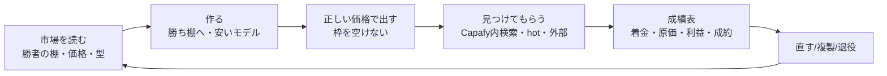

# Capafy $10k MRR レシピ Implementation Plan

> **For agentic workers:** REQUIRED SUB-SKILL: Use superpowers:subagent-driven-development (recommended) or superpowers:executing-plans to implement this plan task-by-task. Steps use checkbox (`- [ ]`) syntax for tracking.

**Goal:** Capafy の agent 工場を「売れる物を作る → 正しい価格で出す → 見つけてもらう → 売れない物を直す/退役 → 口座に入った利益で判定」の再現可能なレシピにし、口座着金ベースの月 $10k MRR へ向かう。

**Architecture:** 新しい仕組みは作らず、既存の Capafy loop（`capafy-loop-daily` 工場、`capafy_daily_decision.py` 改善ループ、`capafy_hourly_reconcile.py` お金の読み戻し、`capafy-distribute-daily` 宣伝）に「判定に使う数字」と「勝ち筋の型」を足す。判断はモデル、計測・集計・記帳だけ決定的コードに置く（building-agents）。

**Tech Stack:** Python 3（stdlib のみ）、pytest、既存の Capafy API クライアント（`skills/capafy-autopublish/vendor/capafy-user`）、`crwl`（公開ページの取得）、Gmail（`gog gmail`）、CloakBrowser lease（`capafy:kosuke`）。

**Spec:** `specs/29-CAPAFY-10K-MRR-CLOSED-LOOP.md`（Capafy の正本）と `docs/superpowers/specs/2026-09-25-life-manager-unified-ssot.md`（実行順の正本、§84-A の 2. Capafy L9-01）。

## Global Constraints

- 完了は公式 readback（Capafy API・公開ページ・Gmail・銀行着金）でだけ判定する。テスト合格や exit 0 は完了ではない。
- 「収益」は口座に着金した金額。gross・creator earnings・payout 待ち・着金を混ぜない。不明は 0 に丸めない。
- effect_unknown の提出・投稿は公式 readback なしに再送しない。
- 直す前に同じ問題を解いている既存 loop を registry と spec から探して写す（`skills/loop-development/SKILL.md` ルール9）。timeout などの数字を自己流で変えない。
- モデルの文章生成に Mac の `claude -p` を使う時は `--setting-sources ""` と `--system-prompt` を付けて /tmp で動かす。
- ブラウザは `browser-guard.sh` の lease で `capafy:kosuke` を使う。Dais の Chrome には触らない。
- 反映は PR → `gh pr merge --squash --admin` → release → `LIFE_MANAGER_APPLY_TARGET=<loop> bin/lm-loop apply` → plist が新 release を指すことを確認。
- 他の AGMSG 席が持つファイルを触らない（§84-A の lane A Capafy 所有者と調整してから着手）。

---

## 0. As-Is（2026-10-04 実測。出所つき）

| 項目 | 値 | 出所 |
|---|---|---|
| 累計 gross / creator earnings | $102.75 / $76.18（101 件、うち trial 69） | `state/capafy-skill-analytics.json` observed 2026-10-04T04:07Z |
| 直近30日 gross / 7日 | $82.77 / $13.97（3件） | 同上 |
| 直近の売上 | **9/30〜10/04 の 5 日連続 $0** | `daily_revenue_trend_last_30d` |
| 口座着金 | **$0.00**（payout 待ち $59.00、pending $11.02、wire_transfer） | `balances` |
| 30日 AI 実費 / 利益 | $34.50（うち claude-sonnet-4.6 $34.14）/ $31.72 | `openrouter_actual` |
| 出品 | 52 本（online 47 / under_review 3 / rejected 2）、**売れたことがあるのは 6 本、46 本は売上 0** | `per_skill_rows` |
| 売れ筋 | Hook Lab $34.88、Slide Maker $19.98、TikTok Script Pro $15.96、Marketing Strategist $13.98（Sonnet で 30日 -$16.74 の赤字、しかも rejected）、Academic Humanizer $9.99、YouTube Script Writer $7.96 | 同上 |
| 流入（30日） | Capafy 内検索 2,151 view → $56.86（売上の 69%）、hot 98 view → 6.1% 成約で最良、自前の外部宣伝（instagram_bio・direct）はほぼ 0 成約 | `traffic_sources.by_agent` 集計 |
| 工場 | 審査枠 5、今は PUBLISHABLE（空き 2）。却下 7 件の理由は API で取れず `platform_reason_unavailable` | `inventory_status.py`、`capafy-rejection-repair-queue.json` |
| 宣伝 | 記事＋X は 9/30 の 1 本が最後。IG は 8/24 以降 0 | distribute ログ、IG ledger |
| 公開プロフィール | フォロワー 8・51 agents、販売数バッジ 0 本 | https://capafy.ai/publisher/Anicca |
| 手数料 | Capafy 20%（「you keep 80%」）＋初回 $0.99、サブスクは Sandbox Fee が先に引かれる。実測の差し引き率は 25.9% | https://capafy.ai/earn |
| 市場の勝者 | CloneCut（動画クローン、$19.99/月）14,030 sold、Ocup Football Analysis（$8.33/月）3,083、Serenity Stock Tracker（$8.33/月）1,795、HookAce（$9.99/週）921 など。上位は「動画/ショート」と「金融シグナル」、無料の集客用 agent も多い | https://capafy.ai/ Trending（2026-10-04） |

## 0.1 規約と精算の一次資料（2026-10-04 取得）

- **量産の禁止**（https://capafy.ai/developer/doc/4.2）: "Do not mass-upload large numbers of Agents with near-identical functionality or minimal variations to dominate search results. This behavior is treated as cheating; the related Agents will be removed and the Publisher account may be warned or suspended." → 既存の Hook Lab 派生 9 本はこの危険域。複製（C3）は「入力・出力・使う場面が本当に違う物」だけにし、近い派生は統合・退役させる（C4）。
- **却下理由 2.2 Information accuracy**（同 4.2）: 2.2.1 説明どおりの機能、2.2.2 カテゴリとタグの一致、2.2.3 "The Base Model field must accurately reflect the LLM the Agent currently uses." → Marketing Strategist（モデル変更版 v1.0.2）は 2.2.3 のずれが第一仮説。
- **Agent Card**（同 4.2）: Details に sample input/output・Capabilities・Use Cases・FAQ を推奨。金融系は「専門的な投資助言ではない」免責と元本喪失のリスク表示が必須。
- **手数料と精算**（https://capafy.ai/developer/doc/3.2、2026-10-07 再取得）: Subscription の計算基準は `Net Transaction Amount − Platform Sandbox Fee`、Platform Fee はその基準の20%。On-Demand の Sandbox Fee は月$2.00・週$0.50・日$0.07。Download はSandbox Feeなし。Subscription payout は `(Net Transaction Amount − Sandbox Fee) × 80%`。売上は7日dispute windowの後に月次精算対象、翌月1日に明細、条件を満たせば15日以降に振込。日額プランはSandbox Feeの比率が高いため、月額・週額を主にする。

**Capafyの$10k/月の算数（On-Demand sandbox、model cost/refund/tax/cash timing前。予測ではない）:** $9.99/月ならsandbox $2.00を引いた$7.99に20% feeを適用し、publisher payoutは約$6.39/active subscriber-month。$10,000 payoutには約1,565 active subscriber-monthsが必要。$19.99/月ならpayoutは約$14.39、必要数は約695。$29.99/月ならpayoutは約$22.39、必要数は約447。銀行着金ベースの$10k目標はmodel cost、refund、dispute、settlement timingを加味するため、実際の必要数はさらに多い。旧い「$9.99×80%=約1,250人」の算数はSandbox Feeを無視していたため無効。これはeBookの$10k MRRとは別の目標である。

## 0.2 単位経済（2026-10-04 実測。agent 別 30日、出所: `capafy-skill-analytics.json` per_skill_rows、公開価格は `capafy-market-agents-20261003.json`）

| agent | モデル | 公開中の価格（10/03） | 30日 売上 | 20% feeのみの推定（sandbox除外） | モデル代 | 利益 |
|---|---|---|---|---|---|---|
| Hook Lab 8123079349 | DeepSeek | 日$1.99/週$4.99/月$9.99 | $24.89 | $19.91 | $0.34 | **+$19.57** |
| Slide Maker 8828622062 | DeepSeek | 週$9.99/月$24.99 | $19.98 | $15.98 | $0.00 | **+$15.98** |
| TikTok Script Pro 2844813315 | DeepSeek | 日$1.99/週$4.99/月$9.99 | $15.96 | $12.77 | $0.01 | **+$12.76** |
| YouTube Script Writer 7686597754 | DeepSeek | 日$1.99/週$4.99/月$9.99 | $7.96 | $6.37 | $0.02 | **+$6.35** |
| Marketing Strategist 9563867391 | Sonnet 4.6 | 週$6.99/月$12.99 | $13.98 | $11.18 | $27.92 | **-$16.74** |
| Academic Results Humanizer 1037005959 | Sonnet 4.6 | — | $0 | $0 | $4.63 | **-$4.63** |
| Contract Red Flags 8416888650 | Sonnet 4.6 | — | $0 | $0 | $1.59 | **-$1.59** |

- DeepSeek の agent は原価がほぼ 0（Hook Lab 11 注文で $0.34）。赤字は Sonnet の 3 本だけで、合計 -$22.96/30日。
- 上表の「20% feeのみの推定」はSandbox Feeを含まない上限値であり、subscriptionのpayoutやbanked netとして使わない。実行モード別Sandbox Feeと個別orderのmodeをjoinできるまで、実利益の正本はfresh provider payout/cost readbackとする。
- 後ろの 2 本は repo catalog に無いため、`capafy_daily_decision.py` rule 1 が毎日 `skip no_catalog_match`（2026-10-03 の記録）。誰も止めていない。
- 市場の勝者（同 sweep）: 高いモデルの勝者は高価格＋少ない回数上限で黒字にしている（Ocup Football Sonnet 4.6 週$14.99/月$29.99・月27回、HookAce Sonnet 5 週$9.99/月$19.99・月25回、Odeo Maker Opus 4.8 週$19.99/月$29.99・月10回）。安いモデルの勝者も価格は下げない（Serenity Stock Tracker・Alpha Consensus は DeepSeek で週$9.99/月$19.99/年$99.99・月40回）。→ 勝者は「市場価格は守る、高いモデルなら回数を絞る」。価格を下げて売る勝者はいない（無料 download の集客用は別枠）。
- 自社: モデルは既に安い（DeepSeek）が、売れ筋 3 本の公開価格は市場の下 25%（月$12.99）未満の $9.99。catalog の LISTING は値上げ済み（Hook Lab 日$3.99/週$9.99/月$19.99/年$99.99）だが本番に届いていない。
- 旧手取り推定（月$9.99=$5.99、月$19.99=$13.99）は20% feeをSandbox Fee控除前の全額に適用していたため置換済み。On-Demand計算は月$9.99≈$6.39、月$19.99≈$14.39。

## 0.3 2026-10-07 fresh運営snapshot

- Capafy analytics observed at `2026-10-07T02:57:21Z`: last-30-day gross $65.80, last-7-day gross $0.00, measured AI cost $34.23, after-cost profit $18.41. Payout balance $59.00, pending $0.00, confirmed balance $17.18, paid out $0.00. The $18.41 is measured profit, not banked payout.
- Fresh market sweep `capafy-market-agents-20261006.json` contains 852 agents. Its `salesVolume` snapshot leaders include Ocup Football Analysis 3,088, Serenity Stock Tracker 1,845, HookAce 948, and Odeo Maker 704; these are marketplace counts, not monthly recurring revenue. Capafy’s public earn page currently names KOL Hunter Pro as a $10,000+/mo example, but this is a publisher-page claim, not our settled result.
- Instagram remains unproven as a sales channel: the latest official Postiz readback at 13:19 JST showed zero Capafy Instagram posts. The integration was enabled, but native ownership/good-standing was not verified. The old direct owner is disabled with an unresolved effect fence, and the new owner is disabled. D5 remains one canary per 24 hours after the eBook paid+PDF gate; it does not currently authorize three posts per day.

## 1. 足りないもの（To-Be との差）

1. **売れる場所に作っていない**: 46/52 が売上 0。市場の勝ちカテゴリ（動画・金融）より、学術・人事・法務など小さい棚に散っている。
2. **勝ち筋の複製が測定ではなくプロンプト手書き**: Hook Lab 系の派生は増えたが、どの派生が売れたかで次を決めていない。
3. **Capafy 内検索が売上の 69% なのに、題名・説明・タグの検索最適化（marketplace SEO）を測っていない。**
4. **価格の実験ができない**: サブスクの値付け変更を CP1 から自動でできず、`blocked_no_cp1_support` で止まる。
5. **赤字 agent が残る**: Marketing Strategist は Sonnet で 1 注文 $13.96 の原価。
6. **却下理由が取れない**: API は理由なし。Gmail の却下メールには理由（例「2.2 Information accuracy」）がある。
7. **お金の最終地点（口座着金）を追っていない**: payout 待ち $59 から先の着金 receipt が無い。
8. **プロフィールが空**: 実績・社会的証明・ブランドの一貫性が無い。
9. **外部宣伝が成約に結びつかず、しかも 9/30 から止まっている。**
10. **毎日の「1 枚の成績表」が無い**: 手取り・着金・原価・利益・新規出品・却下・流入→成約を日次で 1 画面に。

## 2. レシピ（To-Be のループ）



---

## Phase A — 真実の数字（成績表と着金）

### Task A1: 日次成績表 `capafy_scoreboard.py`

**Files:**
- Create: `skills/earn/capafy-marketing/scripts/capafy_scoreboard.py`
- Test: `skills/earn/capafy-marketing/scripts/test_capafy_scoreboard.py`
- Modify: `skills/earn/capafy-marketing/capafy-goal-monitor.sh`（daily-close で 1 回呼び Telegram へ）

**Interfaces:**
- Consumes: `state/capafy-skill-analytics.json`（`account_totals`、`balances`、`per_skill_rows`、`daily_revenue_trend_last_30d`）、`state/capafy-hourly-reconcile.json`（`traffic_sources.by_agent`、`openrouter_actual`）
- Produces: `build_scoreboard(analytics: dict, reconcile: dict) -> dict` と `render_text(board: dict) -> str`

- [ ] **Step 1: 失敗するテストを書く**

```python
from capafy_scoreboard import build_scoreboard

ANALYTICS = {
    "account_totals": {"last_30d": {"gross_usd": "82.77", "orders": 78}, "cost30_actual_usd": "34.50", "net30_usd": "66.22"},
    "balances": {"balance_payout_usd": "59.00", "balance_pending_usd": "11.02", "paid_out_usd": "0.00"},
    "per_skill_rows": [
        {"agent_id": "1", "name": "Hook Lab", "status": "online", "stats_30d_orders": 11, "stats_30d_revenue_usd": "24.89", "cost_30d_actual_usd": "0.34"},
        {"agent_id": "2", "name": "Dead", "status": "online", "stats_30d_orders": 0, "stats_30d_revenue_usd": "0.00", "since_launch_gross_usd": "0.00", "cost_30d_actual_usd": None},
    ],
    "daily_revenue_trend_last_30d": [{"date": "2026-10-03", "revenue": 0.0, "orders": 0}, {"date": "2026-10-04", "revenue": 0.0, "orders": 0}],
}
RECONCILE = {"traffic_sources": {"by_agent": {"1": {"last_30d": {"by_source": [
    {"source_type": "search", "views": 100, "paid_orders": 2, "sales_usd": "9.98"}]}}}}}

def test_scoreboard_separates_money_stages_and_flags_zero_streak():
    b = build_scoreboard(ANALYTICS, RECONCILE)
    assert b["money"] == {"gross_30d": "82.77", "earnings_after_cost_30d": "66.22", "cost_30d": "34.50",
                          "payout_waiting": "59.00", "pending": "11.02", "bank_received_total": "0.00"}
    assert b["zero_revenue_streak_days"] == 2
    assert b["skills"]["selling"] == 1 and b["skills"]["never_sold"] == 1
    assert b["funnel"]["search"] == {"views": 100, "paid_orders": 2, "sales_usd": "9.98"}
```

- [ ] **Step 2: 実行して失敗を確認**

Run: `cd skills/earn/capafy-marketing/scripts && python3 -m pytest test_capafy_scoreboard.py -v`
Expected: FAIL（`ModuleNotFoundError: capafy_scoreboard`）

- [ ] **Step 3: 最小実装**

```python
#!/usr/bin/env python3
"""Daily Capafy scoreboard: money stages kept separate, never rounded unknown to 0."""
from __future__ import annotations
import json, sys
from decimal import Decimal
from pathlib import Path

STATE = Path.home() / ".local/state/life-manager/state"


def _d(v):
    return None if v in (None, "") else Decimal(str(v))


def build_scoreboard(analytics: dict, reconcile: dict) -> dict:
    t = analytics.get("account_totals") or {}
    bal = analytics.get("balances") or {}
    money = {
        "gross_30d": (t.get("last_30d") or {}).get("gross_usd"),
        "earnings_after_cost_30d": t.get("net30_usd"),
        "cost_30d": t.get("cost30_actual_usd"),
        "payout_waiting": bal.get("balance_payout_usd"),
        "pending": bal.get("balance_pending_usd"),
        "bank_received_total": bal.get("paid_out_usd"),
    }
    streak = 0
    for day in reversed(analytics.get("daily_revenue_trend_last_30d") or []):
        if (day.get("revenue") or 0) > 0:
            break
        streak += 1
    rows = analytics.get("per_skill_rows") or []
    selling = sum(1 for r in rows if (_d(r.get("stats_30d_revenue_usd")) or 0) > 0)
    never = sum(1 for r in rows if (_d(r.get("since_launch_gross_usd")) or 0) == 0
                and (_d(r.get("stats_30d_revenue_usd")) or 0) == 0)
    funnel: dict[str, dict] = {}
    for agent in ((reconcile.get("traffic_sources") or {}).get("by_agent") or {}).values():
        for s in (agent.get("last_30d") or {}).get("by_source") or []:
            f = funnel.setdefault(s.get("source_type") or "unknown", {"views": 0, "paid_orders": 0, "sales_usd": Decimal("0")})
            f["views"] += s.get("views") or 0
            f["paid_orders"] += s.get("paid_orders") or 0
            f["sales_usd"] += _d(s.get("sales_usd")) or 0
    for f in funnel.values():
        f["sales_usd"] = f"{f['sales_usd']:.2f}"
    return {"money": money, "zero_revenue_streak_days": streak,
            "skills": {"total": len(rows), "selling": selling, "never_sold": never}, "funnel": funnel}


def render_text(b: dict) -> str:
    m = b["money"]
    lines = [f"Capafy 成績表: 30日 gross ${m['gross_30d']} / 原価 ${m['cost_30d']} / 原価後 ${m['earnings_after_cost_30d']}",
             f"出金待ち ${m['payout_waiting']} / 確定待ち ${m['pending']} / 口座着金 累計 ${m['bank_received_total']}",
             f"売上0の連続日数 {b['zero_revenue_streak_days']} / 売れている {b['skills']['selling']} 本・一度も売れていない {b['skills']['never_sold']} 本"]
    for src, f in sorted(b["funnel"].items(), key=lambda kv: -kv[1]["views"])[:5]:
        lines.append(f"流入 {src}: {f['views']} view → {f['paid_orders']} 件 ${f['sales_usd']}")
    return "\n".join(lines)


if __name__ == "__main__":
    a = json.loads((STATE / "capafy-skill-analytics.json").read_text())
    r = json.loads((STATE / "capafy-hourly-reconcile.json").read_text())
    board = build_scoreboard(a, r)
    print(json.dumps(board, ensure_ascii=False) if "--json" in sys.argv else render_text(board))
```

- [ ] **Step 4: テスト PASS を確認**（同じコマンド、Expected: PASS）
- [ ] **Step 5: 実データで 1 回動かし、数字が §0 の表と一致することを目視** — `python3 capafy_scoreboard.py`
- [ ] **Step 6: `capafy-goal-monitor.sh` の daily-close 分岐で `render_text` の出力を既存の Telegram outbox 経由で送る（新しい送信経路は作らない）**
- [ ] **Step 7: Commit** — `git add skills/earn/capafy-marketing/scripts/capafy_scoreboard.py skills/earn/capafy-marketing/scripts/test_capafy_scoreboard.py skills/earn/capafy-marketing/capafy-goal-monitor.sh && git commit -m "feat(capafy): daily scoreboard separating gross, cost, payout and bank receipt"`

### Task A2: 口座着金の readback

**Files:** Modify `skills/self/capafy-loop/capafy_earn_reconcile.py`、Test 同ディレクトリの既存テスト

- [ ] Capafy の payout-record（`payoutMonth`、`paid`、`paymentReference`）を月次で読み、`paid=true` の行だけを「着金」として ledger に記録する。着金額の一次証拠は Capafy の payout record と、Wise/銀行の入金メール（Gmail `from:capafy OR subject:payout`）を `paymentReference` で突き合わせる。
- [ ] テスト: `paid=false` の月は着金に数えない／`paid=true` でも `paymentReference` が無い行は `unverified` として別欄にする。
- [ ] 最初の着金月（$59 が出金閾値を超えた月）に公式 readback で 1 件閉じる。

---

## Phase B — 出血を止める・今ある枠を使う

### Task B1: Marketing Strategist を安いモデルへ移して再提出

- [ ] 既存ルール1（`capafy_daily_decision.py` losing money → `UPDATE.json` で `deepseek/deepseek-v4.1-flash`）がこの agent に効いていない理由を、`state/capafy-daily-decisions/` の最新記録で確認する（第一仮説: status=review_rejected が `PENDING_SERVER_STATUSES` に入り `blocked=pending_review` で止まる）。
- [ ] 仮説が当たれば、rejected の場合だけ「却下修正と同じ 1 回の更新」にモデル変更を同梱するよう `decide_actions` を変更（テスト: `review_rejected` かつ赤字 → `model_switch` と `rejection_repair` を 1 つの update にまとめる）。
- [ ] 公式 readback: Capafy API で model=DeepSeek・status=under_review → online。

### Task B2: 却下理由を Gmail から取る

**Files:** Modify `skills/capafy-autopublish/scripts/` の rejection repair queue を書く箇所（`capafy-rejection-repair-queue.json` を書くスクリプト）

- [ ] Gmail の「Action Required: Your Agent "…" was rejected」から Agent ID・Version・Reason（例 `2.2 Information accuracy`）を抜き出し、queue の `rejection_reason` を埋める（`platform_reason_unavailable` を置き換える）。
- [ ] テスト: 実メールの本文を fixture にして ID・version・reason を取り出す。
- [ ] 理由ごとの修正方針（2.2 = 説明文の主張を見本の実出力で裏付けられる範囲に絞る）を LISTING 生成プロンプトに渡す。
- [ ] 公式 readback: 却下 2 本（4973250899、9563867391）が under_review → online。

### Task B3: 空き 2 枠を今日埋める

- [ ] `inventory_status.py` = PUBLISHABLE（空き 2）なのに提出が無い理由を `capafy-loop-daily.log` で特定（第一仮説: 準備済み候補が無い、第二: 1 時間 1 アクション制限、第三: fence）。
- [ ] 直したら、自然 run で `platform_status=1` を Capafy API で確認。

---

## Phase C — 勝てる棚に作る（量と質）

### Task C1: 市場の勝者データを毎日取る

**Files:** Modify `skills/self/capafy-loop/capafy_market_sweep.py`

- [ ] 既存の `POST /agent/agents/search` sweep に加え、公開トップページ（Trending）の各 agent の `Sold`・価格・カテゴリを毎日記録する（`crwl crawl https://capafy.ai/ -o markdown-fit` を写す。新しいスクレイパは作らない）。
- [ ] 出力: `state/capafy-market-winners-latest.json` = `[{name, developer, category, price, cycle, sold, observed_at}]`
- [ ] テスト: 保存済み HTML fixture から CloneCut = 14,030 sold・$19.99/month を取り出す。

### Task C2: 勝ち棚の判定を測定ベースにする

**Files:** Modify `skills/self/capafy-loop/capafy_daily_decision.py`（rule 4 の拡張）、`skills/self/capafy-loop/test_capafy_daily_decision.py`

**Interfaces:** Produces `rank_shelves(market_winners: list, own_rows: list) -> list[dict]`（各 dict = `{category, market_sold_total, our_listings, our_sales_30d, score}`）

- [ ] テスト（失敗を先に書く）:

```python
def test_rank_shelves_prefers_big_market_where_we_are_thin():
    m = load_module()
    winners = [{"category": "Video", "sold": 14030}, {"category": "Finance", "sold": 3083}, {"category": "Legal", "sold": 10}]
    own = [{"category": "Legal", "stats_30d_orders": 0}, {"category": "Legal", "stats_30d_orders": 0}]
    ranked = m.rank_shelves(winners, own)
    assert [r["category"] for r in ranked][:2] == ["Video", "Finance"]
    assert ranked[-1]["category"] == "Legal"
```

- [ ] 実装: `score = market_sold_total / (1 + our_listings)`。上位の棚を `capafy-candidate-opportunities.json` に書き、`capafy-loop-daily.sh:143` の手書き family 一覧を「opportunities ファイルだけを読む」に置き換える。
- [ ] 公式 readback: 次の新規出品が上位棚のカテゴリで under_review に入る。

### Task C3: 売れた物を複製する（winner cloning を測定で、ただし規約 4.2 の量産禁止を守る）

- [ ] 派生候補は「入力・出力・利用場面」が親と別物であることをモデルに判定させ、近い派生は出さない。既存の Hook Lab 派生 9 本は、売上・閲覧で上位 2〜3 本を残し、残りを統合または非公開にする。
- [ ] `decide_actions` に rule 5 を追加: 30日で `orders >= 3` の agent ごとに、まだ持っていない派生先（プラットフォーム・ニッチ）を 1 つ opportunities に足す。派生の成否（30日の注文数）を親子で記録し、親より売れない派生が 2 本続いたら、その親からの派生を止める。
- [ ] テスト: Hook Lab（11 注文）→ 派生候補 1 件。派生 2 本が 0 注文 → その親の派生停止。

### Task C4: 売れない 46 本を直すか退役させる

- [ ] 既存 rule 3（views ≥ 20・注文 0 → `retire_or_rewrite_candidate`）を実行まで進める: 題名・説明の書き直し（勝者の型: 「名前 — 何をするか」、数字のある約束、使うエンジン名）を 1 回だけ。書き直し後 30日で注文 0 なら非公開化して枠と注意を勝ち棚へ回す。
- [ ] views < 20 の物は「見られていない」問題なので、書き直しより検索語の見直し（Task D1）を先に当てる。

---

## Phase D — 見つけてもらう（売上の 69% は Capafy 内検索）

### Task D1: Capafy 内検索の最適化

- [ ] 勝者と自分の題名・説明・タグを並べ、検索 view の多い語を題名の先頭に入れる。変更前後 14 日の検索 view と成約を成績表（A1）で比較する。
- [ ] hot（成約率 6.1%、最良）に載る条件を観測する（直近の売上・評価の数）。最初の数件の注文とレビューを集める方法（既存顧客への使い方案内など、規約内のもの）を調べる。

### Task D2: プロフィールを整える

- [ ] spec 29 の「profile edit を main agent が直接しない」ガードに従い、`capafy:kosuke` lease の工場側ブラウザ役で 1 回だけ実行する。内容: ブランド名を 1 つに統一（例「Anicca Hook Lab」系）、実績（累計販売数・対応プラットフォーム）、得意棚、外部リンク（aniccaai.com）。
- [ ] 公式 readback: https://capafy.ai/publisher/Anicca に新しい bio が出る。

### Task D3: 外部宣伝を成約で測る

- [ ] `capafy-distribute-daily` を再開（9/30 から停止。fence の公式 readback 解除は SSOT の F2 に従う）。
- [ ] 宣伝の対象を「直近 30 日で一番利益の出た agent」から「hot / 検索で伸びている agent」に変える。`ct=` 付きリンクの成約を成績表に出し、14 日で成約 0 の経路は止める。
- [ ] 新しい経路（Reddit・YouTube Shorts）は、勝者がそこで集客している証拠を取ってから 1 つずつ足す。

---

### Task D5: Capafy Instagram marketing — Postiz ownerを一つにする（2026-10-07 19:00 JST runtime refresh; provider GET last at 13:19 JST）

**read-only state**

| 経路 | 状態 | 完了に必要な読み戻し |
|---|---|---|
| 旧 `capafy-ig-marketing-daily` | At 19:00 JST persistent launchd is `disabled=true`, still on release `2e87d30d24b95c7c51e49861bc18a62b97c0b4c2`. Runtime status reports `host_admission_deferred:resource_effect_unknown`, `admission_effect_unknown=true`, no provider receipt/readback; the unresolved fence is `capafy-ig-marketing-daily:18db7caff1178a88-68028`. The latest blocked occurrence remains `18dc1d1db6d4df60-34612`; the read-only reconciler previously returned `active_ig_handle_unresolvable`. | Exact owned Instagram identity and complete own-media readback; keep disabled and do not retry. |
| New `life-manager-capafy-ig` | At 19:00 JST persistent launchd is `disabled=true`, still on release `2e87d30d24b95c7c51e49861bc18a62b97c0b4c2`. Latest runtime status remains `entrypoint_exit_1`, no receipt/readback, `admission_effect_unknown=false`. The last explicit diagnostic (13:19 JST) was `LM_CAPAFY_IG_PACK_REF is required`. | Keep disabled until eBook first paid+PDF gate, then set one approved pack ref and one-canary/24h gate before enabling. |
| Postiz identity | The last official Postiz GET at 13:19 JST returned `capafy.hooklab`, integration `cmuuycr5402uzqw0yhanqggo9`, `disabled=false`, matching the configured ID; current-day post count was 0. This was not re-read at 19:00 JST. Route enablement does not prove native account ownership or good standing. | Re-read Postiz and verify native account identity/good-standing before enabling. |
| eBook → Capafy order | No natural paid eBook Checkout plus matching PDF delivery receipt is recorded. D5 has not started; both marketing publishers are disabled. | Preserve the eBook-first gate; once met, run one Capafy canary then measure 14 days. |

**2026-10-07 19:00 JST runtime refresh:** both publisher labels remain disabled on release `2e87d30d`. The old direct-publisher lane still has `admission_effect_unknown=true` for `18db7caff1178a88-68028` and no receipt/readback; keep the fence closed. The new Postiz owner has no effect-unknown fence but remains disabled after `entrypoint_exit_1`; its last explicit diagnostic requires `LM_CAPAFY_IG_PACK_REF`. The last official Postiz readback (13:19 JST) showed the configured integration enabled; that provider state and native account ownership/good-standing have not been refreshed since then. No D5 publish or authenticated CAPTCHA/challenge is observed. The eBook paid Checkout plus matching PDF receipt gate is still open, so Capafy D5 has not started.

**担当境界とmarketing gate**

- Capafyの商品・listing・account-lifecycleの実装は別担当が所有します。PR #6631の`life-manager-capafy-ig` Postiz skeletonを使い、このmarketing計画からCapafy開発コードを変更しません。
- 現行Life Manager source routeは`config/loop-registry.json`の`life-manager-capafy-ig` → `apps/life-manager/scripts/capafy-ig-reel` → Postizです。entrypointは`LM_POSTIZ_API_KEY`と`CAPAFY_IG_POSTIZ_INTEGRATION_ID`を要求し、reconcilerはPostiz post listingをofficial receiptにします。2026-10-07 13:19 JSTの公式GETでは`@capafy.hooklab`のPostiz integrationが有効です（`cmuuycr5402uzqw0yhanqggo9`）。このsource commentは古く、integration enabledだけではnative account ownership/good-standingは証明しません。`capafy-marketing/SKILL.md`のB4 browser-direct案は同skill内でまだ実装されておらず、このownerの実行経路ではありません。単一owner/routeを公式statusで確かめ、Postiz・browser-direct・旧instagrapiをfallback/二重投稿に使いません。
- IG投稿ownerは`life-manager-capafy-ig`だけにします。旧`capafy-ig-marketing-daily`と新laneの各effect-unknown occurrenceを公式readbackで閉じる前に再送せず、二重publisherも許可しません。readbackできない場合は両方から公開しません。
- 現行Postiz laneは1日3回ですが、初期canaryは24時間に1回を上限とします。lane側で投稿slotを抑制できると別担当の開発者が確認するまで、live scheduleを開始しません。
- `@capafy.hooklab`とregistry/Postiz integrationのidentityを公式account statusで照合し、現在ユーザー所有でgood-standingのIGだけを使います。Challenge/制限は公式status/appealで処理し、別account作成、automated likes/follows、anti-detection、proxy/fingerprint回避をしません。
- CAPTCHA画面は現状未観測です。標準reCAPTCHA v2なら既存owner helper `skills/fundraiser-agent/runtime/solve-recaptcha-v2.py`をregistered pageのtarget-id付きで使い、site key/response textarea/callbackが実画面にある場合だけ実行します。別challengeならrendered typeを確認し、既存の認証済みaccount上のregistered CDP pathだけを使い、解決後にexpected identity/provider stateをreadbackします。selfie/identity/appeal/suspensionはsolver対象外で公式手続きを使います。
- GitHub searchを2026-10-06 02:20 JSTに更新しました。[fiptcha](https://github.com/figranium/fiptcha)はApache-2.0、2026-10-05 16:42Z更新のlocal candidateで、active Playwright-compatible pageを受け取りbrowserを起動せず、reCAPTCHA v2/hCaptcha/Turnstileに対応します。dynamic 3x3 image gridは不安定でdirect-CDP compatibilityは未検証です。[Captcha Solver API Python SDK](https://github.com/captcha-solver-api/python-sdk)はMIT SDKですがservice pricing/free quotaは未確認なので無料solverとは判定しません。fiptchaは実際の対応widgetが読み戻せた場合だけ、同じregistered page内で短いcompatibility probeを行います。別browser起動、proxy、fingerprint変更はしません。
- ReelはCapafyの公開中・利益のあるskill選定とLISTING.mdの実例から独自demoを作り、CTAは`ct=capafy-reel-<slug>`を含む該当Capafy listingへ向けます。

**eBook初回receipt後のmarketing手順**

1. eBookの自然なpaid Checkout receiptと一致するPDF delivery receiptがあることを統合SSOTで確認します。14日eBook測定を並行で開始します。
2. old active fence `capafy-ig-marketing-daily:18db7caff1178a88-68028`はhandle unresolvedのためheld。new Postiz ownerはdisabledでactive fenceなし。old fenceの正確なInstagram readbackとeBook paid+PDF gateなしにどちらも再有効化しません。
3. Life Manager側のInstagram marketing ownersは両方disabled。eBook gate後に新Postiz ownerを一つだけenable/applyし、loaded SHA/argvとeffect fenceを照合します。Capafy product/listing/account-lifecycle codeには触れません。
4. Postiz integration `cmuuycr5402uzqw0yhanqggo9`は`capafy.hooklab` / `disabled=false`で設定IDとも一致します。native account identity/good-standingを別readbackで確認し、成立しなければlaneをheldにしてaccountを作りません。
5. 初期canaryを24時間に1回以下で配信できることを確認します。現在のregistry scheduleは1日3回なので、marketing owner側でfrequency gateを設定して読み戻すまで公開配信を開始しません。
6. 必要なPostiz integrationと承認済みpack/media/Instagram approval refをcredential値なしで確認します。現状のownerは`LM_CAPAFY_IG_PACK_REF is required`でentrypoint失敗するため、eBook gate後に承認済みpack refを接続し、公開中・利益のあるskillの実例と`ct=capafy-reel-<slug>`でdry-runします。
7. canaryは唯一のregistered ownerから一件公開します。Postiz/Instagram receiptと公開Reel URLを記録し、旧instagrapi publisherをfallbackにしません。
8. そのoccurrenceのCT clicks、Capafy有料注文、返金、platform/sandbox fee、実際のmodel/video費、出金、銀行着金を照合します。viewsやprofile opensはreach指標であり売上ではありません。
9. 24時間に1投稿で14日測定します。有料成約が0ならcreative要素を一つ変えて次の14日を試し、その期間も注文0なら経路を止めます。TikTok/YouTubeはこのCapafy Instagram workstreamの対象外です。
10. forecast前にportfolio planの既存Capafy配分$5,000と、DaisのCapafy contribution目標$10,000を整合させます。CFO acceptanceは30日banked netのままにし、他channelの目標を追加分か上振れ分か明記します。

**完了条件:** eBook-first handoff後、旧IG effectがreadbackされ、一つの検証済み所有accountと一つのpublisher ownerが選ばれ、24時間1回以下のcanaryに公式receiptが付き、CTがCapafy有料注文へ結合されること。手数料・実費・出金・銀行着金は別に記録します。Capafy開発実装は別担当が所有します。

**cursorの担当:** Capafy project-wide development cursorは既存担当者の#5（E1b価格更新/審査枠）に残します。eBook → InstagramはDaisが割り当てた別のmarketing workstreamであり、そのdeveloper cursorを移動・重複させません。

## Phase E — 価格

### Task E1a: 提出前の価格照合（値上げ版が古い価格のまま承認される穴を塞ぐ）

**事実（2026-10-04 実測）:** Hook Lab v1.0.4（2104787480225804288）・TikTok Script Pro v1.0.2（2104796738414858240）・YouTube Script Writer v1.0.3（2104868865431072768）は値上げ版として提出・承認（platform_status=4）されたが、各版の billing 行は日$1.99/週$4.99/月$9.99。Hook Lab の billing updatedAt = 2026-09-29 17:41 JST（提出時）。工場は提出後に実際の価格を確かめていない。

**Files（既存の検査の型を写す。モデル検査 `scripts/check_hosted_model.py` と同じ位置で呼ぶ）:**
- Modify: `skills/capafy-autopublish/scripts/publish_finish.sh`（提出直前）
- Create: `skills/capafy-autopublish/scripts/check_listing_price.py`
- Test: `skills/capafy-autopublish/test/test_check_listing_price.py`

- [ ] 失敗するテスト: LISTING の価格表（`| week | $9.99 | 30 | No Free Trial |` 形式）と draft の billing 行（`cycleType`・`cyclePrice`・`cycleMaxMessageCount`・`supportFreeTrial`）が 1 つでも違えば `price_mismatch`（期待値と実値を両方出す）、一致なら ok。実例: LISTING 月 $19.99 ／ billing 月 $9.99 → mismatch。
- [ ] 最小実装 → テスト PASS → `publish_finish.sh` で mismatch なら提出しない（exit 非 0、理由をログ）。
- [ ] 公式 readback: 次の値上げ提出で、提出前の draft billing が LISTING と一致したログ、承認後に市場 API の billing が新価格。
- 状態: Sonnet 実装中（PR 作成まで、merge は確認後）。

### Task E1b: 売れ筋 3 本を市場価格で出し直す

- [ ] `skills/capafy/catalog/{hook-lab,tiktok-script-pro,youtube-script-writer}/UPDATE.json` の `from_version_id` を現行公開版（上の 3 つの version id）に合わせる。今は Hook Lab が旧 `2104491899222904832` で、`inventory_status.py` の一致条件（online かつ latest==from_version）を満たさず永久に出ない。
- [ ] サブスク価格だけの更新を `inventory_status.py` / `publish_prepare.sh` が受け付けるか確認（今は `target_model_id` か `target_one_time_fee` のどちらか必須）。受け付けないなら、`target_model_id`（現行と同じ DeepSeek）を持つ更新として出し、CP1 で価格表を書く（E1a の照合で担保）。
- [ ] 審査枠が空いたら、工場が売上順（`update_priority_key`）に Hook Lab → TikTok Script Pro → YouTube Script Writer を出す。
- [ ] 公式 readback: 市場 API の billing が LISTING どおり（Hook Lab 日$3.99/週$9.99/月$19.99/年$99.99）。成績表で前後 14 日の注文数と手取りを比べ、手取りが減ったら元に戻す。

### Task E1c: 価格の型（以後すべての出品に適用）

- [ ] 市場価格帯（2026-10-03 sweep: 月 p25 $12.99・中央 $19.10・p75 $22.99、週 中央 $6.99、年 中央 $149.99）の中央付近に置き、年プランを必ず置く。無料試用は付けない。
- [ ] モデル代 ≤ 手数料後売上の 15%。高いモデル（Sonnet 以上）を使う時は回数上限を勝者並み（月 10〜27 回）に絞る。
- [ ] 価格変更は 1 本ずつ、前後 14 日比較。

---

## Phase F — レシピ化と公開

- [ ] Phase A〜E の手順と数字を `skills/capafy/RECIPE.md` に 1 本でまとめる（市場を読む → 作る → 値付け → 見つけてもらう → 成績表 → 直す）。
- [ ] 口座着金ベースで月 $1k → $3k → $10k の各段階を公式 readback で記録する。
- [ ] $10k を 30 日保ったら、credential を除いて OSS として公開（spec 29 の O0〜O2）。同じレシピをモバイルアプリ・Web アプリ・gig に写す。

## 実行順（$10k MRR までの全順序。この表が Capafy の TODO 正本）

**ゴール:** 口座に入る利益（売上 − Capafy 手数料 − モデル代）で月 $10,000 を 30 日維持。
**起点（2026-10-04）:** 30日利益 $31.72、口座着金 $0、売上 5 日連続 $0、52 本中 46 本が売上 0。
**算数:** 月$19.99 の手取り ≈ $13.99（20% 手数料 + Sandbox Fee 月$2）。有料会員 約 700 人、または勝者 1 本（$19.99 × 600 人）＋中堅 10 本。
**完了の判定:** すべて公式 readback（Capafy API・市場 API の billing・公開ページ・Gmail・銀行着金）。テスト合格や exit 0 は完了ではない。

| # | 段階 | Task | 完了条件（公式 readback） | 状態 |
|---|---|---|---|---|
| 1 | 1 取りこぼしを止める | A1 日次成績表 | 23:50 の daily_close で成績表が Telegram に届く | ✅ source+本番。10/05 01:32 に daily snapshot 初回書き込み（`capafy-scoreboard-daily.jsonl`）。Telegram 着信は未目視 |
| 2 | 1 | B2 却下理由 / 重複の関門 / C1・C2 勝ち棚 | 却下 2 本が under_review → online、次の新規が上位棚 | source ✅、自然 run 待ち |
| 3 | 1 | retry を売上順に（#6566） | 本番 plist が `4b0a1ae1` 以降の release | ✅ 本番（release `1b3191a7` 以降、現在 `82d31995`） |
| 4 | 1 | **E1a 価格の照合と CP1 で毎回価格を設定**（#6569 `342ffefb`） | 値上げ提出のログに `PRICING_MATCH`（`PRICE_MISMATCH_WARNING` が出ない） | ✅ 本番。最初の値上げ提出で `PRICING_MATCH` を確認する |
| 5 | 1 | **E1b 売れ筋 3 本を市場価格へ**（UPDATE.json を公開版に合わせ、TikTok・YouTube の価格表を日$2.99/週$5.99/月$19.99/年$99.99 に、#6569） | 市場 API の billing が LISTING どおり | **凍結（Dais 2026-10-06）**: 売れた 4 本（Hook Lab・Slide Maker・TikTok Script Pro・YouTube Script Writer）は注文が戻るまで価格・モデル・カードを変えない。再開は N1 で原因が出た後、1 本 1 変更・14 日比較 |
| 6 | 1 | B1 Marketing Strategist DeepSeek 版の承認 | Capafy API で DeepSeek 版 online、Sonnet 版が売り場から消える | retry 順は売上順（#6566）だが枠 5/5 で未実行 |
| 7 | 2 見つけてもらう | **D1 Hook Lab の題名・タグ・カード**（検索 1,503 view・成約 0.2%） | 新カード online、14 日後の検索成約率を成績表で比較 | **凍結（#5 と同じ）**: source ✅ #6572 `57c179fc` は提出しない |
| 8 | 2 | D2 プロフィール | https://capafy.ai/publisher/Anicca に新 bio | ✅ 公開ページで新 bio を目視確認（2026-10-04）。残り: リンク欄（タイトル必須）、主力をプロフィール上位に出す方法 |
| 9 | 2 | D4 最初のレビューと注文（hot 欄に載る条件を観測し、規約内の方法で） | 売れ筋 3 本に rating/review ≥ 1、hot 掲載 | source ✅ 売れ筋 3 本の出力末尾に評価のお願い 1 行（見返り・点数指定なし、#6573）。**凍結（#5 と同じ）**: 売れた 4 本の新版を出さない |
| 10 | 2 | 前後 14 日比較の仕組み（成績表に「変更日」と前後の検索 view・成約・手取り） | 成績表に比較行が出る | ✅ 本番（#6574）。変更ログ `capafy-listing-changes.jsonl` への記入は値上げが online になった日から |
| 11 | 3 勝てる棚で数 → **月 $1k** | C3 売れた物の派生（入力・出力・場面が本当に違う物だけ、規約 4.2） | 派生が online、親子の 30日注文を記録 | ✅ source+本番（#6575 `26dd2de7`）: 親は 30日注文≥3 かつ売上>0、子 2 本以上が親未満なら停止。本番データ: Hook Lab=停止、TikTok/YouTube=派生候補 1 件ずつ |
| 12 | 3 | C4 売れない 46 本の整理（書き直し 1 回 → 30 日で 0 注文なら非公開、catalog 外 2 本は catalog 再作成→モデル切替） | 非公開・統合の数と空いた枠 | 一部 ✅: 未出品 Hook Lab 派生 5 本を catalog-hold へ（#6576）、売上 0 の学術・Humanizer 12 本を RETIRED.json（#6577、工場の自動再出品から除外）→ 管理画面で公開停止、Capafy API で 12 本 offline を確認。残り: その他の売上 0 agent（書き直し 1 回 → 30 日） |
| 13 | 3 | 新規は上位棚（分析・金融・動画）× DeepSeek × 市場価格（E1c） | 新規の 30日注文 > 0 | 工場で継続 |
| 14 | 3 | G1 集客用の無料 agent 1 本 → 有料の兄弟へ誘導（勝者の型: 無料 download 上位が多数） | 無料 agent の download 数と有料への流入（traffic_sources） | source+本番 ✅（#6578 `1b3191a7`）: Hook Grader（無料 download、既存 hook を採点、最後に Hook Lab へ案内）。工場が枠の空き次第出品（重複関門の判定後） |
| 15 | 4 外部宣伝と着金 → **月 $3k** | D3 外部宣伝の再開（9/30 停止）、全リンク `ct=`、14 日成約 0 の経路は停止 | `ct=` 経由の paid_orders | 再開 ✅（#6580・#6581、本番 `1a20a537`）: 10/04 22:15 の自然 run で記事公開（HTTP 200・ct 付き）、X は Postiz published（X 上は未目視）。残り: ct 別の成約を測る（集計に ct 内訳が無い）、14 日で成約 0 の経路は止める |
| 16 | 4 | A2 口座着金（9 月分 $59 は 10/15 以降） | Capafy payout record `paid=true` と入金メールの一致 | 10/15 以降 |
| 17 | 4 | 価格実験を 1 本ずつ（手取りが増えた価格だけ残す） | 成績表の前後比較 | 未着手 |
| 18 | 5 伸ばす → **月 $10k** | 勝ち agent を軸に勝ち棚で数を増やす（規約の量産禁止を守る） | 口座着金で月 $10k を 30 日 | 未着手 |
| 19 | 5 | F レシピ化 `skills/capafy/RECIPE.md` | 月 $1k → $3k → $10k を公式 readback で記録 | 未着手 |
| 20 | 5 | 同じ型をモバイルアプリ・他商品へ | — | 未着手 |

**毎日見る数字（成績表）:** 口座着金・出金待ち・agent 別利益・検索 view → 成約・売上 0 の連続日数。
**順序の理由:** 先に「売れているのに安すぎる・赤字・枠の無駄」を止める（同じ客数で手取りが増える）。売上の 69% は Capafy 内検索なので、外部宣伝より検索・カード・レビューを先にする。数を増やすのは価格と見つけてもらう型が決まってから。
**2026-10-08 の実行順（表の #1〜#20 より先に、この順で実行。2026-10-06 版を置き換え）:**

| # | Task | 完了条件（公式 readback） | 状態（2026-10-08 10:xx JST） |
|---|---|---|---|
| N1 | 売れていた 4 本を Sonnet に戻す（説明文はそのまま） | Capafy API status 4 → buyer スキャン通常 → 注文再開 | **10/08 12:00 承認**: Hook Lab v1.0.6・TikTok v1.0.4・YouTube v1.0.5（＋Marketing Strategist v1.0.2）。Slide Maker v1.0.3 は 12:17 も審査中（管理画面「v1.0.3 審査中／v1.0.2 公開中」）。buyer スキャン: TikTok 通常・YouTube 通常・**Hook Lab 却下**（パッケージ同梱の LISTING/UPDATE.json に「scan のため test/ を外した」旨→監査回避と判定、FAQ に無い年額、welcome 途中切れ）。YouTube の本番年額 cap が 8640（LISTING は 720）。両方を #（package-only-skill-files）で修正し再提出待ち |
| N1b | 承認後、4 本の実モデル ID を `anthropic/claude-sonnet-5.5` に（OpenRouter: 5 と同じ $2/$10。Capafy の表示名は選択肢がないので「Claude Sonnet 5」のまま） | Capafy API の hosted model が 5.5 | 承認待ち。再審査が要るかは承認後の画面で確認 |
| N2 | 公開済み agent を工場が勝手に変えない。自動の値上げ・モデル変更・説明の書き換えは永久禁止 | 価格・モデル・カードの自動更新が 0 件 | ✅ 本番（`dais_approved_exception` 付き UPDATE.json だけ通す・日次判断は報告のみ・FROZEN.json に 4 本） |
| N2b | 無料お試しをやめる（Dais 10/08「無料サービスではなく利益のため」）: 13 本にお試しあり（最大 Contract Red Flags 150 回）。上位 15 本はお試しなし。値下げの自動化は作らない（Dais 10/08 撤回） | お試し付き agent が 0 | Contract Red Flags（Sonnet 4.6・お試し 150 回・注文 0）を非公開化中。残り 12 本は審査なしで外せるかをサポートに質問（10/08 10:39 送信）。審査が要るなら枠を食うので新規優先 |
| N2c | 赤字 agent を止める: Marketing Strategist（30日 −$16.45、DeepSeek・週 $6.99/36 回）、Academic Results Humanizer（−$4.58、Sonnet 4.6・offline）、Contract Red Flags（−$1.57、Sonnet 4.6・無料お試しの原価） | 30日利益がマイナスの agent が 0 | 未着手。原因（1 注文あたりの使用量・お試し）を見てから回数上限を下げる |
| N3 | 「注意」警告 7 本の原因特定 | サポート回答または buyer ページで全本「通常」 | サポート回答待ち（10/07 送信） |
| N4 | 審査枠 | 工場が自前の上限で止めない | Capafy 公式ガイド 29 頁・Web（note 20 件・Bing）に未公開数の上限記載なし。唯一の記載は「1 agent につきバージョン下書きは同時に 1 つ」。「5 本」は 2026-06 の運用メモと 2026-08-27 の作成失敗 4 回（サーバー原文は残っていない）からの推定。工場の CAP を撤廃（release ca7d58b6）。作成時にサーバーが断れば原文を記録して戻す。サポートに 10/08 10:39 質問済み |
| N5 | 新規 agent は上位勢をそのまま真似る（10/08 市場 846 本の実測: 稼ぐ出品者は 1〜3 本で売上の 73〜100% が 1 本の当たり＋短尺動画。54 本出した One File Tools は 289 件、39 本の私たちは 62 件）。当たり分野＝動画フック・株／お金の追跡・スポーツ分析、価格＝週 $9.99〜19.99・月 $19.99〜29.99・年 ≥ $99.99、回数は少なめ。無料の入口版から有料版へ流す（Akira 型） | 新 agent が承認され 30日注文 > 0 | 工場の既定モデルを Sonnet 5.5 実行へ変更中（branch `capafy/factory-sonnet-5-5-runtime`）。枠が空き次第出る |
| N6 | 宣伝の計測: Capafy 管理画面で登録した ct だけが計上される | 登録 ct 経由の訪問・注文が traffic-sources に出る | ✅ 8 本登録。訪問はまだ 0 |
| N7 | 短尺動画を Instagram へ（承認を待たない） | 投稿され注文につながる | @capafy.hooklab に Postiz 経由: Hook Lab https://www.instagram.com/reel/DeN5oujDBeC/ （11:50）、TikTok Script Pro https://www.instagram.com/reel/DeN8cAHFVWP/ （12:14）、YouTube Script Writer 17:00 予約、Slide Maker 20:00 予約。Capafy プロモーションリンク hooklab_ig / tiktok_ig / youtube_ig / slides_ig を登録し予約 2 本のキャプションに入れた。IG キャプションのリンクはタップ不可→プロフィールリンクを hooklab_ig にする（次）。自動 owner `life-manager-capafy-ig` は launchd disabled のまま |
| N7b | aniccaai.com 記事＋X（3 時間ごと）と Telegram 報告 | 記事が公開され、リンクが Telegram に届く | 公開中（例 https://aniccaai.com/blog/capafy-hook-lab-2026-10-08-h09 ）。10/08 に配信ループへ Telegram 報告（記事・X・Capafy リンク、枠ごと 1 回）を追加 |
| N8 | 工場・宣伝が止まらない運転 | 毎時の集計・3 時間ごとの宣伝・工場が自然に回る | 毎時確認中。ディスクは他セッションの作業で揺れる |
| N9 | **ReelFarm の API キーがダウンロード版に同梱（セキュリティ）**: 3040652346「TikTok Slideshows via ReelFarm API」の buyer スキャン「注意」が、cron 節 2 か所に Bearer トークンがハードコードと指摘（10/08 12:50） | 同梱トークン 0 の新版が審査通過 | 次に着手。トークンの扱い（失効・再発行）は Dais 判断（運用規則で回転しない） |
| N10 | 残りの「注意」（10/08 12:50 全 36 本スキャン: 却下 1・注意 6・結果なし 1・通常 28） | 全本「通常」 | Performance Review Writer（welcome 途中切れ）、Talent Review Deck Writer（無関係タグ calendar）、Academic Humanizer（SKILL.md 先頭メタデータの解析エラー）、Anicca Life Manager（公開キー一覧と設定の不一致）を直して再提出。Portfolio Tracker は金融分野の規則による注意で対象外 |

**主指標（Dais 10/08）:** 直近 7 日の売上（`capafy-skill-analytics.json` `account_totals.last_7d`）。すべての報告の先頭に書く。10/08 時点 $0.00・0 件。30日の数字や利益で $0 の週を薄めない。今週の優先: 4 本の承認を早める → 承認と同時に短尺動画 → 赤字 3 本を止める → 新規。

**現在のカーソル（2026-10-08 12:40 JST）:** 工場（下書き再開時の CP1 指示文を 3 タブ完了・保存・提出まで明記）→ Hook Lab・YouTube 再提出の承認 → 新規 agent 出荷。並行: N7（IG 自動化・プロフィールリンク）、N7b（Telegram 報告の自然実行確認）、N2b（お試し停止）、Slide Maker 承認待ち。


## 進捗ログ（実行順のカーソル）

- 2026-10-04 18:0x JST **A1 完了（source）**: PR #6559 merge `4ce3a7c3`。実データで gross $82.77 / 原価 $34.50 / 出金待ち $59.00 / 着金 $0.00 / 売上0連続 5 日 / 一度も売れていない 46 本。残り: 23:50 の自然 daily_close で Telegram に成績表が載ることの確認。
- **C1/C2 完了（source）**: PR #6560 merge `f0e4e824`。既存の認証済み sweep（salesVolume・categoryId）を再利用し、新しいスクレイパは作らない。実データの棚の上位: Analysis 3,159 / Finance 2,593 / Video 1,907 / Writing 205 / Research 139（市場の販売数合計）。categoryId と名前の対応は https://capafy.ai/ のカテゴリリンクから取得。残り: 自然な日次 run で opportunities に `market_shelf` が追加され、次の新規出品がその棚になることの確認。
- **B3 は自然に解消**: 10/04 15:10〜16:33 に空き枠を工場が使った。CAP_FULL は審査中 3＋却下 2 による正常待機。
- **B1/B2 の診断（read-only）**: 工場の優先順位は `update_existing`（売れている agent の値上げ・モデル切り替え）＞ `retry_existing`（却下版）＞ `create_fresh`（`inventory_status.py` の `allocate_action`）。10/04 の空き枠 4 回はすべて update_existing（5550040899、6273179459、7599205243、7631594519）。却下版が後回しなのは設計どおりで、「永久停止」仮説は棄却。本当の穴: `rejection_queue.py` がどの loop からも呼ばれていない。修正キューは 9 月の 7 件のまま古い（承認済み 2 件を含む、現在の却下 2 件を含まない）。却下理由を直さずに再提出する可能性がある。Marketing Strategist は公開ページで旧 v1.0.1（Sonnet 4.6）が販売中。却下 v1.0.2 は、カードが DeepSeek・実際の利用が Sonnet（30日 $27.92）で、2.2.3 の不一致が第一仮説（`check_hosted_model` が retry 時に検査する）。次: `rejection_queue.py` を工場の reconcile 後に呼び、Gmail の却下理由で `rejection_reason` を埋め、retry 前の修正プロンプトに渡す（Task B2）。
- 2026-10-04 18:3x JST **A1 は本番へ自然反映済み**: `ai.anicca.capafy-loop-daily.plist` が release `20261004T175201-4ce3a7c3` を指すことを確認（自動更新役の自然 apply）。
- **B2 完了（source）**: PR #6561 merge `999201f9`。Capafy の却下メールは HTML だけなので、テキストに変換してから読む。read-only の実行で、却下中の 2 本に `2.2 Information accuracy`（state queued）が入った。毎回の起動で実行される（CAP_FULL 中も）。DAILY_LOOP.md 2c で、再提出の前に理由を直すよう指示。残り: 自然 run で 2 本が under_review → online になることを Capafy API で確認。
- **重複の関門 完了（source）**: PR #6562 merge `49adafcd`。規約 4.2 の量産禁止に対応。新規出品の前にモデル（claude haiku、`--setting-sources ""`、USER 補完）が既存出品とほぼ同じかを判定し、near_duplicate と unknown は出さない。実判定: 「Reels Hook Lab — First 3 Seconds」= near_duplicate、「Earnings Call Brief」= distinct。
- **次の判断（C4）**: 既にある学術 Humanizer / Voice Editor 系 約16本（売上は Academic Humanizer の $9.99 だけ）は、規約 4.2 の削除・停止リスクがある。売上と閲覧で上位 1〜2 本を残して統合し、残りを非公開にする案。非公開は `recover_delisted` で戻せる。
- 2026-10-04 19:xx JST **ディスクの根本修正**: PR #6563 merge `1c21656e`。`hc_reclaim_disk_if_low` が camoufox のキャッシュを消す → verify-loops-audit が毎回 1.3GB を loop-tmp へ再ダウンロードして残す、という悪循環だった（8.3GB）。終わった実行の一時フォルダ 8 件を削除し、空きは 489MiB → 6.5GiB。
- **管理画面の事実（read-only、lease 使用）**: プロフィール編集は https://capafy.ai/developer/public-profile（バナー 2048×432・アバター・名前・handle〔変更は 14 日に 1 回〕・自己紹介 1000 字〔現在 548 字〕・リンク・連絡先）。agent ごとの「基本情報」「価格設定」タブで、題名・短い説明（500 字）・タグ（5 個）・日/週/月/年のサブスク価格・回数上限・無料試用を直接編集できる（「審査が必要」の表示なし。保存時の挙動は未確認）。→ E1 の「CP1 にサブスク価格欄が無い」は、管理画面の価格設定タブを使えば解消できる見込み。「公開停止」ボタンは審査履歴タブにある。戻せるかの説明は押す前には出ない → C4 は保留。
- **価格の判断**: 市場の月額は p25 $12.99 / 中央 $19.10 / p75 $22.99。Hook Lab $19.99・Slide Maker $24.99 は市場並み、TikTok Script Pro・YouTube Script Writer の $9.99 は p25 未満。10/04 に工場が値上げ更新を 4 本出したばかりで、5 日連続で売上 0 のため、追加の値上げは今回の結果（14 日の注文数と手取り）を見てから 1 本ずつ行う。
- 2026-10-04 20:xx JST **B1 は コード変更不要（PR #6565 は merge せず close）**: 却下中の agent は `retry_existing` で `publish_prepare.sh <ID>` に入り、hosted model は LISTING の build_config から決まる。marketing-strategist の LISTING は既に `deepseek/deepseek-v4.1-flash`、UPDATE.json も既にある。よって「Sonnet のまま再提出」の穴は無い。赤字の実体は公開中の旧 v1.0.1（Sonnet）の販売で、DeepSeek 版の retry（B2 の 2.2 理由つき）が承認されれば止まる。残り: retry の承認を Capafy API で監視（作業は不要）。カーソル → D1。

- 2026-10-04 20:xx JST **順序変更**: 理由 = 実測で (1) catalog 外の Sonnet 2 本が rule 1 を素通りして出血中、(2) 売れ筋 3 本の値上げが本番に未反映で、同じ客数でも手取りが約半分。どちらも D1 より早く手取りを増やす。旧順序: D1 → D2 → C3 → C4 → E1 → D3 → A2 → F。新順序: **B4（catalog 外の Sonnet 赤字 2 本を止める）→ E1（決定済みの値上げを売れ筋 3 本の本番価格へ。管理画面の価格設定タブ）** → D1 → D2 → C3 → C4 → D3 → A2 → F。カーソル → B4。D1 の read-only 調査は並行で継続（効果なし・副作用なし）。
- 2026-10-04 20:xx JST **D1 調査（read-only）**: 検索 view（30日）→ 成約率: Hook Lab 1,503 → 0.20%（3件）、Marketing Strategist 240 → 0.83%、Slide Maker 91 → 2.2%、TikTok Script Pro 61 → 4.9%、Japanese Humanizer 59 → 6.8%、YouTube Script Writer 25 → 16%。他 40 本超は view 0〜8。→ 一番の取りこぼしは Hook Lab（見られているのに買われない）。同じ棚の勝者 HookAce（914 sold、週$9.99/月$19.99）と価格帯は catalog 上同じだが、本番は月$9.99 のまま・review 0 件。題名は Hookfix「Win a Video's First 3s」と字面が近い（doc 4.2 の 4.1.4 類似名）。公式 doc に検索/hot の順位式は無い（4.2・2.1 を確認）。Japanese Humanizer の「注文あり売上 $0」は 9/29 の価格修正前の注文（10/02・10/03 の市場データで oneTimeFee $9.99、7日注文 0）で、今は漏れていない。D1 の最初の実施対象 = Hook Lab の題名・タグ・カード（sample input/output・FAQ、doc 4.1.1）を E1 の値上げと同じ更新で出す。
- 2026-10-04 21:xx JST **B4 調査（read-only）→ 緊急性なし**: Sonnet 赤字 3 本のモデル代は買い手の無料試用が主因で、3 本とも trial_orders_7d=0・stats_7d_orders=0。アカウント全体の OpenRouter 実費も 09/24〜10/03 は $0.00〜$0.51/日。今は新しい出血なし、30日窓から自然に消える。恒久策は catalog 外 2 本の catalog 再作成 → rule 1 のモデル切替（API に unpublish は無く、subscription agent の正式削除は 60 日前通知 https://capafy.ai/developer/doc/2.10）。C4 に統合。
- **E1 の真因**: Hook Lab の UPDATE.json は from_version `2104491899222904832` だが公開中は `2104787480225804288`。`inventory_status.py` の一致条件（online かつ latest==from_version）を満たさず、値上げは永久に出ない。TikTok Script Pro・YouTube Script Writer も本番は日$1.99/週$4.99/月$9.99（2026-10-03 市場データ）。decision 記録に `blocked_no_cp1_support` 35 件。→ 管理画面の価格設定タブで直接変更する。Hook Lab 1 本で canary（保存時の審査要否・公開継続を確認）→ 問題なければ TikTok Script Pro・YouTube Script Writer。
- **retry 順の穴**: CAP 満杯時は retry 不可、空いても retries は agent_id 文字列順（売上を見ない）で Customer Renewal Evidence Brief（$0）が Marketing Strategist（$11.18）より先。→ `update_priority_key` と同じ売上順に揃える（E1 の後）。
- カーソル: **E1（Hook Lab canary 実行中）** → retry 順 → D1（Hook Lab 題名・カード）→ D2 → C3 → C4 → D3 → A2 → F。
- 2026-10-04 22:xx JST **retry 順 完了（source）**: PR #6566 merge `4b0a1ae1`（retries を `update_priority_key` の 30日売上順に）。`test_inventory_status.py` 35 passed。呼び出し元 661 行が `load_revenue_by_agent()` を渡すことを確認。残り: 本番 plist が新 release を指すことの確認。
- **E1 canary は CAP_FULL で未実行（Capafy への送信 0、publish-remote-status で変化なしを確認）**: 価格変更も新しい版＝審査枠を使う。枠 5/5（却下 2: 4973250899・9563867391、審査中 3: 6273179459・7599205243・7631594519）。
- **E1 の本当の穴（実測）**: 値上げ版として提出した Hook Lab v1.0.4（2104787480225804288）・TikTok Script Pro v1.0.2・YouTube Script Writer v1.0.3 はすべて承認済み（platform_status=4）なのに、その版の billing 行は日$1.99/週$4.99/月$9.99（Hook Lab の billing updatedAt 2026-09-29 17:41 JST = 提出時）。仮説: H1 提出時に価格カードが保存されなかった（採用）、H2 価格は版と別保存で引き継がれない（棄却: billing 行の agentVersionId が v1.0.4 自身）、H3 データが古い（弱い: 市場データは 10/03 の API 取得）。→ 工場は「値上げした」と記録しても実際の価格を確かめていない。修正: 提出前に draft の billing を LISTING の価格表と照合し、不一致なら提出しない（PR 作成中）。
- カーソル: **E1 = 価格照合の追加 → UPDATE.json を現行版に合わせて枠が空き次第再提出** → D1 → D2 → C3 → C4 → D3 → A2 → F。
- 2026-10-04 20:3x JST **E1a/E1b（#6569 merge `342ffefb`）**: 仮説 H4 を追加・採用 — TikTok Script Pro・YouTube Script Writer は LISTING の価格表自体が $1.99/$4.99/$9.99 のまま（コメントだけ「月$19.99 帯へ」）。Hook Lab は表は正しく、CP1 が緑の価格タブを素通りした（H1）。提出前の照合を「止める」にすると、CP1 確定後は編集 URL が出ないため直せない下書きが resume_draft 最優先で毎回選ばれ工場全体が止まる → 警告（`PRICE_MISMATCH_WARNING`）にし、根本は CP1_AGENTIC.md で「緑でも毎回全プランを目標値に設定・年プラン追加」。本番データ（token は `~/.local/state/life-manager/runtime/capafy-publisher/config.json`）で `verify_pricing.py` が 3 本とも PRICING_MISMATCH（月 目標$19.99/実$9.99、年なし）を返すことを確認。既知の失敗: `test_agent_work_state_isolation.sh` は main でも同じ `publish_input_contract: ValueError`（今回の変更と無関係）。
- 2026-10-04 20:4x JST **本番反映**: `capafy-loop-daily` のみ release `e467e363`（#6566・#6569 を含む）へ `LIFE_MANAGER_APPLY_TARGET=capafy-loop-daily lm-loop apply`（ok/changed）。plist と launchctl の program が `e467e363` を指すことを確認。release は自動作成されたが label は自動では切り替わらない（既知）。
- 2026-10-04 21:0x JST **D1 #6572 merge `57c179fc`**: Hook Lab に入出力の見本・FAQ（Capafy doc 4.1.1 推奨）、タグ 5 個（管理画面は 5 個可、`build_config.py` が理由不明の `[:3]` で切っていた → `[:5]`）。題名は変えない（`inventory_status.py` が UPDATE.json の対象を題名の完全一致で照合し、不一致だと SERVER_UNREADABLE で工場全体が止まる）。lint PASS・build_config readback でタグ 5・見本・FAQ・題名不変・DeepSeek・autopublish 259 passed。
- **D2 完了**: 公開プロフィールの自己紹介を短尺動画ツールの主力 4 本＋「投稿・ログインしない」＋連絡先に変更（変更前 548 字は `/tmp/capafy-bio-before.txt`）。公開ページのスクリーンショットで目視確認。リンク欄はタイトル必須のため未設定。新しく見つかった点: (a) プロフィール先頭に販売数 0 の agent が並び Hook Lab が出ない、(b) Ad/Shorts/Reels Hook Lab の価格欄が「無料トライアル」表示（LISTING は No Free Trial 方針）＝価格が本番に入っていない症状、次の更新で `verify_pricing.py` が検出する。
- **D4 調査**: hot/trending の算出式は公式 doc（1.x〜6.x）に無い。禁止は偽レビュー・評価操作のみ（https://capafy.ai/developer/doc/4.1 "Fake reviews or rating manipulation | Agent removed…"、doc 4.2 "manipulating ratings"）。正直な依頼を禁じる文言は無い。売れている競合（Ocup 3,084 sold・4.6、Serenity 1,805・4.8、HookAce 927・4.3）も書き込みレビュー 0 件。Trending 並びは販売数順ではない（勢い・鮮度の合成と推定、未確証）。市場 API の index/score 系は全件 null。→ 売れ筋 3 本の SKILL.md に「役に立ったら評価を」1 行（見返り・点数指定なし、#6573）。計測: `capafy-skill-analytics.json` の rating/review_count、`capafy-hourly-reconcile.json` の hot views/paid_orders。
- 2026-10-04 21:2x JST **ディスク満杯で release 作成が失敗**: `/` 空き 371MiB で release-reconciler の `cut-loop-release: export of 17711638 failed` / `export of 1a723aab failed`（`~/.local/state/life-manager/release-reconciler/events.jsonl`）。未完成 release（755・RELEASE.json 無し）に apply すると `ok:false` で何も変わらない（安全側）。対処: `/private/tmp` の git worktree のうち dirty=0・HEAD がリモート・lock 無し・使用プロセス無しの 11 個だけ `git worktree remove` → 空き 3.9GiB。camoufox cache（#6563 で消さない方針）と他セッションの未 push/lock worktree は触らず。根本（容量を食い続ける原因）は未調査、codex-money-printer（F4）へ共有済み。
- **本番反映**: `capafy-loop-daily`・`capafy-goal-monitor`・`-daily-close`・`-hourly` を release `20261004T212450-1b3191a7`（#6566〜#6578 全部入り）へ apply、4 つとも plist と launchctl の program が一致。release 内に RETIRED.json と hook-grader を確認。
- **C4 公開停止（12 本）**: 確認画面「この Agent を marketplace から取り下げますか？ marketplace から削除されます。既存の顧客は現在の利用期間が終了するまで引き続き利用できます。」（削除・60日通知・取り消し不可の文言なし、`/tmp/capafy_unpublish_shots/05_unpublish_dialog.png` を目視）。1 本で試してから残り 11 本。Capafy API `publish-list`: 退役 12 本すべて `offline`、全体 online 35 / under_review 3 / review_rejected 2 / offline 12。再公開ボタンは画面上で未確認（データ・版履歴は残る）。工場は RETIRED.json で再出品しない。
- 2026-10-04 22:2x JST **D3 外部宣伝 再開**: 停止原因は fence でも認証でもなく、anicca-products の main に 10/02 18:08 の直接 push（081eeb2 #417）が入って以降、`capafy_free_article.py` の push が毎回 non-fast-forward で拒否（push 前の同期が無い）。記事は毎回生成されていたが未公開、X は「公開 URL 無し」で skip。対処: 未 push の 12 記事コミット（全て capafy-distribute、うち公開停止系・却下中 agent の宣伝を含む）を local branch `backup/capafy-distribute-unpushed-20261004` に退避して共有 checkout を origin/main に合わせた（未コミット 0 件を確認後）。#6580 push 前に `git pull --rebase`（再現テスト: 修正前 fail・後 pass）、#6581 宣伝先を「online かつ 30日利益 > 0」に限定（実データ: hook-lab / slide-maker / tiktok-script-pro / youtube-script-writer、該当 0 なら従来の全巡回）。release `1a20a537` を capafy-distribute-daily・capafy-loop-daily・goal-monitor 3 本へ apply（plist/launchctl 一致）。22:15 の自然 run: https://aniccaai.com/blog/capafy-youtube-script-writer-2026-10-04-h21 = HTTP 200、`ct=capafy-distribute-youtube-script-writer` 付きリンクあり、X は Postiz `published`（post_id cmutupbyg02i3l60ytpqw30vi、receipt の x 欄は pending_wrapper のまま）。Writer article-daily も同じ checkout・同じ push 実装（`self_owned_article.py:601,699`）のため codex-money-printer へ共有済み。
- 2026-10-05 09:4x〜10:0x JST **朝の実測と修正**:
  - 審査枠 5/5 が 10/04 16:26 から不動（under_review: 6273179459 Ad Hook Lab / 7599205243 Academic Research Proposal Humanizer / 7631594519 Talent Review Deck Writer、review_rejected: 4973250899 Customer Renewal Evidence Brief / 9563867391 Marketing Strategist）。工場は 09:16 も起動しているが CAP_FULL で提出なし。値上げ（#5）・カード（#7）・評価依頼（#9）・Marketing Strategist 出し直し（#6）がすべてこの枠待ち。
  - #6594 `1ab27cff`: 4973250899（却下・売上 0）と 7599205243（10/04 退役の学術系と同類）を RETIRED.json＋catalog-hold。stub-retry テストが本物の agent/catalog に依存していたので、退役していない Earnings Call Brief と空の退役パスに切り替え（autopublish 262 passed）。release 反映後にコンソールで 2 本を取り下げる（先に取り下げると旧 release の工場が recover_delisted で出し直す）。
  - #6596 `8ab5a798`: 工場の指示文（`capafy-loop-daily.sh` の CAP_FULL オフライン生成と通常パス）が「Hook Lab 派生（podcasts, newsletters…）＋週月の無料トライアル」を指示していた。10/04 22:26 に main checkout を `capafy/podcast-clip-hook-lab-offline-20261005` へ切り替え podcast-clip-hook-lab を生成したのはこれ。BEST_PRACTICES §3 の「勝者はほぼ全員トライアル付き」は誤り（2026-10-04 sweep: サブスク売上上位 10 本中トライアル 1 本、上位 20 本中 5 本）→ 全プラン No Free Trial＋年プラン、§13 の Hook Lab 派生は停止と明記、指示文は `capafy-candidate-opportunities.json` から作る。Ad/Reels/Shorts Hook Lab の「無料トライアル」表示の出どころもこれ。
  - 毎時集計（capafy-goal-monitor-hourly）が 09:09 に `host_admission_deferred:resource_control_busy`、analytics は 07:25 のまま。診断: 毎時の起動が重なり共有 `host-admission/resources/control.lock` を同時に取り合った一時競合（保持 PID は全て生存、stale lease なし、直近 12h で 6 loop に 9 回）。spec `2026-09-15-life-manager-agent-architecture-refinement.md` も「次の自然 wake で回復」と規定 → 手でロックを消さない。10:07 の起動で回復するか確認中。
  - release-reconciler: 前 release `82d31995` の fleet-apply で Capafy と無関係の 3 owner（article-learn-whitelist・pm-live-trade は rc=124、earn-watch rc=1）が失敗し backoff（09:26 に期限切れ）。promotion hold は無し。00:11 以降の main 変更は #6594・#6596 の 2 本のみで、release 作成待ち。
- 2026-10-05 10:2x JST **マーケティングの棚卸しと計測**: #6600 `30386440` で成績表が ct（宣伝リンクの印）ごとに 1 行出す（Capafy は `sourceType="ct"`・`campaign` 行を既に返し、毎時集計にも保存されていたが成績表が 1 つにまとめて捨てていた）。SNS の実測は Task D5 に記録。Capafy 用 IG の新規作成を開始。毎時集計は 10:06 に復帰（analytics observed 01:06Z）、ただし capafy-goal-monitor-hourly 自体は 10:13 に `entrypoint_exit_1`（原因未調査、`.err` は 9/17 から更新なし）。在庫の状態が `unknown_unrecognized_status`（公開停止 12 本の `offline` を集計が知らない可能性）。


- 2026-10-05 12:5x JST **全体計画**: Capafy 単独の天井（市場全体の累計販売 16,656、出品者 1 位 3,801）から、$10k は Capafy・PromptBase・自社 Stripe・他の売り場の足し算とした。正本 `docs/superpowers/plans/2026-10-05-agent-skill-factory-10k-mrr.md`。
- 2026-10-05 13:0x JST **ディスク満杯の原因**: `verify-loops-audit/loop-tmp` に終了済み run の一時ディレクトリ 29 個・4.2GiB（1 run 最大 1.2GiB）。削除で空き 268MiB→4.5GiB。恒久修正は F4（codex-money-printer）へ依頼。
- 2026-10-06 16:xx JST **実測（read-only）と順序変更**:
  - 売上: 9/30〜10/06 の 7 日連続で全 agent の注文 0（`capafy-skill-analytics.json` observed 2026-10-06T06:27Z の `daily_revenue_trend_last_30d`）。全期間 101 件（有料 32・無料トライアル 69）、gross $102.75、creator earnings $76.18、出金待ち $59.00、着金 $0。売上がある agent は 52 本中 6 本: Hook Lab $34.88・Slide Maker $19.98・TikTok Script Pro $15.96・Marketing Strategist $13.98（30日 −$16.45、Sonnet）・Academic Humanizer $9.99・YouTube Script Writer $7.96。
  - 市場は動いている: 2026-09-29 → 10-05 の sweep 比較で 803 本中 48 本の salesVolume が増加（HookAce 877→936、Video Hook Forensics 860→921、Serenity 1,681→1,827）。同期間の Hook Lab は 12→12。→ 0 は Capafy 全体の客減りではなく自分たちの側の問題。
  - 9/29 に起きたこと: Hook Lab v1.0.3（DeepSeek）承認 03:23Z、v1.0.4 承認 09:10Z（Gmail `from:capafy.ai`）、v1.0.5 承認 10/06 02:01Z。価格は変わっていない（P-12・#6200・E1 実測 = 月$9.99 のまま）。仮説: (1) 短期間の版更新で検索・棚の露出が落ちた、(2) 無料トライアル廃止で入口が消えた（全期間 69/101 がトライアル）、(3) 9/30〜10/04 の外部宣伝停止（外部の成約はもともとほぼ 0 で弱い）。棄却: 価格変更（変えていない）、市場全体の減少（競合は増加）、12 本の退役（10/04、0 の開始より後）。
  - 注文単位の履歴は無い: Capafy API は日別合計のみ、メールは agent ごとの初回販売だけ（最新 2026-09-27 07:06 JST YouTube Script Writer $1.99）。
  - **順序変更（Dais 2026-10-06「売れて利益の出ている物を何度も変えない」）**: 理由 = 0 の開始が売れ筋への版更新の連続と重なり、原因が分からないまま値上げ・カード変更を重ねると前後比較もできなくなる。旧順序: #5 E1b（売れ筋 3 本の値上げ）→ #6 → #7 D1（Hook Lab カード）→ … 新順序: **N1 原因の切り分け → N2 枠を空ける → N3 ディスク → N4 宣伝の失敗 → N5 新 agent（勝った型）** → #6 → #11〜#20。#5・#7・#9 は売れた 4 本について凍結。カーソル → N1。
- 2026-10-07 JST **N1 原因特定**: 仮説を順に棄却した。(a) 価格変更（10/06 朝まで日$1.99/週$4.99/月$9.99 のまま）、(b) 市場全体の減少（競合は増加）、(c) 検索露出の低下（「hook lab」「hook」「tiktok script」「slide maker」で自分たちが 1 位）、(d) 閲覧の減少（traffic-sources v2 の日別: Hook Lab 9/21〜10/06 で 1 日 4〜18 view、9/30 前後で変化なし。ストア全体は 9/30 394・10/01 550 view）、(e) 無料トライアル廃止（9/21 以降トライアル 0 件）、(f) 購入可否・isMain（全 agent canBuy=True、HookAce も isMain なし）。残った差分: buyer ページの「セキュリティスキャン」が Hook Lab と Marketing Strategist だけ「注意」、tiktok/youtube/slide/ad・shorts・reels hook lab と HookAce は「通常」。この 2 本だけが catalog に `test/` を持ち、`publish_prepare.sh` の `cp -R` で同梱されていた（Hook Lab の test/ は 9/28 #6078 で追加 → 9/29 の v1.0.3/v1.0.4 から同梱）。Hook Lab の有料注文は 9/21〜29 に 1 日 1 件前後 → 9/30 から 0。修正 #6809 `c0da6b38`: test/ を同梱しない（全 agent に効く）、Hook Lab を同じ価格・同じモデルで再提出（LISTING の価格表を本番の日/週/月に固定）。他 3 本の 7 日 0 件は 30 日で 1〜4 件の低頻度のため偶然の範囲。
- 2026-10-06 22:xx JST **凍結の本番反映**: #6773 `2cf94f43`（売れた 4 本の UPDATE.json 削除＋利益の出ている agent は値上げしない）。capafy-loop-daily は release `3aaabcca` で稼働（2cf94f43 を含む、rc=0 を確認）。ただし値上げは 10/06 朝に既に承認済み（Hook Lab 日$3.99/週$9.99/月$19.99、TikTok 日$2.99/週$5.99/月$19.99、YouTube 週$9.99/月$9.99/年$99.99）。戻すとさらに変更が増えるので据え置き、`capafy-listing-changes.jsonl` に記録して 14 日比較。
- 2026-10-07 JST **宣伝の計測（読み取り）**: `ct=` 付きの Capafy URL を開くと buyer ページが `POST /pulse/pulse` に `{"behavior":"utm_ct_visit","ct":"capafy-distribute-slide-maker",...}` を送る（計測の仕組みは動く）。それでも traffic-sources v2 の ct 行は 30 日・7 日とも「marke」1 行・0 view で、`capafy-distribute-*`・`capafy-x-*` は一度も出ない = 記事約 15 本と X からの Capafy への来訪は 0。一方 `ai_overview`（Google の AI 概要）は 30 日で Hook Lab 343・TikTok 357・YouTube 51 view と、外部で実際に効いている唯一の経路。次: aniccaai.com の記事は「人が来ない」ので本数を増やさず、AI 概要に拾われる Capafy の listing 文面（質問に答える形・具体例）と、送客力のある外部経路（勝者の型 = 既存の観客）を検討する。
- 2026-10-07 JST **buyer ページの比較**: HookAce の料金は日/週/月ではなく「月額 3 段（10 回 $14.99・30 回 $29.99・120 回 $89.99）」。評価 4.3・販売 954・出品者 bio に YouTube 80 万・TikTok 28 万。
- 2026-10-07 16:xx JST **Capafy 公式 growth ページ（https://capafy.ai/developer/growth、ログイン後に読み取り）= 成功者の宣伝の型**:
  - 実例 3 件はすべて短尺動画（TikTok / Instagram Reels / YouTube Shorts）: Ocup Analysis（Otata）200K+ 再生・1,000+ サブスク注文・$4,200+、Serenity Stock Tracker（Lucas）200K+ 再生・300+ 注文・$5,000+、Listful（Amazon 画像）132K+ 再生・70+ 注文・$1,000+。Otata は 6 本の動画で 7 日に注文 13,900% 増。
  - 台本は 3 段: (1) 最初の 3 秒のフック（対比・悩み・サスペンス、一番強い結果から）→ (2) 機能デモ（実データ・実操作・完成物を見せる）→ (3) 「Capafy で『<Agent 名>』と検索」と言い切る（検索結果から購入ページへ直行）。アイデアが無ければ似た AI 製品の伸びた動画の DNA（フック・撮り方・結果の見せ方・CTA）を書き出して真似る。
  - 我々の現状との差: 宣伝は aniccaai.com 記事＋X（ct 経由の来訪 0）、Instagram は 8/24 から 0 本。成功者の型（短尺動画＋名前検索 CTA）を一度も実行していない。→ D5（Instagram, 担当: codex-money-printer）の creative はこの 3 段台本を正本にし、CTA は `ct=` リンクより「Capafy で <名前> を検索」を主にする（検索経由が計測上も最大の流入源）。TikTok / Shorts も同じ台本で横展開する。
- 2026-10-07 16:xx JST **売上停止の主因（訂正）**: 9/29 の #6153 `1abb1ae845` で売れていた 4 本（Hook Lab・TikTok・YouTube・Slide Maker）を Sonnet → DeepSeek に切替。buyer ページに「パブリッシャー提供 DeepSeek V4.1 Flash」と表示され、翌 9/30 から 4 本とも有料注文 0（traffic-sources v2 日別）。市場の売上は Sonnet 系が大半（Sonnet 4.6 3,687 件・Sonnet 5 1,135 件 vs DeepSeek 2,526 件だが 24 本中 2 本に集中）。Dais 承認で 4 本を Claude Sonnet 5 に戻す（Capafy に Sonnet 5.5 の表示選択肢が無い）: #6861 Hook Lab、#6862 3 本。価格は本番のまま（YouTube の年 cap 8640→720 のみ、満額利用で赤字のため）。4 本は FROZEN.json。審査枠 6/5（下書き 3・却下 1）のため 3 本は枠待ち、Capafy サポートに削除を依頼（2026-10-07）。
- 2026-10-07 19:3x JST **売れていた 4 本を Sonnet 5 に戻して審査提出（Capafy API readback: 4 本とも status=1・isConfirmedSkills=1・isConfirmedConfigKeys=1）**: Hook Lab v1.0.6（17:47 run、test/ 無し、日$3.99/週$9.99/月$19.99）、TikTok Script Pro v1.0.4（19:03、日$2.99/週$5.99/月$19.99）、Slide Maker v1.0.3（19:20、週$9.99/月$24.99）、YouTube Script Writer v1.0.5（19:30、週$9.99/月$9.99/年$99.99、CP1 で年 cap 720 を入力し PRICES_MATCH 3。API の billing は審査中のため旧版の 8640 を表示中＝承認後に確認）。途中で直した工場の穴: (1) Capafy の表示モデルに Sonnet 5.5 が無い → Sonnet 5、(2) 更新下書きは価格カードが空で始まるのに CP1 エージェントが `missing` で停止 → CP1_AGENTIC.md に入力手順、(3) 再ログイン後に管理画面が日本語化し期間ラベルが 週次/月次 → 価格ゲートが全プラン missing と誤判定 → `cp1_agent.py` の LABEL_CYCLE に日本語、(4) 管理画面ブラウザの DevToolsActivePort が 09:52 の孤児ヘルパーの古いポートのまま → 孤児を止めて古いファイルを除去、(5) 停止した run の effect fence → `capafy_factory_fence_reconcile.py` の公式 readback（effected=false）で解除。次: 承認後に buyer ページの「セキュリティスキャン」表示と有料注文の再開を確認。

- 2026-10-08 10:xx JST **状態更新（Dais 依頼）**: 売上は 9/30 以降 0（10/07・10/08 も 0）。売れていた 4 本は Sonnet 5 で審査中。工場の穴（価格カード空・日本語ラベル・管理画面ブラウザの古いポート・Sonnet 5.5 非対応）、宣伝の穴（未登録 ct・エージェント時間切れで未公開・毎時集計の優先度・ディスク停止）を本番で修正。残りは Capafy の審査とサポート回答待ち、短尺動画の投稿 owner 待ち。
