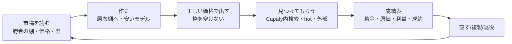

# Capafy $10k MRR レシピ Implementation Plan

> **For agentic workers:** REQUIRED SUB-SKILL: Use superpowers:subagent-driven-development (recommended) or superpowers:executing-plans to implement this plan task-by-task. Steps use checkbox (`- [ ]`) syntax for tracking.

**Goal:** Capafy の agent 工場を「売れる物を作る → 正しい価格で出す → 見つけてもらう → 売れない物を直す/退役 → 口座に入った利益で判定」の再現可能なレシピにし、口座着金ベースの月 $10k MRR へ向かう。

**Architecture:** 新しい仕組みは作らず、既存の Capafy loop（`capafy-loop-daily` 工場、`capafy_daily_decision.py` 改善ループ、`capafy_hourly_reconcile.py` お金の読み戻し、`capafy-distribute-daily` 宣伝）に「判定に使う数字」と「勝ち筋の型」を足す。判断はモデル、計測・集計・記帳だけ決定的コードに置く（building-agents）。

**Tech Stack:** Python 3（stdlib のみ）、pytest、既存の Capafy API クライアント（`skills/capafy-autopublish/vendor/capafy-user`）、`crwl`（公開ページの取得）、Gmail（`gog gmail`）、CloakBrowser lease（`capafy:kosuke`）。

**Spec:** `specs/29-CAPAFY-10K-MRR-CLOSED-LOOP.md`（Capafy の正本）と `docs/superpowers/specs/2026-09-25-life-manager-unified-ssot.md`（実行順の正本、§84-A の 2. Capafy L9-01）。

## Global Constraints

- 完了は公式 readback（Capafy API・公開ページ・Gmail・銀行着金）でだけ判定する。テスト合格や exit 0 は完了ではない。
- 「収益」は口座に着金した金額。gross・creator earnings・payout 待ち・着金を混ぜない。不明は 0 に丸めない。
- effect_unknown の提出・投稿は公式 readback なしに再送しない。
- 直す前に同じ問題を解いている既存 loop を registry と spec から探して写す（`skills/loop-development/SKILL.md` ルール9）。timeout などの数字を自己流で変えない。
- モデルの文章生成に Mac の `claude -p` を使う時は `--setting-sources ""` と `--system-prompt` を付けて /tmp で動かす。
- ブラウザは `browser-guard.sh` の lease で `capafy:kosuke` を使う。Dais の Chrome には触らない。
- 反映は PR → `gh pr merge --squash --admin` → release → `LIFE_MANAGER_APPLY_TARGET=<loop> bin/lm-loop apply` → plist が新 release を指すことを確認。
- 他の AGMSG 席が持つファイルを触らない（§84-A の lane A Capafy 所有者と調整してから着手）。

---

## 0. As-Is（2026-10-04 実測。出所つき）

| 項目 | 値 | 出所 |
|---|---|---|
| 累計 gross / creator earnings | $102.75 / $76.18（101 件、うち trial 69） | `state/capafy-skill-analytics.json` observed 2026-10-04T04:07Z |
| 直近30日 gross / 7日 | $82.77 / $13.97（3件） | 同上 |
| 直近の売上 | **9/30〜10/04 の 5 日連続 $0** | `daily_revenue_trend_last_30d` |
| 口座着金 | **$0.00**（payout 待ち $59.00、pending $11.02、wire_transfer） | `balances` |
| 30日 AI 実費 / 利益 | $34.50（うち claude-sonnet-4.6 $34.14）/ $31.72 | `openrouter_actual` |
| 出品 | 52 本（online 47 / under_review 3 / rejected 2）、**売れたことがあるのは 6 本、46 本は売上 0** | `per_skill_rows` |
| 売れ筋 | Hook Lab $34.88、Slide Maker $19.98、TikTok Script Pro $15.96、Marketing Strategist $13.98（Sonnet で 30日 -$16.74 の赤字、しかも rejected）、Academic Humanizer $9.99、YouTube Script Writer $7.96 | 同上 |
| 流入（30日） | Capafy 内検索 2,151 view → $56.86（売上の 69%）、hot 98 view → 6.1% 成約で最良、自前の外部宣伝（instagram_bio・direct）はほぼ 0 成約 | `traffic_sources.by_agent` 集計 |
| 工場 | 審査枠 5、今は PUBLISHABLE（空き 2）。却下 7 件の理由は API で取れず `platform_reason_unavailable` | `inventory_status.py`、`capafy-rejection-repair-queue.json` |
| 宣伝 | 記事＋X は 9/30 の 1 本が最後。IG は 8/24 以降 0 | distribute ログ、IG ledger |
| 公開プロフィール | フォロワー 8・51 agents、販売数バッジ 0 本 | https://capafy.ai/publisher/Anicca |
| 手数料 | Capafy 20%（「you keep 80%」）＋初回 $0.99、サブスクは Sandbox Fee が先に引かれる。実測の差し引き率は 25.9% | https://capafy.ai/earn |
| 市場の勝者 | CloneCut（動画クローン、$19.99/月）14,030 sold、Ocup Football Analysis（$8.33/月）3,083、Serenity Stock Tracker（$8.33/月）1,795、HookAce（$9.99/週）921 など。上位は「動画/ショート」と「金融シグナル」、無料の集客用 agent も多い | https://capafy.ai/ Trending（2026-10-04） |

## 0.1 規約と精算の一次資料（2026-10-04 取得）

- **量産の禁止**（https://capafy.ai/developer/doc/4.2）: "Do not mass-upload large numbers of Agents with near-identical functionality or minimal variations to dominate search results. This behavior is treated as cheating; the related Agents will be removed and the Publisher account may be warned or suspended." → 既存の Hook Lab 派生 9 本はこの危険域。複製（C3）は「入力・出力・使う場面が本当に違う物」だけにし、近い派生は統合・退役させる（C4）。
- **却下理由 2.2 Information accuracy**（同 4.2）: 2.2.1 説明どおりの機能、2.2.2 カテゴリとタグの一致、2.2.3 "The Base Model field must accurately reflect the LLM the Agent currently uses." → Marketing Strategist（モデル変更版 v1.0.2）は 2.2.3 のずれが第一仮説。
- **Agent Card**（同 4.2）: Details に sample input/output・Capabilities・Use Cases・FAQ を推奨。金融系は「専門的な投資助言ではない」免責と元本喪失のリスク表示が必須。
- **手数料と精算**（https://capafy.ai/developer/doc/3.2）: Subscription Payout = 支払額 − Platform Sandbox Fee − Platform Fee。Sandbox Fee（On-Demand）は月 $2.00・週 $0.50・日 $0.07。Download は Sandbox Fee なし。売上は 7 日の dispute window の後に月次精算の対象、翌月 1 日に明細、条件を満たせば 15 日以降に振込。→ 9 月明細 $59.00 は 10/15 以降の振込が A2 の最初の着金確認点。日額プランは Sandbox Fee の比率が高い（$1.99/日なら 3.5%）ので、月額・週額を主にする。

**$10k MRR の算数:** 手取り 80% として、平均 $9.99/月のサブスクなら有料会員 約 1,250 人。CloneCut 型の勝者 1 本（$19.99/月 × 600 人）＋中堅 10 本（$9.99 × 50 人）でも届く。今は月 $66 の手取り（目標の 0.66%）。

## 1. 足りないもの（To-Be との差）

1. **売れる場所に作っていない**: 46/52 が売上 0。市場の勝ちカテゴリ（動画・金融）より、学術・人事・法務など小さい棚に散っている。
2. **勝ち筋の複製が測定ではなくプロンプト手書き**: Hook Lab 系の派生は増えたが、どの派生が売れたかで次を決めていない。
3. **Capafy 内検索が売上の 69% なのに、題名・説明・タグの検索最適化（marketplace SEO）を測っていない。**
4. **価格の実験ができない**: サブスクの値付け変更を CP1 から自動でできず、`blocked_no_cp1_support` で止まる。
5. **赤字 agent が残る**: Marketing Strategist は Sonnet で 1 注文 $13.96 の原価。
6. **却下理由が取れない**: API は理由なし。Gmail の却下メールには理由（例「2.2 Information accuracy」）がある。
7. **お金の最終地点（口座着金）を追っていない**: payout 待ち $59 から先の着金 receipt が無い。
8. **プロフィールが空**: 実績・社会的証明・ブランドの一貫性が無い。
9. **外部宣伝が成約に結びつかず、しかも 9/30 から止まっている。**
10. **毎日の「1 枚の成績表」が無い**: 手取り・着金・原価・利益・新規出品・却下・流入→成約を日次で 1 画面に。

## 2. レシピ（To-Be のループ）



---

## Phase A — 真実の数字（成績表と着金）

### Task A1: 日次成績表 `capafy_scoreboard.py`

**Files:**
- Create: `skills/earn/capafy-marketing/scripts/capafy_scoreboard.py`
- Test: `skills/earn/capafy-marketing/scripts/test_capafy_scoreboard.py`
- Modify: `skills/earn/capafy-marketing/capafy-goal-monitor.sh`（daily-close で 1 回呼び Telegram へ）

**Interfaces:**
- Consumes: `state/capafy-skill-analytics.json`（`account_totals`、`balances`、`per_skill_rows`、`daily_revenue_trend_last_30d`）、`state/capafy-hourly-reconcile.json`（`traffic_sources.by_agent`、`openrouter_actual`）
- Produces: `build_scoreboard(analytics: dict, reconcile: dict) -> dict` と `render_text(board: dict) -> str`

- [ ] **Step 1: 失敗するテストを書く**

```python
from capafy_scoreboard import build_scoreboard

ANALYTICS = {
    "account_totals": {"last_30d": {"gross_usd": "82.77", "orders": 78}, "cost30_actual_usd": "34.50", "net30_usd": "66.22"},
    "balances": {"balance_payout_usd": "59.00", "balance_pending_usd": "11.02", "paid_out_usd": "0.00"},
    "per_skill_rows": [
        {"agent_id": "1", "name": "Hook Lab", "status": "online", "stats_30d_orders": 11, "stats_30d_revenue_usd": "24.89", "cost_30d_actual_usd": "0.34"},
        {"agent_id": "2", "name": "Dead", "status": "online", "stats_30d_orders": 0, "stats_30d_revenue_usd": "0.00", "since_launch_gross_usd": "0.00", "cost_30d_actual_usd": None},
    ],
    "daily_revenue_trend_last_30d": [{"date": "2026-10-03", "revenue": 0.0, "orders": 0}, {"date": "2026-10-04", "revenue": 0.0, "orders": 0}],
}
RECONCILE = {"traffic_sources": {"by_agent": {"1": {"last_30d": {"by_source": [
    {"source_type": "search", "views": 100, "paid_orders": 2, "sales_usd": "9.98"}]}}}}}

def test_scoreboard_separates_money_stages_and_flags_zero_streak():
    b = build_scoreboard(ANALYTICS, RECONCILE)
    assert b["money"] == {"gross_30d": "82.77", "earnings_after_cost_30d": "66.22", "cost_30d": "34.50",
                          "payout_waiting": "59.00", "pending": "11.02", "bank_received_total": "0.00"}
    assert b["zero_revenue_streak_days"] == 2
    assert b["skills"]["selling"] == 1 and b["skills"]["never_sold"] == 1
    assert b["funnel"]["search"] == {"views": 100, "paid_orders": 2, "sales_usd": "9.98"}
```

- [ ] **Step 2: 実行して失敗を確認**

Run: `cd skills/earn/capafy-marketing/scripts && python3 -m pytest test_capafy_scoreboard.py -v`
Expected: FAIL（`ModuleNotFoundError: capafy_scoreboard`）

- [ ] **Step 3: 最小実装**

```python
#!/usr/bin/env python3
"""Daily Capafy scoreboard: money stages kept separate, never rounded unknown to 0."""
from __future__ import annotations
import json, sys
from decimal import Decimal
from pathlib import Path

STATE = Path.home() / ".local/state/life-manager/state"


def _d(v):
    return None if v in (None, "") else Decimal(str(v))


def build_scoreboard(analytics: dict, reconcile: dict) -> dict:
    t = analytics.get("account_totals") or {}
    bal = analytics.get("balances") or {}
    money = {
        "gross_30d": (t.get("last_30d") or {}).get("gross_usd"),
        "earnings_after_cost_30d": t.get("net30_usd"),
        "cost_30d": t.get("cost30_actual_usd"),
        "payout_waiting": bal.get("balance_payout_usd"),
        "pending": bal.get("balance_pending_usd"),
        "bank_received_total": bal.get("paid_out_usd"),
    }
    streak = 0
    for day in reversed(analytics.get("daily_revenue_trend_last_30d") or []):
        if (day.get("revenue") or 0) > 0:
            break
        streak += 1
    rows = analytics.get("per_skill_rows") or []
    selling = sum(1 for r in rows if (_d(r.get("stats_30d_revenue_usd")) or 0) > 0)
    never = sum(1 for r in rows if (_d(r.get("since_launch_gross_usd")) or 0) == 0
                and (_d(r.get("stats_30d_revenue_usd")) or 0) == 0)
    funnel: dict[str, dict] = {}
    for agent in ((reconcile.get("traffic_sources") or {}).get("by_agent") or {}).values():
        for s in (agent.get("last_30d") or {}).get("by_source") or []:
            f = funnel.setdefault(s.get("source_type") or "unknown", {"views": 0, "paid_orders": 0, "sales_usd": Decimal("0")})
            f["views"] += s.get("views") or 0
            f["paid_orders"] += s.get("paid_orders") or 0
            f["sales_usd"] += _d(s.get("sales_usd")) or 0
    for f in funnel.values():
        f["sales_usd"] = f"{f['sales_usd']:.2f}"
    return {"money": money, "zero_revenue_streak_days": streak,
            "skills": {"total": len(rows), "selling": selling, "never_sold": never}, "funnel": funnel}


def render_text(b: dict) -> str:
    m = b["money"]
    lines = [f"Capafy 成績表: 30日 gross ${m['gross_30d']} / 原価 ${m['cost_30d']} / 原価後 ${m['earnings_after_cost_30d']}",
             f"出金待ち ${m['payout_waiting']} / 確定待ち ${m['pending']} / 口座着金 累計 ${m['bank_received_total']}",
             f"売上0の連続日数 {b['zero_revenue_streak_days']} / 売れている {b['skills']['selling']} 本・一度も売れていない {b['skills']['never_sold']} 本"]
    for src, f in sorted(b["funnel"].items(), key=lambda kv: -kv[1]["views"])[:5]:
        lines.append(f"流入 {src}: {f['views']} view → {f['paid_orders']} 件 ${f['sales_usd']}")
    return "\n".join(lines)


if __name__ == "__main__":
    a = json.loads((STATE / "capafy-skill-analytics.json").read_text())
    r = json.loads((STATE / "capafy-hourly-reconcile.json").read_text())
    board = build_scoreboard(a, r)
    print(json.dumps(board, ensure_ascii=False) if "--json" in sys.argv else render_text(board))
```

- [ ] **Step 4: テスト PASS を確認**（同じコマンド、Expected: PASS）
- [ ] **Step 5: 実データで 1 回動かし、数字が §0 の表と一致することを目視** — `python3 capafy_scoreboard.py`
- [ ] **Step 6: `capafy-goal-monitor.sh` の daily-close 分岐で `render_text` の出力を既存の Telegram outbox 経由で送る（新しい送信経路は作らない）**
- [ ] **Step 7: Commit** — `git add skills/earn/capafy-marketing/scripts/capafy_scoreboard.py skills/earn/capafy-marketing/scripts/test_capafy_scoreboard.py skills/earn/capafy-marketing/capafy-goal-monitor.sh && git commit -m "feat(capafy): daily scoreboard separating gross, cost, payout and bank receipt"`

### Task A2: 口座着金の readback

**Files:** Modify `skills/self/capafy-loop/capafy_earn_reconcile.py`、Test 同ディレクトリの既存テスト

- [ ] Capafy の payout-record（`payoutMonth`、`paid`、`paymentReference`）を月次で読み、`paid=true` の行だけを「着金」として ledger に記録する。着金額の一次証拠は Capafy の payout record と、Wise/銀行の入金メール（Gmail `from:capafy OR subject:payout`）を `paymentReference` で突き合わせる。
- [ ] テスト: `paid=false` の月は着金に数えない／`paid=true` でも `paymentReference` が無い行は `unverified` として別欄にする。
- [ ] 最初の着金月（$59 が出金閾値を超えた月）に公式 readback で 1 件閉じる。

---

## Phase B — 出血を止める・今ある枠を使う

### Task B1: Marketing Strategist を安いモデルへ移して再提出

- [ ] 既存ルール1（`capafy_daily_decision.py` losing money → `UPDATE.json` で `deepseek/deepseek-v4.1-flash`）がこの agent に効いていない理由を、`state/capafy-daily-decisions/` の最新記録で確認する（第一仮説: status=review_rejected が `PENDING_SERVER_STATUSES` に入り `blocked=pending_review` で止まる）。
- [ ] 仮説が当たれば、rejected の場合だけ「却下修正と同じ 1 回の更新」にモデル変更を同梱するよう `decide_actions` を変更（テスト: `review_rejected` かつ赤字 → `model_switch` と `rejection_repair` を 1 つの update にまとめる）。
- [ ] 公式 readback: Capafy API で model=DeepSeek・status=under_review → online。

### Task B2: 却下理由を Gmail から取る

**Files:** Modify `skills/capafy-autopublish/scripts/` の rejection repair queue を書く箇所（`capafy-rejection-repair-queue.json` を書くスクリプト）

- [ ] Gmail の「Action Required: Your Agent "…" was rejected」から Agent ID・Version・Reason（例 `2.2 Information accuracy`）を抜き出し、queue の `rejection_reason` を埋める（`platform_reason_unavailable` を置き換える）。
- [ ] テスト: 実メールの本文を fixture にして ID・version・reason を取り出す。
- [ ] 理由ごとの修正方針（2.2 = 説明文の主張を見本の実出力で裏付けられる範囲に絞る）を LISTING 生成プロンプトに渡す。
- [ ] 公式 readback: 却下 2 本（4973250899、9563867391）が under_review → online。

### Task B3: 空き 2 枠を今日埋める

- [ ] `inventory_status.py` = PUBLISHABLE（空き 2）なのに提出が無い理由を `capafy-loop-daily.log` で特定（第一仮説: 準備済み候補が無い、第二: 1 時間 1 アクション制限、第三: fence）。
- [ ] 直したら、自然 run で `platform_status=1` を Capafy API で確認。

---

## Phase C — 勝てる棚に作る（量と質）

### Task C1: 市場の勝者データを毎日取る

**Files:** Modify `skills/self/capafy-loop/capafy_market_sweep.py`

- [ ] 既存の `POST /agent/agents/search` sweep に加え、公開トップページ（Trending）の各 agent の `Sold`・価格・カテゴリを毎日記録する（`crwl crawl https://capafy.ai/ -o markdown-fit` を写す。新しいスクレイパは作らない）。
- [ ] 出力: `state/capafy-market-winners-latest.json` = `[{name, developer, category, price, cycle, sold, observed_at}]`
- [ ] テスト: 保存済み HTML fixture から CloneCut = 14,030 sold・$19.99/month を取り出す。

### Task C2: 勝ち棚の判定を測定ベースにする

**Files:** Modify `skills/self/capafy-loop/capafy_daily_decision.py`（rule 4 の拡張）、`skills/self/capafy-loop/test_capafy_daily_decision.py`

**Interfaces:** Produces `rank_shelves(market_winners: list, own_rows: list) -> list[dict]`（各 dict = `{category, market_sold_total, our_listings, our_sales_30d, score}`）

- [ ] テスト（失敗を先に書く）:

```python
def test_rank_shelves_prefers_big_market_where_we_are_thin():
    m = load_module()
    winners = [{"category": "Video", "sold": 14030}, {"category": "Finance", "sold": 3083}, {"category": "Legal", "sold": 10}]
    own = [{"category": "Legal", "stats_30d_orders": 0}, {"category": "Legal", "stats_30d_orders": 0}]
    ranked = m.rank_shelves(winners, own)
    assert [r["category"] for r in ranked][:2] == ["Video", "Finance"]
    assert ranked[-1]["category"] == "Legal"
```

- [ ] 実装: `score = market_sold_total / (1 + our_listings)`。上位の棚を `capafy-candidate-opportunities.json` に書き、`capafy-loop-daily.sh:143` の手書き family 一覧を「opportunities ファイルだけを読む」に置き換える。
- [ ] 公式 readback: 次の新規出品が上位棚のカテゴリで under_review に入る。

### Task C3: 売れた物を複製する（winner cloning を測定で、ただし規約 4.2 の量産禁止を守る）

- [ ] 派生候補は「入力・出力・利用場面」が親と別物であることをモデルに判定させ、近い派生は出さない。既存の Hook Lab 派生 9 本は、売上・閲覧で上位 2〜3 本を残し、残りを統合または非公開にする。
- [ ] `decide_actions` に rule 5 を追加: 30日で `orders >= 3` の agent ごとに、まだ持っていない派生先（プラットフォーム・ニッチ）を 1 つ opportunities に足す。派生の成否（30日の注文数）を親子で記録し、親より売れない派生が 2 本続いたら、その親からの派生を止める。
- [ ] テスト: Hook Lab（11 注文）→ 派生候補 1 件。派生 2 本が 0 注文 → その親の派生停止。

### Task C4: 売れない 46 本を直すか退役させる

- [ ] 既存 rule 3（views ≥ 20・注文 0 → `retire_or_rewrite_candidate`）を実行まで進める: 題名・説明の書き直し（勝者の型: 「名前 — 何をするか」、数字のある約束、使うエンジン名）を 1 回だけ。書き直し後 30日で注文 0 なら非公開化して枠と注意を勝ち棚へ回す。
- [ ] views < 20 の物は「見られていない」問題なので、書き直しより検索語の見直し（Task D1）を先に当てる。

---

## Phase D — 見つけてもらう（売上の 69% は Capafy 内検索）

### Task D1: Capafy 内検索の最適化

- [ ] 勝者と自分の題名・説明・タグを並べ、検索 view の多い語を題名の先頭に入れる。変更前後 14 日の検索 view と成約を成績表（A1）で比較する。
- [ ] hot（成約率 6.1%、最良）に載る条件を観測する（直近の売上・評価の数）。最初の数件の注文とレビューを集める方法（既存顧客への使い方案内など、規約内のもの）を調べる。

### Task D2: プロフィールを整える

- [ ] spec 29 の「profile edit を main agent が直接しない」ガードに従い、`capafy:kosuke` lease の工場側ブラウザ役で 1 回だけ実行する。内容: ブランド名を 1 つに統一（例「Anicca Hook Lab」系）、実績（累計販売数・対応プラットフォーム）、得意棚、外部リンク（aniccaai.com）。
- [ ] 公式 readback: https://capafy.ai/publisher/Anicca に新しい bio が出る。

### Task D3: 外部宣伝を成約で測る

- [ ] `capafy-distribute-daily` を再開（9/30 から停止。fence の公式 readback 解除は SSOT の F2 に従う）。
- [ ] 宣伝の対象を「直近 30 日で一番利益の出た agent」から「hot / 検索で伸びている agent」に変える。`ct=` 付きリンクの成約を成績表に出し、14 日で成約 0 の経路は止める。
- [ ] 新しい経路（Reddit・YouTube Shorts）は、勝者がそこで集客している証拠を取ってから 1 つずつ足す。

---

## Phase E — 価格

### Task E1: サブスク価格を変えられるようにする

- [ ] CP1 の価格入力を、既存の `drive_cp1.py` の操作で day/week/month の価格欄に書けるようにする（`blocked_no_cp1_support` を解消）。
- [ ] 価格の型は勝者を写す: 月 $8.33〜$19.99、週 $9.99〜$14.99、day は試用的に。無料の集客用 agent を勝ち棚に 1 本置き、有料の兄弟 agent へ案内する。
- [ ] 価格実験: 1 本ずつ、変更前後 14 日の注文数と手取りを比べ、手取りが減ったら戻す（`capafy_daily_decision.py` に比較窓を追加、テストつき）。

---

## Phase F — レシピ化と公開

- [ ] Phase A〜E の手順と数字を `skills/capafy/RECIPE.md` に 1 本でまとめる（市場を読む → 作る → 値付け → 見つけてもらう → 成績表 → 直す）。
- [ ] 口座着金ベースで月 $1k → $3k → $10k の各段階を公式 readback で記録する。
- [ ] $10k を 30 日保ったら、credential を除いて OSS として公開（spec 29 の O0〜O2）。同じレシピをモバイルアプリ・Web アプリ・gig に写す。

## 実行順

1. A1 成績表 → 2. B3 空き枠 → 3. B1・B2 赤字と却下 → 4. C1 市場データ → 5. C2 勝ち棚 → 6. D1 検索 → 7. D2 プロフィール → 8. C3 複製 → 9. C4 退役/書き直し → 10. E1 価格 → 11. D3 外部宣伝 → 12. A2 着金 → 13. F レシピ化

理由: 数字が無いと何が効いたか分からない（A1 が先）。すぐ取れる売上（空き枠・却下修正）を次に回す。売上の 69% は Capafy 内なので、外部宣伝より検索とプロフィールを先にする。


## 進捗ログ（実行順のカーソル）

- 2026-10-04 18:0x JST **A1 完了（source）**: PR #6559 merge `4ce3a7c3`。実データで gross $82.77 / 原価 $34.50 / 出金待ち $59.00 / 着金 $0.00 / 売上0連続 5 日 / 一度も売れていない 46 本。残り: 23:50 の自然 daily_close で Telegram に成績表が載ることの確認。
- **C1/C2 完了（source）**: PR #6560 merge `f0e4e824`。既存の認証済み sweep（salesVolume・categoryId）を再利用し、新しいスクレイパは作らない。実データの棚の上位: Analysis 3,159 / Finance 2,593 / Video 1,907 / Writing 205 / Research 139（市場の販売数合計）。categoryId と名前の対応は https://capafy.ai/ のカテゴリリンクから取得。残り: 自然な日次 run で opportunities に `market_shelf` が追加され、次の新規出品がその棚になることの確認。
- **B3 は自然に解消**: 10/04 15:10〜16:33 に空き枠を工場が使った。CAP_FULL は審査中 3＋却下 2 による正常待機。
- **B1/B2 の診断（read-only）**: 工場の優先順位は `update_existing`（売れている agent の値上げ・モデル切り替え）＞ `retry_existing`（却下版）＞ `create_fresh`（`inventory_status.py` の `allocate_action`）。10/04 の空き枠 4 回はすべて update_existing（5550040899、6273179459、7599205243、7631594519）。却下版が後回しなのは設計どおりで、「永久停止」仮説は棄却。本当の穴: `rejection_queue.py` がどの loop からも呼ばれていない。修正キューは 9 月の 7 件のまま古い（承認済み 2 件を含む、現在の却下 2 件を含まない）。却下理由を直さずに再提出する可能性がある。Marketing Strategist は公開ページで旧 v1.0.1（Sonnet 4.6）が販売中。却下 v1.0.2 は、カードが DeepSeek・実際の利用が Sonnet（30日 $27.92）で、2.2.3 の不一致が第一仮説（`check_hosted_model` が retry 時に検査する）。次: `rejection_queue.py` を工場の reconcile 後に呼び、Gmail の却下理由で `rejection_reason` を埋め、retry 前の修正プロンプトに渡す（Task B2）。
- 2026-10-04 18:3x JST **A1 は本番へ自然反映済み**: `ai.anicca.capafy-loop-daily.plist` が release `20261004T175201-4ce3a7c3` を指すことを確認（自動更新役の自然 apply）。
- **B2 完了（source）**: PR #6561 merge `999201f9`。Capafy の却下メールは HTML だけなので、テキストに変換してから読む。read-only の実行で、却下中の 2 本に `2.2 Information accuracy`（state queued）が入った。毎回の起動で実行される（CAP_FULL 中も）。DAILY_LOOP.md 2c で、再提出の前に理由を直すよう指示。残り: 自然 run で 2 本が under_review → online になることを Capafy API で確認。
- **重複の関門 完了（source）**: PR #6562 merge `49adafcd`。規約 4.2 の量産禁止に対応。新規出品の前にモデル（claude haiku、`--setting-sources ""`、USER 補完）が既存出品とほぼ同じかを判定し、near_duplicate と unknown は出さない。実判定: 「Reels Hook Lab — First 3 Seconds」= near_duplicate、「Earnings Call Brief」= distinct。
- **次の判断（C4）**: 既にある学術 Humanizer / Voice Editor 系 約16本（売上は Academic Humanizer の $9.99 だけ）は、規約 4.2 の削除・停止リスクがある。売上と閲覧で上位 1〜2 本を残して統合し、残りを非公開にする案。非公開は `recover_delisted` で戻せる。
- 2026-10-04 19:xx JST **ディスクの根本修正**: PR #6563 merge `1c21656e`。`hc_reclaim_disk_if_low` が camoufox のキャッシュを消す → verify-loops-audit が毎回 1.3GB を loop-tmp へ再ダウンロードして残す、という悪循環だった（8.3GB）。終わった実行の一時フォルダ 8 件を削除し、空きは 489MiB → 6.5GiB。
- **管理画面の事実（read-only、lease 使用）**: プロフィール編集は https://capafy.ai/developer/public-profile（バナー 2048×432・アバター・名前・handle〔変更は 14 日に 1 回〕・自己紹介 1000 字〔現在 548 字〕・リンク・連絡先）。agent ごとの「基本情報」「価格設定」タブで、題名・短い説明（500 字）・タグ（5 個）・日/週/月/年のサブスク価格・回数上限・無料試用を直接編集できる（「審査が必要」の表示なし。保存時の挙動は未確認）。→ E1 の「CP1 にサブスク価格欄が無い」は、管理画面の価格設定タブを使えば解消できる見込み。「公開停止」ボタンは審査履歴タブにある。戻せるかの説明は押す前には出ない → C4 は保留。
- **価格の判断**: 市場の月額は p25 $12.99 / 中央 $19.10 / p75 $22.99。Hook Lab $19.99・Slide Maker $24.99 は市場並み、TikTok Script Pro・YouTube Script Writer の $9.99 は p25 未満。10/04 に工場が値上げ更新を 4 本出したばかりで、5 日連続で売上 0 のため、追加の値上げは今回の結果（14 日の注文数と手取り）を見てから 1 本ずつ行う。
