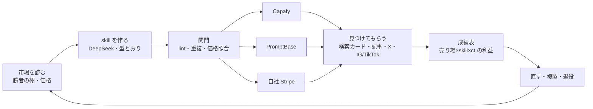

# Agent-Skill Factory → $10k MRR Implementation Plan (Capafy + PromptBase + own checkout)

> **For agentic workers:** REQUIRED SUB-SKILL: Use superpowers:subagent-driven-development (recommended) or superpowers:executing-plans to implement this plan task-by-task. Steps use checkbox (`- [ ]`) syntax for tracking.

**Goal:** 口座に入る利益（売上 − 手数料 − モデル代）で月 $10,000 を 30 日維持する。1 つの「売れる AI agent を作って・値付けして・見つけてもらって・測って・直す」仕組みを、複数の売り場（Capafy・PromptBase・自社 aniccaai.com）に同じ部品で載せ、その仕組みを OSS として公開する。

**Architecture:** 新しい基盤は作らない。Capafy で動いている部品（工場 `capafy-loop-daily`、価格照合 `verify_pricing.py`、重複関門、退役一覧、成績表 `capafy_scoreboard.py`、宣伝 `capafy-distribute-daily`）を「1 つの skill を複数の売り場に出す」形に揃える。判断はモデル、計測・集計・記帳は決定的コード（building-agents）。

**Tech Stack:** Python 3（stdlib）、bash、pytest、Capafy API（`skills/capafy-autopublish/vendor/capafy-publisher`）、CloakBrowser lease、Postiz、Stripe（自社 checkout）、HyperFrames（短尺動画）。

**Spec:** `docs/superpowers/plans/2026-10-04-capafy-10k-mrr-recipe.md`（Capafy の実行順・記録の正本）、`docs/superpowers/specs/2026-09-25-life-manager-unified-ssot.md`（全体の正本）。

## Global Constraints

- 完了は公式 readback（Capafy API・市場 API の billing・PromptBase Sales タブ・Stripe・銀行着金）でだけ判定する。テスト合格や exit 0 は完了ではない。
- 「収益」は口座に着金した利益。gross・payout 待ち・着金を混ぜない。不明は 0 に丸めない。
- 価格は勝者の価格帯（Capafy 月 p25 $12.99 / 中央 $19.10 / p75 $22.99、週中央 $6.99、年中央 $149.99）。全プラン No Free Trial、年プラン必須（BEST_PRACTICES §3）。
- 1 注文あたりの原価 ≤ 手数料後売上の 15%（既定モデル DeepSeek V4.1 Flash）。
- Capafy doc 4.2: ほぼ同じ agent の量産は削除・停止対象。重複関門と C3 停止規則を迂回しない。
- 偽レビュー・評価操作は禁止（Capafy doc 4.1）。評価は正直なお願い 1 行だけ。
- effect_unknown の提出・投稿は公式 readback なしに再送しない。
- ディスク空き 2GiB 未満では動画生成・新しい worktree を始めない（2026-10-05 に 2 回満杯でセッション停止）。

---

## 0. As-Is（2026-10-05 12:45 JST 実測）

| 項目 | 値 | 出所 |
|---|---|---|
| Capafy 30日 gross / artifact `profit`表示 | $72.78 / $24.04（actual profit未検証） | `capafy-skill-analytics.json` observed 2026-10-05T01:06Z |
| Capafy 直近 7 日 | $1.99（1 件）、9/30 から 6 日連続 $0 | 同上 `daily_revenue_trend_last_30d` |
| provider payout balance / provider paid_out / 銀行着金 | $59.00 / **$0** / unknown | 同上 `balances` |
| Capafy 出品 | online 35 / 審査系 6（5 枠上限は新規作成のみ、更新は対象外＝2026-10-05 実測）/ offline 12 | `packager.py publish-list` |
| PromptBase | 19 件掲載、売上 **$0** | `promptbase-sales.json` observed 2026-10-04T19:20Z、`promptbase-listings.jsonl` |
| 外部集客 | Article/X uses D3. IG identity/status is not matched to an active owner record; no Capafy social post is verified. | Account/status/effect gate in the canonical Capafy D5 must pass before posting |

Capafyの`profit`表示USD 24.04は売上とOpenRouter費用の期間・scopeが一致した検証済みactual profitではない。同期間のCapafy net profitは`unknown`とし、USD 24.04を全社$10k進捗の分子にしない。最新のwindow/scope照合 → unified SSOTの「CFO: 2026年9月Life Manager portfolio収益のas-is」。
`$59 / $0`はCapafy provider balanceとplatform-reported paid_outであり、銀行着金を示さない。相関するbank receiptは未確認。

## 0.1 市場の実態（2026-10-05 訂正）

最初の版の「Capafy 単独では天井が低い（累計 16,656）」は、52 キーワード検索だけの不完全なデータ（843 agents）に基づく誤りだった。Trending 1 位の CloneCut（14,400 sold）が丸ごと漏れていた。

- **全カテゴリ列挙（`POST /public/category/hot`、23 カテゴリを最終ページまで、#6609）**: 1,172 agents、累計販売の合計 **42,437**。
- **販売数の上位**: CloneCut 14,400（動画クローン、Seedance 系）/ Kids Video Generator 3,792 / llm-real-video（無料）3,536 / **Ocup Football Analysis 3,084**（サッカー、月 $19.99）/ Free Transcript to 12 Shorts Pack 2,069（無料）/ **Serenity Stock Tracker 1,817**（株、週 $9.99〜年 $99.99）。上位は「動画生成」「スポーツ」「株」に集中。
- **稼いでいる実例（一次資料）**: Capafy 公式 X（2026-07-01）「This guy earned $4,208 in his FIRST week on Capafy with a World Cup Skill … over $16,000 a month」（https://x.com/Capafyai/status/2072302872654499993）。作者 Otata 本人も「made over $4K … in its first week」。月 $16k は外挿で、Capafy 外の監査済み証拠は未発見。
- **勝者の型**: (1) 毎週新しい入力が生まれる題材（試合・銘柄）でサブスクが続く、(2) 作り手の専門性、(3) **集客は Capafy の外**（Ocup は TikTok/Instagram の短尺動画で出力を見せた、Serenity は 90 万フォロワーの投資インフルエンサー周りの需要に乗った）、(4) 月 $19.99 前後のサブスク。
- **結論の訂正**: Capafy で月 $10k は「上位の実例がある目標」。届かない理由は市場の小ささではなく、私たちの外部集客がほぼゼロだったこと。

## 1. 収益の積み上げ（目標の内訳）

| 売り場 | 月の利益目標 | 根拠となる型 | 主な部品 |
|---|---|---|---|
| Capafy | $5,000 | 勝ち 1 本（Ocup 型、約 250 人）＋中堅 5 本 × 平均 35 人、手取り約 $14/人 | 既存工場・価格照合・成績表・SNS 短尺動画 |
| PromptBase | $1,000 | 勝ち 20 本 × 月 10 件 × $4.99（手数料 0% の `?via=keipanda` 経由が主） | `promptbase-loop-daily` |
| 自社 aniccaai.com（Stripe） | $2,000 | Capafy で売れた skill を Web ツール化、月 $19 × 約 210 人 | 記事 loop の集客、Stripe |
| 他の agent 売り場（同じ skill を転載） | $2,000 | Capafy で実証済みの skill だけを出す | 共通の skill パッケージ |
| **合計** | **$10,000** | | |

## 2. 仕組み（1 本のループ、売り場ごとの薄い adapter）

---

## 優先順位（2026-10-05 訂正後）

1. **eBookを先に進める**: この作業streamではeBook Task 1–5を優先し、自然な有料Stripe session 1件と正しいPDF配信receiptまで通す。`/letter`・`/tegami`の有料継続購読だけをgross MRRに数える。
2. **次にCapafy Instagram marketingだけ**: eBookの初回same-occurrence receipt後、Capafy recipe Task D5に進む。既存Postiz laneを使い、Capafy product/listing/account-lifecycleの開発は別担当のscopeに残す。
3. Capafy IGは1回/24時間の初期canaryとし、現在の1日3回scheduleのslot gate、既存account identity/status、旧owner effect readbackを確認するまで公開投稿を始めない。
4. 毎週使う題材のagent（スポーツ、株/決算、動画生成）とCapafy内検索改善は現在のCapafy canonical cursorに従う。Instagram作業のために開発担当の順序を変更しない。
5. PromptBase・自社Stripe（Phase 4）はCapafyで売れたskillだけにし、TikTok/YouTubeはこのInstagram workstreamの後段にする。

**指標:** eBookのgross MRR $10,000とCapafyからmanagerへ加える$10,000は別目標です。Capafy contributionは既存CFO定義に従い、手数料・実費後の30日banked netで受け入れます。既存channel allocationはCapafy $5,000のため、現状の数値は計画目標であり、forecastや実績ではありません。

## Phase 1 — Capafy の取りこぼしを止める（〜2026-10-07）

### Task 1.1: 売れ筋 3 本を市場価格で店頭に出す
- [ ] Hook Lab v1.0.5（agent 8123079349、draft 2106921306758606848）の CP1 を CP1_AGENTIC.md どおり完了（月 $19.99・年 $99.99・新カード・評価依頼）。
- [ ] 工場が CP2/CP3 を提出。`publish_finish.sh` のログに `PRICING_MATCH`、`PRICE_MISMATCH_WARNING` なし。
- [ ] TikTok Script Pro（2844813315）・YouTube Script Writer（7686597754）も同じ流れ（#6603 で枠満杯でも更新を出せる）。
- 完了条件: 承認後、市場 API の billing が LISTING どおり。変更日を `capafy-listing-changes.jsonl` に記入。

### Task 1.2: 赤字・却下の後始末
- [ ] Marketing Strategist（9563867391）の DeepSeek 版を出し直す（却下理由 2.2 を直した版）。
- 完了条件: Capafy API で DeepSeek 版 online。

### Task 1.3: 工場の「準備済みなら CP1 を飛ばす」穴
- **事実:** 2026-10-05 12:01、手動 publish-init 済みの Hook Lab 更新で、工場が CP1 未確定のまま publish_finish に進み失敗（`is_confirmed_skills=0`）。
- [ ] `capafy-loop-daily.sh` の prepared→finish 経路で、`is_confirmed_skills=0` なら agent の CP1 ステップへ戻す（既存の resume_draft と同じ扱い）。失敗するテストを先に書く。

## Phase 2 — 見つけてもらう（〜2026-10-14）

### Task 2.1: Capafy 内検索と hot
- [ ] 売れ筋 3 本のカード（見本・FAQ・タグ 5）は Task 1.1 と同時に出る。
- [ ] 14 日後に成績表の比較行（検索 view → 成約）で判定。効かなければ題名以外（短い説明・見本）を 1 回だけ書き換える。

### Task 2.2: Capafy Instagram marketing（TikTok / YouTubeは後段）

- [ ] 現在のDais指定scopeは、eBook初回receipt後のCapafy Instagramだけです。
- [ ] このtaskの手順はCapafy recipe Task D5に集約します。account creation、warm-up、cadenceの説明を重複させません。
- [ ] 接続・retry・公開投稿の前にprovider公式のidentity/statusを読み、同ownerのeffect_unknownを照合します。
- [ ] scheduled publisherは一つだけ選びます。D5はPostizの`life-manager-capafy-ig` laneを使い、route切替前に旧Instagram effectを読み戻します。
- [ ] A disabled/restricted account uses the provider appeal/status flow. Do not create/use another account to evade a restriction or automate likes/follows.
- [ ] Use the single original-content canary and CT paid-order readback from Task D5. Add another platform only after that platform's owned account is independently verified.

### Task 2.3: 記事と X
- [ ] `capafy-distribute-daily` は稼いでいる 4 本だけを宣伝（#6581）。X の投稿に実演の短い文例を入れる。
- [ ] Writer article-daily（9/29 から停止、Writer 所有）の再開を codex-money-printer に依頼済み。再開後は Capafy 誘導の日の ct 成約を成績表で見る。

## Phase 3 — 勝てる棚で数を増やす（〜2026-10-31、目標 Capafy 月 $1,000）

### Task 3.1: 新規は勝ち棚だけ
- [ ] 工場の指示は `capafy-candidate-opportunities.json`（市場の棚順位 C2・勝者複製 C3）から作る（#6596）。棚の上位: 分析・金融・動画。
- [ ] 1 本ごとに「勝者の価格・回数上限・カテゴリ」を写す（BEST_PRACTICES §0）。
- 完了条件: 新規の 30 日注文 > 0 の本数を成績表で数える。

### Task 3.2: 無料の集客 agent
- [ ] Hook Grader（無料 download）を出品（工場が枠の空きで出す）。
- [ ] 無料 agent からの有料 Hook Lab への流入を ct で測る。

### Task 3.3: 売れない agent の整理（C4 の続き）
- [ ] 30 日注文 0 の残りは、カードを 1 回だけ書き直し → さらに 30 日 0 なら RETIRED.json に入れて公開停止（公開停止は管理画面の 審査履歴 → 公開停止、2026-10-04 に 12 本で実績）。

## Phase 4 — 横展開（〜2026-11-30、目標 合計 $3,000）

### Task 4.1: PromptBase を勝ち skill に絞る
- **事実:** 19 件掲載・売上 $0。新規出品は reCAPTCHA 画像問題で無人では出せない（回避しない方針、SSOT 2026-09-29）。
- [ ] PromptBase の売れ筋（カテゴリ・価格・例の数）を Capafy と同じ方法で調べる（勝者を写す）。
- [ ] 掲載中 19 件のうち、Capafy で売れている型（hook・台本・スライド）だけを残し、例とタイトルを勝者の型に合わせる。
- [ ] 宣伝は `capafy-distribute-daily` の巡回に含め、`?via=keipanda`（手数料 0%）のリンクで送る。
- 完了条件: PromptBase Sales タブの売上 > 0。

### Task 4.2: 自社 aniccaai.com で同じ skill を直接売る
- [ ] Capafy で 30 日に有料会員 10 人以上の skill だけを、aniccaai.com の Web ツール（Stripe サブスク、月 $19）にする。手数料 20% と Sandbox Fee が無いので手取りが最も大きい。
- [ ] 記事・X・IG の誘導先を「Capafy と自社の両方」にし、ct で比べる。

### Task 4.3: 他の agent 売り場
- [ ] Capafy で実証済みの skill パッケージ（SKILL.md・LISTING・見本）を、同じ形で出せる売り場を調べ、1 つずつ足す（勝者がいる証拠を取ってから）。

## Phase 5 — 伸ばして型にする（〜2027-01、目標 $10,000）

### Task 5.1: 成績表を売り場横断にする
- [ ] 1 画面に「売り場 × skill × ct」の利益と口座着金。週 1 回、利益の出ない売り場・skill・経路を止める。

### Task 5.2: 着金の確認
- [ ] Capafy 9 月分 $59 が 10/15 以降に振込まれるか（`payoutMonth`・`paid`・`paymentReference` と入金メールの突き合わせ）。以後毎月。

### Task 5.3: OSS 公開（再現できる仕組み）
- [ ] `skills/capafy/RECIPE.md` に手順を 1 本でまとめる: 市場を読む → 勝者を写して作る → 関門（lint・重複・価格照合）→ 出す → 見つけてもらう → 成績表 → 直す・退役。各段の実測の失敗例（無料トライアル誤り、値上げが反映されない穴、枠ゲートの誤り、ディスク満杯）も載せる。
- [ ] 売り場ごとの adapter（Capafy・PromptBase・Stripe）と共通部品を分け、資格情報・個人データを除いた形で公開（spec 29 の O0〜O2）。
- [ ] 公開条件: 月 $1k を口座着金で 30 日確認した後（実績のない仕組みは公開しない）。

---

## 週ごとの数字の目標（成績表で毎週確認）

| 週 | 合計の月換算利益 | 確認する数字 |
|---|---|---|
| 10/05–10/11 | $50 | Hook Lab・TikTok・YouTube が月 $19.99 で online、売上 0 の連続が止まる |
| 10/12–10/18 | $150 | 検索成約率（Hook Lab 0.2% → 1% 以上）、IG 慣らし完了 |
| 10/19–10/25 | $300 | 勝ち棚の新規 3 本 online、IG 実演投稿開始 |
| 10/26–11/01 | $600 | 無料 agent → 有料の流入、PromptBase 初売上 |
| 11月 | $1,000–3,000 | 自社 Stripe 版 1 本、TikTok/Shorts 追加 |
| 12月–1月 | $10,000 | 売り場横断で勝ち skill を増やす |

## 自分が間違うとしたら

最有力の筋: 「値上げすると、今の少ない買い手も離れて売上がさらに減る」。判定: 値上げ後 14 日の注文数と手取りを成績表で比べ、手取りが減ったら元の価格に戻す（1 本ずつ）。
