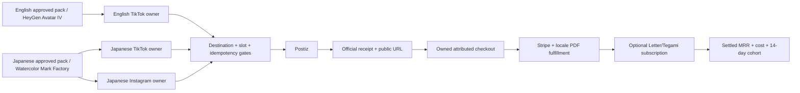

# eBook Monk marketing unblock plan

> Execution order and live cursor remain in the canonical SSOT: `docs/superpowers/specs/2026-09-25-life-manager-unified-ssot.md`.

## Goal

Restore the three already-mapped eBook publishing routes, verify real Postiz receipts, then close owned checkout/PDF and recurring-revenue evidence before starting Capafy Instagram.

## Current architecture

## Execution method

1. Keep exact-occurrence provider verification read-only until a receipt or proven pre-effect result is matched. Never replay an ambiguous publication.
2. Add failing contract assertions for English `@monk_anicca` and the three eBook destinations.
3. Remove only the stale English `provider_disabled` hold, set the account registry to `approved_active`, and update the eBook owner/setup documentation. Preserve both Japanese routes and all unrelated holds.
4. Run focused tests and source checks; push a dedicated branch and merge through the Life Manager PR path.
5. Build a main-derived immutable release and apply only `ebook-en-tiktok-daily` after idle, host-lock, and admission checks.
6. Verify naturally executed slot posts by exact Postiz `PUBLISHED` receipt, direct public URL, render-cost delta, and replay-zero. Reconcile each Japanese owner independently.
7. In Product PR #420, fix the reviewed stale Stripe inventory race and sanitize manual Netlify workflow errors; read back the exact production Supabase project ref and aggregate paid/no-pointer counts before any DDL.
8. Verify one paid Checkout and its matching locale PDF. Treat book purchases as one-time revenue; evaluate $10k MRR through settled Letter/Tegami subscription receipts and a 14-day cohort.
9. Start Capafy Instagram only after the eBook paid fulfillment path is proven.

## User action boundary

No Postiz reconnect is needed for the current English TikTok or Japanese destinations. A dedicated English Instagram account must be connected by Dais only if that additional route is requested. Production schema changes wait for exact target confirmation and read-only review.
