# eBook Monk marketing architecture

> Live state and the sole execution order: `docs/superpowers/specs/2026-09-25-life-manager-unified-ssot.md`. This document records the target design; the renderer recovery implementation plan is `docs/superpowers/plans/2026-10-08-ebook-heygen-cli-runtime.md`.

## Goal

Run the existing eBook marketing owners on a recurring daily schedule, prove every post and sale with provider receipts, then start only the Instagram marketing part of Capafy after the eBook purchase and PDF delivery path is verified.

## Target architecture

```mermaid
flowchart LR
  ENS["English scripts × 3/day"] --> HG["HeyGen Avatar IV"]
  JAS["Japanese scripts × 3/day"] --> WMF["Watercolor Mark Factory"]
  HG --> EV["English video + caption + tracking token"]
  WMF --> JV["Japanese video + caption + tracking token"]
  EV --> PZ["Postiz slot queue + idempotency"]
  JV --> PZ
  PZ --> ENT["Monk Anicca TikTok × 3/day"]
  PZ --> JAT["Obou TikTok × 3/day"]
  PZ --> JAI["Obou Instagram × 3/day"]
  ENT --> PUB["PUBLISHED receipt + public URL"]
  JAT --> PUB
  JAI --> PUB
  PUB --> CLICK["attributed click"]
  CLICK --> CO["locale checkout + Stripe paid receipt"]
  CO --> PDF["matching English or Japanese PDF"]
  PDF --> SUB["optional Letter / Tegami subscription"]
  SUB --> MRR["settled net MRR after refunds, fees, and direct costs"]
  PDF --> FIRST["first paid order + PDF delivery"]
  FIRST --> CAP["Capafy Instagram: one Postiz canary per 24h"]
```

## Delivery contract

- English uses the existing HeyGen Avatar IV pack and the existing Monk Anicca TikTok destination. Japanese uses Watercolor Mark Factory, then shares each locale render across the existing Obou TikTok and Instagram destinations.
- Each of the three accounts targets three unique `PUBLISHED` posts per JST day: six renders and nine platform posts total. A single successful API call proves only that occurrence, not that the recurring schedule will keep succeeding.
- Postiz `PUBLISHED` state, post ID, account integration, public URL, and exact slot must reconcile before counting a post. Unknown effects remain fenced; do not replay them.
- Posts and views do not prove revenue. Track click attribution through owned locale Checkout, paid Stripe receipt, and the matching locale PDF delivery.
- A one-time eBook order is not MRR. Count the Letter/Tegami subscription only from settled recurring receipts after refunds, fees, and direct costs; measure a 14-day cohort toward the USD 10,000 net MRR goal.
- Capafy is a later, separate marketing lane. Start only after the first paid eBook order and matching PDF receipt; follow its existing Instagram recipe of one canary per 24 hours. Capafy product, listing, pricing, and account-lifecycle development are outside this marketing scope.

## Related plans

- English HeyGen runtime and current effect recovery: `docs/superpowers/plans/2026-10-08-ebook-heygen-cli-runtime.md`.
- Checkout, webhook, PDF, and eBook revenue measurement: `docs/superpowers/plans/2026-10-05-ebook-revenue-loop.md` and the anicca-products owner plan.
- Capafy Instagram D5: `docs/superpowers/plans/2026-10-04-capafy-10k-mrr-recipe.md`.

## User action boundary

The current English TikTok and Japanese Postiz integrations are enabled; do not ask Dais to reconnect them. Do not create a new English Instagram account. If a genuine provider-authentication challenge appears later, report the exact account and screen state; runtime errors alone are not evidence of a CAPTCHA.
