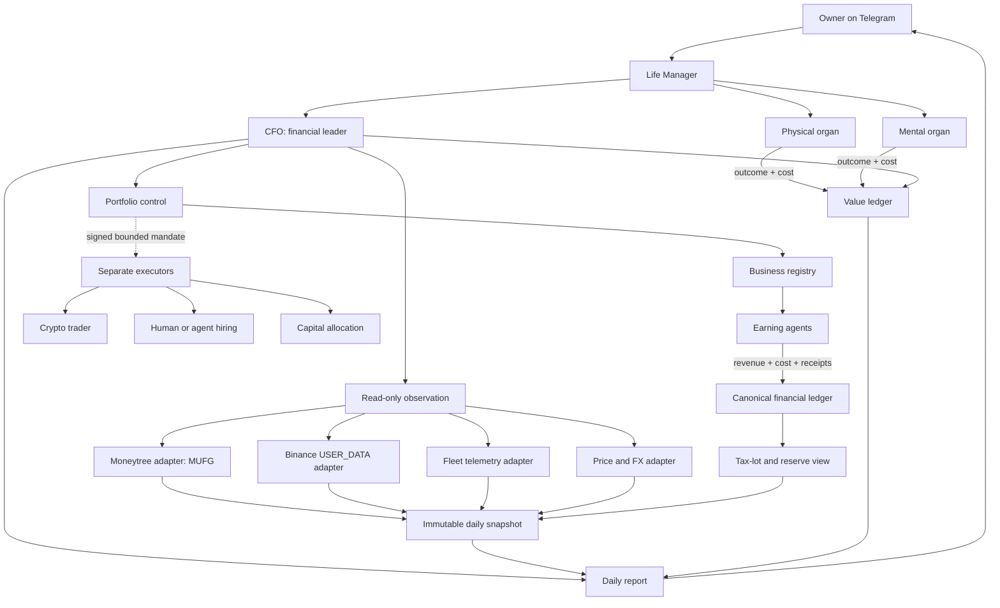
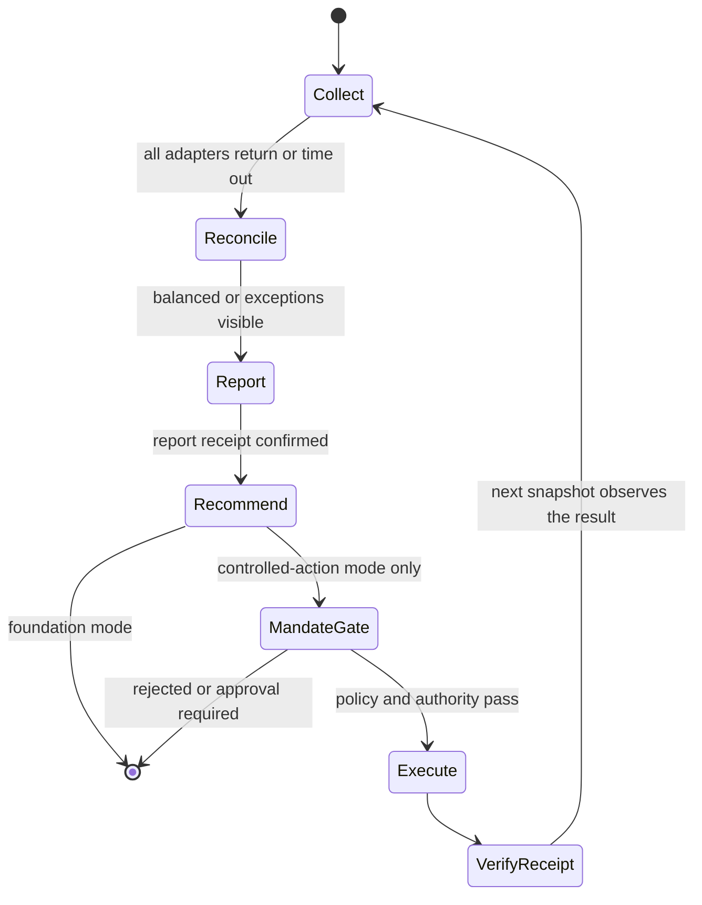
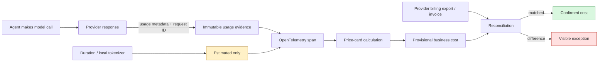
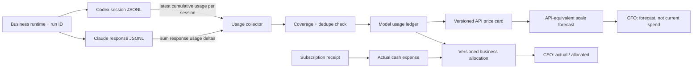
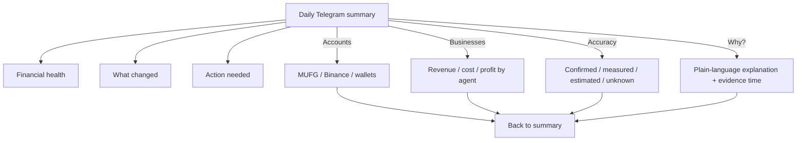
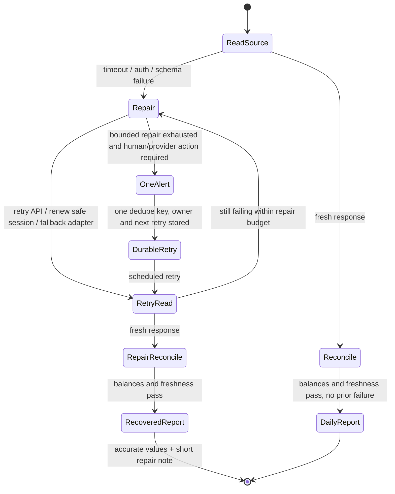
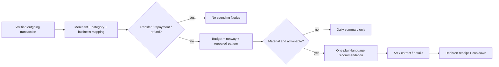

# Life Manager CFO — Personal Finance and Agent-Economy Control Plane

| Field | Value |
|---|---|
| Status | IMPLEMENTED — LIVE E2E PASS |
| Owner | Life Manager financial organ |
| Product scope | Dais first, multi-tenant after local E2E |
| Runtime order | local first, Steel cloud second |
| Existing foundations | `apps/life-call`, Moneytree connector, Fleet telemetry, `lm_api_cost`, and the canonical `lm_agent_earnings` source (the panel's `lm_financial_ledger` name is a stale alias) |
| First unfinished item | **CFO-0d: freeze the Telegram information hierarchy, copy, inline-button contract, and evidence fixtures** |

## 1. Overview — What and Why

Life Manager needs one financial leader that answers four questions with evidence:

1. What does the owner have now?
2. What did each business or agent earn and spend?
3. What tax liability and cash reserve are attributable to realized activity?
4. Which business receives more capital, receives a repair order, or is stopped?

The current repository already has useful fragments, but no canonical personal-CFO loop. `apps/life-call`
records estimated API costs in `lm_api_cost` and exposes a read-only ledger endpoint. The landing/Fleet system
already aggregates chain-verified wallet net worth, earnings, and burn. Moneytree is connected and can read the
owner's MUFG account. These MUST be composed before another earning agent is created.

The enduring rule is **one closed slice at a time**:

> Observe → reconcile → report → verify → only then decide or act.

The CFO MUST NOT trade, transfer, hire, fund, or stop a live business during the foundation milestone. Read and
write authority remain different capabilities permanently. No balance, transaction, revenue, or tax estimate is
invented; unavailable data remains visibly `unknown`.

OpenTelemetry is the transport and correlation envelope, not an oracle. A token or cost number is trustworthy
only when its originating evidence is known. The CFO uses this truth ladder everywhere:

| User label | Machine status | Meaning |
|---|---|---|
| `確定` / Confirmed | `provider_billed` | Reconciled to provider billing export, statement, or invoice |
| `実測` / Measured | `provider_reported` | Taken from the provider response's usage metadata with request ID |
| `推定` / Estimated | `locally_estimated` | Derived from duration, tokenizer, or public price; not provider-billed truth |
| `配賦` / Allocated | `provider_billed_allocated` | Part of a confirmed provider total assigned by a documented business rule |
| `不明` / Unknown | `unavailable` | Evidence is missing, stale, partial, or contradictory |

An OpenTelemetry span MUST carry the status and evidence reference. It MUST NOT upgrade an estimate into a
measurement merely because the estimate was exported through OpenTelemetry.

`provider_billed` applies only at the billing dimensions the provider actually confirms. When multiple
businesses share one provider project or API key, the provider total may be confirmed but each business share is
`provider_billed_allocated`, never direct provider-confirmed cost. Allocation method and unallocated remainder
remain visible.

### Evidence behind the architecture decisions

- **Binance Developer Docs** — https://developers.binance.com/en/docs/products/spot/rest-api  
  Core quote: “API keys can be configured to allow access only to certain types of secure endpoints.”  
  Decision: CFO-1 uses a dedicated `USER_DATA` key with trading and withdrawals disabled. Later trading uses a
  different key, service, policy, and audit trail.
- **Moneytree LINK API** — https://docs.link.getmoneytree.com/docs/getting-started  
  Core quote: “Moneytree LINK APIは実際の利用者のデータを取り扱う本番環境以外…検証環境もあります。”  
  Decision: the installed Moneytree connector is the first MUFG adapter; direct MUFG browser automation is only
  a degraded fallback.
- **Steel Sessions API** — https://docs.steel.dev/overview/sessions-api/overview  
  Core quote: “Each session maintains its own state, cookies, and storage.”  
  Decision: browser fallback implements the same adapter contract locally and on Steel; it never becomes domain
  logic.
- **Steel Profiles API** — https://docs.steel.dev/overview/profiles-api/overview  
  Core quote: “reuse browser context, auth, cookies, extensions, credentials, and browser settings across sessions.”  
  Decision: cloud browser authentication is isolated per tenant in a persistent profile and is never shared.
- **Japan National Tax Agency, crypto-assets** — https://www.nta.go.jp/publication/pamph/shotoku/kakuteishinkokukankei/kasoutuka/  
  Core quote: “暗号資産を売却又は使用することにより生ずる利益については…原則として、雑所得に区分され”  
  Decision: the CFO tracks acquisition lots and realized taxable events separately from mark-to-market net worth.
  It reports a tax estimate and evidence completeness, not tax advice or a fabricated final liability.
- **OpenTelemetry GenAI semantic conventions** — https://opentelemetry.io/docs/specs/semconv/registry/attributes/gen-ai/  
  Core quote: “using a total provided by the provider when available.”  
  Decision: `gen_ai.usage.input_tokens` and `gen_ai.usage.output_tokens` originate from provider usage metadata;
  local tokenizer counts use a separate estimated status.
- **Gemini Live capabilities** — https://ai.google.dev/gemini-api/docs/live-api/capabilities  
  Core quote: “You can find the total number of consumed tokens in the usageMetadata field.”  
  Decision: parse every Live API `usageMetadata` message instead of using wall-clock duration as token usage.
- **Google Cloud Billing cost table** — https://docs.cloud.google.com/billing/docs/how-to/cost-table  
  Core quote: “the aggregated totals at the Billing Account level…are the definitive source.”  
  Decision: provider-reported tokens are operational measurements; billed cost becomes confirmed only after
  billing-export or invoice reconciliation.

## 2. Acceptance Criteria

### Foundation milestone — read-only personal CFO

- [ ] A single scheduled run creates exactly one immutable snapshot per owner-local `reporting_date`; retries use
      the same `run_id`, report sends use one dedupe key, and a correction supersedes rather than overwrites it.
- [ ] The snapshot reads MUFG balances through Moneytree and Binance balances through the official API.
- [ ] The snapshot imports existing Fleet wallet net worth, verified earnings, and compute/API burn without
      duplicating their ledgers.
- [ ] Every amount carries `owner_id`, `source`, `account_ref`, `asset`, `quantity`, `currency`, `as_of`,
      `evidence_ref`, `verification_status`, and freshness.
- [ ] JPY is the owner's base currency. Source quantities are preserved; valuation records the price source and
      timestamp. Stale or unavailable prices produce `unknown`, never zero.
- [ ] The CFO-1 Telegram report states gross net worth, liabilities, liquid JPY, crypto market value, verified
      revenue, operating cost, data freshness, and reconciliation exceptions. Until M3 closes, realized taxable
      gain, estimated tax reserve, and after-reserve net worth MUST display `unknown — tax ledger incomplete`.
- [ ] Account numbers, API secrets, cookies, raw Moneytree payloads, and browser profiles never enter Telegram,
      logs, specs, Git, model prompts, or Fleet telemetry.
- [ ] Re-running the same snapshot is idempotent and cannot duplicate transactions, costs, or earnings.
- [ ] No component used by CFO-1 can trade, withdraw, transfer, hire, publish, or terminate a business.
- [ ] Moneytree records consent status, last successful aggregation time, partial-source status, and re-consent
      requirement. Expired or partial data cannot be labeled current.
- [ ] A transient source failure enters bounded self-repair before user notification. `自動修復済み` is allowed
      only after a fresh provider read and reconciliation pass. An unresolved human/provider blocker produces one
      deduplicated actionable alert and durable retry, never repeated daily error spam.

### Portfolio-control milestone

- [ ] Each earning loop has one stable `business_id` and reports verified revenue, direct non-LLM cost, token/API
      cost, human cost, capital employed, cash landed, and evidence references.
- [ ] The business view lists every registered economic business, including zero-revenue and unavailable rows.
      A launchd job is a runtime, a payment provider is a channel, and an agent is an owner/cost centre; none is
      silently promoted into a business or hidden because it is not in the top three.
- [ ] Every LLM call stores provider, model, business ID, owner ID, request/response ID, trace ID, input/output/
      cached/reasoning/audio token counts when supplied, price-card version, evidence status, and reconciliation ID.
- [ ] The CFO never labels duration-derived or local-tokenizer numbers as measured tokens. Missing provider usage
      remains estimated or unknown.
- [ ] Daily operational totals reconcile request-level usage without duplication; monthly confirmed totals
      reconcile to provider billing exports/invoices, with an explicit unexplained difference.
- [ ] Local subscription loops use provider/harness session usage, never prose estimates. Codex takes the latest
      cumulative total per session; Claude sums per-response deltas. Truncated or missing logs reduce capture
      coverage instead of becoming zero.
- [ ] Subscription cash expense and API-equivalent scale cost are separate: the former reconciles the actual plan
      receipt; the latter is a labeled forecast from measured token mix and a versioned API price card.
- [ ] Every attempted ledger write has an attempt ID and durable success/failure outcome. Reports show capture
      coverage and failed/unattributed events; a best-effort ledger subtotal is never presented as complete spend.
- [ ] CFO computes contribution profit, burn, runway, ROI, and evidence completeness per business.
- [ ] A capital recommendation is reproducible from ledger inputs and includes `increase`, `hold`, `repair`, or
      `stop-review`; it never silently performs the action.
- [ ] Physical and mental organs report outcomes and costs to Life Manager's value ledger, but do not report fake
      revenue. Avoided cost is labeled `estimated_avoided_cost` and excluded from earnings and net worth.
- [ ] The CFO issues at most one discretionary-spending intervention at a time, only from a verified outgoing
      transaction and a material budget/runway impact. Category labels, transfers, card repayments, and positive
      transactions alone can never trigger a spending accusation.
- [ ] Every intervention states the observed amount and period, the affected budget or runway, one reversible
      recommendation, and buttons for immediate action, correction, and detail. It never moralizes or diagnoses.
- [ ] Business-tool and advertising spend is joined to attributable landed revenue. A high-cost/low-evidence loop
      produces a `repair` recommendation before more capital is allocated.

### Controlled-action milestone

- [ ] Trade and spend executors are separate from the CFO reader and accept only signed, bounded mandates.
- [ ] Every mandate has owner, maximum amount, maximum loss, expiry, allowed venue/assets, rollback or exit rule,
      tax-lot effect, and immutable result receipt.
- [ ] Personal-wallet transfers, unplanned broadcasts, and actions outside the mandate stop at the approval gate.

## 3. As-Is / To-Be

### As-Is

| Capability | Current evidence | Gap |
|---|---|---|
| MUFG | Installed Moneytree connector; live read found one MUFG deposit account | Not persisted in a CFO snapshot |
| Binance | No canonical adapter found | Balance, history, Earn, and tax lots absent |
| API cost | `apps/life-call/lib/ledger.js` → `lm_api_cost` | Not attributed consistently to a business |
| Financial ledger | CFO inventory observes canonical `lm_agent_earnings`; the panel still exposes the legacy `lm_financial_ledger` alias | Availability is observed; balance, transaction, and P&L adapters remain later CFO work |
| Fleet economics | Chain-verified net worth/revenue/burn aggregation exists | Not joined to personal bank/exchange assets |
| Private CFO | `apps/landing/app/private/page.tsx` exists | Separate dashboard artifact, not the controller |
| Tax | NTA treatment is documented externally | No lot ledger, realized-event ledger, or reserve |

### To-Be — Life Manager structure



The CFO is the financial organ, not the CEO of all life decisions. Life Manager owns cross-organ priorities.
CFO may veto unaffordable actions and report financial value, but physical and mental policy remains with their
organs. This prevents money from becoming the only definition of human value.

### One simple daily loop



### Token and API-cost truth path



Current as-is truth: `apps/life-call/server.js` records Gemini Live as elapsed seconds multiplied by
`$0.023/min` and Telnyx as elapsed seconds multiplied by `$0.002/min`. `lm_api_cost.est_usd` therefore contains
explicit estimates. `recordCost` is best-effort: failures return `false`, current callers do not await that
result, and invalid numeric values become zero. Therefore the current ledger is a **minimum recorded estimate**,
not a complete cost total. Its lockfile contains transitive OpenTelemetry packages, but `apps/life-call` has no
direct configured OpenTelemetry pipeline and no current path persists `usageMetadata` or GenAI usage attributes
into the ledger. The implementation MUST pin the then-current OpenTelemetry GenAI semantic-convention version;
the legacy registry attributes cited above are deprecated/moved. Existing values remain `推定・取得率不明`
until write coverage and provider evidence are live.

#### Local Codex / Claude subscription loops



The local JSONL values are provider/harness-reported usage, not numbers invented by the CFO. They are operational
evidence, not invoices. Codex emits cumulative `total_token_usage`; the collector stores the latest observed value
for each session and MUST NOT add every cumulative event. Claude emits per-response `message.usage`; the collector
sums non-synthetic response deltas, including input, cache creation, cache read, and output fields. A file hash,
byte watermark, terminal state, and discovered-session count expose deleted, truncated, or unread sessions.

Every row maps through explicit `business_id + runtime_label + run_id + cwd`. Anything unmatched is
`unattributed`, never guessed. While a subscription is used, the real cash cost is its provider receipt and a
business split is `provider_billed_allocated`. The measured token mix can additionally answer “what would this
cost on the API?” using a pinned model/rate/context-bracket version; that number is
`api_equivalent_forecast`, never `spent` or `confirmed`. After cloud/API migration, provider billing exports make
the API expense confirmed.

### Business registry — economic units, not background jobs

| `business_id` | User-facing name | Revenue evidence | Runtime evidence | Current planning truth |
|---|---|---|---|---|
| `life_manager_saas` | Life Manager | Stripe/provider receipts | `ai.anicca.life-manager-*` | Product and web runtime exist; verified revenue is read only from receipts |
| `anicca_ios` | Anicca iOS | Apple/RevenueCat receipts | iOS + API services | Separate subscription business; legacy CFO estimates are quarantined |
| `writer_agent` | Writer Agent | Publisher/payment receipts | `ai.anicca.writer-*` | Live loops; no verified revenue is asserted until an external receipt lands |
| `affiliate_agent` | Affiliate Agent | Network commission receipt | Affiliate SSOT/runtime | Legacy core is dead and provider auth is incomplete; no verified new revenue is asserted |
| `gig_work` | Gig Work | Marketplace/client payment receipt | `ai.anicca.hf-gig-*`, outcome watcher | Live work runtime; revenue requires landed external payment |
| `x402_services` | x402 Services | On-chain customer settlement | `ai.anicca.x402-*` | Transfers/swaps between owned assets are not revenue |
| `capafy_marketplace` | Capafy Marketplace | Capafy sales receipt | `ai.anicca.capafy-*`, Capafy provisioner | Building; revenue requires a canonical landed sales receipt |
| `proprietary_investing` | Proprietary Investing | Reconciled investing receipt | `ai.anicca.autohedge`, `ai.anicca.pm-*`, `ai.anicca.reinvest` | Planned; no reconciled canonical source is asserted yet |
| `job_income` | Employment Income | Payroll/bank receipt | `ai.anicca.job-search-*` | Personal income, not business revenue; receipt required |

Franklin agents are economic owners and cost centres; they are not extra businesses unless they launch a product
with an independent P&L. TaskMarket,
uGig, Stripe, Apple, and x402 are revenue channels. launchd labels are runtimes. This prevents both omission and
double counting. CFO-0c has reconciled this registry against every live runtime and canonical ledger-source entry;
missing or planned receipts remain unverified rather than being treated as zero revenue.

### Telegram is the primary financial UI

The user receives one quiet, readable summary every morning. The first screen answers only: “Am I okay?”,
“What changed?”, and “Do I need to act?” Details are one tap away; technical evidence never overwhelms the
first screen.



#### Daily Telegram message — canonical Japanese layout

```text
☀️ おはようございます。今日のお金の状態です

🟢 今月の支払いに問題はありません
純資産　¥12,480,000　　昨日より +¥38,000

すぐ使えるお金　　　 ¥1,840,000
暗号資産　　　　　　 ¥10,900,000
支払う必要があるお金　 ¥260,000

今月、仕事が生んだお金　¥182,000  確定
今月、仕事に使ったお金　 ¥47,200  一部推定
今月の利益　　　　　　 ¥134,800

今日すること
・ありません。生活防衛資金は6.2か月分あります。

主要口座はすべて確認できました
MUFG: 06:02更新 / Binance: 06:01更新 / 負債: 確認済み / 税reserve: 計算済み
AI費用: 7月のprovider総額まで請求照合済み（仕事別は配賦）

[口座を見る] [仕事別に見る]
[なぜ増えた？] [数字の確かさ]
```

The numbers above are illustrative UI copy, never test or production ledger values. Production renders only
owner-scoped records. It never shows full account numbers, wallet secrets, request payloads, prompts, or raw
provider errors.

Green status and a single net-worth value are allowed only when all material asset and liability sources are
fresh, reconciliation passes, and required reserves are available. Before M3 tax completion the top state is
`暫定`, not green. If any material source is stale, partial, unknown, or capture coverage is unknown, the UI MUST
show only a **confirmed subtotal plus a named list of excluded unknown items**. A made-up confidence percentage
is forbidden.

#### Self-healing before Telegram



Normal transient failures do not become Telegram error messages. The repair order is official API retry, safe
credential/session refresh, alternate export/adapter or isolated browser fallback, then a fresh read and full
reconciliation. “Fixed” means the source itself returned fresh evidence and the ledger balanced; changing code or
restarting a process alone is not proof.

#### Recovered message — canonical repair UX

```text
☀️ おはようございます。今日のお金の状態です

🟢 すべての主要口座を確認しました
純資産　¥{verified_net_worth}　昨日より {verified_change}

🔧 Binanceの更新停止を自動修復しました
05:41に検知 → 接続を更新 → 05:48に再取得・照合済み
操作は必要ありません。

[口座を見る] [仕事別に見る]
[修復内容] [数字の確かさ]
```

Only when bounded repair is exhausted by a provider outage or required human re-consent does Telegram send one
deduplicated alert. It shows the confirmed subtotal, the excluded source, the one required action, and the next
automatic retry. The same unresolved state is edited or suppressed, never reposted every morning.

#### Last-resort actionable alert

```text
🟠 Binanceの再認証だけお願いします

確認できた資産は ¥{confirmed_subtotal} です
Binanceは{stale_duration}更新されていないため、この金額に含めていません。
現在の純資産合計は、再取得まで確定しません。

安全のため、今日は暗号資産への追加投資を止めています。
MUFGのお金と支払い予定は正常に確認できています。

[再認証する] [確認できた数字] [次の再試行]
```

#### Business drill-down

```text
💼 今月の仕事

Life Manager　売上 ¥{lm_revenue} − 費用 ¥{lm_cost} = 利益 ¥{lm_profit}
Anicca iOS　　売上 ¥{ios_revenue} − 費用 ¥{ios_cost} = 利益 ¥{ios_profit}
Writer Agent　売上 ¥{writer_revenue} {writer_evidence_status}
Affiliate Agent　売上 ¥{affiliate_revenue} {affiliate_evidence_status}
Gig Work　　　売上 ¥{gig_revenue} − 費用 ¥{gig_cost} = 利益 ¥{gig_profit}
x402 Services 売上 ¥{x402_revenue} − 費用 ¥{x402_cost} = 利益 ¥{x402_profit}

給与・雇用収入 ¥{job_income}（事業売上とは別）

AI費用
実支出 ¥{subscription_receipts} / 仕事別は配賦
APIへ移した場合 約¥{api_forecast}（実測tokenによる予測）

CFOの判断: {one_plain_language_recommendation}
[各仕事の詳細] [AI費用] [判断の理由] [戻る]
```

The placeholders above are renderer fields, not fabricated example values. Production shows every registered
business in stable order, even when its value is zero, unknown, or unavailable.

### Spending guardian — one useful intervention, not notification spam

Sources copied into the design:

- **Actual Budget budgeting workflow** — https://actualbudget.org/docs/budgeting/
  Core quote: “you can only budget money that you already have.”
  Decision: discretionary budgets allocate confirmed available cash; expected income cannot fund today's spend.
- **Actual Budget overspending** — https://actualbudget.org/docs/budgeting/#overspending
  Core quote: “you need to go back and take it out from somewhere.”
  Decision: every overspend recommendation names the funding trade-off instead of merely saying “spend less.”
- **Firefly III budget-limit model** — https://github.com/firefly-iii/firefly-iii/blob/abb769ea7972b0d3f92d897db5e0fd946e8a54d8/app/Models/BudgetLimit.php
  Core evidence: the canonical OSS model represents limits separately from transactions.
  Decision: observed spend and owner-approved category limits remain separate immutable records.
- **Monarch delayed-transaction guidance** — https://help.monarch.com/hc/en-us/articles/360048883651-Troubleshooting-Delayed-Transactions
  Core quote: “The last update time displayed on the connection status reflects the last time your financial
  institution sent us transactions.”
  Decision: intervention eligibility requires source freshness; delayed feeds cannot claim “you spent this today.”



Materiality is deterministic and owner-scoped: the transaction or rolling merchant/category total crosses its
approved budget, reduces protected cash/runway, or is a business cost without sufficient attributable landed
revenue. A model may explain the rule result but cannot invent the threshold or choose a target from prose alone.
The intervention queue ranks estimated JPY impact, confidence, reversibility, and recency; only the top item is
sent. The same merchant/category has a seven-day cooldown unless a new transaction crosses a higher severity band.

#### Canonical discretionary-spend intervention

```text
🍺 今夜は1杯減らすと、今月の予算を守れます

居酒屋・バー：今月 ¥{verified_month_spend}
予算：¥{approved_budget} / 超過：¥{verified_overage}

今日あと¥{suggested_limit}以内なら、生活防衛資金を崩しません。

[今日は抑える] [必要な支出だった] [内訳を見る]
```

The pub copy renders only when the underlying rows are verified negative/outgoing transactions. A positive row
misclassified as `居酒屋・バー`, an ATM movement, or a consolidated card repayment is excluded until detailed
source evidence resolves it.

#### Canonical business-cost intervention

```text
💡 今日止めるなら、まず {merchant_or_campaign} です

直近{period}の費用：¥{verified_cost}
同じ期間に確認できた売上：¥{verified_landed_revenue}
差額：−¥{verified_gap}

効果を確認できるまで追加費用を止めます。

[一時停止を承認] [この事業に分類] [取引と売上を見る]
```

The default action is a reversible pause/review, not cancellation or payment execution. The CFO cannot press its
own approval button. User correction becomes a ledger fact and retrains merchant/business classification; it does
not rewrite the original transaction.

### Canonical records

| Record | Purpose | Identity / dedupe key |
|---|---|---|
| `financial_accounts` | Provider-neutral account registry | `(owner_id, provider, provider_account_ref)` |
| `asset_positions` | Quantity observed at a moment | `(snapshot_id, account_id, asset)` |
| `liability_accounts` | Loans, cards, taxes due, and other obligations | `(owner_id, provider, provider_account_ref)` |
| `liability_positions` | Amount due observed at a moment | `(snapshot_id, liability_account_id, currency)` |
| `financial_transactions` | Bank/exchange/business cash flows | `(provider, provider_transaction_ref)` |
| `market_valuations` | Reproducible JPY conversions | `(asset, quote_currency, priced_at, source)` |
| `businesses` | Stable registry of earning loops | `business_id` |
| `business_ledger_entries` | Revenue/cost/capital with receipts | `(business_id, source_event_id)` |
| `model_usage_evidence` | Provider usage and OTel correlation without prompt content | `(provider, provider_request_id, usage_sequence)` |
| `provider_billing_entries` | Billing export/invoice line used for confirmation | `(provider, billing_account_ref, provider_line_id)` |
| `cost_reconciliations` | Provisional-to-billed match and unexplained difference | `(provider, billing_period, business_id, revision)` |
| `ledger_capture_attempts` | Detects missing cost events and computes capture coverage | `(producer, attempt_id)` |
| `tax_lots` | Acquisition basis and remaining quantity | `(owner_id, asset, lot_id)` |
| `taxable_events` | Disposal/use realization evidence | `(owner_id, source_event_id)` |
| `daily_financial_snapshots` | Immutable owner report input | `(owner_id, reporting_date, revision)` |
| `capital_mandates` | Bounded permission for a separate executor | `mandate_id` |

Existing `lm_api_cost` and Fleet telemetry remain source ledgers. Migration MUST be additive: adapters normalize
them into the CFO read model rather than replacing working producers.

`owner_equity_jpy = verified_assets_jpy - verified_liabilities_jpy`. Reconciliation stores assets,
liabilities, owner equity, and `reconciliation_difference_jpy` explicitly. Moneytree supplies connected bank,
card, and loan accounts where available; missing liability providers are declared incomplete and prevent a
“complete net worth” label.

### Adapter precedence

1. Official or installed API/connector.
2. Export file with integrity metadata.
3. Browser automation through a provider-neutral `FinancialSourceAdapter` contract.
4. Visible `unavailable`; never guessed data.

Local and cloud use the same contract. Only infrastructure changes:

| Concern | Local | Cloud |
|---|---|---|
| MUFG | Moneytree connector | Moneytree LINK/connector tenant credential |
| Binance | Official signed REST API | Same API through tenant secret + fixed egress IP |
| Browser fallback | Existing local browser profile | Isolated Steel profile per tenant |
| Scheduler | Local controlled trigger | Durable per-owner scheduler with concurrency 1 |
| Secrets | Local secret store | Managed secret store; no DB plaintext |

## 4. Test Matrix

| # | To-Be | Test / evidence | Cover |
|---|---|---|---|
| 1 | Moneytree MUFG adapter | Connected account read; identifiers redacted | Planned |
| 2 | Binance read-only adapter | Signed account request; trade/withdraw attempt impossible | Planned |
| 3 | Fleet adapter | Known signed telemetry fixture equals normalized positions/P&L | Planned |
| 4 | Immutable idempotent snapshot | Same `owner_id + reporting_date + run_id` retries one revision; correction appends and supersedes | Planned |
| 5 | Reconciliation | Assets = liabilities + owner equity within explicit tolerance; missing liabilities incomplete | Planned |
| 6 | Unknown handling | Provider/price failure produces `unknown`, not zero | Planned |
| 7 | Cross-currency valuation | Quantity preserved; JPY value reproducible from timestamped quote | Planned |
| 8 | Token/API attribution | Each model call maps to one `business_id`; totals equal `lm_api_cost` | Planned |
| 9 | Realized tax event | Buy/sell/crypto-use fixtures update lots and realized gain | Planned |
| 10 | Telegram report | One owner-local date, deduped send/receipt, superseding correction; secrets absent | Planned |
| 11 | Tenant isolation | Owner A cannot query Owner B accounts, ledgers, profiles, or reports | Planned |
| 12 | Browser parity | Same adapter contract passes locally and on one Steel session | Planned |
| 13 | Capital recommendation | Fixed ledger produces deterministic classification and explanation | Planned |
| 14 | Executor separation | Reader runtime lacks trade, withdrawal, transfer, and hiring credentials | Planned |
| 15 | Controlled mandate | Over-cap, expired, wrong-asset, and missing-receipt actions fail closed | Planned |
| 16 | Provider token truth | Provider fixture maps usage metadata exactly once to OTel and evidence ledger | Planned |
| 17 | Estimate honesty | Duration/tokenizer fallback is always `locally_estimated`, never measured | Planned |
| 18 | Billing reconciliation | Provider export confirms cost and exposes unmatched difference | Planned |
| 19 | Telegram summary readability | Plain-language summary answers health/change/action before details | Planned |
| 20 | Telegram evidence labels | Confirmed/measured/estimated/unknown labels survive all drill-downs | Planned |
| 21 | Telegram privacy | No full account ID, secret, prompt, payload, or cross-tenant value | Planned |
| 22 | Ledger capture coverage | Forced persistence failure appears as missing coverage, never zero cost | Planned |
| 23 | Shared-project allocation | Provider total confirmed; business shares labeled allocated with remainder | Planned |
| 24 | Fail-closed health UI | Missing material source forbids green/net-worth total/confidence percentage | Planned |
| 25 | Codex local usage dedupe | Multiple cumulative events produce the latest per-session total, not their sum | Planned |
| 26 | Claude local usage sum | Non-synthetic response deltas and cache fields sum once; fixtures match JSONL | Planned |
| 27 | Subscription/API separation | Receipt is actual cash; token-based API equivalent is visibly forecast | Planned |
| 28 | Log coverage | Truncated/deleted/unmapped sessions reduce coverage and remain unattributed | Planned |
| 29 | Self-heal success | Failure → repair → fresh provider read → reconciliation sends one recovered report | Planned |
| 30 | Self-heal exhaustion | One actionable deduped alert is sent; durable retries do not create daily spam | Planned |
| 31 | Complete business UI | Every registry business appears; runtime/channel/agent cannot create duplicate P&L | Planned |
| 32 | Spending-direction safety | Positive/misclassified pub row, transfer, repayment, and refund fixtures never Nudge | Planned |
| 33 | Material spending Nudge | Verified outgoing spend crossing a budget produces one amount/impact/action message | Planned |
| 34 | Business spend versus revenue | Attributable cost and landed revenue produce deterministic repair/hold advice | Planned |
| 35 | Nudge cooldown | Same state cannot send repeatedly; higher severity may supersede it | Planned |
| 36 | Correction receipt | “必要な支出” updates classification state without mutating source evidence | Planned |

All rows MUST be `PASS` before the related milestone closes. `Planned` is not completion.

### E2E judgment

| Item | Value |
|---|---|
| UI change | Yes — Telegram daily summary and inline drill-downs |
| Maestro | Not required — no iOS UI change |
| Real E2E | Required — live Moneytree read, live Binance read-only request, live Fleet import, real Telegram receipt |

## 5. Boundaries

### In scope

- Dais's MUFG, Binance, and already-registered Fleet/agent economy.
- Moneytree-connected liabilities plus an explicit incomplete flag for liabilities outside connected sources.
- JPY base-currency net worth; gross and after-tax-reserve views.
- Revenue, landed cash, direct costs, API/token costs, human costs, and capital per business.
- Daily Telegram report and exception alert.
- Local-first implementation with a verified Steel cloud parity path.

### Out of scope until foundation E2E is green

- Autonomous trading, leverage, derivatives, withdrawals, bank transfers, paid hiring, and business shutdown.
- Claims that the system will guarantee or predict billionaire outcomes.
- Treating unrealized appreciation, test payments, dry runs, self-funding transfers, views, or likes as revenue.
- Exact final tax advice. The CFO maintains evidence and estimates; filing classification requires the applicable
  law and professional review when material.
- New earning agents. Existing agents first adopt the business ledger contract and prove positive contribution.

## 6. Execution Steps — Full Ordered TODO

Only the first unchecked **CFO item** is active. A later financial, earning-agent, trading, hiring, or capital
allocation item MUST NOT begin until the current item has test evidence, state update, commit, and push. Physical
and mental Life Manager work may proceed independently, but it cannot create or fund a money loop outside this
order.

### M0 — Freeze vocabulary and ownership

M0 implementation SSOT: `docs/superpowers/specs/2026-08-08-life-manager-cfo-m0-business-registry-design.md`.
The child spec narrows M0 without replacing this document's financial truth, safety, or milestone order.

- [x] **CFO-0** Create this canonical design and name the first slice.
- [x] **CFO-0b** Add this document to the Life Manager SSOT index and mark older CFO fragments as inputs, not
      competing specs.
- [x] **CFO-0c** Inventory every live earning loop and assign a stable `business_id`, owner, ledger source,
      runtime, and current status. Reconcile the seed registry in this spec against launchd and canonical ledgers;
      quarantine legacy/fake MRR and do not change execution.
- [ ] **CFO-0d** Freeze the Telegram information hierarchy, Japanese/English copy, inline-button contract, and
      four evidence labels from this spec with accessibility/readability fixtures. Include bounded self-heal,
      recovered-report, one-alert dedupe, and every-business drill-down states.

### CFO-0c closure evidence

`CFO-0c` is complete. The correction wave was closed in order with commits `be53043ce` (complete runtime census),
`7f56f93fb` (canonical ledger-source inventory), and `86afe492d` (privacy, immutable hash, and normal CI). The
documentation closure commit is `ce2c99239` (`docs(cfo): close complete runtime inventory`).

- Focused `npm run test:cfo`: 35/35 tests passed.
- Full `npm test`: exit code 0 after `npm ci --no-audit --no-fund` restored the worktree's missing `ws` dependency.
- Live read-only inventory: 139 observed `ai.anicca.*` labels; 84 classified as financial units and 55 as explicit
  exclusions; 9 financial units; `unmapped_count=0`; `ambiguous_count=0`.
- Ledger observations: 9 catalogue entries, with `planned=3` and `unavailable=6`; these are availability statuses,
  not revenue or balance claims.
- Independently verified hash references: `registry_sha256=32c3d67f09d3e72b6fdc8a4a8f5d95d38f14a9edd33e8d913238bf65b0868375`;
  `observation_hash=f459730c8505cf22b9f58d45287a6d382b10971b64e0199cf637bad92279046c`.
- Receipt permissions were `0600`, containing-directory permissions were `0700`, and no receipt or private path was
  tracked. The inventory performed no launchd, ledger, database, network-write, or Telegram mutation.

`CFO-0d` is now the only active financial item. Missing or planned receipt sources remain unverified and are not
converted into zero revenue.

### M1 — One truthful read-only snapshot

- [ ] **CFO-1a** Specify provider-neutral adapter contracts and redacted fixtures.
- [ ] **CFO-1b** Implement Moneytree MUFG balance/transaction adapter; verify against the live connected account.
- [ ] **CFO-1b2** Ingest Moneytree-connected liabilities and record consent, aggregation freshness, partial-source,
      expiry, and re-consent states.
- [ ] **CFO-1c** Create a dedicated Binance read-only API key with `USER_DATA`, trading/withdrawal disabled, and
      the minimum supported IP restriction; implement Spot balance and trade-history ingestion.
- [ ] **CFO-1d** Add Binance Earn/funding sources only after the Spot snapshot reconciles; unsupported products
      remain explicitly unavailable.
- [ ] **CFO-1e** Normalize Fleet wallet positions, verified earnings, and burn from existing telemetry.
- [ ] **CFO-1f** Add timestamped JPY valuation and staleness rules.
- [ ] **CFO-1g** Persist one immutable, idempotent snapshot and reconciliation exceptions.
- [ ] **CFO-1g2** Enforce owner-timezone `reporting_date`, stable retry `run_id`, Telegram dedupe, and append-only
      superseding corrections.
- [ ] **CFO-1g3** Implement bounded adapter self-repair and prove repair only after a fresh source read and
      reconciliation. Exhausted repairs create one actionable alert plus durable retries, not repeated messages.
- [ ] **CFO-1h2** CFO-1 report is assets/liabilities only. Until tests 16–18 and 22–28 pass, the renderer MUST NOT
      show token totals, complete API spend, business profit, measured/confirmed cost, or cost-based advice.
- [ ] **CFO-1h** Send the first real assets/liabilities-only Telegram report and confirm its provider message
      receipt after CFO-1h2's renderer gate is verified.
- [ ] **CFO-1i** Run the same snapshot on the next day without manual repair; two consecutive correct runs close M1.

### M2 — Business P&L and resource accounting

- [ ] **CFO-2a** Define the canonical business ledger event contract and map `lm_api_cost` without rewriting it.
- [ ] **CFO-2a2** Implement provider usage evidence ingestion and OpenTelemetry GenAI attributes. Existing
      duration/tokenizer values migrate as `locally_estimated`; they are never backfilled as provider-measured.
- [ ] **CFO-2a2a** Ingest local Codex cumulative session usage and Claude per-response usage with source-specific
      dedupe, hashes/watermarks, terminal-state coverage, stable runtime-to-business mapping, and unattributed rows.
- [ ] **CFO-2a2b** Make usage-ledger attempts observable and durable; measure producer attempt/success/failure,
      reject invalid numeric values, and expose capture coverage before any total-cost label is enabled.
- [ ] **CFO-2a3** Add billing-export/invoice reconciliation; confirmed cost supersedes provisional cost without
      deleting either record, and unexplained differences remain visible.
- [ ] **CFO-2a3b** Confirm only provider-supported billing dimensions. Shared-project business costs use a versioned
      allocation rule, `provider_billed_allocated`, and a visible unallocated remainder.
- [ ] **CFO-2a3c** Reconcile actual Codex/Claude subscription receipts separately from the versioned
      `api_equivalent_forecast`; after API migration reconcile actual provider billing exports.
- [ ] **CFO-2b** Instrument each existing earning loop in registry order: revenue receipt, landed cash, direct
      cost, tokens, API USD, human USD, capital employed, and evidence.
- [ ] **CFO-2c** Reconcile per-business totals to provider statements and Fleet totals.
- [ ] **CFO-2d** Report contribution profit, runway, ROI, and evidence completeness; unknown is distinct from zero.
- [ ] **CFO-2d2** Deliver the real Telegram summary, account/business/accuracy/why drill-downs, deduped message
      receipt, stale-source alert, and non-technical readability E2E. Business profit, total-cost, and cost-based
      advice remain disabled until CFO-2b and CFO-2c are complete and tests 16–18 and 22–28 pass.
- [ ] **CFO-2d3** Add the spending-guardian rule engine: verified direction, transfer/repayment/refund exclusion,
      category budget, protected-cash/runway impact, business-cost-to-landed-revenue join, one-item ranking,
      seven-day cooldown, correction receipt, and inline-button E2E. Tests 32–36 MUST pass before enabling it.
- [ ] **CFO-2e** Add deterministic `increase / hold / repair / stop-review` recommendations. No execution.

### M3 — Japan tax evidence and reserve

- [ ] **CFO-3a** Import Binance annual reports and full transaction history needed for opening lots.
- [ ] **CFO-3b** Implement quantity-preserving tax lots and realized events for sale, exchange, purchase/use, fee,
      reward, and transfer; internal transfers are not revenue.
- [ ] **CFO-3c** Reconcile the annual calculation to the NTA worksheet method selected for the owner.
- [ ] **CFO-3d** Add `estimated_tax_reserve_jpy` with assumptions and evidence completeness to the daily report.
- [ ] **CFO-3e** Obtain professional review before the CFO labels any amount filing-ready.

### M4 — Cloud parity and multi-tenancy

- [ ] **CFO-4a** Move provider credentials behind tenant-scoped secret references; rotate leaked/test credentials.
- [ ] **CFO-4b** Add durable per-owner scheduling with concurrency 1, retry, timeout, and immutable run receipts.
- [ ] **CFO-4c** Verify Binance from fixed cloud egress and preserve its IP allowlist.
- [ ] **CFO-4d** Implement browser fallback against Steel profiles, one profile per tenant/provider; prove local and
      cloud contract parity without placing browser state in prompts or DB rows.
- [ ] **CFO-4e** Run tenant-isolation adversarial tests and a 100-user load/cost simulation from recorded adapter
      envelopes before onboarding user 2.

### M5 — Controlled capital allocation

- [ ] **CFO-5a** Define mandate policy, spend/loss caps, expiry, allowed venues/assets, tax effect, and receipt.
- [ ] **CFO-5a2** Enforce non-investable reserves before every mandate: estimated tax reserve, owner-configured
      emergency cash floor, minimum operating runway, liquidity floor, and per-business/per-asset concentration
      caps. Unknown reserve data fails closed.
- [ ] **CFO-5b** Attach one sandboxed executor to one existing profitable business; keep reader credentials separate.
- [ ] **CFO-5c** Execute one bounded real cycle, reconcile the external receipt back into the next CFO snapshot,
      and report realized P&L and cost.
- [ ] **CFO-5d** Add repair and stop-review workflows. Live shutdown remains gated when another session or human may
      own the same state.
- [ ] **CFO-5e** Add human/agent hiring only after expense authorization, deliverable acceptance, and payment receipt
      are represented in the same ledger.

### Verification commands for the planning slice

```bash
rg -n "CFO-[0-5]|Acceptance Criteria|Test Matrix|Boundaries|E2E judgment" \
  docs/superpowers/specs/2026-08-06-life-manager-cfo-design.md
git diff --check
git status --short
```

Implementation commands and exact tests MUST be added to the implementation plan for CFO-1a after inspecting
the selected provider SDKs and current `apps/life-call` migration/test conventions. This document defines what
must become true; it does not pretend implementation has started.
