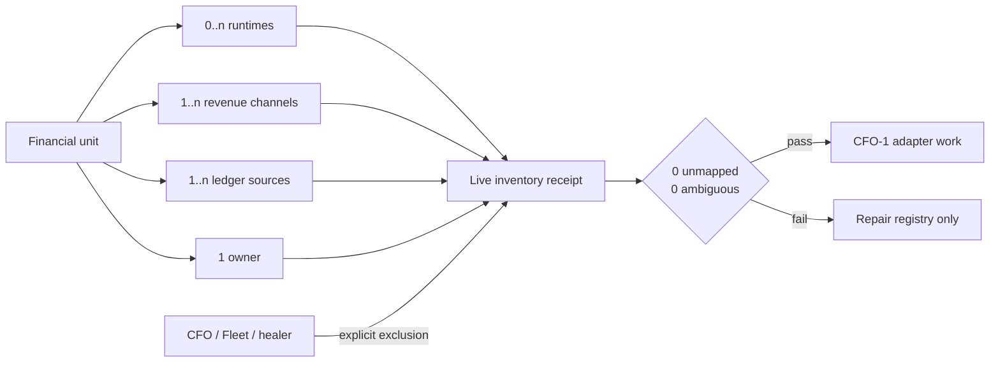

# Life Manager CFO M0 — Financial Unit Registry

| Field | Value |
|---|---|
| Status | IMPLEMENTED — LIVE E2E PASS |
| Parent SSOT | `docs/superpowers/specs/2026-08-06-life-manager-cfo-design.md` |
| Active item | `CFO-0d` is the only remaining M0 financial item |
| Done | Every live `ai.anicca.*` runtime and every declared ledger source is observed fail-closed, with zero unexplained labels, redacted evidence only, and no private payloads |
| Authority | Read-only inventory; no loop, ledger, credential, payment, or scheduler mutation |

## 1. Overview — What and Why

The CFO cannot report business profit until it knows which economic unit owns each revenue, cost, runtime, and
receipt. The Mac currently exposes many launchd jobs, but a job is not a business. Multiple Writer or x402 jobs
belong to one economic unit, while Stripe, Apple, marketplaces, and on-chain settlement are revenue channels.
Franklin instances are agent owners/cost centres. CFO and Fleet are controllers. Treating any of those as separate
businesses would duplicate revenue or cost.

M0 creates two truths:

1. A versioned, non-secret registry in Git defines stable financial units and matching rules.
2. An immutable local inventory receipt records what launchd and canonical ledgers actually exposed during a run.

The registry contains identity and ownership only. It MUST NOT contain balances, revenue totals, secrets, account
numbers, PIDs, last-run timestamps, or copied private ledger payloads. Those belong to later snapshots.

### Evidence behind the boundary

- **OpenTelemetry resource semantic conventions** — https://opentelemetry.io/docs/specs/semconv/resource/
  Core quote: “Service — Logical grouping of components.”
  Decision: many runtime components may map to one stable financial unit; runtime identity is not economic identity.
- **FinOps Foundation, Managing Shared Cloud Costs** — https://www.finops.org/wg/identifying-shared-costs/
  Core quote: “links common infrastructure spend to specific business value.”
  Decision: shared CFO, Fleet, and model-subscription costs remain shared until a versioned allocation rule maps them.
- **FinOps Foundation, Managing Shared Cloud Costs** — same source.
  Core quote: “combining multiple types of shared cost strategies with multiple approaches to splitting shared
  costs can quickly become complicated.”
  Decision: M0 records attribution targets only; cost allocation is deferred to CFO-2 and uses one explicit method.
- **Writer Agent SSOT** — `docs/writer-agent/WRITER-AGENT-SSOT.md`.
  Core rule: only external publisher/payment receipts are revenue; views, publication, and test payments are not.
- **Affiliate Agent SSOT** — `docs/affiliate-agent/AFFILIATE-AGENT-SSOT.md`.
  Core rule: Affiliate commission remains separate from Writer revenue even when both observe the same market.

## 2. Acceptance Criteria

- [x] One registry version contains exactly nine initial financial units in stable display order.
- [x] Each unit has `financial_unit_id`, `unit_kind`, localized names, one economic `owner_ref`, zero or more
      `cost_center_refs`, runtime matchers, revenue channels, ledger sources, lifecycle state, and evidence references.
- [x] `financial_unit_id` is lowercase snake case, immutable after first receipt, and unique.
- [x] `unit_kind` is exactly `business` or `personal_income`. `job_income` is `personal_income`; all other initial
      units are `business`.
- [x] `lifecycle` is exactly `active`, `building`, `planned`, or `retired`. It describes product lifecycle, never
      runtime health or revenue evidence.
- [x] Every revenue channel belongs to exactly one financial unit. A channel is not rendered as another business.
- [x] Every relevant live launchd label matches exactly one financial unit or one explicit non-economic exclusion.
- [x] A label matching zero or multiple targets makes inventory exit non-zero and prevents `CFO-0c` completion.
- [x] `cfo`, `fleet`, and connector-healing runtimes are explicit shared/controller exclusions, not businesses.
- [x] `franklin1` and `franklin2` are owners/cost centres under `x402_services`, not duplicate financial units.
- [x] Registry validation rejects unknown keys, duplicate IDs, duplicate channel IDs, empty evidence, unsafe absolute
      home paths, account numbers, wallet secrets, and mutable financial amounts.
- [x] The live inventory writes one append-only JSON receipt below the Life Manager state root using an atomic,
      no-overwrite publish operation.
- [x] Re-running with identical registry and observations produces the same `observation_hash`; it may create a new
      receipt envelope but cannot change an older receipt.
- [x] The receipt records registry SHA-256, observed label, matched target, observed launchd state, last exit code
      when supplied, source evidence availability, generated time, and unresolved findings.
- [x] Current lifecycle is evidence-based: no receipt means `unverified`, not zero revenue and not healthy.
- [x] Inventory performs no launchctl kickstart/stop, network request, database write, ledger write, or Telegram send.
- [x] A redacted live Mac E2E ends with nine units, one ledger observation per catalogue entry, zero ambiguous labels,
      zero unmapped relevant labels, and an
      immutable receipt whose hash verifies after re-read.

## 3. As-Is / To-Be

### As-Is evidence

- launchd exposes multiple `ai.anicca.life-manager-*`, `writer-*`, `hf-gig-*`, and `x402-*` labels.
- `ai.anicca.franklin-loop` and `ai.anicca.franklin2-loop` identify agent runtimes, not independent products.
- Writer and Affiliate already define separate revenue truth in their SSOTs.
- `lm_agent_earnings` is the canonical Life Manager source; the panel's `lm_financial_ledger` name is a stale alias
  and is not a live CFO source.
- No canonical machine-readable registry currently proves that one runtime/channel maps to one financial unit.

### To-Be model



### Initial canonical registry

| Order | `financial_unit_id` | Kind | User-facing name | Runtime namespace | Revenue truth |
|---:|---|---|---|---|---|
| 1 | `life_manager_saas` | `business` | Life Manager | `ai.anicca.life-manager-*` | Stripe and receipted marketplace/customer payments |
| 2 | `anicca_ios` | `business` | Anicca iOS | iOS/API release services; no launchd requirement | Apple/RevenueCat receipts |
| 3 | `writer_agent` | `business` | Writer Agent | `ai.anicca.writer-*` | Publisher/payment processor receipts |
| 4 | `affiliate_agent` | `business` | Affiliate Agent | Affiliate runtime when installed; absence allowed only as `unverified` | ASP/network commission receipts |
| 5 | `gig_work` | `business` | Gig Work | `ai.anicca.hf-gig-*`, `ai.anicca.gig-outcome-watch` | Marketplace/client payment receipts |
| 6 | `x402_services` | `business` | x402 Services | `ai.anicca.x402-*`, with Franklin runtime ownership | Facilitator/on-chain customer settlement receipts |
| 7 | `job_income` | `personal_income` | Employment Income | `ai.anicca.job-search-*` | Payroll/bank receipts; excluded from business revenue |
| 8 | `capafy_marketplace` | `business` | Capafy Marketplace | `ai.anicca.capafy-*`, Capafy provisioner | Capafy sales receipts; no receipt means unverified |
| 9 | `proprietary_investing` | `business` | Proprietary Investing | `ai.anicca.autohedge`, `ai.anicca.pm-*`, `ai.anicca.reinvest` | Reconciled investing receipts; source remains planned |

Localized identity and evidence are exact, not executor-selected:

| ID | Exact `display_name` | Exact `evidence_refs` |
|---|---|---|
| `life_manager_saas` | `{"en":"Life Manager","ja":"ライフマネージャー"}` | `["docs/superpowers/specs/2026-06-21-life-manager-LAUNCH-ORDER.md"]` |
| `anicca_ios` | `{"en":"Anicca iOS","ja":"アニッチャ iOS"}` | `["AGENTS.md"]` |
| `writer_agent` | `{"en":"Writer Agent","ja":"ライターエージェント"}` | `["docs/writer-agent/WRITER-AGENT-SSOT.md"]` |
| `affiliate_agent` | `{"en":"Affiliate Agent","ja":"アフィリエイトエージェント"}` | `["docs/affiliate-agent/AFFILIATE-AGENT-SSOT.md"]` |
| `gig_work` | `{"en":"Gig Work","ja":"ギグワーク"}` | `["docs/loop-engineering/26-gig-loop-asis-tobe-plan.md"]` |
| `x402_services` | `{"en":"x402 Services","ja":"x402サービス"}` | `["apps/x402-agents/package.json"]` |
| `job_income` | `{"en":"Employment Income","ja":"給与所得"}` | `["launchd:ai.anicca.job-search-*"]` |
| `capafy_marketplace` | `{"en":"Capafy Marketplace","ja":"Capafyマーケットプレイス"}` | `["docs/superpowers/specs/2026-07-30-capafy-10k-mrr-game-plan.md"]` |
| `proprietary_investing` | `{"en":"Proprietary Investing","ja":"プロプライエタリ投資"}` | `["docs/superpowers/specs/2026-06-10-ai-entity-content-engine-design.md"]` |

### Explicit exclusions

| Matcher | Classification | Cost treatment |
|---|---|---|
| `ai.anicca.cfo-*` | Financial controller | Shared overhead; allocation unavailable until CFO-2 |
| `ai.anicca.fleet-*` | Portfolio observer | Shared overhead; allocation unavailable until CFO-2 |
| `ai.anicca.self-fix-*`, `ai.anicca.connector-healer-*` | Repair infrastructure | Attribute to repaired unit only from a later usage receipt; otherwise shared |
| `ai.anicca.franklin-loop`, `ai.anicca.franklin2-loop` | Agent owner/cost centre | `x402_services`; never separate revenue |
| `ai.anicca.marketing-*`, `ai.anicca.self-improve-evolve`, `ai.anicca.warmup-flip-daily` | Shared marketing | Shared overhead |
| `ai.anicca.daily-nl-report`, `ai.anicca.earn-watch`, `ai.anicca.earning-health-allslots`, `ai.anicca.sbi-usdc-monitor`, `ai.anicca.stripe-revenue-listener`, `ai.anicca.stripe-revenue-poller` | Financial observer | Shared overhead |
| `ai.anicca.ceo-runner`, `ai.anicca.citizen-refill`, `ai.anicca.founder-loop-cadence` | Economic controller | Shared overhead |
| `ai.anicca.agentmail-*`, `ai.anicca.clawrouter`, `ai.anicca.slack-bridge`, `ai.anicca.tsbridge` | Shared connector | Shared overhead |
| `ai.anicca.agents-skills-sync`, `ai.anicca.browser-state-backup`, `ai.anicca.cadence-deadline-check`, `ai.anicca.cdp-daily-driver-owner`, `ai.anicca.citizens-diff-monitor`, `ai.anicca.claude-projects-backup`, `ai.anicca.colima-autostart`, `ai.anicca.disk-autoprune`, `ai.anicca.disk-janitor`, `ai.anicca.effect-watch`, `ai.anicca.f7-silence-check`, `ai.anicca.fuel-watch`, `ai.anicca.monkey-watchdog`, `ai.anicca.openclaw-conformity-monkey`, `ai.anicca.openclaw-core-backup`, `ai.anicca.openclaw-janitor-monkey`, `ai.anicca.session-vault`, `ai.anicca.sync-memory`, `ai.anicca.tier1-remediate`, `ai.anicca.tier2-agent-diagnose`, `ai.anicca.token-daily-report`, `ai.anicca.verify-loops-audit`, `ai.anicca.watchdog` | Shared operations/repair | Shared overhead |

### Registry contract

```json
{
  "schema_version": 1,
  "registry_id": "life_manager_cfo_financial_units",
  "financial_units": [
    {
      "financial_unit_id": "life_manager_saas",
      "unit_kind": "business",
      "display_order": 1,
      "display_name": { "en": "Life Manager", "ja": "Life Manager" },
      "owner_ref": "human:dais",
      "cost_center_refs": [],
      "lifecycle": "active",
      "runtime_matchers": ["ai.anicca.life-manager-*"],
      "revenue_channel_ids": ["stripe_life_manager"],
      "ledger_source_ids": ["lm_agent_earnings"],
      "evidence_refs": ["docs/superpowers/specs/2026-06-21-life-manager-LAUNCH-ORDER.md"]
    }
  ],
  "runtime_exclusions": []
}
```

The implementation contains all nine full rows. The shortened JSON above defines exact field names and types; it
is not permission to omit rows. Globs support only a terminal `*`. Matchers are evaluated by descending literal
prefix length. Multiple matches remain an error even when one prefix is longer.

Reference namespaces are part of identity: `owner_ref` is exactly `human:<id>` and every `cost_center_refs` entry
is exactly `agent:<id>`, where `<id>` matches `[a-z][a-z0-9_]*`. Registry, unit, channel, ledger, and exclusion IDs
remain unprefixed snake-case IDs. Validators must not apply the unprefixed ID regex to typed references.

### Canonical ledger-source catalogue

Every `ledger_source_id` resolves exactly once through the registry's closed catalogue. The catalogue stores only a
non-secret locator and a read-only probe kind; it is not a money ledger.

| `ledger_source_id` | Probe kind | Default status | Truth boundary |
|---|---|---|---|
| `lm_agent_earnings` | `external` | `unavailable` | Life Manager earnings source; `lm_financial_ledger` is a stale alias |
| `revenuecat_subscription_events` | `external` | `unavailable` | RevenueCat audit events, not Apple payout truth |
| `writer_receipts` | `sqlite` | `unavailable` | Read-only Writer receipt database; `present_empty` is valid |
| `affiliate_commission_receipts` | `planned` | `planned` | Planned provider commission adapter |
| `gig_payment_receipts` | `jsonl` | `unavailable` | Read-only Gig payment receipt JSONL |
| `x402_settlement_receipts` | `directory` | `unavailable` | Read-only x402 settlement receipt directory |
| `payroll_bank_receipts` | `planned` | `planned` | Payroll classification is not built; no Moneytree payload is read |
| `capafy_sales_receipts` | `directory` | `unavailable` | Canonical Capafy receipt directory when present |
| `proprietary_investing_receipts` | `planned` | `planned` | Planned until one reconciled canonical source exists |

Allowed probe kinds are `external`, `sqlite`, `jsonl`, `directory`, and `planned`. Allowed availability values are
`available`, `present_empty`, `stale_alias`, `planned`, and `unavailable`. One redacted observation is emitted for
each catalogue row with `ledger_source_id`, `availability`, and optionally a non-financial integer
`evidence_count`; paths, rows, amounts, currencies, buyers, transactions, accounts, balances, and payloads never
enter the receipt.

### Inventory receipt contract

```json
{
  "receipt_version": 1,
  "inventory_id": "<UUIDv4>",
  "generated_at": "<RFC3339 UTC>",
  "registry_sha256": "<64 lowercase hex>",
  "observation_hash": "<64 lowercase hex>",
  "financial_units": [],
  "runtime_observations": [],
  "source_observations": [],
  "ledger_observations": [],
  "unmapped_relevant_labels": [],
  "ambiguous_labels": [],
  "result": "pass"
}
```

Angle-bracket values denote runtime-generated typed values, not product placeholders. `result` is `pass` only when
both finding arrays are empty and every registry row validates. Receipt files live under
`$LIFE_MANAGER_STATE_HOME/cfo/business-inventory/`; the registry never embeds that expanded absolute path.

Array items use a closed minimal schema:

```json
{
  "financial_unit": {
    "financial_unit_id": "<registry id>", "unit_kind": "<registry kind>", "display_order": 1,
    "display_name": {"en":"<registry name>","ja":"<registry name>"}, "lifecycle": "<registry lifecycle>",
    "runtime_labels": [], "source_evidence_refs": [], "evidence_status": "observed|unverified"
  },
  "runtime_observation": {
    "label": "<launchd label>", "state": "running|not_running|unknown", "last_exit_code": null,
    "classification": "financial_unit|exclusion|unmapped|ambiguous", "target_ids": []
  },
  "source_observation": {"evidence_ref":"<registry evidence ref>","availability":"present|unavailable|not_applicable"},
  "ledger_observation": {"ledger_source_id":"<catalogue id>","availability":"available|present_empty|stale_alias|planned|unavailable","evidence_count":0},
  "ambiguous_label": {"label":"<launchd label>","target_ids":[]}
}
```

This `evidence_status` describes inventory evidence only. It never asserts revenue, profit, financial health, or a
zero value. The observation hash covers every deterministic receipt field, including `receipt_version`, except
`inventory_id`, `generated_at`, and `observation_hash` itself. Sorting is locale-independent so identical inputs
produce the same hash across hosts.

## 4. Test Matrix

| # | To-Be | Test evidence | Required |
|---:|---|---|---|
| 1 | Nine stable units | Registry fixture returns exact ordered IDs and kinds | PASS |
| 2 | Unique identities | Duplicate unit/channel ID fails validation | PASS |
| 3 | Strict schema | Unknown key, amount field, secret-like field, and unsafe path fail | PASS |
| 4 | Runtime mapping | Representative Life Manager, Writer, Gig, x402, and Job labels map once | PASS |
| 5 | Exclusions | CFO, Fleet, and Franklin labels never create extra businesses | PASS |
| 6 | Ambiguity | Overlapping runtime matchers fail inventory | PASS |
| 7 | Missing mapping | Relevant `ai.anicca.*` earning label fails inventory | PASS |
| 8 | Absent runtime | Anicca iOS and planned Affiliate remain `unverified`, not failed or zero | PASS |
| 9 | Determinism | Same normalized observation produces the same observation SHA-256 | PASS |
| 10 | Immutability | Existing receipt is never overwritten | PASS |
| 11 | Read-only | Test harness observes no process mutation, network, DB, Telegram, or ledger write | PASS |
| 12 | Ledger catalogue | Exactly nine unit ledger IDs resolve one-to-one through nine catalogue entries | PASS |
| 13 | Redacted ledger observations | Receipt contains one status-only observation per catalogue entry and no money/payload fields | PASS |
| 14 | Privacy boundary | Absolute paths, traversal, credential/query refs, secret-shaped values, and account-like digit runs fail | PASS |
| 15 | Hash contract | `receipt_version` is hashed; only the three volatile envelope fields are excluded | PASS |
| 16 | Normal CI | `npm run test:cfo` is included in the normal `npm test` chain | PASS |
| 17 | Live Mac E2E | 139 labels yield nine units, zero unresolved mappings, zero ambiguous labels, and verified hashes | PASS |

### E2E judgment

| Item | Value |
|---|---|
| UI change | None |
| Maestro | Not required; no iOS UI changes |
| Real E2E | Required against read-only `launchctl` and canonical source-path existence |
| External side effect | One local append-only inventory receipt only |

## 5. Boundaries

### In scope

- Stable financial-unit identity, revenue-channel ownership, runtime mapping, source references, validation, and a
  read-only live inventory receipt.
- A `personal_income` classification so employment income cannot inflate business revenue.
- Explicit shared/controller and agent-owner exclusions.

### Out of scope

- Reading balances or transaction payloads, calculating P&L, allocating shared costs, OpenTelemetry ingestion,
  Telegram rendering, self-healing, trading, payments, hiring, or stopping any loop.
- Declaring revenue zero from missing receipts or declaring a runtime healthy from launchd registration alone.
- Adding another financial unit without a separate verified economic product or income source.

## 6. Execution Steps

Only these tasks implement CFO-0c. Each task uses RED → GREEN → fresh verification → commit → push before the next.

1. Define the strict registry and validator with nine canonical units and explicit exclusions.
2. Add deterministic runtime/source observation and immutable receipt generation.
3. Run the read-only live Mac inventory; repair registry mappings until unresolved arrays are empty.
4. Record the receipt hash and test evidence, mark CFO-0c complete in the parent SSOT, and leave CFO-0d as the
   only active financial item.

The implementation plan supplies exact files, function signatures, test code, commands, and per-task estimated LOC.

## 7. CFO-0c completion evidence

**Status:** `IMPLEMENTED — LIVE E2E PASS`

- Correction commits: `be53043ce` (complete runtime census), `7f56f93fb` (canonical ledger-source inventory), and
  `86afe492d` (privacy, immutable hash, and normal CI). F4 documentation closure is `ce2c99239`
  (`docs(cfo): close complete runtime inventory`).
- Focused command: `npm run test:cfo` — 35/35 tests passed.
- Full command: `npm test` — exit code 0 after `npm ci --no-audit --no-fund` restored the worktree's missing `ws`
  dependency; the fresh full run passed.
- Live read-only inventory: 139 `ai.anicca.*` labels; 84 `financial_unit`, 55 `exclusion`, 9 financial units,
  `unmapped_count=0`, and `ambiguous_count=0`.
- Ledger observations: 9 catalogue entries, with status counts `planned=3` and `unavailable=6`. These are source
  availability statuses only and do not assert revenue, balances, or transaction values.
- Independent hash verification: `registry_sha256=32c3d67f09d3e72b6fdc8a4a8f5d95d38f14a9edd33e8d913238bf65b0868375`;
  `observation_hash=f459730c8505cf22b9f58d45287a6d382b10971b64e0199cf637bad92279046c`.
- Safety verification: receipt mode `0600`, containing-directory mode `0700`, no receipt/private path tracked, and
  no launchd, ledger, database, network-write, or Telegram mutation.

`CFO-0d` is the only active financial item. No receipt path, raw label list, payload, balance, amount, or customer
data is committed.
