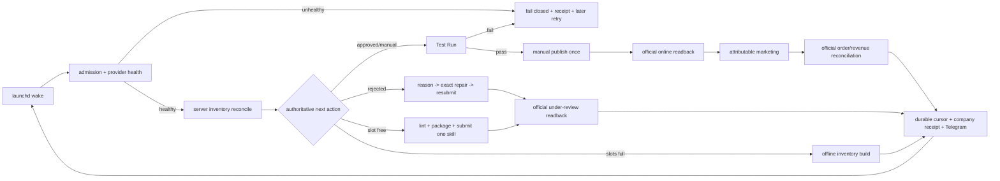

# Capafy 24/7 publishing and $10k MRR operating spec

## Outcome

Life Manager continuously operates the Capafy business without routine human babysitting:

1. build a bounded, sellable skill from tracked inventory;
2. publish or repair exactly one Agent/version per eligible wake;
3. verify the Capafy runtime before manual publication;
4. market an attributable live Agent;
5. read official orders, balance, refunds, and subscription revenue;
6. retain durable receipts and use the next wake to continue or self-heal.

The target is **officially verified net MRR >= $10,000**, not downloads, gross listing value,
pending balance, cumulative one-time sales, or an inferred run rate.

## Verified state

### Marketplace

- 40 Agents are online.
- The three HTTP 402 recoveries are online on replacement versions: Hook Lab v1.0.2,
  Slide Maker v1.0.1, and TikTok Script Pro v1.0.1.
- Five previously rejected versions are corrected and under review:
  - Cold Email Writer — Get Replies, Not Templates
  - Performance Review Writer — Notes to Ready Draft
  - Meeting Notes -> Action Items & Decisions
  - Job Description Writer — Notes to Ready-to-Post JD
  - Thesis Structure Humanizer — Chapter-Level Rewrite
- Official card readback for all five reports:
  - declared model: `Gemini 3.5 Flash Lite`
  - declared provider: `Google Gemini`
  - runtime model: `gemini-3.5-flash-lite`
  - runtime vendor: `Google Gemini`
  - `auto_publish=false`
  - status/audit status: under review
- These five versions occupy the five submission slots. New publication is correctly blocked until
  an approval/rejection changes inventory, but repair and approved-version completion remain eligible.

### Runtime and provider safety

- The eight registered Capafy loops run from the immutable main-derived release selected by launchd.
- The old fleet-wide CPU load gate is removed from memory admission. Do not reimplement or roll it back.
- Real memory headroom remains fail-closed.
- `capafy-loop-healthcheck` runs the provider key gate every five minutes.
- OpenRouter capacity repair is bounded and verified with a live request; failure remains fail-closed.
- The five corrected versions use Google Gemini, so their runtime does not depend on the OpenRouter
  balance path that caused the delistings.
- No software can guarantee uninterrupted provider/platform availability forever. The required invariant
  is bounded self-recovery with honest terminal receipts, no duplicate external effect, and no publication
  when runtime health is unverified.

### Money receipt

Latest stored official seller-console receipt:

- orders: 10
- gross revenue: `$24.97`
- one-time revenue: `$9.99`
- pending balance: `$14.40`
- realized/paid revenue: `$0.00`
- refunds: `$0.00`
- settled/net MRR: unknown because the available Capafy data has no reliable active-subscription/order join

Therefore current verified MRR is **unknown**, and $10k MRR is **not achieved**.

## Folder ownership

```text
life-manager-main/
├── config/
│   └── loop-registry.json                 # eight Capafy schedules and entrypoints
├── runtime/
│   └── host/                              # shared finite-loop admission/runtime; do not special-case Capafy
├── skills/
│   ├── capafy/
│   │   ├── catalog/<product>/             # SKILL.md + LISTING.md + icon + evidence/test
│   │   └── marketing-evidence/<agent_id>/ # attributable creative evidence
│   ├── capafy-autopublish/
│   │   ├── DAILY_LOOP.md                  # one bounded marketplace transition per wake
│   │   ├── BEST_PRACTICES.md              # sellability, pricing, rejection constraints
│   │   ├── scripts/                        # inventory, key gate, prepare, checkpoints, submit, reconcile
│   │   ├── test/                           # deterministic publishing/recovery tests
│   │   └── vendor/                         # Capafy publisher/user adapters
│   ├── self/capafy-loop/
│   │   ├── capafy-loop-daily.sh            # hourly build/publish/repair owner
│   │   ├── capafy-loop-healthcheck.sh      # five-minute provider/owner health supervisor
│   │   ├── capafy_earn_reconcile.py        # revenue/state reconciliation
│   │   ├── capafy_offline_cadence.py       # build work while slots are full
│   │   └── sales_selector.py               # selects evidence-backed product/growth target
│   └── earn/capafy-marketing/
│       ├── capafy-ig-account-manager.sh    # five-minute account/session self-heal
│       ├── capafy-ig-marketing-daily.sh    # hourly distribution owner
│       ├── capafy-outcome-monitor.sh       # minute-level official effect/revenue monitor
│       ├── capafy-goal-monitor.sh          # hourly/daily-close goal assessment
│       ├── scripts/                        # events, attribution, receipts, selection, IG lifecycle
│       └── site/                           # owned landing/redirect surface
└── docs/superpowers/specs/
    └── 2026-09-14-capafy-10k-mrr-operating-spec.md
```

Durable production state is outside the repository at
`~/.local/state/life-manager/`; immutable releases are under `~/loops/releases/`.

## Eight-loop topology

| Loop | Cadence | Responsibility | Successful terminal |
|---|---:|---|---|
| `capafy-loop-daily` | hourly | inventory -> build/publish/repair one bounded item | official version/card status receipt |
| `capafy-loop-healthcheck` | 5 min | key admission and stale-owner recovery | healthy key/owner or bounded fail-closed receipt |
| `capafy-ig-account-manager` | 5 min | IG session/account lifecycle self-heal | verified owned session receipt |
| `capafy-ig-marketing-daily` | hourly | publish attributable creative for one live Agent | native post/readback receipt |
| `capafy-outcome-monitor` | 1 min | ingest official Capafy/marketing effects and money | deduplicated event/company receipt |
| `capafy-goal-monitor-hourly` | hourly | compare funnel/MRR against target | current gap and next bounded action |
| `capafy-goal-monitor` | 09:30 | daily operating checkpoint | daily target/health receipt |
| `capafy-goal-monitor-daily-close` | 23:50 | close daily scorecard | official daily close receipt |

## User experience

### Buyer

1. Sees an accurate Agent Card: capability, model/provider, price, request cap, privacy.
2. Pays without a loss-making free-trial path where paid-only policy applies.
3. Sends a concrete input and receives the promised output without external setup.
4. If the provider is unhealthy, the request fails honestly; the Agent is not knowingly published from
   an unverified runtime.

### Operator

1. No routine restart, browser babysitting, or manual cursor selection.
2. Telegram reports only verified state: action, Agent ID, official status, online count, and honest revenue.
3. Human action is exceptional: Capafy review decisions, CAPTCHA/identity/payment authorization, or a
   platform control that exposes no automatable interface.
4. Approval never equals publication: approved replacement -> Test Run -> successful response -> one
   manual publish -> official online readback.

## End-to-end flow



## $10k MRR model

Required active monthly-equivalent subscriptions are `ceil(10000 / net ARPA)`:

| Net ARPA | Active subscriptions required |
|---:|---:|
| $5 | 2,000 |
| $10 | 1,000 |
| $20 | 500 |
| $25 | 400 |

The operating equation is:

`MRR = qualified traffic x listing conversion x paid retention x net ARPA`

Publishing more Agents alone is not the goal. The loop must concentrate distribution and iteration on
Agents with official paid-order evidence, while maintaining accurate cards and positive per-request margin.

## Remaining TODO — authoritative order

Order changed from “publish the next catalog item” to “restore all occupied revenue slots, prove paid
runtime, then scale winners.” Reason: five rejected versions consumed every submission slot and prevented
new supply while $10k MRR depends first on keeping purchasable Agents healthy.

Current cursor: **T1**.

- [ ] **T1 — Finish the five corrected reviews.** On each Capafy approval: run saved Test Run, require a
  completed non-error response, publish once manually, and require official `online` readback. On rejection:
  ingest the exact review reason and repair in place without creating a duplicate Agent.
- [ ] **T2 — Prove all eight loops after the review-state change.** Each must natural-wake from the installed
  release, perform one bounded transition or legitimate no-op, advance durable state where applicable, and
  write a terminal receipt. No `memory_admission_deferred`, duplicate effect, or human restart.
- [ ] **T3 — Refresh the official money receipt.** Resolve the stale seller-console observation and record
  orders, gross, pending, refunds, realized payout, active subscriptions, and net MRR. If Capafy still exposes
  no subscription join, preserve MRR as unknown rather than infer it.
- [ ] **T4 — Close rejection self-healing gap.** Feed exact email/review-detail reason into the rejection queue;
  validate declared model/provider against hosted runtime before every submit; route approval to Test Run and
  rejection back to bounded repair automatically.
- [ ] **T5 — Close 402 prevention gap.** Keep preflight headroom and live probe; add an authorized funding
  mechanism or a provider route whose budget cannot silently expire. Do not auto-charge a personal payment
  method without explicit financial authorization. Continue to fail closed before user-visible breakage.
- [ ] **T6 — Scale verified winners.** Use official paid orders to select the winner, publish attributable
  distribution, measure listing conversion/retention/net ARPA, then iterate price/card/product. Do not claim
  causal attribution when only correlated seller-ranking data exists.
- [ ] **T7 — Reach and hold $10k net MRR.** Require official active-subscription and payout receipts for at
  least two consecutive billing observations; refunds and provider/sandbox costs remain deducted.

## Completion gates

- all sellable Agents are online or in a legitimate bounded review state;
- no known card/runtime model or provider mismatch;
- no duplicate Agent/version/post/publish effect;
- all eight loops produce fresh natural terminal receipts without babysitting;
- provider failure is detected before publication and recovers on a later wake when capacity returns;
- official net MRR is at least `$10,000` for two consecutive observations;
- realized payout is non-zero and reconciles with the seller statement.
