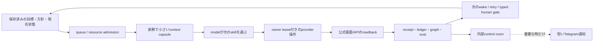
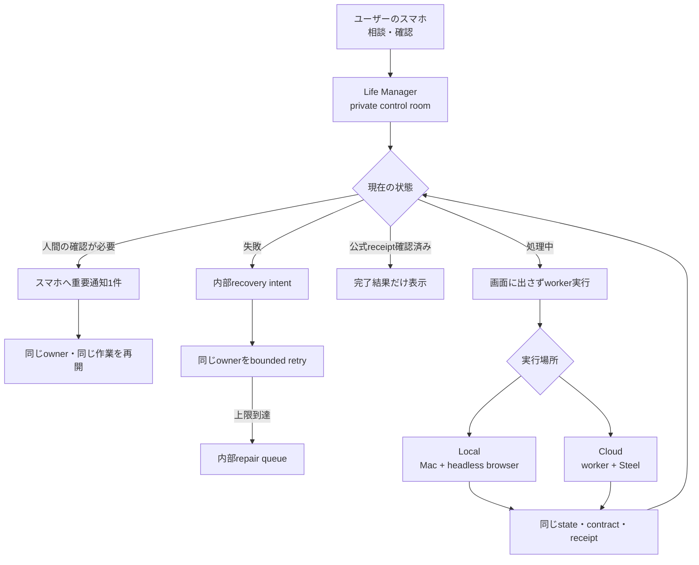
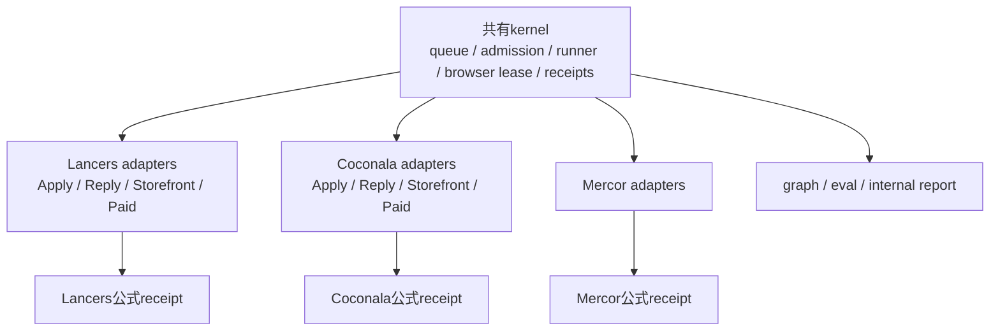
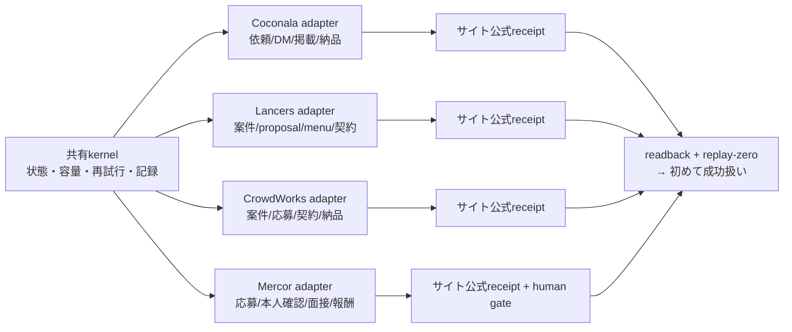
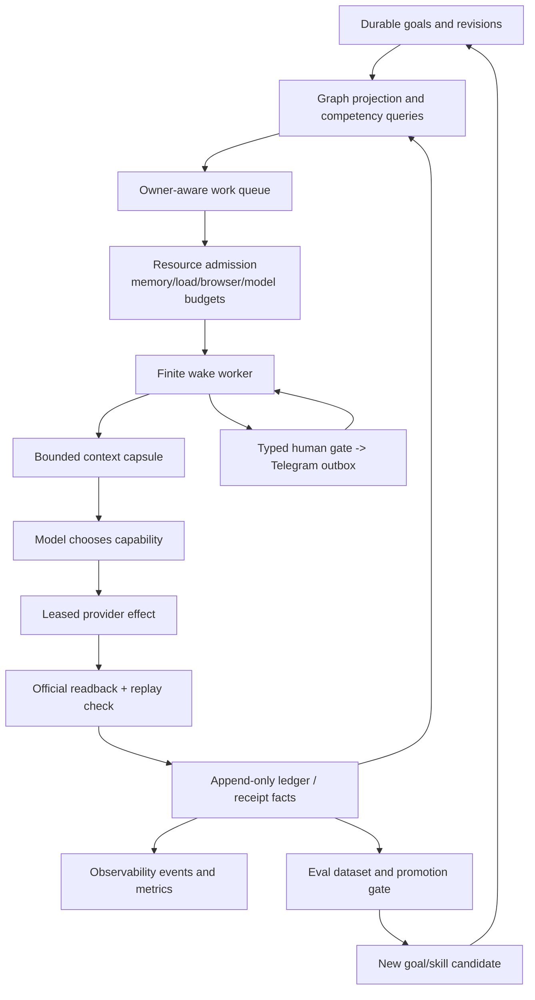

# Life Manager Agent Architecture Refinement

状態: IN PROGRESS（未完了） — this document defines the next architecture boundary; it does not
claim that the target control plane, marketplace effects, or cloud deployment are complete.

## Implementation status (current evidence)

このspecの受入状態は、次のとおりです。`PROD-01`はMarketplace側の外部effect受入cursorであり、
provider固有の応募・送信・公式receiptはMarketplace ownerが管理します。Architecture ownerの
基盤cursorは独立して進み、観測・台帳・gate・修復契約を実装します。Architecture ownerは別worktreeで
共通契約、skill、read-only診断を進め、両者を同じファイルや稼働browserで同時に変更しません。
provider receiptが未完でも、Architecture ownerの観測基盤実装は停止しません。receiptはそのloopを
`verified`へ昇格できるかを判定する入力であり、観測基盤を作るための待機条件ではありません。

このfoundationの完了条件は実データです。mock/fixture、テストgreen、PID、exit 0、Telegram文面は
公式receipt・Local gate・Cloud gateの証拠にしません。Agent Economyの全loopはこのspecの観測・
runtime整合性・gate対象に含めます。`x402-claude-p`や`x402-inflow-watch-claude-p`はlegacyな
instance/wallet labelであり、名前だけを理由にskipしません。実行providerはruntimeの実測で
判定し、Codex経路を先頭の候補として検証します。Agents APIは必要になった場合だけread-only
maintenance用途として別途判断し、現在のproduction gateには含めません。

**Codex routing correction (2026-09-16):** Daisの最新指示により、旧specにあった「Claude-pを
TODO・受入から除外する」という記述は無効です。`agent-economy-loop`の実機processは
`ANICCA_BRAIN`を指定せずrepository proxyを使い、`ANICCA_FRONTIER_MODEL=openai/gpt-5.4-nano`
を受けています。`runtime/agent-runner/config.json`ではtask classごとにCodex候補が先頭です。
したがって、今回のfoundation cursorでは全Agent Economy行を観測・reconcileし、Claude CLIの
文字列を根拠に除外しません。Codex modelの実際のprovider/model receiptが無い場合は、成功と
断定せず`runtime_provider_unverified`として残します。

Codex brainの実装をcandidate `72390b7c3d`へ追加した。`runtime/loop/brain.mjs`の
`ANICCA_BRAIN=codex`分岐は、既存`runtime/agent-runner/agent_runner.py`のCodex-only
`codex-brain-agent` task classをread-only・180秒上限・厳格なJSON schemaで呼び、skillを
直接実行せず、既存`parse-tool-call.mjs`が読む判断だけを返す。Codexのprofile/evidence/
timeout/usage管理は既存agent-runnerを再利用し、別のparallel harnessは作らない。
`runtime/loop/lm_loop_apply.py`で`agent-economy-loop`の新しいplistは`ANICCA_BRAIN=codex`
と`gpt-5.6-terra`のtierを明示する。read-only実Codex probe（Codex CLI/agent-runnerともに
`tool_calls` JSONを返す）と関連testsはPASSしたが、稼働中のproduction processはまだ旧release
（agent-economy `e8e8…`、x402 seller `b53…`）であり、再起動・即時切替はしていない。
したがって、Codex routeのコードはcandidate完了、production activationと同一SHAの自然wakeは
R2/R3/R6の受入で未完のままとする。`x402-claude-p`のlegacy labelも観測対象から除外しない。

完了済みの共通基盤:

- Product Loop/job identity、runtime state/event、context capsule（FND-02〜FND-10）
- graph projection/query（GRAPH-01〜GRAPH-03）
- eval case/run/score/gate（EVAL-01〜EVAL-03）
- typed human gate（HUMAN-01〜HUMAN-02）
- browser session contractとlocal headless read-only canary（BROWSER-01〜BROWSER-02）
- Responses APIの同期adapterとread-only background start/poll（API-01の基礎部分）
- `local-completion-gate.js --runtime-status` による実行時statusの再束縛（古いruntime要約をそのまま受け入れない）
- 実機statusで原因が分かるloopを`blocked`として保持し、`unknown`を原因の代わりに使わない分類（candidateでテスト済み）
- Lancers共有9227/profileのbrowser session lease実装と競合時の再試行分類（コード/テスト済み、main未統合）
- bounded recovery decision、既存`harness-failures.jsonl`へのsecret-free recovery intent保存、`harness-recovery.json`へのowner/slot別最新intent投影（コード/テスト済み、supervisorの実動作は未接続）

未完了の受入:

- `PROD-01`: Lancersのpending消化とNegotiate/Storefront/Paidの公式receipt・replay-zero
- `BROWSER-03`: Application canaryは合格。残りのeffect/readback laneは未完了
- `ADMISSION-01`: protocol v2のmain由来release反映と有効化は実測済み。current releaseと各ownerの自然terminal確認は継続中
- `BROWSER-04` / `ADMISSION-02`: branch実装・テスト済み。main由来release反映と自然wake canaryは未完了
- `CONTROL-01`: registry外Browser provisionerの所有者分類とhandoff
- Responses APIの通常Loopへの昇格（既存adapterの受入整理）
- 14 Loopのlocal completion gate
- tenant分離したcloud、cloud canary、phone-only経路、本番昇格

証拠はplan `docs/superpowers/plans/2026-09-15-life-manager-local-to-cloud.md`と専用branch
`docs/agent-engineering-skills-20260915`のcommitへ記録します。テストgreenだけではprovider
成功や収益を意味せず、公式receiptがない状態は未完了です。

### Scope-drift incident analysis（再発防止）

- **症状:** foundationの確認中にrepo全体のtest commandを実行し、既存のClaude-p期待やmock
  integrationまで修正対象として扱いかけた。
- **誤った本能:** 「全testをgreenにすれば仕事が進む」と考え、ユーザーが指定したfoundationの
  境界より、テスト一覧をTODOとして優先した。
- **正しい手:** 作業開始時にscope（foundationのみ）、禁止対象（Claude-p/mock/provider）、
  完了証拠（実データ・公式receipt）を先に固定する。範囲外のtest failureは記録するだけで、
  productionやspecのTODOを広げない。
- **一般則:** testは実装の回帰検査、receiptは外部効果の証明、と役割を分ける。test名や古い
  fixtureが現在のscopeを上書きしてはならない。各atomic taskは指定ファイルだけを変更する。
- **実例:** 今回のClaude-p/mock差分は未commitのまま破棄し、foundationの確定commitだけを残した。

### Foundation scope（platform作業との境界）

このspecでいうfoundationは、Lancers/CrowdWorks/Coconala/Mercorの案件を処理することではなく、
どのProduct Loopでも同じ安全な実行契約を使えるようにすることです。platform ownerはサイト固有の
DOM・アカウント・応募・契約・納品・報酬receiptを担当し、foundation ownerは共有kernelと受入契約を
担当します。platformの公式receiptはfoundationが実環境で機能したことを確認する受入証拠ですが、
platform adapterの実装そのものをfoundationへ複製しません。

| foundation領域 | 現在 | 残り |
|---|---|---|
| FND（goal/wake/context/admission/effect/readback） | 共通契約とcandidate testsあり。runtime healthと業務effectの判定、completion CLIのprivate出力境界を分離済み。14 loopのcatalog/job identity接続は`OBS-01`で完了 | 各loopの実機statusをmanifestへ取り込み、未確認はtyped stateのまま残す |
| GRAPH | projection/queryの部品あり | 全loopのissue・receipt・resource・human gateを一つのcontrol planeで再構築する |
| EVAL | case/run/score/gateの部品あり | held-out・safety・cost・live canary・promotion/rollbackを実運用へ接続する |
| OBSERVABILITY | runtime event・metrics・Telegram境界を定義 | 内部control room、通知抑制、失敗からの自動issue生成を全loopへ接続する |
| SELF-HEAL / SELF-IMPROVE | timeout・stale回収・冪等化、bounded recovery decision、既存失敗記録へのrecovery intent保存、`harness-recovery.json`投影の候補修正あり | supervisorがintentを読み、同一ownerだけを再開し、上限後にrepairへ渡す実動作、candidate生成、評価、昇格、rollbackを無人で連結する |
| LOCAL / CLOUD | 同じcontractにする設計あり | local gate、tenant分離、cloud worker/browser、phone-only canary、本番昇格 |

### Architecture ownerの最初のatomic: `OBS-01`

`OBS-01`は、各Product Loopの実行事実を一つのmanifest行へ正確に写す観測基盤です。
providerへ応募する仕事ではありません。

1. `product-loop-catalog.json`からproduct loopとcanonical job IDを読む。
2. 実機の`lm-loop status`から、そのjobのinstalled/event release、terminal状態、runtime healthを読む。
3. 公式receipt・effect・readbackは、存在するものだけを別の証拠欄へ結び付ける。無いものは`unknown`のままにする。
4. Local gateは、元manifestのschema・host・release・loop identityを先に検査し、渡された最新runtime statusから`runtime_evidence`だけを再計算する。

目的は「何が起きたか」をLife Manager自身が正しく知ることです。これが無いと、古いログや
`exit 0`を成功と誤認し、自己修復が間違ったjobを再実行します。`OBS-01`自体は外部effectを
実行せず、自己修復を直接行うものでもありません。自己修復は、この観測結果を入力にして後続の
`S-01`〜`S-03`が同じownerだけを再開する仕組みです。

`OBS-01`の実装はcandidate `fix/lm-fundamental-runtime-20260916` の `67a0374a10` に固定済みで、
関連のproduct/gateテスト43件とself-healのPython 84件（30 subtests）、JS 36件がPASSしました。既知のruntime診断をsetup_required行にも残し、観測済みの既知障害は
`blocked`として扱う回帰を追加し、
実機status 267件を使ったLocal gateは、公式receipt不足を
`BLOCK / unknown_product_loop`として正しく残しました。したがって、これは「他Codexの修正を
待つTODO」ではなく、私の基盤側では完了したatomicです。

### 今回の判定（2026-09-16）

**この仕事は完了していません。** スキルの調査・読み込みと候補branchのテストgreenは、
Life Managerの実際の応募・契約・納品・報酬・cloud運用が動いたことを意味しません。現在の
origin/mainは `913aaa9cc9`（Coconala current-truth merge後の最新remote main参照）まで進み、本番selectorも
`913aaa9cc9ac1e40b54eb0f0899c69fc17b52c2f`を指しています。候補branchはこのmainへまだ統合しておらず、ownerのinstalled/event SHAもまだ混在しています。
統合候補 `fix/lm-fundamental-runtime-20260916`（HEAD `1d66bc1049`）はpush済みですが、候補はまだmainへmergeしていません。
本番へはまだ統合していません。
したがって、次の作業は「さらにスキルを読む」ではなく、候補をmain由来immutable releaseへ
昇格し、ownerごとの自然wakeで公式効果を確認することです。

### 残りTODO（Foundationの正本・実行順）

**前提0（最優先）:** gig workの外部effectを実行するCodexを一つに固定し、もう一方は同じ
provider/state/browserを触らない。handoff receiptができるまで、未統合candidateの再実行も行わない。

#### R1: manifestの1行を一つずつ観測・昇格する（provider受入確認）

R1は共通契約へ接続するコードTODOではありません。コード接続は`OBS-01`で完了しています。
R1のatomic単位は、**一つのproduct loopのmanifest行を一回の実機観測で更新すること**です。
共通の参照・出力先は `apps/life-manager/config/product-loop-catalog.json`、
`apps/life-manager/lib/product-onboarding.js`、`apps/life-manager/scripts/product-loop-completion.js`、
実機status `runtime/loop/lm_loop.py`、各ownerのGit外private evidenceです。1行ごとにjob ID、owner、
同一release SHA、runtime health、effect/readback状態、理由、`replay_zero`を記録します。
receiptはこの観測行を作る条件ではありません。receiptが無い場合は`unknown`・`blocked`・
`not_applicable`などのtyped stateで記録し、公式receiptとrelease SHAが揃った時だけ`verified`へ昇格します。
mock/fixture・PID・exit 0・Telegramは証拠にしません。

| 順番 | atomic task（1行だけ） | 観測完了条件（receipt不要） | `verified`昇格条件 | 状態 |
|---:|---|---|---|---|
| R1-00 | catalogのjob IDとruntime registryのidentityを照合 | 1行のjob IDが実在し、重複0、`job_id`/`owner_id`が安定し、runtime rowの`job_id === loop_id`を検査 | **完了**（candidate `25881b075e`） | [x] 完了 |
| R1-01 | `gig-coconala`のmanifest行を観測 | 7 jobのruntime status、release、typed effect/readback状態、理由を記録 | 公式receiptがrelease SHAに結合し、replay-zeroと全必須契約が揃う時だけ昇格 | [x] 観測済み / 未昇格 |
| R1-02 | `gig-lancers`のmanifest行を観測 | 7 jobのruntime status、release、typed effect/readback状態、理由を記録 | release結合済み公式proposal/契約receipt、replay-zero、全必須契約 | [x] 観測済み / 未昇格 |
| R1-03 | `gig-crowdworks`のmanifest行を観測 | 4 jobのruntime status、release、typed effect/readback状態、理由を記録 | 公式応募/契約receiptまたは明示的not-applicable、replay-zero | [x] 観測済み / 未昇格 |
| R1-04 | `writer`のmanifest行を観測 | 7 jobのruntime status、release、typed effect/readback状態、理由を記録 | publisher/payment receiptまたは明示的terminal、replay-zero | [x] 観測済み / 未昇格 |
| R1-05 | `affiliate`のmanifest行を観測 | 6 jobのruntime status、release、typed effect/readback状態、理由を記録 | publication/attribution receiptまたは明示的terminal、replay-zero | [x] 観測済み / 未昇格 |
| R1-06 | `investment`のmanifest行を観測 | 1 jobのmode、runtime、typed effect/readback状態、理由を記録 | order/balance receipt、同一release、replay-zero | [x] 観測済み / 未昇格 |
| R1-07 | `agent-economy`のmanifest行を観測 | 19 jobのruntime status、release、typed effect/readback状態、理由を記録 | wallet/compute/revenue receiptまたはtyped setup、replay-zero | [x] 観測済み / 未昇格 |
| R1-08 | `job-hunter`のmanifest行を観測 | 7 jobのruntime status、release、typed effect/readback状態、理由を記録 | application/reply receiptまたはtyped terminal、replay-zero | [x] 観測済み / 未昇格 |
| R1-09 | `fundraiser`のmanifest行を観測 | 1 jobのruntime status、release、typed effect/readback状態、理由を記録 | 公式application/readbackまたは明示的not-applicable、replay-zero | [x] 観測済み / 未昇格 |
| R1-10 | `connector`のmanifest行を観測 | 1 jobのruntime status、release、typed effect/readback状態、理由を記録 | 公式registration/calendar receipt、replay-zero | [x] 観測済み / 未昇格 |
| R1-11 | `self-build`のmanifest行を観測 | 3 jobのruntime status、release、typed effect/readback状態、理由を記録 | reviewed release/rollback receipt、replay-zero | [x] 観測済み / 未昇格 |
| R1-12 | `mobile-apps`のmanifest行を観測 | 22 jobのruntime status、release、typed effect/readback状態、理由を記録 | build/publication/metrics receiptまたはtyped terminal、replay-zero | [x] 観測済み / 未昇格 |
| R1-13 | `capafy`のmanifest行を観測 | 8 jobのruntime status、release、typed effect/readback状態、理由を記録 | product/publication/revenue receiptまたはtyped terminal、replay-zero | [x] 観測済み / 未昇格 |
| R1-14 | `cfo`のmanifest行を観測 | 3 jobのruntime status、release、typed effect/readback状態、理由を記録 | verified financial snapshot/payout receipt、replay-zero | [x] 観測済み / 未昇格 |

**観測cursor（2026-09-16）:** `R1-01`〜`R1-14`（Coconala、Lancers、CrowdWorks、Writer、Affiliate、
Investment、Agent Economy、Job Hunter、Fundraiser、Connector、Self-build、Mobile Apps、Capafy、CFO）の
観測行を、receiptの有無にかかわらずGit外private artifactへ記録済みです。R1観測は完了し、次のatomicは`R2 Local gate`です。
`verified`昇格は別判定であり、release結合済みreceiptが無い行は`unknown`のまま保持します。

#### R2〜R6: R1の後に一件ずつ実行するgate

| 順番 | atomic task | 変更/参照ファイル | 完了条件 |
|---:|---|---|---|
| R2 | Local gateを一回実行 | `apps/life-manager/scripts/local-completion-gate.js`、Git外private manifest | 14行の`unknown=0`、verified行のruntime evidence全件readyでLocal PASS。mock/fixture不可 |
| R3 | Local PASSと同じSHAをCloudへ一回配置 | `apps/life-manager/scripts/cloud-promotion-gate.js`、既存cloud artifact | artifact SHA、source hash、14 IDがcandidateと一致 |
| R4-01 | tenant A/Bの分離を一回検証 | `apps/life-manager/lib/browser-job-runtime.js`、tenant canary script | cross-read 0、credential/state混在0 |
| R4-02 | Steel sessionのlease/releaseを一回検証 | `apps/life-manager/lib/steel-cdp-client.js`、`stagehand-steel-driver.js` | session owner重複0、終了後lease残留0 |
| R4-03 | phone-only status/human-gate/readbackを一回検証 | `apps/life-manager/scripts/browser-auth-production-e2e.js`、通知outbox | phoneから再開でき、公式readbackが記録される |
| R5 | Cloud gateを一回判定 | `apps/life-manager/lib/product-onboarding.js`、`cloud-promotion-gate.js`、Git外cloud evidence | Local PASS、14行、verified行のruntime evidence整合性とready、公式readback、replay-zero、同一SHAの全PASS |
| R6 | main mergeと本番releaseを一回だけ行う | `/private/tmp/lm-fundamental-runtime-20260916`、`skills/loop-development/SKILL.md` | R1〜R5の全PASS後だけmerge、immutable production readback、重複effect 0 |

R2の初回実測（2026-09-16）は、267行の実機statusから生成したprivate manifestで実行済みだが、
`blocked_product_loop`により未PASSだった。14行は`unknown=0`でも、release drift・resource busy・
browser/readback未確認などの既知診断が残っているため、R3へ進まず、既存のreconcile/各owner修復で
これらを解消してからR2を再実行する。

R2を実際のatomicに分けると、(a) `R2-01` gateを一度判定する、(b) `R2-02`既知のruntime原因を
一ownerずつ修復する、(c) `R2-03`修復後のinstalled/event/natural terminalを確認する、(d) `R2-04`
同じprivate manifestでgateを再実行する、の順になる。R2-02は外部effectではなく、既存reconcile・
queue・resource契約を直す作業である。

今回のCodex routing correctionに伴う追加atomicは次の一件だけである。

| atomic task | candidate状態 | 残りの受入条件 |
|---|---|---|
| `CODEX-01` Agent EconomyのTHINKをCodex-only agent-runnerへ切替 | **candidate完了** (`72390b7c3d`)。schema、180秒上限、read-only、Codex profile分離を実装 | 稼働中のagent-economyを中断せず、次のimmutable releaseでplistを再配置し、自然wakeのeventで`provider=codex`・`model=gpt-5.6-terra`・成功/失敗理由を実測する。x402 sellerのlegacy labelはskipしない |

**R2の現在cursor（2026-09-16 03:57 UTC）:** `R2-01`は一度実測して`BLOCK`を記録済み。
`R2-02`では外部effectを持たない`life-manager-connector-native`と`job-search-daily`を、
preflight PASS後に一ownerずつcurrent `bce56bc9d8f3fce5367a12fe07601a8e79765241`へ再配置した。
Connectorを一度だけkickstartした結果、installed/eventは同SHAへ一致したが、最後のterminalは
`blocked / host_admission_deferred:resource_control_busy`（exit 75）だった。これは「起動できた」や
「Connectorの外部登録成功」ではなく、制御ロック競合を最新eventで観測した証拠である。
候補では`lm-loop-run`が`control_busy`だけを最大3回（0.05s間隔の上限付き）再試行し、
`capacity_busy`/`fifo_wait`とは混同しない修正を`1d66bc1049`へ固定した。JS 36件、Python
`test_lm_loop_run_bounds.py` 36件、`test_resource_admission.py` 54件がPASS。R2-03はこの
Connectorの自然terminalがblockedのため未完、`R2-04` Local gate再実行はまだ行わない。
なお、同時刻のadmission実測ではCoconala/Lancersのrevenue ownerが3件稼働し、maintenance用の
deterministic reservationが1件あり、revenue floorを守るためborrow枠が止まっていた。これはFIFOが
消えたのではなく、収益処理を優先している既知状態であり、他ownerを停止して解消しない。

さらに`_last_event`がreportだけを読むことで、同じ`loop_id`の外側runが実行中でも、内側agent-runnerの
後続reportを最後のterminalと誤認する問題を確認した。candidate `682d074041`では、未完の
`execute/running`を`run_id`単位で保持し、対応するreportが現れるまで内側reportより優先する
`_latest_runtime_event`をstatus readerへ接続した。続くcandidate `ec2f98659c`では、外側runの終了後も
`lm-loop://`の正規terminalを`agent-runner://`の入れ子reportより優先する。実機statusでもConnectorのPID `22556`は
`last_terminal_result=running`、`blocker=null`、installed/eventは同じ`bce56bc9...`となり、
`acct1`の内側report/passへすり替わらないことを確認した。readonly 87 tests/113 subtests、
run/admission 90 tests、product/gate 43 testsがPASS。これはobservabilityの修正であり、Connectorの
外部登録receiptではない。現在のlive runが終了して一致するreportを出すまで、R2-03は未完のままとする。

そのlive runは`2026-09-16T04:12:29Z`に終了し、正規`lm-loop://` reportは`fail`だった。private
`wake-reports.jsonl`では同じwakeの原因が`circuit_open / wake_deadline`、最後のprovider discoveryが
`214780ms`と確認できた。従来はentrypointの終了コードだけが`entrypoint_exit_1`として残り、この既知原因を
失っていた。candidate `94c52d50a5`ではentrypointが生成するprivateな`entrypoint-result.json`の
`safe_reason`（status/reasonのみ、mode 0600）を外側eventへ伝播し、`wake_deadline`などのbounded
原因を保持する。未知文字列は破棄し、外部effectの成功へ昇格しない。これはR2-02の修正であり、
Connectorの外部登録receiptではない。

同日、外部effectを持たないConnector ownerだけをcurrent immutable releaseへtargeted reconcileした。
installed SHAはcurrentへ揃ったが、その一回のkickstart後の最新eventに制御ロック競合が残り、
スケジュールされた自然wakeの成功terminal/readbackは未確認である。
install eventだけを業務成功receiptとは数えず、次回statusでcurrent releaseの自然wakeを確認する。

S-01の共有kernel実装もcandidate `67a0374a10`から`1d66bc1049`へ継承した。failure intentへcanonical `job_id`を付与し、
`lm-loop reconcile --recovery-intent PATH`はretry対象を1 owner/jobだけへ限定する。複数intent・owner不一致・
route不一致・job ID欠落は実行前に拒否し、兄弟再起動とeffect再送を防ぐ。本番ownerへはまだ配布していない。

同じ手順で外部effectを持たない`self-improve-evolve` ownerもtargeted reconcileした。最新のpreflightはPASSし、
installed SHAをcurrent `c5cae826bee7bc8c9bb414037a11c3261b9e5102`へ揃えた。1回のkickstart後、eventも同SHAへ更新されたが、
`last_exit=75 / host_admission_deferred:resource_capacity_busy`で終了した。これはrelease整合性とtyped
terminalの修復であり、自己改善が成功したというreceiptではない。revenue ownerを停止せず、空き枠の
自然wake後に再確認する。

さらに外部effectを持たない`life-manager-selfbuild` ownerも同じtargeted reconcileでcurrent SHAへ揃えた。
最新のpreflightはPASSし、installed SHAはcurrent `c5cae826bee7bc8c9bb414037a11c3261b9e5102`へ一致した。
ただし自己変更を伴うownerの即時kickstartは行わず、最後のruntime report/eventは旧SHAで
`resource_control_busy`のままなので、自然wakeの成功とは扱わない。

`job-search-daily`もpreflight PASS後にtargeted reconcileし、自然terminalを観測した。installed/event SHAは
currentへ一致したが、`last_exit=75`、`host_admission_deferred:resource_capacity_busy`で終了した。
この1件はrelease driftを解消したが、容量不足のためruntime成功・応募effectとは数えない。

`capafy-goal-monitor`もpreflight PASS後にtargeted reconcileし、installed SHAをcurrentへ揃えた。
最後の業務eventは旧SHAで`resource_capacity_busy`のまま、自然wakeのterminalは未確認である。

`affiliate-composition`もtargeted reconcile後に自然terminalを観測した。installed/event SHAはcurrentへ一致し、
`last_exit=75 / host_admission_deferred:resource_capacity_busy`だったため、release driftは解消したが容量待ちが残る。

`capafy-loop-healthcheck`もtargeted reconcileでinstalled SHAをcurrentへ揃えた。次回自然wake前のため
eventは旧SHAのままで、実行結果はまだ確認していない。

`capafy-goal-monitor-daily-close`もstatusから解決したrouteでtargeted reconcileし、installed SHAをcurrentへ揃えた。
calendar wake前のためeventと自然terminalは未確認である。

その後のcurrent selectorは`c5cae826bee7bc8c9bb414037a11c3261b9e5102`へ更新されたため、
同じpreflight→対象1件の手順で`capafy-goal-monitor`、`capafy-goal-monitor-daily-close`、
`affiliate-composition`、`capafy-loop-healthcheck`、`job-search-daily`を現行SHAへ再配置した。
いずれもpreflight PASS、`eligible=1`、`failed=[]`で、provider effectは実行していない。
最後のeventが旧SHAまたは`resource_capacity_busy`のownerは、配置成功だけではPASSへ昇格せず、
次の自然wakeのterminalを待つ。現在の4つのrevenue ownerを停止して枠を空けることはしない。

`2026-09-16T04:22:22Z`に、最新実機statusから
`/Users/anicca/.local/state/life-manager/completion/manifest-r2-20260916T042222Z.json`を生成し、
`local-gate-r2-20260916T042222Z.json`でR2-04を再判定した。gateは`BLOCK / blocked_product_loop`で、
14行すべてが`runtime_release_drift`だった。current SHAは
`c5cae826bee7bc8c9bb414037a11c3261b9e5102`だが、各mapped jobのinstalled/eventが同一SHAへ
揃っていないためである。これは、古いmanifestを再利用せず、次のownerごとのreconcileを必要とする
実測結果である。provider effect ownerを停止・再送せず、外部effectなしのownerを先に揃える。

#### S: 自己修復・自己改善の残りも一件ずつ記録する

これは別の常駐supervisorを追加するTODOではなく、既存のreconcile/launchd supervisorとcandidate gateへ
接続する小タスクです。各タスクは同じownerだけを対象にし、兄弟loopを再起動しません。

| 順番 | atomic task | 変更/参照ファイル | 完了条件 |
|---:|---|---|---|
| S-01 | `retry_owner` intentを既存reconcileへ一件接続 | `runtime/loop/harness-health-snapshot.mjs`、`runtime/loop/lm_loop.py`、reconcile tests | `harness-recovery.json`の一件だけを同じ`owner_id`/`job_id`へ渡し、兄弟0件、effect再送0 |
| S-02 | retry budget超過をtyped repairへ一件接続 | `runtime/loop/lm_loop.py`、`runtime/loop/lm_loop_lifecycle.py`、recovery tests | `escalate_repair`を自動再送せず、repair queueへ一件記録し、状態が再現可能 |
| S-03 | repair完了後の同一owner再開を一件検証 | `runtime/loop/lm_loop_run.py`、既存owner state/event | 同じjob/effect namespaceで再開し、duplicate effect 0、official readback未確認は未完のまま |
| S-04 | candidate→held-out/safety/cost eval→promotion/rollbackを一件閉じる | `apps/life-manager/eval/agent-contract/`、`apps/life-manager/lib/product-onboarding.js` | baseline比較、held-out、safety、cost、rollback pointerが揃い、production stateを直接変更しない |

#### R1観測結果の現在状態（2026-09-16）

Git外のCoconala receiptをread-onlyで確認した結果、認証済み・公式talkroom参照・
`exact_readback=true`・`quality_status=qualified`の実receiptは存在します。しかし再確認時点でcatalogの7 jobは、
`pass=1 / blocked=5 / fail=1`でした。新しいofficial receiptは増えておらず、最新の一時terminalは
`unrecorded`で空でした。したがって`runtime_evidence.ready=false`であり、`gig-coconala`を
`verified`へ接続していません。観測行自体はこの状態のまま記録でき、次の一手はprovider ownerが
同じimmutable releaseで7 jobを再確認することです。公式receipt・release SHA・replay-zeroが揃った時だけ
`verified`へ昇格します。古いreceiptを再利用したり、mock/fixtureで穴埋めしたりしません。

その後のGit外最新runでも、Applyは`observed=19 / actionable=0 / effect=0 / readback=0 / failed=1`、
Storefrontは`effect=0 / readback=0 / status=pending`（`reason=disk_pressure`）だった。runtime statusは
Apply/Paid/Storefrontのeffectを`unknown`または`fail`としており、同じimmutable releaseで7 jobが揃って
いない。このため、R1-01の観測は記録済みだが、`verified`昇格は未完了である。provider ownerの新しい
実測が届いたら、その差分だけを再評価する。

最新のstatus再確認では、Applyは`pass`だがeffectは`unknown`、Replyは`pass/not_applicable`、
Apply-evidence-gc/Daily-reportは`resource_capacity_busy`、Paidは`resource_control_busy`、
Storefrontは`resource_fifo_wait`、Browserは`entrypoint_exit_143`だった。installed/event SHAも
`30a2a2dfab`、`2a53ce2528`、`172d3f2eaa`、`0aba1191a4`、`e8e8a2b264`/`3c95ef5f3d`に分裂している。
したがってApplyの`pass`はruntime healthの観測に留まり、公式effect/readbackの成功とは数えない。

同じ実機statusからcompletion CLIとLocal gateを再実行した結果は、`verified=0 / setup_required=6 /
unknown=8`、gate `decision=block`、reason `unknown_product_loop`（終了コード1）だった。今回追加した
verified行のruntime evidence必須条件でも、未確認receiptがLocal PASSへ抜けないことを確認した。

さらに2026-09-16の読み取り専用再実測では、`lm-loop status all`が267行（終了コード0）を返し、
current release SHA `913aaa9cc9ac1e40b54eb0f0899c69fc17b52c2f`で
`local-completion-gate.js --runtime-status`を実行しても同じ`BLOCK / unknown_product_loop`だった。
これは実機statusを使ったgate確認であり、providerの公式receiptや外部effectの成功を意味しない。

このrunでR1-01の観測artifact（runtime status 267行、Local manifest、gate projection）をGit外private
領域へ保存した。artifactは`state=unknown`、`reason=runtime_release_drift`を保持し、観測atomicは完了。
公式effectの`verified`昇格はまだ行わない。

その後のmain由来current-truth反映後のstatus再実測では、CoconalaのApplyだけはruntimeの
`last_terminal_result=pass`（SHA `913aaa9cc9`）になったが、Browser `fail`、残り5 jobは
`blocked`のままだった。Applyだけのruntime healthは外部効果を証明しない。公式結果はなお
`effect=0 / readback=0 / failed=1`であり、7 jobは同一SHAに揃っていない。
同じ再実測でCoconalaの7 jobは、Apply `pass`、Browser `fail`、残り5 jobが`blocked`で、
installed/event SHAは`913aaa9cc9ac`、`2a53ce2528`、`172d3f2eaa4`、`0aba1191a451`、
`e8e8a2b2645`/`3c95ef5f3db6`に分裂していた。最新Apply結果も`observed=20 / effect=0 /
readback=0 / failed=1`、Storefrontは`completed`でも`effect=0 / readback=0`かつ
`no_executable_unfenced_mutation_contract`であり、外部成功のreceiptではない。よってR1-01は未完了である。

#### 2026-09-16 cursor変更: Coconalaを先頭へ戻す

Daisの明示指示により、`gig-coconala`をR1の現在cursorへ戻す。別Codexがproviderを修正している
ため、同じ外部effectを再実行せず、修正後の新しい公式receiptだけを受け取る。Coconalaは成功扱い
せず、証拠が揃うまで`unknown`とLocal gate BLOCKを維持する。Lancersのread-only確認結果は失わず、
Coconala行が確定した後にR1-02へ戻る。

次のidentity修正は`runtime/loop/lm_loop.py`の管理statusに安定した`job_id`と`owner_id`を出し、
従来の共通表示`owner=life-manager`を互換のため残しつつ、jobごとのreceipt・recovery対象を分離した。
REDで`KeyError: job_id`を確認し、修正後はfocused 2 tests、read-only 14 tests、実機`lm-loop status all`
（267行、管理対象のjob identity欠落0）を確認した。さらにmanifest入力で`job_id !== loop_id`を拒否する回帰を追加し、candidate commitは`25881b075e`。
Lancersの実測7 jobは`owner_id`が7件すべて一意だが、applicationは`entrypoint_exit_124`、browserは
installed/event releaseが`2ff93374f79c`と`437b5696d246`に分裂、negotiate/paid/storefront/reportは
`resource_capacity_busy`、work-syncは`resource_fifo_wait`である。したがって公式receiptと同一release
の接続はまだ未完了で、次の一件はLancersの実receiptをmanifestへ接続することに固定する。

R1-02の追加read-only確認では、Git外のLancers marketplace ledgerに`application_verified`が176件あり、
external IDの重複は0件だった。`general-agent/ga10/official-readback.json`には公式proposal URLと
`state=present`があるが、receiptに`release_sha`が存在しない。したがって「公式receiptがある」ことと
「現在のimmutable releaseの成功である」ことを分け、現在は`receipt_release_unbound`として`unknown`に
留める。古いreceiptへ現在のSHAを後付けせず、provider ownerがrelease結合付きの新しい証拠を一件
保存した時だけ、この1行をmanifestへ接続する。

2026-09-16の観測artifactでは、同じLancers receiptを再利用せず、既存の公式proposal URLと
replay-zero記録を読み取って`official_receipt=true / replay_zero=true / release_sha=null`を保存した。
runtime statusは7 jobのrelease driftを示すため、観測は完了したが`verified`昇格は行わない。

同日のCrowdWorks観測では、Applicationが`host_admission_deferred:resource_capacity_busy`、Paidが
`fail`、Replyがruntime `pass`（effect 0）、Reportが容量待ちだった。profileの公開URLは応募・契約の
receiptではないため、`official_receipt=false / replay_zero=false / state=blocked`として記録した。
4 jobのruntime releaseは`427972bf07db`でcurrent releaseと一致せず、観測は完了したが`verified`へは昇格しない。

Writerの同日観測では、7 jobが`host_admission_deferred:resource_capacity_busy`またはrelease driftで、
publisher/paymentの公式receiptは確認できなかった。`state=blocked / reason=runtime_release_drift`、
`official_receipt=false / replay_zero=false`として記録し、観測は完了したが`verified`へは昇格しない。

Affiliateの同日観測では、自サイト公開記事の公式URLとPartnerStackリンクの`VERIFIED`記録をreceipt参照として
確認した。しかし6 jobのruntime releaseがcurrent releaseと一致せず、replay-zeroも未確認だったため、
`official_receipt=true / state=blocked / reason=runtime_release_drift / replay_zero=false`として記録した。

Investmentの同日観測では、mode=`live`、live-canary/closeの検査receiptとrepeatability passは確認したが、
order/balanceの公式receiptは無かった。runtimeは`resource_capacity_busy`で、`state=blocked /
reason=resource_capacity_busy / official_receipt=false / replay_zero=false`として記録した。

Agent Economyの同日観測では、x402のsettled revenue receiptを確認した一方、compute receiptは
`failed_output`（HTTP 429）だった。19 jobを全て観測対象として既存revenue receiptのfile参照と
runtime状態を保存した。19 jobのruntime releaseが混在しているため、`official_receipt=true /
state=blocked / reason=runtime_release_drift / replay_zero=false`として記録した。

Job Hunterの同日観測では、ATS summaryのsubmitted 41件・confirmed application 35件とMercor reply
readback 92件を確認した。しかし未確認adapterが残り、Mercor earningsは0、7 jobのruntime releaseも
混在していたため、summaryをreceipt参照として`state=blocked / reason=runtime_release_drift /
official_receipt=true / replay_zero=false`で保存した。

Fundraiserの同日観測では、既存のsubmitted_verifiedを再送せず保持したが、新規submittedは0件だった。
CDP endpointは応答したもののowned-tab helperのtarget IDが無かったため、
`state=blocked / reason=browser_target_missing / official_receipt=false / replay_zero=false`で保存した。

Connectorの同日観測では、過去のnative passに`provider_readback=none`が残り、最新wakeも
`provider_discovery_failed`または`fallback_deferred_for_wake_budget`だった。公式registration/calendar
receiptは確認できないため、`state=blocked / reason=provider_discovery_failed /
official_receipt=false / replay_zero=false`で保存した。

Self-buildの同日観測では、過去の候補・評価記録はあるが、最新の自己改善runは`skipped`で、
reviewed release/rollback receiptは確認できなかった。3 jobのruntimeもcapacity/control busyだったため、
`state=blocked / reason=candidate_not_promoted / official_receipt=false / replay_zero=false`で保存した。

Mobile Appsの同日観測では、22 jobの多くが`host_admission_deferred:resource_capacity_busy`または
`resource_control_busy`で、App Store/TestFlightの公開receiptは確認できなかった。runtime release driftを
理由として`state=blocked / official_receipt=false / replay_zero=false`で保存した。

Capafyの同日観測では、会社receiptに注文10件とInstagram公開URLがあり、gross 24.97 USD・realized 0.00 USD
だった。8 jobのruntime releaseはcurrent releaseと一致せず、`state=blocked / reason=runtime_release_drift /
official_receipt=true / replay_zero=false`で保存した。

CFOの同日観測では、Moneytreeが利用できず`financial_source_unavailable`で終了し、Payoutも
`no_verified_surplus`で送金額0だった。3 jobのruntimeはcontrol/FIFO busyで、
`state=blocked / reason=financial_source_unavailable / official_receipt=false / replay_zero=false`で保存した。

#### CLIのOSS化方針

`product-loop-completion.js`、`local-completion-gate.js`、`cloud-promotion-gate.js`はOSS化する。
これは複数loopで使える汎用の台帳・gateであり、他のagent開発者にも再利用価値がある。ただしOSSへ
含めるのはコード、schema、catalogのjob ID、説明、非成功のschema検査だけとし、次は含めない。

- 個人データ、credential、token、browser profile、cookie、Git外のstate
- 実際のprovider/payment receipt、proposal本文、Telegram ID、tenant識別子
- provider固有の応募・送信・納品adapterや本番launchd設定

OSS化はLocal/Cloud gateの完了条件ではなく、R1〜R6のproduction受入後に行う別の公開作業とする。
公開前にclean checkoutでsecret scan、private path scan、CLI help/schema checkを一度実行し、公開後に
実receiptを取り込む機能は追加しない。mockの成功例を公開して完了を装わない。

**別Codexのprovider TODO（参照用）:** 下記の細かいprovider表はGig/Coconala/Lancers/Mercorの
外部effect ownerが進める資料です。私のfoundation cursorでは、mockやprovider外部effectを実行しません。
Agent Economyのruntime整合性・Codex provider実測は対象に含めます。

| 順番 | atomic task | いま残っている理由 | 完了条件 |
|---:|---|---|---|
| 1 | `CAND-01` 候補 `42b3e0a964` の共有kernel修正を固定する | 修正はcandidateに限定され、本番ownerへは未配布 | **完了（candidate gate PASS）**: 最新main同期後にLancers 402 tests + 17 subtests、Job Hunter 462、runtime/loop 481 + 483 subtests、runtime/host 88、sparse/admission 61、completion/gate 31 tests、agent-runner 71 + 93 subtests、Graph/Eval/notification契約20 tests、runtime read-only 13 tests、harness-health/self-heal 28 testsがPASS。merge後focused基盤80 tests・Python read-only 13 testsもPASS。recovery intent投影を含む43 NodeテストもPASS。main/本番にはまだ配布しない |
| 2 | `CAND-02` candidateのread-only自然wake/canaryを閉じる | `66 passed`はfixture/内部read-only canaryであり、本番ownerの自然wakeではない | **内部canary PASS**: lease競合、CDP stale GC、admission v2/legacy並行を確認。live ownerのterminal・公式readbackはmain/release反映後に再確認 |
| 3 | `PROD-01-F` Lancers pendingを1 sliceずつ消化 | pending 101件が残り、Application以外の収益receiptが0 | 101件が公式receipt付きで処理済み、または理由付きterminal。effect key重複0、replay-zero |
| 4 | `PROD-02` Lancers Negotiate/Storefront/Paidを閉じる | Paidは契約候補0・effect/readback 0で、収益成功ではない。Reply/Storefrontも公式readback未完 | laneごとに公式receipt、または明示的not-applicableと再試行境界 |
| 5 | `MARKET-02` CrowdWorksを閉じる | 4 ownerが旧release、直近に30秒 `Page.goto` timeout、account/profile failure | 候補受入後に作る新releaseの自然terminal、公式応募/契約receiptまたはtruthful not-applicable、重複0 |
| 6 | `MARKET-03` Mercorを閉じる | logged_out / CDP handshake timeout履歴、human gate・payment receipt未確認 | stale lease再発なし、Application/Reply/Paidがtyped terminal、必要なhuman gate再開、公式receipt |
| 7 | `MARKET-04` Coconalaを別ownerから受け取る | 他workstreamがbrowser/account/TODOを所有中 | 4 laneごとの公式応募・購入・納品receipt、buyer readback、replay-zero |
| 8 | `CONTROL-01` registry外Browser provisionerを分類する | 過去snapshotのsubmitted labelをexternal ownerとして登録済み | **完了**: read-only launchdでrunning状態・profile・current selector・state logを確認し、`lm-loop doctor`は`ok=true`、unmanaged 0、missing entrypoints 0、retired installed 0。停止・削除なし |
| 9 | `LOCAL-01/02` 14 Product Loopのcompletion manifestを埋める | runtime status結合、初期観測生成、Local gate/Cloud promotion gate CLI、receipt参照・replay-zero検査、resource class/notification boundary、bounded event-tail scanはcandidateに実装済みだが、各loopの実測evidence接続が未完。実機`lm-loop status all`は13秒で267行、manifestは`verified=0 / setup_required=6 / unknown=8`、Local gateは`unknown_product_loop`でBLOCK | unknown 0、未対応はtyped state、成功は公式receiptだけ、内部ログとTelegramを分離 |
| 10 | `CLOUD-01..04` local→cloud昇格 | tenant分離・cloud Browser・phone-only canary未実装/未実測 | local gate全PASS後、同じcontractでcloud canary、公式readback、replay-zero |
| 11 | `INT-99` 全受入後に一度だけmain統合・immutable release化 | 候補は未統合で、本番selectorは `172d3f2e` のまま | rows 1〜10が全PASS、mainへ一度だけPR/merge、13 ownerを同じSHAへ反映、production readback |

**進行ルール:** 前の行の完了条件を満たすまで次の外部effectを実行しません。`exit 0`、
Telegram報告、テストgreen、ブラウザ画面表示だけでは完了にしません。候補branchを本番ownerへ
先に配布しません。全体のlocal/cloud受入が揃った最後に、main統合とimmutable release作成を
一度だけ行います。

**現在のfoundation cursor:** Architecture側の`OBS-01`とS-01はcandidateで完了しています。`CAND-01`と`CAND-02`の内部canaryも完了しています。R1の14 loop観測も完了し、R2 Local gateを実測してBLOCKを記録しました。次は既知runtime障害を一件ずつ解消してR2を再実行することです。`LOCAL-01/02`
ではcompletion manifestの契約と`lm-loop status` JSON接続、初期観測生成、Local/Cloud gate CLI、receipt参照・replay-zero検査、cloud manifest ID検証、resource class/notification boundary、bounded event-tail scan、bounded self-heal recovery decision、失敗記録へのrecovery intent保存、`harness-recovery.json`へのowner/slot別最新intent投影、7つのskill索引、`CONTROL-01`のexternal owner登録、管理statusの安定`job_id`/`owner_id`出力、常駐non-effect jobのruntime health判定、completion CLIの既存親ディレクトリ権限保護、runtime rowのjob identity一致検査、Local/Cloud verified行のruntime evidence必須化、Local/Cloud gateのruntime evidence整合性検査、official receiptのrelease SHA結合必須化をcandidate `b470ec3ead`へ実装済みです。
Graph/Eval/notificationの契約も同candidateへ接続済みです。Local gate CLIのruntime status再束縛、非runtime manifest契約の保持、schema改ざん回帰テスト（43件PASS）、setup_required行の既知runtime診断保持、既知runtime障害の`blocked`分類も同candidateへ固定しました。次は14行のLocal gateを一度判定する作業であり、platformの外部effectを私が実行する項目ではありません。

### 理想フロー（1回のwake）

Life Managerは、常駐する一つの巨大agentではなく、短いwakeを何度も安全に積み重ねます。
利用可能な観測データ、保存済みの方針・制約、現在状態から、各wakeで次の安全な行動を
自律的に決めます。



ブラウザ、memory、認証、外部effectは共有kernelが安全に管理し、各platform adapterはサイト固有の
URL・DOM・receiptだけを担当します。成功は「プロセスが動いた」ではなく、公式readbackと
replay-zeroが揃った時だけです。人間が必要なのは、Mercorの面接や購入者確認のような
`human_gate`だけで、通常のwake・失敗回復・評価は自動で続きます。

### ユーザー体験（Local / Cloud共通）

ユーザーが見るのは、処理中の細かいログではなく、重要な結果と本当に必要な確認だけです。
通常のwake、retry、health、eval、recoveryはGit外のprivate control roomに保存します。
LocalではMac上のheadless worker、Cloudではworker上のSteelを使いますが、目標・状態・receipt・
human gateは同じ契約です。ユーザーはスマホだけで状態を確認し、必要な時だけ同じ作業へ戻ります。



### 引き継ぎ判定（gig work）

**推奨は、ここからgig workの実行ownerを他Codex一つに固定することです。** 直接の同じファイル
競合は今回のread-only確認では検出していませんが、未統合branch・候補release・共有browser/stateが
複数あるため、二つのCodexが同じgig workを進める運用は危険です。以後の境界を次で固定します。

- 他Codex：`skills/earn/gig/TODO.md`、Coconala/Lancers/CrowdWorks/Mercorのprovider effect、
  browser/account/state、公式receipt、production owner。ここをgig workの単独ownerとする。
- 私の候補：`fix/lm-fundamental-runtime-20260916` は handoff用のruntime候補証拠として凍結する。
  `f346ca7ce3`を部分的に本番へ入れず、単独ownerが受入した後に一度だけrelease化する。
- 私のdocs：このspecだけをread-onlyで更新し、gigのTODO/provider/state/browserを再編集しない。

handoffの完了条件は、単独owner、対象branch、候補SHA、未完了receipt、次の一件を一つのhandoff
receiptに記録することです。handoff receiptがない間は、どちらのCodexも同じ外部effectを再実行しません。

### TODO.mdとの関係

`skills/earn/gig/TODO.md`は、Gigの案件・契約・納品・報酬を進めるplatform workstreamの実行SSOTです。
このspecは、14 Product Loopが共通で使うfoundationのSSOTです。両方を一つの長いTODOへコピーして
統合しません。Gig ownerはTODOからprovider effectを進め、foundation ownerはこのspecのcontractを
更新します。TODOの各platform項目は、必要なfoundation gateをこのspecのIDへリンクします。

### Current operational cursor and remaining atomic TODO

次の状態は、意図やPIDではなく、最新のread-only `lm-loop status`、immutable release manifest、
runtime event、provider ledgerを突き合わせた現在cursorです。後続のwakeで変わり得るため、
履歴として残し、成功判定には再利用しません。

最新sourceのreadbackは`origin/main=30a2a2dfab16cdefe3834f15e083965b32dabc7c`、
`~/loops/current`も同SHA、candidateは`06e65fafe5`です。下記の古いSHAを含む行は履歴であり、
現在のgate判定には使いません。

| 対象 | 実測状態 | 判定 |
|---|---|---|
| source | `origin/main=30a2a2dfab16cdefe3834f15e083965b32dabc7c`（今回確認した最新main参照）; 統合候補branch `fix/lm-fundamental-runtime-20260916`（HEAD `d0e4c4caa3`）はpush済み・未統合 | mainにはCodex account failover、Gig/TODOの公式seller-artifact wait修正、Coconala Ryu/Kokoro/Paid handoff、Apply cursor更新が追加済み。候補にはLancers shared browser session lease、stale claim解放の冪等化、CrowdWorks/Mercor finite lane timeout、Mercor stale provisioning auto-GC、sparse releaseのadmission capability自動同梱、14-loop completion manifest契約/CLI、`lm-loop status` JSONからのruntime evidence結合、初期観測生成、Local/Cloud gate CLI、receipt参照・replay-zero検査、cloud manifest ID検証、resource class/notification boundary、bounded event-tail scan、bounded self-heal recovery decision、既存`harness-failures.jsonl`へのrecovery intent保存、`harness-recovery.json`への最新intent投影、canonical job mapping、7つのagent-engineering skill、Graph/Eval/notification契約、submitted Browserのexternal owner分類、管理statusの`job_id`/`owner_id`分離を追加。候補のfocused基盤43 tests・Python read-only 13 testsがPASS |
| release selector | `~/loops/current`は`20260916T093051-4d0f8cfb`（SHA `4d0f8cfbaa6b21165a575bab11f4c4ce4e1c5c82`、`origin/main`由来）を指す。ownerのinstalled/event SHAは混在 | current自体はorigin/mainと一致するが、Lancers/CrowdWorks/Mercorのowner drift gateはFAIL。protocol v2は有効、候補branchは未反映、全体gateは未完 |
| Lancers Application | 以前のe789/current wakeでproposal 20件を公式ledgerへ記録（pendingは134→101）。直近current ownerは`entrypoint_exit_124`でblocked | 20件のApplication公式receiptは保持するが、現在の自然wakeは成功扱いにしない。pending 101件と再現可能なterminalが残る |
| Lancers Browser | `loaded-running`、9227 CDPはlisten中だがinstalled SHA `2ff93374`、event SHA `437b5696`でcurrent `6184a493`と不一致 | 9227 healthだけではrelease gate PASSにならない。候補反映後に同時接続とlease releaseを確認 |
| Lancers Negotiate/Storefront/work-sync/report | Negotiate/Telegram-report/Work-syncは`resource_control_busy`/FIFO blocked、Storefrontは`entrypoint_exit_1`。installed/eventは2ff | current自然wakeを成功扱いせず、候補反映後にownerごとのterminalと公式readbackを確認 |
| Lancers Paid | installed/eventは2ff、直近は`resource_capacity_busy` blocked | timeout canaryは候補でPASSしたが、現行Paidの`effect=0`・`readback=0`・公式paid receipt 0。契約が存在する場合の正式納品は別の認可・契約仕様が必要 |
| Lancers ledger | 最新はsequence 167（proposal 27922237）。148〜167は`application_verified`のみで、paid/delivery receiptは0 | Application 20件は成功として記録。収益・納品の成功は0件として扱う |
| CrowdWorks | 9228/profileは既存の`provider-browser.lock`でlane間を直列化。4 ownerは旧release `2a53ce25`で、直近はApplication/Paidが`resource_capacity_busy`、Reply/Reportが`resource_control_busy` | timeout修正は候補 `42b3e0a964`。main/current反映後、4 laneの自然terminalと公式receiptを確認 |
| Mercor | 9222/daily-driverはCDP context leaseを使用。期限切れ`job-search-daily`行はGC済み。Application installed 2ff/event e789、Paid/Reply installed/event 2ffで、Paid/Replyはresource blocked | timeoutとstale provisioning auto-GCは候補 `42b3e0a964`。main/current反映後、Application/Paid/Replyの自然terminal・human gate・公式receiptを確認 |

履歴として、PR #5250（commit `2ff93374f7`）までのmainでは次を実施しました。PR #5233で本番の
`application-owner`から`--exhaustive`を外し、仕様どおり通常の回転検索を使うことです。
PR #5234では、confirmation遷移失敗後の診断用`page.evaluate`を呼ばず、URLだけを記録して
必ず戻るようにしました。PR #5235では、通常経路も候補40件になるまで検索せず、1 wakeにつき
回転中の1 query sliceだけを処理します。新releaseの自然wakeで約1分終了を確認しましたが、
旧releaseでは候補・公式応募receiptがありませんでした。現在はPR #5236で停止時にrun専用Playwright clientを
2秒でterminateするwatchdogを追加し、PR #5237でpending-cursorの回帰fixtureを現行readerへ
合わせ、HOL 36件をgreenにしました。共有admission枠はCoconala収益agent・Affiliate・Lancers
Negotiateなどが占有し、Application/Paidの新wakeが`resource_capacity_busy`になっています。これは
memory crashを避けるfail-closed動作ですが、PR #5238でCrowdWorks/Mercorをagent/revenue admission
へ明示し、admission handoff lockを0.5秒でfail-closedにしました。PR #5241で現行Lancers DOMの
proposal読取fallbackを追加し、PR #5242でPaidの後処理にもbounded cleanupを適用しました。
e789のApplication自然wakeで公式proposal receipt（ledger sequence 148〜162）を15件確認済みです。
一方、protocol v2は`protocol.json={"version":2}`として有効化され、`verified_finite_labels=139`を
readbackしました。queueにはborrow owner、revenue claimにはLancers/Application等が現れ、優先順を
実測しています。自動reconciler自身は旧releaseで全fleet走査が長時間化していましたが、PR #5245で
1 wake最大1 ownerへ、PR #5248で対象snapshotを最大64件へ制限しました。PR #5249でLancersの有限laneに
300秒のruntime timeoutを追加し、当時のrelease `20260916T041632-437b5696`へ反映済みです。当時のmain `2ff93374f7`は
当時のcurrent `20260916T044820-2ff93374`へ反映され、Lancers 7 ownerのinstalled/loaded argvもその時点では一致していました。Paidのtimeout
canaryは`entrypoint_exit_143`で終端しましたが、provider効果は未確認です。関連suiteは206 tests + 130
subtests PASS、Lancers timeout suiteは163 tests + 30 subtests PASSです。
未load plistの検証に加え、release reconcilerがprotocol未作成時に自動でv2有効化を試みます。
その後、PR #5252〜#5256で収益枠の予約改善・legacy revenue ownerの並行許可・現在の
admission release記録がmainへ入りました。`~/loops/current`はPR #5255由来のreleaseを指し、
PR #5256はまだrelease化されていません。ownerのinstalled/event SHAも混在しているため、
release drift gateは未完了です。
また、過去の`lm-loop doctor` snapshotはregistry外の稼働中label
`ai.anicca.provision-browser.colors-hachioji.owner-18211957`を1件報告していました。
今回のread-only確認では対応するLaunchAgent plistとstate参照を再確認できず、loaded launchd状態も
まだ未取得です。したがって停止・削除・推測登録は行わず、現物のowner/release/state/readbackを
取得するまでlocal gateを閉じます。

順序変更記録: 旧順序ではpending処理（`PROD-01-F`）をrelease統一（`PROD-01-H`）より先に置いて
いましたが、Browser競合を増やさず全ownerを同一immutable SHAへ揃える方が安全で、後続wakeの再現性も
上がるため、`PROD-01-H`を先に実行しました。新しいcursorは`PROD-01-F`です。公式effectの順序は
変えず、各laneを一つずつ検証します。

このcursorからの実行順序を固定する。前の項目の公式証拠がない限り、次のplatformへ進めない。

| 順番 | atomic task | 変更範囲 | 完了条件 |
|---:|---|---|---|
| 1 | `PROD-01-A` Lancers Paidを現行releaseへreconcileし、timeout canaryを確認 | Lancers Paid ownerのみ | **基盤gate PASS**: installed/loaded argvとinstall eventはSHA `437b5696`、旧runは`entrypoint_exit_143`。provider効果は別gate |
| 2 | `PROD-01-B` wrapper修正を含む`6e95...` releaseを作成し、Applicationをidle境界で反映 | Application owner + immutable release | **完了**: loaded argvは`--exhaustive`なし、installed/event SHAは`6e95...` |
| 3 | `PROD-01-C` Lancers Applicationを新wrapperの自然wakeで1回検証 | Application owner、planner/safety evidence | **基盤gate完了**: bounded discoveryが約1〜5分で終端。公式効果は`BROWSER-03`で別判定 |
| 4 | `PROD-01-D` `ba19...` releaseを作成し、Application/Paid/Browserを反映 | immutable release + 3 Lancers owners | **履歴gate・置換済み**: ba19の反映確認後、現行の収益admission/DOM修正を含むe789へ移行 |
| 5 | `PROD-01-E` 収益枠を予約できるadmissionへ修正・検証 | shared resource admission + marketplace revenue owners | **コード/テスト/release作成完了**: 148 tests + 100 subtests PASS。e789を7 ownerへ反映済み、自然wakeの効果確認は別gate |
| 6 | `PROD-01-F` pending 101件を順番に再確認し、fresh sliceを枯らさない | Application state/reconciliation only | 観測cursorではpendingが134→101（33件減）。20件の公式verified ledgerを確認済み。transient failureは次wakeへ送り、state invalidはfail-closed。101件の解消または理由付きterminalが必要 |
| 7 | `PROD-01-G` proposal確認遷移の残故障を1件で再現・修正 | Lancers provider adapterと回帰テスト | **完了**: 現行DOM fallback（PR #5241）をe789で実行し、proposal 27922413/27921564の公式readbackをledgerへ記録 |
| 8 | `PROD-01-H` Lancers全7 ownerのrelease driftを解消 | Lancers ownerだけ | **旧currentではPASSしたが再オープン**: currentが`172d3f2e`へ進み、7 ownerのinstalled/event SHAが混在。新releaseでbounded reconcileを再実行する必要がある |
| 9 | `BROWSER-03` Lancers応募canaryを1件だけ実行 | provider effect owner | **Application部分PASS**: ledger sequence 148〜167の公式 `application_verified` 20件、重複0。直近Applicationは`entrypoint_exit_124`で、残りeffect laneのcanaryは未完 |
| 10 | `ADMISSION-01` 未load v2対応plistを許容する修正をmain由来releaseへ反映し、protocol v2を有効化 | shared runtime + installed finite owners | **v2基盤はmainで有効 / runtime反映未完**: current `073615-172d3f2e`、`protocol.json` version 2。ownerのinstalled/event driftと自然terminalを再確認する必要がある |
| 11 | `BROWSER-04` shared Lancers browser session leaseをmain由来releaseへ反映 | Lancers browser boundary + all Lancers owners | **統合候補 `42b3e0a964` code/tests/live contention/Paid canary PASS**: lease保持中の別processは`browser_session_busy`で拒否し、解放後のread-only inventoryとbranch版Paid ownerは順番に成功。runtime停止完了まで保持する解放回帰テスト済み。main統合後、Application/Paid/Reply/Storefrontの2 natural wakeで競合0を確認 |
| 12 | `ADMISSION-02` stale claim解放を冪等化し、再予約を壊さない | shared runtime admission | **統合候補 `42b3e0a964` code/tests PASS**: stale sweepがclaimを先に削除しても`release_and_reserve`が警告・例外を出さず、必要な予約を継続。runtime testsを含むcandidate suite PASS。main統合後、自然wakeで`resource release deferred`が0になることを確認 |
| 13 | `CROWD-01` CrowdWorks finite laneを5分runtime boundへ揃える | CrowdWorks registry + owner | **統合候補 `42b3e0a964` code/tests PASS**: Application/Reply/Paid/Reportへ300秒上限、registry fixtureとCrowdWorks tests PASS。main統合後、4 laneのtimeout/公式receiptを確認 |
| 14 | `MERCOR-01` Mercor finite laneを5分runtime boundへ揃える | Mercor registry + owner | **統合候補 `42b3e0a964` code/tests PASS**: Application/Paid/Replyへ300秒上限、Mercor tests PASS。main統合後、CDP/human-gateの自然terminalと公式receiptを確認 |
| 15 | `MERCOR-02` 別taskの期限切れprovisioningをacquire時にbounded GC | CDP context lease | **統合候補 `42b3e0a964` code/tests/live recovery PASS**: 期限切れ`job-search-daily`を対象1件reaped、Mercor parked contextは保持。main統合後、handshake timeoutとstale row再発を監視 |
| 16 | `PROD-02` Lancers Negotiate/Storefront/Paidを個別に閉じる | 各provider adapter | laneごとの公式receiptまたは明示的not-applicable、重複0 |
| 17 | `MARKET-02` CrowdWorksを同じshared kernelで検証 | CrowdWorks adapter/owner | 応募・契約の公式receiptまたはtruthful not-applicable |
| 18 | `MARKET-03` Mercorをhuman gate付きで検証 | Mercor adapter/owner | typed gate再開、公式application/contract/payment receipt |
| 19 | `MARKET-04` Coconalaを別workstream完了後に検証 | Coconala owner | 既存の4 laneごとの公式receipt、buyer readback、replay-zero |
| 20 | `CONTROL-01` registry外Browser provisionerの所有者分類とhandoff | control plane + provisioner owner | active profileを止めずにdoctorのunmanaged 0、owner/release/state/readbackを登録 |
| 21 | `LOCAL-01/02` 14 Product Loopのlocal completion manifest | shared control plane + 各owner | unknown 0、未対応は明示状態、外部成功はreceipt限定 |
| 22 | `CLOUD-01/02/03` tenant分離・cloud Browser・phone-only経路 | cloud adapter | localと同じcontract、cloud canary、静かな通知、公式readback |
| 23 | `CLOUD-04` production昇格 | primary release owner | local gate、cloud gate、公式効果、replay-zeroの全PASS |

routine report、PID、exit 0、Telegram送信、テストgreenだけでは各項目を完了にしない。各項目の
最後に公式証拠がなければ、その項目は同じcursorに留まり、次のplatformを起動しない。

### Shared components and provider adapters

現在の構成は、完全な共有でも完全な分離でもありません。共有kernelとprovider専用adapterの
境界は次のように固定します。

| 層 | 共有するもの | platformごとに変えるもの |
|---|---|---|
| 目標・wake | goal revision、owner、wake、retry、停止条件 | 仕事の目的と入力データ |
| 資源 | resource admission、memory/disk pressure、queue、deferred state | provider/accountごとの上限値 |
| model | agent-runner、Responses API、context capsule、tool-call schema | 使用するskillとJSON schema |
| browser | owner lease、CDP health、headless、timeout、release | profile、CDP port、provider URL/DOM |
| effect | effect key、attempt、official readback、replay-zero | 応募・返信・掲載・納品のprovider操作 |
| 記録 | runtime event、graph、eval、内部control room | provider固有のreceipt parser |
| 通知 | 共通outbox、dedupe、human gate | 人間が必要な時の文面・リンク |

Lancersの現在の故障は、この境界が実装にも反映されていない例です。Apply/Reply/Storefront/
Paidは同じhost admissionを使いますが、Lancersの4収益laneが`borrow`のままだったため、
Coconala/Affiliateのownerがdeterministic枠を占有すると、Lancersはproviderへ到達する前に
`resource_capacity_busy`になりました。ApplyはさらにLancers専用browser接続のretry cleanupと
safety verifier timeoutを持っていませんでした。したがって、各laneを個別に再起動することが
解決策ではなく、共有kernelの資源分類と、Lancers adapterの接続境界を順に直す必要があります。



修正順序は、(1)共有kernelがownerを正しく分類・保留・再開する、(2)各provider adapterが同じ
browser/effect/readback契約を使う、(3)公式receiptとreplay-zeroを受けてから次のlaneへ進む、
とする。一つのproviderを直しただけで他のproviderが直ったとは扱わない。

### Platform differences and current read-only state

「共通部品を使う」とは、同じブラウザや同じログインを使い回すことではありません。各サイトは
専用のadapter、URL、DOM、アカウント、profile、公式receiptを持ち、共有kernelには typed な
状態と証拠だけを渡します。次の表は今回のread-only確認で固定した境界です。`未確認`は失敗の
証拠でも成功の証拠でもなく、公式readbackを取るまで未完了として扱います。

| platform | サイト固有の仕事と境界 | 共有kernelから使う部品 | 今回の状態（公式receipt基準） | 次の合格条件 |
|---|---|---|---|---|
| Coconala | 公開依頼→応募、購入前talkroom返信、自分のサービス掲載、購入済み納品。`coconala.com`のrequest/message/service/order route、専用profile | goal/wake、admission、context、browser lease、effect key、readback、通知outbox | 別workstreamが1案件を処理中。architecture workstreamはbrowser/account/TODOを変更しない。今回のcanaryで応募成功は主張しない | 案件ごとの公式応募/購入/納品receipt、buyer readback、replay-zero |
| Lancers | 公開案件→proposal、購入前会話、menu掲載、契約/納品。`www.lancers.jp`のwork/proposal/menu/myplan route、専用9227 CDP、safety verifier | Coconalaと同じtyped lifecycle・admission・effect/readback契約 | mainは`6184a493`まで進行。proposal 20件を公式ledger sequence 148〜167へ記録（重複0）。current `091559-6184a493`とowner installed/event SHAは不一致。Application直近は`entrypoint_exit_124`、Negotiate/Paid/Report/Work-syncはresource blocked、Storefrontは`entrypoint_exit_1`。統合候補`42b3e0a964`（lease + stale claim冪等化 + CrowdWorks/Mercor timeout + sparse release互換 + completion manifest/CLI + runtime status結合 + Local/Cloud gate CLI + receipt参照/replay-zero検査 + Graph/Eval/notification契約 + bounded event-tail scan + bounded self-heal decision + recovery intent保存 + harness-recovery投影）は未統合。pending 101件、paid/delivery receipt 0。protocol v2はversion 2で有効 | 候補受入→main統合後にownerを同一SHAへ揃える→同時接続0/stale warning 0→pendingを1 sliceずつ処理→各lane公式receipt/readback→replay-zero |
| CrowdWorks | 公開案件→応募→契約→納品。応募・契約のprovider語彙は専用adapterで保持し、Coconala/Lancersの掲載laneを仮定しない | goal/context、admission、provider-browser.lock、effect fence、human gate、receipt/eval | 9228/profileのprovider-browser.lockは存在するが、4 ownerは旧release `2a53ce25`。直近はApplication/Paidが`resource_capacity_busy`、Reply/Reportが`resource_control_busy`。公式応募・契約・収益receiptは未確認。timeout修正は候補 `42b3e0a964` | 候補受入→main統合後に4 laneの自然terminal→公式応募/契約receiptまたはtruthful not-applicable→重複なし |
| Mercor | 応募→本人確認/面接/録画などのhuman gate→契約・報酬。identity/interview/mediaの外部状態を専用adapterで扱う | agent-runner、context capsule、human gate、通知outbox、effect/readback、revenue/cost graph | Application installed 2ff/event e789、Paid/Reply installed/event 2ff。Paid/Replyはresource blocked、過去Application/ReplyにはCDP handshake timeout・logged_out。期限切れprovisioningは対象1件GC済み。3 finite laneのtimeoutとauto-GCは候補 `42b3e0a964`、公式application/contract/payment receiptは未確認。architecture workstreamはMercorの認証・面接を操作しない | 候補受入→main統合後にCDP/human gate自然terminal→公式application/contract/payment receipt→費用上限内・replay-zero |

したがって、前回のLancers失敗は「各サイトの処理内容が同じだから」ではありません。共通kernelの
入口で (a) 収益laneが`borrow`のまま容量を奪われ、(b) launchdが旧releaseを指し、(c) 失敗した
Playwright/CDP接続の後始末とsafety verifierの時間上限が不足し、providerの応募画面まで到達
できなかったことが原因です。`browser_unavailable`、`account_unavailable`、`safety_check_failed`
というTelegram文面だけでは、外部応募の成功/失敗を確定できません。必ず同じwakeのofficial
receipt、readback、effect keyの再実行0件を揃えます。



## 1. Overview (What & Why)

Life Manager presents fourteen user-facing Product Loops, while
`config/loop-registry.json` currently contains 165 lifecycle and support jobs. The current registry
snapshot contains 26 keep-alive jobs, 39 five-minute jobs, and six browser-owner jobs. The count is
not itself the failure: the failure is treating a growing job inventory as an unbounded set of
independent workers.

The current runtime already has a useful finite wake shape:

```text
observe -> assemble context -> model decision -> bounded skill -> persist -> sleep
```

It also has partial graph projections (`context-graph.js`, `intent-graph.js`) and deterministic
domain evals under `apps/life-manager/eval/`. They do not yet form one cross-loop control plane that
can answer which goal is blocked, what evidence proves an effect, which human gate is due, or whether
a candidate release is better than its baseline.

The Coconala TODO records the operational consequence: browser and ledger critical sections have
serialized unrelated work, and host load/swap saturation has admitted work despite a percentage-only
memory signal. Repeatedly starting or restarting loops cannot repair this class of failure and can
destroy authenticated browser ownership.

The target is one owner-aware Life Manager control plane that runs finite wakes through bounded
resource admission, compiles small provenance-bound context capsules, projects an auditable graph,
evaluates behavior against frozen baselines, represents human work as resumable typed gates, and
feeds verified outcomes into bounded self-improvement. Local and cloud remain host adapters for the
same product recipes and evidence contracts.

## 2. Acceptance Criteria

### A. Product loops and lifecycle jobs have separate identities

Every registry entry has a stable `product_loop_id`, `job_id`, `owner_id`, `resource_class`,
`effect_class`, and `cadence`. Product-loop reporting groups jobs without merging their ownership,
state, or receipts. Existing registry IDs remain addressable during migration.

### B. Admission is bounded and durable

One repository-owned admission boundary limits active work by resource class, provider/account,
browser profile, model transport, and host capacity. A deferred job writes a durable
`resource_admission_deferred` state with reason, owner, and `next_eligible_at`; it is resumed by a
later wake. Admission never holds the global ledger/vault lock across CDP, network, model, or context
disposal I/O. No feature uses `start all` as a production acceptance shortcut.

### C. Every wake has an evidence contract

Each finite wake persists `wake_id`, owner, goal revision, context hash, selected capability, attempt,
effect key, status, failure layer, official readback pointer, and next eligible time. A process PID,
exit code, Telegram message, or dashboard row never closes a business goal without authoritative
readback.

### D. Context is a bounded capsule, not a transcript

The wake context contains `goal`, `owner`, `sources[]`, `decisions[]`, `open_questions[]`, explicit
budget, freshness, and a content hash. Large logs/artifacts are stored by hash with bounded excerpts.
Mutable provider state is refreshed immediately before an effect. Separate owners share approved facts,
never mutable transcripts, browser sessions, or credentials.

### E. Graph is a rebuildable projection of the ledger

An append-only fact source remains authoritative. A versioned, idempotent projection exposes at least
the node kinds `goal`, `capability`, `opportunity`, `artifact`, `effect`, `receipt`, `human_gate`,
`revenue`, and `resource`. Edges use a closed vocabulary (`requires`, `produced_by`, `sent_to`,
`proved_by`, `earned`, `blocked_by`, `supersedes`) and carry source fact, authority, observed time,
confidence, and content hash. Graph queries are bounded and return source pointers plus stale/unknown
markers. Graph output cannot authorize an effect.

### F. Evals gate behavior and promotion

Every shared recipe and provider adapter has versioned JSONL cases for canonical, boundary,
adversarial, and previous-failure behavior. Runs record candidate/baseline hashes, model, prompt,
tool fixture, seed, latency, cost, per-case score, trace pointers, and errors. Tuning and held-out
cases are separate. Deterministic safety/replay/schema checks run before semantic grading. A candidate
cannot promote when held-out behavior, safety, cost, latency, or required live evidence regresses;
the evaluator never mutates production.

### G. Human work is a typed gate, not a side channel

Provider capabilities declare one of `autonomous`, `human_required`, or `prohibited` for the current
owner and account policy. A human-required transition writes one stable `human_gate_id` containing
exact action, work-item identity, evidence, deadline, owner, and Telegram delivery/outbox ID. The
worker completes all preceding reversible work, sends the gate once, enters `waiting_human`, and
resumes the same owner/effect namespace after the answer. Missing, expired, or contradictory answers
remain typed blockers; no guessed identity, interview, recording, KYC, or approval is fabricated.

### H. Observability separates health from business truth

The runtime emits versioned lifecycle events/spans for wake, decision, tool, effect, readback, wait,
and finish with bounded IDs and redacted attributes. Metrics cover admission depth, active resources,
memory/load/swap pressure, context bytes, model cost/latency, retries, human-gate age, and
effect/readback/replay counts. Durable ledgers and official provider receipts remain the business
authority; telemetry degradation is observable but non-destructive.

### I. Recursive self-improvement is bounded and reversible

Every candidate skill/prompt/model/tool change records a hypothesis, frozen baseline, changed hashes,
train/held-out split, safety tripwires, promotion decision, and rollback pointer. The loop may propose
changes to recipes and skills, but cannot rewrite constitution, identity, credentials, permissions,
effect/readback rules, or evaluator gates. Promotion is a separate owner action after all gates pass.

### J. Local and cloud are one implementation

Both hosts use the same product loop ID, recipe, capability/effect contract, graph vocabulary,
evaluation contract, receipt schema, and human-gate semantics. Only supervisor, storage, secret, and
browser transport adapters differ. A second local/cloud business implementation is a contract failure.

### J1. Two Deployment Modes and local-first promotion

Life Manager exposes two deployment modes for the same implementation:

1. **Local mode:** a single owner runs the control plane, private state, and host adapters on a local
   Mac or Linux machine. It is the development, self-hosted, and recovery mode. Autonomous browser work
   uses headless sessions; the user's screen is reserved for debugging and human gates.
2. **Cloud mode:** the hosted control plane, tenant-scoped durable store, worker pool, and Steel Browser
   sessions run continuously in the cloud. A phone and Telegram/app are sufficient for the user. Cloud
   is the production expansion mode, not a fork of the business code.

The **local completion gate** MUST pass before cloud promotion: every advertised Product Loop has one
canonical owner and release, no stale/duplicate scheduler, bounded resource admission, a context and
receipt contract, private internal reporting, and either a verified official effect or an explicit
`setup_required`/`not_applicable` capability state. No enabled owner may remain `unknown`, silently
failing, or dependent on a visible desktop window. Cloud promotion copies the immutable source and
contracts, creates fresh tenant-scoped state, runs one cloud canary, and proves the same official
readback/replay-zero behavior. It never copies local credentials, browser sessions, or mutable logs.

Local and cloud remain available as user choices after promotion. `phone-only` use is the default cloud
experience; local mode remains a self-hosted option and a recovery path. Both modes use the same
implementation, and only their host adapters differ. Ordinary wakes do not require the user to restate
a goal. User involvement is limited to an explicit typed human gate or a deliberate
policy/permission change; ordinary wakes continue without conversation.

The rule is: **no cloud promotion before local acceptance**.

### J2. Parallel Workstream Boundary

The active marketplace owner exclusively edits `skills/earn/gig/TODO.md` and provider-owned files
while its vertical acceptance is in progress. Architecture work proceeds in a separate worktree on
skills, specifications, contract fixtures, and read-only diagnostics. A shared-file overlap check is
required before changing `config/loop-registry.json`, `runtime/loop`, `skills/browser`,
`skills/_shared/marketplace-core`, or production state. No workstream edits the active TODO or
provider-owned files concurrently, and no workstream changes a live browser/account/ledger owner
owned by another workstream.

### J3. Fourteen-Loop Remediation Matrix

Every Product Loop uses the same shared kernel for goal, context, admission, effect fencing, official
readback, receipts, internal reporting, evaluation, and recovery. Only the provider/product adapter
owns its external vocabulary and mutation. The matrix assigns one workstream owner and one completion
condition per Product Loop; the completion condition is explicit and an old receipt never closes a current owner.

| # | Product Loop | First repair focus | Shared-kernel use | Completion condition | Workstream owner |
|---:|---|---|---|---|---|
| 1 | Coconala | source/form health, browser ownership, four-lane cursor | Apply/Reply/Storefront/Paid, effect fence, readback | official application or funded work receipt plus replay-zero | marketplace TODO owner |
| 2 | Lancers | account/session, CDP health, proposal form | same Apply/Reply/Paid/Storefront contracts | official proposal/contract receipt plus replay-zero | marketplace TODO owner |
| 3 | CrowdWorks | profile/dependency completeness, browser lock | shared application and contract lifecycle | official proposal or truthful not-applicable receipt | marketplace TODO owner |
| 4 | Writer | opportunity, authoring, publisher, payment lineage | goal/artifact/publish/settlement receipts | publisher confirmation and attributable payment receipt | Writer owner |
| 5 | Affiliate | source freshness, attribution, publish readback | opportunity/effect/link/revenue ledger | official publication and attributed conversion evidence | Affiliate owner |
| 6 | Investment | mode separation, risk budget, order reconciliation | goal/effect/payment readback and kill boundary | explicit paper/shadow/live mode and broker receipt | Investment owner |
| 7 | Agent Economy | isolated identity, wallet, compute cost, reserve | treasury/effect/revenue/cost graph | verified net-positive or explicit setup state | economy owner |
| 8 | Job Hunter | provider discovery, profile/resume, Gmail confirmation | application receipt, human gate, inbox reconciliation | official application confirmation or typed human wait | Job Hunter owner |
| 9 | Fundraiser | eligibility, deadline, form and submission receipt | opportunity/application/artifact/readback chain | official intake receipt or explicit ineligible state | Fundraiser owner |
| 10 | Connector | event source, Calendar conflict, registration readback | event goal, calendar, effect, ticket receipt | official registration/ticket or truthful no-op receipt | Connector owner |
| 11 | Self-Build | feedback→test→patch→evaluation→release | issue/goal/candidate/promotion/rollback graph | reviewed immutable release and regression PASS | self-build owner |
| 12 | Mobile Apps | product manifest, build/sign, store and marketing receipts | artifact/release/publication/revenue chain | store/provider receipt or explicit setup state | mobile-app owner |
| 13 | Capafy | product/sales/outcome/audience resource separation | goal/effect/attribution/Telegram contract | official business outcome or explicit setup state | Capafy owner |
| 14 | CFO | source reconciliation, payout matching, report noise | revenue/cost/balance/evidence graph | verified financial snapshot; unknown never becomes zero | CFO owner |

The marketplace TODO workstream owns rows 1–3 and the existing `skills/earn/gig/TODO.md`; other
owners continue their rows independently. The architecture workstream owns only the shared contracts,
skills, specifications, fixtures, and read-only diagnostics until a shared-file overlap check approves
runtime changes.

### K. User Communication Contract

Every wake, retry, evaluation, health signal, and diagnostic remains in the private ledger/control room
by default. Telegram receives only a human action, urgent safety/credential issue, material verified
outcome, or persistent blocker after bounded recovery. A routine wake or healthy no-op produces zero
Telegram messages. Human-gate messages are idempotent by stable event key; identical blocker messages
are suppressed until state changes or the 24-hour reminder boundary. User messages contain only the
short reason, exact action, deadline, and link/evidence needed to act—never raw logs, prompts, secrets,
or unnecessary personal data.

The allowed Telegram event kinds are `human_action_required`, `urgent_safety`, `material_outcome`,
and `persistent_blocker`; every other lifecycle event remains internal.

### L. Model Runtime Boundary

There are three distinct OpenAI layers:

1. **Responses API:** the low-level model request. The application owns the loop, tool dispatch, and
   state.
2. **Agents SDK:** a local Python runtime that can own turns, tools, guardrails, handoffs, sessions,
   and tracing around Responses API calls.
3. **Agents API:** OpenAI's hosted **Codex harness** and infrastructure. It can create a cloud agent,
   attach tools and a hosted sandbox, compact long sessions, search tools on demand, and run bounded
   subagents. The [official Agents API announcement](https://openai.com/ja-JP/index/introducing-the-agents-api/)
   describes these managed capabilities and the choice of OpenAI-hosted or partner environments.

The core Life Manager model transport uses the Responses API through the existing brain adapter because
Life Manager owns the loop, tool dispatch, leases, context capsule, ledger, and provider readback. The
official [Agents SDK/Responses API guidance](https://openai.github.io/openai-agents-python/) says the
Responses API is appropriate when the application owns loop/tool/state handling, while the Agents SDK
is appropriate when its runtime should manage turns, tools, guardrails, handoffs, or sessions.

Agents SDK may be used only inside an isolated evaluator or repair worker behind the same owner,
context, budget, and evidence contracts. Agents API is used in a separate cloud maintenance pilot for
read-only diagnosis, evaluation, skill drafting, and architecture research. Its hosted sandbox receives
only a **read-only release**, approved skills, bounded fixtures, and a private output directory. It
never receives provider credentials, browser sessions, payment keys, or permission to perform a
marketplace effect. It must not create a second scheduler, provider-effect owner, or authoritative
memory store. If SDK or Agents API tracing is enabled, sensitive capture is disabled or routed to a
private exporter with `trace_include_sensitive_data=False`; the official [tracing guidance](https://openai.github.io/openai-agents-python/tracing/)
warns that generation and function spans can contain sensitive inputs/outputs.

Long analysis may use Responses `background=true` with a persisted response ID and next-wake polling or
webhook. A background response may not hold a browser/effect lease or perform a provider mutation. The
official [Responses create reference](https://developers.openai.com/api/reference/cli/resources/responses/methods/create)
defines background execution, context management, tool-call limits, and response storage controls;
privacy-sensitive work uses the repository-owned capsule and explicit storage policy instead of
implicitly retaining an unbounded conversation.

### M. No-babysitting Operation

Each failure creates one durable issue with owner, repair class, retry budget, next eligible time,
last-good receipt, and escalation boundary. A supervisor resumes queued issues after process exit and
applies only the repair class permitted by the evidence. It continues independent work while one issue
waits for a human or external provider. A human is contacted only for an explicit human gate; all
other supported work, recovery, evaluation, and candidate promotion proceed without manual restarts.

### N. Agents API sandbox boundary

The hosted Agents API maintenance pilot is bounded by a signed task manifest containing owner, goal
revision, release hash, allowed skills, fixture hashes, maximum subagent count, time/token budget, and
output path. It returns a result ID, artifact hashes, trace pointers, and a promotion recommendation;
the Life Manager control plane performs all validation, graph projection, evaluation gates, and release
decisions. A hosted agent cannot modify the canonical repository, private state, credentials, browser
session, scheduler, or provider system directly.

### O. Browser Execution and Deployment

Browser automation runs headless by default so the user's screen is not occupied, but headless does
not mean zero memory: Chrome still creates browser/renderer processes and page JavaScript, DOM,
cookies, and storage consume resources. The [Chrome headless documentation](https://developer.chrome.com/docs/automation-and-testing/headless)
states that modern headless shares the Chrome implementation; capacity is therefore controlled by
session count, page count, timeouts, and measured memory rather than by the display flag alone.

The selected browser abstraction is [Steel Browser](https://github.com/steel-dev/steel-browser), used
through its session API and CDP connection. It manages browser processes, session state, cookies,
local/session storage, cleanup, and a viewer while remaining compatible with the existing Playwright/
Puppeteer adapters. Local and cloud use the same `BrowserSession` contract; only the endpoint,
secret store, and session storage adapter differ.

```text
local Mac today                 cloud target
----------------                ------------------------------
Life Manager queue              Life Manager control plane
        |                       tenant/owner work queue
Steel self-hosted Docker        Steel Cloud or self-hosted Steel
headless sessions               headless sessions on worker nodes
        |                       |
provider adapter via CDP        provider adapter via CDP
```

On the local Mac, retain one controlled browser service during migration and move non-human work to
headless Steel sessions; headed windows remain only for debugging or an explicit human gate. In the
cloud, create a tenant- and provider-scoped session on demand, park or release it after the finite
wake, persist only the declared authentication state, and attach a viewer to that same session when
human action is required. Never create a second session for the handoff. The session memory is scoped to
the owner and provider, not shared across users or unrelated loops.

Admission uses a measured concurrency limit (`concurrency_limit`) and per-session CPU, memory, page, wall-clock, and
inactivity budgets. It queues work when capacity is full and records a durable deferral; it does not
promise that a virtual computer eliminates memory crashes. A full `virtual computer`/desktop is not
the default for autonomous work because its guest OS and display stack add overhead. Use a remote
desktop such as Kasm only when a person must see or operate the same browser session.

[Firecracker](https://github.com/firecracker-microvm/firecracker) is the isolation reference for
untrusted repair/evaluation code, with a separate microVM and explicit resource limits; it is not a
one-VM-per-browser design. [Lightpanda](https://github.com/lightpanda-io/browser) is a low-memory,
headless discovery experiment whose Web API and Playwright compatibility remains partial/WIP; it
cannot perform a provider effect until a provider-specific read-only and official-readback suite
passes. Browserless is a comparison reference for queue/timeout ideas, not a deployment choice under
its SSPL/commercial licensing.

## 3. As-Is / To-Be

| Concern | As-Is (measured) | To-Be contract |
|---|---|---|
| Topology | 14 Product Loops backed by 165 registry jobs; 26 keep-alives and frequent interval jobs | Product loop is a logical goal stream; jobs are queued lifecycle work owned by one scheduler |
| Capacity | Memory/load pressure can admit work; browser/ledger I/O has caused cross-owner stalls | Resource-class admission, durable deferral, per-owner leases, and host-pressure telemetry |
| Scale | More loops currently mean more independent launchd/browser processes competing for the same Mac, with no safe promise that `start all` will fit | 100+ loops share one bounded queue and the same kernel; only capacity-fitting owners run, the rest resume from durable queue, and cloud workers scale horizontally without sharing tenant state |
| Wake | `runtime/loop/index.mjs` has finite wake/retry/sleep behavior, but context is still recent-ledger oriented | One wake contract with goal/context/effect/readback evidence and explicit next eligibility |
| Context | `runtime/loop/context.mjs` passes bounded fields and the last 20 ledger lines | Hash-bound source capsules with freshness and artifact offload |
| Browser | Visible Chromium and persistent owners consume host resources; browser choice is mixed across lanes | Headless Steel sessions with per-owner state, measured concurrency, timeout/cleanup, and same-session viewer handoff |
| Deployment | Local browser processes compete with the user's Mac and are hard to scale | Local Steel service during migration; cloud Steel sessions behind the same CDP/provider contract |
| Graph | Intent and calendar/context projections exist; no unified economic/effect dependency projection | Rebuildable cross-loop projection for planning and provenance; ledger/provider remain authoritative |
| Eval | Domain-specific deterministic eval files exist | Shared case/run/score/gate schema plus held-out and live-evidence promotion gates |
| Human loop | Mercor and marketplace gates exist in lane-specific work | Provider-neutral typed `human_gate` lifecycle and Telegram outbox idempotency |
| Learning | Self-eval and promotion helpers exist in separate areas | One candidate → baseline → eval → tripwire → promotion/rollback contract |
| Hosts | Local and cloud share a target architecture but portability is incomplete | Same recipes/contracts; host adapters own only infrastructure differences |

「100 loopを同時に100 browserで起動する」ことがスケールではない。各loopは同じ共有kernelを使い、
`resource_class`、CPU/メモリ、browser session、provider/account、tenantの上限を先に確認する。
空きがなければ仕事を捨てずにdurable queueへ戻し、次のwakeで再開する。これにより、loop数が増えても
メモリ不足やbrowser衝突を「成功」に見せず、遅延・停止・修復を個別に観測できる。LocalはMacの容量に
合わせて小さく動き、Cloudは同じjob/effect/receipt契約のworkerを増やす。コードと判定をLocal/Cloudで
別実装にしない。

## 4. Target Architecture



The scheduler is an alarm clock, not a second agent brain. The model chooses semantic work from the
loaded skill and available capabilities. Deterministic code owns admission, leases, schemas, effect
keys, retries, redaction, hashing, bookkeeping, and readback checks. The graph answers dependency and
provenance questions; it never substitutes for provider truth.

## 5. Test Matrix

| # | To-Be requirement | Test name | Cover |
|---:|---|---|---|
| 1 | Product-loop/job identity separation | `test_registry_product_and_job_identity` | OK: grouping preserves job ownership and receipts |
| 2 | Resource admission and durable deferral | `test_admission_defers_and_resumes_without_stampede` | OK: pressure/deadline/owner limits; sibling progress |
| 3 | Wake evidence contract | `test_wake_requires_effect_readback_or_typed_wait` | OK: PID/exit-only result rejected |
| 4 | Hash-bound context capsule | `test_context_capsule_budget_freshness_and_resume` | OK: offload, hashes, stale refresh, privacy |
| 5 | Rebuildable graph projection | `test_agent_graph_projection_is_idempotent_and_provenanced` | OK: replay, version, unknown/stale markers |
| 6 | Competency queries | `test_agent_graph_answers_blocker_receipt_and_gate_queries` | OK: bounded source-backed results |
| 7 | Eval and promotion gate | `test_candidate_gate_requires_heldout_safety_and_live_evidence` | OK: regression, tripwire, realism gap |
| 8 | Human gate lifecycle | `test_human_gate_delivery_resume_and_replay_zero` | OK: one Telegram outbox, same owner/effect |
| 9 | Observability schema/privacy | `test_runtime_events_redact_and_join_by_stable_ids` | OK: bounded attributes; health/effect separation |
| 10 | Recursive improvement boundary | `test_candidate_cannot_change_constitution_or_evidence_rules` | OK: rollback and immutable policy |
| 11 | Local/cloud parity | `test_host_adapters_share_loop_and_receipt_contract` | OK: infrastructure-only variation |
| 12 | Internal-first user communication | `test_routine_wakes_are_private_and_human_gates_are_idempotent` | OK: notification budget, stable keys, redaction |
| 13 | Responses API boundary | `test_model_adapter_persists_capsule_and_resumes_background_response` | OK: response ID, polling, no effect lease in background |
| 14 | Agents SDK isolation | `test_sdk_worker_cannot_create_scheduler_or_authoritative_state` | OK: bounded evaluator/repair-only use |
| 15 | No-babysitting supervisor | `test_issue_queue_recovers_or_escalates_without_manual_restart` | OK: retry budget, independent progress, typed escalation |
| 16 | Agents API sandbox boundary | `test_agents_api_task_manifest_and_readonly_release` | OK: bounded subagents, no credentials/effects, hashed outputs |
| 17 | Browser session mode and capacity | `test_browser_session_mode_capacity_and_handoff` | OK: headless default, session state, limits, viewer handoff, no duplicate session |
| 18 | Two deployment modes | `test_local_and_cloud_use_the_same_implementation_contract` | OK: host-only variation, tenant isolation, phone-only cloud path |
| 19 | Local-first promotion | `test_cloud_promotion_requires_local_completion_gate_and_canary` | OK: no unknown/stale owner, immutable source, official readback/replay-zero |

All tests are deterministic fixtures or read-only contract checks. External marketplace acceptance
remains a separate owner-scoped operation that requires the existing immutable-release,
official-readback, and replay-zero rules.

## 6. Boundaries

- Do not add a graph database before a measured traversal/concurrency need; begin with a local
  projection rebuilt from the existing append-only facts.
- Do not replace `config/loop-registry.json`, the shared runtime, provider adapters, or the existing
  effect reconciler with a parallel framework.
- Do not run or restart all 165 jobs to prove the design; use deterministic contention fixtures and
  targeted owner-scoped acceptance.
- Do not copy credentials, browser sessions, raw PII, full prompts, or unbounded provider payloads
  into graph, eval, telemetry, Git, or Telegram.
- Do not count applications, process health, eval scores, unrealized positions, or model claims as
  revenue; only attributable provider/payment receipts count.
- Do not let self-improvement modify identity, permissions, safety/evidence boundaries, or promotion
  gates.
- Do not create a fifth marketplace lane when Apply, Reply, Storefront, and Paid already own the
  lifecycle; add only a thin provider adapter and shared receipt mapping.
- Do not edit another worktree's active Coconala TODO while implementing this architecture.
- Do not send routine wake, retry, evaluation, health, or diagnostic reports to Telegram; retain them
  in the private control room and send only the contracted user-facing events.
- Do not replace the existing control plane with an Agents SDK scheduler or a second memory/session
  authority. Use the Responses API adapter for the core loop and isolate any SDK worker.
- Do not allow a background model response, webhook, or trace callback to hold a browser/effect lease
  or perform a provider mutation.
- Do not give an Agents API hosted sandbox provider credentials, browser sessions, canonical write
  access, scheduler control, or direct marketplace-effect tools. Use it only with a read-only release
  and bounded fixtures in the maintenance pilot.
- Do not equate headless mode, a virtual computer, or a remote browser with unlimited concurrency or
  zero memory use. Every session needs a measured limit, timeout, cleanup, and durable owner.
- Do not switch a provider's effect path to Lightpanda or a new browser service without read-only
  compatibility, authentication persistence, official readback, and replay-zero acceptance.
- Do not create a second browser session for a human handoff; attach the viewer to the existing leased
  session and resume the same owner.
- Do not promote cloud before the local completion gate passes; do not copy local mutable state,
  credentials, browser sessions, or logs into cloud.
- Do not maintain separate local and cloud business implementations. Only host adapters may differ.

## 7. Execution Steps

1. Add registry identity/resource-class fixtures and measure the current 165-job inventory without
   changing production state.
2. Add the bounded admission contract to the existing runtime control path; prove deferred/resumed
   owners and sibling progress under synthetic memory, load, browser, and ledger contention.
3. Replace recent-ledger-only wake assembly with the hash-bound context capsule while preserving the
   existing redaction and effect-reconciliation seams.
4. Add the pure cross-loop graph projector and competency queries; rebuild it from ledger fixtures and
   keep provider readback as the authority boundary.
5. Add the shared eval case/run/score/gate schema and migrate one marketplace recipe plus one
   non-marketplace loop before expanding coverage.
6. Route Mercor-style identity/interview/media actions through the provider-neutral human-gate
   contract and prove one notification, resumable wake, and replay-zero fixture.
7. Extend lifecycle telemetry/resource metrics and connect traces, receipts, graph facts, and eval
   runs by stable hashes and IDs.
8. Enable bounded skill/prompt candidate promotion only after baseline, held-out, safety, and live
   evidence gates pass; record rollback and the generalized lesson.
9. Re-run focused runtime, graph, eval, human-gate, and host-parity tests, then perform targeted
   immutable-release acceptance for one owner at a time. Update the active TODO only from measured
   receipts.
10. Add the private control-room projection and notification policy; prove routine wakes stay private,
    human gates are delivered once, and persistent blockers are rate-limited.
11. Add the Responses API brain adapter with explicit capsule/hash, tool-call, background, polling,
    storage, timeout, and cost contracts; preserve the existing provider effect owner.
12. If an evaluator or repair worker needs Agents SDK, wrap it behind a bounded adapter with isolated
    session/evidence and disabled sensitive trace capture; prove it cannot schedule or mutate a provider.
13. Run the Agents API maintenance pilot against a read-only release and bounded fixture, verify the
    task manifest, result/artifact hashes, no credential/effect access, and import only its recommendation.
14. Run the no-babysitting supervisor fixture, then targeted immutable-release acceptance and update
    the active TODO only from official receipts.
15. Implement the provider-neutral browser-session interface against Steel, preserving the current
    CDP/Playwright adapter contract and explicit session ownership.
16. Run headless compatibility and measured memory/concurrency acceptance for one read-only provider,
    then one effectful provider with official readback and replay-zero; keep a headed/remote-view path
    only for human gates and debugging.
17. Use Firecracker only for untrusted repair/evaluation execution and run Lightpanda only as a
    read-only discovery experiment; record the license and compatibility decision before any promotion.
18. Complete the local completion gate for every advertised Product Loop, including owner/release
    readback, resource admission, private reporting, official effect/readback or explicit capability
    state, and replay-zero where an effect exists.
19. Promote the identical immutable source to cloud, provision tenant-scoped state and Steel sessions,
    run one canary per supported resource class, prove official readback/replay-zero, and expose the
    phone-only notification/control path before enabling broader cloud capacity.

## E2E Judgment

| Item | Value |
|---|---|
| UI変更 | なし |
| 結論 | Maestro: 不要 — this specification changes runtime contracts and worker control, not iOS UI |
