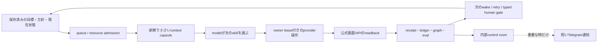
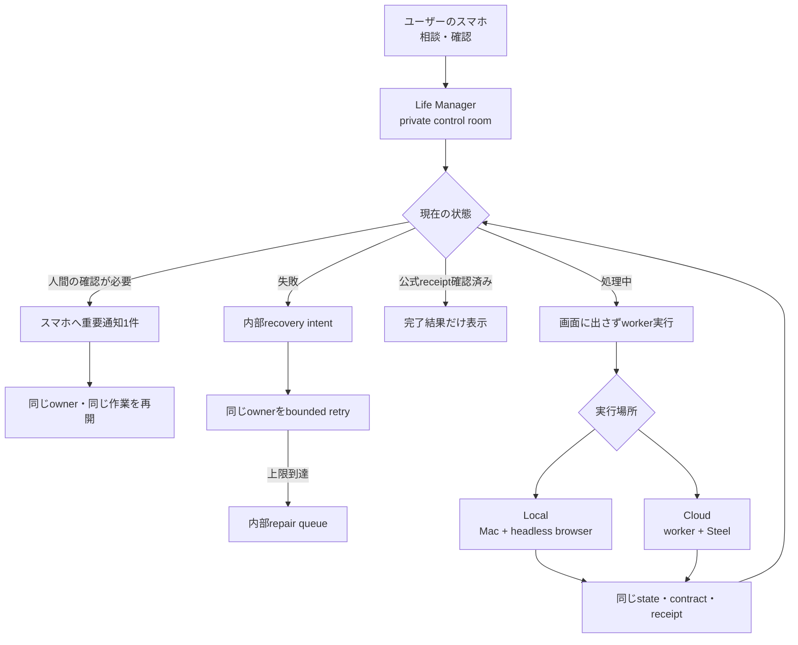
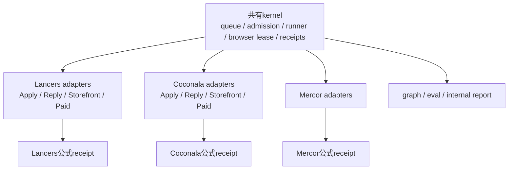
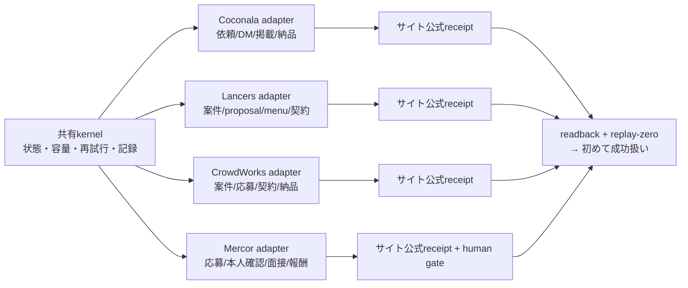
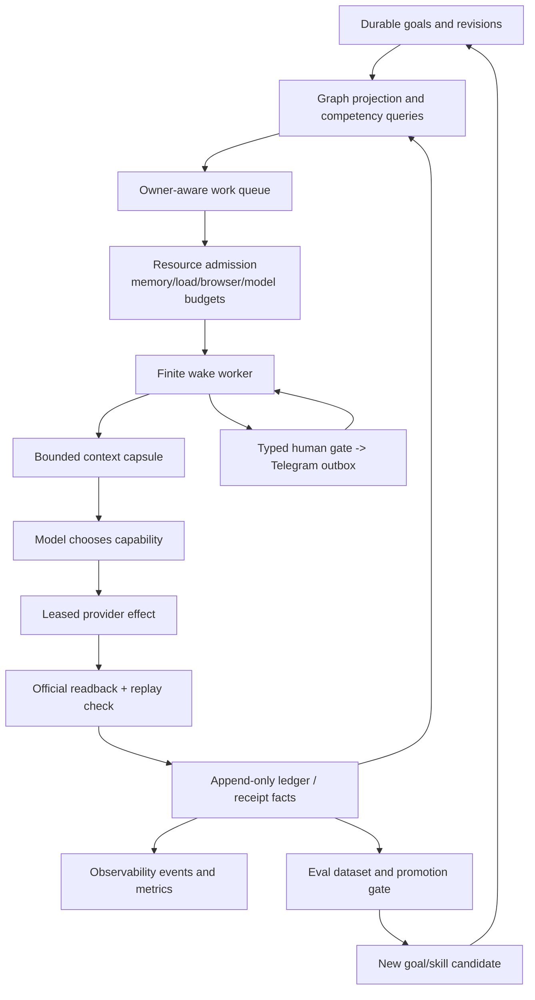

# Life Manager Agent Architecture Refinement

状態: IN PROGRESS（未完了） — this document defines the next architecture boundary; it does not
claim that the target control plane, marketplace effects, or cloud deployment are complete.

## Active A15 foundation cursor — atomic remaining TODO

**A15 is one remaining foundation acceptance gate, not a declaration that every
provider loop works.** The following is the authoritative A15 checklist; older
A15 snapshots below are historical evidence. Do not reorder the provider TODO.

Observed shared-foundation problems and disposition:

| Problem | Evidence and boundary | Disposition |
|---|---|---|
| A branch-only SHA could become global `current` | Release selection admitted a pushed but unmerged SHA. | Fixed in main PR #5351; production `current` must remain an `origin/main` ancestor. |
| A sparse main-derived release could become global `current` | While a natural reconciler used complete release `f1f5bcb9`, other owner cuts replaced `current` with sparse release `6c7d2062`; exact apply then failed closed with `release is no longer current`. | Fixed in main PR #5383: sparse `LOOPS_ACTIVATE_CURRENT=1` fails before export. All CI and 22 cut tests passed; main-derived complete release `deb08642` contains the guard, and its loaded natural reconciler run reached outer pass. Later `current` advanced only to another complete main release. |
| One owner with many old wakes could repeatedly win its own next turn | RED fixture selected owner A twice before owner B; production queue had repeated old occurrences. | Fixed in main PR #5354; new-main natural terminals advanced `x402-ledger` → `x402-experiment-franklin1` → `founder-loop-cadence` → `x402-inflow-watch` without deleting pending occurrences. |
| A same-owner environment JSON replaced an installed plist | `writer-report` installed file was JSON, so its installed SHA was unreadable although launchd held a main-derived argv. The writer of that file is not yet identified. | Shared recovery and candidate/rollback repair merged in PRs #5362/#5367. A targeted loaded-idle reconcile restored XML and loaded SHA `f1f5bcb9` with `effect_unknown` still fenced. |
| Reconciler sometimes exits `entrypoint_exit_1` while idle owners wait | Earlier runs failed on malformed plist, concurrent Git fetch, or `current` advancing during an exact apply. | Main-derived loaded `deb08642` reached natural outer pass at 13:22:55Z; a later complete `current` may still cause a safe failed apply, with the next scheduled wake available. No sibling restart was used. |
| Disk pressure has caused `ENOSPC` during release/receipt writes | Historical runtime logs contain `ENOSPC`; a local broad unittest reached 176 MiB free without host admission. | A15-12 bounded headroom/cleanup check passed; latest natural cleaner pass at 13:27:51Z. No admitted child entering reproducible `ENOSPC` was established. Protected state remains untouched. |

`resource_control_busy` is an observed transient admission deferral: a later
Writer Response natural wake reached outer `pass`. It is not evidence of a
permanent Writer-wide lock. Existing `effect_unknown` rows are effect-safety
fences, not available capacity and not to be bulk-cleared. The Writer/provider
owner must reconcile exact external effects; a registry `effect_class=none` by
itself is insufficient because some such entrypoints send notifications.

Remaining A15 actions, in order; each checkbox is one observable action:

- [x] **A15-01 — verify the rebased shared plist repair.** Run
  `python3 -m pytest -q runtime/loop/tests/test_lm_loop_apply.py` and
  `git diff --check` on branch `fix/lm-a15-plist-recovery-plan-20260917`.
  Files: `runtime/loop/lm_loop_apply.py` and
  `runtime/loop/tests/test_lm_loop_apply.py`. The pre-rebase run passed 91 tests
  and 30 subtests. Post-rebase verification on `58a1cdb5e7`: 91 tests and
  30 subtests passed; `git diff --check` passed. The source-boundary check
  confirmed the dedicated Life Manager worktree and canonical origin.
- [x] **A15-02 — integrate that exact shared repair.** PR #5362 at
  `0c94b0f7d4` passed all CI checks and merged as `aa0f37fc8c46`.
  No Writer provider code, account, browser profile, or private state is changed.
- [x] **A15-03 — read back one main-derived immutable release.** Reuse a
  complete current release if it already contains the merged SHA; otherwise
  cut once with `bin/cut-loop-release.sh origin/main`. Verify
  `RELEASE.json.sha` is an `origin/main` ancestor and `release_paths=ALL`.
  Do not race another cut lock. Release
  `20260917T204207-aa0f37fc` has SHA `aa0f37fc8c46`,
  `provenance=ancestor-of-origin-main`, and `release_paths=ALL`; Git confirms
  that SHA is an `origin/main` ancestor.
- [x] **A15-04 — sync only the loaded-idle release-reconciler.** Use existing
  `bin/lm-loop reconcile deterministic --loaded-idle-only --max-owners 1
  --loop-id life-manager-release-reconciler`; read loaded argv and SHA. Wait for
  an active PID's terminal instead of stopping it. `launchctl-safe preflight`
  passed for Aqua/UID 501. Targeted reconcile returned one applied label and
  no failure (`install_event_id=dbff5baf1ce53b7caa53bee2`); loaded argv
  names `20260917T204207-aa0f37fc`. The preceding old-SHA terminal was fail.
- [x] **A15-05 — read the next natural reconciler terminal.** Run
  `18d61918b61058e8-67760` on loaded SHA `aa0f37fc8c46` reached outer
  `pass` at 2026-09-17T11:54:06Z with `blocker=null`; status readback showed
  the same installed/event SHA and `loaded-idle`.
- [x] **A15-06 — read the repaired installed plist.** `writer-report.plist`
  must parse as XML and its installed/loaded argv must name a main-derived
  immutable release. This is a shared config repair, not permission to send a
  Writer report or clear its effect fence. The first targeted reconcile on
  `c16f437b` returned `eligible=0`: malformed JSON gave
  `installed_release_sha=null`, so candidate filtering bypassed the merged
  recovery function. The follow-up candidate fix and pre-swap rollback from
  the old immutable release passed 95 tests and 30 subtests locally, including
  a failed Writer swap with a minimal JSON snapshot. PR #5367 passed all CI
  checks and merged as `f1f5bcb91d`. The targeted loaded-idle reconcile
  installed XML (`plutil -lint: OK`, install event
  `4cb761c203938bf18fdf0660`) with installed and loaded argv at complete
  main release `20260917T211820-f1f5bcb9`; `effect_unknown` remains fenced.
- [x] **A15-07 — prove an agent-class handoff.** From the private admission
  SQLite and `bin/lm-loop status`, join one natural agent owner claim, outer
  terminal, release and a *different* eligible agent owner's next claim.
  `writer-sales-measure` run `18d61b575ac2e690-73318` reached outer pass at
  12:26:28Z and its claimed occurrence `18d61a34e26facf0-40245` is
  `released/effect_unknown=0`. Different owner `pm-decision-loop` started at
  12:28:15Z, claimed `18d619fc6f2cbdd8-32593`, and reached outer pass at
  12:30:16Z; that occurrence is also released/known. Both status readbacks
  show installed/event SHA `f1f5bcb91d`.
- [ ] **A15-08 — prove a browser-class handoff.** Join the same four events for
  two browser owners without starting a provider submission or touching a
  sibling profile. A no-work terminal is valid lifecycle evidence only.
  Current registry and admission SQLite have only one browser-class owner,
  `life-manager-connector-native`. At 13:29Z its browser-class rows were 43
  released/known and 18 cancelled; no unknown browser row remained.
  Reclassifying `session-vault` or `browser-state-backup` would involve sibling
  authenticated profiles and does not satisfy this gate. No second-owner
  browser claim is proved. An isolated, uncredentialed `about:blank` headless
  transport probe was tested at 14:43Z without a sibling profile: bundled
  CloakBrowser Chromium timed out at 30 seconds and system Chrome at 20
  seconds (network-service/Mach port errors). Both own process groups were
  terminated, temporary profiles removed, and no probe profile process
  remained. A second isolated CloakBrowser attempt using the same
  `--no-sandbox` family as the existing owner also timed out at 20 seconds
  with network/GPU child exits; its process group and temporary profile were
  cleaned. A later isolated non-headless `--no-startup-window` probe with its
  own temporary profile and loopback CDP port 0 returned `cdp_ready` in a
  local smoke. The candidate `life-manager-browser-capacity-probe` uses the
  existing registry scheduler and has no provider/account effect. Its focused
  tests passed 79 tests and 126 subtests with the registry/inventory checks;
  the loop contract and OSS boundary also passed. PR #5396 passed
  all nine CI checks and merged as `9c97f0e140`. Complete main release
  `20260918T001611-3444d81c` has `release_paths=ALL`; targeted apply event
  `97372c441702b136c37ba286` loaded only the probe with that SHA. Connector
  run `18d624c67945c920-61315` on main-derived `a77c5629` held the browser
  claim and reached outer pass at 15:22:20Z. Probe occurrence
  `18d624de0df789e8-64936` had queued known at 15:20:38Z while Connector
  held capacity; after Connector release, the next probe run
  `18d624f5e990c7f0-67714` started at 15:22:20Z and reached outer pass at
  15:22:27Z on loaded `3444d81c`, before another manual probe start. The
  admission SQLite readback shows both owners' exact occurrences
  `released/effect_unknown=0`, no browser reservation, and browser queued
  owners falling from one (about 1.7 minutes old) to zero. Probe stdout
  reported `cdp_ready` from its isolated profile; no provider submission or
  sibling profile was touched. A later targeted manual probe run
  `18d6250438013538-69594` also passed, but is not used for the natural
  handoff gate. The two passing owners above ran on different main-derived
  SHAs, so this is preliminary lifecycle evidence rather than the same-SHA
  acceptance receipt.
  On 2026-09-18, a complete main-derived release `e4f50c914b...` was cut
  after the prior current release was found truncated by `ENOSPC`; its
  `release_paths=ALL`, Python metadata, `playwright-core` and `jsqr` were
  verified. `life-manager-browser-capacity-probe` and
  `life-manager-connector-native` were both loaded-idle and targeted-synced to
  that release without provider submission. The probe's first queued occurrence
  was deferred by browser capacity, then a later occurrence ran and passed after
  the connector occurrence released (`sequence 30568 → 30609`). A natural
  connector terminal on the same exact release is still required, so this item
  remains open.
  A later `6943af4c` current release had the tracked source tree but lacked
  `apps/life-manager/node_modules/{playwright-core,jsqr}`; a targeted
  Connector reconcile failed closed with `Connector runtime dependencies
  missing`. The canonical cutter produced complete main-derived release
  `20260918T011952-faac3e09` with `release_paths=ALL` and both packages
  present. Targeted loaded-idle reconciles installed the exact SHA on
  Connector (`fe92f92722cf82fbc9581200`) and probe
  (`cf4ab074ba98d4f03f1aceb5`) without starting a provider submission.
  Both loaded argv read back `faac3e09`; a natural two-owner terminal chain
  on that SHA is still required.
  A further same-SHA attempt on `846c6911` exposed a shared reconcile
  race: Connector run `18d62a736e262c80-21286` claimed browser at
  17:02:57Z, while probe run `18d62a74d6cd1bd0-23138` queued known at
  17:03:03Z. At 17:12:43Z the idle probe was reloaded to `94e4898c` while
  its queued occurrence remained unsettled; that occurrence became
  `cancelled`. Connector reached outer pass at 17:13:01Z but its admission
  occurrence is `released/effect_unknown=1`, so the exact effect fence stays
  with its provider owner. Probe run `18d62aff3d7cbd38-46964` passed on
  `94e4898c` at 17:13:21Z. This is not a same-SHA handoff. A branch-local
  shared reconcile guard now excludes owners with a registered known queued
  or claimed occurrence and allows stale unregistered queued rows to pass.
  A per-owner deploy lock serializes new enqueue/claim with plist replacement
  without holding the global admission lock through launchctl. The existing
  label apply lock plus a running readback protects the first transition from
  an older runner. Late skips are reported as `skipped_pending`, not applied.
  RED-to-green focused verification, admission 105 tests and loop 111 tests/30
  subtests passed; fresh read-only review found no blocking defect. PR #5410
  passed nine CI checks and merged into main as `3d9788fce3`. Complete
  main-derived release `20260918T030254-0f504c58` has `release_paths=ALL`,
  both Connector dependencies and the owner lock code. Targeted loaded-idle
  reconciles installed its exact SHA on Connector (event
  `aea75f006da5c7a52fd7f07f`) and probe (event
  `cca153e43fe3ca3df96b9a64`); both launchd loaded argv read back that
  SHA, and browser queued/claimed rows were zero immediately after apply.
  On the next natural wake Connector run `18d62f87228d8020-76376` claimed
  browser at 18:35:59Z and probe run `18d62f8bd70017d0-76882` queued known
  at 18:36:19Z, both on `0f504c58`. Connector reached outer pass and released
  known at 18:41:48Z. Yet `_dispatch_reserved` saw the probe's installed SHA
  behind global `current` and called `apply_live` at 18:41:44Z, moving probe
  to `a0a4e522` and cancelling its queued occurrence before dispatch. Probe
  run `18d62fd876d2e548-83976` then passed on the new SHA. This is still
  not the same-SHA handoff. The dispatch fix validates an older main-derived
  complete loaded release and kickstarts it without rebinding; unverified old
  paths defer without deleting the queue. Focused RED-to-green and runner
  bounds (60 tests) passed; fresh read-only review found no blocker. PR #5472
  passed nine CI checks and merged as `b2feb56c1408`. Its main-derived
  complete release `20260918T040215-b2feb56c` has `release_paths=ALL`, the
  dispatch fix, owner lock and Connector dependencies. Targeted loaded-idle
  reconciles installed the exact SHA on Connector (event
  `ecdd8a1ec104fb486502ec9c`) and probe (event
  `054f8dc63aa17754b3a6a92e`); both loaded argv match and the browser
  pending set was empty. The next natural same-SHA handoff remains to be
  measured for A15-08.
- [x] **A15-09 — prove a deterministic-class handoff.** Join the same four
  events for two deterministic owners on the new loaded SHA; the earlier
  `x402-ledger` → `x402-experiment-franklin1` pass is a baseline, not a
  substitute for a newer SHA. `cadence-deadline-check` run
  `18d61b8ce8458b50-79278` reached outer pass at 12:29:58Z and released
  occurrence `18d61afbbb440f00-63650` with unknown=0. Different owner
  `x402-inflow-watch-franklin1` started at 12:30:14Z, claimed occurrence
  `18d616ec6eb86108-89072`, and reached pass at 12:30:22Z; it too is
  released/known. Both loaded/event SHAs are `f1f5bcb91d`.
- [x] **A15-10 — read an active owner's heartbeat.** Its PID/start identity
  and `heartbeat_at` must agree with a live claim within the configured
  300-second timeout; do not reclaim a progressing owner from age alone.
  At 12:35:12Z, live claim `x402-inflow-watch-claude-p` PID 90983 had matching
  process-start identity and heartbeat age 1.8 seconds against timeout 300;
  `job-search-daily` PID 88394 also matched at age 12.1 seconds.
- [x] **A15-11 — read RAM headroom.** Check measured free percentage against
  `LIFE_MANAGER_MIN_MEMORY_FREE_PERCENT` from the exact loaded job; no assumed
  eight-slot safety or extra slot is a PASS. `pm-live-trade` loaded argv names
  release `f1f5bcb9`, with no threshold override; that release's
  `memory_admission.py` defaults to 15%. `memory_pressure -Q` measured 31% free.
- [x] **A15-12 — read disk/cleanup headroom.** Check free bytes, the latest
  `life-manager-disk-cleanup` natural terminal, errors and protected deletions.
  If admission can still start a child into reproducible `ENOSPC`, fix the
  shared preflight in `runtime/host/disk_admission.py` and its focused test;
  never delete protected state to make this green. Latest natural cleanup run
  `18d61b66c2f65eb8-75721` on main-derived `86fa863d` reached outer pass at
  12:29:46Z; its matching stdout receipt has release-GC, host and scratch
  errors 0, protected deletions 0, free bytes 1,955,004,416 before and
  2,206,543,872 after. Later `df -Pk` measured 3,235,340 KiB free. The
  earlier local unittest `ENOSPC` bypassed host admission and is not proof of
  an admitted child failure; the loaded release defaults to a 512 MiB disk
  producer floor, and focused `test_disk_admission.py` passed 8 tests.
- [x] **A15-13 — read queue safety.** Measure only eligible waiting owners for
  starvation; count `effect_unknown=1` separately and verify it remains
  fenced. `resource_control_busy` must recover on a later natural wake rather
  than becoming a permanent owner lock. Read-only SQLite using the runtime's
  eligibility query at 12:35:52Z counted agent 8, browser 0, deterministic 9
  eligible waiting owners; oldest waits were 2.8 and 4.5 minutes for agent and
  deterministic. Unknown occurrences were separately agent 53 owners, browser
  1 owner/5 rows, deterministic 34 owners. At 12:36:32Z eligible counts were
  agent 8, browser 0, deterministic 10; the oldest deterministic candidate
  changed owner. At 12:39:50Z the same eligibility query counted agent 9
  (oldest 6.8 minutes), browser 0, deterministic 10 (oldest 5.8 minutes).
  No eligible owner had reached the configured 2-hour support age, and the
  separate A15-07/09 receipts prove different owners did advance. Unknown
  occurrences remained separate (agent 52 owners, browser 1/5 rows,
  deterministic 34 owners); `_durable_capacity` counts live claims and
  reservations, not those old rows. Capafy hourly, IG account, IG marketing,
  healthcheck and outcome owners retain exact effect-unknown fences.
  Historical `resource_control_busy` at
  `x402-inflow-watch` run `18d6188f810e41c0-43797` recovered to a later
  natural pass `18d618b1235b1a90-48212`. This is a finite queue check,
  not a claim that every effect-fenced provider loop works.
- [ ] **A15-14 — record the A15 verdict.** Mark Foundation Done only when
  A15-03 through A15-13 pass. Record main/release/loaded SHA, exact run IDs,
  queue-age before/after and receipt pointers here, then hand provider effect
  and readback blockers to their owners without claiming all loops work. Also
  require the sparse-current fence above on main with a complete current
  release and a follow-up natural reconciler terminal; subsequent old-SHA
  runs `18d61b8087f758e8-78178` and `18d61bdd46062100-91865` failed when
  parallel cuts advanced `current` mid-reconcile. That fence is now merged as
  `deb086429a1a`, loaded via install event `052ad42894863fede5aec9f8`;
  natural run `18d61e16f28b15d0-75320` reached outer pass at 13:22:55Z on
  loaded SHA `deb086429a1a`. At 13:24Z global `current` was another complete
  main-derived SHA `8e19948de6c`, `lm-loop doctor` was ok with 165 entries and
  missing/unmanaged/retired 0. Eligible queue was agent 16 (oldest 5.0 min),
  browser 0, deterministic 13 (oldest 14.8 min); unknown owners were agent 45,
  browser 0, deterministic 31. Disk-cleanup's latest natural pass at 13:21:04Z
  on `deb086429a1a` had host/release/scratch errors 0 and protected deletions
  0; free bytes rose 638,849,024 to 1,236,148,224. A second natural run
  `18d61e7fd253a1d8-92885` reached outer pass at 13:30:01Z on loaded SHA
  `deb086429a1a` while global `current` had advanced to complete main release
  `f4d701999f1`. **A15 Foundation verdict: NOT DONE pending a same-SHA
  browser handoff.** A distinct-owner lifecycle was observed in A15-08's
  Connector `18d624c67945c920-61315` → probe
  `18d624f5e990c7f0-67714` natural terminal chain and released SQLite
  occurrences. Its waiting age fell from about 1.7 minutes to zero; the
  before/after receipt pointers are the two owners' `events.jsonl`, the
  admission `occurrences` rows and the probe's `launchd.out.log` `cdp_ready`.
  PR #5396 merged at `9c97f0e140`; probe loaded and event SHA is the complete
  main-derived release `3444d81cb71f` (`release_paths=ALL`, install event
  `97372c441702b136c37ba286`). The final readback found global `current`
  complete main release `9c2776b3cf60` (`release_paths=ALL`, no missing
  tracked paths), `origin/main` `9d38c4a3bde0`, and `lm-loop doctor`
  `ok=true` with 166 registry entries and no missing, unmanaged or retired
  labels. The runtime eligibility query counted agent 21 (oldest 69.8 min),
  browser 0, deterministic 18 (oldest 57.9 min), below the configured 2-hour
  support age; unknown effects remained separate and fenced. Memory free was
  32%, and disk available was 4,234,912 KiB. After transient fail-closed
  `probe-error` runs, disk-cleanup natural run `18d6260521ecf460-12303`
  reached outer pass at 15:43:19Z on loaded `d29621be5159`, with host,
  release and scratch errors 0, protected deletions 0 and free bytes rising
  from 4,240,662,528 to 4,436,287,488 in its stdout receipt. The older
  loaded reconciler `deb086429a1a` had the required post-fence natural passes
  `18d61e16f28b15d0-75320` and `18d61e7fd253a1d8-92885`; later concurrent
  release cuts caused safe `entrypoint_exit_1` retries, and a newer natural
  run was active at this readback. A later targeted loaded-idle reconcile
  installed the shared owner-lock release `0f504c58` on the reconciler via
  event `fc0ffb85066316ff7e044733`; reconciler, Connector and probe loaded
  argv all read back that SHA, with no run yet since this latest install.
  Its next natural terminal remains to be recorded. These observations do not claim provider effects
  or every loop's business outcome: Capafy and other exact effect/readback
  fences remain with their owners.

A15-02 integration observation: an earlier PR #5362 head at `eb72e7cb1b` had
one failing `OSS self-contained boundary` check. The exact inventory digest
for 184 tracked `skills/_shared` files and the existing fixed fingerprint for
the unchanged `skills/earn/gig/TODO.md` were refreshed without editing those
owner files. The verifier and all CI checks passed at `0c94b0f7d4` before
merge. During the broader local unittest
run, disk free space fell to about 176 MiB, causing temporary-file `ENOSPC`
errors; the focused A15-01 test and CI loop contracts passed. `lm-loop status`
also could not create a temporary file at that point. Free space later rose
to 1.4 GiB, but cleanup's latest status is outer `fail`/
`entrypoint_exit_1` at release `393f17458a4e`; a prior pass is recorded at
2026-09-17T11:31:01Z. The cause of the later free-space rise was unverified
at that snapshot; the later A15-12 natural cleanup receipt supersedes this
historical failure observation.

## Current foundation correction — fleet first, provider effects second

**The foundation is partially repaired, not Done.** The active A15 checklist
above supersedes this section's older production snapshot; historical queue
totals below include effect-fenced rows and are not an eligible-wait measure.

Foundation Done means **all three** of these hold, without inventing another
scheduler or raising the finite RAM ceiling by guess:

1. Under the measured finite capacity (currently eight total slots) and memory/disk pressure, durable work
   remains queued; release, timeout, owner death and recovery admit the next
   eligible **agent, browser and deterministic** owner automatically. Paid
   priority cannot starve an aged non-Paid owner; no orphan claim silently
   becomes a duplicate external effect.
2. Each actual child effect uses the occurrence it claimed, its outer terminal
   links the execution attempt to that occurrence, and a proven pre-effect
   failure can continue while an uncertain effect stays fenced for official
   readback. The CLI distinguishes queued, running, failed, unknown effect and
   verified provider effect; none is inferred from `loaded` or `exit 0`.
3. Those contracts are present in a **main-derived immutable release**, with
   exact loaded argv/SHA and targeted natural wakes under controlled saturation
   and recovery. A follow-up wake advances without a human kickstart. Use a
   finite fault/cadence check, not a fixed 24-hour soak or one provider submit.

Connector registration→Google Calendar and Coconala/CrowdWorks/Lancers effects
come **after** this foundation gate as product-loop acceptance. Their official
readbacks are mandatory to call those loops working, but one Connector-specific
historical intent must not be promoted into a fleet-wide engineering cursor.
The two historical Connector unknown rows remain visible as observability,
not an owner-wide admission gate. New candidate actions still use the existing
provider/readback and Calendar contracts; the historical rows were not erased.
Connpass event `405705` has an official registered-page receipt, matching
Google Calendar event ID `0c706h76f6ceoh99cdaug31cd4`, and one subsequent
automatic wake with no repeated effect. This proves one end-to-end Connector
transition, not continuous Luma eligibility or fleet-wide no-starvation.

## Current handover and one-program execution order

This file is the architecture/specification SSOT:
`docs/superpowers/specs/2026-09-15-life-manager-agent-architecture-refinement.md`
in the canonical Life Manager repository. The former
`/private/tmp/lm-agent-engineering-skills-20260915` worktree no longer exists.
The marketplace execution
checklist remains `skills/earn/gig/TODO.md` in its active owner worktree until an
owner-safe main integration establishes one repository copy; these are not two
independent Life Manager programs. This spec owns the *cross-domain order and gates*;
the marketplace TODO owns exact provider/client items. Do not edit another owner's
worktree to make the files appear merged.

**User outcome:** unify the foundation and platform execution work through the
existing `runtime/loop`/registry/release path; make Connector and each applicable
platform lane progress without babysitting, then turn real failures into bounded
self-heal/eval/self-improvement, promote the same business kernel to tenant-isolated
Cloud/phone-only, and prove attributable revenue. “24/7” means continuous durable
eligibility, bounded queue wait, owner-scoped recovery, and verified provider effects;
it does not mean one immortal process or unlimited simultaneous Codex/Chrome runs.

**Historical integration snapshot:** the old foundation candidate `3a70e98867` was
separate and clean, 87 commits ahead of and 67 behind then-main `20c6067c3d`.
It changes 83 paths, including shared runtime, provider code, tests and skills;
16 of those paths were also changed on main since its merge base. Do not merge
the candidate wholesale. Focused runtime fixes are already integrated and
released on main; the Connector label's last readback loads `e278c0a894` and
has a recent outer `pass`. The repo-only goal/context/graph/eval/harness/
observability skill files are still absent from main and can be reviewed as a
separate documentation-only slice without blocking revenue work. Coconala's
four-lane continuous progress and Storefront publication remain unproved.

**Agent/harness skills already exist in this repository:**
`skills/goal-engineering/`, `skills/context-engineering/`,
`skills/graph-engineering/`, `skills/eval-engineering/`,
`skills/harness-engineering/`, `skills/loop-engineering/`, and
`skills/observability-engineering/` each contain a `SKILL.md`.
`skills/loop-development/SKILL.md` governs release/owner operations. These are
development method references, not a second runtime, production proof, or
permission to self-modify identity, permissions, receipt criteria, or Eval gates.
Use only the relevant skill per repair; the runtime remains repository-owned.

**Order correction:** the old R2→R3→R4→R5→R6 wording placed the only main merge
after Cloud. That conflicts with this repository's main-derived immutable
production-release rule and with the user's request to combine the two workstreams
before sequential provider repair. Replace that execution order with the steps
below. Old order: candidate Connector canary → all-loop Local gate → Eval →
candidate Cloud → Cloud gate → one final main merge → provider completion.
New order: integrate the smallest reviewed foundation slices into main, prove
Connector and provider lanes on main-derived targeted releases, pass the 14-loop
Local gate and Eval, build meta/self-heal on those proven contracts, then promote
the approved source to Cloud and pass its gate.
Reason: a candidate checkout or mock cannot be the production code authority;
deferring main until after Cloud leaves live owners on the old admission path.
Current cursor is step 3's A15 fleet gate: the release-reconciler was synced
to the already-built `20c6067c3d` release while loaded-idle, then its next
natural run `18d603e783e3e858-24932` reached an outer `pass` with no blocker.
The remaining step is a bounded queue-age/recovery check. Main has the focused source changes; loaded releases
are still mixed. A single Connector effect cannot certify the fleet. Do not
perform one 87-commit big-bang merge; merge candidate-only skills separately
if they are useful. Later historical R2–R6 tables remain evidence of the
superseded plan, not the active cursor.

### Merge-owner TODO for this Codex (exact scope)

The following is the TODO for the **merge owner only**. It is separate from
A15, Coconala, CrowdWorks, Lancers, Mercor, Freelancer, Upwork, Mobile, and
the other provider/product-loop TODOs. Those remain with their implementation
owners. The existing implementation worktree is the source; no new merge
worktree is created for this TODO:

```text
source worktree: /private/tmp/lm-fundamental-runtime-20260916
source branch:   fix/lm-fundamental-runtime-20260916
source HEAD:     3a70e98867
```

The source/main comparison and provider-boundary audit are already recorded
above; they are preconditions, not TODO items. The actual merge TODO is:

- [x] **MERGE-01 — merge the Engineering Skills and source map**
  - Merge only: `skills/context-engineering/**`, `skills/eval-engineering/**`,
    `skills/goal-engineering/**`, `skills/graph-engineering/**`,
    `skills/harness-engineering/**`, `skills/loop-engineering/**`,
    `skills/observability-engineering/**`,
    `docs/agent-engineering/REFERENCE-REPOS.md`, and
    `docs/agent-engineering/SOURCE-MAP.md`.
  - Do not merge provider Skill directories or runtime code in this item.
  - Acceptance: **PASS**. PR #5335 merged at main merge commit
    `d43ed59404` (current main has advanced to `4835540a7f`). Seven Skill
    validators passed and both source-map files are present on main.

- [x] **MERGE-02 — merge the product manifest, Graph, Eval, notification and gate code**
  - Merge only: `apps/life-manager/config/product-loop-catalog.json`,
    `apps/life-manager/eval/agent-contract/**`,
    `apps/life-manager/lib/agent-graph.js`,
    `apps/life-manager/lib/agent-graph.test.js`,
    `apps/life-manager/lib/notification-policy.js`,
    `apps/life-manager/lib/notification-policy.test.js`,
    `apps/life-manager/lib/product-onboarding.js`,
    `apps/life-manager/lib/product-onboarding.test.js`,
    `apps/life-manager/scripts/product-loop-completion.js`,
    `apps/life-manager/scripts/local-completion-gate.js`,
    `apps/life-manager/scripts/local-completion-gate.test.js`,
    `apps/life-manager/scripts/cloud-promotion-gate.js`,
    `apps/life-manager/scripts/cloud-promotion-gate.test.js`,
    `apps/life-manager/scripts/lib/load-env-file.sh`, and
    `apps/life-manager/scripts/load-env-file.test.js`.
  - Acceptance: **PASS**. PR #5335 merged the listed 35-file slice; merged-main
    rerun passed 63/63 Node tests. No provider browser/state changes were
    included.

- [x] **MERGE-03 — merge the reviewed non-provider runtime addition**
  - Candidate review completed against latest main. A15 admission, lifecycle,
    harness-health and release-reconciliation paths were already supplied by
    newer main-owned commits and were not overwritten by the stale candidate.
    The only needed unique addition was the Codex-first Agent Economy brain
    route from candidate commit `72390b7c3d`, integrated as `cb9b49cf77` and
    merged by PR #5348 at main merge commit `17c78e4a1a`.
  - The route is scoped to `agent-economy-loop`; it uses the existing
    read-only agent-runner, bounded timeout, private evidence directory and
    schema validation. Provider/browser/credential/private-state paths were
    excluded.
  - The remaining candidate runtime/provider diffs were intentionally not
    merged because they were stale, duplicated newer main work, or belonged to
    another owner.
  - Focused acceptance: brain 5/5 Node tests, apply/agent-runner 96 tests +
    72 subtests, Graph/Eval/manifest/gate 63/63, runtime read-only/lifecycle/
    event 87 tests + 42 subtests, OSS/security CI 9/9.
  - Candidate paths reviewed (not all merged) were:
    `runtime/agent-runner/config.json`,
    `runtime/agent-runner/tests/test_terra_default.py`,
    `runtime/loop/brain.mjs`,
    `runtime/loop/codex-brain.schema.json`,
    `runtime/loop/harness-health.mjs`,
    `runtime/loop/harness-health-snapshot.mjs`,
    `runtime/loop/index.mjs`,
    `runtime/loop/lm_loop.py`,
    `runtime/loop/lm_loop_apply.py`,
    `runtime/loop/lm_loop_lifecycle.py`,
    `runtime/loop/macos_loop_registry.py`,
    `runtime/loop/runtime_event.py`,
    `bin/cut-loop-release.sh`, and
    `bin/reconcile-agent-runner-release.sh`.
  - Shared-owner paths (`runtime/host/resource_admission.py`,
    `runtime/loop/lm_loop_run.py`, `config/loop-registry.json`,
    `skills/browser/scripts/cdp_context_lease.py`) are not taken wholesale;
    keep the latest main/owner version and apply only a reviewed unique hunk.
  - Acceptance: **PASS** for the reviewed Codex route; stale candidate paths
    remain excluded as documented above.

- [x] **MERGE-04 — enforce the exclusion list**
  - **PASS for PR #5335:** do not merge `AGENTS.md`, `apps/crowdworks-revenue/**`,
    `apps/lancers-revenue/**`, `skills/connector/**`,
    `skills/earn/lancers/**`, `skills/earn/taskmarket/**`,
    `apps/life-manager/scripts/mobile-app`,
    `apps/life-manager/scripts/instagram-metrics-production-boot.sh`, or
    `apps/life-manager/scripts/tiktok-metrics-production-boot.sh` in this
    merge-owner patch. These remain provider/domain-owner work.

- [x] **MERGE-05 — validate the merged commit**
  - Run Skill validators, Graph/Eval/manifest/gate tests, focused runtime
    tests, `git diff --check`, and changed-path scope checks.
  - Acceptance: **PASS.** Merged-main Skill validators 7/7,
    Graph/Eval/manifest/gate tests 63/63, focused runtime tests pass,
    OSS/security CI is 9/9, and `git diff --check` passes.

- [x] **MERGE-06 — create the main-derived release and read it back**
  - Merge without force or `-X theirs/ours`; cut an immutable release from
    the resulting main SHA; read `RELEASE.json`, loaded argv and loaded SHA
    for one loaded-idle owner. **PASS:** main/release SHA
    `17c78e4a1a85cb46bf7d58b26d511b0230feb5e4`, release
    `/Users/anicca/loops/releases/20260917T192550-17c78e4a`, targeted
    `boot-panic-evidence` install receipt `0010576aa91f9a0b31eb84a0`, and
    launchd argv/readback point to that immutable release. This does not claim
    provider success.

- [x] **MERGE-07 — handover and cleanup**
  - Handover evidence is recorded in this spec: shared runtime PR #5348
    merged at `17c78e4a1a`, docs PR #5352 merged at `686df1fde2`, focused
    tests and OSS/security 9/9 are recorded above, and provider exclusions and
    remaining provider TODOs remain explicit.
  - The clean runtime and docs worktrees were removed normally after their
    commits were pushed. The intentionally excluded candidate branch remains
    as a recoverable remote backup; it is not part of main and is not loaded.
  - This Codex does not claim provider/platform completion from the merge.
```

### Active remaining TODO — one program, through the final outcome

| # | Atomic result, in dependency order | Acceptance; do not advance on source-only PASS |
|---:|---|---|
| 1 | **Scoped overlap check — done for step 2:** compare latest main, foundation `3a70e98867`, admission source `c7ce1e9fc6` and the exact provider-owned paths below. Skip a fleet-wide audit before the first patch. | Shared runtime/registry/Connector/provider ownership is mapped below; no other owner's worktree, profile or state was edited. Recheck only changed overlaps before each integration. |
| 2 | **Shared runtime source integrated; live gate open:** focused main changes cover durable queue, claim→child identity, release→next claim, priority/aging, owner recovery and uncertain-effect handling. Do not tune the slot count to hide liveness failure. The old candidate branch is not the production source. | Focused source checks passed and representative owners ran from main releases; step 3 must still prove no persistent queue starvation across mixed owners. |
| 3 | **Current cursor — A15 only.** Execute the atomic A15 items at the top of this spec without changing the provider order. Fair owner handoff and main-only `current` are already merged; identity-matched malformed-plist recovery and its production acceptance remain. | Same main-derived release, exact loaded argv, natural outer terminal and bounded agent/browser/deterministic handoff with live heartbeat/headroom; fenced effects remain fenced. Historical total queue age is not the eligible-wait measure. |
| 4 | **Connector provider repair active; historical E2E is the baseline only:** Connpass `405705` has official registered-page receipt → Google Calendar ID `0c706h76f6ceoh99cdaug31cd4` → one automatic replay-zero. The newer `203bbe8854` natural wake reached the provider and attempted Connpass, but three questionnaire attempts failed; Luma had free/open 3 and Calendar-free 0. The old successful event cannot close the post-fix goal. | A *new* eligible event after the repair has official registration ID → Google Calendar event exact 1 → two subsequent natural wakes with repeat Submit 0 and Calendar duplicate 0. Luma no-work is truthful only when live discovery and Calendar conflicts show no eligible candidate. |
| 5 | Coconala Apply, Reply, Paid, Storefront as separate lanes: current eligible screening-answer submit; 15 pending replies; per-client funded work, attachments and payout; official listing state; reconcile old 54 uncertain intents only as preemptible background work. | Each applicable lane has current same-SHA terminal, exact official effect/readback or truthful wait/no-work, and replay-zero; no account/browser interference. |
| 6 | CrowdWorks: complete the three existing paid contracts first, then restore inventory, Reply and Apply continuity; Lancers: browser/auth, Apply→Reply→Paid→payout and supported Storefront; Mercor: persistent auth, Apply→Reply→human handoff→Paid→payout. | Each provider's actual effect/readback and per-client terminal, not generic exit 0. Unsupported Storefront is proven not-applicable. |
| 7 | Freelancer.com and Upwork: verify current account/policy, then applicable Apply→Reply→Paid→payout and Storefront only if official surface exists. | Official receipts, payout attribution and replay-zero. |
| 8 | After the shared gate, observe every job in all 14 Product Loops (the marketplace lanes plus Writer, Affiliate, Investment, Agent Economy, Job Hunter, Fundraiser, Connector, Self-Build, Mobile Apps, Capafy and CFO); repair each remaining provider/domain blocker, including Mobile/Metrics. | Local manifest binds current installed SHA, outer terminal, official receipt or explicit setup/not-applicable state. A foundation PASS does not turn a broken provider adapter into success. |
| 9 | Run Local completion gate and S-04 Eval on the actual main-derived candidate: baseline, held-out, safety, latency/cost, live evidence and rollback. | Both PASS without mock as external success; a failed gate stays failed. No fixed 24-hour waiting gate is invented, but later cadence misses remain monitored. |
| 10 | New-platform meta loop: qualify policy and net value, create a thin adapter, canary its official effect, and promote only the passing result. | A new platform reuses the shared runtime without a new scheduler or provider-specific queue. |
| 11 | Activate bounded self-heal and self-improve through existing supervisor/reconcile/eval paths: missed-cadence alert → exact-owner recovery → isolated candidate → held-out/safety/cost/live gate → promotion or rollback. Publish the six candidate-only engineering skills as a separate docs-only reviewed slice before depending on them; do not bring the candidate's runtime/provider edits along. | A real injected failure resumes only its owner with terminal repair receipt and leaves siblings unchanged; identity, permissions and gate criteria are immutable to self-improvement. Skills are present on main before being treated as product assets. |
| 12 | Promote the identical approved business kernel/source SHA to tenant-isolated Cloud; test Steel owner lease/release and phone-only status/human handoff/readback; run Cloud gate. | Tenant cross-read 0, credential/state mix 0, official effects and replay-zero, Local/Eval/Cloud all PASS. |
| 13 | Hosted subscription/unit economics, verified USD 10K MRR, accurate public metrics, YC Winter 2027 application, then safe duplicate-spec/artifact cleanup. | Official provider/payment/bank evidence and actual submitted application; one repository SSOT and no protected state deletion. |

### Connector active goal and remaining TODO

**Goal / Done:** **DONE.** Main-derived release `393f17458a4e6a62e01ae46215ab32ba5f02ea83` applied only to `life-manager-connector-native`. Connpass event `405297` (`【秋葉原】AIエンジニアの集いLT＆交流会`) reached official `registered`; provider receipt `f1bbe06389aff318ebb40c02e9e91b6af6be261e012629e126795dcb7f157273`; Calendar ID `hkpcm5qds9fhk6khorr2kfqnro`; independent Google Calendar API filtered by the Connector private property returned exact count 1 with canonical URL `https://mecha-mote-se.connpass.com/event/405297/`; Telegram receipts `86619` and `86620`; durable bundle `e8c393f6cd21636df0057ce49e82bd44257c9d128870dd8054585ff6a1c6b869`. The same loaded SHA then completed natural wakes `wake-953036ad8babec6ae03109f1` and `wake-96cc924ba6c56c1562a25308`; both continued to other candidates, submitted `405297` zero additional times, and preserved Calendar exact count 1. Official page readback returned `registered`. The owner remains on the existing 30-minute interval; this proves repeatable continuation, not an application on every wake.

**A15 dependency decision:** A15 remains the separate fleet fairness/recovery gate. It does **not** block Connector-specific diagnosis or source repair: the `203bbe8854` natural Connector run `18d6089253cdbf18-32608` acquired a browser slot, reached Connpass, and ended `completed_no_effect / provider_discovery_failed` at 2026-09-17 06:47 UTC. Its three Connpass direct attempts failed with `connpass_questionnaire_required`, each followed by `unsafe_agent_action`; Luma found 3 free/open events but Calendar-free 0. Do not alter A15's PID, admission DB, spec branch state outside this Connector section, or another browser/profile. A main-derived Connector release can be applied to the one loaded-idle Connector label after that run's terminal, without a fleet restart.

1. **CN-C01 — Flexible questionnaire:** **DONE.** The existing Connector agent runner now chooses answers for unknown required Connpass input, textarea, select, radio and checkbox controls; the parent validates exact DOM controls/options and still requires official provider readback. Known profile values win when they match offered options; otherwise the agent supplies the answer and the same single-submit fence applies. Focused Browser Harness tests: 186/186.
2. **CN-C02 — Main and release:** **DONE.** PR #5358 merged to main at `393f17458a4e6a62e01ae46215ab32ba5f02ea83`; immutable release `/Users/anicca/loops/releases/20260917T200804-393f1745` was loaded only by `life-manager-connector-native` while idle. Loaded argv, installed SHA, event SHA and terminal all match.
3. **CN-C03 — Real Connpass acceptance:** **DONE.** New event `405297` has official `registered`, provider receipt, Calendar ID, independent exact-one API readback, Telegram IDs and durable applied bundle. Historical `405705` remains baseline only.
4. **CN-C04 — Luma acceptance:** **DONE as truthful no-work for this gate.** Latest observed wake `wake-96cc924ba6c56c1562a25308` recorded `free_open=2 / calendar_free=0`; earlier wake recorded `free_open=3 / calendar_free=0`. This is a Calendar inventory conflict, not evidence of a broken Luma submit path. Continue the existing 28-day rotation; submit only when `calendar_free>0` and require the same provider→Calendar→bundle chain.
5. **CN-C05 — Repeatability:** **DONE.** Natural wakes `wake-953036ad8babec6ae03109f1` and `wake-96cc924ba6c56c1562a25308` used the same loaded SHA, left `405297` at repeat Submit 0, kept Calendar exact 1, continued to other candidates, and released browser ownership cleanly. The configured interval remains 1800 seconds.
6. **CN-C06 — Close and hand off:** **DONE.** Connector is closed and the next ordered work is Coconala Apply, Reply, Paid and Storefront. No TODO order was changed.

#### Connector execution plan — follow CN-C01 through CN-C06 in order

This plan implements step 4 above in the existing `life-manager-connector-native` owner. It changes no A15 file or state. The code owner uses `/Users/anicca/Projects/life-manager-connector-coconala-20260917`; the spec owner uses this file. Each checkbox is a separate evidence gate. The Connector gates are now closed by the evidence recorded above; the next cursor is Coconala's four independent lanes. A cheaper executor must preserve the official provider/Calendar readbacks and must not reopen a completed Connector effect by resubmitting the same event.

**Connector closeout evidence:** PR #5358 merged at main `393f17458a4e6a62e01ae46215ab32ba5f02ea83`; release `/Users/anicca/loops/releases/20260917T200804-393f1745`; install event `30c40604e7fda6150959fe6d`; first canary run `18d61735ef61a7f8-5127` / wake `wake-74a1baca18a06583aa745c1f`; natural wakes `wake-953036ad8babec6ae03109f1` and `wake-96cc924ba6c56c1562a25308`. New Connpass event `405297` is officially registered, Calendar exact-one ID is `hkpcm5qds9fhk6khorr2kfqnro`, the provider receipt is `f1bbe06389aff318ebb40c02e9e91b6af6be261e012629e126795dcb7f157273`, Telegram IDs are `86619` and `86620`, and the durable bundle is `e8c393f6cd21636df0057ce49e82bd44257c9d128870dd8054585ff6a1c6b869`. Luma remains truthful no-work on the observed wakes (`free_open=2–3`, `calendar_free=0`).

**Cross-loop read-only snapshot (2026-09-17):** Fundraiser has one recent `submitted_verified` Startuped AI receipt (`20260917T020858Z-31007`) but its current owner is blocked at `host_admission_deferred:resource_effect_unknown`; its latest natural run (`20260917T070943Z-72638`) deferred before provider work because disk headroom was `970980 KiB` against a `2097152 KiB` requirement. Job Hunter daily is loaded on `6c7d2062` with a 30-minute interval, but its latest Workday row (Danaher, Business Account Manager) is `transport_failed`, queued for same-row resume. The first boundary is `apps/job-search-loop/job_search_loop/browser_agent/runtime.py::_act_locked`: after a successful navigate, `wait` observes `about:blank`/non-HTTPS and raises `post-action browser context no longer exposes an absolute HTTPS page`; no application receipt was produced. Job Hunter inbox is exit `75` capacity-deferred and learning is exit `78` configuration/release-drift. These are separate TODOs and do not change Connector's closed gate or the TODO order.

**Starting evidence at plan creation:** PR #5321 was unmerged; its branch `codex/connector-coconala-20260917` held the Connpass semantic-radio change. Its earlier head passed CI 10/10, and focused Browser Harness 181/181 passed. The installed Connector label loaded `203bbe8854` with `StartInterval=1800`; its natural run `18d6089253cdbf18-32608` got a browser slot, reached Connpass, and completed with new effect 0. Three direct submissions stopped at `connpass_questionnaire_required`; their fallback stopped at `unsafe_agent_action`. Luma observed free/open 3 and Calendar-free 0. These facts can drift; read live state again before any mutation. Event `405705` and Calendar ID `0c706h76f6ceoh99cdaug31cd4` are historical baseline, never the new-effect pass.

**CN-C01 CI exception at integration:** After the branch absorbed newer main and PR #5321 was marked ready, its CI run `35193135206` failed the OSS self-contained check on `skills/capafy-autopublish` (`manifest_inventory_mismatch`) and `skills/capafy/catalog/marketing-strategist/icon.webp` (`generated_artifact`). The PR diff contained only the two Connector Browser Harness files and the Connector progress spec; this failure was in newer main-owned Capafy paths, not an observed Connector test failure. Focused Connector Browser Harness 181/181 and `git diff --check` passed on the updated branch. Leave Capafy files with their owner. For this exact pre-existing, unrelated red check only, Dais's explicit request to reach a real Connector effect permitted targeted `--admin` integration after fresh focused test, diff and read-only safety review; record the CI red as unresolved and never call CI green. A Connector-related CI failure stops any future merge. The earlier 10/10 CI PASS described the prior PR head, not the merged head.

**CN-C01/C02 progress:** PR #5321 was targeted-admin merged at main `a617184d6f6ff9e739ef45f9ff001f4447052bb1` after focused Browser Harness 181/181, `git diff --check`, read-only safety review and nine non-Capafy CI jobs passed. The one Capafy OSS check above remained red; no CI-green claim is made and Capafy files were untouched. A first complete release was superseded and safely pruned by a concurrent cutter of the same SHA. The surviving `release_paths=ALL` main-derived release is `/Users/anicca/loops/releases/20260917T162452-a617184d`; Connector imports including `playwright-core` and GUI preflight passed. After the predecessor `203bbe8854` wake reached its terminal, only Connector was applied (install event `1797a2ceb0bbf6b6f4d5e62e`), and loaded argv/SHA matched `a617184d`.

**CN-C03 first canary — FAIL, not a new effect:** one bounded kickstart ran `18d60b0bc6027b20-11223` / `wake-9d56ee64e47a01837fe152ce` on that loaded SHA. It acquired the browser slot and exited 0 with `completed_no_effect / provider_discovery_failed`. Luma audited observed 11, free/open 3, Calendar-free 0. Connpass audited observed 283, Calendar-free 21; among the four attempted candidates, direct action reported `tier_unavailable` twice and `questionnaire_required` twice, both questionnaire fallbacks `unsafe_agent_action`. `evidence_completion` and new applied bundle were 0; the latest bundle remains the historical `405705`. The question mapping repair did **not** close the user outcome. The action history lacked the exact failed candidate event ref, so an isolated Connector-only patch added bounded public `candidate_ref` only to failed Connpass browser-harness action rows; focused runner/operations tests were RED before and 102/102 GREEN after. At this checkpoint it was pushed as PR #5326 but not yet merged. Next identify the exact event and official question, then make one grounded repair; do not broaden a regex from a generic failure label.

**CN-C03 diagnostic release and admission status:** PR #5326 passed all 10 CI jobs and merged at main `7b31ba6960e5d40175325e17c739721319f477ab`. Its change only adds the public `connpass-event://event/<id>` to failed Connpass browser-harness action rows in the existing private action history. The complete main-derived release `/Users/anicca/loops/releases/20260917T164208-7b31ba69` passed Connector imports and GUI preflight and was applied only to the loaded-idle Connector label (install event `d0528b9712b857ace0d63592`). A single kickstart started run `18d60bfbd59c1640-45268`, but it exited 75 with `host_admission_deferred:resource_capacity_busy` **before provider work**. Read-only host-admission SQLite showed the same occurrence queued at sequence `25766`, `effect_unknown=0`; at 07:46 UTC browser queue count was 1 and reservations 0. This is not evidence about the provider fix or a new registration. Do not repeat kickstart or modify A15's DB. Let the existing release/reservation or next natural owner wake advance it; if it remains queued despite capacity turnover, report this exact occurrence to A15's owner as a shared dispatch blocker. No new provider or Calendar receipt exists yet for this diagnostic SHA.

**Latest read-only cursor:** The same occurrence `life-manager-connector-native:18d60bfbd59c1640-45268` remained `queued`, sequence `25766`, `effect_unknown=0`; its `next_eligible_at` advanced to 2026-09-17 07:56:57 UTC. The browser queue count was 1 and reservations were 4 at that snapshot. The Connector label was idle after one exit-75 run. Reservations and eligibility are moving, so `resource_capacity_busy` is an observed admission deferral, not yet proof of an A15 defect or a Connector provider failure. Check this exact occurrence and the next natural wake read-only. If it misses two configured 30-minute cadences despite browser-capacity turnover, give the A15 owner the occurrence ID, sequence, eligibility timestamps, loaded SHA and terminal; do not mutate its queue, restart owners, or kickstart again. Once provider work starts, use the new `candidate_ref` in `connector-native/action-history.jsonl` to inspect the exact official event, free tier, and first unanswered question. Make one Connector-only test-first repair only if that live boundary is reproduced.

**08:09 UTC Connector retry after main advanced:** `~/loops/current` and `origin/main` pointed at complete release `5a1117e6adbec7514e3c4337b506c2c0761a5c90` (`release_paths=ALL`), while Connector still loaded `7b31ba69`. Connector source files did not differ between those SHAs. After the concurrently running release-reconciler run `18d60cee7b5eb950-92455` reached terminal, targeted Connector-only apply installed `5a1117e6` (event `5256de4af01b88ce6c3cb740`; loaded argv matched). One bounded kickstart ran `18d60d50af078810-1840` and reached outer terminal `blocked / host_admission_deferred:resource_capacity_busy` at 08:09:04 UTC, before provider work. The earlier occurrence remained queued at sequence `25766`, `effect_unknown=0`; no new wake report, official registration, or Calendar ID was produced. At the failure boundary, four live agent claims (three revenue, one borrow) and one borrow deterministic reservation occupied the host-wide five-run capacity; there was no browser reservation. Thus this attempt demonstrates host-wide capacity contention, not a Connpass or Luma action result. Do not kickstart again while that occurrence is queued. Observe the exact queue and natural owner wakes; if the occurrence remains starved after capacity turns over, report the concrete A15 dispatch/fairness evidence to its owner. Resume the `candidate_ref` investigation only after a run reaches Connpass.

**Latest main/release and hard host blocker:** Main advanced through PR #5329 to `a76c8931ea87644696017f6ef87c820bc3651425`, with complete release `/Users/anicca/loops/releases/20260917T171043-a76c8931`. Targeted Connector-only apply installed that release (install event `b41d69a6d6105dbfe59e98ba`; loaded argv matched). No provider run has started on this SHA. The shared release-reconciler still loads `20c6067c` and exits `78/EX_CONFIG`; its stderr records repeated `OSError: [Errno 28] No space left on device` while creating loop scratch, writing the launchd preflight receipt, and cutting releases. Disk readback showed only about 450 MiB available and 100% capacity. The Connector queue occurrence `18d60bfbd59c1640-45268` remains `queued`, `effect_unknown=0`, and has not produced a provider or Calendar receipt. This is a shared disk/reconciler blocker. Do not edit `runtime/host`, `runtime/loop`, release control, or another owner's state from Connector; hand this exact evidence to the foundation owner. After host space and reconciler recovery, let the queued occurrence dispatch naturally before any further kickstart.

**CN-C03 provider boundary finally reached:** After capacity turnover and natural dispatch, the latest main-derived Connector run `18d60e5de5a82420-47708` / wake `wake-8d634ad5cd16b29945da7215` loaded `a76c8931ea87644696017f6ef87c820bc3651425`, claimed the browser resource, and reached Connpass. It ended `completed_no_effect / provider_discovery_failed` with no Submit and no Calendar/bundle receipt. Action history recorded direct `connpass_questionnaire_required` followed by safe browser fallback `unsafe_agent_action` for public candidates `connpass-event://event/404531` and `connpass-event://event/405844`; a third candidate stopped at `connpass_tier_unavailable`. Official read-only join-page readback showed 404531 requires: consent to the event notices, affiliation, name, GitHub account or email, X account (or `なし`), and whether attending the next day's main conference. Event 405844 requires the user's graduation cohort/years-after-new-graduation selection plus a Discord acknowledgement. The private profile has verified name, MUIT affiliation and GitHub, but no verified X account, next-day attendance choice, graduation-year answer, or event-specific consent. Therefore no answer is safe to invent and no Submit occurred. This is now a demonstrated provider questionnaire boundary, not an admission failure. Keep the candidate pending/skip it, surface the exact public question once through the existing Connector action transport, and resume only after Dais explicitly supplies any missing fact or consent. Do not count this run as a new effect.

**Connector questionnaire notification repair (branch, not live yet):** Commits `965b8c7`, `eb3d52d` and `dee979d` on `codex/connector-coconala-20260917` capture bounded public required-question labels from the existing Connpass DOM guard, carry them through the existing workflow, and send one durable Telegram receipt through `connector-connpass-action-telegram.js` after the browser fallback also fails. The receipt key is stable on event ID plus question labels across wake IDs, and an `effect_unknown` fallback suppresses any zero-submit claim. It never fills a radio/checkbox/select, never invents consent or a profile fact, and never calls Submit from the notification path. The focused Connpass/provider/runner/production/browser-harness tests are 401/401 green after merging main `4835540a`; a fresh read-only review returned `ship`. The branch is pushed but not merged or loaded. Next integrate this exact Connector diff into main, cut a complete release, apply only the idle Connector label, and run one natural canary. A notification receipt is not an external registration effect.

**Live canary after merge:** PR #5339 merged as main `5748aaf859173eb2532847c65c0982a30d024f5d`; complete release `/Users/anicca/loops/releases/20260917T180413-5748aaf8` was cut and Connector-only applied (install event `865c357ee6a702d25f47fc24`, loaded argv matched). Natural run `18d6108262033890-67081` / wake `wake-6d27f99893d9b02ea270cd0e` reached Connpass. It recorded two successful `connpass_questionnaire_report` actions and durable Telegram receipts `86531` (event 405844) and `86532` (event 404531), with no provider Submit, evidence completion, Calendar creation or bundle. The run later ended `circuit_open / wake_deadline`; its occurrence is `effect_unknown=1`, so it must not be retried until the shared admission owner reconciles it. Independent official Connpass readback immediately after the terminal showed both event 404531 and 405844 `state=absent`. This proves the questionnaire notification path worked and the two candidate effects did not occur; it does not satisfy the new-registration gate. Preserve the fence and hand the occurrence plus official absent receipts to A15/foundation owner before the next canary.

**Ownership and stop rules:** Keep the other A15 session's worktree, PID, host-admission DB, browser profile, CDP port, credential and state untouched. Use only the Connector label, its own state and the existing browser rail. Never reload a running owner or replace a loaded SHA before its current run has a terminal. An uncertain provider effect is a hard stop until official registration readback. A new personal fact or consent is not inferred; ask Dais once, save the explicit answer only in the private profile, then resume. The current draft PR does **not** implement that ask-and-resume path. Do not call Connector Done if it remains needed.

**Subsequent wake after the fence:** A later natural wake loaded release `/Users/anicca/loops/releases/20260917T183447-93cb7459`; run `35143` / wake `wake-80240da29ae6a0a4568b40a0` reached Connpass and reused the two existing questionnaire receipts without sending duplicates. It ended `completed_no_effect / fallback_deferred_for_wake_budget` with exit 0, and its own occurrence `18d612b8d7cd8a48-35143` is `released/effect_unknown=0`. No new official registration, Calendar event or bundle exists. The older occurrence `18d6108262033890-67081` remains separately fenced at `effect_unknown=1`; do not treat the clean later release as clearing that fence or as Connector completion.

##### CN-C01: Prove the question fix is safe and complete (closed; historical checklist)

- [x] Current closeout: unknown required controls are answered by the existing agent runner; parent validation and official provider readback remain mandatory. Focused Browser Harness: 186/186.

- [ ] In the Connector worktree, fetch `origin/main`; read `git status --short --branch`, `git diff origin/main...HEAD --name-only`, and PR #5321. Expect only `apps/life-manager/lib/connector-production-browser-harness.js`, its test, and the Connector-specific progress spec. If another owner changed either code file on main, compare exact functions before integration rather than overwriting.
- [ ] Read `createPrivateValueResolver`, `createBoundedPrivateFactSelector`, `createBoundedActionProposer` and `runFallback` in `connector-production-browser-harness.js`, plus `planConnpassQuestionnaire` and `readConnpassRegistrationStateOnPage` in `connpass-browser-provider.js`. Preserve the existing `registered/pending` official readback and single-submit fence. The model may select a saved factual key; the parent must match its private value to exactly one offered option. Mixed questions, generic yes/no, consent and commitments must not be approved from a different stored answer.
- [ ] Run `rtk proxy node --test apps/life-manager/lib/connector-production-browser-harness.test.js` and `rtk proxy git diff --check`; read exit codes and the test count. The focused file must pass all 181 tests. Read-only review already found and closed the wrong-`はい`, wrong-`Connpass`, and mixed-question consent paths; if the source changes, rerun those negative tests before merge.
- [ ] On an actual future `questionnaire_required` after this patch is loaded, inspect the exact Connector-owned event/question without disturbing another profile. If the private profile lacks the answer, surface one bounded question/answer receipt through the existing `connector-connpass-action-telegram.js` transport, keyed by event identity plus question. Keep that candidate pending while other eligible events proceed. Dais or the authorized identity owner stores his explicit answer in the existing private form profile read by `luma-form-profile.js`; Connector never writes a guessed value or creates a second Telegram consumer. A focused test in `connector-production-browser-harness.test.js` and `connector-minimal-runner.test.js` must prove no Submit before the explicit answer, one resumed Submit after it, and no repeated question on replay. Do this only when the live question demonstrates the gap; the semantic patch alone does not satisfy this substep.

##### CN-C02: Integrate one Connector source and install one release (closed; historical checklist)

- [x] Current closeout: PR #5358 merged at `393f17458a4e`; release `20260917T200804-393f1745` is loaded only by Connector with idle readback.

- [ ] Check `gh pr checks 5321` after any branch update. Once all required Connector and safety jobs pass, merge with `gh pr merge 5321 --admin --merge`; the one exact unrelated Capafy base failure is recorded above as a scoped exception, not a green CI claim. Record the merge SHA and verify `origin/main` contains the two changed Connector code paths. Do not merge the other A15 worktree or a broad candidate branch.
- [ ] Confirm the Connector label is idle with `rtk proxy bin/launchctl-safe preflight` and `rtk proxy bin/launchctl-safe print gui/$(id -u)/ai.anicca.life-manager-connector-native`. If active, wait for that exact run's terminal; do not stop it to speed the test.
- [ ] Cut a complete immutable release from `origin/main` using `rtk proxy env LOOPS_ACTIVATE_CURRENT=0 bash bin/cut-loop-release.sh origin/main`. Resolve the printed release path and inspect its `RELEASE.json`: full 40-character SHA equals `origin/main`, `release_paths=ALL`, and Connector runtime imports (`connector-minimal-production.js`, `connector-production-browser-harness.js`, `playwright-core`) load through the release's Node. Leave global `~/loops/current` unchanged.
- [ ] With `LIFE_MANAGER_RELEASE_ROOT` set to that exact release and `LIFE_MANAGER_APPLY_TARGET=life-manager-connector-native`, run that release's `bin/lm-loop apply`. Read back loaded `ProgramArguments`, SHA, one exact label, installed event, and idle state. Stop if preflight, release completeness, apply lock, or ownership fails; do not reload siblings.

##### CN-C03: Run and verify a new Connpass effect (closed)

- [x] Current closeout: event `405297` official `registered`, provider receipt `f1bbe06389aff318ebb40c02e9e91b6af6be261e012629e126795dcb7f157273`, Calendar ID `hkpcm5qds9fhk6khorr2kfqnro`, independent exact count 1, Telegram `86619`/`86620`, bundle `e8c393f6cd21636df0057ce49e82bd44257c9d128870dd8054585ff6a1c6b869`.

- [ ] Reconcile any existing uncertain submission for the selected event using the official Connpass registration page **before** another Submit. The old event `405705` is not a new effect. Inspect the Connector browser lease and target owner; if another account/browser operation owns the resource, wait for its terminal.
- [ ] For the current `7b31ba69` release, first follow queued occurrence `18d60bfbd59c1640-45268` and subsequent natural wakes to a terminal and provider readback. Do not kickstart that queued occurrence again. If admission continues to defer it across two scheduled 30-minute cadences despite capacity turnover, report the exact shared admission evidence to A15's owner. A future bounded canary is only considered after the queued occurrence resolves and its official provider state is reconciled.
- [ ] If a suitable candidate is submitted, require the exact official Connpass `registered` or `pending` result from `readConnpassRegistrationStateOnPage`, its event identity, the corresponding Google Calendar event ID, and an independent authenticated Calendar API readback using the existing `transport/calendar-gog.js` path. The readback must have the canonical URL, matching `lm_connector_event` private property and exact count 1. Check Telegram message/photo provider IDs and one durable `applied_bundle` for the same event. A button click, exit 0, agent PASS or a local bundle alone fails this gate.
- [ ] If no new effect, inspect `connector-native/action-history.jsonl`, the matching `wake-reports.jsonl`, Connpass discovery audit and exact provider page to name the first candidate-specific failure. A `tier_unavailable` or unanswered question is not `capacity_busy`. Write one failing regression from that real question/control before changing its provider adapter. Do not count a candidate list of 21 as 21 valid free attendance tiers.

##### CN-C04: Distinguish Luma no-work from a broken submit path (closed for current gate)

- [x] Current closeout: latest Luma audit is `free_open=2 / calendar_free=0`; this is Calendar conflict no-work, not a Luma submit failure.

- [ ] For the same run, read `luma-discovery-audits.jsonl` and the current Google Calendar busy inventory. `free_open>0, calendar_free=0` means observed inventory conflict; report no-work and continue the next scheduled search. It neither proves a Luma submit bug nor proves Luma submit success.
- [ ] When `calendar_free>0`, inspect the exact Luma event detail, apply with the existing `connector-luma-workflow.js` / `luma-browser-provider.js` path, and require provider registered/pending readback → Calendar exact 1 → Telegram IDs → bundle. If this path fails, capture its first provider-specific boundary and write one focused red test before changing it. Do not manufacture an eligible event or clear a real Calendar conflict for testing.

##### CN-C05: Prove scheduled continuation instead of one lucky registration (closed)

- [x] Current closeout: natural wakes `wake-953036ad8babec6ae03109f1` and `wake-96cc924ba6c56c1562a25308` on the same SHA produced applied bundles, did not re-submit `405297`, and preserved Calendar exact 1.

- [ ] Keep the installed `StartInterval=1800` while testing; do not add a parallel scheduler. After a new verified effect, observe **two subsequent natural launches on the same loaded SHA**. For each, pair launchd `runs`/argv, the Connector runtime run ID and terminal, its wake report, official provider state and independent Calendar exact-one query. Require repeat Submit 0 for that event, duplicate Calendar 0, candidate continuation or truthful no-work, and owned browser target/lock cleanup.
- [ ] If either wake is deferred by admission, fails before provider readback, re-submits the same event, loses its Calendar event, or leaves an owner lease, this gate fails. Diagnose that exact boundary and repair only the responsible Connector file or report a shared-admission blocker to the A15 owner. Three manual kickstarts, three exit-0 records, or the old `405705` bundle cannot pass.
- [ ] Keep 30 minutes as the default. Only if recorded browser admission shows repeated same-minute collision should the registry/release owner shift Connector to one fixed hourly offset; changing to three hours without evidence reduces chances to meet people and does not fix a questionnaire.

##### CN-C06: Close with receipts, then advance (closed)

- [x] Current closeout: Connector is complete; next ordered work is Coconala Apply, Reply, Paid and Storefront.

- [ ] In this spec, replace the Connector row's open state only after CN-C03 through CN-C05 pass. Record the new event URL/ID, official status, Calendar ID and exact-one query, Telegram IDs, bundle, release SHA and three run IDs. State any remaining provider constraints and the truthful Luma result. Commit and push the focused evidence update without editing A15's queue state.
- [ ] Only then mark the Connector goal complete and advance to Coconala Apply, Reply, Paid and Storefront separately. If no newly eligible event is present, keep the goal and schedule active, record no-work, and continue from CN-C03 on the next natural opportunity; never convert no-work into a registration claim.

### Atomic remaining execution list — current cursor A15

Order correction for the current tail: the previous order was A14 → A15. The
deterministic Metrics label reports launchd `runs=0` since its loaded-idle swap,
so its first scheduled wake is still pending; its durable queue position is
already about seven hours old. The failing scheduling invariant can be repaired
without kicking that label. The order is A15a → A15b → A14 → A15c → A15d → A15;
the release-reconciler's first natural run exposed the additional managed-Node
PATH blocker after A14. No run is
interrupted and the natural-wake gate remains required.

Order correction: the prior order was CN01 → CN02 → A12. Dais clarified that the two
historical `effect_unknown` records are **observability**, not a completion or admission gate.
New order: A12a → A12b → A12c1–A12c3 → A12d1–A12d3 → A12e1–A12e3 → A12 → A13–A15 → CN03 onward. A12c was
split after the loaded `889c7670` canary showed `resource_capacity_busy` with zero
active owners and a stale-release reservation backlog. A12d was added after
the first actual provider-reaching canary showed two questionnaire-blocked
Connpass candidates and no calendar-free Luma candidate. A12e was added after
the broader candidate canary still lacked verified effects and exposed the
existing exact-label answer matcher as the next reusable bottleneck. The old rows remain
unaltered and visible; the Connector-only owner-wide stop is removed while every *new*
candidate still requires an official pre-submit `absent` readback and post-effect proof.
No in-flight effect is interrupted or resent. The two historical occurrence IDs are
`life-manager-connector-native:18d5cc1bd5aeb4a0-9766` and
`life-manager-connector-native:18d5d38a21bdf160-33935`.

This list tracks the current atomic work. Each checkbox is one reviewable
transition with its own evidence. The table above is a program map, not a
second execution cursor. Provider/client IDs are read from fresh official
inventory rather than invented here; one selected ID is handled per item.

- [x] A01 — Add proof-bound disposition of one exact `effect_unknown` occurrence in `runtime/host/resource_admission.py`; refuse missing/mismatched official readback. Source branch `fd33a5abd0`: exact owner+occurrence+verified provider receipt required; absence/inconclusive remains fenced. Focused admission tests 87 PASS. Historical Connector rows remain observational; this API is not required to clear them before a new wake.
- [x] A02 — Prove one old-loaded runner cannot claim or erase another release's new occurrence during a mixed-release fixture; fix only the failing admission boundary. Existing old-release/orphan/legacy-claim fences cover this boundary; four targeted mixed-release tests PASS on source branch `fd33a5abd0`. No extra code change needed; production release remains pending A07–A14.
- [x] A03 — Prove one freed finite slot automatically reserves the next eligible `agent` owner under saturation. Parametrized handoff test PASS on `b1cb03a6f2`.
- [x] A04 — Prove one freed finite slot automatically reserves the next eligible `browser` owner under saturation. Same handoff test PASS on `b1cb03a6f2`.
- [x] A05 — Prove one freed finite slot automatically reserves the next eligible `deterministic` owner under saturation. Same handoff test PASS on `b1cb03a6f2`; production natural wake proof remains A09–A14.
- [x] A06 — Prove a long-waiting revenue owner gets a turn despite successive new Paid arrivals, without exceeding measured RAM headroom. Live read-only sample found Connector queued about 424 minutes behind an older support backlog with four active revenue owners and 29–31% free memory; old release was **not** healthy. A reproducing cross-class test failed before the minimal ordering fix `bf823cfd1d` and all 91 admission tests passed after it. Existing two runner tests prove low/unknown memory requeues without launching a child. This closes the source-level gate only; loaded release and natural-wake fleet evidence remain A07–A15.
- [x] A07 — Integrate only the reviewed shared-runtime fix into latest main; exclude provider-owned files and unrelated candidate changes. PR #5307 merged at main `7047b6adef` after all eight CI jobs PASS; integration tests 260 PASS + 126 subtests and Connector entrypoint 17 PASS. Only runtime/registry/tests were included; Connector provider and Paid kernel changes were excluded. Production release remains A08 onward.
- [x] A08 — Cut one immutable full release from that exact main SHA and import-smoke its runtime/host dependencies. Release `/Users/anicca/loops/releases/20260917T110101-7047b6ad` is `ALL`, SHA `7047b6adef`, `ancestor-of-origin-main`; the manifest interpreter imported `resource_admission` and `lm_loop_run` from this exact release. `current` was left unchanged. Disk free after cut was about 3.3 GiB.
- [x] A09 — Apply the release to one loaded-idle agent owner and read back exact loaded argv/SHA. `hf-gig-reply-detector` alone was reconciled `--loaded-idle-only`; apply returned `changed=true`, `failed=[]`, and independent plist/launchctl readback both show `20260917T110101-7047b6ad` with exact SHA `7047b6adef`. The most recent business terminal before install was on old SHA and blocked by `resource_fifo_wait`; A10 is not yet proved.
- [x] A10 — Observe that agent owner's natural release→next-claim→outer terminal without a manual kickstart. `hf-gig-reply-detector` naturally ran at 2026-09-17 02:08 UTC on SHA `7047b6adef`, occurrence `hf-gig-reply-detector:18d5f9a355324ae8-30601` reached `released/effect_unknown=0`, outer report was `pass`, and launchd returned `exit 0`/idle. This is lifecycle evidence, not proof that all Reply threads are resolved.
- [x] A11 — Apply the same release to one loaded-idle browser owner and read back exact loaded argv/SHA. `life-manager-connector-native` alone was reconciled from `loaded-idle`; independent plist and launchctl readback both show release `20260917T110101-7047b6ad` and SHA `7047b6adef`, with no running Connector process at apply time. Its last business terminal remains on old SHA with `resource_admission_unavailable`; A12 is not yet proved.
- [x] A12a — Keep historical Connector unknown rows observable without blocking a fresh occurrence, and fail closed when a new candidate's official pre-submit readback is unavailable. Candidate branch `43ec132c90`: a reproducing admission test failed before the change; 139 Python and 78 Connector runner tests PASS after it. No live claim is inferred.
- [x] A12b — Merge only candidate `43ec132c90` after CI; do not mutate the two historical rows. PR #5312 passed all nine CI jobs and merged at main `889c767056`; live admission DB rows remain unchanged until the new release runs.
- [x] A12c1 — Fix the existing dispatcher stopping after 16 stale-release reservations. A one-slot Connector can be blocked even with no active owner and over 30% memory free: live readback found five rotating reservations, zero owners and about 97 queued rows. A red fixture with 17 incompatible loaded labels before one healthy owner reproduced starvation; removing the two-line cap passed 140 focused Python tests in candidate `f6467c87fd`. No new CLI or scheduler was added.
- [x] A12c2 — Merge the narrow dispatcher fix after PR #5313 CI; keep earlier historical Connector rows observable. All eight CI jobs passed; main merge `0f0f987f4b` contains only the existing dispatcher and its regression test.
- [x] A12c3 — Cut a main-derived immutable release and apply it to the Connector label only when loaded-idle; read back exact argv/SHA. Release `20260917T114229-0f0f987f` is `ALL`, ancestor of main, and its Python/Connector modules import from the exact release. Connector alone was loaded-idle reconciled; independent launchctl readback matches `0f0f987f4b`. The two historical unknown rows remain observable. The preceding `889c7670` canary ended `resource_capacity_busy` before provider work and does not prove registration.
- [x] A12d1 — Diagnose the first bounded `0f0f987f` Connector canary to terminal and fix only its next real provider bottleneck. After one non-Paid stale reservation was deferred for 60 seconds without deleting its queue row, Connector run `18d5fbadecd869c0-80055` acquired a browser slot and ended outer `pass`; inner wake `wake-df564afb9c473a51c22a0e32` ended `completed_no_effect`. Connpass reached two candidate join forms and both required organizer questionnaires; Luma observed four free/open events but zero calendar-free events. Official registration and Calendar creation were zero. Existing read-only browser inspection showed Findy consent/account fields and fresh-engineers new-graduate/Discord fields, not facts to invent. Candidate branch `4d051e360f` raises only the existing Connpass per-wake batch from 4 to 12 so later simple events can be attempted; a red six-blocker-then-simple test and all 79 runner tests PASS. No new CLI or scheduler.
- [x] A12d2 — Merge PR #5314 after CI. All nine CI jobs PASS; main merge `1549021741`. Existing Connector runner remains unchanged apart from the 4→12 per-wake candidate limit; Luma time reserve and deadline remain.
- [x] A12d3 — Cut a main-derived immutable release from `1549021741` and exact-load Connector only while idle. Full release `20260917T115912-15490217` was made current, imports the shared runtime and Connector code, and independent launchctl readback shows exact Connector argv/SHA after loaded-idle-only reconcile. No other label was restarted. An official registration and Calendar event are still required for effect success.
- [x] A12e1 — Let the existing model map newly worded Connpass free-text questions to trusted private profile fact keys without exposing values or inventing consent. The bounded `15490217` canary `18d5fca169bebbd0-3483` reached provider actions but ended `completed_no_effect`; among its attempts were tier-unavailable and questionnaire-required candidates. Candidate `aa0732978a` reuses the existing agent runner, passes only question text and fact keys, resolves the chosen value locally, and preserves abstention for unsupported facts or checkboxes. 308 focused tests PASS; one real read-only model call selected the correct affiliation key. This candidate has not been deployed; a later `15490217` automatic wake independently achieved the Connpass effect recorded at CN03–CN05.
- [x] A12e2 — Merge PR #5315 after CI. All nine CI jobs PASS; main merge `454fc8bbbe` adds semantic fact-key selection only inside the existing Connector harness. Full release `20260917T122617-454fc8bb` was cut and import-smoked without switching `current`; the existing Connector PID 16133 was still running. The registration proof at CN03–CN05 was already achieved on the previous `15490217` release, so this patch is a future-question improvement, not the cause of that success.
- [x] A12e3 — After Connector PID 16133 reached terminal `pass`, `current` advanced atomically to full release `20260917T122617-454fc8bb` while the next old-SHA PID 29011 kept running; no process was stopped. After PID 29011 also reached terminal `pass`, Connector alone was reconciled loaded-idle. Independent launchctl readback shows exact argv/SHA `454fc8bbbe`, with no sibling reload. The model-answer patch is deployed but has not yet produced a new external effect.
- [x] A12 — Observe that browser owner's automatic release→next-claim→outer terminal without a manual kickstart. Connector runs `18d5fce89d880ad8-6986` and `18d5fd14c75486f8-9227` both used loaded SHA `1549021741`, reached `released/effect_unknown=0`, and wrote outer `pass` terminals. The second run started automatically after the first; no manual kickstart occurred between them. This proves lifecycle, not perpetual fleet health (A15).
- [x] A13 — Apply the same release to one loaded-idle deterministic owner and read back exact loaded argv/SHA. `life-manager-instagram-metrics` (`resource_class=deterministic`, support priority) was reconciled alone from loaded-idle. Independent launchctl readback shows exact release `20260917T122617-454fc8bb` and SHA `454fc8bbbe`; its most recent business terminal remains on an older SHA with `resource_capacity_busy`, so A14 is still pending.
- [x] A15a — Fix the actual support-starvation priority boundary without adding capacity. Live `life-manager-instagram-metrics` was queued about 422 minutes, `effect_unknown=0`, while five-slot reservations circulated. A red saturation fixture showed aged revenue always winning ahead of aged support. Candidate `aef0a0acbe` lets aged support use the one existing borrow slot when a revenue floor is configured; revenue keeps its other four slots. All 93 admission tests PASS. This is source evidence only.
- [x] A15b — Merge PR #5316 after all eight CI jobs PASS. Main `e278c0a894`, full immutable/current release `20260917T125335-e278c0a8` imported exact shared runtime. `life-manager-instagram-metrics` and a short-cadence deterministic comparator `earning-health-allslots` were each loaded-idle reconciled separately; launchctl readback shows exact `e278c0a894` for both, no running job or sibling was restarted. Live progress remains A14/A15, not yet proved.
- [x] A14 — Observe that deterministic owner's automatic release→next-claim→outer terminal without a manual kickstart. `life-manager-instagram-metrics` PID 53750 on loaded SHA `e278c0a894` claimed aged occurrence `18d5d5ed4e4aaf38-71194`, moved it to `released/effect_unknown=0`, and wrote outer terminal `pass`; `earning-health-allslots` on the same SHA also wrote `pass`. Metrics `effect_status=unknown` and 25 queued occurrences remain, so this is lifecycle proof only, not product-effect or no-starvation proof.
- [x] A15c — Repair the existing release-reconciler's observed PATH failure before claiming fleet self-healing. Its natural `e278c0a894` run ended `entrypoint_exit_1`; its own output identified `pm-decision-loop: managed node executable is unavailable`. The launchd PATH omits Homebrew while `/opt/homebrew/bin/node` exists and is already installed in the PM plist. Candidate `342e0f9b7a` uses one shared fallback for three existing Node-managed labels; red fixture, 87 apply tests + 30 subtests, and minimal-PATH host smoke PASS. This is code evidence only.
- [x] A15d1 — PR #5317 passed all eight CI jobs and merged at main `20c6067c3d`; full immutable/current release `20260917T132328-20c6067c` was import-smoked under minimal launchd PATH and resolved `/opt/homebrew/bin/node`. The release-reconciler label still loads predecessor `e278c0a894`, so a production fix is not yet proved.
- [x] A15d2 — Synced only the loaded-idle release-reconciler label to `20c6067c3d` (install event `c95deac2b6e23a47c68426f7`). Independent launchctl readback showed exact new-release argv. Its next natural run `18d603e783e3e858-24932` started at `2026-09-17T05:16:34Z` and reached outer `pass` with blocker null at `05:18:26Z`; installed and event SHA both match `20c6067c3d`. No restart or force-merge occurred.
- [ ] A15 — Current atomic cursor and remaining acceptance checks are at the top of this spec. The older `2026-09-17T05:27Z` sample (97 queued owners; oldest about 717 minutes) is historical and mixed effect-fenced rows with runnable work. The later main-derived owner-turn fix has live deterministic handoff evidence, but the shared malformed-plist recovery and final same-SHA fleet check remain; Foundation is not yet Done.
- [x] CN03 — Observe one eligible Connector automatic wake through an official registration ID. On run `18d5fce89d880ad8-6986`, Connpass event `405705` reached `provider_status=registered`; provider receipt `cbff78d53a91288bf4268554b9ba6f615007047cd482b1b2c6bfe0d5b2e32c29` retains a screenshot of the official page with the cancellation control visible. This was release-driven, not manually kickstarted.
- [x] CN04 — Read back the matching Google Calendar event ID for that registration. Independent Google Calendar API `read_event` returned ID `0c706h76f6ceoh99cdaug31cd4`, the matching Connpass `405705` URL in its description and the event's exact scheduled time.
- [x] CN05 — Observe the next Connector wake and prove the same event was not registered or calendared twice. Automatic run `18d5fd14c75486f8-9227` ended outer `pass`; its inner report `wake-26e8babbb69e3e9352ab2bbc` was `completed_no_effect`, the applied-bundle store contains one record for event `405705`, and bounded Google Calendar search returned exactly the same one event ID. This is one-next-wake replay-zero, not a 24-hour availability claim.
- [x] CN06 — Close the repaired Connector gate with new event `405297`, release `393f1745`, official registered readback, Calendar exact-one ID `hkpcm5qds9fhk6khorr2kfqnro`, Telegram IDs `86619`/`86620`, bundle `e8c393f6cd21636df0057ce49e82bd44257c9d128870dd8054585ff6a1c6b869`, and two same-SHA natural replay-zero wakes `wake-953036ad8babec6ae03109f1` / `wake-96cc924ba6c56c1562a25308`. Historical `405705` remains separate baseline evidence.
- [ ] CO01 — Verify the single owned Coconala browser profile/session is authenticated without changing another lane's tabs.
- [ ] CO02 — Submit one new eligible Coconala Apply item with screening answer and official applied-record readback.
- [ ] CO03 — Prove that same Apply item replays zero on the next natural wake.
- [ ] CO04 — Advance one currently actionable pending Reply talkroom to official message readback or typed buyer-wait receipt.
- [ ] CO05 — Advance one funded Paid client with a new buyer event to exact talkroom effect/readback or typed wait.
- [ ] CO06 — Prove one supported Storefront listing mutation or official truthful no-work against current inventory.
- [ ] CO07 — Attribute one accepted payout/bank receipt to its originating application and contract.
- [ ] CO08 — Advance the frozen historical uncertain-Apply cursor by one officially reconciled ID without resending it; continue as preemptible work until empty.
- [ ] CW01 — Identify the exact current CrowdWorks Paid inventory failure at CDP, auth, timeout or official-list parsing boundary.
- [ ] CW02 — Fix only that Paid inventory boundary and read back the current official funded-contract list.
- [ ] CW03 — Submit the first existing funded contract's actual artifact and read back its provider receipt.
- [ ] CW04 — Submit the second existing funded contract's actual artifact and read back its provider receipt.
- [ ] CW05 — Submit the third existing funded contract's actual artifact and read back its provider receipt.
- [ ] CW06 — Reconcile one pending/failed CrowdWorks Reply thread before any resend.
- [ ] CW07 — Prove one eligible CrowdWorks Apply effect or truthful no-eligible result with next-wake replay-zero.
- [ ] LA01 — Restore one owner-scoped authenticated Lancers Playwright/CDP attachment without restarting sibling browsers.
- [ ] LA02 — Submit one eligible Lancers proposal and read back its exact official ID.
- [ ] LA03 — Resolve one actionable Lancers negotiation thread by official readback or typed wait.
- [ ] LA04 — Read current funded-contract inventory with typed account/lock/browser errors instead of a generic failure.
- [ ] LA05 — Deliver one funded Lancers work item and read back submission/payment state.
- [ ] LA06 — Verify one officially supported Lancers Storefront listing change or truthful no-work.
- [ ] ME01 — Restore the existing Mercor owner session and verify authenticated provider readback.
- [ ] ME02 — Prove one Mercor application receipt or truthful no-eligible result.
- [ ] ME03 — Resolve one Mercor Reply/interview event with an exact human-gate or provider receipt.
- [ ] ME04 — Reconcile one Mercor funded work/payment state against official records.
- [ ] FR01 — Verify Freelancer.com account and current automation/policy eligibility.
- [ ] FR02 — Prove one eligible Freelancer.com Apply or truthful no-eligible result.
- [ ] FR03 — Prove one Freelancer.com Reply-to-funded-work receipt and payout lineage.
- [ ] UP01 — Verify Upwork account and current automation/policy eligibility.
- [ ] UP02 — Prove one eligible Upwork proposal or truthful no-eligible result.
- [ ] UP03 — Prove one Upwork Reply-to-funded-work receipt and payout lineage.
- [ ] PL01 — Verify Writer's current natural terminal and official publication/revenue receipt or typed blocker.
- [ ] PL02 — Verify Affiliate's current natural terminal and official link/publication/conversion receipt or typed blocker.
- [ ] PL03 — Verify Investment's current mode, risk boundary and broker/paper receipt or typed blocker.
- [ ] PL04 — Verify Agent Economy's current owner, cost and official economic effect or typed setup state.
- [ ] PL05 — Verify Job Hunter's current application confirmation or typed human wait.
- [ ] PL06 — Verify Fundraiser's current intake receipt or explicit ineligible state.
- [ ] PL07 — Verify Self-Build's reviewed release and rollback receipt or typed blocker.
- [ ] PL08 — Verify Mobile Apps' build/store/marketing receipts and repair its remaining unloaded/failing job.
- [ ] PL09 — Verify Capafy's official product/publication/revenue receipt or typed blocker.
- [ ] PL10 — Verify CFO's actual financial snapshot and payout reconciliation; unknown is never zero.
- [ ] G01 — Run the 14-row Local completion gate against current same-SHA natural terminals and official evidence.
- [ ] G02 — Run one held-out Eval comparison against a frozen baseline, recording safety, latency and cost.
- [ ] G03 — Prove the rollback pointer rejects a candidate that regresses held-out, safety, cost or required live evidence.
- [ ] MT01 — Qualify one new platform from current policy, automation feasibility and expected net value.
- [ ] MT02 — Canary one thin adapter on the shared runtime and promote only after official effect/readback/replay-zero.
- [ ] SH01 — Inject one missed-cadence or auth/browser failure and prove the alert names the exact owner.
- [ ] SH02 — Recover only that owner from durable state, with sibling effects unchanged and a terminal repair receipt.
- [ ] SH03 — Evaluate one self-improvement candidate against baseline/held-out/safety/cost/live evidence and promote or roll back.
- [ ] CL01 — Place the identical approved business-kernel SHA in a tenant-isolated Cloud host adapter.
- [ ] CL02 — Prove tenant A cannot read tenant B's credential, browser session, state or receipt.
- [ ] CL03 — Prove Steel session lease/release leaves no second owner or stale lease.
- [ ] CL04 — Prove one phone-only Telegram status/human-gate/resume/readback flow.
- [ ] CL05 — Run the Cloud gate on the same SHA and official replay-zero evidence.
- [ ] R01 — Start hosted subscription billing and verify one official paid subscription receipt.
- [ ] R02 — Reach and verify USD 10K MRR from attributable accepted contracts, subscriptions, payouts and bank records.
- [ ] R03 — Publish accurate traction, retention, margin and automation metrics.
- [ ] R04 — Submit the YC Winter 2027 application and retain its confirmation.
- [ ] R05 — Remove only proved-obsolete duplicate specs/artifacts after exact owner/reference checks, leaving one repository SSOT.

**Step-1 file/owner decision (read-only map, not a second TODO):**

| Files needed next | Source and owner | Integration decision |
|---|---|---|
| `runtime/host/resource_admission.py`, `runtime/host/tests/test_resource_admission.py` | Foundation candidate plus the reviewed `c7ce1e9fc6` priority slice in the Codex-owned admission branch | Extract reviewed shared behavior against fresh main; do **not** merge the entire candidate branch. |
| `runtime/loop/lm_loop_run.py`, `runtime/loop/tests/test_lm_loop_run_bounds.py`, `runtime/loop/runtime_event.py` | Foundation candidate; current outer terminal/occurrence boundary spans these files | First prove A-queued/B-executing claim, child effect ID and outer terminal/fence in one regression. No isolated runner-only fix. |
| `config/loop-registry.json`, `runtime/loop/macos_loop_registry.py` and registry tests | Shared runtime file; CrowdWorks and other provider branches also edit registry rows | Integrate only exact loop rows with latest main and owner check at release time. No whole-file overwrite. |
| `skills/connector/native-pass.js`, `apps/life-manager/lib/connector-minimal-operations.js` and their existing tests | Connector-owned surface; source candidate differs from loaded old Connector | Read-only contract check for the A→B fence, then target only Connector after a main-derived release. No browser/provider action during step 2. |
| `skills/earn/lancers/**`, `skills/earn/crowdworks/**`, `skills/earn/gig/**`, provider browser/profile/state | Separate provider owners and branches; some candidate branches contain old provider edits | Exclude from the foundation patch and leave independent development parallel. Their exact repair comes at steps 5–6. |

Step 1 was only this five-row overlap check, not a full-repository mapping
exercise. The exact claim/terminal source fix now exists on the main-derived
branch; its next gate is the fleet-wide semantics and live-release check in
steps 2–3. `c7ce1e9fc6` and later slices remain candidate-only until that
gate; neither discard them by guess nor merge on test-green alone.

Independent provider *development* may run in separate owned worktrees while
steps 1–4 proceed. Only the exact shared browser/account/effect or integration
file is serialized. A provider owner never waits for an unrelated platform's
full business completion to write its own isolated fix, but no owner calls a
platform “working” until its own acceptance evidence exists.

### Patch-level detail for the active 1–13 order

This is the implementer's checklist beneath steps 1–6 above, **not a second
numbered TODO**. Labels A–E map to shared step 2, Connector step 4, Coconala
step 5, and CrowdWorks/Lancers within step 6. Work in the
current owner-specific worktrees, fetch latest `origin/main`, and re-read the
loaded release and same-run terminal before each production action. A source
candidate is not live. Use one failing regression and the named focused suite
per patch, then integrate only reviewed slices into main and cut a main-derived
immutable release. The marketplace owner retains provider files; this spec
does not transfer ownership of their browser/account state.

**A. Shared admission and release — step 2, then rollout/migration in step 3**

- [x] Source-only priority migration slice: branch
  `fix/admission-priority-upgrade-20260917`, commit `c7ce1e9fc6`, makes an
  existing queued owner's `base_priority` monotonically upgrade on normal,
  same-owner-running and coalesced wakes without resetting `queued_at`;
  mixed-release resource/admission class disagreement fails closed. New tests
  were RED before the change, then admission 84/84 and runner 55/55 PASS;
  independent read-only review SHIP for this narrow diff. It is pushed, **not
  merged or loaded**. It does not fix the separate case where `claim_durable`
  selects an older queued occurrence but the runner passes the current wake's
  occurrence ID to the effect child. That identity binding is the next safety
  atomic before any provider-effect promotion.
- [ ] Ponytail scope check for that next atomic: a one-file runner change to
  pass the claimed older ID was tested locally but **rejected before commit**.
  Connector's existing `prepareEffectFence` requires an outer terminal with
  the same run ID as the child's occurrence; the outer wrapper still writes
  the newer wake's run ID. The diff was reverted cleanly after independent
  read-only review. Next write one cross-boundary regression for queued A,
  executing B, claimed A, effect intent and exact outer terminal/fence; then
  reuse the existing claim/terminal/receipt path to bind them. Do not add a
  second scheduler, parallel ledger or generic mapping framework merely to
  make the test green. Do not promote the priority patch as full replay safety.
- [x] Exact first patch contract, before production mutation: inspect A's
  `occurrences` row, same-ID outer terminal and Connector intent/readback.
  If A is **proved pre-effect**, write the RED regression in
  `runtime/host/tests/test_resource_admission.py` and
  `runtime/loop/tests/test_lm_loop_run_bounds.py`: a later Connector wake B
  must take the preserved queue age but its own B ID must match claim, child
  intent and B outer terminal. Then change only the opted-in coalescing path
  in `resource_admission.py::claim_durable` and its call in
  `lm_loop_run.py::_run_admitted`; keep non-coalescing provider work unchanged.
  `connector-minimal-operations.test.js` must still accept the exact B
  terminal/fence. If A has any uncertain effect, **do not rebind or resend**:
  reconcile its official provider/Calendar state first, then close that
  occurrence by its existing fence. No generic mapping table is authorized
  by this slice. This test/decision was the first code task in step 2;
  the source-only outcome is recorded immediately below.
- [x] **Source-only A→B coalesced claim slice:** the actual oldest Connector
  queued A had `effect_unknown=0`, an exact outer
  `host_admission_deferred:resource_capacity_busy` terminal and no effect
  intent files. Candidate `ce84e464f1` adds an opt-in argument to the existing
  `claim_durable` path: under the existing SQLite lock, cancel that pre-effect
  scan signal A, claim the executing wake B with A's preserved queue age, and
  leave non-coalesced owners unchanged. The runner passes B only when the
  registry explicitly enables `coalesce_queued_wakes`; child effect ID and
  outer terminal remain B, matching Connector's existing effect fence.
  Host+runner 140/140 and Connector operations 30/30 PASS; fresh read-only
  review SHIP. **Not merged, loaded or a provider/Calendar success.** The
  `coalesce_queued_wakes` marker and this claim binding MUST enter one
  main-derived immutable release together; marker-only rollout is forbidden.
- [x] **Source-only non-coalesced A/B binding:** main-derived branch
  `fix/connector-admission-main-20260917` commit `39f58c45e1` reads the
  exact v2 claim A, gives A to the effect child, and records the A→host-run-B
  relationship in the existing terminal `evidence_refs` envelope. This keeps
  the v1 event field schema valid for old readers; Connector's A=B terminal
  retains its exact single reference. RED→GREEN, runtime event/runner/read-only
  71/71 PASS, independent read-only review SHIP. **Not main/loaded**. The next
  shared-runtime blocker is nonzero-child `effect_unknown` liveness: a proven
  pre-effect failure must not permanently freeze an owner, while an uncertain
  external effect must remain fenced until official reconciliation.
- [x] **Source-only proven pre-effect Paid recovery:** main-derived branch
  `fix/connector-admission-main-20260917` commit `5243dba608` lets the shared
  Paid kernel record a secret-free, mode-0600 `pre_effect_failure/effect=0`
  hint only when `observe_active` raises before worker submission. The runner
  accepts the exact hint only from CrowdWorks/Lancers/Mercor shared Paid owner
  entrypoints; generic/Connector children cannot bypass `effect_unknown` even
  with a spoofed same-UID hint. RED→GREEN, Paid/runner/admission 144/144 PASS,
  independent read-only review SHIP. **Not main/loaded.** Historical unknown
  rows and other lanes still need official readback-driven reconciliation;
  this bounded patch must not be reported as fleet-wide natural recovery.
- [x] **Source-only browser-class DB migration recovery:** main-derived branch
  `fix/connector-admission-main-20260917` commit `ab9118d139` makes old-table
  rename, copy, drop, column additions and priority backfill one SQLite
  transaction. It resumes an interrupted `*_legacy_browser` table without
  losing queued work or `occurrences.effect_unknown=1`; conflicting owner
  rows fail closed without dropping the legacy table. RED→GREEN, admission
  85/85 PASS, fresh read-only review SHIP. **Not main/loaded.**
- [x] **Source-only mixed-release orphan fence:** main-derived branch
  `fix/connector-admission-main-20260917` commit `b8fbbd833b` detects a
  `claimed` occurrence whose owner file was removed by an old-release sweep,
  marks its effect unknown under the existing admission lock and refuses new
  claims for that owner. RED→GREEN, admission 86/86 PASS, fresh read-only
  review SHIP. **Not main/loaded and not self-heal by itself.** Current live
  Connector DB has two orphan `claimed/effect_unknown=0` occurrences whose
  outer terminal is `pass` on candidate `3a70e98867`; no absence of external
  effect is proved. Do not clear, cancel or resend those rows by SQL guess.
  Connector owner must perform exact official provider/Calendar readback,
  then use a proof-bound owner-specific reconciliation before production
  coalescing. A third claimed row still has an owner file and needs live
  process-identity readback before any disposition.
- [ ] `borrow` is **not deleted**: current `resource_admission.py` SQLite
  schema/capacity calculations and `lm_loop_run.py` default still use
  `admission_class=borrow` for maintenance. It is an old reserved-capacity
  compatibility class, not a financial loan. Retire the name/policy only as
  a separate migration after the occurrence-ID fix: map maintenance to
  explicit `support` priority/resource limits, preserve the revenue safety
  floor during mixed releases, test old/new queue rows and no-starvation,
  then remove legacy schema/runner references after exact loaded-SHA rollout.
  Deleting the string now would strand live old-release rows; do not report
  this cleanup as already done.
- [ ] In `runtime/host/resource_admission.py` and
  `runtime/host/tests/test_resource_admission.py`, reproduce five active finite
  owners plus queued Connector and Paid/Apply occurrences. Assert exact
  occurrence identity, original queue age and no deletion on a mixed-release
  scan; after one owner releases, the next eligible fitting owner must reserve
  without waiting for a new cron tick. Compare the existing candidate fix to
  current main rather than inventing another queue.
- [ ] In `runtime/loop/lm_loop_run.py`, `config/loop-registry.json`, and
  `runtime/loop/tests/test_lm_loop_run_bounds.py`, project the candidate's
  `critical_paid`/`revenue`/`support` priorities and resource classes into the
  *loaded* queue. Upgrade pre-existing lower-priority rows without resetting
  `queued_at`; prove Paid first and bounded age promotion for Connector and
  Apply. Preserve process-identity lease checks, the RAM hard ceiling and
  uncertain-effect fence.
- [ ] Test `control_busy`, `capacity_busy`, RAM pressure, owner death and exact
  release drift as separate outcomes. Only proven pre-effect deferrals may
  resume automatically; unknown provider effects await official readback.
  Verify current queue age and release→claim on the host before altering the
  five-run limit. No arbitrary change to eight or unlimited processes.

**B. Connector — step 4, after shared main-derived release**

- [ ] Read the same wake's outer terminal and private audit along
  `skills/connector/run.sh` → `skills/connector/native-pass.js` →
  `apps/life-manager/lib/connector-minimal-production.js`. Current loaded
  `cf655388` ended before the provider at `resource_capacity_busy`; this is
  evidence for step 1, not evidence that the provider adapter is broken.
- [ ] Reconcile main's bounded TechPlay code in
  `apps/life-manager/lib/connector-techplay-workflow.js` and
  `apps/life-manager/lib/connector-techplay-workflow.test.js` with the target
  immutable release and `skills/connector/test/native-entrypoint.test.js`.
  Prove a natural same-SHA outer terminal and a durable discovery cursor.
- [ ] Only after admission succeeds, trace candidate selection, official
  registration, Calendar write and official readback through
  `connector-minimal-production.js`, `connector-minimal-operations.js`, and
  their existing tests. Reconcile old uncertain intents by exact provider
  identity before any submit. An eligible event passes with official provider
  registration ID, exact Google Calendar event ID and next-wake replay-zero;
  no eligible event passes only as truthful no-work, not as registration.
- [ ] In `config/loop-registry.json`, consider a phased hourly Connector wake
  only after the event freshness and missed-work cursor are proved; current
  scheduled interval is 1800 seconds. Cadence cannot repair admission or an
  unknown external effect.

**C. Coconala — step 5, four independent business lanes**

- [ ] Verify browser owner/profile/port 9223 without restarting siblings:
  `skills/earn/gig/scripts/launch_gig_browser.sh` plus the existing lease.
  For each lane, capture the new-SHA natural outer terminal; a preceding
  `pass` while `loaded-running` is not that run's terminal.
- [ ] Apply: follow `runtime/loop/entry_dispatch.py` to the gig Apply adapter;
  test one eligible screening-answer application against its exact official
  applied-record ID and next-wake zero duplicate. Keep the 54 uncertain
  historical intents fenced and reconcile them in background, not foreground.
- [ ] Reply: use `skills/earn/gig/scripts/coconala-reply-owner` and the shared
  Reply kernel to advance one of the 15 pending talkrooms by exact buyer
  event. Pass only on official message readback or an explicit buyer-wait/
  retry receipt; do not resend the 166 already-read-back threads.
- [ ] Paid: use `skills/earn/gig/scripts/paid-direct-owner` and per-client
  evidence namespaces; select one new funded buyer event, perform at most
  its fenced effect, read back that exact official room, and replay zero.
  A four-room readback with `effect=0` is useful reconciliation, not new income.
- [ ] Storefront: inspect `runtime/loop/entry_dispatch.py` →
  `skills/earn/gig/scripts/storefront_direct.py` at
  `no_executable_unfenced_mutation_contract`. Determine whether no eligible
  listing mutation exists or the executor cannot form a safe fence; only the
  latter warrants code change. Test official listing readback. Then audit the
  60-second registry cadence and phase against actual listing urgency so
  no-op wakes do not repeatedly hold a scarce agent slot.

**D. CrowdWorks — first provider in step 6, existing paid contracts first**

- [ ] `skills/earn/crowdworks/scripts/paid_adapter.py::_list_contracts` and
  `_inventory_rows` currently produce a `provider_inventory` RuntimeError in
  live Paid receipts. On the same owner/profile, distinguish CDP attach,
  authentication, timeout, official list completeness and schema error.
  Add the exact failing fixture to
  `skills/earn/crowdworks/tests/test_paid_adapter.py`; change only the proven
  boundary. An empty or failed inventory cannot mean zero funded contracts.
- [ ] Route the three existing contracts independently through the existing
  `skills/_shared/marketplace-core/scripts/paid_kernel.py`: buyer instruction
  → artifact → official submission → exact readback → replay-zero, with a
  per-contract terminal. Do not count a draft or empty upload form as delivery.
- [ ] `skills/earn/crowdworks/scripts/reply-owner` and
  `skills/earn/crowdworks/tests/test_reply_adapter.py`: reconcile each pending
  or failed thread before resending; protect the prior officially verified
  application. Apply may continue only from current eligible official rows.

**E. Lancers — second provider in step 6, after CrowdWorks**

- [ ] For Storefront's `browser_connect_failed`, trace
  `skills/earn/lancers/scripts/storefront-owner` → `storefront_offer.py` →
  `application_tick.py::_default_browser_factory`. A listening CDP port is
  not a Playwright connection or authenticated page. Reproduce the attach/
  lease failure in `skills/earn/lancers/tests/test_application_tick_target_cleanup.py`;
  repair only the owner-scoped failing boundary and confirm official listing
  readback.
- [ ] In `skills/earn/lancers/scripts/paid_adapter.py`, `work_sync.py`,
  `apps/lancers-revenue/tests/test_paid_adapter.py` and the shared Paid kernel,
  preserve typed account/lock/browser wait versus malformed inventory. The
  candidate typed-wait patch is source-only; compare it with latest main.
  A Paid outer pass with `effect=0/readback=0` is not contract completion.
- [ ] For Application and Negotiate, read exact outer run, official proposal/
  thread and replay fence before changing adapters. Close proposal → buyer
  reply → funded contract → Paid delivery → payout by provider work ID.

After E, continue step 6 at Mercor (session auth/readback), then steps 7–13
in the active table: Freelancer.com/Upwork, all 14 Local rows, Eval,
meta/self-heal, Cloud and the revenue/YC gate. The old 15-item chat list was
an accidental renumbering of nested substeps, **not** a different execution
order. Do not use it as a separate cursor. If the shared fix makes a lane's
next natural provider receipt pass,
do **not** rewrite that provider lane merely because its prior wake was
capacity-blocked. Conversely, a new outer `pass` without official business
readback never closes the lane.

## Implementation status (current evidence)

このspecの受入状態は、次のとおりです。`PROD-01`はMarketplace側の外部effect受入cursorであり、
provider固有の応募・送信・公式receiptはMarketplace ownerが管理します。Architecture ownerの
基盤cursorは独立して進み、観測・台帳・gate・修復契約を実装します。Architecture ownerは別worktreeで
共通契約、skill、read-only診断を進め、両者を同じファイルや稼働browserで同時に変更しません。
provider receiptが未完でも、Architecture ownerの観測基盤実装は停止しません。receiptはそのloopを
`verified`へ昇格できるかを判定する入力であり、観測基盤を作るための待機条件ではありません。

このfoundationの完了条件は実データです。mock/fixture、テストgreen、PID、exit 0、Telegram文面は
公式receipt・Local gate・Cloud gateの証拠にしません。Agent Economyの全loopはこのspecの観測・
runtime整合性・gate対象に含めます。`x402-claude-p`や`x402-inflow-watch-claude-p`はlegacyな
instance/wallet labelであり、名前だけを理由にskipしません。実行providerはruntimeの実測で
判定し、Codex経路を先頭の候補として検証します。Agents APIは必要になった場合だけread-only
maintenance用途として別途判断し、現在のproduction gateには含めません。

**Codex routing correction (2026-09-16):** Daisの最新指示により、旧specにあった「Claude-pを
TODO・受入から除外する」という記述は無効です。`agent-economy-loop`の実機processは
`ANICCA_BRAIN`を指定せずrepository proxyを使い、`ANICCA_FRONTIER_MODEL=openai/gpt-5.4-nano`
を受けています。`runtime/agent-runner/config.json`ではtask classごとにCodex候補が先頭です。
したがって、今回のfoundation cursorでは全Agent Economy行を観測・reconcileし、Claude CLIの
文字列を根拠に除外しません。Codex modelの実際のprovider/model receiptが無い場合は、成功と
断定せず`runtime_provider_unverified`として残します。

Codex brainの実装をcandidate `72390b7c3d`へ追加した。`runtime/loop/brain.mjs`の
`ANICCA_BRAIN=codex`分岐は、既存`runtime/agent-runner/agent_runner.py`のCodex-only
`codex-brain-agent` task classをread-only・180秒上限・厳格なJSON schemaで呼び、skillを
直接実行せず、既存`parse-tool-call.mjs`が読む判断だけを返す。Codexのprofile/evidence/
timeout/usage管理は既存agent-runnerを再利用し、別のparallel harnessは作らない。
`runtime/loop/lm_loop_apply.py`で`agent-economy-loop`の新しいplistは`ANICCA_BRAIN=codex`
と`gpt-5.6-terra`のtierを明示する。read-only実Codex probe（Codex CLI/agent-runnerともに
`tool_calls` JSONを返す）と関連testsはPASSしたが、稼働中のproduction processはまだ旧release
（agent-economy `e8e8…`、x402 seller `b53…`）であり、再起動・即時切替はしていない。
さらにcandidateをisolated `ANICCA_SINGLE_WAKE=1`で1回実行し、agent-runner summaryの
`selected_provider=codex`、`selected_model=gpt-5.6-terra`、Codex tool-callから既存parserと
effectなし`cook` slotまでの到達をGit外private artifact
`/Users/anicca/.local/state/life-manager/completion/codex-brain-e2e-20260916T044727Z.json`
へ記録した（external effect receipt=false）。
したがって、Codex routeのコードはcandidate完了、production activationと同一SHAの自然wakeは
R2/R3/R6の受入で未完のままとする。`x402-claude-p`のlegacy labelも観測対象から除外しない。

Agent Economyの実ログには、`skills/earn/taskmarket/taskmarket-work.mjs`がrelease内の
`node_modules/.bin/taskmarket`だけを参照し、managed installationが存在するhostでも
`ENOENT`になっていた。candidate `1fbfe93b41`ではrepository-local CLIを優先し、無い場合に
既存のmanaged CLIを実行可能性検査付きで解決する。実production stateを使ったread-only
`ANICCA_ARGS={"action":"poll"}`は`ok=true / openTasks=1 / ownedSubmissions=0 /
supportedUnsubmitted=[]`で完了し、証拠を
`/Users/anicca/.local/state/life-manager/completion/agent-economy-taskmarket-poll-20260916T045100Z.json`
へ保存した。これはCLI到達の修正であり、購入・画像生成・提出receiptではない。古い
agent-economy processはまだ旧releaseなので、次のimmutable releaseで自然wakeを確認する。

完了済みの共通基盤:

- Product Loop/job identity、runtime state/event、context capsule（FND-02〜FND-10）
- graph projection/query（GRAPH-01〜GRAPH-03）
- eval case/run/score/gate（EVAL-01〜EVAL-03）
- typed human gate（HUMAN-01〜HUMAN-02）
- browser session contractとlocal headless read-only canary（BROWSER-01〜BROWSER-02）
- Responses APIの同期adapterとread-only background start/poll（API-01の基礎部分）
- `local-completion-gate.js --runtime-status` による実行時statusの再束縛（古いruntime要約をそのまま受け入れない）
- 実機statusで原因が分かるloopを`blocked`として保持し、`unknown`を原因の代わりに使わない分類（candidateでテスト済み）
- Lancers共有9227/profileのbrowser session lease実装と競合時の再試行分類（コード/テスト済み、main未統合）
- bounded recovery decision、既存`harness-failures.jsonl`へのsecret-free recovery intent保存、`harness-recovery.json`へのowner/slot別最新intent投影（コード/テスト済み、supervisorの実動作は未接続）

未完了の受入:

- `PROD-01`: Lancersのpending消化とNegotiate/Storefront/Paidの公式receipt・replay-zero
- `BROWSER-03`: Application canaryは合格。残りのeffect/readback laneは未完了
- `ADMISSION-01`: protocol v2のmain由来release反映と有効化は実測済み。current releaseと各ownerの自然terminal確認は継続中
- `BROWSER-04` / `ADMISSION-02`: branch実装・テスト済み。main由来release反映と自然wake canaryは未完了
- `CONTROL-01`: registry外Browser provisionerの所有者分類とhandoff
- Responses APIの通常Loopへの昇格（既存adapterの受入整理）
- 14 Loopのlocal completion gate
- tenant分離したcloud、cloud canary、phone-only経路、本番昇格

証拠はplan `docs/superpowers/plans/2026-09-15-life-manager-local-to-cloud.md`と専用branch
`docs/agent-engineering-skills-20260915`のcommitへ記録します。テストgreenだけではprovider
成功や収益を意味せず、公式receiptがない状態は未完了です。

### Scope-drift incident analysis（再発防止）

- **症状:** foundationの確認中にrepo全体のtest commandを実行し、既存のClaude-p期待やmock
  integrationまで修正対象として扱いかけた。
- **誤った本能:** 「全testをgreenにすれば仕事が進む」と考え、ユーザーが指定したfoundationの
  境界より、テスト一覧をTODOとして優先した。
- **正しい手:** 作業開始時にscope（foundationのみ）、禁止対象（Claude-p/mock/provider）、
  完了証拠（実データ・公式receipt）を先に固定する。範囲外のtest failureは記録するだけで、
  productionやspecのTODOを広げない。
- **一般則:** testは実装の回帰検査、receiptは外部効果の証明、と役割を分ける。test名や古い
  fixtureが現在のscopeを上書きしてはならない。各atomic taskは指定ファイルだけを変更する。
- **実例:** 今回のClaude-p/mock差分は未commitのまま破棄し、foundationの確定commitだけを残した。

### Foundation scope（platform作業との境界）

このspecでいうfoundationは、Lancers/CrowdWorks/Coconala/Mercorの案件を処理することではなく、
どのProduct Loopでも同じ安全な実行契約を使えるようにすることです。platform ownerはサイト固有の
DOM・アカウント・応募・契約・納品・報酬receiptを担当し、foundation ownerは共有kernelと受入契約を
担当します。platformの公式receiptはfoundationが実環境で機能したことを確認する受入証拠ですが、
platform adapterの実装そのものをfoundationへ複製しません。

| foundation領域 | 現在 | 残り |
|---|---|---|
| FND（goal/wake/context/admission/effect/readback） | 共通契約とcandidate testsあり。runtime healthと業務effectの判定、completion CLIのprivate出力境界を分離済み。14 loopのcatalog/job identity接続は`OBS-01`で完了 | 各loopの実機statusをmanifestへ取り込み、未確認はtyped stateのまま残す |
| GRAPH | projection/queryの部品あり | 全loopのissue・receipt・resource・human gateを一つのcontrol planeで再構築する |
| EVAL | case/run/score/gateの部品あり | held-out・safety・cost・live canary・promotion/rollbackを実運用へ接続する |
| OBSERVABILITY | runtime event・metrics・Telegram境界を定義 | 内部control room、通知抑制、失敗からの自動issue生成を全loopへ接続する |
| SELF-HEAL / SELF-IMPROVE | timeout・stale回収・冪等化、bounded recovery decision、既存失敗記録へのrecovery intent保存、`harness-recovery.json`投影の候補修正あり | supervisorがintentを読み、同一ownerだけを再開し、上限後にrepairへ渡す実動作、candidate生成、評価、昇格、rollbackを無人で連結する |
| LOCAL / CLOUD | 同じcontractにする設計あり | local gate、tenant分離、cloud worker/browser、phone-only canary、本番昇格 |

### Architecture ownerの最初のatomic: `OBS-01`

`OBS-01`は、各Product Loopの実行事実を一つのmanifest行へ正確に写す観測基盤です。
providerへ応募する仕事ではありません。

1. `product-loop-catalog.json`からproduct loopとcanonical job IDを読む。
2. 実機の`lm-loop status`から、そのjobのinstalled/event release、terminal状態、runtime healthを読む。
3. 公式receipt・effect・readbackは、存在するものだけを別の証拠欄へ結び付ける。無いものは`unknown`のままにする。
4. Local gateは、元manifestのschema・host・release・loop identityを先に検査し、渡された最新runtime statusから`runtime_evidence`だけを再計算する。

目的は「何が起きたか」をLife Manager自身が正しく知ることです。これが無いと、古いログや
`exit 0`を成功と誤認し、自己修復が間違ったjobを再実行します。`OBS-01`自体は外部effectを
実行せず、自己修復を直接行うものでもありません。自己修復は、この観測結果を入力にして後続の
`S-01`〜`S-03`が同じownerだけを再開する仕組みです。

`OBS-01`の実装はcandidate `fix/lm-fundamental-runtime-20260916` の `67a0374a10` に固定済みで、
関連のproduct/gateテスト43件とself-healのPython 84件（30 subtests）、JS 36件がPASSしました。既知のruntime診断をsetup_required行にも残し、観測済みの既知障害は
`blocked`として扱う回帰を追加し、
実機status 267件を使ったLocal gateは、公式receipt不足を
`BLOCK / unknown_product_loop`として正しく残しました。したがって、これは「他Codexの修正を
待つTODO」ではなく、私の基盤側では完了したatomicです。

### 今回の判定（2026-09-16）

**この仕事は完了していません。** スキルの調査・読み込みと候補branchのテストgreenは、
Life Managerの実際の応募・契約・納品・報酬・cloud運用が動いたことを意味しません。現在の
origin/mainは `913aaa9cc9`（Coconala current-truth merge後の最新remote main参照）まで進み、本番selectorも
`913aaa9cc9ac1e40b54eb0f0899c69fc17b52c2f`を指しています。候補branchはこのmainへまだ統合しておらず、ownerのinstalled/event SHAもまだ混在しています。
統合候補 `fix/lm-fundamental-runtime-20260916`（HEAD `1d66bc1049`）はpush済みですが、候補はまだmainへmergeしていません。
本番へはまだ統合していません。
したがって、次の作業は「さらにスキルを読む」ではなく、候補をmain由来immutable releaseへ
昇格し、ownerごとの自然wakeで公式効果を確認することです。

### 残りTODO（Foundationの正本・実行順）

**前提0（最優先）:** gig workの外部effectを実行するCodexを一つに固定し、もう一方は同じ
provider/state/browserを触らない。handoff receiptができるまで、未統合candidateの再実行も行わない。

#### R1: manifestの1行を一つずつ観測・昇格する（provider受入確認）

R1は共通契約へ接続するコードTODOではありません。コード接続は`OBS-01`で完了しています。
R1のatomic単位は、**一つのproduct loopのmanifest行を一回の実機観測で更新すること**です。
共通の参照・出力先は `apps/life-manager/config/product-loop-catalog.json`、
`apps/life-manager/lib/product-onboarding.js`、`apps/life-manager/scripts/product-loop-completion.js`、
実機status `runtime/loop/lm_loop.py`、各ownerのGit外private evidenceです。1行ごとにjob ID、owner、
同一release SHA、runtime health、effect/readback状態、理由、`replay_zero`を記録します。
receiptはこの観測行を作る条件ではありません。receiptが無い場合は`unknown`・`blocked`・
`not_applicable`などのtyped stateで記録し、公式receiptとrelease SHAが揃った時だけ`verified`へ昇格します。
mock/fixture・PID・exit 0・Telegramは証拠にしません。

| 順番 | atomic task（1行だけ） | 観測完了条件（receipt不要） | `verified`昇格条件 | 状態 |
|---:|---|---|---|---|
| R1-00 | catalogのjob IDとruntime registryのidentityを照合 | 1行のjob IDが実在し、重複0、`job_id`/`owner_id`が安定し、runtime rowの`job_id === loop_id`を検査 | **完了**（candidate `25881b075e`） | [x] 完了 |
| R1-01 | `gig-coconala`のmanifest行を観測 | 7 jobのruntime status、release、typed effect/readback状態、理由を記録 | 公式receiptがrelease SHAに結合し、replay-zeroと全必須契約が揃う時だけ昇格 | [x] 観測済み / 未昇格 |
| R1-02 | `gig-lancers`のmanifest行を観測 | 7 jobのruntime status、release、typed effect/readback状態、理由を記録 | release結合済み公式proposal/契約receipt、replay-zero、全必須契約 | [x] 観測済み / 未昇格 |
| R1-03 | `gig-crowdworks`のmanifest行を観測 | 4 jobのruntime status、release、typed effect/readback状態、理由を記録 | 公式応募/契約receiptまたは明示的not-applicable、replay-zero | [x] 観測済み / 未昇格 |
| R1-04 | `writer`のmanifest行を観測 | 7 jobのruntime status、release、typed effect/readback状態、理由を記録 | publisher/payment receiptまたは明示的terminal、replay-zero | [x] 観測済み / 未昇格 |
| R1-05 | `affiliate`のmanifest行を観測 | 6 jobのruntime status、release、typed effect/readback状態、理由を記録 | publication/attribution receiptまたは明示的terminal、replay-zero | [x] 観測済み / 未昇格 |
| R1-06 | `investment`のmanifest行を観測 | 1 jobのmode、runtime、typed effect/readback状態、理由を記録 | order/balance receipt、同一release、replay-zero | [x] 観測済み / 未昇格 |
| R1-07 | `agent-economy`のmanifest行を観測 | 19 jobのruntime status、release、typed effect/readback状態、理由を記録 | wallet/compute/revenue receiptまたはtyped setup、replay-zero | [x] 観測済み / 未昇格 |
| R1-08 | `job-hunter`のmanifest行を観測 | 7 jobのruntime status、release、typed effect/readback状態、理由を記録 | application/reply receiptまたはtyped terminal、replay-zero | [x] 観測済み / 未昇格 |
| R1-09 | `fundraiser`のmanifest行を観測 | 1 jobのruntime status、release、typed effect/readback状態、理由を記録 | 公式application/readbackまたは明示的not-applicable、replay-zero | [x] 観測済み / 未昇格 |
| R1-10 | `connector`のmanifest行を観測 | 1 jobのruntime status、release、typed effect/readback状態、理由を記録 | 公式registration/calendar receipt、replay-zero | [x] 観測済み / 未昇格 |
| R1-11 | `self-build`のmanifest行を観測 | 3 jobのruntime status、release、typed effect/readback状態、理由を記録 | reviewed release/rollback receipt、replay-zero | [x] 観測済み / 未昇格 |
| R1-12 | `mobile-apps`のmanifest行を観測 | 22 jobのruntime status、release、typed effect/readback状態、理由を記録 | build/publication/metrics receiptまたはtyped terminal、replay-zero | [x] 観測済み / 未昇格 |
| R1-13 | `capafy`のmanifest行を観測 | 8 jobのruntime status、release、typed effect/readback状態、理由を記録 | product/publication/revenue receiptまたはtyped terminal、replay-zero | [x] 観測済み / 未昇格 |
| R1-14 | `cfo`のmanifest行を観測 | 3 jobのruntime status、release、typed effect/readback状態、理由を記録 | verified financial snapshot/payout receipt、replay-zero | [x] 観測済み / 未昇格 |

**観測cursor（2026-09-16）:** `R1-01`〜`R1-14`（Coconala、Lancers、CrowdWorks、Writer、Affiliate、
Investment、Agent Economy、Job Hunter、Fundraiser、Connector、Self-build、Mobile Apps、Capafy、CFO）の
観測行を、receiptの有無にかかわらずGit外private artifactへ記録済みです。R1観測は完了し、次のatomicは`R2 Local gate`です。
`verified`昇格は別判定であり、release結合済みreceiptが無い行は`unknown`のまま保持します。

#### R2〜R6: R1の後に一件ずつ実行するgate

| 順番 | atomic task | 変更/参照ファイル | 完了条件 |
|---:|---|---|---|
| R2 | Local gateを一回実行 | `apps/life-manager/scripts/local-completion-gate.js`、Git外private manifest | 14行の`unknown=0`、verified行のruntime evidence全件readyでLocal PASS。mock/fixture不可 |
| R3 | Local PASSと同じSHAをCloudへ一回配置 | `apps/life-manager/scripts/cloud-promotion-gate.js`、既存cloud artifact | artifact SHA、source hash、14 IDがcandidateと一致 |
| R4-01 | tenant A/Bの分離を一回検証 | `apps/life-manager/lib/browser-job-runtime.js`、tenant canary script | cross-read 0、credential/state混在0 |
| R4-02 | Steel sessionのlease/releaseを一回検証 | `apps/life-manager/lib/steel-cdp-client.js`、`stagehand-steel-driver.js` | session owner重複0、終了後lease残留0 |
| R4-03 | phone-only status/human-gate/readbackを一回検証 | `apps/life-manager/scripts/browser-auth-production-e2e.js`、通知outbox | phoneから再開でき、公式readbackが記録される |
| R5 | Cloud gateを一回判定 | `apps/life-manager/lib/product-onboarding.js`、`cloud-promotion-gate.js`、Git外cloud evidence | Local PASS、14行、verified行のruntime evidence整合性とready、公式readback、replay-zero、同一SHAの全PASS |
| R6 | main mergeと本番releaseを一回だけ行う | `/private/tmp/lm-fundamental-runtime-20260916`、`skills/loop-development/SKILL.md` | R1〜R5の全PASS後だけmerge、immutable production readback、重複effect 0 |

R2の初回実測（2026-09-16）は、267行の実機statusから生成したprivate manifestで実行済みだが、
`blocked_product_loop`により未PASSだった。14行は`unknown=0`でも、release drift・resource busy・
browser/readback未確認などの既知診断が残っているため、R3へ進まず、既存のreconcile/各owner修復で
これらを解消してからR2を再実行する。

**R2 current recheck (2026-09-18, read-only):** main-derived release
`d29621be5159bad22d876ff2a88404ddb1cf268f`で`lm-loop status all --json`を実測し、267行から
private manifest `manifest-local-current-20260918T000000Z.json`を生成した。Local gateは
`BLOCK / blocked_product_loop`で、14/14 Product Loopが`runtime_release_drift`だった。
外部provider effectは実行していない。release-reconcilerの直近terminalは
`entrypoint_exit_1`; private logには`No space left on device`、release-cut lock競合、
launchctl GUI readback拒否が残る。したがってR2-02/R2-03（同一SHAへのowner同期と自然terminal）を
先に閉じ、R2-04を再実行する。R3 Cloud配置やprovider successへは進めない。

R2を実際のatomicに分けると、(a) `R2-01` gateを一度判定する、(b) `R2-02`既知のruntime原因を
一ownerずつ修復する、(c) `R2-03`修復後のinstalled/event/natural terminalを確認する、(d) `R2-04`
同じprivate manifestでgateを再実行する、の順になる。R2-02は外部effectではなく、既存reconcile・
queue・resource契約を直す作業である。

**R2-02 fairness atomic (candidate `0e2f0d6e50`):** 既存SQLite admissionの`priorities`へ
`base_priority`と`queued_at`を追加し、`critical_paid` / `revenue` / `support`のclaim時順位と
bounded agingを実装した。legacyの`admission_class`は互換のため残し、revenue最低枠やmixed-release
fenceは削除していない。`_reserve_locked`と`claim_durable`は同じ既存経路で、effective priority・
sequence・resource fitを判定する。連続する新しいPaid arrival中でも30分待機したConnectorが次の
reservationを受ける回帰を追加した。候補の`runtime/host`、`runtime/loop` focused suiteは
**250 tests / 143 subtests PASS**し、candidate branchへpush済み。本番owner、registry priority
投影、occurrence_id、自然wake、Local gateはまだ未完である。

**R2-02 priority schema atomic (candidate `3c29ca2094`):** registry validatorと生成済み
`runtime/loop/loop.schema.json`がoptionalな`priority`を`critical_paid` / `revenue` / `support`
だけ受け付ける契約を追加した。未知priorityはfail-closedする回帰を追加し、既存registryの
priority未指定行との互換性を保持した。registry 72 tests / 113 subtestsと、admission・loop-run・
applyを合わせた **251 tests / 143 subtests PASS**。実際のloop行へのpriority投影と自然wakeは
次のatomicであり、本番へは未反映である。

**R2-02 runner projection atomic (candidate `d77a3af0f1`):** 明示されたregistry `priority`を
`runtime/loop/lm_loop_run.py`のdurable enqueueへ渡す接続を追加した。未指定行は既存の
`admission_class`互換経路を保ち、既存の呼び出し引数を変えない。`critical_paid`のrunner接続
回帰を含む`test_lm_loop_run_bounds.py`はPASS。本番registryへのpriority値付与、occurrence_id、
自然wakeはまだ未完である。

**R2-02 scoped owner classification atomic (candidate `67c7bb86ca`):** registryのMobile App
18件とConnectorを`resource_class=agent` / `admission_class=revenue` / `priority=revenue`へ、
Instagram/TikTok Metricsを`deterministic` / `borrow` / `support`へ明示した。生成済みjob fixtureを
同期し、registryとrunnerの既存テストを含む **253 tests / 164 subtests PASS**。これはcandidateの
分類契約であり、launchd plist、自然wake、Postiz receipt、production release反映はまだ未完である。

**R2-02 occurrence durability atomic (candidate `43382934ad`):** durable admissionへprivateな
`occurrences` ledgerを追加し、明示`occurrence_id`をowner busy時にも`queued`として保存するようにした。
claim時は最古のqueued occurrenceを同じowner claimへ結び付け、release時に`released`へ遷移し、
同じownerに残る次のoccurrenceは既存queue/dispatch経路で続けて処理する。stale claim回収時は
occurrenceを再びqueuedへ戻す。既存owner単位APIとSQLite protocol v2は互換のまま。occurrence回帰を
含むadmission・registry・loop-run・apply focused suiteは **255 tests / 164 subtests PASS**。
runnerでwakeごとのoccurrence_idを生成する自然経路と本番証拠はまだ未完である。

**R2-02 wake identity projection atomic (candidate `7f96d7dfd4`):** `lm-loop-run`が各wakeの
`run_id`から`<loop_id>:<run_id>`形式のoccurrence identityを作り、既存durable enqueueへ渡すようにした。
直接呼び出しの互換性は保ち、明示されたpriorityも同じenqueueへ渡す。loop-runの **39 tests PASS**。
本番plistの再配置、自然wake、公式receiptはまだ未完である。

**R2-02 launchd runtime projection atomic (candidate `96af987b43`):** Mobile App、Instagram/TikTok
Metrics、Connectorの生成plistへ絶対`LIFE_MANAGER_NODE` / `NODE_BIN` / `LIFE_MANAGER_PYTHON` /
`PYTHON_BIN`を投影し、Mobile/Metricsは同じprivate `marketing.env`を参照するようにした。
実行ファイルの存在・実行権限をplist生成時にfail-closedで確認する。apply focused suiteは
**88 tests / 30 subtests PASS**。version/import smoke、launchd自然wake、Postiz receipt、
productionへの反映はまだ未完である。

**R2-02 runtime smoke atomic (candidate `fc918a2a2b`):** 対象entrypointを含むapply計画の生成前に、
管理Nodeの`--version`とrelease Pythonの標準importをbounded subprocessで確認するようにした。
失敗時はplist書込みやlaunchd操作へ進まずfail-closedする。apply suiteは **89 tests / 30 subtests
PASS**。これは候補preflightであり、production plist・自然wake・provider receiptはまだ未完である。

**R2-02 claim heartbeat atomic (candidate `c6e91551b1`):** protocol v2 claimへheartbeat時刻と
bounded timeoutを追加し、`heartbeat_durable`はprocess identityを再確認したうえで同じclaimだけを更新する。
期限切れの`claimed` / `running` ownerは既存のstale sweepでqueueへ戻り、occurrenceもqueuedへ戻る。
legacy claimにheartbeat metadataが無い場合は、従来のprocess identity判定を維持する。admission・
registry・loop-run・apply focused suiteは **260 tests / 164 subtests PASS**。runnerの定期heartbeat
更新、自然wake、productionへの反映はまだ未完である。

**R2-02 runner heartbeat atomic (candidate `fb637d5492`):** child processへのclaim handoff後に
runnerがbounded intervalのheartbeat threadを開始し、終了処理前に停止・joinするようにした。
heartbeat失敗はprovider effectや別ownerの操作へ昇格せず、既存のstale recoveryへ委ねる。loop-runと
admissionの回帰は **99 tests PASS**。candidateのみで、launchd自然wakeとproduction反映はまだ未完である。

**R2-02 resource-class atomic (candidate `d1617edc69`):** admission/registry/schemaへ`browser` classを
追加し、SQLite旧queue/occurrencesをbrowser対応schemaへmigrationするようにした。Connectorをbrowser
classへ分類し、agent・browser・deterministicのcapacity環境変数を分離した。browser枠がagent枠を
超えて占有しない回帰を追加し、基盤suiteは **262 tests / 163 subtests PASS**。capacity canary、
browser session実測、自然wake、production反映はまだ未完である。

**R2-02 class-limit atomic (candidate `3bfd49d39e`):** revenue ownerも`browser` / `deterministic`
のclass上限を越えないよう、`_limits`とcapacity集計を修正した。agent revenueの既存host-wide
互換上限は維持し、browser revenueだけがbrowser枠を独占する回帰を追加した。Admission suiteは
**61 tests PASS**。capacity canaryとproduction反映はまだ未完である。

**R2-02 migration atomic (candidate `301af42dce`):** 旧protocol-2のqueue/occurrences schemaを
browser対応schemaへ移行する回帰を追加し、既存sequence・occurrence行が失われないことを確認した。
Admission suiteは **62 tests PASS**。実production database migrationはimmutable release反映時に
一度だけ行い、自然wakeでreadbackするまで未完とする。

**R2-02 marketing env atomic (candidate `ee36f14718`):** Mobile、Instagram Metrics、TikTok Metricsの
共通env loaderへsecret-free `lm_require_env_keys`を追加し、Postiz keyが無い場合は外部処理前に
exit 2するようにした。keyの値はstdout/stderrへ出さない。Nodeの **8 tests PASS**、shell syntaxも
PASS。plist反映後の実env、自然wake、Postiz公式readbackはまだ未完である。

**S-03 repair-claim atomic (candidate `abd1feb606`):** 既存private repair queueから一件だけを
短いlease付きでclaimし、同じevent keyの二重claimを防ぎ、処理後に`repaired`または`blocked`へ
原子的に確定する関数を追加した。lease失効時は再claim可能で、queue破損・route不一致・不正stateは
fail-closedする。既存apply/recovery suiteは **90 tests / 30 subtests PASS**。reconcile実行へ
渡す接続、自然wake、production反映はまだ未完である。

**S-03 retry projection atomic (candidate `8277dd29bc`):** claimed repair rowを既存の
`recovery.intents.v1` / `retry_owner`形式へ投影し、transient失敗時は同じrowをqueuedへ戻す
pure helperを追加した。兄弟ownerを含めない一件限定のpayloadを固定し、apply/recovery suiteは
**91 tests / 30 subtests PASS**。

**S-03 supervisor dispatch atomic (candidate `72d9619339`):** 既存の
`life-manager-release-reconciler`からrouteごとに一件だけrepair queueをclaimし、secret-freeな
projectionを作り、既存`lm-loop reconcile --recovery-intent`へ渡す接続を追加した。reconcile結果が
claimed ownerのlabel/loop_idを明示し、`eligible=1`かつ`failed=[]`の時だけrowを`repaired`へ閉じる。
それ以外は同じevent keyのrowを`queued`へ戻し、projectionは消去する。新しいscheduler、provider
effect、兄弟owner再起動は追加していない。apply/recovery suiteは**93 tests / 30 subtests PASS**、
`lm-loop`/reconcilerのsyntaxとrun/admission **102 tests PASS**。自然wake後の同一owner state/event、
duplicate effect 0、公式readbackはまだ未確認であり、S-03のproduction受入は未完である。

直近のread-only実測では、`life-manager-connector-native`一件をcurrent immutable releaseへ
targeted reconcileし、`eligible=1`、`failed=[]`、plist/loaded argvはSHA
`9c6c81233de69d84771738277d80c79ffa86e447`へ揃った。しかしbootstrap直後のlaunchd readbackは
`runs=0 / last exit=(never exited)`、StartIntervalは1800秒で、まだ自然wakeのterminal eventが
存在しない。repair queueは空で、これはrepaired/verifiedではなく、自然wake待ちとしてR2-03を
未完のまま保持する。

その後のfresh read-only gate（`2026-09-16T07:38:19Z`）では、`~/loops/current`がSHA
`2e0716c7f64fc272cf23a15d2ab65808706a2c59`へ進んだ一方、ConnectorのplistはSHA
`9c6c81233de69d84771738277d80c79ffa86e447`のままで、自然wakeはまだ`runs=0`だった。14行の
manifestはすべて`blocked`、Local gateは`blocked_product_loop`となった。release selectorが
自然wake待ちのownerより先に動くと、reconcile済みownerが再びrelease driftになることを示す実測で
あり、current immutable releaseが安定し同一ownerのterminalを得るまでR2-03/R2-04をPASSへ昇格しない。

**R2-02 release-reconcile backlog atomic (candidate `673098786e`):** 既存のrelease-reconcilerが
routeごとに一回1 ownerだけを処理していたため、deterministic stale plistが98件ある実機で
Connectorが58番目まで待たされる状態を確認した。既存`lm-loop reconcile`の順序とloaded-idle
境界は変えず、reconciler一回あたりの上限を既定8件へ広げ、`LIFE_MANAGER_RECONCILE_MAX_OWNERS`
は1〜16だけを受け付ける。これはplist再配置を順番に行うだけで、loop/browser同時実行数や
provider effectを増やさない。reconciler回帰は12 tests PASS。candidateはpush済みだがmain/production
へ未反映であり、ConnectorのGoogle Calendar公式登録・自然wake E2Eはまだ未確認である。

その後のConnector自然wakeは`2026-09-16T08:20:30Z`にも実行され、launchd `runs=2`、同一ownerの
terminalは`host_admission_deferred:resource_capacity_busy`だった。provider処理とGoogle Calendar
公式readbackには到達していない。read-onlyのhost admission観測ではlive agent claimが3〜5件、
agent queueが38件、deterministic queueが6件、swap使用量が約21.8GiBだった。これは「起動しない」
問題ではなく、現行releaseの共有資源枠が実行前に満杯になる問題である。candidateのresource class・
priority aging・occurrence durabilityをLocal canaryで同じownerに適用し、queueからclaimへ進める
実測を得るまで、R2-03は未完のまま保持する。

candidate release `3a70e98867a51eedf59539f336c968cf995e91a5`をConnector一件へLocal canary配置し、
一回だけ手動kickstartした。資源枠は通過し、外側`lm-loop`の同一runは`running`から
`report/pass`へ遷移し、installed/event SHAはcandidateで一致した。wake reportは
`completed_no_effect / fallback_deferred_for_wake_budget`、Calendar busy readbackは成功、
Luma/Connpass discoveryも成功したが、Connpassのtier/questionnaire/unsafe-action guardが働き、
新規応募・登録・Calendar createは0、delivery receiptのmtimeも不変だった。これはcandidateの
capacity経路と安全なno-effect terminalの証明であり、自然wake・公式効果receiptの代用ではない。
外側runの自然wake terminalと同一ownerの公式readbackを得るまで、R2-03を未完のまま保持する。

**実行順序の確定:** Cloud作業を先行しない。R2-03で一件の自然wake・terminal・公式readbackを
確認し、R2-04 Local gateをPASSした後に、S-04 Eval（baseline、held-out、安全性、cost、live
evidence、rollback）を完了する。R3 Cloud promotionはS-04と同じcandidate SHAを使い、Local gateや
Evalの未確認をCloud canaryで代用してはならない。これにより、別CodexのCoconala provider作業と
foundationのruntime/eval作業を分離し、main mergeは最後のR6で一度だけ行う。

**自己修復と自己改善の境界:** Observabilityは「何が起きたか」をowner/run/phase/release SHAで
記録し、Contextはその観測から一回分の小さな入力を作る。Graphはgoal・job・resource・effect・
receipt・human gateの関係を再構築して、次に見るべき事実を返す。自己修復は既存queue/reconcileを
同じownerへboundedに戻すだけで、provider効果を盲目的に再送しない。自己改善は別のcandidateを
baseline/held-out/safety/cost/live evidenceで評価し、全条件PASS時だけpromotion、失敗時はrollback
する。どの段階もidentity、permission、receipt条件、評価規則を自分で書き換えない。

今回のCodex routing correctionに伴う追加atomicは次の一件だけである。

| atomic task | candidate状態 | 残りの受入条件 |
|---|---|---|
| `CODEX-01` Agent EconomyのTHINKをCodex-only agent-runnerへ切替 | **candidate完了** (`72390b7c3d`)。schema、180秒上限、read-only、Codex profile分離を実装 | 稼働中のagent-economyを中断せず、次のimmutable releaseでplistを再配置し、自然wakeのeventで`provider=codex`・`model=gpt-5.6-terra`・成功/失敗理由を実測する。x402 sellerのlegacy labelはskipしない |

**R2の現在cursor（2026-09-16 03:57 UTC）:** `R2-01`は一度実測して`BLOCK`を記録済み。
`R2-02`では外部effectを持たない`life-manager-connector-native`と`job-search-daily`を、
preflight PASS後に一ownerずつcurrent `bce56bc9d8f3fce5367a12fe07601a8e79765241`へ再配置した。
Connectorを一度だけkickstartした結果、installed/eventは同SHAへ一致したが、最後のterminalは
`blocked / host_admission_deferred:resource_control_busy`（exit 75）だった。これは「起動できた」や
「Connectorの外部登録成功」ではなく、制御ロック競合を最新eventで観測した証拠である。
候補では`lm-loop-run`が`control_busy`だけを最大3回（0.05s間隔の上限付き）再試行し、
`capacity_busy`/`fifo_wait`とは混同しない修正を`1d66bc1049`へ固定した。JS 36件、Python
`test_lm_loop_run_bounds.py` 36件、`test_resource_admission.py` 54件がPASS。R2-03はこの
Connectorの自然terminalがblockedのため未完、`R2-04` Local gate再実行はまだ行わない。
なお、同時刻のadmission実測ではCoconala/Lancersのrevenue ownerが3件稼働し、maintenance用の
deterministic reservationが1件あり、revenue floorを守るためborrow枠が止まっていた。これはFIFOが
消えたのではなく、収益処理を優先している既知状態であり、他ownerを停止して解消しない。

さらに`_last_event`がreportだけを読むことで、同じ`loop_id`の外側runが実行中でも、内側agent-runnerの
後続reportを最後のterminalと誤認する問題を確認した。candidate `682d074041`では、未完の
`execute/running`を`run_id`単位で保持し、対応するreportが現れるまで内側reportより優先する
`_latest_runtime_event`をstatus readerへ接続した。続くcandidate `ec2f98659c`では、外側runの終了後も
`lm-loop://`の正規terminalを`agent-runner://`の入れ子reportより優先する。実機statusでもConnectorのPID `22556`は
`last_terminal_result=running`、`blocker=null`、installed/eventは同じ`bce56bc9...`となり、
`acct1`の内側report/passへすり替わらないことを確認した。readonly 87 tests/113 subtests、
run/admission 90 tests、product/gate 43 testsがPASS。これはobservabilityの修正であり、Connectorの
外部登録receiptではない。現在のlive runが終了して一致するreportを出すまで、R2-03は未完のままとする。

そのlive runは`2026-09-16T04:12:29Z`に終了し、正規`lm-loop://` reportは`fail`だった。private
`wake-reports.jsonl`では同じwakeの原因が`circuit_open / wake_deadline`、最後のprovider discoveryが
`214780ms`と確認できた。従来はentrypointの終了コードだけが`entrypoint_exit_1`として残り、この既知原因を
失っていた。candidate `94c52d50a5`ではentrypointが生成するprivateな`entrypoint-result.json`の
`safe_reason`（status/reasonのみ、mode 0600）を外側eventへ伝播し、`wake_deadline`などのbounded
原因を保持する。未知文字列は破棄し、外部effectの成功へ昇格しない。これはR2-02の修正であり、
Connectorの外部登録receiptではない。

同日、外部effectを持たないConnector ownerだけをcurrent immutable releaseへtargeted reconcileした。
installed SHAはcurrentへ揃ったが、その一回のkickstart後の最新eventに制御ロック競合が残り、
スケジュールされた自然wakeの成功terminal/readbackは未確認である。
install eventだけを業務成功receiptとは数えず、次回statusでcurrent releaseの自然wakeを確認する。

S-01の共有kernel実装もcandidate `67a0374a10`から`1d66bc1049`へ継承した。failure intentへcanonical `job_id`を付与し、
`lm-loop reconcile --recovery-intent PATH`はretry対象を1 owner/jobだけへ限定する。複数intent・owner不一致・
route不一致・job ID欠落は実行前に拒否し、兄弟再起動とeffect再送を防ぐ。本番ownerへはまだ配布していない。

同じ手順で外部effectを持たない`self-improve-evolve` ownerもtargeted reconcileした。最新のpreflightはPASSし、
installed SHAをcurrent `c5cae826bee7bc8c9bb414037a11c3261b9e5102`へ揃えた。1回のkickstart後、eventも同SHAへ更新されたが、
`last_exit=75 / host_admission_deferred:resource_capacity_busy`で終了した。これはrelease整合性とtyped
terminalの修復であり、自己改善が成功したというreceiptではない。revenue ownerを停止せず、空き枠の
自然wake後に再確認する。

さらに外部effectを持たない`life-manager-selfbuild` ownerも同じtargeted reconcileでcurrent SHAへ揃えた。
最新のpreflightはPASSし、installed SHAはcurrent `c5cae826bee7bc8c9bb414037a11c3261b9e5102`へ一致した。
ただし自己変更を伴うownerの即時kickstartは行わず、最後のruntime report/eventは旧SHAで
`resource_control_busy`のままなので、自然wakeの成功とは扱わない。

`job-search-daily`もpreflight PASS後にtargeted reconcileし、自然terminalを観測した。installed/event SHAは
currentへ一致したが、`last_exit=75`、`host_admission_deferred:resource_capacity_busy`で終了した。
この1件はrelease driftを解消したが、容量不足のためruntime成功・応募effectとは数えない。

`capafy-goal-monitor`もpreflight PASS後にtargeted reconcileし、installed SHAをcurrentへ揃えた。
最後の業務eventは旧SHAで`resource_capacity_busy`のまま、自然wakeのterminalは未確認である。

`affiliate-composition`もtargeted reconcile後に自然terminalを観測した。installed/event SHAはcurrentへ一致し、
`last_exit=75 / host_admission_deferred:resource_capacity_busy`だったため、release driftは解消したが容量待ちが残る。

`capafy-loop-healthcheck`もtargeted reconcileでinstalled SHAをcurrentへ揃えた。次回自然wake前のため
eventは旧SHAのままで、実行結果はまだ確認していない。

`capafy-goal-monitor-daily-close`もstatusから解決したrouteでtargeted reconcileし、installed SHAをcurrentへ揃えた。
calendar wake前のためeventと自然terminalは未確認である。

その後のcurrent selectorは`c5cae826bee7bc8c9bb414037a11c3261b9e5102`へ更新されたため、
同じpreflight→対象1件の手順で`capafy-goal-monitor`、`capafy-goal-monitor-daily-close`、
`affiliate-composition`、`capafy-loop-healthcheck`、`job-search-daily`を現行SHAへ再配置した。
いずれもpreflight PASS、`eligible=1`、`failed=[]`で、provider effectは実行していない。
最後のeventが旧SHAまたは`resource_capacity_busy`のownerは、配置成功だけではPASSへ昇格せず、
次の自然wakeのterminalを待つ。現在の4つのrevenue ownerを停止して枠を空けることはしない。

`2026-09-16T04:22:22Z`に、最新実機statusから
`/Users/anicca/.local/state/life-manager/completion/manifest-r2-20260916T042222Z.json`を生成し、
`local-gate-r2-20260916T042222Z.json`でR2-04を再判定した。gateは`BLOCK / blocked_product_loop`で、
14行すべてが`runtime_release_drift`だった。current SHAは
`c5cae826bee7bc8c9bb414037a11c3261b9e5102`だが、各mapped jobのinstalled/eventが同一SHAへ
揃っていないためである。これは、古いmanifestを再利用せず、次のownerごとのreconcileを必要とする
実測結果である。provider effect ownerを停止・再送せず、外部effectなしのownerを先に揃える。

#### S: 自己修復・自己改善の残りも一件ずつ記録する

これは別の常駐supervisorを追加するTODOではなく、既存のreconcile/launchd supervisorとcandidate gateへ
接続する小タスクです。各タスクは同じownerだけを対象にし、兄弟loopを再起動しません。

| 順番 | atomic task | 変更/参照ファイル | 完了条件 |
|---:|---|---|---|
| S-01 | `retry_owner` intentを既存reconcileへ一件接続 | `runtime/loop/harness-health-snapshot.mjs`、`runtime/loop/lm_loop.py`、reconcile tests | `harness-recovery.json`の一件だけを同じ`owner_id`/`job_id`へ渡し、兄弟0件、effect再送0 |
| S-02 | retry budget超過をtyped repairへ一件接続 | **candidate完了** (`1f874e43e4`)。`lm-loop repair-queue <route> --recovery-intent PATH`を追加 | `escalate_repair`を自動再送せず、Git外`repair-queue.jsonl`へ同じ`event_key`を一件だけ記録。owner/job/route不一致、複数intent、壊れたqueueはfail-closed |
| S-03 | repair完了後の同一owner再開を一件検証 | `runtime/loop/lm_loop.py`、`bin/reconcile-agent-runner-release.sh`、既存owner state/event | **candidate接続済み** (`72d9619339`)。同じjob/effect namespaceで再開し、duplicate effect 0、自然wakeとofficial readbackを実測するまで未完 |
| S-04 | candidate→held-out/safety/cost eval→promotion/rollbackを一件閉じる | `apps/life-manager/eval/agent-contract/`、`apps/life-manager/lib/product-onboarding.js` | baseline比較、held-out、safety、cost、rollback pointerが揃い、production stateを直接変更しない |

**2026-09-17 foundation slice (S-01 execution boundary):** `recovery-intent` →
`recovery-apply-plan`の計画を、既存の`lm-loop reconcile`へ渡す
`bin/lm-recovery-execute`を追加した。実行前にimmutable `RELEASE.json`のSHA、canonical
`loop_id`、`provider_route`、`loaded-idle-only`、`max-owners=1`、単一commandを検査し、
別ownerの適用・SHA不一致・結果のtarget不一致を拒否する。`hold_effect_unknown`と
escalationは実行しない。Node 14件（intent/plan/executor）がPASSした。これはS-01の
実行境界のコード完了であり、harness failureからintentを自動生成する配線、自然wake、
terminal repair receipt、duplicate effect 0の実機証明は未完了なので、S-01全体は未完のままにする。

**2026-09-17 foundation slice (S-01 failure input):** runtime/loop now adds a
typed `recovery_intent` to the existing private `harness-failures.jsonl` line
when canonical loop identity and immutable release SHA are present. Missing
provenance deliberately produces no guessed owner. Tool timeout/logic and
brain-transport integration tests pass; the record still does not execute a
retry, and supervisor consumption, natural wake, terminal repair receipt and
duplicate-effect-zero remain open.

The existing release-reconciler now consumes the shared private intent queue
through `bin/lm-recovery-supervise`, one owner per wake, with a Git-external
claim/terminal journal. `queued` reconciliation is bounded to three attempts;
`held`, `blocked`, and `escalated` states are terminal. The code-level
connection is covered by supervisor tests; real natural-wake repair receipt and
provider replay-zero remain acceptance work.

**2026-09-17 foundation slice (S-04 candidate boundary):** existing
`apps/life-manager/eval/agent-contract/gate.js` now exposes
`decideCandidatePromotion` and `validateCandidateBoundary`, plus the
`apps/life-manager/scripts/candidate-promotion-gate.js` CLI. A candidate may
change only scoped skill/prompt/agent-engineering documentation paths; changes
to identity, permissions, credentials, scheduler, provider effects, evidence
rules, evaluator gates, runtime, or registry are blocked before promotion.
The normal held-out/safety/cost/latency/live-evidence/rollback gate still runs,
and both gates must pass. Contract tests pass; a real candidate baseline,
held-out run, live evidence, promotion and rollback remain open, so S-04 is
not marked complete.

**2026-09-18 foundation slice (all-job contract):** `bin/lm-loop-contract`
now validates all 165 registry jobs, not only the 96 jobs currently mapped to
the 14 Product Loop catalog rows. Unmapped jobs must still have repository-
relative entrypoints and complete owner/provider/effect/cadence/state fields.
The contract gate remains structural only; the Local gate and official provider
receipts are still required for runtime success.

S-02では、recovery projectionに`escalate_repair`が一件だけある場合のみ、
`~/.local/state/life-manager/recovery/repair-queue.jsonl`（mode 0600）へ
`job_id`、`owner_id`、`route`、`slot`、原因、retry回数、event keyだけを記録する。
同じevent keyは再登録せず、これは「修理待ち」を作るだけで自動restart・provider送信・effect再送をしない。
candidateのfocused回帰はPython 195 tests/30 subtests、JS 68 testsがPASSした。production supervisorが
このqueueを読み、同一ownerのS-03再開へ渡す実測はまだ未完である。

#### R1観測結果の現在状態（2026-09-16）

Git外のCoconala receiptをread-onlyで確認した結果、認証済み・公式talkroom参照・
`exact_readback=true`・`quality_status=qualified`の実receiptは存在します。しかし再確認時点でcatalogの7 jobは、
`pass=1 / blocked=5 / fail=1`でした。新しいofficial receiptは増えておらず、最新の一時terminalは
`unrecorded`で空でした。したがって`runtime_evidence.ready=false`であり、`gig-coconala`を
`verified`へ接続していません。観測行自体はこの状態のまま記録でき、次の一手はprovider ownerが
同じimmutable releaseで7 jobを再確認することです。公式receipt・release SHA・replay-zeroが揃った時だけ
`verified`へ昇格します。古いreceiptを再利用したり、mock/fixtureで穴埋めしたりしません。

その後のGit外最新runでも、Applyは`observed=19 / actionable=0 / effect=0 / readback=0 / failed=1`、
Storefrontは`effect=0 / readback=0 / status=pending`（`reason=disk_pressure`）だった。runtime statusは
Apply/Paid/Storefrontのeffectを`unknown`または`fail`としており、同じimmutable releaseで7 jobが揃って
いない。このため、R1-01の観測は記録済みだが、`verified`昇格は未完了である。provider ownerの新しい
実測が届いたら、その差分だけを再評価する。

最新のstatus再確認では、Applyは`pass`だがeffectは`unknown`、Replyは`pass/not_applicable`、
Apply-evidence-gc/Daily-reportは`resource_capacity_busy`、Paidは`resource_control_busy`、
Storefrontは`resource_fifo_wait`、Browserは`entrypoint_exit_143`だった。installed/event SHAも
`30a2a2dfab`、`2a53ce2528`、`172d3f2eaa`、`0aba1191a4`、`e8e8a2b264`/`3c95ef5f3d`に分裂している。
したがってApplyの`pass`はruntime healthの観測に留まり、公式effect/readbackの成功とは数えない。

同じ実機statusからcompletion CLIとLocal gateを再実行した結果は、`verified=0 / setup_required=6 /
unknown=8`、gate `decision=block`、reason `unknown_product_loop`（終了コード1）だった。今回追加した
verified行のruntime evidence必須条件でも、未確認receiptがLocal PASSへ抜けないことを確認した。

さらに2026-09-16の読み取り専用再実測では、`lm-loop status all`が267行（終了コード0）を返し、
current release SHA `913aaa9cc9ac1e40b54eb0f0899c69fc17b52c2f`で
`local-completion-gate.js --runtime-status`を実行しても同じ`BLOCK / unknown_product_loop`だった。
これは実機statusを使ったgate確認であり、providerの公式receiptや外部effectの成功を意味しない。

このrunでR1-01の観測artifact（runtime status 267行、Local manifest、gate projection）をGit外private
領域へ保存した。artifactは`state=unknown`、`reason=runtime_release_drift`を保持し、観測atomicは完了。
公式effectの`verified`昇格はまだ行わない。

その後のmain由来current-truth反映後のstatus再実測では、CoconalaのApplyだけはruntimeの
`last_terminal_result=pass`（SHA `913aaa9cc9`）になったが、Browser `fail`、残り5 jobは
`blocked`のままだった。Applyだけのruntime healthは外部効果を証明しない。公式結果はなお
`effect=0 / readback=0 / failed=1`であり、7 jobは同一SHAに揃っていない。
同じ再実測でCoconalaの7 jobは、Apply `pass`、Browser `fail`、残り5 jobが`blocked`で、
installed/event SHAは`913aaa9cc9ac`、`2a53ce2528`、`172d3f2eaa4`、`0aba1191a451`、
`e8e8a2b2645`/`3c95ef5f3db6`に分裂していた。最新Apply結果も`observed=20 / effect=0 /
readback=0 / failed=1`、Storefrontは`completed`でも`effect=0 / readback=0`かつ
`no_executable_unfenced_mutation_contract`であり、外部成功のreceiptではない。よってR1-01は未完了である。

#### 2026-09-16 cursor変更: Coconalaを先頭へ戻す

Daisの明示指示により、`gig-coconala`をR1の現在cursorへ戻す。別Codexがproviderを修正している
ため、同じ外部effectを再実行せず、修正後の新しい公式receiptだけを受け取る。Coconalaは成功扱い
せず、証拠が揃うまで`unknown`とLocal gate BLOCKを維持する。Lancersのread-only確認結果は失わず、
Coconala行が確定した後にR1-02へ戻る。

次のidentity修正は`runtime/loop/lm_loop.py`の管理statusに安定した`job_id`と`owner_id`を出し、
従来の共通表示`owner=life-manager`を互換のため残しつつ、jobごとのreceipt・recovery対象を分離した。
REDで`KeyError: job_id`を確認し、修正後はfocused 2 tests、read-only 14 tests、実機`lm-loop status all`
（267行、管理対象のjob identity欠落0）を確認した。さらにmanifest入力で`job_id !== loop_id`を拒否する回帰を追加し、candidate commitは`25881b075e`。
Lancersの実測7 jobは`owner_id`が7件すべて一意だが、applicationは`entrypoint_exit_124`、browserは
installed/event releaseが`2ff93374f79c`と`437b5696d246`に分裂、negotiate/paid/storefront/reportは
`resource_capacity_busy`、work-syncは`resource_fifo_wait`である。したがって公式receiptと同一release
の接続はまだ未完了で、次の一件はLancersの実receiptをmanifestへ接続することに固定する。

R1-02の追加read-only確認では、Git外のLancers marketplace ledgerに`application_verified`が176件あり、
external IDの重複は0件だった。`general-agent/ga10/official-readback.json`には公式proposal URLと
`state=present`があるが、receiptに`release_sha`が存在しない。したがって「公式receiptがある」ことと
「現在のimmutable releaseの成功である」ことを分け、現在は`receipt_release_unbound`として`unknown`に
留める。古いreceiptへ現在のSHAを後付けせず、provider ownerがrelease結合付きの新しい証拠を一件
保存した時だけ、この1行をmanifestへ接続する。

2026-09-16の観測artifactでは、同じLancers receiptを再利用せず、既存の公式proposal URLと
replay-zero記録を読み取って`official_receipt=true / replay_zero=true / release_sha=null`を保存した。
runtime statusは7 jobのrelease driftを示すため、観測は完了したが`verified`昇格は行わない。

同日のCrowdWorks観測では、Applicationが`host_admission_deferred:resource_capacity_busy`、Paidが
`fail`、Replyがruntime `pass`（effect 0）、Reportが容量待ちだった。profileの公開URLは応募・契約の
receiptではないため、`official_receipt=false / replay_zero=false / state=blocked`として記録した。
4 jobのruntime releaseは`427972bf07db`でcurrent releaseと一致せず、観測は完了したが`verified`へは昇格しない。

Writerの同日観測では、7 jobが`host_admission_deferred:resource_capacity_busy`またはrelease driftで、
publisher/paymentの公式receiptは確認できなかった。`state=blocked / reason=runtime_release_drift`、
`official_receipt=false / replay_zero=false`として記録し、観測は完了したが`verified`へは昇格しない。

Affiliateの同日観測では、自サイト公開記事の公式URLとPartnerStackリンクの`VERIFIED`記録をreceipt参照として
確認した。しかし6 jobのruntime releaseがcurrent releaseと一致せず、replay-zeroも未確認だったため、
`official_receipt=true / state=blocked / reason=runtime_release_drift / replay_zero=false`として記録した。

Investmentの同日観測では、mode=`live`、live-canary/closeの検査receiptとrepeatability passは確認したが、
order/balanceの公式receiptは無かった。runtimeは`resource_capacity_busy`で、`state=blocked /
reason=resource_capacity_busy / official_receipt=false / replay_zero=false`として記録した。

Agent Economyの同日観測では、x402のsettled revenue receiptを確認した一方、compute receiptは
`failed_output`（HTTP 429）だった。19 jobを全て観測対象として既存revenue receiptのfile参照と
runtime状態を保存した。19 jobのruntime releaseが混在しているため、`official_receipt=true /
state=blocked / reason=runtime_release_drift / replay_zero=false`として記録した。

Job Hunterの同日観測では、ATS summaryのsubmitted 41件・confirmed application 35件とMercor reply
readback 92件を確認した。しかし未確認adapterが残り、Mercor earningsは0、7 jobのruntime releaseも
混在していたため、summaryをreceipt参照として`state=blocked / reason=runtime_release_drift /
official_receipt=true / replay_zero=false`で保存した。

Fundraiserの同日観測では、既存のsubmitted_verifiedを再送せず保持したが、新規submittedは0件だった。
CDP endpointは応答したもののowned-tab helperのtarget IDが無かったため、
`state=blocked / reason=browser_target_missing / official_receipt=false / replay_zero=false`で保存した。

Connectorの同日観測では、過去のnative passに`provider_readback=none`が残り、最新wakeも
`provider_discovery_failed`または`fallback_deferred_for_wake_budget`だった。公式registration/calendar
receiptは確認できないため、`state=blocked / reason=provider_discovery_failed /
official_receipt=false / replay_zero=false`で保存した。

Self-buildの同日観測では、過去の候補・評価記録はあるが、最新の自己改善runは`skipped`で、
reviewed release/rollback receiptは確認できなかった。3 jobのruntimeもcapacity/control busyだったため、
`state=blocked / reason=candidate_not_promoted / official_receipt=false / replay_zero=false`で保存した。

Mobile Appsの同日観測では、22 jobの多くが`host_admission_deferred:resource_capacity_busy`または
`resource_control_busy`で、App Store/TestFlightの公開receiptは確認できなかった。runtime release driftを
理由として`state=blocked / official_receipt=false / replay_zero=false`で保存した。

Capafyの同日観測では、会社receiptに注文10件とInstagram公開URLがあり、gross 24.97 USD・realized 0.00 USD
だった。8 jobのruntime releaseはcurrent releaseと一致せず、`state=blocked / reason=runtime_release_drift /
official_receipt=true / replay_zero=false`で保存した。

CFOの同日観測では、Moneytreeが利用できず`financial_source_unavailable`で終了し、Payoutも
`no_verified_surplus`で送金額0だった。3 jobのruntimeはcontrol/FIFO busyで、
`state=blocked / reason=financial_source_unavailable / official_receipt=false / replay_zero=false`で保存した。

#### CLIのOSS化方針

`product-loop-completion.js`、`local-completion-gate.js`、`cloud-promotion-gate.js`はOSS化する。
これは複数loopで使える汎用の台帳・gateであり、他のagent開発者にも再利用価値がある。ただしOSSへ
含めるのはコード、schema、catalogのjob ID、説明、非成功のschema検査だけとし、次は含めない。

- 個人データ、credential、token、browser profile、cookie、Git外のstate
- 実際のprovider/payment receipt、proposal本文、Telegram ID、tenant識別子
- provider固有の応募・送信・納品adapterや本番launchd設定

OSS化はLocal/Cloud gateの完了条件ではなく、R1〜R6のproduction受入後に行う別の公開作業とする。
公開前にclean checkoutでsecret scan、private path scan、CLI help/schema checkを一度実行し、公開後に
実receiptを取り込む機能は追加しない。mockの成功例を公開して完了を装わない。

**別Codexのprovider TODO（参照用）:** 下記の細かいprovider表はGig/Coconala/Lancers/Mercorの
外部effect ownerが進める資料です。私のfoundation cursorでは、mockやprovider外部effectを実行しません。
Agent Economyのruntime整合性・Codex provider実測は対象に含めます。

| 順番 | atomic task | いま残っている理由 | 完了条件 |
|---:|---|---|---|
| 1 | `CAND-01` 候補 `42b3e0a964` の共有kernel修正を固定する | 修正はcandidateに限定され、本番ownerへは未配布 | **完了（candidate gate PASS）**: 最新main同期後にLancers 402 tests + 17 subtests、Job Hunter 462、runtime/loop 481 + 483 subtests、runtime/host 88、sparse/admission 61、completion/gate 31 tests、agent-runner 71 + 93 subtests、Graph/Eval/notification契約20 tests、runtime read-only 13 tests、harness-health/self-heal 28 testsがPASS。merge後focused基盤80 tests・Python read-only 13 testsもPASS。recovery intent投影を含む43 NodeテストもPASS。main/本番にはまだ配布しない |
| 2 | `CAND-02` candidateのread-only自然wake/canaryを閉じる | `66 passed`はfixture/内部read-only canaryであり、本番ownerの自然wakeではない | **内部canary PASS**: lease競合、CDP stale GC、admission v2/legacy並行を確認。live ownerのterminal・公式readbackはmain/release反映後に再確認 |
| 3 | `PROD-01-F` Lancers pendingを1 sliceずつ消化 | pending 101件が残り、Application以外の収益receiptが0 | 101件が公式receipt付きで処理済み、または理由付きterminal。effect key重複0、replay-zero |
| 4 | `PROD-02` Lancers Negotiate/Storefront/Paidを閉じる | Paidは契約候補0・effect/readback 0で、収益成功ではない。Reply/Storefrontも公式readback未完 | laneごとに公式receipt、または明示的not-applicableと再試行境界 |
| 5 | `MARKET-02` CrowdWorksを閉じる | 4 ownerが旧release、直近に30秒 `Page.goto` timeout、account/profile failure | 候補受入後に作る新releaseの自然terminal、公式応募/契約receiptまたはtruthful not-applicable、重複0 |
| 6 | `MARKET-03` Mercorを閉じる | logged_out / CDP handshake timeout履歴、human gate・payment receipt未確認 | stale lease再発なし、Application/Reply/Paidがtyped terminal、必要なhuman gate再開、公式receipt |
| 7 | `MARKET-04` Coconalaを別ownerから受け取る | 他workstreamがbrowser/account/TODOを所有中 | 4 laneごとの公式応募・購入・納品receipt、buyer readback、replay-zero |
| 8 | `CONTROL-01` registry外Browser provisionerを分類する | 過去snapshotのsubmitted labelをexternal ownerとして登録済み | **完了**: read-only launchdでrunning状態・profile・current selector・state logを確認し、`lm-loop doctor`は`ok=true`、unmanaged 0、missing entrypoints 0、retired installed 0。停止・削除なし |
| 9 | `LOCAL-01/02` 14 Product Loopのcompletion manifestを埋める | runtime status結合、初期観測生成、Local gate/Cloud promotion gate CLI、receipt参照・replay-zero検査、resource class/notification boundary、bounded event-tail scanはcandidateに実装済みだが、各loopの実測evidence接続が未完。実機`lm-loop status all`は13秒で267行、manifestは`verified=0 / setup_required=6 / unknown=8`、Local gateは`unknown_product_loop`でBLOCK | unknown 0、未対応はtyped state、成功は公式receiptだけ、内部ログとTelegramを分離 |
| 10 | `CLOUD-01..04` local→cloud昇格 | tenant分離・cloud Browser・phone-only canary未実装/未実測 | local gate全PASS後、同じcontractでcloud canary、公式readback、replay-zero |
| 11 | `INT-99` 全受入後に一度だけmain統合・immutable release化 | 候補は未統合で、本番selectorは `172d3f2e` のまま | rows 1〜10が全PASS、mainへ一度だけPR/merge、13 ownerを同じSHAへ反映、production readback |

**進行ルール:** 前の行の完了条件を満たすまで次の外部effectを実行しません。`exit 0`、
Telegram報告、テストgreen、ブラウザ画面表示だけでは完了にしません。候補branchを本番ownerへ
先に配布しません。全体のlocal/cloud受入が揃った最後に、main統合とimmutable release作成を
一度だけ行います。

**現在のfoundation cursor:** Architecture側の`OBS-01`とS-01はcandidateで完了しています。`CAND-01`と`CAND-02`の内部canaryも完了しています。R1の14 loop観測も完了し、R2 Local gateを実測してBLOCKを記録しました。次は既知runtime障害を一件ずつ解消してR2を再実行することです。`LOCAL-01/02`
ではcompletion manifestの契約と`lm-loop status` JSON接続、初期観測生成、Local/Cloud gate CLI、receipt参照・replay-zero検査、cloud manifest ID検証、resource class/notification boundary、bounded event-tail scan、bounded self-heal recovery decision、失敗記録へのrecovery intent保存、`harness-recovery.json`へのowner/slot別最新intent投影、7つのskill索引、`CONTROL-01`のexternal owner登録、管理statusの安定`job_id`/`owner_id`出力、常駐non-effect jobのruntime health判定、completion CLIの既存親ディレクトリ権限保護、runtime rowのjob identity一致検査、Local/Cloud verified行のruntime evidence必須化、Local/Cloud gateのruntime evidence整合性検査、official receiptのrelease SHA結合必須化をcandidate `b470ec3ead`へ実装済みです。
Graph/Eval/notificationの契約も同candidateへ接続済みです。Local gate CLIのruntime status再束縛、非runtime manifest契約の保持、schema改ざん回帰テスト（43件PASS）、setup_required行の既知runtime診断保持、既知runtime障害の`blocked`分類も同candidateへ固定しました。次は14行のLocal gateを一度判定する作業であり、platformの外部effectを私が実行する項目ではありません。

### 理想フロー（1回のwake）

Life Managerは、常駐する一つの巨大agentではなく、短いwakeを何度も安全に積み重ねます。
利用可能な観測データ、保存済みの方針・制約、現在状態から、各wakeで次の安全な行動を
自律的に決めます。



ブラウザ、memory、認証、外部effectは共有kernelが安全に管理し、各platform adapterはサイト固有の
URL・DOM・receiptだけを担当します。成功は「プロセスが動いた」ではなく、公式readbackと
replay-zeroが揃った時だけです。人間が必要なのは、Mercorの面接や購入者確認のような
`human_gate`だけで、通常のwake・失敗回復・評価は自動で続きます。

### ユーザー体験（Local / Cloud共通）

ユーザーが見るのは、処理中の細かいログではなく、重要な結果と本当に必要な確認だけです。
通常のwake、retry、health、eval、recoveryはGit外のprivate control roomに保存します。
LocalではMac上のheadless worker、Cloudではworker上のSteelを使いますが、目標・状態・receipt・
human gateは同じ契約です。ユーザーはスマホだけで状態を確認し、必要な時だけ同じ作業へ戻ります。



### 引き継ぎ判定（gig work）

**推奨は、ここからgig workの実行ownerを他Codex一つに固定することです。** 直接の同じファイル
競合は今回のread-only確認では検出していませんが、未統合branch・候補release・共有browser/stateが
複数あるため、二つのCodexが同じgig workを進める運用は危険です。以後の境界を次で固定します。

- 他Codex：`skills/earn/gig/TODO.md`、Coconala/Lancers/CrowdWorks/Mercorのprovider effect、
  browser/account/state、公式receipt、production owner。ここをgig workの単独ownerとする。
- 私の候補：`fix/lm-fundamental-runtime-20260916` は handoff用のruntime候補証拠として凍結する。
  `f346ca7ce3`を部分的に本番へ入れず、単独ownerが受入した後に一度だけrelease化する。
- 私のdocs：このspecだけをread-onlyで更新し、gigのTODO/provider/state/browserを再編集しない。

handoffの完了条件は、単独owner、対象branch、候補SHA、未完了receipt、次の一件を一つのhandoff
receiptに記録することです。handoff receiptがない間は、どちらのCodexも同じ外部effectを再実行しません。

### TODO.mdとの関係

`skills/earn/gig/TODO.md`は、Gigの案件・契約・納品・報酬を進めるplatform workstreamの実行SSOTです。
このspecは、14 Product Loopが共通で使うfoundationのSSOTです。両方を一つの長いTODOへコピーして
統合しません。Gig ownerはTODOからprovider effectを進め、foundation ownerはこのspecのcontractを
更新します。TODOの各platform項目は、必要なfoundation gateをこのspecのIDへリンクします。

### Current operational cursor and remaining atomic TODO

次の状態は、意図やPIDではなく、最新のread-only `lm-loop status`、immutable release manifest、
runtime event、provider ledgerを突き合わせた現在cursorです。後続のwakeで変わり得るため、
履歴として残し、成功判定には再利用しません。

最新sourceのreadbackは`origin/main=30a2a2dfab16cdefe3834f15e083965b32dabc7c`、
`~/loops/current`も同SHA、candidateは`06e65fafe5`です。下記の古いSHAを含む行は履歴であり、
現在のgate判定には使いません。

| 対象 | 実測状態 | 判定 |
|---|---|---|
| source | `origin/main=30a2a2dfab16cdefe3834f15e083965b32dabc7c`（今回確認した最新main参照）; 統合候補branch `fix/lm-fundamental-runtime-20260916`（HEAD `d0e4c4caa3`）はpush済み・未統合 | mainにはCodex account failover、Gig/TODOの公式seller-artifact wait修正、Coconala Ryu/Kokoro/Paid handoff、Apply cursor更新が追加済み。候補にはLancers shared browser session lease、stale claim解放の冪等化、CrowdWorks/Mercor finite lane timeout、Mercor stale provisioning auto-GC、sparse releaseのadmission capability自動同梱、14-loop completion manifest契約/CLI、`lm-loop status` JSONからのruntime evidence結合、初期観測生成、Local/Cloud gate CLI、receipt参照・replay-zero検査、cloud manifest ID検証、resource class/notification boundary、bounded event-tail scan、bounded self-heal recovery decision、既存`harness-failures.jsonl`へのrecovery intent保存、`harness-recovery.json`への最新intent投影、canonical job mapping、7つのagent-engineering skill、Graph/Eval/notification契約、submitted Browserのexternal owner分類、管理statusの`job_id`/`owner_id`分離を追加。候補のfocused基盤43 tests・Python read-only 13 testsがPASS |
| release selector | `~/loops/current`は`20260916T093051-4d0f8cfb`（SHA `4d0f8cfbaa6b21165a575bab11f4c4ce4e1c5c82`、`origin/main`由来）を指す。ownerのinstalled/event SHAは混在 | current自体はorigin/mainと一致するが、Lancers/CrowdWorks/Mercorのowner drift gateはFAIL。protocol v2は有効、候補branchは未反映、全体gateは未完 |
| Lancers Application | 以前のe789/current wakeでproposal 20件を公式ledgerへ記録（pendingは134→101）。直近current ownerは`entrypoint_exit_124`でblocked | 20件のApplication公式receiptは保持するが、現在の自然wakeは成功扱いにしない。pending 101件と再現可能なterminalが残る |
| Lancers Browser | `loaded-running`、9227 CDPはlisten中だがinstalled SHA `2ff93374`、event SHA `437b5696`でcurrent `6184a493`と不一致 | 9227 healthだけではrelease gate PASSにならない。候補反映後に同時接続とlease releaseを確認 |
| Lancers Negotiate/Storefront/work-sync/report | Negotiate/Telegram-report/Work-syncは`resource_control_busy`/FIFO blocked、Storefrontは`entrypoint_exit_1`。installed/eventは2ff | current自然wakeを成功扱いせず、候補反映後にownerごとのterminalと公式readbackを確認 |
| Lancers Paid | installed/eventは2ff、直近は`resource_capacity_busy` blocked | timeout canaryは候補でPASSしたが、現行Paidの`effect=0`・`readback=0`・公式paid receipt 0。契約が存在する場合の正式納品は別の認可・契約仕様が必要 |
| Lancers ledger | 最新はsequence 167（proposal 27922237）。148〜167は`application_verified`のみで、paid/delivery receiptは0 | Application 20件は成功として記録。収益・納品の成功は0件として扱う |
| CrowdWorks | 9228/profileは既存の`provider-browser.lock`でlane間を直列化。4 ownerは旧release `2a53ce25`で、直近はApplication/Paidが`resource_capacity_busy`、Reply/Reportが`resource_control_busy` | timeout修正は候補 `42b3e0a964`。main/current反映後、4 laneの自然terminalと公式receiptを確認 |
| Mercor | 9222/daily-driverはCDP context leaseを使用。期限切れ`job-search-daily`行はGC済み。Application installed 2ff/event e789、Paid/Reply installed/event 2ffで、Paid/Replyはresource blocked | timeoutとstale provisioning auto-GCは候補 `42b3e0a964`。main/current反映後、Application/Paid/Replyの自然terminal・human gate・公式receiptを確認 |

履歴として、PR #5250（commit `2ff93374f7`）までのmainでは次を実施しました。PR #5233で本番の
`application-owner`から`--exhaustive`を外し、仕様どおり通常の回転検索を使うことです。
PR #5234では、confirmation遷移失敗後の診断用`page.evaluate`を呼ばず、URLだけを記録して
必ず戻るようにしました。PR #5235では、通常経路も候補40件になるまで検索せず、1 wakeにつき
回転中の1 query sliceだけを処理します。新releaseの自然wakeで約1分終了を確認しましたが、
旧releaseでは候補・公式応募receiptがありませんでした。現在はPR #5236で停止時にrun専用Playwright clientを
2秒でterminateするwatchdogを追加し、PR #5237でpending-cursorの回帰fixtureを現行readerへ
合わせ、HOL 36件をgreenにしました。共有admission枠はCoconala収益agent・Affiliate・Lancers
Negotiateなどが占有し、Application/Paidの新wakeが`resource_capacity_busy`になっています。これは
memory crashを避けるfail-closed動作ですが、PR #5238でCrowdWorks/Mercorをagent/revenue admission
へ明示し、admission handoff lockを0.5秒でfail-closedにしました。PR #5241で現行Lancers DOMの
proposal読取fallbackを追加し、PR #5242でPaidの後処理にもbounded cleanupを適用しました。
e789のApplication自然wakeで公式proposal receipt（ledger sequence 148〜162）を15件確認済みです。
一方、protocol v2は`protocol.json={"version":2}`として有効化され、`verified_finite_labels=139`を
readbackしました。queueにはborrow owner、revenue claimにはLancers/Application等が現れ、優先順を
実測しています。自動reconciler自身は旧releaseで全fleet走査が長時間化していましたが、PR #5245で
1 wake最大1 ownerへ、PR #5248で対象snapshotを最大64件へ制限しました。PR #5249でLancersの有限laneに
300秒のruntime timeoutを追加し、当時のrelease `20260916T041632-437b5696`へ反映済みです。当時のmain `2ff93374f7`は
当時のcurrent `20260916T044820-2ff93374`へ反映され、Lancers 7 ownerのinstalled/loaded argvもその時点では一致していました。Paidのtimeout
canaryは`entrypoint_exit_143`で終端しましたが、provider効果は未確認です。関連suiteは206 tests + 130
subtests PASS、Lancers timeout suiteは163 tests + 30 subtests PASSです。
未load plistの検証に加え、release reconcilerがprotocol未作成時に自動でv2有効化を試みます。
その後、PR #5252〜#5256で収益枠の予約改善・legacy revenue ownerの並行許可・現在の
admission release記録がmainへ入りました。`~/loops/current`はPR #5255由来のreleaseを指し、
PR #5256はまだrelease化されていません。ownerのinstalled/event SHAも混在しているため、
release drift gateは未完了です。
また、過去の`lm-loop doctor` snapshotはregistry外の稼働中label
`ai.anicca.provision-browser.colors-hachioji.owner-18211957`を1件報告していました。
今回のread-only確認では対応するLaunchAgent plistとstate参照を再確認できず、loaded launchd状態も
まだ未取得です。したがって停止・削除・推測登録は行わず、現物のowner/release/state/readbackを
取得するまでlocal gateを閉じます。

順序変更記録: 旧順序ではpending処理（`PROD-01-F`）をrelease統一（`PROD-01-H`）より先に置いて
いましたが、Browser競合を増やさず全ownerを同一immutable SHAへ揃える方が安全で、後続wakeの再現性も
上がるため、`PROD-01-H`を先に実行しました。新しいcursorは`PROD-01-F`です。公式effectの順序は
変えず、各laneを一つずつ検証します。

このcursorからの実行順序を固定する。前の項目の公式証拠がない限り、次のplatformへ進めない。

| 順番 | atomic task | 変更範囲 | 完了条件 |
|---:|---|---|---|
| 1 | `PROD-01-A` Lancers Paidを現行releaseへreconcileし、timeout canaryを確認 | Lancers Paid ownerのみ | **基盤gate PASS**: installed/loaded argvとinstall eventはSHA `437b5696`、旧runは`entrypoint_exit_143`。provider効果は別gate |
| 2 | `PROD-01-B` wrapper修正を含む`6e95...` releaseを作成し、Applicationをidle境界で反映 | Application owner + immutable release | **完了**: loaded argvは`--exhaustive`なし、installed/event SHAは`6e95...` |
| 3 | `PROD-01-C` Lancers Applicationを新wrapperの自然wakeで1回検証 | Application owner、planner/safety evidence | **基盤gate完了**: bounded discoveryが約1〜5分で終端。公式効果は`BROWSER-03`で別判定 |
| 4 | `PROD-01-D` `ba19...` releaseを作成し、Application/Paid/Browserを反映 | immutable release + 3 Lancers owners | **履歴gate・置換済み**: ba19の反映確認後、現行の収益admission/DOM修正を含むe789へ移行 |
| 5 | `PROD-01-E` 収益枠を予約できるadmissionへ修正・検証 | shared resource admission + marketplace revenue owners | **コード/テスト/release作成完了**: 148 tests + 100 subtests PASS。e789を7 ownerへ反映済み、自然wakeの効果確認は別gate |
| 6 | `PROD-01-F` pending 101件を順番に再確認し、fresh sliceを枯らさない | Application state/reconciliation only | 観測cursorではpendingが134→101（33件減）。20件の公式verified ledgerを確認済み。transient failureは次wakeへ送り、state invalidはfail-closed。101件の解消または理由付きterminalが必要 |
| 7 | `PROD-01-G` proposal確認遷移の残故障を1件で再現・修正 | Lancers provider adapterと回帰テスト | **完了**: 現行DOM fallback（PR #5241）をe789で実行し、proposal 27922413/27921564の公式readbackをledgerへ記録 |
| 8 | `PROD-01-H` Lancers全7 ownerのrelease driftを解消 | Lancers ownerだけ | **旧currentではPASSしたが再オープン**: currentが`172d3f2e`へ進み、7 ownerのinstalled/event SHAが混在。新releaseでbounded reconcileを再実行する必要がある |
| 9 | `BROWSER-03` Lancers応募canaryを1件だけ実行 | provider effect owner | **Application部分PASS**: ledger sequence 148〜167の公式 `application_verified` 20件、重複0。直近Applicationは`entrypoint_exit_124`で、残りeffect laneのcanaryは未完 |
| 10 | `ADMISSION-01` 未load v2対応plistを許容する修正をmain由来releaseへ反映し、protocol v2を有効化 | shared runtime + installed finite owners | **v2基盤はmainで有効 / runtime反映未完**: current `073615-172d3f2e`、`protocol.json` version 2。ownerのinstalled/event driftと自然terminalを再確認する必要がある |
| 11 | `BROWSER-04` shared Lancers browser session leaseをmain由来releaseへ反映 | Lancers browser boundary + all Lancers owners | **統合候補 `42b3e0a964` code/tests/live contention/Paid canary PASS**: lease保持中の別processは`browser_session_busy`で拒否し、解放後のread-only inventoryとbranch版Paid ownerは順番に成功。runtime停止完了まで保持する解放回帰テスト済み。main統合後、Application/Paid/Reply/Storefrontの2 natural wakeで競合0を確認 |
| 12 | `ADMISSION-02` stale claim解放を冪等化し、再予約を壊さない | shared runtime admission | **統合候補 `42b3e0a964` code/tests PASS**: stale sweepがclaimを先に削除しても`release_and_reserve`が警告・例外を出さず、必要な予約を継続。runtime testsを含むcandidate suite PASS。main統合後、自然wakeで`resource release deferred`が0になることを確認 |
| 13 | `CROWD-01` CrowdWorks finite laneを5分runtime boundへ揃える | CrowdWorks registry + owner | **統合候補 `42b3e0a964` code/tests PASS**: Application/Reply/Paid/Reportへ300秒上限、registry fixtureとCrowdWorks tests PASS。main統合後、4 laneのtimeout/公式receiptを確認 |
| 14 | `MERCOR-01` Mercor finite laneを5分runtime boundへ揃える | Mercor registry + owner | **統合候補 `42b3e0a964` code/tests PASS**: Application/Paid/Replyへ300秒上限、Mercor tests PASS。main統合後、CDP/human-gateの自然terminalと公式receiptを確認 |
| 15 | `MERCOR-02` 別taskの期限切れprovisioningをacquire時にbounded GC | CDP context lease | **統合候補 `42b3e0a964` code/tests/live recovery PASS**: 期限切れ`job-search-daily`を対象1件reaped、Mercor parked contextは保持。main統合後、handshake timeoutとstale row再発を監視 |
| 16 | `PROD-02` Lancers Negotiate/Storefront/Paidを個別に閉じる | 各provider adapter | laneごとの公式receiptまたは明示的not-applicable、重複0 |
| 17 | `MARKET-02` CrowdWorksを同じshared kernelで検証 | CrowdWorks adapter/owner | 応募・契約の公式receiptまたはtruthful not-applicable |
| 18 | `MARKET-03` Mercorをhuman gate付きで検証 | Mercor adapter/owner | typed gate再開、公式application/contract/payment receipt |
| 19 | `MARKET-04` Coconalaを別workstream完了後に検証 | Coconala owner | 既存の4 laneごとの公式receipt、buyer readback、replay-zero |
| 20 | `CONTROL-01` registry外Browser provisionerの所有者分類とhandoff | control plane + provisioner owner | active profileを止めずにdoctorのunmanaged 0、owner/release/state/readbackを登録 |
| 21 | `LOCAL-01/02` 14 Product Loopのlocal completion manifest | shared control plane + 各owner | unknown 0、未対応は明示状態、外部成功はreceipt限定 |
| 22 | `CLOUD-01/02/03` tenant分離・cloud Browser・phone-only経路 | cloud adapter | localと同じcontract、cloud canary、静かな通知、公式readback |
| 23 | `CLOUD-04` production昇格 | primary release owner | local gate、cloud gate、公式効果、replay-zeroの全PASS |

routine report、PID、exit 0、Telegram送信、テストgreenだけでは各項目を完了にしない。各項目の
最後に公式証拠がなければ、その項目は同じcursorに留まり、次のplatformを起動しない。

### Shared components and provider adapters

現在の構成は、完全な共有でも完全な分離でもありません。共有kernelとprovider専用adapterの
境界は次のように固定します。

| 層 | 共有するもの | platformごとに変えるもの |
|---|---|---|
| 目標・wake | goal revision、owner、wake、retry、停止条件 | 仕事の目的と入力データ |
| 資源 | resource admission、memory/disk pressure、queue、deferred state | provider/accountごとの上限値 |
| model | agent-runner、Responses API、context capsule、tool-call schema | 使用するskillとJSON schema |
| browser | owner lease、CDP health、headless、timeout、release | profile、CDP port、provider URL/DOM |
| effect | effect key、attempt、official readback、replay-zero | 応募・返信・掲載・納品のprovider操作 |
| 記録 | runtime event、graph、eval、内部control room | provider固有のreceipt parser |
| 通知 | 共通outbox、dedupe、human gate | 人間が必要な時の文面・リンク |

Lancersの現在の故障は、この境界が実装にも反映されていない例です。Apply/Reply/Storefront/
Paidは同じhost admissionを使いますが、Lancersの4収益laneが`borrow`のままだったため、
Coconala/Affiliateのownerがdeterministic枠を占有すると、Lancersはproviderへ到達する前に
`resource_capacity_busy`になりました。ApplyはさらにLancers専用browser接続のretry cleanupと
safety verifier timeoutを持っていませんでした。したがって、各laneを個別に再起動することが
解決策ではなく、共有kernelの資源分類と、Lancers adapterの接続境界を順に直す必要があります。



修正順序は、(1)共有kernelがownerを正しく分類・保留・再開する、(2)各provider adapterが同じ
browser/effect/readback契約を使う、(3)公式receiptとreplay-zeroを受けてから次のlaneへ進む、
とする。一つのproviderを直しただけで他のproviderが直ったとは扱わない。

### Platform differences and current read-only state

「共通部品を使う」とは、同じブラウザや同じログインを使い回すことではありません。各サイトは
専用のadapter、URL、DOM、アカウント、profile、公式receiptを持ち、共有kernelには typed な
状態と証拠だけを渡します。次の表は今回のread-only確認で固定した境界です。`未確認`は失敗の
証拠でも成功の証拠でもなく、公式readbackを取るまで未完了として扱います。

| platform | サイト固有の仕事と境界 | 共有kernelから使う部品 | 今回の状態（公式receipt基準） | 次の合格条件 |
|---|---|---|---|---|
| Coconala | 公開依頼→応募、購入前talkroom返信、自分のサービス掲載、購入済み納品。`coconala.com`のrequest/message/service/order route、専用profile | goal/wake、admission、context、browser lease、effect key、readback、通知outbox | 別workstreamが1案件を処理中。architecture workstreamはbrowser/account/TODOを変更しない。今回のcanaryで応募成功は主張しない | 案件ごとの公式応募/購入/納品receipt、buyer readback、replay-zero |
| Lancers | 公開案件→proposal、購入前会話、menu掲載、契約/納品。`www.lancers.jp`のwork/proposal/menu/myplan route、専用9227 CDP、safety verifier | Coconalaと同じtyped lifecycle・admission・effect/readback契約 | mainは`6184a493`まで進行。proposal 20件を公式ledger sequence 148〜167へ記録（重複0）。current `091559-6184a493`とowner installed/event SHAは不一致。Application直近は`entrypoint_exit_124`、Negotiate/Paid/Report/Work-syncはresource blocked、Storefrontは`entrypoint_exit_1`。統合候補`42b3e0a964`（lease + stale claim冪等化 + CrowdWorks/Mercor timeout + sparse release互換 + completion manifest/CLI + runtime status結合 + Local/Cloud gate CLI + receipt参照/replay-zero検査 + Graph/Eval/notification契約 + bounded event-tail scan + bounded self-heal decision + recovery intent保存 + harness-recovery投影）は未統合。pending 101件、paid/delivery receipt 0。protocol v2はversion 2で有効 | 候補受入→main統合後にownerを同一SHAへ揃える→同時接続0/stale warning 0→pendingを1 sliceずつ処理→各lane公式receipt/readback→replay-zero |
| CrowdWorks | 公開案件→応募→契約→納品。応募・契約のprovider語彙は専用adapterで保持し、Coconala/Lancersの掲載laneを仮定しない | goal/context、admission、provider-browser.lock、effect fence、human gate、receipt/eval | 9228/profileのprovider-browser.lockは存在するが、4 ownerは旧release `2a53ce25`。直近はApplication/Paidが`resource_capacity_busy`、Reply/Reportが`resource_control_busy`。公式応募・契約・収益receiptは未確認。timeout修正は候補 `42b3e0a964` | 候補受入→main統合後に4 laneの自然terminal→公式応募/契約receiptまたはtruthful not-applicable→重複なし |
| Mercor | 応募→本人確認/面接/録画などのhuman gate→契約・報酬。identity/interview/mediaの外部状態を専用adapterで扱う | agent-runner、context capsule、human gate、通知outbox、effect/readback、revenue/cost graph | Application installed 2ff/event e789、Paid/Reply installed/event 2ff。Paid/Replyはresource blocked、過去Application/ReplyにはCDP handshake timeout・logged_out。期限切れprovisioningは対象1件GC済み。3 finite laneのtimeoutとauto-GCは候補 `42b3e0a964`、公式application/contract/payment receiptは未確認。architecture workstreamはMercorの認証・面接を操作しない | 候補受入→main統合後にCDP/human gate自然terminal→公式application/contract/payment receipt→費用上限内・replay-zero |

したがって、前回のLancers失敗は「各サイトの処理内容が同じだから」ではありません。共通kernelの
入口で (a) 収益laneが`borrow`のまま容量を奪われ、(b) launchdが旧releaseを指し、(c) 失敗した
Playwright/CDP接続の後始末とsafety verifierの時間上限が不足し、providerの応募画面まで到達
できなかったことが原因です。`browser_unavailable`、`account_unavailable`、`safety_check_failed`
というTelegram文面だけでは、外部応募の成功/失敗を確定できません。必ず同じwakeのofficial
receipt、readback、effect keyの再実行0件を揃えます。



## 1. Overview (What & Why)

Life Manager presents fourteen user-facing Product Loops, while
`config/loop-registry.json` currently contains 165 lifecycle and support jobs. The current registry
snapshot contains 26 keep-alive jobs, 39 five-minute jobs, and six browser-owner jobs. The count is
not itself the failure: the failure is treating a growing job inventory as an unbounded set of
independent workers.

The current runtime already has a useful finite wake shape:

```text
observe -> assemble context -> model decision -> bounded skill -> persist -> sleep
```

It also has partial graph projections (`context-graph.js`, `intent-graph.js`) and deterministic
domain evals under `apps/life-manager/eval/`. They do not yet form one cross-loop control plane that
can answer which goal is blocked, what evidence proves an effect, which human gate is due, or whether
a candidate release is better than its baseline.

The Coconala TODO records the operational consequence: browser and ledger critical sections have
serialized unrelated work, and host load/swap saturation has admitted work despite a percentage-only
memory signal. Repeatedly starting or restarting loops cannot repair this class of failure and can
destroy authenticated browser ownership.

The target is one owner-aware Life Manager control plane that runs finite wakes through bounded
resource admission, compiles small provenance-bound context capsules, projects an auditable graph,
evaluates behavior against frozen baselines, represents human work as resumable typed gates, and
feeds verified outcomes into bounded self-improvement. Local and cloud remain host adapters for the
same product recipes and evidence contracts.

## 2. Acceptance Criteria

### A. Product loops and lifecycle jobs have separate identities

Every registry entry has a stable `product_loop_id`, `job_id`, `owner_id`, `resource_class`,
`effect_class`, and `cadence`. Product-loop reporting groups jobs without merging their ownership,
state, or receipts. Existing registry IDs remain addressable during migration.

### B. Admission is bounded and durable

One repository-owned admission boundary limits active work by resource class, provider/account,
browser profile, model transport, and host capacity. A deferred job writes a durable
`resource_admission_deferred` state with reason, owner, and `next_eligible_at`; it is resumed by a
later wake. Admission never holds the global ledger/vault lock across CDP, network, model, or context
disposal I/O. No feature uses `start all` as a production acceptance shortcut.

### B1. Cadence is not capacity (current operating decision)

Keep finite admission: removing the safety boundary would recreate the earlier
RAM/browser/process crash. A fixed total cap is not inherently wrong: the
current OpenClaw cron implementation itself has a service-level cap of eight
active runs. The problem here is treating the default five as a complete
liveness policy: multi-hour waiters and old claimed rows are observed, while
the exact contribution of those rows to each deferral and the release→dispatch
path are not yet proved. Keep five as a provisional host safety cap;
do not delete or raise it without measured memory and service-time headroom.
Repair release→next-claim liveness, then separate browser/profile, model/agent
and cheap deterministic capacity, paid access and fair aging under that host
guard. Paid/Reply/Apply/Storefront retain revenue access; cheap health and
receipt bookkeeping do not consume a browser/model slot. A cap value is not
accepted from a mock or from the number of registered loops alone.

Do not change every five-minute job to hourly. The current registry has 39
five-minute and six one-minute interval jobs: if all fire, those two groups
alone request 828 starts per hour. Staggering spreads peaks but does not lower
that total or recover a dropped business item. Reduce only an *audited*
low-urgency, expensive polling owner to an initial hourly candidate cadence
after its owner proves a durable cursor and catch-up of every intended work
item. Keep funded-client, buyer-message and permission/effect reconciliation
responsive to their actual event and existing declared cadence; keep scheduled
publication slots and provider rate limits product-specific. A lightweight
idle wake should observe and exit quickly without model/browser admission.
Cadence reduction lowers arrivals, but does not release an already occupied
slot, fix a stuck claim, preserve a missed launchd trigger, or prove an external
effect. The queue must coalesce redundant signals while retaining business
work, reserve capacity for paid work, age all other eligible owners, and
dispatch automatically when a physical slot is released. Monitor the measured
oldest queue age and missed intended cadences per owner; a day-old waiter is a
failure even if its launchd label remains scheduled.

As an operating experiment, if the 39-job audit finds a low-urgency heavy
owner, trial that one at hourly cadence with durable catch-up and official
readback; otherwise skip the cadence change. Compare host pressure,
queue-to-claim time, completed work and missed business items against its
prior cadence. Promote the cadence rule to analogous owners only when those
four measures improve without silent loss. Do not alter a paid owner or all
39 five-minute jobs in one fleet-wide edit. This uses the existing launchd,
registry and admission path; it adds no second scheduler.

#### External implementation evidence

The code-level comparison, exact upstream paths and limitations are in the
[harness cron/admission research brief](../../../outputs/2026-09-17-harness-cron-admission-research.md).
OpenClaw's inspected HEAD uses a fixed eight-run cron service cap plus durable due work and an
immediate capacity-release recheck; Temporal, Symphony and Browserless also
separate trigger timing from execution capacity. No inspected primary source
guarantees 10,000 simultaneously active model/browser agents on one Mac mini.
Stored schedules, queued work and live children are different quantities.

The minimal Life Manager implementation stays in existing files:
`config/loop-registry.json` declares cadence/priority/resource class;
`runtime/loop/lm_loop_apply.py` renders launchd `StartInterval` or calendar
triggers; `runtime/loop/lm_loop_run.py` turns a trigger into a finite child and
releases its claim; `runtime/host/resource_admission.py` owns the durable queue,
five-run default, class limits, coalescing and next-owner reservation. Domain
adapters own official effect/readback, not scheduling. Repair those seams and
their natural-wake evidence before inventing another scheduler or changing all
cadences. Apple describes launchd interval/calendar triggers in
[Creating Launch Daemons and Agents](https://developer.apple.com/library/archive/documentation/MacOSX/Conceptual/BPSystemStartup/Chapters/CreatingLaunchdJobs.html);
the local `launchd.plist(5)` manual states an interval firing is missed if its
job is still running. Therefore the durable cursor, not the cron tick count,
owns business work.

### C. Every wake has an evidence contract

Each finite wake persists `wake_id`, owner, goal revision, context hash, selected capability, attempt,
effect key, status, failure layer, official readback pointer, and next eligible time. A process PID,
exit code, Telegram message, or dashboard row never closes a business goal without authoritative
readback.

### D. Context is a bounded capsule, not a transcript

The wake context contains `goal`, `owner`, `sources[]`, `decisions[]`, `open_questions[]`, explicit
budget, freshness, and a content hash. Large logs/artifacts are stored by hash with bounded excerpts.
Mutable provider state is refreshed immediately before an effect. Separate owners share approved facts,
never mutable transcripts, browser sessions, or credentials.

### E. Graph is a rebuildable projection of the ledger

An append-only fact source remains authoritative. A versioned, idempotent projection exposes at least
the node kinds `goal`, `capability`, `opportunity`, `artifact`, `effect`, `receipt`, `human_gate`,
`revenue`, and `resource`. Edges use a closed vocabulary (`requires`, `produced_by`, `sent_to`,
`proved_by`, `earned`, `blocked_by`, `supersedes`) and carry source fact, authority, observed time,
confidence, and content hash. Graph queries are bounded and return source pointers plus stale/unknown
markers. Graph output cannot authorize an effect.

### F. Evals gate behavior and promotion

Every shared recipe and provider adapter has versioned JSONL cases for canonical, boundary,
adversarial, and previous-failure behavior. Runs record candidate/baseline hashes, model, prompt,
tool fixture, seed, latency, cost, per-case score, trace pointers, and errors. Tuning and held-out
cases are separate. Deterministic safety/replay/schema checks run before semantic grading. A candidate
cannot promote when held-out behavior, safety, cost, latency, or required live evidence regresses;
the evaluator never mutates production.

### G. Human work is a typed gate, not a side channel

Provider capabilities declare one of `autonomous`, `human_required`, or `prohibited` for the current
owner and account policy. A human-required transition writes one stable `human_gate_id` containing
exact action, work-item identity, evidence, deadline, owner, and Telegram delivery/outbox ID. The
worker completes all preceding reversible work, sends the gate once, enters `waiting_human`, and
resumes the same owner/effect namespace after the answer. Missing, expired, or contradictory answers
remain typed blockers; no guessed identity, interview, recording, KYC, or approval is fabricated.

### H. Observability separates health from business truth

The runtime emits versioned lifecycle events/spans for wake, decision, tool, effect, readback, wait,
and finish with bounded IDs and redacted attributes. Metrics cover admission depth, active resources,
memory/load/swap pressure, context bytes, model cost/latency, retries, human-gate age, and
effect/readback/replay counts. Durable ledgers and official provider receipts remain the business
authority; telemetry degradation is observable but non-destructive.

### I. Recursive self-improvement is bounded and reversible

Every candidate skill/prompt/model/tool change records a hypothesis, frozen baseline, changed hashes,
train/held-out split, safety tripwires, promotion decision, and rollback pointer. The loop may propose
changes to recipes and skills, but cannot rewrite constitution, identity, credentials, permissions,
effect/readback rules, or evaluator gates. Promotion is a separate owner action after all gates pass.

### I1. RSI research grounding and Life Manager boundary (2026-09-16)

公開コードをcloneして確認した結果、現在の「再帰的自己改善」の実装例は、基盤モデルの重みを
無監督で作り直すものではなく、agentのコード・道具・実験手順を候補化し、外部の評価で選ぶものです。
この区別をLife Managerの完了判定へ固定します。

| source | 実コードで確認した流れ | Life Managerへ取り入れる原則 |
|---|---|---|
| [Darwin Gödel Machine](https://github.com/jennyzzt/dgm) / [paper](https://arxiv.org/abs/2505.22954) | `DGM_outer.py`がarchiveから親を選び、`self_improve_step.py`が隔離containerでagent codeを変更し、SWE/Polyglot評価後にmetadata/archiveへ保存する | 候補はbranch/release単位で保存し、親・差分・評価・rollbackを必ず結ぶ。archive探索はproduction effectと分離する |
| [AI Scientist-v2](https://github.com/SakanaAI/AI-Scientist-v2) / [paper](https://arxiv.org/abs/2504.08066) | `AgentManager`と`ParallelAgent`がstage、checkpoint、experiment treeを管理し、各nodeを評価して次の探索へ進む | 長い改善をcheckpointとbounded treeで分割する。候補の失敗を捨てず、再現可能な証拠として残す |
| [AutoML-Zero](https://github.com/google-research/google-research/tree/master/automl_zero) / [paper](https://arxiv.org/abs/2003.03384) | `RegularizedEvolution`が候補を選択・変異し、`Evaluator`のfitnessで次の候補を選ぶ | 変更案の評価関数を先に固定し、実測fitnessのない候補を昇格させない。並列数と計算量を明示的に制限する |
| [OpenAI Tax AI](https://openai.com/index/building-self-improving-tax-agents-with-codex/) | 本番traceと専門家の修正をfinding/evalへ変換し、Codexが限定された製品層を改善する。architectureとshippingは人間の責任として残る | Life Managerもruntime receiptをeval caseへ変換する。ただし改善workerにcredential、browser lease、production write権限を渡さない |
| [AlphaEvolve](https://deepmind.google/blog/alphaevolve-a-gemini-powered-coding-agent-for-designing-advanced-algorithms/) | LLMがプログラム候補を作り、自動評価器で検証し、program databaseの進化的選抜で次の候補を決める | evaluatorを候補生成器から分離し、baseline/held-out/safety/cost/live evidenceの全てを通過した候補だけをreleaseへ送る |

この調査から、Life ManagerのRSIを次の4段階に分ける。

1. **RSI-0（自己修復）**：timeout、stale claim、容量待ち、release driftを同じownerへ再接続する。
2. **RSI-1（製品自己改善）**：receiptと失敗からskill、prompt、tool説明、context選択、adapterの候補を作る。
3. **RSI-2（改善器の改善）**：candidate生成器、evaluator、Graph query、context圧縮方法自身を候補化する。
4. **RSI-3（後継モデル研究）**：モデル重み・学習法・計算資源を更新する研究。これは現在のproduction TODOではなく、別の安全・計算資源・独立評価が必要な研究領域である。

RSI-2を「再帰的」と呼ぶためには、改善workerが自分の改善方法を変更しても、同じimmutable
baseline、held-out、安全性、cost、live evidence、rollbackのgateを通過しなければならない。
改善workerは自分の評価器、権限、identity、外部effect証明を変更できない。候補生成は低優先度の
deterministic/light resource classで行い、収益browser枠を奪わない。公開研究自身もDGMでは
「iteratively modifies its own code」と説明する一方、sandboxとhuman oversightを使っているため、
このSpecは「無監督で次世代foundation modelを作った」とは判定しない。

OpenAIの公開説明も「Fully autonomous recursive self-improvement ... is not happening today」として
おり、Life Managerは現在、RSI-0/RSI-1の実装とRSI-2の安全な接続を進める段階である。AGIという
製品主張は、未知の課題への長期自律性、改善前後の再現可能な評価、外部効果、safety evidenceを
独立に示した後でのみ検討する。

### J. Local and cloud are one implementation

Both hosts use the same product loop ID, recipe, capability/effect contract, graph vocabulary,
evaluation contract, receipt schema, and human-gate semantics. Only supervisor, storage, secret, and
browser transport adapters differ. A second local/cloud business implementation is a contract failure.

### J1. Two Deployment Modes and local-first promotion

Life Manager exposes two deployment modes for the same implementation:

1. **Local mode:** a single owner runs the control plane, private state, and host adapters on a local
   Mac or Linux machine. It is the development, self-hosted, and recovery mode. Autonomous browser work
   uses headless sessions; the user's screen is reserved for debugging and human gates.
2. **Cloud mode:** the hosted control plane, tenant-scoped durable store, worker pool, and Steel Browser
   sessions run continuously in the cloud. A phone and Telegram/app are sufficient for the user. Cloud
   is the production expansion mode, not a fork of the business code.

The **local completion gate** MUST pass before cloud promotion: every advertised Product Loop has one
canonical owner and release, no stale/duplicate scheduler, bounded resource admission, a context and
receipt contract, private internal reporting, and either a verified official effect or an explicit
`setup_required`/`not_applicable` capability state. No enabled owner may remain `unknown`, silently
failing, or dependent on a visible desktop window. Cloud promotion copies the immutable source and
contracts, creates fresh tenant-scoped state, runs one cloud canary, and proves the same official
readback/replay-zero behavior. It never copies local credentials, browser sessions, or mutable logs.

Local and cloud remain available as user choices after promotion. `phone-only` use is the default cloud
experience; local mode remains a self-hosted option and a recovery path. Both modes use the same
implementation, and only their host adapters differ. Ordinary wakes do not require the user to restate
a goal. User involvement is limited to an explicit typed human gate or a deliberate
policy/permission change; ordinary wakes continue without conversation.

The rule is: **no cloud promotion before local acceptance**.

### J2. Parallel Workstream Boundary

The active marketplace owner exclusively edits `skills/earn/gig/TODO.md` and provider-owned files
while its vertical acceptance is in progress. Architecture work proceeds in a separate worktree on
skills, specifications, contract fixtures, and read-only diagnostics. A shared-file overlap check is
required before changing `config/loop-registry.json`, `runtime/loop`, `skills/browser`,
`skills/_shared/marketplace-core`, or production state. No workstream edits the active TODO or
provider-owned files concurrently, and no workstream changes a live browser/account/ledger owner
owned by another workstream.

### J3. Fourteen-Loop Remediation Matrix

Every Product Loop uses the same shared kernel for goal, context, admission, effect fencing, official
readback, receipts, internal reporting, evaluation, and recovery. Only the provider/product adapter
owns its external vocabulary and mutation. The matrix assigns one workstream owner and one completion
condition per Product Loop; the completion condition is explicit and an old receipt never closes a current owner.

**Live snapshot (2026-09-16 22:29 UTC, read-only):** The catalog has 14 Product
Loops mapping to 96 job IDs; 95 were loaded. `lm-loop status all` reported the
following latest job states. “Same-SHA pass” is a CLI lifecycle signal only;
the current selector has a known inner/outer report ambiguity, so no value in
that column is an official business effect or a completed Product Loop. Across
these catalog jobs, `effect_status=verified` was 0. Historical Coconala
application/Paid readbacks remain real but do not prove current 24/7 progress.

| Product Loop | Jobs | Loaded | Same-SHA pass* | Older-SHA pass | Blocked | Failed | No terminal | Full 24/7 proof |
|---|---:|---:|---:|---:|---:|---:|---:|---|
| Coconala | 7 | 7 | 0 | 0 | 6 | 1 | 0 | No; historical effects only |
| Lancers | 7 | 7 | 1 | 1 | 3 | 2 | 0 | No |
| CrowdWorks | 4 | 4 | 2 | 0 | 1 | 1 | 0 | No |
| Writer | 7 | 7 | 0 | 0 | 7 | 0 | 0 | No |
| Affiliate | 6 | 6 | 1 | 0 | 2 | 3 | 0 | No |
| Investment | 1 | 1 | 0 | 0 | 1 | 0 | 0 | No |
| Agent Economy | 19 | 19 | 1 | 0 | 9 | 6 | 3 | No |
| Job Hunter | 7 | 7 | 1 | 0 | 6 | 0 | 0 | No |
| Fundraiser | 1 | 1 | 0 | 0 | 1 | 0 | 0 | No |
| Connector | 1 | 1 | 0 | 0 | 1 | 0 | 0 | No |
| Self-Build | 3 | 3 | 0 | 1 | 1 | 1 | 0 | No |
| Mobile Apps | 22 | 21 | 0 | 0 | 21 | 1 | 0 | No; one label unloaded |
| Capafy | 8 | 8 | 2 | 0 | 6 | 0 | 0 | No |
| CFO | 3 | 3 | 0 | 0 | 3 | 0 | 0 | No |

*A pass on a matching SHA is necessary lifecycle evidence, not sufficient outer
terminal or provider/readback evidence. The values are a point-in-time status
projection and can change on the next wake. Source: live `lm-loop status all`
joined to `apps/life-manager/config/product-loop-catalog.json` by `job_ids`.
Agent Economy's catalog count includes Claude-p-labelled jobs; this inventory
does not authorize changing those jobs, which remain outside the current
foundation repair scope.
The live v2 admission ledger at this sample had 68 queued deterministic/borrow
occurrences, 10 queued browser/revenue, four queued agent/revenue and two
old Connector `claimed/effect_unknown=0` rows. Those old rows had outer terminal
events but no owner files; do not delete or mark effects absent by SQL guess.

| # | Product Loop | First repair focus | Shared-kernel use | Completion condition | Workstream owner |
|---:|---|---|---|---|---|
| 1 | Coconala | source/form health, browser ownership, four-lane cursor | Apply/Reply/Storefront/Paid, effect fence, readback | official application or funded work receipt plus replay-zero | marketplace TODO owner |
| 2 | Lancers | account/session, CDP health, proposal form | same Apply/Reply/Paid/Storefront contracts | official proposal/contract receipt plus replay-zero | marketplace TODO owner |
| 3 | CrowdWorks | profile/dependency completeness, browser lock | shared application and contract lifecycle | official proposal or truthful not-applicable receipt | marketplace TODO owner |
| 4 | Writer | opportunity, authoring, publisher, payment lineage | goal/artifact/publish/settlement receipts | publisher confirmation and attributable payment receipt | Writer owner |
| 5 | Affiliate | source freshness, attribution, publish readback | opportunity/effect/link/revenue ledger | official publication and attributed conversion evidence | Affiliate owner |
| 6 | Investment | mode separation, risk budget, order reconciliation | goal/effect/payment readback and kill boundary | explicit paper/shadow/live mode and broker receipt | Investment owner |
| 7 | Agent Economy | isolated identity, wallet, compute cost, reserve | treasury/effect/revenue/cost graph | verified net-positive or explicit setup state | economy owner |
| 8 | Job Hunter | provider discovery, profile/resume, Gmail confirmation | application receipt, human gate, inbox reconciliation | official application confirmation or typed human wait | Job Hunter owner |
| 9 | Fundraiser | eligibility, deadline, form and submission receipt | opportunity/application/artifact/readback chain | official intake receipt or explicit ineligible state | Fundraiser owner |
| 10 | Connector | event source, Calendar conflict, registration readback | event goal, calendar, effect, ticket receipt | official registration/ticket or truthful no-op receipt | Connector owner |
| 11 | Self-Build | feedback→test→patch→evaluation→release | issue/goal/candidate/promotion/rollback graph | reviewed immutable release and regression PASS | self-build owner |
| 12 | Mobile Apps | product manifest, build/sign, store and marketing receipts | artifact/release/publication/revenue chain | store/provider receipt or explicit setup state | mobile-app owner |
| 13 | Capafy | product/sales/outcome/audience resource separation | goal/effect/attribution/Telegram contract | official business outcome or explicit setup state | Capafy owner |
| 14 | CFO | source reconciliation, payout matching, report noise | revenue/cost/balance/evidence graph | verified financial snapshot; unknown never becomes zero | CFO owner |

The marketplace TODO workstream owns rows 1–3 and the existing `skills/earn/gig/TODO.md`; other
owners continue their rows independently. The architecture workstream owns only the shared contracts,
skills, specifications, fixtures, and read-only diagnostics until a shared-file overlap check approves
runtime changes.

### K. User Communication Contract

Every wake, retry, evaluation, health signal, and diagnostic remains in the private ledger/control room
by default. Telegram receives only a human action, urgent safety/credential issue, material verified
outcome, or persistent blocker after bounded recovery. A routine wake or healthy no-op produces zero
Telegram messages. Human-gate messages are idempotent by stable event key; identical blocker messages
are suppressed until state changes or the 24-hour reminder boundary. User messages contain only the
short reason, exact action, deadline, and link/evidence needed to act—never raw logs, prompts, secrets,
or unnecessary personal data.

The allowed Telegram event kinds are `human_action_required`, `urgent_safety`, `material_outcome`,
and `persistent_blocker`; every other lifecycle event remains internal.

### L. Model Runtime Boundary

There are three distinct OpenAI layers:

1. **Responses API:** the low-level model request. The application owns the loop, tool dispatch, and
   state.
2. **Agents SDK:** a local Python runtime that can own turns, tools, guardrails, handoffs, sessions,
   and tracing around Responses API calls.
3. **Agents API:** OpenAI's hosted **Codex harness** and infrastructure. It can create a cloud agent,
   attach tools and a hosted sandbox, compact long sessions, search tools on demand, and run bounded
   subagents. The [official Agents API announcement](https://openai.com/ja-JP/index/introducing-the-agents-api/)
   describes these managed capabilities and the choice of OpenAI-hosted or partner environments.

The core Life Manager model transport uses the Responses API through the existing brain adapter because
Life Manager owns the loop, tool dispatch, leases, context capsule, ledger, and provider readback. The
official [Agents SDK/Responses API guidance](https://openai.github.io/openai-agents-python/) says the
Responses API is appropriate when the application owns loop/tool/state handling, while the Agents SDK
is appropriate when its runtime should manage turns, tools, guardrails, handoffs, or sessions.

Agents SDK may be used only inside an isolated evaluator or repair worker behind the same owner,
context, budget, and evidence contracts. Agents API is used in a separate cloud maintenance pilot for
read-only diagnosis, evaluation, skill drafting, and architecture research. Its hosted sandbox receives
only a **read-only release**, approved skills, bounded fixtures, and a private output directory. It
never receives provider credentials, browser sessions, payment keys, or permission to perform a
marketplace effect. It must not create a second scheduler, provider-effect owner, or authoritative
memory store. If SDK or Agents API tracing is enabled, sensitive capture is disabled or routed to a
private exporter with `trace_include_sensitive_data=False`; the official [tracing guidance](https://openai.github.io/openai-agents-python/tracing/)
warns that generation and function spans can contain sensitive inputs/outputs.

Long analysis may use Responses `background=true` with a persisted response ID and next-wake polling or
webhook. A background response may not hold a browser/effect lease or perform a provider mutation. The
official [Responses create reference](https://developers.openai.com/api/reference/cli/resources/responses/methods/create)
defines background execution, context management, tool-call limits, and response storage controls;
privacy-sensitive work uses the repository-owned capsule and explicit storage policy instead of
implicitly retaining an unbounded conversation.

### M. No-babysitting Operation

Each failure creates one durable issue with owner, repair class, retry budget, next eligible time,
last-good receipt, and escalation boundary. A supervisor resumes queued issues after process exit and
applies only the repair class permitted by the evidence. It continues independent work while one issue
waits for a human or external provider. A human is contacted only for an explicit human gate; all
other supported work, recovery, evaluation, and candidate promotion proceed without manual restarts.

### N. Agents API sandbox boundary

The hosted Agents API maintenance pilot is bounded by a signed task manifest containing owner, goal
revision, release hash, allowed skills, fixture hashes, maximum subagent count, time/token budget, and
output path. It returns a result ID, artifact hashes, trace pointers, and a promotion recommendation;
the Life Manager control plane performs all validation, graph projection, evaluation gates, and release
decisions. A hosted agent cannot modify the canonical repository, private state, credentials, browser
session, scheduler, or provider system directly.

### O. Browser Execution and Deployment

Browser automation runs headless by default so the user's screen is not occupied, but headless does
not mean zero memory: Chrome still creates browser/renderer processes and page JavaScript, DOM,
cookies, and storage consume resources. The [Chrome headless documentation](https://developer.chrome.com/docs/automation-and-testing/headless)
states that modern headless shares the Chrome implementation; capacity is therefore controlled by
session count, page count, timeouts, and measured memory rather than by the display flag alone.

The selected browser abstraction is [Steel Browser](https://github.com/steel-dev/steel-browser), used
through its session API and CDP connection. It manages browser processes, session state, cookies,
local/session storage, cleanup, and a viewer while remaining compatible with the existing Playwright/
Puppeteer adapters. Local and cloud use the same `BrowserSession` contract; only the endpoint,
secret store, and session storage adapter differ.

```text
local Mac today                 cloud target
----------------                ------------------------------
Life Manager queue              Life Manager control plane
        |                       tenant/owner work queue
Steel self-hosted Docker        Steel Cloud or self-hosted Steel
headless sessions               headless sessions on worker nodes
        |                       |
provider adapter via CDP        provider adapter via CDP
```

On the local Mac, retain one controlled browser service during migration and move non-human work to
headless Steel sessions; headed windows remain only for debugging or an explicit human gate. In the
cloud, create a tenant- and provider-scoped session on demand, park or release it after the finite
wake, persist only the declared authentication state, and attach a viewer to that same session when
human action is required. Never create a second session for the handoff. The session memory is scoped to
the owner and provider, not shared across users or unrelated loops.

Admission uses a measured concurrency limit (`concurrency_limit`) and per-session CPU, memory, page, wall-clock, and
inactivity budgets. It queues work when capacity is full and records a durable deferral; it does not
promise that a virtual computer eliminates memory crashes. A full `virtual computer`/desktop is not
the default for autonomous work because its guest OS and display stack add overhead. Use a remote
desktop such as Kasm only when a person must see or operate the same browser session.

[Firecracker](https://github.com/firecracker-microvm/firecracker) is the isolation reference for
untrusted repair/evaluation code, with a separate microVM and explicit resource limits; it is not a
one-VM-per-browser design. [Lightpanda](https://github.com/lightpanda-io/browser) is a low-memory,
headless discovery experiment whose Web API and Playwright compatibility remains partial/WIP; it
cannot perform a provider effect until a provider-specific read-only and official-readback suite
passes. Browserless is a comparison reference for queue/timeout ideas, not a deployment choice under
its SSPL/commercial licensing.

## 3. As-Is / To-Be

| Concern | As-Is (measured) | To-Be contract |
|---|---|---|
| Topology | 14 Product Loops backed by 165 registry jobs; 26 keep-alives and frequent interval jobs | Product loop is a logical goal stream; jobs are queued lifecycle work owned by one scheduler |
| Capacity | Memory/load pressure can admit work; browser/ledger I/O has caused cross-owner stalls | Resource-class admission, durable deferral, per-owner leases, and host-pressure telemetry |
| Scale | More loops currently mean more independent launchd/browser processes competing for the same Mac, with no safe promise that `start all` will fit | 100+ loops share one bounded queue and the same kernel; only capacity-fitting owners run, the rest resume from durable queue, and cloud workers scale horizontally without sharing tenant state |
| Wake | `runtime/loop/index.mjs` has finite wake/retry/sleep behavior, but context is still recent-ledger oriented | One wake contract with goal/context/effect/readback evidence and explicit next eligibility |
| Context | `runtime/loop/context.mjs` passes bounded fields and the last 20 ledger lines | Hash-bound source capsules with freshness and artifact offload |
| Browser | Visible Chromium and persistent owners consume host resources; browser choice is mixed across lanes | Headless Steel sessions with per-owner state, measured concurrency, timeout/cleanup, and same-session viewer handoff |
| Deployment | Local browser processes compete with the user's Mac and are hard to scale | Local Steel service during migration; cloud Steel sessions behind the same CDP/provider contract |
| Graph | Intent and calendar/context projections exist; no unified economic/effect dependency projection | Rebuildable cross-loop projection for planning and provenance; ledger/provider remain authoritative |
| Eval | Domain-specific deterministic eval files exist | Shared case/run/score/gate schema plus held-out and live-evidence promotion gates |
| Human loop | Mercor and marketplace gates exist in lane-specific work | Provider-neutral typed `human_gate` lifecycle and Telegram outbox idempotency |
| Learning | Self-eval and promotion helpers exist in separate areas | One candidate → baseline → eval → tripwire → promotion/rollback contract |
| Hosts | Local and cloud share a target architecture but portability is incomplete | Same recipes/contracts; host adapters own only infrastructure differences |

「100 loopを同時に100 browserで起動する」ことがスケールではない。各loopは同じ共有kernelを使い、
`resource_class`、CPU/メモリ、browser session、provider/account、tenantの上限を先に確認する。
空きがなければ仕事を捨てずにdurable queueへ戻し、次のwakeで再開する。これにより、loop数が増えても
メモリ不足やbrowser衝突を「成功」に見せず、遅延・停止・修復を個別に観測できる。LocalはMacの容量に
合わせて小さく動き、Cloudは同じjob/effect/receipt契約のworkerを増やす。コードと判定をLocal/Cloudで
別実装にしない。

## 4. Target Architecture



The scheduler is an alarm clock, not a second agent brain. The model chooses semantic work from the
loaded skill and available capabilities. Deterministic code owns admission, leases, schemas, effect
keys, retries, redaction, hashing, bookkeeping, and readback checks. The graph answers dependency and
provenance questions; it never substitutes for provider truth.

## 5. Test Matrix

| # | To-Be requirement | Test name | Cover |
|---:|---|---|---|
| 1 | Product-loop/job identity separation | `test_registry_product_and_job_identity` | OK: grouping preserves job ownership and receipts |
| 2 | Resource admission and durable deferral | `test_admission_defers_and_resumes_without_stampede` | OK: pressure/deadline/owner limits; sibling progress |
| 3 | Wake evidence contract | `test_wake_requires_effect_readback_or_typed_wait` | OK: PID/exit-only result rejected |
| 4 | Hash-bound context capsule | `test_context_capsule_budget_freshness_and_resume` | OK: offload, hashes, stale refresh, privacy |
| 5 | Rebuildable graph projection | `test_agent_graph_projection_is_idempotent_and_provenanced` | OK: replay, version, unknown/stale markers |
| 6 | Competency queries | `test_agent_graph_answers_blocker_receipt_and_gate_queries` | OK: bounded source-backed results |
| 7 | Eval and promotion gate | `test_candidate_gate_requires_heldout_safety_and_live_evidence` | OK: regression, tripwire, realism gap |
| 8 | Human gate lifecycle | `test_human_gate_delivery_resume_and_replay_zero` | OK: one Telegram outbox, same owner/effect |
| 9 | Observability schema/privacy | `test_runtime_events_redact_and_join_by_stable_ids` | OK: bounded attributes; health/effect separation |
| 10 | Recursive improvement boundary | `test_candidate_cannot_change_constitution_or_evidence_rules` | OK: rollback and immutable policy |
| 11 | Local/cloud parity | `test_host_adapters_share_loop_and_receipt_contract` | OK: infrastructure-only variation |
| 12 | Internal-first user communication | `test_routine_wakes_are_private_and_human_gates_are_idempotent` | OK: notification budget, stable keys, redaction |
| 13 | Responses API boundary | `test_model_adapter_persists_capsule_and_resumes_background_response` | OK: response ID, polling, no effect lease in background |
| 14 | Agents SDK isolation | `test_sdk_worker_cannot_create_scheduler_or_authoritative_state` | OK: bounded evaluator/repair-only use |
| 15 | No-babysitting supervisor | `test_issue_queue_recovers_or_escalates_without_manual_restart` | OK: retry budget, independent progress, typed escalation |
| 16 | Agents API sandbox boundary | `test_agents_api_task_manifest_and_readonly_release` | OK: bounded subagents, no credentials/effects, hashed outputs |
| 17 | Browser session mode and capacity | `test_browser_session_mode_capacity_and_handoff` | OK: headless default, session state, limits, viewer handoff, no duplicate session |
| 18 | Two deployment modes | `test_local_and_cloud_use_the_same_implementation_contract` | OK: host-only variation, tenant isolation, phone-only cloud path |
| 19 | Local-first promotion | `test_cloud_promotion_requires_local_completion_gate_and_canary` | OK: no unknown/stale owner, immutable source, official readback/replay-zero |

All tests are deterministic fixtures or read-only contract checks. External marketplace acceptance
remains a separate owner-scoped operation that requires the existing immutable-release,
official-readback, and replay-zero rules.

## 6. Boundaries

- Do not add a graph database before a measured traversal/concurrency need; begin with a local
  projection rebuilt from the existing append-only facts.
- Do not replace `config/loop-registry.json`, the shared runtime, provider adapters, or the existing
  effect reconciler with a parallel framework.
- Do not run or restart all 165 jobs to prove the design; use deterministic contention fixtures and
  targeted owner-scoped acceptance.
- Do not copy credentials, browser sessions, raw PII, full prompts, or unbounded provider payloads
  into graph, eval, telemetry, Git, or Telegram.
- Do not count applications, process health, eval scores, unrealized positions, or model claims as
  revenue; only attributable provider/payment receipts count.
- Do not let self-improvement modify identity, permissions, safety/evidence boundaries, or promotion
  gates.
- Do not create a fifth marketplace lane when Apply, Reply, Storefront, and Paid already own the
  lifecycle; add only a thin provider adapter and shared receipt mapping.
- Do not edit another worktree's active Coconala TODO while implementing this architecture.
- Do not send routine wake, retry, evaluation, health, or diagnostic reports to Telegram; retain them
  in the private control room and send only the contracted user-facing events.
- Do not replace the existing control plane with an Agents SDK scheduler or a second memory/session
  authority. Use the Responses API adapter for the core loop and isolate any SDK worker.
- Do not allow a background model response, webhook, or trace callback to hold a browser/effect lease
  or perform a provider mutation.
- Do not give an Agents API hosted sandbox provider credentials, browser sessions, canonical write
  access, scheduler control, or direct marketplace-effect tools. Use it only with a read-only release
  and bounded fixtures in the maintenance pilot.
- Do not equate headless mode, a virtual computer, or a remote browser with unlimited concurrency or
  zero memory use. Every session needs a measured limit, timeout, cleanup, and durable owner.
- Do not switch a provider's effect path to Lightpanda or a new browser service without read-only
  compatibility, authentication persistence, official readback, and replay-zero acceptance.
- Do not create a second browser session for a human handoff; attach the viewer to the existing leased
  session and resume the same owner.
- Do not promote cloud before the local completion gate passes; do not copy local mutable state,
  credentials, browser sessions, or logs into cloud.
- Do not maintain separate local and cloud business implementations. Only host adapters may differ.

## 7. Execution Steps

1. Add registry identity/resource-class fixtures and measure the current 165-job inventory without
   changing production state.
2. Add the bounded admission contract to the existing runtime control path; prove deferred/resumed
   owners and sibling progress under synthetic memory, load, browser, and ledger contention.
3. Replace recent-ledger-only wake assembly with the hash-bound context capsule while preserving the
   existing redaction and effect-reconciliation seams.
4. Add the pure cross-loop graph projector and competency queries; rebuild it from ledger fixtures and
   keep provider readback as the authority boundary.
5. Add the shared eval case/run/score/gate schema and migrate one marketplace recipe plus one
   non-marketplace loop before expanding coverage.
6. Route Mercor-style identity/interview/media actions through the provider-neutral human-gate
   contract and prove one notification, resumable wake, and replay-zero fixture.
7. Extend lifecycle telemetry/resource metrics and connect traces, receipts, graph facts, and eval
   runs by stable hashes and IDs.
8. Enable bounded skill/prompt candidate promotion only after baseline, held-out, safety, and live
   evidence gates pass; record rollback and the generalized lesson.
9. Re-run focused runtime, graph, eval, human-gate, and host-parity tests, then perform targeted
   immutable-release acceptance for one owner at a time. Update the active TODO only from measured
   receipts.
10. Add the private control-room projection and notification policy; prove routine wakes stay private,
    human gates are delivered once, and persistent blockers are rate-limited.
11. Add the Responses API brain adapter with explicit capsule/hash, tool-call, background, polling,
    storage, timeout, and cost contracts; preserve the existing provider effect owner.
12. If an evaluator or repair worker needs Agents SDK, wrap it behind a bounded adapter with isolated
    session/evidence and disabled sensitive trace capture; prove it cannot schedule or mutate a provider.
13. Run the Agents API maintenance pilot against a read-only release and bounded fixture, verify the
    task manifest, result/artifact hashes, no credential/effect access, and import only its recommendation.
14. Run the no-babysitting supervisor fixture, then targeted immutable-release acceptance and update
    the active TODO only from official receipts.
15. Implement the provider-neutral browser-session interface against Steel, preserving the current
    CDP/Playwright adapter contract and explicit session ownership.
16. Run headless compatibility and measured memory/concurrency acceptance for one read-only provider,
    then one effectful provider with official readback and replay-zero; keep a headed/remote-view path
    only for human gates and debugging.
17. Use Firecracker only for untrusted repair/evaluation execution and run Lightpanda only as a
    read-only discovery experiment; record the license and compatibility decision before any promotion.
18. Complete the local completion gate for every advertised Product Loop, including owner/release
    readback, resource admission, private reporting, official effect/readback or explicit capability
    state, and replay-zero where an effect exists.
19. Promote the identical immutable source to cloud, provision tenant-scoped state and Steel sessions,
    run one canary per supported resource class, prove official readback/replay-zero, and expose the
    phone-only notification/control path before enabling broader cloud capacity.

## E2E Judgment

| Item | Value |
|---|---|
| UI変更 | なし |
| 結論 | Maestro: 不要 — this specification changes runtime contracts and worker control, not iOS UI |
