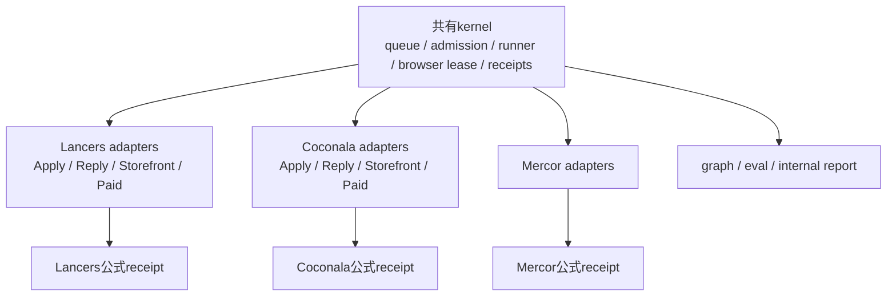
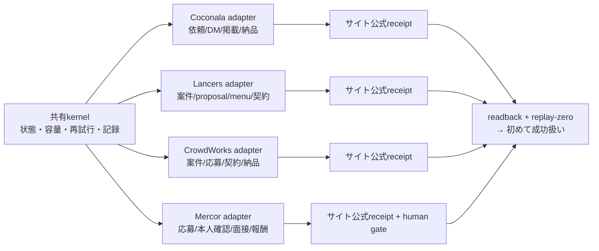
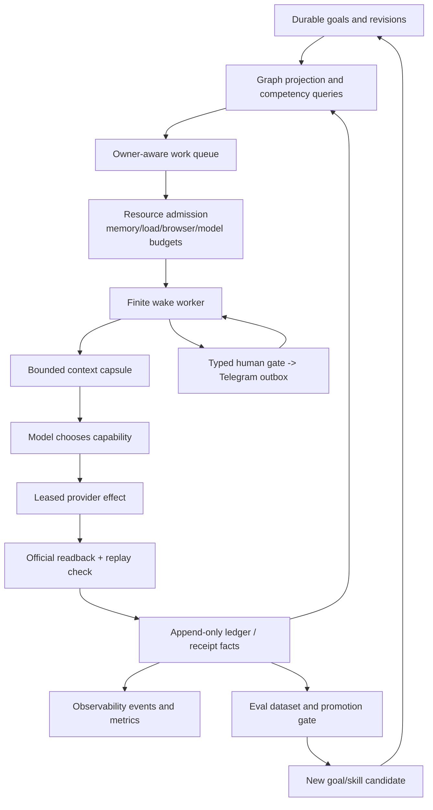

# Life Manager Agent Architecture Refinement

状態: DRAFT — this document defines the next architecture boundary; it does not claim that the
target control plane is already implemented.

## Implementation status (current evidence)

このspecの受入状態は、次のとおりです。`PROD-01`が全体の正本cursorであり、provider固有の
応募・送信・公式receiptはMarketplace ownerが管理します。Architecture ownerは別worktreeで
共通契約、skill、fixture、read-only診断だけを進めます。両者を同じファイルや稼働browserで
同時に変更しません。

完了済みの共通基盤:

- Product Loop/job identity、runtime state/event、context capsule（FND-02〜FND-10）
- graph projection/query（GRAPH-01〜GRAPH-03）
- eval case/run/score/gate（EVAL-01〜EVAL-03）
- typed human gate（HUMAN-01〜HUMAN-02）
- browser session contractとlocal headless read-only canary（BROWSER-01〜BROWSER-02）
- Responses APIの同期adapterとread-only background start/poll（API-01の基礎部分）

未完了の受入:

- `PROD-01`: Lancersの公式安全判定・proposal receipt・replay-zero
- `BROWSER-03`: provider effect/readback canary
- Responses APIの通常Loopへの昇格、Agents API maintenance pilot
- 14 Loopのlocal completion gate
- tenant分離したcloud、cloud canary、phone-only経路、本番昇格

証拠はplan `docs/superpowers/plans/2026-09-15-life-manager-local-to-cloud.md`と専用branch
`docs/agent-engineering-skills-20260915`のcommitへ記録します。テストgreenだけではprovider
成功や収益を意味せず、公式receiptがない状態は未完了です。

### Current operational cursor and remaining atomic TODO

次の状態は、意図やPIDではなく、最新のread-only `lm-loop status`、immutable release manifest、
runtime event、provider ledgerを突き合わせた現在cursorです。後続のwakeで変わり得るため、
履歴として残し、成功判定には再利用しません。

| 対象 | 実測状態 | 判定 |
|---|---|---|
| source | `origin/main=06b4d6d87bb2dc00ea0b69d8129124b71d28e423` | Lancersの容量・planner・遷移診断・exhaustive 1-turn・pending cursor・本番wrapperのbounded discoveryを含む |
| release selector | `~/loops/current`は`20260915T222815-ae1bf965`。最新検証済みreleaseは`20260915T230801-475febf2`（wrapper修正`06b4...`用releaseは未作成） | selector、稼働owner、mainが混在。全体昇格は未完 |
| Lancers Application | 旧475 releaseの`--json --exhaustive` wakeを16分超で停止し、`bootout=0`・`unloaded`・終端`entrypoint_exit_143`。planner/safetyのagent-runner成功はあるが、provider終端・公式応募receiptは未確認 | pendingを保持したまま重複起動しない。次にwrapper修正を含む`06b4...` releaseを作成し、idle境界で反映 |
| Lancers Browser | `loaded-running`、9227 CDPはChrome 145 / Protocol 1.3、ownerは旧`ae1bf96528` | Browser接続canaryはPASS。provider効果は未確認。Applicationと同時にprofileを再起動しない |
| Lancers Negotiate/Storefront/work-sync/report | ownerのインストール版は475へ揃ったものがあるが、旧terminal event、`resource_capacity_busy`、`resource_control_busy`が残る。Reportは旧ae1 event | 履歴を成功に変換せず、各ownerを一つずつ自然wakeで確認 |
| Lancers Paid | `loaded-idle`、installed releaseは475、`install` eventも475。一方で直近provider結果は`entrypoint_exit_1` | **reconcile作業は完了**。公式paid効果は未確認のため収益完了にはしない |
| Lancers ledger | 最新の`application_verified`は既存sequence 147（新canaryのreceiptではない） | 現在runの成功・収益は0件として扱う |

最新のmain統合はPR #5233（merge commit `06b4d6d87b`）です。今回の追加修正は、本番の
`application-owner`から`--exhaustive`を外し、仕様どおり通常の回転検索を使うことです。
`--exhaustive`は全カテゴリ＋キーワード＋詳細ページを一つのwakeで読み、実測でApplicationの
検索・planner・provider遷移を5分以上保持しました。修正後も全語彙を捨てるのではなく、既存の
回転・重複排除・未判断cacheで次のwakeへ分散します。新releaseは作成後、稼働中ownerを止めずに
idle境界で段階的にreconcileします。

このcursorからの実行順序を固定する。前の項目の公式証拠がない限り、次のplatformへ進めない。

| 順番 | atomic task | 変更範囲 | 完了条件 |
|---:|---|---|---|
| 1 | `PROD-01-A` Lancers Paidをidle時に現行releaseへreconcile | Lancers Paid ownerのみ | **完了**: installed/install eventは475で一致。provider効果は別gate |
| 2 | `PROD-01-B` wrapper修正を含む`06b4...` releaseを作成し、Applicationをidle境界で反映 | Application owner + immutable release | loaded argvが`--exhaustive`なしで一致。現在の旧wakeは終端まで重複起動しない |
| 3 | `PROD-01-C` Lancers Applicationを新wrapperの自然wakeで1回検証 | Application owner、planner/safety evidence | planner schema valid、safety結果、外部effect 0または公式receipt。公式receiptなしは未完 |
| 4 | `PROD-01-D` proposal確認遷移の残故障を修正 | Lancers provider adapterと回帰テスト | URL/DOM状態を記録し、正しいconfirm routeまたは明示的provider拒否を再現 |
| 5 | `PROD-01-E` Lancers全7 ownerのrelease driftを解消 | Lancers ownerだけ | Browser、4収益lane、work-sync、reportが同じimmutable SHA |
| 6 | `BROWSER-03` Lancers応募canaryを1件だけ実行 | provider effect owner | 公式proposal receipt、公式readback、replay-zero |
| 7 | `PROD-02` Lancers Negotiate/Storefront/Paidを個別に閉じる | 各provider adapter | laneごとの公式receiptまたは明示的not-applicable、重複0 |
| 8 | `MARKET-02` CrowdWorksを同じshared kernelで検証 | CrowdWorks adapter/owner | 応募・契約の公式receiptまたはtruthful not-applicable |
| 9 | `MARKET-03` Mercorをhuman gate付きで検証 | Mercor adapter/owner | typed gate再開、公式application/contract/payment receipt |
| 10 | `MARKET-04` Coconalaを別workstream完了後に検証 | Coconala owner | 既存の4 laneごとの公式receipt、buyer readback、replay-zero |
| 11 | `LOCAL-01/02` 14 Product Loopのlocal completion manifest | shared control plane + 各owner | unknown 0、未対応は明示状態、外部成功はreceipt限定 |
| 12 | `CLOUD-01/02/03` tenant分離・cloud Browser・phone-only経路 | cloud adapter | localと同じcontract、cloud canary、静かな通知、公式readback |
| 13 | `CLOUD-04` production昇格 | primary release owner | local gate、cloud gate、公式効果、replay-zeroの全PASS |

routine report、PID、exit 0、Telegram送信、テストgreenだけでは各項目を完了にしない。各項目の
最後に公式証拠がなければ、その項目は同じcursorに留まり、次のplatformを起動しない。

### Shared components and provider adapters

現在の構成は、完全な共有でも完全な分離でもありません。共有kernelとprovider専用adapterの
境界は次のように固定します。

| 層 | 共有するもの | platformごとに変えるもの |
|---|---|---|
| 目標・wake | goal revision、owner、wake、retry、停止条件 | 仕事の目的と入力データ |
| 資源 | resource admission、memory/disk pressure、queue、deferred state | provider/accountごとの上限値 |
| model | agent-runner、Responses API、context capsule、tool-call schema | 使用するskillとJSON schema |
| browser | owner lease、CDP health、headless、timeout、release | profile、CDP port、provider URL/DOM |
| effect | effect key、attempt、official readback、replay-zero | 応募・返信・掲載・納品のprovider操作 |
| 記録 | runtime event、graph、eval、内部control room | provider固有のreceipt parser |
| 通知 | 共通outbox、dedupe、human gate | 人間が必要な時の文面・リンク |

Lancersの現在の故障は、この境界が実装にも反映されていない例です。Apply/Reply/Storefront/
Paidは同じhost admissionを使いますが、Lancersの4収益laneが`borrow`のままだったため、
Coconala/Affiliateのownerがdeterministic枠を占有すると、Lancersはproviderへ到達する前に
`resource_capacity_busy`になりました。ApplyはさらにLancers専用browser接続のretry cleanupと
safety verifier timeoutを持っていませんでした。したがって、各laneを個別に再起動することが
解決策ではなく、共有kernelの資源分類と、Lancers adapterの接続境界を順に直す必要があります。



修正順序は、(1)共有kernelがownerを正しく分類・保留・再開する、(2)各provider adapterが同じ
browser/effect/readback契約を使う、(3)公式receiptとreplay-zeroを受けてから次のlaneへ進む、
とする。一つのproviderを直しただけで他のproviderが直ったとは扱わない。

### Platform differences and current read-only state

「共通部品を使う」とは、同じブラウザや同じログインを使い回すことではありません。各サイトは
専用のadapter、URL、DOM、アカウント、profile、公式receiptを持ち、共有kernelには typed な
状態と証拠だけを渡します。次の表は今回のread-only確認で固定した境界です。`未確認`は失敗の
証拠でも成功の証拠でもなく、公式readbackを取るまで未完了として扱います。

| platform | サイト固有の仕事と境界 | 共有kernelから使う部品 | 今回の状態（公式receipt基準） | 次の合格条件 |
|---|---|---|---|---|
| Coconala | 公開依頼→応募、購入前talkroom返信、自分のサービス掲載、購入済み納品。`coconala.com`のrequest/message/service/order route、専用profile | goal/wake、admission、context、browser lease、effect key、readback、通知outbox | 別workstreamが1案件を処理中。architecture workstreamはbrowser/account/TODOを変更しない。今回のcanaryで応募成功は主張しない | 案件ごとの公式応募/購入/納品receipt、buyer readback、replay-zero |
| Lancers | 公開案件→proposal、購入前会話、menu掲載、契約/納品。`www.lancers.jp`のwork/proposal/menu/myplan route、専用9227 CDP、safety verifier | Coconalaと同じtyped lifecycle・admission・effect/readback契約 | mainはPR #5233まで統合済み。CDPは応答したがBrowser ownerは旧ae1。旧`--exhaustive` Applicationは16分超で停止（公式応募receipt 0）。planner/safety成功は記録済みだが、返信・掲載・有料receiptも0。wrapper修正後releaseは未作成 | `06b4...` releaseを作成→Applicationを新wrapperで起動→1 wakeの公式proposal receipt/readback→replay-zero |
| CrowdWorks | 公開案件→応募→契約→納品。応募・契約のprovider語彙は専用adapterで保持し、Coconala/Lancersの掲載laneを仮定しない | goal/context、admission、browser lease、effect fence、human gate、receipt/eval | 今回の稼働readbackは未実施。EVAL fixtureの対象であり、成功・収益は未確認 | 公式応募または契約receipt、または理由付きnot-applicable、重複なし |
| Mercor | 応募→本人確認/面接/録画などのhuman gate→契約・報酬。identity/interview/mediaの外部状態を専用adapterで扱う | agent-runner、context capsule、human gate、通知outbox、effect/readback、revenue/cost graph | 直近のread-only記録ではcurrent releaseの起動receiptはあるが、応募はcapacity deferで終了し、公式application receiptは未確認。architecture workstreamはMercorの認証・面接を操作しない | typed human gateの再開→公式application/contract/payment receipt→費用上限内・replay-zero |

したがって、前回のLancers失敗は「各サイトの処理内容が同じだから」ではありません。共通kernelの
入口で (a) 収益laneが`borrow`のまま容量を奪われ、(b) launchdが旧releaseを指し、(c) 失敗した
Playwright/CDP接続の後始末とsafety verifierの時間上限が不足し、providerの応募画面まで到達
できなかったことが原因です。`browser_unavailable`、`account_unavailable`、`safety_check_failed`
というTelegram文面だけでは、外部応募の成功/失敗を確定できません。必ず同じwakeのofficial
receipt、readback、effect keyの再実行0件を揃えます。



## 1. Overview (What & Why)

Life Manager presents fourteen user-facing Product Loops, while
`config/loop-registry.json` currently contains 165 lifecycle and support jobs. The current registry
snapshot contains 26 keep-alive jobs, 39 five-minute jobs, and six browser-owner jobs. The count is
not itself the failure: the failure is treating a growing job inventory as an unbounded set of
independent workers.

The current runtime already has a useful finite wake shape:

```text
observe -> assemble context -> model decision -> bounded skill -> persist -> sleep
```

It also has partial graph projections (`context-graph.js`, `intent-graph.js`) and deterministic
domain evals under `apps/life-manager/eval/`. They do not yet form one cross-loop control plane that
can answer which goal is blocked, what evidence proves an effect, which human gate is due, or whether
a candidate release is better than its baseline.

The Coconala TODO records the operational consequence: browser and ledger critical sections have
serialized unrelated work, and host load/swap saturation has admitted work despite a percentage-only
memory signal. Repeatedly starting or restarting loops cannot repair this class of failure and can
destroy authenticated browser ownership.

The target is one owner-aware Life Manager control plane that runs finite wakes through bounded
resource admission, compiles small provenance-bound context capsules, projects an auditable graph,
evaluates behavior against frozen baselines, represents human work as resumable typed gates, and
feeds verified outcomes into bounded self-improvement. Local and cloud remain host adapters for the
same product recipes and evidence contracts.

## 2. Acceptance Criteria

### A. Product loops and lifecycle jobs have separate identities

Every registry entry has a stable `product_loop_id`, `job_id`, `owner_id`, `resource_class`,
`effect_class`, and `cadence`. Product-loop reporting groups jobs without merging their ownership,
state, or receipts. Existing registry IDs remain addressable during migration.

### B. Admission is bounded and durable

One repository-owned admission boundary limits active work by resource class, provider/account,
browser profile, model transport, and host capacity. A deferred job writes a durable
`resource_admission_deferred` state with reason, owner, and `next_eligible_at`; it is resumed by a
later wake. Admission never holds the global ledger/vault lock across CDP, network, model, or context
disposal I/O. No feature uses `start all` as a production acceptance shortcut.

### C. Every wake has an evidence contract

Each finite wake persists `wake_id`, owner, goal revision, context hash, selected capability, attempt,
effect key, status, failure layer, official readback pointer, and next eligible time. A process PID,
exit code, Telegram message, or dashboard row never closes a business goal without authoritative
readback.

### D. Context is a bounded capsule, not a transcript

The wake context contains `goal`, `owner`, `sources[]`, `decisions[]`, `open_questions[]`, explicit
budget, freshness, and a content hash. Large logs/artifacts are stored by hash with bounded excerpts.
Mutable provider state is refreshed immediately before an effect. Separate owners share approved facts,
never mutable transcripts, browser sessions, or credentials.

### E. Graph is a rebuildable projection of the ledger

An append-only fact source remains authoritative. A versioned, idempotent projection exposes at least
the node kinds `goal`, `capability`, `opportunity`, `artifact`, `effect`, `receipt`, `human_gate`,
`revenue`, and `resource`. Edges use a closed vocabulary (`requires`, `produced_by`, `sent_to`,
`proved_by`, `earned`, `blocked_by`, `supersedes`) and carry source fact, authority, observed time,
confidence, and content hash. Graph queries are bounded and return source pointers plus stale/unknown
markers. Graph output cannot authorize an effect.

### F. Evals gate behavior and promotion

Every shared recipe and provider adapter has versioned JSONL cases for canonical, boundary,
adversarial, and previous-failure behavior. Runs record candidate/baseline hashes, model, prompt,
tool fixture, seed, latency, cost, per-case score, trace pointers, and errors. Tuning and held-out
cases are separate. Deterministic safety/replay/schema checks run before semantic grading. A candidate
cannot promote when held-out behavior, safety, cost, latency, or required live evidence regresses;
the evaluator never mutates production.

### G. Human work is a typed gate, not a side channel

Provider capabilities declare one of `autonomous`, `human_required`, or `prohibited` for the current
owner and account policy. A human-required transition writes one stable `human_gate_id` containing
exact action, work-item identity, evidence, deadline, owner, and Telegram delivery/outbox ID. The
worker completes all preceding reversible work, sends the gate once, enters `waiting_human`, and
resumes the same owner/effect namespace after the answer. Missing, expired, or contradictory answers
remain typed blockers; no guessed identity, interview, recording, KYC, or approval is fabricated.

### H. Observability separates health from business truth

The runtime emits versioned lifecycle events/spans for wake, decision, tool, effect, readback, wait,
and finish with bounded IDs and redacted attributes. Metrics cover admission depth, active resources,
memory/load/swap pressure, context bytes, model cost/latency, retries, human-gate age, and
effect/readback/replay counts. Durable ledgers and official provider receipts remain the business
authority; telemetry degradation is observable but non-destructive.

### I. Recursive self-improvement is bounded and reversible

Every candidate skill/prompt/model/tool change records a hypothesis, frozen baseline, changed hashes,
train/held-out split, safety tripwires, promotion decision, and rollback pointer. The loop may propose
changes to recipes and skills, but cannot rewrite constitution, identity, credentials, permissions,
effect/readback rules, or evaluator gates. Promotion is a separate owner action after all gates pass.

### J. Local and cloud are one implementation

Both hosts use the same product loop ID, recipe, capability/effect contract, graph vocabulary,
evaluation contract, receipt schema, and human-gate semantics. Only supervisor, storage, secret, and
browser transport adapters differ. A second local/cloud business implementation is a contract failure.

### J1. Two Deployment Modes and local-first promotion

Life Manager exposes two deployment modes for the same implementation:

1. **Local mode:** a single owner runs the control plane, private state, and host adapters on a local
   Mac or Linux machine. It is the development, self-hosted, and recovery mode. Autonomous browser work
   uses headless sessions; the user's screen is reserved for debugging and human gates.
2. **Cloud mode:** the hosted control plane, tenant-scoped durable store, worker pool, and Steel Browser
   sessions run continuously in the cloud. A phone and Telegram/app are sufficient for the user. Cloud
   is the production expansion mode, not a fork of the business code.

The **local completion gate** MUST pass before cloud promotion: every advertised Product Loop has one
canonical owner and release, no stale/duplicate scheduler, bounded resource admission, a context and
receipt contract, private internal reporting, and either a verified official effect or an explicit
`setup_required`/`not_applicable` capability state. No enabled owner may remain `unknown`, silently
failing, or dependent on a visible desktop window. Cloud promotion copies the immutable source and
contracts, creates fresh tenant-scoped state, runs one cloud canary, and proves the same official
readback/replay-zero behavior. It never copies local credentials, browser sessions, or mutable logs.

Local and cloud remain available as user choices after promotion. `phone-only` use is the default cloud
experience; local mode remains a self-hosted option and a recovery path. Both modes use the same
implementation, and only their host adapters differ.

The rule is: **no cloud promotion before local acceptance**.

### J2. Parallel Workstream Boundary

The active marketplace owner exclusively edits `skills/earn/gig/TODO.md` and provider-owned files
while its vertical acceptance is in progress. Architecture work proceeds in a separate worktree on
skills, specifications, contract fixtures, and read-only diagnostics. A shared-file overlap check is
required before changing `config/loop-registry.json`, `runtime/loop`, `skills/browser`,
`skills/_shared/marketplace-core`, or production state. No workstream edits the active TODO or
provider-owned files concurrently, and no workstream changes a live browser/account/ledger owner
owned by another workstream.

### J3. Fourteen-Loop Remediation Matrix

Every Product Loop uses the same shared kernel for goal, context, admission, effect fencing, official
readback, receipts, internal reporting, evaluation, and recovery. Only the provider/product adapter
owns its external vocabulary and mutation. The matrix assigns one workstream owner and one completion
condition per Product Loop; the completion condition is explicit and an old receipt never closes a current owner.

| # | Product Loop | First repair focus | Shared-kernel use | Completion condition | Workstream owner |
|---:|---|---|---|---|---|
| 1 | Coconala | source/form health, browser ownership, four-lane cursor | Apply/Reply/Storefront/Paid, effect fence, readback | official application or funded work receipt plus replay-zero | marketplace TODO owner |
| 2 | Lancers | account/session, CDP health, proposal form | same Apply/Reply/Paid/Storefront contracts | official proposal/contract receipt plus replay-zero | marketplace TODO owner |
| 3 | CrowdWorks | profile/dependency completeness, browser lock | shared application and contract lifecycle | official proposal or truthful not-applicable receipt | marketplace TODO owner |
| 4 | Writer | opportunity, authoring, publisher, payment lineage | goal/artifact/publish/settlement receipts | publisher confirmation and attributable payment receipt | Writer owner |
| 5 | Affiliate | source freshness, attribution, publish readback | opportunity/effect/link/revenue ledger | official publication and attributed conversion evidence | Affiliate owner |
| 6 | Investment | mode separation, risk budget, order reconciliation | goal/effect/payment readback and kill boundary | explicit paper/shadow/live mode and broker receipt | Investment owner |
| 7 | Agent Economy | isolated identity, wallet, compute cost, reserve | treasury/effect/revenue/cost graph | verified net-positive or explicit setup state | economy owner |
| 8 | Job Hunter | provider discovery, profile/resume, Gmail confirmation | application receipt, human gate, inbox reconciliation | official application confirmation or typed human wait | Job Hunter owner |
| 9 | Fundraiser | eligibility, deadline, form and submission receipt | opportunity/application/artifact/readback chain | official intake receipt or explicit ineligible state | Fundraiser owner |
| 10 | Connector | event source, Calendar conflict, registration readback | event goal, calendar, effect, ticket receipt | official registration/ticket or truthful no-op receipt | Connector owner |
| 11 | Self-Build | feedback→test→patch→evaluation→release | issue/goal/candidate/promotion/rollback graph | reviewed immutable release and regression PASS | self-build owner |
| 12 | Mobile Apps | product manifest, build/sign, store and marketing receipts | artifact/release/publication/revenue chain | store/provider receipt or explicit setup state | mobile-app owner |
| 13 | Capafy | product/sales/outcome/audience resource separation | goal/effect/attribution/Telegram contract | official business outcome or explicit setup state | Capafy owner |
| 14 | CFO | source reconciliation, payout matching, report noise | revenue/cost/balance/evidence graph | verified financial snapshot; unknown never becomes zero | CFO owner |

The marketplace TODO workstream owns rows 1–3 and the existing `skills/earn/gig/TODO.md`; other
owners continue their rows independently. The architecture workstream owns only the shared contracts,
skills, specifications, fixtures, and read-only diagnostics until a shared-file overlap check approves
runtime changes.

### K. User Communication Contract

Every wake, retry, evaluation, health signal, and diagnostic remains in the private ledger/control room
by default. Telegram receives only a human action, urgent safety/credential issue, material verified
outcome, or persistent blocker after bounded recovery. A routine wake or healthy no-op produces zero
Telegram messages. Human-gate messages are idempotent by stable event key; identical blocker messages
are suppressed until state changes or the 24-hour reminder boundary. User messages contain only the
short reason, exact action, deadline, and link/evidence needed to act—never raw logs, prompts, secrets,
or unnecessary personal data.

The allowed Telegram event kinds are `human_action_required`, `urgent_safety`, `material_outcome`,
and `persistent_blocker`; every other lifecycle event remains internal.

### L. Model Runtime Boundary

There are three distinct OpenAI layers:

1. **Responses API:** the low-level model request. The application owns the loop, tool dispatch, and
   state.
2. **Agents SDK:** a local Python runtime that can own turns, tools, guardrails, handoffs, sessions,
   and tracing around Responses API calls.
3. **Agents API:** OpenAI's hosted **Codex harness** and infrastructure. It can create a cloud agent,
   attach tools and a hosted sandbox, compact long sessions, search tools on demand, and run bounded
   subagents. The [official Agents API announcement](https://openai.com/ja-JP/index/introducing-the-agents-api/)
   describes these managed capabilities and the choice of OpenAI-hosted or partner environments.

The core Life Manager model transport uses the Responses API through the existing brain adapter because
Life Manager owns the loop, tool dispatch, leases, context capsule, ledger, and provider readback. The
official [Agents SDK/Responses API guidance](https://openai.github.io/openai-agents-python/) says the
Responses API is appropriate when the application owns loop/tool/state handling, while the Agents SDK
is appropriate when its runtime should manage turns, tools, guardrails, handoffs, or sessions.

Agents SDK may be used only inside an isolated evaluator or repair worker behind the same owner,
context, budget, and evidence contracts. Agents API is used in a separate cloud maintenance pilot for
read-only diagnosis, evaluation, skill drafting, and architecture research. Its hosted sandbox receives
only a **read-only release**, approved skills, bounded fixtures, and a private output directory. It
never receives provider credentials, browser sessions, payment keys, or permission to perform a
marketplace effect. It must not create a second scheduler, provider-effect owner, or authoritative
memory store. If SDK or Agents API tracing is enabled, sensitive capture is disabled or routed to a
private exporter with `trace_include_sensitive_data=False`; the official [tracing guidance](https://openai.github.io/openai-agents-python/tracing/)
warns that generation and function spans can contain sensitive inputs/outputs.

Long analysis may use Responses `background=true` with a persisted response ID and next-wake polling or
webhook. A background response may not hold a browser/effect lease or perform a provider mutation. The
official [Responses create reference](https://developers.openai.com/api/reference/cli/resources/responses/methods/create)
defines background execution, context management, tool-call limits, and response storage controls;
privacy-sensitive work uses the repository-owned capsule and explicit storage policy instead of
implicitly retaining an unbounded conversation.

### M. No-babysitting Operation

Each failure creates one durable issue with owner, repair class, retry budget, next eligible time,
last-good receipt, and escalation boundary. A supervisor resumes queued issues after process exit and
applies only the repair class permitted by the evidence. It continues independent work while one issue
waits for a human or external provider. A human is contacted only for an explicit human gate; all
other supported work, recovery, evaluation, and candidate promotion proceed without manual restarts.

### N. Agents API sandbox boundary

The hosted Agents API maintenance pilot is bounded by a signed task manifest containing owner, goal
revision, release hash, allowed skills, fixture hashes, maximum subagent count, time/token budget, and
output path. It returns a result ID, artifact hashes, trace pointers, and a promotion recommendation;
the Life Manager control plane performs all validation, graph projection, evaluation gates, and release
decisions. A hosted agent cannot modify the canonical repository, private state, credentials, browser
session, scheduler, or provider system directly.

### O. Browser Execution and Deployment

Browser automation runs headless by default so the user's screen is not occupied, but headless does
not mean zero memory: Chrome still creates browser/renderer processes and page JavaScript, DOM,
cookies, and storage consume resources. The [Chrome headless documentation](https://developer.chrome.com/docs/automation-and-testing/headless)
states that modern headless shares the Chrome implementation; capacity is therefore controlled by
session count, page count, timeouts, and measured memory rather than by the display flag alone.

The selected browser abstraction is [Steel Browser](https://github.com/steel-dev/steel-browser), used
through its session API and CDP connection. It manages browser processes, session state, cookies,
local/session storage, cleanup, and a viewer while remaining compatible with the existing Playwright/
Puppeteer adapters. Local and cloud use the same `BrowserSession` contract; only the endpoint,
secret store, and session storage adapter differ.

```text
local Mac today                 cloud target
----------------                ------------------------------
Life Manager queue              Life Manager control plane
        |                       tenant/owner work queue
Steel self-hosted Docker        Steel Cloud or self-hosted Steel
headless sessions               headless sessions on worker nodes
        |                       |
provider adapter via CDP        provider adapter via CDP
```

On the local Mac, retain one controlled browser service during migration and move non-human work to
headless Steel sessions; headed windows remain only for debugging or an explicit human gate. In the
cloud, create a tenant- and provider-scoped session on demand, park or release it after the finite
wake, persist only the declared authentication state, and attach a viewer to that same session when
human action is required. Never create a second session for the handoff. The session memory is scoped to
the owner and provider, not shared across users or unrelated loops.

Admission uses a measured concurrency limit (`concurrency_limit`) and per-session CPU, memory, page, wall-clock, and
inactivity budgets. It queues work when capacity is full and records a durable deferral; it does not
promise that a virtual computer eliminates memory crashes. A full `virtual computer`/desktop is not
the default for autonomous work because its guest OS and display stack add overhead. Use a remote
desktop such as Kasm only when a person must see or operate the same browser session.

[Firecracker](https://github.com/firecracker-microvm/firecracker) is the isolation reference for
untrusted repair/evaluation code, with a separate microVM and explicit resource limits; it is not a
one-VM-per-browser design. [Lightpanda](https://github.com/lightpanda-io/browser) is a low-memory,
headless discovery experiment whose Web API and Playwright compatibility remains partial/WIP; it
cannot perform a provider effect until a provider-specific read-only and official-readback suite
passes. Browserless is a comparison reference for queue/timeout ideas, not a deployment choice under
its SSPL/commercial licensing.

## 3. As-Is / To-Be

| Concern | As-Is (measured) | To-Be contract |
|---|---|---|
| Topology | 14 Product Loops backed by 165 registry jobs; 26 keep-alives and frequent interval jobs | Product loop is a logical goal stream; jobs are queued lifecycle work owned by one scheduler |
| Capacity | Memory/load pressure can admit work; browser/ledger I/O has caused cross-owner stalls | Resource-class admission, durable deferral, per-owner leases, and host-pressure telemetry |
| Wake | `runtime/loop/index.mjs` has finite wake/retry/sleep behavior, but context is still recent-ledger oriented | One wake contract with goal/context/effect/readback evidence and explicit next eligibility |
| Context | `runtime/loop/context.mjs` passes bounded fields and the last 20 ledger lines | Hash-bound source capsules with freshness and artifact offload |
| Browser | Visible Chromium and persistent owners consume host resources; browser choice is mixed across lanes | Headless Steel sessions with per-owner state, measured concurrency, timeout/cleanup, and same-session viewer handoff |
| Deployment | Local browser processes compete with the user's Mac and are hard to scale | Local Steel service during migration; cloud Steel sessions behind the same CDP/provider contract |
| Graph | Intent and calendar/context projections exist; no unified economic/effect dependency projection | Rebuildable cross-loop projection for planning and provenance; ledger/provider remain authoritative |
| Eval | Domain-specific deterministic eval files exist | Shared case/run/score/gate schema plus held-out and live-evidence promotion gates |
| Human loop | Mercor and marketplace gates exist in lane-specific work | Provider-neutral typed `human_gate` lifecycle and Telegram outbox idempotency |
| Learning | Self-eval and promotion helpers exist in separate areas | One candidate → baseline → eval → tripwire → promotion/rollback contract |
| Hosts | Local and cloud share a target architecture but portability is incomplete | Same recipes/contracts; host adapters own only infrastructure differences |

## 4. Target Architecture



The scheduler is an alarm clock, not a second agent brain. The model chooses semantic work from the
loaded skill and available capabilities. Deterministic code owns admission, leases, schemas, effect
keys, retries, redaction, hashing, bookkeeping, and readback checks. The graph answers dependency and
provenance questions; it never substitutes for provider truth.

## 5. Test Matrix

| # | To-Be requirement | Test name | Cover |
|---:|---|---|---|
| 1 | Product-loop/job identity separation | `test_registry_product_and_job_identity` | OK: grouping preserves job ownership and receipts |
| 2 | Resource admission and durable deferral | `test_admission_defers_and_resumes_without_stampede` | OK: pressure/deadline/owner limits; sibling progress |
| 3 | Wake evidence contract | `test_wake_requires_effect_readback_or_typed_wait` | OK: PID/exit-only result rejected |
| 4 | Hash-bound context capsule | `test_context_capsule_budget_freshness_and_resume` | OK: offload, hashes, stale refresh, privacy |
| 5 | Rebuildable graph projection | `test_agent_graph_projection_is_idempotent_and_provenanced` | OK: replay, version, unknown/stale markers |
| 6 | Competency queries | `test_agent_graph_answers_blocker_receipt_and_gate_queries` | OK: bounded source-backed results |
| 7 | Eval and promotion gate | `test_candidate_gate_requires_heldout_safety_and_live_evidence` | OK: regression, tripwire, realism gap |
| 8 | Human gate lifecycle | `test_human_gate_delivery_resume_and_replay_zero` | OK: one Telegram outbox, same owner/effect |
| 9 | Observability schema/privacy | `test_runtime_events_redact_and_join_by_stable_ids` | OK: bounded attributes; health/effect separation |
| 10 | Recursive improvement boundary | `test_candidate_cannot_change_constitution_or_evidence_rules` | OK: rollback and immutable policy |
| 11 | Local/cloud parity | `test_host_adapters_share_loop_and_receipt_contract` | OK: infrastructure-only variation |
| 12 | Internal-first user communication | `test_routine_wakes_are_private_and_human_gates_are_idempotent` | OK: notification budget, stable keys, redaction |
| 13 | Responses API boundary | `test_model_adapter_persists_capsule_and_resumes_background_response` | OK: response ID, polling, no effect lease in background |
| 14 | Agents SDK isolation | `test_sdk_worker_cannot_create_scheduler_or_authoritative_state` | OK: bounded evaluator/repair-only use |
| 15 | No-babysitting supervisor | `test_issue_queue_recovers_or_escalates_without_manual_restart` | OK: retry budget, independent progress, typed escalation |
| 16 | Agents API sandbox boundary | `test_agents_api_task_manifest_and_readonly_release` | OK: bounded subagents, no credentials/effects, hashed outputs |
| 17 | Browser session mode and capacity | `test_browser_session_mode_capacity_and_handoff` | OK: headless default, session state, limits, viewer handoff, no duplicate session |
| 18 | Two deployment modes | `test_local_and_cloud_use_the_same_implementation_contract` | OK: host-only variation, tenant isolation, phone-only cloud path |
| 19 | Local-first promotion | `test_cloud_promotion_requires_local_completion_gate_and_canary` | OK: no unknown/stale owner, immutable source, official readback/replay-zero |

All tests are deterministic fixtures or read-only contract checks. External marketplace acceptance
remains a separate owner-scoped operation that requires the existing immutable-release,
official-readback, and replay-zero rules.

## 6. Boundaries

- Do not add a graph database before a measured traversal/concurrency need; begin with a local
  projection rebuilt from the existing append-only facts.
- Do not replace `config/loop-registry.json`, the shared runtime, provider adapters, or the existing
  effect reconciler with a parallel framework.
- Do not run or restart all 165 jobs to prove the design; use deterministic contention fixtures and
  targeted owner-scoped acceptance.
- Do not copy credentials, browser sessions, raw PII, full prompts, or unbounded provider payloads
  into graph, eval, telemetry, Git, or Telegram.
- Do not count applications, process health, eval scores, unrealized positions, or model claims as
  revenue; only attributable provider/payment receipts count.
- Do not let self-improvement modify identity, permissions, safety/evidence boundaries, or promotion
  gates.
- Do not create a fifth marketplace lane when Apply, Reply, Storefront, and Paid already own the
  lifecycle; add only a thin provider adapter and shared receipt mapping.
- Do not edit another worktree's active Coconala TODO while implementing this architecture.
- Do not send routine wake, retry, evaluation, health, or diagnostic reports to Telegram; retain them
  in the private control room and send only the contracted user-facing events.
- Do not replace the existing control plane with an Agents SDK scheduler or a second memory/session
  authority. Use the Responses API adapter for the core loop and isolate any SDK worker.
- Do not allow a background model response, webhook, or trace callback to hold a browser/effect lease
  or perform a provider mutation.
- Do not give an Agents API hosted sandbox provider credentials, browser sessions, canonical write
  access, scheduler control, or direct marketplace-effect tools. Use it only with a read-only release
  and bounded fixtures in the maintenance pilot.
- Do not equate headless mode, a virtual computer, or a remote browser with unlimited concurrency or
  zero memory use. Every session needs a measured limit, timeout, cleanup, and durable owner.
- Do not switch a provider's effect path to Lightpanda or a new browser service without read-only
  compatibility, authentication persistence, official readback, and replay-zero acceptance.
- Do not create a second browser session for a human handoff; attach the viewer to the existing leased
  session and resume the same owner.
- Do not promote cloud before the local completion gate passes; do not copy local mutable state,
  credentials, browser sessions, or logs into cloud.
- Do not maintain separate local and cloud business implementations. Only host adapters may differ.

## 7. Execution Steps

1. Add registry identity/resource-class fixtures and measure the current 165-job inventory without
   changing production state.
2. Add the bounded admission contract to the existing runtime control path; prove deferred/resumed
   owners and sibling progress under synthetic memory, load, browser, and ledger contention.
3. Replace recent-ledger-only wake assembly with the hash-bound context capsule while preserving the
   existing redaction and effect-reconciliation seams.
4. Add the pure cross-loop graph projector and competency queries; rebuild it from ledger fixtures and
   keep provider readback as the authority boundary.
5. Add the shared eval case/run/score/gate schema and migrate one marketplace recipe plus one
   non-marketplace loop before expanding coverage.
6. Route Mercor-style identity/interview/media actions through the provider-neutral human-gate
   contract and prove one notification, resumable wake, and replay-zero fixture.
7. Extend lifecycle telemetry/resource metrics and connect traces, receipts, graph facts, and eval
   runs by stable hashes and IDs.
8. Enable bounded skill/prompt candidate promotion only after baseline, held-out, safety, and live
   evidence gates pass; record rollback and the generalized lesson.
9. Re-run focused runtime, graph, eval, human-gate, and host-parity tests, then perform targeted
   immutable-release acceptance for one owner at a time. Update the active TODO only from measured
   receipts.
10. Add the private control-room projection and notification policy; prove routine wakes stay private,
    human gates are delivered once, and persistent blockers are rate-limited.
11. Add the Responses API brain adapter with explicit capsule/hash, tool-call, background, polling,
    storage, timeout, and cost contracts; preserve the existing provider effect owner.
12. If an evaluator or repair worker needs Agents SDK, wrap it behind a bounded adapter with isolated
    session/evidence and disabled sensitive trace capture; prove it cannot schedule or mutate a provider.
13. Run the Agents API maintenance pilot against a read-only release and bounded fixture, verify the
    task manifest, result/artifact hashes, no credential/effect access, and import only its recommendation.
14. Run the no-babysitting supervisor fixture, then targeted immutable-release acceptance and update
    the active TODO only from official receipts.
15. Implement the provider-neutral browser-session interface against Steel, preserving the current
    CDP/Playwright adapter contract and explicit session ownership.
16. Run headless compatibility and measured memory/concurrency acceptance for one read-only provider,
    then one effectful provider with official readback and replay-zero; keep a headed/remote-view path
    only for human gates and debugging.
17. Use Firecracker only for untrusted repair/evaluation execution and run Lightpanda only as a
    read-only discovery experiment; record the license and compatibility decision before any promotion.
18. Complete the local completion gate for every advertised Product Loop, including owner/release
    readback, resource admission, private reporting, official effect/readback or explicit capability
    state, and replay-zero where an effect exists.
19. Promote the identical immutable source to cloud, provision tenant-scoped state and Steel sessions,
    run one canary per supported resource class, prove official readback/replay-zero, and expose the
    phone-only notification/control path before enabling broader cloud capacity.

## E2E Judgment

| Item | Value |
|---|---|
| UI変更 | なし |
| 結論 | Maestro: 不要 — this specification changes runtime contracts and worker control, not iOS UI |
