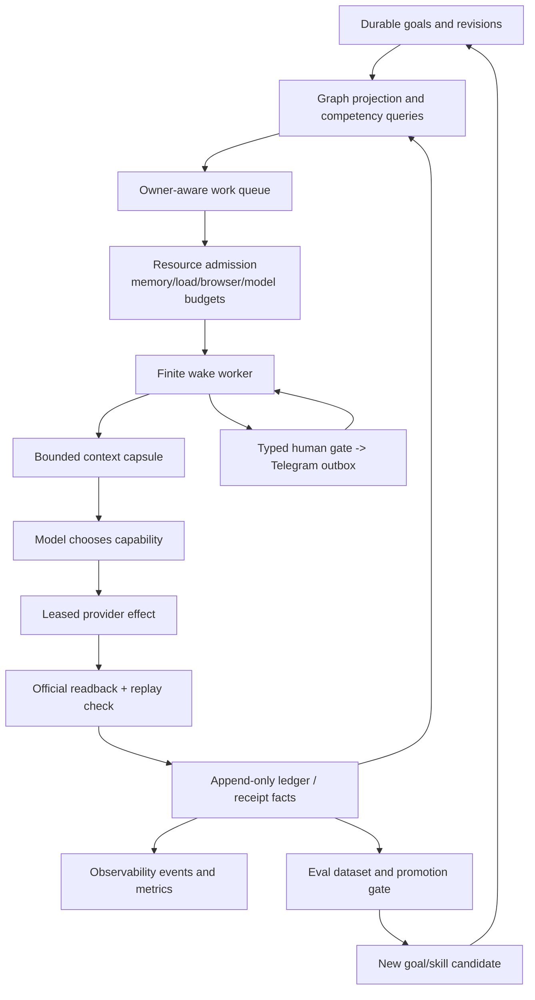

# Life Manager Agent Architecture Refinement

状態: DRAFT — this document defines the next architecture boundary; it does not claim that the
target control plane is already implemented.

## 1. Overview (What & Why)

Life Manager presents fourteen user-facing Product Loops, while
`config/loop-registry.json` currently contains 165 lifecycle and support jobs. The current registry
snapshot contains 26 keep-alive jobs, 39 five-minute jobs, and six browser-owner jobs. The count is
not itself the failure: the failure is treating a growing job inventory as an unbounded set of
independent workers.

The current runtime already has a useful finite wake shape:

```text
observe -> assemble context -> model decision -> bounded skill -> persist -> sleep
```

It also has partial graph projections (`context-graph.js`, `intent-graph.js`) and deterministic
domain evals under `apps/life-manager/eval/`. They do not yet form one cross-loop control plane that
can answer which goal is blocked, what evidence proves an effect, which human gate is due, or whether
a candidate release is better than its baseline.

The Coconala TODO records the operational consequence: browser and ledger critical sections have
serialized unrelated work, and host load/swap saturation has admitted work despite a percentage-only
memory signal. Repeatedly starting or restarting loops cannot repair this class of failure and can
destroy authenticated browser ownership.

The target is one owner-aware Life Manager control plane that runs finite wakes through bounded
resource admission, compiles small provenance-bound context capsules, projects an auditable graph,
evaluates behavior against frozen baselines, represents human work as resumable typed gates, and
feeds verified outcomes into bounded self-improvement. Local and cloud remain host adapters for the
same product recipes and evidence contracts.

## 2. Acceptance Criteria

### A. Product loops and lifecycle jobs have separate identities

Every registry entry has a stable `product_loop_id`, `job_id`, `owner_id`, `resource_class`,
`effect_class`, and `cadence`. Product-loop reporting groups jobs without merging their ownership,
state, or receipts. Existing registry IDs remain addressable during migration.

### B. Admission is bounded and durable

One repository-owned admission boundary limits active work by resource class, provider/account,
browser profile, model transport, and host capacity. A deferred job writes a durable
`resource_admission_deferred` state with reason, owner, and `next_eligible_at`; it is resumed by a
later wake. Admission never holds the global ledger/vault lock across CDP, network, model, or context
disposal I/O. No feature uses `start all` as a production acceptance shortcut.

### C. Every wake has an evidence contract

Each finite wake persists `wake_id`, owner, goal revision, context hash, selected capability, attempt,
effect key, status, failure layer, official readback pointer, and next eligible time. A process PID,
exit code, Telegram message, or dashboard row never closes a business goal without authoritative
readback.

### D. Context is a bounded capsule, not a transcript

The wake context contains `goal`, `owner`, `sources[]`, `decisions[]`, `open_questions[]`, explicit
budget, freshness, and a content hash. Large logs/artifacts are stored by hash with bounded excerpts.
Mutable provider state is refreshed immediately before an effect. Separate owners share approved facts,
never mutable transcripts, browser sessions, or credentials.

### E. Graph is a rebuildable projection of the ledger

An append-only fact source remains authoritative. A versioned, idempotent projection exposes at least
the node kinds `goal`, `capability`, `opportunity`, `artifact`, `effect`, `receipt`, `human_gate`,
`revenue`, and `resource`. Edges use a closed vocabulary (`requires`, `produced_by`, `sent_to`,
`proved_by`, `earned`, `blocked_by`, `supersedes`) and carry source fact, authority, observed time,
confidence, and content hash. Graph queries are bounded and return source pointers plus stale/unknown
markers. Graph output cannot authorize an effect.

### F. Evals gate behavior and promotion

Every shared recipe and provider adapter has versioned JSONL cases for canonical, boundary,
adversarial, and previous-failure behavior. Runs record candidate/baseline hashes, model, prompt,
tool fixture, seed, latency, cost, per-case score, trace pointers, and errors. Tuning and held-out
cases are separate. Deterministic safety/replay/schema checks run before semantic grading. A candidate
cannot promote when held-out behavior, safety, cost, latency, or required live evidence regresses;
the evaluator never mutates production.

### G. Human work is a typed gate, not a side channel

Provider capabilities declare one of `autonomous`, `human_required`, or `prohibited` for the current
owner and account policy. A human-required transition writes one stable `human_gate_id` containing
exact action, work-item identity, evidence, deadline, owner, and Telegram delivery/outbox ID. The
worker completes all preceding reversible work, sends the gate once, enters `waiting_human`, and
resumes the same owner/effect namespace after the answer. Missing, expired, or contradictory answers
remain typed blockers; no guessed identity, interview, recording, KYC, or approval is fabricated.

### H. Observability separates health from business truth

The runtime emits versioned lifecycle events/spans for wake, decision, tool, effect, readback, wait,
and finish with bounded IDs and redacted attributes. Metrics cover admission depth, active resources,
memory/load/swap pressure, context bytes, model cost/latency, retries, human-gate age, and
effect/readback/replay counts. Durable ledgers and official provider receipts remain the business
authority; telemetry degradation is observable but non-destructive.

### I. Recursive self-improvement is bounded and reversible

Every candidate skill/prompt/model/tool change records a hypothesis, frozen baseline, changed hashes,
train/held-out split, safety tripwires, promotion decision, and rollback pointer. The loop may propose
changes to recipes and skills, but cannot rewrite constitution, identity, credentials, permissions,
effect/readback rules, or evaluator gates. Promotion is a separate owner action after all gates pass.

### J. Local and cloud are one implementation

Both hosts use the same product loop ID, recipe, capability/effect contract, graph vocabulary,
evaluation contract, receipt schema, and human-gate semantics. Only supervisor, storage, secret, and
browser transport adapters differ. A second local/cloud business implementation is a contract failure.

## 3. As-Is / To-Be

| Concern | As-Is (measured) | To-Be contract |
|---|---|---|
| Topology | 14 Product Loops backed by 165 registry jobs; 26 keep-alives and frequent interval jobs | Product loop is a logical goal stream; jobs are queued lifecycle work owned by one scheduler |
| Capacity | Memory/load pressure can admit work; browser/ledger I/O has caused cross-owner stalls | Resource-class admission, durable deferral, per-owner leases, and host-pressure telemetry |
| Wake | `runtime/loop/index.mjs` has finite wake/retry/sleep behavior, but context is still recent-ledger oriented | One wake contract with goal/context/effect/readback evidence and explicit next eligibility |
| Context | `runtime/loop/context.mjs` passes bounded fields and the last 20 ledger lines | Hash-bound source capsules with freshness and artifact offload |
| Graph | Intent and calendar/context projections exist; no unified economic/effect dependency projection | Rebuildable cross-loop projection for planning and provenance; ledger/provider remain authoritative |
| Eval | Domain-specific deterministic eval files exist | Shared case/run/score/gate schema plus held-out and live-evidence promotion gates |
| Human loop | Mercor and marketplace gates exist in lane-specific work | Provider-neutral typed `human_gate` lifecycle and Telegram outbox idempotency |
| Learning | Self-eval and promotion helpers exist in separate areas | One candidate → baseline → eval → tripwire → promotion/rollback contract |
| Hosts | Local and cloud share a target architecture but portability is incomplete | Same recipes/contracts; host adapters own only infrastructure differences |

## 4. Target Architecture



The scheduler is an alarm clock, not a second agent brain. The model chooses semantic work from the
loaded skill and available capabilities. Deterministic code owns admission, leases, schemas, effect
keys, retries, redaction, hashing, bookkeeping, and readback checks. The graph answers dependency and
provenance questions; it never substitutes for provider truth.

## 5. Test Matrix

| # | To-Be requirement | Test name | Cover |
|---:|---|---|---|
| 1 | Product-loop/job identity separation | `test_registry_product_and_job_identity` | OK: grouping preserves job ownership and receipts |
| 2 | Resource admission and durable deferral | `test_admission_defers_and_resumes_without_stampede` | OK: pressure/deadline/owner limits; sibling progress |
| 3 | Wake evidence contract | `test_wake_requires_effect_readback_or_typed_wait` | OK: PID/exit-only result rejected |
| 4 | Hash-bound context capsule | `test_context_capsule_budget_freshness_and_resume` | OK: offload, hashes, stale refresh, privacy |
| 5 | Rebuildable graph projection | `test_agent_graph_projection_is_idempotent_and_provenanced` | OK: replay, version, unknown/stale markers |
| 6 | Competency queries | `test_agent_graph_answers_blocker_receipt_and_gate_queries` | OK: bounded source-backed results |
| 7 | Eval and promotion gate | `test_candidate_gate_requires_heldout_safety_and_live_evidence` | OK: regression, tripwire, realism gap |
| 8 | Human gate lifecycle | `test_human_gate_delivery_resume_and_replay_zero` | OK: one Telegram outbox, same owner/effect |
| 9 | Observability schema/privacy | `test_runtime_events_redact_and_join_by_stable_ids` | OK: bounded attributes; health/effect separation |
| 10 | Recursive improvement boundary | `test_candidate_cannot_change_constitution_or_evidence_rules` | OK: rollback and immutable policy |
| 11 | Local/cloud parity | `test_host_adapters_share_loop_and_receipt_contract` | OK: infrastructure-only variation |

All tests are deterministic fixtures or read-only contract checks. External marketplace acceptance
remains a separate owner-scoped operation that requires the existing immutable-release,
official-readback, and replay-zero rules.

## 6. Boundaries

- Do not add a graph database before a measured traversal/concurrency need; begin with a local
  projection rebuilt from the existing append-only facts.
- Do not replace `config/loop-registry.json`, the shared runtime, provider adapters, or the existing
  effect reconciler with a parallel framework.
- Do not run or restart all 165 jobs to prove the design; use deterministic contention fixtures and
  targeted owner-scoped acceptance.
- Do not copy credentials, browser sessions, raw PII, full prompts, or unbounded provider payloads
  into graph, eval, telemetry, Git, or Telegram.
- Do not count applications, process health, eval scores, unrealized positions, or model claims as
  revenue; only attributable provider/payment receipts count.
- Do not let self-improvement modify identity, permissions, safety/evidence boundaries, or promotion
  gates.
- Do not create a fifth marketplace lane when Apply, Reply, Storefront, and Paid already own the
  lifecycle; add only a thin provider adapter and shared receipt mapping.
- Do not edit another worktree's active Coconala TODO while implementing this architecture.

## 7. Execution Steps

1. Add registry identity/resource-class fixtures and measure the current 165-job inventory without
   changing production state.
2. Add the bounded admission contract to the existing runtime control path; prove deferred/resumed
   owners and sibling progress under synthetic memory, load, browser, and ledger contention.
3. Replace recent-ledger-only wake assembly with the hash-bound context capsule while preserving the
   existing redaction and effect-reconciliation seams.
4. Add the pure cross-loop graph projector and competency queries; rebuild it from ledger fixtures and
   keep provider readback as the authority boundary.
5. Add the shared eval case/run/score/gate schema and migrate one marketplace recipe plus one
   non-marketplace loop before expanding coverage.
6. Route Mercor-style identity/interview/media actions through the provider-neutral human-gate
   contract and prove one notification, resumable wake, and replay-zero fixture.
7. Extend lifecycle telemetry/resource metrics and connect traces, receipts, graph facts, and eval
   runs by stable hashes and IDs.
8. Enable bounded skill/prompt candidate promotion only after baseline, held-out, safety, and live
   evidence gates pass; record rollback and the generalized lesson.
9. Re-run focused runtime, graph, eval, human-gate, and host-parity tests, then perform targeted
   immutable-release acceptance for one owner at a time. Update the active TODO only from measured
   receipts.

## E2E Judgment

| Item | Value |
|---|---|
| UI変更 | なし |
| 結論 | Maestro: 不要 — this specification changes runtime contracts and worker control, not iOS UI |
