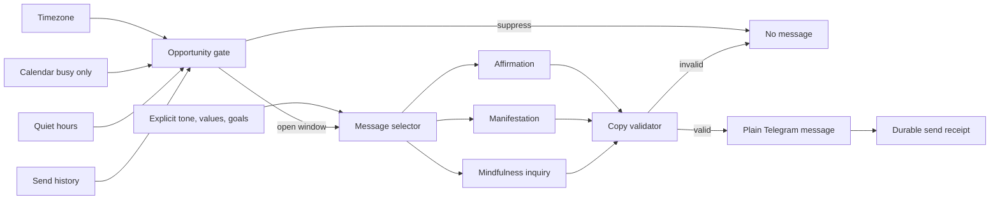
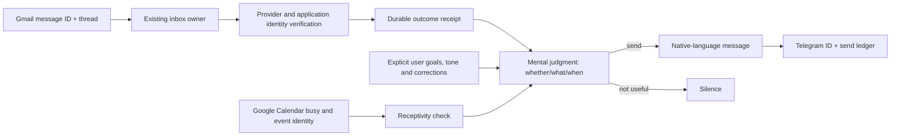

# Life Manager Mental Messages V1 Design

**Status:** V1 implementation live; natural canary remains open
**Owner:** Life Manager cloud runtime
**Primary locale:** Japanese
**Scope:** Gmail/Calendar-aware mental UX and its staged implementation; email action ownership stays with existing loops

## 1. Outcome

Life Manager becomes the user's trusted front door to important life events. It reads connected Gmail and Calendar through existing owner paths, reports verified outcomes, handles eligible routine follow-up within delegated boundaries, and offers a brief mental intervention only when the content and moment fit. The user need not poll Gmail to discover a job result, interview invitation, or important deadline.

V1 is deliberately narrow:

1. affirmation messages;
2. manifestation messages that turn an intention into a controllable action;
3. mindfulness prompts and reflective questions (`問いかけ`).

Mental messages contain no buttons, no repeated sender prefix, and no mandatory reply. They may name a verified event, but may not claim what the user feels or has prepared without evidence. Operational mail-result reports remain distinct from the optional mental message; routine replies are sent by the owning workflow rather than by MENTAL.

The independent Telnyx `/calls` error `90029` remains the first repair milestone, but it is not part of mental-message semantics.

## 2. Correction to the previous design

The previous version treated future context sources as though they were already available. Current source inspection proves that is unsafe:

- `scheduler.js` marks an event `important` when it has a location or attendees. That does not prove it is a presentation or that the user has prepared.
- An event lasting at least 90 minutes is marked `intense`. That does not prove the user concentrated for 90 minutes.
- Production location may be `unknown`.
- The current mental runtime has no authoritative completed-task count, mood signal, preparation receipt, screen-time duration, hydration state, or posture state.

Therefore these messages are prohibited in V1:

- `必要なものは持ってきてる。あとは話すだけ。`
- `今日はすでに3件終えています。`
- `90分集中していました。`
- `落ち込んでいる今も、立て直そうとしています。`

They may become legal later only when the exact premise has a named, current, authoritative source and a freshness rule.

## 3. Product principles

1. **No invented context.** Unknown never becomes a personalized claim.
2. **Context is first used to avoid interruption.** Calendar busy state, quiet hours, daily cap, and recent-send state decide when to stay silent.
3. **Stable personalization before live personalization.** Locale, tone, values, and explicit goals are safer than inferred emotions or activity.
4. **No interaction debt.** A message does not include buttons and does not require a reply.
5. **A question may be contemplative, not operational.** `問いかけ` may use `？`, but must remain useful when unanswered and must not say `返信して`, `教えて`, or equivalent.
6. **Manifestation is action-oriented.** It may express possibility and intention, but never promise that thought alone changes external reality.
7. **Silence is a valid output.** Missing timezone, unreadable send history, quiet hours, active calendar event, daily cap, or duplicate context suppresses delivery.
8. **No new loop.** Reuse the existing scheduler, Telegram transport, mental runtime, and send ledger.

## 4. What Life Manager actually knows

### 4.1 V1-authorized sources

| Claim class | Authoritative source | Freshness | Allowed use |
|---|---|---|---|
| Local time/day | User timezone or explicit UTC offset | Current tick | Select morning/day/evening family |
| User is in a calendar event | Calendar start/end | Current tick | Suppress delivery only |
| Recent message count/time | `lm_mental_send_log` | Current local day | Cap, spacing, dedupe |
| Quiet hours | Runtime preferences | Current preference | Suppress delivery |
| Locale and tone | Explicit runtime preference | Until changed | Select copy bank |
| Values or goal | Explicit user-authored durable profile entry | Until superseded | Select relevant affirmation/manifestation; never claim progress |
| Bedtime goal | Explicit preference | Current local day | Select evening/release family |

### 4.2 Not known in V1

The following remain `unknown` unless a later milestone adds the stated receipt:

| Proposed fact | Required future evidence |
|---|---|
| `準備できている` | Explicit preparation completion receipt |
| `3件終えた` | Durable completed-action ledger rows with current-day scope |
| `90分集中した` | Authorized activity/focus-session measurement |
| `落ち込んでいる` | User-authored mood input; never inferred from silence |
| `水分不足` | User-authored or authorized sensor evidence |
| `座り続けている` | Authorized device/activity evidence |
| `発表が重要` | Explicit event classification, not attendees/location heuristic |

### 4.3 Truth rule

Every variable in a message template must declare:

```text
source -> timestamp -> freshness limit -> transformation -> rendered claim
```

If any link is absent, stale, ambiguous, or unreadable, that variable is unavailable. The runtime either selects a context-free template or stays silent.

## 5. V1 architecture



Current execution path remains:

```text
scheduler.js
  -> mentalV1Deps(...)
  -> mentalV1UserOnce(...)
  -> evaluateMentalOpportunity(...)
  -> selectMentalQuote(...)
  -> validateMentalMessage(...)
  -> Telegram sendMessage(...)
  -> recordMentalSend(... family/template/local_day/window ...)
```

The legacy `mental-trigger.js` and `mental-runtime.js` contracts remain loadable for existing
precepts/evaluation tests, but the scheduler's production MENTAL organ does not use
`pre_event`, `between_events`, `pre_sleep`, event importance, location, attendee, or duration
judgments. Calendar contributes only the current busy interval suppression input.

## 6. Delivery timing

The three windows below are a fallback for days without a verified event. They are not three required sends. The scheduler can evaluate every 30–60 minutes and on a new verified Gmail/Calendar outcome; most evaluations end in silence. Event-driven interventions supersede a routine window message rather than add to the user's notification load.

Default opportunity windows in the user's local time:

| Window | Time | Eligible family |
|---|---:|---|
| Morning orientation | 07:30–09:30 | personalized affirmation |
| Midday awareness | 12:00–15:00 | mindfulness or body-awareness inquiry |
| Evening direction | 20:30–22:30 | manifestation, release, or rest |

Rules:

- Default is three message opportunities per local day: morning, midday, and evening.
- Maximum three delivered mental/body messages per local day.
- Minimum three hours between delivered messages.
- Never send during a current calendar event.
- Never send inside quiet hours.
- Use a deterministic per-user/per-day minute inside the selected window so the whole fleet does not fire at one time.
- Do not describe the selected minute as emotionally optimal.
- A user-authored goal may influence message selection, not factual claims.
- If no eligible non-repeated message fits the person, skip that window rather than send filler.
- A verified positive/negative/ambiguous outcome is reported by its owning loop promptly, independent of the mental-message cap. MENTAL separately decides whether a supportive message is warranted, considering the user's local time and current/next Calendar event.
- New mail during a meeting is held until the meeting ends unless an independently defined urgent operational deadline requires earlier notice. An inferred emotion never creates urgency.
- A morning/evening generic message is omitted if an event-driven message has already served the same purpose that day.

The default UX is zero to three mental/body messages. It is not “three messages every day.” Operational receipts from Jobs, CFO, Investment, Calendar, or Care are separate, but their timing is considered so a supportive message does not pile onto a result notification.

## 7. Catalog sources: external reuse only

Life Manager does not use the internal Anicca affirmation catalog. It imports only reviewed external OSS source material with pinned commits and text-level provenance.

### 7.1 Approved source set

| Source | Pin | License | Use |
|---|---|---|---|
| [humancto/antara-remarkable](https://github.com/humancto/antara-remarkable) | `bdaf5a19e6401c771e097e04bc3fcc16d44eb835` | MIT | Primary source for enoughness, rest, boundaries, courage, self-trust, body awareness, imperfection, and starting again |
| [lifeLessCoder/Mental-Buddy](https://github.com/lifeLessCoder/Mental-Buddy) | `05e0522deae5943ac2704826cbe3cdc124d9fedf` | MIT | Secondary source for self-worth, resilience, calm, presence, daily orientation, and evening release; every item is screened |
| [ghall89/journal-prompts](https://github.com/ghall89/journal-prompts) | `6a180a182273f52d317d771e39546373beebac21` | MIT | Source for mindfulness, reflection, values, goals, body-awareness, and manifestation inquiries; only low-burden prompts are used |

Rejected in V1:

| Source | Reason |
|---|---|
| `ContionMig/Mitsuzi-JS` | Mixed third-party quotations, medical claims, relationship predictions, universe claims, and absolute manifestation language |
| `DNSERR/confidencecrew` | Duplicates, destiny/success claims, extreme language, and unclear per-item provenance |

Repository license alone is insufficient when a file aggregates third-party quotations. Each imported item must either be authored by the repository source under its license or have separate text-level provenance.

### 7.2 What is reused

The English source text is stored unchanged. Japanese text is a reviewed translation tied to the exact source item; it is not generated at delivery time.

Examples from the approved sources include:

| Source | Exact English source | Life Manager theme |
|---|---|---|
| Antara | `i am enough as i am right now.` | enoughness, self-worth |
| Antara | `i am allowed to rest before i am exhausted.` | rest, boundaries |
| Antara | `my courage does not need to be loud to be real.` | courage, confidence |
| Antara | `i can take the small step even while afraid.` | courage, action |
| Antara | `i am here, in this body, breathing.` | presence, body awareness |
| Antara | `i can unclench my jaw and mean it.` | body awareness |
| Antara | `my body is not a project, it is a home.` | body respect |
| Antara | `my mistakes are tuition, not verdicts.` | self-compassion |
| Mental Buddy | `I am enough just as I am.` | self-worth |
| Mental Buddy | `I do not have to believe everything I think.` | cognitive distance |
| Mental Buddy | `My breath anchors me to the present.` | mindfulness |
| Mental Buddy | `Small progress is still progress.` | growth |
| Journal Prompts | `If my body could speak, it would tell me to` | body inquiry |
| Journal Prompts | `I can take better care of myself by` | physical intention |
| Journal Prompts | `My top three priorities right now are` | attention inquiry |
| Journal Prompts | `If failure wasn’t an issue, I would` | manifestation inquiry |

Items implying a current emotion, clinical condition, guaranteed result, or observed behavior are excluded unless the sentence remains universally valid without context.

### 7.3 Import manifest

Every imported catalog has a pinned manifest:

```json
{
  "source_id": "antara-remarkable-affirmations",
  "source_repo": "humancto/antara-remarkable",
  "source_commit": "bdaf5a19e6401c771e097e04bc3fcc16d44eb835",
  "source_path": "content/collections/affirmations.json",
  "license": "MIT"
}
```

The importer computes and stores `imported_sha256`. Manifests also store the license URL, author field when available, exact upstream text, reviewed Japanese translation, reviewer version, and rejection reason for excluded items. Unlicensed or ambiguous text never enters the production bank.

## 8. Catalog classification and personalization

Life Manager personalizes by selecting an existing catalog item, not by asking an LLM to rewrite it.

Each approved quote receives Life Manager-owned metadata without changing the source text:

```json
{
  "id": "antara:affirmations:enough-right-now",
  "source_id": "antara-remarkable-affirmations",
  "source_quote_id": "i-am-enough-as-i-am-right-now",
  "family": "affirmation",
  "themes": ["self-worth", "enoughness"],
  "tones": ["gentle", "direct"],
  "windows": ["morning_orientation", "evening_direction"],
  "risk_flags": [],
  "localized_text": {
    "ja": "私は今のままで十分です。",
    "en": "i am enough as i am right now."
  }
}
```

### 8.1 User personalization inputs

Stable profile selection uses only explicit, durable user facts. A verified event outcome may temporarily affect the intervention choice, but is not written back as a permanent personality trait. Every profile tag retains source references instead of becoming an unexplained model judgment:

```json
{
  "tag": "self-worth",
  "weight": 1.0,
  "source_refs": ["telegram-message://..."],
  "basis": "explicit_user_statement",
  "observed_at": "RFC3339 timestamp",
  "expires_at": null
}
```

Eligible profile inputs:

```text
preferred locale
preferred tone: gentle / direct / spiritual-neutral
explicit statements such as low confidence, self-hatred, stress, or a wish to be more mindful
explicit values: growth / peace / courage / self-worth / rest / boundaries
explicit goals
explicit themes to avoid
recently delivered quote IDs
current delivery window
```

Calendar titles, silence, response time, notification opens, and inferred mood do not modify the mental profile.

### 8.2 Gradual personalization

Personalization changes with each person, but it earns specificity gradually:

| Stage | Evidence | Behavior |
|---|---|---|
| Bootstrap | Locale, timezone, explicit current conversation, existing durable goals | Select broad matching themes immediately; no inferred mental state |
| First 7 days | Delivery history and calendar availability | Avoid repetition and move delivery within the three safe windows; do not claim effectiveness |
| Days 8–21 | Repeated explicit themes across conversations | Increase weight only when the person directly states the same need more than once; retain source refs |
| Mature profile | Explicit corrections, spontaneous reactions, changed goals, stable routine | Adjust themes, tone, and timing; old themes decay or are superseded |

No button is needed. Learning comes from normal conversation and explicit corrections. In the absence of a real response signal, Life Manager learns only timing and dedupe, not whether the message emotionally worked.

### 8.3 Deterministic selection

For every eligible quote:

```text
score =
  +4 for each explicit-value/theme match
  +3 for an explicit-goal/theme match
  +2 for preferred-tone match
  +1 for delivery-window match
  -1000 if theme is explicitly avoided
  -1000 if quote was delivered within 14 days
  -1000 if any safety/risk flag is present
```

Ties are broken deterministically by `uid + local_day + window + quote_id`. Selection produces the existing localized text byte-for-byte.

### 8.4 Manifestation

Manifestation is a catalog classification, not newly generated prose. Only catalog items about direction, possibility, growth, and controllable action qualify. Items promising inevitable success, attraction of wealth, perfect health, destiny, or intervention by the universe are rejected.

An explicit goal selects a matching quote but is not interpolated into the quote in V1. This avoids awkward or unsupported rewriting.

### 8.5 Mindfulness inquiry (`問いかけ`)

If a catalog contains an approved question, it can be delivered verbatim. When an affirmation is converted into a question, the question must be a separately reviewed catalog variant linked to its source ID:

```json
{
  "id": "life-manager:inquiry:antara-body-breathing:ja:v1",
  "derived_from": "antara:affirmations:i-am-here-in-this-body-breathing",
  "reviewed_text": "いま、身体と呼吸に気づいている？",
  "family": "mindfulness_inquiry"
}
```

Runtime generation or ad-hoc paraphrasing is prohibited. The reviewed inquiry is stored and tested like any other catalog item. It remains useful without an answer and carries no button or reply instruction.

### 8.6 Physical-life management

Physical management has two layers.

**Layer 1 — body awareness without sensors:** the midday message selects reviewed OSS body-awareness text or inquiry. It does not claim what the body is doing.

Examples derived from the approved Antara source set:

- source `i am here, in this body, breathing.` -> reviewed Japanese `私はこの身体にいて、呼吸しています。`
- source `i can unclench my jaw and mean it.` -> reviewed Japanese `顎の力を、いま少しゆるめられる。`
- source `my shoulders are allowed to drop.` -> reviewed Japanese `肩の力を下ろしていい。`
- source `my body is not a project, it is a home.` -> reviewed Japanese `身体は直す対象ではなく、私が暮らす場所です。`
- source `i can drink water and call that care.` -> reviewed Japanese `水を飲むことも、自分を大切にすることです。`

These are invitations, not claims that the person is dehydrated, tense, sitting, or unhealthy.

**Layer 2 — actions backed by records:** existing Life Manager physical and diet organs manage explicit routines and care continuity.

| Area | What Life Manager can use | What it may do |
|---|---|---|
| Sleep | Explicit bedtime/wake goal and calendar | Protect quiet hours, reserve sleep window, send evening release message |
| Meals | Explicit meal preference and calendar gaps | Reserve a meal window; never claim the person ate |
| Exercise | Explicit goal and scheduled/confirmed activity | Reserve recurring activity blocks and follow through |
| Dental/medical/hair care | Verified visit history, explicit cadence, provider receipts | Detect due care, search, book within delegated boundaries, report confirmed appointment |
| Medication or clinical care | Explicit professional plan only | Remind exactly as authorized; never prescribe or modify |
| Live body state | Authorized wearable/sensor integration, added later | Use only the named fresh measurement |

Physical operational receipts are separate from the three daily mental/body messages. A confirmed appointment or urgent care reminder is sent when required, even if the message budget is otherwise full.

## 9. Gmail- and Calendar-aware mental experience

### 9.1 What the person experiences

Life Manager, not a mailbox app, is the place the person learns what matters. A new message is processed by the existing mail owner; unimportant mail is silently archived/classified according to that owner's policy, actionable mail is handled when the action is in scope, and material outcomes are reported once. A mental message is a separate, optional intervention, never a mandatory caption attached to every email.

| Moment | What arrives in Telegram | What stays silent |
|---|---|---|
| Ordinary day with no material event | One well-selected affirmation or inquiry in a free window, or nothing | Every inbox poll and routine mail |
| Interview invitation verified | `面接の案内が届きました。日時の候補を確認し、予定が重ならない枠で調整しています。` Then a confirmed time/Calendar receipt if completed | “You got the job,” or unsupported claims about confidence |
| Confirmed rejection | `○○の選考は今回は見送りでした。次の応募は継続しています。` Later, if the person is free and the profile favors gentle language: `今回の結果で、あなたの価値まで決まるわけじゃない。今日はここまでにしていい。` | Instant cheerleading, forced manifestation, or “you must be devastated” |
| Confirmed offer or acceptance | `○○から内定の連絡です。条件と返答期限を確認しました。` An optional natural line later: `うれしい知らせだね。ここまで来たことを、今日はちゃんと受け取っていい。` | A celebratory claim before official verification |
| Important meeting on Calendar | No routine message while the event is active. If the event is explicitly classified and a pre-event window is open, a brief grounded line may arrive | “準備はできてる” unless preparation has a separate receipt |
| YC/accelerator mail | Only after the exact program, application, sender, and decision are verified; report the decision and deadline. A gentle mental line is selected separately | Treating an ambiguous update or marketing email as acceptance/rejection |
| Several difficult outcomes in one day | One consolidated factual report and, at most, one carefully timed mental message | One affirmation per rejection, notification pile-up |

These are UX examples, not claims that all event types are implemented today. The first evidence-backed integration is Job Hunter's existing Gmail message-ID and application/interview ledger. YC/general inbox outcomes require a separate owner before these examples may be sent.

### 9.2 How the agent knows



The Gmail body is untrusted content. Its instructions are never agent instructions. A model may interpret a new recruiting message, but the claimed outcome must be bound to the immutable message ID, exact application/program identity, sender evidence, timestamp, and owning ledger. Ambiguity produces `unknown`, not an emotional intervention. Calendar provides busy intervals and verified event timing; attendee/location heuristics alone do not prove importance, preparation, or the user's mood.

Current code evidence: `apps/job-search-loop/job_search_loop/inbox.py` expands unseen Gmail message IDs; `apps/job-search-loop/README.md` documents 15-minute inbox checks and a confirmation/reply contract. `apps/life-manager/lib/transport/mail-gog.js` and `mail-unipile.js` expose local/cloud mail adapters, but the current `mental-runtime.js` does not consume a verified mail outcome. The design reuses the owner output and avoids a second inbox poller inside MENTAL.

### 9.3 Decision point, not message cadence

The owner may check Gmail every 15 minutes and MENTAL may evaluate every 30–60 minutes or on a new verified outcome. Those are decision opportunities, not promises to send. Before a send the agent asks: Is this new and important? Is the identity and result verified? Has the user already been told? Are they in a meeting, asleep, moving, or receiving another urgent report? Will a mental line help this particular person now, or sound intrusive? A bounded policy enforces dedupe, quiet hours, cap, and provenance; model judgment chooses the supportive intent and a reviewed native-language variant. This separation follows JITAI design's distinction between decision points, tailoring variables, intervention options, and receptivity. See [Nahum-Shani et al.](https://pmc.ncbi.nlm.nih.gov/articles/PMC5364076/) and the [mental-health JITAI review](https://pmc.ncbi.nlm.nih.gov/articles/PMC11811111/).

The result report is prompt because it replaces checking mail. The mental line may be immediate, delayed until a free window, or omitted. A rejection is not proof of depression; an acceptance is not proof of happiness.

### 9.4 Mail replies and autonomy boundary

“I do not have to check mail” requires a separate inbox outcome-and-action owner, not merely the MENTAL organ. Existing Job Hunter may answer narrow verified recruiter questions and schedule complete interview proposals; ambiguous, legal, work-authorization, salary-history, or other non-delegated questions stop without a reply. General Gmail autonomy is a separate product milestone: each mail class needs an owner, allowed response scope, identity verification, idempotent send key, sent-mail readback, and escalation for ambiguity. “Reply to every mail” is not a goal; no-reply, spam, promotional, or unsafe threads should not be answered. MENTAL reads the verified result receipt, never sends mail itself.

### 9.5 Native-language writing contract

OSS catalogs supply themes and candidate source lines; a literal Japanese translation is not production copy. The previous examples `私は今のままで十分です。` and `身体は直す対象ではなく、私が暮らす場所です。` are understandable but may feel like translated slogans. A Japanese editor/reviewer writes and approves a natural `ja-JP` rendering for each selected theme, and an English editor independently approves `en` copy. Where a native Japanese source with clear reuse rights exists, it may be preferred to translation. Neither locale is generated by translating the other's final text at send time.

Examples of the intended Japanese register:

| Context | Natural candidate copy | Evidence requirement |
|---|---|---|
| General self-worth | `今日うまくいかないことがあっても、自分まで否定しなくていい。` | None; does not assert a failure occurred |
| General permission to rest | `休むのに、理由や資格はいらないよ。` | None |
| Mindfulness inquiry | `いま、呼吸はどんな感じ？` | None; rhetorical, no reply required |
| Manifestation grounded in action | `なりたい自分のために、今日は何をひとつ選ぶ？` | None; does not guarantee an outcome |
| Verified rejection, gentle profile | `今回は通らなかった。それと、あなた自身の価値は別の話だよ。` | Verified rejection receipt |
| Verified offer | `いい知らせが届いたね。今日は、うれしさをそのまま受け取っていい。` | Verified offer receipt; no inferred emotion |
| Confirmed upcoming presentation | `もうすぐ発表だね。まずは最初の一文からでいい。` | Explicit event type and start time; no preparation claim |

These examples are editorial candidates, not pre-approved production strings. The final localized catalog records source inspiration, locale-native text, reviewer, version, and banned/allowed contexts. Blind scoring of exact translated words is insufficient; naturalness is a user-facing acceptance criterion in Japanese and English before either is sent broadly. A reviewer reads each line aloud and rejects awkward pronouns, translated metaphors, exaggerated certainty, and register inconsistent with the person's preference; the user can correct a line in ordinary chat and that correction supersedes the variant for that user.

### 9.6 Personalization and self-improvement without a human loop

Normal operation never asks for a rating, button tap, survey answer, or “did this help?” reply. The person can speak naturally if they want; that unsolicited correction is an input, not a required step.

The agent improves three different things, in this order:

1. **Truth:** did every personal claim have the correct source receipt and freshness window?
2. **Receptivity:** did the system avoid Calendar busy time, quiet hours, duplicate reports, notification pile-up, and repeated text?
3. **Fit:** did the selected source theme, tone, locale variant, and timing match explicit profile evidence?

The system does not claim emotional benefit from a delivered message, lack of reply, read state, or a later unrelated action. Those observations can influence a conservative receptivity policy only after repeated evidence; they never become `helped=true`.

Every decision records an internal evaluation row:

```text
decision_id
source_receipt_refs
profile_version
candidate_quote_ids
selected_quote_id or silence_reason
calendar_busy_version
delivery_window
telegram_message_id or null
policy_version
```

An offline evaluator can propose a policy change from these rows. The harness accepts it only when replayed cases show lower false-claim, interruption, duplicate, and repetition rates without reducing verified material-outcome reporting. The new policy starts in a bounded canary and can be rolled back by policy version. No user interaction is needed for this loop.

One owner updates the profile. The mail owner, Job Hunter, Calendar, and MENTAL do not independently invent different stories about the same result.

### 9.7 Crisis boundary

This is a supportive companion, not a suicide-prevention or depression-treatment system. A generic affirmation must never be presented as a reliable rescue. If the user explicitly expresses imminent self-harm intent in conversation, ordinary catalog delivery stops and the existing safety path should offer immediate human/crisis support appropriate to the user's location; it must not promise monitoring, emergency dispatch, or clinical protection unless those services are actually operating and verified. An email rejection, Calendar gap, or lack of response is not a crisis signal. [NIMH suicide-prevention guidance](https://www.nimh.nih.gov/health/topics/suicide-prevention) emphasizes prompt human support and emergency services for life-threatening situations.

## 10. Copy contract

All V1 copy must satisfy:

- 80 Japanese characters or fewer.
- Plain Telegram text only.
- No inline keyboard or callback data.
- No sender signature such as `Life Manager:::`.
- No user name unless explicitly required later.
- No exclamation-heavy encouragement.
- No diagnosis, therapy claim, crisis inference, wealth promise, or guaranteed result.
- No `あなたは今〜している`, `〜を完了した`, or numeric personal fact without an authorized source.
- Affirmation may be a statement.
- Manifestation must preserve agency and avoid magical causation.
- Mindfulness inquiry may use `？` but cannot ask for a reply.

The validator rejects reply-seeking phrases:

```text
返信して / 教えて / 答えて / 押して / 選んで / let me know / reply / tell me
```

## 11. Selection and repetition

V1 uses the imported, classified catalog, not free-form LLM generation.

Selection key:

```text
uid + local_day + window + eligible_quote_ids + explicit_profile_tags
```

- Do not repeat the same template for the same user within 14 days.
- Do not send the same family twice on the same day.
- If no non-repeated eligible template exists, stay silent.
- Delivered text must equal the approved localized catalog text byte-for-byte.
- LLM generation is not part of V1.

No feedback buttons exist. V1 does not claim to learn message preference from silence. Any later adaptation must name a real signal such as explicit conversation, reaction, or settings change.

## 12. Data and privacy

Reuse `lm_mental_send_log`. Extend it only if current columns cannot store:

```text
family
template_id
local_day
window
delivered Telegram message_id
```

Do not add raw calendar titles, inferred mood, message-reply tracking, location coordinates, journal content, or a new mental profile database.

The durable profile may contain only explicit, user-authored values/goals and presentation preferences. A system inference is never written back as a user fact.

## 13. Evidence-backed context unlocks

Future contextual messages are separate milestones. Each is disabled until its evidence contract passes production readback.

| Unlock | Required contract | Then-legal example |
|---|---|---|
| Important-event support | Explicit event type + current calendar event | `14時の発表まで30分。最初の一文だけ整えればいい。` |
| Preparation confidence | Current preparation receipt tied to event | `必要なものは揃っている。あとは話すだけ。` |
| Small-win reflection | Current-day completed-action receipts | `今日は3件終えている。その事実は残っている。` |
| Physical reset | Authorized current activity measurement | `90分座っている。少し歩く時間です。` |
| Self-compassion after setback | Exact verified Gmail/provider outcome from its owning loop | `今回は通らなかった。それと、あなた自身の価値は別の話だよ。` |

The first prioritized unlock is the existing Job Hunter verified outcome projection described in §9.2. A YC/general-mail outcome follows only when its separate owner establishes the same verification contract. The receipt authorizes only the matching claim: a Calendar event never authorizes `準備済み`, and a job rejection never authorizes an inferred mood.

## 14. Failure behavior

| Failure | Behavior |
|---|---|
| Timezone absent or invalid | Suppress |
| Calendar unavailable | Suppress rather than risk interrupting an event |
| Send history unreadable | Suppress rather than exceed cap or repeat |
| No eligible non-repeated template | Suppress |
| Catalog manifest hash differs | Suppress; do not load an unreviewed catalog |
| Source license/provenance missing | Exclude source at build/import time |
| Template uses unavailable variable | Reject before Telegram |
| Telegram failure | Do not record a delivered send |
| Receipt write fails after delivery | Record reconciliation evidence by Telegram message ID; never resend blindly |
| Mail is ambiguous, stale, spoofed, or not tied to an application/program | Report uncertainty through the mail owner if material; no contextual mental message |
| User is in a meeting when an outcome arrives | Hold the mental line for a later receptive window or omit it; do not infer urgency from emotion |

## 15. Rollout

### Milestone A — Telnyx repair

Locate the actual producer of `time_limit_secs`, fix the shared provider boundary, deploy from merged `main`, and verify one real call without `90029`.

### Milestone B — Current MENTAL truth audit

Verify Railway deployment `commitHash`, scheduler wiring, send ledger, timezone source, calendar availability, and Dais tenant eligibility.

### Milestone C — Japanese V1 canary

Enable the three V1 opportunities for Dais: morning affirmation, midday mindfulness/body awareness, and evening manifestation/release. Deliver at most three plain messages per local day for seven days. Buttons and unsupported personal claims remain zero.

### Milestone D — General Japanese rollout

Expand after canary acceptance. Context unlocks remain off independently.

### Milestone E — Job Hunter context, then separate mail expansion

Connect the verified Job Hunter Gmail outcome to MENTAL first. Keep the owner result report and mental line separate. Add one evidence-backed context class at a time; each needs source, freshness, test, cloud readback, and replay-zero before its copy is legal. General Gmail and autonomous replies require their own mail-owner plan.

Anicca assets and Anicca iOS are not part of this runtime or rollout. Anicca iOS remains a separate product created and operated by Life Manager's mobile-app loop.

## 16. Acceptance criteria

- Only `affirmation`, `manifestation`, and `mindfulness_inquiry` are enabled in V1.
- Every production message resolves to a source ID, pinned manifest, quote ID, and approved localized text.
- Only the three pinned external OSS sources listed in section 7 are eligible for V1 import.
- No unlicensed or ambiguous external text is imported.
- Every message is plain text with zero buttons and zero reply instruction.
- Maximum three V1 mental/body messages per user/local day.
- Minimum three hours between messages.
- Zero messages during current calendar events or quiet hours.
- Zero personal activity, achievement, emotion, preparation, or physical-state claims without an authorized source.
- Zero repeated template IDs within 14 days for the same user.
- Every delivered message has a positive Telegram message ID and one durable send receipt.
- Replaying the same user/day/window produces zero duplicate messages.
- Seven-day Dais canary contains at least one delivered message from each family.
- A verified Job Hunter rejection/offer/interview can produce a factual owner report and at most one appropriate mental line; `unknown` produces no contextual line.
- Calendar busy time defers or suppresses optional mental copy; 30/60-minute evaluation never implies 30/60-minute sending.
- Japanese and English variants are independently reviewed for native fluency, not literal translation.
- The user can learn a verified material mail outcome without opening Gmail; no email response is sent by MENTAL.
- Explicit imminent self-harm language takes the safety path, not an affirmation; no suicide-prevention claim is made.
- Telnyx acceptance remains independently satisfied.

## 17. Non-goals

- Inferring mood from silence, calendar gaps, response time, or message opens.
- Claiming a person prepared, focused, completed work, exercised, ate, drank, slept, or felt something without evidence.
- Buttons, daily check-ins, required replies, surveys, journaling, or streaks.
- A new mental daemon, database, agent framework, or mobile app.
- Importing Anicca catalogs or integrating Anicca iOS.
- Clinical diagnosis, therapy, emergency automation, or treatment claims.
- Magical manifestation or guaranteed outcomes.
- Runtime LLM rewriting, paraphrasing, translation, or interpolation of catalog prose.
- Answering all mail, treating all unread mail as important, or making MENTAL an inbox owner.
- Claiming to detect depression or suicidality from mail outcomes, non-response, or Calendar patterns.

## 18. Decision record

**Chosen:** select verbatim, licensed catalog text using stable preferences and low-interruption opportunity windows.

**Prioritized next:** reuse Job Hunter's exact Gmail outcome receipts for contextual messages; do not build a second inbox reader. Keep YC/general mail, broad reply automation, and sensor-based physical claims behind separate owners and evidence contracts.

**Reason:** reuse proven words; personalize the selection, not the truth of the sentence.

## 19. Current implementation status, remaining TODO, and blocker

This section is the operational status of the design. The production evidence ledger is
`docs/evidence/life-manager-mental-canary.md`; its provider readbacks, not a local test or a
synthetic row, decide whether a rollout milestone is closed.

### 19.1 Done now (implemented and verified)

- The shared Telnyx boundary clamps `time_limit_secs` to an integer with a minimum of 30. One
  authorized production test call returned a provider receipt without `90029`; duplicate-call
  replay-zero remains a separate proof item.
- The production scheduler uses the V1 path `scheduler.js -> mentalV1UserOnce`, with only
  `affirmation`, `mindfulness_inquiry`, and `manifestation` (evening fallback `affirmation`).
- The three local-time opportunity windows, three-message cap, three-hour spacing, calendar-busy
  suppression, strict send-history gate, allowlist, and deterministic catalog selection are live.
- Japanese and English catalogs are imported from the three pinned external OSS sources in §7.
  No internal Anicca catalog is on this path, and delivery is verbatim catalog text with no
  buttons or reply instruction.
- Explicit profile/correction intake, the signed verified-outcome bridge, the bounded safety
  adapter, and the offline policy scorecard are implemented and covered by focused tests.
- Repository-owned durable decision rows for in-window send/silence decisions, replay keys, and
  post-Telegram receipt completion are implemented and covered by focused tests. The additive
  production migration is present; production application/readback is still an open gate. The
  runtime requires `LM_MENTAL_DECISION_LOG_REQUIRED=1` only after that readback; until then it
  preserves the existing send-ledger path during migration rollout.
- Explicit per-user quiet-hours columns, bounds, pair validation, scheduler read, and migration
  fallback are implemented. A reply to a durable V1 message can now map its known window to the
  quiet-hours preference; no free-form time is inferred.
- The live `life-call` deployment is `92e9fc01664b65e8a22d37d3969b8379c67cb1fe` with `/health`
  returning `200`; production schema/RLS readback and the Dais-only tenant preflight are recorded
  as passing in the evidence ledger. These are not the current release blocker.

### 19.2 Not done yet (current observed state)

- The latest automated canary readback recorded in the evidence ledger is `v1_count=1`,
  `legacy_count=33`, with one `morning_orientation` affirmation and structural `pass=true`.
  This is one natural receipt, not a seven-day canary pass.
- The first natural morning receipt now has provider-native body readback in the `Cloud Life
  Manager` dialog: the same-second inbound message matches the approved Japanese catalog template,
  has no reply markup/buttons, and is not an outgoing user message. The Bot API and MTProto IDs are
  different API identifiers; their same-second/template match is recorded without assuming an ID
  equivalence.
- The signed outcome bridge has only synthetic proof so far. Its test row, send receipt, and
  Telegram message were deleted and do not count toward the natural canary.
- The following work is still open; the order is intentional and is the execution cursor for this
  design.

### 19.3 Remaining TODO — execute in this order

| Step / state | TODO | Completion evidence |
|---|---|---|
| 1 — BLOCKED by wall clock | Observe a natural Dais morning, midday, and evening opportunity. | Provider-native Telegram message ID, exact text, family/window, and durable `lm_mental_send_log` row for each family. |
| 2 — OPEN after step 1 | Keep the Dais-only canary running for seven consecutive local days. | Daily decision/send ledger with no synthetic rows and at least one real delivery from every V1 family. |
| 3 — OPEN after step 2 | Close safety and UX counters and read back the actual Telegram messages. | `<=3` per local day, `>=3h` spacing, zero Calendar-busy sends, zero configured quiet-hour sends, zero unsupported claims, zero repeated templates within 14 days, replay-zero, and plain text with no keyboard/callback data, sender prefix, reply instruction, or unnatural/unreviewed locale text. |
| 4 — IMPLEMENTED LOCALLY; production gate open | Apply/read back the closed decision-row migration, set `LM_MENTAL_DECISION_LOG_REQUIRED=1`, and add bounded policy promotion/rollback. | Production rows contain policy/profile versions, candidate/selected quote or silence reason, source refs, busy state, window, locale, and Telegram ID; old/new replay score promotes only when safety does not regress. |
| 5 — IMPLEMENTED LOCALLY; production gate open | Apply/read back the explicit per-user quiet-hours source. | The versioned preference fields are populated/read by the scheduler and suppression is observed; incomplete pairs fail closed. |
| 6 — OPEN for full acceptance | Verify the existing crisis handoff owner and route. | A tested, location-appropriate handoff is read back; until then MENTAL makes no suicide-prevention or emergency-support claim. |
| 7 — OPTIONAL, non-blocking | Run Telnyx duplicate/replay-zero if the stronger provider proof is required. | A second authorized test is deduplicated or otherwise reconciled without an unapproved duplicate effect. This does not block the mental canary. |
| 8 — LOCKED until P0 | After the canary, unlock verified Job Hunter outcome context, then any separate general-mail owner. | Freshness, owner receipt, native copy, production readback, and replay-zero for each context class; no second Gmail poller. |
| 9 — SEPARATE product | Review Anicca iOS affirmation copy independently. | Separate mobile-app acceptance; no Life Manager runtime dependency or shared ledger. |

### 19.4 What is blocking now

**Primary blocker:** the natural seven-day provider observation has only one morning row. Its
provider-native Telegram body is now read back, but midday and evening families plus six more local
days are still missing. The structural evaluator reports one V1 row and `pass=true`, but that does
not prove family coverage, spacing, cap behavior, or replay-zero. This is a wall-clock dependency,
not a code or test failure.
Clock manipulation, synthetic rows, or a local unit-test pass cannot close it.

**Release consequence:** keep `LM_MENTAL_V1_ALLOWED_UIDS` restricted to Dais and do not expand to
general users until the P0 rows above are closed. Silence is the correct behavior while the canary
has no eligible natural receipt; it is not evidence of a successful canary.

**Secondary blockers for the full acceptance claim:** the decision-row and quiet-hours migrations
are implemented in the repository but have not yet been applied and read back in the live tenant;
and the crisis handoff owner has not been verified. These items do not prevent collecting the first
ordinary V1 message, but they prevent claiming the full self-improving, timing-personalized,
safety-complete rollout.

### 19.5 Next action

Continue the Dais-only natural canary through the three local windows, apply/read back the decision
and quiet-hours migrations, and record provider-native receipts in the evidence ledger. Close the
P0 checklist before changing copy, widening the allowlist, promoting a policy, or enabling
Gmail/Calendar outcome context. Once P0 is closed, apply/read back the migrations, complete policy
promotion, and verify the crisis route before general rollout.
