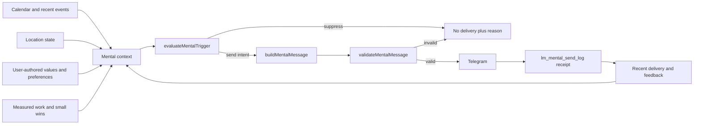

# Life Manager Mental and Physical Care Design

**Status:** Approved design, ready for implementation planning
**Owner:** Life Manager cloud runtime
**Primary locale:** Japanese
**Related incident:** Telnyx `/v2/calls` rejects `time_limit_secs < 30` with error `90029`

## 1. Outcome

Life Manager manages the person's mental and physical state as part of the same cloud life context that already manages calendar, calls, care, diet, and Telegram. It sends short, factual, personalized interventions at moments when they are useful, especially before demanding events, after strain, during unproductive loops, and before sleep.

The first production beneficiary is the Dais tenant. Japanese ships first. Other locales reuse the same semantic message intents only after the Japanese canary is measured.

This design also fixes the independent Telnyx call failure before mental work begins. The call fix and mental extension are separate releasable milestones.

## 2. Product principles

1. **One Life Manager, not another huge loop.** Reuse the existing 60-second cloud scheduler, user context, Telegram transport, `lm_mental_send_log`, main-to-Railway deployment path, and receipt conventions.
2. **Right moment beats fixed time.** Calendar, recent events, user timezone, location state, and send history determine whether to speak.
3. **Facts before slogans.** A message may mention only observed context or durable user-authored preferences. It must not invent feelings, success, failure, location, or health status.
4. **Affirmation means values and self-compassion, not magical certainty.** Manifestation copy converts intention into one immediate action. It never promises that thoughts alone cause an external outcome.
5. **Silence is a valid decision.** Mid-event, moving, quiet hours, missing context, unreadable send history, recent delivery, and daily-cap exhaustion suppress delivery.
6. **Mental health support is not diagnosis or treatment.** The loop does not diagnose depression, infer crisis from ordinary inactivity, replace professional care, or generate clinical claims.
7. **Physical and mental prompts share one attention budget.** A water, posture, breathing, or walking prompt competes with affirmation and mindfulness messages instead of opening another notification channel.

## 3. Evidence and OSS patterns

### 3.1 External evidence

- Telnyx documents `time_limit_secs` on the Dial endpoint; the observed provider response establishes the current minimum as 30 seconds: <https://developers.telnyx.com/api-reference/call-commands/dial>.
- Self-affirmation research supports reflecting on personally important values rather than repeating implausible generic praise: <https://pmc.ncbi.nlm.nih.gov/articles/PMC4814782/>.
- Strong positive self-statements can make some people with low self-esteem feel worse, so generated copy must be believable and evidence-based: <https://doi.org/10.1111/j.1467-9280.2009.02370.x>.
- Just-in-time adaptive intervention research treats timing, receptivity, burden, and context as parts of the intervention rather than delivery details: <https://pmc.ncbi.nlm.nih.gov/articles/PMC11862764/>.

### 3.2 OSS patterns to reuse conceptually

| Project | Useful pattern | What is not copied |
|---|---|---|
| [Mindfulness at the Computer](https://github.com/mindfulness-at-the-computer/mindfulness-at-the-computer) | Tiny breathing, body-awareness, and break interventions | Its desktop application and GPL code |
| [SampleU](https://github.com/forzaz/Mobile-Experience-Sampling-Master) | Signal-contingent intervention, notification scheduling, and intervention logs | Its Cordova/MySQL/Firebase stack |
| [Baseline](https://github.com/nkalupahana/baseline) | Mood/journal history as optional user-authored context | A new journaling product in this milestone |
| [MindfulnessMeditation](https://github.com/vbresan/MindfulnessMeditation) | Short guided breathing sessions and offline-first content | Audio sessions and a second mobile application |

## 4. Existing system

The repository already contains the correct core path:

```text
scheduler.js
  -> mentalDeps(...)
  -> mentalUserOnce(...)
  -> evaluateMentalTrigger(...)
  -> buildMentalMessage(...)
  -> Telegram sendMessage(...)
  -> recordMentalSend(...)
```

Existing files:

- `apps/life-manager/scheduler.js`: runs MENTAL on the shared cloud organ tick.
- `apps/life-manager/lib/mental-trigger.js`: pure trigger decision with a three-per-day cap and two-hour minimum gap.
- `apps/life-manager/lib/mental-runtime.js`: context read, message delivery, and receipt recording.
- `apps/life-manager/lib/mental-copy.js`: Japanese one-way message builder.
- `apps/life-manager/lib/mental-send-log.js`: shared attention ledger used by MENTAL and precepts.
- `apps/life-manager/migrations/2026-07-25-lm-mental-send-log.sql`: durable send history.
- `apps/life-manager/lib/care-daily-runtime.js` and `diet-runtime.js`: existing physical-life organs.
- `anicca-project/mobile-apps/rork-thankful-gratitude-app/ThankfulGratitudeApp/Models/AffirmationData.swift`: current Anicca affirmation seed bank.

The design extends these boundaries. It does not add a new daemon, scheduler, database, transport, LLM framework, or notification budget.

## 5. Architecture



### 5.1 Telnyx call boundary

Current `main` does not emit `time_limit_secs` from `telnyxDialBody`, while the observed Telnyx 422 proves the failing cloud request did contain that field. Therefore the first repair step is a read-only deployment/payload audit: identify the Railway deployment `commitHash`, the exact service that issued the request, and the sanitized numeric limit. This distinguishes deployment drift from a second raw `/calls` producer.

After the actual producer is located, all Life Manager outbound calls must converge on `telnyxDialBody`. It gains optional `timeLimitSecs` input and includes `time_limit_secs` only when the input is a finite number. The included value is `Math.max(30, Math.trunc(timeLimitSecs))`. Any direct request-body construction found by the audit is removed or routed through this builder.

The default call body remains byte-for-byte equivalent when no limit is supplied. This prevents an unrelated behavior change while making every future caller safe at the shared provider boundary.

### 5.2 Mental context

The context passed to the pure trigger contains only structured facts:

```js
{
  nowMs,
  sentTodayCount,
  lastSentMs,
  events: [{ startMs, endMs, important, intense, summary }],
  sleepTargetMs,
  quietHours: { start: "22:30", end: "07:30" },
  location: { state: "home|venue|moving|unknown" },
  recentSignals: {
    completedCount,
    rejectedOrFailed,
    longScreenSessionMinutes,
    lastMealAgeMinutes
  },
  preferences: {
    locale,
    tone,
    enabledIntents,
    mutedUntilMs
  }
}
```

`summary` is used only to name the next or previous event after sanitization and truncation. Absence of any optional signal never becomes a negative inference.

### 5.3 Trigger intents

| Intent | Evidence required | Window | Default action |
|---|---|---|---|
| `pre_event` | Next important event | 10–45 minutes before | Ground confidence in preparation and suggest the first sentence/action |
| `post_strain` | Intense event ended and next event is at least 60 minutes away | Within 30 minutes | Permit recovery and separate performance from identity |
| `mindful_pause` | Long screen/work block or explicit focus block ended | Within 15 minutes | One breath/body/attention action |
| `small_win` | Durable completed action count or explicit completion receipt | Within 60 minutes | Name the actual completed work |
| `self_compassion` | Explicit failure/rejection/late receipt, never inferred mood | Within 60 minutes | Separate the event from the person's worth and name the next repair |
| `intention` | User-authored goal plus a matching scheduled work block | 5–20 minutes before | Convert desired future into one immediate action |
| `pre_sleep` | User bedtime target, no upcoming event | 15–60 minutes before | End the day and protect sleep |
| `physical_reset` | Measured long sitting/screen interval or explicit meal/water reminder | After threshold | Water, posture, breathing, or ten steps |

Priority when more than one intent qualifies:

```text
self_compassion > pre_event > physical_reset > post_strain > mindful_pause > small_win > intention > pre_sleep
```

Only one intent may win per tick. All intents spend the same daily cap and minimum-gap budget.

### 5.4 Copy contract

Every Japanese message follows:

```text
observed fact + believable reframe + one action that takes 10–60 seconds
```

Hard rules:

- Maximum 120 Japanese characters by default.
- One-way statement; no reply request and no question mark.
- At most one emoji.
- No diagnosis, treatment claim, crisis conclusion, destiny claim, or promise of success.
- No invented count, event, feeling, relationship, body state, or achievement.
- Do not say `私は完璧`, `必ず成功する`, `宇宙が叶える`, or semantic equivalents.
- A manifestation line must include an immediate controllable action.
- A self-compassion line must not excuse harm; it may pair kindness with a specific repair.

### 5.5 Japanese message bank

The bank is stored as structured templates keyed by intent. These are canonical initial examples, not messages selected randomly without context.

#### `pre_event`

- `必要なものは持ってきています。あとは最初の一文を、ゆっくり話すだけです。`
- `準備したものはもう手の中にあります。全部を証明せず、一つ伝われば十分です。`
- `緊張と能力は別です。足を床につけて、最初の要点から始められます。`

#### `post_strain`

- `連続した予定をここまで終えました。次の10分は、水と呼吸に使っていい時間です。`
- `いま終えたところです。反省は休んだあとでもできます。まず肩を下ろせます。`
- `一つの言い間違いより、最後まで参加した事実の方が大きいです。`

#### `mindful_pause`

- `いま息を一度、吸うより長く吐きます。次に触るものは一つだけで十分です。`
- `画面から目を離して、見えるものを三つ確認します。焦りは命令ではありません。`
- `速く進む前に、足の裏と肩の力を一度確認する時間です。`

#### `small_win`

- `今日はすでに{completedCount}件を終えています。進んでいないという感覚より、この事実を残します。`
- `{completedItem}を完了しました。小さく見えても、望む方向へ動いた一件です。`
- `前回も不安なまま始めて完了しています。今回も最初の一歩は同じです。`

#### `self_compassion`

- `{eventName}がうまくいかなかったことと、あなた自身の価値は別です。修正を一つ選べば十分です。`
- `今日の失敗は、あなた全体の評価ではありません。いま必要なのは罰ではなく次の一手です。`
- `あの時の自分は、持っていた情報の中で動いていました。次は一つだけ変えられます。`
- `今日は弱い日ではなく、負荷が高い日です。まず呼吸を戻してから続けられます。`

#### `intention`

- `{goalName}を望む気持ちは、今日の一動作に変えられます。まず{nextAction}から始めます。`
- `未来を保証する必要はありません。未来に近づく{nextAction}は、いま選べます。`
- `言葉を行動に変える時間です。{nextAction}を30秒だけ始めます。`

#### `pre_sleep`

- `🌙 今日はここまでで十分です。未完了は失敗ではなく、明日の続きです。`
- `眠ることも明日の仕事の一部です。今夜解かなくていい問題を置いておけます。`
- `今日できたことを一つ残して、画面を閉じる時間です。`

#### `physical_reset`

- `水を一杯飲んでから次へ進みます。身体は作業を運んでいる側です。`
- `{sittingMinutes}分座っています。立って10歩だけ歩く時間です。`
- `顎と肩の力を一度抜いてから続けます。`
- `食事を飛ばして進むより、まず身体へ燃料を戻す時間です。`

### 5.6 Feedback

The initial feedback surface has exactly three actions:

- `効いた` — increase the winning intent's per-user weight.
- `合わない` — reduce that intent's weight and record the template identifier.
- `今日は静かに` — set `muted_until` to the next local day at 07:30.

Feedback is optional. Messages remain useful without a response. The first production release may ship one-way delivery and add feedback in the following milestone; both use the same send ledger and daily cap.

Before sending, the runtime creates a random 16-byte base64url `feedback_key`. Callback data uses the compact form `mental:<feedback_key>:e|n|m`, which stays below Telegram's 64-byte callback-data limit. The same key is recorded only after Telegram returns a positive message ID. A send failure creates no ledger row; a post-send ledger failure enters reconciliation with the Telegram message ID and feedback key.

## 6. Data and privacy

Extend the existing ledger only with fields required for deterministic feedback and audit:

```sql
intent text not null,
template_id text not null,
context_fingerprint text not null,
feedback_key text not null unique,
feedback text null,
feedback_at timestamptz null
```

`context_fingerprint` is a SHA-256 over canonical non-secret structured context. `feedback_key` is 22 base64url characters generated from 16 random bytes and carries no user identity. Raw calendar titles, journal text, private messages, and location coordinates are not written to the mental ledger.

User preference storage reuses the existing runtime-preference path. No new profile database is introduced.

## 7. Failure behavior

| Failure | Behavior |
|---|---|
| Calendar unavailable | Suppress contextual intents; do not fabricate a generic substitute |
| Send ledger unreadable | Suppress all attention-budget messages fail-closed |
| Location unavailable | Permit only intents that do not depend on place; still suppress if moving cannot be ruled out for a movement-sensitive prompt |
| Invalid generated copy | Suppress and log the validation reason; never send raw model output |
| Telegram failure | Do not record a successful send or spend the daily cap |
| Receipt write fails after Telegram success | Record an explicit reconciliation item keyed by Telegram message ID; do not resend blindly |
| Feedback callback duplicated | Idempotent update by unique feedback key and callback update ID |
| Crisis language received | Route to the existing safety policy; do not answer with an affirmation or claim emergency resolution |

## 8. Rollout

### Milestone A — Telnyx repair

Ship and verify the provider-boundary clamp independently. Completion is a successful Railway deployment whose `commitHash` equals merged `main`, followed by a real call that returns a Telnyx call-control ID without error `90029`.

### Milestone B — Existing MENTAL truth audit

Before behavior changes, verify the loaded immutable cloud release contains the scheduler wiring, required migration, configured timezone/bedtime, and current Dais tenant eligibility. A historical test or source checkout is not runtime proof.

### Milestone C — Japanese canary

Enable the expanded intent set for Dais only, at two messages per local day for seven days. Preserve the global hard ceiling of three shared MENTAL/precepts messages. Observe provider message IDs, context fingerprints, suppression reasons, and explicit feedback.

### Milestone D — General Japanese rollout

Expand only after all canary acceptance conditions pass. Users retain `notifications_enabled`, per-intent controls, and mute behavior.

### Milestone E — Localization and Anicca iOS

Translate semantic intents, not Japanese strings. Promote only measured high-performing stances into the existing Anicca affirmation catalog. Do not add a second generator or cloud loop to the iOS app.

## 9. Acceptance criteria

### Telnyx

- Every explicit limit below 30 produces `time_limit_secs: 30`.
- Integer limits at or above 30 are unchanged.
- An omitted or invalid limit leaves the field absent.
- A real cloud call produces a Telnyx call-control ID and no `90029`.

### Mental and physical care

- The running cloud worker, not a local shell, evaluates the Dais tenant.
- All eight intents have pure decision tests and copy-contract tests.
- Mid-event, movement, quiet hours, daily cap, minimum gap, unreadable ledger, and muted state suppress delivery.
- Every delivered message has a positive Telegram message ID and durable send row.
- No message contains an invented personal fact.
- Seven-day canary delivers no more than two care messages per local day and no more than three shared MENTAL/precepts messages.
- Replaying the same tick and context produces zero duplicate external sends.
- At least one `pre_event`, one `mindful_pause` or `physical_reset`, and one `self_compassion` or `small_win` case is observed or deliberately staged in the canary.
- Localization work begins only after the Japanese canary passes.

## 10. Explicit non-goals

- A new mental-health daemon, agent, queue, transport, database, or LLM framework.
- Clinical diagnosis, therapy, suicide-risk classification, medication advice, or emergency-service automation.
- Passive surveillance or prompts such as `今何してる？` without an explicit user request.
- Always-on mood inference from calendar gaps, response latency, or location.
- Audio meditation, journaling UI, streaks, gamification, social sharing, or a dashboard in the first release.
- Copying GPL application code into Life Manager.
- Claiming that manifestation guarantees money, relationships, health, or success.

## 11. Decision record

**Chosen:** extend the existing MENTAL organ and shared attention ledger.

**Rejected:** create a separate cloud mental loop. It would duplicate scheduling, context reads, Telegram delivery, deduplication, preferences, and notification budgets, creating two competing agents for one person.

**Main uncertainties:** the failing Telnyx producer is not present in the current `main` builder, and MENTAL source wiring may exist while the currently deployed Railway commit or database migration does not. The initial read-only audits resolve both before mutation.
