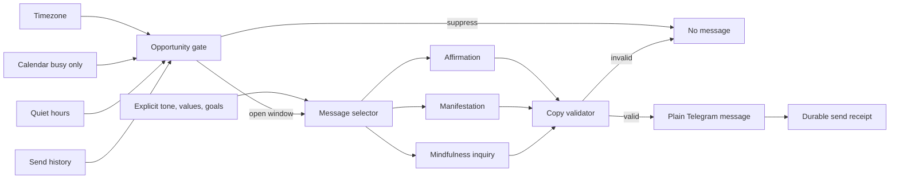

# Life Manager Mental Messages V1 Design

**Status:** Revised after context-grounding review
**Owner:** Life Manager cloud runtime
**Primary locale:** Japanese
**Scope:** Affirmation, manifestation, and mindfulness inquiry messages only

## 1. Outcome

Life Manager sends brief Japanese messages that support confidence, intention, self-compassion, and present-moment awareness without asking the user to manage another interface.

V1 is deliberately narrow:

1. affirmation messages;
2. manifestation messages that turn an intention into a controllable action;
3. mindfulness prompts and reflective questions (`問いかけ`).

Messages contain no buttons, no repeated sender prefix, no mandatory reply, and no claim about the user's current activity, emotion, achievement, location, preparation, or physical state unless Life Manager has an authoritative source for that exact claim.

The independent Telnyx `/calls` error `90029` remains the first repair milestone, but it is not part of mental-message semantics.

## 2. Correction to the previous design

The previous version treated future context sources as though they were already available. Current source inspection proves that is unsafe:

- `scheduler.js` marks an event `important` when it has a location or attendees. That does not prove it is a presentation or that the user has prepared.
- An event lasting at least 90 minutes is marked `intense`. That does not prove the user concentrated for 90 minutes.
- Production location may be `unknown`.
- The current mental runtime has no authoritative completed-task count, mood signal, preparation receipt, screen-time duration, hydration state, or posture state.

Therefore these messages are prohibited in V1:

- `必要なものは持ってきてる。あとは話すだけ。`
- `今日はすでに3件終えています。`
- `90分集中していました。`
- `落ち込んでいる今も、立て直そうとしています。`

They may become legal later only when the exact premise has a named, current, authoritative source and a freshness rule.

## 3. Product principles

1. **No invented context.** Unknown never becomes a personalized claim.
2. **Context is first used to avoid interruption.** Calendar busy state, quiet hours, daily cap, and recent-send state decide when to stay silent.
3. **Stable personalization before live personalization.** Locale, tone, values, and explicit goals are safer than inferred emotions or activity.
4. **No interaction debt.** A message does not include buttons and does not require a reply.
5. **A question may be contemplative, not operational.** `問いかけ` may use `？`, but must remain useful when unanswered and must not say `返信して`, `教えて`, or equivalent.
6. **Manifestation is action-oriented.** It may express possibility and intention, but never promise that thought alone changes external reality.
7. **Silence is a valid output.** Missing timezone, unreadable send history, quiet hours, active calendar event, daily cap, or duplicate context suppresses delivery.
8. **No new loop.** Reuse the existing scheduler, Telegram transport, mental runtime, and send ledger.

## 4. What Life Manager actually knows

### 4.1 V1-authorized sources

| Claim class | Authoritative source | Freshness | Allowed use |
|---|---|---|---|
| Local time/day | User timezone or explicit UTC offset | Current tick | Select morning/day/evening family |
| User is in a calendar event | Calendar start/end | Current tick | Suppress delivery only |
| Recent message count/time | `lm_mental_send_log` | Current local day | Cap, spacing, dedupe |
| Quiet hours | Runtime preferences | Current preference | Suppress delivery |
| Locale and tone | Explicit runtime preference | Until changed | Select copy bank |
| Values or goal | Explicit user-authored durable profile entry | Until superseded | Select relevant affirmation/manifestation; never claim progress |
| Bedtime goal | Explicit preference | Current local day | Select evening/release family |

### 4.2 Not known in V1

The following remain `unknown` unless a later milestone adds the stated receipt:

| Proposed fact | Required future evidence |
|---|---|
| `準備できている` | Explicit preparation completion receipt |
| `3件終えた` | Durable completed-action ledger rows with current-day scope |
| `90分集中した` | Authorized activity/focus-session measurement |
| `落ち込んでいる` | User-authored mood input; never inferred from silence |
| `水分不足` | User-authored or authorized sensor evidence |
| `座り続けている` | Authorized device/activity evidence |
| `発表が重要` | Explicit event classification, not attendees/location heuristic |

### 4.3 Truth rule

Every variable in a message template must declare:

```text
source -> timestamp -> freshness limit -> transformation -> rendered claim
```

If any link is absent, stale, ambiguous, or unreadable, that variable is unavailable. The runtime either selects a context-free template or stays silent.

## 5. V1 architecture



Current execution path remains:

```text
scheduler.js
  -> mentalDeps(...)
  -> mentalUserOnce(...)
  -> evaluateMentalTrigger(...)
  -> buildMentalMessage(...)
  -> Telegram sendMessage(...)
  -> recordMentalSend(...)
```

## 6. Delivery timing

Without live mental/body context, V1 is not described as perfect just-in-time personalization. It is **right-window delivery**: Life Manager finds a low-interruption opportunity and sends a low-assumption message.

Default opportunity windows in the user's local time:

| Window | Time | Eligible family |
|---|---:|---|
| Morning orientation | 07:30–10:00 | affirmation or manifestation |
| Day reset | 12:00–16:00 | mindfulness inquiry |
| Evening release | 20:00–23:00 | affirmation or mindfulness inquiry |

Rules:

- Maximum two V1 mental messages per local day.
- Minimum four hours between V1 messages.
- Never send during a current calendar event.
- Never send inside quiet hours.
- Use a deterministic per-user/per-day minute inside the selected window so the whole fleet does not fire at one time.
- Do not describe the selected minute as emotionally optimal.
- A user-authored goal may influence message selection, not timing, until a matching goal/work-block contract exists.

## 7. Catalog sources: reuse before invention

V1 does not author a new affirmation collection. It imports and indexes existing catalogs.

### 7.1 First-party source

The primary source is the existing Anicca catalog:

```text
/Users/anicca/anicca-project/apps/api/src/modules/affirmations/catalog/en.json
/Users/anicca/anicca-project/apps/api/src/modules/affirmations/catalog/ja.json
/Users/anicca/anicca-project/apps/api/src/modules/affirmations/catalog/es.json
```

Each locale contains the same stable `q001`–`q200` IDs. Life Manager imports an approved snapshot into its own repository; it does not depend at runtime on the separate Anicca product checkout.

Examples already present in the Japanese catalog:

| ID | Exact catalog text | Candidate themes |
|---|---|---|
| `q001` | `私は本当の自分になりつつあります。` | growth, identity |
| `q005` | `私は、自分が育つ速さを信頼しています。` | patience, growth |
| `q022` | `私の中心には、いつでも戻れる静けさがあります。` | calm, grounding |
| `q027` | `すべてを直さなくていい。私は休んでよいのです。` | rest, self-compassion |
| `q031` | `私は今、ここに在ります。それで十分です。` | presence, enoughness |
| `q036` | `私は呼吸に戻り、自分自身に戻ります。` | breath, mindfulness |
| `q038` | `気づき、息をして、もう一度始めます。` | reset, action |
| `q061` | `私は今までも辛い日を越えてきた。今日も越えていけます。` | resilience |
| `q071` | `コントロールできないことを手放し、平和を保ちます。` | release, calm |
| `q091` | `まだ知らなかったことを、知らなかった自分を許します。` | forgiveness |
| `q101` | `怖くても、私は前に進むことができます。` | courage, action |
| `q161` | `私は今このままで、十分です。` | self-worth |

### 7.2 External OSS candidates

| Source | Pin | License | V1 decision |
|---|---|---|---|
| [humancto/antara-remarkable](https://github.com/humancto/antara-remarkable) | `bdaf5a19e6401c771e097e04bc3fcc16d44eb835` | MIT | Approved candidate source; author field is preserved |
| [lifeLessCoder/Mental-Buddy](https://github.com/lifeLessCoder/Mental-Buddy) | `05e0522deae5943ac2704826cbe3cdc124d9fedf` | MIT | Candidate source after safety screening |
| [ContionMig/Mitsuzi-JS](https://github.com/ContionMig/Mitsuzi-JS) | inspected main | MIT repo | Not imported in V1; mixed attributed quotes, medical claims, and absolute manifestation claims |
| [DNSERR/confidencecrew](https://github.com/DNSERR/confidencecrew) | inspected main | MIT repo | Not imported in V1; duplication and strong success/destiny claims |

Repository license alone is not enough when the file appears to aggregate third-party quotations. Each imported item needs traceable authorship or an explicit source license that covers the text.

### 7.3 Import manifest

Every imported catalog has a pinned manifest:

```json
{
  "source_id": "anicca-affirmations-v1",
  "source_repo": "Daisuke134/anicca-products",
  "source_commit": "78566da90d279c4903ed393ceed331d97a587f5c",
  "source_path": "apps/api/src/modules/affirmations/catalog/ja.json",
  "license": "first-party",
  "imported_sha256": "64-lowercase-hex",
  "quote_count": 200
}
```

OSS manifests additionally store the license URL, author field when available, and exact upstream text. Unlicensed or ambiguous text never enters the production bank.

## 8. Catalog classification and personalization

Life Manager personalizes by selecting an existing catalog item, not by asking an LLM to rewrite it.

Each approved quote receives Life Manager-owned metadata without changing the source text:

```json
{
  "id": "anicca:q036",
  "source_id": "anicca-affirmations-v1",
  "source_quote_id": "q036",
  "family": "affirmation",
  "themes": ["breath", "mindfulness", "grounding"],
  "tones": ["gentle", "spiritual-neutral"],
  "windows": ["day_reset", "evening_release"],
  "risk_flags": [],
  "localized_text": {
    "ja": "私は呼吸に戻り、自分自身に戻ります。",
    "en": "I return to my breath. I return to myself.",
    "es": "Vuelvo a mi respiración. Vuelvo a mí."
  }
}
```

### 8.1 User personalization inputs

Only explicit, durable user facts affect selection:

```text
preferred locale
preferred tone: gentle / direct / spiritual-neutral
explicit values: growth / peace / courage / self-worth / rest
explicit goals
themes to avoid
recently delivered quote IDs
current delivery window
```

Calendar titles, silence, response time, and inferred mood do not modify the mental profile.

### 8.2 Deterministic selection

For every eligible quote:

```text
score =
  +4 for each explicit-value/theme match
  +3 for an explicit-goal/theme match
  +2 for preferred-tone match
  +1 for delivery-window match
  -1000 if theme is explicitly avoided
  -1000 if quote was delivered within 14 days
  -1000 if any safety/risk flag is present
```

Ties are broken deterministically by `uid + local_day + window + quote_id`. Selection produces the existing localized text byte-for-byte.

### 8.3 Manifestation

Manifestation is a catalog classification, not newly generated prose. Only catalog items about direction, possibility, growth, and controllable action qualify. Items promising inevitable success, attraction of wealth, perfect health, destiny, or intervention by the universe are rejected.

An explicit goal selects a matching quote but is not interpolated into the quote in V1. This avoids awkward or unsupported rewriting.

### 8.4 Mindfulness inquiry (`問いかけ`)

If a catalog contains an approved question, it can be delivered verbatim. When an affirmation is converted into a question, the question must be a separately reviewed catalog variant linked to its source ID:

```json
{
  "id": "life-manager:inquiry:q036:ja:v1",
  "derived_from": "anicca:q036",
  "reviewed_text": "いま、呼吸に戻れる？",
  "family": "mindfulness_inquiry"
}
```

Runtime generation or ad-hoc paraphrasing is prohibited. The reviewed inquiry is stored and tested like any other catalog item. It remains useful without an answer and carries no button or reply instruction.

## 9. Copy contract

All V1 copy must satisfy:

- 80 Japanese characters or fewer.
- Plain Telegram text only.
- No inline keyboard or callback data.
- No sender signature such as `Life Manager:::`.
- No user name unless explicitly required later.
- No exclamation-heavy encouragement.
- No diagnosis, therapy claim, crisis inference, wealth promise, or guaranteed result.
- No `あなたは今〜している`, `〜を完了した`, or numeric personal fact without an authorized source.
- Affirmation may be a statement.
- Manifestation must preserve agency and avoid magical causation.
- Mindfulness inquiry may use `？` but cannot ask for a reply.

The validator rejects reply-seeking phrases:

```text
返信して / 教えて / 答えて / 押して / 選んで / let me know / reply / tell me
```

## 10. Selection and repetition

V1 uses the imported, classified catalog, not free-form LLM generation.

Selection key:

```text
uid + local_day + window + eligible_quote_ids + explicit_profile_tags
```

- Do not repeat the same template for the same user within 14 days.
- Do not send the same family twice on the same day.
- If no non-repeated eligible template exists, stay silent.
- Delivered text must equal the approved localized catalog text byte-for-byte.
- LLM generation is not part of V1.

No feedback buttons exist. V1 does not claim to learn message preference from silence. Any later adaptation must name a real signal such as explicit conversation, reaction, or settings change.

## 11. Data and privacy

Reuse `lm_mental_send_log`. Extend it only if current columns cannot store:

```text
family
template_id
local_day
window
delivered Telegram message_id
```

Do not add raw calendar titles, inferred mood, message-reply tracking, location coordinates, journal content, or a new mental profile database.

The durable profile may contain only explicit, user-authored values/goals and presentation preferences. A system inference is never written back as a user fact.

## 12. Future context unlocks

Future contextual messages are separate milestones. Each is disabled until its evidence contract passes production readback.

| Unlock | Required contract | Then-legal example |
|---|---|---|
| Important-event support | Explicit event type + current calendar event | `14時の発表まで30分。最初の一文だけ整えればいい。` |
| Preparation confidence | Current preparation receipt tied to event | `必要なものは揃っている。あとは話すだけ。` |
| Small-win reflection | Current-day completed-action receipts | `今日は3件終えている。その事実は残っている。` |
| Physical reset | Authorized current activity measurement | `90分座っている。少し歩く時間です。` |
| Self-compassion after setback | Explicit failure/rejection receipt | `今回の結果と、あなた自身の価値は別です。` |

The receipt authorizes only the matching claim. For example, a calendar event never authorizes `準備済み`, and a task completion never authorizes an inferred mood.

## 13. Failure behavior

| Failure | Behavior |
|---|---|
| Timezone absent or invalid | Suppress |
| Calendar unavailable | Suppress rather than risk interrupting an event |
| Send history unreadable | Suppress rather than exceed cap or repeat |
| No eligible non-repeated template | Suppress |
| Catalog manifest hash differs | Suppress; do not load an unreviewed catalog |
| Source license/provenance missing | Exclude source at build/import time |
| Template uses unavailable variable | Reject before Telegram |
| Telegram failure | Do not record a delivered send |
| Receipt write fails after delivery | Record reconciliation evidence by Telegram message ID; never resend blindly |

## 14. Rollout

### Milestone A — Telnyx repair

Locate the actual producer of `time_limit_secs`, fix the shared provider boundary, deploy from merged `main`, and verify one real call without `90029`.

### Milestone B — Current MENTAL truth audit

Verify Railway deployment `commitHash`, scheduler wiring, send ledger, timezone source, calendar availability, and Dais tenant eligibility.

### Milestone C — Japanese V1 canary

Enable only the three V1 families for Dais. Deliver at most two plain messages per local day for seven days. Buttons and contextual personal claims remain zero.

### Milestone D — General Japanese rollout

Expand after canary acceptance. Context unlocks remain off independently.

### Milestone E — Context unlocks

Add one evidence-backed context class at a time. Each needs source, freshness, test, cloud readback, and replay-zero before its copy is legal.

Anicca iOS is not part of this runtime or rollout. It is a separate product created and operated by Life Manager's mobile-app loop.

## 15. Acceptance criteria

- Only `affirmation`, `manifestation`, and `mindfulness_inquiry` are enabled in V1.
- Every production message resolves to a source ID, pinned manifest, quote ID, and approved localized text.
- Anicca `q001`–`q200` ID parity across Japanese, English, and Spanish is preserved in the imported snapshot.
- No unlicensed or ambiguous external text is imported.
- Every message is plain text with zero buttons and zero reply instruction.
- Maximum two V1 messages per user/local day.
- Minimum four hours between messages.
- Zero messages during current calendar events or quiet hours.
- Zero personal activity, achievement, emotion, preparation, or physical-state claims without an authorized source.
- Zero repeated template IDs within 14 days for the same user.
- Every delivered message has a positive Telegram message ID and one durable send receipt.
- Replaying the same user/day/window produces zero duplicate messages.
- Seven-day Dais canary contains at least one delivered message from each family.
- Telnyx acceptance remains independently satisfied.

## 16. Non-goals

- Inferring mood from silence, calendar gaps, response time, or message opens.
- Claiming a person prepared, focused, completed work, exercised, ate, drank, slept, or felt something without evidence.
- Buttons, daily check-ins, required replies, surveys, journaling, or streaks.
- A new mental daemon, database, agent framework, or mobile app.
- Anicca iOS integration.
- Clinical diagnosis, therapy, emergency automation, or treatment claims.
- Magical manifestation or guaranteed outcomes.
- Runtime LLM rewriting, paraphrasing, translation, or interpolation of catalog prose.

## 17. Decision record

**Chosen:** select verbatim, licensed catalog text using stable preferences and low-interruption opportunity windows.

**Deferred:** event-specific confidence, completed-task reflection, failure aftercare, and sensor-based physical prompts until their exact evidence sources exist and are verified in production.

**Reason:** reuse proven words; personalize the selection, not the truth of the sentence.
