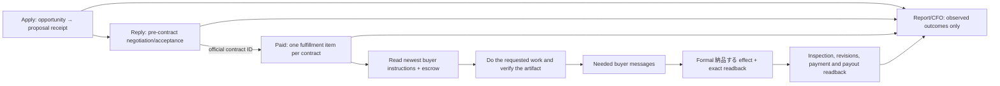

# CrowdWorks contract fulfillment: as-is and to-be

## Goal and evidence boundary

Turn accepted, funded CrowdWorks contracts into completed buyer work, formal delivery, accepted payment, and repeatable revenue. The target is USD 10,000 in **verified monthly recurring revenue** from CrowdWorks; one-off escrow, proposals, forecast value, and sent messages do not count as MRR.

This is a plan, not a production effect. The supplied screenshots show a buyer message and an empty message/attachment composer on two contract views. They do not show the contract's escrow state, actual work completion, a delivery receipt, acceptance, or payout. The three authenticated URLs must be re-read by the responsible owner before any effect:

- `https://crowdworks.jp/proposals/306120094` (proposal/negotiation);
- `https://crowdworks.jp/contracts/63659463` (contract thread; buyer asks about email visibility);
- `https://crowdworks.jp/contracts/63657015` (contract thread; buyer supplied a Google Docs work link).

Current `origin/main` has four registered owners: Application, Reply, Paid, and Report (`config/loop-registry.json`). There is no registered CrowdWorks Storefront owner. `application_tick.py` posts and reads back `/proposals/<id>`. `reply_adapter.py` discovers inbox threads, handles `/proposals/<id>` and `/contracts/<id>`, can accept an offer, send a message, and submit a linked Google Form. `paid_adapter.py` discovers active `/contracts/<id>`, also submits a Google Form, and then separately submits `/milestones/<id>/complete`. Both Reply and Paid therefore have possible effects for a post-contract task. `paid_adapter.py` currently treats one Google Form URL as the work route and waits when it is absent; that cannot complete a Google Docs assignment or arbitrary buyer request. Report sends internal Telegram summaries, not buyer work.

Read-only production status at the planning snapshot: all four labels were `loaded-idle` and their last terminal result was `blocked` by host admission. The retained Paid result was `provider_inventory` failure with `observed=0`, `effect=0`, `readback=0`; retained Reply was `status=ok`, `observed=57`, `readback=52`, `failed=1`, `pending=4`. These are different timestamps and do not establish current provider state or earned revenue. The stored Reply state mentioning contract `63657015` records an `accept_contract` intent; that is not a delivery receipt.

CrowdWorks' official fixed-price guide defines application, negotiation, contract, escrow, work, **「納品する」**, inspection, and payment as distinct steps. A normal message in the same contract page does not invoke formal delivery. The official guide also says to begin work after escrow. Sources: [worker guide](https://crowdworks.jp/pages/guides/employee/fixed_price), [terms](https://crowdworks.jp/pages/agreement). Lancers' [project guide](https://www.lancers.jp/help/guide/lancer/project/3) likewise distinguishes proposal from work after escrow; its actual page/owner mapping needs separate inspection.

## Live production cursor — 2026-09-19 (current)

This section is the current execution SSOT. It supersedes the planning snapshot above wherever the
observed provider, state, host or release differs. Every statement below is read-only evidence unless
it explicitly says an effect was executed. A provider receipt alone does not prove that the submitted
work was correct; correctness requires full buyer-context mapping and buyer-visible readback.

### Current state

- The admission database has four CrowdWorks rows with effect_unknown=1: Application, Paid, and Reply
  are claimed; Report is released but unresolved. The three claimed rows fence new provider children.
  The released Report row is not clean evidence. No direct SQL or guessed clear is permitted.
- Application remains loaded from immutable release 8fbfb3a2f2b1449018d46f1978a500ce77f003a9,
  Paid from 56d07a66eaa7c7d173c51314c47fb1c22b3f5610, and Reply/Report from
  fed2839db846509585d6ba2d53da626a09dd0cae. Candidate Application release
  501058ec8237c3888d862ed92d0a048e0f2cc1f7 is ready, but target apply correctly refuses
  effect_unknown=1. PR #5634 makes new application receipts occurrence-bound while historical imports
  stay unbound. Latest Application/Paid wakes stop before provider work with
  host_admission_deferred:resource_effect_unknown.
- The previous disk-cleanup release 65a1d563dca85d9c10019854c8f3bf7027c1e9 passed one target wake,
  but headroom is not stable: fresh probes reached about 0.7–1.3 GiB available at 100% capacity. Two
  roughly 535 MiB directories remain under the no-effect `capafy-ig-marketing-daily` scratch root. One
  has a stale owner and a run-bound `effect_class=none` event; the other has no owner identity and stays
  protected. The shared cleanup root cause is confirmed: every `.terminal-unrecorded` run was preserved,
  even for no-effect loops. A candidate now records per-run effect metadata and requires a unique,
  run-bound `effect_class=none` event plus stale identity before deletion. It is not merged or loaded yet.
- The official read-only inventory contains funded IDs 63712784, 63659463, 63657015, 63570481, and
  63568785. This inventory is not work submission, delivery, acceptance, settlement, payout, or MRR.
- Read-only process inspection observed defunct children of Chromium and ChatGPT, and lsof showed normal
  deleted cache/allowlist files. These are not the admission root cause; no virus evidence was found in
  these checks.

### Done (verified)

- The boundary is Apply -> Reply (pre-contract) -> one Paid owner (post-contract). Reply must not send
  post-contract work, form, or delivery effects; there is no CrowdWorks Storefront owner.
- PR #5594 merged Paid buyer-form extraction, answer-URL normalization, and receipt-alias preservation.
  PR #5599 merged Application occurrence binding. Both are target-applied from immutable releases.
- Focused Paid tests (158), focused Application tests (15), and ./bin/lm-loop-contract passed before
  release cuts. These prove code/release gates only, not a provider effect or revenue.
- Five funded contract contexts were read-only inspected. Historical confirmed form receipts for
  63659463, 63570481, and 63583795 remain replay-fenced. Application has 190 historical receipts.
  Reply aggregate is observed=61, readback=54, pending=6, failed=1. Paid has no provider effect in the
  latest target wake.

### Not done and blockers

- Application occurrence 18d6535f7dfb8910-33974, Paid occurrence 18d62cf32eb0c678-48194, and Reply
  occurrence 18d64a10f2f1f838-83166 remain claimed/effect_unknown=1. Report occurrence
  18d606cf95bd0ab0-85387 is released/effect_unknown=1. Available evidence cannot prove a no-dispatch
  result or bind an exact provider receipt for these rows.
- No current contract has the complete chain correct_work_verified -> formal delivery -> buyer acceptance
  -> settlement -> payout. Verified USD 10,000 MRR is zero.
- 63657015 has two current forms and no confirmed receipt; its timed-out intent requires official
  reconciliation before any retry. 63570481 still needs its missing customer-address correction and
  formal delivery. 63568785 lacks permitted document content. 63659463 needs a full quality audit and
  delivery. 63583795 needs acceptance, settlement, and payout readback.
- The host capacity issue and admission fence are active. resource_control_busy is a transient lock;
  effect_unknown is the durable evidence boundary. Zombie processes are not a reason to retry. The
  cleanup candidate must be merged, cut into an immutable release, target-applied only to disk-cleanup,
  and read back before the stale no-effect directory can be reclaimed.

### Remaining TODO, in order

1. Merge and deploy the shared cleanup fix through the existing disk governor. Target-apply only
   disk-cleanup, reclaim the stale no-effect scratch only after its run-bound event and stale identity
   checks pass, and require stable headroom plus a cleanup receipt without an unexplained error. Preserve
   credentials, browser profiles, receipts, state, and loaded releases.
2. Resolve the Application occurrence through the resolver/readback path using an occurrence-bound no-dispatch
   marker or official receipt. Do not retry an unknown effect.
3. Resolve the Paid occurrence 18d62cf32eb0c678-48194. The historical paid-latest result has no
   occurrence ID, so its timestamp is insufficient.
4. Reconcile Reply occurrence 18d64a10f2f1f838-83166 item by item. Preserve the verified contract effect
   and confirmation-requested form effects; never resend an uncertain sibling.
5. Resolve the released Report row through resolver/readback. released plus effect_unknown is not clean.
6. After all four evidence fences resolve, kickstart one owner at a time. Start with 63712784: read the
   full buyer request, do the requested work, submit the common test form and Web Ads results form only
   when each mapping is unambiguous, read each confirmation, then press CrowdWorks 納品する and read
   the official milestone state.
7. Continue 63657015, 63570481, 63568785, 63659463, and 63583795 with the same full-context,
   correct-work, buyer-visible-readback, formal-delivery, acceptance, settlement, payout, and replay-zero
   gates. Count USD 10,000 MRR only from collected/settled recurring value with a continuation basis.
8. Share the contract-ID handoff, quality gate, and receipt rules through the existing shared kernel only
   after the same boundary is verified on another provider.

### Completion gate

A CrowdWorks fulfillment run is complete only when every funded contract has a contract-specific artifact
or required response, correct_work_verified=true, buyer-visible content/permission readback, exact
external receipts where applicable, formal delivery readback, honest inspection/acceptance state,
settlement/payout evidence, and replay-zero. A green test, running PID, filled composer, provider
message, historical receipt, or form submission without confirmation cannot close a row. If the result
is wrong or incomplete, retain the original receipt, record the mismatch, repair the owner in an isolated
release, and repeat natural wake and buyer-visible readback until correct or a specific external blocker
is recorded.

## Boundary decision

The three choices are (A) keep Reply and Paid both acting on contract threads, (B) merge every CrowdWorks activity into one owner, or (C) keep independent acquisition and pre-contract negotiation while giving **one existing Paid owner exclusive responsibility for each accepted contract**. Choose C. It removes the overlapping post-contract effect authority, retains Apply's independent opportunity cadence, and reuses the existing Paid kernel and registered owner. The number or identity of page URLs is evidence about navigation, not the criterion for a loop boundary; the criterion is one durable business item and one effect owner. The pre-contract proposal page can redirect to a contract page after acceptance, but the contract ID becomes the durable key.

Reply owns a proposal until official acceptance yields an exact contract ID. After handoff, Reply may observe for reconciliation but must not send a contract message, submit an external form, or accept a second offer for that contract. Paid owns every buyer response, instruction link, external task, artifact, revision, and formal delivery for that contract. Only one short shared browser/account mutation is serialized; different contracts have separate durable work and can progress independently within host capacity. Report remains a light support job, not a sales or fulfillment lane. Storefront is `not_applicable` until an official listing surface is observed.

## Contract work protocol

Each contract work item records exact account, proposal, contract and milestone IDs; escrow state; newest buyer event and required action; agreed scope/due date; work evidence and artifact location; quality checks tied to buyer acceptance criteria; reply intent/effect/readback; external submission receipt; formal delivery intent/effect/readback; revision state; acceptance, settlement and payout. Keep credentials and buyer private content in the private state store, not Git or public reports. A model reads the complete request and selects how to perform the requested work with the existing tool/skill path. Deterministic code owns identity, leases, duplicate fences, state transitions, and receipt validation. It must never treat a generic acknowledgement, a filled composer, a submitted form without confirmation, or a Docs URL as the finished artifact.

### Buyer-request correctness is the release gate

For each contract, the Paid owner reads the **full current buyer conversation**, linked instructions, agreed scope and later corrections before deciding what to do. It keeps a private, contract-specific mapping from each concrete buyer request and acceptance criterion to the intended action, resulting artifact or external effect, and proof. A previous complaint or correction is active context; the owner must identify what was wrong and must not repeat the same response. The model judges meaning and chooses the work; code checks identities, effect fences and observable evidence. No keyword rule or canned completion reply substitutes for reading the request.

Before sending, the owner checks the proposed reply or artifact against that mapping. After sending, it opens the **actual buyer-visible message, link, file, form result or delivered artifact** and checks its content, accessibility and contract binding. It then reads the newest buyer response and official contract state. A provider receipt proves that something was sent; it does not prove that the thing was correct. Mark `correct_work_verified` only when the requested task is done, the submitted result matches the buyer's instructions, and the buyer-visible readback supports that claim. Buyer acceptance is recorded separately. If the buyer has not yet inspected the work, record `awaiting_buyer`, not `accepted`.

If the submitted result is wrong, incomplete, inaccessible, or contradicted by buyer feedback, record the mismatch and its cause on that contract, retain the original effect receipt, and keep the work item open. Correct the artifact or reply, run the relevant focused regression, publish the corrected owner release through the normal pipeline, and observe its natural wake and new buyer-visible result. Repeat this repair-and-readback cycle until the work matches the request and is accepted, or an exact external blocker or buyer clarification prevents progress. Do not resend an uncertain effect, claim success from a green test, or close the loop because a message was posted. A buyer complaint is a new task version and a regression case, not a terminal failure that can be ignored.

For `63657015`, open the linked Google Doc in the authenticated, account-owned workflow, establish its concrete deliverable and permissions, do the work, verify the result from the buyer's perspective, send only necessary progress messages, then use the contract's formal delivery control and exact readback. For `63659463`, first read the full contract and buyer message, verify the needed email/communication action and provider rules, respond or act accordingly, and do not invent a deliverable from the screenshot. If the buyer's task or external submission cannot be confirmed, persist `waiting_for_buyer` with the exact missing fact and a buyer-visible question; keep the item live.

An external form and formal CrowdWorks delivery are separate fenced effects. After an uncertain external submit, inspect the form's confirmation or exact receipt before retry. After an uncertain delivery click, inspect the exact contract/milestone status before retry. `awaiting_escrow` permits negotiation and clarification, not production work or formal delivery. Revised instructions reopen the same contract item with a new buyer-event version and preserve earlier verified effects.

If a contract page exposes multiple external forms or links, the owner retains every exact URL and reads each form's visible title, required fields and choices together with the full buyer conversation. The model chooses the form only when the buyer's requested task and the form metadata identify one unambiguously. The owner never selects the first link, infers a task from the URL, or submits all candidates. If the mapping remains ambiguous, it records `waiting_for_buyer` with the missing fact and asks one specific question; no external form effect or formal delivery is allowed.

## Acceptance and scope

First close the existing funded contracts, then grow acquisition. For every contract: exact funded status; full newest buyer request and prior correction context; a request-to-result mapping; work performed; buyer-visible content/permission readback; `correct_work_verified`; official external receipt where applicable; formal CrowdWorks delivery status; buyer inspection/revision outcome; settlement and actual payout; zero duplicate effect on replay. A timed natural wake must move at least one ready contract forward while one blocked contract remains independently represented. The loop is not accepted from local tests or a single manual browser action: the installed owner must naturally observe the buyer context, do the requested work, submit the right result, and read it back from the buyer-visible surface. When a live result is wrong, acceptance remains open and the owner is repaired and re-observed until the result is correct or a specific external blocker is documented. The revenue dashboard separates escrow, delivered, accepted, settled, paid, and recurring realized revenue. MRR counts only active recurring work with collected/settled monthly-equivalent revenue and a documented continuation basis; one-off payments count cash revenue only.

Implementation uses the existing `skills/earn/crowdworks`, shared marketplace kernels, runtime admission, receipt and CFO paths. No second browser owner, new generic agent framework, or sibling loop restart. Other Codex sessions retain their 14-loop ownership. Lancers and Coconala receive only the proven contract-to-fulfillment and quality/receipt lesson through the shared boundary after their own owner confirms applicability; no cross-provider page assumption.
