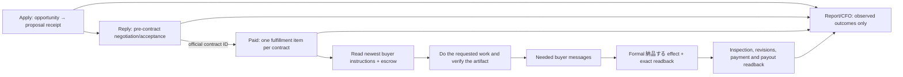

# CrowdWorks contract fulfillment: as-is and to-be

## Goal and evidence boundary

Turn accepted, funded CrowdWorks contracts into completed buyer work, formal delivery, accepted payment, and repeatable revenue. The target is USD 10,000 in **verified monthly recurring revenue** from CrowdWorks; one-off escrow, proposals, forecast value, and sent messages do not count as MRR.

This is a plan, not a production effect. The supplied screenshots show a buyer message and an empty message/attachment composer on two contract views. They do not show the contract's escrow state, actual work completion, a delivery receipt, acceptance, or payout. The three authenticated URLs must be re-read by the responsible owner before any effect:

- `https://crowdworks.jp/proposals/306120094` (proposal/negotiation);
- `https://crowdworks.jp/contracts/63659463` (contract thread; buyer asks about email visibility);
- `https://crowdworks.jp/contracts/63657015` (contract thread; buyer supplied a Google Docs work link).

Current `origin/main` has four registered owners: Application, Reply, Paid, and Report (`config/loop-registry.json`). There is no registered CrowdWorks Storefront owner. `application_tick.py` posts and reads back `/proposals/<id>`. `reply_adapter.py` discovers inbox threads, handles `/proposals/<id>` and `/contracts/<id>`, can accept an offer, send a message, and submit a linked Google Form. `paid_adapter.py` discovers active `/contracts/<id>`, also submits a Google Form, and then separately submits `/milestones/<id>/complete`. Both Reply and Paid therefore have possible effects for a post-contract task. `paid_adapter.py` currently treats one Google Form URL as the work route and waits when it is absent; that cannot complete a Google Docs assignment or arbitrary buyer request. Report sends internal Telegram summaries, not buyer work.

Read-only production status at the planning snapshot: all four labels were `loaded-idle` and their last terminal result was `blocked` by host admission. The retained Paid result was `provider_inventory` failure with `observed=0`, `effect=0`, `readback=0`; retained Reply was `status=ok`, `observed=57`, `readback=52`, `failed=1`, `pending=4`. These are different timestamps and do not establish current provider state or earned revenue. The stored Reply state mentioning contract `63657015` records an `accept_contract` intent; that is not a delivery receipt.

CrowdWorks' official fixed-price guide defines application, negotiation, contract, escrow, work, **「納品する」**, inspection, and payment as distinct steps. A normal message in the same contract page does not invoke formal delivery. The official guide also says to begin work after escrow. Sources: [worker guide](https://crowdworks.jp/pages/guides/employee/fixed_price), [terms](https://crowdworks.jp/pages/agreement). Lancers' [project guide](https://www.lancers.jp/help/guide/lancer/project/3) likewise distinguishes proposal from work after escrow; its actual page/owner mapping needs separate inspection.

## Boundary decision

The three choices are (A) keep Reply and Paid both acting on contract threads, (B) merge every CrowdWorks activity into one owner, or (C) keep independent acquisition and pre-contract negotiation while giving **one existing Paid owner exclusive responsibility for each accepted contract**. Choose C. It removes the overlapping post-contract effect authority, retains Apply's independent opportunity cadence, and reuses the existing Paid kernel and registered owner. The number or identity of page URLs is evidence about navigation, not the criterion for a loop boundary; the criterion is one durable business item and one effect owner. The pre-contract proposal page can redirect to a contract page after acceptance, but the contract ID becomes the durable key.

Reply owns a proposal until official acceptance yields an exact contract ID. After handoff, Reply may observe for reconciliation but must not send a contract message, submit an external form, or accept a second offer for that contract. Paid owns every buyer response, instruction link, external task, artifact, revision, and formal delivery for that contract. Only one short shared browser/account mutation is serialized; different contracts have separate durable work and can progress independently within host capacity. Report remains a light support job, not a sales or fulfillment lane. Storefront is `not_applicable` until an official listing surface is observed.

## Contract work protocol

Each contract work item records exact account, proposal, contract and milestone IDs; escrow state; newest buyer event and required action; agreed scope/due date; work evidence and artifact location; quality checks tied to buyer acceptance criteria; reply intent/effect/readback; external submission receipt; formal delivery intent/effect/readback; revision state; acceptance, settlement and payout. Keep credentials and buyer private content in the private state store, not Git or public reports. A model reads the complete request and selects how to perform the requested work with the existing tool/skill path. Deterministic code owns identity, leases, duplicate fences, state transitions, and receipt validation. It must never treat a generic acknowledgement, a filled composer, a submitted form without confirmation, or a Docs URL as the finished artifact.

For `63657015`, open the linked Google Doc in the authenticated, account-owned workflow, establish its concrete deliverable and permissions, do the work, verify the result from the buyer's perspective, send only necessary progress messages, then use the contract's formal delivery control and exact readback. For `63659463`, first read the full contract and buyer message, verify the needed email/communication action and provider rules, respond or act accordingly, and do not invent a deliverable from the screenshot. If the buyer's task or external submission cannot be confirmed, persist `waiting_for_buyer` with the exact missing fact and a buyer-visible question; keep the item live.

An external form and formal CrowdWorks delivery are separate fenced effects. After an uncertain external submit, inspect the form's confirmation or exact receipt before retry. After an uncertain delivery click, inspect the exact contract/milestone status before retry. `awaiting_escrow` permits negotiation and clarification, not production work or formal delivery. Revised instructions reopen the same contract item with a new buyer-event version and preserve earlier verified effects.

## Acceptance and scope

First close the existing funded contracts, then grow acquisition. For every contract: exact funded status; complete newest buyer request; buyer-verifiable artifact or task effect; official external receipt where applicable; formal CrowdWorks delivery status; buyer inspection/revision outcome; settlement and actual payout; zero duplicate effect on replay. A timed natural wake must move at least one ready contract forward while one blocked contract remains independently represented. The revenue dashboard separates escrow, delivered, accepted, settled, paid, and recurring realized revenue. MRR counts only active recurring work with collected/settled monthly-equivalent revenue and a documented continuation basis; one-off payments count cash revenue only.

Implementation uses the existing `skills/earn/crowdworks`, shared marketplace kernels, runtime admission, receipt and CFO paths. No second browser owner, new generic agent framework, or sibling loop restart. Other Codex sessions retain their 14-loop ownership. Lancers and Coconala receive only the proven contract-to-fulfillment and quality/receipt lesson through the shared boundary after their own owner confirms applicability; no cross-provider page assumption.
