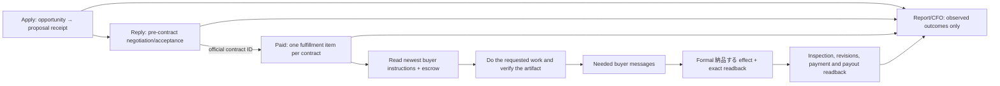

# CrowdWorks contract fulfillment: as-is and to-be

## Goal and evidence boundary

Turn accepted, funded CrowdWorks contracts into completed buyer work, formal delivery, accepted payment, and repeatable revenue. The target is USD 10,000 in **verified monthly recurring revenue** from CrowdWorks; one-off escrow, proposals, forecast value, and sent messages do not count as MRR.

This is a plan, not a production effect. The supplied screenshots show a buyer message and an empty message/attachment composer on two contract views. They do not show the contract's escrow state, actual work completion, a delivery receipt, acceptance, or payout. The three authenticated URLs must be re-read by the responsible owner before any effect:

- `https://crowdworks.jp/proposals/306120094` (proposal/negotiation);
- `https://crowdworks.jp/contracts/63659463` (contract thread; buyer asks about email visibility);
- `https://crowdworks.jp/contracts/63657015` (contract thread; buyer supplied a Google Docs work link).

Current `origin/main` has four registered owners: Application, Reply, Paid, and Report (`config/loop-registry.json`). There is no registered CrowdWorks Storefront owner. `application_tick.py` posts and reads back `/proposals/<id>`. `reply_adapter.py` discovers inbox threads, handles `/proposals/<id>` and `/contracts/<id>`, can accept an offer, send a message, and submit a linked Google Form. `paid_adapter.py` discovers active `/contracts/<id>`, also submits a Google Form, and then separately submits `/milestones/<id>/complete`. Both Reply and Paid therefore have possible effects for a post-contract task. `paid_adapter.py` currently treats one Google Form URL as the work route and waits when it is absent; that cannot complete a Google Docs assignment or arbitrary buyer request. Report sends internal Telegram summaries, not buyer work.

Read-only production status at the planning snapshot: all four labels were `loaded-idle` and their last terminal result was `blocked` by host admission. The retained Paid result was `provider_inventory` failure with `observed=0`, `effect=0`, `readback=0`; retained Reply was `status=ok`, `observed=57`, `readback=52`, `failed=1`, `pending=4`. These are different timestamps and do not establish current provider state or earned revenue. The stored Reply state mentioning contract `63657015` records an `accept_contract` intent; that is not a delivery receipt.

CrowdWorks' official fixed-price guide defines application, negotiation, contract, escrow, work, **「納品する」**, inspection, and payment as distinct steps. A normal message in the same contract page does not invoke formal delivery. The official guide also says to begin work after escrow. Sources: [worker guide](https://crowdworks.jp/pages/guides/employee/fixed_price), [terms](https://crowdworks.jp/pages/agreement). Lancers' [project guide](https://www.lancers.jp/help/guide/lancer/project/3) likewise distinguishes proposal from work after escrow; its actual page/owner mapping needs separate inspection.

## Live production cursor — 2026-09-18 (current)

This section is the current execution SSOT. It supersedes the planning snapshot above wherever the
observed provider, state or release differs. Evidence below is read-only state/provider evidence; it is
not a claim that money has been earned.

### Done (verified)

- **Boundary:** Apply owns proposals, Reply owns pre-contract negotiation/acceptance, and the existing
  CrowdWorks Paid owner owns every post-contract reply, work artifact, external submission, revision and
  formal `納品する` effect. There is no CrowdWorks Storefront owner. This is one post-contract lane per
  contract ID; the other 14 loop owners remain independent.
- **Runtime safeguards:** the bounded wake, timeout isolation, inspection-pending no-op, and run-wide
  pre-effect fence are merged through PRs `#5430`, `#5437`, `#5443`, `#5476`, `#5492`, `#5512` and
  `#5515`. The Paid label is loaded from main-derived immutable release
  `e3c78a63527fea3c09ab5d782939e3c18c619bb3` at
  `/Users/anicca/loops/crowdworks/releases/20260918T090049-e3c78a63` with a finite 900-second owner
  bound. The release includes the active-inventory row wait and the quality/stage safeguards; Astra's
  final read-only verdict was `ship`. Target apply receipt is `81c323cd38cb970453b24230`.
- **Official inventory:** a fresh read-only provider pass after the row-wait fix returned exactly five
  contract IDs. A subsequent detailed read-only pass is authoritative for per-contract state:
  `63568785=funded`/milestone `13797948`/buyer event `426855154`/one Docs link/access unknown;
  `63570481=funded`/milestone `13798056`/buyer event `427573234`/one form/no confirmed receipt;
  `63583795=delivered` with no current milestone (historical form and delivery receipts are retained and
  not replayed); `63657015=funded`/milestone `13820268`/buyer event `427403807`/two forms/no confirmed
  receipt; and `63659463=funded`/milestone `13820867`/buyer event `427428366`/three forms/no confirmed
  receipt under the current buyer-event binding. A message, filled composer, form URL, or local row is not
  treated as formal delivery, acceptance, settlement or payout.
- **`63659463` OnJob:** the current detailed readback exposes three forms and buyer event `427428366`;
  no receipt matches the current binding. Earlier form receipts remain historical evidence and require
  reconciliation before any retry. Formal delivery, buyer acceptance, settlement and payout are open.
- **`63583795` Mirafull:** current detailed readback is `delivered` with no active milestone. Historical
  form and formal-delivery receipts are retained; no replay is allowed. Acceptance, settlement and payout
  still need official readback.
- **`63570481` Effect:** the complete folded message history was expanded in a read-only detail probe.
  Current detail is funded, milestone `13798056`, buyer event `427573234`, one form and no confirmed
  receipt. The buyer's missing customer-address answer identifies the correction; it is not yet submitted.
- **`63568785` undym67231:** current detail is funded, milestone `13797948`, buyer event `426855154`,
  with one Docs link whose access is currently unknown. No artifact can be claimed until readable content
  or a permission/content response is read back.
- **Host headroom:** the bounded existing cleanup owner completed a pass with
  `free_after=8,080,977,920` bytes (about 7.5 GiB). It reclaimed no allow-listed artifact and preserved
  five candidates (`errors=1`); later release work read back about 10.7 GB free. Capacity is above the
  immediate ENOSPC floor but the cleanup pass itself is not a clean success.
- **Admission progress:** occurrence `16007` was reconciled to the exact `63659463` common-form receipt;
  occurrences `26778` and `36919` were reconciled from durable `completed/effect=0` run markers. Their
  rows are now `released/effect_unknown=0`.

### Not done (current blockers and open work)

- **Admission blocker:** the Paid owner remains stopped by the exact stale occurrence
  `crowdworks-revenue-paid:18d62cf32eb0c678-48194` (`claimed`, `effect_unknown=1`). It came from a
  provider-inventory failure in the legacy release with no durable run marker, so it cannot be cleared as
  no-effect. The new release was applied and kickstarted, but its natural wake also ended before the child
  with `host_admission_deferred:resource_effect_unknown`; launchd readback is `state=not running`,
  `last exit code=75`.
- **`63657015` Orecon:** the latest wake timed out with `CrowdWorksPaidContractTimeout`; its durable
  form intent for `https://forms.gle/GxTdS4kZr8fbvej68` remains `intent_persisted` with no confirmed
  receipt. Do not retry from the intent alone; first reconcile the official form/provider state.
- **`63570481` correction:** the missing customer-address answer must be produced from the full buyer
  task and submitted as a new correction revision bound to the buyer event. The implementation is merged
  and present in release `e3c78a63`, but no natural child run has reached it while admission is fenced.
- **`63568785` artifact:** send one precise permission/content request through the Paid owner, then read
  the document, do the requested work, verify buyer-visible access/content and only then deliver.
- **All five closures:** no contract has buyer acceptance, settlement, payout or verified USD 10,000 MRR.
  `correct_work_verified` is not true for every row; formal delivery and exact readback remain open for
  all currently funded rows. The host hit `ENOSPC` while creating a worktree during this update; headroom
  has since recovered above the immediate floor, but the cleanup receipt still records one error and zero
  reclaimed bytes.

### Remaining TODO, in execution order

1. **Reconcile the exact admission occurrence.** Headroom recovery and the new release apply are read back,
   but the cleanup error remains open. Use the existing provider/no-effect reconciliation path for occurrence
   `18d62cf32eb0c678-48194` only when an exact run receipt or run-wide marker exists. Clear it only with
   exact evidence; never guess and never reinterpret a browser timeout as a provider effect.
2. **Wake the installed Paid owner without waiting for a global slot.** The new release has already been
   applied and kickstarted once; after exact reconciliation, kickstart again and read its terminal receipt,
   per-contract state and official active inventory. A blocked or slow contract must stay independently
   represented so other contracts can advance.
3. **Finish `63657015` safely.** Inspect the exact provider/form readback for the persisted intent. If no
   effect occurred, read the full hearing/common-test instructions, produce the requested artifact, submit
   only the applicable work and verify it. Do not fabricate the requested AI share link.
4. **Ship and run the buyer-correction path for `63570481`.** Merge the focused form-revision/context
   implementation, load its immutable release, select `vZeQpKMg2ma72Eeu6` only because the buyer correction
   requires it, submit the missing customer response with a new buyer-event binding, and read back both
   the form result and formal delivery.
5. **Unblock `63568785`.** Ask for document permission or pasted instructions, then create the actual
   requested feedback artifact, check permissions/content from the buyer view, send it and formally deliver.
6. **Audit and deliver `63659463`.** Compare every submitted field with the buyer's full request and
   grounded profile facts. Repair any wrong or unsupported answer before formal `納品する`; then read back
   buyer inspection, acceptance, settlement and payout.
7. **Monitor `63583795`.** Continue from official inspection pending to acceptance, settlement and payout;
   keep replay-zero for its existing form and delivery receipts.
8. **Close the revenue gate.** For every contract record artifact/response, `correct_work_verified`, exact
   external receipts, formal delivery, buyer acceptance/revision, settlement, payout and replay-zero. Only
   collected/settled recurring value counts toward USD 10,000 MRR; current escrow and one-off receipts do
   not.

### Completion gate

The CrowdWorks fulfillment work is complete only when all five contract rows have a contract-specific artifact
or required response, `correct_work_verified=true`, separate external receipts where applicable, formal delivery
readback, honest inspection/acceptance state, settlement/payout evidence, and replay-zero. A green test, a running
PID, a `送信中`/filled form, a historical receipt, or a message-only readback cannot close a row.

## Boundary decision

The three choices are (A) keep Reply and Paid both acting on contract threads, (B) merge every CrowdWorks activity into one owner, or (C) keep independent acquisition and pre-contract negotiation while giving **one existing Paid owner exclusive responsibility for each accepted contract**. Choose C. It removes the overlapping post-contract effect authority, retains Apply's independent opportunity cadence, and reuses the existing Paid kernel and registered owner. The number or identity of page URLs is evidence about navigation, not the criterion for a loop boundary; the criterion is one durable business item and one effect owner. The pre-contract proposal page can redirect to a contract page after acceptance, but the contract ID becomes the durable key.

Reply owns a proposal until official acceptance yields an exact contract ID. After handoff, Reply may observe for reconciliation but must not send a contract message, submit an external form, or accept a second offer for that contract. Paid owns every buyer response, instruction link, external task, artifact, revision, and formal delivery for that contract. Only one short shared browser/account mutation is serialized; different contracts have separate durable work and can progress independently within host capacity. Report remains a light support job, not a sales or fulfillment lane. Storefront is `not_applicable` until an official listing surface is observed.

## Contract work protocol

Each contract work item records exact account, proposal, contract and milestone IDs; escrow state; newest buyer event and required action; agreed scope/due date; work evidence and artifact location; quality checks tied to buyer acceptance criteria; reply intent/effect/readback; external submission receipt; formal delivery intent/effect/readback; revision state; acceptance, settlement and payout. Keep credentials and buyer private content in the private state store, not Git or public reports. A model reads the complete request and selects how to perform the requested work with the existing tool/skill path. Deterministic code owns identity, leases, duplicate fences, state transitions, and receipt validation. It must never treat a generic acknowledgement, a filled composer, a submitted form without confirmation, or a Docs URL as the finished artifact.

### Buyer-request correctness is the release gate

For each contract, the Paid owner reads the **full current buyer conversation**, linked instructions, agreed scope and later corrections before deciding what to do. It keeps a private, contract-specific mapping from each concrete buyer request and acceptance criterion to the intended action, resulting artifact or external effect, and proof. A previous complaint or correction is active context; the owner must identify what was wrong and must not repeat the same response. The model judges meaning and chooses the work; code checks identities, effect fences and observable evidence. No keyword rule or canned completion reply substitutes for reading the request.

Before sending, the owner checks the proposed reply or artifact against that mapping. After sending, it opens the **actual buyer-visible message, link, file, form result or delivered artifact** and checks its content, accessibility and contract binding. It then reads the newest buyer response and official contract state. A provider receipt proves that something was sent; it does not prove that the thing was correct. Mark `correct_work_verified` only when the requested task is done, the submitted result matches the buyer's instructions, and the buyer-visible readback supports that claim. Buyer acceptance is recorded separately. If the buyer has not yet inspected the work, record `awaiting_buyer`, not `accepted`.

If the submitted result is wrong, incomplete, inaccessible, or contradicted by buyer feedback, record the mismatch and its cause on that contract, retain the original effect receipt, and keep the work item open. Correct the artifact or reply, run the relevant focused regression, publish the corrected owner release through the normal pipeline, and observe its natural wake and new buyer-visible result. Repeat this repair-and-readback cycle until the work matches the request and is accepted, or an exact external blocker or buyer clarification prevents progress. Do not resend an uncertain effect, claim success from a green test, or close the loop because a message was posted. A buyer complaint is a new task version and a regression case, not a terminal failure that can be ignored.

For `63657015`, open the linked Google Doc in the authenticated, account-owned workflow, establish its concrete deliverable and permissions, do the work, verify the result from the buyer's perspective, send only necessary progress messages, then use the contract's formal delivery control and exact readback. For `63659463`, first read the full contract and buyer message, verify the needed email/communication action and provider rules, respond or act accordingly, and do not invent a deliverable from the screenshot. If the buyer's task or external submission cannot be confirmed, persist `waiting_for_buyer` with the exact missing fact and a buyer-visible question; keep the item live.

An external form and formal CrowdWorks delivery are separate fenced effects. After an uncertain external submit, inspect the form's confirmation or exact receipt before retry. After an uncertain delivery click, inspect the exact contract/milestone status before retry. `awaiting_escrow` permits negotiation and clarification, not production work or formal delivery. Revised instructions reopen the same contract item with a new buyer-event version and preserve earlier verified effects.

If a contract page exposes multiple external forms or links, the owner retains every exact URL and reads each form's visible title, required fields and choices together with the full buyer conversation. The model chooses the form only when the buyer's requested task and the form metadata identify one unambiguously. The owner never selects the first link, infers a task from the URL, or submits all candidates. If the mapping remains ambiguous, it records `waiting_for_buyer` with the missing fact and asks one specific question; no external form effect or formal delivery is allowed.

## Acceptance and scope

First close the existing funded contracts, then grow acquisition. For every contract: exact funded status; full newest buyer request and prior correction context; a request-to-result mapping; work performed; buyer-visible content/permission readback; `correct_work_verified`; official external receipt where applicable; formal CrowdWorks delivery status; buyer inspection/revision outcome; settlement and actual payout; zero duplicate effect on replay. A timed natural wake must move at least one ready contract forward while one blocked contract remains independently represented. The loop is not accepted from local tests or a single manual browser action: the installed owner must naturally observe the buyer context, do the requested work, submit the right result, and read it back from the buyer-visible surface. When a live result is wrong, acceptance remains open and the owner is repaired and re-observed until the result is correct or a specific external blocker is documented. The revenue dashboard separates escrow, delivered, accepted, settled, paid, and recurring realized revenue. MRR counts only active recurring work with collected/settled monthly-equivalent revenue and a documented continuation basis; one-off payments count cash revenue only.

Implementation uses the existing `skills/earn/crowdworks`, shared marketplace kernels, runtime admission, receipt and CFO paths. No second browser owner, new generic agent framework, or sibling loop restart. Other Codex sessions retain their 14-loop ownership. Lancers and Coconala receive only the proven contract-to-fulfillment and quality/receipt lesson through the shared boundary after their own owner confirms applicability; no cross-provider page assumption.
