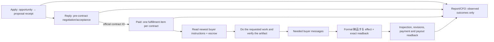

# CrowdWorks contract fulfillment: as-is and to-be

## Goal and evidence boundary

Turn accepted, funded CrowdWorks contracts into completed buyer work, formal delivery, accepted payment, and repeatable revenue. The target is USD 10,000 in **verified monthly recurring revenue** from CrowdWorks; one-off escrow, proposals, forecast value, and sent messages do not count as MRR.

This is a plan, not a production effect. The supplied screenshots show a buyer message and an empty message/attachment composer on two contract views. They do not show the contract's escrow state, actual work completion, a delivery receipt, acceptance, or payout. The three authenticated URLs must be re-read by the responsible owner before any effect:

- `https://crowdworks.jp/proposals/306120094` (proposal/negotiation);
- `https://crowdworks.jp/contracts/63659463` (contract thread; buyer asks about email visibility);
- `https://crowdworks.jp/contracts/63657015` (contract thread; buyer supplied a Google Docs work link).

Current `origin/main` has four registered owners: Application, Reply, Paid, and Report (`config/loop-registry.json`). There is no registered CrowdWorks Storefront owner. `application_tick.py` posts and reads back `/proposals/<id>`. `reply_adapter.py` discovers inbox threads, handles `/proposals/<id>` and `/contracts/<id>`, can accept an offer, send a message, and submit a linked Google Form. `paid_adapter.py` discovers active `/contracts/<id>`, also submits a Google Form, and then separately submits `/milestones/<id>/complete`. Both Reply and Paid therefore have possible effects for a post-contract task. `paid_adapter.py` currently treats one Google Form URL as the work route and waits when it is absent; that cannot complete a Google Docs assignment or arbitrary buyer request. Report sends internal Telegram summaries, not buyer work.

Read-only production status at the planning snapshot: all four labels were `loaded-idle` and their last terminal result was `blocked` by host admission. The retained Paid result was `provider_inventory` failure with `observed=0`, `effect=0`, `readback=0`; retained Reply was `status=ok`, `observed=57`, `readback=52`, `failed=1`, `pending=4`. These are different timestamps and do not establish current provider state or earned revenue. The stored Reply state mentioning contract `63657015` records an `accept_contract` intent; that is not a delivery receipt.

CrowdWorks' official fixed-price guide defines application, negotiation, contract, escrow, work, **「納品する」**, inspection, and payment as distinct steps. A normal message in the same contract page does not invoke formal delivery. The official guide also says to begin work after escrow. Sources: [worker guide](https://crowdworks.jp/pages/guides/employee/fixed_price), [terms](https://crowdworks.jp/pages/agreement). Lancers' [project guide](https://www.lancers.jp/help/guide/lancer/project/3) likewise distinguishes proposal from work after escrow; its actual page/owner mapping needs separate inspection.

## Live production cursor — 2026-09-18

This section is the current execution SSOT. It supersedes the older planning snapshot above where the
observed state differs. The read-only CrowdWorks owner re-read all five active contract pages on
2026-09-17:

| contract | official state | current buyer request evidence | remaining fulfillment |
|---|---|---|---|
| `63659463` OnJob | `funded`; formal delivery not read back | Contract message lists a common test and separate Web-ad / video candidates; the contract title is Web広告運用. The model must confirm the intended role from the full conversation before choosing a form. | Read every candidate form's title/required fields, choose only the form(s) justified by the request, submit and verify, then formal delivery and readback. |
| `63657015` Orecon | `funded`; formal delivery not read back | Buyer asks for a copied/fillable hearing sheet and a common email-writing test; a designer-only task is separately described. The model must confirm the worker role and required scope. | Create the requested hearing artifact, send it through the contract message using the allowed format, complete the applicable test, then formal delivery and readback. |
| `63583795` Mirafull | `funded`; formal delivery read back; inspection pending | Historical form receipt is present. The seller-visible contract now says the client is inspecting the delivery, and the seller message confirms the Google Form response. | Do not resend the form or delivery. Reconcile the local Paid receipt, monitor `検収`/acceptance, and read back settlement/payout. |
| `63570481` Effect | `funded`; one historical form receipt; formal delivery not read back | Buyer says the staff-address answer was seen but the customer-address answer was not. | Read the complete/expanded buyer task, identify the missing customer response, submit only that missing work, then formal delivery and readback. |
| `63568785` undym67231 | `funded`; formal delivery not read back | Buyer supplied a Google Docs assignment link; no external form is exposed on the current contract page. | Read the document and full buyer instruction, produce the requested feedback artifact, send it through the contract, then formal delivery and readback. An application-date gate must not block a no-form task. |

### Verified current facts

- Official contract readback: **5/5 `funded`; 1/5 (`63583795`) has formal delivery read back and is awaiting buyer inspection; 4/5 have no formal delivery read back**.
- Confirmed Google Form receipts exist for `63583795` and `63570481`. The `63583795` row now also has a buyer-visible seller message and official inspection-pending readback; the `63570481` form receipt still does not prove formal CrowdWorks delivery or buyer acceptance.
- The local Paid item for `63583795` was persisted before the later provider readback and must be reconciled from the official contract before any retry. The provider readback is authoritative; do not resend a form or delivery from a stale local row.
- The latest Paid attempts have `effect=0`; no new form or formal-delivery effect is accepted as successful.
- The shared Paid kernel pre-effect-failure fix is merged in PR `#5365` and is loaded in immutable release
  `c16f437b`. A timed Paid readback was stopped after it exceeded the useful bounded wake; the contract
  item remains open and must be reconciled from official state before retry.
- PRs `#5393`, `#5401`, `#5411`, `#5412`, `#5413`, and `#5419` bound the Paid wake, preserve pre-effect
  hints, retry/recover CDP contexts, start navigation at `commit`, and fail closed on empty inventory. The
  current main-derived immutable release is `20260918T012630-c6e5c654`, and the Paid plist readback points
  to that release. The latest targeted wake refused a false zero, ended with `effect=0`, and left no sticky
  `effect_unknown` after reconciliation. No form, message, or formal-delivery effect was accepted.
- The CrowdWorks CDP listener is present, but the authenticated provider context is currently unstable
  during context/page creation. This is a browser-readback blocker, not evidence of a provider submission.
- The Paid owner is the only post-contract effect owner. Reply may hand off an exact contract ID but must
  not send an ordinary post-contract reply or external form for a Paid-owned contract.

### Remaining TODO, in execution order

1. **Restore bounded browser readback and reconcile the already-observed delivery.** Keep a finite 900-second
   bound for the Paid owner. The prior 180-second bound terminated a wake while the model was generating
   the required fields of a 13-field Google Form; the observed state was `intent_persisted` with no new
   confirmed receipt. The 900-second limit remains owner-specific and bounded, so it lets a correct work
   item finish without making the shared loop fleet unbounded. Restore the authenticated CrowdWorks context,
   read the five contract pages, and promote the
   official `63583795` delivery/inspection readback into the durable Paid receipt without replaying it. A
   slow contract must become a terminal, replayable `waiting_external`/failure item; it must not hold the
   Paid owner indefinitely or block other contracts.
2. **Persist full buyer context.** Store the newest buyer event, expanded message history, linked document/form
   metadata, scope, corrections and the model's request-to-result mapping in private contract state.
3. **Choose the requested work with model judgment.** For multiple forms, expose every exact URL plus visible
   title, required fields and choices to the model. Never choose the first URL, submit all candidates, or infer
   a task from a URL alone. If the mapping is ambiguous, ask one specific buyer question and perform no effect.
4. **Create and quality-check each artifact.** Open the linked document/form, do the actual requested work,
   verify content, completeness, format, permissions and buyer-visible access, and persist `correct_work_verified`
   only after that readback.
5. **Submit separate effects.** Fence external form/message/file submission separately from CrowdWorks formal
   delivery. `63583795` is already sent and must remain replay-zero. For every other contract, read back each
   exact receipt before retrying. Formal delivery is the named milestone control, not a normal message or an
   empty composer.
6. **Close each contract.** Read back `納品 → 検収/acceptance → settlement → payout`; for `63583795`,
   continue from inspection pending. Preserve revisions as new buyer-event versions, and prove replay-zero
   per contract.
7. **Finish installed-owner proof.** The main-derived release and targeted Paid apply are complete. Re-run
   only after browser readback is available, then inspect the terminal receipt plus exact official provider
   readback; no browser-unavailable receipt counts as a provider effect.
8. **Only after all five close, pursue recurring work.** Record cash received separately from verified recurring
   MRR; USD 10,000 MRR remains open until collected/settled monthly-equivalent payment evidence exists.

### Completion gate

The CrowdWorks fulfillment work is complete only when all five contract rows have a contract-specific artifact
or required response, `correct_work_verified=true`, separate external receipts where applicable, formal delivery
readback, honest inspection/acceptance state, settlement/payout evidence, and replay-zero. A green test, a running
PID, a `送信中`/filled form, a historical receipt, or a message-only readback cannot close a row.

## Boundary decision

The three choices are (A) keep Reply and Paid both acting on contract threads, (B) merge every CrowdWorks activity into one owner, or (C) keep independent acquisition and pre-contract negotiation while giving **one existing Paid owner exclusive responsibility for each accepted contract**. Choose C. It removes the overlapping post-contract effect authority, retains Apply's independent opportunity cadence, and reuses the existing Paid kernel and registered owner. The number or identity of page URLs is evidence about navigation, not the criterion for a loop boundary; the criterion is one durable business item and one effect owner. The pre-contract proposal page can redirect to a contract page after acceptance, but the contract ID becomes the durable key.

Reply owns a proposal until official acceptance yields an exact contract ID. After handoff, Reply may observe for reconciliation but must not send a contract message, submit an external form, or accept a second offer for that contract. Paid owns every buyer response, instruction link, external task, artifact, revision, and formal delivery for that contract. Only one short shared browser/account mutation is serialized; different contracts have separate durable work and can progress independently within host capacity. Report remains a light support job, not a sales or fulfillment lane. Storefront is `not_applicable` until an official listing surface is observed.

## Contract work protocol

Each contract work item records exact account, proposal, contract and milestone IDs; escrow state; newest buyer event and required action; agreed scope/due date; work evidence and artifact location; quality checks tied to buyer acceptance criteria; reply intent/effect/readback; external submission receipt; formal delivery intent/effect/readback; revision state; acceptance, settlement and payout. Keep credentials and buyer private content in the private state store, not Git or public reports. A model reads the complete request and selects how to perform the requested work with the existing tool/skill path. Deterministic code owns identity, leases, duplicate fences, state transitions, and receipt validation. It must never treat a generic acknowledgement, a filled composer, a submitted form without confirmation, or a Docs URL as the finished artifact.

### Buyer-request correctness is the release gate

For each contract, the Paid owner reads the **full current buyer conversation**, linked instructions, agreed scope and later corrections before deciding what to do. It keeps a private, contract-specific mapping from each concrete buyer request and acceptance criterion to the intended action, resulting artifact or external effect, and proof. A previous complaint or correction is active context; the owner must identify what was wrong and must not repeat the same response. The model judges meaning and chooses the work; code checks identities, effect fences and observable evidence. No keyword rule or canned completion reply substitutes for reading the request.

Before sending, the owner checks the proposed reply or artifact against that mapping. After sending, it opens the **actual buyer-visible message, link, file, form result or delivered artifact** and checks its content, accessibility and contract binding. It then reads the newest buyer response and official contract state. A provider receipt proves that something was sent; it does not prove that the thing was correct. Mark `correct_work_verified` only when the requested task is done, the submitted result matches the buyer's instructions, and the buyer-visible readback supports that claim. Buyer acceptance is recorded separately. If the buyer has not yet inspected the work, record `awaiting_buyer`, not `accepted`.

If the submitted result is wrong, incomplete, inaccessible, or contradicted by buyer feedback, record the mismatch and its cause on that contract, retain the original effect receipt, and keep the work item open. Correct the artifact or reply, run the relevant focused regression, publish the corrected owner release through the normal pipeline, and observe its natural wake and new buyer-visible result. Repeat this repair-and-readback cycle until the work matches the request and is accepted, or an exact external blocker or buyer clarification prevents progress. Do not resend an uncertain effect, claim success from a green test, or close the loop because a message was posted. A buyer complaint is a new task version and a regression case, not a terminal failure that can be ignored.

For `63657015`, open the linked Google Doc in the authenticated, account-owned workflow, establish its concrete deliverable and permissions, do the work, verify the result from the buyer's perspective, send only necessary progress messages, then use the contract's formal delivery control and exact readback. For `63659463`, first read the full contract and buyer message, verify the needed email/communication action and provider rules, respond or act accordingly, and do not invent a deliverable from the screenshot. If the buyer's task or external submission cannot be confirmed, persist `waiting_for_buyer` with the exact missing fact and a buyer-visible question; keep the item live.

An external form and formal CrowdWorks delivery are separate fenced effects. After an uncertain external submit, inspect the form's confirmation or exact receipt before retry. After an uncertain delivery click, inspect the exact contract/milestone status before retry. `awaiting_escrow` permits negotiation and clarification, not production work or formal delivery. Revised instructions reopen the same contract item with a new buyer-event version and preserve earlier verified effects.

If a contract page exposes multiple external forms or links, the owner retains every exact URL and reads each form's visible title, required fields and choices together with the full buyer conversation. The model chooses the form only when the buyer's requested task and the form metadata identify one unambiguously. The owner never selects the first link, infers a task from the URL, or submits all candidates. If the mapping remains ambiguous, it records `waiting_for_buyer` with the missing fact and asks one specific question; no external form effect or formal delivery is allowed.

## Acceptance and scope

First close the existing funded contracts, then grow acquisition. For every contract: exact funded status; full newest buyer request and prior correction context; a request-to-result mapping; work performed; buyer-visible content/permission readback; `correct_work_verified`; official external receipt where applicable; formal CrowdWorks delivery status; buyer inspection/revision outcome; settlement and actual payout; zero duplicate effect on replay. A timed natural wake must move at least one ready contract forward while one blocked contract remains independently represented. The loop is not accepted from local tests or a single manual browser action: the installed owner must naturally observe the buyer context, do the requested work, submit the right result, and read it back from the buyer-visible surface. When a live result is wrong, acceptance remains open and the owner is repaired and re-observed until the result is correct or a specific external blocker is documented. The revenue dashboard separates escrow, delivered, accepted, settled, paid, and recurring realized revenue. MRR counts only active recurring work with collected/settled monthly-equivalent revenue and a documented continuation basis; one-off payments count cash revenue only.

Implementation uses the existing `skills/earn/crowdworks`, shared marketplace kernels, runtime admission, receipt and CFO paths. No second browser owner, new generic agent framework, or sibling loop restart. Other Codex sessions retain their 14-loop ownership. Lancers and Coconala receive only the proven contract-to-fulfillment and quality/receipt lesson through the shared boundary after their own owner confirms applicability; no cross-provider page assumption.
