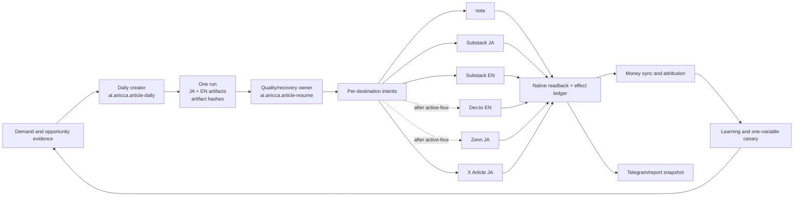

# Writer Loop on Life Manager Main — Design

**Date:** 2026-09-17  
**Status:** design approved for planning  
**Source of truth:** `docs/superpowers/specs/2026-08-20-writer-loop-life-manager-consolidation.md`, `docs/ARTICLE-LAUNCH-TODO.md`, `skills/writer-agent/SKILL.md`, and `config/loop-registry.json`  
**Repository:** `Daisuke134/life-manager`  
**Design base:** `origin/main` at `4835540a7f31bc4396b7e7c78c7877bc42718892`

## Goal

Make the existing Life Manager Writer Loop produce one useful, localized
article every day, publish it through the approved six-platform surface, prove
each external result with publisher-native readback, report honest money and
failures, recover interrupted runs without duplicate effects, and then operate
the same contract toward Dais's receipt-verified $10,000 monthly revenue and
$10,000 active MRR targets before graduating the runtime to credential-free
local OSS.

The revenue targets are evidence gates, not guarantees. A missing payment is
`unknown`, not zero; a view, paywall, draft, checkout start, or model response
is not revenue.

## Current measured boundary

- The current Writer checkout is not a safe editing target: the normal
  `life-manager-main` checkout contains unrelated dirty work. This design uses
  a linked worktree from the latest `origin/main`.
- Life Manager main's binding execution cursor is `docs/ARTICLE-LAUNCH-TODO.md`.
  W0 and W1 are recorded complete; W2 is active and is currently guarded by
  the measured article-run capacity floor and provider/demand receipts.
- The current run ID must be read from the private Writer state at execution
  time. The latest cursor records `20260829-165022` as the canary candidate,
  but the plan never assumes that ID is still current. Existing artifacts,
  `quality-self-heal.json`, `publication-state.json`, and ledger rows are read
  back before any owner wake; no publication is inferred from the cursor text.
- The focused baseline in the clean worktree is `45 passed, 31 subtests
  passed` for the adoption, resume-adoption, and daily-start-control tests.
- Loaded scheduler state, immutable release, source commit, and state root can
  diverge. Every operational change must read all four back.

## Surface contract

The phrase “each platform” is split into the binding main contract and the
user-requested discovery extension. This avoids silently changing the main
queue while still making the final six-surface outcome explicit.

### Binding active-four (main contract)

| Surface | Language | Role | Daily gate |
|---|---|---|---|
| note paid article | JA | direct one-time writing revenue | required live URL, authenticated price/paywall, owner, body/media hash |
| Substack paid publication | JA | recurring writing revenue | required live URL, authenticated paid audience/paywall, publication identity |
| Substack paid publication | EN | recurring writing revenue | required live URL, distinct EN publication identity, paid audience/paywall |
| X Article | JA | long-form acquisition | live Article URL and rendered-body readback |

### Discovery extension (after active-four replay-zero)

| Surface | Language | Role | Gate |
|---|---|---|---|
| Dev.to article | EN | free discovery | public title/body/media readback |
| Zenn article | JA | free discovery | public title/body/media readback or durable platform-specific pending receipt |

The extension is non-blocking for the first revenue canary, but the requested
final state includes it when its provider-native receipts are available. The
main cursor's W3-W6 order remains unchanged.

`x-article/en` and `x-post/ja` remain `DORMANT_EXPERIMENT` until their
reactivation gates are met. They are not silently added to the daily quota.

One daily work item creates one research evidence set, one JA artifact, one
independently localized EN artifact, and one immutable destination intent per
active surface. It does not create unrelated topics or identical full copies.

## Operating architecture



The deterministic runtime owns leases, state transitions, effect fences,
idempotency, immutable identity, readback, payment truth, scheduling, and
crash recovery. The Agent owns topic, reader, research, writing, tool choice,
diagnosis, replanning, and improvement strategy. No fixed selector or failure
taxonomy may become the decision-maker.

### Eight workstreams

These are eight separately owned preparation/implementation streams. They may
investigate or develop independently in isolated worktrees, but the shared
state/effect ledger and browser/account mutation remain serialized by the
natural Writer owner.

| Stream | Responsibility | Main files/modules | Depends on | Output |
|---|---|---|---|---|
| W1. Source and owner control | bind source SHA → immutable release → loaded Writer labels; protect state and sibling loops | `config/writer/runtime-manifest.json`, Writer plists, `bin/lm-loop`, `bin/cut-loop-release.sh`, `writer_owner_fence.py` | current main and A8 code | source/release/argv/state parity receipt; Connector unchanged |
| W2. Same-run recovery | adopt the safe unpublished run, repair current-hash quality evidence, resume without attempt inflation | `quality_repair_control.py`, `quality_self_heal.py`, `article-resume-pending.sh`, `article_daily_start_control.py` and their tests | W1 | valid A8 receipts, publication-state initialization, same run ID |
| W3. Note execution | publish the paid JA Note intent with identity, paywall, media, timeout, and native readback guards | `publication_resume.py`, `note-publish/`, Note tests | W2 | Note native live receipt |
| W4. Substack execution | publish JA and EN through separate publication identities and native readback | `publication_resume.py`, `publish-substack-managed-contract.sh`, Substack tests | W2 | two distinct Substack native live receipts |
| W5. X execution | publish X Article JA with browser ACI, readable body media, and rendered-body readback | `publication_resume.py`, `x-publish/`, X tests | W2 | X Article native live receipt |
| W6. Discovery extension | add Dev.to EN and Zenn JA only after active-four replay-zero; preserve independent retry owners | existing Dev.to/Zenn adapters and tests | W3-W5, W7 | discovery native receipts or platform-specific pending receipts |
| W7. Observability and replay | make publication, failures, recovery, and reporting inspectable and idempotent | `writer_observability_trace.py`, `article-completion-notify.py`, `writer_report.py`, `writer_report_worker.py`, `article_weekly_audit.py` | W2-W5 | receipt graph, Telegram message ID, second-wake zero-effect proof |
| W8. Demand, money, learning, and OSS | supply payer-backed topics, reconcile payments, run one-variable canaries, then freeze/install the same contract for independent owners | `claim_supply.py`, `claim_topic.py`, `demand_authority.py`, `demand_card.py`, `opportunity_discovery.py`, `money_ledger.py`, `money_sync.py`, `writer_stripe_sync.py`, `attribution-join.py`, `opportunity_pitch.py`, `opportunity_response.py`, `self_improve_control.py`, `writer_learning_worker.py`, `self_owned_article.py`, `install.sh` | W2-W7 | demand receipt, payment/MRR gates, clean OSS install and owner isolation |

The eight streams are not eight Writer executors. There is one creator, one
same-run recovery owner, one effect ledger, and one account/browser mutation at
a time. Parallelism is limited to read-only evidence collection, isolated code
changes, fixture construction, and review; deployment and external effects are
ordered.

## Critical path and state machine

The binding critical path is:

```text
W2 capacity/provider/demand canary
  -> W3 Note native readback
  -> W4 Substack JA/EN native readback
  -> W5 X Article native readback
  -> W7 replay-zero and report
  -> W6 Dev.to/Zenn discovery extension
  -> W8 money, opportunity, learning, and OSS gates
  -> first dollar -> $400/month -> $1,000/month
  -> $10,000 monthly for 3 consecutive months
  -> $10,000 active MRR for 3 consecutive months
  -> independent-owner clean-install and revenue gates
```

The first incomplete atom is always the only foreground mutation. W5-W8 can
prepare bounded code and evidence without changing the order or performing a
publisher effect early.

### Run and publication states

1. `article-daily` creates a unique `run_id`, immutable `artifact_id`s, demand
   card, and current JA/EN hashes.
2. A generation interruption with complete safe artifacts enters the reviewed
   `quality-repair-ready` adoption path. It never becomes
   `provider-returned` by rewriting history.
3. The recovery owner validates current regular files, prompt lineage, gate
   hashes, and absence of `publication-state.json` or public effect before
   beginning quality repair.
4. Quality/editorial/reader results are advisory after the first assessment;
   identity, safety, PII/secret, duplicate, price/payment, platform identity,
   and native-readback failures remain hard blockers.
5. `publication-state.json` is the canonical per-run destination state. Each
   destination independently becomes `live`, `pending`, `blocked`, or
   `terminal`; a failure on one surface never cancels the others.
6. The shared public-effect predicate returns true only for an explicit
   `published=true`, nonempty live URL, `state=live`, or `reality_gate=PASS`.
   Pending ledger rows never count as delivery.
7. A second natural wake reads the effect ledger and provider state and emits
   no second publish mutation.

## Daily operating contract

- Publish one long-form article per JST day initially. JA and EN are separately
  localized artifacts from one topic; the active-four destinations receive
  independent intents from that run.
- Use the existing eight-hour beats for recovery, opportunity discovery, money
  sync, learning, health, and reporting. Do not turn them into eight daily
  publication attempts until 14 days of stable evidence justify that change.
- The first binding daily SLO is active-four native readback. Dev.to and Zenn
  are added as independent discovery intents after active-four replay-zero;
  they cannot block the revenue canary or be represented as revenue.
- If credentials, KYC, CAPTCHA, a provider window, or an external editorial or
  payment response is genuinely required, persist the exact target, reason,
  retry time, owner, parallel work, and Telegram event UUID. “Wait for the next
  schedule” is never a terminal reason.
- The installed loop, not the development session, performs the real external
  publication. Manual browser/API actions are diagnostic evidence only.

## Money and OSS contract

Money enters the ledger only from a non-test external receipt that identifies
the provider transaction, payer/contract, article artifact, currency, fees,
refunds, payout state, and attribution. One-time note/article/editorial money
never enters active MRR. Active subscriptions and recurring retainers enter MRR
only while renewal, churn, fee, refund, payout, and net evidence remain valid.

The economic gates are intentionally sequential:

| Gate | Required evidence |
|---|---|
| S0 | first non-test received payment joined to an article artifact |
| S1 | at least $400 monthly equivalent with explicit FX evidence |
| S2 | at least $1,000 monthly plus three positive-net weeks |
| S3 | at least $10,000 gross monthly, net positive, fully attributed, for three consecutive months |
| S4 | at least $10,000 active MRR, positive net, with lifecycle receipts, for three consecutive months |

Only after S3 and S4 does W8 package the same implementation for local OSS.
The default local mode owns its publication surface, keypair/payment identity,
encrypted private state, installer, rollback, and tenant boundary. note,
Substack, X, Google, Gmail, and Stripe remain opt-in connectors; regulated
fiat payout and KYC are disclosed setup boundaries, not bypass targets.

## Verification matrix

Every implementation atom gets a focused failing fixture, the smallest root-
cause patch, and a fresh check. The end-to-end acceptance reads the actual
runtime, not just code or a mock.

| Requirement | Authoritative proof |
|---|---|
| source/release ownership | source SHA, immutable release SHA/tree hash, loaded `ProgramArguments`, state root, rollback receipt |
| A8 recovery | existing run ID unchanged; current-hash JA/EN gates; valid quality terminal; publication state initialized; no public effect before A9 |
| active-four publication | Note, Substack JA, Substack EN, and X Article JA native URLs/readbacks with owner, artifact hash, identity, and media/body evidence |
| discovery extension | Dev.to EN and Zenn JA native readbacks or durable provider-specific pending receipts after active-four replay-zero |
| isolation | one platform failure produces only its own circuit/pending/terminal receipt |
| replay-zero | unchanged second natural wake; identical effect IDs/URLs; zero new remote mutations |
| Telegram/reporting | report snapshot equals ledger/provider receipts; delivery has a real message ID; semantic duplicate suppressed |
| money | provider transaction plus fee/refund/payout/renewal/attribution receipts; unknown never coerced to zero |
| daily operation | natural-owner receipts for each daily slot; no manual publication; 14-day stability observation before cadence expansion |
| clean OSS install | fresh local install, second-install idempotency, owner-isolated public output, real minimal payment, report, restart, replay-zero |
| independent owner | external owner's own artifacts and receipts close the same revenue gates; Dais results never satisfy another owner |

## Safety and non-goals

- Do not create a second Writer pipeline, second money ledger, or second state
  tree.
- Do not edit or delete `.openclaw`, `profitable-claude`, credentials, browser
  profiles, active state, or immutable releases as cleanup shortcuts.
- Do not raise attempt/token budgets to hide an adoption or routing defect.
- Do not apply or restart `ai.anicca.life-manager-connector-native` during
  Writer work.
- Do not claim “money printer,” “self-healing,” “self-improving,” or “no human
  in the loop” until their matching receipts exist.
- Do not promise that every local installation earns $10K; the software can
  guarantee attempts, isolation, recovery, and honest measurement only.
- Do not merge dormant platforms into the daily contract without their explicit
  reactivation evidence.

## Design self-review

- Scope is one Writer implementation on Life Manager main, not eight competing
  executors.
- All six requested surfaces are named with language, role, and receipt; the
  main contract's active-four boundary is preserved.
- The current A8 cursor is preserved; no new run or manual publication is used
  as a substitute.
- Each workstream has owned modules, dependencies, and a durable output.
- Revenue, MRR, OSS, and independent-owner gates are separate and receipt
  bounded.
- No placeholder implementation, unbounded retry, platform-wide blocker, or
  unsupported universal revenue claim remains in the design.
