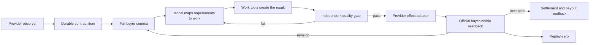

# Paid Fulfillment Across Marketplaces: As-Is and To-Be

## Goal

Life Manager completes every funded client engagement on Coconala, CrowdWorks,
Lancers, and Upwork from the newest buyer instruction through correct work,
buyer-visible submission, formal delivery where the provider requires it, official
readback, revision handling, acceptance, settlement, and replay-zero.

The system must do both parts of the job: **actually send the result** and **send a
result that satisfies the buyer's complete current request**. A generated artifact,
green local test, filled composer, provider click, or sent message alone is not
completion.

This document is the current cross-provider execution SSOT. It supersedes conflicting
Ryu automation or formal-delivery instructions in
`docs/superpowers/plans/2026-09-04-coconala-paid-all-clients.md`; that file remains a
historical plan. Provider-specific specs remain authoritative for exact live contract
inventories and page semantics unless this document explicitly changes ownership or
completion criteria.

## User Decisions

- Execute one provider vertical at a time: Coconala, then CrowdWorks, then Lancers,
  then Upwork.
- Within each provider, finish one client before advancing the production canary.
- Coconala talkroom `18211957` (`Ryu0820119`) is a permanent manual exception. The
  automated Paid owner may observe it for reconciliation but may never create work,
  reply, attach a file, or invoke formal delivery for it.
- There is no Risa client. Earlier references to Risa were transcription errors for
  Ryu and create no work item.
- All other eligible paid clients ultimately belong to their provider's Paid owner.

## Verified Current State

### Ryu manual exception

Ryu's latest buyer events are `js-talkroomMessage-222184673` and
`js-talkroomMessage-222185015`. The seller manually completed and verified the
requested production changes:

- the supplied recruitment banner is the first content on the recruitment page;
- the management pricing page again shows all five live courses, twenty-three area
  fees, and paid-option editing together;
- the management reservation page shows the current live reservation inventory and
  an embedded instance of the actual public reservation form.

Authenticated browser readback is stored outside Git under project `18211957` as
`delivery/manual-emergency-audit-v696.json`. The reply was sent once without the
formal-delivery checkbox; Coconala readback observed it as the latest seller message
at `2026-09-22T11:34:08.476934+00:00`. Ryu remains open for direct revision handling
and is not proof that the automated Paid owner works.

### Coconala

At the planning readback, the active order inventory contained four talkrooms:
Ryu `18211957`, two orders for the same NPO (`18250352`, `18223833`), and Chii
`18180857`. The original `admission_effect_unknown` occurrence was reconciled and the
Ryu fence plus one-project-per-wake release reached production. A later Chii wake sent
to a TikTok recipient whose earlier `sent` row already existed under a different
effect key. `hf-gig-paid-direct` is therefore disabled and unloaded until recipient
identity, not only effect-key identity, is enforced atomically at the transport
boundary. `hf-gig-reply-detector` is a separate observation/pre-contract owner and
must not acquire post-payment fulfillment authority.

### CrowdWorks

The registered Application, Reply, Paid, and Report owners are loaded but fenced by
`host_admission_deferred:resource_effect_unknown`. The provider-specific execution
cursor remains the existing
`docs/superpowers/specs/2026-09-17-crowdworks-contract-fulfillment-design.md`.
This specification adds the cross-provider completion contract; it does not erase
that contract inventory or its occurrence-specific reconciliation obligations.

### Lancers

Application, Negotiate, Paid, Storefront, and Telegram Report are fenced by
`resource_effect_unknown`. Browser and Work Sync are running and must not be stopped
or repurposed during repair. The paid adapter exists, but a running support owner is
not evidence that client work is being completed or delivered.

### Upwork

The repository contains Upwork discovery, inbox, proposal, negotiation, offer,
message, revision, delivery, sealed-effect, and finance adapters with focused tests.
There is no registered Upwork Paid product-loop owner in `config/loop-registry.json`.
Upwork therefore requires lifecycle registration and a live contract inventory
before it can claim end-to-end paid fulfillment.

## Architecture

Use one shared fulfillment contract with provider-owned observation and effect
adapters. Do not build one browser script that understands four unrelated sites.



The model owns semantic judgment: what the buyer asked for, what work is required,
whether the result matches the request, and what a revision changes. Deterministic
code owns provider identity, contract IDs, hashes, leases, owner boundaries, effect
fences, arithmetic, receipt validation, and replay protection. Keyword rules or
regular expressions must not decide whether work is complete.

## Durable Contract Item

Each accepted or funded engagement has one durable item keyed by provider account and
the provider's immutable contract/order ID. It records:

- provider, account, buyer, proposal/offer ID, contract/order ID, and milestone ID;
- escrow/funded state, agreed scope, due date, and newest buyer-event identity;
- complete conversation and attachment/link provenance;
- a request-to-result map for every current instruction and acceptance criterion;
- work artifact paths, hashes, accessibility checks, and quality evidence;
- reply, external-form, attachment, formal-delivery, acceptance, settlement, and
  payout effects as separate receipt-bearing transitions;
- active owner and lease, including a manual exception when present;
- the first failure, recovery action, official readback, and replay-zero result.

Buyer revisions create a new buyer-event version on the same item. They do not erase
earlier receipts, silently create a second contract, or permit replay of an uncertain
effect.

For outbound campaign messages, effect identity includes the canonical provider
recipient. Under the same project-owned transport lock used for the send fence, the
adapter must reject a recipient already recorded as `attempting`, `unknown`, or
`sent`, even when the caller supplies a new effect key or new message. A verified
`not_sent` row may be retried. Prompt instructions, model-selected keys, and a later
bookkeeping check are not substitutes for this mutation-boundary invariant.

## State Model

```text
observed
→ funded_verified
→ requirements_mapped
→ work_in_progress
→ correct_work_verified
→ ready_to_send
→ message_or_artifact_sent
→ formally_delivered (when applicable)
→ awaiting_buyer
→ accepted | revision_requested
→ settled
→ paid
```

`waiting_for_buyer`, `waiting_for_access`, `awaiting_escrow`, and
`effect_unknown` are explicit nonterminal states. A blocked item remains independently
represented while other eligible items progress. `effect_unknown` always routes to
official reconciliation before any retry.

## Ownership and the Ryu Fence

The shared owner ledger supports `manual` and `loop` modes. A manual record contains
provider, contract/order ID, owner ID, reason, start time, lease/readback state, and
explicit release evidence. Static booleans are insufficient ownership proof.

Ryu's record is permanent until Dais explicitly releases it. Expiration, process
death, a successful automated observation, a new buyer message, or a loop restart may
not transfer it. Every Coconala effect entrypoint must check the owner ledger after
fresh targeted readback and immediately before each provider mutation. Tests must
prove that Ryu is excluded while another eligible room still progresses.

## Correct-Work Gate

Before a buyer-visible effect, the Paid owner must:

1. read the complete current conversation, linked instructions, attachments, prior
   complaints, and later corrections;
2. bind the proposed work to the newest buyer-event identity;
3. map every concrete request to an action, result, and evidence source;
4. create the actual result with the necessary tools;
5. verify content, rendering, links, permissions, and provider binding from the
   buyer's perspective;
6. obtain a verifier result that covers every mapped requirement;
7. re-read the provider immediately before sending and refuse stale work;
8. send once, read the buyer-visible result back, and run replay-zero.

The gate fails closed for an unmapped requirement, missing artifact, placeholder,
inaccessible link, stale buyer version, meta-commentary instead of work, unsupported
claim, missing provider identity, uncertain prior effect, or mismatched attachment
hash. A failure returns to work; it does not become a generic apology or premature
formal delivery.

## Provider Boundaries

### Coconala

- `hf-gig-reply-detector` observes and handles only its existing pre-fulfillment
  boundary.
- `hf-gig-paid-direct` exclusively owns paid talkroom work, ordinary progress replies,
  artifacts, revisions, and formal delivery for non-manual items.
- Ordinary reply and `正式な納品` are distinct fenced effects.
- The current `effect_unknown` occurrence is reconciled before restart.
- Production re-entry uses one non-Ryu canary, then all remaining eligible rooms one
  project per wake.
- A remote campaign transport must reject a previously contacted canonical recipient
  before opening a provider target; replay-zero is recipient-scoped across effect keys.

### CrowdWorks

- Application owns proposals; Reply owns negotiation until an official contract ID;
  Paid exclusively owns funded contract work and delivery.
- External forms and `納品する` are separate effects with separate receipts.
- Existing occurrence fences are resolved individually before natural canaries.
- The provider-specific funded-contract order and exact completion requirements remain
  authoritative in the CrowdWorks contract-fulfillment specification.

### Lancers

- Application and Negotiate stop mutating after the official project/contract handoff.
- Paid exclusively owns contract work, buyer replies, artifacts, revisions, and formal
  delivery.
- Existing Browser and Work Sync owners remain isolated support resources.
- Each current effect fence is reconciled by exact occurrence and official readback,
  followed by one natural paid-contract canary.

### Upwork

- Reuse the existing provider modules instead of writing a second Upwork stack.
- Register one lifecycle owner only after read-only inventory proves the relevant
  account and funded contract IDs.
- Proposal, offer acceptance, contract work, milestone submission, revision, and
  finance are distinct states/effects.
- The first live canary must prove one funded contract from full context through
  buyer-visible delivery and replay-zero before broader admission.

## Execution Order

1. Keep Ryu manual forever; process every new Ryu revision directly and verify it.
2. Add the durable Coconala manual-owner fence and the Ryu regression fixture.
3. Reconcile Coconala's exact `effect_unknown`; do not clear it by owner-wide guess.
4. Audit Chii and both NPO rooms, manually repair any imminent incomplete result, and
   select one non-Ryu loop canary.
5. Ship Coconala source through focused tests, contract gate, PR/merge, immutable
   release, targeted apply, natural canary, official readback, and replay-zero.
6. Admit every remaining eligible Coconala paid room while Ryu remains excluded.
7. Resolve CrowdWorks occurrences, close funded contracts one at a time, and prove a
   natural Paid canary.
8. Resolve Lancers occurrences, close contracts one at a time, and prove a natural
   Paid canary without disturbing Browser or Work Sync.
9. Inventory and register Upwork Paid ownership, then prove one funded live canary.
10. Move only the proven request map, quality gate, receipt vocabulary, and state
    transitions into the shared marketplace kernel; keep DOM/API behavior in provider
    adapters.
11. Prove Local and Cloud host adapters use the same item identities, leases, receipts,
    and replay fences before enabling the same provider on two hosts.

## Production Promotion Contract

Every source change starts from current `origin/main` in a leased worktree and follows:

```text
RED regression
→ minimal implementation
→ focused tests
→ lm-loop-contract
→ pushed branch and PR
→ merged main
→ immutable release
→ targeted owner apply under deploy lock
→ natural wake
→ official provider readback
→ replay-zero
```

No unfinished worktree code may use a production browser or provider account. No raw
`launchctl`, sibling restart, owner-wide effect-fence deletion, or manual database edit
may substitute for the lifecycle tools and occurrence resolver.

## Acceptance Criteria

The objective is complete only when all of the following are proven:

1. Ryu remains manual-only, receives every direct revision correctly, and automated
   Coconala effects against talkroom `18211957` remain zero.
2. Every current eligible non-Ryu Coconala paid room reaches the correct honest state;
   ready work is actually sent and read back, while genuine waits stay explicit.
3. Coconala completes a natural installed-release canary and replay-zero.
4. Every current funded CrowdWorks contract has correct-work evidence, formal delivery
   or an exact nonterminal blocker, buyer-visible readback, and no duplicate effect.
5. CrowdWorks completes a natural installed-release canary and replay-zero.
6. Every current funded Lancers contract meets the same completion contract, and
   Lancers completes a natural installed-release canary and replay-zero.
7. Upwork has a registered Paid owner and completes one real funded contract canary
   through buyer-visible submission and replay-zero before general admission.
8. A revision on each supported provider reopens the same durable item and progresses
   without losing or replaying earlier receipts.
9. Local and Cloud cannot both mutate the same contract concurrently.
10. Reports and CFO events distinguish observed, funded, delivered, accepted, settled,
    paid, and recurring revenue; forecasts and sent messages are not booked as revenue.

## Non-Goals

- Do not return Ryu to automation merely because the general Coconala lane passes.
- Do not merge all providers into one DOM workflow or one browser owner.
- Do not hardcode semantic completion from buyer keywords.
- Do not manufacture work for accounts without an authenticated, funded contract.
- Do not count a test, process state, message, or provider click as buyer acceptance or
  revenue.
- Do not broaden this work into unrelated acquisition, storefront, or host cleanup.
