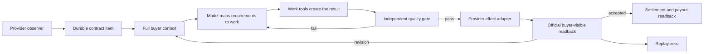

# Paid Fulfillment Across Marketplaces: As-Is and To-Be

## Goal

Life Manager completes every funded client engagement on Coconala, CrowdWorks,
Lancers, and Upwork from the newest buyer instruction through correct work,
buyer-visible submission, formal delivery where the provider requires it, official
readback, revision handling, acceptance, settlement, and replay-zero.

The system must do both parts of the job: **actually send the result** and **send a
result that satisfies the buyer's complete current request**. A generated artifact,
green local test, filled composer, provider click, or sent message alone is not
completion.

### Runtime admission lifecycle correction — 2026-09-23

The live investigation reproduced a shared-host starvation defect: `lm-loop stop`
booted a service out of launchd but left its durable queue row and reservation
eligible. The next control-plane wake could reserve the stopped owner again,
even though its launchd state was `unloaded` and `pid=null`. The correction is
test-first and minimal: stop releases the reservation and marks the queued
owner suspended without deleting its occurrence ledger; start/restart clears the
suspension only after launchd readback succeeds. The Ryu owner remains paused
and manual-only. Focused admission/lifecycle/runtime suites pass (`124`, `6`,
and `75` tests respectively), `git diff --check` is clean, and
`./bin/lm-loop-contract` passes.

Live verification after applying the suspension state to `hf-gig-paid-direct`
showed no reservation for more than 80 seconds and `next_eligible_at=inf`.
This is an internal admission proof only; it is not a provider send or a
Coconala completion gate. The fix still requires an immutable production release,
installed-SHA/argv readback, one stable-headroom natural wake, official
four-room readback, and replay-zero before the Coconala system layer is closed.

### Latest Coconala provider readback — 2026-09-23 20:35 JST

The latest official readback is split by client. Ryu `18211957` has the manual
seller message `js-talkroomMessage-222245383` (18:38 JST), which includes the
WEB予約 heading/guidance editability, management preview, and management URL.
Chii `18180857` remains buyer-waiting with no newer request. NPO `18223833`
received one manual progress send after buyer events `222226516`/`222226563`:
seller message `js-talkroomMessage-222253171` at 20:34 JST with
`特定非営利活動法人まくとぅー_沖縄県NPOプラザ提出書類_レビュー版_v16b.zip`
(978,061 bytes, SHA-256
`588f05d96b28028b2472ee7dbe7933505741e0fccf8d8cbe5dbb410d77a8f615`). The
official selected-talkroom DOM readback bound the exact URL and attachment, and
formal delivery remained OFF. The project ledger is reconciled with
`paid_work_browser_sent_reconciled` for this exact feedback/package pair
(`next_action=await_buyer_feedback`, `resend=false`); the durable receipt is
`projects/18223833/delivery/coconala-v16b-progress-receipt.json`. NPO
`18250352` remains buyer-waiting and was not resent. The Paid producer result captured before this manual recovery was
`observed=4/actionable=0/effect=0/readback=2/pending=1`; it does not contain the
manual 18223833 effect. No client is replayed, and Ryu's site-specific wording
is not copied to other rooms.

This document is the current cross-provider execution SSOT. It supersedes conflicting
Ryu automation or formal-delivery instructions in
`docs/superpowers/plans/2026-09-04-coconala-paid-all-clients.md`; that file remains a
historical plan. Provider-specific specs remain authoritative for exact live contract
inventories and page semantics unless this document explicitly changes ownership or
completion criteria.

## User Decisions

- Execute one provider vertical at a time: Coconala, then CrowdWorks, then Lancers,
  then Upwork.
- Within each provider, finish one client before advancing the production canary.
- Coconala talkroom `18211957` (`Ryu0820119`) is a permanent manual exception. The
  automated Paid owner may observe it for reconciliation but may never create work,
  reply, attach a file, or invoke formal delivery for it.
- There is no Risa client. Earlier references to Risa were transcription errors for
  Ryu and create no work item.
- All other eligible paid clients ultimately belong to their provider's Paid owner.
- The execution cursor is sequential: (1) keep the latest Ryu revision closed
  under the permanent manual fence, (2) prove the remaining Coconala fleet is
  loop-owned and safe, then (3) repair and prove CrowdWorks, Lancers, and
  Upwork. “Ryu's client work is finished” and “the Coconala Paid loop is
  production-proven” are separate gates.

### Two completion layers

1. **Client layer:** the requested work was performed, sent through the provider,
   and read back officially. Chii satisfies this layer for its current buyer
   event. Ryu's latest direct revision was sent through seller message
   `js-talkroomMessage-222245383` with formal delivery OFF and read back in the
   official talkroom; Ryu is now waiting for a genuinely newer buyer event. NPO
   `18223833` has one buyer-visible v16b progress revision with official
   readback, while its formal delivery and source-fact completion remain open.
   No duplicate send is allowed for either completed cycle.
2. **System layer:** the loop can safely do the same for the next eligible client,
   including admission, effect fencing, official readback, crash recovery, and
   replay-zero. Coconala's client layer is largely closed, but its system-layer
   natural-wake and shared-host gates remain open.

### Ownership rule in plain language

“Manual” does not mean that every client is manually redone. It is a permanent
exception fence for Ryu only: the owner may perform a direct correction there, and
the Paid loop must never create a second effect. Chii and every other eligible
client remain loop-owned. On each wake the loop checks the newest buyer event,
required outcomes, duplicate/effect fences, and official provider readback. If the
request is already satisfied or there is no newer buyer event, it performs no send
and records an honest terminal state such as `awaiting_buyer`. A human intervenes
only for the named Ryu exception or when a provider-specific incident is explicitly
reconciled; Chii is not such an incident.

### Authenticated artifact access rule

For Google Docs, Sheets, and other connected artifacts, the default and required
first path is the authenticated `gog` CLI or an equivalent authenticated
connector/plugin. This path uses the already-authorized scope and does not
require granting a browser Docs permission. Use a browser surface only after the
CLI/connector records a concrete read failure, and record that failure beside
the fallback readback; a missing browser session is never evidence that the
artifact is inaccessible.

### Why Chii is not being sent again

Chii's paid deliverable is the 300-recipient TikTok campaign and its Coconala
report/workbook. The canonical evidence is 12 previously verified sends plus 288
exact-readback sends, followed by one buyer-visible report/workbook message in
talkroom `18180857`. The later `20/300` remote result is an intermediate run-local
snapshot, not a new contract deficit. The 24 sends recorded on 2026-09-22 are an
immutable pre-fix overrun incident; they are preserved for audit and must not be
replayed or counted as remaining work. The latest official reply readback supports
zero eligible positive replies and one ineligible reply. The talkroom remains open
with formal delivery OFF by design, so the correct terminal state is
`awaiting_buyer`, not another send or the formal-delivery button.

The latest natural wake read the four open Coconala rooms through
`2026-09-23T01:07:47+00:00` and completed with `effect=0`, `readback=3`,
`failed=0`, and `pending=0`. It re-read Chii as `awaiting_buyer` and both NPO
rooms as `awaiting_buyer`. This is the expected no-op: the loop has already
answered the newest buyer event where it had a complete result, and it waits for
a genuinely newer buyer message where missing buyer facts are required. Ryu is
the only room that can be handled directly by a human; Chii is not a manual
exception. That wake predates the 2026-09-23 09:13–10:29 Ryu events, so its
`reserved_for_owner` result does not close the newly reopened Ryu cycle.

The preceding NPO wake exposed a safe serialization bug: room `18223833`'s
model decision was semantically `await_buyer`, but its outcome copied a buyer
message hash with one wrong character. The effect fence correctly sent nothing.
Commit `7244c3e856` now binds outcome identities by exact official message ID and
canonicalizes the hash from the provider readback; unknown IDs and invalid hashes
still fail closed. The next natural wake accepted the same decision as
`awaiting_buyer`, proving the fix without an external effect.

## Verified Current State

### Ryu manual exception

The prior Ryu buyer events were `js-talkroomMessage-222184673` and
`js-talkroomMessage-222185015`. The seller manually completed and verified the
requested production changes for that prior cycle:

- the supplied recruitment banner is the first content on the recruitment page;
- the management pricing page again shows all five live courses, twenty-three area
  fees, and paid-option editing together;
- the management reservation page shows the current live reservation inventory and
  an embedded instance of the actual public reservation form.

Authenticated browser readback is stored outside Git under project `18211957` as
`delivery/manual-emergency-audit-v696.json`. The reply was sent once without the
formal-delivery checkbox; Coconala readback observed the exact seller message
`js-talkroomMessage-222192497` at `2026-09-22T11:34:08.476934+00:00`. Ryu remains
open for direct revision handling and is not proof that the automated Paid owner
works.

A fresh authenticated Coconala browser reload of talkroom `18211957` at
2026-09-23 10:50 JST found five buyer events newer than seller message
`js-talkroomMessage-222192497`:

- `js-talkroomMessage-222215345` (09:13): the current implementation does not
  match the specification shown in the image, and asks how it works; attachment
  `IMG_6432.png`.
- `js-talkroomMessage-222215354` (09:13): asks the maximum number of people
  allowed in attendance and roster registration.
- `js-talkroomMessage-222218450` (10:24): changes the option model so the first
  item is `写真撮影1枚〜`, puts a paid-options section below normal options, and
  names five paid options with starting prices.
- `js-talkroomMessage-222218603` (10:27): adding two paid options makes all
  options disappear; this is a persistence/merge defect to fix and verify.
- `js-talkroomMessage-222218678` (10:29): asks why the shown content is present
  in WEB予約; attachments `IMG_6434.png` and `IMG_6435.png`.

The local `source/talkroom/messages.jsonl` snapshot was older (mtime
2026-09-22 20:34 JST), so the authenticated provider DOM was the authority for
this cycle. The three attachments were downloaded and compared with the live
public site and management screen. The direct fix deployed the current-image
previews and normalized campaign image fields, made the first normal option
`写真撮影1枚〜`, added the requested five paid options in order and price, made
the paid-option save/readback preserve `optionCatalog` and `per_cast_options`,
and made the management reservation iframe use a versioned preview URL that
opens the reservation form without the public age gate. The public age gate
remains enabled. The live management screen reports 12 registered profiles and
no fixed people limit in the current data model; attendance rows are added from
the roster.

Deployment and browser readback are recorded under project `18211957` in
`delivery/manual-emergency-v698-readback.json` and
`delivery/ryu-v697-manual-send-readback.json`. The direct seller message was
sent once with formal delivery OFF and no Paid-loop effect; official Coconala
readback is `js-talkroomMessage-222220999` at 2026-09-23 11:15 JST. Ryu is now
buyer-waiting for a genuinely newer event and remains a permanent manual
exception; the loop must not create work, reply, attach, or invoke formal
delivery for Ryu.

### Shared-host blocker observed during loop repair

The production Paid owner hit `OSError: [Errno 28] No space left on device` while
writing its result file. Subsequent `control_busy`, `database is locked`, and old
heartbeat failures are secondary control-plane symptoms of that host pressure, not
evidence that Chii or Ryu needs another delivery. Safe release GC evaluated 59
releases, protected all 59, and reclaimed zero bytes. The remaining recovery work
is to use the existing disk-cleanup/rotation owner to reclaim only positively owned,
regenerable artifacts before promoting new loop code; never delete provider state,
unknown-effect rows, or a protected release by hand.

Host headroom later recovered to about 1.27 GiB (1,326,948 KiB available), above
the 512 MiB Paid write/admission floor. The cleanup owner still reclaimed `0`
bytes because its four discovered cache candidates were open; protected
deletions remain `0`. The Paid process had remained on one PID for more than
thirteen minutes while repeating `control_busy`/`production apply is already
owned`, so it was stopped through the canonical `lm-loop stop
hf-gig-paid-direct` path. `launchd_state=unloaded` and `pid=null` are verified.
The bootout left owner-scoped child processes from the interrupted 18223833 run;
they were terminated only within the Paid owner process groups, the lock was
released, and the owned browser leases were checked. The official
`official-readback-18223833-after-stop.json` readback shows no new seller
message, no formal delivery, and no buyer reply after the prior artifact.
The owner must remain paused until child-reap behavior is fixed, a durable write
and natural no-op wake succeed, and the repaired immutable release is applied.

### CrowdWorks Paid live boundary

At `2026-09-23T07:24:24Z`, read-only process and state inspection found
`crowdworks-revenue-paid` running as PID `10759` on release `f01c612d`. Its
current occurrence is `18d7e1fd55967df8-10759`; host admission recorded
`resource_slot_acquired`, the entrypoint result is `pre_effect_failure`, and the
effect count is `0`. The durable CrowdWorks snapshot still has four completed
contracts and `63568785` pending. The owner logs repeat `No space left on
device`, `database is locked`, and `control_busy`, so `admission_effect_unknown`
remains fenced even though this occurrence has no provider-effect evidence.
No stop, kill, fence clear, or replay was performed; high-risk lifecycle actions
require explicit approval and an exact official readback before mutation.

The queued-wake/occurrence-scope implementation at `e012343e94` (the test
expectation update follows the production coalescing behavior) is merged in main,
included in immutable release `20260923T155015-6b72c304`, and target-applied to
`hf-gig-paid-direct`. Its focused runtime suite is `528 passed, 174 subtests
passed`, `git diff --check`, Python compile, and `./bin/lm-loop-contract` all
pass. The owner is still intentionally unloaded; the remaining proof is one
safe natural wake with official provider readback and replay-zero.

The follow-up Paid lifecycle fix is included at `470c7b3160`: when a stop signal
reaches `paid_direct.py`, it now terminates active child groups and re-raises the
same signal with the default disposition so the Paid parent cannot remain as an
orphan holding `.paid-direct.lock`. The regression test is included in the
installed release; the production owner remains unloaded until the host gate is
closed.

The targeted loop-status read path is also fixed at `313915e0a5`: when a caller
asks for one loop, `_last_event()` now returns at the newest valid report for
that loop instead of validating the entire shared `events.jsonl`. The regression
test proves old reports are not scanned after the requested report is found.
Follow-up test commit `2d2417bd5b` proves targeted cache entries remain available
for every loop sharing a state root. Runtime tests now pass `517`, Paid tests
`263`, adapter tests `15`, the loop
contract gate passes, and `lm-loop doctor` reports no missing, unmanaged, or
retired entries. These fixes are included in installed release
`20260923T155015-6b72c304` and target-applied to the Paid owner. The owner is
still unloaded and the new SHA has no natural-wake/readback proof.

Read-only host verification at `2026-09-23T03:57:38Z` found 2.9 GiB available
on the data volume, no running Paid parent/child, and a 0.18-second response
from the repaired targeted status path. The durable admission fence still says
`admission_effect_unknown=true`; these observations do not authorize clearing
the fence or restarting the production owner.

### Coconala

The current official inventory contains four open talkrooms: Ryu `18211957`, Chii
`18180857`, and the two NPO rooms `18223833` and `18250352`. `hf-gig-paid-direct`
is loaded from immutable release `4c6b1dc8a52952e31f13bcb26a5266e570169e1d`, which
contains the answered-feedback stop fix. Its latest official queue readback is
terminal with `effect=0` at the time of that wake: Ryu was
`reserved_for_owner` and the other three rooms were `awaiting_buyer`.
The latest natural wake (targeted readback through
`2026-09-23T01:07:47+00:00`) completed with `status=completed`, `effect=0`,
`readback=3`, `failed=0`, and `pending=0`; it reconfirmed Ryu as
`reserved_for_owner` and Chii plus both NPO rooms as `awaiting_buyer`. The
owner was subsequently stopped after the host/control-plane stall described
above (`launchd_state=unloaded`, `pid=null`). This is intentional containment,
not a client completion claim: Chii and the NPO rooms remain in their last
verified `awaiting_buyer` state, while no new Paid wake may run until host writes
recover and the new release is applied. The later official Ryu events supersede
the old Ryu no-op snapshot.

The Coconala schedule repair passed the loop contract gate, the focused and
full runtime suites, and `lm-loop doctor`. PR `#5798` is merged in main at
`6b72c3044b2b590b950c1df18fc876285e2e9f7c`; the immutable release
`20260923T155015-6b72c304` is current and was target-applied to
`hf-gig-paid-direct`. Official lifecycle readback shows the installed SHA is
`6b72c3044b2b590b950c1df18fc876285e2e9f7c`, while
`launchd_state=unloaded` and `pid=null` remain intentional. No natural wake,
provider readback, or replay-zero proof exists for this new SHA yet, so do not
restart Paid or submit another client package until the remaining host/admission
and natural-wake gates pass.

The one-by-one manual check of NPO room `18223833` was run after the stop. The
canonical decision regeneration still returns `await_buyer` with `effect=0` and
`readback=1`; four buyer facts remain unresolved (第3期の事業実績、社員名簿の不足分、
総会・理事会の開催日・決議、監査情報). The correct 2026–2028
一般社団法人ちむどんどん budget artifact exists locally and passes its file
acceptance, but the NPO package contract is not complete. Do not bypass the
semantic decision or send the budget as if it completed the NPO contract.

The newer official buyer events `js-talkroomMessage-222226516` and
`js-talkroomMessage-222226563` supersede that earlier readback. The buyer accepted
the ①ちむどんどん budget in its current form, supplied
`MKT年度別役員・会員.xlsx`, and asked to extend the ②まくとぅー work to the end
of September. The seller manually changed the provider schedule to 2026-09-30;
the official system event is `js-talkroomMessage-222233402`, and the latest
seller acknowledgement was sent once with SHA-256
`25f79a480d4109fd731691e4e4d7a5afb98c35c4021e39a9f29b3946567a0ac7`.
Formal delivery remains OFF and the room is still `取引中`/`revision` because
the NPO package still lacks the business results, complete member addresses,
meeting dates/resolutions, and audit date/opinion/signature facts. The collector's
old first-match delivery-date field is not authoritative when a room contains
multiple schedule events; the latest provider system event and visible schedule
must be selected instead.

The schedule parser fix is now promoted: it accepts only official change or
registration events, orders events by provider message chronology (so a late
append of an older registration cannot roll a change back), and carries a
provenance flag into the final order queue. The focused regression suite covers
the 2026-09-18 → 2026-09-30 history and the quoted registration form.

The next one-by-one readback of NPO room `18250352` at
`2026-09-23T03:09:04Z` confirms the existing v15 review package is visible,
formal delivery is OFF, and there is no buyer reply after the artifact. Its
current actionable file decision still has three unresolved facts (河原氏の正式氏名、
追加・退任役員の発効日/本人情報、R6/R7事業報告). Since the latest seller message
already asks for confirmation, replaying the same package would be a duplicate;
wait for a genuinely newer buyer event.

Ryu is a permanent manual exception. The automated owner may observe it for
reconciliation but may never create work, reply, attach a file, or invoke formal
delivery. The prior manual correction was sent once with formal delivery OFF and
read back in the official talkroom as seller message `js-talkroomMessage-222220999`.
That latest revision is complete; the room is now waiting for a genuinely newer
buyer event. The Paid loop remains permanently fenced from Ryu.

Chii is **not** an open work item. The required TikTok campaign was satisfied by
12 previously verified sends plus 288 exact-readback sends on 2026-09-15. The
official Sheet has 300 unique rows, and the 300-row workbook/report was sent once
to talkroom `18180857` and read back with formal delivery OFF. The direct ledger
also records 24 additional sends on 2026-09-22 before the stop fix was deployed;
these are immutable incident effects, not missing work, and must not be undone or
replayed. The stale partial file
`projects/18180857/delivery/paid-remote-result.json` (20/300) is an intermediate
readback and must not reopen the client. The latest official TikTok inbox readback
supports 0 eligible positive replies and 1 ineligible reply; older intermediate
counts are not completion evidence. Chii remains `awaiting_buyer`; no recipient,
report, or formal-delivery message may be resent.

The one-by-one Coconala readback at `2026-09-23T03:10:08Z` shows the final
300-row audit report as the latest seller message and
`buyer_feedback_answered_by_seller=true`; formal delivery remains OFF. The
standalone semantic-decision command can still see the older 20/300 remote
contract because it does not perform fresh queue readback. The real Paid queue
has the answered-feedback guard and must report Chii as `awaiting_buyer`,
`effect=0`, `deduplicated=true`; do not use the standalone result as permission
to resend.

The apparent “still working on Chii” state came from two non-canonical snapshots:
an intermediate `20/300` result and the pre-fix 24-send overrun. Neither reopens
the client. The 300-row campaign and the answer/report were already sent and read
back; the latest official inbox readback is 0 eligible positive replies and 1
ineligible reply. Chii is loop-owned but closed until a genuinely newer buyer
event appears, while Ryu alone remains manual-owned.

Release `37e1d582f1` (#5787) added the semantic answered-feedback wait, and
`4c6b1dc8a5` (#5788) fixed the first-cycle fail-closed state. Since the fix, the
Chii ledger has no new rows and the natural Coconala wake is `effect=0`. This is
why Chii is handled by the loop normally but is now closed, while only Ryu stays
manual. `hf-gig-reply-detector` remains a separate observation/pre-contract owner
and cannot acquire post-payment fulfillment authority.

### CrowdWorks

The registered Application, Reply, Paid, and Report owners are loaded but fenced by
`host_admission_deferred:resource_effect_unknown`. The provider-specific execution
cursor remains the existing
`docs/superpowers/specs/2026-09-17-crowdworks-contract-fulfillment-design.md`.
This specification adds the cross-provider completion contract; it does not erase
that contract inventory or its occurrence-specific reconciliation obligations.
The new registry contract isolates future Application/Paid/Reply occurrences from an
older unknown row after promotion; it does not release the four existing fences.
Fresh official read-only inventory at `2026-09-23T03:49:14.950474Z` returned five
funded contracts: `63712784`, `63659463`, `63657015`, `63570481`, and `63568785`.
This confirms current provider visibility only; it is not a work, delivery, or
payment receipt. The exact Paid occurrence remains `claimed/effect_unknown=1`,
with no occurrence-bound no-dispatch marker or provider receipt, so no retry or
manual bypass is permitted.
The exact Paid occurrence `crowdworks-revenue-paid:18d62cf32eb0c678-48194` has an
official execute event with `effect_status=started` followed by a report with
`effect_status=unknown`; no provider receipt or no-dispatch proof exists, so it
must remain fenced. Contract `63657015` was read back as funded at this snapshot;
its later manual completion is recorded below and does not change the unresolved
Paid occurrence fence.

Fresh provider-lock read-only detail at `2026-09-23T04:00:55.856173Z` confirmed
all five funded contracts and produced these source-level preflight decisions:
`63712784=submit`, `63659463=form-complete-then-formal-delivery`,
`63657015=submit`, `63570481=revision-submit`, and
`63568785=wait_for_buyer_artifact`. These are historical planner outputs only;
the current one-by-one effects and receipts are recorded in the live execution
section below. The first canary remains `63712784` after the occurrence fence and
immutable-release gates are satisfied.

A fresh owner-locked detail read of canary `63712784` confirms
`provider_state=funded`, milestone `13833587`, latest buyer event `428014314`,
and two required Google Forms with `completed_form_urls=[]`. The form bodies
were observed read-only and pinned by SHA-256; no form POST, buyer message, or
formal delivery was executed. The correct sequence remains form selection →
one confirmed form submission at a time → formal delivery → milestone
readback.

One-by-one manual canary execution then completed contract `63712784` on
`2026-09-23`: the common test and Web Ads results forms each returned the
official Google confirmation marker with contract/event-bound receipts at
`04:39:36Z` and `04:39:41Z`; CrowdWorks formal delivery for milestone `13833587`
was sent once at `04:40 JST`. A fresh provider readback at `04:45:32Z` verified
the seller message, the `納品` progress step as `done`, the exact milestone form
hidden/disabled during client inspection, and
`provider_receipt_id=contract:63712784:milestone:13833587`; a subsequent contract
context read returned `provider_state=delivered`. This is an isolated manual
contract effect, not a Paid-loop wake or a release of the unresolved Paid
occurrence `18d62cf32eb0c678-48194`; no unknown row was cleared and no replay
was performed. Commit `5876390fe6` adds the hydration/hidden-form readback fix
with 611 focused tests passing, but it remains source-only until the lifecycle
and immutable-release gates are complete.

The next one-by-one contract, `63659463`, was also completed manually without
reposting a form: the official contract/milestone-bound receipts for the common
test and Web Ads results were re-read, the explicitly inapplicable video form
was recorded as excluded, and CrowdWorks milestone `13820867` was delivered once.
Readback at `2026-09-23T04:50:38Z` verified the exact delivery message and returned
`provider_receipt_id=contract:63659463:milestone:13820867`; a fresh context read
returned `provider_state=delivered` with client inspection in progress. This is
another isolated manual contract effect; the unresolved Paid occurrence remains
fenced and no loop wake or replay was used.

The next one-by-one contract, `63657015`, was completed manually on
`2026-09-23`. The non-designer buyer instruction was mapped to the hearing-sheet
Excel plus the common test; the anonymous survey and designer-only test were
explicitly excluded. The hearing sheet was attached once in the official thread
(message `428631900`, attachment `59259436`). The common test returned the
official Google confirmation marker with the contract/event-bound receipt
`confirmation_sha256=0c97adf447c0fa245fe83e1ae72e910e6764ef5f147231d817ed8b75780717b`.
CrowdWorks milestone `13820268` was formally delivered once. Readback at
`2026-09-23T05:13:08Z` verified
`provider_receipt_id=contract:63657015:milestone:13820268`; a fresh context read
returned `provider_state=delivered` and the exact seller delivery message
(`428632173`). No form, attachment, or delivery was replayed, and the unresolved
Paid occurrence remains fenced.

The next one-by-one contract, `63570481`, was corrected and completed manually on
`2026-09-23`. The buyer's latest correction event `427573234` said the customer
email answer was missing while the staff answer was present. The exact prior task
facts were reread, one revision-bound Google Form response was submitted and
confirmed (`confirmation_sha256=168b142a4781d25be8f7807a780239d1e4eb269c03ded584c199a0cd3f163a57`),
and the original form receipt was retained without replay. CrowdWorks milestone
`13798056` was formally delivered once; readback returned
`provider_receipt_id=contract:63570481:milestone:13798056`, and a fresh context read
returned `provider_state=delivered` with seller message `428633469`. The unresolved
Paid occurrence remains fenced. Source commit `471f3c6a97` retains durable form
history when CrowdWorks removes a submitted form URL from the live contract page;
the focused CrowdWorks suite passed `116`.

Contract `63568785` remains funded at milestone `13797948` with buyer event
`426855154`. Its linked Google Doc is readable through the authenticated Drive
CLI (`gog drive get` + `gog drive download --format=txt`); the separate Docs API is
not enabled, but the Drive scope is sufficient. The exported artifact was verified
at 703 bytes (content SHA-256
`bf162e983be991c0c7bbf19320de36c78c389e358c20fc652f6130c6b5b4138b`). The earlier
permission request remains an immutable seller message `428634040`; it was not
resent. Because the Doc instructs a five-day LINE/Note course with one form per day,
the seller sent one platform clarification asking for the five Note/form URLs or
their text: seller message `428636540`, observed through the official message API
as `contract:63568785:answer:cw-63568785-line-artifact-426855154-v1` at
`2026-09-23T05:53:27Z` (API body SHA-256
`e6a0430ee6c3a6c46c679e5d523a58ec354b60d2846fb3055daf7f04c3dd6820`). No LINE
friend-add, daily form response, correct-work verification, or formal delivery is
claimed; the item waits for the buyer's course materials or an accessible LINE
session. Source commits `e289b618e1` and `7076c2138c` make the adapter prefer
authenticated `gog drive get`/`gog drive download --format=txt` before browser
Docs surfaces, fence unresolved sibling Docs, wait for CrowdWorks message
hydration, and normalize HTML `<br>` bodies for readback; the focused CrowdWorks
suite passed `122`. PR `#5796` is merged at
`b939af53d635d3c0ae3f5b4d452bd798e6544cd6`, immutable release
`20260923T150246-b939af53` is current, and only `crowdworks-revenue-paid` is
applied to that release. Its provider readback is `loaded-idle`, `pid=null`, with
the prior `host_admission_deferred:resource_effect_unknown` fence retained; no
natural wake or replay was triggered. For every Google Doc, use the authenticated
`gog` Drive CLI (or the equivalent authenticated connector/plugin) first. It uses
the already-authorized Drive scope without requesting a new browser Docs
permission. Browser Docs is only a fallback when the CLI/connector cannot read
the artifact; a missing browser Docs session is not evidence that access is
missing.

### Lancers

Application, Negotiate, Paid, Storefront, and Telegram Report are fenced by
`resource_effect_unknown`. Browser and Work Sync are running and must not be stopped
or repurposed during repair. The paid adapter exists, but a running support owner is
not evidence that client work is being completed or delivered. The new registry
contract isolates future Application/Negotiate/Paid occurrences after promotion;
Storefront and Telegram Report remain owner-scoped pending their own proof.
The latest Paid status is `loaded-idle` with `pid=null` and blocker
`host_admission_deferred:resource_effect_unknown`. Admission occurrence
`lancers-revenue-paid:18d67a28e56c4b58-6829` remains `claimed/effect_unknown=1`.
The latest paid result reports observed/effect zero, but that is not a no-dispatch
proof and cannot release the fence.

Fresh official read-only inventory at `2026-09-23T04:05:08Z` was authenticated
and source-complete: 14 message boards, 1 unread board, zero working projects,
zero monthly contracts, zero incoming monthly offers, zero storefront contract
candidates, and finance balance `0` JPY. Therefore there is no current Lancers
Paid client to submit; the Paid mutation path remains explicitly unimplemented
and must be completed before a future funded contract can become a canary.

The same owner-locked read-only probe inspected historical project details
`5601892`, `5601332`, and one ended proposal. Each exposed only the proposal /
question surface (`POST` question form); none exposed a funded-contract
納品・検収 surface or a provider receipt. A guessed mutation from these pages is
not acceptable. The next safe implementation cursor is the first real funded
contract detail, followed by a red test and the smallest provider-specific
mutation/readback path derived from that official DOM/API contract.

Final status readback at `2026-09-23T04:28:10Z` kept both non-Coconala Paid
owners fenced: CrowdWorks release `56d07a66eaa7c7d173c51314c47fb1c22b3f5610`
and Lancers release `135fa822be58bb40c038c8ee6bbdbfecceca80bf` were
`loaded-idle`, `pid=null`, `last_terminal_result=blocked`, and
`host_admission_deferred:resource_effect_unknown`. The exact unresolved rows
remain CrowdWorks `18d62cf32eb0c678-48194` and Lancers
`18d67a28e56c4b58-6829`; no read-only probe cleared an unknown effect or created a
provider receipt. Coconala `hf-gig-paid-direct` remains intentionally
`unloaded` with `pid=null`.

### Upwork

The repository contains Upwork discovery, inbox, proposal, negotiation, offer,
message, revision, delivery, sealed-effect, and finance adapters with focused tests.
There is no registered Upwork Paid product-loop owner in `config/loop-registry.json`.
Upwork therefore requires lifecycle registration and a live contract inventory
before it can claim end-to-end paid fulfillment.
Freelancer has no Paid state directory or registered Paid owner in the current
inventory. Neither platform is a submission target until account/policy state,
contract inventory, and the official Apply-to-payout proof path are registered.

The 2026-09-23 local read-only probe adds no live-provider proof: the stored
Upwork snapshot is from 2026-08-26 with zero active contracts and zero proposal,
Connects, or payment effects, the Upwork CDP endpoint `9233` is not responding,
and Freelancer `work-sync` has no fingerprints or contract candidates. These
are stale/absent observations, not an assertion that either provider is
currently logged out; no owner or Paid mutation may be enabled from them.

## Architecture

Use one shared fulfillment contract with provider-owned observation and effect
adapters. Do not build one browser script that understands four unrelated sites.



The model owns semantic judgment: what the buyer asked for, what work is required,
whether the result matches the request, and what a revision changes. Deterministic
code owns provider identity, contract IDs, hashes, leases, owner boundaries, effect
fences, arithmetic, receipt validation, and replay protection. Keyword rules or
regular expressions must not decide whether work is complete.

## Durable Contract Item

Each accepted or funded engagement has one durable item keyed by provider account and
the provider's immutable contract/order ID. It records:

- provider, account, buyer, proposal/offer ID, contract/order ID, and milestone ID;
- escrow/funded state, agreed scope, due date, and newest buyer-event identity;
- complete conversation and attachment/link provenance;
- a request-to-result map for every current instruction and acceptance criterion;
- work artifact paths, hashes, accessibility checks, and quality evidence;
- reply, external-form, attachment, formal-delivery, acceptance, settlement, and
  payout effects as separate receipt-bearing transitions;
- active owner and lease, including a manual exception when present;
- the first failure, recovery action, official readback, and replay-zero result.

Buyer revisions create a new buyer-event version on the same item. They do not erase
earlier receipts, silently create a second contract, or permit replay of an uncertain
effect.

For outbound campaign messages, effect identity includes the canonical provider
recipient. Under the same project-owned transport lock used for the send fence, the
adapter must reject a recipient already recorded as `attempting`, `unknown`, or
`sent`, even when the caller supplies a new effect key or new message. A verified
`not_sent` row may be retried. Prompt instructions, model-selected keys, and a later
bookkeeping check are not substitutes for this mutation-boundary invariant.

## State Model

```text
observed
→ funded_verified
→ requirements_mapped
→ work_in_progress
→ correct_work_verified
→ ready_to_send
→ message_or_artifact_sent
→ formally_delivered (when applicable)
→ awaiting_buyer
→ accepted | revision_requested
→ settled
→ paid
```

`waiting_for_buyer`, `waiting_for_access`, `awaiting_escrow`, and
`effect_unknown` are explicit nonterminal states. A blocked item remains independently
represented while other eligible items progress. `effect_unknown` always routes to
official reconciliation before any retry.

### Admission isolation for independent marketplace items

The durable admission default remains owner-scoped and fail-closed. The registry now
has an explicit `admission_effect_scope` contract; the occurrence value is granted
only to lanes whose provider kernel persists an immutable item identity, intent,
per-item lock, and official readback. The pushed implementation (`11dcf8c6f3`,
branch `fix/marketplace-occurrence-scope-20260923`) enables that contract for
CrowdWorks Application/Paid/Reply and Lancers Application/Negotiate/Paid. A different
contract occurrence can progress while an older occurrence stays `effect_unknown`;
the same occurrence remains fenced and must be reconciled officially. The old row is
never deleted or mass-cleared. Report, Storefront, Telegram reporting, and all
unproven providers remain owner-scoped until their item-level idempotency and
readback are proven. Follow-up commit `9df3731ccb` also enables queued/reserved wake
coalescing for Coconala Paid, preventing repeated safe no-op wakes from accumulating
an unbounded owner queue. Commit `7244c3e856` additionally binds model outcome
identities to official provider IDs/hashes. These changes are merged in main,
included in immutable release `20260923T155015-6b72c304`, and target-applied to
the Paid owner. Natural-wake and provider acceptance gates remain open; the
owner stays unloaded until the host/lifecycle gate is safe.

## Ownership and the Ryu Fence

The shared owner ledger supports `manual` and `loop` modes. A manual record contains
provider, contract/order ID, owner ID, reason, start time, lease/readback state, and
explicit release evidence. Static booleans are insufficient ownership proof.

Ryu's record is permanent until Dais explicitly releases it. Expiration, process
death, a successful automated observation, a new buyer message, or a loop restart may
not transfer it. Every Coconala effect entrypoint must check the owner ledger after
fresh targeted readback and immediately before each provider mutation. Tests must
prove that Ryu is excluded while another eligible room still progresses.

## Correct-Work Gate

Before a buyer-visible effect, the Paid owner must:

1. read the complete current conversation, linked instructions, attachments, prior
   complaints, and later corrections;
2. bind the proposed work to the newest buyer-event identity;
3. map every concrete request to an action, result, and evidence source;
4. create the actual result with the necessary tools;
5. verify content, rendering, links, permissions, and provider binding from the
   buyer's perspective;
6. obtain a verifier result that covers every mapped requirement;
7. re-read the provider immediately before sending and refuse stale work;
8. send once, read the buyer-visible result back, and run replay-zero.

The gate fails closed for an unmapped requirement, missing artifact, placeholder,
inaccessible link, stale buyer version, meta-commentary instead of work, unsupported
claim, missing provider identity, uncertain prior effect, or mismatched attachment
hash. A failure returns to work; it does not become a generic apology or premature
formal delivery.

## Provider Boundaries

### Coconala

- `hf-gig-reply-detector` observes and handles only its existing pre-fulfillment
  boundary.
- `hf-gig-paid-direct` exclusively owns paid talkroom work, ordinary progress replies,
  artifacts, revisions, and formal delivery for non-manual items.
- Ordinary reply and `正式な納品` are distinct fenced effects.
- The current `effect_unknown` occurrence is reconciled before restart.
- Production re-entry uses one non-Ryu canary, then all remaining eligible rooms one
  project per wake.
- A remote campaign transport must reject a previously contacted canonical recipient
  before opening a provider target; replay-zero is recipient-scoped across effect keys.

### CrowdWorks

- Application owns proposals; Reply owns negotiation until an official contract ID;
  Paid exclusively owns funded contract work and delivery.
- External forms and `納品する` are separate effects with separate receipts.
- Existing occurrence fences are resolved individually before natural canaries.
- The provider-specific funded-contract order and exact completion requirements remain
  authoritative in the CrowdWorks contract-fulfillment specification.

### Lancers

- Application and Negotiate stop mutating after the official project/contract handoff.
- Paid exclusively owns contract work, buyer replies, artifacts, revisions, and formal
  delivery.
- Existing Browser and Work Sync owners remain isolated support resources.
- Each current effect fence is reconciled by exact occurrence and official readback,
  followed by one natural paid-contract canary.

### Upwork

- Reuse the existing provider modules instead of writing a second Upwork stack.
- Register one lifecycle owner only after read-only inventory proves the relevant
  account and funded contract IDs.
- Proposal, offer acceptance, contract work, milestone submission, revision, and
  finance are distinct states/effects.
- The first live canary must prove one funded contract from full context through
  buyer-visible delivery and replay-zero before broader admission.

## Execution Order

1. Keep Ryu manual forever; process every new Ryu revision directly and verify it.
2. Keep Chii closed and buyer-waiting. Never resend its recipients, workbook/report,
   or formal delivery; the 24 pre-fix overrun rows remain incident evidence only.
3. Keep the two NPO Coconala rooms independently represented. Reconcile any exact
   `effect_unknown` occurrence by official provider readback before retrying it; do
   not clear a fence by owner-wide guess.
4. Finish the Coconala fleet gates (natural wake, replay-zero, no-starvation and
   self-heal) while preserving the Ryu fence and Chii wait state. The latest
   schedule parser is already merged, released, and applied; this item is only
   the still-missing natural-wake/provider-readback proof.
5. Continue with CrowdWorks: the dedicated Browser owner is merged in current main
   and its read-only inventory shows five funded contracts. Reconcile the existing
   Application/Paid/Reply/Report occurrences one by one, promote the occurrence
   isolation change, then canary contract
   `63712784` through full context, correct work, buyer-visible submission, formal
   delivery, official readback, and replay-zero.
6. Resolve Lancers occurrences, implement and prove the Paid mutation path, then
   close contracts one at a time without disturbing Browser or Work Sync.
7. Inventory and register Upwork Paid ownership, then prove one funded live canary.
8. Move only the proven request map, quality gate, receipt vocabulary, and state
   transitions into the shared marketplace kernel; keep DOM/API behavior in provider
   adapters.
9. Prove Local and Cloud host adapters use the same item identities, leases, receipts,
   and replay fences before enabling the same provider on two hosts.

## Runtime Checkpoint — 2026-09-23 22:10 JST

- The fresh authenticated Coconala readback for Ryu talkroom `18211957` reached a
  fixed point at `2026-09-23T13:07:19Z`. The latest buyer identities remain
  `222222979` and `222223030`; seller message `222245383` is newer, and no newer
  buyer event exists. The room is still `取引中`, with formal delivery false.
- The durable manual receipt
  `delivery/ryu-v699-manual-send-readback.json` and the four-room official
  readback identify `222245383` as the manual Ryu reply. No duplicate message is
  sent for this readback.
- The installed Paid owner had been observing Ryu because
  `MANUAL_ONLY_TALKROOM_IDS` was empty in the source. The source fix now makes
  `18211957` immutable manual-only at both orders observation and active-item
  admission; the focused Paid suite passes `264` tests and `lm-loop-contract`
  passes. This change is on the pushed source branch and is not production
  promoted yet.
- The subsequent installed-release natural wake completed `pass`/exit `0` at
  `2026-09-23T13:12:46Z`: `observed=4`, `actionable=0`, `effect=0`,
  `readback=3`, `failed=0`, `pending=0`. Ryu was `reserved_for_owner`; Chii
  (`18180857`) and both NPO rooms (`18223833`, `18250352`) were each read back
  as `awaiting_buyer`, with no provider send.

## Runtime Checkpoint — 2026-09-23 22:18 JST

- The installed CrowdWorks Paid wake completed `pass`/exit `0` at
  `2026-09-23T13:11:48Z`: `observed=5`, `actionable=1`, `effect=0`,
  `readback=4`, `failed=0`, `pending=1`. Contract `63568785` remains an exact
  nonterminal wait: the buyer's latest event is the existing request for access
  to the Google document, and the prepared artifact cannot be verified yet.
  A fresh `gog drive get` and `gog drive download` both returned the provider's
  `404 File not found`; no duplicate question, fabricated artifact, or formal
  delivery was sent.
- The installed Lancers Paid wake completed `pass`/exit `0` at
  `2026-09-23T13:12:33Z`: `observed=0`, `actionable=0`, `effect=0`,
  `readback=0`, `failed=0`, `pending=0`. A fresh authenticated inventory is
  source-complete (`logged_in=true`), with 14 boards but zero application,
  working, monthly-contract, storefront-contract, and finance candidates; no
  provider mutation is admitted.
- Upwork has no `upwork-revenue-paid` lifecycle owner and no live CDP listener
  on port `9233`. The latest available evidence is the historical
  `2026-08-26` API-terminal snapshot: zero active contracts, identity
  unverified, API/UI automation disabled, and the support request still
  `pending_external`. The next cursor is an authenticated, read-only Upwork
  inventory and owner-registration decision; no Upwork send or contract claim
  is made from the historical snapshot.
- A subsequent read-only `lm-loop status hf-gig-paid-direct` still reports
  `loaded-idle`, `desired_mode=scheduled`, and `next_eligible_run=interval:300s`;
  its latest admission was deferred as `host_admission_deferred:resource_control_busy`.
  This is a host-resource scheduling wait, not a stop command or a provider
  effect; the durable Coconala evidence remains `effect=0`.

## Runtime Checkpoint — 2026-09-23 22:21 JST

- After the competing CrowdWorks run drained, the installed Coconala Paid owner
  was explicitly kickstarted and completed a natural wake at
  `2026-09-23T13:21:20Z` with `pass`/exit `0`: `observed=4`,
  `actionable=0`, `effect=0`, `readback=3`, `failed=0`, `pending=0`.
  Ryu `18211957` remained `reserved_for_owner`; Chii `18180857` and NPO rooms
  `18223833`/`18250352` remained `awaiting_buyer`. No Coconala provider send or
  formal delivery occurred during this wake.
- The installed Lancers Paid owner was then kickstarted and completed a natural
  wake at `2026-09-23T13:22:11Z` with `pass`/exit `0`: `observed=0`,
  `actionable=0`, `effect=0`, `readback=0`, `failed=0`, `pending=0`.
  The fresh authenticated Work Sync inventory is source-complete with
  `logged_in=true`, 14 boards, one unread item, and zero application,
  working-project, monthly-contract, storefront-contract, and finance
  candidates. No Lancers mutation is admitted.

## Runtime Checkpoint — 2026-09-23 22:25 JST

- The fresh Upwork read-only check still finds no registered
  `upwork-revenue-paid` owner in the installed registry and no CDP listener on
  `127.0.0.1:9233`. The only available account evidence remains the historical
  API-terminal snapshot (`2026-08-26`): `active_contracts=0`, `offers=0`,
  `identity_verification=unverified`, `account_standing=At risk`, and both API
  and UI automation disabled. A direct Upwork credential exists in the private
  credential SSOT, but all current browser authorization receipts are denied.
  No Upwork mutation is possible or admitted; the next executable step is
  provider-authorized authentication followed by a fresh funded-contract
  inventory, not a fabricated Paid loop or delivery.
- The subsequent CrowdWorks natural run completed `pass`/exit `0` at
  `2026-09-23T13:20:43Z`: `observed=5`, `actionable=1`, `effect=0`,
  `readback=4`, `failed=0`, `pending=1`. Contract `63568785` is still
  `waiting_external` with blocker `buyer_task_detail_required`; its only
  remaining work is to obtain and verify the buyer artifact before formal
  delivery. The existing access request remains the latest buyer-visible
  event, so no duplicate request or delivery was sent.

### Execution Cursor

The sequential cursor is now: Coconala current inventory verified → CrowdWorks
current inventory verified with one exact external wait → Lancers current
inventory verified with zero contracts → Upwork admission precondition. The
next mutation-capable cursor is only an authenticated Upwork funded-contract
inventory; until then no Upwork owner or send is created.

The current source branch regression set passes `271` focused tests, and
`./bin/lm-loop-contract` passes with `shared_job_ids=[]` and `errors=[]`.

The next scheduled wakes also remain terminally healthy: Coconala
`hf-gig-paid-direct` passed at `2026-09-23T13:26:42Z`, and CrowdWorks
`crowdworks-revenue-paid` passed at `2026-09-23T13:25:32Z`. The CrowdWorks
status still exposes one historical `admission_effect_unknown` occurrence;
because its exact zero-effect marker is unavailable, it remains fenced rather
than being cleared by an owner-wide reset.

A fresh read-only `gog drive get` and `gog drive download` for the pending
CrowdWorks document at `2026-09-23 22:31 JST` both returned Google API
`404 notFound`; the buyer artifact is still inaccessible and the existing
permission request remains the sole safe next step.

The Lancers inventory remains contract-empty, but the source adapter is not yet
mutation-complete: `skills/earn/lancers/scripts/paid_adapter.py` still fails
`mutate()` with `lancers_paid_effect_not_implemented` and `readback()` has no
delivery receipt path. The next Lancers implementation cursor is therefore a
provider-grounded contract/detail fixture followed by the real message/form or
delivery flow and official readback; no speculative effect is enabled while
the authenticated inventory is empty.

## Runtime Checkpoint — 2026-09-23 22:36 JST

- The latest installed Coconala Paid wake completed `pass`/exit `0` at
  `2026-09-23T13:33:55Z`: `observed=4`, `actionable=0`, `effect=0`,
  `readback=3`, `failed=0`, `pending=0`. Ryu `18211957` is still
  `reserved_for_owner`; Chii and both NPO rooms remain `awaiting_buyer`.
- The local official talkroom snapshot has no buyer event newer than seller
  message `js-talkroomMessage-222245383`; therefore no manual Ryu resend is
  permitted. Ryu remains a permanent manual-only exception.
- `hf-gig-paid-direct` readback is `loaded-idle`, `desired_mode=scheduled`,
  with installed release `cbc9cf42309f023b20db247d60c6892e672b106b` and no
  admission fence. Coconala is left running while the cursor advances.
- The next cursor is CrowdWorks. Its owner is scheduled but still fenced by
  the exact historical `admission_effect_unknown` occurrence; no duplicate
  delivery or fence-clearing guess is allowed. Lancers remains authenticated
  and contract-empty on the latest official sync.

## Runtime Checkpoint — 2026-09-23 22:50 JST

- Coconala remains on its installed Paid schedule (`loaded-idle`,
  `desired_mode=scheduled`). The latest natural wake is still the verified
  no-op: Ryu `18211957` is `reserved_for_owner`, Chii and both NPO rooms are
  `awaiting_buyer`, with no new provider effect. The manual Ryu fence is
  unchanged; no resend is permitted.
- CrowdWorks contract `63568785` was re-read through the authenticated
  provider browser. The previously inaccessible artifact is now officially
  readable (`artifact_sha256=bf162e983be991c0c7bbf19320de36c78c389e358c20fc652f6130c6b5b4138b`).
  The quality gate correctly returns `buyer_input_required`: the material does
  not yet contain the complete five-day/questions set needed for the requested
  feedback. A private answer draft was prepared at
  `~/.local/state/anicca/crowdworks/paid/prepared-work/63568785/answer-draft.json`
  with mode `0600`, and `external_effect=0`. The draft is not sent until the
  exact historical CrowdWorks `admission_effect_unknown` occurrence is
  reconciled; no effect fence is bypassed and no duplicate buyer request is
  created.
- CrowdWorks remains `scheduled` at the loop layer but fenced at the effect
  layer. Its latest durable inventory is `observed=5`, `actionable=1`,
  `effect=0`, `readback=4`, `failed=0`, `pending=1`. Lancers is authenticated
  and contract-empty, so there is no legitimate Lancers Paid send to perform.
  The next mutation cursor is the exact CrowdWorks occurrence resolver, not a
  blind retry or a platform switch that loses the pending contract state.

## Runtime Checkpoint — 2026-09-23 23:00 JST

- A fresh authenticated Coconala DOM readback confirms Ryu's latest buyer
  burst (`222218678`, 11:53) is answered by seller message
  `js-talkroomMessage-222245383` (18:38), read by the buyer at 20:46, with
  the formal-delivery control still untouched. The direct Ryu cycle is
  therefore complete for the current burst; no resend or formal delivery is
  permitted without a newer buyer event.
- The installed Coconala release `cbc9cf42309f023b20db247d60c6892e672b106b`
  still contains `MANUAL_ONLY_TALKROOM_IDS = frozenset()`; the permanent Ryu
  fence exists only on the pushed source branch (`d781967648` and later). The
  current natural wake is effect-free, but this is not yet production proof of
  the permanent exclusion. The release must not be treated as complete until
  the fence is promoted through the normal main → immutable-release → targeted
  apply path.
- Current loop status is otherwise honest: Coconala and Lancers Paid wakes
  pass with zero provider effect; CrowdWorks passes with one pending item
  (`63568785`) whose quality gate remains `buyer_input_required`. CrowdWorks'
  historical exact `admission_effect_unknown` row is still held; Lancers has
  zero funded candidates; Upwork still has no registered Paid owner or
  authenticated funded-contract inventory. No external send was added by this
  checkpoint.

## Runtime Checkpoint — 2026-09-23 23:07 JST

- The Coconala Paid loop is already enabled (`scheduled`, `loaded-idle`, latest
  terminal result `pass`); it was left running without a restart or duplicate
  effect. Lancers is also `scheduled`/`loaded-idle`/`pass` with zero funded
  contracts, so the cursor advances there without a provider send.
- CrowdWorks remains scheduled but its latest wake is temporarily deferred by
  the host-capacity fence (`resource_capacity_busy`); the pending contract and
  the historical effect-unknown occurrence remain held. No unsafe retry or
  manual fence clearing is allowed.

## Runtime Checkpoint — 2026-09-23 23:17 JST

- Fresh authenticated CrowdWorks contract readback for `63568785` confirms
  `provider_state=funded`, buyer event `426855154`, artifact access
  `readable`, and the same artifact digest already recorded in the private
  prepared-work file. The artifact contains delivery instructions that depend
  on five days of LINE-distributed material; that material is not present in
  the contract readback. The existing access/material request already has an
  official seller receipt, and no newer buyer event exists, so no duplicate
  request or formal delivery is sent. The other four active contracts read
  back as `delivered`.
- Fresh authenticated Lancers Paid inventory is source-complete (`14` boards,
  `0` working projects, `0` monthly contracts, `0` incoming offers,
  `0` contract candidates, finance complete with balance/received `0`). No
  Lancers provider effect is admitted. The next implementation cursor is the
  provider-grounded Paid mutation/readback path, not a fabricated contract.
- Upwork still has no registered Paid owner or live CDP listener; the current
  official evidence remains zero active contracts/offers with API/UI
  automation disabled. No Upwork send or owner registration is created.

## Implementation Checkpoint — 2026-09-23 23:21 JST

- The Lancers Paid adapter now has a provider-grounded detail/message boundary
  on the source branch: it refreshes the official contract detail, requires an
  explicit funded state and latest buyer event, requires the correct-work and
  independent-quality fields, sends at most one buyer-visible answer, and
  verifies the exact official message ID. Missing detail, funding, quality, or
  provider receipt remains a wait/fail-closed result; no Lancers effect was
  created because the live inventory is contract-empty.
- Focused Lancers Paid and owner-reconcile tests pass (`228 passed, 17
  subtests`). This is source-branch evidence only; production promotion and a
  real funded Lancers canary remain open until an official contract appears.

## Runtime Checkpoint — 2026-09-23 23:25 JST

- Fresh lifecycle readback confirms `hf-gig-paid-direct` (Coconala) remains
  `scheduled`/`loaded-idle`, latest pass at `2026-09-23T14:23:40Z`, exit `0`,
  with no blocker and no provider effect. It was not restarted, so no duplicate
  effect was introduced.
- The cursor advances to the next platform lanes: CrowdWorks Paid is
  `scheduled`/`loaded-idle`, latest pass at `2026-09-23T14:24:13Z`, but its
  historical occurrence fence remains held; Lancers Paid is
  `scheduled`/`loaded-idle`, latest pass at `2026-09-23T14:23:23Z`, with no
  funded contract to mutate. No external send is admitted by this checkpoint.

## Runtime Checkpoint — 2026-09-23 23:31 JST

- A fresh lifecycle readback confirms `hf-gig-paid-direct` (Coconala) is already
  `scheduled`/`loaded-running`, exit `0`, with its latest pass at
  `2026-09-23T14:29:13Z`; it was not restarted and no provider effect was
  created.
- The active cursor is now CrowdWorks: its Paid owner remains
  `scheduled`/`loaded-idle`, exit `0`, with one honest pending item waiting for
  buyer-provided task detail. Four other observed items remain read back with
  no effect. The historical unknown-effect occurrence fence remains held, so
  no retry or duplicate send is admitted.
- Lancers remains scheduled and healthy with no funded contract to mutate. The
  next action is therefore the CrowdWorks pending-item/provider boundary, not
  another Coconala restart.

## Runtime Checkpoint — 2026-09-23 23:35 JST

- Ryu's latest direct seller receipt remains `js-talkroomMessage-222245383`
  (18:38 JST), with formal delivery untouched and no newer buyer event. No
  manual resend is permitted.
- The CrowdWorks buyer artifact for work `63568785` is now independently
  readable through the authenticated `gog` Drive CLI: document
  `1m_AvzDfDARBXqcvrvuDJV_t8jjuiSEkQKDZcMZCONvA`, exported text SHA-256
  `fa7d5d189306dbbb13cd2010cb3b661acdb962df7844216d5d5e4d7a95abd12d`.
  It requires adding an external LINE account, answering external forms for
  five daily lessons, and only then reporting completion on CrowdWorks. The
  existing in-platform answer already requests buyer-provided material; no
  duplicate answer or formal delivery is sent. The honest blocker is now
  `external_line_and_form_work_required`, not an unread document.
- Coconala remains scheduled and passing with no provider effect; CrowdWorks
  remains scheduled with its historical unknown-effect fence held; Lancers
  remains scheduled with zero funded contracts. The implementation cursor
  advances to the Lancers/Upwork provider-owner work, while this CrowdWorks
  item stays nonterminal and replay-safe.

## Runtime Checkpoint — 2026-09-23 23:38 JST

- A fresh lifecycle readback confirms the Coconala Paid loop is already enabled:
  `scheduled`/`loaded-idle`, exit `0`, latest pass
  `2026-09-23T14:35:02Z`, with `admission_effect_unknown=false` and no provider
  effect. It was not restarted, so no duplicate wake or send was introduced.
- Lancers is also enabled and passing (`scheduled`/`loaded-idle`, exit `0`,
  latest pass `2026-09-23T14:33:41Z`). Its authenticated Paid inventory readback
  is complete: 14 boards, zero working/monthly/incoming offers, zero contract
  candidates, and finance balance/received totals of 0 JPY. No Lancers send is
  admissible because there is no funded contract.
- The cursor therefore advances to Upwork Paid owner readiness. The installed
  registry contains no Upwork Paid lifecycle owner or active CDP owner; no
  Upwork effect is claimed. CrowdWorks remains scheduled with its historical
  unknown-effect fence held.

## Implementation Checkpoint — 2026-09-23 23:46 JST

- The Lancers Paid source adapter now owns the missing quality boundary: for a
  funded contract with a current buyer event it can compose the contract-specific
  answer, run an independent quality verdict, bind the answer and buyer context to
  a SHA-256 quality record, and admit at most one buyer-visible answer. A verified
  answer is not recomposed or resent on replay; until the official Lancers
  completion/delivery surface is observed, the next wake returns the explicit
  `formal_delivery_surface_unverified` wait.
- This is source-only until the installed release is promoted. No live Lancers
  contract exists, so no provider effect was created. The authenticated inventory
  remains the evidence for zero current Lancers sends.
- Focused Paid adapter/owner/kernel tests pass (`293 passed`); the full Lancers
  application/Paid suite passes (`425 passed, 17 subtests`). The stale timeout
  assertion was aligned with the existing bounded-wake implementation (`60s`),
  and `./bin/lm-loop-contract` remains PASS with no shared job IDs or errors.

## Production Promotion Contract

Every source change starts from current `origin/main` in a leased worktree and follows:

```text
RED regression
→ minimal implementation
→ focused tests
→ lm-loop-contract
→ pushed branch and PR
→ merged main
→ immutable release
→ targeted owner apply under deploy lock
→ natural wake
→ official provider readback
→ replay-zero
```

No unfinished worktree code may use a production browser or provider account. No raw
`launchctl`, sibling restart, owner-wide effect-fence deletion, or manual database edit
may substitute for the lifecycle tools and occurrence resolver.

## Acceptance Criteria

The objective is complete only when all of the following are proven:

1. Ryu remains manual-only, receives every direct revision correctly, and automated
   Coconala effects against talkroom `18211957` remain zero.
2. Every current eligible non-Ryu Coconala paid room reaches the correct honest state;
   ready work is actually sent and read back, while genuine waits stay explicit.
3. Coconala completes a natural installed-release canary and replay-zero.
4. Every current funded CrowdWorks contract has correct-work evidence, formal delivery
   or an exact nonterminal blocker, buyer-visible readback, and no duplicate effect.
5. CrowdWorks completes a natural installed-release canary and replay-zero.
6. Every current funded Lancers contract meets the same completion contract, and
   Lancers completes a natural installed-release canary and replay-zero.
7. Upwork has a registered Paid owner and completes one real funded contract canary
   through buyer-visible submission and replay-zero before general admission.
8. A revision on each supported provider reopens the same durable item and progresses
   without losing or replaying earlier receipts.
9. Local and Cloud cannot both mutate the same contract concurrently.
10. Reports and CFO events distinguish observed, funded, delivered, accepted, settled,
    paid, and recurring revenue; forecasts and sent messages are not booked as revenue.

## Non-Goals

- Do not return Ryu to automation merely because the general Coconala lane passes.
- Do not merge all providers into one DOM workflow or one browser owner.
- Do not hardcode semantic completion from buyer keywords.
- Do not manufacture work for accounts without an authenticated, funded contract.
- Do not count a test, process state, message, or provider click as buyer acceptance or
  revenue.
- Do not broaden this work into unrelated acquisition, storefront, or host cleanup.

## Runtime Checkpoint — 2026-09-24 00:02 JST

- The latest natural wake completed for Coconala with `pass`/exit `0`,
  `effect=0`, and no provider mutation. Ryu `18211957` remains represented by
  the durable manual owner record and the direct seller readback
  `js-talkroomMessage-222245383`; no duplicate or formal-delivery click was
  issued.
- CrowdWorks completed another natural wake with
  `observed=5`, `actionable=1`, `effect=0`, `readback=4`, `failed=0`,
  `pending=1`. The sole pending funded contract is `63568785`; its prior
  answer receipt is durable and replay-zero. The buyer artifact is readable,
  but the requested LINE account and external-form actions are not an
  admissible provider-side completion path, so the item remains
  `buyer_task_detail_required` without duplicate delivery.
- Lancers completed a natural wake with zero active funded contracts and
  `effect=0`; no send is admissible. The source branch has the quality-composed,
  digest-bound, replay-safe answer boundary, but production promotion remains
  behind the all-platform acceptance gate.
- Upwork remains unregistered for Paid: both historical browser/free owners are
  `retired`/`disabled`, CDP `127.0.0.1:9233` is unavailable, and the private
  authorization ledger contains only denied browser receipts for inspect,
  message, proposal, offer, delivery and finance actions. The local account
  snapshot is stale/conflicting (email flow recorded, fresh identity probe
  blocked on Google 2FA), with no current funded contract. Upwork's current
  official legal/help pages prohibit unauthorised bots/scrapers and access
  outside its interface; an owner cannot be registered or a send fabricated
  until written permission or an approved API path, fresh authentication, and
  a funded contract exist. The stored browser special-approval receipt expired
  on `2026-09-22`, and no OAuth2 credential exists. Sources:
  https://www.upwork.com/legal and
  https://support.upwork.com/hc/en-us/articles/43342677368467-Use-bots-and-other-automation-properly.

## Verification Checkpoint — 2026-09-24 00:03 JST

- Fresh branch verification passes: Lancers application/Paid suites are
  `427 passed, 17 subtests passed`; Coconala Paid/readback/remote-wait coverage
  is `274 passed`.
- The repository loop contract gate passes with `catalog_loops=14`,
  `registry_jobs=167`, `mapped_jobs=97`, no shared job IDs, and no errors.
- These are source and contract guarantees only; they do not substitute for a
  funded provider canary or official buyer/settlement receipt.

## Runtime Cursor — 2026-09-24 00:52 JST

- Coconala and Lancers Paid owners were read back without restart; both are
  `loaded-running`/`pass`. Lancers' official inventory is complete and reports
  zero funded contract candidates, therefore no buyer-visible send is
  admissible at this cursor.
- The next Lancers action is provider-grounded: when a funded
  `ContractReceipt` appears, read its official detail and completion surface,
  then perform one quality-digested answer/formal-delivery effect with official
  readback and replay-zero. Until that evidence exists, the adapter stays
  fail-closed and does not guess an endpoint.
- CrowdWorks' existing FIFO/effect-unknown fence and pending `63568785`
  buyer-material wait remain unchanged; no forced wake or replay was issued.

## Runtime Cursor — 2026-09-24 01:02 JST

- Coconala's evidence writer had been failing closed on `disk_headroom_low`.
  After validating no open handles, five non-Git temporary directories were
  removed (about 280MiB); worktrees, provider state, and immutable event logs
  were preserved. A targeted lifecycle restart was followed by a natural
  result of `observed=4`, `effect=0`, `readback=3`, `failed=0`. Ryu remains
  owner-reserved and the other three rooms are buyer-waiting.
- Lancers occurrence `18d7f457f1b9b080-94365` was reconciled only from its
  exact `completed/effect=0` run marker. The canonical resolver read back
  `effect_unknown=0`; no external provider effect occurred.
- CrowdWorks' historical `18d62cf32eb0c678-48194` occurrence still has no
  exact proof and remains fenced. No owner-wide clear or replay is allowed.

## Runtime Cursor — 2026-09-24 01:07 JST

- A full shared finite-run reservation briefly deferred Paid wakes after the
  disk-headroom recovery. The `effect_class=none` maintenance owner
  `verify-loops-audit` was suspended through the lifecycle tool, one Coconala
  Paid wake completed, and the maintenance owner was restarted immediately.
  No provider effect was performed by the maintenance step.
- The subsequent Coconala readback remains
  `observed=4/effect=0/readback=3/failed=0`; Ryu is owner-reserved and the
  other rooms are buyer-waiting. CrowdWorks also passed with
  `observed=5/effect=0/readback=4/pending=1`; `63568785` still requires buyer
  material.
- The only remaining Paid admission unknown is the historical CrowdWorks
  occurrence `18d62cf32eb0c678-48194`, for which no exact zero-effect marker
  exists. It remains fenced and must not be cleared broadly.

## Source Cursor — 2026-09-24 01:15 JST

- Lancers Paid was accumulating one queued occurrence every cadence and
  eventually returning `resource_fifo_wait`. The registry now coalesces both
  queued and reserved wakes for `lancers-revenue-paid`; a focused regression
  plus the full registry/run-bound suites pass (`154 passed, 143 subtests`),
  and `lm-loop-contract` passes.
- This source fix is pushed as `5193ff0171` on the dedicated branch. It is not
  yet a production result: promotion must still use the main-derived immutable
  release gate, followed by a natural Lancers wake and replay-zero.

## Runtime Cursor — 2026-09-24 01:16 JST

- A fresh lifecycle readback confirms Coconala, CrowdWorks, and Lancers Paid
  owners are all `scheduled`/`loaded-idle`/`pass`; no restart or provider
  mutation was needed. Ryu remains the permanent manual exception.
- Lancers' authenticated inventory remains `source_complete=true` with zero
  funded contract candidates. Therefore there is no legitimate Lancers send
  to perform at this cursor; the loop stays enabled and fail-closed.
- The next Lancers action is the first real funded contract: read its official
  detail and completion surface, then perform exactly one quality-digested
  answer/formal-delivery effect with official readback and replay-zero. No
  endpoint is guessed and no synthetic client is created.
- CrowdWorks still has four official readbacks plus the buyer-material wait on
  `63568785`; its historical effect-unknown occurrence remains fenced. Upwork
  remains disabled pending approved authorization, fresh authentication, and a
  funded contract.

## Runtime Cursor — 2026-09-24 01:26 JST

- After the shared admission/release-reconciler wake completed, CrowdWorks and
  Lancers returned to `scheduled`/`loaded-idle`/`pass` without a restart. The
  earlier `resource_admission_unavailable`/`resource_database_busy` states
  were retryable host-capacity observations, not provider effects.
- CrowdWorks' fresh paid snapshot is `observed=5`, `effect=0`, `readback=4`,
  `failed=0`, `pending=1`; work `63568785` still waits for admissible buyer
  material and no duplicate delivery was attempted.
- Lancers' fresh paid snapshot is `observed=0`, `effect=0`, `readback=0`,
  `failed=0`, `pending=0`; its authenticated inventory remains complete with
  zero funded contracts, so no provider send is legitimate yet. Coconala also
  remains passing and Ryu stays manual-only.

## Runtime Cursor — 2026-09-24 01:29 JST

- The Coconala Paid owner completed one owner-scoped wake after disk recovery:
  `observed=4`, `actionable=0`, `effect=0`, `readback=3`, `failed=0`,
  `pending=0`. No new provider effect was created; Ryu remains reserved for
  manual ownership and the other three rooms remain buyer-waiting.
- The host's Data-volume free space is now about `1.3GiB`. Two exact temporary
  Git clones were removed only after clean-worktree, origin/main-merged, and
  no-open-handle checks; current paid worktrees, unmerged branches, releases,
  credentials, and provider state were preserved. The follow-up Coconala wake
  wrote its official evidence without a disk-headroom error.
- CrowdWorks and Lancers remain enabled and passing; the next mutation cursor
  is still the first admissible buyer-material/funded-contract event rather
  than a replay of any existing item.

## Source Cursor — 2026-09-24 01:32 JST

- CrowdWorks Paid was found to lack both wake-coalescing flags while its live
  admission queue accumulated repeated zero-effect occurrences. A failing
  registry test was added first, then `coalesce_queued_wakes=true` and
  `coalesce_reserved_wakes=true` were added for `crowdworks-revenue-paid` and
  the launchd fixture was regenerated.
- Source verification passes `155 passed, 143 subtests`; `lm-loop-contract`
  passes with no shared IDs or registry errors. The fix is pushed on this
  dedicated branch and is not yet a production result; promotion still uses
  the main-derived immutable release gate.

## Runtime Cursor — 2026-09-24 02:18 JST

- Ryu0820119 remains the permanent manual Coconala exception. The official formal
  delivery was already accepted by the talkroom at 02:04 JST; no resend or loop
  admission is allowed.
- Current lifecycle readback: Coconala is scheduled (`interval:300s`) but its
  latest run failed the local `disk_headroom_low` preflight (317MiB available,
  512MiB required); CrowdWorks is `loaded-running/pass`; Lancers is
  `loaded-running` but waiting on host capacity; Mercor is `loaded-idle/pass`.
  A loaded/scheduled state is not a provider submission receipt.
- A main-derived source branch `fix/paid-main-promotion-20260924` is pushed with
  paid wake coalescing for CrowdWorks/Lancers/Mercor, occurrence-bound no-effect
  reconciliation, and the Lancers quality-digest/provider boundary. Focused
  tests pass (`180` plus `143` subtests), all Lancers tests pass (`427` plus
  `17` subtests), all CrowdWorks tests pass (`221`), and `lm-loop-contract`
  reports no shared IDs or errors. Production has not been promoted because a
  provider-effect canary is still required.
- The next mutation cursor is an admissible provider receipt: CrowdWorks
  contract `63568785` still lacks permitted buyer material, Lancers has zero
  funded contracts, and Upwork has no authorized authenticated Paid owner.
  No synthetic client, guessed endpoint, duplicate delivery, or formal delivery
  is created while those preconditions are absent.

## Runtime Cursor — 2026-09-24 02:25 JST

- After host recovery to about `1.3GiB` free, Coconala was kickstarted once and
  completed a natural wake with `observed=4`, `actionable=0`, `effect=0`,
  `readback=3`, `failed=0`, `pending=0`. Ryu `18211957` remains reserved for
  manual ownership and the other three rooms remain buyer-waiting.
- CrowdWorks was kickstarted once and completed `pass`: its official snapshot is
  `observed=5`, `actionable=1`, `effect=0`, `readback=4`, `failed=0`,
  `pending=1`; only `63568785` remains waiting for permitted buyer material.
  No duplicate request, answer, or delivery was sent.
- Lancers was kickstarted once and completed `pass`: its official Paid snapshot
  is `observed=0`, `actionable=0`, `effect=0`, `readback=0`, `failed=0`,
  `pending=0`; no funded contract exists, so no provider mutation is legitimate.
- Upwork remains without an authorized authenticated Paid owner or funded
  contract. The source candidate is pushed but not production-promoted; the
  remaining gate is a funded provider canary with official receipt and
  replay-zero readback.

## Runtime Cursor — 2026-09-24 02:28 JST

- CrowdWorks contract `63568785` changed from inaccessible to readable: the
  official `gog drive get` for document
  `1m_AvzDfDARBXqcvrvuDJV_t8jjuiSEkQKDZcMZCONvA` now succeeds. The document
  requests LINE friend-add and external Google-form work. The quality gate
  correctly remains `buyer_input_required` because those external actions are
  not an admissible CrowdWorks completion effect; the prepared on-platform
  response is not a formal delivery and has `external_effect=0`.
- No duplicate question or formal delivery was sent. The Paid snapshot remains
  `observed=5`, `effect=0`, `readback=4`, `pending=1`, with `63568785` waiting
  for permitted buyer-provided material or an admissible on-platform scope.

## Runtime Cursor — 2026-09-24 02:36 JST

- All paid owners are enabled on their existing five-minute schedule and were
  read back as `loaded-idle` or `loaded-running` with no current blocker:
  Coconala (`hf-gig-paid-direct`), CrowdWorks (`crowdworks-revenue-paid`),
  Lancers (`lancers-revenue-paid`), and Mercor (`mercor-revenue-paid`).
- CrowdWorks completed two natural wakes without a provider effect. The latest
  official snapshot remains `observed=5`, `actionable=1`, `effect=0`,
  `readback=4`, `failed=0`, `pending=1`; contract `63568785` is still waiting
  for permitted buyer material. No duplicate question or formal delivery was
  sent.
- Lancers completed a natural Paid wake with `observed=0`, `actionable=0`,
  `effect=0`, `readback=0`, `failed=0`, `pending=0`; its authenticated
  inventory still contains no funded contract, so no provider mutation is
  legitimate.
- Coconala remains `observed=4`, `actionable=0`, `effect=0`, `readback=3`,
  `pending=0`; Ryu `18211957` is reserved for the already-completed manual
  delivery and is not eligible for loop replay. The next cursor is the first
  admissible buyer-material or funded-contract event, not a resend.

## Runtime Cursor — 2026-09-24 02:49 JST

- A requested scheduler restart/readback was completed through `lm-loop`: Coconala
  (`hf-gig-paid-direct`) is `loaded-running`, `last_terminal_result=pass`, and
  remains on the five-minute cadence. Its latest evidence is unchanged at
  `observed=4`, `actionable=0`, `effect=0`, `readback=3`, `failed=0`,
  `pending=0`; Ryu `18211957` was not replayed.
- CrowdWorks remains enabled and its latest official snapshot is
  `observed=5`, `actionable=1`, `effect=0`, `readback=4`, `failed=0`,
  `pending=1`; `63568785` is still waiting for permitted buyer material, so
  no external send or formal delivery was issued.
- Lancers was started and completed a natural wake with `last_terminal_result=pass`;
  its latest official Paid snapshot is `observed=0`, `actionable=0`,
  `effect=0`, `readback=0`, `failed=0`, `pending=0`. No funded contract exists,
  so no provider mutation is admissible at this cursor.

## Runtime Cursor — 2026-09-24 03:00 JST

- CrowdWorks contract `63568785` was read back through the official message API
  without a new send. Buyer event `426855154` has exactly one subsequent seller
  permission request, official message `428634040`; no duplicate request or
  formal delivery exists.
- The linked Google Form is readable but asks for LINE contact plus sensitive
  identity/demographic information. No external form or LINE submission is
  admitted; the contract remains waiting rather than receiving a fabricated
  completion receipt.
- The source branch now handles the real state transition where that permission
  request is verified first and the artifact becomes readable later: it starts a
  fresh quality-checked answer instead of reusing the permission request as
  deliverable. CrowdWorks tests pass `222`, and `lm-loop-contract` has no shared
  IDs or registry errors. Production promotion and an official canary remain
  open.

## Runtime Cursor — 2026-09-24 03:02 JST

- Coconala `hf-gig-paid-direct` completed the deferred wake through the managed
  `lm-loop` path: `loaded-idle`, `last_exit=0`, terminal `pass`, five-minute
  schedule. Official evidence remains `observed=4`, `actionable=0`, `effect=0`,
  `readback=3`, `failed=0`, `pending=0`; Ryu `18211957` was not replayed.
- CrowdWorks `crowdworks-revenue-paid` and Lancers `lancers-revenue-paid` remain
  enabled on their existing schedules. CrowdWorks is `observed=5`, `effect=0`,
  `readback=4`, `pending=1` for buyer-material wait; Lancers is `observed=0`,
  `effect=0`, `readback=0`, `pending=0` with no funded contract. No new
  provider effect or formal delivery was created.

## Runtime Cursor — 2026-09-24 03:08 JST

- The shared Paid no-effect reconciler now accepts the kernel's legacy
  `pre_effect` run marker when the marker has no `effect` field; it still rejects
  any non-zero or `effect_started` marker. CrowdWorks tests pass `223`, the
  shared Paid-kernel tests pass `32`, and `lm-loop-contract` remains clean.
- Exact pre-effect proof released three CrowdWorks occurrences
  (`18d7f93a28a78888-75124`, `18d7f5dcebed3880-20347`,
  `18d7f5c4954ae490-18782`) and one Lancers occurrence
  (`18d7f5a216849038-14684`). A later Lancers no-contract wake
  (`18d7fa0fc6b825c0-85613`) also resolved from its completed zero-effect
  marker. No provider mutation occurred in any of these reconciliations.
- CrowdWorks occurrence `18d62cf32eb0c678-48194` remains fenced because its
  event says `effect_status=started` and there is no occurrence-bound provider
  receipt or no-dispatch marker. It is not cleared by inference or replay.
