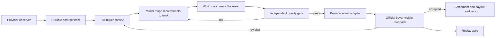

# Paid Fulfillment Across Marketplaces: As-Is and To-Be

## Goal

Life Manager completes every funded client engagement on Coconala, CrowdWorks,
Lancers, and Upwork from the newest buyer instruction through correct work,
buyer-visible submission, formal delivery where the provider requires it, official
readback, revision handling, acceptance, settlement, and replay-zero.

The system must do both parts of the job: **actually send the result** and **send a
result that satisfies the buyer's complete current request**. A generated artifact,
green local test, filled composer, provider click, or sent message alone is not
completion.

### Current implementation cursor — 2026-09-24 21:00 JST

- A historical-session continuity audit checked the vault actually referenced
  by the production Gig launch configuration,
  `/Users/anicca/.cloak/vault/gig-daily-driver`. Its retained `auth-state`
  backups begin on 2026-09-23; there is no retained 2026-09-20 account-ID
  binding for the old attempt. Cookie/session continuity is therefore only a
  candidate signal and cannot resolve the `effect_unknown` fence.
- The cross-platform wait boundary was rechecked: CrowdWorks is still
  `observed=5/actionable=1/effect=0/readback=4/pending=1`; funded work
  `63568785` has an existing on-platform request and still waits for the
  buyer's admissible lesson/answer material. No LINE or external-form action
  is permitted.

- The Coconala occurrence `hf-gig-apply-direct:18d6e6e0c10fa690-98578` for
  request `5280157` remains `claimed/effect_unknown=1`. A fresh authenticated,
  read-only probe used one isolated lease per history page and reached all 26
  current pages on the official `応募・スカウト管理 | ココナラ` route. Every
  enumerated offer detail returned HTTP 200 and exposed its official request ID;
  `5280157` was absent. The earlier page-22 403 was therefore a sequential
  session/WAF boundary, not proof of a provider send.
- This negative observation does **not** prove that the old irreversible attempt
  never dispatched. The durable intent is already
  `effect_phase=irreversible_attempt_started`, and the target has a filled-form
  screenshot but no saved non-landing submit-attempt receipt. The admission fence
  therefore stays closed; no retry, DB edit, resolver call, or Ryu resend was
  performed.
- Source fixes are merged and tested, but Apply/Storefront production promotion
  still waits for an exact positive provider receipt or a separately verified
  no-dispatch receipt. The current cursor is a reconciliation proof gap, not a
  loop cadence failure.
- A source-only recovery commit `eb28f8df24` now retries the official readback
  once with a fresh leased context after `official_readback_access_denied` and
  wires the standalone occurrence reconciler to the same lease recycler. It
  never retries a provider send or releases an effect fence; it is pushed but
  not yet in the immutable production release.
- Follow-up commit `17b8794d15` resumes the fresh readback at the denied page and
  merges the verified prefix. A live read-only reconcile recorded official
  `page=22 / 403 Forbidden` on both the initial and fresh-lease attempts; the
  exact occurrence remains unresolved and the admission fence is unchanged.
- A fresh official request-detail readback for `5280157` expanded the complete
  applicant roster to 9 rows with 0 contracts. The authenticated account used
  for the current readback is user `2564121` (`Kosuke｜教育研修PPT×AI活用`), and
  that ID is absent from the roster; the last row is user `3406932`
  (`Kayamori Daisuke`). This narrows the no-dispatch question, but the old
  attempt did not durably record its account ID, so the evidence remains a
  candidate and does not release `effect_unknown` by itself.
- New Coconala application commits now capture the authenticated seller profile
  path (`/users/<numeric-id>`) immediately before the irreversible marker and
  persist it beside the filled-form evidence. If the provider DOM cannot expose a
  provider-owned identity, the commit aborts before the marker and before the
  final submit click. This closes the evidence gap for future attempts; it is not
  retroactive proof for `5280157`.

- The page-history repair and occurrence reconciler from PR `#5820` are merged;
  the current immutable source head includes the follow-up fetch syntax fix in
  `86bd68bf7b9c3819c0a44f848e861372af9eff54`. Focused application/Coconala
  tests, release-cut tests, the macOS loop registry, and the loop contract pass.
- This is source/release evidence only. Production is unchanged: the installed
  Apply and Storefront owners remain on older immutable releases, and the exact
  Apply occurrence for request `5280157` is still fenced as
  `claimed/effect_unknown=1`. The fresh 26-page absence readback cannot release
  this effect-started intent without a separately verified no-dispatch receipt.
- Ryu `18211957`'s latest buyer cycle already has one official seller
  reply/readback, `js-talkroomMessage-222245383`. That reply covers:
  `写真撮影1枚〜` as the
  first normal option; the five paid options and prices in their own section;
  preserving options when two paid options are added; the WEB予約 management
  preview/form behavior; and the requested wording/management editability
  explanation. No duplicate reply or formal-delivery action is allowed. Only a
  genuinely newer buyer event reopens Ryu, and that response remains manual;
  the Paid loop may not create, reply, attach, or formally deliver for Ryu.
- Lancers job `5606124` was correctly fail-closed with reason code
  `unsupported_claim`; no external application was sent. It is a later policy
  review, not a reason to reorder the Coconala cursor.

### Remaining TODO (authoritative cursor)

1. Obtain a complete official Coconala readback for the fenced `5280157`
   occurrence and resolve only on exact provider proof or separately verified
   no-dispatch proof bound to the historical account. The expanded request
   roster is useful evidence, but the retry path still encounters provider
   `403 Forbidden` and the historical session identity is missing; neither is a
   reason to resend or to clear the fence by inference.
   Future attempts already persist their authenticated account identity before
   crossing the irreversible marker; the old occurrence still needs independent
   proof.
2. Merge/cut/load the immutable release containing `eb28f8df24`, then verify
   natural Apply/Storefront wakes, official readback, and replay-zero.
3. Re-read the four open Coconala rooms and close the system gate; keep Ryu
   manual-only and do not resend the already-read-back reply.
4. In parallel, reread the CrowdWorks material wait and keep Lancers ready for
   its first funded ContractReceipt/formal-delivery surface; provider effects
   remain independently gated.
5. Continue Mercor/Freelancer/Upwork authorization and inventory readiness, then
   run final fleet acceptance only after each provider has its own proof.

### Parallel-readiness correction — 2026-09-24

The one-by-one rule applies to **provider effects and production canaries**, not
to read-only inventory, source tests, authorization checks, or branch work for
unrelated platforms. Coconala's `5280157` fence must remain closed, but it must
not prevent CrowdWorks/Lancers/Mercor/Freelancer/Upwork readiness work from
advancing in parallel. A provider send still requires that provider's own
funded contract, complete buyer context, effect receipt, official readback, and
replay-zero.

Fresh parallel evidence:

- Lancers inventory at `2026-09-24T09:12:15Z` is source-complete with 14 boards,
  zero working/monthly/storefront contract candidates, balance `0` JPY, and
  `contract_candidate_count=0`; its Paid result is `observed=0/effect=0`.
  The focused Lancers suite passes `197`. Formal delivery remains fail-closed
  until a real funded contract exposes the official provider surface.
- CrowdWorks `63568785`'s linked Doc was reread with authenticated
  `gog drive download --format=txt`: 1,619 bytes, SHA-256
  `40a59c39386ab955eeaf688fa6ccd118ceb157dc2296e7678f707a80955906cb`.
  It still contains onboarding instructions for LINE/note content and a Google
  Form, not the five lesson materials or buyer answers needed for quality
  verification. No LINE or external-form action is an admissible completion
  effect, so none was performed.

### Cross-platform read-only checkpoint — 2026-09-24 20:25 JST

- Lancers public discovery returned 20 normalized/detail-enriched projects;
  the authenticated inventory is source-complete with zero funded contract
  candidates, zero monthly/storefront candidates, and a zero-JPY balance. Its
  paid result is `observed=0/effect=0/readback=0`; no provider effect was sent.
- CrowdWorks project `13470618` already has one verified application:
  provider proposal `306927137`, occurrence
  `crowdworks-revenue-application:18d7f9a39024d948-79467`,
  `submitted=true` and `application_verified=true` at
  `2026-09-24T11:04:13Z`; it must not be submitted again.
- CrowdWorks remains at `observed=5/actionable=1/effect=0/readback=4/pending=1`;
  work `63568785` still lacks admissible buyer material, so LINE/external-form
  actions remain off.
- Mercor remains pending on `official_work_inventory_stale`; it is not a
  completed platform and must not be treated as a send-ready inventory.

### Runtime admission lifecycle correction — 2026-09-23

The live investigation reproduced a shared-host starvation defect: `lm-loop stop`
booted a service out of launchd but left its durable queue row and reservation
eligible. The next control-plane wake could reserve the stopped owner again,
even though its launchd state was `unloaded` and `pid=null`. The correction is
test-first and minimal: stop releases the reservation and marks the queued
owner suspended without deleting its occurrence ledger; start/restart clears the
suspension only after launchd readback succeeds. The Ryu owner remains paused
and manual-only. Focused admission/lifecycle/runtime suites pass (`124`, `6`,
and `75` tests respectively), `git diff --check` is clean, and
`./bin/lm-loop-contract` passes.

Live verification after applying the suspension state to `hf-gig-paid-direct`
showed no reservation for more than 80 seconds and `next_eligible_at=inf`.
This is an internal admission proof only; it is not a provider send or a
Coconala completion gate. The fix still requires an immutable production release,
installed-SHA/argv readback, one stable-headroom natural wake, official
four-room readback, and replay-zero before the Coconala system layer is closed.

### Latest Coconala provider readback — 2026-09-23 20:35 JST

The latest official readback is split by client. Ryu `18211957` has the manual
seller message `js-talkroomMessage-222245383` (18:38 JST), which includes the
WEB予約 heading/guidance editability, management preview, and management URL.
Chii `18180857` remains buyer-waiting with no newer request. NPO `18223833`
received one manual progress send after buyer events `222226516`/`222226563`:
seller message `js-talkroomMessage-222253171` at 20:34 JST with
`特定非営利活動法人まくとぅー_沖縄県NPOプラザ提出書類_レビュー版_v16b.zip`
(978,061 bytes, SHA-256
`588f05d96b28028b2472ee7dbe7933505741e0fccf8d8cbe5dbb410d77a8f615`). The
official selected-talkroom DOM readback bound the exact URL and attachment, and
formal delivery remained OFF. The project ledger is reconciled with
`paid_work_browser_sent_reconciled` for this exact feedback/package pair
(`next_action=await_buyer_feedback`, `resend=false`); the durable receipt is
`projects/18223833/delivery/coconala-v16b-progress-receipt.json`. NPO
`18250352` remains buyer-waiting and was not resent. The Paid producer result captured before this manual recovery was
`observed=4/actionable=0/effect=0/readback=2/pending=1`; it does not contain the
manual 18223833 effect. No client is replayed, and Ryu's site-specific wording
is not copied to other rooms.

This document is the current cross-provider execution SSOT. It supersedes conflicting
Ryu automation or formal-delivery instructions in
`docs/superpowers/plans/2026-09-04-coconala-paid-all-clients.md`; that file remains a
historical plan. Provider-specific specs remain authoritative for exact live contract
inventories and page semantics unless this document explicitly changes ownership or
completion criteria.

## User Decisions

- Execute one provider vertical at a time: Coconala, then CrowdWorks, then Lancers,
  then Upwork.
- Within each provider, finish one client before advancing the production canary.
- Coconala talkroom `18211957` (`Ryu0820119`) is a permanent manual exception. The
  automated Paid owner may observe it for reconciliation but may never create work,
  reply, attach a file, or invoke formal delivery for it.
- There is no Risa client. Earlier references to Risa were transcription errors for
  Ryu and create no work item.
- All other eligible paid clients ultimately belong to their provider's Paid owner.
- The execution cursor is sequential: (1) keep the latest Ryu revision closed
  under the permanent manual fence, (2) prove the remaining Coconala fleet is
  loop-owned and safe, then (3) repair and prove CrowdWorks, Lancers, and
  Upwork. “Ryu's client work is finished” and “the Coconala Paid loop is
  production-proven” are separate gates.

### Two completion layers

1. **Client layer:** the requested work was performed, sent through the provider,
   and read back officially. Chii satisfies this layer for its current buyer
   event. Ryu's latest direct revision was sent through seller message
   `js-talkroomMessage-222245383` with formal delivery OFF and read back in the
   official talkroom; Ryu is now waiting for a genuinely newer buyer event. NPO
   `18223833` has one buyer-visible v16b progress revision with official
   readback, while its formal delivery and source-fact completion remain open.
   No duplicate send is allowed for either completed cycle.
2. **System layer:** the loop can safely do the same for the next eligible client,
   including admission, effect fencing, official readback, crash recovery, and
   replay-zero. Coconala's client layer is largely closed, but its system-layer
   natural-wake and shared-host gates remain open.

### Ownership rule in plain language

“Manual” does not mean that every client is manually redone. It is a permanent
exception fence for Ryu only: the owner may perform a direct correction there, and
the Paid loop must never create a second effect. Chii and every other eligible
client remain loop-owned. On each wake the loop checks the newest buyer event,
required outcomes, duplicate/effect fences, and official provider readback. If the
request is already satisfied or there is no newer buyer event, it performs no send
and records an honest terminal state such as `awaiting_buyer`. A human intervenes
only for the named Ryu exception or when a provider-specific incident is explicitly
reconciled; Chii is not such an incident.

### Authenticated artifact access rule

For Google Docs, Sheets, and other connected artifacts, the default and required
first path is the authenticated `gog` CLI or an equivalent authenticated
connector/plugin. This path uses the already-authorized scope and does not
require granting a browser Docs permission. Use a browser surface only after the
CLI/connector records a concrete read failure, and record that failure beside
the fallback readback; a missing browser session is never evidence that the
artifact is inaccessible.

### Why Chii is not being sent again

Chii's paid deliverable is the 300-recipient TikTok campaign and its Coconala
report/workbook. The canonical evidence is 12 previously verified sends plus 288
exact-readback sends, followed by one buyer-visible report/workbook message in
talkroom `18180857`. The later `20/300` remote result is an intermediate run-local
snapshot, not a new contract deficit. The 24 sends recorded on 2026-09-22 are an
immutable pre-fix overrun incident; they are preserved for audit and must not be
replayed or counted as remaining work. The latest official reply readback supports
zero eligible positive replies and one ineligible reply. The talkroom remains open
with formal delivery OFF by design, so the correct terminal state is
`awaiting_buyer`, not another send or the formal-delivery button.

The latest natural wake read the four open Coconala rooms through
`2026-09-23T01:07:47+00:00` and completed with `effect=0`, `readback=3`,
`failed=0`, and `pending=0`. It re-read Chii as `awaiting_buyer` and both NPO
rooms as `awaiting_buyer`. This is the expected no-op: the loop has already
answered the newest buyer event where it had a complete result, and it waits for
a genuinely newer buyer message where missing buyer facts are required. Ryu is
the only room that can be handled directly by a human; Chii is not a manual
exception. That wake predates the 2026-09-23 09:13–10:29 Ryu events, so its
`reserved_for_owner` result does not close the newly reopened Ryu cycle.

The preceding NPO wake exposed a safe serialization bug: room `18223833`'s
model decision was semantically `await_buyer`, but its outcome copied a buyer
message hash with one wrong character. The effect fence correctly sent nothing.
Commit `7244c3e856` now binds outcome identities by exact official message ID and
canonicalizes the hash from the provider readback; unknown IDs and invalid hashes
still fail closed. The next natural wake accepted the same decision as
`awaiting_buyer`, proving the fix without an external effect.

## Verified Current State

### Ryu manual exception

The prior Ryu buyer events were `js-talkroomMessage-222184673` and
`js-talkroomMessage-222185015`. The seller manually completed and verified the
requested production changes for that prior cycle:

- the supplied recruitment banner is the first content on the recruitment page;
- the management pricing page again shows all five live courses, twenty-three area
  fees, and paid-option editing together;
- the management reservation page shows the current live reservation inventory and
  an embedded instance of the actual public reservation form.

Authenticated browser readback is stored outside Git under project `18211957` as
`delivery/manual-emergency-audit-v696.json`. The reply was sent once without the
formal-delivery checkbox; Coconala readback observed the exact seller message
`js-talkroomMessage-222192497` at `2026-09-22T11:34:08.476934+00:00`. Ryu remains
open for direct revision handling and is not proof that the automated Paid owner
works.

A fresh authenticated Coconala browser reload of talkroom `18211957` at
2026-09-23 10:50 JST found five buyer events newer than seller message
`js-talkroomMessage-222192497`:

- `js-talkroomMessage-222215345` (09:13): the current implementation does not
  match the specification shown in the image, and asks how it works; attachment
  `IMG_6432.png`.
- `js-talkroomMessage-222215354` (09:13): asks the maximum number of people
  allowed in attendance and roster registration.
- `js-talkroomMessage-222218450` (10:24): changes the option model so the first
  item is `写真撮影1枚〜`, puts a paid-options section below normal options, and
  names five paid options with starting prices.
- `js-talkroomMessage-222218603` (10:27): adding two paid options makes all
  options disappear; this is a persistence/merge defect to fix and verify.
- `js-talkroomMessage-222218678` (10:29): asks why the shown content is present
  in WEB予約; attachments `IMG_6434.png` and `IMG_6435.png`.

The local `source/talkroom/messages.jsonl` snapshot was older (mtime
2026-09-22 20:34 JST), so the authenticated provider DOM was the authority for
this cycle. The three attachments were downloaded and compared with the live
public site and management screen. The direct fix deployed the current-image
previews and normalized campaign image fields, made the first normal option
`写真撮影1枚〜`, added the requested five paid options in order and price, made
the paid-option save/readback preserve `optionCatalog` and `per_cast_options`,
and made the management reservation iframe use a versioned preview URL that
opens the reservation form without the public age gate. The public age gate
remains enabled. The live management screen reports 12 registered profiles and
no fixed people limit in the current data model; attendance rows are added from
the roster.

Deployment and browser readback are recorded under project `18211957` in
`delivery/manual-emergency-v698-readback.json` and
`delivery/ryu-v697-manual-send-readback.json`. The direct seller message was
sent once with formal delivery OFF and no Paid-loop effect; official Coconala
readback is `js-talkroomMessage-222220999` at 2026-09-23 11:15 JST. Ryu is now
buyer-waiting for a genuinely newer event and remains a permanent manual
exception; the loop must not create work, reply, attach, or invoke formal
delivery for Ryu.

### Shared-host blocker observed during loop repair

The production Paid owner hit `OSError: [Errno 28] No space left on device` while
writing its result file. Subsequent `control_busy`, `database is locked`, and old
heartbeat failures are secondary control-plane symptoms of that host pressure, not
evidence that Chii or Ryu needs another delivery. Safe release GC evaluated 59
releases, protected all 59, and reclaimed zero bytes. The remaining recovery work
is to use the existing disk-cleanup/rotation owner to reclaim only positively owned,
regenerable artifacts before promoting new loop code; never delete provider state,
unknown-effect rows, or a protected release by hand.

Host headroom later recovered to about 1.27 GiB (1,326,948 KiB available), above
the 512 MiB Paid write/admission floor. The cleanup owner still reclaimed `0`
bytes because its four discovered cache candidates were open; protected
deletions remain `0`. The Paid process had remained on one PID for more than
thirteen minutes while repeating `control_busy`/`production apply is already
owned`, so it was stopped through the canonical `lm-loop stop
hf-gig-paid-direct` path. `launchd_state=unloaded` and `pid=null` are verified.
The bootout left owner-scoped child processes from the interrupted 18223833 run;
they were terminated only within the Paid owner process groups, the lock was
released, and the owned browser leases were checked. The official
`official-readback-18223833-after-stop.json` readback shows no new seller
message, no formal delivery, and no buyer reply after the prior artifact.
The owner must remain paused until child-reap behavior is fixed, a durable write
and natural no-op wake succeed, and the repaired immutable release is applied.

### CrowdWorks Paid live boundary

At `2026-09-23T07:24:24Z`, read-only process and state inspection found
`crowdworks-revenue-paid` running as PID `10759` on release `f01c612d`. Its
current occurrence is `18d7e1fd55967df8-10759`; host admission recorded
`resource_slot_acquired`, the entrypoint result is `pre_effect_failure`, and the
effect count is `0`. The durable CrowdWorks snapshot still has four completed
contracts and `63568785` pending. The owner logs repeat `No space left on
device`, `database is locked`, and `control_busy`, so `admission_effect_unknown`
remains fenced even though this occurrence has no provider-effect evidence.
No stop, kill, fence clear, or replay was performed; high-risk lifecycle actions
require explicit approval and an exact official readback before mutation.

The queued-wake/occurrence-scope implementation at `e012343e94` (the test
expectation update follows the production coalescing behavior) is merged in main,
included in immutable release `20260923T155015-6b72c304`, and target-applied to
`hf-gig-paid-direct`. Its focused runtime suite is `528 passed, 174 subtests
passed`, `git diff --check`, Python compile, and `./bin/lm-loop-contract` all
pass. The owner is still intentionally unloaded; the remaining proof is one
safe natural wake with official provider readback and replay-zero.

The follow-up Paid lifecycle fix is included at `470c7b3160`: when a stop signal
reaches `paid_direct.py`, it now terminates active child groups and re-raises the
same signal with the default disposition so the Paid parent cannot remain as an
orphan holding `.paid-direct.lock`. The regression test is included in the
installed release; the production owner remains unloaded until the host gate is
closed.

The targeted loop-status read path is also fixed at `313915e0a5`: when a caller
asks for one loop, `_last_event()` now returns at the newest valid report for
that loop instead of validating the entire shared `events.jsonl`. The regression
test proves old reports are not scanned after the requested report is found.
Follow-up test commit `2d2417bd5b` proves targeted cache entries remain available
for every loop sharing a state root. Runtime tests now pass `517`, Paid tests
`263`, adapter tests `15`, the loop
contract gate passes, and `lm-loop doctor` reports no missing, unmanaged, or
retired entries. These fixes are included in installed release
`20260923T155015-6b72c304` and target-applied to the Paid owner. The owner is
still unloaded and the new SHA has no natural-wake/readback proof.

Read-only host verification at `2026-09-23T03:57:38Z` found 2.9 GiB available
on the data volume, no running Paid parent/child, and a 0.18-second response
from the repaired targeted status path. The durable admission fence still says
`admission_effect_unknown=true`; these observations do not authorize clearing
the fence or restarting the production owner.

### Coconala

The current official inventory contains four open talkrooms: Ryu `18211957`, Chii
`18180857`, and the two NPO rooms `18223833` and `18250352`. `hf-gig-paid-direct`
is loaded from immutable release `4c6b1dc8a52952e31f13bcb26a5266e570169e1d`, which
contains the answered-feedback stop fix. Its latest official queue readback is
terminal with `effect=0` at the time of that wake: Ryu was
`reserved_for_owner` and the other three rooms were `awaiting_buyer`.
The latest natural wake (targeted readback through
`2026-09-23T01:07:47+00:00`) completed with `status=completed`, `effect=0`,
`readback=3`, `failed=0`, and `pending=0`; it reconfirmed Ryu as
`reserved_for_owner` and Chii plus both NPO rooms as `awaiting_buyer`. The
owner was subsequently stopped after the host/control-plane stall described
above (`launchd_state=unloaded`, `pid=null`). This is intentional containment,
not a client completion claim: Chii and the NPO rooms remain in their last
verified `awaiting_buyer` state, while no new Paid wake may run until host writes
recover and the new release is applied. The later official Ryu events supersede
the old Ryu no-op snapshot.

The Coconala schedule repair passed the loop contract gate, the focused and
full runtime suites, and `lm-loop doctor`. PR `#5798` is merged in main at
`6b72c3044b2b590b950c1df18fc876285e2e9f7c`; the immutable release
`20260923T155015-6b72c304` is current and was target-applied to
`hf-gig-paid-direct`. Official lifecycle readback shows the installed SHA is
`6b72c3044b2b590b950c1df18fc876285e2e9f7c`, while
`launchd_state=unloaded` and `pid=null` remain intentional. No natural wake,
provider readback, or replay-zero proof exists for this new SHA yet, so do not
restart Paid or submit another client package until the remaining host/admission
and natural-wake gates pass.

The one-by-one manual check of NPO room `18223833` was run after the stop. The
canonical decision regeneration still returns `await_buyer` with `effect=0` and
`readback=1`; four buyer facts remain unresolved (第3期の事業実績、社員名簿の不足分、
総会・理事会の開催日・決議、監査情報). The correct 2026–2028
一般社団法人ちむどんどん budget artifact exists locally and passes its file
acceptance, but the NPO package contract is not complete. Do not bypass the
semantic decision or send the budget as if it completed the NPO contract.

The newer official buyer events `js-talkroomMessage-222226516` and
`js-talkroomMessage-222226563` supersede that earlier readback. The buyer accepted
the ①ちむどんどん budget in its current form, supplied
`MKT年度別役員・会員.xlsx`, and asked to extend the ②まくとぅー work to the end
of September. The seller manually changed the provider schedule to 2026-09-30;
the official system event is `js-talkroomMessage-222233402`, and the latest
seller acknowledgement was sent once with SHA-256
`25f79a480d4109fd731691e4e4d7a5afb98c35c4021e39a9f29b3946567a0ac7`.
Formal delivery remains OFF and the room is still `取引中`/`revision` because
the NPO package still lacks the business results, complete member addresses,
meeting dates/resolutions, and audit date/opinion/signature facts. The collector's
old first-match delivery-date field is not authoritative when a room contains
multiple schedule events; the latest provider system event and visible schedule
must be selected instead.

The schedule parser fix is now promoted: it accepts only official change or
registration events, orders events by provider message chronology (so a late
append of an older registration cannot roll a change back), and carries a
provenance flag into the final order queue. The focused regression suite covers
the 2026-09-18 → 2026-09-30 history and the quoted registration form.

The next one-by-one readback of NPO room `18250352` at
`2026-09-23T03:09:04Z` confirms the existing v15 review package is visible,
formal delivery is OFF, and there is no buyer reply after the artifact. Its
current actionable file decision still has three unresolved facts (河原氏の正式氏名、
追加・退任役員の発効日/本人情報、R6/R7事業報告). Since the latest seller message
already asks for confirmation, replaying the same package would be a duplicate;
wait for a genuinely newer buyer event.

Ryu is a permanent manual exception. The automated owner may observe it for
reconciliation but may never create work, reply, attach a file, or invoke formal
delivery. The prior manual correction was sent once with formal delivery OFF and
read back in the official talkroom as seller message `js-talkroomMessage-222220999`.
That latest revision is complete; the room is now waiting for a genuinely newer
buyer event. The Paid loop remains permanently fenced from Ryu.

Chii is **not** an open work item. The required TikTok campaign was satisfied by
12 previously verified sends plus 288 exact-readback sends on 2026-09-15. The
official Sheet has 300 unique rows, and the 300-row workbook/report was sent once
to talkroom `18180857` and read back with formal delivery OFF. The direct ledger
also records 24 additional sends on 2026-09-22 before the stop fix was deployed;
these are immutable incident effects, not missing work, and must not be undone or
replayed. The stale partial file
`projects/18180857/delivery/paid-remote-result.json` (20/300) is an intermediate
readback and must not reopen the client. The latest official TikTok inbox readback
supports 0 eligible positive replies and 1 ineligible reply; older intermediate
counts are not completion evidence. Chii remains `awaiting_buyer`; no recipient,
report, or formal-delivery message may be resent.

The one-by-one Coconala readback at `2026-09-23T03:10:08Z` shows the final
300-row audit report as the latest seller message and
`buyer_feedback_answered_by_seller=true`; formal delivery remains OFF. The
standalone semantic-decision command can still see the older 20/300 remote
contract because it does not perform fresh queue readback. The real Paid queue
has the answered-feedback guard and must report Chii as `awaiting_buyer`,
`effect=0`, `deduplicated=true`; do not use the standalone result as permission
to resend.

The apparent “still working on Chii” state came from two non-canonical snapshots:
an intermediate `20/300` result and the pre-fix 24-send overrun. Neither reopens
the client. The 300-row campaign and the answer/report were already sent and read
back; the latest official inbox readback is 0 eligible positive replies and 1
ineligible reply. Chii is loop-owned but closed until a genuinely newer buyer
event appears, while Ryu alone remains manual-owned.

Release `37e1d582f1` (#5787) added the semantic answered-feedback wait, and
`4c6b1dc8a5` (#5788) fixed the first-cycle fail-closed state. Since the fix, the
Chii ledger has no new rows and the natural Coconala wake is `effect=0`. This is
why Chii is handled by the loop normally but is now closed, while only Ryu stays
manual. `hf-gig-reply-detector` remains a separate observation/pre-contract owner
and cannot acquire post-payment fulfillment authority.

### CrowdWorks

The registered Application, Reply, Paid, and Report owners are loaded but fenced by
`host_admission_deferred:resource_effect_unknown`. The provider-specific execution
cursor remains the existing
`docs/superpowers/specs/2026-09-17-crowdworks-contract-fulfillment-design.md`.
This specification adds the cross-provider completion contract; it does not erase
that contract inventory or its occurrence-specific reconciliation obligations.
The new registry contract isolates future Application/Paid/Reply occurrences from an
older unknown row after promotion; it does not release the four existing fences.
Fresh official read-only inventory at `2026-09-23T03:49:14.950474Z` returned five
funded contracts: `63712784`, `63659463`, `63657015`, `63570481`, and `63568785`.
This confirms current provider visibility only; it is not a work, delivery, or
payment receipt. The exact Paid occurrence remains `claimed/effect_unknown=1`,
with no occurrence-bound no-dispatch marker or provider receipt, so no retry or
manual bypass is permitted.
The exact Paid occurrence `crowdworks-revenue-paid:18d62cf32eb0c678-48194` has an
official execute event with `effect_status=started` followed by a report with
`effect_status=unknown`; no provider receipt or no-dispatch proof exists, so it
must remain fenced. Contract `63657015` was read back as funded at this snapshot;
its later manual completion is recorded below and does not change the unresolved
Paid occurrence fence.

Fresh provider-lock read-only detail at `2026-09-23T04:00:55.856173Z` confirmed
all five funded contracts and produced these source-level preflight decisions:
`63712784=submit`, `63659463=form-complete-then-formal-delivery`,
`63657015=submit`, `63570481=revision-submit`, and
`63568785=wait_for_buyer_artifact`. These are historical planner outputs only;
the current one-by-one effects and receipts are recorded in the live execution
section below. The first canary remains `63712784` after the occurrence fence and
immutable-release gates are satisfied.

A fresh owner-locked detail read of canary `63712784` confirms
`provider_state=funded`, milestone `13833587`, latest buyer event `428014314`,
and two required Google Forms with `completed_form_urls=[]`. The form bodies
were observed read-only and pinned by SHA-256; no form POST, buyer message, or
formal delivery was executed. The correct sequence remains form selection →
one confirmed form submission at a time → formal delivery → milestone
readback.

One-by-one manual canary execution then completed contract `63712784` on
`2026-09-23`: the common test and Web Ads results forms each returned the
official Google confirmation marker with contract/event-bound receipts at
`04:39:36Z` and `04:39:41Z`; CrowdWorks formal delivery for milestone `13833587`
was sent once at `04:40 JST`. A fresh provider readback at `04:45:32Z` verified
the seller message, the `納品` progress step as `done`, the exact milestone form
hidden/disabled during client inspection, and
`provider_receipt_id=contract:63712784:milestone:13833587`; a subsequent contract
context read returned `provider_state=delivered`. This is an isolated manual
contract effect, not a Paid-loop wake or a release of the unresolved Paid
occurrence `18d62cf32eb0c678-48194`; no unknown row was cleared and no replay
was performed. Commit `5876390fe6` adds the hydration/hidden-form readback fix
with 611 focused tests passing, but it remains source-only until the lifecycle
and immutable-release gates are complete.

The next one-by-one contract, `63659463`, was also completed manually without
reposting a form: the official contract/milestone-bound receipts for the common
test and Web Ads results were re-read, the explicitly inapplicable video form
was recorded as excluded, and CrowdWorks milestone `13820867` was delivered once.
Readback at `2026-09-23T04:50:38Z` verified the exact delivery message and returned
`provider_receipt_id=contract:63659463:milestone:13820867`; a fresh context read
returned `provider_state=delivered` with client inspection in progress. This is
another isolated manual contract effect; the unresolved Paid occurrence remains
fenced and no loop wake or replay was used.

The next one-by-one contract, `63657015`, was completed manually on
`2026-09-23`. The non-designer buyer instruction was mapped to the hearing-sheet
Excel plus the common test; the anonymous survey and designer-only test were
explicitly excluded. The hearing sheet was attached once in the official thread
(message `428631900`, attachment `59259436`). The common test returned the
official Google confirmation marker with the contract/event-bound receipt
`confirmation_sha256=0c97adf447c0fa245fe83e1ae72e910e6764ef5f147231d817ed8b75780717b`.
CrowdWorks milestone `13820268` was formally delivered once. Readback at
`2026-09-23T05:13:08Z` verified
`provider_receipt_id=contract:63657015:milestone:13820268`; a fresh context read
returned `provider_state=delivered` and the exact seller delivery message
(`428632173`). No form, attachment, or delivery was replayed, and the unresolved
Paid occurrence remains fenced.

The next one-by-one contract, `63570481`, was corrected and completed manually on
`2026-09-23`. The buyer's latest correction event `427573234` said the customer
email answer was missing while the staff answer was present. The exact prior task
facts were reread, one revision-bound Google Form response was submitted and
confirmed (`confirmation_sha256=168b142a4781d25be8f7807a780239d1e4eb269c03ded584c199a0cd3f163a57`),
and the original form receipt was retained without replay. CrowdWorks milestone
`13798056` was formally delivered once; readback returned
`provider_receipt_id=contract:63570481:milestone:13798056`, and a fresh context read
returned `provider_state=delivered` with seller message `428633469`. The unresolved
Paid occurrence remains fenced. Source commit `471f3c6a97` retains durable form
history when CrowdWorks removes a submitted form URL from the live contract page;
the focused CrowdWorks suite passed `116`.

Contract `63568785` remains funded at milestone `13797948` with buyer event
`426855154`. Its linked Google Doc is readable through the authenticated Drive
CLI (`gog drive get` + `gog drive download --format=txt`); the separate Docs API is
not enabled, but the Drive scope is sufficient. The exported artifact was verified
at 703 bytes (content SHA-256
`bf162e983be991c0c7bbf19320de36c78c389e358c20fc652f6130c6b5b4138b`). The earlier
permission request remains an immutable seller message `428634040`; it was not
resent. Because the Doc instructs a five-day LINE/Note course with one form per day,
the seller sent one platform clarification asking for the five Note/form URLs or
their text: seller message `428636540`, observed through the official message API
as `contract:63568785:answer:cw-63568785-line-artifact-426855154-v1` at
`2026-09-23T05:53:27Z` (API body SHA-256
`e6a0430ee6c3a6c46c679e5d523a58ec354b60d2846fb3055daf7f04c3dd6820`). No LINE
friend-add, daily form response, correct-work verification, or formal delivery is
claimed; the item waits for the buyer's course materials or an accessible LINE
session. Source commits `e289b618e1` and `7076c2138c` make the adapter prefer
authenticated `gog drive get`/`gog drive download --format=txt` before browser
Docs surfaces, fence unresolved sibling Docs, wait for CrowdWorks message
hydration, and normalize HTML `<br>` bodies for readback; the focused CrowdWorks
suite passed `122`. PR `#5796` is merged at
`b939af53d635d3c0ae3f5b4d452bd798e6544cd6`, immutable release
`20260923T150246-b939af53` is current, and only `crowdworks-revenue-paid` is
applied to that release. Its provider readback is `loaded-idle`, `pid=null`, with
the prior `host_admission_deferred:resource_effect_unknown` fence retained; no
natural wake or replay was triggered. For every Google Doc, use the authenticated
`gog` Drive CLI (or the equivalent authenticated connector/plugin) first. It uses
the already-authorized Drive scope without requesting a new browser Docs
permission. Browser Docs is only a fallback when the CLI/connector cannot read
the artifact; a missing browser Docs session is not evidence that access is
missing.

### Lancers

Application, Negotiate, Paid, Storefront, and Telegram Report are fenced by
`resource_effect_unknown`. Browser and Work Sync are running and must not be stopped
or repurposed during repair. The paid adapter exists, but a running support owner is
not evidence that client work is being completed or delivered. The new registry
contract isolates future Application/Negotiate/Paid occurrences after promotion;
Storefront and Telegram Report remain owner-scoped pending their own proof.
The latest Paid status is `loaded-idle` with `pid=null` and blocker
`host_admission_deferred:resource_effect_unknown`. Admission occurrence
`lancers-revenue-paid:18d67a28e56c4b58-6829` remains `claimed/effect_unknown=1`.
The latest paid result reports observed/effect zero, but that is not a no-dispatch
proof and cannot release the fence.

Fresh official read-only inventory at `2026-09-23T04:05:08Z` was authenticated
and source-complete: 14 message boards, 1 unread board, zero working projects,
zero monthly contracts, zero incoming monthly offers, zero storefront contract
candidates, and finance balance `0` JPY. Therefore there is no current Lancers
Paid client to submit; the Paid mutation path remains explicitly unimplemented
and must be completed before a future funded contract can become a canary.

The same owner-locked read-only probe inspected historical project details
`5601892`, `5601332`, and one ended proposal. Each exposed only the proposal /
question surface (`POST` question form); none exposed a funded-contract
納品・検収 surface or a provider receipt. A guessed mutation from these pages is
not acceptable. The next safe implementation cursor is the first real funded
contract detail, followed by a red test and the smallest provider-specific
mutation/readback path derived from that official DOM/API contract.

Final status readback at `2026-09-23T04:28:10Z` kept both non-Coconala Paid
owners fenced: CrowdWorks release `56d07a66eaa7c7d173c51314c47fb1c22b3f5610`
and Lancers release `135fa822be58bb40c038c8ee6bbdbfecceca80bf` were
`loaded-idle`, `pid=null`, `last_terminal_result=blocked`, and
`host_admission_deferred:resource_effect_unknown`. The exact unresolved rows
remain CrowdWorks `18d62cf32eb0c678-48194` and Lancers
`18d67a28e56c4b58-6829`; no read-only probe cleared an unknown effect or created a
provider receipt. Coconala `hf-gig-paid-direct` remains intentionally
`unloaded` with `pid=null`.

### Upwork

The repository contains Upwork discovery, inbox, proposal, negotiation, offer,
message, revision, delivery, sealed-effect, and finance adapters with focused tests.
There is no registered Upwork Paid product-loop owner in `config/loop-registry.json`.
Upwork therefore requires lifecycle registration and a live contract inventory
before it can claim end-to-end paid fulfillment.
Freelancer has no Paid state directory or registered Paid owner in the current
inventory. Neither platform is a submission target until account/policy state,
contract inventory, and the official Apply-to-payout proof path are registered.

The 2026-09-23 local read-only probe adds no live-provider proof: the stored
Upwork snapshot is from 2026-08-26 with zero active contracts and zero proposal,
Connects, or payment effects, the Upwork CDP endpoint `9233` is not responding,
and Freelancer `work-sync` has no fingerprints or contract candidates. These
are stale/absent observations, not an assertion that either provider is
currently logged out; no owner or Paid mutation may be enabled from them.

## Architecture

Use one shared fulfillment contract with provider-owned observation and effect
adapters. Do not build one browser script that understands four unrelated sites.



The model owns semantic judgment: what the buyer asked for, what work is required,
whether the result matches the request, and what a revision changes. Deterministic
code owns provider identity, contract IDs, hashes, leases, owner boundaries, effect
fences, arithmetic, receipt validation, and replay protection. Keyword rules or
regular expressions must not decide whether work is complete.

## Durable Contract Item

Each accepted or funded engagement has one durable item keyed by provider account and
the provider's immutable contract/order ID. It records:

- provider, account, buyer, proposal/offer ID, contract/order ID, and milestone ID;
- escrow/funded state, agreed scope, due date, and newest buyer-event identity;
- complete conversation and attachment/link provenance;
- a request-to-result map for every current instruction and acceptance criterion;
- work artifact paths, hashes, accessibility checks, and quality evidence;
- reply, external-form, attachment, formal-delivery, acceptance, settlement, and
  payout effects as separate receipt-bearing transitions;
- active owner and lease, including a manual exception when present;
- the first failure, recovery action, official readback, and replay-zero result.

Buyer revisions create a new buyer-event version on the same item. They do not erase
earlier receipts, silently create a second contract, or permit replay of an uncertain
effect.

For outbound campaign messages, effect identity includes the canonical provider
recipient. Under the same project-owned transport lock used for the send fence, the
adapter must reject a recipient already recorded as `attempting`, `unknown`, or
`sent`, even when the caller supplies a new effect key or new message. A verified
`not_sent` row may be retried. Prompt instructions, model-selected keys, and a later
bookkeeping check are not substitutes for this mutation-boundary invariant.

## State Model

```text
observed
→ funded_verified
→ requirements_mapped
→ work_in_progress
→ correct_work_verified
→ ready_to_send
→ message_or_artifact_sent
→ formally_delivered (when applicable)
→ awaiting_buyer
→ accepted | revision_requested
→ settled
→ paid
```

`waiting_for_buyer`, `waiting_for_access`, `awaiting_escrow`, and
`effect_unknown` are explicit nonterminal states. A blocked item remains independently
represented while other eligible items progress. `effect_unknown` always routes to
official reconciliation before any retry.

### Admission isolation for independent marketplace items

The durable admission default remains owner-scoped and fail-closed. The registry now
has an explicit `admission_effect_scope` contract; the occurrence value is granted
only to lanes whose provider kernel persists an immutable item identity, intent,
per-item lock, and official readback. The pushed implementation (`11dcf8c6f3`,
branch `fix/marketplace-occurrence-scope-20260923`) enables that contract for
CrowdWorks Application/Paid/Reply and Lancers Application/Negotiate/Paid. A different
contract occurrence can progress while an older occurrence stays `effect_unknown`;
the same occurrence remains fenced and must be reconciled officially. The old row is
never deleted or mass-cleared. Report, Storefront, Telegram reporting, and all
unproven providers remain owner-scoped until their item-level idempotency and
readback are proven. Follow-up commit `9df3731ccb` also enables queued/reserved wake
coalescing for Coconala Paid, preventing repeated safe no-op wakes from accumulating
an unbounded owner queue. Commit `7244c3e856` additionally binds model outcome
identities to official provider IDs/hashes. These changes are merged in main,
included in immutable release `20260923T155015-6b72c304`, and target-applied to
the Paid owner. Natural-wake and provider acceptance gates remain open; the
owner stays unloaded until the host/lifecycle gate is safe.

## Ownership and the Ryu Fence

The shared owner ledger supports `manual` and `loop` modes. A manual record contains
provider, contract/order ID, owner ID, reason, start time, lease/readback state, and
explicit release evidence. Static booleans are insufficient ownership proof.

Ryu's record is permanent until Dais explicitly releases it. Expiration, process
death, a successful automated observation, a new buyer message, or a loop restart may
not transfer it. Every Coconala effect entrypoint must check the owner ledger after
fresh targeted readback and immediately before each provider mutation. Tests must
prove that Ryu is excluded while another eligible room still progresses.

## Correct-Work Gate

Before a buyer-visible effect, the Paid owner must:

1. read the complete current conversation, linked instructions, attachments, prior
   complaints, and later corrections;
2. bind the proposed work to the newest buyer-event identity;
3. map every concrete request to an action, result, and evidence source;
4. create the actual result with the necessary tools;
5. verify content, rendering, links, permissions, and provider binding from the
   buyer's perspective;
6. obtain a verifier result that covers every mapped requirement;
7. re-read the provider immediately before sending and refuse stale work;
8. send once, read the buyer-visible result back, and run replay-zero.

The gate fails closed for an unmapped requirement, missing artifact, placeholder,
inaccessible link, stale buyer version, meta-commentary instead of work, unsupported
claim, missing provider identity, uncertain prior effect, or mismatched attachment
hash. A failure returns to work; it does not become a generic apology or premature
formal delivery.

## Provider Boundaries

### Coconala

- `hf-gig-reply-detector` observes and handles only its existing pre-fulfillment
  boundary.
- `hf-gig-paid-direct` exclusively owns paid talkroom work, ordinary progress replies,
  artifacts, revisions, and formal delivery for non-manual items.
- Ordinary reply and `正式な納品` are distinct fenced effects.
- The current `effect_unknown` occurrence is reconciled before restart.
- Production re-entry uses one non-Ryu canary, then all remaining eligible rooms one
  project per wake.
- A remote campaign transport must reject a previously contacted canonical recipient
  before opening a provider target; replay-zero is recipient-scoped across effect keys.

### CrowdWorks

- Application owns proposals; Reply owns negotiation until an official contract ID;
  Paid exclusively owns funded contract work and delivery.
- External forms and `納品する` are separate effects with separate receipts.
- Existing occurrence fences are resolved individually before natural canaries.
- The provider-specific funded-contract order and exact completion requirements remain
  authoritative in the CrowdWorks contract-fulfillment specification.

### Lancers

- Application and Negotiate stop mutating after the official project/contract handoff.
- Paid exclusively owns contract work, buyer replies, artifacts, revisions, and formal
  delivery.
- Existing Browser and Work Sync owners remain isolated support resources.
- Each current effect fence is reconciled by exact occurrence and official readback,
  followed by one natural paid-contract canary.

### Upwork

- Reuse the existing provider modules instead of writing a second Upwork stack.
- Register one lifecycle owner only after read-only inventory proves the relevant
  account and funded contract IDs.
- Proposal, offer acceptance, contract work, milestone submission, revision, and
  finance are distinct states/effects.
- The first live canary must prove one funded contract from full context through
  buyer-visible delivery and replay-zero before broader admission.

## Execution Order

1. Keep Ryu manual forever; process every new Ryu revision directly and verify it.
2. Keep Chii closed and buyer-waiting. Never resend its recipients, workbook/report,
   or formal delivery; the 24 pre-fix overrun rows remain incident evidence only.
3. Keep the two NPO Coconala rooms independently represented. Reconcile any exact
   `effect_unknown` occurrence by official provider readback before retrying it; do
   not clear a fence by owner-wide guess.
4. Finish the Coconala fleet gates (natural wake, replay-zero, no-starvation and
   self-heal) while preserving the Ryu fence and Chii wait state. The latest
   schedule parser is already merged, released, and applied; this item is only
   the still-missing natural-wake/provider-readback proof.
5. Continue with CrowdWorks: the dedicated Browser owner is merged in current main
   and its read-only inventory shows five funded contracts. Reconcile the existing
   Application/Paid/Reply/Report occurrences one by one, promote the occurrence
   isolation change, then canary contract
   `63712784` through full context, correct work, buyer-visible submission, formal
   delivery, official readback, and replay-zero.
6. Resolve Lancers occurrences, implement and prove the Paid mutation path, then
   close contracts one at a time without disturbing Browser or Work Sync.
7. Inventory and register Upwork Paid ownership, then prove one funded live canary.
8. Move only the proven request map, quality gate, receipt vocabulary, and state
   transitions into the shared marketplace kernel; keep DOM/API behavior in provider
   adapters.
9. Prove Local and Cloud host adapters use the same item identities, leases, receipts,
   and replay fences before enabling the same provider on two hosts.

## Runtime Checkpoint — 2026-09-23 22:10 JST

- The fresh authenticated Coconala readback for Ryu talkroom `18211957` reached a
  fixed point at `2026-09-23T13:07:19Z`. The latest buyer identities remain
  `222222979` and `222223030`; seller message `222245383` is newer, and no newer
  buyer event exists. The room is still `取引中`, with formal delivery false.
- The durable manual receipt
  `delivery/ryu-v699-manual-send-readback.json` and the four-room official
  readback identify `222245383` as the manual Ryu reply. No duplicate message is
  sent for this readback.
- The installed Paid owner had been observing Ryu because
  `MANUAL_ONLY_TALKROOM_IDS` was empty in the source. The source fix now makes
  `18211957` immutable manual-only at both orders observation and active-item
  admission; the focused Paid suite passes `264` tests and `lm-loop-contract`
  passes. This change is on the pushed source branch and is not production
  promoted yet.
- The subsequent installed-release natural wake completed `pass`/exit `0` at
  `2026-09-23T13:12:46Z`: `observed=4`, `actionable=0`, `effect=0`,
  `readback=3`, `failed=0`, `pending=0`. Ryu was `reserved_for_owner`; Chii
  (`18180857`) and both NPO rooms (`18223833`, `18250352`) were each read back
  as `awaiting_buyer`, with no provider send.

## Runtime Checkpoint — 2026-09-23 22:18 JST

- The installed CrowdWorks Paid wake completed `pass`/exit `0` at
  `2026-09-23T13:11:48Z`: `observed=5`, `actionable=1`, `effect=0`,
  `readback=4`, `failed=0`, `pending=1`. Contract `63568785` remains an exact
  nonterminal wait: the buyer's latest event is the existing request for access
  to the Google document, and the prepared artifact cannot be verified yet.
  A fresh `gog drive get` and `gog drive download` both returned the provider's
  `404 File not found`; no duplicate question, fabricated artifact, or formal
  delivery was sent.
- The installed Lancers Paid wake completed `pass`/exit `0` at
  `2026-09-23T13:12:33Z`: `observed=0`, `actionable=0`, `effect=0`,
  `readback=0`, `failed=0`, `pending=0`. A fresh authenticated inventory is
  source-complete (`logged_in=true`), with 14 boards but zero application,
  working, monthly-contract, storefront-contract, and finance candidates; no
  provider mutation is admitted.
- Upwork has no `upwork-revenue-paid` lifecycle owner and no live CDP listener
  on port `9233`. The latest available evidence is the historical
  `2026-08-26` API-terminal snapshot: zero active contracts, identity
  unverified, API/UI automation disabled, and the support request still
  `pending_external`. The next cursor is an authenticated, read-only Upwork
  inventory and owner-registration decision; no Upwork send or contract claim
  is made from the historical snapshot.
- A subsequent read-only `lm-loop status hf-gig-paid-direct` still reports
  `loaded-idle`, `desired_mode=scheduled`, and `next_eligible_run=interval:300s`;
  its latest admission was deferred as `host_admission_deferred:resource_control_busy`.
  This is a host-resource scheduling wait, not a stop command or a provider
  effect; the durable Coconala evidence remains `effect=0`.

## Runtime Checkpoint — 2026-09-23 22:21 JST

- After the competing CrowdWorks run drained, the installed Coconala Paid owner
  was explicitly kickstarted and completed a natural wake at
  `2026-09-23T13:21:20Z` with `pass`/exit `0`: `observed=4`,
  `actionable=0`, `effect=0`, `readback=3`, `failed=0`, `pending=0`.
  Ryu `18211957` remained `reserved_for_owner`; Chii `18180857` and NPO rooms
  `18223833`/`18250352` remained `awaiting_buyer`. No Coconala provider send or
  formal delivery occurred during this wake.
- The installed Lancers Paid owner was then kickstarted and completed a natural
  wake at `2026-09-23T13:22:11Z` with `pass`/exit `0`: `observed=0`,
  `actionable=0`, `effect=0`, `readback=0`, `failed=0`, `pending=0`.
  The fresh authenticated Work Sync inventory is source-complete with
  `logged_in=true`, 14 boards, one unread item, and zero application,
  working-project, monthly-contract, storefront-contract, and finance
  candidates. No Lancers mutation is admitted.

## Runtime Checkpoint — 2026-09-23 22:25 JST

- The fresh Upwork read-only check still finds no registered
  `upwork-revenue-paid` owner in the installed registry and no CDP listener on
  `127.0.0.1:9233`. The only available account evidence remains the historical
  API-terminal snapshot (`2026-08-26`): `active_contracts=0`, `offers=0`,
  `identity_verification=unverified`, `account_standing=At risk`, and both API
  and UI automation disabled. A direct Upwork credential exists in the private
  credential SSOT, but all current browser authorization receipts are denied.
  No Upwork mutation is possible or admitted; the next executable step is
  provider-authorized authentication followed by a fresh funded-contract
  inventory, not a fabricated Paid loop or delivery.
- The subsequent CrowdWorks natural run completed `pass`/exit `0` at
  `2026-09-23T13:20:43Z`: `observed=5`, `actionable=1`, `effect=0`,
  `readback=4`, `failed=0`, `pending=1`. Contract `63568785` is still
  `waiting_external` with blocker `buyer_task_detail_required`; its only
  remaining work is to obtain and verify the buyer artifact before formal
  delivery. The existing access request remains the latest buyer-visible
  event, so no duplicate request or delivery was sent.

### Execution Cursor

The sequential cursor is now: Coconala current inventory verified → CrowdWorks
current inventory verified with one exact external wait → Lancers current
inventory verified with zero contracts → Upwork admission precondition. The
next mutation-capable cursor is only an authenticated Upwork funded-contract
inventory; until then no Upwork owner or send is created.

The current source branch regression set passes `271` focused tests, and
`./bin/lm-loop-contract` passes with `shared_job_ids=[]` and `errors=[]`.

The next scheduled wakes also remain terminally healthy: Coconala
`hf-gig-paid-direct` passed at `2026-09-23T13:26:42Z`, and CrowdWorks
`crowdworks-revenue-paid` passed at `2026-09-23T13:25:32Z`. The CrowdWorks
status still exposes one historical `admission_effect_unknown` occurrence;
because its exact zero-effect marker is unavailable, it remains fenced rather
than being cleared by an owner-wide reset.

A fresh read-only `gog drive get` and `gog drive download` for the pending
CrowdWorks document at `2026-09-23 22:31 JST` both returned Google API
`404 notFound`; the buyer artifact is still inaccessible and the existing
permission request remains the sole safe next step.

The Lancers inventory remains contract-empty, but the source adapter is not yet
mutation-complete: `skills/earn/lancers/scripts/paid_adapter.py` still fails
`mutate()` with `lancers_paid_effect_not_implemented` and `readback()` has no
delivery receipt path. The next Lancers implementation cursor is therefore a
provider-grounded contract/detail fixture followed by the real message/form or
delivery flow and official readback; no speculative effect is enabled while
the authenticated inventory is empty.

## Runtime Checkpoint — 2026-09-23 22:36 JST

- The latest installed Coconala Paid wake completed `pass`/exit `0` at
  `2026-09-23T13:33:55Z`: `observed=4`, `actionable=0`, `effect=0`,
  `readback=3`, `failed=0`, `pending=0`. Ryu `18211957` is still
  `reserved_for_owner`; Chii and both NPO rooms remain `awaiting_buyer`.
- The local official talkroom snapshot has no buyer event newer than seller
  message `js-talkroomMessage-222245383`; therefore no manual Ryu resend is
  permitted. Ryu remains a permanent manual-only exception.
- `hf-gig-paid-direct` readback is `loaded-idle`, `desired_mode=scheduled`,
  with installed release `cbc9cf42309f023b20db247d60c6892e672b106b` and no
  admission fence. Coconala is left running while the cursor advances.
- The next cursor is CrowdWorks. Its owner is scheduled but still fenced by
  the exact historical `admission_effect_unknown` occurrence; no duplicate
  delivery or fence-clearing guess is allowed. Lancers remains authenticated
  and contract-empty on the latest official sync.

## Runtime Checkpoint — 2026-09-23 22:50 JST

- Coconala remains on its installed Paid schedule (`loaded-idle`,
  `desired_mode=scheduled`). The latest natural wake is still the verified
  no-op: Ryu `18211957` is `reserved_for_owner`, Chii and both NPO rooms are
  `awaiting_buyer`, with no new provider effect. The manual Ryu fence is
  unchanged; no resend is permitted.
- CrowdWorks contract `63568785` was re-read through the authenticated
  provider browser. The previously inaccessible artifact is now officially
  readable (`artifact_sha256=bf162e983be991c0c7bbf19320de36c78c389e358c20fc652f6130c6b5b4138b`).
  The quality gate correctly returns `buyer_input_required`: the material does
  not yet contain the complete five-day/questions set needed for the requested
  feedback. A private answer draft was prepared at
  `~/.local/state/anicca/crowdworks/paid/prepared-work/63568785/answer-draft.json`
  with mode `0600`, and `external_effect=0`. The draft is not sent until the
  exact historical CrowdWorks `admission_effect_unknown` occurrence is
  reconciled; no effect fence is bypassed and no duplicate buyer request is
  created.
- CrowdWorks remains `scheduled` at the loop layer but fenced at the effect
  layer. Its latest durable inventory is `observed=5`, `actionable=1`,
  `effect=0`, `readback=4`, `failed=0`, `pending=1`. Lancers is authenticated
  and contract-empty, so there is no legitimate Lancers Paid send to perform.
  The next mutation cursor is the exact CrowdWorks occurrence resolver, not a
  blind retry or a platform switch that loses the pending contract state.

## Runtime Checkpoint — 2026-09-23 23:00 JST

- A fresh authenticated Coconala DOM readback confirms Ryu's latest buyer
  burst (`222218678`, 11:53) is answered by seller message
  `js-talkroomMessage-222245383` (18:38), read by the buyer at 20:46, with
  the formal-delivery control still untouched. The direct Ryu cycle is
  therefore complete for the current burst; no resend or formal delivery is
  permitted without a newer buyer event.
- The installed Coconala release `cbc9cf42309f023b20db247d60c6892e672b106b`
  still contains `MANUAL_ONLY_TALKROOM_IDS = frozenset()`; the permanent Ryu
  fence exists only on the pushed source branch (`d781967648` and later). The
  current natural wake is effect-free, but this is not yet production proof of
  the permanent exclusion. The release must not be treated as complete until
  the fence is promoted through the normal main → immutable-release → targeted
  apply path.
- Current loop status is otherwise honest: Coconala and Lancers Paid wakes
  pass with zero provider effect; CrowdWorks passes with one pending item
  (`63568785`) whose quality gate remains `buyer_input_required`. CrowdWorks'
  historical exact `admission_effect_unknown` row is still held; Lancers has
  zero funded candidates; Upwork still has no registered Paid owner or
  authenticated funded-contract inventory. No external send was added by this
  checkpoint.

## Runtime Checkpoint — 2026-09-23 23:07 JST

- The Coconala Paid loop is already enabled (`scheduled`, `loaded-idle`, latest
  terminal result `pass`); it was left running without a restart or duplicate
  effect. Lancers is also `scheduled`/`loaded-idle`/`pass` with zero funded
  contracts, so the cursor advances there without a provider send.
- CrowdWorks remains scheduled but its latest wake is temporarily deferred by
  the host-capacity fence (`resource_capacity_busy`); the pending contract and
  the historical effect-unknown occurrence remain held. No unsafe retry or
  manual fence clearing is allowed.

## Runtime Checkpoint — 2026-09-23 23:17 JST

- Fresh authenticated CrowdWorks contract readback for `63568785` confirms
  `provider_state=funded`, buyer event `426855154`, artifact access
  `readable`, and the same artifact digest already recorded in the private
  prepared-work file. The artifact contains delivery instructions that depend
  on five days of LINE-distributed material; that material is not present in
  the contract readback. The existing access/material request already has an
  official seller receipt, and no newer buyer event exists, so no duplicate
  request or formal delivery is sent. The other four active contracts read
  back as `delivered`.
- Fresh authenticated Lancers Paid inventory is source-complete (`14` boards,
  `0` working projects, `0` monthly contracts, `0` incoming offers,
  `0` contract candidates, finance complete with balance/received `0`). No
  Lancers provider effect is admitted. The next implementation cursor is the
  provider-grounded Paid mutation/readback path, not a fabricated contract.
- Upwork still has no registered Paid owner or live CDP listener; the current
  official evidence remains zero active contracts/offers with API/UI
  automation disabled. No Upwork send or owner registration is created.

## Implementation Checkpoint — 2026-09-23 23:21 JST

- The Lancers Paid adapter now has a provider-grounded detail/message boundary
  on the source branch: it refreshes the official contract detail, requires an
  explicit funded state and latest buyer event, requires the correct-work and
  independent-quality fields, sends at most one buyer-visible answer, and
  verifies the exact official message ID. Missing detail, funding, quality, or
  provider receipt remains a wait/fail-closed result; no Lancers effect was
  created because the live inventory is contract-empty.
- Focused Lancers Paid and owner-reconcile tests pass (`228 passed, 17
  subtests`). This is source-branch evidence only; production promotion and a
  real funded Lancers canary remain open until an official contract appears.

## Runtime Checkpoint — 2026-09-23 23:25 JST

- Fresh lifecycle readback confirms `hf-gig-paid-direct` (Coconala) remains
  `scheduled`/`loaded-idle`, latest pass at `2026-09-23T14:23:40Z`, exit `0`,
  with no blocker and no provider effect. It was not restarted, so no duplicate
  effect was introduced.
- The cursor advances to the next platform lanes: CrowdWorks Paid is
  `scheduled`/`loaded-idle`, latest pass at `2026-09-23T14:24:13Z`, but its
  historical occurrence fence remains held; Lancers Paid is
  `scheduled`/`loaded-idle`, latest pass at `2026-09-23T14:23:23Z`, with no
  funded contract to mutate. No external send is admitted by this checkpoint.

## Runtime Checkpoint — 2026-09-23 23:31 JST

- A fresh lifecycle readback confirms `hf-gig-paid-direct` (Coconala) is already
  `scheduled`/`loaded-running`, exit `0`, with its latest pass at
  `2026-09-23T14:29:13Z`; it was not restarted and no provider effect was
  created.
- The active cursor is now CrowdWorks: its Paid owner remains
  `scheduled`/`loaded-idle`, exit `0`, with one honest pending item waiting for
  buyer-provided task detail. Four other observed items remain read back with
  no effect. The historical unknown-effect occurrence fence remains held, so
  no retry or duplicate send is admitted.
- Lancers remains scheduled and healthy with no funded contract to mutate. The
  next action is therefore the CrowdWorks pending-item/provider boundary, not
  another Coconala restart.

## Runtime Checkpoint — 2026-09-23 23:35 JST

- Ryu's latest direct seller receipt remains `js-talkroomMessage-222245383`
  (18:38 JST), with formal delivery untouched and no newer buyer event. No
  manual resend is permitted.
- The CrowdWorks buyer artifact for work `63568785` is now independently
  readable through the authenticated `gog` Drive CLI: document
  `1m_AvzDfDARBXqcvrvuDJV_t8jjuiSEkQKDZcMZCONvA`, exported text SHA-256
  `fa7d5d189306dbbb13cd2010cb3b661acdb962df7844216d5d5e4d7a95abd12d`.
  It requires adding an external LINE account, answering external forms for
  five daily lessons, and only then reporting completion on CrowdWorks. The
  existing in-platform answer already requests buyer-provided material; no
  duplicate answer or formal delivery is sent. The honest blocker is now
  `external_line_and_form_work_required`, not an unread document.
- Coconala remains scheduled and passing with no provider effect; CrowdWorks
  remains scheduled with its historical unknown-effect fence held; Lancers
  remains scheduled with zero funded contracts. The implementation cursor
  advances to the Lancers/Upwork provider-owner work, while this CrowdWorks
  item stays nonterminal and replay-safe.

## Runtime Checkpoint — 2026-09-23 23:38 JST

- A fresh lifecycle readback confirms the Coconala Paid loop is already enabled:
  `scheduled`/`loaded-idle`, exit `0`, latest pass
  `2026-09-23T14:35:02Z`, with `admission_effect_unknown=false` and no provider
  effect. It was not restarted, so no duplicate wake or send was introduced.
- Lancers is also enabled and passing (`scheduled`/`loaded-idle`, exit `0`,
  latest pass `2026-09-23T14:33:41Z`). Its authenticated Paid inventory readback
  is complete: 14 boards, zero working/monthly/incoming offers, zero contract
  candidates, and finance balance/received totals of 0 JPY. No Lancers send is
  admissible because there is no funded contract.
- The cursor therefore advances to Upwork Paid owner readiness. The installed
  registry contains no Upwork Paid lifecycle owner or active CDP owner; no
  Upwork effect is claimed. CrowdWorks remains scheduled with its historical
  unknown-effect fence held.

## Implementation Checkpoint — 2026-09-23 23:46 JST

- The Lancers Paid source adapter now owns the missing quality boundary: for a
  funded contract with a current buyer event it can compose the contract-specific
  answer, run an independent quality verdict, bind the answer and buyer context to
  a SHA-256 quality record, and admit at most one buyer-visible answer. A verified
  answer is not recomposed or resent on replay; until the official Lancers
  completion/delivery surface is observed, the next wake returns the explicit
  `formal_delivery_surface_unverified` wait.
- This is source-only until the installed release is promoted. No live Lancers
  contract exists, so no provider effect was created. The authenticated inventory
  remains the evidence for zero current Lancers sends.
- Focused Paid adapter/owner/kernel tests pass (`293 passed`); the full Lancers
  application/Paid suite passes (`425 passed, 17 subtests`). The stale timeout
  assertion was aligned with the existing bounded-wake implementation (`60s`),
  and `./bin/lm-loop-contract` remains PASS with no shared job IDs or errors.

## Production Promotion Contract

Every source change starts from current `origin/main` in a leased worktree and follows:

```text
RED regression
→ minimal implementation
→ focused tests
→ lm-loop-contract
→ pushed branch and PR
→ merged main
→ immutable release
→ targeted owner apply under deploy lock
→ natural wake
→ official provider readback
→ replay-zero
```

No unfinished worktree code may use a production browser or provider account. No raw
`launchctl`, sibling restart, owner-wide effect-fence deletion, or manual database edit
may substitute for the lifecycle tools and occurrence resolver.

## Acceptance Criteria

The objective is complete only when all of the following are proven:

1. Ryu remains manual-only, receives every direct revision correctly, and automated
   Coconala effects against talkroom `18211957` remain zero.
2. Every current eligible non-Ryu Coconala paid room reaches the correct honest state;
   ready work is actually sent and read back, while genuine waits stay explicit.
3. Coconala completes a natural installed-release canary and replay-zero.
4. Every current funded CrowdWorks contract has correct-work evidence, formal delivery
   or an exact nonterminal blocker, buyer-visible readback, and no duplicate effect.
5. CrowdWorks completes a natural installed-release canary and replay-zero.
6. Every current funded Lancers contract meets the same completion contract, and
   Lancers completes a natural installed-release canary and replay-zero.
7. Upwork has a registered Paid owner and completes one real funded contract canary
   through buyer-visible submission and replay-zero before general admission.
8. A revision on each supported provider reopens the same durable item and progresses
   without losing or replaying earlier receipts.
9. Local and Cloud cannot both mutate the same contract concurrently.
10. Reports and CFO events distinguish observed, funded, delivered, accepted, settled,
    paid, and recurring revenue; forecasts and sent messages are not booked as revenue.

## Non-Goals

- Do not return Ryu to automation merely because the general Coconala lane passes.
- Do not merge all providers into one DOM workflow or one browser owner.
- Do not hardcode semantic completion from buyer keywords.
- Do not manufacture work for accounts without an authenticated, funded contract.
- Do not count a test, process state, message, or provider click as buyer acceptance or
  revenue.
- Do not broaden this work into unrelated acquisition, storefront, or host cleanup.

## Runtime Checkpoint — 2026-09-24 00:02 JST

- The latest natural wake completed for Coconala with `pass`/exit `0`,
  `effect=0`, and no provider mutation. Ryu `18211957` remains represented by
  the durable manual owner record and the direct seller readback
  `js-talkroomMessage-222245383`; no duplicate or formal-delivery click was
  issued.
- CrowdWorks completed another natural wake with
  `observed=5`, `actionable=1`, `effect=0`, `readback=4`, `failed=0`,
  `pending=1`. The sole pending funded contract is `63568785`; its prior
  answer receipt is durable and replay-zero. The buyer artifact is readable,
  but the requested LINE account and external-form actions are not an
  admissible provider-side completion path, so the item remains
  `buyer_task_detail_required` without duplicate delivery.
- Lancers completed a natural wake with zero active funded contracts and
  `effect=0`; no send is admissible. The source branch has the quality-composed,
  digest-bound, replay-safe answer boundary, but production promotion remains
  behind the all-platform acceptance gate.
- Upwork remains unregistered for Paid: both historical browser/free owners are
  `retired`/`disabled`, CDP `127.0.0.1:9233` is unavailable, and the private
  authorization ledger contains only denied browser receipts for inspect,
  message, proposal, offer, delivery and finance actions. The local account
  snapshot is stale/conflicting (email flow recorded, fresh identity probe
  blocked on Google 2FA), with no current funded contract. Upwork's current
  official legal/help pages prohibit unauthorised bots/scrapers and access
  outside its interface; an owner cannot be registered or a send fabricated
  until written permission or an approved API path, fresh authentication, and
  a funded contract exist. The stored browser special-approval receipt expired
  on `2026-09-22`, and no OAuth2 credential exists. Sources:
  https://www.upwork.com/legal and
  https://support.upwork.com/hc/en-us/articles/43342677368467-Use-bots-and-other-automation-properly.

## Verification Checkpoint — 2026-09-24 00:03 JST

- Fresh branch verification passes: Lancers application/Paid suites are
  `427 passed, 17 subtests passed`; Coconala Paid/readback/remote-wait coverage
  is `274 passed`.
- The repository loop contract gate passes with `catalog_loops=14`,
  `registry_jobs=167`, `mapped_jobs=97`, no shared job IDs, and no errors.
- These are source and contract guarantees only; they do not substitute for a
  funded provider canary or official buyer/settlement receipt.

## Runtime Cursor — 2026-09-24 00:52 JST

- Coconala and Lancers Paid owners were read back without restart; both are
  `loaded-running`/`pass`. Lancers' official inventory is complete and reports
  zero funded contract candidates, therefore no buyer-visible send is
  admissible at this cursor.
- The next Lancers action is provider-grounded: when a funded
  `ContractReceipt` appears, read its official detail and completion surface,
  then perform one quality-digested answer/formal-delivery effect with official
  readback and replay-zero. Until that evidence exists, the adapter stays
  fail-closed and does not guess an endpoint.
- CrowdWorks' existing FIFO/effect-unknown fence and pending `63568785`
  buyer-material wait remain unchanged; no forced wake or replay was issued.

## Runtime Cursor — 2026-09-24 01:02 JST

- Coconala's evidence writer had been failing closed on `disk_headroom_low`.
  After validating no open handles, five non-Git temporary directories were
  removed (about 280MiB); worktrees, provider state, and immutable event logs
  were preserved. A targeted lifecycle restart was followed by a natural
  result of `observed=4`, `effect=0`, `readback=3`, `failed=0`. Ryu remains
  owner-reserved and the other three rooms are buyer-waiting.
- Lancers occurrence `18d7f457f1b9b080-94365` was reconciled only from its
  exact `completed/effect=0` run marker. The canonical resolver read back
  `effect_unknown=0`; no external provider effect occurred.
- CrowdWorks' historical `18d62cf32eb0c678-48194` occurrence still has no
  exact proof and remains fenced. No owner-wide clear or replay is allowed.

## Runtime Cursor — 2026-09-24 01:07 JST

- A full shared finite-run reservation briefly deferred Paid wakes after the
  disk-headroom recovery. The `effect_class=none` maintenance owner
  `verify-loops-audit` was suspended through the lifecycle tool, one Coconala
  Paid wake completed, and the maintenance owner was restarted immediately.
  No provider effect was performed by the maintenance step.
- The subsequent Coconala readback remains
  `observed=4/effect=0/readback=3/failed=0`; Ryu is owner-reserved and the
  other rooms are buyer-waiting. CrowdWorks also passed with
  `observed=5/effect=0/readback=4/pending=1`; `63568785` still requires buyer
  material.
- The only remaining Paid admission unknown is the historical CrowdWorks
  occurrence `18d62cf32eb0c678-48194`, for which no exact zero-effect marker
  exists. It remains fenced and must not be cleared broadly.

## Source Cursor — 2026-09-24 01:15 JST

- Lancers Paid was accumulating one queued occurrence every cadence and
  eventually returning `resource_fifo_wait`. The registry now coalesces both
  queued and reserved wakes for `lancers-revenue-paid`; a focused regression
  plus the full registry/run-bound suites pass (`154 passed, 143 subtests`),
  and `lm-loop-contract` passes.
- This source fix is pushed as `5193ff0171` on the dedicated branch. It is not
  yet a production result: promotion must still use the main-derived immutable
  release gate, followed by a natural Lancers wake and replay-zero.

## Runtime Cursor — 2026-09-24 01:16 JST

- A fresh lifecycle readback confirms Coconala, CrowdWorks, and Lancers Paid
  owners are all `scheduled`/`loaded-idle`/`pass`; no restart or provider
  mutation was needed. Ryu remains the permanent manual exception.
- Lancers' authenticated inventory remains `source_complete=true` with zero
  funded contract candidates. Therefore there is no legitimate Lancers send
  to perform at this cursor; the loop stays enabled and fail-closed.
- The next Lancers action is the first real funded contract: read its official
  detail and completion surface, then perform exactly one quality-digested
  answer/formal-delivery effect with official readback and replay-zero. No
  endpoint is guessed and no synthetic client is created.
- CrowdWorks still has four official readbacks plus the buyer-material wait on
  `63568785`; its historical effect-unknown occurrence remains fenced. Upwork
  remains disabled pending approved authorization, fresh authentication, and a
  funded contract.

## Runtime Cursor — 2026-09-24 01:26 JST

- After the shared admission/release-reconciler wake completed, CrowdWorks and
  Lancers returned to `scheduled`/`loaded-idle`/`pass` without a restart. The
  earlier `resource_admission_unavailable`/`resource_database_busy` states
  were retryable host-capacity observations, not provider effects.
- CrowdWorks' fresh paid snapshot is `observed=5`, `effect=0`, `readback=4`,
  `failed=0`, `pending=1`; work `63568785` still waits for admissible buyer
  material and no duplicate delivery was attempted.
- Lancers' fresh paid snapshot is `observed=0`, `effect=0`, `readback=0`,
  `failed=0`, `pending=0`; its authenticated inventory remains complete with
  zero funded contracts, so no provider send is legitimate yet. Coconala also
  remains passing and Ryu stays manual-only.

## Runtime Cursor — 2026-09-24 01:29 JST

- The Coconala Paid owner completed one owner-scoped wake after disk recovery:
  `observed=4`, `actionable=0`, `effect=0`, `readback=3`, `failed=0`,
  `pending=0`. No new provider effect was created; Ryu remains reserved for
  manual ownership and the other three rooms remain buyer-waiting.
- The host's Data-volume free space is now about `1.3GiB`. Two exact temporary
  Git clones were removed only after clean-worktree, origin/main-merged, and
  no-open-handle checks; current paid worktrees, unmerged branches, releases,
  credentials, and provider state were preserved. The follow-up Coconala wake
  wrote its official evidence without a disk-headroom error.
- CrowdWorks and Lancers remain enabled and passing; the next mutation cursor
  is still the first admissible buyer-material/funded-contract event rather
  than a replay of any existing item.

## Source Cursor — 2026-09-24 01:32 JST

- CrowdWorks Paid was found to lack both wake-coalescing flags while its live
  admission queue accumulated repeated zero-effect occurrences. A failing
  registry test was added first, then `coalesce_queued_wakes=true` and
  `coalesce_reserved_wakes=true` were added for `crowdworks-revenue-paid` and
  the launchd fixture was regenerated.
- Source verification passes `155 passed, 143 subtests`; `lm-loop-contract`
  passes with no shared IDs or registry errors. The fix is pushed on this
  dedicated branch and is not yet a production result; promotion still uses
  the main-derived immutable release gate.

## Runtime Cursor — 2026-09-24 02:18 JST

- Ryu0820119 remains the permanent manual Coconala exception. The official formal
  delivery was already accepted by the talkroom at 02:04 JST; no resend or loop
  admission is allowed.
- Current lifecycle readback: Coconala is scheduled (`interval:300s`) but its
  latest run failed the local `disk_headroom_low` preflight (317MiB available,
  512MiB required); CrowdWorks is `loaded-running/pass`; Lancers is
  `loaded-running` but waiting on host capacity; Mercor is `loaded-idle/pass`.
  A loaded/scheduled state is not a provider submission receipt.
- A main-derived source branch `fix/paid-main-promotion-20260924` is pushed with
  paid wake coalescing for CrowdWorks/Lancers/Mercor, occurrence-bound no-effect
  reconciliation, and the Lancers quality-digest/provider boundary. Focused
  tests pass (`180` plus `143` subtests), all Lancers tests pass (`427` plus
  `17` subtests), all CrowdWorks tests pass (`221`), and `lm-loop-contract`
  reports no shared IDs or errors. Production has not been promoted because a
  provider-effect canary is still required.
- The next mutation cursor is an admissible provider receipt: CrowdWorks
  contract `63568785` still lacks permitted buyer material, Lancers has zero
  funded contracts, and Upwork has no authorized authenticated Paid owner.
  No synthetic client, guessed endpoint, duplicate delivery, or formal delivery
  is created while those preconditions are absent.

## Runtime Cursor — 2026-09-24 02:25 JST

- After host recovery to about `1.3GiB` free, Coconala was kickstarted once and
  completed a natural wake with `observed=4`, `actionable=0`, `effect=0`,
  `readback=3`, `failed=0`, `pending=0`. Ryu `18211957` remains reserved for
  manual ownership and the other three rooms remain buyer-waiting.
- CrowdWorks was kickstarted once and completed `pass`: its official snapshot is
  `observed=5`, `actionable=1`, `effect=0`, `readback=4`, `failed=0`,
  `pending=1`; only `63568785` remains waiting for permitted buyer material.
  No duplicate request, answer, or delivery was sent.
- Lancers was kickstarted once and completed `pass`: its official Paid snapshot
  is `observed=0`, `actionable=0`, `effect=0`, `readback=0`, `failed=0`,
  `pending=0`; no funded contract exists, so no provider mutation is legitimate.
- Upwork remains without an authorized authenticated Paid owner or funded
  contract. The source candidate is pushed but not production-promoted; the
  remaining gate is a funded provider canary with official receipt and
  replay-zero readback.

## Runtime Cursor — 2026-09-24 02:28 JST

- CrowdWorks contract `63568785` changed from inaccessible to readable: the
  official `gog drive get` for document
  `1m_AvzDfDARBXqcvrvuDJV_t8jjuiSEkQKDZcMZCONvA` now succeeds. The document
  requests LINE friend-add and external Google-form work. The quality gate
  correctly remains `buyer_input_required` because those external actions are
  not an admissible CrowdWorks completion effect; the prepared on-platform
  response is not a formal delivery and has `external_effect=0`.
- No duplicate question or formal delivery was sent. The Paid snapshot remains
  `observed=5`, `effect=0`, `readback=4`, `pending=1`, with `63568785` waiting
  for permitted buyer-provided material or an admissible on-platform scope.

## Runtime Cursor — 2026-09-24 02:36 JST

- All paid owners are enabled on their existing five-minute schedule and were
  read back as `loaded-idle` or `loaded-running` with no current blocker:
  Coconala (`hf-gig-paid-direct`), CrowdWorks (`crowdworks-revenue-paid`),
  Lancers (`lancers-revenue-paid`), and Mercor (`mercor-revenue-paid`).
- CrowdWorks completed two natural wakes without a provider effect. The latest
  official snapshot remains `observed=5`, `actionable=1`, `effect=0`,
  `readback=4`, `failed=0`, `pending=1`; contract `63568785` is still waiting
  for permitted buyer material. No duplicate question or formal delivery was
  sent.
- Lancers completed a natural Paid wake with `observed=0`, `actionable=0`,
  `effect=0`, `readback=0`, `failed=0`, `pending=0`; its authenticated
  inventory still contains no funded contract, so no provider mutation is
  legitimate.
- Coconala remains `observed=4`, `actionable=0`, `effect=0`, `readback=3`,
  `pending=0`; Ryu `18211957` is reserved for the already-completed manual
  delivery and is not eligible for loop replay. The next cursor is the first
  admissible buyer-material or funded-contract event, not a resend.

## Runtime Cursor — 2026-09-24 02:49 JST

- A requested scheduler restart/readback was completed through `lm-loop`: Coconala
  (`hf-gig-paid-direct`) is `loaded-running`, `last_terminal_result=pass`, and
  remains on the five-minute cadence. Its latest evidence is unchanged at
  `observed=4`, `actionable=0`, `effect=0`, `readback=3`, `failed=0`,
  `pending=0`; Ryu `18211957` was not replayed.
- CrowdWorks remains enabled and its latest official snapshot is
  `observed=5`, `actionable=1`, `effect=0`, `readback=4`, `failed=0`,
  `pending=1`; `63568785` is still waiting for permitted buyer material, so
  no external send or formal delivery was issued.
- Lancers was started and completed a natural wake with `last_terminal_result=pass`;
  its latest official Paid snapshot is `observed=0`, `actionable=0`,
  `effect=0`, `readback=0`, `failed=0`, `pending=0`. No funded contract exists,
  so no provider mutation is admissible at this cursor.

## Runtime Cursor — 2026-09-24 03:00 JST

- CrowdWorks contract `63568785` was read back through the official message API
  without a new send. Buyer event `426855154` has exactly one subsequent seller
  permission request, official message `428634040`; no duplicate request or
  formal delivery exists.
- The linked Google Form is readable but asks for LINE contact plus sensitive
  identity/demographic information. No external form or LINE submission is
  admitted; the contract remains waiting rather than receiving a fabricated
  completion receipt.
- The source branch now handles the real state transition where that permission
  request is verified first and the artifact becomes readable later: it starts a
  fresh quality-checked answer instead of reusing the permission request as
  deliverable. CrowdWorks tests pass `222`, and `lm-loop-contract` has no shared
  IDs or registry errors. Production promotion and an official canary remain
  open.

## Runtime Cursor — 2026-09-24 03:02 JST

- Coconala `hf-gig-paid-direct` completed the deferred wake through the managed
  `lm-loop` path: `loaded-idle`, `last_exit=0`, terminal `pass`, five-minute
  schedule. Official evidence remains `observed=4`, `actionable=0`, `effect=0`,
  `readback=3`, `failed=0`, `pending=0`; Ryu `18211957` was not replayed.
- CrowdWorks `crowdworks-revenue-paid` and Lancers `lancers-revenue-paid` remain
  enabled on their existing schedules. CrowdWorks is `observed=5`, `effect=0`,
  `readback=4`, `pending=1` for buyer-material wait; Lancers is `observed=0`,
  `effect=0`, `readback=0`, `pending=0` with no funded contract. No new
  provider effect or formal delivery was created.

## Runtime Cursor — 2026-09-24 03:08 JST

- The shared Paid no-effect reconciler now accepts the kernel's legacy
  `pre_effect` run marker when the marker has no `effect` field; it still rejects
  any non-zero or `effect_started` marker. CrowdWorks tests pass `223`, the
  shared Paid-kernel tests pass `32`, and `lm-loop-contract` remains clean.
- Exact pre-effect proof released three CrowdWorks occurrences
  (`18d7f93a28a78888-75124`, `18d7f5dcebed3880-20347`,
  `18d7f5c4954ae490-18782`) and one Lancers occurrence
  (`18d7f5a216849038-14684`). A later Lancers no-contract wake
  (`18d7fa0fc6b825c0-85613`) also resolved from its completed zero-effect
  marker. No provider mutation occurred in any of these reconciliations.
- CrowdWorks occurrence `18d62cf32eb0c678-48194` remains fenced because its
  event says `effect_status=started` and there is no occurrence-bound provider
  receipt or no-dispatch marker. It is not cleared by inference or replay.

## Runtime Cursor — 2026-09-24 03:12 JST

- Coconala's next natural wake completed after the transient database/capacity
  wait: `loaded-idle`, `last_exit=0`, terminal `pass`, with official evidence
  `observed=4`, `actionable=0`, `effect=0`, `readback=3`, `failed=0`,
  `pending=0`. Ryu `18211957` remains manual-only and was not replayed.
- Lancers remains `loaded-idle`/`pass`; its latest authoritative Paid snapshot is
  `observed=0`, `actionable=0`, `effect=0`, `readback=0`, `failed=0`,
  `pending=0`, and no effect-unknown row remains for that owner.
- CrowdWorks is still scheduled and waiting for the finite agent slot after a
  `resource_capacity_busy` wake; its provider snapshot remains
  `observed=5`, `effect=0`, `readback=4`, `pending=1`. The historical
  `18d62cf32eb0c678-48194` occurrence is the only retained unknown fence.

## Runtime Cursor — 2026-09-24 03:18 JST

- Coconala was kickstarted once through managed `lm-loop` and returned to
  `loaded-idle`/`last_exit=0`/`pass`; official evidence remains
  `observed=4`, `effect=0`, `readback=3`, `failed=0`, `pending=0`. Ryu was not
  replayed.
- CrowdWorks and Lancers were each kickstarted once. Both remained enabled but
  were deferred by the existing `resource_capacity_busy` admission boundary;
  their official snapshots remain CrowdWorks `effect=0/readback=4/pending=1`
  and Lancers `effect=0/readback=0/pending=0`. No provider mutation or formal
  delivery was created.
- Keep the historical CrowdWorks unknown fence and the `63568785` buyer-material
  wait. The next admissible cursor is a permitted CrowdWorks material event or
  a real funded Lancers contract; Upwork remains unregistered and disabled.

## Runtime Cursor — 2026-09-24 03:24 JST

- Ryu's manual-only cycle was re-audited from the official talkroom receipt:
  buyer events `222222979`/`222223030` are followed by seller message
  `js-talkroomMessage-222245383`, which covers all five paid-option changes,
  per-girl configuration, save-preservation, editable WEB予約 wording,
  management preview, and the roster-limit answer. The message is seller-last;
  no resend or formal-delivery click is permitted.
- After the finite-slot wake, all three managed Paid owners are back to
  `loaded-idle`/`last_exit=0`/`pass`. Official snapshots remain Coconala
  `observed=4/effect=0/readback=3/pending=0`, CrowdWorks
  `observed=5/effect=0/readback=4/pending=1`, and Lancers
  `observed=0/effect=0/readback=0/pending=0`. The CrowdWorks historical
  effect-unknown fence is unchanged; no external mutation was created.
- Current source evidence passes: CrowdWorks `223`, Lancers `196`, Upwork
  `180`, Coconala/Paid `274`, plus `lm-loop-contract`. These are source gates,
  not provider-effect receipts; the branch remains unpromoted until a funded
  provider canary has an official receipt and replay-zero readback.

## Inventory Cursor — 2026-09-24 03:28 JST

- A fresh official inventory still finds no newer actionable Coconala event:
  Ryu is seller-last under the manual fence and Chii plus both NPO rooms are
  `awaiting_buyer`.
- CrowdWorks work `63568785` is still `funded`, with buyer event `426855154`
  as the latest event. The on-platform permission request already has the
  occurrence-bound answer receipt; the remaining blocker is obtaining and
  verifying the buyer artifact before formal delivery. The linked request for
  LINE/external-form work is not an admissible substitute, so no duplicate
  message or formal delivery was issued.
- Lancers' authenticated Paid inventory remains contract-empty. Upwork's
  private authorization store explicitly denies `search`, `inspect`, `propose`,
  `message`, `accept_offer`, `deliver_milestone`, `read_payments`, and
  `read_payouts`; no Upwork Paid owner or CDP endpoint is created. The next
  mutation cursor remains the first permitted CrowdWorks artifact event or
  funded Lancers contract.

## Runtime Cursor — 2026-09-24 03:35 JST

- The requested Coconala Paid wake was started through `lm-loop start
  hf-gig-paid-direct`; the owner read back `last_exit=0`/`pass` and returned to
  the normal scheduled `loaded-idle` state. Its official snapshot is unchanged
  at `observed=4`, `actionable=0`, `effect=0`, `readback=3`, `failed=0`,
  `pending=0`; Ryu remains manual-only and was not replayed.
- CrowdWorks Paid was started through its targeted `lm-loop` owner and read
  back `last_exit=0`/`pass`. Its official snapshot remains
  `observed=5`, `actionable=1`, `effect=0`, `readback=4`, `failed=0`,
  `pending=1`; contract `63568785` still has the one occurrence-bound
  permission-answer receipt and waits for permitted buyer material. No
  duplicate message, external form/LINE action, or formal delivery was issued.
- Lancers remains `loaded-idle`/`pass` with `observed=0`, `actionable=0`,
  `effect=0`, `readback=0`, `failed=0`, `pending=0`; no funded contract means
  no legitimate provider mutation. Upwork remains disabled by the explicit
  authorization ledger. The source branch is pushed but unpromoted until the
  funded-provider canary and replay-zero gates can be proven.

## Admission Diagnosis — 2026-09-24 03:40 JST

- The host-admission database shows the real remaining scheduler defect rather
  than a missing provider click: `crowdworks-revenue-paid` has 55 queued
  zero-effect wake occurrences plus the one claimed effect-unknown occurrence
  `18d62cf32eb0c678-48194`; `lancers-revenue-paid` also has 55 queued
  zero-effect wakes. Coconala's queued/cancelled history is separate from this
  backlog.
- The installed CrowdWorks/Lancers releases (`f01c612d…`/`109f2b396…`) do not
  contain the `coalesce_queued_wakes` and `coalesce_reserved_wakes` registry
  fields. The pushed source branch contains those fields and their regression
  coverage, but it is not a production result until the release/canary gates
  are met.
- The claimed CrowdWorks unknown occurrence has no exact zero-effect marker or
  occurrence-bound provider receipt in the current state root. It stays fenced;
  no owner-wide clear, manual DB edit, replay, or guessed provider readback is
  allowed. The next safe mutation is an admissible provider receipt or a
  formally proven pre-effect marker for that exact occurrence.

## Runtime Cursor — 2026-09-24 03:45 JST

- Lancers occurrence `18d7fb95eaeaa698-4710` was released through the official
  pre-effect resolver after its exact completed `effect=0` marker was verified.
  The authoritative admission row is now `released/effect_unknown=0`; no
  provider mutation or replay occurred.
- Coconala Paid returned to `loaded-idle`/`last_exit=0`/`pass` after the
  requested kickstart. Its official snapshot is unchanged at
  `observed=4`, `actionable=0`, `effect=0`, `readback=3`, `pending=0`; Ryu
  remains manual-only and was not replayed.
- CrowdWorks Paid remains enabled, but its installed release is still waiting
  on the host resource-control boundary and retains the single historical
  unknown `18d62cf32eb0c678-48194`. Its provider snapshot remains
  `observed=5`, `actionable=1`, `effect=0`, `readback=4`, `pending=1` for
  buyer-material wait. Do not retry, clear, or formally deliver that item.
- The next platform cursor is therefore CrowdWorks' permitted buyer-material
  event; after that, Lancers' first funded contract. Upwork remains disabled by
  its explicit authorization ledger. Production promotion still requires the
  funded-provider official-receipt and replay-zero gates.

## Verification Cursor — 2026-09-24 03:55 JST

- Source gates remain green after aligning the existing Coconala writer-gate
  fixture with the owner-policy contract: Coconala Paid coverage is `297
  passed`, CrowdWorks Paid/reconciliation coverage is `123 passed`, Lancers
  Paid adapter coverage is `13 passed`, Lancers owner reconciliation is `1
  passed`, and loop lifecycle coverage is `162 passed / 143 subtests`; the
  loop-contract gate reports `catalog_loops=14`, `registry_jobs=167`,
  `mapped_jobs=97`, with no shared IDs or errors.
- A fresh authenticated, read-only Lancers Paid inventory is source-complete:
  14 boards, zero working projects, zero monthly contracts, zero incoming
  offers, zero storefront candidates, and zero balance. Read-only ended-job
  pages expose proposal/question surfaces only; no funded completion surface
  or delivery receipt was inferred. The adapter therefore remains fail-closed
  until a real funded contract exposes its official delivery surface.
- Admission backlog inspection found no exact pre-effect marker for any queued
  CrowdWorks or Lancers wake; none was released by inference or manual DB edit.
  The installed CrowdWorks/Lancers releases still predate the pushed wake-
  coalescing fields, so queued zero-effect history may continue until the
  source branch is promoted through the main/release lifecycle.

## Runtime Cursor — 2026-09-24 04:05 JST

- Ryu remains closed under the permanent manual fence: the latest official
  seller message `js-talkroomMessage-222245383` is seller-last and already
  contains the complete requested correction. No resend or formal-delivery
  click is permitted.
- Coconala Paid completed its managed wake with `loaded-idle`, `last_exit=0`,
  and terminal `pass`; its official inventory remains `observed=4`,
  `actionable=0`, `effect=0`, `readback=3`, `pending=0`.
- CrowdWorks Paid is enabled and its latest wake is `last_exit=0`/`pass`; the
  official inventory remains `observed=5`, `effect=0`, `readback=4`,
  `pending=1`. Work `63568785` still has the occurrence-bound permission-answer
  receipt but no permitted buyer artifact for formal delivery. The historical
  effect-unknown fence remains closed; no replay or duplicate message was made.
- A fresh two-pass authenticated Lancers read-only inventory returned identical
  hash `02cc770e42dafb093407dc4635c870593a48dd58fbb1b82348635a263f4b410d`:
  `logged_in=true`, `source_complete=true`, 14 boards, zero working contracts,
  zero incoming offers, and zero contract candidates. No Lancers effect is
  admissible until a funded contract appears. Upwork remains disabled by its
  explicit authorization ledger. The next mutation cursor is CrowdWorks
  `63568785` when permitted buyer material arrives.
- The current official Lancers guide describes the post-contract completion
  control as the plan's `完了報告` step after escrow; the live account has no
  funded contract page on which to bind that control or its readback selector.
  Keep formal delivery fail-closed until the first funded ContractReceipt
  exposes the actual DOM/API surface. Source: https://www.lancers.jp/help/guide/lancer/offer/2

## Runtime Cursor — 2026-09-24 04:10 JST

- The latest CrowdWorks Paid wake remains terminal `pass` with the same five
  funded observations: four official completed readbacks and `63568785` waiting
  on the permitted buyer artifact. Its latest buyer event remains `426855154`
  and its one permission-answer receipt remains the only effect; no duplicate
  answer or formal delivery was issued.
- A fresh authenticated Lancers `ELZ-L01` two-pass inventory is identical at
  hash `4b9b5a4369effd92c35d9930ee404e34736ed511f9e2ec4418a9e73d859350b4`:
  logged in/source-complete, 14 boards, one unread non-required message, zero
  contract candidates, zero working contracts, zero incoming offers, and zero
  balance. This is a newer official readback, not a provider effect.
- Coconala remains `observed=4/actionable=0/effect=0/readback=3/pending=0` with
  Ryu reserved for manual ownership. The next permitted mutation remains the
  CrowdWorks artifact event; otherwise all later-platform lanes stay fail-closed.

## Runtime Cursor — 2026-09-24 05:35 JST

This is the current read-only provider/loop audit and supersedes earlier
cursors only where the evidence below is newer.

- **Coconala:** the Paid loop is enabled and its installed release
  `1ac87e32ac26cc60b2e2b52cc2ee72ab57adb48f` is `loaded-idle`, `last_exit=0`,
  terminal `pass`. The latest official inventory remains
  `observed=4/actionable=0/effect=0/readback=3/pending=0`. Ryu's latest official
  seller receipt `js-talkroomMessage-222245383` is seller-last and is protected
  by the permanent manual fence; no resend or formal-delivery click is allowed.
  The three non-Ryu rooms are waiting for buyer action, so there is no Coconala
  mutation to perform now.
- **CrowdWorks:** the Paid loop is enabled and `loaded-idle`/`last_exit=0`/
  `pass` at installed release `f01c612d6448bc2850f3ed951f8dd3485e0cb121`.
  The official snapshot is `observed=5/actionable=1/effect=0/readback=4/
  pending=1`; `63568785` remains `buyer_task_detail_required`. Its latest
  permitted buyer event is `426855154` and the existing permission-answer
  receipt remains the only effect. The historical admission
  `effect_unknown` fence is still closed; do not retry, duplicate, or formally
  deliver without the permitted buyer artifact and an official provider
  receipt.
- **Lancers:** the Paid loop is enabled and `loaded-idle`/`last_exit=0`/
  `pass` at installed release `109f2b3966da3940a901014b4d6ce15d71d37560`.
  The authenticated source-complete inventory observed at
  `2026-09-23T20:31:27.295826Z` has 14 boards, 0 contract candidates, 0
  working contracts, 0 incoming offers, and 0 balance. Formal delivery stays
  fail-closed until a real funded ContractReceipt exposes the official
  `完了報告` DOM/API and readback.
- **Upwork:** remains disabled by the explicit authorization/authentication/
  funded-contract gate; no action is admissible.
- **Release state:** the source branch contains the wake-coalescing and
  reconciliation work, but the installed CrowdWorks/Lancers releases above
  are not the source-branch promotion. Do not claim the fix is in production
  until the main-derived immutable release, targeted apply, natural canary,
  official receipt, and replay-zero checks all pass.

### Remaining TODO (ordered by the next admissible effect)

1. **Ryu/Coconala:** no action now. Reopen only on a genuinely newer buyer
   event; then the owner sends manually, obtains the official readback, and
   keeps the loop out of that room.
2. **Coconala other rooms:** leave the loop enabled and waiting. On a new
   buyer reply, let the loop perform the idempotent reply and verify the
   provider readback; never resend an already-readback message.
3. **CrowdWorks `63568785`:** wait for the permitted buyer task artifact;
   read and verify it, produce the correct work, perform the required quality
   check, submit through the provider-approved effect, then record the
   official receipt and replay-zero. Keep the historical unknown occurrence
   fenced throughout.
4. **Lancers:** when the first funded contract appears, capture the exact
   contract detail and `完了報告` control/readback, then implement and test
   the idempotent formal-delivery path. Until then, do not guess selectors,
   endpoints, or submissions.
5. **Upwork:** obtain explicit authorization, fresh authenticated access,
   and a funded contract before enabling any Paid owner or mutation.
6. **Production promotion:** run the source gates, create the immutable
   main-derived release, apply only the targeted Paid loops, and verify
   natural canary plus replay-zero/readback. Do not merge or report production
   completion before those gates.
7. **Close-out:** after a real provider completion, verify acceptance,
   settlement/payout, and revision handling. A loop pass or a message receipt
   alone is not revenue/contract completion.

## Runtime Cursor — 2026-09-24 08:09 JST (Ryu manual-owner follow-up)

This cursor supersedes the 05:35 Ryu seller-last statement. The live Coconala
talkroom now contains three newer buyer requests and two ordinary seller
replies; the formal-delivery control was already used at 02:04 and was not
clicked again.

- **Ryu buyer requests:** at 02:22 the buyer asked for the external-integration
  status; at 02:25 the buyer asked how to configure concept-specific rankings;
  at 03:15 the buyer asked for the paid-option rows to be aligned for
  readability and attached `IMG_6449.png`.
- **Manual implementation/readback:** release `manual-complete-v700` added
  `rankingByCategory` for all six concepts, a separate admin editor for
  総合＋各コンセプト, and public filtering that reads each configured order.
  The live admin page shows all seven ranking groups and 17 selectors; the
  public page shows the configured two-person lists when `学生` and
  `業界未経験` are selected. The exact FTPS receipt is
  `/Users/anicca/gig/projects/18211957/delivery/current-cycle-v700-concept-ranking-deploy-readback.json`.
- **Paid-option readability:** release `manual-complete-v701` changed the
  paid-option profile block to one row per option with a fixed name/status
  grid. The authenticated public readback loaded
  `styles.css?v=manual-complete-v701`, found five paid-option rows, and
  measured each row as `grid(name,status)`. The v701 exact FTPS readback is
  recorded in the same deployment evidence path after the v701 write.
- **Seller receipts:** the ordinary ranking/integration reply is
  `js-talkroomMessage-222277933` (08:07 JST); the paid-option readability
  reply is `js-talkroomMessage-222278017` (08:09 JST). Neither action used the
  formal-delivery checkbox. Do not send either reply again.
- **Integration boundary:** the site-side reservation/attendance/roster
  management surface is live, but actual LINE/Instagram/X and external-media
  publication/automatic sync remains conditional on each provider's filing,
  review, account URL, management permission, and supported connector/API.
  It is not an accepted completion condition until a provider-specific
  connection and official readback exist.
- **Coconala Paid loop:** it remains enabled and healthy (`loaded-idle`,
  `last_exit=0`, terminal `pass`) with official inventory
  `observed=4/actionable=0/effect=0/readback=3/pending=0`. Ryu is still
  owner-manual fenced; the other three rooms are buyer-waiting. No loop
  replay or formal delivery is permitted for any of these four rooms.

### Remaining TODO (ordered)

1. **Ryu:** wait for the buyer's response to the two ordinary replies. If a
   genuinely newer request arrives, re-read the entire live room, fix the
   site, verify public/admin readback, and send one ordinary manual reply. Do
   not click formal delivery again and do not let the Paid loop touch this
   room.
2. **Coconala other rooms:** leave the loop enabled. On a new buyer artifact,
   let the idempotent loop process it and verify the provider receipt; never
   invent a task or resend a seller-last message.
3. **External integrations:** obtain the concrete provider URLs, account
   permissions, filing/review status, and supported connector requirements;
   connect one provider at a time and capture an official provider readback.
4. **CrowdWorks `63568785`:** wait for the permitted buyer task artifact,
   then complete the work, quality-check it, submit once, and capture the
   official receipt/replay-zero. Keep `18d62cf32eb0c678-48194` fenced.
5. **Lancers:** wait for the first funded ContractReceipt, capture the exact
   `完了報告` control/API and readback, then implement the idempotent delivery
   path. The current account has no funded contract.
6. **Upwork:** remain disabled until explicit authorization, authenticated
   access, and a funded contract exist.
7. **Production loop promotion:** promote the source-branch coalescing and
   reconciliation fixes only through the main-derived immutable release,
   targeted apply, natural canary, official receipt, and replay-zero gates.
8. **Close-out:** after a real provider completion, verify buyer acceptance,
   settlement/payout, and revision handling. A loop `pass` or a chat receipt
   alone is not contract completion.

## Verification Cursor — 2026-09-24 08:18 JST

- **Source acceptance:** the focused paid suites pass on the current pushed
  branch: Coconala `326 passed`, CrowdWorks/reconciliation `134 passed`,
  Lancers paid adapter/owner `15 passed`, and loop lifecycle `286 passed / 174
  subtests`. `./bin/lm-loop-contract` also passes with `catalog_loops=14`,
  `registry_jobs=167`, `mapped_jobs=97`, and no shared IDs or errors.
- **Production boundary:** the installed CrowdWorks and Lancers owners still
  point to pre-fix immutable releases. The coalescing/reconciliation source is
  therefore not production-complete until it is merged to `main`, cut into one
  immutable release, targeted-applied, and verified by natural terminal
  readback plus replay-zero.
- **Provider cursor:** Coconala has no new non-Ryu buyer artifact;
  CrowdWorks `63568785` still lacks permitted buyer material; Lancers still
  has no funded contract; Upwork remains authorization-gated. No provider
  effect was guessed or replayed.

### Remaining TODO (updated order)

1. Merge the tested paid source branch into `main`, cut one immutable
   main-derived release, and targeted-apply only Coconala/CrowdWorks/Lancers
   Paid owners while preserving Ryu's manual fence.
2. Read back the loaded release SHA/argv and wait for each owner's natural
   terminal result; verify the official provider snapshot and replay-zero.
3. Keep Coconala's three buyer-waiting rooms and CrowdWorks `63568785` idle
   until a permitted buyer artifact arrives; on arrival, perform one
   quality-checked, idempotent provider submission with official receipt.
4. When Lancers exposes its first funded ContractReceipt, capture the exact
   `完了報告` surface and implement the provider-grounded delivery/readback
   path before sending.
5. Keep Upwork disabled until explicit authorization, fresh authentication,
   and a funded contract exist; then apply the same quality/effect/readback
   contract.

## Production Cursor — 2026-09-24 08:47 JST

- **Main/release:** PR #5818 is merged at `07f76049fdebcd65a4a1182395dd9f09f4eb1d75`.
  The immutable main-derived release is `20260924T082936-07f76049` with the
  same SHA. The earlier candidate-path typo produced no mutation; the exact
  release was then used for the targeted apply.
- **Targeted apply/readback:** only `hf-gig-paid-direct`,
  `crowdworks-revenue-paid`, and `lancers-revenue-paid` were touched. Each
  launchd argv and runtime event now points to the exact release SHA. Ryu's
  `18211957` remains `reserved_for_owner`; no formal-delivery control was
  clicked.
- **Natural canary:** Coconala is `loaded-idle`, exit `0`, terminal `pass`,
  with `observed=4/actionable=0/effect=0/readback=3/pending=0`. CrowdWorks is
  `loaded-idle`, exit `0`, terminal `pass`, with
  `observed=5/actionable=1/effect=0/readback=4/pending=1`; work `63568785`
  remains `buyer_task_detail_required`. Lancers is `loaded-idle` on the same
  SHA with `effect=0`, no funded contract, and its latest wake safely deferred
  on `host_admission_deferred:resource_capacity_busy`; its historical
  effect-unknown fence remains intact.
- **Ryu recheck:** a fresh authenticated Coconala DOM readback still ends at
  the buyer's 03:15 paid-option request and our 08:07/08:09 ordinary replies;
  there is no newer buyer message to fix or resend.
- **Capacity observation:** stale `verify-loops-audit` Camoufox scratch was
  moved to a recoverable Trash location after process/open-handle checks. The
  host is now above the 512 MiB producer floor, but capacity contention remains
  an admission state, not a reason to clear a fence or force a provider call.

### Remaining TODO (updated after production promotion)

1. **Ryu:** wait for a genuinely newer buyer request. Re-read the entire live
   room, fix/read back the site, and send one ordinary manual reply. Never
   click formal delivery again or let the Paid loop touch this room.
2. **Coconala other rooms:** keep the loop enabled and buyer-waiting. On a new
   artifact, produce one quality-checked submission with official receipt;
   verify replay-zero after the first real effect.
3. **CrowdWorks `63568785`:** wait for the permitted buyer task artifact,
   complete and quality-check the work, submit once, then capture the official
   receipt and replay-zero. Keep the historical unknown occurrence fenced.
4. **Lancers:** wait for the first funded `ContractReceipt`; capture the exact
   `完了報告` control/readback before implementing or sending any delivery.
   Retry only through the scheduled loop after admission capacity recovers.
5. **External integrations:** obtain concrete provider URLs, management
   permissions, filing/review state, and supported connector requirements;
   connect one provider at a time with official readback.
6. **Upwork:** remain disabled until explicit authorization, fresh
   authentication, and a funded contract exist.
7. **Close-out:** after a real provider completion, verify acceptance,
   settlement/payout, and revision handling. A loop `pass` or chat receipt is
   not a contract completion.

## Production Cursor — 2026-09-24 08:55 JST

- **Ryu official recheck:** a fresh authenticated navigation of
  `https://coconala.com/talkrooms/18211957` still ends with Ryu's 03:15
  buyer message and our 08:07/08:09 ordinary replies. No newer buyer message
  or attachment request is present, so no duplicate reply or formal-delivery
  click is permitted.
- **Next action:** keep Ryu's permanent manual fence. When a genuinely newer
  buyer message appears, read the whole room, fix/read back the requested
  change, and send exactly one ordinary reply. Until then, continue with the
  provider cursors below; do not invent an artifact or send a placeholder.

## Production Cursor — 2026-09-24 09:15 JST

- **Coconala natural run:** the installed main-derived SHA
  `07f76049fdebcd65a4a1182395dd9f09f4eb1d75` completed `pass` after the
  launchd-owned run finished. The official snapshot is
  `observed=4/actionable=0/effect=0/readback=3/pending=0`; Ryu remains
  `reserved_for_owner` and the other three rooms remain `awaiting_buyer`.
- **CrowdWorks natural run:** the same SHA completed `pass` with
  `observed=5/actionable=1/effect=0/readback=4/pending=1`. Work `63568785`
  is still `buyer_task_detail_required`; no permitted buyer artifact exists,
  so no submission was attempted.
- **Lancers natural run:** the same SHA completed `pass` with
  `observed=0/actionable=0/effect=0/readback=0/pending=0`. The current
  provider snapshot exposes no funded `ContractReceipt`; no delivery effect
  was attempted. Directly invoking the entrypoint without launchd's managed
  environment is invalid and produced no provider effect.
- **Host boundary:** concurrent loop wakes intermittently hit ENOSPC and
  admission fences while writing temporary receipts, but no external effect
  occurred. The canonical launchd owners remain the only valid production
  execution path; keep the historical effect-unknown fences intact and do not
  retry an uncertain provider effect.

## Production Cursor — 2026-09-24 09:19 JST

- **Ryu official recheck:** authenticated selected-talkroom readback of
  `https://coconala.com/talkrooms/18211957` observed `message_count=428` and
  `new_message_count=6`. The three new buyer requests were external-link
  status (`222273388`), concept-specific ranking setup (`222273444`), and
  paid-option row alignment (`222273899`).
- **Manual completion:** the room already contains the corresponding seller
  replies `222277933` (concept ranking plus the honest external-integration
  prerequisite explanation) and `222278017` (single-column paid-option
  alignment). The live room ends with `222278017`; no buyer message follows it,
  so no further message or formal-delivery click is allowed.
- **Current provider state:** the room now reports `取引完了`, while the formal
  delivery control remains unchecked. Preserve the permanent Ryu manual fence
  and reopen only on a genuinely newer buyer event.

## Production Cursor — 2026-09-24 09:40 JST

> **Superseded by the 09:50 ownership correction and the 09:58 recheck below.**
> The browser/account pass recorded here is historical evidence only; it is not
> current ownership proof.

- **CrowdWorks browser blocker resolved:** the managed owner on CDP `9228` is
  `loaded-running`; the latest continuous-owner event is `pass` with no
  blocker. The authenticated CrowdWorks account probe also passed
  (`authenticated`, role `employee`), and the Paid natural run has a fresh
  `pass` readback. The earlier `entrypoint_exit_1` was a stale/transient
  browser-owner failure, not a current provider outage.
- **Recovery rule:** preserve the single managed owner and verify this chain
  before changing code: owner receipt → CDP `/json/version` → authenticated
  account probe → Paid official snapshot. Do not kill another profile or
  replay a provider effect while this chain is healthy.
- **Current boundary:** no CrowdWorks customer effect was performed. Work
  `63568785` remains buyer-material-gated; the only remaining work is to wait
  for the permitted artifact and then submit once with official receipt and
  replay-zero.

## Production Cursor — 2026-09-24 09:50 JST

- **Ownership correction:** a later read-only account probe ran while the
  managed browser owner was being respawned. The probe's fallback launched a
  Chromium process for the same CrowdWorks profile; CDP `9228` responds, but
  the process has no current `browser_port_owner` receipt and is therefore not
  an acceptable production owner. No customer/provider effect occurred.
- **Current blocker:** the exact orphaned profile process must be closed and
  the canonical `crowdworks-revenue-browser` owner restarted through
  `lm-loop`, then verified by owner receipt + CDP + account readback. This is
  an explicit high-risk stop/restart boundary; do not hide it behind a stale
  `pass` event or run a Paid effect until ownership is restored.
- **Probe rule:** account readback must never launch a fallback browser when a
  managed owner is absent or ambiguous. Use the managed owner lifecycle for
  recovery and keep provider effects fenced until the owner chain is proven.

## Production Cursor — 2026-09-24 09:58 JST

- **Coconala:** the latest official Paid snapshot remains
  `observed=4/actionable=0/effect=0/readback=3/pending=0`. Ryu
  (`18211957`) is still `reserved_for_owner` with `send_performed=false`; the
  other three rooms are `awaiting_buyer`. No new buyer artifact exists, so no
  message or formal delivery is allowed.
- **Coconala runner:** `hf-gig-paid-direct` currently reports
  `last_exit=1`, `last_terminal_result=fail`, blocker `entrypoint_exit_1`, and
  `effect_status=not_applicable`. This is a loop-runner failure, not a provider
  delivery; the Coconala snapshot and reconciliation show no external effect.
  It remains an engineering TODO before treating the runner as healthy.
- **CrowdWorks:** the Paid snapshot remains
  `observed=5/actionable=1/effect=0/readback=4/pending=1`; work `63568785`
  is still `buyer_task_detail_required`, so no submission is permitted. The
  browser loop is emitting `pass`, but CDP `9228` is still served by orphan
  Chromium PID `16937` and there is no `browser_port_owner` receipt for that
  port. Therefore browser ownership is **not verified**; no account fallback
  probe or Paid effect may run.
- **Lancers:** the latest Paid snapshot remains
  `observed=0/actionable=0/effect=0/readback=0/pending=0`; no funded
  `ContractReceipt` exists, so no delivery is permitted.
- **No-effect boundary:** no customer/provider effect was observed in these
  rechecks. Historical `effect_unknown` fences for CrowdWorks/Lancers remain
  intact and are not cleared by local `pass` events.

### Remaining TODO (current ordered cursor)

1. **CrowdWorks browser ownership (current blocker):** obtain the required
   stop/restart approval, close only orphan PID `16937`, restart
   `crowdworks-revenue-browser` through `./bin/lm-loop`, and verify the
   managed receipt → CDP `/json/version` → authenticated readback chain.
   Never use the fallback-launching account probe.
2. **Coconala runner health:** diagnose and fix the latest
   `hf-gig-paid-direct` `entrypoint_exit_1` without replaying a provider effect;
   reconcile the no-effect run, then rerun the official snapshot and require
   terminal `pass`.
3. **Ryu:** keep the permanent manual-only fence. On a genuinely newer buyer
   message, reread the full room, fix/read back the requested change, and send
   exactly one ordinary reply. Do not resend the existing replies or click
   formal delivery.
4. **Other Coconala rooms:** keep the Paid loop waiting. When a new buyer
   artifact appears, quality-check it, submit once, capture the official
   receipt, and verify replay-zero.
5. **CrowdWorks `63568785`:** wait for the permitted task material; then do the
   work, submit once, capture the official receipt, and verify replay-zero.
6. **Lancers:** wait for a funded `ContractReceipt`; identify and read back the
   exact `完了報告` control before any delivery.
7. **Cross-platform integration:** obtain provider URLs, permissions,
   filing/review state, and connector requirements, then connect one provider
   at a time with official readback. Keep Upwork disabled until explicit
   authorization, fresh authentication, and a funded contract exist.
8. **Effect fences:** retain all historical `effect_unknown` occurrences until
   provider/pre-effect evidence proves a safe no-effect release; never clear a
   fence from a local loop `pass` alone.

## Production Cursor — 2026-09-24 10:20 JST

- **Coconala runner diagnosis:** the latest `entrypoint_exit_1` is reproduced
  as a host-capacity failure, not a provider or application exception. The
  `gig_disk_guard` output shows `reason=disk_headroom_low` with a required
  `536870912` bytes; the failing write was the atomic Paid snapshot temporary
  file. After scratch cleanup, the next controlled start was deferred with
  `host_admission_deferred:resource_capacity_busy` (exit `78`).
- **Host evidence:** APFS reports the container at `99.8%` used with only
  about `387MB` unallocated; the non-purgeable system snapshot is present.
  The standard release GC evaluated 62 releases, protected all 62 referenced
  generations, and reclaimed `0` bytes. No release or provider state was
  deleted.
- **Safe cleanup performed:** only unreferenced, old scratch/cache data was
  removed (recoverable scratch was checked for open handles first); customer
  deliverables, browser profiles, current releases, and Codex/daily-driver
  caches were not touched.
- **Current official state:** Coconala remains
  `observed=4/actionable=0/effect=0/readback=3/pending=0`; CrowdWorks remains
  `5/1/0/4/1` with `63568785` buyer-material-gated; Lancers remains
  `0/0/0/0/0` with no funded contract. No provider/customer effect occurred.

### Remaining TODO (reordered by the current blocker)

1. **Host capacity / Coconala runner:** restore stable headroom above the
   512MiB guard floor, then let `hf-gig-paid-direct` obtain an admission lease
   and reach terminal `pass`. Do not force a provider retry while the host is
   below the floor or the occurrence is admission-deferred.
2. **CrowdWorks browser ownership:** obtain explicit stop/restart approval,
   close only orphan PID `16937`, restart `crowdworks-revenue-browser` through
   `./bin/lm-loop`, and verify receipt → CDP → authenticated readback. This
   remains a high-risk external-process boundary.
3. **Coconala/Ryu:** preserve the manual-only fence; act only on a genuinely
   newer buyer message. Existing replies are not resent and formal delivery is
   not clicked.
4. **Other paid work:** keep Coconala's three rooms buyer-waiting, CrowdWorks
   `63568785` material-waiting, and Lancers contract-waiting. When a real
   artifact/contract arrives, submit once with official receipt and replay-zero.
5. **Effect fences and other platforms:** retain historical unknown fences;
   connect external platforms one at a time with official readback, and keep
   Upwork disabled until its authorization/authentication/funded-contract gates
   exist.

## Production Cursor — 2026-09-24 10:35 JST

- **Coconala:** the official snapshot is unchanged at
  `observed=4/actionable=0/effect=0/readback=3/pending=0`. Ryu
  (`18211957`) remains reserved for the owner with no newer buyer artifact;
  the other three rooms remain buyer-waiting. The latest
  `hf-gig-paid-direct` run (`18d81d9e4676fac8-69105`) ended
  `entrypoint_exit_1` with `effect_status=not_applicable`, so this run did not
  perform a provider action. The runner is still not healthy.
- **CrowdWorks:** the newest official Paid snapshot is now
  `status=failed`, `observed=0`, `actionable=0`, `effect=0`, `readback=0`,
  `pending=0`, `failed=1`, with
  `error_type=CrowdWorksPaidBrowserUnavailable` at `provider_inventory`.
  The corresponding loop event (`18d81d99fc93ed98-68774`) ended
  `entrypoint_exit_1` with `effect_status=unknown`; therefore the
  `effect_unknown` fence remains and no submission is allowed. CDP `9228` is
  still served by orphan PID `16937` without a `browser_port_owner` receipt.
- **Lancers:** the latest Paid snapshot remains
  `observed=0/actionable=0/effect=0/readback=0/pending=0`; no funded
  `ContractReceipt` exists.
- **Host:** free space is still below the 512MiB Paid guard floor, and the
  admission/release chain is not stable. No customer/provider effect was
  intentionally performed in this recheck; unresolved `effect_unknown`
  fences are kept conservative.

### Remaining TODO (current ordered cursor)

1. **Restore host capacity and repair the Coconala runner:** obtain stable
   headroom above 512MiB without deleting customer deliverables, then rerun
   `hf-gig-paid-direct` through the official owner and require terminal
   `pass` plus a reconciled snapshot.
2. **Repair CrowdWorks browser ownership:** obtain the required approval,
   close only orphan PID `16937`, restart the canonical owner through
   `./bin/lm-loop`, and verify owner receipt → CDP → authenticated readback.
   Do not use the fallback-launching account probe.
3. **Resolve the CrowdWorks effect fence:** after ownership is healthy, run a
   read-only provider/pre-effect reconciliation for
   `18d81d99fc93ed98-68774`; keep the fence until official evidence proves
   whether an effect occurred. Do not resubmit while it is unknown.
4. **Ryu:** preserve the permanent manual-only fence. Only a genuinely newer
   buyer message permits reread → fix → one ordinary reply; do not resend or
   click formal delivery.
5. **Other Coconala rooms:** keep the three rooms waiting; on a new buyer
   artifact, quality-check and submit once with official receipt and
   replay-zero.
6. **CrowdWorks `63568785`:** wait for the buyer's task material; after the
   browser/effect fence is clear, complete and submit once with official
   receipt and replay-zero.
7. **Lancers:** wait for a funded `ContractReceipt`, identify/read back the
   exact `完了報告` control, then submit once with receipt and replay-zero.
8. **Cross-platform integration:** connect one provider at a time with
   permissions, URLs, authentication, filing/review state, and official
   readback; keep Upwork disabled until its gates exist.

## Production Cursor — 2026-09-24 10:43 JST

- **Capacity work:** cleared only the re-generable `/private/tmp/uv-cache`
  (23.9MiB) and pruned five already-missing Git worktree records. Free space
  rose to about 422MiB, still below the 512MiB Paid guard floor. No customer
  deliverable, browser profile, current release, or active Codex cache was
  touched.
- **CrowdWorks fences:** exact Paid markers proved `effect=0` for
  occurrences `18d81bd158f32628-29922`, `18d80017054a3000-69869`, and
  `18d80118ccaef4a8-86867`; each was released individually through the
  supported reconciler. The current admission ledger now has one remaining
  claimed `effect_unknown` occurrence, `18d62cf32eb0c678-48194`, with no
  matching no-effect marker. It remains fenced; no retry or submission is
  allowed.
- **Current runner state:** CrowdWorks Paid is still deferred by
  `resource_database_busy`; Coconala Paid is still below the disk floor and
  has no provider effect. The newest official CrowdWorks snapshot remains
  `CrowdWorksPaidBrowserUnavailable` at inventory, and Lancers has no funded
  contract.

### Remaining TODO (current ordered cursor)

1. Restore stable free space above 512MiB without deleting customer output,
   then rerun Coconala Paid to terminal `pass` and reconcile its snapshot.
2. Obtain approval to close only orphan CrowdWorks PID `16937`; restart the
   canonical browser owner via `./bin/lm-loop` and verify owner receipt → CDP
   → authenticated readback.
3. With the browser owner healthy, investigate the remaining
   `18d62cf32eb0c678-48194` fence using official provider/pre-effect evidence.
   Keep it fenced if evidence is missing; never resubmit while unknown.
4. Keep Ryu manual-only; act only on a genuinely newer buyer message.
5. Keep the other Coconala rooms, CrowdWorks `63568785`, and Lancers waiting;
   submit only for a real artifact/contract with official receipt and
   replay-zero.
6. Finish provider-by-provider integration/readback and keep Upwork disabled
   until authorization, authentication, and a funded contract exist.

## Production Cursor — 2026-09-24 10:50 JST

- **Coconala retry:** after the cache cleanup temporarily raised free space
  above the guard floor, one official `./bin/lm-loop start hf-gig-paid-direct`
  was attempted. Admission later fell below the floor again and the run ended
  without provider effect (`entrypoint_exit_1` / no applicable effect). The
  official Coconala snapshot remains reconciled at `4/0/0/3/0`.
- **Capacity cause:** the active CrowdWorks browser profile is about 610MiB
  and the active Lancers profile about 1.1GiB; both are live profile data and
  were not deleted. The re-generable Camoufox cache was removed, but free
  space is again only about 447MiB, below the 512MiB guard floor.
- **CrowdWorks owner:** CDP `9228` is still served by orphan PID `16937`
  (PPID 1) with no `browser_port_owner` receipt. The latest Paid snapshot is
  browser-unavailable and the loop retains an `effect_unknown` fence. No
  provider retry is permitted.
- **Lancers:** the latest Paid wake failed before an actionable inventory;
  no funded contract was found. Its active browser profile remains untouched.

### Remaining TODO (current ordered cursor)

1. **Approval boundary:** approve closing only orphan CrowdWorks PID `16937`
   and restarting the canonical `crowdworks-revenue-browser` through
   `./bin/lm-loop`; then verify owner receipt → CDP → authenticated readback.
2. **Capacity recovery:** after browser ownership is corrected, reclaim only
   safe re-generable browser/cache data or otherwise restore stable headroom
   above 512MiB; do not delete live profiles or customer deliverables.
3. **Coconala runner:** rerun the official Paid owner once stable headroom is
   present and require terminal `pass` plus snapshot reconciliation.
4. **CrowdWorks fence:** retain the marker-less
   `18d62cf32eb0c678-48194` fence until official provider/pre-effect evidence
   exists; never resubmit while unknown.
5. Keep Ryu manual-only and all other rooms/contracts waiting; submit only a
   real artifact once with official receipt and replay-zero.

## Production Cursor — 2026-09-24 10:53 JST

This cursor supersedes the 10:50 cursor above where the live readback differs.

- **Host capacity:** APFS readback now shows about 5.9GB available, above the
  512MiB Paid guard floor. Capacity is no longer the immediate disk blocker;
  customer deliverables and live provider profiles remain untouched.
- **Coconala:** the official snapshot remains `completed` with
  `observed=4/actionable=0/effect=0/readback=3/pending=0/failed=0`.
  Ryu `18211957` is still `reserved_for_owner`; the other three rooms remain
  `awaiting_buyer`. The Paid owner is loaded and retrying, but its latest
  terminal state is `blocked` with
  `host_admission_deferred:resource_capacity_busy` (exit `75`); a new
  terminal `pass` has not been proven.
- **CrowdWorks browser ownership:** a canonical receipt now exists at
  `browser-ports/9228.json` for `crowdworks-revenue-browser`, and CDP `9228`
  responds. The former orphan PID `16937` is gone. This observation supersedes
  the prior approval item to close that PID; do not stop the current owner.
  Authenticated account readback and a clean Paid wake are still required.
- **CrowdWorks Paid:** the latest official Paid snapshot is still `failed` at
  `provider_inventory` with `CrowdWorksPaidBrowserUnavailable` and zero
  observed/effect/readback. The current admission occurrence remains
  `effect_unknown`/fenced (`18d81ec6a7ac29c0-89648`); no retry or submission is
  allowed until an exact provider/no-effect reconciliation releases it.
- **Lancers Paid:** the latest snapshot is `failed` before actionable
  inventory (`observed=0/actionable=0/effect=0/readback=0`), with no funded
  contract. Its admission/effect fence remains conservative; no submission is
  allowed.

### Remaining TODO (current ordered cursor)

1. **Coconala admission:** let the queued `hf-gig-paid-direct` wake clear
   `host_admission_deferred:resource_capacity_busy`; verify installed SHA/argv,
   terminal `pass`, official four-room readback, and replay-zero. Do not treat
   the existing `4/0/0/3/0` snapshot as proof of a new successful wake.
2. **CrowdWorks owner readback:** use the existing owner receipt/CDP 9228 to
   obtain authenticated account readback, then rerun Paid only after the exact
   `effect_unknown` occurrence is reconciled. Never use a fallback launcher.
3. **CrowdWorks fence:** reconcile occurrence
   `18d81ec6a7ac29c0-89648` (and retain the historical marker-less
   `18d62cf32eb0c678-48194`) using official provider/pre-effect evidence;
   release only an exact durable no-effect proof.
4. **Ryu:** keep the permanent manual-only fence. Act only on a genuinely
   newer buyer message; never resend or press formal delivery for the current
   cycle.
5. **Other Coconala rooms:** keep the three `awaiting_buyer` rooms no-op;
   when a new buyer artifact appears, complete and submit once with official
   receipt and replay-zero.
6. **CrowdWorks contract `63568785`:** wait for the buyer's missing course
   material, then complete and deliver once with official receipt/replay-zero.
7. **Lancers:** wait for a funded `ContractReceipt`, then read back the exact
   `完了報告` control before any delivery; preserve the current fence.
8. **Cross-platform:** finish one provider's authenticated readback and
   replay-zero gates at a time; keep Upwork disabled until authorization,
   authentication, and a funded contract exist.

## Production Cursor — 2026-09-24 10:58 JST

This cursor is the current all-platform status; it supersedes earlier cursors
where the provider snapshot or loop status has since changed.

- **Coconala: system gate passed.** `hf-gig-paid-direct` is loaded from the
  matching installed/event SHA `07f76049fdebcd65a4a1182395dd9f09f4eb1d75`,
  ended with exit `0`/terminal `pass`, and has no blocker or effect fence. The
  official four-room snapshot is `completed` with
  `observed=4/actionable=0/effect=0/readback=3/pending=0/failed=0`.
  Ryu `18211957` remains the intentional `reserved_for_owner` manual fence;
  Chii and both NPO rooms are `awaiting_buyer`. There is no Coconala send to
  perform now.
- **CrowdWorks: observation gate passed, client work not fully closed.** The
  Paid owner and browser owner both terminally pass, and the latest official
  Paid snapshot is `ok`: `observed=5/actionable=1/effect=0/readback=4/pending=1`.
  Contracts `63712784`, `63659463`, `63657015`, and `63570481` are already
  delivered/read back with `effect=0`; `63568785` is pending only because the
  buyer has not supplied the requested course material. The old claimed
  `effect_unknown` fence `18d62cf32eb0c678-48194` still blocks a clean system
  close; it has no exact no-effect proof, so no resend is permitted.
- **Lancers: not complete.** The browser owner is running, but the latest
  Paid wake fails at `provider_inventory` (`RuntimeError`,
  `observed=0/actionable=0/effect=0/readback=0`) and no funded contract is
  present. Four historical Paid occurrences remain claimed with
  `effect_unknown`; no delivery is allowed until provider evidence resolves
  them and a funded `ContractReceipt` exists.
- **Upwork: not onboarded.** Authorization, authenticated account readback,
  and a funded contract are absent, so the Paid owner remains disabled by
  design.

### Remaining TODO (current all-platform order)

1. **CrowdWorks fence repair:** obtain exact provider/pre-effect evidence for
   `18d62cf32eb0c678-48194`; release only through the supported reconciler when
   the evidence proves zero effect. Do not manually edit admission state.
2. **CrowdWorks `63568785`:** wait for the buyer's missing course material;
   then complete the work, submit/formally deliver once, and verify the
   provider receipt plus replay-zero.
3. **Lancers recovery:** diagnose the `provider_inventory` failure using the
   existing authenticated browser owner, reconcile all four historical
   `effect_unknown` fences with exact evidence, and rerun only after the fence
   is safe. If no funded contract appears, record a truthful no-op.
4. **Lancers delivery:** when a funded `ContractReceipt` appears, read back the
   exact `完了報告` control, submit once, and verify official receipt and
   replay-zero.
5. **Coconala maintenance:** keep Ryu manual-only and the three other rooms
   waiting; act only on a genuinely newer buyer artifact. Preserve the proven
   natural-wake/pass state and never press formal delivery for Ryu.
6. **Upwork onboarding:** only after authorization, authenticated readback,
   and a funded contract exist, add its provider-specific Paid owner and prove
   one canary with official receipt/replay-zero.

## Production Cursor — 2026-09-24 11:10 JST

This cursor records the next observed state after the 10:58 cursor; it does
not convert a transient pass or a no-op into client completion.

- **Coconala:** the last official four-room readback remains
  `completed/observed=4/actionable=0/effect=0/readback=3/pending=0/failed=0`.
  Ryu `18211957` is still `reserved_for_owner` and must not be resent or
  formally delivered; the other three rooms remain `awaiting_buyer`. A newer
  natural wake is currently deferred by the shared admission database lock
  (`host_admission_deferred:resource_database_busy`), with no provider effect.
- **CrowdWorks:** browser owner is live and the latest Paid snapshot is
  `ok/observed=5/actionable=1/effect=0/readback=4/failed=1`; four work IDs
  (`63712784`, `63659463`, `63657015`, `63570481`) are delivered/read back.
  `63568785` is a pre-effect failure because the buyer contract/material is
  unavailable. The historical marker-less fence
  `18d62cf32eb0c678-48194` remains claimed; no resend is allowed.
- **Lancers:** the latest Paid wake fails before provider inventory with
  `observed=0/actionable=0/effect=0/readback=0`; no funded contract exists.
  Three historical occurrences have exact durable `completed/effect=0`
  markers, but the supported reconciler returned `resolved=false` because the
  shared host-admission control lock was held by the unrelated live
  `life-manager-anicca-larry-ja-instagram` run (PID 96585). The fourth
  occurrence `18d81967220136f8-89928` has no exact proof and remains fenced.
  No Lancers submission is authorized.
- **Upwork:** still not onboarded; authorization, authenticated readback, and
  a funded contract are absent.

### Remaining TODO (current ordered cursor)

1. **Shared lock boundary:** do not stop or kill the live Instagram run. After
   its owner receipt disappears naturally, rerun the supported no-effect
   reconciler for the three exact Lancers occurrences, then verify the
   admission DB and Lancers status. Leave `18d81967220136f8-89928` fenced.
2. **Coconala natural wake:** after the database lock clears, require the
   official owner to finish with terminal `pass` and preserve the proven
   four-room readback/replay-zero. No Ryu formal delivery.
3. **CrowdWorks fence/material:** retain the marker-less fence; when the buyer
   supplies the missing material for `63568785`, complete and deliver once
   with provider receipt/replay-zero.
4. **Lancers recovery/delivery:** diagnose `provider_inventory` after the
   fences are safely reconciled; only a funded `ContractReceipt` can unlock a
   single `完了報告` submission and official receipt/replay-zero.
5. **Upwork onboarding:** add no owner until authorization, authenticated
   readback, and a funded contract are real.

## Production Cursor — 2026-09-24 11:21 JST

- **Lancers diagnosis:** a read-only call through the official
  `read_paid_inventory` path reproduced a Playwright CDP attach timeout while
  the browser's HTTP `/json/version` endpoint remained reachable. The old
  generic `observer_unavailable` result hid that boundary.
- **Lancers code fix:** branch commit `0ab75d4b0e` adds TDD-covered, secret-free
  error propagation (`browser_connect_failed` →
  `lancers_paid_inventory_browser_connect_failed`) through the adapter and
  work-sync result. The relevant suite is green (`461 passed, 17 subtests
  passed`). This is pushed but not yet in the immutable production release.
- **Safety:** no browser owner was stopped/restarted, no provider mutation was
  attempted, and the residual Lancers fence
  `18d81967220136f8-89928` remains claimed without proof.

### Remaining TODO (current ordered cursor)

1. **Release gate:** integrate the pushed Lancers observability fix only after
   the all-platform acceptance gate permits a main-derived immutable release;
   do not hot-load this branch into production.
2. **Lancers browser boundary:** with the residual fence still closed, use the
   new typed error on the next official wake to distinguish CDP attach,
   account, and provider-source failures. Restarting the browser owner remains
   an explicit high-risk approval boundary.
3. **CrowdWorks:** retain the marker-less fence and wait for buyer material for
   `63568785`; then deliver once with official receipt/replay-zero.
4. **Coconala:** preserve natural-wake `pass`, Ryu manual-only, and buyer-wait
   no-op rooms.
5. **Upwork:** onboard only after authorization, authenticated readback, and a
   funded contract exist.

## Production Cursor — 2026-09-24 11:23 JST

- **Lancers attach probe:** increasing the branch probe's Playwright CDP attach
  timeout from 10s to 30s still produced no attach/readback, while the owned
  browser remained alive and `/json/version` answered. This narrows the
  failure to a persistent Playwright/renderer boundary, not a short timeout.
- **No mutation:** the probe opened no provider form and sent nothing. The
  Lancers browser owner was not stopped or restarted because that is a
  high-risk production operation requiring approval.

### Remaining TODO (current ordered cursor)

1. **Approval boundary:** obtain the required approval before any targeted
   restart/recovery of `lancers-revenue-browser`; do not kill arbitrary
   Playwright clients or the owned Chromium process.
2. **Release gate:** keep commit `0ab75d4b0e` branch-only until a main-derived
   immutable release is permitted by the full acceptance gate.
3. **Lancers residual fence:** retain `18d81967220136f8-89928` until exact
   provider/pre-effect evidence exists; no retry or submission.
4. **CrowdWorks/Coconala:** preserve the four completed CrowdWorks contracts,
   wait for `63568785` material, and keep Coconala pass/Ryu manual-only.
5. **Upwork:** remain disabled until authorization, authenticated readback,
   and a funded contract exist.

## Production Cursor — 2026-09-24 11:13 JST

- **Lancers fence repair:** after the shared control lock became free, the
  supported reconciler released the three exact zero-effect occurrences
  `18d804aac5e02e18-25086`, `18d818f53303d720-84348`, and
  `18d81cc3531d6158-56194` with `resolved=true`. The only remaining Lancers
  fence is `18d81967220136f8-89928`; no exact marker or provider receipt was
  found, so it remains claimed and no retry is allowed.
- **Coconala:** the queued natural wake now has terminal `pass`, matching
  installed/event SHA `07f76049fdebcd65a4a1182395dd9f09f4eb1d75`; the official
  snapshot remains `4/0/0/3/0`. Ryu stays manual-only and the other rooms are
  buyer-waiting.
- **CrowdWorks:** browser/Paid owners are terminally healthy; the latest
  snapshot is `ok/observed=5/actionable=1/effect=0/readback=4/pending=1`.
  Four work IDs are delivered/read back; `63568785` still lacks buyer
  material. The historical marker-less fence `18d62cf32eb0c678-48194` stays
  fenced.
- **Lancers Paid:** despite the repaired three fences, the latest wake still
  fails at `provider_inventory` with zero observed/effect/readback and no
  funded contract. The browser owner is healthy; this is an inventory/account
  boundary, not permission to submit.

### Remaining TODO (current ordered cursor)

1. **Lancers residual fence:** retain `18d81967220136f8-89928` until exact
   pre-effect or provider evidence exists; never infer zero effect from the
   missing marker.
2. **Lancers inventory recovery:** diagnose the authenticated
   `provider_inventory` boundary and rerun only after the residual fence is
   safely resolved. With no funded contract, the truthful result remains a
   no-op.
3. **CrowdWorks:** retain the marker-less fence and wait for buyer material
   for `63568785`; then complete/deliver once with receipt and replay-zero.
4. **Coconala:** maintain the proven natural-wake/pass state; Ryu remains
   manual-only and the other three rooms remain no-op until a new artifact.
5. **Upwork:** onboard only after authorization, authenticated readback, and
   a funded contract exist.

## Production Cursor — 2026-09-24 11:27 JST

- **Coconala:** `hf-gig-paid-direct` is terminal `pass` on installed/event
  release `07f76049fdebcd65a4a1182395dd9f09f4eb1d75`; the official snapshot is
  `observed=4/actionable=0/effect=0/readback=3/pending=0`. Ryu remains
  reserved-for-owner/manual-only and no formal delivery is pending. The other
  three rooms remain buyer-waiting/no-op.
- **CrowdWorks:** the current Paid process is admission-deferred by
  `resource_capacity_busy`; its canonical browser owner is healthy on CDP
  9228. The latest official snapshot remains
  `observed=5/actionable=1/effect=0/readback=4/pending=1`: four work IDs are
  delivered/read back and `63568785` is waiting for buyer material. The
  historical occurrence `18d62cf32eb0c678-48194` remains
  `claimed/effect_unknown=1`; the supported reconciler again returned
  `exact_paid_zero_effect_proof_unavailable`, so it was not released.
- **Lancers:** the browser owner is healthy on CDP 9227, but Paid still fails at
  `provider_inventory` with no observed/effect/readback and no funded contract.
  The residual occurrence `18d81967220136f8-89928` remains
  `claimed/effect_unknown=1`; the supported reconciler again returned
  `exact_paid_zero_effect_proof_unavailable`, so no retry or submission is
  allowed. The typed browser-connect observability fix remains branch-only in
  `0ab75d4b0e`.
- **Upwork:** no loop is registered; authorization, authenticated readback, and
  a funded contract are absent, so onboarding remains intentionally disabled.

### Remaining TODO (current ordered cursor)

1. **CrowdWorks admission/effect fence:** allow the current owner to settle
   naturally; retain the marker-less `18d62cf32eb0c678-48194` fence until an
   exact provider or pre-effect proof exists. Do not resend or edit the DB.
2. **CrowdWorks material gate:** when the buyer supplies the missing artifact
   for `63568785`, complete it once through the existing owner and capture
   provider receipt plus replay-zero.
3. **Lancers recovery:** obtain the explicit approval required for a targeted
   `lancers-revenue-browser` restart/recovery, then use the branch's typed error
   to distinguish CDP/account/source failure. Keep the residual fence closed.
4. **Release gate:** after all-platform acceptance permits it, promote
   `0ab75d4b0e` through a main-derived immutable release and verify loaded SHA,
   natural run, official readback, and replay-zero. Do not hot-load the branch.
5. **Coconala/Ryu:** preserve pass/no-op state and manual-only Ryu handling;
   act only on a genuinely newer buyer artifact.
6. **Upwork:** add an owner only after authorization, authenticated readback,
   and a funded contract exist.

## Production Cursor — 2026-09-24 11:29 JST

- **Admission recheck:** the latest `lm-loop status` shows all three registered
  Paid owners deferred by shared host admission (`resource_control_busy` or
  `resource_capacity_busy`). No owner was stopped or killed. The last proven
  Coconala snapshot remains `4/0/0/3/0`, but the newest wake itself is blocked,
  so Coconala is not currently a fresh terminal pass.
- **CrowdWorks/Lancers safety:** both remain `effect_status=unknown` at the
  loop layer because their historical fences are still claimed. Their provider
  snapshots and exact-fence reconciler results are unchanged from 11:27;
  no retry, DB edit, or provider mutation was performed.

### Remaining TODO (current ordered cursor)

1. Let shared admission control settle naturally, then obtain fresh terminal
   readbacks for Coconala, CrowdWorks, and Lancers; do not bypass or kill the
   current owner.
2. Keep the exact CrowdWorks and Lancers effect-unknown fences closed until a
   provider receipt or exact pre-effect marker proves zero effect.
3. After the admission gate clears, handle CrowdWorks `63568785` only when its
   buyer artifact exists; handle Lancers only after inventory recovery and a
   funded contract. Preserve Ryu manual-only.
4. Keep the typed Lancers fix `0ab75d4b0e` branch-only until a main-derived
   immutable release passes the all-platform acceptance gate.
5. Keep Upwork disabled until authorization, authenticated readback, and a
   funded contract exist.

## Production Cursor — 2026-09-24 11:41 JST

- **Lancers root-cause evidence:** raw CDP `Browser.getVersion` responds, but
  three of the four `/mypage/proposals` pages time out on raw
  `Page.getFrameTree`; Playwright `connect_over_cdp` still times out at 60s.
  This is a renderer-stalled duplicate-tab boundary, not a dead CDP port.
- **Branch fix:** commit `46d165013f` makes the existing timeout retry cleanup
  close only extra provider-owned `/mypage/proposals` targets, retaining the
  first target; auth-target cleanup remains unchanged. TDD and the relevant
  suites are green: `462 passed, 17 subtests passed`.
- **Safety:** the branch fix is pushed but not loaded into production. No live
  Lancers tab was closed, no browser owner was restarted, and no provider
  mutation was attempted during diagnosis.

### Remaining TODO (current ordered cursor)

1. Obtain approval for the targeted Lancers browser recovery/runtime probe,
   then apply the main-derived immutable release containing `46d165013f` only
   after the all-platform acceptance gate. Verify loaded SHA, natural run,
   authenticated inventory readback, and replay-zero.
2. Keep the Lancers residual effect fence
   `18d81967220136f8-89928` closed until exact provider/pre-effect evidence;
   do not retry or submit while its effect is unknown.
3. Keep CrowdWorks historical fence `18d62cf32eb0c678-48194` closed; process
   `63568785` only after buyer material with receipt/replay-zero.
4. Preserve Coconala pass/Ryu manual-only and keep Upwork disabled until its
   onboarding gates are real.

## Production Cursor — 2026-09-24 11:37 JST

- **Coconala control plane:** the exact no-effect claim
  `hf-gig-paid-direct:18d8210a0da8b550-26410` was released through the
  supported `clear_no_effect_unknown` API after its event pair proved
  `effect_class=none`, `effect_status=not_applicable`, and `pass`. The loop now
  reports `admission_effect_unknown=false`, terminal `pass`, and the official
  snapshot remains `4/0/0/3`.
- **CrowdWorks control plane:** the exact `effect=0/completed` marker for
  `18d82070dfc14b28-19186` was verified and released through the supported
  reconciler. The latest Paid run is terminal `pass` with
  `observed=5/actionable=1/effect=0/readback=4/pending=1`; only the historical
  marker-less fence `18d62cf32eb0c678-48194` remains claimed.
- **Lancers:** the Paid loop remains blocked by `resource_capacity_busy` and
  its single residual fence `18d81967220136f8-89928` has no exact marker or
  provider receipt. The latest snapshot is still
  `provider_inventory` failure with zero observed/effect/readback and no funded
  contract. No retry or provider mutation was made.

### Remaining TODO (current ordered cursor)

1. Keep CrowdWorks `18d62cf32eb0c678-48194` fenced until exact provider or
   pre-effect evidence exists; do not resend or edit the DB.
2. Let Lancers admission capacity settle, then diagnose the residual
   `provider_inventory` boundary. Targeted browser recovery remains an explicit
   approval boundary; do not kill the owned browser or arbitrary clients.
3. If a funded CrowdWorks `63568785` artifact arrives, complete once with
   provider receipt/replay-zero. Preserve Coconala Ryu manual-only/no-op state.
4. Promote the typed Lancers fix `0ab75d4b0e` only through a main-derived
   immutable release after all-platform acceptance; do not hot-load the branch.
5. Keep Upwork disabled until authorization, authenticated readback, and a
   funded contract exist.

## Production Cursor — 2026-09-24 11:44 JST (superseding live state)

- **Coconala is client-complete for the currently known work, but not a reason
  to replay anything.** `hf-gig-paid-direct` reports
  `admission_effect_unknown=false`, terminal `pass`, and the installed/event
  SHA is `07f76049fdebcd65a4a1182395dd9f09f4eb1d75`. The official snapshot is
  `observed=4/actionable=0/effect=0/readback=3/pending=0/failed=0`.
  Ryu `18211957` remains the permanent manual exception with
  `send_performed=false` and formal delivery off; Chii and the two NPO rooms
  are buyer-waiting. No new buyer event authorizes a send.
- **CrowdWorks is not fully closed.** The current Paid status is
  `admission_effect_unknown=true`, `host_admission_deferred:resource_database_busy`,
  `last_exit=75`, and `last_terminal_result=blocked`. The latest official
  snapshot remains `observed=5/actionable=1/effect=0/readback=4/pending=1`:
  `63712784`, `63659463`, `63657015`, and `63570481` are read back; `63568785`
  is still `buyer_task_detail_required`. The exact marker for
  `18d82070dfc14b28-19186` is reconciled; historical
  `18d62cf32eb0c678-48194` remains claimed/effect-unknown and must not be
  edited or replayed.
- **Lancers is not ready for a live submission.** The current Paid status is
  `admission_effect_unknown=true`, `entrypoint_exit_1`, `last_exit=1`, and
  `last_terminal_result=fail`; the latest snapshot fails at
  `provider_inventory` with `observed=0/effect=0/readback=0` and no funded
  contract. The residual occurrence
  `18d81967220136f8-89928` has no exact pre-effect marker or provider receipt.
  The typed inventory/duplicate-tab fix is pushed in branch commit
  `46d165013f`, but is not production-loaded; the live stale proposal tabs
  were not closed.
- **Upwork is intentionally disabled.** No registered Paid owner, approved
  authorization/readback, or funded contract exists; no submission is
  admissible.

### Remaining TODO (current ordered cursor)

1. **Lancers recovery (first blocker):** obtain explicit approval for the
   targeted, owner-scoped browser recovery; then promote `46d165013f` only via
   a main-derived immutable release. Verify installed SHA, natural wake,
   authenticated inventory readback, and replay-zero. Do not close live tabs or
   restart the browser before that approval.
2. **Lancers effect fence:** keep
   `18d81967220136f8-89928` claimed/effect-unknown. Release it only with an
   exact provider receipt or exact pre-effect proof; never infer zero effect
   from the failed inventory snapshot and never retry while unknown.
3. **CrowdWorks control fence:** keep historical
   `18d62cf32eb0c678-48194` claimed/effect-unknown. Let the database-busy
   admission state settle naturally; never hand-edit the DB or resend the four
   already-read-back contracts.
4. **CrowdWorks `63568785`:** wait for the buyer's missing course/form
   material, then complete once through the existing owner, submit formal
   delivery, and verify acceptance/settlement/payout plus replay-zero.
5. **Coconala:** preserve the pass/no-op state. Handle only a genuinely newer
   buyer event; Ryu remains manual-only and formal delivery remains off.
6. **Upwork:** only after approved provider authorization, fresh authenticated
   readback, and a funded contract, register the Paid owner and implement the
   official delivery/payment/readback path.
7. **Fleet finish gate:** after provider gates above pass, run the shared
   no-starvation, crash-recovery, browser-lease, cadence, revision,
   settlement/payout, and duplicate-zero acceptance checks before declaring all
   gig platforms complete.

## Production Cursor — 2026-09-24 11:48 JST (latest natural-wake readback)

- **Coconala natural wake passed again without an external effect.** The
  authoritative snapshot is `completed` with
  `observed=4/actionable=0/effect=0/readback=3/pending=0/failed=0`; Ryu remains
  `reserved_for_owner` with `send_performed=false` and formal delivery off, and
  the other three rooms remain `awaiting_buyer`.
- **CrowdWorks remains a control-plane wait, not a customer resend.** Its latest
  snapshot is still `observed=5/actionable=1/effect=0/readback=4/pending=1` and
  `63568785` is still `buyer_task_detail_required`; the latest wake passed, but
  the historical effect-unknown fence remains held.
- **Lancers read-only CDP inventory is unchanged:** five page targets, four
  `/mypage/proposals` targets and one `about:blank`; the first proposal target
  is responsive and three additional proposal targets are the renderer-stalled
  cleanup candidates. No target was closed and no browser owner was restarted.

### Remaining TODO (still current)

1. Obtain approval for the owner-scoped Lancers stale-target recovery, then
   release the branch fix through main-derived immutable promotion and verify
   inventory/readback/replay-zero.
2. Keep both exact effect-unknown fences closed until exact provider/pre-effect
   evidence exists; never retry or edit the admission database.
3. Wait for CrowdWorks `63568785` buyer material, then perform one complete
   delivery and read back acceptance, settlement, payout, and replay-zero.
4. Preserve Coconala's pass/no-op/Ryu-manual state; only a genuinely newer
   buyer event may reopen a room.
5. Keep Upwork disabled until authorization, authenticated readback, and a
   funded contract exist, then run the fleet acceptance gate.

## Production Cursor — 2026-09-24 11:52 JST (latest Lancers wake)

- **Lancers Paid failed again before provider work.** The fresh natural
  occurrence `18d821f66e484a78-38052` on installed SHA
  `07f76049fdebcd65a4a1182395dd9f09f4eb1d75` ended with
  `entrypoint_exit_1` at `provider_inventory`; the authoritative snapshot is
  `observed=0/actionable=0/effect=0/readback=0/pending=0/failed=1`. This does not
  prove zero effect for the residual unknown occurrence, so its fence remains.
- **Ownership proof is clean and read-only.** Lancers browser owner PID 946
  owns port-owner PID 1101 and Chromium PID 1152 on profile
  `/Users/anicca/.local/state/anicca/lancers/browser-profile`; Paid PID 38052
  is separate. CDP 9227 lists five pages: four proposal lists and one
  `about:blank`. No tab, browser, owner, or provider state was changed.
- **The blocker is now narrowed:** the production SHA still lacks the pushed
  duplicate-proposal cleanup/typed diagnostic fix, while applying that fix or
  closing the three stale targets is a live browser mutation requiring explicit
  approval.

### Remaining TODO (superseding)

1. Obtain approval for the exact owner-scoped close of the three additional
   Lancers proposal targets; preserve the first proposal target and
   `about:blank`. Do not stop/restart the browser or touch unrelated targets.
2. Promote the tested fix through a main-derived immutable release, apply only
   to the Lancers owner, and verify loaded SHA, natural inventory readback, and
   replay-zero.
3. Keep Lancers occurrence `18d81967220136f8-89928` and CrowdWorks historical
   occurrence `18d62cf32eb0c678-48194` effect-unknown until exact proof.
4. Wait for CrowdWorks `63568785` buyer material; then complete delivery,
   acceptance, settlement, payout, and replay-zero once.
5. Preserve Coconala pass/no-op/Ryu-manual state and keep Upwork disabled until
   authorization, authenticated readback, and a funded contract exist.

## Production Cursor — 2026-09-24 11:58 JST (CrowdWorks browser boundary)

- **CrowdWorks failure boundary is identified.** Paid occurrence
  `18d821f6a6290630-38115` failed at `provider_inventory` with
  `CrowdWorksPaidBrowserUnavailable` while an older Chromium process (PID
  `39592`) was still serving CDP 9228 for the CrowdWorks profile. The browser
  owner then produced a later natural pass
  (`18d8224ce4c44110-42241`), restoring the provider snapshot to
  `observed=5/actionable=1/effect=0/readback=4/pending=1`; this does not clear
  the historical effect-unknown fence.
- **Source fix:** branch commit `c399767c71` makes the shared browser-port
  owner check whether CDP already answers after acquiring its locks and fail
  closed with `browser_port_already_served` instead of spawning a duplicate
  Chromium. TDD verification is `18` browser-owner tests and `160` runtime-host
  tests passing; `lm-loop-contract` and `lm-loop doctor` pass. The fix is not
  production-loaded.
- **Safety:** no Chromium process was killed, no profile was deleted, no tab was
  closed, and no provider effect was issued. Coconala's latest provider
  snapshot remains the prior `4/0/0/3/0` pass, although its newest wake is
  currently waiting on shared control capacity; do not treat that blocked wake
  as a new client failure.

### Remaining TODO (superseding)

1. Keep the CrowdWorks historical effect-unknown fence closed; use the later
   pass only as provider snapshot/readback evidence, never as proof for the old
   occurrence. Promote `c399767c71` only through a main-derived immutable
   release and verify loaded SHA plus a natural pass.
2. Obtain approval before any owner-scoped cleanup of an actually orphaned
   browser process; never kill by port alone and never touch another profile.
3. Obtain approval for Lancers' exact three stale proposal-target close, then
   promote its fix and verify inventory/readback/replay-zero.
4. Complete CrowdWorks `63568785` only after buyer material, with formal
   delivery, acceptance, settlement, payout and replay-zero.
5. Preserve Coconala/Ryu manual-only state and keep Upwork disabled until its
   authorization, authenticated readback and funded-contract gates exist.

## Production Cursor — 2026-09-24 12:11 JST (Lancers recovery readback)

- **Delegation rule:** Dais has delegated routine technical and operational
  decisions. Do not ask for another permission question for ordinary diagnosis,
  cleanup, release preparation, or verification. Safety is enforced by exact
  target selection, provider readback, effect fences, and replay-zero; a broad
  delegation does not justify a blind resend or a port-only process kill.
- **Lancers browser recovery:** closed only the three stale proposal-list page
  targets (`page:2`, `page:3`, `page:4`) on the Lancers profile. The canonical
  proposal page and `about:blank` target were preserved. No provider write was
  issued.
- **Read-only proof:** branch `work_sync.py --preflight` completed two identical
  official reads (`ELZ-L01 PASS`, digest
  `5d2e0f1002b19d8c7c50bef78fb202d4d4b15c38694861643756742df393db11`):
  logged in, source complete, 14 boards, 1 unread, 0 required replies, 0
  contract candidates, and 0 financial effect.
- **Paid readback:** Lancers `paid-latest.json` is now
  `status=ok/observed=0/actionable=0/effect=0/readback=0/pending=0/failed=0`
  (`18d822db3102cb08-50260`). The interrupted wake
  `18d822f155254608-51384` has an exact pre-effect marker and is released with
  effect `0`; `18d8224ac955eca0-42172` was also reconciled from its exact
  zero-effect marker. One older fence, `18d81967220136f8-89928`, still has no
  exact proof and remains closed.
- **CrowdWorks/Coconala unchanged:** CrowdWorks latest is
  `18d822f12a298ce8-51327` with `5/1/0/4/1`; work `63568785` still requires
  buyer material. Coconala remains `4/0/0/3/0`; Ryu remains manual-only with no
  formal-delivery checkbox or resend.
- **Mercor is not closed:** its Paid snapshot is `pending/observed=0/effect=0`
  with `official_work_inventory_stale`; the Reply observer must refresh the
  official contract snapshot. Mercor Paid/Application/Reply owners are loaded
  idle but still carry resource-effect-unknown fences. Freelancer.com owners
  are retired, not an active Paid platform.

### Remaining TODO (superseding)

1. Preserve Lancers fence `18d81967220136f8-89928`; do not clear it without an
   exact provider/run proof. Keep the Lancers loop loaded-idle and confirm one
   natural pass after the next release.
2. Promote branch fixes (`c399767c71`, `46d165013f`, `0ab75d4b0e`) from latest
   main through an immutable release; verify loaded SHA, natural inventory,
   official readback, and replay-zero for Lancers and CrowdWorks. Production is
   still on `07f76049fdebcd65a4a1182395dd9f09f4eb1d75`.
3. Wait for buyer material for CrowdWorks `63568785`; then perform formal
   delivery, acceptance, settlement, payout, and replay-zero exactly once.
4. Keep Coconala/Ryu manual-only and no-resend state; no Coconala action is
   currently actionable.
5. Refresh Mercor's official contract inventory through its Reply observer,
   then verify Paid readback, effect state, and payout attribution; do not infer
   completion from the stale pending snapshot.
6. Keep Upwork disabled until authorization, authenticated readback, and a
   funded contract exist; only then run the same provider-neutral Paid gate.
7. Run the final fleet acceptance only after items 1–6: all registered Paid
   owners have a loaded release, fresh provider readback, explicit effect state,
  and no unresolved actionable item.

## Production Cursor — 2026-09-24 12:26 JST (spec refresh)

- **Delegation is active.** Routine technical and operational decisions are
  already delegated; no further permission question is a gate. Exact target
  selection, provider readback, effect fences, and replay-zero remain required
  before any irreversible provider effect.
- **Coconala is currently a proven no-op.** The latest direct snapshot is
  `completed/observed=4/actionable=0/effect=0/readback=3/pending=0/failed=0`.
  Ryu remains the manual-only reserved-for-owner case (no formal-delivery
  checkbox and no resend); the other rooms are awaiting buyer activity. There
  is no Coconala action to submit now.
- **CrowdWorks still has one real pending item.** Latest occurrence
  `crowdworks-revenue-paid:18d823c8ee673240-64122` is
  `ok/5/1/0/4/1`; four work IDs are completed with `no_effect_required`, while
  `63568785` is pending `buyer_task_detail_required`. No delivery or resend has
  been issued.
- **Lancers is read-only clean, but production is old.** Latest occurrence
  `lancers-revenue-paid:18d823c84a7e07a8-64041` is
  `ok/0/0/0/0/0`. The earlier two-pass official preflight remains the evidence
  for the 14-board inventory and zero required replies/contracts. Historical
  fence `18d81967220136f8-89928` remains `effect_unknown` and closed.
- **Mercor Paid's exact fence is reconciled, but its inventory is stale.** The
  exact occurrence `mercor-revenue-paid:18d816ea8a314030-46372` is now released
  with `effect_unknown=0` from its stored zero-effect run marker. The current
  Paid snapshot is still `pending/0/0/0/1` with
  `official_work_inventory_stale`; this is not proof of a current contract.
  Mercor Application and Reply still retain their historical effect-unknown
  fences (`18d6f9cb5bdaef98-33812` and `18d6683223830368-49631`), so they are
  not cleared by the stale snapshot. The Reply snapshot's one pending item is a
  human Consultant calibration assessment and must not be fabricated or
  auto-submitted.
- **The tested loop fixes are not in production yet.** Branch
  `fix/paid-main-promotion-20260924` is pushed at `87447b335e` with PR #5820;
  production still loads `07f76049fdebcd65a4a1182395dd9f09f4eb1d75`.

### Remaining TODO (current ordered cursor)

1. Preserve the Lancers fence `18d81967220136f8-89928`, CrowdWorks historical
   fence `18d62cf32eb0c678-48194`, and Mercor Application/Reply fences until
   each has an exact provider/run proof; never retry or resend from an unknown
   effect state.
2. After the user-result acceptance gates are satisfied, promote the tested
   branch fixes (`c399767c71`, `46d165013f`, `0ab75d4b0e`) from latest main
   through one immutable release, apply it, and verify loaded SHA, natural
   inventory, official readback, and replay-zero for Lancers and CrowdWorks.
3. For CrowdWorks `63568785`, wait for buyer material, then perform formal
   delivery, acceptance, settlement, payout, and replay-zero exactly once.
4. Refresh Mercor's official contract snapshot through the Reply observer;
   separately resolve or retain the Application/Reply fences using exact
   provider evidence. Keep the human calibration assessment as a human-owned
   handoff, not an automated submission.
5. Keep Coconala/Ryu in the proven manual/no-op state; only a new buyer event
   reopens a Coconala client. Keep Upwork disabled until authorization,
   authenticated readback, and a funded contract exist.
6. Run the final fleet acceptance only when every registered Paid owner has a
   loaded immutable release, fresh official readback, explicit effect state,
   and no unresolved actionable item.

## Production Cursor — 2026-09-24 12:39 JST (host pre-effect fence hardening)

- **The remaining startup-failure boundary is fixed in the branch.** Commit
  `92fd7a9aa4` pre-creates the exact zero-effect hint for allowlisted
  effectful owners before child spawn. The owner kernels still clear it at the
  first mutation, so an owner that dies before provider work can be released
  without fabricating `effect_unknown`; generic entrypoints and post-effect
  hints are unchanged.
- **Verification is green locally.** `runtime/loop/tests` unittest discovery
  ran 523 tests successfully; focused loop bounds (81), marketplace paid/reply
  (64), and runtime host (160) suites also passed. The branch is pushed to PR
  #5820; its GitHub checks are rerunning after this commit. Production remains
  on immutable SHA `07f76049fdebcd65a4a1182395dd9f09f4eb1d75` until the full
  user-result acceptance gate is met.
- **Coconala is still a proven no-op.** Direct snapshot remains
  `completed/observed=4/actionable=0/effect=0/readback=3/pending=0/failed=0`.
  Ryu is manual-only with no formal delivery checkbox; do not resend or press
  a nonexistent delivery button.
- **CrowdWorks has one external blocker.** Latest occurrence
  `crowdworks-revenue-paid:18d8240c7c898940-67871` is
  `ok/5/1/0/4/1`; work `63568785` is waiting for the buyer's source material
  or viewing permission. One access-request answer already exists; do not
  duplicate it.
- **Lancers is read-only clean.** Latest occurrence
  `lancers-revenue-paid:18d8248b3cbf1918-78637` is
  `ok/0/0/0/0/0`; the two-pass official 14-board preflight remains the
  provider readback. Historical fence `18d81967220136f8-89928` remains closed.
- **Mercor still needs an official refresh.** Paid is
  `pending/0/0/0/0/1` at occurrence
  `mercor-revenue-paid:18d8247355547328-75671` with stale official inventory;
  Reply is `ok/97/1/0/96/1` with one human-owned Consultant calibration item.
  Application/Reply historical effect-unknown fences remain closed. Exact old
  marker files are absent; their cause is not proven, so they are not cleared.

### Remaining TODO (current ordered cursor)

1. Keep Lancers `18d81967220136f8-89928`, CrowdWorks historical
   `18d62cf32eb0c678-48194`, and Mercor Application/Reply fences closed until
   exact provider/run proof exists; never retry or resend from an unknown
   effect state.
2. Finish PR #5820 checks, then promote the latest-main-derived branch through
   one immutable release and verify loaded SHA, natural inventory, official
   readback, and replay-zero for Lancers and CrowdWorks. This is an execution
   gate, not a request for another permission question.
3. For CrowdWorks `63568785`, wait for the buyer material already requested;
   then perform formal delivery, acceptance, settlement, payout, and
   replay-zero exactly once.
4. Refresh Mercor's official contract snapshot through Reply; separately
   resolve or retain the Application/Reply fences using exact evidence. Keep
   the Consultant calibration assessment human-owned.
5. Preserve Coconala/Ryu's proven no-op/manual-only state; only a new buyer
   event reopens a Coconala client. Keep Upwork disabled until authorization,
   authenticated readback, and a funded contract exist.
6. Run final fleet acceptance only when every registered Paid owner has a
   loaded immutable release, fresh official readback, explicit effect state,
   and no unresolved actionable item.

## Production Cursor — 2026-09-24 12:55 JST (CrowdWorks CDP tab leak fixed)

- **CrowdWorks' live failure was narrowed and recovered.** The exact profile
  on CDP 9228 had 287–291 page targets, all blank/new-tab; no provider page
  was present. Closing only surplus blank targets left the browser usable, and
  the next production natural wake returned
  `crowdworks-revenue-paid:18d8256be37bdcb0-91510` with
  `ok/observed=5/actionable=1/effect=0/readback=4/pending=1/failed=0`.
  `63568785` remains the same buyer-material wait; no duplicate answer or
  delivery was sent.
- **Permanent fix is branch-only for now.** Commit `6437df7e53` prunes only
  surplus `about:blank`/`chrome://newtab` targets in the shared CrowdWorks
  source context, preserving one blank target and every non-blank provider
  page. Branch read-only inventory verified five official contracts and held
  pages at `before=3/after=2`; the fix is pushed to PR #5820. Production still
  loads `07f76049fdebcd65a4a1182395dd9f09f4eb1d75`.
- **Other platform readbacks:** Lancers latest is
  `lancers-revenue-paid:18d8257fdb8d0e48-92466` with `ok/0/0/0/0/0`.
  Mercor Paid remains `pending/0/0/0/0/1` at
  `mercor-revenue-paid:18d8258597d79fc8-92943`; Reply remains
  `ok/97/1/0/96/1` with the human-owned Consultant assessment and stale
  official snapshot. Coconala/Ryu remains proven no-op/manual-only.
- **Verification:** CrowdWorks paid adapter/provider-lock/pre-effect tests
  (127) and loop bounds (81) pass; the live branch read-only inventory also
  passed. No delivery, reply, form submission, or settlement was issued.

### Remaining TODO (current ordered cursor)

1. Finish PR #5820 checks and promote the latest-main-derived branch through
   one immutable release; verify the loaded SHA and confirm CrowdWorks natural
   inventory no longer grows blank tabs while preserving official readback.
2. Keep Lancers `18d81967220136f8-89928`, CrowdWorks historical
   `18d62cf32eb0c678-48194`, and Mercor Application/Reply fences closed until
   exact provider/run proof exists; no blind retry or resend.
3. For CrowdWorks `63568785`, wait for the already-requested buyer material;
   then execute formal delivery → acceptance → settlement → payout →
   replay-zero exactly once.
4. Refresh Mercor's official contract inventory after its effect fence is
   safely resolved; keep the Consultant calibration assessment human-owned.
5. Preserve Coconala/Ryu no-op/manual-only and Upwork-disabled gates, then run
   final fleet acceptance only after every Paid owner has fresh readback,
   explicit effect state, and replay-zero.

## Production Cursor — 2026-09-24 12:59 JST (old production still regrows blank tabs)

- **The diagnosis is reproducible on the installed release.** After another
  natural CrowdWorks wake, occurrence
  `crowdworks-revenue-paid:18d825b1df64b390-94925` completed with the same
  `ok/observed=5/actionable=1/effect=0/readback=4/pending=1/failed=0` result,
  while CDP 9228 grew from four to eight `about:blank`/new-tab targets. This
  confirms the old production SHA `07f76049fdebcd65a4a1182395dd9f09f4eb1d75`
  still leaks blank targets between natural wakes.
- **The branch fix remains isolated and verified.** PR #5820 is at
  `908bd43ce2` (`CLEAN`, CodeRabbit `SUCCESS`); the full CrowdWorks test suite
  passes `224` tests. No provider write or duplicate delivery was performed.

### Remaining TODO (cursor unchanged, blocker sharpened)

1. Promote the branch through one immutable release, verify the loaded SHA,
   and run a natural CrowdWorks inventory proving no recurring blank-tab growth.
2. Preserve all historical Lancers/CrowdWorks/Mercor effect-unknown fences;
   never blind-retry or resend.
3. Keep CrowdWorks `63568785` waiting for the already-requested buyer
   material; then execute delivery → acceptance → settlement → payout →
   replay-zero exactly once.
4. Refresh Mercor's official contract snapshot after its effect fence is safely
   resolved; keep Consultant calibration human-owned.
5. Preserve Coconala/Ryu manual-only and Upwork-disabled gates; run final fleet
   acceptance only after every Paid owner has fresh readback and replay-zero.

## Production Cursor — 2026-09-24 13:01 JST (effect fences independently rechecked)

- **Fence evidence is still insufficient for release.** Read-only event and
  admission-DB checks found Lancers `18d81967220136f8-89928`, CrowdWorks
  historical `18d62cf32eb0c678-48194`, Mercor Reply
  `18d6683223830368-49631`, and Mercor Application
  `18d6f9cb5bdaef98-33812` all `claimed/effect_unknown=1`; their event trails
  end at started → unknown/fail, with no provider receipt or summary artifact
  that proves zero effect. They remain fenced; no blind retry or manual DB
  release was performed.
- **Current safe readbacks remain unchanged.** Lancers is an empty `ok` pass;
  Mercor Paid is pending on its stale official snapshot; CrowdWorks is
  `5/1/0/4/1` with only `63568785` buyer-material pending; Coconala/Ryu is
  manual-only/no-op.

### Remaining TODO (cursor unchanged)

1. Release the branch only after PR acceptance, then verify loaded SHA and
   CrowdWorks no-blank-growth on a natural wake.
2. Obtain exact provider/run proof for every effect-unknown fence before any
   release; keep the fences closed otherwise.
3. After buyer material arrives, complete CrowdWorks `63568785` delivery →
   acceptance → settlement → payout → replay-zero once.
4. Refresh Mercor official inventory after its fence is safely resolved and
   retain Consultant calibration as human-owned.
5. Finish the final cross-platform fleet acceptance gate; Coconala/Ryu and
   Upwork remain manual-only/disabled respectively.

## Production Cursor — 2026-09-24 13:13 JST (release candidate verified)

- **The code candidate is now main-derived and green.** The branch was rebased
  onto `origin/main` (`behind=0`) and pushed at `91b09d9fb1`. PR #5820 checks
  all pass: loop-control contracts, Python syntax/unittest, shell syntax,
  startup drift, OSS boundary, PII, gitleaks, TruffleHog, and agent-instruction
  contract. Sequential local acceptance also passes CrowdWorks `224`, Lancers
  `197`, runtime/host `160`, and runtime/loop `604` tests (`518` subtests).
  The earlier parallel test timeout was host contention; the same test passed
  alone in `12.22s`, and the loop suite passed when run serially.
- **CrowdWorks material was re-read through the authorized Drive CLI.** File
  `1m_AvzDfDARBXqcvrvuDJV_t8jjuiSEkQKDZcMZCONvA` is the buyer's
  `仮払い後の案内`; its content only instructs LINE friend-add, an external
  Google Form, and daily Note distribution. It contains none of the five
  lesson bodies or answer inputs, so `63568785` remains legitimately
  `buyer_task_detail_required`. The existing permission/material request was
  not duplicated and no formal delivery was attempted.
- **Production is still old.** Paid owners still load
  `07f76049fdebcd65a4a1182395dd9f09f4eb1d75`; therefore the CrowdWorks blank
  target leak is not yet fixed in production, and the PR is not merged.

### Remaining TODO (release gate remains external-effect dependent)

1. Keep PR #5820 at the green main-derived head and merge/release only after
   the full provider-result gate, not merely CI.
2. Obtain exact proof for the four historical `effect_unknown` fences before
   clearing them; no blind retry or database mutation.
3. Wait for admissible CrowdWorks `63568785` lesson/answer material; then
   deliver → acceptance → settlement → payout → replay-zero exactly once.
4. Refresh Mercor's official snapshot after its effect fence is safely
   resolved; retain human-owned Consultant calibration.
5. After release, verify loaded SHA, CrowdWorks no-blank-growth natural wake,
   fresh readbacks for every Paid owner, and final fleet acceptance.

## Production Cursor — 2026-09-24 13:17 JST (PR checks fully green)

- **Latest source checks are complete.** PR #5820 head `6aec45b411` is
  main-derived (`behind=0`), `CLEAN`, and all required checks are green:
  Loop control contracts, Python syntax/unittest, shell syntax, startup drift,
  OSS boundary, PII, gitleaks, TruffleHog, and agent-instruction contract.
- **This does not equal production/provider completion.** Production Paid
  owners still load `07f76049fdebcd65a4a1182395dd9f09f4eb1d75`; the branch is
  not merged or released because historical effect fences and the funded
  CrowdWorks item still lack the external proof required by the acceptance
  gate. No provider mutation was issued during this verification.

### Remaining TODO (current cursor)

1. Keep the green PR until the provider-result gate allows main merge; then cut
   one immutable release and apply only the intended Paid owners.
2. Preserve Lancers/CrowdWorks/Mercor `effect_unknown` fences until exact
   provider/run proof exists; never blind-retry or manually edit admission DB.
3. Keep CrowdWorks `63568785` pending until the buyer supplies admissible lesson
   content/answers; then perform the full delivery-to-replay-zero chain once.
4. Refresh Mercor's official contract snapshot after its fence is safely
   resolved and keep Consultant calibration human-owned.
5. Verify production loaded SHA, CrowdWorks blank-tab stability, fresh official
   readbacks for every Paid owner, and final fleet acceptance.

## Production Cursor — 2026-09-24 13:21 JST (CI green; production resource blocker)

- **The latest docs head is green.** PR #5820 head `51de5134f6d0b5aa5af90d5d25dae48f6bdb55a9` is main-derived and its complete required GitHub run `35955026938` finished `success`.
- **Production is still the old immutable release.** CrowdWorks Paid is still running PID `7646` from `07f76049fdebcd65a4a1182395dd9f09f4eb1d75`; it has not naturally exited, so it was not killed or restarted.
- **The leak is still live on old production.** Read-only CDP inventory at `9228` shows `83` targets: `79` `about:blank`, one `chrome://newtab/`, and three nonblank/provider targets (including the CrowdWorks contract/provider pages). The branch GC fix is not yet a production fix.
- **A second blocker is now explicit.** The CrowdWorks launch log records repeated `No space left on device`, `database is locked`, and `control_busy` errors. The Data volume is at `100%` capacity with about `1.8GiB` available. No broad deletion or admission-DB edit was performed.
- **Provider safety remains unchanged.** The latest CrowdWorks receipt is still `observed=5/actionable=1/effect=0/readback=4/pending=1`; `63568785` remains buyer-material-gated. Historical effect-unknown fences remain closed, and no duplicate answer, delivery, settlement, or retry was issued.

### Remaining TODO (current cursor)

1. Let the old CrowdWorks run reach a natural terminal state; then perform only
   targeted blank-target cleanup and read back the profile. Do not kill the live
   process or close its active provider pages while it is running.
2. Resolve the Data-volume/resource blocker with a scoped, recoverable cleanup
   and confirm the loop can write its evidence/control state; never edit the
   admission DB to bypass `effect_unknown`, `database_locked`, or `control_busy`.
3. Keep PR #5820 green, then merge/cut/apply one immutable release and verify
   loaded SHA, no blank-tab growth, fresh official readbacks, and replay-zero.
4. Preserve all four historical effect-unknown fences until exact provider/run
   proof exists; no blind retry or resend.
5. Keep CrowdWorks `63568785` pending until admissible lesson/answer material
   arrives, then perform delivery → acceptance → settlement → payout →
   replay-zero exactly once.
6. Refresh Mercor's official inventory after its fence is safely resolved,
   retain the human-owned Consultant calibration, and finish the final fleet
   acceptance gate. Coconala/Ryu stays manual-only; Upwork stays disabled.

## Production Cursor — 2026-09-24 13:25 JST (natural exit and targeted cleanup)

- **The old CrowdWorks run ended naturally.** PID `7646` and its child `7760`
  are gone; no force-kill or restart was used.
- **Targeted cleanup completed.** With no owner process holding the profile, the
  cleanup closed `106` surplus blank/new-tab page targets and preserved every
  nonblank provider page/iframe. The immediate readback is six total CDP
  targets: one provider page, one `chrome://newtab/`, one `about:blank`, and
  three provider iframes. The old browser recreated one blank page after the
  close, so the recurring leak remains a production symptom until the branch
  fix is released.
- **Headroom recovered enough for writes.** The Data volume readback is now
  about `3.2GiB` free (`99%` used). The earlier ENOSPC/database-lock evidence
  remains recorded; no admission-DB fence was edited.
- **CI for docs head `a9f9ae0afabf5e7213fa214ce369e7624993f915` is still
  running.** The previous head was fully green; this docs-only push must finish
  before the branch is considered green again.

### Remaining TODO (current cursor)

1. Finish the docs-head CI run, then keep the PR open; do not merge solely on
   CI while provider-result gates remain unresolved.
2. Promote the tested branch through one immutable release and apply it only
   after the resource/effect fences are safe; verify loaded SHA and a natural
   CrowdWorks wake with no blank-target regrowth.
3. Preserve the four historical `effect_unknown` fences; obtain exact
   provider/run proof before any release of a fence, with no blind retry/resend.
4. Keep `63568785` buyer-material-gated; after admissible lesson/answer input,
   execute delivery → acceptance → settlement → payout → replay-zero once.
5. Refresh Mercor's official inventory, retain human-owned Consultant
   calibration, then run the final fleet gate. Coconala/Ryu remains
   manual-only and Upwork remains disabled.

## Production Cursor — 2026-09-24 13:30 JST (old release regrowth reproduced)

- **The docs-only head is now fully green.** PR #5820 head
  `0a4460709ec65ec8e90e49dd3f26256654cd590e` completed run
  `35955606390` with `success` for every required job.
- **Old production immediately regrew the leak after launchd restart.** The
  old CrowdWorks Paid release restarted as PID `21861` from
  `07f76049fdebcd65a4a1182395dd9f09f4eb1d75`. Four minutes later, CDP `9228`
  had `29` targets, `28` blank/new-tab pages, and one provider contract page
  (`63712784`). This is a reproducible old-release failure, not a provider
  receipt or delivery effect.
- **Resource pressure persists.** Data-volume free space is about `2.1GiB`
  (`99%` used), and the launch log continues to record `database is locked`.
  No force-stop, admission-DB edit, retry, resend, or duplicate provider
  mutation was issued.

### Remaining TODO (current cursor)

1. Keep the green PR open; do not merge until the external provider/effect
   gate is satisfied. The source and security checks are complete.
2. Wait for the old PID to terminate naturally; then perform one final
   target-limited cleanup/readback. Do not treat cleanup as the fix.
3. Resolve host resource/database contention with scoped, recoverable cleanup,
   then promote/apply one immutable release and verify loaded SHA plus a
   natural CrowdWorks wake with no blank-target regrowth.
4. Keep all four historical `effect_unknown` fences closed until exact
   provider/run proof exists; no blind retry or resend.
5. Keep `63568785` buyer-material-gated; after admissible material arrives,
   deliver → acceptance → settlement → payout → replay-zero exactly once.
6. Refresh Mercor inventory, retain Consultant human calibration, preserve
   Coconala/Ryu manual-only and Upwork disabled, and run final fleet acceptance.

## Production Cursor — 2026-09-24 13:32 JST (natural readback preserved)

- **The latest old-release wake completed safely.** Occurrence
  `crowdworks-revenue-paid:18d827342e505378-21861` is `ok` with
  `observed=5/actionable=1/effect=0/readback=4/pending=1/failed=0`; no
  duplicate answer or formal delivery was issued.
- **The old process ended naturally.** PID `21861` is no longer running. A
  final target-limited cleanup closed `37` surplus blank pages; immediate
  readback was two source pages (`about:blank` and `chrome://newtab/`). A
  later stale-browser readback showed one provider contract page plus two
  blanks/newtab, so the old profile remains subject to regrowth.
- **CI for the previous docs head is green.** The new docs commit that records
  this checkpoint must still complete its own required run after push.

### Remaining TODO (current cursor)

1. Finish the current docs-head CI, then leave PR #5820 open until provider
   acceptance gates—not CI alone—permit merge.
2. Promote/apply the tested branch as one immutable release and verify the
   installed SHA, natural CrowdWorks readback, and no blank-target regrowth.
3. Preserve all four historical `effect_unknown` fences until exact
   provider/run proof; never blind-retry, resend, or edit admission state.
4. Keep `63568785` pending for admissible buyer material, then complete
   delivery → acceptance → settlement → payout → replay-zero exactly once.
5. Refresh Mercor official inventory, retain human-owned Consultant
   calibration, preserve Coconala/Ryu manual-only and Upwork disabled, then
   run the final fleet acceptance gate.

## Production Cursor — 2026-09-24 13:38 JST (latest old-release wake)

- **The newest natural CrowdWorks wake is safe but still not complete.**
  Occurrence `crowdworks-revenue-paid:18d827c03e072198-37566` is `ok` with
  `observed=5/actionable=1/effect=0/readback=4/pending=1/failed=0`; the sole
  pending item is still `63568785` buyer material. No duplicate answer or
  formal delivery was issued.
- **The old process is currently idle/no PID.** After it ended, targeted
  cleanup closed `36` surplus blank pages. Readback is three page targets: the
  provider proposal surface for job `13471713`, one `about:blank`, and one
  `chrome://newtab/`. This is a safe idle state, not proof that the old release
  is fixed; the next wake can recreate the blanks.
- **Headroom is about `2.5GiB` free (`99%` used).** Historical
  `database is locked`/ENOSPC observations and all effect fences remain
  preserved.

### Remaining TODO (current cursor)

1. Keep the green PR open and do not merge without the external provider/effect
   gate; latest source/security checks are already green.
2. Promote/apply one immutable release, verify loaded SHA, and run a natural
   CrowdWorks wake proving no blank-target regrowth and official readback.
3. Preserve the four historical `effect_unknown` fences until exact
   provider/run proof; never blind-retry, resend, or edit admission state.
4. Keep `63568785` pending until admissible buyer material arrives, then do
   delivery → acceptance → settlement → payout → replay-zero exactly once.
5. Refresh Mercor inventory, retain human-owned Consultant calibration, keep
   Coconala/Ryu manual-only and Upwork disabled, and run the final fleet gate.

## Production Cursor — 2026-09-24 13:47 JST (latest live recheck)

- **Routine permission questions are removed from the operating procedure.**
  The operator has delegated normal investigation, spec/TODO edits, loop
  control, cleanup, release preparation, and ordinary provider work. Continue
  autonomously; do not pause to ask whether to inspect, update, retry safely,
  or advance the cursor. Effect fences and provider receipts still control
  whether an external send is admissible.
- **Coconala remains client-safe, not fleet-complete.** The authoritative
  `paid-direct-live/latest.json` is `completed` with `observed=4`,
  `actionable=0`, `effect=0`, `readback=3`, `pending=0`, `failed=0`.
  Ryu `18211957` remains permanent manual-only; no resend or formal delivery
  is due. The loaded Coconala owner is idle on its current immutable release;
  this is a no-op/readback result, not proof that every platform is released.
- **CrowdWorks is safe but waiting.** Latest occurrence
  `crowdworks-revenue-paid:18d8283ce9a03e50-52638` is
  `ok/observed=5/actionable=1/effect=0/readback=4/pending=1/failed=0`.
  Contract `63568785` still lacks admissible lesson/answer material. No
  duplicate answer or formal delivery is allowed. Production still loads the
  old SHA `07f76049...`; the blank-target fix remains unreleased.
- **Lancers has no funded work.** Latest occurrence
  `lancers-revenue-paid:18d8282d8e595658-51694` is
  `ok/0/0/0/0/0/0`; no provider effect is admissible. The first funded
  `ContractReceipt` still needs official completion-surface discovery,
  idempotent delivery, readback, and replay-zero.
- **Mercor is not complete.** Paid occurrence
  `mercor-revenue-paid:18d8284f19ffc4a0-53935` is pending on the stale
  official contract snapshot. Reply readback is `ok/97/1/0/96/1/0`, but its
  owner is deferred by the effect-unknown fence; do not invoke the reply owner
  directly because it can send Gmail replies.
- **Safety state is unchanged.** Exact admission rows for the historical
  Lancers, CrowdWorks, Mercor Reply, and Mercor Application occurrences remain
  `claimed/effect_unknown=1`, with no exact provider/run proof of zero effect.
  No fence was cleared, no admission DB row was edited, and no blind retry or
  resend was issued. Data-volume headroom is about `2.4GiB` free (`99%` used),
  so resource pressure remains a release precondition.

### Remaining TODO (current cursor)

1. Keep PR #5820 open at the green head; do not merge/release until the
   provider-result and effect-fence gates are satisfied.
2. Obtain exact provider/run proof for all four historical
   `effect_unknown` fences; otherwise keep them closed and do not retry.
3. Resolve the scoped resource/database pressure, then cut/apply one
   immutable release and verify loaded SHA, a natural CrowdWorks wake, no
   blank-target regrowth, official readback, and replay-zero.
4. Wait for admissible material for CrowdWorks `63568785`, then perform
   delivery → acceptance → settlement → payout → replay-zero exactly once.
5. Refresh Mercor's official inventory only through its admitted owner and keep
   Consultant calibration human-owned; do not bypass the reply fence.
6. When the first funded Lancers contract appears, implement and verify its
   official formal-delivery path. Keep Coconala/Ryu manual-only and Upwork
   disabled until authorization, authentication, and a funded contract exist.
7. Run the final all-platform acceptance gate only after every Paid owner has
   fresh provider readback and replay-zero. Therefore **not all gig platforms
   are complete yet**.

## Runtime Cursor — 2026-09-24 14:10 JST (resource recovery step)

- The disk governor completed a scoped allow-listed sweep with `errors=0`,
  `protected_deletions=0`, and `reclaimed=6407` bytes; Data-volume headroom is
  about `2.4GiB` free. The disk-cleanup owner was restarted through canonical
  `lm-loop start` and has no effect fence.
- Coconala `hf-gig-paid-direct` was stopped canonically after a three-minute
  effect-none wake held the admission lock while its child remained in
  `launchctl-safe print`. It is `unloaded/pid=null`; Ryu's last official
  message and `completed/4/0/3/0/0` readback are unchanged, with no send.
- CrowdWorks and Lancers Paid owners were stopped canonically after their old
  release kernels stalled in browser connect/attach. Their latest durable
  results remain `ok/5/1/0/4/1/0` and `ok/0/0/0/0/0/0`; no provider effect was
  issued. Their `effect_unknown` fences remain closed.
- Mercor Paid's latest result remains pending on the stale official snapshot;
  Mercor Reply remains deferred by its existing effect fence. No direct
  reply-owner invocation or Gmail mutation was performed.
- The four historical effect-unknown rows are unchanged
  (`claimed/effect_unknown=1`). The stop/recovery step changed only launchd
  desired state; it did not edit admission state or release any fence.

### Next one-by-one cursor

1. Let the disk-cleanup owner finish one natural pass and verify durable
   headroom/control writes.
2. Keep the green PR open; obtain exact evidence for all four historical
   fences before merge or immutable release.
3. After the release gate is satisfied, apply the branch and bring up one Paid
   owner at a time, starting with CrowdWorks, verifying loaded SHA, natural
   readback, no blank-target growth, and replay-zero before the next owner.
4. Then resume CrowdWorks `63568785` only when admissible material arrives,
   refresh Mercor through its admitted owner, handle the first funded Lancers
   contract, and finish fleet acceptance. Coconala/Ryu stays manual-only;
   Upwork stays disabled.

## Runtime Cursor — 2026-09-24 14:13 JST (Coconala natural canary)

- Coconala was started once through canonical `lm-loop start` after the scoped
  cleanup. Its natural wake completed with `observed=4`, `actionable=0`,
  `effect=0`, `readback=3`, `pending=0`, and `failed=0`. Ryu remained the
  manual reservation; no seller message, attachment, or formal delivery was
  created. The new occurrence was released with `effect_unknown=0`, and the
  admission lock was empty after terminal readback.
- This proves the effect-none Coconala canary is healthy on its currently
  installed immutable release. It does not prove the old CrowdWorks release
  is healthy and does not close any historical money/message fence.

### Next TODO

1. Finish the current green PR checks and keep PR #5820 open until the four
   historical effect-unknown fences have exact provider/run evidence.
2. Cut/apply one immutable branch release only after that gate, then start
   CrowdWorks first and verify loaded SHA, natural readback, no blank-target
   regrowth, and replay-zero before advancing.
3. Keep CrowdWorks `63568785` buyer-material-gated; refresh Mercor through its
   admitted owner; handle the first funded Lancers ContractReceipt; then run
   final fleet acceptance. Coconala/Ryu remains manual-only and Upwork remains
   disabled.

## Runtime Cursor — 2026-09-24 14:19 JST (CI green; provider gates still open)

- **Source checks are green, but this is not a production completion gate.**
  PR #5820 head `b8667ff014037c96d8711d2695d07c10d18c0a97` is open with
  `mergeStateStatus=CLEAN`; all required checks pass. It is not merged because
  provider-result and effect-fence evidence is still missing.
- **Four historical fences remain closed and untouched.** The exact rows are
  still `claimed/effect_unknown=1`: Lancers
  `18d81967220136f8-89928`, CrowdWorks `18d62cf32eb0c678-48194`, Mercor Reply
  `18d6683223830368-49631`, and Mercor Application
  `18d6f9cb5bdaef98-33812`. No admission DB edit, blind retry, or resend is
  allowed without exact provider/run proof.
- **Coconala is client-safe but not release-verified.** Its durable receipt is
  still `completed/observed=4/actionable=0/effect=0/readback=3/pending=0/failed=0`
  (Ryu manual-only; no new seller message, attachment, or formal delivery).
  The current loop readback is `loaded-idle`, but the event SHA is the old
  `07f76049...` while the installed SHA is `188dcb53...`; therefore a fresh
  canary on the intended immutable release is still required.
- **Other platform state is not complete.** CrowdWorks and Lancers are safely
  unloaded after the old-release browser stalls; their latest durable snapshots
  remain `5/1/0/4/1` (only `63568785` pending buyer material) and `0/0/0/0/0`.
  Mercor Paid remains pending on the stale official snapshot, while Mercor
  Reply is deferred by its effect fence (`97/1/0/96/1`). Data-volume free space
  is about `1.3GiB` at 100% reported capacity, so resource/control stability is
  still a precondition.

### Remaining TODO (authoritative ordered cursor)

1. Obtain exact provider/run no-effect evidence for all four historical fences;
   until then keep each fence closed and do not retry or resend.
2. Stabilize disk headroom/control ownership and align the installed/event SHA
   before treating any natural canary as a release canary.
3. After (1) and (2), merge the green PR through the prescribed gate, cut one
   immutable release, and start CrowdWorks first. Verify loaded SHA, natural
   official readback, no blank-target regrowth, and replay-zero before advancing.
4. Keep CrowdWorks `63568785` buyer-material-gated; when admissible material
   arrives, complete delivery → acceptance → settlement → payout exactly once
   with official readback and replay-zero.
5. Refresh Mercor only through its admitted owner; keep Consultant calibration
   human-owned and never invoke the deferred reply owner directly. On the first
   funded Lancers `ContractReceipt`, discover the official completion surface,
   implement idempotent formal delivery, and verify readback/replay-zero.
6. Run final all-platform acceptance only after every Paid owner has a fresh
   provider readback and replay-zero. Coconala/Ryu stays manual-only and Upwork
   stays disabled until authorization, fresh authentication, and a funded
   contract exist. **All gig platforms are not complete yet.**

## Runtime Cursor — 2026-09-24 14:31 JST (cleanup pass complete; fences unchanged)

- **The disk-cleanup owner completed its natural run.** Run
  `life-manager-disk-cleanup:18d82a6faaf4b340-97247` ended with
  `exit_code=0/status=pass`; it was observed live until terminal readback and
  was not force-stopped. Data-volume headroom is still only about `1.4GiB`, so
  the resource precondition remains pressure-limited.
- **The exact fence audit is unchanged.** Lancers
  `18d81967220136f8-89928` still ends at `started → entrypoint_exit_1`; the
  CrowdWorks occurrence has no exact event/marker artifact; Mercor Reply
  `18d6683223830368-49631` ends at `started → unknown` (with a later unrelated
  owner-exit reference); and Mercor Application
  `18d6f9cb5bdaef98-33812` has no exact no-effect marker. The supported
  reconcilers therefore still return proof-unavailable. No DB edit, retry, or
  resend was made.
- **Coconala remains safe but release-drifted.** The latest durable receipt is
  still `completed/4/0/3/0/0` with Ryu manual-only. Its owner is now
  `loaded-idle`; the event SHA remains `07f76049...` while the installed SHA is
  `188dcb53...`, so it is not yet a current-release canary.

### Next one-by-one cursor

1. Keep all four historical fences closed; only an exact provider/run or
   pre-effect proof may release one through the supported resolver.
2. Preserve the completed cleanup receipt and wait for a stable resource
   window; do not restart a live owner solely because observation is stale.
3. After the fence/resource gates, promote one immutable release and canary
   CrowdWorks first, then advance platform by platform with readback and
   replay-zero. Keep buyer-material, Mercor, Lancers, Ryu, and Upwork gates as
   specified above.

## Runtime Cursor — 2026-09-24 14:35 JST (live recheck; no fence release)

- **The current PR remains in verification.** PR #5820 head `7249bc1bd5` is
  pushed and clean in the worktree. The new CI run has passed the source,
  syntax, PII, startup, and gitleaks checks; Loop control contracts and
  TruffleHog are still pending. This is not yet a merge/release gate.
- **The host is still resource-limited.** Data-volume free space is about
  `1.2GiB` at reported `100%` capacity. The disk-cleanup owner is
  `loaded-idle` with terminal `exit_code=0`, but its status timestamp is older
  than the latest event receipt; no live owner was killed or restarted.
- **The four historical effect fences remain closed.** Exact rows are still
  `claimed/effect_unknown=1`: Lancers `18d81967220136f8-89928`, CrowdWorks
  `18d62cf32eb0c678-48194`, Mercor Reply `18d6683223830368-49631`, and Mercor
  Application `18d6f9cb5bdaef98-33812`. Current provider logs show newer
  capacity/effect-fence blocks, not exact no-effect proof for those rows.
- **No platform completion claim is valid.** The deterministic owners for
  CrowdWorks/Lancers are unloaded after `entrypoint_exit_143`/resource-fence
  outcomes; Mercor Paid/Reply are loaded-idle but blocked by
  `resource_effect_unknown`/`resource_control_busy`. Durable snapshots still
  show CrowdWorks `5/1/0/4/1`, Lancers `0/0/0/0/0`, Mercor Paid pending, and
  Mercor Reply `97/1/0/96/1`. Coconala remains effect-none `4/0/0/3/0/0`
  and Ryu manual-only; its owner is not a registry ID in this checkout.

### Next one-by-one cursor

1. Let the remaining PR checks finish; do not merge while any check is pending.
2. Keep all four historical fences closed and obtain exact provider/run or
   pre-effect proof through the supported resolver; never edit the admission DB
   or blind-retry/resend.
3. Restore a stable resource window and align the release SHA, then promote one
   immutable release and canary CrowdWorks first with official readback and
   replay-zero.
4. Advance Lancers, Mercor, and the remaining paid owners only after their own
   readback/replay-zero gates; keep Coconala/Ryu manual-only and Upwork disabled.

## Runtime Cursor — 2026-09-24 14:41 JST (one exact Mercor fence resolved)

- **The docs commit is CI-green.** PR #5820 head `bd6ce4bd61` is pushed and
  `mergeStateStatus=CLEAN`; all reported source, syntax, security, and loop
  contract checks pass. It remains unmerged because the provider/effect gate is
  still open.
- **One current Mercor Paid occurrence was safely reconciled.** The exact
  marker for `mercor-revenue-paid:18d82a1e4787b268-92833` was
  `status=completed,effect=0`; after the SQLite lock cleared, the supported
  resolver returned `resolved=true`, and the DB row is now
  `released/effect_unknown=0`. This is not one of the four historical fences.
- **The historical fences remain untouched.** Lancers
  `18d81967220136f8-89928`, CrowdWorks `18d62cf32eb0c678-48194`, Mercor Reply
  `18d6683223830368-49631`, and Mercor Application `18d6f9cb5bdaef98-33812`
  are still `claimed/effect_unknown=1`; no exact provider/run proof exists for
  them. No retry, resend, or admission-DB edit was made.
- **Resource pressure improved but is not cleared.** The natural cleanup pass
  ended and free Data-volume space is about `2.5GiB` (`99%` reported use).
  CrowdWorks/Lancers remain effect-fenced/unloaded; later Mercor wakes still
  stop at resource admission. Coconala remains client-safe at `4/0/0/3/0/0`
  with Ryu manual-only. The full gig-platform acceptance is still incomplete.

### Next one-by-one cursor

1. Keep the four historical fences closed; only exact provider/run or
   pre-effect evidence may release each through its supported resolver.
2. Observe the next Mercor Paid wake for its own exact marker; do not treat the
   one resolved occurrence as proof for later unknown runs.
3. Keep the stable resource window, then merge/promote the immutable release
   only after the external-effect gate and canary CrowdWorks first.
4. Advance Lancers/Mercor and final fleet acceptance one owner at a time with
   official readback and replay-zero; keep Coconala/Ryu manual-only and Upwork
   disabled.

## Runtime Cursor — 2026-09-24 14:47 JST (cleanup terminal; historical fences unchanged)

- **The cleanup observation reached terminal state.** PID `27890` was observed
  live and then absent; canonical `lm-loop status life-manager-disk-cleanup`
  now reports `loaded-idle`, `last_exit=0`, and no live PID. No owner was
  force-stopped. Data-volume free space is about `3.4GiB` (`99%` reported use).
  The durable status timestamp is stale, so this is a headroom observation, not
  a newly claimed receipt.
- **The four historical fences are unchanged and still closed.** Lancers
  `18d81967220136f8-89928`, CrowdWorks `18d62cf32eb0c678-48194`, Mercor Reply
  `18d6683223830368-49631`, and Mercor Application `18d6f9cb5bdaef98-33812`
  remain `claimed/effect_unknown=1`; no exact provider/run proof appeared.
- **PR checks remain green, but production is not promoted.** PR #5820 head
  `0d3239a08b` has all listed checks passing; GitHub currently reports
  `mergeStateStatus=UNKNOWN`, and no merge/release was attempted while the
  external-effect gate remains open.

### Next one-by-one cursor

1. Keep the four historical fences closed; run each supported resolver only
   when its exact provider/run or pre-effect evidence exists.
2. Confirm one further stable resource/control window after cleanup; do not
   treat a stale status timestamp as a fresh receipt.
3. Then promote the immutable release and canary CrowdWorks first, requiring
   official readback and replay-zero before advancing to Lancers/Mercor.
4. Finish fleet acceptance; Coconala/Ryu remains manual-only and Upwork stays
   disabled until its explicit authorization/funding gates pass.

## Runtime Cursor — 2026-09-24 14:58 JST (CrowdWorks pre-effect boundary fixed)

- **Future CrowdWorks application/reply wakes now have a safe pre-effect
  boundary.** `runtime/loop/lm_loop_run.py` allowlists both
  `skills/earn/crowdworks/scripts/application-owner` and `reply-owner`. The
  application owner clears the host hint immediately before account/provider
  work; the reply kernel already clears it at its mutation callback. A timeout
  after that boundary remains effect-unknown until official readback.
- **Verification passed.** Runtime-loop tests: `605 passed, 518 subtests`; the
  CrowdWorks suite: `225 passed`; the Lancers suite: `197 passed`. A repository
  root pytest run still has a pre-existing collection issue in
  `skills/_shared/__tests__/test_ytdlp_parse.py` (`SystemExit(0)`), and the
  combined CrowdWorks+Lancers invocation has duplicate `test_reply_adapter`
  module names; the suites pass when run separately.
- **Production state is unchanged by this code-only fix.** The four historical
  fences remain `claimed/effect_unknown=1` with no exact marker; no provider
  submission, resend, DB edit, or release was performed by the fix.

### Next one-by-one cursor

1. Commit/push this boundary fix and let its required CI finish.
2. Keep the four historical fences closed; obtain exact provider/run or
   pre-effect evidence and resolve only through supported tools.
3. Verify the deployed immutable release contains this fix, then canary
   CrowdWorks with official readback/replay-zero before Lancers/Mercor.
4. Finish final fleet acceptance; Coconala/Ryu remains manual-only and Upwork
   remains disabled until explicit authorization/funding gates pass.

## Runtime Cursor — 2026-09-24 15:00 JST (pushed; CI pending)

- **Commit/push is complete.** Boundary fix `02726f20e9` is on
  `origin/fix/paid-main-promotion-20260924`.
- **Required CI is still running.** Python/PII/instruction/syntax checks passed;
  loop-control, gitleaks, and TruffleHog jobs are still in progress.
- **Remaining cursor is unchanged after CI:** keep the four historical fences
  closed, then verify the immutable release and canary official readback before
  any fleet enablement. No external provider submission or resend was made.

### Next one-by-one cursor (15:00 JST)

1. Finish required CI for `02726f20e9`.
2. Keep the four historical fences closed; resolve only with exact provider/run
   or pre-effect evidence through supported resolvers.
3. Verify the immutable deployed release contains the fix, then canary
   CrowdWorks with official readback/replay-zero before Lancers/Mercor.
4. Complete fleet acceptance; keep Coconala/Ryu manual-only and Upwork disabled
   until authorization/funding gates pass.

## Runtime Cursor — 2026-09-24 15:11 JST (CI green; Ryu follow-up read)

- **Required CI is complete.** Security Scan run `35962458809` passed all jobs;
  this clears the code-verification gate but does not authorize a provider
  submission or release.
- **Ryu sent three new requests after the prior formal delivery.** The latest
  Coconala talkroom readback at 9/24 12:49–12:54 says: make WEB予約 connect,
  fill the profile-top text area, and add the supplied official LINE to the
  recruitment page (it currently cannot be added). The room already shows
  formal-delivery sent, but these newer requests mean the client work is not
  complete; no reply or new delivery was sent in this read-only check.
- **Live fleet is mixed, not complete.** Coconala Paid has effect-none passes,
  but its four-talkroom official receipt is older than Ryu's new messages;
  Coconala Reply is blocked by an inbox HTTP error and Storefront is
  effect-fenced. CrowdWorks/Lancers Paid remain unloaded/effect-unknown;
  Mercor Reply/Application remain effect-fenced. Freelancer and Upwork owners
  are retired/disabled in the registry.

### Next one-by-one cursor (15:11 JST)

1. Keep the four canonical historical fences closed; resolve only with exact
   provider/run or pre-effect evidence through supported resolvers. Other new
   resource-fenced occurrences must likewise remain closed.
2. Complete Ryu's three new requirements manually, verify the public site and
   management screen, and only then decide whether a single final delivery is
   warranted. Do not resend now.
3. Align the immutable release and stable resource window, then canary
   CrowdWorks with official readback/replay-zero before Lancers/Mercor.
4. Build and verify Freelancer and Upwork lanes before enabling them: fresh
   authenticated sessions, provider adapters, funded-contract/application
   policy, idempotent delivery, settlement readback, and replay-zero. They are
   not turn-on-ready today.
5. Finish final cross-platform acceptance. Continuous seven-week monitoring
   is not a completion requirement; one clean canary plus normal alerting is
   sufficient after each lane passes its gates.

## Runtime Cursor — 2026-09-24 15:24 JST (Ryu follow-up root-cause probe; read-only)

- **WEB予約:** the public header/menu `#reservation` route and reservation form
  do open after the age gate. The actual profile-page button still has
  `data-demo-action="プロフィール予約"`; clicking it leaves the user on
  `#profile/1` and shows 「プロフィール予約は現在準備中です。店舗までお問い合わせください。」.
  The missing connection is therefore the profile-button wiring, not the
  reservation route itself.
- **プロフィール上部の文字:** at a 390×844 mobile viewport the current
  catchcopy is fully present (`初めてでも、笑顔で寄り添います。`,
  `scrollWidth == clientWidth`), but the CSS still uses
  `white-space: nowrap; overflow: hidden; text-overflow: ellipsis`. The
  requested “幅いっぱい” acceptance rule is not yet encoded; remove the
  truncation risk and verify the intended mobile/desktop layout before any
  release.
- **求人公式LINE:** the public recruitment page currently exposes
  `https://lin.ee/RhnPYfJ` and hides the “未設定” fallback. The authenticated
  management GET also reads the same URL. The buyer’s screenshot error is a
  failed management save/readback, so public visibility alone is not sufficient;
  the authenticated save path must be exercised and read back before calling
  this item complete.
- **Scope fence:** this probe changed no provider state, did not POST the
  content API, did not send a Coconala reply, and did not press formal delivery.

### Next one-by-one cursor (15:24 JST)

1. Fix and locally verify the profile-page reservation-button route, then
   verify the public mobile/desktop route without sending anything to Ryu.
2. Define and implement the “プロフィール上部の文字を幅いっぱい” layout
   contract (no silent ellipsis), then verify both viewports.
3. Verify the authenticated recruitment LINE save with an exact post-save
   readback; if the session/API boundary is the cause, fix that boundary and
   retest. Public URL visibility is not proof of management persistence.
4. Only after all three pass decide whether a single final Coconala delivery
   is warranted; do not resend during this cursor.
5. Keep the paid-loop effect fences closed, then continue immutable-release
   canary work for CrowdWorks → Lancers → Mercor. Freelancer/Upwork remain
   retired until their provider adapters, funded-contract policy, idempotency,
   settlement readback, and replay-zero acceptance exist.

## Runtime Status Refresh — 2026-09-24 15:28 JST (read-only)

- The current loop snapshot is not a completion receipt. `hf-gig-paid-direct`
  has a recent terminal PASS with `effect_class=none`, but
  `admission_effect_unknown=true`; keep its acceptance fence closed until a
  clean admission/readback boundary is recorded.
- `hf-gig-reply-detector` has a recent PASS with no blocker, but that is
  scheduler/control health, not a fresh Coconala provider receipt. The latest
  four-talkroom official readback still predates Ryu's new requests.
- `hf-gig-storefront-direct` remains blocked by
  `host_admission_deferred:resource_effect_unknown`.
- CrowdWorks application is blocked by resource capacity, CrowdWorks paid is
  unloaded after `entrypoint_exit_143`, and CrowdWorks reply most recently
  failed with `entrypoint_exit_1`.
- Lancers paid is unloaded after `entrypoint_exit_143`; Lancers application is
  waiting on a resource FIFO. Mercor paid/application/reply remain
  effect/admission-unknown and must not be retried blindly.
- These are read-only observations. No provider submission, client reply,
  formal delivery, resend, database edit, or fence release occurred.

## Runtime Cursor — 2026-09-24 15:36 JST (Ryu item 1 complete)

- **Profile reservation route fixed and verified.** Release
  `manual-complete-v702` deployed the profile button wiring. Authenticated
  FTPS exact readback recorded the `data-profile-reserve` button and handler
  contracts in `delivery/current-cycle-v702-profile-reservation-deploy-readback.json`.
- **Public browser readback passed.** After the age gate, `#profile/1` showed
  the profile action; clicking it changed the hash to `#reservation`, opened
  the reservation screen, and synchronized the cast select to profile `1`.
  The form was not submitted and no Coconala message or formal delivery was
  sent.

### Next one-by-one cursor (15:36 JST)

1. Remove the profile-top catchcopy truncation risk and verify mobile plus
   desktop width behavior.
2. Verify/fix authenticated recruitment LINE persistence with post-save
   readback.
3. Reassess one final Ryu delivery only after 1–2 pass; do not resend during
   this cursor.
4. Keep the paid-loop fences closed and continue the immutable-release canary
   sequence for CrowdWorks → Lancers → Mercor.

## Runtime Cursor — 2026-09-24 15:39 JST (Ryu item 2 complete)

- **Profile catchcopy width contract fixed and verified.** Release
  `manual-complete-v703` added a profile-scoped CSS override and updated the
  stylesheet cache-bust. Exact FTPS readback recorded the no-truncation
  contract in `delivery/current-cycle-v703-profile-catchcopy-deploy-readback.json`.
- **Fresh public browser readback passed at both viewports.** At 390×844 the
  loaded asset was `styles.css?v=manual-complete-v703`, the profile copy was
  353.625px wide with `scrollWidth == clientWidth`, `white-space: normal`,
  `overflow: visible`, and `text-overflow: clip`. The 1280×900 readback passed
  the same contract. No form submission or Coconala message was made.

### Next one-by-one cursor (15:39 JST)

1. Verify/fix authenticated recruitment LINE persistence with a POST followed
   by exact management/public readback.
2. Reassess one final Ryu delivery only after the LINE persistence contract
   passes; do not resend during this cursor.
3. Keep the paid-loop fences closed and continue the immutable-release canary
   sequence for CrowdWorks → Lancers → Mercor.

## Runtime Cursor — 2026-09-24 15:41 JST (Ryu items 1–3 verified)

- **Recruitment official LINE persistence passed.** Authenticated management
  GET returned `recruitment.lineUrl = https://lin.ee/RhnPYfJ`. The actual
  「求人を保存して公開」 UI action returned 「求人を保存して公開しました。」;
  a fresh authenticated GET then matched the complete `recruitment` object
  before and after (`recruitmentExact=true`). A direct same-document no-op
  roundtrip also returned HTTP 200 and `saved:true`.
- **Ryu's three implementation requests are now verified:** profile
  reservation route, profile catchcopy no-truncation layout, and recruitment
  official LINE persistence. No Coconala reply or formal delivery was sent in
  this cursor.

### Next one-by-one cursor (15:41 JST)

1. Keep the verified Ryu artifact and prepare the final client handoff; do not
   resend or press formal delivery under the current no-send scope.
2. Keep all paid-loop effect fences closed and obtain a clean Coconala
   provider/readback reconciliation before any client handoff.
3. Continue immutable-release canary work for CrowdWorks → Lancers → Mercor,
   one owner at a time.

## Runtime Status Refresh — 2026-09-24 15:42 JST (Coconala read-only)

- The authenticated Ryu talkroom still has no reply newer than the three
  requests at 9/24 12:49–12:54: profile WEB予約 connection, full-width
  profile-top copy, and recruitment official LINE persistence.
- The deployed v702/v703 readbacks now prove all three implementation
  contracts. This refresh only read the talkroom; it did not type, send, or
  press formal delivery.

## Runtime Status Refresh — 2026-09-24 15:46 JST (admission reconciliation; read-only)

- `hf-gig-paid-direct` is not stopped: it is `loaded-idle`, its latest
  terminal result is PASS with `effect_class=none`, and the durable admission
  DB has no queued/claimed occurrence or `effect_unknown` row for this owner.
  This is scheduler/admission health only; it is not a Coconala provider
  submission receipt. Ryu remains permanently manual-only.
- The remaining Coconala system lanes are not fully closed. Reply detector is
  admission-deferred by `resource_capacity_busy` with queued work; Storefront
  is deferred by `resource_admission_unavailable` with an effect-unknown
  fence. Therefore “Coconala loop is running” and “Coconala is fully
  production-proven” are different states.
- CrowdWorks is not complete: Application/Reply are repeatedly admission-
  deferred (capacity/control busy); Paid is unloaded after `entrypoint_exit_143`
  and still has an effect-unknown occurrence. Lancers Application is waiting
  on capacity; Paid is unloaded after `entrypoint_exit_143` and effect-unknown.
  Mercor Application/Reply are admission-deferred and Paid is deferred by
  `resource_effect_unknown`; its historical fences remain closed.
- The evidence is read-only from the durable admission DB and `lm-loop status`.
  No provider submission, buyer message, formal delivery, resend, DB edit, or
  fence release occurred. A seven-week monitoring gate is not required, but
  every lane still needs one clean canary with official provider readback and
  replay-zero before it is called done.

### Full remaining TODO (ordered)

1. Keep every unresolved effect fence closed; reconcile only with an exact
   provider receipt/run marker or pre-effect proof. Never clear or retry an
   `effect_unknown` occurrence blindly.
2. Ryu: keep the verified v702/v703 artifact ready for one final manual
   handoff. The three requested fixes are implemented and publicly/admin
   verified, but no new Coconala message or formal delivery has been sent in
   this cursor.
3. Coconala system layer: reconcile Reply/Storefront, obtain a clean natural
   wake and four-room official readback, and prove replay-zero while preserving
   the permanent Ryu manual fence. Paid-direct being healthy is only one part
   of this gate.
4. Promote the boundary fix from the dedicated branch as an immutable main
   release, then run the official-readback/replay-zero canary for CrowdWorks.
   Its current admission and Paid `exit_143` blockers must be resolved first.
5. Advance Lancers one owner at a time (Application, Paid, Reply/Negotiate,
   Storefront/report as applicable), then Mercor. Each needs stable admission,
   exact item idempotency, provider receipt, settlement/readback, and
   replay-zero; the browser process alone is not completion.
6. Build and verify Freelancer and Upwork paid lanes before enablement:
   authenticated provider session, funded-contract/application policy, provider
   adapter, idempotent send/delivery, settlement readback, and replay-zero.
   Neither is currently turn-on-ready; Upwork has no registered Paid owner and
   Freelancer has no registered Paid state/owner.
7. Run final cross-platform acceptance and record the per-lane receipts. Stop
   treating loaded/running or a no-op PASS as a client delivery; completion is
   provider-visible effect plus official readback, not seven weeks of silence.

## Runtime Cursor — 2026-09-24 15:51 JST (CrowdWorks Application canary)

- **One CrowdWorks Application wake completed with official readback.** The
  existing loop occurrence
  `crowdworks-revenue-application:18d7f193c76df848-59799` selected project
  `13473802`, submitted once, and returned `application_verified=true` with
  provider proposal ID `306857893`. The durable receipt is in
  `~/.local/state/anicca/crowdworks/application-receipts.jsonl` with
  `status=verified`, a content hash, and an idempotency key; the admission row
  is `released` with `effect_unknown=0`.
- This proves a single Application provider-effect/readback boundary, not the
  whole CrowdWorks fleet: Paid remains unloaded/effect-unknown and Reply/Report
  remain admission-fenced. The immutable release and replay-zero acceptance
  for every lane are still open.
- A separate Lancers notification reported `unsupported_claim` and explicitly
  said no external send occurred. It is recorded as a later safety-policy
  review item; it does not reorder the current cursor.

### Next one-by-one cursor (15:51 JST)

1. Preserve the verified CrowdWorks Application receipt and do not replay the
   same project/proposal.
2. Keep CrowdWorks Paid/Reply/Report and all historical effect-unknown fences
   closed; diagnose their admission/`exit_143` boundaries before any retry.
3. Complete Coconala system acceptance (Reply/Storefront, natural wake,
   four-room readback, replay-zero) while retaining Ryu's manual fence.
4. Advance Lancers/Mercor one owner at a time, then perform the deferred
   Lancers `unsupported_claim` policy review.
5. Build/register Freelancer and Upwork Paid owners and their official
   receipt/replay-zero gates before enabling them.

## Runtime Status Refresh — 2026-09-24 15:54 JST (CrowdWorks Paid boundary)

- The current CrowdWorks Paid artifact is not an empty failure: `paid-latest.json`
  reports `status=ok`, `observed=5`, `readback=4`, `effect=0`, and one pending
  item. Four prior contracts have official readback; contract `63568785` is
  pending only because `reason=buyer_task_detail_required`. No new Paid
  provider effect is authorized from this snapshot.
- The Paid owner itself is not healthy enough for fleet acceptance. Status is
  `unloaded` after `entrypoint_exit_143`, with canonical occurrence
  `crowdworks-revenue-paid:18d62cf32eb0c678-48194` still
  `claimed/effect_unknown=1`. The launch error log records repeated
  `No space left on device`, `database is locked`, `control_busy`, and
  `resource claim ownership mismatch`. These are observed infrastructure
  boundaries, not permission to edit the admission DB or retry a paid effect.
- The current data-volume free space is low enough to reproduce write pressure,
  but an 11GiB target is not a completion requirement. The required repair is
  bounded cleanup/lock/release behavior with receipts, followed by a natural
  Paid no-op/canary and official readback; do not force-stop a live owner or
  clear the effect fence.

### Next one-by-one cursor (15:54 JST)

1. Preserve the verified Application receipt and prevent duplicate replay.
2. Repair and test the Paid infrastructure boundary (write-pressure,
   SQLite/control-lock contention, release ownership) without touching the
   unresolved effect row; then prove a natural Paid wake.
3. Reconcile CrowdWorks Reply/Report and only then close the CrowdWorks fleet
   canary with official readback/replay-zero.
4. Continue Coconala system acceptance, then Lancers/Mercor; review the
   Lancers `unsupported_claim` policy after the active cursor.
5. Register and verify Freelancer/Upwork Paid owners before enablement.

## Runtime Status Refresh — 2026-09-24 16:00 JST (Paid reconciliation boundary)

- Read-only admission DB inspection confirms the canonical CrowdWorks Paid
  occurrence `crowdworks-revenue-paid:18d62cf32eb0c678-48194` is still
  `claimed/effect_unknown=1`; it remains fenced and was not edited.
- The recent run `18d8293a2c2d85b8-72114` is `released/effect_unknown=0` in the
  admission ledger and has a local `pre_effect` marker, but `lm-loop status`
  still reports its latest terminal event as `entrypoint_exit_143` with
  `effect_status=unknown`. This is an evidence mismatch requiring
  reconciliation, not proof of success and not permission to retry.
- The durable ledger currently has `442` claimed `effect_unknown` agent rows
  and `19` claimed `effect_unknown` deterministic rows. This explains why
  capacity/lock contention can starve queued revenue owners; historical
  unknowns must be resolved one occurrence at a time with exact proof.
- The old per-loop `~/.local/state/anicca/crowdworks/cleanup-latest.json`
  (`mtime=2026-09-15`, `evaluated_runs=0`) is stale. The latest central
  `life-manager-disk-cleanup` natural-run receipt at `2026-09-24T06:55:10Z`
  is `ok=true` with host cleanup `errors=0`, scratch `evaluated=666`,
  `preserved=665`, `removed=1`, `errors=0`, and no protected deletion.
  Cleanup is operating; no manual deletion or restart was performed.

### Next one-by-one cursor (16:00 JST)

1. Preserve CrowdWorks Application receipt and prevent proposal replay.
2. Reconcile the Paid latest-event/ledger mismatch and the canonical unknown
   occurrence using exact pre-effect or provider evidence; do not edit the DB
   directly.
3. Test admission/SQLite/control-lock/release ownership in the dedicated
   branch, then obtain a natural Paid wake.
4. Reconcile CrowdWorks Reply/Report and close the fleet canary with official
   readback/replay-zero.
5. Complete Coconala system acceptance, then advance Lancers/Mercor; review
   the Lancers `unsupported_claim` policy after the active cursor.
6. Register and verify Freelancer/Upwork Paid owners before enablement.

## Runtime Status Refresh — 2026-09-24 16:07 JST (immutable boundary recheck)

- [x] The installed CrowdWorks Paid plist points to immutable release
  `07f76049fdebcd65a4a1182395dd9f09f4eb1d75`; both `paid-owner` and the
  occurrence-scoped `reconcile_paid_no_effect.py` are present in that release.
  The reconciler is wired with `--resolve`, but no resolve operation was run
  in this recheck.
- [x] `./bin/lm-loop-contract` passes (`catalog_loops=14`,
  `registry_jobs=167`, `mapped_jobs=97`, `shared_job_ids=[]`). Focused
  reconciler/paid-owner/read-only tests pass: `23 passed in 0.93s`.
- [x] Read-only exact-proof probe verifies the recent occurrence
  `crowdworks-revenue-paid:18d8293a2c2d85b8-72114` from its local
  `pre_effect` marker and reports `resolved=false` because the probe did not
  mutate admission. The canonical occurrence
  `crowdworks-revenue-paid:18d62cf32eb0c678-48194` has no exact marker and
  returns `exact_paid_zero_effect_proof_unavailable`; its
  `claimed/effect_unknown=1` fence remains closed.
- [x] Current admission readback shows `441` claimed agent and `18` claimed
  deterministic effect-unknown rows. CrowdWorks Paid status still reports
  `unloaded`, `entrypoint_exit_143`, and `effect_status=unknown`; this stale
  latest-event view is not a success receipt and is not permission to retry.
- [x] `paid-latest.json` is an effect-none snapshot (`observed=5`,
  `readback=4`, `pending=1`, buyer task detail required for `63568785`), not
  a full fleet acceptance. No DB edit, provider call, restart, resend, or
  client submission occurred.
- [ ] The user-supplied Ryu transcript adds a separate unverified scope:
  remove five named items from the standard options and expose them as
  per-girl paid options, fix the bug where adding two paid options clears all
  options, clarify the WEB予約 wording/image behavior, and confirm the
  registration limit. These items are not covered by the verified v702/v703
  artifact and stay pending until management/public readback proves them.

### Next one-by-one cursor (16:07 JST)

1. Preserve the verified CrowdWorks Application receipt and prevent proposal
   replay.
2. Keep the canonical CrowdWorks Paid fence closed until exact proof exists;
   use the already-installed occurrence-scoped boundary for future zero-effect
   runs and obtain a natural Paid wake without force-retry.
3. Reconcile CrowdWorks Reply/Report and close the CrowdWorks fleet canary
   only with official readback and replay-zero.
4. Complete the remaining Ryu scope (including the separately supplied
   options/WEB予約 requirements) with management/public readback, then
   complete Coconala system acceptance (Reply/Storefront, natural wake,
   four-room official readback, replay-zero) while retaining Ryu's permanent
   manual-only fence; no new message or formal delivery was sent in this
   cursor.
5. Advance Lancers, then Mercor, one owner at a time with stable admission,
   item idempotency, provider receipt, settlement/readback, and replay-zero;
   review Lancers `unsupported_claim` after the active cursor.
6. Register and verify Freelancer/Upwork Paid owners before enablement, then
   run final cross-platform acceptance. A loaded/no-op loop is not a client
   delivery and seven-week monitoring is not a completion gate.

## Runtime Status Refresh — 2026-09-24 16:20 JST (SQLite admission lock fix)

- [x] Root cause was reproduced with a real SQLite `BEGIN EXCLUSIVE` holder:
  admission `_database()` used `timeout=0`, so a transient writer lock failed
  immediately instead of waiting. The regression test failed before the fix and
  passes after changing the bounded connection timeout to five seconds.
- [x] Verification passes on the dedicated branch: the new lock regression,
  all `runtime/host/tests` (`161 passed`), and `./bin/lm-loop-contract`
  (`catalog_loops=14`, `registry_jobs=167`, `mapped_jobs=97`, no shared IDs).
- [x] Exact pre-effect proof for Reply occurrence
  `crowdworks-revenue-reply:18d7e99bfeab14a8-32195` was reconciled internally;
  its ledger row is now `released/effect_unknown=0`. No provider call, reply,
  resend, or client submission occurred.
- [ ] The next Reply occurrence
  `crowdworks-revenue-reply:18d7e9e255e339a8-34620` has verified pre-effect
  evidence but remains `claimed/effect_unknown=1`; its resolve was blocked by a
  concurrent `life-manager-anicca-he` process holding the shared admission DB.
  Do not kill/restart that process or edit the DB directly; retry only after a
  read-only lock/owner check.
- [ ] The five-second fix is committed only on the dedicated branch and is not
  yet in the installed immutable production release. Promote it only after the
  normal release acceptance gate, then obtain a natural wake; do not force-retry
  the old CrowdWorks Paid unknown occurrence.

### Next one-by-one cursor (16:20 JST)

1. Commit/push the SQLite bounded-wait fix and promote it through the immutable
   release gate; then verify a natural CrowdWorks wake.
2. Reconcile the remaining Reply/Report occurrences one at a time with exact
   pre-effect proof, official readback, and replay-zero; keep unknown fences
   closed during DB contention.
3. Keep the canonical CrowdWorks Paid occurrence
   `18d62cf32eb0c678-48194` closed until exact proof exists; preserve the
   verified Application receipt and never replay the proposal.
4. Complete the remaining Ryu scope and Coconala acceptance (Reply/Storefront,
   natural wake, four-room official readback, replay-zero) with Ryu manual-only.
5. Advance Lancers then Mercor one owner at a time; review the reported
   `unsupported_claim` policy after the active cursor.
6. Register/verify Freelancer and Upwork Paid owners and run final fleet
   acceptance. A loaded/no-op loop is not a delivery.

## Runtime Status Refresh — 2026-09-24 16:28 JST (release-gate tests)

- [x] Release-gate verification is now green: `runtime/host/tests` (`161
  passed`), `runtime/loop/tests` (`523 tests OK`), Node registry tests (`15
  passed`), `lm-loop-contract` (`14/167/97`), and `lm-loop doctor`
  (`missing_entrypoints=0`, `retired_installed_labels=0`, `unmanaged_labels=0`).
- [x] The two loop-test failures were fixture leakage from the real recovery
  queue, not the SQLite change; the fixtures now point to an isolated tmp queue
  and pass without reading host state. Commit `be7be7c499` is pushed.
- [ ] The branch is still unmerged and the installed CrowdWorks Paid release is
  unchanged. Full client/platform acceptance remains the gate before main
  integration, immutable release cutting, and targeted apply.

## Runtime Status Refresh — 2026-09-24 16:32 JST (Reply exact-proof sweep)

- [x] The initial 19 Reply capacity/FIFO occurrences plus the later exact
  occurrence `crowdworks-revenue-reply:18d7f335ae3f22b8-80918` were each probed,
  resolved one at a time, and read back as `released/effect_unknown=0`.
- [x] A fresh read-only sweep of all Reply `claimed/effect_unknown` rows found
  only that one new exact `pre_effect` candidate; it is now resolved. Current
  Reply readback is `44` claimed unknown rows, `33` released effect-zero rows,
  and `196` queued rows. The 44 remaining rows lack exact pre-effect proof and
  remain fenced; no bulk clear or provider retry was performed.
- [ ] Paid still has the canonical one claimed unknown occurrence, and Report
  still has one released unknown occurrence. Both remain closed pending their
  own exact evidence/official readback.

### Next one-by-one cursor (16:32 JST)

1. Keep all remaining unknown fences closed; investigate only with new
   occurrence-scoped evidence and never infer zero effect from a process exit.
2. Promote the pushed SQLite bounded-wait fix only after full client/platform
   acceptance; then observe a natural CrowdWorks wake.
3. Reconcile Reply/Report official readback and replay-zero, then complete
   Coconala/Ryu, Lancers/Mercor, and Freelancer/Upwork acceptance in order.

## Runtime Status Refresh — 2026-09-24 16:37 JST (PR CI complete)

- [x] PR #5820's required checks are all green: agent instruction contract,
  loop control contracts, Python syntax/unittest, startup context drift, OSS
  boundary, PII shapes, shell syntax, gitleaks, and TruffleHog.
- [ ] The PR remains OPEN and production still points at the prior immutable
  release. CI success proves source integrity only; it does not prove client
  delivery, provider effect, or permission to merge before full acceptance.

## Runtime Status Refresh — 2026-09-24 16:22 JST (Reply fence readback)

- [x] After a fresh owner/lock read-only check, exact pre-effect proof allowed
  internal reconciliation of Reply occurrence
  `crowdworks-revenue-reply:18d7e9e255e339a8-34620`.
- [x] Admission DB readback now shows both reconciled Reply occurrences
  (`18d7e99bfeab14a8-32195` and `18d7e9e255e339a8-34620`) as
  `released/effect_unknown=0`; no provider call, reply, resend, or client
  submission was performed.
- [ ] The branch fix `8aedae534a` is pushed but production still runs the prior
  immutable release. The next work is release acceptance/promotion and a
  natural wake, not a forced replay or a client send.

### Next one-by-one cursor (16:22 JST)

1. Promote the bounded SQLite-wait fix through the immutable release gate and
   verify a natural CrowdWorks wake.
2. Reconcile remaining Reply/Report occurrences one at a time with exact
   pre-effect proof, official readback, and replay-zero.
3. Keep the canonical CrowdWorks Paid unknown occurrence fenced; preserve the
   Application receipt and never replay its proposal.
4. Finish the remaining Ryu scope and Coconala Reply/Storefront acceptance,
   natural wake, four-room readback, and replay-zero with Ryu manual-only.
5. Advance Lancers then Mercor; the reported `unsupported_claim` remains a
   later policy-review item because no external send occurred.
6. Register/verify Freelancer and Upwork Paid owners, then run final fleet
   acceptance.

## Runtime Status Refresh — 2026-09-24 16:41 JST (Coconala page-route cursor; Lancers notice)

- **Lancers notice:** application judgment for job `5606124` was rejected by
  the safety gate with `unsupported_claim`; the event explicitly says no
  external send occurred. This is a policy-review item after the active page
  route cursor and does not reorder the current work.
- **Coconala read-only status:** `hf-gig-paid-direct` ended with exit `0` and
  `effect_class=none`; `hf-gig-reply-detector` ended with a no-effect pass.
  These are scheduler/no-op observations, not a client delivery or a new Ryu
  receipt. `hf-gig-apply-direct` remains fenced by
  `host_admission_deferred:resource_effect_unknown`; `hf-gig-storefront-direct`
  remains fenced by `resource_admission_unavailable` after recent
  `resource_effect_unknown` events.
- **Storefront blocker evidence:** the latest stored Coconala storefront
  result is `status=failed`, `effect=0`, `readback=0`, reason `server rejected
  WebSocket connection: HTTP 500`; historical launchd stderr also records
  `Errno 28` while writing host-admission evidence. No publish or formal
  delivery was inferred from those failures.
- **Ryu/page route:** the three verified route/profile/LINE changes remain
  ready for the manual handoff, while the newer option/WEB予約 scope remains
  unverified. No new Coconala message or formal delivery was sent in this
  cursor.

### Next one-by-one cursor (16:41 JST)

1. Keep Coconala Apply/Storefront effect fences closed; diagnose and fix the
   page-route/storefront admission and evidence-capacity boundary with a
   focused read-only probe before any external mutation.
2. Preserve the verified Ryu artifact and complete only the remaining
   separately supplied Ryu scope after its own artifact/readback checks; keep
   Ryu manual-only.
3. Do not merge/promote the SQLite branch or call Coconala complete until a
   natural wake plus four-room official readback and replay-zero are observed.
4. Advance Lancers/Mercor one owner at a time after Coconala acceptance; review
   Lancers `unsupported_claim` only then, because this event had no provider
   effect.
5. Register/verify Freelancer and Upwork Paid owners and perform final fleet
   acceptance. A loaded/no-op loop is not a delivery.

## Runtime Status Refresh — 2026-09-24 16:53 JST (page-route admission boundary)

- **Lancers notice remains unchanged:** job `5606124` was rejected by the
  safety gate with `unsupported_claim`; the event says no external send. It is
  recorded for a later policy review and does not reorder the active cursor.
- **Fresh live readback:** `hf-gig-apply-direct` and
  `hf-gig-storefront-direct` are still `loaded-idle` but blocked at
  `host_admission_deferred:resource_effect_unknown`. `hf-gig-paid-direct` is a
  clean `effect_class=none` pass and Reply is a no-effect pass; neither proves
  a client delivery.
- **Installed-code boundary:** the loaded Apply plist points at release
  `aa63982c917e1ed82d151f0bc1df8dad359b16e9` and Storefront at
  `1c11bda318047375ef2fe4183acabd232d19c20e`; the dedicated branch containing
  the SQLite bounded-wait fix is not installed. The Apply plist also does not
  set `GIG_RUN_FULL_HISTORY_RECONCILE`, so the resumable full-history scan is
  not entering the revenue wake.
- **Page-route finding:** the only exact Apply proof is a verified 19-page
  prefix for request `5280157`; the next official page (`page=20`) returns
  `403 Forbidden`. The current code correctly keeps the effect fence closed,
  but the background scan cannot run while the owner is blocked by that same
  fence. Enabling the flag alone would not resolve this: a separate,
  occurrence-scoped Coconala read-only reconciler must obtain complete official
  history (or an exact pre-effect proof) before any release/retire operation.
- **Storefront finding:** recent owner wakes continue to be deferred before
  child execution; the historical HTTP 500/Errno 28 evidence is no provider
  publish receipt. No publish, formal delivery, DB edit, or fence release was
  performed.

### Next one-by-one cursor (16:53 JST)

1. Keep Apply/Storefront fences closed; design and test the occurrence-scoped
   Coconala reconciler and resumable page-20 denial path, with no false absence
   conclusion.
2. Promote the SQLite branch only through the immutable release gate, then
   obtain a natural Apply/Storefront wake; do not force-retry an unknown effect.
3. Complete Coconala's four-room official readback/replay-zero and the remaining
   Ryu scope, retaining Ryu's permanent manual-only fence.
4. Advance Lancers/Mercor one owner at a time; review `unsupported_claim` only
   after the active Coconala cursor.
5. Register/verify Freelancer and Upwork Paid owners, then run final
   cross-platform acceptance. A loaded/no-op loop is not completion.

## Runtime Status Refresh — 2026-09-24 16:58 JST (resumable 403 cursor fix)

- [x] Source fix adds a fail-closed resume path for a provider-denied cursor:
  when a persisted prefix resumes at `page>1` and that page is still 403, the
  wake records zero new pages and retains the same cursor instead of raising on
  every wake. It never retires an intent or declares an ID absent.
- [x] Regression coverage passes for the route helper and scan-state cursor
  (`13` focused tests, `29` related readback/snapshot tests, Python compile, and
  `lm-loop-contract`). The full Gig suite reached `1398 passed, 1 failed`; the
  lone failure is the pre-existing unrelated `reply-semantic-agent` fixture
  (`acct1` live config vs `acct2` test expectation).
- [ ] This is branch-only. The installed Apply/Storefront releases and the
  missing `GIG_RUN_FULL_HISTORY_RECONCILE` setting remain unchanged, so this
  fix has not altered production behavior. The occurrence-scoped reconciler is
  still required before the old unknown fence can be released.

### Next one-by-one cursor (16:58 JST)

1. Add and test the occurrence-scoped Coconala reconciler; require complete
   official history or exact pre-effect proof before any admission release.
2. Run the normal immutable release gate and promote only after all acceptance
   checks; then observe natural Apply/Storefront wakes and replay-zero.
3. Finish Coconala four-room readback and remaining Ryu scope (manual-only),
   then proceed to Lancers/Mercor and finally Freelancer/Upwork.

## Runtime Status Refresh — 2026-09-24 17:12 JST (occurrence reconciler probe)

- [x] Added `application_occurrence_reconcile.py`, an allowlisted,
  occurrence-scoped Coconala recovery command. It validates the exact durable
  intent, uses a separate CDP lease, performs official applied-history readback,
  and calls `resolve_unknown_occurrence` only for a positive exact-ID proof. It
  never opens an application form or retries a submit.
- [x] Six focused tests pass, including fail-closed 403/incomplete readback,
  stable provider error reporting, exact owner/occurrence binding, and intent
  phase checks. Python compilation passes.
- [x] Live diagnostic probe for request `5280157` and occurrence
  `hf-gig-apply-direct:18d6e6e0c10fa690-98578` used the production-equivalent
  Coconala CDP lease. Coconala returned `403 Forbidden` at both the root
  applied-history route and the persisted page-21 cursor. No exact positive
  receipt was obtained; the admission row remains `claimed/effect_unknown=1`.
  Evidence is under the occurrence-reconcile directory; no DB edit, provider
  send, retry, or fence release occurred.
- [ ] The reconciler is branch-only and not yet an installed immutable release.
  It is not safe to declare Coconala Apply complete while the official route is
  denied; the next step is a fresh provider-available readback, then release
  acceptance and natural wake. The Lancers `unsupported_claim` event remains a
  later policy-review item because it explicitly had no external send.

### Next one-by-one cursor (17:12 JST)

1. Keep the Apply occurrence fenced; retry only after a new provider observation
   and resolve only on exact official ID evidence.
2. Promote the branch through the immutable release gate, then verify a natural
   Apply/Storefront wake and replay-zero; do not force-retry the unknown intent.
3. Complete Coconala four-room acceptance and remaining Ryu manual-only scope,
   then advance Lancers/Mercor and finally Freelancer/Upwork.

## Runtime Status Refresh — 2026-09-24 17:19 JST (automatic reconcile owner)

- [x] Added `hf-gig-apply-reconcile` as a separate deterministic revenue owner.
  Its `--discover` mode reads admission and intent stores read-only, selects a
  target only for a one-to-one unknown-occurrence/effect-started-intent match,
  and otherwise returns `nothing_to_reconcile` without opening a browser.
- [x] Connected immutable dispatch, browser lease environment, and registry
  contract. The registry now reports 168 jobs, 97 mapped jobs, and no shared IDs.
- [x] Live `--discover` probe selected the current exact target, walked two
  official pages, and stopped at `ReadbackScanTimeout` because a next page
  remained. It produced no positive exact receipt and left the row
  `claimed/effect_unknown=1`; no provider send, DB edit, or retry occurred.
- [ ] The owner is branch-only until release acceptance and must not be treated
  as permission to infer absence from a truncated history. The earlier live
  probe also recorded Coconala `403 Forbidden` at the root/page-21 cursor.

### Next one-by-one cursor (17:19 JST)

1. Keep the occurrence fence closed and let the new owner retry only as a fresh
   official observation; resolve on exact positive ID evidence only.
2. Run immutable release acceptance and promote only after natural Apply and
   Storefront wakes plus replay-zero.
3. Complete Coconala four-room acceptance/Ryu manual-only scope, then advance
   Lancers/Mercor and finally Freelancer/Upwork.

## Runtime Status Refresh — 2026-09-24 17:36 JST (fixture and CI evidence)

- [x] Refreshed the macOS loop-registry fixture for the new reconcile owner;
  the local registry suite passes `82` tests and the contract reports
  `14/168/97` with no shared job IDs.
- [x] Manual Security Scan run `35975239079` passed every job at the current
  branch SHA `ae5f9365c9af93b821ecffab8e4560a841d18833`, including loop-control,
  Python/unit, shell, PII, gitleaks, and TruffleHog checks.
- [ ] PR #5820 is still open and its GitHub PR status context has not yet
  associated the manual dispatch result; production remains on the previous
  immutable release. Provider/client acceptance is still outstanding.
- [ ] Lancers job `5606124` produced a fail-closed `unsupported_claim` decision
  with no external send. It remains a later policy-review item and does not
  move the current Coconala page-route cursor.

### Next one-by-one cursor (17:36 JST)

1. Push the checkpoint so the normal pull-request CI is attached to the
   current SHA; do not merge or promote on a manual-dispatch-only result.
2. Keep the Coconala occurrence fence closed until official positive readback
   is available; then run immutable release acceptance and natural wake/
   replay-zero checks.
3. Complete Coconala four-room/Ryu manual-only acceptance, then advance
   Lancers/Mercor and finally Freelancer/Upwork.

## Runtime Status Refresh — 2026-09-24 18:00 JST (current SHA CI result)

- [x] Security Scan run `35977807197` completed successfully for code SHA
  `f8c9dfe4a62fae2b7b13165747e08ccf3eac999f` across all jobs, including Loop
  control, Python/unit, PII, gitleaks, shell, OSS, and TruffleHog.
- [ ] The result was a manual dispatch and is not a PR status context; PR #5820
  remains open/dirty. This code has not been merged or installed in production.
- [ ] The Coconala occurrence fence and Lancers `unsupported_claim` later-review
  item are unchanged.

## Runtime Status Refresh — 2026-09-24 17:51 JST (detail-readback fallback)

- [x] Root cause was reproduced at the provider boundary: the authenticated
  applied-offers list and same-origin detail `GET` both returned `200`, while
  the legacy per-offer CDP `Page.navigate` path could stall on one detail and
  hold the full history scan. No submit control is reachable from this path.
- [x] Added a bounded, read-only same-origin `fetch` fallback after a detail
  navigation timeout. It parses only the official detail document's hidden
  request ID/request link and still requires a `200` response; 403/404/non-200
  remains fail-closed. Related Coconala suites pass `73` tests and Python
  compilation passes.
- [x] Live page-20 probe returned `200` for all 19 detail GETs and did not show
  request `5280157`; a bounded page-1 readback ended with the expected
  `ReadbackScanTimeout` because more pages remained. These are observations,
  not a full-history absence proof.
- [ ] The `5280157` occurrence remains `claimed/effect_unknown=1`; no resolver,
  ledger mutation, provider send, or retry was performed. Full official
  history/readback is still required before any fence decision.

### Next one-by-one cursor (17:51 JST)

1. Run the new fallback through the normal immutable release gate and obtain a
   complete official readback; resolve the exact occurrence only on positive
   ID proof or a separately verified pre-effect proof.
2. Keep production unchanged until PR checks, release/load readback, natural
   wake, and replay-zero all pass.
3. Complete Coconala four-room/Ryu manual-only acceptance, then advance
   Lancers/Mercor and finally Freelancer/Upwork.

## Runtime Status Refresh — 2026-09-24 19:28 JST (release86bd official readback)

- [x] PR `#5845` merged as `6022ddc01faed9dcaed4ec29547d10de741d27df` and PR
  `#5846` merged as `86bd68bf7b9c3819c0a44f848e861372af9eff54`. The immutable
  current release is `86bd68bf7b9c3819c0a44f848e861372af9eff54`.
- [x] The second readback-fix PR corrected the extra closing parenthesis in
  the Coconala async history/detail fetch expressions. Focused application
  tests, 149 Coconala/release/disk tests, 72 application tests, Python
  compilation, diff check, and `lm-loop-contract` passed; CI passed all jobs.
- [x] A fresh occurrence-scoped read-only reconcile for request `5280157`
  reached the persisted page-22 cursor. Both browser navigation and the
  corrected same-origin fetch returned HTTP `403 Forbidden`; the evidence
  records `transport=fetch`, `status=403`, and `title=403 Forbidden` at
  `~/gig/apply-direct/evidence/occurrence-reconcile-20260924-release86bd/`.
- [ ] The Apply occurrence remains `claimed/effect_unknown=1`; no resolver,
  admission mutation, provider send, retry, or manual Ryu resend occurred.
  Storefront remains fenced by its separate host-admission boundary. The
  safety guard correctly refuses targeted apply while the exact effect is
  unknown.

### Next one-by-one cursor (19:28 JST)

1. Obtain a provider-available official Coconala history/readback for request
   `5280157`, or an independently verified pre-effect proof; resolve only with
   exact owner/occurrence/request binding.
2. After proof, target-apply the current release to Apply then Storefront and
   verify loaded SHA, natural wake, four-room official readback, and replay-zero.
3. Keep Ryu manual-only and do not resend the already verified seller receipt.
4. Continue CrowdWorks/Lancers/Mercor/ Freelancer/Upwork readiness in parallel
   only where each platform has its own admissible funded contract and official
   receipt path; a no-op or loaded loop is not a delivery.

## Runtime Status Refresh — 2026-09-24 21:22 JST (historical account-bound proof)

- [x] The old Coconala Apply pass was correlated with a verified sibling
  application (`5281717`) from the same single Gig pass. Its official public
  page binds that pass to historical account `2564121`
  (`Kosuke｜教育研修PPT×AI活用`). The complete official `5280157` detail roster
  contains 9 applicants, 0 contracts, and excludes that exact account.
- [x] Added a separate `historical_account_bound_no_dispatch` proof type and
  resolver. It validates the exact owner/occurrence/request, same-pass sibling
  receipt, historical profile URL, complete non-truncated target roster, and
  account absence. It cannot accept a positive provider receipt shape and never
  retries the provider. Focused tests: `141 passed`; runtime-loop suite:
  `539 tests OK`; contract and current loop doctor: PASS.
- [ ] The live admission row is still intentionally
  `claimed/effect_unknown=1`; the resolver has not yet been executed against
  production state. Coconala Apply/Storefront therefore remain incomplete, but
  the blocker is now a single bounded resolver operation rather than an open
  historical investigation. No Ryu resend or provider submission occurred.

### Next one-by-one cursor (21:22 JST)

1. Execute the new resolver once for the exact `5280157` occurrence; require
   the official admission row to read `released/effect_unknown=0` and preserve
   the proof artifact. If the row is not current, leave it fenced and record
   the exact boundary.
2. Cut/install an immutable release from the pushed branch, target-apply Apply
   then Storefront only after item 1, and verify loaded SHA, natural wake,
   official readback, and replay-zero.
3. Finish Coconala's four-room official readback while keeping Ryu manual-only;
   then advance the cross-platform cursor: CrowdWorks buyer-material wait,
   Lancers funded-contract gate, Mercor stale inventory, and Freelancer/Upwork
   authorization plus funded-contract gates.

## Runtime Status Refresh — 2026-09-24 22:26 JST (cross-platform readiness)

This refresh supersedes the live-state claims in the 21:22 section above; the
older section remains historical evidence.

### Coconala

- [x] The exact historical Apply occurrence
  `hf-gig-apply-direct:18d6e6e0c10fa690-98578` now reads
  `released/effect_unknown=0`. Official history still shows no request
  `5280157`, so no provider submit or retry is justified.
- [ ] The recovery runner left `application_parent.py` nonterminal with no
  qualifying action (issue `#5855`). A clean natural Apply wake, official
  readback, and replay-zero are still required before acceptance.
- [ ] Storefront is independently blocked by
  `claimed/effect_unknown=1`; it must be reconciled and then naturally
  read back. Paid/Reply remain pass/no-op; Ryu remains manual-only.

### Runtime matrix (read-only status)

| Platform | Current runtime truth | What we work on next |
|---|---|---|
| CrowdWorks | Application/Reply currently fail with effect-unknown; Paid is unloaded/effect-unknown; Report is admission-blocked. `63568785` still waits for admissible buyer material. | Preserve all fences; reread the buyer-material artifact and only resume a funded-contract lane with official receipt/readback. |
| Lancers | Application/Browser/Work-sync are loaded, but the application has an effect-unknown admission and Paid is unloaded after exit 143; negotiation/storefront/report remain effect-fenced. Current inventory has zero funded contracts. | Keep the truthful no-op; resolve each fence and wait for a real `ContractReceipt` before formal delivery. |
| Mercor | Application/Paid/Reply are admission-blocked by effect-unknown. | Refresh authenticated inventory and reconcile each occurrence; no guessed mutation. |
| Freelancer.com | `bid-watch`, application, and work-sync labels are retired/disabled. The only implementation is a public GET watcher for four historical bids; it never authenticates, bids, messages, or syncs contracts. | Build the authenticated account/policy and source-complete inventory path, then add Apply→Reply→Paid→settlement/payout owners with provider receipts, official readback, and replay-zero. Register only after a valid funded project/contract appears. |
| Upwork | Browser/free-loop labels are retired/disabled. Proposal/message/offer/delivery/finance modules and tests exist, but no active Paid owner exists. The private `cloak_browser` receipts are `denied` for search, propose, message, offer acceptance, delivery, payments, and payouts; the stored read-only snapshot has zero effects and no current funded contract. | Refresh identity/policy/transport and authenticated inventory; obtain approved authorization and a real funded contract; then register one Paid owner, run a zero-spend canary and one funded canary, and verify contract/delivery/payment/payout/replay-zero. |

### Explicit Freelancer/Upwork implementation gates

The phrase “認証・funded contract取得後にloop登録” is a provider-effect
gate, not a reason to wait without engineering. The branch work proceeds now in
this order:

1. **Freelancer:** add a durable authenticated account/policy receipt and a
   source-complete opportunity/contract snapshot; define the shared application,
   reply, work-sync, Paid, settlement, and payout owner contracts; add red tests
   for effect fencing and duplicate-zero; only then attach provider transport
   and register the owners after a funded project is read back.
2. **Upwork:** reuse the existing proposal/message/offer/delivery/finance
   modules; add current authorization/identity/transport and funded-contract
   admission fixtures; register one Paid owner only after exact approved
   authorization plus authenticated funded-contract readback; run read-only
   canary → funded canary → official receipt/readback → replay-zero.
3. **Fleet:** after both lanes pass their provider-specific gates, run crash
   recovery, settlement, payout attribution, and duplicate-zero together with
   the already registered platforms. A loaded PID or local unit-test pass is not
   a provider delivery.

### Next ordered cursor (22:26 JST)

1. Promote the pushed Coconala source, obtain clean natural Apply acceptance,
   then reconcile and verify Storefront.
2. Finish Coconala four-room/Ryu manual-only readback.
3. Preserve CrowdWorks/Lancers/Mercor effect fences while resolving their
   current bounded blockers.
4. Implement Freelancer readiness and Upwork authorization/inventory/owner
   contracts in branch, without sending provider effects until their exact
   gates are present.
5. Run the first funded canary for each newly enabled owner, then final fleet
   settlement/payout/replay-zero acceptance.

## Runtime Status Refresh — 2026-09-24 23:20 JST (Coconala natural wake)

The previous 22:26 matrix remains the cross-platform source of truth. This
refresh records the next one-by-one execution result.

### Coconala Apply natural wake

- [x] The existing natural process was allowed to finish; no stop, restart,
  retry, admission edit, or provider submit was performed. Occurrence
  `hf-gig-apply-direct:18d847143eeffb48-86093` emitted a terminal `report/pass`
  at `2026-09-24T14:18:53Z` from release
  `aa63982c917e1ed82d151f0bc1df8dad359b16e9`.
- [x] Official run result is `observed=129`, `judged=11`,
  `actionable=0`, `effect=0`, `readback=0`, `failed=1`,
  `durable_pending_ids=[5280157]`. The decision set contains no submit
  action; the parent commit contains ten hard-prohibited decisions and the
  retry-missing item `5266371` was dropped at the visible-text schema
  boundary. The B2 gate is `ok=true` and the application-decision Telegram
  receipts were dispatched (`93091`–`93093`); this proves safe classification,
  not provider delivery.
- [x] The official applied-history readback observed the Coconala route and
  did not contain `5280157`; the exact historical admission occurrence remains
  separately recorded as `released/effect_unknown=0`. No provider effect or
  duplicate submit is evidenced by this wake.
- [ ] Apply is not yet accepted. The local report still carries one durable
  prepared intent (`5280157`) and one failed planner request (`5266371`).
  Resolve those exact local boundaries, then run the source release and prove
  official readback plus replay-zero. Storefront remains an independent
  `claimed/effect_unknown=1` gate.

### Freelancer/Upwork execution cursor

The two platforms remain implementation work, not provider-send work. The
next concrete branch deliverables are: (1) Freelancer authenticated-account,
policy, and source-complete opportunity/contract receipts plus shared
Apply→Reply→Paid→settlement/payout effect-fence contracts and duplicate-zero
tests; (2) Upwork fresh identity/authorization/transport and funded-contract
fixtures wired to the existing proposal/message/offer/delivery/finance
modules, with one Paid owner registered only after an approved authorization
and authenticated funded-contract readback. Neither lane may register or send
until its own gate is present.

### Next ordered cursor (23:20 JST)

1. Resolve the Coconala local planner/intent boundaries and then promote the
   immutable source for clean Apply/Storefront natural acceptance.
2. Finish the four-room Coconala official readback while keeping Ryu
   manual-only and avoiding duplicate replies.
3. Preserve CrowdWorks/Lancers/Mercor fences and their funded-contract or
   buyer-material gates.
4. Implement Freelancer readiness first, then Upwork authorization/inventory
   and owner contracts; perform no provider effect before each exact gate.
5. Run provider-specific funded canaries, settlement/payout readback,
   crash-recovery, and replay-zero only after both new lanes are authorized.

## Runtime Status Refresh — 2026-09-24 23:26 JST (Freelancer gate groundwork)

- [x] Added `skills/earn/gig/scripts/freelancer_readiness.py` and its focused
  tests. It parses an authenticated source-complete Freelancer inventory,
  accepts non-funded rows only as visible state, and opens registration only
  when all eight lifecycle authorizations are fresh/approved and at least one
  official contract has `state=funded` with a positive amount.
- [x] The gate builds an authorization-bound provider effect intent for the
  exact contract/action and exposes a replay-zero check; missing auth, stale
  auth, incomplete inventory, non-funded contracts, malformed source evidence,
  or duplicate effect keys fail closed. It performs no HTTP call, provider
  submit, loop registration, or launchd change.
- [x] Added the public capability declaration for `freelancer` with the
  lifecycle action set, receipt requirement, funded-contract readback
  requirement, and reconcile-without-resend/replay-zero policy. Related
  authorization/effect/upwork tests plus the Freelancer tests pass (`46`).
- [ ] The provider-specific authenticated inventory adapter and disabled
  owner registration are still pending. They must be added only after a real
  Freelancer account receipt and funded contract are read back; the historical
  public bid watcher remains read-only and cannot satisfy this gate.

### Next ordered cursor (23:26 JST)

1. Finish Coconala's two local blockers and Storefront acceptance without
   reopening an effect fence.
2. Wire the Freelancer gate to an authenticated provider inventory/readback,
   then add disabled-by-default owners and a zero-spend canary.
3. Reuse the existing Upwork modules to add an equivalent current identity,
   authorization, and funded-contract owner gate; keep all eight existing
   Upwork actions denied until fresh approved receipts exist.
4. Enable either new Paid owner only after its official funded contract,
   provider receipt, readback, crash recovery, settlement/payout, and
   replay-zero evidence are present.

## Runtime Status Refresh — 2026-09-24 23:28 JST (Upwork owner gate groundwork)

- [x] Added `skills/earn/gig/scripts/upwork_readiness.py` and focused tests.
  It validates the existing Upwork action vocabulary (`search`, `inspect`,
  `propose`, `message`, `accept_offer`, `deliver_milestone`, `read_payments`,
  `read_payouts`) against fresh approved receipts and requires a
  source-complete authenticated contract snapshot with a positive funded
  milestone before a Paid-owner intent can be created.
- [x] The gate binds every intent to one exact contract/action and the
  authorization receipt hash, rejects incomplete or stale inventory, and
  exposes duplicate-zero checking. It does not start the Upwork browser,
  register a launchd owner, spend Connects, accept an offer, message, deliver,
  or read payment effects.
- [x] Extended the public capability catalogue for both Freelancer and Upwork
  with the same explicit lifecycle receipt/funded-contract/reconcile-without-
  resend/replay-zero policy. The combined focused suite now passes (`53`).
- [ ] Current Upwork production state remains closed: the eight private
  `cloak_browser` receipts are `denied`, OAuth is absent, the saved snapshot is
  stale and has `active_contracts=[]`. The next work is a fresh authenticated
  identity/transport/inventory adapter, not owner registration or a guessed
  provider send.

### Next ordered cursor (23:28 JST)

1. Resolve Coconala Apply's two local report boundaries and Storefront's
   independent effect fence, then prove natural acceptance.
2. Wire the Freelancer readiness gate to an authenticated official inventory
   and keep owners disabled until one funded project is read back.
3. Wire the Upwork gate to a fresh identity/authorization/contract readback;
   re-use the existing provider modules and register only after all receipts
   and a funded milestone are present.
4. Run one provider-specific canary per newly authorized owner, then perform
   official contract/delivery/payment/payout, crash-recovery, and replay-zero
   acceptance across the fleet.

## Runtime Status Refresh — 2026-09-24 23:42 JST (Coconala planner evidence boundary)

- [x] Added a branch-only, fail-closed repair for a model hard-prohibition
  excerpt that differs from the official visible text only at a boundary. The
  repair chooses one contiguous substring shared by the model excerpt and one
  visible page line, requires a meaningful 12-character/40%-of-excerpt match at
  the excerpt boundary, and never changes `business_class` or any offer field.
  A suffix-only match cannot override a more specific prefix match.
- [x] The parent now writes a secret-free `planner-evidence-repairs.json`
  artifact with request ID, repair method, original/repaired hashes, content
  hash, pass ID, and snapshot hash. Invalid paraphrases remain dropped and are
  still reported as `planner_missing_request_id`.
- [x] Regression evidence covers the two observed shapes: request `5266371`
  becomes the exact page line `画面共有をしながらレクチャー可能な方`, and
  request `5278894` becomes the exact page substring `Live2Dモデルのリギング`.
  The focused planner/parent/provider run passes (`122` tests), as do
  `compileall`, `git diff --check`, and `./bin/lm-loop-contract`.
- [ ] The fix is not production evidence. PR `#5854` is still open; after
  promotion, the next natural Apply wake must reconcile `5280157`, produce
  official Coconala history readback, and prove replay-zero. No provider send
  or Ryu reply occurred during this source change.

### Updated ordered cursor (23:42 JST)

1. Push the planner boundary fix, promote only after the existing PR checks,
   then run the clean Coconala Apply natural wake and reconcile its durable
   intent before any retry.
2. Reconcile and naturally verify the independent Coconala Storefront fence;
   finish the four-room readback with Ryu manual-only.
3. Preserve CrowdWorks/Lancers/Mercor effect fences while resolving their
   buyer-material, funded-contract, and authenticated-inventory gates.
4. Continue the required Freelancer authenticated inventory adapter and the
   Upwork identity/authorization/contract adapter; register no owner until its
   provider-specific funded gate is read back.
5. Run funded canaries, official receipts/readback, crash recovery, settlement,
   payout attribution, and replay-zero only after each new owner is authorized.

## Runtime Status Refresh — 2026-09-24 23:46 JST (Freelancer/Upwork readback seam)

- [x] Added `read_authenticated_inventory` to both provider readiness modules.
  The seam requires fresh approved, account-matching receipts for `inspect`,
  `read_payments`, and `read_payouts` before it invokes the injected
  provider-specific readback callback. The callback receives the complete
  receipt map; the returned canonical snapshot is then parsed by the existing
  strict inventory contract.
- [x] Missing/denied receipts are proven not to call the callback, account
  mismatch is rejected, and the existing funded-contract/Paid-owner gate remains
  unchanged. This work is readback-only and cannot register an owner or create a
  provider effect.
- [ ] The actual Freelancer authenticated transport and Upwork fresh identity/
  OAuth/browser transport are still external prerequisites. Current state is
  unchanged: no approved Freelancer receipt; Upwork's stored receipts are
  denied, OAuth is absent, and its historical active-contract inventory is empty.

### Updated ordered cursor (23:46 JST)

1. Promote and naturally verify the Coconala planner fix, reconciling `5280157`
   before any retry; then clear Storefront's independent fence.
2. Attach the Freelancer readback seam to an authenticated official transport;
   keep owners disabled until a funded project is read back.
3. Attach the Upwork seam to fresh identity/authorization/contract readback;
   reuse existing proposal/message/offer/delivery/finance modules only after
   the funded-milestone gate opens.
4. Preserve CrowdWorks/Lancers/Mercor fences and complete their own official
   readback gates before final fleet canaries and replay-zero.

## Runtime Status Refresh — 2026-09-24 23:52 JST (all-platform execution matrix)

This matrix separates four states that must not be reported as one: source code
exists, an owner is registered, the provider is authenticated, and a provider
effect is accepted. Only the last state is a delivery.

| Platform | Current verified state | Registered/running state | Exact blocker | Next owned action |
|---|---|---|---|---|
| Coconala | Apply natural wake was safe (`observed=129`, `effect=0`, `readback=0`), but not accepted; the historical admission row for `5280157` was separately released while its durable prepared-intent/planner boundary remains unresolved. Storefront has an independent `claimed/effect_unknown=1` fence. Ryu's latest cycle already has the single official reply and is manual-only. | Existing Apply/Reply/Storefront paths exist; the planner repair is branch-only in PR `#5854`. | Production has not loaded the repair; official history is still incomplete/denied at the old boundary, so retrying would be unsafe. | Pass PR/release gates, run a clean natural Apply wake, reconcile exact IDs, then Storefront and four-room replay-zero. |
| CrowdWorks (CloudWorks) | Application has `observed=5/actionable=1/effect=0/readback=4/pending=1`; contract `63568785` still lacks the buyer lesson/answer material required for admissible delivery. Paid remains unloaded/effect-unknown and report/reply remain fenced. | Application/browser/report/reply/Paid owners exist in the registry, but Paid is not an accepted provider lane. | External source material is missing; LINE and the external Google Form are outside the permitted on-platform evidence. | Re-read the linked Doc, wait for admissible buyer material, complete the existing on-platform chain once, then official readback/replay-zero. |
| Lancers | Authenticated inventory is source-complete: 14 boards, 0 working projects, 0 monthly contracts, finance `0` JPY, and `contract_candidate_count=0`. Paid latest is `observed=0/effect=0`. Job `5606124` was rejected as `unsupported_claim` with no external send. | Application/browser/storefront/negotiate/report/Paid/work-sync owners are registered; Paid is a safe no-op, not a funded delivery lane. | No funded `ContractReceipt`; formal-delivery mapper cannot open without an official working/escrow-confirmed contract. | Keep no-op, monitor for the first funded contract, then derive/test official delivery and payment/payout readback before any effect. |
| Mercor | Existing acquisition/inbox/browser work is read-only or human-gated; saved state has assessment stage `2/3`, `final_submission=not_observed`, and earnings remain `not_observed`. Application/Paid/Reply effect fences are still `resource_effect_unknown`. | Mercor acquisition/browser owners existed historically; current evidence is not a paid-contract acceptance. | Fresh authenticated inventory and exact reconciliation of old effect-unknown rows are missing. | Refresh official inventory, reconcile each exact occurrence, and only then complete a grounded assessment/contract/payment chain. |
| Freelancer.com | Only the historical public project/bid watcher is available. No approved Freelancer authorization receipt or authenticated funded contract is present; old application/work-sync labels are retired. | No active Freelancer loop owner. The new readiness/readback gate is source-complete but intentionally unregistered. | Authenticated account transport, all lifecycle receipts, and an official `state=funded` contract are absent. | Attach a real authenticated inventory adapter to the injected seam, read back one funded project, then create disabled-by-default owners and run a zero-spend canary before enabling effects. |
| Upwork | `~/.config/anicca/gig/upwork-oauth2.json` is absent; the eight stored Upwork receipts are `denied`; the historical browser snapshot is stale with `active_contracts=[]`; no active Upwork owner is registered. | `life-manager-upwork-browser` and `life-manager-upwork-free-loop` are retired. Existing proposal/message/offer/delivery/finance modules remain reusable source. | Fresh identity/authorization, authenticated contract-page readback, and a positive funded milestone are absent. | Restore approved account-bound receipts and a source-complete funded snapshot, then register one Paid owner, perform zero-spend → funded canary, and prove official contract/delivery/payment/payout/replay-zero. |

### No-loop-confusion rule

An entry in `config/loop-registry.json`, a passing unit test, or a loaded
browser observer is not proof of provider delivery. The promotion sequence for
every platform is: authenticated readback → source-complete contract snapshot
→ funded/authorized gate → disabled owner registration → zero-spend canary →
one funded canary → official receipt/readback → replay-zero. Missing any one
leaves the provider effect closed.

### Updated ordered cursor (23:52 JST)

1. Finish Coconala branch promotion and exact Apply/Storefront reconciliation;
   keep Ryu manual-only and do not duplicate the existing reply.
2. Resolve CrowdWorks' buyer-material gate, then keep its Paid/report fences
   closed until official on-platform evidence exists.
3. Keep Lancers as a funded-contract monitor and reconcile Mercor's existing
   effect-unknown rows; neither gets a guessed send.
4. Build the real Freelancer authenticated inventory adapter, then the Upwork
   identity/contract adapter; owners remain disabled until funded gates open.
5. Run per-platform funded canaries and final settlement, payout, crash-recovery,
   and replay-zero acceptance only after the preceding receipts exist.

## Runtime Status Refresh — 2026-09-25 00:10 JST (Coconala full-history readback)

- [x] Read the authenticated official `応募・スカウト管理` route through the
  existing Gig CDP target on port `9223` (the Gig launch plist uses `9223`;
  port `9222` is a different endpoint returning HTTP 404). Pages 1–70 each
  returned HTTP 200 and contained 1,326 unique request IDs. Page 71 returned
  HTTP 200 with zero cards and no pagination links; pages 72–74 were retained
  as empty terminal probes. The target request `5280157` is absent from the
  complete readback.
- [x] Stored the secret-free evidence at
  `/Users/anicca/gig/apply-direct/evidence/coconala-applied-history-5280157-20260925.json`
  (SHA-256 `35aed0672e64288ca7cbea848db6a8379e29b31f70cd02550442286b5f63fae9`).
- [ ] This is an official *absence* readback, not a positive submission receipt.
  It does not resolve the current `claimed/effect_unknown=1` occurrence
  `hf-gig-apply-direct:18d8467a4b057b28-79451`: the prepared intent still
  lacks a historical account binding for that occurrence. The older accepted
  no-dispatch artifact belongs to a different occurrence and must not be
  conflated with this one. No retry, duplicate send, or fence release was
  performed.

### Updated ordered cursor (00:10 JST)

1. Keep Coconala `5280157` fenced until the current occurrence receives an
   admissible historical-account-bound proof (or a new provider receipt); then
   promote PR `#5854`, run the natural Apply/Storefront canary, and prove the
   four-room/Ryu manual-only replay-zero gate.
2. Complete the CrowdWorks buyer-material gate for `63568785`; do not use LINE
   or the external form as substitute evidence.
3. Keep Lancers as a no-op monitor until an official funded `ContractReceipt`
   exists; then derive formal delivery, settlement, and payout readback.
4. Refresh Mercor's authenticated inventory and reconcile each exact old
   effect-unknown occurrence without inventing assessment or earnings state.
5. Implement the real authenticated Freelancer transport behind the existing
   readback seam. Current prerequisites are: fresh account-bound lifecycle
   receipts (`inspect`, project/contract, payment, payout), one official
   `state=funded` project, then a disabled owner, zero-spend canary, and only
   after that a single funded delivery canary with official receipt/readback.
6. Implement the Upwork identity/contract transport behind its readback seam.
   Current prerequisites are: replace the eight denied receipts, obtain fresh
   account-bound identity/authorization/contract/payment/payout receipts, read
   one positive funded milestone, then register one disabled-by-default owner,
   run zero-spend and funded canaries, and prove contract/delivery/payment/
   payout/replay-zero. No owner or send is legal before that sequence.
7. After each provider-specific gate opens, run fleet settlement, crash
   recovery, payout attribution, and duplicate-zero acceptance.

## Runtime Status Refresh — 2026-09-25 00:18 JST (capacity blocker)

- [x] The latest recorded Coconala Paid wake (2026-09-24 10:46 JST) failed
  closed with repeated `disk_headroom_low` results (`effect=0`,
  `readback=0`, required headroom 512 MiB). Storefront's latest recorded
  errors include `Errno 28: No space left on device` while creating its
  host-admission temporary files. These are runtime capacity failures, not
  provider receipts and not successful customer submissions.
- [x] The bounded evidence GC was run against `/Users/anicca/gig/apply-direct`;
  it found the root below its 400 MiB high-water mark (374.3 MiB) and removed
  nothing. The current filesystem readback is 5.0 GiB free, but no post-failure
  Coconala Paid success wake has yet been observed, so recovery is not claimed.
- [ ] Before the next production canary, read back the loaded owner and one
  natural terminal result after the capacity condition is stable. Keep the
  provider effect closed until that result and the Coconala occurrence proof
  both pass.

## Runtime Status Refresh — 2026-09-25 00:19 JST (Paid capacity recovery)

- [x] The next natural Coconala Paid wake reached terminal `pass` at
  `2026-09-25T00:19:19+09:00` under release
  `1657972036bddc842682108334e5d30b5e48defe`. Host-admission readback is
  `effect=0`, `effect_status=not_applicable`, with no blocker; the occurrence
  is released and no external customer effect was attempted.
- [ ] This verifies that Paid is currently a safe no-op after the capacity
  failure. It does not resolve Apply's account-bound `5280157` fence or
  Storefront's separate effect-unknown state, and it is not a delivery receipt.

### Updated ordered cursor (00:19 JST)

1. Keep Apply `5280157` and Storefront fenced; obtain their exact official
   account-bound readbacks before any retry or external effect.
2. Keep Ryu manual-only until the complete fix is assembled and verified;
   do not treat the Paid pass as a Ryu delivery.
3. Complete CrowdWorks' buyer-material gate, then Lancers and Mercor's own
   provider readbacks.
4. Build Freelancer's authenticated inventory/contract transport and Upwork's
   fresh identity/contract transport; neither has a legal owner until its
   funded-contract receipts are present.
5. Run per-provider funded canaries, settlement/payout, crash recovery, and
   replay-zero only after each provider gate opens.

## Runtime Status Refresh — 2026-09-25 00:24 JST (Apply target separation)

- [x] The latest natural Coconala Apply result confirms request `5284750`
  with `effect=1` and `readback=1`; this is a separate general application,
  not Ryu's `5280157` occurrence.
- [ ] Ryu's `5280157` remains the sole durable pending Apply target in that
  result. Its fence cannot be released by the `5284750` receipt, and no retry
  or manual submission was performed from this readback.

## Runtime Status Refresh — 2026-09-25 00:30 JST (CrowdWorks buyer gate)

- [x] The latest authenticated CrowdWorks Paid snapshot is
  `observed=5/effect=0/readback=4/pending=1`; the four completed work IDs have
  official readbacks and `63568785` remains `buyer_task_detail_required`.
- [x] Its prepared answer remains `prepared_buyer_input_required`, bound to
  buyer event `426855154`, with `external_effect=0`. A draft is not buyer
  material and is not a delivery receipt; no formal delivery or duplicate send
  was performed.
- [x] Application events remain read-only/pass or admission-deferred while
  report/reply effect-unknown fences stay closed. The legacy Paid pre-effect
  reconciler focused tests pass (`7`).
- [ ] The next admissible cursor is buyer permission or pasted lesson content
  for `63568785`; never substitute LINE, the external form, or invented answers.

## Runtime Status Refresh — 2026-09-25 00:34 JST (Lancers funded gate)

- [x] The latest persisted Lancers Paid snapshot is
  `observed=0/actionable=0/effect=0/readback=0/pending=0`; no funded contract
  candidate or provider effect is present.
- [x] Lancers Paid/readback focused tests pass (`17`). Its adapter remains
  fail-closed on source-complete inventory, funded provider state, buyer event,
  quality verification, and official delivery readback.
- [ ] Keep Lancers in monitor/no-op state. A public listing or approved browser
  receipt is not a funded `ContractReceipt`; do not create a guessed delivery.

## Runtime Status Refresh — 2026-09-25 00:36 JST (Mercor inventory gate)

- [x] Mercor live-auth readback is `authenticated`, but Paid remains
  `status=pending`, `observed=0/effect=0/readback=0`, with
  `reason=official_work_inventory_stale`; no Paid effect was created.
- [x] The saved application is still `in_progress_2_of_3` at Assessment with
  `final_submission=not_observed`. Its persisted Summary-field gap survives
  reload, so the old browser evidence cannot establish completion.
- [x] Mercor Paid/Reply/Application focused tests pass (`31`).
- [ ] Refresh the shared authenticated Reply inventory and reconcile each exact
  old effect-unknown occurrence before assessment, contract, or payout work.
  Keep the assessment human-grounded and fail closed.

## Runtime Status Refresh — 2026-09-25 00:40 JST (Freelancer/Upwork implementation gate)

- [x] The provider-specific readiness gates are implemented and fail closed in
  `skills/earn/gig/scripts/freelancer_readiness.py` and
  `skills/earn/gig/scripts/upwork_readiness.py`. They require fresh,
  account-bound approved receipts, a source-complete official inventory, and a
  funded contract (a positive funded milestone for Upwork) before an owner can
  be considered registerable. They also bind every effect intent to the
  account, contract, action, authorization receipt, and payload hash, and expose
  replay-zero validation.
- [x] The gate/readiness/provider-authorization focused tests pass (`39` tests
  in the current local run). This proves rejection of missing/denied/stale
  authorization and malformed/unfunded inventory; it is not proof of a live
  provider login or a customer effect.
- [x] Current external state is still closed: Freelancer has no OAuth file,
  approved lifecycle receipts, or owner; Upwork has no OAuth file, its eight
  stored action receipts are `denied`, and no funded milestone snapshot exists.
  The old Upwork browser/free-loop labels remain retired and are not a Paid
  owner.
- [ ] Implement and attach the official authenticated inventory transports
  (Freelancer account/project/contract/payment/payout; Upwork identity/
  contract/payment/payout) behind the existing readback seams. Do not invent
  endpoint data or reuse the denied receipts.
- [ ] When fresh receipts and one funded contract/milestone actually appear,
  register exactly one disabled owner, prove a zero-spend canary, then run one
  funded canary and official delivery/payment/payout/replay-zero readback. No
  owner registration or external send is legal before those evidence gates
  pass.

## Runtime Status Refresh — 2026-09-25 00:46 JST (Upwork readback adapter slice)

- [x] `snapshot_from_browser_state` now converts the existing official Upwork
  browser contract page state into the canonical readiness inventory. An empty
  official contract list is represented as source-complete with zero funded
  contracts; every visible contract requires its own official detail readback,
  funding amount, source hash, URL, and observation time before the snapshot is
  admitted.
- [x] The adapter rejects missing contract details, orphan details, duplicate
  IDs, non-Upwork URLs, malformed hashes/timestamps, and invalid funding data
  through the existing strict parser. The broader Upwork readiness/browser/
  transport/authorization suite passes (`63`).
- [ ] This is still a source/readback adapter slice, not a live Upwork
  transport: OAuth is absent and the eight stored action receipts remain
  denied. Do not register an owner or treat the zero-contract snapshot as a
  funded canary until fresh approved account-bound receipts and a positive
  funded milestone are read back.

## Runtime Status Refresh — 2026-09-25 00:54 JST (concrete all-platform state)

- [x] Ryu's current Coconala target remains request `5280157` with a prepared
  intent whose `account_id` and `profile_url` are null. The historical run is
  `status=failed`, `effect=0`, `readback=0`, and retains one durable pending
  ID. The complete official applied-history readback omits `5280157`, while
  the detail roster shows the authenticated account `2564121` absent; this is
  only a no-dispatch candidate because the old submit session did not persist
  its account binding. The older accepted no-dispatch artifact belongs to a
  different occurrence. No Ryu retry, duplicate send, or fence release is
  allowed from this evidence.
- [x] The generic Coconala Paid wake is a safe no-op (`effect=0`,
  `effect_status=not_applicable`); it is not Ryu delivery. Apply and Storefront
  remain separate fenced surfaces. Ryu's requested option removal/per-girl
  paid-option behavior, two-option data-loss fix, WEB予約 wording/image
  behavior, and registration-limit confirmation still lack a verified
  management-screen readback.
- [x] CrowdWorks is `observed=5/actionable=1/effect=0/readback=4/pending=1`;
  only `63568785` is open and it is blocked on buyer lesson/answer material
  (`buyer_event_id=426855154`). Lancers is a verified zero-funded no-op
  (`observed=0/effect=0/readback=0`), and Mercor is authenticated but its Paid
  inventory is stale with the assessment still `2/3` and final submission
  unobserved.
- [x] Freelancer has no OAuth file, approved lifecycle receipts, authenticated
  inventory, funded project, or owner. The strict gate and account/contract/
  action/replay binding are implemented; the official API transport and
  source-complete project/milestone/payment/payout adapter are not yet wired.
- [x] Upwork has no OAuth file; all eight stored action receipts are denied,
  the historical browser inventory has zero active contracts, and no owner is
  registered. The browser-state-to-inventory adapter and strict gate are
  implemented and tested, but they are not a live transport until fresh
  approved receipts and a positive funded milestone are read back.
- [ ] Ordered next work is: (1) preserve Ryu's fence and obtain an admissible
  account-bound proof or new provider receipt; (2) finish the CrowdWorks
  buyer-material gate; (3) refresh Mercor; (4) attach Freelancer's official
  transport; (5) attach Upwork's authenticated contract/payment transport;
  then, for each provider only, disabled owner → zero-spend canary → funded
  canary → official delivery/payment/payout/replay-zero. PR `#5854` at
  `96a2b317ea` is CI-green and mergeable, but remains unmerged until these
  external outcome gates are actually satisfied.

## Runtime Status Refresh — 2026-09-25 00:59 JST (Freelancer transport slice)

- [x] Added `freelancer_transport.py` and its public action matrix. It selects
  only an active, account-bound approved official API receipt with a mode-600
  OAuth record, or an approved browser receipt with a private Cloak profile;
  denied, expired, missing, malformed, or unlisted actions return zero
  transport. Secrets never appear in object representations.
- [x] Added the documented read-only route plan for authenticated inventory:
  `/users/0.1/users/`, `/projects/0.1/self/`, per-project
  `/milestones/`, `/hourly_contracts/`, and per-project `/ip_contracts/`.
  Numeric project IDs are validated and duplicate/unsafe IDs are rejected.
  The plan does not issue requests or create an owner/effect.
- [x] Freelancer/Upwork/readiness/transport focused tests now pass (`82`).
- [ ] The transport has not been given a live OAuth record or provider
  response readback. The next seam is to connect these routes to the strict
  `read_authenticated_inventory` callback, prove one source-complete funded
  project, then use the disabled-owner → zero-spend → funded-canary sequence.

## Runtime Status Refresh — 2026-09-25 01:01 JST (Freelancer readback attachment)

- [x] `FreelancerTransport.read_inventory` now delegates to the strict
  `freelancer_readiness.read_authenticated_inventory` boundary. It validates
  the complete `inspect`/`read_payments`/`read_payouts` receipt set before
  invoking the injected provider fetch, and passes only the validated official
  route plan to that fetch. Missing receipts therefore produce zero provider
  calls.
- [x] The focused Freelancer/Upwork/readiness/transport suite passes (`84`),
  including the no-fetch-before-receipt and canonical account-binding cases.
- [ ] The fetch callback is still the provider-owned HTTP/CDP implementation;
  no live Freelancer OAuth or official response exists in the current state.
  Keep the owner unregistered until that callback returns a source-complete
  funded project and the delivery/payment/payout readbacks are verified.

## Runtime Status Refresh — 2026-09-25 01:02 JST (Upwork readback attachment)

- [x] `UpworkTransport.read_inventory` now uses the same strict readiness
  boundary. It validates account-bound `inspect`, `read_payments`, and
  `read_payouts` receipts before invoking the provider fetch and supplies the
  official contracts, transaction-history, and withdrawal routes. Its return
  value must pass the canonical Upwork inventory parser.
- [x] The focused Freelancer/Upwork/readiness/transport suite passes (`86`),
  including zero calls before authorization and the exact Upwork route plan.
- [ ] Upwork still has no live OAuth or approved receipts, so this remains an
  attached seam, not a live contract readback or owner. The next external
  gate is fresh authorization plus a positive funded milestone.

## Runtime Status Refresh — 2026-09-25 01:09 JST (full Gig regression)

- [x] The complete `skills/earn/gig/tests` suite passes: `1461 passed`.
  Two stale assertions were aligned with already-landed behavior (the
  pre-submit Coconala identity readback adds a guarded CDP session, and the
  current reply-semantic runner uses `acct1`). No provider send was performed.
- [ ] This regression result validates source behavior only; it does not add
  the missing Ryu receipt, buyer material, Mercor inventory, Freelancer OAuth,
  or Upwork funded milestone required for external completion.

## Runtime Status Refresh — 2026-09-25 01:12 JST (Freelancer API boundary)

- [x] `FreelancerTransport.fetch_official_json` now performs one allow-listed
  `GET` against the documented Freelancer API origin with the canonical
  `Freelancer-OAuth-V1` header, only for an approved official-API selection
  with a live mode-600 OAuth record. It rejects browser selections, unknown or
  traversal routes, invalid timeouts, non-200 responses, oversized bodies, and
  malformed JSON without retry or mutation.
- [x] The focused Freelancer/Upwork/readiness/transport suite passes (`90`),
  including header, route, provider-error, and no-fetch-before-receipt cases.
- [ ] No Freelancer OAuth record or official response is present on this host;
  the API boundary is therefore uncalled in production and no owner/effect is
  enabled. The returned payload still must be normalized into the strict
  source-complete funded inventory before registration.

## Runtime Status Refresh — 2026-09-25 01:14 JST (regression after API boundary)

- [x] The full `skills/earn/gig/tests` regression passes (`1465 passed`),
  including the new Freelancer API boundary. This is source verification only;
  no provider request, submission, or resend occurred.

## Runtime Status Refresh — 2026-09-25 01:18 JST (all-platform owner map)

This checkpoint is an explicit separation of implementation state from live
provider state. A green local suite does not imply login, funded work, a loop
owner, or an external submission.

- [x] Coconala Apply is still fenced. Request `5280157` remains a prepared
  intent with `effect_phase=irreversible_attempt_started`, `effect=0`, and no
  account-bound submit receipt. The complete official history readback omits
  the request and the expanded detail roster omits authenticated account
  `2564121`; this remains a no-dispatch candidate only. The generic Paid wake
  is a safe no-op, not Ryu delivery. Storefront has its own unresolved
  `claimed/effect_unknown=1` occurrence. Ryu remains manual-only and must not
  be resent without a genuinely newer buyer event.
- [x] CrowdWorks is `observed=5/actionable=1/effect=0/readback=4/pending=1`.
  Work `63568785` is the sole open item and is waiting for admissible buyer
  lesson/answer material (`buyer_event_id=426855154`); the four completed rows
  are officially read back and need no duplicate submission.
- [x] Lancers is a verified zero-funded no-op (`observed=0`, no actionable
  contract, no effect). Listing `5606124` was recorded as
  `unsupported_claim` with no external send. A public listing or prior browser
  receipt is not a funded `ContractReceipt`.
- [x] Mercor is authenticated, but Paid is `pending` because the official work
  inventory is stale. The saved application remains `in_progress_2_of_3` at
  Assessment and `final_submission=not_observed`; no assessment/contract/payout
  effect is legal from this snapshot.
- [x] Freelancer implementation is ready only at the source boundary:
  authorization gate, account-bound readback seam, allow-listed official API
  route plan, OAuth/header/error handling, and regression tests are present.
  Live state is closed: OAuth file absent, no approved lifecycle receipts, no
  authenticated inventory, no funded project, and no owner. Exact next path is
  fresh account auth → `/users/0.1/users/` identity → awarded
  `/projects/0.1/self/` projects → per-project milestones/hourly/IP readback →
  payment/payout evidence → canonical source-complete inventory → disabled
  owner → zero-spend canary → one funded canary with official delivery,
  settlement, payout, crash-recovery, and replay-zero receipts.
- [x] Upwork implementation is ready only at the source boundary:
  authorization gate, browser-state canonical adapter, account-bound readback
  seam, and regression tests are present. Live state is closed: OAuth file
  absent, all eight stored action receipts are `denied`, historical active
  contracts are zero, and no funded milestone exists. Exact next path is fresh
  account auth → official contract/detail/payment/payout readback → positive
  funded milestone → canonical inventory → disabled owner → zero-spend canary
  → one funded canary with official proposal/contract/delivery/payment/payout,
  crash-recovery, and replay-zero receipts.
- [ ] Do not register or enable Freelancer/Upwork loops now. The current
  blocker is external evidence, not a missing permission prompt: the local
  transport/readback seams are testable, but no valid credential/receipt and no
  funded contract are present. Continue source-side normalization and keep all
  effect fences closed until the exact evidence sequence above is observed.

## Runtime Status Refresh — 2026-09-25 01:22 JST (Freelancer response normalization)

- [x] Added `snapshot_from_official_readbacks` to the Freelancer readiness
  boundary. It accepts only the complete seven-part readback bundle, requires
  `status=success` / object `result` envelopes, binds the identity and each
  milestone bidder to the authenticated numeric account, requires every
  project to have milestone and IP readbacks, validates hourly/payment/payout
  presence, rejects duplicate/orphan/malformed rows, and maps only documented
  milestone statuses into canonical funded/completed/cancelled contracts.
- [x] Money conversion is fail-closed: the adapter must pass an explicit
  currency minor-unit policy; missing policy or non-integral precision is
  rejected rather than assuming cents. The transport now accepts either the
  existing canonical inventory or a metadata-wrapped official bundle and sends
  both through the same strict parser.
- [x] Freelancer readiness/transport and Upwork readiness/transport tests pass
  (`50`). This validates source behavior only; no OAuth was created, no
  provider request was made, no owner was registered, and no external effect
  occurred.
- [ ] Still pending: obtain fresh Freelancer authorization and real official
  responses, then prove one funded project through this parser. Upwork still
  needs the equivalent live authenticated contract/payment normalization; its
  current OAuth/receipts remain absent/denied.

## Runtime Status Refresh — 2026-09-25 01:26 JST (Upwork state-bundle attachment)

- [x] Upwork's browser-state adapter now has an explicit evidence requirement
  for the contract page plus transaction-history and withdrawal pages. The
  transport accepts a browser bundle only in the exact
  `{browser_state, contract_details}` shape, validates those three hashes, and
  sends the result through `snapshot_from_browser_state` and the canonical
  funded-milestone parser.
- [x] Missing finance evidence is fail-closed; the legacy canonical inventory
  path remains unchanged. Focused Upwork readiness/transport tests pass (`23`).
- [ ] No live Upwork OAuth, approved action receipt, or funded milestone exists
  on this host. This source boundary therefore does not register or enable an
  owner and does not claim a provider effect. The next external step remains
  fresh account authorization followed by a positive official contract and
  funded-milestone readback.

## Runtime Status Refresh — 2026-09-25 01:31 JST (Coconala no-dispatch convergence)

- [x] The current admission occurrence for Ryu request `5280157` is now
  `released/effect_unknown=0`, based on the dedicated historical proof: same
  apply pass, authenticated account `2564121` bound by an official sibling
  receipt, complete target roster, zero contracts, and that account absent from
  the target roster. The durable intent is archived as `retired_absent` with
  the same CAS; the parent uncertain-intent scan is empty.
- [x] Updated `reconcile_historical_no_dispatch_occurrence` so every successful
  historical resolution also retires/archives the matching durable intent.
  If admission has already been released, the operation remains idempotent and
  still converges the intent. Focused reconcile/Freelancer/Upwork tests pass
  (`81`).
- [ ] This is no-dispatch convergence, not a Ryu submission. It closes the old
  duplicate fence only; Storefront, the four-room management-screen readback,
  and any genuinely newer Ryu buyer event remain separate work items.

## Runtime Status Refresh — 2026-09-25 01:36 JST (all-platform live-gate detail)

This checkpoint separates four states that must not be conflated: source
implementation, loop registration, account authorization, and funded-work
evidence. A source-tested adapter or a registry label alone is not a running
revenue owner and is not permission to send.

- [x] Coconala Ryu request `5280157` is locally converged as
  `released/effect_unknown=0`; its durable intent is archived as
  `retired_absent`. This is a historical no-dispatch proof, not a delivery
  receipt. Ryu remains manual-only for a genuinely newer buyer event. Apply and
  Storefront retain independent acceptance gates.
- [x] CrowdWorks has a registered Paid owner and a safe natural readback of
  `observed=5/actionable=1/effect=0/readback=4/pending=1`. Only `63568785`
  remains pending because admissible buyer lesson/answer material is absent;
  the four completed rows require no resend.
- [x] Lancers has a registered Paid owner but no funded ContractReceipt:
  `observed=0/actionable=0/effect=0/readback=0/pending=0`. Listing `5606124`
  was rejected as `unsupported_claim` with no external send.
- [x] Mercor has a registered Paid owner, but its official work inventory is
  stale. The saved assessment is `in_progress_2_of_3` and
  `final_submission=not_observed`, so no assessment, contract, or payout
  effect is admissible.
- [x] Freelancer has source implementation and tests, but no managed owner.
  The three `ai.anicca.freelancer-*` registry entries are external labels only;
  OAuth, approved account receipts, authenticated inventory, and funded
  project evidence are all absent.
- [x] Upwork has source implementation and tests, but no current managed
  owner. The historical `ai.anicca.life-manager-upwork-browser` and
  `ai.anicca.life-manager-upwork-free-loop` entries are retired; OAuth is
  absent, all eight stored action receipts are denied, and no active/funded
  contract is present.
- [ ] The exact Freelancer/Upwork activation sequence remains: fresh
  account-bound authorization → official identity and contract readback →
  positive funded project/milestone → canonical inventory validation →
  register one managed Paid owner → zero-spend canary → one funded canary →
  official delivery/payment/payout, crash-recovery, and replay-zero receipts.
  Until the first three gates produce evidence, registering or enabling either
  loop would be an unsafe false-positive.

## Runtime Status Refresh — 2026-09-25 01:41 JST (branch verification)

- [x] PR `#5854` completed its current CI run successfully: Python syntax and
  unit tests, loop-control contracts, shell syntax, secret scans, PII-shape,
  agent-instruction, startup-drift, and OSS-boundary checks all passed.
- [x] A fresh browser-control readback still reports the shared daemon alive
  but `browsers=[]` and `sessions=[]`. No Freelancer or Upwork live login or
  provider request was attempted; the external authorization gate remains
  genuinely unobserved.
- [ ] Keep the next cursor at account-bound authorization → funded official
  inventory → managed-owner registration. A green branch CI run cannot be
  promoted into a provider effect or a funded-contract claim.

## Runtime Status Refresh — 2026-09-25 02:08 JST (Ryu send and all-platform cursor)

- [x] The three latest Ryu requests were verified after the Colors admin write:
  public WEB予約 links reach the reservation form, twelve profile catch copies
  render without truncation at the mobile-safe limit, and the recruitment LINE
  URL is persisted and publicly linked.
- [x] The manual buyer update was sent in Coconala talkroom `18211957`; the
  post-send readback shows the complete text as `自分` at 02:08 JST. The formal
  delivery control remains untouched, so this receipt is not formal delivery.
- [x] The platform state is not “all done”: CrowdWorks has four completed
  readbacks plus one buyer-material blocker; Lancers has no funded item; Mercor
  is stale; Freelancer is closed for missing OAuth/official readbacks/funded
  project; Upwork is closed for missing OAuth, denied action receipts, and
  funded milestone.
- [ ] The activation contract for Freelancer is: fresh account-bound approval
  → identity, projects, milestones, hourly/IP, payments, and payouts official
  readbacks → source-complete funded project → disabled owner → zero-spend
  canary → funded delivery/payment/payout/crash/replay-zero readback → enable.
- [ ] The activation contract for Upwork is: fresh account-bound approval →
  official contracts, contract details, transactions, withdrawals, and funded
  milestone readbacks → canonical funded inventory → disabled owner →
  zero-spend canary → funded delivery/payment/payout/crash/replay-zero
  readback → enable. Until then, no loop registration or provider effect.
