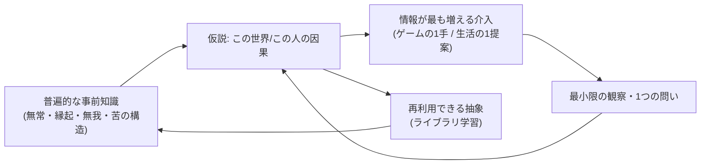
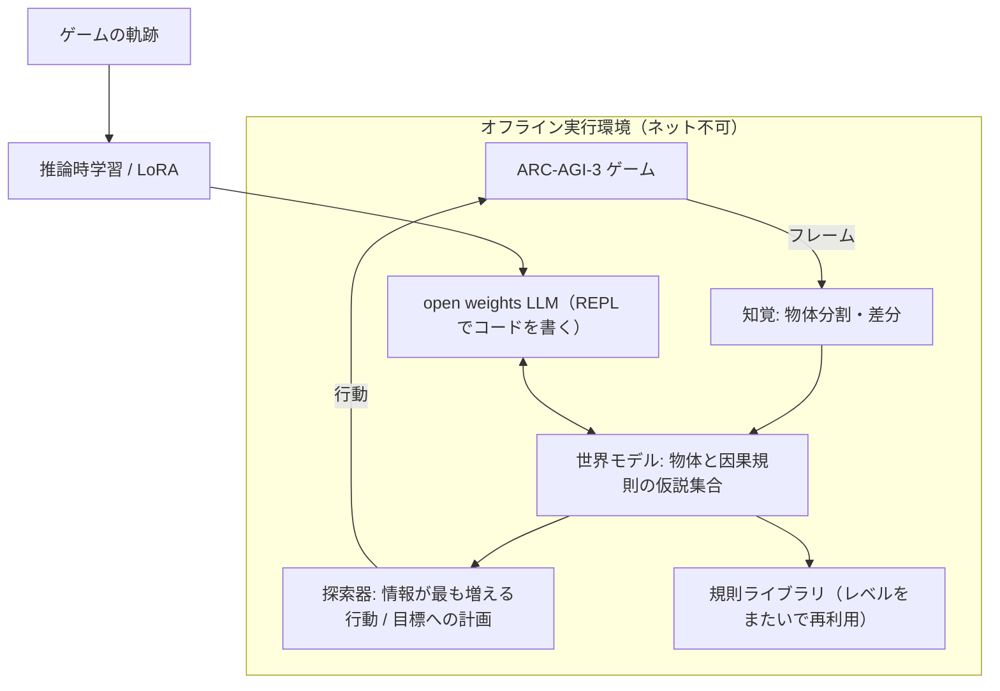

# Life Manager → AGI ロードマップ（設計）

状態: 設計（実装前）。Dais の承認後に `superpowers:writing-plans` で実装計画へ落とす。
上位: `docs/superpowers/specs/2026-09-25-life-manager-unified-ssot.md`（branch `docs/full-ship-handover-20260925`）の T15 を具体化する。収益トラック T2–T14 の順序は変えない。
調査ノート（全主張に URL と原文引用）: `docs/research/agi-2026-09-25/01〜04`。clone 済み repo: `~/Projects/agi-research/repos/`（22本、約1GB、depth 1）。

## 0. 何を作るか（Dais の意図の再述）

- 目的: Life Manager（LM）を「アシスタント」ではなく「マネージャー」にし、最終的に汎用知能（AGI）にする。
- 核の仮説（Dais）: AGI に要るのは大量データではなく、強い普遍的な事前知識（仏教の paññā＝般若）。それがあれば、少ない観察から誰に対しても的確に助言・行動できる。Google Calendar 連携のような個人データ接続は不要になる。
- 外部の目標: ARC-AGI-3 で上位を取る／ARC-AGI-3 より良い自前ベンチを作る／YC W27 に採択される／自前モデルまで一気通貫で持つ／世界初の zero-person decacorn。
- 今回の範囲: 計画と調査だけ。実装・課金・応募はしない。

## 1. 観測事実（2026-09-25 実測・一次資料）

| 事実 | 値 | 出所 |
|---|---|---|
| ARC-AGI-3 の形式 | 説明なしの対話型ゲーム。スコアは人間比の行動効率（少ない手数で解くほど高い） | arcprize.org/blog/astra, notes/01 |
| 公開 leaderboard の SOTA | GPT-6 Astra: Standard harness 62.7%（$26K）、Provider Adapter harness **99.9%**（$19K）。レベルの96.0%で人間より少ない手数 | https://arcprize.org/blog/astra（本セッションで直接取得） |
| 2026-03-25 の正式開始時点 | 最前線の AI で 0.51% | notes/01 |
| ARC Prize 2026 のルール | Kaggle 経由。**評価中はインターネット不可（GPT/Claude の API は使えない）**。open source が賞の条件。ハードウェア上限は未公表 | https://arcprize.org/competitions/2026/arc-agi-3 |
| 賞金と日程 | ARC-AGI-3 部門 $850K（100%到達で $700K）。Milestone #2 は 9/30、最終提出 **11/2**、論文 11/8、結果発表 12/4 | notes/01 |
| Milestone #1 の入賞（6/30） | 1位 Tufa Labs「The Duck」＝Qwen 3.6 27B をローカルで動かし、Python REPL でゲームを「コードを書く問題」として解く。2位・3位は Gemma-4-31B に盤面画像を見せて JSON で行動を返させる方式。スコアは記事に無い | https://arcprize.org/blog/arc-prize-2026-milestone-1 |
| Kaggle の leaderboard の数値 | **未取得**（API が 401。kaggle CLI 未導入） | 本セッション |
| Ndea（Chollet） | 「deep learning-guided program synthesis」で AGI を目指す。GitHub org `ndea` の public repo は **0** | notes/02（`gh api orgs/ndea`） |
| ARC-AGI-2（2025）の上位 | 1位 NVARC 24.03%（TTT＋TRM）。7M パラメータの TRM が論文賞 | notes/01, 02 |
| 観想×AI | "Contemplative AI"（Laukkonen, Friston ら 2025, arXiv 2504.15125）が mindfulness/emptiness/non-duality/boundless care を AI の4公理として提案。ただし実証はプロンプトの効果だけ | notes/03 |
| 物体単位の世界モデル | VERSES AXIOM: 物体中心・オンラインで構造を増やす・勾配なしのベイズ推論で、約1万ステップでゲームを習得 | notes/03 |
| YC W27 | 締切 **11/2 20:00 PT**、12/11 までに合否、1〜3月に SF | https://www.ycombinator.com/apply（notes/04） |
| 小型モデルの学習費 | nanochat で GPT-2 級が約$48。H100 は約$3.95〜3.99/時、B200 は約$6.25〜6.69/時 | notes/04 |
| 手元の計算機 | Mac mini M4、16GB。27〜31B 級のローカル推論は不可 | `sysctl` |
| LM の検証済み純利益 | 実質 $0（+0.003 USDC, -$0.04） | 統合 SSOT §3 |

**事実から出る結論（推論）:** API を使える leaderboard は、すでにフロンティア企業が埋めている。LM が勝負できるのは「オフライン・自前スタック・open source」の Kaggle 部門だけ。これは Dais の「自前で一気通貫」の方針と一致する。

## 2. 般若（paññā）を計算の言葉に翻訳する

Dais の直感を、検証できる形に直す。ラベル: [根拠あり] は一次資料で支えられる、[仮説] は LM 独自の主張で、まだ検証されていない。

| 仏教の概念 | 計算上の対応 | 状態 |
|---|---|---|
| 知能＝少ない経験から新しい技能を得る効率 | Chollet の定義「skill-acquisition efficiency」（事前知識と経験に対する汎化） | [根拠あり] arXiv 1911.01547 |
| 無常（anicca） | 非定常性を前提にした事前分布。世界モデルを推論時に更新し続ける（TTT、AXIOM のオンライン拡張） | [根拠あり]（手法）／[仮説]（対応づけ） |
| 縁起（paṭicca-samuppāda） | 因果グラフという事前分布。「この条件があるとこれが起きる」を介入して確かめる（Pearl の第2段＝介入） | [仮説]。縁起そのものを定式化した一次資料は未発見 |
| 無我（anattā） | 自己モデルの精度（precision）を下げる＝固定した「自分の見方」に縛られない推論 | [根拠あり] Laukkonen & Slagter 2021 |
| 苦（dukkha）とその原因（渇愛） | 人間の行動の普遍モデル: 渇望→執着→苦のループ。個人データでなく、この構造から助言する | [仮説] |
| ヴィパッサナー | 最小限の観察と介入で、生じて滅するもの（因果の構造）を見抜く＝**少ない手数で未知の世界の規則を見抜く探索** | [仮説]。これはまさに ARC-AGI-3 が測る能力 |

**Dais の主張の精密化（重要）:** ブッダは「データなし」で助言したわけではない。目の前の人の姿・言葉・問いを高い解像度で観察し、最も効く問いを1つ投げた。つまり正しい目標は「データゼロ」ではなく **「連携データゼロ、観察と質問は最小」**。これは能動的推論（active inference）の「不確実さが最も減る行動を選ぶ」と同じ形で、測定もできる（§5 のベンチ）。

同じループがゲーム（ARC-AGI-3）と人生管理（LM）の両方を動かす。これが「ARC に取り組むことが本業から逸れない」理由。

## 3. 案の比較と推奨

| 案 | 内容 | 最強の論拠 | 致命的な弱点 |
|---|---|---|---|
| A. 基盤モデルを自前で事前学習 | GPT 級の LLM をゼロから学習 | 完全に自前 | 数千億円規模。いまの LM の資金（純利益 $0）では不可能 |
| B. API のフロンティアモデル＋ハーネスだけ | 現状の延長 | 最速で最強 | ARC Prize の賞の対象外（ネット不可）。差別化にならない |
| **C. 推奨: open weights＋自前の「般若ループ」＋小型の自前世界モデル** | ローカル推論の open model（Qwen/Gemma）を探索・仮説ループで動かし、ゲームから因果を学ぶ小型モデル（TRM/AXIOM 系）を自前で持つ。LM 本番の軌跡を蒸留して段階的に自前化 | ARC Prize の条件と、Dais の「一気通貫」の両方を満たす。費用は数百〜数千ドル | 5週間で上位は保証されない |

**推奨は C。**
- best: 11/2 までに独自の「因果探索」エージェントで Kaggle の上位に入り、open source と論文（11/8）を出す。YC 応募にそのまま載る。
- base: Kaggle で公開 baseline を明確に上回る順位を取り、論文を提出する。YC では「自前の汎化研究を持つ zero-person 会社」として説明できる。
- worst: 公開 baseline 並み。それでも repo・評価基盤・論文草稿は LM ベンチ（§5）へ流用できる。
- 棄却案 B の最強論拠: 「本番の LM はフロンティア API の方が強い」。これは正しい。だから**本番は当面 API を使い続け**、研究トラックだけを自前化する。両者は排他ではない。
- 自分が間違うとしたら最有力の筋: ARC-AGI-3 のオフライン部門の上位がすでに高得点で、5週間では順位が付かない。→ Kaggle の leaderboard を最初に実測し（B0）、見込みがなければ論文賞と ARC-AGI-4 への準備に切り替える。

## 4. アーキテクチャ（研究トラック）

各部品の出所（再発明しない）:

| 部品 | 借りる元（clone 済み） | 使う理由 |
|---|---|---|
| 土台のハーネス | `arcprize_ARC-AGI-3-Agents`, Kaggle の公式テンプレート, Tufa「The Duck」の notebook | 入賞実績のある REPL 方式から始める |
| 知覚・状態グラフ | `wd13ca_ARC-AGI-3-Agents`（Blind Squirrel）, `DriesSmit_ARC3-solution` | 「どの行動が盤面を変えたか」の学習と、状態グラフによる無駄手の刈り込み |
| 世界モデル | `axiom` | 物体単位・オンライン拡張・少数ステップの学習 |
| 仮説生成と検証 | `arc_draw_more_samples_pub`, `arc_agi`（Berman） | 仮説を大量に出して実行で確かめるループ |
| 抽象の蓄積 | `stitch`, `lilo` | レベルをまたいで規則を再利用する |
| 推論時学習 | `marc`, `SamsungSAILMontreal_TinyRecursiveModels`, `HRM` | 小型モデルをそのゲームに適応させる |
| 評価 | `arcprize_arc-agi`, `arcprize_arc-agi-3-benchmarking` | ローカルで再現できるスコアカード |

LM 独自の上乗せは1点だけに絞る: **「縁起探索」＝盤面を変えた行動を因果仮説として記録し、仮説を最も多く否定できる行動を次の一手に選ぶ。** 既存の入賞作は「何が変わったか」を見ているが、「どの仮説を消すか」で手を選んではいない（推論。検証は B2 で行う）。

## 5. 自前ベンチ: ARC-AGI-3 より良い測り方

既存 LM-EAB（経済自律の slice）を拡張する。既存 spec（Foundation §J4.2）の「経済スコアは AGI スコアではない」「held-out・反復試行・較正・再現」の原則はそのまま守る。

既存ベンチに無い3点（notes/04 のギャップ分析より）:
1. 実際のお金・契約の決済で成果を測るものが無い → LM-EAB が既に持つ。
2. 学習時に見ていない業種・領域への少数例汎化を測るものが無い → **held-out 領域セット**。
3. 被害・迷惑（doom loop など）がスコアに入らない → 安全ゲート（LM-EAB に既にある）。

LM が新しく足す軸（Dais の仮説を測れる形にする）:
- **情報効率:** 成果 ÷ 人間から求めた情報の量（質問の数・連携したデータ源の数）。「Google Calendar を繋がせずに同じ成果」が高得点になる。ARC-AGI-3 の「人間比の行動効率」を人生管理に移したもの。
- **領域移転:** 経済 → 健康 → 心（マインドフルネス）→ ソフトウェア の順に、見たことのない領域で最初の数回の成果を測る。
- **人間比:** 各タスクで人間の中央値（手数・質問数・成果）を基準線にする。

名前は仮に「LM-GEN」とする。公開前に独立した再実行で同じ結果が出ることを要件にする（既存 spec と同じ）。

## 6. 自前モデルへの段階

| 段 | 内容 | 費用の目安 | 開始条件 |
|---|---|---|---|
| M0 | open weights（Qwen/Gemma）をクラウド GPU で動かす。ARC ハーネス用 | H100 約$4/時 | B0 の後 |
| M1 | ゲーム軌跡で LoRA／推論時学習 | 数十〜数百ドル | M0 で baseline が出たら |
| M2 | 小型の自前世界モデル（TRM/AXIOM 系、数百万〜数千万パラメータ）をゼロから学習 | 数百ドル（nanochat, TRM の実績から推定） | 縁起探索が効くと B2 で示せたら |
| M3 | LM 本番の軌跡（receipt 付き）を蒸留して、特定ループを自前モデルへ置き換える | 未見積 | 統合 SSOT の T8（ループ別 P&L）が動いてから。データの質が収益で裏付けられていること |
| M4 | 基盤モデルの事前学習 | 桁違い | YC 以降の資金調達。今は計画しない |

計算資源の補助: Google TRC（TPU 無料、成果公開が条件）、NVIDIA Inception（無料）は notes/04 で確認済み。YC 採択後のクレジットも使える。

## 7. YC W27（締切 11/2 20:00 PT）

- 応募は正直な証拠だけで書く（既存 spec の方針）。いまの LM の最大の弱点は検証済み売上が $0 であること。YC が最も重く見るのも traction。
- 「zero-person」の主張を支える証拠: receipt 付きのループ稼働、自己修復の実証（SSOT T5）、ループ別 P&L（T8）。
- 研究の証拠: Kaggle の順位、open source の repo、論文、LM-GEN の設計。
- **推論:** 11/2 までに効くのは、研究の順位よりも「実際に1件でも外部の顧客から入金がある」こと。だから収益トラック（T2〜T8）は研究トラックより優先度を下げない。

## 8. 実行順（TODO・正本）

収益トラック（統合 SSOT T2〜T14）が優先 1。研究トラックは並行し、別の worktree と別のクラウド計算資源で進めて、本番の Mac の容量を奪わない。

現在の cursor: **R0（Dais の承認待ち）**

| # | タスク | 完了の証拠 | 期限 |
|---|---|---|---|
| R0 | この設計を Dais が承認する。研究用クラウド GPU の予算上限を決める（推奨: 11/2 まで $500） | 承認の返信 | 即時 |
| B0 | Kaggle アカウントと API を準備し、ARC-AGI-3 の現在の leaderboard 上位スコアと 2026 の計算資源上限を実測して、このファイルの §1 に追記する | 実測値と URL | 9/28 |
| B1 | 公式テンプレートと The Duck を再現し、ローカルの公開ゲームで baseline のスコアカードを出す（M0） | `arc-agi-3-benchmarking` のスコアカード | 10/5 |
| B2 | 縁起探索（因果仮説を否定する手の選択）を1つの差分として足し、baseline と A/B 比較する。同じゲーム・同じ seed で反復試行 | 反復試行の平均と幅 | 10/15 |
| B3 | AXIOM 型の物体単位世界モデル、またはゲームごとの LoRA を1つ試す（M1/M2 のどちらか、B2 の結果で決める） | A/B 比較 | 10/25 |
| B4 | Kaggle へ提出し、コードを open source（MIT-0/CC0）で公開 | Kaggle の提出 ID と repo URL | 11/2 |
| B5 | 論文（手法・失敗も含む）を提出 | 提出の受領 | 11/8 |
| Y1 | YC W27 の応募を、receipt で裏付けられた事実だけで書いて提出 | YC の受領メール | 11/2 |
| G1 | LM-GEN の仕様（情報効率・領域移転・人間比の軸）を LM-EAB の上に書く | spec の差分 | 11/30 |
| G2 | 健康・心の領域で held-out タスク10件と人間の基準線を作る | case ファイルと基準線 | 12月 |
| M3 | ループ別 P&L が動いた後に、1ループの蒸留を試す | receipt で裏付けた比較 | SSOT T8 の後 |

**順序の根拠:** YC と Kaggle の締切が同じ 11/2。9/30 の Milestone #2 は、5日で入賞水準の open source を出す根拠が無いので見送る（B0 で上位の水準が低いと分かった場合だけ再検討）。

## 9. 不変の制約

- 検証していない達成（AGI、順位、採択、MRR）を主張しない。[仮説] と [根拠あり] を分けたまま外に出す。
- 研究用の計算資源は本番のループの容量（disk floor 1,155,780,608 bytes）を奪わない。重みはクラウドに置き、Mac には落とさない。
- Dais 個人の口座から出るお金（GPU 代）は承認が要る（R0）。
- open source で公開するのは研究トラックのコードだけ。LM 本番のコード・credential・顧客データは出さない。
- 統合 SSOT §6 の制約（Ryu room への再送禁止など）はそのまま。
