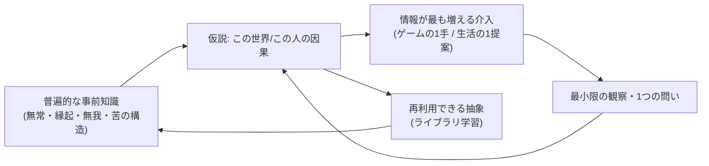
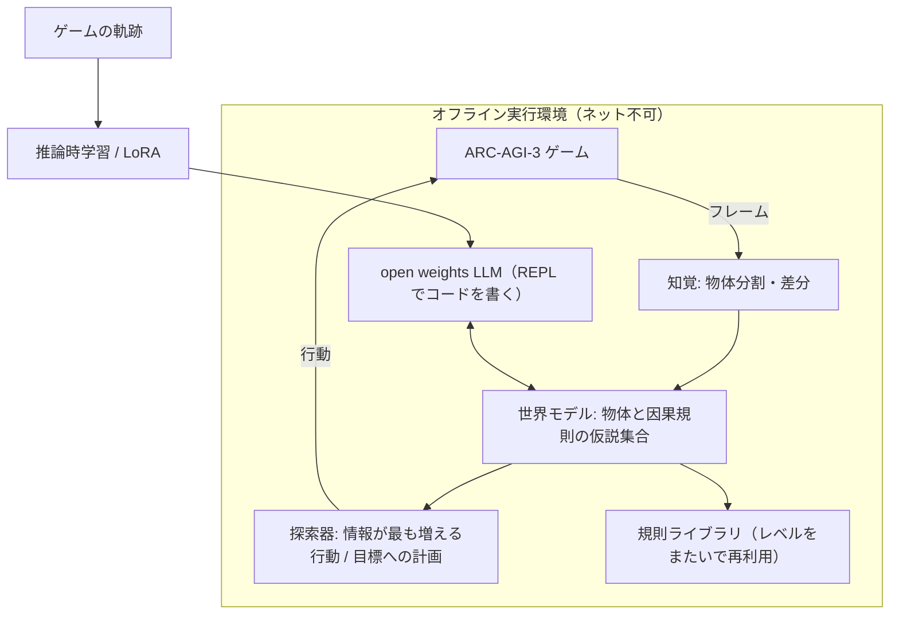
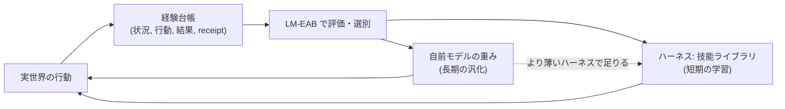
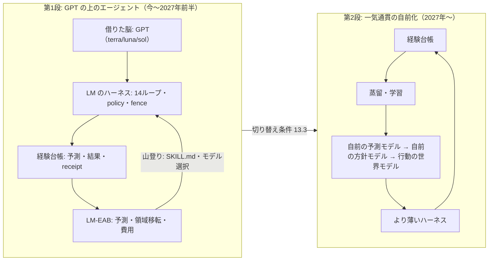

# Life Manager → AGI ロードマップ（設計）

状態: 設計（実装前）。Dais の承認後に `superpowers:writing-plans` で実装計画へ落とす。
上位: `docs/superpowers/specs/2026-09-25-life-manager-unified-ssot.md`（branch `docs/full-ship-handover-20260925`）の T15 を具体化する。収益トラック T2–T14 の順序は変えない。
調査ノート（全主張に URL と原文引用）: `docs/research/agi-2026-09-25/01〜04`。clone 済み repo: `~/Projects/agi-research/repos/`（22本、約1GB、depth 1）。

## 0. 何を作るか（Dais の意図の再述）

- 目的: Life Manager（LM）を「アシスタント」ではなく「マネージャー」にし、最終的に汎用知能（AGI）にする。
- 核の仮説（Dais）: AGI に要るのは大量データではなく、強い普遍的な事前知識（仏教の paññā＝般若）。それがあれば、少ない観察から誰に対しても的確に助言・行動できる。Google Calendar 連携のような個人データ接続は不要になる。
- 外部の目標: ARC-AGI-3 で上位を取る／ARC-AGI-3 より良い自前ベンチを作る／YC W27 に採択される／自前モデルまで一気通貫で持つ／世界初の zero-person decacorn。
- 今回の範囲: 計画と調査だけ。実装・課金・応募はしない。

## 1. 観測事実（2026-09-25 実測・一次資料）

| 事実 | 値 | 出所 |
|---|---|---|
| ARC-AGI-3 の形式 | 説明なしの対話型ゲーム。スコアは人間比の行動効率（少ない手数で解くほど高い） | arcprize.org/blog/astra, notes/01 |
| 公開 leaderboard の SOTA | GPT-6 Astra: Standard harness 62.7%（$26K）、Provider Adapter harness **99.9%**（$19K）。レベルの96.0%で人間より少ない手数 | https://arcprize.org/blog/astra（本セッションで直接取得） |
| 2026-03-25 の正式開始時点 | 最前線の AI で 0.51% | notes/01 |
| ARC Prize 2026 のルール | Kaggle 経由。**評価中はインターネット不可（GPT/Claude の API は使えない）**。open source が賞の条件。ハードウェア上限は未公表 | https://arcprize.org/competitions/2026/arc-agi-3 |
| 賞金と日程 | ARC-AGI-3 部門 $850K（100%到達で $700K）。Milestone #2 は 9/30、最終提出 **11/2**、論文 11/8、結果発表 12/4 | notes/01 |
| Milestone #1 の入賞（6/30） | 1位 Tufa Labs「The Duck」＝Qwen 3.6 27B をローカルで動かし、Python REPL でゲームを「コードを書く問題」として解く。2位・3位は Gemma-4-31B に盤面画像を見せて JSON で行動を返させる方式。スコアは記事に無い | https://arcprize.org/blog/arc-prize-2026-milestone-1 |
| Kaggle の leaderboard の数値 | **未取得**（API が 401。kaggle CLI 未導入） | 本セッション |
| Ndea（Chollet） | 「deep learning-guided program synthesis」で AGI を目指す。GitHub org `ndea` の public repo は **0** | notes/02（`gh api orgs/ndea`） |
| ARC-AGI-2（2025）の上位 | 1位 NVARC 24.03%（TTT＋TRM）。7M パラメータの TRM が論文賞 | notes/01, 02 |
| 観想×AI | "Contemplative AI"（Laukkonen, Friston ら 2025, arXiv 2504.15125）が mindfulness/emptiness/non-duality/boundless care を AI の4公理として提案。ただし実証はプロンプトの効果だけ | notes/03 |
| 物体単位の世界モデル | VERSES AXIOM: 物体中心・オンラインで構造を増やす・勾配なしのベイズ推論で、約1万ステップでゲームを習得 | notes/03 |
| YC W27 | 締切 **11/2 20:00 PT**、12/11 までに合否、1〜3月に SF | https://www.ycombinator.com/apply（notes/04） |
| 小型モデルの学習費 | nanochat で GPT-2 級が約$48。H100 は約$3.95〜3.99/時、B200 は約$6.25〜6.69/時 | notes/04 |
| 手元の計算機 | Mac mini M4、16GB。27〜31B 級のローカル推論は不可 | `sysctl` |
| LM の検証済み純利益 | 実質 $0（+0.003 USDC, -$0.04） | 統合 SSOT §3 |

**事実から出る結論（推論）:** API を使える leaderboard は、すでにフロンティア企業が埋めている。LM が勝負できるのは「オフライン・自前スタック・open source」の Kaggle 部門だけ。これは Dais の「自前で一気通貫」の方針と一致する。

## 2. 般若（paññā）を計算の言葉に翻訳する

Dais の直感を、検証できる形に直す。ラベル: [根拠あり] は一次資料で支えられる、[仮説] は LM 独自の主張で、まだ検証されていない。

| 仏教の概念 | 計算上の対応 | 状態 |
|---|---|---|
| 知能＝少ない経験から新しい技能を得る効率 | Chollet の定義「skill-acquisition efficiency」（事前知識と経験に対する汎化） | [根拠あり] arXiv 1911.01547 |
| 無常（anicca） | 非定常性を前提にした事前分布。世界モデルを推論時に更新し続ける（TTT、AXIOM のオンライン拡張） | [根拠あり]（手法）／[仮説]（対応づけ） |
| 縁起（paṭicca-samuppāda） | 因果グラフという事前分布。「この条件があるとこれが起きる」を介入して確かめる（Pearl の第2段＝介入） | [仮説]。縁起そのものを定式化した一次資料は未発見 |
| 無我（anattā） | 自己モデルの精度（precision）を下げる＝固定した「自分の見方」に縛られない推論 | [根拠あり] Laukkonen & Slagter 2021 |
| 苦（dukkha）とその原因（渇愛） | 人間の行動の普遍モデル: 渇望→執着→苦のループ。個人データでなく、この構造から助言する | [仮説] |
| ヴィパッサナー | 最小限の観察と介入で、生じて滅するもの（因果の構造）を見抜く＝**少ない手数で未知の世界の規則を見抜く探索** | [仮説]。これはまさに ARC-AGI-3 が測る能力 |

**Dais の主張の精密化（重要）:** ブッダは「データなし」で助言したわけではない。目の前の人の姿・言葉・問いを高い解像度で観察し、最も効く問いを1つ投げた。つまり正しい目標は「データゼロ」ではなく **「連携データゼロ、観察と質問は最小」**。これは能動的推論（active inference）の「不確実さが最も減る行動を選ぶ」と同じ形で、測定もできる（§5 のベンチ）。

```mermaid
flowchart LR
  P["普遍的な事前知識<br/>(無常・縁起・無我・苦の構造)"] --> H["仮説: この世界/この人の因果"]
  O["最小限の観察・1つの問い"] --> H
  H --> A["情報が最も増える介入<br/>(ゲームの1手 / 生活の1提案)"]
  A --> O
  H --> L["再利用できる抽象<br/>(ライブラリ学習)"] --> P
```

同じループがゲーム（ARC-AGI-3）と人生管理（LM）の両方を動かす。これが「ARC に取り組むことが本業から逸れない」理由。

## 3. 案の比較と推奨

| 案 | 内容 | 最強の論拠 | 致命的な弱点 |
|---|---|---|---|
| A. 基盤モデルを自前で事前学習 | GPT 級の LLM をゼロから学習 | 完全に自前 | 数千億円規模。いまの LM の資金（純利益 $0）では不可能 |
| B. API のフロンティアモデル＋ハーネスだけ | 現状の延長 | 最速で最強 | ARC Prize の賞の対象外（ネット不可）。差別化にならない |
| **C. 推奨: open weights＋自前の「般若ループ」＋小型の自前世界モデル** | ローカル推論の open model（Qwen/Gemma）を探索・仮説ループで動かし、ゲームから因果を学ぶ小型モデル（TRM/AXIOM 系）を自前で持つ。LM 本番の軌跡を蒸留して段階的に自前化 | ARC Prize の条件と、Dais の「一気通貫」の両方を満たす。費用は数百〜数千ドル | 5週間で上位は保証されない |

**推奨は C。**
- best: 11/2 までに独自の「因果探索」エージェントで Kaggle の上位に入り、open source と論文（11/8）を出す。YC 応募にそのまま載る。
- base: Kaggle で公開 baseline を明確に上回る順位を取り、論文を提出する。YC では「自前の汎化研究を持つ zero-person 会社」として説明できる。
- worst: 公開 baseline 並み。それでも repo・評価基盤・論文草稿は LM ベンチ（§5）へ流用できる。
- 棄却案 B の最強論拠: 「本番の LM はフロンティア API の方が強い」。これは正しい。だから**本番は当面 API を使い続け**、研究トラックだけを自前化する。両者は排他ではない。
- 自分が間違うとしたら最有力の筋: ARC-AGI-3 のオフライン部門の上位がすでに高得点で、5週間では順位が付かない。→ Kaggle の leaderboard を最初に実測し（B0）、見込みがなければ論文賞と ARC-AGI-4 への準備に切り替える。

## 4. アーキテクチャ（研究トラック）

```mermaid
flowchart TB
  subgraph Kaggle["オフライン実行環境（ネット不可）"]
    ENV[ARC-AGI-3 ゲーム] -->|フレーム| PER[知覚: 物体分割・差分]
    PER --> WM["世界モデル: 物体と因果規則の仮説集合"]
    WM --> PLAN["探索器: 情報が最も増える行動 / 目標への計画"]
    PLAN -->|行動| ENV
    LLM["open weights LLM（REPL でコードを書く）"] <--> WM
    WM --> LIB["規則ライブラリ（レベルをまたいで再利用）"]
  end
  TR[ゲームの軌跡] --> TTT[推論時学習 / LoRA] --> LLM
```

各部品の出所（再発明しない）:

| 部品 | 借りる元（clone 済み） | 使う理由 |
|---|---|---|
| 土台のハーネス | `arcprize_ARC-AGI-3-Agents`, Kaggle の公式テンプレート, Tufa「The Duck」の notebook | 入賞実績のある REPL 方式から始める |
| 知覚・状態グラフ | `wd13ca_ARC-AGI-3-Agents`（Blind Squirrel）, `DriesSmit_ARC3-solution` | 「どの行動が盤面を変えたか」の学習と、状態グラフによる無駄手の刈り込み |
| 世界モデル | `axiom` | 物体単位・オンライン拡張・少数ステップの学習 |
| 仮説生成と検証 | `arc_draw_more_samples_pub`, `arc_agi`（Berman） | 仮説を大量に出して実行で確かめるループ |
| 抽象の蓄積 | `stitch`, `lilo` | レベルをまたいで規則を再利用する |
| 推論時学習 | `marc`, `SamsungSAILMontreal_TinyRecursiveModels`, `HRM` | 小型モデルをそのゲームに適応させる |
| 評価 | `arcprize_arc-agi`, `arcprize_arc-agi-3-benchmarking` | ローカルで再現できるスコアカード |

LM 独自の上乗せは1点だけに絞る: **「縁起探索」＝盤面を変えた行動を因果仮説として記録し、仮説を最も多く否定できる行動を次の一手に選ぶ。** 既存の入賞作は「何が変わったか」を見ているが、「どの仮説を消すか」で手を選んではいない（推論。検証は B2 で行う）。

## 5. 自前ベンチ: ARC-AGI-3 より良い測り方

既存 LM-EAB（経済自律の slice）を拡張する。既存 spec（Foundation §J4.2）の「経済スコアは AGI スコアではない」「held-out・反復試行・較正・再現」の原則はそのまま守る。

既存ベンチに無い3点（notes/04 のギャップ分析より）:
1. 実際のお金・契約の決済で成果を測るものが無い → LM-EAB が既に持つ。
2. 学習時に見ていない業種・領域への少数例汎化を測るものが無い → **held-out 領域セット**。
3. 被害・迷惑（doom loop など）がスコアに入らない → 安全ゲート（LM-EAB に既にある）。

LM が新しく足す軸（Dais の仮説を測れる形にする）:
- **情報効率:** 成果 ÷ 人間から求めた情報の量（質問の数・連携したデータ源の数）。「Google Calendar を繋がせずに同じ成果」が高得点になる。ARC-AGI-3 の「人間比の行動効率」を人生管理に移したもの。
- **領域移転:** 経済 → 健康 → 心（マインドフルネス）→ ソフトウェア の順に、見たことのない領域で最初の数回の成果を測る。
- **人間比:** 各タスクで人間の中央値（手数・質問数・成果）を基準線にする。

新しい名前は作らない。既存の **LM-EAB**（Life Manager Economic Autonomy Benchmark、`apps/life-manager/eval/economic-autonomy/`、41 テスト PASS・4 ケース）と、既存の生活領域 eval（`phy-cases.jsonl` 19 件・`men-cases.jsonl` 15 件など）に、新しいタスク群として足す。公開前に独立した再実行で同じ結果が出ることを要件にする（既存 spec と同じ）。

## 6. 自前モデルへの段階

| 段 | 内容 | 費用の目安 | 開始条件 |
|---|---|---|---|
| M0 | open weights（Qwen/Gemma）をクラウド GPU で動かす。ARC ハーネス用 | H100 約$4/時 | B0 の後 |
| M1 | ゲーム軌跡で LoRA／推論時学習 | 数十〜数百ドル | M0 で baseline が出たら |
| M2 | 小型の自前世界モデル（TRM/AXIOM 系、数百万〜数千万パラメータ）をゼロから学習 | 数百ドル（nanochat, TRM の実績から推定） | 縁起探索が効くと B2 で示せたら |
| M3 | LM 本番の軌跡（receipt 付き）を蒸留して、特定ループを自前モデルへ置き換える | 未見積 | 統合 SSOT の T8（ループ別 P&L）が動いてから。データの質が収益で裏付けられていること |
| M4 | 基盤モデルの事前学習 | 桁違い | YC 以降の資金調達。今は計画しない |

計算資源の補助: Google TRC（TPU 無料、成果公開が条件）、NVIDIA Inception（無料）は notes/04 で確認済み。YC 採択後のクレジットも使える。

## 7. YC W27（締切 11/2 20:00 PT）

- 応募は正直な証拠だけで書く（既存 spec の方針）。いまの LM の最大の弱点は検証済み売上が $0 であること。YC が最も重く見るのも traction。
- 「zero-person」の主張を支える証拠: receipt 付きのループ稼働、自己修復の実証（SSOT T5）、ループ別 P&L（T8）。
- 研究の証拠: Kaggle の順位、open source の repo、論文、LM-EAB の設計。
- **推論:** 11/2 までに効くのは、研究の順位よりも「実際に1件でも外部の顧客から入金がある」こと。だから収益トラック（T2〜T8）は研究トラックより優先度を下げない。

## 8. 実行順（TODO・正本）

収益トラック（統合 SSOT T2〜T14）が優先 1。研究トラックは並行し、別の worktree と別のクラウド計算資源で進めて、本番の Mac の容量を奪わない。

現在の cursor: **R0（Dais の承認待ち）**

| # | タスク | 完了の証拠 | 期限 |
|---|---|---|---|
| R0 | この設計を Dais が承認する。研究用クラウド GPU の予算上限を決める（推奨: 11/2 まで $500） | 承認の返信 | 即時 |
| B0 | Kaggle アカウントと API を準備し、ARC-AGI-3 の現在の leaderboard 上位スコアと 2026 の計算資源上限を実測して、このファイルの §1 に追記する | 実測値と URL | 9/28 |
| B1 | 公式テンプレートと The Duck を再現し、ローカルの公開ゲームで baseline のスコアカードを出す（M0） | `arc-agi-3-benchmarking` のスコアカード | 10/5 |
| B2 | 縁起探索（因果仮説を否定する手の選択）を1つの差分として足し、baseline と A/B 比較する。同じゲーム・同じ seed で反復試行 | 反復試行の平均と幅 | 10/15 |
| B3 | AXIOM 型の物体単位世界モデル、またはゲームごとの LoRA を1つ試す（M1/M2 のどちらか、B2 の結果で決める） | A/B 比較 | 10/25 |
| B4 | Kaggle へ提出し、コードを open source（MIT-0/CC0）で公開 | Kaggle の提出 ID と repo URL | 11/2 |
| B5 | 論文（手法・失敗も含む）を提出 | 提出の受領 | 11/8 |
| Y1 | YC W27 の応募を、receipt で裏付けられた事実だけで書いて提出 | YC の受領メール | 11/2 |
| G1 | LM-EAB に情報効率・領域移転・人間比の軸を足す仕様を書く（§11 の AG4） | spec の差分 | 11/30 |
| G2 | 健康・心の領域で held-out タスク10件と人間の基準線を作る | case ファイルと基準線 | 12月 |
| M3 | ループ別 P&L が動いた後に、1ループの蒸留を試す | receipt で裏付けた比較 | SSOT T8 の後 |

**順序の根拠:** YC と Kaggle の締切が同じ 11/2。9/30 の Milestone #2 は、5日で入賞水準の open source を出す根拠が無いので見送る（B0 で上位の水準が低いと分かった場合だけ再検討）。

## 9. 不変の制約

- 検証していない達成（AGI、順位、採択、MRR）を主張しない。[仮説] と [根拠あり] を分けたまま外に出す。
- 研究用の計算資源は本番のループの容量（disk floor 1,155,780,608 bytes）を奪わない。重みはクラウドに置き、Mac には落とさない。
- Dais 個人の口座から出るお金（GPU 代）は承認が要る（R0）。
- open source で公開するのは研究トラックのコードだけ。LM 本番のコード・credential・顧客データは出さない。
- 統合 SSOT §6 の制約（Ryu room への再送禁止など）はそのまま。

## 10. 土台からの道筋: 「GPT × ハーネス」から「一つの身体」へ

### 10.1 汎化の式（中心の定義）

AGI ≒ **強い事前知識 × 少ない経験で更新する力 × 学んだことを積み上げる力 × 自分で問いと目標を立てる力**

- 事前知識だけでは足りない。GPT は既に巨大な事前知識を持つ。欠けているのは後ろの3つ。[根拠あり] Karpathy: 「they're not continual learning … It will take about a decade」 https://www.dwarkesh.com/p/andrej-karpathy
- 次の AI は人間のデータでなく自分の経験の流れから学ぶ。[根拠あり] Silver & Sutton "The Era of Experience": 「Agents will inhabit streams of experience」
- 人の手で作り込んだ知識より、計算で伸びる汎用の方法が最後に勝つ。[根拠あり] Sutton "The Bitter Lesson" http://www.incompleteideas.net/IncIdeas/BitterLesson.html
- ハーネスだけで成績が大きく変わる。Astra は同じモデルで 62.7% から 99.9% になった（§1）。Tufa Labs は、手作りの道具がむしろ邪魔だったと報告している（§1）。

### 10.2 「ハーネス派」と「モデル派」の統合

どちらか一方ではない。**ハーネスは短期の学習（メモ・道具・自作コード）の置き場、重みは長期の汎化の置き場。** 「一つの身体」とは、この境界を動かし続けるループのこと。ハーネスで得た経験を評価で選び、自前のモデルへ蒸留し、次のハーネスはより薄くなる。人間でいえば、日中のメモを睡眠中に長期記憶へ固めるのと同じ。[仮説]

```mermaid
flowchart LR
  X[実世界の行動] --> R["経験台帳<br/>(状況, 行動, 結果, receipt)"]
  R --> E[LM-EAB で評価・選別]
  E --> S["ハーネス: 技能ライブラリ<br/>(短期の学習)"]
  E --> W["自前モデルの重み<br/>(長期の汎化)"]
  S --> X
  W --> X
  W -.より薄いハーネスで足りる.-> S
```

### 10.3 自律の段階（現在地）

| 段 | 状態 | 判定の証拠 | LM の現在 |
|---|---|---|---|
| L0 道具 | GPT＋手書きのループ。壊れると人か外部の AI が直す | — | 大半のループがここ |
| L1 自律運用 | 自己修復、人の介入なし、receipt で結果を証明 | SSOT T5・T6（uncovered_failure=0） | 未達（13/14 が uncovered） |
| L2 自己改善 | 評価器が承認した場合だけ、自分のハーネスと技能を改良する | SSOT T12 | 未達 |
| L3 汎化 | 見たことのない領域に、専用コードなしで入り、成果を出す | LM-EAB の held-out | 未達 |
| L4 一つの身体 | 経験が自前の重みに蒸留され、モデルとハーネスが一緒に進化する | 蒸留の前後比較 | 未達 |
| L5 自ら問う | 自分で新しい領域と目標を選び、発見する | 独立した再現 | 未達 |

### 10.4 最初の汎化テスト（すぐ測れるもの）

**新しい仕事のプラットフォームへ、そのプラットフォーム専用のコードを書かずに入り、最初の検証済みの成果を出す。** 例: Coconala・Lancers・CrowdWorks で得た技能だけで、未知のプラットフォームに挑む。測るのは、最初の成果までにかかった手数・費用・人間の介入の数。ARC-AGI-3 の「人間比の行動効率」を、実世界へ移したもの。

### 10.5 「ログインなし・一つの存在」の設計原則

一つの存在がすべての人生を管理するなら、**本体に取り込むのは個人の記録ではなく、一般化した規則だけ**にする（例: 「締切の直前に予定を詰め込むと苦しみが増える」という構造は取り込む。ある人の予定表そのものは取り込まない）。汎化の方向とプライバシーの方向が一致する。[仮説]

### 10.6 ARC と自前ベンチの役割分担

| | ARC-AGI（3、公開後は4） | LM-EAB（自前、既存） |
|---|---|---|
| 役割 | 外部からの信用・純粋な汎化の練習場 | 北極星。LM の主張そのものを測る |
| 強み | 世界共通の物差し。人間比がある | 実世界・人の介入なし・情報効率・決済された成果 |
| 弱み | ゲームだけ。API 側はほぼ飽和 | 自作のベンチは、他者が使うまで信用ゼロ |
| 方針 | Kaggle のオフライン部門。汎化エンジンを鍛える | ARC の設計原則（人間比、held-out、効率、事前知識の最小化）を借りて公開する |

**結論: 両方やる。ただし別々のプロジェクトにせず、同じ「汎化エンジン」（§4 の知覚→仮説→最も情報が増える行動→規則ライブラリ）を両方に使う。**

### 10.7 段階と通過条件

| 期 | やること | 通過条件（証拠） |
|---|---|---|
| P0（〜11/2） | SSOT T2〜T8（土台の修理、ループ別 P&L）、ARC の Kaggle 提出（B0〜B4）、YC 応募（Y1） | 各 TODO の証拠 |
| P1（11月〜1月） | 経験台帳: 全ループの実行を (状況, 行動, 結果, receipt) で記録する。LM-EAB v0 を作る。§10.4 の初回テスト | 台帳の行に receipt id がある。held-out 領域で1回実施 |
| P2（2027年1〜3月） | 評価器が承認した場合だけ動く自己改善。技能ライブラリ（ループをまたいで再利用） | LM-EAB のスコアが凍結 baseline より改善。rollback 可能 |
| P3（2027年） | 台帳から自前モデルへ蒸留し、1ループの判断を置き換える | 同じタスクで成果が同等以上、費用が低い |
| P4 | 行動の結果を事前に予測し、receipt で答え合わせする世界モデル（予測の較正） | 事前登録した予測の較正誤差 |
| P5 | 自分で新しい領域を選んで入る | 独立した再現 |

## 11. 既存の Life Manager を進化させる（新しく作らない）

### 11.1 今あるもの（2026-09-27、origin/main `6b189c1f0e` で実測）

| 資産 | 場所 | 状態（実測） | 進化の方向 |
|---|---|---|---|
| LM-EAB（経済自律ベンチ） | `apps/life-manager/eval/economic-autonomy/{records,score,run}.js` | テスト 41/41 PASS（records 8、run 7、score 26）、ケース4件（tuning 2・held_out 2） | 同じプロトコルに予測・領域移転・情報効率のタスク群を足す（AG1・AG4） |
| agent-contract gate（自己改善の境界） | `apps/life-manager/eval/agent-contract/gate.js` | テスト 13/13 PASS、ケース5件 | 予測スコアの悪化も昇格を止める条件に入れる（AG5） |
| 生活領域 eval | `apps/life-manager/eval/phy-cases.jsonl`(19)・`men-cases.jsonl`(15)・`calendar`(21) ほか | 手書きルール（`care-detector.js` など）を個人データ（通院履歴・予定）で採点 | 「ルール一致」から「予測した結果が起きたか」へ（AG6） |
| 観測（observability） | `bin/lm-loop status all --json` → `apps/life-manager/scripts/local-foundation-gate.js` | 仕組みは動く。判定は `healthy=0`（14ループ） | 予測と結果を同じ観測の流れに載せる（AG2） |
| 自己修復 | `runtime/loop/recovery-*.mjs`（intent/class/apply-plan/executor/promotion/supervisor） | 単体テストあり。本番での end-to-end は未実証 | 統合 SSOT T5（変更なし） |
| 自己改善（RSI-0〜3） | Foundation spec §I、`skills/self/self-improve/*/evaluator.py` | evaluator とテストあり。本番の昇格実績なし | 統合 SSOT T12。予測スコアを評価軸に追加（AG5） |
| 台帳・receipt | `apps/life-manager/lib/{ledger,financial-ledger,earnings-ledger}.js`, `verified-outbound-receipt-reader.js` | 実装あり | 予測と結果をつなぐ根拠（receipt_refs）として使う |
| 軌跡（trajectory）の保存庫 | Foundation spec の LM-EAB「Trial」層 | spec だけ。実装なし | 経験台帳（AG2）＝一つの身体への蒸留の材料 |
| 世界モデル・予測 | — | **存在しない** | AG1 から始める |

### 11.2 行動の世界モデル（過去・現在・未来と因果）

**何を作るか:** 「この状況で、この介入をすると（またはしないと）、何が起きるか」を予測するモデル。個人の記録ではなく、集団から学んだ一般的な構造として持つ（§10.5）。

**先行者から学ぶこと（一次資料で確認済み）:**

| 先行者 | 何をしたか | 借りるもの |
|---|---|---|
| Park ら "Generative Agent Simulations of 1,000 People"（arXiv 2411.10109） | 2時間の面談から1,052人をエージェント化。一般社会調査の held-out 項目で、本人の2週間後の再回答との一致率の 83〜86% を再現 | **評価の分母を「本人の再現性」にする**（人間も毎回同じには答えない） |
| Centaur（Binz ら, Nature 2025、Psych-101: 6万人・160実験・1千万の選択） | 心理実験での人間の選択を予測。新しい課題にも汎化 | 多数の実験を一つのモデルに入れると汎化する、という事実 |
| Delphi-2M（Shmatko ら, Nature 2025, [DOI](https://doi.org/10.1038/s41586-025-09529-3)） | 過去の病歴から1,000超の病気の将来を最長20年分生成。英国40万人で学習し、デンマーク190万人に**パラメータを変えずに**適用して検証 | 過去→未来の生成と、別の集団での外部検証 |
| HeartSteps（Klasnja ら 2019, [DOI](https://doi.org/10.1093/abm/kay067)） | 介入するかどうかを毎回ランダムに決める micro-randomized trial。提案で最初は歩数が +66% 増えたが、効果は日を追って薄れた | **介入の因果効果は、介入をランダムに外す回で測る。慣れで効果が落ちる** |
| JITAI（Nahum-Shani ら 2018, [DOI](https://doi.org/10.1007/s12160-016-9830-8)） | 「適切な種類と量の支援を、適切な時に」を部品に分解した設計原理 | 介入を「いつ・何を・しない」の決定として扱う |
| Simile（Park ら）・Aaru | 人の反応をシミュレーションする企業。Simile は 2026年7月に評価額$2B と報道 | 事業としての需要（企業側の精度の数字は一次資料が未確認） |
| 「Haro」 | 特定できず（UNVERIFIED） | Dais に綴りを確認する |

**LM での作り方（段階）:**
1. 予測を記録して採点する（AG1）。モデルはまだ無くてよい。今の GPT に、行動前の予測を言わせるだけ。
2. 予測と結果の組を経験台帳に貯める（AG2）。これが世界モデルの学習データになる。
3. 介入するかしないかを、少ない割合でランダムに外す（AG7、HeartSteps 方式）。これが無いと因果（介入の効果）と相関の区別がつかない。
4. 貯まった組から、状況と介入から結果を予測する小型モデルを学習し、GPT の予測と Brier スコアで比べる（AG8）。勝った方を使う。

**限界（正直に）:** シミュレーションが本人の再現性に届くのは、調査の回答という狭い範囲だけ（83〜86%）。実際の行動・健康・お金の結果で同じ水準が出た一次証拠は、今回の調査では見つかっていない。

### 11.3 何をするか・しないか（介入の判断）

- 判断基準は「介入した場合と、しなかった場合の予測結果の差」（処置効果）。差が小さい、または不確かなら**介入しない**。
- 慣れで効果が落ちる（HeartSteps）ので、同じ介入の繰り返しは予測で割り引く。
- 身体・心の介入は、既存 spec どおり、お金のスコアに換算しない。別の結果指標と安全ゲートで測る。
- お金の健康を UBI（ベーシックインカム）で支える案は、支払いの原資と法務が前提になる。現時点では研究課題として扱い、TODO には入れない。

### 11.4 実行順（AGI トラックの正本）

順序変更の記録: 旧順序（§10.7）では予測の較正を P4 に置いていた。新順序では最初（AG1）に置く。理由: 決定的なコード数百行で作れて、本番の外部効果に触れない。しかも、世界モデル（AG8）・蒸留（P3）・介入の判断（AG7）は、どれも予測の当たり外れを測れないと評価できない。§8 の R0・B0〜B5・Y1 と、統合 SSOT T2〜T14 の順序は変えない。

現在の cursor: **AG1**（計画書: `docs/superpowers/plans/2026-09-27-lm-eab-outcome-prediction-track.md`）

| # | タスク | 既存の土台 | 完了の証拠 |
|---|---|---|---|
| AG1 | LM-EAB の予測トラック: 予測と結果の記録・Brier スコア・素朴な基準との差・fixture 実行器 | LM-EAB の records/score/run の形、`evidence-ref.js` | テスト PASS、4ケースが決定的に再現 |
| AG2 | 経験台帳: ループの各 occurrence で、行動前に予測を1件、結果の readback 後に結果を1件書く（本番への組み込み。`skills/loop-development/SKILL.md` に従う） | `runtime/loop/lm_loop.py` の occurrence、既存の receipt | 1ループの自然な実行で、予測と結果の組が receipt 付きで残る |
| AG3 | 予測スコアを `lm-loop status` の投影に出す | `local-foundation-gate.js` | status の JSON にループ別の Brier がある |
| AG4 | 領域移転タスク: 未知のプラットフォームに専用コードなしで入る（§10.4）を LM-EAB のケースにする | LM-EAB の episode・autonomy event | held_out ケースで1回実施 |
| AG5 | 自己改善の昇格条件に「予測スコアを悪化させない」を足す | `agent-contract/gate.js` | 悪化する候補が gate で止まるテスト |
| AG6 | phy/men eval を「ルール一致」から「予測した結果が起きたか」へ移す | `phy-cases.jsonl`, `men-cases.jsonl`, `care-detector.js` | 同じケースで予測トラックの採点ができる |
| AG7 | 介入を少ない割合でランダムに外す（micro-randomization）。安全ゲートと上限つき | JITAI・HeartSteps の設計 | 外した回と外さなかった回の差が台帳から計算できる |
| AG8 | 小型の自前予測モデル v0 を台帳から学習し、GPT の予測と比べる | AG2 の台帳、§6 の M1/M2 | held_out で Brier が GPT 以上に良い |

## 12. eval の作り方と山登り（hillclimbing）

出所: Lance Martin "Automating eval design and hillclimbing with Claude"（2026-09-28） https://claude.dev/blog/automating-eval-design-and-hillclimbing/ 。`claude-api` skill の `build-eval` と `hillclimb` の手順。

### 12.1 記事の原則と LM の現状（2026-09-29 実測）

| 原則（記事） | LM の現状 | 判定 |
|---|---|---|
| タスクは本番を映す | LM-EAB は fixture 4件。生活領域 eval は手書きケース | 未達。本番の occurrence・失敗（SSOT の uncovered 13件）から作る |
| 強いモデル・多い思考ほど点が上がる | 生活領域 eval は決定的なルールのコードを採点しており、モデルを測っていない | 未達。AG1 の予測トラックはモデルの予測を採点するので満たせる |
| 最強のモデルでも 100% 未満の余地 | `run-{phy,men,calendar,intent,late,relation}-eval.js` は 19/19・15/15・21/21・18/18・12/12・10/10、**すべて 100%** | 余地ゼロ。回帰テストとして残し、山登りには使わない |
| 実行ごとのばらつきが小さい | 採点は決定的 | 達成 |
| 今のモデルが失敗するものだけを集めない | — | ケースを入れる時に「なぜ難しいか」を1行書く |
| 学習用とテスト用を分ける | LM-EAB に `tuning` / `held_out` がある | 達成（そのまま使う） |
| 答えをモデルの手の届かない所に置く | `agent-contract/gate.js` が eval ディレクトリなどを候補の編集から守る | 達成（そのまま使う） |
| 失敗の内容をプロンプトに貼らない | 規則なし | gate に追加する（AG5） |
| ノイズより大きい改善だけを採用し、信頼区間で報告 | 反復試行・信頼区間は未実装（Foundation spec の次の一手 4） | AG9 で足す |

### 12.2 LM への当てはめ

- **山登りする面:** 各ループの `SKILL.md`・プロンプト・モデルと effort の選択。安く変えられて、元に戻せて、点数の変化の原因が分かる面に限る。ハーネスのコードを自由に書き換える山登りはしない（記事の「attributable」「cheap iteration」）。
- **最初の目標は費用:** 成果を保ったまま費用を下げる。LM の利益の定義（settled revenue − cost）に直結し、自己資金化（SSOT T13）を早める。
- **RSI-1 の具体的な手順にする:** 候補の生成 → tuning で採点 → held_out で確認 → ノイズより大きい改善だけを gate が昇格させる → rollback を残す。既存の `skills/self/self-improve/*/evaluator.py` と `agent-contract/gate.js` をそのまま使う。

### 12.3 追加 TODO（§11.4 に続く）

| # | タスク | 既存の土台 | 完了の証拠 |
|---|---|---|---|
| AG9 | 反復試行と信頼区間: 同じケースを N 回走らせ、平均と 95% 区間を出す。ノイズの幅を記録する | LM-EAB `run.js`、AG1 `run.js` | 2回の独立した実行で区間が重なる |
| AG10 | 本番由来のケース: SSOT の uncovered failure と effect_unknown の occurrence から、ループの判断を問うケースを作る（モデルの出力を採点する）。各ケースに「なぜ難しいか」を1行 | `lm-loop status`、台帳、receipt | tuning / held_out の両方に10件以上。最強のモデルでも 100% 未満 |
| AG11 | 1ループで費用の山登りを1回: 対象は `SKILL.md` とモデル・effort の選択だけ | AG9・AG10、gate | held_out で成果が落ちず、費用が下がり、差がノイズより大きい |

## 13. 全体ゲームプラン（AGI トラックの入口。2026-09-29）

この章は AGI トラックの正本の入口。収益と土台の TODO の中身は統合 SSOT（`docs/superpowers/specs/2026-09-25-life-manager-unified-ssot.md` §5）が正本で、ここには書き写さない（→参照）。番号の衝突を避けるため、この spec の AGI タスクは `AG1〜AG11` と呼ぶ（SSOT の `A1〜A5` はモバイルアプリの TODO）。

### 13.1 最終形（To-Be）

- **一つの存在:** ログインもテナントもない。一つの Life Manager が、すべての人と生き物の人生を管理する。
- **一つの身体:** 手足（道具・ブラウザ）、手順（ハーネス・ループ）、脳（モデル）、記憶（経験台帳）、鏡（評価）、意志（目標の選択）を、すべて自分で持ち、一緒に進化させる。
- **汎化:** 強い事前知識 × 少ない経験での更新 × 学びの積み上げ × 自ら問う力（§10.1）。個人の記録ではなく、一般化した規則を本体に持つ（§10.5）。
- **世界モデル:** 過去から未来を予測し、介入した場合としない場合の差（因果）で、介入するかどうかを決める（§11.2・§11.3）。
- **人の介入なし:** 自分で直し（自己修復）、自分で良くなり（自己改善）、自分で新しい領域を見つけ（自己発見）、自分でお金を稼いで計算資源を払う（自己資金化）。
- **証拠:** すべての主張は receipt、LM-EAB の held_out、人間比の基準線、独立した再現で裏付ける。

### 13.2 二つの段階

```mermaid
flowchart LR
  subgraph S1["第1段: GPT の上のエージェント（今〜2027年前半）"]
    G["借りた脳: GPT（terra/luna/sol）"] --> H["LM のハーネス: 14ループ・policy・fence"]
    H --> L1["経験台帳: 予測・結果・receipt"]
    L1 --> E1["LM-EAB: 予測・領域移転・費用"]
    E1 -->|山登り: SKILL.md・モデル選択| H
  end
  subgraph S2["第2段: 一気通貫の自前化（2027年〜）"]
    L2["経験台帳"] --> D["蒸留・学習"] --> W["自前の予測モデル → 自前の方針モデル → 行動の世界モデル"]
    W --> H2["より薄いハーネス"]
    H2 --> L2
  end
  S1 -->|切り替え条件 13.3| S2
```

- **第1段で所有するもの:** ハーネス・台帳・評価・経験。脳は借りる。**第2段に必要な材料（経験と評価）は、すべて第1段で作る。** 脳を借りている間に貯めた経験が、自前の脳の学習データになる。
- **第2段で所有を広げるもの:** まず予測（AG8）、次に1ループの判断（M3）、次に行動の世界モデル、最後に資金が揃えば基盤モデル（M4）。

### 13.3 第1段から第2段へ切り替える条件（すべて満たす）

1. 経験台帳に、receipt 付きの予測と結果の組が十分にある（AG2。件数の下限は AG9 で測ったノイズから決める）。
2. 反復試行でノイズの幅が分かっている（AG9）。
3. held_out で、自前の小型予測モデルの Brier スコアが GPT 以上に良い（AG8）。
4. CFO の P&L で、学習の計算資源代を賄える純利益がある（SSOT T8・T13）。

### 13.4 四つのトラックと実行順

| トラック | 目的 | 正本 | 順序 |
|---|---|---|---|
| **R 収益・土台** | お金と、壊れない土台 | 統合 SSOT §5（現在の cursor: 7-0 と 5-11/5-12、柱の順は Capafy → アプリ → Writer → PromptBase → 電子書籍 → affiliate → connector → fundraiser → self-fix） | SSOT のまま。**このトラックが常に最優先** |
| **E 評価・世界モデル** | 自分を測る鏡と、因果の理解 | この spec §11.4・§12.3 | 下の表 |
| **X 外部の信用** | ARC・YC・公開 | この spec §8 | R0 → B0〜B5（Kaggle 締切 11/2）、Y1（YC 締切 11/2）→ ARC-AGI-4 公開後に参加 → LM-EAB の公開 |
| **M 自前モデル** | 一つの身体の脳 | この spec §6 | M0〜M1 は B トラックの中で。M2 以降は 13.3 の条件の後 |

トラック E の実行順（依存関係と、本番に触れるかどうかで決めた）:

| 順 | タスク | 本番に触れるか | 開始条件 |
|---|---|---|---|
| 1 | AG1 予測トラック（fixture） | 触れない | 今すぐ（計画書あり） |
| 2 | AG9 反復試行と信頼区間 | 触れない | AG1 の後 |
| 3 | AG2 経験台帳を1ループに組み込む | 触れる（`skills/loop-development/SKILL.md` に従う） | SSOT T6（全ループ green）の後。土台が壊れたままの台帳は測りを歪める |
| 4 | AG3 予測スコアを `lm-loop status` に出す | 触れる | AG2 の後 |
| 5 | AG10 本番の失敗から作るケース | 触れない | AG2 と並行可 |
| 6 | AG5 gate に「予測を悪くしない」「失敗をプロンプトに貼らない」 | 触れない | AG1 の後 |
| 7 | AG11 1ループで費用の山登り＝SSOT T12 の最初の実例 | 触れる | AG9・AG10・AG5 の後 |
| 8 | AG4 領域移転（未知のプラットフォーム） | 触れる | AG11 の後 |
| 9 | AG6 身体・心の eval を結果の予測へ | 触れない | AG2 の後 |
| 10 | AG7 介入のランダムな一部停止 | 触れる（安全ゲートと上限つき） | AG6 の後 |
| 11 | AG8 自前の小型予測モデル | 触れない（オフライン学習） | 13.3 の 1・2 の後 |

SSOT とのつながり: AG11 は SSOT T12（自己改善）の最初の実例。AG1・AG9・AG10 は SSOT T14（LM-EAB の held-out・較正・再現）の中身。AG2 の台帳は SSOT T8（ループ別 P&L）と同じ receipt を使う。

### 13.5 四半期ごとの見通し（目標。達成の主張ではない）

| 時期 | R 収益・土台 | E 評価・世界モデル | X 外部 | M モデル | 自律の段階（§10.3） |
|---|---|---|---|---|---|
| 2026年10月 | 柱の順に収益化。T5 自己修復の実証 | AG1・AG9・AG5 | ARC の Kaggle 提出・YC 応募（11/2） | M0・M1（ARC 用） | L0 → L1 |
| 2026年11〜12月 | T6 全ループ green、T8 ループ別 P&L | AG2・AG3・AG10 | 論文（11/8）、YC の結果（12/11 まで） | — | L1 |
| 2027年1〜3月 | T12 自己改善、T13 自己資金化 | AG11・AG4・AG6 | LM-EAB を公開 | — | L2 |
| 2027年4〜6月 | T15 月 $10k MRR | AG7 | ARC-AGI-4 | AG8（M2） | L2 → L3 |
| 2027年後半〜 | 規模の拡大 | 行動の世界モデル | 独立した再現 | M3 蒸留、資金があれば M4 | L3 → L4 |

現在の cursor（トラック E）: **AG1**（Dais の承認待ち。計画書: `docs/superpowers/plans/2026-09-27-lm-eab-outcome-prediction-track.md`）

### 13.6 訂正: eval は Claude Code 組み込みの `claude-api` skill の道具を使う（2026-09-29）

§12 では「道具が未公開なので手順を自作する」と書いたが、誤り。Claude Code 2.1.282 に組み込まれた `claude-api` skill に `/claude-api build-eval`・`/claude-api hillclimb` があり、手順書は `shared/evals/{build-eval,eval-hillclimb,cost-hillclimb,eval-audit}.md` と報告ページの生成器（`report/build-report-lite.mjs`）。GitHub の `anthropics/skills` にはまだ無い（最新の commit は 9/24）。

使い方の決定:
- **AG9（反復試行と信頼区間）は自作しない。** hillclimb が、反復（reps）、学習用とテスト用の分割、ノイズの下限（2値の合格率なら 95% 区間の半幅 ≒ `1/sqrt(n·reps)`、例: 25件×2回で ±14点）、「山登りできる eval か」の事前確認（Step 0.5）を持つ。
- **AG10・AG11 はこの道具で実行する。** 1回の eval で扱うのは1つの流れだけ（build-eval Step 0: "One flow per eval"）。最初の流れは Capafy の Skill 出品の判断。
- **既存 eval の健康診断** は `eval-audit.md` の6項目で行う。
- **制約:** build-eval は、入力の一覧と採点方法の2回、明示の承認を求める。LM のアプリは GPT を呼ぶので、Anthropic SDK のコードは LM のファイルに入れず、runner からアプリをそのまま呼ぶ。
- **AG1（予測トラック）は残す。** 世界モデル（因果の理解）を測る専用の物差しで、この道具とは役割が違う。ただし、eval の山登りより後に回す。

トラック E の新しい順序: ① `eval-audit` で既存 eval を診断 → ② `build-eval` で Capafy の流れ → ③ `hillclimb`（目標は費用、`cost-hillclimb.md` の順序）→ ④ 勝った変更を LM の release の経路で本番へ出し、承認率・売上を readback → ⑤ アプリ・Writer・PromptBase の流れへ広げる → ⑥ AG1 以降（AG2 の台帳は SSOT T6 の後）。
現在の cursor（トラック E）: **① eval-audit**

## 14. お金を増やす自己改善の設計（全ループ共通。2026-09-29）

前提: ループ ＝ skill ＝ エージェント。各ループは `SKILL.md`（手順）＋ entrypoint ＋ モデルの選択でできている。自己改善とは、このどれかを変えて、利益が増えた変更だけを残すこと。

### 14.1 物差しは3段（速い代わりに不正確 → 遅い代わりに正確）

| 段 | 何を測るか | かかる時間 | 道具 |
|---|---|---|---|
| eval（その場のテスト） | 1つの流れの出来（案の質・費用） | 数分 | `/claude-api build-eval` と `hillclimb` |
| 本番の先行指標 | 提出が通った数、クリック、審査の通過 | 数時間〜数日 | 各ループの readback、Capafy の毎時の receipt |
| benchmark（LM-EAB） | 決済された利益（settled revenue − cost）と、自律の条件（人の介入なし、二重の送信なし） | 数日〜数週 | `apps/life-manager/eval/economic-autonomy/`、CFO のループ別 P&L（SSOT T8） |

eval で勝っても本番の利益が増えなければ、その eval はずれている。eval の点数が本番の利益を予測できているかを、ループごとに確かめる（AG1 の予測トラックの役割）。

### 14.2 二重のループ

- **内側（既存のループを稼げるようにする）:** 利益 ＝ 件数 × 1件の成約率 × 単価 − 費用。4つのどれを動かすかを決め、eval で山登り → 本番で小さく試す（canary）→ P&L で答え合わせ → 採用か戻す。最初は費用（最も速く、確実に利益へ効く）。
- **外側（ポートフォリオと新しいループ）:** 実行の枠（計算資源・ブラウザの枠）を、限界利益の高いループへ寄せる。赤字が続くループは止める。新しいループは「利益の予測 → 小さな試作（上限つき）→ 実測の P&L → 伸ばすか止めるか」で作る。予測の腕前は AG1 で採点する。

### 14.3 実例（agmsg の codex-money-printer 報告 2026-09-28 11:14Z）

Capafy の30日の純売上 $55.04、モデルの費用 $43.61、貢献利益の概算 $11.43。売上が同じでモデルの費用を半分にできれば、利益の概算は約 $33 になり、約3倍になる（計算上の見込みで、未検証）。

### 14.4 既存の部品

`skills/self/self-improve/{affiliate,bounty,clip,gig,video}/evaluator.py`、`apps/life-manager/eval/agent-contract/gate.js`（候補が評価器や権限を変えることを防ぐ）、`runtime/loop/recovery-promotion.mjs`、LM-EAB の `score.js`（settled_net_profit）、Capafy のスキル別の毎時利益 receipt（#6072）、`skills/self/spawn`（自己複製。新しい事業の作成ではない）。

## 15. 最初の対象は gig ループ（Dais 2026-09-29）

### 15.1 実測（2026-09-29、読み取りのみ）

| 項目 | 値 | 出所 |
|---|---|---|
| gig の funnel 台帳 | `~/gig/gig-funnel.jsonl` 672行、最終行 2026-08-12 16:43（約7週間更新なし） | ファイルの読み取り |
| 行の意味 | 各行はその時点までの**累計**のスナップショット（最終: applied 413・replied 72・won 4・paid 7・jpy 124,878） | 最終3行が同じ値 |
| 記録プログラム | `skills/earn/gig/gig_funnel.py` の最終変更は 2026-07-17（`bb42c207ff`） | git log |
| 評価器の欠陥1 | `skills/self/self-improve/gig/evaluator.py` は全行を合計する（累計の二重計上。applied の合計 167,819） | コードと台帳 |
| 評価器の欠陥2 | 評価器は `paid_jpy` / `earn_jpy` を読むが、台帳の列は `jpy`。お金は常に 0 と数えられる | コードと台帳 |
| 評価器の欠陥3 | 点数 ＝ 返信率 ＋ 受注率 ＋ 円。単位の違う量を足している | コード |
| jpy 124,878 の意味 | 決済済みかは未確認。SSOT では Lancers の残高 ¥0・funded 0 | 統合 SSOT §3 |
| 使えるデータ | 応募 413、返信 72（約17%）、受注 4 | 最終行 |

### 15.2 gig での自己改善の順序

0. **体重計を直す:** funnel 台帳を再び毎日書く。評価器は最新行（累計）を使い、列名 `jpy` を読み、率と円を別々の指標にする。円は receipt で決済を確認できたものだけを数える（LM-EAB と同じ規則）。
1. **eval:** 流れは「案件を見て、応募するか・提案文・価格を決める」。入力は過去の応募（返信あり／なし、受注あり／なし）。採点はコードでの判定（価格の範囲、必須の項目、禁止表現）と、はい／いいえのチェックリスト。
2. **山登り（hillclimb）:** 変えるのは gig の `SKILL.md`・提案文のプロンプト・モデルと effort だけ。最初の目標は費用、次に返信率。
3. **本番で確認:** 返信率・受注率・決済された円を、変更の前後で比べる。
4. **LM-EAB:** gig の1か月を1 episode として、決済された純利益と自律の条件で採点する。
制約: Ryu（room `18211957`）への再送は禁止。正式な納品ボタンはループから押さない（統合 SSOT §6）。

## 16. gig の返信: 実際の失敗から作る golden case（2026-09-29）

調査の全文: `docs/research/agi-2026-09-25/06-gig-reply-failures.md`（お客さんの文章は要約・伏せ字）。

### 16.1 実測（`~/gig/connector-outbox.sqlite3` を読み取りのみで集計）

| 状態 | 件数 | スレッド数 | 経過日数 |
|---|---|---|---|
| replied（返信済み） | 364 | — | — |
| pending（返信待ち） | 226 | 105 | 15〜58日（**すべて7日超**） |
| blocked（止められたまま） | 25 | 18 | 24〜67日 |
| reconcile_pending | 2 | — | — |

- すべて Coconala。Lancers と CrowdWorks は、返信の実行状態が `~/gig` の下に見つからない（未確認。別の場所にあるか、返信が動いていない）。
- `last_sender` 列は pending と blocked のすべてで空。「お客さんが最後に話したまま放置」の件数は、この台帳からは数えられない。
- DLQ 241件のうち、約162件は正しい抑制（`nothing_to_say:seller_last` など）。本当の失敗は、添付ファイルでの取り込み失敗が17件、プラットフォームが送信を拒否したものが10件、予算の上限が2件。
- 最も重い例: スレッド 10027881。お客さんがはっきり断った（「他の方を探して」）後に、26時間で28回、ほぼ同じ売り込みの返信を生成した（送信はされていない）。「断られたら止まる」終わりの状態が無い。

### 16.2 二種類に分ける（Lance の「attributable」）

| 種類 | 対象 | 直し方 |
|---|---|---|
| **仕組みの失敗**（コードの欠陥） | pending と blocked の滞留、添付ファイルの取り込み失敗、同じスレッドを何度も開き直す（10110941 で4回） | 決定的なコードの修正と回帰テスト。**山登りでは直らない**（プロンプトを変えても滞留は消えない） |
| **判断の失敗**（AI の出来） | 断られた後の売り込み、的外れな断り方、質問への答え方 | eval ＋ 山登り |

お金への影響は、仕組みの失敗（返信が届かない）の方が先に大きいので、**仕組みの修正を先にする**。

### 16.3 判断の eval: golden case の型

入力は、スレッドのやり取り（fixture。本物を要約・伏せ字にしたもの）。期待値は、そのとき取るべき行動と、返信に必ず含むこと・含まないこと。採点は、はい／いいえのチェックリストと、コードでの判定。

| ID | 由来 | 状況 | 期待する行動 | 採点（はい／いいえ） |
|---|---|---|---|---|
| G-decline | 10027881 | お客さんがはっきり断った | 短いお礼で閉じる。または送らない。以後は生成しない | 売り込み（範囲・価格・納期）を含まないか／2回目以降の生成をしないか |
| G-soft-check | 10057948 | 経験や AI 利用の制限について質問された | その質問に正直に答える。できない場合だけ、丁寧に1回で断る | 質問の各点に答えたか／断りを重ねていないか |
| G-direct-q | 10008720 | 翻訳の言語と納期を聞かれた | 具体的な言語・納期・価格で直接答える | 数字の納期があるか／聞き返しで逃げていないか |
| G-detail | 10057717 | お客さんが物語や登場人物の詳細を書いてきた | その詳細を使った具体的な提案 | お客さんの固有の詳細を2つ以上使っているか／定型文でないか |
| G-seller-last | DLQ `nothing_to_say:seller_last` | 最後の発言がこちら | 送らない | 送信の判断をしていないか |
| G-close | 9942584 | 話が途絶えた | 押し付けない短い締め | 圧力の表現が無いか |

各型について、本物の記録（`reply-transcripts.jsonl` 1071行と DLQ）から5〜10件ずつ集め、合計30〜50件を目標にする。

### 16.4 仕組みの回帰テスト（決定的）

- 添付ファイルつきのメッセージで、取り込みの識別子が変わっても返信の対象から落ちない。
- 7日を超えて pending のものは、理由つきで閉じるか再試行に回り、放置されない。
- 同じスレッドの action を重複して開かない。
- 断られたスレッドは終わりの状態になり、生成が止まる。
