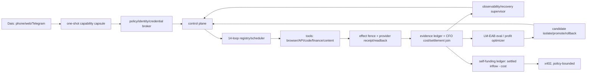

# Life Manager 統合SSOT — As-Is / To-Be / TODO

この文書は Life Manager 全体（Foundation 14ループ + Paid fulfillment）の唯一の入口。
詳細の正本は次の2つで、この文書は両者の統合・順序・現在cursorだけを持つ。

- Foundation/全体: `docs/superpowers/specs/2026-09-15-life-manager-agent-architecture-refinement.md`（Whole-ship handover / AGI addendum / Whole-ship remaining TODO）
- Paid: `docs/superpowers/specs/2026-09-22-paid-fulfillment-all-platforms-design.md` + `skills/earn/gig/TODO.md`（Canonical As-Is / To-Be snapshot）

所有: Claude が Foundation・Paid 両方の唯一の開発owner（2026-09-25 Dais指示）。旧2つのCodexセッションの保護境界は解除。Life Manager 自身のloopは引き続き本番stateのownerであり、Ryu room `18211957` への再送禁止と正式納品ボタン非押下は維持する。

## 1. 観測事実（2026-09-25 JST 実測）

| 項目 | 値 | 出所 |
|---|---|---|
| origin/main | `d4fe081993`（#5854） | `git log origin/main` |
| 本番loaded release | `d4fe0819931c50caaf41f25e86f1052cd8a0359c`（旧） | Foundation spec:6994 |
| Foundation branch | `fix/writer-admission-self-heal-20260924` `4bef60765c`、main比 0 behind / 224 ahead、open PRなし | `git rev-list` |
| Paid branch | `fix/coconala-history-retry-20260924` `5a28bfb762`、main比 10 behind / 126 ahead、PR #5868 `CONFLICTING` | `gh pr view 5868` |
| Foundation gate | `healthy=0, safely_fenced=1, uncovered_failure=13` | Foundation spec:6993 |
| ディスク空き | 561,643,520 bytes | `df -k /` |
| admission floor | Foundation 1,155,780,608 bytes / Paid 524,288 KiB（536,870,912 bytes） | Foundation spec:6612, Paid TODO |
| 検証済み settled net MRR | 存在しない | Foundation spec:5708 |

floor が2つあるのは矛盾。統合後は大きい方（1,155,780,608 bytes）を唯一のfloorとする。現在はそれを下回っている。

## 2. 2ブランチの統合方法

試験merge（`git merge-tree --write-tree`）の結果:

- main ← Foundation: 衝突なし（Foundation は main を含む）。
- Foundation × Paid の固有衝突は `runtime/loop/lm_loop.py` の1 hunk（`_admission_effect_unknown_occurrences` 付近）だけ。
- 残り10ファイルの衝突は Paid × main。原因は Paid の一部が #5854 で既に squash merge 済みであること（Freelancer/Upwork readiness・transport とその tests、`application_occurrence_reconcile.py`、`freelancer-actions.public.json`、Paid spec、gig TODO）。
- Paid の main 比の実コード差分は約600行（`paid_direct.py`、`application_occurrence_reconcile.py`、`gig_release.py`、`reconcile_paid_no_effect.py`、`lm_loop.py`、readiness/transport とそのtests）。

手順:

1. 最新 origin/main から `integrate/foundation-paid-20260925` を切る。
2. Foundation を merge する（fast-forward相当）。
3. Paid を merge し、衝突を次のように解く。
   - `lm_loop.py`: 両方残す。Paid の occurrence単位 dict を返す `_admission_effect_unknown_occurrences` と互換wrapper `_admission_effect_unknown_owners` を採用し、読み取りは Foundation の `_read_admission_rows` に寄せる。Foundation の `_legacy_pending_admission_identity` はそのまま残す。全呼び出し元を `rg` で確認する。
   - squash済み10ファイル: main 版を土台にし、#5854 以後の Paid commit（`a751a1f91f` account binding、`0acb25bb50` automatic-bid policy、`cb1cb48677` stale funded inventory 拒否、`a882779ead` receipt-reserve など）の差分だけを載せ直す。
   - Paid spec / gig TODO: Paid HEAD 版を採り、main 側にだけある Ryu receipt 追記を取り込む。
4. `runtime/loop/tests`、`skills/earn/gig/tests`、`skills/self/disk-cleanup/tests` を実行する。
5. 1つのPRにまとめ、#5868 は superseded として閉じる。admin merge する。
6. main から immutable release を1つ切り、label ごとに apply して readback する（release を切るだけでは label は切り替わらない）。

## 3. As-Is — 14ループ（Foundation spec:6939-6961）

Pass はライフサイクル上の投影で、settled revenue ではない。金額は記録があるものだけを載せる。

| # | ループ | Jobs/Pass/Blocked/Fail/無終端 | 主な境界 | 記録されたお金 |
|---|---|---|---|---|
| 1 | Affiliate | 6/1/2/0/0 | effect fence / FIFO | conversion・settled commission なし |
| 2 | Investment | 1/0/1/0/0 | 起動前の capacity admission | Alpaca 実験 net 約 **-$0.04** |
| 3 | Agent Economy | 19/1/9/4/4 | capacity/effect fence、旧entrypoint失敗 | settled x402 **0.003 USDC**、net は未証明 |
| 4 | Job Hunter | 7/1/5/1/0 | effect fence、inbox/runner失敗 | 新規 funded contract なし、Mercor **$0.00** |
| 5 | Fundraiser | 1/0/1/0/0 | effect fence | 資金 receipt なし |
| 6 | Connector | 1/0/0/1/0 | 旧release `entrypoint_exit_1`、`127.0.0.1:9222` 固定と Cloak IPv6 endpoint の不一致 | 収益源ではない |
| 7 | Self-Build | 4/1/3/0/0 | recovery/dev owner 失敗 | 収益源ではない |
| 8 | Mobile Apps | 22/13/6/1/2 | effect fence、metrics lane | 投稿はある。install→課金→MRR の紐付けは未完 |
| 9 | Capafy | 8/2/5/0/1 | effect/capacity | creator earnings は観測済み、paid-out **0** |
| 10 | CFO | 3/0/3/0/0 | message/payout の effect-unknown | 検証済み財務snapshotなし |
| 11 | Writer | 7/2/5/0/0 | capacity/effect/FIFO | 一部は公式readbackあり、支払いの帰属なし |
| 12 | Coconala | 7/3/1/3/0 | browser/Paid/Storefront の失敗と fence | Ryu は手動完了（収益の証明ではない） |
| 13 | CrowdWorks | 5/0/1/4/0 | entrypoint 143/1、effect_unknown（application 44、Paid 1、reply 201、report 1） | Paid 納品・支払い receipt なし |
| 14 | Lancers | 7/2/3/2/0 | fence、timeout、storefront/work-sync | 残高 **¥0**、funded 0件（過去の ¥150,000 は提案のみ） |

Paid 側の追加（Paid spec:27-45）: Freelancer・Upwork は account-bound auth も owner もない（Upwork `contracts=[]`）。`hf-gig-paid-direct` の直近の失敗は ENOSPC による `entrypoint_exit_1`（`effect_class=none`、外部送信なし）。

**As-Is の要約:** 検証済み純利益は実質 $0（+0.003 USDC、-$0.04）。14行中13行が uncovered failure。最大の共通原因は、ディスク不足と、修正が本番releaseに載っていないこと。

## 4. To-Be

- **各ループの完了の定義（全ループ共通）:** account-bound auth → source-complete な公式inventory → funded contract → policy receipt → owner がちょうど1つ → 正しい成果物 → occurrenceごとに effect は1回 → 公式receipt/readback → 支払い/payout readback → crash recovery → replay-zero。
- **ループの健康の定義:** 全行が `healthy` か、型付きの fence（安全な次アクションが記録済み）のどちらか。`unknown` は診断cursorであり、再送の許可ではない。
- **利益の定義:** ループごとに `settled_customer_revenue - refunds - measured cost`。CFO が provider receipt と照合して算出する。Pass やログは利益ではない。
- **役割分担:** model は提案する。identity・計算・dedupe・spend cap・rollback は決定的なコードが持つ。
- **Dais の手間:** 最初の bootstrap と、法的に必要な KYC/OAuth/CAPTCHA だけにする。
- **経済目標:** 検証済み net MRR USD 10K → 自己資金化 → YC W27 用の証拠 → AGI/UBI 研究。証拠なしに達成を主張しない。

## 5. TODO（実行順・正本）

順序変更の記録: 旧順序（Foundation spec:7092-7137）では、収益の帰属（旧9）が capsule（旧6）・cloud（旧7）・LM-EAB（旧8）の後だった。新順序では、ループごとの利益計測（新8）を capsule/cloud/LM-EAB より前に置く。理由は、利益が見えないと、どのループに資源を寄せるか・何を改善するかを判断できないため。Paid cursor は旧5の中身を新7として独立させた。

現在の cursor: **T2**

T1 完了記録（2026-09-25）: 空き 561,643,520 → 5,430,202,368 bytes（floor 1,155,780,608 以上）。削除したのは、clean かつ全 commit が remote にある worktree 38本（うち25本は owner=`codex` の lease が 2026-09-18 に期限切れ）と、どのプロセスも開いていない verify-loops-audit の loop-tmp（300MB）。state・memory・Codex の履歴は削除していない。
減り方は一定ではない。5分計測では純増 +456MB の区間もあった。6時間内の大きな書き込み元は `~/.codex-acct2`（thread_history 2.15GB、rollout 1.0GB）と loop-tmp の残骸。T2 で次の2点を入れる: floor 値を1つに統一するコード変更と、loop が終了時に自分の loop-tmp を掃除する処理。

| # | タスク | 完了の証拠 |
|---|---|---|
| T1 ✅ | ディスク floor を回復し、1つに統一する（1,155,780,608 bytes）。再生成可能な cache と governor allowlist を消し、大物（claudevm 約7G、colima 約2G）の要否を判断する | `df` と governor receipt が floor 以上 |
| T2 | §2 の手順で統合PRを作り、両tests を PASS させて main へ merge、#5868 を close | merge commit、tests の出力 |
| T3 | main 由来の immutable release を1つ切り、全labelへ apply して readback | label ごとの loaded sha = release sha |
| T4 | Connector の natural canary（Cloak endpoint の解決）を effect なしで1回 | 公式receipt、`entrypoint_exit` 0 |
| T5 | Codex なしの self-heal を1回実証 | 修復経路に Codex がないこと、readback、replay-zero |
| T6 | 14行の reconcile: 全行を healthy か型付き fence にする。effect_unknown は occurrence ごとに公式receiptで閉じ、一括retryはしない | gate `uncovered_failure=0` |
| T7 | Paid cursor: Coconala Paid の no-effect wake → Storefront の公式readback → CrowdWorks の fence → Lancers の inventory → Freelancer/Upwork の account-bound auth → Mercor | 各 provider の readback |
| T8 | CFO: ループごとの settled revenue と cost の join（ループ別P&L）を毎日出す | P&L 行ごとに receipt id がある |
| T9 | Mobile funnel と `/en` `/lm` `/income` の整合（install→activation→課金） | attribution receipt |
| T10 | one-shot capability capsule | 目標・承認の質問なしで初回の実行が通る |
| T11 | cloud の durable worker と local の parity | 同じ task で同じ receipt |
| T12 | evaluator が所有する self-improvement（rollback つき） | canary で settled contribution が改善 |
| T13 | settled cost で裏付けた x402 自己資金化 | inflow ≥ cost の CFO readback |
| T14 | LM-EAB（held-out、較正、再現可能） | 独立した再実行で同じ結果 |
| T15 | 検証済み USD 10K MRR → YC W27 の証拠 → cross-domain / AGI / UBI | receipt の集計 |

## 6. 不変の制約

- Ryu room `18211957` へは再送しない。正式納品ボタンは loop から押さない。Ryu は CDP :9223 での手動例外として扱う。
- `unknown` / `effect_unknown` / `circuit_open` / `wake_boundary_failed` は再送の許可ではない。
- `launchctl` の変更は `bin/launchctl-safe` 経由だけで行う。
