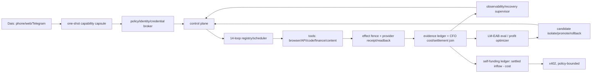

# Life Manager 統合SSOT — As-Is / To-Be / TODO

この文書は Life Manager 全体（Foundation 14ループ + Paid fulfillment）の唯一の入口。
詳細の正本は次の2つで、この文書は両者の統合・順序・現在cursorだけを持つ。

- Foundation/全体: `docs/superpowers/specs/2026-09-15-life-manager-agent-architecture-refinement.md`（Whole-ship handover / AGI addendum / Whole-ship remaining TODO）
- Paid: `docs/superpowers/specs/2026-09-22-paid-fulfillment-all-platforms-design.md` + `skills/earn/gig/TODO.md`（Canonical As-Is / To-Be snapshot）

所有: Claude が Foundation・Paid 両方の唯一の開発owner（2026-09-25 Dais指示）。旧2つのCodexセッションの保護境界は解除。Life Manager 自身のloopは引き続き本番stateのownerであり、Ryu room `18211957` への再送禁止と正式納品ボタン非押下は維持する。

## 0. 原則: No human in loop

Life Manager はアシスタントではなくマネージャー。Grok bot、Muse、Instinct と同じく、自分でコンピュータとブラウザを使い、仕事を最後まで完結させる。**人（Dais を含む）に作業や判断を頼むことは、設計違反として扱う。**
- 応募・承諾・制作・納品・入金確認・修復・改善は、すべて Life Manager の loop が行う。
- 人に頼るのは、法律上どうしても本人が必要なものだけ（初回の KYC、本人確認など）。それも最初の1回に限る（T10）。
- 判断は model が提案し、決定的な policy（金額、契約条件の一致、上限、重複防止、rollback）が確定させる。
- 外部の coding agent（Claude Code、Codex のセッション）も同じく「人」の側。Life Manager が自分で直せるようになること（§5.1）が目標。

## 1. 観測事実（2026-09-25 JST 実測）

| 項目 | 値 | 出所 |
|---|---|---|
| origin/main | `d4fe081993`（#5854） | `git log origin/main` |
| 本番loaded release | `d4fe0819931c50caaf41f25e86f1052cd8a0359c`（旧） | Foundation spec:6994 |
| Foundation branch | `fix/writer-admission-self-heal-20260924` `4bef60765c`、main比 0 behind / 224 ahead、open PRなし | `git rev-list` |
| Paid branch | `fix/coconala-history-retry-20260924` `5a28bfb762`、main比 10 behind / 126 ahead、PR #5868 `CONFLICTING` | `gh pr view 5868` |
| Foundation gate | `healthy=0, safely_fenced=1, uncovered_failure=13` | Foundation spec:6993 |
| ディスク空き | 561,643,520 bytes | `df -k /` |
| admission floor | Foundation 1,155,780,608 bytes / Paid 524,288 KiB（536,870,912 bytes） | Foundation spec:6612, Paid TODO |
| 検証済み settled net MRR | 存在しない | Foundation spec:5708 |

訂正（T2で確認）: コード上の floor は既に1つ。`runtime/host/disk_admission.py:16` と `skills/earn/gig/scripts/gig_disk_guard.py` の `DEFAULT_REQUIRED_KIB = 524288` がすべての producer に効いている。1,155,780,608 bytes は Foundation spec が release 昇格の運用目標として使う値で、コード定数ではない。どちらも同じ値にする必要はないので、コード変更はしない。

## 2. 2ブランチの統合方法

試験merge（`git merge-tree --write-tree`）の結果:

- main ← Foundation: 衝突なし（Foundation は main を含む）。
- Foundation × Paid の固有衝突は `runtime/loop/lm_loop.py` の1 hunk（`_admission_effect_unknown_occurrences` 付近）だけ。
- 残り10ファイルの衝突は Paid × main。原因は Paid の一部が #5854 で既に squash merge 済みであること（Freelancer/Upwork readiness・transport とその tests、`application_occurrence_reconcile.py`、`freelancer-actions.public.json`、Paid spec、gig TODO）。
- Paid の main 比の実コード差分は約600行（`paid_direct.py`、`application_occurrence_reconcile.py`、`gig_release.py`、`reconcile_paid_no_effect.py`、`lm_loop.py`、readiness/transport とそのtests）。

手順:

1. 最新 origin/main から `integrate/foundation-paid-20260925` を切る。
2. Foundation を merge する（fast-forward相当）。
3. Paid を merge し、衝突を次のように解く。
   - `lm_loop.py`: 両方残す。Paid の occurrence単位 dict を返す `_admission_effect_unknown_occurrences` と互換wrapper `_admission_effect_unknown_owners` を採用し、読み取りは Foundation の `_read_admission_rows` に寄せる。Foundation の `_legacy_pending_admission_identity` はそのまま残す。全呼び出し元を `rg` で確認する。
   - squash済み10ファイル: main 版を土台にし、#5854 以後の Paid commit（`a751a1f91f` account binding、`0acb25bb50` automatic-bid policy、`cb1cb48677` stale funded inventory 拒否、`a882779ead` receipt-reserve など）の差分だけを載せ直す。
   - Paid spec / gig TODO: Paid HEAD 版を採り、main 側にだけある Ryu receipt 追記を取り込む。
4. `runtime/loop/tests`、`skills/earn/gig/tests`、`skills/self/disk-cleanup/tests` を実行する。
5. 1つのPRにまとめ、#5868 は superseded として閉じる。admin merge する。
6. main から immutable release を1つ切り、label ごとに apply して readback する（release を切るだけでは label は切り替わらない）。

## 3. As-Is — 14ループ（Foundation spec:6939-6961）

Pass はライフサイクル上の投影で、settled revenue ではない。金額は記録があるものだけを載せる。

| # | ループ | Jobs/Pass/Blocked/Fail/無終端 | 主な境界 | 記録されたお金 |
|---|---|---|---|---|
| 1 | Affiliate | 6/1/2/0/0 | effect fence / FIFO | conversion・settled commission なし |
| 2 | Investment | 1/0/1/0/0 | 起動前の capacity admission | Alpaca 実験 net 約 **-$0.04** |
| 3 | Agent Economy | 19/1/9/4/4 | capacity/effect fence、旧entrypoint失敗 | settled x402 **0.003 USDC**、net は未証明 |
| 4 | Job Hunter | 7/1/5/1/0 | effect fence、inbox/runner失敗 | 新規 funded contract なし、Mercor **$0.00** |
| 5 | Fundraiser | 1/0/1/0/0 | effect fence | 資金 receipt なし |
| 6 | Connector | 1/0/0/1/0 | 旧release `entrypoint_exit_1`、`127.0.0.1:9222` 固定と Cloak IPv6 endpoint の不一致 | 収益源ではない |
| 7 | Self-Build | 4/1/3/0/0 | recovery/dev owner 失敗 | 収益源ではない |
| 8 | Mobile Apps | 22/13/6/1/2 | effect fence、metrics lane | 投稿はある。install→課金→MRR の紐付けは未完 |
| 9 | Capafy | 8/2/5/0/1 | effect/capacity | creator earnings は観測済み、paid-out **0** |
| 10 | CFO | 3/0/3/0/0 | message/payout の effect-unknown | 検証済み財務snapshotなし |
| 11 | Writer | 7/2/5/0/0 | capacity/effect/FIFO | 一部は公式readbackあり、支払いの帰属なし |
| 12 | Coconala | 7/3/1/3/0 | browser/Paid/Storefront の失敗と fence | Ryu は手動完了（収益の証明ではない） |
| 13 | CrowdWorks | 5/0/1/4/0 | entrypoint 143/1、effect_unknown（application 44、Paid 1、reply 201、report 1） | Paid 納品・支払い receipt なし |
| 14 | Lancers | 7/2/3/2/0 | fence、timeout、storefront/work-sync | 残高 **¥0**、funded 0件（過去の ¥150,000 は提案のみ） |

Paid 側の追加（Paid spec:27-45）: Freelancer・Upwork は account-bound auth も owner もない（Upwork `contracts=[]`）。`hf-gig-paid-direct` の直近の失敗は ENOSPC による `entrypoint_exit_1`（`effect_class=none`、外部送信なし）。

**As-Is の要約:** 検証済み純利益は実質 $0（+0.003 USDC、-$0.04）。14行中13行が uncovered failure。最大の共通原因は、ディスク不足と、修正が本番releaseに載っていないこと。

## 4. To-Be

- **各ループの完了の定義（全ループ共通）:** account-bound auth → source-complete な公式inventory → funded contract → policy receipt → owner がちょうど1つ → 正しい成果物 → occurrenceごとに effect は1回 → 公式receipt/readback → 支払い/payout readback → crash recovery → replay-zero。
- **ループの健康の定義:** 全行が `healthy` か、型付きの fence（安全な次アクションが記録済み）のどちらか。`unknown` は診断cursorであり、再送の許可ではない。
- **利益の定義:** ループごとに `settled_customer_revenue - refunds - measured cost`。CFO が provider receipt と照合して算出する。Pass やログは利益ではない。
- **役割分担:** model は提案する。identity・計算・dedupe・spend cap・rollback は決定的なコードが持つ。
- **Dais の手間:** 最初の bootstrap と、法的に必要な KYC/OAuth/CAPTCHA だけにする。
- **経済目標:** 検証済み net MRR USD 10K → 自己資金化 → YC W27 用の証拠 → AGI/UBI 研究。証拠なしに達成を主張しない。

## 5. TODO（実行順・正本）

順序変更の記録: 旧順序（Foundation spec:7092-7137）では、収益の帰属（旧9）が capsule（旧6）・cloud（旧7）・LM-EAB（旧8）の後だった。新順序では、ループごとの利益計測（新8）を capsule/cloud/LM-EAB より前に置く。理由は、利益が見えないと、どのループに資源を寄せるか・何を改善するかを判断できないため。Paid cursor は旧5の中身を新7として独立させた。

現在の cursor: **7-0（Lancers 5605912、Dais の承諾待ち）と 5-11 / 5-12 を並行**

T5 の途中経過（2026-09-25 19:00 JST）:
- 観測1: `life-manager-recovery-supervisor` は release 287d で毎 wake exit 1 になっていた。原因は、旧 release の intent を正しく `blocked: release_sha_mismatch` にした結果まで失敗として数えていたこと。#5879 で、この理由の blocked は exit 0 にした。他の理由の blocked は今までどおり exit 1。
- 観測2: 287d を全体へ再 apply したら `admission rebind refused: effect_unknown` で fleet 全体が中止された。#5880 で、fleet モードではその owner だけを `skipped: effect-unknown-fence` として続行するようにした。target 指定の apply では今までどおり raise する。
- 本番: release `20260925T185507-74c69d01` を全体へ適用した（適用136、admission 待ち30、実行中2、fence で skip 1 = `hf-gig-apply-direct`、失敗0）。
- 未達: 過去の `repaired` 11件は、どれも `before_event_id == after_event_id` かつ `command_exit_code=None` だった。readback で既に healthy だったので閉じただけで、修復操作はしていない。T5 の完了には、executor が `lm-loop reconcile ... --max-owners 1` を実行し（exit 0）、修復後の readback が healthy になる outcome が1件必要。
- supervisor は FIFO で1 wake（60秒）ごとに1件しか処理せず、未処理 intent が約200件ある。手動で回すと Codex-free の条件を崩すので、自然処理を待つ。
- 22:17 JST の判定: #5883（古い release の依頼を1 wake でまとめて閉じる）で、未処理は 571件 → 42件まで減り、現行 release の依頼が executor に届くようになった。実際に `lm-loop reconcile` が exit 0 で実行された（agent-economy-loop、franklin-loop、hf-gig-apply-reconcile）。
  - それでも、60分間の監視で本物の `repaired` は0件だった（修復後の PASS 待ち 2412回、古い依頼の close 118件）。
  - 理由は設計上の穴。自己修復の操作は reconcile（owner を現行 release へ付け直す）だけで、全体へ適用した後の失敗はコードや環境が原因なので、付け直しでは直らない。release ずれの owner（30件）は admission 待ちで付け直しが拒否される。長時間動く loop は終了の時点が来ない。
  - T5 の次の手: escalate → `guarded_code_repair`（Life Manager 自身の開発 loop）で1件をコード修復させる。最初の候補は `hf-gig-apply-reconcile` の exit 1（effect なし）。
  - 22:30 JST の #5886（self-heal の agent を Claude に変更）は T5 の誤読で、revert した。Life Manager の内部モデルは GPT（terra/luna/sol）のまま使う。§5.1 を参照。
  - 11:25 の dev 実行の失敗原因: Codex の agent が tests を回して `lm-test-tmp.*` を worktree 内に残し、preflight が許可リスト外の変更として RED にした。Claude に切り替えて Bash を無くしたので、agent は tests を回さず、この問題は起きない。
  - 解消済みの self-heal issue 11件を close した（connector: 5872/5870/5836、supervisor: 5869/5867/5866/5864/5863/5860/5856/5850）。
  - T5 の残り: 04:10 JST の `life-manager-dev` の自然起動で、Claude agent が open な self-heal issue を修正する。その後 PR → merge guard → release → 対象 owner の次の実行が PASS、となることを readback で確認する。
  - 制約: dev agent が触れるのは `apps/life-manager` と `runtime/loop` だけ（issue #5130）。gig 系のコード（例: `hf-gig-apply-reconcile`）は対象外。

T4 完了記録（2026-09-25）: `life-manager-connector-native` が release `287d913c` の上で自然起動し、PASS した。run `18d886ebca7142c8-54861`、18:41 JST、exit 0、`last_terminal_result=pass`、heartbeat は `worker_finished`、wake の status は `applied_bundle`、blocker なし。
その直前の旧 release での起動（18:02）は `worker_failed` / `circuit_open` / `wake_boundary_failed` だった。
注意点が1つ残る。`127.0.0.1:9222` は Dais の Google Chrome（pid 465）が使っており、daily-driver は `[::1]:9222` で待ち受けている。新しいコードは IPv6 経由の recovery でこれを回避している。人間用のブラウザなので、Chrome 側は変更しない。

T3 完了記録（2026-09-25）: main の `287d913c1c`（#5875）から release `~/loops/releases/20260925T180341-287d913c` を切り、`~/loops/current` をそこへ向けた。
続けて `lm-loop apply --all` を実行した（rc=0、全260件）。結果は適用138、退役済み91、admission 待ちで skip 29、実行中で skip 2、失敗0。
1回目は `production apply is already owned` で拒否された。release-reconciler が同時に apply していたためで、lock が外れた後に再実行した。
readback: release を参照する plist 169本中140本が新 release を指している。残り29本は admission 待ちで skip された分で、admission queue が空いたら再適用する（T6）。
foundation gate（新 release の status 271行で算出）: `healthy=0, safely_fenced=4, uncovered_failure=10`（旧は 1/13）。
- safely_fenced の4つ: affiliate と cfo は `external_effect_unknown`、investment と fundraiser は `runtime_admission_deferred`。
- uncovered_failure の10はすべて `runtime_release_drift`。14ループの98 job のうち93は新 release で install 済みで、53は新 release 上の event がある。40は新 release で自然実行がまだ来ていない。5は admission 待ちで旧 release のまま。

T2 完了記録（2026-09-25）: branch `integrate/foundation-paid-20260925` を作り、main ← Foundation（衝突なし）← Paid ← この docs branch の順に merge した。
Paid と main が衝突した10ファイルは、main 側の blob が Paid の過去の commit と完全に一致したので Paid 側を採用した。
`lm_loop.py` は Paid の occurrence 単位の関数を採用しつつ、読み取りを `_read_admission_rows` 経由にした。こうすると DB が lock されていても fence が0件とは報告されない（fail-closed）。Paid の元の `except sqlite3.Error: return {}` は fail-open で、Foundation の test `test_effect_fence_read_does_not_turn_sqlite_lock_into_empty_fence_set` を落とす。
検証: `runtime/loop/tests` 693件 PASS、`skills/earn/gig/tests` と `skills/self/disk-cleanup/tests` 1598件 PASS、`bin/lm-loop-contract` の errors は []。

T1 完了記録（2026-09-25）: 空き 561,643,520 → 5,430,202,368 bytes（floor 1,155,780,608 以上）。削除したのは、clean かつ全 commit が remote にある worktree 38本（うち25本は owner=`codex` の lease が 2026-09-18 に期限切れ）と、どのプロセスも開いていない verify-loops-audit の loop-tmp（300MB）。state・memory・Codex の履歴は削除していない。
減り方は一定ではない。5分計測では純増 +456MB の区間もあった。6時間内の大きな書き込み元は `~/.codex-acct2`（thread_history 2.15GB、rollout 1.0GB）と loop-tmp の残骸。loop が終了時に自分の loop-tmp を掃除する処理は T6 で扱う。

| # | タスク | 完了の証拠 |
|---|---|---|
| T1 ✅ | ディスク floor を回復し、1つに統一する（1,155,780,608 bytes）。再生成可能な cache と governor allowlist を消し、大物（claudevm 約7G、colima 約2G）の要否を判断する | `df` と governor receipt が floor 以上 |
| T2 ✅ | §2 の手順で統合PRを作り、両tests を PASS させて main へ merge、#5868 を close | merge commit、tests の出力 |
| T3 ✅ | main 由来の immutable release を1つ切り、全labelへ apply して readback | label ごとの loaded sha = release sha |
| T4 ✅ | Connector の natural canary（Cloak endpoint の解決）を effect なしで1回 | 公式receipt、`entrypoint_exit` 0 |
| T5 | 自己修復を1回実証する（外部の coding agent なしで、Life Manager が自分の問題を見つけて自分で直す。定義は §5.1） | §5.1 の完了証拠 |
| T6 | 14行の reconcile: 全行を healthy か型付き fence にする。effect_unknown は occurrence ごとに公式receiptで閉じ、一括retryはしない | gate `uncovered_failure=0` |

T6 の途中経過（2026-09-25 22:55 JST、release `20260925T224024-beae3e37`）:
- gate は `uncovered_failure=10, safely_fenced=4`。10件はすべて `runtime_release_drift`。原因は今日 release を何度も切ったこと。新しい release を切らずに約24時間置けば、1日1回の job が現行 release で1回ずつ動き、自然に解消する。**release を凍結する**（例外は本物のバグ修正だけ）。
- 現行 release 上の本物の失敗は8件。
  - `life-manager-daily-driver`: 以前の owner run が残した孤児の Chromium（pid 37260、ppid 1）が profile を握っていた。そのため2回目の起動が exit 0 で抜けて `Failed to launch` になり、再起動を繰り返していた（launchd.err.log は 96MB）。#5889 で「生きている owner を引き取る」ようにした。22:52 に `adopted live profile owner pid=37260` を確認し、`loaded-running`・エラーなしになった。
  - Lancers negotiate/paid と CrowdWorks reply: 共有ブラウザの接続失敗（`browser_connect_failed` / goto timeout）で、daily-driver 停止の連鎖。次の自然実行で回復するかを確認する。
  - `job-search-inbox`: `inbox.py:398`。model の申告件数と thread ID の数が食い違った時に安全側で止まる、意図された fail-closed。二重返信を防ぐための仕組みで、test でも固定されているので変更しない。
  - Instagram en-card / obou: `LM_DATA_DIR is required` と ledger の job id 衝突。obou の Instagram は `marketing-destinations.json` で `ebook_account_out_of_mobile_scope`（上限 0）なので、直すより退役させる候補。state root が共有 events.jsonl のため、run 単位の切り分けは未完。
  - `life-manager-honne-ja`: 昼の ENOSPC（空きが 0.56GB だった時点）による。publish は fence で止まっていた。
| T7 | Paid cursor: Coconala Paid の no-effect wake → Storefront の公式readback → CrowdWorks の fence → Lancers の inventory → Freelancer/Upwork の account-bound auth → Mercor | 各 provider の readback |
| T8 | CFO: ループごとの settled revenue と cost の join（ループ別P&L）を毎日出す | P&L 行ごとに receipt id がある |
| T9 | Mobile funnel と `/en` `/lm` `/income` の整合（install→activation→課金） | attribution receipt |
| T10 | one-shot capability capsule | 目標・承認の質問なしで初回の実行が通る |
| T11 | cloud の durable worker と local の parity | 同じ task で同じ receipt |
| T12 | evaluator が所有する self-improvement（rollback つき） | canary で settled contribution が改善 |
| T13 | settled cost で裏付けた x402 自己資金化 | inflow ≥ cost の CFO readback |
| T14 | LM-EAB（held-out、較正、再現可能） | 独立した再実行で同じ結果 |
| T15 | 検証済み USD 10K MRR → YC W27 の証拠 → cross-domain / AGI / UBI | receipt の集計 |

### 5.1 自己修復・自己改善の定義（T5 / T12 の正本）

**目的**: Life Manager が、外部の coding agent（Dais が操作する Claude Code や Codex のセッション）にも人にも頼らず、自分の問題を見つけて、自分で直し、自分で改善すること。人と外部 agent はループの外にいる。

**使うもの / 使わないもの**
- 使う: Life Manager 自身のモデル（GPT-5.6 terra / luna / sol。`runtime/agent-runner/config.json` の route）。これは Life Manager の脳なので変えない。
- 使わない: Life Manager の外にいる coding agent のセッション。今 Claude Code がやっている「問題を見つけて直す」作業を、Life Manager 自身が行う。

**自己修復の流れ**（すべて Life Manager の内部で完結する）
1. 検知: loop の terminal event（`fail` / `entrypoint_exit_*`）が出る。
2. 分類: `lm-loop-run` が recovery intent を作る（`runtime/loop/recovery-intent-cli.mjs`）。
3. 軽い修復: supervisor（`life-manager-recovery-supervisor`）が `lm-loop reconcile` で owner を現行 release に付け直す。
4. コード修復: 3 で直らなければ escalate し、bridge が `lm:type:self-heal` の issue を作る。Life Manager の開発 loop（`life-manager-dev`）が、自分のモデルで修正を書く。
5. 検証: d0 の preflight → tests/evals → PR → merge guard → merge。
6. 反映: main から immutable release を切り、対象 owner に apply する。
7. 確認: 対象 owner の次の自然実行が PASS し、同じ occurrence の replay が0件であることを readback で確かめる。

**T5 の完了証拠**: 1件の実際の失敗について、上の 1〜7 がすべて Life Manager の内部だけで完了したこと。run_id、intent_id、issue、PR、release_sha、PASS した run_id を記録する。この間、外部 agent による編集や手動 apply が1回もないこと。

**自己改善（T12）**: 同じ流れを、失敗ではなく成果指標（ループ別の settled 利益、T8）の悪化や改善の余地をきっかけに回す。評価器と rollback は Life Manager の内部に置き、候補の変更は evaluator・権限・fence・spend cap を変えられない。

**今わかっている穴**（2026-09-26 時点）
- 4 の修復範囲が狭い: dev agent は `apps/life-manager` と `runtime/loop` しか編集できない。修復対象の多くは `skills/` 配下にある（issue #5130）。
- 4 の agent が route の制限時間（900秒）で timeout している（issue #5900、#5902）。
- 06:29 の run では、agent が編集禁止の recovery 制御系を編集し、preflight に拒否された（issue #5897）。
- 5→6 の release 切りと apply が自動で連結しているか、未確認。

### 5.2 Atomic TODO（実行順の正本。1行 = 1つの検証可能な作業）

2026-09-26 時点。[x] は完了証拠あり、[ ] は未完了。

**統合（旧 Codex 2セッション）**
- [x] Foundation `fix/writer-admission-self-heal-20260924`（`4bef60765c`）は main に含まれている（#5875）
- [x] Paid `fix/coconala-history-retry-20260924`（`5a28bfb762`）は main に含まれている（#5875。#5868 は merged 扱い）
- [x] handover docs `docs/full-ship-handover-20260925` は main に含まれている

**T5 自己修復（§5.1）**
- [x] 5-1 supervisor: 旧 release の intent を blocked にしても exit 0（#5879）
- [x] 5-2 fleet apply: effect fence のある owner だけ skip して続行（#5880）
- [x] 5-3 supervisor: 旧 release の intent を1 wake でまとめて close（#5883）
- [x] 5-4 `.py` の entrypoint を runtime Python 3.14 で起動（#5904）
- [x] 5-5 #5886 を revert し、self-heal のモデルを GPT に戻す（#5905）
- [x] 5-6 #5904 と #5905 を含む release を全体に apply し、readback した（release `387c0689`、適用139、失敗0、self-heal のモデルは `gpt-5.6-terra`）。`hf-gig-apply-reconcile` は、queue に effect なしの予約が22件あって付け替えが永遠に保留されるデッドロックだったので、#5908 で `reconcile_queued_release` を付けた。10:52 に reconciler が release `d5367f57` へ付け替えた
- [x] 5-7 `hf-gig-apply-reconcile` が release `d5367f57` で PASS した（run `18d8bc08bdb98b10-58940`、exit 0）。StrEnum の ImportError は解消。※ 外部 agent が直した結果なので、T5 の完了証拠にはしない
- [x] 5-8 **（順序変更: 旧 5-11 を先に行う）昇格経路の実装。** 現状、`runtime/loop/recovery-class.cjs` の `RECOVERY_PROMOTION_POLICY` は全クラスが `runtime_path: "unbound"` なので、`evaluateRecoveryPromotion` は常に不適格を返し、修復 PR は1件も自動 merge されない（意図された fail-closed）。まず effect なしの `deterministic` クラスだけを開ける。細目: → **完了**: #5916（3回の独立レビュー: DO-NOT-MERGE → MERGE-WITH-FIXES → MERGE）と #5917（凍結時の Telegram 通知）。release `ee283321` を全体に apply 済み（適用137、失敗0）
  - [x] 5-8a 昇格 executor の仕様を決める。merge 済み main → immutable release を切る → 対象 owner だけに apply（isolated canary）→ 対象 owner の次の terminal が新 sha で pass（exact health）→ fail なら対象 owner を直前の release に戻す（rollback）
  - [x] 5-8b 既存の部品（`bin/cut-loop-release.sh`、`LIFE_MANAGER_APPLY_TARGET` を指定した apply、`lm-loop status`）で 5-8a を実装し、4つの hook の結果を記録する
  - [x] 5-8c `deterministic` だけを `runtime_path: "loop_runtime"` にする。4つの hook がすべて true の時だけ、merge guard が適格と判定する。test 付き
  - [x] 5-8d merge guard が merge した直後に、5-8b の executor が自動で呼ばれるようにする（人の手なし）
- [x] 5-9 d0 の prompt と preflight で、編集禁止のパスを最初に agent へ渡す（#5897 の拒否を防ぐ） → **完了**: #5918 で prompt に merge guard の `GUARD_SELF_PATHS` を埋め込んだ
- [x] 5-10 dev agent の timeout（900秒）を実測に基づいて見直す（#5900、#5902） → timeout は3回とも Claude route（#5886）の期間だった。GPT の 11:25 の run は約1分で完了していた。#5905 で GPT に戻したので、制限時間は変えず、次の自然実行で確認する
- [x] 5-11 dev agent の編集範囲を、失敗した owner の entrypoint のディレクトリまで広げた（#5924）。1回目のレビューで BLOCKER（effect なしの owner を名目に、同じ `skills/earn/` 内のお金・送信・公開のコードを無人 merge できる）が見つかり、`skills/earn/` を除外し、effect 付きの owner と共有するディレクトリも除外した。現在、範囲を持つのは `founder-loop-cadence`（`skills/self/founder-loop/`）の1件だけ
- [ ] 5-11b 収益系（`skills/earn/`）のコードの自己修復。effect ごとの安全策（effect fence、canary、公式 readback）を持つ別の昇格経路が必要。T7 の各 Paid owner が安定した後に着手する
- [ ] 5-12 自然発生した1件の失敗（deterministic クラス）で、§5.1 の 1〜7 を完走させ、run_id / intent_id / issue / PR / release_sha / PASS run_id を記録する。既知の穴: supervisor は旧 release で作られた intent を「無効」として閉じるので、release がずれた owner は supervisor では付け替わらない（担当は release-reconciler と `reconcile_queued_release`）

順序変更の記録（2026-09-26）: 旧順序は 5-8 範囲 → 5-9 prompt → 5-10 timeout → 5-11 連結確認 → 5-12 実証。新順序は 5-8 昇格経路 → 5-9 → 5-10 → 5-11 範囲 → 5-12。理由: 昇格経路が閉じている限り、範囲を広げても修復は1件も本番に届かない。現在の cursor は 5-8a。

**T6 14ループ**
- [x] 6-1 daily-driver: 生きている Chromium を引き取る（#5889、22:52 に readback 済み）
- [~] 6-2 Lancers paid は release `387c0689` で pass（11:41）。negotiate は旧 release `287d913c` のまま fail で、`admission_effect_unknown` のため `official_readback_required`。7-7 で扱う
- [~] 6-3 CrowdWorks reply は失敗ではなく typed fence（`blocked`、exit 75、`host_admission_deferred:resource_heartbeat_unavailable`、`admission_effect_unknown`）。7-6 で扱う
- [x] 6-4 Instagram obou を退役させた（#5913）。本番の plist が削除されたことを確認した（release `ee283321`）
- [ ] 6-5 Instagram en-card: `LM_DATA_DIR is required` と ledger の job id 衝突を run 単位で切り分けて直す
- [x] 6-6 honne-ja は release `beae3e37` で pass（exit 0）
- [ ] 6-7 job-search-inbox: 意図された fail-closed。typed fence として分類し、次の実行を readback する
- [ ] 6-8 pending-admission の owner 約26件: admission が空いた後に apply し、readback する
- [ ] 6-9 loop が終了時に自分の loop-tmp を掃除する（central sweeper の allowlist 問題）
- [ ] 6-9b ディスクが再び満杯になった。2026-09-27 に `hf-gig-apply-reconcile` の stderr で `[Errno 28] No space left on device` が連続し、空きは0〜4.1GB で上下している。何が書き込んでいるかを測り、floor を守る
- [ ] 6-10 release を約24時間凍結し、drift が消えた状態で gate を測り直す（目標 `uncovered_failure=0`）

**T7 Paid（Paid spec の順番。Ryu room 18211957 には触らない）**
- [x] 7-1 loop hardening の merge / release（#5875 → 以後の release）
- [x] 7-2 disk admission floor の回復（T1）
- [x] 7-3 Coconala Paid の effect なし wake / readback（`hf-gig-paid-direct`、run `18d89490bd4cc678-27339`、pass、release `beae3e37`）
- [ ] **7-0 Lancers 案件 5605912（順序変更で最優先）**。Life Manager の応募 loop が自力で応募し（proposal `27969614`、`application_verified: true`）、2026-09-25 にクライアントに採用された。題名は「【継続1件2,000円〜】観光・お出かけのお得術に関する Instagram 用フィード画像作成」。現在は Lancers の段階 (4) 発注者決定。
  - [x] 7-0a **Life Manager が自分で承諾した**（2026-09-26 23:42 JST）。公式の証拠は Lancers のメール「プロジェクトの承諾を受け付けました」（Gmail thread 1a0de2ac486336de）。承諾した条件は ¥300（固定）・納期 2026-09-30・proposal 27969614 で、提案と一致した。ここまでに外した壁: fence（#5930/#5951）、CDP 接続の競合（#5932）、heartbeat（#5941）、描画待ち（#5937）、404 の提案（#5938）、全件スキャン（#5943）、ダイアログの競合（#5953）、スレッドの競合（#5956/#5961）、二重の接続（#5958）、readback の仮払い待ち（#5963）
  - [x] 7-0a の readback 修正: 仮払い待ちの案件は「作業中」タブに出ない。全提案一覧を読むように変えた（#5965）
  - [ ] 7-0a' 応募 loop の価格設定の見直し。案件名は「1件2000円〜」なのに、提案は ¥300 だった
  - [ ] 7-0b 仮払い（funded）を公式画面で readback する
  - [ ] 7-0c 制作と納品: Instagram 用フィード画像。Life Manager のどの loop が制作できるかを確認する
  - [ ] 7-0d 検収と入金（payout）を公式に readback する
  - [ ] 7-0e 承諾 → 仮払い確認 → 制作 → 納品 → 入金確認を、Lancers の Paid owner（`skills/earn/lancers/scripts/paid-owner`）で1本につなぐ。この案件から Life Manager が自分で完走する
順序変更の記録（2026-09-26）: T7 の旧順序は 7-4 Coconala Storefront が先頭だった。新順序は 7-0 Lancers 5605912 を先頭にする。理由: 採用済みで、入金に最も近いため。
- [~] 7-4 Coconala Storefront: 旧 occurrence `18d8852fe62527e0-18841` は pre-effect proof で閉じた（#5928）。新しい fence `18d8d288748508e8-23902` が残っている。mutation の前に `official_service_contract_invalid` で失敗しており、effect はない（推論。根拠は `storefront_direct.py` の catalog 読み取りが `mutation_attempted` より前にあること）
  - [ ] 7-4b `storefront_pre_effect_reconcile.py` が `runtime_event_shape_invalid` で拒否する。原因: storefront の wake は、前の occurrence の report を次の wake の run_id で出すので、run_id で探すと別 occurrence の pass を拾う。terminal を occurrence_id で探すように直す
- [ ] 7-5 Coconala Apply の occurrence `hf-gig-apply-direct:18d88651ee0bf088-46308`（effect_unknown）を公式 readback で閉じる。`hf-gig-apply-reconcile` は毎回 `one_to_one_occurrence_intent_mapping_not_present` で何もしない（2026-09-27 実測）。occurrence と intent の対応付けを直す
- [~] 7-6 CrowdWorks の fence: reply 562件中497件、application 14件中13件を公式 readback で閉じた（lm-crowdworks）。残り: application 1（本物の応募）、Paid 4、reply 67、report 1
  - [ ] 7-6b reply が thread 305321876 で毎 wake `crowdworks_contract_ownership_unknown` になり、新しい fence を作り続けている。修正 PR #5967（lm-crowdworks、review 中）
  - [ ] 7-6c `crowdworks-revenue-application` が 09-26 09:10 から0回しか実行されていない（84 wake すべて `resource_capacity_busy` / `fifo_wait`、569件待ち）。admission の capacity 配分を直す（lm-lead）
- [ ] 7-7 Lancers の funded inventory を確認する（現状は残高 ¥0、funded 0件）
- [ ] 7-8 Freelancer: account-bound auth → inventory → funded project
- [ ] 7-9 Upwork: account-bound auth → inventory → funded contract
- [ ] 7-10 Mercor: inventory を確認する（現状 $0.00）
- [ ] 7-11 crash recovery を確認する
- [ ] 7-12 replay-zero を確認する

**並行 session の発見（2026-09-26、agmsg team `lm`）**
- `lm-invest`（#5944）: 手数料込みの net で評価した。Polymarket の「本命に賭ける 24h」は n=148、1取引あたり平均 -10.4%、95%CI [-19.7%, -1.1%]（統計的にマイナス）。Hyperliquid の tsmom_24h は n=895、平均 -0.21%、CI [-0.48%, +0.06%]（有意差なし）。どちらも paper の段階へは進めない。Alpaca は 2026-09-25T15:31Z 以降、exit 75（`resource_effect_unknown`）で止まっている。Polymarket の bundle_arb と market_maker は 607/607 回が認証エラー（gamma /login 401）
- `lm-cfo`（`skills/cfo/loop_pnl.py`）: 14行のループ別損益を出力できた。Stripe は本番用の key が無く未検証。**Coconala と CrowdWorks には入金の ledger が無い**（`marketplace-ledger.sqlite3` は 0 byte、入金の readback はどこにも無い）
- `lm-crowdworks`: 公式の readback で、固定報酬の契約が10件（どれも12円のテスト用）、未出金 10円、**出金先の銀行口座が未登録**
- [ ] 7-13 各プラットフォームの入金・出金の公式 readback を、CFO の ledger に書き込む（今まで一度も存在しなかった）
- [ ] 10-0 出金先の銀行口座の登録（CrowdWorks ほか）。**Life Manager が credential SSOT の情報を使って自分で登録する**（人は関与しない）。稼ぎが出た後でよく、今の blocker ではない
- [x] 8-4f Alpaca の fence `alpaca-investment-live:18d89ac7ba8a6a98-47263` を閉じた（#5966、lm-invest）。公式 readback で fence 以降の注文0件、receipt `alpaca-orders-none-after-2026-09-25T15:36:02Z`

**T8 以降**（着手時に、この粒度まで分解してから進める）
- [ ] 8-1 ループごとの settlement adapter（Stripe / x402 / Coconala / Lancers の payout readback）
- [ ] 8-2 cost adapter（モデルの token、cloud、tool のコスト）
- [ ] 8-3 receipt id 付きのループ別 P&L を毎日出す
- [ ] 8-4 投資アダプタの段階的な追加（Foundation spec 3186-3212 行の ladder: read-only scout → 過去データでの評価 → paper → 本番口座での shadow → 最小額の live canary → 公式の決済確認 → 再現性の確認 → 上限付きの拡大、または rollback）。現状は `alpaca-investment-live`（株と24時間の crypto）だけが live で、net -$0.05、拡大は禁止（`net_negative_and_statistically_unsupported`）
  - [~] 8-4a Alpaca: 公式の約定履歴で、往復3回、net -0.15 USD（-0.225%）。手数料（往復約0.25%）が値動きより大きい。n=3 で統計的な根拠なし。拡大は禁止のまま。モデル/cloud のコストは 8-2 待ち
  - [ ] 8-4b Polymarket（`pm-decision-loop` / `pm-live-trade`）: admission 待ちを解消し、同じ ladder の現在の段を readback する
  - [ ] 8-4c Hyperliquid: read-only scout → paper → shadow。signing key は credential SSOT で管理する。`hyperliquid-trading-agent` のリポジトリはライセンスが無く監査もされていないので、参考にするだけでコードは使わない
  - [ ] 8-4d 株（Alpaca 以外の venue を含む）: 同じ ladder
  - [ ] 8-4e ミームコイン: 最後の段階。read-only scout とリスク検証だけ。live は、他の venue で再現性のある正の net が出た後に限る
- [ ] 9-1 install → activation → 課金の attribution
- [ ] 9-2 `/en` `/lm` `/income` の整合
- [ ] 10-1 identity / credential の永続化と、ループの自動 enrollment（初回だけの設定で動く）
- [ ] 11-1 cloud の durable worker で、local と同じ task から同じ receipt が出ること
- [ ] 12-1 frozen evaluator、候補の編集範囲の境界、canary、rollback（§5.1 の自己改善）
- [ ] 13-1 settled な inflow ≥ cost を CFO が readback した後だけ、x402 の自己資金化を有効にする
- [ ] 14-1 LM-EAB: adapter、held-out split、contamination audit、較正、再現性
- [ ] 15-1 検証済み USD 10K MRR → YC W27 の証拠 → cross-domain の評価

## 6. 不変の制約

- Ryu room `18211957` へは再送しない。正式納品ボタンは loop から押さない。Ryu は CDP :9223 での手動例外として扱う。
- `unknown` / `effect_unknown` / `circuit_open` / `wake_boundary_failed` は再送の許可ではない。
- `launchctl` の変更は `bin/launchctl-safe` 経由だけで行う。
