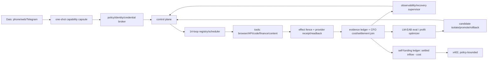

# Life Manager 統合SSOT — As-Is / To-Be / TODO

この文書は Life Manager 全体（Foundation 14ループ + Paid fulfillment）の唯一の入口。
詳細の正本は次の2つで、この文書は両者の統合・順序・現在cursorだけを持つ。

- Foundation/全体: `docs/superpowers/specs/2026-09-15-life-manager-agent-architecture-refinement.md`（Whole-ship handover / AGI addendum / Whole-ship remaining TODO）
- Paid: `docs/superpowers/specs/2026-09-22-paid-fulfillment-all-platforms-design.md` + `skills/earn/gig/TODO.md`（Canonical As-Is / To-Be snapshot）

所有: Claude が Foundation・Paid 両方の唯一の開発owner（2026-09-25 Dais指示）。旧2つのCodexセッションの保護境界は解除。Life Manager 自身のloopは引き続き本番stateのownerであり、Ryu room `18211957` への再送禁止と正式納品ボタン非押下は維持する。

## 1. 観測事実（2026-09-25 JST 実測）

| 項目 | 値 | 出所 |
|---|---|---|
| origin/main | `d4fe081993`（#5854） | `git log origin/main` |
| 本番loaded release | `d4fe0819931c50caaf41f25e86f1052cd8a0359c`（旧） | Foundation spec:6994 |
| Foundation branch | `fix/writer-admission-self-heal-20260924` `4bef60765c`、main比 0 behind / 224 ahead、open PRなし | `git rev-list` |
| Paid branch | `fix/coconala-history-retry-20260924` `5a28bfb762`、main比 10 behind / 126 ahead、PR #5868 `CONFLICTING` | `gh pr view 5868` |
| Foundation gate | `healthy=0, safely_fenced=1, uncovered_failure=13` | Foundation spec:6993 |
| ディスク空き | 561,643,520 bytes | `df -k /` |
| admission floor | Foundation 1,155,780,608 bytes / Paid 524,288 KiB（536,870,912 bytes） | Foundation spec:6612, Paid TODO |
| 検証済み settled net MRR | 存在しない | Foundation spec:5708 |

訂正（T2で確認）: コード上の floor は既に1つ。`runtime/host/disk_admission.py:16` と `skills/earn/gig/scripts/gig_disk_guard.py` の `DEFAULT_REQUIRED_KIB = 524288` がすべての producer に効いている。1,155,780,608 bytes は Foundation spec が release 昇格の運用目標として使う値で、コード定数ではない。どちらも同じ値にする必要はないので、コード変更はしない。

## 2. 2ブランチの統合方法

試験merge（`git merge-tree --write-tree`）の結果:

- main ← Foundation: 衝突なし（Foundation は main を含む）。
- Foundation × Paid の固有衝突は `runtime/loop/lm_loop.py` の1 hunk（`_admission_effect_unknown_occurrences` 付近）だけ。
- 残り10ファイルの衝突は Paid × main。原因は Paid の一部が #5854 で既に squash merge 済みであること（Freelancer/Upwork readiness・transport とその tests、`application_occurrence_reconcile.py`、`freelancer-actions.public.json`、Paid spec、gig TODO）。
- Paid の main 比の実コード差分は約600行（`paid_direct.py`、`application_occurrence_reconcile.py`、`gig_release.py`、`reconcile_paid_no_effect.py`、`lm_loop.py`、readiness/transport とそのtests）。

手順:

1. 最新 origin/main から `integrate/foundation-paid-20260925` を切る。
2. Foundation を merge する（fast-forward相当）。
3. Paid を merge し、衝突を次のように解く。
   - `lm_loop.py`: 両方残す。Paid の occurrence単位 dict を返す `_admission_effect_unknown_occurrences` と互換wrapper `_admission_effect_unknown_owners` を採用し、読み取りは Foundation の `_read_admission_rows` に寄せる。Foundation の `_legacy_pending_admission_identity` はそのまま残す。全呼び出し元を `rg` で確認する。
   - squash済み10ファイル: main 版を土台にし、#5854 以後の Paid commit（`a751a1f91f` account binding、`0acb25bb50` automatic-bid policy、`cb1cb48677` stale funded inventory 拒否、`a882779ead` receipt-reserve など）の差分だけを載せ直す。
   - Paid spec / gig TODO: Paid HEAD 版を採り、main 側にだけある Ryu receipt 追記を取り込む。
4. `runtime/loop/tests`、`skills/earn/gig/tests`、`skills/self/disk-cleanup/tests` を実行する。
5. 1つのPRにまとめ、#5868 は superseded として閉じる。admin merge する。
6. main から immutable release を1つ切り、label ごとに apply して readback する（release を切るだけでは label は切り替わらない）。

## 3. As-Is — 14ループ（Foundation spec:6939-6961）

Pass はライフサイクル上の投影で、settled revenue ではない。金額は記録があるものだけを載せる。

| # | ループ | Jobs/Pass/Blocked/Fail/無終端 | 主な境界 | 記録されたお金 |
|---|---|---|---|---|
| 1 | Affiliate | 6/1/2/0/0 | effect fence / FIFO | conversion・settled commission なし |
| 2 | Investment | 1/0/1/0/0 | 起動前の capacity admission | Alpaca 実験 net 約 **-$0.04** |
| 3 | Agent Economy | 19/1/9/4/4 | capacity/effect fence、旧entrypoint失敗 | settled x402 **0.003 USDC**、net は未証明 |
| 4 | Job Hunter | 7/1/5/1/0 | effect fence、inbox/runner失敗 | 新規 funded contract なし、Mercor **$0.00** |
| 5 | Fundraiser | 1/0/1/0/0 | effect fence | 資金 receipt なし |
| 6 | Connector | 1/0/0/1/0 | 旧release `entrypoint_exit_1`、`127.0.0.1:9222` 固定と Cloak IPv6 endpoint の不一致 | 収益源ではない |
| 7 | Self-Build | 4/1/3/0/0 | recovery/dev owner 失敗 | 収益源ではない |
| 8 | Mobile Apps | 22/13/6/1/2 | effect fence、metrics lane | 投稿はある。install→課金→MRR の紐付けは未完 |
| 9 | Capafy | 8/2/5/0/1 | effect/capacity | creator earnings は観測済み、paid-out **0** |
| 10 | CFO | 3/0/3/0/0 | message/payout の effect-unknown | 検証済み財務snapshotなし |
| 11 | Writer | 7/2/5/0/0 | capacity/effect/FIFO | 一部は公式readbackあり、支払いの帰属なし |
| 12 | Coconala | 7/3/1/3/0 | browser/Paid/Storefront の失敗と fence | Ryu は手動完了（収益の証明ではない） |
| 13 | CrowdWorks | 5/0/1/4/0 | entrypoint 143/1、effect_unknown（application 44、Paid 1、reply 201、report 1） | Paid 納品・支払い receipt なし |
| 14 | Lancers | 7/2/3/2/0 | fence、timeout、storefront/work-sync | 残高 **¥0**、funded 0件（過去の ¥150,000 は提案のみ） |

Paid 側の追加（Paid spec:27-45）: Freelancer・Upwork は account-bound auth も owner もない（Upwork `contracts=[]`）。`hf-gig-paid-direct` の直近の失敗は ENOSPC による `entrypoint_exit_1`（`effect_class=none`、外部送信なし）。

**As-Is の要約:** 検証済み純利益は実質 $0（+0.003 USDC、-$0.04）。14行中13行が uncovered failure。最大の共通原因は、ディスク不足と、修正が本番releaseに載っていないこと。

## 4. To-Be

- **各ループの完了の定義（全ループ共通）:** account-bound auth → source-complete な公式inventory → funded contract → policy receipt → owner がちょうど1つ → 正しい成果物 → occurrenceごとに effect は1回 → 公式receipt/readback → 支払い/payout readback → crash recovery → replay-zero。
- **ループの健康の定義:** 全行が `healthy` か、型付きの fence（安全な次アクションが記録済み）のどちらか。`unknown` は診断cursorであり、再送の許可ではない。
- **利益の定義:** ループごとに `settled_customer_revenue - refunds - measured cost`。CFO が provider receipt と照合して算出する。Pass やログは利益ではない。
- **役割分担:** model は提案する。identity・計算・dedupe・spend cap・rollback は決定的なコードが持つ。
- **Dais の手間:** 最初の bootstrap と、法的に必要な KYC/OAuth/CAPTCHA だけにする。
- **経済目標:** 検証済み net MRR USD 10K → 自己資金化 → YC W27 用の証拠 → AGI/UBI 研究。証拠なしに達成を主張しない。

## 5. TODO（実行順・正本）

順序変更の記録: 旧順序（Foundation spec:7092-7137）では、収益の帰属（旧9）が capsule（旧6）・cloud（旧7）・LM-EAB（旧8）の後だった。新順序では、ループごとの利益計測（新8）を capsule/cloud/LM-EAB より前に置く。理由は、利益が見えないと、どのループに資源を寄せるか・何を改善するかを判断できないため。Paid cursor は旧5の中身を新7として独立させた。

現在の cursor: **T5（進行中）**

T5 の途中経過（2026-09-25 19:00 JST）:
- 観測1: `life-manager-recovery-supervisor` は release 287d で毎 wake exit 1 になっていた。原因は、旧 release の intent を正しく `blocked: release_sha_mismatch` にした結果まで失敗として数えていたこと。#5879 で、この理由の blocked は exit 0 にした。他の理由の blocked は今までどおり exit 1。
- 観測2: 287d を全体へ再 apply したら `admission rebind refused: effect_unknown` で fleet 全体が中止された。#5880 で、fleet モードではその owner だけを `skipped: effect-unknown-fence` として続行するようにした。target 指定の apply では今までどおり raise する。
- 本番: release `20260925T185507-74c69d01` を全体へ適用した（適用136、admission 待ち30、実行中2、fence で skip 1 = `hf-gig-apply-direct`、失敗0）。
- 未達: 過去の `repaired` 11件は、どれも `before_event_id == after_event_id` かつ `command_exit_code=None` だった。readback で既に healthy だったので閉じただけで、修復操作はしていない。T5 の完了には、executor が `lm-loop reconcile ... --max-owners 1` を実行し（exit 0）、修復後の readback が healthy になる outcome が1件必要。
- supervisor は FIFO で1 wake（60秒）ごとに1件しか処理せず、未処理 intent が約200件ある。手動で回すと Codex-free の条件を崩すので、自然処理を待つ。
- 22:17 JST の判定: #5883（古い release の依頼を1 wake でまとめて閉じる）で、未処理は 571件 → 42件まで減り、現行 release の依頼が executor に届くようになった。実際に `lm-loop reconcile` が exit 0 で実行された（agent-economy-loop、franklin-loop、hf-gig-apply-reconcile）。
  - それでも、60分間の監視で本物の `repaired` は0件だった（修復後の PASS 待ち 2412回、古い依頼の close 118件）。
  - 理由は設計上の穴。自己修復の操作は reconcile（owner を現行 release へ付け直す）だけで、全体へ適用した後の失敗はコードや環境が原因なので、付け直しでは直らない。release ずれの owner（30件）は admission 待ちで付け直しが拒否される。長時間動く loop は終了の時点が来ない。
  - T5 の次の手: escalate → `guarded_code_repair`（Life Manager 自身の開発 loop）で1件をコード修復させる。最初の候補は `hf-gig-apply-reconcile` の exit 1（effect なし）。
  - 22:30 JST: コード修復 agent の設定（`runtime/agent-runner/config.json` の `self-heal-code-agent`）が Codex 専用（gpt-5.6-terra）だった。これでは構造上 Codex-free にならない。
    - #5886 で `claude-direct` / `claude-sonnet-5` に変更した。sandbox は `--permission-mode acceptEdits --disallowedTools Bash,WebFetch,WebSearch`（worktree 内の編集だけ、shell とネットワークは無し）。commit と test/eval の gate は、もともと d0 が行う。
    - release `20260925T222136-fe096540` を全体へ適用した（適用137、失敗0）。
  - 11:25 の dev 実行の失敗原因: Codex の agent が tests を回して `lm-test-tmp.*` を worktree 内に残し、preflight が許可リスト外の変更として RED にした。Claude に切り替えて Bash を無くしたので、agent は tests を回さず、この問題は起きない。
  - 解消済みの self-heal issue 11件を close した（connector: 5872/5870/5836、supervisor: 5869/5867/5866/5864/5863/5860/5856/5850）。
  - T5 の残り: 04:10 JST の `life-manager-dev` の自然起動で、Claude agent が open な self-heal issue を修正する。その後 PR → merge guard → release → 対象 owner の次の実行が PASS、となることを readback で確認する。
  - 制約: dev agent が触れるのは `apps/life-manager` と `runtime/loop` だけ（issue #5130）。gig 系のコード（例: `hf-gig-apply-reconcile`）は対象外。

T4 完了記録（2026-09-25）: `life-manager-connector-native` が release `287d913c` の上で自然起動し、PASS した。run `18d886ebca7142c8-54861`、18:41 JST、exit 0、`last_terminal_result=pass`、heartbeat は `worker_finished`、wake の status は `applied_bundle`、blocker なし。
その直前の旧 release での起動（18:02）は `worker_failed` / `circuit_open` / `wake_boundary_failed` だった。
注意点が1つ残る。`127.0.0.1:9222` は Dais の Google Chrome（pid 465）が使っており、daily-driver は `[::1]:9222` で待ち受けている。新しいコードは IPv6 経由の recovery でこれを回避している。人間用のブラウザなので、Chrome 側は変更しない。

T3 完了記録（2026-09-25）: main の `287d913c1c`（#5875）から release `~/loops/releases/20260925T180341-287d913c` を切り、`~/loops/current` をそこへ向けた。
続けて `lm-loop apply --all` を実行した（rc=0、全260件）。結果は適用138、退役済み91、admission 待ちで skip 29、実行中で skip 2、失敗0。
1回目は `production apply is already owned` で拒否された。release-reconciler が同時に apply していたためで、lock が外れた後に再実行した。
readback: release を参照する plist 169本中140本が新 release を指している。残り29本は admission 待ちで skip された分で、admission queue が空いたら再適用する（T6）。
foundation gate（新 release の status 271行で算出）: `healthy=0, safely_fenced=4, uncovered_failure=10`（旧は 1/13）。
- safely_fenced の4つ: affiliate と cfo は `external_effect_unknown`、investment と fundraiser は `runtime_admission_deferred`。
- uncovered_failure の10はすべて `runtime_release_drift`。14ループの98 job のうち93は新 release で install 済みで、53は新 release 上の event がある。40は新 release で自然実行がまだ来ていない。5は admission 待ちで旧 release のまま。

T2 完了記録（2026-09-25）: branch `integrate/foundation-paid-20260925` を作り、main ← Foundation（衝突なし）← Paid ← この docs branch の順に merge した。
Paid と main が衝突した10ファイルは、main 側の blob が Paid の過去の commit と完全に一致したので Paid 側を採用した。
`lm_loop.py` は Paid の occurrence 単位の関数を採用しつつ、読み取りを `_read_admission_rows` 経由にした。こうすると DB が lock されていても fence が0件とは報告されない（fail-closed）。Paid の元の `except sqlite3.Error: return {}` は fail-open で、Foundation の test `test_effect_fence_read_does_not_turn_sqlite_lock_into_empty_fence_set` を落とす。
検証: `runtime/loop/tests` 693件 PASS、`skills/earn/gig/tests` と `skills/self/disk-cleanup/tests` 1598件 PASS、`bin/lm-loop-contract` の errors は []。

T1 完了記録（2026-09-25）: 空き 561,643,520 → 5,430,202,368 bytes（floor 1,155,780,608 以上）。削除したのは、clean かつ全 commit が remote にある worktree 38本（うち25本は owner=`codex` の lease が 2026-09-18 に期限切れ）と、どのプロセスも開いていない verify-loops-audit の loop-tmp（300MB）。state・memory・Codex の履歴は削除していない。
減り方は一定ではない。5分計測では純増 +456MB の区間もあった。6時間内の大きな書き込み元は `~/.codex-acct2`（thread_history 2.15GB、rollout 1.0GB）と loop-tmp の残骸。loop が終了時に自分の loop-tmp を掃除する処理は T6 で扱う。

| # | タスク | 完了の証拠 |
|---|---|---|
| T1 ✅ | ディスク floor を回復し、1つに統一する（1,155,780,608 bytes）。再生成可能な cache と governor allowlist を消し、大物（claudevm 約7G、colima 約2G）の要否を判断する | `df` と governor receipt が floor 以上 |
| T2 ✅ | §2 の手順で統合PRを作り、両tests を PASS させて main へ merge、#5868 を close | merge commit、tests の出力 |
| T3 ✅ | main 由来の immutable release を1つ切り、全labelへ apply して readback | label ごとの loaded sha = release sha |
| T4 ✅ | Connector の natural canary（Cloak endpoint の解決）を effect なしで1回 | 公式receipt、`entrypoint_exit` 0 |
| T5 | Codex なしの self-heal を1回実証 | 修復経路に Codex がないこと、readback、replay-zero |
| T6 | 14行の reconcile: 全行を healthy か型付き fence にする。effect_unknown は occurrence ごとに公式receiptで閉じ、一括retryはしない | gate `uncovered_failure=0` |

T6 の途中経過（2026-09-25 22:55 JST、release `20260925T224024-beae3e37`）:
- gate は `uncovered_failure=10, safely_fenced=4`。10件はすべて `runtime_release_drift`。原因は今日 release を何度も切ったこと。新しい release を切らずに約24時間置けば、1日1回の job が現行 release で1回ずつ動き、自然に解消する。**release を凍結する**（例外は本物のバグ修正だけ）。
- 現行 release 上の本物の失敗は8件。
  - `life-manager-daily-driver`: 以前の owner run が残した孤児の Chromium（pid 37260、ppid 1）が profile を握っていた。そのため2回目の起動が exit 0 で抜けて `Failed to launch` になり、再起動を繰り返していた（launchd.err.log は 96MB）。#5889 で「生きている owner を引き取る」ようにした。22:52 に `adopted live profile owner pid=37260` を確認し、`loaded-running`・エラーなしになった。
  - Lancers negotiate/paid と CrowdWorks reply: 共有ブラウザの接続失敗（`browser_connect_failed` / goto timeout）で、daily-driver 停止の連鎖。次の自然実行で回復するかを確認する。
  - `job-search-inbox`: `inbox.py:398`。model の申告件数と thread ID の数が食い違った時に安全側で止まる、意図された fail-closed。二重返信を防ぐための仕組みで、test でも固定されているので変更しない。
  - Instagram en-card / obou: `LM_DATA_DIR is required` と ledger の job id 衝突。obou の Instagram は `marketing-destinations.json` で `ebook_account_out_of_mobile_scope`（上限 0）なので、直すより退役させる候補。state root が共有 events.jsonl のため、run 単位の切り分けは未完。
  - `life-manager-honne-ja`: 昼の ENOSPC（空きが 0.56GB だった時点）による。publish は fence で止まっていた。
| T7 | Paid cursor: Coconala Paid の no-effect wake → Storefront の公式readback → CrowdWorks の fence → Lancers の inventory → Freelancer/Upwork の account-bound auth → Mercor | 各 provider の readback |
| T8 | CFO: ループごとの settled revenue と cost の join（ループ別P&L）を毎日出す | P&L 行ごとに receipt id がある |
| T9 | Mobile funnel と `/en` `/lm` `/income` の整合（install→activation→課金） | attribution receipt |
| T10 | one-shot capability capsule | 目標・承認の質問なしで初回の実行が通る |
| T11 | cloud の durable worker と local の parity | 同じ task で同じ receipt |
| T12 | evaluator が所有する self-improvement（rollback つき） | canary で settled contribution が改善 |
| T13 | settled cost で裏付けた x402 自己資金化 | inflow ≥ cost の CFO readback |
| T14 | LM-EAB（held-out、較正、再現可能） | 独立した再実行で同じ結果 |
| T15 | 検証済み USD 10K MRR → YC W27 の証拠 → cross-domain / AGI / UBI | receipt の集計 |

## 6. 不変の制約

- Ryu room `18211957` へは再送しない。正式納品ボタンは loop から押さない。Ryu は CDP :9223 での手動例外として扱う。
- `unknown` / `effect_unknown` / `circuit_open` / `wake_boundary_failed` は再送の許可ではない。
- `launchctl` の変更は `bin/launchctl-safe` 経由だけで行う。
