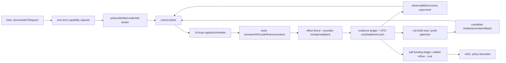

# Life Manager 統合SSOT — As-Is / To-Be / TODO

この文書は Life Manager 全体（Foundation 14ループ + Paid fulfillment）の唯一の入口。
詳細の正本は次の2つで、この文書は両者の統合・順序・現在cursorだけを持つ。

- Foundation/全体: `docs/superpowers/specs/2026-09-15-life-manager-agent-architecture-refinement.md`（Whole-ship handover / AGI addendum / Whole-ship remaining TODO）
- Paid: `docs/superpowers/specs/2026-09-22-paid-fulfillment-all-platforms-design.md` + `skills/earn/gig/TODO.md`（Canonical As-Is / To-Be snapshot）

所有: Claude が Foundation・Paid 両方の唯一の開発owner（2026-09-25 Dais指示）。旧2つのCodexセッションの保護境界は解除。Life Manager 自身のloopは引き続き本番stateのownerであり、Ryu room `18211957` への再送禁止と正式納品ボタン非押下は維持する。

## 0. 原則: No human in loop

Life Manager はアシスタントではなくマネージャー。Grok bot、Muse、Instinct と同じく、自分でコンピュータとブラウザを使い、仕事を最後まで完結させる。**人（Dais を含む）に作業や判断を頼むことは、設計違反として扱う。**
- 応募・承諾・制作・納品・入金確認・修復・改善は、すべて Life Manager の loop が行う。
- 人に頼るのは、法律上どうしても本人が必要なものだけ（初回の KYC、本人確認など）。それも最初の1回に限る（T10）。
- 判断は model が提案し、決定的な policy（金額、契約条件の一致、上限、重複防止、rollback）が確定させる。
- 外部の coding agent（Claude Code、Codex のセッション）も同じく「人」の側。Life Manager が自分で直せるようになること（§5.1）が目標。

### 0.1 Dais の実行範囲境界（全案件共通）

- 明示された現在の目的が、今回の作業範囲の正本。自分から別案件、別担当、別agent、別worktreeの仕事を開始・修正・認証・送信しない。
- 自律判断は、現在の目的の中で次の安全な工程を選ぶためにだけ使う。担当外の問題を見つけても、変更せず境界とownerを記録して通知する。
- 投資の成果として扱う金額は、provider公式のsettled receiptに基づく、全手数料・funding/borrow・slippage・gas・model cost控除後のrealized net P&Lだけ。テストfixture、paper/unrealized、入金、予測、他loopの売上は投資利益にしない。
- この境界は特定サービスだけの禁止ではなく、全loop・全repoに適用する。現在の投資cursorは投資receipt、net P&L、資本拡大gate、Telegram通知に限る。

## 1. 観測事実（2026-09-25 JST 実測）

| 項目 | 値 | 出所 |
|---|---|---|
| origin/main | `d4fe081993`（#5854） | `git log origin/main` |
| 本番loaded release | `d4fe0819931c50caaf41f25e86f1052cd8a0359c`（旧） | Foundation spec:6994 |
| Foundation branch | `fix/writer-admission-self-heal-20260924` `4bef60765c`、main比 0 behind / 224 ahead、open PRなし | `git rev-list` |
| Paid branch | `fix/coconala-history-retry-20260924` `5a28bfb762`、main比 10 behind / 126 ahead、PR #5868 `CONFLICTING` | `gh pr view 5868` |
| Foundation gate | `healthy=0, safely_fenced=1, uncovered_failure=13` | Foundation spec:6993 |
| ディスク空き | 561,643,520 bytes | `df -k /` |
| admission floor | Foundation 1,155,780,608 bytes / Paid 524,288 KiB（536,870,912 bytes） | Foundation spec:6612, Paid TODO |
| 検証済み settled net MRR | 存在しない | Foundation spec:5708 |

訂正（T2で確認）: コード上の floor は既に1つ。`runtime/host/disk_admission.py:16` と `skills/earn/gig/scripts/gig_disk_guard.py` の `DEFAULT_REQUIRED_KIB = 524288` がすべての producer に効いている。1,155,780,608 bytes は Foundation spec が release 昇格の運用目標として使う値で、コード定数ではない。どちらも同じ値にする必要はないので、コード変更はしない。

## 2. 2ブランチの統合方法

試験merge（`git merge-tree --write-tree`）の結果:

- main ← Foundation: 衝突なし（Foundation は main を含む）。
- Foundation × Paid の固有衝突は `runtime/loop/lm_loop.py` の1 hunk（`_admission_effect_unknown_occurrences` 付近）だけ。
- 残り10ファイルの衝突は Paid × main。原因は Paid の一部が #5854 で既に squash merge 済みであること（Freelancer/Upwork readiness・transport とその tests、`application_occurrence_reconcile.py`、`freelancer-actions.public.json`、Paid spec、gig TODO）。
- Paid の main 比の実コード差分は約600行（`paid_direct.py`、`application_occurrence_reconcile.py`、`gig_release.py`、`reconcile_paid_no_effect.py`、`lm_loop.py`、readiness/transport とそのtests）。

手順:

1. 最新 origin/main から `integrate/foundation-paid-20260925` を切る。
2. Foundation を merge する（fast-forward相当）。
3. Paid を merge し、衝突を次のように解く。
   - `lm_loop.py`: 両方残す。Paid の occurrence単位 dict を返す `_admission_effect_unknown_occurrences` と互換wrapper `_admission_effect_unknown_owners` を採用し、読み取りは Foundation の `_read_admission_rows` に寄せる。Foundation の `_legacy_pending_admission_identity` はそのまま残す。全呼び出し元を `rg` で確認する。
   - squash済み10ファイル: main 版を土台にし、#5854 以後の Paid commit（`a751a1f91f` account binding、`0acb25bb50` automatic-bid policy、`cb1cb48677` stale funded inventory 拒否、`a882779ead` receipt-reserve など）の差分だけを載せ直す。
   - Paid spec / gig TODO: Paid HEAD 版を採り、main 側にだけある Ryu receipt 追記を取り込む。
4. `runtime/loop/tests`、`skills/earn/gig/tests`、`skills/self/disk-cleanup/tests` を実行する。
5. 1つのPRにまとめ、#5868 は superseded として閉じる。admin merge する。
6. main から immutable release を1つ切り、label ごとに apply して readback する（release を切るだけでは label は切り替わらない）。

## 3. As-Is — 14ループ（Foundation spec:6939-6961）

Pass はライフサイクル上の投影で、settled revenue ではない。金額は記録があるものだけを載せる。

| # | ループ | Jobs/Pass/Blocked/Fail/無終端 | 主な境界 | 記録されたお金 |
|---|---|---|---|---|
| 1 | Affiliate | 6/1/2/0/0 | effect fence / FIFO | conversion・settled commission なし |
| 2 | Investment | 1/0/1/0/0 | 起動前の capacity admission / cross-venue owner receipt 不在 | Alpaca 公式 readback net **-$0.15**（往復1回、1/30、拡大不可） |
| 3 | Agent Economy | 19/1/9/4/4 | capacity/effect fence、旧entrypoint失敗 | settled x402 **0.003 USDC**、net は未証明 |
| 4 | Job Hunter | 7/1/5/1/0 | effect fence、inbox/runner失敗 | 新規 funded contract なし、Mercor **$0.00** |
| 5 | Fundraiser | 1/0/1/0/0 | effect fence | 資金 receipt なし |
| 6 | Connector | 1/0/0/1/0 | 旧release `entrypoint_exit_1`、`127.0.0.1:9222` 固定と Cloak IPv6 endpoint の不一致 | 収益源ではない |
| 7 | Self-Build | 4/1/3/0/0 | recovery/dev owner 失敗 | 収益源ではない |
| 8 | Mobile Apps | 22/13/6/1/2 | effect fence、metrics lane | 投稿はある。install→課金→MRR の紐付けは未完 |
| 9 | Capafy | 8/2/5/0/1 | effect/capacity | creator earnings は観測済み、paid-out **0** |
| 10 | CFO | 3/0/3/0/0 | message/payout の effect-unknown | 検証済み財務snapshotなし |
| 11 | Writer | 7/2/5/0/0 | capacity/effect/FIFO | 一部は公式readbackあり、支払いの帰属なし |
| 12 | Coconala | 7/3/1/3/0 | browser/Paid/Storefront の失敗と fence | Ryu は手動完了（収益の証明ではない） |
| 13 | CrowdWorks | 5/0/1/4/0 | entrypoint 143/1、effect_unknown（application 44、Paid 1、reply 201、report 1） | Paid 納品・支払い receipt なし |
| 14 | Lancers | 7/2/3/2/0 | fence、timeout、storefront/work-sync | 残高 **¥0**、funded 0件（過去の ¥150,000 は提案のみ） |

Paid 側の追加（Paid spec:27-45）: Freelancer・Upwork は account-bound auth も owner もない（Upwork `contracts=[]`）。`hf-gig-paid-direct` の直近の失敗は ENOSPC による `entrypoint_exit_1`（`effect_class=none`、外部送信なし）。

**As-Is の要約:** 検証済み純利益は実質 $0（+0.003 USDC、-$0.04）。14行中13行が uncovered failure。最大の共通原因は、ディスク不足と、修正が本番releaseに載っていないこと。

## 4. To-Be

```mermaid
flowchart LR
  U[Dais: phone/web/Telegram] --> C[one-shot capability capsule]
  C --> P[policy/identity/credential broker]
  P --> CP[control plane]
  CP --> R[14-loop registry/scheduler]
  R --> T[tools: browser/API/code/finance/content]
  T --> F[effect fence + provider receipt/readback]
  F --> L[evidence ledger + CFO cost/settlement join]
  L --> O[observability/recovery supervisor] --> CP
  L --> E[LM-EAB eval / profit optimizer] --> K[candidate isolate/promote/rollback] --> CP
  L --> S[self-funding ledger: settled inflow - cost] --> X[x402, policy-bounded]
```

- **各ループの完了の定義（全ループ共通）:** account-bound auth → source-complete な公式inventory → funded contract → policy receipt → owner がちょうど1つ → 正しい成果物 → occurrenceごとに effect は1回 → 公式receipt/readback → 支払い/payout readback → crash recovery → replay-zero。
- **ループの健康の定義:** 全行が `healthy` か、型付きの fence（安全な次アクションが記録済み）のどちらか。`unknown` は診断cursorであり、再送の許可ではない。
- **利益の定義:** ループごとに `settled_customer_revenue - refunds - measured cost`。CFO が provider receipt と照合して算出する。Pass やログは利益ではない。
- **役割分担:** model は提案する。identity・計算・dedupe・spend cap・rollback は決定的なコードが持つ。
- **Dais の手間:** 最初の bootstrap と、法的に必要な KYC/OAuth/CAPTCHA だけにする。
- **経済目標:** 検証済み net MRR USD 10K → 自己資金化 → YC W27 用の証拠 → AGI/UBI 研究。証拠なしに達成を主張しない。

## 5. TODO（実行順・正本）

順序変更の記録: 旧順序（Foundation spec:7092-7137）では、収益の帰属（旧9）が capsule（旧6）・cloud（旧7）・LM-EAB（旧8）の後だった。新順序では、ループごとの利益計測（新8）を capsule/cloud/LM-EAB より前に置く。理由は、利益が見えないと、どのループに資源を寄せるか・何を改善するかを判断できないため。Paid cursor は旧5の中身を新7として独立させた。

現在の cursor: **7-0（Lancers 5605912、Dais の承諾待ち）と 5-11 / 5-12 を並行**

T5 の途中経過（2026-09-25 19:00 JST）:
- 観測1: `life-manager-recovery-supervisor` は release 287d で毎 wake exit 1 になっていた。原因は、旧 release の intent を正しく `blocked: release_sha_mismatch` にした結果まで失敗として数えていたこと。#5879 で、この理由の blocked は exit 0 にした。他の理由の blocked は今までどおり exit 1。
- 観測2: 287d を全体へ再 apply したら `admission rebind refused: effect_unknown` で fleet 全体が中止された。#5880 で、fleet モードではその owner だけを `skipped: effect-unknown-fence` として続行するようにした。target 指定の apply では今までどおり raise する。
- 本番: release `20260925T185507-74c69d01` を全体へ適用した（適用136、admission 待ち30、実行中2、fence で skip 1 = `hf-gig-apply-direct`、失敗0）。
- 未達: 過去の `repaired` 11件は、どれも `before_event_id == after_event_id` かつ `command_exit_code=None` だった。readback で既に healthy だったので閉じただけで、修復操作はしていない。T5 の完了には、executor が `lm-loop reconcile ... --max-owners 1` を実行し（exit 0）、修復後の readback が healthy になる outcome が1件必要。
- supervisor は FIFO で1 wake（60秒）ごとに1件しか処理せず、未処理 intent が約200件ある。手動で回すと Codex-free の条件を崩すので、自然処理を待つ。
- 22:17 JST の判定: #5883（古い release の依頼を1 wake でまとめて閉じる）で、未処理は 571件 → 42件まで減り、現行 release の依頼が executor に届くようになった。実際に `lm-loop reconcile` が exit 0 で実行された（agent-economy-loop、franklin-loop、hf-gig-apply-reconcile）。
  - それでも、60分間の監視で本物の `repaired` は0件だった（修復後の PASS 待ち 2412回、古い依頼の close 118件）。
  - 理由は設計上の穴。自己修復の操作は reconcile（owner を現行 release へ付け直す）だけで、全体へ適用した後の失敗はコードや環境が原因なので、付け直しでは直らない。release ずれの owner（30件）は admission 待ちで付け直しが拒否される。長時間動く loop は終了の時点が来ない。
  - T5 の次の手: escalate → `guarded_code_repair`（Life Manager 自身の開発 loop）で1件をコード修復させる。最初の候補は `hf-gig-apply-reconcile` の exit 1（effect なし）。
  - 22:30 JST の #5886（self-heal の agent を Claude に変更）は T5 の誤読で、revert した。Life Manager の内部モデルは GPT（terra/luna/sol）のまま使う。§5.1 を参照。
  - 11:25 の dev 実行の失敗原因: Codex の agent が tests を回して `lm-test-tmp.*` を worktree 内に残し、preflight が許可リスト外の変更として RED にした。Claude に切り替えて Bash を無くしたので、agent は tests を回さず、この問題は起きない。
  - 解消済みの self-heal issue 11件を close した（connector: 5872/5870/5836、supervisor: 5869/5867/5866/5864/5863/5860/5856/5850）。
  - T5 の残り: 04:10 JST の `life-manager-dev` の自然起動で、Claude agent が open な self-heal issue を修正する。その後 PR → merge guard → release → 対象 owner の次の実行が PASS、となることを readback で確認する。
  - 制約: dev agent が触れるのは `apps/life-manager` と `runtime/loop` だけ（issue #5130）。gig 系のコード（例: `hf-gig-apply-reconcile`）は対象外。

T4 完了記録（2026-09-25）: `life-manager-connector-native` が release `287d913c` の上で自然起動し、PASS した。run `18d886ebca7142c8-54861`、18:41 JST、exit 0、`last_terminal_result=pass`、heartbeat は `worker_finished`、wake の status は `applied_bundle`、blocker なし。
その直前の旧 release での起動（18:02）は `worker_failed` / `circuit_open` / `wake_boundary_failed` だった。
注意点が1つ残る。`127.0.0.1:9222` は Dais の Google Chrome（pid 465）が使っており、daily-driver は `[::1]:9222` で待ち受けている。新しいコードは IPv6 経由の recovery でこれを回避している。人間用のブラウザなので、Chrome 側は変更しない。

T3 完了記録（2026-09-25）: main の `287d913c1c`（#5875）から release `~/loops/releases/20260925T180341-287d913c` を切り、`~/loops/current` をそこへ向けた。
続けて `lm-loop apply --all` を実行した（rc=0、全260件）。結果は適用138、退役済み91、admission 待ちで skip 29、実行中で skip 2、失敗0。
1回目は `production apply is already owned` で拒否された。release-reconciler が同時に apply していたためで、lock が外れた後に再実行した。
readback: release を参照する plist 169本中140本が新 release を指している。残り29本は admission 待ちで skip された分で、admission queue が空いたら再適用する（T6）。
foundation gate（新 release の status 271行で算出）: `healthy=0, safely_fenced=4, uncovered_failure=10`（旧は 1/13）。
- safely_fenced の4つ: affiliate と cfo は `external_effect_unknown`、investment と fundraiser は `runtime_admission_deferred`。
- uncovered_failure の10はすべて `runtime_release_drift`。14ループの98 job のうち93は新 release で install 済みで、53は新 release 上の event がある。40は新 release で自然実行がまだ来ていない。5は admission 待ちで旧 release のまま。

T2 完了記録（2026-09-25）: branch `integrate/foundation-paid-20260925` を作り、main ← Foundation（衝突なし）← Paid ← この docs branch の順に merge した。
Paid と main が衝突した10ファイルは、main 側の blob が Paid の過去の commit と完全に一致したので Paid 側を採用した。
`lm_loop.py` は Paid の occurrence 単位の関数を採用しつつ、読み取りを `_read_admission_rows` 経由にした。こうすると DB が lock されていても fence が0件とは報告されない（fail-closed）。Paid の元の `except sqlite3.Error: return {}` は fail-open で、Foundation の test `test_effect_fence_read_does_not_turn_sqlite_lock_into_empty_fence_set` を落とす。
検証: `runtime/loop/tests` 693件 PASS、`skills/earn/gig/tests` と `skills/self/disk-cleanup/tests` 1598件 PASS、`bin/lm-loop-contract` の errors は []。

T1 完了記録（2026-09-25）: 空き 561,643,520 → 5,430,202,368 bytes（floor 1,155,780,608 以上）。削除したのは、clean かつ全 commit が remote にある worktree 38本（うち25本は owner=`codex` の lease が 2026-09-18 に期限切れ）と、どのプロセスも開いていない verify-loops-audit の loop-tmp（300MB）。state・memory・Codex の履歴は削除していない。
減り方は一定ではない。5分計測では純増 +456MB の区間もあった。6時間内の大きな書き込み元は `~/.codex-acct2`（thread_history 2.15GB、rollout 1.0GB）と loop-tmp の残骸。loop が終了時に自分の loop-tmp を掃除する処理は T6 で扱う。

| # | タスク | 完了の証拠 |
|---|---|---|
| T1 ✅ | ディスク floor を回復し、1つに統一する（1,155,780,608 bytes）。再生成可能な cache と governor allowlist を消し、大物（claudevm 約7G、colima 約2G）の要否を判断する | `df` と governor receipt が floor 以上 |
| T2 ✅ | §2 の手順で統合PRを作り、両tests を PASS させて main へ merge、#5868 を close | merge commit、tests の出力 |
| T3 ✅ | main 由来の immutable release を1つ切り、全labelへ apply して readback | label ごとの loaded sha = release sha |
| T4 ✅ | Connector の natural canary（Cloak endpoint の解決）を effect なしで1回 | 公式receipt、`entrypoint_exit` 0 |
| T5 | 自己修復を1回実証する（外部の coding agent なしで、Life Manager が自分の問題を見つけて自分で直す。定義は §5.1） | §5.1 の完了証拠 |
| T6 | 14行の reconcile: 全行を healthy か型付き fence にする。effect_unknown は occurrence ごとに公式receiptで閉じ、一括retryはしない | gate `uncovered_failure=0` |

T6 の途中経過（2026-09-25 22:55 JST、release `20260925T224024-beae3e37`）:
- gate は `uncovered_failure=10, safely_fenced=4`。10件はすべて `runtime_release_drift`。原因は今日 release を何度も切ったこと。新しい release を切らずに約24時間置けば、1日1回の job が現行 release で1回ずつ動き、自然に解消する。**release を凍結する**（例外は本物のバグ修正だけ）。
- 現行 release 上の本物の失敗は8件。
  - `life-manager-daily-driver`: 以前の owner run が残した孤児の Chromium（pid 37260、ppid 1）が profile を握っていた。そのため2回目の起動が exit 0 で抜けて `Failed to launch` になり、再起動を繰り返していた（launchd.err.log は 96MB）。#5889 で「生きている owner を引き取る」ようにした。22:52 に `adopted live profile owner pid=37260` を確認し、`loaded-running`・エラーなしになった。
  - Lancers negotiate/paid と CrowdWorks reply: 共有ブラウザの接続失敗（`browser_connect_failed` / goto timeout）で、daily-driver 停止の連鎖。次の自然実行で回復するかを確認する。
  - `job-search-inbox`: `inbox.py:398`。model の申告件数と thread ID の数が食い違った時に安全側で止まる、意図された fail-closed。二重返信を防ぐための仕組みで、test でも固定されているので変更しない。
  - Instagram en-card / obou: `LM_DATA_DIR is required` と ledger の job id 衝突。obou の Instagram は `marketing-destinations.json` で `ebook_account_out_of_mobile_scope`（上限 0）なので、直すより退役させる候補。state root が共有 events.jsonl のため、run 単位の切り分けは未完。
  - `life-manager-honne-ja`: 昼の ENOSPC（空きが 0.56GB だった時点）による。publish は fence で止まっていた。
| T7 | Paid cursor: Coconala Paid の no-effect wake → Storefront の公式readback → CrowdWorks の fence → Lancers の inventory → Freelancer/Upwork の account-bound auth → Mercor | 各 provider の readback |
| T8 | CFO: ループごとの settled revenue と cost の join（ループ別P&L）を毎日出す | P&L 行ごとに receipt id がある |
| T9 | Mobile funnel と `/en` `/lm` `/income` の整合（install→activation→課金） | attribution receipt |
| T10 | one-shot capability capsule | 目標・承認の質問なしで初回の実行が通る |
| T11 | cloud の durable worker と local の parity | 同じ task で同じ receipt |
| T12 | evaluator が所有する self-improvement（rollback つき） | canary で settled contribution が改善 |
| T13 | settled cost で裏付けた x402 自己資金化 | inflow ≥ cost の CFO readback |
| T14 | LM-EAB（held-out、較正、再現可能） | 独立した再実行で同じ結果 |
| T15 | 検証済み USD 10K MRR → YC W27 の証拠 → cross-domain / AGI / UBI | receipt の集計 |

### 5.0 順序変更（2026-09-27 10:5x JST）: 土台 → 全 loop を green → 収益 → 自己修復の実証 → 自己改善

旧順序: T5（自己修復）→ T6（14 loop）→ T7（Paid）。新順序: ①土台（5-13 自動 apply、7-6e 予約の偏り、6-9b〜d ディスクとブラウザ）→ ② T6 全 loop を green（正常 / 型付き fence / 意図した停止のどれか）→ ③ T7 収益 → ④ 5-12 自己修復の自然実証 → ⑤ T12 自己改善。現在の cursor: ① 5-13。

理由（今夜の実測）: 失敗の大半は各 loop のコードではなく土台だった。merge した修正が owner に届いていない（172 中 53 だけが current release）、admission の stop が戻っていない、capacity の予約の偏り、fence の滞留、ディスク満杯。SNS 投稿 owner は release を反映しただけで失敗が止まった。自己修復の dev agent は土台（runtime の制御面、launchd、admission）を編集できない設計なので、土台が壊れている間は自己修復の実証が起きない。green の基準線が無いと、自己修復が何を直したかも測れない。
実測（10:4x JST）: loaded 172 = ok 64 / failing 47（常駐 daemon の再起動による誤分類を含む）/ capacity 待ち 41 / fence 20。earn 51 = ok 12 / failing 15 / fence 12 / capacity 12。

**Handover（2026-09-28 10:5x JST。この順が正本。新しい session はここから）**

進捗（2026-09-28 13:2x JST、Claude）:
- 1 ✅ 下書き 4243672453（AI Evaluation Failure Triage Brief）は審査提出済み。公式 readback: platform_status=1、audit_status=2、is_confirmed_skills/config_keys=true、package_uploaded=true（04:08Z）。CP1 に Primary Model 欄は実在しない（model は CP2 で決まる）ため、verify_cp1_model は CP2 後と最終確認で呼ぶ（#6066・#6068〜#6070）。catalog の未公開分は DeepSeek V4.1 Flash（19件）、Claude 指定の10件は公開済み・審査中で据え置き。
- 1 追記: Capafy `GET /agent/agents/{id}` の model は 4243672453=`deepseek/deepseek-v4.1-flash`、4813383030=`DeepSeek V4.1 Flash`（05:1xZ）。
- 2 ⏳ 03:24Z は他 run の fence、04:24Z は host の枠満杯（稼働6＋予約2＝上限8、`resource_capacity_busy`）で exit 75。04:24:44Z に `lm-loop start` で起動した run が新 Agent 4813383030（Board Update Deck Builder）を CP3 まで提出: platform_status=1、audit_status=1、skills/config confirmed、package uploaded、run rc=0 `RESULT_success`。手動起動なので無人の証明は 05:24Z の自然 run で取る（次の候補は Demand rank 1 の reels-hook-lab）。
- 反映: release `20260928T140252-811d0937`（#6071〜#6073）を capafy の deterministic 7 loop に `lm-loop reconcile` で適用、readback installed=811d0937。自動の release 作成は 9 分待っても起きず、`reconcile-agent-runner-release.sh` を手動実行した（fleet-apply は "production apply is already owned" で skip、errors=1。未調査）。
- 2 ✅（無人申請を公式 readback で確認）: 05:24Z の自然 wake は枠満杯で exit 75 → 58 秒後に予約 dispatch が自動起動（人の操作なし）→ 新 Agent 3798949471「Reels Hook Lab — Win the Cover Frame」を CP3 まで提出。readback: platform_status=1、audit_status=1、skills/config confirmed、package uploaded。run は提出後の報告中に browser-lane-agent 1800s で rc=124 → exit 1 → fence。adapter が `capafy:agent/3798949471/version/2104444318118604800:platform_status=1` で close（status で fence False）。修正: #6074 起動間隔 3600→900s、#6075 fixture、#6076 申請 run を application-lane-agent（3600s）へ。release cf8d83ac を capafy 7 loop に適用（installed=cf8d83ac、interval:900s）。審査中 4・空き 1。残り: 次の自然 run が Shorts Hook Lab を rc=0 で出すこと（green の確認）。
- 4 ✅ 本番 readback: 06:07Z の毎時 receipt（capafy-skill-analytics.json）に per-skill `profit_30d_usd` と Telegram 要約が実データで入った。
- **Capafy は未完了（訂正 2026-09-28 15:3x JST、Dais）**: 申請の仕組みが動いただけで完了扱いにしてアプリへ移ったのは誤り。1つずつ閉じる。アプリ（下の 5 アプリ As-Is）は Capafy の C1〜C7 が閉じるまで着手しない。

**Capafy の残り TODO（この順が正本。1つずつ、公式 readback で閉じる）**

順序変更（2026-09-28 20:xx JST）: 旧 C3→C4→C5、新 C3→C5→C4。理由: 公開 49 本のうち売れているのは 6 本（Hook Lab・Slide Maker・Marketing Strategist・Academic Humanizer・TikTok Script Pro・YouTube Script Writer）、30 日の有料注文は約 20 件で、止まっているのは供給ではなく流入。売上ゼロ 43 本の整理（C4）より先に、売れている型へ流入を作る（C5: SNS・SEO・PromptBase・trafficSources の日次計測）。Capafy laneの旧cursorは履歴として保持する。C2 は Hook Lab v1.0.3 の承認と実利益の黒字化待ち。
**投資laneスコープ訂正（2026-09-28 12:25Z）**: Daisの指示により、投資loopのactive workは公式投資receipt・net P&L・資本拡大ゲート・Telegram通知だけに限定する。Capafy/PromptBase/C3〜C5のcash-engine作業はこのlaneでは停止し、Capafy側のownerへ戻す。投資laneのcursorは `docs/superpowers/plans/2026-09-28-investment-loop-generational-wealth.md` のLife Manager runtime health → natural official P&L → sample/promotion review。

**Capafy/PromptBase documentation-only handoff（2026-09-28T12:34:54Z）**:

- **保存状態（確認済み）**: このCodex sessionはCapafy/PromptBaseのファイルを削除・revertしておらず、kill/stopも実行していない。`git diff --diff-filter=D` に対象削除はなく、`capafy_hourly_reconcile.py`、PromptBaseのpublisher/readbackがworktreeに残っている。production-release側のCapafy processは別owner laneで稼働中で、このsessionは触っていない。
- **Capafy完了**: actual-cost fallback修正と自然reconcileの検証は完了（focused `31/31`、直近30日 net `$68.80`、actual model cost `$43.61`、期間付き contribution proxy `$11.43`、payout-able `$14.40`、paid `$0.00`）。これはcash evidenceであり、MRRおよびinvestment P&Lではない。
- **Capafy未完了**: Hook Lab v1.0.3の公式審査・公開後のcost-complete黒字readback、勝ち型の追加公開readback、traffic-to-sales readback、zero-sales/赤字skillの整理、payout threshold到達とpayout receipt。
- **PromptBase完了**: publisher/readback実装とbrowser-free test `15/15`、offline verified demos。**未完了**: human CAPTCHA/account boundary、public listing submit、official listing readback、payout readback。したがってPromptBase revenueは `$0`。
- **推奨TODO順（owner lane）**: (1) 現在走っているCapafy runとHook Lab審査の公式readbackを1件ずつ取得、(2) C2の自然cost-complete profit readbackで黒字化を判定、(3) C3で勝ち型を1件ずつ追加し各公開readbackを取得、(4) C5のtraffic sourceをread-only認証・日次readbackし注文との帰属を作る、(5) C4/C6/C7でzero-sales・赤字・capacityを実測に基づき整理、(6) Capafy payout threshold到達後にpayout recordを確認、(7) PromptBaseはhuman gateを満たしてから1件だけpublic submit→listing readback→payout readback、(8) settled netだけを必要なら別の投資capital ledgerへ接続する。
- **引き継ぎprompt**: `Dais asked for documentation-only handoff. Do not delete/kill or duplicate the existing Capafy/PromptBase work. Preserve the completed actual-cost reconcile and PromptBase 15/15 offline evidence. Continue only in the owner lane, in this order: current-run/Hook-Lab official readback → C2 cost-complete profit → C3 winner supply → C5 traffic attribution → C4/C6/C7 cleanup/analysis/capacity → payout gate → one PromptBase public listing/readback/payout. Never count estimate, test, pending review, or unrealized values as settled revenue.`

| # | 内容 | 完了の証拠 | 状態 |
|---|---|---|---|
| C1 | 申請の自己回復: Shorts Hook Lab（Agent 9466718786）が CP2 で「provider path / detected-keys が期限内に出ない」で失敗し下書きのまま。fence を lm-fence-reconciler が人の手なしで close し、次の wake の `resume_draft` が同じ下書きを CP3 まで出す | reconcile-calls.jsonl の closed=true、publish-remote-status platform_status=1・全 confirmed | 完了扱い（Dais: 1 本の壊れた draft に固執しない）。失敗した申請は fence→reconciler close→次の wake で自動再開される。Shorts Hook Lab 9466718786 は draft のまま（他に仕事が無い時だけ再開）。今日の承認: Reels Hook Lab・Board Update Deck Builder・AI Evaluation Triage・Marketing Strategist 新版 |
| C2 | Hook Lab の赤字: 1回 約4.5万 input token（30日 132 req・費用 $20.31 > 手取り $19.91）の原因を特定し、費用を下げる（入力の縮小・安い model の新版）か値上げ | 改善後の per-skill cost/request と profit_30d > 0 | 提出済み（2026-09-28 11:01Z readback）: Hook Lab v1.0.3 platform_status=1・audit_status=2・skills/config confirmed、表示モデル DeepSeek V4.1 Flash（verify_cp1_model VERIFIED）。工場の run が人の手なしで CP3 まで通した。12:06:47Zの最新公式readbackも`platform_status=1`・`audit_status=2`・`status_reason=under_review`・`can_report_published=false`を確認。今日の修正: #6088 update を draft 再開より優先、#6089 OpenRouter 実請求、#6090 drainer 直接実行、#6092 CP2 LLM 設定欄、#6093 表示モデル、#6094 CP3 タブを開く・失敗理由を出す、#6095 CP3 バージョンタブ。残り: 承認後にHook Labの実利益（直近snapshot −$16.49/30日）がプラスに転じたことを毎時receiptで確認 |
| C3 | 利益の出るスキルを出し続ける: 勝ち型の順（Hook Lab 系 → 金融の要約 → スポーツ分析）で候補を切らさない。PromptBase にも同じ型（Hook Lab は 2026-09-28 公開済み、次は Reels / Shorts 版） | Capafy 審査提出・PromptBase 公開の readback | 未着手 |
| C4 | 既存スキルを儲かるように直す: 売上ゼロ 42/48 本を、勝ち型の説明文・価格・トライアルに書き直すか取り下げて枠を空ける。赤字スキルは値上げか費用削減 | 各版の readback と per-skill profit の推移 | 未着手 |
| C5 | 集客（共通部品）: Capafy の流入元（https://capafy.ai/developer/trafficSources）を毎日取得し、SNS 投稿と SEO（https://github.com/every-app/open-seo）でスキルへ流入を作る。Writer / Affiliate / アプリ / LM / Capafy で共通の marketing 部品として作る | trafficSources の日次 readback、流入元別の注文 | 投資lane外へ保留 |
| C5a | trafficSources のread-only契約を特定し、取得経路を確立する | 公開JSが示す`/app/developer/traffic-sources/{agent-options,v2/visits/stats,impressions/stats,sales/stats,internal/stats,referrer/stats,utm-source/stats}`の認証済みreadback | 投資lane外へ保留。既存の契約・adapter証拠は履歴として保持し、このlaneから追加作業しない |
| C6 | 分析の閉ループ: 流入元・スキル別利益・転換を毎日見て、LM が次に作る・直すスキルを自分で選ぶ | 日次レポートの数字 → 次の行動の記録 | 未着手 |
| C7 | 実行枠の配分（7-6e）: gig 等の agent が枠を埋め Capafy が待たされる。ROI 順の配分 | 毎時 wake が capacity_busy で飛ばない | 未着手（15 分 wake で暫定回避） |
- 5 アプリ As-Is（2026-09-28 06:2xZ、ASC API `appStoreVersions` / RevenueCat / Postiz を readback）:
  - 計測: business-outcomes に全アプリの RevenueCat・ASC が毎日 available（Anicca: actives 5、churn 0、7日転換 0、初回DL 4 はほぼ検索経由）。Postiz は cloud（api.postiz.com）で integration 30 件、`config/marketing-destinations.json` の対応 30 件と完全一致、再認証 0、無効 1（Monk Anicca）。self-host は不要。
  - ASC: Anicca 1.9.5 は 2026-07-04 提出 → 07-07 に却下（reviewSubmission `UNRESOLVED_ISSUES`、公開中は 1.9.4）。理由の本文は Resolution Center にのみある（メールは通知だけ）。Desk Stretch Timer 1.0=READY_FOR_REVIEW（未提出）、Micro-Mood 1.0=PREPARE_FOR_SUBMISSION、SleepRitual 1.0=DEVELOPER_REJECTED、BreathReset は ASC に該当アプリ無し（BreathCalm Test / BreathStory が未提出）。却下のまま: Aura Looks、Chi Daily、FrostDip、Zone2Daily、EyeBreakIsland。テスト残骸: TestDeleteMe×3、AppName、TestFactory001。
  - 次（この順）: Anicca 1.9.5 の却下理由を Resolution Center で読む → 直して再提出 → Desk Stretch Timer を提出 → Micro-Mood・SleepRitual → 投稿→install の計測（Postiz 投稿 × ASC 流入元）→ Larry を EN/TikTok へ。
- 3 ✅ #6071: `lm-loop status` が fence ごとに `admission_effect_unknown_diagnosis`（原因 run・失敗 phase・error_class・error_detail・lm-fence-reconciler adapter が見た provider 側の状態・next_action）を出す。live: 67 fence を 5.4 秒で診断。capafy-ig-marketing-daily は `adapter_held:readback_failed:LoginRequired`（IG session 切れ）。
- 4 ✅ 実装・本番反映: #6072（毎時 receipt にスキル別 30日 cost/net/profit、Telegram 要約に上位5と赤字スキル / `Demand rank` 順 / 無料トライアル許可: 週 24h・3回、月 72h・5回、日は無し / 勝ち型の量産を工場 prompt と BEST_PRACTICES §13 に / 説明文の型 / 新スキルの Sonnet max_tokens 128000→8192）。#6073（Reels・Shorts・広告の Hook Lab 系3件を rank 1〜3 で catalog に追加、lint PASS）。実測の30日利益: Hook Lab 売上 $19.91 − 費用 $20.31 = −$0.40、Slide Maker +$15.98、Marketing Strategist +$8.89、TikTok Script Pro +$4.48、YouTube Script Writer +$2.67。残り ready 11件はすべて企業向け資料系（rank なし＝後回し）。
- Capafy の残り（この順）: (a) 05:24Z 自然 run の無人申請を readback → (b) Hook Lab の 1回4.5万 input token の原因（Capafy 側の履歴か設定か）を特定し費用を下げるか値上げ → (c) Hook Lab 系→金融要約→スポーツ分析を毎時1本 → (d) 売上ゼロ39本を勝ち型の説明文に書き直すか取り下げ → (e) 集客（Capafy 内だけでは客が来ない。IG・TikTok・PromptBase） → (f) トライアル→有料の転換を測る代替指標。MRR は API に有効サブスク数が無く測れない。30日売上 $68.80・手取り $52.30・販売 98件（トライアル 69）・39/45 本が売上ゼロ。

方針（Dais）: 1つずつ閉じる。順番は Capafy → アプリ → connector → fundraiser。自己修復・自己改善は、全 loop が観測できて正しく動いた後。返答は必ず日本語。待たずに kickstart して実物で確かめる。

この session で完了（main に merge 済み・本番反映済み）: #6041 毎時 loop を calendar 起動 / #6043 Capafy selector / #6044 HyperFrames gate / #6047 動画 hook を指標で選択 / #6048・#6060 daily-driver を localhost・[::1] に統一し 127.0.0.1 決め打ち67ファイル修正、guard 再起動に --remote-allow-origins（127.0.0.1:9222 は Dais の Chrome pid 465）/ #6049・#6050・#6052・#6058 Larry JA は背景固定・文字だけ毎回生成（初の別内容投稿 https://www.instagram.com/p/Ddz3qfOGQfB/）/ #6055 投稿枠外の起動は exit 0（effect_unknown 大量発生の根本原因）/ #6056 capafy-loop-daily の fence 自動 reconcile adapter / #6057・#6059・#6062 connector: 同一候補の無限再選択を修正、declined 予定を busy から除外 / #6061 capafy-loop-daily を critical_paid / #6064 Capafy selector が placeholder 名の下書きを再開 / #6065 アプリ別の毎日の数字を Telegram（MRR $20.34、28日売上 $32.56、有料5人、28日 install 32。ほぼ Anicca のみ）/ #6053 Honne の RC key 埋め込みを revert（公開中の Honne は課金が正常。1.0.4 の審査は取り下げ）。

Capafy 実測: 46 Agent、掲載 44、枠使用 2（Marketing Strategist 新版は審査中、下書き 4243672453）、空き 3。準備済み候補 18 件。最後に新規公開したのは 9/1（27日間ゼロ）。直近30日の売上 $66.81・88件、OpenRouter 費用 $25.13。収益化の調査: 手数料 20%、上位は金融要約・スポーツ分析・フック最適化・動画生成、月 $9.99〜27.99、無料トライアル付きが多い、1本で月 $10k 超の実例あり（capafy.ai/earn）。

残り（この順）:
1. Capafy 下書き 4243672453 を審査提出まで閉じる。現状: CP1 保存済み（isConfirmedSkills=true）、公式 model=null のため publish_finish が CP1_MODEL=MISMATCH で停止。直し方: 未公開の catalog 29件中28件が Claude Sonnet 指定なので DeepSeek V4.1 Flash に切り替え、cp1_agent.py が必ず Primary Model を選んで verify_cp1_model で確認、同じ Agent を DeepSeek で再 prepare → CP2/CP3 → readback platform_status=1。
2. その後、人の手なしで次の毎時 run（:24）が新しいスキルを自分で申請し、空き枠を埋めることを1回確認する（ここで Capafy の loop 完了）。
3. fence の観測性: admission_effect_unknown だけでは原因が分からない。lm-loop status に、原因の run・失敗した手順・error_detail・Capafy 側の状態・次の手を出す。
4. Capafy の売り方を勝ち筋に合わせる: 無料トライアル（今は全プランなし）、価格、ジャンル（フック・金融・スポーツ）、説明文の型、Hook Lab 系の量産、スキルごとの利益（売上 − 費用）を毎日。既存 Sonnet スキルの max_tokens 128000 を下げる。
5. アプリ: 集客（Larry を EN/TikTok に展開、動画 hook の効果確認）、工場の4本を審査提出（iOS シミュレータ約 8GB が必要。ディスク空き 13GB なので先に空ける）、IG/YouTube プロフィールに App Store リンク。
6. connector: 最後のカレンダー登録は 9/25。候補は preference_fit weak のみで自動申込み対象なし（選択基準は Dais 判断）。fundraiser: 127.0.0.1 決め打ちを直した後の自然 run でカレンダー登録を確認。
7. LM の自己修復の穴: self-fix は immutable release の中で動くのでコードを直せない（issue #6063）。修正役が repo の worktree で作業できるようにする。
8. その後: 全 loop green → 自己修復 → 自己改善 → Cloud 版・LM-EAB → $10k MRR。

**状況更新と残り TODO（2026-09-28 深夜 JST。この順が正本）**

この夜に完了: Capafy Marketing Strategist 新版 2104175282811195392 を審査提出（readback platform_status=1、全 confirmed。既存 Agent のモデルは作成時固定のため Claude Sonnet 4.6、新規 Agent は DeepSeek V4.1 Flash）/ #6048 daily-driver が 127.0.0.1 固定をやめ --remote-allow-origins 付きで起動（UUID 150 秒安定）/ #6047 動画 hook を指標で選ぶ / #6049・#6050・#6052 Larry JA の slide pack を自動生成・自動 gate・7日内再利用なし・指標で型を選ぶ（Gemini 背景、$0.20〜0.23/組、上限 $0.30、release b90168e9）。Honne: 公開中の版は app builder 側の RevenueCat project で課金が動いている（Dais 確認）。こちらの project への付け替え 1.0.4 は審査を取り下げ（DEVELOPER_REJECTED）、#6051 は #6053 で revert。

残り（この順）:
1. ディスク空きを 20GB 以上に戻す（2026-09-28 深夜 3.6GB、99%）
2. 実投稿の readback: 08:30 honne-ja 動画が前回と違う hook と App Store リンクで出たか / 10:30 Larry JA が新しい slide pack で出たか
3. Capafy: Marketing Strategist の審査結果 → capafy-loop-daily が毎時 :24 に人の手なしで次のスキルを申請する run を1回確認 → 落ちたら直して再申請が回ることを確認
4. Capafy: スキルごとの利益（売上 − OpenRouter 費用）を出す。費用をスキルごとに分けるため、Agent ごとに OpenRouter key を分ける。直近30日は売上 $66.81 / 手取り約 $50 / API 費用 $25.13
5. Honne の本当の売上を見えるようにする: app builder 側の RevenueCat project の read key を見つけて business-outcomes に取り込む
6. 工場の未公開アプリ4本（BreathReset / SleepRitual / Desk Stretch Timer / Micro Mood）: それぞれ止まっている理由を ASC で確かめ、直して審査提出。弱いもの（4.3 リスク）は統合か中止を提案
7. Larry の自動 slide pack を EN と TikTok の lane にも広げる
8. IG・YouTube のプロフィールに App Store リンク（IG は Web で編集不可、YouTube は Google 2FA で停止中）
9. PromptBase: Hook Lab 審査結果 → 通れば売れている型を追加出品
10. 後回し（Dais 判断）: Capafy の IG Reel
11. その後: T6 全 loop green → 5-12 自己修復の実証 → T12 自己改善 → T8 ループ別 P&L → Cloud 版 CL01〜05・LM-EAB（別 session で並行可）→ $10k MRR

**状況更新（2026-09-27 23:4x JST 実測、handover 用）**

merge 済み（この夜）: #6041 1時間以上の間隔の loop を launchd の StartCalendarInterval で出す（release の再読み込みで StartInterval のカウントが戻り、capafy-loop-daily / capafy-ig-marketing-daily が runs=0 だった）/ #6042 Capafy per-skill 30日 gross（ranking endpoint、account 合計 $66.81・88件と一致）、モデル名、Honne ASC、installs_7d、CFO P&L に Capafy と mobile-apps を接続 / #6043 select_publish_agent が publish-list を strict=False で読み、承認済みを detail で枠から外す / #6044 capafy-ig の HyperFrames gate を scripts/hyperframes_check.sh（lint 必須、check は時間制限つきの参考。0.8.8 の check は "Check passed" 後に終了しない）。

Capafy 工場: release f0fcf1a1 で毎時 :24 に起動（plist で確認）。11:38Z の run が Agent 9563867391（Marketing Strategist）の新版 2104175282811195392 を作成。publish_finish が CP1 model 不一致で停止（CP1 = Claude Sonnet 4.6、準備した package = DeepSeek V4.1 Flash）。方針: package を CP1 の Claude Sonnet 4.6 に合わせて CP3 提出。工場の fence は公式 publish-list readback の pre-effect 証拠で close（evidence: ~/.local/state/life-manager/reconciliation/evidence/capafy-loop-daily-18d9271e675ea990-45935.json）。未確認: 工場が per-skill 売上を見て次のスキルを選んでいるか。

PromptBase: Zoneless payout 有効（LM の Solana GB7Le…）、Hook Lab 審査待ち（https://promptbase.com/prompt-edit/EC62f8k0a7pUtwdmjlDG）。

Capafy の IG Reel: Dais 判断で後回し（pending）。loop は自分の時刻で動く。instagrapi session が数時間で切れる件は、毎 run 前に browser sessionid から作り直す案（未実装）。

アプリのマーケティング（次の重点、Dais 2026-09-27）: 投稿は Postiz 上は出ているが、毎回同じ creative・同じ文面を出している。目標は、指標（再生・保存・install）を見て hook・format・文面を毎回変え、効いた型を増やす（Larry のスライドショー、reelclaw の動画）。App Store の CTA は #6031 で新規投稿に入る。

**状況更新（2026-09-27 19:xx JST 実測）**

完了（merge 済み）: #6035 browser resolver が /usr/sbin/lsof を見つける / #6036 cdp.py の IPv6 bracket / #6037 capafy-ig-marketing-daily の fence reconcile adapter（live の fence を公式 media 一覧で no-effect として close、`admission_effect_unknown:false`）/ #6038 失敗 run の stderr 末尾 2KB（redact 済み）を terminal event の `error_detail` に残す。#6039 daily-driver の health probe を localhost に（127.0.0.1:9222 に無関係の Chrome が居て 404 → 約 83 秒ごとに健全な browser を kill していた）は CI 待ち。

実測の数字:
- Capafy: gross $86.79、30日 net $66.81（88 注文）、出金可能 $14.40、出金済み $0。45 本中 39 本が売上ゼロ。上位: Hook Lab $34.88、Slide Maker $19.98、Marketing Strategist $13.98、Academic Humanizer $9.99、TikTok Script Pro $5.97。直近 7 日は 1 日 $0〜3.98
- Anicca（iOS）: RevenueCat MRR $20.34、active 5、新規 trial 0（2026-09-26）
- Honne: MRR $0、active 0
- 計測の穴: `business-outcomes.jsonl` の aniccaios / honne 系列は 2026-09-12 で停止、honne は ASC `report has no instances`。Capafy の per-skill 30 日売上とモデル名はほぼ null。CFO P&L の business.revenue は空。インストール数は未集計

新しく分かった土台の問題:
- effect_unknown fence が 66 owner に 4145 行（09-26 だけで 2533）。mobile-app 系は occurrence scope なので止まらず、schedule のたびに exit 1 を約 40 秒ごとに繰り返す。本当のエラーは #6038 の deploy 後の自然失敗で読む
- ディスク空きが 3.9〜6GB（98%）。06:2x UTC に ENOSPC
- capafy-loop-daily は fence 無し（古い error_class 表示のみ）。次の定時 run で申請再開を確かめる

残り（この順）: ① #6039 merge と daily-driver の UUID が 5 分安定を確認 → ② ディスク空き 20GB 以上 → ③ Capafy 工場の申請再開と IG Reel の実投稿を readback → ④ 計測の穴を埋める（business-outcomes 再開、ASC、per-skill 30 日・モデル、CFO P&L 接続、インストール数）→ ⑤ mobile-app の exit 1 の本当の原因を直し fence を公式 readback で close → ⑥ P-10 勝ち型スキルの量産 / 売上ゼロ 39 本の判断 → ⑦ PromptBase の payout（Zoneless、Dais 承認済み）と Hook Lab の審査提出 → ⑧ Honne RevenueCat・IG/YouTube リンク → ⑨ T6 以降

**実行順の一覧（正本。下の各節の番号はこの順で進める）**

① 土台
1. 5-13 release を切ったら自動で全 owner へ apply（今は特定の owner で 1200 秒止まる。原因を実測で確定して直す）
2. 5-13a pending-admission / loaded-running の owner にも release を届ける
3. 7-6e admission の予約の偏り（予約 6.7/8 枠、実行 0.8）
4. 6-9b ディスクの急減の犯人を特定する（`fs_usage`）
5. 6-9c ブラウザの HTTP キャッシュ 5GB を lease 付きで定期削除
6. 6-9d daily-driver の Chromium renderer 185 個を回収（カーネルパニック対策）

①' 人が要らない製品の計測（2026-09-27 順序変更: Gig より先。理由: 製品型（アプリ・Web・Capafy・投資）は KYC も顧客とのやり取りも要らず、onboarding がほぼゼロで拡大できる。Gig は lm-crowdworks が並行で続ける）

As-Is（2026-09-27 11:4x JST 実測、読み取りのみ）
- Capafy: `capafy_hourly_reconcile.py` の最新（09:07）で gross $86.79、creator earnings $65.16、確定残高 $35.36、出金可能 $14.40、**出金済み $0.00**、販売 97 件。`capafy-goal-monitor` は pass。`capafy-outcome-monitor` は effect_unknown fence で停止。`capafy-marketing-ig-metrics.jsonl` は 2026-08-31 から更新なし
- モバイルアプリ: RevenueCat・ASC の reader は `marketing-metrics-daily` が動かす。最新の RevenueCat は honne が 2026-09-12 時点で MRR/収益/active すべて 0.0。anicca-ios / honne-ai は `KeyError: ASC_ISSUER_ID`（ASC の認証情報が無い）、aniccaios / honne は `ASC report has no instances`。loop 自体も毎回 exit 1（原因のログが run ごとに残っていない）
- SNS 指標: `life-manager-instagram-metrics` は capacity 待ち、`life-manager-tiktok-metrics` は effect_unknown fence。どちらも最後のデータは 2026-09-24
- Stripe: poller / listener は pass だが、charge の金額を保存せず watermark と Telegram 通知だけ
- CFO: `skills/cfo/loop_pnl.py` は mobile-apps と capafy の収益 source を持たない（`no_source_adapter`）。reader の出力と P&L がつながっていない
- 訂正: 2026-09-27 に lm-lead は「アプリの売上を読む仕組みが無い」と報告したが誤り。reader と loop はあり、止まっているのと P&L に未接続なのが実態

To-Be: 各製品の reader が毎日動き、数字（収益・販売数・残高・出金・ダウンロード・再生数）が CFO の日次 P&L に receipt 付きで入る。その数字で T12 の自己改善が投稿・価格・アプリを選ぶ

方針（2026-09-27 Dais）: まず人（Claude）が全部直して正しく動く状態にする。API key の取得なども Claude が自分で行ってよい。自己修復（④）はその後

Capafy の追加事実: 出品 40 スキル、有料 28 件・無料トライアル 69 件、サブスク収益 $57.16、単発 $9.99、1位は Hook Lab（サブスク、$34.88）。公式 API に `GET /agent/sales/trend`（日別の orders・revenue・refund・netRevenue、最大90日）と `GET /agent/agent/{agentId}/stats`（スキル別の sales・revenue・rating）がある（`skills/capafy-autopublish/vendor/capafy-publisher/api-docs/00_overview.md`）。今の `capafy_hourly_reconcile.py` はこの2つを呼んでいないので、月次売上とスキル別の数字が出ていない

TODO（何を・どう直すか）
- [x] P-1 **Capafy の月次売上とスキル別の売上**: `capafy_hourly_reconcile.py` に `GET /agent/sales/trend`（直近30日）と、出品中の各スキルの `GET /agent/agent/{id}/stats`（直近30日）を足す。出力: 月次の gross・返金・net、スキルごとの販売数・売上・評価を `capafy-skill-revenue.json` に保存し、日次で Telegram に要約。MRR はサブスク型スキルの直近30日 net を「観測した月次の継続収益」として出し、解約状況の source が無いことを明記する
  - [x] P-1a 一回分の完全な分析（2026-09-27、読み取りのみ）: `~/.local/state/life-manager/state/capafy-analytics-2026-09-27.{json,md}`。全期間 gross $86.79・creator earnings $65.16・97 units（trial 69）、直近30日 gross/net $66.81（88 注文）、直近7日 $17.91（9 注文）、残高 confirmed $35.36・payout 可能 $14.40・出金 $0（wire_transfer）。登録 45 エージェント中 **39 が売上ゼロ**。1位 Hook Lab $25.40、2位 Slide Maker $15.20、3位 Marketing Strategist $10.40、4位 Academic Humanizer $8.00、5位 TikTok Script Pro $4.62。サブスク SKU 65、サブスク gross $76.80・単発 $9.99。多くの academic 系スキルの SKU 価格が $0.00。真の MRR（有効/解約数）、閲覧数・購入率を返す API は無い。`/agent/agent/{id}/stats` は確定済み注文だけで、gross はウェブコンソールの ranking が正本。動いた endpoint は md に列挙
  - [x] P-1b `capafy_hourly_reconcile.py` が毎回 `capafy-skill-analytics.json`（アカウント全体・45 スキルの行・ランキング・30日推移・サブスク proxy・data_gaps・Telegram 要約）を書く（#6005）。本番で `access_token_unavailable` だったのは token の探索先に `runtime/capafy-publisher/config.json` が無かったため（#6006 で修正）。origin/main で実行して rc=0、45 行、要約「all-time gross $86.79, net30d $66.81, payout-able $14.40, 39/45 skills zero-sales」
- [x] P-2 **App Store Connect の API key**: key は既にあった（`~/.config/env/global.env` に ASC_ISSUER_ID・ASC_KEY_ID・ASC_KEY_PATH・ASC_PRIVATE_KEY・ASC_VENDOR_NUMBER、RevenueCat の RC_API_KEY・REVENUECAT_PROJECT_ID も）。reader が読む `~/.local/state/life-manager/private/marketing.env` に入っていなかったのが原因。10 個を写した（mode 600、値は出力していない）。2026-09-27 に `marketing-asc-acquisition.js` を実行して rc=0、Anicca（9/23〜9/25）と Honne（9/25）の App Downloads / Discovery レポートが measured。訂正: lm-lead の「key を作る必要がある」は探索不足による誤り
- [x] P-3 **`marketing-metrics-daily` の exit 1**: 原因は business_outcomes が読む `~/.local/state/life-manager/.env` に、必要な key 7 個（ASC_ISSUER_ID・ASC_KEY_ID・ASC_KEY_PATH・REVENUECAT_PROJECT_ID・REVENUECAT_V2_SECRET_KEY・STRIPE_SECRET_KEY・MIXPANEL_API_SECRET）が無く、09-24 以降すべての source が unavailable で exit 1 になっていたこと。key は `~/.config/env/global.env` にあったので写した（mode 600）。`scheduled_runner.py metrics --no-send` で rc=0・success を確認（2026-09-27）
- [x] P-4 **RevenueCat**: 2026-09-26 の snapshot で取得できた。**Anicca iOS: MRR $20.34、active 5、churn の値 4、新規 trial 0、7日の有料転換 0**。Honne: MRR・active・収益すべて 0。残り: honne-ai の ASC は provider_query_failed、PostHog は read credential が無い、電子書籍の Gumroad は未設定・KDP は未認証
- [ ] P-5 **止まっている reader を動かす**: `life-manager-instagram-metrics`・`marketing-metrics`・`marketing-owner-events`・`life-manager-payout`（capacity 待ち）は revenue の実行枠か優先度を見直す。`life-manager-tiktok-metrics`・`capafy-outcome-monitor`（effect_unknown fence）は公式 readback で fence を閉じ、`lm-fence-reconciler` に adapter を登録する
  - [x] P-5a 計測 reader 5つ（instagram-metrics・tiktok-metrics・capafy-outcome-monitor・marketing-metrics・marketing-owner-events）を revenue の deterministic capacity に変えた（#6009）。borrow のままでは revenue owner で host が埋まると一度も走れなかった。payout はお金を動かすので borrow のまま（出金は P-9 で Claude が行う）
  - [~] P-5b fence: tiktok-metrics `18d5eef842323558-64182` は pre-effect proof で閉じた（run 中に durable な Telegram job が1件も作られていない。proof `~/.local/state/life-manager/reconciliation/p5-life-manager-tiktok-metrics-18d5eef842323558-64182.json`）。capafy-outcome-monitor `18d8c061db5147f0-9726` は MTProto で Telegram 履歴を読み、03:05〜03:25Z に該当メッセージが無いことを確認して閉じた（receipt `telegram-history-no-message-20260926T0305-0325`、DB released/0 を確認）。残り: capafy-ig-marketing-daily `18d83b587545f138-20244` は Instagram 側の readback（その時間帯の Reel 一覧）が要る。tiktok-metrics の effect_class は実際には Telegram 通知だけなので `publish` ではなく `message` が正しい
  - [x] P-5c marketing-owner-events の exit 1: `publication-identity.jsonl` に改名前の product_id（aniccaios 114 行・honne 49 行）が残り、`product_binding.py` が `publication product binding conflict` を投げていた。`product_router.canonical_product_id` で旧 ID を同じ製品として扱うよう直した（#6012、新しい失敗 0）。marketing-metrics と marketing-owner-events を release `0749234f` に apply し、borrow の古い queued を取り消した
- [x] P-6 **Capafy の IG 指標**: 保存した instagrapi session が 08-31 に失効し、`ig_metrics.py` は自己修復なしで全 Reel を unavailable にしていた。poster と同じ `login_resilient()` を使うよう直した（#6015）。ただし account の browser（port 49444）が起動しておらず、`capafy-ig-account-manager` は borrow で一度も走れていない → 7-6e の後に session を復旧する
- [x] P-7 **Stripe**: poller が取得済みの `/v1/charges` を `stripe-charges.jsonl` に金額付き・charge id で冪等に追記する（#6014）。追記失敗は `|| true` で poller を止めない。`stripe_charge_ledger.py summarize --since 30d` で通貨別・製品別の合計
- [x] P-8 **CFO の P&L**: `loop_pnl.py` に capafy（capafy-skill-analytics.json の日次推移、6時間より古いと unverified）と mobile-apps（business-outcomes.jsonl の RevenueCat 日次 Revenue 合計、MRR を注記）を足した（#6016）。実データ 2026-09-26: capafy 売上 $3.98・net −$0.65 相当のコスト控除後表示、mobile-apps 日次売上 0（RevenueCat の chart が 0）、MRR anicca-ios $20.34 / honne-ai $0
- [x] **P-8a 以前のCapafy/CFO境界（2026-09-28、読み取りのみ）**: `capafy-skill-analytics.json` のsnapshotは all-time gross/net $88.78（98件）、直近30日 gross/net $68.80（85件）、手取り `net30_usd=$55.04`、実測 OpenRouter cost $43.61（2026-08-28〜09-27）、`profit30_actual_usd=$11.43`、出金可能 $14.40、出金済み $0。Capafy adapter の isolated CFO replay は September の USD revenue records 16件・$93.78を観測したが、本番CFOのlast-resultは古いままで通知していない。MRRは有効subscription source不足で不明、cost期間もcalendar monthと一致しないため、Treasury surplusおよびInvestment P&Lには未接続。後続P-8cで実請求costが再びunavailableになったため、この数値は過去期間付きproxyとして保持する。
- [x] **P-8b 最新money-only readback（2026-09-28 11:18:59Z、読み取りのみ）**: 売上sourceはfreshで、9月1〜28日のgross $68.80、creator earnings $52.30、83件、出金可能 $14.40、出金済み $0を取得。MRRは有効subscription source不足で不明。usage/model-costとOpenRouter host-key usageがunknownのためコマンドはexit 1で、今回のreadbackからcurrent net profitは計上しない。P-8aの$11.43は過去snapshotの期間付きcontribution proxyとして残し、最新値と混ぜない。
- [x] **P-8c 完全Capafy reconcile（2026-09-28 11:19:47Z、隔離read-only）**: 全sourceはfresh、all-time gross/net $88.78（98件）、直近30日 net $68.80（85件）、`net30_usd=$55.04`、出金可能 $14.40、出金済み $0。list-priceベースのmodel cost estimateは $3.86だが、実請求のOpenRouter activityは `unavailable:key_unavailable` で、`cost30_actual_usd` / `profit30_actual_usd` はnull。表示されたestimate-based profit $51.18はprovider billではないため利益に計上しない。過去P-8aの$11.43は期間付きactual-cost proxyとして保持し、現在値と混ぜない。
- [x] **P-8d actual-cost reader修正と自然再検証（2026-09-28 11:30:29Z）**: 原因はreconcile scriptがprocess envのみを見てprivate `.env`をfallbackしなかったこと。`336ac00c96`でshellを実行しないsimple dotenv readerを追加し、process env優先・`.env` fallbackを31/31 focused testsで固定。通常の自然full reconcile（manual key injectionなし、隔離output）は`verdict=success`、直近30日net $68.80、実請求OpenRouter cost $43.61、`profit30_actual_usd=$11.43`、出金可能 $14.40、出金済み $0、exit 0を確認。MRRは不明、cost windowは別期間なのでInvestment P&L/Treasuryにはまだ未接続。
- [x] **P-8e 商品別actual-costのfail-closed（2026-09-28）**: 実請求activityがfreshでも、agent別のpriced usageまたはactual allocationが欠ける場合は商品別`cost/profit`を`unknown`にする。estimateの`$0 cost`へfallbackして見かけの黒字を作らない。`559e31632c`で回帰テストを追加し、reconcile `33/33`、Capafy package `223 passed / 5 failed`（既知のlaunchd/self-heal・cutover境界）を確認。account全体のactual costは維持し、unknownの商品をInvestment P&L/Treasuryへ接続しない。
- [x] **P-8f 最新money-only readback（2026-09-28 11:55:18Z、読み取りのみ）**: 9月gross sales `$68.80`、creator earnings `$52.30`、83 units、confirmed `$36.90`、出金可能 `$14.40`、pending `$15.40`、paid `$0.00`、host-key usageはfresh、list-price model cost estimate `$3.86`、MRR sourceは不明。これはcash-sideとestimateの証拠であり、実請求actual profitではない。P-8a/P-8dの期間付きactual-cost proxy `$11.43`と混ぜず、Investment P&L/Treasuryには未接続。
- [ ] P-9 **Capafy の出金**: 最低出金額は **$100**（Dais 確認、2026-09-27。API docs には記載なし）。月次で自動（`payoutMonth`）、2026-07 は `below_threshold`（残高 $8）。現在の出金可能 $14.40 では出金できない。作業は売上を増やして $100 を超えさせることと、超えた月の payout-record を readback して `paid` と `paymentReference` を確認すること
- [ ] P-11 **他の販売先**（調査 `~/.local/state/life-manager/state/marketplace-research-2026-09-27.md`）: 相性順に PromptBase（SKILL.md に対応、直リンク 0%・マーケット 20%）、x402 + MCP レジストリ（mcp.so・公式 registry、決済手数料 0、登録や審査なし）、Gumroad（10%+$0.50）、Lemon Squeezy（5%+50¢）。出金時の KYC の深さは未確認なので、まず PromptBase に1件出品して実測する。AppSumo・Envato は審査制で除外
- [ ] P-11a **PromptBase を始める（判断: GO、2026-09-27）**: `/sell` に「Sell AI prompts or agent skills (SKILL.md files)」、手数料は自前リンク 0%・marketplace 20%。出金は Stripe（アカウント 30日以上・$30 以上・Stripe Connect の本人確認）か **Zoneless（USDC、毎日、最低額なし）** → 重い KYC を避けるため Zoneless を使う。未確認: SKILL.md の審査基準（公開ガイドラインは画像/テキストのプロンプト向けで、作成証明リンクを求める場合あり）、似た商品の相場（marketplace は Cloudflare で取れなかった）。credential SSOT に PromptBase・Gumroad・Lemon Squeezy のアカウントは無い
  - [ ] P-11b アカウント作成（Zoneless 出金）、credential SSOT に保存
  - [ ] P-11c PromptBase support に SKILL.md の審査方法を問い合わせる
  - [ ] P-11d 売れた型（動画フック・スライド・マーケ戦略）のスキル1件を、買い切り価格・出力例つきの PromptBase 用 listing に書き直して出品し、公開を readback する
- [x] P-11e PromptBase publisher の実装（`skills/earn/promptbase/scripts/{build_listing,ledger,publish,readback}.py`）と browser-free tests `15/15` をmainへ反映。`reels-hook-lab`に加え、検証デモ付きの`sales-account-plan-deck`、`research-findings-deck-storyboard`、`experiment-readout-deck`が各 `$4.99` / Claude 5 Sonnet / Text listingをdry-run生成できることを確認した。live dry-runは`sales-account-plan-deck`でreCAPTCHA human gateに到達し、`recaptcha_requires_human_verification`でfail-closed停止（`--confirm`なし）。`hook-lab`は必須の`evidence/verified-demonstration.md`が無く生成不可。public submit、listing/payout readbackは未実行なので、PromptBase revenueはまだ `$0` とする。
- [x] P-11f **PromptBase readback（2026-09-28、読み取りのみ）**: publisher readback は `ok=true`、`checked=0`、`updates=[]`。ローカルledgerに公開済みlistingの追跡行が無いため状態更新は無く、公開listing・payout・revenueの証拠は増えていない。PromptBase revenueは `$0` のまま保持する。
- [x] P-11g **勝ち型demo補完（2026-09-28、offline only）**: `marketing-strategist` と `youtube-script-writer` に、各SKILL.mdの入力限定・非捏造契約を満たすrepo-owned `evidence/verified-demonstration.md`を追加。PromptBase builderで両catalogを生成し、純粋テスト `15/15` と `$4.99` / Claude 5 Sonnet / Text metadataを確認。これは公開listing、実モデルreceipt、売上の証明ではない。
- [x] P-12 **価格の見直し（結論: 据え置き）**: 2回訂正した。(1)「$0 の SKU が多い」は売上額を価格と読み違えた誤り。(2)「売れた4スキルが過去の売値より安い」も誤りで、$19.9・$5.97・$19.98・$13.98 は現在価格 × 販売数（累計売上）だった。Capafy の初回販売メール（notify@notify.capafy.ai）で売値は現在と同じ: Hook Lab 月 $9.99、Slide Maker 週 $9.99、Marketing Strategist 週 $6.99、TikTok Script Pro 日 $1.99。価格を変えるコードも commit も無い（version 更新は無料 trial の廃止だけ）
  - [x] P-12a 誰も値下げしていない（上の通り）。今後の価格判断は、単価ではなく販売数と単価を分けたデータで行う
- [x] P-1c 毎時の分析で per_skill_rows の name が全部 None だった。`/agent/agents` の項目名は `name`（`agentTitle` ではない）。直した（#6021）。本番データで 45 行すべてに名前が入ることを確認。model / runtime が None なのは別の既知の欠損（LISTING.md の形式が変わった）
- [ ] P-13 **Telegram の製品レポート**: Capafy の hourly レポート（`capafy_company_receipt.py`）は全体の金額しか出していない。直近30日の net・注文数、直近7日、上位5スキルの収益、売上ゼロのスキル数、サブスク proxy と、アプリごとの RevenueCat（MRR・active・新規 trial と日付）を同じレポートに足す（実装中）
- [x] P-14 **Capafy の出品枠（訂正 2026-09-27）**: BAN でも審査待ちでもない。アカウントは正常（developerVerified true、online 40）。5つは承認済み（detail で status=3・auditStatus=4、承認メールは「now available on Capafy」）で、公開ストア https://capafy.ai/agent/<id> で4つは購入できる（Job Description Writer のページだけ取得が空）。原因は自分たちの `inventory_status.py` が seller 一覧の古い `agentStatus=under_review` で未公開枠を数え、CAP_FULL と誤判定して工場の申請を 09-15 から止めていたこと。support@capafy.ai へのメールは不要だった。修正（#6030）: detail の承認状態（status 3/4 かつ auditStatus 4）を公開済みとして数える。本番で occupied 0・free 5・PUBLISHABLE を確認
  - [ ] P-14a 審査の結果待ちは blocker ではない（Dais 2026-09-27）。承認・却下・公開は Capafy 側の時間で進むので待つだけにして、その間も止めない: 工場は offline で候補を作り続ける（CAP_FULL 中は1日1件）、候補は P-11 の他の販売先に出す、出品中 40 件の価格・説明・宣伝を改善する。5つが online になったら工場の公開を readback する
  - [ ] P-14b 訂正: 申請待ちの候補は 12 件ではなく、現在の backlog（`capafy-candidate-backlog.json`）で ready は1件（capafy-o13-user-interview-synthesizer）。12 は 2026-09-24 のログ時点の数字だった
- [x] P-5d `capafy-loop-daily` の fence `18d84c602fcf10f8-88451` を公式 readback（`GET /agent/agents`、その時間帯に作成・更新なし）で閉じた。既存の `capafy-effect-reconcile.py` は released の行しか見ないため、失敗 run の claimed の fence を閉じられない → T5-G の汎用 reconciler に「失敗 run の claimed fence を公式 readback で閉じる」capafy adapter を足す
- [x] P-5e `capafy-ig-marketing-daily` の fence を、ログインなしの公開プロフィールで確認して閉じた。アカウントは followers 1、最後の投稿は 2026-08-24。IG marketing と `capafy-ig-account-manager` を revenue capacity に移した（#6020、#6023）。06:04Z の初回 run は exit 1 で新しい fence → session 復旧と原因調査中
- [ ] P-15 **アプリの集客の穴（T9 診断 2026-09-27）**: 直近30日に Anicca の14アカウントで 601 投稿（TikTok 350・IG 203・YouTube 81）したが、キャプションに App Store の URL も「プロフィールのリンクから」も0件。ASC の Web referrer は Anicca・Honne とも0（SNS からストアに来た人がいない）。Anicca の impressions 226・page views 34・初回 DL 14（検索 10）で、ページ閲覧→DL は約41%と悪くない → 穴は「投稿→ストア」。Honne は DL 3 なのに RevenueCat がずっと 0 → 課金 SDK の接続を疑う。ASC の証拠は 09-12〜09-23 が欠けている
  - [x] P-15a キャプションの CTA（#6031）: 共通 `marketing-app-store-cta.js`（anicca-ios id6755129214、honne-ai id6759667221）。YouTube は App Store URL、TikTok/IG は「アプリはプロフィールのリンクから」/「Link in bio for the app」。honne-ja-cycle の9レーンと carousel（Larry）の7レーンに接続。承認済みキャプションが信頼の根で、CTA は送信時に付け足す。honne-en-cycle は既に計測付き Apple URL を付けているので変更なし
  - [ ] P-15b プロフィールのリンク監査（公開ページ、ログインなし）: 16アカウント中 リンクあり4（ani.cca1234・anicca.en・anicca.jp.videos・YouTube anicca-ai）、なし2（anicca.encards、YouTube life-manager-m4p）、取得不可10（IG 2は「Profile isn't available」、TikTok 8は WAF）。あり4つはすべて `aniccaai.com/app`（200 のページで、中の App Store リンクに再タップが必要）→ App Store 直リンクに変え、無いアカウントに入れる。TikTok は認証済みの閲覧で監査する
    - 2026-09-27 結果: 0件変更。16アカウントのうち、ログイン情報（credential SSOT・browsers.toml）があるのは TikTok @anicca.jp だけで、その編集画面にリンク欄が無い（TikTok のリンク開放条件未達、followers 250）。他の handle はコード内の Postiz integration にしか出てこず、ログイン情報がどこにも無い（投稿は Postiz API なのでログイン不要だった）
    - [ ] P-15b-1 Instagram 7アカウント（ani.cca1234・anicca.en・anicca.jp.videos・anicca.encards・anicca.affirmation・anicca.jp1 ほか）のログインを、Dais の Gmail でのパスワードリセットで自律的に取り戻し、credential SSOT に保存して、website 欄を App Store 直リンクにする（setup_profile.py で保存後の再読込まで確認）
    - [ ] P-15b-2 YouTube 2チャンネルの説明欄リンクを App Store 直リンクにする
    - [ ] P-15b-3 TikTok はリンク開放条件を満たしたアカウントから順に入れる
  - [ ] P-15c Honne の RevenueCat 接続を確認する
  - [ ] P-15d ASC 証拠の 12 日欠けの原因を直す
- [~] P-16 Capafy の LLM エラー: 現在は発生していない（最後の警告は 09-16、以後の有料注文 09-17・09-22・09-27 は正常。同じ model＋key で live 呼び出し 200 OK、OpenRouter 残高 $48.38）。原因は Hook Lab・Slide Maker・Marketing Strategist・TikTok Script Pro・YouTube Script Writer が1本の OpenRouter key（`anthropic/claude-sonnet-4.6`）を共有し、1回 128K の max_tokens を要求して、その key の1日 $50 の上限に当たると 402 になること（09-16 のメール: requested up to 128000 tokens, but can only afford 110692）。Academic Humanizer は別 runtime で影響なし
  - [ ] P-16a 再発防止: OpenRouter の key の1日上限を引き上げる（支払いではなく設定）。provisioning key が無いので Claude がブラウザで openrouter.ai/settings/keys から変更する。あわせて max_tokens 128K を妥当な値に下げられるか確認する
- [ ] P-10 **共通部品で量産**: コンテンツ工場・マーケティング・収益 reader・評価器を製品間で共有し、P-1 のスキル別データで売れるスキルの型を見つけて新しいスキル/アプリを増やす

② 全 loop を green（T6）: 各 owner を「正常 / 型付き fence / 意図した停止」のどれかにする
7. 失敗中の owner を1つずつ分類し、常駐 daemon の誤分類を除いた本当の失敗を直す
8. 6-5 en-card、6-7 job-search-inbox、6-8 pending-admission の owner
9. 詰まりで止まっている owner の fence を公式 readback で閉じる（T5-G の汎用 reconciler に adapter を足す。T5-G-4b SNS 投稿の古い fence を含む）
10. 6-10 release を約24時間凍結して、全体を測り直す（目標 `uncovered_failure=0`）

③ 収益（T7）
11. 7-0 Lancers 5605912: 仮払い確認 → 制作 → 納品 → 入金。7-0a' 応募価格の修正
12. 7-4b / 7-5 Coconala の出品と応募の fence
13. 7-6 CrowdWorks の Paid fence 4件（lm-crowdworks）
14. 7-8 Freelancer → 7-9 Upwork → 7-10 Mercor
15. 7-11 crash recovery、7-12 replay-zero
16. 7-13 各サイトの入金を CFO の ledger に記録

④ 自己修復の実証（T5）
17. 5-12 自然に起きた失敗1件を、Life Manager だけで 検知 → issue → 修正 PR → merge → release → apply → PASS まで完走
18. 5-12e 失敗した issue の再挑戦ルール
19. 5-11b 収益コード（`skills/earn/`）の安全な自己修復経路

⑤ 製品化と自己改善（T8〜T15。詳細の正本は `docs/superpowers/specs/2026-09-15-life-manager-agent-architecture-refinement.md` の「Whole-ship remaining TODO」6〜15）
20. T8 ループ別 P&L: 各 occurrence を 露出 → 行動 → 公式 receipt → 入金 → 返金 → payout → コスト（model・browser・cloud・provider）に結び付け、毎日 receipt id 付きで出す（8-1 入金 adapter、8-2 cost adapter、8-3 日次 P&L）
21. 商用 loop が利益を学ぶ: Affiliate、Mobile Apps/Capafy、Writer/Product、Gig、Investment、x402 を P&L につなぐ。SNS はアカウントごとに題材・本文・CTA・画像を回す。重複投稿・クリック・含み益・model の判断をお金として数えない
22. 8-4 投資の段階的拡大: read-only scout → 過去データ評価 → paper → shadow → 最小額 live canary → 公式決済確認 → 再現性 → 上限付き拡大 or rollback。Alpaca → Polymarket → Hyperliquid → 株 → ミームコイン（今は利益が出ないので live 拡大は禁止）
23. T10 one-shot capability capsule（製品として配れる形）: identity・capability・credential の参照、不変の policy、onboarding の版、loop への自動登録を永続化する。目標設定や日常の承認は聞かない。provider の KYC/CAPTCHA/OAuth だけは初回に明示する
24. T11 **Cloud 版（有料で売る Life Manager）**。同じ実装を2つのモードで出す（Foundation spec「Life Manager exposes two deployment modes」、CL01〜CL05）
    - Local 版: 自分の Mac/Linux で動くセルフホスト版。開発・自前運用・復旧用。今動いているのはこれ
    - Cloud 版: 制御面・tenant ごとの永続ストア・worker pool・Steel Browser（クラウドの仮想ブラウザ）がすべて cloud で24時間動く。利用者に要るのはスマホと Telegram/アプリだけ（phone-only が既定）。業務コードは fork せず、host adapter だけが違う
    - 前提: ②の local 完了 gate（全 loop に owner と release が1つ、重複 scheduler なし、admission が有界、受領の契約、setup_required/not_applicable 以外に unknown が無い）を通ってから昇格する
    - [ ] CL01 承認済みの同じ business-kernel SHA を tenant 分離の Cloud host adapter に載せる
    - [ ] CL02 tenant A が tenant B の credential・browser session・state・receipt を読めないことを証明する
    - [ ] CL03 Steel Browser の session lease/release が2つ目の owner や古い lease を残さないことを証明する
    - [ ] CL04 スマホだけ（Telegram）で 状態確認 → human gate → 再開 → readback が1回通ることを証明する
    - [ ] CL05 同じ SHA で Cloud gate を実行し、公式 readback と replay-zero を確認する（local と同じ capsule・evidence hash）
    - [ ] R01 Cloud 版のサブスク課金を始め、公式の有料サブスク receipt を1件確認する
    - 昇格は immutable source と契約だけをコピーし、tenant ごとに新しい state を作る。local の credential・browser session・可変ログはコピーしない
25. T14 LM-EAB（benchmark）: recovery eval・economic eval・公開 benchmark・production gate を分ける。独立 adapter、タスク作成、本番失敗のサンプリング、public/dev/held-out/challenge split、汚染監査、繰り返し試行の不確かさ、grader の較正、伏せ字化した軌跡、再現可能なレポート
26. T12 評価器が決める自己改善: 候補は prompt・tool・routing・offer・マーケティング・価格・新しい loop の提案を改善してよい。凍結した evaluator と policy kernel が promote/rollback を決める。候補は identity・権限・receipt・effect fence・spend cap・自分の点数を書き換えられない
27. T13 自己資金化: 帰属できる入金が model・browser・cloud・provider・payout の全コストを上回った後だけ。x402 は cap 内の agent 間サービス決済だけで、KYC・認可・unknown-effect fence を迂回しない。CFO が net ledger を独立に readback する
28. T9 製品と販売の整合: `/en`、`/lm`、`/income` を実際に出荷した能力に書き直す。多様な creative のマーケティング工場と、App Store / Web のファネル計測。install → activation → 有料継続 → 入金への貢献を証明してから拡大する
29. T15a 最初の経済目標: 継続課金の cohort を作り、返金・コスト・payout 込みで portfolio の検証済み net MRR ≥ USD 10,000
30. T15b YC W27: 再現可能な receipt、自己修復の証拠、LM-EAB の結果、顧客経済で正直に応募する（選考通過を主張しない）
31. T15c AGI/UBI: held-out LM-EAB を physical・mental・software・civic・societal に広げ、独立に再現する。その後に Life Manager model の学習/蒸留を検討する。UBI は合法な送金経路・本人確認・同意・運用の証拠が要る長期目標

**完了の定義（ship 全体）**: main 由来の1つの immutable release が、14 loop の構造/診断 gate、Codex なしの自己修復1件、cloud/local parity、Paid の統合、公式 effect/readback と replay-zero、入金とコストの join、評価器による promote/rollback、自己資金化の net プラス ledger、held-out 付きの LM-EAB 再現を全部通すこと。USD 10K MRR・YC・AGI・UBI は別に報告する成果で、テストや pass から推測しない。

### 5.1 自己修復・自己改善の定義（T5 / T12 の正本）

**目的**: Life Manager が、外部の coding agent（Dais が操作する Claude Code や Codex のセッション）にも人にも頼らず、自分の問題を見つけて、自分で直し、自分で改善すること。人と外部 agent はループの外にいる。

**使うもの / 使わないもの**
- 使う: Life Manager 自身のモデル（GPT-5.6 terra / luna / sol。`runtime/agent-runner/config.json` の route）。これは Life Manager の脳なので変えない。
- 使わない: Life Manager の外にいる coding agent のセッション。今 Claude Code がやっている「問題を見つけて直す」作業を、Life Manager 自身が行う。

**自己修復の流れ**（すべて Life Manager の内部で完結する）
1. 検知: loop の terminal event（`fail` / `entrypoint_exit_*`）が出る。
2. 分類: `lm-loop-run` が recovery intent を作る（`runtime/loop/recovery-intent-cli.mjs`）。
3. 軽い修復: supervisor（`life-manager-recovery-supervisor`）が `lm-loop reconcile` で owner を現行 release に付け直す。
4. コード修復: 3 で直らなければ escalate し、bridge が `lm:type:self-heal` の issue を作る。Life Manager の開発 loop（`life-manager-dev`）が、自分のモデルで修正を書く。
5. 検証: d0 の preflight → tests/evals → PR → merge guard → merge。
6. 反映: main から immutable release を切り、対象 owner に apply する。
7. 確認: 対象 owner の次の自然実行が PASS し、同じ occurrence の replay が0件であることを readback で確かめる。

**T5 の完了証拠**: 1件の実際の失敗について、上の 1〜7 がすべて Life Manager の内部だけで完了したこと。run_id、intent_id、issue、PR、release_sha、PASS した run_id を記録する。この間、外部 agent による編集や手動 apply が1回もないこと。

**自己改善（T12）**: 同じ流れを、失敗ではなく成果指標（ループ別の settled 利益、T8）の悪化や改善の余地をきっかけに回す。評価器と rollback は Life Manager の内部に置き、候補の変更は evaluator・権限・fence・spend cap を変えられない。

**今わかっている穴**（2026-09-26 時点）
- 4 の修復範囲が狭い: dev agent は `apps/life-manager` と `runtime/loop` しか編集できない。修復対象の多くは `skills/` 配下にある（issue #5130）。
- 4 の agent が route の制限時間（900秒）で timeout している（issue #5900、#5902）。
- 06:29 の run では、agent が編集禁止の recovery 制御系を編集し、preflight に拒否された（issue #5897）。
- 5→6 の release 切りと apply が自動で連結しているか、未確認。

### 5.2 Atomic TODO（実行順の正本。1行 = 1つの検証可能な作業）

2026-09-26 時点。[x] は完了証拠あり、[ ] は未完了。

**統合（旧 Codex 2セッション）**
- [x] Foundation `fix/writer-admission-self-heal-20260924`（`4bef60765c`）は main に含まれている（#5875）
- [x] Paid `fix/coconala-history-retry-20260924`（`5a28bfb762`）は main に含まれている（#5875。#5868 は merged 扱い）
- [x] handover docs `docs/full-ship-handover-20260925` は main に含まれている

**T5 自己修復（§5.1）**
- [x] 5-1 supervisor: 旧 release の intent を blocked にしても exit 0（#5879）
- [x] 5-2 fleet apply: effect fence のある owner だけ skip して続行（#5880）
- [x] 5-3 supervisor: 旧 release の intent を1 wake でまとめて close（#5883）
- [x] 5-4 `.py` の entrypoint を runtime Python 3.14 で起動（#5904）
- [x] 5-5 #5886 を revert し、self-heal のモデルを GPT に戻す（#5905）
- [x] 5-6 #5904 と #5905 を含む release を全体に apply し、readback した（release `387c0689`、適用139、失敗0、self-heal のモデルは `gpt-5.6-terra`）。`hf-gig-apply-reconcile` は、queue に effect なしの予約が22件あって付け替えが永遠に保留されるデッドロックだったので、#5908 で `reconcile_queued_release` を付けた。10:52 に reconciler が release `d5367f57` へ付け替えた
- [x] 5-7 `hf-gig-apply-reconcile` が release `d5367f57` で PASS した（run `18d8bc08bdb98b10-58940`、exit 0）。StrEnum の ImportError は解消。※ 外部 agent が直した結果なので、T5 の完了証拠にはしない
- [x] 5-8 **（順序変更: 旧 5-11 を先に行う）昇格経路の実装。** 現状、`runtime/loop/recovery-class.cjs` の `RECOVERY_PROMOTION_POLICY` は全クラスが `runtime_path: "unbound"` なので、`evaluateRecoveryPromotion` は常に不適格を返し、修復 PR は1件も自動 merge されない（意図された fail-closed）。まず effect なしの `deterministic` クラスだけを開ける。細目: → **完了**: #5916（3回の独立レビュー: DO-NOT-MERGE → MERGE-WITH-FIXES → MERGE）と #5917（凍結時の Telegram 通知）。release `ee283321` を全体に apply 済み（適用137、失敗0）
  - [x] 5-8a 昇格 executor の仕様を決める。merge 済み main → immutable release を切る → 対象 owner だけに apply（isolated canary）→ 対象 owner の次の terminal が新 sha で pass（exact health）→ fail なら対象 owner を直前の release に戻す（rollback）
  - [x] 5-8b 既存の部品（`bin/cut-loop-release.sh`、`LIFE_MANAGER_APPLY_TARGET` を指定した apply、`lm-loop status`）で 5-8a を実装し、4つの hook の結果を記録する
  - [x] 5-8c `deterministic` だけを `runtime_path: "loop_runtime"` にする。4つの hook がすべて true の時だけ、merge guard が適格と判定する。test 付き
  - [x] 5-8d merge guard が merge した直後に、5-8b の executor が自動で呼ばれるようにする（人の手なし）
- [x] 5-9 d0 の prompt と preflight で、編集禁止のパスを最初に agent へ渡す（#5897 の拒否を防ぐ） → **完了**: #5918 で prompt に merge guard の `GUARD_SELF_PATHS` を埋め込んだ
- [x] 5-10 dev agent の timeout（900秒）を実測に基づいて見直す（#5900、#5902） → timeout は3回とも Claude route（#5886）の期間だった。GPT の 11:25 の run は約1分で完了していた。#5905 で GPT に戻したので、制限時間は変えず、次の自然実行で確認する
- [x] 5-11 dev agent の編集範囲を、失敗した owner の entrypoint のディレクトリまで広げた（#5924）。1回目のレビューで BLOCKER（effect なしの owner を名目に、同じ `skills/earn/` 内のお金・送信・公開のコードを無人 merge できる）が見つかり、`skills/earn/` を除外し、effect 付きの owner と共有するディレクトリも除外した。現在、範囲を持つのは `founder-loop-cadence`（`skills/self/founder-loop/`）の1件だけ
- [ ] 5-11b 収益系（`skills/earn/`）のコードの自己修復。effect ごとの安全策（effect fence、canary、公式 readback）を持つ別の昇格経路が必要。T7 の各 Paid owner が安定した後に着手する
- [ ] 5-12 自然発生した1件の失敗（deterministic クラス）で、§5.1 の 1〜7 を完走させ、run_id / intent_id / issue / PR / release_sha / PASS run_id を記録する。既知の穴: supervisor は旧 release で作られた intent を「無効」として閉じるので、release がずれた owner は supervisor では付け替わらない（担当は release-reconciler と `reconcile_queued_release`）
  - 診断（2026-09-27 06:1x JST、読み取りのみ）: self-heal issue は 13 件 OPEN で修正 0、最新は 09-26 02:33Z。コード修復の経路は3か所で切れている
  - [x] 5-12a `daily-dev-loop.js` の REASONS に `recovery_class_unresolved` と `candidate_preflight_red` が無く、d0 の本当の失敗理由が `invalid_machine_result` に書き換えられていた。追加した（test は d0 が書く全理由を検査する）
  - [ ] 5-12b 効果を伴う owner（publish/message/money など）が effect_unknown で失敗すると、intent は `hold_effect_unknown` のまま escalate しない（`runtime/loop/recovery-intent.mjs` の EFFECT_BEARING、`recovery-self-build-bridge.js` は blocked/escalated だけを issue にする）。同じ owner の hold が N 回続いたら escalate する。SNS 投稿 owner（約3,700 fence の元）の失敗はこれで初めて issue になる
  - [ ] 5-12c escalate の前に `repairScopeForOwner`（`apps/life-manager/lib/dev-merge-guard.js`）で dev agent が編集できる owner かを確かめる。範囲外は code-repair の issue にしない（今の 13 件の多くは franklin-loop、release-reconciler、browser-capacity-probe、daily-driver など範囲外）
  - [ ] 5-12d 開いている 13 件を整理する: 既に直った owner（hf-gig-apply-reconcile は現在 pass）と範囲外の issue を閉じる
  - [ ] 5-12e dev loop は1日1件で、失敗した issue を二度と試さない（`done.jsonl`）。修正の後に再挑戦できる条件を決める
- [ ] 5-13 **release を切ったら待機中の owner へ自動で apply する（自己修復の最後の段）**。2026-09-27 07:5x JST の実測: loaded 172 のうち current release（`475642f0`）で動いていたのは 53 だけで、81 は `20283c60` のまま。release reconciler は release を切るが apply しない。今夜の Lancers・CrowdWorks・SNS 投稿の失敗の多くは、merge 済みの修正が owner に届いていなかったことが原因だった（SNS 投稿 owner は apply した直後の run から pass）。手動の `lm-loop apply --all` で 94 件を切り替えた（エラー 0）
  - [ ] 5-13a `pending-admission`（22件）と `loaded-running` は apply で毎回 skip される。queue に残る owner は古い release のまま走り続ける。`reconcile_queued_release` で queued の release を付け替えるか、idle の隙間を待って apply する
  - [x] 5-13b `crowdworks-revenue-report` を revenue の deterministic capacity に変えた（#5990）。borrow のままでは revenue owner で host が埋まると一度も走れず、46 件のレポートが Dais に届いていなかった

順序変更の記録（2026-09-26）: 旧順序は 5-8 範囲 → 5-9 prompt → 5-10 timeout → 5-11 連結確認 → 5-12 実証。新順序は 5-8 昇格経路 → 5-9 → 5-10 → 5-11 範囲 → 5-12。理由: 昇格経路が閉じている限り、範囲を広げても修復は1件も本番に届かない。現在の cursor は 5-8a。

**T6 14ループ**
- [x] 6-1 daily-driver: 生きている Chromium を引き取る（#5889、22:52 に readback 済み）
- [~] 6-2 Lancers paid は release `387c0689` で pass（11:41）。negotiate は旧 release `287d913c` のまま fail で、`admission_effect_unknown` のため `official_readback_required`。7-7 で扱う
- [~] 6-3 CrowdWorks reply は失敗ではなく typed fence（`blocked`、exit 75、`host_admission_deferred:resource_heartbeat_unavailable`、`admission_effect_unknown`）。7-6 で扱う
- [x] 6-4 Instagram obou を退役させた（#5913）。本番の plist が削除されたことを確認した（release `ee283321`）
- [ ] 6-5 Instagram en-card: `LM_DATA_DIR is required` と ledger の job id 衝突を run 単位で切り分けて直す
- [x] 6-6 honne-ja は release `beae3e37` で pass（exit 0）
- [ ] 6-7 job-search-inbox: 意図された fail-closed。typed fence として分類し、次の実行を readback する
- [ ] 6-8 pending-admission の owner 約26件: admission が空いた後に apply し、readback する
- [ ] 6-9 loop が終了時に自分の loop-tmp を掃除する（central sweeper の allowlist 問題）
- [ ] 6-9b ディスクが再び満杯になった。2026-09-27 に `hf-gig-apply-reconcile` の stderr で `[Errno 28] No space left on device` が連続し、空きは0〜4.1GB で上下している。何が書き込んでいるかを測り、floor を守る
  - 2026-09-27 07:xx JST: 03:50 に 11.1GB まで回収した後、07:00 に 1.1GB まで減った（CrowdWorks reply が ENOSPC で exit 1）。merge 済みの agent worktree 10個を削除して 6.05GB。その後 18分の実測では横ばい（6.2〜7.4GB を上下）。9GB を書いた犯人は特定できていない（3時間以内に 50MB 超のファイルは git pack と launchd log 4本だけ）。次に急減したら `fs_usage -w -f filesys` で書き込み元を捕まえる
  - [ ] 6-9c loop ごとのブラウザの HTTP キャッシュが合計 5.0GB（x-diceai0 1.16G、x-repost-daily 1.13G、lancers 784M、gig-upwork 518M ほか）。browser lease を取ってから `Network.clearBrowserCache` で定期的に消す（lm-crowdworks が CrowdWorks で 723M→4M を実施済み）
  - [ ] 6-9d `~/.cloak/profiles/daily-driver` に Chromium の renderer が 185 個、2日以上残っている。メモリを圧迫し、WindowServer のカーネルパニック（メモリ負荷時に落ちる既知の問題）の原因になりうる。古い renderer を回収する
- [ ] 6-10 release を約24時間凍結し、drift が消えた状態で gate を測り直す（目標 `uncovered_failure=0`）

**T5-G 汎用の fence 自己解除（順序変更で T7 より先に行う）**

順序変更の記録（2026-09-27）: 旧順序は T7 の Paid owner を1件ずつ人間側（Claude/Codex）が直す。新順序は T5-G を先に行い、その後の T7 は T5-G の上で進める。理由: 失敗の大半は effect_unknown の fence で、今は Claude が owner ごとに解除スクリプトを手で書いている（capafy、alpaca #5966、crowdworks、storefront #5928）。これは自己修復ではない。現在の cursor: T5-G-4。
- [x] T5-G-1 各 provider adapter に共通の `official_readback(occurrence)` を1つ持たせる規約を決める。既存の `resolve_unknown_occurrence`（`runtime/host/resource_admission.py`）を使う。返り値は verified / provider_receipt_id / absent / inconclusive。既存の手書きスクリプトは既にこの規約（`resolve_unknown_occurrence` / `resolve_pre_effect_occurrence`）を使っており、新規の規約策定は不要だった
- [x] T5-G-2 Life Manager 自身の汎用 reconciler loop を1本作る（`runtime/loop/fence_reconcile.py`、registry id `lm-fence-reconciler`、600秒間隔、effect_class none）。`_admission_effect_unknown_occurrences()`（`runtime/loop/lm_loop.py`）で全 owner の fence を列挙し、`config/loop-registry.json` の `effect_reconcile` を持つ owner だけを round-robin・1 wake あたり最大20回・呼び出しごと60秒 timeout で呼ぶ。closed は呼び出し後に admission を再読みして判定、retry はしない（PR #⟨generic-fence-reconciler⟩）
- [x] T5-G-3 既存の手書きスクリプトのうち5件（crowdworks reply/application、alpaca、affiliate、lancers+crowdworks paid）を `config/loop-registry.json` の `effect_reconcile` 経由で汎用 loop から呼ぶ配線にした。capafy と storefront は今回のスコープ外で未配線（`needs_readback_adapter` に自然に出る）
- [ ] T5-G-4 readback を持たない owner を一覧にし、それを自己修復の issue（§5.1 の 4）として Life Manager の dev loop に渡す。現状 `needs_readback_adapter` は `fence_reconcile.py` の summary に出るだけで、自己修復 issue への連携はまだない。capafy と storefront をここで配線する
  - 実測（2026-09-27）: 残り 4,020 fence のうち約 3,700 は SNS 投稿 owner（`life-manager-anicca-*`、`life-manager-honne-*`）。既存の `mobile-postiz-provider-reconcile.py` は 1 wake 1件で、durable な effect identity がある occurrence しか証明できない（buddha-tiktok は 640 件中 2 件だけ identity あり）
  - 「identity が無い = 投稿していない」は証明にならない: `runtime/loop/lm_loop_run.py` の `_persist_effect_identity` は、sidecar が存在しても mode や内容の検査で None を返すことがあり、run event からは「書かれなかった」と「書かれたが破棄された」を区別できない。lm-loop-run 自体が落ちた run には terminal event も無い
  - [ ] T5-G-4a 今後の fence を証明可能にする: run event に sidecar の有無（not_written / rejected / persisted）を記録する
  - [ ] T5-G-4b 既存の backlog: Postiz の公式 API で、occurrence の実行時間帯にそのアカウントの投稿が作られていないことを確かめる（時間帯ベースの readback）。API が時間帯の一覧を返せない場合は止めて報告する
- [x] T5-G-5 **実証完了（2026-09-27 04:49 JST）**: `lm-fence-reconciler`（release `eed7d7b0`）の自然実行 1 回で、人も外部 agent も関与せずに 111 件の fence を閉じた（crowdworks-revenue-reply 108、lancers-revenue-paid 3）。証拠: `~/.local/state/life-manager/lm-fence-reconciler/reconcile-calls.jsonl` と events.jsonl の report pass 19:49:00Z。lm-crowdworks も reply fence 176→68 を独立に確認した
  - 途中の修正: #5973（本体）、#5975（revenue capacity）、#5978（`priority: critical_paid` と `reconcile_queued_release`）。#5976 は registry に無い欄名で merge してしまい、#5977 で revert した（release は作られていない）
  - 残り: 全体の fence は 3,988 件。readback adapter の無い owner（mercor、x-repost、x-tweeter、pm-live-trade、sol-funding、ubi-watcher など）が `needs_readback_adapter` に出ている → T5-G-4
  - 既知の穴: admission の identity（admission_class / priority）を変えると、古い queued occurrence が `occurrence identity changed` で毎 wake 例外になる。今回は `cancel_effect_free_queued_owner` で手で取り消した。apply 時に自動で片付ける修正が必要
  - CrowdWorks の 13 件（#5930 期の自動 close で no-effect 証明が無いもの）は再 fence しない（API が無く、occurrence は terminal で replay の危険は無い）。lm-crowdworks が公式 readback で確認する

**T7 Paid（Paid spec の順番。Ryu room 18211957 には触らない）**
- [x] 7-1 loop hardening の merge / release（#5875 → 以後の release）
- [x] 7-2 disk admission floor の回復（T1）
- [x] 7-3 Coconala Paid の effect なし wake / readback（`hf-gig-paid-direct`、run `18d89490bd4cc678-27339`、pass、release `beae3e37`）
- [ ] **7-0 Lancers 案件 5605912（順序変更で最優先）**。Life Manager の応募 loop が自力で応募し（proposal `27969614`、`application_verified: true`）、2026-09-25 にクライアントに採用された。題名は「【継続1件2,000円〜】観光・お出かけのお得術に関する Instagram 用フィード画像作成」。現在は Lancers の段階 (4) 発注者決定。
  - [x] 7-0a **Life Manager が自分で承諾した**（2026-09-26 23:42 JST）。公式の証拠は Lancers のメール「プロジェクトの承諾を受け付けました」（Gmail thread 1a0de2ac486336de）。承諾した条件は ¥300（固定）・納期 2026-09-30・proposal 27969614 で、提案と一致した。ここまでに外した壁: fence（#5930/#5951）、CDP 接続の競合（#5932）、heartbeat（#5941）、描画待ち（#5937）、404 の提案（#5938）、全件スキャン（#5943）、ダイアログの競合（#5953）、スレッドの競合（#5956/#5961）、二重の接続（#5958）、readback の仮払い待ち（#5963）
  - [x] 7-0a の readback 修正: 仮払い待ちの案件は「作業中」タブに出ない。全提案一覧を読むように変えた（#5965）
  - [ ] 7-0a'' 内部 intent はまだ `reconcile_unknown`。全提案一覧でも 5605912 は「選定中」と表示される（2026-09-27 03:46 JST の probe）。この欄は契約ではなく募集の状態で、継続案件の募集が続いているため。承諾の正しい公式 readback はプロジェクト管理ページ `/project/5605912`。7-0e で readback 先をここへ移す（お金には影響しないので今は深追いしない）
  - [ ] 7-0a' 応募 loop の価格設定の見直し。案件名は「1件2000円〜」なのに、提案は ¥300 だった
  - [ ] 7-0b 仮払い（funded）を公式画面で readback する
  - [ ] 7-0c 制作と納品: Instagram 用フィード画像。Life Manager のどの loop が制作できるかを確認する
  - [ ] 7-0d 検収と入金（payout）を公式に readback する
  - [ ] 7-0e 承諾 → 仮払い確認 → 制作 → 納品 → 入金確認を、Lancers の Paid owner（`skills/earn/lancers/scripts/paid-owner`）で1本につなぐ。この案件から Life Manager が自分で完走する
順序変更の記録（2026-09-26）: T7 の旧順序は 7-4 Coconala Storefront が先頭だった。新順序は 7-0 Lancers 5605912 を先頭にする。理由: 採用済みで、入金に最も近いため。
- [~] 7-4 Coconala Storefront: 旧 occurrence `18d8852fe62527e0-18841` は pre-effect proof で閉じた（#5928）。新しい fence `18d8d288748508e8-23902` が残っている。mutation の前に `official_service_contract_invalid` で失敗しており、effect はない（推論。根拠は `storefront_direct.py` の catalog 読み取りが `mutation_attempted` より前にあること）
  - [ ] 7-4b `storefront_pre_effect_reconcile.py` が `runtime_event_shape_invalid` で拒否する。原因: storefront の wake は、前の occurrence の report を次の wake の run_id で出すので、run_id で探すと別 occurrence の pass を拾う。terminal を occurrence_id で探すように直す
- [ ] 7-5 Coconala Apply の occurrence `hf-gig-apply-direct:18d88651ee0bf088-46308`（effect_unknown）を公式 readback で閉じる。`hf-gig-apply-reconcile` は毎回 `one_to_one_occurrence_intent_mapping_not_present` で何もしない（2026-09-27 実測）。occurrence と intent の対応付けを直す
- [~] 7-6 CrowdWorks の fence: reply 562件中497件、application 14件中13件を公式 readback で閉じた（lm-crowdworks）。残り: application 1（本物の応募）、Paid 4、reply 67、report 1
  - [ ] 7-6b reply が thread 305321876 で毎 wake `crowdworks_contract_ownership_unknown` になり、新しい fence を作り続けている。修正 PR #5967（lm-crowdworks、review 中）
  - [x] 7-6c `crowdworks-revenue-application` の停止を解除した（2026-09-27 05:2x JST）。原因は capacity ではなく、admission の `priorities.next_eligible_at=inf` が 49.7h 残っていたこと（`lm-loop stop` の後に start/resume が無い。loop は loaded + scheduled のまま）。`resume_durable` で解除し、次の run `18d8f8970e014ea8-16557` が pass（CrowdWorks job 13481330、proposal 307154814、50,000円、application_verified）。09-24 以来の CrowdWorks の応募
  - [x] 7-6d #5982（`a5c33db1`）: apply が label を bootstrap したら `resume_durable` を呼ぶ。stop 後の apply で admission が suspend のまま残る穴を閉じた（649 tests OK）。旧記述: loaded + scheduled なのに `next_eligible_at=inf` の owner を `lm-fence-reconciler` か supervisor が検知し、`resume_durable` する
  - [ ] 7-6e admission の予約の偏り: 2分間の実測で、予約が平均 6.7/8 枠を占め、実行中は平均 0.8。同じ4 owner（hf-gig-apply-reconcile、buddha-tiktok、lancers-revenue-work-sync、founder-loop-cadence）が約96%の時間予約を持っている。hf-gig-apply-reconcile は1日 2,260 occurrence（5分 cadence なら 288）。実測（2026-09-27 06:0x JST）: hf-gig-apply-reconcile は cadence 300秒なのに直近1時間で 25 run（中央値の間隔 84秒）、全部 pass で処理対象なし。release_and_reserve の dispatch（kickstart）で cadence 外に起動されている。深刻度は低い（主要な収益 owner は動いている）ので T5-G-4 の後に回す
- [ ] 7-7 Lancers の funded inventory を確認する（現状は残高 ¥0、funded 0件）
- [ ] 7-8 Freelancer: account-bound auth → inventory → funded project
- [ ] 7-9 Upwork: account-bound auth → inventory → funded contract
- [ ] 7-10 Mercor: inventory を確認する（現状 $0.00）
- [ ] 7-11 crash recovery を確認する
- [ ] 7-12 replay-zero を確認する

**並行 session の発見（2026-09-26、agmsg team `lm`）**
- `lm-invest`（#5944）: 手数料込みの net で評価した。Polymarket の「本命に賭ける 24h」は n=148、1取引あたり平均 -10.4%、95%CI [-19.7%, -1.1%]（統計的にマイナス）。Hyperliquid の tsmom_24h は n=895、平均 -0.21%、CI [-0.48%, +0.06%]（有意差なし）。どちらも paper の段階へは進めない。Alpaca は 2026-09-25T15:31Z 以降、exit 75（`resource_effect_unknown`）で止まっている。Polymarket の bundle_arb と market_maker は 607/607 回が認証エラー（gamma /login 401）
- `lm-cfo`（`skills/cfo/loop_pnl.py`）: 14行のループ別損益を出力できた。Stripe は本番用の key が無く未検証。**Coconala と CrowdWorks には入金の ledger が無い**（`marketplace-ledger.sqlite3` は 0 byte、入金の readback はどこにも無い）
- `lm-crowdworks`: 公式の readback で、固定報酬の契約が10件（どれも12円のテスト用）、未出金 10円、**出金先の銀行口座が未登録**
- [ ] 7-13 各プラットフォームの入金・出金の公式 readback を、CFO の ledger に書き込む（今まで一度も存在しなかった）
- [ ] 10-0 出金先の銀行口座の登録（CrowdWorks ほか）。**Life Manager が credential SSOT の情報を使って自分で登録する**（人は関与しない）。稼ぎが出た後でよく、今の blocker ではない
- [x] 8-4f Alpaca の fence `alpaca-investment-live:18d89ac7ba8a6a98-47263` を閉じた（#5966、lm-invest）。公式 readback で fence 以降の注文0件、receipt `alpaca-orders-none-after-2026-09-25T15:36:02Z`

**T8 以降**（着手時に、この粒度まで分解してから進める）
- [ ] 8-1 ループごとの settlement adapter（Stripe / x402 / Coconala / Lancers の payout readback）
- [ ] 8-2 cost adapter（モデルの token、cloud、tool のコスト）
- [ ] 8-3 receipt id 付きのループ別 P&L を毎日出す
- [ ] 8-4 投資アダプタの段階的な追加（Foundation spec 3186-3212 行の ladder: read-only scout → 過去データでの評価 → paper → 本番口座での shadow → 最小額の live canary → 公式の決済確認 → 再現性の確認 → 上限付きの拡大、または rollback）。現状は `alpaca-investment-live`（株と24時間の crypto）だけが live で、最新公式readbackは往復1回 net -$0.15、拡大は禁止（`net_negative_and_statistically_unsupported`）
  - [~] 8-4a Alpaca: 最新の公式readbackは往復1回、net -0.15 USD（realized -0.10、unrealized -0.05、fees 0.01、slippage 0.00）。統計的な根拠はなく、30往復ゲートの1/30。拡大は禁止のまま。モデル/cloud のコストは8-2待ち
  - [~] 8-4a research gate（2026-09-29）: 公式paper BTC/USDC 5分足のread-only replayは6,855 bars（2026-08-30T00:00:00Z–2026-09-28T15:30:00Z、raw SHA-256 `283ca45e9b14e8573120b7a3d73bba8b51700878626097465f4349d66801c5a0`）。reversionはholdout net -$0.89 / 12 trades、trendは -$0.08 / 1 tradeで、両方cost-complete holdoutと9点sensitivity gateに不合格。これは口座P&Lではなく、選定を止める証拠。選択結果は`NO_STRATEGY`のまま。
  - [~] 8-4a long-window research gate（2026-09-29、read-only）: 同じ公式paper BTC/USDC 5分足を2026-06-30T00:00:00Z–2026-09-28T15:30:00Zで再取得し、20,126 bars（canonical fields hash `1a00e5e02496e117419beceaf7626649d34f95d73c381fc4a916be4c97d7f713`）を固定cost（notional $10、片側25bp fee + 5bp slippage）で評価した。reversionはholdout net -$2.18 / 29 tradesで不合格。trendはholdout net +$0.13 / 7 tradesでも9点sensitivityが0/9 positiveかつincompleteのため不合格。長期窓でもpassing StrategyCardは増えず、`NO_STRATEGY`と追加資金停止を維持する。これは口座P&Lではない。
  - [ ] 8-4b Polymarket（`pm-decision-loop` / `pm-live-trade`）: admission 待ちを解消し、同じ ladder の現在の段を readback する
  - [ ] 8-4c Hyperliquid: read-only scout → paper → shadow。signing key は credential SSOT で管理する。`hyperliquid-trading-agent` のリポジトリはライセンスが無く監査もされていないので、参考にするだけでコードは使わない
  - [ ] 8-4d 株（Alpaca 以外の venue を含む）: 同じ ladder
    - [~] research-only `alpaca-etf-126d-momentum-v1`: 公式Alpaca IEX split-adjusted daily bars（8 ETF、common sessions 2020-07-27–2026-09-28、canonical hash `83d5ba8290d940f63880a2770f846a1addf19ea8632ce9ed626b73cf9490336a`）をpure evaluatorで検証。126/21のholdoutは+$1.62 / 14 trades、9点gridは9/9 positive・median +$1.62、25/50bp片側slippage stressはpositive、100bpは-$0.90。standard validation report（report `alpaca-etf-126d-momentum-v1-20260929`、release SHA `afc476bcab1f7a10f5695bd4224af4242f1d8f09`）は`decision=paper`、pure selectorは`selected`を返したが、read-only process内だけでありruntime stateへpersistしていない。日足ingestion、持ち分owner、stock order制約、自然paper receipt、runtime applyを別途実装するまで注文・送金・liveへ接続しない
  - [ ] 8-4e ミームコイン: 最後の段階。read-only scout とリスク検証だけ。live は、他の venue で再現性のある正の net が出た後に限る
  - [ ] 8-4g cross-venue/rolling: Life Manager runtimeのowner/runtime admission receipt（entrypoint、cadence、state root、release、公式readback）を取得するまで、30日計測・資金供給・promotionを開始しない。最新監査ではcross-venue registry row、owner cadence receipt、launchd label、daily state receiptが未確認。`apps/life-manager/investment-core/cross_venue_run.py` の有限read-only entrypointは実装済みだが、owner admission済みとは扱わない
**Investment remaining TODO（2026-09-29、canonical、未完了だけ）**: Life Managerが投資loopのownerである。公開研究・OSS・公式venue仕様の調査と研究台帳は完了済みなので、以下の残TODOには再掲しない。上にある旧`8-4`監査行、完了済みtask、旧agent label表現は履歴・証拠メモであり、この一覧の代わりに使わない。実行順の正本は [`docs/superpowers/plans/2026-09-28-open-source-grounded-investment-strategy-validation.md`](../plans/2026-09-28-open-source-grounded-investment-strategy-validation.md) である。

1. **Life Manager runtime health** — selected release、single-writer、capacity、stale state、effect fenceを自然wakeで確認・修正する。目的: babysittingなしでloopを動かす。strategy未選定中は`NO_TRADE`安全境界で確認する。
2. **Passing StrategyCard and deterministic selection** — 現行BTC 5分足2カードは公式replayでreversion `-$0.89`、trend `-$0.08`、90日窓でもreversion `-$2.18`、trend `+$0.13`だがsensitivity `0/9`で不合格。`alpaca-etf-126d-momentum-v1`は別の株式daily pure evaluatorとstandard validation reportを通過し、pure selectorは`selected`を返したが、runtimeのdaily policy・selected state・paper receipt・release applyへ未接続。出典・cost・holdout・sensitivityを保持したまま、日足policyと公式paper receiptを実装・検証し、実行可能なreleaseだけを選択する。目的: 一時的なbacktest黒字を自動運転・資金投入しない。
3. **Natural official P&L proof** — 選定後にpre-effect journal、provider readback、durable receipt、fee込みnet P&L、通知、replay-zeroを1自然runで証明する。目的: 実際に稼働し、いくら儲かったかを確認する。
4. **Selected Alpaca 30-round-trip sample** — cardとcapを固定し、自然に完了したround tripだけを`30/30`へ数える。目的: 戦略固定後の再現性を測る。wake回数・paper結果・fixture・historical replayは数えない。
5. **Cross-venue receipts and promotion** — 日次receiptを揃え、deterministic gate通過時だけcapを1段階上げる。目的: 収益と昇格を公式証拠に結びつける。
6. **Hyperliquid shadow / 14-day evidence** — funded leg前にread-only/shadowでfunding、hedge、cost、reconciliationを確認する。目的: carryが費用後に残るかを測る。
7. **Solana paper / canary** — prior positive venue、explicit exit、complete RPC receiptの後だけpaperから最小canaryへ進む。目的: 最も高リスクなvenueを最後に限定する。
8. **Rolling `$10,000/month` verification** — official realized net P&Lのrolling 30日だけで判定する。目的: deposit、customer revenue、unrealized P&L、forecastを収益と誤認しない。
9. **Generational-wealth accumulation** — settled surplusをtax、emergency、operating、diversified long-term assetsへ配分し、net worth ledgerをreconcileする。目的: trading収益を長期資産へ変換する。

**Current cursor**: `1. Life Manager runtime health`。Task 7のdeterministic selection実装と現行検証器は完了したが、BTC 5分足カードは公式replay・90日窓・追加screenでruntime選択条件を満たさなかった。一方、`alpaca-etf-126d-momentum-v1`は固定ETF universeの日足pure evaluatorで126/21 holdout `+$1.62` / 14 trades、9点grid `9/9 positive`を示したresearch-only候補である。しかしこれはruntimeのvalidation report・selected card・releaseではなく、選定結果はなお`NO_STRATEGY`（runtime readbackは`validation_reports_missing`）、selected card/releaseも無い。Life Managerのfleet doctorとregistry契約（`alpaca-investment-live`、300秒、`skills/alpaca-investment/run.py`）は確認できる一方、LaunchAgentは`loaded-idle`だがservice stateは`not running`、loaded releaseは`05a5988bd108fc51e5d0cd966d065d4bdfbe06d9`でselectorを含まず、最新statusは occurrence `alpaca-investment-live:18d9874128866860-60418` の`resource_capacity_busy` blocked（`effect_status=unknown`、`exit_code=75`、`next_action=retry_after_eligibility`）である。共有finite capacityは`8/8`（running 5 + reservation 3）で、投資occurrenceのowner reservation/provider-effect receiptは無い。よってTODO 1–3は未完了で、自然terminal wake、公式P&L、30往復サンプルは増えていない。Hyperliquid bounded carryはTask 5、Solana explicit exitsはTask 6として完了済み。どのcardも承認済みlive戦略ではない。per-tradeの人間承認は残TODOではない。承認済みreleaseとcap内ではLife Managerが自律実行するが、Binanceからの追加入金、cap増額、live canaryは残TODOが通るまで実施しない。旧agent label表現はactive dependencyにしない。
- [ ] 9-1 install → activation → 課金の attribution
- [ ] 9-2 `/en` `/lm` `/income` の整合
- [ ] 10-1 identity / credential の永続化と、ループの自動 enrollment（初回だけの設定で動く）
- [ ] 11-1 cloud の durable worker で、local と同じ task から同じ receipt が出ること
- [ ] 12-1 frozen evaluator、候補の編集範囲の境界、canary、rollback（§5.1 の自己改善）
- [ ] 13-1 settled な inflow ≥ cost を CFO が readback した後だけ、x402 の自己資金化を有効にする
- [ ] 14-1 LM-EAB: adapter、held-out split、contamination audit、較正、再現性
- [ ] 15-1 検証済み USD 10K MRR → YC W27 の証拠 → cross-domain の評価

## 6. 不変の制約

- Ryu room `18211957` へは再送しない。正式納品ボタンは loop から押さない。Ryu は CDP :9223 での手動例外として扱う。
- `unknown` / `effect_unknown` / `circuit_open` / `wake_boundary_failed` は再送の許可ではない。
- `launchctl` の変更は `bin/launchctl-safe` 経由だけで行う。
