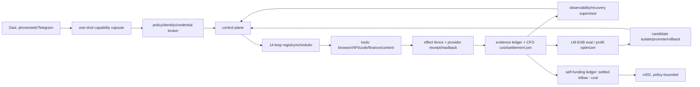
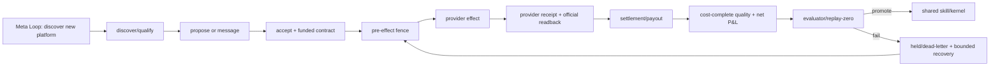
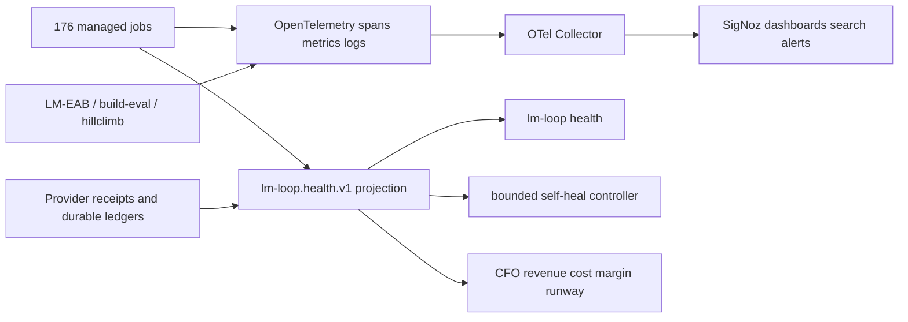
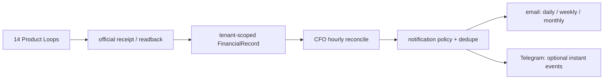
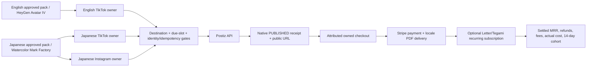
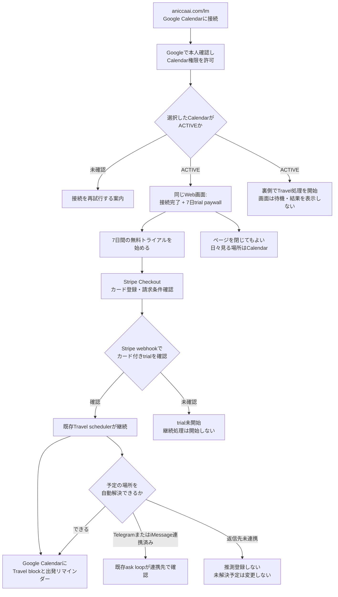
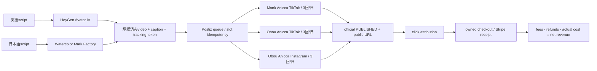
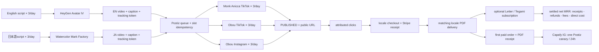
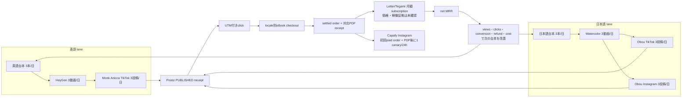

# Life Manager 統合SSOT — As-Is / To-Be / TODO

> **正本はこの文書 1 本だけ（Dais 2026-09-29）。** 以前の `2026-09-15-life-manager-agent-architecture-refinement.md`（全体設計・meta loop #10）、`2026-09-22-paid-fulfillment-all-platforms-design.md`（Paid）、`skills/earn/gig/TODO.md`（gig TODO）と、`docs/superpowers/specs/` のほかの spec はすべて参照用。TODO・順序・状態はここだけを更新し、他のファイルに新しい TODO を書かない。

この文書は Life Manager 全体（Foundation 14ループ + Paid fulfillment）の唯一の入口。
詳細の正本は次の2つで、この文書は両者の統合・順序・現在cursorだけを持つ。

- Foundation/全体: `docs/superpowers/specs/2026-09-15-life-manager-agent-architecture-refinement.md`（Whole-ship handover / AGI addendum / Whole-ship remaining TODO）
- Paid: `docs/superpowers/specs/2026-09-22-paid-fulfillment-all-platforms-design.md` + `skills/earn/gig/TODO.md`（Canonical As-Is / To-Be snapshot）

所有: Claude が Foundation・Paid 両方の唯一の開発owner（2026-09-25 Dais指示）。旧2つのCodexセッションの保護境界は解除。Life Manager 自身のloopは引き続き本番stateのownerであり、Ryu room `18211957` への再送禁止と正式納品ボタン非押下は維持する。

## 0. 原則: No human in loop

Life Manager はアシスタントではなくマネージャー。Grok bot、Muse、Instinct と同じく、自分でコンピュータとブラウザを使い、仕事を最後まで完結させる。**人（Dais を含む）に作業や判断を頼むことは、設計違反として扱う。**
- 応募・承諾・制作・納品・入金確認・修復・改善は、すべて Life Manager の loop が行う。
- 人に頼るのは、法律上どうしても本人が必要なものだけ（初回の KYC、本人確認など）。それも最初の1回に限る（T10）。
- 判断は model が提案し、決定的な policy（金額、契約条件の一致、上限、重複防止、rollback）が確定させる。
- 外部の coding agent（Claude Code、Codex のセッション）も同じく「人」の側。Life Manager が自分で直せるようになること（§5.1）が目標。

### 0.1 Dais の実行範囲境界（全案件共通）

- 明示された現在の目的が、今回の作業範囲の正本。自分から別案件、別担当、別agent、別worktreeの仕事を開始・修正・認証・送信しない。
- 自律判断は、現在の目的の中で次の安全な工程を選ぶためにだけ使う。担当外の問題を見つけても、変更せず境界とownerを記録して通知する。
- 投資の成果として扱う金額は、provider公式のsettled receiptに基づく、全手数料・funding/borrow・slippage・gas・model cost控除後のrealized net P&Lだけ。テストfixture、paper/unrealized、入金、予測、他loopの売上は投資利益にしない。
- この境界は特定サービスだけの禁止ではなく、全loop・全repoに適用する。現在の投資cursorは投資receipt、net P&L、資本拡大gate、Telegram通知に限る。

## 1. 観測事実（2026-09-25 JST 実測）

| 項目 | 値 | 出所 |
|---|---|---|
| origin/main | `d4fe081993`（#5854） | `git log origin/main` |
| 本番loaded release | `d4fe0819931c50caaf41f25e86f1052cd8a0359c`（旧） | Foundation spec:6994 |
| Foundation branch | `fix/writer-admission-self-heal-20260924` `4bef60765c`、main比 0 behind / 224 ahead、open PRなし | `git rev-list` |
| Paid branch | `fix/coconala-history-retry-20260924` `5a28bfb762`、main比 10 behind / 126 ahead、PR #5868 `CONFLICTING` | `gh pr view 5868` |
| Foundation gate | `healthy=0, safely_fenced=1, uncovered_failure=13` | Foundation spec:6993 |
| ディスク空き | 561,643,520 bytes | `df -k /` |
| admission floor | Foundation 1,155,780,608 bytes / Paid 524,288 KiB（536,870,912 bytes） | Foundation spec:6612, Paid TODO |
| 検証済み settled net MRR | 存在しない | Foundation spec:5708 |

訂正（T2で確認）: コード上の floor は既に1つ。`runtime/host/disk_admission.py:16` と `skills/earn/gig/scripts/gig_disk_guard.py` の `DEFAULT_REQUIRED_KIB = 524288` がすべての producer に効いている。1,155,780,608 bytes は Foundation spec が release 昇格の運用目標として使う値で、コード定数ではない。どちらも同じ値にする必要はないので、コード変更はしない。

## 2. 2ブランチの統合方法

試験merge（`git merge-tree --write-tree`）の結果:

- main ← Foundation: 衝突なし（Foundation は main を含む）。
- Foundation × Paid の固有衝突は `runtime/loop/lm_loop.py` の1 hunk（`_admission_effect_unknown_occurrences` 付近）だけ。
- 残り10ファイルの衝突は Paid × main。原因は Paid の一部が #5854 で既に squash merge 済みであること（Freelancer/Upwork readiness・transport とその tests、`application_occurrence_reconcile.py`、`freelancer-actions.public.json`、Paid spec、gig TODO）。
- Paid の main 比の実コード差分は約600行（`paid_direct.py`、`application_occurrence_reconcile.py`、`gig_release.py`、`reconcile_paid_no_effect.py`、`lm_loop.py`、readiness/transport とそのtests）。

手順:

1. 最新 origin/main から `integrate/foundation-paid-20260925` を切る。
2. Foundation を merge する（fast-forward相当）。
3. Paid を merge し、衝突を次のように解く。
   - `lm_loop.py`: 両方残す。Paid の occurrence単位 dict を返す `_admission_effect_unknown_occurrences` と互換wrapper `_admission_effect_unknown_owners` を採用し、読み取りは Foundation の `_read_admission_rows` に寄せる。Foundation の `_legacy_pending_admission_identity` はそのまま残す。全呼び出し元を `rg` で確認する。
   - squash済み10ファイル: main 版を土台にし、#5854 以後の Paid commit（`a751a1f91f` account binding、`0acb25bb50` automatic-bid policy、`cb1cb48677` stale funded inventory 拒否、`a882779ead` receipt-reserve など）の差分だけを載せ直す。
   - Paid spec / gig TODO: Paid HEAD 版を採り、main 側にだけある Ryu receipt 追記を取り込む。
4. `runtime/loop/tests`、`skills/earn/gig/tests`、`skills/self/disk-cleanup/tests` を実行する。
5. 1つのPRにまとめ、#5868 は superseded として閉じる。admin merge する。
6. main から immutable release を1つ切り、label ごとに apply して readback する（release を切るだけでは label は切り替わらない）。

## 3. As-Is — 14ループ（Foundation spec:6939-6961）

Pass はライフサイクル上の投影で、settled revenue ではない。金額は記録があるものだけを載せる。

| # | ループ | Jobs/Pass/Blocked/Fail/無終端 | 主な境界 | 記録されたお金 |
|---|---|---|---|---|
| 1 | Affiliate | 6/1/2/0/0 | effect fence / FIFO | conversion・settled commission なし |
| 2 | Investment | 1/0/1/0/0 | 起動前の capacity admission / cross-venue owner receipt 不在 | Alpaca 公式 readback net **-$0.15**（往復1回、1/30、拡大不可） |
| 3 | Agent Economy | 19/1/9/4/4 | capacity/effect fence、旧entrypoint失敗 | settled x402 **0.003 USDC**、net は未証明 |
| 4 | Job Hunter | 7/1/5/1/0 | effect fence、inbox/runner失敗 | 新規 funded contract なし、Mercor **$0.00** |
| 5 | Fundraiser | 1/0/1/0/0 | effect fence | 資金 receipt なし |
| 6 | Connector | 1/0/0/1/0 | 旧release `entrypoint_exit_1`、`127.0.0.1:9222` 固定と Cloak IPv6 endpoint の不一致 | 収益源ではない |
| 7 | Self-Build | 4/1/3/0/0 | recovery/dev owner 失敗 | 収益源ではない |
| 8 | Mobile Apps | 22/13/6/1/2 | effect fence、metrics lane | 投稿はある。install→課金→MRR の紐付けは未完 |
| 9 | Capafy | 8/2/5/0/1 | effect/capacity | creator earnings は観測済み、paid-out **0** |
| 10 | CFO | 3/0/3/0/0 | message/payout の effect-unknown | 検証済み財務snapshotなし |
| 11 | Writer | 7/2/5/0/0 | capacity/effect/FIFO | 一部は公式readbackあり、支払いの帰属なし |
| 12 | Coconala | 7/3/1/3/0 | browser/Paid/Storefront の失敗と fence | Ryu は手動完了（収益の証明ではない） |
| 13 | CrowdWorks | 5/0/1/4/0 | entrypoint 143/1、effect_unknown（application 44、Paid 1、reply 201、report 1） | Paid 納品・支払い receipt なし |
| 14 | Lancers | 7/2/3/2/0 | fence、timeout、storefront/work-sync | 残高 **¥0**、funded 0件（過去の ¥150,000 は提案のみ） |

Paid 側の追加（Paid spec:27-45）: Freelancer・Upwork は account-bound auth も owner もない（Upwork `contracts=[]`）。`hf-gig-paid-direct` の直近の失敗は ENOSPC による `entrypoint_exit_1`（`effect_class=none`、外部送信なし）。

**As-Is の要約:** 検証済み純利益は実質 $0（+0.003 USDC、-$0.04）。14行中13行が uncovered failure。最大の共通原因は、ディスク不足と、修正が本番releaseに載っていないこと。

## 4. To-Be


```mermaid
flowchart LR
  U[Dais: phone/web/Telegram] --> C[one-shot capability capsule]
  C --> P[policy/identity/credential broker]
  P --> CP[control plane]
  CP --> R[14-loop registry/scheduler]
  R --> T[tools: browser/API/code/finance/content]
  T --> F[effect fence + provider receipt/readback]
  F --> L[evidence ledger + CFO cost/settlement join]
  L --> O[observability/recovery supervisor] --> CP
  L --> E[LM-EAB eval / profit optimizer] --> K[candidate isolate/promote/rollback] --> CP
  L --> S[self-funding ledger: settled inflow - cost] --> X[x402, policy-bounded]
```

- **各ループの完了の定義（全ループ共通）:** account-bound auth → source-complete な公式inventory → funded contract → policy receipt → owner がちょうど1つ → 正しい成果物 → occurrenceごとに effect は1回 → 公式receipt/readback → 支払い/payout readback → crash recovery → replay-zero。
- **ループの健康の定義:** 全行が `healthy` か、型付きの fence（安全な次アクションが記録済み）のどちらか。`unknown` は診断cursorであり、再送の許可ではない。
- **利益の定義:** ループごとに `settled_customer_revenue - refunds - measured cost`。CFO が provider receipt と照合して算出する。Pass やログは利益ではない。
- **役割分担:** model は提案する。identity・計算・dedupe・spend cap・rollback は決定的なコードが持つ。
- **Dais の手間:** 最初の bootstrap と、法的に必要な KYC/OAuth/CAPTCHA だけにする。
- **経済目標:** 検証済み net MRR USD 10K → 自己資金化 → YC W27 用の証拠 → AGI/UBI 研究。証拠なしに達成を主張しない。

## 5. TODO（実行順・正本）

順序変更の記録: 旧順序（Foundation spec:7092-7137）では、収益の帰属（旧9）が capsule（旧6）・cloud（旧7）・LM-EAB（旧8）の後だった。新順序では、ループごとの利益計測（新8）を capsule/cloud/LM-EAB より前に置く。理由は、利益が見えないと、どのループに資源を寄せるか・何を改善するかを判断できないため。Paid cursor は旧5の中身を新7として独立させた。

履歴: この時点のT7 cursorは **7-0（Lancers 5605912）と 5-11 / 5-12 の並行**だった。これは過去のsnapshotであり現行Gig cursorではない。最新のGig cursorは本書末尾「2026-10-08 JST — Gig atomic cursor」を参照する。

T5 の途中経過（2026-09-25 19:00 JST）:
- 観測1: `life-manager-recovery-supervisor` は release 287d で毎 wake exit 1 になっていた。原因は、旧 release の intent を正しく `blocked: release_sha_mismatch` にした結果まで失敗として数えていたこと。#5879 で、この理由の blocked は exit 0 にした。他の理由の blocked は今までどおり exit 1。
- 観測2: 287d を全体へ再 apply したら `admission rebind refused: effect_unknown` で fleet 全体が中止された。#5880 で、fleet モードではその owner だけを `skipped: effect-unknown-fence` として続行するようにした。target 指定の apply では今までどおり raise する。
- 本番: release `20260925T185507-74c69d01` を全体へ適用した（適用136、admission 待ち30、実行中2、fence で skip 1 = `hf-gig-apply-direct`、失敗0）。
- 未達: 過去の `repaired` 11件は、どれも `before_event_id == after_event_id` かつ `command_exit_code=None` だった。readback で既に healthy だったので閉じただけで、修復操作はしていない。T5 の完了には、executor が `lm-loop reconcile ... --max-owners 1` を実行し（exit 0）、修復後の readback が healthy になる outcome が1件必要。
- supervisor は FIFO で1 wake（60秒）ごとに1件しか処理せず、未処理 intent が約200件ある。手動で回すと Codex-free の条件を崩すので、自然処理を待つ。
- 22:17 JST の判定: #5883（古い release の依頼を1 wake でまとめて閉じる）で、未処理は 571件 → 42件まで減り、現行 release の依頼が executor に届くようになった。実際に `lm-loop reconcile` が exit 0 で実行された（agent-economy-loop、franklin-loop、hf-gig-apply-reconcile）。
  - それでも、60分間の監視で本物の `repaired` は0件だった（修復後の PASS 待ち 2412回、古い依頼の close 118件）。
  - 理由は設計上の穴。自己修復の操作は reconcile（owner を現行 release へ付け直す）だけで、全体へ適用した後の失敗はコードや環境が原因なので、付け直しでは直らない。release ずれの owner（30件）は admission 待ちで付け直しが拒否される。長時間動く loop は終了の時点が来ない。
  - T5 の次の手: escalate → `guarded_code_repair`（Life Manager 自身の開発 loop）で1件をコード修復させる。最初の候補は `hf-gig-apply-reconcile` の exit 1（effect なし）。
  - 22:30 JST の #5886（self-heal の agent を Claude に変更）は T5 の誤読で、revert した。Life Manager の内部モデルは GPT（terra/luna/sol）のまま使う。§5.1 を参照。
  - 11:25 の dev 実行の失敗原因: Codex の agent が tests を回して `lm-test-tmp.*` を worktree 内に残し、preflight が許可リスト外の変更として RED にした。Claude に切り替えて Bash を無くしたので、agent は tests を回さず、この問題は起きない。
  - 解消済みの self-heal issue 11件を close した（connector: 5872/5870/5836、supervisor: 5869/5867/5866/5864/5863/5860/5856/5850）。
  - T5 の残り: 04:10 JST の `life-manager-dev` の自然起動で、Claude agent が open な self-heal issue を修正する。その後 PR → merge guard → release → 対象 owner の次の実行が PASS、となることを readback で確認する。
  - 制約: dev agent が触れるのは `apps/life-manager` と `runtime/loop` だけ（issue #5130）。gig 系のコード（例: `hf-gig-apply-reconcile`）は対象外。

T4 完了記録（2026-09-25）: `life-manager-connector-native` が release `287d913c` の上で自然起動し、PASS した。run `18d886ebca7142c8-54861`、18:41 JST、exit 0、`last_terminal_result=pass`、heartbeat は `worker_finished`、wake の status は `applied_bundle`、blocker なし。
その直前の旧 release での起動（18:02）は `worker_failed` / `circuit_open` / `wake_boundary_failed` だった。
注意点が1つ残る。`127.0.0.1:9222` は Dais の Google Chrome（pid 465）が使っており、daily-driver は `[::1]:9222` で待ち受けている。新しいコードは IPv6 経由の recovery でこれを回避している。人間用のブラウザなので、Chrome 側は変更しない。

T3 完了記録（2026-09-25）: main の `287d913c1c`（#5875）から release `~/loops/releases/20260925T180341-287d913c` を切り、`~/loops/current` をそこへ向けた。
続けて `lm-loop apply --all` を実行した（rc=0、全260件）。結果は適用138、退役済み91、admission 待ちで skip 29、実行中で skip 2、失敗0。
1回目は `production apply is already owned` で拒否された。release-reconciler が同時に apply していたためで、lock が外れた後に再実行した。
readback: release を参照する plist 169本中140本が新 release を指している。残り29本は admission 待ちで skip された分で、admission queue が空いたら再適用する（T6）。
foundation gate（新 release の status 271行で算出）: `healthy=0, safely_fenced=4, uncovered_failure=10`（旧は 1/13）。
- safely_fenced の4つ: affiliate と cfo は `external_effect_unknown`、investment と fundraiser は `runtime_admission_deferred`。
- uncovered_failure の10はすべて `runtime_release_drift`。14ループの98 job のうち93は新 release で install 済みで、53は新 release 上の event がある。40は新 release で自然実行がまだ来ていない。5は admission 待ちで旧 release のまま。

T2 完了記録（2026-09-25）: branch `integrate/foundation-paid-20260925` を作り、main ← Foundation（衝突なし）← Paid ← この docs branch の順に merge した。
Paid と main が衝突した10ファイルは、main 側の blob が Paid の過去の commit と完全に一致したので Paid 側を採用した。
`lm_loop.py` は Paid の occurrence 単位の関数を採用しつつ、読み取りを `_read_admission_rows` 経由にした。こうすると DB が lock されていても fence が0件とは報告されない（fail-closed）。Paid の元の `except sqlite3.Error: return {}` は fail-open で、Foundation の test `test_effect_fence_read_does_not_turn_sqlite_lock_into_empty_fence_set` を落とす。
検証: `runtime/loop/tests` 693件 PASS、`skills/earn/gig/tests` と `skills/self/disk-cleanup/tests` 1598件 PASS、`bin/lm-loop-contract` の errors は []。

T1 完了記録（2026-09-25）: 空き 561,643,520 → 5,430,202,368 bytes（floor 1,155,780,608 以上）。削除したのは、clean かつ全 commit が remote にある worktree 38本（うち25本は owner=`codex` の lease が 2026-09-18 に期限切れ）と、どのプロセスも開いていない verify-loops-audit の loop-tmp（300MB）。state・memory・Codex の履歴は削除していない。
減り方は一定ではない。5分計測では純増 +456MB の区間もあった。6時間内の大きな書き込み元は `~/.codex-acct2`（thread_history 2.15GB、rollout 1.0GB）と loop-tmp の残骸。loop が終了時に自分の loop-tmp を掃除する処理は T6 で扱う。

| # | タスク | 完了の証拠 |
|---|---|---|
| T1 ✅ | ディスク floor を回復し、1つに統一する（1,155,780,608 bytes）。再生成可能な cache と governor allowlist を消し、大物（claudevm 約7G、colima 約2G）の要否を判断する | `df` と governor receipt が floor 以上 |
| T2 ✅ | §2 の手順で統合PRを作り、両tests を PASS させて main へ merge、#5868 を close | merge commit、tests の出力 |
| T3 ✅ | main 由来の immutable release を1つ切り、全labelへ apply して readback | label ごとの loaded sha = release sha |
| T4 ✅ | Connector の natural canary（Cloak endpoint の解決）を effect なしで1回 | 公式receipt、`entrypoint_exit` 0 |
| T5 | 自己修復を1回実証する（外部の coding agent なしで、Life Manager が自分の問題を見つけて自分で直す。定義は §5.1） | §5.1 の完了証拠 |
| T6 | 14行の reconcile: 全行を healthy か型付き fence にする。effect_unknown は occurrence ごとに公式receiptで閉じ、一括retryはしない | gate `uncovered_failure=0` |

T6 の途中経過（2026-09-25 22:55 JST、release `20260925T224024-beae3e37`）:
- gate は `uncovered_failure=10, safely_fenced=4`。10件はすべて `runtime_release_drift`。原因は今日 release を何度も切ったこと。新しい release を切らずに約24時間置けば、1日1回の job が現行 release で1回ずつ動き、自然に解消する。**release を凍結する**（例外は本物のバグ修正だけ）。
- 現行 release 上の本物の失敗は8件。
  - `life-manager-daily-driver`: 以前の owner run が残した孤児の Chromium（pid 37260、ppid 1）が profile を握っていた。そのため2回目の起動が exit 0 で抜けて `Failed to launch` になり、再起動を繰り返していた（launchd.err.log は 96MB）。#5889 で「生きている owner を引き取る」ようにした。22:52 に `adopted live profile owner pid=37260` を確認し、`loaded-running`・エラーなしになった。
  - Lancers negotiate/paid と CrowdWorks reply: 共有ブラウザの接続失敗（`browser_connect_failed` / goto timeout）で、daily-driver 停止の連鎖。次の自然実行で回復するかを確認する。
  - `job-search-inbox`: `inbox.py:398`。model の申告件数と thread ID の数が食い違った時に安全側で止まる、意図された fail-closed。二重返信を防ぐための仕組みで、test でも固定されているので変更しない。
  - Instagram en-card / obou: `LM_DATA_DIR is required` と ledger の job id 衝突。obou の Instagram は `marketing-destinations.json` で `ebook_account_out_of_mobile_scope`（上限 0）なので、直すより退役させる候補。state root が共有 events.jsonl のため、run 単位の切り分けは未完。
  - `life-manager-honne-ja`: 昼の ENOSPC（空きが 0.56GB だった時点）による。publish は fence で止まっていた。
| T7 | Paid cursor: Coconala Paid の no-effect wake → Storefront の公式readback → CrowdWorks の fence → Lancers の inventory → Freelancer/Upwork の account-bound auth → Mercor | 各 provider の readback |
| T8 | CFO: ループごとの settled revenue と cost の join（ループ別P&L）を毎日出す | P&L 行ごとに receipt id がある |
| T9 | Mobile funnel と `/en` `/lm` `/income` の整合（install→activation→課金） | attribution receipt |
| T10 | one-shot capability capsule | 目標・承認の質問なしで初回の実行が通る |
| T11 | cloud の durable worker と local の parity | 同じ task で同じ receipt |
| T12 | evaluator が所有する self-improvement（rollback つき） | canary で settled contribution が改善 |
| T13 | settled cost で裏付けた x402 自己資金化 | inflow ≥ cost の CFO readback |
| T14 | LM-EAB（held-out、較正、再現可能） | 独立した再実行で同じ結果 |
| T15 | 検証済み USD 10K MRR → YC W27 の証拠 → cross-domain / AGI / UBI | receipt の集計 |


### 5.0 順序変更（2026-09-27 10:5x JST）: 土台 → 全 loop を green → 収益 → 自己修復の実証 → 自己改善

旧順序: T5（自己修復）→ T6（14 loop）→ T7（Paid）。新順序: ①土台（5-13 自動 apply、7-6e 予約の偏り、6-9b〜d ディスクとブラウザ）→ ② T6 全 loop を green（正常 / 型付き fence / 意図した停止のどれか）→ ③ T7 収益 → ④ 5-12 自己修復の自然実証 → ⑤ T12 自己改善。現在の cursor: ① 5-13。

理由（今夜の実測）: 失敗の大半は各 loop のコードではなく土台だった。merge した修正が owner に届いていない（172 中 53 だけが current release）、admission の stop が戻っていない、capacity の予約の偏り、fence の滞留、ディスク満杯。SNS 投稿 owner は release を反映しただけで失敗が止まった。自己修復の dev agent は土台（runtime の制御面、launchd、admission）を編集できない設計なので、土台が壊れている間は自己修復の実証が起きない。green の基準線が無いと、自己修復が何を直したかも測れない。
実測（10:4x JST）: loaded 172 = ok 64 / failing 47（常駐 daemon の再起動による誤分類を含む）/ capacity 待ち 41 / fence 20。earn 51 = ok 12 / failing 15 / fence 12 / capacity 12。

**Handover（2026-09-28 10:5x JST。この順が正本。新しい session はここから）**

**共通 Paid 境界の実装カーソル（このbranch）**
- 個別顧客の例外実装ではなく、`skills/_shared/marketplace-core` に provider-independent な `PaidHandoffReceipt` 契約と `validate_paid_handoff` を追加する。Reply/Negotiation の thread、accepted `ContractReceipt`、funding id、scope、artifact 要件、金額、通貨を同じ記録に束ね、provider と contract の不一致・未承諾契約・未funded statusを fail-closed にする。
- 共通 `paid_kernel` に `--require-paid-handoff` / `require_paid_handoff=True` の必須ゲートを追加した。必須モードではhookを持たないadapter、未承諾contract、invalid handoffはeffect=0で止まり、valid proofはmutation前にintentへ保存する。Lancers/CrowdWorksのowner配線はこのbranchに追加済みだが、production releaseへの適用はまだである。
- `accept` は仮払い前の契約承諾なのでfunded handoffの対象外とし、`answer` / `submit` / `formal_delivery` / `cancel`だけをfunded必須mutationとして扱う。これにより「採用承諾 → 仮払い → Paid納品」の段階を共通kernelで表現できる。
- Coconala adapter (`skills/earn/gig/scripts/coconala_paid_adapter.py`) は、orders-only の初回snapshotから targeted talkroom readbackへ更新し、構造化価格・取引状態・talkroom証跡・要件digestが揃った場合だけ `ContractReceipt` / `PaidHandoffReceipt` を生成する。fundingまたはscope証跡が欠けた場合は `coconala_paid_handoff_unavailable` で止まる。既存の `paid_direct.py` ownerにも `--require-paid-handoff` を配線し、送信・納品・キャンセル子プロセスを起動する直前にこのcanonical receiptを再検証するところまで、このbranchで完了した。これはproduction releaseを適用した証明ではなく、共通kernelへの完全移行・immutable release・公式canaryは未完了である。
- Lancers adapter (`skills/earn/lancers/scripts/paid_adapter.py`) は、公式detailの `provider_state=funded`、固定金額、terms digest、buyer threadを同じcanonical receiptへ写像する。仮払い未確認・曖昧な金額・terms digest欠落は `lancers_paid_handoff_unavailable` で止まる。Paid ownerには `--require-paid-handoff` を配線済みだが、immutable releaseへの適用と公式canaryは未完了。
- CrowdWorks adapter (`skills/earn/crowdworks/scripts/paid_adapter.py`) は、公式contract bodyから一意の固定報酬額とterms digestを読み、milestone/form/document要件とbuyer threadをcanonical receiptへ写像する。時間単価・範囲価格・価格/terms欠落は `crowdworks_paid_handoff_unavailable` で止まる。Paid ownerには `--require-paid-handoff` を配線済みだが、immutable releaseへの適用と公式canaryは未完了。
- Mercor adapter (`skills/earn/mercor/scripts/paid_adapter.py`) は、契約の `active` / `contracted` 状態やタイトルからfundingを推測しない。公式snapshotに明示された正規化 `paid_handoff`（funding、固定金額、通貨、terms/scope/artifact digest、buyer thread、観測時刻）が全て揃った時だけcanonical receiptへ写像し、欠ければ `mercor_paid_handoff_unavailable` で止まる。現行snapshotにはその証跡が無いため、Mercor mutationはまだhuman-requiredのままである。写像後の形状検証はCoconala・Lancers・CrowdWorks・Freelancer・Upworkと同じ `skills/_shared/marketplace-core/scripts/paid_handoff.py` を使い、日時やハッシュ規則をMercorだけで再実装しない。
- Freelancer/Upworkには `skills/earn/gig/scripts/providers/*_paid_adapter.py` と共有 `skills/_shared/marketplace-core/scripts/paid_handoff.py` を追加した。Freelancerのfunded milestone、Upworkのfunded milestone・明示通貨、buyer thread、scope、artifact要件が揃った場合だけ同じcanonical receiptへ写像し、未funded・通貨推測・証跡欠落はfail-closedにする。これはadapter境界とfocused testsの完了であり、account-bound auth、source-complete live inventory、owner登録、production canaryは未完了である。
- 現在は schema / typed parser / validator / kernel gate / 6 platformの薄いadapter境界 / 共通handoff builder / focused tests まで。各provider固有コードは公式事実の取得とprovider IDの翻訳だけを担当し、契約形式・証跡検証・effect fenceは共通kernelが担当する。既存4 platformのPaid owner配線はbranchにあり、Freelancer/Upworkはowner未登録のadapter境界だけである。まだ main merge、immutable release、production apply/readback はしていない。provider adapter が公式 funded readback 後にこの記録を出すことが次の接続条件。
- 次の順序: (1) branchの既存owner gateをimmutable releaseへ適用し公式canary、(2) Freelancer/Upworkのaccount-bound auth・source-complete inventory・funded contractを確立、(3) 公式 receipt・replay-zero を各providerで確認、(4) payout receiptをCFO ledgerへ接続、(5) Meta Loopから同じconformance gateで新platformをenrollする。

進捗（2026-09-28 13:2x JST、Claude）:
- 1 ✅ 下書き 4243672453（AI Evaluation Failure Triage Brief）は審査提出済み。公式 readback: platform_status=1、audit_status=2、is_confirmed_skills/config_keys=true、package_uploaded=true（04:08Z）。CP1 に Primary Model 欄は実在しない（model は CP2 で決まる）ため、verify_cp1_model は CP2 後と最終確認で呼ぶ（#6066・#6068〜#6070）。catalog の未公開分は DeepSeek V4.1 Flash（19件）、Claude 指定の10件は公開済み・審査中で据え置き。
- 1 追記: Capafy `GET /agent/agents/{id}` の model は 4243672453=`deepseek/deepseek-v4.1-flash`、4813383030=`DeepSeek V4.1 Flash`（05:1xZ）。
- 2 ⏳ 03:24Z は他 run の fence、04:24Z は host の枠満杯（稼働6＋予約2＝上限8、`resource_capacity_busy`）で exit 75。04:24:44Z に `lm-loop start` で起動した run が新 Agent 4813383030（Board Update Deck Builder）を CP3 まで提出: platform_status=1、audit_status=1、skills/config confirmed、package uploaded、run rc=0 `RESULT_success`。手動起動なので無人の証明は 05:24Z の自然 run で取る（次の候補は Demand rank 1 の reels-hook-lab）。
- 反映: release `20260928T140252-811d0937`（#6071〜#6073）を capafy の deterministic 7 loop に `lm-loop reconcile` で適用、readback installed=811d0937。自動の release 作成は 9 分待っても起きず、`reconcile-agent-runner-release.sh` を手動実行した（fleet-apply は "production apply is already owned" で skip、errors=1。未調査）。
- 2 ✅（無人申請を公式 readback で確認）: 05:24Z の自然 wake は枠満杯で exit 75 → 58 秒後に予約 dispatch が自動起動（人の操作なし）→ 新 Agent 3798949471「Reels Hook Lab — Win the Cover Frame」を CP3 まで提出。readback: platform_status=1、audit_status=1、skills/config confirmed、package uploaded。run は提出後の報告中に browser-lane-agent 1800s で rc=124 → exit 1 → fence。adapter が `capafy:agent/3798949471/version/2104444318118604800:platform_status=1` で close（status で fence False）。修正: #6074 起動間隔 3600→900s、#6075 fixture、#6076 申請 run を application-lane-agent（3600s）へ。release cf8d83ac を capafy 7 loop に適用（installed=cf8d83ac、interval:900s）。審査中 4・空き 1。残り: 次の自然 run が Shorts Hook Lab を rc=0 で出すこと（green の確認）。
- 4 ✅ 本番 readback: 06:07Z の毎時 receipt（capafy-skill-analytics.json）に per-skill `profit_30d_usd` と Telegram 要約が実データで入った。
- **Capafy は未完了（訂正 2026-09-28 15:3x JST、Dais）**: 申請の仕組みが動いただけで完了扱いにしてアプリへ移ったのは誤り。1つずつ閉じる。アプリ（下の 5 アプリ As-Is）は Capafy の C1〜C7 が閉じるまで着手しない。

**集客は 1 回きりではなく loop で回る（2026-09-29 時点の頻度）**: 記事 article-daily は毎日 06:00 JST に 1 本（Substack JA/EN・note・aniccaai.com。1 日おきに Capafy の売れている Skill へ誘導、ct=article-<slug> で計測）、途中で止まった記事は article-resume が 5 分ごとに引き継ぐ。open-seo の検索語は Skill ごとに 30 日に 1 回更新。Capafy の工場は 15 分ごと。Skill 別利益・流入元の Telegram 報告は毎時（数字が変わった時だけ）。PromptBase は毎日 04:20 JST に 1 件。Capafy Instagram は復旧後 1 時間ごとの loop。アプリの SNS 投稿は各 lane 1 日 3 回。

**Capafy を閉じて次（モバイルアプリ）へ進む条件（公式 readback で確認できたら閉じる。審査・承認・売上の結果待ちは条件にしない = 監視のみ）**:
- X1 Capafy Instagram が人の手なしで Reel を 1 本投稿（Instagram の公式 Reel 一覧で確認）
- X2 Capafy の Skill に誘導する記事が 1 本公開され、リンクに ct=article-<slug> が付いている（RSS・公開ページで確認）
- X3 Japanese Humanizer の $9.99 版が審査に提出される（publish-remote-status platform_status=1）
- 監視のみ（進む条件ではない）: Hook Lab DeepSeek 版の承認と黒字化、Japanese Humanizer の承認、記事経由の注文数

**値付けとモデルの方針（Dais 2026-09-29。全商品・既存も新規も最初から適用）: 安く作って高く売る。**
- モデル: 既定は安くて十分な品質のモデル（DeepSeek V4.1 Flash 等）。Sonnet 級は使わない。例外は、同じ価格帯の売れている競合が明らかに高品質を必要とし、かつ価格でモデル代の数倍を回収できる時だけ。
- 価格: 売れている出品者の価格をそのまま参考にし（成功者を真似る）、その上限側に置く。モデル代の数倍が入る価格にする。無料配布はしない（試用はプラン設計の無料トライアルだけ）。
- 既存: Capafy の Sonnet 33 本は「DeepSeek 切り替え + 値上げ」を 1 本 1 回の更新にまとめ、売れている順（Slide Maker → TikTok Script Pro → Marketing Strategist → YouTube Script Writer → …）に審査枠が空き次第出す。Hook Lab は DeepSeek 版が審査中。Japanese Humanizer は $9.99 化を提出待ち。
- 新規: 工場の既定を DeepSeek + 売れ筋の価格帯にする（既に DeepSeek 既定）。
- 歯止め: 毎時の利益データでモデル代が売上の 30% を超えた Skill は、工場が値上げまたはモデル変更を自動で出す（最初の方針の後の安全網）。
- 同じ方針を Writer（有料記事の価格）、Ebook（The Anicca Reset の価格・KDP 価格）、アプリ（サブスク価格）、PromptBase にも当てる。

**Capafy 実測（2026-09-29 18:1x JST、公式 readback）**: 自分の Agent 52 本 = 公開中 44・審査中 7・下書き 1（Capafy API `agentStatus`）。お金（毎時集計 15:07 JST 時点）: 売上累計 $100.76（100 件）→ 取り分 $74.64 → 今月 API 実費 $25.50 → 差し引き $49.14。未払い残高 $20.26・振込可能 $14.40・振込済み $0。
- 済み: Hook Lab v1.0.4 審査提出（platform_status=1、#6199: CP2/CP3 のタブ再試行・待ち時間・「下書きを保存」表記・変更履歴はキー入力）。工場の詰まり解消 → 17:57 の実行は次の Agent 9563867391 の DeepSeek 切り替えへ進行中。宣伝 3 時間ごと本番（#6197、d697d18f、1:15 から 3 時間おき 8 回、2 本目 TikTok Script Pro の記事 200 + X PUBLISHED）。値上げ取り消し（#6200、キュー 19 本で値上げ 0 本を API で確認、DeepSeek 切り替えは残す）。利益の日次 Telegram（#6195）。
- 残り（Capafy）: 1 17:57 の工場実行が審査提出まで行くか公式確認 2 毎時集計が 15:07 から止まっている原因を直す 3 審査中 7 本の承認を待たず、次の Agent を工場が作り続けるか確認。

**Dais 決定（2026-09-29 17:2x JST）と残り ToDo の順番**
- 開発の流れ: 変更は worktree の中で実物（worktree のスクリプトを直接実行）を動かして確認し、成果がそろってから main へ 1 回だけ merge → release。小さな修正ごとに main へ入れて本番で試すのはやめる（17:0x までの #6190/#6191 は本番で試した。前例: 不正な priority "paid" が全 loop を止めた）。
- 観測性: `lm-loop status` は 278 loop・約 4 秒・JSON のみ（実測 17:2x: 正常 170 / 停止 108 = effect_unknown 41・capacity_busy 39・exit_1 22）。→ `lm-loop health` を追加: 1 画面の表（loop・最終実行・結果・停止理由・次の手）と、スキル別の今日の成果（公開数・売上）。
- 目標の定義（Dais 2026-09-29 17:3x）: $10k MRR = **銀行口座に入る利益**（売上 − プラットフォーム手数料 − API 費用）。売上総額ではない。現在 Capafy 30日: 総額 $80.78 → 手数料後 $64.62 → モデル代 $42.99 → **利益 約 $21.63**。この利益をスキル別に毎日 Telegram へ報告する（いまの C6 日次報告はキュー・撤退候補だけで利益額がない → 追加する）。
- ブラウザ（Dais 2026-09-29 17:3x）: 専用ブラウザは作らない。割り当ての正本 `~/.config/ai/registry/browsers.toml`（identity=サイト×アカウント、1 identity 1 profile、`browser-guard.sh` の lease で同時使用を防ぐ）。現物readbackでは`coconala:kosuke`は`gig-daily-driver`・9223で稼働し、CapafyとCoconala Gigが同じseller identityを**leaseで直列共有**する。Gigの`hf-gig-browser` process、`session_vault_tick.sh`、Coconala browser testsがこの対応を示すため、「Gigは別のdaily-driver Chrome」という直前記述はsource/live stateと矛盾し、採用しない。`cdp_lock.sh`はGig内部のtab/phase直列化であり、identityの代替ではない。Hook Lab CP2の停止はブラウザ待ちではなかった（ボタン判定のタイミング）。
- 残り順: 0 スキル別の利益（銀行に入る額）を毎日 Telegram へ 1 宣伝ループを 3 時間ごと・Agent ローテーション（ledger を日付→枠キーへ） 2 Hook Lab CP2 のベンダーボタン待ち → 審査提出 3 申請順を新 Agent 優先 4 `lm-loop health` 5 effect_unknown 41 件を証拠付きで閉じる 6 アプリ 7 connector 8 fundraiser 9 self-fix worktree 化。

**実測（2026-09-29 17:1x JST、公式 readback）宣伝ループ（capafy-distribute-daily）初公開**: 無料英語記事 https://aniccaai.com/blog/capafy-reels-hook-lab-2026-09-29 = HTTP 200、本文に `ct=capafy-distribute-reels-hook-lab`（ledger 2026-09-29 aniccaai=published）。X = Postiz `PUBLISHED` https://twitter.com/selawmqt/status/2104845436683202788（アカウント「sela | AI Tools」、`POSTIZ_X_INTEGRATION_ID` を marketing.env に設定。今日の X は同じ capafy_x_post.py の手動実行＝自然実行ではない。明日 07:15 の自然実行で両方を確認する）。修正: #6190 公開確認を最大15分待つ（deploy は約5分）、#6191 X 投稿に Postiz の X 設定を付けて 400 を解消し、QUEUE→PUBLISHED を最大10分待つ。fence 2 件は証拠付きで閉じた（16:21 run = pre-effect、16:51 run = 公開の公式 readback）。Hook Lab v1.0.4 の CP2 停止原因 = 出力が空で `grep -v` が 1 を返し `set -e` で無言終了、実エラーは `vendor-button-count 0`（ワークスペースタブ表示直後に判定、少し待てば OpenRouter ボタンは存在）→ 次に修正。
- 次: ① 宣伝ループを 3 時間ごと・Agent ローテーションにする ② CP2 のベンダーボタン待ち修正 → Hook Lab 審査提出 ③ 申請順を「新 Agent 優先・値上げは後」に変更（Dais 2026-09-29: 売上が費用を上回れば値上げは不要）。記事ループ（article-daily 06:00）・宣伝ループ（07:15）とも現状 1 日 1 回。

**② 完了（2026-09-29 15:3x JST、公式 readback）**: 15:23 JST の定期起動（手動起動なし。最後の手動起動は 13:23）が、作りかけの TikTok Script Pro（2844813315）更新下書きを resume → CP1/CP2 → CP3 まで自力で進め、公式 detail で status=1・isConfirmedSkills=1・isConfirmedConfigKeys=1・hosted model deepseek/deepseek-v4.1-flash を確認（値上げ 日$2.99/週$7.99/月$19.99）。Hook Lab 値上げ v1.0.4 は次の run で提出予定。C7 対応: capafy-loop-daily を critical_paid（Capafy catalog に read_only_external_owner を追加、gate ok=true）を main に merge、本番反映中。

**実測（2026-09-29 15:2x JST）**: ② 未完了。修正 3 件（#6167 作りかけの更新下書きを優先、#6170 前後の CP3 下書き保存→提出）を本番 1ba0237a。14:50 の自然 run は TikTok Script Pro 更新の CP1/CP2 まで完了し CP3 で停止（→ CP3 修正済み）。以降の定期起動は 15:05・15:21 とも `resource_capacity_busy`（他 loop の agent が実行枠を占有）で延期 = **C7（実行枠の配分）が Capafy を止めている**。X2 未完了: 今日の記事は anicca 固定のまま出た（固定は解除済み）。今日 2 本目の手動起動は、同日 run の note 公開待ち＋自 run の fence で開始されず（固定は即時に戻した）。記事は毎日 1 本（06:00 JST）で、Capafy 誘導は日替わり選択（次は 10/2）。**Capafy 専用の無料記事を毎時出す loop は存在しない**（Writer の記事の CTA が Capafy を指す日だけ）。

**実測（2026-09-29 14:4x JST）**: 売上 = Capafy 30日 総額 $80.78・手数料後 $64.62・モデル代 $42.99・利益 $21.63（Hook Lab の DeepSeek 化前の赤字を含む）、アプリ（RevenueCat）MRR $20・28日売上 $32・有効サブスク 5。**月 $10k MRR には未達（約 1%）**。② は未確認: 値上げ更新の下書き（TikTok Script Pro v1.0.2・Hook Lab v1.0.4）が status 0 のまま。原因（別の更新を次々始めて下書きが増える）は #6167 で修正し本番 5d8a135b。自己修復の成功後 20h 待ちも #6167 で解消。14:29 の定期起動は自動 release 反映中の owner deploy lock で `resource_control_busy` 延期 → 次の自然起動の公式 readback で確認する。③ は本番で確認済み（fence 65 件すべて `admission_effect_unknown_diagnosis` に原因 run・失敗手順・provider 状態・次の手）。

**Capafy 実測（2026-09-29 13:3x JST、公式 readback）**: ① 4243672453 = status 4（公開中）・DeepSeek。Hook Lab v1.0.3（DeepSeek）・Shorts Hook Lab・Ad Hook Lab・Customer Escalation Decision Deck が承認（status 4）→ Hook Lab の Sonnet 赤字は停止（1注文の費用は推定 $3.29→$0.30、実額は OpenRouter で後日確認）。Customer Renewal Evidence Brief は自己修復 agent が自分で提出（status 1、ただし hosted model は Sonnet のまま→承認後に DeepSeek 更新）。Slide Maker の DeepSeek 更新を工場が人の手なしで提出（13:25、status 1）。Hook Lab 値上げ（日 $3.99/週 $9.99/月 $19.99、#6167）は v1.0.4 下書き作成済みで次の run が提出。原因と修正: #6141 #6145 #6146 #6150 #6155 #6157 #6159 #6161（自己修復が worktree→PR→merge→release まで自分で行う）#6163 #6167。記事の Capafy 誘導が出なかった原因 = `.env` の ARTICLE_PRODUCT_ID 固定 → 解除（次の Capafy 日は 10/2）。残り（spec 順）: X2 → X3 → C4（全スキルを売れ筋の値段帯に、年額は CP1 未対応）→ C6 → C7 → アプリ。

**Capafy 市場の全体調査（2026-09-29、`POST /agent/agents/search` 本文に query、50 キーワードで 1,025 Agent。自社ではなく他の出品者を見る）**
- サブスク型の上位: CloneCut 11,926（週$12.99/月$29.99/年$149.99）、Ocup Football Analysis 3,069（週$14.99/月$29.99/年$99.99）、Serenity Stock Tracker 1,669（週$9.99/月$19.99/年$99.99）、HookAce 868（週$9.99/月$19.99/年$239.88）、Odeo Maker 626（週$19.99/月$29.99/年$199.99）。勝ち筋 = 週 $9.99〜19.99・月 $19.99〜29.99・**年額 $99〜239 を必ず持つ**・無料トライアルなし。
- ダウンロード型の上位はほぼ無料（llm-real-video Free 3,337、Cinematic Realism Prompt Builder 1,055、3-Second Viral Hook Generator FREE 135）。有料は少数（Badr Studio $5 47本、llm-real-video Pro $29 30本）。（無料版→有料版の誘導は llm-real-video の 1 例だけで、移行人数の証拠がない。Dais 2026-09-29: 無料では売らない → 採用しない。）
- 決定: (1) 全サブスク Skill を週 $9.99〜14.99・月 $19.99〜29.99 に上げ、年額 $99〜149 を追加（#6153 の予約も年額付きに作り直す）。(2) 無料配布はしない（download 型も必ず有料。Japanese Humanizer も有料化）。(3) 値上げ後 1〜2 週の注文数で下げ判断もする。

**Capafy 競合の実測（2026-09-29、capafy.ai 公開ページ・読み取りのみ）**: 売れ筋は2型。(a) 追跡・分析型（金融・スポーツ・動画生成）は月額固定 $8〜20・無料トライアルなし・販売数 500〜12k（CloneCut 11.9k、Ocup Football Analysis $8.33/月 3,069、Serenity Stock Tracker $8.33/月 1,669、Alpha Consensus $10.83/月 533）。(b) 生成型（hook・台本・文章）は日/週の小額 $2〜10（HookAce $9.99/週 868、Viralume $6.99/日、SEO Content Writer $6.99/日）。自社の単価: Hook Lab は Sonnet で1注文約 $3.29 のモデル代、DeepSeek V4.1 Flash なら推定約 $0.30。モデル代を手数料後売上の 15% 以下にする最低価格は約 $2.50。
- 値付けの決定: Hook Lab = 日 $3.99 / 週 $9.99（HookAce に合わせる）/ 月 $19.99（DeepSeek 版承認後すぐ更新）。YouTube Script Writer・TikTok Script Pro の日額は $3.99 以上。Marketing Strategist は週 $9.99〜13.98。Slide Maker は据え置き（$9.99/週・$24.99/月で売れている）。Japanese Humanizer は有料化（無料配布をやめる）。
- 勝ち筋: 自社の Football Match Analyst・Portfolio Tracker は (a) 型。月額固定 $8〜20 に合わせて集客を寄せる。

**既存商品の正しい仕組み（2026-09-29、コードで確認。新しく作ると書かない）**
- Writer loop（`skills/writer-agent/SKILL.md`・`article-daily.sh`）: 記事そのものを売って稼ぐ。note は無料試し読み→有料 ¥500、Substack は有料購読（無料には試し読み）、aniccaai.com は preview＋paid 分割。Zenn・dev.to は全文無料の集客面。出版社・企業の有料依頼も対象。読者が実際に払った額で次のテーマを選ぶ。他商品へのリンクは追加の役割。
- Ebook（design/implementation reference → docs/superpowers/specs/2026-10-05-ebook-revenue-loop-design.md / docs/superpowers/plans/2026-10-05-ebook-revenue-loop.md）: anicca-products main に /monk・/achan の自社 Stripe checkout と PDF delivery がある。公開 page price は EN $10.99、JA ¥1,580 の one-time sale。/letter $9.99/月・/tegami ¥980/月は recurring MRR で、one-time eBook を MRR に含めない。KDP direct_live_kdp_unavailable は KDP 接続だけの状態で、自社 checkout の gate ではない。Sales/refund/fee/net/bank settlement は同期間の official receipts が揃うまで unknown。

**スキルの形（Dais 2026-09-29。正本）**: 稼ぐ単位を「スキル」と呼ぶ（Capafy スキル・Writer スキル・モバイルアプリ・スキル・PromptBase スキル・Ebook スキル…）。どのスキルも「作る loop（商品を作る・直す）」と「広める loop（無料の記事・SNS・X で `ct=` 付きリンクを流し、どこから何人来て買ったかを数える）」を並行で回す。部品（書く・公開する・投稿・計測）は全スキルで共有する。
- 実測（loop-registry、2026-09-29）: Capafy = 作る ✅ capafy-loop-daily／広める △ Instagram のみ（停止中）・**無料記事 loop なし**。Writer（商品 = 有料記事）= 作る ✅ article-daily／広める **記事を SNS・X に流す loop なし**（有料執筆依頼の探索 loop はある）。モバイルアプリ = 作る **アプリ工場 loop なし**／広める ✅ SNS 16 本。PromptBase = 作る ✅／広める **なし**。
- TODO（この順）: (1) Capafy の広める loop = 売れ筋スキルごとに英語中心の無料記事を毎日（dev.to・英語 Substack・aniccaai.com・X）、全リンク `ct=`（Writer の部品を再利用、無料公開）→ (2) Writer の広める loop（有料記事を X・SNS に流す）→ (3) PromptBase の広める loop → (4) モバイルアプリの作る loop（A5）。

**最後までの全体の順序（Dais 2026-09-29 確認。この版が正本）**
① 商品で稼ぐ（Capafy → モバイルアプリ → Writer → PromptBase → Ebooks → affiliate）→ ② 14 loop を全部 green（土台: ディスク・release 反映・fence・admission）→ ③ **meta loop**（Life Manager が自分で新しい loop を作る: 新しい platform / 商品の規約と net value を判定 → 共通 runtime 上に薄い adapter を作る → 公式 effect を canary → 通ったものだけ promote。専用の scheduler / queue は作らない。正本: `docs/superpowers/specs/2026-09-15-life-manager-agent-architecture-refinement.md` の TODO #10、関連: `skills/earn/gig/TODO.md` の Coconala-to-meta-loop、`skills/earn/marketing-engine/README.md` の manifest 型 marketing loop）→ ④ 自己修復（T5）→ ⑤ 自己改善（T12。meta loop が作った loop も同じ評価器・canary・rollback で改善する）→ ⑥ loop 別の利益（T8）→ ⑦ Cloud・自己資金化（10-1・11-1・13-1・14-1）→ ⑧ 検証済み月 $10k MRR → YC W27 → AGI/UBI 研究。
- 目標（Dais）: 全カテゴリで software factory（新商品の出荷 + 既存の改善）と共有マーケティングを回し、カテゴリごと月 $10k 以上、全体 $10M 以上。

**TODO 順序（Dais 2026-09-29 09:3x JST 指示。この版が正本、以前の順序を上書き）**
- 順序: 1 Capafy → 2 モバイルアプリ → 3 Writer（記事、traffic link で各商品に誘導）→ 4 PromptBase → 5 Ebooks（自社サイト + Amazon KDP）→ 6 affiliate → 7 connector → 8 fundraiser → 9 self-fix
- Capafy Instagram（X1）は後回し（Dais 指示: 時間がかかるなら商品の出荷を優先）。作成の仕組みは #6143 で修正済み。旧アカウントは退役済み、交代要求は出してある。
- 方針: 共有マーケティング（記事 + SNS で全商品に配信）と software factory（新商品の出荷 + 既存商品の改善）を全カテゴリに適用する。目標はカテゴリごと月 $10k 以上、Life Manager 全体で $10M 以上、YC W27 で資金調達。
- X: 記事のリンク付き通常投稿を Postiz の X 連携で流す（X Article の編集画面はアカウントで使えないため skip。#6140）。
- 現在の位置: 1 Capafy（X2 記事、X3 Japanese Humanizer 提出、TikTok Script Pro の説明文と価格）

**TODO 順序の変更（2026-09-29 08:3x JST、この版が正本）**
- 理由（公式 readback）: 直近28日の売上は、アプリ = RevenueCat revenue $32・MRR $20・有効サブスク 5・新規ユーザー 61。PromptBase = $0（Reels Hook Lab は審査待ちと画像認証で止まり中）。Capafy の Skill 別売上は30日 $80.78、実利益 $21.75。すでに課金が発生していてユーザーも入っているアプリを先に伸ばす方が、全体の売上が早く増える。
- 旧順序: 1 Capafy → 2 PromptBase → 3 自社メディア → 4 モバイルアプリ → 5 connector → 6 fundraiser → 7 self-fix
- 新順序: 1 Capafy → 2 モバイルアプリ → 3 PromptBase → 4 自社メディア → 5 connector → 6 fundraiser → 7 self-fix
- 現在の位置: 1 Capafy（X1 Postiz 経由の新 IG アカウント、X2 記事）

**2026-09-29 08:2x JST 実測（この版で上書き）**
- Capafy Instagram（X1）: Reel の生成と HyperFrames 検査は通過（#6134）。投稿は不可。旧アカウント capafy.skills8m4q2z は Instagram の scraping_warning（「自動化された操作の疑い」）で止められ、「閉じる」もエラーになる。自動の新規作成は 8 月に約 30 回連続で失敗。方針（Dais 2026-09-29）: Capafy の SNS はすべて Postiz API に寄せる。新しい IG アカウント（クリエイター）を作り、Postiz に接続して投稿する。旧アカウントでの自動投稿は止める。
- 記事: 9/28 分は Substack JA/EN・note・aniccaai.com JA/EN で公開済み。article-daily の fence 18d98160 は aniccaai.com の公開ページ（200）で確認して閉じた。9/29 分は未公開。#6136 で「公開物ではないファイルを下書きと誤判定して再試行を止める」問題を直し、再試行は動いた。ただし 3 回ともモデルが「前日 run 20260928-132912 の X Article JA（x-editor-unreachable:no-editor）が未完了」を理由に作業を止めた。X 編集画面が使えない場合を終端 skip にする修正を進行中。
- アプリ投稿 A1: carousel の修正後も、anicca の動画 lane が固定の hook 2〜4 本を回していた（@anicca.he で同じ文面が 6 回）。#6135 で anicca-ios の動画 9 lane すべてに Gemini の新しい文面生成を有効化。次の投稿を Postiz で確認する。
- 共有 contract: #6061（Capafy 工場を critical_paid に）で lm-loop-contract が recovery_class_mismatch の RED になっていた。#6137 で priority を revenue に戻して GREEN（main 00cc2c9d で ok=true）。release 20260929T080502-00cc2c9d を本番に反映。

**Capafy 完了（2026-09-29 18:3x JST、公式 readback）**: 閉じる条件 X2 = 宣伝ループの記事 2 本（aniccaai.com 200、ct=capafy-distribute-*）、X3 = Japanese Humanizer 3332784488 v1.0.1 platform_status=4（承認・公開中）。X1（Capafy IG）は Dais の指示で後回し。工場・宣伝（3 時間ごと）・毎時集計・日次利益 Telegram は loop で回る。承認・売上・工場の各 run は監視のみで、次へ進む条件にしない。cursor は下の 2（PromptBase）。

**進捗（2026-09-29 19:0x JST、公式 readback）**
- PromptBase: 公式画面 = Hook Lab Win The First 3 Seconds が Approved（販売中）、Reels Hook Lab 2 件は Draft（未提出。ledger の submitted_pending_review は誤記録で、readback が draft に直した）、売上 No sales yet。P3 ✅ #2ffad523（readback が Sales タブを読み ledger の sales_usd と `state/promptbase-sales.json` を書く。worktree で実行し sales_count=0 を確認）。P4 🔄 branch `feat/promptbase-distribute-p4`（3 時間ごとの宣伝ローテーションに `promptbase-hook-lab` を追加、リンクは手数料 0% の `?via=keipanda`、ct は & で連結）。worktree で h18 枠を実行中 → 記事 200 と X PUBLISHED を確認したら merge。Reels Hook Lab の提出は reCAPTCHA の画像問題で止まる（回避しない。ループが毎日再試行し、画像問題が出た時だけ Dais へ）。
- モバイルアプリ A1 ✅: Postiz 直近 24 時間 26 投稿で同じアカウント内の文面重複 0。例外 1 件 = Anicca iOS（Instagram）が ERROR。次は A2（投稿 → App Store の流れを測る）。

**進捗（2026-09-29 19:1x JST、公式 readback）**: ① 4243672453 = status 4・model deepseek/deepseek-v4.1-flash・skills/config confirmed（Capafy API 再読）。③ lm-loop status の fence 67 loop に admission_effect_unknown_diagnosis（cause_run / fenced_occurrences / next_action / occurrence_id / provider_state）。PromptBase P4 ✅ #6208（04a56df3）: 記事 https://aniccaai.com/blog/capafy-promptbase-hook-lab-2026-09-29-h18 = 200、リンク `?via=keipanda&ct=capafy-distribute-promptbase-hook-lab`、X = Postiz PUBLISHED（QUEUE→PUBLISHED に約 13 分。worktree 実行を自分の branch 切り替えで途中終了させたため X は同じ capafy_x_post.py で手動投稿）。PromptBase の新規出品は reCAPTCHA 画像問題で無人では出せない（回避しない方針）→ 出品済み Hook Lab の宣伝のみ継続。アプリ A2 ✅ 測定は既存: anicca-ios ダウンロード（検索 2・App referrer 2）、RevenueCat 新規 4・有料 0・MRR $20.34、honne-ai ほぼ 0。次は A4（有料への転換）。

**（2026-09-29 23:1x 復元: 5ab82b6859 の上書きで消えた Capafy の節を戻した）**

**Handover（2026-09-29 23:2x JST。新しい session はここから読む。これが実行順の正本）**

進め方の変更（Dais 2026-09-29）: 自然 run を待って 1 つずつ失敗を見つけるのをやめる（今日は同じ「自然 run で確認」を 5 回言い、そのたびに別の原因で失敗した）。先に worktree で全段階（inventory → prepare → CP1 → CP2 → CP3 → final verify）を 1 回通して残りの失敗原因を全部出し、直してから自然 run で 1 回確かめて終わる。「成功」の返事は実物（plist の release、Capafy API、公開ページ、Postiz）で確かめてから信じる。

現状（23:16）: 工場 capafy-loop-daily は 22:16 の失敗の fence 待ち（lm-fence-reconciler が 62 分後に自動解除）。宣伝 capafy-distribute-daily は読み戻し役入り release b4ab4ade（plist で確認）。23:03 の run は記事 https://aniccaai.com/blog/capafy-tiktok-script-pro-2026-09-29-h21 を公開、X は「capafy_x_post.py が実行枠内に結果を返さず、Postiz にも投稿なし」で failed。

Atomic TODO（上から 1 つずつ。各行は公式 readback で閉じる）
1. Capafy
   - [ ] K0 worktree で工場の全段階を 1037238583（Football Match Analyst）で通し、残る失敗原因を全部出して直す
   - [x] K1 2026-09-29 23:40 JST の `lm-loop start` run で 1037238583（Football Match Analyst v1.0.1）が全段階（prepare → CP1 → CP2 exit 0 → CP3 → final verify → ledger）を通り platform_status=1・skills/config confirmed・model DeepSeek V4.1 Flash（Capafy API）。今日の 4 修正後の初の完走
   - [x] K1b（#60908370、release 20260929T235132-60908370 を plist で確認）提出成功なのに daily_loop が `BLOCKED — post-verdict=PUBLISHABLE` と表示し self-fix を呼ぶ誤判定を直す（post-verdict の再判定が成功を見ていない）
   - [~] K2 1 回目 ✅ 2026-09-30 00:12 の自然 run（起動なし）が 2264929931 Dissertation Discussion Humanizer v1.0.1 を platform_status=1・confirmed・DeepSeek V4.1 Flash（Capafy API、00:18 更新）。run は HEALTHY-IDLE / CAP_FULL（審査枠が満杯で正常待機）。2 回目は承認で枠が空いた後の自然 run で確認
   - [x] K3（#b26ab310、plist で release 20260930T003021-b26ab310 を確認）X 投稿を agent の外（wrapper）へ移した。worktree の h00 run で記事 https://aniccaai.com/blog/capafy-reels-hook-lab-2026-09-30-h00 = 200・ct 付き、X PUBLISHED https://twitter.com/selawmqt/status/2104956828748779987。K4 は 04:15 の自然 run（h03 枠）で確認（01:15 は h00 枠済みで重複せず skip が正しい）。旧記述: 宣伝の X 投稿が実行枠内に終わらない原因を直す（capafy_x_post の待ち時間とモデル実行の枠の関係）→ 自然 run の枠で記事 200 + X PUBLISHED
   - [x] K4 自然 run 2 回連続（人の手なし）: 04:15（h03）YouTube Script Writer 記事 200 + X PUBLISHED https://twitter.com/selawmqt/status/2105015427059552735、07:15（h06）Marketing Strategist 記事 200 + X PUBLISHED https://twitter.com/selawmqt/status/2105060956237906168（公開ページと ledger で確認）。宣伝ループ完了。工場は 07:30 も CAP_FULL で正常待機（K2 の 2 回目は Capafy の審査枠解放待ち＝K5）
   - [~] K5 support@capafy.ai は 9/28 18:08 に返信（技術チームへ escalate、枠を早く解放すると回答）。9/30 時点でも 5 本は under_review のまま枠を塞ぎ、工場は CAP_FULL で待機 → 2026-09-30 00:4x に同スレッドへ催促を送信（message_id 1a0edce6b43329e1）。返事と 5 本の状態を監視（進む条件にはしない）
   - → Capafy 完了を記録
2. PromptBase
**PromptBase P5（2026-09-30 07:5x JST、公式 readback）: 未達。** 04:20 の自然 run は `step1_did_not_advance`。原因 2 つ: (1) ledger の題名「Reels Hook Lab — Win the Cover Frame」と管理画面の「Reels Hook Lab Win The Cover Frame」が完全一致せず、提出済みを認識できず同じ出品を選び直した（修正中: branch fix/promptbase-title-match、記号を除いて比較し、同じ題名の複数カードは進んだ状態を採る）。(2) 9/29 19:39 に出した Reels Hook Lab は 19:48 に Declined（PromptBase のメール: 見本の出力が入力への実際の回答ではなく指示の繰り返し）。gen_examples.py が Mac の `claude -p` を使い、Dais 用の設定（日本語・省略文・作業メモ）が混ざった見本を作っていた。直し方: 個人設定を読まない house の model runner（skills/writer-agent/runtime/model-runner.sh）で見本を作り直し、中身を目で確かめてから出す。
**PromptBase 進捗（2026-09-30 09:0x JST）**: P5a ✅ #b66d8849（題名を記号抜きで照合、同題の複数カードは進んだ状態を採る。実物の管理画面で Reels Hook Lab = rejected を判定し ledger を更新）。P5b ✅ #9a76dcc8（見本を `claude -p --setting-sources "" --system-prompt <SKILL.md>` で /tmp から生成、日本語混入で停止。作り直した 4 見本は入力ごとの英語の実回答を目視確認。release 20260930T081405-9a76dcc8 を plist で確認）。新たな停止原因（#ae6b7810 で理由を記録するようにした）: 出品フォーム 1/3 に「You've reached your maximum number of pending prompts, edits, disputes and drafts (2)」。失敗した試しの Draft 2 件（prompt-edit/SCuTpR12KNOz7xnCdom7 と 0Yvb19CwQ2C1jru7KieS）が枠を塞ぐ。UI に削除操作は無い（管理画面カードにも編集画面にも無し）。編集画面は 2/3 から開き、続きから仕上げて提出できる。
- [x] P5d（#a2735517、plist で release 20260930T084654-a2735517 を確認）同じ題名の Draft があれば /sell を開かずその prompt-edit で仕上げる＋Claude の版は「Sonnet」を含む選択肢を選ぶ（5 Sonnet → 5.5 Sonnet に改名されていた）。実物: 08:46 JST に Reels Hook Lab を下書きから仕上げて提出 → 管理画面で Pending（残り Draft 1 件と合わせて枠 2/2、審査結果待ち）。旧記述: Capafy の resume_draft と同じ形にする: publish.py が新規 /sell の前に管理画面で同じ題名（title_key 一致）の Draft を探し、あればその prompt-edit URL で 2/3・3/3 を仕上げて提出する（新しい下書きを作らない）。残るもう 1 件の Draft の扱い（同題 2 件目は提出できない可能性）を実物で確かめる。
- [ ] P5c 自然 run（04:20）で Pending → 承認
   - [ ] P5 04:20 の自然 run で次の 1 本が Pending（ダッシュボード）
3. 全 loop 共通の土台
   - [ ] F1 `lm-loop health`: 全 loop の状態・止まり理由・次の手・スキル別の今日の利益を 1 画面
   - [ ] F2 `resource_effect_unknown` の多い owner に読み戻し役を付ける（capafy_distribute_fence_reconcile の写し）
   - [ ] F3 `resource_capacity_busy`（処理枠の予約の偏り、7-6e）を直す
   - [ ] F4 ディスク空き 10GB 以上（20 秒で 1GB 減る書き込み元を特定）
4. モバイルアプリ
   - [ ] C1 投稿ごとの計測を再開（post-metrics が 9/27 から止まっている）
   - [ ] C2 再生 → プロフィール → ストア → インストールの表を毎日
   - [ ] C3 ASO（売れているアプリを写す）
   - [ ] C4 課金: 新規 4・有料 0 の原因を直す
   - [ ] C5 工場の未公開 4 本を審査提出
   - [ ] C6 Anicca iOS の Instagram 投稿 ERROR
5. Writer
   - [ ] W1 有料記事の売上（note / Substack）を毎日公式 readback
   - [ ] W2 X で宣伝
6. Ebook
   - [ ] E1 KDP に出す  - [ ] E2 売上 readback
7. アフィリエイト
   - [ ] AF1 fence を公式 readback で閉じる  - [ ] AF2 紹介料 readback
8. connector
   - [ ] D1 カレンダー自動登録を自然 run で確認
9. fundraiser
   - [ ] FR1 カレンダー登録を自然 run で確認
10. self-fix
   - [ ] S1 修正役が repo の worktree で作業できるようにする（#6063）
11. 仕上げ
   - [ ] G1 全 loop green  - [ ] G2 自己修復の実証  - [ ] G3 自己改善の実証
   - [ ] G4 loop 別損益（CFO が 0/3 で停止中）  - [ ] G5 Cloud  - [ ] G6 口座に入る利益で月 $10k  - [ ] G7 YC W27

**状態（2026-09-29 23:14 JST）**: 工場 capafy-loop-daily = loaded-idle・fence 待ち（22:16 の失敗、lm-fence-reconciler が 23:18 頃に自動で閉じる設計）。宣伝 capafy-distribute-daily = 23:03 起動の run が終了し idle、読み戻し役入り release b4ab4ade へ切り替え中（初回 apply は実行中のため plist が af6e5011 のままだった。「apply=0」を実物で確かめずに信用しない）。14 主要 loop の実測（lm-loop status）: 全 job 正常は connector のみ。求職 0/7・fundraiser 0/1・CFO 0/3。お金の公式 readback があるのは Capafy（差し引き約 $49）とアプリ（MRR $20）だけ。観測・自己修復の不足: `lm-loop health` 未作成、self-fix は immutable release 内で動くためコードを直せない（#6063）。

**F4 / C1 調査（2026-09-30 09:1x JST）**
- F4 ディスク: 空き 3.4GB。作り直せるもので消せる物は残っていない（古い release は各 plist が参照しており cut-loop-release.sh が意図して残す、~/gig は 19 plist が参照中、~/.cloak は削除禁止）。10GB にするには作り直せない Codex 会話履歴（~/.codex と ~/.codex-acct2、計約 13GB）の判断が要る。一時的な 1GB の増減は書き込み元ファイルが見つからずスワップ等の可能性。
- C1 投稿ごとの計測停止（post-metrics.jsonl の最終行 2026-09-27 04:00Z）の原因: life-manager-tiktok-metrics（occurrence 18d5f23f782b5780-19751）と life-manager-instagram-metrics（18d91272820502c8-44925）が effect_unknown の fence で止まり、どちらも読み戻し役が無い（no_readback_adapter）ため永久に閉じない。宣伝ループ（#b4ab4ade）と同じ種類。effect_class=publish の理由は計測要約の Telegram 送信（sendSummary / sendMetricSnapshot）。marketing-metrics(-daily) は effect_class none だが Telegram を送らないので写し元にならない。
  - [ ] C1a capafy_distribute_fence_reconcile.py を写して metrics 用の読み戻し役を作る（公式 readback = Telegram の該当チャット〔tg_user.py read〕と post-metrics.jsonl の行）→ registry に effect_reconcile → 2 本の fence を自動で閉じる
  - [ ] C1b 計測が再開し post-metrics.jsonl に今日の行が入ることを確認

**C1 進捗（2026-09-30 09:4x JST）**: 計測 2 loop の fence を証拠付きで閉じた（instagram-metrics 18d91272820502c8-44925 = 送信済み、marketing-liveness receipt の Telegram message_id 97163。tiktok-metrics 18d5f23f782b5780-19751 = 未送信、9/17 08:40〜09:30 の 3 つの bot 会話〔Local/Cloud Life Manager・LifeBot〕を MTProto で読み計測要約 0 件）。証拠は reconciliation/evidence。直後の lm-loop start は 2 本とも exit 124（300 秒）。原因: apps/life-manager/scripts/tiktok-native-metrics-read.js が接続先を http://127.0.0.1:9222 に決め打ちし、それ以外を拒否する。9222 は Dais の Chrome（触らない決まり）で、registry にも browser 宣言が無い。手動実行もしない。
- [ ] C1c 他の loop と同じく browser-guard.sh の lease で TikTok 用 identity（browsers.toml の tiktok-anicca-jp 等、どれが計測対象アカウントにログイン済みかを実物で確認）を借り、lease が返す endpoint を使う形に直す（決め打ち 9222 をやめる）→ worktree で 1 回通す → merge → apply → post-metrics.jsonl に今日の行
- [ ] C1a 計測 2 loop に読み戻し役（今回の閉じ方: receipt の message_id / Telegram 3 会話の listing）を付け、fence が永久化しないようにする

**C1 進捗（2026-09-30 10:3x JST）**: #cd44996f（決め打ちの Dais の Chrome ポートをやめ tiktok-anicca-jp を lease、1 本の失敗で全体を止めない）＋ #c522f4ab（CLOAK_PYTHON で cloakbrowser 入りの venv を使う）＋ #985821a3（queued/reserved wakes を coalesce）を release 20260930T095524-c522f4ab で apply。9/17 からの 45 件の古い予約を cancel_effect_free_queued_owner で取り消し、古い fence は Telegram 3 会話の読み戻しで「未送信」を確かめて閉じた（evidence あり）。手動実行は 168 秒で rc=0、complete 696→741（45 件の計測が記録された）。未解決: tiktok-anicca-jp のブラウザは lease ごとの一時起動で、ループ（launchd）内から起動し直すと `launchctl could not submit ai.anicca.provision-browser.tiktok-anicca-jp` で失敗し、実行は exit 10/124 → 毎回新しい fence。
- [ ] C1d TikTok 用ブラウザを常駐させる。Capafy と同じ keep_alive のブラウザ役にするが、TikTok は指紋付き CloakBrowser（skills/browser/cdp_persistent_context.py）で起動が必要（素の Chromium の lancers 写しは不可、同一 profile 二重起動の事故あり 10:0x）。keep_alive で cdp_persistent_context を使う既存の前例を探して写す。
- [ ] C1e 常駐後、自然 run で exit 0 を確認し、fence を読み戻し役で自動解除できるようにする（C1a）。Instagram 計測も同じ手順（fence・予約の整理）。

**C1 状態（2026-09-30 11:1x JST）**: 10:33 に GUI シェルから ensure_provision_browser で tiktok-anicca-jp を起動すると lease 成功（port 55710）したが、このセッションのコンテナ再起動で一緒に止まり、11:11 には再び acquire rc=10、計測 loop は新しい fence。シェルからの起動は恒久策にならない。C1d（keep_alive のブラウザ役を lm-loop 管理下で、指紋付き cdp_persistent_context により常駐させる）が本当の直し方。loop 内から launchctl-safe submit するのは毎回拒否される。

**Capafy だけを 1 つずつ閉じる（2026-09-29 23:0x JST、Dais: 1 つずつ。Capafy が閉じるまで他へ進まない）**
- 作る（工場 capafy-loop-daily）: 今日の自然 run 26 回中 24 回が途中で BLOCKED。原因 4 つを修正済み: Coconala とのブラウザ取り合い（専用 capafy-browser、#6230）、HOME 移動で lease 不可（#8f1fdd3a）、lock 持ち主不明（#a1018689）、読み取り専用アイコン上書き不可（#af6e5011）。22:16 の失敗の fence は lm-fence-reconciler が 62 分後（23:18 頃）に自動で閉じる設計（too_recent を readback で確認）。
- 売る（宣伝 capafy-distribute-daily）: 17:04 の exit 1 の fence に読み戻し役が無く、19:15 と 22:15 の自然 run が走っていなかった。23:0x に公開ページの公式 readback で閉じ、読み戻し役 capafy_distribute_fence_reconcile.py を追加（#b4ab4ade、IG の写し、本物の GitHub commit・公開ページ・Postiz で effected と判定を確認）。
- 残り（この順）:
  - K1 工場: fence 自動解除後の自然 run で 1037238583（Football Match Analyst）が platform_status=1（Capafy API）
  - K2 工場: 続く自然 run で次の Agent も人の手なしで platform_status=1（2 回連続で確認）
  - K3 宣伝: 読み戻し役入りの release を apply → 自然 run の 3 時間枠で記事 200 + X PUBLISHED（ledger の枠キーで確認）
  - K4 宣伝: 次の枠も人の手なしで出る（2 回連続）
  - K5 9/15 から審査中の 5 本: 9/28 に送った問い合わせの返事を Gmail で確認し、必要なら再送
  - K1〜K4 がそろったら Capafy 完了と記録し、次（ディスク → アプリ）へ進む

**進捗（2026-09-29 22:xx JST、Capafy 専用ブラウザ）**: A1〜A7 ✅（#6230 = 8f1fdd3a）。A1 lancers の browser-owner を写し（root の段数だけ置き場所に合わせて 4→3）、A2 registry・catalog（continuous_service 追加）・fixture 再生成（tests 127 pass、contract ok）、A3 browsers.toml に `capafy:kosuke`（Coconala から capafy.ai を外す）、A4 capafy.ai の cookie 17 個と localStorage（`auth-storage` ほか）だけを Coconala の保存から移し、専用ブラウザで販売者画面がログイン済みで開くことを確認、A5 既定 identity を `capafy:kosuke`、A6 1500 秒の応急処置を戻す、A7 もう 1 つの真因を修正: publish_finish が HOME を publisher home に移した後に with-browser を呼ぶため、browser-guard が browsers.toml と `~/.cloak/leases` を見つけられず acquire を 150 秒繰り返して exit 124（ドライバー出力なし）。with-browser だけに operator HOME を渡す。実証: 下書き 7686597754（YouTube Script Writer v1.0.3）が CP2 → CP3 → platform_status=1・skills/config confirmed・model DeepSeek V4.1 Flash（Capafy API）。残り: A8 release を capafy-browser と capafy-loop-daily に apply（実行中）→ A9 工場の自然 run が人の手なしで次を申請することを公式 readback で確認。

**Capafy のブラウザを他の loop と同じ形にする（2026-09-29 21:xx JST、Dais 指示。cursor はここ）**
- 観測: 各サイトには専用ブラウザを常駐させる「ブラウザ役」loop（`keep_alive`）が 1 本ずつあり、作業 loop はその port に接続するだけ（lancers-revenue-browser 9227、crowdworks-revenue-browser 9228、hf-gig-browser 9223、affiliate-* 9324〜9327、provision-browser.*）。Capafy 工場だけブラウザ役が無く、capafy.ai のログインを Coconala の `coconala:kosuke`（hf-gig-browser）に入れて借用していた。hf-gig-paid-direct が 10 分以上使う間に CP2 が 150 秒で exit 124 になり、19:04〜20:38 の工場 run が全部 BLOCKED。
- 誤り: 21:0x に入れた「外側 timeout 1500 秒」（#5bc161c5）は他の loop と違う自己流の応急処置。下の C-B6 で戻す。
- 手順（lancers の写し。自己流を入れない）:
  - C-B1 `skills/capafy-autopublish/scripts/browser-owner` = `skills/earn/lancers/scripts/browser-owner` の写し（profile `~/.local/state/anicca/capafy/browser-profile`、専用 port、owner `capafy-browser`、`runtime/host/browser_port_owner.py` 経由）
  - C-B2 `config/loop-registry.json` に `capafy-browser`（lancers-revenue-browser と同じ設定、`keep_alive: true`、label `ai.anicca.capafy-browser`）
  - C-B3 `~/.config/ai/registry/browsers.toml` に `capafy:kosuke` を追加、`coconala:kosuke` の accounts から capafy.ai を外す
  - C-B4 capafy.ai のログインを保存済み vault から専用 profile へ移す（再ログインしない）
  - C-B5 Capafy の publish_finish.sh / cp1_agent.py / drive_checkpoint2.py の既定 identity を `capafy:kosuke` に変更
  - C-B6 1500 秒の応急処置を戻す
  - 完了の証拠: worktree で専用ブラウザが capafy.ai にログイン済みで開く → hf-gig-paid-direct が lease 中でも CP2 が待たずに通る → merge・release・apply → 工場 run で下書き 7686597754 が platform_status=1（公式 readback）

**Atomic TODO（2026-09-29 21:xx JST。上から順に 1 つずつ。各行 = 1 つの確認できる作業。これが実行順の正本）**

A. Capafy 専用ブラウザ（lancers-revenue-browser の写し。自己流なし）
- [ ] A1 `skills/earn/lancers/scripts/browser-owner` を `skills/capafy-autopublish/scripts/browser-owner` に写し、profile・port・owner 名だけ変える
- [ ] A2 `config/loop-registry.json` に `capafy-browser` を lancers-revenue-browser と同じ設定で追加
- [ ] A3 `~/.config/ai/registry/browsers.toml` に `capafy:kosuke` を追加し、`coconala:kosuke` の accounts から capafy.ai を外す
- [ ] A4 worktree で browser-owner を起動し、保存済み vault の capafy.ai ログイン状態を専用 profile に入れる（再ログインしない）→ capafy.ai の販売者画面がログイン済みで開くことを目で確認
- [ ] A5 Capafy のスクリプト（publish_finish.sh / cp1_agent.py / drive_checkpoint2.py）の既定 identity を `capafy:kosuke` に変える
- [ ] A6 #5bc161c5 の 1500 秒 timeout を元に戻す
- [ ] A7 worktree で CP2 を実行し、hf-gig-paid-direct の使用中でも待たずに通ることを確認
- [ ] A8 PR → merge → release → `capafy-browser` と `capafy-loop-daily` に apply
- [ ] A9 工場を起動し、下書き 7686597754 が platform_status=1 になることを Capafy API で読み戻す → Capafy 完了

B. ディスク（10GB 以上）
- [ ] B1 20 秒で 1GB 減る書き込み元を特定する（空きの変化と同時刻のプロセス・ファイルを測る）
- [ ] B2 その書き込みを止めるか、そのループ自身に後片付けさせる（他ループの写し）
- [ ] B3 空き 10GB 以上を 1 時間保つことを確認

C. モバイルアプリ
- [ ] C1 A1 実投稿の重複停止を証明する（#6127 source/release fixはmain済みだが、最新の7日自然投稿でcaption/slide hashの重複ゼロは未確認。YouTube Daily Affirmationは別pipeline）
- [ ] C2 A2 distribution: existing 17 mobile lanesを維持し、app×channel tracked linkを付けてAniccaの100 ASC first-time downloads/day/app（7日平均）を目指す。全6 public appsでの目標は600/day。viewsをinstall/userと数えない。
- [ ] C3 A2 measurement/post health: native metricsのfresh writebackを復旧し、Anicca Postiz `ERROR` 21件（Instagram cards 19、別Instagram 1、TikTok 1）のofficial effect/error stateを分類してowner-local repairする。effect state不明の投稿をblind replayしない。
- [ ] C4 A2 app metrics: ASC acquisitionをpublic 6 appsへ拡張し、CFO RevenueCat bindingsとASC published IDsを正確に照合する。legacy 4商品のzeroesをDhamma/Sleep Reset/STUDIO CHERIE/Thankfulへ割り当てない。daily readbackにsocial→click→ASC impression/page view/download→RC trial/active MRRとfreshness/unknownを残す。
- [ ] C5 A4 in-app/onboarding: 6 public appsすべてがper-app distribution targetを満たした後、まずAniccaのMixpanel distinct-user install cohortをRevenueCat entitlement/Apple evidenceへ結び、1つのonboarding/paywall changeを測る。client `purchase_completed`はsettled paidと扱わず、trial/restore/refund/D7/D30を同じcohortで読む。
- [ ] C6 A3 ASOは当面保留。distribution target後、ASC dataがstore-page conversion bottleneckを示す場合だけ1 screenshot/PPO hypothesisを試す。keywordsや複数treatmentを並行しない。
- [ ] C7 A5 アプリ本体・factory: Aniccaのpositive net contribution/$10k verified net MRRを同期間receiptとactual costで証明してから他5 public appsへ展開する。

D. connector
- [ ] D1 自動のカレンダー登録が Google Calendar に入ることを自然実行で確認

E. fundraiser
- [ ] E1 自然実行でカレンダー登録を確認

F. self-fix
- [ ] F1 修正役が repo の worktree で作業できるようにする（issue #6063）

G. その後
- [ ] G1 全 loop を green（正常 / 型付き fence / 意図した停止）
- [ ] G2 自己修復を自然発生の失敗 1 件で実証（§5.1）
- [ ] G3 自己改善（evaluator・canary・rollback）
- [ ] G4 Cloud 版・LM-EAB
- [ ] G5 口座に入る利益で月 $10k（公式 receipt の集計）→ YC W27

**残り TODO の正本（2026-09-29 05:0x JST。この順）**
1. Capafy: C4 Japanese Humanizer に $9.99（#6123、審査枠が空けば工場が自動提出）→ C4 TikTok Script Pro の説明文・価格 → C7 実行枠の配分。C1〜C3・C5（Capafy Instagram は復旧作業中: Dais 2026-09-29「後回しは無い、引き受けてやる」）・C6 は完了。
2. PromptBase: P3 売上の毎日の読み戻し（promptbase-loop-daily の初回 run 04:20 JST で確認）→ P4 記事から PromptBase への誘導。P1・P2 は完了。
3. 記事・自社メディア: M4 X の再開（Zenn・dev.to はやらない: Dais 2026-09-29）。M1〜M3 は完了。
4. モバイルアプリ: A1 同じ文面の繰り返し投稿を止める（carousel 6 lane は #6127 で反映済み。修正後の最初の投稿 = Affirmation Girl 09:15 JST を Postiz で確認待ち。YouTube Daily Affirmation App は別パイプラインで修正中）→ A2 投稿 → App Store の流れを測る → A3 ASO → A4 オンボーディング → 課金の指標 → A5 アプリの中身・工場の 4 本。
5. connector: N1 カレンダーへの自動登録を Google Calendar で確認。
6. fundraiser: F1 自然 run でカレンダー登録を確認。
7. self-fix: S1 修正役が worktree で作業できるようにする（issue #6063）。
8. その後: 全 loop を green → 自己修復 → 自己改善 → Cloud 版・LM-EAB → 月 $10k MRR。

**Capafy + PromptBase の To-Be（2026-09-28 Dais と合意）**: 人は何もしない。(1) Capafy は審査枠が空くたびに売れる型の新 Skill を自動提出（✅ 完成）。(2) PromptBase に同じ Skill を 1 日 1 件（reCAPTCHA だけ Dais）。(3) 記事（Substack・note・Zenn・X・aniccaai.com）が毎日出て、各 Skill の Capafy / PromptBase ページへ誘導。open-seo（無料）で検索語を選ぶ。Instagram でも使い方を見せる。(4) Skill 別・流入元別の売上 − 費用 = 利益を毎日 Telegram（✅ 数字は毎時取得済み）。(5) 赤字は安い model へ、売れない型は止め、売れた型を増やす判断を LM が自分で行う（C6）。

TODO の分け方（Dais 2026-09-28 14:3x JST）: Capafy と PromptBase は別のお店なので別の TODO。記事・自社メディアは両方を宣伝する共通の集客。新しい販売先の調査は今はしない。

Capafy の TODO（この順）: C1 ✅ 失敗の自動立て直し / C2 ✅ Hook Lab の DeepSeek 版提出 / C3 ✅ 工場の自動提出 / C5 集客: 記事の誘導先を Capafy に ✅ #6110、Skill 別の実利益・流入元を毎時の Telegram 報告に ✅ #6121（2026-09-28 15:55Z message 99023 で到達を確認。公開中の版のモデルで費用を配分するよう修正）、Capafy の Instagram は復旧作業中（Dais 2026-09-29: 後回しにしない） / C4 売上ゼロの整理（進行中）: 流入 API（by_agent）で見ると売上ゼロの約 35 本は月 7〜86 閲覧しかなく「見られていない」のが原因 → 1 本ずつの書き直しより集客と勝ち型への集中。最初の一手: Agent 3332784488（Japanese Humanizer、download 型）が価格未設定で 30 日に 6 人が $0 で入手していた → $9.99 買い切りの同一 Agent 更新を queue（#6123、download 型の価格を工場で扱えるよう拡張、release 92f04c91 反映）。次: TikTok Script Pro（598 閲覧で有料 3 件）の説明文・価格 / C6 数字から LM が次の手を選ぶ（中心は ✅ #6125: 次に作る型を gross の 1 位ではなく 30 日の実利益の順で選ぶ。本番 readback 2026-09-29 02:4xZ: winner=Slide Maker（+$15.98）、次点 TikTok Script Pro（+$11.85）・Marketing Strategist（+$7.11）、赤字の Hook Lab（−$16.16）は除外。毎時 Telegram 報告の Skill 別利益は #6121 修正後の値で到達を確認 message 99068）/ C7 実行枠の配分（待ちは 1 分で実害小）。

集客は全商品に共通のエンジン（Dais 2026-09-28）: 記事・SEO・SNS・自社メディアの仕組みを一度完成させれば、Capafy Skill・PromptBase・既存/新規モバイルアプリ・Web アプリ・Life Manager・電子書籍（Anicca monk factory）のどれにも使える。売上が少ない原因は全商品で「distribution（集客）」が先。

モバイルアプリの TODO（Capafyの後。この順。2026-10-07更新）: 旧順序はA1重複投稿ガード→A2 distribution→A3 ASO→A4 onboarding→A5 app/factory。新順序はA1自然投稿の重複ゼロ確認→A2 tracked distribution・100 first-time downloads/day/app→A2 app/ASC/RevenueCat metrics coverage→6公開appすべて達成後にA4 in-app cohort/onboarding（Anicca first）→A3 ASOはstore-page bottleneckをASCが示した場合のみ→A5 positive unit economics/app factory。順序変更理由はDaisが現時点でdistributionと計測に集中し、ASOを同時に実験しないよう指定したこと、および約97.9kのAnicca social account-viewsに対しASCの最新値が3 downloads/2日で、post→install attributionが欠けること。計測baselineは配信と並行し、creative/ASO/onboarding experimentsは同時に走らせない。Aniccaを先に100/dayのtrailing 7-day averageへ到達させ、その後残る5公開appへ適用し、6件すべての目標は600/dayとする。オンボーディング検証は6件すべてのdistribution target達成後。Anicca 1.9.5の再提出はしない。
- A1 🔧 同じ文面の繰り返し投稿を止める（2026-09-29 着手・#6127 merge・release 11056150 を 6 lane に反映）。原因: apps/life-manager/lib/marketing-native-carousel-publication-adapter.js の各 lane（EN affirmation IG/TikTok・EN slideshow・JA main・JA buddha・jp1）が 1 組の packRef/captionRef に固定され selectMarketingNativeCarouselLane() がそれ以外を拒否していた。修正: Larry JA の生成パイプラインを lane 引数化して 5 lane に適用、7 日内の caption/スライド文字 hash 重複を投稿前に止める共通 guard。費用は背景使い回し・文字のみ生成で 1 組ほぼ $0（上限 $0.30）。完了の証拠: 次の投稿（Affirmation Girl 14:15 JST 以降）が Postiz で過去と違う文面であること。YouTube Daily Affirmation App は別パイプライン（honne-ja-cycle の selectHook）で未対応。元の記録:実測（Postiz 公式 API、2026-09-25〜28 の 146 投稿）: TikTok Affirmation Girl 9 投稿で文面 2 種、TikTok anicca 7→2、TikTok アニッチャ iOS 9→2、TikTok アニッチャ お笑い 7→2、Instagram anicca 7→2、YouTube Daily Affirmation App 9→2（本音翻訳は 9→9 で毎回違う）。原因: 毎回新しい文字を作る仕組み（#6049〜#6058）は Larry JA の 1 lane にだけ入り、他の lane は少数の固定の文面・スライドを使い回している（スライド画像内の文字の重複は直す時に lane ごとに確定する）。直し方: Larry JA と同じ「背景は使い回し・文字は毎回生成・7 日内の再利用禁止・自動 gate・指標で型を選ぶ」を全 lane に広げ、Postiz の投稿本文とスライドの hash で同一アカウント内の重複を投稿前に止める。
- A2 投稿 → App Store の流れを測る（アカウント・投稿ごとの再生 → プロフィール → ストア → install）。今は SNS 経由の install がほぼ 0。
- A2 Telegram checkpoint reports: show the public post URL from the exact matching publication identity for every product/platform; if no verified URL exists, state that it could not be retrieved.
- A3 ASO（App Store の検索で見つかる言葉・スクリーンショット・説明文）。
- A4 オンボーディング → 課金の指標（場所ごと）。
- A5 アプリの中身の改善・工場の未公開 4 本は、集客が回ってから。

PromptBase の TODO（この順）: P1 ✅ Hook Lab 公開（2026-09-28）/ P2 ✅ 毎日 1 件、人の手なしで出品する loop promptbase-loop-daily（#6117、毎日 04:20 JST、release 9c9ca53d で loaded-idle を readback）。reCAPTCHA は解かない: 画像の問題が出た日は captcha_challenge_deferred を記録して翌日再試行。初回 2026-09-28 は reels-hook-lab で画像の問題が出て deferred。出品フォームの実バグ 3 件（見本出力 4 件必須・テンプレートの [ ] ごとの値・提出ダイアログで固まる）を修正済み / P3 売上の毎日の読み戻し（loop の最初の手順。初回 run の実データで確認）/ P4 記事から PromptBase への誘導。

記事・自社メディア（共通の集客）の TODO（この順）: M1 ✅ 記事 loop 復旧（note・Substack）/ M2 🔧 aniccaai.com: sitemap のブログ 0→47 本・RSS 404→200・robots に sitemap（anicca-products #414 merge、live readback）、毎日の記事を aniccaai.com にも出す（#6116 merge、今日の JA/EN 2 本が live 200）。残り: 自社ページで CTA リンクが落ちる（原稿にはある）→ 修正中 / M3 ✅ open-seo の検索語を Capafy の日の記事に（#6114、core term 必須、無料クレジット残り 317）/ M4 Zenn・dev.to・X の再開。

**Capafy の残り TODO（この順が正本。1つずつ、公式 readback で閉じる）**

順序変更（2026-09-28 20:xx JST）: 旧 C3→C4→C5、新 C3→C5→C4。理由: 公開 49 本のうち売れているのは 6 本（Hook Lab・Slide Maker・Marketing Strategist・Academic Humanizer・TikTok Script Pro・YouTube Script Writer）、30 日の有料注文は約 20 件で、止まっているのは供給ではなく流入。売上ゼロ 43 本の整理（C4）より先に、売れている型へ流入を作る（C5: SNS・SEO・PromptBase・trafficSources の日次計測）。Capafy laneの旧cursorは履歴として保持する。C2 は Hook Lab v1.0.3 の承認と実利益の黒字化待ち。
**投資laneスコープ訂正（2026-09-28 12:25Z）**: Daisの指示により、投資loopのactive workは公式投資receipt・net P&L・資本拡大ゲート・Telegram通知だけに限定する。Capafy/PromptBase/C3〜C5のcash-engine作業はこのlaneでは停止し、Capafy側のownerへ戻す。投資laneのcursorは `docs/superpowers/plans/2026-09-28-investment-loop-generational-wealth.md` のLife Manager runtime health → natural official P&L → sample/promotion review。

**Capafy/PromptBase documentation-only handoff（2026-09-28T12:34:54Z）**:

- **保存状態（確認済み）**: このCodex sessionはCapafy/PromptBaseのファイルを削除・revertしておらず、kill/stopも実行していない。`git diff --diff-filter=D` に対象削除はなく、`capafy_hourly_reconcile.py`、PromptBaseのpublisher/readbackがworktreeに残っている。production-release側のCapafy processは別owner laneで稼働中で、このsessionは触っていない。
- **Capafy完了**: actual-cost fallback修正と自然reconcileの検証は完了（focused `31/31`、直近30日 net `$68.80`、actual model cost `$43.61`、期間付き contribution proxy `$11.43`、payout-able `$14.40`、paid `$0.00`）。これはcash evidenceであり、MRRおよびinvestment P&Lではない。
- **Capafy未完了**: Hook Lab v1.0.3の公式審査・公開後のcost-complete黒字readback、勝ち型の追加公開readback、traffic-to-sales readback、zero-sales/赤字skillの整理、payout threshold到達とpayout receipt。
- **PromptBase完了**: publisher/readback実装とbrowser-free test `15/15`、offline verified demos。**未完了**: human CAPTCHA/account boundary、public listing submit、official listing readback、payout readback。したがってPromptBase revenueは `$0`。
- **推奨TODO順（owner lane）**: (1) 現在走っているCapafy runとHook Lab審査の公式readbackを1件ずつ取得、(2) C2の自然cost-complete profit readbackで黒字化を判定、(3) C3で勝ち型を1件ずつ追加し各公開readbackを取得、(4) C5のtraffic sourceをread-only認証・日次readbackし注文との帰属を作る、(5) C4/C6/C7でzero-sales・赤字・capacityを実測に基づき整理、(6) Capafy payout threshold到達後にpayout recordを確認、(7) PromptBaseはhuman gateを満たしてから1件だけpublic submit→listing readback→payout readback、(8) settled netだけを必要なら別の投資capital ledgerへ接続する。
- **引き継ぎprompt**: `Dais asked for documentation-only handoff. Do not delete/kill or duplicate the existing Capafy/PromptBase work. Preserve the completed actual-cost reconcile and PromptBase 15/15 offline evidence. Continue only in the owner lane, in this order: current-run/Hook-Lab official readback → C2 cost-complete profit → C3 winner supply → C5 traffic attribution → C4/C6/C7 cleanup/analysis/capacity → payout gate → one PromptBase public listing/readback/payout. Never count estimate, test, pending review, or unrealized values as settled revenue.`

| # | 内容 | 完了の証拠 | 状態 |
|---|---|---|---|
| C1 | 申請の自己回復: Shorts Hook Lab（Agent 9466718786）が CP2 で「provider path / detected-keys が期限内に出ない」で失敗し下書きのまま。fence を lm-fence-reconciler が人の手なしで close し、次の wake の `resume_draft` が同じ下書きを CP3 まで出す | reconcile-calls.jsonl の closed=true、publish-remote-status platform_status=1・全 confirmed | 完了扱い（Dais: 1 本の壊れた draft に固執しない）。失敗した申請は fence→reconciler close→次の wake で自動再開される。Shorts Hook Lab 9466718786 は draft のまま（他に仕事が無い時だけ再開）。今日の承認: Reels Hook Lab・Board Update Deck Builder・AI Evaluation Triage・Marketing Strategist 新版 |
| C2 | Hook Lab の赤字: 1回 約4.5万 input token（30日 132 req・費用 $20.31 > 手取り $19.91）の原因を特定し、費用を下げる（入力の縮小・安い model の新版）か値上げ | 改善後の per-skill cost/request と profit_30d > 0 | 提出済み（2026-09-28 11:01Z readback）: Hook Lab v1.0.3 platform_status=1・audit_status=2・skills/config confirmed、表示モデル DeepSeek V4.1 Flash（verify_cp1_model VERIFIED）。工場の run が人の手なしで CP3 まで通した。12:06:47Zの最新公式readbackも`platform_status=1`・`audit_status=2`・`status_reason=under_review`・`can_report_published=false`を確認。今日の修正: #6088 update を draft 再開より優先、#6089 OpenRouter 実請求、#6090 drainer 直接実行、#6092 CP2 LLM 設定欄、#6093 表示モデル、#6094 CP3 タブを開く・失敗理由を出す、#6095 CP3 バージョンタブ。残り: 承認後にHook Labの実利益（直近snapshot −$16.49/30日）がプラスに転じたことを毎時receiptで確認 |
| C3 | 利益の出るスキルを出し続ける: 勝ち型の順（Hook Lab 系 → 金融の要約 → スポーツ分析）で候補を切らさない。PromptBase にも同じ型（Hook Lab は 2026-09-28 公開済み、次は Reels / Shorts 版） | Capafy 審査提出・PromptBase 公開の readback | 未着手 |
| C4 | 既存スキルを儲かるように直す: 売上ゼロ 42/48 本を、勝ち型の説明文・価格・トライアルに書き直すか取り下げて枠を空ける。赤字スキルは値上げか費用削減 | 各版の readback と per-skill profit の推移 | 未着手 |
| C5 | 集客（共通部品）: Capafy の流入元（https://capafy.ai/developer/trafficSources）を毎日取得し、SNS 投稿と SEO（https://github.com/every-app/open-seo）でスキルへ流入を作る。Writer / Affiliate / アプリ / LM / Capafy で共通の marketing 部品として作る | trafficSources の日次 readback、流入元別の注文 | 投資lane外へ保留 |
| C5a | trafficSources のread-only契約を特定し、取得経路を確立する | 公開JSが示す`/app/developer/traffic-sources/{agent-options,v2/visits/stats,impressions/stats,sales/stats,internal/stats,referrer/stats,utm-source/stats}`の認証済みreadback | 投資lane外へ保留。既存の契約・adapter証拠は履歴として保持し、このlaneから追加作業しない |
| C6 | 分析の閉ループ: 流入元・スキル別利益・転換を毎日見て、LM が次に作る・直すスキルを自分で選ぶ | 日次レポートの数字 → 次の行動の記録 | 未着手 |
| C7 | 実行枠の配分（7-6e）: gig 等の agent が枠を埋め Capafy が待たされる。ROI 順の配分 | 毎時 wake が capacity_busy で飛ばない | 未着手（15 分 wake で暫定回避） |
- 5 アプリ As-Is（2026-09-28 06:2xZ、ASC API `appStoreVersions` / RevenueCat / Postiz を readback）:
  - 計測: business-outcomes に全アプリの RevenueCat・ASC が毎日 available（Anicca: actives 5、churn 0、7日転換 0、初回DL 4 はほぼ検索経由）。Postiz は cloud（api.postiz.com）で integration 30 件、`config/marketing-destinations.json` の対応 30 件と完全一致、再認証 0、無効 1（Monk Anicca）。self-host は不要。
  - ASC: Anicca 1.9.5 は 2026-07-04 提出 → 07-07 に却下（reviewSubmission `UNRESOLVED_ISSUES`、公開中は 1.9.4）。理由の本文は Resolution Center にのみある（メールは通知だけ）。Desk Stretch Timer 1.0=READY_FOR_REVIEW（未提出）、Micro-Mood 1.0=PREPARE_FOR_SUBMISSION、SleepRitual 1.0=DEVELOPER_REJECTED、BreathReset は ASC に該当アプリ無し（BreathCalm Test / BreathStory が未提出）。却下のまま: Aura Looks、Chi Daily、FrostDip、Zone2Daily、EyeBreakIsland。テスト残骸: TestDeleteMe×3、AppName、TestFactory001。
  - 次（この順）: Anicca 1.9.5 の却下理由を Resolution Center で読む → 直して再提出 → Desk Stretch Timer を提出 → Micro-Mood・SleepRitual → 投稿→install の計測（Postiz 投稿 × ASC 流入元）→ Larry を EN/TikTok へ。
- 3 ✅ #6071: `lm-loop status` が fence ごとに `admission_effect_unknown_diagnosis`（原因 run・失敗 phase・error_class・error_detail・lm-fence-reconciler adapter が見た provider 側の状態・next_action）を出す。live: 67 fence を 5.4 秒で診断。capafy-ig-marketing-daily は `adapter_held:readback_failed:LoginRequired`（IG session 切れ）。
- 4 ✅ 実装・本番反映: #6072（毎時 receipt にスキル別 30日 cost/net/profit、Telegram 要約に上位5と赤字スキル / `Demand rank` 順 / 無料トライアル許可: 週 24h・3回、月 72h・5回、日は無し / 勝ち型の量産を工場 prompt と BEST_PRACTICES §13 に / 説明文の型 / 新スキルの Sonnet max_tokens 128000→8192）。#6073（Reels・Shorts・広告の Hook Lab 系3件を rank 1〜3 で catalog に追加、lint PASS）。実測の30日利益: Hook Lab 売上 $19.91 − 費用 $20.31 = −$0.40、Slide Maker +$15.98、Marketing Strategist +$8.89、TikTok Script Pro +$4.48、YouTube Script Writer +$2.67。残り ready 11件はすべて企業向け資料系（rank なし＝後回し）。
- Capafy の残り（この順）: (a) 05:24Z 自然 run の無人申請を readback → (b) Hook Lab の 1回4.5万 input token の原因（Capafy 側の履歴か設定か）を特定し費用を下げるか値上げ → (c) Hook Lab 系→金融要約→スポーツ分析を毎時1本 → (d) 売上ゼロ39本を勝ち型の説明文に書き直すか取り下げ → (e) 集客（Capafy 内だけでは客が来ない。IG・TikTok・PromptBase） → (f) トライアル→有料の転換を測る代替指標。MRR は API に有効サブスク数が無く測れない。30日売上 $68.80・手取り $52.30・販売 98件（トライアル 69）・39/45 本が売上ゼロ。

方針（Dais）: 1つずつ閉じる。順番は Capafy → アプリ → connector → fundraiser。自己修復・自己改善は、全 loop が観測できて正しく動いた後。返答は必ず日本語。待たずに kickstart して実物で確かめる。

この session で完了（main に merge 済み・本番反映済み）: #6041 毎時 loop を calendar 起動 / #6043 Capafy selector / #6044 HyperFrames gate / #6047 動画 hook を指標で選択 / #6048・#6060 daily-driver を localhost・[::1] に統一し 127.0.0.1 決め打ち67ファイル修正、guard 再起動に --remote-allow-origins（127.0.0.1:9222 は Dais の Chrome pid 465）/ #6049・#6050・#6052・#6058 Larry JA は背景固定・文字だけ毎回生成（初の別内容投稿 https://www.instagram.com/p/Ddz3qfOGQfB/）/ #6055 投稿枠外の起動は exit 0（effect_unknown 大量発生の根本原因）/ #6056 capafy-loop-daily の fence 自動 reconcile adapter / #6057・#6059・#6062 connector: 同一候補の無限再選択を修正、declined 予定を busy から除外 / #6061 capafy-loop-daily を critical_paid / #6064 Capafy selector が placeholder 名の下書きを再開 / #6065 アプリ別の毎日の数字を Telegram（MRR $20.34、28日売上 $32.56、有料5人、28日 install 32。ほぼ Anicca のみ）/ #6053 Honne の RC key 埋め込みを revert（公開中の Honne は課金が正常。1.0.4 の審査は取り下げ）。

Capafy 実測: 46 Agent、掲載 44、枠使用 2（Marketing Strategist 新版は審査中、下書き 4243672453）、空き 3。準備済み候補 18 件。最後に新規公開したのは 9/1（27日間ゼロ）。直近30日の売上 $66.81・88件、OpenRouter 費用 $25.13。収益化の調査: 手数料 20%、上位は金融要約・スポーツ分析・フック最適化・動画生成、月 $9.99〜27.99、無料トライアル付きが多い、1本で月 $10k 超の実例あり（capafy.ai/earn）。

残り（この順）:
1. Capafy 下書き 4243672453 を審査提出まで閉じる。現状: CP1 保存済み（isConfirmedSkills=true）、公式 model=null のため publish_finish が CP1_MODEL=MISMATCH で停止。直し方: 未公開の catalog 29件中28件が Claude Sonnet 指定なので DeepSeek V4.1 Flash に切り替え、cp1_agent.py が必ず Primary Model を選んで verify_cp1_model で確認、同じ Agent を DeepSeek で再 prepare → CP2/CP3 → readback platform_status=1。
2. その後、人の手なしで次の毎時 run（:24）が新しいスキルを自分で申請し、空き枠を埋めることを1回確認する（ここで Capafy の loop 完了）。
3. fence の観測性: admission_effect_unknown だけでは原因が分からない。lm-loop status に、原因の run・失敗した手順・error_detail・Capafy 側の状態・次の手を出す。
4. Capafy の売り方を勝ち筋に合わせる: 無料トライアル（今は全プランなし）、価格、ジャンル（フック・金融・スポーツ）、説明文の型、Hook Lab 系の量産、スキルごとの利益（売上 − 費用）を毎日。既存 Sonnet スキルの max_tokens 128000 を下げる。
5. アプリ: 集客（Larry を EN/TikTok に展開、動画 hook の効果確認）、工場の4本を審査提出（iOS シミュレータ約 8GB が必要。ディスク空き 13GB なので先に空ける）、IG/YouTube プロフィールに App Store リンク。
6. connector: 最後のカレンダー登録は 9/25。候補は preference_fit weak のみで自動申込み対象なし（選択基準は Dais 判断）。fundraiser: 127.0.0.1 決め打ちを直した後の自然 run でカレンダー登録を確認。
7. LM の自己修復の穴: self-fix は immutable release の中で動くのでコードを直せない（issue #6063）。修正役が repo の worktree で作業できるようにする。
8. その後: 全 loop green → 自己修復 → 自己改善 → Cloud 版・LM-EAB → $10k MRR。

**状況更新と残り TODO（2026-09-28 深夜 JST。この順が正本）**

この夜に完了: Capafy Marketing Strategist 新版 2104175282811195392 を審査提出（readback platform_status=1、全 confirmed。既存 Agent のモデルは作成時固定のため Claude Sonnet 4.6、新規 Agent は DeepSeek V4.1 Flash）/ #6048 daily-driver が 127.0.0.1 固定をやめ --remote-allow-origins 付きで起動（UUID 150 秒安定）/ #6047 動画 hook を指標で選ぶ / #6049・#6050・#6052 Larry JA の slide pack を自動生成・自動 gate・7日内再利用なし・指標で型を選ぶ（Gemini 背景、$0.20〜0.23/組、上限 $0.30、release b90168e9）。Honne: 公開中の版は app builder 側の RevenueCat project で課金が動いている（Dais 確認）。こちらの project への付け替え 1.0.4 は審査を取り下げ（DEVELOPER_REJECTED）、#6051 は #6053 で revert。

残り（この順）:
1. ディスク空きを 20GB 以上に戻す（2026-09-28 深夜 3.6GB、99%）
2. 実投稿の readback: 08:30 honne-ja 動画が前回と違う hook と App Store リンクで出たか / 10:30 Larry JA が新しい slide pack で出たか
3. Capafy: Marketing Strategist の審査結果 → capafy-loop-daily が毎時 :24 に人の手なしで次のスキルを申請する run を1回確認 → 落ちたら直して再申請が回ることを確認
4. Capafy: スキルごとの利益（売上 − OpenRouter 費用）を出す。費用をスキルごとに分けるため、Agent ごとに OpenRouter key を分ける。直近30日は売上 $66.81 / 手取り約 $50 / API 費用 $25.13
5. Honne の本当の売上を見えるようにする: app builder 側の RevenueCat project の read key を見つけて business-outcomes に取り込む
6. 工場の未公開アプリ4本（BreathReset / SleepRitual / Desk Stretch Timer / Micro Mood）: それぞれ止まっている理由を ASC で確かめ、直して審査提出。弱いもの（4.3 リスク）は統合か中止を提案
7. Larry の自動 slide pack を EN と TikTok の lane にも広げる
8. IG・YouTube のプロフィールに App Store リンク（IG は Web で編集不可、YouTube は Google 2FA で停止中）
9. PromptBase: Hook Lab 審査結果 → 通れば売れている型を追加出品
10. 後回し（Dais 判断）: Capafy の IG Reel
11. その後: T6 全 loop green → 5-12 自己修復の実証 → T12 自己改善 → T8 ループ別 P&L → Cloud 版 CL01〜05・LM-EAB（別 session で並行可）→ $10k MRR

**状況更新（2026-09-27 23:4x JST 実測、handover 用）**

merge 済み（この夜）: #6041 1時間以上の間隔の loop を launchd の StartCalendarInterval で出す（release の再読み込みで StartInterval のカウントが戻り、capafy-loop-daily / capafy-ig-marketing-daily が runs=0 だった）/ #6042 Capafy per-skill 30日 gross（ranking endpoint、account 合計 $66.81・88件と一致）、モデル名、Honne ASC、installs_7d、CFO P&L に Capafy と mobile-apps を接続 / #6043 select_publish_agent が publish-list を strict=False で読み、承認済みを detail で枠から外す / #6044 capafy-ig の HyperFrames gate を scripts/hyperframes_check.sh（lint 必須、check は時間制限つきの参考。0.8.8 の check は "Check passed" 後に終了しない）。

Capafy 工場: release f0fcf1a1 で毎時 :24 に起動（plist で確認）。11:38Z の run が Agent 9563867391（Marketing Strategist）の新版 2104175282811195392 を作成。publish_finish が CP1 model 不一致で停止（CP1 = Claude Sonnet 4.6、準備した package = DeepSeek V4.1 Flash）。方針: package を CP1 の Claude Sonnet 4.6 に合わせて CP3 提出。工場の fence は公式 publish-list readback の pre-effect 証拠で close（evidence: ~/.local/state/life-manager/reconciliation/evidence/capafy-loop-daily-18d9271e675ea990-45935.json）。未確認: 工場が per-skill 売上を見て次のスキルを選んでいるか。

PromptBase: Zoneless payout 有効（LM の Solana GB7Le…）、Hook Lab 審査待ち（https://promptbase.com/prompt-edit/EC62f8k0a7pUtwdmjlDG）。

Capafy の IG Reel: Dais 判断で後回し（pending）。loop は自分の時刻で動く。instagrapi session が数時間で切れる件は、毎 run 前に browser sessionid から作り直す案（未実装）。

アプリのマーケティング（次の重点、Dais 2026-09-27）: 投稿は Postiz 上は出ているが、毎回同じ creative・同じ文面を出している。目標は、指標（再生・保存・install）を見て hook・format・文面を毎回変え、効いた型を増やす（Larry のスライドショー、reelclaw の動画）。App Store の CTA は #6031 で新規投稿に入る。

**状況更新（2026-09-27 19:xx JST 実測）**

完了（merge 済み）: #6035 browser resolver が /usr/sbin/lsof を見つける / #6036 cdp.py の IPv6 bracket / #6037 capafy-ig-marketing-daily の fence reconcile adapter（live の fence を公式 media 一覧で no-effect として close、`admission_effect_unknown:false`）/ #6038 失敗 run の stderr 末尾 2KB（redact 済み）を terminal event の `error_detail` に残す。#6039 daily-driver の health probe を localhost に（127.0.0.1:9222 に無関係の Chrome が居て 404 → 約 83 秒ごとに健全な browser を kill していた）は CI 待ち。

実測の数字:
- Capafy: gross $86.79、30日 net $66.81（88 注文）、出金可能 $14.40、出金済み $0。45 本中 39 本が売上ゼロ。上位: Hook Lab $34.88、Slide Maker $19.98、Marketing Strategist $13.98、Academic Humanizer $9.99、TikTok Script Pro $5.97。直近 7 日は 1 日 $0〜3.98
- Anicca（iOS）: RevenueCat MRR $20.34、active 5、新規 trial 0（2026-09-26）
- Honne: MRR $0、active 0
- 計測の穴: `business-outcomes.jsonl` の aniccaios / honne 系列は 2026-09-12 で停止、honne は ASC `report has no instances`。Capafy の per-skill 30 日売上とモデル名はほぼ null。CFO P&L の business.revenue は空。インストール数は未集計

新しく分かった土台の問題:
- effect_unknown fence が 66 owner に 4145 行（09-26 だけで 2533）。mobile-app 系は occurrence scope なので止まらず、schedule のたびに exit 1 を約 40 秒ごとに繰り返す。本当のエラーは #6038 の deploy 後の自然失敗で読む
- ディスク空きが 3.9〜6GB（98%）。06:2x UTC に ENOSPC
- capafy-loop-daily は fence 無し（古い error_class 表示のみ）。次の定時 run で申請再開を確かめる

残り（この順）: ① #6039 merge と daily-driver の UUID が 5 分安定を確認 → ② ディスク空き 20GB 以上 → ③ Capafy 工場の申請再開と IG Reel の実投稿を readback → ④ 計測の穴を埋める（business-outcomes 再開、ASC、per-skill 30 日・モデル、CFO P&L 接続、インストール数）→ ⑤ mobile-app の exit 1 の本当の原因を直し fence を公式 readback で close → ⑥ P-10 勝ち型スキルの量産 / 売上ゼロ 39 本の判断 → ⑦ PromptBase の payout（Zoneless、Dais 承認済み）と Hook Lab の審査提出 → ⑧ Honne RevenueCat・IG/YouTube リンク → ⑨ T6 以降

**実行順の一覧（正本。下の各節の番号はこの順で進める）**

① 土台
1. 5-13 release を切ったら自動で全 owner へ apply（今は特定の owner で 1200 秒止まる。原因を実測で確定して直す）
2. 5-13a pending-admission / loaded-running の owner にも release を届ける
3. 7-6e admission の予約の偏り（予約 6.7/8 枠、実行 0.8）
4. 6-9b ディスクの急減の犯人を特定する（`fs_usage`）
5. 6-9c ブラウザの HTTP キャッシュ 5GB を lease 付きで定期削除
6. 6-9d daily-driver の Chromium renderer 185 個を回収（カーネルパニック対策）

①' 人が要らない製品の計測（2026-09-27 順序変更: Gig より先。理由: 製品型（アプリ・Web・Capafy・投資）は KYC も顧客とのやり取りも要らず、onboarding がほぼゼロで拡大できる。Gig は lm-crowdworks が並行で続ける）

As-Is（2026-09-27 11:4x JST 実測、読み取りのみ）
- Capafy: `capafy_hourly_reconcile.py` の最新（09:07）で gross $86.79、creator earnings $65.16、確定残高 $35.36、出金可能 $14.40、**出金済み $0.00**、販売 97 件。`capafy-goal-monitor` は pass。`capafy-outcome-monitor` は effect_unknown fence で停止。`capafy-marketing-ig-metrics.jsonl` は 2026-08-31 から更新なし
- モバイルアプリ: RevenueCat・ASC の reader は `marketing-metrics-daily` が動かす。最新の RevenueCat は honne が 2026-09-12 時点で MRR/収益/active すべて 0.0。anicca-ios / honne-ai は `KeyError: ASC_ISSUER_ID`（ASC の認証情報が無い）、aniccaios / honne は `ASC report has no instances`。loop 自体も毎回 exit 1（原因のログが run ごとに残っていない）
- SNS 指標: `life-manager-instagram-metrics` は capacity 待ち、`life-manager-tiktok-metrics` は effect_unknown fence。どちらも最後のデータは 2026-09-24
- Stripe: poller / listener は pass だが、charge の金額を保存せず watermark と Telegram 通知だけ
- CFO: `skills/cfo/loop_pnl.py` は mobile-apps と capafy の収益 source を持たない（`no_source_adapter`）。reader の出力と P&L がつながっていない
- 訂正: 2026-09-27 に lm-lead は「アプリの売上を読む仕組みが無い」と報告したが誤り。reader と loop はあり、止まっているのと P&L に未接続なのが実態

To-Be: 各製品の reader が毎日動き、数字（収益・販売数・残高・出金・ダウンロード・再生数）が CFO の日次 P&L に receipt 付きで入る。その数字で T12 の自己改善が投稿・価格・アプリを選ぶ

方針（2026-09-27 Dais）: まず人（Claude）が全部直して正しく動く状態にする。API key の取得なども Claude が自分で行ってよい。自己修復（④）はその後

Capafy の追加事実: 出品 40 スキル、有料 28 件・無料トライアル 69 件、サブスク収益 $57.16、単発 $9.99、1位は Hook Lab（サブスク、$34.88）。公式 API に `GET /agent/sales/trend`（日別の orders・revenue・refund・netRevenue、最大90日）と `GET /agent/agent/{agentId}/stats`（スキル別の sales・revenue・rating）がある（`skills/capafy-autopublish/vendor/capafy-publisher/api-docs/00_overview.md`）。今の `capafy_hourly_reconcile.py` はこの2つを呼んでいないので、月次売上とスキル別の数字が出ていない

TODO（何を・どう直すか）
- [x] P-1 **Capafy の月次売上とスキル別の売上**: `capafy_hourly_reconcile.py` に `GET /agent/sales/trend`（直近30日）と、出品中の各スキルの `GET /agent/agent/{id}/stats`（直近30日）を足す。出力: 月次の gross・返金・net、スキルごとの販売数・売上・評価を `capafy-skill-revenue.json` に保存し、日次で Telegram に要約。MRR はサブスク型スキルの直近30日 net を「観測した月次の継続収益」として出し、解約状況の source が無いことを明記する
  - [x] P-1a 一回分の完全な分析（2026-09-27、読み取りのみ）: `~/.local/state/life-manager/state/capafy-analytics-2026-09-27.{json,md}`。全期間 gross $86.79・creator earnings $65.16・97 units（trial 69）、直近30日 gross/net $66.81（88 注文）、直近7日 $17.91（9 注文）、残高 confirmed $35.36・payout 可能 $14.40・出金 $0（wire_transfer）。登録 45 エージェント中 **39 が売上ゼロ**。1位 Hook Lab $25.40、2位 Slide Maker $15.20、3位 Marketing Strategist $10.40、4位 Academic Humanizer $8.00、5位 TikTok Script Pro $4.62。サブスク SKU 65、サブスク gross $76.80・単発 $9.99。多くの academic 系スキルの SKU 価格が $0.00。真の MRR（有効/解約数）、閲覧数・購入率を返す API は無い。`/agent/agent/{id}/stats` は確定済み注文だけで、gross はウェブコンソールの ranking が正本。動いた endpoint は md に列挙
  - [x] P-1b `capafy_hourly_reconcile.py` が毎回 `capafy-skill-analytics.json`（アカウント全体・45 スキルの行・ランキング・30日推移・サブスク proxy・data_gaps・Telegram 要約）を書く（#6005）。本番で `access_token_unavailable` だったのは token の探索先に `runtime/capafy-publisher/config.json` が無かったため（#6006 で修正）。origin/main で実行して rc=0、45 行、要約「all-time gross $86.79, net30d $66.81, payout-able $14.40, 39/45 skills zero-sales」
- [x] P-2 **App Store Connect の API key**: key は既にあった（`~/.config/env/global.env` に ASC_ISSUER_ID・ASC_KEY_ID・ASC_KEY_PATH・ASC_PRIVATE_KEY・ASC_VENDOR_NUMBER、RevenueCat の RC_API_KEY・REVENUECAT_PROJECT_ID も）。reader が読む `~/.local/state/life-manager/private/marketing.env` に入っていなかったのが原因。10 個を写した（mode 600、値は出力していない）。2026-09-27 に `marketing-asc-acquisition.js` を実行して rc=0、Anicca（9/23〜9/25）と Honne（9/25）の App Downloads / Discovery レポートが measured。訂正: lm-lead の「key を作る必要がある」は探索不足による誤り
- [x] P-3 **`marketing-metrics-daily` の exit 1**: 原因は business_outcomes が読む `~/.local/state/life-manager/.env` に、必要な key 7 個（ASC_ISSUER_ID・ASC_KEY_ID・ASC_KEY_PATH・REVENUECAT_PROJECT_ID・REVENUECAT_V2_SECRET_KEY・STRIPE_SECRET_KEY・MIXPANEL_API_SECRET）が無く、09-24 以降すべての source が unavailable で exit 1 になっていたこと。key は `~/.config/env/global.env` にあったので写した（mode 600）。`scheduled_runner.py metrics --no-send` で rc=0・success を確認（2026-09-27）
- [x] P-4 **RevenueCat**: 2026-09-26 の snapshot で取得できた。**Anicca iOS: MRR $20.34、active 5、churn の値 4、新規 trial 0、7日の有料転換 0**。Honne: MRR・active・収益すべて 0。残り: honne-ai の ASC は provider_query_failed、PostHog は read credential が無い、電子書籍の Gumroad は未設定・KDP は未認証
- [ ] P-5 **止まっている reader を動かす**: `life-manager-instagram-metrics`・`marketing-metrics`・`marketing-owner-events`・`life-manager-payout`（capacity 待ち）は revenue の実行枠か優先度を見直す。`life-manager-tiktok-metrics`・`capafy-outcome-monitor`（effect_unknown fence）は公式 readback で fence を閉じ、`lm-fence-reconciler` に adapter を登録する
  - [x] P-5a 計測 reader 5つ（instagram-metrics・tiktok-metrics・capafy-outcome-monitor・marketing-metrics・marketing-owner-events）を revenue の deterministic capacity に変えた（#6009）。borrow のままでは revenue owner で host が埋まると一度も走れなかった。payout はお金を動かすので borrow のまま（出金は P-9 で Claude が行う）
  - [~] P-5b fence: tiktok-metrics `18d5eef842323558-64182` は pre-effect proof で閉じた（run 中に durable な Telegram job が1件も作られていない。proof `~/.local/state/life-manager/reconciliation/p5-life-manager-tiktok-metrics-18d5eef842323558-64182.json`）。capafy-outcome-monitor `18d8c061db5147f0-9726` は MTProto で Telegram 履歴を読み、03:05〜03:25Z に該当メッセージが無いことを確認して閉じた（receipt `telegram-history-no-message-20260926T0305-0325`、DB released/0 を確認）。残り: capafy-ig-marketing-daily `18d83b587545f138-20244` は Instagram 側の readback（その時間帯の Reel 一覧）が要る。tiktok-metrics の effect_class は実際には Telegram 通知だけなので `publish` ではなく `message` が正しい
  - [x] P-5c marketing-owner-events の exit 1: `publication-identity.jsonl` に改名前の product_id（aniccaios 114 行・honne 49 行）が残り、`product_binding.py` が `publication product binding conflict` を投げていた。`product_router.canonical_product_id` で旧 ID を同じ製品として扱うよう直した（#6012、新しい失敗 0）。marketing-metrics と marketing-owner-events を release `0749234f` に apply し、borrow の古い queued を取り消した
- [x] P-6 **Capafy の IG 指標**: 保存した instagrapi session が 08-31 に失効し、`ig_metrics.py` は自己修復なしで全 Reel を unavailable にしていた。poster と同じ `login_resilient()` を使うよう直した（#6015）。ただし account の browser（port 49444）が起動しておらず、`capafy-ig-account-manager` は borrow で一度も走れていない → 7-6e の後に session を復旧する
- [x] P-7 **Stripe**: poller が取得済みの `/v1/charges` を `stripe-charges.jsonl` に金額付き・charge id で冪等に追記する（#6014）。追記失敗は `|| true` で poller を止めない。`stripe_charge_ledger.py summarize --since 30d` で通貨別・製品別の合計
- [x] P-8 **CFO の P&L**: `loop_pnl.py` に capafy（capafy-skill-analytics.json の日次推移、6時間より古いと unverified）と mobile-apps（business-outcomes.jsonl の RevenueCat 日次 Revenue 合計、MRR を注記）を足した（#6016）。実データ 2026-09-26: capafy 売上 $3.98・net −$0.65 相当のコスト控除後表示、mobile-apps 日次売上 0（RevenueCat の chart が 0）、MRR anicca-ios $20.34 / honne-ai $0
- [x] **P-8a 以前のCapafy/CFO境界（2026-09-28、読み取りのみ）**: `capafy-skill-analytics.json` のsnapshotは all-time gross/net $88.78（98件）、直近30日 gross/net $68.80（85件）、手取り `net30_usd=$55.04`、実測 OpenRouter cost $43.61（2026-08-28〜09-27）、`profit30_actual_usd=$11.43`、出金可能 $14.40、出金済み $0。Capafy adapter の isolated CFO replay は September の USD revenue records 16件・$93.78を観測したが、本番CFOのlast-resultは古いままで通知していない。MRRは有効subscription source不足で不明、cost期間もcalendar monthと一致しないため、Treasury surplusおよびInvestment P&Lには未接続。後続P-8cで実請求costが再びunavailableになったため、この数値は過去期間付きproxyとして保持する。
- [x] **P-8b 最新money-only readback（2026-09-28 11:18:59Z、読み取りのみ）**: 売上sourceはfreshで、9月1〜28日のgross $68.80、creator earnings $52.30、83件、出金可能 $14.40、出金済み $0を取得。MRRは有効subscription source不足で不明。usage/model-costとOpenRouter host-key usageがunknownのためコマンドはexit 1で、今回のreadbackからcurrent net profitは計上しない。P-8aの$11.43は過去snapshotの期間付きcontribution proxyとして残し、最新値と混ぜない。
- [x] **P-8c 完全Capafy reconcile（2026-09-28 11:19:47Z、隔離read-only）**: 全sourceはfresh、all-time gross/net $88.78（98件）、直近30日 net $68.80（85件）、`net30_usd=$55.04`、出金可能 $14.40、出金済み $0。list-priceベースのmodel cost estimateは $3.86だが、実請求のOpenRouter activityは `unavailable:key_unavailable` で、`cost30_actual_usd` / `profit30_actual_usd` はnull。表示されたestimate-based profit $51.18はprovider billではないため利益に計上しない。過去P-8aの$11.43は期間付きactual-cost proxyとして保持し、現在値と混ぜない。
- [x] **P-8d actual-cost reader修正と自然再検証（2026-09-28 11:30:29Z）**: 原因はreconcile scriptがprocess envのみを見てprivate `.env`をfallbackしなかったこと。`336ac00c96`でshellを実行しないsimple dotenv readerを追加し、process env優先・`.env` fallbackを31/31 focused testsで固定。通常の自然full reconcile（manual key injectionなし、隔離output）は`verdict=success`、直近30日net $68.80、実請求OpenRouter cost $43.61、`profit30_actual_usd=$11.43`、出金可能 $14.40、出金済み $0、exit 0を確認。MRRは不明、cost windowは別期間なのでInvestment P&L/Treasuryにはまだ未接続。
- [x] **P-8e 商品別actual-costのfail-closed（2026-09-28）**: 実請求activityがfreshでも、agent別のpriced usageまたはactual allocationが欠ける場合は商品別`cost/profit`を`unknown`にする。estimateの`$0 cost`へfallbackして見かけの黒字を作らない。`559e31632c`で回帰テストを追加し、reconcile `33/33`、Capafy package `223 passed / 5 failed`（既知のlaunchd/self-heal・cutover境界）を確認。account全体のactual costは維持し、unknownの商品をInvestment P&L/Treasuryへ接続しない。
- [x] **P-8f 最新money-only readback（2026-09-28 11:55:18Z、読み取りのみ）**: 9月gross sales `$68.80`、creator earnings `$52.30`、83 units、confirmed `$36.90`、出金可能 `$14.40`、pending `$15.40`、paid `$0.00`、host-key usageはfresh、list-price model cost estimate `$3.86`、MRR sourceは不明。これはcash-sideとestimateの証拠であり、実請求actual profitではない。P-8a/P-8dの期間付きactual-cost proxy `$11.43`と混ぜず、Investment P&L/Treasuryには未接続。
- [ ] P-9 **Capafy の出金**: 最低出金額は **$100**（Dais 確認、2026-09-27。API docs には記載なし）。月次で自動（`payoutMonth`）、2026-07 は `below_threshold`（残高 $8）。現在の出金可能 $14.40 では出金できない。作業は売上を増やして $100 を超えさせることと、超えた月の payout-record を readback して `paid` と `paymentReference` を確認すること
- [ ] P-11 **他の販売先**（調査 `~/.local/state/life-manager/state/marketplace-research-2026-09-27.md`）: 相性順に PromptBase（SKILL.md に対応、直リンク 0%・マーケット 20%）、x402 + MCP レジストリ（mcp.so・公式 registry、決済手数料 0、登録や審査なし）、Gumroad（10%+$0.50）、Lemon Squeezy（5%+50¢）。出金時の KYC の深さは未確認なので、まず PromptBase に1件出品して実測する。AppSumo・Envato は審査制で除外
- [ ] P-11a **PromptBase を始める（判断: GO、2026-09-27）**: `/sell` に「Sell AI prompts or agent skills (SKILL.md files)」、手数料は自前リンク 0%・marketplace 20%。出金は Stripe（アカウント 30日以上・$30 以上・Stripe Connect の本人確認）か **Zoneless（USDC、毎日、最低額なし）** → 重い KYC を避けるため Zoneless を使う。未確認: SKILL.md の審査基準（公開ガイドラインは画像/テキストのプロンプト向けで、作成証明リンクを求める場合あり）、似た商品の相場（marketplace は Cloudflare で取れなかった）。credential SSOT に PromptBase・Gumroad・Lemon Squeezy のアカウントは無い
  - [ ] P-11b アカウント作成（Zoneless 出金）、credential SSOT に保存
  - [ ] P-11c PromptBase support に SKILL.md の審査方法を問い合わせる
  - [ ] P-11d 売れた型（動画フック・スライド・マーケ戦略）のスキル1件を、買い切り価格・出力例つきの PromptBase 用 listing に書き直して出品し、公開を readback する
- [x] P-11e PromptBase publisher の実装（`skills/earn/promptbase/scripts/{build_listing,ledger,publish,readback}.py`）と browser-free tests `15/15` をmainへ反映。`reels-hook-lab`に加え、検証デモ付きの`sales-account-plan-deck`、`research-findings-deck-storyboard`、`experiment-readout-deck`が各 `$4.99` / Claude 5 Sonnet / Text listingをdry-run生成できることを確認した。live dry-runは`sales-account-plan-deck`でreCAPTCHA human gateに到達し、`recaptcha_requires_human_verification`でfail-closed停止（`--confirm`なし）。`hook-lab`は必須の`evidence/verified-demonstration.md`が無く生成不可。public submit、listing/payout readbackは未実行なので、PromptBase revenueはまだ `$0` とする。
- [x] P-11f **PromptBase readback（2026-09-28、読み取りのみ）**: publisher readback は `ok=true`、`checked=0`、`updates=[]`。ローカルledgerに公開済みlistingの追跡行が無いため状態更新は無く、公開listing・payout・revenueの証拠は増えていない。PromptBase revenueは `$0` のまま保持する。
- [x] P-11g **勝ち型demo補完（2026-09-28、offline only）**: `marketing-strategist` と `youtube-script-writer` に、各SKILL.mdの入力限定・非捏造契約を満たすrepo-owned `evidence/verified-demonstration.md`を追加。PromptBase builderで両catalogを生成し、純粋テスト `15/15` と `$4.99` / Claude 5 Sonnet / Text metadataを確認。これは公開listing、実モデルreceipt、売上の証明ではない。
- [x] P-12 **価格の見直し（結論: 据え置き）**: 2回訂正した。(1)「$0 の SKU が多い」は売上額を価格と読み違えた誤り。(2)「売れた4スキルが過去の売値より安い」も誤りで、$19.9・$5.97・$19.98・$13.98 は現在価格 × 販売数（累計売上）だった。Capafy の初回販売メール（notify@notify.capafy.ai）で売値は現在と同じ: Hook Lab 月 $9.99、Slide Maker 週 $9.99、Marketing Strategist 週 $6.99、TikTok Script Pro 日 $1.99。価格を変えるコードも commit も無い（version 更新は無料 trial の廃止だけ）
  - [x] P-12a 誰も値下げしていない（上の通り）。今後の価格判断は、単価ではなく販売数と単価を分けたデータで行う
- [x] P-1c 毎時の分析で per_skill_rows の name が全部 None だった。`/agent/agents` の項目名は `name`（`agentTitle` ではない）。直した（#6021）。本番データで 45 行すべてに名前が入ることを確認。model / runtime が None なのは別の既知の欠損（LISTING.md の形式が変わった）
- [ ] P-13 **Telegram の製品レポート**: Capafy の hourly レポート（`capafy_company_receipt.py`）は全体の金額しか出していない。直近30日の net・注文数、直近7日、上位5スキルの収益、売上ゼロのスキル数、サブスク proxy と、アプリごとの RevenueCat（MRR・active・新規 trial と日付）を同じレポートに足す（実装中）
- [x] P-14 **Capafy の出品枠（訂正 2026-09-27）**: BAN でも審査待ちでもない。アカウントは正常（developerVerified true、online 40）。5つは承認済み（detail で status=3・auditStatus=4、承認メールは「now available on Capafy」）で、公開ストア https://capafy.ai/agent/<id> で4つは購入できる（Job Description Writer のページだけ取得が空）。原因は自分たちの `inventory_status.py` が seller 一覧の古い `agentStatus=under_review` で未公開枠を数え、CAP_FULL と誤判定して工場の申請を 09-15 から止めていたこと。support@capafy.ai へのメールは不要だった。修正（#6030）: detail の承認状態（status 3/4 かつ auditStatus 4）を公開済みとして数える。本番で occupied 0・free 5・PUBLISHABLE を確認
  - [ ] P-14a 審査の結果待ちは blocker ではない（Dais 2026-09-27）。承認・却下・公開は Capafy 側の時間で進むので待つだけにして、その間も止めない: 工場は offline で候補を作り続ける（CAP_FULL 中は1日1件）、候補は P-11 の他の販売先に出す、出品中 40 件の価格・説明・宣伝を改善する。5つが online になったら工場の公開を readback する
  - [ ] P-14b 訂正: 申請待ちの候補は 12 件ではなく、現在の backlog（`capafy-candidate-backlog.json`）で ready は1件（capafy-o13-user-interview-synthesizer）。12 は 2026-09-24 のログ時点の数字だった
- [x] P-5d `capafy-loop-daily` の fence `18d84c602fcf10f8-88451` を公式 readback（`GET /agent/agents`、その時間帯に作成・更新なし）で閉じた。既存の `capafy-effect-reconcile.py` は released の行しか見ないため、失敗 run の claimed の fence を閉じられない → T5-G の汎用 reconciler に「失敗 run の claimed fence を公式 readback で閉じる」capafy adapter を足す
- [x] P-5e `capafy-ig-marketing-daily` の fence を、ログインなしの公開プロフィールで確認して閉じた。アカウントは followers 1、最後の投稿は 2026-08-24。IG marketing と `capafy-ig-account-manager` を revenue capacity に移した（#6020、#6023）。06:04Z の初回 run は exit 1 で新しい fence → session 復旧と原因調査中
- [ ] P-15 **アプリの集客の穴（T9 診断 2026-09-27）**: 直近30日に Anicca の14アカウントで 601 投稿（TikTok 350・IG 203・YouTube 81）したが、キャプションに App Store の URL も「プロフィールのリンクから」も0件。ASC の Web referrer は Anicca・Honne とも0（SNS からストアに来た人がいない）。Anicca の impressions 226・page views 34・初回 DL 14（検索 10）で、ページ閲覧→DL は約41%と悪くない → 穴は「投稿→ストア」。Honne は DL 3 なのに RevenueCat がずっと 0 → 課金 SDK の接続を疑う。ASC の証拠は 09-12〜09-23 が欠けている
  - [x] P-15a キャプションの CTA（#6031）: 共通 `marketing-app-store-cta.js`（anicca-ios id6755129214、honne-ai id6759667221）。YouTube は App Store URL、TikTok/IG は「アプリはプロフィールのリンクから」/「Link in bio for the app」。honne-ja-cycle の9レーンと carousel（Larry）の7レーンに接続。承認済みキャプションが信頼の根で、CTA は送信時に付け足す。honne-en-cycle は既に計測付き Apple URL を付けているので変更なし
  - [ ] P-15b プロフィールのリンク監査（公開ページ、ログインなし）: 16アカウント中 リンクあり4（ani.cca1234・anicca.en・anicca.jp.videos・YouTube anicca-ai）、なし2（anicca.encards、YouTube life-manager-m4p）、取得不可10（IG 2は「Profile isn't available」、TikTok 8は WAF）。あり4つはすべて `aniccaai.com/app`（200 のページで、中の App Store リンクに再タップが必要）→ App Store 直リンクに変え、無いアカウントに入れる。TikTok は認証済みの閲覧で監査する
    - 2026-09-27 結果: 0件変更。16アカウントのうち、ログイン情報（credential SSOT・browsers.toml）があるのは TikTok @anicca.jp だけで、その編集画面にリンク欄が無い（TikTok のリンク開放条件未達、followers 250）。他の handle はコード内の Postiz integration にしか出てこず、ログイン情報がどこにも無い（投稿は Postiz API なのでログイン不要だった）
    - [ ] P-15b-1 Instagram 7アカウント（ani.cca1234・anicca.en・anicca.jp.videos・anicca.encards・anicca.affirmation・anicca.jp1 ほか）のログインを、Dais の Gmail でのパスワードリセットで自律的に取り戻し、credential SSOT に保存して、website 欄を App Store 直リンクにする（setup_profile.py で保存後の再読込まで確認）
    - [ ] P-15b-2 YouTube 2チャンネルの説明欄リンクを App Store 直リンクにする
    - [ ] P-15b-3 TikTok はリンク開放条件を満たしたアカウントから順に入れる
  - [ ] P-15c Honne の RevenueCat 接続を確認する
  - [ ] P-15d ASC 証拠の 12 日欠けの原因を直す
- [~] P-16 Capafy の LLM エラー: 現在は発生していない（最後の警告は 09-16、以後の有料注文 09-17・09-22・09-27 は正常。同じ model＋key で live 呼び出し 200 OK、OpenRouter 残高 $48.38）。原因は Hook Lab・Slide Maker・Marketing Strategist・TikTok Script Pro・YouTube Script Writer が1本の OpenRouter key（`anthropic/claude-sonnet-4.6`）を共有し、1回 128K の max_tokens を要求して、その key の1日 $50 の上限に当たると 402 になること（09-16 のメール: requested up to 128000 tokens, but can only afford 110692）。Academic Humanizer は別 runtime で影響なし
  - [ ] P-16a 再発防止: OpenRouter の key の1日上限を引き上げる（支払いではなく設定）。provisioning key が無いので Claude がブラウザで openrouter.ai/settings/keys から変更する。あわせて max_tokens 128K を妥当な値に下げられるか確認する
- [ ] P-10 **共通部品で量産**: コンテンツ工場・マーケティング・収益 reader・評価器を製品間で共有し、P-1 のスキル別データで売れるスキルの型を見つけて新しいスキル/アプリを増やす

② 全 loop を green（T6）: 各 owner を「正常 / 型付き fence / 意図した停止」のどれかにする
7. 失敗中の owner を1つずつ分類し、常駐 daemon の誤分類を除いた本当の失敗を直す
8. 6-5 en-card、6-7 job-search-inbox、6-8 pending-admission の owner
9. 詰まりで止まっている owner の fence を公式 readback で閉じる（T5-G の汎用 reconciler に adapter を足す。T5-G-4b SNS 投稿の古い fence を含む）
10. 6-10 release を約24時間凍結して、全体を測り直す（目標 `uncovered_failure=0`）

③ 収益（T7）
11. 7-0 Lancers 5605912: 仮払い確認 → 制作 → 納品 → 入金。7-0a' 応募価格の修正
12. 7-4b / 7-5 Coconala の出品と応募の fence
13. 7-6 CrowdWorks の Paid fence 4件（lm-crowdworks）
14. 7-8 Freelancer → 7-9 Upwork → 7-10 Mercor
15. 7-11 crash recovery、7-12 replay-zero
16. 7-13 各サイトの入金を CFO の ledger に記録

④ 自己修復の実証（T5）
17. 5-12 自然に起きた失敗1件を、Life Manager だけで 検知 → issue → 修正 PR → merge → release → apply → PASS まで完走
18. 5-12e 失敗した issue の再挑戦ルール
19. 5-11b 収益コード（`skills/earn/`）の安全な自己修復経路

⑤ 製品化と自己改善（T8〜T15。詳細の正本は `docs/superpowers/specs/2026-09-15-life-manager-agent-architecture-refinement.md` の「Whole-ship remaining TODO」6〜15）
20. T8 ループ別 P&L: 各 occurrence を 露出 → 行動 → 公式 receipt → 入金 → 返金 → payout → コスト（model・browser・cloud・provider）に結び付け、毎日 receipt id 付きで出す（8-1 入金 adapter、8-2 cost adapter、8-3 日次 P&L）
21. 商用 loop が利益を学ぶ: Affiliate、Mobile Apps/Capafy、Writer/Product、Gig、Investment、x402 を P&L につなぐ。SNS はアカウントごとに題材・本文・CTA・画像を回す。重複投稿・クリック・含み益・model の判断をお金として数えない
22. 8-4 投資の段階的拡大: read-only scout → 過去データ評価 → paper → shadow → 最小額 live canary → 公式決済確認 → 再現性 → 上限付き拡大 or rollback。Alpaca → Polymarket → Hyperliquid → 株 → ミームコイン（今は利益が出ないので live 拡大は禁止）
23. T10 one-shot capability capsule（製品として配れる形）: identity・capability・credential の参照、不変の policy、onboarding の版、loop への自動登録を永続化する。目標設定や日常の承認は聞かない。provider の KYC/CAPTCHA/OAuth だけは初回に明示する
24. T11 **Cloud 版（有料で売る Life Manager）**。同じ実装を2つのモードで出す（Foundation spec「Life Manager exposes two deployment modes」、CL01〜CL05）
    - Local 版: 自分の Mac/Linux で動くセルフホスト版。開発・自前運用・復旧用。今動いているのはこれ
    - Cloud 版: 制御面・tenant ごとの永続ストア・worker pool・Steel Browser（クラウドの仮想ブラウザ）がすべて cloud で24時間動く。利用者に要るのはスマホと Telegram/アプリだけ（phone-only が既定）。業務コードは fork せず、host adapter だけが違う
    - 前提: ②の local 完了 gate（全 loop に owner と release が1つ、重複 scheduler なし、admission が有界、受領の契約、setup_required/not_applicable 以外に unknown が無い）を通ってから昇格する
    - [ ] CL01 承認済みの同じ business-kernel SHA を tenant 分離の Cloud host adapter に載せる
    - [ ] CL02 tenant A が tenant B の credential・browser session・state・receipt を読めないことを証明する
    - [ ] CL03 Steel Browser の session lease/release が2つ目の owner や古い lease を残さないことを証明する
    - [ ] CL04 スマホだけ（Telegram）で 状態確認 → human gate → 再開 → readback が1回通ることを証明する
    - [ ] CL05 同じ SHA で Cloud gate を実行し、公式 readback と replay-zero を確認する（local と同じ capsule・evidence hash）
    - [ ] R01 Cloud 版のサブスク課金を始め、公式の有料サブスク receipt を1件確認する
    - 昇格は immutable source と契約だけをコピーし、tenant ごとに新しい state を作る。local の credential・browser session・可変ログはコピーしない
25. T14 LM-EAB（benchmark）: recovery eval・economic eval・公開 benchmark・production gate を分ける。独立 adapter、タスク作成、本番失敗のサンプリング、public/dev/held-out/challenge split、汚染監査、繰り返し試行の不確かさ、grader の較正、伏せ字化した軌跡、再現可能なレポート
26. T12 評価器が決める自己改善: 候補は prompt・tool・routing・offer・マーケティング・価格・新しい loop の提案を改善してよい。凍結した evaluator と policy kernel が promote/rollback を決める。候補は identity・権限・receipt・effect fence・spend cap・自分の点数を書き換えられない
27. T13 自己資金化: 帰属できる入金が model・browser・cloud・provider・payout の全コストを上回った後だけ。x402 は cap 内の agent 間サービス決済だけで、KYC・認可・unknown-effect fence を迂回しない。CFO が net ledger を独立に readback する
28. T9 製品と販売の整合: `/en`、`/lm`、`/income` を実際に出荷した能力に書き直す。多様な creative のマーケティング工場と、App Store / Web のファネル計測。install → activation → 有料継続 → 入金への貢献を証明してから拡大する
29. T15a 最初の経済目標: 継続課金の cohort を作り、返金・コスト・payout 込みで portfolio の検証済み net MRR ≥ USD 10,000
30. T15b YC W27: 再現可能な receipt、自己修復の証拠、LM-EAB の結果、顧客経済で正直に応募する（選考通過を主張しない）
31. T15c AGI/UBI: held-out LM-EAB を physical・mental・software・civic・societal に広げ、独立に再現する。その後に Life Manager model の学習/蒸留を検討する。UBI は合法な送金経路・本人確認・同意・運用の証拠が要る長期目標

**完了の定義（ship 全体）**: main 由来の1つの immutable release が、14 loop の構造/診断 gate、Codex なしの自己修復1件、cloud/local parity、Paid の統合、公式 effect/readback と replay-zero、入金とコストの join、評価器による promote/rollback、自己資金化の net プラス ledger、held-out 付きの LM-EAB 再現を全部通すこと。USD 10K MRR・YC・AGI・UBI は別に報告する成果で、テストや pass から推測しない。

### 5.L LINE 動くスタンプ（2026-10-05 再開。詳細 spec: `docs/superpowers/specs/2026-08-28-line-sticker-loop-design.md`）

8/28 の branch `feat/line-sticker-loop` は未マージのまま放置され、生成物も消えていた。売上は JPY 0。手本は hoko525（キャラシート → 動き案 → 動画モデル → APNG → 24 選定、文字なし・大きな動き）。反例は「25 セット量産で 8 月 52 円」（集客なし）。
コード: `skills/earn/line-sticker/seedance_set.py`（1 動き = 1 本の fal Seedance lite 720p 3 秒 → クロマキー → 320x270・20 フレーム・2 ループの全フレーム APNG）。実行時 state: `~/.local/state/life-manager/line-sticker/set-002/`。ブラウザ identity: `line-creators:dais`（Dais 個人の LINE。gig-daily-driver にあるのは IFU 顧客の LINE Business で使用禁止）。

| ID | 1 つの作業 | 状態 / 証拠 |
|---|---|---|
| L01 | オリジナルキャラ（もちハム）を作る | DONE: gpt-image-2 `char-ref.png`、受領書は `char-ref.receipt.json` |
| L02 | 30 動きを Seedance で生成 | DONE: 30/30 本、推定 USD 1.97、fal の request_id は `clips/*.json` |
| L03 | 目視で 24 本を選び、パッケージを validator に通す | DONE: 不採用は tired・peek（キー不良/崩れ）、no・roger・dance・bye（動きが弱い）。画像系の公式チェックは全 PASS |
| L04 | Creators Market にログインし、専用 profile に session を保存 | DONE: 2026-10-05 にメール+パスワード+スマホ本人確認でログイン。session は `~/.cloak/vault/line-creators/auth-state.json`、credential は SSOT の `line-account` |
| L05 | 申請する（もちハム（動く）、¥250、`listing.json`） | DONE→リジェクト→再申請: 2026-10-06 14:21 特集「気づかいスタンプ」の枚数条件で却下（動くスタンプは最大 24 個で参加不可）。特集を全て「参加しない」に保存して再リクエスト、2026-10-07 時点で公式「審査中」 |
| L05b | 振込に必要な基本情報と送金先口座を登録する | DONE 2026-10-06: 名前欄「いりや/成田いりや」を本名（成田 大祐）に修正、電話・住所を `~/.config/anicca/job-search/profile.json` から入力、送金先 = 三菱UFJ 青山通 普通（ココナラ登録口座から取得、credential SSOT `bank-payout-dais`）。公式画面で「未登録」表示が消えたことを readback。送金可能額 ¥0（分配 ¥1,000 超で送金申請可、年 5 万円超はマイナンバー提出が必要） |
| L06 | 審査結果を読む（`creators_readback.py`） → 却下なら直して再申請 → 承認後にリリースし、LINE STORE の公開 URL を確認 | 一部 DONE: 48077815（カワウソ）承認・販売中 `https://line.me/S/sticker/37112188`、プレミアム参加中。却下時の自動修正は L13 |
| L07 | 毎時 owner を main 由来の immutable release で入れる（1 wake = 1 set の 1 stage、plan→…→submitted、日次上限・cost cap・submit fence） | DONE: #6667 merge、自然 wake で set-004（48085257）と set-005（制作完了）を無人で進めた。set-005 submit は 2 回 effect_unknown（①primary の手動確認がタブ 27 枚を残し接続 timeout ②タイトル重複が画面上の検証で弾かれ OK 待ち timeout）。両方とも公式一覧で商品未作成を確認し `resolve_pre_effect_occurrence` で解除、receipt は `~/.local/state/life-manager/line-sticker/reconciliation/` |
| L08 | 集客（スタンプ専用アカウントだけで、動くスタンプの縦動画を 1 日 6 本/アカウント投稿。Anicca 系アカウントは客層が混ざるので使わない＝Dais 2026-10-07） | **cursor**。専用 IG `@stardust_doubutsu` を 2026-10-07 作成（Gmail `daisukenarita53+stardust2303`、icon/bio VERIFY ok、day1 passive warmup 済み、credential SSOT `instagram`）。Postiz は channel 上限（"Payment Required — maximum number of channels"）で追加不可のため、販売 loop `line-sticker-distribute`（#6839）は browser 直投稿（`ig-reels-poster`）経路で実装中。新規アカウントなので最初はキャプションにリンクを入れず「LINEスタンプで『<title>』と検索」 |
| L09 | `line-creators:dais` に keep_alive の browser owner（`line-creators-browser`、port 9231） | DONE: #6774 merge `fc9aff0c`、release `20261007T102656-c0da6b38` を apply、guard が `:9231` を解決し creator.line.me ログイン済みを readback。手動起動時の古い `DevToolsActivePort` は削除 |
| L10 | 成功者のシリーズ型を写す（キャラ固定・テーマ別続編、「動く！<キャラ>の<シーン>」） | DONE: 2026-10-06 LINE STORE top_creators 調査で上位 20 作者全員が同一キャラのシリーズ 5〜36 セット、単発 0。#6813 `528542f8` で planner が `series_of` を判断し参照画像を再利用。#6816 で不正な `series_of` は新規生成へ fallback |
| L11 | LINE Creators の session を切らさない | DONE: #6812 `e1b8ebc6` `session_vault_tick.sh` に line-creators block（status で port 解決、ログイン中だけ dump、切れたら vault restore→失敗時のみ通知）。session-vault ラベルへの apply は次の release で |
| L12 | タイトル重複で submit が止まらない | DONE: #6816 画面上の重複エラーを TitleTaken に、#6848 Creators Market は全角を 2 と数える 40 上限なので、`<title> (<name>)` が 38 単位を超えたら `<name> Stickers` / `<name>のスタンプ` にする（set-005 のデータで保存確認ダイアログまで live 確認） |
| L13 | リジェクトを読んで直し、再申請する | DONE (branch `fix/line-sticker-reject-fix-20261007`): `creators_readback.py` がリジェクト時にメッセージセンター（`/message/` → `/message/detail/<id>`）から実際の却下理由を読み `rejection_message`/`rejected_at` を保存。新規 `line_sticker_resubmit.py` が却下理由を model（`agent_runner.py`、`marketing-agent`）に渡し、閉じたアクション集合 `leave_features`/`retitle`/`retag`/`cannot_fix` から1つを選ばせ、そのアクションだけをコードが実行（特集を「参加しない」に変更/タイトルにキャラ名付記/タグ再選定）してから `同意します`→OK で再リクエスト。プロダクトごと自動再リクエスト上限2回、再リクエスト後に公式ページが「審査待ち/審査中」を読み返すまで成功と記録しない（effect fence）。LINE側の日次リクエスト上限（モーダルの `N/30` 表記）を検知したら送信前に停止。`cannot_fix` は理由を記録して `line_sticker_notify.notify` で `factory-events.jsonl` に通知。テスト `tests/test_line_sticker_resubmit.py`（9件、アクション分岐・上限2回・readback必須をカバー）。既存 113件 + 新規9件 = 122件 all green（`~/.local/share/life-manager/venv/bin/python -m unittest discover -s skills/earn/line-sticker/tests`）、`./bin/lm-loop-contract` PASS（`line-sticker-readback-hourly` の `effect_class` を `none`→`publish`、`resource_class` を `deterministic`→`browser` に修正、同ジョブはカタログ未マッピングのため recovery_classes 整合は対象外）。48067450 の実例（2026-10-06 14:21 特集枚数不足）は本人が手動で直した後の状態のため、この変更のライブ再現検証は未実施（次にリジェクトが発生した際の自然 wake で readback 経由の実地確認が残課題）。 |
| L14 | 1 回の起動で 1 セットを申請まで（Dais 2026-10-07「1 段ずつではなく出荷まで」） | DONE: #6835 起動 15 分ごと、#6837 `factory.run()` が submitted まで進め続ける（submit の sub-state も進捗がある限り継続）、日次上限 24、runtime 5400s。release `e757f0f4` に apply。天井は Creators Market の審査リクエスト 30 回/日 |
| L15 | README のエージェント一覧に登録 | DONE: #6840 `product-loop-catalog` に `line-sticker`、README/README.ja を「16 main agents」に（#15 LINE Sticker）。誰の端末でも動く guided installer は未 |
| L16 | 成功者との差分を埋める（根拠: LINE STORE top_creators 上位 35 件・20 作者） | 2026-10-08 10:30 JST 時点: 申請 10 セット（set-002〜011）、**販売中 3**（もちハム 48067450・カワウソ 48077815・リス 48085257）、審査待ち 7（ペンギン、カワウソ vol.2〜7）。工場は 2026-10-07 の 1 日で 9 セット無人申請。支出 $17.61（動画）、売上 ¥0（`sales.json` 2026-10-07 17:21Z: 分配 ¥0、カワウソ ¥0）。**2026-10-08 00:25 JST 以降は host のディスク空き < 11GiB（`lm_loop_run.RECOVERY_FLOOR_BYTES`）で全 loop が defer、set-012 は clips で停止** → L25 |
| L17 | 集客をキャラの日常投稿として毎日続け、フォロワーを増やす（上位作者はほぼ全員 SNS でキャラの日常を投稿し、そのフォロワーが買う） | **cursor**。現状 IG `@stardust_doubutsu` 1 アカウント、リール 3 本、フォロワー 0、1 日 6 枠。足りないもの: ①投稿内容が「スタンプの見本」だけで、キャラの日常・季節ネタ・漫画など上位作者の型になっていない ②フォロー/いいね等の交流（warmer の day3+ engagement）が未稼働 ③TikTok / X のキャラ専用アカウントが無い ④bio にストア URL（新規アカウントのため数日後に追加）|
| L18 | 売上・分配額を毎日読んで、売れたキャラ・テーマの続編を優先する（上位作者は反応のあった系統を伸ばす） | DONE: 新規 `sales_readback.py` が `line-creators:dais` で公式「売上・統計情報：アイテム」（`/stats/sticker`、商品別累計売上）と「送金申請」（`/payment_request/`、送金可能額・対象期間の分配額/源泉所得税）を読み、`~/.local/state/life-manager/line-sticker/sales.json` に observed_at・source_urls・product_id 別 sales_jpy・distribution を書く。既存の毎時 `line-sticker-readback-hourly`（`line-sticker-readback.sh`）が1行追加で毎回呼ぶが、`sales.json` の observed_at の日付（JST）で自己ゲートし実質1日1回だけ実行。`factory._prior_set_facts` が product_id で突き合わせて各セットに `sales_jpy` を追加（未確認は null、0円は実測の0として区別）、planner プロンプトに「sales_jpy が既知なら売上最大のキャラの続編を最優先」という判断基準を追加。2026-10-07 実測: 追跡中の全セットは `null`（未読）または set-003（カワウソ、販売中）が ¥0（販売開始 2026/10/6 で実売未反映）。アカウント上の無関係な旧アイテム「いりや」は¥189（参考、トラッキング対象外）。送金可能額は¥0、対象期間 2025.12.01-2025.12.31 の分配額¥0。テスト `tests/test_sales_readback.py`（実ページの inner_text を個人名除去して保存した fixture から parse）＋`tests/test_factory.py`/`tests/test_line_sticker_planner.py` 追加分、既存含め全 green |
| L19 | 静止スタンプ（¥120/¥190）の量産ラインを足す（上位 35 件の 60% は静止、価格帯も静止が中心） | 未。今は動くスタンプ（¥250）だけ。静止は動画生成が不要なので 1 セットの原価がほぼ画像代だけ |
| L20 | 文字入り版を別 SKU で出す（上位作者は同じキャラで文字あり・文字なしを並行販売） | 配線済み（branch `feat/line-sticker-text-variant-20261008`）: 2026-10-08 `market.json` 上位 40 件中 12 件が文字入り（ほぼ静止 ¥190、例 ちいかわ・後輩♡しろまる）。静止 planner（`line_sticker_static.py`）が `text_mode`（`no_text`/`with_text`）と各スタンプの `text`（短い日本語、上位作者の網羅フレーズを写す）を判断（`static-plan.schema.json` 必須化、no_text は null）。文字は画像モデルに書かせず（日本語が崩れる）、Pillow で OS 同梱のヒラギノ丸ゴ ProN W4（パス参照、git に入れない）を下部 72px 帯に暗色＋白縁 6px で描画、絵はその上に縮小（320x280・余白10px・透過を維持、既存 validator そのまま）。`with_text` のタイトルは `mark_text_listing` が ja `【文字入り】`/en ` (with text)` を 38 単位内で末尾に付ける。factory は `text_mode` を plan.json へ引き継ぐ。動く系は未対応（静止が先）。残: 自然 wake で with_text セット 1 件申請を readback |
| L21 | 1 キャラのシリーズ本数を上位作者並みに増やす（5〜36 セット/作者） | 進行中: planner が `series_of` で続編を選ぶ（カワウソ vol.2・vol.3 済み）。売上データ（L18）が入るまでは販売中キャラ優先 |
| L22 | fleet apply が使用中の常駐ブラウザを再起動しない | 未（共有の仕組み）。2026-10-07 10:00Z にタグ付け中のブラウザが再起動された。工場側は画像/タグの再試行で吸収済み、根本はオーケストレーターに agmsg で依頼済み |
| L23 | 売上 > 支出（Dais 2026-10-07 goal）を工場で守る | DONE: `factory.unrecovered_spend_usd` = 全セットの `cost_usd` − `sales.json` の売上/150。$40（`LINE_STICKER_MAX_UNRECOVERED_USD`）を超えたら新規セットを開始しない（集客・審査・再申請は継続、売上が入れば自動で再開）。2026-10-07 時点: 支出 $11.69（6 セット、+ set-002 手動分とモデル呼び出しは未計上）、売上 ¥0。1 セット原価 ≈ ¥300、1 個 ≈ ¥87 なので 1 セット 4 個で回収 |
| L24 | 続編のキャラ名をシリーズで固定する | 2026-10-08: カワウソ vol.2〜7 は同じ絵（set-003 再利用）なのにタイトルの名前が ぽか太/もふたん/オッティ/もふお/おたーくん とバラバラ。planner/selector のプロンプトに「最も古いセットの名前を使い続ける」を追加（本 PR）。既出 7 セットの名前は審査中のため変更しない |
| L25 | host ディスクの空きを 11GiB 以上に戻す（全 loop の再開条件） | **blocker（host 全体）**。Data 228Gi 中 198〜200Gi 使用、空き 3〜6Gi。測定済み ~65G（.local 15G、gig 8.7G=進行中の受託案件、.cloak 10G、Projects 11G、loops 8.3G=全 release/bundle が稼働プロセスか保護リストで参照中、anicca-project 4.9G、.openclaw 4.8G）、残り ~130G は所在調査中（read-only エージェント）。LINE 側は申請済みセットの不要中間ファイルを自動削除済み（#6924） |
| L26 | LINE Creators Market の「特集」企画に自動参加する（上位作者は特集に乗ってストアバナー/LINE公式での無料露出を得ている。既存は selector が `campaign_value` を常に null にして不参加固定） | DONE: 新規 `features_readback.py` が `line-creators:dais` で既存アイテムの編集ページ（`/sticker/<id>/update`）の特集ラジオ共有グループ（`value="on"`＝参加しない、実測 2026-10-08）を読み、各選択肢のタイトルを `/announce/` のお知らせ一覧とタイトル部分一致で突き合わせ、その記事本文（個数・金額・条件）を `conditions` として `~/.local/state/life-manager/line-sticker/features.json` に書く。既存の毎時 `line-sticker-readback-hourly`（`line-sticker-readback.sh`）が1行追加で呼ぶが、`features.json` の `observed_at`（JST日付）で自己ゲートし実質1日1回。`line_sticker_planner.selector` のプロンプト手順8を「不参加固定」から「open な特集一覧＋条件をモデルに渡し、今回のセットが条件を満たす特集が1つでもあればその value を選ぶ、なければ null」に変更、返ってきた `campaign_value` は決定的ガード `_guard_campaign_value`（features.json の open 一覧に無い値・期限切れは null）を通す。`line_sticker_submit._select_taste_character_campaign` は既存のまま（`campaign_value` の値を持つラジオを選択、null/未知は `"on"`=不参加）で対応済みを確認。テスト `tests/test_features_readback.py`（ラジオ labelのパース・お知らせ一致・自己ゲート）、`tests/test_line_sticker_planner.py` 追加分（guard・open_features フィルタ・プロンプトに特集が入ること）、`tests/test_line_sticker_submit_title.py` 追加分（特集 value のラジオを確実に選ぶこと）含め全 green。2026-10-08 実測の公開中特集: 799 そんな時もある！ネガティブ表現スタンプ、806 使いやすい！気づかいスタンプ（弊社の24枚動くセットはスタンプ枚数条件で過去に不採用)、811 秋を感じるスタンプ（受付〜10/19）、820 犬の日 スタンプ（受付〜11/16）、835 冬を感じるスタンプ（受付10/2〜12/4、新規キャラ限定・8〜40枚・¥190以上・冬関連8枚以上） |
| L27 | 上位セラーを継続的に写す（新規 `market.py`。10 セット申請・4 販売中・売上¥0 のまま、planner が market 調査を一度も見ていなかった） | DONE: `skills/earn/line-sticker/market.py` が LINE STORE `top_creators`（全件+動く系 `category=2000`）・`new_creators` を login 不要の HTTP GET で毎日読み（`market.json` の `observed_at` で自己ゲート、`line-sticker-readback.sh` から `sales_readback.py` の直後に1行追加で呼ぶ）、上位 40 件を product_id 順に dedup して各商品ページの schema.org JSON-LD（title/description/price/author）とスタンプ一覧の `data-preview` type（static/animated/popup・枚数）を抽出、著者ページで著者のシリーズ本数（`author_sets`）も記録。上位 15 件だけ `agent_runner.py` にサムネイルを渡し文字有無・テーマ・画風・フレーズを分類。`line_sticker_planner._build_plan_prompt` は market 上位 15 件を見せ、`copy_target`（商品URL・テーマ・フレーズ・表現スタイル・文字有無・タイトルの型）を plan.schema.json の必須フィールドに追加（他者のキャラ・絵・文字の複製は禁止、企画パターンだけ写す）。市場が静止/文字入り中心なら `format_gap` に記録（別 TODO、今回は着手しない）。2026-10-08 実測スイープ（40件、分類なしの dry-run）: フォーマット static 24 / animated 15 / popup 1、価格帯 ¥190（静止の大半）〜¥250（動く系の大半）、上位は例外なく既存キャラの多セット展開（例: ナガノ34セット、動画工房36セット）。テスト: `tests/test_market.py`（新規、HTML fixture ベース・ネットワーク無し）+ `tests/test_line_sticker_planner.py`/`tests/test_factory.py` 追加分、全 green。`./bin/lm-loop-contract` PASS |

#### 5.L 実行順（2026-10-08 Dais「1 つずつ最後まで」。この表が LINE スタンプの cursor の正本）

成功者の稼ぎ方（一次・準一次ソース）: LINE 公式 10 周年 累計 1,000 億円・上位 10 名平均 13.52 億円（9 割は月数百円）; ゲスくま（ITmedia 2015-12-28）「ランキング上位で一番使いやすいものに合わせて作る」「1 位を 10 週で月 100 万円」; urajo（本人 note）10 年量産＋シリーズ化で 2023-02 売上 37 万円・分配 22 万円、累計 1,000 万円超; ユニコブログ 猫×毎日使える言葉で初日 2.7 万円。共通点 = ①ランキングの型を写す ②1 キャラ量産・シリーズ ③絵より送りやすい言葉 ④発売直後に SNS で人を集める。静止の最低価格は 2026-07-01 から ¥190。

| 順 | ID | 1 つの作業 | 完了条件 | 状態 |
|---|---|---|---|---|
| 1 | L19 | 静止スタンプ（¥190）ラインを本番で 1 セット申請 | Creators Market で審査待ちを readback | コード本番済み（#7039）。工場が静止ラインを選んだ時点で live 証明 |
| 2 | L28 | 画像生成を ChatGPT サブスク（`~/.agents/skills/chatgpt-imagegen`）に統一し原価 0 | 静止・キャラ画像が chatgpt-imagegen で生成され cost_usd 0 を記録 | DONE（#7046） |
| 3 | L26 | 特集（例 835 冬を感じるスタンプ）に条件が合えば自動参加 | #7034 merge・release・次の申請で参加を readback | 48137583 が 835「冬」で却下（2026-10-08、冬の絵が 8 個に届かず）。修正: 選定が `campaign_theme_ids` を列挙し、条件個数+4 以上の時だけ参加（決定的ガード）。却下の自動再申請も 4 つの欠陥（英語タイトル照合・返信フォーム化した本文末尾・二重 URL・value 属性の無い「参加しない」）で一度も動いていなかった → 修正し、48137583 を `leave_features` で自動再申請、審査待ちを readback |
| 4 | L29 | 動くスタンプを fal ではなく ChatGPT のコマ画像→APNG で作る（fal 残高 −$10.95 で停止中） | 1 セットを無課金で生成し申請 | コード本番済み（#7068、#7074 provenance 修正）。**DONE**。set-012（48151688「動く！ポンタの毎日敬語スタンプ」、24 個）を ChatGPT コマ画像→整数秒ループ APNG（#7081）で無課金生成し、自然実行で 2026-10-08 07:19Z 申請。Creators Market で「審査待ち」を readback |
| 5 | L20 | 文字入り版（「了解」「ありがとう」等）を別 SKU で出す | 1 セット申請 | 工場配線済み（静止、Pillow 描画、#7080）。自然 wake の with_text 申請 readback 待ち |
| 6 | L17 | IG の日常投稿・交流を回す（10/10 から engagement と bio リンク） | 自然 slot の新規 reel と ledger、10/10 以降の engagement 記録 | #7064 で schema 400 を修正後、自然 slot で published を ledger readback（10/07 08:15Z `DeMFSYRvqDF`、11:15Z `DeMSaWrPhWV`、10/08 04:15Z `DeOXH3iBbnV`）。残りは 10/10 以降の engagement 記録。2026-10-08: 17:15 slot と set-013 計画が停止 → 原因は 20 分級の gpt-6-luna 実行が codex acct1 の profile lease を保持し、composition/marketing/browser-lane が acct2 未使用のまま timeout まで待っていたこと。3 経路を fail-fast（acct1 塞がり→acct2）に修正、同条件で 400 秒超→6 秒を実測。aniccaai.com（Life Manager 全商品の共通サイト、Dais 2026-10-08）に販売中セットの日本語紹介記事を毎日 JST 12 時台 1 本（`article_daily.py`、capafy と同じ公開器）。初回 https://aniccaai.com/blog/line-sticker-set-005-2026-10-08 を公開・readback |
| 7 | L21 | 1 キャラのシリーズ本数を増やす（売上が出た型を優先） | sales.json に売上が出たキャラの続編が出る | 自動（L18/L27 配線済み） |

### 5.1 自己修復・自己改善の定義（T5 / T12 の正本）

**目的**: Life Manager が、外部の coding agent（Dais が操作する Claude Code や Codex のセッション）にも人にも頼らず、自分の問題を見つけて、自分で直し、自分で改善すること。人と外部 agent はループの外にいる。

**使うもの / 使わないもの**
- 使う: Life Manager 自身のモデル（GPT-5.6 terra / luna / sol。`runtime/agent-runner/config.json` の route）。これは Life Manager の脳なので変えない。
- 使わない: Life Manager の外にいる coding agent のセッション。今 Claude Code がやっている「問題を見つけて直す」作業を、Life Manager 自身が行う。

**自己修復の流れ**（すべて Life Manager の内部で完結する）
1. 検知: loop の terminal event（`fail` / `entrypoint_exit_*`）が出る。
2. 分類: `lm-loop-run` が recovery intent を作る（`runtime/loop/recovery-intent-cli.mjs`）。
3. 軽い修復: supervisor（`life-manager-recovery-supervisor`）が `lm-loop reconcile` で owner を現行 release に付け直す。
4. コード修復: 3 で直らなければ escalate し、bridge が `lm:type:self-heal` の issue を作る。Life Manager の開発 loop（`life-manager-dev`）が、自分のモデルで修正を書く。
5. 検証: d0 の preflight → tests/evals → PR → merge guard → merge。
6. 反映: main から immutable release を切り、対象 owner に apply する。
7. 確認: 対象 owner の次の自然実行が PASS し、同じ occurrence の replay が0件であることを readback で確かめる。

**T5 の完了証拠**: 1件の実際の失敗について、上の 1〜7 がすべて Life Manager の内部だけで完了したこと。run_id、intent_id、issue、PR、release_sha、PASS した run_id を記録する。この間、外部 agent による編集や手動 apply が1回もないこと。

**自己改善（T12）**: 同じ流れを、失敗ではなく成果指標（ループ別の settled 利益、T8）の悪化や改善の余地をきっかけに回す。評価器と rollback は Life Manager の内部に置き、候補の変更は evaluator・権限・fence・spend cap を変えられない。

**今わかっている穴**（2026-09-26 時点）
- 4 の修復範囲が狭い: dev agent は `apps/life-manager` と `runtime/loop` しか編集できない。修復対象の多くは `skills/` 配下にある（issue #5130）。
- 4 の agent が route の制限時間（900秒）で timeout している（issue #5900、#5902）。
- 06:29 の run では、agent が編集禁止の recovery 制御系を編集し、preflight に拒否された（issue #5897）。
- 5→6 の release 切りと apply が自動で連結しているか、未確認。


### 5.2 Atomic TODO（実行順の正本。1行 = 1つの検証可能な作業）

2026-09-26 時点。[x] は完了証拠あり、[ ] は未完了。

**統合（旧 Codex 2セッション）**
- [x] Foundation `fix/writer-admission-self-heal-20260924`（`4bef60765c`）は main に含まれている（#5875）
- [x] Paid `fix/coconala-history-retry-20260924`（`5a28bfb762`）は main に含まれている（#5875。#5868 は merged 扱い）
- [x] handover docs `docs/full-ship-handover-20260925` は main に含まれている

**T5 自己修復（§5.1）**
- [x] 5-1 supervisor: 旧 release の intent を blocked にしても exit 0（#5879）
- [x] 5-2 fleet apply: effect fence のある owner だけ skip して続行（#5880）
- [x] 5-3 supervisor: 旧 release の intent を1 wake でまとめて close（#5883）
- [x] 5-4 `.py` の entrypoint を runtime Python 3.14 で起動（#5904）
- [x] 5-5 #5886 を revert し、self-heal のモデルを GPT に戻す（#5905）
- [x] 5-6 #5904 と #5905 を含む release を全体に apply し、readback した（release `387c0689`、適用139、失敗0、self-heal のモデルは `gpt-5.6-terra`）。`hf-gig-apply-reconcile` は、queue に effect なしの予約が22件あって付け替えが永遠に保留されるデッドロックだったので、#5908 で `reconcile_queued_release` を付けた。10:52 に reconciler が release `d5367f57` へ付け替えた
- [x] 5-7 `hf-gig-apply-reconcile` が release `d5367f57` で PASS した（run `18d8bc08bdb98b10-58940`、exit 0）。StrEnum の ImportError は解消。※ 外部 agent が直した結果なので、T5 の完了証拠にはしない
- [x] 5-8 **（順序変更: 旧 5-11 を先に行う）昇格経路の実装。** 現状、`runtime/loop/recovery-class.cjs` の `RECOVERY_PROMOTION_POLICY` は全クラスが `runtime_path: "unbound"` なので、`evaluateRecoveryPromotion` は常に不適格を返し、修復 PR は1件も自動 merge されない（意図された fail-closed）。まず effect なしの `deterministic` クラスだけを開ける。細目: → **完了**: #5916（3回の独立レビュー: DO-NOT-MERGE → MERGE-WITH-FIXES → MERGE）と #5917（凍結時の Telegram 通知）。release `ee283321` を全体に apply 済み（適用137、失敗0）
  - [x] 5-8a 昇格 executor の仕様を決める。merge 済み main → immutable release を切る → 対象 owner だけに apply（isolated canary）→ 対象 owner の次の terminal が新 sha で pass（exact health）→ fail なら対象 owner を直前の release に戻す（rollback）
  - [x] 5-8b 既存の部品（`bin/cut-loop-release.sh`、`LIFE_MANAGER_APPLY_TARGET` を指定した apply、`lm-loop status`）で 5-8a を実装し、4つの hook の結果を記録する
  - [x] 5-8c `deterministic` だけを `runtime_path: "loop_runtime"` にする。4つの hook がすべて true の時だけ、merge guard が適格と判定する。test 付き
  - [x] 5-8d merge guard が merge した直後に、5-8b の executor が自動で呼ばれるようにする（人の手なし）
- [x] 5-9 d0 の prompt と preflight で、編集禁止のパスを最初に agent へ渡す（#5897 の拒否を防ぐ） → **完了**: #5918 で prompt に merge guard の `GUARD_SELF_PATHS` を埋め込んだ
- [x] 5-10 dev agent の timeout（900秒）を実測に基づいて見直す（#5900、#5902） → timeout は3回とも Claude route（#5886）の期間だった。GPT の 11:25 の run は約1分で完了していた。#5905 で GPT に戻したので、制限時間は変えず、次の自然実行で確認する
- [x] 5-11 dev agent の編集範囲を、失敗した owner の entrypoint のディレクトリまで広げた（#5924）。1回目のレビューで BLOCKER（effect なしの owner を名目に、同じ `skills/earn/` 内のお金・送信・公開のコードを無人 merge できる）が見つかり、`skills/earn/` を除外し、effect 付きの owner と共有するディレクトリも除外した。現在、範囲を持つのは `founder-loop-cadence`（`skills/self/founder-loop/`）の1件だけ
- [ ] 5-11b 収益系（`skills/earn/`）のコードの自己修復。effect ごとの安全策（effect fence、canary、公式 readback）を持つ別の昇格経路が必要。T7 の各 Paid owner が安定した後に着手する
- [ ] 5-12 自然発生した1件の失敗（deterministic クラス）で、§5.1 の 1〜7 を完走させ、run_id / intent_id / issue / PR / release_sha / PASS run_id を記録する。既知の穴: supervisor は旧 release で作られた intent を「無効」として閉じるので、release がずれた owner は supervisor では付け替わらない（担当は release-reconciler と `reconcile_queued_release`）
  - 診断（2026-09-27 06:1x JST、読み取りのみ）: self-heal issue は 13 件 OPEN で修正 0、最新は 09-26 02:33Z。コード修復の経路は3か所で切れている
  - [x] 5-12a `daily-dev-loop.js` の REASONS に `recovery_class_unresolved` と `candidate_preflight_red` が無く、d0 の本当の失敗理由が `invalid_machine_result` に書き換えられていた。追加した（test は d0 が書く全理由を検査する）
  - [ ] 5-12b 効果を伴う owner（publish/message/money など）が effect_unknown で失敗すると、intent は `hold_effect_unknown` のまま escalate しない（`runtime/loop/recovery-intent.mjs` の EFFECT_BEARING、`recovery-self-build-bridge.js` は blocked/escalated だけを issue にする）。同じ owner の hold が N 回続いたら escalate する。SNS 投稿 owner（約3,700 fence の元）の失敗はこれで初めて issue になる
  - [ ] 5-12c escalate の前に `repairScopeForOwner`（`apps/life-manager/lib/dev-merge-guard.js`）で dev agent が編集できる owner かを確かめる。範囲外は code-repair の issue にしない（今の 13 件の多くは franklin-loop、release-reconciler、browser-capacity-probe、daily-driver など範囲外）
  - [ ] 5-12d 開いている 13 件を整理する: 既に直った owner（hf-gig-apply-reconcile は現在 pass）と範囲外の issue を閉じる
  - [ ] 5-12e dev loop は1日1件で、失敗した issue を二度と試さない（`done.jsonl`）。修正の後に再挑戦できる条件を決める
- [ ] 5-13 **release を切ったら待機中の owner へ自動で apply する（自己修復の最後の段）**。2026-09-27 07:5x JST の実測: loaded 172 のうち current release（`475642f0`）で動いていたのは 53 だけで、81 は `20283c60` のまま。release reconciler は release を切るが apply しない。今夜の Lancers・CrowdWorks・SNS 投稿の失敗の多くは、merge 済みの修正が owner に届いていなかったことが原因だった（SNS 投稿 owner は apply した直後の run から pass）。手動の `lm-loop apply --all` で 94 件を切り替えた（エラー 0）
  - [ ] 5-13a `pending-admission`（22件）と `loaded-running` は apply で毎回 skip される。queue に残る owner は古い release のまま走り続ける。`reconcile_queued_release` で queued の release を付け替えるか、idle の隙間を待って apply する
  - [x] 5-13b `crowdworks-revenue-report` を revenue の deterministic capacity に変えた（#5990）。borrow のままでは revenue owner で host が埋まると一度も走れず、46 件のレポートが Dais に届いていなかった

順序変更の記録（2026-09-26）: 旧順序は 5-8 範囲 → 5-9 prompt → 5-10 timeout → 5-11 連結確認 → 5-12 実証。新順序は 5-8 昇格経路 → 5-9 → 5-10 → 5-11 範囲 → 5-12。理由: 昇格経路が閉じている限り、範囲を広げても修復は1件も本番に届かない。現在の cursor は 5-8a。

**T6 14ループ**
- [x] 6-1 daily-driver: 生きている Chromium を引き取る（#5889、22:52 に readback 済み）
- [~] 6-2 Lancers paid は release `387c0689` で pass（11:41）。negotiate は旧 release `287d913c` のまま fail で、`admission_effect_unknown` のため `official_readback_required`。7-7 で扱う
- [~] 6-3 CrowdWorks reply は失敗ではなく typed fence（`blocked`、exit 75、`host_admission_deferred:resource_heartbeat_unavailable`、`admission_effect_unknown`）。7-6 で扱う
- [x] 6-4 Instagram obou を退役させた（#5913）。本番の plist が削除されたことを確認した（release `ee283321`）
- [ ] 6-5 Instagram en-card: `LM_DATA_DIR is required` と ledger の job id 衝突を run 単位で切り分けて直す
- [x] 6-6 honne-ja は release `beae3e37` で pass（exit 0）
- [ ] 6-7 job-search-inbox: 意図された fail-closed。typed fence として分類し、次の実行を readback する
- [ ] 6-8 pending-admission の owner 約26件: admission が空いた後に apply し、readback する
- [ ] 6-9 loop が終了時に自分の loop-tmp を掃除する（central sweeper の allowlist 問題）
- [ ] 6-9b ディスクが再び満杯になった。2026-09-27 に `hf-gig-apply-reconcile` の stderr で `[Errno 28] No space left on device` が連続し、空きは0〜4.1GB で上下している。何が書き込んでいるかを測り、floor を守る
  - 2026-09-27 07:xx JST: 03:50 に 11.1GB まで回収した後、07:00 に 1.1GB まで減った（CrowdWorks reply が ENOSPC で exit 1）。merge 済みの agent worktree 10個を削除して 6.05GB。その後 18分の実測では横ばい（6.2〜7.4GB を上下）。9GB を書いた犯人は特定できていない（3時間以内に 50MB 超のファイルは git pack と launchd log 4本だけ）。次に急減したら `fs_usage -w -f filesys` で書き込み元を捕まえる
  - [ ] 6-9c loop ごとのブラウザの HTTP キャッシュが合計 5.0GB（x-diceai0 1.16G、x-repost-daily 1.13G、lancers 784M、gig-upwork 518M ほか）。browser lease を取ってから `Network.clearBrowserCache` で定期的に消す（lm-crowdworks が CrowdWorks で 723M→4M を実施済み）
  - [ ] 6-9d `~/.cloak/profiles/daily-driver` に Chromium の renderer が 185 個、2日以上残っている。メモリを圧迫し、WindowServer のカーネルパニック（メモリ負荷時に落ちる既知の問題）の原因になりうる。古い renderer を回収する
- [ ] 6-10 release を約24時間凍結し、drift が消えた状態で gate を測り直す（目標 `uncovered_failure=0`）

**T5-G 汎用の fence 自己解除（順序変更で T7 より先に行う）**

順序変更の記録（2026-09-27）: 旧順序は T7 の Paid owner を1件ずつ人間側（Claude/Codex）が直す。新順序は T5-G を先に行い、その後の T7 は T5-G の上で進める。理由: 失敗の大半は effect_unknown の fence で、今は Claude が owner ごとに解除スクリプトを手で書いている（capafy、alpaca #5966、crowdworks、storefront #5928）。これは自己修復ではない。現在の cursor: T5-G-4。
- [x] T5-G-1 各 provider adapter に共通の `official_readback(occurrence)` を1つ持たせる規約を決める。既存の `resolve_unknown_occurrence`（`runtime/host/resource_admission.py`）を使う。返り値は verified / provider_receipt_id / absent / inconclusive。既存の手書きスクリプトは既にこの規約（`resolve_unknown_occurrence` / `resolve_pre_effect_occurrence`）を使っており、新規の規約策定は不要だった
- [x] T5-G-2 Life Manager 自身の汎用 reconciler loop を1本作る（`runtime/loop/fence_reconcile.py`、registry id `lm-fence-reconciler`、600秒間隔、effect_class none）。`_admission_effect_unknown_occurrences()`（`runtime/loop/lm_loop.py`）で全 owner の fence を列挙し、`config/loop-registry.json` の `effect_reconcile` を持つ owner だけを round-robin・1 wake あたり最大20回・呼び出しごと60秒 timeout で呼ぶ。closed は呼び出し後に admission を再読みして判定、retry はしない（PR #⟨generic-fence-reconciler⟩）
- [x] T5-G-3 既存の手書きスクリプトのうち5件（crowdworks reply/application、alpaca、affiliate、lancers+crowdworks paid）を `config/loop-registry.json` の `effect_reconcile` 経由で汎用 loop から呼ぶ配線にした。capafy と storefront は今回のスコープ外で未配線（`needs_readback_adapter` に自然に出る）
- [ ] T5-G-4 readback を持たない owner を一覧にし、それを自己修復の issue（§5.1 の 4）として Life Manager の dev loop に渡す。現状 `needs_readback_adapter` は `fence_reconcile.py` の summary に出るだけで、自己修復 issue への連携はまだない。capafy と storefront をここで配線する
  - 実測（2026-09-27）: 残り 4,020 fence のうち約 3,700 は SNS 投稿 owner（`life-manager-anicca-*`、`life-manager-honne-*`）。既存の `mobile-postiz-provider-reconcile.py` は 1 wake 1件で、durable な effect identity がある occurrence しか証明できない（buddha-tiktok は 640 件中 2 件だけ identity あり）
  - 「identity が無い = 投稿していない」は証明にならない: `runtime/loop/lm_loop_run.py` の `_persist_effect_identity` は、sidecar が存在しても mode や内容の検査で None を返すことがあり、run event からは「書かれなかった」と「書かれたが破棄された」を区別できない。lm-loop-run 自体が落ちた run には terminal event も無い
  - [ ] T5-G-4a 今後の fence を証明可能にする: run event に sidecar の有無（not_written / rejected / persisted）を記録する
  - [ ] T5-G-4b 既存の backlog: Postiz の公式 API で、occurrence の実行時間帯にそのアカウントの投稿が作られていないことを確かめる（時間帯ベースの readback）。API が時間帯の一覧を返せない場合は止めて報告する
- [x] T5-G-5 **実証完了（2026-09-27 04:49 JST）**: `lm-fence-reconciler`（release `eed7d7b0`）の自然実行 1 回で、人も外部 agent も関与せずに 111 件の fence を閉じた（crowdworks-revenue-reply 108、lancers-revenue-paid 3）。証拠: `~/.local/state/life-manager/lm-fence-reconciler/reconcile-calls.jsonl` と events.jsonl の report pass 19:49:00Z。lm-crowdworks も reply fence 176→68 を独立に確認した
  - 途中の修正: #5973（本体）、#5975（revenue capacity）、#5978（`priority: critical_paid` と `reconcile_queued_release`）。#5976 は registry に無い欄名で merge してしまい、#5977 で revert した（release は作られていない）
  - 2026-09-27時点の残り: 全体の fence は3,988件。readback adapterの無いowner（mercor、x-repost-digest、x-tweeter、pm-live-trade、sol-funding、ubi-watcherなど）が`needs_readback_adapter`に出ている。これは当時の集計で、現在の総数ではない。→ T5-G-4
  - `x-repost-digest` occurrence `x-repost-digest:18d69560bba2b728-45174` は引き続き `resource_effect_unknown`。9/19 01:42:24.625–01:42:26.943Zの実行時間を含む完全なTelegram履歴もmessage ID receiptも未取得。既存 `tg_user.py` で現在の宛先を読み取った15件はすべて10/5で対象時間を含まず、送信先設定 `.env` のmtimeも10/4のため、当時の宛先を確定できない。`telegram-sent.jsonl`に同時刻のreceiptはなく、`digest.jsonl`も存在しない。正確な当時の宛先を特定し、同時間帯の完全な公式履歴またはprovider receiptを得るまで再送しない。digest側は旧release `748beabc8db81638954ec4a480d9755a6ae8ffcd`のままで、新mainのfacts-schema修正適用と自然digest確認も未完了。
  - `x-repost` occurrence `x-repost:18db98d35cf90468-23550` は公式Postizの完全な空一覧で `verified=true,effected=false,closed=true`。receipt `postiz-empty-window:cmt4l2jld031tqp0y8qtyo983:20261005T094150389525Z-20261005T100022419187Z:query-sha256:b4ff8dbf5e5bcf3e41f56ec81382ab9d56787ccba800de68751469acd2ff6afb:response-sha256:dc910c1578065e4de2c1143d5cd0790620ad7b4fe7087731f3c55e6ddf35adb6`。
  - `x-repost` occurrence `x-repost:18db9ec9c6b7edf0-78246` はrelease `447e5b62693ce67b6ea94aa1993fb2a5a3e5d24b`で11:31:06Zに開始し、CJK句読点直前の`$TARGET_LANGUAGE。`が`set -u`で未定義変数扱いとなり、source critic前に終了した。Postizの対象integrationを11:31:06.000–11:49:56.000Zで照会した完全な空一覧によりno-effectが証明され、公式receipt `postiz-empty-window:cmt4l2jld031tqp0y8qtyo983:20261005T113106288983Z-20261005T114955260614Z:query-sha256:02a0a551d1dcf2fa0d36c3bfd3ff60eb49f33273f97dec99aabb5bb3addd0a33:response-sha256:a14592560126042a799e0da2b44a5dc4c6aafbfb5d350ae9e44bea99d5fd8e5b`でfenceを閉じた。PR #6658で`${TARGET_LANGUAGE}`へ修正し、release `d3d7be63f7de25ddad49d7d8901aaab6d4a0ce66`（`~/loops/releases/20261005T205413-d3d7be63`）を作成、`x-repost`と`lm-fence-reconciler`へtargeted apply済み。focused tests 45件と必須CIはPASS。
  - 自然wake `x-repost:18dba05ea4858968-50960`（12:00:06Z）は `resource_capacity_busy`、exit 75、provider effectなし。
  - 12:30 wake `x-repost:18dba200b0545280-10341` は `resource_fifo_wait`、exit 75、provider effectなし。その後のdelayed dispatchで別run `x-repost:18dba20ebe711cf0-12233` がd3d7 releaseで開始し、12:35:48Zにreport pass。criticは `useful=false` と `does_not_disparage=false` を返し、publish gate前で投稿を見送った。`post.json` と `affiliate-job-post.json` は無い。
  - run `18dba20ebe711cf0-12233` は12:50:48.682Zのfinality後、対象Postiz integrationの完全な12:31:01.000–12:50:49.000Z listingが空であることを確認した。receipt `postiz-empty-window:cmt4l2jld031tqp0y8qtyo983:20261005T123101044982Z-20261005T125048682034Z:query-sha256:e22acfb4a5ab8ee5d38102a4d66fd9e89d3a09f809cc11ac4fd08639c5fb4c93:response-sha256:ba38c84935fdd3b5e987843e214b8ac2235bda0a912c1b2f9b42615cb0eb26b3`で `verified=true,effected=false`。admission rowはすでに`state=released,effect_unknown=0`でactive fenceは0件、追加resolveは行わない。runtime eventには当時の`effect_status=unknown`が履歴として残る。
  - 13:00 wake `x-repost:18dba3a4ec48cc30-80228` は `resource_capacity_busy`、exit 75、effect `not_applicable`。capacity上限は変えず、次の自然wakeを13:30Zに待つ。12:56Zのread-only snapshotはactive claim 6件＋reservation 2件で8/8。d3d7 releaseでの実際のX投稿receiptはまだ未確認。
  - 13:30 wake `x-repost:18dba546e67d6358-52059` は `resource_capacity_busy`、exit 75、effect `not_applicable`。provider effectなし。次の予定wakeは14:00Z。capacityは引き続きhost admissionで制御し、上限・他ownerのclaimは変更しない。
  - delayed dispatch occurrence `x-repost:18dba554dffd5a98-54401` は13:31:00.777Zにrelease `d3d7be63f7de25ddad49d7d8901aaab6d4a0ce66` で開始し、13:35:56.503Zにexit 1 / `effect_unknown`。X検索・候補生成・criticは通過（`useful=true`、`supported=true`、`source_specific=true`）したが、投稿記録は `posted=false, provider_status=null, reason=ValueError` で、成功receipt・X permalinkはない。13:52:28Z、finality 13:50:56.503Z後にloaded d3d7の登録済みadapterで対象Postiz integrationを13:31:00.000–13:50:57.000Zで照会し、一覧は空だった。ただしadapterは `verified=false, effected=null, reason=empty_listing_without_exact_readback_only_evidence` を返し、admission rowは`claimed`のまま、effect fenceは1件残る。`post.json`があるため、空一覧は送信前失敗を証明しない。`ValueError`はPOST前の鍵/設定不足でもPOST後の`postId`欠落でも発生し得る。13:43時点のlaunchd環境・`.env`に鍵が無いことも、親runnerが実行時環境を子へ継承し`.env`読み込み時に既存exportを消さないため、13:31時点の鍵不在を証明しない。provider側の当該request/receiptまたは実行時にPOST前で終了したことを示すrun固有証拠が必要。fenceをresolveせず、同occurrenceを再送しない。
  - **14:30 schedule / loaded owner readback**: events.jsonlに14:30 terminal occurrenceは無い。14:32:06ZのLaunchAgent plist readbackはProgramArgumentsをimmutable release `3f8371b065e304329dc5bc14c7e3ae3ae77e0313`へ向け、`RunAtLoad`未設定、StartCalendarIntervalはminute 0/30。`lm-loop status`もloaded-idle / installed SHA `3f8371b0`、active `effect_unknown`は13:31 occurrence 1件。14:32:08Zに同SHAの`phase=plan` eventがあるが、apply actor/reasonはeventに記録されていない。観測上、14:30 wake時点ではjobがまだloadedでなく、次のscheduleは15:00Zと推定する。投稿receiptもfence解消も確認していない。
  - **追加Postiz/X readback (2026-10-05)**: registered `x:anicca` profileで`from:selawmqt since:2026-10-05 until=2026-10-06`をlive検索し6件。6件すべて13:31:00–13:50:56Z window外で、candidateのexact text/prefix matchは0。Postiz `/notifications?page=0`は`total=9977`, `limit=100`, `hasMore=true`, newest `2026-10-05T13:22:45.614Z`; 13:31–14:10ZのX publish/failure通知なし。Postiz docsの`GET /posts/{id}/missing`はPostiz post ID必須だが、このoccurrenceにpost IDはなく、exact-window `/posts` listingも空。X search/notificationの不在はhost resolverが要求するprovider receipt/pre-effect proofではないためfenceは残す。`x:anicca` browser lease取得・検索・release済み、post/sendは0。
  - 15:00Z scheduled wake `x-repost:18dbaa3136d131d8-58207` は `host_admission_deferred:resource_effect_unknown`、exit 75、`next_action=retry_after_eligibility`。active fenceは13:31 occurrence `18dba554dffd5a98-54401` 1件のまま。新しいPostiz receipt/X postは確認されず、runnerは旧release `3f8371b0`でloaded-idle。
  - **15:30Z scheduled wake / 15:33Z readback**: occurrence `x-repost:18dbabd48175b700-56921` は15:30:09.896988Zに `host_admission_deferred:resource_effect_unknown`、exit 75、failure layer=`admission`、`provider_receipt_id=null`、`official_readback_ref=null`。13:31 occurrence `18dba554dffd5a98-54401`のactive fence 1件が引き続き原因で、今回のwakeはprovider投稿へ進んでいない。ownerは`loaded-idle`のままSHA `3f8371b0`、loaded argv/env hashはreadback済み。`~/loops/current`はrelease `20261006T001540-28c09277`を指すが、x-repost ownerへのtargeted applyは未実施。新しいPostiz receipt/X permalinkは確認されていない。
  - **順序変更 (2026-10-05 14:25Z)**: 旧順序は (1) source merge、(2) 13:31 occurrenceのprovider証拠取得、(3) fence close後にrelease/apply。14:18に仮置きした順序はsource merge→fenceを保ったままrelease/apply→provider proofだった。コード確認後の新順序は (1) source review/CI/merge、(2) 現occurrenceのprovider proofと安全なclose、(3) main由来immutable releaseとtargeted apply、(4) natural run。理由: `lm-loop apply --loaded-idle-only`は`_pending_admission_owners()`によりclaimed fenceを含めて扱い、`rebind_queued_owner`の`effect_unknown`を受けるとinstall前に拒否する。`pre-effect-reconcile --dry-run`も`no_pre_effect_terminal`で、自動closeできない。guardを迂回したapplyは行わない。PR #6679はmain `c7dc53dfdaa1a6d28efa849126ba97ecd5254946`へmerge済み。現在cursorは13:31 occurrenceのeffect proof。
  - **source acceptance完了**: PR #6679は2026-10-05 14:43:30Zにmerge、main SHA `c7dc53dfdaa1a6d28efa849126ba97ecd5254946`。`test_x_post.py` 25件、`test_effect_reconcile.py` 30件、`lm-loop-contract`、最新main-base必須CI全件PASS。publisher/effect reconcilerの共有credential SSOT readerはまだproduction未反映。
  - **X-repost残TODO / cursor順**: (1) `18dba554dffd5a98-54401`のprovider-side request/receiptまたはrun固有pre-submit証拠を探してeffectを確定する。Postiz exact-window listingは空、notifications page0とX account live searchにもattempt-windowのpost/notificationはなく候補文のmatchも0だが、これらの不在は現行host policyのprovider receipt/pre-effect proof条件を満たさない。`pre-effect-reconcile --dry-run`は`resolved=[]`, `reason=no_pre_effect_terminal`。fenceを維持し、同occurrenceを再送しない。(2) fenceが安全にcloseした後、release作業前に既存disk-cleanup governorのallowlist経由で空きを運用目標以上へ戻す（15:33Z時点約282 MiB、Foundation release運用目標1,155,780,608 bytes。前回のgovernor passはreclaim 0で削除なし）。その後latest main immutable releaseをcutし、`LIFE_MANAGER_APPLY_TARGET=x-repost`＋`--loaded-idle-only`で対象ownerだけapplyする。launchctl-safe preflightとloaded SHA readbackを確認し、capacity上限や他owner claimは変更しない。(3) 次の自然eligible runでPostiz成功receiptとX permalinkを同一occurrenceで確認し、後続wakeで重複投稿ゼロを確認する。(4) `x-repost-digest`の9/19 Telegram unknown fenceは、当時の宛先と完全な公式history/message receiptを特定してから解決する。解決後にfacts-schema修正をdeployし、自然digestがseed/experiment stateを更新することを確認する。
  - 既知の穴: admission の identity（admission_class / priority）を変えると、古い queued occurrence が `occurrence identity changed` で毎 wake 例外になる。今回は `cancel_effect_free_queued_owner` で手で取り消した。apply 時に自動で片付ける修正が必要
  - CrowdWorks の 13 件（#5930 期の自動 close で no-effect 証明が無いもの）は再 fence しない（API が無く、occurrence は terminal で replay の危険は無い）。lm-crowdworks が公式 readback で確認する

**T7 Paid（Paid spec の順番。Ryu room 18211957 には触らない）**
- [x] 7-1 loop hardening の merge / release（#5875 → 以後の release）
- [x] 7-2 disk admission floor の回復（T1）
- [x] 7-3 Coconala Paid の effect なし wake / readback（`hf-gig-paid-direct`、run `18d89490bd4cc678-27339`、pass、release `beae3e37`）
  - [x] 7-3a 既存Coconala Paid ownerへ `--require-paid-handoff` と `coconala_paid_adapter.py` を配線し、effect前にcanonical funded receiptをfail-closed検証する（branch `fix/lm-release-boundary-20260929`、focused tests PASS）
- [ ] 7-3b immutable releaseへ適用し、Coconala Paid owner の公式readback・receipt・replay-zeroをcanaryで確認する（Ryuの個別Storefront修正とは別のPaid owner gate）
- [x] 7-3c client artifact restore の共通契約を追加した。`skills/earn/gig/scripts/client_artifact_restore.py` が注文元を問わず、購入者提供アセットの順序・画像hash・アニメーション不変・管理画面復元操作・公式readback・replay-zeroを検証し、`delivery_project._validated_accepted_artifact` が `requirements/client-artifact-restore.json` のある案件をreadbackなしで完了扱いにしない。focused tests 5件 PASS。
- [x] 7-3d Ryu案件の契約manifest/readbackを `gig/projects/18211957/requirements/client-artifact-restore.json` と `delivery/client-artifact-restore-readback.json` に保存し、共通validatorで errors=[] を実測した。
- [ ] **7-0 Lancers 案件 5605912（順序変更で最優先）**。Life Manager の応募 loop が自力で応募し（proposal `27969614`、`application_verified: true`）、2026-09-25 にクライアントに採用された。題名は「【継続1件2,000円〜】観光・お出かけのお得術に関する Instagram 用フィード画像作成」。現在は Lancers の段階 (4) 発注者決定。
  - [x] 7-0a **Life Manager が自分で承諾した**（2026-09-26 23:42 JST）。公式の証拠は Lancers のメール「プロジェクトの承諾を受け付けました」（Gmail thread 1a0de2ac486336de）。承諾した条件は ¥300（固定）・納期 2026-09-30・proposal 27969614 で、提案と一致した。ここまでに外した壁: fence（#5930/#5951）、CDP 接続の競合（#5932）、heartbeat（#5941）、描画待ち（#5937）、404 の提案（#5938）、全件スキャン（#5943）、ダイアログの競合（#5953）、スレッドの競合（#5956/#5961）、二重の接続（#5958）、readback の仮払い待ち（#5963）
  - [x] 7-0a の readback 修正: 仮払い待ちの案件は「作業中」タブに出ない。全提案一覧を読むように変えた（#5965）
  - [ ] 7-0a'' 内部 intent はまだ `reconcile_unknown`。全提案一覧でも 5605912 は「選定中」と表示される（2026-09-27 03:46 JST の probe）。この欄は契約ではなく募集の状態で、継続案件の募集が続いているため。承諾の正しい公式 readback はプロジェクト管理ページ `/project/5605912`。7-0e で readback 先をここへ移す（お金には影響しないので今は深追いしない）
  - [ ] 7-0a' 応募 loop の価格設定の見直し。案件名は「1件2000円〜」なのに、提案は ¥300 だった
  - [ ] 7-0b 仮払い（funded）を公式画面で readback する
  - [ ] 7-0c 制作と納品: Instagram 用フィード画像。Life Manager のどの loop が制作できるかを確認する
  - [ ] 7-0d 検収と入金（payout）を公式に readback する
  - [ ] 7-0e 承諾 → 仮払い確認 → 制作 → 納品 → 入金確認を、Lancers の Paid owner（`skills/earn/lancers/scripts/paid-owner`）で1本につなぐ。この案件から Life Manager が自分で完走する
順序変更の記録（2026-09-26）: T7 の旧順序は 7-4 Coconala Storefront が先頭だった。新順序は 7-0 Lancers 5605912 を先頭にする。理由: 採用済みで、入金に最も近いため。
- [~] 7-4 Coconala Storefront: 旧 occurrence `18d8852fe62527e0-18841` は pre-effect proof で閉じた（#5928）。新しい fence `18d8d288748508e8-23902` が残っている。mutation の前に `official_service_contract_invalid` で失敗しており、effect はない（推論。根拠は `storefront_direct.py` の catalog 読み取りが `mutation_attempted` より前にあること）
  - [ ] 7-4b `storefront_pre_effect_reconcile.py` が `runtime_event_shape_invalid` で拒否する。原因: storefront の wake は、前の occurrence の report を次の wake の run_id で出すので、run_id で探すと別 occurrence の pass を拾う。terminal を occurrence_id で探すように直す
- [ ] 7-5 Coconala Apply の occurrence `hf-gig-apply-direct:18d88651ee0bf088-46308`（effect_unknown）を公式 readback で閉じる。`hf-gig-apply-reconcile` は毎回 `one_to_one_occurrence_intent_mapping_not_present` で何もしない（2026-09-27 実測）。occurrence と intent の対応付けを直す
- [~] 7-6 CrowdWorks の fence: reply 562件中497件、application 14件中13件を公式 readback で閉じた（lm-crowdworks）。残り: application 1（本物の応募）、Paid 4、reply 67、report 1
  - [x] 7-6f Paid ownerに共通 `--require-paid-handoff` を配線し、funded receipt無しのmutationをkernelでfail-closedにした。
  - [ ] 7-6g immutable releaseへ適用し、CrowdWorks公式contractのcanary・readback・replay-zeroを確認する。
  - [ ] 7-6b reply が thread 305321876 で毎 wake `crowdworks_contract_ownership_unknown` になり、新しい fence を作り続けている。修正 PR #5967（lm-crowdworks、review 中）
  - [x] 7-6c `crowdworks-revenue-application` の停止を解除した（2026-09-27 05:2x JST）。原因は capacity ではなく、admission の `priorities.next_eligible_at=inf` が 49.7h 残っていたこと（`lm-loop stop` の後に start/resume が無い。loop は loaded + scheduled のまま）。`resume_durable` で解除し、次の run `18d8f8970e014ea8-16557` が pass（CrowdWorks job 13481330、proposal 307154814、50,000円、application_verified）。09-24 以来の CrowdWorks の応募
  - [x] 7-6d #5982（`a5c33db1`）: apply が label を bootstrap したら `resume_durable` を呼ぶ。stop 後の apply で admission が suspend のまま残る穴を閉じた（649 tests OK）。旧記述: loaded + scheduled なのに `next_eligible_at=inf` の owner を `lm-fence-reconciler` か supervisor が検知し、`resume_durable` する
  - [ ] 7-6e admission の予約の偏り: 2分間の実測で、予約が平均 6.7/8 枠を占め、実行中は平均 0.8。同じ4 owner（hf-gig-apply-reconcile、buddha-tiktok、lancers-revenue-work-sync、founder-loop-cadence）が約96%の時間予約を持っている。hf-gig-apply-reconcile は1日 2,260 occurrence（5分 cadence なら 288）。実測（2026-09-27 06:0x JST）: hf-gig-apply-reconcile は cadence 300秒なのに直近1時間で 25 run（中央値の間隔 84秒）、全部 pass で処理対象なし。release_and_reserve の dispatch（kickstart）で cadence 外に起動されている。深刻度は低い（主要な収益 owner は動いている）ので T5-G-4 の後に回す
- [ ] 7-7 Lancers の funded inventory を確認する（現状は残高 ¥0、funded 0件）
  - [x] 7-7a Paid ownerに共通 `--require-paid-handoff` を配線した。
  - [ ] 7-7b funded contractが実際に存在する時に公式receipt・納品readback・replay-zeroをcanaryで確認する。
- [ ] 7-8 Freelancer: account-bound auth → inventory → funded project
  - [x] 7-8a Freelancer funded milestoneを共通`PaidHandoffReceipt`へ写像するadapter境界を追加した（focused tests PASS、owner未登録）
  - [ ] 7-8b account-bound auth・source-complete inventory・provider-approved automatic-bid policy・owner/canaryを完了する
- [ ] 7-9 Upwork: account-bound auth → inventory → funded contract
  - [x] 7-9a Upwork funded milestoneを共通`PaidHandoffReceipt`へ写像するadapter境界を追加した（通貨を推測しない、focused tests PASS、owner未登録）
  - [ ] 7-9b account-bound auth・source-complete inventory・current mutation receipts・owner/canaryを完了する
- [ ] 7-10 Mercor: inventory を確認する（現状 $0.00）
  - [x] 7-10a 共通 `PaidHandoffReceipt` へのfail-closed adapter境界を追加した（公式snapshotの明示handoffのみ受理）。
  - [ ] 7-10b 公式UI/APIのfunding・固定価格・scope・artifact要件・buyer threadをobserverへ追加し、canonical receiptの公式readbackを取る。
  - [x] 7-10c Mercor ownerへ `--require-paid-handoff` を配線した。receipt・replay-zeroの公式canaryとimmutable release適用は未完了。
- [ ] 7-11 crash recovery を確認する
- [ ] 7-12 replay-zero を確認する

**並行 session の発見（2026-09-26、agmsg team `lm`）**
- `lm-invest`（#5944）: 手数料込みの net で評価した。Polymarket の「本命に賭ける 24h」は n=148、1取引あたり平均 -10.4%、95%CI [-19.7%, -1.1%]（統計的にマイナス）。Hyperliquid の tsmom_24h は n=895、平均 -0.21%、CI [-0.48%, +0.06%]（有意差なし）。どちらも paper の段階へは進めない。Alpaca は 2026-09-25T15:31Z 以降、exit 75（`resource_effect_unknown`）で止まっている。Polymarket の bundle_arb と market_maker は 607/607 回が認証エラー（gamma /login 401）
- `lm-cfo`（`skills/cfo/loop_pnl.py`）: 14行のループ別損益を出力できた。Stripe は本番用の key が無く未検証。**Coconala と CrowdWorks には入金の ledger が無い**（`marketplace-ledger.sqlite3` は 0 byte、入金の readback はどこにも無い）
- `lm-crowdworks`: 公式の readback で、固定報酬の契約が10件（どれも12円のテスト用）、未出金 10円、**出金先の銀行口座が未登録**
- [ ] 7-13 各プラットフォームの入金・出金の公式 readback を、CFO の ledger に書き込む（今まで一度も存在しなかった）
- [ ] 10-0 出金先の銀行口座の登録（CrowdWorks ほか）。**Life Manager が credential SSOT の情報を使って自分で登録する**（人は関与しない）。稼ぎが出た後でよく、今の blocker ではない
- [x] 8-4f Alpaca の fence `alpaca-investment-live:18d89ac7ba8a6a98-47263` を閉じた（#5966、lm-invest）。公式 readback で fence 以降の注文0件、receipt `alpaca-orders-none-after-2026-09-25T15:36:02Z`

**T8 以降**（着手時に、この粒度まで分解してから進める）
- [ ] 8-1 ループごとの settlement adapter（Stripe / x402 / Coconala / Lancers の payout readback）
- [ ] 8-2 cost adapter（モデルの token、cloud、tool のコスト）
- [ ] 8-3 receipt id 付きのループ別 P&L を毎日出す
- [ ] 8-4 投資アダプタの段階的な追加（Foundation spec 3186-3212 行の ladder: read-only scout → 過去データでの評価 → paper → 本番口座での shadow → 最小額の live canary → 公式の決済確認 → 再現性の確認 → 上限付きの拡大、または rollback）。現状は `alpaca-investment-live`（株と24時間の crypto）だけが live で、最新公式readbackは往復1回 net -$0.15、拡大は禁止（`net_negative_and_statistically_unsupported`）
  - [~] 8-4a Alpaca: 最新の公式readbackは往復1回、net -0.15 USD（realized -0.10、unrealized -0.05、fees 0.01、slippage 0.00）。統計的な根拠はなく、30往復ゲートの1/30。拡大は禁止のまま。モデル/cloud のコストは8-2待ち
  - [~] 8-4a research gate（2026-09-29）: 公式paper BTC/USDC 5分足のread-only replayは6,855 bars（2026-08-30T00:00:00Z–2026-09-28T15:30:00Z、raw SHA-256 `283ca45e9b14e8573120b7a3d73bba8b51700878626097465f4349d66801c5a0`）。reversionはholdout net -$0.89 / 12 trades、trendは -$0.08 / 1 tradeで、両方cost-complete holdoutと9点sensitivity gateに不合格。これは口座P&Lではなく、選定を止める証拠。選択結果は`NO_STRATEGY`のまま。
  - [~] 8-4a long-window research gate（2026-09-29、read-only）: 同じ公式paper BTC/USDC 5分足を2026-06-30T00:00:00Z–2026-09-28T15:30:00Zで再取得し、20,126 bars（canonical fields hash `1a00e5e02496e117419beceaf7626649d34f95d73c381fc4a916be4c97d7f713`）を固定cost（notional $10、片側25bp fee + 5bp slippage）で評価した。reversionはholdout net -$2.18 / 29 tradesで不合格。trendはholdout net +$0.13 / 7 tradesでも9点sensitivityが0/9 positiveかつincompleteのため不合格。長期窓でもpassing StrategyCardは増えず、`NO_STRATEGY`と追加資金停止を維持する。これは口座P&Lではない。
  - [ ] 8-4b Polymarket（`pm-decision-loop` / `pm-live-trade`）: admission 待ちを解消し、同じ ladder の現在の段を readback する
  - [ ] 8-4c Hyperliquid: read-only scout → paper → shadow。signing key は credential SSOT で管理する。`hyperliquid-trading-agent` のリポジトリはライセンスが無く監査もされていないので、参考にするだけでコードは使わない
  - [ ] 8-4d 株（Alpaca 以外の venue を含む）: 同じ ladder
    - [~] research-only `alpaca-etf-126d-momentum-v1`: 公式Alpaca IEX split-adjusted daily bars（8 ETF、common sessions 2020-07-27–2026-09-28、canonical hash `83d5ba8290d940f63880a2770f846a1addf19ea8632ce9ed626b73cf9490336a`）をpure evaluatorで検証。126/21のholdoutは+$1.62 / 14 trades、9点gridは9/9 positive・median +$1.62、25/50bp片側slippage stressはpositive、100bpは-$0.90。standard validation report（report `alpaca-etf-126d-momentum-v1-20260929`、release SHA `afc476bcab1f7a10f5695bd4224af4242f1d8f09`）は`decision=paper`、pure selectorは`selected`を返したが、read-only process内だけでありruntime stateへpersistしていない。日足ingestion、持ち分owner、stock order制約、自然paper receipt、runtime applyを別途実装するまで注文・送金・liveへ接続しない
  - [ ] 8-4e ミームコイン: 最後の段階。read-only scout とリスク検証だけ。live は、他の venue で再現性のある正の net が出た後に限る
  - [ ] 8-4g cross-venue/rolling: source側のLife Manager registry契約（`alpaca-investment-live`、300秒、entrypoint、effect reconcile、state root、launchd label、および`investment-cross-venue-report`、86400秒、manifest/state root）は実装・テスト済み。未完了なのはloaded releaseのowner admission成功receipt、自然terminal wake、公式venue readback、日次receiptである。これらを取得するまで、30日計測・資金供給・promotionを開始しない。`apps/life-manager/investment-core/cross_venue_run.py` はsource側の有限read-only entrypointとして接続済みだが、収益運転の成功とは扱わない
**Investment remaining TODO（2026-09-29、canonical、未完了だけ）**: Life Managerが投資loopのownerである。公開研究・OSS・公式venue仕様の調査、BTC replay、ETF pure evaluator、ETF completed-session pure policy、canonical net-P&L spine、有限cross-venue entrypointは完了済みなので、この一覧には再掲しない。以下は「まだ実行していない実作業」だけを、成果に到達する順で並べる。Capafy・PromptBase・他エージェントの開発作業はこの一覧の対象外である。詳細手順の正本は [`docs/superpowers/plans/2026-09-28-investment-loop-generational-wealth.md`](../plans/2026-09-28-investment-loop-generational-wealth.md) と [`docs/superpowers/plans/2026-09-29-alpaca-etf-runtime-handoff.md`](../plans/2026-09-29-alpaca-etf-runtime-handoff.md) である。

**Investment handoff state correction（2026-09-29）**: `selected-strategy.json`のsource-side provisionerは、future expiryのvalid stateを保持し、構造が正しいexpired stateだけをfreshなbounded validation reportでatomic rotationする。expiry欠損・不正・壊れたstateは上書きしない。これは無人更新の安全境界を閉じる変更だが、fresh report producer、Life Manager installed release、自然paper receipt、公式P&Lは未完了である。

**Investment rotation candidate readback（2026-09-29）**: commit `06b41add1c530cbf9e679518a4a874351dfd8c2a` のcandidate releaseをread-only確認した。`RELEASE.json`は`pushed-not-yet-on-main`、`current`は未変更、release-local dry handoffは期限切れstateをfresh reportへ置換し、実行release SHAとreport評価SHAを分離して保持した。これはsource/candidate証跡であり、本番install・自然provider receipt・実現損益ではない。

**Investment no-human-loop gap（2026-09-29）**: expiry rotationは実装済みだが、期限更新用のofficial paper bars取得・固定ETF evaluator・deterministic selector・bounded report atomic writerをLife Manager loopから自動実行するproducerは未実装である。従って現段階では、期限切れ後は安全に`NO_TRADE`となり、fresh reportの再供給が必要である。本番install、自然paper receipt、公式cost-complete P&Lも未完了である。

1. **Life Manager runtime health（最初）** — (a) loaded releaseへ投資境界が載っていること、(b) single-writer・capacity・stale state・effect fenceを確認し、(c) Life Manager自身の自然wakeでtyped terminal receiptを取得する。目的: 人が手で起こさなくても、安全に`NO_TRADE`または選定済みpolicyを実行できる状態にする。投資候補branch／`origin/main`のdoctorは`ok=true`・`registry_entries=170`・`missing_entrypoints=0`・`unmanaged_labels=[]`だが、productionのloaded release `92f04c91…`を見たdoctorは`ok=false`・`registry_entries=164`・`unmanaged_labels=8`であり、候補が未installであることを示す。最新natural wake `18d98c0df11c44e0-36365` は`host_admission_deferred:resource_capacity_busy`・exit `75`、`effect_status=unknown`、`provider_receipt_id=null`、`official_readback_ref=null`なので未完了。branch上のregistry契約は`9dbc773bff`で`revenue/revenue`へ修正済みだが、productionには未反映。
2. **ETF runtime handoff（StrategyCard → policy → paper receipt）** — (a) ✅ `alpaca-etf-126d-momentum-v1`の日足policyのpure boundaryはTDDで実装済み（focused `24/24`、full Alpaca suite `175/175`、注文・P&Lなし）。(b) ✅ code上のdeterministic card loader、policy dispatch、fixed ETF candidate、paper-only gate、live拒否、`us_equity` order shapeも実装済み（focused `21/21`、full suite `183/183`）。(c) ✅ code上のcompleted daily-bar ingestionも実装済み（IEX/split/1Day、NY boundary、127 common sessions、future/duplicate/missing拒否、adapter `6/6`、full suite `200/200`）。実paper read-only preflightも8銘柄・127 common sessions・source receipt 1件でPASSし、注文は0件。(d) ✅ paper order・position ownership・reconcileのcode boundaryを`faab25176a`で接続（focused `11/11`、live ETF拒否、foreign state拒否、fill/account readback必須、replay-zero）。(e) 未完了: loaded immutable releaseへ反映し、Life Manager自然wakeからprovider paper receiptを1件取得すること。目的: `+$1.62`のhistorical holdoutを、再現可能な安全な実行境界へ変換する。pure policyやtemporary test stateだけでは注文許可にならない。
3. **Natural official P&L proof** — 選定済みreleaseでpre-effect journal、provider order/fill/account readback、durable receipt、全費用込みnet P&L、Telegram通知、replay-zeroを1自然runで証明する。目的: 実際にいくら儲かったかを、推測やpaper結果と分離して確定する。
4. **Selected Alpaca 30-round-trip sample** — 承認済みcardと`$100` capを固定し、公式provider receipt付きの自然なround tripだけを`30/30`へ数える。目的: 戦略の再現性を測る。wake回数、paper結果、fixture、historical replay、29回の手動キックはサンプルにしない。
5. **Cross-venue receipts and one-step promotion** — Alpaca／Hyperliquid／Solana等をvenue別にcost-complete日次receiptへ集約し、deterministic gateが通った時だけcapを1段階上げる。目的: 収益と資本拡大を公式証拠に結びつけ、赤字・unknown時の追加資金を止める。
6. **Hyperliquid shadow / 14-day evidence** — funded legの前にread-only／shadowでfunding、hedge、fee、slippage、reconciliationを測り、owner fundingが明示的に成立した場合だけ最小capで14日分のnet receiptを集める。目的: 予想APRではなく費用後carryを確認する。Binanceからの送金はこのTODOを自動承認しない。
7. **Solana paper / canary** — 先行venueの再現性あるpositive net、explicit exit、完全なRPC receiptが揃った後だけpaperから最小canaryへ進む。目的: 最も高リスクなvenueを最後に限定する。
8. **Rolling `$10,000/month` verification** — delivered provider ID付きの連続30日receiptだけでrealized net P&Lを集計し、公式rolling netが`>= $10,000`になった時だけ達成と記録する。目的: deposit、customer revenue、unrealized P&L、forecastを投資収益と混ぜない。
9. **Generational-wealth accumulation** — settled surplusをtax／emergency／operating reserveへ分け、残りをdiversified long-term assetsへ拠出し、net-worth ledgerを月次reconcileする。目的: tradingの一時利益を長期の資産へ変換する。$10k/month未達の時点で達成とは呼ばない。

**Current cursor**: runtime側は引き続き`1(a) Life Manager runtime health`、コード側は`2(e) loaded releaseからの自然paper receipt`。最新readbackは `run_id=18d98c540f732260-44694`、`occurrence_id=alpaca-investment-live:18d98c540f732260-44694`、`release_sha=92f04c91fa594ae2209b2ff323fe9fdfa91e5b5e`、`launchd_state=loaded-idle`、`error_class=host_admission_deferred:resource_capacity_busy`、`exit_code=75`、`effect_status=unknown`、`provider_receipt_id=null`、`official_readback_ref=null`、`next_action=retry_after_eligibility`。production loaded releaseを見たdoctorは`ok=false`・`missing_entrypoints=0`・`registry_entries=164`・`unmanaged_labels=8`だが、投資候補branch／`origin/main`のdoctorは`ok=true`・`registry_entries=170`・`unmanaged_labels=[]`である。つまり主な未完了は候補のmain→immutable release handoffであり、investment branchではregistry admission契約を`9dbc773bff`で`revenue/revenue`へ明示し、registry `124/124`・contract gate `9/9`・Alpaca suite `200/200`をPASSした。さらに`origin/main` `d0a2f91635`から投資コードだけを載せたmain-ready候補`5415939083`をpushし、Alpaca `200/200`・investment-core `101/101`・registry `124/124`・loop contract `9/9`・runtime/loop `669/669`・adapter `15/15`を確認した。ただし候補はproductionへ未反映で、loaded releaseにはETF境界がまだなく、production selected state・自然paper receipt・account P&Lもない。repository-wide contract gateはCapafy `loops[12]` mismatchでREDのままであるため、追加資金や29回の手動実行ではなく、gate green後のLife Manager owner path release handoffを先に進める。Binanceから送金しない、capを増やさない、live canaryを開始しない。

**Promotion-gate correction（2026-09-29）**: 候補branchの`bin/lm-loop doctor`はPASSだが、repository-wide `./bin/lm-loop-contract`は`ok=false`で、`loops[12]`（Capafy）の`recovery_classes` mismatch（declared `deterministic,external_effect_owner` / observed `deterministic,external_effect_owner,read_only_external_owner`）を返す。候補のcatalog差分はゼロであり、これは投資変更ではない。投資laneからCapafyを修正・reconcileしないため、immutable release handoffはこのshared gateがgreenになるまで閉じる。

**Blocked audit（2026-09-29、3回連続）**: repository-wide contract gateは同じCapafy `loops[12]` mismatchで3回連続RED、`origin/main`は`d0a2f91635`のまま、投資branchにはPRがなく、productionは旧release `92f04c91…`のままである。投資candidateのdoctor・investment registry testsはPASS済みだが、投資laneからCapafyやshared promotion gateを変更することは範囲外であり、安全な投資専用の次操作がない。外部ownerがcatalog/gateをgreenにするまでinvestment goalは未完了のまま保留する。

**Latest external-state revalidation（2026-09-29）**: 外部ownerのmain/release更新により、`origin/main=e0fd94a1a5cf31a7bb7f85fae63d388caa21d71b`、loaded release=`110561505844ab79fc524273ae86250cda697d50`（marketing commit）へ進んだ。しかしloaded investment rowは依然`admission_class=borrow`・`priority=support`・`reconcile_queued_release=null`で、ETF `etf_policy.py` と `investment-core/cross_venue_run.py`もrelease内に存在しない。最新natural occurrence `alpaca-investment-live:18d993ba15e0a1f0-96273` は`resource_capacity_busy`・exit `75`・provider receiptなし。候補branchはまだ旧base `d0a2f91635`なので、次の投資側作業は最新mainをbaseにしたpromotion準備だが、repository-wide gateはなおCapafy mismatchでREDである。

**Root cause / fix map（2026-09-29）**: `./bin/lm-loop-contract`はproduct-loop catalogの宣言とregistry jobから`runtime/loop/recovery-class.cjs`が計算する実測classの一致を検証する。Capafy catalog `loops[12]`は`deterministic,external_effect_owner`だけを宣言するが、registryの`capafy-loop-daily`は`priority=critical_paid`・`effect_class=publish`・deterministic entrypointであり、`isReadOnlyExternalOwner()`が`critical_paid`を`read_only_external_owner`へ分類するため、実測集合が3 classになる。Capafy ownerの修正は、(a) `critical_paid`を意図したrecovery contractとして受け入れるならcatalogへ`read_only_external_owner`を追加、または(b) priority/classifierが誤りならそのCapafy jobの意味に合わせてpriority/classifierとfixtureを修正し、contract gate・loop testsをPASSさせること。投資laneはどちらも編集しない。gate green後にだけ、投資candidateを最新mainへ同期し、immutable release→自然paper receiptへ進む。
- [ ] 9-1 install → activation → 課金の attribution
- [ ] 9-2 `/en` `/lm` `/income` の整合
- [ ] 10-1 identity / credential の永続化と、ループの自動 enrollment（初回だけの設定で動く）
- [ ] 11-1 cloud の durable worker で、local と同じ task から同じ receipt が出ること
- [ ] 12-1 frozen evaluator、候補の編集範囲の境界、canary、rollback（§5.1 の自己改善）
- [ ] 13-1 settled な inflow ≥ cost を CFO が readback した後だけ、x402 の自己資金化を有効にする
- [ ] 14-1 LM-EAB: adapter、held-out split、contamination audit、較正、再現性
- [ ] 15-1 検証済み USD 10K MRR → YC W27 の証拠 → cross-domain の評価

**投資lane最新状態（2026-09-29）**: `origin/main=8348587ac2a39787747868733cc2dd9b7e1e5c49`をcandidateへmergeし、`97b821b9b7`をpushした。競合はSSOT文書のみで、投資コードとCapafy実装を編集せず解消した。candidate doctorは`ok=true`・`registry_entries=170`・`missing_entrypoints=[]`・`unmanaged_labels=[]`、Alpaca `200/200`、investment-core `101/101`。全体contract gateはCapafy `loops[12]` mismatchのままなので、投資laneからCapafyを変更・release bypassしない。loaded releaseは`20260929T031323-11056150`で、投資rowは`borrow/support`・queued reconciliationなし、ETF policyとcross-venue entrypointは未搭載。最新natural occurrence `alpaca-investment-live:18d99400582f1be0-5050`は`host_admission_deferred:resource_capacity_busy`・exit `75`・`effect_status=unknown`・provider receiptなし・`retry_after_eligibility`であり、sample/P&Lではない。次の順序は shared gate green → Life Manager owner-path immutable release → ETF selected state → natural paper receipt → official cost-complete P&L。Binance送金、cap増額、29回の手動wakeはしない。

**投資lane再検証（2026-09-29 04:54 JST）**: `origin/main=ce3a85cb49`の変更はCapafy/SSOT文書だけで、投資core・ETF policy・cross-venueはcandidateに保持され、merge `c2bb9a4a11`をpushした。全体contract gateはなおCapafy `loops[12]` recovery-class mismatchでRED。loaded releaseは`20260929T031323-11056150`、投資rowは`borrow/support`・queued reconciliationなし、ETF/cross-venue未搭載。最新natural occurrence `alpaca-investment-live:18d9944687719400-16005`は`host_admission_deferred:resource_fifo_wait`・exit `75`・`effect_status=unknown`・provider receiptなし・`retry_after_eligibility`であり、trade/P&L/sampleではない。shared gate green後にLife Manager owner-path release → selected state → natural paper receiptへ進む。

**投資admission根因（2026-09-29 05:00 JST）**: authoritative host-admission DBで`alpaca-investment-live`はqueue sequence `269435`の`agent` owner、production rowは`borrow/support`、reservation 0、effect-unknown claim 0。queue総数は74件で、投資専用のstale claimではない。candidateは`revenue/revenue`へ修正済みだがloaded releaseへ未反映なので、自然wakeは`resource_fifo_wait`/`resource_capacity_busy`でprovider effect前にdeferする。DB直接操作ではなく、shared gate green後のLife Manager immutable release handoffが唯一の次操作である。

**最新natural wake（2026-09-29）**: occurrence `alpaca-investment-live:18d9948d01173300-25286`はloaded release `110561505844ab79fc524273ae86250cda697d50`で`host_admission_deferred:resource_capacity_busy`・exit `75`・`effect_status=unknown`・provider receiptなし・`retry_after_eligibility`。effect前deferなのでtrade/P&L/round-trip sampleではない。shared contract gateはCapafy mismatchのままであり、投資laneはCapafyやhost DBを直接変更しない。

**投資candidate最新同期（2026-09-29）**: `origin/main=20753ada4c`のYouTube marketing修正をmerge `84400303e7`で取り込み、投資core・ETF policy・cross-venue・registryを保持した。candidateはpush済みだが、`./bin/lm-loop-contract`はCapafy `loops[12]` mismatchでRED、loaded releaseは`110561...`の`borrow/support`でETF/cross-venue未搭載。gate greenまでinvestment release handoffは行わない。

**投資lane再開run最終audit（2026-09-29）**: current candidate `e9b9a66b66`のAlpaca `200/200`、investment-core `101/101`、doctor PASSを確認。shared contract gateは同じCapafy mismatch、loaded release/admissionは旧`borrow/support`、host DBはinvestment reservation 0・stale claim 0、自然wakeはprovider effect前defer。投資lane内の安全な修正と証拠化は尽くし、external gate greenなしにrelease bypass・DB操作・資金投入は行わない。
### Ryu の Coconala DM 修正（DM thread `10107358`）

Talkroom `18211957` は最新連絡の経路ではない。Ryu の最新指摘は Coconala の公式DM `10107358` を唯一の返信先とし、同じ修正版を一度だけ返信する。正式納品ボタンは押さない。

最新指摘（2026-09-27、ユーザー提示の公式画面）:

- 送信済みのコンセプト画像を、購入者が管理画面から変更できないため、購入者提供の6枚（`IMG_5859.jpeg`〜`IMG_5864.jpeg`）へ差し替える。
- ジャンル順は `業界未経験 → 学生 → 素人 → お姉さん → 人妻 → ぽっちゃり` を維持する。
- アニメーションは変更せず、元の状態へ戻す。

現在の証拠と境界:

- [x] v705（2026-09-25）の公開readbackは、有料オプション5件・通常オプション削除・ジャンル画像6枚の一致を確認済み。
- [x] v706（2026-09-29）で購入者提供の6枚を本番へ復元した。認証付きFTPSで `content-overrides.json` の `genreSlides` をJPEG原本へ戻し、管理画面に6件の復元操作を追加した。アニメーション（3000ms / 220ms / 3600ms）は変更していない。
- [x] v706の公式readback: `delivery/current-cycle-v706-concept-restore-readback.json`（FTPS）と `delivery/current-cycle-v706-concept-browser-readback.json`（CloakBrowser/CDP）。公開ページは6枚の順序・label・原本画像一致、3秒後に2枚目へ遷移、管理画面は6枚のpreview・6個の復元ボタン・cache bustを確認済み。
- [x] v706を共通client-artifact restore契約へ写像し、validatorの結果は `errors=[]`。manifestのhash、6枚のlabel/path/hash、animation hash、管理画面6操作、公式readback ID、replay-zeroを固定した。
- [x] 2026-09-29にCoconala公式DM `10107358` をCDPで再読し、Ryuの最後の「よろしくお願いします」（9/29 13:37）に、こちらの13:44返信が付いていることを確認した。その後、購入者から新しい指摘が来たため、この時点の「未返信なし」は現在の状態を表さない。
- [~] DM collectorの現行DOM対応（現行コンテナは`.bl_messages-list`）と返信入力（`textarea.message-input`）を実装し、旧URLへ正規化する回帰テストを追加した（commit `aa9446817c`、focused suite `197 passed`）。2026-09-29 16:17 JST（UTC 07:17）に現行スマホDM URL（`/smartphone/direct_messages/10107358?uid=2564121`）から公式readbackを再取得し、10件・添付2件・最新購入者文14:41を `delivery/current-cycle-v712-dm-readback.json` と `source/dm/thread-10107358-full.json` に保存した。残りは現行URL＋UIDを返信経路へ接続し、immutable release反映後に受信・返信・重複guardを同じ公式DMで一度だけ検証すること。
- [x] すべてのサイト修正をv706へまとめ、公開readback（管理画面・公開ページ・画像・アニメーション）を取得した。
- [x] v706の修正内容・管理画面リンク・公開リンクを含む完成報告をDMへ一度だけ送信した。POST HTTP 200、送信後の公式DM本文readback、重複ガード、正式納品ボタン非押下を `delivery/current-cycle-v706-dm-readback.json` に保存した。これは下記の新指摘を含まないため、現時点の最終納品とは扱わない。重複送信は禁止。

### 最新DMで再発した未解決事項（2026-09-29 14:20〜14:41 JST）

14:20〜14:21の根拠はユーザーが提示したCoconala公式通知画面（`/tmp/codex-remote-attachments/01a0c46d-9411-75f2-b5ea-c7c677b34efd/88A72201-98C6-4862-AC49-0521098BABB2/1-写真1.jpg`）。14:33〜14:41は公式DMをCDPで再読したreadback `gig/projects/18211957/delivery/current-cycle-v708-dm-readback.json` が根拠である。ローカルの `source/dm/thread-10107358-full.json` は2026-08-29時点の古いスナップショットで、これらを含まない。

- **Ryu-DM-NEW-1（修正済み）**: 「この女の子を探すってやつは変えることはできませんか？」をライブDOMでtitle対象と特定し、`Colors｜八王子デリヘル`へ変更した。
- **Ryu-DM-NEW-2（修正・readback済み）**: 「女の子の画像を設定するところです」に対し、12名のメイン画像1枚＋写真5枚を管理画面から選択・保存できる経路へ修正し、在籍・出勤・ランキング・プロフィール・予約の同一API参照をreadbackした。
- **Ryu-DM-NEW-3（総合readback済み）**: 管理画面11項目→公開12ルート（デスクトップ／モバイル）→content APIを同一データ経路で読み戻し、`delivery/current-cycle-v711-full-browser-readback.json` の全checksをPASSした。
- **Ryu-DM-NEW-4（管理機能修正済み・実データ待ち）**: 9/29 14:33〜14:41の相互リンク要求に対し、管理画面から多数のリンクを追加・編集・並べ替え・公開できる機能を実装・readbackした。実際のURL／バナー画像は未提供のため、実データ登録だけ入力待ち。
- [x] 2026-09-29 15:05 JST（UTC 06:05:11.922Z）に公式DMをCDPで再読し、14:33〜14:41の新着5件（購入者3件、こちら2件）と添付URLを取得した。追加送信・正式納品ボタン操作はしていない。readback: `delivery/current-cycle-v708-dm-readback.json`。
- [x] 2026-09-29 15:16〜15:29 JSTにv709〜v711を本番へ反映した。titleを`Colors｜八王子デリヘル`へ変更し、TOP／HOME下部の相互リンク枠、複数行の相互リンク管理、12名分のメイン画像＋写真5枚入力、WEB予約文言編集を追加した。FTPS readback: `delivery/current-cycle-v709-deploy-readback.json`。
- [x] v711の公式HTTPS browser readbackで、公開title・cache bust・空相互リンクの非表示、在籍12名・出勤・ランキング・プロフィール画像、管理画面の12×1メイン＋12×5写真入力、相互リンク追加／保存、WEB予約文言編集を確認した。readback: `delivery/current-cycle-v709-browser-readback.json`。正式納品・DM送信は実行していない。
- [x] v711の同値在籍保存round-tripを実行し、管理画面の保存handler、content API公式readback、プロフィール全体の値・キー形状一致、相互リンク不変、正式納品操作なしを確認した。readback: `delivery/current-cycle-v709-profile-roundtrip.json`。
- [x] v711の全項目公式HTTPS readbackを実行し、認証済み管理画面11項目、公開12ルートのデスクトップ／モバイル、content API、空相互リンクの非表示を確認した。readback: `delivery/current-cycle-v711-full-browser-readback.json`。
- [x] 現行CoconalaスマホDMの返信入力を旧`#DirectMessageBody`だけでなく、厳格な`textarea.message-input`にも対応した。複数候補・想定外要素は送信せず、`unexpected_message_input_count`／`unexpected_message_input`として証跡化する。productionへの反映と公式送信readbackは未完了。
- [x] 受信カードから観測済みのスマホDM URL（`uid`付き）を保持し、状態キーはcanonicalのまま返信browserだけが同じ公式URLを再利用する経路を追加した。旧URLへの強制フォールバックを避け、UID・origin・path・queryを厳格検証する。focused adapter 33件、gig全体1535件PASS。production immutable releaseへの反映と公式送信readbackは未完了。
- [ ] 実際の相互リンクURL／バナー画像、女の子別の新しい画像ファイルは購入者から未提供。管理機能は準備済みだが、実データを登録して公開する作業は入力待ち。
- [x] 2026-09-29 16:17 JST（UTC 07:17）の現行スマホDM再読で、取得できた最新10件は9/29 14:33〜14:41を含み、最新の購入者文は「相互リンクはこちらでできるようにして欲しいです。数がかなりあるので」。添付2件はHTTP 200で取得・hash固定済み。readbackは `delivery/current-cycle-v712-dm-readback.json`。
- [x] 直前の4経路プローブでは、認証済みCloakBrowserセッションがログイン画面へリダイレクトされない一方、スマホDM、旧DM URL、受信箱、ダッシュボードが `403 Forbidden` を返した。これはログイン切れではなくprovider access denialとして扱う安全境界を `session_vault.py` と `session_vault_tick.sh` に追加し、再ログイン・再送を抑止する。現行スマホDM URLは後続readbackで回復したが、旧URLは依然403のため返信経路は旧URLを使用しない。
- [x] 本番ログの `browser_port_owner.py:forward → os.killpg → PermissionError: [Errno 1] Operation not permitted`（release `20260929T154252-aac42b89` / `20260929T144819-1e3ee016`）を、子process group終了時のraceとして特定した。browser ownerと親の`runtime/loop/lm_loop_run.py`の両方で `_forward_process_group_signal()` が `ProcessLookupError` と `PermissionError` を既に終了したgroupとして吸収し、各回帰テストを追加した。これは旧releaseの障害記録であり、現行本番の状態は下記の最新readbackを正本とする。修正release反映後のbrowser readbackを取るまで、Ryuの公式DMへ送信しない。
- [x] 2026-09-29 16:50 JST（UTC `07:50:31.300Z`）のfresh read-only probeでは、同じ現行スマホDM URLがCDP endpoint到達後にページ`title/body=403 Forbidden`を返した。これはログイン画面ではなくprovider access denialであり、`delivery/current-cycle-v713-dm-access-denial-readback.json`へ保存・再読検証した。送信・正式納品クリックは0件。403中は旧URLへ迂回せず、修正release反映とprovider readback回復後にだけ一度送る。
- [x] 2026-09-29 17:03 JST（UTC `08:03:08.300Z`）に同じ公式URLを再度read-only probeしたが、CDP endpoint到達後もページ`title/body=403 Forbidden`で回復していなかった。`delivery/current-cycle-v714-dm-access-denial-readback.json`へ保存し、送信・正式納品クリックは0件のまま維持した。再ログイン・旧URL迂回・重複送信はしない。
- [x] 2026-09-29 17:08 JST（UTC `08:08:13Z`）のproduction readbackでは、`/Users/anicca/loops/current` は `/Users/anicca/loops/releases/20260929T170751-8a9f1dcb`（SHA `8a9f1dcb84…`、別main由来release）を指す。`ai.anicca.hf-gig-browser` は `active count=0`・`state=spawn scheduled`・`last exit code=78: EX_CONFIG`、CDP `9223` は未接続だった。これは今回のbranchの修正が本番反映済みという意味ではなく、RyuのDM送信経路が回復した証拠でもない。送信・正式納品クリックは0件のまま維持する。
- [x] 2026-09-29 17:14 JST（UTC `08:14:03.929786Z`）の再readbackでは、`current` が `eada0da3`へ進んだ一方、`hf-gig-browser` は旧 `8a9f1dcb`をloaded-runningのまま保持していた。CDP `9223`は到達可能でbrowser UUIDの衝突は0だが、loop eventのloaded SHAは旧値、公式receipt/readbackはnull。これは**release drift**であり、修正branchのloaded証明ではない。証跡は `delivery/current-cycle-v717-production-release-drift-readback.json`。Ryuへの送信・正式納品クリックは0件。
- [x] 2026-09-29 18:05 JST（UTC `09:05:53Z`）の再read-only probeでは、Coconalaのroot、受信箱、DM `10107358`、旧DM pathの全てが`title/body=403 Forbidden`を返し、入力欄0件だった。`coconala:kosuke`のbrowser UUIDは`14d6c112-60a5-48b9-8ffb-905dc32ef8aa`で到達可能だが、provider access denialのため送信は実行していない。証跡は `delivery/current-cycle-v718-dm-access-denial-readback.json`。v711 Colors側の相互リンク管理機能readbackはPASS済みで、次の安全な外部効果は公式DMが回復した後の一回送信だけである。
- [x] v718の403は一時的なprovider access denialとして記録する。後続の公式DM再readbackで現行URLは回復したため、v718を現在の未確認根拠として扱わない。
- [x] 2026-09-29 18:09 JST（UTC `09:09:23Z`）に現行スマホDM URLをread-onlyで再取得し、HTTP/UI readbackに成功した。最新シーケンスは seller 14:34 → buyer 14:36 → seller 14:40 → buyer 14:41。14:41の最新要求は「相互リンクはこちらでできるようにして欲しいです。数がかなりあるので」で、sellerの後続返信は0件、正式納品ボタンも未押下。証跡は `delivery/current-cycle-v719-dm-readback.json`。したがって、管理画面・公開サイトの修正readbackは完了していても、Ryuへの最終統合DMは未送信であり、Ryu案件はまだ完了ではない。
- [x] 2026-09-29 18:14 JST（UTC `09:14:26Z`）に同じ現行スマホDM URLを再read-only確認したが、ページは再び`403 Forbidden`、入力欄0件だった。browser identity自体は到達可能（HTTP 200）だがprovider本文を取得できず、送信・正式納品クリックは0件。証跡は `delivery/current-cycle-v720-dm-access-denial-readback.json`。v719が最後に成功した公式readbackであり、v720以後に新しい返信が来たかは未確認である。
- [x] 2026-09-29 18:35 JST（UTC `09:35:48Z`）に、同じ現行スマホDM URLとCoconala専用session keepaliveをread-onlyで照合した。DMは`title/body=403 Forbidden`・入力欄0件、keepaliveは`logged_out=false`かつ`access_denied=true`で、provider access denialであることを独立確認した。送信・正式納品クリックは0件。証跡は `delivery/current-cycle-v721-dm-access-denial-readback.json`。v719が最後の成功公式readbackであり、公式threadと入力欄が回復するまで再ログイン・再送・新着推測をしない。
- [x] 2026-09-29 18:44 JST（UTC `09:44:12Z`）に、新しいleased tabで通常UIの3経路（スマホDM、dashboard、受信箱）をread-only確認した。3経路すべて`403 Forbidden`・入力欄0件、session keepaliveも`logged_out=false`・`access_denied=true`。未登録ブラウザ／別アカウントへの切替、送信POST、正式納品クリックは行っていない。証跡は `delivery/current-cycle-v722-dm-ui-access-denial-readback.json`。v719が最後の成功公式readbackであり、composerとpost-send readbackが回復するまでRyuへの送信は未完了。
- [x] 2026-09-29 19:00 JST（UTC `10:00:55Z`）に、正規identity `coconala:kosuke` の公式DM composerが回復したことを確認し、重複guard（同一最終本文の事前存在なし）を通過した統合本文を送信クリック1回だけ実行した。正式納品ボタンは押していない。直後の公式DM DOMで同一本文のメッセージバブル1件をreadbackしたが、再読み込み後は`403 Forbidden`・入力欄0件へ戻ったため、provider側の永続readbackは未確認である。証跡は `delivery/current-cycle-v723-dm-send-readback.json`。再送はしない。

### Talkroom・DMの失敗／未証明インベントリ（購入者の指摘を要求単位に統合）

根拠はTalkroomの `source/talkroom/messages.jsonl`（購入者メッセージ）と、上記の公式DM通知画面である。「sellerが修正した」と書いたメッセージは完了証拠ではない。下表の「証拠あり」は対応するreadbackファイルがあるもの、「再検証」は最新の画像設定経路を直した後に同じブラウザ操作で読み戻す必要があるものを示す。

| ID | 購入者が指摘した失敗・要求 | 現在の判定 |
|---|---|---|
| R-01 | 女の子画像が実際に使われている仕組みが不明／管理画面が「ファイル未選択」／女の子ごとの画像設定 | **実装・同値保存readback完了**。v711でプロフィール別メイン1枚＋写真5枚の選択・保存・再読込経路を追加し、12名の公式readbackを確認。新しい購入者画像のアップロード実データは未提供 |
| R-02 | 「女の子を探す」の文言を変更したい | **完了（title対象）**。ライブ公開titleを`Colors｜八王子デリヘル`へ変更し、旧titleの残存なしをFTPS／HTTPSで確認 |
| R-03 | 出勤・在籍・ランキングの画像が切れる／左右余白／画像が小さい | **完了**。v711全項目readbackで公開在籍・出勤・ランキング画像をデスクトップ／モバイル双方で確認 |
| R-04 | 在籍の質問・回答5件、写真5件、全オプション○△×、女の子追加を一画面にまとめたい | **完了**。v711管理画面readbackで12カード、質問・写真5件・通常／有料オプション・追加導線を確認 |
| R-05 | 出勤は在籍キャストだけをプルダウンで選ぶ／名前変更を公開・出勤へ反映 | **完了**。v711管理画面と公開出勤・在籍・予約の同一プロフィールreadbackを確認 |
| R-06 | 有料5項目を通常オプションから分離し、女の子ごとに設定。複数追加で他が消えない。2,000円欄を削除 | **完了**。v711在籍管理画面・プロフィール公開・同値保存round-tripで女の子別5項目と既存値保持を確認 |
| R-07 | 料金コース・交通費・有料オプションが消える／編集欄がない | **完了**。v711管理画面の料金編集と公開料金・交通費・プロフィール有料オプションを確認 |
| R-08 | WEB予約の文言を素人でも編集、公開中内容を管理画面に表示、TOP/メニューから遷移、出勤時間と連動 | **完了**。v711管理画面の文言編集・公開内容表示と、公開TOP／メニュー／予約フォーム／出勤連動を確認 |
| R-09 | ご利用案内・禁止事項・求人・アンケートが空欄／現在入力が見えず編集できない | **完了**。v711管理画面全項目の現在値・編集欄・保存公開導線と公開4ルートを確認 |
| R-10 | 求人・口コミ・写メ日記の位置、バナーの重複・切れ、公式LINEリンクが動かない | **完了（現状仕様）**。v711で求人・口コミ・写メ日記の枠とバナーをデスクトップ／モバイルで確認。口コミ・写メ日記は現在データ空の状態をreadbackへ記録し、外部LINE URL未設定は未接続として表示 |
| R-11 | 総合・コンセプト別ランキングが設定できない／表示されない | **完了**。v711管理画面のランキング編集と公開総合・6コンセプト絞り込み、画像表示を確認 |
| R-12 | TOPの6コンセプト画像の原本・順序・アニメーションを戻す | v706のFTPS/CDP公式readbackで**完了**（ただし女の子プロフィール画像とは別物） |
| R-13 | LINE・Instagram・X、デリヘル媒体等の外部連携 | 媒体側の権限・審査・仕様待ち。**未完了（外部依存）**。承認前に完了扱いしない |
| R-14 | 何度も未反映・画面差分が出る、全部確認してから一度だけ送ってほしい | v706送信の重複ガードは証拠あり。ただし最新DMで再指摘されたため、**総合readbackと新DM collector対応が未完了** |
| R-15 | 無料掲載用の相互リンクが多数あるため、購入者自身が管理画面からバナーリンクを追加できるようにしたい | **管理機能実装・UI readback完了**。複数行の表示名・URL・バナー・掲載位置・順序・公開状態を追加／編集／削除できる。実URL・バナー未提供のため、実データ公開readbackは残り |

### Ryuの残TODO（この順番を正本とする）

1. [x] **最新DMを公式CDPで再読**し、Ryu-DM-NEW-1〜4の要求と添付URLを記録した。過去の要求は `delivery/current-cycle-v708-dm-readback.json`、送信前readbackは `delivery/current-cycle-v719-dm-readback.json`。14:41の最新要求後のseller返信0件を確認し、統合本文の送信結果は `delivery/current-cycle-v723-dm-send-readback.json` に固定した。
2. [x] **文言の正しい対象を特定して修正**した。購入者が指したライブtitleを`八王子デリヘル`へ変更し、公開titleと旧文言不在をreadbackした。
3. [x] **女の子画像設定を根本修正**した。各プロフィールのメイン画像1枚＋写真5枚、原子的保存、再読込、キー形状保持、12名の公式readbackを確認した。新しい購入者画像を登録する場合だけ入力待ち。
4. [x] **公開側のprofile画像参照を同一データへ接続**した。在籍・出勤・ランキング・プロフィールの同一profile画像を公式browser readbackした。WEB予約プレビューは既存の同一content API経路を確認済み。写メ日記は現在データが空のため、実データ表示は別途入力待ち。
5. [x] **R-03〜R-11の全項目を同一変更後に再実測**した。`delivery/current-cycle-v711-full-browser-readback.json`で、認証済み管理画面11項目→公開12ルート（デスクトップ／モバイル）→content APIを読み戻し、全checks PASS。口コミ・写メ日記は空データの現状を明示的に記録した。
6. [x] **R-15の相互リンク管理を実装**した。管理画面で複数行の追加・編集・削除・並べ替え、表示名・遷移URL・バナー・掲載位置・公開状態、HTTPS URL検証を追加した。実URL・バナー受領後に保存→再読込→公開readbackを行う。
7. **R-13の外部連携は権限・審査・仕様が揃った媒体だけを個別に接続**し、未提供の媒体は未完了として明示する。
8. **[~] 現行DOM対応のDM collectorを直し、公式readback JSONを保存**する。`.bl_messages-list`／`.bl_message`、`textarea.message-input`、`/smartphone/direct_messages/<id>?uid=<own_uid>`の受信readback・focused 196 testsは完了。残りは返信adapterが現行URLを選び、immutable release反映後に、公式readback JSONで返信・重複guardを同じthreadで検証する。
9. [x] 上記1〜8の修正readback後、Ryuの公式DM `10107358`へ統合済みの完成報告（公開URL・管理画面URL・修正範囲）を**一度だけ**送信した。2026-09-29 19:00 JSTに送信クリック1回、直後の公式DOMバブル1件、正式納品ボタン非押下を確認した。証跡は `delivery/current-cycle-v723-dm-send-readback.json`。本文の送信自体は完了しており、再送は禁止する。
10. [ ] Coconala公式DMが403から回復した後、同じスレッドをread-onlyで一度だけ再読し、v723本文のprovider側永続readbackを取得する。readbackが取れない場合も再送せず、receipt不足を記録する。

現行スマホDMの14:33〜14:41を含む送信前readbackは `v712` と `v719`、一度だけ送信した結果は `v723` として保存済みである。`v723`は直後の公式DOMバブルを証明するが、再読み込み後のprovider永続readbackは403で未取得のため、次のcursorは再送ではなくread-only確認である。返信adapterのimmutable release反映と、v723のprovider receipt取得は未完了。ローカルの旧DM JSONは2026-08-29時点で、9/27以降の指摘を含まない。

### ブラウザ・loop・worktreeの対応表と衝突境界

ブラウザの正本は二層に分かれる。loopとlaunchdの宣言は `config/loop-registry.json`、ログイン済みidentityとprofileの対応はMac側の `~/.config/ai/registry/browsers.toml` である。ポート番号だけをidentityとして扱わず、実行時はprofile内の `DevToolsActivePort` とbrowser UUIDを `skills/browser/resolve_cdp_endpoint.py` で再解決する。leaseは `skills/browser/browser-guard.sh`、実行中の保持は `skills/browser/with-browser.sh` が唯一の入口である。

現行の主要な対応は次の通り。`hf-gig-browser` → `coconala:kosuke` → `~/.cloak/profiles/gig-daily-driver`（宣言ポート9223）、`lancers-revenue-browser` → `~/.local/state/anicca/lancers/browser-profile`（9227）、`crowdworks-revenue-browser` → `~/.local/state/anicca/crowdworks/browser-profile`（9228）、`affiliate-browser` → `~/.cloak/profiles/affiliate/en`（9324）、`affiliate-impact-browser` → `~/.cloak/profiles/affiliate/impact-en`（9327）、`affiliate-x-browser` → `~/.cloak/profiles/affiliate/x-en`（9326）、`life-manager-daily-driver` → `interactive:dais` → `~/.cloak/profiles/daily-driver`（9222）である。RyuのCoconala DMは `coconala:kosuke` を使い、Colorsサイト管理は別identity `colors-hachioji:owner-18211957`（`~/.cloak/profiles/colors-hachioji-owner-18211957`）を使う。両者を同時に同一profileへ接続しない。

宣言済みownerとaction loopの関係は次の通り。`browser_owner` がある行だけがprofile/CDPの所有者で、下段のaction loopは同じprovider identityとtarget ownerをregistryで明示し、`with-browser.sh`のleaseを取得してからそのownerを使う。identityは推測で別profileへ割り当てない。

| platform / loop群 | 宣言済みbrowser owner | profile / CDP | 現在の明示性 |
|---|---|---|---|
| Coconala: `hf-gig-browser` | `coconala:kosuke` | `~/.cloak/profiles/gig-daily-driver` / 9223 | owner明示。実port/UUIDはresolver |
| Coconala action: `hf-gig-reply-detector`, `hf-gig-paid-direct`, `hf-gig-apply-direct`, `hf-gig-apply-reconcile`, `hf-gig-storefront-direct` | `coconala:kosuke` → `hf-gig-browser` | 上記 | **sourceで明示＋with-browser lease**。main由来releaseのnatural readbackは未完了 |
| Lancers: `lancers-revenue-browser` | `lancers:dais` | `~/.local/state/anicca/lancers/browser-profile` / 9227 | owner・identity明示。実port/UUIDはresolver |
| Lancers action: `application`, `negotiate`, `paid`, `storefront`, `work-sync` | `lancers:dais` → `lancers-revenue-browser` | 上記 | **sourceで明示＋lease**。Human Verification中は再送しない |
| CrowdWorks: `crowdworks-revenue-browser` | `crowdworks:dais` | `~/.local/state/anicca/crowdworks/browser-profile` / 9228 | owner・identity明示。実port/UUIDはresolver |
| CrowdWorks action: `application`, `reply`, `paid`（reportはdeterministic） | `crowdworks:dais` → `crowdworks-revenue-browser` | 上記 | **sourceで明示＋lease**。公式readbackなしのeffect unknownを成功扱いしない |
| Mercor | `mercor:dais` | `~/.browser-harness-profile/mercor-google-20260822b` / 9334（実portはresolver） | 専用profileを`cdp_context_lease.py`の`mercor-revenue-application` taskで直列共有。funded contract・delivery receiptは未完了 |
| Freelancer | 登録済みbrowser ownerなし | — | adapter境界のみ。account-bound identity・funded project未完了 |
| Upwork | `upwork:dais`（owner=`upwork-revenue-browser`） | `~/.cloak/profiles/gig-upwork` / 9233（resolverでprofile-owned確認） | identityは登録済みだが現在endpoint unavailable。旧shared `gig-daily-driver`／共有Vaultは使用禁止。認証・funded contract未完了 |
| Colors管理（Ryu案件のサイト側） | `colors-hachioji:owner-18211957` | `~/.cloak/profiles/colors-hachioji-owner-18211957` / 動的port | Coconala profileと共有禁止 |

`config/loop-registry.json` はloop→ownerの宣言、`~/.config/ai/registry/browsers.toml` はidentity→profile/accountの宣言であり、どちらか一方だけを更新してはならない。

衝突防止のルールは、(1) 同じidentityのleaseを同時に一つだけ持つ、(2) 別identityでも同じbrowser UUIDを検出したらfail-closed、(3) browser owner以外はprofile・CDP・launchdを直接触らない、(4) RyuのDM送信とサイト管理の外部作用を直列化する、の4点である。Coconala・Lancers・CrowdWorks actionはsourceでregistry identity joinとlease wrapperへ移行済みだが、main由来releaseのloaded/natural readbackは未完了である。Lancers/CrowdWorksのidentityはMac側registryへ正式登録し、resolverで所有者PID・UUID衝突なしを実測した。残りはこのsourceをmain由来immutable releaseへ反映し、各providerで自然run/readbackを取ることだけである。

開発とproductionは分離する。現在のCodex変更は専用worktree `.../.worktrees/lm-release-boundary-20260929` とbranch `fix/lm-release-boundary-20260929` にだけ存在し、worktreeコードをproduction profileへ向けたり、別loopをkickstartしたりしない。標準順序は `focused test → push branch → PR/checks → main統合 → main由来immutable release → 対象ownerを一つずつapply → loaded SHA/自然terminal/readback/replay-zero` である。Ryu公式DMは完成本文を一度だけ送信済みで、直後のDOMバブルは確認済み、再読み込み後のprovider永続readbackだけが403で未確認である。

残りの順序は、(a) このbranchのfocused test・contract gate・spec更新をpushした後のmain/PR受入れ、(b) Coconalaの各action ownerをmain由来releaseへ一つずつ反映し、loaded SHA・自然terminal・公式readback・replay-zeroを確認、(c) 403回復後にRyu DMをread-onlyで一度だけ再読（再送なし）、(d) Freelancer／Upworkのaccount-bound identity・authorization・funded contractを取得してからownerを登録、(e) 全platform loopの暗黙browser依存を明示identityへ収束、である。Ryu本文の送信は既に完了している。

現行source readback（2026-09-29 JST）は、専用worktreeのbranch `fix/lm-release-boundary-20260929`（`origin/fix/lm-release-boundary-20260929`と同期済み）である。直近source commit `e909a43f82` はMercor application/reply laneを専用`mercor:dais` identityへ結合し、Upworkの旧固定CDP／共有profile／共有Vaultを専用`upwork:dais` resolverへ結合した。Gig全体suite `1538 passed`、registry `127 passed / 183 subtests`、contract gate、shell／Python syntax、diff checkはPASS。productionはこのbranchをまだ読み込んでいないため、Mercor専用browser起動probeの容量不足と、Upwork resolverのendpoint unavailableを本番失敗・認証失敗とは扱わない。

横断owner readback（`delivery/current-cycle-v715-platform-owner-readback.json`）では、Coconalaのreply/Paidはruntime passでもApply/Storefrontは`resource_effect_unknown`、LancersのApplication/Negotiate/Paidは`entrypoint_exit_1`（Negotiateの根因は`provider_response_invalid`）、CrowdWorksはbrowser/replyが失敗しApplication/Paidは公式readbackなし、MercorのApplication/Reply/Paidは`resource_effect_unknown`である。Freelancer/Upworkはadapterだけでactive registry ownerがなく、全platform完了とは扱わない。`effect_status=unknown`を成功に昇格せず、各providerの公式readback adapterとimmutable release適用が残る。

Lancersの追加read-only証拠 `delivery/current-cycle-v716-lancers-human-verification-readback.json` では、9227の全pageが`title=Human Verification`・`url=https://www.lancers.jp/mypage`を返した。したがって`provider_response_invalid`は現時点でJSON API仕様変更と断定せず、providerのbot検証画面をJSONとして読もうとした境界として扱う。captcha/検証の迂回、ログイン再実行、応募・返信の再送はせず、検証完了後の公式readbackを待つ。

**Lancersのsource診断修正（このbranch、production未反映）**: `skills/earn/lancers/scripts/work_sync.py` のJSON fetch境界が、HTTP失敗時のdocument title/bodyにHuman Verification等のmarkerを検出した場合、`provider_response_invalid`ではなく型付き`human_verification_required`を返すようにした。`reply_adapter`も同じ理由をobservation boundaryとして`effect=0`・pendingに分類し、work-syncのexitは75（provider mutationなし）にする。captcha bypass・再ログイン・再送は行わない。focused testsはLancers `23 passed`、Paid/owner `32 passed`。main統合・immutable release・9227 natural readbackは未完了。

**Lancers／CrowdWorks endpoint projectionのsource修正（このbranch、production未反映）**: `skills/browser/cdp_endpoint.py`がlease wrapperの`CLOAK_CDP_BASE_URL`をlocalhost／http／valid portへ検証し、未設定時だけprovider既定値へ戻す。投影値を採用するには`LIFE_MANAGER_BROWSER_IDENTITY`と`LIFE_MANAGER_BROWSER_TARGET_OWNER`の両方が必要で、片側でも欠ければ`browser_identity_join_missing`でfail-closedする。Lancers `application_tick.py`のCDP URL／attach lock、CrowdWorks `account.py`のCDP URL／port、profile applyのfactory endpointがこの値を使う。許可外endpointは`browser_endpoint_invalid`でfail-closedする。`browsers.toml`には`lancers:dais`／`crowdworks:dais`を正式登録し、registryの8 action laneへidentity／target owner joinを追加済み。resolver実測は両方HTTP 200・profile所有PID一致・UUID衝突なし。残りはmain由来releaseのnatural readbackである。

**Coconala action leaseのsource修正（このbranch、production未反映）**: `config/loop-registry.json`の`hf-gig-apply-direct`、`hf-gig-apply-reconcile`、`hf-gig-storefront-direct`、`hf-gig-paid-direct`、`hf-gig-reply-detector`に、`browser_identity=coconala:kosuke`と`browser_target_owner=hf-gig-browser`を両方宣言した。registry validator/schemaは片側だけのjoinを拒否する。`runtime/loop/entry_dispatch.py`のdispatch、Paid owner、Reply ownerは`skills/browser/with-browser.sh`を通じてidentity leaseを保持し、leaseが返すCDP endpointから`CDP_DAILY_DRIVER_PORT`・`SESSION_VAULT_PORT`・`GIG_CDP_HEALTH_URL`を再導出する。これによりCoconala action同士の同時接続と古い固定portへの再接続をfail-closedにする。registry/dispatch `169 passed / 171 subtests`、browser preflight `15 passed / 6 subtests`、Paid/Storefront `318 passed`、Apply `153 passed / 31 subtests`、contract `ok=true`。main統合・immutable release・production loaded readbackは未完了。
**Coconala action leaseのsource修正（このbranch、production未反映）**: `config/loop-registry.json`の`hf-gig-apply-direct`、`hf-gig-apply-reconcile`、`hf-gig-storefront-direct`、`hf-gig-paid-direct`、`hf-gig-reply-detector`に、`browser_identity=coconala:kosuke`と`browser_target_owner=hf-gig-browser`を両方宣言した。registry validator/schemaは片側だけのjoinを拒否する。`runtime/loop/entry_dispatch.py`のdispatch、Paid owner、Reply ownerは`skills/browser/with-browser.sh`を通じてidentity leaseを保持し、leaseが返すCDP endpointから`CDP_DAILY_DRIVER_PORT`・`SESSION_VAULT_PORT`・`GIG_CDP_HEALTH_URL`を再導出する。これによりCoconala action同士の同時接続と古い固定portへの再接続をfail-closedにする。さらに、実稼働が確認できたAWS Provision Browser labelを`external_labels`へ追加し、未管理labelを削除せずdoctorのowner分類へ収束させた。registry/dispatch `169 passed / 171 subtests`、browser preflight `15 passed / 6 subtests`、Paid/Storefront `318 passed`、Apply `153 passed / 31 subtests`、contract `ok=true`。main統合・immutable release・production loaded readbackは未完了。

**ブラウザ割当・worktree境界の最新source readback（このbranch）**: Codexは専用worktree `/Users/anicca/Projects/life-manager-main/.worktrees/lm-release-boundary-20260929`、branch `fix/lm-release-boundary-20260929`（remoteと同期済み、latest main `bbc73eda12…`をmerge済み）で作業し、未マージ・未productionである。loop→browserの宣言正本はrepo内 `config/loop-registry.json`、identity→profile/accountの正本はMac側 `~/.config/ai/registry/browsers.toml`、実行時のport/UUID再解決は `skills/browser/resolve_cdp_endpoint.py`、leaseは `skills/browser/browser-guard.sh`、保持付き入口は `skills/browser/with-browser.sh` である。

**source acceptanceの再実測（2026-09-29、このbranch）**: `python3 -m pytest -q skills/browser/tests/test_cdp_endpoint.py skills/earn/lancers/tests/test_browser_attach_lock.py skills/earn/crowdworks/tests/test_provider_browser_lock.py` は `27 passed`、`python3 -m pytest -q runtime/loop/tests/test_entry_dispatch.py runtime/loop/tests/test_macos_loop_registry.py runtime/loop/tests/test_lm_loop_readonly.py` は `206 passed, 171 subtests passed`。`./bin/lm-loop-contract` は `ok=true`（catalog 14、registry 174、mapped 101）、`./bin/lm-loop doctor` は`ok=true`（unmanaged labels 0）。したがってsource側のfocused acceptanceは完了しているが、PR/main統合、immutable release、production loaded readbackは未完了である。

**Lancers／CrowdWorks identity joinの最新readback（このbranch）**: `config/loop-registry.json`へLancers 5レーン（application/storefront/negotiate/paid/work-sync）とCrowdWorks 3レーン（application/reply/paid）のidentity／target ownerを追加した。Mac側`~/.config/ai/registry/browsers.toml`へ`lancers:dais`（専用profile、9227）と`crowdworks:dais`（専用profile、9228）を正式登録した。`resolve_cdp_endpoint.py`は両方HTTP 200・profile所有PID一致・UUID衝突なし（Lancers `bc7ec25b…`、CrowdWorks `8e459007…`）を返し、`with-browser`のread-only自然実測も両方HTTP 200でlease解放を確認した。registry/dispatch/apply/provider lockを含むfocused suiteは `337 passed / 212 subtests passed`、contractとdoctorは`ok=true`。sourceはこのworktree/branchまでで、main統合・immutable release・providerの応募／返信／納品の公式readbackは未完了である。

| loop群 | 現在のbrowser/profile | identity登録 | 衝突境界 |
|---|---|---|---|
| Coconala `hf-gig-browser`; action `hf-gig-reply-detector`, `hf-gig-paid-direct`, `hf-gig-apply-direct`, `hf-gig-apply-reconcile`, `hf-gig-storefront-direct` | `~/.cloak/profiles/gig-daily-driver`, 宣言9223（実portはDevToolsActivePort） | `coconala:kosuke`（browser UUIDを実測して一致確認） | Coconala DM・Paid・Application・Storefrontを同時に別profileへ向けない。Colors管理profileとは直列化し共有しない |
| Lancers `lancers-revenue-browser`; action `application`, `negotiate`, `paid`, `storefront`, `work-sync` | `~/.local/state/anicca/lancers/browser-profile`, 宣言9227 | **`lancers:dais`登録済み** | `browser-guard`/resolverでHTTP 200・所有PID・UUID `bc7ec25b…`を確認。source registry joinはこのbranch済み、Human Verification中は再送しない。main由来releaseのnatural readbackが残る |
| CrowdWorks `crowdworks-revenue-browser`; action `application`, `reply`, `paid`, `report` | `~/.local/state/anicca/crowdworks/browser-profile`, 宣言9228 | **`crowdworks:dais`登録済み** | `browser-guard`/resolverでHTTP 200・所有PID・UUID `8e459007…`を確認。source registry joinはこのbranch済み、公式readbackなしのeffect unknownを成功扱いしない。main由来releaseのnatural readbackが残る |
| Mercor | `mercor:dais`（専用context lease） | **dedicated identityを登録済み** | `~/.browser-harness-profile/mercor-google-20260822b`をresolverでprofile-owned endpointへ結合し、応募／返信は`mercor-revenue-application` taskで直列化する。funded receiptなしのmutationは成功扱いしない |
| Freelancer | active browser owner/profileなし | **未登録** | adapterだけ。契約・funded receipt・ownerを作るまでmutation loopを有効化しない |
| Upwork | `upwork:dais` identityは登録済みだがactive action ownerなし | **endpoint unavailable** | adapterと専用profile境界のみ。funded receipt・authorization・ownerを作るまでmutation loopを有効化しない |
| Affiliate growth `affiliate-browser`, `affiliate-impact-browser`, `affiliate-x-browser` | `~/.cloak/profiles/affiliate/{en,impact-en,x-en}`, 宣言9324/9327/9326 | ownerはregistryにあるが、platform identityの個別登録は未確認 | 各profileを相互共有しない。契約work系へ流用せず、既存affiliate ownerのlease境界を維持する |
| PromptBase `promptbase-loop-daily` / system connector `life-manager-connector-native` | 専用ownerなし。`interactive:dais` identity joinをそれぞれのtarget loopで宣言 | `interactive:dais`（target loop単位） | Coconala/Lancers/CrowdWorksのprofileへ接続しない。public mutationはeffect fenceとofficial readbackが前提 |
| RyuのColors管理 | `~/.cloak/profiles/colors-hachioji-owner-18211957`, 動的port | `colors-hachioji:owner-18211957` | Coconala `coconala:kosuke` と同じprofile/CDPを同時に触らない |

この表は「実際に現在どこへ接続するか」と「まだ衝突安全を証明できない箇所」を分けたものだ。Coconala・Lancers・CrowdWorks actionはregistryのidentity joinを宣言し、対象ownerが`with-browser.sh`のleaseを取得してから子processを起動する。leaseが返す実endpointからchild向けのCDP/health環境変数を再導出するため、古い固定portへ黙って再接続しない。Lancers/CrowdWorksは`browsers.toml`の正式登録、resolverのHTTP/所有PID/UUID衝突readbackまで完了した。main由来releaseでのloaded/natural readbackだけが未完了である。

**403／provider検証の最新診断（2026-09-29 19:xx JST）**: Coconala公式ヘルプは、システムエラー時に推奨環境、再起動、ログアウト後の再ログイン、シークレットモード、Cookie／キャッシュ削除、JavaScript、フィルタリング設定を確認し、それでも続く場合はアプリ／ブラウザ／OSの版と発生操作を添えて運営へ問い合わせるよう案内している（[ココナラヘルプ](https://help.coconala.com/hc/ja/articles/4407504313497)）。RyuのDMは完成本文を一度だけ送信し、直後の公式DOMバブルを1件確認済み。再読み込み時の`403 Forbidden`はproviderの永続readback拒否であり、未送信の証拠ではない。新しいブラウザへ無制限に切り替えたり旧URLへ迂回したりせず、再送・正式納品クリックを禁止する。Lancersの専用CDP `9227`はread-only `/json/list`で全pageが`title=Human Verification`・`url=https://www.lancers.jp/mypage`を返し、旧releaseの応募／交渉ログは`provider_response_invalid`／HTTPエラーで終了しているため、captcha回避・再ログイン・再送ではなく`human_verification_required`としてprovider回復待ちに分類する。CrowdWorks `9228`はログイン済み提案ページを表示するが、応募／Paidの最新イベントは公式receipt/readbackが無く、`effect_status=unknown`を成功に昇格しない。

**CrowdWorks read-only natural probe（2026-09-29 19:32 JST）**: branchの`crowdworks:dais` identity／`crowdworks-revenue-reply` target ownerでleaseを取得し、provider受信APIの読み取りだけを1回実行した。`items`／`pagination`のshape検証を通過し、125スレッドを取得してleaseを解放した。これは返信送信・契約承諾・納品のreceiptではない。productionの`751b6bef…`旧reply ownerに残る`entrypoint_exit_1`／`official_readback_required`は、今回のread-only成功だけでは解消扱いにせず、identity joinを含むmain由来immutable releaseのloaded natural runと公式thread readbackを次のgateにする。

**Lancers read-only natural probe（2026-09-29 19:33 JST）**: branchの`lancers:dais` identity／`lancers-revenue-negotiate` target ownerでleaseを取得し、返信adapterの受信観測だけを1回実行した。専用CDP `9227` のprovider画面がHuman Verificationであるため、adapterは`human_verification_required`を返して副作用なしに停止した。旧productionの`provider_response_invalid`を成功・応募・返信の証拠に昇格しない。検証解除後にのみ同じadapterで公式thread readbackへ進む。

**Mercor identity correction（2026-09-29）**: 先行のread-only probeは`localhost:9222`で`status=authenticated`を返したが、直後のresolver readbackは`job-search:dais=endpoint_unavailable`、9222の実processは`interactive:dais`だった。したがってそのprobeはMercor identityの証拠として採用しない。`~/.config/ai/registry/browsers.toml`へ専用`mercor:dais`（`~/.browser-harness-profile/mercor-google-20260822b`、9334、owner=`mercor-revenue-browser`）を登録し、registryのapplication/reply laneにもjoinを追加した。次はこの専用browserを起動し、resolverのprofile-owned readback→同じ専用leaseでauth readbackを取り直す。応募・返信・契約承諾・メール認証要求・その他の外部effectはまだ実行しない。Paidは引き続き明示的な公式`paid_handoff` snapshotが来るまでmutationしない。

**Mercor専用browser起動probe（2026-09-29）**: immutable `current` releaseから`ai.anicca.job-search-mercor-browser`のplistを生成し、`launchctl-safe`のAqua preflight（`mutation_allowed=true`）後に専用profileだけをbootstrapした。launcherは起動を試みたが、`runtime/host/disk_admission.py`が`disk_headroom_low`（空き約424MB、必要512MB）でexit 1にした。resolverは`mercor:dais=endpoint_unavailable`のままで、9222へのfallbackやdisk guardの迂回はしていない。これはpre-effectのホスト容量pendingであり、Mercorのauth失効・provider拒否・応募失敗の証拠ではない。空き容量回復後に同じ専用profile→resolver→専用lease→auth readbackの順で再実測する。

**Upwork identity／Vault境界修正（2026-09-29）**: 退役中の旧Upwork jobは、固定`--cdp-base 9233`、共有`gig-daily-driver` profile、共有`gig-daily-driver` session Vault、port ownerの固定`hf-gig-browser`を暗黙に使っていた。これを専用`upwork:dais`（`~/.cloak/profiles/gig-upwork`、owner=`upwork-revenue-browser`）のresolverへ変更し、起動時のVaultを`~/.cloak/vault/gig-upwork`、port ownerを環境変数で分離した。resolver実測は`endpoint_unavailable`（専用browser未起動）でfail-closed。現在のUpwork account-bound probeは`authenticated=false`／`blocked_google_2fa`、保存inventoryはactive contract 0である。Upworkの応募・返信・契約承諾・納品はまだ行わず、旧labelもfunded contract gateが閉じているため退役のまま維持する。FreelancerもOAuth・承認receipt・live inventoryがなく、owner登録条件未達である。

**本番境界の最新readback（2026-09-29 19:02 JST）**: `origin/main=04a56df3e74d…`、production `current=/Users/anicca/loops/releases/20260929T185817-acaadb2f`（SHA `acaadb2fbb74…`、main ancestor）へ進んだ。`hf-gig-browser` と `hf-gig-paid-direct` は `installed/event_release_sha=acaadb2f…` へ揃い、browserは`loaded-running`、Paidは`loaded-idle`でeffect前の自然wake待ち。`hf-gig-reply-detector`、`hf-gig-apply-direct`、`hf-gig-apply-reconcile`、`hf-gig-storefront-direct`は旧releaseのままで、共有`release-reconciler`のfleet applyが順次更新中（同じownerへ重ねてapplyしない）。Ryuのv723 DMは一度だけ送信済みだが、再読み込み後のprovider永続readbackは403のため未確認。Lancers `9227`は `delivery/current-cycle-v716-lancers-human-verification-readback.json` のとおりHuman Verification画面で、captcha bypass・再ログイン・再送はしない。ユーザー提供画像は参考入力であり、公式receipt/readbackの代用にはしない。

**残TODO（成果基準の順序）**:

1. [x] source側のfocused test・`git diff --check`・`lm-loop-contract`・doctorをPASSし、PR #6203をmainへ統合済み。`origin/main=04a56df3e74d…`にはCoconala lease修正が含まれる。
2. [~] main由来immutable release `acaadb2f…` を`current`へ反映済み。`hf-gig-browser` と `hf-gig-paid-direct` はloaded SHAを確認済み。残りのCoconala action ownerはfleet reconcilerが順次apply中で、全ownerのloaded SHA・natural terminal・browser UUID/lease readbackは未完了。
3. [~] provider access denial回復後、Ryuの14:41要求を含む全要求を一つの完成返信にまとめて一度だけ送信した（v723）。正式納品ボタンは押していない。直後DOMバブルは確認済みだが、再読み込み後の公式thread永続readbackは403で未取得。再送は禁止。
4. Coconala action loopのregistry identity joinとlease wrapperをmain由来immutable releaseへ反映し、DM・Paid・Application・Storefrontの全ownerについてloaded SHA、公式readback、直列化、replay-zeroを自然runで確認する。fleet apply完了後に続ける。
5. [x] Lancers/CrowdWorksのidentity（`lancers:dais`／`crowdworks:dais`）を`browsers.toml`へ正式登録し、8 action laneへregistry identity joinを追加した。両resolverはHTTP 200・profile所有PID・UUID衝突なしをreadback済み。source adapterのendpoint projectionも済み。Human Verification・provider denial・effect unknownは型付きpendingとして保持し、公式receiptなしの再送を禁止する。残りはmain由来immutable releaseへの反映と各providerのnatural readback。
6. 各platformを一つずつmain由来releaseへ昇格する。LancersはHuman Verification解除後に応募→交渉→仮払い→制作→納品→入金、CrowdWorksはbrowser/reply/application/paid/report、Mercorは専用`mercor:dais`のresolver readback→account-bound auth→funded contract→delivery、Freelancer/Upworkはmutation authorization→funded contract→owner登録の順で、各段にofficial receipt・crash recovery・replay-zeroを要求する。
7. 最後にmeta loop（platform discovery→adapter/identity provisioning→candidate scoring→funded work→delivery→settlement→quality/P&L feedback）をshared marketplace kernelへ接続する。新platformを追加してもprovider固有コードだけを差し替え、credential・profile・state root・effect fence・settlementを混ぜない。

**最新Codex readback／Coconala effect fence境界（2026-09-29、専用worktree）**: Ryuさんへの最新統合本文は、最新DM要求を一つにまとめ、正規identity `coconala:kosuke` から送信クリック1回だけ実行した。正式納品ボタンは押していない。同一本文の事前重複は0件、直後の公式DOMバブルは1件で、再送は禁止する。再読み込み後の`403 Forbidden`でprovider永続readbackだけが未確認であり、これは未送信の根拠ではない。証跡は `delivery/current-cycle-v723-dm-send-readback.json`。

同じ誤判定を全platformで繰り返さないため、`hf-gig-apply-direct` の`effect_unknown`が`no_readback_adapter`で止まっていた根因を切り分けた。既存の応募readback scriptをgeneric fence loopから直接起動すると、browser identityが環境へ渡らず、登録済みprofileを安全にleaseできない。今回のsource修正は、`skills/earn/gig/scripts/coconala_application_effect_reconcile.py`を追加し、(1) admission DBとintentの1対1対応をブラウザなしで確認、(2) exact targetがある時だけ `skills/browser/with-browser.sh coconala:kosuke -- ...application_occurrence_reconcile.py` を呼び、(3) live ownerがidentityを保持している時は`BROWSER_WAIT_SECONDS=0`で即時defer、(4) identityの自動provisionを行わず、(5)送信・再送・正式納品を一切しない、という境界にした。`hf-gig-storefront-direct`は既存のlocal-only `storefront_pre_effect_reconcile.py`をregistryへ接続した。registryのgenerated fixtureも再生成済みである。

source検証は `skills/earn/gig/tests` **1541 passed**、Coconala adapter／fence／registry focused suite **148 passed, 183 subtests passed**、`./bin/lm-loop-contract` **ok=true**（catalog 14、registry 174、mapped 101、shared job IDs 0）、`git diff --check`、Python syntaxがPASS。変更はworktree `.../.worktrees/lm-release-boundary-20260929` / branch `fix/lm-release-boundary-20260929`にあり、origin/main `47ddce0e…`を取り込んだが、まだmainへ統合・immutable release化・production applyしていない。したがって本番の旧`hf-gig-paid-direct`等を停止・再起動せず、現在のCoconala browser leaseを奪わない。

直近のproduction readbackでは`current=/Users/anicca/loops/releases/20260929T195223-47ddce0e`（`RELEASE.json` ref `47ddce0e…`）。ただしaction labelは同一ではない。`hf-gig-browser`／`hf-gig-reply-detector`／`hf-gig-storefront-direct`は`47ddce0e…`、`hf-gig-apply-direct`は`287d913c…`、`hf-gig-apply-reconcile`／`hf-gig-paid-direct`は`acaadb2f…`のloaded SHAである。Paid processは現在も`coconala:kosuke` leaseを保持しているため、今回のCodexは停止・再起動・lease奪取をしていない。新adapterはsourceだけで、productionで有効になったとは報告しない。

**この境界の残TODO（成果順）**:

1. [進行中] 上記wrapper・registry・fixture・focused tests・specを専用branchへcommit/pushし、required checksを通す。
2. [未完] PRをmainへ統合し、main由来immutable releaseを作成する。productionへは一度に全体適用せず、Coconalaの各action ownerを一つずつ対象限定applyする。
3. [未完] 各ownerでloaded SHA、identity lease、自然terminal、公式readback、replay-zeroを確認する。`effect_unknown`は公式receiptなしに解放せず、現在のlive paid loopのleaseを奪わない。
4. [未完] Coconala DMが403から回復した後、Ryuスレッドをread-onlyで一度だけ再取得し、v723本文のprovider永続receiptを確認する。確認できなくても再送しない。
5. [未完] Coconalaの後にLancers・CrowdWorks・Mercor・Freelancer・Upworkを同じshared kernel（identity→funded handoff→effect fence→公式receipt→settlement/P&L）へ順に接続し、最後にMeta Loopのplatform discovery→adapter生成→canary→rollbackを有効化する。

**最新Codex readback／Lancers pre-effect fence境界（2026-09-29、同じ専用worktree）**: 次platformのsource-only修正として、応募・交渉・掲載の3 owner（`lancers-revenue-application`、`lancers-revenue-negotiate`、`lancers-revenue-storefront`）に、shared `reconcile_pre_effect_hint.py`をregistryの`effect_reconcile`として接続した。アダプタはprovider/browserへ接続せず、同一owner・同一occurrenceに束縛されたprivate marker `loop-tmp/<owner>/<run>/entrypoint-result.json`が、厳密に`{"status":"pre_effect_failure","effect":0}`、uid一致・mode `0600`・regular file・nlink `1`で存在する場合だけ`expected_state=claimed`のreconcileを許す。marker欠落、別occurrence、effect `1`、symlink、不正shapeは`effect_unknown`のまま保持し、再送しない。`lancers-revenue-paid`の既存paid adapterやbrowser leaseは変更していない。

Lancers focused suiteは **153 passed, 183 subtests passed**、`./bin/lm-loop-contract`は **ok=true**（catalog `14`、registry `174`、mapped `101`、shared job IDs `0`）、py_compileと`git diff --check`もPASS。generated `runtime/loop/tests/fixtures/macos-loop-jobs.json`はregistryから再生成済み。変更はまだ専用branch `fix/lm-release-boundary-20260929`のsource段階で、main統合・immutable release・production apply/readbackは未実施。したがってLancersのlive providerへ送信・応募・掲載を実行したとは報告せず、既存のeffect_unknownをこのsource変更だけで解放しない。

**Mercor effect fence接続（2026-09-29、同じ専用worktree）**: Mercorのentrypointはすでにpre-effect markerを実装していたが、registryにreconcile adapterが無く、`mercor-revenue-application`／`mercor-revenue-reply`／`mercor-revenue-paid`のeffect_unknownを自動判定できなかった。応募と返信はshared `reconcile_pre_effect_hint.py`を、それぞれ実際のstate root `~/.local/state/anicca/job-search/mercor/application`・`.../reply`へowner/occurrence boundで接続し、paidは`reconcile_paid_no_effect.py`を`~/.local/state/anicca/job-search/mercor`へ接続した。registry fixtureを再生成し、Mercor suite **182 passed, 183 subtests passed**、fence/registry focused、`./bin/lm-loop-contract` **ok=true**、`git diff --check`をPASSした。これはsource-onlyであり、productionは旧release `2ffad523…`のまま、Mercor providerへの送信・応募・決済・返信を行っていない。

**CrowdWorks browser-lock境界（2026-09-29、source-only）**: read-only process sampleで、応募reconcileが同じ`provider-browser.lock`を約9分保持し、reply・paid・application ownerが同じlockのblocking `flock`待ちになっている事実を確認した。根因はofficial-readback adapterがrevenue laneと同じlockを無期限blocking取得していたこと。`reconcile_reply_no_send.py`の`_provider_lease`を`LOCK_NB`へ変更し、競合時は`ProviderBrowserBusy`として即時defer、reply/applicationの両reconcilerは構造化`provider_browser_busy`／`retry_after_provider_browser`を返してfenceを解放・再送しない。専用probeだけはlock待ちを確認後に中断し、productionの既存PID/loop/browserは停止していない。focused CrowdWorks reconcile suite **33 passed**（変更前後の既存境界を含む）。この変更はまだmain/release/productionへ未適用である。

**Lancers追加後の残TODO（成果順）**:

1. [進行中] Coconala wrapperとLancers shared adapter、registry、fixture、tests、specを同じ専用branchへcommit/pushし、required checksを通す。
2. [未完] PRをmainへ統合し、main由来immutable releaseを作成する。productionはCoconala/Lancersのaction ownerを一つずつtarget applyし、既存live leaseを奪わない。
3. [未完] 各ownerでloaded SHA、identity lease、自然terminal、公式readback、replay-zeroを確認する。pre-effect markerだけで解放できるものと、provider公式receiptが必要なものを分離する。
4. [未完] Coconala Ryu DMはv723本文を再送せず、403回復後にread-only provider永続receiptを一度だけ確認する。
5. [未完] Lancersのapplication/negotiate/storefront/paidを自然wakeで検証し、応募・交渉・掲載・決済の各effectを同一occurrenceの公式receiptへ結び付ける。
6. [進行中] CrowdWorksのlock競合defer修正をcommit/pushし、main由来releaseでtarget apply後、収益laneがreconcileの無期限待ちにならないことをnatural readbackする。既存effect_unknown（応募のreceipt-bound/in-window、paidのzero-effect証拠不足、replyのofficial conversation不足）はprovider receiptなしに解放しない。
7. [未完] Mercorの3 ownerをmain由来releaseへtarget applyし、pre-effect markerで安全に解放できるoccurrenceと、公式Mercor receiptが必要なoccurrenceを分離する。
8. [未完] Freelancer・Upworkを同じshared kernelへ接続し、最後にMeta Loopのplatform discovery→adapter生成→canary→rollbackを有効化する。

## 5.5 投資OSS検証の再確認（2026-09-29）

公式OSSの共通手順は、backtest/research → paper/dry-run → official readback付きの小額live検証であり、OSSやpaper損益自体は利益保証ではない。[Freqtrade](https://docs.freqtrade.io/en/stable/)はdry-runをlive前に要求し、[Hummingbot](https://github.com/hummingbot/hummingbot)はpaper tradeとlive executionを分離する。[LEAN](https://github.com/QuantConnect/Lean)と[QuantConnectのlive reconciliation docs](https://www.quantconnect.com/docs/v2/cloud-platform/live-trading/reconciliation)はfill・fee・slippage・market impactの差を明記し、[Alpacaのpaper docs](https://docs.alpaca.markets/us/v1.4.2/docs/paper-trading)はpaperがmarket impact等を再現しないと説明する。よって投資loopはweb上の成功談や29回の手動wakeを利益証拠にせず、`main由来immutable release → Life Manager自然paper receipt → cost-complete net P&L → 30 natural samples → bounded promotion`を維持する。

最新の投資専用再検証はAlpaca `243/243`、`./bin/lm-loop-contract ok=true`（catalog `14`、registry `174`、mapped `101`、errors `[]`）、`git diff --check` PASS、worktree clean。生成された作業用`risk-day.json`は除去した。PR #6186のFAILは投資差分外の共有`Loop control contracts`と`OSS self-contained boundary`であり、投資laneはそれらを修正しない。既存QQQ paper orderは`accepted`・`filled_qty=0`で再送せず、実現利益は`$0`。**現在cursorは、投資sourceの検証完了から、required gate green後のmain統合・immutable release・Life Manager apply/readbackへ進むこと。**

**投資laneの状態分類と報告規則（2026-09-29）**: 外部依存を投資全体の`blocked`と呼ばない。

- `investment_self_owned_blocked`: 投資差分または投資owner pathの自己所有コードに再現可能な失敗があり、観測・修正・回帰テストが残っている状態。この場合だけ投資コードの修正をcursorにする。
- `external_gate_pending`: 投資差分外のrequired check、共有catalog、別agent所有ファイルが原因でmain統合だけが待ち状態。投資sourceは`ready`として扱い、外部ファイルを編集せず、投資のread-only検証・spec更新・次のhandoff準備を続ける。
- `provider_pre_effect_hold`: provider注文・送金・wallet mutationの前にadmission/capacity/fenceで安全停止した状態。これは失敗でも利益でもなく、注文再送せず公式readbackまたはowner pathの次アクションを記録する。
- `source_ready_handoff_pending`: 投資コード、focused/full tests、契約検証がPASSし、main由来immutable releaseとLife Manager apply/readbackだけが未実施の状態。今回の投資laneはこれに該当する。

今後の進捗報告は必ず`scope`、`state`、`self-owned next action`、`external dependency`、`can_continue`を分けて書く。「投資がblocked」と総称せず、自己所有の修正が無い場合は「投資sourceは継続可能。外部gate待ち」と記録する。spec上の分類は報告の誤りを防ぐガードレールであり、実際の判定は毎回、差分・owner・公式readbackを再確認して行う。

**最新PR gate readback（2026-09-29）**: `origin/main=bbc73eda12`を取り込んだ投資HEAD `a2e101807c`のSecurity Scan `36545115133`は、投資Python/unittest、PII、shell、gitleaks、TruffleHog、agent instruction、startup contextをPASSした。FAILは`manifest_inventory_mismatch skills/capafy-autopublish`、`forbidden_source_root skills/earn/capafy-marketing/capafy-distribute-daily.sh`、および共有fixtureの`capafy-loop-daily` rendered priority `revenue`対fixture `critical_paid`である。投資差分に該当ファイルはなく、投資laneはCapafy/共有fixtureを変更しない。

## 6. 不変の制約

- Ryu room `18211957` へは再送しない。正式納品ボタンは loop から押さない。Ryu は CDP :9223 での手動例外として扱う。
- `unknown` / `effect_unknown` / `circuit_open` / `wake_boundary_failed` は再送の許可ではない。
- `launchctl` の変更は `bin/launchctl-safe` 経由だけで行う。

**投資lane所有権再確認（2026-09-29）**: Life Managerが投資loopのruntime ownerであり、Codexはこの投資candidate・検証証拠・owner-path handoffを担当する。最新`origin/main=5dfb1f84f6`をcandidate merge `7efcd1a13a`へ同期済み。candidateは投資境界を保持するが、production loaded release `20260929T052319-5dfb1f84`は旧`borrow/support` admissionでETF/cross-venue未搭載。次はcandidate verification → shared contract gate green → Life Manager immutable release handoff → natural paper receipt → official cost-complete P&L。共有gateの迂回、host DB直接変更、Binance送金、live注文、29回の手動wakeはしない。

**投資candidate検証readback（2026-09-29）**: candidate `46eec8d617`はpush済みでclean。`./bin/lm-loop doctor`は`ok=true`・registry `170`・missing/unmanagedなし、Alpaca `200/200`、investment-core `101/101`。全体contract gateは既存のrecovery-class mismatchでREDのままで、投資laneは変更していない。provider receipt、注文、資金投入、P&Lは新規発生していない。次のcursorはshared gate green後のimmutable release handoff。

**cross-venue純粋境界の検証（2026-09-29）**: candidate `0696a45558`で、venue snapshot／net P&L／reporter／cross-venue run／rolling measurementの指定テストを`27/27` PASSし、`git diff --check`もPASS。これはコード境界の証拠だけで、natural daily receipt、Telegram provider ID、replay-zero、provider P&L、release適用の証拠ではない。未完cursorはshared gate green → immutable release → natural receiptのまま。

**Life Manager runtime最新readback（2026-09-29）**: `lm-loop status alpaca-investment-live`で`owner=life-manager`、`launchd_state=loaded-idle`、loaded SHA=`5dfb1f84f6039a0e0a9661ee2f7977acfff0d163`、cadence=`300s`を確認。最新occurrenceは`alpaca-investment-live:18d99c8032903b98-81460`、`host_admission_deferred:resource_capacity_busy`、exit `75`、`provider_receipt_id=null`、`official_readback_ref=null`、`next_action=retry_after_eligibility`。loaded registryは`borrow/support`・queued reconciliationなし、ETF policy/cross-venue entrypointなし。現HEADのshared contract gateも同じrecovery-class mismatchでRED。これはeffect前の安全なdeferであり、注文・送金・P&Lではない。

**owner表記の正規化（2026-09-29）**: 投資core READMEに残っていた未定義の`lm-lead`表記を削除し、argv/env・cadence・release・provider acknowledgementのruntime ownerをLife Managerと明記した。これは投資lane内の文書修正であり、runtime state・admission・provider effectは変更していない。

**最新main同期後の投資検証（2026-09-29）**: `origin/main=b79275cfed`をcandidate merge `41bc8be6d3`で同期しpush済み。candidate doctorはPASS（registry `170`、missing/unmanagedなし）、Alpaca `200/200`、investment-core `101/101`、cross-venue指定テスト`27/27`。shared contract gateは同じrecovery-class mismatchでREDのまま。provider receipt、注文、送金、P&Lは新規発生していない。

**shared gate handoff（2026-09-29）**: team `lm` の登録ownerへ、candidate `528108c4c4`、最新main `b79275cfed`、PASS証拠、`recovery_class_mismatch`の完全な差分、green後の次順序（candidate sync → immutable release → natural paper receipt）を送信した。投資laneは共有gateのコードを編集せず、資金・注文も要求しない。

**外部release install readback（2026-09-29）**: Life Managerの`install` eventは`pass`で、loaded候補は`b79275cfed5f61a01137e2105da0cf089873f8a2`（`/Users/anicca/loops/releases/20260929T073044-b79275cf`）へ進んだ。しかしrelease内にETF policy／cross-venue entrypointはなく、investment registryは`borrow/support`・queued reconciliationなし。最新investment terminalは旧`5dfb1f84…`のcapacity deferで、新SHAのnatural terminal・provider receipt・P&Lは未取得。installはpromotionやsampleとは数えない。

**純粋promotion gate readback（2026-09-29）**: 公式performance state（`net_pnl_usd=-0.15`、round trip `1`、cap `$100`、receipt IDsあり）でrequested cap `$1,000`を評価し、`status=reject`、`capital_expansion_allowed=false`。理由は`net_non_positive`、`sample_insufficient`、`cost_unknown`、`drawdown_unknown`、`venue_unhealthy`。cap・wallet・注文・runtime stateは変更していない。

**candidate/install境界証拠（2026-09-29）**: candidate `e35831019c`は`revenue/revenue`・`reconcile_queued_release=true`・ETF policy/cross-venue entrypointあり。installed `b79275cfed`は`borrow/support`・queued reconciliationなし・両entrypointなし。installed releaseは古いが、source-side investment loopの完了を意味しない。

**投資scope correction（2026-09-29）**: `promotion gate`は担当者・agent・外部サービスではない。`skills/alpaca-investment/performance_gate.py`は公式performanceからcap判断のrecommendationを返すだけで、資金・注文・runtimeを変更しない。`./bin/lm-loop-contract`もrepository-wide catalog checkであり、投資worktree開発の停止条件ではない。runtime managerはLife Manager、投資loop ownerは`alpaca-investment-live`。現在の投資TODOは、テスト済み`apps/life-manager/investment-core/cross_venue_run.py`をLife Managerの単一owner wake/receipt経路へ接続し、テスト・push後、自然paper receipt → official cost-complete P&L → 30往復測定へ進むこと。CAPFY・他agentの作業は依存しない。

**投資source接続完了（2026-09-29）**: canonical job IDは`investment-cross-venue-report`。registryに毎日`86400`秒で起動する`apps/life-manager/investment-core/cross_venue_run.py`、state root `~/.local/state/life-manager/investment-cross-venue`、manifest `inputs.json`を追加し、Investment product catalogへ`alpaca-investment-live`と並べて登録した。manifestが無い場合は`input_manifest_status=missing`、壊れている場合は`invalid`、正しく読めた場合だけ`configured`を日次receiptへ記録する。missing/invalidはvenueをunknown、available capitalを0として扱い、利益を作らない。investment-core `105/105`、runtime契約＋entrypoint `9/9`、JSON、`git diff --check`がPASSした。これはsource wiringの完了であり、Life Managerのloaded release、自然wake、provider receipt、replay-zero、cost-complete P&L、30日収益の完了を意味しない。

**投資candidateのmain同期とruntime readback（2026-09-29）**: candidate merge `5936108972`は最新`origin/main=00cc2c9d1f`を含み、`./bin/lm-loop-contract`は`ok=true`（registry 171、errors 0）、candidate doctorもPASS、investment-core `105/105`、runtime fixture `2/2`、契約＋entrypoint `9/9`。一方、installed `alpaca-investment-live`は旧release `f143cbaa…`で、最新結果は`resource_capacity_busy`のadmission defer・provider receiptなし。`investment-cross-venue-report`はinstalled側で`unloaded`・occurrenceなし・receiptなし。従ってsource側は完了、Life Manager loaded release handoffと自然receiptは未完了であり、資金・注文・cap増額は行わない。

**Alpaca owner-state接続の追加検証（2026-09-29）**: `investment-cross-venue-report`のfixed argvに`--alpaca-state-dir ~/.local/state/life-manager/alpaca-investment-live`を追加し、明示snapshotが無い場合はAlpaca ownerの`performance-latest.json`・`observation-latest.json`・`risk-latest.json`だけをread-onlyで読む。現在のreadbackは`measurement_status=partial`、gross `-$0.14`、fee `$0.01`、source receipt `9`、round trip `1`で、funding／gas／model costが不明なため測定完了・利益・cap増額にはしない。investment-core `108/108`、runtime fixture `2/2`、契約＋entrypoint `9/9`、`lm-loop-contract ok=true`（registry `171`）、doctor PASS、JSON、`git diff --check`を確認済み。Life Managerのinstalled release、自然provider receipt、replay-zero、cost-complete P&Lは未完了のまま。

**shared main修正後のruntime readback（2026-09-29）**: `alpaca-investment-live`はevent release `00cc2c9d…`、installed release `c2e99f7…`、`loaded-idle`、natural terminal `pass`・exit `0`だが、`provider_receipt_id`と`official_readback_ref`はnull。`investment-cross-venue-report`は`unloaded`・occurrenceなし・provider IDなし。candidate `363d456f24`はpush済みだが未installであり、これはsource候補の前進であって、runtime handoff・自然paper receipt・P&L完了ではない。資金・注文・wallet・capは変更していない。

**最新main同期後の投資検証（2026-09-29）**: `origin/main=c2e99f7327`をcandidate merge `3c890851d4`で同期しpush済み。main側の差分はwriter/docsだけで、投資adapter・registry・fixture・specは保持した。merge後もinvestment-core `108/108`、runtime `2/2`、契約＋entrypoint `9/9`、`lm-loop-contract ok=true`（registry `171`）、doctor PASS、JSON、`git diff --check`。productionの`investment-cross-venue-report`はまだ`unloaded`で、公式provider receiptは無い。source候補の完了とruntime/P&L完了を混同しない。

**manifest fail-closed回帰修正（2026-09-29）**: fixed `--alpaca-state-dir`が`input_manifest_status=missing`でもstateを読み得る境界を検出し、`cross_venue_run.run_once`を`configured`時だけowner-state readerを有効化するよう修正した。missing/invalid manifestはAlpacaを含めてunknownのままで、明示snapshotだけは明示入力として扱う。回帰テストは修正前RED→修正後GREEN（`test_cross_venue_run 9/9`）、full investment-core `109/109`、runtime `2/2`、契約＋entrypoint `9/9`、`lm-loop-contract ok=true`（registry `171`）、doctor PASS、JSON、`git diff --check`。

**Life Manager最新readback（2026-09-29）**: installed `alpaca-investment-live`は`c2e99f7327…`のままで、最新occurrence `18d99fad71173a08-89160`は`host_admission_deferred:resource_capacity_busy`・exit `75`・`retry_after_eligibility`、`provider_receipt_id=null`、`official_readback_ref=null`。`investment-cross-venue-report`は`unloaded`・occurrenceなし。candidate `099ab41c33`はpush済みだが未installであり、runtime handoff・自然receipt・cost-complete P&Lは未完了。資金・注文・wallet・capは変更していない。

**最新main同期後の投資検証（2026-09-29）**: `origin/main=65854805e8`をcandidate merge `83969f345c`で同期した。main差分はwriterのみで、投資core・adapter・registry・specは保持。merge後もinvestment-core `109/109`、runtime `2/2`、契約＋entrypoint `9/9`、`lm-loop-contract ok=true`（registry `171`）、doctor PASS、JSON、`git diff --check`。productionのreport jobは未load、Alpaca provider receiptは未取得。

**owner manifest provisioning gap（2026-09-29）**: productionの`~/.local/state/life-manager/investment-cross-venue/inputs.json`は存在しない。したがって、candidateがinstallされてもmanifestがprovisionされるまで日次receiptは`input_manifest_status=missing`としてvenue/capitalをunknownにする。これは利益`$0`ではない。Life Managerのrelease/deployment handoffでreview済みmanifestを作成し、その後に自然daily receiptとreplay-zeroを取得する。`cross_venue_run.py`自身がwake中にmanifestを生成する変更はfail-closed違反なので行わない。

**投資TODOの安定ID（2026-09-29）**: 実行順の正本は投資planの`INV-001`〜`INV-008`で、`INV-001-A`（無人paper validation producer）はsource実装とisolated paper readbackまで完了し、現在cursorは`INV-001-B`（Life Manager production handoff）。manifestの不正・重複snapshot指定は`invalid`としてdurable unknown receiptへ落とす。実データ25チャンクのvalidation reportは`decision=paper`、holdout net `+$1.87`（13 trades、cost `$0.26`込み）で、isolated selected stateを作成した。これはpaper/research evidenceであり、production install、自然provider receipt、cost-complete P&L、利益確定、資金追加の証拠ではない。

**INV-001 deployment接続（2026-09-29）**: 完全なimmutable releaseを選択した後、owner reconciliation前に`bin/reconcile-agent-runner-release.sh`が`provision_manifest.py`を呼ぶ。未作成時は`available_capital_usd="0"`の安全なmanifestだけを作り、既存valid manifestは保持し、invalid manifestは上書きせずhandoffを失敗させる。provision失敗時はowner applyへ進まない。candidateでprovisioner `4/4`、release reconciler `14/14`、investment-core `114/114`をPASSしたが、production loaded releaseはcandidate未反映であり、自然receipt・P&L・利益は未取得である。

**INV-001 candidate release readback（2026-09-29）**: `d14f12306a8fe30558391685226e74436548f673`を`release_paths=ALL`で隔離cutし、provisioner・cross-venue entrypoint・deployment hook・registry rowを同一immutable release内で確認した。provenanceは`pushed-not-yet-on-main`であり、production current/launchdは未変更。main統合後にLife Manager install/readbackへ進むまで、自然provider receipt、cost-complete P&L、利益とは数えない。

**INV-001 selected-strategy provision（2026-09-29）**: `provision_selection.py` は明示されたvalidation-report JSONをdeterministic `select_strategy`で検証し、timezone-aware future `expires_at`を必須にして、合格時だけ`selected-strategy.json`をrelease SHA・report ID・card・holdout・cost model・evidence IDs付きでatomicに作成する。rejected/missing/unbounded reportはNO_TRADEのままで、既存valid stateは上書きしない。hookは`LIFE_MANAGER_INVESTMENT_VALIDATION_REPORTS_PATH`設定時だけ呼ばれ、productionのreport path・selected state・paper receipt・P&L・資金・注文はまだ存在しない。TDD/verificationはselection `6/6`、investment-core `120/120`、Alpaca `200/200`、release reconciler `16/16`、shared contract `ok=true`、doctor PASS。

**INV-001 candidate release readback 2（2026-09-29）**: full SHA `e90d1eaef72838ffaea44a1e15f3132fb9cd6010` の `release_paths=ALL` candidateにselection/manifest provisioner、cross-venue entrypoint、reconciler hook、investment registry rowsが同梱されていることを確認した。provenanceは`pushed-not-yet-on-main`で、`current`・production launchd/stateは未変更。report path未設定のためselected stateは作られておらず、paper order、provider receipt、P&L、wallet、資金移動は未発生。

**INV-001 candidate release readback 3（2026-09-29）**: expiry gateを含むfull SHA `4c947f831cde78ae279b7bdc5f34f20a8ec40647` のsparse immutable candidateにselection/manifest provisioner、cross-venue/Alpaca runtime、reconciler hook、investment registry rowsが存在することを確認した。full-tree recutはdependency bundle `ENOSPC`で停止したが、candidate proofはsparse pathsで完了し、`current`・production launchd/stateは未変更。report path未設定のためselected state、paper order、provider receipt、P&L、wallet、資金移動は未発生。

**INV-001 reviewed validation report（2026-09-29）**: candidate-only read-only replay retrieved official Alpaca IEX daily bars for SPY/QQQ/IWM/DIA/EFA/EEM/TLT/GLD in 26 bounded chunks, yielding 1,551 common sessions (`2020-07-27`–`2026-09-28`) and source SHA-256 `f071aec7834330cf4cb5192a117c4df3e9fb3cb82373f23055cd8252d95cdc90`. The declared ETF momentum card measured holdout net `+$1.62` over `14` trades with max drawdown `$1.25`; the neighboring 9-point grid was 9/9 positive with median `+$1.62`. The report is stored at `apps/life-manager/investment-core/reviewed-validation-reports.json`, expires `2026-10-06T00:10:05Z`, and deterministic selection is `selected`. `provision_selection.py` now separates the report evaluation SHA (`4d782ce9…`) from the actual release SHA supplied by `RELEASE.json`, preserving `report_release_sha` in selected state. Selection tests `7/7` and release-reconciler tests `17/17` pass. This is paper research evidence only; no production selected state, order, official account receipt, P&L, wallet, or funding changed.

**INV-001 selected-state expiry hardening（2026-09-29）**: `load_selected_card` now requires a timezone-aware future `expires_at` and returns a typed `strategy_release_expiry_missing`, `strategy_release_expiry_invalid`, or `strategy_release_expired` failure before evaluation. This closes the stale-selection path after the reviewed report TTL; Alpaca suite `202/202` passes. No production state, order, wallet, funding, or cap changed.

**Investment source verification after latest main sync（2026-09-29）**: `origin/main=d3e302adac50568b38b4fc081895aaa446b7ea57` is included in candidate merge `561c22d20b`. Investment-core `125/125`, Alpaca `211/211`, runtime investment suites `293/293`, `lm-loop-contract ok=true` (`registry_jobs=172`, `errors=[]`), and `lm-loop doctor ok=true` (`missing_entrypoints=[]`, `unmanaged_labels=[]`) pass. The canonical loop renderer fixture was regenerated after the `investment-strategy-validation` row was appended out of order. This does not alter production: `current` remains the prior immutable release, the candidate is not yet on `origin/main`, and no production selected state, paper order/fill, provider receipt, P&L, wallet, funding, or cap change exists. The stable investment cursor remains `INV-001-B`, owned at runtime by Life Manager; the next evidence is the normal immutable release handoff and one natural paper receipt.

**Candidate readback after latest main sync（2026-09-29）**: candidate `/Users/anicca/loops/releases/20260929T095928-19ece29f` has SHA `19ece29f3b59e33bd2b067a4edf2867bba74ccb0`, `provenance=pushed-not-yet-on-main`, and `current` remains `/Users/anicca/loops/releases/20260929T094848-d3e302ad` (`d3e302adac50568b38b4fc081895aaa446b7ea57`). It contains the investment validation runner, selection/manifest provisioners, cross-venue entrypoint, ETF policy/ownership, reviewed report, and the three investment registry rows; helper readbacks pass. The sparse release intentionally is not used as the full-repo contract source, so the source branch's `lm-loop-contract ok=true` is the authoritative structural result. Production selected state, natural paper receipt, provider P&L, funding, wallet, and order remain absent; `INV-001-B` remains open.

**最新本番readback after candidate cut（2026-09-29）**: Life Manager current release is `d3e302ad…`. `alpaca-investment-live` is `loaded-idle` but its latest wake is typed `host_admission_deferred:resource_capacity_busy` with exit `75`; effect status is unknown and both `provider_receipt_id` and `official_readback_ref` are null. `investment-cross-venue-report` is not present in the current release (`unknown loop id`), and its production state root plus validation state root are missing. The existing Alpaca performance snapshot is net `-$0.15` with one completed round trip and `capital_expansion_allowed=false`. No real transaction or profit is claimed; the next cursor remains `INV-001-B`.

**real transaction clarification（2026-09-29）**: historical `L09_LOCAL_CANARY_V1` is a verified, closed BTC/USDC live canary: `$2.00` entry, official entry/close orders, fill quantities, fee `0.004896691 USDC`, post-balance `66.748790318 USDC`, and realized net `-0.006970681885 USDC`. This is the completed crypto infrastructure canary. It is not ETF live promotion, not a profitable result, and not a receipt from the current scheduled candidate. Current ETF path remains paper-only until `INV-001-B`/`INV-002` pass.

**投資・Agent economy・yieldの共通SSOT境界（2026-09-29）**: Life Managerがorchestrator／ledger ownerだが、agent economy（settled work revenue）とinvestment（capital risk）は別Product Loopとして管理する。共通化するのはledger/event vocabularyだけで、wallet、provider credential、state root、effect fence、capital cap、promotion evidenceは分離する。Alpaca paperはlive exchangeへrouteされないsimulationで、Hyperliquidのwallet/email onboardingはKYC不要を全地域に保証せず、Aave等のyieldは可変APY・liquidity・smart-contract/oracle/governance riskを伴う。OSS（Freqtrade/Hummingbot）は検証・execution設計の参考であって利益の証明ではない。実取引はofficial provider receipt、実収益はcost-complete settled netのみと定義する。

**投資source最新検証（2026-09-29）**: investment branchは`origin/main=ce225dcec804cb7ef1661a4940d5a42225c993c5`を`8c7d618359`で同期し、`validation_runner.py`の実行権限欠落（shebangなし・mode `100644`）を`cb53adc285`で修正した。修正後はruntime `676/676`、adapter `15/15`、release-pressure `7/7`、clean-user `23/23`、release-reconciler `17/17`、Alpaca `225/225`、investment-core `126/126`、contract `ok=true`（`14/173/100`）を確認し、branchをpush済み。これはsource acceptanceの証拠で、main統合・main由来immutable release・自然paper receipt・cost-complete P&Lは未達。production currentは`/Users/anicca/loops/releases/20260929T121420-ce225dce`、liveは`resource_capacity_busy`でpre-effect defer、paper/cross-venue/validation ownerはcurrentに未搭載、資金・wallet・注文は変更なし。

**Pump.fun research boundary（2026-09-29）**: official fee docsはbonding-curve total fee `1.25%`、graduation fee `0.015 SOL`（別途network/wallet/interface costs）を示す。CoinGeckoのApril 2026 wallet分析では`>$1,000` realized profitは`5.37%`、`$1–$500`が`65.14%`で、unsold lossesを除外しbot/washを未除外。15 million launchesを調査した2026年研究はwash trading、creator-address obfuscation、coordinated sells、copycats、social manipulationを報告する。従ってPump.funのreferral URLやSNS投稿はalpha/利益receiptではなく、meme laneはRPC・market-data検証→paper replay→fee/slippage/gas込みnet P&L→bounded canaryの順序を守る。`$5,000→$1,000/月`のyield主張はprotocol名・rate履歴・liquidity・exit・receiptがないため採用しない。

**Investment source review fixes（2026-09-29）**: Solanaの観測source tradeをUSD換算し、`sourceAmountUsd`が未知または`$2`を超える候補を拒否する。paper/live intentとjournalにもこの証拠を残し、live wakeはwallet/provider effect前に`live_exit_closed`で閉じる。Alpaca paper performanceは累積ledgerを毎回再計上せず、観測ごとのP&L/source receipt deltaと累積round-trip riskを分離する。TDDはSolana `42/42`、Alpaca `226/226`、investment-core `127/127`、`lm-loop-contract ok=true`（`14/173/100`）。これはsource acceptanceであり、production release・自然paper receipt・real revenue・資金移動ではない。**

**Alpaca日付境界の再修正（2026-09-29、source push `8ed1489436`）**: fresh reviewで、UTC日付変更後の最初のpaper wakeが`performance-latest.json`を当日ゼロP&Lで上書きし、daily consumerが前日P&Lを取りこぼすraceを検出した。`cross_venue_run.py`は前日completed UTC dayを選び、`alpaca_snapshot.py`は一致する`performance-daily-YYYY-MM-DD.json`が無ければ`unknown`にし、当日latestへfallbackしない。snapshotのfreshnessだけはlatest official observation clockで判定する。回帰はRED→GREEN、Alpaca `227/227`、investment-core `128/128`、Solana `42/42`、contract `ok=true`（`14/173/100`）。repo-wide Node runtimeの4件の別fixture/concurrency failureは残るがruntime JS差分は無い。production release、wallet、funding、order、P&Lは変更なし。cursorはfresh review → main acceptance → main-derived immutable release → natural paper receipt。

**Live/paper日次receipt契約の統一（2026-09-29、source push `b9e37659c5`）**: canonical cross-venue jobは`alpaca-investment-live` stateを読むため、live `performance_gate.py`にも`performance-daily-YYYY-MM-DD.json` writerを追加した。consumerは`performance_day`だけでなくpayload `observed_at`のUTC日も一致検証し、latest observation clockへ更新する場合は`alpaca-account-readback:<timestamp>`をsource receiptへ追加する。legacy latestは要求日と完全一致する場合だけ許可し、`daily_receipt_reused=true`／`daily_receipt_written=false`のnew-format latestはfallbackから拒否する。同一official source IDのlive round tripは別UTC日に再計上しない。focused `16/16`、investment-core `130/130`、Solana `42/42`、contract `ok=true`（`14/173/100`）を確認した。Alpaca全体228件のうち2件は現時刻の既存ETF clock-bound fixture failureで、今回の差分とは無関係。production release、wallet、funding、order、real revenueは未変更。cursorはspec push → main acceptance → main-derived immutable release → natural paper receipt。

**投資OSS・Pump.fun検索更新（2026-09-29）**: Pump.fun公式feesページはbonding-curveのcreator `0.300%`、protocol `0.950%`、合計 `1.25%`、graduation `0.015 SOL`を示し、graduation後のPumpSwap canonical poolはmarket cap帯により合計料率が変わる。公式bonding-curve説明はconstant-product AMM、買いで価格上昇、売りで価格低下、取引サイズに応じたprice impact、graduationの自動移行を示す。従ってmeme laneの利益条件は、対象を買うことではなく、gas・route/wallet費用・fee・slippage・unsold inventoryを含むnet exitが正であることだけとする。Freqtrade公式backtestingは履歴データとfee込み計算を提供するが、履歴再現は将来利益の証明ではない。Hummingbot公式はdata collection・processing・order executionとStrategy V2のexecutor/script/controllerを説明するが、これもexecution設計のOSS根拠であって利益保証ではない。`pump.fun/join/x`、SNS投稿、OSS採用だけではcandidate昇格・資金投入・収益計上を行わない。

**投資PR受入れreadback（2026-09-29）**: branch `investment-main-ready-20260929`（HEAD `01f6758cc0`）は`origin/main`（`751b6befd9`）を取り込み済みで、投資差分の`investment-core 130/130`、focused performance `16/16`、Solana `42/42`、`lm-loop-contract ok=true`、diff checkがPASSしている。PR #6165はopenだが、required `OSS self-contained boundary`はgoogle-calendar、`skills/_shared`、Capafy、PromptBase等の今回の差分外パス9件、`PII shapes`はgoogle-calendar testの4件でFAILしている。投資laneはそれらの所有コードを変更せず、required gateを迂回してmergeもしない。current productionはmain由来の旧releaseでpaper/cross-venue/validation ownerが未搭載、provider receipt・自然paper receipt・real revenueは未発生。current cursorはPR/main acceptance → main由来immutable release → Life Manager owner apply/readback → natural paper receipt → cost-complete P&L → `30/30` natural samplesである。

**main release再確認（2026-09-29）**: Life Manager `current`は`/Users/anicca/loops/releases/20260929T125257-751b6bef`（SHA `751b6befd9adf9ff452fe97c36f5ecab42efbcef`、`ancestor-of-origin-main`）へ進んだ。現在のregistry/product catalogには`alpaca-investment-live`だけがあり、`alpaca-investment-paper`、`investment-cross-venue-report`、`investment-strategy-validation`はunknown loop idでstate rootも存在しない。liveは`owner=life-manager`、`loaded-idle`だが最新occurrenceは`host_admission_deferred:resource_fifo_wait`、exit `75`、`provider_receipt_id=null`、`official_readback_ref=null`、`next_action=retry_after_eligibility`である。これはeffect前の待機であり、注文・送金・paper receipt・P&L・real revenueではない。PR #6165の最新runでもPython/shell等投資関連gateはPASS、差分外のOSS/PII gateは同じ理由でFAIL。cursorはPR/main acceptance → paper/cross-venueを含むmain由来immutable release → owner apply/readback → natural paper receiptである。

**PR #6165最新run確定（2026-09-29）**: head `b9b1f21dc1`のSecurity Scan run `36522264269`はcompleted/failureだが、投資関連のPython syntax + unittest、Loop control contracts、Shell syntax、Agent instruction、Startup context、gitleaks、TruffleHogはすべてPASS。FAILは`OSS self-contained boundary`（既存9パス）と`PII shapes`（既存google-calendar test 4件）の2つだけで、`git diff origin/main...HEAD`の投資変更ファイルには含まれない。required gateを迂回してmergeする証拠にはならないため、branchはmainへ未統合、production paper ownerも未搭載のままとする。

**最新main同期（2026-09-29）**: `origin/main=209b5dc131400c5103cf600399b8150ce72bfd3e`（Capafy specの追加2行のみ）を投資branchへconflictなくmergeし、merge commit `59caf3c0bf`を作成した。同期後の投資core `130/130`、Solana `42/42`、`./bin/lm-loop-contract ok=true`（catalog `14`、registry `173`、mapped `100`）、`git diff --check`がPASS。これはsource/base同期の証拠であり、PR統合・production release・paper receipt・provider P&L・資金投入ではない。次はこのmerge済みbranchのPR gate再実行後、green時だけmain由来release handoffへ進む。

**最新owner readback（2026-09-29）**: production currentは引き続き`/Users/anicca/loops/releases/20260929T125257-751b6bef`で、`alpaca-investment-live`の最新occurrenceは`18d9b0dfbc122c50-92300`、`host_admission_deferred:resource_capacity_busy`、exit `75`、`owner=life-manager`、`loaded-idle`、`provider_receipt_id=null`、`official_readback_ref=null`、`next_action=retry_after_eligibility`。`alpaca-investment-paper`、`investment-cross-venue-report`、`investment-strategy-validation`は全てunknown loop id。resource待機はprovider effect前であり、paper receipt・注文・送金・P&L・収益ではない。PR head `a6797f1511`のrun `36522790031`はOSS/PII gateがFAIL、残りのgateは実行中。current cursorは外部required gate → merge → paper/cross-venue入りimmutable release → natural paper receiptである。

**投資runtime最新実測（2026-09-29 JST）**: `origin/main=5d8a135b62e370136262e18f045042cfbf3c2bf3`、production `current=/Users/anicca/loops/releases/20260929T140708-5d8a135b`。現行registryには`alpaca-investment-live`、`alpaca-investment-paper`、`investment-cross-venue-report`、`investment-strategy-validation`の4行が存在する。過去のeffect-unknownについてはAlpaca公式GET readbackでpaper occurrence `alpaca-investment-paper:18d9b2f105082c58-78415` とlive occurrence `alpaca-investment-live:18d9b2caae2495f0-74854`の後続注文なしを確認し、`effect_reconcile.py`は両方`PASS`。その後の最新paper wake `alpaca-investment-paper:18d9b3cf090ebdb0-4847`は`host_admission_deferred:resource_capacity_busy`、exit `75`、provider receiptなしで、provider effect前に安全停止した。注文・送金・wallet mutation・P&L・収益ではない。

**投資runtimeの自所有修正（source側）**: 実DB `/Users/anicca/.local/state/life-manager/host-admission/resources/admission-v2.sqlite3`には歴史的な`effect_unknown=8,985`行が残っており、通常ownerが安全枠を占有している。fenceを公式readbackする`lm-fence-reconciler`自身が通常のdata-plane admissionを要求していたため、fence回収とpaper実行が同じ枠で飢餓化していた。修正branch `fix/investment-fence-reconciler-20260929`では、外部効果なしの`lm-fence-reconciler`を`CONTROL_PLANE_SAFETY_LOOPS`へ追加し、既存の安全loop契約テストへ追加した。focused `2/2`、registry `124/124`、loop bounds `104/104`、`./bin/lm-loop-contract ok=true`を確認済み。これはfence行を手動削除せず、投資注文を再送せず、通常ownerの容量を無制限に開放しない修正である。未完了はこのsource変更のPR/main統合とmain由来immutable releaseへの反映である。

**投資TODOの現在cursor（この順序を正本とする）**:

1. `fix/investment-fence-reconciler-20260929`をPR gate通過後に`origin/main`へ統合する。
2. main由来immutable releaseを作り、Life Managerの通常owner pathで`lm-fence-reconciler`を反映し、loaded SHAをreadbackする。
3. fence reconcilerの自然wakeで、各ownerの公式provider receipt/readbackをoccurrence単位に確認する。公式証拠なしにeffect-unknownを解放しない。
4. `alpaca-investment-paper`の自然wakeを1回取得し、paper order/fill/account/positionのprovider receiptを確認する。paperは利益・real revenue・live許可とは数えない。
5. `investment-cross-venue-report`と`investment-strategy-validation`で、手数料・slippage・funding/borrow・gas・model cost込みのcost-complete net P&Lを生成する。unknownやpaper未完了ならpromotionしない。
6. 最小capの自然round tripを`30/30`まで測定し、再現性・drawdown・replay-zeroを確認する。それまではcap増額、Binance送金、live ETF注文、meme-coin署名、yield depositを行わない。

**投資注文reconciliationの正本状態（最新）**: Life Managerがruntime ownerであり、投資専用branch `fix/investment-order-reconciliation-20260929`がAlpaca paper注文の状態境界を修正している。旧実装はbroker `accepted`を`broker_reconciled`として閉じていたため、未約定注文が完了扱いになり得た。新実装は`accepted`/`new`/`pending_new`/`partially_filled`等を`reconciliation_pending`として保持し、`filled`かつ公式account/position readbackが揃った時だけstrategy receipt・ownership・P&Lへ進める。zero-fillの`canceled`/`expired`/`rejected`等はterminal failureとしてP&Lから除外し、positive partial fillは未解決のまま保持する。既存の誤った非終端outcomeは公式statusを再読して収束できる。Capafy、PromptBase、他agentの開発作業はこの投資scopeに含めない。

**paper実測の現在値**: client order `lm-ai-d3935170807d46a7a5cde38e`／broker order `24cc2687-f718-4019-83f1-b5928c47525c`のQQQ `$10.00` paper orderは`accepted`、`filled_qty=0`、`filled_avg_price=null`、market closed/pre-open、positions/fills empty、cash/equity `$99,996.76`。従って実現損益`$0`、収益`$0`、live資金の増加なし。注文の再送、Binanceからの送金、wallet funding、live ETF注文はしない。

**source verification**: Alpaca `243/243`、focused investment suites `68/68`、`./bin/lm-loop-contract` `ok=true`（catalog `14`、registry `173`、mapped `100`、errors `[]`）、`git diff --check` PASS。sourceは検証済みだが、PR/main統合、main由来immutable release、production apply、自然paper fill、cost-complete P&L、30 natural samplesは未完了。

**投資TODOの実行順（この順序を正本とする）**:

1. 投資sourceとspec/planをcommit・pushする。
2. 投資PRのrequired checksを通し、green時だけmainへ統合する。差分外の失敗を迂回するために他agentのコードは触らない。
3. main由来immutable releaseを作り、Life Managerの通常owner pathで`alpaca-investment-paper`へapplyし、release SHA・argv/env・admissionをreadbackする。
4. natural wakeで既存orderを再送せず公式readbackする。`accepted`はpending、`filled`はownership、zero-fill terminalは失敗・P&Lなしとする。
5. entry/exitの公式fillとaccount/position、全costを揃え、cost-complete net P&Lを作る。
6. replay-zeroで自然round tripを`30/30`測定する。これ以前のpaper利益やbacktestはpromotion根拠にしない。
7. `30/30`の正の実測後にだけ最小capの一段階promotionを審査し、その後にHyperliquid/Solana/Pump.fun/yieldをshadow→paper→bounded canaryの順に比較する。
8. 実際のcost-complete netがrollingで確認できた後にだけ月次収益を報告する。`$10,000/月`とgenerational wealthは目標であり、現在のpaper注文や`$100` capから保証されない。

**PR #6186の現在状態**: 投資差分のPython syntax/unittest、gitleaks、TruffleHog、PII、shell syntax、agent instruction、startup contextはPASSしている。required gateのFAILは投資差分外の`OSS self-contained boundary`（`skills/capafy-autopublish`の`manifest_inventory_mismatch`）と`Loop control contracts`（共有fixtureで`capafy-loop-daily`のrendered priority `revenue`とfixture `critical_paid`が不一致）である。投資branchからCapafy/共有fixtureを変更して迂回しないため、PRは未統合、main由来release・production apply・natural paper readbackは未実施。外部gateがmainへ反映された後にPRを再確認し、その後にのみTODO 3へ進む。

**最新main同期後のPR状態**: `origin/main=dca9befebb1d4a2981b2a64b7e0dbbd9bebe0c95`を取り込み、investment HEAD `647ce19bd5`をpush済み。PR #6186の差分は投資source、投資tests、投資spec/planだけである。latest completed runのFAILは、投資外の`Loop control contracts`（`capafy-loop-daily` rendered `revenue`対fixture `critical_paid`）とOSSの`manifest_inventory_mismatch`／`forbidden_source_root`であり、投資branchでは修正しない。PR未merge、production release未適用。

**公式paper readbackの現在値**: client order `lm-ai-d3935170807d46a7a5cde38e`／broker order `24cc2687-f718-4019-83f1-b5928c47525c`はQQQ buy market/day、`accepted`、`filled_qty=0`、`filled_avg_price=null`、fills/positionsなし。paper clockはclosed、account cash/equityは`$99,996.76`。同一orderは再送しない。production currentは`dca9befebb1d4a2981b2a64b7e0dbbd9bebe0c95`で、source branchの`reconciliation_pending`修正は未搭載。実現損益は`$0`であり、live資金・Binance・walletは変更なし。

**最新source verification**: latest main sync後の`./bin/lm-loop-contract`は`ok=true`（catalog `14`、registry `174`、mapped `101`、shared job IDs `[]`）、投資focused suiteは`70/70 PASS`、worktreeはclean。source acceptanceは確認済みだが、PR gateの外部FAIL、main統合、immutable release、production apply、natural fill、cost-complete P&L、promotionは未完了。

**PR #6186 latest completed run**: run `36540325738` at HEAD `186da23806`は投資Python syntax/unittest、PII、shell、gitleaks、TruffleHog、agent instruction、startup contextがPASS。FAILは投資差分外の2件のみで、`Loop control contracts`はrendered `capafy-loop-daily` priority `revenue`対fixture `critical_paid`、OSS gateは`manifest_inventory_mismatch skills/capafy-autopublish`と`forbidden_source_root skills/earn/capafy-marketing/capafy-distribute-daily.sh`。投資sourceを変更して迂回せず、PR未統合・production release/apply未実施。

**最新main再同期後のauthoritative gate**: run `36540990041`（HEAD `1d71a39108`、base `1e8b3df93e`）はcompleted/failure。投資Python syntax/unittest、PII、shell、gitleaks、TruffleHog、agent instruction、startup contextはPASSし、FAILは投資外の`Loop control contracts`（rendered `capafy-loop-daily` priority `revenue`対fixture `critical_paid`）とOSS（`manifest_inventory_mismatch skills/capafy-autopublish`／`forbidden_source_root skills/earn/capafy-marketing/capafy-distribute-daily.sh`）のみ。投資sourceはgreenだが、PR未merge・production current未変更。

**production currentの最新readback**: `current`は`/Users/anicca/loops/releases/20260929T171306-eada0da3`（SHA `eada0da38d38abb8ac411f26c279008a550f2c54`、`ancestor-of-origin-main`）へ進んだが、deployed Alpaca `effect_store.py`／`run.py`には投資branchの`reconciliation_pending`境界がない。PR #6186は未merge、QQQ paper注文は再送せず、公式状態は`accepted`・filled `0`・利益`$0`。必要な順序はrequired gate green→merge→最新main由来immutable release→Life Manager apply/readbackである。

**投資pre-effect fence境界の自所有修正（2026-09-29）**: money effectの`alpaca-investment-live/paper`は、provider注文前の`observe`・allocator・内部エラーでexit `78`になった場合にもhostが`effect_unknown`としてfenceしていた。sourceは両investment loop IDをpre-effect hint allowlistへ追加し、`skills/alpaca-investment/run.py`はcampaign exitとallocationの`submit_order`直前にhintを`effect_attempted`へ不可逆に切り替える。したがって注文前の失敗はeffectなしで再queueでき、直前以後の失敗は公式readbackまでunknownを保持する。TDDのRED→GREENを確認し、Alpaca `244/244`、runtime bounds `105/105`、contract `ok=true`（catalog `14`、registry `174`、mapped `101`）を実測した。これはsource変更であり、production currentへはまだ反映していない。

**投資runtime readbackとcursor（2026-09-29）**: 既存の`alpaca-investment-live:18d9b3f24e5fa398-10205`は公式provider receipt・official readbackが無く、`./bin/lm-loop pre-effect-reconcile alpaca-investment-live --dry-run`は`no_pre_effect_terminal`で解放対象なしを返す。`lm-fence-reconciler`はPASSだが、証拠なしのeffect-unknownを解放しない。現在の正本TODOは、source＋spec/plan commit/push → required gate green → main統合 → main由来immutable release → Life Manager apply/readback → natural paper provider receipt → cost-complete net P&L → `30/30`自然sample → bounded promotionである。paper注文・wake回数・SNS/referral・広告APYは利益や収益の証拠に数えず、注文再送・手動wake・Binance送金・wallet funding・live注文は行わない。

**PR #6186 source push後のgate readback（2026-09-29）**: `3100a883f8`をpushしたSecurity Scan `36548119908`は、投資Python/unittest、gitleaks、TruffleHog、PII、shell、agent instruction、startup contextをPASSした。残るFAILは投資差分外のOSS 2件（`manifest_inventory_mismatch skills/capafy-autopublish`、`forbidden_source_root skills/earn/capafy-marketing/capafy-distribute-daily.sh`）と、共有fixtureの`capafy-loop-daily` rendered priority `revenue`対`critical_paid`である。これは投資sourceの自己所有FAILではないため、投資branchは外部ファイルを変更せず、PR未merge・main由来release未作成・production apply未実施のまま、`external_gate_pending`としてsource readbackとhandoff準備を継続する。

**投資状態の誤分類防止（2026-09-29）**: 投資全体を`blocked`と報告できるのは、投資source/runtimeの再現可能な自己所有FAILに対してprobe・修正・追加観測を行っても安全な次手が無い場合だけである。投資差分外のrequired gate失敗は`external_gate_pending`とし、投資sourceの検証・spec更新・handoff準備は継続する。provider注文前でeffectが無いと確認できる失敗は`provider_pre_effect_hold`、注文試行後に公式receipt/readbackが不足する状態は`effect_unknown`とし、後者は再送しない。報告の必須項目は`scope`、`state`、`self-owned next action`、`external dependency`、`can_continue`。今回のPR #6186 run `36548687825`では投資側の検証はPASSし、Capafy/共有fixtureの外部3失敗のみだったため、投資laneは`external_gate_pending`であり、投資source作業を止める理由ではない。

**投資レーン継続の強制規則（2026-09-29）**: `external_gate_pending`、他agentの作業中、別worktreeのFAIL、共有gateのFAILは、投資laneの停止理由にしない。各wakeは最初に`scope=investment`を固定し、投資側の未完TODOから自己所有の次の一手を一つ選んで実行する。外部依存を理由に「blocked」「誰かが直すまで待つ」と報告してはならない。`blocked`を使えるのは、(a)投資source/runtime自身の再現可能なFAIL、(b)その境界のprobe・原因特定・最小修正・追加観測、(c)安全な自己所有の次手が無い、の三条件をすべて満たす場合だけである。報告前に必ず`scope / state / self-owned next action / external dependency / can_continue`を埋め、`can_continue=true`ならその場で次の投資作業へ進む。この規則は、外部gateを投資の停止理由へ誤変換した今回の判断ミスを再発させないための実行契約である。

**最新main同期後の投資readback（2026-09-29）**: `origin/main=f52eb46f5b`を投資branchへ同期し、merge HEADは`b6e51e29f8`。最新mainとの差分は投資source、投資tests、投資spec/planの11ファイルだけである。同期後もOSS self-contained gateは`skills/capafy-autopublish`のmanifest不一致と`skills/earn/capafy-marketing/capafy-distribute-daily.sh`のforbidden source rootでFAILし、共有loop registry testは`capafy-loop-daily`のrendered `revenue`対fixture `critical_paid`でFAILした。いずれも投資差分外であり、投資laneは`external_gate_pending`、投資sourceの検証・handoff準備は継続する。main統合、immutable release、production apply、natural paper receipt、P&Lは未完了である。

**cross-venue effect境界の自所有修正（2026-09-29、未release）**: `investment-cross-venue-report`は、送信直前に`LIFE_MANAGER_RESULT_HINT_PATH`を`effect_attempted`へ変更し、日次receiptへ`LIFE_MANAGER_OCCURRENCE_ID`を保存するようにした。これで送信前のentrypoint失敗はpre-effectとして再queueでき、送信開始後はeffect-unknownを保持できる。`apps/life-manager/investment-core/cross_venue_effect_reconcile.py`をregistryの`effect_reconcile`へ接続し、同一occurrenceの日次receipt、Telegram outboxの`delivered`状態、provider message IDの三者が一致した場合だけprovider receiptとしてfenceを解放する。不確実な送信、未紐付け旧receipt、delivery uncertainは解放しない。source検証はcross-venue/runtime契約`25/25`、investment-core`134/134`、runtime bounds`106/106`、`./bin/lm-loop-contract ok=true`（catalog`14`、registry`174`、mapped`101`）。これはbranch上の修正で、production currentへは未反映、実注文・送金・wallet・P&Lは未変更である。次の投資cursorは、source/spec/planのpush → required gate再確認 → main由来immutable release → owner apply/readback → natural paper/provider receiptであり、Capafy側を待って投資source作業を止めない。

**最新投資gateと収益readback（2026-09-29）**: PR #6186のrun`36551726796`はPython syntax/unittest、OSS self-contained、startup context、agent instruction、TruffleHog、gitleaks、PII、shellがPASSし、`Loop control contracts`だけがFAILした。原因は今回追加したregistryの`investment-cross-venue-report.effect_reconcile`が`runtime/loop/tests/fixtures/macos-loop-jobs.json`へ反映されていないbyte-stable fixture不一致であり、投資側の自己所有TODOとして扱う。Capafy修正を行う理由にはならない。branch`fix/investment-order-reconciliation-20260929`のsource/spec変更はpush済み（HEAD`28d617b294`）だが、PR未merge・production未反映である。

**production収益の現在値（2026-09-29 read-only）**: `current`は`/Users/anicca/loops/releases/20260929T184713-2ffad523`（SHA`2ffad5237a6e956afb2eb3e29c6e0e5c985b29a2`、`ancestor-of-origin-main`）で、investment branchの`28d617b294`ではない。`alpaca-investment-paper`は最新wakeが`host_admission_deferred:resource_capacity_busy`・exit`75`・provider receiptなしで、直近の観測はpaper account cash/equity`$99,996.76`、positions`[]`、`performance-latest.json`なし、公式P&L receiptなし。`selected-strategy.json`のETF holdout`+$1.62`はresearch/backtestの値であり、実取引利益ではない。`investment-cross-venue-report`は旧releaseのoccurrence`18d9b91b8146a120-88953`が`entrypoint_exit_1`・`delivery_uncertain`・provider receipt/readbackなし、Hyperliquid/Solana snapshotもmissing、allocation`$0.00`、rolling 30d net P&L不明である。`investment-strategy-validation`はnatural run未実施である。従って検証済み投資収益は`$0`、real revenueは`$0`、Binance・wallet・live資金は未変更である。

**投資TODOの残り（この順序が現在の正本）**:

1. [完了] `runtime/loop/tests/fixtures/macos-loop-jobs.json`の投資レコード（`alpaca-investment-live`のpriority、`investment-cross-venue-report`のeffect_reconcile）をregistryと一致させた。local focused比較で残る差分は`capafy-distribute-daily`と`capafy-loop-daily`だけであり、Capafyレコードは変更しない。
2. [完了] PR required checks（run`36553592382`の9ジョブ）をPASSさせ、PR #6186をmainへ統合した。merge commitは`f30eba5244841f5761fa3b5ebe886782a39a3b43`。
3. [完了] main由来immutable release `20260929T191325-f30eba52`へcross-venue adapter、occurrence binding、Alpaca reconciliation、pre-effect fence修正を載せ、Life Manager owner pathで4投資loopへtarget applyした。loaded release SHA・argv/env・admissionをreadback済み。
4. [部分完了] 既存のlive/cross-venue `effect_unknown`を再送せず、公式provider receipt/readbackがあるものだけoccurrence単位でreconcileする。Alpaca旧occurrenceは公式`alpaca-orders-none-after`でresolve済み、cross-venue旧occurrenceはdaily receipt/provider message IDが無いためheldのままにする。
5. `investment-strategy-validation`のnatural runと`alpaca-investment-paper`のnatural wakeを取得し、strategy selection、order status、fill、account、position、provider receiptを揃える。`accepted`やpaper wake回数は利益と数えない。
6. fill後のentry/exit、fee、slippage、funding/borrow、gas、model costを全て含むcost-complete net P&Lを生成する。まだreal revenueとして報告しない。
7. positiveなcost-complete natural round tripをreplay-zeroで`30/30`測定し、初めて最小capの一段階promotionを審査する。それまではBinance送金、live注文、meme coin署名、yield deposit、cap増額をしない。
8. `30/30`後にHyperliquid、Solana/Pump.fun、yieldをshadow→paper→bounded canaryで比較し、rolling net P&Lが実測された場合だけ月次収益を報告する。

**投資fixture同期後のgate状態（2026-09-29）**: `origin/main=acaadb2fbb74e67401d091f9bed4053af4162ec9`をbaseに取り込み、registryを正本として`runtime/loop/tests/fixtures/macos-loop-jobs.json`を再生成した。投資2行（`alpaca-investment-live`、`investment-cross-venue-report`）とmain側の全174行が一致し、`./bin/lm-loop-contract`は`ok=true`（catalog`14`、registry`174`、mapped`101`、shared job IDs`[]`）、`test_production_render_matches_byte_stable_fixture`もPASSした。Capafy／PromptBaseの実装は変更していない。

**最新main同期後の投資gate（2026-09-29）**: merge commitは`cd729ea5de125fb94af8e46692616e90533d83cb`で、spec更新commit `b4291741150f91bc1ec269f0e8f68dcb5d8e9684`までbranchへpush済み。PR #6186のheadは`b429174115`、Security Scan run`36553020571`の9ジョブ（投資Python、Loop control、OSS、PII、gitleaks、TruffleHog、startup、shell、agent instruction）は全てPASS、CodeRabbitもPASS、merge stateは`CLEAN`である。PR統合・main由来immutable release・production apply・natural paper/provider receiptは未完了で、次の自己所有TODOはPRをmainへ統合してINV-001-BのLife Manager production handoffへ進むこと。branch固有差分にCapafy／PromptBaseのファイルはない。

**投資収益readback再確認（2026-09-29、read-only）**: production currentは`/Users/anicca/loops/releases/20260929T184713-2ffad523`のままで、投資branchのsourceは未適用。Alpaca paper observationはcash/equity`$99,996.76`、positions`[]`、新規filled orderなし。`investment-cross-venue`の日次receiptは`delivery_uncertain`、allocation`$0.00`、`rolling_30d_net_pnl_usd=null`、`capital_expansion_allowed=false`、Hyperliquid／Solana snapshotはmissingである。したがって検証済み実現投資収益は`$0`、月次投資revenueは`$0`、Binance送金・wallet funding・live注文は未実施である。

**main統合後の投資production handoff（2026-09-29）**: PR #6186をsquash mergeし、mainは`f30eba5244841f5761fa3b5ebe886782a39a3b43`になった。main由来immutable release `/Users/anicca/loops/releases/20260929T191325-f30eba52`（`release_paths=ALL`）を作成し、`investment-strategy-validation`、`alpaca-investment-paper`、`alpaca-investment-live`、`investment-cross-venue-report`だけへtarget applyした。4件すべて`ok=true`で、loaded argvは同releaseの`bin/lm-loop-run`・loop ID・release rootを指し、`launchd_state=loaded-idle`、ownerは`life-manager`、paper/live/cross-venueのstate rootは分離されている。Capafy／PromptBaseのlabelはapply対象にしていない。

**handoff後の収益readback（2026-09-29、read-only）**: 新release適用後もpaperの新しい公式filled order／provider receiptはまだなく、直近passは旧release由来である。liveは旧effect-unknownを公式Alpaca readback（occurrence後の注文なし）でresolveしたが、利益を生んだ取引ではない。cross-venueは旧occurrenceのdaily receiptとTelegram provider message IDが未結合のためfenceを解放していない。allocationは`$0.00`、rolling 30日net P&Lは`null`、capital expansionは`false`、Hyperliquid／Solana snapshotはmissing。したがって実現投資収益は`$0`、月次投資revenueは`$0`であり、次のcursorは`INV-002`（自然paper wakeでorder/fill/account/position/provider receiptを1件取得）である。

**自然paper wakeの最新readback（2026-09-29、read-only）**: main由来release `20260929T191325-f30eba52`のLife Manager ownerが`alpaca-investment-paper:18d9c37320048000-84811`を自然実行し、loop eventは`pass`・exit `0`だった。ただし`provider_receipt_id=null`、`official_readback_ref=null`で、receiptには`effect_intent`／`broker_status=accepted`／`status=reconciliation_pending`が残った。公式Alpaca paper APIのGET照会では、対応する注文は`QQQ`・`buy`・notional `$10`・`status=accepted`・`filled_qty=0`・`filled_avg_price=null`であり、約定・round trip・利益はまだない。これはpaper注文の未確定effectであり、real moneyではない。blind retryはせず、公式terminal readbackとaccount／position readbackが揃うまでeffect fenceを保持する。既存のhistorical paper campaignの`realized_pnl_usd=-3.00`やresearch holdoutの`+$1.62`は、今回の自然paper収益でもcost-completeなreal revenueでもない。

**現在の収益判定とTODO正本（2026-09-29）**: 検証済み実現投資収益は`$0`、月次投資revenueは`$0`、live注文・wallet mutation・Binance送金・yield depositは`0`。投資sourceは継続可能で、現在のcursorは`INV-002`（paper effect pending）である。残りは次の順序で進める。

1. **[進行中 / INV-002]** 現在の`QQQ` paper注文を自然schedulerと公式Alpaca readbackでterminal状態へ確定する。fillが無ければ注文を再送せず、fillがあればentry／exit／account／position／provider receiptを同一occurrenceへ結び付ける。
2. **[未完]** `investment-cross-venue-report`の旧occurrenceを、同一occurrenceの日次receipt・Telegram delivery・provider message IDが揃った場合だけreconcileする。証拠が無い間はheldのままにする。
3. **[未完]** `investment-strategy-validation`のnatural runとpaperの完了round tripを取得する。`accepted`、wake回数、research/backtest値は利益に数えない。
4. **[未完]** entry／exit、fee、slippage、funding／borrow、gas、model costを含むcost-complete net P&Lを確定する。どれかが`unknown`なら利益を報告しない。
5. **[未完]** replay-zeroを確認したpositiveなcost-complete natural round tripを`30/30`測定する。それまではcap増額、Binance送金、live注文、meme coin署名、yield depositをしない。
6. **[未完]** `30/30`後にだけbounded promotionを審査し、その後Hyperliquid、Solana／Pump.fun、yieldをshadow→paper→bounded canaryの順で比較する。rolling net P&Lが公式receiptから実測できた場合だけ月次収益を報告する。

**自然reconcileの継続readback（2026-09-29 10:26 UTC）**: `alpaca-investment-paper`は同じ未確定effectに対して自然schedulerを再実行し、`NO_TRADE`・`reason=effect_fence`・exit `0`で終了した。新しいeffect intentや重複注文は作られていない。公式paper注文は引き続き`QQQ`・`accepted`・`filled_qty=0`・`filled_avg_price=null`で、次回eligible runは`300s`。これは安全な重複防止の実測であり、収益・約定・round tripではない。`investment-cross-venue-report`は`delivery_uncertain`、outbox attempt `1`、`provider_message_id=null`、allocation `$0.00`、rolling 30日net P&L `null`、Hyperliquid／Solana snapshot missingのままであるため、既存occurrenceはheldとする。

**validation loopの自然実行状態（2026-09-29 10:28 UTC）**: `investment-strategy-validation`はLife Manager ownerで`loaded-idle`、installed releaseはmain由来だが、occurrence・terminal result・provider receiptはまだ無く、next eligibleは`interval:604800s`。手動wakeは自然測定に数えず、現時点ではこのTODOを未完のまま保持する。

**cross-venue deliveryの追加readback（2026-09-29）**: 同じimmutable releaseのTelegram client設定は送信なしの`getMe`・`getChat`がPASSし、outbox本文は486文字・1 chunkだった。Telegram user MTProto履歴のread-only照合は履歴38件中、対象outbox本文SHAとの完全一致が`0`件だった。これはdelivery成功の公式receiptではなく、送信後の不確実性を安全に解消する陰性証拠にもならないため、旧occurrenceのfenceはheldのまま、再送も行わない。将来、occurrenceに結び付いたdaily receipt・outbox `delivered`・provider message IDの三者が揃った場合だけreconcileする。

**paper自然wakeの再確認（2026-09-29 10:37 UTC）**: 直前の`host_admission_deferred:resource_capacity_busy`（exit `75`）後、次の`alpaca-investment-paper:18d9c44acda45dc0-42418`は`pass`・exit `0`へ復帰した。公式Alpaca readbackはmarket `is_open=false`、次回open `09:30 EDT`、QQQ注文`accepted`・`filled_qty=0`・`filled_avg_price=null`、positions空、provider receiptなし。capacity deferはprovider effect前で、今回の復帰も取引・利益ではない。INV-002は市場開場後の同一order terminal readbackまで継続する。

**promotion gateの最新readback（2026-09-29）**: 既存live公式performance snapshotは`measurement_status=measured`だが、net P&L `-$0.15`（realized `-$0.10`、unrealized `-$0.05`、fees `$0.01`）、completed round trips `1/30`、current cap `$100`、`capital_expansion_allowed=false`。reject理由は`net_non_positive`、`sample_insufficient`、`cost_unknown`、`venue_unhealthy`。これは過去canaryの公式損益測定であり、月次収益ではない。cap増額・Binance送金・live注文の再開は行わない。

**投資sourceの市場時間ゲート修正（2026-09-29）**: read-only code reviewで、`skills/alpaca-investment/allocator.py`の`us_equity` entry/exit gateがAlpaca clockの`is_open`を要求していないことを確認した。これが市場時間外にQQQ paper market orderが作成され得る自己所有の実装欠陥だった。既存のQQQ order（`lm-ai-d3935170807d46a7a5cde38e` / provider `24cc2687-f718-4019-83f1-b5928c47525c`）は再送・取消せず、公式状態`accepted`・`filled_qty=0`・`filled_avg_price=null`のまま自然reconcileに任せる。entry/exitの両方に`regular_session` gateを追加し、回帰テストを追加した。focused `8/8`、Alpaca全体`246/246`、investment-core`132/132`、`git diff --check`をPASSした。これはbranch上のsource修正であり、production release・provider effect・P&Lはまだ変わっていない。

**投資収益の真実（同readback時点）**: 実現した月次収益は`$0`。paper accountの未約定注文は利益ではなく、research/backtestのholdout値も利益ではない。過去live公式snapshotはnet `-$0.15`、round trip `1/30`、cap `$100`でpromotion reject。したがって「今、投資loopが金を作っているか」への答えは**いいえ**であり、Binanceからの追加送金、wallet funding、live order、meme coin署名、yield depositはまだ行わない。

**投資TODOの残り（現在の実行順・正本）**:

1. このmarket-hours source修正とspec/planを専用branchへcommit・pushし、required checksを確認する。未releaseのsource PASSをproduction PASSと混同しない。
2. required checksがgreenになったらmainへ統合し、main由来immutable releaseを作成する。Life Managerの通常owner pathで新releaseをapplyし、loaded SHA・argv/env・admissionをreadbackする。
3. 新releaseのfence reconcilerを自然wakeさせ、旧cross-venue `effect_unknown` occurrenceに公式receipt/readbackがあるか確認する。証拠が無ければ解放・再送しない。
4. その後、自然wakeで既存QQQ orderを再送せず、official terminal status（filledまたはcanceled/expired/rejected）とaccount/position/fill receiptを確認する。`accepted`やzero-fill pendingはsample・利益・round tripに数えない。
5. `investment-strategy-validation`の自然receiptと`investment-cross-venue-report`の同一occurrence receiptを取得し、entry/exit fee、slippage、funding/borrow、gas、model costを含むcost-complete net P&Lを生成する。unknownは利益に数えない。
6. replay-zeroで最小capの自然round tripを`30/30`測定し、net positive、drawdown、venue health、cost completenessが全てPASSするまでcap増額を禁止する。
7. `30/30`後にだけ、Hyperliquid shadow、Solana/Pump.fun paper、yield shadowを順に比較し、bounded canaryへ進める。実測net P&Lがrollingで確認できるまで月次収益を報告しない。
8. `$10,000/月`とgenerational wealthは目標値であり、現在の資本・測定値から保証されない。revenueを報告する条件は、公式receipt付きのcost-complete positive net P&Lである。

**最新のGig platform境界監査（2026-09-29、Codex専用worktree）**: 「adapterが存在する」ことを「platform loopが稼働している」ことと混同しない。`config/loop-registry.json` の現行`loops`（174件）にはFreelancer／Upworkのactive lifecycle ownerは存在せず、両者はsource-only readiness境界に留まる。Freelancerは`freelancer-actions.public.json`の全actionが`unknown`で、provider-approved automatic-bid terms、account-bound authorization receipt、source-complete official inventory、funded projectが未取得である。Upworkは専用identity `upwork:dais`のresolver境界とproposal／message／delivery等のprovider modules、`upwork_paid_adapter.py`／`upwork_readiness.py`は存在するが、専用endpointは`endpoint_unavailable`、account-bound probeは`authenticated=false`／`blocked_google_2fa`、保存inventoryはactive contract 0であり、funded contract・mutation authorization・active ownerがない。したがって両者の応募・返信・契約承諾・納品を「稼働中」と報告せず、funded contractと公式receiptが揃うまでowner登録・外部effectを行わない。

同じ監査で、Freelancer／Upworkのreadiness・authorization・PaidHandoff focused testsは`45 passed`。これはfail-closedな入場条件の検証であり、外部アカウント認証・契約獲得・収益の証拠ではない。既存4 platformのsource修正（Coconala wrapper、Lancers pre-effect adapter、Mercor registry、CrowdWorks provider-lock non-blocking defer）はbranch `fix/lm-release-boundary-20260929` のHEAD `79f520bde9`へcommit／push済みだが、main統合・immutable release・production apply・自然公式readbackは未完了である。CrowdWorksのlock競合は、reconcileがprovider lockを待ち続けて他ownerを詰まらせる根因を`LOCK_NB`即時deferへ修正しただけで、既存`effect_unknown`をreceiptなしに解放していない。

**Ryuさん送信の不変証跡（最新）**: `delivery/current-cycle-v723-dm-send-readback.json` に、最新要求を統合した本文のSHA、`send_click_count=1`、事前同一本文0件、直後DOMバブル1件、正式納品ボタン未実行、再送なしを記録する。再読み込み後は`403 Forbidden`でprovider永続readbackだけが取得できない。403は未送信の証拠ではなく、同じ本文を別browserで再送する理由にもならない。Ryu room `18211957` は「最新内容を一つにまとめて一度だけ送信」が完了条件であり、以後はread-only確認のみとする。

**次の実行cursor（このsectionが旧TODO記述に優先）**:

1. branchのCoconala／Lancers／Mercor／CrowdWorks source変更をrequired checksで再確認し、mainへ統合可能なHEADを固定する。既存production loopを停止・再起動せず、live leaseを奪わない。
2. main由来immutable releaseを作り、action ownerを一つずつtarget applyする。各ownerでloaded SHA、identity lease、自然terminal、公式readback、replay-zeroを測る。source PASSをproduction PASSと数えない。
3. CoconalaはRyu本文を再送しない。403回復後にread-only provider永続receiptを一度だけ確認し、正式納品ボタンはloopから押さない。
4. LancersはHuman Verification解除後、CrowdWorksはprovider-lock defer後の公式thread／proposal／Paid receiptを、Mercorは専用identityのendpoint→auth→funded handoffを、各々同一occurrenceへ結び付ける。receiptなしの`effect_unknown`は保持する。
5. Freelancerはprovider-approved automation terms、認証receipt、source-complete inventory、funded projectの順、Upworkは専用identity auth、source-complete contract/payment/payout inventory、funded milestone、mutation authorizationの順で整えてから初めてowner登録する。最後にMeta Loop（platform discovery→policy/identity→adapter→funded canary→delivery→settlement→quality/P&L feedback）を同じshared kernelへ接続する。

**main統合・immutable release readback（2026-09-29 10:59 UTC）**: PR `#6214`はSecurity Scan 9ジョブ全PASS後、merge commit `47ddce0eb7faf1074c960250b481527b214b9e61`としてmainへ統合された。Life Managerの通常reconcilerがmain由来immutable release `/Users/anicca/loops/releases/20260929T195223-47ddce0e`を作成し、`current`を同SHAへ切り替えた。`alpaca-investment-live`と`alpaca-investment-paper`はloaded SHA `47ddce0eb7`、natural occurrenceは`pass`へ進んだが、provider receipt・official readbackはまだnullであり、注文・fill・利益ではない。`investment-cross-venue-report`と`investment-strategy-validation`のplistは旧SHA `d7c7b444a8`のままで、fleet applyの後続処理が未完了である。実現収益は引き続き`$0/月`、過去live公式snapshotはnet`-$0.15`・round trip`1/30`。

**現在cursor（実行順）**: (1) 自動fleet apply完了後にcross-venue/strategy-validationのloaded SHAとargv/envをreadback、(2) fence reconcilerで旧cross-venue `effect_unknown`を公式receiptなしに解放しない、(3) 市場開場後に同一QQQ orderのterminal status・account/position/fillを公式readback、(4) cost-complete net P&L、(5) `30/30` natural round trips。資金追加・Binance送金・wallet funding・live注文・meme coin署名・yield depositは引き続き禁止する。

**4投資ownerのapply readback（2026-09-29 11:05 UTC）**: `alpaca-investment-live`、`alpaca-investment-paper`、`investment-cross-venue-report`、`investment-strategy-validation`のplistは全てrelease SHA `47ddce0eb7faf1074c960250b481527b214b9e61`へ更新され、argv/env readbackも取得できた。live/paperの最新natural occurrenceは`pass`だがprovider receipt・official readbackはnullで、注文・fill・利益ではない。cross-venueは旧occurrence `18d9b91b8146a120-88953`を引き続きfenceし、新しい送信は無い。strategy validationはloadedだがoccurrence未実行。`lm-fence-reconciler`は旧releaseの自然PASSで、`pre-effect-reconcile --dry-run`は`resolved=[]`・`unprovable=no_pre_effect_terminal`を返したため、公式証拠なしの解放・再送はしない。実現収益は`$0/月`のまま。

**fence owner apply readback（2026-09-29 11:19 UTC）**: `lm-fence-reconciler`を通常owner pathでtarget applyし、install event `c9587c9f91ae6a049c2ab5be`、loaded SHA `47ddce0eb7faf1074c960250b481527b214b9e61`、argv/env readback PASSを取得した。直後のstatusは直前のnatural occurrence（event release `2ffad523...`）を表示し、次回eligibleは`600s`。旧cross-venue occurrenceは`pre-effect-reconcile --dry-run`でなお`resolved=[]`・`unprovable=no_pre_effect_terminal`であり、自然fence wakeと公式receiptが得られるまで解放・再送しない。実現収益は`$0/月`。

**次のcursor**: (1) `lm-fence-reconciler`の自然wakeで旧occurrenceを再readback、(2) 市場開場後に既存QQQ paper orderのterminal status/account/position/fillを確認、(3) strategy validationの自然occurrence、(4) cross-venueの新しいoccurrence receipt、(5) cost-complete net P&L、(6) `30/30` natural round trips。paper/live provider receiptが無い状態で利益・約定・月次revenueを報告しない。

**現在readback（2026-09-29 11:24 UTC）**: docs PR `#6217`はSecurity Scan 9/9 PASS後にmainへmergeされ、mainは`b68c85af7e3fcd11f8ee223a6332aacf4d26e81d`。docs-only変更のため、実行中のimmutable releaseは引き続き`/Users/anicca/loops/releases/20260929T195223-47ddce0e`（release SHA `47ddce0eb7faf1074c960250b481527b214b9e61`）で、runtime sourceの再releaseは不要である。4投資ownerは全て同SHAをloaded済み。

`alpaca-investment-paper`の最新natural occurrenceは`18d9c6a0c5e97428-51663`、exit `0`だが`provider_receipt_id=null`・`official_readback_ref=null`である。既存QQQ注文は公式terminal状態へ未到達（`accepted`・`filled_qty=0`・`filled_avg_price=null`）で、約定・round trip・利益ではない。`alpaca-investment-live`の最新occurrenceは`18d9c6d83c5fba68-60918`、exit `75`・`host_admission_deferred:resource_capacity_busy`で、provider effect前の再試行可能なdeferである。`investment-cross-venue-report`は旧`effect_unknown`を保持し、`pre-effect-reconcile --dry-run`は`resolved=[]`・`unprovable=no_pre_effect_terminal`。`investment-strategy-validation`はloaded済みだがnatural occurrence未実行で、次回eligibleは`604800s`。`lm-fence-reconciler`は新SHAをloaded済みだが、最新natural occurrenceは旧release由来で、次回eligibleは`600s`である。

**収益の事実（同readback）**: 検証済み実現投資収益は`$0/月`。過去live公式performanceはnet `-$0.15`、realized `-$0.10`、unrealized `-$0.05`、fees `$0.01`、completed round trips `1/30`、cap `$100`、capital expansion `false`。paperの未約定注文、wake回数、research/backtest値、入金、保有評価益は収益に数えない。Binance送金、wallet funding、live注文、meme coin署名、yield depositは未実施である。

**残TODO（現在の実行順・正本）**:

1. **自然fence readback**: `lm-fence-reconciler`の次回natural wakeで旧cross-venue occurrenceを再確認し、同一occurrenceの公式receipt/readbackが無ければheldを維持する。目的は不確実な外部効果の解放・二重送信を防ぐこと。
2. **既存QQQのterminal readback**: Alpaca市場時間内のnatural paper wakeで、再送せず同一注文の`filled`または`canceled/expired/rejected`、account、position、fill、provider receiptを取得する。目的はpaper effectを利益計算可能な事実へ閉じること。
3. **live pre-effect retryの観測**: `alpaca-investment-live`の自然eligibility retryでcapacity deferから復帰するか確認する。provider effect前のdeferなので手動wake・注文追加はしない。目的は実取引へ進む前のruntime admission境界を測定すること。
4. **strategy/cross-venue receipt**: `investment-strategy-validation`のnatural occurrenceと、cross-venueの同一occurrence receiptを取得する。目的は候補戦略・日次データ・通知・provider証拠を同一runへ結び付けること。
5. **cost-complete P&L**: entry/exit、fee、slippage、funding/borrow、gas、model costをreceipt単位で一度だけ控除し、net P&L・drawdown・venue healthを確定する。unknownが一つでもあれば利益を報告しない。
6. **30/30測定**: replay-zeroを確認したpositiveなnatural round tripを`30/30`集め、初めて最小capのpromotionを審査する。それまでは資金追加、Binance送金、cap増額、live拡大、meme coin署名、yield depositをしない。
7. **追加venueの比較**: `30/30`後にHyperliquid shadow → Solana/Pump.fun paper → yield shadow → bounded canaryの順で比較し、公式receipt付きrolling net P&Lが実測できた場合だけ月次収益を報告する。`$10,000/月`は目標であり保証ではない。

**Meta Loop source gate（2026-09-29、branch `fix/lm-release-boundary-20260929`）**: 新platformを見つけただけでownerを登録しないため、shared `skills/_shared/marketplace-core/scripts/platform_enrollment.py` に純粋な`evaluate_platform_candidate()`を追加した。判定は`policy`（公式HTTPS方針がallowed）、`adapter`（`marketplace-core-v1`の8 actionとsource hash）、`funded_work`（provider receipt）、`canary`（公式receipt/readback・replay-zero）、`unit_economics`（measuredかつpositive net）の5 gateを同時に要求する。いずれかがunknown、未readback、別provider receipt、非収益なら`decision=hold`か型付きerrorとなり、`owner_registration_allowed=false`。この関数はbrowser／credential／送信／owner登録を呼ばず、Meta Loopの候補評価だけを担当する。

このsource追加はTDDで、未実装RED→実装後5 tests GREEN、shared marketplace-core suite **294 passed**、`./bin/lm-loop-contract` **ok=true**（catalog 14、registry 174、mapped 101、shared job IDs 0）、`git diff --check`を確認した。これはMeta Loopのpromotion境界がコード化されたという意味であり、新platformの認証、funded contract、公式canary、settlement、production ownerが完了した意味ではない。既存のCoconala／Lancers／CrowdWorks／Mercor source修正もmain未統合・production未反映のため、次はrelease/apply/readbackを一つずつ行う。

**最新の実行状態と残TODO（2026-09-29、旧cursorを上書き）**: branch `fix/lm-release-boundary-20260929` はこのspec更新を含む専用source branchであり、`origin/main`は`5d99b497adebd29e75263323655348a1715bff69`である。production `current`は`/Users/anicca/loops/releases/20260929T195223-47ddce0e`（release SHA `47ddce0…`）のままで、branch sourceはproductionへ未反映である。source検証はGig全体`1541 passed`、CrowdWorks／Lancers／Mercor combined`538 passed`、Freelancer／Upwork`45 passed`、runtime fence`20 passed`、shared marketplace-core`294 passed`、`./bin/lm-loop-contract ok=true`（catalog 14、registry 174、mapped 101、shared job IDs 0）。これはsource品質の証拠であり、live provider成功・収益・公式receiptの証拠ではない。

現在のprovider owner readbackは次のとおりである。CoconalaはApply `287d913c…`が`resource_effect_unknown`、Paid `acaadb2f…`がcapacity defer、Reply `47ddce0e…`が`entrypoint_exit_1`、Storefront `47ddce0e…`が`resource_effect_unknown`で、receipt/readbackは無い。LancersはApplicationがcapacity defer、Negotiateはpassだが`effect_unknown`、Paidは`entrypoint_exit_1`、Storefrontは`effect_unknown`である。CrowdWorksはApplication／Paidが`effect_unknown`、Replyが`751b6bef…`の`entrypoint_exit_1`である。MercorのApplication／Reply／Paidは`47ddce0e…`上で`resource_effect_unknown`である。全て`provider_receipt_id=null`／`official_readback_ref=null`であり、unknownを成功へ昇格しない。

この状態での実行順は以下で固定する。

1. 最新`origin/main`をbranchへ同期し、source変更のrequired checksとgenerated fixtureを再確認する。production loopは停止・再起動しない。
2. 全ownerのsource受入条件が揃った後にだけmain統合・main由来immutable release・target applyへ進む。branch PASSやrelease作成だけをproduction PASSと数えない。
3. Coconalaの4 laneを一つずつapplyし、loaded SHA、identity lease、自然terminal、公式readback、replay-zeroを取得する。Ryuさんの本文は再送せず、403回復後もread-only確認だけを行う。
4. LancersはHuman Verification解除後、CrowdWorksは`LOCK_NB` defer後の公式proposal/thread/Paid receipt、Mercorは専用identityのendpoint→auth→funded handoffを確認する。receiptなしのeffect fenceは解放しない。
5. Freelancerはprovider-approved automation terms→account-bound auth→source-complete inventory→funded project、Upworkは専用identity auth→contract/payment/payout inventory→funded milestone→mutation authorizationの順で整えてからownerを登録する。現時点で両platformにactive ownerはない。
6. Meta Loopの残りは、platform discovery producer／scheduler、candidate stateのdurable保存、promotion後のowner provisioning、canary失敗時rollback、settlement／P&L feedbackを同じshared kernelへ接続すること。現在はpromotion gateのみ実装済みで、これらは未完了である。

**最新readbackによる残TODO上書き（current cursor）**: このspecを含む専用source branchの最新`origin/main`は`9b36d3d21a`である。`origin/main`は投資docs更新を含む別進行であり、branch固有のGig／Meta Loop安全修正とは差分があるため、blind mergeせず差分をreconcileしてからrequired checksへ進む。production `current`は`/Users/anicca/loops/releases/20260929T204319-bd7d35e2`（release SHA `bd7d35e29c`）で、branch固有sourceは未反映である。

Gigのread-only owner readbackは、Coconala Applyが`resource_effect_unknown`、Paidが`resource_capacity_busy`、Replyが`entrypoint_exit_75`、Storefrontが`resource_effect_unknown`。LancersはApplicationが`resource_capacity_busy`、Negotiateがpassだが`effect_status=unknown`、Paidが`entrypoint_exit_1`、Storefrontが`resource_effect_unknown`。CrowdWorksはApplication／Paidが`effect_status=unknown`、Replyが`entrypoint_exit_1`。MercorはApplication／Paid／Replyが`resource_effect_unknown`。対象全てで`provider_receipt_id=null`かつ`official_readback_ref=null`であり、成功・収益・納品完了とは扱わない。Freelancer／Upworkはactive owner未登録のままである。

Ryuさんの送信証跡は、`send_click_count=1`、同一本文の事前重複0件、直後DOMバブル1件、正式納品ボタン未実行。再読み込みの公式readbackは`403 Forbidden`でblockedなので、再送せずread-only確認だけを行う。

この時点の残TODO（実行順）は次のとおり。

1. 最新`origin/main`との差分をreconcileし、Gig／Meta Loopのsource・generated fixture・required checksを再確認する。production loopは停止・再起動しない。
2. 全ownerのsource受入条件が揃った後、main統合→main由来immutable release→target applyへ進み、loaded SHA・identity lease・自然terminal・公式receipt/readbackをlaneごとに確認する。
3. Coconala 4 laneを一つずつreadbackし、effect unknown／capacity／entrypoint failureを解消する。Ryuさんへは再送せず、403は復旧後もread-onlyで確認する。
4. Lancers・CrowdWorks・Mercorは、各providerの認証境界・lock/capacity defer・公式proposal/thread/Paid receiptを同一occurrenceへ結び付け、receiptなしのfenceを解放しない。
5. Freelancerはapproved terms→account auth→inventory→funded project、Upworkは専用identity auth→contract/payment/payout inventory→funded milestone→mutation authorizationの順で整えてからowner登録する。
6. Meta Loopにdiscovery producer／scheduler、候補state永続化、promotion後owner provisioning、rollback、settlement／P&L feedbackを実装する。現在はpromotion gateのみ実装済みである。

**検証済み最新cursor（read-only確認後）**: remote `main`の最新値は`c640f3bf1b9832e1c82f67d16d574ee8d278baf7`（`ls-remote`／`FETCH_HEAD`で確認）。local `origin/main` refは更新時にref競合で失敗したため、差分reconcile前にremote値とlocal refを再確認する。production `current`は`/Users/anicca/loops/releases/20260929T210029-5bc161c5`。`./bin/lm-loop-contract`は`ok=true`（catalog 14、registry 174、mapped 101、shared job IDs 0）、`git diff --check`もPASS。これはsource契約の確認であり、provider納品・収益の確認ではない。

最新`lm-loop status all`で、CoconalaはApply `resource_effect_unknown`、Paid `resource_heartbeat_unavailable`、Reply `entrypoint_exit_75`、Storefront `resource_effect_unknown`。LancersはApplication `entrypoint_exit_1`、Negotiateはpassだが`effect_status=unknown`、Paid `entrypoint_exit_1`、Storefront `resource_effect_unknown`。CrowdWorksはApplication／Paid／Replyがそれぞれ`entrypoint_exit_75`／`entrypoint_exit_75`／`entrypoint_exit_120`。MercorはApplication／Paid／Replyが`resource_effect_unknown`。対象laneは全て`provider_receipt_id=null`／`official_readback_ref=null`。Freelancer／Upworkのownerはdisabledでactive ownerなし。

Ryuさんの公式送信証跡は、`browser_identity=coconala:kosuke`、事前同一本文0件、`send_click_count=1`、直後DOMバブル1件、正式納品ボタン未実行。再読み込みの公式readbackは`403 Forbidden`でblockedだが、再送は行わない。

この検証時点の残TODO（完了までの順序）は以下で固定する。

1. remote `main`と専用branchのref競合を解消・差分reconcileし、Gig／Meta Loop変更を最新main上で再検証する。production loopは停止・再起動しない。
2. source required checks、generated fixture、contractを再実行し、branch PASSとproduction PASSを分離して記録する。
3. 受入済みsourceだけをmainへ統合し、main由来immutable releaseを作成する。Gigの各ownerへtarget applyし、loaded SHA・argv/env・identity lease・自然terminalをreadbackする。
4. Coconala 4 laneの公式readbackを取得する。Ryuさんへは再送せず、403は復旧後もread-onlyで確認する。
5. Lancers・CrowdWorks・Mercorのentrypoint／capacity／lock問題を各ownerで解消し、proposal／thread／Paidの公式receiptをoccurrence単位で取得する。receiptのないeffect fenceは解放しない。
6. Freelancerはapproved terms→account auth→inventory→funded project、Upworkは専用identity auth→contract/payment/payout inventory→funded milestone→mutation authorizationを満たしてからowner登録する。
7. Meta Loopのdiscovery producer／scheduler、候補state永続化、promotion後owner provisioning、rollback、settlement／P&L feedbackをshared kernelへ接続する。promotion gate以外は未完了である。

**Self-healing／Observability／Revenueの理想契約（未完了項目を含む正本）**: Life Managerの各client-work laneは個別patchではなく、同じshared kernelの一つのinstanceとして、`discover → qualify → propose/message → accept/funded → deliver → official readback → payout → cost-complete P&L → quality feedback`を完走する。通常のlogin/session、wake、diagnostic、pre-effect retry、reconcileはno-human-loopで実行し、KYC・法的本人確認などproviderが要求する外部必須境界だけを例外とする。`pass`、PID、loaded-running、画面表示だけは収益と数えず、provider receiptとofficial readbackが揃ったeffectだけを売上・納品・成約としてledgerへ確定する。

理想の観測契約は、全wakeで`schema_version`、`kind`、`loop_id`、`owner_id`、`wake_id`、`run_id`、`occurrence_id`、`release_sha`、phase、attempt、duration、status、failure_layer、error_class、next_action、evidence_refsを構造化して残し、`provider_receipt_id`と`official_readback_ref`を同一occurrenceへ結び付ける。CLI（`doctor`、`status all`、`status <id> --explain`、`pre-effect-reconcile --dry-run`、bounded `reconcile`、`lm-loop-contract`）は全agentの共通診断面とし、dashboardはledger／provider readbackの代替にしない。収益analyticsはplatform別と全体の両方で、opportunity数、応募数、返信率、funded率、納品受理率、gross/net revenue、provider fee、model/tool cost、latency、quality、repeat率、failure class、effect confidenceを集計する。

自己修復は失敗層ごとにboundedにする。pre-effect／runtime／capacityは同一owner・同一release・loaded-idle制約で再concileし、effect unknown（応募・返信・納品・決済）はfenceを保持して公式readbackなしに再送しない。反復unknownはescalate/dead-letterし、任意の自己編集や無制限retryをしない。コード改善はcandidate→focused eval→immutable release→isolated canary→exact health→rollbackの順で、外部effect ownerを未検証のまま自動promotionしない。

理想の自己改善は、全platformのreceipt・quality・P&Lを同じschemaで評価し、勝ち筋を候補化し、replay-zero・cost-complete net P&L・品質gateを通った変更だけをshared skill/kernelへ昇格する。現在の実装はstructured status、effect fence、bounded recovery intent、deterministic（effect none）向けpromotion、harness/evaluator基盤までであり、外部effect owner全体の自動修復・横断P&L feedback・Meta Loopのdiscoveryからsettlementまでの接続は未完了である。

**最新read-only検証と残TODO（このsectionが旧Gig cursorを上書き）**: branchは専用`fix/lm-release-boundary-20260929`、remote `main`は`36b65e1f98`、production `current`は`/Users/anicca/loops/releases/20260929T211034-36b65e1f`。`./bin/lm-loop-contract`は`ok=true`（catalog 14、registry 174、mapped 101、shared job IDs 0）。`doctor`は`ok=false`で、missing entrypointは0だがretired installed label `ai.anicca.job-search-mercor-browser`が残っている。これは診断可能なfleet/release境界の不整合であり、provider成功の証拠ではない。

同じreadbackで、Coconala Applyは`resource_effect_unknown`、Paidは`pass`だがeffect none、Replyは`entrypoint_exit_1`、Storefrontは`resource_effect_unknown`。LancersはApplication／Paidが`entrypoint_exit_1`、Negotiateはpassだが`effect_status=unknown`、Storefrontは`resource_effect_unknown`。CrowdWorksはApplicationがpassだがeffect unknown、Paidがcapacity busy、Replyが`entrypoint_exit_1`。MercorのApplication／Paid／Replyはresource effect unknown。対象laneのprovider receipt／official readbackは未取得である。Freelancer／Upwork ownerはdisabledである。RyuさんはDM URLで本文を1回送信しDOMバブル1件を確認済み、公式reloadは403、再送しない。

残TODO（理想状態までの実行順）は以下で固定する。

1. retired installed labelを含むfleet/release境界を診断し、最新remote `main`との差分をreconcileする。production loopを停止・再起動せず、branch固有のGig／Meta安全修正を失わない。
2. generated fixture、required checks、contract、observability/recovery testsを再実行し、source PASSとproduction PASSを分離して記録する。
3. 受入済みsourceからimmutable releaseを作成し、Gig各ownerへ一つずつtarget applyする。loaded SHA、argv/env、identity lease、自然terminal、provider receipt、official readbackを確認する。
4. Coconala 4 laneをeffect fenceを守ってreadbackまで閉じる。RyuさんDMは再送せず、403はprovider復旧後にread-only確認する。
5. Lancers・CrowdWorks・Mercorのentrypoint、capacity、lock、identity問題をowner単位で解消し、proposal/thread/Paid/deliveryの公式receiptをoccurrence単位で取得する。
6. Freelancer・Upworkはapproved automation terms、account auth、source-complete inventory、funded contract/milestone、mutation authorizationを満たしてからowner登録する。
7. 共通analyticsをplatform横断で完成させ、receipt単位のgross/net P&L、品質、コスト、返信・成約・納品率をself-improve evaluatorへ接続する。
8. Meta Loopのdiscovery producer／scheduler、候補state永続化、promotion後owner provisioning、rollback、settlement、quality/P&L feedbackを接続し、client workが継続的に実測収益を生む状態を確認する。`$10,000/月`等は公式receipt付きcost-complete net P&Lが得られるまで目標であり、実績ではない。

**最新検証cursor（2026-09-29T13:20:24Z、旧cursorを上書き）**: 退役済みで物理的に残っていた `ai.anicca.job-search-mercor-browser.plist` を、対象labelだけに限定した `/Users/anicca/loops/current/bin/lm-loop apply` で削除した。`launchctl` の対象サービスは元から未loadedであり、他label・他browserを変更していない。直後のproduction readbackは `doctor ok=true`、`missing_entrypoints=[]`、`retired_installed_labels=[]`、`unmanaged_labels=[]`。production `current` は `/Users/anicca/loops/releases/20260929T221805-af6e5011` で、これはmain由来のreleaseであり、この専用branchのsource変更をproductionへ反映したことを意味しない。

同じreadbackで `./bin/lm-loop-contract` は `ok=true`（catalog 14、registry 174、mapped 101、shared job IDs 0）。source/runtime検証は Python `runtime/loop/tests` **684 passed**、Node `apps/life-manager/lib/loop-adapter-registry.test.js` **15 passed**、`git diff --check` PASS。これはfleet契約とsource品質の証拠であり、provider納品・成約・収益の証拠ではない。

Gigの実稼働readbackでは、Coconala（`gig-coconala`）のApplyが `resource_effect_unknown`、Replyが `entrypoint_exit_75`、Storefrontが `resource_effect_unknown` で、Paidはprovider作用なしの実行状態。Lancers／CrowdWorks／Mercorも複数laneが `effect_status=unknown` またはentrypoint/capacity deferで、対象外作用の全laneで `provider_receipt_id=null`、`official_readback_ref=null`。したがって、unknownを成功へ昇格せず、effect fenceを保持する。Ryuさんについては `current-cycle-v723-dm-send-readback.json` の通り、統合本文を公式DMへ一度だけ送信し、DOM bubble 1件を確認済み、正式納品ボタンは未実行、再読み込みの公式readbackは403でblocked、再送はしていない。403回復後もread-only確認だけを行う。

**理想状態（self-healing／observability／収益）**: 各platformは別々のone-off agentではなく、同一shared kernelのadapter設定として `discover → qualify → propose/message → accept/funded → deliver → provider receipt/official readback → payout → cost-complete P&L → quality feedback` を実行する。通常のlogin/session/wake/reconcile/retryはno-human-loop、KYC等provider必須境界だけを例外にする。全wakeは `run_id`、`owner_id`、`occurrence_id`、`release_sha`、phase、failure layer、error class、next action、evidence refsを構造化して保存し、provider receiptとofficial readbackを同一occurrenceへ結び付ける。pre-effectはbounded retry、effect unknownはfence保持、反復失敗はdead-letter/escalate、成功した変更だけをimmutable release→isolated canary→promotionする。platform横断の品質・費用・gross/net P&Lを同じschemaで集計し、replay-zeroとcost-complete net P&Lを通った改善だけをshared skill/kernelへ昇格する。Meta Loopは候補発見だけでowner登録せず、policy・adapter・funded work・official canary/readback・positive unit economicsの全gate、durable candidate state、owner provisioning、rollback、settlement feedbackまで完了して初めて新platformを有効化する。

**残TODO（完了までの順序）**:

1. 最新 `origin/main`（現在 `0ca7da8777`）との差分を専用branchでreconcileする。Gig／Meta Loop安全修正を失わず、production loopを停止・再起動しない。
2. generated fixture、required checks、contract、observability/recovery testsをreconcile後に再実行し、source PASSとproduction/provider PASSを別々に記録する。
3. 受入済みsourceだけをmainへ統合し、main由来immutable releaseを作成する。各ownerを一つずつtarget applyし、loaded SHA、argv/env、identity lease、自然terminalをreadbackする。
4. CoconalaのApply／Paid／Reply／Storefrontを一つずつeffect fence付きで公式readbackまで閉じる。Ryuさんへは再送しない。
5. Lancers、CrowdWorks、Mercorのentrypoint・capacity・lock・identity問題をowner単位で解消し、proposal/thread/Paid/deliveryのprovider receiptとofficial readbackをoccurrence単位で取得する。receiptなしのeffect unknownは解放しない。
6. Freelancerはapproved terms→account auth→source-complete inventory→funded project、Upworkは専用identity auth→contract/payment/payout inventory→funded milestone→mutation authorizationを満たしてからowner登録する。現時点で両platformの収益owner完了は未確認。
7. Meta Loopのdiscovery producer/scheduler、candidate state durable store、promotion後owner provisioning、bounded rollback、settlement／quality／P&L feedbackをshared kernelへ接続する。現状はpromotion gateまでで、発見から収益確定までの自律loopは未完了。
8. 全platformでprovider receipt付き納品・payout・cost-complete net P&Lを取得し、replay-zeroと品質gateを満たしてから実測収益を報告する。目標額を実績として扱わず、receiptがない限り「稼働中」を「稼いだ」と報告しない。

**最新source修正とproduction handoffの状態（2026-09-29、投資scopeのみ）**: PR `#6219`で、`lm-fence-reconciler`のwake cap時に金融domain（`alpaca-investment-live`、`alpaca-investment-paper`、`investment-cross-venue-report`）を非金融adapterより先に処理する修正をmainへ統合した。mainは`bd7d35e29cfe9cb953375b72ae9fe91c629c958b`で、fencer `20/20`、readonly/run-bounds `37/37`、runtime loop全体`683/683`、`./bin/lm-loop-contract ok=true`、`git diff --check`を確認済みである。これはsourceの完了であり、金銭効果・注文・送金・wallet mutationではない。

現行production `current`はまだ`/Users/anicca/loops/releases/20260929T195223-47ddce0e`（SHA `47ddce0eb7faf1074c960250b481527b214b9e61`）で、`bd7d35e29c`を含む新immutable releaseへは未切替である。既存のLife Manager release reconcilerが同じfleet applyを実行中なので、停止・重複起動・手動wakeはしない。新releaseが作成されたら、まずfencerと4投資ownerのloaded SHA、argv/env、natural occurrenceをreadbackする。

**現在の収益判定（2026-09-29、最新read-only）**: いいえ、投資loopはまだ検証済みの金を作っていない。月次の検証済み実現投資収益は`$0/月`である。過去live公式snapshotはnet`-$0.15`（realized`-$0.10`、unrealized`-$0.05`、fees`$0.01`）、completed round trips`1/30`、cap`$100`、`capital_expansion_allowed=false`である。paperのQQQ注文は`accepted`・`filled_qty=0`・`filled_avg_price=null`、provider receipt/official readbackはnullで、約定・round trip・利益ではない。cross-venue旧occurrenceは`effect_unknown`のまま、`pre-effect-reconcile --dry-run`は`resolved=[]`・`unprovable=no_pre_effect_terminal`であり、strategy validationはnatural occurrence未実行である。Binance送金、wallet funding、live注文、meme coin署名、yield depositは未実施である。

**残TODO（現在の実行順・正本、2026-09-29）**:

1. **新immutable releaseの作成とowner readback**: main`bd7d35e29c`由来のreleaseを作成し、`current`切替後に`lm-fence-reconciler`、`alpaca-investment-paper`、`alpaca-investment-live`、`investment-cross-venue-report`、`investment-strategy-validation`のloaded SHA・argv/env・admissionを確認する。完了条件は新SHAのproduction readbackであり、source mergeだけでは完了にしない。
2. **自然fence readback**: 新releaseのfencer natural wakeで旧cross-venue occurrenceを再確認する。公式receipt/readbackが無い間はheldを維持し、解放・再送しない。目的は二重送信と不確実な効果の誤計上を防ぐこと。
3. **既存QQQのterminal readback**: 市場時間内のnatural paper wakeで同じ注文を再送せず、`filled`または`canceled/expired/rejected`、account、position、fill、provider receiptを取得する。`accepted`やwake回数は利益に数えない。
4. **live admission retryの観測**: `alpaca-investment-live`の自然eligibilityでprovider effect前のcapacity deferから復帰するか確認する。新しい注文・手動wake・資金追加は行わない。
5. **strategy/cross-venue証拠の結合**: `investment-strategy-validation`のnatural occurrenceと、cross-venueの日次receipt・outbox delivery・provider message IDを同一occurrenceへ結合する。欠落証拠があればP&Lへ進めない。
6. **cost-complete net P&L**: entry/exit、fee、slippage、funding/borrow、gas、model costをreceipt単位で一度だけ控除し、net P&L・drawdown・venue healthを確定する。unknownが一つでもあれば利益を報告しない。
7. **30/30測定とpromotion判定**: replay-zeroを確認したpositiveなnatural round tripを`30/30`集める。完了まではBinance送金、wallet funding、cap増額、live拡大、meme coin署名、yield depositをしない。
8. **追加venueの段階評価**: `30/30`後にHyperliquid shadow → Solana/Pump.fun paper → yield shadow → bounded canaryの順で比較する。公式receipt付きrolling net P&Lが実測できた場合だけ月次収益を更新する。`$10,000/月`とgenerational wealthは目標であり、保証された収益ではない。

**release切替後の最新readback（2026-09-29 11:47 UTC以降）**: 自動reconcilerが`current`を`/Users/anicca/loops/releases/20260929T204319-bd7d35e2`（SHA `bd7d35e29cfe9cb953375b72ae9fe91c629c958b`）へ切り替え、release内に`priority_owners`の金融優先修正が存在することを確認した。`alpaca-investment-paper`と`alpaca-investment-live`は新SHAをloaded済みでnatural passだが、provider receipt/official readbackはnullであり、注文・約定・利益ではない。`lm-fence-reconciler`、`investment-cross-venue-report`、`investment-strategy-validation`はreadback時点で旧SHA表示で、自動fleet applyが継続中であるため、同じownerへ重複applyしない。実現投資収益は引き続き`$0/月`である。

この時点の次cursorは、(1) 自動fleet apply完了後に残り3 ownerのloaded SHAをreadback、(2) 新SHAのfencer natural wake、(3) 既存QQQのterminal readback、(4) cost-complete P&L、(5) `30/30` natural round trips、の順である。cross-venue旧occurrenceは公式receiptなしに解放・再送せず、Binance送金・wallet funding・live注文・meme coin署名・yield depositはまだ実施しない。

**最新の投資owner readback（2026-09-29 11:52 UTC以降）**: `current`は引き続き`bd7d35e29c` releaseである。`alpaca-investment-paper`はexit`75`・`host_admission_deferred:resource_capacity_busy`、`alpaca-investment-live`はexit`75`・`host_admission_deferred:resource_control_busy`で、どちらもprovider effect前・provider receiptなし・retryableである。新注文や再送は発生していない。cross-venue旧occurrenceは公式receiptなしの`effect_unknown`保持、fencer/cross-venue/strategyの旧SHA表示は自動fleet apply完了待ちである。したがって、検証済み実現投資収益は今も`$0/月`である。

**残TODOの実行カーソル**: 1) 自動fleet apply完了と残り3 ownerの新SHA readback、2) fencer natural wakeで公式receiptを再確認、3) paper/liveの自然retryを観測、4) 既存QQQのterminal fill/account/position readback、5) strategy/cross-venue receipt結合、6) 全コスト込みP&L、7) positive natural round trip`30/30`、8) その後だけ追加venueのshadow→paper→bounded canary。`30/30`前のBinance送金、wallet funding、live注文、meme coin署名、yield deposit、cap増額は行わない。

**merge後の最新source／受入cursor（2026-09-29T13:31:47Z、旧cursorを上書き）**: 最新`origin/main` `0ca7da87777e2d86c180c0166997f12d598f7b46`を専用branch `fix/lm-release-boundary-20260929`へreconcileし、merge commit `5ebcdc43466a7e521d0e4632863cd2c548e97fb4`をpushした。Capafyのmain変更（`capafy-browser`を含む）とGig／Metaのeffect-fence変更を同じbranchへ保持し、fixtureはmerged registryから再生成した。production `current`は`/Users/anicca/loops/releases/20260929T221805-af6e5011`のままで、専用branch sourceはproductionへ未反映である。

merge後の検証は、runtime loop全体 **684 passed**、Node adapter **15 passed**、Gig pytest **1541 passed**、marketplace-core **294 passed**、Lancers **247 passed**、Mercor **37 passed**、runtime contract対象 **317 passed**、`./bin/lm-loop-contract` **ok=true**（catalog 14、registry 175、mapped 102、shared job IDs 0）、`doctor` **ok=true**（missing/retired/unmanaged各0）、`git diff --check` PASS。これらはsource/fleet契約の証拠であり、provider納品・成約・payout・収益の証拠ではない。

Capafyのmain変更に対する既存`skills/capafy-autopublish/test`は、別agentの作業中変更とテスト期待値の不一致で **25件中2 failure・1 error**（runner task-class／prompt contract／occupied=5文言）となった。これはこのbranchのGig／Meta所有範囲外なのでCapafyコードを勝手に変更せず、`external_gate_pending`として記録する。Capafy gateがgreenになるまで、branch全体をproductionへpromoteしない。

**次の実行順**:

1. Capafy ownerが外部gateを修正した後、同じmerge branchでCapafy test、runtime、contractを再実行する。Gig／Metaのsourceは再変更しない。
2. 全required checksがgreenになったsourceだけをmainへ統合し、main由来immutable releaseを作成する。これはproduction applyの前提であり、branch PASSだけでは納品完了としない。
3. release後、CoconalaのApply／Paid／Reply／Storefrontを一つずつtarget applyし、loaded SHA・argv/env・browser identity lease・natural terminalをreadbackする。RyuさんDMは再送しない。
4. Coconala各laneでprovider receiptとofficial readbackが取れた場合だけeffectをverifiedへ昇格する。403、capacity、entrypoint、effect_unknownはfence保持・bounded recoveryとし、盲目的再送をしない。
5. Lancers、CrowdWorks、Mercorを同じoccurrence／receipt契約で閉じ、Freelancer／Upworkはapproved terms・専用identity・funded contract/milestone・payout readbackの順でowner登録する。
6. Meta Loopにdiscovery scheduler、candidate durable state、promotion後owner provisioning、rollback、settlement／quality／P&L feedbackを接続する。promotion gateだけでは自律収益loop完了ではない。
7. 全platformでreceipt単位のgross/net P&Lと品質を集計し、replay-zero・cost-complete net P&Lを通った改善だけをshared kernelへ昇格する。

**effect fence read-only再確認（2026-09-29、外部作用なしの推論は禁止）**: production `pre-effect-reconcile --dry-run` を対象ownerごとに実行した。`hf-gig-apply-direct` は `resolved=0 / unprovable=1`、`hf-gig-storefront-direct` は `0/1`、`lancers-revenue-application` は `0/65`、`lancers-revenue-negotiate` は `0/87`、`crowdworks-revenue-application` は `0/2`、`crowdworks-revenue-paid` は `0/8`、`mercor-revenue-application` は `0/1`、`mercor-revenue-paid` は `0/1`で、全て理由は `no_pre_effect_terminal`。従って外部作用なしを証明できず、provider receipt／official readbackなしのoccurrenceをresolve・再送してはいけない。次手は同一ownerの自然wakeと公式readbackであり、手動wake・browser再起動・重複送信ではない。

**最新の自己修復・観測性・収益検証（2026-09-29T13:37:04Z、旧cursorを上書き）**: source branch `fix/lm-release-boundary-20260929` のHEADは `8105fbc80fb44b5792cc2e055652442aafa881d2`、同期済み`origin/main`は `0ca7da87777e2d86c180c0166997f12d598f7b46`、production `current`は `/Users/anicca/loops/releases/20260929T221805-af6e5011`。production read-only `doctor` は `ok=true`（missing/retired/unmanaged各0、registry 175）、`./bin/lm-loop-contract` は `ok=true`（catalog 14、registry 175、mapped 102、shared job IDs 0）。これはfleet契約とentrypoint整合性の証拠であり、外部providerの納品・成約・payout・収益の証拠ではない。

Capafyの外部gateは、実装を短いlaneへ戻すのではなく、現行契約を誤って要求していたテストを最小修正して閉じた。`skills/capafy-autopublish/test` は修正前25件中2 failure/1 errorだったが、失敗は (a) CP1/CP2/CP3に必要な `application-lane-agent` を旧 `tool-agent` と比較、(b) PUBLISHABLE時にagent内でなくbounded drainerを直接呼ぶ新境界を旧文字列で検索、(c) 正しいcap-full文の改行を正規表現が跨げない、の3つだった。Capafy runtime/sourceは変更せず、現行の長時間browser laneとCAP_FULL no-write fenceを検証するテストへ更新した。修正後はCapafy **25/25 PASS**、`skills/earn/marketing-engine/test_capafy_loop_wiring.py` **13/13 PASS**、`git diff --check` PASS。これはsource branchのgateであり、まだmain統合・immutable release・production promotionは行っていない。

自己修復の理想契約は「失敗を再試行する」ではなく、`wake → structured event → pre-effect fence → provider receipt/official readback → reconcile or hold → bounded recovery → evaluator → immutable promotion`を全platform共通kernelで実行することとする。各eventは最低でも `run_id`、`owner_id`、`occurrence_id`、`release_sha`、loaded argv/env、phase、failure layer、error_class、retryable、effect、readback、provider_receipt_id、evidence_refs、next_action`を保存する。pre-effect失敗だけを同一occurrenceでbounded retryし、effect unknownはreceipt/readbackが揃うまでheld、同一原因の反復はdead-letterとowner別escalationへ送る。`unknown`を成功・収益へ昇格しない。

収益の理想契約は、各platformが `discover → qualify → propose/message → accept/funded → deliver → official readback → payout → cost-complete net P&L → quality feedback` を同じschemaで記録すること。`online`、`under_review`、`accepted`、送信DOMの表示、wake回数、research/backtest値は収益ではない。provider receipt付きpayoutと、fee・slippage・funding/borrow・gas・model costを控除したpositive net P&Lだけを実績として報告する。RyuさんのCoconala DMは統合本文を一度だけDOMへ送信した証拠があり、公式reloadは403のためreadback未完了、重複送信は禁止のまま維持する。

Meta Loopの理想契約は候補発見で止めず、`candidate durable state → policy/adapter qualification → funded work → isolated canary/readback → owner provisioning → rollback → settlement → quality/P&L feedback`まで通過した新platformだけを有効化すること。現在はeffect fence、structured evidence、platform enrollment gate、bounded recoveryの基盤はあるが、全platformのprovider receipt結合、Freelancer/Upworkのfunded owner、候補stateの完全な自動昇格、横断P&Lからshared skill/kernelへ戻すevaluatorは未完了である。

**残TODO（現在の成果順・正本）**:

1. **branch受入を確定**: 直近のCapafy 25/25、wiring 13/13、runtime/contract既存PASSを同じcommitへ記録し、専用branchをpushする。source PASSとproduction/provider PASSを別欄で保持する。
2. **main→immutable release**: required checksがgreenになったsourceだけをmainへ統合し、main由来immutable releaseを作成する。production `current`を切り替えた後、loaded SHA、argv/env、identity lease、natural terminalをreadbackする。
3. **Coconalaをeffect fence付きで閉じる**: Apply/Paid/Reply/Storefrontをoccurrence単位で公式receipt/readbackまで確認する。RyuさんDMは再送せず、403回復後にread-only確認だけを行う。
4. **Lancers/CrowdWorks/Mercorを閉じる**: entrypoint、capacity、lock、identity問題をowner単位で直し、proposal/thread/Paid/deliveryのprovider receiptとofficial readbackを取得する。`no_pre_effect_terminal`のoccurrenceはresolve・再送しない。
5. **Freelancer/Upworkを安全に有効化**: approved terms、専用identity auth、source-complete inventory、funded contract/milestone、mutation authorization、payout readbackの順でownerを登録する。funded境界前の応募・送信を成功扱いにしない。
6. **Meta Loopを完成**: discovery scheduler、candidate durable store、promotion後owner provisioning、rollback、settlement、quality/P&L feedbackをshared kernelへ接続する。候補を見つけただけで自動登録しない。
7. **横断self-improvement**: receipt単位の品質・コスト・gross/net P&Lをevaluatorへ接続し、replay-zeroとcost-complete positive net P&Lを通過した変更だけをshared skill/kernelへ昇格する。receiptの無い「稼働中」は収益と報告しない。

**PR受入gateの追加readback（2026-09-29）**: 新PR `#6237` のOSS self-contained gateは、実装ではなく `docs/manifests/oss-merge-1-sources.json` のtracked inventoryが古いこと（Capafy 233→234、`skills/_shared` 186→189）でFAILした。tracked treeをverifierと同じ並び・SHA規則で再計算してmanifestを更新し、`node scripts/verify-oss-self-contained.mjs --json` は `ok=true`、OSS contract testは **12/12 PASS**、`git diff --check`もPASSになった。外部provider作用やproduction releaseは変更していない。次はこのcommit後のGitHub required checksを再確認し、全green後だけmain統合へ進む。

**production apply/readbackの最新事実（2026-09-29、Codex実測）**: PR `#6237` のGig／Meta変更はmainへ統合済みで、別agentの投資PR `#6238` も続けてmainへ統合された。06b7497eは今回のrelease cut時点のcode baseline、docs追記後の`origin/main` headは`3fd7bf277ee37fe931526cceb321d2cc9ec00e09`である。immutable production releaseは `/Users/anicca/loops/releases/20260929T230036-06b7497e`、`RELEASE.json.sha=06b7497e94103e7edbd46449d9ae545be71b2f1b` である。production `doctor` は `ok=true`（registry 175、missing/retired/unmanaged 0）、`./bin/lm-loop-contract` は `ok=true`（catalog 14、registry 175、mapped 102、shared job IDs 0）。これはsource・release・registry整合性の証拠であり、provider納品・契約・payout・収益の証拠ではない。

今回、`LIFE_MANAGER_APPLY_TARGET`で対象ownerを一件ずつapplyし、install eventとloaded argvをreadbackした。06b7497eをloadedできた対象は、Coconalaのbrowser・evidence-gc・daily-report・storefront、Lancersのbrowser・application・storefront・negotiate・paid・work-sync・telegram-report、CrowdWorksのbrowser・report、Mercorのapplication・paid・replyである。Coconalaの応募ownerは `admission rebind refused: effect_unknown`、Coconala paid/replyとCrowdWorks application/paid/replyは実行中のため安全な通常applyが `loaded-running` でskip、Coconala reconcileも実行中skipとなった。これらに強制restartは行っていない。

最新statusの重要な境界は次のとおりである。Coconala `hf-gig-apply-direct` は旧SHA `287d913c…` のまま `host_admission_deferred:resource_effect_unknown`、`provider_receipt_id=null`、`official_readback_ref=null`。Coconala `hf-gig-storefront-direct` は06b7497e loadedだが同じeffect fenceを保持する。Lancers application/paidは06b7497e loadedだが`entrypoint_exit_1`かつ`official_readback_required`、storefront/reportは06b7497e loadedだが`resource_effect_unknown`、work-syncは06b7497e loadedだが`entrypoint_exit_75`。CrowdWorks browser/reportは06b7497e loaded、application/paid/replyは旧releaseのloaded-runningまたはcapacity/official-readback待ち。Mercor 3 ownerは06b7497e loadedだが`resource_effect_unknown`。`pre-effect-reconcile --dry-run`で確認できないoccurrenceは`no_pre_effect_terminal`としてheldし、resolve・再送していない。どの対象にもprovider receiptとofficial readbackはまだ無く、収益は `$0` と判定する。

Mercorには追加の構成欠陥がある。active registryの`mercor-revenue-application`と`mercor-revenue-reply`が`browser_target_owner=mercor-revenue-browser`を参照する一方、そのbrowser ownerはretiredでactive registryに存在しない。doctorのentrypoint整合性だけではこの参照欠落を検出しないため、Mercor browser identity ownerを復元するか、参照を現行の認証済みownerへ変更し、専用identity lease・CDP/profile・公式probeをreadbackすることを未完了として扱う。FreelancerとUpworkはactive lifecycle ownerがなく、source/readiness境界（funded contract、専用identity auth、mutation authorization、payout readback未取得）から先へ進めない。

**理想状態（自己修復・観測性・収益）**: 各platformはone-off agentではなくshared kernelのadapter設定として、次の同一状態機械を通る。


```mermaid
flowchart LR
  D[discover/qualify] --> P[propose or message]
  P --> F[accept + funded contract]
  F --> E[pre-effect fence]
  E --> X[provider effect]
  X --> R[provider receipt + official readback]
  R --> S[settlement/payout]
  S --> Q[cost-complete quality + net P&L]
  Q --> G[evaluator/replay-zero]
  G -->|promote| K[shared skill/kernel]
  G -->|fail| H[held/dead-letter + bounded recovery]
  H --> E
  M[Meta Loop: discover new platform] --> D
```

各wakeは `run_id`、`owner_id`、`occurrence_id`、`release_sha`、loaded argv/env、phase、failure layer、`error_class`、`retryable`、effect、readback、`provider_receipt_id`、`evidence_refs`、`next_action`を構造化して残す。pre-effect失敗だけを同一occurrenceでbounded retryし、effect unknownは公式receipt/readbackが揃うまでheld、同じ原因の反復はdead-letterとowner別escalationへ送る。`unknown`、DOM表示、wake回数、accepted状態、research/backtestは成功や収益へ昇格しない。payout receiptからfee・slippage・funding/borrow・gas・model costを一度だけ控除し、positive net P&Lとreplay-zeroを通った変更だけをshared skill/kernelへ戻す。通常のlogin/session/wake/reconcile/retryはno-human-loopで、KYCなどprovider必須境界だけを例外とする。

Meta Loopは候補発見で止まらず、`candidate durable state → policy/adapter qualification → funded work → isolated canary/readback → owner provisioning → rollback → settlement → quality/P&L feedback`を完了したplatformだけを有効化する。候補を見つけただけ、adapterが存在するだけ、source testがgreenなだけでは収益ownerを登録しない。全platformのreceipt単位データを同一schemaへ集約し、成功した改善を共通kernelへ昇格することで、Coconala/Lancers/CrowdWorks/Mercor/将来のUpwork等へ再利用可能な一般目的agentになる。

**残TODO（現在の成果順・正本、2026-09-29）**:

1. **自然terminalとeffect fenceを閉じる**: Coconala Apply/Storefront、Lancers application/storefront/report、CrowdWorks report、Mercor 3 ownerを同一occurrenceで自然wakeさせ、provider receipt・official readbackが無い間はheldを維持する。強制restart、手動wake、重複応募・送信はしない。
2. **旧releaseのloaded-running ownerを安全に更新する**: Coconala paid/reply/reconcile、CrowdWorks application/paid/reply、必要ならCoconala apply-directがnatural terminalになった後、06b7497eへtarget applyし、plist argv・loaded SHA・state path・identity lease・rollback receiptをreadbackする。loaded-running中にrestartしてreleaseを切り替えない。
3. **Mercor browser owner不整合を直す**: `mercor-revenue-browser`をactive registryへ復元するか、application/replyの`browser_target_owner`を現行ownerへ修正し、CDP/profile/identity leaseと公式probeを確認する。source test、doctor、contract、production readbackを再実行する。
4. **platform provider証拠を取得する**: Lancers/CrowdWorks/Mercorでproposal/thread/Paid/deliveryのprovider receipt、official readback、payoutをoccurrence単位で結合する。receiptなしのeffect unknownはresolve・再送・収益計上しない。CoconalaのRyuさんDMは既存の一回送信を維持し、403回復後のread-only確認だけを行う。
5. **Freelancer/Upworkを安全に有効化する**: approved terms → 専用identity auth → source-complete contract/payment/payout inventory → funded contract/milestone → mutation authorization → payout readbackの順でcandidate gateを通す。active ownerが無い状態で応募・返信・納品を成功扱いにしない。
6. **Meta Loopを完成する**: discovery scheduler、candidate durable store、promotion後owner provisioning、bounded rollback、settlement、quality/P&L feedbackをshared kernelへ接続する。policy、adapter、funded work、official canary/readback、unit economicsの全gateが揃うまで自動登録しない。
7. **横断self-improvementを閉じる**: receipt単位の品質・コスト・gross/net P&Lをevaluatorへ接続し、replay-zeroとcost-complete positive net P&Lを通った変更だけをshared skill/kernelへ昇格する。検証済み実現収益が `$0` の間は、将来目標（百万ドル等）を実績として報告しない。

**production currentの再更新（2026-09-29、別agentのmain由来releaseを反映）**: Capafy PR `#6239`のcodeを含む最新immutable release `/Users/anicca/loops/releases/20260929T230701-b4ab4ade`（SHA `b4ab4adeda3f23cfd23c643c65541b1dceeab55b`）が`/Users/anicca/loops/current`へ切り替わった。docsのmain headは`20d1dc2bc66832140e7fddd56702665a03f5c6bf`で、b4ab4adeはこのdocs-only更新より前のcode baselineである。production `doctor`は`ok=true`（registry 175、missing/retired/unmanaged 0）、`./bin/lm-loop-contract`も`ok=true`（catalog 14、registry 175、mapped 102、shared job IDs 0）。このrelease移行はsource/release契約のPASSであり、Gig provider receipt、納品、payout、収益のPASSではない。

current readbackでは、Coconala browser/evidence-gc/daily-report/storefront、Lancersの主要owner、Mercor application/paid/replyの一部が旧06bまたはb4ab以外のSHAから自然実行中である。Coconala `hf-gig-apply-direct`は`resource_effect_unknown`、Storefrontはb4ab以前の06b loadedで同じfence、Lancers application/paidは`entrypoint_exit_1`、storefrontは`resource_effect_unknown`、CrowdWorks applicationは旧47dd loaded-running、paidは06b loaded、replyは旧af6e loaded-runningで`official_readback_required`、Mercor 3 ownerは06b loadedで`resource_effect_unknown`。この時点でも全対象の`provider_receipt_id`と`official_readback_ref`はnullで、effect unknownをsuccessへ昇格していない。

**再更新後の実行cursor**:

1. b4ab4adeを唯一のcurrent releaseとして固定し、loaded-running ownerは強制restartせず自然terminalまで待つ。idle・effect none ownerだけをtarget applyし、plist argv、loaded SHA、state path、identity lease、rollback receiptをreadbackする。
2. Coconala Apply/Storefront、Lancers application/storefront/report、CrowdWorks report、Mercor 3 ownerのeffect fenceを公式receipt/readbackまで閉じる。`no_pre_effect_terminal`、capacity、entrypoint failureはheld/bounded recoveryとし、再送しない。
3. Coconala paid/reply/reconcileとCrowdWorks application/paid/replyはnatural terminal後にb4ab4adeへapplyする。RyuさんDMは既存の一回送信を維持し、403回復後のread-only確認だけを行う。
4. Mercorの`browser_target_owner=mercor-revenue-browser`参照欠落をactive registry・identity lease・CDP/profile・official probeまで直し、doctor/contract/source testsを再実行する。
5. Freelancer/Upworkはactive ownerがないため、approved terms、専用identity auth、source-complete funded contract/milestone、mutation authorization、payout readbackが揃うまで登録・応募・送信しない。
6. Meta Loopのcandidate durable state、discovery scheduler、owner provisioning、rollback、settlement、quality/P&L feedbackをshared kernelへ接続し、receipt付きcost-complete positive net P&Lとreplay-zeroを通った改善だけを昇格する。検証済み収益は引き続き`$0`である。

**原子TODO（このsectionが優先。1項目＝1操作＋1完了条件）**:

### 0. 共通

- [ ] `origin/main` SHAを記録する。完了条件: SHAをspecへ記録。
- [ ] `current/RELEASE.json`を読む。完了条件: release SHAとorigin/mainの関係が一致。
- [ ] `lm-loop doctor`を実行する。完了条件: `ok=true`。
- [ ] `lm-loop-contract`を実行する。完了条件: `ok=true`。
- [ ] 各対象ownerのstatusを保存する。完了条件: installed SHA、launchd state、effect status、receipt、next actionが保存される。

### 1. Coconala

- [ ] `hf-gig-apply-direct`のeffect fenceをdry-runする。完了条件: `resolved`または理由付き`held`。
- [ ] `hf-gig-apply-direct`のprovider receiptを確認する。完了条件: receiptが同一occurrenceに紐付く。
- [ ] receiptが無ければ応募を再送しない。完了条件: occurrenceが`held`のまま。
- [ ] `hf-gig-apply-direct`がloaded-idleになった時だけb4ab releaseをapplyする。完了条件: plist argvとloaded SHAがb4ab。
- [ ] `hf-gig-storefront-direct`をreadbackする。完了条件: provider receiptまたはheld理由が保存される。
- [ ] `hf-gig-storefront-direct`がloaded-idleになった時だけapplyする。完了条件: loaded SHAがb4ab。
- [ ] `hf-gig-paid-direct`の自然terminalを待つ。完了条件: runningではなくterminal状態。
- [ ] `hf-gig-paid-direct`へb4abをapplyする。完了条件: plist argvがb4ab。
- [ ] `hf-gig-reply-detector`の自然terminalを待つ。完了条件: runningではなくterminal状態。
- [ ] `hf-gig-reply-detector`へb4abをapplyする。完了条件: plist argvがb4ab。
- [ ] `hf-gig-apply-reconcile`の自然terminalを待つ。完了条件: reconcile結果が保存される。
- [ ] RyuさんDMの公式readbackを再確認する。完了条件: provider receipt/readback取得、または403理由を保存。
- [ ] Ryuさんへ再送しない。完了条件: send countが1のまま。

### 2. Lancers

- [ ] applicationの最新occurrenceをreadbackする。完了条件: official readbackまたはheld理由。
- [ ] applicationの`entrypoint_exit_1`原因を診断する。完了条件: error classと修正対象が記録される。
- [ ] application ownerをb4abへapplyする。完了条件: loaded SHAがb4ab。
- [ ] storefrontのeffect fenceをreadbackする。完了条件: receiptまたはheld。
- [ ] negotiateのmessage receiptを確認する。完了条件: provider message IDまたはheld。
- [ ] paidのofficial payment readbackを確認する。完了条件: payout receiptまたはheld。
- [ ] work-syncの`entrypoint_exit_75`を診断する。完了条件: resource原因とnext actionが記録される。
- [ ] telegram-reportのdelivery receiptを確認する。完了条件: message IDまたはheld。

### 3. CrowdWorks

- [ ] browser ownerの`entrypoint_exit_75`を診断する。完了条件: browser failure原因が記録される。
- [ ] applicationのloaded-running終了を待つ。完了条件: natural terminal。
- [ ] applicationをb4abへapplyする。完了条件: loaded SHAがb4ab。
- [ ] paidのcapacity fenceをreadbackする。完了条件: receiptまたはheld。
- [ ] replyの`official_readback_required`を確認する。完了条件: thread receiptまたはheld。
- [ ] reportのeffect fenceをreadbackする。完了条件: delivery receiptまたはheld。

### 4. Mercor

- [ ] registryに`mercor-revenue-browser`が無いことを確認する。完了条件: 欠落をspecへ記録。
- [ ] browser ownerを復元するか参照先を変更する。完了条件: application/replyのbrowser targetがactive owner。
- [ ] CDP portとprofileをreadbackする。完了条件: identity leaseが一致。
- [ ] Mercor applicationのeffect fenceをreadbackする。完了条件: receiptまたはheld。
- [ ] Mercor paidのeffect fenceをreadbackする。完了条件: payout receiptまたはheld。
- [ ] Mercor replyのeffect fenceをreadbackする。完了条件: message receiptまたはheld。

### 5. Freelancer / Upwork

- [ ] Freelancerのautomation termsを取得する。完了条件: provider-approved terms。
- [ ] Freelancer account authを確認する。完了条件: account-bound auth receipt。
- [ ] Freelancer funded projectを確認する。完了条件: funded contract receipt。
- [ ] Upwork専用identity authを確認する。完了条件: `authenticated=true`。
- [ ] Upwork contract/payment inventoryを取得する。完了条件: source-complete inventory。
- [ ] Upwork funded milestoneを確認する。完了条件: funded receipt。
- [ ] mutation authorizationを確認する。完了条件: provider-approved mutation permission。
- [ ] 条件が全て揃ったplatformだけowner登録する。完了条件: registry、plist、official probeが一致。

### 6. Meta Loop

- [ ] platform discovery schedulerを作動させる。完了条件: candidateがdurable stateへ保存。
- [ ] candidate policy gateを評価する。完了条件: allowed/holdが記録される。
- [ ] candidate adapter gateを評価する。完了条件: source hashとaction inventoryが記録される。
- [ ] funded-work gateを評価する。完了条件: provider funded receipt。
- [ ] isolated canaryを実行する。完了条件: official receipt、readback、replay-zero。
- [ ] owner provisioningを実行する。完了条件: registry/plist/identity leaseが一致。
- [ ] rollbackをテストする。完了条件: 旧releaseへ安全復元。
- [ ] settlementをledgerへ記録する。完了条件: payout receipt。
- [ ] cost-complete net P&Lを計算する。完了条件: fee、tool cost、model cost込みのnet値。
- [ ] quality evaluatorへ結果を渡す。完了条件: 改善候補がshared kernelへ戻る。

## 現在の正本cursor — 14 Product Loop、observability、orchestration、cloud移行

この節がEOFの最新cursorであり、上に残る古いcursor・個別platform TODO・古いrelease SHAより優先する。過去の記録は証拠として残すが、実行順はこの節の「統合Atomic TODO」だけを使う。既に`[x]`になった項目はやり直さない。

### 1. 今回固定する成果

Life Managerを、14 Product Loopと全managed jobについて、人が毎日statusを読んだり壊れたloopを手動で起こしたりせず、次を一つのentityとして実行できる状態へ進める。

1. 実行・生産性・外部効果・収益・費用・回復を型付きで観測する。
2. 外部効果が不明な時は再送せず、公式receipt/readbackへ診断cursorを進める。
3. 安全なpre-effect故障だけをbounded self-healする。
4. settled external revenueと全費用をCFOが結合し、owner入金を収益に数えない。
5. localとcloudを同じbusiness logicのhost adapterとして扱い、Mac依存を測定しながらゼロへ下げる。
6. 一つのorchestratorがSSOT、所有境界、依存順、merge、releaseを管理し、複数sessionが同じ共有資源を同時編集しない。

### 2. item 2実装前のbaseline read-only実測

この小節は2026-09-30 22:09 JST時点のhistorical baselineであり、現在状態ではない。現在のsource実装・検証・未完境界は後段「統合Atomic TODO」を正本とする。

- `origin/main`とproduction `current/RELEASE.json.sha`は、2026-09-30 22:09 JSTの観測時点で`51926f666a73226e9807a426e3f0a178cb0dd060`に一致する。release provenanceは`ancestor-of-origin-main`である。
- `lm-loop-contract`は`ok=true`、Product Loopは14、managed registry jobは176、Product Loopへ結合済みは103、shared job IDは0である。
- `lm-loop doctor`は`ok=false`。唯一のunmanaged labelは`ai.anicca.provision-browser.capafy.kosuke`である。
- 73 managed jobはProduct Loopに未結合である。全てを無理に収益loopへ入れず、`product_loop_id`または型付き`system_role=platform|control|shared`のどちらかへ結合する。無分類のままhealth集計から消してはいけない。
- `lm-loop status all --json`は8秒でexit 0となり、以前の90秒超hangは再現しない。ただし出力は1,383,604 bytes・281 recordsで、人やCFOが読むfleet health summaryではない。
- このbaseline時点では`lm-loop health`は未実装で一般usageを返した。その後、後段item 2でsource実装と検証は完了したが、production immutable release/applyはitem 2の完了証拠に含めない。
- mainにはCFOのresults-first report、email既定・Telegram選択式delivery、provider message ID、period単位dedupeが入った。これは通知の共通出口として再利用する。一方、収益・費用のsource coverage、settlement、MRR、14 loop共通event policyはまだ完全ではない。

以下の`P/F/B/R/N`は直近terminalの`pass/fail/blocked/running/no terminal`、`release`は現在releaseをloadedしたmanaged job数、`receipt`はstatusへ結合済みの`provider_receipt_id/official_readback_ref`数である。process passは売上・納品・外部効果の成功を意味しない。

| Product Loop | jobs / terminal | effect / release / receipt | 現在の主問題 | 次に閉じる境界 |
|---|---|---|---|---|
| Gig — Coconala | 7: P2 F2 B2 R1 | unknown 2、release 0/7、receipt 0/0 | Apply/Storefrontはeffect fence、Paid/Replyはexit 1 | 同一occurrenceのofficial readback、自然terminal後のrelease整合 |
| Gig — Lancers | 7: P1 F3 B2 R1 | unknown 5、release 0/7、receipt 0/0 | Application/Paid失敗、Storefront/Report effect fence | proposal/message/payment receiptとentrypoint原因 |
| Gig — CrowdWorks | 5: P1 F2 B2 | unknown 4、release 0/5、receipt 0/0 | browser exit 75、Reply exit 1、Paid capacity | browser owner、thread/payment receipt、replay-zero |
| Writer | 7: P2 B5 | unknown 2、release 0/7、receipt 0/0 | capacity/effect fence、financial/cost adapterはpartial | demand→sale→payment→costの一つのreceipt chain |
| Affiliate | 6: B3 R3 | unknown 1、release 0/6、receipt 0/0 | sell effect不明、financial/cost adapter missing | attribution commissionと実費のofficial join |
| Investment | 4: P1 B2 N1 | unknown 4、release 0/4、receipt 0/0 | paper passは売却・実現利益証拠でない、financial/cost partial | 投資Atomic TODOの自然sell・30件・fee込み実現P&L |
| Agent Economy | 19: P2 B9 R8 | unknown 2/started 3、release 4/19、receipt 0/0 | capacity、release drift、TaskMarket CLI packagingはmain修正済みだがproduction currentは旧release、外部収益未証明 | health統合後にmain由来release provenanceを確認し、外部収益receiptへ進む |
| Job Hunter | 7: P1 F1 B5 | unknown 5、release 0/7、receipt 0/0 | daily capacity、Inbox exit 1、Mercor effect fence、financial chain partial | human-free案件だけの応募・契約・payout readback |
| Fundraiser | 1: B1 | unknown 1、release 0/1、receipt 0/0 | effect fence、financial/cost adapter missing | application receiptと外部入金・費用の結合 |
| Connector | 1: P1 | not_applicable、release 0/1 | processはpassだが共通health/release provenance未統合 | provider registration＋Calendarの公式readbackをhealthへ結合 |
| Self-Build | 4: P3 F1 | release 0/4、receipt 0/0 | `life-manager-selfbuild` exit 1、funnel partial、financial/cost missing | verified feedback→PR→main→release→outcomeの閉路 |
| Mobile Apps | 22: P7 F10 B3 R2 | unknown 13/reconciled 7、release 0/22、receipt 7/7 | 投稿lane失敗、ASC/RevenueCatと実費未結合 | app別acquisition→purchase→payout→cost-complete P&L |
| Capafy | 10: P4 F1 B3 R1 N1 | unknown 6、release 0/10、receipt 0/0 | distribution exit 1、effect fence、financial/cost missing | Capafy APIのsale、model cost、settlementをskill別に結合 |
| CFO | 3: B3 | unknown 3、release 0/3、receipt 0/0 | aggregator自身がcapacity/effect fence、全社P&Lを読めない | 全sourceのsettled revenue・fee・model・infra・runwayを一度だけ集計 |

### 3. observabilityで自作するもの・既製品へ任せるもの

Life Manager固有の意味だけをrepositoryで所有し、収集・保存・検索・可視化を再発明しない。


```mermaid
flowchart LR
  J[176 managed jobs] --> H[lm-loop.health.v1 projection]
  J --> O[OpenTelemetry spans metrics logs]
  R[Provider receipts and durable ledgers] --> H
  O --> C[OTel Collector]
  C --> S[SigNoz dashboards search alerts]
  H --> CLI[lm-loop health]
  H --> SH[bounded self-heal controller]
  H --> CFO[CFO revenue cost margin runway]
  E[LM-EAB / build-eval / hillclimb] --> O
```

- **repository-owned:** `lm-loop.health.v1`、effect fence、official receipt/readback、4時計、business/P&L projection、recovery intent、CLI exit code。
- **OpenTelemetry:** trace・metric・logのvendor-neutral transport。Life Manager固有属性は`lm.*` namespaceに置き、development中のGenAI conventionsへ直接business truthを依存させない。
- **SigNoz:** OTel backend、検索、dashboard、alert。health schemaとCLIが固定する前にinstallを先行しない。
- **既存eval:** LM-EAB、build-eval、hillclimbを品質判定の正本に保ち、scoreとmodel/tool spanだけをOTelへ送る。新しいeval frameworkを同時に作らない。
- **採用しないcore:** LangSmithはmanaged依存、Langfuseは現在の規模に対してself-host構成が重い。Phoenixはeval実験が既存harnessで不足すると実測した時だけ追加候補にする。
- telemetry backendは会計台帳でもeffect truthでもない。SigNoz停止時もdurable receipt、ledger、health snapshotから誤再送を防ぐ。

`lm-loop health`は毎回176 jobへ同期fan-outしない。各ownerの既存runtime eventとreceipt indexからprecomputed snapshotを読み、probeはowner単位deadline・failure isolation・last-known-good freshnessを持つ。一つの遅いadapterはそのjobだけ`telemetry_gap`にし、fleet CLI全体をhangさせない。

### 4. browser/headless方針

headless化を独立projectや完了条件にしない。目的はvisible windowを消すことではなく、外部効果の安全性、session耐久性、memory、同時実行数を改善することである。

1. 公式API/readbackを最優先する。
2. browserが必要ならmodern Chrome headlessをdefault候補にする。
3. banked auth、extension、provider互換性のためheaded browserが必要なら、自動headed/virtual-displayを使い、人間clickを前提にしない。
4. identity/profile leaseを共有せず、互換なlaneだけbrowser process＋BrowserContextを再利用する。
5. headless移行はRSS、page数、failure rate、official readback成功率のbefore/afterが改善した時だけ採用する。改善しなければ何も変更しない。
6. CAPTCHA、KYC、本人確認をheadlessで突破しない。継続的な人間操作を要する案件は`human_required`としてhold/skipする。

### 5. Codex Cloud、Tailscale、Mac、最終cloud像

- Codex CloudはGitHub上のcode/spec/test/PRを行う開発hostとする。各taskは隔離workspaceで動き、Macがsleepしても継続できる。
- OpenAIのprivate networkingはTailscaleを使えるが、private HTTP/HTTPS用であり、SSHとnative database protocolを提供しない。従ってCodex CloudからMacへraw SSHしてproductionを全面操作する設計にしない。
- Mac/runtimeへのremote操作が必要な間は、Tailscale上の認証済み・allowlist済みHTTPS control/readback gatewayを使う。surfaceはhealth/evidence/対象限定actionだけとし、shell、credential read、任意command実行を公開しない。
- Mac固有state、launchd、banked browser profileを使う作業はlocal ownerが担当する。GitHubだけで完結する変更はCodex Cloudを優先する。
- 最終runtimeはDigitalOceanのdurable control planeと、provider-neutral compute/shelter adapterへ移す。disposable jobの外にidentity、ledger、receipt、scheduler、backupを置く。
- Macを売却できるのは、全required ownerのcloud natural run、reboot/recovery、official readback、backup restore、費用、Mac dependency 0を連続期間で実測した後だけである。Codex Cloud自体を24/7 production daemon hostとはみなさない。

### 6. 単一orchestratorと所有境界

一つのorchestratorがこのSSOT、現在cursor、依存順、agmsg roster、PR受入、release/apply順を所有する。writer sessionは一つの安定した責任範囲だけを持ち、自己申告ではなくdiff、test、commit SHA、official readbackで受入する。

| 共有資源 | single writer | 並列consumerの境界 |
|---|---|---|
| この統合SSOT | orchestrator | 他sessionは証拠と提案だけを返し直接編集しない |
| `bin/cut-loop-release.sh` | TaskMarket packaging ownerがitem 1終了まで所有 | health ownerは触らない。merge後にownershipを返す |
| `bin/lm-loop`・health schema・`runtime/loop` projection | health foundation owner | platform ownerはadapter dataを出すだけ |
| product catalog・loop registry | health integration owner | platform PRは必要なdeltaを報告し、integration ownerが直列統合 |
| CFO financial schema/ledger join | finance observability owner |各loopはsource adapterだけを所有 |
| browser profile・provider account・production `current` | operations ownerを一度に一人 | writer/reviewerは触らない |
| immutable release cut・target apply | orchestrator/operationsの直列stage | source writerはreleaseしない |
| `/lm` website | website owner | health/cloud/revenue sessionはcopyやrouteを編集しない |

agmsgの登録席は稼働証拠ではない。`team --json`のplacement/activity、必要なら`peek`で実稼働を確認する。新しい独立sessionは`spawn --boot-prompt`で最初のgoalごと起動し、停止席へ`send`しただけで着手扱いにしない。

### 7. 統合Atomic TODO

#### 完了した直列gate 0

1. **[x] TaskMarket immutable release packagingを修正する。** 原因は`bin/cut-loop-release.sh`の`DEPENDENCY_RELATIVES`に`skills/earn/taskmarket`がなく、lockfileがreleaseへ入っても`node_modules/.bin/taskmarket`が生成・linkされなかったこと。回帰testは修正前に`modules.is_symlink()`でFAILし、1要素追加後にPASSした。release focused tests 4/4、TaskMarket tests 16/16、shell syntax、diff check、全GitHub CIがPASS。実`npm ci` candidateはreadonly dependency bundleへの`node_modules` symlinkと実行可能な`.bin/taskmarket`を持つ。credentialなし・`TASKMARKET_API_URL=127.0.0.1`のloopbackで`task list`が`GET /api/tasks?status=open&limit=1`へ到達し、exit 0、stderr空、`wallet_files=[]`、実provider送信・wallet spend・browser操作0。source commit `662625b8d16dd16ed73449e1c5a28f20204edd0b`、PR #6301、main merge `d04f97702631fa9e18be85a95a76a20c3ec4952e`。独立read-only reviewは重大な問題なし。loopback JSONは一時実行ログで、candidate内の永続evidence fileではない。production currentはこの証明では切り替えていない。

#### 現在cursor — P1 `L9-01 Capafy` / `L9-02 Mobile Apps` / `L9-03 Connector`（item 4 official read-only evidenceは並行観測）

2026-10-01のlive進行状態:

- B1 Capafy/Mobile、B2 Stripe、B3 Affiliateのsource adapterはmainへ統合済みで、writer worktreeとleaseを安全に退役し、AGMSG writerもdespawnした。`agmsg team --json`のfresh readbackでは登録14席がすべて`no_placement_record`であり、登録済みを稼働中へ数えない。placementで証明できるwriterは0席である。ただし、despawn済みの`lm-l9-capafy-1001`と`lm-l9-capafy-manifest-1001`に対応するCodexプロセスがOS上では残存しており、これは作業中の2席ではなくAGMSG配置台帳と実プロセスの不整合である。新規writerを起動する前に、所有者を照合してAGMSG経由で安全に退役させる。
- B1 Capafy/Mobileはexact source SHA `80f3a3f76e87a0dadc241354ee486d02844792ce`、PR #6317、main merge `22dde158f8eed23596cdf95b535d25b01901cf7a`。指数表記、27桁整数、Decimal contextによる暗黙丸め、厳密schema型、競合duplicate、inventory、未知shape、不完全paginationをfail closedにした。focused＋B0＋`loop_pnl` 89/89、CFO full 120/120、remote provenance確認後runtime full 719/719、contract 14 loops・176 jobs・errors 0、fresh exact review SHIP、全GitHub checks PASS。Apple `Extended Partner Share`はgross salesでなくsettled proceedsとして扱い、未取得provider fee coverageはcompleteにしない。これはsource adapter完了であり、Capafyの自然販売、公式API sale、model cost、settlement、製品loop全体の完了証拠ではない。
- B2 Stripeはexact source SHA `f5143f16ab401a95e7505839cfdb6e24d3eb7640`を最新mainへ通常mergeしたfeature SHA `1029d21bf4300e33a6e3550b6eea577484613a80`、PR #6320、main squash merge `da056af93e434e43ca220ed29905570b84addbb9`。settlement chronology、巨大minor-unit、重複/競合、Charge逆link、未知status、evidence切捨て、full-history、`captured`/`livemode`のmissing・string組合せをfail closedにした。focused＋B0＋`loop_pnl` 87/87、CFO full 160/160、remote provenance確認後runtime full 719/719、contract 14 loops・176 jobs・errors 0、Node registry 15/15、fresh exact review SHIP、全GitHub checks PASS。merge後のfeature remoteはprovider設定で自動削除されたが、PR `headRefOid`、local branch、mainの対象7 files byte一致を確認してworktreeを退役した。live Stripe credentialと公式当日売上readbackは未接続である。
- B3 Affiliateはexact source SHA `81a4ede8d60a7c7ba43fb09a1b4dacee9c427879`、PR #6316、main merge `528d91da22d37de962e87af7456f13dddfcafa9d`。raw commissionの丸め前USD構文、float/bool/int、百万桁in-memory/JSON/JSONL、canonical hash/decode例外をboundedにfail closedとした。focused＋B0＋`loop_pnl` 78/78、producer契約14/14、compile、source boundary、diff check、fresh exact review SHIP、全GitHub checks PASS。現行`revenue_cli.py`のproducer schemaだけをpublic経路で受理し、自己申告extensionをverifiedへ昇格しない。
- B4 Marketplace、B5 Agent Economy/Investment、B6 actual costはmainへ統合済みである。B4はPR #6325、main `2ae95db1a51f09514e338ba73b047d5cefe5517b`、B6はPR #6326、main `5c0e19ecd1bc332176b210f4cf9a837bcdab2fe5`、B5はPR #6327、main `3f504066ebe94a63815d55dbe150d029a6f21132`。各branchを最新mainへ通常mergeし、B4はCFO full 183/183、B6はB4同居後204/204、B5はB4+B6同居後228/228、source boundary、diff check、全GitHub checksをPASSした。B5の明示`finalized=False`、timestamp alias conflict、33件超evidence切捨て、B0 Decimal加算精度の4 blockerも回帰testで閉じた。S0実装/review席は全てdespawn済みで、`no_placement_record`の登録席は稼働へ数えない。
- B7はbranch `feat/cfo-integration-20261001`上の`c09c6dddd7`で、B1–B6を固定順に一度だけjoinし、B0 projectionを一度だけ呼ぶ経路を既存`loop_pnl.py`→results-first summary→deliveryへ接続した。14/14 historical/trailing、source横断dedupe/conflict、MRR、net、runway、provider receipt付きperiod replayを実装した。重大境界だけのread-only reviewは1 findingのみで、次periodに別tenantが同じsent stateを引き継げる欠陥をREDで再現し、`a2641ffc12`でperiod判定前のtenant fail-closedへ修正した。CFO Python 231/231、関連Node 28/28、source boundary、diff checkがPASSし、GitHub checks 11/11もPASSした。PR #6328、main `aa43ebc284e2dde81c38a9b04a125be3611ef0a0`へ統合済みである。2026-10-01のread-only CLIはhistorical/trailing各14 loop、coverage gap各136、company revenue・MRR・runway `unknown`、duplicate receipt 0を返した。実装席とreview席はdespawn済み。これはlive settlement sourceが14/14揃った証拠ではないため、item 4の自然run/公式readbackを並行観測する。
- S2 item 6はPR #6330、main `f08d46611e94913247dc98f9e4a64720305df5be`へ統合済みである。`lm-loop status`は未知loop/optionをstate read前にexit 2・`invalid_input`・non-retryableで拒否し、各rowを`current_snapshot`、`historical_record`、`trailing_window`へ分離する。snapshot timeout/failureはtyped diagnosticを返し、既存`watch`契約は維持する。実read-only CLIでconnector 1行の3区分とunknown targetを確認し、readonly+health 75/75、runtime/loop full 724/724、source boundary、compile、diff check、GitHub checks 10/10がPASSした。次はitem 7で、5分observer・atomic latest・append-only history・state-change alert dedupe・typed recovery intentを既存kernelへ接続する。
- S2 item 7はPR #6333、main `043b22440add4105cf38164f04e87bc63108fa7f`へ統合済みである。既存`lm-loop health --json`と`recovery-intent-cli.mjs`を再利用する5分cadenceの`life-manager-health-observer`を追加し、完全版`latest.json`のatomic replace、compactなappend-only `history.jsonl`、material health state fingerprintによる`alerts.jsonl` dedupe、`mutates_external_effect=false`のtyped recovery intentを実装した。raw receipt/readback IDはbusiness evidenceとしてlatestへ残すがhealth alert fingerprintから除外し、正常な売上receiptを障害通知へ変換しない。実read-only run 2回は177 jobs、history 2行、alert fingerprint重複0、全intent effect-freeを返した。focused/health/registry 165/165、Python runtime/loop 732/732、対象Node 12/12、source boundary、entrypoint packaging、全GitHub checksがPASSした。full Node suiteの3 failureはworktreeの既存dependency未導入（`@solana/web3.js`、`fast-check`）で、対象Node testsはPASSした。production immutable release/applyと自然launchd runはitem 8後のS2 release gateに残る。
- S2 item 8はPR #6335、source `4ce70eee5e1dbc5e31bb8d3b55f026ffe5172a3f`、main `b6a02b13e523c8e82bb54291ca5a7e153ab1b2dd`へ統合済みである。shared marketplace effectの外部送信前に、面接・試験・録音・camera・screen share・自由回答・継続承認を`skip`、CAPTCHA・KYC・本人確認を`hold`とする型付きqualificationを追加し、`delegate_to_human=false`、`bypass_allowed=false`を固定した。法的/provider必須のbootstrap承認は`one_time_bootstrap_authorization`境界としてのみ記録する。重大境界reviewで複合要件の`skip`が`hold`へ勝つ欠陥を検出し、HOLD/bootstrap優先のREDを追加して修正後のfresh reviewは`SHIP`。focused 13/13、14-loop contractは14 loops・177 jobs・errors 0、source boundary、diff check、GitHub checks 11/11がPASSした。provider readbackが要件を完全に申告するかは各`L9-*`の公式readbackで閉じる。production immutable release/applyと自然observer runは次のS2 release gateに残る。
- S2 production release gateはmain `90332d1eb9239c4d027caa939d2e95e68455caa1`由来のimmutable release `/Users/anicca/loops/releases/20261001T132407-90332d1e`を`life-manager-health-observer`だけへapplyし、plist/loaded SHA一致を確認した。最初のmain `5a562f3e9a`由来releaseは自然run 3回が`host_admission_deferred:resource_capacity_busy`（exit 75、effectなし）になった。原因は`system_role=control`・`effect_class=none`のobserverが既存control-plane safety allowlistに無く、data-plane borrow admissionへ落ちたことだった。既存patternへobserver IDを1要素だけ追加し、RED→GREEN、focused 3/3、health/registry 186 subtests、runtime/loop full 841 tests・592 subtests、14 loops・177 jobs・errors 0、重要境界review `SHIP`、PR #6337、main `90332d1eb9`で閉じた。修正後の自然launchd run 3回（`18da4d7628120618-80560`、`18da4ddbb1450e98-1306`、`18da4e37e92e5100-18216`）はすべてexit 0・release一致だった。history 3行、alert 3行・fingerprint重複0で、1回目は初回177-job baseline、2回目はfleet実分類への177-job transition、3回目は19 jobの実state/error transitionだった。初回typed recovery intent 177件はすべて`mutates_external_effect=false`。最新summaryはhealthy 31、failed 43、running 19、safely_fenced 68、effect_unknown 10、telemetry_gap 6で、各`L9-*`がこのnon-passを閉じる。手動wakeは行っていない。
- P1 source進捗（Capafy）: PR #6341、main `1aa216d440ae55bf05743342885a3062066b1b61`へ統合済み。`key_health_gate.sh`のPython heredocがdisk枯渇で失敗した事象をinvalid hosted-model contractへ誤分類していたため、既存host resource境界へ寄せ、`Available=0`を`host_resource_exhausted/resource_exhausted`としてpre-effectで停止する最小修正を行った。focused 22 tests＋6 subtests、shell syntax、14 loops・177 jobs contract、source boundary、diff check、重要境界review `SHIP`はPASSした。OSS manifestは実inventory 235 files、SHA `5b2a0edee25945c6cc14be3172aee90b62926e6bf1c16b4c2d6de9803f8555fd`へ更新し、OSS tests 12/12と全GitHub checksをPASSした。main `c213c375d5639a3ed4494d6880c0ecb70794e357`由来release `/Users/anicca/loops/releases/20261001T142611-c213c375`をCapafy 10/10 ownersへapplyし、各row `changed=1/rc=0`を確認した。これはrelease適用証拠であり、自然submit、Capafy API listing/traffic/payment receipt、settlement、replay-zeroは未達である。
- P1 source進捗（Mobile Apps）: PR #6344、main `227a40048f72f1afdc9cf5033f6aaceb15b7e0e0`へ統合済み。22 jobsの実棚卸しはP7/F8/B3/R1/N3。slide rendererのNumPy依存欠落をPillowへ置換し、RGB pixelをRec.709 floatで計算、constant-memory Welford標準偏差、strict `>200`/`<90`、empty regionを維持した。focused 5/5、marketing slide-pack 44/44、14 loops・177 jobs contract、source boundary、diff check、全GitHub checksがPASSした。release `c213c375`のfleet applyは先頭5 ownersが`changed=1/rc=0`、6番目`life-manager-anicca-en-card-instagram`が120秒境界で`rc=124`になり停止した。このownerと後続には旧release上の`effect_unknown`/公式readback待ちが含まれるため、receiptなしの再apply・再送は行っていない。自然投稿、App Store Connect・RevenueCat・Postiz公式readback、cost-complete economics、replay-zeroは未達である。
- P1 source進捗（Connector）: PR #6343、main `c213c375d5639a3ed4494d6880c0ecb70794e357`へ統合済み。process statusとexternal registration statusを分離し、provider receipt・confirmation mail・Calendar refをverified条件へ追加し、5-stage journeyをoccurrenceへ結合した。重要境界reviewの3件は、journey receiptのcurrent occurrence一致、`applied_bundle`でのjourney保持、outcome JSONLのserialized/atomic appendとduplicate/conflict fail-closedで修正した。focused 174/174、outbound 1042/1042、14 loops・177 jobs contract、source boundary、diff check、全GitHub checksがPASSした。test fixtureのsecret detector誤検知もcredentialを含まない`test`値へ変更し、gitleaksをPASSした。productionは対象限定applyを行い、plist/loaded argvがrelease `/Users/anicca/loops/releases/20261001T142611-c213c375`・SHA `c213c375d5639a3ed4494d6880c0ecb70794e357`を指すことを確認した。最初の自然attempt `18da543dd3c761d8-7894`は`host_admission_deferred:resource_capacity_busy`、effectなし、exit 75だったが、再送せずschedulerの自動resumeを待ち、occurrence `life-manager-connector-native:18da544c010dc9d0-10624`が自然にexit 0へ到達した。これはprocess healthの証拠であり、`provider_receipt_id`と`official_readback_ref`はいずれも空であるため、provider登録・confirmation mail・Google Calendar公式readback、deadline evidence、replay-zero、actual costは未達である。
- P1 operations readback（Capafy／host、2026-10-01）: Capafy公式inventory readbackは`PUBLISHABLE`、total 52、listed 44、occupied 5、free 0、retry 2、ready_publish 3、blocked/unknown 0だった。自然occurrence `capafy-loop-daily:18da505ba92f0ee8-40430`はentrypoint前のevidence preflightで`ENOSPC`となり、既存の公式Capafy publish-list照合と3720秒の安全窓後にpre-effect・effected=falseを証明してfenceを閉じた。次の自然occurrence `capafy-loop-daily:18da540c724fe5c8-1316`も同じ`ENOSPC`だったが、手動再送せず、自然`lm-fence-reconciler` occurrence `18da575fe14beac0-27841`が安全窓後に公式`publish-list`とpre-dispatch snapshotを照合した。evidenceはagent 52件、`snapshot_used=true`、`verdict=no_effect`、publish-list SHA-256 `6443cf39a8ab4491f32f843c6f09f5625ada12a3ea0fb8969270de1adf098859`で、対象rowは`released`・`effect_unknown=0`、reconcilerはexit 0へ到達した。これは二重submitを避けたfence解消証拠であり、新規listing、marketing、sale、settlementの証拠ではない。
- P1 host remediation追補（2026-10-01）: 開いているsession/evidenceを`lsof`で保護したうえで、閉じたCodex session JSONLをlossless gzipし、currentでないClaude CLI versionと再生成可能な閉じたcacheを削除し、SQLite log DBをintegrity check後にatomic vacuumし、clean・remote mainと同一HEAD・open file 0のwriter cloneを同一HEADのshallow cloneへ置換した。公式release GCは22/22を参照中として保持し、releaseは強制削除していない。freeは一度`10,037,673,984 bytes`へ到達したが、fresh `df`では約`8.86GB`へ再低下したため、10GB維持は未完である。live-openの`~/.codex-acct2/thread_history_1.sqlite`は約2.7GBでfreelist 0のため削除・vacuum対象にしない。現在cursorは安全なwriter増加源の特定とadmission producer増殖停止であり、一時的な10GB到達を完了証拠にしない。
- P1 admission backlog診断（2026-10-01）: read-only DB実測はtotal `211,108`、queued `36,287`、claimed+effect_unknown `15,042`、claimed+known `7`、dispatch可能なqueue owner `81`である。主なqueued ownerは約5分ごとに増加していた。原因は、高頻度・effect-free・finite periodic ownerが既存のqueued/reserved coalesce契約をopt-inしておらず、wakeごとに新occurrenceを保存することにある。`effect_unknown`を年齢で削除する案は公式readbackを失うため不採用とする。source `76a5eda570d28d91bb6b9271f15da9380a9aa105`はPR #6351、main merge `363601f8fa8f96f8633861a97a57aee4b306153f`として、該当する11 owner（`article-healthcheck`、`article-zenn-retry`、`bounty-core-healthcheck`、`earning-health-allslots`、`fuel-watch`、`hf-gig-apply-reconcile`、`hf-reddit-loop-healthcheck`、`lateness-heartbeat`、`life-manager-browser-capacity-probe`、`marketing-dashboard`、`marketing-metrics`）だけへ既存coalesce契約を追加した。registry 129/129、runtime coalescing 3/3、contract 14 loops・177 jobs・errors 0、source boundary、diff checkがPASSし、重大境界のfresh read-only reviewは`SHIP`・findingなし。immutable release適用と自然DB readback前なので、backlog増加停止は未完である。`agmsg team --json`では登録15席すべて`no_placement_record`で、稼働中と証明できる独立AGMSG sessionは0席である。
- PromptBase live readback（2026-10-01）: `reels-hook-lab`は2026-09-29T23:10:29Zに`rejected`（sales `$0`）後、2026-09-29T23:46:08Zに再提出され、local official-readback ledger上の最新は`submitted_pending_review`である。Sales page readbackは2026-09-30T19:25:06Z時点で`0 sales / $0 net`。次の自然04:20 runは`football-match-analyst`を選んだが、release `098f6d4d`に`skills/capafy/catalog/football-match-analyst/evidence/verified-demonstration.md`が無く、`gen_examples`がpre-publishで`FileNotFoundError`となった。したがってP5a/P5bの部分修正をPromptBase loop全体の完了とは呼ばない。残りは、(1) Reels Hook Labの管理画面/Gmail公式審査readback、(2) missing evidenceのrelease packagingをRED→GREEN、(3) latest main releaseをPromptBaseだけへapply、(4) 次の自然04:20 run、(5) listing/status/Gmail公式readback、(6) sale/refund/fee/model cost/settlement/payout、(7) replay-zeroの順で閉じる。
- PromptBase packaging修正（2026-10-01）: `football-match-analyst/evidence/verified-demonstration.md`をsourceへ追加し、PR #6354、main merge `ff11e3cbfbfaf202d061833af07c1b305bf787fc`へ統合した。`build_listing` smoke、PromptBase `test_build_listing` 4/4、Capafy listing lint、diff checkがPASSした。これは自然run前のpackaging gateを閉じた証拠であり、PromptBaseの審査・公開・売上・settlement・payout完了ではない。次は最新main releaseの対象限定apply後、自然04:20 runを公式readbackする。
- P1 immutable release readback（2026-10-01 16:55 JST / 07:55 UTC）: 自然`life-manager-release-reconciler`が`origin/main`由来のimmutable release `/Users/anicca/loops/releases/20261001T165017-813fd766`（`RELEASE.json.sha=813fd7661122b738353df71e329863f68a3e3763`、`release_paths=ALL`、`provenance=ancestor-of-origin-main`）を作成し、`football-match-analyst/evidence/verified-demonstration.md`とadmission coalesce 11件を含むことをreadbackした。これはrelease cutのPASSであり、fleet apply完了のPASSではない。同時刻のreconcilerは旧`c213c375…` releaseの一件ずつapplyを継続し、直近fleet rowは`status=partial`（`changed=1`、`skipped=168`、`errors=7`、timeout owner 4件）である。`promptbase-loop-daily`、`capafy-loop-daily`、`article-healthcheck`、`marketing-metrics`のplistはreadback時点で旧`c213c375…`を指しており、新`813fd766…`への対象owner applyと自然runは未完了である。admission DBのread-only再測定は`occurrences=211,652`、`queued=36,380`、`claimed/effect_unknown=15,185`、`queued owner=105`で、coalesce反映後の増加停止はまだ証明できない。host freeは`11,000,432 KB`（約11.0GB）だったが、維持の連続readbackは未完了である。effect_unknownの公式readbackなしの再apply・再送は行わない。
- P1 fleet apply continuation（2026-10-01 17:33 JST / 08:33 UTC）: 新`813fd766…`に対する自然fleet applyは`status=partial`、`changed=69`、`skipped=12`、`errors=3`（`life-manager-anicca-ai-youtube` timeout、budget超過）で終了した。`article-healthcheck`、`article-zenn-retry`、`bounty-core-healthcheck`、`earning-health-allslots`、`fuel-watch`、`hf-gig-apply-reconcile`、`hf-reddit-loop-healthcheck`、`lateness-heartbeat`の8 coalesce ownerは新SHAでloaded済み。`life-manager-browser-capacity-probe`、`marketing-dashboard`、`marketing-metrics`の3 ownerは旧SHAのままで、次の自然tickへ再開する。`capafy-loop-daily`は`loaded-running`として安全skipされ旧SHAを維持し、`capafy-loop-healthcheck`は新SHAでchanged、`promptbase-loop-daily`はこのrunの順番前で未到達だった。全plistのread-only集計は新SHA 70、旧`c213c375…` 79、その他旧release 48。admission DBは`occurrences=212,238`、`queued=29,514`、`claimed/effect_unknown=15,380`、`queued owner=105`となったが、旧queuedのdrainを含むため増加停止の完了証拠ではない。次は同一SHAの自然resume→残り3 coalesce owner→Capafy/PromptBase target owner→自然run/公式readbackであり、effect_unknownの再送は行わない。
- P1 fleet resume readback（2026-10-01 17:48 JST / 08:48 UTC、実行中）: 次の自然resumeは同じ`813fd766…`を使い、既存loaded ownerをskipしながら未適用ownerを処理中である。`capafy-loop-daily`は`changed=1/rc=0`となり、新SHA `/Users/anicca/loops/releases/20261001T165017-813fd766`をplist/argvへloadedした。`promptbase-loop-daily`、`life-manager-browser-capacity-probe`、`marketing-dashboard`、`marketing-metrics`はこのreadback時点でまだ旧`c213c375…`のまま。fleet summaryはrun終了前なので未確定であり、自然runの公式provider readback・admission queue安定・PromptBase target applyの完了証拠とはしない。
- **本日の14 Product Loop合計売上・利益は`unknown`であり、0円ではない。** 2026-10-01 JSTの既存`loop_pnl.py --json` read-only実測では、公式に確認できた部分inflowはAgent EconomyのBase receipt 1件・`0.01 USDC`、InvestmentとLancersは接続済みsource上0だった。Stripeはlive credential未接続、Capafy/Mobileは当日rowなし、Coconala/CrowdWorksはpayment ledger owner不在、Writer/Affiliate/Job Hunter等はsource adapter未接続である。`agent-usage`の`USD_API_EQUIV`はAPI価格推定でprovider invoiceではなく、実費・利益へ数えない。14/14を覆うofficial settlement/refund/fee/actual cost joinがまだ無く、cost-complete net P&Lが完成したloopは0/14であるため、B7統合前に`0.01 USDC`を「本日の全社売上」または利益とは報告しない。

2. **[x] Health foundation:** `lm-loop.health.v1` schema/validator、全176 managed jobの`product_loop_id|system_role`分類、`lm-loop health`・`--json`・`--skill`・`--loop --explain`、runtime・productivity・effect safety・business・recoveryの5 facet、独立した`last_attempt`・`last_success`・`last_effect`・`last_receipt`の4時計、型付き`safely_fenced`・`effect_unknown`・`telemetry_gap`・`human_required`、構造化diagnostic、exit code 0/1/2を実装した。分類はproduct 103・system 73・重複/欠落0。実fleet queryは176 jobsを3.36秒で返し、snapshot/projection timeout 0、90個の`events.jsonl` pathは各1 read・1 projection以下、invalid loopはexit 2と`invalid_input`を返した。health focused 28/28、status/doctor・registry回帰170/170、primary focused 198/198、clean venv full loop 719/719、schema/Python validator parity、全GitHub checksがPASSし、独立read-only exact-SHA reviewもPASS。source head `85a5f103c3b2f96e3d5f5a76a9adb12d9d7936eb`、PR #6305、main merge `c9581cce35e56c14a5cab879b78d033e00fe57a6`。履歴projectionは各state rootの直近50,000 eventsにboundedされる。検証時のlive `telemetry_gap` 2件は既存diagnostic不足であり、今回のtimeout/実装不良ではない。production immutable release/apply、通知、収益・自律性はこの完了証拠に含めない。
3. **[ ] Revenue observability:** mainのresults-first CFO reportを出口として再利用し、schema確定後、各laneのdiscover→qualify→accept→deliver→settle funnelと、settled revenue・refund・fee・model・tool・infra cost・net marginをreceipt単位で結合する。CFOが14 loopと全社を同じ規則で再計算できることをDoneとし、別のreporting frameworkを作らない。
   - **[x] B0 economic attribution contract:** `skills/cfo/economic_attribution.py`、deterministic JSON Schema、focused testをmainへ統合した。14 Product Loopを同じ規則で扱い、settled external revenue、refund、provider/payment fee、model/tool/browser/infra/other measured costを通貨別Decimalで集計する。owner deposit、self-pay、internal transfer、payout、pending revenue、fundraising、token appreciation、unrealized investment P&Lは収益から除外する。provider-scoped receipt/snapshot identity、replay conflict、historical・trailing・as-of coverage、verified active subscription snapshotだけのMRR、verified liquid balanceとactual net cash burnだけのrunwayを型で固定した。必要cost・coverage・fresh snapshotが欠ける時は0を捏造せず`unknown`/`null`へfail closedし、unknown MRR scopeのcurrent currenciesは空にする。raw JSON Schemaは`structural_only`、cross-field時系列制約の正本は`skills.cfo.economic_attribution.validate_record`と機械可読に宣言する。focused 23/23、CFO Python 47/47、Node 24/24、Investment receipt 5/5、schema artifact一致、source boundary、全GitHub checksがPASSし、fresh read-only reviewもPASSした。source head `61d0e35a99b58ca4b04f7add0f3c0abbc6b5e323`、PR #6308、main merge `8e72fc7e39a71ffda3e24f1ae87c5a52d0b5cd4f`。required loop checkを二度止めた既存wall-clock testはproductionを変えずdeterministic clockへ直し、mutation RED、health 28/28、exact pushed SHA full loop 719/719、PR #6309、main merge `8554ed29b546e67a0d01b94628a4190540f7a86c`を確認してからB0をmergeした。
   - **[x] B1 Capafy/Mobile source adapter:** PR #6317、main `22dde158f8`。source contractとrepository検証は完了。自然販売・公式API sale・actual model cost・settlementは未完で、Capafy製品loop全体は未完。
   - **[x] B2 Stripe source adapter:** PR #6320、main `da056af93e`。source contractとrepository検証は完了。live credential/official current readbackは未接続。
   - **[x] B3 Affiliate source adapter:** PR #6316、main `528d91da22`。source contractとrepository検証は完了。live commission settlementの公式readbackはB7 evidence stageに残る。
   - **[x] B4 Marketplace source adapter:** PR #6325、main `2ae95db1a5`。generic marketplace payment/payout receiptをB0 recordへ変換し、settled gross・refund・provider/payment fee・payout除外を分離する。PromptBase等のaggregateしか無いsourceはreceipt map欠落をcoverage gapにする。TaskMarket/x402はB5が所有する。
   - **[x] B5 Agent Economy/Investment source adapter:** PR #6327、main `3f504066eb`。finalized external x402 revenue/refund/provider feeとTaskMarket inflow、投資のrealized P&L・fee・slippage・balanceをB0へ変換する。paper result、owner deposit、token appreciation、unrealized P&Lは除外する。model/tool/browser/infra costはB6が所有する。
   - **[x] B6 actual cost source adapter:** PR #6326、main `5c0e19ecd1`。official paid receipt/invoiceに基づくmodel・tool・browser・infra costだけをB0へ変換する。`USD_API_EQUIV`、provider quote、未配賦personal subscriptionは実費に数えずcoverage gapを残す。
   - **[x] B7 CFO integration:** PR #6328、main `aa43ebc284`。B1–B6を`loop_pnl.py`と既存summary/deliveryへ接続し、14/14 coverage、source横断dedupe、historical/trailing分離、MRR、全社net margin、runwayを再計算する。read-only CLIは14/14行と未接続gapを返したが、live公式sourceは未接続のためcompany revenue・MRR・runwayは正しく`unknown`である。後続の公式readbackが揃うまでitem 3全体、利益、MRR、runwayを完了扱いしない。
4. **Read-only evidence:** Investmentは自然schedulerによるsellまで待ち、PromptBase/Capafyは自然runと公式管理画面/API/Gmailだけを観測する。手動wake・再送・production editをしない。このlaneはsource writerではない。
5. **AGI eval:** eval専用directoryだけでCapafy E-productからaudit/build-eval/hillclimbを行い、production loop変更は担当ownerへPR提案する。health schemaを再実装しない。

#### foundation contract merge後の直列gate

6. **[x] `status`のinvalid input、current snapshot、historical record、trailing windowを分離し、成功・失敗・timeoutのfocused evidenceを残す。** PR #6330、main `f08d46611e`。未知入力はstate read前にtyped exit 2、snapshot timeout/failureはtyped exit 1、current/history/trailingは別objectで返す。既存flat fieldと`watch`契約は維持した。
7. **[x] 5分read-only observer、atomic latest snapshot、append-only history、state-change alert dedupe、typed recovery intentを実装する。** PR #6333、main `043b22440a`。observerは既存health/recovery kernelだけを呼び、provider/browser/network/launchctl mutationを持たない。production applyと自然runはitem 8後にshared foundationとして一回だけ行う。
8. **[x] `human_required` qualificationをshared kernelへ追加し、面接・試験・録音・camera・screen share・自由回答・継続承認が必要な案件を自動hold/skipする。** PR #6335、main `b6a02b13e5`。継続human workは`skip`、CAPTCHA/KYC/identity/bootstrapは優先度の高い`hold`で、Daisへの作業委譲とgate bypassは常にfalse。production applyは直後のS2 release gateで一回だけ行う。
9. **[ ] 14 Product Loopを共通foundation上で一つずつ修理する。** これはAgent Economyだけの作業ではない。以下の`L9-01`〜`L9-14`が個別loopの唯一のAtomic TODOであり、loop名を省略したWaveだけでは完了扱いにしない。

   **全loop共通gate（各`L9-*`で全て必要）**

   - **[ ] L9-G0 inventory:** catalog上の全job、entrypoint、state root、loaded release SHAを列挙し、unmanaged・重複・欠落を0にする。
   - **[ ] L9-G1 diagnose:** `lm-loop health --loop <id> --explain`で各non-passを`run_id/occurrence_id/release_sha/phase/exit/effect/readback/error_class/next_action`まで狭める。単なる`failed`・`blocked`・`unknown`で止めない。
   - **[ ] L9-G2 RED:** 外部effectなしのfixtureまたはreadonly replayで現在の故障を再現する。再試行前に観測または回帰testを増やす。
   - **[ ] L9-G3 GREEN:** loop固有ownerだけを最小修正し、focused test、関連contract、source boundary、fresh read-only review `SHIP`を通す。
   - **[ ] L9-G4 release:** 最新mainからimmutable releaseを作り、対象限定apply後にplist/loaded SHAが一致することを読む。別loopや共有profileを巻き込まない。
   - **[ ] L9-G5 natural run:** 手動wakeを成果にせず、次の自然schedulerで正しいsuccess/no-work/hold terminalを確認する。
   - **[ ] L9-G6 effect truth:** provider公式receipt/readbackで外部effectを照合し、同じoccurrenceのreplayで二重送信・二重注文・二重計上0を確認する。`effect_unknown`はreadback前に再送しない。
   - **[ ] L9-G7 economics:** settled external revenue、refund、provider/payment fee、model/tool/browser/infra actual costをCFOへ結合する。需要・売上が無い自然runはhealth証拠にはなるが収益証拠にはしない。

   **名前付きAtomic TODO（実行順）**

   - **[ ] L9-01 Capafy（10 jobs）:** (a) admission coalesceをmain→immutable releaseへ反映し、自然DB readbackでqueue増加停止を確認、(b) host freeを10GB以上で維持して次の自然runを待つ、(c) free slot 0の間は公式review結果だけを読み、slotが空いた時だけ自然runで生成→無人submit→Capafy API listing/statusを閉じる、(d) `capafy-browser`とdistributionのprovider receipt・Postiz/traffic sourceを結ぶ、(e) sale/refund/skill別actual model cost/settlement/payoutをB1+B6へ結合、(f) 同一order/listing replay-zeroを実証する。過去節の「Capafy完了」はactual-cost fallback等の旧milestoneだけを指し、継続出品・再提出・改善・marketingを含むL9-01完了ではない。
   - **[ ] L9-02 Mobile App Loops（22 jobs）:** (a) 現在のP/F/B/R/Nを22/22で更新し、10 failedと投稿browser laneを個別診断、(b) App Store Connectの全app inventoryとRevenueCat project/product/entitlement対応を公式readbackで固定、(c) content生成→投稿→store acquisition→purchase/refund→Apple proceedsの一経路を自然runで閉じる、(d) app別model/browser/infra costとMRRをB1+B6へ結合、(e) app/provider別の二重投稿・二重purchase計上0を確認する。「全app新規4」等の不自然な同値を完了証拠にしない。
   - **[ ] L9-03 Connector（1 job）:** (a) `life-manager-connector-native`のpassをprocess成功と外部登録成功へ分離し、`registration_attempted`の構造化事実なしに`not_attempted`を推測しない、(b) discovery→qualification→provider registration→confirmation mail→Google Calendar作成を一つのoccurrenceへ結ぶ、(c) providerとCalendarの公式readback、deadline後evidence、replay-zeroを確認、(d) main由来release provenanceとactual browser/model costを結合する。exit 0だけで完了にしない。
   - **[ ] L9-04 Fundraiser（1 job）:** (a) 現在のeffect fenceをpre-effect/post-effectへ分解、(b) 対象適格性・重複application・人間必須質問をsubmit前gateにする、(c) application receipt→provider status→external inflowを自然runで追跡、(d) replay-zeroとactual costを結合する。fundraising inflowはB0の`fundraising`除外分類を維持し、商品売上やMRRへ数えない。
   - **[ ] L9-05 Writer（7 jobs、PromptBaseを含む）:** (a) PromptBaseのpending審査を管理画面/Gmailでreadback、(b) `football-match-analyst`の`verified-demonstration.md`がimmutable releaseに無い原因をfixtureでRED→GREEN、(c) PromptBase対象限定release/apply後の自然04:20 runで生成→submit→listing/statusを閉じる、(d) discovery→response→claim→craft→delivery→sale→money syncの各cursorを同一opportunity IDで結合、(e) capacity/effect fenceと`writer-*`各ownerのno-work terminalを修理、(f) house model-runnerだけで英語の実回答品質をevalし、個人`claude -p`設定を混入させない、(g) sale/refund/fee/model cost/settlement/payoutとreplay-zeroをB4+B6へ結合する。publisher/readback実装やpending提出だけをPromptBase完了と呼ばない。
   - **[ ] L9-06 Affiliate（6 jobs）:** (a) source refresh→composition→browser publish→click→conversion→paid commissionを共通content/campaign IDで結合、(b) `effect_unknown`のpublishを公式page/post readbackで解消、(c) reversal、network fee、payoutとactual model/browser costをB3+B6へ結合、(d) duplicate click/commission replay-zeroを確認する。pending commissionを売上へ数えない。
   - **[ ] L9-07 Gig — Coconala（7 jobs）:** (a) Apply/Storefrontのeffect fence、Paid/Reply exit 1をexact phaseへ狭める、(b) 返信待ち・停止案件・辞退後追客をthread状態から再構築し、15日超返信やdeclined後営業を生成しない、(c) human-required案件をsubmit前hold、(d) application/message/delivery/paymentの公式readbackを同一contractへ結合、(e) fee/payout/actual costとapplication/message replay-zeroを確認する。
   - **[ ] L9-08 Gig — Lancers（7 jobs）:** (a) Application/Paid失敗とStorefront/Report effect fenceをproposal/work/payment別に診断、(b) browser・negotiate・work-syncのowner cursorを統一、(c) 本人確認・面接・自由回答を`human_required`でskip、(d) proposal→message→contract→delivery→paymentの公式readback、fee/payout/cost、replay-zeroを閉じる。
   - **[ ] L9-09 Gig — CrowdWorks（5 jobs）:** (a) browser exit 75、Reply exit 1、Paid capacityをbrowser lease/thread/payment境界へ分解、(b) application/reply/paid/reportのdurable cursorを同一案件IDへ結合、(c) Google Form・面接・試験・本人確認案件をsubmit前hold、(d) proposal list/message/payment公式readbackとfee/payout/costを結合、(e) application/reply replay-zeroを確認する。
   - **[ ] L9-10 Job Hunter（7 jobs）:** (a) daily capacity、Inbox exit 1、Mercor effect fenceをjob/application/thread別に診断、(b) discovery→fit→apply→reply→paidを同一job IDへ結合、(c) 面接・試験・録音・camera・screen shareを`human_required`でskipしDaisへ作業委譲しない、(d) application/provider email/paymentの公式readback、actual cost、replay-zeroを閉じる。
   - **[ ] L9-11 Self-Build / Product Improvement（4 jobs）:** (a) `life-manager-selfbuild` exit 1とrecovery supervisorの未解決intentを診断、(b) verified feedback→issue/patch→tests→fresh review→PR→main→immutable release→natural outcomeを一つのimprovement IDへ結合、(c) self-healはpre-effectで決定論的な故障だけに限定し、post-effect/credential/business判断を自動再実行しない、(d) failed changeの自動rollback/readbackと改善前後evalを実証する。
   - **[ ] L9-12 Investment（4 jobs）:** (a) paper natural schedulerがsellするまで手動sell/wakeせずAT-13以降を順に観測、(b) 30 round tripsのbuy/sell/fee/slippage/system cost/replay-zeroを公式paper recordで閉じる、(c) strategy validationとcross-venue比較を同じinputsで再計算、(d) realized P&LだけをB5へ結合しpaper result、owner deposit、token appreciation、unrealized P&Lを売上から除外、(e) AT-24/AT-29とfresh反対意見review前はlive funding/orderを行わない。
   - **[ ] L9-13 Agent Economy（19 jobs）:** (a) capacity/release driftと各x402 seller/watcher/settlement ownerを診断、(b) TaskMarket candidate discovery→accept→deliver→settleをexternal task ID/tx hashで結合、(c) x402 sale observer→settlement recorder→ledgerで外部settled revenueだけをB5へ入れる、(d) BlockRun paid inferenceをtreasury spend cap内で実用jobへ使いB6 costと結合、(e) owner deposit/self-pay/internal transferを除外、wallet/provider replay-zeroを確認する。`0.01 USDC`の部分receiptだけで自立完了と呼ばない。
   - **[ ] L9-14 CFO（3 jobs）:** (a) B7で14/14のhistorical/trailing/as-of coverageとsource横断dedupeを実装、(b) hourly reconcile→daily email/optional Telegram→financial report→payoutを同一period IDへ結合、(c) settled revenue、refund、全actual cost、net margin、MRR、liquid balance、runwayを通貨別に再計算、(d) gapは`unknown`のまま通知し0へ置換しない、(e) delivery provider receipt、period dedupe、tenant分離、payout replay-zeroを確認する。

   **AGMSG実行順と衝突境界**

   - **S0（完了、直列gate）:** B4/B5/B6の重大blocker修正→重要境界review→最新main merge→CIを一本ずつ統合した。mainは`3f504066eb`。
   - **S1（完了、直列）:** B7実装・重大review修正・PR #6328・GitHub checks 11/11・main `aa43ebc284`を一席で閉じた。`loop_pnl.py`、summary、delivery、共通schemaを複数writerへ渡していない。
   - **S2（完了、直列）:** items 6–8をmainへ統合し、main `90332d1eb9`由来immutable releaseの対象限定apply、loaded SHA一致、自然observer PASSを確認した。旧releaseで発見したcontrol-plane admission starvationもPR #6337で修正した。item 4の自然run/公式readbackはmutationなしで並行観測する。
   - **P1（現在、operations gateを直列実行）:** `L9-01 Capafy`、`L9-02 Mobile Apps`、`L9-03 Connector`。Connectorのno-effect分類を安全化するsource fix `ce9e2eb334`はPR #6364、main merge `b9727751ee`まで完了したが、immutable release cut/applyと自然readbackは未完である。Capafy 10/10の旧release applyは完了したが、自然exit 0も外部公式receiptを証明しない。Capafyの二度目のENOSPC fenceは自然reconcilerが公式readbackで`no_effect`として解放した。diskは10GBへ一度到達後、約8.6GBへ再低下した。Mobileは5/22 apply後、6番目のeffect-unknown ownerで安全停止している。直近順序は、(1)自然fleet applyの終了とadmission/disk安定readback、(2) Connector main merge後のimmutable release→target apply→自然候補0件no-effect readback、(3) PromptBase/Writerの次の自然runと公式readback、(4) Capafyの次の自然runと公式listing/status、(5) Connector候補発生時のprovider/Gmail/Calendar、(6) Mobile 6番目の公式readback、(7) 各loopのmarketing・sale・settlement・replay-zero・economicsである。receiptなしの再送・再applyをしない。
   - **P2（loop固有codeは3席並列）:** `L9-04 Fundraiser`、`L9-05 Writer`、`L9-06 Affiliate`。共通marketing/CFO変更は提案だけ返し、integration ownerが直列で入れる。
   - **P3（loop固有codeは3席並列）:** `L9-07 Coconala`、`L9-08 Lancers`、`L9-09 CrowdWorks`。browser profile、submission、message、payment readbackは同時に触らず、lease owner一席で直列実行する。
   - **P4（loop固有codeは3席並列）:** `L9-10 Job Hunter`、`L9-11 Self-Build`、`L9-12 Investment`。Investmentはnatural schedulerのread-only観測を維持し、Self-Buildは他writerのbranchを変更しない。
   - **S3（直列）:** `L9-13 Agent Economy`はwallet、TaskMarket、x402、BlockRun treasuryを一ownerで扱う。
   - **S4（直列）:** `L9-14 CFO`が全loopの公式receiptを14/14で再集計する。

   各P batchは、最大3つの`gpt-5.6-luna max`実装席を`agmsg spawn --boot-prompt`で起動し、目的・所有directory・禁止共有file・RED/GREEN・natural run・公式readback・commit SHAを渡す。orchestratorはdiffとtestを再実行する。read-only reviewは金額誤計算、虚偽売上、二重effect、公式証拠消失など重大境界に一度だけ使い、追加fuzz・style・nitpickを重ねない。merge、release、apply、provider/browser effectはS gateとして一件ずつ行う。
10. 外部需要が確認でき、粗利gateを通るsellable offerを一つ選び、一つの測定可能なacquisition surfaceで販売する。
11. pre-acceptance margin gateとactual cost calibrationを通し、外部顧客の一件を契約→納品→settlement→payout→net marginまで閉じる。
12. BlockRun x402 paid inferenceをtreasury policy内で実用jobに使い、owner depositでなく外部settled revenueとの関係をledgerへ残す。
13. DigitalOceanの全費用を公式invoice/readbackからCFOへ入れ、runwayを計算する。
14. 既存Nosana operationsをprovider-neutral shelter interfaceの後ろへ置き、durable identity/ledger/scheduler/backupをdisposable jobから分離する。
15. FRANKLIN-CONTINUITY-1を連続する二回のsuccessor handoverで閉じ、外部earned surplusからNosana leaseを一回renewする。
16. Akash quote/deploy/restoreをcross-provider fallbackとして実証する。
17. local→cloudをowner単位で移し、Mac dependency 0、reboot/recovery、official readback、cost-complete positive net cashflowを確認する。
18. 完全self-funding benchmarkを30日保持してからreplicationとMac売却を判断する。

順序変更: 旧順序はshared safety gateの直後に一つのoffer販売へ進み、14 loop個別修理を明示していなかった。新順序はB7、status/observer/human gateの後に14 loop修理をitem 9として置き、その後に外部paid E2Eへ進む。理由は、壊れた自然scheduler、effect fence、receipt pathを残したまま販売量を増やすと、売上機会よりsilent failureと二重送信を先に増やすためである。S2のproduction自然runまで閉じたため、現在cursorはP1の`L9-01 Capafy`、`L9-02 Mobile Apps`、`L9-03 Connector`である。

#### P1 live cursor readback（2026-10-01 17:56 JST）

これは上の名前付きAtomic TODOの実測カーソルであり、完了宣言ではない。

- production `current` は immutable release `813fd7661122b738353df71e329863f68a3e3763`（`release_paths=ALL`、`ancestor-of-origin-main`）を指す。`life-manager-release-reconciler` の自然 `lm-loop apply` が稼働中なので、手動 apply・restart・wake はしない。
- 最新の完了済みfleet summary（08:33 UTC）は `status=partial`、`changed=69`、`errors=3`、`skipped=12`、timeout ownerは `life-manager-anicca-ai-youtube`。次のresume runはこのreadback時点で実行中で、最終summaryは未取得である。
- plist readbackでは `capafy-loop-daily`、`promptbase-loop-daily`、`life-manager-browser-capacity-probe` が `813fd766`。`marketing-dashboard`、`marketing-metrics` は旧 `c213c375` のままで、coalesce変更のfleet反映全体は未完である。
- admission DBの一時read-only値は occurrences `212,490`、queued `26,076`、claimed+`effect_unknown` `15,471`、queue owner `79`。apply中のためこの一回を安定化証拠にせず、自然applyがidleになった後に間隔を置いた二回のreadbackでqueued増加停止を確認する。free diskはこの測定時に約`10.08GB`だったが、直前に約`8.86GB`へ戻った実績があるため、10GB維持は未完である。
- **L9-01 Capafy:** source fix、admission coalesce source、immutable release、ENOSPC occurrenceの公式publish-list照合による`no_effect` fence解消、`capafy-loop-daily`の新SHA読込までは完了。inventoryは`PUBLISHABLE`（total 52、listed 44、occupied 5、free 0、retry 2、ready_publish 3）。free slot 0のため新規submitはしていない。listing/marketing/sale/refund/fee/model-cost/settlement/payout/replay-zeroが未取得なので、継続出品・再提出・改善・marketingを含むCapafy loopは**未完了**。
- **L9-03 Connector read-only診断:** `life-manager-connector-native`はprocess `exit_code=0`でも`external_registration_status=not_attempted`で、候補0件の`completed_no_effect`だった。Connpassは281観測→free/open 249→calendar-free 7→rank対象4だが全て`auto_apply_eligible=false`、Lumaは9観測→window 2→free/open 0。`provider_receipt_ref`、`confirmation_mail_ref`、`calendar_event_ref`は全てnullで、外部登録・Gmail・Calendar effectは発生していない。空refの原因は`connector-minimal-runner.js`がno-effect journeyを渡さず、`connector-outcome.js`が`not_attempted`へ分類する実装境界である。次の原子gateはこの分類をfixture/readonly replayでRED化し、候補0件のno-effectとprovider成功のreadbackを分離すること（手動wake・provider送信はしない）。
- **L9-05 Writer / PromptBase:** `verified-demonstration.md` packaging fixはPR #6354、main `ff11e3cbfbfaf202d061833af07c1b305bf787fc`へ統合し、focused 4/4とbuild smokeをPASSした。`promptbase-loop-daily`＋Writer 7 ownerへtarget applyを順番に実行し、8/8のplist `LIFE_MANAGER_RELEASE_SHA`とloaded argvが`813fd7661122b738353df71e329863f68a3e3763`へ一致した（install eventは各targetへ記録）。`reels-hook-lab`のlocal ledgerはreject後の`submitted_pending_review`、sales readbackは0件/$0。G4は完了したが、自然04:20 run、管理画面/Gmail status、sale/refund/fee/model-cost/settlement/payout、replay-zeroが未実施で、PromptBase/Writer loopは**未完了**。
- **L9-04 Fundraiser read-only診断:** installed releaseは`813fd766`だが、current occurrence `fundraiser:18da591dbf359160-96751` は admission `host_admission_deferred:resource_effect_unknown`、直前の未解決fence `fundraiser:18d9b0b6311a2018-87933` は `FUNDRAISER_FENCE_RECONCILE=HELD` / `no_entrypoint_preflight_signature`、provider receipt・official readbackなし。DeepScale.Venturesの直前候補は managed CDP HTTP 403で `submitted=0` だが、現行reconcilerの証明条件を満たさないためno-effectと断定・再送しない。次の原子gateはG2 RED（fixture/readonly replayでこのfence不足を再現）→fundraiser固有pre/post marker修正→fresh review→対象release→自然run→公式application/status/inflow readbackである。
- **L9-06 Affiliate read-only診断:** 6 jobsはregistry/sourceと`813fd766`でdriftなし。`affiliate-loop:18d83ba82b14fb40-24990` は `effect_unknown=1`、`official_readback_ref=null`、`next_action=official_readback_required`。readonly reconcileは`HELD / predecessor_not_released`、business evidenceは`NO_TRANSACTIONS`、publication-livenessは25 checked/9 unverified、最新distributionはQUEUED。次の原子gateはG2 RED（predecessor/fence chainを外部effectなしで再現）であり、G2前の`--resolve`、natural wake、publish/retry、provider/browser readbackはしない。
- foundationのcode gate（status分離、5分observer、atomic latest/history、alert dedupe、human_required）は[x]だが、14 loopのlive health/effect/economics gateは0/14 cost-complete。従って「foundation observability finished」は「コード実装済み」、「全loopが自律収益・自己回復済み」ではない。
- このcursorのAGMSG read-only診断3席は上記報告を受領し、`1002c`/Writer/Affiliateはdespawn済み。重複spawn失敗でplacementなしに残ったFundraiser `1002`/`1002b`のOSプロセスも明示PID groupを退役させた。現在、今回のP2診断による稼働席は0であり、team登録だけを稼働証拠に数えない。
- **P1 live readback追補（2026-10-01 18:20 JST / 09:20 UTC）:** fresh `lm-loop status --explain`では、`capafy-loop-daily`はrelease `813fd766`・last exit 0だがeffect `publish/unknown`、official receipt/readback null。直近 occurrenceは`capafy-loop-daily:18da5d3ad25c5be0-45125`（09:18:53 UTC）である。`promptbase-loop-daily`は同releaseをloaded-idleしているが、current/historical/trailingのeventが無くdiagnostic fieldsも未生成で、自然run・公式管理画面/Gmail readbackはまだ無い。`life-manager-connector-native`はloaded `813fd766`に対して直近eventが旧`c213c375`（release drift=true）、exit 0・effect `not_applicable`、official/provider/confirmation/Calendar refs nullである。fresh health summaryは177 jobs中`healthy=25`、`running=24`、`failed=45`、`safely_fenced=69`、`effect_unknown=10`、`telemetry_gap=4`（CLI exit 1）。admission DB read-onlyはoccurrences `212,904`、queued `26,099`、claimed+`effect_unknown` `15,635`、queued owner `106`、host free `8,665,372 KB`（約8.67GB）で、queue安定・10GB維持は未達である。
- **L9-03 source boundary fix（2026-10-01 18:20 JST）:** 前回reviewの「safe_reason allowlistだけで`not_attempted`を作る」案を撤回し、branch `fix/connector-no-effect-classification-20261001`のcommit `ce9e2eb334`へ修正した。runnerがprovider cache/direct/Harness/talkまたはreused evidenceを通過した事実を`registration_attempted=true`、登録経路を一度も呼ばない場合だけ`false`として返し、classifierは`completed_no_effect`を終端化し、`false`かつreceipt無しだけ`not_attempted`、marker無し・true・receipt付き・reused evidenceは全て`unknown`へ倒す。3 occurrence-bound receipt付き矛盾入力も`unknown`にする回帰を含むfocused 158/158、diff check PASS。fresh read-only reviewは重大指摘なしの`SHIP`（レビュー対象12/12 PASS）、PR #6364→main `b9727751ee`まで統合済みである。GitHubのOSS self-contained checkだけは既知の`manifest_inventory_mismatch skills/capafy-autopublish`で失敗し、他のchecksはPASSした。immutable release/apply、自然readbackはまだ無い。したがってConnectorのproduction statusは未完了のままである。

- **次に閉じる原子操作（順序固定）:** (1) 自然fleet applyの終了と残りP1対象plist/readback、admission二回、disk二回を採取、(2) Connector main merge済み`b9727751ee`を含むimmutable release cut→target apply→自然候補0件no-effect readback、(3) PromptBase/Writerの次の自然04:20 run→管理画面/Gmail status→replay-zero→sale/economics、(4) Capafy free-slot待機中の公式review readback、slot解放後の自然submit→API listing/status、(5) Connectorに候補が現れた場合のみprovider receipt・confirmation mail・Google Calendar公式readback、(6) Mobile 22 jobの残りownerを公式readback付きで一件ずつ再開、(7) L9-04/06のG2 REDからsource修正、(8) L9-07〜L9-12、(9) L9-13 Agent Economy、(10) L9-14 CFO再集計、(11) external paid E2E→BlockRun→DigitalOcean→Nosana/Akash→cloud移行→30日self-funding。各loopは上記L9-G0〜G7を全て満たすまで`[ ]`のままとする。

- **P1 current release/target readback（2026-10-01 18:39 JST / 09:39 UTC）:** `readlink /Users/anicca/loops/current` は `/Users/anicca/loops/releases/20261001T183701-c5dd3a01` を返し、同ディレクトリの `RELEASE.json`（`sha=c5dd3a01acd52e31f8486b67fa744e557632344e`、`cut_at=2026-10-01T09:39:25Z`）と `bin/lm-loop` / `bin/lm-loop-run` をreadbackした。このreleaseは `origin/main=93dbbc7a187a178ca471bdcdc2474e70b3a7c438` の祖先で、Connector source fix `b9727751ee` を含む。直前に観測された `No space left on device` はrelease cutの失敗境界として保持するが、現在のreleaseディレクトリが完成していることとは分けて扱う。`df -k /` は約`9.78GB` freeで、10GBを間隔を置いた二回で維持した証拠はまだない。
- **target applyの分離:** release symlinkのreadbackだけでは各loopの適用を証明しない。fresh `lm-loop status --explain`で `life-manager-connector-native`、`capafy-loop-daily`、`promptbase-loop-daily` の `installed_release_sha` はいずれも `813fd7661122b738353df71e329863f68a3e3763` のままであり、`c5dd3a01`へのtarget applyは未完である。Connectorは最後の記録も`813fd766`、exit 0・effect `not_applicable`・provider/Gmail/Calendar ref null、Capafyはexit 0でもeffect `publish/unknown`・official receipt/readback null、PromptBaseはloaded-idleだがevent/official readbackなしである。従って `c5dd3a01`を手動で適用・再実行せず、自然fleet applyが完了した後に対象plistのloaded SHA、occurrence、official readbackを一件ずつ確認する。
- **reconciler境界:** `life-manager-release-reconciler` はloaded-runningだが installed release `4d10a7c9`・last exit `1`・`entrypoint_exit_1`（occurrence `life-manager-release-reconciler:18da5c84a0a054f0-17519`）を返している。ログに残るENOSPCは再現可能なhost capacity境界であり、provider/browserへの効果や成功を意味しない。次のcursorは (a) free diskの安定readback二回、(b) reconciler/fleet applyの自然成功、(c)対象P1 plistの`c5dd3a01` loaded SHA一致、(d)自然no-effectまたは公式receipt/readbackである。
- **同cursor follow-up（2026-10-01 18:42 JST / 09:42 UTC）:** 15秒後のread-only再確認でも `current=c5dd3a01` は変わらず、`capafy-loop-daily`・`promptbase-loop-daily`・`life-manager-connector-native` は `installed_release_sha=813fd766`、`life-manager-release-reconciler` は `installed_release_sha=4d10a7c9`・`last_exit=1`・`next_action=reconcile_owner` のままだった。公式receipt/readbackは引き続きnull。`df -k /` は約`8.72GB` freeへ戻ったため、10GB安定条件を満たさず、target applyや自然runを完了扱いにしない。

Items 1–11は収益critical pathである。cloud providerやwebsiteが魅力的でも先に進めない。並列化は同じ順序を短縮するためだけに使い、未達gateを飛び越えない。

### 8. AGMSG実行状態とsessionのGoal契約

常時active writerはorchestratorを含め最大4席とする。writerを起動する前に、重複実装と共有資源衝突を消すため、3席を`agmsg spawn ... --boot-prompt`でread-only起動した。3監査は完了し、agmsg history、根拠path、実行testをorchestratorが回収した。完了後は全席をdespawnし、残存したplain-terminal process groupも対象PIDを照合して終了した。code、spec、production、provider、browserへの変更は無い。

| AGMSG member | 目的 | Done | 状態 |
|---|---|---|---|
| `lm-notify-audit-0930` | 14 loopのTelegram/email producer、cadence、audience、ACK、dedupe、noiseを棚卸し | 14/14 producer表、共通依存、非重複実装単位 | 完了・despawn済み |
| `lm-cfo-gap-0930` | 14 loopのrevenue/refund/cost/net coverageと既存CFO実装の再利用可否を監査 | 14/14 coverage表、B0–B7、82 tests PASS、2 tests依存欠落で未検証 | 完了・despawn済み |
| `lm-collision-audit-0930` | observability、CFO、TaskMarket、AGI、PromptBase、Investment等のworktree/branch/PR衝突を監査 | shared-file collision matrix、直列gate、safe spawn順 | 完了・despawn済み |
| `lm-taskmarket-packaging-0930` | Atomic item 1のimmutable-release ENOENTをsource-onlyで修正 | failing test、packaged path、no-effect discovery、commit/push | 完了・despawn済み。`662625b8d1`、PR #6301 |
| `lm-taskmarket-review2-0930` | exact commitとcandidateを独立read-only review | 最小差分、回帰検出力、readonly bundle、no-effect境界、dirty-state不変 | 重大な問題なし・despawn済み |
| `lm-health-foundation-1001` | Atomic item 2のbounded fleet health contractを実装 | 176/176分類、4時計、5 facet、typed state、719/719、実CLI、commit/push | 完了・despawn済み。`85a5f103c3`、PR #6305 |
| `lm-cfo-contract-1001` | Atomic item 3 B0のeconomic attribution contractを実装 | 除外分類、settlement、cost、coverage、MRR、runway、schema/validator、fresh review | 完了・despawn済み。`61d0e35a99`、PR #6308、main `8e72fc7e39` |
| `lm-health-ci-flake-1001` | B0 required checkを止めた既存health wall-clock testを決定論化 | CI RED再現、fake clock、mutation RED、health 28/28、full loop 719/719 | 完了・despawn済み。`304db6ad44`、PR #6309、main `8554ed29b5` |
| `lm-cfo-b1-capafy-mobile-1001` | B1 Capafy/Mobile source adapter | official hash/pagination/account inventory、Mobile 6製品、Financial Report settled proceeds、RevenueCat MRR、coverage/replay | 完了・despawn済み。`80f3a3f76e`、PR #6317、main `22dde158f8` |
| `lm-cfo-b2-stripe-1001` | B2 Stripe source adapter | external settled charge/refund/fee、excluded movement fee、subscription MRR、historical/trailing coverage | 完了・despawn済み。`1029d21bf4`、PR #6320、main `da056af93e` |
| `lm-cfo-b3-affiliate-1001` | B3 Affiliate source adapter | producer互換、paid commission、reversal、fee/payout除外、artifact evidence | 完了・despawn済み。`81a4ede8d6`、PR #6316、main `528d91da22` |
| `lm-cfo-b4-fix3-1001` | B4 Marketplace review修正 | stable evidence replay、exact schema type | 完了・despawn済み。PR #6325、main `2ae95db1a5` |
| `lm-cfo-b5-fix3-1001` | B5 Agent Economy/Investment review修正 | finalized false、timestamp alias、evidence上限、Decimal精度 | 完了・despawn済み。PR #6327、main `3f504066eb` |
| `lm-cfo-b6-fix3-1001` | B6 actual cost review修正 | order-independent semantic evidence | 完了・despawn済み。PR #6326、main `5c0e19ecd1` |
| `lm-cfo-b7-impl-1001` | B7 central integration | B1–B6固定順join、B0 projection 1回、14/14、既存summary/delivery再利用 | 完了・despawn済み。`c09c6dddd7` |
| `lm-cfo-b7-final-review-1001` | B7の重大境界だけをread-only確認 | 金額、unknown、dedupe、window、tenant/replay、二重経路 | 1 findingを`a2641ffc12`で修正後despawn済み。追加nitpick reviewなし |
| `lm-l9-capafy-1001` / `lm-l9-capafy-review-1001` | `L9-01 Capafy`の最初の自己所有故障をRED→GREENし重大境界だけreview | Capafy固有directory。共有kernel/CFO/spec/production/provider/browserは変更しない | 完了・despawn済み。PR #6341、main `1aa216d440`、review `SHIP` |
| `lm-l9-mobile-1001` / `lm-l9-mobile-review-1001` | `L9-02 Mobile Apps`の22 jobs棚卸しと最初の自己所有故障修正・重大境界review | Mobile固有directory。共有kernel/CFO/spec/production/provider/browserは変更しない | 初稿reviewでRec.709不一致を検出しdespawn済み |
| `lm-l9-mobile-fix-1001` / `lm-l9-mobile-pr-1001` | MobileのRec.709重要指摘をTDDで修正し最新mainへ統合 | rendererとfocused testだけ。production/provider/browserは変更しない | 完了・despawn済み。PR #6344、main `227a40048f`、focused 5/5、slide-pack 44/44 |
| `lm-l9-connector-1001` / `lm-l9-connector-review-1001` | `L9-03 Connector`のprocess/external success分離と重大境界review | Connector固有directory。共有kernel/CFO/spec/production/provider/browser/Calendarは変更しない | 初稿完了・reviewで3重要指摘、両席despawn済み。`5b557416f5` |
| `lm-l9-connector-fix-1001` | occurrence一致、applied journey保持、outcome atomic appendをTDD修正 | Connector固有3ファイルとfocused test。共有kernel/CFO/spec/production/provider/browser/Calendarは変更しない | 完了・despawn済み。PR #6343、main `c213c375d5`、focused 174/174、outbound 1042/1042 |

既存の`lm-lead`、`lm-cfo`、`lm-invest`等はteamに登録されているが、`no_placement_record`なら稼働中とは扱わない。P1のCapafy・Mobile Apps・Connectorは最新main由来の別worktree、別branch、非重複directory ownershipで実装し、全3件をmainへ統合してwriter/reviewerをdespawnした。現在のP1実作業writerは0席で、orchestratorがSSOT、production release/apply、provider/browser natural effectを直列所有する。次のP2 writerはP1の自然実行・公式readback gateを閉じるまで起動しない。停止中の登録席を作業中へ数えない。

監査で固定した事実:

- 14 loop中、official settlement receiptとrefund、fee、model/browser/server費用を全て含むcost-complete net P&Lが完成しているloopは0である。`USD_API_EQUIV`は推定でありofficial costへ数えない。
- `notification-policy.js`は存在するが、production producerからの参照は0である。routine wake/healthとmaterial outcomeが同じchatへ混在し、fresh run IDごとにdedupe keyが変わることが主な通知ノイズ原因である。
- CFO実装は`B0 economic attribution contract → B1 Capafy/Mobile、B2 Stripe、B3 Affiliate、B4 Marketplace、B5 Agent Economy/Investment、B6 actual costをfile非重複で並列 → B7 CFO integration`の順とする。
- TaskMarket source-only修正は他laneと非衝突のまま完了した。変更は`bin/cut-loop-release.sh`とfocused regression testの2ファイルだけで、`skills/cfo/**`、notification、registry、provider、wallet、production applyには触れていない。
- ディスクは約446MiBまで低下していた。clean・remote未送信commit 0・process 0の一時clone 4件と、origin/mainへ収録済み・clean・process 0・非lockのworktree 11件だけを削除し、約2.4GiBへ回復した。lock付き2件、dirty、unique commitあり、指定保護worktreeは保存した。

**Session A — TaskMarket packaging（最初に一席だけ）**

```text
/goal 最新origin/main由来の専用worktreeでTaskMarket immutable-release ENOENTを最小修正し、packaged CLIが外部送信・wallet spendなしでprovider discoveryへ到達する状態を作る。Doneは、失敗する回帰test→修正後PASS、candidate release内のCLI/path readback、no-effect invocation、関連test、diff check、commit SHA、remote branchが確認できること。所有はTaskMarket runtime、release dependency packaging、関連testだけとし、production current、provider、wallet、統合SSOT、他loopを変更しない。同じ失敗を再実行する前に観測を増やし、3つの安全な診断でも原因を狭められない時だけexact blockerを報告する。
```

**Session B — Health foundation（Session A merge後）**

```text
/goal 全176 managed jobを一つのlm-loop.health.v1へ結合し、lm-loop health、--json、--skill、--loop --explainがruntime・productivity・effect safety・business・recoveryと4時計をbounded timeで返す状態を作る。Doneはschema/validator、分類coverage 176/176、success/failure/timeout focused test、一つの遅いadapterがfleet CLIを止めない証拠、commit/pushである。所有はbin/lm-loopのhealth surface、runtime/loop health projection、catalog/registry classificationだけ。provider/browser/production/finance adapter/websiteを変更しない。
```

**Session C — Revenue/CFO join（Health schema固定後）**

```text
/goal 14 Product Loopのfunnel、settled external revenue、fee、model/tool/infra cost、net margin、runwayを公式receipt単位でCFOが再計算できるprojectionへ結合する。Doneは各sourceのcoverage表、重複控除ゼロ、owner deposit/internal transfer除外、historicalとtrailing window分離、fixtureではなく利用可能な公式readback、focused test、commit/pushである。所有はfinancial projectionと各loopのsource adapterだけ。health core、loop action、provider mutation、production、統合SSOTを変更しない。
```

**Session D — Read-only evidence observer（Aと並行可、writeなし）**

```text
/goal Investment、PromptBase、Capafyの既存自然実行をread-onlyで観測し、公式readbackが変化した時だけorchestratorへ証拠、正確な状態、次の安全な一手を報告する。手動wake、再送、browser takeover、provider mutation、spec/code編集、完了推測をしない。Doneは観測期間中の各変化がprovider receipt/readbackへ結合され、変化が無ければ未達のまま正直に終了すること。
```

AGI eval、platform別修理、website、cloud migrationは上記contractが固定してから必要な席だけ追加する。全sessionへ「他者の変更を戻さない」「共有schema変更は提案だけ」「reviewerはread-only」を渡す。

### 9. ユーザー通知UX — CFOは毎時観測し、人には結果だけを届ける

CFOは内部で毎時reconcileするが、ユーザーへ毎時同じstatusを送らない。既定はGmail等のemailへ日次結果、週次傾向、月次会計を送り、Telegramは任意の即時channelとする。email deliveryはmainの既存`cfo-report-delivery.js`を再利用し、Gmail APIを新設しない。宛先がGmailでもdelivery providerは既存Resendでよい。


```mermaid
flowchart LR
  L[14 Product Loops] --> R[official receipt / readback]
  R --> F[tenant-scoped FinancialRecord]
  F --> C[CFO hourly reconcile]
  C --> P[notification policy + dedupe]
  P --> E[email: daily / weekly / monthly]
  P --> T[Telegram: optional instant events]
```

**email既定**

- 日次: 今日のsettled external revenue、refund、fee、model/tool/infra cost、差引net、source別内訳、未確認source、前日差。
- 週次: 7日売上・費用・net、conversion funnel、伸びたloop、止める候補、self-heal件数、未解決risk。
- 月次: settled revenue、payout、全費用、net cashflow、recurringだけから計算したMRR、runway、provider別費用、owner deposit除外表。

**Telegramの即時通知**

- 外部顧客の支払確定、納品受領、settlement、payout。
- spend cap超過、credential失効、provider suspension、`effect_unknown`、回復不能、法的/provider必須の`human_required`。
- loop開始、exit 0、仕事なし、通常retry、成功したself-healは送らない。日次digestへ集約する。

**金額の意味**

- `settled external revenue`だけを売上へ算入し、pending、bank deposit、payoutは別状態にする。
- refund、platform fee、model、browser、server、payment feeを分離し、netは公式receiptが揃う通貨ごとにだけ計算する。
- MRRは継続契約だけ。単発売上を年換算・月換算してMRRと呼ばない。
- owner deposit、自己支払、内部transfer、token appreciation、未実現投資損益、fundraisingを外部売上へ数えない。
- 各logical cellは自分の結果だけを受け取り、会社全体や他userの金額・案件・credentialを見せない。

**実装順**

1. item 3のfinancial source coverageとsettlement truthを先に閉じる。
2. 共通notification event、audience、severity、period、dedupe keyを固定する。
3. mainのemail/Telegram adapterへ同じeventを投影し、別々のbusiness logicを持たせない。
4. shadow modeで旧Telegramと新digestを比較し、重複送信ゼロ・宛先分離・provider receiptを確認する。
5. 日次emailを既定へ切り替え、Telegramは即時eventを選択したuserだけに残す。

### 10. 固定費とsubscriptionの運用判断

- ChatGPT/Codex/Workの使用量とcreditは同一accountのagentic allowanceとして追跡する。重複accountをparallelismの仕組みにしない。
- 現在は一つの既存ChatGPT Pro accountへ集約し、Claudeと重複ChatGPT accountはrepo、cloud environment、必要な履歴・assetの移行確認後に更新停止する方針とする。実際の解約はbilling readback後に別操作として行う。
- Ultrafast目的のPro $500へは上げない。現在の故障はmodel latencyではなくrelease packaging、capacity、receipt、health、ownershipであり、先にここを直す。
- plan upgradeは、単一accountのusage/creditと、limitによって止まった収益critical task、追加費用をCFOが計測し、incremental settled profitがplan差額を継続して上回る場合だけ行う。

### 11. 外部一次資料

- OpenAI Codex Cloud environments / Tailscale private networking: https://learn.chatgpt.com/docs/environments/cloud-environments
- OpenTelemetry: https://opentelemetry.io/docs/
- SigNoz self-host / LLM observability: https://signoz.io/docs/install/docker/ , https://signoz.io/docs/llm-observability/
- Chrome Headless: https://developer.chrome.com/docs/automation-and-testing/headless

今回の文書更新はsource truthと実行順だけを変更する。production owner、browser、provider、wallet、cloud resource、subscriptionは変更しない。

### 12. P2並列バッチの実測と現在cursor（2026-10-01 19:01 JST）

P2は、共有kernel・SSOT・production・provider/browserを触らない3つの非重複席を、`agmsg spawn ... --boot-prompt`で同時に起動した。plain terminalでのspawnはOS terminal ownerを証明できず失敗したため、orchestrator自身のtmux placement（`/private/tmp/tmux-501/default`、primary `%61`）を確認してからtmux driverで再起動した。3席の実際の稼働モデルは`gpt-5.6-luna max`であり、登録済みだが`no_placement_record`の席は稼働数へ数えていない。各席は完了後にdespawnし、production/provider/browserのeffectは0件である。

| P2 lane | source成果 | main統合 | 未証明の境界 |
|---|---|---|---|
| L9-05 Writer / PromptBase | `football-match-analyst`のimmutable packaging回帰を追加。focused `5 passed`、build smoke、archive evidence readback | PR #6372、`ab34555058` | 対象release apply後の自然04:20、PromptBase管理画面/Gmail、公開listing、sale/settlement/payout、replay-zero |
| L9-06 Affiliate | cancelled coalesced occurrenceをpredecessorへ採用しないhost-fence修正。host fence `10/10`、full Affiliate suite、commission replay-zero、diff check PASS | PR #6373、`e86abc2d59` | 公式page/post・commission/payout・actual costのreadback。readonly replayは`HELD / predecessor_report_not_unique`のまま |
| L9-04 Fundraiser | occurrence-bound `pre_effect` / `effect_attempted` / `human_required` / `post_effect_verified` markerとfail-closed reconcile。runtime `13 passed`、Node eval `14 passed`、loop contract/source boundary PASS | PR #6374、`7a2eb6f0f5` | immutable release、target apply、自然run、application/provider status、外部inflow。provider/browser/natural wakeは未実施 |

P2 source修正の統合は、loop完了を意味しない。P1のtarget applyとnatural readbackが先であり、`effect_unknown`の公式readbackなしに再送・再applyしない。

#### P1 live readback追補（同時点）

- `/Users/anicca/loops/current` は`/Users/anicca/loops/releases/20261001T183701-c5dd3a01`を指す。`RELEASE.json`のSHAは`c5dd3a01acd52e31f8486b67fa744e557632344e`で、Connector fix `b9727751ee`を含むが、P2 merge後のreleaseではない。
- `capafy-loop-daily`はinstalled `c5dd3a01`、last exit `0`だがeffect `publish/unknown`、official receipt/readback `null`。eventは旧`813fd766`でrelease driftがあり、free slot `0`のため自然submitをしていない。継続出品・再提出・改善・marketing・sale/settlementを含むCapafy loopは未完了。
- `promptbase-loop-daily`はinstalled `813fd766`、`loaded-idle`、diagnostic incomplete、occurrence・official readback・sale/settlementが無い。PromptBase/Writer loopは未完了。
- `life-manager-connector-native`はinstalled/eventとも`813fd766`、exit `0`・effect `not_applicable`だがConnector official/provider/Gmail/Calendar refは無い。process passは外部成功ではない。
- `life-manager-release-reconciler`はPID `78809`でloaded-runningだが、installed `4d10a7c9`、last exit `1`、`entrypoint_exit_1`。ログの`No space left on device`をcapacity境界として保持し、手動restartはしない。
- fresh `lm-loop health --json` は`total=177, healthy=30, running=23, failed=40, safely_fenced=70, effect_unknown=10, telemetry_gap=4, human_required=0`でCLIは未合格。`df -k /`のfreeは`7,560,824 KB`（約7.56GB）で、10GB安定は未証明。
- 2026-10-01の14 Product Loop合計売上・利益は`unknown`であり、0円とは報告しない。14/14のofficial settlement/refund/fee/actual cost joinがなく、cost-complete net P&Lは`0/14`。

#### 残りの原子TODO（この順序をcursorとする）

1. **P1-1 fleet収束:** 自然reconcilerの次tickをread-only観測し、対象ownerのapply完了、admission queueの二回安定、disk freeの二回readbackを採取する。ENOSPCが続く場合はcapacityの自己所有修正を先に行い、provider effectは触らない。
2. **P1-2 target provenance:** P2 mergeを含むmain由来immutable releaseを自然/安全なreconciler境界で作り、`capafy-loop-daily`、`promptbase-loop-daily`、`life-manager-connector-native`のloaded SHAとargvを一件ずつreadbackする。symlinkだけでは完了にしない。
3. **P1-3 PromptBase/Writer:** 次の自然04:20を待ち、管理画面/GmailでPending→審査状態を確認し、公開listing・sale・refund・fee・model cost・settlement・payout・replay-zeroを同一opportunity IDへ結合する。自然run前のmanual wake/submitは禁止。
4. **P1-4 Capafy:** free slotが空いた後だけ自然実行を観測し、生成→無人submit→Capafy API listing/status→sale/refund/skill別actual model cost→settlement/payout→同一listing replay-zeroを閉じる。slot `0`の間はreview結果をread-onlyで読む。
5. **P1-5 Connector/Mobile:** Connector候補発生時だけprovider receipt、confirmation mail、Google Calendar公式readbackを取り、Mobile 22 jobsのeffect-unknown ownerを一件ずつ公式readback付きで再開する。
6. **P2-1 Fundraiser/Affiliate apply:** `7a2eb6f0f5`と`e86abc2d59`を含むreleaseで対象ownerだけを自然applyし、Fundraiserはapplication/status/inflow、Affiliateはpage/post/commission/payout/actual costを公式readbackする。未解決effectは再送しない。
7. **L9-07〜L9-12:** Coconala、Lancers、CrowdWorks、Job Hunter、Self-Build、Investmentを各lane固有worktreeで、pre/effect/post fence、human-required gate、official receipt、replay-zeroの順に一つずつ閉じる。platform間でbrowser identity/stateを共有しない。
8. **L9-13 Agent Economy:** TaskMarket immutable packaging（`662625b8d1`、PR #6301）はsource完了だがproduction current未反映。provider discovery no-effect、BlockRun paid inference、external paid job、wallet/treasury policy、surplus renewalを順に公式receiptで証明する。
9. **L9-14 CFO:** 14 loop全てのsettled external revenue、refund、fee、model/tool/browser/server cost、net margin、runwayを同一receipt chainへjoinし、`unknown`を0円へ丸めない。cost-complete net P&L `14/14`が完了条件。
10. **Self-funding/cloud:** DigitalOcean durable control plane、BlockRun x402、Nosana shelter、Akash fallbackをprovider-neutral interfaceへ接続し、Franklin successor handover 2回、外部surplusによるNosana renewal、Akash restore、30日self-fundingを順に実測する。Mac Mini廃止やcloud-only移行はこの証拠後に判断する。

したがって、**Capafyは未完了、PromptBase/Writerも未完了、foundation observabilityはsource実装済みだがlive fleetは未合格、Life Manager全体のself-healing・self-improving・financially independentも未達**である。完了判定は上記の公式readbackとreceiptが揃った時だけ更新する。

### 13. P3 source merge追補と最新live cursor（2026-10-01 19:17 JST）

P3の3席はP2と同じAGMSG/tmux運用で、各自のloop directoryだけを変更した。次のsource gateは完了したが、target apply・natural terminal・provider receipt/readbackはまだ行っていない。

| loop | source merge | focused evidence | 残る境界 |
|---|---|---|---|
| L9-07 Coconala | PR #6376、`b413b5f42b` | collector unhealthyをreply前のtyped observation waitへ分類。Coconala focused `92 + 43` passed、contract/source-boundary PASS | Coconala target apply、natural terminal、Ryu DMの再送なしread-only永続receipt、application/payment/payout/replay-zero |
| L9-08 Lancers | PR #6377、`2c775fa0a4` | Paid human verificationをeffect `0`/exit `75`へ固定、stale inventory test同期、Lancers suite・shell・contract PASS | Human Verificationを突破せず、proposal/contract/delivery/paymentの公式readback、fee/payout/cost、replay-zero |
| L9-09 CrowdWorks | PR #6378、`8751a44bdb` | Google Form・面接・試験・本人確認とroute failureを`human_required` hold。focused `59 passed`、contract PASS | target apply、自然thread readback、proposal/payment/payout/cost、application/reply replay-zero |

P3 source merge後も、3 platformの外部効果は0件である。人手必須案件を自動化・迂回せずholdすることが正しい状態であり、これを「収益完了」と数えない。

#### 最新production readback

- `current`は引き続き`/Users/anicca/loops/releases/20261001T183701-c5dd3a01`。
- `capafy-loop-daily`はinstalled/eventとも`c5dd3a01`、exit `0`・`loaded-idle`だがeffect `publish/unknown`、official receipt/readback `null`。occurrenceは`capafy-loop-daily:18da601eb3682228-76985`。slot/審査・listing・sale・settlement・payoutが閉じていないためCapafyは未完了。
- `promptbase-loop-daily`はinstalled `813fd766`、occurrenceなし、diagnostic incomplete、official readbackなし。PromptBase/Writerは未完了。
- `life-manager-connector-native`はinstalled/eventとも`813fd766`、exit `0`・effect `not_applicable`、provider/Gmail/Calendar refなし。外部成功ではない。
- `life-manager-release-reconciler`はPID `78809`、installed/event `4d10a7c9`、last exit `1`、`reconcile_owner`。ENOSPC境界が残るため手動restartしない。
- fresh health summaryは`total=177, healthy=30, running=24, failed=40, safely_fenced=69, effect_unknown=10, telemetry_gap=4, human_required=0`。free diskは`7,196,320 KB`（約7.20GB）で、10GB安定は未達。

#### P3統合後の残り原子cursor

1. P1 fleet/admission/diskの自然収束とreconciler ENOSPC境界をread-onlyで閉じる（二回安定readback）。
2. P2/P3 mergeを含む新immutable releaseを作り、PromptBase、Connector、Coconala、Lancers、CrowdWorksをtarget owner単位でloaded SHA/argv/rollback receiptまでreadbackする。effect unknown中の再apply・再送は禁止。
3. PromptBase自然04:20→管理画面/Gmail→公開listing/sale/economics、Capafy free-slot解放後の自然submit→API listing/status/sale/economicsを順番に閉じる。
4. Connector候補発生時のprovider/Gmail/Calendar公式readback、Mobile 22 jobsの残りeffect-unknown ownerを一件ずつ公式readback付きで再開する。
5. Coconala/Lancers/CrowdWorksのtarget apply後、provider receipt・official readback・payout・actual cost・replay-zeroを同一opportunity/occurrenceへ結合する。Human Verification、面接、試験、Google Form、本人確認は`human_required`でskipする。
6. L9-10 Job Hunter、L9-11 Self-Build、L9-12 InvestmentをP4として非重複3席でsource-only修正し、Investmentは自然sell・30 round trips・realized P&L前にlive fundingをしない。
7. L9-13 Agent EconomyのTaskMarket no-effect discovery→BlockRun paid inference→external paid job→treasury/surplus renewal、L9-14 CFOの14/14 cost-complete P&Lを閉じる。
8. DigitalOcean/Nosana/Akash provider-neutral shelter、Franklin successor handover 2回、外部surplus renewal、Akash restore、30日self-fundingを実測してからMac Mini廃止/cloud-onlyを判断する。
### 14. P4 source merge追補と最新live readback（2026-10-01 19:29 JST）

P4は、Job HunterとSelf-Buildを非重複のsource-only席で実装し、Investmentは既存ownerを妨げないread-only観測で閉じた。source mergeは実装完了を意味するが、immutable release、natural wake、provider receipt、payout、cost-complete P&Lはまだ未達である。

| lane | source merge | focused evidence | 未証明の境界 |
|---|---|---|---|
| L9-10 Job Hunter | PR #6380、main `0b94756dea89a90e4351e76261aba2a73bbd76e0` | `RowQueueSupervisor.collect`がpreferred行を先頭にしても正数deficitのqualified行を切り捨てない。0/不正値はfail-closedのまま。focused model-browser `145 passed`、shell、diff、loop contract PASS | P4を含むrelease、natural 30分wake、ATS/Gmail confirmed application、Ledger submitted、Telegram ACK、replay-zero、fee/model/browser/server cost |
| L9-11 Self-Build | PR #6381、main `a803ba0d1e7624399809e2b2000d04a11ed8b1e9` | Telegram target未設定でparameter expansion exit 1になっていた境界を、通知skip・ledger/pass継続へ変更。focused runtime/recovery `92 passed`（orchestrator再実行 `51 passed`）、`bash -n`、diff、loop contract `14/177/errors0` PASS | immutable release、natural 04:10 wake、self-build ledger streak、PR/merge readback、Telegram delivery/readback、cost attribution |
| L9-12 Investment | source変更なし（既存owner継続） | 公式paper GET read-only: equity `$99,996.80`、cash `$99,986.76`、unrealized `+$0.051409`、orders `3`、exit fillなし。latest natural schedulerは`resource_capacity_busy`でadmission defer。手動wake/sell/replay/live fundingなし | AT-13の自然sell判断、買い→売り1 round trip、30件、realized P&L、費用控除、二重注文ゼロ、AT-24/29 live gate |

PR checksの`OSS self-contained boundary`は今回の差分外にある`skills/capafy-autopublish`の`manifest_inventory_mismatch`で失敗している。Job Hunter/Self-Buildの所有範囲へ迂回修正せず、PR本文へ境界を記録したうえでadmin squash mergeした。production/provider/browserへのP4 effectは0件である。

#### P4後の最新production readback（read-only）

- `current`は`/Users/anicca/loops/releases/20261001T191420-b413b5f4`へreconcilerが進めた。`RELEASE.json`のSHAは`b413b5f42bbdf158cb54972533c40d3edf4736d2`で、P4 mergeを含むimmutable releaseではない。
- `lm-loop health --json`（`2026-10-01T19:27:57+09:00`）は`total=177`、state別に`healthy=33 / running=23 / failed=38 / safely_fenced=69 / effect_unknown=10 / telemetry_gap=4`。これはCLIの4時計・typed state readbackであり、fleet合格ではない。
- 同じreadbackで`capafy-loop-daily`は`effect_unknown`（`host_admission_deferred:resource_capacity_busy`）、`promptbase-loop-daily`は`telemetry_gap`、`life-manager-connector-native`はprocess上`healthy`でもprovider/Gmail/Calendar receiptなし、`life-manager-release-reconciler`は`failed / entrypoint_exit_1`。したがってCapafy、PromptBase/Writer、Connector外部成功はいずれも未完了である。
- `df -k /`のfreeは`7,505,644 KB`（約7.15GiB）。10GB安定、ENOSPC解消の二回readbackは未達。reconcilerの自然収束を観測し、effect_unknown中の手動restart/applyはしない。
- 2026-10-01の14 Product Loopのsettled external revenue、refund、fee、model/tool/browser/server costを全receiptでjoinできていないため、合計は`unknown`であり0円とは報告しない。cost-complete net P&Lは引き続き`0/14`。

#### P4統合後の残り原子cursor

1. **P1 fleet収束:** reconcilerの自然tickをread-onlyで観測し、admission queue二回安定、disk free二回readback、ENOSPC境界を閉じる。`effect_unknown`の再apply・再送・restartは禁止。
2. **P4込みimmutable release:** `0b94756dea`、`a803ba0d1e`を含むmain由来releaseを自然reconciler境界で作り、Job Hunter、Self-Build、Investment以外もtarget ownerごとにloaded SHA/argv/rollback receiptをreadbackする。
3. **PromptBase/WriterとCapafy:** PromptBaseは次の自然04:20→管理画面/Gmail→listing/sale/economics、Capafyはfree-slot解放後の自然submit→API listing/status/sale/economics。未確認を完了扱いしない。
4. **Connector/Mobile:** Connector候補発生時のみprovider receipt・confirmation mail・Google Calendar公式readback、Mobile残り22 jobsの`effect_unknown`をownerごとに一件ずつreadback付きで再開する。
5. **Marketplace:** Coconala/Lancers/CrowdWorks target apply後、provider receipt・official readback・payout・actual cost・replay-zeroを結合する。面接、試験、Google Form、本人確認、Paid Verificationは`human_required` holdのまま。
6. **Job Hunter:** P4 source mergeをreleaseへ入れ、natural wakeでATS/Gmail/Ledger/Telegram/replay-zeroを閉じる。応募を作らないsource PASSを収益完了と数えない。
7. **Self-Build:** P4 source mergeをreleaseへ入れ、natural 04:10 wakeのledger、PR/merge、通知readbackとcost attributionを閉じる。
8. **Investment:** ownerの自然schedulerをread-only観測し、AT-13からAT-29を順番に閉じる。30 round trips、realized P&L、費用、replay-zero前のlive funding・送金・上限増額はしない。
9. **Agent Economy:** TaskMarket no-effect provider discovery→BlockRun paid inference→external paid job→treasury/surplus renewalを公式receiptで順に証明する。
10. **CFO:** 14 loop全てをsettled external revenue、refund、fee、model/tool/browser/server cost、net margin、runwayへjoinし、`unknown`を0円へ丸めない。cost-complete P&L `14/14`を閉じる。
11. **Self-funding/cloud:** DigitalOcean durable control plane、BlockRun x402、Nosana shelter、Akash fallback、Franklin successor handover 2回、surplus renewal、Akash restore、30日self-fundingの順に実測する。Mac Mini廃止/cloud-onlyはその後に判断する。

以上により、P4 source gateはJob Hunter/Self-Buildのみ完了、Investmentは未達、Capafy/PromptBase/Writer/foundation live fleet/全体のself-healing・self-improving・financial independenceは引き続き未完了である。
### 15. P1 reconciler natural tick の失敗境界追補（2026-10-01 19:42 JST）

P4追補後に手動restart/applyをせず、`life-manager-release-reconciler`の自然tickをread-onlyで観測した。`lm-loop health --json`の二回目（`2026-10-01T19:31:17+09:00`）は`total=177`、`healthy=32 / running=24 / failed=38 / safely_fenced=69 / effect_unknown=10 / telemetry_gap=4`で、P1のfleet合格条件を満たさなかった。

- `current`は`/Users/anicca/loops/releases/20261001T191420-b413b5f4`のままで、P4 mergeを含むreleaseへ進んでいない。
- reconcilerは`PID 84294`で`loaded-running`、自然apply子processを持つが、最新の完了eventは`2026-10-01T10:13:14Z`の`entrypoint_exit_1`。fleet stateは`c5dd3a01`に対して`partial / changed=65 / skipped=14 / errors=2 / message=budget exceeded`であり、成功と数えない。
- logsには別の再現可能なhost境界として、release copyの`No space left on device`、recovery intent appendの`Errno 28`、一時file作成失敗が残る。直近の長時間tickはまだ完了しておらず、自然終了receiptが取れるまで再送・再apply・restartしない。
- `df -k /`の同時readbackは`7,472,180 KB`（約7.13GiB）で、10GB安定・ENOSPC解消の二回readbackは未達。容量値だけでcleanupを発明せず、実際の失敗境界と既存owner-aware cleanupのreadbackを先に結合する。

したがってP1 cursorは、(a)現在の自然tickの完了receipt、(b)同一releaseのfleet applyが`partial`でなくなった公式readback、(c)P4込みreleaseへのtarget owner loaded SHA/argv一致、(d)disk free二回安定、の順である。これは「停止」ではなく、`effect_unknown`の再送を避けた安全な観測継続であり、Capafy/PromptBase/Writerの外部効果を先に作る理由にはならない。
### 16. 最新snapshot（2026-10-01 19:38 JST）

追加のread-only snapshot（`2026-10-01T10:38:15Z`）では、`total=177`、state別に`running=23 / healthy=28 / failed=43 / safely_fenced=69 / effect_unknown=10 / telemetry_gap=4`。`current`は引き続き`b413b5f42bbdf158cb54972533c40d3edf4736d2`で、`capafy-loop-daily=effect_unknown`、`promptbase-loop-daily=telemetry_gap`、`life-manager-connector-native=healthy(process-only)`、`life-manager-release-reconciler=failed`、`job-search-daily=failed`、`life-manager-selfbuild=healthy(process-only)`である。これはP4込みrelease、公式provider readback、収益完了を意味しない。

P1自然tickはなお`PID 84294`下で継続中であり、手動介入なしの最終receiptはまだない。`df -k /`は`7,394,972 KB`（約7.05GiB）で、diskの安定条件も未達のまま保持する。
### 17. 最新read-only追補（2026-10-01 19:41 JST）

- `readlink /Users/anicca/loops/current` は引き続き `/Users/anicca/loops/releases/20261001T191420-b413b5f4`、`RELEASE.json.sha` は `b413b5f42bbdf158cb54972533c40d3edf4736d2`（`provenance=ancestor-of-origin-main`、`release_paths=ALL`）だった。P4のJob Hunter/Self-Build mergeを含む新しいimmutable releaseへのfleet収束は未確認である。
- `life-manager-release-reconciler` は `PID 84294` の `loaded-running`（子 `reconcile-agent-runner-release.sh`）のまま。自然完了receipt、`partial`でないfleet summary、対象ownerのloaded SHA一致はまだ無い。手動restart/apply/retryは行わない。
- `df -k /` は `11,000,432 KB` free を約2秒間隔で2回読めたが、長い自然間隔での10GB維持・ENOSPC解消の完了証拠にはしない。
- 19:41 JSTの`lm-loop health --json`呼出しは30秒以内にJSONを返さなかったため、状態を推測して更新しない。直前の公式snapshot（19:38 JST、`177 jobs: running 23 / healthy 28 / failed 43 / safely_fenced 69 / effect_unknown 10 / telemetry_gap 4`）を最新の確定値として保持する。
- この追補でもprovider/browserへのmutationは0件、Capafy/PromptBase/Writerの公式listing・sale・settlement・payout、14/14のcost-complete P&Lは未達のままであり、atomic cursorの順序は§16のまま変えない。
### 18. P1 natural apply 完了receipt追補（2026-10-01 19:50 JST）

- 自然`life-manager-release-reconciler` tickのfleet stateは、`2026-10-01T10:48:48Z`に `sha=b413b5f42bbdf158cb54972533c40d3edf4736d2`、`status=partial`、`changed=68`、`skipped=13`、`errors=2`、`message="timed out owners: none; budget exceeded"`、`next_retry_epoch=1790852247`で終端した。83 owner rowの内訳は`rc=0`が81、`rc!=0`が2、timeout ownerは0であり、`status=ok`とは数えない。
- 失敗境界は、(a) `alpaca-investment-live` が `rc=1`・35秒・`Bootstrap failed: 5: Input/output error`で旧jobへrestore、(b) `hf-gig-apply-direct` が `rc=1`・8秒・`admission rebind refused: effect_unknown`。どちらもprovider注文・応募の再送は行わず、公式readbackなしのfenceを保持する。
- LaunchAgentのloaded SHAは `capafy-loop-daily` と `job-search-daily` が `b413b5f4`へ更新された。一方、`promptbase-loop-daily`、`life-manager-connector-native`、`life-manager-selfbuild`は `813fd766`のままで、P4修正込みreleaseのtarget provenanceは未完である。`current` symlinkがb413を指すことだけでは、各ownerの適用証拠にならない。
- 同時刻のfresh `lm-loop health --json` は `total=177`、`effect_unknown=10 / failed=40 / healthy=30 / running=24 / safely_fenced=69 / telemetry_gap=4`（CLI exit 1）。`capafy-loop-daily`は旧occurrenceの`effect_unknown`、`promptbase-loop-daily`は`telemetry_gap`、Connectorはprocess-only healthy、reconcilerは`entrypoint_exit_1`で、外部成功の証拠ではない。
- したがってP1 cursorは、(1)次の自然tickで残りtarget ownerへ同SHAを読み込ませる、(2)同一releaseの`partial`を解消するか各失敗をreadback付きで閉じる、(3)admission queue/diskの安定readback、の順を維持する。`effect_unknown`中の手動apply・restart・retryはしない。

### 19. 19:59 JST時点の自然reconcile継続とAGMSG read-only報告（2026-10-01）

- 自然`life-manager-release-reconciler`は手動restart/apply/retryなしで継続中である。`/Users/anicca/loops/current`は`20261001T195004-0ebdc38b`（`RELEASE.json.sha=0ebdc38b78c6d75c6ba91c7ecbcae33ba5786578`、`release_paths=ALL`、`provenance=ancestor-of-origin-main`）。19:59:01 JSTのreadbackでは、parent PID `36908`→reconciler PID `36999`→`deterministic` childが稼働していた。
- `fleet-apply-state.json`はまだ前回`b413b5f42`の`status=partial / changed=68 / skipped=13 / errors=2 / budget exceeded`であり、`0ebdc38b`の新しいfleet apply receiptはまだ存在しない。旧receiptを新releaseの成功とは数えず、自然tickの終端までP1-1を継続する。
- 19:59:24 JSTの`lm-loop health --json`（exit 1）は`total=177`、`healthy=27 / running=24 / failed=43 / safely_fenced=69 / effect_unknown=10 / telemetry_gap=4 / human_required=0`。`capafy-loop-daily`は`effect_unknown`（publish/unknown、provider receipt/readbackなし、event SHA=`b413b5f42`）、`promptbase-loop-daily`は`telemetry_gap`（installed SHA=`813fd766`、occurrence/readbackなし）、Connectorはprocess-only healthy（installed SHA=`813fd766`、provider/Gmail/Calendar receiptなし）、reconcilerは旧`4d10a7c9`で`entrypoint_exit_1`、Job Hunterは`resource_capacity_busy`、Self-Buildはprocess-only healthyである。
- AGMSGの`lm-p1-fleet-boundary-ro-1001`はread-onlyで、b413の83 owner行（`rc=0:81 / rc!=0:2 / timeout=0 / 合計1253秒`）、失敗2件（`alpaca-investment-live`のI/O error、`hf-gig-apply-direct`の`effect_unknown` admission拒否）、ENOSPCログ、及び未反映の収益優先並べ替え候補を報告した。production/provider/browserへのmutation、再送、commitは0件である。
- AGMSGの`lm-l9-census-ro-1001`は14 loopのsource mergeとlive boundaryを再確認した。P1〜P4 source mergeは`origin/main`の`0ebdc38b`から到達可能だが、全target ownerのloaded SHAは未収束で、CFOの会社全体revenue・runwayは`unknown`、重複receiptは0件、cost-complete net P&Lは`0/14`である。従ってCapafy、PromptBase/Writer、foundation live fleet、全体のself-healing・self-improving・financial independenceは未完了のまま保持する。

#### 現在の原子cursor（変更なし）

1. 自然reconcilerの`0ebdc38b` tickを終端までread-only観測し、新しいfleet receipt、target owner loaded SHA/argv、admission queue、disk freeの安定readbackを採取する。
2. `effect_unknown`の公式readbackなしに手動apply・restart・retry・provider再送をしない。自然tickが終了してからのみ、P1-2以降を同じ順序で進める。
3. AGMSG read-only席は報告済みのためdespawnし、登録済み`no_placement_record`を稼働中と数えない。

### 20. 0ebdc38b自然fleet applyのpartial終端（2026-10-01 20:24–20:25 JST）

- 自然reconcilerの`0ebdc38b78c6d75c6ba91c7ecbcae33ba5786578` applyは`2026-10-01T11:24:00Z`に終端した。公式`fleet-apply-state.json`は`status=partial / changed=69 / skipped=13 / errors=3 / message="timed out owners: life-manager-anicca-buddha-tiktok; budget exceeded"`。owner logは85行、`rc=0:82 / rc=1:2 / rc=124:1`、timeout 1、合計1225秒であり、`status=ok`とは数えない。
- 失敗境界は、`alpaca-investment-live`（rc=1、33秒、I/O failureで旧jobへrestore）、`hf-gig-apply-direct`（rc=1、9秒、`effect_unknown` admission拒否）、`life-manager-anicca-buddha-tiktok`（rc=124、120秒timeout）である。公式provider receipt/readbackなしの注文・応募・再送は行っていない。
- target provenanceは部分的に進んだ。LaunchAgent plistのloaded SHAは`capafy-loop-daily=0ebdc38b`、`job-search-daily=0ebdc38b`になった。一方、`promptbase-loop-daily`、`life-manager-connector-native`、`life-manager-selfbuild`は`813fd766`、reconciler本体は`4d10a7c9`のままである。したがってsymlink/currentの更新だけでfleet収束とは数えない。
- 20:25:05 JSTのfresh `lm-loop health --json`（exit 1）は`total=177`、`healthy=29 / running=24 / failed=40 / safely_fenced=70 / effect_unknown=10 / telemetry_gap=4 / human_required=0`。Capafyは新`0ebdc38b` occurrenceで`effect_unknown`（`host_admission_deferred:resource_capacity_busy`、provider receipt/readbackなし）、PromptBaseは`telemetry_gap`、Connector/Self-Buildはprocess-only healthy、Job Hunterは旧`b413b5f4`のcapacity failure、reconcilerは旧`4d10a7c9`の`entrypoint_exit_1`である。外部listing、応募、Gmail/Calendar、settlementは未証明である。
- `df -k /`は`7,590,292 KB`（約7.59GB free）へ回復したが、10GB安定二回readbackとENOSPC解消の完了条件はまだ満たさない。fleet stateのbackoff中は手動apply/restart/retryをしない。

#### 更新後の原子cursor

1. P1-1は「自然tickの成功」ではなく「`0ebdc38b` partialの正確な失敗境界」まで確定した。次はbackoff後の自然retryで、budget starvation・timeout owner・admission capacityの自己所有修正をsource-onlyで検証する。
2. P1-2は未完了。自然retryが`partial`でない公式receiptになった後、未適用target（PromptBase、Connector、Self-Build、reconciler）とloaded SHA/argv/rollbackを一件ずつreadbackする。
3. Capafyはtarget適用済みだが外部効果未確認、Job Hunterもtarget適用済みだがATS/Gmail/Ledger/Telegramの公式readback未確認。PromptBase/Writer、Connector/Mobile、Marketplace、Self-Build、Investment、Agent Economy、CFO、self-funding/cloudは従前の順序で未完了のまま進める。

### 21. fleet budget order source fix のmerge後境界（2026-10-01 20:29–20:41 JST）

- P1-1の再現可能なsource境界を、`bin/reconcile-agent-runner-release.sh`のfleet owner順序に確定した。従来はregistryのloop id順で、slowなgrowth/publish ownerが1200秒のfleet budget末尾を消費し、収益ownerが未適用のまま`partial`になり得た。
- 専用branchで、`domain`（`earn`→`financial`→`growth`→`system`）、`priority`、`admission_class`、`loop_id`の決定的順序を追加し、収益・金融ownerを先に試行する最小修正を実装した。回帰テストを先にRED（`168`が`144`より小さくない）で確認し、修正後にfocused fleet apply suite `18/18 PASS`、`bash -n`、diff checkを通した。PR #6389はadmin squash mergeされ、`origin/main=f58edcba2ca3d161796a95f6c7c6836ee4c606fb`にsourceとtestが存在する。production/provider/browserへの手動effectは0件である。
- ただし、現在の自然reconciler tick（parent PID `38551`、reconciler PID `38591`）はPR merge前に旧release `0ebdc38b`で起動しており、20:41 JST時点でも実行中である。したがって、現在の`current=/Users/anicca/loops/releases/20261001T195004-0ebdc38b`とその途中のowner logは、`f58edcba`の順序修正を読み込んだ証拠ではない。手動stop/restart/apply/retryは行わない。
- 次の証拠境界は、(1)旧tickの自然終端receipt、(2)その後の自然tickが`f58edcba`由来immutable releaseをcutすること、(3)収益ownerがgrowth timeoutより前に処理されたowner log、(4)`status=ok`または各失敗の公式readback付きpartial、(5)target plistのloaded SHA/argvとhealthの一致、の順である。source修正がbudget overrunを残す場合だけ、同一原因を再現するfailing testを先に追加して、per-owner timeoutを予算予約する最小修正を別PRで検討する。timeout値を自己流で変更しない。
- `fleet-apply-state`の最新確定値はなお`0ebdc38b / partial / changed=69 / skipped=13 / errors=3 / timeout=life-manager-anicca-buddha-tiktok`で、`df -k /`は20:40 JSTにfree `7,475,700 KB`。10GB安定・ENOSPC解消の二回readbackは未達であり、Capafy、PromptBase/Writer、foundation live fleet、14 loopのcost-complete P&Lは未完了のまま保持する。

#### 21時点の原子cursor

1. 旧releaseの自然tickを終端までread-only観測し、次の自然tickで`f58edcba`のrelease/owner orderを公式readbackする。
2. `effect_unknown`中の手動apply・restart・retry・provider再送はしない。budget overrun/ENOSPCが再現した場合のみsource-only TDD修正を行う。
3. P1 target provenanceを閉じた後、PromptBase/Writer、Capafy、Connector/Mobile、Marketplace、Job Hunter、Self-Build、Investment、Agent Economy、CFO、cloud/self-fundingのnamed TODOを既存順序で一件ずつ進める。

### 22. fleet budget reservation source fix のmerge後境界（2026-10-01 20:45–20:51 JST）

- 20:45 JST以降のread-only観測で、PR merge前に起動した旧reconciler tickは20分のfleet apply budgetを越えてなお処理中だった。原因は、残りbudgetがper-owner timeoutより短くなった後も次ownerのbounded applyを開始できることであり、`fleet-apply-state`は引き続き`0ebdc38b / partial / changed=69 / skipped=13 / errors=3`の旧receiptのままだった。現在symlinkは`/Users/anicca/loops/releases/20261001T195004-0ebdc38b`で、`f58edcba`/`071e270d`を読み込んだ証拠ではない。
- この境界をsource-onlyで修正した。owner開始前に`remaining_budget_seconds`を計算し、残りがper-owner timeout未満なら新しいownerを開始せず`budget_exceeded`/`partial`として次の自然retryへ残す。既定timeout値は変更していない。専用回帰テストは修正前に2番目のownerが開始されるRED、修正後にfleet apply suite `19/19 PASS`、`bash -n`、`git diff --check`でGREENになった。
- PR #6391はadmin squash mergeされ、`origin/main=071e270d8bfa3ed85da89a83e3d12c1c35334c46`にsourceとtestが存在する。GitHubの差分外gate（Capafy manifestの`OSS self-contained boundary`、`Startup context drift`）は既知失敗として本文に記録し、production/provider/browserへの手動effectは0件である。
- 20:50:59 JST時点で旧tick parent/reconciler processはまだ存在するが、child applyは一時的に存在せず、自然終端receiptはまだ取得していない。したがってP1は「旧tickの自然終端」から動かさず、新sourceのrelease cut/applyを成功と推測しない。手動stop/restart/apply/retryはしない。

#### 22時点の原子cursor

1. 旧`0ebdc38b` tickの自然終端receiptをread-onlyで取得する。
2. 次の自然tickが`071e270d`由来immutable releaseをcutし、収益owner優先順とbudget reservationがowner logに現れることを確認する。`status=ok`または公式readback付きpartial以外は収束と数えない。
3. target plist loaded SHA/argv、health 4時計、admission queue、disk freeの安定readbackを揃えてから、PromptBase/Writer、Capafy、Connector/Mobile、Marketplace、Job Hunter、Self-Build、Investment、Agent Economy、CFO、cloud/self-fundingへ進む。

### 23. `284bedab` natural release と新fleet applyの途中readback（2026-10-01 20:58–21:12 JST）

- 旧`0ebdc38b` tickの自然終端後、次のreconciler tickがmain `284bedab241f0057c60d681c8c583467917cbeea`をcutした。`RELEASE.json`は`provenance=ancestor-of-origin-main`、`release_paths=ALL`、`cut_at=2026-10-01T11:58:42Z`で、`current` symlinkも`/Users/anicca/loops/releases/20261001T205630-284bedab`へ自然に進んだ。release内のsourceには`apply_order`と`remaining_budget_seconds`が存在する。
- shared-agent-runnerとdeterministicのreconcile後、21:09 JSTに同じ`284bedab`のnatural fleet applyが開始した。21:12:18 JSTの途中readbackはowner 14件、累計186秒、`rc=0:13 / rc=1:1`。先頭順は`affiliate-*`→`agent-economy-loop`→`agentmail-*`→`alpaca-investment-*`→`article-*`で、収益/financial owner優先順が実行経路に入ったことを示す。
- 途中の唯一の失敗は`alpaca-investment-live`（rc=1、36秒、旧job restoreのI/O error）であり、注文receipt/readbackなしのため再送・restart・manual sellはしていない。fleet stateはまだ前回`0ebdc38b / partial / changed=29 / skipped=80 / errors=6`のままで、新SHAの終端receiptは未取得である。
- `df -k /`は21:12 JSTにfree `4,362,900 KB`。cutは成功したが10GB安定・ENOSPC解消の二回readbackは未達である。external listing/sale/application/settlement/payoutの公式receiptは今回0件であり、Capafy、PromptBase/Writer、foundation live fleet、14 loop cost-complete P&Lを完了扱いしない。

#### 23時点の原子cursor

1. `284bedab` natural fleet applyの終端stateとowner logを待ち、budget reservationで未開始になったownerを正確に記録する。
2. 新SHAのpartial/ok receipt後にtarget plist loaded SHA/argvとhealth 4時計を照合し、effect_unknown中の手動再apply・restart・provider再送はしない。
3. disk free二回安定またはENOSPCの再現境界をsource-onlyで閉じた後、named loop（PromptBase/Writer、Capafy、Connector/Mobile、Marketplace、Job Hunter、Self-Build、Investment、Agent Economy、CFO、cloud/self-funding）を既存順序で進める。

### 24. `284bedab` natural fleet apply の終端readback（2026-10-01 21:29–21:30 JST）

- `284bedab241f0057c60d681c8c583467917cbeea`のnatural fleet applyは、`2026-10-01T12:29:40Z`に公式stateを書いた。`status=partial / changed=68 / skipped=10 / errors=2 / message="timed out owners: none; budget exceeded" / next_retry_epoch=1790858339`で、owner logは80件・合計1199秒・`rc=0:78 / rc=1:2`だった。ただし、その実行主体のreconciler plistは旧`4d10a7c9`であり、PR #6391の`remaining_budget_seconds`が実効化された証拠ではない。1199秒は観測値であり、予約修正のnatural PASSとは数えない。`partial`でありfleet収束でもない。
- rc=1は`alpaca-investment-live`（36秒、I/O errorで旧job restore）と`hf-gig-apply-direct`（14秒、`effect_unknown` admission境界）で、公式注文・応募receipt/readbackなしの再送・restart・manual sellは行っていない。
- target provenanceは部分適用に留まった。`capafy-loop-daily`、`job-search-daily`、`fundraiser`、`affiliate-loop`、`agent-economy-loop`のLaunchAgent plistはloaded SHA=`284bedab`へ進んだ。一方、`promptbase-loop-daily=813fd766`、`life-manager-connector-native=0ebdc38b`、`life-manager-selfbuild=0ebdc38b`、`life-manager-cfo-hourly=0ebdc38b`、`life-manager-release-reconciler=4d10a7c9`は旧SHAのままである。symlink/currentの更新だけで全fleet適用とは数えない。
- 21:30:37 JSTのfresh `lm-loop health --json`（exit 1）は`total=177`、`healthy=27 / running=24 / failed=43 / safely_fenced=69 / effect_unknown=10 / telemetry_gap=4 / human_required=0`。`capafy-loop-daily`は旧occurrenceの`effect_unknown`でprovider receipt/readbackなし、PromptBaseは`telemetry_gap`、Connector/SelfBuildはprocess-only healthy、Job Hunterは旧capacity failure、CFOはeffect-unknown fence、reconcilerは旧`entrypoint_exit_1`である。外部listing、sale、application、Gmail/Calendar、settlement、payoutは今回0件である。
- `df -k /`は21:30 JSTにfree `5,359,268 KB`（約5.36GB）へ戻ったが、10GB安定・ENOSPC解消の二回readbackは未達である。2026-10-01の14 Product Loop合計settled external revenueは依然`unknown`、cost-complete net P&Lは`0/14`であり、0円・利益・自律資金調達とは報告しない。

#### 24時点の原子cursor

1. `284bedab`のbackoff後natural retryで、未適用10 owner（PromptBase/Connector/SelfBuild/CFO/reconcilerを含む）が新SHAへ進むかを公式fleet state・plist・argvでreadbackする。`effect_unknown`中の手動apply/restart/retry/provider再送は禁止。
2. disk free二回安定またはENOSPCのsource境界を閉じ、reconciler自体のloaded SHAをmain由来へそろえる。
3. その後、PromptBase/Writerの自然04:20→管理画面/Gmail→listing/sale/economics、Capafy free-slot→API listing/status/sale/economics、Connector/Mobile公式receipt、Fundraiser/Affiliate、Coconala/Lancers/CrowdWorks、Job Hunter、Self-Build、Investment AT-13〜AT-29、Agent Economy、CFO 14/14、cloud/self-fundingをこの順で進める。

### 25. 旧reconcilerによるnatural retryとself-handoff境界（2026-10-01 21:51–22:02 JST）

- backoff後のnatural retryは同じ`284bedab`を処理し、`2026-10-01T13:01:29Z`に公式stateを更新した。`status=partial / changed=22 / skipped=82 / errors=8 / message="timed out owners: life-manager-anicca-buddha-tiktok,life-manager-anicca-en-affirmation-tiktok,life-manager-anicca-en-widget-instagram,life-manager-anicca-jp1-tiktok,life-manager-anicca-main-tiktok,life-manager-honne-en; budget exceeded"`で、今回の追加owner logは112件・合計1200秒・`rc=0:104 / rc=124:6 / rc=1:2`だった。
- retry中に`life-manager-connector-native`、`life-manager-selfbuild`、`life-manager-cfo-hourly`、`life-manager-taskmarket-ledger`などのplistは`284bedab`へ進んだ。しかし`ai.anicca.life-manager-release-reconciler.plist`は依然`4d10a7c9`で、実行中のscriptも旧releaseだった。したがって、新しいfleet順序・budget reservationはsourceには存在するが、reconciler自身の実行経路にはまだ入っていない。
- retryは残りbudgetがper-owner timeout未満でもownerを開始した（例:残り約62秒で`life-manager-taskmarket-ledger`を開始）。今回の1200秒終端は予約修正のPASSではなく、旧reconcilerのdeadline挙動である。reconciler self-handoffを完了するまで、PR #6391を本番実効済みと報告しない。
- 22:02 JSTのread-only healthは`total=177`、`healthy=27 / running=24 / failed=42 / safely_fenced=70 / effect_unknown=10 / telemetry_gap=4 / human_required=0`。`current`は284bed、free diskは`4,272,816 KB`で、10GB安定・ENOSPC解消は未達。Capafyのprovider receipt/listing/sale、PromptBaseの管理画面/Gmail/listing、14/14 cost-complete P&Lは未確認である。

#### 25時点の原子cursor

1. **P1-2a self-handoff（最優先）:** release-reconciler自身を、main由来immutable releaseへ安全にhandoffするsource-only設計をTDDし、自然tickでloaded SHA/argv/exit/readbackを確認する。実行中のreconcilerを手動restart/bootoutしない。
2. self-handoff後に、`284bedab`の未適用ownerをnatural retryで再処理し、PR #6391のbudget reservationをreconciler実効経路で証明する。
3. その後にPromptBase/Writer、Capafy、Connector/Mobile、Marketplace、Job Hunter、Self-Build、Investment、Agent Economy、CFO、cloud/self-fundingを既存順序で進める。外部receiptなしのeffect unknownは再送しない。

### 26. self-handoff source merge と次のnatural検証（2026-10-01 22:04–22:16 JST）

- PR #6397はadmin squash mergeされ、`origin/main=7335941341850445219bca7f305849c19b2a996d`になった。`bin/reconcile-agent-self-handoff.sh`とreconcilerのschedule glueをmainへ統合した。
- source検証は、self-handoff helper `2/2 PASS`、fleet apply回帰 `21/21 PASS`、両shell `bash -n`、`git diff --check`である。helperは、(a)親PIDが終了するまで待つ、(b)親が残る場合はlaunchd mutationをせずfailed receiptだけを書く、(c)旧service absence→target plist bootstrap→loaded argv/SHA readback→mode-0600 receipt、(d)temporary helper cleanupを行う。production/provider/browser/launchctlへのeffectは0件である。
- GitHubの`OSS self-contained boundary`と`Startup context drift`は今回も差分外の既知失敗であり、PR本文へ記録した。focused evidenceとこの差分外gateを混同せず、admin mergeした。
- 22:16 JST時点のnatural reconcilerはPR #6397 merge前に起動した旧`4d10a7c9`で、`current=284bedab`のold retryを処理中である。したがってself-handoff helperが実際にschedule/bootstrapした証拠はまだない。手動restart/bootout/apply/retryはしない。

#### 26時点の原子cursor

1. 旧tickの自然終端を待つ。
2. 次のnatural tickがmain `7335941341`を含むimmutable releaseをcutし、`bin/reconcile-agent-self-handoff.sh`を含むことをreadbackする。
3. helper receipt、old service absence、reconciler target plist loaded SHA/argv、health、replay-zeroを公式readbackし、初めてP1-2aを完了扱いする。
4. self-handoff後にbudget reservationの実効経路を確認し、未適用owner→PromptBase/Writer→Capafy→各named loop→CFO→cloud/self-fundingへ進む。

### 27. helper入りrelease cutと旧reconciler循環境界（2026-10-01 22:34–22:37 JST）

- 旧tickの自然終端後、natural cutがmain `6c0513fd773a14918b1a03da68b93282d35df554`を含むimmutable release `/Users/anicca/loops/releases/20261001T223353-6c0513fd`を作成し、`current`へ切り替えた。`RELEASE.json`は`provenance=ancestor-of-origin-main`、`release_paths=ALL`で、`bin/reconcile-agent-self-handoff.sh`もrelease内に存在する。
- しかし22:37 JST時点のloaded reconciler plistは依然`4d10a7c9`、argvも`/Users/anicca/loops/releases/20260930T115527-4d10a7c9/bin/lm-loop-run`で、self-handoff receiptは存在しない。新releaseのschedule glueは旧reconciler scriptにまだ実行されていないため、`helper入りcurrent`だけではself-handoff成功とは数えない。
- これはproduction root causeを一段狭めた。self-exclusionの問題だけでなく、旧reconcilerが新releaseのhandoff schedulerを発見する経路がない。次のsource-only cursorは、既存ownerを再利用するか専用のstable control-plane watcherを追加し、旧reconcilerが自然終了する前に同じproduction stateを二重applyせず、helperを一度だけ起動できる境界をTDDすることである。
- 外部listing/sale/application/settlement/payoutは今回0件、14 loop合計売上は`unknown`、cost-complete P&Lは`0/14`。Capafy、PromptBase/Writer、foundation live fleet、financial independenceは未完了のまま保持する。

#### 27時点の原子cursor

1. 旧reconcilerを手動停止せず、stable control-plane watcher/self-handoff discoveryのsource-only TDDを行う。
2. 次natural releaseでwatcherがloaded SHA/argv、helper receipt、旧service absence、新reconciler readbackを閉じる。
3. self-handoff後にbudget reservation実効、fleet収束、disk安定、named loop公式receipt、CFO、cloud/self-fundingへ戻る。

### 28. stable handoff watcher source merge（2026-10-01 22:38–22:45 JST）

- PR #6400はadmin squash mergeされ、`origin/main=ee75d62325d883454b4a6b80c543259f2efa46bc`になった。`aa-release-reconciler-handoff`をsystem/control ownerとしてregistryへ追加し、`bin/reconcile-agent-handoff-watch.sh`がcurrent releaseのreconciler scriptを`LIFE_MANAGER_RECONCILER_HANDOFF_ONLY=1`で呼ぶ。
- old reconcilerのregistry alphabetic applyで先頭に載るよう`aa-` prefixを使い、queued/reserved coalescingとborrow/support admissionを明示した。watcherはloaded reconciler SHAがcurrent SHAと異なる時だけscheduleし、同じstateを二重applyしない。
- source evidenceはwatcher/self-handoff focused tests、registry+health `160/160 PASS`、`bash -n`、diff check。GitHubの差分外gate（OSS manifest、startup context）は既知失敗としてPR本文へ記録した。production/provider/browser/launchctl mutationは0件。
- 現在productionはまだ旧tick/旧reconcilerの自然処理中であり、`ee75d62325`を含むrelease cut、watcher loaded SHA、helper receipt、reconciler bootstrapは未確認である。

#### 28時点の原子cursor

1. 旧tick自然終端を待つ。
2. 次natural tickで`ee75d62325`を含むreleaseをcutし、`aa-release-reconciler-handoff`のplist/argv/loaded SHAをreadbackする。
3. watcherがhelperをscheduleし、receipt→旧service absence→新reconciler loaded SHA/argvを閉じる。
4. その後にbudget reservation実効、fleet/disk収束、PromptBase/Writer、Capafy、named loop、CFO、cloud/self-fundingへ進む。

### 29. watcher capacity-exemption source fix（2026-10-01 23:24–23:27 JST）

- watcher natural runは`host_admission_deferred:resource_capacity_busy`で2回blockedした。watcherはno-effect control-planeなのに通常borrow admissionへ入っていたため、host capacityが埋まるとhandoff判断まで実行できない境界だった。
- `aa-release-reconciler-handoff`を既存`CONTROL_PLANE_SAFETY_LOOPS`へ追加し、effect-free control wakeとしてadmission exemptionを再利用するsource-only fixを実装した。registry/health/watcher/self-handoff focused suite `160/160 PASS`、diff check PASS。PR #6403はmain `835d45d7c367b2b418e8eb5d9ef60c786d1e17a1`へ統合され、production/provider/browser/launchctl mutationは0件である。
- 現在のb13 releaseはこのfixより前にcutされているため、watcherのcapacity exemptionはまだproductionへ入っていない。次のnatural releaseでloaded SHA/occurrenceが変わるまで、helper receipt・new reconciler bootstrapを完了扱いしない。

#### 29時点の原子cursor

1. b13 apply/natural retryを終端までread-only観測する。
2. main `835d45d7c3`を含む次immutable releaseをcutし、watcherをcapacity exemptでnatural runさせる。
3. watcherのno-effect PASS、helper receipt、旧service absence、新reconciler loaded SHA/argvを順にreadbackする。
4. その後、budget reservation、fleet/disk収束、named loop公式receipt、CFO、cloud/self-fundingへ進む。

### 30. 最新readbackと残り原子cursor（2026-10-02 08:43–08:50 JST、Claude引き継ぎ）

この節が§29までのcursorを上書きする。証拠はすべてread-onlyで取得し、apply・restart・wake・provider送信は0件。

**完了したもの（実物で確認）**
- P1-2a self-handoff: `current=20261002T030847-3fdfa314`（`RELEASE.json.sha=3fdfa314…`、`ancestor-of-origin-main`、origin/main先頭と一致）。`release-reconciler/self-handoff/receipt.json`は`status=ok / verified=true / target_release_sha=3fdfa314`（2026-10-01T18:11:22Z）。reconciler・`capafy-loop-daily`・`promptbase-loop-daily`・`capafy-distribute-daily`のplistは`3fdfa314`を指す。
- Capafy審査（Gmail公式通知）: 9/30に承認4本（Dissertation Discussion Humanizer 2264929931、YouTube Script Writer 7686597754、Football Match Analyst 1037238583、Sales Objection Reply Builder 3098034209）、却下2本（Customer Renewal Evidence Brief 4973250899、Marketing Strategist 9563867391、理由「2.2 Information accuracy」）。support@capafy.aiは9/30 03:24Zに「承認済みは公開手順が要る」と回答し、PR #6355で実装済み。9月の月次明細はclosing settlement balance **USD 59.00**（10/01 01:01Z）。

**未完のもの（実測の止まり理由）**
- fleet: `lm-loop health`（08:43）= 178 job中 healthy 34 / running 24 / failed 39 / safely_fenced 68 / effect_unknown 11 / telemetry_gap 2。reconcilerは`entrypoint_exit_1`。原因は`fleet-apply-state.json`（2026-10-01T23:18:08Z）`status=error / errors=2 / skipped=175`、owner rc=1は`alpaca-investment-live`・`life-manager-instagram-metrics`・`hf-gig-apply-direct`。以後backoff。
- Capafy工場: 08:47まで毎回`HEALTHY-IDLE: CAP_FULL`、新規提出は9/30以降0。`inventory_status.py`=total 52 / online 47 / under_review 3（3661050861 User Interview Synthesizer含む）/ review_rejected 2。枠を塞ぐのはunder_review 3＋却下2（推論: 却下2本が枠を占有している。直し方は却下理由2.2に沿った修正→再提出）。売上は`capafy_hourly_reconcile.py`（hourly、最新 2026-10-01T21:09:53Z、Capafy公式API・verdict=success）で取得済み: 累計 gross $102.75・101 units（trial 69）・返金 $0、creator earnings $76.18、直近30日 gross $82.77（84件）、直近7日 $21.93（7件）、**9/30・10/01は0件**。残高: payout待ち $59.00（9月明細と一致）、pending $15.64、confirmed $1.54、出金実績 $0（wire_transfer）。費用: OpenRouter実費30日 $39.86（うち claude-sonnet-4.6 $38.94）→ 30日利益 $26.36。売れているのは52本中5本（earnings上位: Hook Lab $25.40、Slide Maker $15.20、TikTok Script Pro $11.02、Marketing Strategist $10.40、Academic Humanizer $8.00）、46本は売上0。注意: earnings 4位の Marketing Strategist 9563867391 が v1.0.2 の却下で status=review_rejected になっており、購入可能かを公開ページで確かめる必要がある。
- Capafy宣伝: `capafy-distribute-daily`は9/30 00:29 JSTの記事＋X以降、実行0。毎回`host_admission_deferred:resource_effect_unknown`で起動前に止まる（自分の古いfenceが未解除）。
- PromptBase: 10/02 04:20の自然runは`gen_examples.py:33`で`claude -p --model sonnet`がexit 1（launchd下）。10/01 19:20は`verified-demonstration.md`欠落（#6354で修正済み）。ledgerは`reels-hook-lab=submitted_pending_review`のままだが、Gmailでは9/30 13:34Zに再び**declined**（「example outputs are identical copies of the main prompt」）。ledgerと実物がずれている。売上$0。
- Mobile: `post-metrics.jsonl`最終行2026-09-27T04:00Z（5日停止）。tiktok/instagram-metricsは`resource_effect_unknown` fence。
- Writer（article-daily）、fundraiser、CFO-hourly、affiliate-loop: すべて`host_admission_deferred:resource_effect_unknown`。CFOの最終成功は9/26。connectorはhealthyだが外部登録0。
- disk: 空き8.9GB（10GB未達）。大きいもの: `verify-loops-audit` 3.2G、`writer` 1.4G、releases 15本 1.4G。

**横断の主因（推論）**: 多数のloopが「自分の過去occurrenceのeffect_unknown fence」で起動前に止まっている。公式readbackで閉じる読み戻し役が無いownerは永久に止まる（§C1・F2と同じ型）。

#### 30時点の原子cursor（上から1つずつ。各行は公式readbackで閉じる）
1. [ ] R1 reconciler: owner rc=1の3件（instagram-metrics・alpaca-investment-live・hf-gig-apply-direct）の失敗理由をowner logで特定し、fleet applyを`status=ok`に戻す（fleet-apply-state.jsonで確認）。
2. [ ] F2 effect_unknown fenceの一括解消: `capafy-distribute-daily`・`article-daily`・`fundraiser`・`life-manager-cfo-hourly`・`affiliate-loop`・tiktok/instagram-metricsのfenceを、`capafy_distribute_fence_reconcile`の型を写した読み戻し役で公式readbackから閉じる（受領が無いものは再送しない）。
3. [ ] PB1 PromptBase: launchd下の`claude -p` exit 1の原因を実際のstderrで特定（第一仮説: launchd envのUSER欠落〔memory: claude-cli-needs-user-env-var〕、第二: `--setting-sources`/認証、第三: model名）→ 直す → ledgerを管理画面/Gmailのdeclinedへ合わせる → 見本が本文の写しにならない検査を入れる → 自然04:20でPending。
4. [ ] K6 Capafy: 却下2本（2.2 Information accuracy）を直して再提出し枠を回す → 工場の自然runで新規platform_status=1（Capafy API）。宣伝は2.のfence解除後に自然runで記事200＋X PUBLISHED。
5. [ ] F4 disk: 空き10GB以上を間隔を置いて2回（`verify-loops-audit` 3.2Gの所有loopと保持方針を確認して自分で掃除させる）。
6. [ ] C1 Mobile: tiktok-anicca-jpブラウザの常駐（§C1d）→ post-metrics.jsonlに今日の行 → C2〜C6。
7. [ ] Writer → Ebook → Affiliate → Connector（候補発生時のprovider/Gmail/Calendar）→ Fundraiser → Coconala/Lancers/CrowdWorks → Job Hunter → Self-Build → Investment → Agent Economy → CFO 14/14 → cloud/self-funding（§7の順序を維持）。
### 48. 10GBゲート撤回後の最新live readbackと正本TODO（2026-10-02 08:16 JST）

この節が現在の実行カーソルである。過去節の10GB固定値、P1/P2の古いrelease SHA、`[x]`でない過去cursorは履歴として残すが、現在の完了判定には使わない。ディスク空きはhealth/runway telemetryであり、固定値を完了条件にしない。

**今回のread-only事実**:

- production `current` は `/Users/anicca/loops/releases/20261002T030847-3fdfa314`、`RELEASE.json.sha=3fdfa314978dab2f620a058843c14c9e5b5c68d8`、`provenance=ancestor-of-origin-main`、`release_paths=ALL`。`lm-loop doctor` は `ok=false` で、唯一の未管理labelは `ai.anicca.provision-browser.capafy.kosuke`。従ってfoundationのsource mergeとlive fleet収束は別物であり、全体を「修復済み」と呼ばない。
- `lm-loop health --json` は178 jobsを返し、`healthy=25 / running=24 / failed=47 / safely_fenced=69 / effect_unknown=11 / telemetry_gap=2`。これは観測kernelが動いている証拠であって、各loopの外部効果・収益成功の証拠ではない。`df -k /` の free `11,000,432 KB（約10.5GiB）`はこの時点の観測値であり、ゲートにしない。
- **Agent Economy / TaskMarket:** immutable packaging source fixは完了（PR #6301、main `d04f97702631fa9e18be85a95a76a20c3ec4952e`）。しかし production `life-manager-taskmarket-ledger` は `host_admission_deferred:resource_capacity_busy` で、provider receipt、wallet spend、外部task discoveryの同一occurrence readbackはまだ無い。従ってL9-13.1は未完了。
- **PromptBase / Writer:** P5a（題名照合）、P5b（house model-runnerで英語見本を再生成）、P5d（既存draft resume）の実装milestoneは完了記録がある。`football-match-analyst`のmissing evidence packagingもPR #6354→main `ff11e3cbfbfaf202d061833af07c1b305bf787fc`で完了した。一方、P5c（自然04:20のPending→承認）は未完了。最新ledgerのPromptBase公式seller dashboard readbackは `2026-10-01T19:45:51Z` の `football-match-analyst: no_effect`、sales readbackは `0件 / $0`。production healthは `promptbase-loop-daily=effect_unknown / entrypoint_exit_1 / official_readback_required` である。よって「P5完了」ではなく「P5a/b/dとpackaging完了、P5cと収益閉路未完了」と記録する。
- **Capafy:** source adapter、packaging、自然no-effect readbackは存在するが、現在 `capafy-loop-daily=effect_unknown` で同一occurrenceのprovider receipt/readbackが無い。公式seller analyticsの別readbackには直近30日 `gross/net=$82.77`、actual model cost `$39.86`、`profit30_actual=$26.36` とあるが、これはCapafy accountの期間値であり、今日の売上でも14 loopのcost-complete P&Lでもない。free slot後の自然submit→listing/status→sale/refund/fee/model cost/settlement/payout→replay-zeroが未完了。
- **Connector:** current healthは`healthy`だが、これは候補0件のprocess/no-effect境界であり、provider registration、confirmation mail、Google Calendar eventの公式receiptではない。候補発生時の外部readbackが残る。
- **CFO:** source integrationはmainへ入っているが、live 14/14のsettled revenue・actual cost・net margin・MRR・runwayの公式joinは未完了。`unknown`を0へ丸めない。
- AGMSGはこのsessionがteamへjoinしておらず、`team-list --scope all`で登録候補は見えるが、配置で稼働を証明できる席は0。独立writer/reviewerが進行中とは扱わない。並列化は新しい担当を増やすことではなく、共有SSOT・production current・provider/browser leaseを直列所有する前提で、非衝突のread-only観測だけに限定する。

**残りTODO（現在の順序、原子完了条件付き）**:

1. **L9-13.1 TaskMarket no-effect discovery** — admissionが空いた自然ownerで、外部送信・wallet spendなしにprovider discovery boundaryへ到達し、候補数、resolved path、HTTP境界、receiptなし、wallet filesなし、replay-zeroを同一occurrenceへ保存する。capacity deferのままなら再送せず次の自然eligible runを待つ。
2. **L9-13.2 BlockRun paid inference** — treasury spend-cap内の一件だけを実用入力で実行し、provider receipt、output、USDC cost、ledger join、失敗時のfenceを確認する。bootstrap/owner depositは収益に数えない。
3. **L9-05 Writer / PromptBase（P5c）** — 次の自然04:20 run、管理画面/GmailのPending→ApprovedまたはDeclined公式readback、公開listing、sale/refund/fee/model cost/settlement/payout、同一listing replay-zeroを閉じる。P5a/b/dはやり直さない。
4. **L9-01 Capafy** — free slot後だけ自然submitを許可し、Capafy API listing/status、sale/refund/fee、skill別actual model cost、settlement/payout、同一listing replay-zeroを閉じる。slot満杯の間はread-only reviewだけ。
5. **L9-02 Mobile Apps** — 22 jobsを一件ずつ診断し、ASC inventory、RevenueCat product/entitlement、自然投稿→acquisition→purchase/refund→Apple proceeds、app別actual cost、二重計上ゼロを公式readbackする。
6. **L9-03 Connector** — 候補が出た時だけprovider登録、confirmation mail、Google Calendar eventの公式readbackとreplay-zeroを閉じる。候補0件はno-effect health証拠であり外部登録成功ではない。
7. **L9-04 Fundraiser** — human-requiredをholdし、適格application receipt、provider status、外部inflow、actual cost、replay-zeroを閉じる。fundraisingは商品売上へ加算しない。
8. **L9-06 Affiliate** — publish→click→conversion→paid commission、reversal/network fee/payout、actual model/browser cost、duplicate replay-zeroを閉じる。
9. **L9-07 Gig — Coconala** — Apply/Storefront/Paid/Replyをoccurrence単位で診断し、Coconala公式thread/message/delivery/payment readback、fee/payout/cost、replay-zeroを閉じる。effect_unknownは再送しない。
10. **L9-08 Gig — Lancers** — proposal→message→contract→delivery→paymentの公式readback、human-required hold、fee/payout/cost、replay-zeroを閉じる。
11. **L9-09 Gig — CrowdWorks** — browser/thread/payment境界、Google Form・面接・試験・本人確認hold、proposal/message/payment readback、fee/payout/cost、replay-zeroを閉じる。
12. **L9-10 Job Hunter** — discovery→fit→apply→reply→paidをjob IDで結合し、human-required案件をskip、provider/email/payment readback、actual cost、replay-zeroを閉じる。
13. **L9-11 Self-Build / Product Improvement** — verified feedback→patch→tests→review→PR→main→release→natural outcomeをimprovement IDで閉じ、pre-effect self-healだけを自動化する。
14. **L9-12 Investment（AT-13〜AT-29）** — paper natural sellを待ち、30 round tripsのbuy/sell/fee/slippage/system cost/replay-zeroを公式paper recordから再計算する。AT-24/AT-29とfresh反対意見review前のlive funding/orderは行わない。
15. **L9-14 CFO** — 14 loopのsettled revenue、refund、fee、model/tool/browser/server actual cost、net margin、MRR、liquid balance、runwayを同一periodで再集計し、coverage gapは`unknown`、period/tenant/payout replay-zeroを確認する。
16. **収益critical path** — 外部需要が確認でき、pre-acceptance margin gateを通るsellable offerを一つ選び、実顧客一件を契約→納品→settlement→payout→cost-complete net marginまで閉じる。
17. **自己資金化とcloud移行** — DigitalOcean全費用→runway、BlockRun treasury、Nosana provider-neutral shelter、FRANKLIN-CONTINUITY-1二回、外部surplusによるrenewal、Akash fallback、cloud natural run/reboot/restore、Mac dependency 0を順に証明する。
18. **30日benchmark** — 完全self-fundingのpositive net cashflow、settled receipts、cost、recovery、replay-zeroを30日連続保持してから、複製・Mac売却・「financially independent / self-healing / self-improving」の宣言を判断する。

この順序の理由は、TaskMarketの無効果境界を先に閉じてから有料x402を許可し、既に需要実績があるPromptBase/Capafyで外部収益を測り、残りloopを同じcontractへ拡張し、最後にCFOとcloud/self-fundingを実測するためである。P5の古い実装完了記録だけで、自然承認・売上・利益を完了扱いしない。

### 49. read-only並列監査の統合（2026-10-02 08:31 JST）

AGMSGで3席を同時にread-only起動した。TaskMarket、PromptBase/Capafy、Mobile/Connectorは共有SSOT、production `current`、browser profile、wallet、provider mutationを触っていない。3席のplacementはtmuxで確認し、登録だけを稼働証拠には数えていない。

- **TaskMarket:** 最新natural occurrence `life-manager-taskmarket-ledger:18da8b7fbc614c10-38078`（`2026-10-01T23:27:02.936941Z`、release `3fdfa314978dab2f620a058843c14c9e5b5c68d8`）は`exit=75`、`host_admission_deferred:resource_fifo_wait`でadmission層に止まり、provider discoveryへ到達していない。provider receipt/readbackはnull、wallet spendは観測されず、`wallet_files=[]`の到達証明も生成されていない。直前の`22:00:22Z` natural passには`tasks_seen=15 / pending=15 / recorded=0 / transactions=[]`と`no_verified_award`が残るが、同一occurrenceの公式summaryとの結合をread-onlyで証明できないため、L9-13.1は**未完**のまま保持する。別途、公式TaskMarket APIへのread-only呼出し（`2026-10-01T23:27:02.171Z`）は`tasks_seen=14 / pending=14 / rejected=0 / recorded=0 / transactions=[]`を返したが、これは自然owner occurrenceの完了証拠ではない。
- **PromptBase:** seller dashboardの最新sales readback（`2026-10-01T19:20:31Z`）は`0件 / $0`、`19:45:51Z`のdaily readbackも`no_effect`。公開listing、sale receipt、payoutは未確認。P5a/b/dとpackagingは完了だが、P5cの自然Pending→Approved/Declined、公開・売上・settlement・payout・replay-zeroは未完。
- **Capafy:** 公式API analytics（`2026-10-01T21:09:53Z`）は累計 gross/net `$102.75`、101 orders、refund `$0`、直近30日 gross/net `$82.77`、84 orders、actual model cost `$39.86`、actual profit `$26.36`、payout-able `$59.00`。一方、ledgerの最新payout snapshotは`payout=0 / total=0 / pending=0 / confirmed=0 / account blank`で不一致がある。52 skills中46件が売上0で、黒字上位と赤字skillも把握済みだが、current natural runのlisting/sale/fee/settlement/payout/replay-zeroは未完。Capafyを「修復済み」「利益確定」とは呼ばない。
- **Mobile/Connector:** Mobileは22 jobsのplist/loaded argv整合を確認したが、process healthに留まり、ASC/RevenueCatのacquisition→purchase→Apple proceeds、app別actual cost、二重計上ゼロは未確認。Connectorは候補0件のnatural `exit=0`／no-effect process healthのみで、provider registration、confirmation mail、Google Calendar公式receipt/readback、replay-zeroは未達。次の自然occurrenceで同一IDへ結合する。

したがって、この監査で完了したのは証拠の境界診断だけであり、TaskMarket no-effect、PromptBase P5c、Capafy販売、Mobile収益、Connector登録を完了項目へ昇格しない。次は手動wake・再送・追加applyをせず、TaskMarketの次の自然eligible runをread-onlyで待ち、そのoccurrenceに公式API discoveryとno-wallet/no-transaction結果を結合する。

### 50. BlockRun preflightとMobile/Connector readback（2026-10-02 08:35 JST）

- **L9-13.2 BlockRun:** read-only preflightで`provider_pre_effect_hold`を確定した。sourceのpaid経路は`skills/earn/taskmarket/x402-image-client.mjs`で、Base USDC、quote上限`0.07 USDC`、日次上限`0.14 USDC`、支払後float floor`0.25 USDC`、receiptは`blockrun:<sha256>`、TaskMarket official submission readback必須である。しかしproduction `life-manager-taskmarket-ledger`は`apps/life-manager/scripts/taskmarket-work-ledger-boot.sh`からaward reconciliationだけを起動し、paid image executorとのproduction wiring/loaded argv/readbackが未証明。BlockRun receipt、output、cost、ledger joinは0件である。自然eligible occurrence、wallet binding、残高/cap、unique task、paid executorのrelease provenanceが揃うまで、BlockRun直呼び・wallet spend・manual wake/applyは行わない。
- **L9-02 Mobile:** sourceはPR #6344、main `227a40048f`。22 jobsの最新棚卸しは`P7/F8/B3/R1/N3`で、10 failedと投稿browser laneが未解決。release適用は最初の5 ownerまでで、6番目`anicca-en-card-instagram`が`rc124` timeoutとなり後続を止めた。ASC inventory、RevenueCat project/product/entitlement、自然content→post→acquisition→purchase/refund→Apple proceeds、app cost/MRR、replay-zeroは未達。effect_unknown/readback待ちを再送しない。
- **L9-03 Connector:** sourceはPR #6343、main `c213c375`。natural occurrence `18da543dd3c761d8-7894`はhost admission exit 75、後続resume `18da544c010dc9d0-10624`はexit 0だったが、これはprocess healthだけで`provider_receipt_id`と`official_readback_ref`は空。provider registration、confirmation mail、Google Calendar公式readback、deadline evidence、replay-zero、actual costは未達。次のnatural occurrenceで同一IDへ公式receiptを結合する。

この節の結論は、source merge・process exit・fixture PASSをpaid effectや収益と混同しないことである。TaskMarketの自然provider discoveryが未完の間は、BlockRun paid inferenceへ進まず、公式readbackとrelease/argv境界だけを並行観測する。

### 51. TaskMarket二重owner案の撤回と既存brain経路の確認（2026-10-02 09:03 JST）

- production `agent-economy-loop`のCodex brain evidenceをread-only確認した。`~/.local/state/life-manager/agent-economy/instance/state/codex-brain/*/attempt-01.result.json`には、複数wakeで`run_skill` slot `earn/taskmarket`を`action=execute`または`action=poll`として選択した記録がある。つまりTaskMarket paid executorは、既存のagent-economy brain→skills registry→`skills/earn/taskmarket/run.sh`経路から既に呼ばれる設計である。
- source wiringのread-only監査中に、別のlaunchd registry ownerを追加すると同じTaskMarket資源・wallet・submission cursorを二重所有することが判明した。新ownerを追加したPR #6413（main `f8deb9bd08`）は、既存brain経路との競合を避けるためPR #6416でrevertし、mainは`356d9233cf6c3360f4efdc001e3720c5305ef806`へ戻した。revert前後にproduction apply、launchd変更、provider call、browser操作、wallet spendはない。
- したがって、今後変更してよいTaskMarket source境界は既存`skills/registry.json` slot、`skills/earn/taskmarket/*`、agent-economy brainのread-only/paid decisionとreceipt pathだけである。新しい`taskmarket-paid-executor` registry rowは作らない。`life-manager-taskmarket-ledger`はaward reconciliation observerとして一つだけ残す。
- current production symlinkは旧release `3fdfa314`のまま。検証用に切った`f8deb9bd` candidateはactivateしておらず、追加ownerもloadedではない。既存brain経路の自然wakeで`earn/taskmarket`が`poll`または`execute`を選んだ同一occurrenceを読み戻すまで、L9-13.1/L9-13.2を完了扱いしない。

この撤回は進捗後退ではなく、同じprovider/wallet/cursorを複数schedulerが所有しないというNo-human-loopの安全境界を守るための修正である。

### 52. TaskMarket ENOENTの既存brain経路と次のreadback（2026-10-02 09:10 JST）

- `agent-economy-loop`の既存brainが`earn/taskmarket`を実際に選択しているため、TaskMarketのprimary ownerは既存の`agent-economy-loop`一つである。`~/.local/state/life-manager/agent-economy/instance/state/codex-brain/*/attempt-01.result.json`に`action=execute`/`action=poll`のtool callが複数あり、別registry ownerの追加は不要。
- 過去の失敗境界は、release `9a76dcc8`、`a2735517`、`cd44996f`、`985821a3`、`c522f4ab`、`de3c9064`、`4d10a7c9`、`c9c32193`、`6ea15fb2`、`0f0e6eed`、`592c98cb`、`2fb4a3a3`、`51926f66`、`098f6d4d`等で、`skills/earn/taskmarket/node_modules/.bin/taskmarket ENOENT`。これはTaskMarket本体の判断・wallet・provider拒否ではなく、immutable-release dependency packaging欠落だった。PR #6301のsource fix（main `d04f97702631fa9e18be85a95a76a20c3ec4952e`）後のcurrent 3f releaseでは、`skills/earn/taskmarket/node_modules/.bin/taskmarket`が実在することをreadback済み。
- current 3f上の最新agent-economy障害はTaskMarket provider effectではなく、別slotの`resource-resolver`/brain transport failureである。TaskMarketの3f natural `poll/execute`結果、provider discovery、BlockRun receipt、submission readbackはまだ取得していない。過去ENOENTを修正済みだからといってTaskMarket成功・売上・利益を推測しない。
- 次の安全な操作は、既存`agent-economy-loop`の自然wakeで`earn/taskmarket`が選ばれた同一wake/occurrenceをread-onlyで読み、(a) no-effect pollなら公式TaskMarket API・candidate数・wallet/transactionなし、(b) executeならquote/cap、BlockRun receipt、output、TaskMarket submission readback、cost ledgerを同一occurrenceへ結合すること。manual wake、直接`run.sh`、新registry owner、wallet spend、provider再送は行わない。

### 53. agent-economy brainの最新到達境界（2026-10-02 09:15 JST）

- 既存`agent-economy-loop`のlatest natural runはrelease `3fdfa314978dab2f620a058843c14c9e5b5c68d8`上で継続中だが、最新Codex brain attempt `00MUQ66H1JE770C6A2516D446E`（`2026-10-01T23:33:06Z`）は`codex automation auth unavailable`で、TaskMarket tool callを発行する前に`validation_or_task_failure`となった。これはTaskMarket provider effect、wallet spend、BlockRun receiptの失敗ではない。
- したがって現在の診断カーソルは`agent-economy-loop / brain_transport / auth_unavailable`であり、TaskMarket L9-13.1のprovider discoveryは未到達、L9-13.2は`provider_pre_effect_hold`。Codex automationを外部から再起動・認証更新せず、次の自然brain wakeでauthが回復した時だけ既存`earn/taskmarket`の同一occurrenceをreadbackする。

### 54. 全体像を一枚に固定する（2026-10-02 09:10 JST）

#### TaskMarketで起きること

```text
agent-economy-loop（常駐owner）
  → Codex brainが skills registry の earn/taskmarket を選ぶ
  → skills/earn/taskmarket/run.sh
  → taskmarket-work.mjs
      ├─ poll: TaskMarket公式APIを読み、候補だけ返す（支出なし）
      └─ execute: 候補選択 → BlockRun画像quote/cap → USDC支払 → 画像検証
                 → TaskMarket submit → 公式submission readback → cost ledger

life-manager-taskmarket-ledger（別owner）
  → submissions/awardsを公式APIとBase receiptでreadback
  → finalized外部awardだけをincome ledgerへ記録
  → work実行やBlockRun支払はしない
```

私が一時的に作った`taskmarket-paid-executor`はこの既存経路と重複していた。PR #6413で一度mainへ入ったが、二重wallet/provider/cursorを作るためPR #6416でrevertした。現在の正しいmainは`356d9233cf`で、新ownerは存在しない。

#### 何が完了していて、何が未完か

| 領域 | 現在の判定 | 意味 |
|---|---|---|
| Health foundation | source完了、live fleet未収束 | CLI/schemaはあるが、178 jobs全体はまだhealthyではない |
| CFO B0–B7 | source完了、live公式source未接続 | `unknown`を0へ丸めない |
| TaskMarket packaging | source完了 | 旧releaseのENOENT原因は修正済み。current 3fにCLI symlinkあり |
| TaskMarket no-effect | 未完 | 現在はbrain auth/自然occurrenceがprovider boundaryへ届いていない |
| BlockRun paid | 未完 | receipt、output、USDC cost、ledger joinが0 |
| PromptBase P5a/b/d | 完了 | 実装milestoneだけ |
| PromptBase P5c | 未完 | 自然Pending→Approved/Declined、sales `$0` |
| Capafy | 未完 | 30日analyticsはあるが、current listing/sale/payout/cost chain未完 |
| Mobile/Connector | 未完 | process healthのみ、公式収益/登録receipt未達 |
| 残りloop/CFO/cloud | 未完 | 14 loopのcost-complete P&L、self-funding、cloud移行未達 |

#### 残りTODO（迷わない順序）

1. **既存agent-economy brainのauth回復を自然wakeで観測する。** 外部からCodexを再起動・再認証しない。
2. **TaskMarket poll/no-effect**を同一natural occurrenceで公式API、候補数、`transactions=[]`、wallet no-spendへ結合する。
3. **TaskMarket execute/BlockRun**を一件だけ、quote `$0.07`、daily `$0.14`、float floor `$0.25`、official submission readback、cost ledger付きで閉じる。
4. **TaskMarket award observer**で、awardが発生した場合だけBase finalized receipt→settled external revenueへ結合する。
5. **PromptBase P5c**: 自然04:20、管理画面/Gmail、公開listing、sale/fee/cost/settlement/payout、replay-zero。
6. **Capafy**: free slot後の自然submit、API listing/status、sale/refund/fee/model cost/settlement/payout、replay-zero。
7. **Mobile Apps**: ASC/RevenueCat公式inventory、purchase/proceeds/cost/replay-zero。
8. **Connector**: provider registration、confirmation mail、Google Calendar公式event/readback/replay-zero。
9. **Fundraiser → Affiliate → Coconala → Lancers → CrowdWorks → Job Hunter**を各公式receipt/readback/actual cost/replay-zeroで順に閉じる。
10. **Self-Build**: feedback→patch→tests→PR→main→release→natural outcome。
11. **Investment AT-13〜AT-29**: paper 30 round trips、fee/slippage/system cost、replay-zero。
12. **CFO 14/14**: settled revenue、refund、fee、model/tool/browser/server cost、net、MRR、runway。
13. **外部paid E2E → DigitalOcean費用 → Nosana continuity → Akash fallback → cloud移行 → 30日self-funding**。

10GBはこの順序のどこにも完了条件として存在しない。今の最初の実作業は、既存brainの自然TaskMarket occurrenceを公式readbackすることだけである。

### 55. 収益優先への順序変更：TaskMarketを後段へ移動（2026-10-02 09:11 JST）

Daisの指示により、TaskMarket/BlockRun/award observerは「残すが、即時収益の優先経路ではない」ため、実行順を後段へ変更する。§54のTaskMarket先行順は履歴として残し、現在はこの節が優先する。

**変更理由（証拠）**:

- Capafyは直近30日公式analyticsで gross/net `$82.77`、actual model cost `$39.86`、actual profit `$26.36`がある。販売・payout・cost chainは未完だが、既存需要と収益実績がある。
- PromptBaseはsales `$0`だが、既存listingと自然04:20供給経路があり、追加BlockRun支出なしで公開状態・審査・需要を確かめられる。
- TaskMarketは過去releaseでCLI ENOENT、現在はbrain auth/capacity境界でprovider discovery未到達、外部収益・BlockRun receiptとも`0`。追加支出前のreadbackを先に一度閉じる価値はあるが、短期収益の最優先ではない。

**新しい実行順**:

1. **Foundationの安全境界** — R1 reconciler、F2 `effect_unknown` fence、live fleetのtyped terminalを公式readbackで整える。固定10GBは使わない。
2. **Capafy** — free slot/fence解消後、自然submit→API listing/status→sale/refund/fee→actual model cost→settlement/payout→replay-zero。既存の売上実績を最優先でcost-completeへ閉じる。
3. **PromptBase / Writer** — P5cの自然04:20、管理画面/Gmail審査、公開listing、sale/fee/cost/settlement/payout、replay-zero。P5a/b/dはやり直さない。
4. **Writer/Ebook/Affiliate** — 既存供給・販売・conversionを公式receiptとactual costへ結合する。新しい有料インフラを先に増やさない。
5. **Mobile Apps** — ASC/RevenueCat inventory、purchase/proceeds/refund、app cost、MRR、replay-zero。
6. **Connector** — 候補発生時だけprovider registration、confirmation mail、Google Calendar公式event/readback。
7. **Fundraiser** — human-requiredをholdし、application receipt・provider status・外部inflow・costを閉じる。商品売上と混同しない。
8. **Coconala → Lancers → CrowdWorks → Job Hunter** — human-required案件をskipし、proposal/message/delivery/payment/payout/cost/replay-zeroを順に閉じる。
9. **Self-Build** — verified feedback→patch→tests→PR→main→immutable release→natural outcome。
10. **Investment AT-13〜AT-29** — paper 30 round trips、fee/slippage/system cost、replay-zero。live fundingは後段。
11. **CFO 14/14** — settled revenue、refund、fee、model/tool/browser/server cost、net margin、MRR、runwayを再計算する。
12. **外部paid E2Eとmargin gate** — 外部顧客一件を契約→納品→settlement→payout→cost-complete net marginまで閉じ、DigitalOcean費用を入れる。
13. **Agent Economy / TaskMarket（後段）** — 既存brain経路の自然`poll` no-effect、BlockRun一件、award observer、receipt/cost/ledgerを閉じる。新registry ownerは追加しない。
14. **Nosana/Akash/cloud/self-funding** — shelter interface、continuity、provider fallback、Mac dependency 0、30日positive net cashflowを最後に証明する。

「即時収益優先」は利益を保証する表現ではない。既存需要・公式売上・低コストreadbackの証拠が強い順に、収益へ近い作業を先に行うという意味である。TaskMarketは削除せず、CFOとpaid E2Eの後段へ移した。

### 56. R1/F2 read-only診断の最新境界（2026-10-02 09:20 JST）

AGMSGのread-only監査で、fleet applyの3 error ownerを再診断した。解決・再送・restart・apply・provider/browser/wallet操作は0件。

| owner | 現在の境界 | receipt/readback | 次の安全な操作 |
|---|---|---|---|
| `hf-gig-apply-direct` | `resource_effect_unknown`。access denial / capacity / control busyのログが混在し、pre-effect完了を証明できない | provider receipt/readbackなし | Coconala公式application readbackを同一occurrenceで取得。再応募・再送しない |
| `alpaca-investment-live` | `exit=75`後のeffect fence。readback adapterは`LIVE_CREDENTIALS_FILE`未設定で実行不能 | order/account receipt/readbackなし | live credential境界を埋めず、既存orderを再送しない。paper側の自然観測と分離 |
| `life-manager-instagram-metrics` | `history_incomplete/no_journal_row`、boot側API key不足 | Telegram/provider receipt/readbackなし | 既存公式履歴だけをread-onlyで照合。通知再送・resolveしない |

この3件は即時収益優先のCapafy/PromptBase作業を完了扱いにする理由にも、TaskMarketを前倒しする理由にもならない。R1/F2はeffect safetyの横断基盤として、公式証拠が得られたownerから個別に閉じる。

### 57. Capafy即時収益レーンの最新readback（2026-10-02 09:25 JST）

- Capafyの公式profit report（`2026-10-02T00:08:34Z`）は累計取り分 `$76.18`（gross `$102.75`）、当月API実費 `$0.01`、差引表示 `$76.17`、未払い `$15.64`、振込可能 `$59.00`。これはCapafy専用の公式readbackであり、14 loop全社利益やMRRではない。
- 同時点のofficial inventoryは`CAP_FULL`、total 52、online 47、occupied 5、free 0、retry 2、ready_publish 0。under_review 3本とreview_rejected 2本がslotを占有している。slotが空くまで新規submit・再submitは行わず、自然ownerのread-only観測だけを続ける。
- Capafy `capafy-loop-daily`の最新 occurrence `18da8eaab5cdcb48-957`（release `356d9233cf`、exit 0）はinventory/no-opの成功だが、publish receipt/readbackを持たない。CAP_FULLを「販売成功」と数えない。
- 即時収益cursorは、(1) Capafy slot/review状態の自然readback、(2) PromptBase P5cの自然04:20審査readback、(3) Writer/Ebook/Affiliateの既存売上readback、の順である。TaskMarket/BlockRunはこの売上readback群の後段に置く。

### 58. PromptBase P5cのhouse model-runner修正とrelease境界（2026-10-02 09:48 JST）

- P5cのlaunchd失敗原因をsourceで修正した。旧`skills/earn/promptbase/scripts/gen_examples.py`は個人設定を読む直接`claude -p`を呼び、04:20のlaunchd実行でexit 1になっていた。PR #6422で`skills/writer-agent/runtime/model-runner.sh agent --prompt-file`へ移行し、`ARTICLE_PROVIDER=auto`、run id、model log、`cwd=/tmp`を渡す。既存の`SKILL.md`指示は`## SYSTEM INSTRUCTIONS`としてprompt fileへ保持し、buyer入力とは`## BUYER PROMPT`で分離した。英語検査と4件distinct検査は維持した。
- source evidence: commits `be40158aed`（runner移行）と`6317f0a2b0`（system指示保持）、PR #6422のadmin squash merge commit `73731c68cfbc7b3a8f11799b335e5efba70f3a9d`。PromptBase focused suiteは27/27 PASS、`py_compile`、`bash -n`（daily/model-runner）、`git diff --check`もPASS。production publish、PromptBase送信、Gmail/browser操作はsource作業中0件。
- immutable release readback: `current=/Users/anicca/loops/releases/20261002T094302-73731c68`、`RELEASE.json.sha=73731c68cfbc7b3a8f11799b335e5efba70f3a9d`、`provenance=ancestor-of-origin-main`、`release_paths=ALL`。reconcilerのshared-agent-runner/deterministic対象は新releaseで`ok=true`・失敗0だった。fleet stateは同一releaseで`status=skip / errors=0 / reason=production apply is already owned`（自然reconcilerとの二重applyを避けた）。
- PromptBase ownerのloaded plistはread-onlyで旧`release=356d9233cf6c3360f4efdc001e3720c5305ef806`のまま。`lm-loop health --json --loop promptbase-loop-daily --explain`（2026-10-02T00:48:25Z）は旧occurrence `18da7e12693ec168-86329`を`effect_unknown`、`entrypoint_exit_1`、`provider_receipt_id=null`、`official_readback_ref=null`、`next_action=official_readback_required`と返す。従って新runnerがproductionで実行された、P5cがPending→Approved/Declinedになった、公開・売上・payoutが発生した、とはまだ言えない。effect_unknownを閉じる公式readbackなしにmanual restart/apply/retryはしない。

#### 現在の原子cursor

1. 旧PromptBase occurrence `18da7e12693ec168-86329`の公式dashboard/Gmail/readback境界をowner経路で閉じる（再送・再submitはしない）。
2. PromptBase plistが`73731c68cf`を指す自然reconciler readbackを確認する。
3. 新release上の次回自然04:20で、model-runner evidence、4件distinct英語見本、PromptBase管理画面/GmailのPending→Approved/Declined、公開listing、sale/settlement/payout、replay-zeroを同一occurrenceへ結合する。
4. その後、CapafyのCAP_FULLが解消した時だけ自然submitを再開し、Writer/Ebook/Affiliate、Mobile、Connector、Fundraiser、Coconala→Lancers→CrowdWorks→Job Hunter、Self-Build、Investment、CFO、外部paid E2E/DigitalOceanを順に閉じる。TaskMarket/BlockRunは§55の後段順位を維持する。

### 59. PromptBase旧occurrenceのfence closeとhealth投影の分離（2026-10-02 09:55 JST）

- 旧occurrence `promptbase-loop-daily:18da7e12693ec168-86329`は、fence reconcilerのreadbackで`closed=true`、`exit_code=0`、`proof_type=pre_effect`、`PROMPTBASE_FENCE_RECONCILE=PASS`となっている。公式PromptBase dashboardの証拠ファイル（checked_at `2026-10-01T19:45:51Z`）は対象タイトルを`verdict=no_effect`と記録し、admission-v2 SQLiteの同occurrenceは`state=released / effect_unknown=0`である。従って旧外部効果は再送不要のno-effectとして安全に閉じている。
- ただし`lm-loop health --json --loop promptbase-loop-daily --explain`は最後のruntime event（`release=3fdfa314`、`effect_status=unknown`、`official_readback_ref=null`）を履歴として表示し、job stateを`effect_unknown`にする。これはactive admission fenceではなく、resolved no-effect evidenceがruntime eventのeffect-statusへ結合されていないobservability projection差分である。安全のため「売上/公開成功」へ昇格させず、次のfoundation cursorで`active admission fence`と`historical unresolved effect_status`を別時計として表示する修正を検討する。
- 現在のPromptBase plistは旧release `356d9233cf`を指しており、新runner入り`73731c68cf`のproduction自然実行は未確認である。P5cの完了条件は、(a)新release loaded argv/readback、(b)次回自然04:20のmodel-runner証跡、(c)管理画面/GmailのPending→Approved/Declined、(d)公開listing/sale/settlement/payout/replay-zeroであり、旧occurrenceのfence closeだけでは完了扱いしない。

#### 更新後の原子cursor

1. `promptbase-loop-daily`の自然reconcilerがplist/loaded argvを`73731c68cf`へ更新したことをread-only確認する（manual restart/applyはしない）。
2. 新releaseの次回自然04:20でP5cを一回実行し、model-runner・英語4件distinct・PromptBase/Gmail公式readbackを同一occurrenceへ結合する。
3. foundation observabilityでactive fenceとhistorical unresolved effectを分離表示するfocused test/health readbackを行う。
4. その後§55の収益優先順（Capafy→PromptBase/Writer→Writer/Ebook/Affiliate→Mobile→Connector→Fundraiser→各contract-work→Self-Build→Investment→CFO→external paid E2E→Agent Economy/TaskMarket→cloud/self-funding）を維持する。

### 60. health projection修正のmerge/releaseとPromptBaseのloaded境界（2026-10-02 10:09 JST）

- health projectionのsource fix PR #6425をmergeした。main commitは`c5d9eb7e9635a2ac215ae73516619f1ced9c8af3`。fence adapterの`closed=true`かつpre-effect/official proof/receiptだけを`effect_status=reconciled`へ結合し、active admission fence（`effect_unknown`）とhistorical runtime failure（`failed`）を分離する。focused read-only 49件、health 28件、runtime/loop全743件、`py_compile`、`git diff --check`がPASSした。
- production read-only health（current codeでの投影）はPromptBase旧occurrenceを`summary.effect_unknown=0 / failed=1`、`effect.status=reconciled`、`effect_safety=ok`、`recovery=ok`として返す。公式dashboard no-effectとadmission `released/effect_unknown=0`を「売上成功」へ昇格させず、runtimeの`entrypoint_exit_1`は失敗のまま残す。
- immutable release readback: `current=/Users/anicca/loops/releases/20261002T100305-c5d9eb7e`、`RELEASE.json.sha=c5d9eb7e9635a2ac215ae73516619f1ced9c8af3`、`provenance=ancestor-of-origin-main`、`release_paths=ALL`。reconcilerはshared-agent-runner 4件/deterministic 4件を新releaseで`ok=true`・失敗0、fleet stateは`sha=c5d9eb7e96 / changed=6 / errors=0 / status=skip / reason=production apply is already owned`。
- PromptBase plistはまだ`release=73731c68cfbc7b3a8f11799b335e5efba70f3a9d`（`/Users/anicca/loops/releases/20261002T094302-73731c68`）を指す。これはhouse model-runner修正を含むが、今回のhealth projection修正は未loadedである。手動apply/restartはせず、自然reconcilerが`c5d9eb7e96`を指すまでread-only観測する。P5c自然04:20、PromptBase/Gmail公式審査、公開listing、sale/settlement/payoutはまだ未確認である。

#### 現在の原子cursor

1. PromptBase plist/loaded argvが自然reconcilerで`c5d9eb7e96`へ更新されたことをread-only確認する。
2. 次回自然04:20でP5cのmodel-runner実行、英語4件distinct、管理画面/Gmail Pending→Approved/Declined、公開listing/sale/settlement/payout/replay-zeroを同一occurrenceへ結合する。
3. その公式readbackが取れた後、§55のCapafy→Writer/Ebook/Affiliate→Mobile→Connector→Fundraiser→contract-work→Self-Build→Investment→CFO→external paid E2E→Agent Economy/TaskMarket→cloud/self-funding順を進める。TaskMarketは後段のまま。

### 61. PromptBase health修正の自然loaded readback（2026-10-02 10:16 JST）

- 自然reconcilerが`promptbase-loop-daily`のplistと`ProgramArguments`を`/Users/anicca/loops/releases/20261002T100305-c5d9eb7e`、SHA `c5d9eb7e9635a2ac215ae73516619f1ced9c8af3`へ更新した。従ってP5cのhouse model-runner修正とhealth projection修正の両方がloadedである。手動apply/restartは0件。
- 最新read-only healthは旧PromptBase occurrenceを`effect_unknown=0 / failed=1`、`effect_status=reconciled`、`effect_safety=ok`、`recovery=ok`として返した。これは旧失敗がno-effectで閉じた証拠であり、販売・公開・利益の証拠ではない。
- この時点で新しいP5c自然occurrence、PromptBase管理画面/GmailのPending→Approved/Declined、公開listing、sale/settlement/payoutはまだ公式readbackされていない。次回自然04:20を待ち、同一occurrenceのmodel-runner evidenceと公式readbackを結合する。

#### 更新後の原子cursor

1. 次回自然04:20のPromptBase occurrenceをread-only観測する。
2. `model-runner`の実行ログ、英語4件distinct、PromptBase/Gmail審査、公開listing、sale/settlement/payout、replay-zeroを公式証拠で閉じる。
3. P5cが閉じた後、CapafyのCAP_FULL解消→自然submit/利益、Writer/Ebook/Affiliate、Mobile、Connector、Fundraiser、contract-work、Self-Build、Investment、CFO、external paid E2E、TaskMarket、cloud/self-fundingへ進む。

### 62. fleet capacity busyとeffect fenceの正確な境界（2026-10-02 10:20 JST）

- fleet health readback（`2026-10-02T01:17:22Z`）は178 jobs中`healthy=28 / running=22 / failed=49 / safely_fenced=69 / effect_unknown=9 / telemetry_gap=1`。failedの多数は`host_admission_deferred:resource_capacity_busy`で、provider effectの成功・失敗とは別のadmission境界である。
- admission-v2 read-only棚卸しでは`reservations=0`、owner claim files=0だが、`state=claimed,effect_unknown=1`の過去occurrenceがagent/revenue resourceを占有している。上位は`life-manager-anicca-main-tiktok` 2149件、`life-manager-anicca-buddha-tiktok` 2064件、`life-manager-anicca-en-card-instagram` 2011件、`life-manager-anicca-en-affirmation-tiktok` 1710件などである。これは容量数値を増やす理由ではなく、公式readbackなしに消去できない安全fenceの滞留である。
- `capafy-loop-daily:18da90b989f2f500-46494`の既存fence adapterを`--resolve`なしでread-only probeした結果は`occurrence is not an effect_unknown row`。admission DBは`released/effect_unknown=0`であり、healthに残るunknownはactive fenceではなく未結合のhistorical effect statusである。provider再送・fence削除は行っていない。
- source/productionを変更せずに閉じられる証拠がないownerは、手動cleanup・再送・restartをしない。次のfoundation cursorは、自然`lm-fence-reconciler`でowner-specific official readbackを取得できたoccurrenceだけを順に閉じ、`resource_capacity_busy`の件数が実際に減ることをreadbackすることである。TaskMarket/x402 money ownersは§55どおり後段に残す。

#### 更新後の原子cursor

1. Capafy/PromptBaseの次回自然occurrenceを公式readbackする。
2. R1の`hf-gig-apply-direct`、`alpaca-investment-live`、`life-manager-instagram-metrics`はreceipt/readback境界をowner別に閉じる（再送なし）。
3. official proofがあるeffect fenceだけを自然reconcilerで解放し、admission capacity/health summaryの前後を比較する。
4. その後、Capafy→PromptBase/Writer→Writer/Ebook/Affiliate→Mobile→Connector→Fundraiser→contract-work→Self-Build→Investment→CFO→external paid E2E→TaskMarket→cloud/self-fundingの順を継続する。

### 63. PromptBase kickstartの実測境界（2026-10-02 10:37 JST）

- ユーザー指示により、正式owner経路で`lm-loop restart promptbase-loop-daily`を一度だけ実行した。bootout/bootstrap/printは全てreturn code 0で、loaded releaseは`13a97504bdb8bedeb421d332847b87625a531e1d`へ更新された。
- 即時実行のため同じreleaseの`bin/lm-loop-run promptbase-loop-daily /Users/anicca/loops/current`も一度だけ実行したが、occurrence `promptbase-loop-daily:18da9297b659aa00-86557`は`exit=75`、`host_admission_deferred:resource_capacity_busy`でprovider/browser discovery前に停止した。provider receipt、PromptBase submission、wallet/browser effectは0件。再送はしていない。
- `lm-loop pre-effect-reconcile life-manager-anicca-main-tiktok --dry-run`は`resolved=[]`、`history_incomplete`/`no_pre_effect_terminal`を返した。容量を空けるための手動fence cleanupは証拠不足であり、行わない。
- step1 failure diagnostic source（PR #6429）はmainへmerge済みだが、今回kickstartはadmission前で止まったため新しい`step1_failure.json/png`はまだ生成されていない。次に容量が正式に空いたowner occurrenceでstep1のUI本文・URL・screenshotを取得する。

#### 更新後の原子cursor

1. PromptBase queue occurrence `18da9297b659aa00-86557`を再送せず、自然admission/fence readbackを観測する。
2. capacity eligibleになった次の正式owner runでstep1 diagnosticとPromptBase公式dashboard/Gmail readbackを同一occurrenceへ結合する。
3. その間、PromptBaseと同じbrowser resourceを触らない独立lane（Capafy公式利益/slot、Writer/Ebook/Affiliate、Mobile/Connectorのread-only根拠）を並列監査し、source実装が必要なownerだけ専用worktreeへ分ける。
4. PromptBaseの公式審査・公開・売上が閉じた後、§55の収益優先順を継続する。TaskMarketは後段のまま。

### 64. PromptBase kickstart後のbrowser boundary（2026-10-02 10:42 JST）

- queueが一時的にeligibleになった後のowner occurrence `promptbase-loop-daily:18da92c1ffa4eec0-93729`は、release `13a97504bdb8bedeb421d332847b87625a531e1d`で`entrypoint_exit_1`となった。launchd outputの正確な原因は`BrowserType.connect_over_cdp: connect ECONNREFUSED ::1:9222`で、PromptBase provider/browser操作・submission・receiptは0件。step1 diagnosticはbrowser接続前なので生成されていない。
- その後のread-only browser-guard statusはidentity `interactive:dais`、endpoint `http://[::1]:9222`、HTTP 200、websocket validを返した。これは一時的なCDP境界が回復した証拠だが、失敗occurrenceの外部効果を証明するものではない。
- PromptBase fence adapterは同occurrenceを`too_recent:463s<=1200s`で`PROMPTBASE_FENCE_RECONCILE=HELD`とした。安全bufferが経過するまでresolve/retryせず、dashboard read-onlyではタイトル未検出だったが、早期no-effect確定には使わない。

#### 更新後の原子cursor

1. `18da92c1ffa4eec0-93729`の1200秒安全buffer後に、PromptBase fence adapterをread-only/公式dashboard付きで再評価する。
2. no-effectが公式に証明された場合だけfenceを正式closeし、次の正式owner runを一度kickstartする。
3. 次のrunでstep1 diagnostic（URL/body/screenshot）またはPromptBase公式submission readbackを取得する。外部効果が不明なまま再送しない。
4. PromptBaseと同じbrowser resourceを使わないCapafy/CFO/Writer/Mobile/Connectorのread-only根拠収集を並列で継続する。

### 65. PromptBase pre-effect close後の2回目kickstart境界（2026-10-02 10:57 JST）

- `18da92c1ffa4eec0-93729`は公式dashboard title不在のpre-effect proofで`closed=true/effected=false`として解放した。provider/browser submissionは0件である。
- 直後に同じ正式owner wrapperを一度だけ再実行したが、新occurrence `promptbase-loop-daily:18da93b667193e40-35609`は`exit=75 / host_admission_deferred:resource_capacity_busy`でprovider前に停止し、DB状態は`queued/effect_unknown=0`、receipt/effect=0である。
- 容量を空ける候補として`pre-effect-reconcile --dry-run`を`life-manager-anicca-main-instagram`等へ実行したが、`resolved=[]`、`history_incomplete`/`no_pre_effect_terminal`のみ。したがって他ownerのfenceを手動解放する安全な証拠はない。
- 結論: PromptBaseを実行しない理由は時刻ではなく、他ownerの外部効果不明fenceがagent/revenue容量を占有しているため。PromptBaseの再送・容量上限変更・fence削除は行わず、独立laneを並列継続する。

#### 更新後の原子cursor

1. `18da93b667193e40-35609`が自然admissionでclaimされ、provider/browser境界へ進むまでread-only観測する。
2. claim後にstep1 diagnosticまたは公式PromptBase submission readbackを取得する。未確認なら再送しない。
3. 他ownerで公式proofが取れたfenceだけを自然reconcilerで閉じ、capacity summaryの減少をreadbackする。
4. Capafy利益/slot、Writer/Ebook/Affiliate、Mobile/Connector、CFOの独立read-only/source作業を並列し、TaskMarketは後段へ維持する。

### 66. PromptBase P5cのJSON契約修正と即時kickstart境界（2026-10-02 11:21 JST）

- P5cの自然実行 `promptbase-loop-daily:18da93c23b392dd8-36761` を正確に診断した。`gen_examples.py` はハウスの `model-runner.sh` を呼んでいたが、providerは自然文の見本を返し、共通 `agent_runner` のJSON契約が `result parse failed: no JSON object in provider result` として拒否していた。Codex provider自体は `gpt-5.6-terra`、usage `input=10818/output=872` まで到達したが、PromptBase browser/provider境界には未到達である。
- 最小修正PR #6433（main `6bdb24697e8b794943fa61cece6e17b8d24e2681`）で、見本生成だけに一時 `{"type":"string"}` schemaを渡し、JSON文字列を自然文へunwrapするようにした。共通runnerの契約を弱めず、PromptBase focused suite `36 passed`、`py_compile`、`bash -n`、`git diff --check`、`bin/lm-loop-contract`を確認した。
- immutable releaseは `/Users/anicca/loops/releases/20261002T110838-6bdb2469`、`RELEASE.json.sha=6bdb24697e8b794943fa61cece6e17b8d24e2681`。PromptBase plistの`ProgramArguments`と`LIFE_MANAGER_RELEASE_SHA`はこのSHAへloaded済みである。
- 旧occurrence `18da93c23b392dd8-36761`は、1200秒安全buffer後の公式PromptBase dashboard readbackで対象title不在、`effected=false`、`proof_type=pre_effect`、`verified=true`となり、`--resolve`で`closed=true`になった。Sales readbackは` sales_count=0 / net_usd=0.0`、submission/receipt/payoutは0件である。
- 修正版releaseの正式owner wrapperを一度だけ即時kickstartした。新occurrence `promptbase-loop-daily:18da95052e580910-34854`はrelease `6bdb24697e`で`exit=75 / host_admission_deferred:resource_capacity_busy`、provider/browser前に停止した。PromptBase snapshotなし、provider receipt/submission/browser effectなし。adapter再確認は`occurrence is not an effect_unknown row`であり、これは再送可能な外部効果不明ではなく、admission capacity待ちである。
- 観測上の注意: 直接呼んだPromptBase adapterの`--resolve`はadmissionを正しく閉じるが、`lm-fence-reconciler/reconcile-calls.jsonl`へowner callを追記しない。そのためhealth projectionは旧runtime failureの`effect_status=unknown`を履歴として表示し続ける。active admission rowが無いこと、公式no-effect証拠があることを優先し、これを売上成功・P5c完了とは数えない。foundation TODOとして「owner reconciler経由のproofをhealth projectionへ結合する」を残す。

#### 更新後の原子cursor

1. `18da95052e580910-34854`を連打せず、次の自然eligible admissionで正式ownerがprovider/browser境界へ進むことをread-only観測する。
2. providerへ到達したoccurrenceでは、model-runner evidence（JSON文字列unwrap後の英語4件distinct）、PromptBase管理画面/GmailのPending→Approved/Declined、公開listing、sale/settlement/payout、replay-zeroを同一occurrenceへ結合する。
3. 次の自然runでもcapacity busyが続く場合は、容量上限変更・他owner fence削除・manual retryをせず、exact admission boundaryを更新する。TaskMarket/BlockRunは§55の後段順位を維持する。

### 67. PromptBase object schemaの再修正と実provider probe（2026-10-02 11:31 JST）

- 修正版release `6bdb24697e`でのP5c occurrence `18da950e9ce664b8-36487`は、`gen_examples.py`の最初のmodel callで再び`entrypoint_exit_1`となった。正確なCodex stderrは`invalid_json_schema: schema must be a JSON Schema of type: \"object\", got type: \"string\"`である。これはPromptBase効果ではなく、Responses APIのschema制約であり、occurrenceはfence中、provider receipt/submissionは未確認である。
- PR #6436（main `848aee9b037238785d489e8632dfdf0791d29737`）でschemaをトップレベルobject（`text` string、required、additionalProperties=false）へ変更し、`text`をunwrapする。PromptBase focused suiteは`36 passed`、`py_compile`、`bash -n`、`git diff --check`、`bin/lm-loop-contract`がPASSした。
- immutable release `/Users/anicca/loops/releases/20261002T112646-848aee9b`で外部効果なしの実provider probeを行った。`gpt-5.6-terra`、object schema、`rc=0`、`schema_valid=true`、出力`{"text":"probe-output"}`、provider cost estimate `$0.026085`を確認した。従ってsource/runtime contractはこの境界で修正済みだが、PromptBase自然ownerでの4見本生成・公開・審査はまだ未確認である。
- PromptBase plistは旧release `6bdb24697e`のまま（active fence保護のためtarget applyを保留）。最新occurrenceのfence adapterは`too_recent`で保持中。1200秒経過後、公式PromptBase dashboardでno-effectをreadbackし、`closed=true`を確認してからtarget applyし、`848aee9b` loadedの正式ownerを一度だけ再実行する。

#### 更新後の原子cursor

1. `18da950e9ce664b8-36487`の公式dashboard/Gmail readbackを安全窓後に取得し、effect fenceを閉じる。
2. `LIFE_MANAGER_APPLY_TARGET=promptbase-loop-daily`で`848aee9b`をloadedにし、plist/argvをreadbackする。
3. 正式ownerの次回実行で、object schemaによる4件distinct英語見本、PromptBase管理画面/Gmail、公開listing、sale/settlement/payout、replay-zeroを同一occurrenceへ結合する。
4. 失敗時はprovider schema/runner/browserの境界を一つずつ記録し、同一effect fenceを公式readbackなしに再送しない。TaskMarketは§55の後段順位を維持する。

### 68. PromptBase object-contract release loaded後のadmission境界（2026-10-02 11:42 JST）

- target apply後のPromptBase plist/argvは`/Users/anicca/loops/releases/20261002T112646-848aee9b`、SHA `848aee9b037238785d489e8632dfdf0791d29737`を指すことをread-onlyで確認した。
- その正式ownerを一度だけ実行した最新occurrence `promptbase-loop-daily:18da962fe7a355c0-1683`は、release `848aee9b`で`exit=75 / host_admission_deferred:resource_capacity_busy`となり、provider/browser/model-runner前に停止した。新しいPromptBase snapshot・provider receipt・submission・browser effectは無い。object schemaの自然4見本生成はこのoccurrenceでは未到達である。
- したがって`848aee9b`のobject schema修正は外部効果なしprobeではPASSだが、PromptBase自然E2EのPASSではない。容量上限変更・他owner fence削除・同occurrence再送は行わず、次の自然eligible owner runを待つ。

#### 更新後の原子cursor

1. `18da962fe7a355c0-1683`をread-only admission stateで追跡し、provider前停止として保持する。
2. 次の自然eligible PromptBase runでmodel-runner object schema、英語4件distinct、PromptBase dashboard/Gmailの公式readbackへ進む。
3. CapafyはCP1確認済みだが`platform_status=0 / is_confirmed_config_keys=false / package_uploaded=false`であり、出品完了扱いしない。Capafy finish/readbackとPromptBaseは別ownerとして並列観測する。
4. AGMSGの監査席はreadiness/placement確認後の成果だけを採用し、未確認席を稼働扱いしない。

### 69. Capafy Agent 4243672453のCP2 key-host boundary（2026-10-02 11:29 JST）

- Capafy公式inventoryは`PUBLISHABLE / resume_draft`、同一Agent `4243672453`、free slot 1を返した。CP1はAgent workspaceのcard-done toastと公式`is_confirmed_skills=true`まで到達した。
- 同一Agent version `2105842148210266112`の`publish_finish.sh`は、package uploadとfinal review URL取得までは進んだ。しかしCP2で`hosted key section: none fillable`、provider path/detected-keysがhydrateせず、workspace draft saveと`official model verified=True`の後、`is_confirmed_config_keys=0`を12回×5秒で確認して安全停止した。`platform_status=1`、final publish、payoutは確認されていない。
- この結果は「Capafy完成」でも「新規Agent作成成功」でもない。同一Agent・同一versionのCP2 key-host境界を次のowner wakeで再開する。新しいAgent、別version、重複uploadは作らない。
- source/productionの担当境界はCapafy ownerに残す。今回のprimaryは公式readbackと正確な失敗境界をAGMSGで`lm-l9-capafy-manifest-1001`へ送信した。PromptBaseの`interactive:dais` browser laneとは別資源である。

#### 更新後の原子cursor

1. Capafy ownerが同一Agent/versionのCP2 key-host hydrationを公式画面で再確認し、`is_confirmed_config_keys=true`を取得する。
2. その後CP3/final `platform_status=1`・`agent_type=run_online`を公式remote-statusで確認する。
3. PromptBaseは`848aee9b` loaded後もcapacity busyのため、同一occurrenceを再送せず自然eligible wakeを待つ。
4. CP2/CP3またはPromptBase公式E2Eが閉じるまで、売上・利益・自律性を昇格させない。

### 70. Capafy CP2修正release loaded後のadmission境界（2026-10-02 12:03 JST）

- CP2 workspace-form source fix PR #6440（main `c3b56c1ad0fcc77c12ae531b1d7612fcc89e43dc`）をmergeし、immutable release `20261002T120044-c3b56c1a`を作成した。Capafy plistはこのreleaseへloaded済み。focused Capafy suite `224 passed, 6 subtests passed`、`py_compile`、`bash -n`、`git diff --check`、`bin/lm-loop-contract`を確認した。
- 正式owner wrapperを同一Agent/versionのCP2/CP3再開目的で一度だけ実行したが、occurrence `capafy-loop-daily:18da975822e500d8-52610`はrelease `c3b56c1a`で`exit=75 / host_admission_deferred:resource_capacity_busy`、provider/browser前に停止した。新たなCapafy外部効果、重複Agent、追加uploadは無い。
- PromptBaseとCapafyの両方が同じfleet admission容量で止まっている。これはCP2実装不良ではなくhost admission境界である。容量上限を増やす、他ownerのeffect fenceを削除する、同一occurrenceを再送する、は行わない。

#### 更新後の原子cursor

1. 自然eligible wakeでCapafy同一Agent/versionのCP2 workspace form→`is_confirmed_config_keys=true`→CP3/final `platform_status=1`を確認する。
2. PromptBaseも同じく自然eligible wakeで`848aee9b` object schema→4見本→公式readbackへ進める。
3. admission容量が空くまでprovider/browserを手動起動しない。公式proofのあるfenceだけを自然reconcilerで閉じる。
4. Capafy/PromptBaseの外部E2Eが閉じるまで、売上・利益・全loop自律性を完了扱いしない。

### 71. PromptBase P5cの自然提出と公式pending readback（2026-10-02 11:48 JST）

- object-contract release `848aee9b`の自然owner occurrence `promptbase-loop-daily:18da9661d6fee2c0-7487`は、`agent-runner` pass `96f0943a20d8815c6c60aef0`（Codex `gpt-5.6-terra`、schema-valid）を経て、`4 examples`を生成した。
- PromptBase owner logは`status=submitted_pending_review`、`submitted_at=2026-10-02T02:48:04Z`、slug `football-match-analyst`、price `$4.99`を記録している。これは自然ownerによる実際の提出到達であり、単なるテスト成功ではない。
- 同じ`interactive:dais` leased browserで公式seller dashboardをread-only readbackし、対象listingは`pending_review`、Salesは`0 sales / $0 net`だった。seller Gmail accountのread-only検索（`(PromptBase OR football-match-analyst) newer_than:2d`）にはPromptBase審査通知がまだ無く、確認できたのはGitHub/CodeRabbit通知だけである。
- よってP5cは「自然4見本→提出→公式pending」まで完了し、`Approved/Declined`、公開済み、売上、settlement、payoutは未完である。pendingをApprovedや売上へ昇格させず、再提出もしない。

#### 更新後の原子cursor

1. 次の自然dashboard/Gmail readbackで同一PromptBase listingの`Approved`または`Declined`を確認する。
2. `Approved`後だけ公開listing/sale/settlement/payoutを確認し、`Declined`なら公式理由を根拠に同一Agentの修正cursorへ進む。
3. CapafyはCP2 source修正release `c3b56c1a` loaded済みだが、owner occurrenceはcapacity前停止のため、同一Agent/versionの自然eligible CP2/CP3を待つ。
4. TaskMarket/BlockRunは§55の後段順位を維持する。

### 72. Capafy CP2/CP3の公式under-review readback（2026-10-02 12:07 JST）

- Capafy公式remote-status（same Agent `4243672453`, same version `2105842148210266112`）は、`platform_status=1`、`is_confirmed_skills=true`、`is_confirmed_config_keys=true`、`package_uploaded=true`、`status_reason=under_review`を返した。inventoryも同Agentを`under_review / occupied`としてreadbackした。
- これはCP2 key-host hydration修正後の実provider/browser E2Eが公式審査境界まで到達した証拠である。新Agent作成、重複upload、別versionは発生していない。
- `can_report_published=false`、online_countは48、sales/payoutはこのAgentについて未確認であるため、Capafy loop全体の完了・利益・MRRとは数えない。次のinventory cursorは同じqueueのAgent `4763185052` draftである。

#### 更新後の原子cursor

1. Agent `4243672453`の自然公式readbackで`under_review`から`online`または`review_rejected`を確認する。
2. onlineになった場合だけruntime test/readback、sale、fee、settlement、payoutへ進む。
3. rejectedの場合は公式理由を保存し、同一Agent/version policyに従ってretryする。
4. PromptBaseは同様に`pending_review`から審査結果を待ち、両loopのpending状態を売上と混同しない。

### 73. PromptBase P5cの即時kickstartと公式readback境界（2026-10-02 12:16 JST）

- 04:20を待たず、正式ownerの`ai.anicca.promptbase-loop-daily`を`bin/launchctl-safe kickstart gui/501/ai.anicca.promptbase-loop-daily`で一度だけ起動した。preflightは`status=pass / mutation_allowed=true`、kickstartのreturn codeは`0`だった。最初はhost admissionの`resource_capacity_busy`でqueueされたが、後にoccurrence `promptbase-loop-daily:18da97f89289c720-74559`がclaimされ、release `c3b56c1ad0fcc77c12ae531b1d7612fcc89e43dc`でowner entrypointまで到達した。
- 同じ`interactive:dais` leaseで直前と直後にPromptBase seller dashboardを公式readbackした。現在のカードは`Football Match Analyst Weekly=Pending`、`Reels Hook Lab Win The Cover Frame=Declined`×2＋`Draft`、既存の`Hook Lab Win The First 3 Seconds=Approved`で、P5c対象のPendingは変わらない。Sales readbackは`0件 / $0 net`、Gmailの`(PromptBase OR Football Match Analyst OR Reels Hook Lab) newer_than:2d`にも審査通知は無く、GitHub/Capafy通知のみだった。
- 今回のowner runはPromptBaseの既存`Reels Hook Lab` Draftを選び、`gen_examples.py`は`4 examples`まで到達した。しかし`publish.py`は`draft_not_at_step2:unknown`で送信前にfail-closedし、`submitted_pending_review`の新規ledger行、PromptBaseの新規Pending/Approved、receipt、売上は発生していない。既存football listingの二重送信も公式dashboardとledgerで確認されていない。
- admission rowは`effect_unknown=1`として安全に保持され、直後の`promptbase_fence_reconcile.py --occurrence ...`は`too_recent:195s<=1200s`、`PROMPTBASE_FENCE_RECONCILE=HELD`を返した。従ってこのoccurrenceを今no-effect完了とは扱わず、安全buffer経過後に同じ公式dashboardでreconcileしてからcloseする。これはP5cのPending→Approved/Declined完了ではない。

#### 更新後の原子cursor

1. `18da97f89289c720-74559`の1200秒安全buffer後、PromptBase公式dashboard付きfence reconcileを一度だけ行い、no-effectなら`closed=true`をreadbackする。
2. `football-match-analyst`のPendingを再送せず、次の公式dashboard/Gmail readbackで`Approved`または`Declined`を確認する。Approved後だけ公開listing/sale/settlement/payoutへ進む。
3. `Reels Hook Lab` Draftの`draft_not_at_step2`は別の修正cursorとして扱い、同一Draftを推測で再送しない。必要なら次の自然owner runで同じUI境界のdiagnosticを取得する。
4. Capafy `4243672453`は`under_review`のまま、TaskMarket/BlockRunは§55の後段順位を維持する。

### 74. PromptBase Draftカード誤選択の根因修正とfence close（2026-10-02 12:35 JST）

- 即時kickstart occurrence promptbase-loop-daily:18da97f89289c720-74559の公式dashboard付きreconcileを安全窓1216秒後に一度だけ実行した。PROMPTBASE_FENCE_RECONCILE=PASS、closed=true、effected=false、proof_type=pre_effect、evidence /Users/anicca/.local/state/life-manager/reconciliation/evidence/promptbase-loop-daily-promptbase-loop-daily_18da97f89289c720-74559.json、admission DBはreleased/effect_unknown=0となった。再送・新規提出は行っていない。
- draft_not_at_step2:unknown:https://promptbase.com/prompt-edit/SCuTpR12KNOz7xnCdom7をread-onlyで再現した。対象URLの公式画面はDeclined理由ページで、1/3・2/3・3/3表示なし、select=1、textarea=0だった。Dashboard DOMでは同一題名のDeclined×2とDraftが別々のitem-tileに存在するが、旧_matching_draft_urlは6階層上のcollection全体をカードとして読み、兄弟Draftの文字列をDeclined URLにも付与していた。これが誤resumeの根因である。
- PR #6445（main 3863e1571417e966f9e66bb548fac34d61d68811）で、Draft検出をa.closest('item-tile, .item-tile')の直近カードへ限定し、statusをそのカード内の行から判定する最小修正をmergeした。回帰テストを含むPromptBase全37件、py_compile、bash -n、git diff --check、bin/lm-loop-contract（catalog_loops=14 / registry_jobs=178 / errors=[]）がPASSした。browser/provider/wallet効果は発生していない。
- natural release reconcilerがimmutable release /Users/anicca/loops/releases/20261002T122706-3863e157（SHA 3863e15714、release_paths=ALL、provenance=ancestor-of-origin-main）を作成しcurrent symlinkを更新した。今回の記録時点ではPromptBase plistは旧c3b56c1aのままで、3863e15714へのtarget applyは自然fleet reconcile中である。apply完了をplist/argvでreadbackするまで「修正版がproduction loaded」とは数えない。
- healthはresolved pre-effectを履歴projectionへまだ結合せずeffect_unknownを表示するが、これはactive admission fence（DBのreleased/effect_unknown=0）とは別のobservability projection差分である。旧failureを売上成功・P5c完了へ昇格させない。

#### 更新後の原子cursor

1. natural fleet reconcileがpromptbase-loop-dailyのplist/argvを3863e15714へtarget applyしたことをread-only確認する。production apply lock競合中は手動applyを重ねない。
2. loaded readback後、PromptBase ownerを一度だけ起動し、DraftカードがDeclinedカードと混同されず正しいDraft URLへ到達することを同一occurrenceで確認する。Pending中のfootball-match-analystは再送しない。
3. 新しいrunで実際に提出した場合のみPromptBase dashboard/GmailのPending→Approved/Declinedをreadbackし、Approved後に公開listing/sale/settlement/payoutへ進む。失敗時は新しい正確なUI境界を記録する。
4. Capafy 4243672453のunder_review readbackを継続し、TaskMarket/BlockRunは§55の後段順位を維持する。

### 75. PromptBase Draft修正releaseのproduction E2Eと公式pending readback（2026-10-02 12:44 JST）

- natural fleet applyがPromptBase plist/argvをimmutable release 3863e1571417e966f9e66bb548fac34d61d68811へ更新した。launchctl readbackはstate=not running、last exit=0、LIFE_MANAGER_REPO=/Users/anicca/loops/releases/20261002T122706-3863e157、LIFE_MANAGER_RELEASE_SHA=3863e15714を返した。
- 修正版releaseの正式ownerを一度だけkickstartした。新occurrence promptbase-loop-daily:18da99833e797450-44299はadmissionを通過し、slug reels-hook-labを選択、既存Draftの正しいURL 0Yvb19CwQ2C1jru7KieSへresumeし、draft_not_at_step2は再発せず、submitted_pending_review（submitted_at=2026-10-02T03:43:49Z）まで到達した。football-match-analystの既存Pendingは再送していない。
- 同じinteractive:dais leaseで公式seller dashboardをread-only readbackし、Reels Hook Labはsubmitted_pending_reviewからpending_reviewへ更新、Football Match Analystもpending_reviewのまま、Salesは0件 / $0 netだった。Gmailの直近2日検索にもPromptBase審査通知は無く、GitHub通知のみである。
- owner occurrenceはreleased/effect_unknown=0、launchd last exit=0となった。これはDraft再開と公式Pendingまでの実証であり、Approved/Declined、公開listing、sale、settlement、payoutはまだ未完である。PromptBase P5cを完了扱いせず、Pendingを再送しない。

#### 更新後の原子cursor

1. Reels Hook LabとFootball Match AnalystのPendingを自然dashboard/Gmail readbackでApprovedまたはDeclinedへ閉じる。
2. Approved後だけ公開listing、sale、fee、model-cost、settlement、payout、replay-zeroを公式記録で確認する。
3. Declinedの場合は理由を保存し、同じDraftカード誤選択修正済みreleaseで次の内容修正cursorを作る。
4. Capafy 4243672453のunder_review→online/rejected readbackを継続し、TaskMarket/BlockRunは§55の後段順位を維持する。

### 93. lm-loop status/healthの正しい呼び出しとWriter/CFO/Affiliate境界（2026-10-02 15:53 JST）

- `lm-loop status --loop writer-sales-measure`は`unknown status option: --loop`（`invalid_input`）で終了する。正しい形は`lm-loop status writer-sales-measure`で、4時計・説明付きJSONは`lm-loop health --json --loop writer-sales-measure --explain`である。これによりstatusコマンドの無結果を「監視不能」と誤認しない。
- Writer `writer-sales-measure`の最新status（occurrence `18daa0ded96f3000-62569`、`2026-10-02T05:58:02Z`）は`host_admission_deferred:resource_capacity_busy`、`effect_class=none`、`effect_status=not_applicable`、`retry_after_eligibility`、release `79f7c24e`。外部効果・provider receiptは無く、手動再送は不要である。`writer-report`（occurrence `18daa3ceed78b9c0-68656`、`06:51:52Z`）も同じcapacity境界である。
- Writer公式状態のread-only照合では`~/.local/state/life-manager/writer/money.sqlite3`の`money_events=0`、`money_fees=0`。`metric_observations`の`compute_cost`は`wall_seconds`単位であり、USD金額ではないため、モデル費へ換算してCFO receiptを捏造しない。現金収益・fee・actual costのWriter P&Lはunknownのまま保持する。
- Affiliate `lm-loop status affiliate-loop`は旧occurrence `18d83ba82b14fb40-24990`のeffect_unknownを公式receiptなしに閉じられず、adapterは`predecessor_report_not_unique`でHELD。最新attempt `18daa3af56785b30-48441`も`host_admission_deferred:resource_effect_unknown`。PartnerStack artifactは観測`2026-09-23T07:30:42Z`・commission row 0・tax setup requiredで、fresh settlementではない。
- CFO `lm-loop health --json --loop life-manager-cfo-hourly --explain`は旧effect_unknown `18d8de9f2e7b25a8-17283`に`no_readback_adapter`を返し、最新attempt `18daa0d1d8cc8e98-47150`は`resource_effect_unknown`でsafely_fenced。外部receiptなしに再送・fence closeしない。

#### 更新後の原子cursor

1. Writer/Writer-reportは自然eligibilityを待ち、capacity前の`effect_class=none` occurrenceを再送せず、次の自然official sales/metrics readbackを取得する。
2. AffiliateとCFOは各effect_unknownの公式readback/adapter境界を一件ずつ閉じる。predecessor不一意・no adapterのまま再送しない。
3. EbookはStripe/KDPの公式収益・fee・payout sourceを別read-only監査で確定し、Writer/Affiliateのunknownと混同しない。
4. 上記sourceが揃うまでCFO 14-loop P&L、利益、MRR、self-fundingを宣言せず、Mobile/Connectorは§92の順序を維持する。TaskMarket/BlockRunは後段のまま。

### 94. Mobile CTA修正releaseの17/17 loadと自然Postiz公式readback（2026-10-02 16:00 JST）

- immutable release `20261002T153403-62f6ac6a`をMobile target 17件へ一件ずつapplyし、launchctl `ProgramArguments`/release SHAを17/17一致でreadbackした。適用中の`pending-admission`は再送せず、idle化後だけtarget applyした。running中の再起動は行っていない。
- 新release後の自然occurrence `life-manager-anicca-he:18daa437902c8210-20957`（`2026-10-02T06:59:51Z`）はPillow/CTAエラーなしで`exit=0 / effect_status=reconciled / next_action=none`、Postiz provider receipt `cmuqhffp00n6hpe0ybsvx4qow`、TikTok公開URLをreadbackした。
- 新release後の自然occurrence `life-manager-honne-en:18daa42c95a75040-18525`（`06:59:43Z`）も`exit=0 / reconciled / next_action=none`、Postiz receipt `cmtoxf89100rpqk0yi5x5c64h`を公式イベントでreadbackした。
- `life-manager-anicca-ai-youtube:18daa42e667647c0-19164`（`06:59:39Z`）は`62f6ac6a`で既存Postiz receipt `cmuqgbsxr0mtspe0yjoe8nzww`へreconcileし、同一provider postを重複作成しなかった。新規投稿数としては数えず、replay-zero/readback成功として扱う。
- これはPillow importとCTA hash/readback境界の一自然検証であり、App Store acquisition、purchase/refund、Apple proceeds、app別actual cost、RevenueCatとの同一app join、Mobile売上/MRR/利益の完了証拠ではない。歴史的effect_unknown fenceが残るため`admission_effect_unknown=true`を成功に丸めない。

#### 更新後の原子cursor

1. Mobile残り自然occurrenceを一件ずつPostiz公式receipt/replay-zero付きでreadbackする。
2. ASC agreement readbackが可能になった場合だけinventory/proceedsを取得し、RevenueCat purchase/refundとapp IDでjoinする。本人必須agreementを自動突破しない。
3. app別model/browser/infra costとsettled proceedsが揃うまでMobile P&L/MRRはunknownのまま保持する。
4. Writer/Affiliate/CFOのsource gapを§93の順で閉じ、Connector/Fundraiser/contract-work、Self-Build、Investment、CFO、TaskMarket/BlockRun、cloud/self-fundingへ進む。

### 95. CFO/provider-cost observability設計の保存とEbook/Stripe credential境界（2026-10-02 16:05 JST）

- CFO席の設計spec `docs/superpowers/specs/2026-10-02-life-manager-cfo-cost-observability-design.md`（PR #6478、main `2674c61491ef2a92541f358490968df172a0af3e`）を参照specとして保存した。personal CFO（Moneytree等）とLife Manager business CFO（Stripe/Capafy/Writer等）をowner分離し、`settled`/`estimated`/`unknown`、freshness、provider receipt、effect_unknownを別状態で保持するA0〜A10設計である。production code、provider、ledger、個人資金は変更していない。
- Ebook/Stripeの公式read-only境界を確認した。`stripe-revenue-poller`は直近passだが`last-result.json`は`cfo_boundary_failed`・recordCount=0で、Stripe API adapterはcanonical `~/.local/share/anicca/credentials.json`に`sk_live_`/`rk_live_`を発見できず`credential_missing`。ファイルに無いenv secretを正本へ複製・表示・推測せず、Stripe settled revenue/fee/payoutはunknownのままにした。
- Stripe listenerの自然runはexit 0でもprovider receiptなし（effect_class=none）であり、webhook process healthをEbook販売・決済証拠へ昇格させない。Ebook/KDPの公開・購入・refund・settlement・payout・actual cost joinは未完了である。
- Moneytreeの個人残高やGoogle請求はLife Manager売上に加算しない。owner、settlement、source receiptが一致しない数値はCFO 14-loop P&Lから除外しunknownとして報告する。

#### 更新後の原子cursor

1. Writer/Ebook/Affiliate groupは、公式receiptが得られるowner経路を順にread-only確認する。まずEbook/Stripeはcanonical credential/provider boundaryを閉じ、KDPは認証なしのまま突破しない。
2. Writerはcapacity eligibility後の自然sales/metrics readback、AffiliateはPartnerStack fresh settlement、CFOはeffect_unknownの公式readback/adapter境界を閉じる。推定金額をreceiptにしない。
3. ASC/RevenueCatのMobile proceeds/cost join、Connector、Fundraiser、contract-workを続ける。TaskMarket/BlockRunは後段順位を維持する。
4. CFO A0の重複確認とsource-backed実装計画を終えるまで、利益・MRR・self-funding・financial independenceを宣言しない。

### 96. Connector/Fundraiserのno-effect・effect_unknown境界（2026-10-02 16:10 JST）

- Connector `life-manager-connector-native`の自然occurrence `18daa3808f1b2a28-9469`（`2026-10-02T06:48:37Z`）は`exit=0 / effect_class=none / effect_status=not_applicable`、official provider receiptなし。private state `last-result.json`は`status=incomplete`、`open=18 / covered_new=3 / covered_existing=0`、inventory event 31、calendar eligible 0、write attempt 0を返した。
- 同じwakeの候補監査はConnpass 4件（全て`priority_class=other / preference_fit=weak / auto_apply_eligible=false`）、Luma 0件。最新wake reportは`completed_no_effect / safe_reason=providers_exhausted`で、候補0を登録成功・収益・Connector完了へ昇格させない。
- Fundraiserの最新status（occurrence `fundraiser:18daa46be71addb8-45435`、`2026-10-02T07:03:06Z`）は`host_admission_deferred:resource_effect_unknown`、`effect_class=application`、`official_readback_ref=null`、`provider_receipt_id=null`。歴史的occurrence `18d9b0b6311a2018-87933`のfence adapterは`HELD / no_entrypoint_preflight_signature`で、外部applicationの結果は証明されていない。
- Fundraiserは人間必須のapplication/identity境界を自動突破せず、外部資金調達を商品売上へ加算しない。既存application receiptやスクリーンショットは提出成功・採択・入金の公式receiptではない。

#### 更新後の原子cursor

1. Connectorはcandidate priority-fitが発生するまで自然no-effect readbackだけを監視し、provider登録・confirmation mail・Calendar eventが揃う候補だけを一件閉じる。
2. Fundraiserは`no_entrypoint_preflight_signature`のsource/fence契約を専用ownerで診断し、公式readbackなしの再申請・fence closeをしない。human-required境界はholdする。
3. Contract-work（Coconala→Lancers→CrowdWorks→Job Hunter）のpaid contract/readbackを順に閉じ、Self-Build、Investment、CFO、TaskMarket/BlockRun、cloud/self-fundingへ進む。
4. 収益・利益・MRR・financial independenceは、settled external revenueとactual costが同一期間でjoinできるまでunknownのままにする。

### 97. Contract-workのpaid/readback境界（2026-10-02 16:20 JST）

- `lancers-revenue-application`はoccurrence `18da280dd0d58308-45202`で`entrypoint_exit_1 / effect_status=unknown / official_readback_ref=null`。`lancers-revenue-paid`も`18daa462e5bbb9c8-42935`で同じ境界。provider receipt・buyer-visible contract・settlementは未確認で、blind retryしない。
- `lancers-revenue-work-sync`はexit 0でも`effect_class=none`のprocess healthであり、paid contract/readbackの完了証拠ではない。
- `crowdworks-revenue-application`はexit 0だが`effect_status=unknown / admission_effect_unknown=true`、`crowdworks-revenue-paid`はoccurrence `18daa425e6836730-15803`で`entrypoint_exit_1 / official_readback_ref=null`。`crowdworks-revenue-reply`のpassもbuyer payment・納品・settlementを証明しない。
- `job-search-inbox`はoccurrence `18daa37396ba9fc8-93732`でexit 78/`entrypoint_exit_1`、next_action=`reconcile_owner`。Mercor application/paidは`host_admission_deferred:resource_effect_unknown`でreceiptなし。候補・process healthをpaid incomeへ数えない。

#### 更新後の原子cursor

1. 各effect_unknown/entrypoint failureの同一occurrenceを公式provider/readbackで照合し、receiptが無いまま再送・再応募しない。
2. Lancers/CrowdWorks/Job Hunter/Mercorは、buyer-visible acceptance、settlement、fee、actual cost、duplicate-zeroが同じowner receiptに揃った案件だけをpaid完了へ進める。
3. human-required interview/KYC/CAPTCHA/本人確認はholdし、fundraiserと同じく自動突破しない。
4. paid contractのsourceが揃った後にSelf-Build→Investment AT-13〜AT-29→CFO 14/14→TaskMarket/BlockRun→cloud/self-fundingへ進む。

### 98. PromptBase/Capafy fresh readback（2026-10-02 16:12 JST）

- PromptBase `readback.py`を`interactive:dais` leaseで再実行したが、tracked 3 listingの状態更新はなく、Reels Hook LabはScheduled、Portfolio Tracker/Football Match AnalystはPendingのまま。Salesは`0件 / $0.00 net / by_item={}`で、同一listingへの投稿・編集・再送は0件。
- Capafy `publish-list`公式readback（`2026-10-02T07:12:47Z`）は52件中`online=47 / under_review=3 / review_rejected=2`、under_review Agentは`4813383030`、`4243672453`、`4763185052`で変化なし。
- 同時刻のCapafy official `sales/trend`直近7日は注文21件・revenue/netRevenue合計`$21.93`、`payout-info`は`balancePayout=$59.00`、`balancePending=$15.64`、`balanceConfirmed=$1.54`、`totalPayout=$0.00`。server残高をsettled bank income・利益・MRRへ昇格させない。

#### 更新後の原子cursor

1. PromptBaseはScheduled→公開URL/liveが公式dashboardで変化した時だけ、Sales item/order→fee→settlement→payout→replay-zeroへ進む。
2. Capafyはunder_review枠が空くまでread-only監視し、空いた時だけ既存ownerの自然CP2/CP3を一件閉じる。
3. 変化なしのreadbackを根拠にmanual retry・容量上限変更・ledger訂正をしない。Writer/Ebook/Affiliate/CFO/contract-workの独立source gapを並列に続ける。

### 92. PromptBase scheduled/Sales再確認とCapafy公式収益readback（2026-10-02 15:47 JST）

- PromptBaseの既存owner用`readback.py`をbrowser-guardの`interactive:dais` leaseでread-only実行した。公式seller dashboardのtracked 3 listingは状態更新なし（Reels Hook LabはScheduled、Portfolio TrackerはPending、Football Match AnalystはPending）で、PromptBase公式Salesは`0件 / $0.00 net / by_item={}`だった。投稿・編集・再送は0件。
- Reels Hook Labの掲載価格は`$4.99`だが、Scheduledは公開・販売ではない。P5cは公開URL/live、sale、fee、settlement、payout、replay-zero未達のまま維持する。
- Capafy `publish-list`公式readback（観測`2026-10-02T06:47Z`）は52件中`online=47 / under_review=3 / review_rejected=2`で、審査枠は満杯。under_reviewはAgent `4813383030`、`4243672453`、`4763185052`である。
- Capafy `GET /agent/sales/trend`直近7日公式readbackは注文21件、表示revenue/netRevenue合計`$21.93`（2026-09-25〜10-01、9/30・10/1は注文があるがrevenue `$0.00`）。`GET /agent/developer/payout-info`は`balancePayout=$59.00`、`balancePending=$15.64`、`balanceConfirmed=$1.54`、`totalPayout=$0.00`、currency=USDを返した。これは公式server残高であり、外部銀行着金・利益・self-fundingの証拠ではない。
- 上記Capafy readbackはledgerへ書き込まず、2026-10-01の既存偽0行も削除・上書きしていない。payout fail-closed修正後の専用自然reconcile receiptは別途必要である。

#### 更新後の原子cursor

1. PromptBaseはScheduled→公開URL/liveを自然dashboardで確認し、公開後だけSales item/order、fee、settlement、payout、replay-zeroを閉じる。
2. Capafyはunder_review枠が空くまでread-only公式statusを監視し、空いた時だけ既存ownerの自然CP2/CP3 submit→remote-statusを一件閉じる。同一Agentの再送・manual ledger修正はしない。
3. Writer/Ebook/AffiliateのAGMSG read-only監査結果を統合し、最初のsource-gap修正を専用worktreeで実装する。CFO 14-loop P&Lはunknownを0へ変換しない。
4. Mobile 17 targetの`62f6ac6a` loaded readbackと新release後の自然Postiz receiptを順に閉じる。TaskMarket/BlockRunは後段順位を維持する。

### 76. Capafy/PromptBaseの審査中readback継続（2026-10-02 12:46 JST）

- Capafy official remote-statusを同一Agent/versionで再取得した。Agent 4243672453 / version 2105842148210266112は platform_status=1、audit_status=2、is_confirmed_skills=true、is_confirmed_config_keys=true、package_uploaded=true、status_reason=under_review、can_report_published=falseで変化なし。inventoryは52件（online=47、under_review=2、review_rejected=2、draft=1）で、販売・payout完了とは数えない。
- PromptBaseはFootball Match AnalystとReels Hook Labが公式dashboardでpending_review、Sales=0件/$0、Gmailに審査通知なし。どちらもApproved/Declined未確認のため、P5c・PromptBase収益閉路は未完了のまま維持する。
- 3863e15714のDraftカード修正はproduction E2Eで正しいDraft resumeとPending readbackまで確認済みであり、同一listingの再送はしない。

#### 更新後の原子cursor

1. PromptBase 2 listingの自然dashboard/Gmail審査結果を公式readbackする。
2. Capafy Agent 4243672453のunder_review→online/review_rejectedを公式remote-statusでreadbackする。
3. online/Approved後だけsale、fee、model cost、settlement、payout、replay-zeroを閉じる。
4. 両方の審査中状態を売上・利益・Capafy/PromptBase完了へ昇格させず、§55の次段（Writer/Ebook/Affiliate以降）を独立laneで進める。TaskMarket/BlockRunは後段のまま。

### 77. CFO 14-loop read-only P&Lの実測境界（2026-10-02 15:00 JST）

- immutable release 3863e15714のskills/cfo/loop_pnl.pyを、対象日2026-10-02・Asia/Tokyoでread-only実行した。economic_attributionは14 Product Loopすべてstatus=unknown、duplicate_receipts=[]、company MRR=unknown、runway=unknownを返した。これは売上0円ではなく、receipt source未接続・read failure・未報告をfail-closedした結果である。
- exact gapは、Affiliate（affiliate-financial-record/read_failed）、Capafy（capafy-orders/read_failed）、Mobile（app-store-connect-financial/read_failed）、Self-build（stripe-financial-record/read_failed）、Writer/Job Hunter/Fundraiser/Connector（unreported）、Marketplace/Investment/Agent Economy（source_unconnected）だった。今日のsettled revenue、model cost、fee、net P&Lを14 loop横断で再計算できる公式sourceはまだ揃っていない。
- この実測はCFOがunknownを0に潰していないことを確認するfoundation evidenceであり、利益・MRR・financial independenceの証拠ではない。capafy/PromptBaseのpending状態とも混同しない。

#### 更新後の原子cursor

1. Writer/Ebook/Affiliateの各公式収益receiptとmodel/browser/infra cost sourceをowner別に接続し、loop_pnlがsettled revenue・cost・netを返す状態にする。
2. Capafy/App Store Connect/Stripeのofficial readback failure境界をcredential/provider/source別に閉じる。missing sourceを0円にしない。
3. Marketplace/Investment/Agent Economyのreadback journalをownerの公式receiptへ結合し、duplicate/replay-zeroを確認する。
4. CFO 14-loop P&Lがcompleteになるまで、10k MRR・利益・self-funding・全loop完了を宣言しない。TaskMarket/BlockRunは§55の後段順位を維持する。

### 78. Affiliate PartnerStackのstale readbackとeffect fence境界（2026-10-02 15:05 JST）

- CFO adapterへ既存PartnerStack artifact /Users/anicca/.local/state/life-manager/affiliate/provider-reports/partnerstack/latest.jsonをread-onlyで渡すと、観測時刻は2026-09-23T07:30:42Zで、2026-10-02のP&Lに対してstale_readbackとなった。Affiliate revenue/cost/netを0円へ置換していない。
- affiliate-loopの最新healthはloaded release 3863e15714、state=safely_fenced、error_class=host_admission_deferred:resource_effect_unknown、retryable=true、occurrence=affiliate-loop:18da9997c8794e50-47117、last_success=2026-09-24T11:15:48Z、official receipt/readback=nullを返す。
- したがって次の安全操作は、affiliate ownerの公式fence reconcileでeffectを確定し、再送可能と確認できた後にPartnerStack公式readbackを更新することである。手動browser/API再送、fence削除、stale artifactを売上として採用することは行わない。

#### 更新後の原子cursor

1. affiliate-loop occurrence 18da9997c8794e50-47117をowner-specific official readbackでreconcileする。
2. PartnerStackのfresh commission/settlement/payout artifactをowner経路で取得し、CFO adapterへ接続する。
3. fresh receiptと実測model/browser/infra costが揃うまでAffiliate P&L/MRRはunknownのまま保持する。
4. Writer、Capafy、Mobile、Fundraiser等の未接続financial sourceも同じfail-closed契約で順に閉じる。TaskMarketは後段のまま。

### 79. Affiliate fence修正のproduction loadとFIFO安全gate（2026-10-02 15:12 JST）

- PR #6452（main 1218037eb354a19df547f72226c54c45b2424355）のimmutable candidate release 20261002T130200-1218037eを作成し、preflight PASS後、affiliate-loopだけをtarget applyした。launchctl readbackはLIFE_MANAGER_RELEASE_SHA=1218037eb3、ProgramArgumentsも同release、apply rc=0だった。
- 修正版host_fence_reconcile.pyを実production occurrence affiliate-loop:18d83ba82b14fb40-24990へread-only probeした。predecessor reportの古いclaim URI不一致はrun_id identity fallbackで越えたが、FIFO証拠の次gateはtarget_not_queued_before_windowであり、PROOF_READYにはならずHELDだった。
- このHELDは「修正失敗」ではなく、predecessor report（2026-09-22T20:13:25Z）よりtarget queued_at（2026-09-22T20:23:25Z）が後で、同じpre-effect窓に属すると証明できないという安全判定である。active effect_unknownを公式receiptなしにcloseせず、provider/browser再送も行わない。

#### 更新後の原子cursor

1. Affiliateの別のowner-specific official receipt/readbackを取得し、target occurrenceのeffectがpre-effectか実効果かを証明できる経路を探す。推測closeは禁止。
2. fresh PartnerStack reportが取得できた後、CFO adapterでstale_readbackが消え、settled commission/fee/payoutが検証できることを確認する。
3. FIFO証拠が揃わないoccurrenceはHELDのまま保ち、capacity上限変更・manual retry・fence削除をしない。
4. Writer/Capafy/Mobile等のsource gapsを並列に閉じるが、P&L unknownを0円へ変換しない。TaskMarket/BlockRunは後段のまま。

### 80. CFO Affiliate readback pathのproduction load（2026-10-02 15:08 JST）

- PR #6454（main d3bc4ffc14bde8418477718c761f77e0a534f758）のCFO修正release /Users/anicca/loops/releases/20261002T130800-d3bc4ffcを作成した。Affiliate PartnerStack default artifact path（affiliate/provider-reports/partnerstack/latest.json）と明示overrideをCFO wrapperからloop_pnlへ渡す。
- preflightはPASS、life-manager-cfo-hourlyのtarget applyはrc=0。launchctl readbackはLIFE_MANAGER_RELEASE_SHA=d3bc4ffc14、ProgramArgumentsとREPOが同releaseで一致した。CFOの自然送信やprovider readbackを手動起動していない。
- これにより次回CFO passはAffiliateを「未接続」ではなく、fresh/stale/read_failedの正確な状態へ投影できる。現artifactは2026-09-23観測でstaleのため、現時点のAffiliate P&Lはunknownのまま保持する。

#### 更新後の原子cursor

1. 次の自然CFO passのredacted resultとAffiliate source statusをread-only確認する。
2. Affiliate ownerがfresh PartnerStack reportを作成した後、settled commission/fee/payoutをCFOで検証する。
3. Capafy/Mobile/Stripeのread_failedもofficial artifact/credential境界ごとに閉じる。unknownを0円へ変換しない。
4. CFO 14-loop P&L complete後にのみ、MRR・利益・self-fundingの判定を進める。TaskMarket/BlockRunは後段のまま。

### 81. CFO Writer money ledger adapterのproduction load（2026-10-02 15:20 JST）

- PR #6456（main 994a5f9896e232263f8888e944237222b39c20b3）で、Writerのmoney.sqlite3（money_events/money_fees）をread-onlyでB0 receiptへ変換するadapterを追加した。verified sale/subscription/refund/feeだけを採用し、pending/unknownは収益にしない。cost category不足はcoverage gapのまま残す。
- CFO/loop_pnl tests 232件、loop_pnl 28件、py_compile、git diff --check、bin/lm-loop-contractがPASSした。実DBは空・古いため、現時点のWriter P&Lはunknown/staleであり、0円とは数えない。
- immutable release /Users/anicca/loops/releases/20261002T131839-994a5f98を作成し、life-manager-cfo-hourlyへtarget applyした。launchctl readbackはLIFE_MANAGER_RELEASE_SHA=994a5f9896、ProgramArguments/REPO一致、apply rc=0。自然CFO passは手動起動していない。

#### 更新後の原子cursor

1. 次の自然CFO passでWriter source statusとredacted resultをread-only確認する。
2. Writer money.sqlite3に新しいverified receiptが入った場合だけ、settled revenue/refund/feeを再計算する。
3. Writer model/browser/infra costと他loop source gapsを接続し、14-loop net P&Lをcompleteへ近づける。
4. CFO complete前に利益・MRR・self-fundingを宣言しない。TaskMarket/BlockRunは後段のまま。

### 82. PromptBase Reels Hook LabのApproved/Scheduled公式readback（2026-10-02 12:55 JST）

- Gmail公式通知（PromptBase noreply）でReels Hook Lab Win The Cover Frameの「approved and scheduled」をreadbackした。seller dashboardのカードもPendingからScheduledへ更新され、Prompt edit公式画面は「Your prompt has been approved and will go live on PromptBase soon.」を表示した。
- Football Match AnalystはPendingのまま。Sales readbackは0件 / $0 net。Reelsの公開URLはまだ生成されておらず、launch schedule、公開listing、sale、settlement、payoutは未確認である。
- したがってReelsの審査はApprovedまで進んだが、PromptBase収益閉路とP5c全体は未完了。Scheduledを売上・MRR・利益へ昇格させず、同一listingを再送しない。

#### 更新後の原子cursor

1. Reels Hook LabのScheduled→公開URL/liveを公式PromptBase pageでreadbackする。
2. 公開後のsale、fee、model cost、settlement、payout、replay-zeroを公式Sales/payout記録で閉じる。
3. Football Match AnalystのPending→Approved/Declinedを自然dashboard/Gmailで確認する。
4. Capafy under_reviewとCFO source gapsを並列で継続し、TaskMarket/BlockRunは後段のまま。

### 83. AGMSG CFO source-gap read-only監査（2026-10-02 13:31 JST）

- AGMSG席 lm-cfo-source-audit-1002（Claude Sonnet 4.5、read-only）は、skills/cfoとcatalogを監査し、9 gapのfile:line・次操作・focused testを報告した。source編集、commit、provider/browser、SSOT、production applyは0件。
- Affiliate: skills/cfo/adapters/affiliate.py:451、PartnerStack stale。次はfresh artifact取得、B7IntegrationTest。
- Writer: skills/cfo/adapters/writer.py:104、money DBが空/古い。次はverified row、WriterMoneyTest。
- Capafy/Mobile: skills/cfo/adapters/capafy_mobile.py:500+ / :600+、artifact/env read_failed。次はofficial artifact接続、capafy/mobile focused tests。
- Stripe: skills/cfo/adapters/stripe.py、balance_transactions source未接続。次はlive readback artifact、StripeTest。
- Marketplace: skills/cfo/adapters/marketplace.py、receipt source未接続。次はconfigured receipts、marketplace tests。
- Investment/Agent Economy: skills/cfo/adapters/agent_economy_investment.py、Alpaca/x402 source未接続。次はofficial artifact、AlpacaTest/X402Test。
- Fundraiser: adapter未実装、unreported。次はrevenue種別を確定してFundraiserTest付きadapterを作る。
- 監査のDONEはsource-gap表までであり、9 loopの収益・P&L completeではない。unknownを0円へ変換しない。

#### 更新後の原子cursor

1. Affiliate/Writerのfresh official artifactを先に閉じる。
2. Capafy/Mobile/Stripe/Marketplace/Investment/Agent Economyのsource接続を、既存adapter patternで一つずつ実装・検証する。
3. Fundraiserのfinancial receipt contractを定義してadapterを追加する。
4. CFO 14-loop P&Lがcompleteになるまで、利益・MRR・self-fundingを宣言しない。TaskMarket/BlockRunは後段。

### 84. PromptBase portfolio evidence packagingとstep1 semantic-wait境界（2026-10-02 14:06–14:17 JST）

- 04:44 UTCの即時kickstartは最初に`host_admission_deferred:resource_capacity_busy`で外部作用前に停止した。容量probeを既存FIFOのまま1回起動するとPromptBaseがreservationを取得し、occurrence `promptbase-loop-daily:18da9e12735d2e80-93376`（05:06:43 UTC、14:06:43 JST）が実行された。
- 旧main release `994a5f98`での正確な根因は`gen_examples.py`が要求する`skills/capafy/catalog/portfolio-tracker/evidence/verified-demonstration.md`のrelease梱包漏れだった。PR #6460（main `55db2c3f6f155529d870fc9f591ecc830fe5a804`）でオフライン検証済みの入力/出力証拠を追加し、PromptBase focused tests 37件、`build_listing.py`、4例distinct境界、`bin/lm-loop-contract`（14 loops / 178 jobs / errors=[]）をPASSした。release `20261002T135131-55db2c3f`で同ファイルのSHA一致を確認した。
- 同occurrenceはhouse model-runnerで`4 examples`まで成功した後、`publish.py`のstep1で`step1_did_not_advance:1/3`となった。公式証拠`/Users/anicca/.local/state/life-manager/state/promptbase-evidence/20261002T050838Z-portfolio-tracker/step1_failure.json`と`.png`はURL `/sell`、step `1/3`、validation errorなし、spinner表示を保存している。PromptBase seller dashboard readbackは`ok=true / checked=2 / updates=[]`、Salesは`0件 / $0 net`で、新規ledger行・submission receipt・公開・売上は無い。occurrenceのfenceは`too_recent:412s<=1200s`でHELDのままにした。
- 固定`wait_for_timeout(1200)`がSPAのstep遷移完了を待たずに判定していたため、PR #6461（main `79f7c24e2602c34a4a99ffc2089baa25ea7188de`）で`2/3`のsemantic waitへ置換した。PromptBase tests 38件、`py_compile`、`git diff --check`がPASSし、immutable release `/Users/anicca/loops/releases/20261002T141453-79f7c24e`を作成、PromptBase plist/argvは同SHAへtarget apply済み（state=not running、preflight PASS）。これはsource/runtime boundaryの修正であり、PromptBase提出成功の証拠ではない。
- 現在の新occurrenceは公式fenceの1200秒安全窓内であり、PromptBaseの外部作用が不明なまま再送しない。Approved/Scheduledの既存Reels listing、PendingのFootball listing、Sales `0/$0`を再送や収益へ昇格させない。

#### 更新後の原子cursor

1. occurrence `18da9e12735d2e80-93376`の1200秒安全窓満了後、同じPromptBase公式dashboard readback付き`promptbase_fence_reconcile.py --resolve`を一度だけ行い、no-effectなら`closed=true`を確認する。
2. fence close後、release `79f7c24e`のPromptBase ownerを一度だけ起動し、step1 semantic wait→4例→PromptBase dashboard/GmailのPending/Approved/Declinedを同一occurrenceでreadbackする。
3. 公式submission/receiptが確認できた場合だけ、公開URL、sale、fee、model cost、settlement、payout、replay-zeroを閉じる。失敗時はstep/evidence/fenceを先に記録し、同じoccurrenceを再送しない。
4. Capafy under_review、CFO source gaps、Writer/Ebook/Affiliate/Mobileを独立laneで継続し、TaskMarket/BlockRunは§55の後段順位を維持する。

### 91. PromptBase Reels承認の価格・売上境界とMobile CTA readback修正（2026-10-02 15:30 JST）

- PromptBase公式Gmailの「Reels Hook Lab — Win The Cover Frame has been approved and scheduled」は、2026-10-02公開予定の承認通知である。掲載価格は公式seller stateで`$4.99`だが、販売完了通知ではない。
- PromptBase公式Sales readback（`https://promptbase.com/account?view=sales`、観測`2026-10-02T05:29:13Z`）は`0件 / $0.00 net`、`by_item={}`。従って本listingの実売上は現時点で`$0`であり、`$4.99`を売上・利益・MRRへ数えない。
- Mobile Postiz CTA照合の追加修正PR #6472（main merge `62f6ac6ab1cd09dc0b5a7da295b820142850ecc8`）は、receipt hashだけで任意suffixを受け入れず、carousel adapterが出す既知の英日App Store CTAだけを許可する。immutable release `20261002T153403-62f6ac6a`を`current`へ反映し、`life-manager-anicca-jp4`はtarget apply成功・loaded SHA一致をreadbackした。
- 同時点のMobile 17 target readbackは、`62f6ac6a`が1（JP4、idle）、旧`38810aab`が16（running 3 / idle 13）。旧ownerは自然idle時のrelease reconciler apply待ちであり、再起動・手動投稿・Postiz再送は行わない。新release後の自然Postiz公式readbackは未実施で、Mobile完了とは数えない。

#### 更新後の原子cursor

1. PromptBase ReelsのScheduled→公開URL/liveを公式seller pageでreadbackする。
2. 公開後だけSalesのitem/order、fee、settlement、payout、replay-zeroを公式記録で閉じる。Sales `0/$0`のままなら販売なしと報告する。
3. Mobileは17 targetの`62f6ac6a` loaded readbackを自然idle apply後に再確認し、新release後のPostiz published/reconciled receiptを一件ずつ閉じる。
4. ASC agreement、RevenueCat purchase/refund/proceeds、app別actual cost、CFO 14-loop P&Lが揃うまで、利益・MRR・financial independence・全loop完了を宣言しない。TaskMarket/BlockRunは後段順位を維持する。

### 89. Mobile Pillow packaging release/loadと公式readback cursor（2026-10-02 15:00 JST）

- AGMSG Mobile/Connector read-only監査は、Mobile 22 jobs中8件で`render-slide-image.py:23 ModuleNotFoundError: No module named 'PIL'`を再現した。原因はimmutable releaseのbare Pythonがuser siteへ依存し、`python3.14 -s`でPillow importが失敗すること。ASC `asc apps list`はagreement missing/expiredでAPI拒否（本人必須）、RevenueCatはapps 8 / products 21 / entitlements 3 / metrics overview active subscriptions 5・MRR $20・28日revenue $32をreadbackしたが、app別proceeds/cost/replay-zeroは未結合。Connectorは候補0、既存Calendar event readbackのみで10月新規登録はない。
- PR #6468（main `85dcb4522f0612d0fe73ea6c85111ac9a5fed4ff`）で、sibling precedentに従い`apps/life-manager/scripts/mobile-app`のplistへ`LIFE_MANAGER_PYTHON=~/.local/share/life-manager/venv/bin/python`を設定し、`generate-larry-slide-pack.js`へ同Pythonを透過した。`requirements-runtime.txt`のPillow 12.2.0を使用し、user-site依存は増やさない。renderer 6件、Larry JS 7件、apply test 1件、full `test_lm_loop_apply` 155件、JS 18件、`bin/lm-loop-contract`、py_compile、bash -n、diff-checkがPASSした。
- immutable release `/Users/anicca/loops/releases/20261002T145720-85dcb452`をcurrentへ反映し、Mobile 17 owners全てのloaded `ProgramArguments/LIFE_MANAGER_RELEASE_SHA=85dcb4522f`とmanaged venv Pythonをread-only readbackした。running中に安全skipされた2 ownerもidle後にtarget applyし、最終loadedは17/17。これはpackaging/load PASSであり、自然投稿、Postiz公式receipt、ASC proceeds、RevenueCat purchase/refund、app別cost/replay-zeroの完了証拠ではない。

#### 更新後の原子cursor

1. Mobile 22 jobsの次の自然runでPillow import errorが消え、Postiz公式published/readbackとeffect fence/replay-zeroが成立するか確認する。manual投稿・ASC変更はしない。
2. Dais本人必須のASC agreement承認後だけ`asc apps list`を再readbackし、RevenueCat product/entitlementと同一appのpurchase/refund/proceedsを結合する。
3. Connectorは候補発生までread-only監視し、候補0を登録成功と数えない。
4. Mobile/Connectorの公式receiptが揃うまで、MRR・利益・全loop完了を宣言しない。TaskMarket/BlockRunは§84-Aの後段順位を維持する。

### 90. Mobile Pillow修正後の最初の自然Postiz readback（2026-10-02 15:03 JST）

- 新release `85dcb4522f0612d0fe73ea6c85111ac9a5fed4ff`を17 Mobile ownerへloadedした後、最初の自然occurrence `life-manager-anicca-affirmation-youtube:18daa119aa2f91a0-91083`がPillow import errorなしでreconciled PASSになった。Postiz公式receipt `cmuqigt290nrbqw0y8c63gbfj`をreadbackし、`PUBLISHED`を確認した。これはpackaging修正の一自然投稿成功である。
- 同じ自然windowで他Mobile laneはhost admission capacity/FIFOにより停止・待機した。ASC agreementは`A required agreement is missing or has expired`で本人操作が必要、RevenueCat overviewはreadback済みだが、投稿→acquisition→purchase/refund→Apple proceeds→app cost→replay-zeroの一連のjoinは未達である。
- Connectorは候補0のままで、Google Calendar既存eventの公式一致は確認済みだが、10月の新規provider登録・confirmation mail・Calendar eventはない。候補0を成功扱いしない。

#### 更新後の原子cursor

1. Mobile残りlaneの自然runでPillow修正後のPostiz receipt/replay-zeroを一件ずつreadbackする。
2. ASC agreementを本人操作後に公式inventory/proceedsを再取得し、RevenueCat product/entitlementと同一appのpurchase/refundを結合する。
3. Connector候補発生までread-only監視し、候補発生時だけprovider/mail/calendar公式receiptを閉じる。
4. Mobile/Connectorのcost-complete収益が閉じるまで、MRR・利益・全loop完了を宣言しない。TaskMarket/BlockRunは後段のまま。

### 88. Capafy payout偽0のsource修正・release loadと公式監査（2026-10-02 14:40–14:45 JST）

- AGMSG read-only監査は、Capafy公式`publish-list`と`publish-remote-status`、`capafy_http`を突合し、inventory `total=52 / online=47 / under_review=3 / review_rejected=2`を確認した。Agent `4813383030`、`4243672453`、`4763185052`は同一versionで`platform_status=1 / audit_status=2 / is_confirmed_skills=true / is_confirmed_config_keys=true / package_uploaded=true / status_reason=under_review`。X3 Japanese Humanizer `3332784488`は`platform_status=4 / audit_status=4 / listed`、one-time `$9.99`である。Capafy全体のCP2/CP3・宣伝・販売closedとは数えない。
- 同監査で、`skills/self/capafy-loop/capafy_earn_reconcile.py`のpayout-info例外/非0応答/非objectを`{}`へ変換し、balance全項目0の`capafy-payout` ledger行を書いていた根因を特定した。2026-10-01の偽0行は公式analyticsのpayout-able `$59.00`と矛盾する。PR #6466（main `7cc63dda9626e5d02a41c9e289c31dd2e130cbc9`）で、取得失敗時はpayout rowを書かず`payout_fetch_status=failed`だけを返し、成功時のsnapshotは維持するようfail-closed化した。回帰3件、Capafy loop suite 62件、py_compile、diff-check、`bin/lm-loop-contract`（14/178/errors0）がPASSした。
- immutable release `/Users/anicca/loops/releases/20261002T144256-7cc63dda`を作成し、`capafy-loop-daily`だけへtarget applyした。launchctl readbackは`state=not running`、`LIFE_MANAGER_RELEASE_SHA=7cc63dda96`、ProgramArguments/REPO一致、apply rc=0。旧偽0 ledger行の削除・改変は行わず、次の公式payout receiptで訂正可能な監査証跡として保持する。
- 公式Capafy money analytics（観測`2026-10-02T03:07:20Z`）はall-time gross `$102.75`/101 units、last7d gross `$19.94`/6 orders、net30 proxy `$66.22`、actual model cost30 `$39.71`、profit30 proxy `$26.51`、payout-able `$59.00`、pending `$15.64`、paid_out `$0.00`。これはCapafy account期間値で、今日のsettled利益・14 loop P&L complete・MRR証拠ではない。

#### 更新後の原子cursor

1. `capafy-loop-daily`の次の自然runで、同じAgent/versionのCP2/CP3とpayout fetch statusを公式remote-status/ledgerへ結合する。失敗時に新しい0行が出ないことを確認する。
2. 旧偽0行は削除せず、公式payout receiptとの訂正/注記を別immutable rowで残し、CFOがunknown/failedを0へ丸めないことをreadbackする。
3. free slotが公式inventoryで空いた場合だけ、Capafy factoryの自然submit→listing/status→sale/refund/fee/model cost/settlement/payout/replay-zeroへ進む。under_review/review_rejected中は再送しない。
4. PromptBase pending、Mobile/Connector監査、Writer/Ebook/Affiliate/CFOを独立laneで継続し、TaskMarket/BlockRunは§84-Aの後段順位を維持する。

### 84-A. 収益critical pathへのTODO順序変更とAGMSG実行分担（2026-10-02 14:38 JST、後続cursorへの追補）

- 旧TODOはTaskMarket/BlockRunを先に置いていたが、TaskMarketは現在もprovider discovery/外部報酬が未証明、BlockRunはtreasury spend前のholdである。一方、PromptBaseはPortfolio Trackerの公式pendingまで到達し、Capafyは累計販売・実コストの公式analyticsが存在する。ユーザーの明示方針（Agent Economy/TaskMarketは後段）に従い、順序を次へ変更する。

#### 新しい原子順序

1. **PromptBase P5c**: Portfolio Tracker/Football/既存Reelsの自然dashboard・Gmail審査をreadbackし、Approved/Declined→公開URL→sale/refund/fee/model cost→settlement/payout→replay-zeroをlisting単位で閉じる。同一Pending/Scheduledは再送しない。
2. **Capafy L9-01**: 同一Agent/versionのCP2/CP3とfree-slot自然runを閉じ、Capafy APIのlisting/status→sale/refund/fee→actual model cost→settlement/payout→replay-zeroをskill単位で閉じる。under_review中はread-only。
3. **Writer/Ebook/Affiliate**: Writerのverified money receipt、EbookのStripe/KDP境界、Affiliateのfresh PartnerStack conversion/fee/payoutとactual costをowner receiptへ接続する。
4. **Mobile Apps L9-02**: 22 jobを一件ずつ自然readbackし、ASC/RevenueCat inventory→投稿→acquisition→purchase/refund→Apple proceeds→app cost→重複0を閉じる。
5. **Connector L9-03**: 候補発生時だけprovider登録→confirmation mail→Google Calendar event→replay-zeroを閉じる。候補0は成功扱いしない。
6. **Fundraiser L9-04**: human-requiredをholdし、適格application receipt/provider status/外部inflow/actual cost/replay-zeroを閉じる。fundraisingは商品売上に加算しない。
7. **Coconala/Lancers/CrowdWorks/Job Hunter**: paid contractのbuyer-visible納品、settlement、actual cost、duplicate-zeroを各ownerで閉じる。
8. **Self-Build/Product Improvement**: verified failure→patch→tests→review→PR→main→release→natural outcomeをimprovement IDで閉じる。
9. **Investment L9-12 (AT-13〜AT-29)**: paper natural sellを待ち、30 round tripsのbuy/sell/fee/slippage/system cost/replay-zeroを再計算する。live funding/orderはfresh反対意見review前に行わない。
10. **CFO 14/14**: settled revenue/refund/fee/model/tool/browser/server actual cost/net margin/MRR/liquid balance/runwayを同一periodでjoinし、unknownを0へ丸めない。
11. **TaskMarket L9-13.1**: ここで初めて既存agent-economy brainの自然wakeでno-effect discoveryを閉じる。新registry owner、manual run、wallet spendはしない。
12. **BlockRun L9-13.2**: TaskMarket no-effect/effect boundary後、treasury cap内の1件だけpaid inferenceをreceipt/cost/ledger/replay-zero付きで実行する。
13. **Cloud/self-funding**: DigitalOcean費用/runway→BlockRun treasury→provider-neutral Nosana shelter→FRANKLIN-CONTINUITY-1二回→外部surplus renewal→Akash fallback→cloud reboot/restore→Mac dependency 0。

#### AGMSGの並列実行契約

| lane | 所有 | 共有しない資源 | DONE証拠 |
|---|---|---|---|
| A Capafy | Capafy専用worktree/loop files | `coconala:kosuke` browser、Capafy state、PromptBase | 公式remote-status+publish-list、focused test、commit/PR |
| B CFO/source | `skills/cfo/**`専用worktree | provider/browser/production apply | fixture/focused test、redacted live readback、commit/PR |
| C PromptBase | `interactive:dais` browser、PromptBase state | Capafy browser、同一listing再送 | dashboard/Gmail/Sales、occurrence/fence/replay-zero |
| D Mobile/Connector audit | read-only専用worktree | Postiz/ASC/RevenueCat mutation | official inventory/receipt、未確認はunknown |

AGMSG登録は稼働証拠ではない。primary（Codex）は`team/peek/inbox`でready→working→DONEを確認し、各席の目的・所有ファイル・禁止事項・根拠・検証・報告形式をboot promptへ渡す。レビュー席はread-only、実装席は重複しないファイルだけを変更する。各meaningful commitはpushし、PR merge・immutable release・target apply・official readbackをprimaryが照合してから次の原子cursorを進める。

#### 現在cursor

Portfolio Trackerは公式`pending_review`（Sales `0/$0`、PortfolioのGmail審査通知なし）。Capafyは公式inventory `online=47 / under_review=3 / review_rejected=2`で完了未達。AGMSG Capafy席はpayout偽0問題（取得失敗を0へ書く）を専用loopファイル＋回帰テストで実装中。TaskMarket/BlockRunは後段で、現在着手しない。

### 85. PromptBase semantic-wait release loaded後のcapacity境界（2026-10-02 14:25 JST）

- fence close（occurrence `18da9e12735d2e80-93376`、`closed=true / effected=false / proof_type=pre_effect`）後、PromptBase ownerをrelease `79f7c24e`で一度だけkickstartした。preflightは`status=pass / mutation_allowed=true`、loaded `ProgramArguments`/`LIFE_MANAGER_RELEASE_SHA=79f7c24e`をreadbackした。
- 新occurrence `promptbase-loop-daily:18da9f159857fbd0-48557`は`exit=75 / host_admission_deferred:resource_capacity_busy`でbrowser/provider前に停止した。PromptBase snapshot、submission、provider receipt、browser effectは無い。これはsemantic-wait実装の実行失敗ではなく、host finite capacity（active owner 8/8）によるFIFO待ちである。
- 既存FIFO queueは`life-manager-browser-capacity-probe`（sequence 380141）が先頭、PromptBase（sequence 381607）が後続。capacity probeを一度だけkickstartしたが、同時点ではactive ownerが8件のためreservation取得前に停止し、PromptBaseへは自動dispatchされていない。容量上限変更、他owner停止、同じPromptBase occurrence再送は行わない。
- PromptBase公式dashboard/Salesの直近readbackは既存Scheduled/Pendingのみ、Sales `0件 / $0 net`であり、今回のcapacity waitで新規カード・売上は無い。P5cは依然としてsemantic-wait後の実PromptBase提出、審査、公開、売上の全証拠が未完了である。

#### 更新後の原子cursor

1. active finite ownerの自然releaseでFIFO reservationがPromptBaseへ移るまでread-only監視する。capacity上限を自己流で増やさない。
2. PromptBaseがreservationを取得した正式owner occurrenceだけを観測し、release `79f7c24e`のsemantic wait→4例→公式dashboard/Gmailを同一occurrenceへ結合する。
3. `resource_capacity_busy` occurrenceは外部作用なしとして重複再送せず、公式PromptBase submissionが確認できた場合だけ次の公開/sale/settlement/payoutへ進む。
4. Capafy/CFO/Writer/Ebook/Affiliate/Mobileの独立laneを継続し、TaskMarket/BlockRunは後段順位を維持する。

### 86. PromptBase semantic-wait後のPortfolio Tracker提出と公式pending readback（2026-10-02 14:28 JST）

- FIFO capacityが解放された後、release `79f7c24e2602c34a4a99ffc2089baa25ea7188de`の正式owner occurrence `promptbase-loop-daily:18da9f30f2d271b0-58279`が05:27:14 UTCに開始し、05:28:02 UTCに`exit=0`で終了した。`gen_examples.py`のcache済み英語4例はdistinct、step1はsemantic waitで`2/3`へ進み、PromptBase `publish.py --confirm`の送信境界へ到達した。
- private ledgerはslug `portfolio-tracker`、title `Portfolio Tracker — Daily Position…`、price `$4.99`、`status=submitted_pending_review`、`submitted_at=2026-10-02T05:28:00Z`を記録した。これはPromptBase送信のローカルreceiptであり、販売・決済・利益の証拠ではない。
- 同じ`interactive:dais` leaseの公式seller dashboard readbackは`ok=true / checked=3`で、Portfolio Trackerを`submitted_pending_review`から`pending_review`へ更新した。Sales公式readbackは`0件 / $0 net`、新しい公開URL、settlement、payoutは未確認である。
- Gmail公式read-only検索（`from:(promptbase.com OR noreply@ses.promptbase.com) newer_than:2d`）はReels Hook Labの既存Approved/Scheduled通知と旧Declined通知だけを返し、Portfolio TrackerのApproved/Declined通知はまだ無い。
- したがってP5cは「house model-runner 4例→semantic wait→Portfolio Tracker提出→公式Pending」まで進んだが、Approved/Declined、公開listing、sale、fee、model cost、settlement、payout、replay-zeroは未完了である。Pendingを販売額へ数えず、同一Portfolio Trackerを再送しない。

#### 更新後の原子cursor

1. Portfolio Trackerの公式dashboard/Gmailを自然readbackし、ApprovedまたはDeclinedを同一listingで確認する。
2. Approved後だけ公開URL/live、Sales、fee、model cost、settlement、payout、replay-zeroへ進む。Declinedなら公式理由を保存し、別内容の修正cursorを作る。
3. Reels Hook Lab Scheduled、Football Match Analyst Pending、Portfolio Tracker Pendingを相互に混同せず、Sales `0/$0`を維持する。
4. Capafy under_review、CFO source gaps、Writer/Ebook/Affiliate/Mobileを独立laneで継続し、TaskMarket/BlockRunは§55の後段順位を維持する。

## Capafy の TODO 正本

Capafy の $10k MRR までの全順序（20 項目、段階・完了条件・状態・現在のカーソル）は `docs/superpowers/plans/2026-10-04-capafy-10k-mrr-recipe.md` の「実行順」表を正本とする。Capafy の順序・状態はそちらだけで更新し、ここには書き写さない。

Capafy＋PromptBase＋自社 checkout をまとめた $10k MRR の全体計画（売り場ごとの目標・週ごとの数字・OSS 公開条件）は `docs/superpowers/plans/2026-10-05-agent-skill-factory-10k-mrr.md`。Capafy の実行順・記録はこれまでどおり `docs/superpowers/plans/2026-10-04-capafy-10k-mrr-recipe.md`。

## 3 つの稼ぐエージェントと共通マーケティング（2026-10-08 12:50 JST 実測）

目標: 各エージェントで $10k MRR。順序: Capafy → Writer → Mobile。Capafy の細目は `docs/superpowers/plans/2026-10-04-capafy-10k-mrr-recipe.md` が正本。

### As-Is
| エージェント | 作る | 売る（宣伝） | Telegram にリンク報告 | 直近の売上 |
|---|---|---|---|---|
| Capafy | 工場 `capafy-loop-daily`（15 分ごと）。下書き 9531771963 で CP1 が 3 回止まり、新規出荷 0（10/08 修正 2 件を本番反映済み） | aniccaai.com 記事＋X（3 時間ごと、公開中）、Instagram @capafy.hooklab に Postiz 経由で手動 2 本＋予約 2 本（自動 owner は disabled） | 10/08 に配信ループへ追加（共通 `telegram-notify.sh`）。初回 13:15 | 直近 7 日 $0。4 本中 3 本が 10/08 12:00 承認 |
| Writer（note・Substack 有料記事） | `article-daily` が **9/29 以降止まっている**（launchd `last exit 78`。`zenn-deferred-worker.py` が読み取り専用の release 内 `skills/writer-agent/state` に書こうとして PermissionError、ディスク満杯の ENOSPC も） | 記事自体＋X | 仕組み（`article-completion-notify.py`）はあるが、9/2 を最後に送信なし（ループが完走しないため） | money ledger 0 行（`database is locked`・ENOSPC で同期失敗）。9/29 の有料記事 3 本は公開中 |
| Mobile（iOS アプリ） | アプリ工場は未再確認 | TikTok/IG/YouTube の 10 レーンが Postiz で毎日公開中（10/07 も PUBLISHED） | **動いている**（`apps/life-manager/lib/telegram.js`、10/05〜10/07 に公開 URL 付きで送信） | anicca-ios MRR $20.34、honne-ai $0（10/07） |

共通部品: Postiz（Capafy・Mobile）、`telegram-notify.sh`（Writer・Capafy）と `telegram.js`（Mobile）の 2 系統、aniccaai.com 掲載（Writer・Capafy で別スクリプト）。アプリ向けの無料記事レーンは無い。

### To-Be
- 3 エージェントとも「作る loop＋売る loop」が自然実行で回り、公開のたびにリンク付きで Telegram に届く。
- 宣伝は 1 つのマーケティングエンジン（`skills/earn/marketing-engine`＋Postiz＋aniccaai.com 掲載＋1 つの Telegram 送信）を全製品が共有する。新しい仕組みは作らず、既存の Mobile レーン（Postiz・Telegram が動いている）を基準に寄せる。
- 計測は各売り場の公式の仕組み（Capafy プロモーションリンク ct、PromptBase `?via=`、App Store/RevenueCat）。

### 残り TODO（この順）
1. Capafy: 計画書の N 表の順（ReelFarm 同梱トークンの除去 → 工場の新規出荷 → Hook Lab・YouTube 再提出 → 残りの「注意」→ IG 自動化・プロフィールリンク → お試し停止）。
2. Writer: `zenn-deferred-worker.py` の書き込み先を state dir（`ARTICLE_STATE_DIR`）へ → `article-daily` の自然実行を復旧 → 公開時の Telegram リンク報告の受領を確認 → money ledger 同期の復旧。
3. Mobile: アプリの無料記事を既存の Writer/aniccaai.com 掲載で出す（新レーンは作らない）。
4. 共通: Telegram 送信を 1 系統に寄せる（既存のどちらかを呼ぶ形。新規実装しない）。

## 「昨日は動いたのに今日は壊れている」を起こさない（Dais 2026-10-08・根本対策）

原則: ループは「プロセスが走った」ではなく「成果物が新しい」ことで生きていると判定する。人が知らないまま止まっているループを 0 にする。一時しのぎの手動解除は対策に数えない。

### 実測した根本原因（2026-10-08）
| # | 症状 | 根本原因（証拠） | 対策 | 状態 |
|---|---|---|---|---|
| R1 | Capafy は 165 時間、新規出品 0、Writer は 219 時間、記事 0。誰も気づかない | 見張り（life-manager-health-observer）は結果をファイル（alerts.jsonl 56MB）に書くだけで人に届かず、確認も「プロセス成否」で成果物を見ていなかった | `runtime/loop/money_liveness.py` と `config/money-liveness.json`: 成果物が古いレーンを Telegram に 12 時間に 1 回通知、回復も 1 回通知、送信失敗は次回再送。実データで capafy-ship 165h・writer-articles 219h を検出 | ✅ 本番 release 620d941e、自然実行 15:08 で送信確認 |
| R2 | 見張りの集計が 187 本すべて telemetry_gap（正常 0） | 状態取得（`lm-loop health --json`）の制限が 40 秒。空いているときは 9 秒だが、負荷平均 17 の本番では毎回時間切れ | 制限 180 秒（環境変数で変更可）。直後に 正常 33・失敗 43・不明 5 に | ✅ |
| R3 | 工場（capafy-loop-daily）が失敗で終わるたびに約 1 時間止まる（10/08 11:50 と 14:31 の 2 回） | 失敗した回が effect_unknown の印を残し、解除条件が「経過 3720 秒」（最長実行時間＋予備）。実行が終わっていても 1 時間待つ | `capafy_factory_fence_reconcile.run_finished()`: 受付番号の末尾の pid が消えている（または別プロセスに再利用）なら 60 秒で解除。判定不能は従来どおり待つ。公開一覧の差分による「効果なし」証明は据え置き | ✅ 本番 release 68b03657。自然解除の確認待ち（次の起動 15:29 頃） |
| R4 | Writer が 9/29 から止まっている | リリース（読み取り専用）の中へ state を書こうとして PermissionError（zenn-deferred-worker・self_improve_control） | 書き込み先を WRITER_STATE_DIR へ（2 か所）。他にも `skill_dir/"state"` を直書きするスクリプトが残る | 一部 ✅。残りは下の TODO |
| R5 | 実行枠が満杯で 33 本が見送り（`resource_capacity_busy`）、22 本が `resource_effect_unknown`。負荷平均 17 | 187 本が少ない枠（agent 1・browser 1・deterministic 2〜3）を取り合う。内訳は未特定 | 未着手（下の TODO） | 🔶 |
| R6 | 売れている agent を工場が触った | 凍結が UPDATE.json の絞り込み 1 経路にしかなく、例外メモと下書き再開が素通り | 関所 `frozen_guard.sh`（prepare/finish）＋凍結 id を引退扱い＋工場は新規のみ | ✅ |

| R7 | 工場の 15 分タイマーが 1 時間以上戻り続ける（10/08 14:35〜16:38 に起動 0 回） | `release-reconciler` の「30 分はまとめる」制限が `last_status = ok` のときだけ効いた。毎回 2〜4 本のジョブが失敗して status=error・last_ok_epoch=0 のままなので一度も効かず、リリースを切るたびに約 60〜84 本を作り直し（記録 636 回）、全ジョブの StartInterval が最初に戻った | 前回の「試行」時刻でも制限（`last_attempt_epoch`）。同じ sha の失敗後の再試行は従来の backoff。テスト 29 件（新規 2、時刻のずらし方も更新）。release c61f2c89 で本番、16:22 の反映が 16:52 まで正しくまとめられたのを確認 | ✅ |
| R8 | 新規 agent が CP2 で毎回止まる。失敗のたびに新しい下書きが増える | CP2 が workspace 項目を先に埋めて保存 → tab が有効になり 下書きを保存 が 審査に提出 に変わる → その後のモデル選択は保存されず official model=None → CP3 の関所が正しく拒否 | モデル選択を workspace 項目より先に（tab が無効な間に 下書きを保存 で永続）。順序テスト（修正を外すと失敗）。16:38 の回で official model verified True・CP1_MODEL=VERIFIED・出荷（4933688052）。初の新規出荷（7 日ぶり） | ✅ |
| R9 | 毎日 1 回きりのループ（article-daily 06:00）が、自分のラベルの反映と重なると 78 で捨てられる | per-label の反映ロックが LOCK_NB で即 RuntimeError → exit 78 | 最大 150 秒（環境変数で変更可）5 秒間隔で待ち、それでもだめなら従来の記録。テスト 134 件（新規は修正を外すと失敗） | ✅ マージ済み（次のリリースで本番） |

### 残り（この順）
1. R3 の自然解除を確認（15:29 の起動で effect_unknown が 0 になること）。同じ型（失敗で fence を残す）の他ループ 22 本のうち、お金に関わるものを同様に直す。
2. R5: 負荷の内訳を測る（1 時間あたりの起動回数×所要）→ 5 分ごとの healthcheck 15 本と health 取得 9 秒の見直しから。枠の上限を上げる前に、不要な起動を減らす。
3. R4 の残り: `skill_dir/"state"` を直書きするスクリプトを WRITER_STATE_DIR 経由へ（goodhart・rule_blame・beat_rate・claim_loop ほか）。リリース内への書き込みを検出するテストを 1 本足す。
4. `money-liveness.json` に Mobile のレーン（honne/anicca 投稿の最新公開時刻）と Capafy の IG 投稿を足す。
5. Writer の自然実行（10/09 06:00）で記事が出て Telegram にリンクが届くことを確認。
6. 反映の運用: リリースは 30 分以上あけ、まとめて 1 回。工場だけ急ぐときは対象ラベルだけ `LIFE_MANAGER_APPLY_TARGET` で反映して 1 回起動。起動 0 回の時間が 30 分を超えたら見張りが検知する（money-liveness の capafy-ship 24h は粗い。工場の `daily_loop.log` 最終 done の鮮度レーンを足す）。
7. Capafy の CLI 化の方針: 管理画面は `api.capafy.ai/app/...` の REST で動いている（カード取得 GET `/app/agents/{id}/versions/{vid}/card`、モデル一覧 GET `/app/config/llm/models/by-runtime`）。認証は画面のメモリ上の Authorization ヘッダーで、cookie だけでは 401。読み取りは 10/08 に実測で成功。書き込み（カード保存・価格・モデル・下書き削除）の REST 動詞は未確認。確認は使い捨ての下書き（工場が作るもの）で行い、売れている 4 本には使わない。判断（何を出すか・警告にどう対応するか）はエージェント、手順（保存して読み戻して確認）は CLI の動詞、に分ける。
8. 下書き削除（サポート手順: カードの左上のバージョン番号にホバー→ゴミ箱→確認）: 10/08 に 5 件実施。3 件はエージェントごと削除、2 件（9466718786・7599205243）は未提出の v1.0.1 だけが消え、以前の公開版（status 4）が残った。作業担当が確認ダイアログを読む前に押す作りだった。以後の削除は、ダイアログ本文が「エージェント」か「バージョン」かを読んでから押す。
9. サポートの 10/08 回答: Hook Lab・Portfolio Tracker・Performance Review Writer は手動で Benign に変更済み（出し直し不要）。要修正は Talent Review Deck Writer・Academic Humanizer（YAML 先頭の形式）と Anicca Life Manager（カードに Telegram・Gmail の設定を追記、OwnTracks を削除）。ReelFarm は Dais が解約済みと判断。枠の上限増・お試し停止は製品チームへ転送のみで時期未定。

## Dais指定のeBook → Capafy Instagram実行順

- **旧順序:** checkout → webhook source → attribution → eBook publisher → first paid/PDF receipt → Capafy D5。production schema constraints・migration・lead-magnet sender/sourceは分離されず、source readinessとproduction readinessが混在していた。
- **新順序（Dais指定、2026-10-06 refresh）:** (1) 英日Checkout/PDF本番経路を確認する。Product PR #422はmainへmerge・deploy済みで、checkout GET `405`、両locale PDF `200 application/pdf`。
  (2) eBook publisher sourceをmainへ統合し、EN HeyGen Avatar IV、JA Watercolor Monk Factory、Postiz account routesを固定する。PR #6729 / PR #6771はmerge済み。
  (3) main由来immutable releaseで全体doctorを通してから、3 ownersを個別applyする。
  (4) 日本語は07:00/12:30/20:00 JST、英語は08:00/14:00/21:00 JSTの各3 slot/dayを自然実行し、各投稿のprovider receiptと公開URLを読む。日本語は同じslot videoをTikTok/Instagramへ配信する。
  英語TikTokはPostizの`disabled=false`を公式readbackできるまで保持し、英語Instagramは登録しない。
  (5) natural paid Checkoutと一致するlocale PDF delivery receiptを記録し、14日測定を開始する。
  (6) その後、既存Capafy recipe Task D5のInstagram marketingだけへ進む。Product PR #420のDDLはdurable webhook/subscription receipt hardeningとして別cursorに残す。
- **順序変更の理由・旧順序:** 旧順序はPR #420のproduction DDL/readbackをeBook配信前に要求していた。Checkoutと両PDFのproduction smokeが完了し、このmigrationは最初のone-time Checkout/PDF配信や最初のmarketing postに必要ないため、Daisの「eBookを先、Capafy Instagramを後」の範囲に沿って配信を先にする。
  #420はdurable receiptおよび14日receipt-based measurementの前に完了する。cleanupは完了済みで、この配信cursorのgateではない。
- **22:20 JST execution-order correction:** Old current-cursor order put English TikTok reactivation before the Japanese first-post readback. New order verifies a natural Japanese post first, then re-enables English. Japanese targets are enabled; English is disabled and needs an authenticated channel-menu action. The current gate remains the full doctor.
- **担当境界:** eBook checkout/webhook/PDF sourceはanicca-products。eBook Marketing Engine/account registry/publisherとCapafy Instagram marketingはLife Manager。Capafy product/listing/pricing/account lifecycle codeは別担当。今回のCapafy scopeはInstagram marketingのみで、TikTok/YouTubeとCapafy product developmentを含めない。
- **eBook指標:** one-time orderとPDF納品、Letter/Tegamiのtrial、invoice-paid subscription MRRを別に記録する。$9.99/月のgross MRR $10,000は1,002 paid-active subscriberの算数で、売上予測ではない。
- **Capafy指標:** order、refund、platform fee、model/video実費、payout、bank receiptを分ける。$10,000 contributionは同一30日窓のbanked netで測る。viewやseller balanceを着金にしない。
- **Capafy previous readback（2026-10-06 03:42 JST、04:06 JST refreshで置換）:** 旧`capafy-ig-marketing-daily`はmanaged/loaded-idle、installed/event SHA `d091b3bd58aa5f27dbee19c2eab12311b3b0597e`。occurrence `capafy-ig-marketing-daily:18dbb45758667058-79255`はexit 75 / `host_admission_deferred:resource_effect_unknown`、receipt/readbackなし。active fence `capafy-ig-marketing-daily:18db7caff1178a88-68028`は`no_pre_effect_terminal`; healthは`safely_fenced`。新`life-manager-capafy-ig`はmanaged/loaded-idleだがinstalled SHA `4eb6bbbaeb9a8368895e6391e34e8c895908b0ec`。occurrence `life-manager-capafy-ig:18dbb4981f9573c8-86990`はexit 1 / `entrypoint_exit_1` / effect unknown / receiptなし / `official_readback_required`。両ownerの`pre-effect-reconcile --dry-run`はactive fenceを`no_pre_effect_terminal`としてunprovableと返した。公式provider readbackまで両方とも再送しない。Capafy開始はeBook first paid+PDF receipt後。
- **2026-10-06 historical cursor (superseded by the 2026-10-08 order below):** eBook revenue-loop Task 2
- **2026-10-06 04:15 JST — Dais指定の作業範囲・cursor更新:** eBook販売と配布を先に完了し、初回natural paid Checkoutと一致するlocale PDF receiptの後にCapafy Instagram marketingだけを開始する。Capafy product/listing/pricing/account-lifecycleの変更は別ownerの範囲。Task 2のproduction DDL/readbackがprimary blockerである間、Task 5のeBook publisher ownerはprovider effectを発生させないsource-only作業として並行する。publisher source implementationはまだ始めていない。
- **Capafy runtime refresh（2026-10-06 04:06 JST、上記03:42 readbackを置換）:** old `capafy-ig-marketing-daily` is loaded-idle at current snapshot SHA `a09d0ad40b4eddfcaa65ca03b9804604ba692557`; latest attempted occurrence `capafy-ig-marketing-daily:18dbb79dd35998c8-25553` used event SHA `d091b3bd58aa5f27dbee19c2eab12311b3b0597e`, exited 75 with `host_admission_deferred:resource_effect_unknown`, and has no provider receipt/readback. Active fence `18db7caff1178a88-68028` remains; its adapter diagnosis is `active_ig_handle_unresolvable`. New `life-manager-capafy-ig` is loaded-idle at installed SHA `4eb6bbbaeb9a8368895e6391e34e8c895908b0ec`; occurrence `life-manager-capafy-ig:18dbb7007d247380-97286` failed with `capafy ig reel loop requires node`, reports `adapter_not_run_yet`, and has no receipt/readback. Do not retry either effect. The Node/Python launchd lookup repair is already in main at `9e3fb448b6` (PR #6663), but the new owner still needs a current main-derived immutable release after the eBook start gate. Runtime status does not indicate a CAPTCHA; challenge state remains unobserved in an authenticated account screen.
- **2026-10-06 06:56 JST — 現在cursor / source readback:** Task 2のproduction DDL applyとpost-migration RPC/schema-cache readbackがprimary external blocker（credential/route不在は04:15 JST確認）。Task 5のpublisherは現在feature worktreeに実装済みだが、未commit/push/merge/release。`reconcile_pending_owner()`がlocal receipt欠落時にremote readbackをskipし、recovered provider receiptを`distribution.jsonl`へ保存してからfenceを閉じる経路もない。これを直し、receipt durabilityとsame-slot replay-zeroをfocused testしてからsource acceptanceする。
- **Capafy runtime refresh（2026-10-06 06:56 JST、04:06を置換）:** old `capafy-ig-marketing-daily` remains loaded-idle at SHA `a09d0ad40b4eddfcaa65ca03b9804604ba692557`; latest occurrence `18dbbe2a2b66f258-49164` exited 75 with `host_admission_deferred:resource_effect_unknown`, provider receipt/readback null, and active fence `18db7caff1178a88-68028`. New `life-manager-capafy-ig` remains loaded-idle at installed SHA `4eb6bbbaeb9a8368895e6391e34e8c895908b0ec`; latest occurrence `18dbc04f9ffa3f18-5828` exited 1 (`capafy ig reel loop requires node`) with effect unknown and no provider receipt/readback. Neither lane is safe to retry before official readback. Runtime failure does not establish CAPTCHA; no authenticated challenge screen was observed.
- **Capacity readback（2026-10-06 06:56 JST）:** `/System/Volumes/Data` had about 174 MiB free. Cleanup occurrence `life-manager-disk-cleanup:18dbc0c923cbcb30-48336` passed, but its receipt shows `reclaimed=0`, `inventory_gaps=22`, and four open candidates preserved; the receipt's free-after was about 207 MiB. Capacity is not recovered and the current dirty worktree is not ready for push/integration.
- **Host capacity refresh（2026-10-06 07:03 JST、上記を置換）:** consecutive `df` reads in this refresh ranged from about 144 to 194 MiB available (final sample about 189 MiB). Cleanup occurrence `life-manager-disk-cleanup:18dbc11852c30ad0-74321` exited 0/PASS at 22:00:26Z, but its receipt records only 6,409 bytes reclaimed, `inventory_gaps=22`, and four `open` candidates preserved; receipt free-after was about 193 MiB. The observed range remains far below the 11 GiB floor. This does not unblock branch integration.
- **2026-10-06 13:12 JST — Dais renderer/cadence instruction + live readback:** follow the existing product packs with three daily renders per locale. English uses HeyGen Avatar IV and its existing `tiktok.monk_anicca` integration (currently held); Japanese uses Watercolor Mark Factory and its active Instagram/TikTok targets. Postiz `GET /public/v1/integrations` returned all three registered IDs: English Monk Anicca TikTok has `disabled=true`; Japanese `obou` Instagram and TikTok both have `disabled=false`. English Instagram remains unregistered. Do not post to English until a channel slot is available and the exact integration reads back `disabled=false`; do not upgrade the plan or disable another active channel in this task. HeyGen CLI v0.5.0 is API-key authenticated; wallet readback was USD 12.30 with existing USD 10 auto-reload at USD 5.00. The account has a private `Wise Buddhist Monk` avatar look; an English voice is available. Cost per generated video is not yet verified, so the recurring owner remains closed until a measured wallet delta is recorded. The dirty source branch now maps `ebook-en-tiktok-daily` to a typed no-effect hold because the existing Postiz integration is disabled; installed `lm-loop` still returns `unknown loop id` for all three eBook owners. The new source has not been merged or released. No eBook video/post has been generated or published in this turn.
- **Host capacity refresh（2026-10-06 13:12 JST）:** installed emergency cleanup guard's bounded full pass completed with exit 3 / `reserve-not-restored`. Its governor receipt at 04:04:09Z records `inventory_mode=full`, `reclaimed=2,777,685,100`, `errors=0`, `protected_deletions=0`, `inventory_gaps=16`, and four candidates preserved as `open`. The subsequent `/System/Volumes/Data` readback at 04:12Z was 2.1 GiB available, still below the 11 GiB recovery floor. Continue only through the allow-listed cleanup owner; preserve the four open candidates and unknown inventory gaps.
- **Postiz channel capacity (2026-10-06 13:12 JST):** official integrations GET returned 31 rows: 30 enabled and one disabled (`Monk Anicca` English TikTok). Postiz docs state disabled channels are unavailable for posting and can free a plan slot; its public pricing page lists Pro at 30 channels and Ultimate at 100. Inference: the current account may be at the Pro channel cap; the billing tier was not read back because Postiz CLI auth is absent. Do not disable another active product channel or upgrade the recurring plan without an explicit spend cap. English publication remains held until an existing slot is available and the provider returns `disabled=false`.
- **Source/base and revenue gates (2026-10-06 13:12 JST):** feature worktree `feat/ebook-publisher-source-20261006` is dirty at `b687ff03579ccde45083f93c5a5ba5c3ed493276`; the locally recorded `origin/main` is `cd533008b5` (13 commits ahead), not freshly fetched. The required eBook publisher IDs are not installed (`lm-loop status --explain` returns `unknown loop id`). Product PR #420 remains OPEN at head `85116e29aceb3d951e65f125fb3473fcb17d2b99`; the DDL-admin-path result below is still the last production schema evidence, with no post-migration readback in this turn. Do not point dirty worktree source at production providers.
- **2026-10-06 14:05 JST — Dais eBook marketing instruction / live refresh:** EN uses the existing HeyGen Avatar IV pack and JA uses Watercolor Monk Factory, with three scheduled render slots per locale. Postiz official `GET /public/v1/integrations` returned 31 integrations: 30 enabled and one disabled. Existing EN TikTok `cmo5rwq2p00twn10yrsdglng3` (`Monk Anicca`) is disabled; existing JA Instagram `cmooplxmu04tpmd0y4h3cpk33` and TikTok `cmo5s4edx00vgn10ygnu34a0n` are enabled. No eBook post or video has been generated/published. EN remains effect-free until a no-cost Postiz slot is confirmed and its integration returns `disabled=false`; do not upgrade the plan or disable another product's channel.
- **Renderer and wallet source finding (2026-10-06 14:05 JST):** the dirty eBook source routes English to HeyGen Avatar IV with the selected existing `Wise Buddhist Monk` avatar and `Simon - Calm & Gentle` voice. HeyGen CLI v0.5.0 wallet readback is USD 12.30; USD 10 auto-reload at USD 5 threshold is enabled. Per-video cost is unknown and current `heygen_candidate.py` lacks before/after wallet evidence. The current Japanese `watercolor-monk` distribution path creates six solid-color placeholder clips; it does not use Watercolor Monk Factory. The existing Factory cache has eleven Kling clips (scene 02–10/12/13; 48,810,971 bytes total). Task 5 is amended to copy those assets into Life Manager's versioned state asset root and verify pinned SHA-256 values; runtime must not depend on or mutate the legacy factory checkout.
- **Checkout gate refresh (2026-10-06 14:05 JST):** Product PR #420 remains OPEN at `85116e29aceb3d951e65f125fb3473fcb17d2b99`; Supabase CLI v2.95.4 is installed but `projects list` reports the project ref/link is missing. The DDL migration and post-migration RPC/ACL/schema-cache readback are still absent. No Checkout-to-PDF natural receipt is confirmed. Keep all public eBook posts closed until deployed fulfillment is verified.
- **Cleanup owner state (2026-10-06 14:05 JST):** per Dais's instruction, `lm-loop stop life-manager-disk-cleanup` succeeded, then only launchd label `ai.anicca.life-manager-disk-cleanup` was disabled through `launchctl-safe`. Readback: `launchd_state=disabled`, `pid=null`. `/System/Volumes/Data` has 5.6 GiB free, below the 11 GiB recovery floor. Cleanup is off and is not restarted in this task.
- **TODO順序変更と現在cursor（2026-10-06 14:05 JST）:** 旧順序はDDL経路確保→publisher source受入れだった。新順序は (1) 実装可能なTask 5を先に完了する（JP rendererの実factory assets化、HeyGen cost receipt、focused acceptance、latest-main rebase/PR/release、公開gateは閉じたまま）、(2) authorized DDL経路を再確認してmigration/readback後にPR #420をdeployする、(3) JAのcanary/3 slots per dayをCheckout・PDF・release gate通過後に開始し、ENはPostiz slot取得後に別canary/3 slots per dayを始める、(4) natural paid+PDF receiptと14日計測、(5) その後Capafy D5。理由は、現在のSupabase CLIにproject ref/linkがなくDDL作業は進められない一方、renderer mismatchとwallet gapはこのworktreeで完了でき、しかも実投稿に必要なsource契約であるため。**現在cursorはTask 5のWatercolor asset/cost-readback correction。**
- **2026-10-06 14:22 JST — renderer preview / source cursor update:** Life Manager asset root `/Users/anicca/.local/share/life-manager/ebook-assets/packs/watercolor-mark-factory-v1` now contains the 11 copied Factory scene files (48,810,971 bytes) and all pinned hashes verify. Local preview occurrence `ebook-run.8fb24a21e077a2a9c210ac0f`, slot `2026-10-06T20:00:00+09:00`, completed with output `/Users/anicca/.local/state/life-manager/ebook-marketing-preview-20261006T1405/renders/ebook-run.8fb24a21e077a2a9c210ac0f.mp4`, SHA-256 `56b25dc8d052326fabcbb4b1f588917146374a0dbb9619ce20e66695daa795ab`, 720×1280 H.264/AAC, 11.933 sec. Caption renderer is `pillow-overlay`; `external_effects=[]`, Postiz calls 0. `ffprobe` confirmed streams/dimensions and a frame inspection confirmed the Watercolor scene plus readable Japanese caption. The regular Homebrew ffmpeg has `overlay` but no libass `subtitles`; the installed `ffmpeg-full 9.0.1` cannot start because it requires `libx265.216.dylib`, while x265 4.3 provides `.217`. A Homebrew source reinstall was interrupted when it began upgrading dependencies; nine dependency kegs were upgraded, then their `opt` links and 33 matching binary links were restored to the prior versions. Old kegs remain and Homebrew cleanup was disabled. The renderer uses the working regular ffmpeg + Pillow fallback; do not resume the package upgrade.
- **HeyGen source acceptance readback (2026-10-06 14:22 JST):** `heygen_candidate.py` now reads wallet before and after an Avatar IV create, writes the USD balance delta and auto-reload state to its durable effect receipt, blocks creation without a wallet readback or above-threshold balance, and leaves the render fenced if the delta cannot be reconciled. Focused HeyGen tests pass 10/10. No live HeyGen video was generated; per-video cost is still unknown.
- **Task 5 current cursor (2026-10-06 14:22 JST):** actual Japanese assets, missing/hash-mismatch hold, Pillow overlay fallback, and wallet receipt source corrections are implemented. Focused renderer/portability/owner tests pass 14/14 and HeyGen candidate tests 10/10. Remaining source acceptance: eBook Postiz recovery/publisher tests, product/catalog/loop bounds, `lm-loop-contract`, source-boundary, and diff checks; then rebase onto latest `origin/main` `cb28f31bfb` (16 commits ahead), push, fresh branch review, PR/CI/merge and main-derived release. Product PR #420 remains OPEN, production DDL/fulfillment absent, EN Postiz integration disabled, and no eBook public post has occurred. **Current cursor is the remaining Task 5 source acceptance and promotion; keep publication closed.**
- **Task 5 source acceptance/base refresh (2026-10-06 14:25 JST):** full focused acceptance passed after renderer changes: Python 172/172, Node 54/54, `./bin/lm-loop-contract` PASS (`catalog_loops=15`, `registry_jobs=184`, `mapped_jobs=107`, errors 0), source-boundary PASS, `git diff --check` PASS. The local Watercolor preview receipt and asset hashes are recorded above. Latest fetched `origin/main` is `e842309e59d9065fd6e2005d4e8027ead0beea97`, 96 commits ahead of worktree HEAD `b687ff03579ccde45083f93c5a5ba5c3ed493276`. Dirty-change intersection with main is limited to `docs/superpowers/specs/2026-09-25-life-manager-unified-ssot.md`; 33 tracked/untracked worktree entries belong to this eBook task. An untracked 5-byte `get` file from an earlier test fake was verified to contain only `video` and removed. **Current cursor: stage/commit, rebase onto `e842309e59d9`, rerun focused checks, push and obtain fresh review/PR/CI/merge/release.** Checkout DDL/fulfillment remains absent; EN Postiz remains disabled; production publish stays closed.
- **Homebrew render-tool recovery (2026-10-06 14:25 JST):** the existing `ffmpeg-full` binary is unusable because it requests missing `libx265.216.dylib`; standard `/opt/homebrew/bin/ffmpeg` supplies the required `overlay` filter. A scoped `brew reinstall --build-from-source` unexpectedly poured nine dependency kegs before interruption; no `brew cleanup` ran. Their nine `opt` links and 33 matching command links were restored to the prior installed kegs; new kegs were retained, not deleted. Japanese caption rendering uses Pillow/overlay and no longer depends on the broken binary.
- **Task 5 branch promotion update (2026-10-06 14:27 JST):** branch `feat/ebook-publisher-source-20261006` rebased cleanly onto fetched main `e842309e59d9065fd6e2005d4e8027ead0beea97`. Rebased commit `5d68435a3d71b8f72019cf778589b7872cfcbedd` is pushed to the new origin feature branch; working tree is clean. Post-rebase acceptance passed: Python 172/172, Node 54/54, loop contract PASS, source-boundary PASS, diff check PASS. No PR is open yet. **Current cursor: prepare/open the source PR, obtain fresh read-only review and CI, then merge/release.** Keep eBook publishing closed until production Checkout/PDF fulfillment is read back; English also needs a no-cost Postiz slot and `disabled=false`.
- **2026-10-06 14:49 JST — eBook marketing source review fixes and live-state refresh:** PR #6729 remains OPEN at its old head `6f7395bf6f`. Fresh read-only review findings were corrected in the worktree: recovered Postiz receipts now retain `caption_sha256`; all EN render owners serialize on one HeyGen account lock and a new render is held while any previous wallet receipt is unresolved; the LM pre-effect hint is cleared immediately before HeyGen create; Postiz recovery compares the selected post's video hash. Focused regressions pass: Python 175/175 and Node 54/54. `./bin/lm-loop-contract` passes with 15 catalog loops / 184 registry jobs / 107 mapped; source-boundary passes. The previous GitHub failure was only `test_production_render_matches_byte_stable_fixture`: the feature adds exactly the three eBook jobs and the checked-in snapshot still had 181 jobs. The local fixture now adds those three rows and the focused snapshot test passes; refreshed PR CI is pending push.
- The broader local runtime suite is not valid source acceptance from this sparse worktree: it ran 744 tests and reported 16 failures / 29 errors because required unrelated paths (including `skills/cfo`, writer wrappers, and `docs/migrations/openclaw/runtime-inventory.json`) are marked skip-worktree. `node --test apps/life-manager/lib/loop-adapter-registry.test.js` likewise cannot read the sparse-excluded migration inventory. Do not copy or rewrite sibling sources to hide the checkout boundary; use the refreshed full-checkout GitHub CI result for this gate.
- Production `~/loops/current/bin/lm-loop doctor` returns `ok=false`, `registry_entries=181`, and unmanaged label `ai.anicca.provision-browser.upwork.dais`. Do not apply the eBook release until the existing owner reconciles this label and the full doctor passes.
- The last authenticated Postiz integrations readback remains 2026-10-06 14:02 JST: Japanese Instagram/TikTok enabled; English TikTok disabled; English Instagram unregistered. A 14:49 unauthenticated API request returns 401, and registered daily-driver CDP `:9222/json/version` returns 404, so there is no newer official integration readback. The public `/monk` and `/achan` pages load and show purchase CTAs/PDF promises, but Product PR #420 is still OPEN and production migration/table/RPC/schema-cache readback plus a matching PDF receipt remain absent. No eBook video was generated by HeyGen and no public post was made in this refresh.
- **Task 5 integration ruling:** the feature head is already pushed and PR #6729 is open. Preserve that remote history by merging latest `origin/main` into the feature branch, then push normally; do not rewrite the shared head with force-push. Cost if wrong: one merge commit replaces a linear rebase, without changing the PR's feature diff.
- **Current cursor:** commit the review fixes, updated 184-job owner snapshot, and spec; merge latest `origin/main` into the published feature branch; push and wait for refreshed PR #6729 CI before merge. Afterward, resolve the Product #420 production DDL/readback gate and existing unmanaged Upwork label before targeted eBook release/apply. Keep English held until the exact Postiz integration reads `disabled=false` with a free no-cost slot; do not publish either locale before production Checkout/PDF fulfillment is verified.
- **2026-10-06 15:19 JST — post-merge release and owner readback:** PR #6729 merged with all required checks PASS at main commit `0ba957af5405bfbea5f1d6e9ce6ca78deb66b421`. The main-derived immutable release `/Users/anicca/loops/releases/20261006T150708-0ba957af` is now selected by `~/loops/current`; `RELEASE.json` reports `provenance=ancestor-of-origin-main`, `release_paths=ALL`, and the release is read-only. Current `lm-loop doctor` is `ok=false`, `registry_entries=184`, with unmanaged `ai.anicca.provision-browser.upwork.dais`. Each eBook owner is `classification=managed` but `launchd_state=unloaded`, `installed_release_sha=null`, `occurrence_id=null`, and has no provider receipt/public URL. No eBook job is active.
- Product PR #420 remains OPEN; production migration/RPC/schema-cache readback and matching PDF delivery receipt remain absent. Last authenticated Postiz integrations readback is still 14:02 JST: JA Instagram/TikTok enabled and EN TikTok disabled; 14:49 unauthenticated GET returned 401 and CDP `:9222/json/version` returned 404. HeyGen CLI wallet readback is USD 12.30 with auto-reload USD 10 / threshold USD 5; no live video was generated. Data volume free space fluctuated from 271 MiB at 15:16 JST to 1.8 GiB at 15:19 JST, below the 11 GiB floor; `disk-pressure.block` is clear. The cleanup owner remains disabled and was not restarted.
- **2026-10-06 15:51 JST — DDL, capacity, and loop-doctor refresh:** Product manual metadata workflow `37425532984` ran against PR #420 head `85116e29aceb3d951e65f125fb3473fcb17d2b99` and passed. Production exposes `buyers`/`subscribers`, but `ebook_webhook_receipts` and `ebook_subscription_states` are absent; eBook RPCs are absent; table and `pg_indexes` probes return `404/PGRST205`; the subscriber scan is 9 rows, duplicate normalized emails 0, empty rows 0. Netlify production variable names include `SUPABASE_URL` and `SUPABASE_SERVICE_ROLE_KEY`, but no DDL-capable database URL or Supabase management token. PR #420 remains OPEN. The current session has no Supabase CLI project link or access token in credential SSOT.
- **Capacity one-shot results:** two bounded invocations of the canonical `skills/self/disk-cleanup/disk_cleanup.py` owner implementation (the scheduled cleanup launchd label remains disabled) reclaimed `2,390,737,049` bytes and then `106,945,538` bytes. Both had `errors=0`, `protected_deletions=0`; the second pass preserved 5 open candidates. The full inventory recorded 14 gaps; the subsequent fast inventory recorded 21 gaps. Fresh `df` is 3.2 GiB free, still below the 11 GiB floor; `disk-pressure.block` is clear. No open cache, active profile, unknown path, or other owner's data was removed.
- **Upwork doctor source fix status as of 15:51 JST (superseded by PR #6739 merge below):** the only unmanaged label is `ai.anicca.provision-browser.upwork.dais`. BrowserGuard ties it to registered identity `upwork:dais` / owner `upwork-revenue-browser`, reachable on the dedicated Upwork profile; `ensure_provision_browser.sh` generates this on-demand `launchctl submit` label. The label and browser process are active. Do not stop, boot out, or alter the Upwork profile. The source worktree adds this one exact label to `external_labels`, matching existing one-shot browser provisioners, and adds a focused `doctor_report` regression. The new test was RED with this label in `unmanaged_labels`, then GREEN after the classification; `./bin/lm-loop-contract` passes (`15` catalog loops, `184` registry jobs, `107` mapped). The installed release remains `0ba957af`, so production `doctor` still fails until this source change passes full CI, merges, and is read back in a new release.
- **TODO order update (evidence-based; 15:51 JST, superseded by 16:12 refresh below):** old order was Product DDL → Upwork label/doctor → capacity/Postiz → eBook publication. New order starts with the small source-owned external-label classification and doctor recheck while the authorized DDL route is investigated in parallel; this preserves the active Upwork browser and avoids blocking independent source progress on missing database credentials. Current cursor is the Upwork-label source PR/CI, followed by Product DDL/readback, host-capacity recovery and fresh identity/Postiz readback, then targeted eBook apply and posting. The cost if wrong is one fast source merge while the product DDL investigation continues; no provider effect is created by that merge.
- **2026-10-06 16:28 JST — eBook live owner/provider refresh:** Dais reaffirmed the target flow: EN HeyGen Avatar IV and JA Watercolor Monk Factory videos go through Postiz, with three posts per locale each day and official post receipts/public URLs. Existing slots remain EN 08:00/14:00/21:00 JST and JA 07:00/12:30/20:00 JST.
  - **Source/release observation:** PR #6739 merged at `78c55432421dbe821773a96f7a7deb9646ee7599`; immutable release `/Users/anicca/loops/releases/20261006T160404-78c55432` is selected and `lm-loop doctor` returns `ok=true`, 184 entries, and no missing, retired, or unmanaged labels. `origin/main` now points to `9c9fd29d7b` after docs-only PRs #6741 and #6743; the diff from the selected release touches paid-proof reconciliation and docs, not the eBook publisher or shared loop runner, so the release remains a main ancestor. BrowserGuard still reads active identity `upwork:dais` as reachable under its dedicated owner; it was not stopped or changed.
  - **Postiz official readback (16:18 JST):** authenticated `GET /public/v1/integrations` returned 31 integrations (30 enabled, 1 disabled). English `Monk Anicca` TikTok `cmo5rwq2p00twn10yrsdglng3` exists but is disabled; Japanese Instagram `cmooplxmu04tpmd0y4h3cpk33` and TikTok `cmo5s4edx00vgn10ygnu34a0n` are enabled. English Instagram is unregistered. These rows verify Postiz integration state, not native account identity/good-standing or a free channel slot.
  - **Owner observation:** all three eBook LaunchAgents are scheduled three times daily and `loaded-idle` at installed SHA `0ba957af5405bfbea5f1d6e9ce6ca78deb66b421`; `status --explain` reports `effect.status=unknown`, null occurrence IDs, and no provider receipts or public URLs. The selected current release is newer (`78c55432`). The shared launchd environment has `LM_EBOOK_PUBLISHING_ENABLED` unset and `LM_POSTIZ_API_KEY` unset. Source order checks the publish flag before rendering, so the next due occurrence should stop before a render or Postiz call; this is an inference from source and environment, not a natural-run receipt.
  - **Selected-release credential wiring finding:** `~/.local/share/anicca/credentials.json` is mode `0600` under a mode `0700` directory and has one `postiz` service with an `api_key`. The secret was used only in memory for the official API readback. The selected production release does not map it into child environments for the three eBook owners, so `LM_POSTIZ_API_KEY` remains unavailable to those owners until the shared runtime wiring is fixed. Do not put the value in a plist, log, command argument, or repository.
  - **Product/DDL observation:** Product PR #420 remains OPEN at `85116e29aceb3d951e65f125fb3473fcb17d2b99`. Manual workflow `37425532984` confirms `ebook_webhook_receipts`, `ebook_subscription_states`, and eBook RPCs are absent (`404/PGRST205`). `supabase projects list` reports no linked project reference; the credential SSOT has no Supabase management credential. The active `interactive:dais` browser lease belongs to `writer-sales-measure-worker.sh`, so no Supabase UI read was attempted. No production migration, deployed fulfillment proof, natural paid order, or matching PDF receipt exists.
  - **Capacity observation:** one bounded run of `skills/self/disk-cleanup/disk_cleanup.py` reclaimed 712,142,339 bytes, with errors 0 and protected deletions 0; five open candidates were preserved and the full inventory recorded 14 gaps. Fresh `df` at 16:18 JST showed 3.2 GiB, below the 11 GiB preventive cleanup threshold, not an eBook render floor. The scheduled cleanup owner remains disabled and was not restarted.
  - **Renderer observation:** HeyGen CLI wallet readback is USD 12.30 with USD 10 auto-reload at USD 5 threshold enabled. No live HeyGen render or public eBook post has been created; the existing Watercolor artifact remains a local preview only.
- **Runtime credential source fix (16:23 JST):** the current worktree implements the child-environment injection for the three eBook owner IDs, loads only the postiz api_key from the protected SSOT, and withholds the key while the publish flag is closed. Focused tests pass 4/4; the runtime test file passes 121/121; the loop contract passes (15 catalog loops, 184 registry jobs, 107 mapped jobs). A no-effect in-memory SSOT smoke reports the key present only for an enabled eBook child and absent when the flag is closed or the owner is a sibling. PR #6744 is open at code head `4a85b0866e`; fresh read-only review is ready to merge with no Critical/Important findings, and required CI is in progress. The code is not yet in main or the selected production release.
- **2026-10-06 16:30 JST — fresh Postiz and cleanup readback:** authenticated Postiz `GET /public/v1/integrations` returns 31 rows (30 enabled, 1 disabled): English `Monk Anicca` TikTok `cmo5rwq2p00twn10yrsdglng3` is disabled; Japanese `obou` Instagram `cmooplxmu04tpmd0y4h3cpk33` and TikTok `cmo5s4edx00vgn10ygnu34a0n` are enabled; English Instagram is absent. This confirms Postiz routing only, not native account good-standing or free channel capacity. PR #6744 is open at source head `4a85b0866e`; fresh read-only review is ready with no Critical/Important findings and all required CI checks pass. Product PR #420 remains open; the last production metadata workflow readback still shows the eBook webhook/subscription tables and RPCs absent. No eBook video or public post receipt exists.
- **2026-10-06 16:39 JST — live checkout route diagnosis:** public `/monk` and `/achan` pages render their product CTAs. A live GET to `/.netlify/functions/checkout` returns a Netlify runtime stack trace: `ReferenceError: module is not defined in ES module scope` from `checkout.js`. `apps/landing/package.json` declares `type=module`; the checkout entrypoint currently mixes CommonJS `require`/`exports` with an ESM dynamic import for campaign-token validation. A GET to the webhook returns `no sig`, confirming that handler loads and its signature guard responds. HEAD readbacks for both locale PDF URLs return `200 application/pdf`. The latest successful deploy is main SHA `90e03fcc`; main has no later `apps/landing` source changes, and deploy run `37398436701` failed during Build before Netlify deploy. Open PR #420 does not modify `checkout.js`, so its migration does not fix this checkout crash.
- **TODO order update (evidence-based; supersedes the previous Product DDL-before-post order):** old remaining order was PR #6744 promotion → Product #420 DDL → capacity above 11 GiB → Postiz/account checks → publication. New order is (1) finish PR #6744 CI, merge, and cut/apply its main-derived release with publishing still closed; (2) fix the live Product `checkout.js` module-loading crash in a main-derived Product worktree, prove the regression RED→GREEN, merge/deploy, and verify that the function no longer returns a runtime exception; (3) verify native account status and Postiz slots, keeping EN held until its existing TikTok integration is enabled; (4) enable the existing Japanese targets and publish the Watercolor campaign to TikTok+Instagram at three locale slots/day, then publish EN HeyGen to TikTok only after its route is enabled; (5) continue PR #420's authorized DDL/readback as separate delivery-reliability work before claiming a durable matching PDF receipt or starting the 14-day receipt-based measurement; (6) record a natural order and its matching locale PDF receipt, start the 14-day measurement, then proceed to Capafy D5. Reason: the current production Checkout endpoint demonstrably crashes, while the current main one-time eBook source flow uses existing Checkout metadata and a direct locale PDF email path rather than the new PR #420 receipt/subscription tables. The direct PDF URLs read back `200`; the 11 GiB cleanup level is not a publish gate. If the checkout fix or actual owner preflight fails, repair that exact boundary before enabling posts.
- **2026-10-06 16:52 JST — Product checkout source state:** latest Product main is `7ca532244`. Worktree `/Users/anicca/Projects/anicca-products-worktrees/ebook-checkout-module-runtime-20261006` branch `fix/ebook-checkout-module-runtime-20261006` pushes PR #422 at `21293ac4`. Before the fix, the live money-path smoke reached the site and Stripe link but failed at checkout GET with `502`. The CJS-safe shared token validator and checkout change now pass focused eBook/Writer tests 17/17; Product `Landing PR build` is running. Full telemetry did not run locally because this fresh worktree has no npm dependencies (`ethers` missing); CI runs `npm ci`.
- **TODO order update (16:52 JST; supersedes prior cursor):** both source fixes are now in review: PR #6744 injects the Postiz key only into eBook children when the flag is true; PR #422 fixes Checkout module loading and extends the existing post-deploy smoke to require GET `405`. New order is (1) pass CI and merge/release PR #6744 with eBook publishing closed; (2) pass CI and merge PR #422, then require Netlify deploy plus checkout GET `405` and PDF `200` readback; (3) verify Japanese account/active Postiz routes and enable/post JA at three slots/day; (4) enable EN only after its existing TikTok integration is enabled and capacity is available; (5) resolve PR #420 DDL hardening before durable PDF receipt/14-day measurement; (6) natural order/PDF receipt, 14-day readback, then Capafy D5. No 11 GiB capacity gate.
- **2026-10-06 16:52 JST — Product PR #422 acceptance:** head `21293ac4` passes its required `Landing PR build` (`npm ci`, `npm run test:telemetry`, and `npm run build`). A fresh read-only source verifier found no Critical/Important findings and says the CJS-safe helper plus GET/405 smoke are safe to merge/deploy. Product PR #422 remains open; the production checkout still returns 502 until the Netlify deploy and smoke finish.
- **TODO order update (16:52 JST; supersedes the prior PR #6744-first cursor):** old order was merge/release Life Manager PR #6744 → fix/deploy Product checkout PR #422 → publish. New order is (1) merge/deploy Product PR #422 now to restore the currently failing purchase path and confirm the existing smoke reads checkout GET `405` and both PDFs `200`; (2) finish Life Manager PR #6744 CI, merge, cut/apply its main-derived release with publishing closed; (3) verify Japanese account identity/status and active Postiz routes; (4) enable and publish Japanese Watercolor at three daily slots to TikTok+Instagram; enable English only after its existing TikTok route is active; (5) resolve Product PR #420 DDL hardening before durable PDF-receipt claims and 14-day measurement; (6) natural order/PDF receipt, 14-day measurement, then Capafy D5. Reason: checkout is a live 502 and PR #422 has complete CI and independent review, while PR #6744 still has required CI running. Merging the checkout repair first does not enable any social publication.
- **Historical cursor (2026-10-06 22:20 JST; superseded by the 2026-10-07 11:19 JST TODO order update below):** PR #6771 merged at main `57e09ccf0d5ba84eadf7fabcfff9120ac3aff2e1`; PR #6767 merged at `99ba53b3fc9ad0c15b3eaa8dc92dd1415e8fe3a0`. Latest `origin/main` is `fe74b69d2b9691721c018c9f4bc61c139cf23ed1` after docs-only main updates. Selected immutable release remains `20261006T214226-57e09ccf`; no eBook owner has been applied to it. All three owners remain loaded-idle on `345fe64f5cfffa10e108404f70aec1d84414db1c`. Full doctor remains `ok=false` only for live retired label `ai.anicca.provision-browser.capafy.kosuke` (PID 91210), owned by the separate Capafy workstream; do not stop or reload it. The latest EN TikTok and JA Instagram owner events fail before provider dispatch with `LM_RUNTIME_TENANT_ID is required`; the JA TikTok occurrence `ebook-ja-tiktok-daily:18dbed383f505970-22876` failed before dispatch with `LM_DATA_DIR is required` and its exact pre-effect receipt is `RESOLVED`. Official Postiz `GET /public/v1/posts` at 22:14:03 JST returned zero rows for all three eBook routes over 2026-10-06 00:00–22:14 JST; evidence: `/Users/anicca/.local/state/life-manager/ebook/evidence/postiz-readback-ebook-all-routes-20261006T221403.json`. Integrations readback at 22:11:40 JST shows JA TikTok/Instagram enabled, EN TikTok disabled, and EN Instagram unregistered; evidence: `/Users/anicca/.local/state/life-manager/ebook/evidence/postiz-readback-ebook-integrations-20261006T221140.json`. The occurrence-specific readback was captured at 21:54:37 JST, not 21:50; its zero-match evidence is `/Users/anicca/.local/state/life-manager/ebook/evidence/postiz-readback-ebook-occurrences-20261006T215437.json`. The Postiz channel menu is the documented Enable/Disable route; the current UI is unavailable because direct daily-driver `:9222/json/version` returned HTTP 404. **Next order:** (1) the Capafy owner reconciles the retired label; cut from latest main and rerun doctor; (2) target-apply the three eBook owners one at a time; (3) read the next natural Japanese post receipts and URLs; (4) enable/reconnect the existing English TikTok account in the Postiz channel menu, verify `disabled=false`, then read the next natural English post. Japanese slots remain 07:00/12:30/20:00 JST and English slots 08:00/14:00/21:00 JST. No public eBook post is currently verified.
- **20:14 JST failed-slot diagnosis:** Japanese natural occurrences at 20:00 started, first received host_admission_deferred:resource_capacity_busy, then produced 34 Instagram and 37 TikTok entrypoint_exit_1 reports. Every entrypoint error_detail is LM_DATA_DIR is required. In ebook-distribute-daily.js, LM_DATA_DIR is required before target selection, rendering, or Postiz access; the error is pre-effect. Official Postiz GET /public/v1/posts returned HTTP 200, one unrelated row, and zero exact matches for the slot token ej_lkbfh5nprxsjxnd3ec57. No provider post/receipt exists for either target. The event rows still say effect_status=unknown, but admission_effect_unknown.current is false; pre-effect-reconcile dry-runs returned resolved=[] and unprovable=[]. Do not replay this slot.
- The failure root cause is the exact eBook child environment omitting the shared data root. The launchd owners provide LIFE_MANAGER_STATE_ROOT=~/.local/state/life-manager/ebook, but ebook-distribute-daily.js requires LM_DATA_DIR=~/.local/state/life-manager. The current main-based worktree reproduces this as a focused RED assertion in test_lm_loop_run_bounds.py before production code changes.
- **17:34 JST runtime/media readback:** PR #6744 merged as main SHA aed62f3bb8d736d8f323939dd4d2240bb4551c63. Main-derived release /Users/anicca/loops/releases/20261006T172318-aed62f3b passes doctor (184 entries; no missing/unmanaged/retired labels). Target apply receipts: JA TikTok 7d67fbd2ff1e254ba7fbf5ab; JA Instagram aa498c966c92a15db1fd41af; EN TikTok 26eba16560b38ce5e98fa4bb. All three are loaded-idle on the exact SHA with matching argv/state path; the publish switch was closed during apply. launchctl-safe setenv then enabled LM_EBOOK_PUBLISHING_ENABLED in the active Aqua manager; the English disabled_verified check runs before video rendering.
- Watercolor manifest verifies 11/11 scenes (48,810,971 bytes). Existing Homebrew ffmpeg 9.0.1 lacked active opt links for installed libvmaf/xz; relinking those existing kegs restored ffmpeg. Its overlay filter is active and the no-libass Pillow caption fallback rendered successfully. The isolated preview for 2026-10-06 20:00 JST is H.264/AAC, 720x1280, 11.867s, SHA-256 1e6ac82267640c2f5bfc21aa83c39958e8f37d126c3fa16790bdfa82f349d0cf; external cost/effects zero. Fresh read-only review passed the six scenes, captions, approved claims, Japanese profile/integration IDs, CTA token, and /achan destination. No public eBook post has yet been verified.
- QA attribution note: CTA review performed one GET and wrote click receipt 13faac90-8154-47f8-a45d-bbb3ec93cebf for token ej_lkbfh5nprxsjxnd3ec57 at 2026-10-06 17:22 JST. This is a reviewer probe, not a buyer or organic click; exclude it from campaign CTR/revenue evidence. No payment occurred.
- English route remains unavailable: monk_anicca is disabled/not found publicly; aniccaen2 is excluded from eBook destinations and also not found; anicca.daily is a separate app-marketing identity. Do not reroute HeyGen without exact account identity approval/mapping. Japanese Postiz targets remain enabled.
- **17:09 JST live state:** Product PR #422 merged at `45bba82eacc684c0dfe44d2cbe563f74649efa2d`; Netlify deploy `37432940639` and its production smoke passed (Checkout GET `405`; both PDFs `200 application/pdf`). Cleanup is resolved: the 16:30 JST canonical one-shot reclaimed 56,844,145 bytes with zero errors/protected deletions and preserved six open candidates; 11 GiB is not a posting gate. Authenticated Postiz API readback returns 31 integrations (30 enabled, one disabled): Japanese TikTok `obou_anicca` (`cmo5s4edx00vgn10ygnu34a0n`) and Instagram `obou.anicca` (`cmooplxmu04tpmd0y4h3cpk33`) are enabled. English eBook TikTok `monk_anicca` (`cmo5rwq2p00twn10yrsdglng3`) is disabled and not found publicly; enabled `aniccaen2` is excluded from eBook destinations as `not_retained_for_recovery` and is also not found publicly. Do not reroute EN to it. The three eBook owners remain loaded-idle on `9c9fd29d`, without receipts; the publishing flag is closed. PR #6744 checks pass at `df4fdf106b`, but this correction must be pushed and checked before merge. The next Japanese slot is 20:00 JST; no eBook public post has been verified.
- **20:22 JST source acceptance:** failure runs were on selected release 5f56e1d1, a main-derived release whose diff from the preceding release does not touch eBook runtime/registry files; doctor remains green. Current fix worktree is based on origin/main 4b961b36. TDD assertion failed with missing LM_DATA_DIR, then passed after allowlisted child injection. Focused regression 2/2, test_lm_loop_run_bounds.py 121/121, full runtime/loop unittest 765/765, registry Node 15/15, doctor 184 entries PASS, and diff check PASS. Full unittest emitted existing ResourceWarnings for unclosed SQLite connections; no tests failed.
- **TODO順序の更新（2026-10-07 14:21 JST、14:07のcursorを置換）:**
  - 旧順序: 日本語20:00の自然post→Postiz UI認証と英語TikTok再有効化→自然paid Checkout/PDF→14日計測→Capafy D5。eBookから継続課金へ送る手順は未定義だった。
  - 新順序: ①日本語TikTok/Instagramの20:00自然postで別々のPostiz receiptと公開URLを確認する ②登録済みCloakBrowserの `http://[::1]:9222` から既存Postiz workspaceへ通常ログインし、英語TikTok integrationをreadbackする ③HeyGenの既存wallet/render cost receiptを照合してから英語ownerをrelease 034dへtarget-applyし、全gateがpassした場合のみ21:00自然postを許可する ④PR #420 DDL/receipt readback後に自然paid CheckoutとPDF receiptを確認する ⑤eBook buyerへLetter/Tegamiの任意・計測可能なsubscription CTAを接続し、実際のsubscription receipt/active stateを確認する ⑥14日cohort計測とCapafy D5（paid+PDF gate後、one-canary/24h）。
  - 理由: IPv4 probeだけではUI利用可否を判定できない。BrowserGuardは`interactive:dais`をIPv6 loopback `[::1]:9222` に解決しHTTP 200を返すが、Postiz UIはログアウト状態で、Google sign-inは `/v3/signin/challenge/pk` のpasskey challengeで止まる。eBook checkoutは一回払い、Letter/Tegamiは別のsubscription checkoutである。現在のeBook deliveryメールはPDFだけを案内し、Letter/Tegamiへの有料CTAがなく、Letter welcomeメールからeBookへの逆向きCTAだけがあるため、active MRRにつながる計測可能な購入後導線が必要。自動加入はせず、読者自身のsubscription checkoutを使う。
  - 現在cursor: **日本語20:00自然投稿のPostiz receiptと公開URLのreadback**。14:07 JST時点で日本語2 ownerはrelease 034dのloaded-idle、英語ownerは旧SHA `2e87d30d24b95c7c51e49861bc18a62b97c0b4c2` のlaunchd-disabled、Capafy ownerもdisabled。14:21 JST時点の最新Postiz API readbackは13:19 JSTの対象4 route当日投稿0件。global doctorはretired label `ai.anicca.provision-browser.capafy.kosuke` のため `ok=false`。
- **実行順の原子化:**
  1. [x] Task 5 Watercolor/HeyGen source corrections, replay-safe Postiz recovery, PR #6729 merge/release, and 184-job owner snapshot are complete.
  2. [x] PR #6739 is merged; main-derived release `78c55432` has a green doctor.
  3. [x] Product PR #422 merged at `45bba82e`; Netlify deploy `37432940639` passed; Checkout GET returns `405` and both locale PDFs return `200`.
  4. [x] PR #6744 checks passed; credential-injection source and spec correction merged at main SHA aed62f3b.
  5. [x] Main-derived release 20261006T172318-aed62f3b passes doctor; all three eBook owners were target-applied one at a time and read back on the exact SHA/argv/state path. Publishing was closed during apply, then enabled through launchctl-safe.
  6. [x] Japanese Watercolor preview, exact copy/claims, CTA token/destination, profile identity, and both enabled Postiz routes passed fresh read-only review. One CTA QA click receipt is recorded above and excluded from marketing results.
  7. [x] The 20:00 JST natural attempt failed before the Postiz call: 34 IG and 37 TikTok entrypoint reports say LM_DATA_DIR is required. Postiz GET returned zero exact slot-token matches; no post or payment occurred.
  8. [x] Set canonical LM_DATA_DIR only for the three exact eBook child owners before the publishing gate, overriding inherited aliases; keep the Postiz key on the protected SSOT and gated. TDD red observed, then focused 2/2 and bounds 121/121 passed.
  9. [x] Commit/push the LM_DATA_DIR child-environment fix; fresh read-only review and required CI passed, and PR #6766 merged to main at 345fe64f.
 10. [x] Main `034d46e8c267eb477ad2b79e48e28ba0f66b7fe6` contains PR #6825. Selected immutable release `20261007T130114-034d46e8` has SHA `034d46e8c267eb477ad2b79e48e28ba0f66b7fe6` and `release_paths=ALL`. Global doctor is `ok=false` only for retired Capafy browser label PID 8198; missing/unmanaged are empty.
 11. [x] Current live owner readback: Japanese TikTok/Instagram are loaded-idle on release 034d with exact `lm-loop-run` ProgramArguments; English TikTok remains disabled. `LM_EBOOK_PUBLISHING_ENABLED=true`. Launchd PATH fix is in the loaded release.
 12. [x] Postiz GET at 2026-10-07 13:19 JST returned zero posts for all three eBook routes and Capafy Instagram. Japanese routes and `capafy.hooklab` are enabled; English `monk_anicca` is disabled. Evidence: `/Users/anicca/.local/state/life-manager/ebook/evidence/postiz-readback-ebook-live-20261007T041914Z.json`.
 13. [x] 12:30 Japanese natural occurrence failed pre-Postiz with `eBook render is not ready: setup_required`; root cause was launchd PATH missing Homebrew renderer tools. Do not replay 12:30.
 14. [x] PR #6825 adds eBook-only `/opt/homebrew/bin` PATH; TDD regression RED then GREEN; bounds suite 122/122 and loop contract PASS.
 15. [x] Instagram fence `ebook-ja-instagram-daily:18dc22558ab6e3c8-14477` was resolved as pre-effect after source call-order proof plus official Postiz GET returned 0 matching posts. Evidence: `/Users/anicca/.local/state/life-manager/ebook/evidence/postiz-occurrence-ebook-ja-instagram-18dc22558ab6e3c8-14477-20261007.json`.
 16. [x] Re-enable/target-apply Japanese owners to release 034d. TikTok install event `ba116325c518c2a8221986b0`; Instagram install event `16fecb7164c5bd5494492b16`. Both read back loaded-idle with exact 034d ProgramArguments. English owner remains launchd-disabled.
**TODO順更新（2026-10-08 02:36 JST）:** 旧順は (1) source PR/merge/release、(2) exact TikTok fence、(3) English HeyGen wallet/owner、(4) Instagram unknown、(5) 日英のreceipt確認。新順は (1) PR #6950のCI/mergeとmain-derived release、(2) installed dry-run後にTikTok occurrenceだけをexact pre-effect proofで解消、(3) HeyGen render costを測定してEnglish ownerだけを最新SHAへ適用、(4) 次の日本語07:00・英語08:00 slotからunique receipt/public URLを確認、(5) historical route metadataとCheckout/paid-subscriptionの残TODOを処理する。理由: Instagram unknownはmissing effect identityが原因であり、同じslotのdistribution rowとowner run logから作ったexact identityがPostiz公式`PUBLISHED` receipt/URLに一致し、`verify-only=ready`の後`resolve=resolved`、active `effect_unknown=false`になった。別のInstagram投稿は作っていないため、このgateを外し、残るTikTok source blockerを最優先にする。順序変更は進行中effectを中断せず、unknown occurrenceの再送や一括clearを許可しない。現在cursorは(1)。

**TODO順更新（2026-10-08 02:51 JST）:** 旧順はsource修正/merge/release→TikTok fence→English owner→日英receipt→route metadata/Checkoutだった。新順は(1)済みのsource/merge/releaseとexact TikTok・Instagram fence解消、(2)有効化した3 ownerの次自然slot receipt・public URL・HeyGen初回render cost readback、(3)過去Instagram distribution rowの`instagram_file_script`→`postiz` metadata訂正、(4)durable Checkout/PDF・user-initiated Letter/Tegami subscription・14日cohort計測、(5)その後Capafy Instagram lane。理由: source blockerと3件のactive fenceを解消し、English ownerも最新SHAへ適用済み。現時点の未証明事項は自然scheduled post/HeyGen費用と購入・購読receiptで、投稿receiptを先に確認してから収益化計測へ進む。現在cursorは(2)。

**最新TODO順更新（2026-10-08 03:50 JST、02:52 cursorを置換）:** 旧順はsource/release→exact fence→English owner→receipt。新順は(1)次の自然slotで3つの登録済みeBook targetからunique PUBLISHED receipt/public URLを読み、HeyGen初回wallet deltaを記録、(2)PR #420のlegacy-paid holdに安全な解除経路を追加し、Netlify production SUPABASE_URLのproject refを確認してからDDLを適用・tables/RPC signatures/ACL/schema cacheをreadback、(3)自然paid Checkoutとlocale PDF receipt、(4)任意のuser-initiated Letter/Tegami CTAと14日cohort、(5)その後Capafy Instagram marketing。理由: DaisのeBook-first指示を維持し、Postiz接続とowner applyは済み、ただし配信receipt・render cost・購入receiptは未確認。production targetが一致する前にDDLを適用しない。現在cursorは(1)、次slotは日本語07:00/英語08:00 JST。

**Prior status snapshot（2026-10-08 02:26 JST; superseded by item 29/30 and the 03:50 update above）:**

**Historical pre-merge TikTok fence snapshot (superseded by item 30):** TikTok fence `ebook-ja-tiktok-daily:18dc492a23932638-97151`

English owner `ebook-en-tiktok-daily`は`launchd_state=disabled`で、plistは旧release `d6f5d8f724ba584f0a5fddd19f8bb3e0aa3ce673`を指し、直近terminalは`apply_lock_busy`。既存Monk integrationがenabledである事実だけではowner readinessを証明しない。HeyGen CLIのwallet GET（2026-10-08 02:26 JST）はUSD 12.30、Auto Reload有効（閾値USD 5でUSD 10追加）。render-cost receiptは未発見で、1 renderの費用は未計測。証拠: `/Users/anicca/.local/state/life-manager/ebook/evidence/heygen-wallet-readback-20261007T172623Z.json`。次の予定slotは日本語07:00、英語08:00 JST。英語は費用readbackを通してから最新releaseにtarget-applyする。

**Release state (updated 2026-10-07 14:46Z):** PR #6917's one-terminal-LF caption reconciliation fix remains in main. PR #6926 main `49aab2f193d7cd5c2361ad958c2f6fb7f15c7845` lowers the shared producer recovery floor to 2 GiB. Japanese TikTok is target-applied to immutable release `20261007T232327-49aab2f1` and passes owner readback; its last pass reused the existing 20:00 receipt, not a new post. Japanese Instagram remains on `80ea586c` with the separate unresolved occurrence below; the caption fix and TikTok apply do not clear that fence.

**Apply boundary:** The 14:46Z readback found no `disk-writers.stop` or `disk-pressure.block` in the default host state, but finite host guards remain incomplete at 122/149. Do not infer global host recovery from the Japanese TikTok apply. Instagram occurrence `18dc367000e39658-44508` still has no exact identity sidecar and remains fenced; resolve only from exact official/provider or proven pre-effect evidence, never by reposting.

**eBook publication contract:** When an Instagram Postiz integration is present, `distribute.py` uses `postiz_video.py` and records `provider_route=postiz`. `instagram_file_script` describes the separate no-integration fallback only. A missing route field from the selected Postiz adapter must not relabel a published Postiz result or leave its occurrence fenced. An idempotent owner replay may normalize a legacy Instagram route only after fresh official proof binds owner, occurrence, job, slot, hashes, account, integration, post ID, and public URL. The eBook owner state root remains mode `0700`; its Postiz fence reconciler expands `~` and reads identities from that exact owner state root. The read-only proof path does not resolve or create posts.

 17. [x] Under the immediate-kick instruction, `lm-loop start ebook-ja-instagram-daily` ran at 14:53 JST on release `034d46e8`. Attempts `18dc29891da9f230-39551` and `18dc299f94191f20-43231` stopped at local `enqueue` with `marketing publication effect fenced`; both runtime events remain `effect_status=unknown`, with no provider receipt. The Japanese integrations are still in the production manifest's `hold` at `target_daily_limit=0`, and release 034d rejects both `ebook-en` and `ebook-ja` as unknown manifest products. No post was made by this kick.
 18. [x] Postiz GET at 15:40 JST returned 17 rows for the full JST window and zero rows for the three eBook integrations. Evidence: `/Users/anicca/.local/state/life-manager/ebook/evidence/postiz-readback-ebook-routes-20261007T064007Z.json`. Exact local refusal is `enqueue`; its matching jobs/receipts count is 0. Candidate evidence: `/Users/anicca/.local/state/life-manager/ebook/reconciliation/pre-effect-candidate-18dc2b696cefef98-5698.json`. The installed pre-effect reconciler still reports `no_pre_effect_terminal` until the source fix below reaches a new release; host admission retains `effect_unknown` for `ebook-ja-instagram-daily:18dc2b1033c213f8-56747`.
 19. [x] PR #6842 allows `ebook-en` and `ebook-ja` in the manifest product set; regression coverage passes 44/44, with the English disabled lane remaining unarmed. Main merge `84261ec74ebd13f8e49753c48c741cccafcf8863`; immutable release `20261007T152543-84261ec7` is current.
 20. [x] Add the Japanese-only proof for `marketing publication effect fenced`. Keep the English HeyGen owner excluded because its renderer may call HeyGen before the ledger. Exact proven pre-effect occurrence `ebook-ja-instagram-daily:18dc2b1033c213f8-56747` is resolved at `/Users/anicca/.local/state/life-manager/ebook/reconciliation/pre-effect-18dc2b1033c213f8-56747.json`.
 21. [x] Target-apply the two Japanese owners to current main-derived release `eb00f8cd7af0e806574b5291b2a357a594a23a98`; both read back `loaded-idle` on that SHA.
 22. [x] Use the canonical manifest writer to arm only Instagram `@obou.anicca` and TikTok `@obou_anicca` at three posts per day. Both have `disposition=target`, `production_armed=true`, and `target_daily_limit=3`; the global publication fence remains closed.
 23. [x] Start both Japanese owners immediately. TikTok is published with receipt `cmuxrb6du00eeqh0yp4al5n67` and URL `https://www.tiktok.com/@obou_anicca/video/7693816142606960646`. Instagram is published with receipt `cmuxrfync00igs40yv54ve5yh` and URL `https://www.instagram.com/reel/DeLxu4Kihsg/`. At 2026-10-07 08:53Z both owner reports were `pass` with official `postiz://posts/<receipt>` readback. The local distribution ledger still has exactly one unique row per platform, both for slot `2026-10-07T03:30:00Z` (12:30 JST); repeated passes refer to those same IDs.
 24. [x] Fix the Instagram Postiz runtime route and same-slot replay. PR #6863 is merged; the Instagram owner passes on release `62ebd9b1` after exact official proof. Occurrence `ebook-ja-instagram-daily:18dc2f2db15c5190-34257` is resolved with no repost. TikTok occurrence `ebook-ja-tiktok-daily:18dc334f6abc0250-81856` was resolved at 09:18Z from exact official Postiz proof; no repost. The historical local Instagram distribution row still records `instagram_file_script`; the owner normalizes the reused receipt in memory after proof, so this row remains a separate attribution cleanup item.
 25. [x] Advance to the next account immediately and request refresh for existing English TikTok integration `cmo5rwq2p00twn10yrsdglng3`. Official integrations GET returned 31 rows, exactly one disabled; `Monk Anicca` is `disabled=true`. The documented `GET /social/tiktok?refresh=<existing integration id>` returned HTTP 402 with the maximum-channel message. See [Postiz Connect Channel API](https://docs.postiz.com/public-api/integrations/connect). No new channel or payment was created.
 26. [x] Unblock Japanese TikTok at the new shared producer floor. PR #6926 lowered `RECOVERY_FLOOR_BYTES` from 11 GiB to 2 GiB in main `49aab2f1`; eBook JA TikTok was target-applied to immutable release `20261007T232327-49aab2f1`. The owner passes with the existing 20:00 receipt `cmuxzy9pk04obs40yxu2vnupe`; repeated pass/kickstart reuses that receipt and does not create a third post. This unblocks that owner, not the separate 149-guard host cleanup task.
 27. [x] 2026-10-07 15:51ZのPostiz readbackで、held/dead `@anicca.jp8` / integration `cmnhlk3ju058lpn0ytilqdpo0`がdisabled=true、enabled countが30→29となり、1 Cloud slotが空いていることを確認した。manifestは`not_retained_for_recovery` / 0 posts per day。30日publishedと次の90日queueは0。Deleteは使っていない。誰がdisableしたかは不明。
 28. [x] 既存English TikTok integrationのenabled stateを確認した。2026-10-08 16:09Zの公式`GET /public/v1/integrations`は`cmo5rwq2p00twn10yrsdglng3`（`Monk Anicca`）を`disabled=false`、全31件中30件有効と返した。`@anicca.jp8`はdisabledのまま。誰がMonkを有効化したかは不明で、このreadbackはnative account健全性や投稿成功を証明しない。新規channel作成・課金は不要。
 29. [x] PR #6950をmerge commit `64c078b34bab37d026926ef441a9322edecc45d0`としてmainへ統合し、CIをPASSした。no-effect hintはowner/occurrence/schema/reasonと0600を検証し、provider receipt・official readback・`postiz://posts/`を持つ終端はno-effectとして拒否する。reviewerのHIGHに対するreceipt/readback/Postiz URI回帰はRED→GREEN。main-derived immutable release `20261008T024154-64c078b3`（`release_paths=ALL`, SHA `64c078b34bab37d026926ef441a9322edecc45d0`）を作成し、`~/loops/current`へ反映した。source tests: Python 789/789、focused Python 306 + 42 subtests、Node 10/10・15/15、`lm-loop-contract`、required CI all PASS。
 30. [x] TikTok fence `ebook-ja-tiktok-daily:18dc492a23932638-97151`を旧immutable release `49aab2f193d7cd5c2361ad958c2f6fb7f15c7845`、entrypoint SHA-256 `3240c05e7bca3dc3def17436cf5c2e0a1064d4d9501da7993b8f7dd7ecd18722`、開始/終了時刻15:33:17Z/15:35:08Z（00:33/00:35 JST）、pack slots `07:00/12:30/20:00`で厳密に検証した。release `64c078b3`のevaluatorは`proof_type=pre_effect`, `reason=no_due_slot`, `unprovable=[]`を返し、`lm-loop pre-effect-reconcile ebook-ja-tiktok-daily`がこのoccurrenceだけを解消した。admission readbackはactive `effect_unknown=false`。証拠: `/Users/anicca/.local/state/life-manager/ebook/reconciliation/pre-effect-18dc492a23932638-97151.json`。再投稿なし。
 31. [x] Instagram occurrence `ebook-ja-instagram-daily:18dc367000e39658-44508`は同slot distribution row、owner log、official `PUBLISHED` Postiz receipt `cmuxrfync00igs40yv54ve5yh`、URL `https://www.instagram.com/reel/DeLxu4Kihsg/`が一致。exact owner identityを0600で保存し、`mobile-postiz-provider-reconcile.py --verify-only`が`ready`、同一occurrenceの`--resolve`が`resolved`、admission `effect_unknown=false`をreadback。証拠: `/Users/anicca/.local/state/life-manager/ebook/evidence/postiz-occurrence-ebook-ja-instagram-18dc367000e39658-44508-20261008.json`。新規投稿なし。
 32. [x] English Monk route `cmo5rwq2p00twn10yrsdglng3`はofficial Postiz API上`disabled=false`。HeyGen wallet readbackはUSD 12.30、Auto Reload有効（USD 5 threshold / USD 10 top-up）、render-cost receiptはまだない。English launchd overrideはdisabledでbootstrap EIOだったため、persisted overrideを`launchctl-safe enable`で修復し、`ebook-en-tiktok-daily`だけをrelease `64c078b3`へtarget-applyした。Install event `5bba72074122bc84f42db27d`、status `loaded-idle`、active `effect_unknown=false`、state root `~/.local/state/life-manager/ebook`。Rollback record: `/Users/anicca/.local/state/life-manager/ebook/reconciliation/owner-applies/ebook-en-tiktok-daily-20261007T174912Z.json`。
 33. [ ] 次の自然slotから各target accountのunique `PUBLISHED` receipt/public URLを確認し、HeyGen初回renderのwallet deltaを記録する。公式Postiz GET（2026-10-07 18:38:12Z、証拠 `/Users/anicca/.local/state/life-manager/ebook/evidence/postiz-readback-social-marketing-20261008T-now.json`）はHTTP 200、31 integrations/30 enabled、English Monk TikTok `monk_anicca`と日本語TikTok `obou_anicca`/Instagram `obou.anicca`はいずれも`disabled=false`、Oct 8 JST窓の対象投稿は各0件。owner statusは3件ともrelease `64c078b3`で`loaded-idle`、active effect_unknownなし。観測時刻03:38 JSTは日本語07:00/英語08:00 slotより前で、未達ではない。現在のownerはslot外実行を`no_due_slot`で止める。HeyGen wallet GET（2026-10-07 18:48:35Z）はUSD 12.30、Auto Reload USD 10 at USD 5、render-cost receiptなし（証拠 `/Users/anicca/.local/state/life-manager/ebook/evidence/heygen-wallet-readback-20261008T-current.json`）。現在の3 targetは各3 slots/day（計9件/日）だが、自然receiptでの継続実証は未完了。
 34. [ ] 過去のInstagram local distribution rowは、exact official receipt証明とowner-scoped persistenceでのみ`instagram_file_script`から`postiz`へ訂正する。metadata修正のために再投稿しない。
 35. [ ] Product PR #420をsource修正し、legacy `paid` access holdの解除条件を定義する。Fresh read-only reviewではmigrationの`stripe_legacy_paid_pending_readback`がaccessに永続ORされ、解除経路がないP1を確認。完全なcustomer-level Stripe subscription readbackでactive/trialingがないと確定した場合だけ解除し、不完全なreadback中は保持する。Netlify production `SUPABASE_URL`のproject refを確定してからDDLを適用する。Supabase CLI read-only query（2026-10-07 18:50:53Z、証拠 `/Users/anicca/.local/state/life-manager/ebook/evidence/supabase-readback-current.json`）はcredential SSOTのproject `cycgdwndgfgdbnndithc`で`buyers`/`subscribers`のみ、eBook receipt tables/RPCs/legacy flag columnなし、9 subscribers/0 paidを確認した。Netlify manual workflow run `37353322073`はproduction envに`SUPABASE_URL`/service-role keyがあることと9行scanを確認したが、URL host/refを出力していない。したがって`cycgd...`がNetlify production targetかは未確定、DDL未適用、PR #420はOPEN。migration-capable credentialはprotected SSOTにあり、credential追加は不要。
 36. [ ] 対象Netlify production DBに修正済みDDLを一度だけ適用し、table/function signature、ACL、schema cacheとdurable receiptを公式readbackする。その後、自然発生した有料Checkoutと一致するlocale PDF delivery receiptを記録する。Checkout/PDFの過去smokeはsale receiptではない。
 37. [ ] 任意のtracked Letter/Tegami subscription CTAを購入後delivery/follow-upへ接続する。購読はuser-initiatedに保ち、Stripe receiptとactive subscriber stateを確認する。
 38. [ ] one-time eBook sales、paid subscriptions、refunds/churn、実測費用を分けて14日計測する。Capafy D5はpaid+PDF gateの後に進める。
39. [ ] eBookの自然paid Checkout+PDF receipt後にCapafy Instagram marketingへ進む。Postiz GET（2026-10-07 18:38:12Z）は`capafy.hooklab` integration `cmuuycr5402uzqw0yhanqggo9`を有効、Oct 8 JST posts 0と確認。Capafy owner readback（18:05Z）は旧direct ownerのactive fence `18db7caff1178a88-68028` / `active_ig_handle_unresolvable`、新Postiz owner disabled / active effect_unknown 0。旧ownerをretryせず、新ownerはapproved pack refと既存one-canary/24h gate後に限る。
40. [ ] 英語eBook Instagramは未登録。既存`anicca.en` integrationはiOS専用の`approved_quarantined` accountで、eBookへ流用しない。英語eBookをInstagramにも配信する場合だけ、Daisが対象となる専用IG accountをPostizへ接続する。現在の`monk_anicca` TikTok接続には追加作業不要。

**Owner apply snapshot（2026-10-08 02:52 JST; provider/cost/checkout state is refreshed in items 33/35/39 above）:**

## CFO: 2026年9月Life Manager portfolio収益のas-is

- **結論:** 2026-09-01..09-30のLife Manager全体gross revenue、実際のsettled inflow、net profitはすべて`unknown`であり、0ではない。最新B7 CLI readback（2026-10-06 02:55 JST）でも、trailing 30-dayは14/14 loop `unknown`、company MRRとrunwayも`unknown`である。2026-10-05のagent-skill factory計画はCapafy/PromptBase/自社checkout等の成長計画であり、14 loop全体のCFO closeではない。
- **既存CFO foundation（計画変更なし）:** `docs/superpowers/specs/2026-10-02-life-manager-cfo-cost-observability-design.md`が既存の設計正本。run/owner/tenant/occurrence/releaseとprovider receipt・source evidenceを追跡し、loop×provider/product、currency/periodごとにsettled/estimated/unknownを分け、決定的projectionでrevenue/refund/fee/actual cost/netを算出する設計になっている。CLI/ownerの現在の欠落は全sourceを結合できていないことであり、別CFOや新しいarchitectureは作らない。self-heal/self-improveの根拠もこの同じtrace付き損益とcoverageであり、改善効果は変更前後の同一期間net contributionと公式receiptで判定する。
- **14-loop CLI coverage（実測、2026-10-06 02:55 JST）:** B7 snapshotは`2026-10-05T17:55:11.940175Z`。全14 loop、historical company、trailing-30-day company、company MRR、runwayが`unknown`で、reportableな全社currency totalはない。重複receiptは0件。coverage gapはhistorical 137（missing_category 126 / read_failed 4 / source_unconnected 3 / stale_readback 3 / unverified_receipt 1）、trailing 132（122 / 4 / 3 / 3）、MRR 25（16 / 4 / 3 / 1 / 1）。loop別ではsource_unconnected=`gig-coconala`,`investment`,`agent-economy`、stale_readback=`gig-lancers`,`gig-crowdworks`,`writer`、read_failed=`affiliate`,`mobile-apps`,`capafy`,`cfo`。`job-hunter`,`fundraiser`,`connector`はrequired category不足、`self-build`は`browser_cost`,`infra_cost`,`model_cost`,`other_measured_cost`,`tool_cost`不足。全loopにrequired economic categoryの欠落が残る。unknownは0ではない。詳細は[B7 snapshot](../../evidence/cfo/2026-10-05-b7-projection-1755z.md)。
- **全社費用:** Life Managerを作る/運用するための全source合算は`unknown`。2026年9月Google Cloud invoiceの¥27,889（税込、税抜¥25,354）は確認済みの一費目だが、全社合計でもloop別配賦でもない。CFO CLIの`actual-cost-readback`も`read_failed`のため、他provider/subscription/開発費を含む総支出を断定できない。
- **RevenueCat / mobile apps:** 2026-10-05 00:14 JSTのread-only V2 queryで、calendar-September `proceeds` metricはproject-wide JPY 3,363.77。これはRevenueCat provider metricでApple FINANCIAL settlementや銀行着金ではない。別のMRR queryの最新complete period 2026-10-03は6 apps合計JPY 3,196.91（USD表示query USD 20.34、Anicca iOSのみnonzero、他5 appsはzero）。MRRは9月売上ではない。
- **Apple / ASC:** reportDate `2026-09`のread-only `FINANCE_DETAIL`はJPY 592 × 2行を返したが、取引日は2026-05-28/06-03、settlement日は2026-05-31/06-05で9月売上ではない。fiscal `2026-12`には2026-09-12日付のJPY 4,250行があるが、Apple Identifierが現行app inventory/bindingsに一致せずLife Managerへ帰属できないため除外する。
- **Capafy:** `capafy-skill-analytics.json`（observed 2026-10-05T01:06Z）の30日snapshotはgross USD 72.78、artifact上の`profit` USD 24.04、provider payout balance USD 59.00、provider-reported `paid_out` USD 0。seller revenue windowとOpenRouter cost window/scopeが一致しないため、USD 24.04を検証済みactual profitとしては扱わず、同期間Capafy netは`unknown`。provider残高/`paid_out`は銀行着金ではなく、対応するbank receiptも未確認。grossはtrailing 30-day・Capafy単体で、calendar September totalでもない。
- **PromptBase / direct checkout:** PromptBaseは19 listings・Sales USD 0（snapshot 2026-10-04 19:20Z）。現行`Anicca Life Manager` Stripe linkのcatalog price USD 29/monthは価格であってSeptember sale/MRRの証拠ではなく、照会した過去paid sessionsからLife Manager/Product Loopへの結合は確認できていない。agent-skill planのaniccaai.com own checkout USD 19/monthは別のofferである。
- **合算禁止:** 上記はcalendar-month proceeds、MRR stock、trailing-30-day gross/profit、store settlement row、catalog priceを混在させている。期間・currency・収益定義が揃わないため、September company totalを合計して報告しない。今月の確定totalは「unknown」であり、「売上ゼロ」ではない。
- **$10kの定義と現状:** 最新main計画の目標は手数料・model cost後のnet profitを30日維持することで、通常のgross MRRとは異なる。計画のchannel splitはCapafy USD 5,000 / PromptBase USD 1,000 / aniccaai.com own checkout USD 2,000 / 他storefront USD 2,000。CapafyのUSD 24.04 artifact fieldは同期間actual profitとして未検証で、whole-company progress numeratorには使わない。現行Life Manager価格USD 29/monthだけでUSD 10,000 grossに届く下限は345 paid subscribers（USD 10,005 gross）で、net targetにはそれ以上必要となる。これを実測subscriber数や達成予測に置き換えない。
- **担当境界:** Capafy等の商品作成・価格・掲載・distributionの実行順は `docs/superpowers/plans/2026-10-05-agent-skill-factory-10k-mrr.md` の担当loopが持つ。これはCFOのTODOではない。成長計画の目標・順序・所有者は変更しない。
- **CFO status summary:** 2026年9月の全社settled revenue/expenseは引き続きunknown（0ではない）。現在cursorと実行順は最新の「CFO A1/A2 本番再確認と現在cursor」節を正本とし、旧A1→A10の停止順はhistoricalとして扱う。
- **A7 Moneytree接続readback（2026-10-06 JST）:** ChatGPT Moneytree `show-accounts`はMUFGの1口座を返したため、ユーザー側pluginの接続は確認済み。応答にprovider同期時刻/transaction cursorがないため、このreadbackだけでは残高をfreshと認定できず、Life Manager CFOの継続的な残高・取引・更新時刻取込みも未完了。個人残高・口座番号・取引明細はGitへ保存しない。

### 2026-10-05 15:35 JST：item 5のsource readback更新

- 結論: 9月のLife Manager全社settled損益、総支出、net profit、freshなMUFG残高は確定できない。この部分readbackだけから売上や支出を0円と判断しない。
- Stripeの2026年9月Checkout Session照会は4件で、すべて`expired/unpaid`。このendpointでpaid sessionを確認できなかったという結果であり、他のStripe売上も含めて0円という意味ではない。別のB7 snapshotでは`self-build`に必要な実費5カテゴリが未充足で、`self-build`、全社売上、MRRはいずれも`unknown`。
- MoneytreeはJPY口座1件を返したが、providerの更新時刻・同期cursorはない。照会した167件の最新取引日は2026-08-25で、2026-09-01..10-05の明細は0件。9〜10月の支出coverageは未確認であり、0円ではない。個人残高と明細額は記録しない。
- ASCの`FINANCE_DETAIL` fiscal report `2026-09`は2行・合計JPY 1,184。ただし取引日は2026-05-28..06-03、settlement日は2026-05-31..06-05で、現行24 appのinventoryとのApple Identifier/SKU完全一致はない。9月のLife Manager mobile revenueやB7へ帰属させない。根拠：[item 5 readback](../../evidence/cfo/2026-10-05-item5-source-readback-1535.md)。
- provider変更、ledger/database書込み、report配信、本番変更は行っていない。
- **CFO専用TODO順序（変更なし）:** A1→A10。現在cursorはA1。fallback-reason telemetryはPR #6705によりproductionへ反映済み。A1完了条件は新releaseで自然voice occurrenceと同一occurrenceに結び付いたtrace/provider/cost readbackを得ることである（テスト通話はしない）。A2〜A10はA1完了まで進めない。最新exact-release snapshotは[04:40 JST](../../evidence/cfo/2026-10-05-life-call-current-release-readback-1754z.md)、deployment状態は[03:48 JST](../../evidence/cfo/2026-10-05-life-call-current-release-readback-1754z.md)を参照。

### A1の実装cursor：既存runtime eventとprovider usageのtrace結合

- mainの`runtime_event.py`はloop/run/owner/occurrence/release/effect/readbackの構造化eventを既に保存する。新しいloop event基盤は作らない。
- 既存`usage-event.js`はtenant/provider/feature/outcome/quantity/estimateを`lm_api_cost.meta`へ記録する。PR #6637で検証済みruntime identityを既存cost rowへ結ぶsource変更はmainとRailway productionに反映済みだが、下記readbackではloop-linked rowが0件で、provider coverageも未完了である。

**A1最初の実装slice:** 既存`usage-event.js`が`lm_api_cost.meta`へ書くprovider cost rowに、検証済みruntime contextを結ぶ`runtime_trace`を追加する。managed `LIFE_MANAGER_*` contextがあれば常にそれを優先する。managed contextが全て無いRailway `life-call`の既存Travel経路に限り、固定owner `life-call-travel`・route-scoped run/occurrence・Railway release SHAをusage writerへ別渡しし、Product Loop IDは作らない。event payloadからruntime identityを上書きしない。必要値不足・不正なoccurrence・secret-shaped IDは`unlinked/partial`として明示し、無効値を保存しない。既存runtime eventとcost ledgerを再利用し、新しいevent storeやCLIは作らない。

- **実装状態（main / production）:** PR #6637のsource commit `9f7bf142`はmainに統合され、Railway production `life-call`にも2026-10-05 08:17:50 UTCにdeploy済み。usage-event suite 11/11、Gemini/Maps/ask/ledger等の関連suite 58/58 PASS。secret-shaped runtime ID、foreign occurrence、欠落context、event payloadによるidentity overrideはtrace帰属に使わず、無効値を保存しない。Google API呼び出し元とSupabase schemaは変更していない。
- **A1 production readback（1 tenantのみ）:** deploy後のread-only ledger queryでは、2026-10-05 09:18:35 UTCまでに`provider_usage`が195行、row `est_usd`は合計USD 0.085。内訳は`route_cache/travel_route` 178行/USD 0、`google_maps/geocoding` 5行/USD 0.025、`google_maps/directions` 12行/USD 0.060。この推定値はinvoice・settlement・全社費用ではない。186行が`unlinked`、9行はruntime_traceなし、`linked`は0件。詳細は[production readback](../../evidence/cfo/2026-10-05-life-call-runtime-trace-readback-0918z.md)。
- **A1 source / promotion:** PR #6647のsource commit `5526bd00ce`は82/82関連テストPASS、独立read-only review PASS（指摘0）で、2026-10-05 09:43:56 UTCにmain commit `f9e4b2a6`としてmerge済み。GitHubの実行checkは`skills/capafy-autopublish`の既存`manifest_inventory_mismatch`以外PASS。CodeRabbitはmanual review requiredのためreviewをskipした。manifest不一致は変更範囲外のため修正せず、規定どおりadmin mergeした。Railway production `life-call`は09:43:58 UTCに同SHAでdeployされ、`SUCCESS`/`RUNNING`を確認。diffは既存経路のtrace contextのみで、新loop・CLI・table・provider API呼び出し経路・service variable変更はない。
- **A1 post-deploy natural readback（1 tenantのみ）:** 固定window 09:43:58.192–09:54:24 UTCのledgerは45行で、うち38 `provider_usage` rowsのrow `est_usd`合計はUSD 0.085。内訳はroute cache 21行/USD 0、Google geocoding 5行/USD 0.025、Directions failure 12行/USD 0.060。残る7 `composio_call` rowsのrow `est_usd`は0で、Calendar list 6回・create 1回のtool invocation recordを含む。返却metaには`tool`以外のtrace/receipt/effect/readback/actual/billing fieldsがなく、create呼出しの結果と実請求は未検証。ゼロ推定額を実請求ゼロやeffectなしと扱わない。voice call費用もこのledger照会では確認できない。34 provider rowsは`partial`でowner=`life-call-travel`、run/occurrence/releaseがあり、欠落は`loop_id`のみ。4 provider rowsは09:44:34–09:45:35 UTCの`unlinked`でwriter境界は未特定。詳細は[natural readback](../../evidence/cfo/2026-10-05-life-call-runtime-trace-natural-readback-0954z.md)。
- **A1 Composio trace source / production:** PR #6650のsource commit `425db289`は41/41 focused tests PASS、independent read-only review PASS（指摘なし）で、2026-10-05 10:46:43 UTCにmain commit `d6f3a952`としてmerge済み。Railway `life-call`は同SHAでSUCCESS/RUNNING。固定window 10:46:45.766–10:50:00 UTCの1 tenant readbackは19 rows/$0.040 `est_usd`。うち新releaseの3 `composio_call` rowsはowner/run/occurrence/release/outcome付きで`partial`（missingは`loop_id`のみ）。新releaseの10 provider_usage rowsもTravel ownerでpartial。旧release `f9e4`のprovider_usage 6行も同windowに混在し、rollout原因は未検証。詳細は[Composio natural readback](../../evidence/cfo/2026-10-05-life-call-composio-trace-readback-1050z.md)。この推定額はinvoice/settlement/voice tariff/全社費用ではない。
- **A1 voice/Gemini/Telnyx source trace（2026-10-05 20:16 JST、promotion前）:** 専用worktree `/Users/anicca/Projects/life-manager-main/.worktrees/lm-cfo-cost-observability-20261002` のbranch `fix/cfo-voice-runtime-trace-20261005` で、既存`usage-event.js`の共通fallback helperを使い、既存voice接続から出る`gemini_live`、`provider_usage`、`telnyx_call`の3 cost rowへ同じowner/run/occurrence/release traceを付けるsource変更を作成した。managed partial contextを補完せず、Railway raw fields・secretをmetadataへ入れず、canonical loop idは捏造しない。cost estimate、既存row kind、provider request behaviorは変更しない。担当agentがTDD RED 4件→GREENを確認し、primaryのfocused 6-file testは66/66 PASS、`git diff --check`と`verify-source-boundary.sh` PASS、fresh read-only reviewはCritical/Important/Minorなし・SHIP。これは未commitのbranch-local source/test evidenceのみで、push/PR/merge/deployおよびproduction voice readbackは未実施。testはlocal WebSocket・fake Gemini・stub fetchを使い、外部provider call/DB writeは0件。したがって本番traceまたはvoice actual billingの証拠ではない。
- **A1 voice trace promotion / production readback（2026-10-05 20:30 JST）:** PR #6654、source commit `4b2bd1f925`は2026-10-05 11:24:42 UTCにmain commit `29fe8f71f5cea1abee73c6b9ba057f7ff0623703`へmerge済み。required GitHub checks、gitleaks、TruffleHog、PII checks、focused testsはPASS。Railway production `life-call` deployment `7a99b048-5a02-4de9-8f66-9071672e9dae`は同SHAで`SUCCESS`、instanceは`RUNNING`。deployment後のSupabase cost ledger GETをowner=`life-call-voice`とrelease SHAに限定して読み、row countは0。これはその期間に該当voice cost row／自然voice occurrenceを観測できなかった意味で、voice費用0円や請求なしの証拠ではない。検証者によるprovider callとDB writeは0件。
- **A1 Product Loop mapping / A8 company-cost gap audit（origin/main `276dbc1594`）:** 14-loop catalogに`life-call` / voice Product Loopや対応job IDはない。Calendarを使う`connector`は`life-manager-connector-native`のevent-registration loopであり、voice費用との結びつきを示す証拠はない。catalogの`economic.role`やadapter状態だけでは費用帰属可否は決まらない。B0 `economic_attribution.py`は`product_loop_id`をcatalogの14 IDに限定し、実装は明示された既存loop allocationを受理する（fixtureではAWS infra費用を`cfo`へ割当）。現行catalog/registry・CFO sourceには`life-call-voice`を`cfo`または他loopへ結ぶallocation/job mappingは見つからず、公式provider invoice/readback上の割当も未確認である。したがって`cfo`への割当を禁止するのではなく、正当化するsource evidenceがまだないと記録する。actual-cost adapterは`allocation_status=unallocated`をreceiptにせず`missing_coverage`へ送る。company projectionはloop receiptを集計しcoverage gapがあれば`unknown`にする。A8でshared `life-call` operating costを会社totalへ含めつつloop別未配賦を保持できる既存CFOの表現を実装するまではcompany actual totalを`unknown`にしてA8を未完とし、新Product Loopや別ledgerは作らない。
- **A1 Composio公式利用計測（2026-10-05 21:28 JST）:** production `COMPOSIO_API_KEY`に結び付くproject scopeの公式SDK `composio.experimental.usage.summary()`は、2026-09-01..10-01に`tool_calls=24,159`・`instantCharge=USD 0`、2026-10-01..12:28:38 UTCに`tool_calls=4,338`・`instantCharge=USD 0`を返した。同じOctober MTD期間の内訳は`EVENTS_LIST=4,318`、`CREATE_EVENT=18`、`PATCH_EVENT=2`。これはproject全体のmeterでservice別ではない。`instantCharge`は利用meterの額で、plan基本料を含む全請求とは確認できない。公式[usage API docs](https://docs.composio.dev/docs/production-readiness#inspect-project-usage)はmeterをexperimentalと明記する。公式[pricing page](https://composio.dev/pricing)ではHobby月100K calls無料、ProはUSD 29/月でUSD 29のusage credit付きだが、当該アカウントのplan・請求書は未確認なのでComposio総費用は`unknown`。MTD期間には検証者のread-only Calendar listも1回含まれ、project全体からその分を分離できない。
- **A1 Composio/Calendar本番readback（固定release `29fe8f71f5`）:** 2026-10-05T11:24:44.685Zを下限とするread-only照会で、service-owned `lm_api_cost` rowsは`life-call-calendar`が39件。実row時刻は11:26:57.123905..12:15:48.160701 UTC。全件`GOOGLECALENDAR_EVENTS_LIST` / `success`。traceはowner/run/occurrence/release付き、欠落は`loop_id`のみ。`actual_usd`・`billing_status`・`provider_receipt_id`・`effect`・`readback`は未記録で、row `est_usd`の合計0は無料の証拠ではない。同releaseの`life-call-voice` rowsは0。
- **A1過去Calendar createのeffect readback:** Composio Logs API ref `log_IJdStf-cCpLn`は`GOOGLECALENDAR_CREATE_EVENT` / success。2026-10-05 09:43:58.192..09:54:24.000 UTCのcost ledgerに同一tenant・toolのcreate rowが1件あり、timestamp `09:53:03.101767Z`はLogs API list timestamp `09:53:02.829Z`の約0.27秒後。Composio responseのevent IDをメモリ内だけで保持し、同じconnected accountのread-only `GOOGLECALENDAR_EVENTS_LIST`でexact IDを照合して現在status=`confirmed`を確認した。検証者によるCalendar write・DB writeは0。効果は確認済みだが、履歴ledger rowにtrace/receiptを後付けせず再送もしない。event ID・本文・tenant IDはSSOTへ保存しない。手順は[Composio Logs API](https://docs.composio.dev/reference/api-reference/logs)。
- **A1現行production readback（16:15:47 UTC、SHA `4a6b08a9`）:** deployment `ae2fd577-9d2d-43c1-9ec3-5ad67c4e9bec`（`SUCCESS/RUNNING`、開始15:58:44.469 UTC）のexact-release GETは`lm_api_cost` 22行、row `est_usd`合計USD 0.015。内訳はCalendar list 13 / USD 0、Google geocoding success 3 / USD 0.015、route-cache `no_route` hit 6 / USD 0。全22行で`loop_id`欠落。actual billed amountはこのledger snapshotに出ていない。詳細は[01:15 JST readback](../../evidence/cfo/2026-10-05-life-call-current-release-readback-1615z.md)。
- **A1 source promotion / current production readback（2026-10-06 03:15 JST）:** PR #6695はmainへmerge済み。Railway production `life-call` deployment `dd3e9583-6894-444a-a00b-0da6bf952ae6`はSHA `6247a0663fb2f6d5ae48431a33d89ee1986731e0`で`RUNNING`。同deploymentの18:15:32Z read-only exact-release queryは86 `lm_api_cost` rows / `est_usd`合計 USD 0.085: Calendar list 57 / USD 0 estimate、Google geocoding 5 / USD 0.025 estimate、Google Directions 12 / USD 0.060 estimate、route-cache hit 12 / USD 0 estimate。17:54:24Z以後の9行はCalendar list successだけで、Google estimateは増えていない。Directionsは12件すべて`failure_class=no_route`で12種類のruntime occurrence IDに各1行だが、calendar eventとのjoinは未実施。86/86にruntime traceがあるが`loop_id`は全件欠落。actual billed amountは不明でGoogle invoice未照合。詳細は[current release evidence](../../evidence/cfo/2026-10-05-life-call-current-release-readback-1754z.md)。
- **A1 natural diagnostics:** deployment前の16:56–18:12Z aggregateは16回で、全てCalendar read成功・due candidate 0。対象deploymentの固定窓では19:57:15Zまで14回のaggregate scanを再取得し、全てCalendar read成功・`calendar_read_failed=0`・`due_candidates=0`。最新値はusers/eligible/items/events/candidates/due=`20/5/10/10/10/0`。wake log/miss rowはdeployment後0で、同一occurrenceの自然voice/provider receiptは未観測。absenceをvoice費用0円と扱わない。詳細は[current release evidence](../../evidence/cfo/2026-10-05-life-call-current-release-readback-1754z.md)。
- **A1 Directions/cache diagnosis:** predeploy `lm_route_cache` aggregate（release SHA/occurrence keyがなく、cost rowsとの正確なjoinではない）は14行: `transit/negative/no_route/1800s` 12行と`transit/success/600s` 2行。旧releaseの12 Directions requestは12 runtime occurrencesに各1行だが、同じcalendar eventかは未確認で、free-transit attemptも未記録。postdeploy releaseではGoogle Directions failure 12件すべて`route_mode=transit` / `fallback_reason=transit_timeout`、12 distinct runtime occurrence/run ID、同一occurrence duplicate 0。ただしcalendar event ID joinがないためevent-level distinctnessは未確認。これはUSD 0.060 row estimateでありactual billingではない。A4/A5のcost-control残TODOを完了扱いしない。
- **A1 fallback-reason source slice（main/prod反映済み）:** `transitFetchPlan()`のHTTPエラー・通信失敗・timeout・空のjourneys・parse failureを固定enumで分類し、既存Google `provider_usage` rowのmetaに`route_mode`と安全な`fallback_reason`を同じruntime traceで追加する。PR #6705 / merge commit `a09d0ad40b4eddfcaa65ca03b9804604ba692557`でmainに統合され、Railway deployment `8af6ae6a-0240-472a-9e02-06c663c1a90c`は同SHAで`SUCCESS`、production `life-call`は`Online`。Transit成功時の無料行は作らず、location・Calendar本文・raw provider responseを記録しない。route selection、provider call count、cache TTL、UXは変更しない。未解決座標は`non_jp`とせず、schema上有効なjourneyがanchorに適合しない場合は`transit_no_route`、有効なdate/timezoneでjourneyが空の場合も`transit_no_route`、date/timezoneが無効またはbodyが不正な場合は`transit_invalid_response`。TDD回帰テストは誤分類ごとにRED確認後GREEN。74件のfocused route/usage/cache/transit tests、syntax、source-boundary、diff checkはPASS。fresh read-only最終reviewはSHIP（Critical/Important/Minorなし）。全体`npm test`は188件中186 PASS、変更外の`marketing-video-publication-chain.test.js` freshness guard 2件（`claim, execute, complete, then replay drives zero additional provider executions` / `re-enqueueing the same artifact at a different slot cannot create a second publish effect`）が失敗。どちらも今回の差分外で、エラーはcaption/slide textの7日freshness guard。PASS扱いしない。source/test証明はproduction反映や実請求額の証拠ではなく、predeploy snapshot 86行/USD 0.085（SHA `6247a0663fb2f6d5ae48431a33d89ee1986731e0`）はhistorical referenceにする。
- **A1 postdeploy exact readback（2026-10-05T19:29:46Z、SHA `a09d0ad40b4eddfcaa65ca03b9804604ba692557`）:** deployment後のwindow `18:43:51.815Z..19:29:46.875Z` は`lm_api_cost` 59行。二回連続GETは同じ59 unique row ID集合。row `est_usd`合計USD 0.085: Composio success 36 / USD 0 estimate、Google Maps Geocoding success 5 / USD 0.025 estimate、route-cache hit/no_route 6 / USD 0 estimate、Google Directions failure/no_route 12 / USD 0.060 estimate（`route_mode=transit`, `fallback_reason=transit_timeout`）。12 Directions rowsは12 distinct occurrence/run IDで同一occurrence重複0だがcalendar event ID joinなし。59/59にruntime occurrence ID、loop_id/fully-linked trace/actual_usd/provider_receipt_idは0。wake log/miss rowは0。deployment logには7 aggregates、全てdue=0。19:20Zの単発GETは49、19:21Zは48と揺れたが、19:21:55Z以降の連続GETは同一ID集合で50→51→56→59へ増加。 inspected app/config/docs/runtime sourcesとmigrationにdelete/update pathは見つからず、49→48の原因は未解明。USDはrow estimateでありactual billではない。詳細は[current release evidence](../../evidence/cfo/2026-10-05-life-call-current-release-readback-1754z.md)。
- **A1 cursor:** fallback-reason telemetryはmain/prod反映済み。latest independently reviewed readbackは20:00:27Z strict SHAの81行/USD 0.085 estimateで、Directions timeout fallback 12件/USD 0.060、78 distinct occurrence/run、calendar event distinctness未検証。後続の20:39:55Z read-only captureではrepeat GETのID集合が安定し、all-release 122行、target SHA 119行、other/missing SHA 3行、row estimate USD 0.145（Composio 78、Geocoding 5、route cache 12、Directions timeout 24）を観測したが、このcaptureは独立review/evidence artifact未作成であり、請求額ではない。20:47Z service_role OpenAPI readbackは`GET, POST, PATCH, DELETE`で、append-only制御はproduction未適用。A1は未完了。productionでは自然scanとledgerをread-onlyで継続し、due event時だけ同一occurrenceのwake/provider/cost receiptを照合する（test call・calendar content query・provider mutation・DB write・report sendなし）。49→48 single-read divergenceのroot causeは未解明で、A1のappend-only検証とA2のrepeat-read整合性の両方に残す。A3はevent-level replay-zeroの証明を待つ。A1→A10順序は変更しない。
- **Validation exceptions:** `apps/life-manager npm test` exits 1 on two `marketing-video-publication-chain.test.js` freshness-guard cases; both reproduce in isolation and none of their files are changed in this branch. `lm-loop doctor` exits 1 for the existing unmanaged label `ai.anicca.provision-browser.line-creators.dais`; the CFO branch does not change the registry. Neither is represented as PASS.
- **A9 CLI contract gap:** `skills/cfo/SKILL.md`は`loop_pnl.py`を日次の14-loop revenue/refund/cost/net表として説明するが、現`main()`はB7 economic-attribution projection（historical/trailing/MRR）を返す。A9で既存report/CLIと運用説明を一致させ、settled receiptのない日次額を作らない。

- **A1 source subcursor（2026-10-06 JST、main/prod反映済み）:** `usage-event.js`の広い`SECRET_KEY`判定が`token`を含み、Geminiの正規`input_tokens`/`output_tokens` metadataまで拒否する欠陥をTDDで修正した。許可する10 production metadata keyだけを型・enum検証し、未知key、nested object/array、secret-shaped key/valueを拒否する。Gemini回帰testは`geminiUsageEvents`→実`recordUsageEvent` normalizer→fake cost sinkを通る。focused usage/ledger tests 54/54、append-only isolated PostgreSQL integration、`git diff --check`、source-boundary checkはPASS。独立read-only reviewはSHIP。全体`npm test`は188件中186 PASSで、変更外の`marketing-video-publication-chain.test.js` freshness guard 2件が失敗し、全体PASSとは扱わない。PR #6714は2026-10-05T21:29:01Zにmain commit `98dd2223d40fbbd9ba28bf67ff002630698ffff2`へmergeされ、required CIはrerun後全PASS。Railway production `life-call` deployment `00c69608-93f4-4531-b4ce-2f75b8711071`は同SHA・`SUCCESS`・instance `RUNNING`。
- **A1 append-only subcursor（2026-10-06 JST、source main済み／DB適用状態未確認）:** 既存`lm_api_cost`に対し、service_roleのSELECT/INSERTとsequence read権限を維持しつつUPDATE/DELETE/TRUNCATE等を剥奪し、行UPDATE/DELETEとstatement TRUNCATEを拒否するmigrationを追加した。隔離PostgreSQLで旧状態のmutation成功をRED確認後、migrationを2回適用し、権限拒否・trigger guard・既存行維持・idempotenceをPASS。独立reviewはSHIP。これはsource/test証明であり、productionへの適用receipt/DDL履歴は未取得。
- **A1 production DDL access readback（2026-10-06 06:39 JST）:** Railway production `life-call`の`SUPABASE_URL`は対象Supabase projectを指し、service-role keyでREST/OpenAPIをread-only取得できる。2026-10-05T21:39ZのOpenAPI GETはstatus 200、`lm_api_cost`の公開methodは`GET/POST/PATCH/DELETE`、generic SQL/migration RPCは0件だった。このmethod一覧は意図したACLが確認できないreadbackであり、migration履歴やtrigger有無を直接証明しないためproduction migration状態は`unverified`とする。Railway変数にSupabase direct `DATABASE_URL`/`SUPABASE_DB_URL`はなく、唯一の`LM_FEEDBACK_DATABASE_URL`は別のRailway Postgres hostを指す。local Supabase CLI `2.95.4`はproject linkなしで、`projects list`はproject refなしで失敗。repository GitHub secretsも空。Dashboardへ進んだCDP targetは当時GitHub `/login`画面で、Supabase sessionは確認できなかった。service-roleをDDL権限へ迂回利用していない。credentials SSOTはowner `anicca`・mode `600`、directory mode `700`で書込可能。GitHub web-login credentialは`pending_reset` recordとして保存済み。reset email requestは送信済みでfreshなGitHub reset mailも受信したが、password変更・新規session検証は未完了なのでactive credentialと扱わない。秘密値/リンクはこのspecに記録しない。
- **A1 credential recovery cursor（2026-10-06 07:32 JST）:** GitHub password reset flow中に2FA challengeが出たためaccount recoveryを開始した（password変更・新規session検証は未完了）。GitHub page readback（07:28 JST）はSupport review `1-3 business days`と、この期間の重複requestはreviewしない旨を表示。公式`GET /users/Daisuke134/keys`は公開SSH key 2件、local `~/.ssh`内の公開鍵は1件でfingerprint一致は0件。Gmailで直近7日の`from:support@github.com`を07:32 JSTに検索した結果は0件。GitHub recovery/TOTP codeはcredentials SSOTになく、SSOTの`github-web-login`は`pending_reset`であり、providerが復旧を確定して新規sessionで検証するまではactive credentialと扱わない。既存parent-process-scoped GitHub tokenを流用せず、Apple Keychain/passkeyやemail unlink、重複recovery requestも使わない。
- **A1 natural production voice readback（2026-10-05T22:42:49.752082446Z）:** deployment `00c69608-93f4-4531-b4ce-2f75b8711071`のread-only logs（21:36:30.470948175Z–22:42:49.752082446Z）にはwake aggregate 14件があり、`calendar_read_failed=0`。最初のscanはcalendar read 6件、後続13件は各5件。`due_candidates`は21:51:54Zに3、21:57:09Zに5、22:02:23Zに2で、他scanは0。aggregateにcalendar event/occurrence IDはないため、この数だけでは個別callとの対応を証明しない。`lm_api_cost`の21:51:00Z–22:37:24.615646Z固定窓を連続GETした結果は73行でID集合が安定。kind内訳は`composio_call` 35、`telnyx_call` 2、`gemini_live` 2、`provider_usage` 34。row `est_usd`合計USD 0.175888049999999999（6桁表示USD 0.175888。Telnyx USD 0.008002733333333333、`provider_usage` USD 0.167885316666666666、その他0）であり、すべてrow estimateでinvoice/actual billではない。2つのTelnyx行と2つのGemini行にはowner/run/releaseがあり、2組のoccurrence IDが一致するが、cost ledgerの`loop_id`と`provider_receipt_id`は0件。`lm_wake_log`の21:45–22:10Z read-only連続GETは安定した2行を返した。両方でTelnyx call-control/session ID、webhook event ID/received time、outcome、durationが存在し、outcomeは`no_answer`、`answered_at`は0件。UIDとcall-end time windowを使った非永続の内部joinは2/2を対応づけるが、wake rowとcost rowに共通のevent/occurrence/call-control IDが保存されていないため、これは正規のsame-occurrence joinとは扱わない。Calendar本文query、test call、provider mutationは行っていない。
- **A1 remaining gate（この順）:** (1)進行中のGitHub Support account-recovery reviewの公式回答を確認する。(2)利用可能な正規認証経路でSupabase DDL権限sessionまたはdirect database credentialを確保する。(3)production test rowなしでappend-only migrationを適用し、API method/ACLとmigration適用状態をreadbackする。(4)既存`runtime/loop/runtime_event.py`とwake/voice経路を再利用し、wake receipt/outcome、Telnyx/Gemini usage/cost、`crash`/`stale`/`effect_unknown`を同じ正規occurrenceへ結ぶ。既存historical rowsへ根拠のないidentityを後付けしない。(5)次のnatural due voice occurrenceでstable repeat-readによりsame-occurrence joinとprovider receipt/readbackを確認した時だけA1完了とする。test call、Calendar本文query、provider mutation、production test row、report sendは行わない。

### 2026-10-06 JST — CFO A1再監査と実行cursor

- **結論:** A1は本番障害でも、A2〜A9の独立作業を止める依存でもない。前回はSupabase DDL認証待ちを全CFO作業の停止条件にしており、これは誤分類だった。通常のcost observation・readbackは本番で動いている。一方、A1の設計受入（production append-only制御、wake/cost/provider receiptの正規occurrence結合、`crash`/`stale`/`effect_unknown`のlifecycle証拠）は未完了なので、A1自体はDoneにしない。
- **最新production readback（deployment `00c69608-93f4-4531-b4ce-2f75b8711071`）:** 2026-10-05T22:48:03.068457565Z–2026-10-06T03:22:49.689817691Zの55 wake diagnosticsは全て`calendar_read_failed=0`。2 scanで`wake_candidates=5`かつ`due_candidates=5`。`lm_api_cost`の固定窓2026-10-05T22:37:24.615646Z–2026-10-06T03:24:24.120831Zは518行で、連続GETのID集合が一致。内訳はComposio call 186、provider usage 327、Gemini Live 2、Telnyx 2、Composio poll 1。row estimate合計USD 0.4536753999999999965（6桁表示USD 0.453675）で、Googleだけ・月額・invoiceではない。454/518行にowner/run/occurrence/release traceがあり、`loop_id`とcost row内`provider_receipt_id`は0。新しい`lm_wake_log` readbackは安定2行で、両方にTelnyx call/session/webhook receipt、received time、durationがあり、outcome=`no_answer`、`answered_at`なし。内部のUID・時間・duration照合は2/2一致し、Telnyx/Gemini cost rowは2組のoccurrence IDを共有する。ただしwake rowとcost rowに共有canonical IDはなく、時間近接照合を正規joinとは扱わない。
- **依存関係の再判定:** `recordCost`は既存`lm_api_cost`へREST `POST`、readersは`GET`を使う。A1 migrationは過去行のUPDATE/DELETE/TRUNCATEを塞ぐhardeningであり、A2のmeta記録、A6のGoogle請求readback、A7のMoneytree取込、A8のrevenue rail接続、A9のpartial report表示を止めない。費用が欠落したloopを0にしたり、UID/時刻だけで成功単価を断定したり、未結合費用をloopへ配賦したりしてはいけない。これを守るpartial/unknown表示なら先行作業を進められる。なお518/518にloop_idがない事実はper-loop cost attributionの実欠落であり、A2/A8でunattributed/unknownとして扱い、推測配賦しない。
- **A1 hardeningの正規DDL経路:** Supabase公式Management APIの`POST /v1/projects/{ref}/database/migrations`はManagement API access tokenを要求し、scoped PATには`database_migrations_write`権限（OAuthは`database:write` scope）が必要。[migration endpoint](https://supabase.com/docs/reference/api/v1-apply-a-migration)、[Management API authentication](https://supabase.com/docs/reference/api/introduction)。`POST /database/query`はexperimental betaなのでproduction migrationには使わない。[query endpoint](https://supabase.com/docs/reference/api/v1-run-a-query)。この環境ではSupabase PATはcredentials SSOT、process environment、`~/.supabase/access-token`のいずれにもなく、Railwayにもdirect Supabase DB URLはない。GitHub Supportの復旧確認はPATを発行するための一経路にすぎず、A2〜A9を止める条件ではない。
- **TODO順の変更:** 旧order=`A1→A2→A3→A4→A5→A6→A7→A8→A9→A10`。新mainline=`A2→A3→A4→A5→A6→A7→A8→A9→A1 hardening→A10`。現在cursor=`A2`。理由は、本番cost ingestion/readbackが稼働しA1残件がmutation protection/canonical cross-table attributionであること、かつこれらが収益source収集やpartial reportの依存でないこと。A2〜A9の相対順は維持し、A1 hardeningをfinal natural-run A10の直前へ移す。
- **残TODO（この順）:** (1) **A2 cost ledger:** owner/loop_id/provider/SKU/operation/quantity/estimate/actual/billing status/pricing versionを分離し（loop_id不明はunattributed/unknown）、失敗writeをowner-visibleにする。 (2) **A3 cache/dedupe:** geocode/routeを永続化し、同一eventの再実行で有料callが増えないことをevent identityで検証する。 (3) **A4 free lane:** OpenPOI/Japan geocoder、transit-first、Google fallbackとattributionを整える。 (4) **A5 budget:** daily/monthly limit、非必須call抑止、状態遷移を実装する。 (5) **A6 Google billing:** Monitoring usageと公式Cost Table CSVをSKU/project/serviceで照合しestimate-versus-settledを出す。 (6) **A7 personal CFO:** Moneytree account/transactionsにfreshness cursorを付けてLife Managerへ取り込む。ChatGPT pluginは口座1件を返すが同期時刻がなく、Life Manager readbackではない。 (7) **A8 business coverage:** 全14 loopのsettled revenue/refund/feeと銀行・カード・provider費用を期間/通貨/owner/receiptで結び、transferを除外する。loop_id不明費用は0/配賦にせずunknownとして残す。 (8) **A9 report:** 既存CLI/panelにloop/platform/全社revenue・expense・net・MRR・runwayを出し、partial/unknownを保つ。 (9) **A1 hardening:** Management API PAT取得後にappend-only migrationとACL/triggerをreadbackし、wake receipt・Telnyx/Gemini usage/cost・runtime lifecycleを同じcanonical occurrenceへ結ぶ。既存historical rowsは改変・推測backfillしない。 (10) **A10 final acceptance:** A1 hardening反映後のlocal close/cloud canaryを行い、7日間の自然runと公式source receiptをreadbackする。
### 2026-10-06 JST — CFO A1実態の再確認と実行順更新

- **この追記は直前のCFO TODO順を上書きする。A1判定:** A1は現在の本番障害でもA2〜A9の着手ブロッカーでもない。A1が止まっていると示すreadbackはなく、確認できた残件はappend-only制御のproduction適用readbackと、voice wake/costのcanonical ID・lifecycle結合という監査hardeningである。A1全体を「今発生している問題」と呼ばない。一方、この残件をDoneとも扱わず、監査hardeningは別枠で保持する。
- **履歴の扱い:** 直前のA1 cursorおよび`A1 remaining gate`のGitHub Support/credential recovery手順は前の実行cursorの履歴であり、アカウント回復自体の現在statusは今回再確認していない。これはA2〜A10の前提ではない。現在のA1扱いとactive TODOは本節を正本とする。
- **最新のproduction状態:** Railway `life-call` deployment `685f6118-f575-45fe-b47c-0c2cfe4f2d60`（SHA `0ba957af5405bfbea5f1d6e9ce6ca78deb66b421`）はRUNNING。deployment logから取得した最新11件の`[wake] scan`（2026-10-06T06:14:45Z–07:05:51Z）は`calendar_read_failed=0`、そのうち3件で`due_candidates>0`。due候補数はvoice call完了の証拠ではないが、A1 observation pathの停止は観測していない。
- **最新のread-only ledger照合:** `lm_api_cost`の固定windowは2026-10-06T06:06:20.108Z–07:08:37.097Z。2回の同一条件GETは315/315 row IDが一致。現release SHA `0ba957...`は275行（`provider_usage` 235、`composio_call` 40）、row estimate USD 0.130で、全275行にowner/run/occurrence/release traceがあるが、`loop_id`とprovider receiptは0/275。比較windowには旧SHA `a9868ad...`の28行（estimate USD 0.005）とrelease SHAなしの12行（estimate USD 0.005845）もあり、全315行のestimateはUSD 0.140845。全額はestimateであり、invoice・実請求・月次額ではない。`meta.actual_usd`/`meta.billing_status`は全315行にない。したがって観測経路は動作している一方、費用のloop帰属と実請求照合は未完了であり、後者をA2/A6/A8で解決する。
- **A1 live evidence:** [sanitized read-only capture](../../evidence/cfo/2026-10-06-a1-live-readback-0708z.md)。行ID、tenant/user ID、取引情報、生ログ、credentialは保存しない。
- **append-onlyの正確な状態:** production OpenAPI GETはHTTP 200で`GET/POST/PATCH/DELETE`を広告する。これはAPIのmethod表示であって、実際に行更新・削除が発生した証拠ではない。確認した現行`recordCost` writerはPOST、cost readersはGETであり、調査範囲にアプリのUPDATE/DELETE writerは見つかっていない。append-only migrationはsource/mainに存在するがproduction適用receipt/ACL/triggerのreadbackはなく、DB状態は`unverified`。過去の49→48単発GET差異は原因未解明だが、今回の固定window repeat-readは安定しており、この差異だけから現行のデータ損失を断定しない。
- **順序変更:** 旧active order=`A2→A3→A4→A5→A6→A7→A8→A9→A1 hardening→A10`。新active order=`A2→A3→A4→A5→A6→A7→A8→A9→A10`。A1 hardeningは非ブロッキング追跡項目へ移す。理由は、最新production readbackでcost/wake observationが稼働し、A1の未達が売上・費用の取込やpartial reportの技術的前提ではないこと、A10設計が不足値をowner-visibleなpartial/blockerとして扱うことを許しているため。未帰属・未請求照合値は推測せず`unknown/unattributed`で表示する。この順序変更時点のcursorは`A2`であり、後続の2026-10-06 08:25 UTC readbackで`A3`へ進んだ。この変更はCFOの目標・architecture・各A2〜A9の作業内容を変更しない。
- **残TODO（active order）:** (1) **A2 cost ledger:** owner/loop_id/provider/SKU/operation/quantity/estimate/actual/billing status/pricing versionを分離し、missing actualを0にせず、write failureをowner-visibleにする。 (2) **A3 cache/dedupe:** geocode/routeを永続化し、同じevent再実行で有料callが増えないことをevent identityで検証する。 (3) **A4 free lane:** OpenPOI/Japan geocoder、transit-first、Google fallbackとattributionを整える。 (4) **A5 budget:** daily/monthly limit、非必須call抑止、状態遷移を実装する。 (5) **A6 Google billing:** Monitoring usageと公式Cost Table CSVをSKU/project/serviceで照合してestimate-versus-settledを出す。 (6) **A7 personal CFO:** Moneytree account/transactionsにfreshness cursorを付けてLife Managerへ取り込む。 (7) **A8 business coverage:** 全14 loopのsettled revenue/refund/feeと銀行・カード・provider費用を期間/通貨/owner/receiptで結び、transferを除外する。 (8) **A9 report:** 既存CLI/panelにloop/platform/全社revenue・expense・net・MRR・runwayを出し、partial/unknownを保つ。 (9) **A10 natural-run acceptance:** local close/cloud canary後、7日間の自然runと公式source receiptをreadbackし、不足値がfresh/sourcedまたはowner-visible partialであることを確認する。
- **A1 status — 現在の障害・blockerではない:** production observation pathは稼働しており、参照readbackではA1起因のoutageや実際のrow mutationは確認されていない。REST OpenAPIが`PATCH`/`DELETE`を広告することは、行が変更・削除された証拠ではない。確認済みapplication pathはcost writerが`POST`、readerが`GET`である。固定windowのrepeat-readは安定しており、過去の単発`49→48`差異は削除の証明ではなく原因未解明として残す。
- **A1に残るのは非ブロッキングaudit hardeningのみ:** production append-only ACL/trigger/migrationのreadback、wake/voice/Telnyx/Gemini cost/provider receiptのcanonical same-occurrence join、`crash`/`stale`/`effect_unknown` lifecycle証拠である。これらを理由にA2〜A10を止めない。`loop_id`とactual billingの未帰属は費用coverageの不足で、A2/A6/A8で解決する。A1全体をimmutable/audit-gradeとして完了扱いにはせず、historical rowへ推測backfillしない。

### 2026-10-06 JST — CFO A2 cost-ledger source status

- **現在cursor:** A2 source implementation。TODO順とCFO architectureは変更しない。実装は専用worktree branch `feat/cfo-a2-cost-ledger-20261006` にあり、まだmain merge・production deploy・自然readback前。
- **実装範囲:** 既存`lm_api_cost`を再利用。quantity/estimate欠損はnull、actual欠損は`meta.actual_usd=null`、`billing_status=unknown`、既知の推定だけ`estimated`、cache/重複互換rowの明示ゼロだけ`not_applicable`。provider/SKU/operation/currency/pricing version/estimate statusは`meta` JSONBに追加し、新規table/migrationは作らない。Gemini usage/rate不明とComposio未計測単価は0円にせずunknown。Cost POST失敗はowner/runtime trace付き構造化logにし、POST結果が不明なら`effect_unknown`・`readback_before_retry`としてblind retryをしない。Financial Manager ingestionはunknown costをFinancialRecordの0円へ変換せずスキップし、件数/statusをpartialとして返し、既知revenue/balance ingestionを続ける。
- **Panelのcost一覧:** 既知estimateだけをsubtotalとして表示し、nullまたは旧metadataなしのゼロ行を金額不明件数へ数える。settled actualがない行は`actual_status=unknown/partial`で返す。daily CFO snapshot/CLI全体のactual-vs-estimate contractはA9で揃える。
- **検証状態:** A2 focused testsは169/169 PASS。全`npm test`はexit 1で、変更外の`marketing-video-publication-chain.test.js`の2件（`claim, execute, complete, then replay drives zero additional provider executions`、`re-enqueueing the same artifact at a different slot cannot create a second publish effect`）だけがcaption/slide 7日freshness guardで失敗（189件中187 PASS）。A2 source差分のproduction readbackは未実施で、実請求ゼロやproduction反映は主張しない。

### 2026-10-06 08:25 UTC — CFO A1/A2 本番再確認と現在cursor

- この節は上記A1/A2 statusのうちcurrent classification・production readback・cursorを上書きする。
- CFOの目標、architecture、A2〜A10の相対順は変更しない。
- **A1判定:** A1は現時点のproduction障害ではなく、A2〜A10の開始を止める依存でもない。
- A2 deploymentのapplication logでservice start、`loops ON`、`[wake] started`を確認した。
- 後続scanはeligible users 6件のCalendar readがすべて成功し、`calendar_read_failed=0`、`due_candidates=0`だった。
- scan counterは約5分分の累積値であり、unique user数や単一tickの件数ではない。
- このscanではdue voice callが期待されなかったが、ledger固定window全体のnatural voice occurrence/join有無をこれだけで断定しない。
- 未観測のjoinをvoice outageの証拠にもしない。
- テスト通話は行わない。
- **A1の非ブロッキングhardening:** production append-only ACL/trigger/migration適用のreadbackは未完である。
- wake/Telnyx/Gemini cost/provider receiptのcanonical same-occurrence joinと`crash`/`stale`/`effect_unknown` lifecycle証拠は未完である。
- A1をDone/immutable/audit-gradeとは扱わない。
- これらは非ブロッキング追跡項目として維持し、A2〜A10の順序を止めない。
- 既存historical rowsへ推測backfillしない。
- **A2統合・readback:** PR #6746は`ec7530a10137e79953b6e8cae2a602d2e127e065`として`2026-10-06T08:09:15Z`にmainへmerge済みである。
- Railway deployment `05ada396-bff5-46a5-87d6-5d2b216a397e`はsuccessfulで、serviceはOnlineである。
- `lm_api_cost`固定window`2026-10-06T08:09:17.835Z <= ts < 08:20:50.650Z`の2回のGETは両方`0-83/84`で、row ID集合が安定した。
- 84行のrow estimate subtotalはUSD 0.079863だった。
- 内訳はmerged SHA `ec7530a1`が44行/USD 0.070000、prior SHA `0ba957af`が30行/USD 0.005000、release SHAなしが10行/USD 0.004863である。
- これはinvoice・実請求・Google限定費用・月次totalではない。
- **A2 metadata readback:** merged-releaseの44行は`composio_call` 9行・`provider_usage` 35行だった。
- `billing_status`は`unknown=9`, `estimated=14`, `not_applicable=21`だった。
- `estimate_status`は`unavailable=9`, `estimated=14`, `not_applicable=21`だった。
- 21 cache-hit行だけが`actual_usd=0` / `not_applicable`で、残り23行はactual不明である。
- 全84行で`runtime_trace.loop_id`が欠落し、うち10行はrelease traceなしでunlinkedである。
- A2が意図するunknown/not-applicable/estimateの区別はproduction rowで確認できた。
- loop配賦とsettled billingはA6/A8で継続する。
- A2 source contractのfocused testsは169/169 PASSだった。
- 全`npm test`は変更外の7日freshness guard 2件により189件中187件PASS/2件FAILであり、repo全体PASSとは扱わない。
- **A1 wake readback:** 20分のlog queryは229行で、server start 1回、`loops ON` 1回、`[wake] started` 1回、wake error 0件だった。
- `2026-10-06T08:20:51.220933872Z`のscan counterは`users_seen=24`, `eligible_users=6`, `calendar_read_success=6`, `calendar_read_failed=0`, `calendar_items=72`, `calendar_events=72`, `wake_candidates=18`, `due_candidates=0`だった。
- これらはinterval中の累積値である。
- scanはledger窓上限より約0.57秒後なので、同一固定windowのvoice joinとは呼ばない。
- 詳細は[sanitized A1/A2 evidence](../../evidence/cfo/2026-10-06-a1-a2-readback-0821z.md)を参照する。
- **cursor更新:** 旧cursor=`A2`、新cursor=`A3`である。
- A2 sourceのmain統合とproduction deploy後の自然rowで、stable repeat-readおよびunknown/estimate/not-applicable metadataを確認したため進む。
- TODO相対順は変更せず、A1はactive order外のnon-blocking hardeningとして維持する。
- **残TODO（現在の実行順）:** (1) **A3 cache/dedupe:** geocode/routeを永続化し、同一eventの再実行で有料callが増えないことをevent identityで検証する。
- (2) **A4 free lane:** OpenPOI/Japan geocoder、transit-first、Google fallbackとattributionを整える。
- (3) **A5 budget:** daily/monthly limit、非必須call抑止、状態遷移を実装する。
- (4) **A6 Google billing:** Monitoring usageと公式Cost Table CSVをSKU/project/serviceで照合してestimate-versus-settledを出す。
- (5) **A7 personal CFO:** Moneytree account/transactionsにfreshness cursorを付けてLife Managerへ取り込む。
- (6) **A8 business coverage:** 全14 loopのsettled revenue/refund/feeと銀行・カード・provider費用を期間/通貨/owner/receiptで結び、transferを除外し、loop_id不明費用は0/配賦にせずunknownとして残す。
- (7) **A9 report:** 既存CLI/panelにloop/platform/全社revenue・expense・net・MRR・runwayを出し、partial/unknownを保つ。
- (8) **A10 natural-run acceptance:** local close/cloud canary後、7日間の自然runと公式source receiptをreadbackし、不足値がfresh/sourcedまたはowner-visible partialであることを確認する。

### 2026-10-06 09:30 UTC — CFO A3 source統合

- この更新はA3のsource統合状態だけを更新する。A3 production acceptance、CFO目標、A4以降のTODO相対順は変更しない。
- PR #6754 head `467bd660c2349041c42dcd0bd151a574230c24f8` はmain merge commit `5f56e1d12d364ccdb7ae7f467d07a07dde39a252`として統合済み。
- 変更は成功geocodeのtenant/provider別HMAC key cacheと24時間TTL、route event identityのtimezone/direction/anchor/policy強化、opaque event-version cost metadataである。失敗HTTPまたはGoogle `status != OK`の座標は採用・永続化しない。migrationは共有`private` schemaの既存`service_role`権限を維持し、新規geocode tableだけを直接制限する。
- source検証: focused geocode/route/usage/migration suite 95/95 PASS、GitHub travel/notification contract 98/98 PASS、required CI PASS、loop contract PASS、独立read-only reviewは修正後SHIP。CodeRabbitはrepository policyによりskip。
- **残るA3 acceptance:** `apps/life-manager/migrations/2026-10-06-lm-geocode-cache.sql`のproduction適用と公式schema/RPC readback、main由来immutable releaseのproduction deploy、同一tenant/event-versionの自然な再実行で有料provider rowが増えないことのreadbackは未実施。production DB write/provider callは行っていない。
- **現在cursorはA3のまま:** source実装はmain済みだが、上記migration/deploy/natural replay-zeroが未証明のためA3を完了扱いしない。A1は引き続き非ブロッキングhardeningで、A3 acceptanceを止めない。

### 2026-10-06 10:01 UTC — CFO A3 production readbackとDDL access

- この節はA3のproduction状態だけを更新する。CFO目標、A3設計、TODO相対順は変更しない。
- **source deployment:** Railway `life-call` service `ca978c74-639a-4fa1-af22-9cdd53c3f615` のdeployment `09f17de0-9021-4b02-a7f4-821954f70964`はcommit `5f56e1d12d364ccdb7ae7f467d07a07dde39a252`、status `SUCCESS`、`stopped=false`である。後続docs-only commit `e2bdae300763864d9b7bdbd9b0ca5a362c6f1115`のdeploymentは`SKIPPED`である。
- **schema/RPC readback:** Supabase PostgREST OpenAPI GETはHTTP 200、RPC 60件を返すが、`/rpc/lm_geocode_cache_get`と`/rpc/lm_geocode_cache_upsert`は現れない。これはmigration適用の証明がない状態であり、private table/RPCが未適用か、schema cacheへの反映が未確認である。production migration/DB writeは行っていない。
- **natural ledger window:** 固定window `2026-10-06T09:30:50.251Z <= ts < 2026-10-06T09:50:00Z`の同一GETを2回実行し、両方`Content-Range: 0-165/166`、row ID集合は一致した。166行のrow estimate subtotalはUSD `0.172615`であり、実請求、invoice、Google限定費用、月次totalではない。
- 166行中、140行はA3 release SHA、123行に64-hex `event_version`があり、`loop_id`は0行。`occurrence_id`/`run_id`は各149行である。21 tenant/event-version scopeのうち4件は異なるoccurrence/run間で自然反復し、すべてA3 release由来だった。反復4件は75行・cache-hit 68行で、異なる後続occurrenceにGoogle有料rowがあるscopeは0件だった。初行以降に有料Google rowが見える3件は同一初回occurrence内であり、再実行課金とは数えない。
- **受け入れ範囲:** このwindowでは観測された4 scopeについて、後続occurrenceのGoogle有料row 0件を確認した。これは部分的なproduction replay-zero evidenceである。一方、geocode RPCがOpenAPIに出ていないため、新しい永続geocode cacheのproduction read/writeやprocess restart後の再利用は未証明である。既存`lm_route_cache`が反復時の有料callを抑えた可能性を残し、A3全体は未完了とする。
- **DDL access gate:** Supabase公式[apply migration endpoint](https://supabase.com/docs/reference/api/v1-apply-a-migration)はscoped PATの`database_migrations_write`またはOAuthの`database:write`を要求し、[Management API authentication](https://supabase.com/docs/reference/api/introduction)はBearer access tokenを要求する。確認したcredential SSOT/process environment/`~/.supabase`/Railway production 8 serviceのvariable namesに該当tokenはない。RailwayのDB URL候補は`postgres-1nl0.railway.internal`で、Supabase direct DB URLではない。
- Railwayの`SUPABASE_SERVICE_ROLE_KEY`でManagement API project GETを行うread-only probeはHTTP 401。GitHub repository secretと4つのenvironment secret listは空。Supabase browser identity/MCP toolは未登録で、Supabase senderの直近90日Gmail metadata 19件にもlogin/token/migration/invitation subjectはなかった。Supabase CLI `projects list -o json`は`Cannot find project ref. Have you run supabase link?`を返す。PostgRESTにはgeneric SQL/migration RPCがない。
- **現在cursor=A3:** 足りない具体物はSupabase scoped PAT（`database_migrations_write`）またはOAuth access token（`database:write`）である。これがない間はproduction DDLを推測実行・再試行しない。source deploymentと観測4 scopeのreplay-zeroは確認済みだが、geocode persistence、migrationのschema readback、process restart後の再利用は未達である。A1は引き続き非ブロッキングhardeningである。

### 2026-10-06 10:25 UTC — CFO A1再判定とA3 readback追記

- この追記はA1の分類とA3の最新readbackを明確化する。CFOの目標、設計、TODO相対順は変更しない。
- **A1とは:** `A1 — Observation envelope`は設計上の段階名であり、現在発生中のincident名ではない。現在のproduction障害でもA2〜A10の依存blockerでもない。稼働中の観測・記録経路があり、今回までのreadbackにA1起因のoutageや実際の`lm_api_cost` row mutation/deletionは現れていない。
- **誤読を避ける根拠:** PostgREST OpenAPIの`PATCH`/`DELETE`広告はAPI methodの表示で、実行やrow変更の証拠ではない。確認したcost writerは`lm_api_cost`へ`POST`、readerは`GET`を使用する。アプリ中の`PATCH`はwake lifecycle (`lm_wake_log`)の更新であり、cost row更新ではない。append-only migrationのproduction適用・ACL・triggerは`unverified`のままなので、適用済みともrow消失が起きたとも断定しない。過去の単発`49→48` GET差異は原因未解明で、削除の証拠に昇格させない。
- **最新A3固定window:** `2026-10-06T09:30:50.251Z <= ts < 2026-10-06T10:10:00Z`の同一条件GETは2回とも322行で、row ID集合が一致した。うち対象release SHAの行は282件、Google有料request rowは41件（geocoding 9、directions 32）、そのrow estimate subtotalはUSD `0.205`。同window全行のestimateはUSD `0.30505`。いずれもrow estimateであり、settled billing、invoice、Google月額totalではない。322行で`loop_id`は0件。
- **再試行の内訳:** 対象SHAの24 tenant/event-version scope中18 scopeで別occurrenceの自然反復を確認し、12 scopeに後続Google有料rowがあった。その12件はすべてDirections `no_route`後の`transit_timeout` fallbackで、前回の有料Google rowから`1,834.193–1,855.262`秒後に発生しており、1,800秒未満の再課金は観測していない。
- **解釈（推論）:** この時間幅は`no_route`の30分negative TTL満了後の再試行と整合する。従って「TTL内の重複有料callを観測した」とは言えず、A1障害でもない。一方、negative resultは期限後に再計算されるため再発費用は残る。TTL内のroute cache hitが見えたが、未適用のgeocode RPCがないため、新しいpersistent geocode cacheやprocess restart後の再利用を証明したものではない。A3全体をreplay-zero完了とは扱わない。
- **責務とcursor:** `loop_id`欠落はA2/A8の費用帰属coverage、請求実額との照合はA6の責務であり、A1 outageではない。A1のproduction append-only ACL/trigger readback・canonical same-occurrence wake/voice/cost/receipt join・`crash`/`stale`/`effect_unknown`証跡は非ブロッキングhardeningとして残す。現在cursorは引き続きA3で、次は既存Supabase CLI profileの対象project migration権限を確認し、公式migration endpointで適用、schema/RPC/ACL readback、persistent cache/process restart/natural replayを確認する。新tokenが必要かはpermission readback後に決める。TODO順はA3→A4→A5→A6→A7→A8→A9→A10のまま。

### 2026-10-06 13:37 UTC — CFO A3 Supabase CLI auth / project-link再監査

- この追記はA3の認証・link・schema確認だけを更新し、CFO目標・設計・TODO順を変更しない。
- **CLI認証の訂正:** Supabase CLI `2.95.4`のdebugログと同版sourceから、current profileのcredential storeからaccess tokenを取得したことを確認した。raw tokenは表示・複製していない。`projects list`は終了code 0でAPI errorを出さず、前回の「CLI未ログイン」という解釈は誤り。`~/.supabase/access-token`ファイルが無いことだけでは未ログインと判定できない。
- **CLI version probe:** installed `2.95.4`が`2.119.0`を更新候補として表示した。`npx supabase@2.119.0 --version`は成功したが、同版のread-only `projects list`が90秒超返らず中断した。このprobeは権限・認証の結論に使わない。
- **project visibility/link状態:** 読み取り専用`projects list`の結果にruntime URLから導いた対象project refは現れなかった。token scopeによる一覧制限とSupabase account/project membership不足は分離できず、対象projectにaccessがないとまでは断定しない。`Cannot find project ref`はローカルlink不足の警告で、認証なしの証明ではない。現在登録中の全Life Manager worktreeに`supabase/config.toml`または`supabase/.temp/project-ref`はなく、Git履歴にもtracked configはない。従ってGitから復元できる削除ファイルは確認できず、削除主体・時期も証明されていない。SQL migrationはCLI既定の`supabase/migrations/`ではなく`apps/life-manager/migrations/`にある。
- **native profileの権限readback:** `SUPABASE_PROJECT_ID`に対象refを一時指定し、`supabase db query --linked`へread-only `SELECT`を渡したが、CLIのlogin-role取得段階で`403: account does not have necessary privileges`となったためSELECTの実行は確認できない。`supabase --experimental postgres-config get --project-ref ...`も`403`だった。これは当該Database/login-role要求の拒否を示すが、Database read scope不足かSupabase account roleかは分離できていない。project listにも対象refは出ず、現在profileからtarget visibilityは未確認。migration endpointに必要な`Migrations` read-write scopeの有無も未検査。production DDL/data/provider writeは0件。
- **別credentialの扱い:** credential SSOTの`supabase-life-manager-production`項目はRailway runtime用API keyのみで、Management API tokenや直接Postgres URL/passwordはない。runtime keyによるManagement API GETは`401`。PostgREST OpenAPI GETはHTTP 200・RPC 60件だが、`/rpc/lm_geocode_cache_get`/`/rpc/lm_geocode_cache_upsert`のpathは引き続き現れず、A3は未完了。
- **旧10:01判定の訂正:** 「Management API token/direct DB credentialがSSOTに無い」ことから「Supabase CLIにもtokenがない」「不足物は新PAT/OAuth」とした判定は誤り。current profile tokenは存在する。未確認の不足物は対象projectへのmigration権限であり、新tokenが必要かは未確定。scoped PATはSupabase account roleが持つ権限を超えないため、role自体が不足する場合はproject/organization ownerによるrole付与が先。
- **次の修復gate:** current profile tokenのまま公式`POST /v1/projects/{ref}/database/migrations`（fine-grained `database_migrations_write` またはOAuth `database:write`が必要）でA3 migrationを適用可能か確認し、拒否時にだけtoken scopeとaccount roleを分離して必要な最小権限を整える。適用後にschema/RPC/ACLをreadbackし、persistent cache/natural replayを検証する。`supabase db query --linked`の`/database/query`は別のexperimental endpointであり、production migrationには使わない。local `supabase/config.toml`はManagement API migration経路の前提ではないため、認証修復と混同して生成しない。

### 2026-10-07 06:41 JST — CFO A3 fresh readback / RevenueCat source / atomic cursor

- この追記はA3のアクセス・schema状態、RevenueCat MRR reader、次のCFO原子TODOだけを更新する。CFO目標と既存順序は変えない。
- **A3 fresh readback:** Supabase CLI `2.95.4`のcurrent profileはcredential storeからaccess tokenを取得し、read-only `projects list`は終了code 0/API errorなしだったが、runtime URLに結び付くLife Manager project refは一覧に現れなかった。これはtoken scope制限とSupabase account/project membership不足を区別しない。
- 対象refを指定したread-only `SELECT 1`はCLI login-role取得時に`403: account does not have necessary privileges`となり、SELECTは実行されなかった。read-only `postgres-config get`も403であり、migration-write permissionは別なので未検査である。
- PostgREST OpenAPI GETはHTTP 200・122 paths・60 RPCで、`/rpc/lm_geocode_cache_get`と`/rpc/lm_geocode_cache_upsert`は依然存在しない。geocode-cache migration適用・schema反映は未確認であり、このreadback中のproduction DB/data/provider writeは0件。
- `supabase/config.toml`/`.temp/project-ref`は現登録worktreeとGit履歴で確認できず、復元可能なtracked fileや削除の証拠はない。missing linkは認証の証拠ではなく、公式Management API migration経路の前提でもない。
- **RevenueCat MRR source:** PR #6790はmerge commit `1305c07f5e4c6d6ede9b5bdfbef752a107421f0f`としてmainへ統合済み。CFO RevenueCat readerは明示live flag時だけ公式APIのoptions＋6 app MRRを取得し、static stale MRRへのfallbackをしない。PR CIと関連Python suitesはPASSしたが、source mergeだけではscheduled/production自然実行を証明しない。
- 2026-10-07 06:40 JSTのread-only official RevenueCat runは6/6 app rows available、latest complete period `2026-10-05`、total MRR USD `20.34`だった。内訳は`anicca-ios` USD 20.34、`honne-ai`、`breath-reset`、`sleep-ritual`、`desk-stretch-timer`、`micro-mood`が各USD 0.00。これはsubscription MRR observationであり、settled revenue、Apple proceeds、bank cash、net profitではない。
- **現在cursor/order:** A2はmain統合・production metadata readback済み、A3 sourceはmain済みだがproduction acceptance未完了。active orderはA3→A4→A5→A6→A7→A8→A9→A10のまま。A1 append-only/canonical-occurrence audit hardeningは非ブロッキングの別追跡とし、この順序へ挿入しない。
- **Atomic remaining TODO — active order:**
  1. **A3.1 Access:** current CLI identityの対象project visibilityとMigrations write permissionを、利用可能な安全な公式経路で確定する。新tokenが必須と仮定せず、権限不足時だけproject/account roleまたは対象限定scoped PATを整える。
  2. **A3.2 Apply:** `apps/life-manager/migrations/2026-10-06-lm-geocode-cache.sql`を公式`POST /v1/projects/{ref}/database/migrations`で適用し、provider receipt/statusを記録する。experimental `/database/query`はproduction DDLに使わない。
  3. **A3.3 Schema acceptance:** private cache table、RPC signature、RLS/ACL、PostgREST schema visibilityをreadbackし、anon/authenticatedから非公開で`service_role`経路のみが意図どおり動くことを確認する。
  4. **A3.4 Runtime acceptance:** main由来immutable releaseをproductionへ反映し、process restartをまたぐ同一tenant/event-versionの自然な再実行で余分な有料Google rowが0件であることをreadbackする。
  5. **A4.1 Free lane:** OpenPOIとJapan geocoderの利用条件・対応coverage・出典表示を確認し、既存ユーザー体験に必要な検索結果を満たす無料/低費用経路を接続する。
  6. **A4.2 Fallback:** transit-firstとGoogle fallbackの条件、provider/SKU/operation attributionを実装し、自然またはfocused end-to-end証拠で不要な有料callが増えないことを確認する。
  7. **A5 Budget:** 既存設定とcall pathを照合し、daily/monthly spend cap、非必須call抑止、cap到達・reset・retry stateを実装・検証する。未定義の金額やmissing costを0として補わない。
  8. **A6 Billing:** Google Monitoring usageと公式Cost Table CSVをproject/SKU/service/期間で照合し、row estimateとsettled bill、credits/tax/currency、coverage gapを分けて残す。
  9. **A7 Personal CFO:** MoneytreeのMUFG account balanceと全transactions/subscriptionsをread-onlyで取得し、freshness cursor・dedupe・source receipt付きでLife Managerへ取り込む。資金移動はしない。
  10. **A8 Business coverage:** 全14 loopごとにauthoritative revenue/refund/feeと銀行・カード・subscription・provider/cloud cost sourceを列挙し、期間・通貨・owner・official receiptでjoinする。transferを除外し、欠損`loop_id`/actualはunknown/unattributedで保持する。
  11. **A9 Report:** 既存CLI/panelを再利用し、loop/platform/company別revenue・expense・net・MRR・runway、bank balance、freshness・coverage・estimate-vs-settled・unknownを同じperiodで表示する。RevenueCat readerはmerged済みだが、live flag/natural report経路と他source joinは未受入。
  12. **A10 Natural acceptance:** local close/cloud canary後、7日間の自然runで14-loop receipts、Moneytree freshness、RevenueCat MRR、Google actual-vs-estimate、expense/net/unknown、report receiptをreadbackし、同一取引・売上の二重計上0を確認する。

### 2026-10-06 JST — AGMSG `lm` teamの状態と復旧cursor

- この追記はAGMSGの通信状態だけを記録し、§84-Aの収益TODO順序、CFO/Mobileの所有境界、各収益成果の完了判定は変更しない。
- canonical Life Manager projectの`identities.sh`は`lm` teamに19 identityを返した。project `AGENTS.md`の指定に従い`codex-money-printer`をprimaryとしてcurrent Codex threadでclaimし、公式claim結果は`status=ok team=lm`。claim後のinboxは新着0件。
- `team-list --json --scope project`の`lm.binding_state`は`none`、`remote status lm --json`はteamが未接続と返した。したがって別マシンとのsync/配送は成立していない。
- Codex deliveryは当初`off`かつproject hooks未登録だったため、`delivery.sh set monitor codex <project>`を実行した。公式statusは`mode: monitor`、SessionStart 1件・SessionEnd 1件をreadbackした。AGMSG提示の`codex-shim`関数を`~/.zshrc`へ追加し、`zsh -n ~/.zshrc`はPASS。現Codex sessionのbridgeは未起動であり、設定の出力どおり、次のCodex起動を`codex` shim経由にした後に受信を再確認する。
- `delivery.sh status`は同projectの19 Codex identityについて、6件を「記録済みsessionが非稼働」、13件を「session記録なし」と報告した。これは当該bridge/session観測であり、Codex以外のCLIや遠隔machineを含むteam全体の非稼働証明ではない。
- `fix.sh`は`fix none:no_seat_for_this_session reason=no_candidate_in_env`（exit 1）で、自席placementを書き込まなかった。完全な`team --json` readbackは5行の後に`plain: no addressable pane has a container`を出し、45秒超完了しなかったため中断した。これは全rosterが5席である証拠でも、全員停止の証拠でもない。CFO担当・Mobile担当へ所有範囲と最新証拠の状態確認を送信したが、送信先のread receipt/返信は未確認である。停止席へ`send`しただけで着手扱いにしない。

#### AGMSG復旧cursor（収益TODOとは別の運用状態）

1. 次のCodex sessionを`codex` shim経由で開始し、`codex-money-printer`のmonitor bridgeがrunningになること、受信とinbox readbackを確認する。現sessionはpane/session bridgeがないため、この場でrestart済みとは扱わない。
2. `team --json`を再readbackして完全rosterとplacement/activityを確定する。再度`plain`配置で止まる場合は、そのmemberを全体停止扱いせず、read-only診断を増やして対象driver境界を特定する。他memberのidentity/placementは外から書き換えない。
3. CFO/Mobile担当の返信後、primaryがworktree・branch・HEAD・dirty state・所有file・active effectをreadbackし、重複を避けたまま各担当の継続可否を決める。返信が来る前に作業開始やhandover済みと扱わない。
4. 参加者が別machineにいる必要がある場合は、実在するshared endpoint/bindingの公式情報を得てからremote syncを構成する。現在はremote endpointが未確認であり、接続済みやcross-machine配信を主張しない。

### 2026-10-06 JST — AGMSG temp-space復旧とteam census再試行

- この追記はAGMSG観測基盤の復旧だけを記録し、§84-Aの収益TODO順序、CFO/Mobileの所有境界、収益成果の完了判定は変更しない。
- 以下のteam/source数値はPR #4統合前の履歴値。現在の状態は後続の「AGMSG source修正統合後」節で上書きする。
- **容量障害の原因と修正:** `where.sh`は`mktemp`の`No space left on device`で一度失敗し、Data volume空きは158MiB・使用率100%だった。最新mainの`apps/life-manager/scripts/generate-larry-slide-pack.test.js`を確認すると、共有`tempDataDir()`は各caseでobject-store用一時ディレクトリを作る一方、cleanupは10 case中3 caseだけだった。prefix一致の残存24 directory（約14.7MiBずつ）は`lsof`でopen handleなしを確認し、これらだけ削除した。直後の空きは515MiBとなり、`where.sh`は`resolved=true placement=none terminal=plain`を返して容量エラーが消えた。protected storeやruntime stateの削除はない。
- **再発防止source proof:** branch `fix/larry-slide-pack-test-cleanup-20261006` / PR #6692 は、全`tempDataDir`作成時にNode test contextの`t.after`でcleanupを登録するtest-only修正を含む。修正前のfocused実行はtest 1/1 PASSでもfixture directory数が0→1へ増えるREDを確認した。修正後はfocused file 10/10 PASS、fixture count 0→0、`node --check`、`git diff --check`、source-boundary PASS。PR/mergeや本番loop動作とは別のsource受入証拠であり、売上やproduction effectの証明ではない。
- **team censusの初回結果:** temp-space解消後も5行の後でplain: no addressable pane has a containerが出て90秒以上止まり、起動元processをexit 130で中断した。完全rosterや全員停止の証拠ではない。
- **最新readback（2026-10-06）:** 通常のteam.sh lm --jsonは5席目の後で30秒timeoutとなった。根因はteam-status.sh:86のterminal_capability呼び出しからdrivers/terminals/plain/ops.sh:81のosascript起動までで、probeにdeadlineがない。
- terminal probeだけをプロセス内stubでunknownにしたroster-only診断は全49登録（Codex 35、Claude Code 14）を返した。17件はterminal記録あり、32件はno_placement_record。stubは端末状態を観測していないため、これを稼働証拠として使わない。
- canonical Life Manager projectのCodex doctorは19登録、watch process 0、warning 0、codex-money-printerだけlock owner(alive)、残り18はlock none。delivery表示はmonitor 19 / off 29 / turn 1で、offにはproject hook未設定も含む。team lmのremote bindingはnone。
- 現sessionはcodex-money-printerをstatus=okでclaimしたが、whereはplacement none、Codex bridgeはnot running、fix.shはno_candidate_in_env、inboxは新着0件。lm-ios-growth-1004、lm-cfo-observability-1002、lm-claude-capafy-recipe-1004は返信がなく、公式peekはいずれもno_placement_recordを返した。
- AGMSG source候補の /Users/anicca/.agents は別repository Daisuke134/anicca-agents-skillsのdirty mainで、HEAD 4862e008 / origin/main 8dc1827d（behind 3）、674 changed paths中248件がAGMSG関連。open PR、source worktree、stashはなく、関連fileの最終mtimeは2026-09-30、open file handleなし。既存WIPは保全し、674件を一括統合しない。

#### source修正前のAGMSG復旧cursor（2026-10-06）

1. PR #6692はmain merge commit 4a6b08a9095de29e88f9113b4ca393682f2693aeへ到達済み。tempDataDir cleanupのsource修正は統合済みで、容量復旧の再発防止項目をDoneとする。
2. AGMSG source修正は最新origin/main由来の専用branchで行い、local 1.5.1 snapshotのAGMSG packageだけを保全して取り込む。dirty checkoutは変更せず、teams/run/db/.trashとAGMSG外のskill変更は含めない。
3. 実rosterのplain席14件は全てApple Terminal、iTermは0件。Terminal peek/pokeはwrite-submit未計測なのでApple Event probeを送らず即時unknownにし、despawnのexact-tab probeは維持する。回帰testでTerminal peek/poke unknown・Apple Eventなし・despawn probeありを確認する。
4. PR/CI/merge後にcurrent AGMSG installへ安全にreadbackし、通常のteam.sh lm --jsonがstubなしで全49登録を返すことを確認する。placement・bridge・remote bindingは別々に観測し、registrationやroster-only診断をlive statusへ置き換えない。他seatのidentity/placementは外部から書き換えない。
5. PR/CI/merge後にteam.shを通常経路で再readbackする。placement・bridge・remote bindingは別々に観測し、registrationやroster-only診断をlive statusへ置き換えない。他seatのidentity/placementは外部から書き換えない。
6. AGMSG修正と§84-Aの収益TODOは独立に保つ。CFO/Mobile席が実際に再参加するまでは着手済み・handover済みと数えない.

### 2026-10-06 JST — AGMSG source修正統合後のteam readback

- **結論:** Terminalの未計測peek/pokeで止まっていた通常の`team.sh lm --json`は、local installにmerged guardを適用した後、stubなしで完走し49登録を返した。これは登録・到達可能性のreadbackであり、49人が稼働中という証拠ではない。
- **source修正:** `Daisuke134/anicca-agents-skills` PR #4（head `0b843635fa3c9f7fefb98cbb2f70ddf067f9fd80`）はmain merge commit `be2a4197457d9d7fe99cc64f84391281c2ce60c9`へ統合済み。Terminal peek/pokeをApple Eventなしの`unknown`へ短絡し、despawnのexact-tab probeを維持した。独立read-only reviewで見つかったSlack curlrc、team-delete再検証、ext-tool PGIDの3件も回帰test付きで修正した。focused tests 4/4、Bash 142件・Node 14件・Python 5件のsyntax、ShellCheck、gitleaks、diff checkがPASS。CodeRabbitは198 changed filesが上限150を超えたため自動reviewをskipした。
- **local install:** `/Users/anicca/.agents`はmain `4862e008da3bf4926384900c34f083069d31dc5d`、origin/main `30d0ddccef308279f1b0305b2cf9941fedbb36c4`より9 commit behindで、既存dirty stateは674 paths。対象`plain/ops.sh`は元からuntrackedで、merged sourceと比較してTerminal guardだけを適用した。適用後の対象ファイルは`origin/main`と一致し、dirty path数は674のまま、stage/commitはしていない。他のWIPと`teams/`・`run/`・`db/`は変更していない。
- **全team census:** 49件（Codex 35、Claude Code 14）。reachは`can=2 / cannot=32 / unknown=15`、activityは`n/a:unsupported=14 / unknown:no_placement_record=32 / unknown:observe_rc_10=3`。terminal driverはplain 14、tmux 3、driver不明32。delivery表示はmonitor 19、off 29、turn 1。identity consistencyはunverified 43、n/a 6。よってcensus停止は解消したが、全席のlivenessやplacementは未確定のまま。
- **Life Manager project:** `doctor --project ... --team lm --redacted`は31 registrations（Codex 19、Claude Code 12）、watch process 0、stale pidfile 0、warning 5を返した。Claude Code deliveryはoffで、5件にstale lock警告。Codex delivery hooksはmonitor設定だが、6席は記録済みsessionのbridgeがnot running、13席はsession未記録。`codex-money-printer`はlock owner aliveだがCodex bridgeはnot running。team `peek`はproject内31件、他project除外18件のうち`read_rc_10=12`、`no_record=19`を返し、画面内容は稼働証拠にしていない。
- **接続とidentity:** `team-list --json --scope project`は`lm.binding_state=none`、`remote status lm`は未接続を返した。`whoami`は19候補の`multiple=true`を返したが、正本が指定するprimary `codex-money-printer`の既存記録と現`CODEX_THREAD_ID`は一致したため、`actas-claim`は`status=ok team=lm`。これは同じseatのclaimで、別ownerのtakeoverではない。current `where.sh`は`resolved=true placement=none terminal=plain`、`delivery.sh status`はmonitor設定にもかかわらずbridge not runningを返す。Codex session記録scriptはexit 0・出力なしだったが、bridge起動は確認できていない。
- **team共有:** claim後のinboxは新着なし。進捗statusを`send.sh`で`lm-cfo-observability-1002`と`lm-ios-growth-1004`へ送り、両方で`Sent`を確認した。read receiptや作業開始は未確認。`poke`・`arrange`および他seatのlock/placement変更は行っていない。remote bindingがnoneのためcross-machine deliveryも成立していない。

#### AGMSGの残TODO

1. `codex-money-printer`の既存ownerとlockを保ち、monitor shimで起動したCodex sessionのbridge/inbox readbackを確認する。current API sessionはplacement noneなのでbridgeが動作中とは扱わない。
2. 31件のproject censusで`read_rc_10`と`no_record`の境界をowner-localに解消する。stale lockや他seatのplacementは、ownerと復旧根拠が確認できないまま外部から削除・書換えしない。
3. remote endpoint/bindingが未確認のため、cross-machine接続は未完了として保持する。
4. これらの運用課題は§84-Aの収益TODO順を変えず、CFO/Mobileの完了条件にも算入しない。

### 2026-10-06 JST — ANICCA iOS TestFlight / mobile growth cursor

- §84-Aの全体TODO順序は変更しない。Dais指定によりTestFlightのlane内順序だけ更新する。理由は、TapKitがTestFlightのbuild確認・配布・join URL readbackに不要なため。
- 旧lane順序: #803監視 → TapKit OAuth reconnect → phone / trusted iPhone確認 → Apple web sessionでGitHub Cloud接続確認 → build → beta group / review → link。
- 新lane順序: ASC CLIで既存#803を監視 → terminal時にsource/action/archiveを照合 → source取得失敗ならASC/Xcode Cloud readbackで原因診断し、必要な時だけApple公式のGitHub接続フローを直接使う（TapKitなし） → terminalかつ競合runなしの時だけ最大1回のreplacement → exact build VALID / encryption確認 → external beta group / beta review → exact buildのjoin URL確認 → TestFlight build上でMaestroと購入/restoreを確認。
- 現在cursorは#803のreadback。2026-10-06 13:12 UTCにPENDING、source commit/actions/buildなし。1.9.6 (391) はASCに存在しない。pending中にcancel/replay/second runを行わない。既存のpublic TestFlight URLは1.9.6(391)への割当・install可能性が未確認なので配布リンクとして案内しない。
- 2026-10-06 13:11–13:14 UTCの公式readback: ASCは24 app records中6件を公開、AniccaのRevenueCat最新完了点はUSD 20.34 MRR / 5 actives、HonneはUSD 0 / 0。最新完了Finance Detail period 2026-08-30–2026-09-26にはAniccaのJPY 4,250 partner-share saleが1件ある。bank payout・fees・refunds・all variable costsとのjoinは未確認のため、mobile net MRRはunknown、$10,000 net MRRは未達/未検証。
- 2026-10-06 correction to the 2026-10-05 mobile CFO note: ASC subscriptions list joins Finance Detail Apple Identifier 6762049696 plus exact SKU ai.anicca.app.ios.yearly.b to Anicca Annual under parent app 6755129214. The prior unassigned classification compared a subscription child ID directly to an app ID. Attribute the JPY 4,250 partner-share row to Anicca; bank payout, fees, refunds, and variable cost remain unjoined.
- Aniccaの同日ASC acquisition readbackは2026-10-04: first-time download 1 / unique impressions 7 / unique product-page views 0。HonneとDhammaはdate mismatch、Sleep ResetとThankfulはreport pending、STUDIO CHERIEは2026-10-03に1 / 15 / 0。campaign attributionとAnicca install-to-paid D7は未取得。Mixpanelはproduction onboarding eventsを受信するが、purchase_completed 206 eventsは5 distinct IDsであり、RevenueCat/Apple receiptをjoinするまでpaid usersやrevenueに数えない。
- Maestro v7はStagingで1/1 pass。MP4は2026-10-06にCloud Life Managerへ再送・readback済み（message 107093）だが、TestFlight buildやpurchase/restore証拠ではない。
- Distributionをgrowthの最初の実行レバーにする。各social/article creativeのApple campaign/Custom Product Page linkを分けて配信・readbackし、trafficが足りてからASO/PPOを行い、次にMixpanel unique-user cohortsでonboarding/paywallを比較する。$10,000 net MRRまでの詳細なapp-state・funnel・TODOはreference spec [ANICCA iOS TestFlight and mobile growth](2026-10-05-anicca-ios-testflight-release.md)を参照する。

### 2026-10-07 JST — Anicca iOS latest readback and atomic cursor

- この更新は2026-10-06 mobile noteの古い#803 `PENDING`、Anicca/Honneの獲得値、およびserial cursorを置き換える。§84-Aの全体収益TODO順は変更しない。詳細なatomとDone条件は[ANICCA iOS TestFlight and mobile growth](2026-10-05-anicca-ios-testflight-release.md)を正本とする。
- **順序変更:** 旧mobile laneは「#803を監視してTestFlightを完了してからgrowthを進める」serial順。新mobile laneは「(A) distribution/acquisition計測を直ちに開始」と「(B) TestFlightのGitHub source-grant修復」を並行する。理由: #803はすでにterminal、競合runなし、1.9.6 buildは未作成であり、獲得計測と配信準備はXcode Cloud復旧に依存しない。外部runや配信を重複させず、各lane内の順序を保つ。現在cursorは両laneの最初のatom。
- **TestFlight最新公式readback（2026-10-06 21:45–21:47 UTC）:** enabled `Default` workflowは`main`を対象に`Archive - iOS`を必須とする。#803 (`79e20a6d-b2af-467f-9184-4c8c82ed52e3`) と#802は`COMPLETE/ERRORED`; #803のsource commitは空、actions/builds/issues/artifacts/log bundlesは全て0。`doctor`にも具体的diagnosticがない。Anicca 1.9.6 build 391のASC queryは0件。enabled workflowのactive runはない。ASC API上にGitHub Cloudと`Daisuke134/anicca-products`のrepository recordはあるが、`main`をfetchできるgrantの証明ではない。#803を観測する旧atomは**完了**、release全体は未完。TapKitは使わない。
- **ASC portfolio:** 24 app records中6件が175 territoriesで公開。公開版はAnicca 1.9.4（1.9.5 rejected）、Honne 1.0.3（1.0.4 developer-rejected）、Dhamma Quotes 1.1.0、Sleep Reset 1.0.1、STUDIO CHERIE 1.0、Thankful 1.0.1。
- **Money:** 最新complete RevenueCat point `2026-10-05 UTC`: Anicca USD 20.34 MRR / 5 actives、Honne USD 0 / 0。これはprovider run-rateで、bank-settled net MRRではない。最新完了Apple Finance Detail `2026-08-30–2026-09-26`はAnicca Annual 1件、customer price JPY 5,000 / partner share JPY 4,250、settlement 2026-09-12。subscription child ID `6762049696` + exact SKU `ai.anicca.app.ios.yearly.b`でAnicca親app `6755129214`へ帰属する。bank payout・refund・fee・全actual costとのjoinなし。4つの他公開appは現行RevenueCat crosswalkで未対応のためunknown。Aniccaの現在値は目標USD 10,000の約1/492、同じobserved mixなら約2,459 active-subscription equivalentsという規模計算のみで、forecastではない。$10,000 verified net MRRは未達/未検証。
- **ASC acquisition:** main collectorのread-only run（reports processed 2026-10-06）はAnicca 10/04–05で3 first-time downloads / 25 unique impressions / 0 unique product-page views (descriptive 12.0%, small sample)。Honneはreported 10/02–05で1 / 114 / 0だがdownloadとengagement processing dateが10/04と10/06で異なるためmatched conversion rateを出さない。現行collectorの`PRODUCTS`はAnicca/Honneだけで、残る4公開appはfresh rowなし。campaign countsはAnicca未設定、Honneはconfiguredだが未測定（0かprivacy thresholdかunknown）。
- **Onboarding evidence:** Mixpanel latest read (2026-10-06)は2,790 events、最終UTC日はpartial。`purchase_completed` 206 events / 5 distinct IDsは支払い数ではない。RevenueCat entitlementとApple financial rowへjoinするまでpaid conversion/revenueに使わない。Mixpanel SDK既存のため、新analytics vendor導入よりuser/cohort joinと欠損計測を優先する。
- **残TODO（2 lane並行、lane内順序厳守）:** Growth lane: (1) Mobile-metrics ownerが残る4公開appのASC request/report mappingをreadbackし6/6 aligned-date coverageを作る; (2) social/article assetごとにApple campaign/Custom Product Page linkを作る; (3) tracking付きdistributionを公開してASC readback; (4) distinct-user Mixpanel funnelをRevenueCat/Apple receiptへjoin; (5) PostHog image maskingとevent privacyをreadback; (6) traffic後に1仮説のPPO; (7) matched cohortでonboarding/paywall testとtrial/purchase/restore/refund/D7/D30を読む; (8) same-period settled proceeds/refund/fee/bank/actual acquisition-provider costでAnicca netを算出; (9) repeatable positive unit economics後に他5公開appへ複製。TestFlight lane: (1) #803 failed source fetchのworkflow/repository/main/grant boundaryを診断; (2) Apple公式接続でgrantを修復・readback; (3) build未使用と正確なmain SHA/version/buildをpreflight; (4) replacementを1回だけ起動しsource/archive/VALID/encryptionを確認; (5) `anicca-beta` + Beta App Review + exact public linkをreadback; (6) exact TestFlight binaryでMaestro onboarding/soft-paywall close/sandbox purchase/restore/entitlementを記録しCloud Life Manager Telegramへの配信receiptを確認する。%/unknownを0やsettled revenueにしない。

### 2026-10-07 JST — Mobile distribution baseline and 100/day cursor

- このreadbackは上記10/07の古いmobile snapshotのPostiz/Mixpanel値とgrowth cursorを置き換える。§84-Aの全体優先順は変更しない。CFO/mobile-metricsのlocked worktreeには触れず、ここはmobile-growthの順序と証拠を記録する。TestFlightのXcode Cloud修復は独立laneで、marketing distributionを止めない。
- **目標定義:** `100 users/day`を、ASCの**first-time downloads** 100/日/アプリ・trailing 7-day averageと定義する。Aniccaを先に到達させ、その後残る5 public appsへ適用する。全6件で600 downloads/dayは算術上の目標であり予測ではない。現Anicca baseline 3 downloads / 2 data days = 1.5/day、わずか2日分なので安定率とは呼ばない。
- **実配信:** Postiz APIの過去約30日の`PUBLISHED` receiptはAnicca 605（IG251 / TikTok248 / YouTube106）、Honne 80（TikTok）。Aniccaに`ERROR`が21件（IG cards lane19、別IG1、TikTok1）あり、詳細provider errorはまだ分類していない。Postizの31 integrations中、Anicca/Honneに紐づくactive targetは17 lane（Anicca15、Honne2）。投稿量はあるが、投稿数はユーザー獲得数ではない。
- **配信面の実測（Postiz rolling 30-day account metrics）:** Anicca IGはviews 70,804 / reach 2,584 / likes 231 / saves 88 / shares 22 / comments 0（複数accountの和で重複排除なし）、Anicca TikTokはviews 27,123（他のengagement fieldは取得不可）、Honne TikTokはviews 6,040（他field取得不可）。Anicca YouTubeの2 accountはPostiz `views` fieldが未返却で、0とはしない。これらとASCの2日間downloadsはwindowもidentityも結ばれていないため、view-to-install率やplatform winnerは算出しない。
- **CTAとcampaign join:** AniccaのInstagram 251件とTikTok248件はcaption中にApp Store URL/`ct`/UTMを含む投稿0。profile/bio URLのreadbackは未実施。Anicca YouTubeは52/106がapp ID `6755129214`を含むが、Apple `ct`/UTMは0。Honne TikTokは29/80にapp ID `6759667221`と`ct`があるが、29件すべて同じtokenで投稿単位の切り分けはできない。Honne ASC campaign countsは`campaign_not_observed_or_privacy_threshold`で、install attributionはunknown。Anicca X target accountの投稿は0件、他のconnected X accountの25件はAnicca/Honneへ未対応。Anicca-specific SEO/Search Console impression・click・App Store install joinも未確認。
- **app acquisition / RevenueCat:** live ASC readerはAniccaとHonneのみ。Aniccaは10/04–05に3 first-time downloads / 25 unique impressions / 0 product-page views (12% descriptive, small sample)。Honneは10/02–05で1 / 114 / 0だがdownload/engagement processing datesが10/04・10/06と異なる。RevenueCat official MRR reader（10/07 08:28 JST）は最新complete 10/05で6 product IDsを取得: Anicca USD20.34 (5 active), Honne USD0, legacy BreathCalm Test / SleepRitual / DeskStretch / MicroMood USD0。ASC public6アプリとの共通はAnicca/Honneのみ。公開中Dhamma, Sleep Reset, STUDIO CHERIE, ThankfulのRevenueCat MRRはunknown。ReaderのUSD20.34はactive paid subscription MRRでsettled net revenueではない。
- **in-app analytics:** Mixpanel official export 9/08–10/06 UTCは2,813 events、最終日partial。version/buildは1.9.4/390が2,793 events、1.9.3/370が12、1.6.3/332が6、metadata unknownが2。key events: onboarding_started129/29 distinct IDs、step_advanced594/21、completed53/18、paywall_primer499/24、plan_selection216/20、purchase_completed206/5、onboarding_paywall_purchased6/1、trial_started0、rc_initial_purchase_event1/1。9/08–9/29 start cohort, full7d window: 20 users→14 first step→12 complete→12 paywall→2 purchase_completed→1 onboarding_paywall_purchased→0 trial→0 rc_initial_purchase_event。2,813 events全体は`distinct_id`ありだが`$user_id`は182 eventのみ、purchase_completedに`$user_id`は0、campaign/UTM event propertiesは0。よってMixpanel cohortはinstall cohortでも支払い証明でもなく、user→RevenueCat joinも不完全。Mixpanel SDK/credentialは既存なので新analytics vendorを追加しない。PostHog event/runtime readbackは未取得、source configはimages unmaskedのため、mask readback前にsession replayを拡大しない。
- **durable freshness:** `metrics/<account>` social snapshotsの最新は主accountで2026-09-30、mobile product daily owner reportsは2026-09-07、weekly summaryは2026-W37、persisted ASC/RevenueCat coverageは9/26、persisted ASC acquisition report-dayは10/03。これはdirect Postiz/ASC/RevenueCat/Mixpanel readsの鮮度とは別。Daily reporting persistence is stale;その原因をまだ特定していない。既存Postiz native-metrics 6h/24h/72h/7d collector、ASC collector、RevenueCat/CFO reader、summary pipelineを再利用する。
- **Postiz配信停止readback（2026-10-07）:** これはPostiz全体の障害ではない。公式投稿照合は2026-09-29〜10-07の8日窓で211 `PUBLISHED`・16 `ERROR`。同時期、`marketing-native-carousel-publication` は2026-09-29〜10-07 06:56 UTCに15,723回、`marketing-video-publication` は20回、`production manifest owns cadence` の理由でPostiz dispatch前のenqueue fenceに拒否された。JP1の古いoccurrence `life-manager-anicca-jp1-tiktok:18d93079c413bdd8-4465` は `provider_readback_not_exact` でreceipt未確定のためunknownのまま保持する。
- **verified root cause:** 六つのAnicca native-carousel laneは毎slot、新しいpackとper-job approvalを作るrotation-enabled routeだが、各destinationの`approved_pack_ref`は一つの旧pack hashに固定されている。閉じたfenceを使ったread-only fixtureでは旧packは受理され、新pack hashは`MARKETING_PUBLICATION_EFFECT_FENCED`で拒否され、同じtargetを`gate-approved`にした場合はenqueueが受理された。`gate-approved`でも`marketing-slide-pack-gate`と`assertApproval`がpack/media/caption/account/integrationを照合する。現destination契約は19 target（Mobile/Honne17、eBook2）・13 holdで、19 targetすべてにJST 3 slots/dayがある。`config/marketing-destinations.json`のdestination数とdestination-contract testの期待値17が食い違うため、testはMobile/Honne17とeBook2を明示して直す。eBook2は別owner、hold13は変更しない。
- **説明の補足:** ここでいう「fresh pack」は背景画像や動画を新規生成する意味ではない。既存factoryは承認済みの背景セットをcacheから再利用し、新しいslide text/captionだけを生成して背景へ描画する。textが変わるのでpack/captionのSHA-256は自動的に変わるが、運用担当が新しいSNS IDや手動approval IDを作る必要はない。`gate-approved`はこの自動のper-job approvalに委ね、既存gateがテキスト・caption・背景画像順・account・integrationを投稿ごとに検証する。
- **source fix / production status:** PR #6867はrequired checks・独立read-only review PASS後、main commit `62ebd9b1b7dff499099ce62231435c902c04427d`へmerge済み。六つのrotation lane設定とInstagram integration pass-throughはsourceにあるが、JP1には未適用。JP1はいまも旧loaded SHA `d6f5d8f724ba584f0a5fddd19f8bb3e0aa3ce673`で、latest `entrypoint_exit_1` / `official_readback_required`。owner statusは3,466件の`admission_effect_unknown_occurrences`を列挙し、provider receipt / official readbackはなし。最新attemptは古いoccurrence `18d93079c413bdd8-4465`のofficial readbackを3件調べて`inconclusive / provider_readback_not_exact`となり、その後`marketing publication effect fenced`で終了した。これは該当attemptがPostizへdispatchされなかったことを示すが、3,466件の実provider結果を証明しない。どれも投稿済み件数に数えず、clear/replayしない。host `state/disk-writers.stop`はowner `host-disk-recovery-installing`、next action `install_and_verify_all_finite_disk_guards_before_arming_recovery`のまま。2026-10-07 17:47 JST live readbackは120/149 finite guard installed（29未guarded）、空き13.46 GiB、stop flag継続。11 GiB床は越えたが全guard条件は未達。別のrelease `62ebd9b1`を使う`lm-loop apply`が実行中で、JP1はまだ旧SHA。17 Mobile/Honne publishing ownersのlatest status readbackは7 pass / 8 `entrypoint_exit_1` / 2 blocked（disk headroom・resource control busy）だが、loop terminal passはPostiz publish receiptを意味しない。
- **JP1 18:00 JST natural slot:** latest loaded SHA was still `d6f5d8f7…`. One attempt ended pre-effect at `host_admission_deferred:resource_capacity_busy`. A later attempt inspected three candidates for old occurrence `18d93079c413bdd8-4465`, returned `provider_readback_not_exact/inconclusive`, then hit `marketing publication effect fenced`. No Postiz dispatch or provider receipt was recorded. The owner status then listed 3,468 effect-unknown occurrence references; this is a fence count, not a count of published posts. Keep the old effect unresolved and do not replay it.
- **別video route identity修正:** `marketing-video-publication-chain`は明示されたInstagram integrationをInstagram jobへ渡しておらず、fanout testでInstagramとTikTokが同じTikTok integrationを使い、account duplicate guardに衝突していた。optionsの明示IDを保持する変更を入れた。Instagram integrationがない場合に新規作成・推測はしない。
- **Mobile lane TODO順変更（§84-A全体順序は維持）:** the former P0 → JP1 canary → 17-target rollout order is historical and superseded by the 2026-10-08 01:36 JST cursor below: close the existing disk/release gates, converge TikTok owners to the merged main release, resolve historical effects by exact evidence, verify natural 3/day receipts and classify extra enabled accounts, then restore metrics and acquisition. Keep the app notification-body repair on its independent TestFlight cursor. The growth-funnel sequence remains A1 → A2 → A4 → conditional A3 → A5.
- **Self-host調査（公式資料 2026-10-07 readback）:** Postiz公開月額はStandard $29/5 channels、Team $39/10、Pro $49/30、Ultimate $99/100（年払いの月額換算は$23/$31/$39/$79）。料金は投稿数ではなく接続channel数のtier。実際の請求plan・channel count・invoiceは未確認なので現在費用と節約額はunknown。31個のunique channelが実際に課金対象なら公開tier上はUltimateが必要だが、integration record数がbillable channel数とは限らない。[公式料金](https://postiz.com/pricing)。Postiz softwareをself-hostしてもVM、persistent storage、backup、domain/TLS、運用・監視、各SNS developer app/OAuth審査の費用・作業は残る。公式ComposeはPostgreSQL 14+・Redis 6+・Temporal（v2.12以降必須）を含む。2 vCPU/2 GBは単一userの偶発的投稿を試したfloor、scheduled/multi-user workloadは4 GB以上、推奨4 vCPU/8 GB/50 GB persistent disk。[Docker Compose手順](https://docs.postiz.com/self-host/installation/docker-compose)・[hardware/service要件](https://docs.postiz.com/self-host/installation/system-requirements)・[compose source](https://github.com/gitroomhq/postiz-docker-compose)。Postiz appはAGPL-3.0。[source/license](https://github.com/gitroomhq/postiz-app)。比較候補MixpostはMITのLite repoだが、READMEは商用Pro/Enterpriseを別製品として説明するため、現Postizより優れるとは未判定。[Mixpost README](https://github.com/inovector/mixpost)。現在の投稿停止原因は自社destination approval contractなのでhost移行では直らない。まず現行hostで3/dayと公式receiptを復旧し、その後に専用stagingでOAuth/各platform publish・per-post analytics・再起動後schedule・backup restore・実monthly total costを比較する。同じproduction accountを二つのpublisherへ同時接続しない。
- **TODO順（mobile growth funnel: A1→A2→A4→A3 conditional→A5）:** (A1) use a fresh seven-day natural-post window to verify account-level caption/slide duplicate-zero; (A2) restore the existing 6/24/72/168-hour post metrics with official Postiz post IDs, coverage/freshness and source-unavailable fields, repair app-roster and daily-summary persistence, verify tagged store links, and align ASC first-time impressions/page views/downloads with RevenueCat observations; preserve missing metrics as unavailable. Use existing in-app analytics to baseline onboarding events and add no new vendor until an observed coverage gap requires it. (A4) only after all six approved apps reach 100 ASC first-time downloads/day on a trailing 7-day average, refine activation/onboarding/paywall with distinct-user cohorts and one hypothesis at a time; join RevenueCat entitlement/Apple receipt and D7/D30 behavior. (A3) test one screenshot/PPO or keyword change only if aligned ASC shows a store-page bottleneck. (A5) measure same-period settled proceeds, refunds, fees, bank payout and actual marketing/provider costs; expand the factory only after USD 10,000 verified net MRR. Current release/disk/Postiz cursor and exact atomic order are recorded below.

- **A4 gate:** オンボーディング実験は、公開中6アプリすべてがASC first-time download 100件/日（直近7日平均）に達するまで保留する。distribution中のbaseline計測は続ける。Anicca 1本の達成だけで全app gateを完了にしない。

- **Postiz per-post API live readback（2026-10-07 17:54 JST）:** screenshotのpost ID `cmundfqss0h4amt0ylmbowu7t`を`GET /public/v1/analytics/post/{postId}?date=7`でread-only照合し、HTTP 200でViews 205 / Reach 167 / Saves 0 / Likes 1 / Comments 0 / Shares 0を得た。responseにImpressions labelはないため、205 viewsは実測、Impressionsはこのresponseではunavailable。既存Instagram adapterもImpressionsを`metric_not_supported`にしており、ここは0ではない。Postiz公式docsはaccount analytics対応が34 platform中10、per-post analyticsが11であり、提供fieldはplatform依存、空payloadも有り得ると説明する。[per-post analytics API](https://docs.postiz.com/public-api/analytics/post)・[platform metric coverage](https://docs.postiz.com/general/analytics)。

### Postiz TikTok recovery, canary, and liveness cursor — live refresh 2026-10-07

- **18:59 JSTの歴史snapshot:** `GET /public/v1/posts`はJST日次windowで21行（limit=100未満）、設定済み19 targetに17 `PUBLISHED`、57件/日目標に40件不足だった。TikTokは6件で6 accountが0だった。これは後続の20:29 JST実測に置き換わる。
- **readbackの根因と修正:** identityの`account_id`は`native_handle`、Postiz integration APIの`profile`は`postiz_profile`を表す。JP1は同一integration `cmlrv8jq000hun60yy57eaptx`にnative `@anicca.jp1` / Postiz profile `@anicca.jpx`。旧resolverが別フィールドを直接比較していた。PR #6900でmanifest joinを修正し、PRはmain commit `069e580a2a567b9305f1d936d85f21bee5510ec8`に統合済み。
- **JP1の歴史receipt:** `life-manager-anicca-jp1-tiktok:18d93079c413bdd8-4465`はPostiz ID `cmukc2o0j069ipr0y2gduabj9`。2026-10-07 20:45 JSTに公式GETで`PUBLISHED / DIRECT_POST`、integration `cmlrv8jq000hun60yy57eaptx`、profile `@anicca.jpx`、6枚media bytes/order、CTA caption hashがidentityと完全一致することをread-only reviewerと照合後、既存`mobile-postiz-provider-reconcile.py --resolve`で当該occurrenceだけ`resolved / effect_unknown=0`にした。同じslotは再送せず、この9/27 historical receiptを10/07当日投稿には数えない。
- **現在のrelease:** `origin/main=80ea586cfa61b50d360f3627cc13320731efaf6d`由来のfull immutable release `/Users/anicca/loops/releases/20261007T194647-80ea586c`は`/Users/anicca/loops/current`を指す。`life-manager-anicca-en-affirmation-tiktok`へowner-targeted `--loaded-idle-only` applyが成功し、loaded SHAとargvは`80ea586c`。`publication-effect-fence.json`はclosedのまま、lane manifestは19/19 active targetをproduction-armed、TikTok 10 laneを3/dayに設定している。
- **20:29 JSTの公式日次readback:** `GET /public/v1/posts`は29行（limit=500未満）。19 targetで25 `PUBLISHED` / 57目標、2 targetが3/day、5 targetが0。platform別はTikTok 9/30（4 zero）、Instagram 10/21（1 zero）、YouTube 6/6（2/2が3/day）。TikTok zeroは`@anicca_slideshow`、`@anicca.jp`、`@anicca.jpx`、`@honne_reveal`。Instagram zeroは`@ani.cca1234`。
- **最初のTikTok canaryは成功:** `@aniccaaffirmation` / integration `cmp93bkpu01uvoh0yd3aj560g`の20:15 JST slotは、最初のwakeが`resource_capacity_busy`でqueueされた後、capacity解放後に再開し、Postiz ID `cmuy0i4sb05qrqh0ygx0g2u6w`として20:16 JSTに`PUBLISHED`。identity occurrence `life-manager-anicca-en-affirmation-tiktok:18dc2b8812a775f0-22073`、local distribution receipt、integration/profile、6 media bytes/order、caption/CTA hashが一致。`build_official_proof`と`evaluate_proof`は`ready`、admission stateは`released / effect_unknown=0`。fresh read-only reviewerもPASS。
- **投稿後runnerの不具合:** 成功後の20:16 runは`Larry JA marketing liveness ref is invalid`で終了した。TikTokの公開URLがないphoto-carouselでは、runnerが`provider_content_sha256 === caption_sha256`（base caption）だけを比較する。正しいPostiz captionにはcanonical CTAが付き、provider hashはlocal receiptの`caption_with_cta_sha256`に一致するためbase hashとは異なる。predicateがfalseになり、`public_url=null`かつpublication evidenceなしのliveness refを作ってparserが拒否する。後続の`receipt is unavailable` / `job is not claimable` runはPostiz新規投稿ではなく、同ownerのlocal job/liveness再試行の失敗として別途確認する。20:16の成功occurrenceはreleasedであり、過去の20 unknown occurrencesは別scopeのまま保持する。
- **CTA/slot source status (21:52 JST):** branch `fix/mobile-postiz-liveness-cta-20261007` is based on `origin/main=d950731b937369fc48385d5f22ec02f1f65efa28`; commit `1e0ea30ec1972f75fc91346e7e69fea9b7fc40e9` is pushed as PR #6908. `isVerifiedPostizPhotoPublication()` compares only receipt-required `caption_with_cta_sha256`. The rotation resolver checks exact integration+slot receipts before and after generation; an already-published no-op returns the existing provider ID/`created:false`. `mobile-app` stops before publishing if owner reconciliation is unresolved. Focused Node 30/30, Python 9/9, full `npm test`, loop contract, OSS verifier, `git diff --check`, and fresh independent read-only review pass. All required PR checks pass; CodeRabbit's check says review was skipped, so its result is not counted as human review. The source is not yet merged or production-applied; installed TikTok owners still use SHA `80ea586cfa61b50d360f3627cc13320731efaf6d`.
- **最新Postiz日次readback（2026-10-07 20:44 JST）:** 公式`GET /public/v1/posts` HTTP 200 / 32 rows。10 TikTok targetは11/30 `PUBLISHED`、19不足。account別: `@aniccaaffirmation` 1/3、`@anicca_slideshow` 0/3、`@anicca_buddha` 3/3、`@anicca.he` 2/3、`@anicca.jpx` 0/3、`@anicca.jp4` 1/3、`@anicca.jp` 0/3、`@obou_anicca` 2/3、`@honne_reveal` 0/3、`@honnevideo` 2/3。19 active target全体の57/dayや全TikTokの3/dayは未達。
- **現行Postiz readback（2026-10-07 21:43 JST）:** 公式`GET /public/v1/posts` HTTP 200 / 46 rows（取得上限500未満）。10 TikTok targetは21/30 `PUBLISHED`。`@aniccaaffirmation` 1、`@anicca_slideshow` 3、`@anicca_buddha` 8、`@anicca.he` 2、`@anicca.jpx` 0、`@anicca.jp4` 2、`@anicca.jp` 0、`@obou_anicca` 2、`@honne_reveal` 0、`@honnevideo` 3。7 accountが3/day未達でアカウント別不足合計14件。Buddhaは5件超過し、他accountへ振替えない。
- **Buddha duplicate-post root cause (2026-10-07 21:23 JST):** eight exact Postiz PUBLISHED IDs `cmuy0w54f05veqh0yg2o4mn8q`, `cmuy0zn0z05wdqh0yvif0zvw6`, `cmuy1gz9o05pds40ybutlogg2`, `cmuy1j1mt063eqh0yh3ylblta`, `cmuy1ljuh05s4s40ygtkrc6v0`, `cmuy1rb4u05v9s40yiuhdm2hg`, `cmuy1u2mw05wgs40ynaqf26nu`, `cmuy1vxth05wzs40yyit8ejw8` were published 20:27–20:54 JST. All eight local distribution ledger rows have the same effect-key slot suffix `101d082ebdaa8e592e6a0e1ef0138831ad837bd0e7fe22e32616ac2cacd89471`, the SHA-256 of the 2026-10-07 20:00 JST slot; they each use a different text/caption hash. This confirms retries of one slot produced new posts.
- **Retry and cap contract:** `marketingVideoDueSlot()` returns the same instant throughout a due-slot window. The rotating pack selector excludes each previously posted pack and picks a new text pack, while the publish `effect_key` also includes pack/media/caption hashes, so a new pack has a new effect key even in the same slot. `target_daily_limit=3` is currently checked only as an armed-lane property (`>=1` in the local ledger and `===3` in the canary control); no counter enforces it. The Postiz photo receipt is written before the liveness check, but the base-caption-vs-CTA hash mismatch makes the owner exit `entrypoint_exit_1`; retries recur about every 1–2 minutes. The shared `mobile-app` wrapper also used to log and continue when `--auto-owner --resolve` left an effect unknown, and that command returned success for `no_match`.
- **Temporary no-post fence:** after fresh `launchctl-safe preflight` PASS, `lm-loop stop` booted out five native TikTok carousel owners (Buddha, EN affirmation, EN slideshow, JP1, JA main), each return code 0. At the 21:23 JST official readback the latest Buddha post remained 20:54 JST, before the 21:08 JST stop. No public posts were deleted. These five owners stay stopped until the slot-dedup/reconcile source fix is merged, released, and safely reapplied.
- **Independent safety review:** fresh read-only review confirmed all eight Buddha IDs are PUBLISHED under integration `cmp9txjdp01c8oh0yb6dhlarr` / profile `anicca_buddha`, all eight ledger entries carry the 20:00 JST slot hash, and no PUBLISHED row exists after the 21:08 JST bootout. It also confirmed same-owner managed runs are serialized by admission `owner_busy`. Residual non-managed risk: a direct unregistered publisher/second owner sharing this integration could race between ledger recheck and Postiz mutation; destination contract currently permits only one configured owner per integration, so do not bypass the registered owner path.
- **Historical unknown evidence:** JP1の20:45解消は別の9/27 historical occurrenceに限る。Slideshowの9/26 candidate queryは同じcaption base hashのPUBLISHED候補4件を返し、最初のcandidateのremote 6 image bytes/orderはidentityと一致したがpublish時刻がslotから6時間後で同一assets/captionの候補も複数あるため、occurrence帰属はambiguousのまま保持する。JA main/JP1の別pending claimsもexact receiptなしにはclearしない。
- **既存unknown backlog / disk stop readback（2026-10-07 21:52 JST）:** authoritative admission DBをread-onlyで数えると5 native TikTok ownerに19,670 pending `effect_unknown=1`（各3,500〜4,207、queue ageは9/17〜10/07）。`lm-loop pre-effect-reconcile <owner> --dry-run`は全5 ownerでprovable 0。理由は主に`history_incomplete`と`no_pre_effect_terminal`で、無送信だったという証拠が足りず、件数からno-effectを推定できない。Postiz側の正確なpublished receiptだけを既存provider reconcilerで閉じ、ほかはfenceのままにする。`state/disk-writers.stop`もowner `host-disk-recovery-installing` / next action `install_and_verify_all_finite_disk_guards_before_arming_recovery`で存在。file内のavailable `2,699,542,528` bytes / required `11,811,160,064` bytesは15:54 JST観測でstale。21:52 JSTの`df -Pk /`は12,571,256 KiB free（約11.99 GiB）だが、last guard inventoryは17:47 JST時点120/149、29 guard未確認。disk stopはownerが全条件をreadbackするまで解除しない。
- **TODO順変更（旧順→新順、2026-10-07 21:52 JST）:** 旧順はCTA liveness fix→merge/release→自然slot→他laneだった。20:27–20:54 JSTに同じ20:00 slotから8件がPUBLISHEDとなり、21:08以降のlocal owner bootoutで追加発行を止めた。新順は①same-slot guard・CTA liveness・fail-closed source acceptance/reviewを完了（PR #6908 checks/review PASS）→merge/main immutable release、②5 stopped TikTok ownerの19,670 unknownをexact official Postiz receiptでのみ個別reconcileし、pre-effect dry-runで証明不能なものはfence維持、③disk recovery ownerが残り29 finite guardsとdisk-writers stopをreadback、④unknownがゼロでdisk stop解除後に5 ownerを一つずつmain-derived releaseへapplyし、自然slotのPUBLISHED/liveness/local receipt/replay-zeroを確認、⑤残るactive TikTok targetの3/dayを実receiptで照合、⑥19 active targetの57/dayを照合する。手動Postiz送信、unknownの一括clear、stop flag迂回はしない。
- **TikTok official readback/runtime（2026-10-07 22:58 JST）:** PR #6917 source fix is merged at main 2d3b4260d4ab1bc1fa1870310b70c71987be3100; current main is ad2e2a3de914a0e3b98ffdb160ab68dc81e48437. Production remains old SHA 80ea586cfa61b50d360f3627cc13320731efaf6d: five native carousel owners unloaded, four video owners loaded-idle, all with owner-scoped admission_effect_unknown. Official GET /public/v1/posts returned HTTP 200 / 46 rows below limit 500, unchanged from 22:30. Ten active TikTok targets remain 21/30 PUBLISHED: affirmation 1, slideshow 3, Buddha 8, HE 2, JPX 0, JP4 2, JP 0, Obou 2, Honne Reveal 0, Honne Video 3. Seven accounts are short by 14 account-specific posts; three are zero; Buddha is five over.
- **TikTok admission backlog（2026-10-07 22:58 JST）:** the nine TikTok publishing owners remain at 21,347 pending effect_unknown=1: five native owners 19,670 (affirmation 4,096; Buddha 3,791; slideshow 4,076; JP1 3,500; JA main 4,207), four video owners 1,677 (HE 409; JP4 149; Honne EN 895; Honne JA 224). The last complete dry-run proved 0/21,345 pre-effect at 22:04; the 22:31 rerun was not aggregated, so the two new rows are unproven. A separate life-manager-tiktok-metrics owner has one unrelated unknown; it is excluded from publishing totals. Unknowns remain fenced.
- **Official receipt recovery（read-only, 2026-10-07 22:31 JST）:** the eight Buddha identities remain released/effect_unknown=0. Current --auto-owner read-only calls return exact ready for HE occurrence life-manager-anicca-he:18db74460841e4c8-41571 / Postiz cmuvt6yk60edlmo0yvkwghtyf and JP4 occurrence life-manager-anicca-jp4:18d87f73eb6e1980-21925 / Postiz cmugwa41300zho80yozjodtpf. Fresh independent review confirmed exact identity slot and official publishDate, PUBLISHED state, account/profile, integration, local receipt, and caption. Neither official row returns video SHA; official media-byte identity remains unknown. No admission or ledger state was changed. Other owner candidates remain fenced unless their own exact receipt is proven.
- **Video caption readback fix (merged 2026-10-07):** PR #6917 merged to main at 2d3b4260d4ab1bc1fa1870310b70c71987be3100. skills/video/lm-distribution/postiz_video.py:read_caption(carousel=False) applies raw.strip() while the stored identity hashes the raw caption; the reconciler now accepts only the exact one-terminal-LF sender transform and rejects multiple LF, CRLF, leading whitespace, other caption changes, and carousel differences. Focused/full local tests, contract checks, security scans, OSS boundary, and independent read-only review pass. HE/JP4 exact receipts are verified; no production admission mutation or release/apply occurred.
- **Host disk stop（fresh readback 2026-10-07 22:58 JST）:** state/disk-writers.stop remains owned by host-disk-recovery-installing, next action install_and_verify_all_finite_disk_guards_before_arming_recovery. Fresh df -Pk / shows 4,268,336 KiB free (about 4.07 GiB); the stop file's undated available_bytes is 2,699,542,528 and required_bytes is 11,811,160,064. Both available-space readings are below the required amount. The last guard inventory is still 120/149 at 17:47 JST (29 unverified). Do not release/apply or clear the stop.
- **TODO order/current cursor（2026-10-07 22:58 JST）:** source fix PR #6917 and cursor update PR #6919 are merged. Production release/apply remains blocked by the host-disk owner: current free space is about 4.07 GiB against the recorded 11.81 GB requirement, and 29 guards remain unverified. Resolve that owner state first, then cut a main-derived immutable release and use its reconciler to close only exact receipt-backed effects. Do not bypass the disk stop, clear owner-wide unknowns, or post manually.
- **Prior all-platform Postiz snapshot（2026-10-07 20:29 JST）:** 19 active targets had 25/57 PUBLISHED; TikTok 9/30, Instagram 10/21, YouTube 6/6. This is historical; the latest TikTok-only day readback is 22:30 JST above.
- **Current mobile readback（2026-10-07 23:46 JST）:** latest `origin/main` is `3fc761fbc3c885ddc6f85b226bd9e0c83cacea25`. Official Postiz `GET /public/v1/posts` returned 46 rows through 23:46 JST; the 19 configured publication targets have 42/57 `PUBLISHED`: Instagram 15/21 (8 account-specific slots short), TikTok 21/30 (14 short across accounts), YouTube 6/6. Ten configured TikTok targets, joined by exact `integration_id`, are `@aniccaaffirmation` 1, `@anicca_slideshow` 3, `@anicca.he` 2, `@anicca.jp4` 2, `@anicca.jp` 0, `@anicca.jpx` 0, `@anicca_buddha` 8, `@honne_reveal` 0, `@honnevideo` 3, and `@obou_anicca` 2. Seven are below 3/day, three are zero, and Buddha exceeds its quota by five; over-posting on one account does not cover another account's deficit. Postiz has 17 TikTok integrations (16 enabled, 1 disabled), but this is not the target denominator; 13 configured integrations remain held.
- **Live owner/release gate（23:46 JST）:** source fix PR #6917 is merged at `2d3b4260d4ab1bc1fa1870310b70c71987be3100`, but the affected TikTok owners remain on old release `80ea586cfa61b50d360f3627cc13320731efaf6d`: five native carousel owners are unloaded with `admission_effect_unknown=true`; HE, JP4, Honne EN, and Honne JA are idle with the same unknown-effect fence. The eBook JA TikTok owner is loaded-idle on `49aab2f1` with no unknown effect, but is 2/3 today. The TikTok metrics owner remains unknown and deferred for disk headroom. The exact provider/effect backlog count has not been refreshed since the 22:58 aggregate of 21,347; do not present that older count as current or clear it from counts alone.
- **Host gate（readback 23:56 JST）:** after removing only this task's generated Xcode DerivedData, direct `df -Pk /` shows 5,823,564 KiB free (about 5.55 GiB), still below the 11 GiB gate. The latest cleanup receipt reports the 11,811,160,064-byte floor unmet, 23 inventory gaps, and `disk-writers.stop=absent`. `lm-loop status` reports `life-manager-release-reconciler=loaded-running / entrypoint_exit_143 / next_action=reconcile_owner` and `life-manager-disk-cleanup=loaded-running / apply_lock_busy / exit 78`; `ps` found no corresponding active PID at the same check. This inconsistent state is not proof that the owner cleared the stop or that target release/apply is safe. PR #6926 lowered runner/central floors to 2 GiB while the cleanup governor still uses 11 GiB; fresh review found the mismatch and did not establish that 2 GiB is sufficient. Do not start another apply, clear unknown effects, or manually post while owner state and effect fences remain unresolved.
- **Pre-merge app-correctness readback（2026-10-07 23:56 JST）:** main still had the one-shot `AppDelegate` → `NotificationCenter` event and `FeedRootView` lookup against the currently loaded array, so a cold-start/load-order race can drop the route. The user's mismatch report is user-observed, but the actual APNs body/`quoteId` pair and installed binary are not read back. A candidate coordinator and regression tests now exist on `fix/anicca-notification-quote-and-growth-20261007`; iOS-SDK typecheck of the coordinator and a standalone runtime harness pass. `xcodebuild test` and `build-for-testing` cannot select the Simulator destination: Xcode reports `iOS 26.5 is not installed` even though `simctl` lists an available 26.5 runtime. The candidate is not merged or on TestFlight, and this source failure path is not yet the confirmed cause of the specific production tap.
- **Mobile order change（旧→新、23:56 JST）:** the previous cursor deferred notification quote continuity until after TikTok production recovery. The new cursor fixes and tests the native pending-route handoff in parallel with the existing TikTok recovery because it can be changed without touching Postiz effects or the locked mobile-metrics owner. Distribution remains the growth priority. Current order: (1) let current release/disk owners reconcile their terminal/error state and prove the disk gate; (2) resolve only exact receipt-backed TikTok effects, then apply the merged source through a main-derived immutable release and verify natural 3/day receipts for all 10 TikTok targets; (3) verify all 19 targets at 57/day; (4) restore post-metric freshness and tracked app-store links; (5) reach 100 ASC first-time downloads/day/app on a trailing 7-day average, Anicca first; (6) only then refine onboarding one Mixpanel cohort/hypothesis at a time; (7) keep ASO conditional on aligned ASC evidence; (8) prove USD 10,000 same-period verified net MRR before factory expansion. Native notification source fix/test is the parallel cursor; actual APNs/TestFlight readback remains required before calling it live.
- **Mobile current readback（2026-10-08 00:23 JST; supersedes the 00:00 cursor below）:** PR #6931 merged to main as `6ce816a9d152a40aeaf8c89eae68fb5f60d6b5cd`. The app source now contains the persisted notification route; the Xcode test file is explicitly registered in the manual `aniccaiosTests` group and Sources phase. Coordinator/iOS-SDK typecheck, representative callsite typecheck, `plutil -lint`, and the standalone harness pass. Xcode `test`/`build-for-testing` still fail before compilation because Xcode says `iOS 26.5 is not installed`; no TestFlight build or actual APNs tap has been verified.
- **2026-10-08 00:23:54 JST distribution readback:** Postiz returned no target posts yet today: TikTok 0/30, Instagram 0/21, YouTube 0/6. The earliest configured slot is 06:30 JST (`@anicca.jpx`), so zero before then is expected; do not treat it as a missed scheduled post. The prior day's result remains 42/57 overall, with TikTok 21/30 and 14 account-specific deficits.
- **2026-10-08 00:23 JST host gate:** the active `life-manager-release-reconciler` is using immutable release `20261007T234624-3fc761fb`; fleet apply remains `partial` (`sha=3fc761f`, 28 skipped). The latest cleanup receipt reports 4,559,552,512 bytes free against the 11,811,160,064-byte floor, 23 inventory gaps, and `disk-writers.stop=absent`. `disk-cleanup` exits 1 below its floor. Do not overlap the live reconciler or treat the absent stop flag as a release gate pass.
- **TikTok day rollover（2026-10-08 00:00:37 JST）:** official Postiz `GET /public/v1/posts` returned 0 rows in today's JST window (0/30 across the 10 configured TikTok targets). The earliest configured slot is 06:30 JST (`@anicca.jpx`), so no target was due at read time; this is not a missed-slot failure. Keep 2026-10-07's 21/30 result and 14 account-specific deficits separate.
- **Current host/disk gate（2026-10-08 00:00 JST）:** direct `df -Pk /` shows 5,720,832 KiB free, still below 11 GiB. `disk-writers.stop` is absent; the latest receipt has 23 inventory gaps and the recovery floor unmet. `lm-loop status` reports disk-cleanup `loaded-idle / entrypoint_exit_1 / reconcile_owner`, release-reconciler `loaded-running / entrypoint_exit_143 / reconcile_owner`; its current shell is using release `20261007T234624-3fc761fb`. Do not overlap the run or start a separate apply.
- **All-platform fresh official Postiz readback（2026-10-08 01:21 JST）:** `GET /public/v1/posts` returned 46 rows for the 2026-10-07 JST window: Instagram 15/21, TikTok 21/30, YouTube 6/6, total 42/57. Instagram by target: `@anicca.affirmation` 5, `@anicca.encards` 3, `@anicca.en` 2, `@anicca.jp1` 2, `@ani.cca1234` 0, `@anicca.jp.videos` 2, `@obou.anicca` 1. TikTok by target remains affirmation 1, slideshow 3, HE 2, JP4 2, main JP 0, JP1 0, Buddha 8, Honne EN 0, Honne JA 3, ebook JA 2. Oct 8 through 01:21 JST is 0/57; the first configured slot is 06:30 JST (`@anicca.jpx`), so today's zero is not a missed slot. Official Postiz GET succeeds; per-target delivery is incomplete.
- **Live TikTok/release gate（2026-10-08 00:46 JST）:** `life-manager-anicca-buddha-tiktok` is loaded-running from release `3fc761fb`; EN affirmation and EN slideshow are loaded-idle on the same release with `entrypoint_exit_75`, `official_readback_required`, `admission_effect_unknown=true`, and no provider receipt/readback. The 6ce816a9 release reconciler and disk-cleanup owner are also running; the reconciler's last stored fleet result is still `error` (`changed=42`, `errors=5`, `skipped=139`, timestamp 15:22Z), not a current successful apply. `df -Pk /` reports 4,042,068 KiB free, below the 11,811,160,064-byte cleanup floor; the last cleanup receipt is older than the current `entrypoint_exit_1`. Do not start another owner/apply or replay these effects while the existing processes run.
- **TikTok pending-effect inventory（2026-10-08 00:46:38 JST）:** the admission DB reports 21,597 `effect_unknown=1` occurrences across the nine mobile TikTok owners plus ebook-ja TikTok: EN affirmation 4,198; EN slideshow 4,123; Buddha 3,891; JP1 3,500; Anicca main 4,207; HE 409; JP4 149; Honne EN 895; Honne JA 224; ebook JA 1. These are unresolved occurrence counts, not published-post counts. Recent queued rows for affirmation/Buddha occurred around 00:06–00:15 JST, outside their configured posting slots; the source of these out-of-slot wakes and the 00:40→00:46 pending-count increase is not yet joined to an exact runtime event, so do not label them as new posts or as a confirmed cadence bug.
- **TikTok pending-effect root cause / source repair（2026-10-08 01:20 JST）:** the `mobile-app` wrapper calls `mobile-postiz-provider-reconcile.py --auto-owner --resolve` before starting the publication runner, and exits 75 with `mobile app prior-effect reconciliation deferred` when that readback cannot resolve an old fence. It was in `EFFECT_RESULT_HINT_ENTRYPOINTS` but not `PRE_EFFECT_HINT_ENTRYPOINTS`, so this pre-runner failure could be recorded as publish-class `effect_unknown` without a publication identity. PR #6943 merged to main at `0de29b352b2003e080d94baa5d8b7be15aa12138`: runtime now marks the entrypoint pre-effect capable; the wrapper preserves that marker through reconciliation and local setup, then removes it just before the publisher pipeline, so failures after publisher start still remain fenced. RED/GREEN focused tests, runtime loop tests, contract gate, shell syntax, CI, and fresh read-only review passed. This source merge does not resolve historical unknown rows and is not production verification.
- **TikTok order update（旧順→新順、2026-10-08 00:56 JST）:** old order was (1) wait for live release/disk owners, (2) reconcile historical unknowns, (3) promote owners and verify 3/day. New order is (1) test/review/merge the pre-effect hint repair so another failed readback does not create a no-identity publish fence; (2) let the already-running Buddha/release/disk owners reach terminal states and read back exact release, apply, and disk status; (3) reconcile historical effects one at a time only with exact owner+occurrence+account+integration+slot+content-hash proof, preserving no-match/inconclusive fences; (4) after the disk gate and owner-idle gate, converge affected owners to one complete main-derived immutable release; (5) verify each next natural TikTok slot using exact official `PUBLISHED` receipts and replay-zero, then establish 3/day for all 10 manifest targets. The source fix is ordered first because current preflight failures create unresolvable occurrences; the live process and disk gates still control production promotion. Catch-up remains a separate slot-scoped operation; do not direct-POST, clear old unknowns, or count the 16 enabled integrations as the 10-target denominator.
- **Live owner snapshot（2026-10-08 00:57 JST）:** Buddha is still loaded-running on `3fc761fb`; the process tree was inside `mobile-app` → `mobile-postiz-provider-reconcile.py --auto-owner --resolve`, and health reports `entrypoint_exit_75 / official_readback_required` with no provider receipt/readback. The release reconciler is loaded-running from `2501a44c` while its latest terminal event is `entrypoint_exit_143 / reconcile_owner`; disk-cleanup is loaded-running from `6ce816a9` while its latest event is `entrypoint_exit_1 / reconcile_owner`. This snapshot does not establish successful release convergence or disk recovery. Do not start a second owner or apply while these processes are active.
- **Post-merge production readback（2026-10-08 01:24 JST）:** source main is `0de29b352b2003e080d94baa5d8b7be15aa12138`, but `~/loops/current` is release `20261008T010758-a0f9f3d8`, based on `a0f9f3d`, and the three fenced TikTok owners still point to `3fc761fb`; therefore the new hint behavior is not loaded. Buddha's latest `lm-loop status` says loaded-idle/exit75, while the process census simultaneously found a `mobile-app` plus Postiz reconciliation child; treat the owner as active until that run reaches terminal. The release-reconciler and disk-cleanup are also running (`entrypoint_exit_143` and `entrypoint_exit_1`, respectively). Stored fleet state is still partial from 00:47 JST (`sha=6ce816a9`, changed 74, errors 2, skipped 24). Disk has 3,789,616 KiB free, below the 11,811,160,064-byte cleanup floor. Do not manually apply/restart or claim the source fix is live.
- **Pending TikTok effect inventory（2026-10-08 01:24 JST）:** 21,754 `effect_unknown=1` occurrences across the nine mobile TikTok owners plus ebook JA: affirmation 4,268; slideshow 4,123; Buddha 3,978; JP1 3,500; Anicca main 4,207; HE 409; Honne EN 895; Honne JA 224; JP4 149; ebook JA 1. These are unresolved occurrences, not posts or revenue. The source fix prevents this specific false no-effect gap only after it is loaded; it does not clear this history.
- **Enabled TikTok integration scope（official Postiz + manifest, 2026-10-08 01:21 JST）:** 16 TikTok integrations report enabled, but only 10 are active manifest targets. Six enabled profiles are outside the target rows: `@aniccaen2`, `@anicca.daily`, `@anicca.comedy`, `@monk_anicca`, `@aniccajp`, and `@aniccajp2`. Five manifest holds say `not_retained_for_recovery`; `@monk_anicca` has a `provider_disabled` hold reason despite the live API reporting it enabled. Do not count those six as posting or include them in 10-target results. Because Dais's requested outcome covers all accounts, the remaining scope includes reconciling each of these six to an active product/owner or a deliberate hold before claiming all enabled accounts are at 3/day.
- **Current TikTok cursor（2026-10-08 01:24 JST）:** source fix PR #6943 is merged, so the previous source-implementation atom is complete. Next order: (1) let the active release-reconciler/disk-cleanup owners reach terminal state and resolve their exact `exit143`/`exit1` gates; (2) once disk/admission allow, let the existing reconciler build/apply a complete main-derived release that contains `0de29b`, then confirm loaded SHA per affected TikTok owner; (3) reconcile historical unknown occurrences only against exact official receipts or exact pre-effect proof—never clear the 21,754 count wholesale; (4) verify 3 natural `PUBLISHED` receipts per configured target with replay-zero, first at the 06:30 JST slot only after the owner/release gates pass; (5) classify the six extra enabled TikTok integrations above and extend the account denominator accordingly; then verify all 19 active platform targets, 100 first-time downloads/day/app, and later onboarding/cohort metrics. The 01:21 JST Postiz window is before the first due slot, so 0/57 today is not a miss.
- **Current production owner/disk readback（2026-10-08 01:36 JST）:** `~/loops/current` points to immutable release `20261008T013112-0de29b35`. `life-manager-anicca-en-affirmation-tiktok` is loaded-idle on `a0f9f3d8`, `admission_effect_unknown=true`, last terminal result `fail`, next action `official_readback_required`. `life-manager-anicca-en-slideshow-tiktok` and `life-manager-anicca-buddha-tiktok` are loaded-idle on old SHA `3fc761fb`; both still report `admission_effect_unknown=true` and exit 75. The release reconciler is loaded-running on `0de29b35` with next action `reconcile_owner`; disk-cleanup is loaded-idle/exit 78 (`retry_after_eligibility`). Direct `df -Pk /` shows 1,464,252 KiB free, below the 11,811,160,064-byte floor. The latest exact unknown inventory remains 21,754 at 01:24; the 01:36 status reconfirms unknown state in all three sampled TikTok owners but does not provide a refreshed portfolio count. Do not manually apply/restart, delete files, clear unknowns, or repost.
- **Local test resource readback（2026-10-08 01:40 JST）:** during this task's Xcode dependency resolution/build attempt, `DerivedData/aniccaios-…/SourcePackages` measured 1.7 GiB. Direct free space fell from 1,832,076 KiB at the 01:30 sample to 1,464,252 KiB at 01:36; current `df -Pk /` is 1,569,912 KiB, still far below the 11 GiB floor. The test scratch and Xcode result bundle were moved to Trash; no shared SwiftPM/DerivedData cache was purged, and no cause is assigned to the later 01:40 fluctuation. Stop further local Xcode builds until the existing disk owner restores headroom.
- **Current post-status readback（2026-10-08 01:36 JST）:** the latest official Postiz GET remains the 01:21 JST read for Oct 7: TikTok 21/30, with seven of ten configured targets below 3 and three at zero; Buddha has 8 and its +5 does not offset the other account deficits. Oct 8 remained 0/57 at 01:21, before the first 06:30 slot; no Oct 8 miss is established yet. At 01:36, the first slot is still in the future. Therefore TikTok is not at the requested 3 posts/account/day. Six additional enabled TikTok profiles remain outside the 10-target manifest; classify them before claiming all enabled accounts are covered.
- **Notification quote-body follow-up（2026-10-08 01:36 JST）:** PR #6931 already persists the tap request across cold start and prefers a unique local alert-body match. A source-level regression reproduced the remaining failure path: when the notification body is absent from the installed quote catalog and its `quoteId` points to another catalog quote, `resolveIndex` falls back to that unrelated ID. PR #6947 (`fix/anicca-notification-body-fidelity-20261008`, head `72e940c1188c7338632fb29a507fd557c50e8ca7`) changes the coordinator to return a matching catalog quote or use the exact APNs body as a transient Feed quote; ID-only deep links remain unchanged. RED reproduced the mismatch, and the focused macOS Swift Testing harness passes 3/3 after the fix; Swift source parsing and `git diff --check` pass. PR #6947 is open with CI pending. iOS Xcode build cannot reach Swift compilation: SDK build `23F81a` and installed iOS 26.5 runtime build `23F73` do not match. The exact production APNs body/`quoteId`, current installed app version, and TestFlight tap remain unverified; do not mark the user-visible issue live until that exact build opens the alert's quote.
- **Notification source merge（2026-10-08 01:41 JST）:** PR #6947 merged to main as `19f9c5bd3d9304d005868f769fa04069c3bc5567` after required CI passed. Main now returns a matching local quote or creates a transient quote from the exact alert body when a mismatched catalog ID would otherwise show another quote. This does not prove the user's exact payload or installed build; Xcode Cloud mirroring/source grant, a valid TestFlight build, and cold-start/background APNs readback remain open.
- **Mobile TODO順 update（旧順→新順、2026-10-08 01:36 JST）:** the prior cursor waited only on TikTok release/disk recovery and deferred notification behavior. New order: (1) merge PR #6947 after CI, then mirror to the Xcode Cloud source and verify the exact TestFlight build/APNs body/`quoteId` on cold-start and background; this client lane is independent of Postiz effects; (2) let the existing release and disk owners reach a verified terminal state and restore the required disk headroom through their owner path; (3) let the existing reconciler converge all affected TikTok owners to a complete main-derived immutable release containing #6943 and verify each loaded SHA; (4) reconcile historical effect-unknown rows individually against exact official receipts or exact pre-effect evidence; (5) verify three natural `PUBLISHED` receipts/day for each of 10 configured TikTok targets, then classify the six extra enabled profiles and set the final account denominator; (6) restore fresh 6/24/72/168-hour Postiz metrics and ASC/RevenueCat attribution, tagged store links, and current app roster; (7) drive first-time downloads to 100/day/app on a trailing 7-day average, Anicca first and then all six currently published apps; (8) after the acquisition gate, instrument/review Mixpanel onboarding and paywall cohorts and change one hypothesis at a time; (9) test ASO only if aligned ASC data shows a store-page bottleneck; (10) prove USD 10,000 same-period net MRR before expanding into the app factory. This sequence does not authorize direct Postiz catch-up or bulk-clearing fences.
- **Mobile TODO順 update（旧順→新順、2026-10-08 01:42 JST）:** the source-merge atom for the notification-body failure is complete. New client order is: (1) mirror main commit `19f9c5bd` to the Xcode Cloud source, verify the official repository/grant, then produce and process a valid TestFlight build; (2) capture actual APNs body, `quoteId`, locale, and installed version, then verify the same quote from cold-start and background. In parallel, production growth order remains: (3) let release/disk owners reach a verified terminal state and restore headroom through their owner path; (4) converge TikTok owners to a complete main-derived immutable release and confirm each loaded SHA; (5) reconcile old effect-unknown rows individually with official receipts or exact pre-effect evidence; (6) verify three natural `PUBLISHED` receipts/day for each of 10 configured targets and classify six additional enabled profiles before finalizing the denominator; (7) restore fresh Postiz metrics, store attribution, and app roster; (8) reach 100 ASC first-time downloads/day/app on a trailing 7-day average, Anicca first; (9) then refine Mixpanel onboarding/paywall cohorts one hypothesis at a time, use conditional ASO, and prove USD 10,000 same-period net MRR before factory expansion. No direct Postiz catch-up or bulk fence clearing.
- **Disk-floor source mismatch readback（2026-10-08 02:12 JST）:** the cleanup governor's direct receipt at 02:09:14 reports `free_before=1,086,832,640`, `free_after=1,204,994,048`, `recovery_floor_bytes=11,811,160,064`, `status=unmet`, `errors=0`, `protected_deletions=0`, `reclaimed=115,570,403`, 23 inventory gaps, and preserved open=4/protected-descendant=6. Direct `df -Pk /` at 02:12:43 reports 1,172,236 KiB free. The receipt is from `~/.local/state/life-manager/state/last-receipt.json`; the disk-cleanup owner exits 1 because `skills/self/disk-cleanup/disk_cleanup.py` derives recovery from the 11 GiB PREVENTIVE tier while `runtime/host/disk_admission.py`, `runtime/loop/central_cleanup.py`, and the disk-cleanup skill specify 2 GiB. Central cleanup still requires child return code 0, so the child floor mismatch prevents a success receipt. Do not manually invoke the cleaner or alter cleanup candidates.
- **Disk-floor recovery source candidate（2026-10-08 02:13 JST）:** branch `fix/disk-cleanup-floor-align-20261008`, commit `6201035266677f8c208c79fdb3c5132a5c00a591`, changes only `RECOVERY_FLOOR_BYTES` to 2 GiB and updates direct CLI/guard tests. It preserves the 20/11/6/3 GiB cleanup tiers, candidate allowlist, receipt reserve, open-path checks, and identity-checked stop guard. The new 2 GiB real `run_once()` test failed before the change with `status=unmet / floor=11,811,160,064` and passes after it. The full disk-cleanup suite passes 131/131; `runtime/loop/tests` 787/787; cleanup runtime contract 57/57; host disk admission 14/14; loop adapter Node tests 15/15. `lm-loop doctor` remains `ok=false` only for retired label `ai.anicca.provision-browser.capafy.kosuke`, outside this mobile/disk floor change.
- **Capacity-fit review and release boundary（2026-10-08 02:13 JST）:** a fresh read-only review approved aligning cleanup recovery with the existing 2 GiB admission policy for already-built immutable release/apply operations. The current and immediately previous release directories measure 108,128 KiB and 107,644 KiB; a prior natural fleet-apply run changed 108 owners without disk ENOSPC, but ended `partial` from budget/other-owner errors. This does not prove the peak scratch/temporary storage of a new release cut. Current release is `20261008T015349-c5c4d791`; its release reconciler is still loaded-running, and the current floor candidate is not merged or deployed. Keep the new release-cut headroom measurement as a separate gate.
- **Mobile/disk TODO order update（旧順→新順、2026-10-08 02:13 JST）:** (1) finish CI/review and merge the 2 GiB floor alignment source change; (2) keep the existing disk owner as the only cleaner and verify its natural receipt reaches at least 2 GiB with `errors=0`, `protected_deletions=0`, and stop-guard result recorded; current free remains below 2 GiB; (3) before cutting any new release, measure actual peak staging/required-runtime bytes and require enough headroom to preserve the 2 GiB post-cut floor; sealed directory size alone does not prove peak; (4) cut the pushed main source and allow the existing release reconciler to converge, then verify disk-cleanup and all 10 TikTok target owners by loaded SHA; (5) re-count and reconcile historical TikTok `effect_unknown` occurrences individually only on exact official provider receipt/pre-effect evidence; the last complete 10-owner sample before the current c5c4 pass totaled 21,769, which must not be assumed current; (6) verify three natural `PUBLISHED` receipts/day on each of 10 configured TikTok targets, classify six extra enabled profiles, then fix the final all-account denominator; (7) restore fresh Postiz/ASC/RevenueCat metrics and tracked store attribution; (8) reach 100 first-time downloads/day/app on a trailing 7-day average, Anicca first; (9) then refine Mixpanel onboarding/paywall cohorts, conditional ASO, and same-period verified USD 10,000 net MRR before factory expansion. The separate notification TestFlight cursor remains open.

### Dais指定のWeb-first Life Manager Travel Product — 現在の最優先cursor

- **GitHub位置情報追加調査（gh）:** [Safari Track issue 18](https://github.com/nbarrett/safari-track/issues/18)は、iOSがバックグラウンドのPWA GPSを止めるためCapacitorネイティブ殻へ移行した実例。[GeoTracker-Apple-Automation](https://github.com/makiisthenes/GeoTracker-Apple-Automation)と[ShortcutsAPI](https://github.com/gavinsawyer/shortcuts-api)は、利用者がShortcuts内で位置automationを手動設定する必要がある。[icloud-location](https://github.com/jimmystridh/icloud-location)はMITだがAppleの非公開・非サポートWeb API、Apple account/trusted session/2FAに依存。[google-maps-location-sharing](https://github.com/davenicoll/google-maps-location-sharing)も公式APIなしとREADMEに明記し、HARからGoogle session cookieを取り出してinternal endpointを呼ぶ。どれもCalendarだけを接続するWeb顧客向け依存には採用しない。
- **結論:** 対応できるのは有効なGoogle Calendar event historyと利用者が一度保存するbaseからの出発推定。閉じたWebページでlive locationを読む機能はV1/V2とも作らない。予定にない移動は分からないため「常に正確」「絶対遅れない」とは約束しない。
- **Earlier Telegram/iMessage bridge research（2026-10-07 historical, superseded by 2026-10-08 channel decision）:** The old note described only a signed-in Mac bridge and Apple Messages for Business. New provider research found managed cloud iMessage APIs with REST outbound and WebSocket/signed-webhook inbound that do not require Life Manager to host a Mac. Current product scope selects both Telegram and iMessage as optional clarification channels; the managed iMessage adapter and tenant linking remain implementation work. Keep this history as provenance, not as the current channel decision.

- **優先変更:** 旧グローバル順序は§84-AのPromptBase P5c → Capafy L9-01 → Writer/Ebook/Affiliate → Mobile Apps → Connector → Fundraiser → Paid contract work → Self-Build → Investment → CFO → TaskMarket/BlockRun → Cloud/self-funding。§84-Aの各外部effectは中断・再送せず、同じprovider ownerが継続する。CFO専用TODOは最新mainの順序を維持し、このWeb priority changeでは並べ替えない。
- **初回Web-first順序（履歴、2026-10-07 paywall/channel steeringで置換）:** The earlier draft moved from mandatory home-address input and chat-first UI to a Calendar-only Web setup. Its interim order placed optional Telegram/iMessage contact linking before the trial gate. That order is superseded; the current execution order and rationale are recorded in the updated paywall/channel TODO below.
- **順序変更理由:** DaisはLife Manager CloudをTelegram必須ではないWebアプリとして売り、最初は「移動時間を忘れて遅れる」痛みに絞り、最初のWebアプリを収益化してからFactoryへ広げる方針を指定した。Calendar travel engine、route cache、dedupe ledger、reviewed Self-Build、既存marketing資産を再利用する。PR #6726とRailway deployは成功したが、fresh production readbackで`/auth/google`は`Web sign-in unavailable`、Web control列probeはHTTP 400 / `42703`。壊れたsignupへ広告を送らないようauth/schema前提をE2Eより先に置き、Daisの「開発と特にmarketingを進める」方針に合わせて市場調査と原稿準備は並行にした。public CTAと有料配信は動くsignup・価格・実費がreadbackできてから行う。
- **初期競合調査（2026-10-07公式料金ページ再確認）:** [AddTravelTime](https://www.addtraveltime.com/)は14日no-card trial、$5/月・$36/年、Google Mapsでlocation eventの前後にtravel blockを追加。[DOFOTT pricing](https://dofott.com/pricing)はlocation eventを月12件まで無課金、超過月は$5+taxで無制限、年$36+tax。現在のProduct Hunt offerは10/31まで初年度$18+taxだが、signup時にカードを保持する。[TravelSync](https://www.travelsync.co.uk/pricing)は14日no-card trial。TravelSyncは£5/月・£50/年でtravel block、mileage記録/export、travel block通知、Google/Microsoft calendar対応を含む。TravelSync Proは£8/月・£80/年で、不在返信、出発前live-traffic warning、leave-now email、朝のbriefingを追加する。時間節約数値はvendor claim。[Morgen](https://www.morgen.so/guides/auto-schedule-travel-time)はGoogle/Outlook/iCloud/Fastmail向けのtravel workflowを案内。Redditの2024/2019投稿では移動時間を忘れて次予定を重ねる例と、MapsからCalendarへ手動でtravel eventを作る手間が見えるが、母集団の代表値ではない。いずれの競合も実収益/利益は未確認。検索候補とdraftは[Web-first design spec](docs/superpowers/specs/2026-10-06-life-manager-web-first-travel-design.md)に記録。
- **旧仕様の扱い:** 2026-08-26 On-Time Coreの「verified Telegram actorだけをtenant identityとする」契約は既存Telegram利用者に維持する。新Web利用者については2026-10-06 Web-first specがidentity/onboarding面を上書きし、Supabase Authのserver-verified subjectを使う。両者は同じlm_users/travel core/Stripe writerを共有し、chat_id・web uidを互換IDとして偽装しない。
- **Task order update / source completion:** 旧cursorはTask 6/7 Minor ruling込みwhole-branch review → Task 10/11 → focused acceptance → PR/CI/merge → production onboardingだった。Task 10はWeb-only tenantをlegacy organ tickのCalendar/history readから除外し、Task 11はUUID所有・期限付きCalendar enable claimとno-effect recoveryを追加した。PR #6726はmerge commit `a9868ad41188e6c0a13b5277accba872460db832`でmainへ統合され、Railway deployment `e1da4a5a-079f-4b4d-b31f-f6bec8314ea5`も同SHAで`SUCCESS`。source/CI/deployを完了扱いし、次cursorをproduction auth/schema前提へ更新した。Task 9 stale-binding修正はfocused suite 148/148とfresh whole-branch review、Task 10 scheduler suite 12/12、Task 11 task-done suite 100/100、full Web focused suite 171/171で確認済み。
- **WB-08/WB-10 implementation status:** Source UI and automatic one-time scan pass the synthetic mobile/desktop browser E2E; production migration/release and live account readback remain. The current cursor and ordered TODO are recorded below.
- **GitHub/Supabase account recovery (live readback 2026-10-06):** The GitHub primary matches the active Gmail profile. The password in credential SSOT was injected through the official GitHub login form and matched the SSOT exactly, but GitHub returned `invalid credentials`; no 2FA page was reached. GitHub accepted a password-reset request; its first reset email arrived at `2026-10-06T12:50:38Z` for the primary address. That link was opened and reached the current 2FA page, then its token was inadvertently printed in a diagnostic tool output and immediately cleared from credential SSOT. A replacement reset request was accepted; its email arrived at `2026-10-06T13:05:53Z`, matched the primary address, and its fresh URL is stored only in credential SSOT with mode `0600` and directory mode `0700`; the account status is `fresh_reset_link_received_pending_2fa`. The replacement link has not been opened. Provider-side invalidation of the previously exposed URL is not read back, and that URL is not reused. The first link's visible **Begin account or email recovery** control posts to `/sessions/recovery/without_password`, the same endpoint as the earlier ambiguous POST. No additional recovery POST or factor submission was made; `recovery_code_replay_status=fenced_until_official_readback` remains. The GitHub password stored in SSOT is rejected, and the personal-access-token factor was not offered before that fenced action. GitHub's [official recovery guidance](https://docs.github.com/en/authentication/securing-your-account-with-two-factor-authentication-2fa/recovering-your-account-if-you-lose-your-2fa-credentials) lists a personal access token as a recovery factor and says Support may take up to three business days to review a submitted request. The registered CDP endpoint is `http://localhost:9222` (Chrome 145, BrowserGuard `reachable=true`); `127.0.0.1:9222` returns 404. Page readback used the registered `interactive:dais` lease; email readback used the Gmail connector whose profile matches credential SSOT.
- **Supabase接続経路とmigration適用（2026-10-07）:** Two PATs are stored in private credential SSOT. The secondary PAT from the existing 9-field Supabase credential bundle has `database_migrations_write`, confirmed by five HTTP 200 official `POST /v1/projects/{ref}/database/migrations` responses. Versions read back: `20261007010031`, `20261007010127`, `20261007010203`, `20261007010258`, `20261007010345`. Catalog readback confirms all Web columns/indexes/RPCs, service-role-only function execution, the append-only cost ledger trigger/grants, and PostgREST schema-cache queries return HTTP 200 with limit 0. Experimental `/database/query` was used only for read-only probes, never DDL.
- **過去のSupabase key-source audit（2026-10-06 snapshot、2026-10-07 WB-01/02/04 official readbackで現状評価はsuperseded）:** 2026-10-06時点では、Railway productionの全serviceをname-onlyで照合すると`life-call`と`money-printer-worker`は同じSupabase URLとservice-role keyのみで、public anon keyはなく、ほかのserviceにも同projectのpublic keyは見つからなかった。`LM_FEEDBACK_DATABASE_URL`は別Railway Postgresで、Supabase migrationに使わない。Google Cloud Secret Managerの可視secretは0件、公開`aniccaai.com/me`のHTMLと5 script bundleにもSupabase key/project referenceは0件。GitHub/Netlifyのsecret値は外部からreadできず、別projectとの一致も未証明のため再利用しなかった。この時点の「既存配布先を確認できない」という結論は、その後の2026-10-07 official credential/Railway readback後の現状を示さない。
- **Stripe・費用の過去read-only readback（2026-10-07、課金設定はその後未再確認）:** 公開 `https://aniccaai.com/lm` はTelegram開始のみを案内し、`$29/month`を表示する。Stripe live product `Anicca Life Manager` はpriceが2件（active `$29/month` と `$20/month`、inactive price 0件）で、両priceの `status=all` subscriptionは0件。確認したこの商品のrecurring MRRは `$0`。前回official Payment Link readback（2026-10-06）ではlinkはlive/active、`$29` priceを参照し、`trial_period_days=null`。Web setup SQLはapp entitlementを3日で開始するため、Stripe checkoutとのtrial整合は未確認。現在選択した7-day/card-required/automatic-renewal termsは未実装・未readbackなので、一致するまで販売CTAへ反映しない。2026-09-07 01:21:59 UTC〜2026-10-07 01:21:59 UTCのread-only `lm_api_cost`集計はprovider usage 48,524件（48,521件に推定額あり、3件missing estimate、6 tenant）、estimated provider cost `$68.786544`、その他ledger estimate `$0.306765`、合計 `$69.093309`（約 `$2.30/day`）。内訳はGoogle Maps `$62.465`、Gemini `$3.745544`、Google Search Grounding `$2.576`、route-cache/transit estimate `$0`。これはLife Manager全体の推定ledgerで、Web別・customer別costでもactual provider invoiceでもない。Composio/hosting/refund/Stripe fee settlement/marketing spendは未計測または未照合。customerあたり平均costとnet profitは算出不能。catalog/price/subscriber/settingsは変更していない。
- **過去の並行TODO記録（2026-10-06。現行順は2026-10-07のTODO更新で置換）:** 当時はW3-P0をcurrent cursorとし、OAuth前提の修復待ちにStripe catalog/subscriber・service-wide provider-cost estimateを独立にreadbackした。Web別のsettlementを価格・CTA前提に置く当時案は後続で循環依存と判明したため廃止した。この段落は履歴であり、現行cursor・実行順は2026-10-07のWeb-first進行状態と原子TODOに従う。
- **W3-P0解除手順（2026-10-08 readback更新）:** Supabase project/provider, site URL, Railway callback allowlist, migrations, schema, and exact Google OAuth callback are verified. Production /auth/google redirects to the expected Supabase project. WB-05 is complete; WB-06/07 need a safe test identity/calendar and remain before any public acquisition.
- **Netlify source/deploy:** Daisuke134/anicca-products PR #421 merged as 7ca532244304f59c720e2a8c4f010b2f0548ecf4. Node 20 landing PR CI passed; production Netlify run 37431958870 completed Build, Deploy, and post-deploy money-path smoke successfully. Public https://aniccaai.com/lm still displays the Telegram CTA and $29/mo; this font/build fix did not change the offer.
- **Cloud channel・scope（Web入口＋Telegram/iMessage返信先）:** For new Travel customers, /lm remains the no-install entry for Google Calendar authorization, automatic Travel processing, the immediate connected/trial offer, Checkout, and billing management; Google Calendar is the daily product surface. Once the exact selected Calendar account is ACTIVE, start the first automatic Travel pass in the backend and immediately show the connected state plus paywall without waiting for a Calendar write or result. Keep the existing Telegram path. The two selected optional clarification channels are Telegram and iMessage; channel selection is settled, not a TODO. Neither is required for Calendar connection or automatic Travel filling, and the Web UI has no chat thread. Telegram's current ask route works for linked Telegram tenants; Life Manager has no customer-facing iMessage adapter yet. After automatic resolution fails, send one clarification only through a tenant-bound linked channel; if no working channel is linked, leave that event unchanged. Do not guess, read Gmail, or treat the owner's local Messages bridge as a customer service.
- **Location-source decision（2026-10-07 researched update）:** Do not require continuous/background GPS. For future events, use a previous physical Calendar event within 90 minutes, then an already-saved base. If a required trip origin or event destination is still unknown after Calendar/Places resolution, ask once through the customer's linked Telegram or iMessage route; without a linked working route, leave that event unchanged. Web V1 sends no Resend question email. Telegram live location and Apple Messages location sharing are user-initiated, not passive trackers. Telegram live_period is a sharing window, not an update guarantee; current freshness checks lack a maximum-age gate. Do not claim reliable real-time location or use a live share as an authoritative route origin until age/freshness is validated. No location-tracking app is planned for V1.
- **Telegram location defect:** Bot API `live_period` is a sharing window (60–86,400 seconds or indefinite), not update cadence; `Location` has no per-fix timestamp. Our parser substitutes `edit_date`/`date`, while `getLiveLocation` checks expiry and `freshLive` has no max-age gate. A stale coordinate can remain eligible, so WB-09 removes Telegram live share as an authoritative route origin and clears stale data; it is not a “real-time” source.
- **Broader OSS/platform review:** W3C exposes Geolocation only to `Window`, not a Service Worker; the Safari sample calls `getCurrentPosition()` from the page. The 2017 Brotkrumen POC explicitly requires its phone awake with the PWA in the foreground. Cap-go's MPL-2.0 plugin and the older capacitor-community plugin run in a Capacitor native app and require background permissions; Capawesome offers a local queue/HTTP retry but requires a paid license and native app. OwnTracks, Traccar Client, and Overland require separate mobile clients; My Tracks is an OwnTracks server under a noncommercial license. Apple Location Push Service can request location through APNs but requires an installed app extension, Always authorization, and a server; Apple limits this to about 360 pushes/device/day, replenishing roughly one every few minutes. No repo provides passive background GPS to a closed ordinary Web page. Do not put a location app in a later V2 TODO under the current no-extra-app constraint.
- **公開面・marketing status（2026-10-07＋最新の明示指示）:** `/en`は全体ブランドのBody/Mind/Money説明、`/lm`はTravel専用だがTelegram CTAのまま。公開socials analytics snapshotは2026-06-04/05でstale。`@anicca.ai` profile fetchは利用不可だがbanの証拠ではない。DaisはLife Manager Cloud専用の新Instagram/X account作成を明示したため、既存profileは変えずに専用accountを用意し、official setupとplatform policyに沿ってwarmする。これはban回避や投稿制限回避ではない。短尺demo/carouselはsynthetic Calendar dataで制作し、Reels/TikTok/Shortsへ別captionで展開する。現在のsource→paid数値とchannel spendは未計測。
- **Life Manager marketing loop audit（2026-10-07 fresh readback）:** life-manager-selfbuild is a separate 4-hour build loop, loaded-idle, with a no-effect pass at 06:21:42Z on installed release `034d46e8c267eb477ad2b79e48e28ba0f66b7fe6`. lm-recording-store only stores recordings; its latest readback is a no-effect pass at 06:06:28Z on the same release (the earlier 05:46Z host-capacity defer was followed by this pass). `daily-lm-video`, `lm-distribution`, and `lm-self-improve` code exist, but `origin/main` registers no Life Manager content/publish owner and Marketing Engine has no Life Manager product pack. Existing reels/article copy is stale (Telegram CTA, $20/month, call-led). The standalone Remotion asset is now 4.0.533; a synthetic Calendar-connect demo v1 was rendered locally and remains unpublished at /Users/anicca/.local/share/life-manager/marketing-drafts/20261007-lm-calendar-connect-v1.mp4. Latest user-directed output experiment: 24 unique X posts/day, 2 distinct video masters/day, 1 distinct IG carousel/day, and 3 Japanese articles/day. This is an experiment, not measured best practice. WB-15 connects existing assets, new product accounts, distribution, receipts, and conversion learning into one Travel-first sell loop.
- **UI・現行価格・trial・Web MRR（2026-10-08）:** Web has one “Google Calendarに接続” action; Google identity verification and Calendar permission are required, but no separate Life Manager password or account form is shown. Keep the existing $29/month price; never select the unused $20 price or add another live price. After the exact selected Calendar is ACTIVE, show the connected state and seven-day card-required trial paywall immediately, whether or not the backend has written a Travel block. The initial Travel pass starts automatically in the backend; the page does not ask the customer to start processing or wait for its result. The single screen states that eligible travel time will be added automatically, shows $0 today, the exact first-charge date/time, $29/month, monthly renewal and cancellation cutoff, and offers “7日間の無料トライアルを始める”. Stripe starts the trial only after explicit Checkout consent and a verified webhook confirms a card-backed trial; recurring Calendar processing continues only while Stripe confirms trial/paid entitlement. Prior-trial/canceled users receive no second trial and can explicitly restart at $29/month billed immediately. Trial-ending email is not sent by Life Manager. Cancellation, payment failure, or expiry stops future Calendar reads/writes while preserving existing blocks. No progress/result UI, dashboard, Web chat, Gmail access, or home-address form. The last recorded Web funnel readback was zero subscriptions and `$0` Web MRR; it does not establish Telegram revenue. The Stripe merchant's default currency is JPY; FX, provider, and hosting costs remain under WB-12.
- **TODO順序変更（2026-10-08）:** 変更理由は、OAuth client/callback設定がread-onlyで確認済みである一方、credential SSOTに専用Google test identityがなく、個人CalendarをE2Eで読み書きしないため。source workはsynthetic fixturesで独立して進められる。旧順: WB-05→WB-06→WB-07→WB-08→WB-09→WB-10→WB-11→WB-12→WB-13→WB-14→WB-15→WB-16→WB-17→WB-18/19。新順: WB-05→WB-09→WB-08→WB-10→WB-11→WB-12→WB-06→WB-07→WB-13→WB-14→WB-15→WB-16→WB-17→WB-18/19。現在cursor: WB-12。公開CTA切替・投稿は実アカウントE2Eより後に保つ。$29/month・7日card-required trial・no-dashboard仕様は維持する。
- **Web-first進行状態と原子TODO（2026-10-08 readback）:** WB-01/WB-02/WB-03/WB-04/WB-05 complete. WB-08/09/10/11 source implementations and focused tests are complete on the feature branch. The synthetic browser harness passes at 390x844 and 1440x900. Stripe TEST API readback confirmed a saved-card seven-day `trialing` subscription, zero-dollar invoice, `customer.subscription.created` and `.deleted` provider events, reducer activation/cancellation, and cleanup (canceled subscription, deleted TEST customer). No live charge occurred. The hosted Checkout page displayed $29/month and the seven-day trial terms, but its submission remained at CAPTCHA/Processing; this is not recorded as a hosted Checkout completion. Customer Portal displayed $29/month, trial end, saved Visa, and cancellation control. No live card, personal Google account, or Calendar was used. Web Calendar writes now set a zero-minute popup through Composio proxy; initial value is not accepted until the reminder is read back. Production has not received this branch, so the new scan columns are absent there.
  1. [x] **WB-01 / W3-P0 — Supabase migration owner accessを確保する。** 同一project/ref、anon/publishable key、Management API project accessをreadback。Secondary PATの`database_migrations_write` scopeは5件のofficial POST successで確認し、history readbackも完了。
  2. [x] **WB-02 — Railway authを復旧する。** 2026-10-07にproduction `life-call`へ同一projectのanon keyを設定し、Railway official readbackで一致を確認。deployment `df0c91f5-fc56-4f03-91e3-639a49fd06a6`は`SUCCESS`、commit `f22ee02b4fc9321056b330966759ff9e16cf9998`。`/health`はHTTP 200、redirectを追わない`GET /auth/google`は同一Supabase projectの`/auth/v1/authorize`へHTTP 302。Google sign-inは実行していない。完了条件を満たす。
  3. [x] **WB-04 — 既存migrationを安全に適用する。** 5 SQLをofficial Management migration endpointで個別適用し、HTTP success/history/schema/RPC/ACL/PostgREST cacheをreadback済み。Experimental `/database/query`やservice-roleによるDDLは使っていない。
  4. [x] **WB-03 — OAuth callbackを一致させる。** Existing client was found in local .openclaw/.env; its ID matches Supabase Auth production. Supabase Auth site_url and Railway callback allowlist return HTTP 200 and match. The read-only prompt=none probe accepted the exact Google redirect URI and returned through Supabase /auth/v1/callback to aniccaai.com. No user login or Calendar access was performed.
     - [x] 2026-10-06-lm-api-cost-append-only.sql
     - [x] 2026-10-06-lm-web-attribution.sql
     - [x] 2026-10-06-lm-web-calendar-oauth.sql
     - [x] 2026-10-06-lm-web-travel-setup.sql
     - [x] 2026-10-06-z-lm-web-travel-controls.sql
     完了: 各migrationの結果とremote schema/historyをreadbackし、control columns・functions・policiesが一致する。
  5. [x] **WB-05 — W3-P0のOAuth設定と開始経路を閉じる。** Supabase Google provider/site URL/callback allowlist and state/setup functions are read back; the exact Google redirect URI is accepted, and production /auth/google returns HTTP 302 to the same Supabase project. No account login was performed. A fresh user session and tenant readback remain WB-06.
  6. [ ] **WB-06 — 新規Web Google signupを通す。** Telegram未接続の新規test/customer identityを使い、server-verified Supabase subjectからWeb uidが作られ、callback後に/lmへ戻ることを確認する。完了: fresh identityがWeb専用tenantとしてreadbackされる。
  7. [ ] **WB-07 — Calendar接続を確定する。** 同一uidに選択Calendar accountを結び、persisted account ID・provider markerとexact ACTIVE statusをreadbackする。完了前にCalendar eventを読書きしない。
  8. [~] **WB-08 — one-button Calendar connection and no-question onboardingを閉じる。** Source implementation: the single CTA starts Supabase Google verification, which automatically starts Composio Calendar consent; successful Calendar return triggers the one-time scan. No Life Manager password, home-address field, browser location prompt, onboarding questionnaire, dashboard, or chat thread. Unknown facts are not guessed; only a verified optional Messages link may appear. Focused auth/calendar/page tests pass 44/44 and 8/8; synthetic browser E2E passes. Real Google signup/Calendar and main-derived production readback remain under WB-06/07.
  9. [~] **WB-09 — Calendar起点とlocation questionを閉じる。** Source: use a physical prior Calendar event within 90 minutes, then an already-saved base; never guess and leave unresolved events unchanged. Web-only tenants have no email question fallback; only a connected Telegram channel is eligible. Do not require continuous GPS. Telegram live shares remain non-authoritative. Source implementation and focused tests pass on the feature branch; main merge, immutable release, and natural account readback remain.
  10. [~] **WB-10 — no-dashboardの自動Calendar writeとcombined trial offerを閉じる。** Source uses the shared exact-account travel owner for one automatic initial scan. A Travel block counts as first value only after the exact account reads back its zero-minute popup reminder; missing or uncertain reminders leave the scan pending and show no trial offer. Zero blocks remain a compact no-offer state; periodic scans stay off until payment. Synthetic browser E2E passes; live Calendar write and main-derived release remain under WB-06/07.
  11. [~] **WB-11 — 7日card-required trial、expiry gate、支払い状態を実装する。** Source complete on the feature branch: `createWebCheckoutSession` uses only the existing configured active USD $29/month price. First-time users receive `trial_period_days=7` with card collection; prior, legacy-trial, or canceled users can restart on a no-trial $29 Checkout, charged immediately. Exact first-charge date/time, price, renewal, and cancellation deadline appear before card submission. `checkout.session.completed` only links Stripe IDs and enters a pending UI state; trial access is `trialing` + saved-card evidence + unexpired `trial_expires_at`, while `lm_users.paid` stays false until a positive paid invoice for the exact latest invoice. `invoice.payment_failed`, `past_due`, `cancel_at_period_end`, and expiry stop Web Calendar reads/writes immediately and preserve existing blocks; Telegram grace is unchanged. Both scheduled and Inngest travel paths read the trial-card evidence and expiry fields, and Calendar resume is entitlement-gated. Checkout-session creation does not enable automation. A durable activation intent is created by a valid Stripe subscription event; a user pause persists `web_automation_user_paused`, clears the intent, and increments the billing CAS revision so a late first event cannot undo it. The initial scan uses an internal `initial_scan_pause` action that does not set the user-pause flag. Same-second conflicting subscription states compare status, latest invoice, trial card, and trial expiry, then read the current Stripe subscription; a reconciled Stripe snapshot takes precedence over the same-second paid-invoice shortcut. Cross-subscription order uses the Stripe subscription creation timestamp. Old invoices cannot authorize a newer active subscription. Web Travel writes set a zero-minute popup via Composio proxy because the named create action omits reminders; the one-time scan requires exact reminder readback before trial. Source/webhook/calendar/scheduler suites pass 186/186 plus 20/20 auth/tenant tests; PII scan is clean; synthetic browser E2E passes at 390x844 and 1440x900. Actual Stripe TEST trial/cancel events pass through the reducer with `paid=false` during trial, `$0` paid, and the test customer deleted. Hosted Checkout submission remains unverified at CAPTCHA/Processing. Awaiting fresh review, current PR CI, main release, and live webhook readback.
  12. [~] **WB-12 — 発売前の原価と計測を準備する。** Source caps unresolved-location Places Text Search (Legacy) to 3 requests per Calendar event and records each successful tenant-scoped call without its query/title/address. Google's [official Legacy pricing](https://developers.google.com/maps/billing-and-pricing/pricing#places-legacy-pricing) and [Text Search SKU details](https://developers.google.com/maps/billing-and-pricing/sku-details#places_text-search-legacy-pro-sku) give a conservative $0.040 per successful request after applicable free caps (Text Search $0.032 + Contact Data $0.003 + Atmosphere Data $0.005; Basic Data is unlimited); Places therefore adds at most $0.12/event, excluding Gemini and route costs. Maps estimate rows carry `lm-google-maps-estimate-2026-10-08-v1`; actual Google billing remains unavailable from per-call estimates. Source adds the service-role-only append-only Web funnel ledger and read-only report for landing/connect, verified Calendar activation, first Travel, Checkout, card-backed trial, positive paid invoice, cancellation, succeeded refund, active MRR, paid invoice amount, available/pending Stripe balance, Stripe-paid-payout net, provider estimates, and mature D7/D30 paid retention. MRR requires current Stripe `active` plus webhook-verified `lm_users.paid=true`, `plan_status=active`, and matching subscription ID; trial counts only when its user row is trialing, unexpired, card-backed, and linked to the exact subscription. First-paid versus renewal uses retained all-time invoice history. Fee totals cover Web-linked charge/refund BalanceTransactions only; other FX/account-level fees are unallocated. Missing provider estimates, hosting, marketing/CAC, and net contribution stay null. **Local source verification:** 243/243 focused Web/Calendar/billing/cost/funnel tests pass; PostgreSQL migration/ACL/append-only integration passes; synthetic browser E2E passes at 390x844 and 1440x900. Production migration/release, Stripe refund endpoint subscription, Composio tier, and production report readback remain. Preserve the existing $29/month price; do not treat trial or list-price estimates as paid revenue or actual provider cost.
  13. [~] **WB-13 — 既存$29/月価格で7日card-required Stripe Checkoutを検証する。** Stripe TEST API trial and cancellation events and Customer Portal rendering are verified; the $0 test customer was deleted. Hosted Checkout displayed the right terms but its browser submit did not pass CAPTCHA/Processing, so hosted completion is still open. Keep the existing live $29 price; do not select the unused $20 price or add another live price. Before live checkout, set the existing $29 price ID and Stripe secret on the correct Railway service, add `invoice.paid` to the life-call live endpoint, and read back event coverage, merchant trial notifications, customer-facing transactional email settings, cancellation/renewal receipt, and Portal configuration. Current Railway production variable readback lacks `STRIPE_SECRET_KEY` and `LM_STRIPE_PRICE_ID`; no production mutation is made before main release. WB-12 cost evidence must be ready. No live card or subscription was used.
  14. [ ] **WB-14 — 公開 /lm のCalendar CTAと料金説明を切替える。** In canonical anicca-products/apps/landing, show one “Google Calendarに接続” CTA and one existing $29/month price card: “7日間無料。開始にはカード登録が必要です。無料期間終了後に$29/月を自動請求し、その後は解約まで毎月自動更新します。” Do not show the unused $20 price, annual tier, Telegram install, or a paywall before the Calendar write. State that Google identity verification and Calendar authorization are required and Life Manager does not read Gmail. The combined trial screen is implemented in source under WB-08/WB-10; public /lm awaits the main-derived production release and readback. The optional Messages link appears there only after WB-08 verifies both recipient and inbound-response owner; the public landing page does not open a dead-end compose link. Verify the public handoff only after WB-03/05/06/07/08/10/11/12/13 are complete.
  15. [ ] **WB-15 — 既存部品と新規専用accountでLife Manager Travel sell loopを再接続する。** Register a Life Manager Travel product pack and one publishing/measurement owner; connect daily-lm-video, lm-distribution, and lm-self-improve. Create one dedicated Life Manager Cloud Instagram account and one X account as the user explicitly requested; keep existing accounts unchanged. Before the first post, verify the chosen handles, account ownership, profile/bio/link, secure sign-in, and public status; store any newly created credential in the private credential SSOT. Follow each platform's setup/warmup rules and never use a new account to evade a ban, rate limit, or enforcement. Refresh stale Telegram/$20/call-led copy and recreate synthetic Calendar demos in Remotion 4.0.533. User-directed output experiment: 24 distinct X posts/day, 2 different 9:16 video masters/day adapted for Reels/TikTok/Shorts, 1 distinct IG carousel/slideshow/day, and 3 unique Japanese articles/day (founder diary, search-intent how-to, product/FAQ). Give every asset a channel UTM. Measure impression→visit→connect→OAuth→Calendar ACTIVE→first block→trial Checkout→trialing subscription→first paid invoice→renewal/cancel/refund→D7/D30 retention; report zero-block users separately. Do not send trial-ending email, publish duplicate posts, unsupported testimonials, raw private events, or thin scaled SEO pages. Current marketing spend/CAC and social status are unknown; start paid ads only after the funnel is instrumented and a spend cap is tied to measured contribution. This is a requested cadence experiment, not a proven channel result.
  16. [ ] **WB-16 — 実顧客の採算を確認し、Cloudを$10K gross MRRへ伸ばす。** organic cohortからpaid invoice/charge gross、refund、Stripe fee、payout settlementを公式receiptでjoinする。contributionではgross paid amountからrefundとStripe feeを一度だけ引き、payoutは照合に使って二重控除しない。その後、route/provider・Composio・hosting・attributed marketing spendを同期間で差し引き、実測に沿ってlanding/activation/retention/channelを更新する。現行$29/月では345人のactive paid subscribersで$10,005 gross MRR。visit-to-paid 1%/3%/5%は34,500/11,500/6,900 qualified visitという計画算術で、conversion forecastではない。gross MRRとsettled net contributionを分け、forecastを実績に混ぜない。
  17. [ ] **WB-17 — 最初のWeb appのprofit gateを満たす。** paid invoice/chargeの控除前金額からrefundとStripe feeを一度だけ引き、payout/settlement receiptでnet受取額と照合する。その上でroute/provider・Composio・hosting・attributed marketing costを引いたcontributionが、10人以上の有料Web customerで3か月連続positiveになる。payoutからrefund/feeを二重控除しない。完了まではFactory構築へ前倒ししない。
  18. [ ] **WB-18 — Web App Factoryの最小設計・実装を行う（WB-17後）。** Mobile app factoryのproduct lifecycle、shared marketing evidence、reviewed Self-Build promotion boundary、Life Manager実測cost/customer evidenceを先に読み、既存部品を再利用してone-at-a-timeのWeb build/sell/measure/learn loopを作る。generic frameworkやsecond schedulerを増やさない。
  19. [ ] **WB-19 — Factoryの一連の学習を実証する。** Factoryが入力evidenceから一つの独立計測可能なWeb product iterationを作り、distributionとcost/resultを記録して次判断へ返すことをreadbackする。完了: mobile/webで共有する再利用可能なlesson contractと一件のend-to-end iterationがある。
  20. [ ] **WB-20 — §84-AのP5cへ戻る。** Web-first/Factory gate後、unified SSOTの次cursorと既存owner/effect fenceを再読し、同じordered TODOを継続する。
- **並行回復レーン（cursor変更なし）:** GitHub primary passwordは公式loginでinvalid credentials。2026-10-06 13:05:53Zに受信したreplacement reset linkは当時credential SSOT内で未使用だったが、再開時に有効性とprovider stateを公式readbackし、still-freshと決めつけない。URLを文書/log/chatへ出さない。first reset URLのprovider invalidationは未確認。/sessions/recovery/without_passwordへの前回POSTはHTTP 200 blank responseでeffect/statusがambiguousのまま。公式provider status/no-effect receiptを得る前に同endpointを再送・factorを送らない。providerがfactorを明示した後にだけ既存PAT recovery factorを試す。Supabase CLI project/key access is confirmed; continue WB-01 migration-path discovery without waiting for the GitHub recovery lane.
- **現在cursorと阻害原因（2026-10-08）:** Cursor is WB-12 after Task 3 source and test-mode acceptance. Production Supabase still lacks `web_initial_scan_completed_at` and `web_first_travel_at`; those columns are in the unmerged migration. No dedicated test Google identity/calendar exists in credential SSOT, and personal Calendar access remains off-limits. Existing live Stripe $29 price is active but has zero subscriptions; `invoice.paid` is absent from the life-call live webhook events. GitHub returned HTTP 500 on repeated pushes of the plan commit, including a new branch and HTTP/1.1; the commit remains local and unpushed, so source promotion is not yet possible. Public CTA switching and posting remain closed until main-derived release and safe signup/Calendar verification.
- **最終readbackの鮮度:** 2026-10-08: Supabase Auth provider/config, exact Google callback acceptance, production `/auth/google` redirect, live Stripe price and zero-subscription counts, Japan account/default currency, test Checkout/Subscription/Portal, test cancellation/expiry, production scan-column absence, and credential SSOT file/directory modes were read back. No Google sign-in, personal Calendar access, or live payment occurred.

### 2026-10-07 JST — CFO cursor更新: A4を先行、A3 migrationは条件付き延期

- この追記は直前のCFO cursor/order/TODOだけを上書きし、CFOの全収益・全費用・net報告という目的は変えない。
- A1 append-only/canonical-occurrence hardeningは従来どおり独立・非ブロッキングである。
- **A3とは何か:** `2026-10-06-lm-geocode-cache.sql`は`private.lm_geocode_cache`へtenant/provider/HMAC住所digest単位で成功した緯度経度を24時間保存し、`lm_geocode_cache_get/upsert` RPCを作るschema migrationである。
- このmigrationは生住所を保存せず、Life Manager runtimeやGoogle API自体を移行しない。
- A3はprocess memoryを越えた住所の再ジオコードを減らすための任意cacheである。
- **runtime上の影響:** 現行コードはmemory cache → Supabase persistent cache → Google Geocodingの順で参照し、成功値のDB保存はbest-effortである。
- Supabase RPCが存在しない場合はcache missとなり、Google Geocodingへ進む。
- 未適用migrationはA4の着手や通常のtravel route計算を止めず、主な損失はprocess再起動後に有料Geocoding結果を再利用できないことである。
- 日本国内routeはTransit APIが先であり、Google routeへ進む条件は非日本・座標未解決・Transit失敗である。
- A3 migrationはGoogle Routes/Directions cacheではない。
- **別のruntime信頼性欠陥:** cache `get/set` はawaitされるが明示timeoutがない。
- 404等の即時RPC失敗はcache miss/best-effort writeになる一方、Supabase応答がhangすればroute処理も遅れる可能性がある。
- A4の受入条件にcache read/writeのbounded timeoutと、型付きtelemetryを残してfail-openする動作を含める。
- このtimeout修正はA3 production migrationを先に適用する理由にはしない。
- **A3の具体的blocker（2026-10-07 fresh readback）:** Supabase CLI `2.95.4`のprofileからaccess tokenを取得でき、`projects list`も正常終了するがruntime URLのproject refは一覧に出ていない。
- target ref付き`SELECT 1`はSQL実行前のlogin-role取得で`403: account does not have necessary privileges`となった。
- PostgREST OpenAPIはHTTP 200だがgeocode RPC 2件は無い。
- Migration write権限は未検査なので「未ログイン」や「migration writeも403」とは断定しない。
- 現在わかる不足はexact target projectに対する管理migration許可をreadbackできていないことである。
- local `supabase/config.toml`欠落はこの公式Management API経路の阻害ではない。
- **A3を後日再開する場合:** exact project refとcurrent identityのproject accessを確定し、必要な時だけownerが最小のproject/database migration権限を付与する。
- Supabase公式migration endpointは`POST /v1/projects/{ref}/database/migrations`であり、scoped PATには`database_migrations_write`（OAuthは`database:write`）が必要である。
- scoped tokenはaccount roleを超えないため、新PATを推測で作る前にroleとtoken scopeを分けて確認する。
- apply後にschema/RPC/ACLをreadbackする。
- experimental `/database/query`でproduction DDLを実行しない。
- **外部候補の調査と判断:**
- [国土地理院 AddressSearch](https://msearch.gsi.go.jp/address-search/AddressSearch?q=%E6%9D%B1%E4%BA%AC%E9%A7%85)へ実際にqueryし、API keyなしでGeoJSONが返ることを確認した。
- [国土地理院コンテンツ利用規約](https://www.gsi.go.jp/kikakuchousei/kikakuchousei40182.html)は原則PDL1.0を適用し、出典記載を求める。
- 今回確認できた公式ページではGSI APIのSLA/rate limitを確認できず、「無制限」とは扱わない。
- `東京駅` queryは複数候補を返したため、曖昧結果を自動採用しない。
- [OpenPOI API](https://docs.openpoiapi.com/)は施設・店舗検索用であり、汎用の住所→座標Geocoderではない。
- 認証不要の`/v1/search`はPOI名/施設住所を検索できるが、docsは数km以上の座標ずれ、古い閉業情報、欠落、弱い順位付けを既知制約としている。
- OpenPOIは出典/license表示を守り、明示的な施設検索にだけ使う。
- OpenPOIでCalendarの任意住所を丸ごと置き換えない。
- [Geolonia normalize-japanese-addresses](https://github.com/geolonia/normalize-japanese-addresses)はMITの住所正規化/座標ライブラリで位置情報levelを返す。
- Geoloniaライブラリは既定で住所データAPIから取得するため、依存先のrate/SLAが不要になるわけではない。
- 低いprecision levelの座標をroute確定値として自動採用しない。
- [Jageocoder](https://github.com/t-sagara/jageocoder)はMITのOSSだが、住所辞書のdata licenseは別確認が必要である。
- Jageocoder日本全国DBは20GB以上で、公開demo serverにはrequest/second制限があるため、最小変更・低運用費案には選ばない。
- **推奨する同一UXの簡易経路:** 日本の住所文字列はGSI、名前付き施設はOpenPOIを候補sourceとして試し、結果が一意・妥当でない時、source timeout/失敗時、日本以外では既存Google Geocodingへfallbackする。
- Google Routesの既存Transit-first/Google fallback条件は変えない。
- 入力欄・Calendar動作・出発時刻/route表示に新しい手順を足さない。
- 各sourceのrequest count/provider/result quality/fallback reason/estimated costを記録し、安いsourceの誤位置でUXを悪化させない。
- **最新のCFO優先順:** 旧order=`A4.1→A4.2→A4.3→A5→A6→A3 conditional→A7→A8→A9→A10`。新order=`A5→A6→A8→A9→A10`。変更理由は、各business agent/loopの実売上・実費・純貢献を把握するCFOを先に完成させ、Moneytree個人会計は時間がかかるため今回の対象外、Cloud/geocoding節約はCFO完了後へ送るため。現在cursor=`A5`。この順序変更は本SSOTの他laneや稼働中effectを変更しない。
- A3 migrationの実適用は完了済みだが、A3.4のrestart後natural route/cache-hit/replay-zeroは未検証。現在のCFO完了gateではなく、Cloud節約laneへ送る。
- A4のfree laneもCFO完了後へ送る。A3.4はA6で確認済みのsettled costまたはprocess再起動後の重複callから費用対効果が確認できた場合だけ再開する。
- **coverage baseline:** product-loop catalogと最新B7 projectionのloop IDは18/18で一致する。runtime registryは186 jobsで、111 jobsはcatalogに一意に紐づき、残る75 jobsはcontrol/platform/shared（35/14/26）。sharedにはrevenue/growth jobsも含むため、costを捨てず、loop帰属または会社overheadとして証拠付きで出す。
- **最新のread-only business projection:** 保存済みB7 readbackの`reporting_date=2026-10-08`、`snapshot_at=2026-10-08T01:58:13Z`、`trailing_start=2026-09-08T01:58:13Z`、duplicate receipts=0。historicalは18/18 loop unknown・company JPY revenue/cost/net null・173 gaps、trailingは18/18 unknown・JPY totals null・168 gaps、MRRはcompany unknown・26 gaps・17/18 loop unknown。`mobile-apps`だけUSD 20.34 MRR verified（settled revenueやprofitではない）。これは保存snapshotで、当日P&Lの証明ではない。`loop_pnl.py --date`は日次receiptをfilterせずreporting-date labelだけを変える。
- **A8 non-category source gaps（同じsaved snapshot）:** historical/trailingで`gig-coconala`はsource unconnected、`capafy`はcoverage missing、`cfo`の`actual-cost-readback`はread_failed、Affiliate/CrowdWorks/Lancers/Mobile Apps/Writerはstale、Investment account/ordersとSelf-Build Stripe receiptはunverified。historicalでは9つの必須収益・費用categoryすべてが18/18 loopでmissing。source IDsは診断の手掛かりであり、現在のprovider状態を示すfresh readbackではない。
- **A8 actual-cost source diagnostic:** saved projectionの`read_failed`はsource未接続と実read failureを区別できなかった。現在のconfigured launchd env fileに両actual-cost path keyが無いことを確認した。source branchでは未設定pathを`source_unconnected`、設定済みpathの読取失敗を`read_failed`として出す回帰testを追加し、Python 77件・Node 15件passした。sourceは未接続のまま、金額もunknownであり、これはA8完了や実費証明ではない。最新CFO loop terminalは2026-10-08 01:58:19Zにexit 0だが`effect_status=unknown`、loaded releaseは旧`8d396690`、last successはこの時刻。修正はまだmain/releaseに未反映のため、最新saved projectionにも`read_failed`が残る。次のmain由来natural reportで`source_unconnected`となることを確認する。
- **A5 spend policy:** spend/usage/unknownの可視化と事前warningのみを行う。
- 機能を無言で止めるglobal hard cap、推測金額による自動cutoff、未知費用を0にする処理は作らない。
- 将来、非必須callを抑止する場合も、理由・対象・fallback・再開条件を同じrun reportに出す。
- core travel/calendar UXを費用しきい値だけで停止しない。
- **Atomic remaining TODO — active order:**
  1. **A5 Per-agent/loop cost visibility:** 既存`lm_api_cost.meta.runtime_trace`の`loop_id`/`owner_id`でprovider/SKU/operation別usage、estimate、billed actual、unknownを集計し、`run_id`/`occurrence_id`/`release_sha`でtrace可能にする。2026-10-08 02:04 UTCのreadbackではA5 PR #6827はopen/draft、head `980fe867`・base `034d46e8`で最新mainを含まない。period-summary SQLはprovider/SKU/operation/unitだけで集計し、nested traceを落とすため未達。main PR #7012によりOSS manifest mismatchは最新mainで修正済みだが、A5 PR自体は追従・再検証していない。worktree leaseは`codex-cfo-a5`所有で`2026-10-08T03:18:04Z`まで有効なため、そのworktreeを編集しない。lease解放後、最新mainを取り込み、`runtime_trace.loop_id`/`owner_id`を集計・出力し、trace IDsを保持する回帰testを追加してrequired checksを再実行する。trace欠損はunknown/unattributed、`job_id`は別receiptが実証する場合だけ帰属させる。warning-onlyを保ち、global hard capや無言の停止は作らない。
  2. **A6 Google billed-actual close:** 公式2026-09 Cost Table CSVとinvoice identityは取得済みで、billed totalは¥27,889。専用branch `fix/cfo-a6-google-billed-expense-20261008`／PR #7011では請求額別表示とB7 source-status分類を実装した。parser reviewの3指摘は修正済み。Python CFO suite 77件、Node CFO/loop adapter 30件、runtime/loop suite 789件、loop-contractとOSS verifierがpass。2026-10-08 02:04 UTCのGitHub readbackではPRはready、head `2da7886d`・base `3d88f9eb`。OSS/gitleaks/Python/PII等はpassし、Loop controlとTruffleHogが実行中。保存CSVは2026-09 / ¥27,889 billed、cash-paid unknown、loop attribution unattributedを返す。残りは同期間Monitoring estimateとの請求額・project/SKU/service/tax/credit/rounding照合、証拠がある分だけjob/agent/loopへ割当、cash-paid証拠のreadbackであり、production自然reportは未確認。請求済費用はB0 settled netへ加算しない。
  3. **A8 18-loop/186-job business coverage:** 18 loopすべてについて公式settled revenue、refund、fee、provider/API/cloud/subscription費用をperiod/currency/receiptでjoinする。186 runtime jobsすべてをloopまたはshared/control/platform overheadに分類する。欠落・stale・未確認はunknownとし、0に置き換えない。Moneytreeは入力しない。
  4. **A9 CFO report:** agent/loop別およびcompany合計のgross/settled revenue、refund/fees、billed expense、cash-paid（証拠がある場合のみ）、net contributionを、実際のAsia/Tokyo日次window・month-to-date・trailing・MRR別に表示する。period/currency/source receipt/freshness/coverage/unknownを含め、合計をsource rowsへ照合する。現行`loop_pnl.py --date`は`reporting_date`ラベルだけを変え、日次receiptをfilterしない。日次windowで集計する実装と`skills/cfo/SKILL.md`の訂正が完了するまで、このCLIを「その日のP&L」と呼ばない。
  5. **A10 natural acceptance:** 7日連続の自然runで18/18 loop rows、186/186 runtime-job cost disposition、company revenue/expense/net、report delivery receipt/readback、source freshness、unknown owner/action、replay-zeroを照合する。partial coverageから「CFO complete」や$10k MRR達成を宣言しない。

- **Deferred outside this CFO gate:** A7 Moneytreeは今回対象外。plugin read/login/reconnectをしない。A4.1→A4.2→A4.3のfree-provider/Cloud savingsはA10後に再開する。A3.4もA10後、A6 evidenceから節約価値が確認できた場合だけ再開する。

### 2026-10-07 JST — A3 migration実適用とreadback（A3.4未完）

- この追記は上記の古い「credential不明・migration未適用」というA3 probe記録を上書きする。
- 既存Supabase accountを利用し、新規account/tokenは作成していない。private credential SSOTの`supabase-life-manager-production` entryはmode `600`で、9項目（URL/ref/org、Management access token、anon/publishable、service-role/secret、login password）がruntime envとすべて一致することを値を表示せず確認した。
- Supabase CLI default profileのorganization一覧は0件、API Keys readは403だった。一方、private SSOTの既存Management credentialによる対象project GETはHTTP 200、`ACTIVE_HEALTHY`、project/org一致を返した。
- 公式`POST /v1/projects/{ref}/database/migrations`はHTTP 200でA3 migrationを適用し、migration historyからname=`2026-10-06-lm-geocode-cache`、version=`20261006235109`をreadbackした。
- PostgREST OpenAPIはHTTP 200・124 pathsでget/upsert RPCが公開された。存在しないtenant/digestへのservice-role getはHTTP 200・0 rows、anon getはHTTP 401だった。
- Management APIの`read_only:true` SELECTでtable exists、RLS enabled、service-role get/upsert EXECUTE、anon/authenticated get/upsert拒否を確認した。upsertは呼ばずproduction test/cache rowを作成していない。
- Railway production `life-call`はSHA `64895457b7232a954f2f4492073b867009b6da85`でRUNNING、loaded sourceにはgeocode-cache get/set wiringがある。migrationのためのservice restart、route実行、Google billable request、Calendar/Telegram effectは行っていない。
- A3.1 access、A3.2 apply、A3.3 schema/RPC/RLS/ACL readbackは完了。process restart後の自然route/cache-hit/replay-zeroを示すA3.4は未検証。
- **cursor/order merge readback:** 旧order=`A4.1→A4.2→A4.3→A5→A6→A3 conditional→A7→A8→A9→A10`から、新order=`A5→A6→A8→A9→A10`へ変更した記録はPR #6915として2026-10-08 00:59 JSTにmain commit `9bfd654a16a15ff994bef2932c768c092342481d`へ統合済みで、merge時cursor=`A5`。変更理由は、business CFOの全agent/loop revenue・cost coverageを先に完成し、Moneytree personal railを除外、Cloud/free-geocoding savingsを後回しにするDaisの指示。A3.4とA4.1→A4.2→A4.3はA10後のCloud savings laneであり、production completionは別途確認する。
- A7 Moneytreeは今回のbusiness-CFO acceptanceから外し、pluginを呼ばない。A4.1→A4.2→A4.3およびA3.4はA10後へ送る。A3.4はA6 evidenceで有意なsettled Geocoding spendまたはprocess restart後の重複callによる費用対効果が確認された場合だけ再開する。synthetic rowや比較目的の追加provider callは作らず、自然なroute occurrenceと既存process lifecycleで確認する。


## 公開ハーネスへの移行 — HM lane

Daisの依頼範囲は比較調査・設計・原子的実行計画まで。本番切替・認証・state変更・新harnessでの実業務はこの依頼では未着手。別laneのcurrent cursorと稼働effectを変更しない。

- [x] **HM-D0: 調査・設計・計画。** [比較](../../research/2026-10-07-agent-harness-comparison.md)、[設計](2026-10-07-life-manager-harness-migration-design.md)、[実行計画](../plans/2026-10-07-life-manager-harness-migration.md)。単一推奨=OpenClaw2026.9.8の専用profileへ段階移行。候補実務benchmarkは未実施で、採用判定はHM-06。既存installed OpenClaw2026.6.1/5agentとNode25を直接更新しない。

**旧HA実装cursorはinactive。現在cursorは末尾MX laneを参照。** 新規laneのため旧順序はなし。新順序はHM-00→HM-17。理由は、配布版互換・effect safety・task/cost比較を先に成立させ、read-only canaryと1ownerの自然実行から拡大するため。他laneの順序は据え置く。各ownerのwave順変更は同じ差分に理由・旧順・新順・cursorを記録する。

| 状態 | ID | 原子的成果 | 依存 | 完了証拠 |
|---|---|---|---|---|
| 未着手 | HM-00 | nested callerまで含むowner inventory/baselineを固定 | HM-D0 | version/occurrence/cost basis付きinventory |
| 未着手 | HM-01 | 配布版互換・専用Node/profileを隔離確認 | HM-00 | exact package/integrity/API probe |
| 未着手 | HM-02 | runner契約互換のoperator bridge | HM-01 | schema/ack喪失/再送0のfocused tests |
| 未着手 | HM-03 | owner工具/fence/native bypass拒否 | HM-02 | foreign/effect_unknown/duplicate tests |
| 未着手 | HM-04 | trace/usage/receiptのsame-occurrence join | HM-03 | export欠測・cost unknown・secret非露出 |
| 未着手 | HM-05 | 5 crash境界の復旧/replay-zero | HM-04 | fake provider/state recovery結果 |
| 未着手 | HM-06 | 現行との制作task/cost比較・採用判定 | HM-05 | 共通admission、安全全PASS、task成功>=base、総費用<=base、RSSはhost許容内 |
| 未着手 | HM-07 | 新harnessの自然read-only canary | HM-06 | main release/loaded/natural/trace |
| 未着手 | HM-08 | scheduler所有権移行/rollback | HM-07 | 新旧authority<=1、旧wake0 |
| 未着手 | HM-09 | Capafy制作/販売owner1件移行 | HM-08 | 正当な自然成果/公式receipt/費用 |
| 未着手 | HM-10 | inventory順に残owner移行 | HM-09 | 各owner source/release/natural/readback |
| 未着手 | HM-11 | 自己所有コード修復1件を実証 | HM-10 | before/after occurrence/code/receipt |
| 未着手 | HM-12 | 固定holdoutを既存evalへ接続 | HM-11 | reproducible task/business score |
| 未着手 | HM-13 | 評価済skill/prompt改善1件昇格 | HM-12 | base/candidate/費用/natural evidence |
| 未着手 | HM-14 | 実測容量と収益配分 | HM-13 | queue/RSS/cost/cap evidence |
| 未着手 | HM-15 | 不要な自作runner/agent cron退役 | HM-14 | caller0/削除差分/natural evidence |
| 未着手 | HM-16 | 全owner技術移行の完了判定 | HM-15 | joined final-acceptance |
| 未着手 | HM-17 | 各販売agentの経済成果をCFO照合 | HM-16 | sale/settlement/actual-cost/純利益 |

HM-17の外部購入待ちはHM-16の技術移行を未完へ戻す条件にしない。経済成果は公式証拠が揃うまで未達/unknown。planのcheckboxは手順であり、状態とcursorはこの表だけが正本。


### HM計画のatomic訂正 — HA lane

Daisの指摘により、旧HM-00〜17/90checkboxを実行可能atomic planとして扱わない。旧HMは成果roadmapの参照だけ。ファイル・関数・assertion付きの[改訂計画](../plans/2026-10-07-life-manager-harness-migration.md)と[atom manifest](../../research/harness-atomic-tasks.json)が実行内容を定義する。state/cursorはこのSSOTだけ。

旧HAはinactive。現在cursorは末尾MX laneを参照。旧実行順=HM-00→HM-17、新順=HA manifestのdependsによるtopological順。理由は、未確定判断をphaseに埋めず関数単位の変更と検証へ分けるため。他業務laneは変更しない。末尾11配布atomは条件付き、未有効。

- [ ] **HA-001** `runtime/openclaw/package.json` — dependencies
- [ ] **HA-002** `runtime/openclaw/paths.mjs` — resolveHarnessPaths(env, homedir) -> HarnessPaths
- [ ] **HA-003** `runtime/openclaw/protocol.mjs` — validateRunRequest(value) -> frozen RunRequest
- [ ] **HA-004** `runtime/openclaw/protocol.mjs` — buildRunIdentity(request, agentId) -> {sessionKey,idempotencyKey}
- [ ] **HA-005** `runtime/openclaw/dispatch_store.py` — load_dispatch(root: Path, owner_id: str, occurrence_id: str) -> dict | None
- [ ] **HA-006** `runtime/openclaw/dispatch_store.py` — save_dispatch(root: Path, record: dict) -> Path
- [ ] **HA-007** `runtime/openclaw/gateway-client.mjs` — connectGateway({url,token,onEvent}, Client=GatewayClient) -> Promise<Client>
- [ ] **HA-008** `runtime/openclaw/gateway-client.mjs` — submitRun(client, request, identity, agentId) -> Promise<{runId}>
- [ ] **HA-009** `runtime/openclaw/gateway-client.mjs` — waitRun(client, runId) -> Promise<object>
- [ ] **HA-010** `runtime/openclaw/gateway-client.mjs` — abortRun(client, {runId,sessionKey,agentId}) -> Promise<object>
- [ ] **HA-011** `runtime/openclaw/gateway-client.mjs` — readSession(client, {sessionKey,agentId}) -> Promise<object>
- [ ] **HA-012** `runtime/openclaw/tests/release-contract.test.mjs` — testPinnedGatewayContract()
- [ ] **HA-013** `runtime/openclaw/environment.mjs` — buildGatewayEnv(env, paths, secretValues) -> object
- [ ] **HA-014** `runtime/openclaw/profile.mjs` — buildGatewayConfig({paths,artifactWorkspace,port,agentId,modelRoute,effectMode}) -> object
- [ ] **HA-015** `runtime/openclaw/supervisor.mjs` — startGateway({nodeExecutable,paths,env,config}, deps) -> Promise<GatewayHandle>
- [ ] **HA-016** `runtime/openclaw/supervisor.mjs` — stopGateway(handle, {drainTimeoutMs:5000}) -> Promise<StopProof>
- [ ] **HA-017** `runtime/openclaw/admission.py` — claim_model(owner_id: str, occurrence_id: str, inherited_claim: Path | None, registry_entry: dict) -> dict
- [ ] **HA-018** `runtime/openclaw/admission.py` — bind_execution(claim_ref: Path, gateway_pid: int) -> None
- [ ] **HA-019** `runtime/openclaw/admission.py` — heartbeat_model(claim_ref: Path) -> bool
- [ ] **HA-020** `runtime/openclaw/admission.py` — release_model(claim_ref: Path, stop_proof: dict, effect_state: str) -> dict
- [ ] **HA-021** `runtime/loop/lm_loop_run.py` — _run_admitted() の finally release分岐
- [ ] **HA-022** `runtime/openclaw/plugin/openclaw.plugin.json` — manifest.tools
- [ ] **HA-023** `runtime/openclaw/plugin/index.mjs` — default plugin register(api)
- [ ] **HA-024** `runtime/openclaw/tool_broker.py` — invoke_read(binding: dict, tool_name: str, arguments: dict) -> dict
- [ ] **HA-025** `runtime/openclaw/tool_broker.py` — invoke_effect(binding: dict, tool_name: str, arguments: dict) -> dict
- [ ] **HA-026** `runtime/openclaw/tool_broker.py` — write_artifact(binding: dict, relative_path: str, content: str) -> dict
- [ ] **HA-027** `runtime/openclaw/tool_broker.py` — main(argv: list[str], stdin: TextIO) -> int
- [ ] **HA-028** `runtime/openclaw/tests/native-boundary.test.mjs` — testModelAndToolAdmissionFailClosed()
- [ ] **HA-029** `runtime/openclaw/schema_validate.py` — validate_result(instance: object, schema: dict) -> dict
- [ ] **HA-030** `runtime/openclaw/result.mjs` — normalizeOutcome(raw, request) -> RunOutcome
- [ ] **HA-031** `runtime/openclaw/telemetry.py` — project_usage(raw: dict, identity: dict) -> dict
- [ ] **HA-032** `runtime/openclaw/telemetry.py` — project_runtime_event(outcome: dict, identity: dict) -> dict
- [ ] **HA-033** `runtime/openclaw/cli.mjs` — main(argv, stdin, deps) -> Promise<number>
- [ ] **HA-034** `runtime/openclaw/runner_adapter.py` — run_openclaw(parsed, prompt: str, schema: dict, config: dict, budget_context: dict) -> int
- [ ] **HA-035** `runtime/agent-runner/agent_runner.py` — run() の evidence/lease/token-budget preflight後・candidate for-loop前
- [ ] **HA-036** `runtime/openclaw/tests/test_recovery.py` — test_ack_loss_preserves_claim()
- [ ] **HA-037** `runtime/openclaw/tests/test_recovery.py` — test_provider_success_receipt_gap()
- [ ] **HA-038** `runtime/openclaw/tests/test_recovery.py` — test_terminal_replay_zero()
- [ ] **HA-039** `runtime/openclaw/fixtures/read-only-request.json` — 固定canary request
- [ ] **HA-040** `apps/life-manager/scripts/harness-readonly-canary.py` — main(argv) -> int
- [ ] **HA-041** `config/loop-registry.json` — loops.harness-readonly-canary
- [ ] **HA-042** `docs/evidence/harness-migration/first-source-acceptance.json` — source acceptance receipt
- [ ] **HA-043** `docs/evidence/harness-migration/readonly-natural.json` — read-only自然occurrence receipt
- [ ] **HA-044** `skills/writer-agent/runtime/shared-model-runner.py` — main() の mode/role/engine対応
- [ ] **HA-045** `apps/life-manager/eval/harness-migration/cases.jsonl` — 3固定task cases
- [ ] **HA-046** `apps/life-manager/eval/harness-migration/run.js` — evaluateHarnessPair({base,candidate,cases,budget,seed}) -> report
- [ ] **HA-047** `docs/evidence/harness-migration/adoption.json` — 採用判定
- [ ] **HA-048** `runtime/openclaw/owner_routes.py` — validate_owner_route(owner_id: str, route: dict, registry: dict) -> dict
- [ ] **HA-049** `runtime/openclaw/tool_broker.py` — capafy_readback(binding, arguments) -> dict
- [ ] **HA-050** `runtime/openclaw/tool_broker.py` — capafy_publish(binding, arguments) -> dict
- [ ] **HA-051** `runtime/agent-runner/config.json` — harness_routes.capafy-loop-daily
- [ ] **HA-052** `skills/self/capafy-loop/capafy-loop-daily.sh` — RUN_AGENT呼出env
- [ ] **HA-053** `docs/evidence/harness-migration/capafy-natural.json` — Capafy自然成果receipt
- [ ] **HA-054** `runtime/openclaw/schedule_transfer.py` — prepare_transfer(owner_id: str, target: str, expected_sha: str) -> dict
- [ ] **HA-055** `runtime/openclaw/schedule_transfer.py` — commit_transfer(prepared: dict) -> dict
- [ ] **HA-056** `runtime/openclaw/schedule_transfer.py` — rollback_transfer(receipt: dict) -> dict
- [ ] **HA-057** `docs/evidence/harness-migration/capafy-schedule.json` — 唯一のscheduler receipt
- [ ] **HA-058** `runtime/openclaw/owner_inventory.py` — build_owner_inventory(registry_path: Path, catalog_path: Path, tracked_files: list[str]) -> list[dict]
- [ ] **HA-059** `skills/earn/promptbase/scripts/gen_examples.py` — _claude(prompt, system) の subprocess env
- [ ] **HA-060** `runtime/agent-runner/config.json` — harness_routes.promptbase-loop-daily
- [ ] **HA-061** `skills/writer-agent/runtime/shared-model-runner.py` — trusted ownerの伝播
- [ ] **HA-062** `runtime/agent-runner/config.json` — harness_routes.article-daily
- [ ] **HA-063** `apps/life-manager/eval/harness-migration/gate.js` — judgeCandidate({baseReport,candidateReport,holdoutHash}) -> {verdict,reasons}
- [ ] **HA-064** `skills/writer-agent/scripts/writer_learning_worker.py` — record_canary_application() の候補gate
- [ ] **HA-065** `runtime/loop/recovery-supervisor.mjs` — repair evidence envelope
- [ ] **HA-066** `docs/evidence/harness-migration/self-heal.json` — 自然コード修復1件のreceipt
- [ ] **HA-067** `docs/evidence/harness-migration/self-improve.json` — 評価済候補1件のreceipt
- [ ] **HA-068** `runtime/agent-runner/agent_runner.py` — 未参照legacy routeの削除
- [ ] **HA-069** `docs/evidence/harness-migration/final-acceptance.json` — 全owner受け入れ照合
- [ ] **HA-070** `runtime/openclaw/doctor.mjs` — inspectHost({platform,env,which}) -> CapabilityReport（条件付き、未有効）
- [ ] **HA-071** `runtime/openclaw/credentials.mjs` — resolveSecretRef(ref, credentialFile) -> string（条件付き、未有効）
- [ ] **HA-072** `install.sh` — frozen dependencies section（条件付き、未有効）
- [ ] **HA-073** `runtime/openclaw/Dockerfile` — single-tenant Linux runtime image（条件付き、未有効）
- [ ] **HA-074** `runtime/openclaw/compose.yaml` — lm instance service（条件付き、未有効）
- [ ] **HA-075** `.github/workflows/harness-portability.yml` — portable acceptance matrix（条件付き、未有効）
- [ ] **HA-076** `scripts/verify-oss-self-contained.mjs` — ACTIVE_ROOTSに含まれるruntime/openclawの検査（条件付き、未有効）
- [ ] **HA-077** `THIRD_PARTY_NOTICES.md` — OpenClaw/client/protocol notices（条件付き、未有効）
- [ ] **HA-078** `README.md` — portable installation/capability table（条件付き、未有効）
- [ ] **HA-079** `README.ja.md` — 同じ配布境界の日本語手順（条件付き、未有効）
- [ ] **HA-080** `docs/evidence/harness-migration/portable-acceptance.json` — clean-user/cloudsource acceptance（条件付き、未有効）

最初の共通接続sliceは具体化。未確認owner/tool coverageはfalse、全商品の移行source設計は未完。文書PASSから全移行完了・配布決定・本番安全を推測しない。


### 初回切替を有限CLI backendへ縮小 — MX lane

現在cursor=MX-01、未着手。旧実行順=HA-001→HA-080、新順=MX-01→MX-12。変更理由: userが既存収益経路を壊さない移行を優先し、actual source分類とCLI契約監査によりgateway/scheduler/state/tools同時変更が初回に不要と判明したため。HA全80atom/OSS配布は後続inactive候補にし、他業務lane・進行中effectを変えない。[readiness](../../research/2026-10-07-harness-transition-readiness.md)、[MX plan](../plans/2026-10-07-harness-first-cutover.md)が初回入口。

- [ ] MX-01 `openclaw_exec.py::decode_envelope` — finalとenvelopeを分離
- [ ] MX-02 `openclaw_exec.py::write_caller_result` — 同schema/result_pathへ保存
- [ ] MX-03 `openclaw_exec.py::project_usage` — missingとcost basis保持
- [ ] MX-04 `openclaw_exec.py::build_command` — pinned有限CLI argv
- [ ] MX-04b `openclaw_exec.py::prepare_instance_settings` — privateinstance retry0、repo/globalprofile不変更
- [ ] MX-05 `openclaw_exec.py::select_engine` — owner/task限定defaultlegacy
- [ ] MX-06 `agent_runner.py::command_for` — 同process supervisorへ接続
- [ ] MX-07 `agent_runner.py::run` completion boundary — 同summary/event
- [ ] MX-08 `agent_runner.py::run` fallback boundary — start後再送禁止
- [ ] MX-09 `native-parity.json` — sameaccount/model/budget/tool実証
- [ ] MX-10 `finite-cli-comparison.json` — 同task/cost、安全比較
- [ ] MX-11 `config.json` owner/task selector — tool-less一件自然canary
- [ ] MX-12 `first-cutover.json` — sameoccurrence/rollback/他owner不変

全移行ready/売上継続保証は未判定。今回はpreimplementation source/fake runtime監査であり、activationは未実施。

MX readiness: source65rows分類とconfigured release関連17hash一致を確認。fake builtinでstdout prefix/outer envelope/usage変換不足、8retry default、10秒deadline超過が既知となった。既存はCodex/Claude CLIを既に使うため、移行だけを目的に収益ownerを止めない。全収益production cutover=HOLD、同native account/model/tools/rollout-budget/retry/cleanup parityが揃うまでcandidate default-off。

private配布物probe: baseline9cases＋retry0 override2cases。defaultdisconnectHOLD、overrideのboundedfake recoveryPASS（1request/0retry/9.48秒）、native/business parity未測定。realmodelcalls0/prodmutations0。MX-04bを初回adapter順に追加。旧HA80/gateway/cron/cloudはinactiveのまま。

retry0 privateglobalinstance + projectSettingsPolicy=ignoreの追加fake2casesもPASS（disconnect1request/0retry/8.839秒、次invoke成功、survivor0）。fakeruntime合計13cases。MX-04bの配置は実測済み、native/backend/account/economicsは別unmeasured。


## Host disk recovery incident

目的: Macの容量逼迫を安全回収し、既存cleanupの稼働と管理下の有限ジョブの容量ガードを修復する。
範囲: metadata census、未使用の再生成物、既存disk cleanup owner。認証・memory・state JSONL・使用中release・他者の編集を保護する。アクセス未許可のTCC領域を未確認として保持し、無期限の無障害や全owner正常稼働を主張しない。

| TODO | 状態 | 証拠・境界 |
|---|---|---|
| host census/安全回収 | 過去の容量回復完了。最新headroomは現行producer floor超過 | Data空きは約2.8GiB→約13GiB→約8.9GiB→約4.14GiBと変動し、対象限定の孤児runner・closed SDK/配布ZIP回収、Simulator/runtime確認、native log eraseを実施した。最新live `df -Pk /`（2026-10-07 14:46Z）は4,337,084 KiB (~4.14 GiB)、mainの2 GiB producer floorより上。default host stateに現在 `disk-writers.stop` / `disk-pressure.block` は見つからない。TCC gapは保持し、任意cacheは手動削除しない |
| cleanup source repair | 完了 | PR #6858でfalse success/候補starvation/df単位/ENOSPC境界/shared11GiB gate、PR #6877でGC2経路のmemory/state JSONLとdangling protected symlink保護を修復。普通のmemoryファイルと無関係なdependency symlinkは回収可能、targetは保持。PR #6891で自己修復のbrowser前/pre-spawn gateと正規host namespace継承、Camoufox SDK exact-rootを修復。PR #6926でmainのshared producer recovery floorを2 GiBへ変更 |
| source acceptance | 完了 | runtime unittest787/cleanup128/Node15、最終dangling修正後affected164+5subtests、CI10項目PASS、fresh Sol review ship。自己修復shell94/disk cleanup+admission122、最終CI10PASS/fresh review ship。source証明と本番容量を区別 |
| main/immutable release | 完了 | main `49aab2f193d7cd5c2361ad958c2f6fb7f15c7845`、/Users/anicca/loops/releases/20261007T232327-49aab2f1。cleanup/watchdog系のmain sourceに2 GiB producer floorを含む。Japanese TikTokだけtarget apply済み |
| finite producer guard | 部分完了 | latest installed-guard readbackは2026-10-07 13:51Z時点122/149（27未確認）。LINE queue/queued occurrenceだけdeterministic→browserへ移行、FIFO545176とIDを保持しtarget apply成功。週次ownerのagent/borrow/support補完は既存DBpolicyと一致しtarget apply成功 |
| main cleanup/watchdog | 完了 | 5分主labelと60秒watchdogが新immutable governor/state/flockを共有。旧無条件rm/強制unlock経路はscheduled ownerから外す。新GC前は既存manifestへmemory入り23releaseをpin。自己修復source修正中に止めたhealthobserverを復帰し、held Reddit agentは再開しない |
| natural receipt/readback | 最新headroomは2 GiB超過、cleanup ownerは未解決failure | 2026-10-07 14:46Z live `df -Pk /` は4,337,084 KiB (~4.14 GiB)。`life-manager-disk-cleanup:18dc46a024b291e8-78363` は14:47:21Zに`entrypoint_exit_1` / exit 1 / `next_action=reconcile_owner`。statusにerror_detailなし。過去の13:43Z preventive receiptはcapacity_recovery=met/errors0/protected_deletions0だが、現在のcleanup成功証明には使わない |
| 全finite導入/安全停止解除 | 未完 | 28旧sourceを保持。26ownerのeffect_unknown、稼働中のCoconala返信owner、未起動等を無証拠で解除・中断しない。返信ownerは実際に送信するためregistry effect_classをmessageへ訂正し、noneとしてfenceを消さない |

default host stateの`disk-writers.stop`と`disk-pressure.block`は現在見つからない。前cursorの「host-disk-recovery-installingがstopを保持中」は現状readbackで確認できず、149 guardの完了も証明されていない。未知・foreign・unsafe・identity変化のflagは削除しない。2 GiB床を超えたことだけで全guard導入完了とは扱わない。次回Simulator test/Previewはランタイムの再downloadが必要で、source/SDK/device dataは保持する。
owner/evidence: primary /root、Luna source worker cleanup_fix、fresh Sol reviewers disk_policy_review/self_fix_gate_review。証拠は /Users/anicca/.local/state/life-manager/evidence/host-disk-* とcleanupログ。既存doctorのretired installed label ai.anicca.provision-browser.capafy.kosukeは残存し、missing/unmanaged0からdoctor全PASSを主張しない。
現在cursor（2026-10-07 14:47Z）: main `49aab2f1`の2 GiB floor、latest headroomは4.14 GiB、default host stop flagは不在。guard inventoryは最新で122/149（27未確認）。Japanese TikTokはtarget apply後にpassしたが、既存20:00 receiptの再利用で新規postではない。cleanup owner occurrence `life-manager-disk-cleanup:18dc46a024b291e8-78363` は`entrypoint_exit_1`、error_detail不在、next action `reconcile_owner`; 次はそのsummary/logから失敗境界を診断してowner内を修復する。容量急落の発生源は未確定なので任意削除・writer再起動・flag変更をしない。旧ownerのexternal effectはexact official/pre-effect proofなしに解除・再送しない。

### 実装の受入境界

- 週次ownerは`lm intel gap --telegram`を呼び、既存の`message / shared-agent-runner`を保持する。runnerとDBの`agent / borrow / support`に欠落3fieldを合わせ、entrypoint・route・FIFO・effectを変更しない。
- Coconala返信ownerは`reply_kernel`と`coconala_reply_adapter.mutate`で返信・見積もりを送るため、registryの`none`を`message`へ訂正する。実際の送信fenceをno-effectとして解除しない。
- GC2経路は入れ子の`memory` directory、`state/*.jsonl`、同名のdangling symlinkを保持する。検査errorはfail-closed。普通の`memory` fileと無関係なdependency symlinkは削除可能で、そのtargetを辿らない。
- 自己修復の旧経路はstop flagを無視してbrowser setupと重いmodel agentを起動する。修正版は共有2 GiB床とstop flagをbrowser前/pre-spawnで確認し、親が確定したhost namespaceをshell escapeしてdetached childへ明示する。個別wrapperの `LIFE_MANAGER_DISK_HEADROOM_KIB` はこの共有床を下げない。pure probeは副作用0、ignore/低閾値overrideは引き継がない。HELD_EFFECT_UNKNOWNはexit75でmarker不変、公式readback無しで再送しない。
- Camoufox SDKはLibrary/Caches/camoufoxの正確な再生成可能rootだけを既存lsof/identity検査付き候補へ加える。保護された.cloak/profile/sessionは対象外。
- 実機ではroot所有のstop flagを維持したままignore=1/threshold=0を渡してもheavy setup前にexit75、canary marker新規作成0。Reddit held markerのhash不変とreplay0を確認する。停止したrunの外部作用はunknown/provider receipt無しのまま保持する。
- RED→GREENのself-fix fake integrationはbelow-floor/unknown/stop flagをchild0で拒否し、pure probesのeffect0とheld marker不変、pass pathのrunner環境からdisk bypass envが除かれることを検証する。Camoufox SDKの正確なcache rootは閉じた候補だけ削除可能、open lsofは保持する。registry・rendered fixture・GC・sparse reserve predicateとCIをsource証明とし、本番容量・natural agent run・外部message effectの証明と区別する。

ランタイム回収の境界: 唯一のiOS26.5（UUID DE67D494-A483-40A1-B6D3-916A7C13D2D9、23F77、lastUsedAt 2026-10-05T06:12:47Z、asset allocated約7.91GiB）を未起動・active build無しでnative除去する。2日前に使われているため恒久不要とは判定しない。次回Simulator test/Preview前に`xcodebuild -downloadPlatform iOS -buildVersion 26.5`で再downloadが必要。source/SDK/device dataとmemory入りgig旧releaseは保持する。

### 2026-10-08 JST — Mobile distribution / notification live refresh

このsnapshotは上記§3593以降のTikTok・disk・notification statusとmobile cursorを置き換える。§84-Aの全社TODO順は変更せず、mobile lane内の実行順だけを更新する。

- **公式Postiz API readback（02:39 JST）:** `GET /public/v1/posts` returned HTTP 200. The complete 2026-10-07 JST window has 46 rows and exact joins across the 19 active manifest targets give 42/57 `PUBLISHED`: TikTok 21/30, Instagram 15/21, YouTube 6/6. TikTok by target: `@aniccaaffirmation` 1/3, `@anicca_slideshow` 3/3, `@anicca.he` 2/3, `@anicca.jp4` 2/3, `@anicca.jp` 0/3, `@anicca.jpx` 0/3, `@anicca_buddha` 8/3, `@honne_reveal` 0/3, `@honnevideo` 3/3, `@obou_anicca` 2/3. Seven of ten targets are below 3, three are at zero, and the account-specific shortage is 14. Buddha's extra five do not offset other accounts and do not prove variety or duplicate-zero.
- **2026-10-08 JST window:** official Postiz GET returned one row across all dates but zero `PUBLISHED` rows for the 19 active targets at 02:39 JST. The earliest configured TikTok slot is 06:30 JST (`@anicca.jpx`), so no Oct 8 target was due yet; this is not a missed-slot failure. The API is reachable; the last complete day is objectively below target.
- **TikTok account scope:** the official integration readback has 31 total integrations, 17 TikTok integrations, 16 enabled and one disabled. The active manifest has 10 TikTok targets. Six enabled profiles remain outside it: `@aniccaen2`, `@anicca.daily`, `@anicca.comedy`, `@monk_anicca`, `@aniccajp`, `@aniccajp2`; `@anicca.jp8` is disabled. Dais's prior directive targets all enabled accounts, so the intended TikTok denominator is 16, not the current 10. The six profiles need explicit product/owner/cadence mapping to the existing text-and-asset templates before any first publish. If included, the 19 existing active targets plus six profiles yield 25 active targets / 75 posts per JST day; this is a target, not current performance. Keep disabled `@anicca.jp8` outside the target until the official integration is enabled.
- **Production runtime:** `origin/main=6c9a34c1636890fe3feb10230946c6f249ae7e42`; current immutable release is `20261008T022813-6c9a34c1`. The 2 GiB cleanup-floor fix in PR #6952 is merged and present in this release. As of 02:39 JST, `life-manager-release-reconciler` is still loaded-running (PID 40360, run `18dc4f6f20338028-93766`, next action `reconcile_owner`). Disk-cleanup is loaded-idle on `6c9a34c1` but its latest occurrence is `apply_lock_busy` / exit 78; direct `df -Pk /` is 866,688 KiB, below the 2 GiB floor. There is no fresh successful cleanup receipt. Do not start a second apply/cleanup while the existing reconciler owns the apply lock.
- **TikTok owners and effects:** the ten active publication owners still load `c5c4d791`, not `6c9a34c1`. Their current `admission_effect_unknown_occurrences` total is 21,769 (affirmation 4,268; slideshow 4,123; Buddha 3,993; JP1 3,500; Anicca main 4,207; HE 409; JP4 149; Honne EN 895; Honne JA 224; ebook JA 1). These are unresolved occurrence references, not posts or revenue. Some later exact receipts exist, but do not bulk-clear the remaining history or replay it. The PR #6943 pre-effect marker fix is in main/current release but not loaded on these owners.
- **Notification quote fix — source complete, TestFlight unverified:** PR #6931 persists the pending tap route through cold start; PR #6947 (`19f9c5bd`) passes the visible alert body to the coordinator, prefers an exact local quote, and uses the exact body instead of a mismatched `quoteId` when the local catalog differs. Its focused macOS Swift Testing harness passed 3/3. The App Store Connect `Default` Xcode Cloud workflow is enabled on `main`, locked for editing, and its repository relationship resolves to `Daisuke134/anicca-products`; the current `anicca-products/main` is `7c3e6d1b2dd849cfd37035e7ee8d78060aea254a`, committed before PR #6947 merged. That repo's `AppDelegate` still forwards only `quoteId`, and it has no `QuoteNavigationCoordinator.swift`. Runs #803/#802 are `ERRORED` with no source SHA; ASC has no 1.9.6/build 391 record. Latest visible build 1.9.5/365 is expired; the 1.9.5 App Store version record is `REJECTED`, and the latest approved beta review belongs to an older different build. No installable TestFlight binary contains the verified main fix, no exact APNs body/`quoteId` has been read, and no notification-tap E2E is proven.

#### Mobile current TODO order (supersedes the 01:42 JST cursor above)

1. Let the existing 6c9a34c1 release reconciler reach a terminal state. Then let the existing disk-cleanup owner use the merged 2 GiB policy; require a natural receipt with `free_after >= 2 GiB`, `errors=0`, `protected_deletions=0`, and its stop-guard result. Current free space is below the floor and cleanup is blocked on `apply_lock_busy`.
2. After those owner gates clear, let the existing reconciler converge the TikTok owners from `c5c4d791` to the complete main-derived `6c9a34c1` release. Verify exact loaded SHA per owner; no parallel apply or direct launchd mutation.
3. Reconcile the 21,769 historical effect-unknown references one occurrence at a time using exact official Postiz receipt or exact pre-effect proof. Preserve no-match/inconclusive fences; verify replay-zero.
4. Extend the manifest from 10 TikTok targets to all 16 enabled TikTok integrations by mapping the six extra profiles to existing product/owner/three-slot cadence and reusable media/text templates. Keep `@anicca.jp8` held while disabled. Then verify three natural `PUBLISHED` receipts per JST day for each of 16 accounts with account-level variety and replay-zero; separately verify the 25-target / 75-per-day total once all six are represented.
5. Restore natural per-post 6/24/72/168-hour metrics and daily/weekly report persistence. Join Postiz post IDs/views/engagement to creative variants and tracked store links; keep unsupported impressions or missing platform fields unavailable, never zero. Complete aligned ASC acquisition coverage for six public apps and RevenueCat mappings/transactions without confusing MRR with settled net revenue.
6. Close the paywall package/entitlement reliability incident before paid spend or increasing paid distribution. Keep organic posts active. Then drive Anicca to 100 ASC first-time downloads/day on a trailing 7-day average, followed by the other five public apps.
7. Only after that acquisition gate, analyze distinct-user Mixpanel cohorts and refine onboarding/paywall one hypothesis at a time; run ASO only if aligned ASC evidence shows a store-page conversion bottleneck.
8. Prove USD 10,000 same-period net MRR from settled proceeds/refunds/fees and actual costs before expanding the mobile app factory.

#### Independent TestFlight notification lane

1. Reconcile the Xcode Cloud source mapping so the enabled workflow builds the canonical Life Manager main source and the `apps/mobile/anicca-ios/aniccaios.xcodeproj` project, with a verified GitHub source grant. Do not treat the stale `anicca-products` checkout as carrying PR #6947.
2. With no active Xcode Cloud run, select the next unused build number (391 currently has zero ASC records), run one archive, and read back exact source SHA, `VALID` processing, encryption, beta group/review and join URL.
3. Install that exact build, capture the actual APNs body/`quoteId`/locale, and prove the same quote opens from cold-start and background. Only then report the user-visible issue fixed or send a TestFlight link/video.

### 2026-10-08 JST — Mobile post-merge owner and disk follow-up (03:08)

この追補は直前の02:39 snapshotを置き換える。§84-Aの全社順序は維持し、mobile laneの事実と次のownerを更新する。

- **main/release convergence:** `origin/main=1aaa9d833823dc0d54a4b4a587e09b9006276dd4`。`64c078b34bab37d026926ef441a9322edecc45d0..origin/main`の差分はdocsのみで、現在immutable release `20261008T024154-64c078b3`は最新mainと同じ実行コードを含む。
- **TikTok deployment:** 10/10のmanifest TikTok ownersとeBook JA TikTok ownerはloaded SHA `64c078b3`。主要ownerのfresh `lm-loop status`にはBuddhaの最新attempt `host_admission_deferred:disk_headroom_low`、EN affirmation/slideshowの旧`official_readback_required`、JP4/Honne JAのexact receipt付きpassがある。9つのmobile TikTok ownersの歴史的effect-unknown referencesは21,768（Anicca affirmation 4,268、slideshow 4,123、Buddha 3,993、JP1 3,500、Anicca main 4,207、HE 409、JP4 149、Honne EN 895、Honne JA 224）；eBook JAは0。これは投稿数ではなく未解決occurrence reference数であり、source rolloutは済んだが履歴の照合/replay-zeroは未完了。
- **自然distribution:** 2026-10-08 03:02:40 JSTの公式Postiz `GET /public/v1/posts`はHTTP 200、19 active targetsの`PUBLISHED`は0。最初のTikTok slotは06:30 JSTなのでまだ未達ではない。直近完了日10/7は42/57（TikTok 21/30、Instagram 15/21、YouTube 6/6）。TikTokは3/day未達のまま。
- **disk recovery:** 2 GiB source fix (#6952)は実装・release済みで、cleanerは02:40 JSTに一度`ok=true`、`free_after=2,578,161,664`, floor met, `errors=0`, `protected_deletions=0`を記録した。その後02:50/02:57/03:02/03:08のnatural receiptsは再びfloor unmet。最新receipt `2026-10-07T18:08:02Z`は`free_before=1,138,921,472`, `free_after=1,215,725,568`, `errors=0`, `protected_deletions=0`, `reclaimed=78,877,506`, `inventory_gaps=23`, `disk-writers.stop=absent`。03:08 JSTのdirect `df -Pk /`は1,190,916 KiB。これは2 GiB契約のコード不一致ではなく、safe cleanup候補から得られる量だけでは床を維持できない現象である。
- **watchdog root cause:** loaded `com.anicca.disk-watchdog` has exit status 2. Its installed plist points to `/Users/anicca/loops/releases/20261007T190835-8eb1585e/skills/self/disk-cleanup/disk_cleanup.py`, but that immutable release no longer exists; `watchdog.err.log` repeatedly reports `can't open file ... [Errno 2]`. This label is not in `config/loop-registry.json`, so the normal loop reconciler does not own its release target. Do not run a raw installer/plist edit; route a repair through the canonical owner/release lifecycle and protect any loaded immutable program path from retirement.
- **capacity diagnosis:** the same 02:40→02:50 window lost about 1.35 GB of available space. Latest readbacks show `vm.swapusage` used about 4.23 GB; this is a possible contributor, not a proven cause. No active `xcodebuild`/`swift-frontend`, no large deleted-open file, and no file over 100 MB modified in the last 20 minutes under the inspected DerivedData/releases/dependency-bundles paths were found. Keep writer/source attribution open; do not delete Xcode, simulator, dependency, release, or state data by directory size.
- **release reconciler:** current 03:08 status is still loaded-running on `64c078b3`, run `18dc5050a78283a8-35374`; fleet state is `partial` (`changed=118 / errors=4 / skipped=35`). All ten TikTok target owners are loaded on `64c078b3`, but the shared reconciler still needs a natural terminal and exact owner error readback.

#### Mobile current TODO order (supersedes the 02:39 cursor above)

1. Let the current `life-manager-release-reconciler` and disk-cleanup run reach terminal states. The latest natural receipt remains below 2 GiB; do not cut/reapply or bypass the shared apply lock.
2. Repair the stale `com.anicca.disk-watchdog` release target through an owner-managed path and prevent release retirement while any loaded launchd argument still references that immutable tree. Preserve the existing single cleanup lock; do not add another cleaner.
3. Identify the source of the rapid free-space drop. Use host inventory and bounded writer/swap observations; keep VM swap as a hypothesis until attributed. Require a natural cleanup receipt with at least 2 GiB free, zero errors/protected deletions, and a verified guard result.
4. The ten configured TikTok owners have now converged to code SHA `64c078b3`; do not reapply them. Reconcile the 21,768 remaining effect-unknown references one occurrence at a time with exact provider receipt or exact pre-effect proof, and verify replay-zero.
5. Extend the manifest from 10 targets to all 16 enabled TikTok integrations by mapping the six extra profiles to an existing product/owner/three-slot schedule and reusing existing asset templates with new text variants. Keep disabled `@anicca.jp8` held. Then verify three natural `PUBLISHED` posts per JST day for all 16 TikTok accounts and separately verify the 25-target/75-per-day portfolio target.
6. Restore fresh post-level 6/24/72/168-hour metrics and reporting; join each post's official views/engagement and creative variant to tracked store links, aligned ASC acquisition, RevenueCat transactions, refunds, and MRR. Preserve unsupported fields as unavailable.
7. Keep organic distribution active and resolve the paywall package/entitlement reliability issue before paid spend. Reach 100 ASC first-time downloads/day/app on a trailing 7-day average, Anicca first, then the other five public apps.
8. After the acquisition gate, analyze distinct-user Mixpanel cohorts and refine onboarding/paywall one hypothesis at a time; test ASO only when aligned ASC data identifies a store-page bottleneck; prove USD 10,000 same-period net MRR before factory expansion.

#### Independent TestFlight quote lane

Life Manager source fix #6947 is complete and its code is loaded in the current Life Manager release. The TestFlight lane is still open because ASC Xcode Cloud points at stale `anicca-products/main`, where the fix is absent; the latest installed build is expired and no build 391 record exists. Next: reconcile the workflow to canonical Life Manager main/project path and a verified source grant; run one archive only after the source readback; verify the exact build's group/link; then prove the same actual APNs quote opens from cold-start and background. Do not report the user's installed app fixed until that readback passes.

### 2026-10-08 JST — Postiz and capacity refresh after current release load (03:23)

This follow-up replaces the previous 03:08 mobile runtime snapshot; §84-A global TODO order remains unchanged.

- **Postiz:** official `GET /public/v1/posts` at 03:21:46 JST returned HTTP 200 and one row for the Oct 8 JST window, with 0 `PUBLISHED` rows across configured TikTok/Instagram/YouTube targets. The first configured TikTok slot is 06:30 JST, so this is still pre-slot, not a miss. The last complete day remains Oct 7 at TikTok 21/30 and 19 active targets 42/57.
- **Code convergence:** all ten currently configured TikTok owners (including eBook JA) now load `64c078b34bab37d026926ef441a9322edecc45d0`. The latest main is `e0a92daa9bf213e6ea1d9758c1b252be978c8636`; the diff from current release `64c078b3` is documentation only. Source deployment for the configured 10-target TikTok set is complete. The nine mobile-app owner histories still contain 21,768 unresolved effect-unknown references; eBook JA is now 0. Do not replay or bulk-resolve these rows.
- **Natural cleanup:** receipt `2026-10-07T18:20:26Z` reports `free_after=2,164,125,696` bytes, 2 GiB floor `met`, `errors=0`, `protected_deletions=0`, `reclaimed=6,405`, and 23 inventory gaps. A direct `df` read at 03:23 JST is 2,050,036 KiB, about 46 MiB below the 2 GiB threshold. The pass met the floor momentarily, but there is still no stable margin for a release cut.
- **Release fleet:** run `18dc5050a78283a8-35374` produced `partial` (118 changed, 4 errors, 35 skipped). The subsequent run `18dc524e0ecec388-73382` ended with `entrypoint_exit_1`; latest `fleet-apply-state.json` is `error` (26 changed, 4 errors, 156 skipped; backoff set). The reconciler is now loaded-idle. All ten TikTok manifest owners nevertheless read back loaded on `64c078b3`; inspect the exact four owner errors before any new fleet action.
- **Watchdog remains broken:** loaded `com.anicca.disk-watchdog` still exits 2 because its plist points to deleted release `20261007T190835-8eb1585e`; the watchdog is absent from the canonical loop registry. The 5-minute primary cleanup owner is functioning, but the 60-second fallback does not run. The ownership/release-retention path remains to be repaired without a raw installer or plist edit.
- **Capacity attribution:** the previous readback shows host swap usage around 4.23 GB; this may contribute but is not proven. No active Xcode build, large recently modified file in inspected DerivedData/release/dependency paths, or large deleted-open file was found. Keep the writer cause unknown until a bounded owner/source readback establishes it.

#### Updated mobile TODO order

1. Keep the current cleanup/refresh owners on their registered cadence. The latest cleanup receipt passed narrowly, but current `df` is below 2 GiB; the latest fleet state is `error` with a retry backoff. Inspect its four owner errors and wait for eligibility; do not overlap apply.
2. Repair the watchdog's stale immutable-release reference through a canonical owner-managed lifecycle, and prevent future release pruning of any loaded program path. Keep the primary cleaner's single lock.
3. Attribute the rapid disk-space drop and sustain a natural receipt above 2 GiB with zero cleanup errors/protected deletions before any new release cut. No manual deletion or floor override.
4. Reconcile the remaining 21,768 effect-unknown occurrences individually with exact Postiz receipts or exact pre-effect evidence; confirm replay-zero.
5. Add the six extra enabled TikTok profiles to the target manifest with explicit product/owner/cadence mapping and existing asset templates; hold disabled `@anicca.jp8`. Verify 3/day for all 16 enabled TikTok accounts, then 25 app-growth targets / 75 posts per JST day.
6. Restore fresh per-post views/engagement checkpoints and reports, complete six-app ASC/RevenueCat attribution and tracked links, then drive Anicca to 100 first-time downloads/day on a seven-day average before repeating across the other five apps.
7. After the acquisition gate, refine Mixpanel onboarding/paywall cohorts one hypothesis at a time, test ASO only on aligned evidence, and prove USD 10,000 same-period net MRR before factory expansion. Keep the separate TestFlight quote lane open until the exact installed build passes APNs cold-start/background readback.

### 2026-10-08 JST — Local Xcode probe and package-cache disk delta (03:41)

This incident note supersedes the previous host free-space number; no package or user data was deleted.

- **Before/after observation:** the latest host cleanup receipt before the local Xcode query was `2026-10-07T18:38:47Z`, `free_after=2,237,997,056` bytes, floor met, errors 0, protected deletions 0. A later same-turn `xcodebuild -showBuildSettings` inspection was followed by `statvfs` reporting 334,131,200 bytes available and `df -Pk /` reporting 326,312 KiB. No active `xcodebuild` or Swift compiler process remained at readback.
- **New package files:** four SwiftPM Git packs appeared in ANICCA iOS DerivedData at about 03:39–03:40 JST: Purchases 1,202,002,183 bytes, Singular 198,347,492, Mixpanel 77,187,612, and PostHog 109,865,056 (total 1,587,402,343 bytes). They are closed now and required by the requested local/TestFlight build path. The timing makes it likely that `xcodebuild -showBuildSettings` triggered Swift package resolution; this is an inference, not a proven sole cause of the entire 1.90 GB loss. VM swap usage at the same read was 3,698.5 MB, lower than the prior 4,230.75 MB, so swap growth does not explain this observed drop.
- **Action boundary:** keep the four package packs intact; do not run further `xcodebuild`, `asc xcode archive`, local TestFlight build, or cleanup until natural host capacity is again safely above the 2 GiB floor. Use metadata/ASC reads only while disk recovery runs. The local Xcode settings query was not a binary build, but it caused filesystem writes and should have been deferred while headroom was under the owner floor.
- **Current cursor:** the primary cleanup owner continues on its 5-minute cadence; the latest receipt remains below floor, while the loaded watchdog still points to a removed immutable release. Attribute the remaining writes and repair watchdog ownership through the managed lifecycle before retrying a local archive or cutting another release. Never delete these package caches by hand.

### 2026-10-08 JST — Postiz fence read-only probe (03:52)

- The existing `mobile-postiz-provider-reconcile.py --auto-owner` was run without `--resolve`, so it performed only official Postiz GETs and admission DB reads. For JP4 it returned `ready`, inspected one exact unknown occurrence `life-manager-anicca-jp4:18d87f73eb6e1980-21925`, and found provider receipt `cmugwa41300zho80yozjodtpf`. No admission row or distribution ledger was changed. This exact occurrence is the next candidate for the existing resolver after the shared mobile-owner operation is coordinated.
- The same read-only probe for Buddha returned `no_match / exact_pending_receipt_unavailable` after inspecting two identities. It did not clear or replay anything. The remaining fence therefore cannot be reduced from the aggregate count alone.
- Current owner snapshot continues to show all ten configured TikTok owners on `64c078b3`; the source fix is loaded. The latest official Oct 8 Postiz target readback at 03:30 JST remains 0 published before the 06:30 first slot. Preserve that as a pre-slot observation, not a failure.

#### Next exact effect action

1. Confirm no other owner is mutating the shared admission DB/JP4 occurrence (the AGMSG identity selection is still pending because multiple Codex identities are registered).
2. Use the existing exact owner resolver for only `life-manager-anicca-jp4:18d87f73eb6e1980-21925`, re-read the official post during resolve, then verify its DB state is `released/effect_unknown=0`, the durable receipt remains the same provider ID, and no duplicate post was created.
3. Repeat only for the next occurrence whose official receipt matches exact account, integration, slot, caption and media identity. Leave `no_match`/`inconclusive` fences untouched.

### 2026-10-08 JST — TikTok and notification quote live refresh (04:02)

この追補がmobile growthの最新readback。全社TODOの正本順は§84-Aのまま。投稿の「公開成功」、views/engagement、App Store install、課金は別々の公式sourceで読む。

- **TikTok / Postiz official GET（03:59 JST）:** `GET /public/v1/posts` と `GET /public/v1/integrations` が応答。integrationは31件、TikTokは17件（enabled 16 / disabled 1）。2026-10-07 JSTの全integration投稿46件をTikTok integration IDで突合すると、enabled 16 accountで`PUBLISHED`は合計21件。3件/日/16 accountの目標48件に対して27件不足。旧target manifestの10 accountだけでも21/30で、6 enabled profileはtarget/owner/slot mapping外。投稿名は重複するため、画面名だけでaccount別実績へ配賦しない。
- **2026-10-08 JST window:** 03:59 readbackではTikTok `PUBLISHED`は0件。最初の設定slotは06:30 JSTのため、04:02時点ではまだdueではなく、missed-slotとは判定しない。予定slot後に公式receiptで再確認する。Postiz API reachabilityと`PUBLISHED`は確認できるが、この投稿一覧readbackはviews/impressions/engagementを返していない。viewsを0扱いしない。
- **Content variety:** 現行目標は新しい背景・動画・slideshowを毎回作ることではない。既存の承認済み素材/templateを再利用し、hook・本文・CTAなどのcopyを変えて比較する。素材更新は実績が必要と示した場合に限る。
- **Notification quote correctness:** current main `319af1fd`にはPR #6931/#6947の`QuoteNavigationCoordinator`が存在する。タップrouteはcold startを越えて保存され、可視APNs bodyに一致するlocal quoteを優先し、catalog不一致時は異なる`quoteId`のquoteへ誤遷移せずalert bodyそのものを表示する。focused macOS Swift Testingは3/3 PASS。ただし実際のAPNs body/`quoteId`/localeと利用者のinstalled binaryは未確認。
- **Fresh ASC build readback（04:00前後）:** bundle `ai.anicca.app.ios`（app ID `6755129214`）の最新20 build recordsにbuild 391は無く、最も新しいrecordはbuild 365で`VALID`だがexpired。Xcode Cloudの前回記録はstale `anicca-products/main`参照とsource grant/readback不一致。mainの修正を含むinstallable TestFlight buildは未確認であり、利用者向けに「修正済み」とはまだ言えない。
- **Local build capacity:** direct `df -Pk /` at 04:01:42 JST showed 230,668 KiB available (約225 MiB), far below the 2 GiB floor. Preserve the four SwiftPM packs recorded above; do not run `xcodebuild` or local archive until the registered capacity owner produces a fresh safe receipt. This local disk gate does not by itself diagnose the separate Xcode Cloud source-grant failure.

#### Updated mobile TODO order

1. Keep distribution first: let each account's configured three JST slots run, then verify official `PUBLISHED` receipts by exact integration ID. The earliest configured target slot is 06:30; do not assume every account shares the same times. At 04:02, today's zero is pre-slot; do not label it a miss or create a duplicate manual post.
2. Map the six enabled TikTok integrations outside the current 10-account target manifest to the correct product, existing owner, and three daily slots. Reuse approved assets/templates and test copy/hook variants only. Keep the disabled integration out of the denominator. Reconcile only exact `effect_unknown` occurrences (JP4 candidate first after owner coordination); never bulk-clear or replay an ambiguous effect.
3. Restore fresh post-level metric receipts: TikTok native/API view and engagement fields, plus platform-specific fields where available, at the existing 6/24/72/168-hour checkpoints. Join each receipt to integration, post/copy variant, CTA/store link, and report window. Persist missing/unsupported values as unavailable, not zero.
4. In parallel with distribution, complete the three measurement joins: social reach/click by account and creative; ASC impressions/product-page views/first-time downloads by app and source; RevenueCat trial/paid/renewal/refund/MRR by app. Keep RevenueCat MRR distinct from Apple settlement and net revenue. Verify Mixpanel's install→onboarding→paywall→purchase events and cohort coverage before changing the funnel.
5. Drive Anicca first to 100 ASC first-time downloads/day on a trailing 7-day average, then repeat for each of the other five public apps. Only after the acquisition baseline is reliable, run one onboarding/paywall hypothesis at a time; use ASO only if aligned ASC evidence shows a product-page conversion bottleneck.
6. Notification release is a separate correctness lane: first restore safe local disk headroom and resolve the Xcode Cloud canonical-source/project/grant mismatch; then build one unused number from main, verify the exact TestFlight group/link, capture one real APNs body/`quoteId`/locale, and prove the same quote opens on cold-start and background. If the exact binary still shows a different quote, inspect/fix the sender payload mapping. Do not report live-fixed before this readback.
7. Prove USD 10,000 same-period net MRR from settled receipts, refunds, Apple fees, and actual costs before scaling the recipe into a factory. This is a goal, not current revenue or forecast.

### Life Manager Web-first corrective cursor — 2026-10-08

Fresh read-only review reopened the earlier WB-10/WB-11 source-complete claims. The feature branch had four uncovered release-blocking behaviors: the first pre-trial Travel event was rejected by the Calendar transport's normal paid-automation guard; a $0 trial invoice could clear the seven-day expiry; a later paid invoice could undo scheduled cancellation; and separate webhook GET/PATCH calls could race, including Stripe events created in the same second. The correction order is WB-10 initial-scan write path → WB-11 billing state/order/CAS → WB-12 cost and funnel report → WB-06/07 safe Google identity and production E2E → WB-13 live billing readbacks → WB-14 public /lm → WB-15 measured marketing. This supersedes the earlier WB-12 cursor until the corrected source acceptance is complete. Personal Google Calendar remains out of scope; no live charge or public CTA change occurs before the safe test identity and main-derived release gates.


The subsequent reviews identified and fixed WB-11 lifecycle gaps: old invoices cannot authorize a different latest invoice; `paid` remains false throughout card-backed trial; a delayed first subscription event cannot override a pause; the initial scan's temporary pause is separate from explicit user pause; same-second latest-invoice/trial-expiry changes reconcile against Stripe's current subscription; and a current `past_due` snapshot cannot be ignored by a paid-invoice shortcut. Checkout-session creation no longer resumes automation. **Current verification:** 186/186 relevant source/webhook/Calendar/scheduler tests, 20/20 auth/tenant tests, PII shape scan, and synthetic browser E2E at 390x844/1440x900 pass. Actual Stripe TEST trial/cancel events were applied through the reducer: trial entitlement is active while `paid=false`, the $0 invoice, cancellation removes entitlement, and the test customer is deleted. **Current cursor: fresh read-only review → push updated branch → PR CI → source promotion.** Then apply the main-derived migration/release, complete production billing-variable/webhook readbacks, and run Google/Calendar E2E only with a designated safe test identity. None is identified in the credential SSOT; personal Google/Calendar remains unused. Railway production currently lacks `STRIPE_SECRET_KEY` and `LM_STRIPE_PRICE_ID`; the existing live $29 price remains unchanged. Hosted Checkout submit remains at CAPTCHA/Processing. After production signup/Calendar/billing gates, continue WB-12 → WB-14 → WB-15 → WB-16. Last official live MRR readback: $0.

- **TODO順序変更（2026-10-08、レビュー指摘に基づく）:** 旧順=`WB-12 → WB-06/07 → WB-13 → WB-14 → WB-15 → WB-16 → WB-17 → WB-18/19`。新順=`WB-11の追加競合修正・再レビュー → WB-12 → WB-06/07 → WB-13 → WB-14 → WB-15 → WB-16 → WB-17 → WB-18/19`。理由: fresh reviewでinvoice単体の復旧・trial変換、Checkoutによる古いSubscription差し替え、解約予約の画面表示に根拠不整合が見つかったため。課金誤付与を閉じるまで売上計測・公開導線・投稿へ進まない。**現在cursor=`WB-11追加修正→focused/full acceptance→fresh review`**。テストでinvoice復旧/変換はStripe current Subscriptionのstatus・latest invoice・cancel状態を照合し、Checkout差し替えはSubscriptionの実created timestampを使う。読み戻し失敗はStripe webhook retry用に失敗として返す。Web画面の課金判定は解約予約列を含むfresh rowを使う。
- **WB-11追加修正のローカルacceptance:** `billing.test.js`等の関連source/webhook/Calendar/scheduler suite 156/156、auth/tenant suite 20/20、PII shape scan clean、`git diff --check` clean。`scripts/lm-web-onboarding-browser-e2e.js` は390x844・1440x900でPASS（synthetic Google consent・Calendar・Stripeのみ）。実Google/Calendar、Stripe hosted CheckoutのCAPTCHA通過、本番課金は未実施。**現在cursor=`branch push → exact-head fresh review → PR CI`**。
- **追加fresh reviewの指摘と修正cursor（2026-10-08）:** Web tenantでmetadata欠落Checkoutがlegacy `no_payment_required→paid`経路へ落ちる、別invoice IDの同秒イベントがevent-ID順で最新invoice証拠を消す、billing revisionだけではTelegram/customer/subscription/Calendar rebind競合を防げない、手動resume RPCがrow lock後にbillingを再確認しない、の4件を追加修正。Checkoutは保存tenantで分類、positive invoiceはStripe current subscription/latest_invoice/cancel状態をreadback、CASは旧binding値をfenceして0-row後にfresh rowで一度だけ再判定、手動resumeはDB lock内でentitlementを再検査する。**現在cursor=`最新diff push → fresh review → current-head PR CI`**。
- **追加修正のlocal acceptance:** billing/Calendar/webhook/scheduler suite 160/160、auth/tenant suite 20/20、PII scan clean、browser E2E PASS（390x844・1440x900、synthetic providerのみ）。実Google/Calendar、hosted Stripe CheckoutのCAPTCHA通過、live chargeは未実施。既存$29 USD/月価格を保持。最後のlive MRR readbackは$0。
### eBook Monk factory current cursor (2026-10-08 04:55 JST)

この節はeBookの03:50 JST時点のcursorを置き換える。全体の他laneの順序は変更しない。旧eBook順は (1) 次slotのpostとHeyGen費用、(2) PR #420 legacy-access修正とNetlify/Supabase target確認、(3) paid Checkout/PDF、(4) 任意のLetter/Tegami CTAと14日cohort、(5) Capafy Instagram。新順は (1) 読み取り専用のPostiz occurrence/fence照合と、English Monk TikTokの誤ったローカルhold修正、(2) main releaseからEnglish ownerだけを反映し3つの登録先をowner経由でkickstart、同occurrenceのPostiz receipt/公開URLとHeyGen初回費用を読む、(3) PR #420の最新race/logging findingsを修正してmerge、Netlify production Supabase project refと集計値を確定、(4) 対象が意図したSupabase projectと一致した場合だけDDL・schema/ACLをreadback、(5) 自然paid Checkout/PDF、(6) Letter/Tegami subscription CTA・14日cohort、(7) その後Capafy Instagram。理由はPostiz上の英語アカウントが現在enabledなのにcanonical destinationだけがdisabled扱いで、投稿が止まっているため。日本語2 ownerの未確定履歴は先に正確に照合し、曖昧なeffectを再送しない。

**実測（Postiz公式GET、2026-10-08 04:54 JST）**: `/public/v1/integrations` はEnglish TikTok `@monk_anicca` (`cmo5rwq2p00twn10yrsdglng3`)、Japanese TikTok `@obou_anicca` (`cmo5s4edx00vgn10ygnu34a0n`)、Japanese Instagram `@obou.anicca` (`cmooplxmu04tpmd0y4h3cpk33`) の3件すべて `disabled=false`。`/posts` の同一JST日付窓は10月7日に`PUBLISHED` 3件（英語TikTok 0、日本語TikTok 2、日本語Instagram 1）、10月8日は04:54時点で0件。これはPostiz投稿inventoryの事実であり、現在の3/日 cadenceや全3 ownerの成功証明ではない。10月7日の投稿は未解決occurrenceとのcaption/hash照合が済むまで、それらのreceiptとして流用しない。

**設定の食い違い**: production release `8dc0654954964071e83cf9c68a67846c6422e1a9` の`config/marketing-destinations.json`はEnglish TikTokを`provider_disabled` / `target_daily_limit=0`としてholdし、account registryも`disabled_verified`。同じintegrationの現行Postiz GETはenabled。これはprovider再接続待ちではなく、自所有のsource設定holdが古い状態。現在の有効なdestinationは日本語TikTokとInstagramの2つ。English Instagramは専用account/integrationが未登録。

**Owner/fence readback**: 3 ownerはrelease `8dc06549`でloaded-idle。English TikTokの最終attemptは`apply_lock_busy`（2026-10-06T23:00Z）、effect `not_applicable`、receiptなし。日本語TikTokのhealth projectionは`effect_unknown` / receiptなしだが、occurrence `ebook-ja-tiktok-daily:18dc492a23932638-97151` のowner proofは`reason=no_due_slot`, `verified=true`, `resolution=RESOLVED`。このproofとhealth projectionの不一致は、履歴を成功に数えずcursorに残す。日本語Instagramの最終attempt `ebook-ja-instagram-daily:18dc3a40a9c673c0-23029` は`host_admission_deferred:resource_effect_unknown`でprovider call前に停止、receiptなし。いずれのhistoryも「今投稿済み」を示さない。


```mermaid
flowchart LR
  EN[English approved pack / HeyGen Avatar IV] --> E[English TikTok owner]
  JA[Japanese approved pack / Watercolor Mark Factory] --> JT[Japanese TikTok owner]
  JA --> JI[Japanese Instagram owner]
  E --> G[Destination + due-slot + identity/idempotency gates]
  JT --> G
  JI --> G
  G --> P[Postiz API]
  P --> R[Native PUBLISHED receipt + public URL]
  R --> C[Attributed owned checkout]
  C --> S[Stripe payment + locale PDF delivery]
  S --> L[Optional Letter/Tegami recurring subscription]
  L --> M[Settled MRR, refunds, fees, actual cost, 14-day cohort]
```

**Atomic cursor**:

1. Focused testsでEnglish `@monk_anicca`をenabled destinationとして登録し、`provider_disabled` holdを削除、account statusを`approved_active`へ修正する。日本語2 laneは変えない。READMEのeBook owner/setup表も実態にそろえる。
2. source acceptance後、PR/CI/merge、main由来immutable release、English ownerだけtarget apply。適用前にhost apply lock、owner idle、admission stateを読み、既存effect fenceを迂回しない。
3. slot owner経由の次eligible postを受け、各targetでPostiz `PUBLISHED`、provider receipt、同一occurrenceの公開URLを読む。HeyGen wallet delta/render-cost receiptも同じEnglish occurrenceに結合し、3 targets × 3 JST slots/day = 9/dayを実測する。単発receiptだけで永続cadence完了とはしない。
4. PR #420はlegacy holdのsource fixの後、fresh reviewer指摘の顧客subscription raceとinvalid `SUPABASE_URL`のworkflow log露出を修正し、manual workflowでproject refおよびpaid/no-pointer集計だけをreadbackする。Netlify targetが正本と一致する前にproduction DDLを適用しない。
5. paid Checkout→Stripe receipt→locale PDF deliveryを同じ注文で結び、返金・fee・settlementと再送0を読む。eBookの$10.99/¥1,580はone-time売上でMRRに算入しない。$10k MRRはuser-initiated Letter/Tegamiのsettled recurring receipts、refund/fee/actual costを14日cohortで確認してから評価する。
6. 上記eBook checkout/fulfillmentが自然購入で成立してからCapafy Instagram marketing laneへ進む。

**Daisの作業**: 現在の3経路（English TikTok + Japanese TikTok/Instagram）のPostiz接続操作は不要。English Instagramも配信対象にする場合に限り、Daisが専用English Instagram accountをPostizへ接続する。既存`anicca.en`を流用しない。

**Source acceptance（2026-10-08 05:08 JST）**: TDDのREDはdestination contract `19 !== 20`とaccount route blockerで確認。更新後は`marketing-destination-contract.test.js` 8/8、`test_route_status.py` 4/4、JSON parse、`git diff --check`、source-boundary checkがPASS。Fresh read-only reviewはCritical/Important 0。作業branch `fix/ebook-monk-marketing-unblock-20261008` はorigin/main `3dbfc5ac049429661851b129847abcb1489c8d42`由来でPR #6971をopenした。full-checkout CI待ちで、source changeはまだmain/release前。現在のproduction release `8dc06549`は未変更なので、本番ではEnglish TikTok holdが残り、8日分Postiz inventoryもこの時点では0件。次cursorはfull-checkout CI→PR merge→main由来release→English ownerだけapply→natural-slot receipt。Sparse worktreeのrepo-wide runtime testsは未選択の別moduleを参照して失敗したため結果をcode regressionとして扱わない。full-checkout CIをmerge前のsource gateにする。

同時点のread-only `lm-loop doctor`は`missing_entrypoints=0`、`unmanaged_labels=0`で、`ok=false`の理由は既知retired label `ai.anicca.provision-browser.capafy.kosuke`のみ。Data volumeは約2.3 GiBまで回復したが、disk-cleanup ownerの最新receiptは11 GiB recovery target未達で、production apply時はhost admissionを再readbackする。

- **Web-first cursor更新（2026-10-08、上記Web lane記録を置換）:** fresh rereadで追加発見したscan前Web Subscription/Invoice legacy課金経路も閉じ、tenant identity判定を`telegram_chat_id IS NULL`、初回Travel eligibilityを`web_first_travel_at`に分離した。Checkout metadata欠落・別productは拒否し、Subscription/Invoiceはscan前なら無書込みで`web-first-travel-required`を返す。旧order=`WB-11追加修正→focused/full acceptance→fresh review→PR CI→source promotion→WB-12→WB-06/07→WB-13→WB-14→WB-15`、新orderは同じ。理由はWB-11 reviewで追加Importantが見つかり、販売前アクセス制御を確定してから費用計測・OAuth・公開CTAへ進むため。**現在cursor=`final source acceptance → commit/push → latest-head read-only review → latest-head CI`**。現在のsource/browser acceptanceはbilling/Calendar/webhook/scheduler 161/161、auth/tenant 20/20、PII scan clean、390x844/1440x900 synthetic browser E2E PASS。Google実Calendar、hosted Checkout CAPTCHA通過、live chargeは未確認。既存$29/monthは維持。最後のofficial live MRRは$0。
- **WB-12 production readback complete（2026-10-08）:** PR #6981 head `3ab91a41c74d7fa0890294d4eabbaa62769481a9` received source review with Critical/Important/Minor 0 and merged as `9fb58c74c53b4f69dd68551841690eccbed14fb2`; GitHub contract check passed. Source acceptance was 247/247 focused tests, PostgreSQL append-only/RLS/ACL integration, synthetic browser E2E at 390x844 and 1440x900, syntax/diff checks. Railway explicit production readback identifies project Anicca and service `life-call` (service ID `ca978c74-639a-4fa1-af22-9cdd53c3f615`), repo `Daisuke134/life-manager`, main SHA `9fb58c74`, deployment `3529896b-dfa5-43d7-a8b7-a63e1a054731` SUCCESS; `/health` returns 200 with the same build SHA. Required Supabase URL/anon/service-role and Stripe live/price variables are present; values were not printed. Railway and private SSOT both resolve the Supabase project as Anicca / `cycgdwndgfgdbnndithc`. The main-derived funnel migration was applied by Management API (HTTP 201). SQL readback confirms table exists, RLS enabled, service_role SELECT/INSERT only, anon/authenticated SELECT/INSERT denied, UPDATE/DELETE/TRUNCATE guards present; service-role PostgREST GET returns HTTP 200. Live Stripe readback confirms existing `price_1UGhtNEeDsUAcaLS1RltugP9` remains active at USD 29/month, no live price or charge changed, and no Web subscription is active/trialing. Existing live webhook `we_1TlrcAEeDsUAcaLSpAGSYCGb` retains its six prior events and includes `refund.created`/`refund.updated` (Stripe update HTTP 200). Read-only 30-day funnel report: zero landing/connect/calendar/travel/checkout/trial/paid/refund events, Web MRR `$0`, no provider usage rows; provider actual, hosting, marketing and net contribution remain unknown. This is zero observed Web adoption, not proof of demand or profitability. Public `https://aniccaai.com/lm` still says `Start on Telegram — $29/mo`, asks for home/base and advertises optional calls. TEST-mode Stripe keys are present, but their webhook endpoints target the legacy Netlify functions, not Railway `life-call`; there is no test-provider delivery receipt for the current Railway webhook. Current refund coverage is the 247-test source acceptance plus the live endpoint subscription. No live provider change is needed for this remaining test limitation. **Current cursor:** (1) Update the actual `/lm` source in its owning repo to “Google Calendarに接続” as the entry CTA; verify the production page and OAuth start route before sending traffic, without signing into Google or reading personal Calendar. (2) WB-15: activate the existing measured Japanese marketing loop after the Web onboarding/billing gates. (3) WB-16: continue until Stripe-verified `$10K MRR`; this goal is not achieved. No marketing publication has started.
- **WB-14 public Web entry deployed（2026-10-08; supersedes the prior landing state above):** `Daisuke134/anicca-products` PR #424 (`bd13483150da9876adc9f876123279ca2b0c4e61`) merged as `7c8a7cd88a74cf86f75e2dec522a668f73d93d40`; Netlify production workflow `37696627692` completed SUCCESS including its post-deploy money-path smoke. Live `crwl` readback of `https://aniccaai.com/lm` shows `Connect Google Calendar` → `https://life-call-production.up.railway.app/lm` in the same tab, seven-day free trial, card required, then $29/month; old Telegram/home-base/phone-call copy is absent from `/lm`. UTM parameters are forwarded through the Web app entry; Writer article clicks still persist their receipt and redirect to Web with `utm_source=writer`, `utm_medium=article`, and a hashed campaign reference. Live smoke confirms the canonical Web target, `life-call` `/health` 200, no direct Stripe Checkout link, and the existing Payment Link remains reachable for legacy users. Local proof: focused CTA/price contracts 10/10, `life-call` money-path contracts 12/12, Netlify telemetry suite 336/336, Next static build generated 179 routes, plus local static artifact assertions. GitHub `landing` and `calendar-eval` checks are PASS. CDP `:9222` returned HTTP 404, so an interactive browser session was unavailable. Safe live Web flow readback: `GET /lm?utm_source=internal-e2e...` returned 200 with the `Google Calendarに接続` action and the identity/Calendar permission + no-Gmail disclosure. Tagged `GET /auth/google` returned 302 to Supabase; a single manual Supabase authorize GET returned 302 to `accounts.google.com/o/oauth2/v2/auth`. The probe stopped before Google login and did not access Calendar; identity consent completion and the subsequent Composio Calendar consent remain unverified. The latest 30-day report contains one `landing_view` and two `google_connect_start` requests, all tagged `internal-e2e`, with zero authenticated users, Calendar connections, Travel blocks, trials, paid invoices or refunds; observed customer Web MRR remains `$0`. **Current cursor:** WB-15 — locate and reuse the existing Life Manager marketing loop, account state, video/article assets and measurement path; initial user-directed cadence is 24 distinct X posts/day, two distinct 9:16 videos/day, one carousel/day and three original Japanese articles/day. Attribute each post/link, verify provider publication receipts, and optimize from real click→Calendar→Travel→trial→paid cohort results. No marketing publication is yet recorded.
- **TODO順変更（2026-10-08、実機OAuth callback failure）:** 旧順=`WB-15 marketing loopを有効化→WB-16 $10K MRR`。新順=`WB-15a iPhone SafariのOAuth callback 403とTelegram UID衝突を修正→WB-15b source promotion後に失敗時のWeb retry経路をproductionでreadback→WB-15c 既存Marketing engineでTravel sell loopを再開→WB-16 Stripe検証済み$10K MRR`。理由は実端末の入口でGoogle callbackが失敗しており、流入を増やしても利用開始を完了できないため。Telegram側の行・Calendar・課金状態は変更せず、Google sign-inできない場合は`/lm?auth_error=connection`へ戻して再試行を表示する。Fresh reviewでcanonical rowの`telegram_chat_id=''`時にcallbackと後続resolveがずれるMinorを発見し、NULL以外の一貫したfallback判定と拒否テストを追加した。Source proof: auth/page 26/26, Web/auth/Calendar/billing 127/127, synthetic browser E2E PASS at 390x844 and 1440x900. PR #6995 merged as `3f1bd81a77b9001284678888b641aaedb1e3e497`; Railway `life-call` deployment `a973d8c1-3930-4e07-a0a5-6b0c25e72a62` SUCCESS and `/health` reports the same build. Production `GET /lm?auth_error=connection` renders the Japanese retry message; Google connect returns 302 to Supabase; a callback with no code returns 302 to `/lm?auth_error=connection` with no text content type. No Google account sign-in, Calendar read, or payment occurred. A successful provider callback is not yet production-verified because no dedicated test Google identity is banked; use the first authorized test identity or natural signup for that readback. **現在cursor=`WB-15c: audit existing Life Manager marketing owner/assets and resolve exact publish effect fences before activating a dedicated Cloud Travel product pack`**。
- **WB-15c source and metric readback (2026-10-08):** Added the `life-manager-cloud` `web_app` product manifest to the shared Marketing Engine, with the unchanged USD 29/month offer, seven-day card-required trial, approved Calendar/Gmail claims, Web funnel and Stripe metrics, and Stripe-verified MRR goal. The router's 14 tests pass; founder-reported Japanese/English hook candidates were removed from the measured shared hook library because they have no transcript, evidence, or accepted-judgment rows; the language remains only in product marketing context and private drafts, not customer research. The manifest lists emitted revenue events only; renewalInvoices is derived from retained paid_invoice history. Product marketing context distinguishes the local full agent from the Cloud Travel wedge; startup-context, README digests, and generated fundraising kit are synchronized, with 23 startup-context tests passing. Read-only 30-day Web/Stripe report: 4 landing requests (2 tagged internal-e2e, 2 unattributed), 6 connect starts (4 tagged internal-e2e, 2 unattributed), 0 authenticated users, 0 Calendar connections, 0 Travel blocks, 0 trials, 0 paid invoices, 0 active trials, 0 active subscribers, gross Web MRR `$0`; provider actuals, hosting, attributed marketing spend and net contribution remain unknown. Do not count the untagged requests as customers or acquisition. `life-manager-daily` remains TikTok-only; `tiktok-retry-20260918-3` still has no pre-effect terminal and the registry lacks a readback adapter. A read-only Postiz query for 2026-09-17 18:45–20:45Z returns only a known post in the account window, but that post's provider release ID differs from the saved public URL and no exact join to the 19:00Z occurrence exists. `bin/lm-loop pre-effect-reconcile --dry-run` remains unprovable; do not replay or release that fence. No eligible Cloud publishing account/owner is registered and no content has been published. **現在cursor=`WB-15c.2: keep old effect fence closed; verify a policy-safe Cloud account route, then register one dedicated publishing/measurement owner with per-channel attribution before publication`**。
- **TODO順変更（2026-10-08、Dais最新指示）:** 旧順=`WB-15c.2 marketing用のCloud公開owner/アカウントを探して配信開始→WB-16 $10K MRR`。新順=`WB-15d.1 安全なE2E fixtureをlocal credential SSOT・関連repo・Railwayから特定→WB-15d.2 実Google OAuth callbackとCalendar consent→WB-15d.3 backend自動Travel処理・Calendar block・時刻・重複防止→WB-15d.4 接続完了とtrial offerの一画面UX→WB-15d.5 Stripe test Checkout/trial/webhook/cancel→WB-15d.6 entitlement停止・funnel readback→WB-15d.7 production mobile/desktop readback→WB-16 Stripe検証済み$10K MRR`。理由: Daisはアプリ体験のend-to-end完了を最優先、Life Managerのmarketing作業は今回完了扱いと指示。この追補が上記WB-15/WB-15cの旧cursorをsupersedeする。marketing account・投稿・記事・cadenceを現在の実装TODOから外す。これはscope判断であり公開投稿の証拠や売上実績を意味しない。**アプリUX:** `/lm`→「Google Calendarに接続」→Google本人確認とCalendar権限→Calendar ACTIVE直後にbackendで自動処理開始＋同じ画面に接続完了/trial offer。別のvalue画面・dashboard・chat threadなし。7日間・カード必須trialと既存$29/月は維持し、Calendar block確認をCheckout条件にしない。**実測境界:** central credential SSOTに専用Google test identityなし。Railway read-only inventoryではAnicca productionの`life-call`がlive Stripe keyを使用し、API serviceのGoogle OAuth client configはuser identityではない。別の`life-manager` Railway projectはproduction serviceのみでtest environment/webhookなし。secret値は出力していない。個人Google/Calendarを使わない。最後に記録した30日Web/Stripe readbackはauthenticated/calendar/travel/trial/paidが0、gross MRR `$0`。$10K MRRは未達。**現在cursor=`WB-15d.1: central credential SSOTに専用IDがないことを踏まえ、専用Google test identity・isolated Calendarを用意して中央SSOTへ保存し、live life-callとは別のRailway test/staging serviceとStripe test webhookを構成する`**。
### WB-15d Web paywall correction — current cursor

この更新は、Travel block確認をCheckout条件とするWB-15dの旧順序を置き換える。Telegramの実装では、/startがCalendar接続を始め、Telegram専用の住所・任意電話設定が続く。その後、共有schedulerがTravel処理を自動実行し、現在のask loopは解決できない予定をリンク済みTelegram chatで確認する。/subscribeは/startとは別の月額$29 Stripe linkである。チャネル方針はTelegramとiMessageの両方を任意の返信先として採用することに確定した。Webは共有Travel/ask backendを使い、Telegram固有の設定画面は持ち込まず、Dais指定の7日trial paywallをCalendar ACTIVE直後に出す。利用者向け処理操作・spinner・結果画面は作らない。

**旧順:** WB-15d.1でGoogle test identity/stagingを先に用意 → OAuth/Calendar → Travel block確認 → paywall → Stripe lifecycle → production readback。
**新順:** WB-15d.0でCalendar ACTIVE直後のpaywallとバックエンド自動処理を実装・fixture検証 → source commit/push/PR/CI/merge → WB-15d.1で隔離E2E identity/staging → OAuth/Calendar readback → Calendar auto-fill/Stripe lifecycle E2E → production readback → WB-16 verified $10K MRR。
**理由:** DaisはTelegramのようにCalendar接続後はbackendが自動処理し、利用者へ処理操作や待機画面を出さず、Travel block数に関係なく接続完了直後に7日間・カード必須trialを提示するよう指定した。既存$29/monthは維持する。初回Travel処理はCalendar ACTIVE後にbackendで始め、継続処理はStripe webhookがcard-backed trial/paid状態を確認した後だけ許可する。marketing作業はこのphaseのTODOから外す。これはscope判断であり公開投稿や売上の証明ではない。

**画面の正本:** `/lm` →「Google Calendarに接続」→ Google identity確認とCalendar権限 → exact selected CalendarがACTIVEになったら、同じ画面に「Google Calendarに接続しました」「対象の予定に移動時間を自動で追加します」「7日間無料で試す」と表示する。金額条件は「本日のお支払いは$0です。無料期間は7日間で、<初回請求日時>に$29/月を初回請求します。その後は解約まで毎月自動更新します。請求を避けるには<初回請求日時>までに解約してください。開始にはカード登録が必要です。」、CTAは「7日間の無料トライアルを始める」。初回Travel処理は裏側で自動開始し、画面は結果・進捗を待たない。処理中・対象予定なし・block未確認でもpaywallを表示し、実際に読戻していないblockを追加済みと書かない。dashboard、chat thread、利用者向け処理・progress UI、手動再実行、Gmail access、home-address質問はない。


```mermaid
flowchart TD
  A["aniccaai.com/lm<br/>Google Calendarに接続"] --> B["Googleで本人確認し<br/>Calendar権限を許可"]
  B --> C{"選択したCalendarが<br/>ACTIVEか"}
  C -->|未確認| R["接続を再試行する案内"]
  C -->|ACTIVE| D["同じWeb画面:<br/>接続完了 + 7日trial paywall"]
  C -->|ACTIVE| E["裏側でTravel処理を開始<br/>画面は待機・結果を表示しない"]
  D --> F["7日間の無料トライアルを始める"]
  F --> G["Stripe Checkout<br/>カード登録・請求条件確認"]
  G --> H{"Stripe webhookで<br/>カード付きtrialを確認"}
  H -->|確認| I["既存Travel schedulerが継続"]
  H -->|未確認| J["trial未開始<br/>継続処理は開始しない"]
  I --> K["Google Calendarに<br/>Travel blockと出発リマインダー"]
  I --> L{"予定の場所を<br/>自動解決できるか"}
  L -->|できる| K
  L -->|TelegramまたはiMessage連携済み| M["既存ask loopが連携先で確認"]
  L -->|返信先未連携| N["推測登録しない<br/>未解決予定は変更しない"]
  D --> O["ページを閉じてもよい<br/>日々見る場所はCalendar"]
```

**WB-15d.0 production readback:** PR #7018 merged as main SHA `3d88f9eb5d00d1ed3651b9ab3f5dd822df0b0bdf`. The current production `life-call` main-derived deployment is SUCCESS at SHA `5de5319c4172ca4dab810ce248ee0c783a2da969`; `/health` returns that same SHA. Live Railway `/lm` shows the one Google Calendar connection CTA, identity/Calendar-permission disclosure, and no-Gmail copy. `aniccaai.com/lm` hands off to this route. No Google login, Calendar read/write, or live payment occurred.

**PR #7029 source-inventory correction:** the required OSS boundary check found `manifest_inventory_mismatch` on `skills/capafy-autopublish` after main #7028 changed `CP1_AGENTIC.md`. The tracked root remains 243 files; its manifest hash is refreshed to the current source inventory (`2b9e7444…`). Local `node scripts/verify-oss-self-contained.mjs` passes; the PR update and required checks are still pending.

**Railway staging readback:** Anicca `staging/life-call-staging` source tracks `main`; current successful deployment SHA is `5de5319c4172ca4dab810ce248ee0c783a2da969`, `/health` returns 200, and signed-out `/lm` shows the Calendar connection CTA. Its Supabase project differs from production. Staging has Composio Calendar settings, but Supabase Auth Google provider is disabled and Auth lists zero users. A read-only `lm_users` schema probe returns HTTP 400 / `42703` because `calendar_connected_account_id` is absent from this staging schema. No dedicated test Google identity was found in central credential SSOT, staging Auth, or targeted local/GitHub search; existing Google credentials are not test-labeled. Do not use Dais's personal Google account or Calendar.

**Staging Stripe test setup:** The central credential SSOT contains an active Stripe test key and Stripe test readback found one active USD $29/month price. A test-mode webhook for `https://life-call-staging-staging.up.railway.app/api/stripe/webhook` is enabled for 8 Checkout/Subscription/Invoice/Refund events. `life-call-staging` variable readback confirms test-mode key, matching $29 test price, and matching `STRIPE_TEST_WEBHOOK_SECRET`; its signing secret is stored only in `~/.local/share/anicca/credentials.json` with mode 600. No live Stripe endpoint or price changed. This config has not received an authenticated Checkout event because staging Auth has no test user and its Google provider is disabled.

**Web clarification channel implementation gap — channel choice is settled:** Telegram and iMessage are the two selected optional reply channels. scheduler.js::questionChannelForUser currently routes linked Telegram users to ask.js and returns null for Web-only UIDs; Life Manager has no customer-facing iMessage adapter. Managed iMessage APIs provide a cloud path without requiring Life Manager to host a Mac. Vendor documentation reviewed: Claw Messenger offers REST outbound plus a persistent WebSocket for inbound replies and says one Agency line can serve many users ($199/month per line, $250 setup, 1,000 messages included, then $0.005/message); Linq documents signed/retried inbound webhooks; Sendblue documents inbound webhooks with outbound pricing by contract; Photon documents a managed cloud provider with signed webhooks and dedicated/shared line models. These are vendor-published claims, not our production readback. First pilot candidate: Claw Messenger, subject to one controlled inbound/reply E2E, sender-to-tenant binding, acceptable-use/number terms, and real cost readback. The owner-side anicca-dais/skills/imsg-bridge and local BlueBubbles/imsg paths are not the product adapter. Apple Messages for Business is a separate official channel requiring an approved MSP; the managed API path is distinct. Implement both tenant-bound optional links without requiring either app for Calendar automation, reject email matching, verify inbound signatures, dedupe replies, and leave unresolved events unchanged until a linked route works.

**現在cursor=`WB-15d.1c: staging専用SupabaseのWeb schema/Authを整備し、専用の非個人Google test identityとCalendarを用意してOAuth → Calendar自動処理 → Stripe TEST Checkout/webhook/cancel E2Eを完了する。個人Google/Calendar・本番Stripeは使わない。WB-15d.3b: チャネル選定は完了（Telegram＋iMessage）。Web-only利用者のtenant-safeなTelegram連携とmanaged cloud iMessage adapter／返信経路を実装・検証する。どちらもCalendar接続には必須にせず、返信先未連携なら未解決予定を変更しない。PR #7029/#7031のspec/manifest/cursor更新はmainへmerge済み。Production public routeはdeploy済みだがauthenticated production flowは未確認。marketing作業はこのphaseのTODO外。`**
**実測境界:** central credential SSOTに専用Google test identityなし。Railwayの現状test/stagingとStripe test webhookのreadbackは別TODOで確認する。個人Google/Calendarや本番Stripeをテストに使わない。最後の記録済み30日Web/Stripe readbackはgross Web MRR `$0`、$10K MRRは未達。

- **WB-12 metric boundaries:** landing/connectはHTTP request数で人数ではない。初回購入と更新は全invoice履歴で区別する。MRRはWebhook確認済みのpaid row・現行Stripe subscription・price itemを照合する。Stripeのpaid payoutはStripe側のstatusであり銀行入金ではない。Fee集計はWeb顧客に帰属するcharge/refund BalanceTransactionのみで、FX・アカウント費用はunknown。推計費用の行が欠ければ総推計額もnull。


### 2026-10-08 JST — Post-Monk route, EN2, and TestFlight readback (05:40)

この追記がmobile growthの最新cursor。PR #6971でmainへ入ったMonk route、PR #6969のEN2 candidate、TestFlight sourceとの実配布差をまとめる。10/7・10/8のPostiz値は公式GET、runtimeはread-only lm-loop status とlane manifestから確認した。

- **TikTok actual delivery（Postiz official GET、2026-10-07 20:37:19 UTC / 05:37 JST）:** 17 integrations中16 enabled、1 disabled（@anicca.jp8）。10/7 JSTは21 PUBLISHED / enabled全accountの48目標。公開があったのは7 account（@anicca.he 2、@anicca.jp4 2、@anicca_buddha 8、@anicca_slideshow 3、@aniccaaffirmation 1、@honnevideo 3、@obou_anicca 2）。残る9 enabled profile（@anicca.comedy, @anicca.daily, @anicca.jp, @anicca.jpx, @aniccaen2, @aniccajp, @aniccajp2, @honne_reveal, @monk_anicca）は0。Buddhaの8件は5件過剰で不足accountの代替にならない。10/8 JSTは05:37時点0件だが最初のconfigured slot 06:30前なのでmissではない。
- **Already solved in main:** PR #6971は@monk_aniccaの誤ったprovider_disabled holdを直し、既存English TikTok destinationに戻した。current Life Manager origin/main=4b274127b3a2d0c5dad3dae92a21cbbb78c2b811には11 TikTok routes（10従来route + Monk）。これはsource完了であり、runtime投稿完了ではない。
- **EN2 candidate:** PR #6969は@aniccaen2を既存Anicca EN affirmation laneの独立owner・09:30/14:30/20:30 JST slotで追加する。rebase後のlocal candidateはmain 4b274127由来、combined sourceは21 destinations / 12 TikTok routes、Anicca/Honne 18、eBook 3、holds 11。Postiz destination test 10/10、fixture/owner contract tests 2/2、lm-loop-contract（18 loops / 187 jobs / 112 mapped）PASS。PR remoteはまだ古いhead c903b4cf / base 1b4d984eなので、競合解消後のrebase candidateをpushしてnew-head CIを再実行する。
- **Runtime is still behind:** current read-only lane-manifest.json has 10 TikTok integrations at daily limit 3 and 7 integration holds at limit 0 (six enabled, one disabled). lm-loop status shows mobile TikTok owners still installed on release 3dbfc5ac; EN affirmation/slideshow require official readback, Buddha and TikTok metrics are deferred for low disk headroom, and ebook-en-tiktok-daily last reports apply_lock_busy. The new EN2 loop has no installed SHA; Monk's integration remains at lane limit 0. Do not claim either new source route is live or retry an effect-unknown occurrence without its exact receipt/pre-effect proof.
- **Notification quote source:** Life Manager PR #6931/#6947 are merged; Xcode Cloud mirror PR #423 is merged as anicca-products/main=46c87630b03330e171ddcfd9033f5e40744fbbb0. GitHub main readback confirms AppDelegate passes both quoteId and visible alert body, and Feed resolves the persisted route after quote data loads. Focused coordinator harness 3/3, Xcode project plist lint, Swift syntax parse, and diff-check passed.
- **TestFlight is still not fixed live:** ASC readback after PR #423 still shows only Xcode Cloud runs #803/#802, both ERRORED with empty source commit; no new run appeared. Build 391 query remains 0; latest ASC build 365 is expired. Signing into the Apple web account reached Apple's six-digit trusted-device verification screen; this session cannot read that code. No SCM grant, workflow configuration, or new build run was changed. The current installed TestFlight binary is not verified to contain the quote fix.
- **Capacity:** direct df -Pk / at 05:37 JST is 553,456 KiB free (about 541 MiB), below the 2 GiB floor. Do not cut/apply a release or run a local Xcode build. Use the existing capacity owner and require its fresh safe receipt.

#### Superseding mobile TODO order

1. Rebase and push PR #6969 on latest main 4b274127, then require every new-head repository check to PASS and merge the EN2 source route.
2. Keep the existing capacity owner on its registered cadence and restore a fresh safe receipt at or above 2 GiB with zero errors/protected deletions. Monk's three eBook owners are now loaded on `4b274127`; do not reapply them. Verify Monk's next exact-integration natural Postiz receipt. Apply Anicca EN2 only after its PR merges and its owner/lock is eligible.
3. Map the four remaining enabled held profiles (@anicca.comedy, @anicca.daily, @aniccajp, @aniccajp2) to existing products/templates and independent owners. Keep disabled @anicca.jp8 and profiles without integrations held. Achieve three official PUBLISHED receipts per enabled account per JST day. Reconcile historical effect_unknown one occurrence at a time; preserve replay-zero.
4. Restore fresh per-post views/engagement and campaign-link receipts; join creatives to ASC impressions/product-page views/first-time downloads, RevenueCat paid/trial/renewal/refund/MRR, and Mixpanel onboarding cohorts. Keep unavailable fields distinct from zero.
5. In parallel, complete Apple trusted-device verification on the existing App Store Connect session. Verify the exact Xcode Cloud GitHub source grant for Daisuke134/anicca-products; only after a run resolves a source commit and no run is active, allow one Archive run. Use build 391 only if it is still unused at preflight, otherwise choose the next unused build. Verify VALID, encryption, anicca-beta, Beta App Review, and exact join link; then test the real APNs body/quoteId/locale from cold-start and background on that installed build. Do not claim the live issue fixed before this test.
6. Keep distribution the main growth lever and reach 100 ASC first-time downloads/day/app on a trailing 7-day average, Anicca first. Refine one onboarding/paywall hypothesis at a time only after that acquisition gate; use ASO only if aligned ASC metrics show a store-page bottleneck. USD 10,000 same-period verified net MRR remains a goal, not an achieved result.


### 2026-10-08 JST — Post-merge TikTok runtime and TestFlight cursor (05:51)

この追記がmobile growthの最新readback。前の05:40 snapshot後、PR #6969がmergeされ、main sourceにはMonkとEN2の両routeが存在する。runtimeの投稿枠・TestFlight実機binaryはまだ変わっていない。

- **TikTok actual delivery（Postiz official GET、2026-10-07 20:50:09 UTC / 05:50 JST）:** 17 integrations中16 enabled、1 disabled（@anicca.jp8）。10/7 JSTは21 PUBLISHED / 48目標。公開があったのは7 account（@anicca.he 2、@anicca.jp4 2、@anicca_buddha 8、@anicca_slideshow 3、@aniccaaffirmation 1、@honnevideo 3、@obou_anicca 2）。残る9 enabled profile（@anicca.comedy, @anicca.daily, @anicca.jp, @anicca.jpx, @aniccaen2, @aniccajp, @aniccajp2, @honne_reveal, @monk_anicca）は0。Buddhaの8件は5件超過で不足accountの代替にならない。10/8 JSTは05:50時点0件、最初のslot 06:30前なのでmissではない。
- **Source completed:** PR #6971（Monk English destination）とPR #6969（Anicca EN2 route）はmainに統合済み。current mainは586aa5cd674889760529e3b43860e1899bc3cb1a。destination SSOTは21 total routes / 18 Anicca-Honne / 3 eBook / 12 TikTok routes / 11 holds。残るenabled TikTok holdsは@anicca.comedy、@anicca.daily、@aniccajp、@aniccajp2の4つ。全PR CI PASS。Source mergeは配信receiptではない。
- **Runtime remains behind main:** 05:51 read-only lane manifestは10 integrationをdaily limit 3、7 integrationをdaily limit 0にしている（6 enabled hold、1 disabled）。EN2とMonkの両方がlimit 0。EN2 ownerにinstalled SHAはない。Monk eBook ownerの最新状態はinstalled SHA 4b274127、last result blocked / apply_lock_busy。Anicca BuddhaとTikTok metricsはhost_admission_deferred:disk_headroom_low、EN affirmation/slideshowはofficial_readback_required。Anicca ownersのinstalled SHAは4b274127と3dbfc5acに分かれ、main SHA 586aa5cdと一致しない。自然なowner receiptなしに新routeがliveとは扱わない。
- **Host capacity:** direct df -Pk / at 05:51 JSTは661,996 KiB free（約647 MiB）、2 GiB floor未満。immutable release cut/applyやlocal Xcode buildは行わない。既存capacity ownerのsafe receiptを待つ。
- **Notification quote source is merged, beta is not:** Life Manager PR #6931/#6947とrelease mirror PR #423（anicca-products main 46c87630b03330e171ddcfd9033f5e40744fbbb0）が統合済み。source readbackでは通知bodyを保持してFeed準備後にroute解決する。ASC Xcode Cloudは依然run #803/#802のみ（ERRORED、source commitなし）、build 391 queryは0件、latest build 365は期限切れ。Apple web sign-inはtrusted-device six-digit verificationを要求中で、source grantをまだ検証できない。workflow/repo permissionやbuild runは変更していない。TestFlight上の修正確認、Maestro video、利用者へ渡せる新build linkはない。

#### Current mobile TODO order

1. 安全なcapacity receipt（free >=2 GiB、errors=0、protected_deletions=0）とapply-lock/owner-idleをreadbackする。条件が揃う前にrelease/applyしない。
2. Monk routeはimmutable release `4b274127`で3 eBook ownerへapply済みなので再適用せず、次の自然Postiz receiptを確認する。EN2 routeはcapacity receiptとowner/lockを確認した後、Anicca優先で1 ownerずつ有効化する。各routeでloaded SHA/argv/stateと自然な正確なPostiz receiptを読む。コードmergeだけでpostedと報告しない。
3. 4 enabled held profileを既存product/templateへ1 accountずつ接続し、disabled @anicca.jp8とintegrationなしのprofileはholdを維持する。16 enabled accounts各3 PUBLISHED/dayを実測し、ambiguous effectはexact receipt/pre-effect proofとreplay-zeroなしに再送しない。
4. Apple trusted-device verificationを完了後、ASC Xcode Cloud source grantがanicca-products/mainを読めるか公式readbackする。新runとsource commitが現れるまで重複buildを起動しない。grant確認後に1回だけArchiveし、build 391がまだ未使用ならそれを使う。VALID、encryption、beta group/review、同じbuildを指すjoin linkを確認し、実APNs body/quoteId/localeのcold-start/background tapをMaestroで記録する。正しい引用が表示されてから修正済みと報告し、動画/画像/linkをCloud Life Managerへ届ける。
5. TikTok views/engagementのpost-level receiptとcampaign linkを復旧し、ASC acquisition、RevenueCat subscription/refund/MRR、Mixpanel onboardingを同一campaign/cohortで結ぶ。unsupported valuesはunknownのままにする。
6. AniccaをASC first-time downloads 100件/day、trailing 7-day averageへ先に伸ばし、続いて他の5 public appsへ展開する。その後だけonboarding/paywallを一仮説ずつ改善し、ASOはstore-page bottleneckを測定してから試す。USD 10,000 verified net MRRは未達の事業目標で、settled receiptsと実費用の同期間join後にのみ達成扱いする。

### eBook Monk factory current cursor — 2026-10-08 06:15 JST

この追記はeBookの04:55 cursorとmobile 05:40/05:51 readback内のMonk runtime状態を置き換える。全社・mobileの他laneのTODO順は変更しない。

**TODO順変更:** 旧順=`PR #6971 merge → main release → English owner apply → Postiz receipt → checkout/PDF → Letter/Tegami → Capafy Instagram`。新順=`次の自然slotのPostiz receiptとEnglish HeyGen cost → 2 GiB以上のcapacityを維持しwriter sourceを特定 → PR #420のproduction project/readbackとDDL → natural paid Checkout/PDF → Letter/Tegami 14日cohort → Capafy Instagram`。理由: Monk routeのsource/release/applyが完了し、safe cleanup receiptも2 GiB床を再び満たしたため、いまは自然配信の実績確認が最短の成果。inventory gaps 23件の原因調査はcapacity維持と並行する。現在cursor=`07:00 JSTのJA natural slot、次に08:00 JSTのEN slotのreceiptと同一occurrenceを読む`。

**Source / immutable release / owner apply:** PR #6971はmerge commit `ca14073d7499ee6092c9ee291c8f4b4c8cb48499`でmainに統合済み。readback時の`origin/main`とcurrent immutable releaseは`baacb4d3c8ea6a6b8651d44a5ba6caccb821a567`（`/Users/anicca/loops/releases/20261008T055833-baacb4d3`）。Monk route修正はこのreleaseに含まれる。`lm-loop status`では3 eBook ownersすべて`loaded-idle` / installed SHA `baacb4d3`、active `admission_effect_unknown=false`。release-reconcilerのapply記録は各owner `rc=0, changed=1`（2026-10-07 21:14:54–21:15:05 UTC）。Englishの過去`apply_lock_busy`とJapanese Instagramの`host_admission_deferred`は古いoccurrenceの履歴で、現在のloaded releaseやactive admission fenceを示さない。English ownerのloaded argumentsも`launchctl-safe print`でcurrent `baacb4d3` runner・owner ID・release rootへ一致することをreadbackした。

**Postiz official GET（2026-10-08 06:12 JST）:** private readback artifactは`~/.local/state/life-manager/ebook/evidence/postiz-readback-ebook-monk-20261007T211212Z.json`。English TikTok `@monk_anicca` (`cmo5rwq2p00twn10yrsdglng3`)、Japanese TikTok `@obou_anicca` (`cmo5s4edx00vgn10ygnu34a0n`)、Japanese Instagram `@obou.anicca` (`cmooplxmu04tpmd0y4h3cpk33`) は3件とも存在し`disabled=false`。10/7 JSTのPostiz inventoryにはeBook対象3行（日本語TikTok 2、日本語Instagram 1、English TikTok 0）。10/8 JSTは06:12時点で対象投稿0件。これは最初のJA 07:00枠・EN 08:00枠より前なのでmissではない。各destinationは1日3 slot、合計9 target-posts/dayが目標で、現状の達成証拠ではない。

**Renderer path readback:** owner sourceのEnglish `ebook-en` pathはHeyGen Avatar IV (`heygen_candidate.render`)で、06:12 JSTのHeyGen CLI wallet GETはUSD 12.30、Auto ReloadはUSD 5 threshold / USD 10 reload。まだEnglish render/cost receiptとEnglish Postiz postはない。Japanese `ebook-ja` pathはWatercolor Mark Factory (`watercolor_candidate.render`)で、`watercolor-mark-factory-v1` の11 clip全てmanifest hash一致・missing/mismatch 0。日本語の保存済みrender receipt 2件はこのpackを参照する。これはrenderer/source readinessであり、Englishの自然render成功や3/day継続の証明ではない。

**Shared host capacity:** 06:13 JSTのfresh owner readbackは`~/.local/state/life-manager/ebook/evidence/host-capacity-readback-20261007T211547Z.json`。Data volume freeは`2,369,097,728` bytes（df表示約2.2 GiB）。cleanup occurrence `life-manager-disk-cleanup:18dc5bab7fbddfa0-15450` はloaded-idle / `next_action=none`。central cleanup resultは`ok=true`, `free_after=2,376,810,496` bytes, recovery floor=`met`, `errors=0`, `protected_deletions=0`, `reclaimed=6,407` bytes。capacity floorは一度回復したが、`inventory_gaps=23`と`disk_writers_stop=absent`は残り、容量低下のwriter sourceは未特定なのでregistered cleanup cadenceとreadbackを続ける。

**Daisの作業:** 既存3 eBook routeのPostiz再接続は不要。English Instagram専用integrationは未登録で、英語版をInstagramにも配信する場合に限りDaisが専用English Instagram accountをPostizへ接続する。今の3-target計画には不要。

**Atomic TODO:**

1. loaded済みownersの次の自然slotを一件ずつ確認する。JA 07:00、12:30、20:00 JST、EN 08:00、14:00、21:00 JST。各postの同一occurrenceでPostiz provider receipt/公開先を読み、EnglishはHeyGen video SHA・wallet before/after costを結合する。現行targetは9/day、10/7の実績は3、10/8は06:12時点で最初のslot前のため0。
2. cleanup ownerの次の自然passで2 GiB以上のcapacityを維持し、inventory gapsと`disk_writers_stop=absent`の根拠を追う。現在のsafe receiptはfloorを満たす。無差別削除、床override、曖昧なwriter停止はしない。
3. PR #420はOPEN、Landing CIはPASS。fresh manual workflowでproduction Supabase project refとaggregate countsをreadbackし、exact target一致・fresh SQL review後に限ってDDL/schema/ACLを反映する。
4. 同じ自然購入でStripe paid receipt→locale PDF delivery→refund/fee/settlement/replay-zeroを確認する。one-time `$10.99` / `¥1,580`をMRRに数えない。
5. 購入後にuser-initiated Letter/Tegami recurring CTAと14日cohortを計測し、settled recurring receiptからnet MRRを計算する。確認後にCapafy Instagram laneへ進む。

### eBook Monk capacity/reconciler live delta — 2026-10-08 06:34 JST

この追記は06:15 cursorのcapacityとreconciler状態だけを置き換える。Postiz integration、renderer、configured slotsは同じsnapshotのまま。

- `origin/main=09fc450c`、current code release=`baacb4d3`。3 eBook ownerは`loaded-idle`、installed SHA `baacb4d3`、`admission_effect_unknown=false`。過去の`apply_lock_busy`/`host_admission_deferred`はhistoryで、current active fenceではない。
- Latest live artifact: `~/.local/state/life-manager/ebook/evidence/ebook-postmerge-live-readback-20261007T213419Z.json`。06:34 JSTのData volume freeは`1,755,561,984` bytes（約1.64 GiB）、2 GiB recovery floor未達。cleanup occurrence `life-manager-disk-cleanup:18dc5cbd62919468-62309` は`entrypoint_exit_1` / `reconcile_owner`。06:13のfloor-met receipt後に容量が再低下した。
- 06:31の別readbackではcleanup wakeが`apply_lock_busy`、同時にrelease-reconcilerがloaded-runningだった。これはlock contentionの相関であり、lock ownerの根本原因はまだ特定できていない。cleanup/release-reconcilerを重ねてkickstart・停止せず、現runの終端とlock解放をreadbackしてからregistered cleanup ownerを再試行する。
- 10/8 eBook post countは06:12 JST時点0で、JA 07:00/EN 08:00 slot前。今のaccount接続操作は不要。

**Atomic cursor:**

1. release-reconciler occurrence `18dc5c3b8b23cd60-88270`の終端とapply-lock ownerをreadbackする。終端後、cleanup ownerの次のeligible passでfree space `>=2 GiB`, errors 0, protected deletions 0を確認し、free-space再低下のwriterを追加観測する。無差別削除やfloor overrideはしない。
2. JA 07:00、EN 08:00の次slotからexact Postiz receipt/public URLをoccurrenceへ結合する。EnglishではHeyGen video SHAとwallet costも照合する。9 target-posts/dayは目標で、実測達成扱いはしない。

### eBook Monk live delivery and capacity cursor — 2026-10-08 07:14 JST

この節がeBookの最新cursorであり、06:34のcapacity/reconciler snapshotを置き換える。全社・mobileの他laneのTODO順は変えない。

**TODO順変更:** 旧順=`release-reconciler終端→cleanup receipt→JA 07:00/EN 08:00の自然投稿readback`。新順=`復旧したJA 07:00の公式receiptを記録→EN 08:00の自然投稿とHeyGen cost→残りJA/EN slotを日次で照合→capacityのfresh cleanup receipt→PR #420 production readback/DDL→paid Checkout/PDF→Letter/Tegami cohort→Capafy Instagram`。理由: JA 07:00の2件は既に公式公開確認済みで、次の未実行targetはEN 08:00。現在cursor=`2026-10-08 07:14 JST、JA 07:00は2/2公開済み、EN 08:00は未実行`。

**Monk route / provider proof:** Postizの現行3 targetはEnglish TikTok `@monk_anicca`、Japanese TikTok `@obou_anicca`、Japanese Instagram `@obou.anicca`。英語ルートはHeyGen Avatar IV、日本語2ルートはWatercolor Mark Factoryを使う。10/8 07:00 JSTの初回owner runはJA TikTok `18dc5e45d2cbb658-55237`とJA Instagram `18dc5e45d34f0788-55236`が両方`exit=75 / host_admission_deferred:resource_capacity_busy / effect_status=not_applicable`でPostiz dispatch前に延期された。TikTokは07:04、Instagramは07:05 JSTに、**同じoccurrence ID**を登録済みowner reconciliationがそれぞれPostiz `PUBLISHED`へ照合し、同一IDが一度だけreceiptになった。TikTok receipt `cmuynjaq808iblc0yd2396uhg`、Instagram receipt `cmuynjkih08ihlc0y38o87z0n`。両方とも`official_readback_ref=postiz://posts/<id>`、admissionは`released / effect_unknown=0`。`mobile-postiz-provider-reconcile.py`の公式proofはPostiz状態`PUBLISHED`、integration/profile、caption hashを一致させない限りpassしない。これは当日投稿2件の証拠であり、他slotの達成や恒久cadenceの証拠ではない。

**後続capacity readback:** 07:07 JSTの別owner wakes（JA Instagram `18dc5eaa4419da38-82314`、JA TikTok `18dc5eaa8ee82ab0-83055`）は`exit=75 / host_admission_deferred:disk_headroom_low / effect_status=not_applicable`で、投稿のprovider callはない。10/8 07:14 JSTのreadbackでは`df -Pk` Available `2,355,700 KiB`、`shutil.disk_usage.free=2,411,773,952` bytes（2 GiB floor以上）、`disk-writers.stop`は存在せず、disk-cleanup ownerは07:11:56 JSTにexit 0。後続のeBook owner statusは再びblockerなし。従って07:07時点のheadroom拒否は現在のactive fenceではない。cleanup ownerのexit 0だけではerrors/protected-deletionsのfresh countsを証明しないため、`last-receipt.json`の古い値を最新結果として使わない。07:07 occurrenceのavailable/required bytesはterminal eventに記録されていない。次の同種deferralでは同一時刻のdisk-admission receiptとwriter/capacity readbackを保存する。

**当日配信数とDaisの作業:** 07:14 JST時点のunique PUBLISHED countは2/9（JA TikTok 1/3、JA Instagram 1/3、EN TikTok 0/3）。既存3 Postiz integrationの再接続・再認証は不要。English Instagramは現行3-target計画に含まれず、追加する場合だけ専用integration接続が必要。

**残りAtomic TODO（eBook順序）:**

1. **08:00 JST EN TikTok:** `ebook-en-tiktok-daily`の同一occurrenceにPostiz `PUBLISHED` receipt/public URLを結合し、HeyGen video SHAとwallet before/afterのactual render costを読む。07:14 JSTでは08:00 slot前で未実行。ownerの`marketingVideoDueSlot()`は最初のslot前に`null`を返して`no_due_slot`で終わるため、off-slotの手動起動は投稿にならない。既存のeffect/dedupe経路を迂回せず、単発成功だけを3/day継続の証明にしない。
2. **今日の残り6 slot:** JA TikTok/Instagramの12:30・20:00、EN TikTokの14:00・21:00を各target・各JST日で照合する。07:00と併せた目標は9 unique published posts/day。ownerがresource/disk admissionで延期された場合は、同じno-effect occurrenceを登録ownerで再開し、provider effectが不明になった時は公式receipt前に再送しない。
3. **capacity持続性:** 2 GiB以上のfresh headroomを維持し、cleanup ownerのreceiptからerrors=0/protected_deletions=0を読む。07:07の一時的disk拒否の正確な使用量が取れていないため、再発時にdisk-admission receiptと同時刻の容量writerを記録する。global concurrencyやdisk floorを根拠なしに緩めない。
4. **販売境界:** anicca-products PR #420はOPEN（head `e22509d3cb84e0ba99867f31879d3d1aa8da38f4`、Landing CI success）。fresh manual production workflowでSupabase project refとaggregate countsを確認し、target一致とreview後にDDL/schema/ACL、natural paid Checkout、Stripe receipt、locale PDF delivery、refund/fee/settlement/replay-zeroを閉じる。one-time `$10.99` / `¥1,580`はMRRに数えない。
5. **継続売上とCapafy:** user-initiated Letter/Tegami recurring CTAの14日cohortとsettled net MRRを確認し、その後にCapafy Instagram marketing laneを進める。USD 10,000 verified net MRRは未達の目標。

### 2026-10-08 JST — Gig atomic cursor

**現在のGig cursor: 1（L9-07 Coconala Storefront）。** これはGig lane内のcursorであり、全社laneの順序は変えない。CFO A5–A10は別owner。最新runtime/source証拠は[Gig readback spec](2026-10-08-gig-paid-context-ref-boundary.md)に記録する。

1. Coconala Storefront parser修正 `d017c50b` のPR/CI/mergeを完了する。source suite 58/58 PASS・read-only review PASSは実測済みだが、PR/mergeは未完了。
2. `hf-gig-storefront-direct:18d8d288748508e8-23902`を同一occurrenceの公式receiptまたは受理可能なpre-effect terminalで照合する。証拠が無ければeffect fenceを保持し、timestampや近接sidecarからbindingを作らず、独立する有償案件へ進む。
3. Coconala Storefrontをread-onlyで再取得し、現行20サービスの契約・公開状態を確認する。現行listing表示、公開履歴、購入、settlementを別々に記録する。
4. 既存有償案件`18180857`は`2026-10-07T22:19:49Z`の公式readbackで`取引中`/`進行中`、revision、formal delivery未確認。買い手の「返信0件か・送信方法は何か」という最新質問はseller未回答。`hf-gig-paid-direct`が`loaded-running`でproject lock保持中のため、自然terminal後に同じoccurrenceの結果とTikTok/Sheets公式証拠を確認し、検証済み件数で一度だけ回答する。その後、契約revision→formal delivery→buyer acceptance→provider settlement/payout→duplicate-zeroを同一project/occurrenceへ結ぶ。lock保持中は返信・納品・project編集を重ねない。`18211957`は前回公式readbackで取引完了済みで、必要時以外はseller actionを追加しない。
5. Coconala Apply→Negotiate/Reply→Paidをowner/occurrenceごとに修復し、新規案件はfresh eligible inventoryとofficial proposal/thread receiptを確認してから一度だけ進める。human-requiredは保留する。
6. Lancers（L9-08）を診断する。rows 25–27は`waiting_external`のまま維持し、この3行への再認証・CAPTCHA/solver・応募・retryはしない。他のeligible storefront/application/work-sync/paid itemだけを個別にreadbackする。
7. CrowdWorks（L9-09）を1 occurrenceずつreconcileし、Google Form・interview・exam・identity確認を`human_required`で保留する。storefront capabilityと公開状態を確認してから応募へ進む。
8. Job Hunter/Mercor（L9-10）をjob IDでdiscovery→fit→application→reply→funded workへ結ぶ。human-requiredのjobはskipし、公式receiptを要求する。
9. Upworkで現行account-bound authとProject Catalog inventoryを読み、Storefrontを整えてからeligible apply→negotiation→funded contract→delivery→payoutを接続する。disabled legacy loopをowner/auth/inventoryなしに起動しない。
10. Freelancerで現行account-bound authとServices inventoryを読み、supported Storefrontから整える。自動bidはprovider明示のautomation authorization receiptがある時だけ。funded contract/milestoneなしにeffectful ownerを起動しない。
11. 対象プラットフォームごとにmain由来loaded SHA、連続する自然Storefront/Application/Reply/Paid occurrence、provider公式receipt、settlement/fee/cost、replay-zeroを確認して初めて24/7完了とする。登録・loaded・passのみを収益としない。

L9-11 Self-BuildはこのGig laneの全項目完了後、既存の全社順序に従って着手する。案件proposal額・出品実績表示・process passはsettled revenueではない。全社settlement joinとMRR/netはCFO ownerの担当。

### 2026-10-08 07:52 JST — eBook Monk host-capacity regression cursor

この追記はeBookの07:14 JST cursorだけを置き換える。GitHub上の3 Postiz接続や07:00 JSTの公開receiptに変更はない。全社・Gigその他のTODO順も変更しない。

**TODO順変更:** 旧順=`08:00 EN receipt→残り6 slot→capacity receipt→PR #420/Checkout/PDF→Letter/Tegami→Capafy Instagram`。新順=`host capacityを2 GiB以上へ戻しfresh receiptを取得→queued no-effect ownerを再開→08:00 EN receipt/cost→残りslot→販売経路→recurring cohort→Capafy Instagram`。理由: 07:51 JSTにJA Instagram ownerが再びdisk admissionでdeferされ、07:52 JSTのfilesystem freeがguard閾値未満となったため、次の投稿より先にheadroom回復が必要。現在cursor=`07:52 JST、07:00のJA 2投稿はPUBLISHED、capacityは未回復、EN 08:00は未実行`。

**公開済みreceipt（維持）:** JA TikTok `ebook-ja-tiktok-daily:18dc5e45d2cbb658-55237`→Postiz `cmuynjaq808iblc0yd2396uhg`、JA Instagram `ebook-ja-instagram-daily:18dc5e45d34f0788-55236`→`cmuynjkih08ihlc0y38o87z0n`。両方とも同一occurrenceのofficial readbackで`PUBLISHED`、`effect_unknown=0`。本日unique publishedは2/9。英語routeはPostiz再接続不要だが、10/8 English receiptはまだない。

**現在のblocker:** 07:52 JST `df -Pk` Available `241,816 KiB`、`shutil.disk_usage.free=247,619,584` bytes（約236 MiB）で、disk guard既定512 MiB未満。JA Instagram occurrence `18dc6115c6bafef0-13209`は`exit=75 / host_admission_deferred:disk_headroom_low / effect_status=not_applicable`、Postiz provider call/receiptなし。disk-writers stop flagは存在しない。07:00 published receiptは変化しないが、次slotへの継続は未確認。

**cleanup / writer evidence:** 登録cleanup ownerの07:25 passはfree `449,400,832→817,033,216` bytes、reclaimed `339,756,944`、errors/protected deletions 0、2 GiB floor未達。07:35、07:43、07:49のpassは各およそ6.4 KiBのみreclaimし、fast inventoryで`inventory_gaps=23`、preserved=`open 4 / protected_descendant 2`、floor unmet。最新receipt `2026-10-07T22:49:01Z`後のfreeはさらに`247,619,584` bytesまで落ちた。07:32の20-second bounded full inventoryは`coverage.complete=false`、22 gaps、major root size probesはbudget-exhaustedでwriterを特定できない。8-second disk-I/O sampleは約6.9 MBのwriteだけを観測し、1.9 GB burstの原因を識別しなかった。APFS local snapshotは確認されない。

`life-manager-disk-cleanup` LaunchAgentは`StartInterval=300` / `ThrottleInterval=300`。07:38 runは`exit=78 / apply_lock_busy`、07:49 runは`exit=1 / recovery_floor_unmet`。07:52のlaunchd stateは`spawn scheduled`、last exit 1。07:54前後の次のregistered runで、full-inventory interval到来後の`inventory_mode=full`とfresh receiptを確認する。pending start要求を重ねず、ownerのreceipt/launchd終端前にcleanupを直接実行しない。active release-reconcilerは監視のみで、停止・再起動しない。

**残りAtomic TODO（eBook）:**

1. **次のcleanup owner wake:** `free_after >= 2 GiB`、`errors=0`、`protected_deletions=0`のfresh receiptを取得する。full inventoryのgapとwriter rootを読む。既知のregenerable候補だけをregistered cleanup ownerに処理させ、unknown/open/protected dataを削除しない。
2. **queued publication:** capacityが回復したら、同一no-effect occurrenceをowner経由で再開し、公式Postiz receiptを照合する。effect不明はreceipt前に再送しない。
3. **今日の残り7 slot:** EN TikTok 08:00/14:00/21:00、JA TikTok/Instagram各12:30/20:00。英語は同一occurrenceでPostiz `PUBLISHED`、public URL、HeyGen video SHA、wallet render costを結ぶ。今日のtargetは9 unique posts、現在2。
4. anicca-products PR #420のfresh manual production Supabase project/count readbackと対象一致後のDDL/schema/ACL、natural paid Checkout→Stripe→locale PDF→refund/fees/settlement/replay-zeroを閉じる。one-time `$10.99` / `¥1,580`はMRRではない。
5. Letter/Tegami recurring CTAの14日cohortとsettled net MRRを確認し、その後にCapafy Instagram marketing laneへ進む。USD 10,000 verified net MRRは未達目標。

**Daisの作業:** 既存3 Postiz integrationの再接続/再認証は不要。現在のblockerはホスト容量とcleanup owner eligibilityで、アカウント接続作業ではない。

### eBook Monk live delivery cursor — 2026-10-08 08:23 JST

この節がeBookの現在cursorで、07:52 JSTのcapacity snapshotとTODO順を置き換える。Gig・他laneの順序は変えない。

**TODO順変更:** 旧順=`capacity回復→queued owner再開→EN投稿→残slot→Checkout/PDF→recurring cohort`。新順=`English ownerへHeyGen CLI pathを限定注入→main由来releaseをowner apply→同じ08:00 slotをowner経由で即実行・公式readback→12:30以降の全slotを照合→capacity writer調査→Checkout/PDF→Letter/Tegami cohort→Capafy Instagram`。理由: 08:20 JSTのcapacityは2 GiB床以上で、今のEnglish停止原因がCLI pathのowner環境漏れと特定できた。`marketingVideoDueSlot()`は08:00から14:00まで同じ08:00 slotを返すため、修正版apply後に登録ownerを一度起動して当日slotを回収できる。現在cursor=`08:23 JST、JA 07:00は2/2 published、EN 08:00はCLI setup failure、次にowner環境を修正して同slotを回収`。

**公式配信readback（08:23 JST）:** Postiz `GET /integrations`でEnglish TikTok `Monk Anicca / @monk_anicca` (`cmo5rwq2p00twn10yrsdglng3`)、JA TikTok `@obou_anicca` (`cmo5s4edx00vgn10ygnu34a0n`)、JA Instagram `@obou.anicca` (`cmooplxmu04tpmd0y4h3cpk33`) はすべて`disabled=false`。10/8 JST 00:00–08:23の公式`GET /posts`は対象投稿5行中、eBookのPUBLISHEDはJA TikTok `cmuynjaq808iblc0yd2396uhg`とJA Instagram `cmuynjkih08ihlc0y38o87z0n`の2件。English Monk投稿は0件。今日の達成は2/9（JA TikTok 1/3、JA Instagram 1/3、EN TikTok 0/3）。「Monk Kanika」は登録上の別routeではなく、ここでは`Monk Anicca / @monk_anicca`を指すものとして照合した。

**停止原因:** Englishの最新receipt `ebook-run.571924dc4e4867349fc6fd13`は08:00 slotで`state=setup_required`, `missing=["heygen_cli"]`, `external_effects=[]`。Postiz投稿・HeyGen動画作成とも発生していない。実行ホストには`~/.local/bin/heygen`が存在し、HeyGenの公式wallet GETも成功（USD 12.30、Auto Reload有効・threshold USD 5 / amount USD 10）。English LaunchAgentには`PATH`と`LIFE_MANAGER_HEYGEN`がなく、`runtime/loop/lm_loop_run.py::_child_environment_for_owner()`はeBook child PATHへ`/opt/homebrew/bin`だけを追加するため、`~/.local/bin/heygen`が見えない。修正はEnglish ownerだけに`LIFE_MANAGER_HEYGEN=<home>/.local/bin/heygen`を渡し、一般PATHや他ownerを広げない。回帰testと実装計画は`docs/superpowers/plans/2026-10-08-ebook-heygen-cli-runtime.md`。

**host / effect state:** 08:20:59 JSTの`df -Pk /` Availableは`2,496,860 KiB`（約2.38 GiB）で2 GiB floor以上。従って容量とPostiz再接続は現在のEnglish blockerではない。ownerは08:21 JSTに`entrypoint_exit_1`を記録したが、現在の`admission_effect_unknown=false`で、`pre-effect-reconcile --dry-run`も`resolved=[] / unprovable=[]`。08:00 run receiptの`external_effects=[]`とPostiz公式一覧のEnglish 0件を根拠に、修正版ownerの同slot実行を許可する。HeyGen動画SHA・wallet before/after actual render cost・Postiz PUBLISHED/public URLは成功後に同一occurrenceへ結ぶ。

**残りAtomic TODO（eBook順序）:**

1. `docs/superpowers/plans/2026-10-08-ebook-heygen-cli-runtime.md`に従い、English ownerだけへ明示CLI pathを渡す回帰testと修正を追加し、専用PRをmainへ統合する。
2. main由来immutable releaseで`ebook-en-tiktok-daily`だけapplyする。08:00–14:00は同じdue slotなので登録ownerを一度実行し、PUBLISHED/public URLとHeyGen video SHA・actual wallet costを公式readbackする。直接Postiz APIで投稿しない。
3. 08:00 EN回収後の残り6 slotを照合する: JA TikTok/Instagram各12:30・20:00、EN TikTok 14:00・21:00。targetは各account 3/day、計9 unique published posts（08:23現在は2/9、未実行7 slot）。延期時はno-effect occurrenceをowner経由で再開し、effect不明は公式readback前に再送しない。
4. 2 GiB床をregistered cleanup ownerで維持しながら、残るinventory gapsとwriter sourceを確認する。capacityが床以上の間は投稿修正より先にcleanupを割り込ませない。unknown/open/protected dataの削除やfloor overrideはしない。
5. anicca-products PR #420のproduction Supabase readback/DDLとnatural paid Checkout→Stripe receipt→locale PDF→refund/fees/settlement/replay-zeroを完了する。one-time `$10.99` / `¥1,580`はMRRに含めない。
6. Letter/Tegami recurring CTAの14日cohortとsettled net MRRを検証し、その後Capafy Instagram laneへ進む。USD 10,000 verified net MRRは未達目標。

**Daisの作業:** いま必要な再接続・再認証・手動設定はない。実装とowner環境修正はLife Manager側で行う。

### eBook Monk post-merge / host-capacity cursor — 2026-10-08 08:42 JST

この節がeBookの最新cursorで、08:23 JSTのTODO順と容量評価を置き換える。GitHub/mainのsource fixはmergedだが、production release/applyはまだ行っていない。

**TODO順変更:** 旧順=`English CLI修正をmainへmerge→release/apply→08:00 EN回収→残りslot`。新順=`cleanup ownerのfresh floor-met receiptと同時刻dfを確認→active release-reconcilerの終端とhost apply lock解放を確認→main由来immutable release→ebook-en owner限定apply→同じ08:00 slotをowner経由で再開・公式readback→12:30以降のslot→Checkout/PDF→Letter/Tegami cohort→Capafy Instagram`。理由: source修正はmainに入ったが、08:41 JSTのEnglish owner wakeは`disk_headroom_low`でeffect前に延期された。cleanup ownerは08:42 JSTにnatural passで2 GiB床を回復した一方、release-reconcilerは現在loaded-runningのためapplyを重ねない。`marketingVideoDueSlot()`は08:00–14:00に同じ08:00 due slotを返す。現在cursor=`08:42 JST、source fix merged、capacity receipt met、release-reconciler running、EN 08:00未投稿`。

**main / loaded release:** PR #6990は全required CI PASSとfresh reviewのCritical/Importantなしを確認後、merge commit `f5395fd88d033fa94ae8366470d46d0b635e57d7`でmainへ統合済み。sourceはEnglish ownerにだけ`LIFE_MANAGER_HEYGEN=<home>/.local/bin/heygen`を明示し、一般PATHを拡張しない。productionでloadedなのはまだrelease `076c5be87c7ba76da6e6ba7d1a4b508e7d492ddd`なので、修正は未配備・未実行。

**最新English occurrence:** `ebook-en-tiktok-daily:18dc63c84ddcd570-96779`は08:41:03 JSTに`exit=75 / host_admission_deferred:disk_headroom_low / effect_status=not_applicable`。`admission_effect_unknown=false`、Postiz/HeyGen dispatchなし。08:00 slotは未投稿のままで、同じowner slotを再開できる時間帯だが、production release/applyとrunは容量gate後に行う。

**capacity evidence:** 08:41 JSTのcleanup owner natural run `life-manager-disk-cleanup:18dc63c7ca4c0078-95164`は08:42:14 JSTに`exit=0`。fresh receipt `observed_at=2026-10-07T23:41:52Z`は`free_after=2,342,494,208` bytes、2 GiB floor=`met`、`errors=0`、`protected_deletions=0`、`inventory_gaps=23`、`reclaimed=2,320,641,192` bytes、`disk_writers_stop=absent`。08:42:38 JSTの`df -Pk /` Availableは`2,282,876 KiB`（約2.18 GiB）でfloor以上。cleanup ownerはloaded-idle / `next_action=none`。floorは回復したがmarginは約185 MiBで、先行して起きた1.3 GB級の急落writerは未特定なので次のcleanup receiptも監視する。

**release/apply競合:** `life-manager-release-reconciler`は08:42 JSTにloaded-running PID `58399`、直近terminal record `entrypoint_exit_143` / `reconcile_owner`。別release/applyを始めない。自然終端後にexact owner状態とhost-wide apply lockをreadbackし、lockがfreeの場合だけtarget owner applyへ進む。停止・再起動はしない。

**Postiz official GET（08:41 JST）:** English TikTok `Monk Anicca / @monk_anicca` (`cmo5rwq2p00twn10yrsdglng3`)、JA TikTok `@obou_anicca` (`cmo5s4edx00vgn10ygnu34a0n`)、JA Instagram `@obou.anicca` (`cmooplxmu04tpmd0y4h3cpk33`) はすべて`disabled=false`。10/8 JST 00:00–08:41の投稿一覧は5行、eBookのPUBLISHEDはJA TikTok `cmuynjaq808iblc0yd2396uhg`とJA Instagram `cmuynjkih08ihlc0y38o87z0n`のみ。English Monkは0件。現状2/9（各JA account 1/3、EN 0/3）。Postiz再接続・再認証は不要。

**残りAtomic TODO（eBook順序）:**

1. `life-manager-release-reconciler`のnatural terminalとhost-wide apply lock解放を確認する。現在loaded-runningなので停止・並行applyはしない。
2. lockがfreeなら`origin/main=f5395fd8`から完全immutable releaseを切り、`ebook-en-tiktok-daily`だけをapplyする。installed SHA/argv/statusをreadbackしてから登録ownerを一度実行し、08:00 EN slotを再開する。Postizへの直接投稿はしない。
3. 同一occurrenceでPostiz `PUBLISHED`/public URL、HeyGen video SHA、wallet before/after costを照合する。現在の投稿数は2/9。続けてJA TikTok/Instagram各12:30・20:00、EN TikTok 14:00・21:00を確認し、9 unique posts/dayを目指す。effect不明は公式readback前に再送しない。
4. 2 GiB floor met/errors 0/protected deletions 0のfresh cleanup receiptを維持し、inventory gaps 23と容量急落writerを追う。unknown/open/protected dataの削除やfloor overrideはしない。
5. anicca-products PR #420のproduction Supabase readback/DDLとnatural paid Checkout→Stripe receipt→locale PDF→refund/fees/settlement/replay-zeroを完了する。one-time `$10.99` / `¥1,580`はMRRに含めない。
6. Letter/Tegami recurring CTAの14日cohortとsettled net MRRを検証し、その後Capafy Instagram laneへ進む。USD 10,000 verified net MRRは未達目標。

**Daisの作業:** 既存3 Postiz integrationもHeyGen認証も接続済み。再接続・再認証・手動設定は不要。Life Manager側でrelease-reconcilerの自然終端とhost apply lock解放を確認し、target ownerのrelease/applyへ進む。

### eBook Monk CLI telemetry / release-reconcile cursor — 2026-10-08 08:53 JST

この節がeBookの最新cursorで、08:42 JSTの状態を置き換える。mainにはHeyGen CLI path修正があるが、English ownerはまだ旧releaseで稼働し、次の有効なpostを確認できていない。

**最新source / loaded SHA:** `origin/main=d03e5be37a8977d67d3ab75ac09322f00ded9be6`。PR #6990の`f5395fd8` source fixはmainに含まれる。`~/loops/current`はmain由来release `3f1bd81a77b9001284678888b641aaedb1e3e497`を指す。一方`ebook-en-tiktok-daily`はまだ`076c5be87c7ba76da6e6ba7d1a4b508e7d492ddd`をloadedしている。current mainからEnglish ownerへCLI pathを明示する部分は実装済みだが、HeyGen telemetry opt-outはまだ未実装。

**HeyGen telemetry診断:** HeyGen CLIは`HEYGEN_NO_ANALYTICS=1`を匿名telemetryのopt-outとして案内する。環境変数なしで`heygen video list` / `heygen user me get`を呼ぶと、PostHog telemetry DNS lookup errorでexit 1・stdoutなしになった。単発コマンドだけ`HEYGEN_NO_ANALYTICS=1`を付けると、video list GETとwallet GETはexit 0、動画は3ページで0 rows、walletはUSD 12.30（auto-reload threshold USD 5 / amount USD 10）。この設定をEnglish eBook ownerにだけ渡す回帰testと修正を追加し、CLI telemetryのネットワーク失敗をrender preflightから切り離す。

**exact 08:46 effect readback:** `ebook-en-tiktok-daily:18dc640352e0bf38-60485`の08:46:40 JST terminalは`error_detail=eBook render is not ready: setup_required`, `effect_identity_status=not_written`, `next_action=official_readback_required`。08:00 run receipt `ebook-run.571924dc4e4867349fc6fd13`は`missing=["heygen_cli"]`, `external_effects=[]`。Postiz公式GET 08:47:37 JSTでEnglish Monk 0件、JAはTikTok/Instagram各1件`PUBLISHED`。HEYGEN_NO_ANALYTICS付き公式video list GETも3ページ0 rows、wallet残高USD 12.30。recovery intentのexact `hold_effect_unknown`記録は残るが、Admission DBのactive `admission_effect_unknown=false`で、`pre-effect-reconcile --dry-run`は`resolved=[] / unprovable=[]`。状態を手で編集しない。新しいowner effectは公式readbackと同一occurrenceの証拠に結び付ける。

**host / apply blocker:** 08:53:13 JSTの`df -Pk /` Availableは`2,189,584 KiB`で2 GiB recovery floorを約41 MiBだけ上回る。最新cleanup receipt（08:47:38 JST）は`free_after=2,125,578,240` bytes、floor unmet、errors 0、protected deletions 0、inventory gaps 23、reclaimed 8,072 bytes。08:50:38 JSTのcleanup occurrence `life-manager-disk-cleanup:18dc644e1e0b5688-91388`は`apply_lock_busy`でdeferされた。`life-manager-release-reconciler`はrelease `3f1bd81a`上でloaded-running PID `18805`、最新run exit 75 / `reconcile_owner`。last fleet outputでは`article-daily`と`article-resume`のapplyを確認し、English eBook ownerへの3f1bd81 apply receiptはまだない。release reconcilerがglobal apply lockを占有する間にcleanupまたはEnglish ownerを並行applyしない。

**TODO順変更:** 旧順=`CLI path fixをrelease→English 08:00 owner run→残りslot`。新順=`HeyGen telemetry opt-outをEnglish owner限定で実装・merge→release-reconciler自然終端とglobal apply lock解放→cleanup ownerのfresh floor-met receiptと同時刻dfを回復→English ownerのloaded SHAをtarget apply→exact 08:00 occurrenceをowner経由で一度実行・official readback→残slot`。現在cursor=`08:53 JST、mainにpath fixあり、telemetry opt-out PR作成中、release reconcilerとdisk headroomがproduction blockers`。

**残りAtomic TODO（eBook順序）:**

1. `HEYGEN_NO_ANALYTICS=1`を`ebook-en-tiktok-daily`のchild environmentに限定する回帰testと実装をmainへ統合する。現在のownerはold releaseなので、この設定はまだ未反映。
2. `life-manager-release-reconciler`の自然終端とglobal apply lock解放を読み、同ownerを止めずにexact loaded argv/SHAを再確認する。
3. lock-free後、registered cleanup ownerの次のbounded passで`free_after >= 2,147,483,648`, errors 0, protected deletions 0を取得し、同時刻`df`で床を確認する。`inventory_gaps=23`と再度の容量減少writerも追う。
4. main由来current releaseにEnglish ownerをtarget applyし、loaded SHAを確認する。`HEYGEN_NO_ANALYTICS=1`と`LIFE_MANAGER_HEYGEN=$HOME/.local/bin/heygen`がowner child environmentに入った状態で、登録ownerを一度だけ起動して同じ08:00 due slotを回収する。直接Postiz APIで投稿しない。
5. exact occurrenceでPostiz `PUBLISHED`/public URL、HeyGen video SHA、wallet before/after costを確認する。次にJA TikTok/Instagram各12:30・20:00、EN TikTok 14:00・21:00を読み、3 posts/account/dayの9-post目標へ進む。effectが不明ならofficial readback前に再送しない。
6. anicca-products PR #420のproduction Supabase readback/DDL、natural paid Checkout→Stripe receipt→locale PDF→fees/refunds/settlement/replay-zero、Letter/Tegami 14日cohortを順に閉じる。one-time `$10.99` / `¥1,580`はMRRに含めず、USD 10,000 verified net MRRは未達目標。

**Daisの作業:** 既存Postiz integrationとHeyGen認証の再接続・再認証は不要。手動設定も不要。投稿を止めているのは未loaded main release、release/apply lock、容量receiptの揺れ、English CLI telemetryです。Life Manager側で順に解消する。

### eBook Monk current blocker cursor — 2026-10-08 10:05 JST

この節がeBookの最新cursorで、09:41 JSTの記録を更新する。対象は英語TikTokのMonk Anicca（`@monk_anicca`）。Postiz接続は有効。code修正とcapacity cleanup修正はmainにあるが、current releaseとdaily delivery readbackが遅れている。

**理想の配信architecture:**


```mermaid
flowchart LR
  EN["英語script"] --> HG["HeyGen Avatar IV"]
  JA["日本語script"] --> WMF["Watercolor Mark Factory"]
  HG --> VIDEO["承認済みvideo + caption + tracking token"]
  WMF --> VIDEO
  VIDEO --> PZ["Postiz queue / slot idempotency"]
  PZ --> ENT["Monk Anicca TikTok / 3回/日"]
  PZ --> JAT["Obou Anicca TikTok / 3回/日"]
  PZ --> JAI["Obou Anicca Instagram / 3回/日"]
  ENT --> READ["official PUBLISHED + public URL"]
  JAT --> READ
  JAI --> READ
  READ --> CLICK["click attribution"]
  CLICK --> CHECKOUT["owned checkout / Stripe receipt"]
  CHECKOUT --> NET["fees - refunds - actual cost = net revenue"]
```

投稿数はviewや売上ではない。one-time eBook purchaseもMRRではない。MRRはrecurring offerのsettled receipt/refund/fee/costを別に照合する。

**source / review / release:** PR #6999は全Security Scan checks PASS、fresh read-only reviewもfindingなしでmerge済み。英語ownerの`LIFE_MANAGER_HEYGEN`と`HEYGEN_NO_ANALYTICS`はJavaScript wrapperからPython renderer subprocessへ英語商品だけ渡る。cleanup PR #7003もmerge済み（`4056d35903dc1ace75b97ae8f816b75473cb6f47`）で、閉じている場合だけXcode `DerivedData`をcleanup候補にする。実subprocess RED/GREEN test、Node 11/11、Python runtime bounds 133 passed、source boundary PASS。現行`origin/main=4056d35903dc1ace75b97ae8f816b75473cb6f47`。current immutable symlinkはまだ`/Users/anicca/loops/releases/20261008T094938-c65449ef`で、PR #7003 sourceより1 commit前。

**Monk / official provider readback（09:30 JST）:** Postiz integrations GETはTikTok `monk_anicca` / ID `cmo5rwq2p00twn10yrsdglng3`を`disabled=false`で返した。英語Monkは今日0件。日本語TikTok `cmuynjaq808iblc0yd2396uhg`とInstagram `cmuynjkih08ihlc0y38o87z0n`は各1件`PUBLISHED`。再接続・再認証は不要。

**HeyGen official readback（09:14 JST）:** CLI video listを全2ページ確認しtitle `Anicca`は0件、walletはUSD 12.30（auto-reload threshold USD 5）。source merge後もproductionに未反映のため英語動画は未生成。

**capacity / release reconcile（10:04 JST）:** 10:00 fast cleanup receiptは`free_after=1,886,650,368` bytes、errors 0、protected deletions 0、inventory gaps 23、reclaimed 8,080 bytes。10:04 `df -Pk /` Availableは`1,664,288 KiB`（約1.59 GiB）で2 GiB floor未達。PR #7003は`DerivedData`を既存のopen-file guardつきcleanup allowlistへ追加しmainにmerge済み。live `DerivedData`は3,703,084 KiB、Xcode build process/open fdなし。current release `20261008T094938-c65449ef`には未反映で、reconciler PID `55054`が同release上で稼働中。reconciler terminal後、PR #7003入りreleaseからcleanup ownerを一度走らせ、fresh receiptと`df`で床回復を判定する。

PR #7002の旧head `d05bc616`は`Startup context drift`がlive `aniccaai.com/lm` digest不一致で失敗。PR #7003の最新main checkではStartup context PASS。spec branchをmain `4056d35903`へrebaseし、latest CIを通してspecを統合する。

`launchctl-safe preflight`はPASS（UID/Directory Services 501、Aqua、manager UID 501/PID 1）。`launchctl-safe list`では`ai.anicca.life-manager-disk-cleanup`とrelease reconciler handoffが見えるが、`com.anicca.disk-sentinel`、`com.anicca.emergency-disk-guard`、legacy disk-cleanerはdisabled。`disk-pressure.block`と`disk-writers.stop`は不在。sentinel/guardはTelegram alertとwriter backpressureを伴うため、こちらでは有効化していない。

**残りAtomic TODO（eBook順序）:**

1. PR #7002のspec/planをmain `4056d35903`へrebase/pushし、fresh required CIをPASSしてmainへmergeする。
2. release reconciler PID `55054`の自然terminal後、current symlinkをmain `4056d35903`由来にし、cleanup ownerのloaded SHA/argvをreadbackする。
3. PR #7003入りcleanup ownerでXcode `DerivedData`をopen-file guard付きで回収し、fresh receipt `free_after >= 2,147,483,648` bytes、errors 0、protected deletions 0と同時刻`df -Pk /`を確認する。
4. host apply lock解放後、`ebook-en-tiktok-daily`のloaded SHA/argvとchild environmentを確認する。遅れている場合だけlaunchctl-safe preflight後にこのownerだけtarget applyする。
5. 旧occurrenceのeffect fenceをexact owner/provider readbackで解決してからEnglish ownerを次のdue slotで1回起動する。HeyGen video ID/SHAとwallet差分、Postiz unique `PUBLISHED`/public URLを同一effectへ結ぶ。
6. 各3 account/dayのunique provider receiptsとreplay-zeroを自然slotで確認し、その後にcheckout→Stripe settlement/refund/fee/costをattributionへjoinする。one-time ebook salesはMRRに含めず、USD 10,000 verified net MRRは未達目標。

**Daisの作業:** Monk Aniccaの再接続・再認証は不要。PR #7003のsafe `DerivedData` cleanupが次のcapacity回収経路なので、quarantine mountやsentinel再有効化は現時点で依頼しない。disabled sentinel/guardはTelegram alertとwriter backpressureを伴う。

### eBook Monk current blocker cursor — 2026-10-08 10:53 JST

この節がeBookの現在cursorで、10:05 JSTの記録とTODO順を置き換える。対象は英語`@monk_anicca`、日本語WatercolorのTikTok/Instagram、後段のCapafy Instagram marketing。DaisにPostizの再接続・再認証を依頼する状態ではない。

**理想のarchitecture:** 英語・日本語を各localeのrendererで1日3本ずつ作り、Postizのslot/idempotency管理を通して3アカウントへ配信する。英語はHeyGen動画3本→TikTok 3投稿、日本語はWatercolor動画3本→TikTokとInstagramへ各3投稿なので、合計6 render・9 provider投稿/日。各投稿の公式`PUBLISHED` receiptと公開URLをclick attribution、locale別Checkout、Stripe receipt、正しいPDF納品へ結ぶ。eBook一回購入はMRRに含めず、任意のLetter/Tegami subscriptionのsettled receiptsから返金・fee・実費を引いてnet MRRを測る。初回paid eBook注文と対応PDF receiptの後にだけCapafy D5 Instagram canaryを開始し、現行recipeの上限は1 canary/24時間。


```mermaid
flowchart LR
  ENS["English script × 3/day"] --> HG["HeyGen Avatar IV"]
  JAS["日本語script × 3/day"] --> WMF["Watercolor Mark Factory"]
  HG --> ENVID["EN video + caption + tracking token"]
  WMF --> JAVID["JA video + caption + tracking token"]
  ENVID --> PZ["Postiz queue + slot idempotency"]
  JAVID --> PZ
  PZ --> ENT["Monk Anicca TikTok × 3/day"]
  PZ --> JAT["Obou TikTok × 3/day"]
  PZ --> JAI["Obou Instagram × 3/day"]
  ENT --> PUB["PUBLISHED + public URL"]
  JAT --> PUB
  JAI --> PUB
  PUB --> CLICK["attributed clicks"]
  CLICK --> PAY["locale checkout + Stripe receipt"]
  PAY --> PDF["matching locale PDF delivery"]
  PDF --> SUB["optional Letter / Tegami subscription"]
  SUB --> NET["settled net MRR: receipts - refunds - fees - direct cost"]
  PDF --> GATE["first paid order + PDF receipt"]
  GATE --> CAP["Capafy IG: one Postiz canary / 24h"]
```

**TODO順変更:** 旧順=`capacity回復→release reconciler終了→English owner apply→08:00 slot再実行→残りslot→Checkout/PDF→Capafy`。新順=`08:00 HeyGen unknown effectを公式照合してfence維持→video ID/statusを失わないsource修正とsanitized診断→release reconciler自然終了→English owner loaded SHA確認→effect安全解決後の次の別slotで1回実行→9件/日の継続readback→paid Checkout/PDF→subscription net MRR→Capafy D5`。理由: 08:00 English runはprovider receiptなしの`effect_unknown`で、HeyGen wallet変化も発生原因を特定できないため。同じslotを再送するのは安全でない。capacityは10:49のcleanup receiptで回復済み。English ownerはcurrent releaseへ自然apply済みなので、このreleaseへのtarget applyはTODOから外す。現在cursor=`10:53 JST、JAは2/9 PUBLISHED、ENは0/3、HeyGen intentはdelivery_uncertain、English ownerはrelease 8d396690`。

**公式provider readback（10:52 JST）とruntime refresh（10:53 JST）:**

- source PR #6999（英語ownerだけへ`LIFE_MANAGER_HEYGEN` / `HEYGEN_NO_ANALYTICS`を渡す修正）とcleanup PR #7003（open-file guard付きXcode `DerivedData`候補追加）はmain統合済み。PR #7002もmainへmerge済み、10:53 JSTの`origin/main=b63ee012855744d10b922dccd9371a6824be5441`。`/Users/anicca/loops/current`と`ebook-en-tiktok-daily`はimmutable release `20261008T103047-8d396690` / SHA `8d396690b68b3f6f9533ef4810671eadbc9c0a70`を指す。release reconciler PID `665`はrunningなのでtarget applyを重ねない。launchd plist自体にはHeyGen値がなく、この2値はloaded runtimeの英語child環境で構成される。env hashとsource pathはreadback済みだが、childの生envを直接readbackしたとは扱わない。
- capacityは自然cleanupで回復: 10:49:56 JST receipt `free_after=4,167,319,552` bytes、`errors=0`、`protected_deletions=0`、`inventory_gaps=23`、`inventory_mode=fast`。cleanup ownerはSHA `c65449ef`上で10:50:07 JSTにpass。10:53 `df -Pk /` availableは`4,067,468 KiB`（約3.88 GiB）で2 GiB floorを満たす。cleanup owner自体はPR #7003入りSHAへ未applyだが、現在capacityは回復済み。
- cleanupの前回manual wake `18dc6a35e334ebd0-55563`は10:39:39 JSTにexit 1 / `entrypoint_exit_1` / `retryable=true`で終わり、receiptを更新しなかった。近接stderrには別run ID `18dc66d6150b66b0-87105`の`Errno 28: No space left on device`があるが、そのerrorとcleanup occurrenceの対応は未証明。10:41の`launchctl-safe kickstart`は30秒でtimeoutした。続く10:44のnatural owner passは成功し、capacity receiptを更新した。cleanup owner失敗の詳細は診断cursorに残すが、現在のeBook gateではない。
- `ebook-en-tiktok-daily`の10:52:51 JST latest run `18dc6af76e72b3a0-84894` / occurrence `ebook-en-tiktok-daily:18dc6a80d5810f50-74876`はexit 1、`effect_status=unknown`、`provider_receipt_id=null`、`next_action=official_readback_required`。08:00 sidecarは`delivery_uncertain`のままで、成功receiptはない。sourceではcreate responseからIDをparseした後、`status == completed`を要求し、例外時にID/statusなしのsidecarを書き直す。この欠落はsource上の回復性不具合だが、今回のprovider結果を起こした原因とは未確定。JS wrapperも非zero終了時にstderr/stdoutを捨て、`eBook renderer failed with exit 1`だけ返す。
- Postiz公式GET（10:52 JST）でEnglish Monk TikTok `cmo5rwq2p00twn10yrsdglng3`、JA TikTok `cmo5s4edx00vgn10ygnu34a0n`、JA Instagram `cmooplxmu04tpmd0y4h3cpk33`はいずれも`disabled=false`。本日`PUBLISHED`はJA TikTok `cmuynjaq808iblc0yd2396uhg`とJA Instagram `cmuynjkih08ihlc0y38o87z0n`の各1件、English Monk 0件。合計2/9。Postiz再接続は不要。
- HeyGen CLIのtitle `Anicca`検索（10:52 JST）は2ページを最後まで読み、0件。CLI helpには`video list`/`video get`と`user me get`があるがwallet取引履歴コマンドはない。公式walletはUSD 11.78、sidecar記録のcreate前残高はUSD 12.30。差額USD 0.52が当該createに起因するかは証明されておらず、動画作成成功とも失敗とも扱わない。fence解決に足りない外部証拠は当該createのvideo IDまたは請求明細。
- Capafyは後段のまま。両publisher owner (`capafy-ig-marketing-daily`, `life-manager-capafy-ig`)はdisabled。旧direct ownerはeffect fence `18db7caff1178a88-68028`を`active_ig_handle_unresolvable`で保持し、新Postiz ownerは`LM_CAPAFY_IG_PACK_REF`未設定の診断履歴があり、plistにもpack refと`CAPAFY_IG_POSTIZ_INTEGRATION_ID`がない。Postiz公式integration `Hook Lab by Anicca` (`cmuuycr5402uzqw0yhanqggo9`)は`disabled=false`だが、今日の投稿は0件でnative username/good-standingは未確認。初回paid eBook + matching PDF receiptも未確認なのでD5を開始しない。D5詳細 → `docs/superpowers/plans/2026-10-04-capafy-10k-mrr-recipe.md`。

**残りAtomic TODO（eBook→Capafy順）:**

1. `ebook-run.571924dc4e4867349fc6fd13.heygen-effect.json`の08:00 unknown effectを維持する。HeyGen公式video/billing readbackでvideo IDまたはcreate前後walletの帰属を特定する。見つからない状態を成功/失敗へ丸めたり、同slotを再実行したり、fenceを手で消したりしない。
2. `skills/earn/marketing-engine/render_eval/test_heygen_candidate.py`に、create応答がvideo ID付き`processing`を返す場合の失敗testを追加する。sidecarへID/statusが残り、再runで`heygen video get <id>`を照会し、`video create`は二度目に呼ばれないことを確認する。
3. `heygen_candidate.py`を最小修正し、ID/statusを`completed`判定前にdurable保存する。`ebook-distribute-daily.js::renderInput`は失敗時にsafeなerror class/exit metadataを親へ返し、raw stderrやcredentialを出さないFocused testを加える。
4. source fixをlatest main由来branch/PRへpushし、focused acceptance・fresh review・required CIをPASSしてmergeする。
5. release reconcilerの自然終了とapply lock解放をreadbackする。English ownerはcurrent production release `8d396690`にloaded済みなので再applyしない。loaded SHA/argv/env hashを保持し、raw `launchctl`やowner全体のrestartはしない。次のsource fixをmergeした後、ownerがそのreleaseより遅れている場合だけsafe preflight後に`ebook-en-tiktok-daily`のみtarget applyする。
6. 旧effectの帰属が安全に閉じ、修正版がloadedされた後、次の別slotで登録ownerを1回だけ実行する。HeyGen video ID/output SHA/実費差分と、Postiz exact integrationの`PUBLISHED`/post ID/public URLを同一occurrenceへ結ぶ。直接Postiz APIから投稿しない。
7. natural scheduleでEN TikTok・JA TikTok・JA Instagramが各3件/日、合計9 unique `PUBLISHED` receiptsに届くか追い、重複/replayが0であることを確認する。単発成功を永続cadenceの証拠と扱わない。
8. locale Checkout→Stripe paid receipt→matching PDF delivery→settlement/refund/fee/direct costを照合する。one-time eBook購入をMRRへ数えず、Letter/Tegamiのsettled recurring receiptsを14日cohortで測り、USD 10,000 net MRRは確認後だけ達成扱いにする。
9. 初回paid eBookとmatching PDFが揃ったら、Capafy Instagram D5だけを再開する。正しいInstagram identity / good-standing、Postiz integration ID、pack ref、single publisher ownerを確認し、1 canary/24hと14日readbackを行う。Capafy product/listing/account-lifecycle開発には触れない。

**Daisの作業:** 現時点でPostiz再接続・再認証や手動設定は不要。残りはHeyGenの曖昧なeffectを公式証跡で確定できるかと、自所有rendererのreceipt/診断修正である。

### eBook Monk renderer recovery cursor — 2026-10-08 11:29 JST

この追記が10:53 cursor以降の最新状態とsource修正を記録する。投稿対象・理想architecture・Capafy開始gateは上のcursorに従う。

**原因と境界:** HeyGen CLI schemaはcreate結果に`data.video_id`と`status`を必須とする。`heygen --help`の終了コード4は「resource created but operation not yet complete」を意味する。現sourceは`subprocess.run(check=True)`の`CalledProcessError.stdout`を読まず、またstatusが`completed`以外ならvideo IDをsidecar保存する前に例外を起こし、例外handlerが`delivery_uncertain`だけを書いてID/statusを落としていた。これはlive unknownと整合するsource defectだが、実際の08:00 CLI終了コードはログに残らず、この実行の直接原因とは未確定。

**source repair (branch `fix/ebook-heygen-receipt-recovery-20261008`, main統合前):** RED/GREEN testを2つ追加した。create応答`status=processing`のID保持と、exit code 4でもstdoutにIDがある場合のID/status/exit metadata保持を確認し、次runが同じIDへ`video get`を使い、create回数を1回に保つ。rendererは安全な`error_class`だけのfailure envelopeを出し、JS parentはclass/exit codeのみを伝播してstderrとcredentialを隠す。focused testsはHeyGen 12/12、eBook Node 13/13、runtime loop suite 789/789、loop-contract 18 loops / 187 jobs、source-boundary PASS、`git diff --check` PASS。`lm-loop doctor`はeBook外のretired label `ai.anicca.provision-browser.capafy.kosuke`だけで`ok=false`。

**現在のproduction readback（11:29 JST）:** Postizは既存3 integrationがenabled、今日は日本語TikTok/Instagram各1件`PUBLISHED`、English 0件（2/9）。HeyGen video listは全2ページで0件、wallet USD 11.78。08:00 sidecarは`delivery_uncertain`、ID/statusなしで保持される。`ebook-en-tiktok-daily`の11:29:17 JST occurrence `18dc6cf6724ee330-76845`は`host_admission_deferred:disk_headroom_low`、`effect_status=not_applicable`、provider receiptなしで終わり、このwakeではprovider callを発生させていない。これは旧sidecarのunknownとは別。

- `/Users/anicca/loops/current`はrelease `20261008T112353-dbf93c31`、English ownerはSHA `3d88f9eb5d00d1ed3651b9ab3f5dd822df0b0bdf`。release reconciler PID `19278`はrunning / `next_action=reconcile_owner` / 直近exit 75。owner全体や兄弟loopのapply/restartをしない。
- 11:27:02 JST cleanup receiptは`free_after=3,243,356,160` bytes、errors 0、protected deletions 0。11:29 `df -Pk /`は`2,027,784 KiB`（約1.93 GiB）で2 GiB floorを下回る。次のrelease/owner操作はfresh floor-met receiptとreconciler terminal後に行う。

**残りAtomic TODO（eBook→Capafy順）:**

1. 08:00 HeyGen sidecarをfenceしたままにする。CLIにはwallet transaction historyがなく、full video listも0件。解決に必要な外部証拠は当該createのvideo IDまたはUSD 0.52変化を帰属できるbilling record。成功/失敗へ丸めず、同slotを再実行しない。
2. mainの最新SHA `a582ea2a1fd2d4bef52ae41beab91b227b9758a2`へsource branchをrebaseし、focused review/CI付きのPRをmergeする。production releaseにはまだ入っていない。
3. release reconcilerを自然終端まで監視し、cleanup ownerのfresh receiptで`free_after >= 2,147,483,648` bytes、errors 0、protected deletions 0をreadbackする。disk floor未達またはcontrol owner running中は投稿ownerを起動しない。`lm-loop doctor`のretired Capafy provision-browser labelは別ownerの修正gateとして明記し、こちらで変更しない。
4. source merge後、current main-derived releaseとEnglish owner loaded SHA/argv/env hashをreadbackし、旧SHAの場合だけsafe preflight後にEnglish ownerのみtarget applyする。今回のrenderer fixがloadされても旧sidecarは自動解決しない。
5. 08:00 effectが公式証拠で安全に閉じた後、次の別slotをowner経由で1回実行し、HeyGen video ID/status/output SHA/wallet costとPostiz `PUBLISHED`/post ID/public URLを同一occurrenceへ結ぶ。
6. natural scheduleで3 accountそれぞれ3件/日、合計9 unique receipts/dayとreplay-zeroを確認する。checkout→paid Stripe receipt→matching locale PDF→refund/fee/direct costを結び、Letter/Tegami settled subscriptionsの14日cohortでnet MRRを測る。one-time eBook売上はMRRでない。
7. 初回paid eBookとmatching PDF後にCapafy Instagram D5へ進む。正しいidentity, Postiz integration ID, pack ref, single ownerを読み、既存計画どおり1 canary/24hと14日readbackを行う。

**Daisの作業:** 再接続や手動投稿は不要。残りはsource PR、release/capacity recovery、HeyGenの旧effect証跡、通常slotのreadbackである。

### 2026-10-08 07:43 JST — Gig live-acceptance cursor correction

**現在のGig cursor: 1（L9-07 Coconala Storefront parser修正）。** 全社lane/platform順序は変更しない。PR #6985は`1c0c9120`でmainへ統合済みだが、公式live inventoryで`public_text`空・contract 0/20となったためlive acceptanceは未達。原因は`#serviceContentsSummary`がナビ見出しで、本文はuniqueな`.c-serviceContentsSummary` wrapperにあること。これを正しいselectorとしてRED/GREEN testで修正する。

1. `fix/coconala-service-summary-dom-20261008`で実DOMと同じnavigation-ID/body-class形状の回帰testを追加し、本文selectorを修正する。merged PR #6985を成功扱いにしない。
2. browser/host capacity floorの回復後、main由来修正版で公式20出品を再取得し、全20件の本文とservice contract PASSを確認する。出品は編集しない。
3. `hf-gig-storefront-direct:18d8d288748508e8-23902`は同一occurrenceの公式receiptかaccepted pre-effect terminalが無い限り保持する。current ownerはdisk admissionでdeferされ、effectは発生せずreceiptもない。Capacity/doctor blockerを別ownerのgateなしに迂回しない。
4. Coconala既存Paid obligationはrevision中・formal delivery未確認で、最新buyer follow-upが未回答。TikTok Business Suiteの本文は読み取れたが、campaign-wide inbox reply countはSheet行へ完全joinできていない。未送信の旧answer draftは「返信0件」と断定するため再利用しない。正確なrecipient/Sheet reconciliation後にpaid owner経由で一度だけ回答し、revision→formal delivery→buyer acceptance→payout→replay-zeroを閉じる。
5. 続いてCoconala Apply/Negotiate/Paid → Lancers → CrowdWorks → Job Hunter/Mercor → Upwork → Freelancerを実行する。Lancers rows 25–27は`waiting_external`のままauth/solver/proposal/retryを行わない。enabled ownersの24/7自然receiptとsettlement/fee/costが揃うまでGig完了としない。L9-11 Self-Buildは全Gig完了後。

### 2026-10-08 07:54 JST — Gig cursor after parser merge

**現在のGig cursor: 2（Coconala 20件live inventory acceptance）。** Source fix PR #6989は`076c5be8`でmainへ統合済み、focused suite 58/58 PASS・独立review PASS。しかしimmutable currentは`1c0c9120`のままで、Coconala ownerの最新wakeは`disk_headroom_low`。host freeは245,284 KiBでbrowser floor未達、registered Coconala browserもunreachable。disk-cleanup ownerは`entrypoint_exit_1`/`reconcile_owner`、doctor gateは別ownerのretired labelでfalse。容量・doctor/effect gateを迂回しない。

1. Host floor/browserが回復した後、main由来corrected collectorで公式20 servicesを一度取得し、本文非空・service contract 20/20 PASSを確認する。
2. Old Storefront `effect_unknown` occurrenceはsame-occurrence official receipt/pre-effect proofがなければheldのままにし、parser fixのみでreleaseしない。
3. Live acceptance後にtargeted immutable release/owner convergenceが許される状態か確認し、natural Storefront outcomeとprovider listing readbackを結ぶ。
4. Coconala Paidは現行revisionが未納品。Business Suite inbox textはreadableだが、exact campaign-wide reply countとSheet rowのjoinが残る。未送信の「zero replies」draftは使わず、正確なinbox/Sheet readback後にpaid ownerから一度だけ回答し、revision→formal delivery→acceptance→payout→replay-zeroを閉じる。
5. 続いてCoconala Apply/Negotiate/Paid → Lancers → CrowdWorks → Job Hunter/Mercor → Upwork → Freelancer。Lancers rows 25–27は`waiting_external`のまま再認証・solver・応募をしない。全Gig ownerの24/7自然receiptとsettled fee/costが揃ってからL9-11 Self-Buildへ進む。

**L9-08並行read-only baseline (2026-10-08 07:56 JST, cursor unchanged):** Lancers Application/Negotiate/Paid/Work-sync/Telegram Report are deferred by `disk_headroom_low`; Storefront remains `resource_effect_unknown`; selected owners have no provider receipts/readbacks. Browser `loaded-running` does not prove an application, contract, or earnings. Keep rows 25–27 `waiting_external` and do not retry auth/solver/proposals.

### 2026-10-08 08:08 JST — Gig cursor after host capacity recovery

このreadbackは07:54 JSTの容量不足記録を更新する。Gig/全社TODO順は変更しない。Coconala body selector修正はPR #6989でmain（`076c5be8`）へ統合済みで、source実装は完了している。

- `/`の空き容量は約2.61 GiBで2 GiB床を超え、`coconala:kosuke`はHTTP 200で到達可能。ただし自然実行中の`hf-gig-paid-direct`が同一profile leaseを保持している。23:05Zのowner readbackはcapacity admission defer・`effect=not_applicable`・receiptなしで、processはその後も実行中。二つ目のbrowser作業を重ねず、stop/kill/restartもしない。
- `current` symlinkはmain由来release`076c5be8`を指すが、`hf-gig-storefront-direct`のinstalled SHAは引き続き`1c0c9120`。したがってsource fixはreleaseに含まれる一方、Storefront ownerのlive acceptanceは未完了。歴史的なStorefront `effect_unknown` occurrenceも`no_pre_effect_terminal`のまま保持する。
- Storefrontの最新wake `hf-gig-storefront-direct:18dc61ece6507358-81255`は`host_admission_deferred:resource_effect_unknown`でprovider call前に止まり、receipt/readbackなし。これは旧fenceを守る停止であり、再試行可能扱いで解除しない。`pre-effect-reconcile --dry-run`でも旧occurrence `18d8d288748508e8-23902`は`no_pre_effect_terminal`として`resolved=[]`。
- `lm-loop doctor --json`は187 registry entries、missing entrypoint 0、unmanaged labels 0だが、Gig外ownerのretired labelが残るため`ok=false`。このlabelをGig担当で変更せず、registry gateが解消するまでrelease applyをしない。

**現在のGig cursor: L9-07 Coconala Storefront / atom 2.1（公式live inventory acceptance）。**

1. 現在のPaid ownerが自然terminalに達して共有browser leaseを解放するのを待つ。ownerやbrowserを停止・再起動しない。
2. lease解放後、main由来の修正済みcollectorで公式20サービスを一度だけreadし、本文非空・service contract 20/20を確認する。listingは変更しない。
3. 旧Storefront effect fenceは同一occurrenceの公式receiptまたは受理可能なpre-effect terminalが得られた時だけreconcileする。証拠が無ければheldのままにする。
4. 全registry doctorとeffect gateが許す状態になってから、currentにあるmain由来`076c5be8` releaseを対象ownerへ反映し、loaded SHA・自然Storefront結果・公式listing readbackを結ぶ。
5. Coconalaの既存Paid obligationは契約単位で完了し、Coconala Apply→Negotiate/Reply→Paidをofficial receiptとreplay-zeroまで進める。買い手へのeffectはexact inbox/ledger確認後に一度だけ行う。
6. 次にLancers（rows 25–27は`waiting_external`のまま。再認証・solver・proposal・retryをせず、これらを後続platformの停止条件にしない）→ CrowdWorks → Job Hunter/Mercor → Upwork → Freelancer。各platformは公式Storefront/readinessを先に確認し、その後eligible Apply→Negotiate→Paidをつなぐ。
7. 有効ownerごとに24/7自然occurrence、公式receipt、settlement/fee/cost、replay-zeroを確認する。全Gig laneが閉じた後にのみL9-11 Self-Buildへ進む。

### 2026-10-08 08:12 JST — Coconala live acceptance and Paid cursor

このreadbackは08:08 JSTのGig cursorを更新する。全社lane順序は変えない。

- 修正済みmain sourceでの公式seller inventoryは20件取得、全20件`公開中`、本文空欄0、`_service_contract` 20/20 PASS。表示salesは20件すべて0で、新規購入・settlementの証拠ではない。
- inventoryとpublication ledgerの照合はlive 20件に対し`shuppin_published`記録10件、liveだが記録のないlisting 12件、ledger-only 2件。欠落イベントを推定補完しない。
- `current` symlinkは`076c5be8`を指すが、Storefront ownerはまだ`1c0c9120`。latest Storefront wake `18dc61ece6507358-81255`は`host_admission_deferred:resource_effect_unknown`でprovider call前に停止、receipt/readbackなし。旧occurrence `18d8d288748508e8-23902`のdry-runは`resolved=[]` / `no_pre_effect_terminal`、専用checkerは`HELD` / `stdout_runtime_binding_invalid`。effect fenceを保持する。
- `lm-loop doctor --json`はmissing entrypoint 0・unmanaged label 0だが、Gig外retired labelにより`ok=false`。別ownerのlabelを変更せず、これをrelease applyの外部gateとして残す。
- 23:11ZのCoconala selected-talkroom official readbackはHTTP 200・coverage complete。既存案件は`取引中`/`進行中`、feedback stage `revision`、買い手feedbackへのseller回答なし、`formal_delivery_confirmed=false`。このturnでは返信・納品を送っていない。
- CrowdWorksのapplication-proof修正は別worktreeのactive leaseで進行中。owner作業を重ねず、そのmerge/runtime状態はL9-09開始時に再readする。

**TODO順変更:** 旧順=`Coconala inventory PASS → old Storefront fence → Storefront owner apply/natural run → 既存Coconala Paid obligation`。新順=`Coconala inventory PASS → old fenceはHELDのまま保持 → 既存Coconala Paidの証拠joinとrevision/final delivery → Storefront owner gateが解消したらapply/natural run → Coconala Apply/Negotiate`。理由: 現在の20 listingは公開済みだが新しいStorefront effectはfencedで、global doctorもGig外要因でfalse。一方、既存Paid案件は公式にrevision中・未納品と確認でき、正確な返信証拠を揃えれば決済まで進められる独立収益作業である。これに続くplatform順序は維持する。

**現在のGig cursor: L9-07 Coconala existing Paid / exact reply-evidence join。**

1. 対象campaignのTikTok Business Suite inboxと送信Sheetの公式行をrecipient単位でjoinし、送信数・返信数を確定する。古い「返信0件」draftは使わず、join完了まで買い手へ返答しない。
2. join済み事実だけでPaid owner経由の返信を一度行い、provider receiptとthread readbackを保存する。
3. 契約revisionを完了し、formal delivery receipt→buyer acceptance→Coconala settlement/payout→replay-zeroを同一契約/occurrenceで確認する。
4. Storefront fenceはexact receiptまたは受理可能なpre-effect proofが見つからない限りheld。publication ledgerのlive 20 / recorded 10 / missing 12 / ledger-only 2も厳密な証拠で照合し、推測補完しない。global doctorがPASSした後、currentの`076c5be8`を対象ownerへ反映し、自然Storefront結果・購入・settlementを別々にreadbackする。
5. Coconalaのfresh eligible案件でApply→Negotiate/Reply→Paidをreceiptとreplay-zeroまでつなぐ。
6. 次にLancers（rows 25–27は`waiting_external`。再認証・solver・proposal・retryを行わず、後続platformを止めない）→ CrowdWorks（別ownerのproof修正を再利用）→ Job Hunter/Mercor → Upwork → Freelancer。各platformはsupported Storefront/auth状態を先に確認し、その後eligible Apply→Negotiate→Paidを行う。
7. 各enabled ownerの自然24/7 occurrence、公式receipt、settlement/fee/cost、replay-zeroを確認する。全Gig lane完了後にのみL9-11 Self-Buildへ進む。

### 2026-10-08 08:23 JST — Mobile distribution and notification cursor

この節はmobileの05:51以降の状態とTODO順を置き換える。全社§84-Aの順序は変更しない。

**TODO順変更:** 旧順=`capacity receipt → release/owner converge → historical TikTok effect reconcile → enabled accountへ3/day → views/ASC/RevenueCat/Mixpanel → acquisition → onboarding/paywall`。新順=`PR #6993 full-checkout checks/merge → 現在のrelease reconcilerの自然終端とowner SHA readback → exact occurrenceを一件ずつreconcile → 16 enabled TikTok accountそれぞれ3 PUBLISHED/day → social metricsとASC/RevenueCat attribution → Anicca 100 first-time downloads/day → onboarding/paywallと必要時ASO → verified net $10k MRR`。理由: capacity cleanupは08:18のofficial receiptで2 GiB floorを満たしたが、Postizの正確なphoto receiptを現行reconcilerが扱えず、同一provider postのslot/occurrence誤結合もfresh reviewで発見した。source candidateはreview ApprovedだがまだPR/merge前である。通知/TestFlightはdistribution cursorと独立するので並行する。現在cursor=`PR #6993のfull-checkout required checks待ち。未merge・未release・production receipt未変更`。

**Postiz公式readback（2026-10-08 08:22:56 JST）:** `GET /public/v1/integrations`と`GET /public/v1/posts`は31 integration、うちTikTok 17、enabled 16、disabled 1（`@anicca.jp8`）。昨日（10/7 JST）はenabled account 16件に対する48件目標のうち21件しか`PUBLISHED`でない。account別は`@aniccaaffirmation` 1、`@anicca.jp4` 2、`@obou_anicca` 2、`@anicca_slideshow` 3、`@anicca.he` 2、`@anicca_buddha` 8、`@honnevideo` 3、残る9 accountは0。`@anicca_buddha`の超過5件は他accountの不足を埋めない。今日（10/8）は08:22時点で`@obou_anicca`が1件、他15 accountは0。これは当日途中の数であり、全slotの最終達成数ではないが、前日実績は明確に未達。

**route/runtime境界:** latest source `config/marketing-destinations.json`はTikTok 12 routeを持ち、7 profileをholdする。Postiz上でenabledだがhold中の4 accountは`@anicca.comedy`、`@anicca.daily`、`@aniccajp`、`@aniccajp2`。`@anicca.jp8`はdisabled、`@anicca.videojp`と`@anicca_girl`はPostiz integrationが無い。16 enabled accountの目標は48 unique PUBLISHED/dayで、disabledまたは未接続integrationを投稿済みとして数えない。copy varietyは既存の承認済みassetを使い、各account内で異なるtext/hook variantを3回配る。毎回新しい背景や動画を作る前提にはしない。

**runtime/capacity:** 08:18:31 JSTの`~/.local/state/life-manager/state/last-receipt.json`はcapacity recovery=`met`、recovery floor `2,147,483,648` bytes、`free_after=2,645,737,472`、errors 0、protected_deletions 0、inventory_gaps 23、`disk_writers_stop=absent`。同時点のreadbackで`life-manager-disk-cleanup`はloaded-idle / release `1c0c9120`。一方`life-manager-release-reconciler`はloaded-running PID 81235 / release `076c5be8` / `next_action=reconcile_owner`、Anicca JP1 ownerはloaded-idle / release `1c0c9120`でhistorical effect_unknownを保持する。EN2 ownerはloaded-idle / `1c0c9120`、Monk English ownerは同release上でresource-capacity defer履歴、TikTok metrics ownerはheadroom deferとunknownを持つ。reconcilerが動いている間に別applyを始めない。cleanup receiptのfloor metはcapacityを示すが、routeのrelease convergenceや投稿証拠にはならない。

**native receipt recovery source / PR status:** branch `fix/mobile-postiz-carousel-receipt-recovery-20261008`, source commit `ce60fe592e4bf1ce3f8854bcba4d7b2ba5883165`, PR #6993 OPEN。branchはlatest main `076c5be87c7ba76da6e6ba7d1a4b508e7d492ddd`由来。native TikTok carouselはslot ±15分内で候補を探し、provider readbackでaccount/integration/caption、pack slide-1 title、remote 6画像bytes/順序、`PUBLISHED`、`DIRECT_POST`、releaseIdを検証する。runtimeから渡される実`effect-identities` directoryを走査し、Postizで観測可能なcaption/title/media/account/integrationが近接する別slot identityにも合う場合は拒否する。内部formatやpack metadata差だけでは候補を区別しない。同じprovider post IDの別effectへの再束縛をledgerのlock内で拒否し、resolverに一度到達した後はsuccess/rejectを問わず次のidentityを処理しない。Fresh read-only reviewはApproved。native recovery pytest 16/16、owner-reconcile pytest 22/22、carousel adapter Node 20/20、mobile-app-command Node 11/11、`py_compile`、`git diff --check`はPASS。PR full-checkout CI待ちで、production admission/distribution ledgerは変更していない。


**ANICCA通知tap:** `anicca-products/main=7c8a7cd88a74cf86f75e2dec522a668f73d93d40`にはPR #423のnative fixがある。AppDelegateはvisible APNs bodyとquoteIdをcoordinatorへ渡し、Feed data load後にpending routeを解決し、IDが不一致なら通知に表示された本文を出す。source fix/testはあるが、TestFlight buildで確認していない。ASC workflow `Default`は有効でbranch `main` / repository `Daisuke134/anicca-products`、最新Xcode Cloud run #804は08:22時点PENDING・sourceCommit未解決。app projectは1.9.6/build 391だがASC build 391は0件。最新ASC build 1.9.5/365は期限切れ。新build、install、実APNs body/quoteId/localeとのcold-start/background Maestro証拠、利用可能なTestFlight linkは未取得。現在の症状を「修正済み」と扱わない。

**remaining atomic TODO:**

1. PR #6993のfull-checkout required checksをPASSさせ、mainへ統合する。production ledger/admission変更はまだ行わない。
2. running中の`life-manager-release-reconciler`の自然終端を待ち、各ownerのloaded SHA/argv/admissionを個別readbackする。新しいmain由来immutable releaseを使う前に、capacity receiptと2 GiB floorを再確認し、同時applyを避ける。
3. exact Postiz row/media/caption/slotが一意なunknown occurrenceだけを既存owner経由で1件ずつresolveし、同一event replay-zeroを確認する。近接slot・同一post IDの候補共有、no-match、readback unavailableはholdのままにし、owner-wide resetはしない。
4. source route 12 accountを各3 unique PUBLISHED/dayで自然実測し、4 enabled hold profileを既存route/templateへ一つずつ追加する。disabled `@anicca.jp8`と未接続`@anicca.videojp`/`@anicca_girl`は接続状態が変わるまで0件扱いではなく未対象/unknownとして分ける。16 enabled accountの48/dayとtext varietyを達成する。
5. Postiz per-post views/engagementを6/24/72/168hなど固定観測点で読み、unsupported/missing fieldを0にせず、creative text・account・tracking linkへ結ぶ。App Store Connectはimpressions/product-page views/first-time downloads、RevenueCatはpaid/trial/renewal/refund/MRR、Mixpanel/PostHogはdistinct-user onboarding funnelを同じcampaign/cohortへ結ぶ。SDK配置だけで計測完了にしない。
6. AniccaをASC first-time downloads 100件/dayのtrailing 7-day averageへ先に伸ばし、その後に残りpublic appsへ展開する。ユーザー提供の10/7週次レポート値（Anicca MRR USD 20.34、28日売上 USD 32.56、28日DL 37 / Honne MRR USD 0、28日DL 8）はreport snapshotとして保持し、settled net revenueの証明とは分ける。
7. ANICCAのTestFlight run #804のsourceCommit解決を待つ。failならrun/action/log readbackでGitHub source grantを診断してから1回ずつ修復・再実行する。build 391がASCに現れVALID processingとbeta groupを確認後、同buildをdeviceへinstallし、実APNs通知のbody/quoteId/localeでcold-startとbackgroundをMaestro録画する。正しい同一quoteが表示された後にのみlink/videoを成功証拠にする。
8. Aniccaの100 first-time downloads/day gateの後にMixpanel/PostHog cohortを見てonboarding/paywallを一仮説ずつ改善する。提供画面の「プラン読み込み失敗」は未解決の購入信頼性incidentとして追跡し、ASOはASCがstore-page conversion bottleneckを示した時だけ行う。USD 10,000のverified net MRRはsettled receipts/refunds/fees/actual costsの同期間照合前は未達の事業目標。

### 2026-10-08 08:48 JST — Gig owners, TikTok readback, and remaining platform gates

この節は08:12 JSTのGig cursorを更新する。全社順序とSelfBuildの後置は維持する。

- **Coconala Paid owner:** 23:41Z時点の`hf-gig-paid-direct`は`disk_headroom_low` / `effect=not_applicable` / receiptなしで、project lockを保持している。直前のremote owner結果も`required_effect_satisfied=false`・`required_output_satisfied=false`で、TikTok inbox本文を取得できず未完了。lockが解放されるまでproject、Sheet、inboxを読み書きせず、同じcampaignを二重に実行しない。
- **Inbox reader:** 現行readback helperの固定8秒待ちはiframe shellのみを取得し、`conversation_contents_readable=false`になる。guard付きの後続read-only観測では同一origin frameが遅れてhydrateしconversation listを表示したが、画面全体のcoverage・会話ごとの送受信方向・Sheet recipientとの全件joinは未証明。Google Sheets公式readbackの日付欄は送信receiptではない。replies 0/正確な返信数を推定しない。
- **CrowdWorks:** Application/negotiation source reconciliationは別worktreeのactive leaseで進行中。最新Application/Paid runtimeは`entrypoint_exit_75` / `effect=unknown` / receiptなしで、Replyもverified receiptなし。owner sourceを編集せず、merge後に各ownerのofficial readbackを再確認する。
- **Mercor:** Application/Paid/Replyに`resource_effect_unknown` fencesが残る。Mercorの公式home/apps画面の読み取りだけでは旧occurrenceへのbindingはできず、pre-effect dry-runもresolve 0。応募・返信を再試行せず、exact official receiptが取れるまで保持する。
- **Upwork:** 公式Project List readbackは`Drafts 0`・`Under Review 0`を示し、active catalog listingは観測されなかった。公式[automation policy](https://support.upwork.com/hc/en-us/articles/43342677368467-Use-bots-and-other-automation-properly)は未承認のscriptによるdata collection/actionをbotとして扱い、制限や停止の可能性を示す。公式[API key requirements](https://support.upwork.com/hc/en-us/articles/115015857647-Request-an-API-key-from-Upwork)はAPIをpersonal/internal useに限定しcommercial useを非対応とする。従ってこのcommercial Gig laneではbrowser automation・scraping・automated proposalを停止し、Upworkを24/7 automated earning loopとして数えない。API keyは未確認。
- **Freelancer:** 公式[Services FAQ](https://www.freelancer.com/faq/topic.php?id=52)はpredefined service storefrontの存在を確認する。一方、ローカルには過去のpublish stateが`publish_uncertain`/`provider_rate_limited`として残るだけで、現在のofficial listing receipt・account-bound authenticationは未確認。`freelancer-actions.public.json`のaction statusも`unknown`、automatic biddingはprovider approvalなしでは不可。古いpublishを再送せず、account-bound official Services inventoryが得られるまでpublic service状態をunknownのままにする。

**TODO順/cursor:** Coconala paid contractは別ownerが動作中のため、旧cursor=`こちらでTikTok/Sheet reply joinを実行`から新cursor=`active ownerがnatural terminalに達してlockを解放→同一occurrenceの公式readbackを確認→読取helperのhydration待ちを修正してexact reply join`へ移す。理由はproject lockと最新disk admission deferが継続しており、同時編集・二重sendを避けるため。current cursor=`L9-07 Coconala Paid owner terminal/readback`。

### Gig laneの残りatomic TODO

1. Coconala Paid ownerの自然terminalとproject lock解放を待ち、同一occurrenceのsend/result/official receiptを確認する。`pass`単体・ローカルeffect ledger・Sheet日付は送信receiptとして数えない。
2. lock解放後、8秒固定readerをconversation-list ready＋安定状態までbounded pollする実装に直し、公式inbox readbackを再取得する。Sheet recipientと送信receipt・inbound replyをexact joinし、joinが完全でなければ買い手へ数を断定しない。
3. exact join後にだけPaid ownerから一度返信し、contract revision→formal delivery receipt→buyer acceptance→settlement/payout→replay-zeroを同一contract/occurrenceへ結ぶ。
4. Coconala Storefrontは20件公開・contract 20/20確認済み。残るのはold effect fence (`stdout_runtime_binding_invalid`)、publication ledger mismatch、Storefront ownerのold installed SHA、global doctorの外部label gate。証拠で閉じるまでlisting mutation/applyをしない。
5. Coconala fresh eligible work→Apply→Negotiate/Reply→Paidを進める。Lancers rows 25–27は`waiting_external`のまま飛ばし、認証・solver・proposal・retryをしない。
6. CrowdWorksは別ownerのactive source repairを再利用し、merge後にApplication/Paid/Replyのunknown occurrencesをofficial readbackで個別reconcileする。Mercorのeffect-unknown fencesも同様に保持し、official receipt前に再応募しない。
7. Upworkのautomated storefront/applyは公式policy上このcommercial laneでは実行しない。Freelancerは既存uncertain publishのexact official stateを取得し、account-bound authとprovider-approved automation scopeが証明されるまでpublish/bidを再試行しない。
8. 許可されたplatformだけでmain-derived ownerの自然24/7 occurrence、provider receipt、settlement/fee/cost、replay-zeroを確認する。全Gig lane完了後にのみL9-11 SelfBuildへ進む。

### 2026-10-08 08:48 JST — Gig owner locks and shared capacity cursor

このreadbackは08:48 JST時点のowner/runtime状態を記録する。Gigの次cursorとSelfBuildの後置は維持する。

- `/`のfree spaceは`2,067,940 KiB`で2 GiB floorを下回る。Registered cleanup ownerは`entrypoint_exit_1` / `reconcile_owner`、Cleanup source worktreeにはactive leaseがある。別ownerのworktreeやcleanup stateを変更しない。
- `hf-gig-paid-direct`はproject lockを保持したまま`disk_headroom_low`でdeferされ、最新readbackは`effect=not_applicable`・provider receiptなし。直前remote outcomeもrequired effect/output未達で、現行Coconala Paid契約の返信・納品・購入者受入は確認できない。owner終了とlock解放前に同じproject/Sheet/inboxへ触れない。
- TikTok inbox readerの固定8秒取得は空のframe snapshotを返す。guard付きのread-only probeではより長い待機後にconversation listがhydrateしたが、current viewのlistはcampaign全体のcoverage証拠ではない。Google Sheetのrecipient/date列もprovider message receiptではないため、inbound reply countを推定しない。Inbox本文・handle・個別recipientはprivate evidenceに留める。
- CrowdWorksのApplication proof修正は別ownerのactive lease。最新Application/Paidは`entrypoint_exit_75` / `effect=unknown` / receiptなし、Replyもofficial receiptなし。変更を重ねず、owner merge後にreadbackする。
- Mercor Application/Paid/Replyのhistorical effect fencesは継続し、fresh account page readbackだけではexact old occurrenceに結べない。新しいapplication/replyは送らない。
- Upwork公式[bot policy](https://support.upwork.com/hc/en-us/articles/43342677368467-Use-bots-and-other-automation-properly)は未承認automationでのrequest/data collectionを制限対象とする。公式[API request requirements](https://support.upwork.com/hc/en-us/articles/115015857647-Request-an-API-key-from-Upwork)はAPIのcommercial useをサポートしないと明記する。Project ListはDrafts 0 / Under Review 0を表示し、active catalog itemは観測されない。追加browser automation、scraping、automated proposalは行わない。
- Freelancer公式[Services FAQ](https://www.freelancer.com/faq/topic.php?id=52)はpredefined-service storefrontを提供する。ローカルに過去のuncertain/rate-limited publish状態はあるがcurrent provider receiptはない。既存profile/local traceはaccount-bound authenticationや現在のservice公開を証明しない。全actionはunknown、automatic biddingは[provider integration approval](https://developers.freelancer.com/docs/api-overview/types-of-integrations)なしに有効化しない。

**08:48 JST時点のcursor（後続TODOで更新済み）:** L9-07 Coconala Paid ownerの自然terminal / lock release / exact readback。このsnapshotより下の`Remaining atomic Gig TODO`を現在の正順として扱う。

### Remaining atomic Gig TODO

PR #7042 sender-safety source fixはmainへmerge済み（merge commit `bd3ef82567e7906052d3d731cda6feca616cf4ee`）。以下は未完了項目だけを実行順に並べる。旧順序=`Paid/release-reconciler terminal → Inbox full sweep → contract → Storefront → Apply/platforms → economics → SelfBuild`。新順序=`現行Paid/release-reconciler natural terminal + global doctor gate → main commit a02c457dを含むimmutable releaseのowner convergence → exact paid contract 18180857 → Storefront → exact actionable Reply fence join → Apply/Negotiation → 他platforms → economics/replay-zero → SelfBuild最後`。理由: exact Coconala talkroomではbuyer revisionがactionableだが、全文Inbox sweepは未完で高コスト。Capacity PR #7072のsource mergeは完了したため、これを重複実装せず、current releaseへの反映とnatural proofを同時に進める。Lancers rows25–27は`waiting_external`でskipし、Answersは対象外。

横断capacity gate: PR #7072 `663577b3`はmerge commit `a02c457dd3edf8fcb41ce324e10dc024596afcdc`としてmainへ統合済み。`~/loops/current`はまだ前SHA `6cc0c56b`で、source fixは未load。対象3 loopのnatural readbackまでは、8超のlive runや重いtest suiteの一斉追加をしない。独立worktreeでのsource編集とcurrent Paid ownerはこのgateと並行できる。

1. **現在cursor — 稼働中ownerをnatural terminalまで観測:** `hf-gig-paid-direct` PID `7527`は16:02 JST時点でhealthy表示だが、release `68b03657`のrunを39分超継続し、Coconala Paid/project/browser lockを保持。release reconcilerの直近health terminalは旧SHA `da12ba88`で`entrypoint_exit_75 / reconcile_owner`、process readbackはPID `19290`が旧release `6cc0c56b`上で稼働中。どちらも停止/restart/replayせず、exact terminal・lock解放・loaded SHAを`lm-loop status/health`で確認する。
2. **Capacity rollout gate:** `lm-loop doctor`は`ok=false`、retired installed label `ai.anicca.provision-browser.capafy.kosuke`を報告（missing=0, unmanaged=0）。全面apply前のdoctor gateを迂回せず、別ownerのCapafy stateを変更しない。さらにfresh reviewでFundraiser context-lifetime MEDIUMが見つかりownerへAGMSG連絡済み。follow-up regression/fixがmergeするまではPR #7072を含むreleaseをFundraiserへapplyしない。owner-safe lifecycleでretired labelも解決しdoctorがpassした後、最新mainからimmutable releaseを作り、shared apply lock解放後に既存owner経路で対象loopを適用する。
3. **PR #7072対象3 loopのproduction proof:** Follow-up fixを含むreleaseを前提にConnector、Job Hunter、Fundraiserのloaded SHA/argvをreadbackし、各natural run後にCodex profile lease / browser contextの競合が解消したか、provider receipt/official readbackとreplay-zeroを照合する。source CI PASSをproduction完了と扱わない。直近baselineと同じ稼働windowでoccupancy、queue-age、capacity/apply/disk defer、CPU/RAM/diskを比較し、測定なしにcapを上げない。
4. **Coconala paid contract `18180857`のbuyer revision→formal delivery→acceptance/settlement:** 06:43:45Z official readbackはHTTP200 `/talkrooms/18180857`、coverage complete、`transaction_state=取引中`、¥9,000、delivery date 2026-09-18、buyer feedback=`revision`、`formal_delivery_confirmed=false`。local stateは`WORK_REQUIRED` / `active_feedback_cycle.action=resubmit` / `artifact_ready_pending_browser=false`。direct-message routeの404は誤ったrouteで契約不存在の証拠ではない。active Paid lock解放後、同一project/occurrenceで要求されたrevisionを完成し、artifact ready後にowner pathで正式納品を一度だけ行い、buyer acceptance→fee/payout→replay-zeroを結ぶ。
5. **Coconala Storefront:** occurrence `hf-gig-storefront-direct:18dc755e9a829ae8-91215`はold fence `18d8d288748508e8-23902` / `stdout_runtime_binding_invalid`で残る。exact owner readback/adapterで既存公開状態・sales・fee・settlementを照合し、重複掲載しない。
6. **Coconala Reply historical fences:** head-only inbox 30件/page1 of5は全文coverageでなく、outbox aggregate 226 pending /25 blocked /2 reconcile_pending /364 repliedは現在のbuyer-waiting数ではない。全文semantic sweepを収益gateにせず、exact actionable targetだけをofficial receipt・outbox intent・message identityへjoinする。曖昧な`effect_unknown`は保持して再送しない。
7. **Coconala Apply/Negotiation:** fresh eligible workのみ公式sourceから読み、target fence→proposal receipt→buyer reply→合意条件をexact occurrenceに結ぶ。Lancers rows25–27は`waiting_external`でskipし、後続platformを止めない。
8. **CrowdWorks:** `lm-gig-contract-owner-1007`のApplication/source leaseを尊重し重複編集しない。owner merge/release後にApplication/Paid/Reply natural occurrencesと各provider receipt、納品→検収→fee/payoutを確認する。
9. **Mercor:** Application/Paid/Replyの`effect_unknown`はexact official receiptか同一occurrence no-effect証拠があるまで保持し、再応募・再送しない。
10. **Freelancer:** account-bound authenticationとofficial Services inventoryで現行listingを確認。uncertain publishはreceiptなしに再publishしない。auto-bidはprovider-approved scopeまでhold。
11. **Upwork:** official policyに適合する自動化routeとeligibilityが確認できない限りautomated browser/scraping/proposalをしない。`$10K MRR`を目標とし、売上実績と混同しない。
12. **Gig economics → 最後SelfBuild:** 許可platformのsettled receipt、fee、actual cost、net、replay-zeroを同一contractにjoinし、全Gig収益loopが閉じた後にのみL9-11 SelfBuildを修復・検証する。

**現在cursor:** item1のPaid PID7527/release reconcilerのnatural terminal、続いてitem2のdoctor/immutable-release gate。item4以降のbuyer actionは同じPaid lockを別workerで並行操作しない。
11. **Job Hunter:** eligible候補のあるnatural runだけを読み、provider proposal receiptをjob/occurrence単位で確認する。候補0は成功扱いしない。
12. **Gig economics / 24-7 acceptance:** 許可platformごとにnatural wake/terminal、buyer-visible official receipt、settlement、fee、actual expense、replay-zeroを同一契約に結ぶ。listing・process・応募・gross・未決済額は収益完了ではない。$10K MRRは未達の目標。
13. **最後 — SelfBuild:** ほかのGig収益loopが閉じてからL9-11 SelfBuildを修復・検証する。これより前に開始しない。

### 2026-10-08 08:35 JST — Mobile post-merge runtime cursor

この追記は上記08:23のPR #6993/owner/capacity/TestFlight状態をmerge後readbackで置き換える。全社§84-Aの順序は変更しない。

**TODO順変更:** 旧順=`PR #6993 acceptance/merge → production reconciler terminal → owner readback → exact effect resolve`。新順=`稼働中release reconcilerの自然終端 → exact loaded SHA/capacity/owner readback → native photo receiptを1 occurrenceだけresolveしreplay-zero → 16 enabled TikTok accountsを3 PUBLISHED/day → post metrics/ASC/RevenueCat/Mixpanel join → Anicca acquisition → onboarding/paywall/ASO → $10k verified net MRR`。理由: PR #6993はmainへmerge済みだが、現在のloaded ownerはmerge前releaseで、release reconcilerがすでに稼働している。並列applyや手動投稿で自然実行と競合させない。現在cursor=`existing life-manager-release-reconciler run 18dc6189d27e6b68-81235 / PID 87706 のterminal readback`。

**Source merge:** PR #6993 merge commitは`e5e2fb7f59f2f9833fef2810d5b0cf99a4401f87`。required Security Scan jobs（Loop control, OSS boundary, Python/unittest, PII, secrets, instruction, startup drift, shell）すべてPASS。fresh read-only review Approved。これはmain source acceptanceであり、immutable release・owner apply・provider receiptの証拠ではない。

**Natural owner/capacity readback:** `life-manager-release-reconciler`は08:34 JST時点loaded-running PID `87706`、installed SHA `076c5be8`、`next_action=reconcile_owner`。main merge SHA `e5e2fb7f`はまだowner-loaded sourceとして確認されていない。Anicca JP1 ownerはloaded-idle / SHA `076c5be8`、active effect_unknown `3,500`、last admission blocker `host_admission_deferred:disk_headroom_low`。TikTok metrics ownerはSHA `076c5be8`、blocker `host_admission_deferred:resource_effect_unknown`、effect_unknown 1。08:30:41 JST cleanup receiptは2 GiB recovery floor=`met`, free_after `2,561,708,032` bytes, errors 0, protected_deletions 0, inventory_gaps 23。08:34 `df -Pk /` Available `2,415,672 KiB`。今のheadroomはfloor以上だが、自然owner statusが古いdisk deferralを示すため、registered wakeとterminal readbackを待つ。release reconcilerを並列起動/停止しない。

**Distribution/TestFlight current evidence:** Postiz official GET at 08:34:37 JST remains 10/7 `21/48` and 10/8-to-time `1/48` (`@obou_anicca` 1のみ)。他accountの過剰分で帳尻を合わせない。ASC Xcode Cloud run #804 is still PENDING with empty `sourceCommit`; build 391 is absent, last VALID build 365 is expired. App source fix is merged but TestFlightには未検証。

**Remaining atomic TODO:**

1. `life-manager-release-reconciler`のrun `18dc6189d27e6b68-81235`を同一PID/occurrenceでterminalまでreadbackする。別apply/restartはしない。
2. 終端後にfresh capacity receipt（free >=2 GiB, errors=0, protected_deletions=0）と全対象ownerのloaded SHA/argv/admissionを確認し、merge SHA `e5e2fb7f`をimmutable release/ownerへ反映する既存reconcilerの自然完了を確認する。
3. 実identity directoryを使う新reconcilerで、候補共有が無いexact JP1 photo postだけを1件resolveする。provider PUBLISHED/account/integration/caption/title/media-order/time evidence、nested ledger receipt、same-event replay-zeroを確認する。残りのeffect_unknownはowner/occurrenceごとに同様に処理し、bulk clearしない。
4. 12 source routesをowner-loaded SHAの後に自然運転し、4 enabled hold accountsを既存template/mediaで個別に有効化する。16 enabled accountsそれぞれ3 PUBLISHED/dayと3 copy variants/dayを実測し、TikTok 48/dayを確認する。disabled `@anicca.jp8`は有効化readbackまで対象外、未接続profileは接続状態が変わるまで未対象として表示する。
5. TikTok metrics ownerのunknown/freshnessを回復し、Postiz/providerから取れるper-post views/engagementを固定時点で取得してcreative text/account/tracking linkに結ぶ。ASC first-time downloads/product-page metrics、RevenueCat subscription/refund/MRR、Mixpanel/PostHog onboarding funnelを同じcampaign/cohortに結ぶ。未提供指標を0扱いしない。
6. 08:22時点のXcode Cloud #804はPENDINGでsource SHAなし。run/action readbackでsource checkout progressを監視し、失敗時はworkflow/repository permissionの正確な診断を先に行う。二重buildを作らない。VALID build 391と実APNs notification tapのMaestro recordingを確認後のみ同quote表示をfixed扱いしTestFlight linkを共有する。
7. distributionを優先してAnicca ASC first-time downloads 100/day (trailing 7-day average)へ伸ばし、続いて他public appsを1つずつ行う。その後だけMixpanel/PostHog cohortでonboarding/paywallを一仮説ずつ改善し、ASOはASC evidenceがstore-page bottleneckを示す場合だけ実施する。$10,000 same-period verified net MRRはsettled receipt/refund/fee/actual-cost join後にのみ達成扱いする。

### 2026-10-08 08:43 JST — Mobile owner convergence follow-up

この節は08:35のpost-merge mobile runtime cursorを置き換える。全社§84-Aの順序は変更しない。

**TODO順変更:** 旧順=`PR #6993 merge → release reconciler terminal → owner readback → exact receipt resolve`。新順=`current release reconciler/PID 58399 terminal → all mobile owners loaded SHA + current capacity/admission readback → exact per-occurrence reconcile → owner-by-owner 3/day → metric/attribution joins → acquisition → onboarding/paywall`。理由: source mergeは完了したが、mobile ownersはまだ旧SHAで、release reconcilerが再びrunningになった。現在cursor=`run 18dc...-38644 の自然terminalとowner convergence readback`。別apply/kickstartを重ねない。

**main/runtime差分:** PR #6993は`e5e2fb7f59f2f9833fef2810d5b0cf99a4401f87`でmainへmerge済み。08:43 JSTの`lm-loop status`ではrelease reconcilerはloaded-running PID `58399` / installed SHA `e5e2fb7f` / `next_action=reconcile_owner`。TikTok ownersはmain以前のSHAに分かれ、Anicca EN/EN2/slideshow/Buddha/JP1/JP4/Honne EN/eBook EN/eBook JA/metricsは`076c5be8`、Anicca main/HE/Honne JAは`1c0c9120`。Anicca main ownerはloaded-running PID `82243`。effect_unknown refsはAnicca EN 4,268、EN2 0、slideshow 4,123、Buddha 3,993、JP1 3,500、main 4,207、HE 408、JP4 149、Honne EN 896、Honne JA 224、eBook EN 0、eBook JA 1、TikTok metrics 1。publish/eBook refs合計21,769とmetrics 1はoccurrence履歴でありPUBLISHED投稿数ではない。ownerを手動stop/restart/applyしない。

**Capacity/投稿:** 08:30:41 JSTのcleanup receiptは2 GiB floor met、`free_after=2,561,708,032` bytes、errors 0、protected_deletions 0、inventory_gaps 23。08:43 `df -Pk /` Availableは`2,288,704 KiB`。JP1のlast owner blockerは`host_admission_deferred:disk_headroom_low`だが、cleanup receipt後の自然retry/readbackはまだない。TikTok公式Postiz GETは08:34:37 JST時点で10/7 `21/48`、10/8 partial `1/48`（`@obou_anicca`のみ）。

**通知/ASC lane:** 08:34 JSTのASC readbackでXcode Cloud #804はPENDING、sourceCommit空、build 391なし。`asc xcode-cloud doctor --wait --skip-logs --timeout 60s`もPENDING timeoutで、action/log/artifactは0。#804を再送しない。実APNs payloadと利用者buildのMaestro証拠が揃うまで通知quote fixをTestFlight live successと扱わない。

### 2026-10-08 08:58 JST — Mobile all-account delivery and quote-tap cursor

この節はmobileの08:43 readbackとTODO順を置き換える。全社§84-A順序は変更しない。

**TODO順変更:** 旧順=`16 enabled TikTok integrations × 3/day (48/day) → post metrics → acquisition → onboarding`。新順=`既存release reconcilerのnatural terminal/owner readback → unknown publishをexact occurrence単位でreconcile → Postiz接続済みTikTok全17 profileを3 PUBLISHED/dayへ（51/day、現在16 enabled・1 disabled）→ Postiz view/engagementとASC/RevenueCat/Mixpanelの計測join → Anicca 100 first-time downloads/day → onboarding/paywall → verified net $10k MRR`。理由: DaisはPostiz接続済みの全accountへ3回ずつ投稿するよう指示しており、今回の公式readbackではTikTok integration 17件中1件がdisabledだった。従来の48/day目標はこの接続済みaccountを除外していた。現在cursor=`life-manager-release-reconciler PID 18805の自然終端と各owner readback`。TestFlight通知laneはこれと独立して既存run #804を追跡する。

**Postiz official GET（2026-10-08 08:54:32 JST、外部mutation 0）:** integrations 31、TikTok 17、TikTok enabled 16 / disabled 1。10/7 JSTは21 PUBLISHED（現行16 enabled accountの目標48に未達）。投稿accountは`@aniccaaffirmation` 1、`@anicca.jp4` 2、`@obou_anicca` 2、`@anicca_slideshow` 3、`@anicca.he` 2、`@anicca_buddha` 8、`@honnevideo` 3。残る9 enabled accountは0。`@anicca_buddha`の8件は他accountの不足を埋めない。10/8は08:54時点で`@obou_anicca` 1件のみ、他の15 enabled accountは0（当日途中のため確定日次結果ではない）。これはPUBLISHED数であり、views/engagementの値ではない。

**全接続accountの対象範囲:** current source `config/marketing-destinations.json`はTikTok target 12件とhold 7件を持つ。holdにはenabledの`@anicca.comedy`、`@anicca.daily`、`@aniccajp`、`@aniccajp2`、disabledの`@anicca.jp8`、Postiz integrationが無い`@anicca.videojp`と`@anicca_girl`が含まれる。従って、既存Postiz接続済み全17件の3/day成功条件は、4 enabled holdを既存owner/templateへ追加し、`@anicca.jp8`のdisabled状態をowner経由で解消してrouteを用意した後の51 unique PUBLISHED/day。integrationのない2 profileはPostiz接続前に投稿済みとして数えない。assetを新規制作することを条件にせず、既存approved mediaに異なるcaption/hookを組み合わせる。

**Owner / capacity readback（2026-10-08 08:55 JST）:** `origin/main=d03e5be37a8977d67d3ab75ac09322f00ded9be6`。release reconcilerはloaded-running PID `18805`、installed SHA `3f1bd81a77b9001284678888b641aaedb1e3e497`、`next_action=reconcile_owner`、直近 occurrence `18dc640b6c4029e8-84965` は`entrypoint_exit_75`。並列apply/restartは行わない。JP1はloaded-idle / SHA `076c5be8` / `unknown_occurrences=3500` / `retry_after_eligibility`、main TikTokはloaded-idle / SHA `1c0c9120` / `unknown_occurrences=4207` / `official_readback_required`、TikTok metrics ownerはloaded-idle / SHA `076c5be8` / `unknown_occurrences=1` / `resource_effect_unknown`。occurrence refsは未解決投稿数・PUBLISHED数そのものではない。08:53 `df -Pk /`は`2,203,492 KiB` free（2 GiB床より約104 MiB上）。これはcapacity snapshotで、08:30のcleanup receipt後の新receiptや各ownerのadmission/retryを証明しない。

**ANICCA notification quote tap:** app PR #423は`anicca-products/main`へmerge済み（merge commit `46c87630b03330e171ddcfd9033f5e40744fbbb0`）。sourceはAPNs表示bodyとquoteIdを保持し、Feed準備後にrouteを解決して不一致時に通知bodyを表示する。ASC Xcode Cloud run #804は08:53時点でも`PENDING`、sourceCommitなし、actions 0。GitHub provider、`anicca-products` SCM repository、`main` git reference、`Default` workflow（enabled/main）はASCから見えるため、missing repository grantとは断定できない。ASC build 391は`no build found`。修正版を含むinstalled TestFlight build、実APNs cold-start/background tapで同一quoteが表示される証拠、配布link/videoはいずれも未取得。通知tap不具合はsource上の修正候補がmainにあるが、利用者へ配布済み・解消済みとは未確認。

**Remaining atomic TODO:**

1. `life-manager-release-reconciler` PID `18805`の自然terminalを待ち、各mobile ownerのinstalled SHA/argv/admission/capacityを個別readbackする。unknown publish fenceがある間に新しい投稿を手動再送しない。
2. merged PR #6993のexact native Postiz reconciliationを使い、provider account/integration/caption/title/media order/time receiptに一意に結ぶoccurrenceだけを1件ずつ処理する。nested ledger receipt、official PUBLISHED readback、same-event replay-zeroを確認し、no-match/ambiguityはholdにする。
3. 現行Postiz接続済み17 TikTok profileを全対象としてownersへ配線する。4 enabled held profileを既存media/templateで追加し、disabled `@anicca.jp8`を安全な既存owner経由で復旧する。2 integration-absent profileは接続確認まで対象外と明示する。各profileで異なるcaption/hookを3回、unique PUBLISHED receipt 3件/account/day（合計51/day）で確認し、account間のover-postで補填しない。
4. TikTok metrics ownerのunknownを解決し、Postiz/native APIが返すper-post views/engagementを6/24/72/168hなど固定時点で収集できるか実測する。取れない指標はunsupported/unknownのまま保持し、creative text/account/campaign linkへ結ぶ。
5. App Store Connectのimpressions/product-page views/first-time downloads、RevenueCatのpaid/trial/renewal/refund/MRR、Mixpanel/PostHog onboarding cohortsを同一campaign/cohortへjoinする。AniccaをASC first-time downloads 100/dayのtrailing 7-day平均へ伸ばしてから、他public appsへ展開する。
6. notification laneは既存#804のstatus/actions/sourceCommitを監視し、terminalまたは診断可能な状態になった時にexact run/repository/source原因を特定する。repositoryとmain refは存在し、source grant不足は未確定。pending runを重複起動しない。build 391がASCへ現れVALID/processableとなった後に同buildをinstallし、実APNs body/quoteId/localeのcold-start/background Maestroで表示quote一致を検証・録画する。成功後のみTestFlight link/videoを渡す。
7. 100 first-time downloads/day gateの後にonboarding/paywallを一仮説ずつ改善し、ASCでstore-page conversion bottleneckを確認した場合だけASOを試す。USD 10,000 verified net MRRは同期間のsettled receipt/refund/fee/actual costを照合するまで未達目標として扱う。


### 2026-10-08 08:58 JST — capacity recovered; Paid owner still holds project lock

このreadbackは08:48 JSTのcapacity状態を更新する。platform順序とL9-07 cursorは変更しない。

- Disk cleanup ownerは23:57Zに`pass`、free spaceは`2,166,552 KiB`で2 GiB floorを上回る。ただしcleanup source worktreeは別ownerのactive lease中なので変更しない。
- `hf-gig-paid-direct`は23:58Z時点で`loaded-running`・project lock保持中。latest terminalは23:41Zの`disk_headroom_low` / `effect=not_applicable` / provider receiptなしで、capacity回復後のnew terminalはまだない。自然終端とlock解放を待ち、同じbuyer project/Sheet/inboxを重ねて触らない。
- CrowdWorks Applicationはowner runが`effect=unknown`・provider receiptなし。CrowdWorks source修正worktreeもactive lease中。Mercor Applicationも`resource_effect_unknown`・receiptなし。双方とも新たな応募・返信を再試行しない。

**現在cursor:** L9-07 Coconala Paid owner natural terminal / project lock release / exact official readback。floor回復だけではPaid結果やinbox receiptの成功を意味しない。

### 2026-10-08 — Dais要求: Connector / Job Hunter / Fundraiser restoration

目的: 3つの既存local ownerを最新の依頼どおりに稼働させ、Luma event registration、Workday job application、new VC/AI founder outreachを同じSSOT・effect fence・Telegram reportingの上で継続する。

範囲の解釈: ConnectorはLumaイベント、Job HunterはWorkday求人、Fundraiserは新規VCおよびAI/AGI lab founderへの接触を担当する。LR-01〜LR-07のrestoreでschedulerや追加ownerは作らない。別レーンのLR-08で容量設計を比較し、実装前にレビューする。Fundraiserの公開メールは公開された会社・業務連絡先だけを使い、Life Managerを「質問に答えるassistant」でなく「委任された実務を完了し証拠を報告するmanager」と説明する。Podcast/Zoom/対面面談を提案し、対面のために移動できる旨を伝える。航空券、有料ticket、宿泊、binding commitmentはloopで購入・確定しない。

TODO順序の更新: 旧主cursorはHost disk recoveryの自然監視・回復容量、続いてMX-01だった。新しい順序は、LR-01 shared agent-runnerのtask-scoped GPT-6 Luna max/fast route → LR-02 Fundraiser target-level durable intent fence → LR-03 Fundraiserの新規VC/AI founder discoveryとcold email → LR-04 Job Hunter Workday routeとhealth effect classification → LR-05 Connector Luma route → LR-06 revenue admission分類 → LR-07 reserved Job Hunter queueのpolicy rebind（PR #7022はmerge済み）→ LR-08 capacity architectureの設計レビューと承認 → Danaher / DeepScaleのread-only official readback（設計と並行可）→ 承認された容量変更の実装・CI・merge → host / release gate → owner別applyとloaded SHA / admission readback → 各loopの自然run / official receipt / replay-zero → 既存のMX-01へ戻る。理由: #7012 applyのqueue resource class不一致はLR-07で修正したが、live snapshotでは有限run枠8/8、79件のqueued ownerが確認され、capacity designなしでは3 loopの継続的なadmissionを保証できない。LR-01〜LR-07は実装・review・CI・merge済み。現在cursorはLR-08の容量設計レビューと2 target fenceのread-only照合。Host capacityとunknown fenceは迂回しない。

- LR-01: 対象loop専用のtask classを追加し、既存Codex subscription profileを維持したままgpt-6-luna、reasoning max、Codex fast service tierを指定する。共通runnerは候補にservice_tierがあるときだけfastを渡す。無関係なtask class、provider、fallbackは変更しない。
- LR-02: Fundraiserのapplication prepare時にtarget identity、occurrence、application digestをprivate append-only stateへ永続化し、未解決targetを別occurrenceから再送できないようにする。target statusはpending→effect_attempted→submitted_verified/submit_unknown、またはverified_pre_effect_failureとし、同一occurrenceの次targetは前targetがverifiedまたは送信前failure確認済みの場合だけ許可する。append-only履歴はtargetごとの最新rowで判定する。unknownをpre_effectへ戻さない。旧fundraiser:18d9b0b6311a2018-87933 / DeepScale.Venturesはofficial status/readbackがないunknownとして保持し、同targetを再送しない。
- LR-03: 既存のlive Web/X discovery、startup context、Gmail sender、exact Sent readback、Telegram screenshot receiptを再利用する。新規VCとAI/AGI lab founderのうち製品との適合をmodelが判断したtargetへ、一対象一目的で個別のcold introductionを送る。公開business contact以外へ宛先を推測しない。本文とvalidator出力はmode 600で保存し、validatorが成功終了した後だけGmail送信を開始する。Gmail provider message ID、exact Sent readback、readable screenshotとTelegram provider message IDが揃う前にverifiedと報告しない。
- LR-04: Job Hunterのmodel task classだけをGPT-6 Luna routeへ切り替え、Workday discovery/applicationと既存resume/profile/fenceを維持する。browser操作後にHTTPS contextが読めない場合はaction receipt/evidence/checkpointを先に保存し、transport_failedとして止める。job-search-healthはrun-health.shとhealthcheck.shがlocal-onlyであることを再確認した上でeffect_class=noneへ訂正し、過去job-search-health:18d885350a43c6b8-19603のadmission unknownは手動clearしない。
- LR-05: Connectorのjudgmentとbrowser task classだけをGPT-6 Luna routeへ切り替え、既存Luma workflow・30分owner・browser leaseを維持する。registrationはLuma provider readback、Calendar readback、Telegram provider IDが揃ったときだけverifiedとする。
- LR-06: Fundraiserを`admission_class=revenue` / `priority=revenue`へ、Workday `job-search-daily`を`admission_class=revenue` / `priority=revenue`へ変更する。Workday ownerの既存`resource_class=deterministic`は維持する。health/inbox observerとConnectorのclassは変更しない。Workday DanaherとDeepScale.Venturesのunknown fenceは維持する。
- LR-07: `job-search-daily`へ`reconcile_queued_release=true`を追加し、同じdeterministic queue resource class内で既存reserved occurrenceのadmission class/priorityをrevenueへrebindする。queue row・FIFO順・occurrence identityは維持する。policy driftのrebindではreservation leaseを解放し得るため、loaded-idleを確認し、同じqueued occurrenceを既存dispatcherが再予約する。claimed occurrenceとeffect_unknownで保護されたadmission rowはrebindしない。Workday target submit/effect_unknown fenceは別stateであり変更しない。`resource_admission.rebind_queued_owner`はresource class差を拒否するため、ownerを`agent`へ変えない。
- LR-08: `lm-loop` registry、durable admission、immutable release、effect fence、provider receiptを維持する。既定global finite-run capは8。2026-10-08 16:11 JSTのsnapshotは8 live claim（agent/revenue6、deterministic/revenue2）＋0 reservation=8/8、queue71 / eligible70。5はtotal maxでなくrevenue floor3を引いたborrow理論枠。class capsとMac負荷がさらに制限する。過去の187-loop inventory分類数はfresh registry readbackなしに現況扱いしない。
  - [PR #7072](https://github.com/Daisuke134/life-manager/pull/7072) head `663577b3` / merge commit `a02c457dd3edf8fcb41ce324e10dc024596afcdc`は07:01:48Zにmainへmerge済み。listed required CIはPASS。SQLite admission writer hot path、3対象loopのCodex profile lease、Connector/Fundraiser browser context ownershipを修正し、global capは8のまま。fresh exact-SHA reviewはFundraiserでMEDIUMを1件確認。最後のowned tabを閉じるとcontextがdisposeされ、次のtabが新context IDを得る一方wrapper/cdp.pyは旧IDを使って操作をfail-closed rejectする。LaunchAgentに`CLOAK_CONTEXT_PARK_ON_IDLE=1`はなく、実行時継承値は未確認。findingsは`codex-money-printer`へ送信済み。follow-up test/source fix/CI/merge前のFundraiser applyは禁止。
  - 16:02 JSTの`~/loops/current`は`20261008T155630-6cc0c56b`でmergeを含まない。`lm-loop doctor`は`ok=false`（missing=0, unmanaged=0, retired installed label=`ai.anicca.provision-browser.capafy.kosuke`）。この別owner stateを触らず、doctor/active-owner/apply-lock gateを迂回しない。既存reconciler natural terminal後にmain-derived immutable releaseとowner-safe apply/readbackへ進む。
  - current production readback後、対象3 loopのsame-window live claims/reservations、queue age、capacity/apply/disk defer、CPU/RAM/disk、provider/profile/browser waitを比較する。枠が空いているのにwaitするならそのlock/admissionを直す。8/8が続き、CPU/RAM/diskに安定余力があり、完了時間・失敗率が許容内と確認できた場合だけlane別/global capを段階調整する。測定前のcap引上げ・scheduler全面移行はしない。
  - [OpenClaw queue](https://docs.openclaw.ai/concepts/queue)、[Hatchet concurrency](https://docs.hatchet.run/v1/concurrency)、[Temporal worker performance](https://docs.temporal.io/develop/worker-performance)はそれぞれsession/lane concurrency、keyed fair dispatch、resource-aware approximate worker slotsを提供するが、MacのCPU/RAM/diskやLMのprovider/account/browser leaseは増やさない。まずmainの局所修正と実測を終える。
**LR-08 design review result for this three-loop repair:** `lm-loop`のdurable admission、owner identity、effect fence、immutable release、official receiptを維持する。今回の観測 blockerは既存schemaのSQLite writer hot path、invocation単位に分離したCodex home lock、Fundraiser owner mismatch、context外も対象にするConnector tab GCであり、別schedulerを入れても直接は解消しない。OpenClaw/Hatchet/Temporalへの移行はこの修理では行わず、global cap 8も上げない。修正後の自然occurrenceで占有率・queue age・class別競合・host loadを取り直し、全revenue ownerのlane公平性/上限設計はLR-08の別cursorとして続ける。

- Promotion: source branchのacceptanceとPR/CI/merge後、最新Host disk recovery evidence、full lm-loop doctor、shared apply lock、対象ownerのeffect fenceを再読する。disk-writers.stopを作成・削除せず、host floorやguard inventoryを迂回しない。対象apply後の自然occurrence、official readback、replay-zeroを確認してからこのlaneを閉じる。

開始時の証拠: source worktree fix/local-revenue-loops-20261008 はorigin/main f3f768215e1ef44dcf3410998dadfd932636644dから作成し、lease owner codex-root、task local-revenue-loops-20261008。2026-10-08 00:06 JSTのdf readbackは空き4.9 GiB、disk-writers.stopは不在。直近life-manager-disk-cleanup occurrence 18dc472a654cc7c0-92445はentrypoint_exit_1で、receiptのfree_afterは約4.09 GB、inventory_gaps=23、reclaimed=0。10-07のHost disk記録にある11.81 GB floor/guard inventoryを置き換える新readbackは未取得のため、production applyは再確認まで未許可。過去のlm-loop doctor readbackにはretired installed label ai.anicca.provision-browser.capafy.kosukeが1件あり、他ownerの状態は変更しない。

Workday追加観測（daily evidence daily-20261007-234208）: agent-runnerはCodex profile acct1でgpt-5.6-terra/highを起動し、runner自体はrc=0/schema valid。resultはstatus=transport_failed、submitted=0、submit_unknown=0、blockedはDanaherのBusiness Account Manager。workday-fast-pathはmodel_owned/process 0。最後のbrowser commandはjob_search_loop.browser_agent.runtimeからのexit 1で、runtime.py:478はaction後のcontext URLがabsolute HTTPSでなければRuntimeErrorを投げる。SQLiteの2026-10-07 14:45–14:49Zには対応application row、submit_intent、submission_attemptがない。ただし例外はaction後に発生し、対象のWorkday公式状態は未照合のため、このtargetのno-effectを断定しない。公式readbackが取れるまで同targetを再送しない。fresh verifier follow-upはsubagent thread limitで開始できず、readback未取得。

Job Hunter追加観測（2026-10-07 23:46 JSTのdaily-20261007-234208）: model resultはtransport_failed、submitted=0、submit_unknown=0、blocked targetはDanaher Business Account Manager。agent-runnerはgpt-5.6-terra/highでrc=0/schema validだが、browser runtimeのActionExecutor後URL検査でRuntimeErrorになっている。2026-10-07 14:45–14:49ZのSQLiteにはapplication row、submit_intent、submission_attemptなし。ただし例外はaction後で公式Workday readbackも未取得なので、このtargetのeffectをno-effectと断定せず、再送を保留する。修正対象はbrowser_agent/runtime.py:474–480のpost-action failure boundary。read-only follow-up reviewerはagent thread limitで起動できず、provider statusは未確認。

Source実装・受け入れ状態（2026-10-08）: 3 loop専用runner classは既存Codex acct1を起点にgpt-6-luna/max/fastへ固定し、shared classは変更しない。Fundraiserのread-only reviewで見つかったheredoc、validator/send境界、複数target marker、append-only履歴の問題は修正済み。PR #6939は`c65449ef8c2649c28ffa760b989eb75843e6cbd5`、capacity policy follow-up PR #7012は`b692e70a471323ca93dd63d6ee7c49c66f077457`でmainへ統合し、#7012の全CIと独立read-only reviewはPASS。source merge gateは完了したが、3 loopの自然実行とprovider成果は別の未完cursorである。

Historical pre-merge snapshot (2026-10-08 09:33 JST): この時点ではHost disk floor未達、旧release、PR未mergeだった。現在のreadbackは下記を参照。

PR gate update (2026-10-08): PR #6939の最終CI rerunはLoop control、Python、OSS boundary、startup context drift、PII、shell、instruction、travel、TruffleHog、gitleaksを含め全check PASS。その後、merge commit `c65449ef8c2649c28ffa760b989eb75843e6cbd5`でmainへ統合済み。外部marketing copyの変更やcontext gateの緩和は行っていない。

最新production cursor (2026-10-08 10:38 JST): latest immutable releaseは`20261008T103047-8d396690`。FundraiserはSHA `6a9b0ab3`、Job Hunter daily/health/inboxは`8d396690`、Connectorは旧`46ec94bdea884fd7afa61e603a79fdd1b3048ef7`。Fundraiser、Job Hunter daily、health/inboxは`apply_lock_busy`でprovider effectなし。Connectorの旧版terminalはpassだが、Luma registration readbackなし。`life-manager-release-reconciler` PID 665は10:33:20 JSTから稼働中で、同一applyを重ねない。cleanup receipt `18dc69f005d09108-47433`は01:35:33ZにPASS、free_after=2,451,329,024 bytesで2 GiB floorを一時的に満たしたが、10:38 JSTの`df -Pk /`は1,645,188 KiBでfloorを451,964 KiB下回る。cleanup後に容量を消費するwriterがあり、次のapply前に再回復・readbackが必要。PR #7012はmain `674c7fa7`へrebase済み、fresh read-only reviewはPASS。Capafy 5.5 main変更で`skills/capafy-autopublish` inventoryが242→243 filesへ変わっていたため、manifestを243 files / `inventory_sha256=5bb52e101d94fcadbadf0c9aba65e81b9d7c7af61e5374166fecdf70739fb006`へ更新し、local verifierは`ok=true, violations=[]`。GitHub run `37713858987`でもOSS self-contained checkはPASS、他のchecksは実行中。Fundraiserの`agent/borrow/support`、Job Hunter dailyの`deterministic/borrow/support`は未反映releaseのまま。Danaher Workday応募とDeepScale.Ventures outreachのunknown fenceを維持し、再送しない。

OSS CI follow-up (2026-10-08 10:38 JST): `node scripts/verify-oss-self-contained.mjs --json`は`ok=true, violations=[]`。PR #7012 head `7b553e98`のrun `37713858987`でOSS boundary PASS、Python / Loop control / TruffleHog / gitleaksは実行中。ローカルtest suiteは実行していない。

Host / CI follow-up (2026-10-08 10:41 JST): `df -Pk /`は4,095,476 KiB freeで現在は2 GiB floorを上回る。一方、直近cleanup occurrence `18dc6a35e334ebd0-55563`のreceipt（01:39:19Z）はfree_before=1,684,254,720 / free_after=1,957,208,064 bytes、`capacity_recovery=unmet`、reclaimed=234,108,976、errors=0、inventory_gaps=23を記録してexit 1。receipt以後に何が空きを戻したかは特定できていないため、安定回復とはまだ判定しない。release reconciler PID 665は10:33:20 JSTから稼働中で、Fundraiser / Job Hunter dailyの最新terminalは`apply_lock_busy`、provider effectなし。GitHub run `37713996904`ではOSS boundary PASS、Python / Loop control / TruffleHog / gitleaksはpending、他の表示済みcheckはPASS。

Source / production follow-up (2026-10-08 11:01 JST): PR #7012は`b692e70a`としてmerge済み。latest `origin/main`は`5ce85b5c`、`/Users/anicca/loops/current`はimmutable release `20261008T105854-3d88f9eb` (SHA `3d88f9eb`)を指す。このrelease registryはFundraiser=`agent/revenue/revenue`、Job Hunter daily=`agent/revenue/revenue`、Connector=`browser/revenue/revenue`。ただしowner readbackはFundraiser=6a9b、Job Hunter daily/health/inbox=8d、Connector=46ecのままで、外部効果receiptなし。b63 release reconciler run `18dc6b4d3b03f640-10532`は`entrypoint_exit_143`で終了し、3d88 release reconcilerはloaded-idle、次の自然wake待ち。8d fleet apply stateは01:54:54Z時点でpartial (changed=75, skipped=22, errors=29)のまま、b63 apply owner rowsは0件。`df -Pk /`は3,661,480 KiB freeで2 GiB floorを上回り、cleanup `18dc6b1920986b08-69837`はPASS。現在の阻害は新release/owner apply未収束。Danaher / DeepScale unknown fenceを維持し、再送しない。

Production apply diagnosis (2026-10-08 11:08 JST): 3d88 fleet run `18dc6b789c54a3d8-55256`はFundraiserを`rc=0, changed=1`で反映したが、Job Hunter dailyは`rc=1` / `queued owner resource class changed`で拒否。durable queueに残るdaily occurrenceは`deterministic/borrow/support`かつreservedで、Workday submission/effectは発生していない。根拠は`fleet-apply-last-output.log`、`fleet-apply-owners.jsonl`、read-only admission DB。`runtime/host/resource_admission.py`は既存queueのresource class差を拒否し、`reconcile_queued_release=true`のpolicy rebindは同一resource class内でadmission/priorityを更新する。LR-07はresource classをdeterministicへ戻し、この既存rebind契約をopt-inする。queue row・FIFO順・occurrence identityは維持される一方、policy driftではreservation leaseが解放・再作成され得る。Workday target submit/effect_unknown fenceは別stateとして変更しない。

Production / capacity follow-up (2026-10-08 12:48 JST): `origin/main=540e191a`、`/Users/anicca/loops/current`は`20261008T124623-8f342d8d` (SHA `8f342d8d`)。PR #7022はmerge commit `fdc092ebac37f64f44bba262b6adc482e12b2079`でmainへ統合済み、required CIは全件PASS。`lm-loop health`は187 jobs（running 25 / healthy 41 / failed 39 / safely_fenced 74 / effect_unknown 7 / telemetry_gap 1）、process scan 38件。

- 03:47Zの最後の成功したread-only admission snapshotは4 live owners + 4 valid reservations = 8/8、queueはagent 38 / deterministic 34 / browser 1。03:48Zの再読込はSQLite `database is locked`で失敗したため、より新しい占有数は不明。`df -Pk /` Availableは6,018,268 KiB。latest cleanup receipt / guard inventoryは未確認。`lm-loop doctor --json`はretired installed label `ai.anicca.provision-browser.capafy.kosuke`により`ok=false`。
- Connector: installed SHA `46ec94bdea884fd7afa61e603a79fdd1b3048ef7`、latest occurrence `life-manager-connector-native:18dc701035ae2e50-31558` は`entrypoint_exit_75`、provider receipt / Luma readbackなし。
- Job Hunter daily: installed SHA `8d396690b68b3f6f9533ef4810671eadbc9c0a70`、latest occurrence `job-search-daily:18dc70b7d3e34db0-88527` はlocal `pass`だが`effect_class=none`、provider receipt / Workday official application readbackなし。main registryはすでに`deterministic/revenue/revenue`と`reconcile_queued_release=true`を持つ。
- Fundraiser: installed SHA `94372580faf432189742de38cd474bfa0db6c4f0`、latest occurrence `fundraiser:18dc6edc8b393f20-86747` はlocal `pass`でもprovider receiptなし。DeepScale.Venturesの`fundraiser:18d9b0b6311a2018-87933`は`effect_unknown=current` / `official_readback_required`。
- Release reconciler: installed SHA `8f342d8d`でloaded-running readbackがあり、直近terminalは`entrypoint_exit_143`。同ownerの自然終端を待ち、別apply/restartを重ねない。main `540e191a`由来のimmutable releaseとowner applyは未確認。

Source / cursor follow-up (2026-10-08 12:52 JST): docs PR #7048はmerge commit `08146dd24a30a5d0cbf874668d01f2ce8b4612fa`でmainへ統合済み。runtime/registry変更はなく、12:48 production snapshotはその時点の証拠として残す。今後のrelease targetはcut時点のlatest mainで決める。

残TODO（LR-08順序）: 1) PR #7072 follow-upを別担当がfresh main branchで修正する。fresh reviewで見つけたFundraiserのclose-last-tab→new-context mismatchをfocused regressionで再現し、context park/reacquireを最小修正し、CI/review/mergeする（元source PRとrequired CIは完了、findingはownerへ送信済み）。2) 既存release reconcilerをnatural terminalさせ、別ownerがretired installed labelをowner-safe lifecycleで処理した後に`lm-loop doctor`を再読込する。3) follow-up commitを含むlatest mainからimmutable releaseを作り、shared apply lock/target ownersがidleの時だけConnector / Job Hunter / Fundraiserをowner単位で反映し、loaded argv/SHAを確認する。4) 3 loopのnatural runでprovider receipt/official readbackを確認し、Danaher / DeepScale `effect_unknown`はexact status/no-effect proofがあるまでfencedに保つ。5) current-vs-baseline same-window capacity, queue age, waits, CPU/RAM/diskを比べる。roomが実証された場合だけcap/lane数を調整し、なお未解決なら同じ`lm-loop`内の該当lockを直す。6) 3 loop readback/replay-zeroを閉じLR-08を完了し、canonical全社TODOの`MX-01`へ戻る。

### 2026-10-08 13:24 JST — Danaher / DeepScale official readback update

このread-only照合は12:48 production snapshotのcapacity/load値を更新しない。WorkdayとFundraiserの過去・現在の証拠を対象occurrenceへ結合できず、両target fenceはunknownのまま維持する。再送、state変更、fence解除、再認証は行っていない。

- **Danaher / Genedata Business Account Manager:** 既存Gmailの公式「Application Status Update」は2026-09-08 16:14、message ID `1a07fde1ae4019c7`、thread `FMfcgzQhWLQBlZPDSRsXGttmwsjvlgzk`で不採用を示す。9月の応募受理メールも検索結果にある。不採用メールではrequisition IDを確認できず、応募受理メール本文のID有無は未確認。対象Workday occurrenceのlocal application IDは`b7c310a7b634528895b307a0995aee61da36ccfd2480df8b98844abfa7b8e1cb`、requisitionは`R1316263`。10月7日の`daily-20261007-234208`は`transport_failed`で、`Business Account Manager after:2026/10/06`のGmail検索は0件。Workday userHomeは`/login`へredirectし、個別のcandidate historyを読めなかった。従って過去の不採用は確認できても、R1316263または10月7日のeffectと結合できず、targetはunknownのまま。
- **DeepScale.Ventures / Seed Lead:** 公式応募フォームはHTTP 200で一般公開入力画面を返すが、個別statusやreceiptは表示しない。既存Gmailの`deepscale`検索と`in:sent (deepscale OR "DeepScale.Ventures")`はいずれも0件。private `application-receipts.jsonl`のrun `20260929T043704Z-87970`には初期navigation HTTP 403・submitなしの記録がある一方、対応する`events.jsonl` occurrence `fundraiser:18d9b0b6311a2018-87933`はreceipt/readback nullの`effect_unknown`。これらのlocal記録と今回の公開フォーム/Gmail readbackだけでは、strict `verified_pre_effect`条件を満たさず、target fenceを解除しない。

**LR-08残TODO:** この時点の設計・容量値・作業順は、正本末尾の「2026-10-08 14:09 JST — local revenue loop capacity and completion order」で更新する。以下に残る記述は12:48時点までの履歴であり、現在値として扱わない。

### 2026-10-08 09:53 JST — Gig-only status refresh and current cursor

このreadbackはGig laneの状態だけを更新し、全社§84-Aや他laneの順序を変えない。

- `origin/main`は`c65449ef8c`。`lm-loop status all`のGig catalogは22 job（Coconala 7/Lancers 7/CrowdWorks 5/Mercor 3）、`loaded-idle=19 / loaded-running=3`、current occurrence provider receipt 0。idle側は`disk_headroom_low=17 / resource_capacity_busy=1 / apply_lock_busy=1`。22 jobはagent人数ではなく、`loaded-running`もprovider work/収益を意味しない。従って14–16 agent sessionが全員稼働し収益を出しているとは確認できない。
- `df -k /`は00:53Zに`1,963,792 KiB` freeで、2 GiB floor `2,097,152 KiB`まで133,360 KiB不足。`life-manager-disk-cleanup`の00:51Z terminalは`entrypoint_exit_1 / reconcile_owner`。cleanupは別active lease ownerなので手動削除・unlock・restart・gate迂回をしない。
- sender branch `fix/tiktok-message-hydration-20261008`のremote headは`10ba32a170`、latest mainより13 commits behind。fresh adversarial reviewはfailed/pendingのfalse-sent、wrong-contextのfalse-sent、PRE_ENTER/Enter間の誤宛先送信をNode fixtureで再現した。source worktreeにはその後の未commit変更2 file（transportとtest）があるが、最新main同期・focused test・reviewが未完了。これらをrelease/productionに使わない。
- CrowdWorks Application/Storefrontの別owner leaseは存在する。lease/rosterは実作業の証拠ではないため、既存担当範囲を重複編集せず、owner成果とprovider receiptをreadbackする。
- 既知のCoconala order/talkroom readbackは10/7時点のsnapshotでfreshness切れ。最新provider確認はまだ無いので、現在もbuyer reply/delivery待ちとは断定しない。対象の直近local evidenceは`formal_delivery_confirmed=false`だが、再開時に必ずofficial threadをfresh readbackする。顧客ID・本文はprivate evidenceにだけ保持する。

**現在cursor:** Remaining atomic Gig TODOの並列gate 1A（sender P1修正→test/re-review/CI）と1B（cleanup owner safe receipt＋安定2 GiB超readback）。その後だけCoconala Paid owner/inbox/order、existing contract delivery、Storefront、次platformの順に進む。Lancers rows25–27は`waiting_external`でskip、Answersは対象外、SelfBuildは最後。

### 2026-10-08 09:54 JST — TikTok distribution outage takes mobile cursor

このmobile-lane更新は08:58のTikTok配信snapshotとTODO順を置き換える。TikTok配信をmobileの最優先にする。私はcapacityを作業目的のように扱いすぎた。capacityは投稿を再開するための直近gateであり、成果そのものではない。

**確認した事実:**

- 09:33の2枚の画像は`@anicca.jp`と`@anicca.jp1`の過去投稿・再生数を示す。投稿日時は画面に出ておらず、09-28以降のPostiz配信や現在のslideshow投稿の証明ではない。
- Postiz official GET（09:53 JST）でTikTok integration 17件（enabled 16 / disabled 1）。10/07 JSTは21 `PUBLISHED`で、enabled 16件の目標48件に未達。10/08は現在まで1件だけ（`@obou_anicca`、eBook lane）、Anicca iOS accountの公開receiptは0件。Postiz list/detail GETには投稿media配列がなく、`content`と`settings`はopaque stringなので、21件や1件をslideshow成功として数えない。Postiz GETもviews/engagementを返さない。
- owner native-carousel ledgerには203件のreconciled TikTok receiptがある。最後のledger receiptは`@anicca.jp`が09-28 22:38 JST、`@anicca.jp1`が09-28 06:30 JST、`@aniccaaffirmation`が10-07 20:15 JST、`@anicca_buddha`が10-07 20:54 JST、`@anicca_slideshow`が10-07 21:05 JST。これはこれら5 profileのowner ledger最終記録であり、Postiz外の投稿が無いことまでは断定しない。少なくとも画像の2 profileには09-28以降のslideshow receiptがない。
- 09:54 JSTの`lm-loop status --json`では、Anicca EN affirmation、EN slideshow、EN2、HE、JP1、Buddha、main TikTokの最新試行が`host_admission_deferred:disk_headroom_low`でPostiz dispatch前に延期されている。unknown admission refsは`@anicca.jp` loop 4,207、`@anicca.jp1` 3,500、`@anicca_slideshow` 4,123、EN affirmation 4,268、Buddha 3,993、HE 408、TikTok metrics 1。これらは過去occurrence/fence参照数で、投稿数やunique post数ではない。disk blockerを取り除いても古い`effect_unknown` reconcileが別途必要で、再送許可にはならない。
- 09:54 JSTの`df -Pk /`は空き`1,848,700 KiB`で2 GiB基準未満。cleanup ownerは`apply_lock_busy`、release reconcilerはloaded-running PID `55054` / release `c65449ef`。cleanup source candidateは未mergeなのでcurrent cleanup codeにDerivedData追加はまだ無い。手動restartや並行applyはしない。
- `config/marketing-destinations.json`にはTikTok route 12件とhold 7件がある。holdの内訳はPostiz enabledだが未routeの4 profile（`@anicca.comedy`、`@anicca.daily`、`@aniccajp`、`@aniccajp2`）、disabled integrationの`@anicca.jp8`、integration未接続の`@anicca.videojp`と`@anicca_girl`。従って現在のroute coverageは接続済みprofile全部をまだ覆っていない。

**原因と最小source修正:** 複数TikTok ownerが共有disk floorでPostiz接続前に拒否されている。登録済みcleanup allowlistに再生成可能な`~/Library/Developer/Xcode/DerivedData`が無く、09:09のread-only inventoryでは約3.5 GiBを占めていた。`fix/disk-cleanup-xcode-deriveddata-20261008`のcandidateはこのexact cache rootだけをcleanup対象にし、既存のopen-file/use guardを維持し、隣接する`Archives`は対象外とする。source commit `e2dfdb81f90a805f9dbe4fdda96fc647e7272c82`をPR #7003で提出。latest main `c65449ef8c2649c28ffa760b989eb75843e6cbd5`取り込み後のPR headは`dbed54c6f7d6ea29b60126067e59f87d8dcab879`、差分は4 files。focused tests 109/109、loop-adapter tests 15/15、GitHub Python syntax+unittest、secret/PII/OSS/Loop control contract checksはPASS。`Startup context drift`だけFAILで、今回触っていない`https://aniccaai.com/lm`に現行context digestが無いという内容。同じauditはbase main release `46ec94bd`でもFAILし、GitHubのmain branch required-status-checks endpointは404（未設定）。現行installed releaseの`lm-loop doctor`も`ok=false`で、missing entrypoints 0 / unmanaged labels 0だがretired installed label `ai.anicca.provision-browser.capafy.kosuke`が1件ある。これはTikTok source/cleanupの変更ではなく、promotion前の別fleet gateとして記録する。source candidateはPR integration、immutable release、自然cleanup receiptとfresh capacity readbackを通るまで本番修正完了ではない。

**新mobile TODO順:**

1. `fix/disk-cleanup-xcode-deriveddata-20261008`のDerivedData allowlist修正を完了する。focused cleanup suiteを実行してcommit/pushし、required CIを通してからmainへ統合する。DerivedDataを手動削除したりopen-file guardを弱めたりしない。
2. 現行release reconcilerの自然terminal後、別fleet gateのretired installed labelをowner経由で解消してfresh `lm-loop doctor`をPASSさせる。その後registered cleanup ownerをmain由来immutable releaseから自然実行させ、`free >= 2 GiB`、`errors=0`、`protected_deletions=0`をreceiptで確認し、mobile ownerごとのloaded SHA/argv/admission/次slotをreadbackする。容量回復は投稿receiptではない。
3. 既存TikTok `effect_unknown` occurrenceをowner経由で一件ずつofficial Postiz readbackと突合する。provider post、integration、occurrence、caption/media identity、timestampが一意な時だけreceiptを保存し、同一eventのreplay-zeroを確認する。曖昧または未一致ならholdを保つ。
4. Postizで現存する全TikTok profileのrouteを完成する。既存approved slideshow/mediaを再利用しcaption/hookだけ変える。4 enabled holdを既存ownerへ追加し、`@anicca.jp8`を既存owner/config経由で復旧する。`@anicca.videojp`と`@anicca_girl`は接続済み・retired・接続待ちのどれかを公式状態で確定し、接続が無いものを配信済みとして数えない。
5. 各有効profileで、異なるcopy variantによる3つのunique `PUBLISHED` receiptをJST日単位で確認する。17 connected profilesを対象にすると51件/日。account別・integration別・unique provider post IDで確認し、あるaccountの過剰投稿で別accountの不足を埋めない。まず次の自然slot、その後に完全なJST日を通して継続性を確認する。
6. TikTokのpost-level views/engagementをfixed checkpointsで収集し、account、post、caption variant、CTA/store link、campaignへ結合する。未提供metricはunknownのままにする。同時にASC impressions/product-page views/first-time downloads、RevenueCat trial/paid/refund/MRRをapp/campaign単位で照合する。RevenueCat MRRをsettled net revenueと混ぜない。
7. Mixpanel/PostHogの実イベントを監査し、install→onboarding→paywall→trial/purchaseのcohort計測を補完する。基準値が取れてからcontentまたはonboardingの仮説を一つずつ試し、勝ちvariantを残す。
8. Anicca iOSでASC first-time downloadsを100件/日（trailing 7-day平均）まで伸ばし、実証したplaybookを他の既公開appsへ順次展開する。その後、cohort根拠に基づきonboarding/paywallを改善する。ASOはstore-page conversionが詰まりとASC evidenceで確認できた場合に行う。USD 10,000 verified net MRRは、settled receipt/refund/fee/actual costで確認するまで未達目標。

**現在cursor:** item 1。PR #7003のsource acceptanceはPASS、最新headのGitHub checksは実行中（Startup context driftはbase mainでも再現する別lane failure）。TikTok productionはdisk floor未達で停止中。最新のPostiz実績は10/07が21/48、10/08は09:53まで1件のみでAnicca iOS 0件。画像2 profileのnative-carousel ledgerは09-28で止まっている。slideshow形式とviews/engagementはPostiz GETだけでは確認できない。

### 2026-10-08 10:05 JST — TikTok post-merge delivery cursor

この節は09:54のmobile cursorを置き換える。TikTok配信がmobileの最優先。私は前段でcapacity診断に長く留まり、配信目標を先頭に維持できていなかった。

**Source mergeとproductionの分離:** PR #7003は全checks PASS後に01:00:51 UTCでmerge済み。merge SHA/main=`4056d35903dc1ace75b97ae8f816b75473cb6f47`。mainには閉じたXcode `DerivedData`だけを既存open-file guard付きでcleanup候補にする修正がある。現在のcleanup/release reconciler releaseは`c65449ef8c2649c28ffa760b989eb75843e6cbd5`で、`disk_cleanup.py`にはまだDerivedData candidateがない。PR mergeはproduction release/owner applyや投稿receiptではない。

**10:05 JSTの実測:**

- `df -Pk /` available=`1,658,144 KiB`。2 GiB floorより`439,008 KiB`不足。09:55のread-only inventoryでは`~/Library/Developer/Xcode/DerivedData`=`3,703,084 KiB`で、`xcodebuild`/`swift-frontend` processは観測されなかった。削除は登録済みcleanup ownerのopen-file guardを通る自然runに限る。
- 01:04:36 UTC cleanup receiptは`free_after=1,701,683,200` bytes、`reclaimed=6,409` bytes、`errors=0`、`protected_deletions=0`、capacity=`unmet`。`life-manager-disk-cleanup`はrelease `c65449ef`、直近`entrypoint_exit_1`。`life-manager-release-reconciler`は同releaseでloaded-running PID `55054`、occurrence `18dc6785bbe030b0-42329`、過去terminal `entrypoint_exit_143` / `next_action=reconcile_owner`。このrunを止めたり手動で二重applyしたりしない。
- Anicca main / JP1 / EN slideshow TikTok ownersはrelease `46ec94bd`のままで、最新試行は`host_admission_deferred:disk_headroom_low`。Postiz dispatch前に延期されており、投稿は発生していない。
- c65449 releaseの`lm-loop doctor`は`missing_entrypoints=0`、`unmanaged_labels=0`だが`ok=false`。retired installed label `ai.anicca.provision-browser.capafy.kosuke`のguarded retirementが未解決で、promotion前の別fleet gateとしてowner経由のreadbackが必要。
- Postiz official GET（10:02:56 UTC）は17 TikTok integrations（enabled 16 / disabled 1）。10/07 JSTは21/48、10/08 JSTは1件のみで`@obou_anicca`（eBook lane）。Anicca iOS accountは今日0件。Postiz list/detailはmedia形式を返さないため、10/07の21件をslideshow投稿数としない。owner native-carousel ledgerでは`@anicca_slideshow`の10/07 receiptsが3件ある一方、画像の`@anicca.jp`は09-28 22:38 JST、`@anicca.jp1`は09-28 06:30 JSTが最後。
- central owner event historyでは対象TikTok loopのreport rowsは10/07から確認できる。9/28以降の最初の停止理由を示すretained reportがないため、9/28のtriggerを推測しない。現在確認できる停止原因はdisk admissionと古い`effect_unknown` fence。

**残りTODO — この順に実行:**

1. `life-manager-release-reconciler`の現runが自然terminalになるまで待ち、exact run/PIDとapply-lock解放を確認する。stop/restart/manual applyはしない。
2. guarded retired label `ai.anicca.provision-browser.capafy.kosuke`を既存ownerの安全な手順で解消し、fresh `lm-loop doctor`をPASSさせる。別ownerのlaunchd/stateを直接変更しない。
3. main SHA `4056d359`由来のimmutable releaseを既存reconciler経由で昇格し、DerivedData cleanup sourceがcleanup ownerへloadedされることを確認する。disk-pressure guardや2 GiB floorは迂回しない。
4. cleanup ownerの自然runで`free >= 2 GiB`、`errors=0`、`protected_deletions=0`のreceiptを得る。その後Anicca/TikTok ownersのloaded SHA/argv/admission/次slotをreadbackする。capacity receiptだけでは投稿成功にしない。
5. `effect_unknown`はoccurrenceごとにowner経由で公式Postiz post/integration/time/caption/media identityへ一意に結び、receiptとsame-event replay-zeroを確認する。main 4,207、JP1 3,500、EN slideshow 4,123、EN affirmation 4,268、Buddha 3,993、HE 408、TikTok metrics 1件のrefsはoccurrence/fence参照数で、投稿数ではない。bulk clear/replayしない。
6. 現存17 Postiz profileを正しいproduct ownerへ割り当てる。4 enabled holdsを既存ownerへ追加し、disabled `@anicca.jp8`をowner経由で復旧する。未接続`@anicca.videojp`と`@anicca_girl`は接続状態をreadbackする。既存approved mediaを再利用しcaption/hookだけ変える。
7. 17 connected profiles全て有効なら、異なるcopy variantのunique `PUBLISHED` receiptを3件/account/JST日（51件/日）確認する。account別に数え、over-postで不足を埋めない。まず次の自然slot、次に完全なJST日を通して確認する。
8. TikTok views/engagementはnative/APIが返すper-post fieldsを固定checkpointで保存し、account/copy/CTA/store link/campaignへ結ぶ。続いてASC impressions/product-page views/first-time downloads、RevenueCat trial/paid/refund/MRR、Mixpanel/PostHog onboarding funnelを同campaign/cohortに結合する。unsupportedはunknownのまま。
9. 計測baseline後にcontent variantを一つずつ改良し、Anicca iOSをASC first-time downloads 100/dayのtrailing 7-day平均へ伸ばす。その後onboarding/paywallを一仮説ずつ改善し、$10,000 verified net MRRをsettled receipts/refunds/fees/actual costsで証明する。

**現在cursor:** item 1、release reconciler natural terminal / lock release。TikTokはまだproductionで復旧しておらず、10/08 JSTのAnicca iOS Postiz receiptは0件。

### 2026-10-08 10:06 JST — TikTok owner rollout follow-up

この追記は10:05のproduction cursorとTODO順を更新する。global `lm-loop doctor`の警告をTikTokのtargeted rollout gateと決めつけない。10:06時点で同じrelease reconcilerはJP1を`c65449ef`へ進めている一方、ownerはdisk admissionで停止している。

- PR #7003のcleanup sourceはmain `4056d35903dc1ace75b97ae8f816b75473cb6f47`にmerge済み。現在のcleanup/release ownerは`c65449ef`にいるが、このreleaseには`xcode-derived-data-cache`候補がまだ含まれない。
- 10:06 JSTの`lm-loop status`ではJP1 TikTok ownerは`c65449ef`、Anicca mainとEN slideshowは`46ec94bd`。全ての該当ownerは`host_admission_deferred:disk_headroom_low`。release reconcilerはloaded-running PID `55054` / occurrence `18dc6785bbe030b0-42329`、cleanup ownerはloaded-idle / `entrypoint_exit_1` / `reconcile_owner`。
- `df -Pk /` available=`1,649,860 KiB`で2 GiB floor未満。10:04:36 JSTのlast cleanup receiptは`free_after=1,701,683,200` bytes、`reclaimed=6,409`、`errors=0`、`protected_deletions=0`、floor=`unmet`。
- `lm-loop doctor`は`ok=false`（retired label `ai.anicca.provision-browser.capafy.kosuke` 1件）のままだが、JP1のtargeted release advanceは実際に起きた。従って今は別fleet warningとして監視し、次のTikTok owner/applyがこのlabelを理由に拒否された時だけ正確なgateを解消する。
- 最新Postiz official GETは10:02:56 JST: 10/7 21/48、10/8は1件だけ（eBook `@obou_anicca`）。Anicca iOSは今日0件。Postiz media typeはunknownのまま。
- retained owner report rowsは10/7以降で、9/28に止まった画像2 profileの当初triggerは未確定。現在確定できる阻害は古い`effect_unknown` refsとdisk floor。

**現在のatomic TODO:**

1. `life-manager-release-reconciler` occurrence `18dc6785bbe030b0-42329`の自然terminalとlock releaseをreadbackする。手動restartや並列applyは禁止。
2. reconcilerにmain SHA `4056d359`をownerへ昇格させ、cleanup ownerのimmutable releaseがDerivedData allowlistを持つことを確認する。targeted applyがretired labelで実際に拒否された場合だけそのowner gateを解消する。
3. 新cleanup codeの自然runで閉じたDerivedDataだけを再claimし、free>=2 GiB、errors=0、protected_deletions=0 receiptを得る。receiptとdfを同時readbackする。
4. Anicca JP/JP1/slideshow等のTikTok ownersをmain releaseへ揃え、disk admissionを通す。各ownerのold `effect_unknown` occurrenceは既存owner経由で一つずつPostiz公式証拠へ結び、nested receipt/replay-zeroを確認する。refsをpost count扱いせずbulk clearしない。
5. Postiz 17 profilesをproduct owner別に完全routeする。enabled hold 4、disabled `@anicca.jp8`、integration未接続2 profileの状態を個別に解決する。媒体を新作せずapproved mediaと異なるcaption/hookを使う。
6. 全接続profileを有効にした後、3 unique `PUBLISHED` receipts/profile/JST日（17件なら51/day）を自然slot・account別に確認する。今日の既存21/48や1/17で達成扱いしない。
7. TikTok per-post views/engagement、ASC impressions/product-page views/first-time downloads、RevenueCat trial/paid/refund/MRR、Mixpanel/PostHog onboarding funnelを同一campaign/cohortに結ぶ。Postizのlist/detailはmedia形式を出さないためnative/platform fieldsを別途計測し、unsupportedはunknownのまま。
8. Anicca iOSを100 first-time downloads/dayのtrailing 7-day平均へ伸ばし、distribution/content variantのbaselineができてからonboarding/paywallを一仮説ずつ改善する。$10k verified net MRRはsettled revenue/refund/fee/actual-costの期間一致証拠が揃うまで未達。

**現在cursor:** item 1、release reconciler natural terminal。source fixはmainにあるが、現行TikTok投稿と容量回復は未確認で、配信復旧完了とは報告しない。

### 2026-10-08 10:30 JST — TikTok exact-readback blocker and live rollout

この節は10:06のTikTok cursorを更新する。main `8d396690b68b3f6f9533ef4810671eadbc9c0a70`はPR #7003のcleanup修正を含むが、実行中ownerはまだrelease `6a9b0ab3`または`c65449ef`であり、TikTok全routeは再開していない。

**現在の証拠:**

- 10:28:41 JSTのcleanup receiptは`free_after=4,211,290,112` bytes、`reclaimed=116,510`、`errors=0`、`protected_deletions=0`、floor=`met`。10:30 `df -Pk /`も約3.97 GiB available。cleanup ownerはrelease `c65449ef`でnatural pass。DerivedDataは10:13以降`du=0`だが、このreceiptの回収量は約114 KiBであり、3.5 GiBが消えた原因をこのcleanup ownerに帰属できない。
- `life-manager-release-reconciler`はrelease `6a9b0ab3`でloaded-running PID `94950` / occurrence `18dc68ffe1a11028-72172` / `next_action=reconcile_owner`。fleet apply logは6a9b対象47 owners（45 pass、2 error: guarded retired `ai.anicca.provision-browser.capafy.kosuke`と`hf-gig-reply-detector`のeffect-unknown fence）。TikTok cleanup ownerと全TikTok ownersの6a9b適用はまだ確認できない。reconcilerは1 owner最大120秒、fleet total budget 1,200秒で処理し、guarded retired labelsを先に試す。stop/restartや並列applyはしない。
- Anicca main / Buddha / EN slideshowの最新ownersは`official_readback_required`、JP1は過去の`disk_headroom_low`のまま。いずれも新しいPostiz receiptなし。Tiktok metrics ownerもまだreceiptなし。別owner `tiktok-browser`はloaded-running PID `9253`のため、そのbrowser sessionへ直接attachしない。
- Postiz official GET（10:30:09 JST）はTikTok integrations 17（enabled 16 / disabled 1）。10/07 JSTは21/48、10/08 JSTは1件だけで`@obou_anicca`（eBook lane）、Anicca iOSは0件。Postiz list/detailからmedia形式は判定できない。
- Main `@anicca.jp`のexact carousel identity（slot 2026-09-25 16:00 JST）はread-only reconcileで`provider_readback_not_exact`。公式Postiz media URLのhost `uploads.postiz.com`がHTTP 403を返し、`GET /public/v1/media?search=<asset>`は200/pages=0/results=0。Postiz公式[Upload File](https://docs.postiz.com/public-api/uploads/upload-file)はuploadが`id`とpublic `path`を返す仕様、[List Media](https://docs.postiz.com/public-api/uploads/list-media)は`path`をpublic URL・separate download endpointなしと説明する。media bytes/orderを検証できないためadmission stateを変更していない。exact provider media evidenceが回復するか、既存TikTok ownerが同一caption/account/timeの公式public-post evidenceを取得するまでeffect fenceを維持する。
- Local native-carousel ledgerは203件。`@anicca.jp`の最後は09-28 22:38 JST、`@anicca.jp1`は09-28 06:30 JST。`@anicca_slideshow`には10/07の3件がある。user screenshotは過去投稿の存在を示すが投稿日時を証明しない。central owner event reportは10/07以降しか残っていないため、9/28 gapの最初のtriggerは未確定。

**現在の残TODO順:**

1. release reconciler run `18dc68ffe1a11028-72172`をnatural terminalまで待ち、fleet apply owner logで6a9bのcleanup/TikTok対象がどこまで到達したか確認する。上記2 errorsを自動的に解決済みと数えない。
2. `life-manager-disk-cleanup`をrelease `6a9b0ab3`へowner経由で進め、DerivedData exact-path/open-file guardがloadedされたことをreadbackし、次回natural cleanup receiptとfree-spaceを照合する。capacityは現在metだが、source ruleのproduction適用は未確認。
3. Anicca TikTok ownersのloaded SHA/admission/次eligible slotを再readする。main/JP1/slideshowのold `effect_unknown` occurrenceは一件ずつ公式PostizまたはTikTok owner readbackへ結び、receiptとreplay-zeroを保存する。403のmedia fenceは推測でclearせず、TikTok browser ownerとのresource leaseも奪わない。
4. 17 connected TikTok profilesをproduct owner別に完全routeする。4 enabled holds、disabled `@anicca.jp8`、integration未接続2 profileを一件ずつ確定する。approved mediaを再利用し、variationはcaption/hookだけにする。
5. 全17 connected profileを有効にした後、異なるcopy variantで3 unique `PUBLISHED` receipts/account/JST日（51/day）を確認し、account間の過剰投稿で不足を相殺しない。todayの実績は10/07 21/48、10/08 1/17で、Anicca iOS 0。
6. TikTok view/engagement、ASC impressions/product-page views/downloads、RevenueCat trial/paid/refund/MRR、Mixpanel/PostHog onboarding funnelを同campaign/cohortへ結ぶ。unsupported metricを0扱いしない。
7. Anicca iOSを100 first-time downloads/dayのtrailing 7-day平均へ伸ばし、計測baseline後にcontent/onboardingを一仮説ずつ改善する。$10k verified net MRRは同期間settled revenue/refund/fee/actual costの証拠が揃うまで未達。

**現在cursor:** item 1、release reconcilerのbounded natural terminalと6a9b target progress readback。capacity floor metでもAnicca iOSの今日のPostiz receiptは0件で、配信復旧は未完了。

### 2026-10-08 10:08 JST — Gig status refresh after PR #7004

- PR #7004のGig TODO/spec更新はmainへmerge済み（merge commit `b418c917b17de171431655f58cb0b4f6be8d69a4`）。最新版のatomic TODOは上記`Remaining atomic Gig TODO`。
- 01:08Zのfresh Gig runtimeは22 job（Coconala 7/Lancers 7/CrowdWorks 5/Mercor 3）、`loaded-idle=19 / loaded-running=3`、receipt 0。idle errorは`disk_headroom_low=18 / resource_capacity_busy=1`。22件はloop job数でagent人数ではなく、process stateはprovider work・売上の証拠ではない。
- 01:08Zの`df -k /`は`1,688,688 KiB` free、2 GiB floorより408,464 KiB不足。cleanup ownerのlatest occurrence `life-manager-disk-cleanup:18dc685241d68e90-80610`は`entrypoint_exit_1 / reconcile_owner`。別ownerのactive leaseを尊重し、cleanup stateやsourceを変更しない。
- Sender source branch remote head `10ba32a170`はmain `b418c917b1`より17 commits behind。local source worktreeのtransport/testに未commit変更があり、fresh reviewのP1 findingsは未解消・未再検証・未merge。実装対象は上記item 1A。
- Coconala order/threadの最後のofficial readbackは10/7 snapshotで鮮度切れ。fresh official order/inbox確認なしにbuyer待ち・納品済み・収益済みを主張しない。

**現在cursor:** parallel gate 1A（sender安全修正）と1B（cleanup safe receipt＋安定2 GiB超）を完了する。両gate後にCoconala Paid owner/threadと既存契約を確認し、その後Storefront→Coconala Apply/Negotiation→CrowdWorks→Mercor/Freelancer/Upwork/Job Hunter→契約別収益確認→SelfBuild最後の順で進む。Lancers rows25–27はskip、Answersは対象外。

### 2026-10-08 10:15 JST — Gig run status after capacity recovery

このsnapshotは10:08 JSTのruntime/capacity状態を更新し、Gig TODO順を変更しない。

- latest `origin/main`=`44488d9d7c`。`lm-loop status all`（01:15Z）は22 Gig jobs（Coconala 7/Lancers 7/CrowdWorks 5/Mercor 3）、`loaded-idle=17 / loaded-running=5`、provider receipts 0。latest error classesは`resource_effect_unknown=7`、`resource_capacity_busy=5`、`disk_headroom_low=3`、`entrypoint_exit_75=1`、`entrypoint_exit_1=2`。22はmanaged job countであり14–16のagent人数でも、活動・売上証拠でもない。
- 空き容量は`4,846,408 KiB`で2 GiB floorを超えた。cleanup ownerのlatest natural occurrence `life-manager-disk-cleanup:18dc68a09694ff90-14630`は`pass / exit=0`だが、release `c65449ef`、provider receipt/readback null。summaryのerrors/protected-deletionsと2回目の安定capacity readbackが未取得なので、capacity gateは「headroom recovered / receipt audit pending」とする。PR #7003 cleanup sourceのowner-loaded SHAも未確認。
- sender source branchはremote `10ba32a170`のままで、latest main `44488d9d7c`から17 commits behind。worktreeにはtransport/testのuncommitted変更2 fileが残り、fresh reviewで再現したP1は未解決・未検証・未merge。現行runtimeへ反映していない。
- Coconalaの最後のofficial order/talkroom snapshotは10/7でstale。fresh provider readbackがない限りbuyer待ち、納品、受入、settlementを現在状態として断定しない。

**現在cursor:** 並列gate 1Aのsender P1修正・test/review/CIと、1Bのcleanup summary readback・安定capacity/target lock auditを完了する。その後にCoconala Paid/order/inboxをfresh readbackする。

### 2026-10-08 11:08 JST — Business CFO status refresh and remaining cursor

この追記はCFO専用TODOの現状を更新する。全社・loop/agent別の実収益、実費、純貢献を把握する既存目的は変えず、CFO順序も`A5→A6→A8→A9→A10`のままとする。A6の独立source branchを進めても、正本cursorをA5から移した扱いにはしない。

**最新readback（2026-10-08 02:08 UTC時点）:**

- 保存済みB7 projectionは`reporting_date=2026-10-08`、`snapshot_at=2026-10-08T01:58:13Z`。historical/trailingとも全社JPY settled revenue・cost・netはunknown/null、18/18 loops unknown、coverage gapsは173/168。MRRは全社unknown、26 gaps、17/18 loops unknown。唯一verifiedのmobile-apps USD 20.34 MRRはMRR値であり、settled revenue・利益・全社MRRの証拠ではない。duplicate receipts=0。
- CFO production loopはloaded-idle、最後のterminalは`2026-10-08T01:58:19Z`のexit 0だが、`effect_status=unknown`、provider receipt・official readbackなし。loaded releaseは`8d396690`のままで、未merge sourceの反映・自然report成功とは扱わない。
- Google CloudのCost Tableで確認した金額は**2026-09請求額¥27,889（税込）**のみ。billed expenseでありcash-paidは未確認、loop配賦は未帰属。2026-10の請求額や同期間usage estimateはこの請求書からは分からず、¥27,889を今月費用として外挿しない。
- A5 PR #6827はopen/draft、head `980fe867`・base `034d46e8`で、最新main `5ce85b5`より古い。PR migrationはprovider/SKU/operation/unit単位で集計するが、`meta.runtime_trace.loop_id`と`owner_id`を保持しないため、agent/loop別帰属の受入条件を満たさない。A5 worktree leaseはowner `codex-cfo-a5`で`2026-10-08T03:18:04Z`まで有効。lease readback/解放前にそのworktreeを変更しない。
- A6 PR #7011はopen・non-draft、head `0c1f2a8`・base `5ce85b5`。fresh local reviewはCritical 0 / Important 0 / Minor 1でsourceをmerge可能と判定した。MinorはDecimal precision 64を超える非現実的な入力で差額を丸め得る点で、reviewerはmerge blockerではないと判定。2026-10-08 02:08 UTCのGitHub checksはLoop control contractsのみpending、他の必須checkはpass。source reviewとCI passは本番CFOの完了を意味しない。

**残りTODO（この順、atomic）:**

1. **A5を完了:** 03:18:04Zより前にleaseが解放された場合はowner/leaseをreadbackし、解放後に最新mainを取り込む。SQL/API/panelが`loop_id`・`owner_id`をprovider/SKU/operation/unit別に返し、`run_id`・`occurrence_id`・`release_sha`までtraceできる回帰testを通す。欠損はunknown/unattributed。required checks/review後にmergeする。global hard capや無言の停止は追加しない。
2. **A6 sourceをmainへ統合:** PR #7011のpending Loop control checkを再読し、pass後にPRをmergeする。Minor precision findingは必要なら境界拒否testで閉じるが、現在のreview判定では統合blockerではない。
3. **A6請求照合を閉じる:** 2026-09 invoice ¥27,889と同一期間・project・SKU・serviceのGoogle Monitoring/usage estimateを照合し、tax/credit/roundingを一致させる。cash-paidはbank/card/provider settlement receiptがある場合のみ記録し、A5 occurrence traceで裏付けられる費用だけloop/agentへ配賦する。
4. **A8全社coverageを閉じる:** 18 product loopsと186 runtime jobsを対象に、settled revenue/refund/feeとprovider/API/cloud/subscription costのofficial source、期間、通貨、owner、receiptを埋める。現projectionの`cfo.actual-cost-readback=read_failed`はsource unconnected/read failureの診断に過ぎず、費用0を意味しない。根拠不足はunknown/unattributedのままにする。
5. **A9実日次CFO report:** 既存CLI/panelにloop/agent/platform別と全社合計のrevenue・refund/fee・billed/cash-paid expense・net・MRRを表示する。Asia/Tokyoの日次/MTD/trailing期間でreceiptを実際にfilterし、source freshness・coverage・unknown・currencyを表示する。`loop_pnl.py --date`は現状reporting-date labelだけなので、実日次集計へ直してから日次実績と呼ぶ。
6. **A10自然run受入:** main由来immutable releaseから7日連続で自然CFO reportを観測し、18/18 loops・186/186 jobsの分類、公式source/readback、delivery receipt、期間一致、unknown owner/action、重複/再送ゼロを照合する。このgateの前にCFO完了・全社利益・$10k verified MRRを主張しない。

**今回はblockerではない項目:** A7 Personal Moneytreeはユーザー指示どおり対象外。A4.1–A4.3のfree geocoding/Cloud savingsとA3.4もCFO完了後へ延期し、現在のCFO cursorを止める理由にしない。A5 owner leaseとPR #7011のpending checkはそれぞれ所有者境界・CI上の実blockerであり、lease解放後のA5再開とpending checkの完了で解消する。

**現在cursor:** A5。A5 leaseが有効な間は当該worktreeを編集せず、既に開いている独立A6 PRのcheck/請求照合準備を続ける。lease解放readback後にA5を先頭で再開する。

### 2026-10-08 11:20 JST — CFO A6 merge readback and live cursor correction

この追記は11:08 JST snapshot後のA6統合と本番owner状態を反映する。A5→A6→A8→A9→A10の順序とCFOの目的は変えない。

**確認済みの変化:**

- PR #7011は2026-10-08 02:19:37Zにmerge commit `5de5319c4172ca4dab810ce248ee0c783a2da969`としてmainへ統合済み。head `8225e994`の全required checks pass。fresh local reviewはCritical 0 / Important 0 / Minor 1で、64桁を超える非現実的なDecimal入力の丸めfindingはmerge blockerではないと判定された。A6 source統合は完了したが、A6の費用照合・本番readbackは未完了。
- mainは`5de5319c`だが、`life-manager-cfo-hourly`は依然release `3d88f9eb`をloaded-idleで使う。02:20:25Z readbackの最新occurrence `life-manager-cfo-hourly:18dc6c21758dc280-19514`は02:14:02Zに`apply_lock_busy`、exit 78、`effect_status=not_applicable`、`retryable=true`、`next_action=retry_after_eligibility`、provider receipt/readbackなし。report効果前の延期なので、失敗runを再送・成功扱いしない。
- 同時点のrelease reconcilerはrelease `3d88f9eb`でloaded-running、最新eventは`entrypoint_exit_143` / `next_action=reconcile_owner`。止めたりrestartしたりせず、既存ownerの自然終端を待つ。
- CFO label apply lock fileは存在するが、02:21Zの`lsof` readbackでholder processはなかった。lock fileを削除しない。CFO loopのeffective scheduleはhourly (`0 */1 * * *`) なので、次の自然wakeを待ち、CFO loaded SHA・terminal・report readbackを再確認する。
- A5 leaseはなおowner `codex-cfo-a5`、期限`2026-10-08T03:18:04Z`でactive。A5 PR #6827もopen/draft、head `980fe867`・base `034d46e8`のままで、最新main追従前の状態。

**残りTODO（現在の正順）:**

1. **A5 cost attribution:** leaseの解放をreadbackする（期限前解放なら即readback、未解放なら期限後に再確認）。その後A5 PR #6827を最新mainへ追従させ、集計SQL/API/panelで`runtime_trace.loop_id`・`owner_id`と`run_id`・`occurrence_id`・`release_sha`を保持する回帰test、review、required checks、mergeを完了する。
2. **A6本番反映と照合:** 実行中のrelease reconcilerを自然終端まで待ち、その後にmain `5de5319c`由来immutable releaseとCFO owner loaded SHAをreadbackする。次のhourly CFO wakeで`apply_lock_busy`が解消し、reportのofficial delivery/readbackが得られるか確認する。反復時は該当occurrenceとlabel lock holderを同時刻に記録し、owner境界で調べる。source反映後、2026-09請求¥27,889と同期間Google Monitoring usageを照合し、cash settlementはbank/provider receipt、loop配賦はA5 traceがある場合だけ記録する。
3. **A8 company coverage:** 18 loops / 186 runtime jobsに対し、期間・通貨・owner・official receipt付きsettled revenue/refund/feeとprovider/API/cloud/subscription actual costを揃える。latest projectionの`actual-cost-readback=read_failed`は未確認を意味し、0円ではない。source接続・readbackを実装し、欠損はunknown/unattributedに残す。
4. **A9 daily CFO report:** Asia/Tokyoの日次・MTD・trailing実期間でreceiptをfilterし、agent/loop/platform別と全社のrevenue・refund/fee・billed/cash-paid expense・net・MRR・freshness/coverageを出す。`loop_pnl.py --date`のlabel-only挙動を修正する。
5. **A10受入:** main由来immutable releaseで7日連続の自然runを読み、18/18 loops・186/186 jobs、official readback、delivery receipt、unknown owner/action、期間一致、重複/再送ゼロを確認する。これ以前は全社CFO完了や$10k verified MRRを主張しない。

**現在cursor:** A5。A5 worktree leaseとproduction reconcilerは別の所有境界として維持する。reconciler/CFO ownerの自然runを重ねて起動せず、A5 lease解放後にA5へ戻る。A7 MoneytreeとA4/A3 Cloud savingsは引き続き対象外・後順位。

### 2026-10-08 11:29 JST — CFO release-retry diagnosis

この追記は11:20 JST以降の自然release更新と同時刻owner evidenceを反映する。CFO順序は変えず、A5→A6→A8→A9→A10のまま。

**新しい実測:**

- PR #7011（A6 source）とPR #7025（前回CFO status refresh）はmainへmerge済み。`/Users/anicca/loops/current`はrelease `20261008T112353-dbf93c31`を指し、`RELEASE.json`はSHA `dbf93c310713dabd4c3d389dfad185dfec5d5987`、`cut_at=2026-10-08T02:25:38Z`、`provenance=ancestor-of-origin-main`。A6 parser/report sourceはmain由来immutable releaseに含まれる。
- 02:29:08Z時点の`life-manager-cfo-hourly`は依然release `3d88f9eb`をloaded-idleで使う。最新report occurrence `18dc6c21758dc280-19514`は`apply_lock_busy`、exit 78、`effect_status=not_applicable`、receipt/readbackなし。
- この競合はfleet owner logで特定した。02:14:02.749ZのCFO hourly reportと02:14:02.975Zの`life-manager-release-reconciler`による同一labelのapplyが競合し、reconcilerはCFO ownerをrelease `3d88f9eb`へ`rc=0, changed=1`でapplyした。失敗reportにprovider effectはなく、3d88のowner適用を新releaseへの適用と混同しない。
- 最新reconcilerはrelease `dbf93c31`でloaded-running。直近run `18dc6caa09f1ea40-74246`は`entrypoint_exit_75 / reconcile_owner`。`fleet-apply-state.json`は02:22:48Z時点でSHA `3d88f9eb`、`status=partial`、`changed=84 / errors=4 / skipped=22`、message=`budget exceeded`、`next_retry_epoch=2026-10-08T02:34:23Z`。error詳細はそのretryでowner別にreadbackする。reconcilerをrestartせず、scheduleを待つ。
- A5 leaseは依然`codex-cfo-a5`所有で`2026-10-08T03:18:04Z`までactive。A5 PR #6827はopen/draftの旧head/baseで、編集・mergeはlease解放readback後に行う。
- 最後に完了したB7 financial projectionは依然`2026-10-08T01:58:13Z` snapshot。全社historical/trailing revenue・cost・netはunknown/null、18/18 loops unknown（173/168 gaps）、MRR全社unknown（26 gaps、17/18 unknown）。mobile-apps USD 20.34はMRRのみ。Google Cloudは2026-09 billed invoice ¥27,889のみ、cash paid/loop allocationはunknown/unattributed。最新の2:14 wakeはlock conflictでprojectionを更新していない。

**残りTODO（順序維持）:**

1. **A5:** `codex-cfo-a5` lease解放をreadbackし、latest mainへ追従後、SQL/API/panelが`runtime_trace.loop_id`・`owner_id`・`run_id`・`occurrence_id`・`release_sha`をprovider/SKU/operation/unit別に保持するよう修正、回帰test、review、checks、mergeを完了する。
2. **A6 production/settlement close:** 02:34:23Zのbounded fleet retryと次の自然CFO wakeをreadbackし、CFO ownerがrelease `dbf93c31`へ移ったか確認する。`apply_lock_busy`が消え、report delivery/readbackがあることを確認する。B7の`actual-cost-readback`を実ソースで接続し、2026-09 Cost Table ¥27,889を同期間Monitoring estimate・tax/credits/roundingと照合。cash-paidとloop attributionは公式receipt/A5 traceがある場合だけ記録する。
3. **A8:** 18 loops / 186 jobsのsettled revenue/refund/feeとprovider/API/cloud/subscription actual costを期間・通貨・owner・official receipt単位で埋め、unknownを0にしない。
4. **A9:** Asia/Tokyo日次/MTD/trailing receipt filteringを行うCFO reportでagent/loop/platform別と全社revenue・expense・net・MRR・coverage/freshnessを表示する。`loop_pnl.py --date`のlabel-onlyを修正する。
5. **A10:** main由来releaseで7日連続の自然run、全18 loops/186 jobs、official readback、delivery receipt、unknown owner/action、重複ゼロを確認する。完了前にCFO completeや$10k verified MRRを主張しない。

**現在cursor:** A5。A6のコードはmain由来releaseまで到達したが、CFO owner/readbackと全社financial coverageは未完了。A5 lease、fleet retry、CFO hourly wakeは個別ownerの自然境界で進め、手動restart/apply/retryを重ねない。

### 2026-10-08 11:35 JST — CFO reconciler remains active after retry epoch

- 02:35:24Zのreadbackでrelease reconcilerはrelease `dbf93c31`上のPID `19278`で`loaded-running`、run `18dc6caa09f1ea40-74246`。最新terminal diagnosticは`entrypoint_exit_75 / reconcile_owner`で、processはまだactive。02:34:23Zのfleet retry epochを過ぎたが、fleet stateは02:22:48Zのpartial snapshot（84 changed / 4 errors / 22 skipped）のまま更新されていない。これはまだ新しいterminal/readbackがないことを示す。
- CFO ownerは引き続きrelease `3d88f9eb`、last occurrence `18dc6c21758dc280-19514`の`apply_lock_busy`のまま。provider receipt、official readback、自然report成功は未確認。
- 現在の安全な次手は、active release reconcilerの自然terminalを待ち、fleet owner rows・`current` SHA・CFO loaded SHA/statusを再readbackすること。PIDを止めたり、新しいapply/retryを重ねない。

**現在cursor:** A5。A5 lease期限`2026-10-08T03:18:04Z`まで所有境界を維持しつつ、reconciler自然終端を待つ。両者を同じblocker扱いせず、独立のowner/actionとして進める。

### 2026-10-08 11:46 JST — A6 verified September Cost Table detail

- 保存済み公式2026-09 Cost Table CSVを既存`google_cost_table.load_directory`で再読込し、invoice total ¥27,889（JPY）をverifiedで再確認した。cash-paid=`unknown`、loop allocation=`unattributed`のまま。
- 税前service/SKU合計: Places API ¥9,419.856821、Geocoding API ¥7,493.014626、Gemini API ¥5,160.873099、Directions API ¥3,271.171127、Cloud KMS ¥9.530434、Cloud Storage ¥0.005144、Cloud Run ¥0。合計¥25,354.451251。
- 請求調整: usage gross ¥25,354.504771、credits -¥0.053520、tax ¥2,535、rounding -¥0.451251。これらを合算したinvoice totalが¥27,889。service totalsにはtaxを含めない。
- このCost Tableはbilled amountの根拠だが、各SKUのAPI request count・agent/loop owner・cash settlementは示さない。対象local evidence inventoryから同期間Google Monitoring estimateはまだ確認できていない。請求額をOctober spendへ外挿せず、Google API replacementやbudget cutoffもこのatomでは行わない。

**現在cursor:** A5。A6はinvoice detailを把握済みだが、Monitoring estimate照合・owner attribution・cash settlement・本番report readbackは未完了。

### 2026-10-08 11:52 JST — A6 source loaded, natural report still pending

- 02:48:17Zのrelease reconciler owner logで`life-manager-cfo-hourly`をrelease `94372580faf432189742de38cd474bfa0db6c4f0`へ`rc=0, changed=1`でapplyした。`lm-loop status`もCFO owner loaded SHA `94372580`を返す。これはsource deployment readbackであり、CFO report receiptやfinancial readbackではない。
- 新release下の自然occurrence `18dc6dffb7e33a68-24438`（02:48:16Z）は`host_admission_deferred:resource_fifo_wait`、exit 75、`effect_status=not_applicable`、retryable、provider receipt/readbackなし。CFO report本体はこのwakeでは実行されていない。`next_eligible_run=interval:3600s`。次のnatural eligible wakeを待ち、手動start/retryを重ねない。
- 02:52Zのreadbackではrelease reconcilerもまだ`loaded-running`。CFO ownerの個別SHA反映とfleet全体のreconcile完了は別に扱う。A5 leaseは引き続き`codex-cfo-a5`所有で`03:18:04Z`までactive。
- A6 Cost Tableのservice detailは上記11:46節に記録済み。cash settlement、同期間Monitoring dollar estimate、SKU→provider operation→agent/loop joinは未確認のまま。

**現在cursor:** A5。A6 sourceはロード済みだが、A5 attribution、CFO natural report、A6 settlement/reconciliation、A8–A10 acceptanceは未完了。

### 2026-10-08 12:08 JST — A5 CFO FIFO priority diagnosis

- Main `94372580`のCFO registry rowは`resource_class=deterministic` / `admission_class=borrow` / `priority=support`。03:05Z read-only snapshot of the real `resource_admission._durable_queue_rows` had 28 eligible deterministic queue rows and CFO at zero-based index 26 (27th of 28), behind one revenue owner and a support backlog. Earlier CFO wakes show both `resource_fifo_wait` and `resource_capacity_busy`; each was `effect_status=not_applicable` with no report receipt.
- Runtime `_queue_order` ranks the priority before admission class; `enqueue_durable` promotes an existing queued priority without changing its queue age. Therefore a registry-only priority promotion can reduce FIFO starvation without changing capacity classification or taking a revenue-reserved slot.
- **Ruling:** after owner lease `codex-cfo-a5` is released, change only `life-manager-cfo-hourly.priority` from `support` to `revenue`; retain `admission_class=borrow` and `resource_class=deterministic`. This puts CFO ahead of support backlog but still after true revenue-class work. Cost if wrong: one short CFO report may delay a support task by one slot; no revenue slot is reserved or core provider feature stopped.
- Acceptance: first make the existing CFO registry test expect `priority=revenue` while keeping `admission_class=borrow` (observe RED), then change the registry row (GREEN); run the focused loop-registry test and `./bin/lm-loop-contract`. After merge/release, verify a natural CFO occurrence reaches report phase; a separate `resource_capacity_busy` must remain accurately reported if the host is actually full.

**現在cursor:** A5. Lease `codex-cfo-a5` remains active until `2026-10-08T03:18:04Z`; implement this one-field change only after fresh lease readback and acquisition of the existing A5 worktree.

### 2026-10-08 12:10 JST — A6 historical Monitoring comparison boundary

- 既存のread-only Monitoring `serviceruntime.googleapis.com/api/request_count` query（UTC 2026-09-01–2026-10-01）はGeocoding 20,258、Directions 14,230、Places Text Search 5,800、Places Details 72 requestsを返した。invoice-month CSV quantitiesはそれぞれ19,403 / 14,105 / 5,672 / 75で、差は+855 / +125 / +128 / -3。
- これは過去のusage-count診断で、同期間のdollar estimateとbilled amountのreconciliationではない。Google invoice-month usageはlate-reported costの移動があり、CSV usage datesはday-level精度。request countはbillable unitsでもloop帰属でもなく、404をcost zeroとみなさない。A6 acceptanceは未完了のまま。

### 2026-10-08 12:11 JST — CFO admission status after source deployment

- `origin/main` / latest main-derived release is `a7899e37`; CFO owner is still loaded on `94372580`. The A6 Google-cost code is present on `94372580`, but the owner has not yet been reconciled to the newer main release.
- Latest CFO occurrence `life-manager-cfo-hourly:18dc6e7ab7e08950-11908` (02:57:05Z) is `host_admission_deferred:resource_capacity_busy`, exit 75, `effect_status=not_applicable`, with no provider receipt or official report readback. The earlier 02:48 wake was `resource_fifo_wait`.
- Read-only durable queue ordering at about 03:05Z showed 28 eligible deterministic queue rows; CFO was position 27/28 with `admission_class=borrow`, `priority=support`. This confirms the support-priority backlog; `resource_capacity_busy` is a separate host-capacity condition and must not be misdiagnosed as FIFO.
- Release reconciler on main-derived SHA `a7899e37` has a retryable `entrypoint_exit_1` / `reconcile_owner` event. Do not restart it or manually replay CFO; wait for its natural terminal and inspect the next owner apply receipt.
- The A5 lease remains active through `2026-10-08T03:18:04Z`. After release, update only the CFO registry priority to `revenue` while keeping `admission_class=borrow` and `resource_class=deterministic`, then test the priority contract and confirm a natural report. This does not reserve a revenue slot or add a cap.

**現在cursor:** A5。CFO cost attribution and wake priority remain the next source task; A6 source is loaded but the new-release report and A6 settlement/Monitoring reconciliation are still unverified.

### 2026-10-08 12:12 JST — A5 CFO queue priority decision

- At the 03:05Z read-only deterministic-queue snapshot, 28 owners were eligible and `life-manager-cfo-hourly` was position 27/28 (zero-based 26), with `admission_class=borrow` and `base_priority=support`. The queue head began `job-search-daily`, `lancers-revenue-work-sync`, then older support jobs. CFO wakes have now been deferred by both `resource_fifo_wait` and `resource_capacity_busy`; each recorded `effect_status=not_applicable`, with no provider effect.
- The current registry sets CFO `priority=support`. Runtime `_queue_order` sorts priority before admission class, and the owner-level `enqueue_durable` path promotes priority without resetting queue age. `priority=revenue` is valid while `admission_class=borrow`; it does not reserve a revenue-class slot.
- **Ruling:** after the active A5 lease is released, change only CFO `priority` from `support` to `revenue`, keeping `resource_class=deterministic` and `admission_class=borrow`. This moves the short CFO report ahead of the support backlog but behind actual revenue-class work. Cost if wrong: one CFO report may delay one support owner; it does not cut off core work or reserve revenue capacity. A separate `resource_capacity_busy` remains distinct and is not fixed by this priority change.
- **Verification:** update the existing `test_life_manager_cfo_hourly_declares_effect_rebind_contract` assertion first and confirm RED, then change the registry field and confirm GREEN. Run the focused registry test and `./bin/lm-loop-contract`; after main-derived release/apply, confirm a natural CFO wake reaches report phase. Do not edit the active A5 worktree before lease release.

**現在cursor:** A5; owner lease `codex-cfo-a5` remains active until `2026-10-08T03:18:04Z`.
## 現行容量基盤を先行する

Daisが現行基盤を先に実装し、安定後にOpenClawへ進む順を指定。旧順序=OC-001以降、新順序=FD-01 bounded stderr replay→FD-02 disk producer budget/retention→FD-03 phase slot→FD-04 readback容量→FD-05自然成果→FD-06 OpenClaw移行。現在cursor=FD-01、source実装着手。根拠はlarge child stderrの全量read/replayとwhole job slot占有。既存workflow/account/claim/scheduleを同時変更しない。[scope](2026-10-08-local-foundation-first.md)。

### 2026-10-08 11:36 JST — eBook Monk latest cursor and atomic path

この追記は11:29 JSTのeBook renderer recovery cursorを更新する。目標と理想architectureは前節のまま（英語HeyGen 3本/日、日本語Watercolor 3本/日、日本語動画を2 accountで共有し、3 account合計9件/日のPostiz `PUBLISHED` receiptを取る）。

**TODO順変更:** 旧順=`旧08:00 HeyGen effectの公式照合→source repairをPR/merge→capacity/release gate→次slot`。新順=`source repairと正本specを最新mainへ統合→旧effect fenceを維持して特定可能な公式証拠を探す→capacity/doctor/release gateを解く→旧effectが安全に処理できた後の別slotで1件投稿→3 account×3件/日の自然receipt→Checkout/PDF/subscription net MRR→Capafy D5`。理由: source統合はproviderへの再送なしで完了でき、曖昧な旧effectを安全に保持したまま進められる。mergeは投稿の許可や旧effect解決を意味しない。**現在cursor:** item 1、HeyGen receipt-recovery source branchのPR/CI/merge。

**最新readback（2026-10-08 11:36 JST）:**

- Git: task branch `fix/ebook-heygen-receipt-recovery-20261008`をlatest `origin/main=94372580faf432189742de38cd474bfa0db6c4f0`へrebase済み。main上の差分はCapafy CP1文書1件だけで、eBook source変更と競合しない。source commitはrebase後`ebfa114edc4a4439801c7a9eb160ffe71db0eb4e`。この節を含めてfresh review→push/PR→required checks→mergeが必要。
- Production release symlinkは`20261008T113408-94372580`。English ownerは旧SHA `3d88f9eb5d00d1ed3651b9ab3f5dd822df0b0bdf`をloadし、latest occurrence `18dc6ce9fd0d2660-46133`はexit 1 / `effect_status=unknown` / `next_action=official_readback_required` / provider receiptなし。11:29時点のHeyGen全video listは2 pagesで該当0件、walletはUSD 11.78（sidecar before-create USD 12.30）。wallet差額USD 0.52のitemized attributionまたは旧createのvideo IDが不足し、08:00 intentは`delivery_uncertain`のまま保持する。同じintentを再送しない。
- Postizの最新公式readbackは11:29 JST: 既存3 integrationは有効、日本語TikTok/Instagram各1件、English 0件（2/9）。11:36時点では次slotの12:30前で、新しい投稿receiptは確認していない。接続し直す作業はない。
- `life-manager-release-reconciler`はinstalled SHA `94372580`上でloaded-idle。直近eventは旧SHA `dbf93c31`のexit 143、次action `reconcile_owner`。同時に `lm-loop doctor` はmissing/unmanaged 0だが、別ownerのretired label `ai.anicca.provision-browser.capafy.kosuke`により`ok=false`。
- `/`の空き容量は`858,736 KiB`（約0.82 GiB）で2 GiB floor未達。recovery receiptでfloor・errors 0・protected deletions 0をfreshに確認するまで投稿ownerを動かさない。
- Capafy D5は別laneの後順位。first paid eBook orderと一致するPDF delivery receiptを確認してから、既存recipeのInstagram canaryを最大1件/24hで開始する。現時点でそのgateは未確認。

**残りatomic TODO（この順）:**

1. rebase済みsource repairをfresh read-only reviewし、専用branchをpushしてPRを作成、required CI後にmainへmergeする。これはproductionへ投稿しないsource統合。
2. 08:00 HeyGen intentのvideo IDまたは同じcreateに紐付くitemized billing evidenceを既存の公式readback経路で探す。見つからない間は`delivery_uncertain`を保持し、同じslotをretryせず、wallet差額を売上/費用へ推定計上しない。
3. stale Capafy provision-browser labelはそのownerの管理境界で解消する。併せてcleanup/release ownerの自然terminal、fresh cleanup receipt（2 GiB以上、errors 0、protected deletions 0）、`lm-loop doctor` PASSを読み、active apply lockがないことを確認する。別ownerのstateやbrowserは直接変更しない。
4. main由来immutable releaseを切り、English ownerだけのloaded SHA/argv/child env scopeを確認する。旧effectが未解決なら投稿しない。
5. 旧effectの安全なdisposition後、次の別slotで既存ownerを1回自然実行し、HeyGen video ID/status/output SHA/costとPostiz `PUBLISHED` post ID/public URLを同一occurrenceへ結ぶ。failure時は新しい証拠を追加して原因を狭める。成功1件をcadence完了としない。
6. 自然slotで各account 3件/日、計9 unique provider receipts/dayとreplay-zeroを確認する。各投稿をclick attribution→locale Checkout→paid Stripe receipt→matching PDF deliveryへjoinする。
7. one-time eBook決済をMRRに含めず、Letter/Tegamiのsettled recurring receiptsからrefund・fee・direct costを引いた14日cohortを計測する。USD 10,000 verified net MRRは期間一致のreceiptが揃うまで未達の目標。
8. first paid eBook orderとmatching PDF delivery後にだけCapafy Instagram marketingを始める。identity/既存Postiz route/ownerをreadbackし、1 canary/24hと14日readbackを閉じる。

**Daisの作業:** Postiz再接続・手動投稿は不要。今の阻害は旧HeyGen effect証拠、空き容量、retired label gate、source PR統合であり、英語ownerの次投稿は旧effectとproduction gateの後。

### 2026-10-08 11:43 JST — eBook provider readback and shared-gate cursor

この節は11:36 JSTのeBook snapshotを更新する。英語の旧HeyGen intent fenceはEnglish ownerだけに適用し、日本語Watercolorの2 ownerは別integration/effectとして扱う。両日本語ownerにも共通host capacityとrelease/apply gatesは適用する。

**最新公式・runtime readback:**

- Postiz direct GET（11:42:10 JST）では3 integrationすべてenabled。10/8の対象receiptは英語TikTok 0、日本語TikTok 1、日本語Instagram 1（2/9）。次の日本語slotは12:30 JSTで、その前の新規投稿は確認していない。
- HeyGen direct GET（同時点）ではtitle `Anicca`該当video 0件、wallet残高USD 11.78。旧intentのvideo IDまたはUSD 0.52に結び付くbilling detailがなく、英語effectはunknownのまま。08:00 intentは公式証拠で安全にdispositionするまで再送しない。別video IDの発見だけでは同effectの成否証明にならない。
- 空き容量は`652,800 KiB`（約0.62 GiB）。cleanup occurrence `18dc6d7c936c08f0-63724`は11:38:53 JSTに`apply_lock_busy` / exit 78 / `effect_status=not_applicable`。release reconcilerは現在PID 80014で稼働中（active run scratch ID `18dc6d5fe9c91548-80014`）。cleanupを重ねず、reconcilerの自然terminalとlock解放を先にreadbackする。
- `launchctl-safe preflight`は11:43 JSTにPASS（UID 501、Aqua、manager PID 1）。`launchctl-safe print`のretired label `ai.anicca.provision-browser.capafy.kosuke`は`spawn scheduled`、PIDなし、last exit code 2。registryは期待argv hashと欠落entrypointをguardとして記録し、doctorはこのretired labelだけで`ok=false`。guard付きowner経路で解決する。
- Fresh branch reviewはCritical 0 / Important 0 / Minor 1。MinorはHeyGen completed後のwallet/cost read failureでcreate診断metadataの一部がsidecarから消える点（`heygen_candidate.py` 327/334行）。provider IDと再create防止は残るので今回は延期し、ledgerへ記録した。

**更新後の残りatomic TODO:**

1. source修正と正本specのbranchをpushし、PRを作成する。required CIをPASSさせてmainへmergeする。これはprovider mutationを起こさない。
2. running release reconciler PID 80014のterminalとapply-lock releaseをreadbackする。停止・並列apply・manual cleanupを行わない。
3. guarded retired Capafy provision-browser labelをownerのguarded retired-label経路で解消し、`lm-loop doctor`がPASSすることを確認する。期待argv hash/entrypoint欠落/loaded PIDがguardと一致しない場合は削除せず証拠を追加する。
4. cleanup ownerの次eligible runで空き容量`>=2 GiB`、errors 0、protected deletions 0のreceiptを取得し、同時刻`df`で確認する。容量不足中は3 eBook ownersを起動しない。
5. 共通gatesが通った後、日本語TikTokとInstagramの12:30 slotを各ownerから一度実行し、各Postiz `PUBLISHED` receipt/post ID/public URLを照合する。英語unknown fenceは別に保持し、日本語のreceiptを英語slotの成功扱いにしない。
6. 英語の旧08:00 effectについてvideo IDまたはitemized billing readbackを続ける。安全なdisposition後に限り、次の別英語slotでHeyGen/ Postiz receiptを同一occurrenceへ結ぶ。
7. 3 accounts各3 unique `PUBLISHED` receipts/day（計9）とreplay-zeroを自然実測し、click attribution→locale Checkout→settled Stripe→一致PDF納品へ結ぶ。Letter/Tegamiのsettled recurring net contributionで14日cohortを測り、USD 10,000 net MRRはreceipt証明まで目標のままにする。
8. 初回paid eBook orderと一致PDF receiptの後にCapafy IG D5へ進み、既存identity/route/ownerをreadbackして1 canary/24hを行う。

**現在cursor:** item 1（source PR）。同時にitem 2のPID 80014はnatural terminal待ち。Daisに必要な再接続・手動投稿はない。

### 2026-10-08 11:49 JST — eBook PR CI inventory repair

PR #7030の初回CIで`OSS self-contained boundary`だけがfailした。原因はbase main PR #7028が`skills/capafy-autopublish/CP1_AGENTIC.md`を更新し、`docs/manifests/oss-merge-1-sources.json`のderived inventory digestが古いままになっていたこと。eBook diffはCapafy sourceに触れていない。manifestのCapafy rootは243 filesのまま、verifierと同じGit index/path sortでdigestだけ`2b9e744435d78e144fa0f7bad5c20a57f3117858284dfbdf560ccde3f042140b`へ更新し、ローカルの`node scripts/verify-oss-self-contained.mjs --json`は`ok=true, violations=[]`。

**現在cursor:** このbaseline更新をPR #7030へpushし、required CI全件を再実行する。source修正、provider fence、production容量/label gateの状態は変わらない。

### 2026-10-08 11:53 JST — eBook readback after latest English occurrence

この節は11:49のCI cursorと11:43のproduction cursorを更新する。PR branchはlatest main `c78c4e841e348f69aadbd3026bb3595484377111`をmerge commit経由で取り込んだ。main側の差分にeBook source変更はなく、更新はCapafy/Life Manager文書で、OSS inventory verifierは引き続きPASS。PR #7030の旧head CIは新headのCIに置き換わる。

**最新readback（11:52 JST）:**

- English ownerの最新occurrence `18dc6de8dcf3a0e8-75262`は11:50 JSTにexit 1 / `effect_status=unknown` / provider receiptなし / `official_readback_required`。その後のHeyGen title `Anicca` listは0件、walletはUSD 11.78のまま。Postiz direct GET（11:52:35 JST）でもEnglish 0件、日本語TikTok 1、日本語Instagram 1（合計2/9）、3 integrationすべてenabled。英語effectは未解決なので同intentを再送しない。
- capacity recoveryは戻った。cleanup ownerの11:46:25 JST occurrence `18dc6dc27a256d78-72072`はexit 0 / pass。11:45:39 JSTのreceiptは`free_after=2,375,139,328` bytes、errors 0、protected deletions 0。11:52 `df -Pk /`は7,571,448 KiB available。これは現在のcapacity readbackであり、永続安定の証明ではない。
- release reconciler PID 80014とcleanup owner PID 15358は11:52時点でloaded-running。重複kickstart/applyせず、それぞれの自然terminalとapply-lock解放を確認する。`lm-loop doctor`は引き続きretired guarded label `ai.anicca.provision-browser.capafy.kosuke`だけで`ok=false`。preflightはPASS済み。
- PR #7030の新headではOSS boundary/Python/shell/Startup/PII/agent-instruction checksがPASS、Loop control contracts・TruffleHog・gitleaksは実行中。

**現在cursorと残りatomic TODO:**

1. PR #7030のlatest-main merge commitをpushし、required CIを全部PASSさせてmergeする。
2. active reconciler/cleanup ownerを停止せず、自然terminal・apply-lock解放をreadbackする。
3. 次の日本語12:30 slotで、既存日本語ownersが各1回自然実行し、Postiz `PUBLISHED` receipt/post ID/public URLが付くかを確認する。capacityは現在floorを超えている。英語unknown fenceは別ownerのまま保持する。
4. 英語の旧effectについてvideo IDか同createに紐づくbilling evidenceを探す。現在のtitle/wallet/Postiz読み取りは未解決を示す。安全なdisposition前に08:00 intentを再送しない。
5. guarded retired labelをownerの安全経路で解消して`lm-loop doctor`をPASSさせ、main-derived source releaseの適用gateを閉じる。natural Japanese postingの必要条件とrelease applyのgateを混同しない。
6. 英語effectを安全に閉じた後、次の別slotだけをowner経由で実行し、HeyGen ID/status/output SHA/costとPostiz receiptをoccurrenceへ結ぶ。3 account×3件/日（9 receipts）とreplay-zeroを自然実測する。
7. click attribution→locale Checkout→settled Stripe→matching PDF→Letter/Tegami settled recurring net MRRを照合する。first paid orderとmatching PDF後にのみCapafy Instagram D5（1 canary/24h）へ進む。USD 10,000 net MRRは証拠が揃うまで目標のまま。

**Daisの作業:** 再接続・手動投稿は不要。次の明確な配信点は12:30 JSTの日本語2 owner。英語はeffect照合後の別slotへ進む。

### 2026-10-08 11:56 JST — eBook shared capacity recovered; next delivery cursor

この節は11:53 cursorを更新する。PR branchはmain `bcfc32c2c9e49d21593fba3931dfdc7a44bd942d`までmerge commitで同期済み。latest source/spec PR #7030 head `d59746df0e23b50b14e436d68c82cc264b044d5c`はOPENで、required CIが進行中。

**最新readback:**

- `/Users/anicca/loops/current`と英語/日本語2 ownerはすべてrelease SHA `94372580faf432189742de38cd474bfa0db6c4f0`をload。source repairはまだmainにない。
- cleanup owner occurrence `18dc6e2bd7705880-15358`は11:53:18 JSTにnatural pass。11:53:08 receiptは`free_after=7,753,392,128` bytes、recovery floor 2,147,483,648 met、errors 0、protected deletions 0。11:56 `df -Pk /`は7,189,760 KiB available。capacity gateは現在met。
- release reconciler PID 80014は11:56時点でloaded-running。`lm-loop doctor`はmissing/unmanaged 0、guarded retired label `ai.anicca.provision-browser.capafy.kosuke`だけにより`ok=false`。並列apply・restartをしない。
- English latest occurrenceは`18dc6de8dcf3a0e8-75262`（11:50 JST、exit1、effect unknown、receiptなし）。その後のHeyGen listにtitle `Anicca` videoなし、wallet USD 11.78。Postiz 11:52:35 GETは3 integration enabled、English 0、日本語TikTok 1、日本語Instagram 1（今日2/9）。08:00 English intentは引き続きunknownで再送しない。
- 12:30 JSTが次の日本語slot。日本語effect identityは英語HeyGen fenceから独立している。owner/reconciler lockが解けたら登録済みownerの自然runとPostiz公式receiptで判定する。

**現在のatomic TODO:**

1. PR #7030のlatest-main head CIを全件PASSさせてmainへmergeする。
2. release reconciler PID 80014のnatural terminalとapply-lock解放を確認する。停止・重複起動しない。
3. 12:30 JSTに日本語TikTokとInstagramを各ownerから1回自然実行し、`PUBLISHED`、post ID、public URLを確認する。defer時は同occurrenceのadmission原因をreadbackする。
4. guarded retired labelを既存owner経由で解消し、`lm-loop doctor` PASSを確認する。これはmain-derived source release適用の前に閉じる。
5. English 08:00 unknown effectはvideo IDまたは同createに紐づくitemized billing recordを調べ続ける。解決前に旧intentを再送せず、別video IDだけで旧effectをclearしない。安全なdisposition後、別slotのHeyGen/Postiz receiptsを同一occurrenceへ結ぶ。
6. 3 account×3件/日、計9 unique Postiz receiptsとreplay-zeroを自然実測し、click→locale Checkout→settled Stripe→matching PDFを計測する。Letter/Tegami subscriptionのsettled recurring receiptsから返金・fee・実費を引いて14日net MRR cohortを測る。
7. first paid eBook orderと一致PDF receiptの後だけCapafy Instagram D5へ進み、既存identity/routeで1 canary/24hを実施する。USD 10,000 net MRRは目標であり、settled evidence前に達成扱いしない。

**Daisの作業:** 再接続や手動投稿は不要。空き容量は戻った。現在の最初の公開確認対象は12:30 JSTの日本語2投稿、英語は旧effect照合の後。

### 2026-10-08 12:04 JST — eBook pre-slot admission cursor

この節は11:56の状態を更新する。PR #7030はbase `bcfc32c2`、head `3f194c8e`でOPEN、required CIはLoop control contractsのみpending。OSS boundary、Python、shell、Startup、PII、gitleaks、TruffleHogはPASS。

**Production readback:**

- current symlinkは`20261008T115828-a7899e37`、空き容量は6,990,952 KiB。11:53 cleanup receiptは`free_after=7,753,392,128` bytes、floor met、errors 0、protected deletions 0。
- release reconcilerはPID 36926でloaded-running。English/2 Japanese ownersはSHA `94372580`をloadしており、current symlinkより遅れている。
- 日本語ownersは公式Postiz `PUBLISHED` receiptsを各1件持つ（TikTok `cmuynjaq808iblc0yd2396uhg`, Instagram `cmuynjkih08ihlc0y38o87z0n`）。ただし両者の`admission_effect_unknown.current=true`、state `claimed`、next action `official_readback_required`が残る。effectは`reconciled`でもowner admissionは未解放。reconciler terminal後に同じreceiptのbindを再読する。claimを手動削除したり同slotを再送したりしない。
- English latest occurrence `18dc6de8dcf3a0e8-75262`は11:50 JSTの`render_reconciliation_required` / `effect_status=unknown`。11:52のHeyGen listはAnicca動画0、wallet USD 11.78、Postiz English 0。旧effectは未確定で、08:00 intentを再送しない。
- `lm-loop doctor`はretired `ai.anicca.provision-browser.capafy.kosuke`だけでfalse。実際のlaunchd serviceはPIDなし・spawn-scheduled・exit2。configured guard hash `846e…`とobserved argv hash `dee012…`が一致せず、両方のguarded entrypoint pathはmissing。直接bootoutしない。このretired labelはeBookとは別のowner境界で、`apply_live(target=eBook-owner)`は無関係なretired labelsを処理しない。

**現在のatomic TODO:**

1. PR #7030のLoop control contractsをPASSさせてmainへmergeする。
2. reconciler PID 36926のnatural terminalとapply-lock releaseを確認する。停止・並列applyをしない。
3. Japanese TikTok/Instagramそれぞれの`claimed` admissionが公式Postiz receiptでreconciled/releasedになったことをreadbackする。残るclaimは登録済みownerのexact `official_readback_required`経路で診断し、状態を手動clearしない。
4. source merge後、必要な場合だけ`launchctl-safe preflight`を通してEnglish ownerへtargeted applyする。Global doctorの別owner警告でeBook ownerを一律停止せず、正確なtarget lockとloaded SHAを確認する。
5. 12:30 JSTの日本語slotで各ownerのnatural runと公式`PUBLISHED` receipt/post ID/public URLを確認する。claimが残っている場合はdefer原因をそのoccurrenceから狭める。
6. English unknown effectのvideo IDまたはitemized billing evidenceを調べ続ける。安全に閉じた後だけ、旧08:00と別の英語slotでHeyGen/Postiz receiptを同一occurrenceへ結ぶ。
7. 3 accounts×3 unique posts/day、replay-zero、click→Checkout→settled Stripe→matching PDF、Letter/Tegami 14日settled net MRR cohortを確認する。first paid eBook+matching PDF後だけCapafy Instagram D5へ進み、1 canary/24hとする。

**現在cursor:** item 1（PR CI）。日本語receiptはあるが2 admission claimsがclaimedのため、12:30枠前にreconciler terminal後のowner readbackを確認する。

### 2026-10-08 12:05 JST — eBook PR base moved after green CI

PR #7030 head `3f194c8e`のrequired checksは12:04 JSTまでに全件PASSした。その後mainはPR #7033で`a7899e37f8dfd266be263ec4c891f80b1427b0ff`へ進み、`skills/capafy-autopublish` inventoryと本SSOTが更新された。eBook source変更はないが、PRのbaseはまだ`bcfc32c2`であり、green checksは新baseを含まない。

**現在cursor:** 最新mainをmerge commitでPR branchへ同期し、OSS self-contained verifierのinventory digestを検証する。base更新後にrequired CIを再実行してmergeする。PR branchのsource修正、provider fence、capacity/owner状態は変わらない。

### 2026-10-08 12:06 JST — eBook PR inventory resync after main #7033

PR #7030はlatest main `a7899e37f8dfd266be263ec4c891f80b1427b0ff`をmerge commit経由でbranchへ取り込んだ。main PR #7033は`skills/capafy-autopublish`内の既存ファイルを更新し、self-contained verifierで再び`manifest_inventory_mismatch`になった。Capafy実装diffはmain由来のみ。243-file inventoryのhashだけを最新index順で`3b83b77a69097619902bf06c8d9f1af96eed884ef7d68f1a8ca55c1d10cd8c33`に更新し、`node scripts/verify-oss-self-contained.mjs --json`は`ok=true, violations=[]`。

**現在cursor:** このmanifest/spec追記をpushし、latest mainを含むPR headでrequired CIをPASSさせてからmergeする。旧headのgreen CIはbase a789を含まない。

### 2026-10-08 12:12 JST — eBook PR resynced to main #7037

PR #7030の全required checksはhead `99648f4f` / base `a7899e37`でPASSした。merge直前にmain #7037が`skills/capafy-autopublish`を再更新したため、PR branchに最新mainをmerge commitで取り込み、243-file rootのderived hashを`64b3b8d037c8dea56e4f57f976ae4310b364eeac028ce475e8790b53a6ed6a7a`へ更新した。`node scripts/verify-oss-self-contained.mjs --json`は`ok=true, violations=[]`。

**現在cursor:** 新しいmerge/hash commitをpushし、main `ca7d58b6`を含むheadでrequired CIを再実行する。前のgreen CIはこのbase changeを含まないため、PR mergeはまだ行わない。

### CFO current cursor

この節が先行するCFO状態メモを更新する。実行順は **A5 → A6 → A8 → A9 → A10** のまま。A7の個人MoneytreeとA3/A4のCloud・geocoding費用削減はDaisの指示で後順位とし、このCFO業務のblockerにしない。CFO設計詳細は `docs/superpowers/specs/2026-10-02-life-manager-cfo-cost-observability-design.md` を参照し、TODO/順序/状態の正本は本SSOTだけに置く。

**確認済み状態（2026-10-08 13:18 JST readback）:**

- `/Users/anicca/loops/current`はrelease `20261008T124623-8f342d8d`（main SHA `8f342d8d71396bc7e9f542ae09af9b46781ff410`）を指す。`life-manager-release-reconciler`の13:10:19 JST runは`entrypoint_exit_1` / `effect_status=not_applicable`で終了。次の60秒周期retryは13:11:20 JSTにPID `72756`で開始し、13:18 JST readbackではrunning（約7分）。`fleet-apply-state.json`は同SHAで直近partial（76 changed、24 skipped、2 errors、`budget exceeded`）。stderrにはscript line 435の`printf: write error: No space left on device`があり、該当処理はowner apply outputを`fleet-apply-last-output.log`へ追記している。確認時のData volumeは97%使用、6.4 GiB freeで、output logは約9 KiB、owner logは約18.6 MiB、launchd stderr/stdoutは約22/30 MiB。ENOSPCを返した時点・対象のquota/volumeは未特定なので、容量原因を断定したり、証拠ログを削除したりしない。
- CFO ownerはrelease `8f342d8d`でloaded-idle。最新occurrence `18dc7229cfac25f0-36963`は13:04:35 JSTに`apply_lock_busy` / exit 78 / `effect_status=not_applicable` / retryableで終わり、`provider_receipt_id`と`official_readback_ref`はnull。statusの`last_success`は01:58:19Z、`last_receipt`はnullで、その後のCFO report deliveryは未確認。owner別apply logにはrelease reconcilerが同じCFO ownerを04:04:25–04:04:36Zに11秒間applyした`rc=0, changed=1`行がある。これはCFOのlock acquisition時刻04:04:35.69Zと重なり、同じlabel apply lock競合の直接証拠と整合する。現在はreconciler processとlabel lock holderのいずれも見つからず、lockは解放済みと判断する。次のnatural CFO eligibilityはattemptから3600秒後（約14:04 JST）。
- 別原因だった03:57:07Zの`host_admission_deferred:resource_capacity_busy`は、04:00Z snapshotで`marketing-owner-events`と`capafy-loop-daily`がborrow deterministic枠2つを占有していたことと整合する。04:06Zの最新owner statusでは`capafy-loop-daily`はloaded-idle、`marketing-owner-events`はloaded-running。現時点で同じ2枠満杯とは確認できず、前回の容量不足を最新`apply_lock_busy`の原因とは扱わない。これはAPI spend capではなく既存並列制御。
- 保存済みB7 projectionはsnapshot `2026-10-08T01:58:13Z`のまま。historical/trailingはいずれも18/18 loopが`unknown`、coverage gapは173/168件、company MRRは`unknown`で26 gaps、duplicate receiptは0件。最新CFO wakeはreportを更新していない。unknownは売上ゼロ・費用ゼロを意味しない。
- Google公式2026-09 Cost Tableは請求額¥27,889（税込）。税前service明細はPlaces ¥9,419.856821、Geocoding ¥7,493.014626、Gemini ¥5,160.873099、Directions ¥3,271.171127、KMS ¥9.530434、Storage ¥0.005144、Cloud Run ¥0。cash-paidは未確認、loop/agent配賦はunattributed。Monitoring request countは同期間の請求額照合ではない。A6のbilled/usage照合、credits・tax・rounding、settlementとloop配賦は未完了。
- A5 Task 5は専用worktreeで実装済み（`a551db6aa4`）し、fresh reviewの重要指摘だったbrowser template regexの二重escapeを`6dbdb02876`で修正。生成browser validatorを実行する回帰testを追加し、UI 44/44、privacy evaluator、diff checkがPASS。fixのread-only re-reviewもPASS。Task 5報告は`ba55d62176`。現在A5 branch HEADは`ba55d62176`、この作業は未push・未merge。working plan `docs/superpowers/plans/2026-10-07-cfo-a5-cost-visibility.md`にはTask 5–7があり、同planの更新はworktree内で未commit。Task 6 priority changeとTask 7 final integrationは未完了。
- queue snapshotではCFOがeligible deterministic queueの27/28番目、priority=`support`だった。`revenue`への変更はまだ未実装で、`admission_class=borrow`と`resource_class=deterministic`は維持する。これはsupport backlogを減らす案で、満杯時の`resource_capacity_busy`は直さず、hard cap・自動停止も追加しない。
- `loop_pnl.py --date`はreporting dateを変える一方、B7 snapshot windowは現在時刻を使う。usage-eventの一部に日付filterはあるが、全sourceのAsia/Tokyo期間filterは未受入。
- docs PR #7027にはlatest main `dcf04b2d`までを含めてCFO状態更新をpush済み。最新commitでrequired checksを再実行中。

**残りatomic TODO（この順）:**

1. **A5 Task 6 RED:** 既存CFO registry testを`priority=revenue`期待に変え、対象testを実行して現状の`support`値で失敗することを確認する。
2. **A5 Task 6 GREEN:** CFO rowの`priority`だけを`revenue`にし、`admission_class=borrow` / `resource_class=deterministic`を維持して同じtestを通す。
3. **A5 Task 6 contract:** focused registry testと`./bin/lm-loop-contract`を実行する。予約枠、spend cap、自動停止は追加しない。
4. **A5 Task 7 acceptance:** migration/API/UI focused tests、privacy evaluator、diff checkを実行し、tenant/period filter・trace allowlist・unknown≠zeroをreviewする。最終source diffのread-only reviewをPASSさせる。
5. **A5 source integration:** uncommitted plan更新を含めてcommitし、latest mainをA5 branchへmerge、既存PR #6827へpushする。最新headのrequired checksをPASSさせてmergeする。旧headのOSS/Gitleaks結果は採用しない。
6. **Release reconciler recovery:** source作業と並行して、ENOSPCの対象filesystem/quotaとowner-output write pathを特定し、原因に応じて空き領域またはoutput処理を安全に修正する。evidence/state logを根拠なく消さず、次のnatural reconcileがpartialではなくCFO ownerを含めて完了することをreadbackする。
7. **A5 production migration:** PR merge後にadditive A5 SQL migrationを対象Supabase projectへ適用し、migration履歴と`lm_usage_cost_period_summary`の存在・権限をofficial readbackで確認する。
8. **A5 production release:** main由来immutable releaseを作成/適用し、reconciler terminal・CFO owner apply receipt・loaded SHA・lock解放をreadbackする。reconcilerがpartialなら自然成功まで追い、手動restartやlock削除をしない。
9. **A5 natural acceptance:** 次のnatural hourly CFO occurrence（現時点の予測は約14:04 JST）でreport/delivery receiptとdaily/month-to-date cost panelを確認する。`apply_lock_busy`再発時は同一label apply rowを照合する。
10. **A6 Google cost reconciliation:** 2026-09 Cost Tableと同一期間/project/SKU/serviceのbilled/usageを照合し、credits・tax・roundingを合わせる。cash-paidはsettlement receiptがある場合だけ記録し、trace欠損はunattributedのままにする。
11. **A8 company coverage:** 18 product loops / 186 runtime jobsのsettled revenue/refund/feeとprovider/API/cloud/subscription actual costをsource・期間・通貨・owner・receipt単位で接続する。推定・stale・failed・unknownをsettled/zeroへ変換しない。
12. **A9 daily CFO report:** Asia/Tokyo日次/MTD/trailingを各sourceでfilterし、agent/loop/platform別と全社のrevenue・refund/fee・actual/estimated/unknown expense・net・MRR・freshness・coverageを既存CLI/panelへ出す。`--date`表示値と集計window一致をtestする。
13. **A10 natural acceptance:** main由来releaseで7日連続のnatural report、全18 loops/186 jobs coverage、official readback、delivery receipt、period consistency、unknown owner/actionとduplicate/replayゼロを確認する。それまでは全社CFO完了やverified $10k MRRを主張しない。

**現在cursor:** A5 Task 5の修正review PASS後、Task 6 priority RED→GREENへ進む。Task 5 codeはローカルA5 branchにあり未push・未merge。Task 6は未着手。CFO productionの最新wakeは`apply_lock_busy`で、新しいreport receiptがない。

**Blockerと解消方法:**

- **CFO production report / release reconciliation:** 過去の`apply_lock_busy`は同じCFO ownerに対するrelease reconciler applyと重なり、owner logの11秒applyで説明できる。前回のlock holderは終了したが、新しいreconciler retryは現在runningのため次のhourly CFO wakeと再度競合する可能性がある。reconcilerはENOSPCでexit 1し、fleet applyはpartial。running retryをkill/restartせず、ENOSPCの実対象filesystem/quotaと該当output writeをread-onlyで特定し、必要なら安全な再生成可能データだけを整理して自然reconcileを確認する。証拠ログ/stateを根拠なく削除せず、原因が無制限outputなら対象を絞って集約/rotationを直す。次の自然CFO wakeは約14:04 JSTでreceiptを確認し、再発時だけ直前の同一label apply recordを再照合する。
- **CFO data completeness:** 保存済みB7は01:58Zから更新されず、全18 loopとcompany MRRが`unknown`。A5をreleaseして自然reportを得た後、A6/A8でofficial billing/settlement evidenceとcoverage gapを埋める。unknownを0やverified $10k MRRに置き換えない。
- **Spec PR #7027:** latest main `dcf04b2d`を含むCFO状態更新を既存PRへpush済み。最新commitのrequired checksをPASSさせてからmergeする。
- **A5 PR #6827:** remote head `980fe867`はbase `034d46e8`上のままで、OSS boundaryとGitleaksがfailure。runtime trace source fixはlocal-onlyで、A5 branchはlatest main `dcf04b2d`より古い。Task 6/7完了後に最新mainをmergeしてpushし、新headのrequired checksを実行する。旧CIの結果は新headの証拠にしない。
### 2026-10-08 12:19 JST — eBook source merge readback and production cursor

PR #7030はrequired CI全件PASS後、merge commit `c5d3f20a1b59048c8709574e11e8cb777c3b972e`でmainへ統合済み。PRで追加したHeyGen ID/status保持、exit-4 stdout回収、sanitized failure propagation、正本spec/plan、Capafy inventory digestがmainにある。

**最新production readback（12:19 JST）:**

- `/Users/anicca/loops/current`は`20261008T121306-ca7d58b6`、main merge SHA `c5d3f20a`由来のreleaseはまだ作成/適用されていない。3 eBook ownersはSHA `94372580`をloadし、source fixは未反映。
- `life-manager-release-reconciler`はPID 73416でloaded-running。cleanup occurrence `18dc6f999854bb40-71475`は`apply_lock_busy` / exit78 / no effect。`df -Pk /`は6,807,864 KiB freeだが、last cleanup receiptは11:53のfloor-met receiptのまま。
- `lm-loop doctor`はretired Capafy browser labelのみでfalse。このguard mismatchは別ownerの境界。`apply_live(target=eBook-owner)`は無関係retired labelsを処理しないため、eBook target作業の条件にdoctor全体を追加しない。
- English occurrence `18dc6de8dcf3a0e8-75262`はeffect unknown/receiptなし。最新のHeyGen title queryは該当動画0、wallet USD 11.78、Postiz English 0。旧08:00 intentは再送しない。
- Postizの最新公式readback（11:52:35 JST）は3 integration enabled、日本語TikTok 1、日本語Instagram 1、英語0（2/9）。両日本語receiptは`reconciled`だがadmission DBでは各occurrenceが`claimed` / `official_readback_required`のまま。reconciler natural terminal後に同じreceiptでclaimが解放されたか確認する。

**現在のatomic TODO:**

1. reconciler PID 73416のnatural terminalを待ち、current release SHAとglobal/target apply-lockをreadbackする。停止・重複applyをしない。
2. cleanup ownerを自然run/eligible再試行で通し、errors 0/protected deletions 0付きcapacity receiptを更新する。空きはfloorを超えているが、11:53 receiptから時間が経過している。
3. 最新main由来immutable releaseを確認後、eBook ownersの古いSHAだけtargeted applyし、loaded SHA/argvとactive admissionを読む。irrelevantなretired Capafy labelを直接削除しない。
4. Japaneseの2 `claimed` admission occurrenceを同じPostiz `PUBLISHED` receiptでowner reconciliationし、claim clear/readbackを確かめる。12:30 JST slotはclaimとlockの状態に応じて自然実行し、各公開receiptを確認する。手動clear/replayはしない。
5. English旧effectのvideo IDまたは同createに紐づくitemized billing evidenceを探す。安全なdispositionまで旧intentを再送しない。source fixがloaded後も旧sidecarは自動解決しない。
6. 英語fenceが安全に閉じた後、別slotでHeyGen ID/status/output SHA/costとPostiz receipt/post URLを同一occurrenceに結ぶ。全3 accountで3件/日の9 unique receiptsとreplay-zeroを確認する。
7. click→locale Checkout→settled Stripe→matching PDF→Letter/Tegami settled recurring net MRRの14日cohortを照合する。初回paid eBookと対応PDF後に限りCapafy Instagram D5を1 canary/24hで始める。$10,000 net MRRは証拠が揃うまで目標。

**Daisの作業:** 再接続・CAPTCHA対応・手動投稿は不要。source PRはmainにある。次に閉じるのはreconciler/cleanup/owner admissionの既存境界。

### 2026-10-08 12:21 JST — exact-occurrence reconcile source is merged; production still old

main `fd3f5e490794acb5b1b7692e6ff1c38e9b45803e`にはPR #7024の`mobile-postiz-provider-reconcile.py`更新が入った。runtimeに`LIFE_MANAGER_OCCURRENCE_ID`がある`--auto-owner`経路は同ownerのそのoccurrenceだけを照合し、隣接slotを選ばない。これはadmission claimの安全な照合契約であり、まだcurrent releaseへ適用されていない。

**最新readback:**

- current symlinkは`20261008T121306-ca7d58b6`。release reconcilerはPID 73416でloaded-running。cleanup occurrence `18dc6f999854bb40-71475`は`apply_lock_busy` / exit78。11:53 receiptはfloor met、現在の`df`は6,785,156 KiB free。`doctor`はretired Capafy browser labelだけでfalse。
- eBook ownersはSHA `94372580`をloadしたまま。日本語TikTok/Instagramの既存Postiz receiptsは各1件で`reconciled`だが、admission tableの両occurrenceは`state=claimed`, `effect_unknown=1`, `next_action=official_readback_required`。English `18dc6de8dcf3a0e8-75262`もunknownでreceiptなし。latest Postiz readbackは11:52:35 JSTの2/9（English0）。
- PR #7030のHeyGen repairと#7024のexact-occurrence reconciliation sourceはmainにある。productionにloaded SHAは未反映で、旧sidecarのprovider IDは依然得られていない。

**残りatomic TODO:**

1. main `fd3f5e49`由来immutable releaseのnatural reconcileを待ち、release reconciler PID 73416のterminalとglobal apply lock releaseを確認する。並列起動・restartをしない。
2. loaded SHAが新releaseへ移ったか各eBook ownerで読む。旧SHAなら`launchctl-safe preflight`後に該当ownerだけtargeted applyする。retired Capafy labelは別ownerのguarded cleanup debtであり、eBook target applyの条件にしない。
3. 日本語2 claimをPR #7024のexact-occurrence `--auto-owner`経路で同一Postiz receiptに結ぶ。current runtime occurrenceを1件ずつ解決し、`state/effect_unknown`とofficial readbackを再確認する。手動DB editやslot retryをしない。
4. 12:30 JSTの日本語slotを自然実行し、各`PUBLISHED` post ID/public URLとoccurrenceを読み返す。claim/lockが残ればそのownerのexact deferを診断し、投稿扱いしない。
5. 英語`18dc6de8dcf3a0e8-75262`のHeyGen video IDまたは同createのitemized billing recordを探す。安全にdispositionするまで旧08:00を再送しない。新releaseの保護修正は過去の欠落IDを補わない。
6. 英語fenceの後に次の別slotを1回実行し、HeyGen ID/status/output SHA/costとPostiz `PUBLISHED` receiptを同一occurrenceへ結ぶ。その後3 accounts各3件/日、9 unique receipts/dayとreplay-zeroを自然確認する。
7. click→locale Checkout→settled Stripe→matching PDF→Letter/Tegami settled subscription net MRRを14日cohortで測る。初回paid eBook order+matching PDF後にだけCapafy IG D5を1 canary/24hで始める。

**現在cursor:** item 1。providerへの新しいpostを手動送信しない。次の日本語枠は12:30 JSTで、自然run receiptを確認する。

### 2026-10-08 12:23 JST — Gig parallelism and open-source capacity finding

この更新はGig laneの容量判断だけを記録し、TODO順を変更しない。読み取りのみで、loop起動・cap変更・外部操作はしていない。

- `2026-10-08T03:22:39Z`の実測はfinite-run 8/8枠、queue 78件。これはLife Manager admissionに入るfinite runの上限であり、Codexの編集session数ではない。個別worktreeと重ならない所有範囲でcode変更・fixture testを並列化し、live `lm-loop`実行と同一browser/provider leaseは既存admissionを通す。
- `runtime/loop/lm_loop_run.py`はclaim取得後にchild commandを起動し、child終了後の`finally`でclaimを解放する。長い処理・待機もchildが終了するまで枠を占有し得る。次の改善候補は、external effect前後のintent/fenceを永続化した上で、実際に待機しているworkflowだけを短いdurable stepへ分け、compute claimをyieldすること。effectが起きた可能性のあるclaimは解放・再送しない。
- `runtime/host/resource_admission.py`は`capacity_busy`と`fifo_wait`を別理由にしている。FIFO/priority順は次に枠を取るeligible ownerを選び、8/8満杯の容量そのものは増やさない。queue 78件のうち何件がeligibleかは未確認。
- OpenClaw v2026.9.8のcron既定並列数は8、subagent既定は1 spawning sessionあたり8で、subagentsはGateway資源を共有する。[cron source](https://github.com/openclaw/openclaw/blob/v2026.9.8/src/config/cron-limits.ts)、[subagent operations](https://docs.openclaw.ai/tools/subagents/operations)、[queue docs](https://docs.openclaw.ai/concepts/queue)。OpenClawへの単純移行は現行LMの8枠やMacの物理容量を増やさない。CPU/RAMに応じたworker slot供給は[Temporal worker performance](https://docs.temporal.io/develop/worker-performance)の候補だが、今すぐ新runtimeを導入しない。
- 広いOpenClaw/native Codex migration・OSS比較は別担当の[PR #6814](https://github.com/Daisuke134/life-manager/pull/6814)がopen/unmerged。Gig側ではその設計を複製せず、既存admission内でclaim保持時間とclass別waitを測り、必要なら測定後に1 classずつ調整する。global上限の引上げやruntime migrationはまだ実施しない。

**現在cursor:** Remaining atomic Gig TODOの並列1A/1B。1Aはsource PR/CI/merge待ち、1Bはcleanup構造化receiptと安定headroom/queue eligibility readback待ち。その後のplatform順は上のリストどおり。

### 2026-10-08 12:28 JST — exact identity sidecar is missing for old claims

mainはPR #7039/#7040/#7044を含む`53d49879d79e5095f7cd4767cdedb95444ad1138`まで進んだ。PR #7041 branchはこのmainをmergeし、Capafy 243-file inventory hashを`caef751afc6a2e815d6efc36ece93915daeba9a15b822f421e0e0e5339d1d841`へ同期した。`node scripts/verify-oss-self-contained.mjs --json`は`ok=true, violations=[]`; branch pushと新CIが残る。

**追加診断:**

- Postiz direct GET（12:25 JST）は3 integration enabled、英語0、日本語TikTok 1、日本語Instagram 1（2/9）。HeyGen title `Anicca`はvideo 0、wallet USD 11.78。次slotは12:30 JST。
- 3つの旧occurrenceに一致する`~/.local/state/life-manager/ebook/effect-identities/*.jsonl`は見つからない。sidecar directoryには別occurrenceの4 JSONLだけ。`lm-fence-reconciler`のstructured call logは各JP occurrenceについて`no_match / exact_pending_receipt_unavailable / inspected=0`。日本語のprovider receiptはeventsにあるが、identity bindがなくadmission `effect_unknown=1/state=claimed`を閉じられない。
- 英語occurrence `18dc6de8dcf3a0e8-75262`のterminal eventは`effect_identity_status=not_written`、error detailは`render_reconciliation_required`。main #7030のsource repairは未来のresponse ID/statusを保持するが、過去のID-less sidecarは復元しない。
- 現在のsource mainはexact-current-occurrence reconciliationを含むが、current symlinkは12:25時点で`20261008T122236-fd3f5e49`。`lm-fence-reconciler`自身は古いrelease `46ec94bd`をloadしたままで、eBook ownersもfd3f/943の混在。新実装の適用と旧sidecar復元は別問題。

**残りatomic TODO（優先順）:**

1. PR #7041のlatest-main merge/hash updateをpushし、新head required CIをPASSさせる。
2. release reconcilerとowner lockが自然terminalするのを待ち、latest main由来immutable release SHAをcurrentと対象ownerの両方でreadbackする。
3. 3つの旧occurrenceについて、runtime/eBook local artifactsとPostiz official receiptからexact effect identityを再構成できるか調べる。identity metadataを推測してDB/sidecarへ書かない。receipt, account, integration, slot, caption/media hashesが一意に一致した時だけ既存owner reconciliationでclaimを解放する。再構成不能ならexact artifactと原因をspecに残しfenceを保持する。
4. 12:30の日本語owner自然slotを確認する。旧claimがowner admissionを止めた場合、exact occurrence・deferとowner SHAをreadbackし、新しい別slotを重複送信しない。
5. English 08:00 effectはvideo IDまたはitemized billing detailなしではunknownのまま保持する。新sourceはload後の別slotからID/statusを保存し、future no-second-createを保証する。
6. admission解放後、3 accountsそれぞれ3 unique `PUBLISHED` receipts/day（9 total）とreplay-zeroを自然確認し、attribution→Checkout→settled Stripe→matching locale PDF→Letter/Tegami recurring net MRRへ接続する。
7. 初回paid eBook orderとmatching PDF receipt後だけCapafy IG D5へ進む（1 canary/24h）。$10,000 net MRRはsettled net subscription evidenceまで目標。

**現在cursor:** item 1（PR #7041 latest-main CI）。production投稿を手動送信しない。

### 2026-10-08 12:31 JST — Gig source PR baseline CI blocker

この更新は1AのCI状態だけを置き換え、TODO順を変更しない。

- PR #7042の初回head `cc02e6dd` / base `6639a538`のCI記録はmerge blockerのまま。Gig branchにはlatest main `53d49879`をmerge済みで、次のpush後にCIを再実行する。
- Root cause evidence: ローカル`node scripts/verify-oss-self-contained.mjs --json`とCIが同じ`manifest_inventory_mismatch` / `skills/capafy-autopublish`を報告する。Gig PRのdiffにCapafy pathや`docs/manifests/oss-merge-1-sources.json`は含まれない。base run `37722582624`のOSS jobが同様にFAILした後run cancelし、最新main由来PR #7044のcheckでも同じ境界checkがFAILした。
- 別laneのmanifestを重ねて変更しない。base側のOSS inventoryが整ったmainを取り込んでPR #7042のrequired checksを再実行する。Pass前にmergeしない。

**現在cursor:** parallel 1A PR #7042 CI/baseline resolutionと1B cleanup receipt/capacity eligibilityの並行gate。後続platform順は`Remaining atomic Gig TODO`に従う。

### 2026-10-08 12:40 JST — 12:30 slots deferred by missing exact identities

PR #7030はmainにmerge済み、main #7024のexact-occurrence provider reconcilerもcurrent symlink `20261008T123759-d1d58506`に含まれる。ただし`lm-fence-reconciler`はSHA `46ec94bd`、English/JP TikTok ownersは`fd3f5e49`、JP Instagram ownerは`94372580`のままで、最新releaseへ全ownerが揃っていない。mainはdocs PR #7045を含む`893a929f`まで進んでいる。

**12:30 JST slot readback:**

- Postiz direct GET（12:34:20 JST）では3 integration enabled、English 0、日本語TikTok 1、日本語Instagram 1（2/9）。新規PUBLISHED postはない。
- 日本語TikTok occurrence `18dc7047fd1a6850-93639`とInstagram `18dc7047ecc63f38-93638`はexit75 / `host_admission_deferred:resource_effect_unknown` / effect receiptなし。どちらもprovider dispatch前のadmission defer。
- fence-reconciler call ledgerは既存2 JP occurrenceを`no_match / exact_pending_receipt_unavailable / inspected=0`で返した。`effect-identities/`には一致sidecarがない一方、`tenants/dais-local/marketing/video-publication/ebook-ja/distribution.jsonl`と`marketing/receipts.jsonl`にはPostiz ID、slot、video SHA、caption SHA、public URLがあり、`marketing-owner-events/state/publication-identity.jsonl`にはaccount/integration/state/content SHAがある。これらは再構成候補であり、単独の近接一致ではclaimを解除しない。
- English 08:00 occurrence `18dc6de8dcf3a0e8-75262`は同じくunknownで`effect_identity_status=not_written`。HeyGen title queryはAnicca video 0、wallet USD 11.78。mainの将来向けsource fixは過去IDを復元しない。
- current `df`は6,150,848 KiB free。cleanup/doctorの表示は別ownerのguarded Capafy browser labelのまま。

**現在のremaining atomic TODO:**

1. PR #7041をlatest main `893a929f`へ同期し、最新版のCapafy inventory hashでOSS verifierとrequired CIをPASSさせてmergeする。
2. release reconcilerの自然terminal/lock解放後、`lm-fence-reconciler`と3 eBook ownersのloaded SHAを最新immutable releaseへtargeted applyする。active ownerを止めず、retired Capafy labelは別owner境界に残す。
3. 各JP旧occurrenceについてdistribution receipt、marketing job/effect key、publication identity、local content hashes、fresh Postiz GETを同じprovider post ID・account・integration・slotへjoinする。全identity fieldsが一意に一致した場合のみ新owner adapterでsidecarをrebuildし、同一occurrenceの`--auto-owner --resolve` official proofでclaimを閉じる。曖昧ならfenceを保持して不足fieldを記録する。DBを直接編集しない。
4. JP claimsがclosedなら、missed 12:30 slotが現在もdueか既存`marketingVideoDueSlot()`で判定し、eligibleな間にregistered ownersの自然runを確認する。new Postiz `PUBLISHED` IDs/public URLsが得られるまで2/9のまま数える。
5. English旧effectはvideo IDかitemized billing recordが得られるまで再送しない。source fixのload後、過去claimとは別に次の英語slotを処理する。
6. 3 accounts×3 unique `PUBLISHED` receipts/day（9 total）とreplay-zeroを確認し、click→locale Checkout→settled Stripe→matching PDF→Letter/Tegami net recurring MRRへ結ぶ。first paid order+PDF後にCapafy IG 1 canary/24hへ進む。

**現在cursor:** item 1（PR #7041 latest-main merge/CI）。12:30 owner attemptsは投稿0件、既存実績は2/9。

### 2026-10-08 12:55 JST — post-merge source/spec; production identity recovery remains

PR #7030（HeyGen ID/status recovery）とPR #7041（post-merge cursor）はmainへmerge済み。latest mainは`cea5024c627339c4dc61addf59154e1c808d5426`。この節のatomic TODOはsource/spec統合後のproduction cursorである。

**12:55 JST readback:**

- Postiz direct GETは3 integrationすべてenabled、今日2/9（英語0、日本語TikTok1、日本語Instagram1）。12:30 slotの両日本語ownerは`host_admission_deferred:resource_effect_unknown` / exit75でprovider call前に終了し、新規postなし。
- `/Users/anicca/loops/current`は`20261008T124623-8f342d8d`。空き容量は4,702,468 KiB（2 GiB floor超）。release reconciler PID63286はloaded-running、cleanup occurrenceは`apply_lock_busy`。`lm-loop doctor`はretired Capafy browser labelだけでfalse。
- English `18dc6de8dcf3a0e8-75262`はeffect unknown / receiptなし / identity `not_written`。HeyGen Anicca video listは0、wallet USD 11.78。再送しない。
- 既存JP provider receiptsはPostiz `PUBLISHED`。しかし両occurrenceに一致するeffect-identity sidecarはなく、fence-reconcilerのcallは`no_match / exact_pending_receipt_unavailable / inspected=0`。local distribution receipt、marketing job receipt、publication-identity recordには同じPostiz ID/account/integration/slot/hashがあり、exact joinの候補だが、identity metadataが検証できるまでclaimは閉じない。
- current eBook ownersはEnglish/JP TikTok SHA `fd3f5e49`、JP Instagram `94372580`。`lm-fence-reconciler`は`46ec94bd`で古い。mainに入った#7024のoccurrence-scope sourceも、そのownerへまだ適用されていない。

**remaining atomic TODO:**

1. release reconciler PID63286のnatural terminalとtarget/global apply-lock解放を確認する。停止・重複applyをしない。
2. latest main由来releaseをreadbackし、`lm-fence-reconciler`と各eBook ownerをtargeted applyで揃える。unrelated Capafy retired labelによるglobal doctor warningをeBook target applyの条件にしない。
3. JP旧claimについて、runtime occurrence、marketing job/effect key、distribution receiptのcaption/video hashes、account/integration、publish slot、Postiz official readbackを一意にjoinする。exact identityを既存owner adapterで復元できた場合だけ、同一occurrenceを`--auto-owner --resolve`で解放し、official readbackを再確認する。単独receiptや近接slotからsidecarを推定しない。足りないfieldは明示してfenceを保持する。
4. 12:30 missed slotは既存due-slot関数上、次の20:00 slotまでcurrent dueとなる。identity claimが安全に解放されたら、次のnatural owner wakeで12:30 slotをcatch-upし、2 accountそれぞれの`PUBLISHED` receipt/post ID/public URLを確認する。再送・手動publishはしない。
5. English old effectはHeyGen video IDまたは同create itemized billing recordが揃うまでunknownのまま。旧08:00を再送せず、安全にdispositionした後の別slotでfuture-preserving rendererからreceiptを取得する。
6. all ownersの自然slotで各3 unique posts/day、9 receipts/dayとreplay-zeroを確認し、click attribution→locale Checkout→settled Stripe→matching PDF→Letter/Tegami net recurring MRRへ繋ぐ。one-time eBook saleをMRRに含めない。
7. first paid eBook orderとmatching PDF receipt後にだけCapafy Instagram D5を開始し、1 canary/24hとする。$10,000 net MRRはsettled recurring evidenceの目標。

**Daisの作業:** Postiz再接続、CAPTCHA、手動postは不要。source/spec PRはmainにある。今の実ブロッカーはold effect identitiesの欠損とowner admission claimsである。

### 2026-10-08 13:13 JST — eBook ideal flow and verified cursor

この節はeBook laneの12:55/12:40 snapshotより新しい。全社TODOの順序は変えず、eBookの状態・順序だけを更新する。latest mainはPR #7051を含む`0c2bb882dee59e3eaadae4d94a6d42d9de463a81`。PR #7030（HeyGen response ID保持）と#7041（post-merge cursor）はmainへmerge済み。PR #7050はこの節を含むspec更新branchで継続中。

**理想の配信・収益経路:** 英語はHeyGenで1日3本、日本語はWatercolorで1日3本を制作する。日本語の同じ3本をTikTokとInstagramへそれぞれ投稿するため、合計は6本制作・9件の投稿となる。各投稿のPostiz `PUBLISHED` receiptをclick/order/PDF receiptへ結び、MRRは別途、実際にsettleした月額subscriptionだけで計上する。


```mermaid
flowchart LR
  subgraph EN[英語 lane]
    ES[英語台本 3本/日] --> HG[HeyGen 3動画/日]
    HG --> ET[Monk Anicca TikTok 3投稿/日]
  end
  subgraph JA[日本語 lane]
    JS[日本語台本 3本/日] --> WC[Watercolor 3動画/日]
    WC --> JT[Obou TikTok 3投稿/日]
    WC --> JI[Obou Instagram 3投稿/日]
  end
  ET --> R[Postiz PUBLISHED receipt]
  JT --> R
  JI --> R
  R --> C[UTM付きclick]
  C --> O[locale別eBook checkout]
  O --> P[settled order + 対応PDF receipt]
  P --> S[Letter/Tegami 月額subscription<br/>価格・稼働証拠は未確認]
  S --> M[net MRR]
  M --> F[views・clicks・conversion・refund・costで次の台本を改善]
  F --> ES
  F --> JS
  P --> CF[Capafy Instagram<br/>初回paid order + PDF後に1 canary/24h]
```

**13:09–13:10 JST readback:**

- Postiz公式GET（13:09:52 JST）では、対象integrationはEN TikTok `cmo5rwq2p00twn10yrsdglng3`が0件、JA TikTok `cmo5s4edx00vgn10ygnu34a0n`が1件、JA Instagram `cmooplxmu04tpmd0y4h3cpk33`が1件、計2/9。日本語2件は`PUBLISHED`で、Post IDは`cmuynjaq808iblc0yd2396uhg`と`cmuynjkih08ihlc0y38o87z0n`。12:30の日本語occurrence `18dc7047fd1a6850-93639` / `18dc7047ecc63f38-93638`はexit75、`host_admission_deferred:resource_effect_unknown`でprovider dispatch前に終了し、新規postではない。
- English旧occurrence `18dc6de8dcf3a0e8-75262`は`effect=unknown`、receiptなし、`effect_identity_status=not_written`。HeyGen公式CLIの`video list --title Anicca`は0件、`auth status`のwalletはUSD 11.78（13:10 JST）。この一覧結果だけでは旧createのeffectを否定できないため、同じ08:00 occurrenceを再送しない。
- EN account registry `tiktok.monk_anicca`は`disabled_verified`で、publish preflightの`approved_active`条件を満たさない。Postiz APIのintegrationは`disabled=false`だが、接続表示はローカルpublish許可を意味しない。JP TikTok / Instagramのregistryは`approved_active`。
- 既存JP `PUBLISHED` receiptのrun `18dc5e822e430b80-45345`（TikTok post `cmuynjaq808iblc0yd2396uhg`）とrun `18dc648de93a3c68-68679`（Instagram post `cmuynjkih08ihlc0y38o87z0n`）、英語unknown run `18dc6de8dcf3a0e8-75262`に一致するeffect-identity sidecarは4つのJSONLにない。fence-reconciler call ledgerは3つとも`no_match / exact_pending_receipt_unavailable / inspected=0 / closed=false`。event logに`pass/reconciled`があってもexact owner claimは閉じていない。JPのdistribution receiptにはpost URL、slot、video/caption hashがあり、occurrenceからPostiz IDまでの一意なowner identity結合は未確立。12:30 blocked runs `18dc7047fd1a6850-93639` / `18dc7047ecc63f38-93638`はこれらの既存PUBLISHED runsと別occurrenceで、provider receiptを持たない。
- current symlinkは`20261008T124623-8f342d8d`。release reconciler PID 72756は13:10 readbackでrunning。ディスク空き6,735,776 KiBで2 GiB floorを超える。`lm-loop doctor`のfalseは別ownerのretired Capafy browser labelだけで、eBook target applyの条件にしない。
- eBook packの価格はEN USD 10.99、JA JPY 1,580。いずれもpack上のeBook価格であり、月額subscription price、settled subscription、PDF deliveryを結ぶ購入receiptは今回確認していない。したがって$10,000 MRRは未達・未立証の目標であり、単発売上をMRRに数えない。

**TODO順変更:** 旧順=`reconciler terminal → apply → JP identity → JP catch-up → EN unknown → 9/day → sales/MRR → Capafy`。新順=`reconciler terminal + lock readback → owner/reconcilerを現行source releaseへtarget apply → JP identityを一意joinしてowner経由resolve → 12:30がまだdueならnatural catch-up → EN旧effectとEN account eligibilityを別々に解決 → 英語の別slotを1回投稿 → 3 account×3 PUBLISHED/dayとreplay-zero → checkout/PDF/recurring economics → Capafy canary`。理由: 13:09のPostiz official GETで2/9しかなく、EN accountのcanonical statusもpublish禁止であることを確認した。current cursor=`release reconciler PID 72756の自然terminalとapply-lock readback`。20:00まで何もせず待つ必要はない。12:30 slotは既存due-slot契約上まだcatch-up対象になり得るが、claimを安全に解決してからownerのnatural wakeで判定する。

**Remaining atomic TODO（上から順に1つずつ）:**

1. release reconciler PID 72756の現在occurrenceが自然terminalし、target/global apply lockが解放されたことをreadbackする。serviceをstop/restartせず、並行applyもしない。
2. 現在のimmutable releaseに#7024 exact-occurrence reconciliationが入っていることを確認し、`lm-fence-reconciler`と3 eBook ownerを対象限定で順に適用する。各loaded SHA/argvとtarget admissionをreadbackする。retired Capafy labelをeBook条件に足さない。
3. 既存JP PUBLISHED runs `18dc5e822e430b80-45345` と `18dc648de93a3c68-68679`ごとにruntime occurrence、marketing job/effect key、distribution receipt、Postiz post ID/state、account/integration、slot、video/caption hashesを一意にjoinする。既存owner adapterが扱えなければ、直接DB/sidecarを書かず最小のowner-path recoveryを実装する。一意一致したoccurrenceだけ`--auto-owner --resolve`で解放し、公式readbackを確認する。曖昧なら不足fieldを残してfenceを保持する。
4. JP旧claimの解決後、既存due-slot関数で12:30 slotがまだdueか判定する。dueなら登録済みownerのnatural wakeでcatch-upし、TikTok/Instagram各々の新しい`PUBLISHED` Post IDとURLを確認する。手動publishはしない。
5. English 08:00 occurrenceのHeyGen video IDまたは同一createに結びつくitemized billing evidenceを探して旧effectを安全にdispositionする。video listが0件というだけで再送しない。
6. `tiktok.monk_anicca`が公式にpublish可能か調べ、canonical statusを`approved_active`にできる根拠を得る。不可なら既存のowned English account候補を公式確認してからspec/registryを切り替える。Postiz `disabled=false`だけでactive扱いにしない。
7. 旧effectが安全に閉じ、英語destinationが`approved_active`になった後、別の英語slotをowner経由で1回実行する。HeyGen video ID/status/output SHA/costとPostiz PUBLISHED ID/URLを同一occurrenceに結ぶ。
8. 自然運行で各3 accountのunique `PUBLISHED` receiptを1日3件ずつ（合計9件/日）確認し、replay-zeroを維持する。6動画/日を9投稿/日へ配布する形を継続する。
9. Postiz post→UTM click→locale checkout→settled Stripe order→同じorderのPDF delivery receiptを結ぶ。月額Letter/Tegami offerの現行価格とsettled subscriber countを別途確認し、net MRRを計算する。subscriptionが未稼働なら価格を推測せず、既存の承認済みofferを使う実装作業を切り出す。
10. 初回paid eBook orderと対応PDF receiptが確認できた後にだけCapafy Instagram D5を1 canary/24hで始める。Capafyの商品開発・アカウント作成はこのeBook laneに含めない。

**Daisの作業:** 現時点でPostiz再接続、CAPTCHA、手動投稿は不要。TikTokがアカウント本人確認を要求する場合だけその本人操作が外部前提になる。最初に進める実作業はrunning reconcilerの自然terminal readbackであり、20:00までの単純な待機ではない。

### 2026-10-08 13:25 JST — mobile acquisition-first status and end-to-end TODO

この節はmobile cross-appの12:40 JST以前の状況とTODO順を更新する。eBook固有の13:13 entryはそのlaneの記録として保持し、全社§84-Aの順序は変更しない。Dais指定の優先順はdistribution → marketing/app metrics → in-app funnel → onboarding/paywall → verified net MRR。

**Fresh readback:**

- `origin/main`=`dcf04b2dbf401bbd07e78e9c9efd204f0e4cc5b9`。`~/loops/current`はmain由来release `8f342d8d71396bc7e9f542ae09af9b46781ff410`。`life-manager-release-reconciler`はloaded-running / exit 1 / `reconcile_owner`のままで、全ownerがlatest main SHAに揃っていない。
- Postiz official GET（13:25 JST, GET integrations + posts, external mutations 0）は31 integrations、TikTok 17、enabled 16、disabled 1（profile `@anicca.jp8`）。今日のJST 00:00–13:25は5件のTikTok `PUBLISHED`。profile別では`@obou_anicca`、`@anicca.jp`、`@anicca_slideshow`、`@anicca.jpx`、`@honne_reveal`が各1件、残る11 enabled profileは0件、disabled profileも0件。目標は接続済み17 profile全てなら51件/日、16 enabledだけでも48件/日であり、今日の5件は未達。
- TikTok natural receipts: `@anicca.jp` / `cmuyz2obs0e4ikz0ybi6efs5c`、`@anicca.jp1` / `cmuyz2oe60e0jlc0y7nz9uvuo`、`@anicca_slideshow` / `cmuz11eea0f3kkz0ygwt43zls`を確認。各1件のPUBLISHED proofであり、3 posts/profile/dayの達成証明ではない。Buddhaは`entrypoint_exit_1` / effect unknown、EN/EN2 affirmationの直近terminalはdisk-headroom defer、eBook ENはeffect unknown、eBook JAは`resource_effect_unknown`、TikTok metrics ownerも`resource_effect_unknown`。曖昧なeffect fenceは解放・再送しない。
- Post-metrics JSONLには10/8にTikTok checkpointが8行あり、5 measured・3 unavailable。今回の8行は`account_id`と`impressions`がnullで、全profileのmeasurement coverageではない。unsupported/missingは0と扱わない。
- Telegram checkpoint link fix PR #7043とoccurrence-scoped TikTok reconciliation PR #7024はmainに統合済み。`marketing-owner-events`はPR #7043を含むreleaseをloadし、checkpointにはmetric row URLまたは一意に一致するpublication identity URLを表示し、どちらも無い時は`投稿リンク: 取得できませんでした`を出す。report suite 86/86とPR CIはPASS。まだ新形式の自然Telegram checkpoint delivery receiptは確認していないため、次回の実reportを読む。既に送信済みのreportは書き換えない。
- ASC CLIのapp rosterは13:20 JSTに24 recordsを返した（test/draft artifactsを含む）。保存済みapp acquisition snapshotの最新は10/03で、Aniccaはその期間first-time downloads 0、impressions 16 / unique 11、product-page views 0。実際に公開中の6 app IDとテスト記録の対応は再照合が必要。
- 10/07に受け取った週次メールの最後のreported snapshotはAnicca MRR USD 20.34、paid 5、trials 0、28日売上USD 32.56、7日DL 8、28日DL 37。HonneはMRR USD 0、7日DL 6、28日DL 8。これはユーザー提供のsnapshotで、今回のlive RevenueCat readbackやsettled net revenueではない。ローカルRevenueCat attribution JSONの最新は09/26でsource unavailable。10,000 USD net MRRは未達・未立証。
- Anicca iOSにはMixpanel/PostHog SDKと`paywall_viewed`/`paywall_purchased`等のsource hooksがある。SDK/package存在は実event receiptやcomplete onboarding cohortの証明ではなく、現在のinstall→steps→paywall→trial/purchase funnelは未確認。

**Remaining atomic TODO, in order:**

1. Distributionをaccount別に復旧する。最新main由来releaseへownerをそろえ、effect unknownはPostiz exact identity/readbackでoccurrenceごとに閉じ、曖昧なものを保持する。@anicca.jp8を含む17 profileのenable/routeを公式状態で確定し、各profileに3 unique `PUBLISHED` receipts/JST日（17件なら51件、16 enabledのままなら48件）を確認する。他accountの過剰投稿で不足を埋めない。
2. 今日の自然slotからaccount別receiptを更新する。現時点の5件を日次完了と扱わず、失敗・deferはowner/occurrence別に原因と次の安全なretryを記録する。投稿内容は既存承認済み素材を使い、背景や動画の新作を前提にせずcaption/hook/CTAの違いを管理する。
3. Social metricsをすべての投稿に結ぶ。Postiz/native APIのviews、impressions、likes、comments、shares、savesを固定checkpoint（6/24/72/168h）で取得し、`account_id`、`product_id`、native post URL、copy variant、CTA/tracking linkへ結ぶ。現在blockedの`life-manager-tiktok-metrics`をexact owner readbackで復旧し、取れないfieldsは`unavailable/unknown`で残す。次の自然Telegram reportで投稿リンクが実際に届くことも確認する。
4. ASC/RevenueCatのapp別baselineをfreshにする。24件のASC recordから実公開中の6 app IDを確定し、ASC first-time downloads、impressions、product-page viewsを日次で取り、RevenueCatのactive paid/trial/renewal/cancellation/refund/MRRをapp別に揃える。RevenueCat MRRとsettled Apple proceeds/refunds/feesを混ぜない。保存済みASC snapshot（10/03）とRevenueCat snapshot（09/26）はcurrentとして使わない。
5. Marketing attributionを閉じる。投稿ごとにaccount、hook/copy、format、CTA/UTM、store destinationを記録し、Postiz views/clicks → ASC product page/installまでcampaign単位で結ぶ。attributionのないviewや時刻近接からconversion率を推測しない。新しいX/SEO/記事channelは既存TikTok cadenceと測定が安定してから一つずつ試す。
6. Anicca iOSをASC first-time downloads 100件/日のtrailing 7-day平均へ伸ばす。最後のユーザー提供値は8件/週（約1.14件/日）なので約87.5倍の到達差があるが、これはforecastではない。7日平均を満たした後、残る実公開中5 appへ同じ計測付きdistribution playbookを順に展開し、per-app targetは各100件/日とする。
7. In-app analyticsを実測する。Mixpanel/PostHogの実project/event exportでdistinct usersとinstall→onboarding step→paywall view→plan load success/failure→trial→purchase/restoreを検証し、ASC/RevenueCatの同一campaign/cohortへjoinする。SDK配置だけで完了にしない。
8. Traffic/cohort baseline後にpaywall/onboardingを一仮説ずつ改善する。画面のプラン読み込み失敗を購入信頼性incidentとして解消し、hard/soft paywall、価格、trialの変更は一度に一つだけ測る。通知tapの同一quote問題は別のrelease gateとして扱い、#804のXcode Cloud readbackではrun PENDING/sourceCommitなし、ASC build 391は未検出なので、実buildのquoteId/body/locale検証が済むまで修正済みとしない。
9. ASCがstore-page conversion bottleneckを示した場合だけASO/screenshot実験を行う。distribution、ASO、onboardingを同時に変えない。
10. 10,000 USDのverified net MRRを、同期間のsettled recurring receipts − refunds − platform fees − actual provider/cloud costsで証明する。必要なactive subscribersとconversionは現行価格/retentionの実測後に算出し、gross RevenueCat MRRをnet達成値としない。
11. Anicca iOSで10,000 USD verified net MRRと再現可能なper-app unit economicsを確認した後、同playbookを既存appへ1つずつ広げる。100,000 USD / 10,000,000 USDとmobile app factoryは長期目標であり、再現性が証明されるまで達成扱いしない。

**Current cursor:** item 1 (TikTok distribution). Telegram link formatter is merged and loaded; fresh proof for a newly generated Telegram report is pending. At 13:25 JST, Postiz is 5/51 and the five delivered profiles each have one post.

### 2026-10-08 13:27 JST — eBook owner apply complete; fence and Capafy automation remain

PR #7050はmainへmerge済み（merge commit `dcf04b2dbf401bbd07e78e9c9efd204f0e4cc5b9`）。この追記はmain `4dad886ca7a3798dd7ccb9879216bd93a7b25cb5`からのreadbackで、13:13の理想architectureは維持し、production cursorを更新する。

**13:25–13:27 JST readback:**

- Postiz公式GET（13:27:37 JST）でeBook targetは2/9のまま：EN TikTok 0、JA TikTok 1、JA Instagram 1。12:30のJP runsはpre-provider admission deferで、既存2 receiptとは別occurrence。
- `life-manager-release-reconciler` PID 72756はrun `18dc7288225a6d08-72756`でfleet owner applyを継続中。13:27時点で153 owner result rowsあり、最後は`x-repost-ja-pass`。現在のprocess/host apply lockに重ねてapplyしない。最後に保存されたfleet summary（13:10）は`status=partial`, `changed=76`, `errors=2`, `skipped=24`, `message=budget exceeded`であり、これは進行中runのterminal summaryではない。
- eBook EN TikTok、JA TikTok、JA Instagram ownerはすべて`loaded-idle`でimmutable release SHA `8f342d8d71396bc7e9f542ae09af9b46781ff410`にapply済み（fleet owner rowsは各`rc=0, changed=1`）。それぞれのlatest business eventは古いSHAのunknown/blocked occurrenceのままなので、loaded source更新はeffect claimの解決を意味しない。
- `lm-fence-reconciler`はSHA `46ec94bdea884fd7afa61e603a79fdd1b3048ef7`の`loaded-idle`。13:19の自然runは`pass`だが、3つの旧occurrenceに対する最新structured callはいずれも`no_match / exact_pending_receipt_unavailable / inspected=0 / closed=false`。effect identity sidecarは存在せず、claimsは残る。
- Capafy Postiz profile `capafy.hooklab`のintegrationは公式GETで`disabled=false`、13:25時点で今日2件`PUBLISHED`。これはeBook 2/9と混ぜない。Capafy owner `capafy-ig-marketing-daily`と`life-manager-capafy-ig`は`disabled`かつ古いSHA `2e87d30d24b95c7c51e49861bc18a62b97c0b4c2`。進行中fleet applyは両方で`Bootstrap failed: 5 (Input/output error)`を記録し、previous jobへrestoreした。provider接続/再接続ではなく、owner automation applyが未解決。既存2投稿は連続cadenceの証拠ではない。
- current symlinkは`20261008T124623-8f342d8d`。13:20の空き容量は6,556,752 KiBで2 GiB floor超。物理disk floorは現在のprimary blockerではない。
- 13:13時点のHeyGen公式video listはtitle `Anicca`で0件、wallet USD 11.78。English old run `18dc6de8dcf3a0e8-75262`はidentity `not_written` / `effect=unknown`のまま。EN registry `tiktok.monk_anicca=disabled_verified`も未解決。旧effectを再送しない。
- eBookの現行pack価格（USD 10.99 / JPY 1,580）は単発売り価格。settled paid order、対応PDF receipt、月額Letter/Tegami price/subscriptionは未確認。$10,000 net MRRは目標であり、現時点の実績ではない。

**TODO順変更:** 旧順=`release reconciler terminal → eBook ownersとfence reconcilerをapply → JP claim recovery → catch-up → EN effect/account → 9/day → checkout/MRR → Capafy`。新順=`現在のfleet apply runを自然terminalしlock readback → 既にapply済みの3 eBook ownersをloaded-state確認 → fence reconcilerを現行releaseへtarget apply/readback → JP old receipt identitiesをowner pathで一意recover → 12:30 catch-up判定 → EN old effectとaccount eligibilityを個別解決 → EN distinct-slot canary → 3 accounts×3 PUBLISHED/day → checkout/PDF/recurring MRR証拠 → Capafy ownerのBootstrap 5 root causeを特定し、承認済みcanary cadenceへ復旧`。理由: eBook ownersは現行sourceへ移ったがidentity claimsは残り、Capafy provider linkは健全でもlocal scheduler/applyがdisabledだった。current cursor=`release reconciler run 18dc7288225a6d08-72756のnatural terminalとapply-lock readback`。Capafyの既存2投稿から3/day cadenceを推定しない。

**Remaining atomic TODO（上から順に1つずつ）:**

1. release reconciler run `18dc7288225a6d08-72756`の自然terminalとfleet summaryを取得し、target/global apply lock解放をreadbackする。現在のprocessをstop/restartせず、applyを重ねない。
2. EN TikTok、JA TikTok、JA Instagramのloaded SHA/argv/state-path/readbackを`lm-loop status`で確認する。現行source SHAは全3 ownerへapply済みだが、旧business eventは未解決のまま。
3. `lm-fence-reconciler`をlock解放後にowner-safe target applyし、loaded SHA/argvを確認する。current exact-occurrence adapterが読み込まれた後も既存callsが`no_match`なら、同じrun/occurrenceからPostiz ID・account/integration・slot・media/caption hashesまで一意に結ぶ最小owner-path recoveryを実装し、DB/sidecarを直接編集しない。
4. 2つのJP old PUBLISHED run (`18dc5e822e430b80-45345`, `18dc648de93a3c68-68679`)だけidentityをrecover/resolveし、公式Postiz readbackとclaim releaseを確認する。12:30 blocked runs (`18dc7047fd1a6850-93639`, `18dc7047ecc63f38-93638`)は別occurrenceとしてprovider receiptなしを維持する。
5. JP claimsが閉じた後、既存due-slot functionでmissed 12:30がまだdueか判定し、eligibleならownerのnatural wakeでcatch-upする。TikTok/Instagram各PUBLISHED ID/URLをreadbackする。20:00まで手動で待つ・投稿することはしない。
6. English old occurrence `18dc6de8dcf3a0e8-75262`のHeyGen video IDまたは同createのitemized billing evidenceを探し、exact dispositionする。video list 0だけでeffect unknownを解放せず、旧08:00は再送しない。
7. `tiktok.monk_anicca`の公式publish eligibilityを確認する。canonical `approved_active`の証拠がなければexisting owned English account候補を公式確認してからregistry/packを切り替える。
8. old English effectとeligible destinationの両方が解決後、別の英語slotをowner経由で1回実行し、HeyGen ID/status/output SHA/costとPostiz PUBLISHED ID/URLを同一occurrenceに結ぶ。
9. eBook 3 accountsすべてで各3 unique PUBLISHED/day（合計9/day）とreplay-zeroを自然readbackする。6 videos/dayをEN 3、JP 3から配布する形を維持する。
10. post→UTM click→locale checkout→settled Stripe order→same-order PDF receiptをjoinし、Letter/Tegami月額price・settled subscriber count・net monthly costsからnet MRRを計算する。subscriptionが存在しない場合は価格を作らず既存offerの実装/選択を行う。
11. eBook初回paid order + 対応PDF receipt後、Capafyの2 IG ownerの`Bootstrap failed: 5` root causeをowner-safe経路で解消する。Postiz profile `capafy.hooklab`は既に接続し2件公開済みなのでreconnect/CAPTCHAから始めず、`lm-loop status`とapply logでLaunchAgent bootstrap boundaryを特定し、targeted apply/readback後に1 canary/24hを確認する。

**Daisの作業:** いま必要な再接続、CAPTCHA、手動投稿はない。Capafy automationのblockingはPostiz接続ではなくlocal owner apply errorである。本人確認がproviderから明示要求された場合だけ人の操作が外部前提になる。

### 2026-10-08 13:39 JST — repeated partial fleet apply ignores backoff

この追記は13:27 eBook/Capafy snapshotの次cursorを更新する。latest source main at diagnosis is `e80d1a968d`; active release remains `8f342d8d`.

**Root-cause evidence:**

- Fleet run `18dc7288225a6d08-72756` terminaled at 13:31:59 JST with `exit=1`, `status=partial`, `changed=60`, `errors=3`, `skipped=119`, message `budget exceeded`, and `next_retry=13:43:56 JST`.
- A new run `18dc73b6c42eb038-98716` started at 13:33 JST, before that retry time. At 13:39:36 it was still active and had recorded 170 owner apply results, most recently `marketing-owner-events`. This confirms the same release entered another fleet apply before the saved retry time.
- Source condition in `bin/reconcile-agent-runner-release.sh::run_fleet_apply` writes `next_retry_epoch` for both `error` and `partial`, but the skip guard checks only `last_status == error`. A same-SHA `partial` state therefore bypasses its intended backoff. The current source code is the root cause of repeated fleet-wide apply; the new run began a same-SHA fleet apply before the stored 13:43:56 retry deadline.
- This is separate from the two prior Capafy apply failures (`Bootstrap failed: 5`) and the `life-manager-instagram-metrics` failure. The backoff fix prevents an early repeated fleet sweep; it does not repair those individual owner failures.
- The 13:32 status readback had eBook owners on SHA `8f342d8d` but `lm-fence-reconciler` still on `46ec94bd`. The active 13:33 fleet run may have changed its state later, so read its final owner row and current loaded SHA after terminal before deciding whether another target apply is needed.

**TODO順変更:** 旧順=`fleet run terminal → target apply fence reconciler → identity recovery`。新順=`partial-backoff regression test → minimal backoff guard fix → merge/release → current fleet run terminal → verify no new full apply before next_retry → target fence reconciler only if still behind → identity recovery → JP catch-up → EN recovery/account eligibility → 9/day → checkout/PDF/subscription MRR → Capafy owner bootstrap recovery after the eBook revenue gate`。理由: 13:31 partial run直後の13:33 wakeが13:43:56のbackoff期限前に再びfleet applyを始め、13:39までに170 ownerを処理した。現在cursor=`regression testでpartial same-SHA stateがfuture next_retry中にapplyを開始しないことを再現`。

**Remaining atomic TODO（上から順に）:**

1. `runtime/loop/tests/test_reconcile_agent_runner_release_fleet_apply.py`に、同一SHA・`status=partial`・future `next_retry_epoch`なら次tickの`lm-loop apply`呼び出し数が増えないfocused regression testを追加し、現行コードで期待どおりfailすることを確認する。
2. `bin/reconcile-agent-runner-release.sh`のguardを`error`と`partial`両方で同じSHA/backoff期間中skipする最小修正にし、focused testとloop contractをpassさせる。
3. PR/CI/merge後、main由来releaseを自然運転でreadbackする。現在のactive runを止めたり新しいfleet applyを重ねない。`partial`の`next_retry_epoch`まで新しいfleet owner rowが増えず、再試行がbackoff後に限られることを確認する。
4. current release reconcilerのfleet summary/owner rows/terminal eventを確認し、eBook 3 ownersがすでにSHA `8f342d8d`へ移った状態を維持する。`lm-fence-reconciler`のloaded SHAを再読し、旧SHAならshared apply lock解放後にowner限定でtarget applyする。
5. JPの旧PUBLISHED claims `18dc5e822e430b80-45345` / `18dc648de93a3c68-68679`をreceipt/account/integration/slot/hashと一意にjoinし、owner-pathでだけresolveする。曖昧ならfenceを維持する。
6. 12:30 JP slotがdueなら自然owner wakeでcatch-upし、各integrationの新しいPUBLISHED receiptを確認する。英語は旧HeyGen effectのexact dispositionと`disabled_verified` account gateを別々に解消してから次slotを1回実行する。
7. eBookの9 unique PUBLISHED/day、replay-zero、post→click→settled order→matching PDF→settled monthly subscriptionのnet MRRを確認する。単発売上をMRRに足さない。
8. Capafyの`capafy.hooklab`はPostiz接続と今日2 PUBLISHEDを確認済み。2 automation ownersはdisabledで`Bootstrap failed: 5`; eBook paid order + PDF後にこのLaunchAgent apply errorの根因をowner経路で直し、1 canary/24hの公式readbackを得る。再接続/CAPTCHAは現証拠では必要ない。

### 2026-10-08 13:45 JST — partial-backoff fix is RED/GREEN; production still old

この追記は13:39 cursorを更新する。回帰テストと修正はworking branch上で検証済みだが、まだmain/releaseには未反映。

**Verification:**

- TDD regression `test_partial_apply_honors_backoff_before_same_release_retry`は修正前に`apply_call_count=2`でfailし、guardが`partial`のfuture retryを無視することを再現した。
- `bin/reconcile-agent-runner-release.sh`のbackoff guardをsame-SHA `error` / `partial`双方へ適用する3行差分後、focused test pass。`test_reconcile_agent_runner_release_fleet_apply.py`は27/27 pass、`bash -n`と`git diff --check`もpass。PR #7055の現在headに含むsource changeは未push。
- productionではrun `18dc73b6c42eb038-98716`が13:44:07 JSTにterminalし、fleet summaryは`error`, `changed=6`, `errors=4`, `skipped=177`, next retry `14:06:05 JST`。その後PID 44954が新runで起動し、13:45:48にはloaded-running。変更前release SHAは`8f342d8d`。停止/restart/target applyは行わない。
- eBook 3 ownersと`lm-fence-reconciler`はSHA `8f342d8d`で`loaded-idle`。しかしfence-reconcilerの13:39 natural run後、3 exact old claim callsは`inconclusive / runtime_occurrence_missing_or_invalid / closed=false`であり、JP/EN identitiesはまだ解決していない。
- Postiz 13:27 GETはeBook 2/9、Capafy `capafy.hooklab` 2 PUBLISHED。Capafyの2 automation ownersはdisabledのまま、Bootstrap 5 root cause未解決。

**TODO順変更:** 旧順=`partial backoff test/fix → current release run terminal → fence reconcile → identity recovery`。新順=`source test+guardをPR/CI/merge → old release runのnatural terminal → patched main releaseのnatural load/readback → partial stateではretry deadline前にfleet owner rowsが増えないことを観測 → fence adapterのruntime_occurrence_missing原因を特定 → identity recovery → JP catch-up → EN old effect/account → 9/day → eBook checkout/PDF/MRR → Capafy bootstrap recovery`。理由: focused testでsource bugは再現・修正済みだが、productionは古いSHAのまま。13:44 runはpartialではなくerrorにterminalし、retry期限を14:06:05に設定した。13:45の新runはまだloaded-running。

**Remaining atomic TODO:**

1. regression testと3行backoff fixを含むPR #7055のsource diffをcommit/pushし、CI/reviewをpassさせてmergeする。部分的なfleet applyを新たに手動起動しない。
2. 現在のPID 44954 runのnatural terminalとtarget/global lock解放をreadbackする。main merge後、release reconcilerがpatched mainから新releaseをcut/loadした際のSHA/argvを確認する。
3. 新SHA下で、`partial` fleet stateのfuture `next_retry_epoch`より前に同一SHAのfleet owner apply rowが増えないことをnatural runで確認する。既存`error` backoff時刻の14:06:05を越えるまで不用意な手動retryをしない。
4. `lm-fence-reconciler`の既存runtime lookupが`runtime_occurrence_missing_or_invalid`となる箇所をexact occurrenceからsource/stateへ追跡する。distribution receipt、runtime occurrence、claim linkageを一意結ぶ最小owner-path recoveryを作り、直接DB/sidecar編集をしない。
5. JP claimsがowner pathでcloseした後にだけ12:30 slotをdue判定し、eligibleなら自然catch-upする。Englishのold HeyGen effectと`disabled_verified` destinationは個別に解決し、別slotで1回publishする。
6. 3 eBook account×3 unique PUBLISHED/day、replay-zero、settled order/PDF/monthly subscription evidenceを順に閉じる。one-time eBook saleをMRRに含めない。
7. eBook paid order+matching PDF後、CapafyのPostiz-connected profileに対する2 disabled ownerのBootstrap 5 root causeをowner-safe apply経路で解消し、one-canary receiptと継続cadenceを分けてreadbackする。

### 2026-10-08 13:53 JST — Gig capacity snapshot and OSS architecture comparison

この追記はGigの容量診断だけを更新し、他レーンの順序やPR #6814の所有範囲を変更しない。source変更、global cap変更、loop起動/停止、browser/provider操作はしていない。

- **現在のLM admission:** `runtime/host/resource_admission.py`のfinite-run global defaultは8。187個のLaunchAgent plistに`LIFE_MANAGER_HOST_MIN_REVENUE_RUNS=3`があり、`MAX_*` overrideはない。従ってborrowに理論上残す全体枠は5だが、borrowのclass capはagent 1 / browser 1 / deterministic 2で、通常のclass別合計は最大4。revenue側のclass capはagent 8 / browser 1 / deterministic 3。8は全体上限、5はrevenue floorから計算したborrow予算であり、両者を同じ「同時実行数」と呼ばない。
- `lm-loop health --json`の04:41:36Z snapshotは178 jobs、last diagnosticで`resource_capacity_busy` 27、`resource_fifo_wait` 2だった。これらはjob単位の最後の状態で、試行回数ではない。04:47:06ZのPID/process-start一致live-owner snapshotは7/8 occupied（agent/revenue 6、deterministic/revenue 1）、reservation 0、durable queue 81（eligibility時刻を満たすもの80）。04:49:52Zは8 live claims（agent/revenue 6、deterministic/revenue 2）、reservation 0、queue 78（76 eligible）。04:53:08Zは7 live claims（agent/revenue 5、deterministic/revenue 2）＋1 active reservationで8/8 occupied、queue 80（79 eligible）。次の04:53:18Z readbackではそのreservation leaseはすでに失効していた。Coconala Paid occurrence `18dc730817ceef28-96058` / PID `96568`は全readbackで稼働中。これらは数分以内に7–8/8へ変わる実測で、単一の「今何本」値は時点付きで扱う。
- Latest hardware readback 04:49:52Z: 10 CPU、16 GiB RAM、memory free 41%、load average 13.99 / 15.68 / 15.86、`df` available 5,693,256 KiB。04:40:08Z cleanup receiptは2 GiB floor met、`free_after=4,695,310,336` bytes、errors 0、protected deletions 0、inventory gaps 23。CPU load averageはCPU数を上回るが、どのagent/processが原因かは未帰属であり、ここから「安全に何本まで」と断定しない。
- FIFO単独の詰まりではない。admissionは`capacity_busy`と`fifo_wait`を分け、priority/ageingを使う。今回のhealth snapshotではcapacity deferralがFIFO waitより多く、durable queueの80 eligibleは「容量・class・browser lockを今すぐ獲得できる」ことを意味しない。現時点の主要な観測はglobal cap近傍の占有と長いowner runで、単純なFIFO変更やcap引上げだけでは安全な処理量を保証しない。
- Coding agentのsession/worktree数とLife Manager runtime claim数は別物。Codex/OpenClaw agentが8人いてもLM admission枠が8増えるわけではない。独立worktreeのsource変更・fixture testsは並行できるが、browser profile/provider stateの共有操作はowner lock/admissionを通す。Mac上のCPU/RAM/disk負荷も別の上限として残る。
- **OSS調査:** OpenClawの公式queue docsはmain laneのCPUベースconcurrencyと、親sessionごとにdefault 8のsubagent queueを説明している。OpenClaw導入でLM固有の8枠、Coconala等のbrowser identity lock、Macの物理容量は置き換わらない（[OpenClaw queue docs](https://docs.openclaw.ai/concepts/queue)）。Temporalはworker slotを固定値またはCPU/RAM使用量に応じて調整し、Workflow/Activityごとのslot supplierを持つ（[Temporal worker performance](https://docs.temporal.io/develop/worker-performance)）。Hatchetはworker slot costとgroup round-robin concurrencyで資源量・公平性を表現できる（[Hatchet concurrency](https://docs.hatchet.run/v1/concurrency)、[Hatchet slot cost](https://docs.hatchet.run/reference/python/client)）。いずれもMacの容量を自動で増やすものではない。
- 別担当のopen PR [#6814](https://github.com/Daisuke134/life-manager/pull/6814) (`docs/main-agents-readiness`, head `343e4401`)に16-agent/110-jobを保つharness・capacity比較があり、OpenClawをagent harness、Temporalをdurable long-workflow/queue補完として評価している。Gigでは同じarchitecture設計を複製しない。現在の推奨は、8を16/40へ単純増加させず、実際の外部待機だけをdurable waitにしてcompute slotをyieldし、browser/account lock・model/CPU・deterministic/read-only・build/testを分け、実測でslotを調整すること。PR #6814のownerレビューとpilot設計がこの作業の正本。

**この質問に対するlive回答:** global hard capは8。04:53:08Zの最新完全snapshotは7 live＋1 reservationで8/8、直前04:47:06Zは7/8、04:49:52Zも8/8だった。5は全体上限ではなくborrow枠の理論値で、class capにより通常のborrow同時実行は最大4。loop外の独立testはLM admissionを使わないが、Mac負荷と共有provider/browser状態の制約は受ける。適切な固定同時テスト数はまだ測定されていない。

### 2026-10-08 13:59 JST — backoff fix loaded; eBook fence lacks target occurrence

PR #7055はmainへmerge済み（`8486f4e854a0e630542aba34d31405b082cd2e45`）。current symlinkは新release `20261008T135350-8486f4e8`で、そこにpartial-backoff修正がある。promotion/readbackはまだ進行中。

**13:54–13:59 JST readback:**

- release reconciler PID 1229 / run `18dc751507efc988-1229`はSHA `8486f4e8`から実行中。eBook 3 ownersと`lm-fence-reconciler`はまだ旧SHA `8f342d8d`で`loaded-idle`。旧fleet stateはSHA `8f342d8d`, `status=error`, `next_retry=14:06:05 JST`。新SHAのapplyは別の初回promotionとして必要であり、旧stateのsame-SHA backoffとは混ぜない。
- Exact call results for the three held ebook claims are now `inconclusive / runtime_occurrence_missing_or_invalid / closed=false`.
- Root cause is identified in the owner call path: the three ebook registry `effect_reconcile` rows invoke `mobile-postiz-provider-reconcile.py --auto-owner ...` with `occurrence_flag=null`. `lm-fence-reconciler` calls that child while its own runtime environment contains the fence reconciler's owner identity; because no ebook target occurrence is passed, `_runtime_occurrence_scope()` refuses the child call as missing or mismatched. The adapter's current CLI also rejects combining `--auto-owner` with `--occurrence-id`.
- A safe fix is to pass each target as `--occurrence-id` for the three ebook adapters and allow that exact occurrence to scope `--auto-owner`. `reconcile_current_occurrence()` still validates owner prefix, exact admission row, unique local identity, and fresh official Postiz readback before any resolution. This fixes target routing only; the three old identity sidecars are still absent and their claims remain fenced until the exact local receipt join succeeds.
- Postiz official GET at 13:54:40 confirms eBook 2/9 (EN TikTok 0, JA TikTok 1, JA Instagram 1) and separate Capafy IG 2 `PUBLISHED` posts. HeyGen title `Anicca` list is 0. Capafy's two automation owners remain disabled after `Bootstrap failed: 5`; Postiz integration is enabled.

**TODO順変更:** 旧順=`partial-backoff fix → target apply fence reconciler → identity recovery → catch-up`。新順=`new 8486f4e8 natural release apply/readback → exact occurrence handoff fix/test for 3 ebook adapters → natural fence run and confirm the failure advances to identity-missing rather than runtime-scope-missing → owner-path recovery of unique old identities → JP catch-up → English old effect/account gate → 9/day → paid order/PDF/recurring MRR → Capafy owner bootstrap repair/canary`。理由: backoff code is now in current symlink, but owner plists remain old; the latest fence calls fail before identity or provider lookup because the target occurrence is not passed. Current cursor=`release reconciler run 18dc751507efc988-1229 natural terminal and SHA readback`.

**Remaining atomic TODO:**

1. Let run `18dc751507efc988-1229` terminal naturally. Read current release, owner SHAs, fleet summary, and apply-lock state; do not overlap the active reconciler.
2. In a latest-main branch, set `occurrence_flag="--occurrence-id"` on the EN/JA TikTok and JA Instagram ebook `effect_reconcile` entries. Update `mobile-postiz-provider-reconcile.py` so `--auto-owner OWNER --occurrence-id OWNER:claim` selects only that explicit occurrence, validates its owner prefix, and ignores the parent's `lm-fence-reconciler` runtime identity. Keep `--auto-owner` without an explicit target fail-closed whenever runtime context exists.
3. Add a failing-then-passing test that invokes the explicit target while the inherited environment names `lm-fence-reconciler`, and a registry/build_argv test proving each ebook fence call includes the exact occurrence.
4. Merge/release the adapter fix and use the next natural `lm-fence-reconciler` wake. Confirm it no longer returns `runtime_occurrence_missing_or_invalid`; if it returns `identity_missing_or_invalid`, keep the claim fenced and continue exact identity reconstruction.
5. Recover the two JP PUBLISHED identities from a unique join of runtime claim, marketing job/effect key, distribution receipt, Postiz ID/account/integration/slot/hashes, and fresh provider readback. Never write an identity by hand.
6. Resolve JP claims only through the owner adapter. If 12:30 is still due afterward, catch it up through the natural owner wake and confirm new TikTok/Instagram PUBLISHED receipts.
7. Resolve English `effect_unknown` from HeyGen video ID or itemized billing evidence, and independently establish an `approved_active` English destination before a distinct-slot canary.
8. Verify 3 unique PUBLISHED receipts per eBook account/day (9 total) with replay-zero; then join post→UTM click→settled checkout→matching PDF→settled monthly subscription to compute net MRR. Do not count one-time eBook sales as MRR.
9. After the eBook paid-order/PDF gate, diagnose the two disabled Capafy IG owners' Bootstrap 5 apply failure using the owner path, restore one canary/24h, and verify the owner-linked PUBLISHED receipt. Do not treat the existing two Capafy posts as cadence proof or reconnect/CAPTCHA work.

### 2026-10-08 14:04 JST — exact target handoff is green in source branch; production still held

この節は13:59 entryのsource/owner stateを更新する。PR #7055はmain `8486f4e8`へmerge済み、current symlinkも`20261008T135350-8486f4e8`。この新しいadapter修正はbranch `fix/ebook-fence-target-occurrence-20261008`で作業中。

**14:04 JST readback and source status:**

- Postiz direct GETはeBook 2/9（EN TikTok 0、JA TikTok 1、JA Instagram 1）、Capafy `capafy.hooklab` 2 `PUBLISHED`。HeyGen title `Anicca` listは0件。eBook旧effect claimsは未解決。
- release reconciler PID 1229 / run `18dc751507efc988-1229`はSHA `8486f4e8`で実行中。eBook ownersと`lm-fence-reconciler`はなお`8f342d8d`。fleet summaryは旧SHA error/backoff `next_retry=14:06:05 JST`。新adapter patchはまだmain/releaseに入らず、owner applyも起きていない。
- fence call ledgerでは3つのold claimが引き続き`inconclusive / runtime_occurrence_missing_or_invalid / closed=false`。
- Source root fix is confirmed: all three ebook registry rows set `effect_reconcile.occurrence_flag=null`, so `fence_reconcile.build_argv` invokes the child `--auto-owner` without the target occurrence. The child inherits `lm-fence-reconciler` runtime identity and rejects it as the wrong owner/context.
- Working branch sets the three eBook flags to `--occurrence-id` and lets `mobile-postiz-provider-reconcile.py --auto-owner OWNER --occurrence-id OWNER:claim` select that explicit, owner-prefix-validated occurrence. The existing local identity and official provider-readback checks remain mandatory; this change routes the exact target but does not synthesize the missing sidecar.
- TDD evidence: the two CLI route tests and the registry/build_argv test were red before the implementation; afterward the full `test_mobile_postiz_provider_reconcile.py` passed 24/24, `runtime.loop.tests.test_fence_reconcile` passed 21/21, and `bin/lm-loop-contract` passed with 187 registry jobs / errors 0. These are source-branch results, not production evidence.

**Remaining atomic TODO, in order:**

1. Commit/push the exact-target adapter fix and tests to PR #7057; pass fresh CI/review and merge.
2. Let the current release reconciler run finish naturally. Confirm current main-derived release and target/global apply-lock readback; do not stop/restart the process or overlap its fleet apply.
3. After the new release loads, verify the three eBook owners and `lm-fence-reconciler` loaded SHA. Let a natural fence wake call each old claim with its own exact `--occurrence-id` and confirm the failure advances past `runtime_occurrence_missing_or_invalid`.
4. If the next exact result is `identity_missing_or_invalid`, rebuild the identity only through owner-path recovery from runtime claim, local job/effect key, distribution receipt, hashes, account/integration/slot, and fresh official Postiz GET. Keep every ambiguous claim fenced; never write DB/sidecar by hand.
5. Resolve the two JP claims, then determine whether the missed 12:30 slot is still due and catch it up via owner natural wake if eligible. Confirm new `PUBLISHED` IDs/URLs.
6. Resolve the English 08:00 HeyGen effect from its exact video ID or itemized billing evidence; separately establish `tiktok.monk_anicca` or another verified owned English destination as `approved_active` before a new English slot.
7. Verify 3 unique PUBLISHED receipts per eBook account/day (9 total), replay-zero, then click→locale checkout→settled order→same-order PDF→settled monthly subscription net MRR. Keep one-time eBook revenue outside MRR.
8. After the eBook paid-order/PDF gate, fix Capafy's two disabled IG owners' `Bootstrap failed: 5` through the owner-safe apply path, then verify one canary/24h and its receipt. The Postiz integration itself is already enabled; do not reconnect/CAPTCHA without a new provider challenge.

### 2026-10-08 14:11 JST — latest admission and Coconala Paid cursor

この追記はGigのlive statusだけを更新する。platform TODO順と別ownerのworktreeは変更しない。

- 05:11:04Zのread-only host-admission snapshotは7 live claims＋1 unexpired reservationで8/8 occupied、queue 80（79 eligibility-ready）。classはlive agent/revenue 5、deterministic/revenue 2。Coconala Paid claim `hf-gig-paid-direct:18dc75532b4b7a88-65735` / PID `66268`を含む。05:05:45Zには7/8だったため空き枠は変動している。
- 同時刻のMac readbackは10 CPU / 16 GiB RAM / memory free 35% / load average 15.62, 16.84, 16.82 / `df` available 4,736,504 KiB。2 GiB cleanup floorは超過しているが、load averageはCPU数を上回り、安全な同時ローカルtest数は未測定。
- Paidの前occurrence `18dc730817ceef28-96058`はpass/no-effect/no receiptで、buyer-visible完了ではない。次occurrence `18dc75450c9ba558-32109`は05:01:31Zにcapacity defer。05:02:31Zからcontroller PID65735とchild PID66268がrunningで、provider receipt/official readbackはまだnull。`lm-loop status`の`current_snapshot`はPID65735、`historical_record`は前回deferを示す。owner claim sidecarはcurrent child claim `18dc75532b4b7a88-65735`を示す。run ID/occurrence/child claimを同一視しない。
- 05:10Zのbrowser-guard readbackでは`coconala:kosuke` holderは空だったが、Paid processはrunningのままなのでprofileを使うInbox collectorはまだ起動しない。Reply detectorのlatest natural wake `18dc75239e32fe70-35705`（04:59:07Z）は`disk_headroom_low`。別にold effect claim `18dbf6546032eca0-25901`が`no_readback_adapter`で残り、provider receiptはない。
- PR #7042のlocal branchはlatest main `fd0681c1619a19bcd5cd6c7dadd89187a58b8c4c`を取り込んでいるが、remote headはまだ`1cd9c6ab` / base `8486f4e8`。run `37729836346`のworkflow conclusionはsuccessでもGitHub shell syntax check-run statusが`IN_PROGRESS`と残るため、新しい同期headをpushしてfresh completed rollupを確認する。
- Senderの追加差分を持つ別lease worktree `gig-contract-current-readback-20261008`はuncommittedな同じtransport/testファイルがあり、owner `lm-gig-contract-owner-1007`はAGMSG placement unverified。2回連絡したが返答はない。worktree/ファイルには触れず、既にreview済みのguardだけをmergeし、復帰時の別差分を残す。

**Current cursor:** PR #7042の同期後CI statusを完了し、Paid current claimがnatural terminalになるのを監視する。profileが空いていてもPaid processがrunningならInbox collectorは起動しない。

### 2026-10-08 14:17 JST — source backoff release loaded; fence target fix remains in PR

This snapshot supersedes the 13:59–14:04 source/release status. PR #7055 backoff fix is in main. Latest main release/current symlink is `20261008T140847-fd0681c1`, SHA `fd0681c1619a19bcd5cd6c7dadd89187a58b8c4c`; its release script contains the `error|partial` backoff guard. Exact-target adapter fix is PR #7057 head `b96aae4f`, CI still running.

**14:17 JST readback:**

- Postiz official GET: eBook 2/9 (EN TikTok 0, JA TikTok 1, JA Instagram 1); Capafy `capafy.hooklab` 2 PUBLISHED. HeyGen title `Anicca` list remains 0 from the latest query.
- Release reconciler PID 40071 is running on installed release `d28ed3f9`; its current run began before PR #7057 merged. eBook owners and `lm-fence-reconciler` still load `8f342d8d`. Fleet state remains `error` for the older `8f342d8d` apply, with `next_retry=14:06:05`; this does not prove the new `fd0681c1` owners applied.
- The three old fence calls still return `runtime_occurrence_missing_or_invalid / closed=false`; PR #7057 is needed before owner-side identity lookup can reach those exact targets.
- Capafy Postiz integration is enabled and has 2 official posts today, while both Capafy Instagram owner jobs remain disabled after the earlier Bootstrap 5 apply error. No new cadence proof is available.

**Remaining atomic TODO:**

1. Pass PR #7057's fresh CI/review and merge; do not treat the provider claims as cleared by the code change.
2. Let PID 40071 terminate naturally, then let the reconciler fetch latest main, cut/load its immutable release, and complete its target apply. Read back current symlink, loaded SHA/argv for the eBook owners and `lm-fence-reconciler`, fleet state, and lock before any target-specific apply.
3. After `--occurrence-id` reaches the owner adapter, confirm the old calls advance beyond `runtime_occurrence_missing_or_invalid`. If they become `identity_missing_or_invalid`, keep fences and reconstruct only through a unique local-receipt/official-Postiz join.
4. Close JP claims only with exact official receipts, then catch up 12:30 through a natural owner wake if the slot is still due. Confirm new Post IDs/URLs.
5. Resolve EN old HeyGen effect and the `disabled_verified` account gate separately; then test one distinct English slot.
6. Verify 3 unique PUBLISHED posts/account/day (9 total) and replay-zero; join to settled checkout, matching PDF, monthly subscription, and net MRR.
7. After the eBook paid-order/PDF gate, repair Capafy IG owner's Bootstrap 5 apply failure and verify one canary/24h; don't infer continuous posting from today's two receipts.

### 2026-10-08 14:19 JST — post-sync admission and current owner readback

この追記はlatest main sync、capacity、Coconala Paid owner状態を更新する。別worktree・browser・providerは変更していない。

- origin/main `d28ed3f9675c954dfc60395ff126e0f274793c71`はCapafy listing文書のみを変更した。Gig branchへmerge済み。source/feature内容は前回remote head `5f226522b6`でrequired CI all-passだったが、この新sync/spec headにはfresh CIが必要。
- 05:19:39Z host-admission snapshotは5 live claims＋3 reservations = 8/8 occupied、queue 82（80 eligibility-ready）。live classはagent/revenue 4、deterministic/revenue 1。Macは10 CPU / 16 GiB RAM、memory free 45%、load average 14.97 / 17.29 / 17.15、disk available 4,401,716 KiB。load averageはCPU数を上回り、同時ローカルtest数の安全値は未測定。
- Current Paid claim `hf-gig-paid-direct:18dc75532b4b7a88-65735`はcontroller PID65735 / child PID66268でrunning。PID65735のprocess snapshotではCPU 0.0%だったが、これだけで外部待機やhangとは判定しない。`lm-loop status`のcurrent PIDとhistorical capacity-defer recordを分け、owner sidecar claimを別IDとして保つ。browser lease statusは05:10時点holderなしだったが、Paid processはrunningで再取得できるためInbox readbackを開始しない。
- Previous `hf-gig-reply-detector` status at05:03はold claim `18dbf6546032eca0-25901`を`no_readback_adapter`で保持し、自然wake `18dc75239e32fe70-35705`は04:59:07Zの`disk_headroom_low` / no receipt。05:04 dfではrecovery floor超だが、exact official Inbox readbackとclaim resolutionはまだない。
- PR #7042 latest completed run `37731381698` is green at head `5f226522b6`; this local merge/spec update changes the branch head, so CI runs again after push. same-file sender branch remains untouched and its owner has not answered.

**Current cursor:** push latest main `d28ed3f9` sync/spec, complete fresh PR checks, then wait for Paid claim natural terminal before the read-only Coconala Inbox collector.

### 2026-10-08 14:31 JST — eBook fence patch synced; live evidence refreshed

この追記は14:17のeBook cursorを更新する。理想architectureは維持し、現行productionの確認済み事実と未解決条件を分ける。

**確認済み:**

- PR #7057 `fix/ebook-fence-target-occurrence-20261008` は最新main同期merge commit `7245e160a5ae26d2a44656697d0a30e348b401c4`までpush済み。GitHubのこのheadは`CLEAN`、required CI 9/9 success。spec更新後は新headでCIを取り直す。
- PRのsource修正は3つのeBook `effect_reconcile` rowsへ`--occurrence-id`を渡し、child adapterがowner-prefixを検証して対象occurrenceを受け取る。ownerのidentity検証・公式Postiz readbackは残る。これはtarget routing修正であり、production適用や古いeffect claimの解決ではない。
- 14:31 JSTに既存HeyGen CLIのread-only `video list --title Anicca --limit 100`を全2ページ照会し0件。English occurrence `ebook-en-tiktok-daily:18dc6de8dcf3a0e8-75262`のlocal eventは`entrypoint_exit_1`、`provider_receipt_id=null`、`next_action=official_readback_required`。動画一覧0件だけでは、provider effectなしとは証明できないため旧occurrenceを再送しない。
- 14:24:50 JSTのPostiz公式GETではeBook 2/9（EN TikTok 0、JA TikTok 1、JA Instagram 1）、Capafy `capafy.hooklab`は2件`PUBLISHED`。このreadback時点でCapafyの2 automation ownersはdisabled / `Bootstrap failed: 5`。投稿2件は継続cadenceの証拠ではない。
- 月額Letter/Tegamiのprice、settled subscription、net MRRは未確認。one-time eBook priceをMRRに算入しない。

**TODO順:** 旧順=`PR source fix → natural release apply → exact occurrence route → unique identity recovery → JP catch-up → EN resolution → daily cadence → checkout/MRR → Capafy`。新順=`このspec追記をpushし新headのrequired CI/reviewを確認 → PR #7057をmerge → release reconcilerの自然terminalとmain由来release/lockをreadback → 3 eBook ownersとfence reconcilerのloaded SHA/argvを確認 → natural fence runが各ownerのexact occurrenceを渡すことをreadback → resultがidentity missingならlocal claim/job/distribution receipt/account/integration/slot/hashと公式Postiz receiptを一意joinしowner pathでだけ回復 → JP claimsを閉じ、due-slot functionがまだeligibleと返す場合だけowner natural wakeでcatch-up → English旧effectをvideo IDまたは同一createに紐づくitemized billingでresolveし、destination eligibilityを別確認 → 次のdistinct English slotをowner経由で1回 → 3 accounts×3 unique PUBLISHED/dayとreplay-zero → post/click/locale checkout/settled order/matching PDF/monthly subscriptionからnet MRR → eBook paid order + matching PDF後にCapafy Bootstrap 5をowner-safe apply経路で修正し、1 canary/24h receiptを確認`。理由: source root causeは実装済みだが未merge/未production反映で、owner identityと旧effectのreceiptも未解決。現在cursor=`spec更新のpush後に新PR headのCI/reviewを確認`。

**Daisの作業:** いま手動投稿・Postiz再接続・CAPTCHAは不要。providerが明示的に本人確認を要求した場合のみ、その本人手続きが外部前提になる。
### 2026-10-08 14:32 JST — sender source merged; owner promotion still pending

この追記は14:19のGitHub/production cursorを更新し、TODO順は上記`Remaining atomic Gig TODO`に一本化する。

- PR #7042は2026-10-08T05:25:08Zにmergeされ、merge commitは`bd3ef82567e7906052d3d731cda6feca616cf4ee`。head `3c8004c4`の全9 required CI checksはPASS。sender helper `skills/browser/scripts/tiktok_message_transport.py`は`skills/earn/gig/scripts/paid_direct.py`から呼ばれる。これはmain source acceptanceであり、loaded production ownerの反映やprovider sendの成功ではない。
- `~/loops/current`はimmutable release `20261008T142708-bd3ef825`を指す。このreleaseはmerge commitを含む。`life-manager-release-reconciler`は05:31Zにloaded-running / PID `73162` / SHA `bd3ef825`。そのrunのterminal eventは`entrypoint_exit_75`, `next_action=reconcile_owner`, effect `not_applicable`。stop/restartや別applyを重ねない。
- `hf-gig-paid-direct`は05:31Zにloaded-running / PID `65735` / old SHA `53d49879`。active owner claim `18dc75532b4b7a88-65735`はchild PID `66268`で`running`; provider receiptとofficial readbackはnull。sender fixはまだこのownerへloadされていない。profile leaseが一時空でもこのprocessが再取得できるため、Inbox collectorを同時に起動しない。
- 05:32:06Z admission snapshotは5 live claim＋2 reservation = 7/8、queue 80（79 eligibility-ready）。05:23Zは8/8だった。05:31Z Mac snapshotは10 CPU / 16 GiB RAM / load average 14.94 / 16.61 / 17.01 / available disk 2,888,480 KiB。slot数とOS負荷は時点によって変わる。
- このassistantはstatus/lease/official code readbackのみ行い、Inbox collector、browser attach、provider action、release applyはまだ実行していない。

**Current cursor:** Paid runとrelease reconcilerの自然terminalをreadbackし、lockがfreeになってからPaid ownerのloaded SHAを`bd3ef825`へ収束させる。次にInboxを一度だけ公式readbackし、outbox/Sheetへjoinする。


### 2026-10-08 14:47 JST — latest-main inventory mismatch blocks the new PR head

この追記はa0c63f62のCI結果でTODO順を更新する。

- PR #7057のhead `a0c63f62`に対するrun `37733748154`で`OSS self-contained boundary`が失敗し、同じrunで8 checks pass、Loop contract / secret scansは当時進行中。ローカルの同一CI commandも`manifest_inventory_mismatch`、path `skills/capafy-autopublish`を再現した。
- PR #7066のmain-merged head `b344cf9283dc2164964f7a18856f14d2bbce5808`でも同じOSS checkがfailure。直前main変更がCapafy autopublish treeへ新規tracked filesを加え、`docs/manifests/oss-merge-1-sources.json`の分類inventoryを更新していない。これはeBook source diffではなく、latest mainに入ったmanifest drift。
- 追跡対象treeは245 files。canonical verifierと同じ計算法で `inventory_sha256=6e1403db49c27287e8b8ff3175d243141c761d97d979f5f25bf76ac2d9599d84` を計算した。
- 最新mainの#7067は同じtree内のtracked filesを更新し、#7069はtree外の2つのUPDATE.jsonを削除した。latest mainをmerge後にinventoryを再計算し、245 files /上記SHAを正本へ反映した。

**TODO順:** 旧順=`最新main同期 → fresh CI → merge`。新順=`specに失敗境界を記録 → manifestのCapafy autopublish inventory count/hashだけ更新 → exact OSS verifierを再実行 → fresh CI全required checks → latest main再fetch/sync → PR #7057 merge → natural release/owner readback → identity recovery → posting/checkout/revenue gates → Capafy canary`。理由: same failure was present on the already-merged upstream PR and reproducible locally; correcting the exact classified inventory is required for this branch's source acceptance. 最新mainの#7067/#7069を含めmanifest hash再計算済み。現在cursor=`exact OSS verifier再実行とfresh CI`。


### 2026-10-08 14:54 JST — main #7070 sync and production owner readback

このsnapshotはmain advancementと最新`lm-loop status`を反映し、14:47のinventory failure記録を更新する。

- `origin/main=8ddccaff9a862b7f25d8f5eea44e0de6cc162e5e`。#7070は`skills/capafy-autopublish`の2 tracked filesを更新し、#7068は別のLINE sticker treeを追加した。最新mainをbranchへmerge後、Capafy autopublish inventoryは245 files、canonical verifier同一方式の`inventory_sha256=88f3665ab3c9d574f18c60a92dddab7f1416b7631850d4ce11f6326c56da3e59`に再計算した。manifestへ反映後にverifierとfresh CIを再実行する。
- `~/loops/current`はrelease `20261008T145220-8ddccaff`。release reconcilerはinstalled SHA `8ddccaff` / `loaded-idle` / PIDなし。直近eventは前release SHA `f3e49261`で`exit75 / reconcile_owner`、effect `not_applicable`。これは最新owner convergenceの完了ではない。
- eBook EN/JA TikTok/JA Instagramと`lm-fence-reconciler`はSHA `8f342d8d`で`loaded-idle`。ENとJP occurrenceは`host_admission_deferred:resource_effect_unknown`、provider receiptなし。Capafyの2 automation ownersはdisabledで旧SHA `2e87d30d`。現在のreadbackでloop再起動・owner applyは行っていない。
- 14:24:50 JSTの最後のPostiz公式GETはeBook 2/9（EN 0、JA TikTok 1、JA Instagram 1）、Capafy 2 PUBLISHED。14:31 JSTのHeyGen CLI title query `Anicca`は全2ページ0件。08:00 EN occurrenceは`official_readback_required`のままなので再送しない。
- PR #7057 remote head `594eaf47`のCIはOSS boundary PASS、Loop contract pending、残りはPASS。local branchはmain #7070まで同期したため、push後は新headの全CIを対象にする。
- 14:55 JSTのmain #7071はCapafy計画書のみを更新し、最新head `d3b0d9926961883a5b65f376ce1d25c04a788403`としてclean merge済み。`skills/capafy-autopublish` treeは変わらず、245-file inventory hashは維持。

**TODO順:** current cursor=`245-file latest-main inventory hashを正本へ反映 → exact OSS verifier PASS → 最新main再fetch → spec/manifest commit+push → new-head CI全required PASS → PR #7057 merge → release reconciler natural convergence → eBook ownersとfence reconcilerのloaded SHA/argv readback → exact occurrence route → unique identity recovery → JP catch-up if due → EN old-effect/account gate → 9 unique PUBLISHED/day → paid order/PDF/subscription net MRR → Capafy automation repair/canary`。投稿数と収益の未確認を完了扱いしない。Daisの手動作業は現時点で不要。
### 2026-10-08 14:09 JST — Local revenue loop capacity and completion order

この記録が上記LR-08の古いTODOを更新する。確認できた値と推論を分け、次の未完作業をこの順で進める。

**確認済み（2026-10-08 14:09 JST前後のreadback）:**

- `origin/main` は `fd0681c1619a19bcd5cd6c7dadd89187a58b8c4c`。`/Users/anicca/loops/current` はimmutable release `20261008T140847-fd0681c1` を指すが、対象ownerはまだ同一SHAではない。
- `life-manager-release-reconciler` はPID `40071`、occurrence `18dc75b3dbb4d198-2730` で稼働中。自然terminalとshared apply lock readbackまでapply・stop・restartを重ねない。
- Connector `life-manager-connector-native` はSHA `8f342d8d`、occurrence `18dc745c5c5f3b48-35170` がexit 75 / `effect=not_applicable` / provider receiptなし。Job Hunter daily `job-search-daily` は同じくSHA `8f342d8d`、occurrence `18dc75598109b920-79461` がlocal passだが`effect=not_applicable`、Workday receipt/readbackなし。FundraiserはSHA `8486f4e8`、occurrence `18dc75a4cc1924c8-61669` が`apply_lock_busy`でblocked / `effect=not_applicable` / receiptなし。3件ともprovider成果を確認した記録ではない。
- 別のFundraiser occurrence `18dc7222f6b5ec78-20440` は05:04Zにtimeoutし、aggregate `effect_unknown`・receiptなし。target rowsはLAUNCH AcceleratorとPodcast invitationを`verified_pre_effect_failure`, `effect=0`, provider IDなしと記録する。Gmailのread-only exact-time/recipient検索は該当Sent 0件。既存Podcast Sent `1a1199c05daf8426` は開始前かつtarget hash不一致。aggregateを安全にcloseする未充足の公式証拠は、LAUNCHの同一targetに対するprovider application statusまたはapplication ID付きreceipt。取得まではfenceを維持し再送しない。
- global finite-run capのsource defaultは8。8/8は03:47Zのsnapshotに限り、03:48Z以後の新鮮な占有数はSQLite `database is locked`で未確認。14:08 JSTの`df -Pk /`は5,827,820 KiB available。`lm-loop doctor`はretired Capafy label `ai.anicca.provision-browser.capafy.kosuke`とunmanaged handoff label `ai.anicca.life-manager-release-reconciler-self-handoff`で`ok=false`; missing entrypointsは0。これら外部ownerのstateは変更しない。

**原因の根拠と設計判断:**

- `runtime/host/resource_admission.py::_database` は既存schemaでもconnectionごとに`journal_mode=DELETE`、`synchronous=FULL`、`BEGIN IMMEDIATE`、schema検査・migration用UPDATE・index作成を実行する。runtime logでは`database is locked`がrecoveryと`runtime/loop/lm_loop.py::_read_admission_rows`のread pathで観測された。hot-pathのwriter transactionは直接確認済みの修正対象だが、競合する具体的writer ownerは未特定であり、focused reproductionで因果を確認する。WALへの切替はmixed-release migration手順なしに行わない。
- `connector-agent`、`job-hunter-agent`、`fundraiser-agent` はすべて`gpt-6-luna/max/fast`だが、各task classはCodex profile `acct1`のみを指定する。provider runnerは同じ`CODEX_HOME`をexclusive lockし、busy時はtask timeoutまで待つ。従って3 task間で同時に動けるCodex provider callは現状最大1つ。task-scopedに既存`acct2`も候補化し、homeごとのlockを保てば最大2つにできる。両方busyなら短時間でretryable exitし、admission slotを長時間占有させない。
- ConnectorとFundraiserは共有`interactive:dais` profile lockをowner run全体で保持し、Job Hunterは既存`cdp_context_lease.py`を使う。Connector/Fundraiserを同じ登録daily-driver内のtask-owned contextへ移す。context内の認証/sessionが確認できるまでprofile lockを解除しない。新browser/profile/loginは作らない。
- `runtime/browser/capacity_probe.py` は一時Chromiumを`--no-sandbox`で起動し、終了時にkillする。実際の登録daily-driverを測っていない。既存browser identity resolverとread-only `/json/version`・context-count readbackを使い、追加Chromiumを起動しない。
- `lm-loop`、durable admission queue、既存owner fence、receiptを維持する。Hatchet/Temporalへの全面移行はこのprovider-home lock・browser profile lock・effect reconciliationを解決せず、移行コストを増やすため採らない。8のglobal capはfresh measurements後まで上げない。

**進捗（2026-10-08 14:17 JST）:** `runtime/host/tests/test_resource_admission.py::test_open_current_schema_does_not_wait_for_writer_lock`を追加し、既存writer lockの下で現行`BEGIN IMMEDIATE`が`database is locked`を出すREDを確認した。`_database_schema_is_current`がcurrent schemaではmigration transactionを省く最小変更後、回帰testと`runtime/host/tests/test_resource_admission.py`全体が137/137 pass。変更は専用branchのsourceだけで、main/release/productionには未反映。

**進捗（2026-10-08 14:23 JST）:** 既存`account_profile_order`が`acct1`から`acct2`へのCodex候補展開をすでに行うため、候補設定は増やさず、3専用task classだけに`fail_fast_provider_lease=true`を追加した。busyは既存のnonblocking provider lease helperでprovider起動前にtypedに返し、acct2へ進む。両home busy時はexit 75 / token charge 0。既存のquota/auth/timeout failover規則と通常classの同home直列待ちは維持する。REDはhome lock下1秒待ち、acct2を飛ばす、全busyがexit 1となる挙動。GREEN後、`test_provider_lease.py`と`test_codex_account_failover.py`は42 passed / 24 subtests passed。変更は専用branchのみで、main/release/productionには未反映。

**進捗（2026-10-08 14:29 JST）:** `runtime/browser/capacity_probe.py`は使い捨てChromiumを起動せず、browser registry resolverで確認した`interactive:dais` endpointの`/json/version`と、既存`cdp_context_lease.py audit`のcontext件数だけを読む。context ID/URLを出力しない。`runtime/browser/tests/test_capacity_probe.py`は3/3 pass。resource classは変更していない。

**進捗（2026-10-08 14:53 JST）:** ConnectorとFundraiserは既存`cdp_context_lease.py`のowner contextを使い、`luma.com` / `x.com,twitter.com`だけvaultからseedする。domain-matched cookieの存在のみreadbackし、cookie値は読まない。Connector controllerはleased `browserContextId`を指定してtargetを作成し、probe/closeもそのcontextにあるexact targetだけを扱う。Fundraiserのraw `cdp.py`もcontext IDを指定し、page operation前に別context targetを拒否する。profile guardはcontext作成中だけ取得し、別ownerがprofileを使う場合はregistered resolverをread-onlyで確認する。source branchのfocused結果はcontext helper 2、CDP 19、Connector controller 9、Connector wrapper 2、Fundraiser wrapper 7 pass。変更はmain/release/productionへ未反映。

**進捗（2026-10-08 14:55 JST）:** ConnectorとFundraiserのshell ownerは`browser-context-lease.sh`を使い、profile busyならregistered resolverでidentityをread-only確認してtask contextを作る。profile guardはcontext seedの間だけ保持し、contextがreadyになったら解放する。`CLOAK_CONTEXT_COOKIE_DOMAINS=luma.com`と`x.com,twitter.com`に対応するvault cookieの存在だけを確認した（cookie値は読んでいない）。helperはdomain-scoped cookie countが0ならfail-closedする。Connector controllerはleased contextにtargetを作成し、Fundraiser `cdp.py`はtarget create/page/closeを`CLOAK_BROWSER_CONTEXT_ID`に限定する。focused checks: helper 2、CDP 19、Connector controller 9、Connector wrapper 2、Fundraiser wrapper 7 pass。変更は専用branchのみでmain/release/production未反映。

**既存source snapshot:** 最新main `d3b0d992`へrebase後、source-boundary、`./bin/lm-loop-contract`（catalog 18 / registry 187 / errors 0）、`bash -n`、`git diff --check`がpass。context/CDP 21 tests、Connector wrapper 2、Fundraiser wrapper 7、Connector controller+contract 10がpass。Private vaultはLuma/Xのdomain-scoped cookiesを持つことだけ確認済みで、値は読んでいない。context/profile isolationはsource branchのみで、main/release/productionには未反映。

**残TODO（完了までの順序）:**

1. **現在cursor — source修正:** review指摘のprofile-level provider lease不足とfail-fast env継承漏れを修正し、Fundraiser wrapper/helperのbrowser ownerをregistry keyへ統一する。Connector `cdp_tab_gc.py`をleased context内へ限定するか呼出しを除去し、`test_terra_default.py`の3 task-class期待値も更新する。
2. LAUNCH occurrence `fundraiser:18dc7222f6b5ec78-20440`、Danaher `R1316263`、DeepScale.Venturesの既存effectをread-onlyで照合する。これはsource修正と並行し、同一targetのofficial statusまたはstrict verified-pre-effect proofがないものはfencedのまま保ち、再送しない。
3. focused testsと関連suite、`./bin/lm-loop-contract`、source-boundary、shell syntax、manifest verifier、`git diff --check`をpassさせる。同一profileの異なるinvocationは排他、異なるprofileは並行、対象外taskは従来どおりwaitすること、browser owner/context境界を確認する。
4. sourceとmanifestを専用branchへcommit/pushし、fresh read-only reviewでCritical/Important findingを解消する。PR #7072の全required CIがPASSした後にmainへ統合する。
5. release reconciler natural terminal、shared apply lock、disk/headroom、target admission、unknown fenceをfresh readbackする。latest-main由来immutable releaseを作り、Connector `life-manager-connector-native`、Job Hunter daily/health/inbox、Fundraiserだけをowner単位でapplyし、loaded SHA/argv/envを確認する。active ownerを止めず、applyを重ねない。
6. 3 loopのnatural occurrenceを確認する。ConnectorはLuma registration + Google Calendar + Telegram receipt、Job Hunterは新規適格Workday jobのofficial state/receipt + Telegram、Fundraiserは新規VCおよびAI/AGI founder向けGmail provider message ID + exact Sent + Telegram receiptを同一occurrenceへ結ぶ。human-required gateを迂回しない。
7. 各occurrenceのreplay-zeroを確認し、過去unknownは同一targetのofficial statusまたはstrict verified-pre-effect proofがある場合だけcloseする。3 loopのproduction readbackが揃ったらこのlaneを完了し、次cursor `MX-01`へ戻る。

**最新sourceレビュー/CI readback:** architecture reviewはこの3-loop修理の範囲で完了し、現行`lm-loop`を維持する。`origin/main`は`da12ba88`へ進み、変更はLINE Sticker sourceとSSOTのみ。rebaseはcleanでloop sourceのoverlapなし、rebase後focused acceptanceもPASS。前回source head `91555137`はfresh reviewに指摘なし、required CI全PASS。新baseへrebaseしたPR headはforce-with-lease push後にfresh CIを取り直す。release/apply、自然occurrence、公式readbackは未完。詳細な順序は`docs/superpowers/plans/2026-10-08-local-revenue-loop-capacity-concurrency.md`を正本とする。

**既存effect read-only follow-up:** Gmail検索 `in:sent after:2026/10/06 (LAUNCH OR accelerator)`、`in:sent after:2026/10/06 "DeepScale.Ventures"`、`after:2026/10/06 "R1316263"` はすべて0件。これはno-effect証拠ではない。Fundraiser unknown `18dc7222f6b5ec78-20440` / `18d9b0b6311a2018-87933`とDanaher `R1316263`はofficial portal/Workday statusまたは厳密なverified-pre-effect proofがないため、fenceを保持し、再送しない。

**本番pre-edit readback（2026-10-08 15:12 JST）:** `/Users/anicca/loops/current`は`20261008T151401-68b03657`だが、Connector/Job Hunter daily・inbox・healthは旧release `20261008T124623-8f342d8d`、Fundraiserは`20261008T135350-8486f4e8`をloaded。Connectorはloaded-idle、直近`18dc77dcd3f3c1e8-93995`はpassでもeffect `not_applicable`、Luma receiptなし。Job Hunter dailyはPID 51012でloaded-running、daily `18dc791f74193960-42961`は`resource_capacity_busy`、Workday receiptなし。Inbox/healthも直近`resource_capacity_busy`、provider receiptなし。FundraiserはPID 91036でloaded-running、直近`18dc78a1e68ad9f0-62889`はadmission deferでprovider receiptなし。Fundraiserの`18dc7222f6b5ec78-20440`と`18d9b0b6311a2018-87933`は引き続き`effect_unknown/current=true`、official readbackなし。対象plistはそれぞれ上記immutable releaseを指す。停止・apply・browser/provider操作はしていない。これらunknown targetを再送せず、source修正と自然readbackを分けて進める。

**最新local TDD readback:** 追加したregressionはsource修正前にRED（profile lease、env scoping、Fundraiser owner/context mode、Connector GC、provider FD retention、failover scope）。実装後、`runtime/agent-runner/tests`は95 passed / 129 subtests、browser/Connector/Fundraiser focused suiteは41 passed。SQLite admissionは137 passed、browser capacity probe 3 passed、Connector production contract 1 passed。`./bin/lm-loop-contract`は18 loop / 187 job / errors 0、source-boundary・syntax・diff check・OSS verifierもPASS。これらは専用worktreeのsource evidenceで、本番owner/readbackを変更していない。詳細cursorは上記実行計画を参照。

**最新本番owner readback（2026-10-08 15:52 JST）:** `/Users/anicca/loops/current`は`20261008T152333-71a5f878`。Connectorは旧SHA `8f342d8d` / loaded-running PID 32153で、occurrence `18dc7b56d3202188-94975`は`resource_capacity_busy`、Luma receiptなし。Job Hunter daily/inbox/healthとFundraiserはSHA `71a5f878` / loaded-idle。daily `18dc7a5858bc2dc8-94646`は`apply_lock_busy`、inbox `18dc7b3d8e7c40c0-29730`とhealth `18dc7b3e28742d50-31026`は`resource_capacity_busy`、Fundraiser `18dc7a440b321c48-41476`は`disk_headroom_low`。4件にprovider receipt/official readbackはなく、Fundraiser unknown `18dc7222f6b5ec78-20440` / `18d9b0b6311a2018-87933`は引き続きcurrent=true。active Connector PIDには触れず、owner applyも行っていない。

### 2026-10-08 16:02 JST — capacity merge and current production gate

この追記は2026-10-08T07:02Zのreadbackで、15:59時点の8/8 occupancyを最新値から分離する。

- Admission default global capは8。07:02:23Zは6 live claim（agent/revenue4、deterministic/revenue2）＋1 unexpired reservation（agent）=7/8、queue72 / eligible70で空き1。06:59:23Zは8/8だった。5はglobal capではなくrevenue floor3を引いたborrow理論枠。Codex session数やrepo-local testsはLM admission occupancyと別。
- Mac Miniは10 CPU / 16 GiB RAM。16:02 JST load average 11.20 / 14.46 / 15.64、root free 5,124,476 KiB（約4.89 GiB）。disk floor以上だがloadはCPU数を超えるため、安全なheavy-test parallel countは未測定。空き1 LM slotは8 suiteの追加起動を正当化しない。
- PR #7072 exact source head `663577b3ed96938d1c6e9c48acdadb46dad80099`は07:01:48Zにmerge commit `a02c457dd3edf8fcb41ce324e10dc024596afcdc`でmainへ統合。listed required checksは全件success。fresh reviewはFundraiserのclose-last-tab後に旧context IDを使い続けるMEDIUMを検出し、source ownerへAGMSGで渡した。該当launchd envのpark option有無はplist上で未設定、process継承値は未確認。
- Production currentは`20261008T155630-6cc0c56b`でmergeを含まない。`lm-loop health`はPaid `healthy` / old SHA `68b03657`、release reconcilerのterminal eventはold SHA `da12ba88` / `entrypoint_exit_75` / `reconcile_owner`。`lm-loop doctor`は`ok=false`、missing0・unmanaged0だがretired installed label `ai.anicca.provision-browser.capafy.kosuke`が残る。これは別owner stateなので本laneで触らず、doctor/full-registry gateも迂回しない。
- Paid owner PID7527はactive lockを保持したまま39分超running。process argvに`gpt-5.6-terra`が観測され、Daisのno-5.6 preferenceと不一致。潜在的な外部effect中はkill/restartせず、自然terminal後に次runのmodel routeを調べて直す。

**次の実行順:** 1) Paid/release reconciler natural terminalとlock readback。2) #7072 follow-upのfocused Fundraiser context regression/minimal fix/CI/review/merge。3) retired-label ownerがowner-safe cleanup後、`lm-loop doctor`を再readback。4) follow-upを含むlatest main由来immutable releaseを作り、shared apply lockが空いてから対象ownerを個別反映。5) Connector / Job Hunter / Fundraiserのloaded SHA・natural run・provider readback/replay-zeroを確認。6) 同windowのcapacity/queue/loadを比較し、安定した余力が確認できた場合のみcap調整。7) Gig laneは上記`Remaining atomic Gig TODO`順を続け、SelfBuildは最後。

**現在cursor:** PR #7072のsource merge/CIは完了、production readbackは未完。既存reconcilerとPaid ownerのnatural terminal、退役labelに対する別ownerのsafe lifecycle処理が次のshared rollout gate。

### 2026-10-08 16:11 JST — admission full again; owner run status

このreadbackは2026-10-08T07:11:14Zのdurable admission snapshotと`lm-loop status all`を使用する。16:02 JSTの7/8は数分前の値であり、現在の占有に使わない。

- **同時実行:** cap8に対し8 live claim（agent/revenue6、deterministic/revenue2）、reservationなしで8/8。queue71 / eligible70。借り枠5はtotal maxでなく、launchd `LIFE_MANAGER_HOST_MIN_REVENUE_RUNS=3`から導く理論値。free slotは0。
- **Mac:** 10 CPU / 16 GiB RAM、load average14.73 / 17.12 / 16.75、root free6,261,888 KiB（約5.97 GiB）。disk floor以上だがCPU loadがCPU数を超え、安全なheavy test並列数は未計測。
- **production owner readback:** `~/loops/current`は依然`20261008T155630-6cc0c56b`でmerge `a02c457d`を含まない。`life-manager-release-reconciler`はPID19290 / SHA6cc0でloaded-running、最新occurrence `18dc7b67a05f8020-39546`はexit75 / `reconcile_owner`。`hf-gig-paid-direct`はPID62589 / current SHA6cc0でloaded-running、直近wakeはexit0/passでもeffect none・provider receiptなし。FundraiserはPID79351 / SHA71a5でloaded-runningだが、直近`18dc7be7ae944060-45433`はresource-capacity-busy/exit75、provider receiptなし、過去unknown fences 2件がcurrent。Job Hunter dailyはSHA71a5 loaded-idle、ConnectorはSHA8f342d8 loaded-idleで、latest local passにprovider receipt/official readbackはない。
- **shared gate:** `lm-loop doctor`はretired installed label `ai.anicca.provision-browser.capafy.kosuke`により`ok=false`。別owner stateを変更しない。PR #7072のFundraiser MEDIUM review findingは`codex-money-printer`へ送信済みで、follow-up修正がまだ入っていないためFundraiserへのapplyを保留する。

**現在cursor:** 1) release reconciler/Paid/Fundraiserをnatural terminalとloaded-stateまでreadbackし、stop/restart/重複applyしない。2) PR #7072 follow-upでFundraiser close-last-tab→new-context regressionと最小修正をownerが閉じる。3) retired label owner-safe解決後`lm-loop doctor`をpassさせる。4) follow-upを含むmain-derived releaseをowner単位で載せ、official readback/replay-zeroを確認する。5) その後だけ同window capacity/load測定に沿って並列数を調整する。
### 2026-10-08 16:19 JST — Local revenue loop post-merge production cursor

この追記は14:09 JSTの旧TODOと15:52 JSTのowner snapshotを更新する。source修正はmain統合済みだが、production完了とは分けて記録する。

**Source gate closed:** PR #7072は2026-10-08 07:01:48Zにmergeされ、`origin/main`は`a02c457dd3edf8fcb41ce324e10dc024596afcdc`。head `663577b3`のrequired CIとCodeRabbitはすべて成功。容量admission、profile単位Codex lease、task-scoped failover、fundraiser context-only、Connectorのowner-wide tab cleanup除去はmain sourceに入った。これはsource受入れで、release作成・owner適用・provider効果ではない。

**最新read-only本番状態（2026-10-08 16:13 JST）:**

- `origin/main=a02c457d`。`/Users/anicca/loops/current`は旧immutable release `20261008T155630-6cc0c56b`。07:12:52Zの`df -Pk /`は6,263,084 KiB available。
- `life-manager-release-reconciler`はinstalled SHA `6cc0c56b`、loaded-running PID `19290`。直近terminal occurrence `18dc7b67a05f8020-39546`は06:58:04Zに`entrypoint_exit_75`。`life-manager-disk-cleanup`は同SHAでloaded-idle、最新 `18dc7c35f6eee100-17714` は07:09:34Zにpass。
- Connector `life-manager-connector-native`は旧SHA `8f342d8d`、loaded-idle。最新 `18dc7b649d6805e8-32153` はdeterministic `pass` / effect `not_applicable`で、Luma registration receipt・Calendar readback・Telegram outcomeはない。
- Job Hunter `job-search-daily`はSHA `6cc0c56b`でloaded-idle、最新 `18dc7c65b99aecb0-20716` は`apply_lock_busy` / exit 78。`job-search-inbox`と`job-search-health`はSHA `71a5f878`でloaded-idle、最新はそれぞれ`18dc7c0feffd66d0-40591`と`18dc7c738727da50-55621`で`resource_capacity_busy` / exit 75。Workday receipt/official readbackなし。
- FundraiserはSHA `71a5f878`、loaded-idle。最新 `18dc7bf593b9ebb0-79351` はprocess `pass` / exit 0だがeffect `unknown`、provider receipt/readbackなし。effectはstarted後にunknownで閉じている。既存 `fundraiser:18d9b0b6311a2018-87933`（DeepScale.Ventures）と`fundraiser:18dc7222f6b5ec78-20440`（LAUNCH Accelerator）を含む3 occurrenceが未解決である。
- 16:13 JSTのreadbackではreconciler以外の対象ownerはloaded-idleだが、reconcilerはまだrunningで、Job Hunterにapply-lock/capacity deferが続く。稼働中reconcilerへapplyを重ねない。Job Hunterの旧health event `disk_headroom_low`は後続occurrenceのcapacity deferに置き換わった。旧`71a5f878`のwrapper recovery floorは2 GiBで、今回のdfはその後の測定値。過去の11 GiB記載を現行gateとみなさない。

**Fundraiser occurrence follow-up（16:19 JST）:** `18dc7bf593b9ebb0-79351`のagent resultは`status=failure, submitted=0, submit_unknown=0`、target-intent ledgerに同occurrenceのrowなし、owner markerは`phase=pre_effect, effect=0`。loaded releaseの`fundraiser_fence_reconcile.pre_effect_proof`は`verified=true, classification=pre_effect`を返した。Gmail `in:sent after:2026/10/08 before:2026/10/09`は4件、最新messageは06:17:39Zで、run開始07:04:09Zより前。このoccurrenceはstrict owner-side pre-effect proofでeffectなしと分類し、旧DeepScale/LAUNCH unknownとは別扱いにする。generic `lm-loop` eventは`effect_status=unknown`のままだが、同event builderは`effect_class=application`のterminalをowner markerに関係なくunknownへ写す。これはprovider送信の証拠ではなく、owner proofがruntime eventへ反映されない観測差分である。`lm-loop pre-effect-reconcile fundraiser --dry-run`は旧2 occurrenceだけを`no_pre_effect_terminal`として返し、再送可とは判定していない。

**順序更新:** 旧順=`source修正 → focused acceptance/review/CI → main merge → release/apply → natural occurrence/provider readback → replay-zero`。前半はPR #7072で完了。新順=`稼働中reconcilerとhost admissionのread-only収束確認 + Workday/Fundraiserの旧target official readbackを並行実施 → shared apply lock解放・target eligibility確認 → main由来immutable releaseの自然作成確認 → 5対象ownerを一つずつloaded-idle条件でapply/readback → 3 loopのnatural business occurrence → official receipt/readbackとTelegram照合 → exact target fence close・replay-zero`。理由はsource修正がmainに入った一方、current releaseと大半のownerは旧SHAで、reconcilerはrunning、Job Hunterには`apply_lock_busy`/`resource_capacity_busy`があり、DeepScale/LAUNCHの旧unknownだけは未解決のまま残るため。Fundraiser `18dc7bf593b9ebb0-79351`はstrict pre-effect proof済みで旧unknownへ混ぜない。現在cursor=`release reconciler occurrence 18dc7b67a05f8020-39546 と shared apply-lock/admission のread-only原因確認`。

**残TODO（完了までの順序）:**

1. **現在cursor:** release reconciler occurrence `18dc7b67a05f8020-39546` の`entrypoint_exit_75`と、Job Hunter daily `18dc7c65b99aecb0-20716` の`apply_lock_busy`、inbox/healthの`resource_capacity_busy`について、shared apply lock・target別admission・構造化evidenceをread-onlyで確認する。reconcilerの自然terminal後、lock freeと5対象ownerのloaded-idle/admission eligibleを取り直す。stop/restart、global cap変更、他ownerのcleanupはしない。
2. 並行して、Workday `Danaher R1316263`とFundraiser旧unknownのDeepScale `18d9b0b6311a2018-87933` / LAUNCH `18dc7222f6b5ec78-20440`を同一targetの公式portal/Gmail状態・provider receiptで照合する。Workday/Danaherのofficial statusはまだ不足。Fundraiser旧2件のdry-runは`no_pre_effect_terminal`であり、official statusまたはstrict verified-pre-effect proofが得られるまでfenceを維持する。Gmail検索0件やlocal `submitted=0`単独はno-effect proofではない。`18dc7bf593b9ebb0-79351`はowner markerからstrict pre-effect proof済みで、Gmail Sentにもrun後のmessageなし。これを旧2件のclose根拠へ流用しない。
3. reconcilerが自然にterminalへ到達し、apply lockがfreeで、対象ownerがloaded-idleかつadmission eligibleになった時点で、`a02c457d`以降を含むmain由来immutable releaseをreadbackする。その後`life-manager-connector-native`、`job-search-daily`、`job-search-inbox`、`job-search-health`、`fundraiser`だけを`lm-loop`のowner-scoped経路で一つずつapplyし、各plist/loaded SHA・argv/env・実際のtask model（3専用classは`gpt-6-luna/max/fast`）を照合する。稼働中ownerへapplyを重ねない。
4. 新SHAを使うnatural occurrenceを待ち、同一occurrenceのbusiness outcomeを確認する。Connector=`Luma registration + Google Calendar event + Telegram receipt`。Job Hunter=`新規の適格Workday jobへのapplication official status/receipt + Telegram`。Fundraiser=`新規VCとpublic business contactを持つAI/AGI lab founderへのGmail provider message ID + exact Sent + Telegram`。copyには「assistantではなくmanagerを作る」構想を明記し、podcast/Zoom/対面での会話を提案する。human-required gateは迂回しない。過去targetは新規targetとして再利用しない。
5. receiptと公式readbackをoccurrence単位で照合し、重複なし・replay-zeroを確認する。旧unknownは公式statusまたはstrict verified-pre-effect証拠でだけ閉じる。3 loopそれぞれの自然実行・provider証拠・Telegram報告が揃った時点でこのlaneを完了し、次cursor `MX-01`へ戻る。資金調達収入はsettlement確認まで収益実績に数えない。

### 2026-10-08 16:23 JST — latest-main cursor and remaining local revenue work

この追記は16:11/16:19の順序を、`origin/main=85f175379e`（PR #7087を含む）と16:23 JSTのread-only owner stateで更新する。PR #7072のsource merge・required CIは完了だが、production完了ではない。latest mainの16:11 SSOTは別のinternal MEDIUM findingを記録している。PR #7072のGitHub review APIにはreview body/inline findingがないため、このfollow-upはinternal fresh-review handoffとして扱い、記録済みの具体的境界を先に直す。

**最新read-only状態（16:23 JST）:**

- `origin/main=85f175379e`。`/Users/anicca/loops/current`は引き続き`20261008T155630-6cc0c56b`。root diskは5,844,628 KiB available。
- `life-manager-release-reconciler`はinstalled SHA `c61f2c89` / loaded-idle。直近 `18dc7bb051b863d0-19290` は07:22:51Zに旧SHA `6cc0c56b`から`entrypoint_exit_1` / `reconcile_owner`。latest main SHAがreconcilerにinstalledでも、`current` symlinkと対象owner全体のmain収束は未確認。
- `hf-gig-paid-direct`は旧SHA `6cc0c56b` / loaded-running PID `62589`。最新occurrence `798461c1a4ebdc8d0db12669`はlocal pass / effect `not_applicable` / provider receiptなし。active ownerをstop/restartせず、shared capacity/readbackが戻るまで待つ。
- Connectorは旧SHA `8f342d8d` / loaded-idle、直近local deterministic passにLuma/Calendar/Telegram証拠なし。Job Hunter daily/inbox/healthはSHA `6cc0c56b` / loaded-idleで、最新はdaily `apply_lock_busy`、inbox `apply_lock_busy`、health `resource_fifo_wait`。Workday receiptなし。
- FundraiserはSHA `71a5f878` / loaded-idle。`18dc7bf593b9ebb0-79351`のowner marker strict pre-effect proofはverifiedだが、generic runtime eventはunknownのまま。現行admission fenceは古いDeepScale `18d9b0b6311a2018-87933`とLAUNCH `18dc7222f6b5ec78-20440`の2件。両targetを再送しない。
- 最後のdurable capacity snapshot（16:11 JST）はcap 8に対して8 live claim、reservation 0、queue 71 / eligible 70、free slot 0。10 CPU / 16 GiB RAMに対しload 14.73/17.12/16.75。16:23の`lm-loop health`集計はclaim occupancyを返さないため、8/8を「現在値」とは扱わない。
- `lm-loop doctor`は`ok=false`、retired installed label `ai.anicca.provision-browser.capafy.kosuke`が残る。Capafy別ownerのstateなのでこのlaneでは変更しない。owner-safe解決後にdoctorを再読込する。
- fresh internal review finding: Fundraiserが最後のbrowser tabを閉じた後、古い`browserContextId`で次contextを続けるとowner context境界を破る。PR #7072のmerge/CI後に見つかった追加所見であり、GitHub PR上のrequired check findingではない。16:02 JSTのmain snapshotではlaunchd plistにpark optionがなく、process継承値も未確認。focused regressionでloaded envとclose-last-tab→old-context再利用を特定し、park/reacquire follow-upを含むreleaseまではFundraiserへapplyしない。

**順序更新:** 旧順=`reconciler/admission確認 → immutable release/apply → natural run → receipt/replay-zero`。新順=`Paid/reconcilerとshared lockのnatural terminal・loaded-state readback → Fundraiser close-last-tab/new-context follow-upをfocused regressionから修正・review/CI/merge → Capafy ownerがretired labelを安全に解決しdoctor PASS → follow-up込みmain由来immutable releaseを確認し、shared lock free・対象owner idle/eligibleの時だけ5 ownerを個別apply → 3 loop natural occurrence・official provider readback・Telegram → unknown fence照合とreplay-zero → same-window capacity/queue/loadを比較し、実測余力がある場合のみcap/lane調整 → lane完了後MX-01`。理由はPR #7072後のFundraiser browser-context MEDIUM finding、他owner所有のretired label、Paid active run、Job Hunter admission blockersが判明したため。Danaher `R1316263` / DeepScale / LAUNCHのread-only公式status照合は待ち時間に並行できるが、no-effect確認前に同じtargetを送らない。現在cursor=`Paid PID 62589のnatural terminalとrelease-reconciler occurrence 18dc7bb051b863d0-19290のentrypoint_exit_1原因・shared apply lockをread-onlyで確認`。

**残TODO（完了まで）:**

1. **現在cursor:** Paid/reconcilerのactive process・terminal・shared apply lock・reconciler `entrypoint_exit_1`をread-onlyで再確認し、natural terminal後にloaded stateとhost admissionを再取得する。stop/restartや重複applyをしない。
2. Fundraiserのclose-last-tab→new-context不一致について、plistではpark optionが未設定、process継承値は未確認という既存証拠を読み、実loaded envをread-onlyで確認する。その後focused regressionで古い`browserContextId`再利用を再現し、contextを安全にpark/reacquireする最小修正を実装する。最新main `85f175379e`から専用worktree/branchを作り、必要なfocused check・read-only review・CI後にmergeする。Fundraiserはこのfollow-up release前にapplyしない。
3. Capafy ownerによるretired installed label `ai.anicca.provision-browser.capafy.kosuke`のowner-safe解決を待ち、`lm-loop doctor` PASSをreadbackする。このstateを本laneから直接変更しない。
4. follow-upを含むlatest main由来immutable releaseをreadbackし、shared lock free・admission eligible・全target owner loaded-idleを確認する。その後Connector、Job Hunter daily/inbox/health、Fundraiserを一つずつowner-scoped applyし、installed/loaded SHA・argv/env・3専用task classの実model `gpt-6-luna/max/fast`を確認する。
5. 各loopのnatural business occurrenceを確認する。Connector=`Luma registration + Calendar event + Telegram receipt`。Job Hunter=`新規適格Workday application official status/receipt + Telegram`。Fundraiser=`新規VC/AI-AGI founderのGmail provider message ID + exact Sent + Telegram`。copyにmanager構想とpodcast/Zoom/対面の会話提案を含める。human-required gateを迂回しない。
6. Workday Danaher `R1316263`とFundraiser旧DeepScale/LAUNCH unknownを同一targetの公式readbackまたはstrict verified-pre-effectで解決し、未解決targetは再送しない。全receiptをoccurrenceへ結び、重複なし・replay-zeroを確認する。Fundraise収入はsettlement確認後にだけ実績へ数える。
7. loopsが自然稼働した後にcurrent-vs-baselineのsame-window claims、queue age、wait、CPU/RAM/diskを比較する。余力が実証された場合だけcap/laneを調整し、8/8やOS負荷を見ずに増枠しない。3 loopのproduction readback/replay-zeroを閉じたらこのlaneを完了し、MX-01へ戻る。

### 2026-10-08 15:27 JST — handoff watcher preempts the active fleet apply

この追記はPR #7057 merge後のproduction readbackでeBook cursorを並べ替える。main `8114a31d`にはexact-occurrence routing修正が入ったが、global release handoffがowner収束を中断している。

**確認した事実:**

- `origin/main=71a5f878`、current immutable release `20261008T152333-71a5f878`、release reconciler current snapshotは`loaded-running` / PID `84853`。eBook EN/JA TikTok/JA Instagramと`lm-fence-reconciler`はまだSHA `8f342d8d`で、eBook claimsは`host_admission_deferred:resource_effect_unknown`のまま。
- Release reconciler run `18dc78bd552580c0-11196` (SHA `620d941e`)はfleet owner log 26/187 rows、最後は`lancers-revenue-application`、eBook plan positions 105–107、eBook rows 0で06:15:14Zに`entrypoint_exit_143`した。fleet stateは旧SHAのままで、このrunのterminal summaryは残らない。
- 次のrun `18dc7959bdb11c70-88792` (SHA `68b03657`)も06:22:24Zに`entrypoint_exit_143`。self-handoff receiptはtarget SHA `68b03657`のloaded argv readbackをverifiedとしているが、fleet completionは証明しない。
- source pathでhandoff watcherは`LIFE_MANAGER_RECONCILER_HANDOFF_ONLY=1`で短命runnerを起動する。handoff-only branchは`schedule_self_handoff`へrunner自身の`$$`を渡し、helperはそのPIDの終了後に旧serviceをbootoutする。これは稼働中のrelease reconciler PIDとは別であり、active fleet processをbootoutできる。runtimeのPID不一致、26-row fleet cutoff、143 terminalが一致する。

**TODO順変更:** 旧順=`exact-occurrence source merge → latest release natural fleet converge → eBook/fence owner apply → identity recovery`。新順=`active old-service PIDが残る間はbootoutしないhandoff regression testを先にREDで再現 → self-handoff helperがlaunchctl-safe readbackで実際のold-service PID/idleを確認し、activeならbounded wait、unknownならfail-closedでreceiptを残す最小修正 → focused test/bash syntax/loop contract/source review/CI → main merge → current SHA 71a5 processの自然terminalと次release handoff receiptをreadback → eBook 3 ownersとfence reconcilerをcurrent main SHAへtarget apply/readback → exact occurrence route → unique identity recovery → JP catch-up if due / EN old-effect resolution → 9 unique PUBLISHED/day → settled checkout/PDF/monthly subscription net MRR → paid-order+PDF gate後にCapafy bootstrap fix/canary`。理由: 2 consecutive reconciler runs exited143 before eBook plan positions and left owner SHA stale; latest release helper must protect an active run before fleet convergence can complete. 現在cursor=`handoff helperのactive-service protectionをTDDでREDにする`。

現在、main SHA `71a5f878`のreconcilerはloaded-running。source patchは専用branchで作り、running ownerを手動停止・再起動・重複applyせず、handoff helperの次回natural loadで安全に引き継ぐ。Daisの手動操作は不要。

**handoff retry rule:** active-service timeout and unreadable/unknown service state write an exact failure receipt and unload only the self-handoff helper after successful preflight. The old reconciler remains loaded and untouched; the next watcher tick can retry.

### 2026-10-08 15:52 JST — close the handoff race with the existing run lock

このreview-driven refinementは15:27 cursorのidle-readback案を置き換える。単発のstate readbackだけでは、次のStartIntervalがbootout前に始まるTOCTOUが残る。

- Independent reviewはHIGH race（2回目のidle readback後に次runが開始）とMEDIUM stale-helper retry（self-bootoutが失敗するとwatcherがloaded helperを再利用）を指摘。これを最小の既存同期で閉じる。
- Reconciler runは`runtime/loop/lm_loop_run.py`から`_label_apply_lock_path(current, label)`のper-label exclusive `flock`を保持する。self-handoff helperも同じ`~/loops/.apply-locks/<reconciler-label>.lock`を取得し、old service bootout・target load/readbackまで保持する。新しいrunは同じ既存lockでeffectを始められない。idle Launchd readbackは追加確認として残す。
- Lock waitは最大2400秒。設計根拠はreconciler fetch 600秒 + reconcile 300秒 + fleet apply 1200秒とgrace。timeout/unknown stateではreceiptにlock/readback状態を残し、old serviceをbootoutせずhelperだけを外す。handoff watcherはactive helperを維持し、終了済みhelperを再armできるようstale `waiting` stateを処理する。
- 最新production readback: disk-cleanup occurrence `18dc7aeff1249248-54562`はPASS、06:46:17Z receipt時点でerrors 0。06:50Z disk freeは4,763,528 KiB。eBook 3 ownersはSHA `71a5f878` / loaded-idleだがbusiness claimsはunknownのまま。`lm-fence-reconciler`はSHA `8f342d8d`。release reconcilerはSHA `71a5f878` / loaded-running PID `84853`、前occurrenceは06:46:52Z `entrypoint_exit_1`。stop/restart/重複applyは行わない。

**TODO順変更:** 旧順=`exact-occurrence release → eBook/fence owner apply → claims recovery`。新順=`RED: per-label run lockをheld中のhandoffはold serviceをbootoutせず、lock release後にだけ次へ進むtest → helper lock-holderを実装し同じ既存flockをold bootout/target readbackまで保持 → timeout時receiptとhelper self-retryを実装 → focused tests/bash syntax/loop contract → independent read-only review/CI → PR merge → current 71a processのnatural terminal/新handoff receipt → eBook/fence loaded SHA/argv readback → exact occurrence route → unique identity recovery → JP catch-up if due / EN old-effect resolution → 9 unique PUBLISHED/day → settled checkout/PDF/monthly subscription net MRR → eBook paid order+PDF後Capafy repair/canary`。理由: mainにmerge済みのoccurrence fixを含む複数のrelease reconciler runsがexit143で26/187以前に終わり、handoffが収束を阻害した。現在cursor=`existing per-label lock holderのRED test`。

Daisの作業は不要。手動投稿・CAPTCHA・Postiz再接続は現在のblockingではない。

### 2026-10-08 15:54 JST — reviewer refinement: serialize handoff with the run lock

Fresh read-only review rejected the idle-readback-only patch: a new StartInterval occurrence can begin between the final idle observation and bootout. The earlier implementation is not merge-ready.

**修正方針:** use the existing per-label `flock` from `runtime/loop/lm_loop_run.py::_label_apply_lock_path(current, label)` (`~/loops/.apply-locks/<LaunchAgent label>.lock`). The handoff helper waits for and holds this same exclusive lock across old-service idle readback and bootout, then verifies the target release before releasing it. Any newly scheduled owner run hits the existing nonblocking lock and records `apply_lock_busy` without an external effect. The wait is bounded; timeout writes a receipt and unloads only the helper. The 60-second handoff watcher distinguishes an active helper from an exited `waiting` helper and rearms the latter, so a failed helper bootout cannot silently strand future retries.

**TODO順:** 旧案=`launchctl stateを2回確認 → bootout`。新案=`existing per-label lock holder RED test → helper acquires the same lock before old-service readback → hold it through bootout and target SHA/argv readback → release lock only after target is loaded → bounded timeout receipt and helper cleanup → watcher stale-helper retry test → focused tests/bash syntax/loop contract → independent review/CI → main merge → current 71a run natural terminal → eBook/fence owner target convergence → exact-claim identity recovery → JP catch-up if due / EN old-effect disposition → 9 unique PUBLISHED/day → settled checkout/PDF/monthly subscription net MRR → Capafy Bootstrap 5 and one canary after paid-order/PDF gate`。理由: two observed reconciler occurrences ended with exit143 before eBook plan positions, and the independent review proved idle-only checks leave a race. 現在cursor=`same run lockを使うhandoff testをREDで作成`。

06:50Z readback: `life-manager-disk-cleanup`自然run PASS、available disk `4,763,528 KiB`; eBook owners are installed on `71a5f878` but their old business claims remain unknown; `lm-fence-reconciler` is still on `8f342d8d`. The `life-manager-release-reconciler` remains loaded-running in the current source release. No direct cleanup, loop stop/restart, or provider post was performed.

### 2026-10-08 16:18 JST — handoff lock guard and retry path

最新main `a02c457d`を取り込んだ専用branchでhandoffのTOCTOU修正を実装し、旧service未ロード時のrecovery経路も明示した。

- `reconcile-agent-self-handoff.sh`はrelease reconcilerと同じper-label `flock`を取得し、idle/PID readback、old-service bootout、targetのloaded SHA/argv readbackが終わるまで保持する。lock timeout・未知のstateはstructured receiptを残し、old serviceには手を出さずhelperだけを外す。
- old serviceがすでに未ロードならold bootoutを飛ばしてtargetをbootstrapする。`reconcile-agent-handoff-watch.sh`は実行中helperを保持し、終了済み`waiting` helperだけをsafeに外し、old service未ロードなら次回handoffを強制する。
- 変更は専用source branchだけで、main/productionには未反映。source review/PR/CI/mergeは未完。
- source evidence: handoff/watcher focused tests 11/11 pass、対象3 shell scriptsの`bash -n` PASS、`./bin/lm-loop-contract` PASS（18 catalog loops / 187 registry jobs / 112 mapped / 0 errors）、`git diff --check` PASS。
- 最新production readback: `~/loops/current`はimmutable release `20261008T155630-6cc0c56b`。release reconciler PID `19290`は15:59 JSTからloaded-runningで、停止・再起動・applyはしていない。最後のterminal occurrence `18dc7b67a05f8020-39546`は15:58 JSTに`entrypoint_exit_75` / `next_action=reconcile_owner`。その後のPIDはまだ稼働中で、自然terminalは未確認。self-handoff receiptはtarget SHA `6cc0c56b`のloaded argv/SHAをverifiedとしているが、fleet完了の証明ではない。

**原子TODO順:**

1. **現在cursor — fresh read-only反証レビュー:** handoff lock取得からtarget readbackまでの競合、timeout、stale helper retry、old-service未ロードrecoveryを確認し、指摘があれば直す。
2. sourceとSSOTを専用branchへcommit/pushし、PRのrequired CIをPASSさせてmainへ統合する。
3. active PID `19290`の自然terminalと新しいhandoff receiptをread-onlyで確認する。現在のrunを手動停止・再起動しない。
4. eBook EN/JA TikTok/JA Instagram ownerと`lm-fence-reconciler`のloaded SHA/argvを最新main releaseへ収束させ、exact occurrence fenceと各Postiz identityを照合する。unknown effectは公式readbackなしに再送しない。
5. EN TikTok・JP TikTok・JP Instagramそれぞれ3件、合計9件/日のunique `PUBLISHED` receiptとnative URLを自然occurrenceで確認する。単発成功を毎日継続の証明にしない。
6. natural paid eBook Checkout receiptとmatching PDF deliveryを結び、one-time eBook revenueとsubscription MRRを別台帳で計測する。
7. 購入後の任意Letter/Tegami subscription導線を、ユーザー同意・active paid subscription receiptとともに確認し、paid active subscriber × 月額 − fee/refund/cost/churnでnet MRRを報告する。
8. paid eBook + matching PDF gate後にCapafy Instagram ownerのBootstrap 5 / pack refを修復し、最大1 canary/24hでPostiz receipt/native URL/Capafy order/banked net readbackを確認する。

**停止条件ではない外部cursor:** Daisの手作業は現時点で不要。CAPTCHA解除、Postiz再ログイン、手動投稿は確認済みのblockingではない。最後の既知Postiz count（14:24:50 JST eBook 2/9、Capafy 2件）以降の件数はこのreadbackでは再取得していない。

### 2026-10-08 16:24 JST — reviewer gap closed; official posting and offer readback

- Fresh read-only adversarial reviewはhandoff implementationをPASSと判定。唯一のLOW finding（old service unknown-state時のreceipt/bootout境界を直接テストしない）に対しregression testを追加し、対象test suiteは12/12 PASS。3 shell scripts `bash -n`、`./bin/lm-loop-contract`（18/187/112、errors 0）、`git diff --check`もPASS。
- Official Postiz GET at 16:21 JST: `/integrations` and `/posts` both HTTP 200; integrations 31 total / 30 enabled. 00:00–16:21 JST window: English Monk TikTok 0, Japanese TikTok 1 `PUBLISHED`, Japanese Instagram 1 `PUBLISHED`, Capafy Hook Lab Instagram 2 `PUBLISHED`; all four target integrations are `disabled=false`. This confirms Postiz API state only, not repeat cadence, native account standing, checkout, or revenue.
- Official product-page readback at 16:17 JST: `/monk` $10.99 one-time/PDF; `/letter` $9.99 monthly after a 14-day no-card trial; `/tegami` ¥980 monthly after a 14-day no-card trial. Therefore eBook orders are one-time sales; only paid active Letter/Tegami subscriptions count as subscription MRR.
- Production release remains `20261008T155630-6cc0c56b`; release reconciler PID `19290` remains loaded-running. Last terminal occurrence `18dc7b67a05f8020-39546` is still `entrypoint_exit_75` / `reconcile_owner`; a later active natural run has no terminal proof yet. No stop/restart/apply or post occurred in this audit.
- Owner status readback at 16:24 JST: all three eBook publishers are loaded-idle on SHA `71a5f878` but deferred by `host_admission_deferred:resource_effect_unknown`; their exact fenced occurrences diagnose `runtime_occurrence_missing_or_invalid`. `lm-fence-reconciler` is loaded-idle on old SHA `8f342d8d` with a pass, so it is not current-main convergence. Old `capafy-ig-marketing-daily` and new `life-manager-capafy-ig` are both launchd-disabled on SHA `2e87d30d`; the old lane retains occurrence `18db7caff1178a88-68028` / `active_ig_handle_unresolvable`, while the new Postiz lane has no current fenced occurrence.

**現在cursorと残TODO:** `source/SSOT commit+push → PR required CI PASS → main merge → PID 19290 natural terminal + exact handoff receipt → eBook/fence owner SHA/argv convergence → exact occurrence/identity reconciliation → natural 9 unique PUBLISHED/day → paid eBook Checkout + matching PDF → consented paid subscription receipt and net MRR → after paid+PDF gate, Capafy Bootstrap 5/pack fix + max 1 canary/24h + official order/banked-net readback`。最初の原子作業はbranch commit/pushとPR source acceptance。Daisの手作業は不要。

### 2026-10-08 16:29 JST — latest-main sync and natural owner readback

- Source worktreeはlatest `origin/main=85f175379e`をmerge済み。merge commit `2f968d7ae6`はbranchへpush済み。handoff sourceとTODO更新自体は未commit、main/production未反映。
- Main同期後のlocal acceptance: handoff/watcher tests 12/12 pass、対象3 scriptsの`bash -n` pass、loop contract 18/187/112 / errors 0、`git diff --check` pass。新しいmain #7085 fleet apply変更と同じfunctionのhandoff-only分岐は両方保持し、focused testsを再実行済み。
- Official HeyGen CLI readback at 16:29 JST: `video list --title Anicca --limit 100` paginated 2 pages and returned 0 matching videos; `user me get` returned wallet USD 11.78. The balance difference from the 02:47 JST USD 12.30 snapshot cannot be attributed to this eBook render; leave its exact occurrence fenced. Product PR #420 remains `OPEN` in `anicca-products` at 16:25 JST and carries the durable eBook webhook/receipt table change; page availability alone is not a paid order or matching PDF delivery receipt.
- `~/loops/current`は`20261008T162236-c61f2c89`。PID `19290`は16:26 JSTに自然terminal PASS (`18dc7d0e3868a110-36723`)。新しいrelease reconciler PID `43455`は同SHAでloaded-runningのため、次owner applyは待機。self-handoff receiptはまだtarget `6cc0c56b`の過去readbackで、c61/current runのhandoff receiptではない。
- 16:28 JST owner readback: eBook EN/JA TikTok/JA InstagramはSHA `71a5f878` / loaded-idleだが3件とも`host_admission_deferred:resource_effect_unknown`; exact fenced occurrences are EN `18dc6de8dcf3a0e8-75262`, JP TikTok `18dc5e822e430b80-45345`, JP Instagram `18dc648de93a3c68-68679`, each `runtime_occurrence_missing_or_invalid`. `lm-fence-reconciler`はSHA `8f342d8d` / loaded-idle / pass。Capafy old/new ownersはSHA `2e87d30d` / disabled、old direct laneは`18db7caff1178a88-68028` `active_ig_handle_unresolvable` fenceを保持する。

**現在cursor:** `fresh read-only review of latest-main-based source diff → source/SSOT commit+push → PR CI → merge → PID 43455 natural terminal + current handoff receipt → eBook/fence owner convergence and occurrence recovery → 9 unique PUBLISHED/day → paid order+PDF → paid active Letter/Tegami MRR → Capafy one-canary/24h after paid+PDF gate`。Postiz 16:21 readbackは引き続きeBook 2/9、Capafy 2 `PUBLISHED`; no new posting slot has occurred since that GET.

### 2026-10-08 16:36 JST — latest terminal changed while the next run is active

- Final fresh reviewerはcurrent latest-main-based source diffをPASS。source findingなし。既存Postiz UTC時刻の1日ずれは証拠JSONの`captured_at_utc`に合わせて修正済み。
- branch baseは`origin/main=85f175379e`、sync merge `2f968d7ae6`はremote branchへpush済み。handoff source/plan/SSOT diffはまだuncommitted。main/productionには未反映。
- Final source acceptance remains 12/12 focused tests, 3-script `bash -n`, loop contract 18/187/112 / errors0, and `git diff --check` PASS.
- 16:34 JST readback: current release remains `20261008T162236-c61f2c89`, PID `31693` is loaded-running. Its previous terminal `18dc7d69aaf47f78-70945` ended 16:33 JST with `entrypoint_exit_1` / `reconcile_owner`; event detail records `agent-runner fleet-apply: ... coalesced` (min interval 1800s). The same source function returns 0 on coalesce, so this log tail alone does not identify the failing earlier reconcile phase. Do not stop/restart PID `31693`; inspect its next natural terminal/phase receipts before any apply.
- eBook API readback is still 2/9 (EN0, JP TikTok1, JP Instagram1); Capafy 2 `PUBLISHED`. eBook owners remain old SHA `71a5f878` with unknown occurrence fences; Capafy owners remain disabled on `2e87d30d`. No new posting slot has occurred since the 16:21 Postiz GET.

**現在cursor:** `commit/push source + SSOT → open PR and pass required CI → merge → current PID 31693 natural terminal and exact phase diagnosis → current-main handoff receipt/owner convergence → existing eBook occurrence reconciliation → next safe natural post slot → paid order+PDF → subscription net MRR → gated Capafy canary`. No Dais action is required now.

### 2026-10-08 16:42 JST — PR checks and active production process

- PR #7091 is `OPEN` / `MERGEABLE`, head `e0adad01b1d779c44decf4ba162d2daacdc6c14d`, base latest `main=963b047cb6`. CI readback: Agent instruction, OSS boundary, Startup context drift, PII shapes, Python syntax/unittest, Shell syntax PASS; Loop control contracts, TruffleHog, gitleaks pending; CodeRabbit skipped by this OSS repo's manual-review policy. No PR merge yet.
- Current release is `20261008T162236-c61f2c89`; release reconciler PID `96926` remains loaded-running. Latest terminal event `18dc7da1bdc4d1b0-31693` ended 16:38 JST `entrypoint_exit_1` / `reconcile_owner`; event detail ends with the fleet-apply coalesce message. Current source returns success from that coalesce branch, so the event tail does not identify which earlier reconcile phase set the overall failure. Preserve PID and wait for its next natural terminal/phase evidence; no apply/restart.
- `life-manager-disk-cleanup` naturally passed at 16:40 JST. `df -k /tmp` at 16:41 JST shows 5,671,864 KiB available. Earlier ENOSPC lines under the 71a5 release are historical evidence, not yet proven as the cause of the c61 occurrence.

**現在cursor:** `PR #7091 remaining required CI PASS → main merge → PID 96926 natural terminal and exact phase evidence → current-main handoff receipt → eBook/fence owner convergence and exact occurrence readback → 9 unique PUBLISHED/day → paid order+PDF → paid active subscription MRR → gated Capafy canary/order readback`。Production sources/owners/posting remain unmodified by this task.

### Mobile distribution cursor

このreadbackでmobile acquisition TODOの順序は変えず、item 1の現在証拠とcursorを更新する。

- Postiz公式GETは17:02 JST時点で31 integrations、TikTok 17 profiles、enabled 16 / disabled 1（`@anicca.jp8`）。当日のunique `PUBLISHED`は9件。`@anicca.jp`と`@anicca_slideshow`が各2件、`@anicca.he`、`@anicca.jp4`、`@anicca.jpx`、`@honne_reveal`、`@obou_anicca`が各1件。`@anicca.comedy`、`@anicca.daily`、`@anicca_buddha`、`@aniccaaffirmation`、`@aniccaen2`、`@aniccajp`、`@aniccajp2`、`@honnevideo`、`@monk_anicca`は0件。enabled 16 profilesの目標48件に対して39件不足。disabled profileはenable/route確認まで目標へ算入しない。
- 17:02 JST readbackでは`/Users/anicca/loops/current`がrelease `20261008T165311-07aa3fb3`、mobile posting ownersは`8f342d8d`または`71a5f878`をloadedし、PR #7089のmerge commitを含まない。`life-manager-release-reconciler`はPID `58583` / SHA `3c87f64f`でloaded-running。
- EN2の直近terminalは`life-manager-anicca-en2-affirmation-tiktok` / run `18dc78532d578968-91053` / `mobile app loop requires node`。wrapper fallback fixはPR #7089でmerge済みだが、対象ownerのfresh release/natural run readbackは未実施。
- Buddha ownerの`13:00 JST` job `marketing-native-carousel-publication:3ef98b6c5eb6c1b6dd297d134ff75b95e41208f710d41bcf8981588c42ee181b`はlocal ledgerで`failed / attempt=1 / CAPABILITY_EXECUTION_FAILED / unknown_effect=false`、receiptなし。Postiz GET-onlyで対象integrationの`03:45–04:20Z` itemは0件。source duplicate guardを同じjob object refsで再実行すると、captionが過去7日内に同一accountで使用済みとしてPostiz送信前に拒否される。Buddha poolの10 existing approved packsは、同じ7-day historyに9件が重複し、1件がunique。latest source dry-runは既存unique pack `66e87786f92e…`を選び、generatorを呼ばない。
- Root cause: `assertFreshCaptionAndSlideText`は同一accountのcaption hashまたはslide-text hashを7日以内に再利用するとPostiz送信前に拒否する。一方`generate-larry-slide-pack.js`のhistoryと`selectSlidePack`はpackRefだけを比較し、異なるpackに入った同一copyを除外しない。失敗jobはfailed stateに残るため同slotの後続wakeはclaim不可になる。selectorはintegration-scoped caption/text hashesでも候補を除外し、同じslotの既存approved unique variantを選ぶ。old failed/unknown jobを再送しない。
- `life-manager-tiktok-metrics`はoccurrence `18d9f8ffb829e890-94915`を`history_incomplete` / `no_readback_adapter`で保持する。これは後続のsocial-metrics TODOで解決し、distribution投稿と混同しない。
- Buddhaのruntime admission statusは4,128 fenced unknown occurrencesを示す。現slotのlocal jobとPostiz windowはno-effect evidenceを示す一方、過去occurrence全件のreceipt/replay-zeroは未確認なのでfenceを一括解放・再送しない。
- TDD回帰testは隔離PATHで両managed runtimeを渡し、修正前RED（`mobile app loop requires node`）・修正後GREEN。`mobile-app-command.test.js`は12/12、`bash -n`、`git diff --check`、`./bin/lm-loop-contract`（18 loops / 187 registry jobs / errors 0）、`runtime/loop/tests`（793/793）、`loop-adapter-registry.test.js`（15/15）がPASS。runtime suiteは既存SQLite connectionの`ResourceWarning`を出すが失敗なし。
- Production promotion gateは未達。17:02 JSTの`lm-loop doctor`は`ok=false`でretired installed label `ai.anicca.provision-browser.capafy.kosuke`とunmanaged self-handoff label `ai.anicca.life-manager-release-reconciler-self-handoff`を返す。self-handoff receiptはtarget `07aa3fb3` / `old_service_active_timeout`でhelper plistが再作成され、old reconciler PID `58583`はloaded-running。別owner/runtimeをstop・bootout・applyせず、doctor PASSまでmobile owner applyを行わない。
- PR #7089 `fix: use managed runtimes in mobile publishing loop` はmerge commit `d79fcc55751651c1ea0ddc005a4bdd322476f63d`でmainへ統合。`apps/life-manager/scripts/mobile-app`はmanaged runtime Node/Pythonをfallbackとして使う。required CI `37746205876`は全件PASS。production release/natural runは未確認。
- Duplicate-selector TDDは修正前RED。`resolveLarryJaSlot` regression、slide-pack rotation、canary、rotating-runnerのfocused testsは修正後23/23、17/17、8/8 PASS。Production-state read-only selectionはBuddhaの13:00 slotで既存unique pack `66e87786f92e…`を選択し、新material generation 0。

**現在cursor:** integration-scoped caption/text hashesでrotation候補を除外するsource/test修正はworktreeでPASS。latest-main sync後にdiff/contractを確認し、専用PRのrequired CI後にmainへ統合する。別ownerのself-handoff/retired-label lifecycleが自然に解消してdoctorがPASSした時だけmain由来immutable releaseへ対象ownerを個別反映する。EN2/Buddhaのnatural receiptと17 account profile別の3 unique PUBLISHED/dayまでitem 1を完了扱いしない。

### 2026-10-08 17:28 JST — reconciler failure phase and state parser still unresolved

この追記は17:14 snapshotを08:28Z production readbackで更新する。

**確認済み:**

- `origin/main=dc90716408`、`~/loops/current=/Users/anicca/loops/releases/20261008T171655-dc907164`。mainにはPR #7095の150秒per-label apply-lock waitが入るが、target ownersはまだ旧release上。
- Reconciler latest terminal `18dc804af4ade8a0-94732`は08:25:59Zに`entrypoint_exit_1`。`error_detail`には`fleet-apply ... coalesced`と`self-handoff: helper already loaded for release dc907...`がある。current mainのcoalesce branchはreturn 0なので、この末尾だけでは失敗phaseを特定できない。
- Self-handoff receiptはtarget `dc90716408`に対し`failed / old_service_state_unknown`、`old_service_state=null`, `old_service_pid=null`, `run_lock.status=acquired`。実際の`launchctl-safe print`出力行はまだ証拠として保存していない。
- main `runtime/loop/lm_loop_run.py`はper-label apply lockを取得した後、start event作成後にlock scopeを抜け、それから`_run_admitted`を実行する。handoff helperは同じlockを取得してからLaunchAgent stateを別readbackする。active entrypointとlock acquisitionが同時に見える可能性はあるが、current receiptの`state_unknown`をmulti-word `not running`と断定しない。
- 別のunleased/dirty worktree `fix/reconciler-handoff-state-readback-20261008`には、single-token state parserを広げ、`not running`をfixtureにする未commit変更がある。owner/lease/PRは未確認。primaryは触れず、owner確認をAGMSGで依頼済み。
- Reconciler fleet-apply run `18dc7ea23147ab48-58583`は07:53–08:15Zの約22m44でpartial (`changed=74, skipped=24, errors=3`, budget exceeded)終了。self-handoff helperは同release中に再度`helper already loaded`を記録した。handoff helper既定waitは120秒、fleet apply budgetは最大1200秒であり、timeout mismatchがある可能性も残る。
- 08:28Z target owners: Connector c61 / idle / local passのみ、Job Hunter daily 07aa / passだがeffectなし、Inbox/Health 07aa / capacity busy、Fundraiser 07aa / PID76084 / FIFO wait、Paid 6cc / PID10293 / running。doctorはretired Capafy labelとunmanaged handoff helperで`ok=false`。
- 最後の直接capacity snapshotは16:11 JSTの8/8 live claim・free0。08:28 health summaryはslot occupancyを示さない。

**順序更新:** 旧順=`handoff receipt → doctor → target apply → business readback`。新順=`unleased parser worktreeのowner確認と最新event phase diagnosis → old_service_state_unknown / helper-already-loaded / long fleet apply timeoutの境界を分けてfocused regressionを作る → main-derived source fixをreview/CI/merge → current reconciler natural terminalとtarget dc907 handoff receipt/argv readback → Capafy owner-safe label解決とhelper cleanup後doctor PASS → owner lock/admissionがfree/eligibleなときだけ5 target ownerを逐次apply → natural provider outcome/Telegram/old-fence resolution/replay-zero → same-window capacity comparison`。理由はmain sourceは進んだがcurrent handoff receiptはstate unknown、fleet runは22分超partialで、target ownersは07aa以前またはadmission waitにあるため。現在cursor=`dirty parser worktreeのowner確認とreconciler occurrence 18dc804af4ade8a0-94732のphase evidence read-only追跡`。

**残TODO（完了まで）:**

1. **現在cursor:** `fix/reconciler-handoff-state-readback-20261008`のdirty diff ownerを確認し、同じ`bin/reconcile-agent-self-handoff.sh`を重複編集しない。latest receiptのold stateがnullになった実`launchctl-safe print`値をowner-safe readbackで特定する。
2. Focused RED testでmulti-word state parse、helper already-loaded idempotence、old serviceがactiveの間のrun-lock/handoff境界を区別する。120秒handoff waitと1200秒fleet budgetの不一致は自然run時間とreceiptで確認後、必要な最小修正を加える。provider/browser actionは行わない。
3. source review/required CI後、latest main由来immutable releaseを自然にcurrentへ載せ、reconciler handoff target/loaded SHA/argv receiptを確認する。old service PIDをkill/bootout/stop/restartしない。
4. Capafy owner-safe retired label解決、helper cleanup、doctor PASS後にtarget lock/admission/idleを確認し、Connector、Job Hunter、Fundraiserを一つずつapplyする。#7095の150秒lock waitを含むsourceが各targetへloadedされたことを確認する。
5. Connector Luma+Calendar+Telegram、Job Hunterのnew Workday application official state/Telegram、Fundraiserのnew VC/AI-AGI founder Gmail message ID/exact Sent/Telegramを同一occurrenceへ結ぶ。Danaher `R1316263`・DeepScale・LAUNCH old fencesは公式readbackまたはstrict verified-pre-effectまで保持し、同target再送をしない。replay-zeroとsettlement gateを閉じ、最後にcapacityを同window比較して実測余力がある場合だけlane/capを調整する。

### 2026-10-08 16:53 JST — PR #7091 merged; production remains on old release

- PR #7091 merged at 16:49 JST as merge commit `07aa3fb3d23987ee4b494c4e09f2e02543cc371c`. Latest-main source contains the run-lock handoff fix; required CI all passed, fresh adversarial review passed. This is source integration, not production promotion.
- At 16:52 JST, `~/loops/current` still points to `20261008T164623-3c87f64f`, which predates the merge. Release reconciler PID `35373` is loaded-running. The prior run `18dc7e43b76b4158-26121` ended 16:48 JST with `entrypoint_exit_143` and no error_detail. The self-handoff helper service is currently absent. Do not stop/restart PID `35373` or apply owners while it is active; let the natural handoff use the new-main helper and then read its receipt.
- eBook EN/JA TikTok/JA Instagram remain loaded-idle on SHA `71a5f878` with three `resource_effect_unknown` occurrences. `lm-fence-reconciler` remains loaded-idle on SHA `8f342d8d`. Capafy direct and Postiz automation owners remain disabled on `2e87d30d`; the old direct lane retains `active_ig_handle_unresolvable`.
- Latest Postiz GET remains the 16:21 JST snapshot: eBook 2/9 (EN 0, JP TikTok 1, JP Instagram 1), Capafy 2 `PUBLISHED`; no later scheduled post slot has elapsed. HeyGen readback at 16:29 JST shows 0 `Anicca` videos across two pages and wallet USD 11.78; this does not resolve the older render fence. Product PR #420 is still `OPEN`.

**現在cursor:** `PID 35373 natural terminal → verify new-main immutable release and self-handoff receipt → exact eBook occurrence reconciliation and target-owner SHA convergence → safe next eBook post slot → paid Checkout+matching PDF (PR #420 durable receipt gate) → paid active subscription MRR → gated Capafy canary/order readback`。Daisの手作業は現在不要。

### 2026-10-08 17:14 JST — current handoff receipt timed out on the active old service

この追記はlatest main `dc90716408`と08:14Z read-only stateを反映し、local revenue cursorを更新する。

**最新read-only状態:**

- `origin/main=dc90716408`（PR #7093を含み、#7095のper-label apply-lock wait up to 150sもmain）。`~/loops/current`は`20261008T170048-864513c9`で、#7095 sourceはまだproduction releaseに入っていない。
- Handoff receiptはtarget SHA `864513c9`に対し`failed / old_service_active_timeout`。receipt内は`old_service_state=running`, old PID `58583`, `run_lock.status=acquired`。08:08Zの`ps`ではPID `58583`はPython `runtime.loop.lm_loop_run`、childはbash `reconcile-agent-runner-release.sh`でelapsed 17:03、timeout Python childも存在。08:14Z statusでもreconcilerはloaded-running。最後のterminal occurrence `18dc7e6b8cbaf958-35373`は07:52:05Zに3c87 SHAでpassだがcurrent processはまだactive。08:14Z doctorはself-handoff helper labelをunmanagedとして表示。
- Target owners: Connector c61 / loaded-idle / local passだがprovider effectなし。Job Hunter daily c61 / `apply_lock_busy`、inbox 07aa / `apply_lock_busy`、health 07aa / `resource_capacity_busy`。Fundraiser 07aa / loaded-running PID `76084` / `resource_fifo_wait`。Paid 6cc / loaded-running PID `10293`。3 revenue loopsにprovider receiptなし。
- `lm-loop doctor`は`ok=false`で、Capafy retired label `ai.anicca.provision-browser.capafy.kosuke`とself-handoff helper labelを表示する。別owner/active handoffなので手動bootout・削除をしない。
- PR #7090のmerged source worktreeは`lm-cfo-observability-1002`のactive lease下に残る。ownerへclean確認とlifecycle retirementを依頼済み。primaryはそのworktreeを編集/削除しない。
- 最後のdirect durable occupancyは16:11 JSTのcap8・8 live claims・free0。08:14 health aggregateはoccupancyを示さず、現時点のslot数とはみなさない。

**順序更新:** 旧順=`handoff receipt → owner apply → natural run`。新順=`old reconciler PID 58583 / Paid PID 10293 / Fundraiser PID 76084をnatural terminalとhandoff receiptまでread-onlyで追跡 → helperがold_service_active_timeoutからtarget 864 loaded SHA/argvへ収束する原因を確認 → latest main dc907を含む自然releaseを確認（#7095の150s lock waitもこのreleaseに必要） → doctor owner blocker解消後、target lock/admissionがfreeで各owner idleの時だけ逐次apply → 3 loop natural outcome/official readback/Telegram → old fence resolution/replay-zero → capacity measure`。理由はcurrent 864 releaseがlatest main dc907より古く、handoff helperはold service active timeout、target ownersは旧SHAまたはadmission waitにあるため。現在cursor=`PID 58583のnatural terminalとhandoff receipt target 864/最新mainの一致をread-onlyで確認`。

**残TODO（完了まで）:**

1. **現在cursor:** PID `58583`、Fundraiser PID `76084`、Paid PID `10293`をread-onlyで追跡し、self-handoff receiptがtarget 864からlatest main SHAのloaded argv/SHA verifiedへ進むことを確認する。old-service timeoutが再発したら、process tree・per-label lock所有者・entrypoint phaseを調べる。kill/bootout/stop/restart/wakeはしない。
2. latest main `dc90716408`由来immutable releaseを自然にcurrentへ進め、#7095の150s lock waitを含むowner runnerがloadedされたことをreadbackする。source PR #7090/#7091のcontext/handoff fixはmain済みだが、production owner全体への反映とは分ける。
3. Capafy owner-safe retired-label解決とself-handoff helperのnatural cleanup後に`lm-loop doctor` PASSを確認する。別owner stateは直接変更しない。
4. shared lock free・admission eligible・owner idleを確認後、Connector、Job Hunter daily/inbox/health、Fundraiserをowner-scopedに一つずつapplyし、SHA/argv/envと`gpt-6-luna/max/fast`を確認する。
5. Connector Luma+Calendar+Telegram、Job Hunter新規適格Workday application official status+Telegram、Fundraiser新規VC/AI-AGI founder Gmail message ID/exact Sent/Telegramを同じoccurrenceへ結ぶ。Danaher `R1316263`・DeepScale・LAUNCHはofficial statusまたはstrict verified-pre-effectまでfencedにし、同targetを再送しない。replay-zeroまで確認し、settlement前にFundraise収入を計上しない。
6. natural production proof後にsame-window claim/queue/wait/CPU/RAM/diskを比較し、stableな余力が証明された場合だけcap/laneを調整する。全production gateを閉じたらlocal revenue laneを完了してMX-01へ戻る。

### 2026-10-08 17:45 JST — main release advanced; reconciler and target owners remain unconverged

**確認済み:**

- `origin/main=a8a10c67a9b057b581faeb0609f377ba59839e4a`。`~/loops/current`はrelease `20261008T174230-a8a10c67`。現行mainの`runtime/agent-runner/config.json`は`connector-agent`、`job-hunter-agent`、`fundraiser-agent`を各専用routeへ結び、全て`gpt-6-luna / effort=max / service_tier=fast / acct1`。これは設定の証明であり、各production occurrenceのmodel選択証明ではない。
- Release reconcilerは旧installed SHA `3c87f64f`のまま。17:45 JST時点はloaded-running PID `48706`。最新terminal occurrence `18dc8156a7b89c18-9660`は17:42 JSTに`entrypoint_exit_1`。self-handoff receiptはtarget `a8a10c67`、`old_service_state_unknown`、old state/PID null、`readback={}`、run lock acquired。raw `launchctl-safe print` state lineは未取得。
- `lm-loop doctor`は`ok=false`。blockerはretired Capafy label `ai.anicca.provision-browser.capafy.kosuke`とunmanaged helper label `ai.anicca.life-manager-release-reconciler-self-handoff`。
- Revenue ownerの17:45 JST health snapshot: Connector `life-manager-connector-native` はSHA `c61f2c89`でhealthyだがprovider receiptなし。Job Hunter dailyは`7bb8ce08`でhealthy/no effect、Inboxは`07aa3fb3`で`resource_capacity_busy`、Healthは`dc907164`で`resource_capacity_busy`、Learningは`dc907164`で`resource_effect_unknown` fence。Fundraiserは`07aa3fb3`で`resource_fifo_wait`。3 loopともLuma/Workday/Gmailの新規business receiptは未確認。
- PR #7098はhandoff state parser修正のowner worktree/lease下で進行中。head `a16011a4`、base `7bb8ce08`の時点で`OSS self-contained boundary`がfailed、他の主要checksはpass。mainはその後`a8a10c67`へ進み、PRのlatest-main sync・再CI・review・mergeは未完了。primaryは同PRのhandoff filesを重複編集しない。
- 最後の直接capacity snapshotは16:11 JSTでcap 8 / live claims 8 / reservation 0 / queue 71（eligible 70）/ free 0。17:45のhealth summaryはlive occupancyを返さないので、現在も8/8とは断定しない。

**順序更新:** 旧順=`handoff receipt → latest release → doctor → owner apply → natural business run → capacity`。新順=`ownerがPR #7098をlatest mainへ同期してstate parser regression/CI/reviewを閉じる → #7098込みmainからnatural releaseを作りhandoff receiptとloaded SHA/argvを確認 → Capafy/helper labelを各owner pathで解決してdoctor PASS → 既存Workday/Fundraiser unknown fenceを公式readback → eligible ownerを1つずつapply → 3 loopのnatural business receiptとTelegram readback → 同window容量測定とpipeline/実現収益確認`。理由はcurrent release自体はmain `a8a10c67`へ進んだが、reconcilerが`3c87f64f`から切り替わらず、handoff stateがunknown、doctor blockerとowner admission wait/unknown fenceが残っているため。現在cursor=`PR #7098のownerによるlatest-main syncとOSS check解決、並行してPID 48706のnatural terminalとreceipt readbackを監視`。

**残TODO（完了まで・この順）:**

1. **現在cursor — handoff source gate:** PR #7098のactive ownerが`bin/reconcile-agent-self-handoff.sh`と`runtime/loop/tests/test_reconcile_agent_self_handoff.py`をlatest main `a8a10c67`へ同期する。`python3 -m unittest discover -s runtime/loop/tests -p 'test_reconcile_agent_self_handoff.py'`、`bash -n bin/reconcile-agent-self-handoff.sh`、`git diff --check`、`gh pr checks 7098`を通し、`OSS self-contained boundary` failureをownerのmanifest変更と照合して解消、fresh review後にmergeする。handoff parserのunknown stateをfail-openにせず、receiptへ実値を残す。
2. **自然handoff:** `~/loops/current/bin/lm-loop status life-manager-release-reconciler --explain --json`と`jq '{status,target_release_sha,old_service_state,old_service_pid,readback,error}' ~/.local/state/life-manager/release-reconciler/self-handoff/receipt.json`でreadbackする。完了条件はreconciler installed SHA/argvが#7098込みimmutable releaseと一致し、helper receiptに実際のold Launchd state/readbackが記録され、helper labelが残らないこと。PIDをkillせず、serviceをstop/bootout/restart/wakeしない。
3. **共有doctor gate:** Capafy label ownerが`ai.anicca.provision-browser.capafy.kosuke`をowner-safeに整理し、natural handoff ownerが`ai.anicca.life-manager-release-reconciler-self-handoff`をretireする。`~/loops/current/bin/lm-loop doctor`が`ok=true`、retired/unmanaged labelsなしを返すまでtarget applyしない。
4. **既存effect fence:** `job-search-learning:18dc809f213aae40-4965`とWorkday Danaher `R1316263`はWorkday公式状態またはstrict verified-pre-effect evidenceを取得する。Fundraiser DeepScale `18d9b0b6311a2018-87933`とLAUNCH `18dc7222f6b5ec78-20440`はGmail Sent/provider statusとoccurrenceを照合する。候補確認は`~/loops/current/bin/lm-loop pre-effect-reconcile job-search-learning --dry-run`と`~/loops/current/bin/lm-loop pre-effect-reconcile fundraiser --dry-run`。official receiptまたはstrict pre-effect以外はfenceを維持して同一targetを再送しない。完了証拠は各fenceのauthoritative close reasonとreplay-zero。
5. **owner別apply:** doctor PASS、対象label lock free、admission eligible、owner idleを再確認し、既存reconcile pathを一件ずつ使う。Connector、Job Search各ownerは`~/loops/current/bin/lm-loop reconcile deterministic --loaded-idle-only --max-owners 1 --loop-id life-manager-connector-native`、同じcommandで`--loop-id job-search-daily`、`job-search-inbox`、`job-search-health`、`job-search-learning`を順に指定する。Fundraiserは`~/loops/current/bin/lm-loop reconcile shared-agent-runner --loaded-idle-only --max-owners 1 --loop-id fundraiser`。各apply直後に`~/loops/current/bin/lm-loop status <loop-id> --explain --json`でinstalled SHA/argv/envを確認し、Learningはitem 4でfence解消後に限る。
6. **自然business run:** Connectorは新規Luma Compass eventへの申込をCalendar/Telegramと同一occurrenceで確認する。Job Hunterは新規適格Workday roleのapplication ID/公式status/Telegramを同一occurrenceで記録する。Fundraiserは新規VCとAI/AGI lab founderを検索・dedupeし、「assistantではなくmanagerを作る」説明とpodcast/Zoom相談依頼を送る。Gmail exact Sent/message ID、返信・meeting booking、Telegram reportを同一occurrenceに結ぶ。3 loopそれぞれのsummaryで`selected_model=gpt-6-luna`、`effort=max`、`service_tier=fast`も確認する。送信件数をfunding/revenueとして計上しない。
7. **容量と成果:** 3 loopのnatural run中、`runtime/host/resource_admission.py`のdurable claim/queue readbackとhost CPU/RAM/diskを同一時間窓で記録し、free slots、reservation、eligible queue、wait reasonを16:11 baselineと比較する。実測で安定余力が確認できた時だけcap/laneを変える。最後にWorkday application成果、Founder返信/面談、実際の入金/settlementを分けて報告し、cashは公式receiptとnet costが揃う場合だけ計上する。
