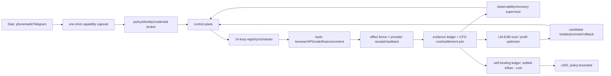
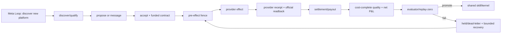
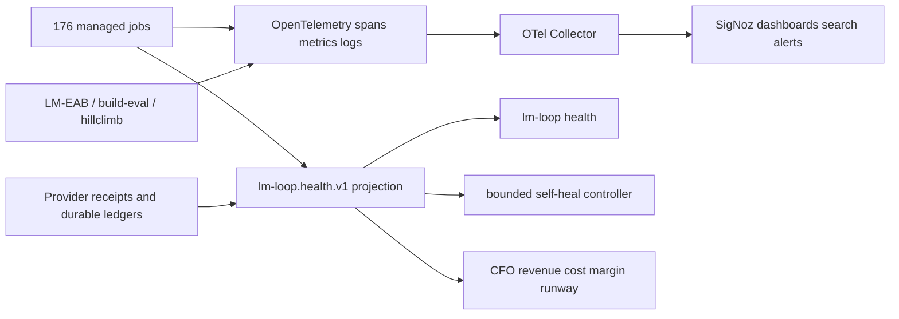
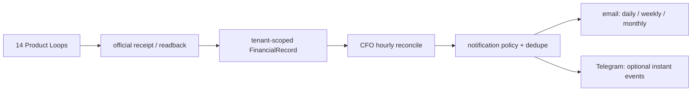

# Life Manager 統合SSOT — As-Is / To-Be / TODO

> **正本はこの文書 1 本だけ（Dais 2026-09-29）。** 以前の `2026-09-15-life-manager-agent-architecture-refinement.md`（全体設計・meta loop #10）、`2026-09-22-paid-fulfillment-all-platforms-design.md`（Paid）、`skills/earn/gig/TODO.md`（gig TODO）と、`docs/superpowers/specs/` のほかの spec はすべて参照用。TODO・順序・状態はここだけを更新し、他のファイルに新しい TODO を書かない。

この文書は Life Manager 全体（Foundation 14ループ + Paid fulfillment）の唯一の入口。
詳細の正本は次の2つで、この文書は両者の統合・順序・現在cursorだけを持つ。

- Foundation/全体: `docs/superpowers/specs/2026-09-15-life-manager-agent-architecture-refinement.md`（Whole-ship handover / AGI addendum / Whole-ship remaining TODO）
- Paid: `docs/superpowers/specs/2026-09-22-paid-fulfillment-all-platforms-design.md` + `skills/earn/gig/TODO.md`（Canonical As-Is / To-Be snapshot）

所有: Claude が Foundation・Paid 両方の唯一の開発owner（2026-09-25 Dais指示）。旧2つのCodexセッションの保護境界は解除。Life Manager 自身のloopは引き続き本番stateのownerであり、Ryu room `18211957` への再送禁止と正式納品ボタン非押下は維持する。

## 0. 原則: No human in loop

Life Manager はアシスタントではなくマネージャー。Grok bot、Muse、Instinct と同じく、自分でコンピュータとブラウザを使い、仕事を最後まで完結させる。**人（Dais を含む）に作業や判断を頼むことは、設計違反として扱う。**
- 応募・承諾・制作・納品・入金確認・修復・改善は、すべて Life Manager の loop が行う。
- 人に頼るのは、法律上どうしても本人が必要なものだけ（初回の KYC、本人確認など）。それも最初の1回に限る（T10）。
- 判断は model が提案し、決定的な policy（金額、契約条件の一致、上限、重複防止、rollback）が確定させる。
- 外部の coding agent（Claude Code、Codex のセッション）も同じく「人」の側。Life Manager が自分で直せるようになること（§5.1）が目標。

### 0.1 Dais の実行範囲境界（全案件共通）

- 明示された現在の目的が、今回の作業範囲の正本。自分から別案件、別担当、別agent、別worktreeの仕事を開始・修正・認証・送信しない。
- 自律判断は、現在の目的の中で次の安全な工程を選ぶためにだけ使う。担当外の問題を見つけても、変更せず境界とownerを記録して通知する。
- 投資の成果として扱う金額は、provider公式のsettled receiptに基づく、全手数料・funding/borrow・slippage・gas・model cost控除後のrealized net P&Lだけ。テストfixture、paper/unrealized、入金、予測、他loopの売上は投資利益にしない。
- この境界は特定サービスだけの禁止ではなく、全loop・全repoに適用する。現在の投資cursorは投資receipt、net P&L、資本拡大gate、Telegram通知に限る。

## 1. 観測事実（2026-09-25 JST 実測）

| 項目 | 値 | 出所 |
|---|---|---|
| origin/main | `d4fe081993`（#5854） | `git log origin/main` |
| 本番loaded release | `d4fe0819931c50caaf41f25e86f1052cd8a0359c`（旧） | Foundation spec:6994 |
| Foundation branch | `fix/writer-admission-self-heal-20260924` `4bef60765c`、main比 0 behind / 224 ahead、open PRなし | `git rev-list` |
| Paid branch | `fix/coconala-history-retry-20260924` `5a28bfb762`、main比 10 behind / 126 ahead、PR #5868 `CONFLICTING` | `gh pr view 5868` |
| Foundation gate | `healthy=0, safely_fenced=1, uncovered_failure=13` | Foundation spec:6993 |
| ディスク空き | 561,643,520 bytes | `df -k /` |
| admission floor | Foundation 1,155,780,608 bytes / Paid 524,288 KiB（536,870,912 bytes） | Foundation spec:6612, Paid TODO |
| 検証済み settled net MRR | 存在しない | Foundation spec:5708 |

訂正（T2で確認）: コード上の floor は既に1つ。`runtime/host/disk_admission.py:16` と `skills/earn/gig/scripts/gig_disk_guard.py` の `DEFAULT_REQUIRED_KIB = 524288` がすべての producer に効いている。1,155,780,608 bytes は Foundation spec が release 昇格の運用目標として使う値で、コード定数ではない。どちらも同じ値にする必要はないので、コード変更はしない。

## 2. 2ブランチの統合方法

試験merge（`git merge-tree --write-tree`）の結果:

- main ← Foundation: 衝突なし（Foundation は main を含む）。
- Foundation × Paid の固有衝突は `runtime/loop/lm_loop.py` の1 hunk（`_admission_effect_unknown_occurrences` 付近）だけ。
- 残り10ファイルの衝突は Paid × main。原因は Paid の一部が #5854 で既に squash merge 済みであること（Freelancer/Upwork readiness・transport とその tests、`application_occurrence_reconcile.py`、`freelancer-actions.public.json`、Paid spec、gig TODO）。
- Paid の main 比の実コード差分は約600行（`paid_direct.py`、`application_occurrence_reconcile.py`、`gig_release.py`、`reconcile_paid_no_effect.py`、`lm_loop.py`、readiness/transport とそのtests）。

手順:

1. 最新 origin/main から `integrate/foundation-paid-20260925` を切る。
2. Foundation を merge する（fast-forward相当）。
3. Paid を merge し、衝突を次のように解く。
   - `lm_loop.py`: 両方残す。Paid の occurrence単位 dict を返す `_admission_effect_unknown_occurrences` と互換wrapper `_admission_effect_unknown_owners` を採用し、読み取りは Foundation の `_read_admission_rows` に寄せる。Foundation の `_legacy_pending_admission_identity` はそのまま残す。全呼び出し元を `rg` で確認する。
   - squash済み10ファイル: main 版を土台にし、#5854 以後の Paid commit（`a751a1f91f` account binding、`0acb25bb50` automatic-bid policy、`cb1cb48677` stale funded inventory 拒否、`a882779ead` receipt-reserve など）の差分だけを載せ直す。
   - Paid spec / gig TODO: Paid HEAD 版を採り、main 側にだけある Ryu receipt 追記を取り込む。
4. `runtime/loop/tests`、`skills/earn/gig/tests`、`skills/self/disk-cleanup/tests` を実行する。
5. 1つのPRにまとめ、#5868 は superseded として閉じる。admin merge する。
6. main から immutable release を1つ切り、label ごとに apply して readback する（release を切るだけでは label は切り替わらない）。

## 3. As-Is — 14ループ（Foundation spec:6939-6961）

Pass はライフサイクル上の投影で、settled revenue ではない。金額は記録があるものだけを載せる。

| # | ループ | Jobs/Pass/Blocked/Fail/無終端 | 主な境界 | 記録されたお金 |
|---|---|---|---|---|
| 1 | Affiliate | 6/1/2/0/0 | effect fence / FIFO | conversion・settled commission なし |
| 2 | Investment | 1/0/1/0/0 | 起動前の capacity admission / cross-venue owner receipt 不在 | Alpaca 公式 readback net **-$0.15**（往復1回、1/30、拡大不可） |
| 3 | Agent Economy | 19/1/9/4/4 | capacity/effect fence、旧entrypoint失敗 | settled x402 **0.003 USDC**、net は未証明 |
| 4 | Job Hunter | 7/1/5/1/0 | effect fence、inbox/runner失敗 | 新規 funded contract なし、Mercor **$0.00** |
| 5 | Fundraiser | 1/0/1/0/0 | effect fence | 資金 receipt なし |
| 6 | Connector | 1/0/0/1/0 | 旧release `entrypoint_exit_1`、`127.0.0.1:9222` 固定と Cloak IPv6 endpoint の不一致 | 収益源ではない |
| 7 | Self-Build | 4/1/3/0/0 | recovery/dev owner 失敗 | 収益源ではない |
| 8 | Mobile Apps | 22/13/6/1/2 | effect fence、metrics lane | 投稿はある。install→課金→MRR の紐付けは未完 |
| 9 | Capafy | 8/2/5/0/1 | effect/capacity | creator earnings は観測済み、paid-out **0** |
| 10 | CFO | 3/0/3/0/0 | message/payout の effect-unknown | 検証済み財務snapshotなし |
| 11 | Writer | 7/2/5/0/0 | capacity/effect/FIFO | 一部は公式readbackあり、支払いの帰属なし |
| 12 | Coconala | 7/3/1/3/0 | browser/Paid/Storefront の失敗と fence | Ryu は手動完了（収益の証明ではない） |
| 13 | CrowdWorks | 5/0/1/4/0 | entrypoint 143/1、effect_unknown（application 44、Paid 1、reply 201、report 1） | Paid 納品・支払い receipt なし |
| 14 | Lancers | 7/2/3/2/0 | fence、timeout、storefront/work-sync | 残高 **¥0**、funded 0件（過去の ¥150,000 は提案のみ） |

Paid 側の追加（Paid spec:27-45）: Freelancer・Upwork は account-bound auth も owner もない（Upwork `contracts=[]`）。`hf-gig-paid-direct` の直近の失敗は ENOSPC による `entrypoint_exit_1`（`effect_class=none`、外部送信なし）。

**As-Is の要約:** 検証済み純利益は実質 $0（+0.003 USDC、-$0.04）。14行中13行が uncovered failure。最大の共通原因は、ディスク不足と、修正が本番releaseに載っていないこと。

## 4. To-Be


```mermaid
flowchart LR
  U[Dais: phone/web/Telegram] --> C[one-shot capability capsule]
  C --> P[policy/identity/credential broker]
  P --> CP[control plane]
  CP --> R[14-loop registry/scheduler]
  R --> T[tools: browser/API/code/finance/content]
  T --> F[effect fence + provider receipt/readback]
  F --> L[evidence ledger + CFO cost/settlement join]
  L --> O[observability/recovery supervisor] --> CP
  L --> E[LM-EAB eval / profit optimizer] --> K[candidate isolate/promote/rollback] --> CP
  L --> S[self-funding ledger: settled inflow - cost] --> X[x402, policy-bounded]
```

- **各ループの完了の定義（全ループ共通）:** account-bound auth → source-complete な公式inventory → funded contract → policy receipt → owner がちょうど1つ → 正しい成果物 → occurrenceごとに effect は1回 → 公式receipt/readback → 支払い/payout readback → crash recovery → replay-zero。
- **ループの健康の定義:** 全行が `healthy` か、型付きの fence（安全な次アクションが記録済み）のどちらか。`unknown` は診断cursorであり、再送の許可ではない。
- **利益の定義:** ループごとに `settled_customer_revenue - refunds - measured cost`。CFO が provider receipt と照合して算出する。Pass やログは利益ではない。
- **役割分担:** model は提案する。identity・計算・dedupe・spend cap・rollback は決定的なコードが持つ。
- **Dais の手間:** 最初の bootstrap と、法的に必要な KYC/OAuth/CAPTCHA だけにする。
- **経済目標:** 検証済み net MRR USD 10K → 自己資金化 → YC W27 用の証拠 → AGI/UBI 研究。証拠なしに達成を主張しない。

## 5. TODO（実行順・正本）

順序変更の記録: 旧順序（Foundation spec:7092-7137）では、収益の帰属（旧9）が capsule（旧6）・cloud（旧7）・LM-EAB（旧8）の後だった。新順序では、ループごとの利益計測（新8）を capsule/cloud/LM-EAB より前に置く。理由は、利益が見えないと、どのループに資源を寄せるか・何を改善するかを判断できないため。Paid cursor は旧5の中身を新7として独立させた。

現在の cursor: **7-0（Lancers 5605912、Dais の承諾待ち）と 5-11 / 5-12 を並行**

T5 の途中経過（2026-09-25 19:00 JST）:
- 観測1: `life-manager-recovery-supervisor` は release 287d で毎 wake exit 1 になっていた。原因は、旧 release の intent を正しく `blocked: release_sha_mismatch` にした結果まで失敗として数えていたこと。#5879 で、この理由の blocked は exit 0 にした。他の理由の blocked は今までどおり exit 1。
- 観測2: 287d を全体へ再 apply したら `admission rebind refused: effect_unknown` で fleet 全体が中止された。#5880 で、fleet モードではその owner だけを `skipped: effect-unknown-fence` として続行するようにした。target 指定の apply では今までどおり raise する。
- 本番: release `20260925T185507-74c69d01` を全体へ適用した（適用136、admission 待ち30、実行中2、fence で skip 1 = `hf-gig-apply-direct`、失敗0）。
- 未達: 過去の `repaired` 11件は、どれも `before_event_id == after_event_id` かつ `command_exit_code=None` だった。readback で既に healthy だったので閉じただけで、修復操作はしていない。T5 の完了には、executor が `lm-loop reconcile ... --max-owners 1` を実行し（exit 0）、修復後の readback が healthy になる outcome が1件必要。
- supervisor は FIFO で1 wake（60秒）ごとに1件しか処理せず、未処理 intent が約200件ある。手動で回すと Codex-free の条件を崩すので、自然処理を待つ。
- 22:17 JST の判定: #5883（古い release の依頼を1 wake でまとめて閉じる）で、未処理は 571件 → 42件まで減り、現行 release の依頼が executor に届くようになった。実際に `lm-loop reconcile` が exit 0 で実行された（agent-economy-loop、franklin-loop、hf-gig-apply-reconcile）。
  - それでも、60分間の監視で本物の `repaired` は0件だった（修復後の PASS 待ち 2412回、古い依頼の close 118件）。
  - 理由は設計上の穴。自己修復の操作は reconcile（owner を現行 release へ付け直す）だけで、全体へ適用した後の失敗はコードや環境が原因なので、付け直しでは直らない。release ずれの owner（30件）は admission 待ちで付け直しが拒否される。長時間動く loop は終了の時点が来ない。
  - T5 の次の手: escalate → `guarded_code_repair`（Life Manager 自身の開発 loop）で1件をコード修復させる。最初の候補は `hf-gig-apply-reconcile` の exit 1（effect なし）。
  - 22:30 JST の #5886（self-heal の agent を Claude に変更）は T5 の誤読で、revert した。Life Manager の内部モデルは GPT（terra/luna/sol）のまま使う。§5.1 を参照。
  - 11:25 の dev 実行の失敗原因: Codex の agent が tests を回して `lm-test-tmp.*` を worktree 内に残し、preflight が許可リスト外の変更として RED にした。Claude に切り替えて Bash を無くしたので、agent は tests を回さず、この問題は起きない。
  - 解消済みの self-heal issue 11件を close した（connector: 5872/5870/5836、supervisor: 5869/5867/5866/5864/5863/5860/5856/5850）。
  - T5 の残り: 04:10 JST の `life-manager-dev` の自然起動で、Claude agent が open な self-heal issue を修正する。その後 PR → merge guard → release → 対象 owner の次の実行が PASS、となることを readback で確認する。
  - 制約: dev agent が触れるのは `apps/life-manager` と `runtime/loop` だけ（issue #5130）。gig 系のコード（例: `hf-gig-apply-reconcile`）は対象外。

T4 完了記録（2026-09-25）: `life-manager-connector-native` が release `287d913c` の上で自然起動し、PASS した。run `18d886ebca7142c8-54861`、18:41 JST、exit 0、`last_terminal_result=pass`、heartbeat は `worker_finished`、wake の status は `applied_bundle`、blocker なし。
その直前の旧 release での起動（18:02）は `worker_failed` / `circuit_open` / `wake_boundary_failed` だった。
注意点が1つ残る。`127.0.0.1:9222` は Dais の Google Chrome（pid 465）が使っており、daily-driver は `[::1]:9222` で待ち受けている。新しいコードは IPv6 経由の recovery でこれを回避している。人間用のブラウザなので、Chrome 側は変更しない。

T3 完了記録（2026-09-25）: main の `287d913c1c`（#5875）から release `~/loops/releases/20260925T180341-287d913c` を切り、`~/loops/current` をそこへ向けた。
続けて `lm-loop apply --all` を実行した（rc=0、全260件）。結果は適用138、退役済み91、admission 待ちで skip 29、実行中で skip 2、失敗0。
1回目は `production apply is already owned` で拒否された。release-reconciler が同時に apply していたためで、lock が外れた後に再実行した。
readback: release を参照する plist 169本中140本が新 release を指している。残り29本は admission 待ちで skip された分で、admission queue が空いたら再適用する（T6）。
foundation gate（新 release の status 271行で算出）: `healthy=0, safely_fenced=4, uncovered_failure=10`（旧は 1/13）。
- safely_fenced の4つ: affiliate と cfo は `external_effect_unknown`、investment と fundraiser は `runtime_admission_deferred`。
- uncovered_failure の10はすべて `runtime_release_drift`。14ループの98 job のうち93は新 release で install 済みで、53は新 release 上の event がある。40は新 release で自然実行がまだ来ていない。5は admission 待ちで旧 release のまま。

T2 完了記録（2026-09-25）: branch `integrate/foundation-paid-20260925` を作り、main ← Foundation（衝突なし）← Paid ← この docs branch の順に merge した。
Paid と main が衝突した10ファイルは、main 側の blob が Paid の過去の commit と完全に一致したので Paid 側を採用した。
`lm_loop.py` は Paid の occurrence 単位の関数を採用しつつ、読み取りを `_read_admission_rows` 経由にした。こうすると DB が lock されていても fence が0件とは報告されない（fail-closed）。Paid の元の `except sqlite3.Error: return {}` は fail-open で、Foundation の test `test_effect_fence_read_does_not_turn_sqlite_lock_into_empty_fence_set` を落とす。
検証: `runtime/loop/tests` 693件 PASS、`skills/earn/gig/tests` と `skills/self/disk-cleanup/tests` 1598件 PASS、`bin/lm-loop-contract` の errors は []。

T1 完了記録（2026-09-25）: 空き 561,643,520 → 5,430,202,368 bytes（floor 1,155,780,608 以上）。削除したのは、clean かつ全 commit が remote にある worktree 38本（うち25本は owner=`codex` の lease が 2026-09-18 に期限切れ）と、どのプロセスも開いていない verify-loops-audit の loop-tmp（300MB）。state・memory・Codex の履歴は削除していない。
減り方は一定ではない。5分計測では純増 +456MB の区間もあった。6時間内の大きな書き込み元は `~/.codex-acct2`（thread_history 2.15GB、rollout 1.0GB）と loop-tmp の残骸。loop が終了時に自分の loop-tmp を掃除する処理は T6 で扱う。

| # | タスク | 完了の証拠 |
|---|---|---|
| T1 ✅ | ディスク floor を回復し、1つに統一する（1,155,780,608 bytes）。再生成可能な cache と governor allowlist を消し、大物（claudevm 約7G、colima 約2G）の要否を判断する | `df` と governor receipt が floor 以上 |
| T2 ✅ | §2 の手順で統合PRを作り、両tests を PASS させて main へ merge、#5868 を close | merge commit、tests の出力 |
| T3 ✅ | main 由来の immutable release を1つ切り、全labelへ apply して readback | label ごとの loaded sha = release sha |
| T4 ✅ | Connector の natural canary（Cloak endpoint の解決）を effect なしで1回 | 公式receipt、`entrypoint_exit` 0 |
| T5 | 自己修復を1回実証する（外部の coding agent なしで、Life Manager が自分の問題を見つけて自分で直す。定義は §5.1） | §5.1 の完了証拠 |
| T6 | 14行の reconcile: 全行を healthy か型付き fence にする。effect_unknown は occurrence ごとに公式receiptで閉じ、一括retryはしない | gate `uncovered_failure=0` |

T6 の途中経過（2026-09-25 22:55 JST、release `20260925T224024-beae3e37`）:
- gate は `uncovered_failure=10, safely_fenced=4`。10件はすべて `runtime_release_drift`。原因は今日 release を何度も切ったこと。新しい release を切らずに約24時間置けば、1日1回の job が現行 release で1回ずつ動き、自然に解消する。**release を凍結する**（例外は本物のバグ修正だけ）。
- 現行 release 上の本物の失敗は8件。
  - `life-manager-daily-driver`: 以前の owner run が残した孤児の Chromium（pid 37260、ppid 1）が profile を握っていた。そのため2回目の起動が exit 0 で抜けて `Failed to launch` になり、再起動を繰り返していた（launchd.err.log は 96MB）。#5889 で「生きている owner を引き取る」ようにした。22:52 に `adopted live profile owner pid=37260` を確認し、`loaded-running`・エラーなしになった。
  - Lancers negotiate/paid と CrowdWorks reply: 共有ブラウザの接続失敗（`browser_connect_failed` / goto timeout）で、daily-driver 停止の連鎖。次の自然実行で回復するかを確認する。
  - `job-search-inbox`: `inbox.py:398`。model の申告件数と thread ID の数が食い違った時に安全側で止まる、意図された fail-closed。二重返信を防ぐための仕組みで、test でも固定されているので変更しない。
  - Instagram en-card / obou: `LM_DATA_DIR is required` と ledger の job id 衝突。obou の Instagram は `marketing-destinations.json` で `ebook_account_out_of_mobile_scope`（上限 0）なので、直すより退役させる候補。state root が共有 events.jsonl のため、run 単位の切り分けは未完。
  - `life-manager-honne-ja`: 昼の ENOSPC（空きが 0.56GB だった時点）による。publish は fence で止まっていた。
| T7 | Paid cursor: Coconala Paid の no-effect wake → Storefront の公式readback → CrowdWorks の fence → Lancers の inventory → Freelancer/Upwork の account-bound auth → Mercor | 各 provider の readback |
| T8 | CFO: ループごとの settled revenue と cost の join（ループ別P&L）を毎日出す | P&L 行ごとに receipt id がある |
| T9 | Mobile funnel と `/en` `/lm` `/income` の整合（install→activation→課金） | attribution receipt |
| T10 | one-shot capability capsule | 目標・承認の質問なしで初回の実行が通る |
| T11 | cloud の durable worker と local の parity | 同じ task で同じ receipt |
| T12 | evaluator が所有する self-improvement（rollback つき） | canary で settled contribution が改善 |
| T13 | settled cost で裏付けた x402 自己資金化 | inflow ≥ cost の CFO readback |
| T14 | LM-EAB（held-out、較正、再現可能） | 独立した再実行で同じ結果 |
| T15 | 検証済み USD 10K MRR → YC W27 の証拠 → cross-domain / AGI / UBI | receipt の集計 |


### 5.0 順序変更（2026-09-27 10:5x JST）: 土台 → 全 loop を green → 収益 → 自己修復の実証 → 自己改善

旧順序: T5（自己修復）→ T6（14 loop）→ T7（Paid）。新順序: ①土台（5-13 自動 apply、7-6e 予約の偏り、6-9b〜d ディスクとブラウザ）→ ② T6 全 loop を green（正常 / 型付き fence / 意図した停止のどれか）→ ③ T7 収益 → ④ 5-12 自己修復の自然実証 → ⑤ T12 自己改善。現在の cursor: ① 5-13。

理由（今夜の実測）: 失敗の大半は各 loop のコードではなく土台だった。merge した修正が owner に届いていない（172 中 53 だけが current release）、admission の stop が戻っていない、capacity の予約の偏り、fence の滞留、ディスク満杯。SNS 投稿 owner は release を反映しただけで失敗が止まった。自己修復の dev agent は土台（runtime の制御面、launchd、admission）を編集できない設計なので、土台が壊れている間は自己修復の実証が起きない。green の基準線が無いと、自己修復が何を直したかも測れない。
実測（10:4x JST）: loaded 172 = ok 64 / failing 47（常駐 daemon の再起動による誤分類を含む）/ capacity 待ち 41 / fence 20。earn 51 = ok 12 / failing 15 / fence 12 / capacity 12。

**Handover（2026-09-28 10:5x JST。この順が正本。新しい session はここから）**

**共通 Paid 境界の実装カーソル（このbranch）**
- 個別顧客の例外実装ではなく、`skills/_shared/marketplace-core` に provider-independent な `PaidHandoffReceipt` 契約と `validate_paid_handoff` を追加する。Reply/Negotiation の thread、accepted `ContractReceipt`、funding id、scope、artifact 要件、金額、通貨を同じ記録に束ね、provider と contract の不一致・未承諾契約・未funded statusを fail-closed にする。
- 共通 `paid_kernel` に `--require-paid-handoff` / `require_paid_handoff=True` の必須ゲートを追加した。必須モードではhookを持たないadapter、未承諾contract、invalid handoffはeffect=0で止まり、valid proofはmutation前にintentへ保存する。Lancers/CrowdWorksのowner配線はこのbranchに追加済みだが、production releaseへの適用はまだである。
- `accept` は仮払い前の契約承諾なのでfunded handoffの対象外とし、`answer` / `submit` / `formal_delivery` / `cancel`だけをfunded必須mutationとして扱う。これにより「採用承諾 → 仮払い → Paid納品」の段階を共通kernelで表現できる。
- Coconala adapter (`skills/earn/gig/scripts/coconala_paid_adapter.py`) は、orders-only の初回snapshotから targeted talkroom readbackへ更新し、構造化価格・取引状態・talkroom証跡・要件digestが揃った場合だけ `ContractReceipt` / `PaidHandoffReceipt` を生成する。fundingまたはscope証跡が欠けた場合は `coconala_paid_handoff_unavailable` で止まる。既存の `paid_direct.py` ownerにも `--require-paid-handoff` を配線し、送信・納品・キャンセル子プロセスを起動する直前にこのcanonical receiptを再検証するところまで、このbranchで完了した。これはproduction releaseを適用した証明ではなく、共通kernelへの完全移行・immutable release・公式canaryは未完了である。
- Lancers adapter (`skills/earn/lancers/scripts/paid_adapter.py`) は、公式detailの `provider_state=funded`、固定金額、terms digest、buyer threadを同じcanonical receiptへ写像する。仮払い未確認・曖昧な金額・terms digest欠落は `lancers_paid_handoff_unavailable` で止まる。Paid ownerには `--require-paid-handoff` を配線済みだが、immutable releaseへの適用と公式canaryは未完了。
- CrowdWorks adapter (`skills/earn/crowdworks/scripts/paid_adapter.py`) は、公式contract bodyから一意の固定報酬額とterms digestを読み、milestone/form/document要件とbuyer threadをcanonical receiptへ写像する。時間単価・範囲価格・価格/terms欠落は `crowdworks_paid_handoff_unavailable` で止まる。Paid ownerには `--require-paid-handoff` を配線済みだが、immutable releaseへの適用と公式canaryは未完了。
- Mercor adapter (`skills/earn/mercor/scripts/paid_adapter.py`) は、契約の `active` / `contracted` 状態やタイトルからfundingを推測しない。公式snapshotに明示された正規化 `paid_handoff`（funding、固定金額、通貨、terms/scope/artifact digest、buyer thread、観測時刻）が全て揃った時だけcanonical receiptへ写像し、欠ければ `mercor_paid_handoff_unavailable` で止まる。現行snapshotにはその証跡が無いため、Mercor mutationはまだhuman-requiredのままである。写像後の形状検証はCoconala・Lancers・CrowdWorks・Freelancer・Upworkと同じ `skills/_shared/marketplace-core/scripts/paid_handoff.py` を使い、日時やハッシュ規則をMercorだけで再実装しない。
- Freelancer/Upworkには `skills/earn/gig/scripts/providers/*_paid_adapter.py` と共有 `skills/_shared/marketplace-core/scripts/paid_handoff.py` を追加した。Freelancerのfunded milestone、Upworkのfunded milestone・明示通貨、buyer thread、scope、artifact要件が揃った場合だけ同じcanonical receiptへ写像し、未funded・通貨推測・証跡欠落はfail-closedにする。これはadapter境界とfocused testsの完了であり、account-bound auth、source-complete live inventory、owner登録、production canaryは未完了である。
- 現在は schema / typed parser / validator / kernel gate / 6 platformの薄いadapter境界 / 共通handoff builder / focused tests まで。各provider固有コードは公式事実の取得とprovider IDの翻訳だけを担当し、契約形式・証跡検証・effect fenceは共通kernelが担当する。既存4 platformのPaid owner配線はbranchにあり、Freelancer/Upworkはowner未登録のadapter境界だけである。まだ main merge、immutable release、production apply/readback はしていない。provider adapter が公式 funded readback 後にこの記録を出すことが次の接続条件。
- 次の順序: (1) branchの既存owner gateをimmutable releaseへ適用し公式canary、(2) Freelancer/Upworkのaccount-bound auth・source-complete inventory・funded contractを確立、(3) 公式 receipt・replay-zero を各providerで確認、(4) payout receiptをCFO ledgerへ接続、(5) Meta Loopから同じconformance gateで新platformをenrollする。

進捗（2026-09-28 13:2x JST、Claude）:
- 1 ✅ 下書き 4243672453（AI Evaluation Failure Triage Brief）は審査提出済み。公式 readback: platform_status=1、audit_status=2、is_confirmed_skills/config_keys=true、package_uploaded=true（04:08Z）。CP1 に Primary Model 欄は実在しない（model は CP2 で決まる）ため、verify_cp1_model は CP2 後と最終確認で呼ぶ（#6066・#6068〜#6070）。catalog の未公開分は DeepSeek V4.1 Flash（19件）、Claude 指定の10件は公開済み・審査中で据え置き。
- 1 追記: Capafy `GET /agent/agents/{id}` の model は 4243672453=`deepseek/deepseek-v4.1-flash`、4813383030=`DeepSeek V4.1 Flash`（05:1xZ）。
- 2 ⏳ 03:24Z は他 run の fence、04:24Z は host の枠満杯（稼働6＋予約2＝上限8、`resource_capacity_busy`）で exit 75。04:24:44Z に `lm-loop start` で起動した run が新 Agent 4813383030（Board Update Deck Builder）を CP3 まで提出: platform_status=1、audit_status=1、skills/config confirmed、package uploaded、run rc=0 `RESULT_success`。手動起動なので無人の証明は 05:24Z の自然 run で取る（次の候補は Demand rank 1 の reels-hook-lab）。
- 反映: release `20260928T140252-811d0937`（#6071〜#6073）を capafy の deterministic 7 loop に `lm-loop reconcile` で適用、readback installed=811d0937。自動の release 作成は 9 分待っても起きず、`reconcile-agent-runner-release.sh` を手動実行した（fleet-apply は "production apply is already owned" で skip、errors=1。未調査）。
- 2 ✅（無人申請を公式 readback で確認）: 05:24Z の自然 wake は枠満杯で exit 75 → 58 秒後に予約 dispatch が自動起動（人の操作なし）→ 新 Agent 3798949471「Reels Hook Lab — Win the Cover Frame」を CP3 まで提出。readback: platform_status=1、audit_status=1、skills/config confirmed、package uploaded。run は提出後の報告中に browser-lane-agent 1800s で rc=124 → exit 1 → fence。adapter が `capafy:agent/3798949471/version/2104444318118604800:platform_status=1` で close（status で fence False）。修正: #6074 起動間隔 3600→900s、#6075 fixture、#6076 申請 run を application-lane-agent（3600s）へ。release cf8d83ac を capafy 7 loop に適用（installed=cf8d83ac、interval:900s）。審査中 4・空き 1。残り: 次の自然 run が Shorts Hook Lab を rc=0 で出すこと（green の確認）。
- 4 ✅ 本番 readback: 06:07Z の毎時 receipt（capafy-skill-analytics.json）に per-skill `profit_30d_usd` と Telegram 要約が実データで入った。
- **Capafy は未完了（訂正 2026-09-28 15:3x JST、Dais）**: 申請の仕組みが動いただけで完了扱いにしてアプリへ移ったのは誤り。1つずつ閉じる。アプリ（下の 5 アプリ As-Is）は Capafy の C1〜C7 が閉じるまで着手しない。

**集客は 1 回きりではなく loop で回る（2026-09-29 時点の頻度）**: 記事 article-daily は毎日 06:00 JST に 1 本（Substack JA/EN・note・aniccaai.com。1 日おきに Capafy の売れている Skill へ誘導、ct=article-<slug> で計測）、途中で止まった記事は article-resume が 5 分ごとに引き継ぐ。open-seo の検索語は Skill ごとに 30 日に 1 回更新。Capafy の工場は 15 分ごと。Skill 別利益・流入元の Telegram 報告は毎時（数字が変わった時だけ）。PromptBase は毎日 04:20 JST に 1 件。Capafy Instagram は復旧後 1 時間ごとの loop。アプリの SNS 投稿は各 lane 1 日 3 回。

**Capafy を閉じて次（モバイルアプリ）へ進む条件（公式 readback で確認できたら閉じる。審査・承認・売上の結果待ちは条件にしない = 監視のみ）**:
- X1 Capafy Instagram が人の手なしで Reel を 1 本投稿（Instagram の公式 Reel 一覧で確認）
- X2 Capafy の Skill に誘導する記事が 1 本公開され、リンクに ct=article-<slug> が付いている（RSS・公開ページで確認）
- X3 Japanese Humanizer の $9.99 版が審査に提出される（publish-remote-status platform_status=1）
- 監視のみ（進む条件ではない）: Hook Lab DeepSeek 版の承認と黒字化、Japanese Humanizer の承認、記事経由の注文数

**値付けとモデルの方針（Dais 2026-09-29。全商品・既存も新規も最初から適用）: 安く作って高く売る。**
- モデル: 既定は安くて十分な品質のモデル（DeepSeek V4.1 Flash 等）。Sonnet 級は使わない。例外は、同じ価格帯の売れている競合が明らかに高品質を必要とし、かつ価格でモデル代の数倍を回収できる時だけ。
- 価格: 売れている出品者の価格をそのまま参考にし（成功者を真似る）、その上限側に置く。モデル代の数倍が入る価格にする。無料配布はしない（試用はプラン設計の無料トライアルだけ）。
- 既存: Capafy の Sonnet 33 本は「DeepSeek 切り替え + 値上げ」を 1 本 1 回の更新にまとめ、売れている順（Slide Maker → TikTok Script Pro → Marketing Strategist → YouTube Script Writer → …）に審査枠が空き次第出す。Hook Lab は DeepSeek 版が審査中。Japanese Humanizer は $9.99 化を提出待ち。
- 新規: 工場の既定を DeepSeek + 売れ筋の価格帯にする（既に DeepSeek 既定）。
- 歯止め: 毎時の利益データでモデル代が売上の 30% を超えた Skill は、工場が値上げまたはモデル変更を自動で出す（最初の方針の後の安全網）。
- 同じ方針を Writer（有料記事の価格）、Ebook（The Anicca Reset の価格・KDP 価格）、アプリ（サブスク価格）、PromptBase にも当てる。

**Capafy 実測（2026-09-29 18:1x JST、公式 readback）**: 自分の Agent 52 本 = 公開中 44・審査中 7・下書き 1（Capafy API `agentStatus`）。お金（毎時集計 15:07 JST 時点）: 売上累計 $100.76（100 件）→ 取り分 $74.64 → 今月 API 実費 $25.50 → 差し引き $49.14。未払い残高 $20.26・振込可能 $14.40・振込済み $0。
- 済み: Hook Lab v1.0.4 審査提出（platform_status=1、#6199: CP2/CP3 のタブ再試行・待ち時間・「下書きを保存」表記・変更履歴はキー入力）。工場の詰まり解消 → 17:57 の実行は次の Agent 9563867391 の DeepSeek 切り替えへ進行中。宣伝 3 時間ごと本番（#6197、d697d18f、1:15 から 3 時間おき 8 回、2 本目 TikTok Script Pro の記事 200 + X PUBLISHED）。値上げ取り消し（#6200、キュー 19 本で値上げ 0 本を API で確認、DeepSeek 切り替えは残す）。利益の日次 Telegram（#6195）。
- 残り（Capafy）: 1 17:57 の工場実行が審査提出まで行くか公式確認 2 毎時集計が 15:07 から止まっている原因を直す 3 審査中 7 本の承認を待たず、次の Agent を工場が作り続けるか確認。

**Dais 決定（2026-09-29 17:2x JST）と残り ToDo の順番**
- 開発の流れ: 変更は worktree の中で実物（worktree のスクリプトを直接実行）を動かして確認し、成果がそろってから main へ 1 回だけ merge → release。小さな修正ごとに main へ入れて本番で試すのはやめる（17:0x までの #6190/#6191 は本番で試した。前例: 不正な priority "paid" が全 loop を止めた）。
- 観測性: `lm-loop status` は 278 loop・約 4 秒・JSON のみ（実測 17:2x: 正常 170 / 停止 108 = effect_unknown 41・capacity_busy 39・exit_1 22）。→ `lm-loop health` を追加: 1 画面の表（loop・最終実行・結果・停止理由・次の手）と、スキル別の今日の成果（公開数・売上）。
- 目標の定義（Dais 2026-09-29 17:3x）: $10k MRR = **銀行口座に入る利益**（売上 − プラットフォーム手数料 − API 費用）。売上総額ではない。現在 Capafy 30日: 総額 $80.78 → 手数料後 $64.62 → モデル代 $42.99 → **利益 約 $21.63**。この利益をスキル別に毎日 Telegram へ報告する（いまの C6 日次報告はキュー・撤退候補だけで利益額がない → 追加する）。
- ブラウザ（Dais 2026-09-29 17:3x）: 専用ブラウザは作らない。割り当ての正本 `~/.config/ai/registry/browsers.toml`（identity=サイト×アカウント、1 identity 1 profile、`browser-guard.sh` の lease で同時使用を防ぐ）。現物readbackでは`coconala:kosuke`は`gig-daily-driver`・9223で稼働し、CapafyとCoconala Gigが同じseller identityを**leaseで直列共有**する。Gigの`hf-gig-browser` process、`session_vault_tick.sh`、Coconala browser testsがこの対応を示すため、「Gigは別のdaily-driver Chrome」という直前記述はsource/live stateと矛盾し、採用しない。`cdp_lock.sh`はGig内部のtab/phase直列化であり、identityの代替ではない。Hook Lab CP2の停止はブラウザ待ちではなかった（ボタン判定のタイミング）。
- 残り順: 0 スキル別の利益（銀行に入る額）を毎日 Telegram へ 1 宣伝ループを 3 時間ごと・Agent ローテーション（ledger を日付→枠キーへ） 2 Hook Lab CP2 のベンダーボタン待ち → 審査提出 3 申請順を新 Agent 優先 4 `lm-loop health` 5 effect_unknown 41 件を証拠付きで閉じる 6 アプリ 7 connector 8 fundraiser 9 self-fix worktree 化。

**実測（2026-09-29 17:1x JST、公式 readback）宣伝ループ（capafy-distribute-daily）初公開**: 無料英語記事 https://aniccaai.com/blog/capafy-reels-hook-lab-2026-09-29 = HTTP 200、本文に `ct=capafy-distribute-reels-hook-lab`（ledger 2026-09-29 aniccaai=published）。X = Postiz `PUBLISHED` https://twitter.com/selawmqt/status/2104845436683202788（アカウント「sela | AI Tools」、`POSTIZ_X_INTEGRATION_ID` を marketing.env に設定。今日の X は同じ capafy_x_post.py の手動実行＝自然実行ではない。明日 07:15 の自然実行で両方を確認する）。修正: #6190 公開確認を最大15分待つ（deploy は約5分）、#6191 X 投稿に Postiz の X 設定を付けて 400 を解消し、QUEUE→PUBLISHED を最大10分待つ。fence 2 件は証拠付きで閉じた（16:21 run = pre-effect、16:51 run = 公開の公式 readback）。Hook Lab v1.0.4 の CP2 停止原因 = 出力が空で `grep -v` が 1 を返し `set -e` で無言終了、実エラーは `vendor-button-count 0`（ワークスペースタブ表示直後に判定、少し待てば OpenRouter ボタンは存在）→ 次に修正。
- 次: ① 宣伝ループを 3 時間ごと・Agent ローテーションにする ② CP2 のベンダーボタン待ち修正 → Hook Lab 審査提出 ③ 申請順を「新 Agent 優先・値上げは後」に変更（Dais 2026-09-29: 売上が費用を上回れば値上げは不要）。記事ループ（article-daily 06:00）・宣伝ループ（07:15）とも現状 1 日 1 回。

**② 完了（2026-09-29 15:3x JST、公式 readback）**: 15:23 JST の定期起動（手動起動なし。最後の手動起動は 13:23）が、作りかけの TikTok Script Pro（2844813315）更新下書きを resume → CP1/CP2 → CP3 まで自力で進め、公式 detail で status=1・isConfirmedSkills=1・isConfirmedConfigKeys=1・hosted model deepseek/deepseek-v4.1-flash を確認（値上げ 日$2.99/週$7.99/月$19.99）。Hook Lab 値上げ v1.0.4 は次の run で提出予定。C7 対応: capafy-loop-daily を critical_paid（Capafy catalog に read_only_external_owner を追加、gate ok=true）を main に merge、本番反映中。

**実測（2026-09-29 15:2x JST）**: ② 未完了。修正 3 件（#6167 作りかけの更新下書きを優先、#6170 前後の CP3 下書き保存→提出）を本番 1ba0237a。14:50 の自然 run は TikTok Script Pro 更新の CP1/CP2 まで完了し CP3 で停止（→ CP3 修正済み）。以降の定期起動は 15:05・15:21 とも `resource_capacity_busy`（他 loop の agent が実行枠を占有）で延期 = **C7（実行枠の配分）が Capafy を止めている**。X2 未完了: 今日の記事は anicca 固定のまま出た（固定は解除済み）。今日 2 本目の手動起動は、同日 run の note 公開待ち＋自 run の fence で開始されず（固定は即時に戻した）。記事は毎日 1 本（06:00 JST）で、Capafy 誘導は日替わり選択（次は 10/2）。**Capafy 専用の無料記事を毎時出す loop は存在しない**（Writer の記事の CTA が Capafy を指す日だけ）。

**実測（2026-09-29 14:4x JST）**: 売上 = Capafy 30日 総額 $80.78・手数料後 $64.62・モデル代 $42.99・利益 $21.63（Hook Lab の DeepSeek 化前の赤字を含む）、アプリ（RevenueCat）MRR $20・28日売上 $32・有効サブスク 5。**月 $10k MRR には未達（約 1%）**。② は未確認: 値上げ更新の下書き（TikTok Script Pro v1.0.2・Hook Lab v1.0.4）が status 0 のまま。原因（別の更新を次々始めて下書きが増える）は #6167 で修正し本番 5d8a135b。自己修復の成功後 20h 待ちも #6167 で解消。14:29 の定期起動は自動 release 反映中の owner deploy lock で `resource_control_busy` 延期 → 次の自然起動の公式 readback で確認する。③ は本番で確認済み（fence 65 件すべて `admission_effect_unknown_diagnosis` に原因 run・失敗手順・provider 状態・次の手）。

**Capafy 実測（2026-09-29 13:3x JST、公式 readback）**: ① 4243672453 = status 4（公開中）・DeepSeek。Hook Lab v1.0.3（DeepSeek）・Shorts Hook Lab・Ad Hook Lab・Customer Escalation Decision Deck が承認（status 4）→ Hook Lab の Sonnet 赤字は停止（1注文の費用は推定 $3.29→$0.30、実額は OpenRouter で後日確認）。Customer Renewal Evidence Brief は自己修復 agent が自分で提出（status 1、ただし hosted model は Sonnet のまま→承認後に DeepSeek 更新）。Slide Maker の DeepSeek 更新を工場が人の手なしで提出（13:25、status 1）。Hook Lab 値上げ（日 $3.99/週 $9.99/月 $19.99、#6167）は v1.0.4 下書き作成済みで次の run が提出。原因と修正: #6141 #6145 #6146 #6150 #6155 #6157 #6159 #6161（自己修復が worktree→PR→merge→release まで自分で行う）#6163 #6167。記事の Capafy 誘導が出なかった原因 = `.env` の ARTICLE_PRODUCT_ID 固定 → 解除（次の Capafy 日は 10/2）。残り（spec 順）: X2 → X3 → C4（全スキルを売れ筋の値段帯に、年額は CP1 未対応）→ C6 → C7 → アプリ。

**Capafy 市場の全体調査（2026-09-29、`POST /agent/agents/search` 本文に query、50 キーワードで 1,025 Agent。自社ではなく他の出品者を見る）**
- サブスク型の上位: CloneCut 11,926（週$12.99/月$29.99/年$149.99）、Ocup Football Analysis 3,069（週$14.99/月$29.99/年$99.99）、Serenity Stock Tracker 1,669（週$9.99/月$19.99/年$99.99）、HookAce 868（週$9.99/月$19.99/年$239.88）、Odeo Maker 626（週$19.99/月$29.99/年$199.99）。勝ち筋 = 週 $9.99〜19.99・月 $19.99〜29.99・**年額 $99〜239 を必ず持つ**・無料トライアルなし。
- ダウンロード型の上位はほぼ無料（llm-real-video Free 3,337、Cinematic Realism Prompt Builder 1,055、3-Second Viral Hook Generator FREE 135）。有料は少数（Badr Studio $5 47本、llm-real-video Pro $29 30本）。（無料版→有料版の誘導は llm-real-video の 1 例だけで、移行人数の証拠がない。Dais 2026-09-29: 無料では売らない → 採用しない。）
- 決定: (1) 全サブスク Skill を週 $9.99〜14.99・月 $19.99〜29.99 に上げ、年額 $99〜149 を追加（#6153 の予約も年額付きに作り直す）。(2) 無料配布はしない（download 型も必ず有料。Japanese Humanizer も有料化）。(3) 値上げ後 1〜2 週の注文数で下げ判断もする。

**Capafy 競合の実測（2026-09-29、capafy.ai 公開ページ・読み取りのみ）**: 売れ筋は2型。(a) 追跡・分析型（金融・スポーツ・動画生成）は月額固定 $8〜20・無料トライアルなし・販売数 500〜12k（CloneCut 11.9k、Ocup Football Analysis $8.33/月 3,069、Serenity Stock Tracker $8.33/月 1,669、Alpha Consensus $10.83/月 533）。(b) 生成型（hook・台本・文章）は日/週の小額 $2〜10（HookAce $9.99/週 868、Viralume $6.99/日、SEO Content Writer $6.99/日）。自社の単価: Hook Lab は Sonnet で1注文約 $3.29 のモデル代、DeepSeek V4.1 Flash なら推定約 $0.30。モデル代を手数料後売上の 15% 以下にする最低価格は約 $2.50。
- 値付けの決定: Hook Lab = 日 $3.99 / 週 $9.99（HookAce に合わせる）/ 月 $19.99（DeepSeek 版承認後すぐ更新）。YouTube Script Writer・TikTok Script Pro の日額は $3.99 以上。Marketing Strategist は週 $9.99〜13.98。Slide Maker は据え置き（$9.99/週・$24.99/月で売れている）。Japanese Humanizer は有料化（無料配布をやめる）。
- 勝ち筋: 自社の Football Match Analyst・Portfolio Tracker は (a) 型。月額固定 $8〜20 に合わせて集客を寄せる。

**既存商品の正しい仕組み（2026-09-29、コードで確認。新しく作ると書かない）**
- Writer loop（`skills/writer-agent/SKILL.md`・`article-daily.sh`）: 記事そのものを売って稼ぐ。note は無料試し読み→有料 ¥500、Substack は有料購読（無料には試し読み）、aniccaai.com は preview＋paid 分割。Zenn・dev.to は全文無料の集客面。出版社・企業の有料依頼も対象。読者が実際に払った額で次のテーマを選ぶ。他商品へのリンクは追加の役割。
- Ebook（`~/anicca-monk-factory/MASTER_PLAN.md`・`skills/earn/marketing-engine/registry/products/ebook-*.json`）: 「The Anicca Reset」（EN $10.99 aniccaai.com/monk、JA 版あり）を自社 checkout（Stripe prod_UQ2LTH66Rwict4 / prod_UQ2LrpVy4b1bAY）で販売中。Amazon KDP は `direct_live_kdp_unavailable`（KDP 認証なし）→ Ebook の TODO は KDP 接続。集客は monk factory（monk アバター動画を多数アカウント・多言語で配信、EN は HeyGen、watercolor/yangmun monk 等）。原則「配信チャネルは大量生産、商品は 4 つ（ebook・newsletter /letter /tegami・web app・iOS app）に固定」。

**スキルの形（Dais 2026-09-29。正本）**: 稼ぐ単位を「スキル」と呼ぶ（Capafy スキル・Writer スキル・モバイルアプリ・スキル・PromptBase スキル・Ebook スキル…）。どのスキルも「作る loop（商品を作る・直す）」と「広める loop（無料の記事・SNS・X で `ct=` 付きリンクを流し、どこから何人来て買ったかを数える）」を並行で回す。部品（書く・公開する・投稿・計測）は全スキルで共有する。
- 実測（loop-registry、2026-09-29）: Capafy = 作る ✅ capafy-loop-daily／広める △ Instagram のみ（停止中）・**無料記事 loop なし**。Writer（商品 = 有料記事）= 作る ✅ article-daily／広める **記事を SNS・X に流す loop なし**（有料執筆依頼の探索 loop はある）。モバイルアプリ = 作る **アプリ工場 loop なし**／広める ✅ SNS 16 本。PromptBase = 作る ✅／広める **なし**。
- TODO（この順）: (1) Capafy の広める loop = 売れ筋スキルごとに英語中心の無料記事を毎日（dev.to・英語 Substack・aniccaai.com・X）、全リンク `ct=`（Writer の部品を再利用、無料公開）→ (2) Writer の広める loop（有料記事を X・SNS に流す）→ (3) PromptBase の広める loop → (4) モバイルアプリの作る loop（A5）。

**最後までの全体の順序（Dais 2026-09-29 確認。この版が正本）**
① 商品で稼ぐ（Capafy → モバイルアプリ → Writer → PromptBase → Ebooks → affiliate）→ ② 14 loop を全部 green（土台: ディスク・release 反映・fence・admission）→ ③ **meta loop**（Life Manager が自分で新しい loop を作る: 新しい platform / 商品の規約と net value を判定 → 共通 runtime 上に薄い adapter を作る → 公式 effect を canary → 通ったものだけ promote。専用の scheduler / queue は作らない。正本: `docs/superpowers/specs/2026-09-15-life-manager-agent-architecture-refinement.md` の TODO #10、関連: `skills/earn/gig/TODO.md` の Coconala-to-meta-loop、`skills/earn/marketing-engine/README.md` の manifest 型 marketing loop）→ ④ 自己修復（T5）→ ⑤ 自己改善（T12。meta loop が作った loop も同じ評価器・canary・rollback で改善する）→ ⑥ loop 別の利益（T8）→ ⑦ Cloud・自己資金化（10-1・11-1・13-1・14-1）→ ⑧ 検証済み月 $10k MRR → YC W27 → AGI/UBI 研究。
- 目標（Dais）: 全カテゴリで software factory（新商品の出荷 + 既存の改善）と共有マーケティングを回し、カテゴリごと月 $10k 以上、全体 $10M 以上。

**TODO 順序（Dais 2026-09-29 09:3x JST 指示。この版が正本、以前の順序を上書き）**
- 順序: 1 Capafy → 2 モバイルアプリ → 3 Writer（記事、traffic link で各商品に誘導）→ 4 PromptBase → 5 Ebooks（自社サイト + Amazon KDP）→ 6 affiliate → 7 connector → 8 fundraiser → 9 self-fix
- Capafy Instagram（X1）は後回し（Dais 指示: 時間がかかるなら商品の出荷を優先）。作成の仕組みは #6143 で修正済み。旧アカウントは退役済み、交代要求は出してある。
- 方針: 共有マーケティング（記事 + SNS で全商品に配信）と software factory（新商品の出荷 + 既存商品の改善）を全カテゴリに適用する。目標はカテゴリごと月 $10k 以上、Life Manager 全体で $10M 以上、YC W27 で資金調達。
- X: 記事のリンク付き通常投稿を Postiz の X 連携で流す（X Article の編集画面はアカウントで使えないため skip。#6140）。
- 現在の位置: 1 Capafy（X2 記事、X3 Japanese Humanizer 提出、TikTok Script Pro の説明文と価格）

**TODO 順序の変更（2026-09-29 08:3x JST、この版が正本）**
- 理由（公式 readback）: 直近28日の売上は、アプリ = RevenueCat revenue $32・MRR $20・有効サブスク 5・新規ユーザー 61。PromptBase = $0（Reels Hook Lab は審査待ちと画像認証で止まり中）。Capafy の Skill 別売上は30日 $80.78、実利益 $21.75。すでに課金が発生していてユーザーも入っているアプリを先に伸ばす方が、全体の売上が早く増える。
- 旧順序: 1 Capafy → 2 PromptBase → 3 自社メディア → 4 モバイルアプリ → 5 connector → 6 fundraiser → 7 self-fix
- 新順序: 1 Capafy → 2 モバイルアプリ → 3 PromptBase → 4 自社メディア → 5 connector → 6 fundraiser → 7 self-fix
- 現在の位置: 1 Capafy（X1 Postiz 経由の新 IG アカウント、X2 記事）

**2026-09-29 08:2x JST 実測（この版で上書き）**
- Capafy Instagram（X1）: Reel の生成と HyperFrames 検査は通過（#6134）。投稿は不可。旧アカウント capafy.skills8m4q2z は Instagram の scraping_warning（「自動化された操作の疑い」）で止められ、「閉じる」もエラーになる。自動の新規作成は 8 月に約 30 回連続で失敗。方針（Dais 2026-09-29）: Capafy の SNS はすべて Postiz API に寄せる。新しい IG アカウント（クリエイター）を作り、Postiz に接続して投稿する。旧アカウントでの自動投稿は止める。
- 記事: 9/28 分は Substack JA/EN・note・aniccaai.com JA/EN で公開済み。article-daily の fence 18d98160 は aniccaai.com の公開ページ（200）で確認して閉じた。9/29 分は未公開。#6136 で「公開物ではないファイルを下書きと誤判定して再試行を止める」問題を直し、再試行は動いた。ただし 3 回ともモデルが「前日 run 20260928-132912 の X Article JA（x-editor-unreachable:no-editor）が未完了」を理由に作業を止めた。X 編集画面が使えない場合を終端 skip にする修正を進行中。
- アプリ投稿 A1: carousel の修正後も、anicca の動画 lane が固定の hook 2〜4 本を回していた（@anicca.he で同じ文面が 6 回）。#6135 で anicca-ios の動画 9 lane すべてに Gemini の新しい文面生成を有効化。次の投稿を Postiz で確認する。
- 共有 contract: #6061（Capafy 工場を critical_paid に）で lm-loop-contract が recovery_class_mismatch の RED になっていた。#6137 で priority を revenue に戻して GREEN（main 00cc2c9d で ok=true）。release 20260929T080502-00cc2c9d を本番に反映。

**Capafy 完了（2026-09-29 18:3x JST、公式 readback）**: 閉じる条件 X2 = 宣伝ループの記事 2 本（aniccaai.com 200、ct=capafy-distribute-*）、X3 = Japanese Humanizer 3332784488 v1.0.1 platform_status=4（承認・公開中）。X1（Capafy IG）は Dais の指示で後回し。工場・宣伝（3 時間ごと）・毎時集計・日次利益 Telegram は loop で回る。承認・売上・工場の各 run は監視のみで、次へ進む条件にしない。cursor は下の 2（PromptBase）。

**進捗（2026-09-29 19:0x JST、公式 readback）**
- PromptBase: 公式画面 = Hook Lab Win The First 3 Seconds が Approved（販売中）、Reels Hook Lab 2 件は Draft（未提出。ledger の submitted_pending_review は誤記録で、readback が draft に直した）、売上 No sales yet。P3 ✅ #2ffad523（readback が Sales タブを読み ledger の sales_usd と `state/promptbase-sales.json` を書く。worktree で実行し sales_count=0 を確認）。P4 🔄 branch `feat/promptbase-distribute-p4`（3 時間ごとの宣伝ローテーションに `promptbase-hook-lab` を追加、リンクは手数料 0% の `?via=keipanda`、ct は & で連結）。worktree で h18 枠を実行中 → 記事 200 と X PUBLISHED を確認したら merge。Reels Hook Lab の提出は reCAPTCHA の画像問題で止まる（回避しない。ループが毎日再試行し、画像問題が出た時だけ Dais へ）。
- モバイルアプリ A1 ✅: Postiz 直近 24 時間 26 投稿で同じアカウント内の文面重複 0。例外 1 件 = Anicca iOS（Instagram）が ERROR。次は A2（投稿 → App Store の流れを測る）。

**進捗（2026-09-29 19:1x JST、公式 readback）**: ① 4243672453 = status 4・model deepseek/deepseek-v4.1-flash・skills/config confirmed（Capafy API 再読）。③ lm-loop status の fence 67 loop に admission_effect_unknown_diagnosis（cause_run / fenced_occurrences / next_action / occurrence_id / provider_state）。PromptBase P4 ✅ #6208（04a56df3）: 記事 https://aniccaai.com/blog/capafy-promptbase-hook-lab-2026-09-29-h18 = 200、リンク `?via=keipanda&ct=capafy-distribute-promptbase-hook-lab`、X = Postiz PUBLISHED（QUEUE→PUBLISHED に約 13 分。worktree 実行を自分の branch 切り替えで途中終了させたため X は同じ capafy_x_post.py で手動投稿）。PromptBase の新規出品は reCAPTCHA 画像問題で無人では出せない（回避しない方針）→ 出品済み Hook Lab の宣伝のみ継続。アプリ A2 ✅ 測定は既存: anicca-ios ダウンロード（検索 2・App referrer 2）、RevenueCat 新規 4・有料 0・MRR $20.34、honne-ai ほぼ 0。次は A4（有料への転換）。

**（2026-09-29 23:1x 復元: 5ab82b6859 の上書きで消えた Capafy の節を戻した）**

**Handover（2026-09-29 23:2x JST。新しい session はここから読む。これが実行順の正本）**

進め方の変更（Dais 2026-09-29）: 自然 run を待って 1 つずつ失敗を見つけるのをやめる（今日は同じ「自然 run で確認」を 5 回言い、そのたびに別の原因で失敗した）。先に worktree で全段階（inventory → prepare → CP1 → CP2 → CP3 → final verify）を 1 回通して残りの失敗原因を全部出し、直してから自然 run で 1 回確かめて終わる。「成功」の返事は実物（plist の release、Capafy API、公開ページ、Postiz）で確かめてから信じる。

現状（23:16）: 工場 capafy-loop-daily は 22:16 の失敗の fence 待ち（lm-fence-reconciler が 62 分後に自動解除）。宣伝 capafy-distribute-daily は読み戻し役入り release b4ab4ade（plist で確認）。23:03 の run は記事 https://aniccaai.com/blog/capafy-tiktok-script-pro-2026-09-29-h21 を公開、X は「capafy_x_post.py が実行枠内に結果を返さず、Postiz にも投稿なし」で failed。

Atomic TODO（上から 1 つずつ。各行は公式 readback で閉じる）
1. Capafy
   - [ ] K0 worktree で工場の全段階を 1037238583（Football Match Analyst）で通し、残る失敗原因を全部出して直す
   - [x] K1 2026-09-29 23:40 JST の `lm-loop start` run で 1037238583（Football Match Analyst v1.0.1）が全段階（prepare → CP1 → CP2 exit 0 → CP3 → final verify → ledger）を通り platform_status=1・skills/config confirmed・model DeepSeek V4.1 Flash（Capafy API）。今日の 4 修正後の初の完走
   - [x] K1b（#60908370、release 20260929T235132-60908370 を plist で確認）提出成功なのに daily_loop が `BLOCKED — post-verdict=PUBLISHABLE` と表示し self-fix を呼ぶ誤判定を直す（post-verdict の再判定が成功を見ていない）
   - [~] K2 1 回目 ✅ 2026-09-30 00:12 の自然 run（起動なし）が 2264929931 Dissertation Discussion Humanizer v1.0.1 を platform_status=1・confirmed・DeepSeek V4.1 Flash（Capafy API、00:18 更新）。run は HEALTHY-IDLE / CAP_FULL（審査枠が満杯で正常待機）。2 回目は承認で枠が空いた後の自然 run で確認
   - [x] K3（#b26ab310、plist で release 20260930T003021-b26ab310 を確認）X 投稿を agent の外（wrapper）へ移した。worktree の h00 run で記事 https://aniccaai.com/blog/capafy-reels-hook-lab-2026-09-30-h00 = 200・ct 付き、X PUBLISHED https://twitter.com/selawmqt/status/2104956828748779987。K4 は 04:15 の自然 run（h03 枠）で確認（01:15 は h00 枠済みで重複せず skip が正しい）。旧記述: 宣伝の X 投稿が実行枠内に終わらない原因を直す（capafy_x_post の待ち時間とモデル実行の枠の関係）→ 自然 run の枠で記事 200 + X PUBLISHED
   - [x] K4 自然 run 2 回連続（人の手なし）: 04:15（h03）YouTube Script Writer 記事 200 + X PUBLISHED https://twitter.com/selawmqt/status/2105015427059552735、07:15（h06）Marketing Strategist 記事 200 + X PUBLISHED https://twitter.com/selawmqt/status/2105060956237906168（公開ページと ledger で確認）。宣伝ループ完了。工場は 07:30 も CAP_FULL で正常待機（K2 の 2 回目は Capafy の審査枠解放待ち＝K5）
   - [~] K5 support@capafy.ai は 9/28 18:08 に返信（技術チームへ escalate、枠を早く解放すると回答）。9/30 時点でも 5 本は under_review のまま枠を塞ぎ、工場は CAP_FULL で待機 → 2026-09-30 00:4x に同スレッドへ催促を送信（message_id 1a0edce6b43329e1）。返事と 5 本の状態を監視（進む条件にはしない）
   - → Capafy 完了を記録
2. PromptBase
**PromptBase P5（2026-09-30 07:5x JST、公式 readback）: 未達。** 04:20 の自然 run は `step1_did_not_advance`。原因 2 つ: (1) ledger の題名「Reels Hook Lab — Win the Cover Frame」と管理画面の「Reels Hook Lab Win The Cover Frame」が完全一致せず、提出済みを認識できず同じ出品を選び直した（修正中: branch fix/promptbase-title-match、記号を除いて比較し、同じ題名の複数カードは進んだ状態を採る）。(2) 9/29 19:39 に出した Reels Hook Lab は 19:48 に Declined（PromptBase のメール: 見本の出力が入力への実際の回答ではなく指示の繰り返し）。gen_examples.py が Mac の `claude -p` を使い、Dais 用の設定（日本語・省略文・作業メモ）が混ざった見本を作っていた。直し方: 個人設定を読まない house の model runner（skills/writer-agent/runtime/model-runner.sh）で見本を作り直し、中身を目で確かめてから出す。
**PromptBase 進捗（2026-09-30 09:0x JST）**: P5a ✅ #b66d8849（題名を記号抜きで照合、同題の複数カードは進んだ状態を採る。実物の管理画面で Reels Hook Lab = rejected を判定し ledger を更新）。P5b ✅ #9a76dcc8（見本を `claude -p --setting-sources "" --system-prompt <SKILL.md>` で /tmp から生成、日本語混入で停止。作り直した 4 見本は入力ごとの英語の実回答を目視確認。release 20260930T081405-9a76dcc8 を plist で確認）。新たな停止原因（#ae6b7810 で理由を記録するようにした）: 出品フォーム 1/3 に「You've reached your maximum number of pending prompts, edits, disputes and drafts (2)」。失敗した試しの Draft 2 件（prompt-edit/SCuTpR12KNOz7xnCdom7 と 0Yvb19CwQ2C1jru7KieS）が枠を塞ぐ。UI に削除操作は無い（管理画面カードにも編集画面にも無し）。編集画面は 2/3 から開き、続きから仕上げて提出できる。
- [x] P5d（#a2735517、plist で release 20260930T084654-a2735517 を確認）同じ題名の Draft があれば /sell を開かずその prompt-edit で仕上げる＋Claude の版は「Sonnet」を含む選択肢を選ぶ（5 Sonnet → 5.5 Sonnet に改名されていた）。実物: 08:46 JST に Reels Hook Lab を下書きから仕上げて提出 → 管理画面で Pending（残り Draft 1 件と合わせて枠 2/2、審査結果待ち）。旧記述: Capafy の resume_draft と同じ形にする: publish.py が新規 /sell の前に管理画面で同じ題名（title_key 一致）の Draft を探し、あればその prompt-edit URL で 2/3・3/3 を仕上げて提出する（新しい下書きを作らない）。残るもう 1 件の Draft の扱い（同題 2 件目は提出できない可能性）を実物で確かめる。
- [ ] P5c 自然 run（04:20）で Pending → 承認
   - [ ] P5 04:20 の自然 run で次の 1 本が Pending（ダッシュボード）
3. 全 loop 共通の土台
   - [ ] F1 `lm-loop health`: 全 loop の状態・止まり理由・次の手・スキル別の今日の利益を 1 画面
   - [ ] F2 `resource_effect_unknown` の多い owner に読み戻し役を付ける（capafy_distribute_fence_reconcile の写し）
   - [ ] F3 `resource_capacity_busy`（処理枠の予約の偏り、7-6e）を直す
   - [ ] F4 ディスク空き 10GB 以上（20 秒で 1GB 減る書き込み元を特定）
4. モバイルアプリ
   - [ ] C1 投稿ごとの計測を再開（post-metrics が 9/27 から止まっている）
   - [ ] C2 再生 → プロフィール → ストア → インストールの表を毎日
   - [ ] C3 ASO（売れているアプリを写す）
   - [ ] C4 課金: 新規 4・有料 0 の原因を直す
   - [ ] C5 工場の未公開 4 本を審査提出
   - [ ] C6 Anicca iOS の Instagram 投稿 ERROR
5. Writer
   - [ ] W1 有料記事の売上（note / Substack）を毎日公式 readback
   - [ ] W2 X で宣伝
6. Ebook
   - [ ] E1 KDP に出す  - [ ] E2 売上 readback
7. アフィリエイト
   - [ ] AF1 fence を公式 readback で閉じる  - [ ] AF2 紹介料 readback
8. connector
   - [ ] D1 カレンダー自動登録を自然 run で確認
9. fundraiser
   - [ ] FR1 カレンダー登録を自然 run で確認
10. self-fix
   - [ ] S1 修正役が repo の worktree で作業できるようにする（#6063）
11. 仕上げ
   - [ ] G1 全 loop green  - [ ] G2 自己修復の実証  - [ ] G3 自己改善の実証
   - [ ] G4 loop 別損益（CFO が 0/3 で停止中）  - [ ] G5 Cloud  - [ ] G6 口座に入る利益で月 $10k  - [ ] G7 YC W27

**状態（2026-09-29 23:14 JST）**: 工場 capafy-loop-daily = loaded-idle・fence 待ち（22:16 の失敗、lm-fence-reconciler が 23:18 頃に自動で閉じる設計）。宣伝 capafy-distribute-daily = 23:03 起動の run が終了し idle、読み戻し役入り release b4ab4ade へ切り替え中（初回 apply は実行中のため plist が af6e5011 のままだった。「apply=0」を実物で確かめずに信用しない）。14 主要 loop の実測（lm-loop status）: 全 job 正常は connector のみ。求職 0/7・fundraiser 0/1・CFO 0/3。お金の公式 readback があるのは Capafy（差し引き約 $49）とアプリ（MRR $20）だけ。観測・自己修復の不足: `lm-loop health` 未作成、self-fix は immutable release 内で動くためコードを直せない（#6063）。

**F4 / C1 調査（2026-09-30 09:1x JST）**
- F4 ディスク: 空き 3.4GB。作り直せるもので消せる物は残っていない（古い release は各 plist が参照しており cut-loop-release.sh が意図して残す、~/gig は 19 plist が参照中、~/.cloak は削除禁止）。10GB にするには作り直せない Codex 会話履歴（~/.codex と ~/.codex-acct2、計約 13GB）の判断が要る。一時的な 1GB の増減は書き込み元ファイルが見つからずスワップ等の可能性。
- C1 投稿ごとの計測停止（post-metrics.jsonl の最終行 2026-09-27 04:00Z）の原因: life-manager-tiktok-metrics（occurrence 18d5f23f782b5780-19751）と life-manager-instagram-metrics（18d91272820502c8-44925）が effect_unknown の fence で止まり、どちらも読み戻し役が無い（no_readback_adapter）ため永久に閉じない。宣伝ループ（#b4ab4ade）と同じ種類。effect_class=publish の理由は計測要約の Telegram 送信（sendSummary / sendMetricSnapshot）。marketing-metrics(-daily) は effect_class none だが Telegram を送らないので写し元にならない。
  - [ ] C1a capafy_distribute_fence_reconcile.py を写して metrics 用の読み戻し役を作る（公式 readback = Telegram の該当チャット〔tg_user.py read〕と post-metrics.jsonl の行）→ registry に effect_reconcile → 2 本の fence を自動で閉じる
  - [ ] C1b 計測が再開し post-metrics.jsonl に今日の行が入ることを確認

**C1 進捗（2026-09-30 09:4x JST）**: 計測 2 loop の fence を証拠付きで閉じた（instagram-metrics 18d91272820502c8-44925 = 送信済み、marketing-liveness receipt の Telegram message_id 97163。tiktok-metrics 18d5f23f782b5780-19751 = 未送信、9/17 08:40〜09:30 の 3 つの bot 会話〔Local/Cloud Life Manager・LifeBot〕を MTProto で読み計測要約 0 件）。証拠は reconciliation/evidence。直後の lm-loop start は 2 本とも exit 124（300 秒）。原因: apps/life-manager/scripts/tiktok-native-metrics-read.js が接続先を http://127.0.0.1:9222 に決め打ちし、それ以外を拒否する。9222 は Dais の Chrome（触らない決まり）で、registry にも browser 宣言が無い。手動実行もしない。
- [ ] C1c 他の loop と同じく browser-guard.sh の lease で TikTok 用 identity（browsers.toml の tiktok-anicca-jp 等、どれが計測対象アカウントにログイン済みかを実物で確認）を借り、lease が返す endpoint を使う形に直す（決め打ち 9222 をやめる）→ worktree で 1 回通す → merge → apply → post-metrics.jsonl に今日の行
- [ ] C1a 計測 2 loop に読み戻し役（今回の閉じ方: receipt の message_id / Telegram 3 会話の listing）を付け、fence が永久化しないようにする

**C1 進捗（2026-09-30 10:3x JST）**: #cd44996f（決め打ちの Dais の Chrome ポートをやめ tiktok-anicca-jp を lease、1 本の失敗で全体を止めない）＋ #c522f4ab（CLOAK_PYTHON で cloakbrowser 入りの venv を使う）＋ #985821a3（queued/reserved wakes を coalesce）を release 20260930T095524-c522f4ab で apply。9/17 からの 45 件の古い予約を cancel_effect_free_queued_owner で取り消し、古い fence は Telegram 3 会話の読み戻しで「未送信」を確かめて閉じた（evidence あり）。手動実行は 168 秒で rc=0、complete 696→741（45 件の計測が記録された）。未解決: tiktok-anicca-jp のブラウザは lease ごとの一時起動で、ループ（launchd）内から起動し直すと `launchctl could not submit ai.anicca.provision-browser.tiktok-anicca-jp` で失敗し、実行は exit 10/124 → 毎回新しい fence。
- [ ] C1d TikTok 用ブラウザを常駐させる。Capafy と同じ keep_alive のブラウザ役にするが、TikTok は指紋付き CloakBrowser（skills/browser/cdp_persistent_context.py）で起動が必要（素の Chromium の lancers 写しは不可、同一 profile 二重起動の事故あり 10:0x）。keep_alive で cdp_persistent_context を使う既存の前例を探して写す。
- [ ] C1e 常駐後、自然 run で exit 0 を確認し、fence を読み戻し役で自動解除できるようにする（C1a）。Instagram 計測も同じ手順（fence・予約の整理）。

**C1 状態（2026-09-30 11:1x JST）**: 10:33 に GUI シェルから ensure_provision_browser で tiktok-anicca-jp を起動すると lease 成功（port 55710）したが、このセッションのコンテナ再起動で一緒に止まり、11:11 には再び acquire rc=10、計測 loop は新しい fence。シェルからの起動は恒久策にならない。C1d（keep_alive のブラウザ役を lm-loop 管理下で、指紋付き cdp_persistent_context により常駐させる）が本当の直し方。loop 内から launchctl-safe submit するのは毎回拒否される。

**Capafy だけを 1 つずつ閉じる（2026-09-29 23:0x JST、Dais: 1 つずつ。Capafy が閉じるまで他へ進まない）**
- 作る（工場 capafy-loop-daily）: 今日の自然 run 26 回中 24 回が途中で BLOCKED。原因 4 つを修正済み: Coconala とのブラウザ取り合い（専用 capafy-browser、#6230）、HOME 移動で lease 不可（#8f1fdd3a）、lock 持ち主不明（#a1018689）、読み取り専用アイコン上書き不可（#af6e5011）。22:16 の失敗の fence は lm-fence-reconciler が 62 分後（23:18 頃）に自動で閉じる設計（too_recent を readback で確認）。
- 売る（宣伝 capafy-distribute-daily）: 17:04 の exit 1 の fence に読み戻し役が無く、19:15 と 22:15 の自然 run が走っていなかった。23:0x に公開ページの公式 readback で閉じ、読み戻し役 capafy_distribute_fence_reconcile.py を追加（#b4ab4ade、IG の写し、本物の GitHub commit・公開ページ・Postiz で effected と判定を確認）。
- 残り（この順）:
  - K1 工場: fence 自動解除後の自然 run で 1037238583（Football Match Analyst）が platform_status=1（Capafy API）
  - K2 工場: 続く自然 run で次の Agent も人の手なしで platform_status=1（2 回連続で確認）
  - K3 宣伝: 読み戻し役入りの release を apply → 自然 run の 3 時間枠で記事 200 + X PUBLISHED（ledger の枠キーで確認）
  - K4 宣伝: 次の枠も人の手なしで出る（2 回連続）
  - K5 9/15 から審査中の 5 本: 9/28 に送った問い合わせの返事を Gmail で確認し、必要なら再送
  - K1〜K4 がそろったら Capafy 完了と記録し、次（ディスク → アプリ）へ進む

**進捗（2026-09-29 22:xx JST、Capafy 専用ブラウザ）**: A1〜A7 ✅（#6230 = 8f1fdd3a）。A1 lancers の browser-owner を写し（root の段数だけ置き場所に合わせて 4→3）、A2 registry・catalog（continuous_service 追加）・fixture 再生成（tests 127 pass、contract ok）、A3 browsers.toml に `capafy:kosuke`（Coconala から capafy.ai を外す）、A4 capafy.ai の cookie 17 個と localStorage（`auth-storage` ほか）だけを Coconala の保存から移し、専用ブラウザで販売者画面がログイン済みで開くことを確認、A5 既定 identity を `capafy:kosuke`、A6 1500 秒の応急処置を戻す、A7 もう 1 つの真因を修正: publish_finish が HOME を publisher home に移した後に with-browser を呼ぶため、browser-guard が browsers.toml と `~/.cloak/leases` を見つけられず acquire を 150 秒繰り返して exit 124（ドライバー出力なし）。with-browser だけに operator HOME を渡す。実証: 下書き 7686597754（YouTube Script Writer v1.0.3）が CP2 → CP3 → platform_status=1・skills/config confirmed・model DeepSeek V4.1 Flash（Capafy API）。残り: A8 release を capafy-browser と capafy-loop-daily に apply（実行中）→ A9 工場の自然 run が人の手なしで次を申請することを公式 readback で確認。

**Capafy のブラウザを他の loop と同じ形にする（2026-09-29 21:xx JST、Dais 指示。cursor はここ）**
- 観測: 各サイトには専用ブラウザを常駐させる「ブラウザ役」loop（`keep_alive`）が 1 本ずつあり、作業 loop はその port に接続するだけ（lancers-revenue-browser 9227、crowdworks-revenue-browser 9228、hf-gig-browser 9223、affiliate-* 9324〜9327、provision-browser.*）。Capafy 工場だけブラウザ役が無く、capafy.ai のログインを Coconala の `coconala:kosuke`（hf-gig-browser）に入れて借用していた。hf-gig-paid-direct が 10 分以上使う間に CP2 が 150 秒で exit 124 になり、19:04〜20:38 の工場 run が全部 BLOCKED。
- 誤り: 21:0x に入れた「外側 timeout 1500 秒」（#5bc161c5）は他の loop と違う自己流の応急処置。下の C-B6 で戻す。
- 手順（lancers の写し。自己流を入れない）:
  - C-B1 `skills/capafy-autopublish/scripts/browser-owner` = `skills/earn/lancers/scripts/browser-owner` の写し（profile `~/.local/state/anicca/capafy/browser-profile`、専用 port、owner `capafy-browser`、`runtime/host/browser_port_owner.py` 経由）
  - C-B2 `config/loop-registry.json` に `capafy-browser`（lancers-revenue-browser と同じ設定、`keep_alive: true`、label `ai.anicca.capafy-browser`）
  - C-B3 `~/.config/ai/registry/browsers.toml` に `capafy:kosuke` を追加、`coconala:kosuke` の accounts から capafy.ai を外す
  - C-B4 capafy.ai のログインを保存済み vault から専用 profile へ移す（再ログインしない）
  - C-B5 Capafy の publish_finish.sh / cp1_agent.py / drive_checkpoint2.py の既定 identity を `capafy:kosuke` に変更
  - C-B6 1500 秒の応急処置を戻す
  - 完了の証拠: worktree で専用ブラウザが capafy.ai にログイン済みで開く → hf-gig-paid-direct が lease 中でも CP2 が待たずに通る → merge・release・apply → 工場 run で下書き 7686597754 が platform_status=1（公式 readback）

**Atomic TODO（2026-09-29 21:xx JST。上から順に 1 つずつ。各行 = 1 つの確認できる作業。これが実行順の正本）**

A. Capafy 専用ブラウザ（lancers-revenue-browser の写し。自己流なし）
- [ ] A1 `skills/earn/lancers/scripts/browser-owner` を `skills/capafy-autopublish/scripts/browser-owner` に写し、profile・port・owner 名だけ変える
- [ ] A2 `config/loop-registry.json` に `capafy-browser` を lancers-revenue-browser と同じ設定で追加
- [ ] A3 `~/.config/ai/registry/browsers.toml` に `capafy:kosuke` を追加し、`coconala:kosuke` の accounts から capafy.ai を外す
- [ ] A4 worktree で browser-owner を起動し、保存済み vault の capafy.ai ログイン状態を専用 profile に入れる（再ログインしない）→ capafy.ai の販売者画面がログイン済みで開くことを目で確認
- [ ] A5 Capafy のスクリプト（publish_finish.sh / cp1_agent.py / drive_checkpoint2.py）の既定 identity を `capafy:kosuke` に変える
- [ ] A6 #5bc161c5 の 1500 秒 timeout を元に戻す
- [ ] A7 worktree で CP2 を実行し、hf-gig-paid-direct の使用中でも待たずに通ることを確認
- [ ] A8 PR → merge → release → `capafy-browser` と `capafy-loop-daily` に apply
- [ ] A9 工場を起動し、下書き 7686597754 が platform_status=1 になることを Capafy API で読み戻す → Capafy 完了

B. ディスク（10GB 以上）
- [ ] B1 20 秒で 1GB 減る書き込み元を特定する（空きの変化と同時刻のプロセス・ファイルを測る）
- [ ] B2 その書き込みを止めるか、そのループ自身に後片付けさせる（他ループの写し）
- [ ] B3 空き 10GB 以上を 1 時間保つことを確認

C. モバイルアプリ
- [ ] C1 A2 投稿ごとの計測を再開（tiktok-metrics が 9/27 から止まっている原因を直す）→ post-metrics.jsonl に今日の行が入ることを確認
- [ ] C2 投稿ごとの「再生 → プロフィール → ストア → インストール」を 1 表にして毎日出す
- [ ] C3 A3 ASO: 売れているアプリの検索語・スクショ・説明文を調べ、アニッチャと本音 AI に当てる（App Store Connect で反映を確認）
- [ ] C4 A4 課金: 新規 4 人・有料 0 人の原因を RevenueCat と課金画面で調べ、売れているアプリの型に合わせて直す
- [ ] C5 A5 工場の未公開 4 本（BreathReset / SleepRitual / Desk Stretch Timer / Micro Mood）の止まっている理由を ASC で確かめ、直して審査提出
- [ ] C6 Anicca iOS の Instagram 投稿 ERROR を直す

D. connector
- [ ] D1 自動のカレンダー登録が Google Calendar に入ることを自然実行で確認

E. fundraiser
- [ ] E1 自然実行でカレンダー登録を確認

F. self-fix
- [ ] F1 修正役が repo の worktree で作業できるようにする（issue #6063）

G. その後
- [ ] G1 全 loop を green（正常 / 型付き fence / 意図した停止）
- [ ] G2 自己修復を自然発生の失敗 1 件で実証（§5.1）
- [ ] G3 自己改善（evaluator・canary・rollback）
- [ ] G4 Cloud 版・LM-EAB
- [ ] G5 口座に入る利益で月 $10k（公式 receipt の集計）→ YC W27

**残り TODO の正本（2026-09-29 05:0x JST。この順）**
1. Capafy: C4 Japanese Humanizer に $9.99（#6123、審査枠が空けば工場が自動提出）→ C4 TikTok Script Pro の説明文・価格 → C7 実行枠の配分。C1〜C3・C5（Capafy Instagram は復旧作業中: Dais 2026-09-29「後回しは無い、引き受けてやる」）・C6 は完了。
2. PromptBase: P3 売上の毎日の読み戻し（promptbase-loop-daily の初回 run 04:20 JST で確認）→ P4 記事から PromptBase への誘導。P1・P2 は完了。
3. 記事・自社メディア: M4 X の再開（Zenn・dev.to はやらない: Dais 2026-09-29）。M1〜M3 は完了。
4. モバイルアプリ: A1 同じ文面の繰り返し投稿を止める（carousel 6 lane は #6127 で反映済み。修正後の最初の投稿 = Affirmation Girl 09:15 JST を Postiz で確認待ち。YouTube Daily Affirmation App は別パイプラインで修正中）→ A2 投稿 → App Store の流れを測る → A3 ASO → A4 オンボーディング → 課金の指標 → A5 アプリの中身・工場の 4 本。
5. connector: N1 カレンダーへの自動登録を Google Calendar で確認。
6. fundraiser: F1 自然 run でカレンダー登録を確認。
7. self-fix: S1 修正役が worktree で作業できるようにする（issue #6063）。
8. その後: 全 loop を green → 自己修復 → 自己改善 → Cloud 版・LM-EAB → 月 $10k MRR。

**Capafy + PromptBase の To-Be（2026-09-28 Dais と合意）**: 人は何もしない。(1) Capafy は審査枠が空くたびに売れる型の新 Skill を自動提出（✅ 完成）。(2) PromptBase に同じ Skill を 1 日 1 件（reCAPTCHA だけ Dais）。(3) 記事（Substack・note・Zenn・X・aniccaai.com）が毎日出て、各 Skill の Capafy / PromptBase ページへ誘導。open-seo（無料）で検索語を選ぶ。Instagram でも使い方を見せる。(4) Skill 別・流入元別の売上 − 費用 = 利益を毎日 Telegram（✅ 数字は毎時取得済み）。(5) 赤字は安い model へ、売れない型は止め、売れた型を増やす判断を LM が自分で行う（C6）。

TODO の分け方（Dais 2026-09-28 14:3x JST）: Capafy と PromptBase は別のお店なので別の TODO。記事・自社メディアは両方を宣伝する共通の集客。新しい販売先の調査は今はしない。

Capafy の TODO（この順）: C1 ✅ 失敗の自動立て直し / C2 ✅ Hook Lab の DeepSeek 版提出 / C3 ✅ 工場の自動提出 / C5 集客: 記事の誘導先を Capafy に ✅ #6110、Skill 別の実利益・流入元を毎時の Telegram 報告に ✅ #6121（2026-09-28 15:55Z message 99023 で到達を確認。公開中の版のモデルで費用を配分するよう修正）、Capafy の Instagram は復旧作業中（Dais 2026-09-29: 後回しにしない） / C4 売上ゼロの整理（進行中）: 流入 API（by_agent）で見ると売上ゼロの約 35 本は月 7〜86 閲覧しかなく「見られていない」のが原因 → 1 本ずつの書き直しより集客と勝ち型への集中。最初の一手: Agent 3332784488（Japanese Humanizer、download 型）が価格未設定で 30 日に 6 人が $0 で入手していた → $9.99 買い切りの同一 Agent 更新を queue（#6123、download 型の価格を工場で扱えるよう拡張、release 92f04c91 反映）。次: TikTok Script Pro（598 閲覧で有料 3 件）の説明文・価格 / C6 数字から LM が次の手を選ぶ（中心は ✅ #6125: 次に作る型を gross の 1 位ではなく 30 日の実利益の順で選ぶ。本番 readback 2026-09-29 02:4xZ: winner=Slide Maker（+$15.98）、次点 TikTok Script Pro（+$11.85）・Marketing Strategist（+$7.11）、赤字の Hook Lab（−$16.16）は除外。毎時 Telegram 報告の Skill 別利益は #6121 修正後の値で到達を確認 message 99068）/ C7 実行枠の配分（待ちは 1 分で実害小）。

集客は全商品に共通のエンジン（Dais 2026-09-28）: 記事・SEO・SNS・自社メディアの仕組みを一度完成させれば、Capafy Skill・PromptBase・既存/新規モバイルアプリ・Web アプリ・Life Manager・電子書籍（Anicca monk factory）のどれにも使える。売上が少ない原因は全商品で「distribution（集客）」が先。

モバイルアプリの TODO（Capafy の後。この順。Dais 2026-09-28）: 順番は 集客 → オンボーディング（場所ごとの指標）→ 課金 → アプリの中身。アプリ自体の改善や審査対応は後。Anicca 1.9.5 の再提出はしない。
- A1 🔧 同じ文面の繰り返し投稿を止める（2026-09-29 着手・#6127 merge・release 11056150 を 6 lane に反映）。原因: apps/life-manager/lib/marketing-native-carousel-publication-adapter.js の各 lane（EN affirmation IG/TikTok・EN slideshow・JA main・JA buddha・jp1）が 1 組の packRef/captionRef に固定され selectMarketingNativeCarouselLane() がそれ以外を拒否していた。修正: Larry JA の生成パイプラインを lane 引数化して 5 lane に適用、7 日内の caption/スライド文字 hash 重複を投稿前に止める共通 guard。費用は背景使い回し・文字のみ生成で 1 組ほぼ $0（上限 $0.30）。完了の証拠: 次の投稿（Affirmation Girl 14:15 JST 以降）が Postiz で過去と違う文面であること。YouTube Daily Affirmation App は別パイプライン（honne-ja-cycle の selectHook）で未対応。元の記録:実測（Postiz 公式 API、2026-09-25〜28 の 146 投稿）: TikTok Affirmation Girl 9 投稿で文面 2 種、TikTok anicca 7→2、TikTok アニッチャ iOS 9→2、TikTok アニッチャ お笑い 7→2、Instagram anicca 7→2、YouTube Daily Affirmation App 9→2（本音翻訳は 9→9 で毎回違う）。原因: 毎回新しい文字を作る仕組み（#6049〜#6058）は Larry JA の 1 lane にだけ入り、他の lane は少数の固定の文面・スライドを使い回している（スライド画像内の文字の重複は直す時に lane ごとに確定する）。直し方: Larry JA と同じ「背景は使い回し・文字は毎回生成・7 日内の再利用禁止・自動 gate・指標で型を選ぶ」を全 lane に広げ、Postiz の投稿本文とスライドの hash で同一アカウント内の重複を投稿前に止める。
- A2 投稿 → App Store の流れを測る（アカウント・投稿ごとの再生 → プロフィール → ストア → install）。今は SNS 経由の install がほぼ 0。
- A3 ASO（App Store の検索で見つかる言葉・スクリーンショット・説明文）。
- A4 オンボーディング → 課金の指標（場所ごと）。
- A5 アプリの中身の改善・工場の未公開 4 本は、集客が回ってから。

PromptBase の TODO（この順）: P1 ✅ Hook Lab 公開（2026-09-28）/ P2 ✅ 毎日 1 件、人の手なしで出品する loop promptbase-loop-daily（#6117、毎日 04:20 JST、release 9c9ca53d で loaded-idle を readback）。reCAPTCHA は解かない: 画像の問題が出た日は captcha_challenge_deferred を記録して翌日再試行。初回 2026-09-28 は reels-hook-lab で画像の問題が出て deferred。出品フォームの実バグ 3 件（見本出力 4 件必須・テンプレートの [ ] ごとの値・提出ダイアログで固まる）を修正済み / P3 売上の毎日の読み戻し（loop の最初の手順。初回 run の実データで確認）/ P4 記事から PromptBase への誘導。

記事・自社メディア（共通の集客）の TODO（この順）: M1 ✅ 記事 loop 復旧（note・Substack）/ M2 🔧 aniccaai.com: sitemap のブログ 0→47 本・RSS 404→200・robots に sitemap（anicca-products #414 merge、live readback）、毎日の記事を aniccaai.com にも出す（#6116 merge、今日の JA/EN 2 本が live 200）。残り: 自社ページで CTA リンクが落ちる（原稿にはある）→ 修正中 / M3 ✅ open-seo の検索語を Capafy の日の記事に（#6114、core term 必須、無料クレジット残り 317）/ M4 Zenn・dev.to・X の再開。

**Capafy の残り TODO（この順が正本。1つずつ、公式 readback で閉じる）**

順序変更（2026-09-28 20:xx JST）: 旧 C3→C4→C5、新 C3→C5→C4。理由: 公開 49 本のうち売れているのは 6 本（Hook Lab・Slide Maker・Marketing Strategist・Academic Humanizer・TikTok Script Pro・YouTube Script Writer）、30 日の有料注文は約 20 件で、止まっているのは供給ではなく流入。売上ゼロ 43 本の整理（C4）より先に、売れている型へ流入を作る（C5: SNS・SEO・PromptBase・trafficSources の日次計測）。Capafy laneの旧cursorは履歴として保持する。C2 は Hook Lab v1.0.3 の承認と実利益の黒字化待ち。
**投資laneスコープ訂正（2026-09-28 12:25Z）**: Daisの指示により、投資loopのactive workは公式投資receipt・net P&L・資本拡大ゲート・Telegram通知だけに限定する。Capafy/PromptBase/C3〜C5のcash-engine作業はこのlaneでは停止し、Capafy側のownerへ戻す。投資laneのcursorは `docs/superpowers/plans/2026-09-28-investment-loop-generational-wealth.md` のLife Manager runtime health → natural official P&L → sample/promotion review。

**Capafy/PromptBase documentation-only handoff（2026-09-28T12:34:54Z）**:

- **保存状態（確認済み）**: このCodex sessionはCapafy/PromptBaseのファイルを削除・revertしておらず、kill/stopも実行していない。`git diff --diff-filter=D` に対象削除はなく、`capafy_hourly_reconcile.py`、PromptBaseのpublisher/readbackがworktreeに残っている。production-release側のCapafy processは別owner laneで稼働中で、このsessionは触っていない。
- **Capafy完了**: actual-cost fallback修正と自然reconcileの検証は完了（focused `31/31`、直近30日 net `$68.80`、actual model cost `$43.61`、期間付き contribution proxy `$11.43`、payout-able `$14.40`、paid `$0.00`）。これはcash evidenceであり、MRRおよびinvestment P&Lではない。
- **Capafy未完了**: Hook Lab v1.0.3の公式審査・公開後のcost-complete黒字readback、勝ち型の追加公開readback、traffic-to-sales readback、zero-sales/赤字skillの整理、payout threshold到達とpayout receipt。
- **PromptBase完了**: publisher/readback実装とbrowser-free test `15/15`、offline verified demos。**未完了**: human CAPTCHA/account boundary、public listing submit、official listing readback、payout readback。したがってPromptBase revenueは `$0`。
- **推奨TODO順（owner lane）**: (1) 現在走っているCapafy runとHook Lab審査の公式readbackを1件ずつ取得、(2) C2の自然cost-complete profit readbackで黒字化を判定、(3) C3で勝ち型を1件ずつ追加し各公開readbackを取得、(4) C5のtraffic sourceをread-only認証・日次readbackし注文との帰属を作る、(5) C4/C6/C7でzero-sales・赤字・capacityを実測に基づき整理、(6) Capafy payout threshold到達後にpayout recordを確認、(7) PromptBaseはhuman gateを満たしてから1件だけpublic submit→listing readback→payout readback、(8) settled netだけを必要なら別の投資capital ledgerへ接続する。
- **引き継ぎprompt**: `Dais asked for documentation-only handoff. Do not delete/kill or duplicate the existing Capafy/PromptBase work. Preserve the completed actual-cost reconcile and PromptBase 15/15 offline evidence. Continue only in the owner lane, in this order: current-run/Hook-Lab official readback → C2 cost-complete profit → C3 winner supply → C5 traffic attribution → C4/C6/C7 cleanup/analysis/capacity → payout gate → one PromptBase public listing/readback/payout. Never count estimate, test, pending review, or unrealized values as settled revenue.`

| # | 内容 | 完了の証拠 | 状態 |
|---|---|---|---|
| C1 | 申請の自己回復: Shorts Hook Lab（Agent 9466718786）が CP2 で「provider path / detected-keys が期限内に出ない」で失敗し下書きのまま。fence を lm-fence-reconciler が人の手なしで close し、次の wake の `resume_draft` が同じ下書きを CP3 まで出す | reconcile-calls.jsonl の closed=true、publish-remote-status platform_status=1・全 confirmed | 完了扱い（Dais: 1 本の壊れた draft に固執しない）。失敗した申請は fence→reconciler close→次の wake で自動再開される。Shorts Hook Lab 9466718786 は draft のまま（他に仕事が無い時だけ再開）。今日の承認: Reels Hook Lab・Board Update Deck Builder・AI Evaluation Triage・Marketing Strategist 新版 |
| C2 | Hook Lab の赤字: 1回 約4.5万 input token（30日 132 req・費用 $20.31 > 手取り $19.91）の原因を特定し、費用を下げる（入力の縮小・安い model の新版）か値上げ | 改善後の per-skill cost/request と profit_30d > 0 | 提出済み（2026-09-28 11:01Z readback）: Hook Lab v1.0.3 platform_status=1・audit_status=2・skills/config confirmed、表示モデル DeepSeek V4.1 Flash（verify_cp1_model VERIFIED）。工場の run が人の手なしで CP3 まで通した。12:06:47Zの最新公式readbackも`platform_status=1`・`audit_status=2`・`status_reason=under_review`・`can_report_published=false`を確認。今日の修正: #6088 update を draft 再開より優先、#6089 OpenRouter 実請求、#6090 drainer 直接実行、#6092 CP2 LLM 設定欄、#6093 表示モデル、#6094 CP3 タブを開く・失敗理由を出す、#6095 CP3 バージョンタブ。残り: 承認後にHook Labの実利益（直近snapshot −$16.49/30日）がプラスに転じたことを毎時receiptで確認 |
| C3 | 利益の出るスキルを出し続ける: 勝ち型の順（Hook Lab 系 → 金融の要約 → スポーツ分析）で候補を切らさない。PromptBase にも同じ型（Hook Lab は 2026-09-28 公開済み、次は Reels / Shorts 版） | Capafy 審査提出・PromptBase 公開の readback | 未着手 |
| C4 | 既存スキルを儲かるように直す: 売上ゼロ 42/48 本を、勝ち型の説明文・価格・トライアルに書き直すか取り下げて枠を空ける。赤字スキルは値上げか費用削減 | 各版の readback と per-skill profit の推移 | 未着手 |
| C5 | 集客（共通部品）: Capafy の流入元（https://capafy.ai/developer/trafficSources）を毎日取得し、SNS 投稿と SEO（https://github.com/every-app/open-seo）でスキルへ流入を作る。Writer / Affiliate / アプリ / LM / Capafy で共通の marketing 部品として作る | trafficSources の日次 readback、流入元別の注文 | 投資lane外へ保留 |
| C5a | trafficSources のread-only契約を特定し、取得経路を確立する | 公開JSが示す`/app/developer/traffic-sources/{agent-options,v2/visits/stats,impressions/stats,sales/stats,internal/stats,referrer/stats,utm-source/stats}`の認証済みreadback | 投資lane外へ保留。既存の契約・adapter証拠は履歴として保持し、このlaneから追加作業しない |
| C6 | 分析の閉ループ: 流入元・スキル別利益・転換を毎日見て、LM が次に作る・直すスキルを自分で選ぶ | 日次レポートの数字 → 次の行動の記録 | 未着手 |
| C7 | 実行枠の配分（7-6e）: gig 等の agent が枠を埋め Capafy が待たされる。ROI 順の配分 | 毎時 wake が capacity_busy で飛ばない | 未着手（15 分 wake で暫定回避） |
- 5 アプリ As-Is（2026-09-28 06:2xZ、ASC API `appStoreVersions` / RevenueCat / Postiz を readback）:
  - 計測: business-outcomes に全アプリの RevenueCat・ASC が毎日 available（Anicca: actives 5、churn 0、7日転換 0、初回DL 4 はほぼ検索経由）。Postiz は cloud（api.postiz.com）で integration 30 件、`config/marketing-destinations.json` の対応 30 件と完全一致、再認証 0、無効 1（Monk Anicca）。self-host は不要。
  - ASC: Anicca 1.9.5 は 2026-07-04 提出 → 07-07 に却下（reviewSubmission `UNRESOLVED_ISSUES`、公開中は 1.9.4）。理由の本文は Resolution Center にのみある（メールは通知だけ）。Desk Stretch Timer 1.0=READY_FOR_REVIEW（未提出）、Micro-Mood 1.0=PREPARE_FOR_SUBMISSION、SleepRitual 1.0=DEVELOPER_REJECTED、BreathReset は ASC に該当アプリ無し（BreathCalm Test / BreathStory が未提出）。却下のまま: Aura Looks、Chi Daily、FrostDip、Zone2Daily、EyeBreakIsland。テスト残骸: TestDeleteMe×3、AppName、TestFactory001。
  - 次（この順）: Anicca 1.9.5 の却下理由を Resolution Center で読む → 直して再提出 → Desk Stretch Timer を提出 → Micro-Mood・SleepRitual → 投稿→install の計測（Postiz 投稿 × ASC 流入元）→ Larry を EN/TikTok へ。
- 3 ✅ #6071: `lm-loop status` が fence ごとに `admission_effect_unknown_diagnosis`（原因 run・失敗 phase・error_class・error_detail・lm-fence-reconciler adapter が見た provider 側の状態・next_action）を出す。live: 67 fence を 5.4 秒で診断。capafy-ig-marketing-daily は `adapter_held:readback_failed:LoginRequired`（IG session 切れ）。
- 4 ✅ 実装・本番反映: #6072（毎時 receipt にスキル別 30日 cost/net/profit、Telegram 要約に上位5と赤字スキル / `Demand rank` 順 / 無料トライアル許可: 週 24h・3回、月 72h・5回、日は無し / 勝ち型の量産を工場 prompt と BEST_PRACTICES §13 に / 説明文の型 / 新スキルの Sonnet max_tokens 128000→8192）。#6073（Reels・Shorts・広告の Hook Lab 系3件を rank 1〜3 で catalog に追加、lint PASS）。実測の30日利益: Hook Lab 売上 $19.91 − 費用 $20.31 = −$0.40、Slide Maker +$15.98、Marketing Strategist +$8.89、TikTok Script Pro +$4.48、YouTube Script Writer +$2.67。残り ready 11件はすべて企業向け資料系（rank なし＝後回し）。
- Capafy の残り（この順）: (a) 05:24Z 自然 run の無人申請を readback → (b) Hook Lab の 1回4.5万 input token の原因（Capafy 側の履歴か設定か）を特定し費用を下げるか値上げ → (c) Hook Lab 系→金融要約→スポーツ分析を毎時1本 → (d) 売上ゼロ39本を勝ち型の説明文に書き直すか取り下げ → (e) 集客（Capafy 内だけでは客が来ない。IG・TikTok・PromptBase） → (f) トライアル→有料の転換を測る代替指標。MRR は API に有効サブスク数が無く測れない。30日売上 $68.80・手取り $52.30・販売 98件（トライアル 69）・39/45 本が売上ゼロ。

方針（Dais）: 1つずつ閉じる。順番は Capafy → アプリ → connector → fundraiser。自己修復・自己改善は、全 loop が観測できて正しく動いた後。返答は必ず日本語。待たずに kickstart して実物で確かめる。

この session で完了（main に merge 済み・本番反映済み）: #6041 毎時 loop を calendar 起動 / #6043 Capafy selector / #6044 HyperFrames gate / #6047 動画 hook を指標で選択 / #6048・#6060 daily-driver を localhost・[::1] に統一し 127.0.0.1 決め打ち67ファイル修正、guard 再起動に --remote-allow-origins（127.0.0.1:9222 は Dais の Chrome pid 465）/ #6049・#6050・#6052・#6058 Larry JA は背景固定・文字だけ毎回生成（初の別内容投稿 https://www.instagram.com/p/Ddz3qfOGQfB/）/ #6055 投稿枠外の起動は exit 0（effect_unknown 大量発生の根本原因）/ #6056 capafy-loop-daily の fence 自動 reconcile adapter / #6057・#6059・#6062 connector: 同一候補の無限再選択を修正、declined 予定を busy から除外 / #6061 capafy-loop-daily を critical_paid / #6064 Capafy selector が placeholder 名の下書きを再開 / #6065 アプリ別の毎日の数字を Telegram（MRR $20.34、28日売上 $32.56、有料5人、28日 install 32。ほぼ Anicca のみ）/ #6053 Honne の RC key 埋め込みを revert（公開中の Honne は課金が正常。1.0.4 の審査は取り下げ）。

Capafy 実測: 46 Agent、掲載 44、枠使用 2（Marketing Strategist 新版は審査中、下書き 4243672453）、空き 3。準備済み候補 18 件。最後に新規公開したのは 9/1（27日間ゼロ）。直近30日の売上 $66.81・88件、OpenRouter 費用 $25.13。収益化の調査: 手数料 20%、上位は金融要約・スポーツ分析・フック最適化・動画生成、月 $9.99〜27.99、無料トライアル付きが多い、1本で月 $10k 超の実例あり（capafy.ai/earn）。

残り（この順）:
1. Capafy 下書き 4243672453 を審査提出まで閉じる。現状: CP1 保存済み（isConfirmedSkills=true）、公式 model=null のため publish_finish が CP1_MODEL=MISMATCH で停止。直し方: 未公開の catalog 29件中28件が Claude Sonnet 指定なので DeepSeek V4.1 Flash に切り替え、cp1_agent.py が必ず Primary Model を選んで verify_cp1_model で確認、同じ Agent を DeepSeek で再 prepare → CP2/CP3 → readback platform_status=1。
2. その後、人の手なしで次の毎時 run（:24）が新しいスキルを自分で申請し、空き枠を埋めることを1回確認する（ここで Capafy の loop 完了）。
3. fence の観測性: admission_effect_unknown だけでは原因が分からない。lm-loop status に、原因の run・失敗した手順・error_detail・Capafy 側の状態・次の手を出す。
4. Capafy の売り方を勝ち筋に合わせる: 無料トライアル（今は全プランなし）、価格、ジャンル（フック・金融・スポーツ）、説明文の型、Hook Lab 系の量産、スキルごとの利益（売上 − 費用）を毎日。既存 Sonnet スキルの max_tokens 128000 を下げる。
5. アプリ: 集客（Larry を EN/TikTok に展開、動画 hook の効果確認）、工場の4本を審査提出（iOS シミュレータ約 8GB が必要。ディスク空き 13GB なので先に空ける）、IG/YouTube プロフィールに App Store リンク。
6. connector: 最後のカレンダー登録は 9/25。候補は preference_fit weak のみで自動申込み対象なし（選択基準は Dais 判断）。fundraiser: 127.0.0.1 決め打ちを直した後の自然 run でカレンダー登録を確認。
7. LM の自己修復の穴: self-fix は immutable release の中で動くのでコードを直せない（issue #6063）。修正役が repo の worktree で作業できるようにする。
8. その後: 全 loop green → 自己修復 → 自己改善 → Cloud 版・LM-EAB → $10k MRR。

**状況更新と残り TODO（2026-09-28 深夜 JST。この順が正本）**

この夜に完了: Capafy Marketing Strategist 新版 2104175282811195392 を審査提出（readback platform_status=1、全 confirmed。既存 Agent のモデルは作成時固定のため Claude Sonnet 4.6、新規 Agent は DeepSeek V4.1 Flash）/ #6048 daily-driver が 127.0.0.1 固定をやめ --remote-allow-origins 付きで起動（UUID 150 秒安定）/ #6047 動画 hook を指標で選ぶ / #6049・#6050・#6052 Larry JA の slide pack を自動生成・自動 gate・7日内再利用なし・指標で型を選ぶ（Gemini 背景、$0.20〜0.23/組、上限 $0.30、release b90168e9）。Honne: 公開中の版は app builder 側の RevenueCat project で課金が動いている（Dais 確認）。こちらの project への付け替え 1.0.4 は審査を取り下げ（DEVELOPER_REJECTED）、#6051 は #6053 で revert。

残り（この順）:
1. ディスク空きを 20GB 以上に戻す（2026-09-28 深夜 3.6GB、99%）
2. 実投稿の readback: 08:30 honne-ja 動画が前回と違う hook と App Store リンクで出たか / 10:30 Larry JA が新しい slide pack で出たか
3. Capafy: Marketing Strategist の審査結果 → capafy-loop-daily が毎時 :24 に人の手なしで次のスキルを申請する run を1回確認 → 落ちたら直して再申請が回ることを確認
4. Capafy: スキルごとの利益（売上 − OpenRouter 費用）を出す。費用をスキルごとに分けるため、Agent ごとに OpenRouter key を分ける。直近30日は売上 $66.81 / 手取り約 $50 / API 費用 $25.13
5. Honne の本当の売上を見えるようにする: app builder 側の RevenueCat project の read key を見つけて business-outcomes に取り込む
6. 工場の未公開アプリ4本（BreathReset / SleepRitual / Desk Stretch Timer / Micro Mood）: それぞれ止まっている理由を ASC で確かめ、直して審査提出。弱いもの（4.3 リスク）は統合か中止を提案
7. Larry の自動 slide pack を EN と TikTok の lane にも広げる
8. IG・YouTube のプロフィールに App Store リンク（IG は Web で編集不可、YouTube は Google 2FA で停止中）
9. PromptBase: Hook Lab 審査結果 → 通れば売れている型を追加出品
10. 後回し（Dais 判断）: Capafy の IG Reel
11. その後: T6 全 loop green → 5-12 自己修復の実証 → T12 自己改善 → T8 ループ別 P&L → Cloud 版 CL01〜05・LM-EAB（別 session で並行可）→ $10k MRR

**状況更新（2026-09-27 23:4x JST 実測、handover 用）**

merge 済み（この夜）: #6041 1時間以上の間隔の loop を launchd の StartCalendarInterval で出す（release の再読み込みで StartInterval のカウントが戻り、capafy-loop-daily / capafy-ig-marketing-daily が runs=0 だった）/ #6042 Capafy per-skill 30日 gross（ranking endpoint、account 合計 $66.81・88件と一致）、モデル名、Honne ASC、installs_7d、CFO P&L に Capafy と mobile-apps を接続 / #6043 select_publish_agent が publish-list を strict=False で読み、承認済みを detail で枠から外す / #6044 capafy-ig の HyperFrames gate を scripts/hyperframes_check.sh（lint 必須、check は時間制限つきの参考。0.8.8 の check は "Check passed" 後に終了しない）。

Capafy 工場: release f0fcf1a1 で毎時 :24 に起動（plist で確認）。11:38Z の run が Agent 9563867391（Marketing Strategist）の新版 2104175282811195392 を作成。publish_finish が CP1 model 不一致で停止（CP1 = Claude Sonnet 4.6、準備した package = DeepSeek V4.1 Flash）。方針: package を CP1 の Claude Sonnet 4.6 に合わせて CP3 提出。工場の fence は公式 publish-list readback の pre-effect 証拠で close（evidence: ~/.local/state/life-manager/reconciliation/evidence/capafy-loop-daily-18d9271e675ea990-45935.json）。未確認: 工場が per-skill 売上を見て次のスキルを選んでいるか。

PromptBase: Zoneless payout 有効（LM の Solana GB7Le…）、Hook Lab 審査待ち（https://promptbase.com/prompt-edit/EC62f8k0a7pUtwdmjlDG）。

Capafy の IG Reel: Dais 判断で後回し（pending）。loop は自分の時刻で動く。instagrapi session が数時間で切れる件は、毎 run 前に browser sessionid から作り直す案（未実装）。

アプリのマーケティング（次の重点、Dais 2026-09-27）: 投稿は Postiz 上は出ているが、毎回同じ creative・同じ文面を出している。目標は、指標（再生・保存・install）を見て hook・format・文面を毎回変え、効いた型を増やす（Larry のスライドショー、reelclaw の動画）。App Store の CTA は #6031 で新規投稿に入る。

**状況更新（2026-09-27 19:xx JST 実測）**

完了（merge 済み）: #6035 browser resolver が /usr/sbin/lsof を見つける / #6036 cdp.py の IPv6 bracket / #6037 capafy-ig-marketing-daily の fence reconcile adapter（live の fence を公式 media 一覧で no-effect として close、`admission_effect_unknown:false`）/ #6038 失敗 run の stderr 末尾 2KB（redact 済み）を terminal event の `error_detail` に残す。#6039 daily-driver の health probe を localhost に（127.0.0.1:9222 に無関係の Chrome が居て 404 → 約 83 秒ごとに健全な browser を kill していた）は CI 待ち。

実測の数字:
- Capafy: gross $86.79、30日 net $66.81（88 注文）、出金可能 $14.40、出金済み $0。45 本中 39 本が売上ゼロ。上位: Hook Lab $34.88、Slide Maker $19.98、Marketing Strategist $13.98、Academic Humanizer $9.99、TikTok Script Pro $5.97。直近 7 日は 1 日 $0〜3.98
- Anicca（iOS）: RevenueCat MRR $20.34、active 5、新規 trial 0（2026-09-26）
- Honne: MRR $0、active 0
- 計測の穴: `business-outcomes.jsonl` の aniccaios / honne 系列は 2026-09-12 で停止、honne は ASC `report has no instances`。Capafy の per-skill 30 日売上とモデル名はほぼ null。CFO P&L の business.revenue は空。インストール数は未集計

新しく分かった土台の問題:
- effect_unknown fence が 66 owner に 4145 行（09-26 だけで 2533）。mobile-app 系は occurrence scope なので止まらず、schedule のたびに exit 1 を約 40 秒ごとに繰り返す。本当のエラーは #6038 の deploy 後の自然失敗で読む
- ディスク空きが 3.9〜6GB（98%）。06:2x UTC に ENOSPC
- capafy-loop-daily は fence 無し（古い error_class 表示のみ）。次の定時 run で申請再開を確かめる

残り（この順）: ① #6039 merge と daily-driver の UUID が 5 分安定を確認 → ② ディスク空き 20GB 以上 → ③ Capafy 工場の申請再開と IG Reel の実投稿を readback → ④ 計測の穴を埋める（business-outcomes 再開、ASC、per-skill 30 日・モデル、CFO P&L 接続、インストール数）→ ⑤ mobile-app の exit 1 の本当の原因を直し fence を公式 readback で close → ⑥ P-10 勝ち型スキルの量産 / 売上ゼロ 39 本の判断 → ⑦ PromptBase の payout（Zoneless、Dais 承認済み）と Hook Lab の審査提出 → ⑧ Honne RevenueCat・IG/YouTube リンク → ⑨ T6 以降

**実行順の一覧（正本。下の各節の番号はこの順で進める）**

① 土台
1. 5-13 release を切ったら自動で全 owner へ apply（今は特定の owner で 1200 秒止まる。原因を実測で確定して直す）
2. 5-13a pending-admission / loaded-running の owner にも release を届ける
3. 7-6e admission の予約の偏り（予約 6.7/8 枠、実行 0.8）
4. 6-9b ディスクの急減の犯人を特定する（`fs_usage`）
5. 6-9c ブラウザの HTTP キャッシュ 5GB を lease 付きで定期削除
6. 6-9d daily-driver の Chromium renderer 185 個を回収（カーネルパニック対策）

①' 人が要らない製品の計測（2026-09-27 順序変更: Gig より先。理由: 製品型（アプリ・Web・Capafy・投資）は KYC も顧客とのやり取りも要らず、onboarding がほぼゼロで拡大できる。Gig は lm-crowdworks が並行で続ける）

As-Is（2026-09-27 11:4x JST 実測、読み取りのみ）
- Capafy: `capafy_hourly_reconcile.py` の最新（09:07）で gross $86.79、creator earnings $65.16、確定残高 $35.36、出金可能 $14.40、**出金済み $0.00**、販売 97 件。`capafy-goal-monitor` は pass。`capafy-outcome-monitor` は effect_unknown fence で停止。`capafy-marketing-ig-metrics.jsonl` は 2026-08-31 から更新なし
- モバイルアプリ: RevenueCat・ASC の reader は `marketing-metrics-daily` が動かす。最新の RevenueCat は honne が 2026-09-12 時点で MRR/収益/active すべて 0.0。anicca-ios / honne-ai は `KeyError: ASC_ISSUER_ID`（ASC の認証情報が無い）、aniccaios / honne は `ASC report has no instances`。loop 自体も毎回 exit 1（原因のログが run ごとに残っていない）
- SNS 指標: `life-manager-instagram-metrics` は capacity 待ち、`life-manager-tiktok-metrics` は effect_unknown fence。どちらも最後のデータは 2026-09-24
- Stripe: poller / listener は pass だが、charge の金額を保存せず watermark と Telegram 通知だけ
- CFO: `skills/cfo/loop_pnl.py` は mobile-apps と capafy の収益 source を持たない（`no_source_adapter`）。reader の出力と P&L がつながっていない
- 訂正: 2026-09-27 に lm-lead は「アプリの売上を読む仕組みが無い」と報告したが誤り。reader と loop はあり、止まっているのと P&L に未接続なのが実態

To-Be: 各製品の reader が毎日動き、数字（収益・販売数・残高・出金・ダウンロード・再生数）が CFO の日次 P&L に receipt 付きで入る。その数字で T12 の自己改善が投稿・価格・アプリを選ぶ

方針（2026-09-27 Dais）: まず人（Claude）が全部直して正しく動く状態にする。API key の取得なども Claude が自分で行ってよい。自己修復（④）はその後

Capafy の追加事実: 出品 40 スキル、有料 28 件・無料トライアル 69 件、サブスク収益 $57.16、単発 $9.99、1位は Hook Lab（サブスク、$34.88）。公式 API に `GET /agent/sales/trend`（日別の orders・revenue・refund・netRevenue、最大90日）と `GET /agent/agent/{agentId}/stats`（スキル別の sales・revenue・rating）がある（`skills/capafy-autopublish/vendor/capafy-publisher/api-docs/00_overview.md`）。今の `capafy_hourly_reconcile.py` はこの2つを呼んでいないので、月次売上とスキル別の数字が出ていない

TODO（何を・どう直すか）
- [x] P-1 **Capafy の月次売上とスキル別の売上**: `capafy_hourly_reconcile.py` に `GET /agent/sales/trend`（直近30日）と、出品中の各スキルの `GET /agent/agent/{id}/stats`（直近30日）を足す。出力: 月次の gross・返金・net、スキルごとの販売数・売上・評価を `capafy-skill-revenue.json` に保存し、日次で Telegram に要約。MRR はサブスク型スキルの直近30日 net を「観測した月次の継続収益」として出し、解約状況の source が無いことを明記する
  - [x] P-1a 一回分の完全な分析（2026-09-27、読み取りのみ）: `~/.local/state/life-manager/state/capafy-analytics-2026-09-27.{json,md}`。全期間 gross $86.79・creator earnings $65.16・97 units（trial 69）、直近30日 gross/net $66.81（88 注文）、直近7日 $17.91（9 注文）、残高 confirmed $35.36・payout 可能 $14.40・出金 $0（wire_transfer）。登録 45 エージェント中 **39 が売上ゼロ**。1位 Hook Lab $25.40、2位 Slide Maker $15.20、3位 Marketing Strategist $10.40、4位 Academic Humanizer $8.00、5位 TikTok Script Pro $4.62。サブスク SKU 65、サブスク gross $76.80・単発 $9.99。多くの academic 系スキルの SKU 価格が $0.00。真の MRR（有効/解約数）、閲覧数・購入率を返す API は無い。`/agent/agent/{id}/stats` は確定済み注文だけで、gross はウェブコンソールの ranking が正本。動いた endpoint は md に列挙
  - [x] P-1b `capafy_hourly_reconcile.py` が毎回 `capafy-skill-analytics.json`（アカウント全体・45 スキルの行・ランキング・30日推移・サブスク proxy・data_gaps・Telegram 要約）を書く（#6005）。本番で `access_token_unavailable` だったのは token の探索先に `runtime/capafy-publisher/config.json` が無かったため（#6006 で修正）。origin/main で実行して rc=0、45 行、要約「all-time gross $86.79, net30d $66.81, payout-able $14.40, 39/45 skills zero-sales」
- [x] P-2 **App Store Connect の API key**: key は既にあった（`~/.config/env/global.env` に ASC_ISSUER_ID・ASC_KEY_ID・ASC_KEY_PATH・ASC_PRIVATE_KEY・ASC_VENDOR_NUMBER、RevenueCat の RC_API_KEY・REVENUECAT_PROJECT_ID も）。reader が読む `~/.local/state/life-manager/private/marketing.env` に入っていなかったのが原因。10 個を写した（mode 600、値は出力していない）。2026-09-27 に `marketing-asc-acquisition.js` を実行して rc=0、Anicca（9/23〜9/25）と Honne（9/25）の App Downloads / Discovery レポートが measured。訂正: lm-lead の「key を作る必要がある」は探索不足による誤り
- [x] P-3 **`marketing-metrics-daily` の exit 1**: 原因は business_outcomes が読む `~/.local/state/life-manager/.env` に、必要な key 7 個（ASC_ISSUER_ID・ASC_KEY_ID・ASC_KEY_PATH・REVENUECAT_PROJECT_ID・REVENUECAT_V2_SECRET_KEY・STRIPE_SECRET_KEY・MIXPANEL_API_SECRET）が無く、09-24 以降すべての source が unavailable で exit 1 になっていたこと。key は `~/.config/env/global.env` にあったので写した（mode 600）。`scheduled_runner.py metrics --no-send` で rc=0・success を確認（2026-09-27）
- [x] P-4 **RevenueCat**: 2026-09-26 の snapshot で取得できた。**Anicca iOS: MRR $20.34、active 5、churn の値 4、新規 trial 0、7日の有料転換 0**。Honne: MRR・active・収益すべて 0。残り: honne-ai の ASC は provider_query_failed、PostHog は read credential が無い、電子書籍の Gumroad は未設定・KDP は未認証
- [ ] P-5 **止まっている reader を動かす**: `life-manager-instagram-metrics`・`marketing-metrics`・`marketing-owner-events`・`life-manager-payout`（capacity 待ち）は revenue の実行枠か優先度を見直す。`life-manager-tiktok-metrics`・`capafy-outcome-monitor`（effect_unknown fence）は公式 readback で fence を閉じ、`lm-fence-reconciler` に adapter を登録する
  - [x] P-5a 計測 reader 5つ（instagram-metrics・tiktok-metrics・capafy-outcome-monitor・marketing-metrics・marketing-owner-events）を revenue の deterministic capacity に変えた（#6009）。borrow のままでは revenue owner で host が埋まると一度も走れなかった。payout はお金を動かすので borrow のまま（出金は P-9 で Claude が行う）
  - [~] P-5b fence: tiktok-metrics `18d5eef842323558-64182` は pre-effect proof で閉じた（run 中に durable な Telegram job が1件も作られていない。proof `~/.local/state/life-manager/reconciliation/p5-life-manager-tiktok-metrics-18d5eef842323558-64182.json`）。capafy-outcome-monitor `18d8c061db5147f0-9726` は MTProto で Telegram 履歴を読み、03:05〜03:25Z に該当メッセージが無いことを確認して閉じた（receipt `telegram-history-no-message-20260926T0305-0325`、DB released/0 を確認）。残り: capafy-ig-marketing-daily `18d83b587545f138-20244` は Instagram 側の readback（その時間帯の Reel 一覧）が要る。tiktok-metrics の effect_class は実際には Telegram 通知だけなので `publish` ではなく `message` が正しい
  - [x] P-5c marketing-owner-events の exit 1: `publication-identity.jsonl` に改名前の product_id（aniccaios 114 行・honne 49 行）が残り、`product_binding.py` が `publication product binding conflict` を投げていた。`product_router.canonical_product_id` で旧 ID を同じ製品として扱うよう直した（#6012、新しい失敗 0）。marketing-metrics と marketing-owner-events を release `0749234f` に apply し、borrow の古い queued を取り消した
- [x] P-6 **Capafy の IG 指標**: 保存した instagrapi session が 08-31 に失効し、`ig_metrics.py` は自己修復なしで全 Reel を unavailable にしていた。poster と同じ `login_resilient()` を使うよう直した（#6015）。ただし account の browser（port 49444）が起動しておらず、`capafy-ig-account-manager` は borrow で一度も走れていない → 7-6e の後に session を復旧する
- [x] P-7 **Stripe**: poller が取得済みの `/v1/charges` を `stripe-charges.jsonl` に金額付き・charge id で冪等に追記する（#6014）。追記失敗は `|| true` で poller を止めない。`stripe_charge_ledger.py summarize --since 30d` で通貨別・製品別の合計
- [x] P-8 **CFO の P&L**: `loop_pnl.py` に capafy（capafy-skill-analytics.json の日次推移、6時間より古いと unverified）と mobile-apps（business-outcomes.jsonl の RevenueCat 日次 Revenue 合計、MRR を注記）を足した（#6016）。実データ 2026-09-26: capafy 売上 $3.98・net −$0.65 相当のコスト控除後表示、mobile-apps 日次売上 0（RevenueCat の chart が 0）、MRR anicca-ios $20.34 / honne-ai $0
- [x] **P-8a 以前のCapafy/CFO境界（2026-09-28、読み取りのみ）**: `capafy-skill-analytics.json` のsnapshotは all-time gross/net $88.78（98件）、直近30日 gross/net $68.80（85件）、手取り `net30_usd=$55.04`、実測 OpenRouter cost $43.61（2026-08-28〜09-27）、`profit30_actual_usd=$11.43`、出金可能 $14.40、出金済み $0。Capafy adapter の isolated CFO replay は September の USD revenue records 16件・$93.78を観測したが、本番CFOのlast-resultは古いままで通知していない。MRRは有効subscription source不足で不明、cost期間もcalendar monthと一致しないため、Treasury surplusおよびInvestment P&Lには未接続。後続P-8cで実請求costが再びunavailableになったため、この数値は過去期間付きproxyとして保持する。
- [x] **P-8b 最新money-only readback（2026-09-28 11:18:59Z、読み取りのみ）**: 売上sourceはfreshで、9月1〜28日のgross $68.80、creator earnings $52.30、83件、出金可能 $14.40、出金済み $0を取得。MRRは有効subscription source不足で不明。usage/model-costとOpenRouter host-key usageがunknownのためコマンドはexit 1で、今回のreadbackからcurrent net profitは計上しない。P-8aの$11.43は過去snapshotの期間付きcontribution proxyとして残し、最新値と混ぜない。
- [x] **P-8c 完全Capafy reconcile（2026-09-28 11:19:47Z、隔離read-only）**: 全sourceはfresh、all-time gross/net $88.78（98件）、直近30日 net $68.80（85件）、`net30_usd=$55.04`、出金可能 $14.40、出金済み $0。list-priceベースのmodel cost estimateは $3.86だが、実請求のOpenRouter activityは `unavailable:key_unavailable` で、`cost30_actual_usd` / `profit30_actual_usd` はnull。表示されたestimate-based profit $51.18はprovider billではないため利益に計上しない。過去P-8aの$11.43は期間付きactual-cost proxyとして保持し、現在値と混ぜない。
- [x] **P-8d actual-cost reader修正と自然再検証（2026-09-28 11:30:29Z）**: 原因はreconcile scriptがprocess envのみを見てprivate `.env`をfallbackしなかったこと。`336ac00c96`でshellを実行しないsimple dotenv readerを追加し、process env優先・`.env` fallbackを31/31 focused testsで固定。通常の自然full reconcile（manual key injectionなし、隔離output）は`verdict=success`、直近30日net $68.80、実請求OpenRouter cost $43.61、`profit30_actual_usd=$11.43`、出金可能 $14.40、出金済み $0、exit 0を確認。MRRは不明、cost windowは別期間なのでInvestment P&L/Treasuryにはまだ未接続。
- [x] **P-8e 商品別actual-costのfail-closed（2026-09-28）**: 実請求activityがfreshでも、agent別のpriced usageまたはactual allocationが欠ける場合は商品別`cost/profit`を`unknown`にする。estimateの`$0 cost`へfallbackして見かけの黒字を作らない。`559e31632c`で回帰テストを追加し、reconcile `33/33`、Capafy package `223 passed / 5 failed`（既知のlaunchd/self-heal・cutover境界）を確認。account全体のactual costは維持し、unknownの商品をInvestment P&L/Treasuryへ接続しない。
- [x] **P-8f 最新money-only readback（2026-09-28 11:55:18Z、読み取りのみ）**: 9月gross sales `$68.80`、creator earnings `$52.30`、83 units、confirmed `$36.90`、出金可能 `$14.40`、pending `$15.40`、paid `$0.00`、host-key usageはfresh、list-price model cost estimate `$3.86`、MRR sourceは不明。これはcash-sideとestimateの証拠であり、実請求actual profitではない。P-8a/P-8dの期間付きactual-cost proxy `$11.43`と混ぜず、Investment P&L/Treasuryには未接続。
- [ ] P-9 **Capafy の出金**: 最低出金額は **$100**（Dais 確認、2026-09-27。API docs には記載なし）。月次で自動（`payoutMonth`）、2026-07 は `below_threshold`（残高 $8）。現在の出金可能 $14.40 では出金できない。作業は売上を増やして $100 を超えさせることと、超えた月の payout-record を readback して `paid` と `paymentReference` を確認すること
- [ ] P-11 **他の販売先**（調査 `~/.local/state/life-manager/state/marketplace-research-2026-09-27.md`）: 相性順に PromptBase（SKILL.md に対応、直リンク 0%・マーケット 20%）、x402 + MCP レジストリ（mcp.so・公式 registry、決済手数料 0、登録や審査なし）、Gumroad（10%+$0.50）、Lemon Squeezy（5%+50¢）。出金時の KYC の深さは未確認なので、まず PromptBase に1件出品して実測する。AppSumo・Envato は審査制で除外
- [ ] P-11a **PromptBase を始める（判断: GO、2026-09-27）**: `/sell` に「Sell AI prompts or agent skills (SKILL.md files)」、手数料は自前リンク 0%・marketplace 20%。出金は Stripe（アカウント 30日以上・$30 以上・Stripe Connect の本人確認）か **Zoneless（USDC、毎日、最低額なし）** → 重い KYC を避けるため Zoneless を使う。未確認: SKILL.md の審査基準（公開ガイドラインは画像/テキストのプロンプト向けで、作成証明リンクを求める場合あり）、似た商品の相場（marketplace は Cloudflare で取れなかった）。credential SSOT に PromptBase・Gumroad・Lemon Squeezy のアカウントは無い
  - [ ] P-11b アカウント作成（Zoneless 出金）、credential SSOT に保存
  - [ ] P-11c PromptBase support に SKILL.md の審査方法を問い合わせる
  - [ ] P-11d 売れた型（動画フック・スライド・マーケ戦略）のスキル1件を、買い切り価格・出力例つきの PromptBase 用 listing に書き直して出品し、公開を readback する
- [x] P-11e PromptBase publisher の実装（`skills/earn/promptbase/scripts/{build_listing,ledger,publish,readback}.py`）と browser-free tests `15/15` をmainへ反映。`reels-hook-lab`に加え、検証デモ付きの`sales-account-plan-deck`、`research-findings-deck-storyboard`、`experiment-readout-deck`が各 `$4.99` / Claude 5 Sonnet / Text listingをdry-run生成できることを確認した。live dry-runは`sales-account-plan-deck`でreCAPTCHA human gateに到達し、`recaptcha_requires_human_verification`でfail-closed停止（`--confirm`なし）。`hook-lab`は必須の`evidence/verified-demonstration.md`が無く生成不可。public submit、listing/payout readbackは未実行なので、PromptBase revenueはまだ `$0` とする。
- [x] P-11f **PromptBase readback（2026-09-28、読み取りのみ）**: publisher readback は `ok=true`、`checked=0`、`updates=[]`。ローカルledgerに公開済みlistingの追跡行が無いため状態更新は無く、公開listing・payout・revenueの証拠は増えていない。PromptBase revenueは `$0` のまま保持する。
- [x] P-11g **勝ち型demo補完（2026-09-28、offline only）**: `marketing-strategist` と `youtube-script-writer` に、各SKILL.mdの入力限定・非捏造契約を満たすrepo-owned `evidence/verified-demonstration.md`を追加。PromptBase builderで両catalogを生成し、純粋テスト `15/15` と `$4.99` / Claude 5 Sonnet / Text metadataを確認。これは公開listing、実モデルreceipt、売上の証明ではない。
- [x] P-12 **価格の見直し（結論: 据え置き）**: 2回訂正した。(1)「$0 の SKU が多い」は売上額を価格と読み違えた誤り。(2)「売れた4スキルが過去の売値より安い」も誤りで、$19.9・$5.97・$19.98・$13.98 は現在価格 × 販売数（累計売上）だった。Capafy の初回販売メール（notify@notify.capafy.ai）で売値は現在と同じ: Hook Lab 月 $9.99、Slide Maker 週 $9.99、Marketing Strategist 週 $6.99、TikTok Script Pro 日 $1.99。価格を変えるコードも commit も無い（version 更新は無料 trial の廃止だけ）
  - [x] P-12a 誰も値下げしていない（上の通り）。今後の価格判断は、単価ではなく販売数と単価を分けたデータで行う
- [x] P-1c 毎時の分析で per_skill_rows の name が全部 None だった。`/agent/agents` の項目名は `name`（`agentTitle` ではない）。直した（#6021）。本番データで 45 行すべてに名前が入ることを確認。model / runtime が None なのは別の既知の欠損（LISTING.md の形式が変わった）
- [ ] P-13 **Telegram の製品レポート**: Capafy の hourly レポート（`capafy_company_receipt.py`）は全体の金額しか出していない。直近30日の net・注文数、直近7日、上位5スキルの収益、売上ゼロのスキル数、サブスク proxy と、アプリごとの RevenueCat（MRR・active・新規 trial と日付）を同じレポートに足す（実装中）
- [x] P-14 **Capafy の出品枠（訂正 2026-09-27）**: BAN でも審査待ちでもない。アカウントは正常（developerVerified true、online 40）。5つは承認済み（detail で status=3・auditStatus=4、承認メールは「now available on Capafy」）で、公開ストア https://capafy.ai/agent/<id> で4つは購入できる（Job Description Writer のページだけ取得が空）。原因は自分たちの `inventory_status.py` が seller 一覧の古い `agentStatus=under_review` で未公開枠を数え、CAP_FULL と誤判定して工場の申請を 09-15 から止めていたこと。support@capafy.ai へのメールは不要だった。修正（#6030）: detail の承認状態（status 3/4 かつ auditStatus 4）を公開済みとして数える。本番で occupied 0・free 5・PUBLISHABLE を確認
  - [ ] P-14a 審査の結果待ちは blocker ではない（Dais 2026-09-27）。承認・却下・公開は Capafy 側の時間で進むので待つだけにして、その間も止めない: 工場は offline で候補を作り続ける（CAP_FULL 中は1日1件）、候補は P-11 の他の販売先に出す、出品中 40 件の価格・説明・宣伝を改善する。5つが online になったら工場の公開を readback する
  - [ ] P-14b 訂正: 申請待ちの候補は 12 件ではなく、現在の backlog（`capafy-candidate-backlog.json`）で ready は1件（capafy-o13-user-interview-synthesizer）。12 は 2026-09-24 のログ時点の数字だった
- [x] P-5d `capafy-loop-daily` の fence `18d84c602fcf10f8-88451` を公式 readback（`GET /agent/agents`、その時間帯に作成・更新なし）で閉じた。既存の `capafy-effect-reconcile.py` は released の行しか見ないため、失敗 run の claimed の fence を閉じられない → T5-G の汎用 reconciler に「失敗 run の claimed fence を公式 readback で閉じる」capafy adapter を足す
- [x] P-5e `capafy-ig-marketing-daily` の fence を、ログインなしの公開プロフィールで確認して閉じた。アカウントは followers 1、最後の投稿は 2026-08-24。IG marketing と `capafy-ig-account-manager` を revenue capacity に移した（#6020、#6023）。06:04Z の初回 run は exit 1 で新しい fence → session 復旧と原因調査中
- [ ] P-15 **アプリの集客の穴（T9 診断 2026-09-27）**: 直近30日に Anicca の14アカウントで 601 投稿（TikTok 350・IG 203・YouTube 81）したが、キャプションに App Store の URL も「プロフィールのリンクから」も0件。ASC の Web referrer は Anicca・Honne とも0（SNS からストアに来た人がいない）。Anicca の impressions 226・page views 34・初回 DL 14（検索 10）で、ページ閲覧→DL は約41%と悪くない → 穴は「投稿→ストア」。Honne は DL 3 なのに RevenueCat がずっと 0 → 課金 SDK の接続を疑う。ASC の証拠は 09-12〜09-23 が欠けている
  - [x] P-15a キャプションの CTA（#6031）: 共通 `marketing-app-store-cta.js`（anicca-ios id6755129214、honne-ai id6759667221）。YouTube は App Store URL、TikTok/IG は「アプリはプロフィールのリンクから」/「Link in bio for the app」。honne-ja-cycle の9レーンと carousel（Larry）の7レーンに接続。承認済みキャプションが信頼の根で、CTA は送信時に付け足す。honne-en-cycle は既に計測付き Apple URL を付けているので変更なし
  - [ ] P-15b プロフィールのリンク監査（公開ページ、ログインなし）: 16アカウント中 リンクあり4（ani.cca1234・anicca.en・anicca.jp.videos・YouTube anicca-ai）、なし2（anicca.encards、YouTube life-manager-m4p）、取得不可10（IG 2は「Profile isn't available」、TikTok 8は WAF）。あり4つはすべて `aniccaai.com/app`（200 のページで、中の App Store リンクに再タップが必要）→ App Store 直リンクに変え、無いアカウントに入れる。TikTok は認証済みの閲覧で監査する
    - 2026-09-27 結果: 0件変更。16アカウントのうち、ログイン情報（credential SSOT・browsers.toml）があるのは TikTok @anicca.jp だけで、その編集画面にリンク欄が無い（TikTok のリンク開放条件未達、followers 250）。他の handle はコード内の Postiz integration にしか出てこず、ログイン情報がどこにも無い（投稿は Postiz API なのでログイン不要だった）
    - [ ] P-15b-1 Instagram 7アカウント（ani.cca1234・anicca.en・anicca.jp.videos・anicca.encards・anicca.affirmation・anicca.jp1 ほか）のログインを、Dais の Gmail でのパスワードリセットで自律的に取り戻し、credential SSOT に保存して、website 欄を App Store 直リンクにする（setup_profile.py で保存後の再読込まで確認）
    - [ ] P-15b-2 YouTube 2チャンネルの説明欄リンクを App Store 直リンクにする
    - [ ] P-15b-3 TikTok はリンク開放条件を満たしたアカウントから順に入れる
  - [ ] P-15c Honne の RevenueCat 接続を確認する
  - [ ] P-15d ASC 証拠の 12 日欠けの原因を直す
- [~] P-16 Capafy の LLM エラー: 現在は発生していない（最後の警告は 09-16、以後の有料注文 09-17・09-22・09-27 は正常。同じ model＋key で live 呼び出し 200 OK、OpenRouter 残高 $48.38）。原因は Hook Lab・Slide Maker・Marketing Strategist・TikTok Script Pro・YouTube Script Writer が1本の OpenRouter key（`anthropic/claude-sonnet-4.6`）を共有し、1回 128K の max_tokens を要求して、その key の1日 $50 の上限に当たると 402 になること（09-16 のメール: requested up to 128000 tokens, but can only afford 110692）。Academic Humanizer は別 runtime で影響なし
  - [ ] P-16a 再発防止: OpenRouter の key の1日上限を引き上げる（支払いではなく設定）。provisioning key が無いので Claude がブラウザで openrouter.ai/settings/keys から変更する。あわせて max_tokens 128K を妥当な値に下げられるか確認する
- [ ] P-10 **共通部品で量産**: コンテンツ工場・マーケティング・収益 reader・評価器を製品間で共有し、P-1 のスキル別データで売れるスキルの型を見つけて新しいスキル/アプリを増やす

② 全 loop を green（T6）: 各 owner を「正常 / 型付き fence / 意図した停止」のどれかにする
7. 失敗中の owner を1つずつ分類し、常駐 daemon の誤分類を除いた本当の失敗を直す
8. 6-5 en-card、6-7 job-search-inbox、6-8 pending-admission の owner
9. 詰まりで止まっている owner の fence を公式 readback で閉じる（T5-G の汎用 reconciler に adapter を足す。T5-G-4b SNS 投稿の古い fence を含む）
10. 6-10 release を約24時間凍結して、全体を測り直す（目標 `uncovered_failure=0`）

③ 収益（T7）
11. 7-0 Lancers 5605912: 仮払い確認 → 制作 → 納品 → 入金。7-0a' 応募価格の修正
12. 7-4b / 7-5 Coconala の出品と応募の fence
13. 7-6 CrowdWorks の Paid fence 4件（lm-crowdworks）
14. 7-8 Freelancer → 7-9 Upwork → 7-10 Mercor
15. 7-11 crash recovery、7-12 replay-zero
16. 7-13 各サイトの入金を CFO の ledger に記録

④ 自己修復の実証（T5）
17. 5-12 自然に起きた失敗1件を、Life Manager だけで 検知 → issue → 修正 PR → merge → release → apply → PASS まで完走
18. 5-12e 失敗した issue の再挑戦ルール
19. 5-11b 収益コード（`skills/earn/`）の安全な自己修復経路

⑤ 製品化と自己改善（T8〜T15。詳細の正本は `docs/superpowers/specs/2026-09-15-life-manager-agent-architecture-refinement.md` の「Whole-ship remaining TODO」6〜15）
20. T8 ループ別 P&L: 各 occurrence を 露出 → 行動 → 公式 receipt → 入金 → 返金 → payout → コスト（model・browser・cloud・provider）に結び付け、毎日 receipt id 付きで出す（8-1 入金 adapter、8-2 cost adapter、8-3 日次 P&L）
21. 商用 loop が利益を学ぶ: Affiliate、Mobile Apps/Capafy、Writer/Product、Gig、Investment、x402 を P&L につなぐ。SNS はアカウントごとに題材・本文・CTA・画像を回す。重複投稿・クリック・含み益・model の判断をお金として数えない
22. 8-4 投資の段階的拡大: read-only scout → 過去データ評価 → paper → shadow → 最小額 live canary → 公式決済確認 → 再現性 → 上限付き拡大 or rollback。Alpaca → Polymarket → Hyperliquid → 株 → ミームコイン（今は利益が出ないので live 拡大は禁止）
23. T10 one-shot capability capsule（製品として配れる形）: identity・capability・credential の参照、不変の policy、onboarding の版、loop への自動登録を永続化する。目標設定や日常の承認は聞かない。provider の KYC/CAPTCHA/OAuth だけは初回に明示する
24. T11 **Cloud 版（有料で売る Life Manager）**。同じ実装を2つのモードで出す（Foundation spec「Life Manager exposes two deployment modes」、CL01〜CL05）
    - Local 版: 自分の Mac/Linux で動くセルフホスト版。開発・自前運用・復旧用。今動いているのはこれ
    - Cloud 版: 制御面・tenant ごとの永続ストア・worker pool・Steel Browser（クラウドの仮想ブラウザ）がすべて cloud で24時間動く。利用者に要るのはスマホと Telegram/アプリだけ（phone-only が既定）。業務コードは fork せず、host adapter だけが違う
    - 前提: ②の local 完了 gate（全 loop に owner と release が1つ、重複 scheduler なし、admission が有界、受領の契約、setup_required/not_applicable 以外に unknown が無い）を通ってから昇格する
    - [ ] CL01 承認済みの同じ business-kernel SHA を tenant 分離の Cloud host adapter に載せる
    - [ ] CL02 tenant A が tenant B の credential・browser session・state・receipt を読めないことを証明する
    - [ ] CL03 Steel Browser の session lease/release が2つ目の owner や古い lease を残さないことを証明する
    - [ ] CL04 スマホだけ（Telegram）で 状態確認 → human gate → 再開 → readback が1回通ることを証明する
    - [ ] CL05 同じ SHA で Cloud gate を実行し、公式 readback と replay-zero を確認する（local と同じ capsule・evidence hash）
    - [ ] R01 Cloud 版のサブスク課金を始め、公式の有料サブスク receipt を1件確認する
    - 昇格は immutable source と契約だけをコピーし、tenant ごとに新しい state を作る。local の credential・browser session・可変ログはコピーしない
25. T14 LM-EAB（benchmark）: recovery eval・economic eval・公開 benchmark・production gate を分ける。独立 adapter、タスク作成、本番失敗のサンプリング、public/dev/held-out/challenge split、汚染監査、繰り返し試行の不確かさ、grader の較正、伏せ字化した軌跡、再現可能なレポート
26. T12 評価器が決める自己改善: 候補は prompt・tool・routing・offer・マーケティング・価格・新しい loop の提案を改善してよい。凍結した evaluator と policy kernel が promote/rollback を決める。候補は identity・権限・receipt・effect fence・spend cap・自分の点数を書き換えられない
27. T13 自己資金化: 帰属できる入金が model・browser・cloud・provider・payout の全コストを上回った後だけ。x402 は cap 内の agent 間サービス決済だけで、KYC・認可・unknown-effect fence を迂回しない。CFO が net ledger を独立に readback する
28. T9 製品と販売の整合: `/en`、`/lm`、`/income` を実際に出荷した能力に書き直す。多様な creative のマーケティング工場と、App Store / Web のファネル計測。install → activation → 有料継続 → 入金への貢献を証明してから拡大する
29. T15a 最初の経済目標: 継続課金の cohort を作り、返金・コスト・payout 込みで portfolio の検証済み net MRR ≥ USD 10,000
30. T15b YC W27: 再現可能な receipt、自己修復の証拠、LM-EAB の結果、顧客経済で正直に応募する（選考通過を主張しない）
31. T15c AGI/UBI: held-out LM-EAB を physical・mental・software・civic・societal に広げ、独立に再現する。その後に Life Manager model の学習/蒸留を検討する。UBI は合法な送金経路・本人確認・同意・運用の証拠が要る長期目標

**完了の定義（ship 全体）**: main 由来の1つの immutable release が、14 loop の構造/診断 gate、Codex なしの自己修復1件、cloud/local parity、Paid の統合、公式 effect/readback と replay-zero、入金とコストの join、評価器による promote/rollback、自己資金化の net プラス ledger、held-out 付きの LM-EAB 再現を全部通すこと。USD 10K MRR・YC・AGI・UBI は別に報告する成果で、テストや pass から推測しない。

### 5.1 自己修復・自己改善の定義（T5 / T12 の正本）

**目的**: Life Manager が、外部の coding agent（Dais が操作する Claude Code や Codex のセッション）にも人にも頼らず、自分の問題を見つけて、自分で直し、自分で改善すること。人と外部 agent はループの外にいる。

**使うもの / 使わないもの**
- 使う: Life Manager 自身のモデル（GPT-5.6 terra / luna / sol。`runtime/agent-runner/config.json` の route）。これは Life Manager の脳なので変えない。
- 使わない: Life Manager の外にいる coding agent のセッション。今 Claude Code がやっている「問題を見つけて直す」作業を、Life Manager 自身が行う。

**自己修復の流れ**（すべて Life Manager の内部で完結する）
1. 検知: loop の terminal event（`fail` / `entrypoint_exit_*`）が出る。
2. 分類: `lm-loop-run` が recovery intent を作る（`runtime/loop/recovery-intent-cli.mjs`）。
3. 軽い修復: supervisor（`life-manager-recovery-supervisor`）が `lm-loop reconcile` で owner を現行 release に付け直す。
4. コード修復: 3 で直らなければ escalate し、bridge が `lm:type:self-heal` の issue を作る。Life Manager の開発 loop（`life-manager-dev`）が、自分のモデルで修正を書く。
5. 検証: d0 の preflight → tests/evals → PR → merge guard → merge。
6. 反映: main から immutable release を切り、対象 owner に apply する。
7. 確認: 対象 owner の次の自然実行が PASS し、同じ occurrence の replay が0件であることを readback で確かめる。

**T5 の完了証拠**: 1件の実際の失敗について、上の 1〜7 がすべて Life Manager の内部だけで完了したこと。run_id、intent_id、issue、PR、release_sha、PASS した run_id を記録する。この間、外部 agent による編集や手動 apply が1回もないこと。

**自己改善（T12）**: 同じ流れを、失敗ではなく成果指標（ループ別の settled 利益、T8）の悪化や改善の余地をきっかけに回す。評価器と rollback は Life Manager の内部に置き、候補の変更は evaluator・権限・fence・spend cap を変えられない。

**今わかっている穴**（2026-09-26 時点）
- 4 の修復範囲が狭い: dev agent は `apps/life-manager` と `runtime/loop` しか編集できない。修復対象の多くは `skills/` 配下にある（issue #5130）。
- 4 の agent が route の制限時間（900秒）で timeout している（issue #5900、#5902）。
- 06:29 の run では、agent が編集禁止の recovery 制御系を編集し、preflight に拒否された（issue #5897）。
- 5→6 の release 切りと apply が自動で連結しているか、未確認。


### 5.2 Atomic TODO（実行順の正本。1行 = 1つの検証可能な作業）

2026-09-26 時点。[x] は完了証拠あり、[ ] は未完了。

**統合（旧 Codex 2セッション）**
- [x] Foundation `fix/writer-admission-self-heal-20260924`（`4bef60765c`）は main に含まれている（#5875）
- [x] Paid `fix/coconala-history-retry-20260924`（`5a28bfb762`）は main に含まれている（#5875。#5868 は merged 扱い）
- [x] handover docs `docs/full-ship-handover-20260925` は main に含まれている

**T5 自己修復（§5.1）**
- [x] 5-1 supervisor: 旧 release の intent を blocked にしても exit 0（#5879）
- [x] 5-2 fleet apply: effect fence のある owner だけ skip して続行（#5880）
- [x] 5-3 supervisor: 旧 release の intent を1 wake でまとめて close（#5883）
- [x] 5-4 `.py` の entrypoint を runtime Python 3.14 で起動（#5904）
- [x] 5-5 #5886 を revert し、self-heal のモデルを GPT に戻す（#5905）
- [x] 5-6 #5904 と #5905 を含む release を全体に apply し、readback した（release `387c0689`、適用139、失敗0、self-heal のモデルは `gpt-5.6-terra`）。`hf-gig-apply-reconcile` は、queue に effect なしの予約が22件あって付け替えが永遠に保留されるデッドロックだったので、#5908 で `reconcile_queued_release` を付けた。10:52 に reconciler が release `d5367f57` へ付け替えた
- [x] 5-7 `hf-gig-apply-reconcile` が release `d5367f57` で PASS した（run `18d8bc08bdb98b10-58940`、exit 0）。StrEnum の ImportError は解消。※ 外部 agent が直した結果なので、T5 の完了証拠にはしない
- [x] 5-8 **（順序変更: 旧 5-11 を先に行う）昇格経路の実装。** 現状、`runtime/loop/recovery-class.cjs` の `RECOVERY_PROMOTION_POLICY` は全クラスが `runtime_path: "unbound"` なので、`evaluateRecoveryPromotion` は常に不適格を返し、修復 PR は1件も自動 merge されない（意図された fail-closed）。まず effect なしの `deterministic` クラスだけを開ける。細目: → **完了**: #5916（3回の独立レビュー: DO-NOT-MERGE → MERGE-WITH-FIXES → MERGE）と #5917（凍結時の Telegram 通知）。release `ee283321` を全体に apply 済み（適用137、失敗0）
  - [x] 5-8a 昇格 executor の仕様を決める。merge 済み main → immutable release を切る → 対象 owner だけに apply（isolated canary）→ 対象 owner の次の terminal が新 sha で pass（exact health）→ fail なら対象 owner を直前の release に戻す（rollback）
  - [x] 5-8b 既存の部品（`bin/cut-loop-release.sh`、`LIFE_MANAGER_APPLY_TARGET` を指定した apply、`lm-loop status`）で 5-8a を実装し、4つの hook の結果を記録する
  - [x] 5-8c `deterministic` だけを `runtime_path: "loop_runtime"` にする。4つの hook がすべて true の時だけ、merge guard が適格と判定する。test 付き
  - [x] 5-8d merge guard が merge した直後に、5-8b の executor が自動で呼ばれるようにする（人の手なし）
- [x] 5-9 d0 の prompt と preflight で、編集禁止のパスを最初に agent へ渡す（#5897 の拒否を防ぐ） → **完了**: #5918 で prompt に merge guard の `GUARD_SELF_PATHS` を埋め込んだ
- [x] 5-10 dev agent の timeout（900秒）を実測に基づいて見直す（#5900、#5902） → timeout は3回とも Claude route（#5886）の期間だった。GPT の 11:25 の run は約1分で完了していた。#5905 で GPT に戻したので、制限時間は変えず、次の自然実行で確認する
- [x] 5-11 dev agent の編集範囲を、失敗した owner の entrypoint のディレクトリまで広げた（#5924）。1回目のレビューで BLOCKER（effect なしの owner を名目に、同じ `skills/earn/` 内のお金・送信・公開のコードを無人 merge できる）が見つかり、`skills/earn/` を除外し、effect 付きの owner と共有するディレクトリも除外した。現在、範囲を持つのは `founder-loop-cadence`（`skills/self/founder-loop/`）の1件だけ
- [ ] 5-11b 収益系（`skills/earn/`）のコードの自己修復。effect ごとの安全策（effect fence、canary、公式 readback）を持つ別の昇格経路が必要。T7 の各 Paid owner が安定した後に着手する
- [ ] 5-12 自然発生した1件の失敗（deterministic クラス）で、§5.1 の 1〜7 を完走させ、run_id / intent_id / issue / PR / release_sha / PASS run_id を記録する。既知の穴: supervisor は旧 release で作られた intent を「無効」として閉じるので、release がずれた owner は supervisor では付け替わらない（担当は release-reconciler と `reconcile_queued_release`）
  - 診断（2026-09-27 06:1x JST、読み取りのみ）: self-heal issue は 13 件 OPEN で修正 0、最新は 09-26 02:33Z。コード修復の経路は3か所で切れている
  - [x] 5-12a `daily-dev-loop.js` の REASONS に `recovery_class_unresolved` と `candidate_preflight_red` が無く、d0 の本当の失敗理由が `invalid_machine_result` に書き換えられていた。追加した（test は d0 が書く全理由を検査する）
  - [ ] 5-12b 効果を伴う owner（publish/message/money など）が effect_unknown で失敗すると、intent は `hold_effect_unknown` のまま escalate しない（`runtime/loop/recovery-intent.mjs` の EFFECT_BEARING、`recovery-self-build-bridge.js` は blocked/escalated だけを issue にする）。同じ owner の hold が N 回続いたら escalate する。SNS 投稿 owner（約3,700 fence の元）の失敗はこれで初めて issue になる
  - [ ] 5-12c escalate の前に `repairScopeForOwner`（`apps/life-manager/lib/dev-merge-guard.js`）で dev agent が編集できる owner かを確かめる。範囲外は code-repair の issue にしない（今の 13 件の多くは franklin-loop、release-reconciler、browser-capacity-probe、daily-driver など範囲外）
  - [ ] 5-12d 開いている 13 件を整理する: 既に直った owner（hf-gig-apply-reconcile は現在 pass）と範囲外の issue を閉じる
  - [ ] 5-12e dev loop は1日1件で、失敗した issue を二度と試さない（`done.jsonl`）。修正の後に再挑戦できる条件を決める
- [ ] 5-13 **release を切ったら待機中の owner へ自動で apply する（自己修復の最後の段）**。2026-09-27 07:5x JST の実測: loaded 172 のうち current release（`475642f0`）で動いていたのは 53 だけで、81 は `20283c60` のまま。release reconciler は release を切るが apply しない。今夜の Lancers・CrowdWorks・SNS 投稿の失敗の多くは、merge 済みの修正が owner に届いていなかったことが原因だった（SNS 投稿 owner は apply した直後の run から pass）。手動の `lm-loop apply --all` で 94 件を切り替えた（エラー 0）
  - [ ] 5-13a `pending-admission`（22件）と `loaded-running` は apply で毎回 skip される。queue に残る owner は古い release のまま走り続ける。`reconcile_queued_release` で queued の release を付け替えるか、idle の隙間を待って apply する
  - [x] 5-13b `crowdworks-revenue-report` を revenue の deterministic capacity に変えた（#5990）。borrow のままでは revenue owner で host が埋まると一度も走れず、46 件のレポートが Dais に届いていなかった

順序変更の記録（2026-09-26）: 旧順序は 5-8 範囲 → 5-9 prompt → 5-10 timeout → 5-11 連結確認 → 5-12 実証。新順序は 5-8 昇格経路 → 5-9 → 5-10 → 5-11 範囲 → 5-12。理由: 昇格経路が閉じている限り、範囲を広げても修復は1件も本番に届かない。現在の cursor は 5-8a。

**T6 14ループ**
- [x] 6-1 daily-driver: 生きている Chromium を引き取る（#5889、22:52 に readback 済み）
- [~] 6-2 Lancers paid は release `387c0689` で pass（11:41）。negotiate は旧 release `287d913c` のまま fail で、`admission_effect_unknown` のため `official_readback_required`。7-7 で扱う
- [~] 6-3 CrowdWorks reply は失敗ではなく typed fence（`blocked`、exit 75、`host_admission_deferred:resource_heartbeat_unavailable`、`admission_effect_unknown`）。7-6 で扱う
- [x] 6-4 Instagram obou を退役させた（#5913）。本番の plist が削除されたことを確認した（release `ee283321`）
- [ ] 6-5 Instagram en-card: `LM_DATA_DIR is required` と ledger の job id 衝突を run 単位で切り分けて直す
- [x] 6-6 honne-ja は release `beae3e37` で pass（exit 0）
- [ ] 6-7 job-search-inbox: 意図された fail-closed。typed fence として分類し、次の実行を readback する
- [ ] 6-8 pending-admission の owner 約26件: admission が空いた後に apply し、readback する
- [ ] 6-9 loop が終了時に自分の loop-tmp を掃除する（central sweeper の allowlist 問題）
- [ ] 6-9b ディスクが再び満杯になった。2026-09-27 に `hf-gig-apply-reconcile` の stderr で `[Errno 28] No space left on device` が連続し、空きは0〜4.1GB で上下している。何が書き込んでいるかを測り、floor を守る
  - 2026-09-27 07:xx JST: 03:50 に 11.1GB まで回収した後、07:00 に 1.1GB まで減った（CrowdWorks reply が ENOSPC で exit 1）。merge 済みの agent worktree 10個を削除して 6.05GB。その後 18分の実測では横ばい（6.2〜7.4GB を上下）。9GB を書いた犯人は特定できていない（3時間以内に 50MB 超のファイルは git pack と launchd log 4本だけ）。次に急減したら `fs_usage -w -f filesys` で書き込み元を捕まえる
  - [ ] 6-9c loop ごとのブラウザの HTTP キャッシュが合計 5.0GB（x-diceai0 1.16G、x-repost-daily 1.13G、lancers 784M、gig-upwork 518M ほか）。browser lease を取ってから `Network.clearBrowserCache` で定期的に消す（lm-crowdworks が CrowdWorks で 723M→4M を実施済み）
  - [ ] 6-9d `~/.cloak/profiles/daily-driver` に Chromium の renderer が 185 個、2日以上残っている。メモリを圧迫し、WindowServer のカーネルパニック（メモリ負荷時に落ちる既知の問題）の原因になりうる。古い renderer を回収する
- [ ] 6-10 release を約24時間凍結し、drift が消えた状態で gate を測り直す（目標 `uncovered_failure=0`）

**T5-G 汎用の fence 自己解除（順序変更で T7 より先に行う）**

順序変更の記録（2026-09-27）: 旧順序は T7 の Paid owner を1件ずつ人間側（Claude/Codex）が直す。新順序は T5-G を先に行い、その後の T7 は T5-G の上で進める。理由: 失敗の大半は effect_unknown の fence で、今は Claude が owner ごとに解除スクリプトを手で書いている（capafy、alpaca #5966、crowdworks、storefront #5928）。これは自己修復ではない。現在の cursor: T5-G-4。
- [x] T5-G-1 各 provider adapter に共通の `official_readback(occurrence)` を1つ持たせる規約を決める。既存の `resolve_unknown_occurrence`（`runtime/host/resource_admission.py`）を使う。返り値は verified / provider_receipt_id / absent / inconclusive。既存の手書きスクリプトは既にこの規約（`resolve_unknown_occurrence` / `resolve_pre_effect_occurrence`）を使っており、新規の規約策定は不要だった
- [x] T5-G-2 Life Manager 自身の汎用 reconciler loop を1本作る（`runtime/loop/fence_reconcile.py`、registry id `lm-fence-reconciler`、600秒間隔、effect_class none）。`_admission_effect_unknown_occurrences()`（`runtime/loop/lm_loop.py`）で全 owner の fence を列挙し、`config/loop-registry.json` の `effect_reconcile` を持つ owner だけを round-robin・1 wake あたり最大20回・呼び出しごと60秒 timeout で呼ぶ。closed は呼び出し後に admission を再読みして判定、retry はしない（PR #⟨generic-fence-reconciler⟩）
- [x] T5-G-3 既存の手書きスクリプトのうち5件（crowdworks reply/application、alpaca、affiliate、lancers+crowdworks paid）を `config/loop-registry.json` の `effect_reconcile` 経由で汎用 loop から呼ぶ配線にした。capafy と storefront は今回のスコープ外で未配線（`needs_readback_adapter` に自然に出る）
- [ ] T5-G-4 readback を持たない owner を一覧にし、それを自己修復の issue（§5.1 の 4）として Life Manager の dev loop に渡す。現状 `needs_readback_adapter` は `fence_reconcile.py` の summary に出るだけで、自己修復 issue への連携はまだない。capafy と storefront をここで配線する
  - 実測（2026-09-27）: 残り 4,020 fence のうち約 3,700 は SNS 投稿 owner（`life-manager-anicca-*`、`life-manager-honne-*`）。既存の `mobile-postiz-provider-reconcile.py` は 1 wake 1件で、durable な effect identity がある occurrence しか証明できない（buddha-tiktok は 640 件中 2 件だけ identity あり）
  - 「identity が無い = 投稿していない」は証明にならない: `runtime/loop/lm_loop_run.py` の `_persist_effect_identity` は、sidecar が存在しても mode や内容の検査で None を返すことがあり、run event からは「書かれなかった」と「書かれたが破棄された」を区別できない。lm-loop-run 自体が落ちた run には terminal event も無い
  - [ ] T5-G-4a 今後の fence を証明可能にする: run event に sidecar の有無（not_written / rejected / persisted）を記録する
  - [ ] T5-G-4b 既存の backlog: Postiz の公式 API で、occurrence の実行時間帯にそのアカウントの投稿が作られていないことを確かめる（時間帯ベースの readback）。API が時間帯の一覧を返せない場合は止めて報告する
- [x] T5-G-5 **実証完了（2026-09-27 04:49 JST）**: `lm-fence-reconciler`（release `eed7d7b0`）の自然実行 1 回で、人も外部 agent も関与せずに 111 件の fence を閉じた（crowdworks-revenue-reply 108、lancers-revenue-paid 3）。証拠: `~/.local/state/life-manager/lm-fence-reconciler/reconcile-calls.jsonl` と events.jsonl の report pass 19:49:00Z。lm-crowdworks も reply fence 176→68 を独立に確認した
  - 途中の修正: #5973（本体）、#5975（revenue capacity）、#5978（`priority: critical_paid` と `reconcile_queued_release`）。#5976 は registry に無い欄名で merge してしまい、#5977 で revert した（release は作られていない）
  - 残り: 全体の fence は 3,988 件。readback adapter の無い owner（mercor、x-repost、x-tweeter、pm-live-trade、sol-funding、ubi-watcher など）が `needs_readback_adapter` に出ている → T5-G-4
  - 既知の穴: admission の identity（admission_class / priority）を変えると、古い queued occurrence が `occurrence identity changed` で毎 wake 例外になる。今回は `cancel_effect_free_queued_owner` で手で取り消した。apply 時に自動で片付ける修正が必要
  - CrowdWorks の 13 件（#5930 期の自動 close で no-effect 証明が無いもの）は再 fence しない（API が無く、occurrence は terminal で replay の危険は無い）。lm-crowdworks が公式 readback で確認する

**T7 Paid（Paid spec の順番。Ryu room 18211957 には触らない）**
- [x] 7-1 loop hardening の merge / release（#5875 → 以後の release）
- [x] 7-2 disk admission floor の回復（T1）
- [x] 7-3 Coconala Paid の effect なし wake / readback（`hf-gig-paid-direct`、run `18d89490bd4cc678-27339`、pass、release `beae3e37`）
  - [x] 7-3a 既存Coconala Paid ownerへ `--require-paid-handoff` と `coconala_paid_adapter.py` を配線し、effect前にcanonical funded receiptをfail-closed検証する（branch `fix/lm-release-boundary-20260929`、focused tests PASS）
- [ ] 7-3b immutable releaseへ適用し、Coconala Paid owner の公式readback・receipt・replay-zeroをcanaryで確認する（Ryuの個別Storefront修正とは別のPaid owner gate）
- [x] 7-3c client artifact restore の共通契約を追加した。`skills/earn/gig/scripts/client_artifact_restore.py` が注文元を問わず、購入者提供アセットの順序・画像hash・アニメーション不変・管理画面復元操作・公式readback・replay-zeroを検証し、`delivery_project._validated_accepted_artifact` が `requirements/client-artifact-restore.json` のある案件をreadbackなしで完了扱いにしない。focused tests 5件 PASS。
- [x] 7-3d Ryu案件の契約manifest/readbackを `gig/projects/18211957/requirements/client-artifact-restore.json` と `delivery/client-artifact-restore-readback.json` に保存し、共通validatorで errors=[] を実測した。
- [ ] **7-0 Lancers 案件 5605912（順序変更で最優先）**。Life Manager の応募 loop が自力で応募し（proposal `27969614`、`application_verified: true`）、2026-09-25 にクライアントに採用された。題名は「【継続1件2,000円〜】観光・お出かけのお得術に関する Instagram 用フィード画像作成」。現在は Lancers の段階 (4) 発注者決定。
  - [x] 7-0a **Life Manager が自分で承諾した**（2026-09-26 23:42 JST）。公式の証拠は Lancers のメール「プロジェクトの承諾を受け付けました」（Gmail thread 1a0de2ac486336de）。承諾した条件は ¥300（固定）・納期 2026-09-30・proposal 27969614 で、提案と一致した。ここまでに外した壁: fence（#5930/#5951）、CDP 接続の競合（#5932）、heartbeat（#5941）、描画待ち（#5937）、404 の提案（#5938）、全件スキャン（#5943）、ダイアログの競合（#5953）、スレッドの競合（#5956/#5961）、二重の接続（#5958）、readback の仮払い待ち（#5963）
  - [x] 7-0a の readback 修正: 仮払い待ちの案件は「作業中」タブに出ない。全提案一覧を読むように変えた（#5965）
  - [ ] 7-0a'' 内部 intent はまだ `reconcile_unknown`。全提案一覧でも 5605912 は「選定中」と表示される（2026-09-27 03:46 JST の probe）。この欄は契約ではなく募集の状態で、継続案件の募集が続いているため。承諾の正しい公式 readback はプロジェクト管理ページ `/project/5605912`。7-0e で readback 先をここへ移す（お金には影響しないので今は深追いしない）
  - [ ] 7-0a' 応募 loop の価格設定の見直し。案件名は「1件2000円〜」なのに、提案は ¥300 だった
  - [ ] 7-0b 仮払い（funded）を公式画面で readback する
  - [ ] 7-0c 制作と納品: Instagram 用フィード画像。Life Manager のどの loop が制作できるかを確認する
  - [ ] 7-0d 検収と入金（payout）を公式に readback する
  - [ ] 7-0e 承諾 → 仮払い確認 → 制作 → 納品 → 入金確認を、Lancers の Paid owner（`skills/earn/lancers/scripts/paid-owner`）で1本につなぐ。この案件から Life Manager が自分で完走する
順序変更の記録（2026-09-26）: T7 の旧順序は 7-4 Coconala Storefront が先頭だった。新順序は 7-0 Lancers 5605912 を先頭にする。理由: 採用済みで、入金に最も近いため。
- [~] 7-4 Coconala Storefront: 旧 occurrence `18d8852fe62527e0-18841` は pre-effect proof で閉じた（#5928）。新しい fence `18d8d288748508e8-23902` が残っている。mutation の前に `official_service_contract_invalid` で失敗しており、effect はない（推論。根拠は `storefront_direct.py` の catalog 読み取りが `mutation_attempted` より前にあること）
  - [ ] 7-4b `storefront_pre_effect_reconcile.py` が `runtime_event_shape_invalid` で拒否する。原因: storefront の wake は、前の occurrence の report を次の wake の run_id で出すので、run_id で探すと別 occurrence の pass を拾う。terminal を occurrence_id で探すように直す
- [ ] 7-5 Coconala Apply の occurrence `hf-gig-apply-direct:18d88651ee0bf088-46308`（effect_unknown）を公式 readback で閉じる。`hf-gig-apply-reconcile` は毎回 `one_to_one_occurrence_intent_mapping_not_present` で何もしない（2026-09-27 実測）。occurrence と intent の対応付けを直す
- [~] 7-6 CrowdWorks の fence: reply 562件中497件、application 14件中13件を公式 readback で閉じた（lm-crowdworks）。残り: application 1（本物の応募）、Paid 4、reply 67、report 1
  - [x] 7-6f Paid ownerに共通 `--require-paid-handoff` を配線し、funded receipt無しのmutationをkernelでfail-closedにした。
  - [ ] 7-6g immutable releaseへ適用し、CrowdWorks公式contractのcanary・readback・replay-zeroを確認する。
  - [ ] 7-6b reply が thread 305321876 で毎 wake `crowdworks_contract_ownership_unknown` になり、新しい fence を作り続けている。修正 PR #5967（lm-crowdworks、review 中）
  - [x] 7-6c `crowdworks-revenue-application` の停止を解除した（2026-09-27 05:2x JST）。原因は capacity ではなく、admission の `priorities.next_eligible_at=inf` が 49.7h 残っていたこと（`lm-loop stop` の後に start/resume が無い。loop は loaded + scheduled のまま）。`resume_durable` で解除し、次の run `18d8f8970e014ea8-16557` が pass（CrowdWorks job 13481330、proposal 307154814、50,000円、application_verified）。09-24 以来の CrowdWorks の応募
  - [x] 7-6d #5982（`a5c33db1`）: apply が label を bootstrap したら `resume_durable` を呼ぶ。stop 後の apply で admission が suspend のまま残る穴を閉じた（649 tests OK）。旧記述: loaded + scheduled なのに `next_eligible_at=inf` の owner を `lm-fence-reconciler` か supervisor が検知し、`resume_durable` する
  - [ ] 7-6e admission の予約の偏り: 2分間の実測で、予約が平均 6.7/8 枠を占め、実行中は平均 0.8。同じ4 owner（hf-gig-apply-reconcile、buddha-tiktok、lancers-revenue-work-sync、founder-loop-cadence）が約96%の時間予約を持っている。hf-gig-apply-reconcile は1日 2,260 occurrence（5分 cadence なら 288）。実測（2026-09-27 06:0x JST）: hf-gig-apply-reconcile は cadence 300秒なのに直近1時間で 25 run（中央値の間隔 84秒）、全部 pass で処理対象なし。release_and_reserve の dispatch（kickstart）で cadence 外に起動されている。深刻度は低い（主要な収益 owner は動いている）ので T5-G-4 の後に回す
- [ ] 7-7 Lancers の funded inventory を確認する（現状は残高 ¥0、funded 0件）
  - [x] 7-7a Paid ownerに共通 `--require-paid-handoff` を配線した。
  - [ ] 7-7b funded contractが実際に存在する時に公式receipt・納品readback・replay-zeroをcanaryで確認する。
- [ ] 7-8 Freelancer: account-bound auth → inventory → funded project
  - [x] 7-8a Freelancer funded milestoneを共通`PaidHandoffReceipt`へ写像するadapter境界を追加した（focused tests PASS、owner未登録）
  - [ ] 7-8b account-bound auth・source-complete inventory・provider-approved automatic-bid policy・owner/canaryを完了する
- [ ] 7-9 Upwork: account-bound auth → inventory → funded contract
  - [x] 7-9a Upwork funded milestoneを共通`PaidHandoffReceipt`へ写像するadapter境界を追加した（通貨を推測しない、focused tests PASS、owner未登録）
  - [ ] 7-9b account-bound auth・source-complete inventory・current mutation receipts・owner/canaryを完了する
- [ ] 7-10 Mercor: inventory を確認する（現状 $0.00）
  - [x] 7-10a 共通 `PaidHandoffReceipt` へのfail-closed adapter境界を追加した（公式snapshotの明示handoffのみ受理）。
  - [ ] 7-10b 公式UI/APIのfunding・固定価格・scope・artifact要件・buyer threadをobserverへ追加し、canonical receiptの公式readbackを取る。
  - [x] 7-10c Mercor ownerへ `--require-paid-handoff` を配線した。receipt・replay-zeroの公式canaryとimmutable release適用は未完了。
- [ ] 7-11 crash recovery を確認する
- [ ] 7-12 replay-zero を確認する

**並行 session の発見（2026-09-26、agmsg team `lm`）**
- `lm-invest`（#5944）: 手数料込みの net で評価した。Polymarket の「本命に賭ける 24h」は n=148、1取引あたり平均 -10.4%、95%CI [-19.7%, -1.1%]（統計的にマイナス）。Hyperliquid の tsmom_24h は n=895、平均 -0.21%、CI [-0.48%, +0.06%]（有意差なし）。どちらも paper の段階へは進めない。Alpaca は 2026-09-25T15:31Z 以降、exit 75（`resource_effect_unknown`）で止まっている。Polymarket の bundle_arb と market_maker は 607/607 回が認証エラー（gamma /login 401）
- `lm-cfo`（`skills/cfo/loop_pnl.py`）: 14行のループ別損益を出力できた。Stripe は本番用の key が無く未検証。**Coconala と CrowdWorks には入金の ledger が無い**（`marketplace-ledger.sqlite3` は 0 byte、入金の readback はどこにも無い）
- `lm-crowdworks`: 公式の readback で、固定報酬の契約が10件（どれも12円のテスト用）、未出金 10円、**出金先の銀行口座が未登録**
- [ ] 7-13 各プラットフォームの入金・出金の公式 readback を、CFO の ledger に書き込む（今まで一度も存在しなかった）
- [ ] 10-0 出金先の銀行口座の登録（CrowdWorks ほか）。**Life Manager が credential SSOT の情報を使って自分で登録する**（人は関与しない）。稼ぎが出た後でよく、今の blocker ではない
- [x] 8-4f Alpaca の fence `alpaca-investment-live:18d89ac7ba8a6a98-47263` を閉じた（#5966、lm-invest）。公式 readback で fence 以降の注文0件、receipt `alpaca-orders-none-after-2026-09-25T15:36:02Z`

**T8 以降**（着手時に、この粒度まで分解してから進める）
- [ ] 8-1 ループごとの settlement adapter（Stripe / x402 / Coconala / Lancers の payout readback）
- [ ] 8-2 cost adapter（モデルの token、cloud、tool のコスト）
- [ ] 8-3 receipt id 付きのループ別 P&L を毎日出す
- [ ] 8-4 投資アダプタの段階的な追加（Foundation spec 3186-3212 行の ladder: read-only scout → 過去データでの評価 → paper → 本番口座での shadow → 最小額の live canary → 公式の決済確認 → 再現性の確認 → 上限付きの拡大、または rollback）。現状は `alpaca-investment-live`（株と24時間の crypto）だけが live で、最新公式readbackは往復1回 net -$0.15、拡大は禁止（`net_negative_and_statistically_unsupported`）
  - [~] 8-4a Alpaca: 最新の公式readbackは往復1回、net -0.15 USD（realized -0.10、unrealized -0.05、fees 0.01、slippage 0.00）。統計的な根拠はなく、30往復ゲートの1/30。拡大は禁止のまま。モデル/cloud のコストは8-2待ち
  - [~] 8-4a research gate（2026-09-29）: 公式paper BTC/USDC 5分足のread-only replayは6,855 bars（2026-08-30T00:00:00Z–2026-09-28T15:30:00Z、raw SHA-256 `283ca45e9b14e8573120b7a3d73bba8b51700878626097465f4349d66801c5a0`）。reversionはholdout net -$0.89 / 12 trades、trendは -$0.08 / 1 tradeで、両方cost-complete holdoutと9点sensitivity gateに不合格。これは口座P&Lではなく、選定を止める証拠。選択結果は`NO_STRATEGY`のまま。
  - [~] 8-4a long-window research gate（2026-09-29、read-only）: 同じ公式paper BTC/USDC 5分足を2026-06-30T00:00:00Z–2026-09-28T15:30:00Zで再取得し、20,126 bars（canonical fields hash `1a00e5e02496e117419beceaf7626649d34f95d73c381fc4a916be4c97d7f713`）を固定cost（notional $10、片側25bp fee + 5bp slippage）で評価した。reversionはholdout net -$2.18 / 29 tradesで不合格。trendはholdout net +$0.13 / 7 tradesでも9点sensitivityが0/9 positiveかつincompleteのため不合格。長期窓でもpassing StrategyCardは増えず、`NO_STRATEGY`と追加資金停止を維持する。これは口座P&Lではない。
  - [ ] 8-4b Polymarket（`pm-decision-loop` / `pm-live-trade`）: admission 待ちを解消し、同じ ladder の現在の段を readback する
  - [ ] 8-4c Hyperliquid: read-only scout → paper → shadow。signing key は credential SSOT で管理する。`hyperliquid-trading-agent` のリポジトリはライセンスが無く監査もされていないので、参考にするだけでコードは使わない
  - [ ] 8-4d 株（Alpaca 以外の venue を含む）: 同じ ladder
    - [~] research-only `alpaca-etf-126d-momentum-v1`: 公式Alpaca IEX split-adjusted daily bars（8 ETF、common sessions 2020-07-27–2026-09-28、canonical hash `83d5ba8290d940f63880a2770f846a1addf19ea8632ce9ed626b73cf9490336a`）をpure evaluatorで検証。126/21のholdoutは+$1.62 / 14 trades、9点gridは9/9 positive・median +$1.62、25/50bp片側slippage stressはpositive、100bpは-$0.90。standard validation report（report `alpaca-etf-126d-momentum-v1-20260929`、release SHA `afc476bcab1f7a10f5695bd4224af4242f1d8f09`）は`decision=paper`、pure selectorは`selected`を返したが、read-only process内だけでありruntime stateへpersistしていない。日足ingestion、持ち分owner、stock order制約、自然paper receipt、runtime applyを別途実装するまで注文・送金・liveへ接続しない
  - [ ] 8-4e ミームコイン: 最後の段階。read-only scout とリスク検証だけ。live は、他の venue で再現性のある正の net が出た後に限る
  - [ ] 8-4g cross-venue/rolling: source側のLife Manager registry契約（`alpaca-investment-live`、300秒、entrypoint、effect reconcile、state root、launchd label、および`investment-cross-venue-report`、86400秒、manifest/state root）は実装・テスト済み。未完了なのはloaded releaseのowner admission成功receipt、自然terminal wake、公式venue readback、日次receiptである。これらを取得するまで、30日計測・資金供給・promotionを開始しない。`apps/life-manager/investment-core/cross_venue_run.py` はsource側の有限read-only entrypointとして接続済みだが、収益運転の成功とは扱わない
**Investment remaining TODO（2026-09-29、canonical、未完了だけ）**: Life Managerが投資loopのownerである。公開研究・OSS・公式venue仕様の調査、BTC replay、ETF pure evaluator、ETF completed-session pure policy、canonical net-P&L spine、有限cross-venue entrypointは完了済みなので、この一覧には再掲しない。以下は「まだ実行していない実作業」だけを、成果に到達する順で並べる。Capafy・PromptBase・他エージェントの開発作業はこの一覧の対象外である。詳細手順の正本は [`docs/superpowers/plans/2026-09-28-investment-loop-generational-wealth.md`](../plans/2026-09-28-investment-loop-generational-wealth.md) と [`docs/superpowers/plans/2026-09-29-alpaca-etf-runtime-handoff.md`](../plans/2026-09-29-alpaca-etf-runtime-handoff.md) である。

**Investment handoff state correction（2026-09-29）**: `selected-strategy.json`のsource-side provisionerは、future expiryのvalid stateを保持し、構造が正しいexpired stateだけをfreshなbounded validation reportでatomic rotationする。expiry欠損・不正・壊れたstateは上書きしない。これは無人更新の安全境界を閉じる変更だが、fresh report producer、Life Manager installed release、自然paper receipt、公式P&Lは未完了である。

**Investment rotation candidate readback（2026-09-29）**: commit `06b41add1c530cbf9e679518a4a874351dfd8c2a` のcandidate releaseをread-only確認した。`RELEASE.json`は`pushed-not-yet-on-main`、`current`は未変更、release-local dry handoffは期限切れstateをfresh reportへ置換し、実行release SHAとreport評価SHAを分離して保持した。これはsource/candidate証跡であり、本番install・自然provider receipt・実現損益ではない。

**Investment no-human-loop gap（2026-09-29）**: expiry rotationは実装済みだが、期限更新用のofficial paper bars取得・固定ETF evaluator・deterministic selector・bounded report atomic writerをLife Manager loopから自動実行するproducerは未実装である。従って現段階では、期限切れ後は安全に`NO_TRADE`となり、fresh reportの再供給が必要である。本番install、自然paper receipt、公式cost-complete P&Lも未完了である。

1. **Life Manager runtime health（最初）** — (a) loaded releaseへ投資境界が載っていること、(b) single-writer・capacity・stale state・effect fenceを確認し、(c) Life Manager自身の自然wakeでtyped terminal receiptを取得する。目的: 人が手で起こさなくても、安全に`NO_TRADE`または選定済みpolicyを実行できる状態にする。投資候補branch／`origin/main`のdoctorは`ok=true`・`registry_entries=170`・`missing_entrypoints=0`・`unmanaged_labels=[]`だが、productionのloaded release `92f04c91…`を見たdoctorは`ok=false`・`registry_entries=164`・`unmanaged_labels=8`であり、候補が未installであることを示す。最新natural wake `18d98c0df11c44e0-36365` は`host_admission_deferred:resource_capacity_busy`・exit `75`、`effect_status=unknown`、`provider_receipt_id=null`、`official_readback_ref=null`なので未完了。branch上のregistry契約は`9dbc773bff`で`revenue/revenue`へ修正済みだが、productionには未反映。
2. **ETF runtime handoff（StrategyCard → policy → paper receipt）** — (a) ✅ `alpaca-etf-126d-momentum-v1`の日足policyのpure boundaryはTDDで実装済み（focused `24/24`、full Alpaca suite `175/175`、注文・P&Lなし）。(b) ✅ code上のdeterministic card loader、policy dispatch、fixed ETF candidate、paper-only gate、live拒否、`us_equity` order shapeも実装済み（focused `21/21`、full suite `183/183`）。(c) ✅ code上のcompleted daily-bar ingestionも実装済み（IEX/split/1Day、NY boundary、127 common sessions、future/duplicate/missing拒否、adapter `6/6`、full suite `200/200`）。実paper read-only preflightも8銘柄・127 common sessions・source receipt 1件でPASSし、注文は0件。(d) ✅ paper order・position ownership・reconcileのcode boundaryを`faab25176a`で接続（focused `11/11`、live ETF拒否、foreign state拒否、fill/account readback必須、replay-zero）。(e) 未完了: loaded immutable releaseへ反映し、Life Manager自然wakeからprovider paper receiptを1件取得すること。目的: `+$1.62`のhistorical holdoutを、再現可能な安全な実行境界へ変換する。pure policyやtemporary test stateだけでは注文許可にならない。
3. **Natural official P&L proof** — 選定済みreleaseでpre-effect journal、provider order/fill/account readback、durable receipt、全費用込みnet P&L、Telegram通知、replay-zeroを1自然runで証明する。目的: 実際にいくら儲かったかを、推測やpaper結果と分離して確定する。
4. **Selected Alpaca 30-round-trip sample** — 承認済みcardと`$100` capを固定し、公式provider receipt付きの自然なround tripだけを`30/30`へ数える。目的: 戦略の再現性を測る。wake回数、paper結果、fixture、historical replay、29回の手動キックはサンプルにしない。
5. **Cross-venue receipts and one-step promotion** — Alpaca／Hyperliquid／Solana等をvenue別にcost-complete日次receiptへ集約し、deterministic gateが通った時だけcapを1段階上げる。目的: 収益と資本拡大を公式証拠に結びつけ、赤字・unknown時の追加資金を止める。
6. **Hyperliquid shadow / 14-day evidence** — funded legの前にread-only／shadowでfunding、hedge、fee、slippage、reconciliationを測り、owner fundingが明示的に成立した場合だけ最小capで14日分のnet receiptを集める。目的: 予想APRではなく費用後carryを確認する。Binanceからの送金はこのTODOを自動承認しない。
7. **Solana paper / canary** — 先行venueの再現性あるpositive net、explicit exit、完全なRPC receiptが揃った後だけpaperから最小canaryへ進む。目的: 最も高リスクなvenueを最後に限定する。
8. **Rolling `$10,000/month` verification** — delivered provider ID付きの連続30日receiptだけでrealized net P&Lを集計し、公式rolling netが`>= $10,000`になった時だけ達成と記録する。目的: deposit、customer revenue、unrealized P&L、forecastを投資収益と混ぜない。
9. **Generational-wealth accumulation** — settled surplusをtax／emergency／operating reserveへ分け、残りをdiversified long-term assetsへ拠出し、net-worth ledgerを月次reconcileする。目的: tradingの一時利益を長期の資産へ変換する。$10k/month未達の時点で達成とは呼ばない。

**Current cursor**: runtime側は引き続き`1(a) Life Manager runtime health`、コード側は`2(e) loaded releaseからの自然paper receipt`。最新readbackは `run_id=18d98c540f732260-44694`、`occurrence_id=alpaca-investment-live:18d98c540f732260-44694`、`release_sha=92f04c91fa594ae2209b2ff323fe9fdfa91e5b5e`、`launchd_state=loaded-idle`、`error_class=host_admission_deferred:resource_capacity_busy`、`exit_code=75`、`effect_status=unknown`、`provider_receipt_id=null`、`official_readback_ref=null`、`next_action=retry_after_eligibility`。production loaded releaseを見たdoctorは`ok=false`・`missing_entrypoints=0`・`registry_entries=164`・`unmanaged_labels=8`だが、投資候補branch／`origin/main`のdoctorは`ok=true`・`registry_entries=170`・`unmanaged_labels=[]`である。つまり主な未完了は候補のmain→immutable release handoffであり、investment branchではregistry admission契約を`9dbc773bff`で`revenue/revenue`へ明示し、registry `124/124`・contract gate `9/9`・Alpaca suite `200/200`をPASSした。さらに`origin/main` `d0a2f91635`から投資コードだけを載せたmain-ready候補`5415939083`をpushし、Alpaca `200/200`・investment-core `101/101`・registry `124/124`・loop contract `9/9`・runtime/loop `669/669`・adapter `15/15`を確認した。ただし候補はproductionへ未反映で、loaded releaseにはETF境界がまだなく、production selected state・自然paper receipt・account P&Lもない。repository-wide contract gateはCapafy `loops[12]` mismatchでREDのままであるため、追加資金や29回の手動実行ではなく、gate green後のLife Manager owner path release handoffを先に進める。Binanceから送金しない、capを増やさない、live canaryを開始しない。

**Promotion-gate correction（2026-09-29）**: 候補branchの`bin/lm-loop doctor`はPASSだが、repository-wide `./bin/lm-loop-contract`は`ok=false`で、`loops[12]`（Capafy）の`recovery_classes` mismatch（declared `deterministic,external_effect_owner` / observed `deterministic,external_effect_owner,read_only_external_owner`）を返す。候補のcatalog差分はゼロであり、これは投資変更ではない。投資laneからCapafyを修正・reconcileしないため、immutable release handoffはこのshared gateがgreenになるまで閉じる。

**Blocked audit（2026-09-29、3回連続）**: repository-wide contract gateは同じCapafy `loops[12]` mismatchで3回連続RED、`origin/main`は`d0a2f91635`のまま、投資branchにはPRがなく、productionは旧release `92f04c91…`のままである。投資candidateのdoctor・investment registry testsはPASS済みだが、投資laneからCapafyやshared promotion gateを変更することは範囲外であり、安全な投資専用の次操作がない。外部ownerがcatalog/gateをgreenにするまでinvestment goalは未完了のまま保留する。

**Latest external-state revalidation（2026-09-29）**: 外部ownerのmain/release更新により、`origin/main=e0fd94a1a5cf31a7bb7f85fae63d388caa21d71b`、loaded release=`110561505844ab79fc524273ae86250cda697d50`（marketing commit）へ進んだ。しかしloaded investment rowは依然`admission_class=borrow`・`priority=support`・`reconcile_queued_release=null`で、ETF `etf_policy.py` と `investment-core/cross_venue_run.py`もrelease内に存在しない。最新natural occurrence `alpaca-investment-live:18d993ba15e0a1f0-96273` は`resource_capacity_busy`・exit `75`・provider receiptなし。候補branchはまだ旧base `d0a2f91635`なので、次の投資側作業は最新mainをbaseにしたpromotion準備だが、repository-wide gateはなおCapafy mismatchでREDである。

**Root cause / fix map（2026-09-29）**: `./bin/lm-loop-contract`はproduct-loop catalogの宣言とregistry jobから`runtime/loop/recovery-class.cjs`が計算する実測classの一致を検証する。Capafy catalog `loops[12]`は`deterministic,external_effect_owner`だけを宣言するが、registryの`capafy-loop-daily`は`priority=critical_paid`・`effect_class=publish`・deterministic entrypointであり、`isReadOnlyExternalOwner()`が`critical_paid`を`read_only_external_owner`へ分類するため、実測集合が3 classになる。Capafy ownerの修正は、(a) `critical_paid`を意図したrecovery contractとして受け入れるならcatalogへ`read_only_external_owner`を追加、または(b) priority/classifierが誤りならそのCapafy jobの意味に合わせてpriority/classifierとfixtureを修正し、contract gate・loop testsをPASSさせること。投資laneはどちらも編集しない。gate green後にだけ、投資candidateを最新mainへ同期し、immutable release→自然paper receiptへ進む。
- [ ] 9-1 install → activation → 課金の attribution
- [ ] 9-2 `/en` `/lm` `/income` の整合
- [ ] 10-1 identity / credential の永続化と、ループの自動 enrollment（初回だけの設定で動く）
- [ ] 11-1 cloud の durable worker で、local と同じ task から同じ receipt が出ること
- [ ] 12-1 frozen evaluator、候補の編集範囲の境界、canary、rollback（§5.1 の自己改善）
- [ ] 13-1 settled な inflow ≥ cost を CFO が readback した後だけ、x402 の自己資金化を有効にする
- [ ] 14-1 LM-EAB: adapter、held-out split、contamination audit、較正、再現性
- [ ] 15-1 検証済み USD 10K MRR → YC W27 の証拠 → cross-domain の評価

**投資lane最新状態（2026-09-29）**: `origin/main=8348587ac2a39787747868733cc2dd9b7e1e5c49`をcandidateへmergeし、`97b821b9b7`をpushした。競合はSSOT文書のみで、投資コードとCapafy実装を編集せず解消した。candidate doctorは`ok=true`・`registry_entries=170`・`missing_entrypoints=[]`・`unmanaged_labels=[]`、Alpaca `200/200`、investment-core `101/101`。全体contract gateはCapafy `loops[12]` mismatchのままなので、投資laneからCapafyを変更・release bypassしない。loaded releaseは`20260929T031323-11056150`で、投資rowは`borrow/support`・queued reconciliationなし、ETF policyとcross-venue entrypointは未搭載。最新natural occurrence `alpaca-investment-live:18d99400582f1be0-5050`は`host_admission_deferred:resource_capacity_busy`・exit `75`・`effect_status=unknown`・provider receiptなし・`retry_after_eligibility`であり、sample/P&Lではない。次の順序は shared gate green → Life Manager owner-path immutable release → ETF selected state → natural paper receipt → official cost-complete P&L。Binance送金、cap増額、29回の手動wakeはしない。

**投資lane再検証（2026-09-29 04:54 JST）**: `origin/main=ce3a85cb49`の変更はCapafy/SSOT文書だけで、投資core・ETF policy・cross-venueはcandidateに保持され、merge `c2bb9a4a11`をpushした。全体contract gateはなおCapafy `loops[12]` recovery-class mismatchでRED。loaded releaseは`20260929T031323-11056150`、投資rowは`borrow/support`・queued reconciliationなし、ETF/cross-venue未搭載。最新natural occurrence `alpaca-investment-live:18d9944687719400-16005`は`host_admission_deferred:resource_fifo_wait`・exit `75`・`effect_status=unknown`・provider receiptなし・`retry_after_eligibility`であり、trade/P&L/sampleではない。shared gate green後にLife Manager owner-path release → selected state → natural paper receiptへ進む。

**投資admission根因（2026-09-29 05:00 JST）**: authoritative host-admission DBで`alpaca-investment-live`はqueue sequence `269435`の`agent` owner、production rowは`borrow/support`、reservation 0、effect-unknown claim 0。queue総数は74件で、投資専用のstale claimではない。candidateは`revenue/revenue`へ修正済みだがloaded releaseへ未反映なので、自然wakeは`resource_fifo_wait`/`resource_capacity_busy`でprovider effect前にdeferする。DB直接操作ではなく、shared gate green後のLife Manager immutable release handoffが唯一の次操作である。

**最新natural wake（2026-09-29）**: occurrence `alpaca-investment-live:18d9948d01173300-25286`はloaded release `110561505844ab79fc524273ae86250cda697d50`で`host_admission_deferred:resource_capacity_busy`・exit `75`・`effect_status=unknown`・provider receiptなし・`retry_after_eligibility`。effect前deferなのでtrade/P&L/round-trip sampleではない。shared contract gateはCapafy mismatchのままであり、投資laneはCapafyやhost DBを直接変更しない。

**投資candidate最新同期（2026-09-29）**: `origin/main=20753ada4c`のYouTube marketing修正をmerge `84400303e7`で取り込み、投資core・ETF policy・cross-venue・registryを保持した。candidateはpush済みだが、`./bin/lm-loop-contract`はCapafy `loops[12]` mismatchでRED、loaded releaseは`110561...`の`borrow/support`でETF/cross-venue未搭載。gate greenまでinvestment release handoffは行わない。

**投資lane再開run最終audit（2026-09-29）**: current candidate `e9b9a66b66`のAlpaca `200/200`、investment-core `101/101`、doctor PASSを確認。shared contract gateは同じCapafy mismatch、loaded release/admissionは旧`borrow/support`、host DBはinvestment reservation 0・stale claim 0、自然wakeはprovider effect前defer。投資lane内の安全な修正と証拠化は尽くし、external gate greenなしにrelease bypass・DB操作・資金投入は行わない。
### Ryu の Coconala DM 修正（DM thread `10107358`）

Talkroom `18211957` は最新連絡の経路ではない。Ryu の最新指摘は Coconala の公式DM `10107358` を唯一の返信先とし、同じ修正版を一度だけ返信する。正式納品ボタンは押さない。

最新指摘（2026-09-27、ユーザー提示の公式画面）:

- 送信済みのコンセプト画像を、購入者が管理画面から変更できないため、購入者提供の6枚（`IMG_5859.jpeg`〜`IMG_5864.jpeg`）へ差し替える。
- ジャンル順は `業界未経験 → 学生 → 素人 → お姉さん → 人妻 → ぽっちゃり` を維持する。
- アニメーションは変更せず、元の状態へ戻す。

現在の証拠と境界:

- [x] v705（2026-09-25）の公開readbackは、有料オプション5件・通常オプション削除・ジャンル画像6枚の一致を確認済み。
- [x] v706（2026-09-29）で購入者提供の6枚を本番へ復元した。認証付きFTPSで `content-overrides.json` の `genreSlides` をJPEG原本へ戻し、管理画面に6件の復元操作を追加した。アニメーション（3000ms / 220ms / 3600ms）は変更していない。
- [x] v706の公式readback: `delivery/current-cycle-v706-concept-restore-readback.json`（FTPS）と `delivery/current-cycle-v706-concept-browser-readback.json`（CloakBrowser/CDP）。公開ページは6枚の順序・label・原本画像一致、3秒後に2枚目へ遷移、管理画面は6枚のpreview・6個の復元ボタン・cache bustを確認済み。
- [x] v706を共通client-artifact restore契約へ写像し、validatorの結果は `errors=[]`。manifestのhash、6枚のlabel/path/hash、animation hash、管理画面6操作、公式readback ID、replay-zeroを固定した。
- [x] 2026-09-29にCoconala公式DM `10107358` をCDPで再読し、Ryuの最後の「よろしくお願いします」（9/29 13:37）に、こちらの13:44返信が付いていることを確認した。その後、購入者から新しい指摘が来たため、この時点の「未返信なし」は現在の状態を表さない。
- [~] DM collectorの現行DOM対応（現行コンテナは`.bl_messages-list`）と返信入力（`textarea.message-input`）を実装し、旧URLへ正規化する回帰テストを追加した（commit `aa9446817c`、focused suite `197 passed`）。2026-09-29 16:17 JST（UTC 07:17）に現行スマホDM URL（`/smartphone/direct_messages/10107358?uid=2564121`）から公式readbackを再取得し、10件・添付2件・最新購入者文14:41を `delivery/current-cycle-v712-dm-readback.json` と `source/dm/thread-10107358-full.json` に保存した。残りは現行URL＋UIDを返信経路へ接続し、immutable release反映後に受信・返信・重複guardを同じ公式DMで一度だけ検証すること。
- [x] すべてのサイト修正をv706へまとめ、公開readback（管理画面・公開ページ・画像・アニメーション）を取得した。
- [x] v706の修正内容・管理画面リンク・公開リンクを含む完成報告をDMへ一度だけ送信した。POST HTTP 200、送信後の公式DM本文readback、重複ガード、正式納品ボタン非押下を `delivery/current-cycle-v706-dm-readback.json` に保存した。これは下記の新指摘を含まないため、現時点の最終納品とは扱わない。重複送信は禁止。

### 最新DMで再発した未解決事項（2026-09-29 14:20〜14:41 JST）

14:20〜14:21の根拠はユーザーが提示したCoconala公式通知画面（`/tmp/codex-remote-attachments/01a0c46d-9411-75f2-b5ea-c7c677b34efd/88A72201-98C6-4862-AC49-0521098BABB2/1-写真1.jpg`）。14:33〜14:41は公式DMをCDPで再読したreadback `gig/projects/18211957/delivery/current-cycle-v708-dm-readback.json` が根拠である。ローカルの `source/dm/thread-10107358-full.json` は2026-08-29時点の古いスナップショットで、これらを含まない。

- **Ryu-DM-NEW-1（修正済み）**: 「この女の子を探すってやつは変えることはできませんか？」をライブDOMでtitle対象と特定し、`Colors｜八王子デリヘル`へ変更した。
- **Ryu-DM-NEW-2（修正・readback済み）**: 「女の子の画像を設定するところです」に対し、12名のメイン画像1枚＋写真5枚を管理画面から選択・保存できる経路へ修正し、在籍・出勤・ランキング・プロフィール・予約の同一API参照をreadbackした。
- **Ryu-DM-NEW-3（総合readback済み）**: 管理画面11項目→公開12ルート（デスクトップ／モバイル）→content APIを同一データ経路で読み戻し、`delivery/current-cycle-v711-full-browser-readback.json` の全checksをPASSした。
- **Ryu-DM-NEW-4（管理機能修正済み・実データ待ち）**: 9/29 14:33〜14:41の相互リンク要求に対し、管理画面から多数のリンクを追加・編集・並べ替え・公開できる機能を実装・readbackした。実際のURL／バナー画像は未提供のため、実データ登録だけ入力待ち。
- [x] 2026-09-29 15:05 JST（UTC 06:05:11.922Z）に公式DMをCDPで再読し、14:33〜14:41の新着5件（購入者3件、こちら2件）と添付URLを取得した。追加送信・正式納品ボタン操作はしていない。readback: `delivery/current-cycle-v708-dm-readback.json`。
- [x] 2026-09-29 15:16〜15:29 JSTにv709〜v711を本番へ反映した。titleを`Colors｜八王子デリヘル`へ変更し、TOP／HOME下部の相互リンク枠、複数行の相互リンク管理、12名分のメイン画像＋写真5枚入力、WEB予約文言編集を追加した。FTPS readback: `delivery/current-cycle-v709-deploy-readback.json`。
- [x] v711の公式HTTPS browser readbackで、公開title・cache bust・空相互リンクの非表示、在籍12名・出勤・ランキング・プロフィール画像、管理画面の12×1メイン＋12×5写真入力、相互リンク追加／保存、WEB予約文言編集を確認した。readback: `delivery/current-cycle-v709-browser-readback.json`。正式納品・DM送信は実行していない。
- [x] v711の同値在籍保存round-tripを実行し、管理画面の保存handler、content API公式readback、プロフィール全体の値・キー形状一致、相互リンク不変、正式納品操作なしを確認した。readback: `delivery/current-cycle-v709-profile-roundtrip.json`。
- [x] v711の全項目公式HTTPS readbackを実行し、認証済み管理画面11項目、公開12ルートのデスクトップ／モバイル、content API、空相互リンクの非表示を確認した。readback: `delivery/current-cycle-v711-full-browser-readback.json`。
- [x] 現行CoconalaスマホDMの返信入力を旧`#DirectMessageBody`だけでなく、厳格な`textarea.message-input`にも対応した。複数候補・想定外要素は送信せず、`unexpected_message_input_count`／`unexpected_message_input`として証跡化する。productionへの反映と公式送信readbackは未完了。
- [x] 受信カードから観測済みのスマホDM URL（`uid`付き）を保持し、状態キーはcanonicalのまま返信browserだけが同じ公式URLを再利用する経路を追加した。旧URLへの強制フォールバックを避け、UID・origin・path・queryを厳格検証する。focused adapter 33件、gig全体1535件PASS。production immutable releaseへの反映と公式送信readbackは未完了。
- [ ] 実際の相互リンクURL／バナー画像、女の子別の新しい画像ファイルは購入者から未提供。管理機能は準備済みだが、実データを登録して公開する作業は入力待ち。
- [x] 2026-09-29 16:17 JST（UTC 07:17）の現行スマホDM再読で、取得できた最新10件は9/29 14:33〜14:41を含み、最新の購入者文は「相互リンクはこちらでできるようにして欲しいです。数がかなりあるので」。添付2件はHTTP 200で取得・hash固定済み。readbackは `delivery/current-cycle-v712-dm-readback.json`。
- [x] 直前の4経路プローブでは、認証済みCloakBrowserセッションがログイン画面へリダイレクトされない一方、スマホDM、旧DM URL、受信箱、ダッシュボードが `403 Forbidden` を返した。これはログイン切れではなくprovider access denialとして扱う安全境界を `session_vault.py` と `session_vault_tick.sh` に追加し、再ログイン・再送を抑止する。現行スマホDM URLは後続readbackで回復したが、旧URLは依然403のため返信経路は旧URLを使用しない。
- [x] 本番ログの `browser_port_owner.py:forward → os.killpg → PermissionError: [Errno 1] Operation not permitted`（release `20260929T154252-aac42b89` / `20260929T144819-1e3ee016`）を、子process group終了時のraceとして特定した。browser ownerと親の`runtime/loop/lm_loop_run.py`の両方で `_forward_process_group_signal()` が `ProcessLookupError` と `PermissionError` を既に終了したgroupとして吸収し、各回帰テストを追加した。これは旧releaseの障害記録であり、現行本番の状態は下記の最新readbackを正本とする。修正release反映後のbrowser readbackを取るまで、Ryuの公式DMへ送信しない。
- [x] 2026-09-29 16:50 JST（UTC `07:50:31.300Z`）のfresh read-only probeでは、同じ現行スマホDM URLがCDP endpoint到達後にページ`title/body=403 Forbidden`を返した。これはログイン画面ではなくprovider access denialであり、`delivery/current-cycle-v713-dm-access-denial-readback.json`へ保存・再読検証した。送信・正式納品クリックは0件。403中は旧URLへ迂回せず、修正release反映とprovider readback回復後にだけ一度送る。
- [x] 2026-09-29 17:03 JST（UTC `08:03:08.300Z`）に同じ公式URLを再度read-only probeしたが、CDP endpoint到達後もページ`title/body=403 Forbidden`で回復していなかった。`delivery/current-cycle-v714-dm-access-denial-readback.json`へ保存し、送信・正式納品クリックは0件のまま維持した。再ログイン・旧URL迂回・重複送信はしない。
- [x] 2026-09-29 17:08 JST（UTC `08:08:13Z`）のproduction readbackでは、`/Users/anicca/loops/current` は `/Users/anicca/loops/releases/20260929T170751-8a9f1dcb`（SHA `8a9f1dcb84…`、別main由来release）を指す。`ai.anicca.hf-gig-browser` は `active count=0`・`state=spawn scheduled`・`last exit code=78: EX_CONFIG`、CDP `9223` は未接続だった。これは今回のbranchの修正が本番反映済みという意味ではなく、RyuのDM送信経路が回復した証拠でもない。送信・正式納品クリックは0件のまま維持する。
- [x] 2026-09-29 17:14 JST（UTC `08:14:03.929786Z`）の再readbackでは、`current` が `eada0da3`へ進んだ一方、`hf-gig-browser` は旧 `8a9f1dcb`をloaded-runningのまま保持していた。CDP `9223`は到達可能でbrowser UUIDの衝突は0だが、loop eventのloaded SHAは旧値、公式receipt/readbackはnull。これは**release drift**であり、修正branchのloaded証明ではない。証跡は `delivery/current-cycle-v717-production-release-drift-readback.json`。Ryuへの送信・正式納品クリックは0件。
- [x] 2026-09-29 18:05 JST（UTC `09:05:53Z`）の再read-only probeでは、Coconalaのroot、受信箱、DM `10107358`、旧DM pathの全てが`title/body=403 Forbidden`を返し、入力欄0件だった。`coconala:kosuke`のbrowser UUIDは`14d6c112-60a5-48b9-8ffb-905dc32ef8aa`で到達可能だが、provider access denialのため送信は実行していない。証跡は `delivery/current-cycle-v718-dm-access-denial-readback.json`。v711 Colors側の相互リンク管理機能readbackはPASS済みで、次の安全な外部効果は公式DMが回復した後の一回送信だけである。
- [x] v718の403は一時的なprovider access denialとして記録する。後続の公式DM再readbackで現行URLは回復したため、v718を現在の未確認根拠として扱わない。
- [x] 2026-09-29 18:09 JST（UTC `09:09:23Z`）に現行スマホDM URLをread-onlyで再取得し、HTTP/UI readbackに成功した。最新シーケンスは seller 14:34 → buyer 14:36 → seller 14:40 → buyer 14:41。14:41の最新要求は「相互リンクはこちらでできるようにして欲しいです。数がかなりあるので」で、sellerの後続返信は0件、正式納品ボタンも未押下。証跡は `delivery/current-cycle-v719-dm-readback.json`。したがって、管理画面・公開サイトの修正readbackは完了していても、Ryuへの最終統合DMは未送信であり、Ryu案件はまだ完了ではない。
- [x] 2026-09-29 18:14 JST（UTC `09:14:26Z`）に同じ現行スマホDM URLを再read-only確認したが、ページは再び`403 Forbidden`、入力欄0件だった。browser identity自体は到達可能（HTTP 200）だがprovider本文を取得できず、送信・正式納品クリックは0件。証跡は `delivery/current-cycle-v720-dm-access-denial-readback.json`。v719が最後に成功した公式readbackであり、v720以後に新しい返信が来たかは未確認である。
- [x] 2026-09-29 18:35 JST（UTC `09:35:48Z`）に、同じ現行スマホDM URLとCoconala専用session keepaliveをread-onlyで照合した。DMは`title/body=403 Forbidden`・入力欄0件、keepaliveは`logged_out=false`かつ`access_denied=true`で、provider access denialであることを独立確認した。送信・正式納品クリックは0件。証跡は `delivery/current-cycle-v721-dm-access-denial-readback.json`。v719が最後の成功公式readbackであり、公式threadと入力欄が回復するまで再ログイン・再送・新着推測をしない。
- [x] 2026-09-29 18:44 JST（UTC `09:44:12Z`）に、新しいleased tabで通常UIの3経路（スマホDM、dashboard、受信箱）をread-only確認した。3経路すべて`403 Forbidden`・入力欄0件、session keepaliveも`logged_out=false`・`access_denied=true`。未登録ブラウザ／別アカウントへの切替、送信POST、正式納品クリックは行っていない。証跡は `delivery/current-cycle-v722-dm-ui-access-denial-readback.json`。v719が最後の成功公式readbackであり、composerとpost-send readbackが回復するまでRyuへの送信は未完了。
- [x] 2026-09-29 19:00 JST（UTC `10:00:55Z`）に、正規identity `coconala:kosuke` の公式DM composerが回復したことを確認し、重複guard（同一最終本文の事前存在なし）を通過した統合本文を送信クリック1回だけ実行した。正式納品ボタンは押していない。直後の公式DM DOMで同一本文のメッセージバブル1件をreadbackしたが、再読み込み後は`403 Forbidden`・入力欄0件へ戻ったため、provider側の永続readbackは未確認である。証跡は `delivery/current-cycle-v723-dm-send-readback.json`。再送はしない。

### Talkroom・DMの失敗／未証明インベントリ（購入者の指摘を要求単位に統合）

根拠はTalkroomの `source/talkroom/messages.jsonl`（購入者メッセージ）と、上記の公式DM通知画面である。「sellerが修正した」と書いたメッセージは完了証拠ではない。下表の「証拠あり」は対応するreadbackファイルがあるもの、「再検証」は最新の画像設定経路を直した後に同じブラウザ操作で読み戻す必要があるものを示す。

| ID | 購入者が指摘した失敗・要求 | 現在の判定 |
|---|---|---|
| R-01 | 女の子画像が実際に使われている仕組みが不明／管理画面が「ファイル未選択」／女の子ごとの画像設定 | **実装・同値保存readback完了**。v711でプロフィール別メイン1枚＋写真5枚の選択・保存・再読込経路を追加し、12名の公式readbackを確認。新しい購入者画像のアップロード実データは未提供 |
| R-02 | 「女の子を探す」の文言を変更したい | **完了（title対象）**。ライブ公開titleを`Colors｜八王子デリヘル`へ変更し、旧titleの残存なしをFTPS／HTTPSで確認 |
| R-03 | 出勤・在籍・ランキングの画像が切れる／左右余白／画像が小さい | **完了**。v711全項目readbackで公開在籍・出勤・ランキング画像をデスクトップ／モバイル双方で確認 |
| R-04 | 在籍の質問・回答5件、写真5件、全オプション○△×、女の子追加を一画面にまとめたい | **完了**。v711管理画面readbackで12カード、質問・写真5件・通常／有料オプション・追加導線を確認 |
| R-05 | 出勤は在籍キャストだけをプルダウンで選ぶ／名前変更を公開・出勤へ反映 | **完了**。v711管理画面と公開出勤・在籍・予約の同一プロフィールreadbackを確認 |
| R-06 | 有料5項目を通常オプションから分離し、女の子ごとに設定。複数追加で他が消えない。2,000円欄を削除 | **完了**。v711在籍管理画面・プロフィール公開・同値保存round-tripで女の子別5項目と既存値保持を確認 |
| R-07 | 料金コース・交通費・有料オプションが消える／編集欄がない | **完了**。v711管理画面の料金編集と公開料金・交通費・プロフィール有料オプションを確認 |
| R-08 | WEB予約の文言を素人でも編集、公開中内容を管理画面に表示、TOP/メニューから遷移、出勤時間と連動 | **完了**。v711管理画面の文言編集・公開内容表示と、公開TOP／メニュー／予約フォーム／出勤連動を確認 |
| R-09 | ご利用案内・禁止事項・求人・アンケートが空欄／現在入力が見えず編集できない | **完了**。v711管理画面全項目の現在値・編集欄・保存公開導線と公開4ルートを確認 |
| R-10 | 求人・口コミ・写メ日記の位置、バナーの重複・切れ、公式LINEリンクが動かない | **完了（現状仕様）**。v711で求人・口コミ・写メ日記の枠とバナーをデスクトップ／モバイルで確認。口コミ・写メ日記は現在データ空の状態をreadbackへ記録し、外部LINE URL未設定は未接続として表示 |
| R-11 | 総合・コンセプト別ランキングが設定できない／表示されない | **完了**。v711管理画面のランキング編集と公開総合・6コンセプト絞り込み、画像表示を確認 |
| R-12 | TOPの6コンセプト画像の原本・順序・アニメーションを戻す | v706のFTPS/CDP公式readbackで**完了**（ただし女の子プロフィール画像とは別物） |
| R-13 | LINE・Instagram・X、デリヘル媒体等の外部連携 | 媒体側の権限・審査・仕様待ち。**未完了（外部依存）**。承認前に完了扱いしない |
| R-14 | 何度も未反映・画面差分が出る、全部確認してから一度だけ送ってほしい | v706送信の重複ガードは証拠あり。ただし最新DMで再指摘されたため、**総合readbackと新DM collector対応が未完了** |
| R-15 | 無料掲載用の相互リンクが多数あるため、購入者自身が管理画面からバナーリンクを追加できるようにしたい | **管理機能実装・UI readback完了**。複数行の表示名・URL・バナー・掲載位置・順序・公開状態を追加／編集／削除できる。実URL・バナー未提供のため、実データ公開readbackは残り |

### Ryuの残TODO（この順番を正本とする）

1. [x] **最新DMを公式CDPで再読**し、Ryu-DM-NEW-1〜4の要求と添付URLを記録した。過去の要求は `delivery/current-cycle-v708-dm-readback.json`、送信前readbackは `delivery/current-cycle-v719-dm-readback.json`。14:41の最新要求後のseller返信0件を確認し、統合本文の送信結果は `delivery/current-cycle-v723-dm-send-readback.json` に固定した。
2. [x] **文言の正しい対象を特定して修正**した。購入者が指したライブtitleを`八王子デリヘル`へ変更し、公開titleと旧文言不在をreadbackした。
3. [x] **女の子画像設定を根本修正**した。各プロフィールのメイン画像1枚＋写真5枚、原子的保存、再読込、キー形状保持、12名の公式readbackを確認した。新しい購入者画像を登録する場合だけ入力待ち。
4. [x] **公開側のprofile画像参照を同一データへ接続**した。在籍・出勤・ランキング・プロフィールの同一profile画像を公式browser readbackした。WEB予約プレビューは既存の同一content API経路を確認済み。写メ日記は現在データが空のため、実データ表示は別途入力待ち。
5. [x] **R-03〜R-11の全項目を同一変更後に再実測**した。`delivery/current-cycle-v711-full-browser-readback.json`で、認証済み管理画面11項目→公開12ルート（デスクトップ／モバイル）→content APIを読み戻し、全checks PASS。口コミ・写メ日記は空データの現状を明示的に記録した。
6. [x] **R-15の相互リンク管理を実装**した。管理画面で複数行の追加・編集・削除・並べ替え、表示名・遷移URL・バナー・掲載位置・公開状態、HTTPS URL検証を追加した。実URL・バナー受領後に保存→再読込→公開readbackを行う。
7. **R-13の外部連携は権限・審査・仕様が揃った媒体だけを個別に接続**し、未提供の媒体は未完了として明示する。
8. **[~] 現行DOM対応のDM collectorを直し、公式readback JSONを保存**する。`.bl_messages-list`／`.bl_message`、`textarea.message-input`、`/smartphone/direct_messages/<id>?uid=<own_uid>`の受信readback・focused 196 testsは完了。残りは返信adapterが現行URLを選び、immutable release反映後に、公式readback JSONで返信・重複guardを同じthreadで検証する。
9. [x] 上記1〜8の修正readback後、Ryuの公式DM `10107358`へ統合済みの完成報告（公開URL・管理画面URL・修正範囲）を**一度だけ**送信した。2026-09-29 19:00 JSTに送信クリック1回、直後の公式DOMバブル1件、正式納品ボタン非押下を確認した。証跡は `delivery/current-cycle-v723-dm-send-readback.json`。本文の送信自体は完了しており、再送は禁止する。
10. [ ] Coconala公式DMが403から回復した後、同じスレッドをread-onlyで一度だけ再読し、v723本文のprovider側永続readbackを取得する。readbackが取れない場合も再送せず、receipt不足を記録する。

現行スマホDMの14:33〜14:41を含む送信前readbackは `v712` と `v719`、一度だけ送信した結果は `v723` として保存済みである。`v723`は直後の公式DOMバブルを証明するが、再読み込み後のprovider永続readbackは403で未取得のため、次のcursorは再送ではなくread-only確認である。返信adapterのimmutable release反映と、v723のprovider receipt取得は未完了。ローカルの旧DM JSONは2026-08-29時点で、9/27以降の指摘を含まない。

### ブラウザ・loop・worktreeの対応表と衝突境界

ブラウザの正本は二層に分かれる。loopとlaunchdの宣言は `config/loop-registry.json`、ログイン済みidentityとprofileの対応はMac側の `~/.config/ai/registry/browsers.toml` である。ポート番号だけをidentityとして扱わず、実行時はprofile内の `DevToolsActivePort` とbrowser UUIDを `skills/browser/resolve_cdp_endpoint.py` で再解決する。leaseは `skills/browser/browser-guard.sh`、実行中の保持は `skills/browser/with-browser.sh` が唯一の入口である。

現行の主要な対応は次の通り。`hf-gig-browser` → `coconala:kosuke` → `~/.cloak/profiles/gig-daily-driver`（宣言ポート9223）、`lancers-revenue-browser` → `~/.local/state/anicca/lancers/browser-profile`（9227）、`crowdworks-revenue-browser` → `~/.local/state/anicca/crowdworks/browser-profile`（9228）、`affiliate-browser` → `~/.cloak/profiles/affiliate/en`（9324）、`affiliate-impact-browser` → `~/.cloak/profiles/affiliate/impact-en`（9327）、`affiliate-x-browser` → `~/.cloak/profiles/affiliate/x-en`（9326）、`life-manager-daily-driver` → `interactive:dais` → `~/.cloak/profiles/daily-driver`（9222）である。RyuのCoconala DMは `coconala:kosuke` を使い、Colorsサイト管理は別identity `colors-hachioji:owner-18211957`（`~/.cloak/profiles/colors-hachioji-owner-18211957`）を使う。両者を同時に同一profileへ接続しない。

宣言済みownerとaction loopの関係は次の通り。`browser_owner` がある行だけがprofile/CDPの所有者で、下段のaction loopは同じprovider identityとtarget ownerをregistryで明示し、`with-browser.sh`のleaseを取得してからそのownerを使う。identityは推測で別profileへ割り当てない。

| platform / loop群 | 宣言済みbrowser owner | profile / CDP | 現在の明示性 |
|---|---|---|---|
| Coconala: `hf-gig-browser` | `coconala:kosuke` | `~/.cloak/profiles/gig-daily-driver` / 9223 | owner明示。実port/UUIDはresolver |
| Coconala action: `hf-gig-reply-detector`, `hf-gig-paid-direct`, `hf-gig-apply-direct`, `hf-gig-apply-reconcile`, `hf-gig-storefront-direct` | `coconala:kosuke` → `hf-gig-browser` | 上記 | **sourceで明示＋with-browser lease**。main由来releaseのnatural readbackは未完了 |
| Lancers: `lancers-revenue-browser` | `lancers:dais` | `~/.local/state/anicca/lancers/browser-profile` / 9227 | owner・identity明示。実port/UUIDはresolver |
| Lancers action: `application`, `negotiate`, `paid`, `storefront`, `work-sync` | `lancers:dais` → `lancers-revenue-browser` | 上記 | **sourceで明示＋lease**。Human Verification中は再送しない |
| CrowdWorks: `crowdworks-revenue-browser` | `crowdworks:dais` | `~/.local/state/anicca/crowdworks/browser-profile` / 9228 | owner・identity明示。実port/UUIDはresolver |
| CrowdWorks action: `application`, `reply`, `paid`（reportはdeterministic） | `crowdworks:dais` → `crowdworks-revenue-browser` | 上記 | **sourceで明示＋lease**。公式readbackなしのeffect unknownを成功扱いしない |
| Mercor | `mercor:dais` | `~/.browser-harness-profile/mercor-google-20260822b` / 9334（実portはresolver） | 専用profileを`cdp_context_lease.py`の`mercor-revenue-application` taskで直列共有。funded contract・delivery receiptは未完了 |
| Freelancer | 登録済みbrowser ownerなし | — | adapter境界のみ。account-bound identity・funded project未完了 |
| Upwork | `upwork:dais`（owner=`upwork-revenue-browser`） | `~/.cloak/profiles/gig-upwork` / 9233（resolverでprofile-owned確認） | identityは登録済みだが現在endpoint unavailable。旧shared `gig-daily-driver`／共有Vaultは使用禁止。認証・funded contract未完了 |
| Colors管理（Ryu案件のサイト側） | `colors-hachioji:owner-18211957` | `~/.cloak/profiles/colors-hachioji-owner-18211957` / 動的port | Coconala profileと共有禁止 |

`config/loop-registry.json` はloop→ownerの宣言、`~/.config/ai/registry/browsers.toml` はidentity→profile/accountの宣言であり、どちらか一方だけを更新してはならない。

衝突防止のルールは、(1) 同じidentityのleaseを同時に一つだけ持つ、(2) 別identityでも同じbrowser UUIDを検出したらfail-closed、(3) browser owner以外はprofile・CDP・launchdを直接触らない、(4) RyuのDM送信とサイト管理の外部作用を直列化する、の4点である。Coconala・Lancers・CrowdWorks actionはsourceでregistry identity joinとlease wrapperへ移行済みだが、main由来releaseのloaded/natural readbackは未完了である。Lancers/CrowdWorksのidentityはMac側registryへ正式登録し、resolverで所有者PID・UUID衝突なしを実測した。残りはこのsourceをmain由来immutable releaseへ反映し、各providerで自然run/readbackを取ることだけである。

開発とproductionは分離する。現在のCodex変更は専用worktree `.../.worktrees/lm-release-boundary-20260929` とbranch `fix/lm-release-boundary-20260929` にだけ存在し、worktreeコードをproduction profileへ向けたり、別loopをkickstartしたりしない。標準順序は `focused test → push branch → PR/checks → main統合 → main由来immutable release → 対象ownerを一つずつapply → loaded SHA/自然terminal/readback/replay-zero` である。Ryu公式DMは完成本文を一度だけ送信済みで、直後のDOMバブルは確認済み、再読み込み後のprovider永続readbackだけが403で未確認である。

残りの順序は、(a) このbranchのfocused test・contract gate・spec更新をpushした後のmain/PR受入れ、(b) Coconalaの各action ownerをmain由来releaseへ一つずつ反映し、loaded SHA・自然terminal・公式readback・replay-zeroを確認、(c) 403回復後にRyu DMをread-onlyで一度だけ再読（再送なし）、(d) Freelancer／Upworkのaccount-bound identity・authorization・funded contractを取得してからownerを登録、(e) 全platform loopの暗黙browser依存を明示identityへ収束、である。Ryu本文の送信は既に完了している。

現行source readback（2026-09-29 JST）は、専用worktreeのbranch `fix/lm-release-boundary-20260929`（`origin/fix/lm-release-boundary-20260929`と同期済み）である。直近source commit `e909a43f82` はMercor application/reply laneを専用`mercor:dais` identityへ結合し、Upworkの旧固定CDP／共有profile／共有Vaultを専用`upwork:dais` resolverへ結合した。Gig全体suite `1538 passed`、registry `127 passed / 183 subtests`、contract gate、shell／Python syntax、diff checkはPASS。productionはこのbranchをまだ読み込んでいないため、Mercor専用browser起動probeの容量不足と、Upwork resolverのendpoint unavailableを本番失敗・認証失敗とは扱わない。

横断owner readback（`delivery/current-cycle-v715-platform-owner-readback.json`）では、Coconalaのreply/Paidはruntime passでもApply/Storefrontは`resource_effect_unknown`、LancersのApplication/Negotiate/Paidは`entrypoint_exit_1`（Negotiateの根因は`provider_response_invalid`）、CrowdWorksはbrowser/replyが失敗しApplication/Paidは公式readbackなし、MercorのApplication/Reply/Paidは`resource_effect_unknown`である。Freelancer/Upworkはadapterだけでactive registry ownerがなく、全platform完了とは扱わない。`effect_status=unknown`を成功に昇格せず、各providerの公式readback adapterとimmutable release適用が残る。

Lancersの追加read-only証拠 `delivery/current-cycle-v716-lancers-human-verification-readback.json` では、9227の全pageが`title=Human Verification`・`url=https://www.lancers.jp/mypage`を返した。したがって`provider_response_invalid`は現時点でJSON API仕様変更と断定せず、providerのbot検証画面をJSONとして読もうとした境界として扱う。captcha/検証の迂回、ログイン再実行、応募・返信の再送はせず、検証完了後の公式readbackを待つ。

**Lancersのsource診断修正（このbranch、production未反映）**: `skills/earn/lancers/scripts/work_sync.py` のJSON fetch境界が、HTTP失敗時のdocument title/bodyにHuman Verification等のmarkerを検出した場合、`provider_response_invalid`ではなく型付き`human_verification_required`を返すようにした。`reply_adapter`も同じ理由をobservation boundaryとして`effect=0`・pendingに分類し、work-syncのexitは75（provider mutationなし）にする。captcha bypass・再ログイン・再送は行わない。focused testsはLancers `23 passed`、Paid/owner `32 passed`。main統合・immutable release・9227 natural readbackは未完了。

**Lancers／CrowdWorks endpoint projectionのsource修正（このbranch、production未反映）**: `skills/browser/cdp_endpoint.py`がlease wrapperの`CLOAK_CDP_BASE_URL`をlocalhost／http／valid portへ検証し、未設定時だけprovider既定値へ戻す。投影値を採用するには`LIFE_MANAGER_BROWSER_IDENTITY`と`LIFE_MANAGER_BROWSER_TARGET_OWNER`の両方が必要で、片側でも欠ければ`browser_identity_join_missing`でfail-closedする。Lancers `application_tick.py`のCDP URL／attach lock、CrowdWorks `account.py`のCDP URL／port、profile applyのfactory endpointがこの値を使う。許可外endpointは`browser_endpoint_invalid`でfail-closedする。`browsers.toml`には`lancers:dais`／`crowdworks:dais`を正式登録し、registryの8 action laneへidentity／target owner joinを追加済み。resolver実測は両方HTTP 200・profile所有PID一致・UUID衝突なし。残りはmain由来releaseのnatural readbackである。

**Coconala action leaseのsource修正（このbranch、production未反映）**: `config/loop-registry.json`の`hf-gig-apply-direct`、`hf-gig-apply-reconcile`、`hf-gig-storefront-direct`、`hf-gig-paid-direct`、`hf-gig-reply-detector`に、`browser_identity=coconala:kosuke`と`browser_target_owner=hf-gig-browser`を両方宣言した。registry validator/schemaは片側だけのjoinを拒否する。`runtime/loop/entry_dispatch.py`のdispatch、Paid owner、Reply ownerは`skills/browser/with-browser.sh`を通じてidentity leaseを保持し、leaseが返すCDP endpointから`CDP_DAILY_DRIVER_PORT`・`SESSION_VAULT_PORT`・`GIG_CDP_HEALTH_URL`を再導出する。これによりCoconala action同士の同時接続と古い固定portへの再接続をfail-closedにする。registry/dispatch `169 passed / 171 subtests`、browser preflight `15 passed / 6 subtests`、Paid/Storefront `318 passed`、Apply `153 passed / 31 subtests`、contract `ok=true`。main統合・immutable release・production loaded readbackは未完了。
**Coconala action leaseのsource修正（このbranch、production未反映）**: `config/loop-registry.json`の`hf-gig-apply-direct`、`hf-gig-apply-reconcile`、`hf-gig-storefront-direct`、`hf-gig-paid-direct`、`hf-gig-reply-detector`に、`browser_identity=coconala:kosuke`と`browser_target_owner=hf-gig-browser`を両方宣言した。registry validator/schemaは片側だけのjoinを拒否する。`runtime/loop/entry_dispatch.py`のdispatch、Paid owner、Reply ownerは`skills/browser/with-browser.sh`を通じてidentity leaseを保持し、leaseが返すCDP endpointから`CDP_DAILY_DRIVER_PORT`・`SESSION_VAULT_PORT`・`GIG_CDP_HEALTH_URL`を再導出する。これによりCoconala action同士の同時接続と古い固定portへの再接続をfail-closedにする。さらに、実稼働が確認できたAWS Provision Browser labelを`external_labels`へ追加し、未管理labelを削除せずdoctorのowner分類へ収束させた。registry/dispatch `169 passed / 171 subtests`、browser preflight `15 passed / 6 subtests`、Paid/Storefront `318 passed`、Apply `153 passed / 31 subtests`、contract `ok=true`。main統合・immutable release・production loaded readbackは未完了。

**ブラウザ割当・worktree境界の最新source readback（このbranch）**: Codexは専用worktree `/Users/anicca/Projects/life-manager-main/.worktrees/lm-release-boundary-20260929`、branch `fix/lm-release-boundary-20260929`（remoteと同期済み、latest main `bbc73eda12…`をmerge済み）で作業し、未マージ・未productionである。loop→browserの宣言正本はrepo内 `config/loop-registry.json`、identity→profile/accountの正本はMac側 `~/.config/ai/registry/browsers.toml`、実行時のport/UUID再解決は `skills/browser/resolve_cdp_endpoint.py`、leaseは `skills/browser/browser-guard.sh`、保持付き入口は `skills/browser/with-browser.sh` である。

**source acceptanceの再実測（2026-09-29、このbranch）**: `python3 -m pytest -q skills/browser/tests/test_cdp_endpoint.py skills/earn/lancers/tests/test_browser_attach_lock.py skills/earn/crowdworks/tests/test_provider_browser_lock.py` は `27 passed`、`python3 -m pytest -q runtime/loop/tests/test_entry_dispatch.py runtime/loop/tests/test_macos_loop_registry.py runtime/loop/tests/test_lm_loop_readonly.py` は `206 passed, 171 subtests passed`。`./bin/lm-loop-contract` は `ok=true`（catalog 14、registry 174、mapped 101）、`./bin/lm-loop doctor` は`ok=true`（unmanaged labels 0）。したがってsource側のfocused acceptanceは完了しているが、PR/main統合、immutable release、production loaded readbackは未完了である。

**Lancers／CrowdWorks identity joinの最新readback（このbranch）**: `config/loop-registry.json`へLancers 5レーン（application/storefront/negotiate/paid/work-sync）とCrowdWorks 3レーン（application/reply/paid）のidentity／target ownerを追加した。Mac側`~/.config/ai/registry/browsers.toml`へ`lancers:dais`（専用profile、9227）と`crowdworks:dais`（専用profile、9228）を正式登録した。`resolve_cdp_endpoint.py`は両方HTTP 200・profile所有PID一致・UUID衝突なし（Lancers `bc7ec25b…`、CrowdWorks `8e459007…`）を返し、`with-browser`のread-only自然実測も両方HTTP 200でlease解放を確認した。registry/dispatch/apply/provider lockを含むfocused suiteは `337 passed / 212 subtests passed`、contractとdoctorは`ok=true`。sourceはこのworktree/branchまでで、main統合・immutable release・providerの応募／返信／納品の公式readbackは未完了である。

| loop群 | 現在のbrowser/profile | identity登録 | 衝突境界 |
|---|---|---|---|
| Coconala `hf-gig-browser`; action `hf-gig-reply-detector`, `hf-gig-paid-direct`, `hf-gig-apply-direct`, `hf-gig-apply-reconcile`, `hf-gig-storefront-direct` | `~/.cloak/profiles/gig-daily-driver`, 宣言9223（実portはDevToolsActivePort） | `coconala:kosuke`（browser UUIDを実測して一致確認） | Coconala DM・Paid・Application・Storefrontを同時に別profileへ向けない。Colors管理profileとは直列化し共有しない |
| Lancers `lancers-revenue-browser`; action `application`, `negotiate`, `paid`, `storefront`, `work-sync` | `~/.local/state/anicca/lancers/browser-profile`, 宣言9227 | **`lancers:dais`登録済み** | `browser-guard`/resolverでHTTP 200・所有PID・UUID `bc7ec25b…`を確認。source registry joinはこのbranch済み、Human Verification中は再送しない。main由来releaseのnatural readbackが残る |
| CrowdWorks `crowdworks-revenue-browser`; action `application`, `reply`, `paid`, `report` | `~/.local/state/anicca/crowdworks/browser-profile`, 宣言9228 | **`crowdworks:dais`登録済み** | `browser-guard`/resolverでHTTP 200・所有PID・UUID `8e459007…`を確認。source registry joinはこのbranch済み、公式readbackなしのeffect unknownを成功扱いしない。main由来releaseのnatural readbackが残る |
| Mercor | `mercor:dais`（専用context lease） | **dedicated identityを登録済み** | `~/.browser-harness-profile/mercor-google-20260822b`をresolverでprofile-owned endpointへ結合し、応募／返信は`mercor-revenue-application` taskで直列化する。funded receiptなしのmutationは成功扱いしない |
| Freelancer | active browser owner/profileなし | **未登録** | adapterだけ。契約・funded receipt・ownerを作るまでmutation loopを有効化しない |
| Upwork | `upwork:dais` identityは登録済みだがactive action ownerなし | **endpoint unavailable** | adapterと専用profile境界のみ。funded receipt・authorization・ownerを作るまでmutation loopを有効化しない |
| Affiliate growth `affiliate-browser`, `affiliate-impact-browser`, `affiliate-x-browser` | `~/.cloak/profiles/affiliate/{en,impact-en,x-en}`, 宣言9324/9327/9326 | ownerはregistryにあるが、platform identityの個別登録は未確認 | 各profileを相互共有しない。契約work系へ流用せず、既存affiliate ownerのlease境界を維持する |
| PromptBase `promptbase-loop-daily` / system connector `life-manager-connector-native` | 専用ownerなし。`interactive:dais` identity joinをそれぞれのtarget loopで宣言 | `interactive:dais`（target loop単位） | Coconala/Lancers/CrowdWorksのprofileへ接続しない。public mutationはeffect fenceとofficial readbackが前提 |
| RyuのColors管理 | `~/.cloak/profiles/colors-hachioji-owner-18211957`, 動的port | `colors-hachioji:owner-18211957` | Coconala `coconala:kosuke` と同じprofile/CDPを同時に触らない |

この表は「実際に現在どこへ接続するか」と「まだ衝突安全を証明できない箇所」を分けたものだ。Coconala・Lancers・CrowdWorks actionはregistryのidentity joinを宣言し、対象ownerが`with-browser.sh`のleaseを取得してから子processを起動する。leaseが返す実endpointからchild向けのCDP/health環境変数を再導出するため、古い固定portへ黙って再接続しない。Lancers/CrowdWorksは`browsers.toml`の正式登録、resolverのHTTP/所有PID/UUID衝突readbackまで完了した。main由来releaseでのloaded/natural readbackだけが未完了である。

**403／provider検証の最新診断（2026-09-29 19:xx JST）**: Coconala公式ヘルプは、システムエラー時に推奨環境、再起動、ログアウト後の再ログイン、シークレットモード、Cookie／キャッシュ削除、JavaScript、フィルタリング設定を確認し、それでも続く場合はアプリ／ブラウザ／OSの版と発生操作を添えて運営へ問い合わせるよう案内している（[ココナラヘルプ](https://help.coconala.com/hc/ja/articles/4407504313497)）。RyuのDMは完成本文を一度だけ送信し、直後の公式DOMバブルを1件確認済み。再読み込み時の`403 Forbidden`はproviderの永続readback拒否であり、未送信の証拠ではない。新しいブラウザへ無制限に切り替えたり旧URLへ迂回したりせず、再送・正式納品クリックを禁止する。Lancersの専用CDP `9227`はread-only `/json/list`で全pageが`title=Human Verification`・`url=https://www.lancers.jp/mypage`を返し、旧releaseの応募／交渉ログは`provider_response_invalid`／HTTPエラーで終了しているため、captcha回避・再ログイン・再送ではなく`human_verification_required`としてprovider回復待ちに分類する。CrowdWorks `9228`はログイン済み提案ページを表示するが、応募／Paidの最新イベントは公式receipt/readbackが無く、`effect_status=unknown`を成功に昇格しない。

**CrowdWorks read-only natural probe（2026-09-29 19:32 JST）**: branchの`crowdworks:dais` identity／`crowdworks-revenue-reply` target ownerでleaseを取得し、provider受信APIの読み取りだけを1回実行した。`items`／`pagination`のshape検証を通過し、125スレッドを取得してleaseを解放した。これは返信送信・契約承諾・納品のreceiptではない。productionの`751b6bef…`旧reply ownerに残る`entrypoint_exit_1`／`official_readback_required`は、今回のread-only成功だけでは解消扱いにせず、identity joinを含むmain由来immutable releaseのloaded natural runと公式thread readbackを次のgateにする。

**Lancers read-only natural probe（2026-09-29 19:33 JST）**: branchの`lancers:dais` identity／`lancers-revenue-negotiate` target ownerでleaseを取得し、返信adapterの受信観測だけを1回実行した。専用CDP `9227` のprovider画面がHuman Verificationであるため、adapterは`human_verification_required`を返して副作用なしに停止した。旧productionの`provider_response_invalid`を成功・応募・返信の証拠に昇格しない。検証解除後にのみ同じadapterで公式thread readbackへ進む。

**Mercor identity correction（2026-09-29）**: 先行のread-only probeは`localhost:9222`で`status=authenticated`を返したが、直後のresolver readbackは`job-search:dais=endpoint_unavailable`、9222の実processは`interactive:dais`だった。したがってそのprobeはMercor identityの証拠として採用しない。`~/.config/ai/registry/browsers.toml`へ専用`mercor:dais`（`~/.browser-harness-profile/mercor-google-20260822b`、9334、owner=`mercor-revenue-browser`）を登録し、registryのapplication/reply laneにもjoinを追加した。次はこの専用browserを起動し、resolverのprofile-owned readback→同じ専用leaseでauth readbackを取り直す。応募・返信・契約承諾・メール認証要求・その他の外部effectはまだ実行しない。Paidは引き続き明示的な公式`paid_handoff` snapshotが来るまでmutationしない。

**Mercor専用browser起動probe（2026-09-29）**: immutable `current` releaseから`ai.anicca.job-search-mercor-browser`のplistを生成し、`launchctl-safe`のAqua preflight（`mutation_allowed=true`）後に専用profileだけをbootstrapした。launcherは起動を試みたが、`runtime/host/disk_admission.py`が`disk_headroom_low`（空き約424MB、必要512MB）でexit 1にした。resolverは`mercor:dais=endpoint_unavailable`のままで、9222へのfallbackやdisk guardの迂回はしていない。これはpre-effectのホスト容量pendingであり、Mercorのauth失効・provider拒否・応募失敗の証拠ではない。空き容量回復後に同じ専用profile→resolver→専用lease→auth readbackの順で再実測する。

**Upwork identity／Vault境界修正（2026-09-29）**: 退役中の旧Upwork jobは、固定`--cdp-base 9233`、共有`gig-daily-driver` profile、共有`gig-daily-driver` session Vault、port ownerの固定`hf-gig-browser`を暗黙に使っていた。これを専用`upwork:dais`（`~/.cloak/profiles/gig-upwork`、owner=`upwork-revenue-browser`）のresolverへ変更し、起動時のVaultを`~/.cloak/vault/gig-upwork`、port ownerを環境変数で分離した。resolver実測は`endpoint_unavailable`（専用browser未起動）でfail-closed。現在のUpwork account-bound probeは`authenticated=false`／`blocked_google_2fa`、保存inventoryはactive contract 0である。Upworkの応募・返信・契約承諾・納品はまだ行わず、旧labelもfunded contract gateが閉じているため退役のまま維持する。FreelancerもOAuth・承認receipt・live inventoryがなく、owner登録条件未達である。

**本番境界の最新readback（2026-09-29 19:02 JST）**: `origin/main=04a56df3e74d…`、production `current=/Users/anicca/loops/releases/20260929T185817-acaadb2f`（SHA `acaadb2fbb74…`、main ancestor）へ進んだ。`hf-gig-browser` と `hf-gig-paid-direct` は `installed/event_release_sha=acaadb2f…` へ揃い、browserは`loaded-running`、Paidは`loaded-idle`でeffect前の自然wake待ち。`hf-gig-reply-detector`、`hf-gig-apply-direct`、`hf-gig-apply-reconcile`、`hf-gig-storefront-direct`は旧releaseのままで、共有`release-reconciler`のfleet applyが順次更新中（同じownerへ重ねてapplyしない）。Ryuのv723 DMは一度だけ送信済みだが、再読み込み後のprovider永続readbackは403のため未確認。Lancers `9227`は `delivery/current-cycle-v716-lancers-human-verification-readback.json` のとおりHuman Verification画面で、captcha bypass・再ログイン・再送はしない。ユーザー提供画像は参考入力であり、公式receipt/readbackの代用にはしない。

**残TODO（成果基準の順序）**:

1. [x] source側のfocused test・`git diff --check`・`lm-loop-contract`・doctorをPASSし、PR #6203をmainへ統合済み。`origin/main=04a56df3e74d…`にはCoconala lease修正が含まれる。
2. [~] main由来immutable release `acaadb2f…` を`current`へ反映済み。`hf-gig-browser` と `hf-gig-paid-direct` はloaded SHAを確認済み。残りのCoconala action ownerはfleet reconcilerが順次apply中で、全ownerのloaded SHA・natural terminal・browser UUID/lease readbackは未完了。
3. [~] provider access denial回復後、Ryuの14:41要求を含む全要求を一つの完成返信にまとめて一度だけ送信した（v723）。正式納品ボタンは押していない。直後DOMバブルは確認済みだが、再読み込み後の公式thread永続readbackは403で未取得。再送は禁止。
4. Coconala action loopのregistry identity joinとlease wrapperをmain由来immutable releaseへ反映し、DM・Paid・Application・Storefrontの全ownerについてloaded SHA、公式readback、直列化、replay-zeroを自然runで確認する。fleet apply完了後に続ける。
5. [x] Lancers/CrowdWorksのidentity（`lancers:dais`／`crowdworks:dais`）を`browsers.toml`へ正式登録し、8 action laneへregistry identity joinを追加した。両resolverはHTTP 200・profile所有PID・UUID衝突なしをreadback済み。source adapterのendpoint projectionも済み。Human Verification・provider denial・effect unknownは型付きpendingとして保持し、公式receiptなしの再送を禁止する。残りはmain由来immutable releaseへの反映と各providerのnatural readback。
6. 各platformを一つずつmain由来releaseへ昇格する。LancersはHuman Verification解除後に応募→交渉→仮払い→制作→納品→入金、CrowdWorksはbrowser/reply/application/paid/report、Mercorは専用`mercor:dais`のresolver readback→account-bound auth→funded contract→delivery、Freelancer/Upworkはmutation authorization→funded contract→owner登録の順で、各段にofficial receipt・crash recovery・replay-zeroを要求する。
7. 最後にmeta loop（platform discovery→adapter/identity provisioning→candidate scoring→funded work→delivery→settlement→quality/P&L feedback）をshared marketplace kernelへ接続する。新platformを追加してもprovider固有コードだけを差し替え、credential・profile・state root・effect fence・settlementを混ぜない。

**最新Codex readback／Coconala effect fence境界（2026-09-29、専用worktree）**: Ryuさんへの最新統合本文は、最新DM要求を一つにまとめ、正規identity `coconala:kosuke` から送信クリック1回だけ実行した。正式納品ボタンは押していない。同一本文の事前重複は0件、直後の公式DOMバブルは1件で、再送は禁止する。再読み込み後の`403 Forbidden`でprovider永続readbackだけが未確認であり、これは未送信の根拠ではない。証跡は `delivery/current-cycle-v723-dm-send-readback.json`。

同じ誤判定を全platformで繰り返さないため、`hf-gig-apply-direct` の`effect_unknown`が`no_readback_adapter`で止まっていた根因を切り分けた。既存の応募readback scriptをgeneric fence loopから直接起動すると、browser identityが環境へ渡らず、登録済みprofileを安全にleaseできない。今回のsource修正は、`skills/earn/gig/scripts/coconala_application_effect_reconcile.py`を追加し、(1) admission DBとintentの1対1対応をブラウザなしで確認、(2) exact targetがある時だけ `skills/browser/with-browser.sh coconala:kosuke -- ...application_occurrence_reconcile.py` を呼び、(3) live ownerがidentityを保持している時は`BROWSER_WAIT_SECONDS=0`で即時defer、(4) identityの自動provisionを行わず、(5)送信・再送・正式納品を一切しない、という境界にした。`hf-gig-storefront-direct`は既存のlocal-only `storefront_pre_effect_reconcile.py`をregistryへ接続した。registryのgenerated fixtureも再生成済みである。

source検証は `skills/earn/gig/tests` **1541 passed**、Coconala adapter／fence／registry focused suite **148 passed, 183 subtests passed**、`./bin/lm-loop-contract` **ok=true**（catalog 14、registry 174、mapped 101、shared job IDs 0）、`git diff --check`、Python syntaxがPASS。変更はworktree `.../.worktrees/lm-release-boundary-20260929` / branch `fix/lm-release-boundary-20260929`にあり、origin/main `47ddce0e…`を取り込んだが、まだmainへ統合・immutable release化・production applyしていない。したがって本番の旧`hf-gig-paid-direct`等を停止・再起動せず、現在のCoconala browser leaseを奪わない。

直近のproduction readbackでは`current=/Users/anicca/loops/releases/20260929T195223-47ddce0e`（`RELEASE.json` ref `47ddce0e…`）。ただしaction labelは同一ではない。`hf-gig-browser`／`hf-gig-reply-detector`／`hf-gig-storefront-direct`は`47ddce0e…`、`hf-gig-apply-direct`は`287d913c…`、`hf-gig-apply-reconcile`／`hf-gig-paid-direct`は`acaadb2f…`のloaded SHAである。Paid processは現在も`coconala:kosuke` leaseを保持しているため、今回のCodexは停止・再起動・lease奪取をしていない。新adapterはsourceだけで、productionで有効になったとは報告しない。

**この境界の残TODO（成果順）**:

1. [進行中] 上記wrapper・registry・fixture・focused tests・specを専用branchへcommit/pushし、required checksを通す。
2. [未完] PRをmainへ統合し、main由来immutable releaseを作成する。productionへは一度に全体適用せず、Coconalaの各action ownerを一つずつ対象限定applyする。
3. [未完] 各ownerでloaded SHA、identity lease、自然terminal、公式readback、replay-zeroを確認する。`effect_unknown`は公式receiptなしに解放せず、現在のlive paid loopのleaseを奪わない。
4. [未完] Coconala DMが403から回復した後、Ryuスレッドをread-onlyで一度だけ再取得し、v723本文のprovider永続receiptを確認する。確認できなくても再送しない。
5. [未完] Coconalaの後にLancers・CrowdWorks・Mercor・Freelancer・Upworkを同じshared kernel（identity→funded handoff→effect fence→公式receipt→settlement/P&L）へ順に接続し、最後にMeta Loopのplatform discovery→adapter生成→canary→rollbackを有効化する。

**最新Codex readback／Lancers pre-effect fence境界（2026-09-29、同じ専用worktree）**: 次platformのsource-only修正として、応募・交渉・掲載の3 owner（`lancers-revenue-application`、`lancers-revenue-negotiate`、`lancers-revenue-storefront`）に、shared `reconcile_pre_effect_hint.py`をregistryの`effect_reconcile`として接続した。アダプタはprovider/browserへ接続せず、同一owner・同一occurrenceに束縛されたprivate marker `loop-tmp/<owner>/<run>/entrypoint-result.json`が、厳密に`{"status":"pre_effect_failure","effect":0}`、uid一致・mode `0600`・regular file・nlink `1`で存在する場合だけ`expected_state=claimed`のreconcileを許す。marker欠落、別occurrence、effect `1`、symlink、不正shapeは`effect_unknown`のまま保持し、再送しない。`lancers-revenue-paid`の既存paid adapterやbrowser leaseは変更していない。

Lancers focused suiteは **153 passed, 183 subtests passed**、`./bin/lm-loop-contract`は **ok=true**（catalog `14`、registry `174`、mapped `101`、shared job IDs `0`）、py_compileと`git diff --check`もPASS。generated `runtime/loop/tests/fixtures/macos-loop-jobs.json`はregistryから再生成済み。変更はまだ専用branch `fix/lm-release-boundary-20260929`のsource段階で、main統合・immutable release・production apply/readbackは未実施。したがってLancersのlive providerへ送信・応募・掲載を実行したとは報告せず、既存のeffect_unknownをこのsource変更だけで解放しない。

**Mercor effect fence接続（2026-09-29、同じ専用worktree）**: Mercorのentrypointはすでにpre-effect markerを実装していたが、registryにreconcile adapterが無く、`mercor-revenue-application`／`mercor-revenue-reply`／`mercor-revenue-paid`のeffect_unknownを自動判定できなかった。応募と返信はshared `reconcile_pre_effect_hint.py`を、それぞれ実際のstate root `~/.local/state/anicca/job-search/mercor/application`・`.../reply`へowner/occurrence boundで接続し、paidは`reconcile_paid_no_effect.py`を`~/.local/state/anicca/job-search/mercor`へ接続した。registry fixtureを再生成し、Mercor suite **182 passed, 183 subtests passed**、fence/registry focused、`./bin/lm-loop-contract` **ok=true**、`git diff --check`をPASSした。これはsource-onlyであり、productionは旧release `2ffad523…`のまま、Mercor providerへの送信・応募・決済・返信を行っていない。

**CrowdWorks browser-lock境界（2026-09-29、source-only）**: read-only process sampleで、応募reconcileが同じ`provider-browser.lock`を約9分保持し、reply・paid・application ownerが同じlockのblocking `flock`待ちになっている事実を確認した。根因はofficial-readback adapterがrevenue laneと同じlockを無期限blocking取得していたこと。`reconcile_reply_no_send.py`の`_provider_lease`を`LOCK_NB`へ変更し、競合時は`ProviderBrowserBusy`として即時defer、reply/applicationの両reconcilerは構造化`provider_browser_busy`／`retry_after_provider_browser`を返してfenceを解放・再送しない。専用probeだけはlock待ちを確認後に中断し、productionの既存PID/loop/browserは停止していない。focused CrowdWorks reconcile suite **33 passed**（変更前後の既存境界を含む）。この変更はまだmain/release/productionへ未適用である。

**Lancers追加後の残TODO（成果順）**:

1. [進行中] Coconala wrapperとLancers shared adapter、registry、fixture、tests、specを同じ専用branchへcommit/pushし、required checksを通す。
2. [未完] PRをmainへ統合し、main由来immutable releaseを作成する。productionはCoconala/Lancersのaction ownerを一つずつtarget applyし、既存live leaseを奪わない。
3. [未完] 各ownerでloaded SHA、identity lease、自然terminal、公式readback、replay-zeroを確認する。pre-effect markerだけで解放できるものと、provider公式receiptが必要なものを分離する。
4. [未完] Coconala Ryu DMはv723本文を再送せず、403回復後にread-only provider永続receiptを一度だけ確認する。
5. [未完] Lancersのapplication/negotiate/storefront/paidを自然wakeで検証し、応募・交渉・掲載・決済の各effectを同一occurrenceの公式receiptへ結び付ける。
6. [進行中] CrowdWorksのlock競合defer修正をcommit/pushし、main由来releaseでtarget apply後、収益laneがreconcileの無期限待ちにならないことをnatural readbackする。既存effect_unknown（応募のreceipt-bound/in-window、paidのzero-effect証拠不足、replyのofficial conversation不足）はprovider receiptなしに解放しない。
7. [未完] Mercorの3 ownerをmain由来releaseへtarget applyし、pre-effect markerで安全に解放できるoccurrenceと、公式Mercor receiptが必要なoccurrenceを分離する。
8. [未完] Freelancer・Upworkを同じshared kernelへ接続し、最後にMeta Loopのplatform discovery→adapter生成→canary→rollbackを有効化する。

## 5.5 投資OSS検証の再確認（2026-09-29）

公式OSSの共通手順は、backtest/research → paper/dry-run → official readback付きの小額live検証であり、OSSやpaper損益自体は利益保証ではない。[Freqtrade](https://docs.freqtrade.io/en/stable/)はdry-runをlive前に要求し、[Hummingbot](https://github.com/hummingbot/hummingbot)はpaper tradeとlive executionを分離する。[LEAN](https://github.com/QuantConnect/Lean)と[QuantConnectのlive reconciliation docs](https://www.quantconnect.com/docs/v2/cloud-platform/live-trading/reconciliation)はfill・fee・slippage・market impactの差を明記し、[Alpacaのpaper docs](https://docs.alpaca.markets/us/v1.4.2/docs/paper-trading)はpaperがmarket impact等を再現しないと説明する。よって投資loopはweb上の成功談や29回の手動wakeを利益証拠にせず、`main由来immutable release → Life Manager自然paper receipt → cost-complete net P&L → 30 natural samples → bounded promotion`を維持する。

最新の投資専用再検証はAlpaca `243/243`、`./bin/lm-loop-contract ok=true`（catalog `14`、registry `174`、mapped `101`、errors `[]`）、`git diff --check` PASS、worktree clean。生成された作業用`risk-day.json`は除去した。PR #6186のFAILは投資差分外の共有`Loop control contracts`と`OSS self-contained boundary`であり、投資laneはそれらを修正しない。既存QQQ paper orderは`accepted`・`filled_qty=0`で再送せず、実現利益は`$0`。**現在cursorは、投資sourceの検証完了から、required gate green後のmain統合・immutable release・Life Manager apply/readbackへ進むこと。**

**投資laneの状態分類と報告規則（2026-09-29）**: 外部依存を投資全体の`blocked`と呼ばない。

- `investment_self_owned_blocked`: 投資差分または投資owner pathの自己所有コードに再現可能な失敗があり、観測・修正・回帰テストが残っている状態。この場合だけ投資コードの修正をcursorにする。
- `external_gate_pending`: 投資差分外のrequired check、共有catalog、別agent所有ファイルが原因でmain統合だけが待ち状態。投資sourceは`ready`として扱い、外部ファイルを編集せず、投資のread-only検証・spec更新・次のhandoff準備を続ける。
- `provider_pre_effect_hold`: provider注文・送金・wallet mutationの前にadmission/capacity/fenceで安全停止した状態。これは失敗でも利益でもなく、注文再送せず公式readbackまたはowner pathの次アクションを記録する。
- `source_ready_handoff_pending`: 投資コード、focused/full tests、契約検証がPASSし、main由来immutable releaseとLife Manager apply/readbackだけが未実施の状態。今回の投資laneはこれに該当する。

今後の進捗報告は必ず`scope`、`state`、`self-owned next action`、`external dependency`、`can_continue`を分けて書く。「投資がblocked」と総称せず、自己所有の修正が無い場合は「投資sourceは継続可能。外部gate待ち」と記録する。spec上の分類は報告の誤りを防ぐガードレールであり、実際の判定は毎回、差分・owner・公式readbackを再確認して行う。

**最新PR gate readback（2026-09-29）**: `origin/main=bbc73eda12`を取り込んだ投資HEAD `a2e101807c`のSecurity Scan `36545115133`は、投資Python/unittest、PII、shell、gitleaks、TruffleHog、agent instruction、startup contextをPASSした。FAILは`manifest_inventory_mismatch skills/capafy-autopublish`、`forbidden_source_root skills/earn/capafy-marketing/capafy-distribute-daily.sh`、および共有fixtureの`capafy-loop-daily` rendered priority `revenue`対fixture `critical_paid`である。投資差分に該当ファイルはなく、投資laneはCapafy/共有fixtureを変更しない。

## 6. 不変の制約

- Ryu room `18211957` へは再送しない。正式納品ボタンは loop から押さない。Ryu は CDP :9223 での手動例外として扱う。
- `unknown` / `effect_unknown` / `circuit_open` / `wake_boundary_failed` は再送の許可ではない。
- `launchctl` の変更は `bin/launchctl-safe` 経由だけで行う。

**投資lane所有権再確認（2026-09-29）**: Life Managerが投資loopのruntime ownerであり、Codexはこの投資candidate・検証証拠・owner-path handoffを担当する。最新`origin/main=5dfb1f84f6`をcandidate merge `7efcd1a13a`へ同期済み。candidateは投資境界を保持するが、production loaded release `20260929T052319-5dfb1f84`は旧`borrow/support` admissionでETF/cross-venue未搭載。次はcandidate verification → shared contract gate green → Life Manager immutable release handoff → natural paper receipt → official cost-complete P&L。共有gateの迂回、host DB直接変更、Binance送金、live注文、29回の手動wakeはしない。

**投資candidate検証readback（2026-09-29）**: candidate `46eec8d617`はpush済みでclean。`./bin/lm-loop doctor`は`ok=true`・registry `170`・missing/unmanagedなし、Alpaca `200/200`、investment-core `101/101`。全体contract gateは既存のrecovery-class mismatchでREDのままで、投資laneは変更していない。provider receipt、注文、資金投入、P&Lは新規発生していない。次のcursorはshared gate green後のimmutable release handoff。

**cross-venue純粋境界の検証（2026-09-29）**: candidate `0696a45558`で、venue snapshot／net P&L／reporter／cross-venue run／rolling measurementの指定テストを`27/27` PASSし、`git diff --check`もPASS。これはコード境界の証拠だけで、natural daily receipt、Telegram provider ID、replay-zero、provider P&L、release適用の証拠ではない。未完cursorはshared gate green → immutable release → natural receiptのまま。

**Life Manager runtime最新readback（2026-09-29）**: `lm-loop status alpaca-investment-live`で`owner=life-manager`、`launchd_state=loaded-idle`、loaded SHA=`5dfb1f84f6039a0e0a9661ee2f7977acfff0d163`、cadence=`300s`を確認。最新occurrenceは`alpaca-investment-live:18d99c8032903b98-81460`、`host_admission_deferred:resource_capacity_busy`、exit `75`、`provider_receipt_id=null`、`official_readback_ref=null`、`next_action=retry_after_eligibility`。loaded registryは`borrow/support`・queued reconciliationなし、ETF policy/cross-venue entrypointなし。現HEADのshared contract gateも同じrecovery-class mismatchでRED。これはeffect前の安全なdeferであり、注文・送金・P&Lではない。

**owner表記の正規化（2026-09-29）**: 投資core READMEに残っていた未定義の`lm-lead`表記を削除し、argv/env・cadence・release・provider acknowledgementのruntime ownerをLife Managerと明記した。これは投資lane内の文書修正であり、runtime state・admission・provider effectは変更していない。

**最新main同期後の投資検証（2026-09-29）**: `origin/main=b79275cfed`をcandidate merge `41bc8be6d3`で同期しpush済み。candidate doctorはPASS（registry `170`、missing/unmanagedなし）、Alpaca `200/200`、investment-core `101/101`、cross-venue指定テスト`27/27`。shared contract gateは同じrecovery-class mismatchでREDのまま。provider receipt、注文、送金、P&Lは新規発生していない。

**shared gate handoff（2026-09-29）**: team `lm` の登録ownerへ、candidate `528108c4c4`、最新main `b79275cfed`、PASS証拠、`recovery_class_mismatch`の完全な差分、green後の次順序（candidate sync → immutable release → natural paper receipt）を送信した。投資laneは共有gateのコードを編集せず、資金・注文も要求しない。

**外部release install readback（2026-09-29）**: Life Managerの`install` eventは`pass`で、loaded候補は`b79275cfed5f61a01137e2105da0cf089873f8a2`（`/Users/anicca/loops/releases/20260929T073044-b79275cf`）へ進んだ。しかしrelease内にETF policy／cross-venue entrypointはなく、investment registryは`borrow/support`・queued reconciliationなし。最新investment terminalは旧`5dfb1f84…`のcapacity deferで、新SHAのnatural terminal・provider receipt・P&Lは未取得。installはpromotionやsampleとは数えない。

**純粋promotion gate readback（2026-09-29）**: 公式performance state（`net_pnl_usd=-0.15`、round trip `1`、cap `$100`、receipt IDsあり）でrequested cap `$1,000`を評価し、`status=reject`、`capital_expansion_allowed=false`。理由は`net_non_positive`、`sample_insufficient`、`cost_unknown`、`drawdown_unknown`、`venue_unhealthy`。cap・wallet・注文・runtime stateは変更していない。

**candidate/install境界証拠（2026-09-29）**: candidate `e35831019c`は`revenue/revenue`・`reconcile_queued_release=true`・ETF policy/cross-venue entrypointあり。installed `b79275cfed`は`borrow/support`・queued reconciliationなし・両entrypointなし。installed releaseは古いが、source-side investment loopの完了を意味しない。

**投資scope correction（2026-09-29）**: `promotion gate`は担当者・agent・外部サービスではない。`skills/alpaca-investment/performance_gate.py`は公式performanceからcap判断のrecommendationを返すだけで、資金・注文・runtimeを変更しない。`./bin/lm-loop-contract`もrepository-wide catalog checkであり、投資worktree開発の停止条件ではない。runtime managerはLife Manager、投資loop ownerは`alpaca-investment-live`。現在の投資TODOは、テスト済み`apps/life-manager/investment-core/cross_venue_run.py`をLife Managerの単一owner wake/receipt経路へ接続し、テスト・push後、自然paper receipt → official cost-complete P&L → 30往復測定へ進むこと。CAPFY・他agentの作業は依存しない。

**投資source接続完了（2026-09-29）**: canonical job IDは`investment-cross-venue-report`。registryに毎日`86400`秒で起動する`apps/life-manager/investment-core/cross_venue_run.py`、state root `~/.local/state/life-manager/investment-cross-venue`、manifest `inputs.json`を追加し、Investment product catalogへ`alpaca-investment-live`と並べて登録した。manifestが無い場合は`input_manifest_status=missing`、壊れている場合は`invalid`、正しく読めた場合だけ`configured`を日次receiptへ記録する。missing/invalidはvenueをunknown、available capitalを0として扱い、利益を作らない。investment-core `105/105`、runtime契約＋entrypoint `9/9`、JSON、`git diff --check`がPASSした。これはsource wiringの完了であり、Life Managerのloaded release、自然wake、provider receipt、replay-zero、cost-complete P&L、30日収益の完了を意味しない。

**投資candidateのmain同期とruntime readback（2026-09-29）**: candidate merge `5936108972`は最新`origin/main=00cc2c9d1f`を含み、`./bin/lm-loop-contract`は`ok=true`（registry 171、errors 0）、candidate doctorもPASS、investment-core `105/105`、runtime fixture `2/2`、契約＋entrypoint `9/9`。一方、installed `alpaca-investment-live`は旧release `f143cbaa…`で、最新結果は`resource_capacity_busy`のadmission defer・provider receiptなし。`investment-cross-venue-report`はinstalled側で`unloaded`・occurrenceなし・receiptなし。従ってsource側は完了、Life Manager loaded release handoffと自然receiptは未完了であり、資金・注文・cap増額は行わない。

**Alpaca owner-state接続の追加検証（2026-09-29）**: `investment-cross-venue-report`のfixed argvに`--alpaca-state-dir ~/.local/state/life-manager/alpaca-investment-live`を追加し、明示snapshotが無い場合はAlpaca ownerの`performance-latest.json`・`observation-latest.json`・`risk-latest.json`だけをread-onlyで読む。現在のreadbackは`measurement_status=partial`、gross `-$0.14`、fee `$0.01`、source receipt `9`、round trip `1`で、funding／gas／model costが不明なため測定完了・利益・cap増額にはしない。investment-core `108/108`、runtime fixture `2/2`、契約＋entrypoint `9/9`、`lm-loop-contract ok=true`（registry `171`）、doctor PASS、JSON、`git diff --check`を確認済み。Life Managerのinstalled release、自然provider receipt、replay-zero、cost-complete P&Lは未完了のまま。

**shared main修正後のruntime readback（2026-09-29）**: `alpaca-investment-live`はevent release `00cc2c9d…`、installed release `c2e99f7…`、`loaded-idle`、natural terminal `pass`・exit `0`だが、`provider_receipt_id`と`official_readback_ref`はnull。`investment-cross-venue-report`は`unloaded`・occurrenceなし・provider IDなし。candidate `363d456f24`はpush済みだが未installであり、これはsource候補の前進であって、runtime handoff・自然paper receipt・P&L完了ではない。資金・注文・wallet・capは変更していない。

**最新main同期後の投資検証（2026-09-29）**: `origin/main=c2e99f7327`をcandidate merge `3c890851d4`で同期しpush済み。main側の差分はwriter/docsだけで、投資adapter・registry・fixture・specは保持した。merge後もinvestment-core `108/108`、runtime `2/2`、契約＋entrypoint `9/9`、`lm-loop-contract ok=true`（registry `171`）、doctor PASS、JSON、`git diff --check`。productionの`investment-cross-venue-report`はまだ`unloaded`で、公式provider receiptは無い。source候補の完了とruntime/P&L完了を混同しない。

**manifest fail-closed回帰修正（2026-09-29）**: fixed `--alpaca-state-dir`が`input_manifest_status=missing`でもstateを読み得る境界を検出し、`cross_venue_run.run_once`を`configured`時だけowner-state readerを有効化するよう修正した。missing/invalid manifestはAlpacaを含めてunknownのままで、明示snapshotだけは明示入力として扱う。回帰テストは修正前RED→修正後GREEN（`test_cross_venue_run 9/9`）、full investment-core `109/109`、runtime `2/2`、契約＋entrypoint `9/9`、`lm-loop-contract ok=true`（registry `171`）、doctor PASS、JSON、`git diff --check`。

**Life Manager最新readback（2026-09-29）**: installed `alpaca-investment-live`は`c2e99f7327…`のままで、最新occurrence `18d99fad71173a08-89160`は`host_admission_deferred:resource_capacity_busy`・exit `75`・`retry_after_eligibility`、`provider_receipt_id=null`、`official_readback_ref=null`。`investment-cross-venue-report`は`unloaded`・occurrenceなし。candidate `099ab41c33`はpush済みだが未installであり、runtime handoff・自然receipt・cost-complete P&Lは未完了。資金・注文・wallet・capは変更していない。

**最新main同期後の投資検証（2026-09-29）**: `origin/main=65854805e8`をcandidate merge `83969f345c`で同期した。main差分はwriterのみで、投資core・adapter・registry・specは保持。merge後もinvestment-core `109/109`、runtime `2/2`、契約＋entrypoint `9/9`、`lm-loop-contract ok=true`（registry `171`）、doctor PASS、JSON、`git diff --check`。productionのreport jobは未load、Alpaca provider receiptは未取得。

**owner manifest provisioning gap（2026-09-29）**: productionの`~/.local/state/life-manager/investment-cross-venue/inputs.json`は存在しない。したがって、candidateがinstallされてもmanifestがprovisionされるまで日次receiptは`input_manifest_status=missing`としてvenue/capitalをunknownにする。これは利益`$0`ではない。Life Managerのrelease/deployment handoffでreview済みmanifestを作成し、その後に自然daily receiptとreplay-zeroを取得する。`cross_venue_run.py`自身がwake中にmanifestを生成する変更はfail-closed違反なので行わない。

**投資TODOの安定ID（2026-09-29）**: 実行順の正本は投資planの`INV-001`〜`INV-008`で、`INV-001-A`（無人paper validation producer）はsource実装とisolated paper readbackまで完了し、現在cursorは`INV-001-B`（Life Manager production handoff）。manifestの不正・重複snapshot指定は`invalid`としてdurable unknown receiptへ落とす。実データ25チャンクのvalidation reportは`decision=paper`、holdout net `+$1.87`（13 trades、cost `$0.26`込み）で、isolated selected stateを作成した。これはpaper/research evidenceであり、production install、自然provider receipt、cost-complete P&L、利益確定、資金追加の証拠ではない。

**INV-001 deployment接続（2026-09-29）**: 完全なimmutable releaseを選択した後、owner reconciliation前に`bin/reconcile-agent-runner-release.sh`が`provision_manifest.py`を呼ぶ。未作成時は`available_capital_usd="0"`の安全なmanifestだけを作り、既存valid manifestは保持し、invalid manifestは上書きせずhandoffを失敗させる。provision失敗時はowner applyへ進まない。candidateでprovisioner `4/4`、release reconciler `14/14`、investment-core `114/114`をPASSしたが、production loaded releaseはcandidate未反映であり、自然receipt・P&L・利益は未取得である。

**INV-001 candidate release readback（2026-09-29）**: `d14f12306a8fe30558391685226e74436548f673`を`release_paths=ALL`で隔離cutし、provisioner・cross-venue entrypoint・deployment hook・registry rowを同一immutable release内で確認した。provenanceは`pushed-not-yet-on-main`であり、production current/launchdは未変更。main統合後にLife Manager install/readbackへ進むまで、自然provider receipt、cost-complete P&L、利益とは数えない。

**INV-001 selected-strategy provision（2026-09-29）**: `provision_selection.py` は明示されたvalidation-report JSONをdeterministic `select_strategy`で検証し、timezone-aware future `expires_at`を必須にして、合格時だけ`selected-strategy.json`をrelease SHA・report ID・card・holdout・cost model・evidence IDs付きでatomicに作成する。rejected/missing/unbounded reportはNO_TRADEのままで、既存valid stateは上書きしない。hookは`LIFE_MANAGER_INVESTMENT_VALIDATION_REPORTS_PATH`設定時だけ呼ばれ、productionのreport path・selected state・paper receipt・P&L・資金・注文はまだ存在しない。TDD/verificationはselection `6/6`、investment-core `120/120`、Alpaca `200/200`、release reconciler `16/16`、shared contract `ok=true`、doctor PASS。

**INV-001 candidate release readback 2（2026-09-29）**: full SHA `e90d1eaef72838ffaea44a1e15f3132fb9cd6010` の `release_paths=ALL` candidateにselection/manifest provisioner、cross-venue entrypoint、reconciler hook、investment registry rowsが同梱されていることを確認した。provenanceは`pushed-not-yet-on-main`で、`current`・production launchd/stateは未変更。report path未設定のためselected stateは作られておらず、paper order、provider receipt、P&L、wallet、資金移動は未発生。

**INV-001 candidate release readback 3（2026-09-29）**: expiry gateを含むfull SHA `4c947f831cde78ae279b7bdc5f34f20a8ec40647` のsparse immutable candidateにselection/manifest provisioner、cross-venue/Alpaca runtime、reconciler hook、investment registry rowsが存在することを確認した。full-tree recutはdependency bundle `ENOSPC`で停止したが、candidate proofはsparse pathsで完了し、`current`・production launchd/stateは未変更。report path未設定のためselected state、paper order、provider receipt、P&L、wallet、資金移動は未発生。

**INV-001 reviewed validation report（2026-09-29）**: candidate-only read-only replay retrieved official Alpaca IEX daily bars for SPY/QQQ/IWM/DIA/EFA/EEM/TLT/GLD in 26 bounded chunks, yielding 1,551 common sessions (`2020-07-27`–`2026-09-28`) and source SHA-256 `f071aec7834330cf4cb5192a117c4df3e9fb3cb82373f23055cd8252d95cdc90`. The declared ETF momentum card measured holdout net `+$1.62` over `14` trades with max drawdown `$1.25`; the neighboring 9-point grid was 9/9 positive with median `+$1.62`. The report is stored at `apps/life-manager/investment-core/reviewed-validation-reports.json`, expires `2026-10-06T00:10:05Z`, and deterministic selection is `selected`. `provision_selection.py` now separates the report evaluation SHA (`4d782ce9…`) from the actual release SHA supplied by `RELEASE.json`, preserving `report_release_sha` in selected state. Selection tests `7/7` and release-reconciler tests `17/17` pass. This is paper research evidence only; no production selected state, order, official account receipt, P&L, wallet, or funding changed.

**INV-001 selected-state expiry hardening（2026-09-29）**: `load_selected_card` now requires a timezone-aware future `expires_at` and returns a typed `strategy_release_expiry_missing`, `strategy_release_expiry_invalid`, or `strategy_release_expired` failure before evaluation. This closes the stale-selection path after the reviewed report TTL; Alpaca suite `202/202` passes. No production state, order, wallet, funding, or cap changed.

**Investment source verification after latest main sync（2026-09-29）**: `origin/main=d3e302adac50568b38b4fc081895aaa446b7ea57` is included in candidate merge `561c22d20b`. Investment-core `125/125`, Alpaca `211/211`, runtime investment suites `293/293`, `lm-loop-contract ok=true` (`registry_jobs=172`, `errors=[]`), and `lm-loop doctor ok=true` (`missing_entrypoints=[]`, `unmanaged_labels=[]`) pass. The canonical loop renderer fixture was regenerated after the `investment-strategy-validation` row was appended out of order. This does not alter production: `current` remains the prior immutable release, the candidate is not yet on `origin/main`, and no production selected state, paper order/fill, provider receipt, P&L, wallet, funding, or cap change exists. The stable investment cursor remains `INV-001-B`, owned at runtime by Life Manager; the next evidence is the normal immutable release handoff and one natural paper receipt.

**Candidate readback after latest main sync（2026-09-29）**: candidate `/Users/anicca/loops/releases/20260929T095928-19ece29f` has SHA `19ece29f3b59e33bd2b067a4edf2867bba74ccb0`, `provenance=pushed-not-yet-on-main`, and `current` remains `/Users/anicca/loops/releases/20260929T094848-d3e302ad` (`d3e302adac50568b38b4fc081895aaa446b7ea57`). It contains the investment validation runner, selection/manifest provisioners, cross-venue entrypoint, ETF policy/ownership, reviewed report, and the three investment registry rows; helper readbacks pass. The sparse release intentionally is not used as the full-repo contract source, so the source branch's `lm-loop-contract ok=true` is the authoritative structural result. Production selected state, natural paper receipt, provider P&L, funding, wallet, and order remain absent; `INV-001-B` remains open.

**最新本番readback after candidate cut（2026-09-29）**: Life Manager current release is `d3e302ad…`. `alpaca-investment-live` is `loaded-idle` but its latest wake is typed `host_admission_deferred:resource_capacity_busy` with exit `75`; effect status is unknown and both `provider_receipt_id` and `official_readback_ref` are null. `investment-cross-venue-report` is not present in the current release (`unknown loop id`), and its production state root plus validation state root are missing. The existing Alpaca performance snapshot is net `-$0.15` with one completed round trip and `capital_expansion_allowed=false`. No real transaction or profit is claimed; the next cursor remains `INV-001-B`.

**real transaction clarification（2026-09-29）**: historical `L09_LOCAL_CANARY_V1` is a verified, closed BTC/USDC live canary: `$2.00` entry, official entry/close orders, fill quantities, fee `0.004896691 USDC`, post-balance `66.748790318 USDC`, and realized net `-0.006970681885 USDC`. This is the completed crypto infrastructure canary. It is not ETF live promotion, not a profitable result, and not a receipt from the current scheduled candidate. Current ETF path remains paper-only until `INV-001-B`/`INV-002` pass.

**投資・Agent economy・yieldの共通SSOT境界（2026-09-29）**: Life Managerがorchestrator／ledger ownerだが、agent economy（settled work revenue）とinvestment（capital risk）は別Product Loopとして管理する。共通化するのはledger/event vocabularyだけで、wallet、provider credential、state root、effect fence、capital cap、promotion evidenceは分離する。Alpaca paperはlive exchangeへrouteされないsimulationで、Hyperliquidのwallet/email onboardingはKYC不要を全地域に保証せず、Aave等のyieldは可変APY・liquidity・smart-contract/oracle/governance riskを伴う。OSS（Freqtrade/Hummingbot）は検証・execution設計の参考であって利益の証明ではない。実取引はofficial provider receipt、実収益はcost-complete settled netのみと定義する。

**投資source最新検証（2026-09-29）**: investment branchは`origin/main=ce225dcec804cb7ef1661a4940d5a42225c993c5`を`8c7d618359`で同期し、`validation_runner.py`の実行権限欠落（shebangなし・mode `100644`）を`cb53adc285`で修正した。修正後はruntime `676/676`、adapter `15/15`、release-pressure `7/7`、clean-user `23/23`、release-reconciler `17/17`、Alpaca `225/225`、investment-core `126/126`、contract `ok=true`（`14/173/100`）を確認し、branchをpush済み。これはsource acceptanceの証拠で、main統合・main由来immutable release・自然paper receipt・cost-complete P&Lは未達。production currentは`/Users/anicca/loops/releases/20260929T121420-ce225dce`、liveは`resource_capacity_busy`でpre-effect defer、paper/cross-venue/validation ownerはcurrentに未搭載、資金・wallet・注文は変更なし。

**Pump.fun research boundary（2026-09-29）**: official fee docsはbonding-curve total fee `1.25%`、graduation fee `0.015 SOL`（別途network/wallet/interface costs）を示す。CoinGeckoのApril 2026 wallet分析では`>$1,000` realized profitは`5.37%`、`$1–$500`が`65.14%`で、unsold lossesを除外しbot/washを未除外。15 million launchesを調査した2026年研究はwash trading、creator-address obfuscation、coordinated sells、copycats、social manipulationを報告する。従ってPump.funのreferral URLやSNS投稿はalpha/利益receiptではなく、meme laneはRPC・market-data検証→paper replay→fee/slippage/gas込みnet P&L→bounded canaryの順序を守る。`$5,000→$1,000/月`のyield主張はprotocol名・rate履歴・liquidity・exit・receiptがないため採用しない。

**Investment source review fixes（2026-09-29）**: Solanaの観測source tradeをUSD換算し、`sourceAmountUsd`が未知または`$2`を超える候補を拒否する。paper/live intentとjournalにもこの証拠を残し、live wakeはwallet/provider effect前に`live_exit_closed`で閉じる。Alpaca paper performanceは累積ledgerを毎回再計上せず、観測ごとのP&L/source receipt deltaと累積round-trip riskを分離する。TDDはSolana `42/42`、Alpaca `226/226`、investment-core `127/127`、`lm-loop-contract ok=true`（`14/173/100`）。これはsource acceptanceであり、production release・自然paper receipt・real revenue・資金移動ではない。**

**Alpaca日付境界の再修正（2026-09-29、source push `8ed1489436`）**: fresh reviewで、UTC日付変更後の最初のpaper wakeが`performance-latest.json`を当日ゼロP&Lで上書きし、daily consumerが前日P&Lを取りこぼすraceを検出した。`cross_venue_run.py`は前日completed UTC dayを選び、`alpaca_snapshot.py`は一致する`performance-daily-YYYY-MM-DD.json`が無ければ`unknown`にし、当日latestへfallbackしない。snapshotのfreshnessだけはlatest official observation clockで判定する。回帰はRED→GREEN、Alpaca `227/227`、investment-core `128/128`、Solana `42/42`、contract `ok=true`（`14/173/100`）。repo-wide Node runtimeの4件の別fixture/concurrency failureは残るがruntime JS差分は無い。production release、wallet、funding、order、P&Lは変更なし。cursorはfresh review → main acceptance → main-derived immutable release → natural paper receipt。

**Live/paper日次receipt契約の統一（2026-09-29、source push `b9e37659c5`）**: canonical cross-venue jobは`alpaca-investment-live` stateを読むため、live `performance_gate.py`にも`performance-daily-YYYY-MM-DD.json` writerを追加した。consumerは`performance_day`だけでなくpayload `observed_at`のUTC日も一致検証し、latest observation clockへ更新する場合は`alpaca-account-readback:<timestamp>`をsource receiptへ追加する。legacy latestは要求日と完全一致する場合だけ許可し、`daily_receipt_reused=true`／`daily_receipt_written=false`のnew-format latestはfallbackから拒否する。同一official source IDのlive round tripは別UTC日に再計上しない。focused `16/16`、investment-core `130/130`、Solana `42/42`、contract `ok=true`（`14/173/100`）を確認した。Alpaca全体228件のうち2件は現時刻の既存ETF clock-bound fixture failureで、今回の差分とは無関係。production release、wallet、funding、order、real revenueは未変更。cursorはspec push → main acceptance → main-derived immutable release → natural paper receipt。

**投資OSS・Pump.fun検索更新（2026-09-29）**: Pump.fun公式feesページはbonding-curveのcreator `0.300%`、protocol `0.950%`、合計 `1.25%`、graduation `0.015 SOL`を示し、graduation後のPumpSwap canonical poolはmarket cap帯により合計料率が変わる。公式bonding-curve説明はconstant-product AMM、買いで価格上昇、売りで価格低下、取引サイズに応じたprice impact、graduationの自動移行を示す。従ってmeme laneの利益条件は、対象を買うことではなく、gas・route/wallet費用・fee・slippage・unsold inventoryを含むnet exitが正であることだけとする。Freqtrade公式backtestingは履歴データとfee込み計算を提供するが、履歴再現は将来利益の証明ではない。Hummingbot公式はdata collection・processing・order executionとStrategy V2のexecutor/script/controllerを説明するが、これもexecution設計のOSS根拠であって利益保証ではない。`pump.fun/join/x`、SNS投稿、OSS採用だけではcandidate昇格・資金投入・収益計上を行わない。

**投資PR受入れreadback（2026-09-29）**: branch `investment-main-ready-20260929`（HEAD `01f6758cc0`）は`origin/main`（`751b6befd9`）を取り込み済みで、投資差分の`investment-core 130/130`、focused performance `16/16`、Solana `42/42`、`lm-loop-contract ok=true`、diff checkがPASSしている。PR #6165はopenだが、required `OSS self-contained boundary`はgoogle-calendar、`skills/_shared`、Capafy、PromptBase等の今回の差分外パス9件、`PII shapes`はgoogle-calendar testの4件でFAILしている。投資laneはそれらの所有コードを変更せず、required gateを迂回してmergeもしない。current productionはmain由来の旧releaseでpaper/cross-venue/validation ownerが未搭載、provider receipt・自然paper receipt・real revenueは未発生。current cursorはPR/main acceptance → main由来immutable release → Life Manager owner apply/readback → natural paper receipt → cost-complete P&L → `30/30` natural samplesである。

**main release再確認（2026-09-29）**: Life Manager `current`は`/Users/anicca/loops/releases/20260929T125257-751b6bef`（SHA `751b6befd9adf9ff452fe97c36f5ecab42efbcef`、`ancestor-of-origin-main`）へ進んだ。現在のregistry/product catalogには`alpaca-investment-live`だけがあり、`alpaca-investment-paper`、`investment-cross-venue-report`、`investment-strategy-validation`はunknown loop idでstate rootも存在しない。liveは`owner=life-manager`、`loaded-idle`だが最新occurrenceは`host_admission_deferred:resource_fifo_wait`、exit `75`、`provider_receipt_id=null`、`official_readback_ref=null`、`next_action=retry_after_eligibility`である。これはeffect前の待機であり、注文・送金・paper receipt・P&L・real revenueではない。PR #6165の最新runでもPython/shell等投資関連gateはPASS、差分外のOSS/PII gateは同じ理由でFAIL。cursorはPR/main acceptance → paper/cross-venueを含むmain由来immutable release → owner apply/readback → natural paper receiptである。

**PR #6165最新run確定（2026-09-29）**: head `b9b1f21dc1`のSecurity Scan run `36522264269`はcompleted/failureだが、投資関連のPython syntax + unittest、Loop control contracts、Shell syntax、Agent instruction、Startup context、gitleaks、TruffleHogはすべてPASS。FAILは`OSS self-contained boundary`（既存9パス）と`PII shapes`（既存google-calendar test 4件）の2つだけで、`git diff origin/main...HEAD`の投資変更ファイルには含まれない。required gateを迂回してmergeする証拠にはならないため、branchはmainへ未統合、production paper ownerも未搭載のままとする。

**最新main同期（2026-09-29）**: `origin/main=209b5dc131400c5103cf600399b8150ce72bfd3e`（Capafy specの追加2行のみ）を投資branchへconflictなくmergeし、merge commit `59caf3c0bf`を作成した。同期後の投資core `130/130`、Solana `42/42`、`./bin/lm-loop-contract ok=true`（catalog `14`、registry `173`、mapped `100`）、`git diff --check`がPASS。これはsource/base同期の証拠であり、PR統合・production release・paper receipt・provider P&L・資金投入ではない。次はこのmerge済みbranchのPR gate再実行後、green時だけmain由来release handoffへ進む。

**最新owner readback（2026-09-29）**: production currentは引き続き`/Users/anicca/loops/releases/20260929T125257-751b6bef`で、`alpaca-investment-live`の最新occurrenceは`18d9b0dfbc122c50-92300`、`host_admission_deferred:resource_capacity_busy`、exit `75`、`owner=life-manager`、`loaded-idle`、`provider_receipt_id=null`、`official_readback_ref=null`、`next_action=retry_after_eligibility`。`alpaca-investment-paper`、`investment-cross-venue-report`、`investment-strategy-validation`は全てunknown loop id。resource待機はprovider effect前であり、paper receipt・注文・送金・P&L・収益ではない。PR head `a6797f1511`のrun `36522790031`はOSS/PII gateがFAIL、残りのgateは実行中。current cursorは外部required gate → merge → paper/cross-venue入りimmutable release → natural paper receiptである。

**投資runtime最新実測（2026-09-29 JST）**: `origin/main=5d8a135b62e370136262e18f045042cfbf3c2bf3`、production `current=/Users/anicca/loops/releases/20260929T140708-5d8a135b`。現行registryには`alpaca-investment-live`、`alpaca-investment-paper`、`investment-cross-venue-report`、`investment-strategy-validation`の4行が存在する。過去のeffect-unknownについてはAlpaca公式GET readbackでpaper occurrence `alpaca-investment-paper:18d9b2f105082c58-78415` とlive occurrence `alpaca-investment-live:18d9b2caae2495f0-74854`の後続注文なしを確認し、`effect_reconcile.py`は両方`PASS`。その後の最新paper wake `alpaca-investment-paper:18d9b3cf090ebdb0-4847`は`host_admission_deferred:resource_capacity_busy`、exit `75`、provider receiptなしで、provider effect前に安全停止した。注文・送金・wallet mutation・P&L・収益ではない。

**投資runtimeの自所有修正（source側）**: 実DB `/Users/anicca/.local/state/life-manager/host-admission/resources/admission-v2.sqlite3`には歴史的な`effect_unknown=8,985`行が残っており、通常ownerが安全枠を占有している。fenceを公式readbackする`lm-fence-reconciler`自身が通常のdata-plane admissionを要求していたため、fence回収とpaper実行が同じ枠で飢餓化していた。修正branch `fix/investment-fence-reconciler-20260929`では、外部効果なしの`lm-fence-reconciler`を`CONTROL_PLANE_SAFETY_LOOPS`へ追加し、既存の安全loop契約テストへ追加した。focused `2/2`、registry `124/124`、loop bounds `104/104`、`./bin/lm-loop-contract ok=true`を確認済み。これはfence行を手動削除せず、投資注文を再送せず、通常ownerの容量を無制限に開放しない修正である。未完了はこのsource変更のPR/main統合とmain由来immutable releaseへの反映である。

**投資TODOの現在cursor（この順序を正本とする）**:

1. `fix/investment-fence-reconciler-20260929`をPR gate通過後に`origin/main`へ統合する。
2. main由来immutable releaseを作り、Life Managerの通常owner pathで`lm-fence-reconciler`を反映し、loaded SHAをreadbackする。
3. fence reconcilerの自然wakeで、各ownerの公式provider receipt/readbackをoccurrence単位に確認する。公式証拠なしにeffect-unknownを解放しない。
4. `alpaca-investment-paper`の自然wakeを1回取得し、paper order/fill/account/positionのprovider receiptを確認する。paperは利益・real revenue・live許可とは数えない。
5. `investment-cross-venue-report`と`investment-strategy-validation`で、手数料・slippage・funding/borrow・gas・model cost込みのcost-complete net P&Lを生成する。unknownやpaper未完了ならpromotionしない。
6. 最小capの自然round tripを`30/30`まで測定し、再現性・drawdown・replay-zeroを確認する。それまではcap増額、Binance送金、live ETF注文、meme-coin署名、yield depositを行わない。

**投資注文reconciliationの正本状態（最新）**: Life Managerがruntime ownerであり、投資専用branch `fix/investment-order-reconciliation-20260929`がAlpaca paper注文の状態境界を修正している。旧実装はbroker `accepted`を`broker_reconciled`として閉じていたため、未約定注文が完了扱いになり得た。新実装は`accepted`/`new`/`pending_new`/`partially_filled`等を`reconciliation_pending`として保持し、`filled`かつ公式account/position readbackが揃った時だけstrategy receipt・ownership・P&Lへ進める。zero-fillの`canceled`/`expired`/`rejected`等はterminal failureとしてP&Lから除外し、positive partial fillは未解決のまま保持する。既存の誤った非終端outcomeは公式statusを再読して収束できる。Capafy、PromptBase、他agentの開発作業はこの投資scopeに含めない。

**paper実測の現在値**: client order `lm-ai-d3935170807d46a7a5cde38e`／broker order `24cc2687-f718-4019-83f1-b5928c47525c`のQQQ `$10.00` paper orderは`accepted`、`filled_qty=0`、`filled_avg_price=null`、market closed/pre-open、positions/fills empty、cash/equity `$99,996.76`。従って実現損益`$0`、収益`$0`、live資金の増加なし。注文の再送、Binanceからの送金、wallet funding、live ETF注文はしない。

**source verification**: Alpaca `243/243`、focused investment suites `68/68`、`./bin/lm-loop-contract` `ok=true`（catalog `14`、registry `173`、mapped `100`、errors `[]`）、`git diff --check` PASS。sourceは検証済みだが、PR/main統合、main由来immutable release、production apply、自然paper fill、cost-complete P&L、30 natural samplesは未完了。

**投資TODOの実行順（この順序を正本とする）**:

1. 投資sourceとspec/planをcommit・pushする。
2. 投資PRのrequired checksを通し、green時だけmainへ統合する。差分外の失敗を迂回するために他agentのコードは触らない。
3. main由来immutable releaseを作り、Life Managerの通常owner pathで`alpaca-investment-paper`へapplyし、release SHA・argv/env・admissionをreadbackする。
4. natural wakeで既存orderを再送せず公式readbackする。`accepted`はpending、`filled`はownership、zero-fill terminalは失敗・P&Lなしとする。
5. entry/exitの公式fillとaccount/position、全costを揃え、cost-complete net P&Lを作る。
6. replay-zeroで自然round tripを`30/30`測定する。これ以前のpaper利益やbacktestはpromotion根拠にしない。
7. `30/30`の正の実測後にだけ最小capの一段階promotionを審査し、その後にHyperliquid/Solana/Pump.fun/yieldをshadow→paper→bounded canaryの順に比較する。
8. 実際のcost-complete netがrollingで確認できた後にだけ月次収益を報告する。`$10,000/月`とgenerational wealthは目標であり、現在のpaper注文や`$100` capから保証されない。

**PR #6186の現在状態**: 投資差分のPython syntax/unittest、gitleaks、TruffleHog、PII、shell syntax、agent instruction、startup contextはPASSしている。required gateのFAILは投資差分外の`OSS self-contained boundary`（`skills/capafy-autopublish`の`manifest_inventory_mismatch`）と`Loop control contracts`（共有fixtureで`capafy-loop-daily`のrendered priority `revenue`とfixture `critical_paid`が不一致）である。投資branchからCapafy/共有fixtureを変更して迂回しないため、PRは未統合、main由来release・production apply・natural paper readbackは未実施。外部gateがmainへ反映された後にPRを再確認し、その後にのみTODO 3へ進む。

**最新main同期後のPR状態**: `origin/main=dca9befebb1d4a2981b2a64b7e0dbbd9bebe0c95`を取り込み、investment HEAD `647ce19bd5`をpush済み。PR #6186の差分は投資source、投資tests、投資spec/planだけである。latest completed runのFAILは、投資外の`Loop control contracts`（`capafy-loop-daily` rendered `revenue`対fixture `critical_paid`）とOSSの`manifest_inventory_mismatch`／`forbidden_source_root`であり、投資branchでは修正しない。PR未merge、production release未適用。

**公式paper readbackの現在値**: client order `lm-ai-d3935170807d46a7a5cde38e`／broker order `24cc2687-f718-4019-83f1-b5928c47525c`はQQQ buy market/day、`accepted`、`filled_qty=0`、`filled_avg_price=null`、fills/positionsなし。paper clockはclosed、account cash/equityは`$99,996.76`。同一orderは再送しない。production currentは`dca9befebb1d4a2981b2a64b7e0dbbd9bebe0c95`で、source branchの`reconciliation_pending`修正は未搭載。実現損益は`$0`であり、live資金・Binance・walletは変更なし。

**最新source verification**: latest main sync後の`./bin/lm-loop-contract`は`ok=true`（catalog `14`、registry `174`、mapped `101`、shared job IDs `[]`）、投資focused suiteは`70/70 PASS`、worktreeはclean。source acceptanceは確認済みだが、PR gateの外部FAIL、main統合、immutable release、production apply、natural fill、cost-complete P&L、promotionは未完了。

**PR #6186 latest completed run**: run `36540325738` at HEAD `186da23806`は投資Python syntax/unittest、PII、shell、gitleaks、TruffleHog、agent instruction、startup contextがPASS。FAILは投資差分外の2件のみで、`Loop control contracts`はrendered `capafy-loop-daily` priority `revenue`対fixture `critical_paid`、OSS gateは`manifest_inventory_mismatch skills/capafy-autopublish`と`forbidden_source_root skills/earn/capafy-marketing/capafy-distribute-daily.sh`。投資sourceを変更して迂回せず、PR未統合・production release/apply未実施。

**最新main再同期後のauthoritative gate**: run `36540990041`（HEAD `1d71a39108`、base `1e8b3df93e`）はcompleted/failure。投資Python syntax/unittest、PII、shell、gitleaks、TruffleHog、agent instruction、startup contextはPASSし、FAILは投資外の`Loop control contracts`（rendered `capafy-loop-daily` priority `revenue`対fixture `critical_paid`）とOSS（`manifest_inventory_mismatch skills/capafy-autopublish`／`forbidden_source_root skills/earn/capafy-marketing/capafy-distribute-daily.sh`）のみ。投資sourceはgreenだが、PR未merge・production current未変更。

**production currentの最新readback**: `current`は`/Users/anicca/loops/releases/20260929T171306-eada0da3`（SHA `eada0da38d38abb8ac411f26c279008a550f2c54`、`ancestor-of-origin-main`）へ進んだが、deployed Alpaca `effect_store.py`／`run.py`には投資branchの`reconciliation_pending`境界がない。PR #6186は未merge、QQQ paper注文は再送せず、公式状態は`accepted`・filled `0`・利益`$0`。必要な順序はrequired gate green→merge→最新main由来immutable release→Life Manager apply/readbackである。

**投資pre-effect fence境界の自所有修正（2026-09-29）**: money effectの`alpaca-investment-live/paper`は、provider注文前の`observe`・allocator・内部エラーでexit `78`になった場合にもhostが`effect_unknown`としてfenceしていた。sourceは両investment loop IDをpre-effect hint allowlistへ追加し、`skills/alpaca-investment/run.py`はcampaign exitとallocationの`submit_order`直前にhintを`effect_attempted`へ不可逆に切り替える。したがって注文前の失敗はeffectなしで再queueでき、直前以後の失敗は公式readbackまでunknownを保持する。TDDのRED→GREENを確認し、Alpaca `244/244`、runtime bounds `105/105`、contract `ok=true`（catalog `14`、registry `174`、mapped `101`）を実測した。これはsource変更であり、production currentへはまだ反映していない。

**投資runtime readbackとcursor（2026-09-29）**: 既存の`alpaca-investment-live:18d9b3f24e5fa398-10205`は公式provider receipt・official readbackが無く、`./bin/lm-loop pre-effect-reconcile alpaca-investment-live --dry-run`は`no_pre_effect_terminal`で解放対象なしを返す。`lm-fence-reconciler`はPASSだが、証拠なしのeffect-unknownを解放しない。現在の正本TODOは、source＋spec/plan commit/push → required gate green → main統合 → main由来immutable release → Life Manager apply/readback → natural paper provider receipt → cost-complete net P&L → `30/30`自然sample → bounded promotionである。paper注文・wake回数・SNS/referral・広告APYは利益や収益の証拠に数えず、注文再送・手動wake・Binance送金・wallet funding・live注文は行わない。

**PR #6186 source push後のgate readback（2026-09-29）**: `3100a883f8`をpushしたSecurity Scan `36548119908`は、投資Python/unittest、gitleaks、TruffleHog、PII、shell、agent instruction、startup contextをPASSした。残るFAILは投資差分外のOSS 2件（`manifest_inventory_mismatch skills/capafy-autopublish`、`forbidden_source_root skills/earn/capafy-marketing/capafy-distribute-daily.sh`）と、共有fixtureの`capafy-loop-daily` rendered priority `revenue`対`critical_paid`である。これは投資sourceの自己所有FAILではないため、投資branchは外部ファイルを変更せず、PR未merge・main由来release未作成・production apply未実施のまま、`external_gate_pending`としてsource readbackとhandoff準備を継続する。

**投資状態の誤分類防止（2026-09-29）**: 投資全体を`blocked`と報告できるのは、投資source/runtimeの再現可能な自己所有FAILに対してprobe・修正・追加観測を行っても安全な次手が無い場合だけである。投資差分外のrequired gate失敗は`external_gate_pending`とし、投資sourceの検証・spec更新・handoff準備は継続する。provider注文前でeffectが無いと確認できる失敗は`provider_pre_effect_hold`、注文試行後に公式receipt/readbackが不足する状態は`effect_unknown`とし、後者は再送しない。報告の必須項目は`scope`、`state`、`self-owned next action`、`external dependency`、`can_continue`。今回のPR #6186 run `36548687825`では投資側の検証はPASSし、Capafy/共有fixtureの外部3失敗のみだったため、投資laneは`external_gate_pending`であり、投資source作業を止める理由ではない。

**投資レーン継続の強制規則（2026-09-29）**: `external_gate_pending`、他agentの作業中、別worktreeのFAIL、共有gateのFAILは、投資laneの停止理由にしない。各wakeは最初に`scope=investment`を固定し、投資側の未完TODOから自己所有の次の一手を一つ選んで実行する。外部依存を理由に「blocked」「誰かが直すまで待つ」と報告してはならない。`blocked`を使えるのは、(a)投資source/runtime自身の再現可能なFAIL、(b)その境界のprobe・原因特定・最小修正・追加観測、(c)安全な自己所有の次手が無い、の三条件をすべて満たす場合だけである。報告前に必ず`scope / state / self-owned next action / external dependency / can_continue`を埋め、`can_continue=true`ならその場で次の投資作業へ進む。この規則は、外部gateを投資の停止理由へ誤変換した今回の判断ミスを再発させないための実行契約である。

**最新main同期後の投資readback（2026-09-29）**: `origin/main=f52eb46f5b`を投資branchへ同期し、merge HEADは`b6e51e29f8`。最新mainとの差分は投資source、投資tests、投資spec/planの11ファイルだけである。同期後もOSS self-contained gateは`skills/capafy-autopublish`のmanifest不一致と`skills/earn/capafy-marketing/capafy-distribute-daily.sh`のforbidden source rootでFAILし、共有loop registry testは`capafy-loop-daily`のrendered `revenue`対fixture `critical_paid`でFAILした。いずれも投資差分外であり、投資laneは`external_gate_pending`、投資sourceの検証・handoff準備は継続する。main統合、immutable release、production apply、natural paper receipt、P&Lは未完了である。

**cross-venue effect境界の自所有修正（2026-09-29、未release）**: `investment-cross-venue-report`は、送信直前に`LIFE_MANAGER_RESULT_HINT_PATH`を`effect_attempted`へ変更し、日次receiptへ`LIFE_MANAGER_OCCURRENCE_ID`を保存するようにした。これで送信前のentrypoint失敗はpre-effectとして再queueでき、送信開始後はeffect-unknownを保持できる。`apps/life-manager/investment-core/cross_venue_effect_reconcile.py`をregistryの`effect_reconcile`へ接続し、同一occurrenceの日次receipt、Telegram outboxの`delivered`状態、provider message IDの三者が一致した場合だけprovider receiptとしてfenceを解放する。不確実な送信、未紐付け旧receipt、delivery uncertainは解放しない。source検証はcross-venue/runtime契約`25/25`、investment-core`134/134`、runtime bounds`106/106`、`./bin/lm-loop-contract ok=true`（catalog`14`、registry`174`、mapped`101`）。これはbranch上の修正で、production currentへは未反映、実注文・送金・wallet・P&Lは未変更である。次の投資cursorは、source/spec/planのpush → required gate再確認 → main由来immutable release → owner apply/readback → natural paper/provider receiptであり、Capafy側を待って投資source作業を止めない。

**最新投資gateと収益readback（2026-09-29）**: PR #6186のrun`36551726796`はPython syntax/unittest、OSS self-contained、startup context、agent instruction、TruffleHog、gitleaks、PII、shellがPASSし、`Loop control contracts`だけがFAILした。原因は今回追加したregistryの`investment-cross-venue-report.effect_reconcile`が`runtime/loop/tests/fixtures/macos-loop-jobs.json`へ反映されていないbyte-stable fixture不一致であり、投資側の自己所有TODOとして扱う。Capafy修正を行う理由にはならない。branch`fix/investment-order-reconciliation-20260929`のsource/spec変更はpush済み（HEAD`28d617b294`）だが、PR未merge・production未反映である。

**production収益の現在値（2026-09-29 read-only）**: `current`は`/Users/anicca/loops/releases/20260929T184713-2ffad523`（SHA`2ffad5237a6e956afb2eb3e29c6e0e5c985b29a2`、`ancestor-of-origin-main`）で、investment branchの`28d617b294`ではない。`alpaca-investment-paper`は最新wakeが`host_admission_deferred:resource_capacity_busy`・exit`75`・provider receiptなしで、直近の観測はpaper account cash/equity`$99,996.76`、positions`[]`、`performance-latest.json`なし、公式P&L receiptなし。`selected-strategy.json`のETF holdout`+$1.62`はresearch/backtestの値であり、実取引利益ではない。`investment-cross-venue-report`は旧releaseのoccurrence`18d9b91b8146a120-88953`が`entrypoint_exit_1`・`delivery_uncertain`・provider receipt/readbackなし、Hyperliquid/Solana snapshotもmissing、allocation`$0.00`、rolling 30d net P&L不明である。`investment-strategy-validation`はnatural run未実施である。従って検証済み投資収益は`$0`、real revenueは`$0`、Binance・wallet・live資金は未変更である。

**投資TODOの残り（この順序が現在の正本）**:

1. [完了] `runtime/loop/tests/fixtures/macos-loop-jobs.json`の投資レコード（`alpaca-investment-live`のpriority、`investment-cross-venue-report`のeffect_reconcile）をregistryと一致させた。local focused比較で残る差分は`capafy-distribute-daily`と`capafy-loop-daily`だけであり、Capafyレコードは変更しない。
2. [完了] PR required checks（run`36553592382`の9ジョブ）をPASSさせ、PR #6186をmainへ統合した。merge commitは`f30eba5244841f5761fa3b5ebe886782a39a3b43`。
3. [完了] main由来immutable release `20260929T191325-f30eba52`へcross-venue adapter、occurrence binding、Alpaca reconciliation、pre-effect fence修正を載せ、Life Manager owner pathで4投資loopへtarget applyした。loaded release SHA・argv/env・admissionをreadback済み。
4. [部分完了] 既存のlive/cross-venue `effect_unknown`を再送せず、公式provider receipt/readbackがあるものだけoccurrence単位でreconcileする。Alpaca旧occurrenceは公式`alpaca-orders-none-after`でresolve済み、cross-venue旧occurrenceはdaily receipt/provider message IDが無いためheldのままにする。
5. `investment-strategy-validation`のnatural runと`alpaca-investment-paper`のnatural wakeを取得し、strategy selection、order status、fill、account、position、provider receiptを揃える。`accepted`やpaper wake回数は利益と数えない。
6. fill後のentry/exit、fee、slippage、funding/borrow、gas、model costを全て含むcost-complete net P&Lを生成する。まだreal revenueとして報告しない。
7. positiveなcost-complete natural round tripをreplay-zeroで`30/30`測定し、初めて最小capの一段階promotionを審査する。それまではBinance送金、live注文、meme coin署名、yield deposit、cap増額をしない。
8. `30/30`後にHyperliquid、Solana/Pump.fun、yieldをshadow→paper→bounded canaryで比較し、rolling net P&Lが実測された場合だけ月次収益を報告する。

**投資fixture同期後のgate状態（2026-09-29）**: `origin/main=acaadb2fbb74e67401d091f9bed4053af4162ec9`をbaseに取り込み、registryを正本として`runtime/loop/tests/fixtures/macos-loop-jobs.json`を再生成した。投資2行（`alpaca-investment-live`、`investment-cross-venue-report`）とmain側の全174行が一致し、`./bin/lm-loop-contract`は`ok=true`（catalog`14`、registry`174`、mapped`101`、shared job IDs`[]`）、`test_production_render_matches_byte_stable_fixture`もPASSした。Capafy／PromptBaseの実装は変更していない。

**最新main同期後の投資gate（2026-09-29）**: merge commitは`cd729ea5de125fb94af8e46692616e90533d83cb`で、spec更新commit `b4291741150f91bc1ec269f0e8f68dcb5d8e9684`までbranchへpush済み。PR #6186のheadは`b429174115`、Security Scan run`36553020571`の9ジョブ（投資Python、Loop control、OSS、PII、gitleaks、TruffleHog、startup、shell、agent instruction）は全てPASS、CodeRabbitもPASS、merge stateは`CLEAN`である。PR統合・main由来immutable release・production apply・natural paper/provider receiptは未完了で、次の自己所有TODOはPRをmainへ統合してINV-001-BのLife Manager production handoffへ進むこと。branch固有差分にCapafy／PromptBaseのファイルはない。

**投資収益readback再確認（2026-09-29、read-only）**: production currentは`/Users/anicca/loops/releases/20260929T184713-2ffad523`のままで、投資branchのsourceは未適用。Alpaca paper observationはcash/equity`$99,996.76`、positions`[]`、新規filled orderなし。`investment-cross-venue`の日次receiptは`delivery_uncertain`、allocation`$0.00`、`rolling_30d_net_pnl_usd=null`、`capital_expansion_allowed=false`、Hyperliquid／Solana snapshotはmissingである。したがって検証済み実現投資収益は`$0`、月次投資revenueは`$0`、Binance送金・wallet funding・live注文は未実施である。

**main統合後の投資production handoff（2026-09-29）**: PR #6186をsquash mergeし、mainは`f30eba5244841f5761fa3b5ebe886782a39a3b43`になった。main由来immutable release `/Users/anicca/loops/releases/20260929T191325-f30eba52`（`release_paths=ALL`）を作成し、`investment-strategy-validation`、`alpaca-investment-paper`、`alpaca-investment-live`、`investment-cross-venue-report`だけへtarget applyした。4件すべて`ok=true`で、loaded argvは同releaseの`bin/lm-loop-run`・loop ID・release rootを指し、`launchd_state=loaded-idle`、ownerは`life-manager`、paper/live/cross-venueのstate rootは分離されている。Capafy／PromptBaseのlabelはapply対象にしていない。

**handoff後の収益readback（2026-09-29、read-only）**: 新release適用後もpaperの新しい公式filled order／provider receiptはまだなく、直近passは旧release由来である。liveは旧effect-unknownを公式Alpaca readback（occurrence後の注文なし）でresolveしたが、利益を生んだ取引ではない。cross-venueは旧occurrenceのdaily receiptとTelegram provider message IDが未結合のためfenceを解放していない。allocationは`$0.00`、rolling 30日net P&Lは`null`、capital expansionは`false`、Hyperliquid／Solana snapshotはmissing。したがって実現投資収益は`$0`、月次投資revenueは`$0`であり、次のcursorは`INV-002`（自然paper wakeでorder/fill/account/position/provider receiptを1件取得）である。

**自然paper wakeの最新readback（2026-09-29、read-only）**: main由来release `20260929T191325-f30eba52`のLife Manager ownerが`alpaca-investment-paper:18d9c37320048000-84811`を自然実行し、loop eventは`pass`・exit `0`だった。ただし`provider_receipt_id=null`、`official_readback_ref=null`で、receiptには`effect_intent`／`broker_status=accepted`／`status=reconciliation_pending`が残った。公式Alpaca paper APIのGET照会では、対応する注文は`QQQ`・`buy`・notional `$10`・`status=accepted`・`filled_qty=0`・`filled_avg_price=null`であり、約定・round trip・利益はまだない。これはpaper注文の未確定effectであり、real moneyではない。blind retryはせず、公式terminal readbackとaccount／position readbackが揃うまでeffect fenceを保持する。既存のhistorical paper campaignの`realized_pnl_usd=-3.00`やresearch holdoutの`+$1.62`は、今回の自然paper収益でもcost-completeなreal revenueでもない。

**現在の収益判定とTODO正本（2026-09-29）**: 検証済み実現投資収益は`$0`、月次投資revenueは`$0`、live注文・wallet mutation・Binance送金・yield depositは`0`。投資sourceは継続可能で、現在のcursorは`INV-002`（paper effect pending）である。残りは次の順序で進める。

1. **[進行中 / INV-002]** 現在の`QQQ` paper注文を自然schedulerと公式Alpaca readbackでterminal状態へ確定する。fillが無ければ注文を再送せず、fillがあればentry／exit／account／position／provider receiptを同一occurrenceへ結び付ける。
2. **[未完]** `investment-cross-venue-report`の旧occurrenceを、同一occurrenceの日次receipt・Telegram delivery・provider message IDが揃った場合だけreconcileする。証拠が無い間はheldのままにする。
3. **[未完]** `investment-strategy-validation`のnatural runとpaperの完了round tripを取得する。`accepted`、wake回数、research/backtest値は利益に数えない。
4. **[未完]** entry／exit、fee、slippage、funding／borrow、gas、model costを含むcost-complete net P&Lを確定する。どれかが`unknown`なら利益を報告しない。
5. **[未完]** replay-zeroを確認したpositiveなcost-complete natural round tripを`30/30`測定する。それまではcap増額、Binance送金、live注文、meme coin署名、yield depositをしない。
6. **[未完]** `30/30`後にだけbounded promotionを審査し、その後Hyperliquid、Solana／Pump.fun、yieldをshadow→paper→bounded canaryの順で比較する。rolling net P&Lが公式receiptから実測できた場合だけ月次収益を報告する。

**自然reconcileの継続readback（2026-09-29 10:26 UTC）**: `alpaca-investment-paper`は同じ未確定effectに対して自然schedulerを再実行し、`NO_TRADE`・`reason=effect_fence`・exit `0`で終了した。新しいeffect intentや重複注文は作られていない。公式paper注文は引き続き`QQQ`・`accepted`・`filled_qty=0`・`filled_avg_price=null`で、次回eligible runは`300s`。これは安全な重複防止の実測であり、収益・約定・round tripではない。`investment-cross-venue-report`は`delivery_uncertain`、outbox attempt `1`、`provider_message_id=null`、allocation `$0.00`、rolling 30日net P&L `null`、Hyperliquid／Solana snapshot missingのままであるため、既存occurrenceはheldとする。

**validation loopの自然実行状態（2026-09-29 10:28 UTC）**: `investment-strategy-validation`はLife Manager ownerで`loaded-idle`、installed releaseはmain由来だが、occurrence・terminal result・provider receiptはまだ無く、next eligibleは`interval:604800s`。手動wakeは自然測定に数えず、現時点ではこのTODOを未完のまま保持する。

**cross-venue deliveryの追加readback（2026-09-29）**: 同じimmutable releaseのTelegram client設定は送信なしの`getMe`・`getChat`がPASSし、outbox本文は486文字・1 chunkだった。Telegram user MTProto履歴のread-only照合は履歴38件中、対象outbox本文SHAとの完全一致が`0`件だった。これはdelivery成功の公式receiptではなく、送信後の不確実性を安全に解消する陰性証拠にもならないため、旧occurrenceのfenceはheldのまま、再送も行わない。将来、occurrenceに結び付いたdaily receipt・outbox `delivered`・provider message IDの三者が揃った場合だけreconcileする。

**paper自然wakeの再確認（2026-09-29 10:37 UTC）**: 直前の`host_admission_deferred:resource_capacity_busy`（exit `75`）後、次の`alpaca-investment-paper:18d9c44acda45dc0-42418`は`pass`・exit `0`へ復帰した。公式Alpaca readbackはmarket `is_open=false`、次回open `09:30 EDT`、QQQ注文`accepted`・`filled_qty=0`・`filled_avg_price=null`、positions空、provider receiptなし。capacity deferはprovider effect前で、今回の復帰も取引・利益ではない。INV-002は市場開場後の同一order terminal readbackまで継続する。

**promotion gateの最新readback（2026-09-29）**: 既存live公式performance snapshotは`measurement_status=measured`だが、net P&L `-$0.15`（realized `-$0.10`、unrealized `-$0.05`、fees `$0.01`）、completed round trips `1/30`、current cap `$100`、`capital_expansion_allowed=false`。reject理由は`net_non_positive`、`sample_insufficient`、`cost_unknown`、`venue_unhealthy`。これは過去canaryの公式損益測定であり、月次収益ではない。cap増額・Binance送金・live注文の再開は行わない。

**投資sourceの市場時間ゲート修正（2026-09-29）**: read-only code reviewで、`skills/alpaca-investment/allocator.py`の`us_equity` entry/exit gateがAlpaca clockの`is_open`を要求していないことを確認した。これが市場時間外にQQQ paper market orderが作成され得る自己所有の実装欠陥だった。既存のQQQ order（`lm-ai-d3935170807d46a7a5cde38e` / provider `24cc2687-f718-4019-83f1-b5928c47525c`）は再送・取消せず、公式状態`accepted`・`filled_qty=0`・`filled_avg_price=null`のまま自然reconcileに任せる。entry/exitの両方に`regular_session` gateを追加し、回帰テストを追加した。focused `8/8`、Alpaca全体`246/246`、investment-core`132/132`、`git diff --check`をPASSした。これはbranch上のsource修正であり、production release・provider effect・P&Lはまだ変わっていない。

**投資収益の真実（同readback時点）**: 実現した月次収益は`$0`。paper accountの未約定注文は利益ではなく、research/backtestのholdout値も利益ではない。過去live公式snapshotはnet `-$0.15`、round trip `1/30`、cap `$100`でpromotion reject。したがって「今、投資loopが金を作っているか」への答えは**いいえ**であり、Binanceからの追加送金、wallet funding、live order、meme coin署名、yield depositはまだ行わない。

**投資TODOの残り（現在の実行順・正本）**:

1. このmarket-hours source修正とspec/planを専用branchへcommit・pushし、required checksを確認する。未releaseのsource PASSをproduction PASSと混同しない。
2. required checksがgreenになったらmainへ統合し、main由来immutable releaseを作成する。Life Managerの通常owner pathで新releaseをapplyし、loaded SHA・argv/env・admissionをreadbackする。
3. 新releaseのfence reconcilerを自然wakeさせ、旧cross-venue `effect_unknown` occurrenceに公式receipt/readbackがあるか確認する。証拠が無ければ解放・再送しない。
4. その後、自然wakeで既存QQQ orderを再送せず、official terminal status（filledまたはcanceled/expired/rejected）とaccount/position/fill receiptを確認する。`accepted`やzero-fill pendingはsample・利益・round tripに数えない。
5. `investment-strategy-validation`の自然receiptと`investment-cross-venue-report`の同一occurrence receiptを取得し、entry/exit fee、slippage、funding/borrow、gas、model costを含むcost-complete net P&Lを生成する。unknownは利益に数えない。
6. replay-zeroで最小capの自然round tripを`30/30`測定し、net positive、drawdown、venue health、cost completenessが全てPASSするまでcap増額を禁止する。
7. `30/30`後にだけ、Hyperliquid shadow、Solana/Pump.fun paper、yield shadowを順に比較し、bounded canaryへ進める。実測net P&Lがrollingで確認できるまで月次収益を報告しない。
8. `$10,000/月`とgenerational wealthは目標値であり、現在の資本・測定値から保証されない。revenueを報告する条件は、公式receipt付きのcost-complete positive net P&Lである。

**最新のGig platform境界監査（2026-09-29、Codex専用worktree）**: 「adapterが存在する」ことを「platform loopが稼働している」ことと混同しない。`config/loop-registry.json` の現行`loops`（174件）にはFreelancer／Upworkのactive lifecycle ownerは存在せず、両者はsource-only readiness境界に留まる。Freelancerは`freelancer-actions.public.json`の全actionが`unknown`で、provider-approved automatic-bid terms、account-bound authorization receipt、source-complete official inventory、funded projectが未取得である。Upworkは専用identity `upwork:dais`のresolver境界とproposal／message／delivery等のprovider modules、`upwork_paid_adapter.py`／`upwork_readiness.py`は存在するが、専用endpointは`endpoint_unavailable`、account-bound probeは`authenticated=false`／`blocked_google_2fa`、保存inventoryはactive contract 0であり、funded contract・mutation authorization・active ownerがない。したがって両者の応募・返信・契約承諾・納品を「稼働中」と報告せず、funded contractと公式receiptが揃うまでowner登録・外部effectを行わない。

同じ監査で、Freelancer／Upworkのreadiness・authorization・PaidHandoff focused testsは`45 passed`。これはfail-closedな入場条件の検証であり、外部アカウント認証・契約獲得・収益の証拠ではない。既存4 platformのsource修正（Coconala wrapper、Lancers pre-effect adapter、Mercor registry、CrowdWorks provider-lock non-blocking defer）はbranch `fix/lm-release-boundary-20260929` のHEAD `79f520bde9`へcommit／push済みだが、main統合・immutable release・production apply・自然公式readbackは未完了である。CrowdWorksのlock競合は、reconcileがprovider lockを待ち続けて他ownerを詰まらせる根因を`LOCK_NB`即時deferへ修正しただけで、既存`effect_unknown`をreceiptなしに解放していない。

**Ryuさん送信の不変証跡（最新）**: `delivery/current-cycle-v723-dm-send-readback.json` に、最新要求を統合した本文のSHA、`send_click_count=1`、事前同一本文0件、直後DOMバブル1件、正式納品ボタン未実行、再送なしを記録する。再読み込み後は`403 Forbidden`でprovider永続readbackだけが取得できない。403は未送信の証拠ではなく、同じ本文を別browserで再送する理由にもならない。Ryu room `18211957` は「最新内容を一つにまとめて一度だけ送信」が完了条件であり、以後はread-only確認のみとする。

**次の実行cursor（このsectionが旧TODO記述に優先）**:

1. branchのCoconala／Lancers／Mercor／CrowdWorks source変更をrequired checksで再確認し、mainへ統合可能なHEADを固定する。既存production loopを停止・再起動せず、live leaseを奪わない。
2. main由来immutable releaseを作り、action ownerを一つずつtarget applyする。各ownerでloaded SHA、identity lease、自然terminal、公式readback、replay-zeroを測る。source PASSをproduction PASSと数えない。
3. CoconalaはRyu本文を再送しない。403回復後にread-only provider永続receiptを一度だけ確認し、正式納品ボタンはloopから押さない。
4. LancersはHuman Verification解除後、CrowdWorksはprovider-lock defer後の公式thread／proposal／Paid receiptを、Mercorは専用identityのendpoint→auth→funded handoffを、各々同一occurrenceへ結び付ける。receiptなしの`effect_unknown`は保持する。
5. Freelancerはprovider-approved automation terms、認証receipt、source-complete inventory、funded projectの順、Upworkは専用identity auth、source-complete contract/payment/payout inventory、funded milestone、mutation authorizationの順で整えてから初めてowner登録する。最後にMeta Loop（platform discovery→policy/identity→adapter→funded canary→delivery→settlement→quality/P&L feedback）を同じshared kernelへ接続する。

**main統合・immutable release readback（2026-09-29 10:59 UTC）**: PR `#6214`はSecurity Scan 9ジョブ全PASS後、merge commit `47ddce0eb7faf1074c960250b481527b214b9e61`としてmainへ統合された。Life Managerの通常reconcilerがmain由来immutable release `/Users/anicca/loops/releases/20260929T195223-47ddce0e`を作成し、`current`を同SHAへ切り替えた。`alpaca-investment-live`と`alpaca-investment-paper`はloaded SHA `47ddce0eb7`、natural occurrenceは`pass`へ進んだが、provider receipt・official readbackはまだnullであり、注文・fill・利益ではない。`investment-cross-venue-report`と`investment-strategy-validation`のplistは旧SHA `d7c7b444a8`のままで、fleet applyの後続処理が未完了である。実現収益は引き続き`$0/月`、過去live公式snapshotはnet`-$0.15`・round trip`1/30`。

**現在cursor（実行順）**: (1) 自動fleet apply完了後にcross-venue/strategy-validationのloaded SHAとargv/envをreadback、(2) fence reconcilerで旧cross-venue `effect_unknown`を公式receiptなしに解放しない、(3) 市場開場後に同一QQQ orderのterminal status・account/position/fillを公式readback、(4) cost-complete net P&L、(5) `30/30` natural round trips。資金追加・Binance送金・wallet funding・live注文・meme coin署名・yield depositは引き続き禁止する。

**4投資ownerのapply readback（2026-09-29 11:05 UTC）**: `alpaca-investment-live`、`alpaca-investment-paper`、`investment-cross-venue-report`、`investment-strategy-validation`のplistは全てrelease SHA `47ddce0eb7faf1074c960250b481527b214b9e61`へ更新され、argv/env readbackも取得できた。live/paperの最新natural occurrenceは`pass`だがprovider receipt・official readbackはnullで、注文・fill・利益ではない。cross-venueは旧occurrence `18d9b91b8146a120-88953`を引き続きfenceし、新しい送信は無い。strategy validationはloadedだがoccurrence未実行。`lm-fence-reconciler`は旧releaseの自然PASSで、`pre-effect-reconcile --dry-run`は`resolved=[]`・`unprovable=no_pre_effect_terminal`を返したため、公式証拠なしの解放・再送はしない。実現収益は`$0/月`のまま。

**fence owner apply readback（2026-09-29 11:19 UTC）**: `lm-fence-reconciler`を通常owner pathでtarget applyし、install event `c9587c9f91ae6a049c2ab5be`、loaded SHA `47ddce0eb7faf1074c960250b481527b214b9e61`、argv/env readback PASSを取得した。直後のstatusは直前のnatural occurrence（event release `2ffad523...`）を表示し、次回eligibleは`600s`。旧cross-venue occurrenceは`pre-effect-reconcile --dry-run`でなお`resolved=[]`・`unprovable=no_pre_effect_terminal`であり、自然fence wakeと公式receiptが得られるまで解放・再送しない。実現収益は`$0/月`。

**次のcursor**: (1) `lm-fence-reconciler`の自然wakeで旧occurrenceを再readback、(2) 市場開場後に既存QQQ paper orderのterminal status/account/position/fillを確認、(3) strategy validationの自然occurrence、(4) cross-venueの新しいoccurrence receipt、(5) cost-complete net P&L、(6) `30/30` natural round trips。paper/live provider receiptが無い状態で利益・約定・月次revenueを報告しない。

**現在readback（2026-09-29 11:24 UTC）**: docs PR `#6217`はSecurity Scan 9/9 PASS後にmainへmergeされ、mainは`b68c85af7e3fcd11f8ee223a6332aacf4d26e81d`。docs-only変更のため、実行中のimmutable releaseは引き続き`/Users/anicca/loops/releases/20260929T195223-47ddce0e`（release SHA `47ddce0eb7faf1074c960250b481527b214b9e61`）で、runtime sourceの再releaseは不要である。4投資ownerは全て同SHAをloaded済み。

`alpaca-investment-paper`の最新natural occurrenceは`18d9c6a0c5e97428-51663`、exit `0`だが`provider_receipt_id=null`・`official_readback_ref=null`である。既存QQQ注文は公式terminal状態へ未到達（`accepted`・`filled_qty=0`・`filled_avg_price=null`）で、約定・round trip・利益ではない。`alpaca-investment-live`の最新occurrenceは`18d9c6d83c5fba68-60918`、exit `75`・`host_admission_deferred:resource_capacity_busy`で、provider effect前の再試行可能なdeferである。`investment-cross-venue-report`は旧`effect_unknown`を保持し、`pre-effect-reconcile --dry-run`は`resolved=[]`・`unprovable=no_pre_effect_terminal`。`investment-strategy-validation`はloaded済みだがnatural occurrence未実行で、次回eligibleは`604800s`。`lm-fence-reconciler`は新SHAをloaded済みだが、最新natural occurrenceは旧release由来で、次回eligibleは`600s`である。

**収益の事実（同readback）**: 検証済み実現投資収益は`$0/月`。過去live公式performanceはnet `-$0.15`、realized `-$0.10`、unrealized `-$0.05`、fees `$0.01`、completed round trips `1/30`、cap `$100`、capital expansion `false`。paperの未約定注文、wake回数、research/backtest値、入金、保有評価益は収益に数えない。Binance送金、wallet funding、live注文、meme coin署名、yield depositは未実施である。

**残TODO（現在の実行順・正本）**:

1. **自然fence readback**: `lm-fence-reconciler`の次回natural wakeで旧cross-venue occurrenceを再確認し、同一occurrenceの公式receipt/readbackが無ければheldを維持する。目的は不確実な外部効果の解放・二重送信を防ぐこと。
2. **既存QQQのterminal readback**: Alpaca市場時間内のnatural paper wakeで、再送せず同一注文の`filled`または`canceled/expired/rejected`、account、position、fill、provider receiptを取得する。目的はpaper effectを利益計算可能な事実へ閉じること。
3. **live pre-effect retryの観測**: `alpaca-investment-live`の自然eligibility retryでcapacity deferから復帰するか確認する。provider effect前のdeferなので手動wake・注文追加はしない。目的は実取引へ進む前のruntime admission境界を測定すること。
4. **strategy/cross-venue receipt**: `investment-strategy-validation`のnatural occurrenceと、cross-venueの同一occurrence receiptを取得する。目的は候補戦略・日次データ・通知・provider証拠を同一runへ結び付けること。
5. **cost-complete P&L**: entry/exit、fee、slippage、funding/borrow、gas、model costをreceipt単位で一度だけ控除し、net P&L・drawdown・venue healthを確定する。unknownが一つでもあれば利益を報告しない。
6. **30/30測定**: replay-zeroを確認したpositiveなnatural round tripを`30/30`集め、初めて最小capのpromotionを審査する。それまでは資金追加、Binance送金、cap増額、live拡大、meme coin署名、yield depositをしない。
7. **追加venueの比較**: `30/30`後にHyperliquid shadow → Solana/Pump.fun paper → yield shadow → bounded canaryの順で比較し、公式receipt付きrolling net P&Lが実測できた場合だけ月次収益を報告する。`$10,000/月`は目標であり保証ではない。

**Meta Loop source gate（2026-09-29、branch `fix/lm-release-boundary-20260929`）**: 新platformを見つけただけでownerを登録しないため、shared `skills/_shared/marketplace-core/scripts/platform_enrollment.py` に純粋な`evaluate_platform_candidate()`を追加した。判定は`policy`（公式HTTPS方針がallowed）、`adapter`（`marketplace-core-v1`の8 actionとsource hash）、`funded_work`（provider receipt）、`canary`（公式receipt/readback・replay-zero）、`unit_economics`（measuredかつpositive net）の5 gateを同時に要求する。いずれかがunknown、未readback、別provider receipt、非収益なら`decision=hold`か型付きerrorとなり、`owner_registration_allowed=false`。この関数はbrowser／credential／送信／owner登録を呼ばず、Meta Loopの候補評価だけを担当する。

このsource追加はTDDで、未実装RED→実装後5 tests GREEN、shared marketplace-core suite **294 passed**、`./bin/lm-loop-contract` **ok=true**（catalog 14、registry 174、mapped 101、shared job IDs 0）、`git diff --check`を確認した。これはMeta Loopのpromotion境界がコード化されたという意味であり、新platformの認証、funded contract、公式canary、settlement、production ownerが完了した意味ではない。既存のCoconala／Lancers／CrowdWorks／Mercor source修正もmain未統合・production未反映のため、次はrelease/apply/readbackを一つずつ行う。

**最新の実行状態と残TODO（2026-09-29、旧cursorを上書き）**: branch `fix/lm-release-boundary-20260929` はこのspec更新を含む専用source branchであり、`origin/main`は`5d99b497adebd29e75263323655348a1715bff69`である。production `current`は`/Users/anicca/loops/releases/20260929T195223-47ddce0e`（release SHA `47ddce0…`）のままで、branch sourceはproductionへ未反映である。source検証はGig全体`1541 passed`、CrowdWorks／Lancers／Mercor combined`538 passed`、Freelancer／Upwork`45 passed`、runtime fence`20 passed`、shared marketplace-core`294 passed`、`./bin/lm-loop-contract ok=true`（catalog 14、registry 174、mapped 101、shared job IDs 0）。これはsource品質の証拠であり、live provider成功・収益・公式receiptの証拠ではない。

現在のprovider owner readbackは次のとおりである。CoconalaはApply `287d913c…`が`resource_effect_unknown`、Paid `acaadb2f…`がcapacity defer、Reply `47ddce0e…`が`entrypoint_exit_1`、Storefront `47ddce0e…`が`resource_effect_unknown`で、receipt/readbackは無い。LancersはApplicationがcapacity defer、Negotiateはpassだが`effect_unknown`、Paidは`entrypoint_exit_1`、Storefrontは`effect_unknown`である。CrowdWorksはApplication／Paidが`effect_unknown`、Replyが`751b6bef…`の`entrypoint_exit_1`である。MercorのApplication／Reply／Paidは`47ddce0e…`上で`resource_effect_unknown`である。全て`provider_receipt_id=null`／`official_readback_ref=null`であり、unknownを成功へ昇格しない。

この状態での実行順は以下で固定する。

1. 最新`origin/main`をbranchへ同期し、source変更のrequired checksとgenerated fixtureを再確認する。production loopは停止・再起動しない。
2. 全ownerのsource受入条件が揃った後にだけmain統合・main由来immutable release・target applyへ進む。branch PASSやrelease作成だけをproduction PASSと数えない。
3. Coconalaの4 laneを一つずつapplyし、loaded SHA、identity lease、自然terminal、公式readback、replay-zeroを取得する。Ryuさんの本文は再送せず、403回復後もread-only確認だけを行う。
4. LancersはHuman Verification解除後、CrowdWorksは`LOCK_NB` defer後の公式proposal/thread/Paid receipt、Mercorは専用identityのendpoint→auth→funded handoffを確認する。receiptなしのeffect fenceは解放しない。
5. Freelancerはprovider-approved automation terms→account-bound auth→source-complete inventory→funded project、Upworkは専用identity auth→contract/payment/payout inventory→funded milestone→mutation authorizationの順で整えてからownerを登録する。現時点で両platformにactive ownerはない。
6. Meta Loopの残りは、platform discovery producer／scheduler、candidate stateのdurable保存、promotion後のowner provisioning、canary失敗時rollback、settlement／P&L feedbackを同じshared kernelへ接続すること。現在はpromotion gateのみ実装済みで、これらは未完了である。

**最新readbackによる残TODO上書き（current cursor）**: このspecを含む専用source branchの最新`origin/main`は`9b36d3d21a`である。`origin/main`は投資docs更新を含む別進行であり、branch固有のGig／Meta Loop安全修正とは差分があるため、blind mergeせず差分をreconcileしてからrequired checksへ進む。production `current`は`/Users/anicca/loops/releases/20260929T204319-bd7d35e2`（release SHA `bd7d35e29c`）で、branch固有sourceは未反映である。

Gigのread-only owner readbackは、Coconala Applyが`resource_effect_unknown`、Paidが`resource_capacity_busy`、Replyが`entrypoint_exit_75`、Storefrontが`resource_effect_unknown`。LancersはApplicationが`resource_capacity_busy`、Negotiateがpassだが`effect_status=unknown`、Paidが`entrypoint_exit_1`、Storefrontが`resource_effect_unknown`。CrowdWorksはApplication／Paidが`effect_status=unknown`、Replyが`entrypoint_exit_1`。MercorはApplication／Paid／Replyが`resource_effect_unknown`。対象全てで`provider_receipt_id=null`かつ`official_readback_ref=null`であり、成功・収益・納品完了とは扱わない。Freelancer／Upworkはactive owner未登録のままである。

Ryuさんの送信証跡は、`send_click_count=1`、同一本文の事前重複0件、直後DOMバブル1件、正式納品ボタン未実行。再読み込みの公式readbackは`403 Forbidden`でblockedなので、再送せずread-only確認だけを行う。

この時点の残TODO（実行順）は次のとおり。

1. 最新`origin/main`との差分をreconcileし、Gig／Meta Loopのsource・generated fixture・required checksを再確認する。production loopは停止・再起動しない。
2. 全ownerのsource受入条件が揃った後、main統合→main由来immutable release→target applyへ進み、loaded SHA・identity lease・自然terminal・公式receipt/readbackをlaneごとに確認する。
3. Coconala 4 laneを一つずつreadbackし、effect unknown／capacity／entrypoint failureを解消する。Ryuさんへは再送せず、403は復旧後もread-onlyで確認する。
4. Lancers・CrowdWorks・Mercorは、各providerの認証境界・lock/capacity defer・公式proposal/thread/Paid receiptを同一occurrenceへ結び付け、receiptなしのfenceを解放しない。
5. Freelancerはapproved terms→account auth→inventory→funded project、Upworkは専用identity auth→contract/payment/payout inventory→funded milestone→mutation authorizationの順で整えてからowner登録する。
6. Meta Loopにdiscovery producer／scheduler、候補state永続化、promotion後owner provisioning、rollback、settlement／P&L feedbackを実装する。現在はpromotion gateのみ実装済みである。

**検証済み最新cursor（read-only確認後）**: remote `main`の最新値は`c640f3bf1b9832e1c82f67d16d574ee8d278baf7`（`ls-remote`／`FETCH_HEAD`で確認）。local `origin/main` refは更新時にref競合で失敗したため、差分reconcile前にremote値とlocal refを再確認する。production `current`は`/Users/anicca/loops/releases/20260929T210029-5bc161c5`。`./bin/lm-loop-contract`は`ok=true`（catalog 14、registry 174、mapped 101、shared job IDs 0）、`git diff --check`もPASS。これはsource契約の確認であり、provider納品・収益の確認ではない。

最新`lm-loop status all`で、CoconalaはApply `resource_effect_unknown`、Paid `resource_heartbeat_unavailable`、Reply `entrypoint_exit_75`、Storefront `resource_effect_unknown`。LancersはApplication `entrypoint_exit_1`、Negotiateはpassだが`effect_status=unknown`、Paid `entrypoint_exit_1`、Storefront `resource_effect_unknown`。CrowdWorksはApplication／Paid／Replyがそれぞれ`entrypoint_exit_75`／`entrypoint_exit_75`／`entrypoint_exit_120`。MercorはApplication／Paid／Replyが`resource_effect_unknown`。対象laneは全て`provider_receipt_id=null`／`official_readback_ref=null`。Freelancer／Upworkのownerはdisabledでactive ownerなし。

Ryuさんの公式送信証跡は、`browser_identity=coconala:kosuke`、事前同一本文0件、`send_click_count=1`、直後DOMバブル1件、正式納品ボタン未実行。再読み込みの公式readbackは`403 Forbidden`でblockedだが、再送は行わない。

この検証時点の残TODO（完了までの順序）は以下で固定する。

1. remote `main`と専用branchのref競合を解消・差分reconcileし、Gig／Meta Loop変更を最新main上で再検証する。production loopは停止・再起動しない。
2. source required checks、generated fixture、contractを再実行し、branch PASSとproduction PASSを分離して記録する。
3. 受入済みsourceだけをmainへ統合し、main由来immutable releaseを作成する。Gigの各ownerへtarget applyし、loaded SHA・argv/env・identity lease・自然terminalをreadbackする。
4. Coconala 4 laneの公式readbackを取得する。Ryuさんへは再送せず、403は復旧後もread-onlyで確認する。
5. Lancers・CrowdWorks・Mercorのentrypoint／capacity／lock問題を各ownerで解消し、proposal／thread／Paidの公式receiptをoccurrence単位で取得する。receiptのないeffect fenceは解放しない。
6. Freelancerはapproved terms→account auth→inventory→funded project、Upworkは専用identity auth→contract/payment/payout inventory→funded milestone→mutation authorizationを満たしてからowner登録する。
7. Meta Loopのdiscovery producer／scheduler、候補state永続化、promotion後owner provisioning、rollback、settlement／P&L feedbackをshared kernelへ接続する。promotion gate以外は未完了である。

**Self-healing／Observability／Revenueの理想契約（未完了項目を含む正本）**: Life Managerの各client-work laneは個別patchではなく、同じshared kernelの一つのinstanceとして、`discover → qualify → propose/message → accept/funded → deliver → official readback → payout → cost-complete P&L → quality feedback`を完走する。通常のlogin/session、wake、diagnostic、pre-effect retry、reconcileはno-human-loopで実行し、KYC・法的本人確認などproviderが要求する外部必須境界だけを例外とする。`pass`、PID、loaded-running、画面表示だけは収益と数えず、provider receiptとofficial readbackが揃ったeffectだけを売上・納品・成約としてledgerへ確定する。

理想の観測契約は、全wakeで`schema_version`、`kind`、`loop_id`、`owner_id`、`wake_id`、`run_id`、`occurrence_id`、`release_sha`、phase、attempt、duration、status、failure_layer、error_class、next_action、evidence_refsを構造化して残し、`provider_receipt_id`と`official_readback_ref`を同一occurrenceへ結び付ける。CLI（`doctor`、`status all`、`status <id> --explain`、`pre-effect-reconcile --dry-run`、bounded `reconcile`、`lm-loop-contract`）は全agentの共通診断面とし、dashboardはledger／provider readbackの代替にしない。収益analyticsはplatform別と全体の両方で、opportunity数、応募数、返信率、funded率、納品受理率、gross/net revenue、provider fee、model/tool cost、latency、quality、repeat率、failure class、effect confidenceを集計する。

自己修復は失敗層ごとにboundedにする。pre-effect／runtime／capacityは同一owner・同一release・loaded-idle制約で再concileし、effect unknown（応募・返信・納品・決済）はfenceを保持して公式readbackなしに再送しない。反復unknownはescalate/dead-letterし、任意の自己編集や無制限retryをしない。コード改善はcandidate→focused eval→immutable release→isolated canary→exact health→rollbackの順で、外部effect ownerを未検証のまま自動promotionしない。

理想の自己改善は、全platformのreceipt・quality・P&Lを同じschemaで評価し、勝ち筋を候補化し、replay-zero・cost-complete net P&L・品質gateを通った変更だけをshared skill/kernelへ昇格する。現在の実装はstructured status、effect fence、bounded recovery intent、deterministic（effect none）向けpromotion、harness/evaluator基盤までであり、外部effect owner全体の自動修復・横断P&L feedback・Meta Loopのdiscoveryからsettlementまでの接続は未完了である。

**最新read-only検証と残TODO（このsectionが旧Gig cursorを上書き）**: branchは専用`fix/lm-release-boundary-20260929`、remote `main`は`36b65e1f98`、production `current`は`/Users/anicca/loops/releases/20260929T211034-36b65e1f`。`./bin/lm-loop-contract`は`ok=true`（catalog 14、registry 174、mapped 101、shared job IDs 0）。`doctor`は`ok=false`で、missing entrypointは0だがretired installed label `ai.anicca.job-search-mercor-browser`が残っている。これは診断可能なfleet/release境界の不整合であり、provider成功の証拠ではない。

同じreadbackで、Coconala Applyは`resource_effect_unknown`、Paidは`pass`だがeffect none、Replyは`entrypoint_exit_1`、Storefrontは`resource_effect_unknown`。LancersはApplication／Paidが`entrypoint_exit_1`、Negotiateはpassだが`effect_status=unknown`、Storefrontは`resource_effect_unknown`。CrowdWorksはApplicationがpassだがeffect unknown、Paidがcapacity busy、Replyが`entrypoint_exit_1`。MercorのApplication／Paid／Replyはresource effect unknown。対象laneのprovider receipt／official readbackは未取得である。Freelancer／Upwork ownerはdisabledである。RyuさんはDM URLで本文を1回送信しDOMバブル1件を確認済み、公式reloadは403、再送しない。

残TODO（理想状態までの実行順）は以下で固定する。

1. retired installed labelを含むfleet/release境界を診断し、最新remote `main`との差分をreconcileする。production loopを停止・再起動せず、branch固有のGig／Meta安全修正を失わない。
2. generated fixture、required checks、contract、observability/recovery testsを再実行し、source PASSとproduction PASSを分離して記録する。
3. 受入済みsourceからimmutable releaseを作成し、Gig各ownerへ一つずつtarget applyする。loaded SHA、argv/env、identity lease、自然terminal、provider receipt、official readbackを確認する。
4. Coconala 4 laneをeffect fenceを守ってreadbackまで閉じる。RyuさんDMは再送せず、403はprovider復旧後にread-only確認する。
5. Lancers・CrowdWorks・Mercorのentrypoint、capacity、lock、identity問題をowner単位で解消し、proposal/thread/Paid/deliveryの公式receiptをoccurrence単位で取得する。
6. Freelancer・Upworkはapproved automation terms、account auth、source-complete inventory、funded contract/milestone、mutation authorizationを満たしてからowner登録する。
7. 共通analyticsをplatform横断で完成させ、receipt単位のgross/net P&L、品質、コスト、返信・成約・納品率をself-improve evaluatorへ接続する。
8. Meta Loopのdiscovery producer／scheduler、候補state永続化、promotion後owner provisioning、rollback、settlement、quality/P&L feedbackを接続し、client workが継続的に実測収益を生む状態を確認する。`$10,000/月`等は公式receipt付きcost-complete net P&Lが得られるまで目標であり、実績ではない。

**最新検証cursor（2026-09-29T13:20:24Z、旧cursorを上書き）**: 退役済みで物理的に残っていた `ai.anicca.job-search-mercor-browser.plist` を、対象labelだけに限定した `/Users/anicca/loops/current/bin/lm-loop apply` で削除した。`launchctl` の対象サービスは元から未loadedであり、他label・他browserを変更していない。直後のproduction readbackは `doctor ok=true`、`missing_entrypoints=[]`、`retired_installed_labels=[]`、`unmanaged_labels=[]`。production `current` は `/Users/anicca/loops/releases/20260929T221805-af6e5011` で、これはmain由来のreleaseであり、この専用branchのsource変更をproductionへ反映したことを意味しない。

同じreadbackで `./bin/lm-loop-contract` は `ok=true`（catalog 14、registry 174、mapped 101、shared job IDs 0）。source/runtime検証は Python `runtime/loop/tests` **684 passed**、Node `apps/life-manager/lib/loop-adapter-registry.test.js` **15 passed**、`git diff --check` PASS。これはfleet契約とsource品質の証拠であり、provider納品・成約・収益の証拠ではない。

Gigの実稼働readbackでは、Coconala（`gig-coconala`）のApplyが `resource_effect_unknown`、Replyが `entrypoint_exit_75`、Storefrontが `resource_effect_unknown` で、Paidはprovider作用なしの実行状態。Lancers／CrowdWorks／Mercorも複数laneが `effect_status=unknown` またはentrypoint/capacity deferで、対象外作用の全laneで `provider_receipt_id=null`、`official_readback_ref=null`。したがって、unknownを成功へ昇格せず、effect fenceを保持する。Ryuさんについては `current-cycle-v723-dm-send-readback.json` の通り、統合本文を公式DMへ一度だけ送信し、DOM bubble 1件を確認済み、正式納品ボタンは未実行、再読み込みの公式readbackは403でblocked、再送はしていない。403回復後もread-only確認だけを行う。

**理想状態（self-healing／observability／収益）**: 各platformは別々のone-off agentではなく、同一shared kernelのadapter設定として `discover → qualify → propose/message → accept/funded → deliver → provider receipt/official readback → payout → cost-complete P&L → quality feedback` を実行する。通常のlogin/session/wake/reconcile/retryはno-human-loop、KYC等provider必須境界だけを例外にする。全wakeは `run_id`、`owner_id`、`occurrence_id`、`release_sha`、phase、failure layer、error class、next action、evidence refsを構造化して保存し、provider receiptとofficial readbackを同一occurrenceへ結び付ける。pre-effectはbounded retry、effect unknownはfence保持、反復失敗はdead-letter/escalate、成功した変更だけをimmutable release→isolated canary→promotionする。platform横断の品質・費用・gross/net P&Lを同じschemaで集計し、replay-zeroとcost-complete net P&Lを通った改善だけをshared skill/kernelへ昇格する。Meta Loopは候補発見だけでowner登録せず、policy・adapter・funded work・official canary/readback・positive unit economicsの全gate、durable candidate state、owner provisioning、rollback、settlement feedbackまで完了して初めて新platformを有効化する。

**残TODO（完了までの順序）**:

1. 最新 `origin/main`（現在 `0ca7da8777`）との差分を専用branchでreconcileする。Gig／Meta Loop安全修正を失わず、production loopを停止・再起動しない。
2. generated fixture、required checks、contract、observability/recovery testsをreconcile後に再実行し、source PASSとproduction/provider PASSを別々に記録する。
3. 受入済みsourceだけをmainへ統合し、main由来immutable releaseを作成する。各ownerを一つずつtarget applyし、loaded SHA、argv/env、identity lease、自然terminalをreadbackする。
4. CoconalaのApply／Paid／Reply／Storefrontを一つずつeffect fence付きで公式readbackまで閉じる。Ryuさんへは再送しない。
5. Lancers、CrowdWorks、Mercorのentrypoint・capacity・lock・identity問題をowner単位で解消し、proposal/thread/Paid/deliveryのprovider receiptとofficial readbackをoccurrence単位で取得する。receiptなしのeffect unknownは解放しない。
6. Freelancerはapproved terms→account auth→source-complete inventory→funded project、Upworkは専用identity auth→contract/payment/payout inventory→funded milestone→mutation authorizationを満たしてからowner登録する。現時点で両platformの収益owner完了は未確認。
7. Meta Loopのdiscovery producer/scheduler、candidate state durable store、promotion後owner provisioning、bounded rollback、settlement／quality／P&L feedbackをshared kernelへ接続する。現状はpromotion gateまでで、発見から収益確定までの自律loopは未完了。
8. 全platformでprovider receipt付き納品・payout・cost-complete net P&Lを取得し、replay-zeroと品質gateを満たしてから実測収益を報告する。目標額を実績として扱わず、receiptがない限り「稼働中」を「稼いだ」と報告しない。

**最新source修正とproduction handoffの状態（2026-09-29、投資scopeのみ）**: PR `#6219`で、`lm-fence-reconciler`のwake cap時に金融domain（`alpaca-investment-live`、`alpaca-investment-paper`、`investment-cross-venue-report`）を非金融adapterより先に処理する修正をmainへ統合した。mainは`bd7d35e29cfe9cb953375b72ae9fe91c629c958b`で、fencer `20/20`、readonly/run-bounds `37/37`、runtime loop全体`683/683`、`./bin/lm-loop-contract ok=true`、`git diff --check`を確認済みである。これはsourceの完了であり、金銭効果・注文・送金・wallet mutationではない。

現行production `current`はまだ`/Users/anicca/loops/releases/20260929T195223-47ddce0e`（SHA `47ddce0eb7faf1074c960250b481527b214b9e61`）で、`bd7d35e29c`を含む新immutable releaseへは未切替である。既存のLife Manager release reconcilerが同じfleet applyを実行中なので、停止・重複起動・手動wakeはしない。新releaseが作成されたら、まずfencerと4投資ownerのloaded SHA、argv/env、natural occurrenceをreadbackする。

**現在の収益判定（2026-09-29、最新read-only）**: いいえ、投資loopはまだ検証済みの金を作っていない。月次の検証済み実現投資収益は`$0/月`である。過去live公式snapshotはnet`-$0.15`（realized`-$0.10`、unrealized`-$0.05`、fees`$0.01`）、completed round trips`1/30`、cap`$100`、`capital_expansion_allowed=false`である。paperのQQQ注文は`accepted`・`filled_qty=0`・`filled_avg_price=null`、provider receipt/official readbackはnullで、約定・round trip・利益ではない。cross-venue旧occurrenceは`effect_unknown`のまま、`pre-effect-reconcile --dry-run`は`resolved=[]`・`unprovable=no_pre_effect_terminal`であり、strategy validationはnatural occurrence未実行である。Binance送金、wallet funding、live注文、meme coin署名、yield depositは未実施である。

**残TODO（現在の実行順・正本、2026-09-29）**:

1. **新immutable releaseの作成とowner readback**: main`bd7d35e29c`由来のreleaseを作成し、`current`切替後に`lm-fence-reconciler`、`alpaca-investment-paper`、`alpaca-investment-live`、`investment-cross-venue-report`、`investment-strategy-validation`のloaded SHA・argv/env・admissionを確認する。完了条件は新SHAのproduction readbackであり、source mergeだけでは完了にしない。
2. **自然fence readback**: 新releaseのfencer natural wakeで旧cross-venue occurrenceを再確認する。公式receipt/readbackが無い間はheldを維持し、解放・再送しない。目的は二重送信と不確実な効果の誤計上を防ぐこと。
3. **既存QQQのterminal readback**: 市場時間内のnatural paper wakeで同じ注文を再送せず、`filled`または`canceled/expired/rejected`、account、position、fill、provider receiptを取得する。`accepted`やwake回数は利益に数えない。
4. **live admission retryの観測**: `alpaca-investment-live`の自然eligibilityでprovider effect前のcapacity deferから復帰するか確認する。新しい注文・手動wake・資金追加は行わない。
5. **strategy/cross-venue証拠の結合**: `investment-strategy-validation`のnatural occurrenceと、cross-venueの日次receipt・outbox delivery・provider message IDを同一occurrenceへ結合する。欠落証拠があればP&Lへ進めない。
6. **cost-complete net P&L**: entry/exit、fee、slippage、funding/borrow、gas、model costをreceipt単位で一度だけ控除し、net P&L・drawdown・venue healthを確定する。unknownが一つでもあれば利益を報告しない。
7. **30/30測定とpromotion判定**: replay-zeroを確認したpositiveなnatural round tripを`30/30`集める。完了まではBinance送金、wallet funding、cap増額、live拡大、meme coin署名、yield depositをしない。
8. **追加venueの段階評価**: `30/30`後にHyperliquid shadow → Solana/Pump.fun paper → yield shadow → bounded canaryの順で比較する。公式receipt付きrolling net P&Lが実測できた場合だけ月次収益を更新する。`$10,000/月`とgenerational wealthは目標であり、保証された収益ではない。

**release切替後の最新readback（2026-09-29 11:47 UTC以降）**: 自動reconcilerが`current`を`/Users/anicca/loops/releases/20260929T204319-bd7d35e2`（SHA `bd7d35e29cfe9cb953375b72ae9fe91c629c958b`）へ切り替え、release内に`priority_owners`の金融優先修正が存在することを確認した。`alpaca-investment-paper`と`alpaca-investment-live`は新SHAをloaded済みでnatural passだが、provider receipt/official readbackはnullであり、注文・約定・利益ではない。`lm-fence-reconciler`、`investment-cross-venue-report`、`investment-strategy-validation`はreadback時点で旧SHA表示で、自動fleet applyが継続中であるため、同じownerへ重複applyしない。実現投資収益は引き続き`$0/月`である。

この時点の次cursorは、(1) 自動fleet apply完了後に残り3 ownerのloaded SHAをreadback、(2) 新SHAのfencer natural wake、(3) 既存QQQのterminal readback、(4) cost-complete P&L、(5) `30/30` natural round trips、の順である。cross-venue旧occurrenceは公式receiptなしに解放・再送せず、Binance送金・wallet funding・live注文・meme coin署名・yield depositはまだ実施しない。

**最新の投資owner readback（2026-09-29 11:52 UTC以降）**: `current`は引き続き`bd7d35e29c` releaseである。`alpaca-investment-paper`はexit`75`・`host_admission_deferred:resource_capacity_busy`、`alpaca-investment-live`はexit`75`・`host_admission_deferred:resource_control_busy`で、どちらもprovider effect前・provider receiptなし・retryableである。新注文や再送は発生していない。cross-venue旧occurrenceは公式receiptなしの`effect_unknown`保持、fencer/cross-venue/strategyの旧SHA表示は自動fleet apply完了待ちである。したがって、検証済み実現投資収益は今も`$0/月`である。

**残TODOの実行カーソル**: 1) 自動fleet apply完了と残り3 ownerの新SHA readback、2) fencer natural wakeで公式receiptを再確認、3) paper/liveの自然retryを観測、4) 既存QQQのterminal fill/account/position readback、5) strategy/cross-venue receipt結合、6) 全コスト込みP&L、7) positive natural round trip`30/30`、8) その後だけ追加venueのshadow→paper→bounded canary。`30/30`前のBinance送金、wallet funding、live注文、meme coin署名、yield deposit、cap増額は行わない。

**merge後の最新source／受入cursor（2026-09-29T13:31:47Z、旧cursorを上書き）**: 最新`origin/main` `0ca7da87777e2d86c180c0166997f12d598f7b46`を専用branch `fix/lm-release-boundary-20260929`へreconcileし、merge commit `5ebcdc43466a7e521d0e4632863cd2c548e97fb4`をpushした。Capafyのmain変更（`capafy-browser`を含む）とGig／Metaのeffect-fence変更を同じbranchへ保持し、fixtureはmerged registryから再生成した。production `current`は`/Users/anicca/loops/releases/20260929T221805-af6e5011`のままで、専用branch sourceはproductionへ未反映である。

merge後の検証は、runtime loop全体 **684 passed**、Node adapter **15 passed**、Gig pytest **1541 passed**、marketplace-core **294 passed**、Lancers **247 passed**、Mercor **37 passed**、runtime contract対象 **317 passed**、`./bin/lm-loop-contract` **ok=true**（catalog 14、registry 175、mapped 102、shared job IDs 0）、`doctor` **ok=true**（missing/retired/unmanaged各0）、`git diff --check` PASS。これらはsource/fleet契約の証拠であり、provider納品・成約・payout・収益の証拠ではない。

Capafyのmain変更に対する既存`skills/capafy-autopublish/test`は、別agentの作業中変更とテスト期待値の不一致で **25件中2 failure・1 error**（runner task-class／prompt contract／occupied=5文言）となった。これはこのbranchのGig／Meta所有範囲外なのでCapafyコードを勝手に変更せず、`external_gate_pending`として記録する。Capafy gateがgreenになるまで、branch全体をproductionへpromoteしない。

**次の実行順**:

1. Capafy ownerが外部gateを修正した後、同じmerge branchでCapafy test、runtime、contractを再実行する。Gig／Metaのsourceは再変更しない。
2. 全required checksがgreenになったsourceだけをmainへ統合し、main由来immutable releaseを作成する。これはproduction applyの前提であり、branch PASSだけでは納品完了としない。
3. release後、CoconalaのApply／Paid／Reply／Storefrontを一つずつtarget applyし、loaded SHA・argv/env・browser identity lease・natural terminalをreadbackする。RyuさんDMは再送しない。
4. Coconala各laneでprovider receiptとofficial readbackが取れた場合だけeffectをverifiedへ昇格する。403、capacity、entrypoint、effect_unknownはfence保持・bounded recoveryとし、盲目的再送をしない。
5. Lancers、CrowdWorks、Mercorを同じoccurrence／receipt契約で閉じ、Freelancer／Upworkはapproved terms・専用identity・funded contract/milestone・payout readbackの順でowner登録する。
6. Meta Loopにdiscovery scheduler、candidate durable state、promotion後owner provisioning、rollback、settlement／quality／P&L feedbackを接続する。promotion gateだけでは自律収益loop完了ではない。
7. 全platformでreceipt単位のgross/net P&Lと品質を集計し、replay-zero・cost-complete net P&Lを通った改善だけをshared kernelへ昇格する。

**effect fence read-only再確認（2026-09-29、外部作用なしの推論は禁止）**: production `pre-effect-reconcile --dry-run` を対象ownerごとに実行した。`hf-gig-apply-direct` は `resolved=0 / unprovable=1`、`hf-gig-storefront-direct` は `0/1`、`lancers-revenue-application` は `0/65`、`lancers-revenue-negotiate` は `0/87`、`crowdworks-revenue-application` は `0/2`、`crowdworks-revenue-paid` は `0/8`、`mercor-revenue-application` は `0/1`、`mercor-revenue-paid` は `0/1`で、全て理由は `no_pre_effect_terminal`。従って外部作用なしを証明できず、provider receipt／official readbackなしのoccurrenceをresolve・再送してはいけない。次手は同一ownerの自然wakeと公式readbackであり、手動wake・browser再起動・重複送信ではない。

**最新の自己修復・観測性・収益検証（2026-09-29T13:37:04Z、旧cursorを上書き）**: source branch `fix/lm-release-boundary-20260929` のHEADは `8105fbc80fb44b5792cc2e055652442aafa881d2`、同期済み`origin/main`は `0ca7da87777e2d86c180c0166997f12d598f7b46`、production `current`は `/Users/anicca/loops/releases/20260929T221805-af6e5011`。production read-only `doctor` は `ok=true`（missing/retired/unmanaged各0、registry 175）、`./bin/lm-loop-contract` は `ok=true`（catalog 14、registry 175、mapped 102、shared job IDs 0）。これはfleet契約とentrypoint整合性の証拠であり、外部providerの納品・成約・payout・収益の証拠ではない。

Capafyの外部gateは、実装を短いlaneへ戻すのではなく、現行契約を誤って要求していたテストを最小修正して閉じた。`skills/capafy-autopublish/test` は修正前25件中2 failure/1 errorだったが、失敗は (a) CP1/CP2/CP3に必要な `application-lane-agent` を旧 `tool-agent` と比較、(b) PUBLISHABLE時にagent内でなくbounded drainerを直接呼ぶ新境界を旧文字列で検索、(c) 正しいcap-full文の改行を正規表現が跨げない、の3つだった。Capafy runtime/sourceは変更せず、現行の長時間browser laneとCAP_FULL no-write fenceを検証するテストへ更新した。修正後はCapafy **25/25 PASS**、`skills/earn/marketing-engine/test_capafy_loop_wiring.py` **13/13 PASS**、`git diff --check` PASS。これはsource branchのgateであり、まだmain統合・immutable release・production promotionは行っていない。

自己修復の理想契約は「失敗を再試行する」ではなく、`wake → structured event → pre-effect fence → provider receipt/official readback → reconcile or hold → bounded recovery → evaluator → immutable promotion`を全platform共通kernelで実行することとする。各eventは最低でも `run_id`、`owner_id`、`occurrence_id`、`release_sha`、loaded argv/env、phase、failure layer、error_class、retryable、effect、readback、provider_receipt_id、evidence_refs、next_action`を保存する。pre-effect失敗だけを同一occurrenceでbounded retryし、effect unknownはreceipt/readbackが揃うまでheld、同一原因の反復はdead-letterとowner別escalationへ送る。`unknown`を成功・収益へ昇格しない。

収益の理想契約は、各platformが `discover → qualify → propose/message → accept/funded → deliver → official readback → payout → cost-complete net P&L → quality feedback` を同じschemaで記録すること。`online`、`under_review`、`accepted`、送信DOMの表示、wake回数、research/backtest値は収益ではない。provider receipt付きpayoutと、fee・slippage・funding/borrow・gas・model costを控除したpositive net P&Lだけを実績として報告する。RyuさんのCoconala DMは統合本文を一度だけDOMへ送信した証拠があり、公式reloadは403のためreadback未完了、重複送信は禁止のまま維持する。

Meta Loopの理想契約は候補発見で止めず、`candidate durable state → policy/adapter qualification → funded work → isolated canary/readback → owner provisioning → rollback → settlement → quality/P&L feedback`まで通過した新platformだけを有効化すること。現在はeffect fence、structured evidence、platform enrollment gate、bounded recoveryの基盤はあるが、全platformのprovider receipt結合、Freelancer/Upworkのfunded owner、候補stateの完全な自動昇格、横断P&Lからshared skill/kernelへ戻すevaluatorは未完了である。

**残TODO（現在の成果順・正本）**:

1. **branch受入を確定**: 直近のCapafy 25/25、wiring 13/13、runtime/contract既存PASSを同じcommitへ記録し、専用branchをpushする。source PASSとproduction/provider PASSを別欄で保持する。
2. **main→immutable release**: required checksがgreenになったsourceだけをmainへ統合し、main由来immutable releaseを作成する。production `current`を切り替えた後、loaded SHA、argv/env、identity lease、natural terminalをreadbackする。
3. **Coconalaをeffect fence付きで閉じる**: Apply/Paid/Reply/Storefrontをoccurrence単位で公式receipt/readbackまで確認する。RyuさんDMは再送せず、403回復後にread-only確認だけを行う。
4. **Lancers/CrowdWorks/Mercorを閉じる**: entrypoint、capacity、lock、identity問題をowner単位で直し、proposal/thread/Paid/deliveryのprovider receiptとofficial readbackを取得する。`no_pre_effect_terminal`のoccurrenceはresolve・再送しない。
5. **Freelancer/Upworkを安全に有効化**: approved terms、専用identity auth、source-complete inventory、funded contract/milestone、mutation authorization、payout readbackの順でownerを登録する。funded境界前の応募・送信を成功扱いにしない。
6. **Meta Loopを完成**: discovery scheduler、candidate durable store、promotion後owner provisioning、rollback、settlement、quality/P&L feedbackをshared kernelへ接続する。候補を見つけただけで自動登録しない。
7. **横断self-improvement**: receipt単位の品質・コスト・gross/net P&Lをevaluatorへ接続し、replay-zeroとcost-complete positive net P&Lを通過した変更だけをshared skill/kernelへ昇格する。receiptの無い「稼働中」は収益と報告しない。

**PR受入gateの追加readback（2026-09-29）**: 新PR `#6237` のOSS self-contained gateは、実装ではなく `docs/manifests/oss-merge-1-sources.json` のtracked inventoryが古いこと（Capafy 233→234、`skills/_shared` 186→189）でFAILした。tracked treeをverifierと同じ並び・SHA規則で再計算してmanifestを更新し、`node scripts/verify-oss-self-contained.mjs --json` は `ok=true`、OSS contract testは **12/12 PASS**、`git diff --check`もPASSになった。外部provider作用やproduction releaseは変更していない。次はこのcommit後のGitHub required checksを再確認し、全green後だけmain統合へ進む。

**production apply/readbackの最新事実（2026-09-29、Codex実測）**: PR `#6237` のGig／Meta変更はmainへ統合済みで、別agentの投資PR `#6238` も続けてmainへ統合された。06b7497eは今回のrelease cut時点のcode baseline、docs追記後の`origin/main` headは`3fd7bf277ee37fe931526cceb321d2cc9ec00e09`である。immutable production releaseは `/Users/anicca/loops/releases/20260929T230036-06b7497e`、`RELEASE.json.sha=06b7497e94103e7edbd46449d9ae545be71b2f1b` である。production `doctor` は `ok=true`（registry 175、missing/retired/unmanaged 0）、`./bin/lm-loop-contract` は `ok=true`（catalog 14、registry 175、mapped 102、shared job IDs 0）。これはsource・release・registry整合性の証拠であり、provider納品・契約・payout・収益の証拠ではない。

今回、`LIFE_MANAGER_APPLY_TARGET`で対象ownerを一件ずつapplyし、install eventとloaded argvをreadbackした。06b7497eをloadedできた対象は、Coconalaのbrowser・evidence-gc・daily-report・storefront、Lancersのbrowser・application・storefront・negotiate・paid・work-sync・telegram-report、CrowdWorksのbrowser・report、Mercorのapplication・paid・replyである。Coconalaの応募ownerは `admission rebind refused: effect_unknown`、Coconala paid/replyとCrowdWorks application/paid/replyは実行中のため安全な通常applyが `loaded-running` でskip、Coconala reconcileも実行中skipとなった。これらに強制restartは行っていない。

最新statusの重要な境界は次のとおりである。Coconala `hf-gig-apply-direct` は旧SHA `287d913c…` のまま `host_admission_deferred:resource_effect_unknown`、`provider_receipt_id=null`、`official_readback_ref=null`。Coconala `hf-gig-storefront-direct` は06b7497e loadedだが同じeffect fenceを保持する。Lancers application/paidは06b7497e loadedだが`entrypoint_exit_1`かつ`official_readback_required`、storefront/reportは06b7497e loadedだが`resource_effect_unknown`、work-syncは06b7497e loadedだが`entrypoint_exit_75`。CrowdWorks browser/reportは06b7497e loaded、application/paid/replyは旧releaseのloaded-runningまたはcapacity/official-readback待ち。Mercor 3 ownerは06b7497e loadedだが`resource_effect_unknown`。`pre-effect-reconcile --dry-run`で確認できないoccurrenceは`no_pre_effect_terminal`としてheldし、resolve・再送していない。どの対象にもprovider receiptとofficial readbackはまだ無く、収益は `$0` と判定する。

Mercorには追加の構成欠陥がある。active registryの`mercor-revenue-application`と`mercor-revenue-reply`が`browser_target_owner=mercor-revenue-browser`を参照する一方、そのbrowser ownerはretiredでactive registryに存在しない。doctorのentrypoint整合性だけではこの参照欠落を検出しないため、Mercor browser identity ownerを復元するか、参照を現行の認証済みownerへ変更し、専用identity lease・CDP/profile・公式probeをreadbackすることを未完了として扱う。FreelancerとUpworkはactive lifecycle ownerがなく、source/readiness境界（funded contract、専用identity auth、mutation authorization、payout readback未取得）から先へ進めない。

**理想状態（自己修復・観測性・収益）**: 各platformはone-off agentではなくshared kernelのadapter設定として、次の同一状態機械を通る。


```mermaid
flowchart LR
  D[discover/qualify] --> P[propose or message]
  P --> F[accept + funded contract]
  F --> E[pre-effect fence]
  E --> X[provider effect]
  X --> R[provider receipt + official readback]
  R --> S[settlement/payout]
  S --> Q[cost-complete quality + net P&L]
  Q --> G[evaluator/replay-zero]
  G -->|promote| K[shared skill/kernel]
  G -->|fail| H[held/dead-letter + bounded recovery]
  H --> E
  M[Meta Loop: discover new platform] --> D
```

各wakeは `run_id`、`owner_id`、`occurrence_id`、`release_sha`、loaded argv/env、phase、failure layer、`error_class`、`retryable`、effect、readback、`provider_receipt_id`、`evidence_refs`、`next_action`を構造化して残す。pre-effect失敗だけを同一occurrenceでbounded retryし、effect unknownは公式receipt/readbackが揃うまでheld、同じ原因の反復はdead-letterとowner別escalationへ送る。`unknown`、DOM表示、wake回数、accepted状態、research/backtestは成功や収益へ昇格しない。payout receiptからfee・slippage・funding/borrow・gas・model costを一度だけ控除し、positive net P&Lとreplay-zeroを通った変更だけをshared skill/kernelへ戻す。通常のlogin/session/wake/reconcile/retryはno-human-loopで、KYCなどprovider必須境界だけを例外とする。

Meta Loopは候補発見で止まらず、`candidate durable state → policy/adapter qualification → funded work → isolated canary/readback → owner provisioning → rollback → settlement → quality/P&L feedback`を完了したplatformだけを有効化する。候補を見つけただけ、adapterが存在するだけ、source testがgreenなだけでは収益ownerを登録しない。全platformのreceipt単位データを同一schemaへ集約し、成功した改善を共通kernelへ昇格することで、Coconala/Lancers/CrowdWorks/Mercor/将来のUpwork等へ再利用可能な一般目的agentになる。

**残TODO（現在の成果順・正本、2026-09-29）**:

1. **自然terminalとeffect fenceを閉じる**: Coconala Apply/Storefront、Lancers application/storefront/report、CrowdWorks report、Mercor 3 ownerを同一occurrenceで自然wakeさせ、provider receipt・official readbackが無い間はheldを維持する。強制restart、手動wake、重複応募・送信はしない。
2. **旧releaseのloaded-running ownerを安全に更新する**: Coconala paid/reply/reconcile、CrowdWorks application/paid/reply、必要ならCoconala apply-directがnatural terminalになった後、06b7497eへtarget applyし、plist argv・loaded SHA・state path・identity lease・rollback receiptをreadbackする。loaded-running中にrestartしてreleaseを切り替えない。
3. **Mercor browser owner不整合を直す**: `mercor-revenue-browser`をactive registryへ復元するか、application/replyの`browser_target_owner`を現行ownerへ修正し、CDP/profile/identity leaseと公式probeを確認する。source test、doctor、contract、production readbackを再実行する。
4. **platform provider証拠を取得する**: Lancers/CrowdWorks/Mercorでproposal/thread/Paid/deliveryのprovider receipt、official readback、payoutをoccurrence単位で結合する。receiptなしのeffect unknownはresolve・再送・収益計上しない。CoconalaのRyuさんDMは既存の一回送信を維持し、403回復後のread-only確認だけを行う。
5. **Freelancer/Upworkを安全に有効化する**: approved terms → 専用identity auth → source-complete contract/payment/payout inventory → funded contract/milestone → mutation authorization → payout readbackの順でcandidate gateを通す。active ownerが無い状態で応募・返信・納品を成功扱いにしない。
6. **Meta Loopを完成する**: discovery scheduler、candidate durable store、promotion後owner provisioning、bounded rollback、settlement、quality/P&L feedbackをshared kernelへ接続する。policy、adapter、funded work、official canary/readback、unit economicsの全gateが揃うまで自動登録しない。
7. **横断self-improvementを閉じる**: receipt単位の品質・コスト・gross/net P&Lをevaluatorへ接続し、replay-zeroとcost-complete positive net P&Lを通った変更だけをshared skill/kernelへ昇格する。検証済み実現収益が `$0` の間は、将来目標（百万ドル等）を実績として報告しない。

**production currentの再更新（2026-09-29、別agentのmain由来releaseを反映）**: Capafy PR `#6239`のcodeを含む最新immutable release `/Users/anicca/loops/releases/20260929T230701-b4ab4ade`（SHA `b4ab4adeda3f23cfd23c643c65541b1dceeab55b`）が`/Users/anicca/loops/current`へ切り替わった。docsのmain headは`20d1dc2bc66832140e7fddd56702665a03f5c6bf`で、b4ab4adeはこのdocs-only更新より前のcode baselineである。production `doctor`は`ok=true`（registry 175、missing/retired/unmanaged 0）、`./bin/lm-loop-contract`も`ok=true`（catalog 14、registry 175、mapped 102、shared job IDs 0）。このrelease移行はsource/release契約のPASSであり、Gig provider receipt、納品、payout、収益のPASSではない。

current readbackでは、Coconala browser/evidence-gc/daily-report/storefront、Lancersの主要owner、Mercor application/paid/replyの一部が旧06bまたはb4ab以外のSHAから自然実行中である。Coconala `hf-gig-apply-direct`は`resource_effect_unknown`、Storefrontはb4ab以前の06b loadedで同じfence、Lancers application/paidは`entrypoint_exit_1`、storefrontは`resource_effect_unknown`、CrowdWorks applicationは旧47dd loaded-running、paidは06b loaded、replyは旧af6e loaded-runningで`official_readback_required`、Mercor 3 ownerは06b loadedで`resource_effect_unknown`。この時点でも全対象の`provider_receipt_id`と`official_readback_ref`はnullで、effect unknownをsuccessへ昇格していない。

**再更新後の実行cursor**:

1. b4ab4adeを唯一のcurrent releaseとして固定し、loaded-running ownerは強制restartせず自然terminalまで待つ。idle・effect none ownerだけをtarget applyし、plist argv、loaded SHA、state path、identity lease、rollback receiptをreadbackする。
2. Coconala Apply/Storefront、Lancers application/storefront/report、CrowdWorks report、Mercor 3 ownerのeffect fenceを公式receipt/readbackまで閉じる。`no_pre_effect_terminal`、capacity、entrypoint failureはheld/bounded recoveryとし、再送しない。
3. Coconala paid/reply/reconcileとCrowdWorks application/paid/replyはnatural terminal後にb4ab4adeへapplyする。RyuさんDMは既存の一回送信を維持し、403回復後のread-only確認だけを行う。
4. Mercorの`browser_target_owner=mercor-revenue-browser`参照欠落をactive registry・identity lease・CDP/profile・official probeまで直し、doctor/contract/source testsを再実行する。
5. Freelancer/Upworkはactive ownerがないため、approved terms、専用identity auth、source-complete funded contract/milestone、mutation authorization、payout readbackが揃うまで登録・応募・送信しない。
6. Meta Loopのcandidate durable state、discovery scheduler、owner provisioning、rollback、settlement、quality/P&L feedbackをshared kernelへ接続し、receipt付きcost-complete positive net P&Lとreplay-zeroを通った改善だけを昇格する。検証済み収益は引き続き`$0`である。

**原子TODO（このsectionが優先。1項目＝1操作＋1完了条件）**:

### 0. 共通

- [ ] `origin/main` SHAを記録する。完了条件: SHAをspecへ記録。
- [ ] `current/RELEASE.json`を読む。完了条件: release SHAとorigin/mainの関係が一致。
- [ ] `lm-loop doctor`を実行する。完了条件: `ok=true`。
- [ ] `lm-loop-contract`を実行する。完了条件: `ok=true`。
- [ ] 各対象ownerのstatusを保存する。完了条件: installed SHA、launchd state、effect status、receipt、next actionが保存される。

### 1. Coconala

- [ ] `hf-gig-apply-direct`のeffect fenceをdry-runする。完了条件: `resolved`または理由付き`held`。
- [ ] `hf-gig-apply-direct`のprovider receiptを確認する。完了条件: receiptが同一occurrenceに紐付く。
- [ ] receiptが無ければ応募を再送しない。完了条件: occurrenceが`held`のまま。
- [ ] `hf-gig-apply-direct`がloaded-idleになった時だけb4ab releaseをapplyする。完了条件: plist argvとloaded SHAがb4ab。
- [ ] `hf-gig-storefront-direct`をreadbackする。完了条件: provider receiptまたはheld理由が保存される。
- [ ] `hf-gig-storefront-direct`がloaded-idleになった時だけapplyする。完了条件: loaded SHAがb4ab。
- [ ] `hf-gig-paid-direct`の自然terminalを待つ。完了条件: runningではなくterminal状態。
- [ ] `hf-gig-paid-direct`へb4abをapplyする。完了条件: plist argvがb4ab。
- [ ] `hf-gig-reply-detector`の自然terminalを待つ。完了条件: runningではなくterminal状態。
- [ ] `hf-gig-reply-detector`へb4abをapplyする。完了条件: plist argvがb4ab。
- [ ] `hf-gig-apply-reconcile`の自然terminalを待つ。完了条件: reconcile結果が保存される。
- [ ] RyuさんDMの公式readbackを再確認する。完了条件: provider receipt/readback取得、または403理由を保存。
- [ ] Ryuさんへ再送しない。完了条件: send countが1のまま。

### 2. Lancers

- [ ] applicationの最新occurrenceをreadbackする。完了条件: official readbackまたはheld理由。
- [ ] applicationの`entrypoint_exit_1`原因を診断する。完了条件: error classと修正対象が記録される。
- [ ] application ownerをb4abへapplyする。完了条件: loaded SHAがb4ab。
- [ ] storefrontのeffect fenceをreadbackする。完了条件: receiptまたはheld。
- [ ] negotiateのmessage receiptを確認する。完了条件: provider message IDまたはheld。
- [ ] paidのofficial payment readbackを確認する。完了条件: payout receiptまたはheld。
- [ ] work-syncの`entrypoint_exit_75`を診断する。完了条件: resource原因とnext actionが記録される。
- [ ] telegram-reportのdelivery receiptを確認する。完了条件: message IDまたはheld。

### 3. CrowdWorks

- [ ] browser ownerの`entrypoint_exit_75`を診断する。完了条件: browser failure原因が記録される。
- [ ] applicationのloaded-running終了を待つ。完了条件: natural terminal。
- [ ] applicationをb4abへapplyする。完了条件: loaded SHAがb4ab。
- [ ] paidのcapacity fenceをreadbackする。完了条件: receiptまたはheld。
- [ ] replyの`official_readback_required`を確認する。完了条件: thread receiptまたはheld。
- [ ] reportのeffect fenceをreadbackする。完了条件: delivery receiptまたはheld。

### 4. Mercor

- [ ] registryに`mercor-revenue-browser`が無いことを確認する。完了条件: 欠落をspecへ記録。
- [ ] browser ownerを復元するか参照先を変更する。完了条件: application/replyのbrowser targetがactive owner。
- [ ] CDP portとprofileをreadbackする。完了条件: identity leaseが一致。
- [ ] Mercor applicationのeffect fenceをreadbackする。完了条件: receiptまたはheld。
- [ ] Mercor paidのeffect fenceをreadbackする。完了条件: payout receiptまたはheld。
- [ ] Mercor replyのeffect fenceをreadbackする。完了条件: message receiptまたはheld。

### 5. Freelancer / Upwork

- [ ] Freelancerのautomation termsを取得する。完了条件: provider-approved terms。
- [ ] Freelancer account authを確認する。完了条件: account-bound auth receipt。
- [ ] Freelancer funded projectを確認する。完了条件: funded contract receipt。
- [ ] Upwork専用identity authを確認する。完了条件: `authenticated=true`。
- [ ] Upwork contract/payment inventoryを取得する。完了条件: source-complete inventory。
- [ ] Upwork funded milestoneを確認する。完了条件: funded receipt。
- [ ] mutation authorizationを確認する。完了条件: provider-approved mutation permission。
- [ ] 条件が全て揃ったplatformだけowner登録する。完了条件: registry、plist、official probeが一致。

### 6. Meta Loop

- [ ] platform discovery schedulerを作動させる。完了条件: candidateがdurable stateへ保存。
- [ ] candidate policy gateを評価する。完了条件: allowed/holdが記録される。
- [ ] candidate adapter gateを評価する。完了条件: source hashとaction inventoryが記録される。
- [ ] funded-work gateを評価する。完了条件: provider funded receipt。
- [ ] isolated canaryを実行する。完了条件: official receipt、readback、replay-zero。
- [ ] owner provisioningを実行する。完了条件: registry/plist/identity leaseが一致。
- [ ] rollbackをテストする。完了条件: 旧releaseへ安全復元。
- [ ] settlementをledgerへ記録する。完了条件: payout receipt。
- [ ] cost-complete net P&Lを計算する。完了条件: fee、tool cost、model cost込みのnet値。
- [ ] quality evaluatorへ結果を渡す。完了条件: 改善候補がshared kernelへ戻る。

## 現在の正本cursor — 14 Product Loop、observability、orchestration、cloud移行

この節がEOFの最新cursorであり、上に残る古いcursor・個別platform TODO・古いrelease SHAより優先する。過去の記録は証拠として残すが、実行順はこの節の「統合Atomic TODO」だけを使う。既に`[x]`になった項目はやり直さない。

### 1. 今回固定する成果

Life Managerを、14 Product Loopと全managed jobについて、人が毎日statusを読んだり壊れたloopを手動で起こしたりせず、次を一つのentityとして実行できる状態へ進める。

1. 実行・生産性・外部効果・収益・費用・回復を型付きで観測する。
2. 外部効果が不明な時は再送せず、公式receipt/readbackへ診断cursorを進める。
3. 安全なpre-effect故障だけをbounded self-healする。
4. settled external revenueと全費用をCFOが結合し、owner入金を収益に数えない。
5. localとcloudを同じbusiness logicのhost adapterとして扱い、Mac依存を測定しながらゼロへ下げる。
6. 一つのorchestratorがSSOT、所有境界、依存順、merge、releaseを管理し、複数sessionが同じ共有資源を同時編集しない。

### 2. item 2実装前のbaseline read-only実測

この小節は2026-09-30 22:09 JST時点のhistorical baselineであり、現在状態ではない。現在のsource実装・検証・未完境界は後段「統合Atomic TODO」を正本とする。

- `origin/main`とproduction `current/RELEASE.json.sha`は、2026-09-30 22:09 JSTの観測時点で`51926f666a73226e9807a426e3f0a178cb0dd060`に一致する。release provenanceは`ancestor-of-origin-main`である。
- `lm-loop-contract`は`ok=true`、Product Loopは14、managed registry jobは176、Product Loopへ結合済みは103、shared job IDは0である。
- `lm-loop doctor`は`ok=false`。唯一のunmanaged labelは`ai.anicca.provision-browser.capafy.kosuke`である。
- 73 managed jobはProduct Loopに未結合である。全てを無理に収益loopへ入れず、`product_loop_id`または型付き`system_role=platform|control|shared`のどちらかへ結合する。無分類のままhealth集計から消してはいけない。
- `lm-loop status all --json`は8秒でexit 0となり、以前の90秒超hangは再現しない。ただし出力は1,383,604 bytes・281 recordsで、人やCFOが読むfleet health summaryではない。
- このbaseline時点では`lm-loop health`は未実装で一般usageを返した。その後、後段item 2でsource実装と検証は完了したが、production immutable release/applyはitem 2の完了証拠に含めない。
- mainにはCFOのresults-first report、email既定・Telegram選択式delivery、provider message ID、period単位dedupeが入った。これは通知の共通出口として再利用する。一方、収益・費用のsource coverage、settlement、MRR、14 loop共通event policyはまだ完全ではない。

以下の`P/F/B/R/N`は直近terminalの`pass/fail/blocked/running/no terminal`、`release`は現在releaseをloadedしたmanaged job数、`receipt`はstatusへ結合済みの`provider_receipt_id/official_readback_ref`数である。process passは売上・納品・外部効果の成功を意味しない。

| Product Loop | jobs / terminal | effect / release / receipt | 現在の主問題 | 次に閉じる境界 |
|---|---|---|---|---|
| Gig — Coconala | 7: P2 F2 B2 R1 | unknown 2、release 0/7、receipt 0/0 | Apply/Storefrontはeffect fence、Paid/Replyはexit 1 | 同一occurrenceのofficial readback、自然terminal後のrelease整合 |
| Gig — Lancers | 7: P1 F3 B2 R1 | unknown 5、release 0/7、receipt 0/0 | Application/Paid失敗、Storefront/Report effect fence | proposal/message/payment receiptとentrypoint原因 |
| Gig — CrowdWorks | 5: P1 F2 B2 | unknown 4、release 0/5、receipt 0/0 | browser exit 75、Reply exit 1、Paid capacity | browser owner、thread/payment receipt、replay-zero |
| Writer | 7: P2 B5 | unknown 2、release 0/7、receipt 0/0 | capacity/effect fence、financial/cost adapterはpartial | demand→sale→payment→costの一つのreceipt chain |
| Affiliate | 6: B3 R3 | unknown 1、release 0/6、receipt 0/0 | sell effect不明、financial/cost adapter missing | attribution commissionと実費のofficial join |
| Investment | 4: P1 B2 N1 | unknown 4、release 0/4、receipt 0/0 | paper passは売却・実現利益証拠でない、financial/cost partial | 投資Atomic TODOの自然sell・30件・fee込み実現P&L |
| Agent Economy | 19: P2 B9 R8 | unknown 2/started 3、release 4/19、receipt 0/0 | capacity、release drift、TaskMarket CLI packagingはmain修正済みだがproduction currentは旧release、外部収益未証明 | health統合後にmain由来release provenanceを確認し、外部収益receiptへ進む |
| Job Hunter | 7: P1 F1 B5 | unknown 5、release 0/7、receipt 0/0 | daily capacity、Inbox exit 1、Mercor effect fence、financial chain partial | human-free案件だけの応募・契約・payout readback |
| Fundraiser | 1: B1 | unknown 1、release 0/1、receipt 0/0 | effect fence、financial/cost adapter missing | application receiptと外部入金・費用の結合 |
| Connector | 1: P1 | not_applicable、release 0/1 | processはpassだが共通health/release provenance未統合 | provider registration＋Calendarの公式readbackをhealthへ結合 |
| Self-Build | 4: P3 F1 | release 0/4、receipt 0/0 | `life-manager-selfbuild` exit 1、funnel partial、financial/cost missing | verified feedback→PR→main→release→outcomeの閉路 |
| Mobile Apps | 22: P7 F10 B3 R2 | unknown 13/reconciled 7、release 0/22、receipt 7/7 | 投稿lane失敗、ASC/RevenueCatと実費未結合 | app別acquisition→purchase→payout→cost-complete P&L |
| Capafy | 10: P4 F1 B3 R1 N1 | unknown 6、release 0/10、receipt 0/0 | distribution exit 1、effect fence、financial/cost missing | Capafy APIのsale、model cost、settlementをskill別に結合 |
| CFO | 3: B3 | unknown 3、release 0/3、receipt 0/0 | aggregator自身がcapacity/effect fence、全社P&Lを読めない | 全sourceのsettled revenue・fee・model・infra・runwayを一度だけ集計 |

### 3. observabilityで自作するもの・既製品へ任せるもの

Life Manager固有の意味だけをrepositoryで所有し、収集・保存・検索・可視化を再発明しない。


```mermaid
flowchart LR
  J[176 managed jobs] --> H[lm-loop.health.v1 projection]
  J --> O[OpenTelemetry spans metrics logs]
  R[Provider receipts and durable ledgers] --> H
  O --> C[OTel Collector]
  C --> S[SigNoz dashboards search alerts]
  H --> CLI[lm-loop health]
  H --> SH[bounded self-heal controller]
  H --> CFO[CFO revenue cost margin runway]
  E[LM-EAB / build-eval / hillclimb] --> O
```

- **repository-owned:** `lm-loop.health.v1`、effect fence、official receipt/readback、4時計、business/P&L projection、recovery intent、CLI exit code。
- **OpenTelemetry:** trace・metric・logのvendor-neutral transport。Life Manager固有属性は`lm.*` namespaceに置き、development中のGenAI conventionsへ直接business truthを依存させない。
- **SigNoz:** OTel backend、検索、dashboard、alert。health schemaとCLIが固定する前にinstallを先行しない。
- **既存eval:** LM-EAB、build-eval、hillclimbを品質判定の正本に保ち、scoreとmodel/tool spanだけをOTelへ送る。新しいeval frameworkを同時に作らない。
- **採用しないcore:** LangSmithはmanaged依存、Langfuseは現在の規模に対してself-host構成が重い。Phoenixはeval実験が既存harnessで不足すると実測した時だけ追加候補にする。
- telemetry backendは会計台帳でもeffect truthでもない。SigNoz停止時もdurable receipt、ledger、health snapshotから誤再送を防ぐ。

`lm-loop health`は毎回176 jobへ同期fan-outしない。各ownerの既存runtime eventとreceipt indexからprecomputed snapshotを読み、probeはowner単位deadline・failure isolation・last-known-good freshnessを持つ。一つの遅いadapterはそのjobだけ`telemetry_gap`にし、fleet CLI全体をhangさせない。

### 4. browser/headless方針

headless化を独立projectや完了条件にしない。目的はvisible windowを消すことではなく、外部効果の安全性、session耐久性、memory、同時実行数を改善することである。

1. 公式API/readbackを最優先する。
2. browserが必要ならmodern Chrome headlessをdefault候補にする。
3. banked auth、extension、provider互換性のためheaded browserが必要なら、自動headed/virtual-displayを使い、人間clickを前提にしない。
4. identity/profile leaseを共有せず、互換なlaneだけbrowser process＋BrowserContextを再利用する。
5. headless移行はRSS、page数、failure rate、official readback成功率のbefore/afterが改善した時だけ採用する。改善しなければ何も変更しない。
6. CAPTCHA、KYC、本人確認をheadlessで突破しない。継続的な人間操作を要する案件は`human_required`としてhold/skipする。

### 5. Codex Cloud、Tailscale、Mac、最終cloud像

- Codex CloudはGitHub上のcode/spec/test/PRを行う開発hostとする。各taskは隔離workspaceで動き、Macがsleepしても継続できる。
- OpenAIのprivate networkingはTailscaleを使えるが、private HTTP/HTTPS用であり、SSHとnative database protocolを提供しない。従ってCodex CloudからMacへraw SSHしてproductionを全面操作する設計にしない。
- Mac/runtimeへのremote操作が必要な間は、Tailscale上の認証済み・allowlist済みHTTPS control/readback gatewayを使う。surfaceはhealth/evidence/対象限定actionだけとし、shell、credential read、任意command実行を公開しない。
- Mac固有state、launchd、banked browser profileを使う作業はlocal ownerが担当する。GitHubだけで完結する変更はCodex Cloudを優先する。
- 最終runtimeはDigitalOceanのdurable control planeと、provider-neutral compute/shelter adapterへ移す。disposable jobの外にidentity、ledger、receipt、scheduler、backupを置く。
- Macを売却できるのは、全required ownerのcloud natural run、reboot/recovery、official readback、backup restore、費用、Mac dependency 0を連続期間で実測した後だけである。Codex Cloud自体を24/7 production daemon hostとはみなさない。

### 6. 単一orchestratorと所有境界

一つのorchestratorがこのSSOT、現在cursor、依存順、agmsg roster、PR受入、release/apply順を所有する。writer sessionは一つの安定した責任範囲だけを持ち、自己申告ではなくdiff、test、commit SHA、official readbackで受入する。

| 共有資源 | single writer | 並列consumerの境界 |
|---|---|---|
| この統合SSOT | orchestrator | 他sessionは証拠と提案だけを返し直接編集しない |
| `bin/cut-loop-release.sh` | TaskMarket packaging ownerがitem 1終了まで所有 | health ownerは触らない。merge後にownershipを返す |
| `bin/lm-loop`・health schema・`runtime/loop` projection | health foundation owner | platform ownerはadapter dataを出すだけ |
| product catalog・loop registry | health integration owner | platform PRは必要なdeltaを報告し、integration ownerが直列統合 |
| CFO financial schema/ledger join | finance observability owner |各loopはsource adapterだけを所有 |
| browser profile・provider account・production `current` | operations ownerを一度に一人 | writer/reviewerは触らない |
| immutable release cut・target apply | orchestrator/operationsの直列stage | source writerはreleaseしない |
| `/lm` website | website owner | health/cloud/revenue sessionはcopyやrouteを編集しない |

agmsgの登録席は稼働証拠ではない。`team --json`のplacement/activity、必要なら`peek`で実稼働を確認する。新しい独立sessionは`spawn --boot-prompt`で最初のgoalごと起動し、停止席へ`send`しただけで着手扱いにしない。

### 7. 統合Atomic TODO

#### 完了した直列gate 0

1. **[x] TaskMarket immutable release packagingを修正する。** 原因は`bin/cut-loop-release.sh`の`DEPENDENCY_RELATIVES`に`skills/earn/taskmarket`がなく、lockfileがreleaseへ入っても`node_modules/.bin/taskmarket`が生成・linkされなかったこと。回帰testは修正前に`modules.is_symlink()`でFAILし、1要素追加後にPASSした。release focused tests 4/4、TaskMarket tests 16/16、shell syntax、diff check、全GitHub CIがPASS。実`npm ci` candidateはreadonly dependency bundleへの`node_modules` symlinkと実行可能な`.bin/taskmarket`を持つ。credentialなし・`TASKMARKET_API_URL=127.0.0.1`のloopbackで`task list`が`GET /api/tasks?status=open&limit=1`へ到達し、exit 0、stderr空、`wallet_files=[]`、実provider送信・wallet spend・browser操作0。source commit `662625b8d16dd16ed73449e1c5a28f20204edd0b`、PR #6301、main merge `d04f97702631fa9e18be85a95a76a20c3ec4952e`。独立read-only reviewは重大な問題なし。loopback JSONは一時実行ログで、candidate内の永続evidence fileではない。production currentはこの証明では切り替えていない。

#### 現在cursor — P1 `L9-01 Capafy` / `L9-02 Mobile Apps` / `L9-03 Connector`（item 4 official read-only evidenceは並行観測）

2026-10-01のlive進行状態:

- B1 Capafy/Mobile、B2 Stripe、B3 Affiliateのsource adapterはmainへ統合済みで、writer worktreeとleaseを安全に退役し、AGMSG writerもdespawnした。`agmsg team --json`のfresh readbackでは登録14席がすべて`no_placement_record`であり、登録済みを稼働中へ数えない。placementで証明できるwriterは0席である。ただし、despawn済みの`lm-l9-capafy-1001`と`lm-l9-capafy-manifest-1001`に対応するCodexプロセスがOS上では残存しており、これは作業中の2席ではなくAGMSG配置台帳と実プロセスの不整合である。新規writerを起動する前に、所有者を照合してAGMSG経由で安全に退役させる。
- B1 Capafy/Mobileはexact source SHA `80f3a3f76e87a0dadc241354ee486d02844792ce`、PR #6317、main merge `22dde158f8eed23596cdf95b535d25b01901cf7a`。指数表記、27桁整数、Decimal contextによる暗黙丸め、厳密schema型、競合duplicate、inventory、未知shape、不完全paginationをfail closedにした。focused＋B0＋`loop_pnl` 89/89、CFO full 120/120、remote provenance確認後runtime full 719/719、contract 14 loops・176 jobs・errors 0、fresh exact review SHIP、全GitHub checks PASS。Apple `Extended Partner Share`はgross salesでなくsettled proceedsとして扱い、未取得provider fee coverageはcompleteにしない。これはsource adapter完了であり、Capafyの自然販売、公式API sale、model cost、settlement、製品loop全体の完了証拠ではない。
- B2 Stripeはexact source SHA `f5143f16ab401a95e7505839cfdb6e24d3eb7640`を最新mainへ通常mergeしたfeature SHA `1029d21bf4300e33a6e3550b6eea577484613a80`、PR #6320、main squash merge `da056af93e434e43ca220ed29905570b84addbb9`。settlement chronology、巨大minor-unit、重複/競合、Charge逆link、未知status、evidence切捨て、full-history、`captured`/`livemode`のmissing・string組合せをfail closedにした。focused＋B0＋`loop_pnl` 87/87、CFO full 160/160、remote provenance確認後runtime full 719/719、contract 14 loops・176 jobs・errors 0、Node registry 15/15、fresh exact review SHIP、全GitHub checks PASS。merge後のfeature remoteはprovider設定で自動削除されたが、PR `headRefOid`、local branch、mainの対象7 files byte一致を確認してworktreeを退役した。live Stripe credentialと公式当日売上readbackは未接続である。
- B3 Affiliateはexact source SHA `81a4ede8d60a7c7ba43fb09a1b4dacee9c427879`、PR #6316、main merge `528d91da22d37de962e87af7456f13dddfcafa9d`。raw commissionの丸め前USD構文、float/bool/int、百万桁in-memory/JSON/JSONL、canonical hash/decode例外をboundedにfail closedとした。focused＋B0＋`loop_pnl` 78/78、producer契約14/14、compile、source boundary、diff check、fresh exact review SHIP、全GitHub checks PASS。現行`revenue_cli.py`のproducer schemaだけをpublic経路で受理し、自己申告extensionをverifiedへ昇格しない。
- B4 Marketplace、B5 Agent Economy/Investment、B6 actual costはmainへ統合済みである。B4はPR #6325、main `2ae95db1a51f09514e338ba73b047d5cefe5517b`、B6はPR #6326、main `5c0e19ecd1bc332176b210f4cf9a837bcdab2fe5`、B5はPR #6327、main `3f504066ebe94a63815d55dbe150d029a6f21132`。各branchを最新mainへ通常mergeし、B4はCFO full 183/183、B6はB4同居後204/204、B5はB4+B6同居後228/228、source boundary、diff check、全GitHub checksをPASSした。B5の明示`finalized=False`、timestamp alias conflict、33件超evidence切捨て、B0 Decimal加算精度の4 blockerも回帰testで閉じた。S0実装/review席は全てdespawn済みで、`no_placement_record`の登録席は稼働へ数えない。
- B7はbranch `feat/cfo-integration-20261001`上の`c09c6dddd7`で、B1–B6を固定順に一度だけjoinし、B0 projectionを一度だけ呼ぶ経路を既存`loop_pnl.py`→results-first summary→deliveryへ接続した。14/14 historical/trailing、source横断dedupe/conflict、MRR、net、runway、provider receipt付きperiod replayを実装した。重大境界だけのread-only reviewは1 findingのみで、次periodに別tenantが同じsent stateを引き継げる欠陥をREDで再現し、`a2641ffc12`でperiod判定前のtenant fail-closedへ修正した。CFO Python 231/231、関連Node 28/28、source boundary、diff checkがPASSし、GitHub checks 11/11もPASSした。PR #6328、main `aa43ebc284e2dde81c38a9b04a125be3611ef0a0`へ統合済みである。2026-10-01のread-only CLIはhistorical/trailing各14 loop、coverage gap各136、company revenue・MRR・runway `unknown`、duplicate receipt 0を返した。実装席とreview席はdespawn済み。これはlive settlement sourceが14/14揃った証拠ではないため、item 4の自然run/公式readbackを並行観測する。
- S2 item 6はPR #6330、main `f08d46611e94913247dc98f9e4a64720305df5be`へ統合済みである。`lm-loop status`は未知loop/optionをstate read前にexit 2・`invalid_input`・non-retryableで拒否し、各rowを`current_snapshot`、`historical_record`、`trailing_window`へ分離する。snapshot timeout/failureはtyped diagnosticを返し、既存`watch`契約は維持する。実read-only CLIでconnector 1行の3区分とunknown targetを確認し、readonly+health 75/75、runtime/loop full 724/724、source boundary、compile、diff check、GitHub checks 10/10がPASSした。次はitem 7で、5分observer・atomic latest・append-only history・state-change alert dedupe・typed recovery intentを既存kernelへ接続する。
- S2 item 7はPR #6333、main `043b22440add4105cf38164f04e87bc63108fa7f`へ統合済みである。既存`lm-loop health --json`と`recovery-intent-cli.mjs`を再利用する5分cadenceの`life-manager-health-observer`を追加し、完全版`latest.json`のatomic replace、compactなappend-only `history.jsonl`、material health state fingerprintによる`alerts.jsonl` dedupe、`mutates_external_effect=false`のtyped recovery intentを実装した。raw receipt/readback IDはbusiness evidenceとしてlatestへ残すがhealth alert fingerprintから除外し、正常な売上receiptを障害通知へ変換しない。実read-only run 2回は177 jobs、history 2行、alert fingerprint重複0、全intent effect-freeを返した。focused/health/registry 165/165、Python runtime/loop 732/732、対象Node 12/12、source boundary、entrypoint packaging、全GitHub checksがPASSした。full Node suiteの3 failureはworktreeの既存dependency未導入（`@solana/web3.js`、`fast-check`）で、対象Node testsはPASSした。production immutable release/applyと自然launchd runはitem 8後のS2 release gateに残る。
- S2 item 8はPR #6335、source `4ce70eee5e1dbc5e31bb8d3b55f026ffe5172a3f`、main `b6a02b13e523c8e82bb54291ca5a7e153ab1b2dd`へ統合済みである。shared marketplace effectの外部送信前に、面接・試験・録音・camera・screen share・自由回答・継続承認を`skip`、CAPTCHA・KYC・本人確認を`hold`とする型付きqualificationを追加し、`delegate_to_human=false`、`bypass_allowed=false`を固定した。法的/provider必須のbootstrap承認は`one_time_bootstrap_authorization`境界としてのみ記録する。重大境界reviewで複合要件の`skip`が`hold`へ勝つ欠陥を検出し、HOLD/bootstrap優先のREDを追加して修正後のfresh reviewは`SHIP`。focused 13/13、14-loop contractは14 loops・177 jobs・errors 0、source boundary、diff check、GitHub checks 11/11がPASSした。provider readbackが要件を完全に申告するかは各`L9-*`の公式readbackで閉じる。production immutable release/applyと自然observer runは次のS2 release gateに残る。
- S2 production release gateはmain `90332d1eb9239c4d027caa939d2e95e68455caa1`由来のimmutable release `/Users/anicca/loops/releases/20261001T132407-90332d1e`を`life-manager-health-observer`だけへapplyし、plist/loaded SHA一致を確認した。最初のmain `5a562f3e9a`由来releaseは自然run 3回が`host_admission_deferred:resource_capacity_busy`（exit 75、effectなし）になった。原因は`system_role=control`・`effect_class=none`のobserverが既存control-plane safety allowlistに無く、data-plane borrow admissionへ落ちたことだった。既存patternへobserver IDを1要素だけ追加し、RED→GREEN、focused 3/3、health/registry 186 subtests、runtime/loop full 841 tests・592 subtests、14 loops・177 jobs・errors 0、重要境界review `SHIP`、PR #6337、main `90332d1eb9`で閉じた。修正後の自然launchd run 3回（`18da4d7628120618-80560`、`18da4ddbb1450e98-1306`、`18da4e37e92e5100-18216`）はすべてexit 0・release一致だった。history 3行、alert 3行・fingerprint重複0で、1回目は初回177-job baseline、2回目はfleet実分類への177-job transition、3回目は19 jobの実state/error transitionだった。初回typed recovery intent 177件はすべて`mutates_external_effect=false`。最新summaryはhealthy 31、failed 43、running 19、safely_fenced 68、effect_unknown 10、telemetry_gap 6で、各`L9-*`がこのnon-passを閉じる。手動wakeは行っていない。
- P1 source進捗（Capafy）: PR #6341、main `1aa216d440ae55bf05743342885a3062066b1b61`へ統合済み。`key_health_gate.sh`のPython heredocがdisk枯渇で失敗した事象をinvalid hosted-model contractへ誤分類していたため、既存host resource境界へ寄せ、`Available=0`を`host_resource_exhausted/resource_exhausted`としてpre-effectで停止する最小修正を行った。focused 22 tests＋6 subtests、shell syntax、14 loops・177 jobs contract、source boundary、diff check、重要境界review `SHIP`はPASSした。OSS manifestは実inventory 235 files、SHA `5b2a0edee25945c6cc14be3172aee90b62926e6bf1c16b4c2d6de9803f8555fd`へ更新し、OSS tests 12/12と全GitHub checksをPASSした。main `c213c375d5639a3ed4494d6880c0ecb70794e357`由来release `/Users/anicca/loops/releases/20261001T142611-c213c375`をCapafy 10/10 ownersへapplyし、各row `changed=1/rc=0`を確認した。これはrelease適用証拠であり、自然submit、Capafy API listing/traffic/payment receipt、settlement、replay-zeroは未達である。
- P1 source進捗（Mobile Apps）: PR #6344、main `227a40048f72f1afdc9cf5033f6aaceb15b7e0e0`へ統合済み。22 jobsの実棚卸しはP7/F8/B3/R1/N3。slide rendererのNumPy依存欠落をPillowへ置換し、RGB pixelをRec.709 floatで計算、constant-memory Welford標準偏差、strict `>200`/`<90`、empty regionを維持した。focused 5/5、marketing slide-pack 44/44、14 loops・177 jobs contract、source boundary、diff check、全GitHub checksがPASSした。release `c213c375`のfleet applyは先頭5 ownersが`changed=1/rc=0`、6番目`life-manager-anicca-en-card-instagram`が120秒境界で`rc=124`になり停止した。このownerと後続には旧release上の`effect_unknown`/公式readback待ちが含まれるため、receiptなしの再apply・再送は行っていない。自然投稿、App Store Connect・RevenueCat・Postiz公式readback、cost-complete economics、replay-zeroは未達である。
- P1 source進捗（Connector）: PR #6343、main `c213c375d5639a3ed4494d6880c0ecb70794e357`へ統合済み。process statusとexternal registration statusを分離し、provider receipt・confirmation mail・Calendar refをverified条件へ追加し、5-stage journeyをoccurrenceへ結合した。重要境界reviewの3件は、journey receiptのcurrent occurrence一致、`applied_bundle`でのjourney保持、outcome JSONLのserialized/atomic appendとduplicate/conflict fail-closedで修正した。focused 174/174、outbound 1042/1042、14 loops・177 jobs contract、source boundary、diff check、全GitHub checksがPASSした。test fixtureのsecret detector誤検知もcredentialを含まない`test`値へ変更し、gitleaksをPASSした。productionは対象限定applyを行い、plist/loaded argvがrelease `/Users/anicca/loops/releases/20261001T142611-c213c375`・SHA `c213c375d5639a3ed4494d6880c0ecb70794e357`を指すことを確認した。最初の自然attempt `18da543dd3c761d8-7894`は`host_admission_deferred:resource_capacity_busy`、effectなし、exit 75だったが、再送せずschedulerの自動resumeを待ち、occurrence `life-manager-connector-native:18da544c010dc9d0-10624`が自然にexit 0へ到達した。これはprocess healthの証拠であり、`provider_receipt_id`と`official_readback_ref`はいずれも空であるため、provider登録・confirmation mail・Google Calendar公式readback、deadline evidence、replay-zero、actual costは未達である。
- P1 operations readback（Capafy／host、2026-10-01）: Capafy公式inventory readbackは`PUBLISHABLE`、total 52、listed 44、occupied 5、free 0、retry 2、ready_publish 3、blocked/unknown 0だった。自然occurrence `capafy-loop-daily:18da505ba92f0ee8-40430`はentrypoint前のevidence preflightで`ENOSPC`となり、既存の公式Capafy publish-list照合と3720秒の安全窓後にpre-effect・effected=falseを証明してfenceを閉じた。次の自然occurrence `capafy-loop-daily:18da540c724fe5c8-1316`も同じ`ENOSPC`だったが、手動再送せず、自然`lm-fence-reconciler` occurrence `18da575fe14beac0-27841`が安全窓後に公式`publish-list`とpre-dispatch snapshotを照合した。evidenceはagent 52件、`snapshot_used=true`、`verdict=no_effect`、publish-list SHA-256 `6443cf39a8ab4491f32f843c6f09f5625ada12a3ea0fb8969270de1adf098859`で、対象rowは`released`・`effect_unknown=0`、reconcilerはexit 0へ到達した。これは二重submitを避けたfence解消証拠であり、新規listing、marketing、sale、settlementの証拠ではない。
- P1 host remediation追補（2026-10-01）: 開いているsession/evidenceを`lsof`で保護したうえで、閉じたCodex session JSONLをlossless gzipし、currentでないClaude CLI versionと再生成可能な閉じたcacheを削除し、SQLite log DBをintegrity check後にatomic vacuumし、clean・remote mainと同一HEAD・open file 0のwriter cloneを同一HEADのshallow cloneへ置換した。公式release GCは22/22を参照中として保持し、releaseは強制削除していない。freeは一度`10,037,673,984 bytes`へ到達したが、fresh `df`では約`8.86GB`へ再低下したため、10GB維持は未完である。live-openの`~/.codex-acct2/thread_history_1.sqlite`は約2.7GBでfreelist 0のため削除・vacuum対象にしない。現在cursorは安全なwriter増加源の特定とadmission producer増殖停止であり、一時的な10GB到達を完了証拠にしない。
- P1 admission backlog診断（2026-10-01）: read-only DB実測はtotal `211,108`、queued `36,287`、claimed+effect_unknown `15,042`、claimed+known `7`、dispatch可能なqueue owner `81`である。主なqueued ownerは約5分ごとに増加していた。原因は、高頻度・effect-free・finite periodic ownerが既存のqueued/reserved coalesce契約をopt-inしておらず、wakeごとに新occurrenceを保存することにある。`effect_unknown`を年齢で削除する案は公式readbackを失うため不採用とする。source `76a5eda570d28d91bb6b9271f15da9380a9aa105`はPR #6351、main merge `363601f8fa8f96f8633861a97a57aee4b306153f`として、該当する11 owner（`article-healthcheck`、`article-zenn-retry`、`bounty-core-healthcheck`、`earning-health-allslots`、`fuel-watch`、`hf-gig-apply-reconcile`、`hf-reddit-loop-healthcheck`、`lateness-heartbeat`、`life-manager-browser-capacity-probe`、`marketing-dashboard`、`marketing-metrics`）だけへ既存coalesce契約を追加した。registry 129/129、runtime coalescing 3/3、contract 14 loops・177 jobs・errors 0、source boundary、diff checkがPASSし、重大境界のfresh read-only reviewは`SHIP`・findingなし。immutable release適用と自然DB readback前なので、backlog増加停止は未完である。`agmsg team --json`では登録15席すべて`no_placement_record`で、稼働中と証明できる独立AGMSG sessionは0席である。
- PromptBase live readback（2026-10-01）: `reels-hook-lab`は2026-09-29T23:10:29Zに`rejected`（sales `$0`）後、2026-09-29T23:46:08Zに再提出され、local official-readback ledger上の最新は`submitted_pending_review`である。Sales page readbackは2026-09-30T19:25:06Z時点で`0 sales / $0 net`。次の自然04:20 runは`football-match-analyst`を選んだが、release `098f6d4d`に`skills/capafy/catalog/football-match-analyst/evidence/verified-demonstration.md`が無く、`gen_examples`がpre-publishで`FileNotFoundError`となった。したがってP5a/P5bの部分修正をPromptBase loop全体の完了とは呼ばない。残りは、(1) Reels Hook Labの管理画面/Gmail公式審査readback、(2) missing evidenceのrelease packagingをRED→GREEN、(3) latest main releaseをPromptBaseだけへapply、(4) 次の自然04:20 run、(5) listing/status/Gmail公式readback、(6) sale/refund/fee/model cost/settlement/payout、(7) replay-zeroの順で閉じる。
- PromptBase packaging修正（2026-10-01）: `football-match-analyst/evidence/verified-demonstration.md`をsourceへ追加し、PR #6354、main merge `ff11e3cbfbfaf202d061833af07c1b305bf787fc`へ統合した。`build_listing` smoke、PromptBase `test_build_listing` 4/4、Capafy listing lint、diff checkがPASSした。これは自然run前のpackaging gateを閉じた証拠であり、PromptBaseの審査・公開・売上・settlement・payout完了ではない。次は最新main releaseの対象限定apply後、自然04:20 runを公式readbackする。
- P1 immutable release readback（2026-10-01 16:55 JST / 07:55 UTC）: 自然`life-manager-release-reconciler`が`origin/main`由来のimmutable release `/Users/anicca/loops/releases/20261001T165017-813fd766`（`RELEASE.json.sha=813fd7661122b738353df71e329863f68a3e3763`、`release_paths=ALL`、`provenance=ancestor-of-origin-main`）を作成し、`football-match-analyst/evidence/verified-demonstration.md`とadmission coalesce 11件を含むことをreadbackした。これはrelease cutのPASSであり、fleet apply完了のPASSではない。同時刻のreconcilerは旧`c213c375…` releaseの一件ずつapplyを継続し、直近fleet rowは`status=partial`（`changed=1`、`skipped=168`、`errors=7`、timeout owner 4件）である。`promptbase-loop-daily`、`capafy-loop-daily`、`article-healthcheck`、`marketing-metrics`のplistはreadback時点で旧`c213c375…`を指しており、新`813fd766…`への対象owner applyと自然runは未完了である。admission DBのread-only再測定は`occurrences=211,652`、`queued=36,380`、`claimed/effect_unknown=15,185`、`queued owner=105`で、coalesce反映後の増加停止はまだ証明できない。host freeは`11,000,432 KB`（約11.0GB）だったが、維持の連続readbackは未完了である。effect_unknownの公式readbackなしの再apply・再送は行わない。
- P1 fleet apply continuation（2026-10-01 17:33 JST / 08:33 UTC）: 新`813fd766…`に対する自然fleet applyは`status=partial`、`changed=69`、`skipped=12`、`errors=3`（`life-manager-anicca-ai-youtube` timeout、budget超過）で終了した。`article-healthcheck`、`article-zenn-retry`、`bounty-core-healthcheck`、`earning-health-allslots`、`fuel-watch`、`hf-gig-apply-reconcile`、`hf-reddit-loop-healthcheck`、`lateness-heartbeat`の8 coalesce ownerは新SHAでloaded済み。`life-manager-browser-capacity-probe`、`marketing-dashboard`、`marketing-metrics`の3 ownerは旧SHAのままで、次の自然tickへ再開する。`capafy-loop-daily`は`loaded-running`として安全skipされ旧SHAを維持し、`capafy-loop-healthcheck`は新SHAでchanged、`promptbase-loop-daily`はこのrunの順番前で未到達だった。全plistのread-only集計は新SHA 70、旧`c213c375…` 79、その他旧release 48。admission DBは`occurrences=212,238`、`queued=29,514`、`claimed/effect_unknown=15,380`、`queued owner=105`となったが、旧queuedのdrainを含むため増加停止の完了証拠ではない。次は同一SHAの自然resume→残り3 coalesce owner→Capafy/PromptBase target owner→自然run/公式readbackであり、effect_unknownの再送は行わない。
- P1 fleet resume readback（2026-10-01 17:48 JST / 08:48 UTC、実行中）: 次の自然resumeは同じ`813fd766…`を使い、既存loaded ownerをskipしながら未適用ownerを処理中である。`capafy-loop-daily`は`changed=1/rc=0`となり、新SHA `/Users/anicca/loops/releases/20261001T165017-813fd766`をplist/argvへloadedした。`promptbase-loop-daily`、`life-manager-browser-capacity-probe`、`marketing-dashboard`、`marketing-metrics`はこのreadback時点でまだ旧`c213c375…`のまま。fleet summaryはrun終了前なので未確定であり、自然runの公式provider readback・admission queue安定・PromptBase target applyの完了証拠とはしない。
- **本日の14 Product Loop合計売上・利益は`unknown`であり、0円ではない。** 2026-10-01 JSTの既存`loop_pnl.py --json` read-only実測では、公式に確認できた部分inflowはAgent EconomyのBase receipt 1件・`0.01 USDC`、InvestmentとLancersは接続済みsource上0だった。Stripeはlive credential未接続、Capafy/Mobileは当日rowなし、Coconala/CrowdWorksはpayment ledger owner不在、Writer/Affiliate/Job Hunter等はsource adapter未接続である。`agent-usage`の`USD_API_EQUIV`はAPI価格推定でprovider invoiceではなく、実費・利益へ数えない。14/14を覆うofficial settlement/refund/fee/actual cost joinがまだ無く、cost-complete net P&Lが完成したloopは0/14であるため、B7統合前に`0.01 USDC`を「本日の全社売上」または利益とは報告しない。

2. **[x] Health foundation:** `lm-loop.health.v1` schema/validator、全176 managed jobの`product_loop_id|system_role`分類、`lm-loop health`・`--json`・`--skill`・`--loop --explain`、runtime・productivity・effect safety・business・recoveryの5 facet、独立した`last_attempt`・`last_success`・`last_effect`・`last_receipt`の4時計、型付き`safely_fenced`・`effect_unknown`・`telemetry_gap`・`human_required`、構造化diagnostic、exit code 0/1/2を実装した。分類はproduct 103・system 73・重複/欠落0。実fleet queryは176 jobsを3.36秒で返し、snapshot/projection timeout 0、90個の`events.jsonl` pathは各1 read・1 projection以下、invalid loopはexit 2と`invalid_input`を返した。health focused 28/28、status/doctor・registry回帰170/170、primary focused 198/198、clean venv full loop 719/719、schema/Python validator parity、全GitHub checksがPASSし、独立read-only exact-SHA reviewもPASS。source head `85a5f103c3b2f96e3d5f5a76a9adb12d9d7936eb`、PR #6305、main merge `c9581cce35e56c14a5cab879b78d033e00fe57a6`。履歴projectionは各state rootの直近50,000 eventsにboundedされる。検証時のlive `telemetry_gap` 2件は既存diagnostic不足であり、今回のtimeout/実装不良ではない。production immutable release/apply、通知、収益・自律性はこの完了証拠に含めない。
3. **[ ] Revenue observability:** mainのresults-first CFO reportを出口として再利用し、schema確定後、各laneのdiscover→qualify→accept→deliver→settle funnelと、settled revenue・refund・fee・model・tool・infra cost・net marginをreceipt単位で結合する。CFOが14 loopと全社を同じ規則で再計算できることをDoneとし、別のreporting frameworkを作らない。
   - **[x] B0 economic attribution contract:** `skills/cfo/economic_attribution.py`、deterministic JSON Schema、focused testをmainへ統合した。14 Product Loopを同じ規則で扱い、settled external revenue、refund、provider/payment fee、model/tool/browser/infra/other measured costを通貨別Decimalで集計する。owner deposit、self-pay、internal transfer、payout、pending revenue、fundraising、token appreciation、unrealized investment P&Lは収益から除外する。provider-scoped receipt/snapshot identity、replay conflict、historical・trailing・as-of coverage、verified active subscription snapshotだけのMRR、verified liquid balanceとactual net cash burnだけのrunwayを型で固定した。必要cost・coverage・fresh snapshotが欠ける時は0を捏造せず`unknown`/`null`へfail closedし、unknown MRR scopeのcurrent currenciesは空にする。raw JSON Schemaは`structural_only`、cross-field時系列制約の正本は`skills.cfo.economic_attribution.validate_record`と機械可読に宣言する。focused 23/23、CFO Python 47/47、Node 24/24、Investment receipt 5/5、schema artifact一致、source boundary、全GitHub checksがPASSし、fresh read-only reviewもPASSした。source head `61d0e35a99b58ca4b04f7add0f3c0abbc6b5e323`、PR #6308、main merge `8e72fc7e39a71ffda3e24f1ae87c5a52d0b5cd4f`。required loop checkを二度止めた既存wall-clock testはproductionを変えずdeterministic clockへ直し、mutation RED、health 28/28、exact pushed SHA full loop 719/719、PR #6309、main merge `8554ed29b546e67a0d01b94628a4190540f7a86c`を確認してからB0をmergeした。
   - **[x] B1 Capafy/Mobile source adapter:** PR #6317、main `22dde158f8`。source contractとrepository検証は完了。自然販売・公式API sale・actual model cost・settlementは未完で、Capafy製品loop全体は未完。
   - **[x] B2 Stripe source adapter:** PR #6320、main `da056af93e`。source contractとrepository検証は完了。live credential/official current readbackは未接続。
   - **[x] B3 Affiliate source adapter:** PR #6316、main `528d91da22`。source contractとrepository検証は完了。live commission settlementの公式readbackはB7 evidence stageに残る。
   - **[x] B4 Marketplace source adapter:** PR #6325、main `2ae95db1a5`。generic marketplace payment/payout receiptをB0 recordへ変換し、settled gross・refund・provider/payment fee・payout除外を分離する。PromptBase等のaggregateしか無いsourceはreceipt map欠落をcoverage gapにする。TaskMarket/x402はB5が所有する。
   - **[x] B5 Agent Economy/Investment source adapter:** PR #6327、main `3f504066eb`。finalized external x402 revenue/refund/provider feeとTaskMarket inflow、投資のrealized P&L・fee・slippage・balanceをB0へ変換する。paper result、owner deposit、token appreciation、unrealized P&Lは除外する。model/tool/browser/infra costはB6が所有する。
   - **[x] B6 actual cost source adapter:** PR #6326、main `5c0e19ecd1`。official paid receipt/invoiceに基づくmodel・tool・browser・infra costだけをB0へ変換する。`USD_API_EQUIV`、provider quote、未配賦personal subscriptionは実費に数えずcoverage gapを残す。
   - **[x] B7 CFO integration:** PR #6328、main `aa43ebc284`。B1–B6を`loop_pnl.py`と既存summary/deliveryへ接続し、14/14 coverage、source横断dedupe、historical/trailing分離、MRR、全社net margin、runwayを再計算する。read-only CLIは14/14行と未接続gapを返したが、live公式sourceは未接続のためcompany revenue・MRR・runwayは正しく`unknown`である。後続の公式readbackが揃うまでitem 3全体、利益、MRR、runwayを完了扱いしない。
4. **Read-only evidence:** Investmentは自然schedulerによるsellまで待ち、PromptBase/Capafyは自然runと公式管理画面/API/Gmailだけを観測する。手動wake・再送・production editをしない。このlaneはsource writerではない。
5. **AGI eval:** eval専用directoryだけでCapafy E-productからaudit/build-eval/hillclimbを行い、production loop変更は担当ownerへPR提案する。health schemaを再実装しない。

#### foundation contract merge後の直列gate

6. **[x] `status`のinvalid input、current snapshot、historical record、trailing windowを分離し、成功・失敗・timeoutのfocused evidenceを残す。** PR #6330、main `f08d46611e`。未知入力はstate read前にtyped exit 2、snapshot timeout/failureはtyped exit 1、current/history/trailingは別objectで返す。既存flat fieldと`watch`契約は維持した。
7. **[x] 5分read-only observer、atomic latest snapshot、append-only history、state-change alert dedupe、typed recovery intentを実装する。** PR #6333、main `043b22440a`。observerは既存health/recovery kernelだけを呼び、provider/browser/network/launchctl mutationを持たない。production applyと自然runはitem 8後にshared foundationとして一回だけ行う。
8. **[x] `human_required` qualificationをshared kernelへ追加し、面接・試験・録音・camera・screen share・自由回答・継続承認が必要な案件を自動hold/skipする。** PR #6335、main `b6a02b13e5`。継続human workは`skip`、CAPTCHA/KYC/identity/bootstrapは優先度の高い`hold`で、Daisへの作業委譲とgate bypassは常にfalse。production applyは直後のS2 release gateで一回だけ行う。
9. **[ ] 14 Product Loopを共通foundation上で一つずつ修理する。** これはAgent Economyだけの作業ではない。以下の`L9-01`〜`L9-14`が個別loopの唯一のAtomic TODOであり、loop名を省略したWaveだけでは完了扱いにしない。

   **全loop共通gate（各`L9-*`で全て必要）**

   - **[ ] L9-G0 inventory:** catalog上の全job、entrypoint、state root、loaded release SHAを列挙し、unmanaged・重複・欠落を0にする。
   - **[ ] L9-G1 diagnose:** `lm-loop health --loop <id> --explain`で各non-passを`run_id/occurrence_id/release_sha/phase/exit/effect/readback/error_class/next_action`まで狭める。単なる`failed`・`blocked`・`unknown`で止めない。
   - **[ ] L9-G2 RED:** 外部effectなしのfixtureまたはreadonly replayで現在の故障を再現する。再試行前に観測または回帰testを増やす。
   - **[ ] L9-G3 GREEN:** loop固有ownerだけを最小修正し、focused test、関連contract、source boundary、fresh read-only review `SHIP`を通す。
   - **[ ] L9-G4 release:** 最新mainからimmutable releaseを作り、対象限定apply後にplist/loaded SHAが一致することを読む。別loopや共有profileを巻き込まない。
   - **[ ] L9-G5 natural run:** 手動wakeを成果にせず、次の自然schedulerで正しいsuccess/no-work/hold terminalを確認する。
   - **[ ] L9-G6 effect truth:** provider公式receipt/readbackで外部effectを照合し、同じoccurrenceのreplayで二重送信・二重注文・二重計上0を確認する。`effect_unknown`はreadback前に再送しない。
   - **[ ] L9-G7 economics:** settled external revenue、refund、provider/payment fee、model/tool/browser/infra actual costをCFOへ結合する。需要・売上が無い自然runはhealth証拠にはなるが収益証拠にはしない。

   **名前付きAtomic TODO（実行順）**

   - **[ ] L9-01 Capafy（10 jobs）:** (a) admission coalesceをmain→immutable releaseへ反映し、自然DB readbackでqueue増加停止を確認、(b) host freeを10GB以上で維持して次の自然runを待つ、(c) free slot 0の間は公式review結果だけを読み、slotが空いた時だけ自然runで生成→無人submit→Capafy API listing/statusを閉じる、(d) `capafy-browser`とdistributionのprovider receipt・Postiz/traffic sourceを結ぶ、(e) sale/refund/skill別actual model cost/settlement/payoutをB1+B6へ結合、(f) 同一order/listing replay-zeroを実証する。過去節の「Capafy完了」はactual-cost fallback等の旧milestoneだけを指し、継続出品・再提出・改善・marketingを含むL9-01完了ではない。
   - **[ ] L9-02 Mobile App Loops（22 jobs）:** (a) 現在のP/F/B/R/Nを22/22で更新し、10 failedと投稿browser laneを個別診断、(b) App Store Connectの全app inventoryとRevenueCat project/product/entitlement対応を公式readbackで固定、(c) content生成→投稿→store acquisition→purchase/refund→Apple proceedsの一経路を自然runで閉じる、(d) app別model/browser/infra costとMRRをB1+B6へ結合、(e) app/provider別の二重投稿・二重purchase計上0を確認する。「全app新規4」等の不自然な同値を完了証拠にしない。
   - **[ ] L9-03 Connector（1 job）:** (a) `life-manager-connector-native`のpassをprocess成功と外部登録成功へ分離し、`registration_attempted`の構造化事実なしに`not_attempted`を推測しない、(b) discovery→qualification→provider registration→confirmation mail→Google Calendar作成を一つのoccurrenceへ結ぶ、(c) providerとCalendarの公式readback、deadline後evidence、replay-zeroを確認、(d) main由来release provenanceとactual browser/model costを結合する。exit 0だけで完了にしない。
   - **[ ] L9-04 Fundraiser（1 job）:** (a) 現在のeffect fenceをpre-effect/post-effectへ分解、(b) 対象適格性・重複application・人間必須質問をsubmit前gateにする、(c) application receipt→provider status→external inflowを自然runで追跡、(d) replay-zeroとactual costを結合する。fundraising inflowはB0の`fundraising`除外分類を維持し、商品売上やMRRへ数えない。
   - **[ ] L9-05 Writer（7 jobs、PromptBaseを含む）:** (a) PromptBaseのpending審査を管理画面/Gmailでreadback、(b) `football-match-analyst`の`verified-demonstration.md`がimmutable releaseに無い原因をfixtureでRED→GREEN、(c) PromptBase対象限定release/apply後の自然04:20 runで生成→submit→listing/statusを閉じる、(d) discovery→response→claim→craft→delivery→sale→money syncの各cursorを同一opportunity IDで結合、(e) capacity/effect fenceと`writer-*`各ownerのno-work terminalを修理、(f) house model-runnerだけで英語の実回答品質をevalし、個人`claude -p`設定を混入させない、(g) sale/refund/fee/model cost/settlement/payoutとreplay-zeroをB4+B6へ結合する。publisher/readback実装やpending提出だけをPromptBase完了と呼ばない。
   - **[ ] L9-06 Affiliate（6 jobs）:** (a) source refresh→composition→browser publish→click→conversion→paid commissionを共通content/campaign IDで結合、(b) `effect_unknown`のpublishを公式page/post readbackで解消、(c) reversal、network fee、payoutとactual model/browser costをB3+B6へ結合、(d) duplicate click/commission replay-zeroを確認する。pending commissionを売上へ数えない。
   - **[ ] L9-07 Gig — Coconala（7 jobs）:** (a) Apply/Storefrontのeffect fence、Paid/Reply exit 1をexact phaseへ狭める、(b) 返信待ち・停止案件・辞退後追客をthread状態から再構築し、15日超返信やdeclined後営業を生成しない、(c) human-required案件をsubmit前hold、(d) application/message/delivery/paymentの公式readbackを同一contractへ結合、(e) fee/payout/actual costとapplication/message replay-zeroを確認する。
   - **[ ] L9-08 Gig — Lancers（7 jobs）:** (a) Application/Paid失敗とStorefront/Report effect fenceをproposal/work/payment別に診断、(b) browser・negotiate・work-syncのowner cursorを統一、(c) 本人確認・面接・自由回答を`human_required`でskip、(d) proposal→message→contract→delivery→paymentの公式readback、fee/payout/cost、replay-zeroを閉じる。
   - **[ ] L9-09 Gig — CrowdWorks（5 jobs）:** (a) browser exit 75、Reply exit 1、Paid capacityをbrowser lease/thread/payment境界へ分解、(b) application/reply/paid/reportのdurable cursorを同一案件IDへ結合、(c) Google Form・面接・試験・本人確認案件をsubmit前hold、(d) proposal list/message/payment公式readbackとfee/payout/costを結合、(e) application/reply replay-zeroを確認する。
   - **[ ] L9-10 Job Hunter（7 jobs）:** (a) daily capacity、Inbox exit 1、Mercor effect fenceをjob/application/thread別に診断、(b) discovery→fit→apply→reply→paidを同一job IDへ結合、(c) 面接・試験・録音・camera・screen shareを`human_required`でskipしDaisへ作業委譲しない、(d) application/provider email/paymentの公式readback、actual cost、replay-zeroを閉じる。
   - **[ ] L9-11 Self-Build / Product Improvement（4 jobs）:** (a) `life-manager-selfbuild` exit 1とrecovery supervisorの未解決intentを診断、(b) verified feedback→issue/patch→tests→fresh review→PR→main→immutable release→natural outcomeを一つのimprovement IDへ結合、(c) self-healはpre-effectで決定論的な故障だけに限定し、post-effect/credential/business判断を自動再実行しない、(d) failed changeの自動rollback/readbackと改善前後evalを実証する。
   - **[ ] L9-12 Investment（4 jobs）:** (a) paper natural schedulerがsellするまで手動sell/wakeせずAT-13以降を順に観測、(b) 30 round tripsのbuy/sell/fee/slippage/system cost/replay-zeroを公式paper recordで閉じる、(c) strategy validationとcross-venue比較を同じinputsで再計算、(d) realized P&LだけをB5へ結合しpaper result、owner deposit、token appreciation、unrealized P&Lを売上から除外、(e) AT-24/AT-29とfresh反対意見review前はlive funding/orderを行わない。
   - **[ ] L9-13 Agent Economy（19 jobs）:** (a) capacity/release driftと各x402 seller/watcher/settlement ownerを診断、(b) TaskMarket candidate discovery→accept→deliver→settleをexternal task ID/tx hashで結合、(c) x402 sale observer→settlement recorder→ledgerで外部settled revenueだけをB5へ入れる、(d) BlockRun paid inferenceをtreasury spend cap内で実用jobへ使いB6 costと結合、(e) owner deposit/self-pay/internal transferを除外、wallet/provider replay-zeroを確認する。`0.01 USDC`の部分receiptだけで自立完了と呼ばない。
   - **[ ] L9-14 CFO（3 jobs）:** (a) B7で14/14のhistorical/trailing/as-of coverageとsource横断dedupeを実装、(b) hourly reconcile→daily email/optional Telegram→financial report→payoutを同一period IDへ結合、(c) settled revenue、refund、全actual cost、net margin、MRR、liquid balance、runwayを通貨別に再計算、(d) gapは`unknown`のまま通知し0へ置換しない、(e) delivery provider receipt、period dedupe、tenant分離、payout replay-zeroを確認する。

   **AGMSG実行順と衝突境界**

   - **S0（完了、直列gate）:** B4/B5/B6の重大blocker修正→重要境界review→最新main merge→CIを一本ずつ統合した。mainは`3f504066eb`。
   - **S1（完了、直列）:** B7実装・重大review修正・PR #6328・GitHub checks 11/11・main `aa43ebc284`を一席で閉じた。`loop_pnl.py`、summary、delivery、共通schemaを複数writerへ渡していない。
   - **S2（完了、直列）:** items 6–8をmainへ統合し、main `90332d1eb9`由来immutable releaseの対象限定apply、loaded SHA一致、自然observer PASSを確認した。旧releaseで発見したcontrol-plane admission starvationもPR #6337で修正した。item 4の自然run/公式readbackはmutationなしで並行観測する。
   - **P1（現在、operations gateを直列実行）:** `L9-01 Capafy`、`L9-02 Mobile Apps`、`L9-03 Connector`。Connectorのno-effect分類を安全化するsource fix `ce9e2eb334`はPR #6364、main merge `b9727751ee`まで完了したが、immutable release cut/applyと自然readbackは未完である。Capafy 10/10の旧release applyは完了したが、自然exit 0も外部公式receiptを証明しない。Capafyの二度目のENOSPC fenceは自然reconcilerが公式readbackで`no_effect`として解放した。diskは10GBへ一度到達後、約8.6GBへ再低下した。Mobileは5/22 apply後、6番目のeffect-unknown ownerで安全停止している。直近順序は、(1)自然fleet applyの終了とadmission/disk安定readback、(2) Connector main merge後のimmutable release→target apply→自然候補0件no-effect readback、(3) PromptBase/Writerの次の自然runと公式readback、(4) Capafyの次の自然runと公式listing/status、(5) Connector候補発生時のprovider/Gmail/Calendar、(6) Mobile 6番目の公式readback、(7) 各loopのmarketing・sale・settlement・replay-zero・economicsである。receiptなしの再送・再applyをしない。
   - **P2（loop固有codeは3席並列）:** `L9-04 Fundraiser`、`L9-05 Writer`、`L9-06 Affiliate`。共通marketing/CFO変更は提案だけ返し、integration ownerが直列で入れる。
   - **P3（loop固有codeは3席並列）:** `L9-07 Coconala`、`L9-08 Lancers`、`L9-09 CrowdWorks`。browser profile、submission、message、payment readbackは同時に触らず、lease owner一席で直列実行する。
   - **P4（loop固有codeは3席並列）:** `L9-10 Job Hunter`、`L9-11 Self-Build`、`L9-12 Investment`。Investmentはnatural schedulerのread-only観測を維持し、Self-Buildは他writerのbranchを変更しない。
   - **S3（直列）:** `L9-13 Agent Economy`はwallet、TaskMarket、x402、BlockRun treasuryを一ownerで扱う。
   - **S4（直列）:** `L9-14 CFO`が全loopの公式receiptを14/14で再集計する。

   各P batchは、最大3つの`gpt-5.6-luna max`実装席を`agmsg spawn --boot-prompt`で起動し、目的・所有directory・禁止共有file・RED/GREEN・natural run・公式readback・commit SHAを渡す。orchestratorはdiffとtestを再実行する。read-only reviewは金額誤計算、虚偽売上、二重effect、公式証拠消失など重大境界に一度だけ使い、追加fuzz・style・nitpickを重ねない。merge、release、apply、provider/browser effectはS gateとして一件ずつ行う。
10. 外部需要が確認でき、粗利gateを通るsellable offerを一つ選び、一つの測定可能なacquisition surfaceで販売する。
11. pre-acceptance margin gateとactual cost calibrationを通し、外部顧客の一件を契約→納品→settlement→payout→net marginまで閉じる。
12. BlockRun x402 paid inferenceをtreasury policy内で実用jobに使い、owner depositでなく外部settled revenueとの関係をledgerへ残す。
13. DigitalOceanの全費用を公式invoice/readbackからCFOへ入れ、runwayを計算する。
14. 既存Nosana operationsをprovider-neutral shelter interfaceの後ろへ置き、durable identity/ledger/scheduler/backupをdisposable jobから分離する。
15. FRANKLIN-CONTINUITY-1を連続する二回のsuccessor handoverで閉じ、外部earned surplusからNosana leaseを一回renewする。
16. Akash quote/deploy/restoreをcross-provider fallbackとして実証する。
17. local→cloudをowner単位で移し、Mac dependency 0、reboot/recovery、official readback、cost-complete positive net cashflowを確認する。
18. 完全self-funding benchmarkを30日保持してからreplicationとMac売却を判断する。

順序変更: 旧順序はshared safety gateの直後に一つのoffer販売へ進み、14 loop個別修理を明示していなかった。新順序はB7、status/observer/human gateの後に14 loop修理をitem 9として置き、その後に外部paid E2Eへ進む。理由は、壊れた自然scheduler、effect fence、receipt pathを残したまま販売量を増やすと、売上機会よりsilent failureと二重送信を先に増やすためである。S2のproduction自然runまで閉じたため、現在cursorはP1の`L9-01 Capafy`、`L9-02 Mobile Apps`、`L9-03 Connector`である。

#### P1 live cursor readback（2026-10-01 17:56 JST）

これは上の名前付きAtomic TODOの実測カーソルであり、完了宣言ではない。

- production `current` は immutable release `813fd7661122b738353df71e329863f68a3e3763`（`release_paths=ALL`、`ancestor-of-origin-main`）を指す。`life-manager-release-reconciler` の自然 `lm-loop apply` が稼働中なので、手動 apply・restart・wake はしない。
- 最新の完了済みfleet summary（08:33 UTC）は `status=partial`、`changed=69`、`errors=3`、`skipped=12`、timeout ownerは `life-manager-anicca-ai-youtube`。次のresume runはこのreadback時点で実行中で、最終summaryは未取得である。
- plist readbackでは `capafy-loop-daily`、`promptbase-loop-daily`、`life-manager-browser-capacity-probe` が `813fd766`。`marketing-dashboard`、`marketing-metrics` は旧 `c213c375` のままで、coalesce変更のfleet反映全体は未完である。
- admission DBの一時read-only値は occurrences `212,490`、queued `26,076`、claimed+`effect_unknown` `15,471`、queue owner `79`。apply中のためこの一回を安定化証拠にせず、自然applyがidleになった後に間隔を置いた二回のreadbackでqueued増加停止を確認する。free diskはこの測定時に約`10.08GB`だったが、直前に約`8.86GB`へ戻った実績があるため、10GB維持は未完である。
- **L9-01 Capafy:** source fix、admission coalesce source、immutable release、ENOSPC occurrenceの公式publish-list照合による`no_effect` fence解消、`capafy-loop-daily`の新SHA読込までは完了。inventoryは`PUBLISHABLE`（total 52、listed 44、occupied 5、free 0、retry 2、ready_publish 3）。free slot 0のため新規submitはしていない。listing/marketing/sale/refund/fee/model-cost/settlement/payout/replay-zeroが未取得なので、継続出品・再提出・改善・marketingを含むCapafy loopは**未完了**。
- **L9-03 Connector read-only診断:** `life-manager-connector-native`はprocess `exit_code=0`でも`external_registration_status=not_attempted`で、候補0件の`completed_no_effect`だった。Connpassは281観測→free/open 249→calendar-free 7→rank対象4だが全て`auto_apply_eligible=false`、Lumaは9観測→window 2→free/open 0。`provider_receipt_ref`、`confirmation_mail_ref`、`calendar_event_ref`は全てnullで、外部登録・Gmail・Calendar effectは発生していない。空refの原因は`connector-minimal-runner.js`がno-effect journeyを渡さず、`connector-outcome.js`が`not_attempted`へ分類する実装境界である。次の原子gateはこの分類をfixture/readonly replayでRED化し、候補0件のno-effectとprovider成功のreadbackを分離すること（手動wake・provider送信はしない）。
- **L9-05 Writer / PromptBase:** `verified-demonstration.md` packaging fixはPR #6354、main `ff11e3cbfbfaf202d061833af07c1b305bf787fc`へ統合し、focused 4/4とbuild smokeをPASSした。`promptbase-loop-daily`＋Writer 7 ownerへtarget applyを順番に実行し、8/8のplist `LIFE_MANAGER_RELEASE_SHA`とloaded argvが`813fd7661122b738353df71e329863f68a3e3763`へ一致した（install eventは各targetへ記録）。`reels-hook-lab`のlocal ledgerはreject後の`submitted_pending_review`、sales readbackは0件/$0。G4は完了したが、自然04:20 run、管理画面/Gmail status、sale/refund/fee/model-cost/settlement/payout、replay-zeroが未実施で、PromptBase/Writer loopは**未完了**。
- **L9-04 Fundraiser read-only診断:** installed releaseは`813fd766`だが、current occurrence `fundraiser:18da591dbf359160-96751` は admission `host_admission_deferred:resource_effect_unknown`、直前の未解決fence `fundraiser:18d9b0b6311a2018-87933` は `FUNDRAISER_FENCE_RECONCILE=HELD` / `no_entrypoint_preflight_signature`、provider receipt・official readbackなし。DeepScale.Venturesの直前候補は managed CDP HTTP 403で `submitted=0` だが、現行reconcilerの証明条件を満たさないためno-effectと断定・再送しない。次の原子gateはG2 RED（fixture/readonly replayでこのfence不足を再現）→fundraiser固有pre/post marker修正→fresh review→対象release→自然run→公式application/status/inflow readbackである。
- **L9-06 Affiliate read-only診断:** 6 jobsはregistry/sourceと`813fd766`でdriftなし。`affiliate-loop:18d83ba82b14fb40-24990` は `effect_unknown=1`、`official_readback_ref=null`、`next_action=official_readback_required`。readonly reconcileは`HELD / predecessor_not_released`、business evidenceは`NO_TRANSACTIONS`、publication-livenessは25 checked/9 unverified、最新distributionはQUEUED。次の原子gateはG2 RED（predecessor/fence chainを外部effectなしで再現）であり、G2前の`--resolve`、natural wake、publish/retry、provider/browser readbackはしない。
- foundationのcode gate（status分離、5分observer、atomic latest/history、alert dedupe、human_required）は[x]だが、14 loopのlive health/effect/economics gateは0/14 cost-complete。従って「foundation observability finished」は「コード実装済み」、「全loopが自律収益・自己回復済み」ではない。
- このcursorのAGMSG read-only診断3席は上記報告を受領し、`1002c`/Writer/Affiliateはdespawn済み。重複spawn失敗でplacementなしに残ったFundraiser `1002`/`1002b`のOSプロセスも明示PID groupを退役させた。現在、今回のP2診断による稼働席は0であり、team登録だけを稼働証拠に数えない。
- **P1 live readback追補（2026-10-01 18:20 JST / 09:20 UTC）:** fresh `lm-loop status --explain`では、`capafy-loop-daily`はrelease `813fd766`・last exit 0だがeffect `publish/unknown`、official receipt/readback null。直近 occurrenceは`capafy-loop-daily:18da5d3ad25c5be0-45125`（09:18:53 UTC）である。`promptbase-loop-daily`は同releaseをloaded-idleしているが、current/historical/trailingのeventが無くdiagnostic fieldsも未生成で、自然run・公式管理画面/Gmail readbackはまだ無い。`life-manager-connector-native`はloaded `813fd766`に対して直近eventが旧`c213c375`（release drift=true）、exit 0・effect `not_applicable`、official/provider/confirmation/Calendar refs nullである。fresh health summaryは177 jobs中`healthy=25`、`running=24`、`failed=45`、`safely_fenced=69`、`effect_unknown=10`、`telemetry_gap=4`（CLI exit 1）。admission DB read-onlyはoccurrences `212,904`、queued `26,099`、claimed+`effect_unknown` `15,635`、queued owner `106`、host free `8,665,372 KB`（約8.67GB）で、queue安定・10GB維持は未達である。
- **L9-03 source boundary fix（2026-10-01 18:20 JST）:** 前回reviewの「safe_reason allowlistだけで`not_attempted`を作る」案を撤回し、branch `fix/connector-no-effect-classification-20261001`のcommit `ce9e2eb334`へ修正した。runnerがprovider cache/direct/Harness/talkまたはreused evidenceを通過した事実を`registration_attempted=true`、登録経路を一度も呼ばない場合だけ`false`として返し、classifierは`completed_no_effect`を終端化し、`false`かつreceipt無しだけ`not_attempted`、marker無し・true・receipt付き・reused evidenceは全て`unknown`へ倒す。3 occurrence-bound receipt付き矛盾入力も`unknown`にする回帰を含むfocused 158/158、diff check PASS。fresh read-only reviewは重大指摘なしの`SHIP`（レビュー対象12/12 PASS）、PR #6364→main `b9727751ee`まで統合済みである。GitHubのOSS self-contained checkだけは既知の`manifest_inventory_mismatch skills/capafy-autopublish`で失敗し、他のchecksはPASSした。immutable release/apply、自然readbackはまだ無い。したがってConnectorのproduction statusは未完了のままである。

- **次に閉じる原子操作（順序固定）:** (1) 自然fleet applyの終了と残りP1対象plist/readback、admission二回、disk二回を採取、(2) Connector main merge済み`b9727751ee`を含むimmutable release cut→target apply→自然候補0件no-effect readback、(3) PromptBase/Writerの次の自然04:20 run→管理画面/Gmail status→replay-zero→sale/economics、(4) Capafy free-slot待機中の公式review readback、slot解放後の自然submit→API listing/status、(5) Connectorに候補が現れた場合のみprovider receipt・confirmation mail・Google Calendar公式readback、(6) Mobile 22 jobの残りownerを公式readback付きで一件ずつ再開、(7) L9-04/06のG2 REDからsource修正、(8) L9-07〜L9-12、(9) L9-13 Agent Economy、(10) L9-14 CFO再集計、(11) external paid E2E→BlockRun→DigitalOcean→Nosana/Akash→cloud移行→30日self-funding。各loopは上記L9-G0〜G7を全て満たすまで`[ ]`のままとする。

- **P1 current release/target readback（2026-10-01 18:39 JST / 09:39 UTC）:** `readlink /Users/anicca/loops/current` は `/Users/anicca/loops/releases/20261001T183701-c5dd3a01` を返し、同ディレクトリの `RELEASE.json`（`sha=c5dd3a01acd52e31f8486b67fa744e557632344e`、`cut_at=2026-10-01T09:39:25Z`）と `bin/lm-loop` / `bin/lm-loop-run` をreadbackした。このreleaseは `origin/main=93dbbc7a187a178ca471bdcdc2474e70b3a7c438` の祖先で、Connector source fix `b9727751ee` を含む。直前に観測された `No space left on device` はrelease cutの失敗境界として保持するが、現在のreleaseディレクトリが完成していることとは分けて扱う。`df -k /` は約`9.78GB` freeで、10GBを間隔を置いた二回で維持した証拠はまだない。
- **target applyの分離:** release symlinkのreadbackだけでは各loopの適用を証明しない。fresh `lm-loop status --explain`で `life-manager-connector-native`、`capafy-loop-daily`、`promptbase-loop-daily` の `installed_release_sha` はいずれも `813fd7661122b738353df71e329863f68a3e3763` のままであり、`c5dd3a01`へのtarget applyは未完である。Connectorは最後の記録も`813fd766`、exit 0・effect `not_applicable`・provider/Gmail/Calendar ref null、Capafyはexit 0でもeffect `publish/unknown`・official receipt/readback null、PromptBaseはloaded-idleだがevent/official readbackなしである。従って `c5dd3a01`を手動で適用・再実行せず、自然fleet applyが完了した後に対象plistのloaded SHA、occurrence、official readbackを一件ずつ確認する。
- **reconciler境界:** `life-manager-release-reconciler` はloaded-runningだが installed release `4d10a7c9`・last exit `1`・`entrypoint_exit_1`（occurrence `life-manager-release-reconciler:18da5c84a0a054f0-17519`）を返している。ログに残るENOSPCは再現可能なhost capacity境界であり、provider/browserへの効果や成功を意味しない。次のcursorは (a) free diskの安定readback二回、(b) reconciler/fleet applyの自然成功、(c)対象P1 plistの`c5dd3a01` loaded SHA一致、(d)自然no-effectまたは公式receipt/readbackである。
- **同cursor follow-up（2026-10-01 18:42 JST / 09:42 UTC）:** 15秒後のread-only再確認でも `current=c5dd3a01` は変わらず、`capafy-loop-daily`・`promptbase-loop-daily`・`life-manager-connector-native` は `installed_release_sha=813fd766`、`life-manager-release-reconciler` は `installed_release_sha=4d10a7c9`・`last_exit=1`・`next_action=reconcile_owner` のままだった。公式receipt/readbackは引き続きnull。`df -k /` は約`8.72GB` freeへ戻ったため、10GB安定条件を満たさず、target applyや自然runを完了扱いにしない。

Items 1–11は収益critical pathである。cloud providerやwebsiteが魅力的でも先に進めない。並列化は同じ順序を短縮するためだけに使い、未達gateを飛び越えない。

### 8. AGMSG実行状態とsessionのGoal契約

常時active writerはorchestratorを含め最大4席とする。writerを起動する前に、重複実装と共有資源衝突を消すため、3席を`agmsg spawn ... --boot-prompt`でread-only起動した。3監査は完了し、agmsg history、根拠path、実行testをorchestratorが回収した。完了後は全席をdespawnし、残存したplain-terminal process groupも対象PIDを照合して終了した。code、spec、production、provider、browserへの変更は無い。

| AGMSG member | 目的 | Done | 状態 |
|---|---|---|---|
| `lm-notify-audit-0930` | 14 loopのTelegram/email producer、cadence、audience、ACK、dedupe、noiseを棚卸し | 14/14 producer表、共通依存、非重複実装単位 | 完了・despawn済み |
| `lm-cfo-gap-0930` | 14 loopのrevenue/refund/cost/net coverageと既存CFO実装の再利用可否を監査 | 14/14 coverage表、B0–B7、82 tests PASS、2 tests依存欠落で未検証 | 完了・despawn済み |
| `lm-collision-audit-0930` | observability、CFO、TaskMarket、AGI、PromptBase、Investment等のworktree/branch/PR衝突を監査 | shared-file collision matrix、直列gate、safe spawn順 | 完了・despawn済み |
| `lm-taskmarket-packaging-0930` | Atomic item 1のimmutable-release ENOENTをsource-onlyで修正 | failing test、packaged path、no-effect discovery、commit/push | 完了・despawn済み。`662625b8d1`、PR #6301 |
| `lm-taskmarket-review2-0930` | exact commitとcandidateを独立read-only review | 最小差分、回帰検出力、readonly bundle、no-effect境界、dirty-state不変 | 重大な問題なし・despawn済み |
| `lm-health-foundation-1001` | Atomic item 2のbounded fleet health contractを実装 | 176/176分類、4時計、5 facet、typed state、719/719、実CLI、commit/push | 完了・despawn済み。`85a5f103c3`、PR #6305 |
| `lm-cfo-contract-1001` | Atomic item 3 B0のeconomic attribution contractを実装 | 除外分類、settlement、cost、coverage、MRR、runway、schema/validator、fresh review | 完了・despawn済み。`61d0e35a99`、PR #6308、main `8e72fc7e39` |
| `lm-health-ci-flake-1001` | B0 required checkを止めた既存health wall-clock testを決定論化 | CI RED再現、fake clock、mutation RED、health 28/28、full loop 719/719 | 完了・despawn済み。`304db6ad44`、PR #6309、main `8554ed29b5` |
| `lm-cfo-b1-capafy-mobile-1001` | B1 Capafy/Mobile source adapter | official hash/pagination/account inventory、Mobile 6製品、Financial Report settled proceeds、RevenueCat MRR、coverage/replay | 完了・despawn済み。`80f3a3f76e`、PR #6317、main `22dde158f8` |
| `lm-cfo-b2-stripe-1001` | B2 Stripe source adapter | external settled charge/refund/fee、excluded movement fee、subscription MRR、historical/trailing coverage | 完了・despawn済み。`1029d21bf4`、PR #6320、main `da056af93e` |
| `lm-cfo-b3-affiliate-1001` | B3 Affiliate source adapter | producer互換、paid commission、reversal、fee/payout除外、artifact evidence | 完了・despawn済み。`81a4ede8d6`、PR #6316、main `528d91da22` |
| `lm-cfo-b4-fix3-1001` | B4 Marketplace review修正 | stable evidence replay、exact schema type | 完了・despawn済み。PR #6325、main `2ae95db1a5` |
| `lm-cfo-b5-fix3-1001` | B5 Agent Economy/Investment review修正 | finalized false、timestamp alias、evidence上限、Decimal精度 | 完了・despawn済み。PR #6327、main `3f504066eb` |
| `lm-cfo-b6-fix3-1001` | B6 actual cost review修正 | order-independent semantic evidence | 完了・despawn済み。PR #6326、main `5c0e19ecd1` |
| `lm-cfo-b7-impl-1001` | B7 central integration | B1–B6固定順join、B0 projection 1回、14/14、既存summary/delivery再利用 | 完了・despawn済み。`c09c6dddd7` |
| `lm-cfo-b7-final-review-1001` | B7の重大境界だけをread-only確認 | 金額、unknown、dedupe、window、tenant/replay、二重経路 | 1 findingを`a2641ffc12`で修正後despawn済み。追加nitpick reviewなし |
| `lm-l9-capafy-1001` / `lm-l9-capafy-review-1001` | `L9-01 Capafy`の最初の自己所有故障をRED→GREENし重大境界だけreview | Capafy固有directory。共有kernel/CFO/spec/production/provider/browserは変更しない | 完了・despawn済み。PR #6341、main `1aa216d440`、review `SHIP` |
| `lm-l9-mobile-1001` / `lm-l9-mobile-review-1001` | `L9-02 Mobile Apps`の22 jobs棚卸しと最初の自己所有故障修正・重大境界review | Mobile固有directory。共有kernel/CFO/spec/production/provider/browserは変更しない | 初稿reviewでRec.709不一致を検出しdespawn済み |
| `lm-l9-mobile-fix-1001` / `lm-l9-mobile-pr-1001` | MobileのRec.709重要指摘をTDDで修正し最新mainへ統合 | rendererとfocused testだけ。production/provider/browserは変更しない | 完了・despawn済み。PR #6344、main `227a40048f`、focused 5/5、slide-pack 44/44 |
| `lm-l9-connector-1001` / `lm-l9-connector-review-1001` | `L9-03 Connector`のprocess/external success分離と重大境界review | Connector固有directory。共有kernel/CFO/spec/production/provider/browser/Calendarは変更しない | 初稿完了・reviewで3重要指摘、両席despawn済み。`5b557416f5` |
| `lm-l9-connector-fix-1001` | occurrence一致、applied journey保持、outcome atomic appendをTDD修正 | Connector固有3ファイルとfocused test。共有kernel/CFO/spec/production/provider/browser/Calendarは変更しない | 完了・despawn済み。PR #6343、main `c213c375d5`、focused 174/174、outbound 1042/1042 |

既存の`lm-lead`、`lm-cfo`、`lm-invest`等はteamに登録されているが、`no_placement_record`なら稼働中とは扱わない。P1のCapafy・Mobile Apps・Connectorは最新main由来の別worktree、別branch、非重複directory ownershipで実装し、全3件をmainへ統合してwriter/reviewerをdespawnした。現在のP1実作業writerは0席で、orchestratorがSSOT、production release/apply、provider/browser natural effectを直列所有する。次のP2 writerはP1の自然実行・公式readback gateを閉じるまで起動しない。停止中の登録席を作業中へ数えない。

監査で固定した事実:

- 14 loop中、official settlement receiptとrefund、fee、model/browser/server費用を全て含むcost-complete net P&Lが完成しているloopは0である。`USD_API_EQUIV`は推定でありofficial costへ数えない。
- `notification-policy.js`は存在するが、production producerからの参照は0である。routine wake/healthとmaterial outcomeが同じchatへ混在し、fresh run IDごとにdedupe keyが変わることが主な通知ノイズ原因である。
- CFO実装は`B0 economic attribution contract → B1 Capafy/Mobile、B2 Stripe、B3 Affiliate、B4 Marketplace、B5 Agent Economy/Investment、B6 actual costをfile非重複で並列 → B7 CFO integration`の順とする。
- TaskMarket source-only修正は他laneと非衝突のまま完了した。変更は`bin/cut-loop-release.sh`とfocused regression testの2ファイルだけで、`skills/cfo/**`、notification、registry、provider、wallet、production applyには触れていない。
- ディスクは約446MiBまで低下していた。clean・remote未送信commit 0・process 0の一時clone 4件と、origin/mainへ収録済み・clean・process 0・非lockのworktree 11件だけを削除し、約2.4GiBへ回復した。lock付き2件、dirty、unique commitあり、指定保護worktreeは保存した。

**Session A — TaskMarket packaging（最初に一席だけ）**

```text
/goal 最新origin/main由来の専用worktreeでTaskMarket immutable-release ENOENTを最小修正し、packaged CLIが外部送信・wallet spendなしでprovider discoveryへ到達する状態を作る。Doneは、失敗する回帰test→修正後PASS、candidate release内のCLI/path readback、no-effect invocation、関連test、diff check、commit SHA、remote branchが確認できること。所有はTaskMarket runtime、release dependency packaging、関連testだけとし、production current、provider、wallet、統合SSOT、他loopを変更しない。同じ失敗を再実行する前に観測を増やし、3つの安全な診断でも原因を狭められない時だけexact blockerを報告する。
```

**Session B — Health foundation（Session A merge後）**

```text
/goal 全176 managed jobを一つのlm-loop.health.v1へ結合し、lm-loop health、--json、--skill、--loop --explainがruntime・productivity・effect safety・business・recoveryと4時計をbounded timeで返す状態を作る。Doneはschema/validator、分類coverage 176/176、success/failure/timeout focused test、一つの遅いadapterがfleet CLIを止めない証拠、commit/pushである。所有はbin/lm-loopのhealth surface、runtime/loop health projection、catalog/registry classificationだけ。provider/browser/production/finance adapter/websiteを変更しない。
```

**Session C — Revenue/CFO join（Health schema固定後）**

```text
/goal 14 Product Loopのfunnel、settled external revenue、fee、model/tool/infra cost、net margin、runwayを公式receipt単位でCFOが再計算できるprojectionへ結合する。Doneは各sourceのcoverage表、重複控除ゼロ、owner deposit/internal transfer除外、historicalとtrailing window分離、fixtureではなく利用可能な公式readback、focused test、commit/pushである。所有はfinancial projectionと各loopのsource adapterだけ。health core、loop action、provider mutation、production、統合SSOTを変更しない。
```

**Session D — Read-only evidence observer（Aと並行可、writeなし）**

```text
/goal Investment、PromptBase、Capafyの既存自然実行をread-onlyで観測し、公式readbackが変化した時だけorchestratorへ証拠、正確な状態、次の安全な一手を報告する。手動wake、再送、browser takeover、provider mutation、spec/code編集、完了推測をしない。Doneは観測期間中の各変化がprovider receipt/readbackへ結合され、変化が無ければ未達のまま正直に終了すること。
```

AGI eval、platform別修理、website、cloud migrationは上記contractが固定してから必要な席だけ追加する。全sessionへ「他者の変更を戻さない」「共有schema変更は提案だけ」「reviewerはread-only」を渡す。

### 9. ユーザー通知UX — CFOは毎時観測し、人には結果だけを届ける

CFOは内部で毎時reconcileするが、ユーザーへ毎時同じstatusを送らない。既定はGmail等のemailへ日次結果、週次傾向、月次会計を送り、Telegramは任意の即時channelとする。email deliveryはmainの既存`cfo-report-delivery.js`を再利用し、Gmail APIを新設しない。宛先がGmailでもdelivery providerは既存Resendでよい。


```mermaid
flowchart LR
  L[14 Product Loops] --> R[official receipt / readback]
  R --> F[tenant-scoped FinancialRecord]
  F --> C[CFO hourly reconcile]
  C --> P[notification policy + dedupe]
  P --> E[email: daily / weekly / monthly]
  P --> T[Telegram: optional instant events]
```

**email既定**

- 日次: 今日のsettled external revenue、refund、fee、model/tool/infra cost、差引net、source別内訳、未確認source、前日差。
- 週次: 7日売上・費用・net、conversion funnel、伸びたloop、止める候補、self-heal件数、未解決risk。
- 月次: settled revenue、payout、全費用、net cashflow、recurringだけから計算したMRR、runway、provider別費用、owner deposit除外表。

**Telegramの即時通知**

- 外部顧客の支払確定、納品受領、settlement、payout。
- spend cap超過、credential失効、provider suspension、`effect_unknown`、回復不能、法的/provider必須の`human_required`。
- loop開始、exit 0、仕事なし、通常retry、成功したself-healは送らない。日次digestへ集約する。

**金額の意味**

- `settled external revenue`だけを売上へ算入し、pending、bank deposit、payoutは別状態にする。
- refund、platform fee、model、browser、server、payment feeを分離し、netは公式receiptが揃う通貨ごとにだけ計算する。
- MRRは継続契約だけ。単発売上を年換算・月換算してMRRと呼ばない。
- owner deposit、自己支払、内部transfer、token appreciation、未実現投資損益、fundraisingを外部売上へ数えない。
- 各logical cellは自分の結果だけを受け取り、会社全体や他userの金額・案件・credentialを見せない。

**実装順**

1. item 3のfinancial source coverageとsettlement truthを先に閉じる。
2. 共通notification event、audience、severity、period、dedupe keyを固定する。
3. mainのemail/Telegram adapterへ同じeventを投影し、別々のbusiness logicを持たせない。
4. shadow modeで旧Telegramと新digestを比較し、重複送信ゼロ・宛先分離・provider receiptを確認する。
5. 日次emailを既定へ切り替え、Telegramは即時eventを選択したuserだけに残す。

### 10. 固定費とsubscriptionの運用判断

- ChatGPT/Codex/Workの使用量とcreditは同一accountのagentic allowanceとして追跡する。重複accountをparallelismの仕組みにしない。
- 現在は一つの既存ChatGPT Pro accountへ集約し、Claudeと重複ChatGPT accountはrepo、cloud environment、必要な履歴・assetの移行確認後に更新停止する方針とする。実際の解約はbilling readback後に別操作として行う。
- Ultrafast目的のPro $500へは上げない。現在の故障はmodel latencyではなくrelease packaging、capacity、receipt、health、ownershipであり、先にここを直す。
- plan upgradeは、単一accountのusage/creditと、limitによって止まった収益critical task、追加費用をCFOが計測し、incremental settled profitがplan差額を継続して上回る場合だけ行う。

### 11. 外部一次資料

- OpenAI Codex Cloud environments / Tailscale private networking: https://learn.chatgpt.com/docs/environments/cloud-environments
- OpenTelemetry: https://opentelemetry.io/docs/
- SigNoz self-host / LLM observability: https://signoz.io/docs/install/docker/ , https://signoz.io/docs/llm-observability/
- Chrome Headless: https://developer.chrome.com/docs/automation-and-testing/headless

今回の文書更新はsource truthと実行順だけを変更する。production owner、browser、provider、wallet、cloud resource、subscriptionは変更しない。

### 12. P2並列バッチの実測と現在cursor（2026-10-01 19:01 JST）

P2は、共有kernel・SSOT・production・provider/browserを触らない3つの非重複席を、`agmsg spawn ... --boot-prompt`で同時に起動した。plain terminalでのspawnはOS terminal ownerを証明できず失敗したため、orchestrator自身のtmux placement（`/private/tmp/tmux-501/default`、primary `%61`）を確認してからtmux driverで再起動した。3席の実際の稼働モデルは`gpt-5.6-luna max`であり、登録済みだが`no_placement_record`の席は稼働数へ数えていない。各席は完了後にdespawnし、production/provider/browserのeffectは0件である。

| P2 lane | source成果 | main統合 | 未証明の境界 |
|---|---|---|---|
| L9-05 Writer / PromptBase | `football-match-analyst`のimmutable packaging回帰を追加。focused `5 passed`、build smoke、archive evidence readback | PR #6372、`ab34555058` | 対象release apply後の自然04:20、PromptBase管理画面/Gmail、公開listing、sale/settlement/payout、replay-zero |
| L9-06 Affiliate | cancelled coalesced occurrenceをpredecessorへ採用しないhost-fence修正。host fence `10/10`、full Affiliate suite、commission replay-zero、diff check PASS | PR #6373、`e86abc2d59` | 公式page/post・commission/payout・actual costのreadback。readonly replayは`HELD / predecessor_report_not_unique`のまま |
| L9-04 Fundraiser | occurrence-bound `pre_effect` / `effect_attempted` / `human_required` / `post_effect_verified` markerとfail-closed reconcile。runtime `13 passed`、Node eval `14 passed`、loop contract/source boundary PASS | PR #6374、`7a2eb6f0f5` | immutable release、target apply、自然run、application/provider status、外部inflow。provider/browser/natural wakeは未実施 |

P2 source修正の統合は、loop完了を意味しない。P1のtarget applyとnatural readbackが先であり、`effect_unknown`の公式readbackなしに再送・再applyしない。

#### P1 live readback追補（同時点）

- `/Users/anicca/loops/current` は`/Users/anicca/loops/releases/20261001T183701-c5dd3a01`を指す。`RELEASE.json`のSHAは`c5dd3a01acd52e31f8486b67fa744e557632344e`で、Connector fix `b9727751ee`を含むが、P2 merge後のreleaseではない。
- `capafy-loop-daily`はinstalled `c5dd3a01`、last exit `0`だがeffect `publish/unknown`、official receipt/readback `null`。eventは旧`813fd766`でrelease driftがあり、free slot `0`のため自然submitをしていない。継続出品・再提出・改善・marketing・sale/settlementを含むCapafy loopは未完了。
- `promptbase-loop-daily`はinstalled `813fd766`、`loaded-idle`、diagnostic incomplete、occurrence・official readback・sale/settlementが無い。PromptBase/Writer loopは未完了。
- `life-manager-connector-native`はinstalled/eventとも`813fd766`、exit `0`・effect `not_applicable`だがConnector official/provider/Gmail/Calendar refは無い。process passは外部成功ではない。
- `life-manager-release-reconciler`はPID `78809`でloaded-runningだが、installed `4d10a7c9`、last exit `1`、`entrypoint_exit_1`。ログの`No space left on device`をcapacity境界として保持し、手動restartはしない。
- fresh `lm-loop health --json` は`total=177, healthy=30, running=23, failed=40, safely_fenced=70, effect_unknown=10, telemetry_gap=4, human_required=0`でCLIは未合格。`df -k /`のfreeは`7,560,824 KB`（約7.56GB）で、10GB安定は未証明。
- 2026-10-01の14 Product Loop合計売上・利益は`unknown`であり、0円とは報告しない。14/14のofficial settlement/refund/fee/actual cost joinがなく、cost-complete net P&Lは`0/14`。

#### 残りの原子TODO（この順序をcursorとする）

1. **P1-1 fleet収束:** 自然reconcilerの次tickをread-only観測し、対象ownerのapply完了、admission queueの二回安定、disk freeの二回readbackを採取する。ENOSPCが続く場合はcapacityの自己所有修正を先に行い、provider effectは触らない。
2. **P1-2 target provenance:** P2 mergeを含むmain由来immutable releaseを自然/安全なreconciler境界で作り、`capafy-loop-daily`、`promptbase-loop-daily`、`life-manager-connector-native`のloaded SHAとargvを一件ずつreadbackする。symlinkだけでは完了にしない。
3. **P1-3 PromptBase/Writer:** 次の自然04:20を待ち、管理画面/GmailでPending→審査状態を確認し、公開listing・sale・refund・fee・model cost・settlement・payout・replay-zeroを同一opportunity IDへ結合する。自然run前のmanual wake/submitは禁止。
4. **P1-4 Capafy:** free slotが空いた後だけ自然実行を観測し、生成→無人submit→Capafy API listing/status→sale/refund/skill別actual model cost→settlement/payout→同一listing replay-zeroを閉じる。slot `0`の間はreview結果をread-onlyで読む。
5. **P1-5 Connector/Mobile:** Connector候補発生時だけprovider receipt、confirmation mail、Google Calendar公式readbackを取り、Mobile 22 jobsのeffect-unknown ownerを一件ずつ公式readback付きで再開する。
6. **P2-1 Fundraiser/Affiliate apply:** `7a2eb6f0f5`と`e86abc2d59`を含むreleaseで対象ownerだけを自然applyし、Fundraiserはapplication/status/inflow、Affiliateはpage/post/commission/payout/actual costを公式readbackする。未解決effectは再送しない。
7. **L9-07〜L9-12:** Coconala、Lancers、CrowdWorks、Job Hunter、Self-Build、Investmentを各lane固有worktreeで、pre/effect/post fence、human-required gate、official receipt、replay-zeroの順に一つずつ閉じる。platform間でbrowser identity/stateを共有しない。
8. **L9-13 Agent Economy:** TaskMarket immutable packaging（`662625b8d1`、PR #6301）はsource完了だがproduction current未反映。provider discovery no-effect、BlockRun paid inference、external paid job、wallet/treasury policy、surplus renewalを順に公式receiptで証明する。
9. **L9-14 CFO:** 14 loop全てのsettled external revenue、refund、fee、model/tool/browser/server cost、net margin、runwayを同一receipt chainへjoinし、`unknown`を0円へ丸めない。cost-complete net P&L `14/14`が完了条件。
10. **Self-funding/cloud:** DigitalOcean durable control plane、BlockRun x402、Nosana shelter、Akash fallbackをprovider-neutral interfaceへ接続し、Franklin successor handover 2回、外部surplusによるNosana renewal、Akash restore、30日self-fundingを順に実測する。Mac Mini廃止やcloud-only移行はこの証拠後に判断する。

したがって、**Capafyは未完了、PromptBase/Writerも未完了、foundation observabilityはsource実装済みだがlive fleetは未合格、Life Manager全体のself-healing・self-improving・financially independentも未達**である。完了判定は上記の公式readbackとreceiptが揃った時だけ更新する。

### 13. P3 source merge追補と最新live cursor（2026-10-01 19:17 JST）

P3の3席はP2と同じAGMSG/tmux運用で、各自のloop directoryだけを変更した。次のsource gateは完了したが、target apply・natural terminal・provider receipt/readbackはまだ行っていない。

| loop | source merge | focused evidence | 残る境界 |
|---|---|---|---|
| L9-07 Coconala | PR #6376、`b413b5f42b` | collector unhealthyをreply前のtyped observation waitへ分類。Coconala focused `92 + 43` passed、contract/source-boundary PASS | Coconala target apply、natural terminal、Ryu DMの再送なしread-only永続receipt、application/payment/payout/replay-zero |
| L9-08 Lancers | PR #6377、`2c775fa0a4` | Paid human verificationをeffect `0`/exit `75`へ固定、stale inventory test同期、Lancers suite・shell・contract PASS | Human Verificationを突破せず、proposal/contract/delivery/paymentの公式readback、fee/payout/cost、replay-zero |
| L9-09 CrowdWorks | PR #6378、`8751a44bdb` | Google Form・面接・試験・本人確認とroute failureを`human_required` hold。focused `59 passed`、contract PASS | target apply、自然thread readback、proposal/payment/payout/cost、application/reply replay-zero |

P3 source merge後も、3 platformの外部効果は0件である。人手必須案件を自動化・迂回せずholdすることが正しい状態であり、これを「収益完了」と数えない。

#### 最新production readback

- `current`は引き続き`/Users/anicca/loops/releases/20261001T183701-c5dd3a01`。
- `capafy-loop-daily`はinstalled/eventとも`c5dd3a01`、exit `0`・`loaded-idle`だがeffect `publish/unknown`、official receipt/readback `null`。occurrenceは`capafy-loop-daily:18da601eb3682228-76985`。slot/審査・listing・sale・settlement・payoutが閉じていないためCapafyは未完了。
- `promptbase-loop-daily`はinstalled `813fd766`、occurrenceなし、diagnostic incomplete、official readbackなし。PromptBase/Writerは未完了。
- `life-manager-connector-native`はinstalled/eventとも`813fd766`、exit `0`・effect `not_applicable`、provider/Gmail/Calendar refなし。外部成功ではない。
- `life-manager-release-reconciler`はPID `78809`、installed/event `4d10a7c9`、last exit `1`、`reconcile_owner`。ENOSPC境界が残るため手動restartしない。
- fresh health summaryは`total=177, healthy=30, running=24, failed=40, safely_fenced=69, effect_unknown=10, telemetry_gap=4, human_required=0`。free diskは`7,196,320 KB`（約7.20GB）で、10GB安定は未達。

#### P3統合後の残り原子cursor

1. P1 fleet/admission/diskの自然収束とreconciler ENOSPC境界をread-onlyで閉じる（二回安定readback）。
2. P2/P3 mergeを含む新immutable releaseを作り、PromptBase、Connector、Coconala、Lancers、CrowdWorksをtarget owner単位でloaded SHA/argv/rollback receiptまでreadbackする。effect unknown中の再apply・再送は禁止。
3. PromptBase自然04:20→管理画面/Gmail→公開listing/sale/economics、Capafy free-slot解放後の自然submit→API listing/status/sale/economicsを順番に閉じる。
4. Connector候補発生時のprovider/Gmail/Calendar公式readback、Mobile 22 jobsの残りeffect-unknown ownerを一件ずつ公式readback付きで再開する。
5. Coconala/Lancers/CrowdWorksのtarget apply後、provider receipt・official readback・payout・actual cost・replay-zeroを同一opportunity/occurrenceへ結合する。Human Verification、面接、試験、Google Form、本人確認は`human_required`でskipする。
6. L9-10 Job Hunter、L9-11 Self-Build、L9-12 InvestmentをP4として非重複3席でsource-only修正し、Investmentは自然sell・30 round trips・realized P&L前にlive fundingをしない。
7. L9-13 Agent EconomyのTaskMarket no-effect discovery→BlockRun paid inference→external paid job→treasury/surplus renewal、L9-14 CFOの14/14 cost-complete P&Lを閉じる。
8. DigitalOcean/Nosana/Akash provider-neutral shelter、Franklin successor handover 2回、外部surplus renewal、Akash restore、30日self-fundingを実測してからMac Mini廃止/cloud-onlyを判断する。
### 14. P4 source merge追補と最新live readback（2026-10-01 19:29 JST）

P4は、Job HunterとSelf-Buildを非重複のsource-only席で実装し、Investmentは既存ownerを妨げないread-only観測で閉じた。source mergeは実装完了を意味するが、immutable release、natural wake、provider receipt、payout、cost-complete P&Lはまだ未達である。

| lane | source merge | focused evidence | 未証明の境界 |
|---|---|---|---|
| L9-10 Job Hunter | PR #6380、main `0b94756dea89a90e4351e76261aba2a73bbd76e0` | `RowQueueSupervisor.collect`がpreferred行を先頭にしても正数deficitのqualified行を切り捨てない。0/不正値はfail-closedのまま。focused model-browser `145 passed`、shell、diff、loop contract PASS | P4を含むrelease、natural 30分wake、ATS/Gmail confirmed application、Ledger submitted、Telegram ACK、replay-zero、fee/model/browser/server cost |
| L9-11 Self-Build | PR #6381、main `a803ba0d1e7624399809e2b2000d04a11ed8b1e9` | Telegram target未設定でparameter expansion exit 1になっていた境界を、通知skip・ledger/pass継続へ変更。focused runtime/recovery `92 passed`（orchestrator再実行 `51 passed`）、`bash -n`、diff、loop contract `14/177/errors0` PASS | immutable release、natural 04:10 wake、self-build ledger streak、PR/merge readback、Telegram delivery/readback、cost attribution |
| L9-12 Investment | source変更なし（既存owner継続） | 公式paper GET read-only: equity `$99,996.80`、cash `$99,986.76`、unrealized `+$0.051409`、orders `3`、exit fillなし。latest natural schedulerは`resource_capacity_busy`でadmission defer。手動wake/sell/replay/live fundingなし | AT-13の自然sell判断、買い→売り1 round trip、30件、realized P&L、費用控除、二重注文ゼロ、AT-24/29 live gate |

PR checksの`OSS self-contained boundary`は今回の差分外にある`skills/capafy-autopublish`の`manifest_inventory_mismatch`で失敗している。Job Hunter/Self-Buildの所有範囲へ迂回修正せず、PR本文へ境界を記録したうえでadmin squash mergeした。production/provider/browserへのP4 effectは0件である。

#### P4後の最新production readback（read-only）

- `current`は`/Users/anicca/loops/releases/20261001T191420-b413b5f4`へreconcilerが進めた。`RELEASE.json`のSHAは`b413b5f42bbdf158cb54972533c40d3edf4736d2`で、P4 mergeを含むimmutable releaseではない。
- `lm-loop health --json`（`2026-10-01T19:27:57+09:00`）は`total=177`、state別に`healthy=33 / running=23 / failed=38 / safely_fenced=69 / effect_unknown=10 / telemetry_gap=4`。これはCLIの4時計・typed state readbackであり、fleet合格ではない。
- 同じreadbackで`capafy-loop-daily`は`effect_unknown`（`host_admission_deferred:resource_capacity_busy`）、`promptbase-loop-daily`は`telemetry_gap`、`life-manager-connector-native`はprocess上`healthy`でもprovider/Gmail/Calendar receiptなし、`life-manager-release-reconciler`は`failed / entrypoint_exit_1`。したがってCapafy、PromptBase/Writer、Connector外部成功はいずれも未完了である。
- `df -k /`のfreeは`7,505,644 KB`（約7.15GiB）。10GB安定、ENOSPC解消の二回readbackは未達。reconcilerの自然収束を観測し、effect_unknown中の手動restart/applyはしない。
- 2026-10-01の14 Product Loopのsettled external revenue、refund、fee、model/tool/browser/server costを全receiptでjoinできていないため、合計は`unknown`であり0円とは報告しない。cost-complete net P&Lは引き続き`0/14`。

#### P4統合後の残り原子cursor

1. **P1 fleet収束:** reconcilerの自然tickをread-onlyで観測し、admission queue二回安定、disk free二回readback、ENOSPC境界を閉じる。`effect_unknown`の再apply・再送・restartは禁止。
2. **P4込みimmutable release:** `0b94756dea`、`a803ba0d1e`を含むmain由来releaseを自然reconciler境界で作り、Job Hunter、Self-Build、Investment以外もtarget ownerごとにloaded SHA/argv/rollback receiptをreadbackする。
3. **PromptBase/WriterとCapafy:** PromptBaseは次の自然04:20→管理画面/Gmail→listing/sale/economics、Capafyはfree-slot解放後の自然submit→API listing/status/sale/economics。未確認を完了扱いしない。
4. **Connector/Mobile:** Connector候補発生時のみprovider receipt・confirmation mail・Google Calendar公式readback、Mobile残り22 jobsの`effect_unknown`をownerごとに一件ずつreadback付きで再開する。
5. **Marketplace:** Coconala/Lancers/CrowdWorks target apply後、provider receipt・official readback・payout・actual cost・replay-zeroを結合する。面接、試験、Google Form、本人確認、Paid Verificationは`human_required` holdのまま。
6. **Job Hunter:** P4 source mergeをreleaseへ入れ、natural wakeでATS/Gmail/Ledger/Telegram/replay-zeroを閉じる。応募を作らないsource PASSを収益完了と数えない。
7. **Self-Build:** P4 source mergeをreleaseへ入れ、natural 04:10 wakeのledger、PR/merge、通知readbackとcost attributionを閉じる。
8. **Investment:** ownerの自然schedulerをread-only観測し、AT-13からAT-29を順番に閉じる。30 round trips、realized P&L、費用、replay-zero前のlive funding・送金・上限増額はしない。
9. **Agent Economy:** TaskMarket no-effect provider discovery→BlockRun paid inference→external paid job→treasury/surplus renewalを公式receiptで順に証明する。
10. **CFO:** 14 loop全てをsettled external revenue、refund、fee、model/tool/browser/server cost、net margin、runwayへjoinし、`unknown`を0円へ丸めない。cost-complete P&L `14/14`を閉じる。
11. **Self-funding/cloud:** DigitalOcean durable control plane、BlockRun x402、Nosana shelter、Akash fallback、Franklin successor handover 2回、surplus renewal、Akash restore、30日self-fundingの順に実測する。Mac Mini廃止/cloud-onlyはその後に判断する。

以上により、P4 source gateはJob Hunter/Self-Buildのみ完了、Investmentは未達、Capafy/PromptBase/Writer/foundation live fleet/全体のself-healing・self-improving・financial independenceは引き続き未完了である。
### 15. P1 reconciler natural tick の失敗境界追補（2026-10-01 19:42 JST）

P4追補後に手動restart/applyをせず、`life-manager-release-reconciler`の自然tickをread-onlyで観測した。`lm-loop health --json`の二回目（`2026-10-01T19:31:17+09:00`）は`total=177`、`healthy=32 / running=24 / failed=38 / safely_fenced=69 / effect_unknown=10 / telemetry_gap=4`で、P1のfleet合格条件を満たさなかった。

- `current`は`/Users/anicca/loops/releases/20261001T191420-b413b5f4`のままで、P4 mergeを含むreleaseへ進んでいない。
- reconcilerは`PID 84294`で`loaded-running`、自然apply子processを持つが、最新の完了eventは`2026-10-01T10:13:14Z`の`entrypoint_exit_1`。fleet stateは`c5dd3a01`に対して`partial / changed=65 / skipped=14 / errors=2 / message=budget exceeded`であり、成功と数えない。
- logsには別の再現可能なhost境界として、release copyの`No space left on device`、recovery intent appendの`Errno 28`、一時file作成失敗が残る。直近の長時間tickはまだ完了しておらず、自然終了receiptが取れるまで再送・再apply・restartしない。
- `df -k /`の同時readbackは`7,472,180 KB`（約7.13GiB）で、10GB安定・ENOSPC解消の二回readbackは未達。容量値だけでcleanupを発明せず、実際の失敗境界と既存owner-aware cleanupのreadbackを先に結合する。

したがってP1 cursorは、(a)現在の自然tickの完了receipt、(b)同一releaseのfleet applyが`partial`でなくなった公式readback、(c)P4込みreleaseへのtarget owner loaded SHA/argv一致、(d)disk free二回安定、の順である。これは「停止」ではなく、`effect_unknown`の再送を避けた安全な観測継続であり、Capafy/PromptBase/Writerの外部効果を先に作る理由にはならない。
### 16. 最新snapshot（2026-10-01 19:38 JST）

追加のread-only snapshot（`2026-10-01T10:38:15Z`）では、`total=177`、state別に`running=23 / healthy=28 / failed=43 / safely_fenced=69 / effect_unknown=10 / telemetry_gap=4`。`current`は引き続き`b413b5f42bbdf158cb54972533c40d3edf4736d2`で、`capafy-loop-daily=effect_unknown`、`promptbase-loop-daily=telemetry_gap`、`life-manager-connector-native=healthy(process-only)`、`life-manager-release-reconciler=failed`、`job-search-daily=failed`、`life-manager-selfbuild=healthy(process-only)`である。これはP4込みrelease、公式provider readback、収益完了を意味しない。

P1自然tickはなお`PID 84294`下で継続中であり、手動介入なしの最終receiptはまだない。`df -k /`は`7,394,972 KB`（約7.05GiB）で、diskの安定条件も未達のまま保持する。
### 17. 最新read-only追補（2026-10-01 19:41 JST）

- `readlink /Users/anicca/loops/current` は引き続き `/Users/anicca/loops/releases/20261001T191420-b413b5f4`、`RELEASE.json.sha` は `b413b5f42bbdf158cb54972533c40d3edf4736d2`（`provenance=ancestor-of-origin-main`、`release_paths=ALL`）だった。P4のJob Hunter/Self-Build mergeを含む新しいimmutable releaseへのfleet収束は未確認である。
- `life-manager-release-reconciler` は `PID 84294` の `loaded-running`（子 `reconcile-agent-runner-release.sh`）のまま。自然完了receipt、`partial`でないfleet summary、対象ownerのloaded SHA一致はまだ無い。手動restart/apply/retryは行わない。
- `df -k /` は `11,000,432 KB` free を約2秒間隔で2回読めたが、長い自然間隔での10GB維持・ENOSPC解消の完了証拠にはしない。
- 19:41 JSTの`lm-loop health --json`呼出しは30秒以内にJSONを返さなかったため、状態を推測して更新しない。直前の公式snapshot（19:38 JST、`177 jobs: running 23 / healthy 28 / failed 43 / safely_fenced 69 / effect_unknown 10 / telemetry_gap 4`）を最新の確定値として保持する。
- この追補でもprovider/browserへのmutationは0件、Capafy/PromptBase/Writerの公式listing・sale・settlement・payout、14/14のcost-complete P&Lは未達のままであり、atomic cursorの順序は§16のまま変えない。
### 18. P1 natural apply 完了receipt追補（2026-10-01 19:50 JST）

- 自然`life-manager-release-reconciler` tickのfleet stateは、`2026-10-01T10:48:48Z`に `sha=b413b5f42bbdf158cb54972533c40d3edf4736d2`、`status=partial`、`changed=68`、`skipped=13`、`errors=2`、`message="timed out owners: none; budget exceeded"`、`next_retry_epoch=1790852247`で終端した。83 owner rowの内訳は`rc=0`が81、`rc!=0`が2、timeout ownerは0であり、`status=ok`とは数えない。
- 失敗境界は、(a) `alpaca-investment-live` が `rc=1`・35秒・`Bootstrap failed: 5: Input/output error`で旧jobへrestore、(b) `hf-gig-apply-direct` が `rc=1`・8秒・`admission rebind refused: effect_unknown`。どちらもprovider注文・応募の再送は行わず、公式readbackなしのfenceを保持する。
- LaunchAgentのloaded SHAは `capafy-loop-daily` と `job-search-daily` が `b413b5f4`へ更新された。一方、`promptbase-loop-daily`、`life-manager-connector-native`、`life-manager-selfbuild`は `813fd766`のままで、P4修正込みreleaseのtarget provenanceは未完である。`current` symlinkがb413を指すことだけでは、各ownerの適用証拠にならない。
- 同時刻のfresh `lm-loop health --json` は `total=177`、`effect_unknown=10 / failed=40 / healthy=30 / running=24 / safely_fenced=69 / telemetry_gap=4`（CLI exit 1）。`capafy-loop-daily`は旧occurrenceの`effect_unknown`、`promptbase-loop-daily`は`telemetry_gap`、Connectorはprocess-only healthy、reconcilerは`entrypoint_exit_1`で、外部成功の証拠ではない。
- したがってP1 cursorは、(1)次の自然tickで残りtarget ownerへ同SHAを読み込ませる、(2)同一releaseの`partial`を解消するか各失敗をreadback付きで閉じる、(3)admission queue/diskの安定readback、の順を維持する。`effect_unknown`中の手動apply・restart・retryはしない。

### 19. 19:59 JST時点の自然reconcile継続とAGMSG read-only報告（2026-10-01）

- 自然`life-manager-release-reconciler`は手動restart/apply/retryなしで継続中である。`/Users/anicca/loops/current`は`20261001T195004-0ebdc38b`（`RELEASE.json.sha=0ebdc38b78c6d75c6ba91c7ecbcae33ba5786578`、`release_paths=ALL`、`provenance=ancestor-of-origin-main`）。19:59:01 JSTのreadbackでは、parent PID `36908`→reconciler PID `36999`→`deterministic` childが稼働していた。
- `fleet-apply-state.json`はまだ前回`b413b5f42`の`status=partial / changed=68 / skipped=13 / errors=2 / budget exceeded`であり、`0ebdc38b`の新しいfleet apply receiptはまだ存在しない。旧receiptを新releaseの成功とは数えず、自然tickの終端までP1-1を継続する。
- 19:59:24 JSTの`lm-loop health --json`（exit 1）は`total=177`、`healthy=27 / running=24 / failed=43 / safely_fenced=69 / effect_unknown=10 / telemetry_gap=4 / human_required=0`。`capafy-loop-daily`は`effect_unknown`（publish/unknown、provider receipt/readbackなし、event SHA=`b413b5f42`）、`promptbase-loop-daily`は`telemetry_gap`（installed SHA=`813fd766`、occurrence/readbackなし）、Connectorはprocess-only healthy（installed SHA=`813fd766`、provider/Gmail/Calendar receiptなし）、reconcilerは旧`4d10a7c9`で`entrypoint_exit_1`、Job Hunterは`resource_capacity_busy`、Self-Buildはprocess-only healthyである。
- AGMSGの`lm-p1-fleet-boundary-ro-1001`はread-onlyで、b413の83 owner行（`rc=0:81 / rc!=0:2 / timeout=0 / 合計1253秒`）、失敗2件（`alpaca-investment-live`のI/O error、`hf-gig-apply-direct`の`effect_unknown` admission拒否）、ENOSPCログ、及び未反映の収益優先並べ替え候補を報告した。production/provider/browserへのmutation、再送、commitは0件である。
- AGMSGの`lm-l9-census-ro-1001`は14 loopのsource mergeとlive boundaryを再確認した。P1〜P4 source mergeは`origin/main`の`0ebdc38b`から到達可能だが、全target ownerのloaded SHAは未収束で、CFOの会社全体revenue・runwayは`unknown`、重複receiptは0件、cost-complete net P&Lは`0/14`である。従ってCapafy、PromptBase/Writer、foundation live fleet、全体のself-healing・self-improving・financial independenceは未完了のまま保持する。

#### 現在の原子cursor（変更なし）

1. 自然reconcilerの`0ebdc38b` tickを終端までread-only観測し、新しいfleet receipt、target owner loaded SHA/argv、admission queue、disk freeの安定readbackを採取する。
2. `effect_unknown`の公式readbackなしに手動apply・restart・retry・provider再送をしない。自然tickが終了してからのみ、P1-2以降を同じ順序で進める。
3. AGMSG read-only席は報告済みのためdespawnし、登録済み`no_placement_record`を稼働中と数えない。

### 20. 0ebdc38b自然fleet applyのpartial終端（2026-10-01 20:24–20:25 JST）

- 自然reconcilerの`0ebdc38b78c6d75c6ba91c7ecbcae33ba5786578` applyは`2026-10-01T11:24:00Z`に終端した。公式`fleet-apply-state.json`は`status=partial / changed=69 / skipped=13 / errors=3 / message="timed out owners: life-manager-anicca-buddha-tiktok; budget exceeded"`。owner logは85行、`rc=0:82 / rc=1:2 / rc=124:1`、timeout 1、合計1225秒であり、`status=ok`とは数えない。
- 失敗境界は、`alpaca-investment-live`（rc=1、33秒、I/O failureで旧jobへrestore）、`hf-gig-apply-direct`（rc=1、9秒、`effect_unknown` admission拒否）、`life-manager-anicca-buddha-tiktok`（rc=124、120秒timeout）である。公式provider receipt/readbackなしの注文・応募・再送は行っていない。
- target provenanceは部分的に進んだ。LaunchAgent plistのloaded SHAは`capafy-loop-daily=0ebdc38b`、`job-search-daily=0ebdc38b`になった。一方、`promptbase-loop-daily`、`life-manager-connector-native`、`life-manager-selfbuild`は`813fd766`、reconciler本体は`4d10a7c9`のままである。したがってsymlink/currentの更新だけでfleet収束とは数えない。
- 20:25:05 JSTのfresh `lm-loop health --json`（exit 1）は`total=177`、`healthy=29 / running=24 / failed=40 / safely_fenced=70 / effect_unknown=10 / telemetry_gap=4 / human_required=0`。Capafyは新`0ebdc38b` occurrenceで`effect_unknown`（`host_admission_deferred:resource_capacity_busy`、provider receipt/readbackなし）、PromptBaseは`telemetry_gap`、Connector/Self-Buildはprocess-only healthy、Job Hunterは旧`b413b5f4`のcapacity failure、reconcilerは旧`4d10a7c9`の`entrypoint_exit_1`である。外部listing、応募、Gmail/Calendar、settlementは未証明である。
- `df -k /`は`7,590,292 KB`（約7.59GB free）へ回復したが、10GB安定二回readbackとENOSPC解消の完了条件はまだ満たさない。fleet stateのbackoff中は手動apply/restart/retryをしない。

#### 更新後の原子cursor

1. P1-1は「自然tickの成功」ではなく「`0ebdc38b` partialの正確な失敗境界」まで確定した。次はbackoff後の自然retryで、budget starvation・timeout owner・admission capacityの自己所有修正をsource-onlyで検証する。
2. P1-2は未完了。自然retryが`partial`でない公式receiptになった後、未適用target（PromptBase、Connector、Self-Build、reconciler）とloaded SHA/argv/rollbackを一件ずつreadbackする。
3. Capafyはtarget適用済みだが外部効果未確認、Job Hunterもtarget適用済みだがATS/Gmail/Ledger/Telegramの公式readback未確認。PromptBase/Writer、Connector/Mobile、Marketplace、Self-Build、Investment、Agent Economy、CFO、self-funding/cloudは従前の順序で未完了のまま進める。

### 21. fleet budget order source fix のmerge後境界（2026-10-01 20:29–20:41 JST）

- P1-1の再現可能なsource境界を、`bin/reconcile-agent-runner-release.sh`のfleet owner順序に確定した。従来はregistryのloop id順で、slowなgrowth/publish ownerが1200秒のfleet budget末尾を消費し、収益ownerが未適用のまま`partial`になり得た。
- 専用branchで、`domain`（`earn`→`financial`→`growth`→`system`）、`priority`、`admission_class`、`loop_id`の決定的順序を追加し、収益・金融ownerを先に試行する最小修正を実装した。回帰テストを先にRED（`168`が`144`より小さくない）で確認し、修正後にfocused fleet apply suite `18/18 PASS`、`bash -n`、diff checkを通した。PR #6389はadmin squash mergeされ、`origin/main=f58edcba2ca3d161796a95f6c7c6836ee4c606fb`にsourceとtestが存在する。production/provider/browserへの手動effectは0件である。
- ただし、現在の自然reconciler tick（parent PID `38551`、reconciler PID `38591`）はPR merge前に旧release `0ebdc38b`で起動しており、20:41 JST時点でも実行中である。したがって、現在の`current=/Users/anicca/loops/releases/20261001T195004-0ebdc38b`とその途中のowner logは、`f58edcba`の順序修正を読み込んだ証拠ではない。手動stop/restart/apply/retryは行わない。
- 次の証拠境界は、(1)旧tickの自然終端receipt、(2)その後の自然tickが`f58edcba`由来immutable releaseをcutすること、(3)収益ownerがgrowth timeoutより前に処理されたowner log、(4)`status=ok`または各失敗の公式readback付きpartial、(5)target plistのloaded SHA/argvとhealthの一致、の順である。source修正がbudget overrunを残す場合だけ、同一原因を再現するfailing testを先に追加して、per-owner timeoutを予算予約する最小修正を別PRで検討する。timeout値を自己流で変更しない。
- `fleet-apply-state`の最新確定値はなお`0ebdc38b / partial / changed=69 / skipped=13 / errors=3 / timeout=life-manager-anicca-buddha-tiktok`で、`df -k /`は20:40 JSTにfree `7,475,700 KB`。10GB安定・ENOSPC解消の二回readbackは未達であり、Capafy、PromptBase/Writer、foundation live fleet、14 loopのcost-complete P&Lは未完了のまま保持する。

#### 21時点の原子cursor

1. 旧releaseの自然tickを終端までread-only観測し、次の自然tickで`f58edcba`のrelease/owner orderを公式readbackする。
2. `effect_unknown`中の手動apply・restart・retry・provider再送はしない。budget overrun/ENOSPCが再現した場合のみsource-only TDD修正を行う。
3. P1 target provenanceを閉じた後、PromptBase/Writer、Capafy、Connector/Mobile、Marketplace、Job Hunter、Self-Build、Investment、Agent Economy、CFO、cloud/self-fundingのnamed TODOを既存順序で一件ずつ進める。

### 22. fleet budget reservation source fix のmerge後境界（2026-10-01 20:45–20:51 JST）

- 20:45 JST以降のread-only観測で、PR merge前に起動した旧reconciler tickは20分のfleet apply budgetを越えてなお処理中だった。原因は、残りbudgetがper-owner timeoutより短くなった後も次ownerのbounded applyを開始できることであり、`fleet-apply-state`は引き続き`0ebdc38b / partial / changed=69 / skipped=13 / errors=3`の旧receiptのままだった。現在symlinkは`/Users/anicca/loops/releases/20261001T195004-0ebdc38b`で、`f58edcba`/`071e270d`を読み込んだ証拠ではない。
- この境界をsource-onlyで修正した。owner開始前に`remaining_budget_seconds`を計算し、残りがper-owner timeout未満なら新しいownerを開始せず`budget_exceeded`/`partial`として次の自然retryへ残す。既定timeout値は変更していない。専用回帰テストは修正前に2番目のownerが開始されるRED、修正後にfleet apply suite `19/19 PASS`、`bash -n`、`git diff --check`でGREENになった。
- PR #6391はadmin squash mergeされ、`origin/main=071e270d8bfa3ed85da89a83e3d12c1c35334c46`にsourceとtestが存在する。GitHubの差分外gate（Capafy manifestの`OSS self-contained boundary`、`Startup context drift`）は既知失敗として本文に記録し、production/provider/browserへの手動effectは0件である。
- 20:50:59 JST時点で旧tick parent/reconciler processはまだ存在するが、child applyは一時的に存在せず、自然終端receiptはまだ取得していない。したがってP1は「旧tickの自然終端」から動かさず、新sourceのrelease cut/applyを成功と推測しない。手動stop/restart/apply/retryはしない。

#### 22時点の原子cursor

1. 旧`0ebdc38b` tickの自然終端receiptをread-onlyで取得する。
2. 次の自然tickが`071e270d`由来immutable releaseをcutし、収益owner優先順とbudget reservationがowner logに現れることを確認する。`status=ok`または公式readback付きpartial以外は収束と数えない。
3. target plist loaded SHA/argv、health 4時計、admission queue、disk freeの安定readbackを揃えてから、PromptBase/Writer、Capafy、Connector/Mobile、Marketplace、Job Hunter、Self-Build、Investment、Agent Economy、CFO、cloud/self-fundingへ進む。

### 23. `284bedab` natural release と新fleet applyの途中readback（2026-10-01 20:58–21:12 JST）

- 旧`0ebdc38b` tickの自然終端後、次のreconciler tickがmain `284bedab241f0057c60d681c8c583467917cbeea`をcutした。`RELEASE.json`は`provenance=ancestor-of-origin-main`、`release_paths=ALL`、`cut_at=2026-10-01T11:58:42Z`で、`current` symlinkも`/Users/anicca/loops/releases/20261001T205630-284bedab`へ自然に進んだ。release内のsourceには`apply_order`と`remaining_budget_seconds`が存在する。
- shared-agent-runnerとdeterministicのreconcile後、21:09 JSTに同じ`284bedab`のnatural fleet applyが開始した。21:12:18 JSTの途中readbackはowner 14件、累計186秒、`rc=0:13 / rc=1:1`。先頭順は`affiliate-*`→`agent-economy-loop`→`agentmail-*`→`alpaca-investment-*`→`article-*`で、収益/financial owner優先順が実行経路に入ったことを示す。
- 途中の唯一の失敗は`alpaca-investment-live`（rc=1、36秒、旧job restoreのI/O error）であり、注文receipt/readbackなしのため再送・restart・manual sellはしていない。fleet stateはまだ前回`0ebdc38b / partial / changed=29 / skipped=80 / errors=6`のままで、新SHAの終端receiptは未取得である。
- `df -k /`は21:12 JSTにfree `4,362,900 KB`。cutは成功したが10GB安定・ENOSPC解消の二回readbackは未達である。external listing/sale/application/settlement/payoutの公式receiptは今回0件であり、Capafy、PromptBase/Writer、foundation live fleet、14 loop cost-complete P&Lを完了扱いしない。

#### 23時点の原子cursor

1. `284bedab` natural fleet applyの終端stateとowner logを待ち、budget reservationで未開始になったownerを正確に記録する。
2. 新SHAのpartial/ok receipt後にtarget plist loaded SHA/argvとhealth 4時計を照合し、effect_unknown中の手動再apply・restart・provider再送はしない。
3. disk free二回安定またはENOSPCの再現境界をsource-onlyで閉じた後、named loop（PromptBase/Writer、Capafy、Connector/Mobile、Marketplace、Job Hunter、Self-Build、Investment、Agent Economy、CFO、cloud/self-funding）を既存順序で進める。

### 24. `284bedab` natural fleet apply の終端readback（2026-10-01 21:29–21:30 JST）

- `284bedab241f0057c60d681c8c583467917cbeea`のnatural fleet applyは、`2026-10-01T12:29:40Z`に公式stateを書いた。`status=partial / changed=68 / skipped=10 / errors=2 / message="timed out owners: none; budget exceeded" / next_retry_epoch=1790858339`で、owner logは80件・合計1199秒・`rc=0:78 / rc=1:2`だった。ただし、その実行主体のreconciler plistは旧`4d10a7c9`であり、PR #6391の`remaining_budget_seconds`が実効化された証拠ではない。1199秒は観測値であり、予約修正のnatural PASSとは数えない。`partial`でありfleet収束でもない。
- rc=1は`alpaca-investment-live`（36秒、I/O errorで旧job restore）と`hf-gig-apply-direct`（14秒、`effect_unknown` admission境界）で、公式注文・応募receipt/readbackなしの再送・restart・manual sellは行っていない。
- target provenanceは部分適用に留まった。`capafy-loop-daily`、`job-search-daily`、`fundraiser`、`affiliate-loop`、`agent-economy-loop`のLaunchAgent plistはloaded SHA=`284bedab`へ進んだ。一方、`promptbase-loop-daily=813fd766`、`life-manager-connector-native=0ebdc38b`、`life-manager-selfbuild=0ebdc38b`、`life-manager-cfo-hourly=0ebdc38b`、`life-manager-release-reconciler=4d10a7c9`は旧SHAのままである。symlink/currentの更新だけで全fleet適用とは数えない。
- 21:30:37 JSTのfresh `lm-loop health --json`（exit 1）は`total=177`、`healthy=27 / running=24 / failed=43 / safely_fenced=69 / effect_unknown=10 / telemetry_gap=4 / human_required=0`。`capafy-loop-daily`は旧occurrenceの`effect_unknown`でprovider receipt/readbackなし、PromptBaseは`telemetry_gap`、Connector/SelfBuildはprocess-only healthy、Job Hunterは旧capacity failure、CFOはeffect-unknown fence、reconcilerは旧`entrypoint_exit_1`である。外部listing、sale、application、Gmail/Calendar、settlement、payoutは今回0件である。
- `df -k /`は21:30 JSTにfree `5,359,268 KB`（約5.36GB）へ戻ったが、10GB安定・ENOSPC解消の二回readbackは未達である。2026-10-01の14 Product Loop合計settled external revenueは依然`unknown`、cost-complete net P&Lは`0/14`であり、0円・利益・自律資金調達とは報告しない。

#### 24時点の原子cursor

1. `284bedab`のbackoff後natural retryで、未適用10 owner（PromptBase/Connector/SelfBuild/CFO/reconcilerを含む）が新SHAへ進むかを公式fleet state・plist・argvでreadbackする。`effect_unknown`中の手動apply/restart/retry/provider再送は禁止。
2. disk free二回安定またはENOSPCのsource境界を閉じ、reconciler自体のloaded SHAをmain由来へそろえる。
3. その後、PromptBase/Writerの自然04:20→管理画面/Gmail→listing/sale/economics、Capafy free-slot→API listing/status/sale/economics、Connector/Mobile公式receipt、Fundraiser/Affiliate、Coconala/Lancers/CrowdWorks、Job Hunter、Self-Build、Investment AT-13〜AT-29、Agent Economy、CFO 14/14、cloud/self-fundingをこの順で進める。

### 25. 旧reconcilerによるnatural retryとself-handoff境界（2026-10-01 21:51–22:02 JST）

- backoff後のnatural retryは同じ`284bedab`を処理し、`2026-10-01T13:01:29Z`に公式stateを更新した。`status=partial / changed=22 / skipped=82 / errors=8 / message="timed out owners: life-manager-anicca-buddha-tiktok,life-manager-anicca-en-affirmation-tiktok,life-manager-anicca-en-widget-instagram,life-manager-anicca-jp1-tiktok,life-manager-anicca-main-tiktok,life-manager-honne-en; budget exceeded"`で、今回の追加owner logは112件・合計1200秒・`rc=0:104 / rc=124:6 / rc=1:2`だった。
- retry中に`life-manager-connector-native`、`life-manager-selfbuild`、`life-manager-cfo-hourly`、`life-manager-taskmarket-ledger`などのplistは`284bedab`へ進んだ。しかし`ai.anicca.life-manager-release-reconciler.plist`は依然`4d10a7c9`で、実行中のscriptも旧releaseだった。したがって、新しいfleet順序・budget reservationはsourceには存在するが、reconciler自身の実行経路にはまだ入っていない。
- retryは残りbudgetがper-owner timeout未満でもownerを開始した（例:残り約62秒で`life-manager-taskmarket-ledger`を開始）。今回の1200秒終端は予約修正のPASSではなく、旧reconcilerのdeadline挙動である。reconciler self-handoffを完了するまで、PR #6391を本番実効済みと報告しない。
- 22:02 JSTのread-only healthは`total=177`、`healthy=27 / running=24 / failed=42 / safely_fenced=70 / effect_unknown=10 / telemetry_gap=4 / human_required=0`。`current`は284bed、free diskは`4,272,816 KB`で、10GB安定・ENOSPC解消は未達。Capafyのprovider receipt/listing/sale、PromptBaseの管理画面/Gmail/listing、14/14 cost-complete P&Lは未確認である。

#### 25時点の原子cursor

1. **P1-2a self-handoff（最優先）:** release-reconciler自身を、main由来immutable releaseへ安全にhandoffするsource-only設計をTDDし、自然tickでloaded SHA/argv/exit/readbackを確認する。実行中のreconcilerを手動restart/bootoutしない。
2. self-handoff後に、`284bedab`の未適用ownerをnatural retryで再処理し、PR #6391のbudget reservationをreconciler実効経路で証明する。
3. その後にPromptBase/Writer、Capafy、Connector/Mobile、Marketplace、Job Hunter、Self-Build、Investment、Agent Economy、CFO、cloud/self-fundingを既存順序で進める。外部receiptなしのeffect unknownは再送しない。

### 26. self-handoff source merge と次のnatural検証（2026-10-01 22:04–22:16 JST）

- PR #6397はadmin squash mergeされ、`origin/main=7335941341850445219bca7f305849c19b2a996d`になった。`bin/reconcile-agent-self-handoff.sh`とreconcilerのschedule glueをmainへ統合した。
- source検証は、self-handoff helper `2/2 PASS`、fleet apply回帰 `21/21 PASS`、両shell `bash -n`、`git diff --check`である。helperは、(a)親PIDが終了するまで待つ、(b)親が残る場合はlaunchd mutationをせずfailed receiptだけを書く、(c)旧service absence→target plist bootstrap→loaded argv/SHA readback→mode-0600 receipt、(d)temporary helper cleanupを行う。production/provider/browser/launchctlへのeffectは0件である。
- GitHubの`OSS self-contained boundary`と`Startup context drift`は今回も差分外の既知失敗であり、PR本文へ記録した。focused evidenceとこの差分外gateを混同せず、admin mergeした。
- 22:16 JST時点のnatural reconcilerはPR #6397 merge前に起動した旧`4d10a7c9`で、`current=284bedab`のold retryを処理中である。したがってself-handoff helperが実際にschedule/bootstrapした証拠はまだない。手動restart/bootout/apply/retryはしない。

#### 26時点の原子cursor

1. 旧tickの自然終端を待つ。
2. 次のnatural tickがmain `7335941341`を含むimmutable releaseをcutし、`bin/reconcile-agent-self-handoff.sh`を含むことをreadbackする。
3. helper receipt、old service absence、reconciler target plist loaded SHA/argv、health、replay-zeroを公式readbackし、初めてP1-2aを完了扱いする。
4. self-handoff後にbudget reservationの実効経路を確認し、未適用owner→PromptBase/Writer→Capafy→各named loop→CFO→cloud/self-fundingへ進む。

### 27. helper入りrelease cutと旧reconciler循環境界（2026-10-01 22:34–22:37 JST）

- 旧tickの自然終端後、natural cutがmain `6c0513fd773a14918b1a03da68b93282d35df554`を含むimmutable release `/Users/anicca/loops/releases/20261001T223353-6c0513fd`を作成し、`current`へ切り替えた。`RELEASE.json`は`provenance=ancestor-of-origin-main`、`release_paths=ALL`で、`bin/reconcile-agent-self-handoff.sh`もrelease内に存在する。
- しかし22:37 JST時点のloaded reconciler plistは依然`4d10a7c9`、argvも`/Users/anicca/loops/releases/20260930T115527-4d10a7c9/bin/lm-loop-run`で、self-handoff receiptは存在しない。新releaseのschedule glueは旧reconciler scriptにまだ実行されていないため、`helper入りcurrent`だけではself-handoff成功とは数えない。
- これはproduction root causeを一段狭めた。self-exclusionの問題だけでなく、旧reconcilerが新releaseのhandoff schedulerを発見する経路がない。次のsource-only cursorは、既存ownerを再利用するか専用のstable control-plane watcherを追加し、旧reconcilerが自然終了する前に同じproduction stateを二重applyせず、helperを一度だけ起動できる境界をTDDすることである。
- 外部listing/sale/application/settlement/payoutは今回0件、14 loop合計売上は`unknown`、cost-complete P&Lは`0/14`。Capafy、PromptBase/Writer、foundation live fleet、financial independenceは未完了のまま保持する。

#### 27時点の原子cursor

1. 旧reconcilerを手動停止せず、stable control-plane watcher/self-handoff discoveryのsource-only TDDを行う。
2. 次natural releaseでwatcherがloaded SHA/argv、helper receipt、旧service absence、新reconciler readbackを閉じる。
3. self-handoff後にbudget reservation実効、fleet収束、disk安定、named loop公式receipt、CFO、cloud/self-fundingへ戻る。

### 28. stable handoff watcher source merge（2026-10-01 22:38–22:45 JST）

- PR #6400はadmin squash mergeされ、`origin/main=ee75d62325d883454b4a6b80c543259f2efa46bc`になった。`aa-release-reconciler-handoff`をsystem/control ownerとしてregistryへ追加し、`bin/reconcile-agent-handoff-watch.sh`がcurrent releaseのreconciler scriptを`LIFE_MANAGER_RECONCILER_HANDOFF_ONLY=1`で呼ぶ。
- old reconcilerのregistry alphabetic applyで先頭に載るよう`aa-` prefixを使い、queued/reserved coalescingとborrow/support admissionを明示した。watcherはloaded reconciler SHAがcurrent SHAと異なる時だけscheduleし、同じstateを二重applyしない。
- source evidenceはwatcher/self-handoff focused tests、registry+health `160/160 PASS`、`bash -n`、diff check。GitHubの差分外gate（OSS manifest、startup context）は既知失敗としてPR本文へ記録した。production/provider/browser/launchctl mutationは0件。
- 現在productionはまだ旧tick/旧reconcilerの自然処理中であり、`ee75d62325`を含むrelease cut、watcher loaded SHA、helper receipt、reconciler bootstrapは未確認である。

#### 28時点の原子cursor

1. 旧tick自然終端を待つ。
2. 次natural tickで`ee75d62325`を含むreleaseをcutし、`aa-release-reconciler-handoff`のplist/argv/loaded SHAをreadbackする。
3. watcherがhelperをscheduleし、receipt→旧service absence→新reconciler loaded SHA/argvを閉じる。
4. その後にbudget reservation実効、fleet/disk収束、PromptBase/Writer、Capafy、named loop、CFO、cloud/self-fundingへ進む。

### 29. watcher capacity-exemption source fix（2026-10-01 23:24–23:27 JST）

- watcher natural runは`host_admission_deferred:resource_capacity_busy`で2回blockedした。watcherはno-effect control-planeなのに通常borrow admissionへ入っていたため、host capacityが埋まるとhandoff判断まで実行できない境界だった。
- `aa-release-reconciler-handoff`を既存`CONTROL_PLANE_SAFETY_LOOPS`へ追加し、effect-free control wakeとしてadmission exemptionを再利用するsource-only fixを実装した。registry/health/watcher/self-handoff focused suite `160/160 PASS`、diff check PASS。PR #6403はmain `835d45d7c367b2b418e8eb5d9ef60c786d1e17a1`へ統合され、production/provider/browser/launchctl mutationは0件である。
- 現在のb13 releaseはこのfixより前にcutされているため、watcherのcapacity exemptionはまだproductionへ入っていない。次のnatural releaseでloaded SHA/occurrenceが変わるまで、helper receipt・new reconciler bootstrapを完了扱いしない。

#### 29時点の原子cursor

1. b13 apply/natural retryを終端までread-only観測する。
2. main `835d45d7c3`を含む次immutable releaseをcutし、watcherをcapacity exemptでnatural runさせる。
3. watcherのno-effect PASS、helper receipt、旧service absence、新reconciler loaded SHA/argvを順にreadbackする。
4. その後、budget reservation、fleet/disk収束、named loop公式receipt、CFO、cloud/self-fundingへ進む。

### 30. 最新readbackと残り原子cursor（2026-10-02 08:43–08:50 JST、Claude引き継ぎ）

この節が§29までのcursorを上書きする。証拠はすべてread-onlyで取得し、apply・restart・wake・provider送信は0件。

**完了したもの（実物で確認）**
- P1-2a self-handoff: `current=20261002T030847-3fdfa314`（`RELEASE.json.sha=3fdfa314…`、`ancestor-of-origin-main`、origin/main先頭と一致）。`release-reconciler/self-handoff/receipt.json`は`status=ok / verified=true / target_release_sha=3fdfa314`（2026-10-01T18:11:22Z）。reconciler・`capafy-loop-daily`・`promptbase-loop-daily`・`capafy-distribute-daily`のplistは`3fdfa314`を指す。
- Capafy審査（Gmail公式通知）: 9/30に承認4本（Dissertation Discussion Humanizer 2264929931、YouTube Script Writer 7686597754、Football Match Analyst 1037238583、Sales Objection Reply Builder 3098034209）、却下2本（Customer Renewal Evidence Brief 4973250899、Marketing Strategist 9563867391、理由「2.2 Information accuracy」）。support@capafy.aiは9/30 03:24Zに「承認済みは公開手順が要る」と回答し、PR #6355で実装済み。9月の月次明細はclosing settlement balance **USD 59.00**（10/01 01:01Z）。

**未完のもの（実測の止まり理由）**
- fleet: `lm-loop health`（08:43）= 178 job中 healthy 34 / running 24 / failed 39 / safely_fenced 68 / effect_unknown 11 / telemetry_gap 2。reconcilerは`entrypoint_exit_1`。原因は`fleet-apply-state.json`（2026-10-01T23:18:08Z）`status=error / errors=2 / skipped=175`、owner rc=1は`alpaca-investment-live`・`life-manager-instagram-metrics`・`hf-gig-apply-direct`。以後backoff。
- Capafy工場: 08:47まで毎回`HEALTHY-IDLE: CAP_FULL`、新規提出は9/30以降0。`inventory_status.py`=total 52 / online 47 / under_review 3（3661050861 User Interview Synthesizer含む）/ review_rejected 2。枠を塞ぐのはunder_review 3＋却下2（推論: 却下2本が枠を占有している。直し方は却下理由2.2に沿った修正→再提出）。売上は`capafy_hourly_reconcile.py`（hourly、最新 2026-10-01T21:09:53Z、Capafy公式API・verdict=success）で取得済み: 累計 gross $102.75・101 units（trial 69）・返金 $0、creator earnings $76.18、直近30日 gross $82.77（84件）、直近7日 $21.93（7件）、**9/30・10/01は0件**。残高: payout待ち $59.00（9月明細と一致）、pending $15.64、confirmed $1.54、出金実績 $0（wire_transfer）。費用: OpenRouter実費30日 $39.86（うち claude-sonnet-4.6 $38.94）→ 30日利益 $26.36。売れているのは52本中5本（earnings上位: Hook Lab $25.40、Slide Maker $15.20、TikTok Script Pro $11.02、Marketing Strategist $10.40、Academic Humanizer $8.00）、46本は売上0。注意: earnings 4位の Marketing Strategist 9563867391 が v1.0.2 の却下で status=review_rejected になっており、購入可能かを公開ページで確かめる必要がある。
- Capafy宣伝: `capafy-distribute-daily`は9/30 00:29 JSTの記事＋X以降、実行0。毎回`host_admission_deferred:resource_effect_unknown`で起動前に止まる（自分の古いfenceが未解除）。
- PromptBase: 10/02 04:20の自然runは`gen_examples.py:33`で`claude -p --model sonnet`がexit 1（launchd下）。10/01 19:20は`verified-demonstration.md`欠落（#6354で修正済み）。ledgerは`reels-hook-lab=submitted_pending_review`のままだが、Gmailでは9/30 13:34Zに再び**declined**（「example outputs are identical copies of the main prompt」）。ledgerと実物がずれている。売上$0。
- Mobile: `post-metrics.jsonl`最終行2026-09-27T04:00Z（5日停止）。tiktok/instagram-metricsは`resource_effect_unknown` fence。
- Writer（article-daily）、fundraiser、CFO-hourly、affiliate-loop: すべて`host_admission_deferred:resource_effect_unknown`。CFOの最終成功は9/26。connectorはhealthyだが外部登録0。
- disk: 空き8.9GB（10GB未達）。大きいもの: `verify-loops-audit` 3.2G、`writer` 1.4G、releases 15本 1.4G。

**横断の主因（推論）**: 多数のloopが「自分の過去occurrenceのeffect_unknown fence」で起動前に止まっている。公式readbackで閉じる読み戻し役が無いownerは永久に止まる（§C1・F2と同じ型）。

#### 30時点の原子cursor（上から1つずつ。各行は公式readbackで閉じる）
1. [ ] R1 reconciler: owner rc=1の3件（instagram-metrics・alpaca-investment-live・hf-gig-apply-direct）の失敗理由をowner logで特定し、fleet applyを`status=ok`に戻す（fleet-apply-state.jsonで確認）。
2. [ ] F2 effect_unknown fenceの一括解消: `capafy-distribute-daily`・`article-daily`・`fundraiser`・`life-manager-cfo-hourly`・`affiliate-loop`・tiktok/instagram-metricsのfenceを、`capafy_distribute_fence_reconcile`の型を写した読み戻し役で公式readbackから閉じる（受領が無いものは再送しない）。
3. [ ] PB1 PromptBase: launchd下の`claude -p` exit 1の原因を実際のstderrで特定（第一仮説: launchd envのUSER欠落〔memory: claude-cli-needs-user-env-var〕、第二: `--setting-sources`/認証、第三: model名）→ 直す → ledgerを管理画面/Gmailのdeclinedへ合わせる → 見本が本文の写しにならない検査を入れる → 自然04:20でPending。
4. [ ] K6 Capafy: 却下2本（2.2 Information accuracy）を直して再提出し枠を回す → 工場の自然runで新規platform_status=1（Capafy API）。宣伝は2.のfence解除後に自然runで記事200＋X PUBLISHED。
5. [ ] F4 disk: 空き10GB以上を間隔を置いて2回（`verify-loops-audit` 3.2Gの所有loopと保持方針を確認して自分で掃除させる）。
6. [ ] C1 Mobile: tiktok-anicca-jpブラウザの常駐（§C1d）→ post-metrics.jsonlに今日の行 → C2〜C6。
7. [ ] Writer → Ebook → Affiliate → Connector（候補発生時のprovider/Gmail/Calendar）→ Fundraiser → Coconala/Lancers/CrowdWorks → Job Hunter → Self-Build → Investment → Agent Economy → CFO 14/14 → cloud/self-funding（§7の順序を維持）。
### 48. 10GBゲート撤回後の最新live readbackと正本TODO（2026-10-02 08:16 JST）

この節が現在の実行カーソルである。過去節の10GB固定値、P1/P2の古いrelease SHA、`[x]`でない過去cursorは履歴として残すが、現在の完了判定には使わない。ディスク空きはhealth/runway telemetryであり、固定値を完了条件にしない。

**今回のread-only事実**:

- production `current` は `/Users/anicca/loops/releases/20261002T030847-3fdfa314`、`RELEASE.json.sha=3fdfa314978dab2f620a058843c14c9e5b5c68d8`、`provenance=ancestor-of-origin-main`、`release_paths=ALL`。`lm-loop doctor` は `ok=false` で、唯一の未管理labelは `ai.anicca.provision-browser.capafy.kosuke`。従ってfoundationのsource mergeとlive fleet収束は別物であり、全体を「修復済み」と呼ばない。
- `lm-loop health --json` は178 jobsを返し、`healthy=25 / running=24 / failed=47 / safely_fenced=69 / effect_unknown=11 / telemetry_gap=2`。これは観測kernelが動いている証拠であって、各loopの外部効果・収益成功の証拠ではない。`df -k /` の free `11,000,432 KB（約10.5GiB）`はこの時点の観測値であり、ゲートにしない。
- **Agent Economy / TaskMarket:** immutable packaging source fixは完了（PR #6301、main `d04f97702631fa9e18be85a95a76a20c3ec4952e`）。しかし production `life-manager-taskmarket-ledger` は `host_admission_deferred:resource_capacity_busy` で、provider receipt、wallet spend、外部task discoveryの同一occurrence readbackはまだ無い。従ってL9-13.1は未完了。
- **PromptBase / Writer:** P5a（題名照合）、P5b（house model-runnerで英語見本を再生成）、P5d（既存draft resume）の実装milestoneは完了記録がある。`football-match-analyst`のmissing evidence packagingもPR #6354→main `ff11e3cbfbfaf202d061833af07c1b305bf787fc`で完了した。一方、P5c（自然04:20のPending→承認）は未完了。最新ledgerのPromptBase公式seller dashboard readbackは `2026-10-01T19:45:51Z` の `football-match-analyst: no_effect`、sales readbackは `0件 / $0`。production healthは `promptbase-loop-daily=effect_unknown / entrypoint_exit_1 / official_readback_required` である。よって「P5完了」ではなく「P5a/b/dとpackaging完了、P5cと収益閉路未完了」と記録する。
- **Capafy:** source adapter、packaging、自然no-effect readbackは存在するが、現在 `capafy-loop-daily=effect_unknown` で同一occurrenceのprovider receipt/readbackが無い。公式seller analyticsの別readbackには直近30日 `gross/net=$82.77`、actual model cost `$39.86`、`profit30_actual=$26.36` とあるが、これはCapafy accountの期間値であり、今日の売上でも14 loopのcost-complete P&Lでもない。free slot後の自然submit→listing/status→sale/refund/fee/model cost/settlement/payout→replay-zeroが未完了。
- **Connector:** current healthは`healthy`だが、これは候補0件のprocess/no-effect境界であり、provider registration、confirmation mail、Google Calendar eventの公式receiptではない。候補発生時の外部readbackが残る。
- **CFO:** source integrationはmainへ入っているが、live 14/14のsettled revenue・actual cost・net margin・MRR・runwayの公式joinは未完了。`unknown`を0へ丸めない。
- AGMSGはこのsessionがteamへjoinしておらず、`team-list --scope all`で登録候補は見えるが、配置で稼働を証明できる席は0。独立writer/reviewerが進行中とは扱わない。並列化は新しい担当を増やすことではなく、共有SSOT・production current・provider/browser leaseを直列所有する前提で、非衝突のread-only観測だけに限定する。

**残りTODO（現在の順序、原子完了条件付き）**:

1. **L9-13.1 TaskMarket no-effect discovery** — admissionが空いた自然ownerで、外部送信・wallet spendなしにprovider discovery boundaryへ到達し、候補数、resolved path、HTTP境界、receiptなし、wallet filesなし、replay-zeroを同一occurrenceへ保存する。capacity deferのままなら再送せず次の自然eligible runを待つ。
2. **L9-13.2 BlockRun paid inference** — treasury spend-cap内の一件だけを実用入力で実行し、provider receipt、output、USDC cost、ledger join、失敗時のfenceを確認する。bootstrap/owner depositは収益に数えない。
3. **L9-05 Writer / PromptBase（P5c）** — 次の自然04:20 run、管理画面/GmailのPending→ApprovedまたはDeclined公式readback、公開listing、sale/refund/fee/model cost/settlement/payout、同一listing replay-zeroを閉じる。P5a/b/dはやり直さない。
4. **L9-01 Capafy** — free slot後だけ自然submitを許可し、Capafy API listing/status、sale/refund/fee、skill別actual model cost、settlement/payout、同一listing replay-zeroを閉じる。slot満杯の間はread-only reviewだけ。
5. **L9-02 Mobile Apps** — 22 jobsを一件ずつ診断し、ASC inventory、RevenueCat product/entitlement、自然投稿→acquisition→purchase/refund→Apple proceeds、app別actual cost、二重計上ゼロを公式readbackする。
6. **L9-03 Connector** — 候補が出た時だけprovider登録、confirmation mail、Google Calendar eventの公式readbackとreplay-zeroを閉じる。候補0件はno-effect health証拠であり外部登録成功ではない。
7. **L9-04 Fundraiser** — human-requiredをholdし、適格application receipt、provider status、外部inflow、actual cost、replay-zeroを閉じる。fundraisingは商品売上へ加算しない。
8. **L9-06 Affiliate** — publish→click→conversion→paid commission、reversal/network fee/payout、actual model/browser cost、duplicate replay-zeroを閉じる。
9. **L9-07 Gig — Coconala** — Apply/Storefront/Paid/Replyをoccurrence単位で診断し、Coconala公式thread/message/delivery/payment readback、fee/payout/cost、replay-zeroを閉じる。effect_unknownは再送しない。
10. **L9-08 Gig — Lancers** — proposal→message→contract→delivery→paymentの公式readback、human-required hold、fee/payout/cost、replay-zeroを閉じる。
11. **L9-09 Gig — CrowdWorks** — browser/thread/payment境界、Google Form・面接・試験・本人確認hold、proposal/message/payment readback、fee/payout/cost、replay-zeroを閉じる。
12. **L9-10 Job Hunter** — discovery→fit→apply→reply→paidをjob IDで結合し、human-required案件をskip、provider/email/payment readback、actual cost、replay-zeroを閉じる。
13. **L9-11 Self-Build / Product Improvement** — verified feedback→patch→tests→review→PR→main→release→natural outcomeをimprovement IDで閉じ、pre-effect self-healだけを自動化する。
14. **L9-12 Investment（AT-13〜AT-29）** — paper natural sellを待ち、30 round tripsのbuy/sell/fee/slippage/system cost/replay-zeroを公式paper recordから再計算する。AT-24/AT-29とfresh反対意見review前のlive funding/orderは行わない。
15. **L9-14 CFO** — 14 loopのsettled revenue、refund、fee、model/tool/browser/server actual cost、net margin、MRR、liquid balance、runwayを同一periodで再集計し、coverage gapは`unknown`、period/tenant/payout replay-zeroを確認する。
16. **収益critical path** — 外部需要が確認でき、pre-acceptance margin gateを通るsellable offerを一つ選び、実顧客一件を契約→納品→settlement→payout→cost-complete net marginまで閉じる。
17. **自己資金化とcloud移行** — DigitalOcean全費用→runway、BlockRun treasury、Nosana provider-neutral shelter、FRANKLIN-CONTINUITY-1二回、外部surplusによるrenewal、Akash fallback、cloud natural run/reboot/restore、Mac dependency 0を順に証明する。
18. **30日benchmark** — 完全self-fundingのpositive net cashflow、settled receipts、cost、recovery、replay-zeroを30日連続保持してから、複製・Mac売却・「financially independent / self-healing / self-improving」の宣言を判断する。

この順序の理由は、TaskMarketの無効果境界を先に閉じてから有料x402を許可し、既に需要実績があるPromptBase/Capafyで外部収益を測り、残りloopを同じcontractへ拡張し、最後にCFOとcloud/self-fundingを実測するためである。P5の古い実装完了記録だけで、自然承認・売上・利益を完了扱いしない。

### 49. read-only並列監査の統合（2026-10-02 08:31 JST）

AGMSGで3席を同時にread-only起動した。TaskMarket、PromptBase/Capafy、Mobile/Connectorは共有SSOT、production `current`、browser profile、wallet、provider mutationを触っていない。3席のplacementはtmuxで確認し、登録だけを稼働証拠には数えていない。

- **TaskMarket:** 最新natural occurrence `life-manager-taskmarket-ledger:18da8b7fbc614c10-38078`（`2026-10-01T23:27:02.936941Z`、release `3fdfa314978dab2f620a058843c14c9e5b5c68d8`）は`exit=75`、`host_admission_deferred:resource_fifo_wait`でadmission層に止まり、provider discoveryへ到達していない。provider receipt/readbackはnull、wallet spendは観測されず、`wallet_files=[]`の到達証明も生成されていない。直前の`22:00:22Z` natural passには`tasks_seen=15 / pending=15 / recorded=0 / transactions=[]`と`no_verified_award`が残るが、同一occurrenceの公式summaryとの結合をread-onlyで証明できないため、L9-13.1は**未完**のまま保持する。別途、公式TaskMarket APIへのread-only呼出し（`2026-10-01T23:27:02.171Z`）は`tasks_seen=14 / pending=14 / rejected=0 / recorded=0 / transactions=[]`を返したが、これは自然owner occurrenceの完了証拠ではない。
- **PromptBase:** seller dashboardの最新sales readback（`2026-10-01T19:20:31Z`）は`0件 / $0`、`19:45:51Z`のdaily readbackも`no_effect`。公開listing、sale receipt、payoutは未確認。P5a/b/dとpackagingは完了だが、P5cの自然Pending→Approved/Declined、公開・売上・settlement・payout・replay-zeroは未完。
- **Capafy:** 公式API analytics（`2026-10-01T21:09:53Z`）は累計 gross/net `$102.75`、101 orders、refund `$0`、直近30日 gross/net `$82.77`、84 orders、actual model cost `$39.86`、actual profit `$26.36`、payout-able `$59.00`。一方、ledgerの最新payout snapshotは`payout=0 / total=0 / pending=0 / confirmed=0 / account blank`で不一致がある。52 skills中46件が売上0で、黒字上位と赤字skillも把握済みだが、current natural runのlisting/sale/fee/settlement/payout/replay-zeroは未完。Capafyを「修復済み」「利益確定」とは呼ばない。
- **Mobile/Connector:** Mobileは22 jobsのplist/loaded argv整合を確認したが、process healthに留まり、ASC/RevenueCatのacquisition→purchase→Apple proceeds、app別actual cost、二重計上ゼロは未確認。Connectorは候補0件のnatural `exit=0`／no-effect process healthのみで、provider registration、confirmation mail、Google Calendar公式receipt/readback、replay-zeroは未達。次の自然occurrenceで同一IDへ結合する。

したがって、この監査で完了したのは証拠の境界診断だけであり、TaskMarket no-effect、PromptBase P5c、Capafy販売、Mobile収益、Connector登録を完了項目へ昇格しない。次は手動wake・再送・追加applyをせず、TaskMarketの次の自然eligible runをread-onlyで待ち、そのoccurrenceに公式API discoveryとno-wallet/no-transaction結果を結合する。

### 50. BlockRun preflightとMobile/Connector readback（2026-10-02 08:35 JST）

- **L9-13.2 BlockRun:** read-only preflightで`provider_pre_effect_hold`を確定した。sourceのpaid経路は`skills/earn/taskmarket/x402-image-client.mjs`で、Base USDC、quote上限`0.07 USDC`、日次上限`0.14 USDC`、支払後float floor`0.25 USDC`、receiptは`blockrun:<sha256>`、TaskMarket official submission readback必須である。しかしproduction `life-manager-taskmarket-ledger`は`apps/life-manager/scripts/taskmarket-work-ledger-boot.sh`からaward reconciliationだけを起動し、paid image executorとのproduction wiring/loaded argv/readbackが未証明。BlockRun receipt、output、cost、ledger joinは0件である。自然eligible occurrence、wallet binding、残高/cap、unique task、paid executorのrelease provenanceが揃うまで、BlockRun直呼び・wallet spend・manual wake/applyは行わない。
- **L9-02 Mobile:** sourceはPR #6344、main `227a40048f`。22 jobsの最新棚卸しは`P7/F8/B3/R1/N3`で、10 failedと投稿browser laneが未解決。release適用は最初の5 ownerまでで、6番目`anicca-en-card-instagram`が`rc124` timeoutとなり後続を止めた。ASC inventory、RevenueCat project/product/entitlement、自然content→post→acquisition→purchase/refund→Apple proceeds、app cost/MRR、replay-zeroは未達。effect_unknown/readback待ちを再送しない。
- **L9-03 Connector:** sourceはPR #6343、main `c213c375`。natural occurrence `18da543dd3c761d8-7894`はhost admission exit 75、後続resume `18da544c010dc9d0-10624`はexit 0だったが、これはprocess healthだけで`provider_receipt_id`と`official_readback_ref`は空。provider registration、confirmation mail、Google Calendar公式readback、deadline evidence、replay-zero、actual costは未達。次のnatural occurrenceで同一IDへ公式receiptを結合する。

この節の結論は、source merge・process exit・fixture PASSをpaid effectや収益と混同しないことである。TaskMarketの自然provider discoveryが未完の間は、BlockRun paid inferenceへ進まず、公式readbackとrelease/argv境界だけを並行観測する。

### 51. TaskMarket二重owner案の撤回と既存brain経路の確認（2026-10-02 09:03 JST）

- production `agent-economy-loop`のCodex brain evidenceをread-only確認した。`~/.local/state/life-manager/agent-economy/instance/state/codex-brain/*/attempt-01.result.json`には、複数wakeで`run_skill` slot `earn/taskmarket`を`action=execute`または`action=poll`として選択した記録がある。つまりTaskMarket paid executorは、既存のagent-economy brain→skills registry→`skills/earn/taskmarket/run.sh`経路から既に呼ばれる設計である。
- source wiringのread-only監査中に、別のlaunchd registry ownerを追加すると同じTaskMarket資源・wallet・submission cursorを二重所有することが判明した。新ownerを追加したPR #6413（main `f8deb9bd08`）は、既存brain経路との競合を避けるためPR #6416でrevertし、mainは`356d9233cf6c3360f4efdc001e3720c5305ef806`へ戻した。revert前後にproduction apply、launchd変更、provider call、browser操作、wallet spendはない。
- したがって、今後変更してよいTaskMarket source境界は既存`skills/registry.json` slot、`skills/earn/taskmarket/*`、agent-economy brainのread-only/paid decisionとreceipt pathだけである。新しい`taskmarket-paid-executor` registry rowは作らない。`life-manager-taskmarket-ledger`はaward reconciliation observerとして一つだけ残す。
- current production symlinkは旧release `3fdfa314`のまま。検証用に切った`f8deb9bd` candidateはactivateしておらず、追加ownerもloadedではない。既存brain経路の自然wakeで`earn/taskmarket`が`poll`または`execute`を選んだ同一occurrenceを読み戻すまで、L9-13.1/L9-13.2を完了扱いしない。

この撤回は進捗後退ではなく、同じprovider/wallet/cursorを複数schedulerが所有しないというNo-human-loopの安全境界を守るための修正である。

### 52. TaskMarket ENOENTの既存brain経路と次のreadback（2026-10-02 09:10 JST）

- `agent-economy-loop`の既存brainが`earn/taskmarket`を実際に選択しているため、TaskMarketのprimary ownerは既存の`agent-economy-loop`一つである。`~/.local/state/life-manager/agent-economy/instance/state/codex-brain/*/attempt-01.result.json`に`action=execute`/`action=poll`のtool callが複数あり、別registry ownerの追加は不要。
- 過去の失敗境界は、release `9a76dcc8`、`a2735517`、`cd44996f`、`985821a3`、`c522f4ab`、`de3c9064`、`4d10a7c9`、`c9c32193`、`6ea15fb2`、`0f0e6eed`、`592c98cb`、`2fb4a3a3`、`51926f66`、`098f6d4d`等で、`skills/earn/taskmarket/node_modules/.bin/taskmarket ENOENT`。これはTaskMarket本体の判断・wallet・provider拒否ではなく、immutable-release dependency packaging欠落だった。PR #6301のsource fix（main `d04f97702631fa9e18be85a95a76a20c3ec4952e`）後のcurrent 3f releaseでは、`skills/earn/taskmarket/node_modules/.bin/taskmarket`が実在することをreadback済み。
- current 3f上の最新agent-economy障害はTaskMarket provider effectではなく、別slotの`resource-resolver`/brain transport failureである。TaskMarketの3f natural `poll/execute`結果、provider discovery、BlockRun receipt、submission readbackはまだ取得していない。過去ENOENTを修正済みだからといってTaskMarket成功・売上・利益を推測しない。
- 次の安全な操作は、既存`agent-economy-loop`の自然wakeで`earn/taskmarket`が選ばれた同一wake/occurrenceをread-onlyで読み、(a) no-effect pollなら公式TaskMarket API・candidate数・wallet/transactionなし、(b) executeならquote/cap、BlockRun receipt、output、TaskMarket submission readback、cost ledgerを同一occurrenceへ結合すること。manual wake、直接`run.sh`、新registry owner、wallet spend、provider再送は行わない。

### 53. agent-economy brainの最新到達境界（2026-10-02 09:15 JST）

- 既存`agent-economy-loop`のlatest natural runはrelease `3fdfa314978dab2f620a058843c14c9e5b5c68d8`上で継続中だが、最新Codex brain attempt `00MUQ66H1JE770C6A2516D446E`（`2026-10-01T23:33:06Z`）は`codex automation auth unavailable`で、TaskMarket tool callを発行する前に`validation_or_task_failure`となった。これはTaskMarket provider effect、wallet spend、BlockRun receiptの失敗ではない。
- したがって現在の診断カーソルは`agent-economy-loop / brain_transport / auth_unavailable`であり、TaskMarket L9-13.1のprovider discoveryは未到達、L9-13.2は`provider_pre_effect_hold`。Codex automationを外部から再起動・認証更新せず、次の自然brain wakeでauthが回復した時だけ既存`earn/taskmarket`の同一occurrenceをreadbackする。

### 54. 全体像を一枚に固定する（2026-10-02 09:10 JST）

#### TaskMarketで起きること

```text
agent-economy-loop（常駐owner）
  → Codex brainが skills registry の earn/taskmarket を選ぶ
  → skills/earn/taskmarket/run.sh
  → taskmarket-work.mjs
      ├─ poll: TaskMarket公式APIを読み、候補だけ返す（支出なし）
      └─ execute: 候補選択 → BlockRun画像quote/cap → USDC支払 → 画像検証
                 → TaskMarket submit → 公式submission readback → cost ledger

life-manager-taskmarket-ledger（別owner）
  → submissions/awardsを公式APIとBase receiptでreadback
  → finalized外部awardだけをincome ledgerへ記録
  → work実行やBlockRun支払はしない
```

私が一時的に作った`taskmarket-paid-executor`はこの既存経路と重複していた。PR #6413で一度mainへ入ったが、二重wallet/provider/cursorを作るためPR #6416でrevertした。現在の正しいmainは`356d9233cf`で、新ownerは存在しない。

#### 何が完了していて、何が未完か

| 領域 | 現在の判定 | 意味 |
|---|---|---|
| Health foundation | source完了、live fleet未収束 | CLI/schemaはあるが、178 jobs全体はまだhealthyではない |
| CFO B0–B7 | source完了、live公式source未接続 | `unknown`を0へ丸めない |
| TaskMarket packaging | source完了 | 旧releaseのENOENT原因は修正済み。current 3fにCLI symlinkあり |
| TaskMarket no-effect | 未完 | 現在はbrain auth/自然occurrenceがprovider boundaryへ届いていない |
| BlockRun paid | 未完 | receipt、output、USDC cost、ledger joinが0 |
| PromptBase P5a/b/d | 完了 | 実装milestoneだけ |
| PromptBase P5c | 未完 | 自然Pending→Approved/Declined、sales `$0` |
| Capafy | 未完 | 30日analyticsはあるが、current listing/sale/payout/cost chain未完 |
| Mobile/Connector | 未完 | process healthのみ、公式収益/登録receipt未達 |
| 残りloop/CFO/cloud | 未完 | 14 loopのcost-complete P&L、self-funding、cloud移行未達 |

#### 残りTODO（迷わない順序）

1. **既存agent-economy brainのauth回復を自然wakeで観測する。** 外部からCodexを再起動・再認証しない。
2. **TaskMarket poll/no-effect**を同一natural occurrenceで公式API、候補数、`transactions=[]`、wallet no-spendへ結合する。
3. **TaskMarket execute/BlockRun**を一件だけ、quote `$0.07`、daily `$0.14`、float floor `$0.25`、official submission readback、cost ledger付きで閉じる。
4. **TaskMarket award observer**で、awardが発生した場合だけBase finalized receipt→settled external revenueへ結合する。
5. **PromptBase P5c**: 自然04:20、管理画面/Gmail、公開listing、sale/fee/cost/settlement/payout、replay-zero。
6. **Capafy**: free slot後の自然submit、API listing/status、sale/refund/fee/model cost/settlement/payout、replay-zero。
7. **Mobile Apps**: ASC/RevenueCat公式inventory、purchase/proceeds/cost/replay-zero。
8. **Connector**: provider registration、confirmation mail、Google Calendar公式event/readback/replay-zero。
9. **Fundraiser → Affiliate → Coconala → Lancers → CrowdWorks → Job Hunter**を各公式receipt/readback/actual cost/replay-zeroで順に閉じる。
10. **Self-Build**: feedback→patch→tests→PR→main→release→natural outcome。
11. **Investment AT-13〜AT-29**: paper 30 round trips、fee/slippage/system cost、replay-zero。
12. **CFO 14/14**: settled revenue、refund、fee、model/tool/browser/server cost、net、MRR、runway。
13. **外部paid E2E → DigitalOcean費用 → Nosana continuity → Akash fallback → cloud移行 → 30日self-funding**。

10GBはこの順序のどこにも完了条件として存在しない。今の最初の実作業は、既存brainの自然TaskMarket occurrenceを公式readbackすることだけである。

### 55. 収益優先への順序変更：TaskMarketを後段へ移動（2026-10-02 09:11 JST）

Daisの指示により、TaskMarket/BlockRun/award observerは「残すが、即時収益の優先経路ではない」ため、実行順を後段へ変更する。§54のTaskMarket先行順は履歴として残し、現在はこの節が優先する。

**変更理由（証拠）**:

- Capafyは直近30日公式analyticsで gross/net `$82.77`、actual model cost `$39.86`、actual profit `$26.36`がある。販売・payout・cost chainは未完だが、既存需要と収益実績がある。
- PromptBaseはsales `$0`だが、既存listingと自然04:20供給経路があり、追加BlockRun支出なしで公開状態・審査・需要を確かめられる。
- TaskMarketは過去releaseでCLI ENOENT、現在はbrain auth/capacity境界でprovider discovery未到達、外部収益・BlockRun receiptとも`0`。追加支出前のreadbackを先に一度閉じる価値はあるが、短期収益の最優先ではない。

**新しい実行順**:

1. **Foundationの安全境界** — R1 reconciler、F2 `effect_unknown` fence、live fleetのtyped terminalを公式readbackで整える。固定10GBは使わない。
2. **Capafy** — free slot/fence解消後、自然submit→API listing/status→sale/refund/fee→actual model cost→settlement/payout→replay-zero。既存の売上実績を最優先でcost-completeへ閉じる。
3. **PromptBase / Writer** — P5cの自然04:20、管理画面/Gmail審査、公開listing、sale/fee/cost/settlement/payout、replay-zero。P5a/b/dはやり直さない。
4. **Writer/Ebook/Affiliate** — 既存供給・販売・conversionを公式receiptとactual costへ結合する。新しい有料インフラを先に増やさない。
5. **Mobile Apps** — ASC/RevenueCat inventory、purchase/proceeds/refund、app cost、MRR、replay-zero。
6. **Connector** — 候補発生時だけprovider registration、confirmation mail、Google Calendar公式event/readback。
7. **Fundraiser** — human-requiredをholdし、application receipt・provider status・外部inflow・costを閉じる。商品売上と混同しない。
8. **Coconala → Lancers → CrowdWorks → Job Hunter** — human-required案件をskipし、proposal/message/delivery/payment/payout/cost/replay-zeroを順に閉じる。
9. **Self-Build** — verified feedback→patch→tests→PR→main→immutable release→natural outcome。
10. **Investment AT-13〜AT-29** — paper 30 round trips、fee/slippage/system cost、replay-zero。live fundingは後段。
11. **CFO 14/14** — settled revenue、refund、fee、model/tool/browser/server cost、net margin、MRR、runwayを再計算する。
12. **外部paid E2Eとmargin gate** — 外部顧客一件を契約→納品→settlement→payout→cost-complete net marginまで閉じ、DigitalOcean費用を入れる。
13. **Agent Economy / TaskMarket（後段）** — 既存brain経路の自然`poll` no-effect、BlockRun一件、award observer、receipt/cost/ledgerを閉じる。新registry ownerは追加しない。
14. **Nosana/Akash/cloud/self-funding** — shelter interface、continuity、provider fallback、Mac dependency 0、30日positive net cashflowを最後に証明する。

「即時収益優先」は利益を保証する表現ではない。既存需要・公式売上・低コストreadbackの証拠が強い順に、収益へ近い作業を先に行うという意味である。TaskMarketは削除せず、CFOとpaid E2Eの後段へ移した。

### 56. R1/F2 read-only診断の最新境界（2026-10-02 09:20 JST）

AGMSGのread-only監査で、fleet applyの3 error ownerを再診断した。解決・再送・restart・apply・provider/browser/wallet操作は0件。

| owner | 現在の境界 | receipt/readback | 次の安全な操作 |
|---|---|---|---|
| `hf-gig-apply-direct` | `resource_effect_unknown`。access denial / capacity / control busyのログが混在し、pre-effect完了を証明できない | provider receipt/readbackなし | Coconala公式application readbackを同一occurrenceで取得。再応募・再送しない |
| `alpaca-investment-live` | `exit=75`後のeffect fence。readback adapterは`LIVE_CREDENTIALS_FILE`未設定で実行不能 | order/account receipt/readbackなし | live credential境界を埋めず、既存orderを再送しない。paper側の自然観測と分離 |
| `life-manager-instagram-metrics` | `history_incomplete/no_journal_row`、boot側API key不足 | Telegram/provider receipt/readbackなし | 既存公式履歴だけをread-onlyで照合。通知再送・resolveしない |

この3件は即時収益優先のCapafy/PromptBase作業を完了扱いにする理由にも、TaskMarketを前倒しする理由にもならない。R1/F2はeffect safetyの横断基盤として、公式証拠が得られたownerから個別に閉じる。

### 57. Capafy即時収益レーンの最新readback（2026-10-02 09:25 JST）

- Capafyの公式profit report（`2026-10-02T00:08:34Z`）は累計取り分 `$76.18`（gross `$102.75`）、当月API実費 `$0.01`、差引表示 `$76.17`、未払い `$15.64`、振込可能 `$59.00`。これはCapafy専用の公式readbackであり、14 loop全社利益やMRRではない。
- 同時点のofficial inventoryは`CAP_FULL`、total 52、online 47、occupied 5、free 0、retry 2、ready_publish 0。under_review 3本とreview_rejected 2本がslotを占有している。slotが空くまで新規submit・再submitは行わず、自然ownerのread-only観測だけを続ける。
- Capafy `capafy-loop-daily`の最新 occurrence `18da8eaab5cdcb48-957`（release `356d9233cf`、exit 0）はinventory/no-opの成功だが、publish receipt/readbackを持たない。CAP_FULLを「販売成功」と数えない。
- 即時収益cursorは、(1) Capafy slot/review状態の自然readback、(2) PromptBase P5cの自然04:20審査readback、(3) Writer/Ebook/Affiliateの既存売上readback、の順である。TaskMarket/BlockRunはこの売上readback群の後段に置く。

### 58. PromptBase P5cのhouse model-runner修正とrelease境界（2026-10-02 09:48 JST）

- P5cのlaunchd失敗原因をsourceで修正した。旧`skills/earn/promptbase/scripts/gen_examples.py`は個人設定を読む直接`claude -p`を呼び、04:20のlaunchd実行でexit 1になっていた。PR #6422で`skills/writer-agent/runtime/model-runner.sh agent --prompt-file`へ移行し、`ARTICLE_PROVIDER=auto`、run id、model log、`cwd=/tmp`を渡す。既存の`SKILL.md`指示は`## SYSTEM INSTRUCTIONS`としてprompt fileへ保持し、buyer入力とは`## BUYER PROMPT`で分離した。英語検査と4件distinct検査は維持した。
- source evidence: commits `be40158aed`（runner移行）と`6317f0a2b0`（system指示保持）、PR #6422のadmin squash merge commit `73731c68cfbc7b3a8f11799b335e5efba70f3a9d`。PromptBase focused suiteは27/27 PASS、`py_compile`、`bash -n`（daily/model-runner）、`git diff --check`もPASS。production publish、PromptBase送信、Gmail/browser操作はsource作業中0件。
- immutable release readback: `current=/Users/anicca/loops/releases/20261002T094302-73731c68`、`RELEASE.json.sha=73731c68cfbc7b3a8f11799b335e5efba70f3a9d`、`provenance=ancestor-of-origin-main`、`release_paths=ALL`。reconcilerのshared-agent-runner/deterministic対象は新releaseで`ok=true`・失敗0だった。fleet stateは同一releaseで`status=skip / errors=0 / reason=production apply is already owned`（自然reconcilerとの二重applyを避けた）。
- PromptBase ownerのloaded plistはread-onlyで旧`release=356d9233cf6c3360f4efdc001e3720c5305ef806`のまま。`lm-loop health --json --loop promptbase-loop-daily --explain`（2026-10-02T00:48:25Z）は旧occurrence `18da7e12693ec168-86329`を`effect_unknown`、`entrypoint_exit_1`、`provider_receipt_id=null`、`official_readback_ref=null`、`next_action=official_readback_required`と返す。従って新runnerがproductionで実行された、P5cがPending→Approved/Declinedになった、公開・売上・payoutが発生した、とはまだ言えない。effect_unknownを閉じる公式readbackなしにmanual restart/apply/retryはしない。

#### 現在の原子cursor

1. 旧PromptBase occurrence `18da7e12693ec168-86329`の公式dashboard/Gmail/readback境界をowner経路で閉じる（再送・再submitはしない）。
2. PromptBase plistが`73731c68cf`を指す自然reconciler readbackを確認する。
3. 新release上の次回自然04:20で、model-runner evidence、4件distinct英語見本、PromptBase管理画面/GmailのPending→Approved/Declined、公開listing、sale/settlement/payout、replay-zeroを同一occurrenceへ結合する。
4. その後、CapafyのCAP_FULLが解消した時だけ自然submitを再開し、Writer/Ebook/Affiliate、Mobile、Connector、Fundraiser、Coconala→Lancers→CrowdWorks→Job Hunter、Self-Build、Investment、CFO、外部paid E2E/DigitalOceanを順に閉じる。TaskMarket/BlockRunは§55の後段順位を維持する。

### 59. PromptBase旧occurrenceのfence closeとhealth投影の分離（2026-10-02 09:55 JST）

- 旧occurrence `promptbase-loop-daily:18da7e12693ec168-86329`は、fence reconcilerのreadbackで`closed=true`、`exit_code=0`、`proof_type=pre_effect`、`PROMPTBASE_FENCE_RECONCILE=PASS`となっている。公式PromptBase dashboardの証拠ファイル（checked_at `2026-10-01T19:45:51Z`）は対象タイトルを`verdict=no_effect`と記録し、admission-v2 SQLiteの同occurrenceは`state=released / effect_unknown=0`である。従って旧外部効果は再送不要のno-effectとして安全に閉じている。
- ただし`lm-loop health --json --loop promptbase-loop-daily --explain`は最後のruntime event（`release=3fdfa314`、`effect_status=unknown`、`official_readback_ref=null`）を履歴として表示し、job stateを`effect_unknown`にする。これはactive admission fenceではなく、resolved no-effect evidenceがruntime eventのeffect-statusへ結合されていないobservability projection差分である。安全のため「売上/公開成功」へ昇格させず、次のfoundation cursorで`active admission fence`と`historical unresolved effect_status`を別時計として表示する修正を検討する。
- 現在のPromptBase plistは旧release `356d9233cf`を指しており、新runner入り`73731c68cf`のproduction自然実行は未確認である。P5cの完了条件は、(a)新release loaded argv/readback、(b)次回自然04:20のmodel-runner証跡、(c)管理画面/GmailのPending→Approved/Declined、(d)公開listing/sale/settlement/payout/replay-zeroであり、旧occurrenceのfence closeだけでは完了扱いしない。

#### 更新後の原子cursor

1. `promptbase-loop-daily`の自然reconcilerがplist/loaded argvを`73731c68cf`へ更新したことをread-only確認する（manual restart/applyはしない）。
2. 新releaseの次回自然04:20でP5cを一回実行し、model-runner・英語4件distinct・PromptBase/Gmail公式readbackを同一occurrenceへ結合する。
3. foundation observabilityでactive fenceとhistorical unresolved effectを分離表示するfocused test/health readbackを行う。
4. その後§55の収益優先順（Capafy→PromptBase/Writer→Writer/Ebook/Affiliate→Mobile→Connector→Fundraiser→各contract-work→Self-Build→Investment→CFO→external paid E2E→Agent Economy/TaskMarket→cloud/self-funding）を維持する。

### 60. health projection修正のmerge/releaseとPromptBaseのloaded境界（2026-10-02 10:09 JST）

- health projectionのsource fix PR #6425をmergeした。main commitは`c5d9eb7e9635a2ac215ae73516619f1ced9c8af3`。fence adapterの`closed=true`かつpre-effect/official proof/receiptだけを`effect_status=reconciled`へ結合し、active admission fence（`effect_unknown`）とhistorical runtime failure（`failed`）を分離する。focused read-only 49件、health 28件、runtime/loop全743件、`py_compile`、`git diff --check`がPASSした。
- production read-only health（current codeでの投影）はPromptBase旧occurrenceを`summary.effect_unknown=0 / failed=1`、`effect.status=reconciled`、`effect_safety=ok`、`recovery=ok`として返す。公式dashboard no-effectとadmission `released/effect_unknown=0`を「売上成功」へ昇格させず、runtimeの`entrypoint_exit_1`は失敗のまま残す。
- immutable release readback: `current=/Users/anicca/loops/releases/20261002T100305-c5d9eb7e`、`RELEASE.json.sha=c5d9eb7e9635a2ac215ae73516619f1ced9c8af3`、`provenance=ancestor-of-origin-main`、`release_paths=ALL`。reconcilerはshared-agent-runner 4件/deterministic 4件を新releaseで`ok=true`・失敗0、fleet stateは`sha=c5d9eb7e96 / changed=6 / errors=0 / status=skip / reason=production apply is already owned`。
- PromptBase plistはまだ`release=73731c68cfbc7b3a8f11799b335e5efba70f3a9d`（`/Users/anicca/loops/releases/20261002T094302-73731c68`）を指す。これはhouse model-runner修正を含むが、今回のhealth projection修正は未loadedである。手動apply/restartはせず、自然reconcilerが`c5d9eb7e96`を指すまでread-only観測する。P5c自然04:20、PromptBase/Gmail公式審査、公開listing、sale/settlement/payoutはまだ未確認である。

#### 現在の原子cursor

1. PromptBase plist/loaded argvが自然reconcilerで`c5d9eb7e96`へ更新されたことをread-only確認する。
2. 次回自然04:20でP5cのmodel-runner実行、英語4件distinct、管理画面/Gmail Pending→Approved/Declined、公開listing/sale/settlement/payout/replay-zeroを同一occurrenceへ結合する。
3. その公式readbackが取れた後、§55のCapafy→Writer/Ebook/Affiliate→Mobile→Connector→Fundraiser→contract-work→Self-Build→Investment→CFO→external paid E2E→Agent Economy/TaskMarket→cloud/self-funding順を進める。TaskMarketは後段のまま。

### 61. PromptBase health修正の自然loaded readback（2026-10-02 10:16 JST）

- 自然reconcilerが`promptbase-loop-daily`のplistと`ProgramArguments`を`/Users/anicca/loops/releases/20261002T100305-c5d9eb7e`、SHA `c5d9eb7e9635a2ac215ae73516619f1ced9c8af3`へ更新した。従ってP5cのhouse model-runner修正とhealth projection修正の両方がloadedである。手動apply/restartは0件。
- 最新read-only healthは旧PromptBase occurrenceを`effect_unknown=0 / failed=1`、`effect_status=reconciled`、`effect_safety=ok`、`recovery=ok`として返した。これは旧失敗がno-effectで閉じた証拠であり、販売・公開・利益の証拠ではない。
- この時点で新しいP5c自然occurrence、PromptBase管理画面/GmailのPending→Approved/Declined、公開listing、sale/settlement/payoutはまだ公式readbackされていない。次回自然04:20を待ち、同一occurrenceのmodel-runner evidenceと公式readbackを結合する。

#### 更新後の原子cursor

1. 次回自然04:20のPromptBase occurrenceをread-only観測する。
2. `model-runner`の実行ログ、英語4件distinct、PromptBase/Gmail審査、公開listing、sale/settlement/payout、replay-zeroを公式証拠で閉じる。
3. P5cが閉じた後、CapafyのCAP_FULL解消→自然submit/利益、Writer/Ebook/Affiliate、Mobile、Connector、Fundraiser、contract-work、Self-Build、Investment、CFO、external paid E2E、TaskMarket、cloud/self-fundingへ進む。

### 62. fleet capacity busyとeffect fenceの正確な境界（2026-10-02 10:20 JST）

- fleet health readback（`2026-10-02T01:17:22Z`）は178 jobs中`healthy=28 / running=22 / failed=49 / safely_fenced=69 / effect_unknown=9 / telemetry_gap=1`。failedの多数は`host_admission_deferred:resource_capacity_busy`で、provider effectの成功・失敗とは別のadmission境界である。
- admission-v2 read-only棚卸しでは`reservations=0`、owner claim files=0だが、`state=claimed,effect_unknown=1`の過去occurrenceがagent/revenue resourceを占有している。上位は`life-manager-anicca-main-tiktok` 2149件、`life-manager-anicca-buddha-tiktok` 2064件、`life-manager-anicca-en-card-instagram` 2011件、`life-manager-anicca-en-affirmation-tiktok` 1710件などである。これは容量数値を増やす理由ではなく、公式readbackなしに消去できない安全fenceの滞留である。
- `capafy-loop-daily:18da90b989f2f500-46494`の既存fence adapterを`--resolve`なしでread-only probeした結果は`occurrence is not an effect_unknown row`。admission DBは`released/effect_unknown=0`であり、healthに残るunknownはactive fenceではなく未結合のhistorical effect statusである。provider再送・fence削除は行っていない。
- source/productionを変更せずに閉じられる証拠がないownerは、手動cleanup・再送・restartをしない。次のfoundation cursorは、自然`lm-fence-reconciler`でowner-specific official readbackを取得できたoccurrenceだけを順に閉じ、`resource_capacity_busy`の件数が実際に減ることをreadbackすることである。TaskMarket/x402 money ownersは§55どおり後段に残す。

#### 更新後の原子cursor

1. Capafy/PromptBaseの次回自然occurrenceを公式readbackする。
2. R1の`hf-gig-apply-direct`、`alpaca-investment-live`、`life-manager-instagram-metrics`はreceipt/readback境界をowner別に閉じる（再送なし）。
3. official proofがあるeffect fenceだけを自然reconcilerで解放し、admission capacity/health summaryの前後を比較する。
4. その後、Capafy→PromptBase/Writer→Writer/Ebook/Affiliate→Mobile→Connector→Fundraiser→contract-work→Self-Build→Investment→CFO→external paid E2E→TaskMarket→cloud/self-fundingの順を継続する。

### 63. PromptBase kickstartの実測境界（2026-10-02 10:37 JST）

- ユーザー指示により、正式owner経路で`lm-loop restart promptbase-loop-daily`を一度だけ実行した。bootout/bootstrap/printは全てreturn code 0で、loaded releaseは`13a97504bdb8bedeb421d332847b87625a531e1d`へ更新された。
- 即時実行のため同じreleaseの`bin/lm-loop-run promptbase-loop-daily /Users/anicca/loops/current`も一度だけ実行したが、occurrence `promptbase-loop-daily:18da9297b659aa00-86557`は`exit=75`、`host_admission_deferred:resource_capacity_busy`でprovider/browser discovery前に停止した。provider receipt、PromptBase submission、wallet/browser effectは0件。再送はしていない。
- `lm-loop pre-effect-reconcile life-manager-anicca-main-tiktok --dry-run`は`resolved=[]`、`history_incomplete`/`no_pre_effect_terminal`を返した。容量を空けるための手動fence cleanupは証拠不足であり、行わない。
- step1 failure diagnostic source（PR #6429）はmainへmerge済みだが、今回kickstartはadmission前で止まったため新しい`step1_failure.json/png`はまだ生成されていない。次に容量が正式に空いたowner occurrenceでstep1のUI本文・URL・screenshotを取得する。

#### 更新後の原子cursor

1. PromptBase queue occurrence `18da9297b659aa00-86557`を再送せず、自然admission/fence readbackを観測する。
2. capacity eligibleになった次の正式owner runでstep1 diagnosticとPromptBase公式dashboard/Gmail readbackを同一occurrenceへ結合する。
3. その間、PromptBaseと同じbrowser resourceを触らない独立lane（Capafy公式利益/slot、Writer/Ebook/Affiliate、Mobile/Connectorのread-only根拠）を並列監査し、source実装が必要なownerだけ専用worktreeへ分ける。
4. PromptBaseの公式審査・公開・売上が閉じた後、§55の収益優先順を継続する。TaskMarketは後段のまま。

### 64. PromptBase kickstart後のbrowser boundary（2026-10-02 10:42 JST）

- queueが一時的にeligibleになった後のowner occurrence `promptbase-loop-daily:18da92c1ffa4eec0-93729`は、release `13a97504bdb8bedeb421d332847b87625a531e1d`で`entrypoint_exit_1`となった。launchd outputの正確な原因は`BrowserType.connect_over_cdp: connect ECONNREFUSED ::1:9222`で、PromptBase provider/browser操作・submission・receiptは0件。step1 diagnosticはbrowser接続前なので生成されていない。
- その後のread-only browser-guard statusはidentity `interactive:dais`、endpoint `http://[::1]:9222`、HTTP 200、websocket validを返した。これは一時的なCDP境界が回復した証拠だが、失敗occurrenceの外部効果を証明するものではない。
- PromptBase fence adapterは同occurrenceを`too_recent:463s<=1200s`で`PROMPTBASE_FENCE_RECONCILE=HELD`とした。安全bufferが経過するまでresolve/retryせず、dashboard read-onlyではタイトル未検出だったが、早期no-effect確定には使わない。

#### 更新後の原子cursor

1. `18da92c1ffa4eec0-93729`の1200秒安全buffer後に、PromptBase fence adapterをread-only/公式dashboard付きで再評価する。
2. no-effectが公式に証明された場合だけfenceを正式closeし、次の正式owner runを一度kickstartする。
3. 次のrunでstep1 diagnostic（URL/body/screenshot）またはPromptBase公式submission readbackを取得する。外部効果が不明なまま再送しない。
4. PromptBaseと同じbrowser resourceを使わないCapafy/CFO/Writer/Mobile/Connectorのread-only根拠収集を並列で継続する。

### 65. PromptBase pre-effect close後の2回目kickstart境界（2026-10-02 10:57 JST）

- `18da92c1ffa4eec0-93729`は公式dashboard title不在のpre-effect proofで`closed=true/effected=false`として解放した。provider/browser submissionは0件である。
- 直後に同じ正式owner wrapperを一度だけ再実行したが、新occurrence `promptbase-loop-daily:18da93b667193e40-35609`は`exit=75 / host_admission_deferred:resource_capacity_busy`でprovider前に停止し、DB状態は`queued/effect_unknown=0`、receipt/effect=0である。
- 容量を空ける候補として`pre-effect-reconcile --dry-run`を`life-manager-anicca-main-instagram`等へ実行したが、`resolved=[]`、`history_incomplete`/`no_pre_effect_terminal`のみ。したがって他ownerのfenceを手動解放する安全な証拠はない。
- 結論: PromptBaseを実行しない理由は時刻ではなく、他ownerの外部効果不明fenceがagent/revenue容量を占有しているため。PromptBaseの再送・容量上限変更・fence削除は行わず、独立laneを並列継続する。

#### 更新後の原子cursor

1. `18da93b667193e40-35609`が自然admissionでclaimされ、provider/browser境界へ進むまでread-only観測する。
2. claim後にstep1 diagnosticまたは公式PromptBase submission readbackを取得する。未確認なら再送しない。
3. 他ownerで公式proofが取れたfenceだけを自然reconcilerで閉じ、capacity summaryの減少をreadbackする。
4. Capafy利益/slot、Writer/Ebook/Affiliate、Mobile/Connector、CFOの独立read-only/source作業を並列し、TaskMarketは後段へ維持する。

### 66. PromptBase P5cのJSON契約修正と即時kickstart境界（2026-10-02 11:21 JST）

- P5cの自然実行 `promptbase-loop-daily:18da93c23b392dd8-36761` を正確に診断した。`gen_examples.py` はハウスの `model-runner.sh` を呼んでいたが、providerは自然文の見本を返し、共通 `agent_runner` のJSON契約が `result parse failed: no JSON object in provider result` として拒否していた。Codex provider自体は `gpt-5.6-terra`、usage `input=10818/output=872` まで到達したが、PromptBase browser/provider境界には未到達である。
- 最小修正PR #6433（main `6bdb24697e8b794943fa61cece6e17b8d24e2681`）で、見本生成だけに一時 `{"type":"string"}` schemaを渡し、JSON文字列を自然文へunwrapするようにした。共通runnerの契約を弱めず、PromptBase focused suite `36 passed`、`py_compile`、`bash -n`、`git diff --check`、`bin/lm-loop-contract`を確認した。
- immutable releaseは `/Users/anicca/loops/releases/20261002T110838-6bdb2469`、`RELEASE.json.sha=6bdb24697e8b794943fa61cece6e17b8d24e2681`。PromptBase plistの`ProgramArguments`と`LIFE_MANAGER_RELEASE_SHA`はこのSHAへloaded済みである。
- 旧occurrence `18da93c23b392dd8-36761`は、1200秒安全buffer後の公式PromptBase dashboard readbackで対象title不在、`effected=false`、`proof_type=pre_effect`、`verified=true`となり、`--resolve`で`closed=true`になった。Sales readbackは` sales_count=0 / net_usd=0.0`、submission/receipt/payoutは0件である。
- 修正版releaseの正式owner wrapperを一度だけ即時kickstartした。新occurrence `promptbase-loop-daily:18da95052e580910-34854`はrelease `6bdb24697e`で`exit=75 / host_admission_deferred:resource_capacity_busy`、provider/browser前に停止した。PromptBase snapshotなし、provider receipt/submission/browser effectなし。adapter再確認は`occurrence is not an effect_unknown row`であり、これは再送可能な外部効果不明ではなく、admission capacity待ちである。
- 観測上の注意: 直接呼んだPromptBase adapterの`--resolve`はadmissionを正しく閉じるが、`lm-fence-reconciler/reconcile-calls.jsonl`へowner callを追記しない。そのためhealth projectionは旧runtime failureの`effect_status=unknown`を履歴として表示し続ける。active admission rowが無いこと、公式no-effect証拠があることを優先し、これを売上成功・P5c完了とは数えない。foundation TODOとして「owner reconciler経由のproofをhealth projectionへ結合する」を残す。

#### 更新後の原子cursor

1. `18da95052e580910-34854`を連打せず、次の自然eligible admissionで正式ownerがprovider/browser境界へ進むことをread-only観測する。
2. providerへ到達したoccurrenceでは、model-runner evidence（JSON文字列unwrap後の英語4件distinct）、PromptBase管理画面/GmailのPending→Approved/Declined、公開listing、sale/settlement/payout、replay-zeroを同一occurrenceへ結合する。
3. 次の自然runでもcapacity busyが続く場合は、容量上限変更・他owner fence削除・manual retryをせず、exact admission boundaryを更新する。TaskMarket/BlockRunは§55の後段順位を維持する。

### 67. PromptBase object schemaの再修正と実provider probe（2026-10-02 11:31 JST）

- 修正版release `6bdb24697e`でのP5c occurrence `18da950e9ce664b8-36487`は、`gen_examples.py`の最初のmodel callで再び`entrypoint_exit_1`となった。正確なCodex stderrは`invalid_json_schema: schema must be a JSON Schema of type: \"object\", got type: \"string\"`である。これはPromptBase効果ではなく、Responses APIのschema制約であり、occurrenceはfence中、provider receipt/submissionは未確認である。
- PR #6436（main `848aee9b037238785d489e8632dfdf0791d29737`）でschemaをトップレベルobject（`text` string、required、additionalProperties=false）へ変更し、`text`をunwrapする。PromptBase focused suiteは`36 passed`、`py_compile`、`bash -n`、`git diff --check`、`bin/lm-loop-contract`がPASSした。
- immutable release `/Users/anicca/loops/releases/20261002T112646-848aee9b`で外部効果なしの実provider probeを行った。`gpt-5.6-terra`、object schema、`rc=0`、`schema_valid=true`、出力`{"text":"probe-output"}`、provider cost estimate `$0.026085`を確認した。従ってsource/runtime contractはこの境界で修正済みだが、PromptBase自然ownerでの4見本生成・公開・審査はまだ未確認である。
- PromptBase plistは旧release `6bdb24697e`のまま（active fence保護のためtarget applyを保留）。最新occurrenceのfence adapterは`too_recent`で保持中。1200秒経過後、公式PromptBase dashboardでno-effectをreadbackし、`closed=true`を確認してからtarget applyし、`848aee9b` loadedの正式ownerを一度だけ再実行する。

#### 更新後の原子cursor

1. `18da950e9ce664b8-36487`の公式dashboard/Gmail readbackを安全窓後に取得し、effect fenceを閉じる。
2. `LIFE_MANAGER_APPLY_TARGET=promptbase-loop-daily`で`848aee9b`をloadedにし、plist/argvをreadbackする。
3. 正式ownerの次回実行で、object schemaによる4件distinct英語見本、PromptBase管理画面/Gmail、公開listing、sale/settlement/payout、replay-zeroを同一occurrenceへ結合する。
4. 失敗時はprovider schema/runner/browserの境界を一つずつ記録し、同一effect fenceを公式readbackなしに再送しない。TaskMarketは§55の後段順位を維持する。

### 68. PromptBase object-contract release loaded後のadmission境界（2026-10-02 11:42 JST）

- target apply後のPromptBase plist/argvは`/Users/anicca/loops/releases/20261002T112646-848aee9b`、SHA `848aee9b037238785d489e8632dfdf0791d29737`を指すことをread-onlyで確認した。
- その正式ownerを一度だけ実行した最新occurrence `promptbase-loop-daily:18da962fe7a355c0-1683`は、release `848aee9b`で`exit=75 / host_admission_deferred:resource_capacity_busy`となり、provider/browser/model-runner前に停止した。新しいPromptBase snapshot・provider receipt・submission・browser effectは無い。object schemaの自然4見本生成はこのoccurrenceでは未到達である。
- したがって`848aee9b`のobject schema修正は外部効果なしprobeではPASSだが、PromptBase自然E2EのPASSではない。容量上限変更・他owner fence削除・同occurrence再送は行わず、次の自然eligible owner runを待つ。

#### 更新後の原子cursor

1. `18da962fe7a355c0-1683`をread-only admission stateで追跡し、provider前停止として保持する。
2. 次の自然eligible PromptBase runでmodel-runner object schema、英語4件distinct、PromptBase dashboard/Gmailの公式readbackへ進む。
3. CapafyはCP1確認済みだが`platform_status=0 / is_confirmed_config_keys=false / package_uploaded=false`であり、出品完了扱いしない。Capafy finish/readbackとPromptBaseは別ownerとして並列観測する。
4. AGMSGの監査席はreadiness/placement確認後の成果だけを採用し、未確認席を稼働扱いしない。

### 69. Capafy Agent 4243672453のCP2 key-host boundary（2026-10-02 11:29 JST）

- Capafy公式inventoryは`PUBLISHABLE / resume_draft`、同一Agent `4243672453`、free slot 1を返した。CP1はAgent workspaceのcard-done toastと公式`is_confirmed_skills=true`まで到達した。
- 同一Agent version `2105842148210266112`の`publish_finish.sh`は、package uploadとfinal review URL取得までは進んだ。しかしCP2で`hosted key section: none fillable`、provider path/detected-keysがhydrateせず、workspace draft saveと`official model verified=True`の後、`is_confirmed_config_keys=0`を12回×5秒で確認して安全停止した。`platform_status=1`、final publish、payoutは確認されていない。
- この結果は「Capafy完成」でも「新規Agent作成成功」でもない。同一Agent・同一versionのCP2 key-host境界を次のowner wakeで再開する。新しいAgent、別version、重複uploadは作らない。
- source/productionの担当境界はCapafy ownerに残す。今回のprimaryは公式readbackと正確な失敗境界をAGMSGで`lm-l9-capafy-manifest-1001`へ送信した。PromptBaseの`interactive:dais` browser laneとは別資源である。

#### 更新後の原子cursor

1. Capafy ownerが同一Agent/versionのCP2 key-host hydrationを公式画面で再確認し、`is_confirmed_config_keys=true`を取得する。
2. その後CP3/final `platform_status=1`・`agent_type=run_online`を公式remote-statusで確認する。
3. PromptBaseは`848aee9b` loaded後もcapacity busyのため、同一occurrenceを再送せず自然eligible wakeを待つ。
4. CP2/CP3またはPromptBase公式E2Eが閉じるまで、売上・利益・自律性を昇格させない。

### 70. Capafy CP2修正release loaded後のadmission境界（2026-10-02 12:03 JST）

- CP2 workspace-form source fix PR #6440（main `c3b56c1ad0fcc77c12ae531b1d7612fcc89e43dc`）をmergeし、immutable release `20261002T120044-c3b56c1a`を作成した。Capafy plistはこのreleaseへloaded済み。focused Capafy suite `224 passed, 6 subtests passed`、`py_compile`、`bash -n`、`git diff --check`、`bin/lm-loop-contract`を確認した。
- 正式owner wrapperを同一Agent/versionのCP2/CP3再開目的で一度だけ実行したが、occurrence `capafy-loop-daily:18da975822e500d8-52610`はrelease `c3b56c1a`で`exit=75 / host_admission_deferred:resource_capacity_busy`、provider/browser前に停止した。新たなCapafy外部効果、重複Agent、追加uploadは無い。
- PromptBaseとCapafyの両方が同じfleet admission容量で止まっている。これはCP2実装不良ではなくhost admission境界である。容量上限を増やす、他ownerのeffect fenceを削除する、同一occurrenceを再送する、は行わない。

#### 更新後の原子cursor

1. 自然eligible wakeでCapafy同一Agent/versionのCP2 workspace form→`is_confirmed_config_keys=true`→CP3/final `platform_status=1`を確認する。
2. PromptBaseも同じく自然eligible wakeで`848aee9b` object schema→4見本→公式readbackへ進める。
3. admission容量が空くまでprovider/browserを手動起動しない。公式proofのあるfenceだけを自然reconcilerで閉じる。
4. Capafy/PromptBaseの外部E2Eが閉じるまで、売上・利益・全loop自律性を完了扱いしない。

### 71. PromptBase P5cの自然提出と公式pending readback（2026-10-02 11:48 JST）

- object-contract release `848aee9b`の自然owner occurrence `promptbase-loop-daily:18da9661d6fee2c0-7487`は、`agent-runner` pass `96f0943a20d8815c6c60aef0`（Codex `gpt-5.6-terra`、schema-valid）を経て、`4 examples`を生成した。
- PromptBase owner logは`status=submitted_pending_review`、`submitted_at=2026-10-02T02:48:04Z`、slug `football-match-analyst`、price `$4.99`を記録している。これは自然ownerによる実際の提出到達であり、単なるテスト成功ではない。
- 同じ`interactive:dais` leased browserで公式seller dashboardをread-only readbackし、対象listingは`pending_review`、Salesは`0 sales / $0 net`だった。seller Gmail accountのread-only検索（`(PromptBase OR football-match-analyst) newer_than:2d`）にはPromptBase審査通知がまだ無く、確認できたのはGitHub/CodeRabbit通知だけである。
- よってP5cは「自然4見本→提出→公式pending」まで完了し、`Approved/Declined`、公開済み、売上、settlement、payoutは未完である。pendingをApprovedや売上へ昇格させず、再提出もしない。

#### 更新後の原子cursor

1. 次の自然dashboard/Gmail readbackで同一PromptBase listingの`Approved`または`Declined`を確認する。
2. `Approved`後だけ公開listing/sale/settlement/payoutを確認し、`Declined`なら公式理由を根拠に同一Agentの修正cursorへ進む。
3. CapafyはCP2 source修正release `c3b56c1a` loaded済みだが、owner occurrenceはcapacity前停止のため、同一Agent/versionの自然eligible CP2/CP3を待つ。
4. TaskMarket/BlockRunは§55の後段順位を維持する。

### 72. Capafy CP2/CP3の公式under-review readback（2026-10-02 12:07 JST）

- Capafy公式remote-status（same Agent `4243672453`, same version `2105842148210266112`）は、`platform_status=1`、`is_confirmed_skills=true`、`is_confirmed_config_keys=true`、`package_uploaded=true`、`status_reason=under_review`を返した。inventoryも同Agentを`under_review / occupied`としてreadbackした。
- これはCP2 key-host hydration修正後の実provider/browser E2Eが公式審査境界まで到達した証拠である。新Agent作成、重複upload、別versionは発生していない。
- `can_report_published=false`、online_countは48、sales/payoutはこのAgentについて未確認であるため、Capafy loop全体の完了・利益・MRRとは数えない。次のinventory cursorは同じqueueのAgent `4763185052` draftである。

#### 更新後の原子cursor

1. Agent `4243672453`の自然公式readbackで`under_review`から`online`または`review_rejected`を確認する。
2. onlineになった場合だけruntime test/readback、sale、fee、settlement、payoutへ進む。
3. rejectedの場合は公式理由を保存し、同一Agent/version policyに従ってretryする。
4. PromptBaseは同様に`pending_review`から審査結果を待ち、両loopのpending状態を売上と混同しない。

### 73. PromptBase P5cの即時kickstartと公式readback境界（2026-10-02 12:16 JST）

- 04:20を待たず、正式ownerの`ai.anicca.promptbase-loop-daily`を`bin/launchctl-safe kickstart gui/501/ai.anicca.promptbase-loop-daily`で一度だけ起動した。preflightは`status=pass / mutation_allowed=true`、kickstartのreturn codeは`0`だった。最初はhost admissionの`resource_capacity_busy`でqueueされたが、後にoccurrence `promptbase-loop-daily:18da97f89289c720-74559`がclaimされ、release `c3b56c1ad0fcc77c12ae531b1d7612fcc89e43dc`でowner entrypointまで到達した。
- 同じ`interactive:dais` leaseで直前と直後にPromptBase seller dashboardを公式readbackした。現在のカードは`Football Match Analyst Weekly=Pending`、`Reels Hook Lab Win The Cover Frame=Declined`×2＋`Draft`、既存の`Hook Lab Win The First 3 Seconds=Approved`で、P5c対象のPendingは変わらない。Sales readbackは`0件 / $0 net`、Gmailの`(PromptBase OR Football Match Analyst OR Reels Hook Lab) newer_than:2d`にも審査通知は無く、GitHub/Capafy通知のみだった。
- 今回のowner runはPromptBaseの既存`Reels Hook Lab` Draftを選び、`gen_examples.py`は`4 examples`まで到達した。しかし`publish.py`は`draft_not_at_step2:unknown`で送信前にfail-closedし、`submitted_pending_review`の新規ledger行、PromptBaseの新規Pending/Approved、receipt、売上は発生していない。既存football listingの二重送信も公式dashboardとledgerで確認されていない。
- admission rowは`effect_unknown=1`として安全に保持され、直後の`promptbase_fence_reconcile.py --occurrence ...`は`too_recent:195s<=1200s`、`PROMPTBASE_FENCE_RECONCILE=HELD`を返した。従ってこのoccurrenceを今no-effect完了とは扱わず、安全buffer経過後に同じ公式dashboardでreconcileしてからcloseする。これはP5cのPending→Approved/Declined完了ではない。

#### 更新後の原子cursor

1. `18da97f89289c720-74559`の1200秒安全buffer後、PromptBase公式dashboard付きfence reconcileを一度だけ行い、no-effectなら`closed=true`をreadbackする。
2. `football-match-analyst`のPendingを再送せず、次の公式dashboard/Gmail readbackで`Approved`または`Declined`を確認する。Approved後だけ公開listing/sale/settlement/payoutへ進む。
3. `Reels Hook Lab` Draftの`draft_not_at_step2`は別の修正cursorとして扱い、同一Draftを推測で再送しない。必要なら次の自然owner runで同じUI境界のdiagnosticを取得する。
4. Capafy `4243672453`は`under_review`のまま、TaskMarket/BlockRunは§55の後段順位を維持する。

### 74. PromptBase Draftカード誤選択の根因修正とfence close（2026-10-02 12:35 JST）

- 即時kickstart occurrence promptbase-loop-daily:18da97f89289c720-74559の公式dashboard付きreconcileを安全窓1216秒後に一度だけ実行した。PROMPTBASE_FENCE_RECONCILE=PASS、closed=true、effected=false、proof_type=pre_effect、evidence /Users/anicca/.local/state/life-manager/reconciliation/evidence/promptbase-loop-daily-promptbase-loop-daily_18da97f89289c720-74559.json、admission DBはreleased/effect_unknown=0となった。再送・新規提出は行っていない。
- draft_not_at_step2:unknown:https://promptbase.com/prompt-edit/SCuTpR12KNOz7xnCdom7をread-onlyで再現した。対象URLの公式画面はDeclined理由ページで、1/3・2/3・3/3表示なし、select=1、textarea=0だった。Dashboard DOMでは同一題名のDeclined×2とDraftが別々のitem-tileに存在するが、旧_matching_draft_urlは6階層上のcollection全体をカードとして読み、兄弟Draftの文字列をDeclined URLにも付与していた。これが誤resumeの根因である。
- PR #6445（main 3863e1571417e966f9e66bb548fac34d61d68811）で、Draft検出をa.closest('item-tile, .item-tile')の直近カードへ限定し、statusをそのカード内の行から判定する最小修正をmergeした。回帰テストを含むPromptBase全37件、py_compile、bash -n、git diff --check、bin/lm-loop-contract（catalog_loops=14 / registry_jobs=178 / errors=[]）がPASSした。browser/provider/wallet効果は発生していない。
- natural release reconcilerがimmutable release /Users/anicca/loops/releases/20261002T122706-3863e157（SHA 3863e15714、release_paths=ALL、provenance=ancestor-of-origin-main）を作成しcurrent symlinkを更新した。今回の記録時点ではPromptBase plistは旧c3b56c1aのままで、3863e15714へのtarget applyは自然fleet reconcile中である。apply完了をplist/argvでreadbackするまで「修正版がproduction loaded」とは数えない。
- healthはresolved pre-effectを履歴projectionへまだ結合せずeffect_unknownを表示するが、これはactive admission fence（DBのreleased/effect_unknown=0）とは別のobservability projection差分である。旧failureを売上成功・P5c完了へ昇格させない。

#### 更新後の原子cursor

1. natural fleet reconcileがpromptbase-loop-dailyのplist/argvを3863e15714へtarget applyしたことをread-only確認する。production apply lock競合中は手動applyを重ねない。
2. loaded readback後、PromptBase ownerを一度だけ起動し、DraftカードがDeclinedカードと混同されず正しいDraft URLへ到達することを同一occurrenceで確認する。Pending中のfootball-match-analystは再送しない。
3. 新しいrunで実際に提出した場合のみPromptBase dashboard/GmailのPending→Approved/Declinedをreadbackし、Approved後に公開listing/sale/settlement/payoutへ進む。失敗時は新しい正確なUI境界を記録する。
4. Capafy 4243672453のunder_review readbackを継続し、TaskMarket/BlockRunは§55の後段順位を維持する。

### 75. PromptBase Draft修正releaseのproduction E2Eと公式pending readback（2026-10-02 12:44 JST）

- natural fleet applyがPromptBase plist/argvをimmutable release 3863e1571417e966f9e66bb548fac34d61d68811へ更新した。launchctl readbackはstate=not running、last exit=0、LIFE_MANAGER_REPO=/Users/anicca/loops/releases/20261002T122706-3863e157、LIFE_MANAGER_RELEASE_SHA=3863e15714を返した。
- 修正版releaseの正式ownerを一度だけkickstartした。新occurrence promptbase-loop-daily:18da99833e797450-44299はadmissionを通過し、slug reels-hook-labを選択、既存Draftの正しいURL 0Yvb19CwQ2C1jru7KieSへresumeし、draft_not_at_step2は再発せず、submitted_pending_review（submitted_at=2026-10-02T03:43:49Z）まで到達した。football-match-analystの既存Pendingは再送していない。
- 同じinteractive:dais leaseで公式seller dashboardをread-only readbackし、Reels Hook Labはsubmitted_pending_reviewからpending_reviewへ更新、Football Match Analystもpending_reviewのまま、Salesは0件 / $0 netだった。Gmailの直近2日検索にもPromptBase審査通知は無く、GitHub通知のみである。
- owner occurrenceはreleased/effect_unknown=0、launchd last exit=0となった。これはDraft再開と公式Pendingまでの実証であり、Approved/Declined、公開listing、sale、settlement、payoutはまだ未完である。PromptBase P5cを完了扱いせず、Pendingを再送しない。

#### 更新後の原子cursor

1. Reels Hook LabとFootball Match AnalystのPendingを自然dashboard/Gmail readbackでApprovedまたはDeclinedへ閉じる。
2. Approved後だけ公開listing、sale、fee、model-cost、settlement、payout、replay-zeroを公式記録で確認する。
3. Declinedの場合は理由を保存し、同じDraftカード誤選択修正済みreleaseで次の内容修正cursorを作る。
4. Capafy 4243672453のunder_review→online/rejected readbackを継続し、TaskMarket/BlockRunは§55の後段順位を維持する。

### 93. lm-loop status/healthの正しい呼び出しとWriter/CFO/Affiliate境界（2026-10-02 15:53 JST）

- `lm-loop status --loop writer-sales-measure`は`unknown status option: --loop`（`invalid_input`）で終了する。正しい形は`lm-loop status writer-sales-measure`で、4時計・説明付きJSONは`lm-loop health --json --loop writer-sales-measure --explain`である。これによりstatusコマンドの無結果を「監視不能」と誤認しない。
- Writer `writer-sales-measure`の最新status（occurrence `18daa0ded96f3000-62569`、`2026-10-02T05:58:02Z`）は`host_admission_deferred:resource_capacity_busy`、`effect_class=none`、`effect_status=not_applicable`、`retry_after_eligibility`、release `79f7c24e`。外部効果・provider receiptは無く、手動再送は不要である。`writer-report`（occurrence `18daa3ceed78b9c0-68656`、`06:51:52Z`）も同じcapacity境界である。
- Writer公式状態のread-only照合では`~/.local/state/life-manager/writer/money.sqlite3`の`money_events=0`、`money_fees=0`。`metric_observations`の`compute_cost`は`wall_seconds`単位であり、USD金額ではないため、モデル費へ換算してCFO receiptを捏造しない。現金収益・fee・actual costのWriter P&Lはunknownのまま保持する。
- Affiliate `lm-loop status affiliate-loop`は旧occurrence `18d83ba82b14fb40-24990`のeffect_unknownを公式receiptなしに閉じられず、adapterは`predecessor_report_not_unique`でHELD。最新attempt `18daa3af56785b30-48441`も`host_admission_deferred:resource_effect_unknown`。PartnerStack artifactは観測`2026-09-23T07:30:42Z`・commission row 0・tax setup requiredで、fresh settlementではない。
- CFO `lm-loop health --json --loop life-manager-cfo-hourly --explain`は旧effect_unknown `18d8de9f2e7b25a8-17283`に`no_readback_adapter`を返し、最新attempt `18daa0d1d8cc8e98-47150`は`resource_effect_unknown`でsafely_fenced。外部receiptなしに再送・fence closeしない。

#### 更新後の原子cursor

1. Writer/Writer-reportは自然eligibilityを待ち、capacity前の`effect_class=none` occurrenceを再送せず、次の自然official sales/metrics readbackを取得する。
2. AffiliateとCFOは各effect_unknownの公式readback/adapter境界を一件ずつ閉じる。predecessor不一意・no adapterのまま再送しない。
3. EbookはStripe/KDPの公式収益・fee・payout sourceを別read-only監査で確定し、Writer/Affiliateのunknownと混同しない。
4. 上記sourceが揃うまでCFO 14-loop P&L、利益、MRR、self-fundingを宣言せず、Mobile/Connectorは§92の順序を維持する。TaskMarket/BlockRunは後段のまま。

### 94. Mobile CTA修正releaseの17/17 loadと自然Postiz公式readback（2026-10-02 16:00 JST）

- immutable release `20261002T153403-62f6ac6a`をMobile target 17件へ一件ずつapplyし、launchctl `ProgramArguments`/release SHAを17/17一致でreadbackした。適用中の`pending-admission`は再送せず、idle化後だけtarget applyした。running中の再起動は行っていない。
- 新release後の自然occurrence `life-manager-anicca-he:18daa437902c8210-20957`（`2026-10-02T06:59:51Z`）はPillow/CTAエラーなしで`exit=0 / effect_status=reconciled / next_action=none`、Postiz provider receipt `cmuqhffp00n6hpe0ybsvx4qow`、TikTok公開URLをreadbackした。
- 新release後の自然occurrence `life-manager-honne-en:18daa42c95a75040-18525`（`06:59:43Z`）も`exit=0 / reconciled / next_action=none`、Postiz receipt `cmtoxf89100rpqk0yi5x5c64h`を公式イベントでreadbackした。
- `life-manager-anicca-ai-youtube:18daa42e667647c0-19164`（`06:59:39Z`）は`62f6ac6a`で既存Postiz receipt `cmuqgbsxr0mtspe0yjoe8nzww`へreconcileし、同一provider postを重複作成しなかった。新規投稿数としては数えず、replay-zero/readback成功として扱う。
- これはPillow importとCTA hash/readback境界の一自然検証であり、App Store acquisition、purchase/refund、Apple proceeds、app別actual cost、RevenueCatとの同一app join、Mobile売上/MRR/利益の完了証拠ではない。歴史的effect_unknown fenceが残るため`admission_effect_unknown=true`を成功に丸めない。

#### 更新後の原子cursor

1. Mobile残り自然occurrenceを一件ずつPostiz公式receipt/replay-zero付きでreadbackする。
2. ASC agreement readbackが可能になった場合だけinventory/proceedsを取得し、RevenueCat purchase/refundとapp IDでjoinする。本人必須agreementを自動突破しない。
3. app別model/browser/infra costとsettled proceedsが揃うまでMobile P&L/MRRはunknownのまま保持する。
4. Writer/Affiliate/CFOのsource gapを§93の順で閉じ、Connector/Fundraiser/contract-work、Self-Build、Investment、CFO、TaskMarket/BlockRun、cloud/self-fundingへ進む。

### 95. CFO/provider-cost observability設計の保存とEbook/Stripe credential境界（2026-10-02 16:05 JST）

- CFO席の設計spec `docs/superpowers/specs/2026-10-02-life-manager-cfo-cost-observability-design.md`（PR #6478、main `2674c61491ef2a92541f358490968df172a0af3e`）を参照specとして保存した。personal CFO（Moneytree等）とLife Manager business CFO（Stripe/Capafy/Writer等）をowner分離し、`settled`/`estimated`/`unknown`、freshness、provider receipt、effect_unknownを別状態で保持するA0〜A10設計である。production code、provider、ledger、個人資金は変更していない。
- Ebook/Stripeの公式read-only境界を確認した。`stripe-revenue-poller`は直近passだが`last-result.json`は`cfo_boundary_failed`・recordCount=0で、Stripe API adapterはcanonical `~/.local/share/anicca/credentials.json`に`sk_live_`/`rk_live_`を発見できず`credential_missing`。ファイルに無いenv secretを正本へ複製・表示・推測せず、Stripe settled revenue/fee/payoutはunknownのままにした。
- Stripe listenerの自然runはexit 0でもprovider receiptなし（effect_class=none）であり、webhook process healthをEbook販売・決済証拠へ昇格させない。Ebook/KDPの公開・購入・refund・settlement・payout・actual cost joinは未完了である。
- Moneytreeの個人残高やGoogle請求はLife Manager売上に加算しない。owner、settlement、source receiptが一致しない数値はCFO 14-loop P&Lから除外しunknownとして報告する。

#### 更新後の原子cursor

1. Writer/Ebook/Affiliate groupは、公式receiptが得られるowner経路を順にread-only確認する。まずEbook/Stripeはcanonical credential/provider boundaryを閉じ、KDPは認証なしのまま突破しない。
2. Writerはcapacity eligibility後の自然sales/metrics readback、AffiliateはPartnerStack fresh settlement、CFOはeffect_unknownの公式readback/adapter境界を閉じる。推定金額をreceiptにしない。
3. ASC/RevenueCatのMobile proceeds/cost join、Connector、Fundraiser、contract-workを続ける。TaskMarket/BlockRunは後段順位を維持する。
4. CFO A0の重複確認とsource-backed実装計画を終えるまで、利益・MRR・self-funding・financial independenceを宣言しない。

### 96. Connector/Fundraiserのno-effect・effect_unknown境界（2026-10-02 16:10 JST）

- Connector `life-manager-connector-native`の自然occurrence `18daa3808f1b2a28-9469`（`2026-10-02T06:48:37Z`）は`exit=0 / effect_class=none / effect_status=not_applicable`、official provider receiptなし。private state `last-result.json`は`status=incomplete`、`open=18 / covered_new=3 / covered_existing=0`、inventory event 31、calendar eligible 0、write attempt 0を返した。
- 同じwakeの候補監査はConnpass 4件（全て`priority_class=other / preference_fit=weak / auto_apply_eligible=false`）、Luma 0件。最新wake reportは`completed_no_effect / safe_reason=providers_exhausted`で、候補0を登録成功・収益・Connector完了へ昇格させない。
- Fundraiserの最新status（occurrence `fundraiser:18daa46be71addb8-45435`、`2026-10-02T07:03:06Z`）は`host_admission_deferred:resource_effect_unknown`、`effect_class=application`、`official_readback_ref=null`、`provider_receipt_id=null`。歴史的occurrence `18d9b0b6311a2018-87933`のfence adapterは`HELD / no_entrypoint_preflight_signature`で、外部applicationの結果は証明されていない。
- Fundraiserは人間必須のapplication/identity境界を自動突破せず、外部資金調達を商品売上へ加算しない。既存application receiptやスクリーンショットは提出成功・採択・入金の公式receiptではない。

#### 更新後の原子cursor

1. Connectorはcandidate priority-fitが発生するまで自然no-effect readbackだけを監視し、provider登録・confirmation mail・Calendar eventが揃う候補だけを一件閉じる。
2. Fundraiserは`no_entrypoint_preflight_signature`のsource/fence契約を専用ownerで診断し、公式readbackなしの再申請・fence closeをしない。human-required境界はholdする。
3. Contract-work（Coconala→Lancers→CrowdWorks→Job Hunter）のpaid contract/readbackを順に閉じ、Self-Build、Investment、CFO、TaskMarket/BlockRun、cloud/self-fundingへ進む。
4. 収益・利益・MRR・financial independenceは、settled external revenueとactual costが同一期間でjoinできるまでunknownのままにする。

### 97. Contract-workのpaid/readback境界（2026-10-02 16:20 JST）

- `lancers-revenue-application`はoccurrence `18da280dd0d58308-45202`で`entrypoint_exit_1 / effect_status=unknown / official_readback_ref=null`。`lancers-revenue-paid`も`18daa462e5bbb9c8-42935`で同じ境界。provider receipt・buyer-visible contract・settlementは未確認で、blind retryしない。
- `lancers-revenue-work-sync`はexit 0でも`effect_class=none`のprocess healthであり、paid contract/readbackの完了証拠ではない。
- `crowdworks-revenue-application`はexit 0だが`effect_status=unknown / admission_effect_unknown=true`、`crowdworks-revenue-paid`はoccurrence `18daa425e6836730-15803`で`entrypoint_exit_1 / official_readback_ref=null`。`crowdworks-revenue-reply`のpassもbuyer payment・納品・settlementを証明しない。
- `job-search-inbox`はoccurrence `18daa37396ba9fc8-93732`でexit 78/`entrypoint_exit_1`、next_action=`reconcile_owner`。Mercor application/paidは`host_admission_deferred:resource_effect_unknown`でreceiptなし。候補・process healthをpaid incomeへ数えない。

#### 更新後の原子cursor

1. 各effect_unknown/entrypoint failureの同一occurrenceを公式provider/readbackで照合し、receiptが無いまま再送・再応募しない。
2. Lancers/CrowdWorks/Job Hunter/Mercorは、buyer-visible acceptance、settlement、fee、actual cost、duplicate-zeroが同じowner receiptに揃った案件だけをpaid完了へ進める。
3. human-required interview/KYC/CAPTCHA/本人確認はholdし、fundraiserと同じく自動突破しない。
4. paid contractのsourceが揃った後にSelf-Build→Investment AT-13〜AT-29→CFO 14/14→TaskMarket/BlockRun→cloud/self-fundingへ進む。

### 98. PromptBase/Capafy fresh readback（2026-10-02 16:12 JST）

- PromptBase `readback.py`を`interactive:dais` leaseで再実行したが、tracked 3 listingの状態更新はなく、Reels Hook LabはScheduled、Portfolio Tracker/Football Match AnalystはPendingのまま。Salesは`0件 / $0.00 net / by_item={}`で、同一listingへの投稿・編集・再送は0件。
- Capafy `publish-list`公式readback（`2026-10-02T07:12:47Z`）は52件中`online=47 / under_review=3 / review_rejected=2`、under_review Agentは`4813383030`、`4243672453`、`4763185052`で変化なし。
- 同時刻のCapafy official `sales/trend`直近7日は注文21件・revenue/netRevenue合計`$21.93`、`payout-info`は`balancePayout=$59.00`、`balancePending=$15.64`、`balanceConfirmed=$1.54`、`totalPayout=$0.00`。server残高をsettled bank income・利益・MRRへ昇格させない。

#### 更新後の原子cursor

1. PromptBaseはScheduled→公開URL/liveが公式dashboardで変化した時だけ、Sales item/order→fee→settlement→payout→replay-zeroへ進む。
2. Capafyはunder_review枠が空くまでread-only監視し、空いた時だけ既存ownerの自然CP2/CP3を一件閉じる。
3. 変化なしのreadbackを根拠にmanual retry・容量上限変更・ledger訂正をしない。Writer/Ebook/Affiliate/CFO/contract-workの独立source gapを並列に続ける。

### 92. PromptBase scheduled/Sales再確認とCapafy公式収益readback（2026-10-02 15:47 JST）

- PromptBaseの既存owner用`readback.py`をbrowser-guardの`interactive:dais` leaseでread-only実行した。公式seller dashboardのtracked 3 listingは状態更新なし（Reels Hook LabはScheduled、Portfolio TrackerはPending、Football Match AnalystはPending）で、PromptBase公式Salesは`0件 / $0.00 net / by_item={}`だった。投稿・編集・再送は0件。
- Reels Hook Labの掲載価格は`$4.99`だが、Scheduledは公開・販売ではない。P5cは公開URL/live、sale、fee、settlement、payout、replay-zero未達のまま維持する。
- Capafy `publish-list`公式readback（観測`2026-10-02T06:47Z`）は52件中`online=47 / under_review=3 / review_rejected=2`で、審査枠は満杯。under_reviewはAgent `4813383030`、`4243672453`、`4763185052`である。
- Capafy `GET /agent/sales/trend`直近7日公式readbackは注文21件、表示revenue/netRevenue合計`$21.93`（2026-09-25〜10-01、9/30・10/1は注文があるがrevenue `$0.00`）。`GET /agent/developer/payout-info`は`balancePayout=$59.00`、`balancePending=$15.64`、`balanceConfirmed=$1.54`、`totalPayout=$0.00`、currency=USDを返した。これは公式server残高であり、外部銀行着金・利益・self-fundingの証拠ではない。
- 上記Capafy readbackはledgerへ書き込まず、2026-10-01の既存偽0行も削除・上書きしていない。payout fail-closed修正後の専用自然reconcile receiptは別途必要である。

#### 更新後の原子cursor

1. PromptBaseはScheduled→公開URL/liveを自然dashboardで確認し、公開後だけSales item/order、fee、settlement、payout、replay-zeroを閉じる。
2. Capafyはunder_review枠が空くまでread-only公式statusを監視し、空いた時だけ既存ownerの自然CP2/CP3 submit→remote-statusを一件閉じる。同一Agentの再送・manual ledger修正はしない。
3. Writer/Ebook/AffiliateのAGMSG read-only監査結果を統合し、最初のsource-gap修正を専用worktreeで実装する。CFO 14-loop P&Lはunknownを0へ変換しない。
4. Mobile 17 targetの`62f6ac6a` loaded readbackと新release後の自然Postiz receiptを順に閉じる。TaskMarket/BlockRunは後段順位を維持する。

### 76. Capafy/PromptBaseの審査中readback継続（2026-10-02 12:46 JST）

- Capafy official remote-statusを同一Agent/versionで再取得した。Agent 4243672453 / version 2105842148210266112は platform_status=1、audit_status=2、is_confirmed_skills=true、is_confirmed_config_keys=true、package_uploaded=true、status_reason=under_review、can_report_published=falseで変化なし。inventoryは52件（online=47、under_review=2、review_rejected=2、draft=1）で、販売・payout完了とは数えない。
- PromptBaseはFootball Match AnalystとReels Hook Labが公式dashboardでpending_review、Sales=0件/$0、Gmailに審査通知なし。どちらもApproved/Declined未確認のため、P5c・PromptBase収益閉路は未完了のまま維持する。
- 3863e15714のDraftカード修正はproduction E2Eで正しいDraft resumeとPending readbackまで確認済みであり、同一listingの再送はしない。

#### 更新後の原子cursor

1. PromptBase 2 listingの自然dashboard/Gmail審査結果を公式readbackする。
2. Capafy Agent 4243672453のunder_review→online/review_rejectedを公式remote-statusでreadbackする。
3. online/Approved後だけsale、fee、model cost、settlement、payout、replay-zeroを閉じる。
4. 両方の審査中状態を売上・利益・Capafy/PromptBase完了へ昇格させず、§55の次段（Writer/Ebook/Affiliate以降）を独立laneで進める。TaskMarket/BlockRunは後段のまま。

### 77. CFO 14-loop read-only P&Lの実測境界（2026-10-02 15:00 JST）

- immutable release 3863e15714のskills/cfo/loop_pnl.pyを、対象日2026-10-02・Asia/Tokyoでread-only実行した。economic_attributionは14 Product Loopすべてstatus=unknown、duplicate_receipts=[]、company MRR=unknown、runway=unknownを返した。これは売上0円ではなく、receipt source未接続・read failure・未報告をfail-closedした結果である。
- exact gapは、Affiliate（affiliate-financial-record/read_failed）、Capafy（capafy-orders/read_failed）、Mobile（app-store-connect-financial/read_failed）、Self-build（stripe-financial-record/read_failed）、Writer/Job Hunter/Fundraiser/Connector（unreported）、Marketplace/Investment/Agent Economy（source_unconnected）だった。今日のsettled revenue、model cost、fee、net P&Lを14 loop横断で再計算できる公式sourceはまだ揃っていない。
- この実測はCFOがunknownを0に潰していないことを確認するfoundation evidenceであり、利益・MRR・financial independenceの証拠ではない。capafy/PromptBaseのpending状態とも混同しない。

#### 更新後の原子cursor

1. Writer/Ebook/Affiliateの各公式収益receiptとmodel/browser/infra cost sourceをowner別に接続し、loop_pnlがsettled revenue・cost・netを返す状態にする。
2. Capafy/App Store Connect/Stripeのofficial readback failure境界をcredential/provider/source別に閉じる。missing sourceを0円にしない。
3. Marketplace/Investment/Agent Economyのreadback journalをownerの公式receiptへ結合し、duplicate/replay-zeroを確認する。
4. CFO 14-loop P&Lがcompleteになるまで、10k MRR・利益・self-funding・全loop完了を宣言しない。TaskMarket/BlockRunは§55の後段順位を維持する。

### 78. Affiliate PartnerStackのstale readbackとeffect fence境界（2026-10-02 15:05 JST）

- CFO adapterへ既存PartnerStack artifact /Users/anicca/.local/state/life-manager/affiliate/provider-reports/partnerstack/latest.jsonをread-onlyで渡すと、観測時刻は2026-09-23T07:30:42Zで、2026-10-02のP&Lに対してstale_readbackとなった。Affiliate revenue/cost/netを0円へ置換していない。
- affiliate-loopの最新healthはloaded release 3863e15714、state=safely_fenced、error_class=host_admission_deferred:resource_effect_unknown、retryable=true、occurrence=affiliate-loop:18da9997c8794e50-47117、last_success=2026-09-24T11:15:48Z、official receipt/readback=nullを返す。
- したがって次の安全操作は、affiliate ownerの公式fence reconcileでeffectを確定し、再送可能と確認できた後にPartnerStack公式readbackを更新することである。手動browser/API再送、fence削除、stale artifactを売上として採用することは行わない。

#### 更新後の原子cursor

1. affiliate-loop occurrence 18da9997c8794e50-47117をowner-specific official readbackでreconcileする。
2. PartnerStackのfresh commission/settlement/payout artifactをowner経路で取得し、CFO adapterへ接続する。
3. fresh receiptと実測model/browser/infra costが揃うまでAffiliate P&L/MRRはunknownのまま保持する。
4. Writer、Capafy、Mobile、Fundraiser等の未接続financial sourceも同じfail-closed契約で順に閉じる。TaskMarketは後段のまま。

### 79. Affiliate fence修正のproduction loadとFIFO安全gate（2026-10-02 15:12 JST）

- PR #6452（main 1218037eb354a19df547f72226c54c45b2424355）のimmutable candidate release 20261002T130200-1218037eを作成し、preflight PASS後、affiliate-loopだけをtarget applyした。launchctl readbackはLIFE_MANAGER_RELEASE_SHA=1218037eb3、ProgramArgumentsも同release、apply rc=0だった。
- 修正版host_fence_reconcile.pyを実production occurrence affiliate-loop:18d83ba82b14fb40-24990へread-only probeした。predecessor reportの古いclaim URI不一致はrun_id identity fallbackで越えたが、FIFO証拠の次gateはtarget_not_queued_before_windowであり、PROOF_READYにはならずHELDだった。
- このHELDは「修正失敗」ではなく、predecessor report（2026-09-22T20:13:25Z）よりtarget queued_at（2026-09-22T20:23:25Z）が後で、同じpre-effect窓に属すると証明できないという安全判定である。active effect_unknownを公式receiptなしにcloseせず、provider/browser再送も行わない。

#### 更新後の原子cursor

1. Affiliateの別のowner-specific official receipt/readbackを取得し、target occurrenceのeffectがpre-effectか実効果かを証明できる経路を探す。推測closeは禁止。
2. fresh PartnerStack reportが取得できた後、CFO adapterでstale_readbackが消え、settled commission/fee/payoutが検証できることを確認する。
3. FIFO証拠が揃わないoccurrenceはHELDのまま保ち、capacity上限変更・manual retry・fence削除をしない。
4. Writer/Capafy/Mobile等のsource gapsを並列に閉じるが、P&L unknownを0円へ変換しない。TaskMarket/BlockRunは後段のまま。

### 80. CFO Affiliate readback pathのproduction load（2026-10-02 15:08 JST）

- PR #6454（main d3bc4ffc14bde8418477718c761f77e0a534f758）のCFO修正release /Users/anicca/loops/releases/20261002T130800-d3bc4ffcを作成した。Affiliate PartnerStack default artifact path（affiliate/provider-reports/partnerstack/latest.json）と明示overrideをCFO wrapperからloop_pnlへ渡す。
- preflightはPASS、life-manager-cfo-hourlyのtarget applyはrc=0。launchctl readbackはLIFE_MANAGER_RELEASE_SHA=d3bc4ffc14、ProgramArgumentsとREPOが同releaseで一致した。CFOの自然送信やprovider readbackを手動起動していない。
- これにより次回CFO passはAffiliateを「未接続」ではなく、fresh/stale/read_failedの正確な状態へ投影できる。現artifactは2026-09-23観測でstaleのため、現時点のAffiliate P&Lはunknownのまま保持する。

#### 更新後の原子cursor

1. 次の自然CFO passのredacted resultとAffiliate source statusをread-only確認する。
2. Affiliate ownerがfresh PartnerStack reportを作成した後、settled commission/fee/payoutをCFOで検証する。
3. Capafy/Mobile/Stripeのread_failedもofficial artifact/credential境界ごとに閉じる。unknownを0円へ変換しない。
4. CFO 14-loop P&L complete後にのみ、MRR・利益・self-fundingの判定を進める。TaskMarket/BlockRunは後段のまま。

### 81. CFO Writer money ledger adapterのproduction load（2026-10-02 15:20 JST）

- PR #6456（main 994a5f9896e232263f8888e944237222b39c20b3）で、Writerのmoney.sqlite3（money_events/money_fees）をread-onlyでB0 receiptへ変換するadapterを追加した。verified sale/subscription/refund/feeだけを採用し、pending/unknownは収益にしない。cost category不足はcoverage gapのまま残す。
- CFO/loop_pnl tests 232件、loop_pnl 28件、py_compile、git diff --check、bin/lm-loop-contractがPASSした。実DBは空・古いため、現時点のWriter P&Lはunknown/staleであり、0円とは数えない。
- immutable release /Users/anicca/loops/releases/20261002T131839-994a5f98を作成し、life-manager-cfo-hourlyへtarget applyした。launchctl readbackはLIFE_MANAGER_RELEASE_SHA=994a5f9896、ProgramArguments/REPO一致、apply rc=0。自然CFO passは手動起動していない。

#### 更新後の原子cursor

1. 次の自然CFO passでWriter source statusとredacted resultをread-only確認する。
2. Writer money.sqlite3に新しいverified receiptが入った場合だけ、settled revenue/refund/feeを再計算する。
3. Writer model/browser/infra costと他loop source gapsを接続し、14-loop net P&Lをcompleteへ近づける。
4. CFO complete前に利益・MRR・self-fundingを宣言しない。TaskMarket/BlockRunは後段のまま。

### 82. PromptBase Reels Hook LabのApproved/Scheduled公式readback（2026-10-02 12:55 JST）

- Gmail公式通知（PromptBase noreply）でReels Hook Lab Win The Cover Frameの「approved and scheduled」をreadbackした。seller dashboardのカードもPendingからScheduledへ更新され、Prompt edit公式画面は「Your prompt has been approved and will go live on PromptBase soon.」を表示した。
- Football Match AnalystはPendingのまま。Sales readbackは0件 / $0 net。Reelsの公開URLはまだ生成されておらず、launch schedule、公開listing、sale、settlement、payoutは未確認である。
- したがってReelsの審査はApprovedまで進んだが、PromptBase収益閉路とP5c全体は未完了。Scheduledを売上・MRR・利益へ昇格させず、同一listingを再送しない。

#### 更新後の原子cursor

1. Reels Hook LabのScheduled→公開URL/liveを公式PromptBase pageでreadbackする。
2. 公開後のsale、fee、model cost、settlement、payout、replay-zeroを公式Sales/payout記録で閉じる。
3. Football Match AnalystのPending→Approved/Declinedを自然dashboard/Gmailで確認する。
4. Capafy under_reviewとCFO source gapsを並列で継続し、TaskMarket/BlockRunは後段のまま。

### 83. AGMSG CFO source-gap read-only監査（2026-10-02 13:31 JST）

- AGMSG席 lm-cfo-source-audit-1002（Claude Sonnet 4.5、read-only）は、skills/cfoとcatalogを監査し、9 gapのfile:line・次操作・focused testを報告した。source編集、commit、provider/browser、SSOT、production applyは0件。
- Affiliate: skills/cfo/adapters/affiliate.py:451、PartnerStack stale。次はfresh artifact取得、B7IntegrationTest。
- Writer: skills/cfo/adapters/writer.py:104、money DBが空/古い。次はverified row、WriterMoneyTest。
- Capafy/Mobile: skills/cfo/adapters/capafy_mobile.py:500+ / :600+、artifact/env read_failed。次はofficial artifact接続、capafy/mobile focused tests。
- Stripe: skills/cfo/adapters/stripe.py、balance_transactions source未接続。次はlive readback artifact、StripeTest。
- Marketplace: skills/cfo/adapters/marketplace.py、receipt source未接続。次はconfigured receipts、marketplace tests。
- Investment/Agent Economy: skills/cfo/adapters/agent_economy_investment.py、Alpaca/x402 source未接続。次はofficial artifact、AlpacaTest/X402Test。
- Fundraiser: adapter未実装、unreported。次はrevenue種別を確定してFundraiserTest付きadapterを作る。
- 監査のDONEはsource-gap表までであり、9 loopの収益・P&L completeではない。unknownを0円へ変換しない。

#### 更新後の原子cursor

1. Affiliate/Writerのfresh official artifactを先に閉じる。
2. Capafy/Mobile/Stripe/Marketplace/Investment/Agent Economyのsource接続を、既存adapter patternで一つずつ実装・検証する。
3. Fundraiserのfinancial receipt contractを定義してadapterを追加する。
4. CFO 14-loop P&Lがcompleteになるまで、利益・MRR・self-fundingを宣言しない。TaskMarket/BlockRunは後段。

### 84. PromptBase portfolio evidence packagingとstep1 semantic-wait境界（2026-10-02 14:06–14:17 JST）

- 04:44 UTCの即時kickstartは最初に`host_admission_deferred:resource_capacity_busy`で外部作用前に停止した。容量probeを既存FIFOのまま1回起動するとPromptBaseがreservationを取得し、occurrence `promptbase-loop-daily:18da9e12735d2e80-93376`（05:06:43 UTC、14:06:43 JST）が実行された。
- 旧main release `994a5f98`での正確な根因は`gen_examples.py`が要求する`skills/capafy/catalog/portfolio-tracker/evidence/verified-demonstration.md`のrelease梱包漏れだった。PR #6460（main `55db2c3f6f155529d870fc9f591ecc830fe5a804`）でオフライン検証済みの入力/出力証拠を追加し、PromptBase focused tests 37件、`build_listing.py`、4例distinct境界、`bin/lm-loop-contract`（14 loops / 178 jobs / errors=[]）をPASSした。release `20261002T135131-55db2c3f`で同ファイルのSHA一致を確認した。
- 同occurrenceはhouse model-runnerで`4 examples`まで成功した後、`publish.py`のstep1で`step1_did_not_advance:1/3`となった。公式証拠`/Users/anicca/.local/state/life-manager/state/promptbase-evidence/20261002T050838Z-portfolio-tracker/step1_failure.json`と`.png`はURL `/sell`、step `1/3`、validation errorなし、spinner表示を保存している。PromptBase seller dashboard readbackは`ok=true / checked=2 / updates=[]`、Salesは`0件 / $0 net`で、新規ledger行・submission receipt・公開・売上は無い。occurrenceのfenceは`too_recent:412s<=1200s`でHELDのままにした。
- 固定`wait_for_timeout(1200)`がSPAのstep遷移完了を待たずに判定していたため、PR #6461（main `79f7c24e2602c34a4a99ffc2089baa25ea7188de`）で`2/3`のsemantic waitへ置換した。PromptBase tests 38件、`py_compile`、`git diff --check`がPASSし、immutable release `/Users/anicca/loops/releases/20261002T141453-79f7c24e`を作成、PromptBase plist/argvは同SHAへtarget apply済み（state=not running、preflight PASS）。これはsource/runtime boundaryの修正であり、PromptBase提出成功の証拠ではない。
- 現在の新occurrenceは公式fenceの1200秒安全窓内であり、PromptBaseの外部作用が不明なまま再送しない。Approved/Scheduledの既存Reels listing、PendingのFootball listing、Sales `0/$0`を再送や収益へ昇格させない。

#### 更新後の原子cursor

1. occurrence `18da9e12735d2e80-93376`の1200秒安全窓満了後、同じPromptBase公式dashboard readback付き`promptbase_fence_reconcile.py --resolve`を一度だけ行い、no-effectなら`closed=true`を確認する。
2. fence close後、release `79f7c24e`のPromptBase ownerを一度だけ起動し、step1 semantic wait→4例→PromptBase dashboard/GmailのPending/Approved/Declinedを同一occurrenceでreadbackする。
3. 公式submission/receiptが確認できた場合だけ、公開URL、sale、fee、model cost、settlement、payout、replay-zeroを閉じる。失敗時はstep/evidence/fenceを先に記録し、同じoccurrenceを再送しない。
4. Capafy under_review、CFO source gaps、Writer/Ebook/Affiliate/Mobileを独立laneで継続し、TaskMarket/BlockRunは§55の後段順位を維持する。

### 91. PromptBase Reels承認の価格・売上境界とMobile CTA readback修正（2026-10-02 15:30 JST）

- PromptBase公式Gmailの「Reels Hook Lab — Win The Cover Frame has been approved and scheduled」は、2026-10-02公開予定の承認通知である。掲載価格は公式seller stateで`$4.99`だが、販売完了通知ではない。
- PromptBase公式Sales readback（`https://promptbase.com/account?view=sales`、観測`2026-10-02T05:29:13Z`）は`0件 / $0.00 net`、`by_item={}`。従って本listingの実売上は現時点で`$0`であり、`$4.99`を売上・利益・MRRへ数えない。
- Mobile Postiz CTA照合の追加修正PR #6472（main merge `62f6ac6ab1cd09dc0b5a7da295b820142850ecc8`）は、receipt hashだけで任意suffixを受け入れず、carousel adapterが出す既知の英日App Store CTAだけを許可する。immutable release `20261002T153403-62f6ac6a`を`current`へ反映し、`life-manager-anicca-jp4`はtarget apply成功・loaded SHA一致をreadbackした。
- 同時点のMobile 17 target readbackは、`62f6ac6a`が1（JP4、idle）、旧`38810aab`が16（running 3 / idle 13）。旧ownerは自然idle時のrelease reconciler apply待ちであり、再起動・手動投稿・Postiz再送は行わない。新release後の自然Postiz公式readbackは未実施で、Mobile完了とは数えない。

#### 更新後の原子cursor

1. PromptBase ReelsのScheduled→公開URL/liveを公式seller pageでreadbackする。
2. 公開後だけSalesのitem/order、fee、settlement、payout、replay-zeroを公式記録で閉じる。Sales `0/$0`のままなら販売なしと報告する。
3. Mobileは17 targetの`62f6ac6a` loaded readbackを自然idle apply後に再確認し、新release後のPostiz published/reconciled receiptを一件ずつ閉じる。
4. ASC agreement、RevenueCat purchase/refund/proceeds、app別actual cost、CFO 14-loop P&Lが揃うまで、利益・MRR・financial independence・全loop完了を宣言しない。TaskMarket/BlockRunは後段順位を維持する。

### 89. Mobile Pillow packaging release/loadと公式readback cursor（2026-10-02 15:00 JST）

- AGMSG Mobile/Connector read-only監査は、Mobile 22 jobs中8件で`render-slide-image.py:23 ModuleNotFoundError: No module named 'PIL'`を再現した。原因はimmutable releaseのbare Pythonがuser siteへ依存し、`python3.14 -s`でPillow importが失敗すること。ASC `asc apps list`はagreement missing/expiredでAPI拒否（本人必須）、RevenueCatはapps 8 / products 21 / entitlements 3 / metrics overview active subscriptions 5・MRR $20・28日revenue $32をreadbackしたが、app別proceeds/cost/replay-zeroは未結合。Connectorは候補0、既存Calendar event readbackのみで10月新規登録はない。
- PR #6468（main `85dcb4522f0612d0fe73ea6c85111ac9a5fed4ff`）で、sibling precedentに従い`apps/life-manager/scripts/mobile-app`のplistへ`LIFE_MANAGER_PYTHON=~/.local/share/life-manager/venv/bin/python`を設定し、`generate-larry-slide-pack.js`へ同Pythonを透過した。`requirements-runtime.txt`のPillow 12.2.0を使用し、user-site依存は増やさない。renderer 6件、Larry JS 7件、apply test 1件、full `test_lm_loop_apply` 155件、JS 18件、`bin/lm-loop-contract`、py_compile、bash -n、diff-checkがPASSした。
- immutable release `/Users/anicca/loops/releases/20261002T145720-85dcb452`をcurrentへ反映し、Mobile 17 owners全てのloaded `ProgramArguments/LIFE_MANAGER_RELEASE_SHA=85dcb4522f`とmanaged venv Pythonをread-only readbackした。running中に安全skipされた2 ownerもidle後にtarget applyし、最終loadedは17/17。これはpackaging/load PASSであり、自然投稿、Postiz公式receipt、ASC proceeds、RevenueCat purchase/refund、app別cost/replay-zeroの完了証拠ではない。

#### 更新後の原子cursor

1. Mobile 22 jobsの次の自然runでPillow import errorが消え、Postiz公式published/readbackとeffect fence/replay-zeroが成立するか確認する。manual投稿・ASC変更はしない。
2. Dais本人必須のASC agreement承認後だけ`asc apps list`を再readbackし、RevenueCat product/entitlementと同一appのpurchase/refund/proceedsを結合する。
3. Connectorは候補発生までread-only監視し、候補0を登録成功と数えない。
4. Mobile/Connectorの公式receiptが揃うまで、MRR・利益・全loop完了を宣言しない。TaskMarket/BlockRunは§84-Aの後段順位を維持する。

### 90. Mobile Pillow修正後の最初の自然Postiz readback（2026-10-02 15:03 JST）

- 新release `85dcb4522f0612d0fe73ea6c85111ac9a5fed4ff`を17 Mobile ownerへloadedした後、最初の自然occurrence `life-manager-anicca-affirmation-youtube:18daa119aa2f91a0-91083`がPillow import errorなしでreconciled PASSになった。Postiz公式receipt `cmuqigt290nrbqw0y8c63gbfj`をreadbackし、`PUBLISHED`を確認した。これはpackaging修正の一自然投稿成功である。
- 同じ自然windowで他Mobile laneはhost admission capacity/FIFOにより停止・待機した。ASC agreementは`A required agreement is missing or has expired`で本人操作が必要、RevenueCat overviewはreadback済みだが、投稿→acquisition→purchase/refund→Apple proceeds→app cost→replay-zeroの一連のjoinは未達である。
- Connectorは候補0のままで、Google Calendar既存eventの公式一致は確認済みだが、10月の新規provider登録・confirmation mail・Calendar eventはない。候補0を成功扱いしない。

#### 更新後の原子cursor

1. Mobile残りlaneの自然runでPillow修正後のPostiz receipt/replay-zeroを一件ずつreadbackする。
2. ASC agreementを本人操作後に公式inventory/proceedsを再取得し、RevenueCat product/entitlementと同一appのpurchase/refundを結合する。
3. Connector候補発生までread-only監視し、候補発生時だけprovider/mail/calendar公式receiptを閉じる。
4. Mobile/Connectorのcost-complete収益が閉じるまで、MRR・利益・全loop完了を宣言しない。TaskMarket/BlockRunは後段のまま。

### 88. Capafy payout偽0のsource修正・release loadと公式監査（2026-10-02 14:40–14:45 JST）

- AGMSG read-only監査は、Capafy公式`publish-list`と`publish-remote-status`、`capafy_http`を突合し、inventory `total=52 / online=47 / under_review=3 / review_rejected=2`を確認した。Agent `4813383030`、`4243672453`、`4763185052`は同一versionで`platform_status=1 / audit_status=2 / is_confirmed_skills=true / is_confirmed_config_keys=true / package_uploaded=true / status_reason=under_review`。X3 Japanese Humanizer `3332784488`は`platform_status=4 / audit_status=4 / listed`、one-time `$9.99`である。Capafy全体のCP2/CP3・宣伝・販売closedとは数えない。
- 同監査で、`skills/self/capafy-loop/capafy_earn_reconcile.py`のpayout-info例外/非0応答/非objectを`{}`へ変換し、balance全項目0の`capafy-payout` ledger行を書いていた根因を特定した。2026-10-01の偽0行は公式analyticsのpayout-able `$59.00`と矛盾する。PR #6466（main `7cc63dda9626e5d02a41c9e289c31dd2e130cbc9`）で、取得失敗時はpayout rowを書かず`payout_fetch_status=failed`だけを返し、成功時のsnapshotは維持するようfail-closed化した。回帰3件、Capafy loop suite 62件、py_compile、diff-check、`bin/lm-loop-contract`（14/178/errors0）がPASSした。
- immutable release `/Users/anicca/loops/releases/20261002T144256-7cc63dda`を作成し、`capafy-loop-daily`だけへtarget applyした。launchctl readbackは`state=not running`、`LIFE_MANAGER_RELEASE_SHA=7cc63dda96`、ProgramArguments/REPO一致、apply rc=0。旧偽0 ledger行の削除・改変は行わず、次の公式payout receiptで訂正可能な監査証跡として保持する。
- 公式Capafy money analytics（観測`2026-10-02T03:07:20Z`）はall-time gross `$102.75`/101 units、last7d gross `$19.94`/6 orders、net30 proxy `$66.22`、actual model cost30 `$39.71`、profit30 proxy `$26.51`、payout-able `$59.00`、pending `$15.64`、paid_out `$0.00`。これはCapafy account期間値で、今日のsettled利益・14 loop P&L complete・MRR証拠ではない。

#### 更新後の原子cursor

1. `capafy-loop-daily`の次の自然runで、同じAgent/versionのCP2/CP3とpayout fetch statusを公式remote-status/ledgerへ結合する。失敗時に新しい0行が出ないことを確認する。
2. 旧偽0行は削除せず、公式payout receiptとの訂正/注記を別immutable rowで残し、CFOがunknown/failedを0へ丸めないことをreadbackする。
3. free slotが公式inventoryで空いた場合だけ、Capafy factoryの自然submit→listing/status→sale/refund/fee/model cost/settlement/payout/replay-zeroへ進む。under_review/review_rejected中は再送しない。
4. PromptBase pending、Mobile/Connector監査、Writer/Ebook/Affiliate/CFOを独立laneで継続し、TaskMarket/BlockRunは§84-Aの後段順位を維持する。

### 84-A. 収益critical pathへのTODO順序変更とAGMSG実行分担（2026-10-02 14:38 JST、後続cursorへの追補）

- 旧TODOはTaskMarket/BlockRunを先に置いていたが、TaskMarketは現在もprovider discovery/外部報酬が未証明、BlockRunはtreasury spend前のholdである。一方、PromptBaseはPortfolio Trackerの公式pendingまで到達し、Capafyは累計販売・実コストの公式analyticsが存在する。ユーザーの明示方針（Agent Economy/TaskMarketは後段）に従い、順序を次へ変更する。

#### 新しい原子順序

1. **PromptBase P5c**: Portfolio Tracker/Football/既存Reelsの自然dashboard・Gmail審査をreadbackし、Approved/Declined→公開URL→sale/refund/fee/model cost→settlement/payout→replay-zeroをlisting単位で閉じる。同一Pending/Scheduledは再送しない。
2. **Capafy L9-01**: 同一Agent/versionのCP2/CP3とfree-slot自然runを閉じ、Capafy APIのlisting/status→sale/refund/fee→actual model cost→settlement/payout→replay-zeroをskill単位で閉じる。under_review中はread-only。
3. **Writer/Ebook/Affiliate**: Writerのverified money receipt、EbookのStripe/KDP境界、Affiliateのfresh PartnerStack conversion/fee/payoutとactual costをowner receiptへ接続する。
4. **Mobile Apps L9-02**: 22 jobを一件ずつ自然readbackし、ASC/RevenueCat inventory→投稿→acquisition→purchase/refund→Apple proceeds→app cost→重複0を閉じる。
5. **Connector L9-03**: 候補発生時だけprovider登録→confirmation mail→Google Calendar event→replay-zeroを閉じる。候補0は成功扱いしない。
6. **Fundraiser L9-04**: human-requiredをholdし、適格application receipt/provider status/外部inflow/actual cost/replay-zeroを閉じる。fundraisingは商品売上に加算しない。
7. **Coconala/Lancers/CrowdWorks/Job Hunter**: paid contractのbuyer-visible納品、settlement、actual cost、duplicate-zeroを各ownerで閉じる。
8. **Self-Build/Product Improvement**: verified failure→patch→tests→review→PR→main→release→natural outcomeをimprovement IDで閉じる。
9. **Investment L9-12 (AT-13〜AT-29)**: paper natural sellを待ち、30 round tripsのbuy/sell/fee/slippage/system cost/replay-zeroを再計算する。live funding/orderはfresh反対意見review前に行わない。
10. **CFO 14/14**: settled revenue/refund/fee/model/tool/browser/server actual cost/net margin/MRR/liquid balance/runwayを同一periodでjoinし、unknownを0へ丸めない。
11. **TaskMarket L9-13.1**: ここで初めて既存agent-economy brainの自然wakeでno-effect discoveryを閉じる。新registry owner、manual run、wallet spendはしない。
12. **BlockRun L9-13.2**: TaskMarket no-effect/effect boundary後、treasury cap内の1件だけpaid inferenceをreceipt/cost/ledger/replay-zero付きで実行する。
13. **Cloud/self-funding**: DigitalOcean費用/runway→BlockRun treasury→provider-neutral Nosana shelter→FRANKLIN-CONTINUITY-1二回→外部surplus renewal→Akash fallback→cloud reboot/restore→Mac dependency 0。

#### AGMSGの並列実行契約

| lane | 所有 | 共有しない資源 | DONE証拠 |
|---|---|---|---|
| A Capafy | Capafy専用worktree/loop files | `coconala:kosuke` browser、Capafy state、PromptBase | 公式remote-status+publish-list、focused test、commit/PR |
| B CFO/source | `skills/cfo/**`専用worktree | provider/browser/production apply | fixture/focused test、redacted live readback、commit/PR |
| C PromptBase | `interactive:dais` browser、PromptBase state | Capafy browser、同一listing再送 | dashboard/Gmail/Sales、occurrence/fence/replay-zero |
| D Mobile/Connector audit | read-only専用worktree | Postiz/ASC/RevenueCat mutation | official inventory/receipt、未確認はunknown |

AGMSG登録は稼働証拠ではない。primary（Codex）は`team/peek/inbox`でready→working→DONEを確認し、各席の目的・所有ファイル・禁止事項・根拠・検証・報告形式をboot promptへ渡す。レビュー席はread-only、実装席は重複しないファイルだけを変更する。各meaningful commitはpushし、PR merge・immutable release・target apply・official readbackをprimaryが照合してから次の原子cursorを進める。

#### 現在cursor

Portfolio Trackerは公式`pending_review`（Sales `0/$0`、PortfolioのGmail審査通知なし）。Capafyは公式inventory `online=47 / under_review=3 / review_rejected=2`で完了未達。AGMSG Capafy席はpayout偽0問題（取得失敗を0へ書く）を専用loopファイル＋回帰テストで実装中。TaskMarket/BlockRunは後段で、現在着手しない。

### 85. PromptBase semantic-wait release loaded後のcapacity境界（2026-10-02 14:25 JST）

- fence close（occurrence `18da9e12735d2e80-93376`、`closed=true / effected=false / proof_type=pre_effect`）後、PromptBase ownerをrelease `79f7c24e`で一度だけkickstartした。preflightは`status=pass / mutation_allowed=true`、loaded `ProgramArguments`/`LIFE_MANAGER_RELEASE_SHA=79f7c24e`をreadbackした。
- 新occurrence `promptbase-loop-daily:18da9f159857fbd0-48557`は`exit=75 / host_admission_deferred:resource_capacity_busy`でbrowser/provider前に停止した。PromptBase snapshot、submission、provider receipt、browser effectは無い。これはsemantic-wait実装の実行失敗ではなく、host finite capacity（active owner 8/8）によるFIFO待ちである。
- 既存FIFO queueは`life-manager-browser-capacity-probe`（sequence 380141）が先頭、PromptBase（sequence 381607）が後続。capacity probeを一度だけkickstartしたが、同時点ではactive ownerが8件のためreservation取得前に停止し、PromptBaseへは自動dispatchされていない。容量上限変更、他owner停止、同じPromptBase occurrence再送は行わない。
- PromptBase公式dashboard/Salesの直近readbackは既存Scheduled/Pendingのみ、Sales `0件 / $0 net`であり、今回のcapacity waitで新規カード・売上は無い。P5cは依然としてsemantic-wait後の実PromptBase提出、審査、公開、売上の全証拠が未完了である。

#### 更新後の原子cursor

1. active finite ownerの自然releaseでFIFO reservationがPromptBaseへ移るまでread-only監視する。capacity上限を自己流で増やさない。
2. PromptBaseがreservationを取得した正式owner occurrenceだけを観測し、release `79f7c24e`のsemantic wait→4例→公式dashboard/Gmailを同一occurrenceへ結合する。
3. `resource_capacity_busy` occurrenceは外部作用なしとして重複再送せず、公式PromptBase submissionが確認できた場合だけ次の公開/sale/settlement/payoutへ進む。
4. Capafy/CFO/Writer/Ebook/Affiliate/Mobileの独立laneを継続し、TaskMarket/BlockRunは後段順位を維持する。

### 86. PromptBase semantic-wait後のPortfolio Tracker提出と公式pending readback（2026-10-02 14:28 JST）

- FIFO capacityが解放された後、release `79f7c24e2602c34a4a99ffc2089baa25ea7188de`の正式owner occurrence `promptbase-loop-daily:18da9f30f2d271b0-58279`が05:27:14 UTCに開始し、05:28:02 UTCに`exit=0`で終了した。`gen_examples.py`のcache済み英語4例はdistinct、step1はsemantic waitで`2/3`へ進み、PromptBase `publish.py --confirm`の送信境界へ到達した。
- private ledgerはslug `portfolio-tracker`、title `Portfolio Tracker — Daily Position…`、price `$4.99`、`status=submitted_pending_review`、`submitted_at=2026-10-02T05:28:00Z`を記録した。これはPromptBase送信のローカルreceiptであり、販売・決済・利益の証拠ではない。
- 同じ`interactive:dais` leaseの公式seller dashboard readbackは`ok=true / checked=3`で、Portfolio Trackerを`submitted_pending_review`から`pending_review`へ更新した。Sales公式readbackは`0件 / $0 net`、新しい公開URL、settlement、payoutは未確認である。
- Gmail公式read-only検索（`from:(promptbase.com OR noreply@ses.promptbase.com) newer_than:2d`）はReels Hook Labの既存Approved/Scheduled通知と旧Declined通知だけを返し、Portfolio TrackerのApproved/Declined通知はまだ無い。
- したがってP5cは「house model-runner 4例→semantic wait→Portfolio Tracker提出→公式Pending」まで進んだが、Approved/Declined、公開listing、sale、fee、model cost、settlement、payout、replay-zeroは未完了である。Pendingを販売額へ数えず、同一Portfolio Trackerを再送しない。

#### 更新後の原子cursor

1. Portfolio Trackerの公式dashboard/Gmailを自然readbackし、ApprovedまたはDeclinedを同一listingで確認する。
2. Approved後だけ公開URL/live、Sales、fee、model cost、settlement、payout、replay-zeroへ進む。Declinedなら公式理由を保存し、別内容の修正cursorを作る。
3. Reels Hook Lab Scheduled、Football Match Analyst Pending、Portfolio Tracker Pendingを相互に混同せず、Sales `0/$0`を維持する。
4. Capafy under_review、CFO source gaps、Writer/Ebook/Affiliate/Mobileを独立laneで継続し、TaskMarket/BlockRunは§55の後段順位を維持する。

### 99. AGMSG実装席の実在状態と14ループの残りTODO（2026-10-02 17:03 JST）

この節を現在の説明用カーソルとする。`origin/main`は`4f605a304a`で、`AGENTS.md`の運用契約はCodex primary、Sol=計画・read-onlyレビュー、Luna=実装、Claude Opus=計画・read-onlyレビュー、Claude Sonnet=実装、Fable=不使用と明記している。モデル名は起動引数と実行時readbackで確認できたものだけを報告する。

#### いま「動いている」と確認できる席

- AGMSG `team lm --json`の現在出力は5登録席で、`codex-money-printer`を含む全席が`placement=unknown:no_placement_record`、`consistency=unverified`である。登録名を稼働証拠には数えない。Fable席も登録だけで、Life Managerの担当にはしない。
- **Claude Opus計画:** `lm-claude-lancers-plan-1002`のAGMSG報告は、Lancers applicationのpre-effect marker欠落を未証明と訂正し、markerが子プロセスに消された機構を観測するT1を先に置いた。したがって「application-ownerへhint wrapperを足せば解決」という旧handoffは正本根因ではない。
- **Claude Sonnet実装:** PR #6485、commit `0a2ac45768`が存在し、Lancersの`application-owner`、`paid_adapter.py`、`work_sync.py`と回帰テストを変更した。GitHubのPython syntax + unittestは成功したが、Startup context drift、OSS self-contained boundary、PII shapesの重要ゲートが失敗し、`mergeStateStatus=UNSTABLE`である。Opusの訂正済み根因とも一致しないため、merge/release/applyしない。ローカルfocused pytestは`.deepeval`を作成できないRead-only filesystemで起動前に失敗し、追加の成功証拠には数えない。
- **Codex Luna実装:** `gpt-5.6-luna`、effort=max、専用branch `fix/crowdworks-luna-impl-20261002`でCrowdWorks Paidのsource-only修正をcommit/pushした（`4fb7a2f244`）。focused test 3件、`source-boundary`、`bash -n`、`git diff --check`はPASS。PR・merge・release・production apply・provider/browser効果は0で、Solの独立レビューは未取得のため未完了。
- **Codex Solレビュー:** まだship verdictを出していない。したがってSonnet PRを統合できるレビュー証拠はない。

#### ループ別の完了境界

| ループ | 現在の判定 | 次の原子操作 |
|---|---|---|
| PromptBase | P5a/b/dとpackagingは完了。ReelsはScheduled、Portfolio/FootballはPending、Salesは`0/$0` | 同一listingを再送せず、自然dashboard/GmailでApproved/Declined→公開URL→sale/fee/settlement/payout/replay-zeroをreadback |
| Capafy | payout fail-closed修正とrelease loadは完了。公式inventory `47 online / 3 under_review / 2 rejected`、枠満杯 | free slotまでread-only。空いた後、既存ownerの自然CP2/CP3→listing/status→sale/fee/cost/settlement/payout/replay-zero |
| Writer | B0 money adapterはmain/release済みだがDBが空・古い | verified receiptとmodel/browser/infra costのfresh sourceを接続 |
| Ebook | Stripe/KDPの公式settlement sourceが未接続 | provider receipt、fee、cost、payoutのsource境界を閉じる |
| Affiliate | PartnerStack artifactがstale、effect_unknown fenceあり | owner公式readbackでeffectを確定してからfresh commission/fee/payoutを取得 |
| Mobile Apps | Pillow/CTA修正はloaded、自然Postizは一部成功。ASC agreementとapp別proceeds/costが未結合 | 17 targetの自然Postiz receipt/replay-zero、本人必須ASC後のRevenueCat/ASC join |
| Connector | 候補0でno-effectのみ。登録成功ではない | 候補発生時だけprovider/mail/Google Calendar公式receiptを閉じる |
| Fundraiser | human-required/no-entrypoint境界でhold | 適格application receipt・provider status・外部inflow・costを取得。人間必須操作は自動突破しない |
| Coconala | paid buyer-visible納品・settlement・costの一連が未closed | occurrence単位の公式thread/delivery/payment readback、effect_unknownは再送しない |
| Lancers | PR #6485は未統合、根因観測とCIゲートが未解決 | Opus訂正版のT1観測→最小修正→Sonnet実装再レビュー→release後自然readback |
| CrowdWorks | source修正`4fb7a2f244`はpush済み、未merge/release | Solレビュー→PR→merge/release後の自然readback |
| Job Hunter/Mercor | human-required候補とeffect_unknownが残る | interview/KYC/CAPTCHAはholdし、適格案件だけapply→reply→paid公式readback |
| Self-Build | patch/testの局所成功はあるが自然outcomeまで未closed | failure→patch→tests→review→main→release→natural outcomeをID結合 |
| Investment | AT-13〜AT-29のpaper 30 round trips未完 | natural sellを待ち、buy/sell/fee/slippage/system cost/replay-zeroを再計算 |
| CFO | 14-loop settled revenue/cost/net/MRR/runwayはunknown。source gapを0にしない | 各ownerの公式receiptとactual costを同一periodへjoin |
| TaskMarket / Agent Economy | ENOENT packaging fixは済み。provider discoveryの同一natural occurrence未証明 | 既存brainの自然wakeでno-effect discovery、候補数・resolved path・wallet/transactionなしをreadback。新ownerを追加しない |
| BlockRun / x402 | paid receipt・output・cost・ledger joinは0、treasury pre-effect hold | TaskMarket no-effect境界後にcap内1件だけをreceipt付きで実行 |
| Cloud/self-funding | DigitalOcean費用、Nosana continuity二回、Akash fallback、Mac dependency 0未証明 | CFO/runway→Nosana shelter→successor handover二回→surplus renewal→Akash→cloud restore |

#### 並列と直列

- **並列可:** PromptBaseのread-only審査、Capafyのslot/readback、CFO source-only、Mobile/Connector read-only監査、Lancers/CrowdWorksの互いに異なるsourceファイルの実装。
- **直列必須:** 同一browser lease、同一listing/provider、ledger、`effect_unknown`のreconcile、SSOT編集、immutable release、target apply、自然runと公式readback。登録席への`send`だけでは着手とみなさず、`READY/WORKING/DONE`・diff・test・SHAをprimaryが確認する。

#### 正本TODO（この先の順序）

1. Sonnet PR #6485をmergeせず、Opus訂正版のLancers根因観測とSol read-onlyレビューを先に完了する。CrowdWorks `4fb7a2f244`もSolレビュー→PR→merge/releaseの順で進める。
2. PromptBase P5cを自然dashboard/Gmail→公開→販売→settlement/payout→replay-zeroで閉じる。
3. Capafyの審査枠解放後に自然CP2/CP3と収益閉路を一件閉じる。
4. Writer→Ebook→Affiliateのfresh revenue/cost sourceを接続する。
5. Mobile Appsの残り自然Postiz、ASC agreement後のRevenueCat/ASC proceeds、app別cost/replay-zeroを閉じる。
6. Connector→Fundraiserを、候補/適格案件が出た時だけ公式receiptで閉じる。
7. Coconala→Lancers→CrowdWorks→Job Hunter/Mercorのpaid contract、納品、settlement、fee、actual cost、duplicate-zeroを各ownerで閉じる。
8. Self-Buildの自然改善、Investment AT-13〜AT-29、CFO 14/14の順に閉じる。
9. TaskMarket no-effect discovery→BlockRun x402 paid inference一件を、wallet/treasury/receipt/ledger/replay-zero付きで閉じる。
10. DigitalOcean実費/runway→Nosana shelter/continuity→surplus renewal→Akash fallback→cloud restore→Mac dependency 0を証明する。
11. 最後に30日間、settled external revenue−全actual costが正、復旧・重複0・readback完全を維持してから、financial independence/self-healing/self-improvingを宣言する。

現時点の結論は「14ループ全部修復済み」ではない。source修正・health kernel・一部release loadは進んでいるが、各loopの外部効果、settlement、actual cost、公式readbackが未closedであり、CFOはunknownのままである。10k MRR、利益、self-funding、Mac売却を宣言できる証拠はまだない。

### 100. Lancers T3のSol HOLDからCodex Luna修正へ（2026-10-02 17:35 JST）

- Sonnet初回T3 commit `6ee3b77762`は、同一wakeのlist再取得を1回へ減らしたが、Solのread-only再現で「cache=選定中→accept POST→live=仮払い待ち→cached readback=選定中(False)」が確認され、SHIP不可となった。テスト30件が通るだけではmutation後のreadbackを証明しない。
- そのためClaude席を継続せず、Codex Luna（実行時readback `gpt-5.6-luna`、reasoning effort=max）へ実装を移管した。Lunaは`work_sync.py`のinvalidate APIに加え、accept成功直後の`paid_adapter.py` caller wiringとSol順序の回帰テストを追加した。
- primaryが差分をreadbackし、`fix/lancers-luna-t3-fix-20261002`のcommit `88a6599bd2`をpushした。変更は`skills/earn/lancers/scripts/paid_adapter.py`、`skills/earn/lancers/scripts/work_sync.py`、既存`skills/earn/lancers/tests/test_paid_acceptance.py`の3ファイルだけ。focused testは32件、`py_compile`、`git diff --check`、`scripts/verify-source-boundary.sh`がPASSし、provider/browser/production/release/SSOT/walletへの外部効果は0である。
- これはsource candidateの完了であり、PR、main merge、immutable release、target apply、自然Lancers readbackは未実施。Applicationのpre-effect marker消失機構（T1）と既存90件のeffect_unknown/fenceは未変更・未解決のまま保持する。

#### 更新後の原子cursor

1. `88a6599bd2`をSol read-onlyで一度だけ再確認し、stale readbackの回帰とcaller wiringを確認する。
2. 通常のintegration gate（PR→primary review→main→immutable release→target apply）を通過させる。Claudeモデルはこの修正には使わず、次の実装もLuna maxで行う。
3. Lancers自然Paid wakeがexit 124なしで終わるか、accept後の公式status/readbackが同一occurrenceへ結合するかを確認する。provider/browser再送はしない。
4. Application T1は別cursorとして、durable eventとchild cleanupの観測が揃うまでpatchしない。

### 101. Lancers T3の最終Solレビューと統合待ち（2026-10-02 17:41 JST）

- Codex Sol（`gpt-5.6-sol`、reasoning effort=high）のread-onlyレビューは`88a6599bd2`を**SHIP**と判定した。`paid_kernel mutate → accept_order → invalidate → readback`の実呼び出し経路、`work_sync.py:271`のcache invalidation、`paid_adapter.py:217`のaccept成功直後callerを確認し、重大問題はなかった。
- Solの検証はregression 3件、caller wiring manual check、3ファイルの`py_compile`、`git diff --check`、`verify-source-boundary`、clean worktreeでPASS。provider/browser/production/SSOT/release/walletの外部効果は0。read-only sandboxの一時ファイル/AGMSG partition制約によりSol自身のAGMSG送信は失敗したが、レビュー内容はprimaryが取得している。

#### 更新後の原子cursor

1. `fix/lancers-luna-t3-fix-20261002`の`88a6599bd2`を通常integration gate（PR→primary review→main→immutable release→target apply）へ進める。PR merge/release/apply/自然runはまだ未実施。
2. 本番Lancers Paidを再送せず、release後の自然wakeでexit 124が消え、accept後の公式status/readbackが同一occurrenceへ結合するか確認する。
3. Application T1は別のread-only観測として継続し、marker消失機構が証明されるまでapplication-ownerを変更しない。

### 102. Lancers T3 PRと既存CI baseline gateの分離（2026-10-02 17:48 JST）

- PR #6486（`fix/lancers-luna-t3-fix-20261002`）を作成した。Lancers source差分のprimary証拠は`88a6599bd2`、Sol=SHIP、focused 32件、caller wiring/py_compile/diff/source-boundary PASSである。
- GitHub Security ScanではLancers差分と無関係な既存gateが失敗した。Startup contextは`updated_at/links.* verified_at exceeds 30 days`、OSS self-containedは`manifest_inventory_mismatch skills/capafy-autopublish`、PII shapeはSSOTの`personal_gmail`（line 2694）を検出した。Python syntax + unittest、Shell syntax、Agent instruction、TruffleHogはPASSまたは実行中であり、Lancersのsource failureとは分離する。
- 同時刻のproduction `lancers-revenue-paid`自然runは旧release `4f605a30`で`entrypoint_exit_124 / effect_unknown / official_readback_required`（run `18daa9d239d911f8-87167`）となった。これは新branchのコードをまだloadedしていないため、手動retry・provider再送・effect fence closeは行わない。

#### 更新後の原子cursor

1. PR #6486はbaseline gateの原因を分離したまま、Lancers sourceのreview evidenceを保持する。CI baseline修正は別owner・別branchで行い、同じPRへ無関係な変更を混ぜない。
2. Startup context、Capafy manifest、PII allowlistの各gateは、既存foundation ownerにread-only原因確認→専用修正→focused CIで順に閉じる。
3. PR #6486が統合された後だけ、immutable release→Lancers target apply→自然Paid wake→公式status/readbackへ進む。旧releaseの`exit 124/effect_unknown`は再送せず保持する。

### 103. 既存baseline gateの安全な分離修正（2026-10-02 17:55 JST）

- SSOT内の過去readbackに残っていた個人Gmailを一般表現へ置換し、`scripts/security/pii_shape_scan.py --allowlist .pii-shape-allowlist .`が`PII shape scan clean`になった（docs branch commit `702c27d541`）。credentialはSSOTやチャットへ再掲しない。
- `docs/manifests/oss-merge-1-sources.json`のCapafy inventoryは、実tracked 235 filesの現SHA `356d2d1f097008dee84c306527c55b7a2d2e2b2941df34eabe935d98527f4f74`へ更新し、`node scripts/verify-oss-self-contained.mjs`がPASSになった（docs branch commit `28be5c0cb9`）。Capafyのsource/production/provider操作は0。
- Startup contextの30日超過は未修正のまま別cursorで保持する。これらのbaseline修正はLancers PR #6486へ混ぜず、main統合前の独立foundation候補である。

#### 更新後の原子cursor

1. Startup contextのfresh public links/digestを専用source-only修正で閉じる。
2. PII/OSSのfresh CIが通る独立branchを確認し、Lancers PR #6486のbaseline failureと分離したまま統合順序を決める。
3. Lancers PR #6486はbaseline gateが解消した後に再検証し、main/release/apply/natural readbackへ進める。

### 104. Startup context fresh化のdigest境界（2026-10-02 18:00 JST）

- 公式product/repository/Telegram readbackはHTTP 200、identity一致、現行context一致を返した。しかしcanonical `.agents/startup-context.json`の`updated_at`とrequired link `verified_at`は30日超過である。
- 日付だけを現在時刻へ変えるprobeを行ったところ、context digestが変わり、`aniccaai.com/lm`の公開ページ、README、fundraising kitが旧digestのままになってstartup audit/testが失敗した。probeは巻き戻し、公開artifactを部分的に壊していない。
- 巻き戻し後はstartup-context tests 23/23、OSS self-contained verifier、PII scanがPASS。したがってfresh化の正しい単位は、context変更→公開product page/README/fundraising kitのdigest再生成→公式readback→CIであり、日付だけのpatchではない。

#### 更新後の原子cursor

1. Startup context ownerが現行factsを確定し、同一digestでpublic page、README、fundraising kitを再生成するsource-only変更を行う。
2. 3公式linkと全artifact readback、startup tests、startup auditを同一commitで確認する。
3. それまでStartup context gateはbaseline blockerのまま保持し、Lancers source PRへ混ぜない。

### 105. 現在地と残りTODOの固定（2026-10-02 18:05 JST）

#### 現在の確定状態

- Lancers source候補は`88a6599bd2`、PR #6486、Sol=SHIP。focused 32件、caller wiring、py_compile、diff check、source-boundaryはPASS。main merge/release/apply/natural readbackは未実施。
- PR #6486のCI失敗はLancers sourceではなく、Startup context stale、Capafy OSS manifest、SSOTの個人Gmail検出だった。PII redaction（`702c27d541`）とCapafy inventory digest（`28be5c0cb9`）は別docs branchで検証PASS。Startup contextはdigestを変える場合に公開page/README/kitを同時再生成する必要があり、未着手のまま保持する。
- 旧releaseのLancers Paid自然runは`entrypoint_exit_124 / effect_unknown / official_readback_required`。同じoccurrenceの再送・fence closeはしていない。
- Startup contextのLuna席はsource-boundaryが`/private/tmp`を拒否したため編集前に停止し、canonical worktreeへ切り替える前にユーザー指示で停止した。変更は0。
- AGMSGは通信・起動路であり階層ではない。現在、実装・レビューの稼働席は0。登録名だけを稼働扱いしない。

#### 残りTODO（実行順）

1. Startup contextを、current facts→context digest→README/README.ja→fundraising kit→公開product page→repository/Telegram official readback→startup CIの一単位でfresh化する。
2. PII/OSS baseline修正を独立branchでmainへ統合し、PR #6486のCIを再実行する。無関係な修正をLancers PRへ混ぜない。
3. PR #6486をprimary review→main→immutable release→Lancers target applyまで進める。
4. 新releaseの自然Lancers Paid wakeでexit 124が消え、accept後の公式status/readbackとreplay-zeroが成立することを確認する。
5. Lancers Application T1は、durable eventとchild cleanupのmarker消失機構が証明されるまで変更しない。
6. PromptBase P5c、Capafy CP2/CP3・販売・payoutを公式readbackで閉じる。
7. Writer→Ebook→Affiliate→Mobile→Connector→Fundraiserの売上・費用・settlementを同一receiptへ結合する。
8. Coconala→CrowdWorks→Job Hunterのpaid contract、納品、決済、費用、duplicate-zeroを閉じる。
9. Self-Build→Investment AT-13〜AT-29→CFO 14/14（MRR/net/runway）を閉じる。
10. TaskMarket no-effect discovery→BlockRun x402 paid inference一件をreceipt/cost/ledger/replay-zero付きで閉じる。
11. DigitalOcean実費→Nosana continuity二回→surplus renewal→Akash fallback→cloud restore→30日self-fundingを証明する。

#### 並列方針

- source-onlyのStartup/PII/OSS修正、PromptBase/Capafyのread-only公式監視、CFO source監査は並列可。
- 同じbrowser lease、同じledger、effect_unknown reconciliation、SSOT編集、release/apply、provider mutationは直列。
- 各席は目的・所有ファイル・禁止範囲・検証・DONE条件をboot promptへ含め、primaryがdiff/test/SHA/readbackを確認してから次へ進む。

### 106. Startup context完了とLancers proposal-cacheのproduction境界（2026-10-02 18:50 JST）

- Startup context `2026-10-02.1` / digest `113ddbade3174274888d408be0874286dd6c4d9fa8cff41d447bca744e74ceed`をLife Manager repoへcommit `1930cc40cf`し、公開README/README.ja/fundraising kitを同じdigestへ更新した。公開page sourceはanicca-products PR #417、merge `081eeb2e6fc9`、Netlify deploy run `36988053347`がPASSし、公式auditは`ok=true`（product/repository/Telegram HTTP 200、identity/context一致）になった。
- Baseline PR #6487（PII redaction、Capafy OSS inventory digest）はmerge `980b0cb213`。これによりLancers PR #6486のStartup/OSS/PII gateを解消した。
- Lancers proposal-cache PR #6488はmerge `d3050812aa`。immutable release `20261002T183857-d3050812`を作成し、`lancers-revenue-paid`へtarget apply、loaded SHA/argvをreadbackした。
- 新releaseのnatural occurrence `18daacd6a70555c8-60423`は、proposal terms cacheを含む新コードで開始した。しかしterminal event書込み時に`Errno 28 No space left on device`が発生し、entrypoint resultは`effect=0 / pre_effect_failure`、durable terminal eventは欠落した。provider effect・成功・失敗を推測せず、occurrenceは再送せず保持する。再生成可能なTrash cacheだけを回収し、空き容量は約4.2GiBへ戻した。

#### 更新後の原子cursor

1. 次のnatural `lancers-revenue-paid` wakeが`release_sha=d3050812aa`でterminal eventを書き、exit 124なし・official status/readbackを同一occurrenceへ結合するまで待つ。manual wake、provider retry、effect_unknown closeはしない。
2. Lancers Application T1（marker消失機構）は別cursorとしてread-only観測する。
3. Lancers自然Paidが閉じた後、PromptBase P5c→Capafy→Writer/Ebook/Affiliate→Mobile/Connector/Fundraiser→contract-work→CFO→TaskMarket/BlockRun→cloud/self-fundingへ進む。

### 107. Lancers proposal-cache修正後のnatural Paid readback（2026-10-02 18:50 JST）

- release `20261002T183857-d3050812`をloadedした後、natural occurrence `18daad41273723b0-80967`が`exit=0`で完了した。`runtime_timeout=300`内で、proposal terms cacheとacceptance list cacheを使い、旧`entrypoint_exit_124`は再現しなかった。
- occurrence resultは`effect=0 / readback=0 / failed=0 / pending=10`。10候補は`acceptance_state_unknown`または`reconcile_unknown`で、provider receipt・official readbackはなく、acceptや外部送信は行われていない。これはT3の性能・安全境界のnatural PASSであり、paid contract・settlement・収益の完了ではない。
- healthは`state=safely_fenced`、`last_success=2026-10-02T09:48:54Z`、`last_receipt=null`を返す。effect_unknownを0へ変換せず、過去occurrenceを再送しない。

#### 更新後の原子cursor

1. Lancers Application T1のmarker消失機構をdurable event/child cleanupのread-only観測で閉じる。
2. Lancers Paidはbuyer-visible acceptance/settlement/fee/actual cost/official receiptが揃う案件だけをpaid完了へ進める。現在は候補pendingのまま保持する。
3. 次の収益cursorはPromptBase P5cの公式dashboard/Gmail→公開→sale/settlement/payout→replay-zeroである。

### 108. PromptBase P5c fresh official readback（2026-10-02 18:55 JST）

- 既存owner用`readback.py`を`interactive:dais` browser-guard leaseでread-only実行した。公式dashboard tracked 3 listingのupdatesは0、Reels Hook LabはScheduled、Portfolio Tracker/Football Match AnalystはPendingのまま。
- 同じreadbackの公式Salesは`0件 / $0.00 net / by_item={}`。新規submission、編集、再送は0である。
- Gmail公式read-only検索（直近3日、PromptBase送信元）はReelsのApproved/Scheduled通知と過去Declined通知だけで、Portfolio/FootballのApproved/Declinedは未着。掲載価格やPendingを売上へ数えない。

#### 更新後の原子cursor

1. 同一listingを再送せず、次の自然dashboard/Gmail readbackでPortfolio Tracker/FootballのApprovedまたはDeclinedを確認する。
2. Approved後だけ公開URL/live→Sales item/order→fee/settlement/payout→replay-zeroへ進む。
3. PromptBaseが自然審査待ちの間、Capafy under_review、Writer/Ebook/Affiliate/CFO source gapを独立・read-onlyで継続する。

### 109. Capafy CAP_FULLと全job health snapshot（2026-10-02 18:53 JST）

- Capafyの公式 `publish-list` / per-Agent `publish-remote-status` を既存のread-only `inventory_status.py`から読み戻した。`VERDICT=CAP_FULL`、`online=47`、`occupied=5`、`free=0`、`under_review=3`相当、`review_rejected=2`、`ready_inventory=41`、`publishable_count=19`、`unknown=0`。空き枠ができるまで新規submit・re-submit・draft作成は行わない。
- これはCapafyの掲載枠状態であり、販売・settlement・payoutの証拠ではない。`review_rejected` 2件は削除せず、公式readbackを保持したままretry可能状態として扱う。
- 同時刻の `lm-loop health --json` はregistry 178 jobを返したが、状態は `healthy=39 / running=24 / safely_fenced=70 / failed=34 / effect_unknown=10 / telemetry_gap=1`。したがってhealth kernelは観測可能だが、14ループ全部が修復済み・収益closedという意味ではない。`failed`、`effect_unknown`、`telemetry_gap`は各occurrenceの公式readback・根因・安全な次操作が揃うまで再送せず保持する。

#### 更新後の原子cursor

1. PromptBaseはPortfolio Tracker/Footballの公式審査結果を自然readbackする。同一listingを再送しない。
2. Capafyは `CAP_FULL` のままread-only監視し、枠が空いた後だけ既存ownerの自然CP2/CP3→listing/status→sale/fee/cost/settlement/payout/replay-zeroへ進む。
3. 次の実装変更は、上記health snapshotのうち収益critical pathの最初の未closed occurrenceだけを選び、失敗境界を観測してから最小修正する。health件数だけで全体完了と判定しない。

### 110. PromptBase/Capafyのloaded releaseとeffect fenceの分離（2026-10-02 18:56 JST）

- `lm-loop status promptbase-loop-daily --explain` は `loaded-idle`、installed release `d3050812aa`、last occurrence `promptbase-loop-daily:18da9f30f2d271b0-58279`（旧release `79f7c24e`、exit 0、effect_status=unknown、official receiptなし）、`release.drift=true` を返した。これは「新releaseが自然runでまだ使われていない」ことを示すだけで、旧occurrenceの再送許可ではない。
- そのoccurrenceについて、公式PromptBase dashboardはPortfolio Tracker/FootballをPending、ReelsをScheduled、Sales `0/$0`、GmailにPortfolio/FootballのApproved/Declinedなしと確認済みである。したがって送信済みPortfolio Trackerを再送せず、次の自然owner occurrenceが現在releaseをloadedした時だけ同一occurrenceへ公式readbackを結合する。
- `lm-loop status capafy-loop-daily --explain` は `loaded-idle`、installed/event release `844d8261`、last occurrence `capafy-loop-daily:18daad201836cdc8-75852`（exit 0、publish effect unknown、official receipt/readbackなし）を返した。Capafy公式inventoryは別readbackで`CAP_FULL`を確認しているため、このeffect fenceを閉じたり、枠満杯のまま再送したりしない。

#### 更新後の原子cursor

1. PromptBaseは自然runで現在release `d3050812aa`をloadedした occurrenceだけを観測し、審査結果→公開→sale/settlement/payoutを結合する。
2. Capafyは空きslotの公式readbackが出るまでread-only監視し、旧effect_unknown occurrenceは保持する。
3. いずれも手動wake、同一listingの再送、effect_unknownの推測closeは行わない。

### 111. Writerの最初の未closed occurrenceはhost admission境界（2026-10-02 18:57 JST）

- `writer-money-sync` の最新occurrence `18daadb58717ef20-95226` は、source/provider実行前に `host_admission_deferred:resource_capacity_busy`、exit 75、effect `none/not_applicable` で停止した。installed releaseは`d3050812aa`、最後の成功は`2026-10-02T08:34:49Z`、再試行は `retry_after_eligibility` である。
- `writer-report` の最新occurrence `18daadc69b34eba0-96980` も同じ admission境界（exit 75）で、message effectはunknownのまま保持されている。公式provider送信・receiptが無いので、同じ報告を再送しない。
- したがってWriterの現時点の問題はコードの失敗と断定できず、有限host capacityの自然release待ちである。次のWriter自然occurrenceがsource/provider境界まで進んだ時だけ、初めて実コードの失敗を診断する。

#### 更新後の原子cursor

1. PromptBase/Capafyの自然readbackを優先し、Writerはadmission waitをread-only監視する。
2. Writerのcapacity上限や優先度を自己流で変更せず、`resource_capacity_busy` occurrenceを重複実行しない。
3. Writerの実コード修正は、provider invocationまたは明確なsource errorが公式eventに現れた場合だけ専用worktreeで行う。

### 112. Affiliateの未closed fenceとsource-refresh状態（2026-10-02 18:59 JST）

- `affiliate-loop` の最新occurrence `18daadc4188009a8-96695` は `host_admission_deferred:resource_effect_unknown`、exit 75、publish effect unknown、provider receipt/readbackなしで停止した。installed release `d3050812aa`、`lm-loop status --explain` は過去のeffect_unknown fence（`18d83ba82b14fb40-24990`）も `official_readback_required` のまま保持している。再送・推測closeはしない。
- `affiliate-source-refresh` の最新occurrence `18daadfa28dd6260-3579` は source/provider実行前の `host_admission_deferred:resource_capacity_busy`、exit 75。ローカルstateは `COOLDOWN / pending_count=52 / state=IN_PROGRESS`、Opportunity discoveryは `BUDGET_BLOCKED`、source refresh内に`TimeoutExpired`計画がある。これは販売・承認済みcommission・payoutの公式証拠ではない。
- Affiliateはfresh PartnerStack commission/fee/payout receiptとactual costのjoinがまだ無く、pending/source-captureをsettled revenueへ昇格させない。容量・token budgetを自己流で増やさず、次の自然source refreshでprovider境界まで進んだ時だけコード原因を診断する。

#### 更新後の原子cursor

1. Affiliateのcapacity/effect fenceをread-only監視し、既存provider effect unknownを公式readbackなしに閉じない。
2. fresh PartnerStack artifactが得られたら、paid/approved/pending/declined、fee、payout、actual cost、replay-zeroを同一receiptへ結合する。
3. その後Mobile→Connector→Fundraiser→contract-workへ進み、TaskMarket/BlockRunは後段順位を維持する。

### 113. Mobile Buddha TikTokのPillow packaging境界（2026-10-02 19:04 JST）

- Mobile Appsの最初の未closed job `life-manager-anicca-buddha-tiktok` を `lm-loop status --explain` で診断した。旧occurrence `18da9ee60416c408-42009` は外部Postiz dispatch前のslide renderで `ModuleNotFoundError: No module named 'PIL'`、exit 1、`provider_readback_not_exact`、receiptなしとなり、effect fenceを閉じず保持している。
- 根因はMobile entrypointがimmutable releaseのbare PythonでPillowをimportしていたことだった。これはmainの既存修正 `85dcb4522f`（`mobile-app`へ `LIFE_MANAGER_PYTHON` のmanaged venvを渡す）で解消済み。現行Buddha plistは `LIFE_MANAGER_PYTHON=/Users/anicca/.local/share/life-manager/venv/bin/python`、installed release `4f605a30` をloadedしており、managed venvのPillow `12.2.0` import smokeがPASSした。
- focused verificationは `apps/life-manager/tests/test_render_slide_image.py` 6/6 PASS、`apps/life-manager/scripts/generate-larry-slide-pack.test.js` 7/7 PASS。これはsource/runtime dependency境界の修正証拠であり、投稿成功・売上・公式Postiz readbackの証拠ではない。

#### 更新後の原子cursor

1. Mobileの次の自然occurrenceが現行release `4f605a30` とmanaged venvでrenderを通過し、Postiz公式receipt/readbackとreplay-zeroを同一occurrenceへ結合するまで待つ。
2. 旧Pillow effect_unknown occurrenceは公式readbackなしに再送・closeしない。
3. Buddhaで自然PASSを確認後、同じpackaging classの残りMobile jobを一件ずつ確認し、ASC/RevenueCat proceeds・fee・actual costへ接続する。

### 114. Connector no-candidate boundary（2026-10-02 19:06 JST）

- `life-manager-connector-native` の最新occurrence `18daac9554787ee8-52030` は installed release `4f605a30` でexit 0、effect `none/not_applicable`。公式provider registration、confirmation mail、Google Calendar eventは0件である。
- Connectorのread-only stateは `last-result.status=incomplete`、`open=18`、`covered_existing=0`、`covered_new=3`、`calendar_eligible=0`、`write_attempt=0`。直近のConnpass/Luma candidate-dispatch auditも`candidate_count=0 / selected_count=0`、native outcomeは`safe_reason=providers_exhausted`である。
- これは安全なno-effect（候補なし）であり、Connector完了・収益・登録成功ではない。候補が出るまでprovider登録やCalendar送信を行わず、候補発生時だけ公式receipt→confirmation mail→Calendar event→replay-zeroへ進む。

#### 更新後の原子cursor

1. Connectorはno-candidateをread-only監視し、候補0を成功・売上へ昇格させない。
2. Fundraiserのhuman-required境界を次に診断し、CAPTCHA/KYC/本人操作は自動突破しない。
3. その後contract-work→Self-Build→Investment→CFO→TaskMarket/BlockRun→cloud/self-fundingへ進む。

### 115. Fundraiserのhuman/browser境界（2026-10-02 19:08 JST）

- `fundraiser` の最新occurrence `18daae3e680a2858-11354` は `host_admission_deferred:resource_effect_unknown`、exit 75、application effect unknown、provider receipt/readbackなし。現在のinstalled release `d3050812aa`と一致するが、外部申請を再送してよい証拠ではない。
- 永続cursorの最後の実質的な診断は、公式DeepScale.Ventures intakeを確認した後、fundraiser所有CDP targetのWebSocketがHTTP 403でフォーム観測前に拒否されたというもの。`application-receipts.jsonl`にはStartuped AIの過去`submitted_verified` 1件があるが、これは現在の外部inflow・settlement・payoutを意味しない。
- CAPTCHA/KYC/面接/本人必須操作はhuman-requiredとしてholdし、browser 403やeffect_unknownを突破・close・再送しない。Fundraiserは申請receiptと外部資金流入が別々に公式readbackされるまで収益へ加算しない。

#### 更新後の原子cursor

1. Fundraiserは容量・CDP境界をread-only監視し、同一候補を再送しない。
2. managed browserが正式にフォームを観測できた適格候補だけ、application receipt→provider status→外部inflow→actual cost→replay-zeroへ進む。
3. 人間必須の操作は自動突破せずholdし、次のcontract-work laneへ進む。

### 116. Coconalaのeffect fenceとbrowser lease境界（2026-10-02 19:11 JST）

- Coconala Product Loopは `hf-gig-apply-direct` が直近も `effect_class=application` のexecute開始後、`host_admission_deferred:resource_effect_unknown`（exit 75）へ遷移し、provider receipt/公式thread readbackなし。旧effect fenceも `official_readback_required` のままなので、応募を再送しない。
- `hf-gig-storefront-direct` も publish effect unknown（同じく公式readbackなし）、`hf-gig-reply-detector` は effect none の `entrypoint_exit_75 / reconcile_owner`。paid-directの自然wakeは現時点で effect none のpass/blockedが混在し、buyer-visible納品・settlement・fee・actual costの証拠はない。
- Coconala replyのローカルreadbackは `observed=192 / readback=181 / pending=11 / effect=0 / failed=0`。これはreplay-zeroと未観測pendingの状態であって、売上・支払済み契約の公式証拠ではない。
- browser guard `coconala:kosuke` はreachableだが、reply owner PID `97225` がlease保持中。別ownerの公式readbackのためにprofileを奪わず、同一lease内のowner自然処理を待つ。

#### 更新後の原子cursor

1. Coconalaはlease ownerが空くまでread-only監視し、effect_unknown応募/storefrontを再送しない。
2. 公式thread/payment/delivery readbackが揃った案件だけをpaid contract→settlement→cost→duplicate-zeroへ進める。
3. その後Lancers Application T1/paid、CrowdWorks、Job Hunterへ進む。

### 117. Lancers Application T1の現行fenceとreadback試行境界（2026-10-02 19:18 JST）

- `lancers-revenue-application` の現在loaded releaseは `844d8261`、`lm-loop status --explain` は `effect=application/unknown`、`fence_count=91`、公式readback/receiptなしを返す。stateには`pending=96` descriptorsがあり、Application T1（pre-effect marker消失とchild cleanup）は未closedである。
- Lancers専用browser `lancers:dais` はreachable/lease-freeだったため、同一ownerの `application-owner --reconcile-only`（submitter override disabled）を一度だけ起動した。しかしprovider readback前のbrowser attach待ちでハングし、私が起動したPID 17111/17176だけを停止した。外部submit・provider mutationは確認されず、leaseは解放済みである。
- この試行はApplication T1の根因修正ではない。現状の安全な判定は「公式readback不足のeffect fence」であり、91件を一括closeしたり、同じproposalを再送したりしない。Paid T3の`d3050812aa`自然PASS（section 107）とは別cursorとして保持する。

#### 更新後の原子cursor

1. Lancers Applicationはbrowser attach/readbackの失敗境界を、owner自然wakeで再現可能な証拠として追加観測する。
2. provider official proposal statusが取得できたoccurrenceだけ、pending descriptor→application verified/blocked→replay-zeroへ進める。
3. marker消失機構が証明されるまでsource patch・manual submit・effect fence closeはしない。次にCrowdWorks source candidateをread-onlyで確認する。

### 118. CrowdWorks Paid pre-effect修正の統合・loaded境界（2026-10-02 19:22 JST）

- CrowdWorks source candidate `4fb7a2f244`（pre-effect observation errorだけをexit 75へ分類、mutation後のtimeoutはunknown保持、regression 3件）がPR #6489としてmainへmergeされ、main SHAは`4121f44751c9f99d52cd6df0df78571c9d56da11`になった。CIはAgent/Loop/OSS/PII/Startup/Python/Shell/secret scanをPASSした。
- immutable release `/Users/anicca/loops/releases/20261002T191620-4121f447`を作成し、`crowdworks-revenue-paid`へtarget applyした。install event `007ad779ce742c6dcdad47a6`、plist/loaded `LIFE_MANAGER_RELEASE_SHA=4121f44751`、ProgramArgumentsのrelease pathをreadbackした。
- apply直後は旧occurrence `18daaeb38848cd48-24898`のeffect unknownを保持したままloaded-idle。新releaseの自然CrowdWorks Paid terminal/readbackはまだ0件である。したがって修正は「source統合・release loaded」までで、paid contract/settlement/fee/cost/official receipt完了ではない。

#### 更新後の原子cursor

1. 次の自然CrowdWorks Paid occurrenceが`4121f44751`をloadedし、pre-effect failureならexit75/effect0、provider境界まで進んだら公式readbackを同一occurrenceへ結合する。
2. 旧releaseのeffect_unknown occurrenceは公式readbackなしに再送・closeしない。
3. CrowdWorks Paidの自然境界後、Job Hunterへ進む。

### 119. CrowdWorks natural Paidのsibling browser-lock待ち（2026-10-02 19:29 JST）

- 新release occurrence `crowdworks-revenue-paid:18daaf70657f6840-51506` は `4121f44751` をloadedしてexecuteへ進んだが、同じCrowdWorks domainの`provider-browser.lock`をApplication owner PID `54088` が保持している。Paid kernel child PID `51958` はそのlock境界で待機しており、provider mutation/receipt/readbackはまだない。
- これはsource failureや外部効果ではなく、Application→Paidの共有browser直列化が機能している状態である。lockを奪う、プロセスをkillする、同じPaid wakeを再送する操作は行わない。

#### 更新後の原子cursor

1. Application ownerが自然にlockを解放し、Paid occurrenceがterminal eventを書いた後、`pre_effect=true/effect=0/exit75`またはprovider official readbackを判定する。
2. 4121 releaseでの自然Paid境界を確認するまで、Job Hunterへ順序を進めずCrowdWorks内のreadbackを閉じる。

### 120. CrowdWorks handoff修正releaseのapply待ち（2026-10-02 19:31 JST）

- PR #6490のmerge `119854c3c6`からimmutable release `/Users/anicca/loops/releases/20261002T193700-119854c3`を作成した。
- `crowdworks-revenue-paid`への2回目target applyは、旧release `4121f44751` のnatural occurrence `18daaff2fc48b010-66915` がloaded-running（PID `67101`）だったため `skipped=loaded-running`。新release `119854c3c6`はまだproduction loadedではない。
- 旧Paidプロセスは共有`provider-browser.lock`で待機中で、別のCrowdWorks reply owner PID `80623`が同じlockを保持している。これは重複防止の直列境界であり、lock奪取・kill・再送・apply再試行は行わない。

#### 更新後の原子cursor

1. Reply ownerが自然にlockを解放し、旧Paid occurrenceがterminalになった後、新release `119854c3c6`をCrowdWorks Paidだけへapplyする。
2. 新release natural runで`crowdworks_paid_handoff_unavailable`がpre-effect/effect0としてexit75になることをreadbackし、旧effect_unknownは保持する。
3. その証拠後にJob Hunterへ進む。

### 121. CrowdWorks handoff修正release loaded後のApplication lock待ち（2026-10-02 19:49 JST）

- 新release `119854c3c6` はCrowdWorks Paidへapply済みで、plist/installed SHAは一致している。`lm-loop start crowdworks-revenue-paid`のkickstartもexit 0で、Paid ownerは新release occurrenceを開始した。
- しかしCrowdWorks Application owner PID `89309`（release `4121f44751`）が共有`provider-browser.lock`を保持して実行中で、Paid kernel PID `95971`（release `119854c3c6`）とReply PID `94377`が同じlockで待機している。公式provider receipt/readbackはまだない。
- したがって、`crowdworks_paid_handoff_unavailable`のexit75/effect0分類を新releaseで最終確認するnatural terminalは未取得である。lock奪取・プロセスkill・同じPaid occurrence再送は行わない。

#### 更新後の原子cursor

1. Application ownerが自然にterminalしlockを解放するまでCrowdWorks全ownerを監視する。
2. 新release Paid occurrenceのterminal `exit75/effect0/pre_effect`または公式readbackを確認する。
3. その後、CrowdWorksのbuyer-visible納品/settlementを閉じ、Job Hunterへ進む。

### 123. CrowdWorks exact pre-effect fence reconciliation（2026-10-02 20:02 JST）

- 新shared helper release `7e8ebd8095`を使ったexact marker照合で、旧occurrence `crowdworks-revenue-paid:18dab0c26ccc93e0-95884`のAdmission DBは`state=released / effect_unknown=0`になった。markerは`status=completed / effect=0`、provider receipt/readbackは不要なpre-effect証拠である。
- 同じnew-release Paid occurrence `crowdworks-revenue-paid:18dab23b720204d8-45091`は`entrypoint-result={effect:0,status:pre_effect_failure}`、marker `status=pre_effect`、Admission DB `state=claimed / effect_unknown=0`。これはprovider mutation前の停止であり、effect fenceを閉じる対象ではない。
- Paid processは共有browser lock待ちでまだ終了していないが、外部効果が始まった証拠はない。プロセスkill・lock奪取・再送は行わず、terminal eventだけを待つ。

#### 更新後の原子cursor

1. CrowdWorks new-release occurrenceのterminal eventを確認し、pre-effect failureがunknownへ戻らないことを確認する。
2. その後、buyer-visible納品/settlement/actual cost/replay-zeroを閉じ、Job Hunterへ進む。

### 122. CrowdWorks provider lockのowner交代（2026-10-02 19:53 JST）

- 先行Application owner PID `89309`は終了し、別のApplication owner PID `363`（旧release `4121f44751`）が同じ`provider-browser.lock`を取得した。Paid kernel PID `95971`（新release `119854c3c6`）とReply PID `94377`は待機中である。
- `crowdworks-revenue-paid`の新release natural occurrenceはまだ公式terminal/readbackを返していない。lock保持者の交代はprocess healthであり、外部応募・支払・納品の成功ではない。
- lockを奪わず、Application/Reply/Paidのowner自然終了を待つ。effect_unknownを再送・closeしない。

### 124. CrowdWorks shared helper release apply（2026-10-02 20:08 JST）

- PR #6493（merge `79d9d2e710`）で、exact pre-effect proof後にAdmissionが先に`released/effect_unknown=0`になった場合もreconcileを冪等成功にするruntime修正をmainへ統合した。OSS manifest digestも同一PRで更新し、CI全checksがPASSした。
- immutable release `/Users/anicca/loops/releases/20261002T202925-79d9d2e7`を作成し、CrowdWorks Paidへtarget apply、loaded SHA/ProgramArgumentsをreadbackした。
- kickstart後の最初のoccurrence `18dab3143b5cf4b8-78685`はcapacity busyでprovider前に停止。次のnew-release processは現在Application ownerのbrowser lock待ちで、official receipt/readbackなし。
- 旧occurrenceのexact markerはDB上`released/effect_unknown=0`まで閉じられている。新releaseの自然Paid terminalが確認できるまで、Job Hunterへ進めない。

### 125. Job Hunter read-only境界（2026-10-02 20:38 JST）

- Job Hunter registryは7 jobs中 `failed=2 / safely_fenced=5`。`job-search-daily`の最新occurrenceは`host_admission_deferred:resource_capacity_busy`（effect none、exit75）で、provider/browser前に停止している。
- `mercor-revenue-application`の最新occurrenceは`host_admission_deferred:resource_effect_unknown`（application effect unknown、official readbackなし）。過去のhuman-required/公式readback不足fenceも保持されている。
- これはJob Hunterの売上・案件・応募成功ではない。面接、本人確認、CAPTCHA、human-required条件は自動突破せず、CrowdWorks Paidの新release terminalが閉じるまでprovider操作を開始しない。

### 126. Self-Build healthと実改善境界（2026-10-02 20:42 JST）

- Self-Build registry 4 jobsはhealth上すべてhealthyだが、`effect=none/not_applicable`であり、これはprocess healthのみである。
- `self-improve-evolve`の直近run reportsは`status=skipped`、`external_actions=0`、`null_reason=verified_writeback_not_ready_until_gate_14`。Telegram deliveryは届いているが、patch→review→main→release→natural outcomeの自己改善証拠ではない。
- よってSelf-Build/self-improveを完了扱いせず、CrowdWorks/Job Hunterの収益証拠後に、実際のfailure→patch→verified writebackをimprovement IDで閉じる。

### 127. Investment paper/live境界（2026-10-02 20:45 JST）

- Investment registryは`alpaca-investment-live`/`alpaca-investment-paper`/cross-venue reportが`safely_fenced`、`investment-strategy-validation`が`telemetry_gap`。Paperの最新occurrenceも`resource_effect_unknown`（money effect、公式broker receiptなし）である。
- AT-13〜AT-29の30 round trips、buy/sell/fee/slippage/system cost/replay-zeroは未完。live注文、funding、送金、上限増額は行わない。
- Paper/liveは含み損益やprocess healthを利益証拠に昇格させず、自然sell→公式broker readback→費用差引→重複0が揃ってから再計算する。

### 128. CFO business source coverage（2026-10-02 20:47 JST）

- CFO registry 3 jobsは`safely_fenced=2 / effect_unknown=1`。直近 delivered snapshotはMoneytree personal asset balanceのみで、business revenue/cost/profit/payoutは空である。
- economic source coverageはAgent Economy funnel/financial receiptがverifiedだがcostはunavailable。Capafy/Mobile/Writer/Affiliate/Marketplace/Investment/Job Hunter/Self-Buildのfinancial/cost sourcesはnot_configuredまたはmissing。したがって14-loop settled net P&L、MRR、runwayはunknownであり、0円や利益へ丸めない。
- CFO completionは、各ownerの公式settlement/fee/refund/model/browser/server actual costを同一periodへjoinし、unknownを残さず再計算できること。現時点では未完。

### 129. Agent Economy/TaskMarket/BlockRun後段境界（2026-10-02 20:50 JST）

- Agent Economy registryは `effect_unknown=4 / failed=9 / running=5 / safely_fenced=1`。`the402-provider`、`the402-worker`、`x402-seller-8404`はmoney effect started/unknownで、公式 payment receipt・settlement・cost joinがない。
- TaskMarket/X402 acquisition/ledger系はcapacity/FIFO waitが多く、TaskMarket no-effect provider-discoveryとBlockRun paid inferenceの完了証拠はない。wallet funding、treasury spend、paid inference再送は行わない。
- Agent Economyは、収益critical path（PromptBase/Capafy/Writer/Mobile/contract-work/CFO）のsettled evidence後に、TaskMarket no-effect→BlockRun 1件の順で閉じる。内部transfer・owner deposit・self-payを外部収益に数えない。

### 130. CrowdWorks browser lockのnon-blocking release applyとPaid natural readback（2026-10-02 21:18 JST）

- PR #6494（`7a4852e1df`）を全CI PASS・`mergeState=CLEAN`でmainへsquash mergeした。`run_with_file_lock.py`にopt-in `--non-blocking`（busy時はexit75 / `provider_browser_busy`）を追加し、CrowdWorks application/reply/paid ownerだけがこのモードを使う。既定のblocking挙動と他providerは変更していない。
- immutable release `/Users/anicca/loops/releases/20261002T210139-7a4852e1`を作成した。replyをinstall event `3891d15b8eee52d2871ee6ef`で、paidをinstall event `61e959340c9b00bbd7437fb6`で同releaseへapplyし、plist/loaded SHAをreadbackした。applicationは旧owner PID `19444`が実処理中のため、applyは`skipped=loaded-running`であり、loaded releaseは旧`4121f44751`のままである。
- 新release Paid occurrence `crowdworks-revenue-paid:18dab493aef01010-17920`は`last_exit=0 / effect=0`、`paid-latest.json`は`crowdworks_paid_handoff_unavailable`（`pre_effect=true`）1件と`reconcile_unknown` pending 4件を返した。外部provider receipt/readback・buyer-visible納品・settlementはなく、Paidの新release境界は「外部効果なしで終了」までである。
- 旧application ownerは共有browserを自然処理中で、kill・lock奪取・再送は行っていない。applicationが自然終了しloaded-idleになった後、同じreleaseへ再applyし、applicationのnon-blocking busy時exit75/effect0または公式readbackを確認するまで、CrowdWorks全体を収益完了扱いしない。

#### 更新後の原子cursor

1. CrowdWorks application ownerが自然終了したら、`crowdworks-revenue-application`を`20261002T210139-7a4852e1`へapplyし、plist/loaded SHAをreadbackする。
2. application/reply/paid各laneでbusy lockがハングせず、pre-effectならexit75/effect0、provider境界まで進んだ場合だけ公式receipt/readbackを同一occurrenceへ結合する。
3. buyer-visible納品・settlement・fee・model/browser actual cost・replay-zeroが揃うまで、CrowdWorks売上をCFOへ加算せず、次のJob Hunterへ進めない。

### 131. CrowdWorks applicationのnon-blocking natural proof（2026-10-02 21:22 JST）

- applicationの旧release自然run終了後、`crowdworks-revenue-application`をinstall event `58967da461dd0534ae34695a`で`20261002T210139-7a4852e1`へapplyした。plist、loaded SHA、ProgramArgumentsは同releaseで一致し、その後`loaded-idle`へ戻った。
- kickstartしたnatural run `18dab59ab82624a0-59579`は、reply ownerがbrowser lockを保持中に`provider_browser_busy`を検出し、外部provider操作なしで`exit75`、entrypoint pre-effect marker `effect=0`、stderrのlock理由を記録した。新しいadmission `effect_unknown` rowは増えておらず、busy時のハング/再送は解消した。
- `lm-loop status --explain`のruntime event自体はgenericな`entrypoint_exit_75 / effect_status=unknown`を表示するが、`effect_identity_status=not_written`かつ新occurrenceはadmission unknown一覧に存在しない。これは外部効果不明を再送しない安全側の結果であり、provider receipt/settlementを意味しない。既存の過去fenceは公式readbackなしにcloseしない。
- 同時刻の`launchd.err.log`には過去wakeで`Errno 28: No space left on device`（recovery/terminal write失敗）が記録されていた。現在のData volume空きは2.6GiBで、credential・ledger・receiptを削除せず、再生成可能stateの整理もまだ行っていない。任意の容量目標ではなく、同じENOSPCが再発しないかを次の基盤cursorにする。

#### 更新後の原子cursor

1. CrowdWorksの既存20件のeffect_unknownは公式proposal/thread/payment readbackをoccurrence単位で取得してからreconcileする。新しいbusy occurrenceは再送しない。
2. ENOSPCの再発境界をread-onlyで切り分け、削除対象をcredential/ledger/receiptから分離した上で、必要最小限の再生成可能temporary stateだけをcleanupする。
3. その後、buyer-visible settlementが確認できるcontract-work laneを1件閉じ、Job Hunterへ進む。

### 132. ENOSPCの原因特定と再生成可能temporary cleanup（2026-10-02 21:36 JST）

- `/System/Volumes/Data`のread-only容量調査で、`~/.local/state/life-manager/verify-loops-audit/loop-tmp/verify-loops-audit`に停止済みrunのCamoufox展開が4個残り、約2.9GiBを占有していた。各runはevents.jsonl上でterminal `pass`または`blocked`、該当プロセス/FDは0件で、credential・session・wallet・payment・ledger・receiptではなかった。
- 既存runtimeのinode-safe `remove_owned_tree`を使い、次の4つの再生成可能temporaryだけを削除した: `18d9f4a673b14648-6901/camoufox-CGh1AZ`、`18da57c1368c4708-43557/camoufox-km6bQa`、`18da78f7b372b1d8-84934/camoufox-oMPIOI`、`18da7fb206b17990-28703/camoufox-GamAlv`。削除後のpath不存在をreadbackした。
- 空き容量は2.6GiB/99%から5.4GiB/98%へ回復し、`verify-loops-audit/loop-tmp`は379Mになった。これは任意の容量目標ではなく、実際に発生した`Errno 28: No space left on device`を解消するための限定cleanupである。既存のprotected state（`**/state/*.jsonl`を含む）は削除していない。

#### 更新後の原子cursor

1. 直近のCrowdWorks application/reply/paidでENOSPCが再発しないことをread-only監視する。
2. 既存のCrowdWorks effect_unknown 20件について、owner laneの公式proposal/thread/payment readbackを取得し、readbackが明示するoccurrenceだけをreconcileする。readbackなしのfenceは保持する。
3. buyer-visible settlement・fee・actual cost・replay-zeroが揃ったcontract-work案件を1件閉じ、その後Job Hunterへ進む。

### 133. CrowdWorks旧effect fenceの公式readback reconciliation（2026-10-02 JST）

- Applicationのowner readback `reconcile_application_no_submit.py --resolve` は、公式CrowdWorks proposal一覧・proposalページを取得し、122件のoccurrence-bound `CROWDWORKS_APPLICATION_NO_SUBMIT_READBACK` receiptを生成した。残る4件（`18d654aa...`、`18d83e75...`、`18d975d3...`、`18d9944a...`）はproposal期間境界を証明できず、fenceを保持している。
- Replyのowner readback `reconcile_reply_no_send.py --all-fenced --resolve` は、公式thread/message readbackを行い、360件の`CROWDWORKS_REPLY_NO_SEND_READBACK` receiptを生成した。残る166件は`run_marker_unavailable`、`accept_contract_intent`、または`effect_marked`など、no-send証明にならない理由で保持している。返信・契約受諾・buyer-visible settlementの成功とは解釈しない。
- Paidのoccurrence-bound marker readbackは20件中3件（`18d9d90f...`、`18da2723...`、`18da85f7...`）を`released/effect_unknown=0`へ解放した。残る17件はexact marker不足、heartbeat/entrypoint failure、過去ENOSPCなどで、公式payment/contract readbackなしに閉じていない。
- 現在のadmission fence残数はapplication=4、reply=166、paid=17。新releaseのbusy lock occurrenceは別cursorで、replay/再送を行わない。CrowdWorksはbuyer-visible納品、settlement、fee、model/browser costが未確認のため収益完了ではない。

#### 更新後の原子cursor

1. CrowdWorksの残りapplication 4 / reply 166 / paid 17は、各ownerの公式readback証拠が得られたものだけをoccurrence単位でreconcileする。
2. 残fenceが再発しないこととENOSPC再発なしを自然runで観測する。
3. 公式buyer-visible settlement・fee・actual cost・replay-zeroが揃う最初のcontract-work案件を1件閉じてから、Job Hunterへ進む。

### 134. CrowdWorks settled-revenue判定とJob Hunter遷移（2026-10-02 JST）

- CrowdWorksの現行Paid公式readbackは`effect=0`で、`crowdworks_paid_handoff_unavailable` 1件と`reconcile_unknown` 4件のみ。provider payment receipt、buyer-visible納品、settlement、feeのreadbackは0件である。applicationの357件（`application-receipts.jsonl`）はproposal送信のverified receiptであり、契約・売上ではない。
- Application/reply/paid全laneはimmutable release `7a4852e1df` loaded、現在`loaded-idle`。新release適用後の自然runはbrowser busy/capacityを外部効果なしでdeferし、cleanup後の直近tailには新しいENOSPCがない（過去ENOSPCは§132で記録済み）。
- よってCrowdWorksは「runtime/readback boundaryは改善済み、settled revenueは未成立」と確定する。所有者入金・内部transfer・proposal送信を収益へ加算せず、CrowdWorks固有の残fence（application 4 / reply 166 / paid 17）はreadback不足として保持する。

#### 更新後の原子cursor

1. Job Hunter registryの7 jobs（failed/safely_fenced）をread-onlyで再確認し、Mercor/面接/CAPTCHA/human-requiredを自動突破しない。
2. 外部応募・案件の公式receipt/readbackが得られる低リスク laneだけを、CrowdWorksと同じpre-effect/effect fence/replay-zeroで一件閉じる。
3. その後Self-Buildのverified writeback gateへ進む。TaskMarket/BlockRun、Investment live、CFO利益計上は後段のまま保持する。

### 135. Job Hunterのhuman-required / effect-unknown境界（2026-10-02 JST）

- `job-search-daily` の直近runは`host_admission_deferred:resource_capacity_busy`、exit75、effect none。求人検索前に停止しており、応募・応募receipt・外部売上はない。
- Mercor application/reply/paidは直近runが`host_admission_deferred:resource_effect_unknown`、exit75。公式応募receipt/readbackなしで、面接、本人確認、CAPTCHA、録音・camera・screen share等のhuman-required条件を自動突破しない。現時点でprovider mutationを再送しない。
- Lancers applicationは新release loaded後の直近runが`entrypoint_exit_1 / effect unknown`で、公式proposal readback/receiptなし。readbackなしの応募fenceをcloseせず、Lancers Paid natural PASS（effect0）とは別cursorとして保持する。
- Job Hunter全体は「healthが動く」ことと「外部応募・契約・settlement」を混同しない。人間必須でない公式readback可能な候補が見つかるまで、read-only監視とcapacity retryだけを行う。

#### 更新後の原子cursor

1. Job Hunterの次の自然 `job-search-daily` scanを読み戻し、effect none / replay-zeroを確認する。Mercor human-requiredはholdする。
2. Self-Buildの `verified_writeback_not_ready_until_gate_14` 境界を読み戻し、実際のpatch→review→main→release→natural outcomeがあるか確認する。
3. その後Investment/CFO/Agent Economyの順で、公式settlementとactual costが揃うものだけを進める。

### 136. Self-Buildのverified writeback未達（2026-10-02 JST）

- `life-manager-selfbuild`の直近daily passは連続日数26/7を満たしたが、候補PR #6368は毎回 `precheck_failed ... fatal: not a git repository` でskipされ、`verdict=no_op`、`pr=null`、`guard_verdict=null`。これは自己改善の成功ではない。
- 同じlogには一度`disk_headroom_low`（available 167,923,712 bytes < required 536,870,912）も記録されている。現在の空き容量回復後も、patch/review/main/release/natural outcomeのverified writebackは0件。
- `self-improve-evolve`はinstalled release `4f605a30`でeffect noneのpassだが、`skills/earn/marketing-engine/report/runners.json`のquarantine reasonは`verified_writeback_not_ready_until_gate_14`。Telegram通知や連続日数だけを自己改善完了へ昇格させない。

#### 更新後の原子cursor

1. Investment paper/liveのAT-13〜AT-29をread-onlyで再確認し、30 round trips・broker receipt・cost・replay-zeroが無い限りlive操作しない。
2. CFOのbusiness source coverageをsettlement/actual costまでjoinし、unknownを0円へ丸めない。
3. その後Agent Economy/TaskMarket/BlockRunをprovider receipt付きで閉じる。

### 137. Investment paper/liveの未完境界（2026-10-02 JST）

- `alpaca-investment-paper` は直近も`host_admission_deferred:resource_effect_unknown`、exit75。公式paper observationにはQQQ保有（買い1件、HOLD継続）があるが、売り0件・settled round trip 0件。`receipts.jsonl`はHOLD/NO_TRADEが大半で、含み損益を利益へ昇格させない。
- `alpaca-investment-live` はlaunchd disabledで、直近のdecisionは`NO_TRADE/state_incomplete`。`live-owned-position`はBTCUSD closedだが、これはAT-13〜AT-29の30 round trips証明ではなく、別の残高観測にすぎない。live order/funding/送金は行わない。
- broker official receipt、buy/sell fee、slippage、system cost、replay-zeroを30件分再計算できる証拠はない。InvestmentはAT-13〜AT-29未完、paper/liveともCFO利益へ加算しない。

#### 更新後の原子cursor

1. CFO business source coverageを再確認し、settled external revenue・provider fee・model/browser/server costが同一期間でjoinできるかを確認する。
2. Agent Economyのx402/TaskMarketはpayment receipt・settlement・cost joinが揃うno-effect→paid inferenceの順で進める。
3. Investmentのlive enable、上限増額、送金、wallet fundingはAT-29完了まで禁止する。

### 138. CFO business source coverageとcost-only evidence（2026-10-02 JST）

- `life-manager-cfo-hourly` は直近`host_admission_deferred:resource_effect_unknown`、exit78/75系のretry境界で、`life-manager-financial-report`もresource effect unknown、`earning-health-allslots`はcapacity busy。CFOのprocess healthはbusiness P&Lの証明ではない。
- CFO business inventoryはLife Manager/Anicca iOS/Writer/Affiliate/Gig/x402/Job Income等のfinancial unitを列挙するが、ledger observationは`capafy_sales_receipts`, `gig_payment_receipts`, `lm_agent_earnings`, `revenuecat_subscription_events`, `writer_receipts`, `x402_settlement_receipts`がunavailable、affiliate/proprietary/payrollはplanned。14-loop settled external revenue、MRR、runwayを再計算できるcoverageではない。
- cost側には公式provider evidenceがある。Google Cloudの最新請求表は発行日2026-09-30、合計`¥27,889`、Anthropic subscription receiptは2026-07-20〜08-20、合計`$220`。ただし期間・用途・loop attributionが揃わないため、単独でLife Managerの当月actual costや利益へ加算しない。
- unknownを0円へ丸めず、owner deposit/self-pay/internal transferをexternal revenueへ数えない。CFOはsettlement receipt、provider fee、model/browser/server cost、payoutを同一periodへjoinできるまで未完とする。

#### 更新後の原子cursor

1. CFO source adapterごとに公式readbackの有無を確認し、まずsettled external revenueが実在するlaneだけをcost join対象にする。
2. Agent EconomyのTaskMarket no-effect/provider discoveryとBlockRun paid inferenceをreceipt単位で閉じる。
3. 完全な14-loop net P&Lが再計算できるまで、MRR/利益/runwayを数値で断定しない。

### 139. Agent Economy / TaskMarket / BlockRunの現行receipt境界（2026-10-02 JST）

- `life-manager-taskmarket-ledger` と`life-manager-x402-ledger`は直近が`resource_capacity_busy`、effect none、公式provider discovery receiptなし。`x402-acquisition-controller`はeffect noneのpassだが、外部buyer job/settlementを意味しない。
- `the402-provider`、`the402-worker`、`x402-seller-8404`は常駐`effect=started`で、健康なprocessを示すだけ。直近runにprovider payment receipt/settlement/cost joinはなく、wallet/treasury spendやBlockRun paid inferenceを再送していない。
- stateには過去のx402 finalized USDC receipt（例: `external-inflows`の最終観測2026-09-30、各`$0.01`）と過去seller salesがあるが、これは歴史的実験の公式記録であり現在の保証価格・今月MRR・self-funded surplusではない。内部transfer、self-pay、token appreciationは外部収益に数えない。
- したがってAgent Economyは、TaskMarket no-effect provider discovery→BlockRun paid inference 1件→treasury policy→official settlement/cost joinの順で未完。現行wallet funding、paid inference、lease renewalは行わない。

#### 更新後の原子cursor

1. TaskMarketのcapacityが空いた自然runで、mutation前provider discoveryとreplay-zeroを1件公式readbackする。
2. そのreceiptがある場合だけBlockRun paid inferenceを1件、treasury cap内で実行し、provider payment receiptとoutputをjoinする。
3. CFOへsettled external revenue/costを反映し、30日self-funding benchmark前に収益・自律性を断定しない。

### 140. TaskMarket no-effect natural boundary（2026-10-02 JST）

- `life-manager-taskmarket-ledger` を1回kickstartした自然run `18dab797bde8b250-20186` は、host admissionの`resource_capacity_busy`でprovider前にexit75/effect noneとなった。
- TaskMarketの直近公式ログは`tasks_seen=15 / pending=15 / rejected=0 / recorded=0 / duplicates=0 / transactions=[]`、`status=noop / reason=no_verified_award / verified_awards=0`。provider discovery・award・外部支払・wallet mutationはない。
- このno-effect証拠があるため、同一runを再送せずBlockRun paid inferenceへは進まない。BlockRunはverified awardとtreasury policy receiptが揃った後の次cursorである。

#### 更新後の原子cursor

1. TaskMarketはcapacity retryを自然schedulerへ任せ、同一no-effect runを重複起動しない。
2. verified awardが出た場合のみBlockRun paid inferenceを1件、payment receipt/output/cost join付きで実行する。
3. awardが無い状態ではx402/treasuryの残高を自己資金・売上へ丸めず、CFO unknownのまま保持する。

### 141. Job Hunter no-effect natural scan（2026-10-02 JST）

- `job-search-daily` を1回kickstartしたnatural run `18dab7a3212ecd08-21647` は`host_admission_deferred:resource_capacity_busy`、exit75、effect noneでprovider/browser前に停止した。
- 公式応募receipt、応募mutation、外部案件、売上は0件。検索前に閉じたため、同一runを再送せず自然schedulerのcapacity retryへ戻した。Mercor/Lancersのeffect_unknown/human-required境界は§135のまま保持する。

#### 更新後の原子cursor

1. Self-Build verified writeback（patch→review→main→release→natural outcome）が実際に出るまで、連続日数を完了証拠にしない。
2. CFO source coverageとsettled revenue/cost joinを埋める。
3. TaskMarket awardが出た場合のみBlockRun paid inferenceへ進める。

### 142. Self-Build immutable releaseからsource checkoutへの修正（2026-10-02 JST）

- PR #6496（merge `0be83c2507`）で、immutable releaseを実行中のSelf-Buildがgit操作をrelease rootへ誤送していた問題を修正した。`LM_SELFBUILD_SOURCE_REPO`をguard childへ伝播し、`git fetch/diff/worktree`とpruneを実git checkoutへ向ける。source checkoutが無い場合はrelease rootへ黙ってfallbackせずfail-closedする。
- focused test `apps/life-manager/lib/self-build-daily.test.js` + `self-build-daily-runtime.test.js` は86/86 PASS。PR #6368 head `3805e385...`でsource checkoutからchanged-files readbackを実行し、2ファイルを取得できた。旧`not a git repository`は再現せず、次の正確な境界は`recovery_promotion_hooks_incomplete`になった。
- immutable release `/Users/anicca/loops/releases/20261002T220838-0be83c25`を作成し、`life-manager-selfbuild`へapplyした（install event `ff1829cb050f9e63aa72ea74`、loaded SHA一致）。直後のkickstartは`host_admission_deferred:resource_capacity_busy`でentrypoint前に停止したため、本番natural runがsource fallbackを実行した証拠はまだ無い。
- PR #6368は`external_effect_owner`（publish lane）でpromotion hooksが未接続のため、自動mergeしないのが正しい。source修正とPR候補のmerge可否を混同しない。

#### 更新後の原子cursor

1. capacityが空いたSelf-Build natural runを1回読み戻し、source checkout fallback→`recovery_promotion_hooks_incomplete`までproductionで確認する。
2. promotion hooksが完全なdeterministic/effect-none recovery PRだけを自動merge候補にする。
3. その後、CFO/Agent Economyのsettlement境界へ戻る。

### 143. Self-Build source checkoutのproduction natural proof（2026-10-02 JST）

- release `20261002T220838-0be83c25`をloadedした`life-manager-selfbuild`のnatural run `18dab8ad790bfbf8-60449`は、capacity slot取得後にentrypointまで到達して完了した。
- daily ledger row `run_id=20261002131626-selfbuild-ea93370c` は`verdict=no_op`、`candidates_considered=1`、PR #6368のskip理由は`recovery_promotion_hooks_incomplete`。旧`not a git repository`はproduction natural runで再発しなかった。Telegram reportも`MSGID=101545`でdelivery済み。
- これはsource checkout fallbackの実装・release/apply・自然実行の三点を閉じる証拠であり、PR #6368をmergeできる証拠ではない。`external_effect_owner`のpromotion pathが未接続なのでskipが正しい。

#### 更新後の原子cursor

1. Self-Buildの次の候補はdeterministic/effect-noneかつ全promotion hookが存在するrecovery PRだけに限定する。
2. CrowdWorks残fence、CFO join、TaskMarket award/BlockRun receiptを順に進める。
3. 自己改善は実PRのmerge/release/natural outcomeが出るまで未完とする。

### 144. CrowdWorksの新規verified応募（2026-10-02 JST）

- 新release `0be83c2507`のapplication natural run `18dab95da9d178c0-82148`は、CrowdWorks公式proposalを送信し、`project_id=13500625`、`provider_proposal_id=307941823`、`application_verified=true`、`status=verified`、`effect_delta=1`を返した。
- `application-receipts.jsonl`のoccurrence-bound receiptは提案額`¥250,000`、案件名「サービスサイト新規制作（6〜10ページ）」、idempotency key `crowdworks:application_receipt:307941823:v1`を記録している。work-fit judgementも`workable=true`を返した。
- これは外部応募の公式成功であって、契約受諾・buyer-visible納品・settlement・入金ではない。CFO revenueへ加算せず、paid laneと公式contract/payment readbackを待つ。同じproposalを再送しない。

#### 更新後の原子cursor

1. `307941823`の公式proposal/contract/thread/payment状態をoccurrence単位でreadbackする。
2. buyer-visible contract/settlementが無ければ、CrowdWorksを応募成功止まりとして保持し、Job Hunter/CFOの次cursorへ進む。
3. 同じ案件の再応募、手動納品、送金は行わない。

### 145. CrowdWorks application fenceの追加公式reconcile（2026-10-02 JST）

- application ownerの追加natural runは、公式求人readback後に`project_id=13500625`のverified proposalを1件生成し、他候補は`profile_complete_no_eligible_open_job`で終了した。
- その後の`reconcile_application_no_submit.py --resolve`（checked=5）は1件をoccurrence-bound readbackで解放した。残4件は`application_receipt_bound`、`proposal_in_window:307208848`、`claim_run_unavailable`×2であり、外部効果を推測してcloseしない。
- CrowdWorks残fenceはapplication=4、reply=166、paid=17。新規verified応募は売上・契約・settlementではないため、CFOへ加算しない。

#### 更新後の原子cursor

1. `307941823`のcontract/payment状態を次の公式provider readbackで確認する。
2. residual fenceは同一occurrenceの証拠が増えた場合だけreconcileし、再送しない。
3. その後CFO source joinとTaskMarket/BlockRun receiptへ進む。

### 147. CFO natural source-readback boundary（2026-10-02 JST）

- `life-manager-cfo-hourly`はinstalled release `0be83c2507`でnatural kickstartしたが、CFO source readback前に`host_admission_deferred:resource_effect_unknown`、exit75で停止した。新しいrevenue/cost snapshot、MRR、runwayは生成されていない。
- これは外部CFO mutationではなく、source不足を再試行せず保持する境界である。既存のGoogle Cloud/Anthropic cost evidenceとbusiness source coverage不足は§138のまま有効。

#### 更新後の原子cursor

1. CFOがcapacity/effect fenceを越えてread-only source snapshotを生成できる自然runを待つ。
2. snapshotが生成された場合だけ、settled external revenueとperiod-matched costをjoinする。
3. unknownを0円へ丸めず、TaskMarket/BlockRun receiptが無い限りself-fundingを宣言しない。

### 148. CFO temporary read-only source aggregation（2026-10-02 JST）

- 外部送信なしのtemporary stateで`runHourlyCfo`を実行し、20件のfinancial recordを観測・作成した。Moneytree personal observation、Capafy verified revenue records、Agent Economy x402 financial receiptが入力された。
- `economicSourceCoverage.complete=false`で、Capafy/Agent Economy funnelはobserved_verifiedだがAgent Economy costはunavailable、marketplace source（Coconala/Lancers/CrowdWorks等）はunavailable。結果は`status=failed / reason=financial_source_unavailable / recordCount=0 / delivered=false`で、CFOは不足sourceをfail-closedした。
- temporary stateとnotify stubだけを使用し、canonical CFO state・Telegram・外部providerへ書き込んでいない。観測済みCapafy/x402 recordsを当月MRR・純利益へ丸めず、period-matched costとsettlementが揃うまでunknownを保持する。

#### 更新後の原子cursor

1. marketplace financial sourceを公式settlement/fee readbackで埋める。
2. x402 cost sourceをprovider compute receiptsとjoinし、Capafy costをperiod-matchする。
3. CFO reportが`financial_source_unavailable`ではなくcomplete joinを返すまで、利益/runway/self-fundingを断定しない。

### 146. CrowdWorks proposalのpaid/contract readback（2026-10-02 JST）

- `crowdworks-revenue-paid`の新release natural run `18daba9254a75b18-16784`はexit75で終了し、`paid-latest.json`は`effect=0`、`crowdworks_paid_handoff_unavailable` 1件と`reconcile_unknown` 4件を返した。
- proposal `307941823`（project `13500625`、提案額¥250,000）に紐づくprovider payment receipt、buyer contract acceptance、納品、settlementは確認できない。応募verified receiptを売上へ昇格させず、同じproposalを再送しない。
- CrowdWorksは「外部応募はverified、paid contract/settlement未成立」と確定し、CFOへ0円を加算するのではなく、settlement unknownとして保持する。

#### 更新後の原子cursor

1. CrowdWorksは自然schedulerと残fenceのreadbackを継続し、contractが公式に成立した時だけ次のcost/settlement joinへ進む。
2. CFO business source coverageで、proposal revenueとsettled revenueを分離する。
3. TaskMarket award→BlockRun receiptの順で、外部支払とcostをjoinする。

### 149. CrowdWorks Paidの現行公式readback境界と残りTODO（2026-10-02 23:03 JST）

- `bin/lm-loop status crowdworks-revenue-paid --explain --json` のlive readbackは、現行release `0be83c2507`をinstalled/event SHAとして一致させ、`launchd_state=loaded-idle`、最新occurrence `crowdworks-revenue-paid:18dabb24cd5d9ad0-34760`、`effect.class=money`、`effect.status=unknown`、`official_readback_ref=null`、`provider_receipt_id=null`、`next_action=official_readback_required`を返した。
- このreadbackには契約受諾、buyer-visible納品、provider payment receipt、settlement、fee、payoutの公式証拠がない。したがってCrowdWorksの応募receiptや提案額をCFO revenueへ加算せず、effect fenceを推測で閉じず、同じproposal/paid wakeを再送しない。
- §148のtemporary CFO aggregationが`financial_source_unavailable`でfail-closedした判定は有効である。今回のreadbackで新しいsettled marketplace sourceは得られず、コード変更やダミーreceipt追加の根拠もない。

#### 更新後の原子cursor

1. CrowdWorksの現行unknown occurrenceと既存残fenceは、同一occurrenceに紐づく公式contract/payment/readbackが現れるまで保持する。手動再送、effect_unknownの一括close、応募receiptの売上昇格はしない。
2. 次の収益cursorはPromptBase P5c（Reels Scheduled、Portfolio/Football Pending、Sales `0/$0`）の自然dashboard/Gmail→公開→sale→settlement/payout→replay-zeroである。同一listingは再送しない。
3. Capafyは公式inventory `CAP_FULL`の空きslot待ちを続け、空き後に既存ownerのCP2/CP3→listing/status→sale/fee/cost/settlement/payout/replay-zeroを一件閉じる。
4. その後Writer→Ebook→Affiliate→Mobile→Connector→Fundraiser→Coconala→Lancers→CrowdWorks→Job Hunterの順に、外部効果・公式readback・settlement・fee・actual cost・duplicate-zeroを各owner単位で閉じる。human-required（面接、KYC、CAPTCHA、本人確認）は自動突破しない。
5. Self-Buildの実patch→review→main→immutable release→natural outcome、Investment AT-13〜AT-29の30 round trips、CFO 14/14のsettled revenue/cost/net/MRR/runwayを順に閉じる。
6. 最後にTaskMarket no-effect provider discovery→BlockRun x402 paid inference一件→DigitalOcean/Nosana/Akashの実費・復旧・surplus renewal→30日self-funding benchmarkを、wallet/treasury/receipt/ledger/replay-zero付きで証明する。

### 150. PromptBase P5cの承認・公開・販売readback（2026-10-02 23:06 JST）

- 既存ownerの`readback.py`を`interactive:dais` browser-guard leaseでread-only実行した。観測時刻は`2026-10-02T14:05:28Z`、tracked 3 listingの更新は`reels-hook-lab: scheduled→live`、`football-match-analyst: pending_review→scheduled`、`portfolio-tracker: pending_review`のままだった。PromptBase公式Salesは`0件 / $0.00 net / by_item={}`である。
- Gmail公式read-only検索（`from:(promptbase.com OR noreply@ses.promptbase.com) newer_than:3d`）で、FootballのApproved/Scheduled通知（message `1a0fcca76887f3d5`）とReelsのLive通知（message `1a0fc40d6af58ca5`）を確認した。Reelsの旧Approved/Scheduled通知と旧Declined通知も存在するが、新規販売の証拠ではない。
- 公開ページを同じleased browserでread-only確認した。Reels `https://promptbase.com/prompt/reels-hook-lab-win-the-cover-frame-4` はHTTP `200`でPromptBaseの公開タイトル・本文を返した。Footballの承認メール記載URL `https://promptbase.com/prompt/football-match-analyst-weekly-2` はHTTP `404 Item Not Found`で、Scheduledのためまだ公開されていない。したがって承認・Scheduled・公開・販売を混同しない。
- P5cは「Reels公開済み／Football承認Scheduled／Portfolio審査中／販売0」で部分進捗に留まり、公開後のsale、fee、settlement、payout、replay-zeroは未closedである。同一listingの再送・編集は行っていない。

#### 更新後の原子cursor

1. Footballは同じlistingを再送せず、自然Gmail/dashboardでLiveまたはDeclinedを確認する。Liveになった時だけ公開URLのHTTP 200 readbackを再取得する。
2. Portfolio Trackerは自然Gmail/dashboardでApprovedまたはDeclinedを確認する。Pendingを売上へ数えない。
3. ReelsとFootballの公開listingについて、PromptBase Sales item/order→fee→settlement/payout→replay-zeroをlisting単位で閉じる。Salesが0の間はP5cを完了扱いしない。

### 151. Capafy CAP_FULLの現行公式inventory readback（2026-10-02 23:09 JST）

- `skills/capafy-autopublish/scripts/inventory_status.py`を`capafy:kosuke`のbrowser lease経由でread-only実行した。Capafy server truthは`VERDICT=CAP_FULL`、`total=52`、`listed/online=47`、`occupied=5`、`free=0`、`unlisted=5`、`rejected=2`、`ready_inventory=41`、`publishable_count=19`、`unknown=0`だった。
- 現在のoccupiedはunder-review 3件とreview-rejected 2件で、publish capを塞いでいる。これは工場の認証・inventory readbackが動いている証拠だが、CP2/CP3、販売、settlement、payout、利益の完了証拠ではない。
- 空き枠が無いので、新規submit、同一Agentの再submit、draft作成、枠を増やすための手動操作は行わない。`CAP_FULL`はhealthy idleであり、Capafy loop完了ではない。

#### 更新後の原子cursor

1. Capafyは自然審査で空きslotが出るまでread-only監視する。
2. 空きslot後に既存ownerのCP2→CP3→`publish-remote-status`を一件だけ進め、同じoccurrenceのlisting/status/sale/fee/actual cost/settlement/payout/replay-zeroを結合する。
3. PromptBaseは§150のとおり、FootballのLive化・PortfolioのApproved/Declined・Sales/settlementを自然readbackする。どちらも未確認のまま再送しない。

### 152. Writer natural sales-measureとmoney ledger境界（2026-10-02 23:34 JST）

- `bin/lm-loop status writer-sales-measure --explain --json` のlive readbackはrelease `0be83c2507`、occurrence `writer-sales-measure:18dabb14123c7ec0-33318`、exit `0`、`effect=none/not_applicable`、`launchd_state=loaded-idle`を返した。Writerのsales-measure runtimeはnatural wakeでterminalまで到達している。
- 公式money DB `~/.local/state/life-manager/writer/money.sqlite3` をread-only集計した結果、`money_events=0`、`payouts=0`、`money_fees=0`、`commercial_payment_bindings=0`だった。旧`writer/sales-ledger.jsonl`の末尾はNote/Substackの`unknown`または`scorable`観測で、payment receipt、amount、currency、provider receiptは無い。
- `writer-report`の最新occurrence `writer-report:18dabcfa7f7841f8-41969`はrelease `0be83c2507`、exit `75`、message effect `unknown`、official readback/provider receiptなし、`next_action=retry_after_eligibility`である。同じ報告を手動再送しない。
- したがってWriterは「sales-measure runtimeは稼働、settled external revenueは0件確認、receipt source未成立」であり、コード障害や利益を推測しない。DBの空集合を外部売上`0円確定`へ一般化せず、Note/Substack等の公式payment/payout receiptが入るまでCFO source gapを保持する。

#### 更新後の原子cursor

1. Writerは次の自然provider sales readbackで、外部payment receiptが存在する場合だけ`money_events`→fee→payout→commercial bindingへ取り込む。
2. `writer-report`の既存message effect unknownは公式delivery readbackなしに再送・closeしない。
3. 次の実装対象は、公式provider receiptが存在するのにadapterが取り込めない証拠が出た場合だけ専用worktreeで修正する。現時点では外部receipt不在が正確な境界である。

### 153. Affiliate natural source-refreshとPartnerStack freshness境界（2026-10-02 23:38 JST）

- `affiliate-source-refresh`のlive statusはrelease `0be83c2507`、occurrence `affiliate-source-refresh:18dabca0c5d13588-14996`、exit `75`、`effect=none/not_applicable`、`next_action=retry_after_eligibility`だった。private `source-refresh.json`は`state=IN_PROGRESS / pending_count=49`で、fresh provider settlementを生成していない。
- `affiliate-loop`は同じrelease、occurrence `affiliate-loop:18dabce34773f020-36569`、exit `75`、publish effect `unknown`、official readback/provider receiptなしである。外部公開を再送したりeffect fenceを推測で閉じたりしない。
- PartnerStackの保存済み公式境界は、login receipt `state=AUTHENTICATED`（2026-09-22）とprovider report `latest.json`（observed `2026-09-23T07:29:50Z`）である。reportは`appended_transitions=0`で、保存済みplacementsのclick/unique-click deltaも0。これは認証・流入観測であり、fresh commission、approved/paid reward、fee、payout receiptではない。
- `LOCAL_READY` ownership、tracking link、click、provider login、古いreportをsettled external revenueへ昇格させない。Affiliateのcurrent financial/cost sourceはfreshness不足のままCFO gapとして保持する。

#### 更新後の原子cursor

1. Affiliateは次の自然source-refreshがprovider境界まで到達した時に、PartnerStackのcommission status（pending/approved/reversed/paid）、amount/currency、provider transaction ID、fee、payoutを同一official artifactへ結合する。
2. 現在のpublish effect unknownは公式公開readbackなしに再送・closeしない。
3. fresh artifactが存在するのにadapterが取り込めない場合だけ、Affiliate ownerの専用worktreeで最小source修正を行う。

### 154. Mobile Buddha Postiz exact-receipt境界（2026-10-02 23:38 JST）

- `life-manager-anicca-buddha-tiktok`のlive statusはinstalled release `0be83c2507`、latest event release `79d9d2e710`で`release.drift=true`、latest claimed occurrence `life-manager-anicca-buddha-tiktok:18daa6e8f586e7a0-30538`、publish effect `unknown`、official readback/provider receiptなし、`next_action=official_readback_required`だった。installed plistは新releaseだが、旧claimを公式証拠なしに上書きしない。
- immutable release `0be83c2507`のrepo-owned provider reconcilerを`--auto-owner life-manager-anicca-buddha-tiktok`、`--resolve`なしでread-only実行した。結果は`status=no_match / reason=exact_pending_receipt_unavailable / inspected=2`で、exact local publish receiptからPostiz provider readbackへ結べるoccurrenceが無い。
- 旧Pillow packaging問題は既修正であり、今回の証拠はrender失敗の再発ではない。exact receiptが無い状態でmanual post、target reapply、fence close、Postiz再送を行わない。

#### 更新後の原子cursor

1. Buddhaは次の自然owner wakeがrelease `0be83c2507`で新しいoccurrenceを実行し、render→Postiz receipt→provider readbackを同一identityへ書くまで待つ。
2. 既存unknown occurrenceは、exact receiptまたは公式Postiz readbackが得られた場合だけowner-scoped reconcilerで解放する。
3. Buddhaでnatural PASSとreplay-zeroを確認後、同じMobile packaging classの残jobを一件ずつ確認し、ASC/RevenueCat proceeds・fee・actual costへ接続する。

### 155. CFO Stripe official-readback source統合とproduction HOLD（2026-10-02 23:58 JST）

- PR #6497をmain `3003e1f289`へsquash mergeした。Stripeのbalance transactions、charges、refunds、subscriptionsを全page read-only取得し、cross-currency settlement、historical/trailing coverage、explicit account classificationをfail-closedでB0へ変換するsource修正である。
- targeted financial reviewで、(1) `created`だけでtrailing gapを落とす、(2)不正`has_more`を完了扱いする、(3)charge/refundのmislinked balance transactionを信用する、(4)multi-page cursor cycleを受理する問題を検出した。TDDでsettlement `available_on`、pending/unknown保持、object/type/source linkage、refund-total mismatch、strict boolean pagination、global seen IDsを追加し、final exact-head reviewはSHIPだった。
- fresh verificationはCFO Python `249/249 PASS`、`py_compile`、`git diff --check`、`lm-loop-contract`（14 Product Loops / 178 registry jobs）PASS。GitHub Agent/Loop/Startup/OSS/PII/Python/Shell/gitleaks/TruffleHogも全PASSした。
- primary環境のread-only live probeは`credential_missing:stripe_live_secret_key`でfail-closedし、provider count/amountを再取得できなかった。別担当のlive件数や金額をprimary未検証のまま収益へ採用しない。
- productionは未反映である。current releaseは`0be83c2507`、mainは`3003e1f289`。既存release reconciler PID `19254`が稼働中で、`life-manager-cfo-hourly` occurrence `18dabe49b150d460-20288`と`life-manager-financial-report` occurrence `18dabe2fc68c7e70-17398`はいずれもmessage effect unknown・official delivery receiptなし。release race、target reapply、message再送を行わない。

#### 更新後の原子cursor

1. 既存release reconcilerが自然終了して最新main releaseを生成したかreadbackする。手動で二重releaseを作らない。
2. CFO message effect unknownは公式delivery readbackまたはexact pre-effect proofが得られたoccurrenceだけowner-scopedでreconcileする。
3. 新releaseを安全にloadedできた後、approved secret ownerの環境でStripe GET-only readbackを実行し、collection counts、coverage、fee/refund/settlementをsanitized artifactへ保存する。live amountをprimary未確認のまま利益へ数えない。

### 156. CFO Stripe release loadとcredential boundary（2026-10-03 00:09 JST）

- main `3003e1f289`からimmutable release `/Users/anicca/loops/releases/20261002T235935-3003e1f2`を作成し、`current` symlinkのreadbackも同pathへ一致した。fleet reconcileはloaded-idle ownerだけを移し、pending/unknown ownerを推測でcloseしていない。
- `life-manager-cfo-hourly`、`life-manager-financial-report`、`stripe-revenue-poller`のinstalled/event SHAはすべて`3003e1f289`へ一致した。最新occurrenceは順に`18dabede9a574830-70042`、`18dabedfbb20dcd8-70216`、`18dabeebab3ce058-73613`で、いずれもexit `75`、loaded-idle、`next_action=retry_after_eligibility`である。CFO/reportのmessage effectはunknown、Stripe pollerはeffect noneである。
- Stripe pollerの公式`last-result.json`は`status=failed / reason=cfo_boundary_failed / recordCount=0 / delivered=false`。owner logは`setup_required STRIPE_SECRET_KEY`を返しており、new source codeがloadedされたこととlive provider readbackが成功したことを分離する。
- 旧poller logにはhistorical charge observationがあるが、current official financial envelope、fee/refund/settlement/payout、period attributionが無い。過去のlog行を現在のEbook/Self-Build revenueまたはprofitへ昇格させない。

#### 更新後の原子cursor

1. approved secret ownerのruntime環境だけに既存Stripe live credentialを接続し、secretをchat/spec/logへ表示・複製せずGET-only readbackを生成する。
2. sanitized artifactでbalance transactions/charges/refunds/subscriptions、pagination complete、classification policy、historical/trailing coverageをreadbackする。
3. CFO hourly/reportのmessage effect unknownは公式delivery readbackなしに再送・closeしない。Stripe sourceがcompleteでも、残る13 loopのsource/cost gapと7自然期間が揃うまでCFO完了にしない。

### 157. Fundraiser loaded releaseとapplication receipt quality境界（2026-10-03 00:14 JST）

- `fundraiser`のlive statusはrelease `3003e1f289`、occurrence `fundraiser:18dabec2d99169c0-62655`、exit `75`、application effect `unknown`、official readback/provider receiptなし、`next_action=retry_after_eligibility`だった。
- `application-receipts.jsonl`は660行で、status内訳は`human_checkpoint=179 / ineligible=42 / failure=273 / submitted=21 / submit_unknown=7 / duplicate=59 / evidence_incomplete=23 / submitted_verified=56`。ただし多数のlegacy `submitted_verified` rowはprovider、application ID、receipt ID、observed timestampを持たず、現在の公式provider submissionや外部inflowを再計算できない。
- recent failure rowsは、official candidate discovery後にmanaged CDP target WebSocketがHTTP 403で拒否され、form observation前に停止したことを記録する。form mutation、upload、submit request、provider application effectは無い。CAPTCHA/KYC/面接/本人確認を自動突破しない。
- historical `submitted_verified`件数、応募画面到達、候補数をfunding、売上、settlement、payoutへ昇格させない。provider identityとofficial readbackが無いrowはCFO financial sourceに接続しない。

#### 更新後の原子cursor

1. Fundraiserは新しい適格候補でmanaged browserがofficial formを観測できた時だけ、pre-effect identity→single submit→provider application ID/status→replay-zeroを閉じる。
2. human-required条件はholdし、Daisへ継続操作を委譲しない。
3. application後の外部inflow、fee、actual cost、payoutが公式receiptで確認できるまでFundraiserを収益完了扱いしない。

### 158. Release `3003e1f289` fleet applyの3 exact failure（2026-10-03 00:16 JST）

- fleet applyはterminal `status=error / changed=131 / skipped=42 / errors=3`。成功した131 ownerは新releaseへ移り、current symlinkも`20261002T235935-3003e1f2`へ一致した。全体errorを理由に成功ownerをrollbackしない。
- `hf-gig-apply-direct`はinstalled/event SHA `287d913c1c`、latest occurrence `18dabf33bc3f6cc0-93744`、application effect unknown、official readback/provider receiptなし、exit75。公式application readbackなしにreapply・応募再送しない。
- `alpaca-investment-live`はapply時にlaunchd `Bootstrap failed: 5 Input/output error`となり、旧jobへ自動復元された。installed SHA `4121f44751`、event SHA `592c98cbc6`、disabled、money effect unknown、official readbackなし。live注文、enable、funding、送金は行わない。
- `life-manager-instagram-metrics`は`admission rebind refused: effect_unknown`。installed/event SHA `9a76dcc87d`、occurrence `18dabf422f820f68-97239`、publish effect unknown、official readbackなし。metrics refreshをpublish成功へ昇格させず再applyしない。
- `x402-sale-observer`は一度`production apply is already owned`でrc1を返したが、別attemptがinstall eventを記録し、installed/event SHA `3003e1f289`へ一致した。latest effectはnone/not_applicableであり、外部sale/settlementの証拠ではない。

#### 更新後の原子cursor

1. `hf-gig-apply-direct`とInstagram metricsはexact official provider readbackが得られたoccurrenceだけowner-scoped reconcileする。
2. Alpaca liveはAT-29の技術gate完了までdisabledを保持し、bootstrap I/O errorをlive-enable理由にしない。
3. fleet applyの次回自然retryは既存backoffへ任せ、同じ3 ownerを手動kick/reapplyしない。

### 159. CFO marketplace readback統合とrelease直列化（2026-10-03 00:33 JST）

- PR #6499をmain `e1a5a2ccee`へsquash mergeした。Coconala、Lancers、CrowdWorksをplatform固有のofficial readbackへ束縛し、24時間のartifact freshness、runtime時点B7 snapshot、expected platform/product-loop binding、sibling gap保持をCFO adapterへ追加した。
- targeted reviewで、(1)古いartifactのcoverageを現在時刻まで延長する、(2)別platformのartifactを誤って採用する、(3)極端なtimezone offsetで例外が境界外へ漏れる、の3 fail-openを検出した。修正後はstale coverageを`missing_coverage`、platform mismatchをexpected-lane gap、極端timestampを`read_failed`として保持し、final exact-head reviewはSHIPだった。
- fresh verificationはCFO Python `256/256 PASS`、`py_compile`、`git diff --check`、`lm-loop-contract`（14 Product Loops / 178 registry jobs）PASS。GitHub Agent/Loop/Startup/OSS/PII/Python/Shell/gitleaks/TruffleHogも全PASSした。
- Lancers公式artifactはbalance/aggregate `JPY 0`、sales/records `0`、pagination completeを返すが、source coverageが現在snapshotまで届かないため、現在期間の利益0とはせずhistorical/trailingを`gap/missing_coverage`のまま保持する。Coconalaはsource unconnected、CrowdWorksはpartialであり、fixtureの`gross=12 / fee=2 / net=10`を実収益へ数えない。
- production currentは`20261003T001518-dec7be41`であり、main `e1a5a2ccee`をまだ含まない。既存reconcile PID `16095`が同releaseのfleet applyを所有しているため、二重release/reapplyを行わない。

#### 更新後の原子cursor

1. PID `16095`の既存reconcileが自然終了するまで同じapply資源を触らず、終了結果とexact failuresをreadbackする。
2. 終了後にmain `e1a5a2ccee`由来のimmutable releaseを一度だけ生成し、CFO ownerのinstalled/event SHAを照合する。
3. marketplace readbackをnatural CFO runで再取得し、source freshness、coverage gap、receipt identity、replay-zeroを確認する。official settlement/payoutが無いplatformを収益0またはprofitへ昇格させない。

### 160. CFO marketplace release load・message fence根因・PromptBase fresh readback（2026-10-03 01:02 JST）

- main `e1a5a2ccee`からimmutable release `/Users/anicca/loops/releases/20261003T004452-e1a5a2cc`を生成し、`RELEASE.json.sha`、current symlink、main blobとrelease内`skills/cfo/loop_pnl.py`のSHA-256一致を確認した。
- fleet applyはterminal `status=error / changed=128 / skipped=44 / errors=3`。失敗は`hf-gig-apply-direct=admission rebind refused: effect_unknown`、`alpaca-investment-live=Bootstrap failed: 5 Input/output error`で旧job復元、`life-manager-instagram-metrics=admission rebind refused: effect_unknown`の既知3 ownerだけである。installed SHAは順に`287d913c1c / 4121f44751 / 9a76dcc87d`のまま保持し、再applyしない。
- `life-manager-cfo-hourly`、`life-manager-financial-report`、`stripe-revenue-poller`のinstalled SHAは`e1a5a2ccee`へ一致した。ただし新release直後の自然wake `18dac15ccdb314b8-17621`と`18dac15e3b75e088-17857`は、古いmessage unknownにより`host_admission_deferred:resource_effect_unknown`で安全停止した。source loadをnatural CFO成功へ昇格させない。
- admission DBのexact unknownはhourly `18d8de9f2e7b25a8-17283`、financial-report `18d8854c4cf474f0-24141`の各1件だけである。`pre-effect-reconcile --dry-run`はいずれも`no_pre_effect_terminal`を返したため解放していない。
- hourly対象runは2026-09-26の日次報告でexit0。durable Telegram outboxと`last-delivered-snapshot.json`は同日をprovider message ID `94946`のdeliveredとして保持するが、CFO ownerにはInvestment siblingのようなexact occurrence effect reconcilerが無い。financial-reportの旧release entrypointはprovider送信ではなく`report-job-adapter.js enqueue`だけなのにregistryが`effect_class=message`で、local enqueue失敗がmessage fenceになっている。専用worktreeで(1)hourlyのexact outbox reconciler、(2)financial-reportの`effect_class=none`訂正をTDD実装中であり、live stateはまだ変更していない。
- PromptBase公式Gmailのfresh readbackでは、Reels Hook Labが10月2日19:55 JSTに`live`、Football Match Analystが22:25 JSTに`approved and scheduled`。Portfolio Trackerは新しい公式通知が無くlocal official-dashboard stateは`pending_review`。Sales stateは10月2日14:33 UTC観測で`0件 / net $0`。掲載価格`$4.99`を販売額へ数えず、同じlistingを再送しない。

#### 更新後の原子cursor

1. CFO message-fence source fixをfresh tests・contract・reviewで閉じ、PR/merge後に一度だけimmutable releaseへ昇格する。
2. hourlyはprovider message IDとevent key/hash/dateをexact occurrenceへ束縛できる場合だけofficial readbackで解放する。financial-reportはno-effect契約のowner-scoped applyで旧fenceをclearし、他ownerのunknownを触らない。
3. 新releaseの自然CFO runでmarketplace coverage gap、delivery receipt、replay-zeroを確認する。未証明settlementを利益へ数えない。
4. PromptBaseはFootball `scheduled→live/declined`、Portfolio `pending_review→approved/declined`、Reelsを含むSales `order→fee→settlement/payout`を公式readbackする。自然待ちを理由に他の独立収益TODOを止めず、再送もしない。

### 161. CFO message fence source修復と099 release cut（2026-10-03 01:57 JST）

- PR #6500をmain `09960df06f`へsquash mergeした。`life-manager-financial-report`をprovider送信ではなくlocal enqueueだけを行うeffect-free ownerへ訂正し、CFO catalog recovery classへ`deterministic`を追加した。
- `life-manager-cfo-hourly`にはexact occurrence専用のTelegram reconcilerを登録した。current producerは`LIFE_MANAGER_OCCURRENCE_ID`、event key、message SHA-256、provider message ID、`sent/duplicate`をdurable stateへ保存する。`sent`はprovider deliveryがruntime startからterminalの間、`duplicate`はdeliveryがruntime start前、crash-after-provider-deliveryの`pending`はexact outbox receiptがruntime内、の時だけそれぞれofficial receiptまたはpre-effect proofとして解放候補になる。
- occurrence IDを持たないlegacy snapshotはnormal reconcilerで必ず拒否する。旧release `86e447303b9c4f03edaa90244b80c9d4d214ac65`だけは別のone-time migrationで、exact runtime pair/exit0/JST date、unique outbox receipt、snapshot/outbox delivery timestamp一致、deliveryがruntime start前を満たす場合だけpre-effect proofにする。
- fresh verificationはCFO Python `284 passed / 300 subtests`、CFO Node `51 passed`、registry/fence `149 passed / 186 subtests`、`py_compile`、`diff-check`、`lm-loop-contract`（14 Product Loops / 178 jobs）PASS。3回のfresh Sol reviewで、wrong-wake receipt、current producer未接続、crash-after-delivery未回復を順に検出・修正し、final exact-head reviewはSHIP。PRのGitHub Agent/Loop/Startup/OSS/PII/Python/Shell/gitleaks/TruffleHogも全PASSした。
- main `09960df06f`からimmutable release `/Users/anicca/loops/releases/20261003T015149-09960df0`を生成し、`RELEASE.json.sha`、current symlink、main blobとrelease内2 reconcilerのSHA-256一致を確認した。self-handoff receiptもmain release-reconciler loaded SHA/argvを099へ一致させた。
- 099 release実物のread-only dry-runはlegacy migration=`PROOF_READY`、normal reconciler=`result_report_missing`でlegacyを拒否、admission rowsはhourly/reportとも`claimed / effect_unknown=1`のまま。production `--resolve`、provider/Telegram送信、private state mutationはまだ0である。
- 099 release reconciler PID `64044`がroute/fleet applyを所有中。既存ownerと同じadmission stateを競合操作せず、終了後にexact migrationとtarget applyを直列実行する。

#### 更新後の原子cursor

1. PID `64044`のnatural terminalと099 fleet apply結果をreadbackする。同時にlegacy resolveやtarget applyを発行しない。
2. terminal後、immutable 099 releaseのlegacy migrationをもう一度dry-runし、同じproof digestとadmission identityを確認してから`--resolve`を一度だけ実行する。
3. `life-manager-financial-report`はeffect-free registry契約のtarget applyでそのownerだけの旧unknownをclearし、hourly/reportのloaded SHAを099へ揃える。
4. hourlyを一度bounded wakeし、`last-result-report.json`、outbox provider receipt、normal effect reconciler、healthのexact occurrenceを結合する。その後replayでprovider attempt 0を確認する。
5. natural CFO tableでmarketplace source gapを再読し、verified settlement/payoutの無いplatformを0/profitへ昇格させない。

### 162. CFO legacy fence解消・099 target load・capacity境界（2026-10-03 02:28 JST）

- 099 fleet applyはterminal `partial / changed=41 / skipped=17 / errors=2 / budget exceeded`。failureは`hf-gig-apply-direct`のeffect unknownと`alpaca-investment-live`の既知bootstrap I/O errorだけで、新しいfailure classは無い。budget不足でCFO ownerへは到達しなかった。
- immutable 099 releaseのlegacy migrationを再dry-runし、同じproof digest、old release SHA、provider message ID `94946`、delivery-before-runtimeを確認後、hourly exact occurrence `18d8de9f2e7b25a8-17283`だけを一度`--resolve`した。resultは`RESOLVED`、rowは`released / effect_unknown=0`。他owner・他occurrenceは変更していない。
- `life-manager-financial-report`をeffect-free契約でtarget applyし、そのownerの旧unknown `18d8854c4cf474f0-24141`だけをclearした。続いてhourlyをtarget applyし、両ownerのinstalled SHA/loaded argvを`09960df06f`へ一致させた。
- 099初回bounded wake `18dac63792ba8a28-6245`は`resource_capacity_busy`、次の自然wake `18dac645dba97b50-7759`は`resource_fifo_wait`、再probe後のwake `18dac65400360fe8-9090`も`resource_capacity_busy`でentrypoint前に停止した。全て`effect_identity_status=not_written`、`last-result-report.json`なし、Telegram/provider effectなし、admission DBの新unknown rowなしである。terminal eventのeffect unknown表示をdurable fenceと混同しない。
- capacity probeでは`marketing-owner-events`と`lancers-revenue-work-sync`のrevenue ownerがdeterministic slotsを占有し、その後も`marketing-owner-events`が継続した。上限・priorityを変更せず、deterministic owner 0件のgapを3分観測したが発生しなかったためmanual wakeを打ち切った。CFO source/load/fence修復は完了したが、099のbusiness run、current marketplace table、Telegram receipt、replay-zeroは未証明である。
- PromptBase Footballの公式承認メール本文は公開予定日を`Fri Oct 02 2026`とするが、同日経過後もlive通知・公開URL readbackが無い。予定日だけでliveへ昇格せず`scheduled`を維持する。

#### 更新後の原子cursor

1. CFOは既存admission priorityと自然cadenceへ戻す。deterministic capacityを変更せず、次の099 natural occurrenceがentrypointへ到達した時だけ`last-result-report.json`、outbox、normal reconciler、healthを結合する。
2. CFO待ちと独立してPromptBaseのFootball live/declined、Portfolio approved/declined、Sales/fee/settlementを公式Gmail・dashboard・public pageでreadbackする。同じlistingを再送しない。
3. PromptBaseに変化が無ければ、Writer→Affiliate→Mobile残件→Connector→Fundraiserの順でexternal demand・settlement・payoutを進める。TaskMarket/Agent Economyはこの即時収益pathの後に保持する。

### 163. PromptBase fresh dashboardとWriter経済台帳の現在境界（2026-10-03 02:38 JST）

- `interactive:dais`のbrowser leaseを取得し、既存`readback.py`でPromptBase公式Prompts/Sales dashboardをread-only観測した。3 listingを確認しupdateは0。Reels=`live`、Football=`scheduled`、Portfolio=`pending_review`、Sales=`0件 / net $0`、sales artifactの`observed_at=2026-10-02T17:36:14Z`。leaseは解放済みで、既存タブ・submit・listing stateを変更していない。
- Footballの公式承認メール本文は予定日を`Fri Oct 02 2026`とするが、dashboardは同日経過後も`scheduled`、live通知なし。予定日だけで公開完了にせず、同じlistingを再送しない。
- Writer `money.sqlite3`は156 published artifactsと8,366 metric observationsを持つが、`money_events=0 / subscriptions=0 / money_fees=0 / payouts=0 / commercial_payment_bindings=0 / product_funnel_events=0`。verified `net_received JPY`、`purchases`、`qualified_cta_clicks`、`refunds`は各471観測すべて0、money receiptへ昇格した外部inflowは無い。unknown revenue/MRR/paid subscribersのnullを0へ変換しない。
- Writerの最終verified money metricは2026-09-30で古い。`writer-sales-measure`は099 release loadedを確認してbounded startしたが、occurrence `18dac70f18312fb8-32719`は`resource_capacity_busy`でentrypoint前停止、effect none。`writer-money-sync`も099でcapacity busy、`writer-report`はmessage receiptなし、`article-daily`は旧publish unknownで安全fenceを保持する。
- Writerのpublic artifact数・paywall active・priceを売上に数えない。古いverified zeroを今日の収益zeroへ延長せず、fresh provider measurementまたはsettled receiptが揃うまでWriter external revenueはunknown/未発生を分離する。

#### 更新後の原子cursor

1. PromptBaseは同一listing再送なしでFootball/Portfolio/Salesの公式変化を継続readbackする。
2. Writerは既存admission queueへ戻し、次の099 `writer-sales-measure`自然実行でnote/Substack/Stripe source別の観測時刻・statusを更新する。receiptなしのdashboard zeroをsettled revenueへ昇格させない。
3. Writer待ちと独立してAffiliateのfresh commission/payout/provider receiptをreadbackし、次にMobile残件→Connector→Fundraiserへ進む。

### 164. Affiliate official commission/payout readback（2026-10-03 02:40 JST）

- PartnerStack official capture `observed_at=2026-10-02T15:03:48Z`は`commission_row_count=0 / commission_row_state=EMPTY / payout_row_state=EMPTY / currency=USD / normalizer=NO_LIVE_ROWS`。reconciliationは`source_rows=0 / appended=0 / replayed=0 / money_state=NO_TRANSACTIONS`で、source artifact SHAもcaptureと一致する。
- payout readinessは`PAYOUT_BLOCKED_BY_TAX_SETUP`、tax information=`REQUIRED`、payment provider=`SELECTION_REQUIRED`。外部commission/payout receiptは無く、税務/KYC/payment bootstrapを収益0や完了へ置き換えない。本人確認を自動突破せず、一度限りのlegal/provider bootstrap boundaryとして保持する。
- `affiliate-loop`は099 releaseで旧publish unknownにより`safely_fenced`。`affiliate-source-refresh`と`affiliate-composition`のlatest attemptはcapacity busyでentrypoint前停止し、provider effectなし。公開artifact、page views、tracking clickをcommissionへ数えない。
- 現在のAffiliate external revenue、settled commission、payoutはいずれもofficial rows 0。payout設定未完を「入金待ち」と推測せず、provider rowが発生するまで`NO_TRANSACTIONS`を保持する。

#### 更新後の原子cursor

1. Affiliateは旧publish effectのexact provider readbackなしに再送・fence closeしない。commission rowが発生した時だけcapture→reconcile→payoutを結ぶ。
2. payout tax/KYC/payment selectionは自動突破しない。legal/provider必須bootstrapとして明示し、通常loopから分離する。
3. 次はMobileのPostiz publication、ASC/RevenueCat proceeds、fee、payout、actual costをofficial readbackし、その後Connector→Fundraiserへ進む。

### 165. Mobile Postiz・RevenueCat・ASC official boundary（2026-10-03 02:43 JST）

- Product Loop `mobile-apps`は22 jobs。financial source `app-store-financial-record`とcost source `mobile-product-cost-financial-record`はcatalog上`missing`のままで、funnelだけ`revenuecat-funnel-receipt`がimplementedである。
- 2026-10-02のRevenueCat official snapshotsでは`anicca-ios`がActives `5`、MRR `$20.34`、観測window revenue `$32.56`。ただしlatest complete dayはRevenue `$0`、Transactions `0`、New customers `0`。`honne-ai / breath-reset / desk-stretch-timer / micro-mood / sleep-ritual`はcurrent MRR/revenue `0`。RevenueCat gross/windowをASC settled proceeds、Apple fee、payout、net profitへ昇格させない。
- App Store Connectはprimaryのread-only `asc apps list`がexit13で`A required agreement is missing or has expired`を返した。current ASC acquisition/salesは各productで`unavailable / provider_query_failed`。downloads/proceeds/fee/payoutのcurrent official tableを取得できず、過去logの`Apple収益0`反復を現在のfinancial receiptへ使わない。
- Postiz durable distribution ledgersはcarousel `284/284`、Anicca video `483/483`、Honne video `102/102`が`published + provider_reconciled`。ただしAnicca videoは2 creative/2 slotsが同じprovider post IDへ結合した1件があり、unique provider postsは`482`。receipt row数を外部post数や収益へ直結させない。
- 17 publication ownersをexisting provider reconcilerでread-only突合した。16 ownersは`exact_pending_receipt_unavailable / no_match`、JP1はexisting `LM_POSTIZ_API_KEY`をprocess-local aliasしてofficial GETしたが`provider_readback_not_exact`。resolve/repostは0。exact identity、account、caption/media hashが一致しないfenceを閉じない。
- 22 jobsのinstalled SHA分布は`e1a5a2ccee=16 / 09960df06f=3 / 3003e1f289=1 / 36881e439c=1 / 9a76dcc87d=1`。publication jobsはcurrent healthですべて`safely_fenced`またはofficial readback required、daily-driverのみrunning。全Mobileを099 loaded/修復済みとは扱わない。

#### 更新後の原子cursor

1. Mobile publicationはexact Postiz readbackなしに再投稿・fence close・bulk applyしない。current official postとidentityが一致したownerだけを一件ずつresolveする。
2. ASC agreement missing/expiredはprovider legal bootstrapのhuman-required境界として保持する。agreement成立後にASC sales/proceeds/fee/payoutを取得し、RevenueCat funnelとproduct単位でjoinする。
3. actual cost sourceを接続するまでMRR/grossからnet profitをclaimしない。次はConnectorのofficial Calendar/provider receiptをreadbackし、その後Fundraiserへ進む。

### 166. Connector / Fundraiser fresh no-effect境界（2026-10-03 02:47 JST）

- Connector latest occurrence `18dac6cb061840f8-22877`はrelease `e1a5a2ccee`、health=`healthy`、process=`pass`。ただしnative outcomeは`external_registration_status=not_attempted / provider_receipt_ref=null / confirmation_mail_ref=null / calendar_event_ref=null / safe_reason=providers_exhausted`、wake reportは`completed_no_effect`である。
- Connectorのlatest discovery/rankingと現在wakeを混同しない。Peatixの`calendar_free_count=2`は2026-09-17の古い別wakeで、current wakeのregistration candidate/receiptではない。Google Calendar eventなしを登録成功へ昇格させず、candidateが発生するまでexternal effect 0を維持する。
- Fundraiser latest occurrence `18dac52a0179c7d0-74119`はrelease `e1a5a2ccee`、application effect unknown、official readback/provider receiptなしで`safely_fenced`。`application-receipts.jsonl`は660行、内訳`human_checkpoint179 / ineligible42 / failure273 / submitted21 / submit_unknown7 / duplicate59 / evidence_incomplete23 / submitted_verified56`で前回から不変。
- Fundraiser recent rowsはmanaged CDP WebSocket HTTP403でprovider form観測前に停止し、form mutation/upload/submit request/application effectは0。legacy `submitted_verified`はidentity/receipt不足のままで、funding、revenue、settlement、payoutへ数えない。CAPTCHA/KYC/面接を突破しない。

#### 更新後の原子cursor

1. Connectorはcandidate発生時だけpre-effect identity→single registration→provider receipt/mail→Google Calendar event→replay-zeroを閉じる。providers exhaustedを失敗や登録成功へ変換しない。
2. Fundraiserはexact official provider readbackなしに旧unknownを再送・closeしない。human-required intakeはholdし、external funding/payout receiptまで収益扱いしない。
3. 次はCoconala/Lancers/CrowdWorks/Job Hunterのpaid contract、settlement、fee、payoutをprovider別にreadbackする。その後Self-Build→Investmentへ進む。

### 167. Coconala / Lancers / CrowdWorks paid financial readback（2026-10-03 02:50 JST）

- `hf-gig-paid-direct`は099 releaseのlatest attemptがcapacity busyでentrypoint前停止、effect none。Coconala official financial source/settlement/payout artifactは無く、thread/application/storefront状態を売上へ数えない。
- Lancers official financial readbackは`observed_at=2026-10-02T15:13:00Z`、JPY、records `0`、sales `0`、net `0`、pagination complete。source自身はその観測時点までhistorical/trailing completeとするが、17:50 snapshotへ延長するとB0 adapterはhistorical/trailing=`missing_coverage`、as-of=`missing_category`を返す。15:13時点のemptyを現在期間の利益0へ延長しない。
- CrowdWorks official financial readbackは`observed_at=2026-10-02T15:04:13Z`、records `1`、pagination complete。1 receiptは`verification_state=verified / status=settled / occurred_at=2026-09-30`で、componentsは`settled_external_revenue JPY12`と`provider_fee JPY2`、net JPY10。これは外部platform receiptとして採用するが、今日の売上ではなく、bank payout receiptでもない。
- CrowdWorks envelopeはhistorical/trailing coverageがincompleteで、17:50 snapshotのadapter出力も1 receiptに加えて`missing_coverage` 2件と`missing_category` 1件を返す。JPY10を全期間・月次・今日のprofitへ外挿せず、payout/actual costなしに完全なnet profitをclaimしない。
- current healthはLancers Paidがe1 releaseでterminal passだがmoney effect unknown/receiptなし、CrowdWorks Paidが099 releaseでcapacity busy/safely fenced。process successやartifact作成をbank settlementへ置き換えない。

#### 更新後の原子cursor

1. CrowdWorks JPY12 gross/JPY2 fee/JPY10 platform-netをone settled external receiptとしてCFOへ保持し、complete coverageとpayoutを別gateにする。
2. Lancers/Coconalaはfresh complete official readbackが得られるまでcurrent revenue/profitをunknownのまま保持する。application/replyをpaymentへ数えない。
3. exact payout receiptとactual costを追加し、paid E2Eを再計算可能にした後だけlane profitを閉じる。次はSelf-Buildのpromotion/rollback/readback、その後Investmentへ進む。

### 168. Self-Build runtime / promotion evidence境界（2026-10-03 02:53 JST）

- `life-manager-selfbuild`、`life-manager-dev`、`life-manager-recovery-supervisor`はhealth=`healthy`。latest selfbuild run `18dac646bcbc35d8-7817`はrelease `e1a5a2ccee`でexit0だが、provider receipt/readbackなし、promotion ledgerも存在しない。exit0をコード変更・PR・merge・production promotion成功へ昇格させない。
- current immutable release `09960df06f`は今回primaryがPR #6500の全CI/SHIP後にmergeし、release reconciler/self-handoffで生成・loadしたもの。selfbuild自身がcandidateを作り、canary、merge、release、natural readback、rollback-zeroを閉じた証拠ではない。
- recovery supervisorは1分cadenceでhealthyだが、current intentsには`hold_effect_unknown / official_readback_required_before_retry`が残る。owner-specific official proofなしにMobile/Lancers/CrowdWorks等のeffectを自動再送していない点は安全側に動作している。
- `life-manager-release-reconciler`は099で`entrypoint_exit_1 / reconcile_owner`。直近原因は099 fleet applyのpartial/errorであり、current symlink/provenanceは099へ一致する。reconciler failureをrelease corruptionやself-build成功へ読み替えない。

#### 更新後の原子cursor

1. Self-Build完了にはself-owned candidate→tests/CI→PR→merge→immutable release→owner natural readback→replay-zero/rollback readbackを1本、promotion ledgerで結ぶ。現在は未証明。
2. recovery supervisorはeffect_unknownをofficial readbackなしに解放・再送しない現契約を維持する。
3. 次はInvestment AT-13以降のpaper sell/natural scheduler、30 round trips、fee/slippage/infrastructure cost、duplicate order zeroをinvestment spec順でreadbackする。

### 169. Investment AT-13 natural scheduler復旧と継続HOLD（2026-10-03 02:55 JST）

- investment owner-readback worktreeはretire済みだが、remote SSOT branch `origin/docs/investment-owner-readback-20260929-v4`は`d28883913f`で残り、Atomic cursorは引き続き`AT-13`。paper implementation branch/remoteは`d0dcb53a72`で一致し、worktreeの未追跡`risk-day.json`は既存user stateとして未変更。
- paper receiptsは557件まで増えていたが、latest completed decisionは`decision_session=2026-10-01 / HOLD / hold_period_not_elapsed / held_sessions=3`。owned positionはQQQ `0.013493253`、status=`open`。unrealized P&Lをrealized revenueへ数えない。
- natural schedulerは旧occurrence `18da8f5306dd89a8-40574`のmoney effect unknownで停止していた。existing effect reconcilerを`--readback-only`で実行し、Alpaca公式GETが`official_alpaca_no_order / verified=true / provider receipt=orders-none-after queued_at`を返した。manual order/replayではないexact official no-order proofとして、この1 occurrenceだけを解放し、rowは`released / effect_unknown=0`になった。
- manual wake/sellを行わず5分cadenceを待った結果、558件目のnatural decision receiptを`2026-10-02T17:54:42Z`に生成した。結果は再び`decision_session=2026-10-01 / HOLD / hold_period_not_elapsed / held_sessions=3`。scheduler recoveryは証明したがAT-13の完了条件`ranked_symbol_changed`または`hold_sessions_elapsed`を満たさない。
- AT-14以降、30 round trips、fee/slippage/model/infrastructure cost、replay-zeroは未着手。live order、Binance送金、wallet funding、meme coin署名、yield deposit、cap増額は0のまま。検証済み実現投資収益は`$0/月`。

#### 更新後の原子cursor

1. InvestmentはAT-13のみ。次のcompleted daily sessionがexit reasonを出すまでnatural schedulerを読む。same-session HOLD、wake数、unrealized P&Lを完了証拠にしない。
2. AT-13成立後だけAT-14のofficial exit order GETへ進む。manual sell/wake/replayは行わない。
3. 30/30とAT-24/AT-29完了までlive資金操作を行わない。Investmentの自然待ちと独立して、残るCFO/全loop observability・cloud/self-fundingを進める。

### 170. Marketing owner observabilityのreplay衝突と容量占有の修復（2026-10-03 03:38 JST）

- `marketing-owner-events`の連続failureは、同じ`portfolio_weekly:<date>` keyで可変の`business-outcomes.jsonl`を毎回再計算し、既存の不変reportと`conflicting replay`になることが第一原因だった。同日の正本reportを再利用し、翌日だけfresh keyを作る修正をPR #6501でmergeした（main `c58a0ceb448ffbd6a40eb0407253747433fb4871`）。
- 過去のTelegram timeoutが2件だけ`delivery_unknown`のまま全stageをfailさせていた。MTProto公式履歴でcheckpointはexact message key→message ID `87881`、actionはimmutable native post identity→message ID `70187`と照合し、新設のfail-closed `reconcile_delivery`でこの2 keyだけ`delivery_unknown -> delivered`にappendした。再送は0。readback source、match方法、observed_at、receiptと同じmessage IDが無いreconcileは拒否する。
- action 287件とcheckpoint 935件の済みeventを毎回再生成し、owner ledgerをO(n²)で読み返すため、1 runが6〜9分deterministic revenue slotを占有していた。latest delivery snapshotで`delivered`のaction/checkpointだけをevent生成前にskipする修正をPR #6502でmergeした（main `88c7882f5204a8a11f1440b183ac3481b769b0e3`）。`delivery_unknown / failed / missing`と`--no-send`はskipしない。本番stateのread-only実測でactionは0件/`0.039s`、checkpointは0件/`0.32s`になった。
- related unittestは51件PASS、両PRのGitHub CI全件PASS、fresh Sol reviewはどちらも`SHIP`。immutable releaseは`/Users/anicca/loops/releases/20261003T032735-88c7882f`、installed plist SHAとloaded argvは`88c7882f`に一致する。
- 本番run `18daca0a2d49a008-59493`は8 stagesすべてPASS・exit0（18:32:26Z→18:34:38Z）。直後のreplay run `18daca2ad1a59768-66904`も8 stagesすべてPASS・exit0（18:34:47Z→18:37:29Z）。replay前後でowner reports/deliveries=`1933/3867`、metrics reports/deliveries=`53/90`は変化せず、追加Telegram送信は0。
- `lm-loop health --loop marketing-owner-events --explain`はlatest success=`2026-10-02T18:37:29Z`、failed=0、productivity/recovery/runtime=`ok`、effect_unknown=0。effect classが`none`のcontrol jobなのでstate表示は`safely_fenced`であり、これを売上成功や全14-15 loop修復済みと読み替えない。
- release `c58a0ceb` fleet applyは127 changed/42 skipped/3 errors（`hf-gig-apply-direct` / `alpaca-investment-live` / `life-manager-instagram-metrics`）の部分成功だった。今回のmarketing target applyとnatural readbackは個別にPASSしたが、この3 ownerの未完は別cursorとして残す。

#### 更新後の原子cursor

1. 解放されたrevenue slotでCFOの次の自然runを読み、`last-result-report.json`、outbox、Telegram receipt、healthが同じoccurrence/releaseで結合するかを検証する。
2. CFO待ちと独立してWriter sales measureとAffiliate source/compositionのnatural admissionを読み、entrypoint前capacity busyから先へ進んだかを確認する。
3. 即時収益per-pathはPromptBase→Writer→Affiliate→Mobile→Connector→Fundraiser→paid contractの順を維持する。TaskMarket/Agent Economyはこの後に保持し、marketing control jobの修復だけで自己資金化完了としない。

### 171. Capafy fresh inventory / revenue / rejection境界（2026-10-03 03:49 JST）

- Capafy公式`publish-list` + per-Agent `publish-remote-status`のfresh readbackは52 Agents、47 online、5 unlisted cap occupied、free 0。内訳は3 under reviewと2 review rejected。Capafyは未完であり、工場が新規Agentを出せる状態ではない。
- rejectedは`Customer Renewal Evidence Brief` Agent `4973250899` v1.0.0と`Marketing Strategist — The One Move to Make` Agent `9563867391` v1.0.2。公式detailはどちらも`platform_status=2 / audit_status=3 / skills_confirmed=true / config_confirmed=true / package_uploaded=true / status_reason=review_rejected`。Gmail公式通知の共通理由は`2.2 Information accuracy`で、通知日は2026-09-30。今回新たにrejectされたのではなく、inventory上の現在値を読み直した。
- 通知は違反文言/出力の具体例を返さず、既存support履歴にも詳細は無い。この2 Agentのexact statement/behaviorの提示を`support@capafy.ai`へ1通で問い合わせ、Gmail thread `1a0fdfb37d295cbf`を取得した。回答前に推測でprovider再提出しない。
- 最新money readback `observed_at=2026-10-02T18:07:50Z`はall-time gross/net `$102.75`・101 orders、last-30d gross `$82.77`、Capafy cut後net30 `$66.22`、actual OpenRouter cost30 `$39.71`、actual contribution profit30 `$26.51`。latest provider day `2026-10-02`はorders 0 / revenue `$0.00`。payout-able balance `$59.00`、pending `$14.10`、paid out `$0.00`で、balanceをbank payout済みに数えない。
- 30日profitはHook Lab `$19.61`、Slide Maker `$15.98`、TikTok Script Pro `$12.77`がプラス。Marketing Strategistはrevenue `$11.18`に対しactual allocated model cost `$31.72`でprofit `-$20.54`。売上があることと、利益を産んでいることを分離する。
- `review_rejected`をfull cap中にsame-Agent retryさせる案を検討したが、git history `be6c31f7734` / `9ee7d7d28b`、focused tests、実ログ、既存specはすべて「status 0〜3は5枠を消費し、full cap中の例外は既存draft resumeだけ」を示す。full cap中の`review_rejected` retry成功のprovider証拠は無い。Luna担当はコード変更・commit・pushを0で終了し、既存契約を変更していない。
- `capafy-loop-daily`は18:31Zのfresh inventory snapshotに成功したが、現在のverdictは`CAP_FULL`でhealthy-idle。後続attemptのcapacity busyはrelease fleet apply中の一時的admission競合で、provider effectは0。

#### 更新後の原子cursor

1. 3 under-reviewのうち1件がonline/rejected等のterminalへ動いてfree slotが生まれた時だけ、既存`retry_existing`で`2.2 Information accuracy`の2件を1件ずつ修復・再審査する。full cap中にprovider契約を迂回しない。
2. Marketing Strategistは次versionでinformation-accuracy文言だけでなく、pre-acceptance margin gateとactual cost較正を適用する。現行の`-$20.54/30d`を利益商品として拡大しない。
3. 工場と並行し、プラス利益3 skillの販売/宣伝ループを優先する。Capafy全体の今日の公式revenueは現時点`$0.00`、paid-outは`$0.00`であり、検証済み30日profitと今日の入金を混同しない。

### 172. Pre-entrypoint effect分類とCFO current receiptの結合（2026-10-03 04:24 JST）

- `life-manager-cfo-hourly`などeffect classが`message/application/publish`のloopは、entrypoint前の`resource_capacity_busy`でもterminal runtime eventがeffect=`unknown`を出し、healthが実送信unknownと予約待ちを混同していた。PR #6503で、child開始前と確定できる`resource_capacity_busy / resource_fifo_wait / resource_admission_unavailable / resource_claim_identity_invalid / memory_headroom_*`だけをeffect=`not_applicable`に分離した。
- 初回Sol reviewは、`deferred=True`がchild開始後のheartbeat failureにも使われるため、deferred全体をnot-applicableにすると本物のeffect unknownを隠すと`RETHINK`した。実コードを確認し、`resource_heartbeat_unavailable / resource_effect_unknown / ambiguous resource_admission_interrupted`はunknownを維持するallowlist実装へ修正。fresh Sol再reviewは`SHIP`。
- focused 4 tests、health/runtime/read-only 106 tests、heartbeat/admission pytest 7 testsはPASS。GitHub CIは初回の無関係なbase release exportが1回failしたが、exact local testはPASS、failed job再実行でLoop control 748 testsを含む全checks PASS。main merge commitは`e7b966599e079654d66ec31a946530170140fa20`、immutable releaseは`/Users/anicca/loops/releases/20261003T041812-e7b96659`。
- production CFO occurrence `18dacccb450cce40-72770`はrelease e7、entrypoint前`resource_capacity_busy`、exit75、effect=`not_applicable`、admission effect_unknown=false。`lm-loop health --loop life-manager-cfo-hourly --explain`はeffect_unknown=0、effect-safety=`not_applicable`、state=`failed`となり、本物の送信unknownと分離された。
- その直前のnatural CFO run `18dacc85fae52780-55864`はrelease `88c7882f`でexit0。current producerの`last-result-report.json`はreportingDate `2026-10-03`、event key `cfo-result:<subject>:telegram:2026-10-03:19`、status/resolution=`sent`、provider message ID `101681`、occurrence IDは同runと一致。outboxはこのevent key 1行、attempt 1、duplicate 0、last_error=null。
- Telegram MTProto公式履歴でcurrent report bodyとexact matchするmessage ID `104241`、date `2026-10-02T19:18:03Z`を読み戻した。旧`last-delivered-snapshot.json`は2026-09-26の歴史evidenceのままで、current producerの`last-result-report.json`と混同しない。
- CFOの送信成功は観測/報告pathの回復証拠であり、全economic source coverageの完全性や全14-15 loopのprofit確定ではない。Capafy以外の多くのfinancial/cost/payout sourceは未完のままである。

#### 更新後の原子cursor

1. CFO current receiptは閉じた。次はWriter sales measure/money syncのfresh natural runと、Affiliate source refresh成功後のcommission/cost/payout receiptを結合する。process successだけで売上扱いしない。
2. PromptBaseはFootball scheduled / Portfolio pending / sales 0を公式readbackし続け、同一listingを再送しない。Capafyは3 under-reviewのterminal変化またはsupport回答までfull-cap contractを維持する。
3. 残るMobile financial/cost/payout、Connector effect receipt、Fundraiser official application/funding、paid contract payoutを順に閉じる。TaskMarket/Agent Economyはこの即時収益per-pathの後に保持する。

### 173. Writer / Affiliate fresh natural runとmoney receipt境界（2026-10-03 04:28 JST）

- `writer-sales-measure` natural run `18daccfbb41950a8-77795`はrelease `88c7882f`、exit0、health=`healthy`。ただしlatest money sync outputはartifacts inserted 0、metrics inserted 0、offer receipts inserted 0、Stripe receipts 0、subscriptions 0、product funnel rows 0、verified revenue event count 0。process successを売上に数えない。
- `money.sqlite3`は引き続money artifacts 156 / metric observations 8,366。`money_events / subscription_contracts / money_fees / payouts / commercial_payment_bindings / product_funnel_events`はすべて0。fresh run後も最新金銭metricは`net_received JPY 0 / purchases 0 / qualified_cta_clicks 0 / refunds JPY 0`の2026-09-30観測で、Substack MRR/revenue/paid subscribersはunknown/nullのまま。古いverified zeroを今日のprovider zeroへ延長しない。
- `writer-money-sync` latest successは`2026-10-02T18:42:40Z`だが、後続attemptはcapacity busy。記録された金銭receiptは増えず、Writerのfresh external revenue / settled payoutは未証明。
- `affiliate-source-refresh` natural run `18dacb243a1cab20-8823`はrelease `88c7882f`、exit0、health=`healthy`。SOURCE_REFRESHは候補sourceを更新し、latest receipt stateは`IN_PROGRESS / pending_count=46`。これはcommission、settlement、payoutの財務receiptではない。
- Affiliate compositionは過去の`READY_FOR_POLICY`作業物を持つが、fresh PartnerStack commission/payout rowは引き続き0。composition model costを外部収益に数えず、tax/KYC/payment provider selectionのlegal bootstrap境界も維持する。

#### 更新後の原子cursor

1. Writerはnext provider-backed measurementでnote/Substack/Stripeのobserved_atを更新し、external transaction receiptが発生した時だけmoney eventへ昇格する。
2. Affiliateはsource/composition artifactではなく、commission row→fee→settlement→payoutをofficial captureで結ぶ。row 0の間はNO_TRANSACTIONSと未取得を分離する。
3. 独立する次の実行cursorはMobileのASC agreement境界後のfinancial/cost/payout、その後Connector→Fundraiser→paid contract payout。

### 174. Coconala Apply旧fenceの二層診断と自然run（2026-10-03 05:29 JST）

- `hf-gig-apply-direct`の旧heartbeat failureは、先行occurrence `18d88651ee0bf088-46308`とcause run自身のoccurrence `18d886647deb66b8-47365`が別rowである二層構造だった。最初のmigrationは前者だけを対象にし、exact pass directoryがbrowser/application境界前、effect=0/readback=0、bound intentなしであることをimmutable release `7b17907b83`上で再確認して一度だけ解放した。rowは`released / effect_unknown=0`、外部応募の再送は0。
- 解放後の自然run `18dacf917a646990-66636`は旧release `287d913c1c`で起動し、pass `gig-apply-direct-1790972026759022000-66666`を生成した。resultは`observed=0 / actionable=0 / effect=0 / readback=0 / pending=0`、application decisionsとparent commit resultsは空、bound intentは0。失敗境界は`source_access_denied`で、応募送信は無い。Telegramの実行報告だけがmessage ID `101709`として送信された。
- この自然runはcause occurrence `...47365`をclaimしたため、9月25日の古いpre-effect passだけでcause rowを解放してはならない。fresh Sol reviewがこの誤解放条件を`RETHINK`し、target execute/report、released predecessor、旧pre-effect passに加え、claim runのexact timestamp/PID、zero-effect result、空decisions/commit、bound intentなしを全て要求するcause-layer proofへ修正した。
- PR #6504はmain `7b17907b8382d94abf4b0620efd12289dcbf627e`、PR #6505はmain `bb18a90f58950d78c1935599587995c1c3096631`へmerge済み。関連pytestは23件PASS、PR #6505 exact-head CI全件PASS、final fresh Sol reviewは`SHIP`。live read-only proofはdigest `2149fcbcde35bfc43ec08aec57d0874517fb05d85ab1af6fe8c3b3c7700db996`で`PROOF_READY`。
- 現在は7b releaseの既存fleet applyがproduction apply資源を所有中で、bb releaseはまだ未生成。cause occurrence `...47365`は`claimed / effect_unknown=1`のまま保持し、追加wake・応募・restart・target applyは行っていない。全Coconala loop修復済み、paid E2E、settlement、payout、profitとは扱わない。

#### 更新後の原子cursor

1. 7b fleet applyの自然terminal後、main `bb18a90f58`由来immutable releaseが生成されたことを確認する。同じapply資源へ手動reconcileを重ねない。
2. bb release上でcause-layer proofを再dry-runし、同じold-pass/claim-run/zero-effect digestとadmission identityを確認後、cause occurrence `...47365`だけを一度`--resolve`する。
3. ownerがidleであることを確認して`hf-gig-apply-direct`をbb releaseへtarget applyする。次の自然runでsource discovery、effect/readback、provider receipt、replay-zeroを読み、応募0の失敗を成功へ昇格させない。
4. その後は即時収益順へ戻り、Mobile financial/cost/payout→Connector→Fundraiser→paid contract settlement/payoutを閉じる。TaskMarket/Agent Economyは後段のまま保持する。

### 175. Coconala pre-submit fence連鎖の恒久修復と最後のlegacy row（2026-10-03 06:18 JST）

- 旧`hf-gig-apply-direct`は前wakeのoccurrenceをclaimし、provider mutation前のheartbeat/entrypoint failureでも自wake occurrenceを`effect_unknown`としてreserveしていた。このためone-time migrationで1 rowを解放しても、次の旧release wakeへunknownが1世代移る連鎖が根因だった。
- PR #6506をmain `74617c54097ef0284a57d0e1566beeada1070220`へmergeした。共有entrypoint全体ではなく`hf-gig-apply-direct` loop IDだけをhost pre-effect hint allowlistへ追加し、`application_parent.py`がauthenticated identity capture後かつdurable `irreversible_attempt_marker`直前にprivate markerを検証してunlinkする。marker残存中のfailureはpre-submitとしてunknownを作らず、unlink後のfailureは従来どおりunknownを保持する。batch後続はmissing markerを境界通過済みとして扱う。
- runtime bounds 108件とapplication関連32件はPASS、GitHub CI全件PASS、fresh read-only reviewは`SHIP`。current immutable release `/Users/anicca/loops/releases/20261003T060519-3c7dd0f2`はmain `3c7dd0f288d01b4e5d3ec19a3975d6bfe3698d03 / ALL`で、PR #6506の恒久修正を含む。
- PR #6507をmain `3c7dd0f288`へmergeした。exact target `18dacf917a646990-66636`、claim run `18dad118c3aa4a38-19467`、pass/event IDsを定数固定し、discovery tree hash、submit/result/decision artifact不在、durable application intent不在をlock内で再検証するone-time proofを追加した。27 related tests、CI、fresh reviewはPASS/SHIP。immutable 3c release上でdigest `e570593a4dbab41dc5429e597d230e04e65b938df8bda60d8ec7c1cbcb95d6f5`を再確認し、このrowだけ`released / effect_unknown=0`へ解放した。
- 解放と5分cadenceが重なり、最後の旧release wake `18dad29a777a6138-68078`が先行occurrence `18dad118c3aa4a38-19467`をclaimした。pass `gig-apply-direct-1790975363879245000-68108`はresult=`failed / observed 0 / actionable 0 / effect 0 / readback 0 / pending 0 / parent_failed_rc_1`、bound application intent 0。外部応募receiptは無いが、この最後のrowはまだ`claimed / effect_unknown=1`であり、未証明解放しない。effect_unknownにより後続旧wakeはprovider entrypoint前で止まり、連鎖は現在増えていない。
- 3c owner target applyはこの最後のfenceにより`admission rebind refused: effect_unknown`。Coconala Applyはまだ修復完了ではなく、応募成功、paid contract、settlement、payout、profitも未証明。

#### 更新後の原子cursor

1. occurrence `hf-gig-apply-direct:18dad118c3aa4a38-19467`だけを対象に、claim run `18dad29a777a6138-68078`、exact pass `gig-apply-direct-1790975363879245000-68108`、result effect/readback 0、bound intent 0を固定したone-time result proofをTDD・fresh review・CIでmergeする。
2. 新immutable release上で同じdigestをdry-run後、この1 rowだけを一度resolveする。後続旧wakeはeffect_unknownで停止中なので、resolve直後に3c以降の`hf-gig-apply-direct` target applyを実行する。
3. installed/loaded SHAとargvを新releaseへ一致させ、次の自然runでpre-submit failureが新しいunknownを生成しないこと、submit境界後failureはunknownを保持すること、provider application receipt/replay-zeroをreadbackする。
4. Coconalaのsource discovery/access denialとpaid financial receiptは別TODOとして残す。runtime fence修復だけを収益成功へ昇格させず、Mobile→Connector→Fundraiser→paid settlement/payoutの即時収益順へ戻る。

### 176. Coconala fence連鎖のproduction終端とb6自然run（2026-10-03 06:41 JST）

- PR #6508をmain `b6f7b93142abbdb91e21c248f0e12df283c30418`へmergeした。最後の旧release occurrence `18dad118c3aa4a38-19467`、claim run `18dad29a777a6138-68078`、pass `gig-apply-direct-1790975363879245000-68108`、started/report event IDsを定数固定し、result=`observed/judged/actionable/effect/readback/pending 0`、`parent_failed_rc_1`、history/evidence tree hashes、submit artifact不在、durable application intent不在をlock内で再検証するone-time proofである。
- related pytest 20件、GitHub CI全件PASS、fresh read-only reviewは`SHIP`。immutable release `/Users/anicca/loops/releases/20261003T062924-b6f7b931`上でもdigest `f5b4d3c091d0bd531cf441891788ae7bf040d8d879762fc49de9fb824b592ccb`が一致し、対象1 rowだけを`RESOLVED`にした。
- resolve直後、`hf-gig-apply-direct`をtarget applyし、installed SHA、plist `LIFE_MANAGER_RELEASE_SHA`、loaded argvを`b6f7b93142`へ一致させた。apply resultは`admission_resumed=true / changed=true / ok=true`、install event ID `5ea3153860bf8788a7f06513`。
- b6初回自然run `18dad3e507fc01a8-8730`はregistered browser identity `coconala:kosuke`がpaid/reply siblingによりbusyで、300秒後`entrypoint_exit_75 / with-browser busy`。submit/application effectは0、effect identityは`not_written`。host pre-effect markerが残ったためadmission DBの`effect_unknown=1` rowは0件で、旧挙動のように自wake occurrenceを新しいunknownへ連鎖させなかった。
- 直後の次自然run `18dad433798148d0-17728`もb6 releaseで起動できた。これは旧fence chainのproduction終端を示すが、browser contention、provider discovery、application receipt、契約、settlement、payoutは未完。healthのhistorical eventはeffect unknown表示を保持しても、authoritative admission unknown 0と分離する。

#### 更新後の原子cursor

1. 稼働中b6 run `18dad433798148d0-17728`のnatural terminalを読み、pre-submit busy/failureならadmission unknown 0が維持されることを再確認する。外部effectがあればexact intent→provider receipt→readbackを結ぶ。
2. `coconala:kosuke`を同時に要求するApply/Paid/Reply/Reconcileのcadence・lease待ち・owner優先順位を既存browser contractから診断し、同一identityの長時間飢餓を最小修正する。running siblingをkillせず、provider/browser profileを直接共有しない。
3. browser取得後の自然Applyでsource discovery→判断→single submit→公式applied roster→replay-zeroを閉じる。応募0/失敗を収益成功へ数えない。
4. paid loopはcontract receipt→fee→settlement→payout→actual costまで閉じる。その後、SSOTの即時収益順どおりMobile→Connector→Fundraiser→他paid lanesへ進む。

### 177. Coconala Apply自然runのprovider discovery復旧とidentity境界（2026-10-03 07:00 JST）

- 最後の旧release row `18dad118c3aa4a38-19467`はPR #6508/main `b6f7b93142abbdb91e21c248f0e12df283c30418`のexact result proofで解放した。immutable b6 release上のdigest `f5b4d3c091d0bd531cf441891788ae7bf040d8d879762fc49de9fb824b592ccb`一致後に一度だけresolveし、直後のtarget applyは`admission_resumed=true / changed=true / ok=true`、loaded argv/plist/installed SHAがb6へ一致した。
- b6初回自然run `18dad3e507fc01a8-8730`はbrowser identity busy 300秒でexit75。pre-effect markerが残ったためadmission `effect_unknown=1`は0件で、fence連鎖は再発しなかった。次run `18dad433798148d0-17728`はPaid/Reply sibling終了後にbrowser leaseを取得し、exit0、observed 21、judged 19、actionable 7、effect 0、readback 0、failed 7、pending 0、Telegram message ID `101798`。admission unknownは引き続き0。
- 7 actionableの失敗内訳は5件が`pre_submit_aborted:authenticated_identity_capture:ParentContractError`、2件が`stale_snapshot`。parent commitのexact errorは5件すべて`authenticated_identity_readback_missing`、durable intentsは`retired_absent / pre_effect`で、外部submitは0。runtime成功・provider discovery成功と応募成功を分離する。
- 成功しているReply/DM siblingはmodern Coconala path `/smartphone/users/<id>`を`/users/<id>`へ正規化するが、Apply identity captureは旧`/users/<numeric>`だけを認識していた。PR #6509をmain `2b7a2e835ff9c3f09a2b762a38aa7be006013e81`へmergeし、同じprovider-owned numeric path正規化を移植した。wrong origin、missing/non-numeric pathは引き続きfail-closed。関連59 tests、CI全件PASS、fresh reviewは`SHIP`。
- 現在はb6 fleet apply PID `45872`がproduction apply資源を所有中。2b releaseは未生成で、Coconala ownerへidentity修正は未load。外部応募receipt、契約、settlement、payout、profitは未証明。

#### 更新後の原子cursor

1. PID `45872`のnatural terminal後、main `2b7a2e835f`由来immutable releaseのSHA/ALLを確認し、他applyと競合せず`hf-gig-apply-direct`をtarget applyする。
2. 次の自然runでmodern authenticated identity evidence file、durable intent、single submit、Coconala applied roster exact request ID、effect/readback、replay-zeroを結合する。identity missingが続く場合はcandidate pathsをcredential非表示で構造化保存してDOM境界を再診断する。
3. browser contentionはPaid=`critical_paid`を優先し、running paid/replyをkillしない。Apply/Reconcileの外側lease重複と300秒待ちを別の最小修正として診断する。
4. Apply receipt後もcontract/fee/settlement/payout/actual costが無ければ収益完了としない。その後、Mobile→Connector→Fundraiser→他paid lanesの順へ戻る。

### 178. 現在のorchestrator状態と全残TODO順（2026-10-03 07:28 JST）

- mainは`2b7a2e835ff9c3f09a2b762a38aa7be006013e81`、current immutable releaseは`/Users/anicca/loops/releases/20261003T072111-2b7a2e83 / ALL`。release reconciler PID `85297`はterminal済みで、二重releaseは不要。
- `hf-gig-apply-direct`はまだb6自然run PID `78292`が稼働中（9分台）のため、2b target applyを発行しない。installed SHAはb6、admission `effect_unknown=1`は0件。run terminal後のidle窓で2bへtarget applyする。
- agmsg team `lm`は登録5席を確認したが、全席`terminal=unknown / no_placement_record / reach=cannot`で現在稼働中の証拠は0。登録を稼働と数えず、primary Codexが実装・統合を所有し、独立した重大レビューだけnative read-only subagentへ委譲する。停止席への`send`だけで着手扱いにしない。
- Foundation observabilityは`lm-loop.health.v1`、4 clocks、effect classification、CFO current Telegram receipt、Marketing owner replay-zeroまで実装済み。ただしMobile Instagram metricsの旧fence、各loopのbusiness/settlement/payout receipt、全14 Product Loopsの完全なjoined net P&Lは未完であり、「全loop修復済み」としない。

#### 全残TODO（収益最短・依存順）

1. **Coconala Apply**: PID `78292` terminal→2b target apply→modern authenticated identity evidence→single submit→公式applied roster exact ID→replay-zero。次にPaidのcontract→fee→settlement→payout→actual cost。
2. **PromptBase**: Football `scheduled`、Portfolio `pending_review`、Reels `live`のfresh dashboard/Gmail/public readback。最初のorder→fee→settlement/payoutを閉じ、同じlistingを再送しない。
3. **Capafy**: 3 under-reviewのterminal変化/support回答→free slot後にrejected 2本を1件ずつ修復。positive-profit 3 skillの販売/宣伝を優先し、Marketing Strategistはmargin gate/actual-cost較正後だけ再拡大。今日のrevenue/payoutを公式readbackする。
4. **Writer**: note/Substack/Stripeのfresh provider measurement→transaction→fee→settlement→payout。古いzeroや公開artifact数を売上にしない。
5. **Affiliate**: PartnerStack commission row→fee→settlement→payout。tax/KYC/payment selectionはlegal bootstrapとして分離する。
6. **Mobile Apps**: ASC agreement境界解消後、app別downloads/RevenueCat funnel/ASC proceeds/Apple fee/payout/actual costをjoin。Postiz exact publication fenceと`life-manager-instagram-metrics`旧unknownを公式readbackで閉じる。
7. **Connector**: candidate発生時だけsingle registration→provider receipt/mail→Google Calendar event→replay-zero。`providers_exhausted`を成功扱いしない。
8. **Fundraiser**: managed CDP HTTP403と旧application unknownをprovider official readbackで閉じ、human-required案件はhold。verified funding/payoutまで収益扱いしない。
9. **他paid contract lanes**: CrowdWorks settled JPY12/fee2/net10は1 historical receiptとして保持し、payout/actual cost/complete coverageを追加。Lancers/Coconala/Mercorはapplication/replyとpaymentを分離し、paid E2Eを閉じる。
10. **Self-Build / self-healing**: self-owned candidate→tests/CI→PR→merge→immutable release→natural owner readback→replay-zero/rollbackをpromotion ledgerで1本証明する。
11. **Investment**: AT-13 natural sell条件からAT-29まで順守。30 round trips、fee/slippage/infrastructure cost、duplicate order zero、比較、live可否を公式receiptで閉じる。条件成立前のlive資金操作はしない。
12. **Cloud / financially independent architecture**: DigitalOcean durable control plane→provider-neutral shelter→Nosana continuity→BlockRun paid inference→complete cost/runway→外部 earned surplusによるrenewal→Akash fallback。30日self-funding benchmark前に完全自律をclaimしない。
13. **TaskMarket / Agent Economy**: 即時収益items 1–9の後。TaskMarket immutable packaging、per-lane funnel/margin、real external paid job、x402 food railを順に閉じる。
14. **最終統合**: 全Product LoopをCFO joined ledgerへ接続し、official revenue/cost/fee/settlement/payout、health/recovery/replay-zeroを再計算可能にする。全loop PASS、paid E2E、net MRRが揃った時だけLocal/Cloudの一つのLife Managerとして完了判定する。

### 179. Coconala seller identityのform-scoped修復と128 release load（2026-10-03 08:30 JST）

- PR #6509/main `2b7a2e835ff9c3f09a2b762a38aa7be006013e81`のmodern `/smartphone/users/<id>`正規化をproductionへloadしたが、自然runは引き続き`authenticated_identity_readback_missing`。provider formはheader/sidebar profile anchorを出さず、proposal form内にseller固有の「ココナラのポートフォリオリンク `https://coconala.com/users/2564121/portfolios/`」を表示していた。
- PR #6510/main `cfb0b81477e8ef79a9f515ab3e9f9b30a11cb7a7`でproposal textarea `data[Offer][content]`を含む同一form内だけを探索し、一意のprovider-origin numeric portfolio anchorをcanonical `/users/<id>`へ変換した。production cfb自然runでもURLはanchorでなくform textだったためidentity missingは継続した。
- PR #6511/main `128cea17d8715e3994b0d54091290f632a178931`で、同じproposal form `innerText`内のexact `https://coconala.com/users/<numeric>/portfolios/`を一意候補の場合だけ採用するfallbackを追加した。ページ全体/client本文は探索せず、sidebar/headerを優先し、複数候補・wrong origin・non-numericはfail-closed。関連61 tests、GitHub CI全件PASS、fresh reviewは`SHIP`。
- current immutable releaseは`/Users/anicca/loops/releases/20261003T082227-128cea17 / ALL`。`hf-gig-apply-direct` target applyは`changed=true / admission_resumed=true / ok=true`、install event `5d679b0a464173b80e2c07b4`で128へ一致した。admission effect_unknownは0。
- 実装worktree追加時にData volumeが空き265MiBとなり実`ENOSPC`が発生した。今回primaryが作成しPR #6504〜#6509でmerge済み、clean、lsof 0の6 worktreeだけを`git worktree remove`し、空きを893MiBへ回復した。credential/state/production/他agent worktreeは未変更。固定10GB目標ではなく、発生した書込み失敗に必要な最小回収である。
- 現在`hf-gig-paid-direct`が`critical_paid`として`coconala:kosuke` browser identityを保持中。128 Applyの次自然runはまだprovider formへ到達しておらず、identity evidence、durable intent、submit、applied roster、replay-zeroは未証明。

#### 更新後の原子cursor

1. Paid ownerをkillせずnatural terminalまで待ち、128 Apply自然runでform-scoped portfolio text identity evidenceを確認する。
2. identity成功時はsingle submit→durable intent→Coconala official applied roster exact ID→effect/readback→次wake duplicate attempt 0を閉じる。identity missing時はform-scoped sanitized candidate evidenceを追加し、推測でsubmitしない。
3. Coconala Apply receipt後、Paid contract/fee/settlement/payout/actual costを同じprovider ledgerへjoinする。
4. 完了後に全残TODO #2 PromptBaseへ進む。Capafy、Writer、Affiliate、Mobile、Connector、Fundraiser、他paid、Self-Build、Investment、Cloud、TaskMarketの順は§178を維持する。

### 180. Coconala Apply公式readback復旧とPaid lease starvation修正（2026-10-03 09:05 JST）

- 128 releaseの自然pass `gig-apply-direct-1790984745792770000-59126`はstatus=`ok`、公式募集33件を観測し、新規判断19件、actionable 7件、effect 6件、Coconala公式readback 6件、pending 0、重複応募0に到達した。Telegram実行報告はmessage ID `101911`。form-scoped portfolio textによるauthenticated seller identity修正がproduction submit/readbackまで到達したため、§179のApply identity/submit blockerは解消した。
- 残る1件はrequest ID `5304220`で、provider公式状態が`officially_unavailable`となったもの。再送せず、失敗数1として保持する。resultの`business_success=false`は、このprovider-unavailable 1件を含むためで、6件の公式readbackを消さない一方、contract/payment成功へも昇格させない。
- Coconala Applyのadmission `effect_unknown=1`は0件を維持し、旧fence連鎖は再発していない。応募6件はapplication receiptであり、受注、納品、fee、settlement、payout、profitではない。
- `hf-gig-paid-direct`がprovider-independentなowner/verifier model call中も`coconala:kosuke` browser leaseを外側wrapperで保持し、Apply/Replyを長時間飢餓させる根因を特定した。PR #6512をmain `2c69cf596e738c892c13499f9e84c435c3926fd6`へmergeし、model-only区間ではholder-aware release、provider処理へ戻る前に同一holderでreacquireする最小修正を追加した。
- browser leaseはacquire/release/beatを同一identity control flockへ直列化し、beatをtemp file + fsync + atomic replaceへ変更した。leaseにはPIDとprocess start timeを保存し、outer trapは両方一致する自分のleaseだけを削除する。invalid live leaseはstale扱いで盗用せずfail-closed。関連pytestは`6 + 2 + 263`件PASS、shell/Python構文とdiff check PASS、GitHub CI全件PASS、fresh read-only reviewは`SHIP`。
- immutable release `/Users/anicca/loops/releases/20261003T085129-2c69cf59 / ALL`はexact mainから生成済み。ただしApply/Paidのinstalled plistは、128 releaseの自然runが稼働中のため安全にapply見送りとなり、まだ`128cea17d8`を指す。現在のPaid model runをkillせず、2c lease-yieldのproduction自然readbackは未証明のまま保持する。
- Data volumeの現在空きは約2.7GiBで、Paidの実disk gate 512MiBを超える。固定10GB目標は追わず、追加cleanupも行わない。

#### 更新後の原子cursor

1. 現在の128 Paid/Apply runをnatural terminalまで観測し、idle窓で`hf-gig-paid-direct`と`hf-gig-apply-direct`を2c releaseへtarget applyする。running processをkillせず、同じapply/reconcileを重ねない。
2. 2c Paid自然runのmodel-only区間でCoconala leaseが解放され、その間にApply/Replyが取得できることをlease holder/readbackで確認する。Paidがprovider境界へ戻る前にreacquireし、同時provider effectが0であること、outer trapが別holder leaseを消さないことを確認する。
3. Applyは次wakeで既応募6件へのduplicate attempt 0と公式roster維持を確認する。これでApplyのreplay-zeroを閉じる。
4. Coconala Paidはcontract→delivery→fee→settlement→payout→actual costをofficial receiptで結ぶ。そこまでCoconala収益完了・profit・全loop修復済みとはしない。
5. Coconala cursor完了後、§178の#2 PromptBaseへ進む。後続順序は変更しない。

### 181. Coconala Apply replay-zero完了とbrowser starvationのproduction終端（2026-10-03 10:35 JST）

- 128 releaseの次自然pass `gig-apply-direct-1790986809398470000-42816`は、前passで公式確認済みの6件を`already_applied_filtered=6`として除外し、duplicate送信0を維持した。そのうえで別の新規7件だけをsubmitし、effect 7 / Coconala公式readback 7 / failed 0 / pending 0 / business_success=true、Telegram message ID `101938`となった。Coconala Applyのidentity→durable submit→official roster→replay-zeroは完了した。
- 2c releaseのnatural観測ではPaidだけがmodel-only区間をyieldしても、Apply自身がplanner/result validation中にouter browser identityを10分超保持し、Paidがentrypoint前busyになる第二原因を実測した。PR #6513をmain `1f23747b03e694f76dcba07eec5dc7a1ae98691f`へmergeし、共通holder-aware helperへ集約したうえで、Applyのdata-only plannerとpure result validationだけをyieldするよう修正した。provider discovery/submit中は従来どおりleaseを保持する。
- Application関連97件、Paid remote/browser 263件、Paid yield 6件、persistent wrapper 2件、新Apply yield 3件、py_compile、diff check、GitHub CI全件がPASS。fresh read-only reviewは、inner CDP leaseを保持したままprovider非依存区間だけouter identityをyieldし、reacquire後にhealthを確認するため重大なeffect raceなしとして`SHIP`。
- immutable releaseは`/Users/anicca/loops/releases/20261003T094358-1f23747b / ALL`。Apply/Paid/Replyのinstalled SHAとloaded argvはすべて1fへ一致した。fleet applyの2 errorsは既知の`alpaca-investment-live`と`life-manager-instagram-metrics`で、Coconalaとは分離して保持する。
- 1f Paid自然occurrence `hf-gig-paid-direct:18dadf4eea3d9120-34114`で、owner model実行中にCoconala leaseが消え、その間に1f siblingが複数回leaseを取得・解放した。owner model終了後、同じouter holder PID `34126`がleaseをreacquireした。別holder leaseの削除、同時provider effect、手動kill/restartは0。starvation修正のnatural production readbackはPASSした。
- 同Paid runはexit0、latest result=`pending / effect 0 / readback 2 / failed 0 / pending 1`。`lm-loop health --loop hf-gig-paid-direct --explain --json`はrelease 1f、runtime/productivity/recovery=`ok`、effect_unknown=0、state=`healthy`。これはbrowser/runtime修復の証拠であり、Paid契約完了・settlement・payoutではない。
- 実装中にData volumeが再びatomic patch書込みを拒否したため、credential/state/receipt/worktreeには触れず、再生成可能なexact cache `/Users/anicca/Library/Caches/com.openai.codex`だけを削除し、空きを約5.0GiBへ回復した。固定10GB目標は追わない。

#### 更新後の原子cursor

1. **Coconala Applyは完了**。応募済み13件のofficial roster/replyをPaidへ引き継ぎ、同一requestへのduplicate submit 0を維持する。
2. **Coconala Paidは継続**。current contractは`pending`のため、公式talkroom/transaction stateとbuyer requestを読み、repo-owned deliveryを完了またはbuyer待ちへ正しく遷移させる。effect 0のretryを納品成功へ数えない。
3. contract terminal後、Coconala fee→settlement→payout→actual costをofficial receiptでCFO ledgerへjoinする。ここまで完了するまでCoconala収益完了とはしない。
4. Paidがprovider/human待ちで安全にpendingを維持し、自所有の修正が無い区間は、§178 #2 PromptBaseのofficial sales/fee/settlement readbackを並行して進める。全体順序はPromptBase→Capafy→Writer→Affiliate→Mobile→Connector→Fundraiser→他paid→Self-Build→Investment→Cloud→TaskMarketを維持する。

### 182. Paid TikTok identity self-healingとCoconala runtime cursor完了（2026-10-03 12:55 JST）

- 1f Paid自然runでbrowser starvationは解消したが、contract `18180857`のrepo-owned fulfillmentはTikTok seller identityで停止した。registered `tiktok-anicca-jp` endpointは一時`endpoint_not_profile_owned`、その後fresh resolverではprofile-ownedでもUIがskeleton停止、sessionはlogged outだった。credential SSOTのexact `@anicca.jp` entryを値非表示で使用し、公式login pageを再認証した。CAPTCHA/本人確認は発生せず、公式adapterは`authenticated_expected_identity / observed_handle=@anicca.jp`を返した。
- skeleton停止の根因browserは9時間前のorphan Chromiumをcurrent ownerがadoptしていた。TikTok専用CDPへ`Browser.close`を送り、KeepAlive ownerが同じprofile/portで再生成した。Coconalaや他profileは未変更。browser UUIDは旧generationから新generationへ変わり、profile ownershipとauthenticationを再readbackした。
- Paid ownerのnested Seatbeltでは`lsof`でlistener PIDを読めるが`ps command/lstart`がEPERMとなり、resolverはprofile ownershipを証明できず、browser guardもholder identityを作れなかった。PR #6514/main `a6b655cb31df095f3b1dc22a92d713d93b6f3f90`で、browser ownerがCDP ready後にactual listener PIDとlive browser UUIDをexact profile-realpath hash・mode 600 receiptへatomic記録し、resolverはUID/mode/symlink/port/profile/listener PID/live UUIDを全照合するfallbackを追加した。Paid sandboxはreceipt directory write deny。stale receipt/PID reuseはUUID generation mismatchでfail-closed。
- PR #6515/main `e30c83952928c183e925fb638bca15cdd7ae4716`で、with-browser wrapperが128-bit random holder nonceを一度生成し、PID+nonceをacquire/yield/releaseへ継承した。nested Seatbeltで`ps lstart`が無くても別holder/PID reuse/forkはleaseを解放できず、nonce生成失敗はexit69。production-like Paid sandbox内のofficial TikTok identity E2EはPASSした。
- verificationはbrowser/resolver/owner 39件、Paid remote/browser 263件、with-browser 2件、Paid yield 6件、py_compile/bash-n/diff、両PR GitHub CI全件PASS。fresh read-only reviewはPR #6514/#6515とも最終`SHIP`。immutable releaseは`/Users/anicca/loops/releases/20261003T115105-e30c8395 / ALL`。
- e30 Paid自然occurrence `hf-gig-paid-direct:18dae6de40afe558-11142`は、Coconala lease nonceをproductionで記録し、model-only区間中にReplyがCoconala leaseを取得、nested Paid ownerがTikTok leaseを取得・解放した。ownerは公式`@anicca.jp` identity、5 query search、候補profile screening、TikTok inbox（message surface loaded / login control 0 / conversation node 1）、Google Sheetsをreadbackした。別identityの同時provider effectは0。
- final resultはexit0、health runtime/productivity/recovery=`ok`、effect_unknown=0、latest=`pending / effect 0 / readback 2 / failed 0 / pending 1`。owner summaryは新規候補2件を投稿コンテンツ未確認として安全に対象外、verified unique sends 20、remaining 280。DM送信を捏造せず、buyer contractはpendingのまま保持する。contract/fee/settlement/payout/actual costは未完であり、Coconala収益完了とはしない。

#### 更新後の原子cursor

1. Coconala ApplyとPaid runtime/self-healingは完了。Paid business contractは自然runでeligible candidateを探索し、exact send receipt + inbox/Sheets readbackがある時だけ20件から加算する。candidate不在のeffect 0を失敗や完了へ変換しない。
2. Paid contract terminal後にCoconala fee→settlement→payout→actual costをCFOへjoinする。現在はprovider/business pendingなので自然継続し、同じrunを手動再送しない。
3. primary cursorを§178 #2 **PromptBase**へ移す。Football/Portfolio/Reelsのfresh dashboard/Gmail/public status、order、fee、settlement/payoutを公式readbackし、同じlistingを再送しない。
4. 後続はCapafy→Writer→Affiliate→Mobile→Connector→Fundraiser→他paid→Self-Build→Investment→Cloud→TaskMarket→最終CFO統合の順を維持する。

### 183. PromptBase 2 listing live・Portfolio scheduledの公式readback（2026-10-03 12:58 JST）

- registered `interactive:dais` leaseで既存`readback.py`をfresh実行した。tracked 3 listingの公式dashboard更新はFootball Match Analyst `scheduled→live`、Portfolio Tracker `pending_review→scheduled`、Reels Hook Labは既存`live`維持。Sales tabは`0 sales / $0.00 net / by_item={}`、同一listingへのsubmit/edit/retryは0。
- dashboard cardの公式表示はFootball=`Approved`、Reels=`Approved`、Portfolio=`Scheduled`。`readback.py`はApprovedをledger `live`へ正規化する。公開pageをauthenticated browserでreadbackし、Football `https://promptbase.com/prompt/football-match-analyst-weekly-2`とReels `https://promptbase.com/prompt/reels-hook-lab-win-the-cover-frame-4`はHTTP 200かつexact title一致。周辺の推測slugは404で、採用していない。
- Gmail公式read-only検索はPromptBase noreplyから、ReelsのApproved/Scheduled通知とLive通知、FootballのApproved/Scheduled通知とLive通知、PortfolioのApproved/Scheduled通知を返した。dashboard、public page、Gmailの3経路がReels/Football liveとPortfolio scheduledで一致した。
- ledger priceは各`$4.99`だが、これはlisting価格であって売上ではない。fresh official Salesは0件/$0のため、order、provider fee、settlement、payout、profitはいずれも0件/未発生。価格をMRRやrevenueへ数えない。
- PromptBase loopのDraft resume、4 examples、submit、approval、public liveまでのruntime/publishing pathはReels/Footballでproduction E2E完了。Portfolioはprovider scheduled→live待ち。PromptBase収益closed loopは最初のexternal order/fee/settlement/payoutまで未完。

#### 更新後の原子cursor

1. PromptBaseはPortfolioのScheduled→Live通知/public HTTP 200を自然readbackし、同一listingを再送しない。
2. 最初のofficial Sales rowが発生した時だけitem/order→gross→PromptBase fee→net→settlement/payout→replay-zeroを閉じる。Sales 0の間はrevenue/profit 0を維持する。
3. PromptBase publishing runtimeに自所有blockerは無いため、primary cursorを§178 #3 **Capafy**へ移す。3 under-review terminal/support回答、free slot、rejected retry、positive-profit skill marketing、today revenue/payoutを公式readbackする。
4. 後続はWriter→Affiliate→Mobile→Connector→Fundraiser→他paid→Self-Build→Investment→Cloud→TaskMarket→最終CFO統合。

### 184. Capafy fresh inventory/economicsとmarketing fencesの解放（2026-10-03 13:20 JST）

- official `publish-list` / remote inventoryのfresh readbackは52 Agents、47 online、5 occupied、free 0。occupiedは3 under_review（Board Update Deck Builder、AI Evaluation Failure Triage Brief、Academic Limitations Editor）と2 review_rejected（Customer Renewal Evidence Brief、Marketing Strategist）。support返信はまだ無く、9/30の`2.2 Information accuracy` rejection通知2件だけ。full cap中にretry/createを行わない。
- fresh Capafy money readback（2026-10-03T03:58:09Z）は10/3/10月gross sales `$0.00`、creator earnings `$0.00`、paid out `$0.00`。balancesはconfirmed `$3.08`、payout-able `$59.00`、pending `$14.10`。10月usageは152 requests / estimated `$4.75`だがOpenRouter actual sourceはunknownのためactual profitへ使わない。
- official 30日snapshot（2026-10-03T02:08:09Z）はall-time gross `$102.75` / 101 orders、last-30d gross `$82.77`、Capafy cut後net `$66.22`、actual OpenRouter cost `$35.90`、actual contribution profit `$30.32`。positive actual-profitはHook Lab `$19.58`、Slide Maker `$15.98`、TikTok Script Pro `$12.76`、YouTube Script Writer `$6.36`。Marketing Strategistはactual `-$17.85`で拡大しない。
- `capafy-loop-daily`のauthoritative statusはadmission effect_unknown current=false。latest current runはentrypoint前capacity busy / effect not_applicable、main factoryはCAP_FULL healthy-idle。古いhealth effect_unknown表示をlive admission fenceと混同しない。
- `capafy-distribute-daily`の旧occurrence `18dab8cf9cbd4ff8-65297`は、official GitHub landing commitなし・Postiz X postなしを同一windowでreadbackし、`closed=true / effected=false`、再投稿0。単体reconcilerがruntime envをloadせず`postiz_key_missing`になる再発原因をPR #6516/main `791eb26e83b54193b049ccfb5e57d86e727558c9`で修正し、env優先→private credential SSOTのexact `service=postiz`一件だけをfallback採用する。ambiguous/malformed/missingはfail-closed。tests 8 + 41、CI全件PASS、fresh review`SHIP`。immutable release `/Users/anicca/loops/releases/20261003T131153-791eb26e`を生成し、distribution ownerは791へload済み。
- `capafy-ig-marketing-daily`の旧occurrence `18d99c9c5d912b88-84848`はpublic logged-out Instagram profile gridを公式readbackした。gridはreverse chronologicalで最新postが2026-08-24、対象window 2026-09-28T22:27:59Z–23:57:59Zを35日上回って古く、window内post/Reel 0。durable evidence `reconciliation/capafy-ig-marketing-daily-18d99c9c5d912b88-84848-public-absence.json`で1 rowだけ`closed=true / effected=false`、再投稿0。
- `capafy-ig-account-manager`の旧occurrence `18d9a2b028594670-18539`は、existing account retirementの1秒後にqueuedされ、terminal=`replacement_waiting / active Instagram browser tab is missing`。次3時間のnew/updated account row 0、logsはbrowser owner/script/ENOSPC境界でprovider signup前停止。pre-effect evidence `reconciliation/evidence/capafy-ig-account-manager-18d9a2b028594670-18539-pre-effect.json`で1 rowだけ`closed=true / effected=false`。
- Capafy Instagram account poolはusable 0。既存accountはInstagram automation warning後session_failed、replacement作成はGoogle QR/device/phone verification必須でprovision_failed。CAPTCHA/KYC/本人確認を突破せず、IG laneはhuman/provider bootstrap境界としてholdする。自所有site+X distributionは継続可能。
- agmsg team `lm`は5 current roster席があるがplacement/reachは全席unverified/cannot。このsessionは`codex-money-printer`としてinboxを取得できる。`lm-cfo-observability-1002`は04:17 UTCまでobservable progressを送信し、CFO provider-cost実装HEAD `930abbb6b4`、focused 80/80、CFO 249/249、Node 188/188を報告。現在のlive reachはplacement未記録のため未証明だが、CFO専用scopeの並行成果として保持する。

#### 更新後の原子cursor

1. Capafy factoryは3 under-reviewのterminal変化/support返信でfree slotが生じた時だけ、rejected 2本を1件ずつinformation-accuracy修復・再審査する。full capを迂回しない。
2. positive-profit 4 skillをself-owned site/X distributionで継続し、traffic source→order→net revenue→actual model costをhourly official snapshotで比較する。IGはprovider bootstrap解消までholdし、人間作業を委譲しない。
3. 今日のverified Capafy revenue/paid-outは`$0/$0`。30日profit `$30.32`と今日の入金を混同しない。
4. Capafyの自所有blockerはprovider review/cap/IG verification待ちのため、primary cursorを§178 #4 **Writer**へ移す。Writer→Affiliate→Mobile→Connector→Fundraiser→他paid→Self-Build→Investment→Cloud→TaskMarket→最終CFO統合。
5. CFO provider-cost branchはCFO owner scopeのまま独立継続し、primaryは成果物/commit/testsをmain統合前に照合する。同じSSOT/releaseを同時編集しない。

### 185. Writer sales measurementの偽陽性root causeと現在のチーム境界（2026-10-03 13:29 JST）

- `writer-sales-measure`のlatest attempt `18daea0794e0b6f8-58967`はrelease `791eb26e83`、entrypoint前`resource_capacity_busy`、exit 75、effect none。last success `18daccfbb41950a8-77795`はrelease `88c7882f52`、約5秒でexit 0だった。
- しかしofficial Writer stateの`sales-ledger.jsonl`は6,271 rows、mtimeと最終provider rowはいずれも2026-09-19のまま。`money.sqlite3`もmtime 2026-09-30で、10月3日のsuccess runは新しいprovider observationを残していない。
- exact root causeは`skills/writer-agent/scripts/writer-sales-measure-worker.sh`のlocal lock。`~/.local/state/life-manager/writer/.sales-measure.lock/pid`は2026-08-22から残り、記録PID `29117`は現在存在しない。reclaim pathは`pid` fileを削除せず非空directoryへ`rmdir`するため必ず失敗し、呼出側の`acquire_lock || exit 0`がその失敗をclean successへ変換する。したがってruntime passをprovider measurement成功と扱わない。
- 修復は最新main由来のWriter専用worktreeで、stale ownerをPIDだけでなくprocess start identityで判定し、exact ownerだけがlockを解放できる既存Fundraiser/Writer owner-fence patternを最小再利用する。stale reclaim、PID reuse、live overlap、lock競合がsuccessに見えない回帰testを先に追加する。production stateを手で削除して完了にはしない。
- agmsg team `lm`でこのsessionは`codex-money-printer`としてinboxを取得できる。現在のterminalは`plain / placement=none`、team roster 5席は全て`no_placement_record / reach=cannot`で、追加の実働席は未証明。登録名だけを並列実行に数えない。新しいCodex担当を加える場合は、primaryのWriter/SSOT/release/providerと重ならないAffiliate専用worktreeなどへ`spawn --boot-prompt`で所有範囲を固定する。

#### 更新後の原子cursor

1. **Writer runtime**: stale sales-measure lockの偽陽性をtest-firstで修正し、PR/main/immutable release/target apply後の自然wakeでNote/Substack provider rowのfresh `observed_at`を証明する。
2. **Writer money path**: transaction→fee→settlement→payout→commercial bindingを公式receiptが存在する時だけjoinする。公開artifact、dashboardの古い0、unknown/null、process exit0を売上へ数えない。
3. **Affiliate**: fresh commission row→fee→settlement→payout。source/composition artifactだけで完了にしない。
4. **Mobile**: App Store Connect/RevenueCatのapp別sales、fee、payout、actual costとInstagram metrics旧fenceを閉じる。
5. **Connector**: discovery/application effect→contract→settlement→payoutの公式readbackとreplay-zero。
6. **Fundraiser**: eligible application/funding official receipt。KYC/CAPTCHA/本人確認を突破しない。
7. **他paid lanes**: CrowdWorks/Lancers等をapplicationからcontract/delivery/fee/settlement/payout/actual costまでjoinする。
8. **Self-Build / Eval**: production prompt/runtimeに対するvalidated eval、cost-first hillclimb、自然run前後比較、safe promotion/recoveryを閉じる。
9. **Investment**: AT-13から順にnatural exit、30 round trips、fee/slippage/model/infrastructure cost、duplicate order 0、AT-29判定。live資金はgate成立まで動かさない。
10. **Cloud / self-funding**: provider-neutral shelter、DigitalOcean control plane、Nosana continuity、Akash fallback、BlockRun paid inference、externally earned surplusによるrenewal、30日benchmark。
11. **TaskMarket / Agent Economy**: 即時収益pathの後にimmutable packaging、funnel/margin、external paid job、x402 treasury proofを進める。
12. **最終CFO統合**: 全Product Loopのsettled external revenue、fee、actual cost、payout、unknown/stale gapを同じ期間でjoinし、全14-15 loopのruntime・business・recovery・net P&L・replay-zeroを再計算する。ここまでLife Manager全体の自己資金化・全loop修復済みとは言わない。

### 186. Writer stale-lock修復のproduction反映とprovider auth self-heal cursor（2026-10-03 14:18 JST）

- stale sales-measure lock修復はPR #6517でmain `309ca89c85dd15be613cb8c9bab3106688f0f4ad`へmergeした。dead legacy lockを共有PID/start-identity lockへreclaimし、live legacy ownerと新形式live ownerはexit 75、別ownerの誤解放0。GitHub CI全件PASS、fresh Sol review `SHIP`。
- complete immutable releaseは`/Users/anicca/loops/releases/20261003T134526-309ca89c / ALL`で、`writer-sales-measure`のinstalled/event SHAは309へ一致した。最初のnatural wake `18daec2e388d7980-19893`はentrypoint前`resource_capacity_busy`、effect none。release反映済みだがnatural provider measurement成功はまだ未証明。
- registered `interactive:dais` CloakBrowser leaseを保持したproduction entrypointのno-effect kickstartで、旧`.sales-measure.lock/pid`を`reclaimed`し、`sales-ledger.jsonl`と`money.sqlite3`を2026-10-03へ更新した。公開・投稿・送信・決済effectは0。
- Noteはsession失効で公式loginへredirectしていた。credential SSOTのexact `service=note.com`一件を値非表示で通常loginし、CAPTCHA/MFAなしで`/dashboard/salesmanage`へ復旧。fresh公式readbackは10月sales revenue `¥0`、purchase count `0`、status=`scorable`。
- Substackはprivate envの既存`SUBSTACK_SESSION_COOKIE`が一時contextの公式`aniccabuddha /publish/home`で有効と確認できた。同cookieをpersistent contextへ値非表示で注入後、official home/earningsへ到達。paid subscribers、MRR、cumulative revenueはdashboardが明示数値でなく`-`のためunknown/nullを維持し、0へ変換しない。
- latest money syncはmetrics rows `6,463`、verified external revenue events `0`、Stripe receipts `0`、subscriptions `0`、fees/payout/currency totalsは空。Noteのdashboard 0はobservationであってsettled receiptではない。
- authの手動復旧を不要にするPR #6518、branch `fix/writer-sales-auth-self-heal-20261003`、HEAD `6321af567a0ce7a3ef40dd0ed0e3062d6f6dc25e`はopen。Note通常login formでのみ`NOTE_EMAIL/NOTE_PASSWORD`をchild envから読み、Substackはisolated browser contextへ既存cookieを注入する。credentialをsource/argv/stdoutへ埋め込まず、missing/failed authはunknownへfail-closed。focused tests 27件+27 subtests、loop contract、py_compile、diff check PASS、fresh Sol review `SHIP`。GitHub CIはLoop control/TruffleHogがin progressで、merge前に全件PASSをreadbackする。
- session vault dumpはhelperがIPv4 `127.0.0.1:9222`へ固定され、live browserがIPv6 `::1:9222`のためHTTP 404。既存vaultは上書きされていない。PR #6518のper-run auth self-healが先で、vault portabilityは別の未完cursor。
- current release reconciler PID `49577`は14:18 JST時点でlive。別reconciler/applyを重ねずterminalをreadbackする。AGMSG `lm`のroster席は引き続きplacement/reach unverified/cannot。CFO/Dots coordinatorからfresh messageはあるが、登録やmessageだけをlive implementation seatへ数えず、Dotsをfake Codex席として登録しない。

#### 更新後の原子cursor

1. PR #6518の全GitHub CIをreadbackし、PASSならadmin squash mergeする。reviewは既に`SHIP`で、追加nitpick reviewは不要。
2. live release reconciler PID `49577`のterminalを確認後、merged mainのcomplete immutable releaseを作り、`writer-sales-measure`だけをidle/effect-safeにapplyする。running ownerをkillしない。
3. browserのpersistent login/cookieを手で注入せず、PR #6518 releaseの自然wakeがNote `¥0/0`とSubstack official unknownをfresh appendすることを証明する。manual kickstartだけでnatural completionとしない。
4. Writer transaction→fee→settlement→payout receiptが0件である現在値を保持し、外部transactionが現れた時だけmoney eventへ昇格する。
5. Writer natural proof後は§185 #3 Affiliateへ移り、以降Mobile→Connector→Fundraiser→他paid→Self-Build/Eval→Investment→Cloud/self-funding→TaskMarket→最終CFO統合の順を維持する。

### 187. Writer auth self-heal統合と自然reconcilerの直列待機

- fresh fetchでimplementation HEAD/upstream `6321af567a0ce7a3ef40dd0ed0e3062d6f6dc25e`、spec HEAD/upstream `648e8b3594989cdf69b8a64e08218a3fcf1922a7`、両worktree cleanを確認した。PR #6518はLoop control/TruffleHogを含む全CI SUCCESS、required checks設定は無し。既存fresh Sol SHIPを保持し、admin squash mergeでmain `070d24ce6318ed210e53a6b35107719fb40d6cd6`へ統合した。GitHub mergedAt=`2026-10-03T05:25:11Z`。
- 現在treeで`python3 -m pytest -q skills/writer-agent/tests/test_measure_sales_auth.py`は2 PASS、`bin/lm-loop-contract`は14 catalog / 178 registry / errors 0、diff check PASS。unittest discoveryはこのpytest形式を収集せず0件なので検証成功の根拠にしない。
- 引継ぎPID `49577`は存在しないが、次の自然release reconciler PID `79193` / PPID `79137` / immutable `309ca89c`が稼働している。別release/applyを重ねず、このexact live handleのterminalを待つ。直近fleet stateはpartial（Instagram metrics timeout / budget exceeded）であり、reconciler終了やWriter proofに読み替えない。
- launchctl-safe preflightはUID 501 / Directory Services / Aqua / manager UID/PID / GUI domainすべてPASS。Writer installed SHAは309、loaded-idle、admission effect unknown=false、最後のattemptはpre-entrypoint capacity busyのまま。
- AGMSG identityは明示指定どおりcodex-money-printer。whoami/inbox/team/where/peekを実測し、rosterはreach cannot/no placement、CFO freshメッセージはlivenessに数えない。CFO worker reported HEAD `268ecea2b0` SHIPとmigration/RPC・Moneytree・7 real daily closesの残gateを受信したが、primary未照合のため統合済みとしない。
- Telegram milestoneは`MSGID=102070`で確認。credential/browser profile/manual login/cookie injection、provider publish/send/paymentの操作は0。

#### 更新後の原子cursor

1. PID 79193のterminalと新しいreconcilerの有無を再確認し、main 070のcomplete immutable releaseを作る。Writerだけのidle/effect-safe target applyを行い、loaded argv/SHAを確認する。
2. 手動kickstartではなく自然wakeのNote/Substack fresh observationを確認する。ledgerの既存rowはrun/release identityを明示しないため、timestamp/receiptによるexact joinが成立するか実物で確認し、成立しない場合は最小のprovenance修復を行う。
3. Writer money receiptsとreplay-zeroを確認後、§185 #3以降の順序を維持する。全体goalは未完、profit/financial independenceは未証明。

### 188. Writer measurement provenance欠落の最小修復

- production ledger最新5 rowsとmoney DBをread-only確認した。Noteは0/0、Substackはunknown/null。ledgerにruntime run/release identityが無く、時刻の近接だけでは同じrunの証明が弱い。runtime callerはLIFE_MANAGER_RUN_ID/LOOP_ID/OCCURRENCE_ID/RELEASE_SHAを渡すがcollectorがrowへ保存していないことが原因。
- 既存専用worktreeをfresh main 070からbranch `fix/writer-sales-run-provenance-20261003`へ切替し、commit `a73d56e7b93ef94b22ace2220907e75f6e032c66`をpushした。collector 16行でmeasurement_run_id/owner_id/occurrence_id/release_shaを既存JSONL rowへ保存する。article run_idと混同せず、money_syncの既存row全体SHA-256→DB receipt_sha256を再利用しDB schemaを増やさない。
- fixtureのbrowser transportのみmockし、実parser/append/import/DB再importで4 focused tests PASS。旧sourceではmeasurement_run_id KeyErrorでREDを再確認、unknown3件/null・external money events0・再import inserted0を検証した。manual executionはruntime identityを捏造しない。loop contractとdiff check PASS。Writer既存suiteは実行中で、少なくとも1 failureがあるため全suite PASSとは言わない。
- native fresh reviewer `writer_provenance_review`へ差分2ファイルのみread-only reviewを委譲した。request model=`gpt-5.6-sol`、effort=`high`、actual runtime metadataは未観測。現在のreconciler PID79193は引き続きliveで、重複release/apply、manual browser auth、provider effectは0。

#### 更新後の原子cursor

1. 既存suite失敗のexact名と変更との因果、fresh review verdictを照合する。修復provenanceの必要な検証がPASSした後だけPRを作り、全CI後main統合する。
2. 現在の自然reconcilerがterminalになったら、新しいmerged mainのcomplete immutable release→Writer targeted idle/effect-safe apply→natural observation/receipt hash join→replay-zeroを直列で閉じる。
3. Writer proof後は§185 #3以降へ進む。全体goalは未完のまま保持する。

### 189. Writer 070 target loadとprovenance review修正

- 自然reconciler PID79193はterminal。fleet stateは`2026-10-03T05:30:58Z / error / one or more owner applies failed / changed1 skipped174 errors2`であり成功扱いしない。新しい競合reconciler/buildが無いことを確認し、main `070d24ce6318ed210e53a6b35107719fb40d6cd6`からcomplete immutable release `/Users/anicca/loops/releases/20261003T143134-070d24ce`を作成した。manifestはALL/ancestor-of-origin-main、collector bytesはmain blobと一致（SHA256 `bcb73722f0b59145732c58676f77f33843cd3be97ff1ce3da17b05c9e31af3fb`）。
- immutable releaseの`lm-loop reconcile shared-agent-runner --loaded-idle-only --max-owners 1 --loop-id writer-sales-measure`で1 ownerのみ反映し、ok=true / changed=true / skipped_running=[] / loaded argvとSHA=070を確認した。entrypoint providerを手動起動せず、release自然wake `18daee0cc5631240-14717`はentrypoint前capacity busy、exit75、effect none。自然provider observation gateは未完。
- admission read-only診断ではWriterのqueue sequence409306、borrow/support、effect_unknown0、未claimed queued occurrence `writer-sales-measure:18daebdf65f171f0-2933`が1件。公開/決済の未知fenceではなくhost容量待ち。実稼働revenue ownersと予約が存在するため、他ownerをkillしたり強制wakeをsuccess証拠にしない。
- fresh provenance reviewはfix-first（dotenvがruntime identityを上書きできる境界、artifact維持test不足）。conflicting dotenvで4 caller値の上書きをRED再現し、既存clear_writer_override形でcaller値を保存/復元、不在をunsetする。Note artifact view fixtureを追加しarticle-1__note__ja維持、receipt hash→DB、unknown3/null、money events0、reimport0を確認した。修正HEAD `ce6fd62d037e9f9b7f23a4b8fefee7e7dca7e3a9`はpush済み。auth/provenance/manifest6 PASS、sales-measure lock contract PASS、shell syntax/diff/loop contract PASS。fresh final reviewを別native instanceへ依頼し結果待ち。
- Writer既存suiteは566 PASS / 122 subtests PASS / 10 FAIL。base collector070へ戻して関連3test filesを実行すると9 FAIL / 39 PASS / 28 subtests PASSを再現した。追加1件のrepair_candidate_wiringはnested Writer suiteのtest_gate failureである。今回の観測provenance修復とは別の既存adoption/repair debtとしてSelf-Build/Eval cursorに残す。

既存失敗exact names:
- test_article_resume_prepublication_adoption.py::test_cross_day_adoption_precedes_both_quality_plans_and_never_starts_daily
- test_prepublication_adoption.py::PrepublicationAdoptionTest::test_orphaned_owner_prompt_recovery_resumes_same_attempt
- test_prepublication_adoption.py::PrepublicationAdoptionTest::test_owner_prompt_recovery_crash_boundaries_resume_without_rewrite（after-prompt-create / after-receipt-create / after-state-bind）
- test_prepublication_adoption.py::PrepublicationAdoptionTest::test_terminal_incomplete_owner_prompt_recovery_rearms_once
- test_writer_repair_candidate_wiring.py::test_the_launchd_driver_runs_the_repair_end_to_end
- test_writer_repair_routing.py::test_resume_loop_dispatches_repair_routing_after_the_incident_bridge
- test_writer_repair_routing.py::test_resume_loop_older_backlog_does_not_suppress_new_daily_schedule
- test_writer_repair_routing.py::test_resume_loop_future_or_unknown_backlog_still_suppresses_new_daily

#### 更新後の原子cursor

1. provenance final reviewを照合しSHIPならPR/全CI/main統合する。
2. 自然Writer容量claim・provider observationを待ち、merged provenance releaseをtarget反映してruntime→JSONL→DB receipt hashのexact joinとreplay-zeroを閉じる。
3. §185 #3以降を維持し、adoption/repair debtはSelf-Build/Evalへ含める。全体goalは未完。

### 190. Writer provenance SHIP・PR #6519と自然dispatch境界

- fresh final reviewer `/root/writer_provenance_final_review`はimmutable base070→HEADce6の3file diffを確認しSHIP。dotenv P1とartifact P2は解消済み。native request gpt-5.6-sol/high、actual model/effortはunobservable。usageも取得できないためAPI-equivalent costはunknownであり0/savingsとしない。
- PR #6519 `https://github.com/Daisuke134/life-manager/pull/6519`を作成し、HEAD=`ce6fd62d037e9f9b7f23a4b8fefee7e7dca7e3a9`のGitHub CIは開始済み。mergeは全件SUCCESSのreadback後だけ。
- 同じNote snapshotでも別measurement runはprovenanceが異なるため別metric observationとなる。これはobservationsであってexternal money eventには昇格しない。再import同rowのinserted0はfocused testで証明済み。
- 070 natural release reconcilerは新PID `18006` / PPID `17980`でlive。別release/applyを重ねない。Writerの自然attemptは引き続き070/pre-entrypoint capacity busy。read-only queue orderingではeligible31件、Writer21番目、support aging=2h、queued_at1791003146.7369301。既存公平性ポリシーと実稼働容量を無視して優先変更/kill/手動wakeをしない。
- Telegram updateはMSGID102074で確認。provider publish/payment/manual authは今回0。

#### 更新後の原子cursor

1. PR6519の全CI terminal SUCCESSならadmin squash mergeする。
2. exact live reconciler18006のterminalを確認してからmerged main complete immutable releaseとWriterのみtarget applyを行う。
3. 自然Writer claim/official observationとprovenance hash→DB join/replay-zeroを閉じて§185 #3以降へ進む。全体goalはactive/未完。

### 191. Writer provenance main統合とverified live wait

- PR #6519は全GitHub CI SUCCESS（Loop control4m10s、TruffleHog3m22s、gitleaks2m53sを含む）とfresh SHIP後、admin squash mergeでmain `885cda7ee8c881af3dbbe7b5bc68b2b324d7251d`へ統合した。GitHub mergedAt=`2026-10-03T05:40:07Z`、fresh fetch/remote main objectが885へ一致する。implementation branch HEAD/upstreamはce6、clean。
- このgoal turnはprogress（PR6518/6519統合、070 complete release/Writer target load、runtime provenance修復、SSOT保存）。次はverified waitであり、lock/state fileをliveness根拠にしない。exact process PID18006/PPID17980は070 immutable releaseのreconcilerとしてlive、latest owner resultはarticle-daily changed1/rc0/105s。このhandleがterminalになる前に885 release/applyを重ねず、running ownerをkillしない。
- Writer installed/event SHA=070、natural last attempt18daee0cc5631240-14717はentrypoint前capacity busy。provider rowの最新時刻は05:13:56Zのまま。Note0/0とSubstackunknown/nullは観測値であり、verified external revenue/Stripe receipt/fee/payoutの新規proofなし。自然run→official dashboard→ledger→money DB join/replay-zero gateは未完。
- API-equivalent cost receiptはusage/call IDs/actual modelが観測不可のためunavailable。費用や節約を推定せず、unknownを0へ変換しない。

#### 更新後の原子cursor

1. PID18006のterminalと競合reconciler/buildが無いことをfresh readbackする。main885からcomplete immutable releaseを作り、writer-sales-measureだけをidle/effect-safeにtarget applyしloaded argv/SHAを一致させる。
2. 既存自然dispatchがNote fresh0/0・Substack公式unknownをappendし、measurement_run_id/owner_id/occurrence_id/release_shaとDB receipt_sha256がexact一致することを確認する。manual login/cookie injection/manual kickstartを自然proofとしない。
3. Writer receipts0/unknownを保持しreplay-zeroを確認後、§185 #3→#12へ進む。vaultIPv4/IPv6404とSelf-Build/Eval既存adoption/repair failure debtを消さない。全体goalはactive/未完。

### 192. Writer shared browser lease欠落の実測修復

- fresh fetchでspec HEAD/upstream4522とimplementationHEAD/upstreamce6、main885、両tree cleanを確認。PID18006は070 releaseのreconcilerとしてliveであり、別release/applyを重ねない。前goal turnはPR統合/release/provenance変更のprogress、現在はlive owner待機と安全境界の修復を進める。
- writer-sales-measure-workerはlocal state lockを持つが、measure-sales.pyのNote driverはpersistent shared contextへloginし、browser-guard leaseを取得せずdirectCDPしていた。手動14:13 readbackはleaseを持っていたが自然entrypointにはその排他が無い。既存browser ownership規則の未実装境界であり、natural safety gateの追加発明ではない。
- 登録identity interactive:dais/daily-driverを確認し、既存Connector/PromptBaseのrepository browser-guardを再利用した。worker callerPIDでexactleaseを保持し、guardがprofile/UUID検証して返すendpointをWRITER_CDP_ENDPOINTとして両driverへ渡す。BUSY/identity failureはexit75、collector/syncは未実行。normal/failureでleaseとlocal lockを自ownerだけ解放する。vault helperのIPv4 portability cursorは別に保持する。
- 最新main885から専用branch fix/writer-sales-browser-lease-20261003へ切替して修復。旧workerはfixture3件でlease acquire/release無し・BUSYでもcollector実行をRED再現した。修正後focused9 PASS、sales-measure local lock contract PASS、shell syntax/diff/loop contract PASS。既存Writer adoption/repair10FAILは§189のbaseline debtとして保持し、全suitegreenとは言わない。
- fresh native reviewer writer_browser_lease_reviewへ差分4fileだけread-only reviewを依頼。requestmodel=gpt-5.6-sol/high、actual/usageは未観測。

#### cursor変更理由・旧順序・新順序

- 理由: 885 auth/provenanceだけを先に反映すると自然loginがshared profile排他無しで動くため、現在live reconcilerの待機時間でsource境界を閉じ、complete release/target apply回数を減らす。running effectは中断しない。
- 旧: PID18006 terminal→main885 release→Writerapply→naturalproof。
- 新: lease修復review/CI/main統合とPID18006 terminalの両方を確認→最新mergedmainのcomplete release→Writerのみidle/effect-safeapply→naturalproof。§185のlane順序は維持する。
- 現在cursor: lease修復push/freshreviewとPID18006のverifiedlivewait。全体goalはactive/未完。

### 193. Writer browser lease SHIP・PR #6520

- lease修復HEAD/upstreamは`9c31c56033a13dceac2885c3a4d17a024da5a190`、clean/pushed。fresh read-only reviewer writer_browser_lease_reviewはSHIP、findings none。PID+process-start一致で自ownerだけreleaseし、BUSYexit75/provider未実行、resolvedendpointが両Playwright子へ継承することを確認。requestmodel=gpt-5.6-sol/high、actualmodel/effort/usageはunobservable。
- PR #6520 `https://github.com/Daisuke134/life-manager/pull/6520`はopen、CI開始済み。全CI SUCCESS後だけadmin squash mergeする。focused9件、local-lock contract、loop contract、syntax/compile/diff PASS、既存baseline10FAILは保持。
- registered endpoint resolverのread-only実測はinteractive:dais=`http://[::1]:9222`、reachable=true / http_status200 / ownership_sourceprocess_command。profile/credentials/認証cookie/leaseそのものを手動変更していない。
- fresh launchctl-safe preflightはPASS/mutation_allowedtrue/errors[]。現在reconcilerPID18006は070immutableからliveのまま。最新ownerresultはhf-gig-apply-reconcile changed1/rc0とhf-gig-reply-detector skipped1/rc0。別release/applyやrunningownerkillは0。

#### 更新後の原子cursor

1. PR6520全CI→admin squash mergeとPID18006terminalの両方を確認し、最新mergedmain complete immutable release→Writerだけidle/effect-safeapplyを行う。
2. 自然wakeのNote/Substack公式観測row→runtimeidentity→DBreceipthash、replay-zeroを閉じる。未知売上を0へ変換しない。§185lane順序は維持する。

### 194. Writer browser lease main統合

- PR #6520は全CI SUCCESSとfresh SHIP後、admin squash mergeでmain `33b5dce0a6ade08cffdf3121ebd01bd73b0bb519`へ統合。GitHub mergedAt=`2026-10-03T05:49:42Z`、freshfetchとremote objectが33へ一致する。branchfix/writer-sales-browser-lease-20261003はHEAD/upstream9c31、clean。
- Telegram milestoneはMSGID102080を確認。runtime/admission/providerの手動起動や認証変更は0。現在reconcilerPID18006/PPID17980は070releaseでlive、latestownerresultはmercor-revenue-application changed1/rc0/17s。
- Writerは070 loaded-idleで、naturalattempt18daee0cc5631240-14717はpre-entrypointcapacitybusyのまま。公式provider rowはまだfresh自然runではない。自然proof、financialreceipts、CFOjoin、replay-zeroは未完。

#### 更新後の原子cursor

1. PID18006terminal/競合owner無しを確認したら、main33complete immutable releaseを生成しWriterだけidle/effect-safeapply。mainblob/manifest/loadedargv/SHAを照合する。
2. 自然admissionclaim→Note/Substack公式append→runtimeidentity/DBhashjoin→replay-zeroを確認し、§185#3以降へ進む。全体goalはactive/未完。

### 195. Writer 33 complete release反映と58分自然wake

- PID18006はterminal。fleetstate=`2026-10-03T05:55:31Z / partial / changed23 skipped13 errors1 / lancers-revenue-telegram-report rc124/121s timeout + budget exceeded`。全fleet成功へ読み替えない。競合reconciler/build無しを確認後、main `33b5dce0a6ade08cffdf3121ebd01bd73b0bb519`からcomplete immutable release `/Users/anicca/loops/releases/20261003T145550-33b5dce0`を生成した。ALL/ancestor-of-origin-main、worker/collector/runtime-env/browser-guard/resolverの5filesがmainblobとbytes一致する。
- immutable `lm-loop reconcile shared-agent-runner --loaded-idle-only --max-owners 1 --loop-id writer-sales-measure`はeligible1/applied1/changedtrue/failed[]/skipped_running[]/oktrue、install_event_id2dfd9345a637a7d7952a8b68。loadedargv/installedSHAは33releaseへ一致、effectunknownfalse。fresh launchctl-safe preflightはPASS。
- installedscheduleは既存offsetを保持したStartCalendarInterval=[Minute58]、RunAtLoadtrue、StartInterval無し。14:58の自然wake `18daef7475277f28-81178`、eventid26fcba77fb04dc3962629462、timestamp2026-10-03T05:58:06.751825Z、releaseSHA33を確認した。launchdofficialprintはruns2/last_exit75/loaded-idle。entrypoint前resource_capacity_busy/effectnoneのためproviderappendgateは未完。手動kickstart/login/cookie注入は0。
- Writerqueueはsequence409306、queued_at1791003146.7369301、borrow/support、next_eligible_at0、reservation無し、effect-known queued occurrence writer-sales-measure:18daebdf65f171f0-2933が1件。aging2hは既存policyであり、時刻だけでprovider実行成功を予告しない。
- ledgerlatestは2026-10-03T05:13:56Zの旧観測のまま（Note0/0、Substackunknown/null）。DBmoney_events0/money_fees0/payouts0をread-only確認した。これは記録されているreceipt件数であり、freshprovider全取引0やsettledprofitの証明ではない。
- exact structured evidenceは`~/.local/state/life-manager/state/writer-natural-proof-20261003.json`（run/owner/occurrence/release、loadedargv/非secretpathenv、phase/command/exit/effect/readback/receipt/evidence/error/retry/next_actionを保持）。officialproviderreadback/receiptはnullのまま。
- 新しい自然reconcilerはPID80789/PPID80758、33immutableからlive。別apply/buildを重ねずrunningownerをkillしない。

#### 更新後の原子cursor

1. Writer自然dispatchをread-only観測し、entrypointへ到達したexactrunのNote/Substack公式rowsを確認する。measurement_run_id/owner_id/occurrence_id/release_shaをruntimeeventと突合し、row全体hashをmoneyDBreceipt_sha256へexactjoinする。providerunknownはunknownを保持する。
2. 同一observationの再importでinserted0、providerattempt0のreplay-zeroを確認する。naturalproofが成立するまではmanualentrypointを代替にしない。
3. Writerproof後に§185#3以降の順序を進める。vaultIPv4/IPv6cursorとbaselineadoption/repairdebtを残す。goalはactive/未完、このturnはsource/CI/merge/release/targetloadでprogress。

### 196. Writer自然待機の再検証とcanonical CFO source map

- 前turnはsource/CI/merge/release/targetloadのprogress。freshfetchでspec HEAD/upstreamef25、implementationHEAD/upstream9c31、main33、両treecleanを確認。reconcilerPID80789/PPID80758は33immutableからliveであり、別build/apply/killは0。Writerは33loaded-idle、latestnaturalrun18daef7475277f28-81178/05:58:06Zのpre-entrypointcapacitybusyを保持。
- read-onlyadmission診断ではlive7claims+1reservationのhost上限8、Writereligible順位7–8、waitage約4,300s、borrow/support、effectknownqueued occurrence1件を確認した。ownerterminal時にreserve_available→validatedloaded-idlejobdispatchするsource実装であり、manualkickstartは不要。cross-resourcefairness/agedsupport/borrowallowanceに対応する既存tests6PASS（130deselected）。aging2hは期日による成功予告ではない。
- Writerの実行cursorを維持したまま、独立read-onlypreparationをnative cfo_canonical_receipt_mapへ委譲した。指定33immutableのcatalog/CFOfinancialsourceだけを読み、provider/private-state/credentials/module実行/編集は禁止。requestgpt-5.6-sol/high、actual/effort/usageはunobservable。以下はsource capability mapでありlive revenue/profit/completion判定ではない。
- catalogID集合はprimaryもreadbackし14件を確認した。worker補助行・数え直しの曖昧な文章は採用せず、canonical14IDだけを下表に記録する。

| canonical loop | financial source / adapter | source上の残る確認点（live未検証） |
|---|---|---|
| gig-coconala | LM_CFO_MARKETPLACE_COCONALA_READBACK / marketplace + shared actual_cost | officialpayment/fee/settlement/payout bindingと全costcoverage |
| gig-lancers | LM_CFO_MARKETPLACE_LANCERS_READBACK / marketplace + shared actual_cost | 同上、source_unconnectedとpayout任意matchを区別 |
| gig-crowdworks | LM_CFO_MARKETPLACE_CROWDWORKS_READBACK / marketplace + shared actual_cost | 同上、source_unconnectedを0にしない |
| writer | LM_CFO_WRITER_MONEY または STATE/writer/money.sqlite3 / writer | payouts/allocations未読込、occurred_atをsettled_atにする意味、常時missing_category、fee分類/actualcost |
| affiliate | LM_CFO_AFFILIATE_READBACK または LM_CFO_AFFILIATE_LEDGER / affiliate | commission以外fee/payout/cashconverter未実行、常時missing_coverage、actualcost |
| investment | B5 env / agent_economy_investment | finalizedlive realizedP&Lとpaper/unrealized除外、残cost/refundcoverage、revenueclass意味 |
| agent-economy | B5 env / agent_economy_investment | x402/TaskMarket別sourcejoinとownedwallet除外、actualcompute/paymentcostcoverage |
| job-hunter | B7financialmappingなし、明示配賦のshared actual_costのみ | 収益/settlement/payout source未接続 |
| fundraiser | B7financialmappingなし、fundraisingはB0集計除外 | eligiblefundingreceiptとfinancingrole/costcoverageを区別 |
| connector | B7financialmappingなし、catalognon_economic | non_economicroleとB0全category要求の整合 |
| self-build | LM_CFO_STRIPE_READBACK / stripe + shared actual_cost | available_on/chargeclassification/payoutbinding/残costcoverage |
| mobile-apps | LM_CFO_MOBILE_APPS_BUSINESS_OUTCOMES / capafy_mobile.adapt_mobile | 同finalperiodの6products、ASCpartnerShare/return、RCMRRとsettledsalesの区別、fee/actualcost/bankpayout |
| capafy | LM_CFO_CAPAFY_ANALYTICS / capafy_mobile.adapt_capafy | settledorder/ownerbuyer除外、payout/paymentfee/actualcostcoverage |
| cfo | 収益mappingなし、shared actual_cost明示配賦のみ | aggregatorroleと全categorycoverage要求の整合 |

- primaryが重要source境界を再確認した。writer._read_rowsはmoney_events/money_feesだけでpayoutを読まず、writer._receiptはsettled_at=occurred_at。affiliate.adaptはgroups=[rows,_commission]だけを呼びmissing_coverageを常時追加。loop_pnlのB5path選択はB5_READBACK or AGENT_ECONOMY_READBACK or INVESTMENT_READBACKの先勝ち。これらを現在のlive不具合/実売上へ断定せず、§185の該当laneと最終CFOでexactreceipt/periodを使って診断する。
- B0のcountedにはsettledexternalrevenue/refundと7costcategory、excludedにはpayout/ownerdeposit/selfpayment/internaltransfer/fundraising/tokenappreciation/unrealizedPnLがある。sharedactualcostは公式paidinvoice/receiptの明示配賦を要する。implementedやprocessPASSは財務proofではない。

#### 更新後の原子cursor

1. Writer自然dispatchのexactrun/officialrows/runtimeidentity/DBhashjoin/replay-zeroを閉じる。currentpriority/scheduleを変更せず、livejob/ownerの自然進行を観測する。
2. Writerproof後の§185#3→#12の順序を維持し、このsource-mapのgapを該当laneのofficialreceipt/periodへjoinする。preparedmapを各lane完了とは数えない。
3. 手動auth/provider再送/credentials変更/他profile変更は0。goalはactive/未完。現turnはverifiedlivewaitとsource-only準備auditであり、profit/financialindependenceは未証明。

### 197. Writer自然観測watcherとreconciler terminal

- 前turnはverified live waitとsource-only準備audit。freshfetchでspec HEAD/upstream2724、implementation9c31、main33、両treecleanを確認。Writerは33loaded-idleでlatesteventは18daef7475277f28-81178/pre-entrypointcapacitybusy、ledgerは05:13:56Zのまま。queue順位6、waitage約4612sを初回readbackした。provider操作/再送/priority変更/scheduler変更は0。
- read-onlyfinitewatcherを起動し、既存lm-loop status、ledgerのmeasurement_run_id、read-onlyadmissionSQLiteのqueued_at/reservationを約30秒ごとに観測している。live unifiedexec session_id=`44814`。新ledgerrowまたはentrypoint側結果を検出すれば停止しprimaryへ照合を戻す。観測窓は2700秒、期限終了はownerterminalを意味しない。次turnはこの同じhandleをwrite_stdinでre-pollし、別watcherを重ねない。
- 最新watcheroutputはqueueage約5445s、reservationfalse、ledger_runnull。自然row→runtime→DBhashjoin/replay-zeroは未完。source-mapやfairnesstestPASSを代替proofにしない。
- reconcilerPID80789はterminal。fleetstate=`2026-10-03T06:20:43Z / partial / changed28 skipped15 errors1 / lancers-revenue-paid timeout + budget exceeded`。全fleet成功ではない。新しい自然reconcilerPID22736/PPID22702が33immutableからliveであり、restart/build/applyを重ねていない。

#### 更新後の原子cursor

1. livewatchersession44814をre-pollする。終了/失効時もschedulerownerを停止・再起動せず、Writer公式job/status/ledger/queueを確認してから観測を継続する。
2. 新しいmeasurementrunまたはentrypointresultが出たらexactproviderrows、URL/status/unknownreason、runtimeIDs/SHA、DBreceipthashを確認する。既存readback無しの再送やmanualauthは行わない。
3. Writerproof後に§185#3以降へ進む。goalactive/未完、現在は確認済みlivehandleのverifiedwait。

### 198. Writer自然provider proof・exact join・replay-zero完了

- supportaging2h到達後、read-onlyqueueorderはWriter順位1/age7209sを確認。手動priority変更/kickstart無しで自然dispatchがPID74338へ進み、workerPID74384/processstart15:52:56、claimed occurrence writer-sales-measure:18daf272ac672988-74338を実測した。watchersession44814は新ledgerrow検出で正常終了。
- 自然run `18daf272ac672988-74338`はrelease `33b5dce0a6ade08cffdf3121ebd01bd73b0bb519`、exit0、runtimeevent `b66ad7501d694f6549c91aff`、terminaltimestamp2026-10-03T06:54:02.864216Z。loaded-idleへ復帰、entrypoint/admissionerror無し。manuallogin/cookie注入/manualentrypointは0。
- freshofficialNote rowは06:53:24Z、URL=/dashboard/salesmanageと/dashboard/sales、sales_revenue0JPY/sales_count0、statusscorable。Substackは06:53:40Zのofficialpublish/homeとpublish/stats/earningsへ到達、paid_subscribers/revenueはdash、MRRlabelは不在のため3値ともunknown/nullを維持。
- exact5rowsのmeasurement_run_id/owner_id/occurrence_id/release_shaがruntimeと一致。row全体SHA256をDBmetric_observations.receipt_sha256へ照合し全5件unique1、Note2件verified0、Substack3件unknown/nullを確認。processpassだけでなく実providerappendとDBjoinを証明した。
- productionmoney.sqlite3のread-onlybackupを隔離tempDBへ作り、同じ実5rowsを既存_sync_salesで2回再import。両方rows5/inserted0/rejected0/unmatched0、socketnetwork禁止fixtureのproviderattempt0、各hashunique1、moneyevents0を検証した。productionDBはreplayで変更していない。
- money_events0/money_fees0/payouts0は現在の記録数。Note観測0をsettledreceiptへ昇格せず、Substackunknownを0へ変換しない。settledexternalrevenue/profit/financialindependenceは未証明。proofartifact=`~/.local/state/life-manager/state/writer-natural-proof-20261003.json`に実runtimeevent/5row/hash/replayを保存した。
- Writer runtime/auth/観測provenanceの最初のgateはPASS。Writer将来のtransaction→fee→settlement→payout、§196source-mapのCFOwriteradaptergap、vaultIPv4/IPv6cursor、Self-Build/Evalのbaselineadoption/repairdebtは未完として残す。

#### 更新後の原子cursor

1. §185#3 Affiliate: freshPartnerStackofficialcommission/payoutcapture→reconcile→sameartifactreplay-zeroを確認。旧publishunknownをofficialreadback無しに解放・再送しない。
2. tax/KYC/paymentproviderbootstrapが必須なら既存legal/provider境界を維持し、unknown/未設定を0/完了へ変換しない。現在commission無しでも実測状態を保存し、§164のcursorどおりMobile以降へ進める。
3. 残順序はMobile→Connector→Fundraiser→他paid→Self-Build/Eval→Investment→Cloud/self-funding→TaskMarket→最終CFO。全体goalactive/未完。

### 199. Affiliate fresh公式commission/payout・同artifact再実行

- Writer自然gate完了後、指定順のAffiliateへ進んだ。affiliate-loopは33loaded-idle、旧publishoccurrence affiliate-loop:18d83ba82b14fb40-24990がclaimed/effectunknown1を保持。officialpublishreadback無しにfenceclose/再送は0。
- 専用browserはliveaffiliate-browser/profileaffiliate/en/port9324のownedlistenerを確認、activeCDPconsumer無し。affiliate-loop/source-refresh/compositionのownerdeploylockを保持し3controlleridleを確認して、33immutable revenue capture/reconcileだけを実行。source/profile/credentials/tax/paymentprovider設定変更、publicpublish/送信は0。
- officialcapture observed_at=`2026-10-03T07:02:39.682312Z`、commission_row_count0/EMPTY、payout_row_stateEMPTY、normalizerNO_LIVE_ROWS。payoutreadiness=PAYOUT_BLOCKED_BY_TAX_SETUP、taxinformationREQUIRED、paymentproviderSELECTION_REQUIRED。本人確認・法的bootstrapを自動突破しない。
- renderedartifactSHA256=`f6fce1532e79a1eb60a71ee8424dc476458dd80480f0bd8db680995f29026573`、保存artifact全体のhashとlatestcaptureが一致。reconcile/replayはsource_rows0/appended0/replayed0/NO_TRANSACTIONS、sourcehash一致。commissionreceiptが無い現在の同artifact再実行0を確認し、positive収益や全financialcoverageの証明にしない。
- WriterPASSのTelegrammilestoneはMSGID102113。Affiliatefee/actualcost/settlement/payoutproofと§196consumeradaptergapは残る。空commissionを費用0や全loop完了へ変換しない。

#### 更新後の原子cursor

1. §164指定どおりMobileへ進む。AppStoreConnect/RevenueCatのapp別sales/proceeds/MRRとfee/actualcost/payoutを同periodでofficialreadbackし、旧publication/metricsfenceはexactidentity/readback無しに解放しない。
2. AffiliateはNO_TRANSACTIONSとtax/paymentproviderHOLD、旧publishunknownを残す。実commissionが現れた時にfinancialsource/fee/settlement/payoutをjoinする。
3. 次はConnector→Fundraiser→他paid→Self-Build/Eval→Investment→Cloud/self-funding→TaskMarket→最終CFO。全体goalactive/未完。

### 200. Mobile freshRevenueCat・ASC agreement・Postiz exactboundary

- ASC freshappslistはexit3でrequiredagreementmissing/expiredを再現した。provideraccountqueryの拒否であり、app別settledproceeds/fee/payoutの0証明ではない。agreement受諾、課金、credentials更新は0、既存legal/providerbootstrap境界を保持する。
- RevenueCat既存officialGETcollectorを33immutableから6appsへ実行し、全6products available。共通window2026-09-05→2026-10-02、latestcompleteday10-02。AniccaMRR20.34/Actives5/windowRevenue32.56、latestdayRevenue0/Transactions0。他5app（honne-ai/breath-reset/desk-stretch-timer/micro-mood/sleep-ritual）のMRR/windowRevenueは0。これをASCsettledproceeds/Applefee/payout/netprofitへ昇格しない。
- sourcecharts/evidencehash/observed_at/productIDを`~/.local/state/life-manager/state/mobile-financial-readback-20261003-1605.json`へ保存。ASCfinancialproofunavailable、fee/actualcost/payoutunknown、provider mutation0。credentialSSOTはservicemetadataだけ安全に検索し、既存privateenv/SSOT値を表示・複製していない。
- currentcatalogmobile-appsのpublish分類は20owner（metrics/dailyを含む）、旧§165の17publicationownerとの差を明示した。最初のstandaloneprobeはdefaultenvでkey/tenant/data-dir欠落があり、provider不在proofには採用しない。実Marketingprivateenvと既存SSOTpostizkeyをprocess内だけで読み直してreadback-only再実行した。resolve/repost0。
- 正しいenvで19ownerはno_match/exact_pending_receipt_unavailable、JP1はinconclusive/provider_readback_not_exact。実物2boundaryprobeはen-cardのunknownoccurrenceでledgerexists/0600/nlink1/safe496rowsを確認したが、closestpublished/provider_reconciledreceiptはproduct_id/creative_id/caption_sha256/slotが不一致。permissionやreadfailureを原因とせず、exactintentreceiptの欠落/不一致として保持する。異なるcreative/slotを同じeffectへ結合しない。
- read-only結果は`~/.local/state/life-manager/state/mobile-postiz-readback-20261003-1610-correct-env.json`。pubaccount/media/caption/identity/occurrenceがexact一致しないunknownfenceは閉じず、provider未投稿とも断定しない。actualcostとfinancialsourcegapは残る。

#### 更新後の原子cursor

1. §165指定のConnector公式Calendar/providerreceipt/readback/replay-zeroへ進む。MobileはASCagreement/financialproof/actualcost/payoutと20ownerexactfencesを未完として残す。
2. 次はFundraiser→他paid→Self-Build/Eval→Investment→Cloud/self-funding→TaskMarket→最終CFO。NoTransactions/HOLDをloop全体修復済みやprofitへ言い換えない。
3. このturnはWriter自然proof完了とAffiliate/Mobilefreshprovider観測のprogress。全体goalactive/未完。

### 201. Connector Luma session失効のnative auth未接続修復

- Connector33の新しい自然run18daf3d89e9ad068-15500はexit0だがnativeoutcome=external_registration_statusunknown/safe_reasonluma_session_expired、provider/mail/Calendarrefnull。processpassを登録成功へ昇格しない。native入口はskills/connector/native-pass.js→connector-minimal-production→lumaWorkflowであり、hostedcoveragefactoryとは別。
- 実sourceではLuma候補auth_statuslogin_requiredを失効として止め、既存createLumaDailyDriverAuth/createGogLumaCodeReaderをnative discoveryへ接続していなかった。通常email-login回復toolとtrustedrecipient/sender/fresh6digitreaderは既存であり、新model/provider判断を加えず再利用する。
- 既存isolated実装worktreewriter-sales-lock-20261003をfreshmain33からbranchfix/connector-luma-auth-self-heal-20261003へ切替し、ownerlease更新。commit/upstream `ec24b8a140f11cd9b1996a05681bad852bd3e610`はclean/pushed。3files/production27lines/test25linesで、ownedpage再利用・profileemail=calendaraccount・gogbackendfile・authreadback後だけdiscoveryを接続。credentials/AppleKeychain/別profileを更新していない。
- RED2件（auth未呼出し、failedauthでもdiscovery）を確認し、修正後関連93Node tests+nativeownership/contract6tests PASS。loopcontract/sourceboundary/diff PASS。freshreviewconnector_luma_auth_review=SHIP/findingsnone、focused37testsもreviewerPASS。requestgpt-5.6-sol/high、actual/effort/usageunobservable。
- PR #6521 `https://github.com/Daisuke134/life-manager/pull/6521` open、HEADec24、CI開始済み。liveauth回復/公式登録/Calendar/replayはまだ未観測。sourceSHIPlocalPASSを外部成功へ数えない。
- google-login canonicalskillはKeychain参照を求めるが、上位userSSOT規則がApplecredentialstoreを禁止するため後者を採る。既存gogfilebackend/通常signinだけを利用しcode/token/credentialをchat/log/Gitへ出さない。goalのcredential変更禁止を維持する。
- Fundraiserは33loaded-idle、旧occurrencefundraiser:18d9b0b6311a2018-87933のeffectunknownを維持。applicationledger660rowsのlegacylabel countsは§166から不変。latestchildrun20260929T043704Z-87970はfailure/readbackreferenceはmanagedCDP系で、標準providerreceipt/release fields無し。submitted_verified56をfunding/revenue/payoutへ数えず、旧unknown再送/close0。

#### 更新後の原子cursor

1. PR6521全CI→admin squashmerge、live33reconcilerPID41424のterminal/競合owner無し確認→latestmaincomplete release→Connectorのみidle/effect-safeapply。
2. naturalConnectorがLuma通常auth回復→freshcandidate/readbackへ進むことを確認し、registrationが発生した時だけprovider/mail/Calendar/replay-zeroを閉じる。未発生・unknownを登録成功にしない。
3. Connectorproof後はFundraiserexactownerdiagnosis→他paid→Self-Build/Eval→Investment→Cloud/self-funding→TaskMarket→最終CFO。ASC/legal・Affiliate/tax・Mobileexactfences・CFOsourcegapは全て未完として保持。goalactive/未完。

### 202. Connector auth修復 main統合・release直列待機

- PR6521は全CI SUCCESS（Loopcontrol4m25s、TruffleHog3m37s、Travel/online notificationcontractsもPASS）とfreshSHIP後、admin squashmergeでmain `ecdd32c8d30e64827e6da12a295463a2379a3e2e`へ統合。GitHubmergedAt2026-10-03T07:41:04Z、freshfetch/remoteobject一致。実装HEAD/upstreamec24、clean。
- live33reconcilerはparentPID46885/childPID46917、latestprobechildelapsed02:11でlive。直前run18daf4b7304d4bb0-41402は07:37:55Z/exit1、fleetのhistoricalstateは07:25:31Z/error/changed39/errors2/skipped136。古いfleetstateを現在runのterminal結果にしない。restart/build/apply0、同じhandleを観測する。
- Connector現在33loaded-idle/effectunknownfalseだが、latestnativeoutcomeはluma_session_expired。source/local検証を外部auth回復/登録/mail/Calendar/replay成功へ数えない。

#### 更新後の原子cursor

1. child46917/parent46885のterminalと競合reconciler/build無しを確認し、mainecddのcomplete immutable releaseを作る。Connectorのみidle/effect-safeapplyしloadedargv/SHAを照合する。
2. 自然wakeのLuma通常auth回復とofficialreadbackを確認する。登録が発生する場合だけprovider/mail/Calendar/replay-zeroを閉じる。code/secret/credentialを出力/更新せず、CAPTCHA/本人確認の既存境界を守る。
3. Fundraiser/paid/SelfBuild/Investment/Cloud/TaskMarket/CFOの全残条件を保持しgoalactive/未完。

### 203. Connector ecdd immutable生成・gog authority確認・target反映待機

- freshfetchでspecHEAD/upstream2898、implementationHEAD/upstreamec24、mainecdd、両treecleanを確認。旧reconcilerchild46917はterminal。次の自然reconcilerPID58043がecddcutを所有したためprimarybuildは0。
- currentcomplete immutable releaseは `/Users/anicca/loops/releases/20261003T164648-ecdd32c8`、SHAecdd32c8d30e64827e6da12a295463a2379a3e2e/ALL/ancestorofmain。nativeproduction/lumaworkflow/auth/codereaderの4filesをmainblobとbytes一致確認。mainSHAだけでproductionloadedを推定しない。
- loadedConnectorのenvsourceは `~/.local/state/life-manager/.env`。推測したprivate/connector.envは存在せず、loadedplist/run.shの正本へ訂正した。Google/GmailcredentialSSOTはmatchingservice1をmetadataのみ確認。既存gogauthlistをfilebackendでread-only実行しreturn0/account一致1/servicescalendar,drive,forms,gmailを確認。email/token/code出力・credential変更0。これはmailcode成功やLumaログインのproofではない。
- 旧33Connectorの自然run18daf598e26ad600-72899は07:51:48Z/exit0/loadedidleへterminal。run中にapply/killしていない。現在のecddreconcilerPID74150/PPID74137が反映を所有しlive、ConnectorinstalledSHAはまだ33。別apply/buildを重ねず、同じownerのterminalまたは自然targetloadを確認する。
- 引継ぎの重複した最新cursor見出しを1つへ整理し、履歴はSSOT参照に集約する。元goalは縮小せず全未完条件を保持する。

#### 更新後の原子cursor

1. PID74150とConnectorloadedargv/SHAをfreshreadback。自然ownerがecddtargetload済みなら二重apply不要。未反映ならownerterminal/競合無し/Connectoridle/effectsafe後にecddreleaseから1ownerだけreconcileapply。
2. ecdd自然wakeでLumaauth回復→officialcandidate/providerreadbackを確認し、登録が発生した時だけmail/Calendar/replay-zeroを閉じる。unknown/noeffectを登録成功にしない。
3. Fundraiserexactunknown→他paid→SelfBuild/Eval→Investment→Cloud/selffunding→TaskMarket→最終CFOを続ける。全14loop修復/profit/financialindependenceは未証明、goalactive。


### 204. Connector対象限定反映と自然proof待機、Fundraiser exact fence診断

- ecdd release reconciler PID74150/parent74137のterminalと競合reconciler/build無しをfresh確認。fleet結果は08:15:45Z/partial/changed27/skipped13/errors2、crowdworks-revenue-paid/report timeout + budget exceeded。全fleet成功ではない。
- Connectorは33loaded-idle/effectunknownfalse、freshlaunchctl-safeはUID501/DirectoryServices/Aqua/managerUID・PID/GUI全PASS。ecdd immutableから`reconcile deterministic --loaded-idle-only --max-owners 1 --loop-id life-manager-connector-native`を対象限定実行しexit0/applied1/failed0。install_event_id=3b8a0c967e9f42700a0ef799、loadedargumentsはecddのlm-loop-run/owner/release root、installedSHA=ecdd32c8d30e64827e6da12a295463a2379a3e2e。runningownerのkill、globalapply、手動wake0。
- latestnativeoutcomeは依然旧33/run18daf598e26ad600-72899/providers_exhausted/not_attempted、provider/mail/Calendarrefnull。installedSHAとhistoricaleventSHAの差は新しい自然run未観測による。load成功をauth回復/登録成功へ数えない。 loadedplistのStartIntervalは1800秒、RunAtLoad無し。既存cadence/admissionに任せ、manualwakeしない。
- 既存gog filebackendのread-only Gmail search/get preflightはreturn0、matchingLuma message1/IDあり、header/internalDateあり、既存trustedLumaSender=true。mailbody/code/token/email値の出力・保存0、credential変更0。能力確認であり新規code取得/ログイン成功のproofではない。
- 待機中の独立read-only診断: Fundraiserはecddloadedだがoldexactoccurrence fundraiser:18d9b0b6311a2018-87933がclaimed/effectunknownのまま。既存fundraiser_fence_reconcileをresolve無しで実行しunknown/no_entrypoint_preflight_signature/verifiedfalse/HELD。該当eventは09/29 running→exit0/pass/unknown、release751b、provider/readbacknull。対応child evidence dir20260929T043704Z-87970は存在しresultstatusfailure、exacteffectmarker無し。summary successやlegacy failure narrativeをzero-effect/providerproofへ変換せず、resolve/retry/submit0。

#### 更新後の原子cursor

1. ecdd Connectorの自然wakeを観測し、actual native auth→officialproviderreadbackを確認。登録が発生した時だけmail/Calendar/replay-zeroを閉じる。自然runが失敗したらexactrun/source/env境界を追加診断する。
2. Fundraiser oldexactoccurrenceは証拠dir/resultのofficialtarget/request/readback境界を絞る。absence/失敗文言だけでfenceを閉じず、旧申請を再送しない。
3. 他paid→SelfBuild/Eval→Investment→Cloud/selffunding→TaskMarket→最終CFOの全残条件を保持。全14loop修復/profit/financialindependenceは未証明、goalactive。


### 205. Fundraiser leased-CDP source修復統合とproduction待機

- 前turnはConnector1ownerのecdd反映でprogress。本turnはその自然proofを保持して独立したFundraiser source境界を修復した。TODO順序/外部effectは中断・再送せず、Connectorのlatestterminalは旧33/run18daf598e26ad600-72899のまま、installedSHAecdd。auth回復/登録/mail/Calendar/replayproofは未観測。
- oldFundraiserexactrunのcomplete tool transcriptを対象限定で確認。cdp.py nav 2件はexit1/WebSocketHTTP403、commandsにCDP/CDP_HOST/CDP_PORTの設定無し。run.shはleaseをCLOAK_CDP_BASE_URLへ渡す一方cdp.pyはCDP未設定ならIPv4に戻り、cdp_default_tab.pyとのendpointが分かれる。legacytoolfailureやmodelresultのsubmitted0をofficialzero-effectへ変換せず旧fenceを保持。
- 同じ所有worktreeをfreshorigin/mainから専用branchfix/fundraiser-leased-cdp-20261003へ再利用、HEAD/upstream195a67253fe7df7d7959939eadabae7a5b73ad78/clean/pushed。ownerleasecodex-money-printerをheartbeat更新、既存leaseは保持。変更4filesはrun.sh/test_run_control_plane.py/daily.md/fundraiser-loop.test.mjsだけ。
- 修復: CDPとCLOAK_CDP_BASE_URLを同じleasedendpointへ固定。promptが要求した未実装formstate/fillname等を実helperのeval/insert等へ合わせた。同passの再lease/restart/retry指示を除去し、uncertainSubmitはexactsubmit_unknown保持、回復は次naturalwakeのentrypointpreflightへ戻した。tabhelperの既存recoveryhooksを/dev/nullへ固定し既存is_filegateでpass中のbrowser/diskrecoveryを停止、sharedhelperのcode変更0。
- RED→GREENのrealrun.sh→realhelper fixture: ambientIPv4とleasedIPv6の不一致を再現して一致へ修復。同passのtransport retryはcalls2/recoveryexecuted→calls1/ConnectionError返却/recovery実行無しへ修復。最終runtimepytest15、promptNode14、sharedruntimeunittest748、loopadapterNode15、loopcontract14loops/178jobs/errors0、bash-n/diffcheckPASS。live doctorはmissingentrypoints0/retired0だがunmanagedai.anicca.provision-browser.capafy.kosuke1でokfalse。全fleet正常へ読み替えない。
- freshreviewは初回fix-first（livelease再取得・未実装commands）、次fix-first（tabhelper自動recovery）を実sourceで確認して修復。最終fundraiser_leased_cdp_ship_reviewはSHIP/findingsnone、独立runtime15/Node14/helper+controlplane28PASS。requestmodelgpt-5.6-sol/high、actualmodel/effort/usageはunobservable。parentと全reviewのtask別usage/pricing/節約率は未観測、推定しない。
- PR6522は全CI SUCCESS後admin squashmerge済み、main ee7a7f657fc805fdd8c69732ca857de166cd9583/mergedAt08:39:57Z。source統合でありproduction反映・申請成功ではない。既存currentimmutableはecddのまま。reconcilerPID19982/parent19958はecddからlive（lastprobeelapsed23:24）、別build/apply/kill0。oldFundraiserapplicationunknownはHELD、ledger660行不変、resolve/再送0。
- CrowdWorksの独立financialreadback準備ではdedicatedprofileownershipPASSだがproviderlockはapplicationownerPID18627→replyowner26694が保持。公式画面への新規アクセス0。旧JPY12/fee2receiptの鮮度/coverageを延長しない。

#### 更新後の原子cursor

1. Connector ecdd自然wake/nativeoutcome/officialreadbackを確認。mainが変わってもSHAだけで成果を推定せず同一runへjoinし、登録時だけmail/Calendar/replayを閉じる。
2. livePID19982のterminalと競合reconciler/build無しを確認し、mergedmain ee7aのcompleteimmutableを既存ownerが作れば再buildしない。Fundraiserはoldexactunknownを公式readback無しで解放/再送しない。source反映と旧fence解決を別々に記録する。
3. oldFundraiserofficialreadback診断、他paid→SelfBuild/Eval→Investment→Cloud/selffunding→TaskMarket→最終CFOの残条件を維持。goalactive/未完、全14loop修復/profit/financialindependenceは未証明。


### 206. Fundraiser ee7a immutable・target load・旧fence保持

- PID19982はterminal。fleetterminalは08:40:42Z/partial/changed47/skipped56/errors1/budgetexceeded、全fleet成功ではない。競合reconciler/build無し/currentecddを確認後、pushedmain ee7a7f657fc805fdd8c69732ca857de166cd9583からcompleteimmutable `/Users/anicca/loops/releases/20261003T174129-ee7a7f65` を生成、cut exit0/current activationはancestor-of-origin-main。
- RELEASE.jsonはSHAee7a/release_pathsALL/provenanceancestoroforiginmain。Fundraiser run.sh/daily.mdとConnector production/lumaworkflowの4filesをmainblobとbytes一致確認。FundraiserrunSHA256c9c47b585616b42157b4255b7764909186ffe2c3517772aa771d4b84ec2b5519、prompt20aa0f6f0621bbefaecfafeb80d0ae509b4c5ea319e0df957e6bb1651c7c4ac6。Connector2filesはecdd時と同じhash。
- 直後の自然reconcilerPID77875/77883はterminalをfresh確認し競合無し。freshlaunchctl-safepreflight全PASS。Fundraiserはecddloaded-idle/oldfenceclaimedを確認し、既存admission保持経路の`reconcile shared-agent-runner --loaded-idle-only --max-owners 1 --loop-id fundraiser`をee7aimmutableから対象限定実行。exit0/applied1/failed0、install_event_id3f84743e4ff61787bb6507a8、loadedargvはee7aのlm-loop-run/fundraiser/release root、installedSHAee7a。
- admission_resumed=false、oldexactoccurrencefundraiser:18d9b0b6311a2018-87933はeffectunknowntrue/claimedのまま。latestexit75/loadedidleをapplication成功にせず、resolve/申請再送0。source反映の完了でありofficialapplication/funding/settlement/payoutproofは未完。
- Connectorはecddloadedのまま、最新nativeoutcomeは旧33。再apply/manualwakeをせず180秒のread-onlynative-outcome watcherを開始（toolsession31860、08:44:27Z）。watcherの存在はbusinessrun成功の証拠ではなく、observationtimeoutをownerterminal/retry許可へ読み替えない。
- Telegramsource統合報告はproviderMSGID102151を確認。全goalactive/未完、費用usageはunobservable。

#### 更新後の原子cursor

1. watcher31860とConnectorの実job/runtime/nativeoutcomeをfreshreadback。新しいrunのloadedSHA/event/outcome/officialrefをjoin、必要時exactauth/provider境界を診断。watchertimeoutだけでmanualwakeしない。
2. Fundraiser sourceはee7aload済み、oldexactunknownのofficialreadback診断を続ける。旧fenceを無根拠にclear/retryしない。
3. 他paid→SelfBuild/Eval→Investment→Cloud/selffunding→TaskMarket→CFOの全残条件を保持。


### 207. Connector ecdd自然terminalとLuma fresh no-candidate readback

- read-onlywatcher31860は180秒のobservationwindowを終えて正常終了。timeoutだけでretry/terminal判定せず、actualjobPID83822をlive確認してからmissing/officialruntime terminalをreadback。自然run18daf8a7cea6f2e0-83822は08:46:41Z execute→08:47:49.562924Z report/exit0、eventf09d7b6fdc70ebb0dc259b07、installed/event/nativeSHAecdd一致。manualwake/login/cookie注入0。
- native outcomeはrun/occurrence/releaseがruntimeへexactjoinしexternal_registration_statusnot_attempted/safe_reasonproviders_exhausted。provider_receipt_ref/confirmation_mail_ref/calendar_event_refは全null、admissioneffectunknownfalse。processpassを登録や収益へ数えない。
- Luma fresh auditはwake-183a78d689eaed0897e54f02/recorded_at08:47:42.422Z、observed8/normalized6/window2/free_open0/calendar_free0。wake reportは同wakeID/08:47:42.428Z/completed_no_effect/providers_exhausted。report↔auditはwakeIDexactjoin。nativeにはwakeIDfieldが無いためnative↔report/auditはserializedpassとtimeに基づく推論でありexplicitIDjoinと偽らない。
- sourceに基づく推論: verifiedecdd nativeproductionはdiscover前のensureAuthenticatedを必ず渡し、workflowはstatusauthenticated以外をrejectした後だけauditを記録する。その経路でfreshdiscoveryに到達した。新規email/code login実行か既存session再利用かは未観測。authemail login成功・登録receipt・financialclosureを追加推定しない。参加可能候補0なので登録/Calendar/replay gateは発生時の未完条件として保持。
- secret-freeproofを既存privatestateへ保存 `/Users/anicca/.local/state/life-manager/state/connector-natural-proof-20261003.json` / mode600。nativecanonicalSHA256c7a8facfda99de33885c7fc34420267714f102f97ece888937d057d810605b58、report35134cf4f6759a0d49ed3fef266be1f7959375cf8de2d6a2863faf16970675a3、audit2805cf63ad9fdc2ce238722907976e17bc9a4e5c6f9de59a7d62f9e75bbc5715。既存ledger/nativeoutcome/credentialを書換えていない。

#### 更新後の原子cursor

1. Connectorのfresh認証済み判定/探索経路は自然runへ到達、参加可能候補0/登録proof未達を保持。watcher31860は終了済みで再起動せず、actualregistrationが発生した時だけprovider/mail/Calendar/bundle/replayを閉じる。
2. Fundraiserはee7asourceload済み、oldexactunknownはofficialreadback不足でHELD。exactprovider/application/request境界を絞り、無根拠なclear/再送をしない。
3. 他paidのcontract/delivery/fee/settlement/payout/actualcost→SelfBuild/Eval→Investment→Cloud/selffunding→TaskMarket→最終CFOを続ける。source/empty/typedholdを全14loop修復・profitへ言い換えずgoalactive。


### 208. Fundraiser official-readback境界・Paid exact fence13件解放・marker履歴修復

- 前turnはFundraiser source反映/Connector自然観測でprogress。本turnはFundraiseroldexactoccurrence18d9b0b6311a2018-87933をread-only診断。DeepScale公式apply pageをcrwl/Scrapyで取得し現在の申請surfaceを確認したが、旧application/requestID・officialreceiptは手元に無い。既存gogfilebackendで当該期間09/28–10/04のdeepscale sender/recipient/textをsearchしexit0/messages0、currentmailaccountの非公開fingerprintは旧receiptaccountと一致。0mailをno-submitproofへ変換せずHELD/resolve・再送0。mode600state/fundraiser-provider-readback-20261003.jsonへ保存。
- Lancers公式account identity確認後、既存finance readerの失敗境界を追加probe。/mypage/paymentは08:55:50Z/HTTP405、人間確認textあり、公式残高selector/空履歴markerは無い。現在のrevenue/fee/payoutはunknown、旧emptyreadbackを延長しない。mode600state/lancers-financial-boundary-20261003.jsonへ保存。CAPTCHA突破/auth/profile変更0。
- CrowdWorks専用profileownershipを確認したが、provider-browserlockは別の正規ownerが保持。bounded45秒のnonblockingreadonly観測もbusyでexit75、公式financialsurfaceへの新規アクセス0。既存JPY12/fee2をfreshcoverageへ延長しない。
- PaidunknownはLancers15/CrowdWorks19の34occurrences。exactmarker18件中existingreconcilerpositiveproof14件（completed/effect0=10、pre_effect/effect欠落=4）をregularowned0600/nlink1/exactID確認し、ownerのcurrent/rotatedeventsへexactjoin。freshread-onlyreviewはhistorical11releaseSHAのpaid_kernel.pyが同bytes/arming-before-callbackを確認し13件SHIP、terminal不在18daa6b511a1c7e0-13411の1件HOLD。marker不在16/effect_started4も保持。requestgpt-5.6-sol/high、actualmetadata/usageunobservable。
- owner_deploy_lock保持/loadedidle確認の下、ee7aimmutable existingreconcilerで承認13件だけexactone-by-one処理。Lancers12件resolvedtrue、CrowdWorks1件は初回falseで原因未観測。再試行前にliveowneridentity無し/control-lock probe/idle再確認を追加し限定1retryでresolvedtrue。readbackは13rowsreleased/effect_unknown0、remainingunknownLancers3/CrowdWorks18=21件、terminal不在1件はclaimed/unknown1維持。全owner解除ではない。
- 同じ13件を同ownerlock/idleの下で再照合しstate/effect_unknown変更0/providercalls0。これはexactfenceresolverのreplay-zeroに限定し、business/financeの完了ではない。mode600state/paid-exact-fence-resolution-20261003.jsonに初回/追加probe/replayとremainingcountsを保存。申請/納品/決済の再送・receipt捏造0。
- レビューで同occurrence replayがexistingeffect_startedをpre_effectへ上書きする恒久欠陥を確認。freshorigin/mainの同所有worktree/branchfix/paid-marker-history-20261003へ移り、markerとhosthint履歴の修復2filesだけ実装。REDでoldarmed→inventoryfailureによるdowngrade、conflictingprefeffect1、hoststartup-hint+oldarmed+providerloadfailureを再現。既存markerretain/invalidfailclosed、history検証前hosthintclear、providerload前marker検査、pastarmednewhint抑止、callbackdisarm後hint再作成抑止へ最小修復。
- HEAD/upstream075bad1e7e2files/clean/pushed。shared/CWrelated307、sharedruntime748、loopadapter15、loopcontract14loops178jobs/errors0、diffcheckPASS。初回reviewfix-firstのprovider-load-before-historyをsource確認して修復済み。freshfinalreviewpaid_marker_history_final_reviewはrunning、PR/main/productionは未反映。sourceSHIPと旧fence・金融proofを混同しない。

#### 更新後の原子cursor

1. paid-marker-history finalreviewを受け、重大findings無しならPR→全CI→adminmerge→既存reconcilerterminal後completeimmutable→Paidcallerの対象限定safe反映/自然terminalを閉じる。sourcebranch075badをmain/production扱いしない。
2. Fundraiseroldunknown、Lancers3/CrowdWorks18のremaining21をofficial/occurrence-boundreadbackで診断。特にterminal不在18daa6bは無根拠clearしない。financechallengeとprofilelockを収益0へ変換しない。
3. 他paid→SelfBuild/Eval→Investment→Cloud/selffunding→TaskMarket→最終CFOの全残条件を保持、goalactive/未完。


### 209. Paid marker履歴修復SHIP/CI/main統合とproduction待機

- 新規regression3casesはsameoccurrence oldarmed→inventoryfailure、contradictingpre_effect/effect1、hoststartup-hint+oldarmed+missingprovider。REDで旧sourceのdowngrade/hint残存を再現しGREEN。shared/CWrelated307、sharedruntime748、loopadapter15、loopcontract14loops178jobs/errors0、diffcheckPASS。
- fresh最終reviewpaid_marker_history_final_reviewはSHIP/重大findingsnone。独立にorigin/mainの指定3case RED→HEAD GREEN、307/748/15/contractを確認。実model/effort/usageはunobservable、requestgpt-5.6-sol/high。sourceSHIPは金融proofへ置換しない。
- PR6524の初回OSSboundaryはFAIL/manifest_inventory_mismatch skills/_shared。remotejoblogとlocal verifierで再現し、判定logicを変えず既存verifierと同じ189trackedfilesのhash計算でmanifest inventory_sha256だけsemantic更新（4425d17270532f4590aba8f37fd4683b6cbd2ab83232818bd58968f265ebb241）。localOSS PASS。finalsourceHEAD/upstream18edb15b5940bb0de67f574e85735efc3bb31efd/clean/pushed、code/tests2files+derivedmanifest1file。
- 最新HEADの全CI SUCCESSをfreshreadbackしadmin squashmerge。PR6524MERGED/09:40:23Z/main c5e6b691bb18128fca39e1d57913abaa2a41ed94。source統合でありproduction反映ではない。currentimmutableはee7a、reconcilerPID61117/parent61094はee7aからlive（latestprobeelapsed10:53）。別cut/apply/restart/kill0。
- §208のPaid13exactresolve/replayrowchange0/providercalls0とremainingLancers3/CrowdWorks18=21のproofを保持。Fundraiserhistoricalaccountfingerprint一致/Gmailwindow0はno-submitproofにせずoldfenceHELD。LancersfinancialHTTP405/humanverify/CWprofilelockbusyによりfreshfinance未取得。過去値を現在/0/profitへ延長しない。

#### 更新後の原子cursor

1. PID61117/parent61094のterminalと新reconciler/cut有無をfresh確認。latestmainc5e6のcompleteimmutableを既存ownerが作れば再cutしない。code/manifestbytes→affectedPaidcalleridle/ownerlock→targetedreconcile→loadedargv/SHA→自然terminal/marker/hintproofを直列で閉じる。別apply/buildを重ねずrunningownerをkillしない。
2. oldPaidremaining21/Fundraiserunknownのofficial/occurrence-boundreadbackとfinancialsourceを続ける。terminal不在18daa6b...13411は保持。新sourceで旧未知effectを0へバックフィルしない。
3. 他paid→SelfBuild/Eval→Investment→Cloud/selffunding→TaskMarket→最終CFOの全残条件を保持、goalactive/未完。


### 210. c5e6自然immutable/Paid loadとLancers exact承諾mail receipt

- 前turnはPaid13exactfence解放/replayとPR6524統合でprogress。本turnのfreshfetchはspechead/upstreamfccd29、source18ed、mainc5e6、cleantrees。PID61117はlive17:18を確認後terminal。fleet09:48:10Z/error/changed45/skipped130/errors2で全fleet成功ではない。
- 次の自然ownerPID93936/parent93902がc5e6cutPID94043を所有したためprimarycut0。両handleterminal後currentは `/Users/anicca/loops/releases/20261003T184919-c5e6b691`。manifestSHAc5e6b691bb18128fca39e1d57913abaa2a41ed94/ALL/ancestorofmain、paid_kernel/OSSmanifest2filesをmainblobとbytes一致。kernelSHA2564c69d2593e7f289690c27d441bd2873cb9e5e40a17bacc22df3e122431f70b0b、manifest22c8f6186e65c745a67f638763c3268ee71012967dc7b6bc425136eaa9655df2。
- c5e6自然reconcilerPID10437/parent10402が反映を所有しlive。CrowdWorksPaid→LancersPaidが自然targetloadされ、両plistargv/SHAc5e6一致、manualapply0。freshCwstatusはloadedrunningPID30192、latestterminalc5e6run18dafd19579f5900-29791/10:08:08Zはpre-entrypointcapacitybusy。Lancersはc5e6loadedidle、latesteventはoldEE75のため自然newkernelterminalを推定しない。
- remaining21をactualitemstateへexact照合しLancersacceptance5605912/1occ、Cwsubmit3occs/4works（63808372/63808390/63826932/63819060）を同定。Cwactualadapterのform_revision_sha256/buyer-event/contract/milestonebindingでlocalconfirmedreceiptをprobeし4件とも未取得。absenceをno-submitへ変換せず全unknown保持。
- Lancers既存Gogfilebackend/in:anywhere/project5605912/datewindowのread-onlymailsearchはexit0/12messages。初回senderlancers.jpのみの狭いfilterは0であり、domainmetadata追加probeでlancers.co.jpを同定。actualcredentialexactservice1/email=GOGaccountは内部comparisonのみで確認。subjectacceptedmailとfundingmailをrawget（results-only無し）で取得。results-onlyはattachmentmailでattachments配列を返すためbody不在を否定証拠にしない。
- exactacceptedmail ID1a0de2ac486336de/received2026-09-26T14:42:19Z、subjectにプロジェクトの承諾を受け付けました、bodyにproject5605912、Toexpected、Googletrustedmx AR/DKIM/DMARCpass domainlancers.co.jp、bodySHA2566c902b1a4cc59f32c1e986eff70998c547034336cdcac451ae10a4bb0cca939a。officialcorporate https://www.lancers.co.jp/ はlancers.jpサービスlinksを確認。lancers.jppubliccrawlはhumanverificationで失敗し、別primarysourceとexistingmail経路へ切替、bypass0。
- runtimeexactoccurrence lancers-revenue-paid:18d8e5e6e88ece60-18572 は09/26 14:40:31Z execute→14:45:34Z timeout/unknown、receivedmailはその間。actualitemwork=project_acceptance:5605912/actionaccept/effect_keyb4f7c3c1938e596905c3da3aa55d07f1c2e93c453e62d3ff0a2fb99deb462c49。mode600state/lancers-5605912-acceptance-readback-20261003.jsonへ非公開値なしのbool/hash/ref保存。
- freshread-onlyverifier lancers_acceptance_mail_review はReceiptSHIP/highconfidence、実mail再GET/actualitem/eventtimeline/accountexact/issuer/DKIM/DMARCを独立確認。一方ExecutionHOLD: livePID10437が同resourcetargetapplyを所有。lsofopenとflock取得を区別し、naturalownerterminal→owner_deploy_lockacquired→loadedidle→exactmailfreshGET callback+itemre一致→expectedstateclaimedでのみresolve許可。実model/effort/usageunobservable。contractacceptanceのproofであり収益/settlement/payoutではない。
- fundingmail ID1a0ebcba75eef0cb/09/29 06:13:06Z はproject/To/DKIM/DMARC/仮払い完了phrase一致のprimarycandidate。ただしfundedcontractの実額/現在state/納品/settlement/payoutは未完、CFOrevenueへ数えない。

#### 更新後の原子cursor

1. livec5e6reconcilerPID10437/parent10402とCwactualrunPID30192をfreshreadback。自然loadedc5e6を再applyせず、newkernelterminal/marker/hintを同runへjoinする。
2. PID10437terminal/競合無し後、ReceiptSHIPのLancersoldacceptance1件だけownerlock/idle/freshmailcallback/itemexactでresolve_unknownしofficialref/hash/state/replayを記録。source/marker修復をactualeffectreceiptへ偽装しない。
3. remainingPaid21（この1件もまだ含む）/Fundraiseroldunknown/financialchallengeを保持。fundingmail→officialfundedterms→delivery→settlement→payout/actualcostを段階別に確認。その後SelfBuild/Eval→Investment→Cloud→TaskMarket→CFOの全条件を維持、goalactive。


### 211. Paid c5e6自然kernel proofとLancers承諾official-effect fence終端

- c5e6Cw自然run18dafd1bbcb085d8-30192は10:10:04Z/exit75でterminal。loaded/eventSHAc5e6、actualpaid-latestoccurrence一致、kernelobserved5/effect0/readback0/failed1/pending4。63942104はcrowdworks_paid_handoff_unavailable/pre_effecttrue、63826932/63819060/63808390/63808372はreconcile_unknown/pending。exactrunmarkercompleted/effect0を確認。business成功ではなくsafehold/no-provider-mutationの自然kernel到達。
- Lancers c5e6自然run18dafe0a4e708ee8-56956は10:25:33Z/exit75/entrypoint_exit75、loaded/event/currentresult/markerのsameoccurrence/c5e6一致。resultはlancers_paid_inventory_human_verification_required/provider_inventory/observed0/effect0、markercompleted/effect0。challengeを突破せずoldclaimsやincomeを0へ変換しない。両Paidcallersに修復sourceが自然到達、realhistoricaloccurrenceの破壊的replaytest0。
- proof mode600state/crowdworks-paid-natural-c5e6-20261003.jsonへ保存。fixture/sourceSHIPとnaturalbusinessholdを別々に記録する。
- globaltargetapplyownerPID10437はterminal確認。最初のLancer承諾resolveはownerlock取得後のidleguard不成立でstop（mutation0）。追加観測でactualjob48253がc5e6terminal/idleへ戻ったことを確認。新globalreconcilerPID48081はsamec5e6でliveだが対象はalreadyloaded同SHA、targetownerlockをnonblocking取得して更新とserializeした。
- ReceiptSHIPのoldexactoccurrence lancers-revenue-paid:18d8e5e6e88ece60-18572 だけ、samecriticalsection内ownerlock/loadedidle/actualitemwork/action/effectkey一致/freshGmailrawGET+exactbodyhash/subject/project/account/GoogleauthDKIMDMARCを再検証し、existingresolve_unknown_occurrence(expectedstateclaimed)へ渡した。resolvedtrue、exactrowclaimed/unknown1→released/unknown0、providerreceiptgmail:1a0de2ac486336de、officialrefgmail-message://1a0de2ac486336de。確認されたcontractacceptance1件でありprovider再承諾/送信/決済0。
- samefreshofficialcallbackによる2回目はidempotenttrue、exactrowchange0、providerMutationRetry0。readbacks2回・hash/time/receipt/loadedargv/phase/command/exit/effectclass/evidence/nextactionをmode600state/lancers-5605912-acceptance-resolution-20261003.jsonへ保存。sharedadmissionDB自体にreceiptを捏造/任意注入していない。
- freshcountはLancers2/CrowdWorks18=Paidremaining20、Fundraiser1。source修復/契約承諾receiptをsettled revenue、fundedhandoff、delivery、fee、actualcost、settlement、payoutへ推定しない。currentLancerは人間確認でinventory前hold、Cw4submitはunknown、1newworkはhandoff未取得。

#### 更新後の原子cursor

1. Lancerproject5605912のofficialfundingmailを現在のfundedcontracttermsへ結合するread-only調査と、remainingLancers2/Cw18のexactproviderreadbackを続ける。humanchallenge/receipt不足を0へ変換しない。Cwsubmit4worksのbindingはform_revision_sha256（form_sha256との誤lookupを使わない）。
2. c5e6sourcepromotionはcompleteimmutable/両Paidload/両naturalterminalまで到達。もうbuild/apply/manualwakeを繰り返さずofficialbusinessreceipt cursorへ移る。liveglobalowner48081は他ownerの操作を所有、kill/restart無し。
3. Paidfundedterms→delivery→settlement/fee/payout/actualcost、Fundraiser旧unknownと他残条件を維持し、SelfBuild/Eval→Investment→Cloud/self-funding→TaskMarket→最終CFOを進める。goalactive/全体未完。


### 212. SelfBuild台帳の正本一致と失敗時の誤報防止、Paid資金通知の境界

- SelfBuild shell reportはcanonical state配下を読む一方、daily CLIの既定getterは既存 `~/.life-manager/state/self-build-days.jsonl` を読む。実台帳183行、最新run20261003085432-selfbuild-76c6c6b5/no_op/no_eligible_pr、候補PR6368はrecovery_promotion_hooks_incompleteで正当にskip。履歴移動・コピー・guard緩和0。
- 専用branch fix/selfbuild-ledger-ssot-20261003でgetterをdotenv後に共有、明示override保持。fresh reviewerは追記前CLI失敗時の前回行誤報をHOLD。実shell fixtureでREDを再現し、実行前後の台帳size増加を報告条件へ追加。追記前失敗はNO LEDGER ROW、追記後exit1は新規行を報告。2 files/HEAD70d9cfca1bまでcommit/push済み。関連96 tests、adapter15、shellsyntax、contract14 loops/178 jobs、OSS/diff PASS。fresh review・shared runtime suite進行中、PR/merge/release/natural proofは未達。
- doctorはmissing0/registry178、unmanaged ai.anicca.provision-browser.capafy.kosukeのためFAIL。SelfBuild差分とは独立した既存運用境界として保持し、無断stop/deleteしない。
- Lancer project5605912公式funding mail gmail:1a0ebcba75eef0cb はtrustedGoogle DKIM/DMARC、recipient、project一致、historical JPY2000 escrow通知。state/lancers-5605912-funding-mail-20261003.jsonにmode600保存。現在のfundedterms、delivery、fee、settlement、payoutは未証明。収益記帳0。
- Lancer current officialproposalcard readbackは10:33:04.626305Z TimeoutError、providerbusinessmutation0。financeはhumanverification/HTTP405境界のまま。Cw63942104のhandoff read-onlyはliveprofilelock busy/exit75、browser読取前に終了。holderをkill/奪取せず、unknownを0へ変換しない。

#### 更新後の原子cursor

1. SelfBuild台帳/report最小修正のfresh review→required checks→一度だけPR/merge→complete immutable→target owner safe load→自然row/report一致を進める。self-owned promotion成果は別未完のまま。
2. Paid fundedterms/official receipt/delivery/fee/settlement/payoutを並行可能なread-only境界で追う。Lancers2/Cw18 unknown、Fundraiser1のeffect fenceを保持し再送0。
3. SelfBuild/Eval本成果→Investment→Cloud/self-funding→TaskMarket→全14 CFOの残条件を保持。単なるsource/test/歴史mailを収益や全goal完了に置換しない。


### 213. SelfBuild同時実行の報告帰属をexact runへ固定

- §212のsize比較案はfresh reviewでHOLD。同時runが追記すると現在の追記前失敗を別runの結果として報告しうる。foreign append前/後の実shell fixtureで2件REDを再現し、size比較を撤去した。
- entrypointはdotenv後にrandomUUIDを生成しLM_SELFBUILD_RUN_IDをexport。CLIはoptions.runIdへ渡しlibraryはそのIDをrow.run_idへ記録、shellは同IDのledger行だけを選ぶ。stdout出力前に死んでも追記済みの自runを報告、他run行は報告0。CLI直接呼出しは従来生成IDを保持。既存台帳・merge guard・promotion gateは不変。
- branchHEAD96229cb2e58cbd8d3db53c8a007203167fcca1f0/4 filesまでpush。関連99 tests、shared runtime748 tests、adapter15、contract14/178、OSS/bash/diff PASS。doctorは§212既存unmanaged1のまま。fresh final review/PR/CI/merge/immutable/自然報告は進行cursor。
- Telegram milestoneはCodex:::本文のみを送信しprovider MSGID102220確認。モデル実ID/effort/token usage非公開、推定費用をactualcostへ記帳しない。

#### 更新後の原子cursor

1. SelfBuild run-ID最小修正のfresh review→PR/CI/adminmerge→既存reconciler terminal→complete immutable→safe target load→次の自然row/report exactjoin。
2. Paid current fundedterms/official financial receiptsを追い、§212歴史JPY2000通知を現在売上と数えない。全effect fenceと残TODOを保持しgoalactive。


### 214. SelfBuild run-ID修正のmain統合と反映待ち境界

- fresh reviewer SHIP/findings0、actual2 suites92/92 + focused6/6、primary関連3 suites99/99を区別。PR6525のGitHub11 checksは全SUCCESS。admin squash mergeを実行し2026-10-03T11:08:21Z MERGED、main06095a032cba4e547a6da633cd3d9557da9953d8をfreshfetch確認。source branchHEAD96229cb2e5はclean/pushed、worktreeは後続自然proofのため保持。
- 既存global reconciler25760/parent25706はcurrentc5e6からlive。重複cut/apply/kill0。complete immutableはc5e6のまま、新main06095a release未観測。
- targetedsnapshotのSelfBuildはmanaged/loaded-idle、installed/eventSHAee7a7f657fc805fdd8c69732ca857de166cd9583、admission_effect_unknownfalse。新sourceの本番loadや自然報告は未達。既存台帳fresh184行/last20261003105554-selfbuild-298355ce/no_op/no_eligible_pr、SHA25663dc4b2a49307be9a0eb81082fdfebf35449fbd93120770938acfa97ca934a26。新fixの自然rowとは数えない。
- sourceproofはstate/selfbuild-ledger-source-proof-20261003.json/mode600、CI/merge/currentreadbackと未達条件を区別。providerbusinessmutation0、履歴移動/copy0、unknown fence解放0。
- PR6368昇格不足の実コード診断: runtime/loop/recovery-class.cjsはdeterministicのみloop_runtimeにbound。external_effect_ownerはunboundで、4hook booleanを付けてもeligibleにできない。次の修復はowner別immutable/canary/exacthealth/rollbackの実経路、guard緩和ではない。

#### 更新後の原子cursor

1. PR6525/main06095aは統合済み、再PR/remerge不要。live global25760をfresh確認しterminal後にcompleteimmutableを1ownerだけ作成または通常reconcilerの生成をreadback。SelfBuildだけfreshpreflight/idle/deploylockでloadし、次の自然row.run_id/reportをexactjoinする。manualwake/replay/guard緩和0。
2. SelfBuild/Eval本成果は未完。PR6368のexternal_effect_owner promotionがunboundなのを保持し、owner-local実hookとCI不足を修復する。Paid fundedterms/delivery/fee/settlement/payout、Investment、Cloud/self-funding、TaskMarket、全14同期間CFOの残条件を引き続き進める。全goalactive。


### 215. SelfBuild昇格binding censusとrollback false-success再現・修復

- 前goal turnはPR6525/main06095a統合でprogress。本turnfreshreadではglobal25760/25706がc5e6からlive/currentc5e6のまま。重複build/apply/kill/manualwake0、新main immutable/natural gate未達を保持。
- 178 registry ownerを実export関数classifyRecoveryJob→recoveryPromotionHooksFor→evaluateRecoveryPromotionで再計算。deterministic43はpolicy bound、external_effect_owner69/continuous_service25/read_only_external_owner8/model31/browser2の135はunbound。運用成功/故障数ではない。state/recovery-promotion-binding-census-20261003.json/mode600にowner別根拠保存。fresh read-only reviewerは対象3sourceがmain06095aとbytes一致、178unique/classificationerror0/artifact mismatch0/counts一致でPASS。4hook trueを申告してもexternal classはrecovery_runtime_promotion_unbound。
- binding実経路の読取で別rootcauseを発見。recovery-promotion.mjsはrollback applyのexit0だけでrolled_backtrueを記録する。lm-loopはeffect-unknown-fence等のskipでもexit0/oktrueを返すため、restoreされないfenceを復元済みと誤報しうる。
- 同goal/単独ownerの既存isolatedworktreeをfreshmain06095a由来 branch fix/selfbuild-rollback-receipt-20261003へ再利用。effect fence/unreadable receipt/other owner/wrong release/failed receiptの5REDを実functionで再現。previous manifestのvalid SHA、apply receiptのlabel/optional owner ID/oktrue/release_sha一致/skipped無しを必須にし、hook.okも復元結果へ一致させた。既存positive fixtureを実CLI応答のrelease_shaへ更新。
- source2files/production net+9 lines/HEAD56fa19818b108cfd21afd18aa4fd092e8da8100dをpush。関連109 tests/contract14loops178jobs/OSS/diff PASS。shared runtime session94490、adapter/doctor session5313進行、freshreview/PR未達。本番破壊的rollback試験・providerbusinessmutation0。

#### 更新後の原子cursor

1. rollbackreceipt修正のrequiredchecks/freshreview→PR/CI/adminmergeを閉じる。PR6525のreportfixは既にmain、再merge不要。source proofとlive recovery proofは別未完。
2. live global25760をfreshpollしてterminal後に最新main completeimmutableを一度だけ作成/通常owner生成をreadback、SelfBuildだけsafe load/自然run-ID reportjoin。待機中はowner-specific unbound promotionの実hook不足を調べ、boolean申告やguard緩和で通過させない。
3. Paid currentfundedterms/delivery/fee/settlement/payout/actualcost、SelfBuild/Eval本成果、Investment、Cloud/self-funding、TaskMarket、全14 CFOの残条件を維持しgoalactive。


### 216. rollback receipt修正のmain統合と自然release builderの追跡

- PR6527はfresh read-only reviewer SHIP/findings0、focused13/13、primary関連109/109、sharedruntime748/137.622s、adapter15/contract/OSS/diff PASS、GitHub全10checksSUCCESS。admin squash mergeで2026-10-03T11:20:53Z mainc99dbb406fee5edf74a02678561b5a87bda59fc8へ統合、freshfetch/remote object一致。sourcebranchHEAD56fa19818bはclean/pushed、sourceproof state/selfbuild-rollback-source-proof-20261003.json/mode600へCI/mergeと未達livegateを保存。
- 既存global25760/parent25706はmissing/terminalを再確認。runtime run18db0031ec0c1f18-25706のofficial report eventb1228e1e8ad4b6516eb495cbはexit1。fleet at11:18:13Z/c5e6/error/changed27/errors3/skipped147で成功扱いしない。ownerlog latest c5e6のrc1はalpaca-investment-live(35s)、life-manager-anicca-ja-widget-instagram(3s)、life-manager-instagram-metrics(79s)。まだ原因修正・全fleet収束未達。
- 次の自然global54372/parent54329はc5e6から起動し、cut54512/child55359が先行main06095aをbuild中。11:21Z頃のfreshprobeでは別global61832/parent61747もlive。manualbuild/apply/kill0、existing release-cut ownerを奪わない。currentはcompleteALL/c5e6のまま、06095a/c99のcompleteactivation/load/naturalreportは未観測。
- source-only復元誤報修正をactual rollback/deploy/business成果へ数えない。desk doctor既存unmanaged capafy.kosuke1/missing0はFAIL。模型usage/model/effortが非公開なのでAPI-equivalent costは算定不能、actualcostへ推定記帳0。

#### 更新後の原子cursor

1. PR6525+6527は統合済み、再PR/merge不要。sourcebranch fix/selfbuild-rollback-receipt-20261003/HEAD56faは保持。fresh exact PIDs54372/54512/55359/61832とreleasecut handleをreadbackし、terminalだけを次操作の根拠にする。current complete06095a/c99をmanifest ALL/ancestor/sourcebytesで確認、latestmain c99が通常reconcilerで反映されるまで重複cut/applyを足さない。
2. SelfBuildだけloadedargv/SHA/idle/deploylock/preflightを閉じ、新fixの自然row.run_idとreportをexactjoinする。現在oldreport/natural/sourcepassを代用せず、手動wake/破壊的rollbackテスト0。
3. failedfleet3ownersのcall/state/loadedargv/exit/readback境界をowner別に診断し、稼働ownerをkillしない。policybinding43/178とlive運用を区別し、unbound135は本物のowner別hookが必要。Paid/資金通知のunknown、全14 CFO/settledprofit/Cloudself-funding等の未完を維持しgoalactive。


### 217. 現在の担当・残TODOの正本

過去の§185–216は証拠履歴。現在の担当、未完条件、実行cursorはこの節を参照する。全体goalはactive、settled profit・全loop修復・financial independenceは未証明。

#### CFO / Mobile Metricsの担当境界

- 担当はAGMSG team lm / lm-cfo-observability-1002、連携primaryはcodex-money-printer。primaryはこのbranch、Apple認証、provider/team、profile、credentialsを重複操作しない。
- branch feat/lm-mobile-metrics-20261003、remote HEADfd0245e90e4b04a51fa8fe4634adf18a51e48047をfresh ls-remoteで確認。初期handover4797618b0f/baseecddと区別し、担当はbase45へrebase/39tests再実行と報告。現在main80とも区別する。担当branchのrebase/mergeをprimaryが先行しない。
- 担当からの実装・検証報告: ASC acquisition funnel rates、denominator zero fail-closed、RC observed revenueとASC settled proceeds分離、ASC proceeds優先/RC二重計上防止、mobile-apps CFO P&L、unavailable/UNKNOWN表示、product funnel summary、spec/plan/evidence更新。npm188/188、CFO Python39/39 PASS。primaryはこれらのsuiteをこのbranchで再実行していない。
- 主要外部gateはASC required agreement missing/expired。公式案内 https://appstoreconnect.apple.com/agreements はAccount Holderの承認を要求する。web session期限切れ、Apple loginは2FA待ち、credential validでもapp access warningあり、という担当報告を保持。Chat承認をApple法務Agreement受諾済みと扱わず、API bypass・codeのchat貼付・UNKNOWN→0をしない。
- 担当の次順序: 正しいAccount Holder/account/provider/team確認→全pending/expired Agreement確認→Web再認証→asc web agreements status→ASC_BYPASS_KEYCHAIN=true asc apps list --output json→acquisition/financial report再取得→RC/settled proceeds join readback→CFO daily/evidence更新→tests再実行→全外部gate PASS後にrelease ownerへmerge依頼。pricing/paywall/submission/marketing変更なし。
- Mobile Doneはapps list成功、公式acquisition、financial report ID/currency/settlement情報、二重計上0、CFO unknown/unavailableの正しい保持、AGMSGで変更/検証/残gate/次作業の報告。RC MRR・chart revenueはASC settled proceedsの代用ではない。

#### 契約収益と自社商品factoryの成果条件

Daisの既定方針は、契約仕事から実収益と学習を得ながら、自分たちが提供内容を決める定型サービス・software・Apps・agentsを作って売り、反復可能な実利益を拡大すること。storefrontは主要な販売入口であり、出品数だけを成果にしない。この利益を安全な運用・改善・computeへ再投資し、利用者の実際のcash flow・純資産・financial healthの改善につなぐ。一つのentityがすべての人・生命へ利益を還元するAGI構想と巨額収益は長期目標で、現在達成済みの収益や能力として報告しない。既存TODOの大きな順序は変えない。

- providerごとに応募型・商品販売型・両方を区別する。応募、返信／見積り、funded contract、制作、正式納品／検収、provider精算、payout／銀行着金を同じ案件へ結合する。storefrontが適用外のproviderはN/Aと明示し、実装不足を完了扱いしない。
- 自社商品はproduct ID/version、顧客課題、対象顧客、固定scope・納品物・価格・納期・support境界と再利用できる実装を持つ。受託から得る一般化した手法・tests・benchmarksを、自分たちに再利用権のある範囲で商品化する。顧客の秘密・credential・権利のない成果物を転用しない。
- buildとsellの両方を既存ownerへ接続する。catalog／storefront公開→適切な集客→view／inquiry→注文→funded terms→制作／納品→精算／着金→実利益のfunnelを観測する。新しい独立schedulerや重複Paid laneを増やさない。provider固有の四レーン詳細は各design SSOTを参照する。
- 応募獲得とstorefront獲得をattributionで区別する。listing/product version、lead source、provider order/contract ID、delivery/payment/settlement/payout receiptをjoinし、同じ収益を重複計上しない。出品者累積販売件数・表示価格・MRR・応募件数・buyer escrowを今期の実利益へ置換しない。
- 実利益は同期間のsettled external revenueからfee、refund、actual inference/infra/fulfillment cost等を差し引いて検証する。unknown currency/cost/settlementはunknownのまま残す。観測した1販売あたりの作業量・human介入・cost・quality・購入者の結果を改善し、反復して利益が残る商品を拡大する。架空の利益率・購入者成果・将来売上を作らない。
- learning loopは現実の購入者feedback／失敗／receiptから、再現可能なeval・baseline・比較・改善・safe promotion/recoveryへつなぐ。Apps・Capafy等にも共通手法を移す。自動修復と自己改善は、実行成功だけでなく品質・費用・利益・購入者成果の悪化を検出できることを成果に含める。
- Meta LoopによるFiverr等の導入は予定と稼働を区別する。account/profile ownership・providerの許可された操作・read-only catalog/inventoryを先に確認し、storefront／replyのownerを段階的に接続する。制作／Paidの実行はfunded termsと正式なauthorizationを取得してからにする。storefrontの導入を「既存funded orderがないから永遠に開始できない」という循環gateにはしない。

#### Marketplace確認の具体的な残チェック

1. 各platformの各laneを、source実装→owner登録→loaded argv/SHA→自然run→公式effect/readback→finance/replay-zeroに分けて確認する。runtime passだけで応募・返信・入金が行われたと報告しない。
2. メール通知をplatformの応募confirmation、過去応募の選考／取消、job alert、interview invitation、payment通知に分ける。operatorへの既存Telegram通知とは別の経路で、同一occurrenceと結合する。メールなしや通知設定を応募なし／成功の根拠にしない。
3. Lancers/Coconalaの公開商品は新しい公式inventory/demand/readbackを確認し、stale receipt・effect fence・service contract mismatchをowner-localに修復する。実販売のattributionと全cost・payoutをCFOへjoinする。
4. Mercorは§224で既存登録browserと本人一致sessionを復旧済み。§225でsameidentity official GET/earningsを取得、local92対official100の90listing join/10applied/79rejected/1started、USD0.00 empty paymentを観測。§226でPaid旧exact1件をfresh反証検証＋positivehint/source proofで解放/replay0。旧App fenceは保持。旧Reply fence1件は§231のexact source/exit境界検証で解放し、自然observer再開を次に照合する。§227でcanonical Reply snapshotの公式API/Gmailを刷新し、後続Paid artifactはok/pending0/在庫0を観測。§228で自然Paid terminalまでjoin済み。継続更新は旧fenceで停止中のReply ownerに依存し、手動刷新だけでは未完。次は継続的なfresh input維持と残exact intent/receipt join→限定reconcile→返信／提出／精算を閉じる。Freelancer/Upworkは未接続のaccount-bound source/inventoryからowner化を進め、FiverrはMeta Loopのstorefront導入条件を閉じる。CODE部品やcapability名だけで「既に自動実行中」と扱わない。

#### 全体の残TODO

| 作業 | 残る成果条件・現在の境界 | 所有・次の操作 |
|---|---|---|
| Mobile / CFO観測 | 上記ASC外部gate、公式acquisition/financial receipt、RC二重計上0、CFO daily/evidence | lm-cfo-observability-1002が継続。primaryはspec/統合境界を所有 |
| Self-Build / Eval | latestmain80のimmutable/loaded argv一致は確認済み。次の自然row/run-ID/report一致、実safe promotion/recovery、validated eval/cost-first改善/自然前後比較。policybound43/unbound135は運用成功/故障数ではない | primary。既存release ownerを追い、実owner別hookを実装・検証 |
| Paid / 各marketplace | Mercor旧Paid1件の安全な解放とcanonical input刷新は§226–227到達。旧Reply1件は§231で解放/replay0、旧App1件とLancers2/Cw18のeffect unknown（後者は直近census値）、契約条件・納品・fee・actualcost・settlement・payoutのofficial receipt join。Coconala等のfinancial gapも保持。Lancer5605912 JPY2000は歴史仮払い通知のみ | primary/各owner。official readback前に再送・fence解放しない |
| Writer | 自然観測の最初のgateは§198PASS。実transaction→fee→settlement→payout→commercial binding、actualcost。Substack unknown、vault IPv4/IPv6、既存adoption/repair debtも未完 | primary/Writer owner。公式transactionが出た時にmoney pathへjoin |
| Affiliate | fresh commission/payoutはEMPTY。tax REQUIRED/payment provider SELECTION_REQUIRED、fee/actualcost/settlement/payoutと旧publish fence | primary/Affiliate owner。emptyをprofit/費用0へ変換しない |
| Connector | 自然認証済み探索は§207到達、参加可能候補0。実候補時のprovider/mail/Calendar receipt、registration/effect/replay-zero、contract/settlement/payout | primary/Connector owner。実候補発生時に公式成果を閉じる |
| Fundraiser | 旧exact occurrenceのofficial application/request receipt、funding readback。old unknown1はHELD | primary/Fundraiser owner。receipt無しで再申請・解放しない、資金調達を営業収益と数えない |
| Investment | AT-13からAT-29、自然exit/30roundtrips、fee/slippage/model/infra cost、duplicate order0、判定 | primary/Investment owner。paper/HOLDを保持、live資金はgate成立まで動かさない |
| Cloud / self-funding | provider-neutral shelter、DO/Nosana/Akash/BlockRun continuity、外部earned surplusでrenewal、30日benchmark | primary/各owner。owner deposit/internal transferを外部収益としない |
| TaskMarket / Agent Economy | external paid job、immutable packaging、funnel/margin、x402 treasury receipt、settlement/actualcost | primary/各owner。GET/package/process成功を売上に数えない |
| Runtime / fleet | 3owner apply failure、unmanaged capafy.kosuke、immutable SHA/loadedargv/health/admission/diskの収束。各fenceを保持 | primary。owner別の具体的失敗境界を診断、稼働ownerをkillしない |
| 最終CFO統合 | 全14 canonical loopの同期間settled external revenue/fee/actualcost/settlement/payout、unknown/stale gap、replay-zero、net P&L再計算 | primaryが全成果監査、CFO担当とofficial evidenceをjoin |

#### 現在cursorとfresh runtime evidence

- PR6525/6527/6528/6529はmain統合済み。直近確認のmain/current complete ALLは80cccc6f92069b7a8d259af619b87e47bef9861c / /Users/anicca/loops/releases/20261003T212112-80cccc6f。SelfBuild exactloadedargv80/idle/effectunknownfalseは§226、次のJST04:10自然UUID/report照合は未達。
- 現在のsource統合cursorはPR6531 / fix/mercor-paid-observer-20261003 / HEAD90535b1845d13d79123ab38bc84743acf0f96150。独立reviewSHIP/focused62/adapter15/contract/OSSPASS。hosted macOSの既存workflow run37131174406は749runtime testsと全9job SUCCESS。PR全10checksSUCCESS後にadmin squashでmain6ae9db504778a84e536db8b22fa67099332fb8e3へ統合済み（§232）。immutable/load/natural Paid own-snapshot照合は未達。
- Mercor旧Paid1件は§226で解放済み、旧Reply49631は§231でexact native92552/sourceb13/exit75のmessage業務scopeに限定したpositive proofで解放、replay rowchange0。App旧33812はHELD。過去auth token更新/通知UIの外部作用はunknownのまま。主たる全残TODO順序とMobile担当の排他的branch/Apple境界を維持する。
- 運用hostのData空き約380MiB/100%、local cold build ENOSPCは未解決。削除可能性が不明なtemp/source/credential/profileや全件参照済みdependency bundlesは削除しない。doctorの既存unmanaged capafy.kosukeも未完。fleet3owner failureの前回記録（widget deploy busy/metrics effect fence/alpaca bootstrap5復旧）は§226以前の履歴を参照し、新しい成功を未観測でclaimしない。稼働release ownerの重複build/apply/kill0。


### 218. SelfBuild昇格・rollbackのidle限定反映をRED再現して修復

- 前goalturnは§217担当/残TODO正本更新とmainc99 completeimmutable確認でprogress。本turncurrentALL/c99をfreshread。旧global70369はmissing/terminal後、targetSelfBuildidle/effectunknownfalseとGUI preflight UID501/DS/Aqua/manager/GUI PASSを確認した。
- 対象限定reconcile実行直前のfresh process guardでnewglobal87261/87251起動を検出し、rc75/live_release_owner/変更0でapplyを発行しなかった。新global87311/87292はc99からlive、SelfBuildinstalledc5e6/eventee7aのまま。重複apply/kill/manualwake0。
- source callgraph診断: recovery-promotion.mjsのcanary/rollbackはdefault apply、lm_loop.pyのCLIはapply_liveへskip_busyを渡さず、既存idle guardを使っていなかった。latestmainc99由来の同goal専用branch fix/selfbuild-idle-only-promotion-20261003へworktreeを再利用。
- REDは実CLIのrunning/unloaded fixtureでunknownoption/rc2、Nodeのcanary option不足とoldrollbackcontrollerを再現。新CLI apply --loaded-idle-onlyを既存apply_live skip_busy/preserve_pending_admissionへ接続し、canary/rollbackの両方で使う。rollbackは新controller executableを保持しoldrelease rootを明示、古いCLIが新optionを扱えない問題を避ける。default applyは不変。
- controlled temporary HOME/state/registry・real CLI→real apply_live→fake launchctl外部境界のGREENはrunning/unloadedのstop/bootstrap/plist変更0、idleはchangedtrue/loadedargv/SHA一致。Node109PASS、adapter15/contract14loops178jobs/OSS/diffPASS。4files/HEADfb9752742cまでpush、sharedruntime session34240とfresh read-only reviewer selfbuild_idle_only_review進行。doctor既存unmanaged capafy.kosuke1はFAIL。破壊的本番試験0。


### 219. idle-only promotion検証SHIPとPR6528

- branch fix/selfbuild-idle-only-promotion-20261003/HEADfb9752742ca9d349ca2b19d9603491d6d84ade2dはmainc99由来/4files/clean/pushed。sharedruntime749/138.418s、relatedNode109、adapter15、contract14/178、OSS/diffPASS。freshreviewはSHIP/findings0、Python3状態1test+default/busy/pending/fence6、Nodepromotion13を独立PASS。
- reviewerはrunner/applyが同label lockを通る起動競合、ownerdeploy/admissionguard→idlecheck→install、skip receiptの非成功扱いを実コードから確認。rollbackは新candidatecontroller+旧payloadでoldCLI option問題を回避。実model/effort/usageは非公開、費用算定不能。review補足のloop-development skill不存在はprimary現物rg/gitls-treeでsource/currentimmutable両方tracked存在を確認して訂正連絡、コードfindingではない。
- PR6528を一度だけ作成、GitHubCI進行。sourceproofはstate/selfbuild-idle-source-proof-20261003.json/mode600。Main/production load/natural recoveryは未達。currentc99のglobal87311/87292がlive、primarytargetapplyは直前guardのrc75で発行0。Mobile/CFOのbranch/Apple auth/profileには触れていない。


### 220. idle-only promotion修正のmain統合と本番境界

- PR6528はGitHub全10checksSUCCESS、freshSHIP/findings0、shared749/Node109/adapter15/contract/OSS/diffPASSの後にadmin squash merge。2026-10-03T11:42:07Z/main45c06a193274c5504b27f3ab285288fcfdd31546、freshfetch/remote一致。sourcebranchfb9752742ca9d349ca2b19d9603491d6d84ade2dはclean/pushed、再PR/merge不要。
- state/selfbuild-idle-source-proof-20261003.json/mode600へCI/mergeとcurrentownerreadbackを保存。currentはcompleteALL/c99、global87311/87292はlive。SelfBuildloaded-idle/installedc5e6/eventee7a/effectunknownfalse、新report/rollback/idle-onlyfixのloadedargv・natural結果は未達。原子targetapplyはnewowner検出により発行0、manualwake/kill/production破壊試験/Investment enable0。
- Mobile/CFO担当のbranch/Apple auth/profileは変更0。全体の所有/残TODO正本§217を保持。source3PRが統合されたことをsafe self-owned promotion/business収益/全14完了へ置換しない。モデル実使用量は非公開、費用は未算定。


### 221. Lancers liveHTTP405診断・account-ready false-positive修復

- 前goal turnはPR6528/main45統合でprogress。本turnはglobal87311のterminalを待ちながらLancers5605912のcurrent official terms/finance readbackをowner-local read-onlyで診断。registered profile/CDP9227 ownerPID56087を確認。work-sync/paid-account/preflight/paid-preflight＋attach lockを取得し、custom single CDP接続でownedpageだけを使い、stale cleanup/別page操作/認証変更/承諾/納品/再送0。
- 最初2attemptはwork-sync lock busy。追加のlsof/actualflock probeではholder24397/errno35を観測、次のprocessprobeでは24397missingを確認し、追加観測後の3attemptでlock取得。mypage、exact proposal list、paymentの3routeは全HTTP405、同bodySHA256299015d05f5b0afb2520ae8af651a3fef4ee5a83af4957a360a4af22d0ceea71、loginform無し/card0/targetlink0。本人identity/currentcontract/balance/settlementはunknownであり0証明ではない。state/lancers-current-boundary-probe-20261003.json/mode600にsecret-free保存。
- sourceでは _production_account_ready がgoto responseを捨て、exactmypage URLとloginform無しだけでTrueとした。405でTrueのREDを再現し、金融reader既存のHTTP200必要条件を再利用してresponse無し/non200はFalseにした。HTTP200でも本人identity/financialreceiptの完全証明とはしない。
- latestmain45由来のbranch fix/lancers-account-ready-http-20261003/HEAD12b38f50cac29dc3b4a87ec062d2fd976a477b04、2files/production net+2 lines、push済み。Lancerowner suites488+17subtests、sharedruntime749/145.094s、adapter15/contract14/178/OSS/diffPASS。peerreviewSHIP/findings0、focused3/browser suite7。新規native threadはlimit拒否、Lancer実装履歴を持たない既存read-onlyreviewerを別taskで再利用し、新規contextとはclaimしない。actualmodelusageは不明。
- PR6529作成、CI進行。sourceproof state/lancers-http-readiness-source-proof-20261003.json/mode600。本番WAF/human/account境界をbypassせず、readiness失敗はclaim/prepare/submit前の既存account_unavailable契約で終える。契約・残高0、ログイン復旧、収益成立をclaimしない。
- SelfBuildmain45のcompleteimmutable /Users/anicca/loops/releases/20261003T205247-45c06a19 が自然activation、ALL/対象3source mainbytes一致。旧global87311はterminal、その後global29838/cut29985もterminal、newglobal45341/45273は45からlive。SelfBuildinstalledc5e6/eventee7a/idle/effectunknownfalse、新fix自然gateは未達。重複build/apply/kill/Investment enable0。Mobile担当branch/Apple認証は変更0。


### 222. Lancers HTTP readiness修正main統合・外部gate保持

- PR6529はpeerSHIP/findings0、Lancers488+17subtests/shared749/adapter15/contract/OSS/diffPASS、GitHub全10checksSUCCESSの後、admin squash mergeで2026-10-03T12:05:43Z/main80cccc6f92069b7a8d259af619b87e47bef9861cへ統合。freshfetch/remote object一致、sourcebranch12b38f50cac29dc3b4a87ec062d2fd976a477b04はclean/pushed。
- state/lancers-http-readiness-source-proof-20261003.json/mode600へmain/CI/未達productionpatchloadを更新。main/source条件をログイン復旧・本人identity・currentcontract・financialreceiptへ置換しない。実3route HTTP405/samehashとhistoricalJPY2000 funding通知は別stage。auth変更/再申請/返信/納品/fence解除/個人資金spend0。
- currentcompleteALL45 /Users/anicca/loops/releases/20261003T205247-45c06a19、liveglobal45341/45273が所有。SelfBuild旧c5e6/eventee7aのnewloadedargv/自然reportjoinも未達。latestmain80の自然immutable/loadとLancerhelperFalse/naturalreadbackを既存ownerのterminal後に追い、重複build/apply/killしない。
- native新規reviewthreadはlimitで作れず既存read-onlyreviewerを再利用、新規context非claim。モデル実usage不明/費用未算定。Mobile担当branch/Apple auth/profile変更0、全体残TODO正本§217を保持。


### 223. 7 platform実行・storefront・メールのread-only監査

Daisの依頼に沿い、応募／返信／制作・納品／精算・入金／storefrontをsource・registry・現行runtime・既存official artifacts・公開page・既存Gmailから読み取った。client送信・公開・再申請・auth/profile変更0。監査proofはstate/marketplace-full-funnel-audit-20261003.json/mode600。peerはMercor/Freelancer/Upwork/Fiverrを別責任でread-only検証（既存reviewer再利用、新context非claim）、primaryはLancers/Cw/Coconala/public/mailを所有。

| Platform | 応募 | 返信 | 制作／納品／精算／payout | Storefront |
|---|---|---|---|---|
| Lancers | ownerあり、直近capacity deferred | ownerあり、provider human verificationでblocked | Paid inventory失敗、current financial receipt UNKNOWN | ownerあり。published1338228の保存readbackは09/18、現在effect fence、公的URLはHuman check。現在販売・profitを未証明 |
| CrowdWorks | ownerあり、直近exit75 | polling/一部effect試行。最新effect1はpending/reconcile_unknown/readback0、成功返信と数えない | paid5件はhandoff pre_effect失敗1＋unknown4、financial UNKNOWN | 現行architectureではN/A。集客入口と応募型収益を保持 |
| Coconala | ownerあり、effect_unknownでblocked | polling実行、192観測/181readback、pending11、当該batch effect0 | 3件追跡。2件はbuyer-visible artifactあり／buyer待ち、formal delivery=false。精算／bank payout UNKNOWN | 公開service4409818を公式pageで確認、購入入口あり。owner latestは09/26 official_service_contract_invalid。公開出品とfactory完走を分離 |
| Mercor | ownerあり、current effect_unknown。09/20 historical applied48、local92とsame-occurrence joinなし | Gmail reply ownerあり／blocked、on-platform未対応 | Paid ownerあり／blocked、提出human_submission_required実装境界。current settlement/payout UNKNOWN | 現行role/application型、商品listing ownerなし |
| Freelancer | adapter/source部品のみ、active ownerなし／旧3label disabled | active ownerなし | paid_owner_not_registered、current receipt/financial UNKNOWN | production実装／ownerなし |
| Upwork | modulesあり、active ownerなし／旧2label disabled | active ownerなし | paid_owner_not_registered、current receipt/financial UNKNOWN | 公式Project Catalogは存在するがproduction owner未接続 |
| Fiverr | seller型、応募lane N/A | Meta能力の予定のみ | deliver/revise/earnings/payoutは予定、production owner未導入 | publish_gig/update_gigは予定、Meta Loop未provision |

- current runtimeは45/c99/c5の各SHAで観測、peer4providerのsource snapshotは45。後段のcurrent80はLancers account-ready guardを含むが、新規platformのowner/provisioningは増えていない。Root現在sourceと旧docs worktreeの差異も確認し、Cw replyのnon-blocking wrapper・Lancer新readbackを現行sourceで再確認した。
- Mercorブラウザのpeer補足をprimaryで訂正: logical owner mercor-revenue-browserはbrowsers registryに存在し、launched_by ai.anicca.job-search-mercor-browserはexternal_labels登録済み。active LM loopに無いだけで誤った参照と断定しない。fresh service printは未loaded、resolverはendpoint_unavailableであり、次は既存登録ownerの復旧／ownership確認。参照書換え・重複owner作成・fence解除／再送0。
- 最新Mercor3exact occurrencesはapplication18db046d3996a728-89512、paid18db0467c52672b0-87430、reply18db0472e23ce6a8-91647、いずれも45/exit75/resource_effect_unknown/receipt null。古いapplied48、contracts0や08/31 earnings emptyを現在の売上0へ変換しない。generic Job HunterのcallgraphにもFreelancer/Upwork/Fiverr実行経路は無い。
- Coconala公式公開page https://coconala.com/services/4409818 はZoom→Slack通知フローの固定scope商品と購入入口を示した。表示6万円は価格、出品者総販売実績26件は累積seller countであり、この商品／今期／Life Managerのsettled profitではない。定型software/service商品化の現物があることだけを確認。
- 公式Upwork https://www.upwork.com/services/ はProject Catalogのpredefined scope/upfront price商品販売を提供、公式Fiverr https://www.fiverr.com/start_selling はseller/Gig入口を提供。機能の存在と当entityの導入済みを分離し、実account/policy/owner/sale receiptが必要。
- 既存Gmailの30day検索は各provider上限20、Upwork4。Lancers/Cw/Coconala/Upworkはprivate credential emailとmailbox一致、Mercor/Freelancerはこの検索でidentity一致未検証。最新Lancers/Cw/Coconalaは10/03の既存応募の選考終了／取消等、Freelancerは10/03 job alerts、Upworkは10/02 interview invitation、Mercorは09/30 role update。通知自体は届くが、新規応募confirmation／contract／payment receiptではない。検索の不在や20件limitを応募なしの根拠にしない。sourceproof state/marketplace-mail-metadata-audit-20261003.json/mode600。
- operator通知の既存実装はTelegram outbox、provider側の応募emailとは別経路。Coconala Paid latest通知のprovider messageId102257も確認。Mail/operator通知不足を直すために新bot／別schedulerを作らない。
- Mobile/CFO担当からのAGMSG更新とremoteを確認: branch feat/lm-mobile-metrics-20261003はfd0245e90e4b04a51fa8fe4634adf18a51e48047へ更新、base45へのrebase/6商品scope/39tests再実行は担当報告。最後のreview依頼は撤回され専任fresh reviewerへrouting済み、primaryへのedit依頼なし。branch/auth/profile変更0。

大TODO順序は§217のまま。追加はlaneごとの未達条件・通知とreceiptの区別・自社商品のbuild/sell/実利益/購入者成果/learningの具体的チェックであり、scopeを小さく言い換えたり、全platform稼働やprofitを宣言しない。


### 224. Mercor登録browserの復旧・既存session本人一致のofficial GET観測

- 前turnは7providerのsource/runtime/public/mail監査と自社商品factory条件追加でprogress。本turnはregistered mercor:daisをowner-localで診断。logical owner mercor-revenue-browser、launched_by ai.anicca.job-search-mercor-browser、profile ~/.browser-harness-profile/mercor-google-20260822bは登録済み。外部labelはmain external_labelsに登録済みだがplist・loadedservice・liveprofilePID・SingletonLock無し、resolver endpoint_unavailable。
- GUI preflight UID501/DS/Aqua/managerUID501/PID1/GUI PASS、既存keeperのdisk preflight rc0、profile process無しをfresh確認。既存immutable80のcdp_persistent_context.pyをmanaged Pythonで、exact registered external labelへlaunchctl-safe submit。remove/kill/restart/他profile操作無し、port0/rendererlimit8、既存profileを再利用。
- keeperPID68648 running、Cloakprofile所有PID68653、resolver reachabletrue/port51887をreadback。同一labelの~/Library/LaunchAgents/ai.anicca.job-search-mercor-browser.plistをmode600/RunAtLoad+KeepAliveで保存。現在のsubmitted jobはrebootstrapせず維持し、このpersistent設定は通常の次回loadで有効。現在jobのKeepAliveを変更済みとはclaimしない。
- registered with-browser lease内でownedpageのGETだけを実施、unreachable auto-provision fallbackはfalseへ制限。最初はHTTP200/bodyemptyでauth unproven、次は/home/bodyhydrated、広告analytics等のrequestfailとwork hostfetchfailを観測。既存auth observerのtoken-refresh部分をdisabledにしたread-only probeで公式notifications GET200、authenticated navigationtrue、Firebasepresent/expiredfalse/refreshedfalse。private profile内の唯一のemail値と既存Firebaseuser emailをメモリ内比較してmatchtrue、値を出力／ファイルコピーせず本人identityまで確認。
- browser復旧を応募/返信/paid完走へ置換しない。login submit/token refresh/credential reset/応募/返信/納品/fence解放0、CAPTCHA/KYC回避0。exact oldfenceとcurrentcontract/settlement/payoutは未完。state/mercor-browser-recovery-20261003.json と mercor-session-observation-20261003.json、mode600にsecret-free evidenceを保存。
- LancersPaid latest targeted readbackはinstalled/eventSHA80一致、idle/effectunknowntrue。自然eventSHAだけでnewhelperが実行されたと断定せず、latest native/error/resultのsameoccurrence joinは次に閉じる。SelfBuildはinstalled/eventc5e6、idle/effectunknownfalseでnewfixのload/naturalreport未達。稼働release ownerをkill/重複applyせず、main80はstableに維持。


### 225. Mercor fresh official applications/contract/earningsと旧exact fence診断

- 前turnはbrowser/session本人一致復旧でprogress。本turnはmain/current80と登録済みMercor leaseをfresh確認し、同じownedpageから既存capture moduleの公式GET（applications/contracts/assessments/interviews）をread-only実行。全HTTP200、本人emailの一致はcanonical tokenFromと同じ最初のusable token recordへ束縛、expiryfalse/refreshfalseを維持。secret/email/token/raw JDを出力／repoへコピーせず、client送信/応募/返信/提出/認証変更0。
- applications返却100はrejected82/applying-started8/applied10。candidateId/listingId/status/appliedAt/updatedAtだけをsecret-free snapshotへ保存。返却100のpagination完全性は未確認、欠落を応募無しとしない。初回見たmercor直下のapplications.jsonl19件は古い別rootと判明し、current application-ownerが指定するmercor/application/applications.jsonl92件へcallgraphで訂正した。
- current local92はlisting IDで90一致、公式currentstatusはrejected79/applied10/applying-started1、unmatched2。最新localrun mercor-20260919-152731-98719は公式candidate_AAABoLhivQgY1icEmD9F-5-3/list_AAABoKv9KkjxybpmLTRGRaCZ、appliedAt09/19 06:37:56Z/localobserved06:38:18Z、currentrejected/updated09/26 06:43:30Z。local submitted_pending_reviewを現在の採用/契約/売上と数えない。原本ledgerの書換え0、same native occurrence/time/effect intentの完全joinは未達。
- contracts公式GETは返却array0。current officialearnings routeはHTTP200/認証一致/valid total labelとNo payment history marker、13:24:26.529047Z displaytotalUSD0.00/paymenthistoryempty/rows[]。providerのこの観測であり、all-income0/fee0/actualcost0/netprofit0へ拡張しない。既存earningsconsumerのemptyは意図的statusnot_observed（settled payment未観測）、同期＋同snapshot再同期はsynced0/events[]/sendercalls0/workstoreunchanged。正のrevenue credit0、費用UNKNOWN。
- proofはstate/mercor-official-inventory-probe-20261003.json、mercor-application-current-join-20261003.json、mercor-earnings-official-20261003.json、mercor-earnings-empty-replay-20261003.json、すべてmode600。session/inventory probeの当初outputbasename重複を訂正し、captured inventoryを専用refへ分離した。
- pre-effect reconcile dry-runはApp mercor-revenue-application:18d6f9cb5bdaef98-33812、Reply mercor-revenue-reply:18d6683223830368-49631、Paid mercor-revenue-paid:18da1ad9fb72e1c8-70898の各1旧exactfenceをno_pre_effect_terminalでunprovable。resolve0。Appは09/20 08:22:33Z execute→08:30:33Z fail/releasef3e518、Replyは09/18 11:54:26Z execute→11:54:59Z pass/releasee0d583だが別occurrence claim18d66729...20311を参照、Paidは09/30 13:02:05Z execute/release0f0e6e/report無し。Paid exactnativeoccurrence hashのshared-paid completedmarkerは存在せず、他677completed0markersを代用しない。

次はold exact intent・loaded argv/sourceSHA・native summary/child evidence/time windowを各1件へ結合し、公式candidate/payment/mail receiptまたはpositive pre-effect proofが揃うものだけreconcile/replay-zeroを閉じる。current listing一致／emptyincome／transport復旧を理由に旧fence解放や再送をしない。残TODOとMobile担当境界は§217のまま、全goalactive。


### 226. Mercor Paid旧exact pre-effect1件解放・自然wakeのstale input・SelfBuild80load

- 前turnはMercor fresh official状況/currentledger90joinでprogress。本turn旧exactApp/Replyのloop-tmpはretentionで無し、Paid18da1ad9fb72e1c8-70898はprotected scratchが残る。hint EXACTpre_effect_failure/effect0、UID501/mode600/nlink1、SHA256bc68b6c09ee78331c4baf41981d2d5ce910f84432e5195fd19150f24074b3dcd、birth/mtime/ctimeは旧native startに一致、owner70898はdead、terminal-unrecordedあり。terminal eventやchildexitは未記録。現在income0やmarker無しだけをnoeffect証拠にしない。
- loadedsource0f0e6eedのrunner/paid-owner/kernel/adapterを一次git blobで検証。runnerはpre-spawn hintseed、kernelはmutate直前clear・success時report前clear・inventory失敗またはallfailedpre_effect/effect0のみreset。adapterはlocal-only inventoryとmutate無条件human_submission_required、decideもwait/noop。protected leftoverhintを実sourceのarming境界と結合してpositive pre-effect候補を作った。
- 新native reviewthreadは再度limit拒否。既存AGMSG seatはplain/no addressable paneでfresh context未確保。ユーザーのadversarial-verification手順を優先し、fresh Claude CLI有限/plan/Read+限定read-onlyBash/MCPempty/settingsnoneで反証検証。session7bd7b7db-9ee4-4146-9806-63d734413f8a、verdictSHIP、state/provider/auth/source mutation0。actual modelはCLI modelUsage claude-sonnet-5、input46/output34440/cacheRead1200975/cacheCreate83508、CLI list-basis API-equivalentUSD0.918719。subscription実請求/親を含むwhole-goal費用/actualcostとは別、Astra比較算定無し。
- primaryはownerdeploylock/paidloaded-idle、deadoldPID、exacthint hash/mode/link/sourceをfresh再検証しresolve_pre_effect_occurrenceでPaid1件のみclaimed/unknown1→released/unknown0。再度同proof readbackはtrue/rowchange0/providerreplay0/externalaction0。autojournal terminalを捏造せず、App/Reply旧fenceは保持。state/mercor-paid-exact-pre-effect-resolution-20261003.json/mode600が正本proof。
- 次の自然Paidrun18db09964a02f7c8-90060/80、13:57:01.017322Z/nativepass/exit0だがbusinesspending/effect0/observed0/reasonofficial_work_inventory_stale。canonical mercor/reply/official-snapshot.jsonは09/18 12:46:35Zのまま。transport復旧・pre-effect解放・nativepassをfresh contract/paid成功へ置換しない。次は既存canonical observer snapshotのfreshAPI+Gmail/source-health刷新を既存owner/lease境界で閉じる。
- SelfBuildは既存reconcilerでinstalled80へ自然反映済み。launchctl-safe GUI preflight PASS、actual loadedargv [80release/bin/lm-loop-run,life-manager-selfbuild,80release]がexpectedと完全一致、idle/effectunknownfalse。manualapply/wake0、latest自然terminalSHAはc5e6のまま、次のJST04:10でledgerUUID/reportをjoinする。state/selfbuild-loaded-readback-20261003.json/mode600。全goalactive、Mobile担当branch/Appleauth・個人資金・captcha・他profile変更0。


### 227. Mercor canonical observer刷新と残TODOの更新

- 既存registered mercor:dais leaseで、現行80のjob_search_loop.mercor_reply_snapshot.snapshotを利用。公式APIと既存Gmail file backendを読み取り、observed_at2026-10-03T14:09:16.083122Z、contracts0、Gmail60threads/source_health.gmail freshを取得した。認証メール除外を既存実装のまま維持し、credential/token/email本文をrepo/chatへコピーしない。新observer/schedulerは作らない。
- Reply/Paid双方のowner deploy lockとloaded-idleを確認し、既存canonical mercor/reply/official-snapshot.jsonを原子的に刷新。schema/required fields、900秒以内、実Paid consumerでcontracts[]を検証し、旧版backupと書込後SHA256一致を保存。新hash9ac027b1b1c1ff00e2cee72522ab6ad2fc49b1a3b13352b74e6fcdd0c0d9f87b。App/Reply fence解放0、provider send0、auth submit0、manual wake0。
- 後続paid-latest artifactのoccurrence mercor-revenue-paid:18db0a72a959cbc0-19849はstatusok/effect0/readback0/observed0/pending0/items[]。旧official_work_inventory_stale保留から、fresh入力で在庫0の観測へ進んだ。§228でartifactとnative terminalのsame run照合は完了したが、契約成立・納品・売上・入金・実利益の成功とは扱わない。
- proofはstate/mercor-canonical-snapshot-refresh-20261003.json、staged snapshotと旧canonical backupは同state内mode600。§217の現在状態と残TODOを更新し、大きな実行順序は変更しない。次はMercor旧App/Reply exact intent/official receiptの照合と継続observerのfreshness維持。SelfBuildは自然UUID/report待ち、Mobileは既存担当のASC Account Holder Agreement gateを維持。全goalactive/未完。


### 228. Mercor自然Paidのsame run照合・継続更新依存と旧claim境界

- mercor/events.jsonlのrun18db0a72a959cbc0-19849をpaid artifactのoccurrenceと照合。execute14:12:44.401011Z→report14:12:48.109934Z、release80cccc6f92069b7a8d259af619b87e47bef9861c、nativepass/exit0。business artifactはok/effect0/readback0/observed0/pending0/items[]。native envelopeのeffect_statusはunknown、provider receipt/official readback refはnull。空在庫観測とruntime終了をsettled revenue/financial successへ置換しない。
- 現行source/registryの実経路はReply ownerがofficial snapshotを生成、Paid ownerが同snapshotを900秒以内という条件で消費。独立Mercor snapshot observerは見つからず、Reply旧fenceが続くと一度の手動刷新では再びstaleになる。expiry延長やtimestampだけの書換え、新しい重複schedulerで隠さない。producerの安全な復旧、またはowner-localで既存観測と送信の依存を分離することが残成果。
- 旧Reply native18d6683223830368-49631はsourcee0d5834fで11:54:26→11:54:59、reportは旧claimed18d66729aff71af0-20311を参照。実oldrunnerはdurable claim IDをchild LIFE_MANAGER_OCCURRENCE_IDへ渡すためnative run IDとchild occurrenceが同一とは限らない。20311のprivate markerはmtime11:54:57.293025Z/SHA2563a3c366f44392a23903d8affa4621c2ac5fe80252efe939121045e2ce1437ae0、97items/effectsum0/failedsum0、pending1はperson-bound assessment、marker statuseffect_unknown。49631のexact markerは無し。canonical admission-v2 DBをmode=roで確認すると13737/20311はreleased/unknown0、現在49631だけclaimed/unknown1。従って前claimのmarkerは既に解放済みの別occurrenceであり、現在fenceのpositive no-effect proofとして代用しない。
- proofはstate/mercor-natural-and-refresh-dependency-20261003.json/mode600。source/provider/auth mutation0、fence release0、送信/再送0。次は現在fenceのdurable claim→実child evidence→official receiptまたはpositive no-effect proofをexactに束縛し、Reply観測経路を復旧する。本人assessmentは代行しない。全goalactive、SelfBuild自然UUID/report、Mobile担当ASC gateと全体残TODO§217は維持。


### 229. Mercor Paid自身の契約観測でReply fence依存を修復するsource cursor

- §228の実証された依存を修復するため、same-goal leaseの実装worktreeをfresh origin/main80由来branch fix/mercor-paid-observer-20261003へ安全に再利用。HEAD96ab2592a2/5filesをcommit/push。既存Paid wakeがregistered mercor:dais leaseを取得し、公式contracts GETを自分のpaid-official-snapshot.jsonへ原子保存してから既存kernelを呼ぶ。Reply/Application state/fenceに触れず、新scheduler/ownerを作らない。
- 既存direct capture expressionを再利用し、optional expected emailを最初のusable token recordへ束縛。他accountならGET無し/empty未取得、failed readは旧snapshotを更新せずexit75/pre_effect0、kernel未実行。正式提出human_required/funded handoff等の既存gateは維持。skillのdesign承認待ちと明示された通常技術判断の恒久委任の矛盾はuser指示を優先した。
- REDはnew capture module未実装のImportErrorを確認、GREENはfocused62、adapter registry15、contract14loops/178jobs、bash syntax/diffPASS。実registeredbrowserのread-only source probeは14:22:38.481613Z/contracts0/mode600、既存source observerとは独立したGET/本人一致を確認。本番Paid入口の自然実行/load証拠ではない。
- 必須shared runtime suiteはhandle96474で749件完了、1failure/1error。両方ともData volumeのENOSPC（clean install tar展開とdependency bundle npm build）であり、PASSとしない。doctorは既存unmanaged ai.anicca.provision-browser.capafy.kosukeでFAIL/missing0、勝手にremoveしない。fresh native reviewerはthreadlimit拒否、fresh Claude Sonnet finite read-only CLI handle17959で反証検証中、結果未確定。proofはstate/mercor-paid-observer-source-proof-20261003.json。merge/release/apply/manualwake/送信/fence解除0。
- 次は同handleのterminal・独立review結果とmaterial failureを確認し、修正後の必要checksを閉じる。その後だけPR/main immutableの既存release owner境界で対象Paidへ反映し、自然wakeの新own-snapshot/run/release/replay-zeroを照合する。全goalactive、ASC別担当・SelfBuild自然proof・全体残TODO§217を維持。

- 続く公式GET header probeはHTTP200/Cache-Control nullでHTTP cacheのfreshnessを証明できず、cache:no-store要求のmatching identity testをRED再現→既存capture fetchへno-storeを指定→focused62再PASS。HEAD90535b1845へcommit/push。OSS contractもPASS。freshreviewの開始対象は96ab2592a2なので90535b1845差分までの再照合が必要。
- Data volumeは約370–390MiB空きで100%。既存disk cleanupは実live45798/child45938を確認して重複起動しなかった。後で両PIDmissing/terminal、公式receipt14:26:11Z/reclaimed27651811bytes/errors0だが回復floor未達。unknown temp/source/他worktree/protected state/稼働release削除0。Library/Caches約265MiB、private tmp約3.1GiBは一部permission gap、user tempはbounded measurement timeoutでサイズunknown、これらを削除許可証拠としない。
- 次cursorはfreshreview handle17959/PID42048（fresh確認live）を同handleで追い、cache追加差分をレビュー対象に結合。disk容量は既存host cleanupのownership/open-path protectionsを維持して回復し、失敗2件を再検証してからsource統合条件を閉じる。lease/source/review途中のstateを完了扱いせず、PR/merge/loadは未達のまま。

- review handle17959はterminal/exit0だが最終返答にverdict/一次根拠が無いため不受理。fresh independent session629faeb6-3de8-43e5-83ff-fc93d114f718をresumeし、plan/file作成無し・Read+限定Bashだけで最終HEAD90535b1845の反証判定を直接要求。followup handle43381進行中、SHIPを捏造しない。次はこの同handleの結果を追う。


### 230. Mercor Paid最終source review SHIP・容量境界・旧Reply exit75反証cursor

- 実装HEAD90535b1845/full90535b1845d13d79123ab38bc84743acf0f96150はclean/pushed、base/current/main80不変。初回reviewはverdict無し、2回目は複合commandのcd permission拒否で未達。対象cwdへのcd/指定pytestだけをallowlistへ追加して同独立sessionをresumeしたhandle79067はterminal、最終reviewはSHIP/重大finding無し、focused62を独立実行PASS。
- reviewerは最初のusable tokenの本人一致、失敗時旧snapshot維持/exit75/kernel未実行、registered leaseとowned page限定、funded/human submission gate維持、収益非計上をsource/testで確認。cache:no-storeは共通helperのためReplyのfallback GETにも効くという範囲を明示する。Reply state/fenceへ書き込まないという主張と、共有fetch optionが変わることを混同しない。provider/browser実機操作はreviewer側未実施、primaryのsource-only公式GET probeとは別の証拠。
- source proofへCLIのactual modelUsage claude-sonnet-5を保存。最終JSONのAPI-equivalent list estimateUSD1.1452224はCLI観測値であり、subscription実請求/whole-goal actualcostではない。resume各回の集計scope/重複は未確認なので合算しない。
- full runtime749件中2件ENOSPC後、tracked blobs総86059346bytesと現在容量を観測してclean-user-installを単独再実行、1test/6.587s/PASS。残るisolated immutable-bytecode/release testは再実行7.356sで同じENOSPC、PASSに丸めない。runtime/compute-proxyの既存locked dependenciesは215804KiB、Data空き約380MiB。本番release/apply0。
- 容量のread-only census: Data snapshot0、大きなdeleted-open file0、既存cache約284MiB、T約1.87GiB、Xの署名clone約1.37GiB。source/認証/profile/未知用途のものを削除候補にしない。sealed dependency9件はcut scriptの全7relativeに対するrelease symlinkを走査すると全件参照あり。初回不完全relative走査の3候補は正式走査で棄却、削除0。既存release reconcilerはfresh確認PID62959、その後75039でlive、重複build/apply/kill0。
- 別の安全な診断として現在Reply fence49631を実際にclaimしたnative92552/sourceb13の一次eventを確認。execute12:23:00.846429Z→report12:23:17.346689Z/blockerentrypoint_exit_75/claim49631。当時kernel main通常returnは0/1、shell75は観測/auth/cookie commit等のkernel前、runtimeの75分岐はGo byte前に見える。これをpositive pre-effect proof候補としたが、到達可能callback/import/wrapper/signal等のpost-effect75反例検証前に解放しない。
- 候補proofはstate/mercor-reply-exit-boundary-candidate-20261003.json/mode600/verifiedfalse/fence_release0。fresh独立Claude Sonnet/effortlow/Read+限定Bash・source/state/provider操作禁止、handle42051で反証中。次は同handleのSHIP/HOLDと根拠を確認し、十分なexact proofが得られた場合だけowner lock/idle/currentclaim freshreadで限定reconcileする。容量と未達bytecode gateも維持。全goalactive、Mobile別担当、SelfBuild自然UUID/report、全残TODO§217を縮小しない。


### 231. Mercor旧Reply exact fence解放とhosted source全PASS・PR6531

- 独立old-exit反証review42051はSHIPながら未読helper gapがあり不採用。session566da0a8-dbb7-43e0-bcc0-31aa6e9188a1をresumeした20264はterminal、観測/page-ready/auth/snapshotとreachable callback/importを一次sourceで確認し、message業務mutationに限ってSHIP。auth token refreshの実POST/IndexedDB write、通知button clickは起こり得るため、過去の一般外部作用はunknownを維持する。
- GUI preflight UID501/DS/Aqua/managerUID501/PID1/GUI PASS、Reply ownerdeploylock取得/loaded-idle/currentclaim49631 unknown1をfresh確認。native92552のexecute/report/sourceb13/blocker75/claim49631と8source hashesをfresh再検証し、resolve_pre_effect_occurrenceで1件claimed/unknown1→released/unknown0。再照合同proofはtrue/rowchange0、App旧33812 before/after同一、operator provider_send/replay/manualwake0。既存journal/childhintの捏造無し、過去のauth/UI effectを0とせず、sourceのmessage mutation境界だけを解放根拠とする。
- 正本proof state/mercor-reply-exit-boundary-resolution-20261003.json/mode600、解放14:57:53.042928Z。latest14:57:12のresource_effect_unknown eventは解放前であり、解放後の再失敗とは誤認しない。canonical DB readbackでReply未知occurrence無し/priority未知無しを確認。次は自然runの新snapshot/native/business/official readbackを照合、手動wake/再送しない。
- ローカル容量不足の検証を既存public repoのsec-scan.yml workflow_dispatchでsourcebranch90535に実行。新workflow/QA framework無し、同branchの先行live run無しを確認して1回起動。run37131174406はofficial head一致、全9jobsSUCCESS、macOS Loop control749tests/155.591s/OK。ローカルENOSPCとhost容量未回復は別の運用gapとして保持する。
- sourcebranch/head/base/remote object/cleanと重複PR無しを確認後、PR6531を一度作成。descriptionは最終修正とsource/実browser読み取り/独立review/hostedCIを記し、production proof・売上成功へ置換しない。PR checksのLoop control/gitleaks/TruffleHog等は進行中、現在cursor§217を更新。既存release ownerはfresh確認5612がlive、primaryの重複build/apply/kill0。全goalactive/未完。


### 232. PR6531 main統合・Reply自然snapshot再開・実live owner継続

- PR6531の全10checks（9workflow jobs+CodeRabbit）SUCCESSとhead90535/base80をfresh確認し、--match-head-commit付きadmin squash mergeを一度実行。mergedAt2026-10-03T15:06:11Z、main6ae9db504778a84e536db8b22fa67099332fb8e3、fresh fetch/remote object一致。sourcebranchはclean/pushedで保持、再PR/mergeしない。
- 旧fence解放後の自然Replyは15:02:14のcapacity busyを経て、native18db0d2b421be7c0-11842/release80が15:02:36.255583Zにexecute。実PID11842をfresh live確認。公式canonical snapshotは15:02:52.210723Zへ自然刷新/Gmailfresh/contracts0。手動snapshot更新ではなく既存ownerの自然観測が再開した証拠だが、kernel全体terminal・latest businessとのsame occurrence joinは未達。legacy latestの97/96/pending1/occurrence nullを現在runの成功へ代用しない。
- mergedmain6aeのproduction反映は未達。旧80由来release reconciler15443/parent15414はfreshlive（elapsed3:38）、current80completeALLのまま。primaryは重複build/apply/kill/manualwake0。次はこの同processのterminalを確認し、自然生成されるmain6ae completeimmutableのmanifest/source bytes→idle/effect-safeなPaid exactload→自然ownsnapshot/run/release/replay-zeroを照合する。容量不足/doctor/他全残TODOは保持、全goalactive。
