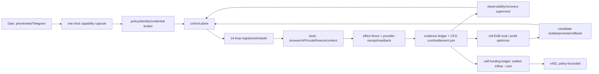
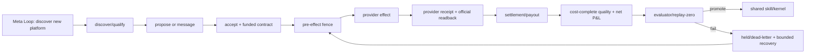

# Life Manager 統合SSOT — As-Is / To-Be / TODO

> **正本はこの文書 1 本だけ（Dais 2026-09-29）。** 以前の `2026-09-15-life-manager-agent-architecture-refinement.md`（全体設計・meta loop #10）、`2026-09-22-paid-fulfillment-all-platforms-design.md`（Paid）、`skills/earn/gig/TODO.md`（gig TODO）と、`docs/superpowers/specs/` のほかの spec はすべて参照用。TODO・順序・状態はここだけを更新し、他のファイルに新しい TODO を書かない。

この文書は Life Manager 全体（Foundation 14ループ + Paid fulfillment）の唯一の入口。
詳細の正本は次の2つで、この文書は両者の統合・順序・現在cursorだけを持つ。

- Foundation/全体: `docs/superpowers/specs/2026-09-15-life-manager-agent-architecture-refinement.md`（Whole-ship handover / AGI addendum / Whole-ship remaining TODO）
- Paid: `docs/superpowers/specs/2026-09-22-paid-fulfillment-all-platforms-design.md` + `skills/earn/gig/TODO.md`（Canonical As-Is / To-Be snapshot）

所有: Claude が Foundation・Paid 両方の唯一の開発owner（2026-09-25 Dais指示）。旧2つのCodexセッションの保護境界は解除。Life Manager 自身のloopは引き続き本番stateのownerであり、Ryu room `18211957` への再送禁止と正式納品ボタン非押下は維持する。

## 0. 原則: No human in loop

Life Manager はアシスタントではなくマネージャー。Grok bot、Muse、Instinct と同じく、自分でコンピュータとブラウザを使い、仕事を最後まで完結させる。**人（Dais を含む）に作業や判断を頼むことは、設計違反として扱う。**
- 応募・承諾・制作・納品・入金確認・修復・改善は、すべて Life Manager の loop が行う。
- 人に頼るのは、法律上どうしても本人が必要なものだけ（初回の KYC、本人確認など）。それも最初の1回に限る（T10）。
- 判断は model が提案し、決定的な policy（金額、契約条件の一致、上限、重複防止、rollback）が確定させる。
- 外部の coding agent（Claude Code、Codex のセッション）も同じく「人」の側。Life Manager が自分で直せるようになること（§5.1）が目標。

### 0.1 Dais の実行範囲境界（全案件共通）

- 明示された現在の目的が、今回の作業範囲の正本。自分から別案件、別担当、別agent、別worktreeの仕事を開始・修正・認証・送信しない。
- 自律判断は、現在の目的の中で次の安全な工程を選ぶためにだけ使う。担当外の問題を見つけても、変更せず境界とownerを記録して通知する。
- 投資の成果として扱う金額は、provider公式のsettled receiptに基づく、全手数料・funding/borrow・slippage・gas・model cost控除後のrealized net P&Lだけ。テストfixture、paper/unrealized、入金、予測、他loopの売上は投資利益にしない。
- この境界は特定サービスだけの禁止ではなく、全loop・全repoに適用する。現在の投資cursorは投資receipt、net P&L、資本拡大gate、Telegram通知に限る。

## 1. 観測事実（2026-09-25 JST 実測）

| 項目 | 値 | 出所 |
|---|---|---|
| origin/main | `d4fe081993`（#5854） | `git log origin/main` |
| 本番loaded release | `d4fe0819931c50caaf41f25e86f1052cd8a0359c`（旧） | Foundation spec:6994 |
| Foundation branch | `fix/writer-admission-self-heal-20260924` `4bef60765c`、main比 0 behind / 224 ahead、open PRなし | `git rev-list` |
| Paid branch | `fix/coconala-history-retry-20260924` `5a28bfb762`、main比 10 behind / 126 ahead、PR #5868 `CONFLICTING` | `gh pr view 5868` |
| Foundation gate | `healthy=0, safely_fenced=1, uncovered_failure=13` | Foundation spec:6993 |
| ディスク空き | 561,643,520 bytes | `df -k /` |
| admission floor | Foundation 1,155,780,608 bytes / Paid 524,288 KiB（536,870,912 bytes） | Foundation spec:6612, Paid TODO |
| 検証済み settled net MRR | 存在しない | Foundation spec:5708 |

訂正（T2で確認）: コード上の floor は既に1つ。`runtime/host/disk_admission.py:16` と `skills/earn/gig/scripts/gig_disk_guard.py` の `DEFAULT_REQUIRED_KIB = 524288` がすべての producer に効いている。1,155,780,608 bytes は Foundation spec が release 昇格の運用目標として使う値で、コード定数ではない。どちらも同じ値にする必要はないので、コード変更はしない。

## 2. 2ブランチの統合方法

試験merge（`git merge-tree --write-tree`）の結果:

- main ← Foundation: 衝突なし（Foundation は main を含む）。
- Foundation × Paid の固有衝突は `runtime/loop/lm_loop.py` の1 hunk（`_admission_effect_unknown_occurrences` 付近）だけ。
- 残り10ファイルの衝突は Paid × main。原因は Paid の一部が #5854 で既に squash merge 済みであること（Freelancer/Upwork readiness・transport とその tests、`application_occurrence_reconcile.py`、`freelancer-actions.public.json`、Paid spec、gig TODO）。
- Paid の main 比の実コード差分は約600行（`paid_direct.py`、`application_occurrence_reconcile.py`、`gig_release.py`、`reconcile_paid_no_effect.py`、`lm_loop.py`、readiness/transport とそのtests）。

手順:

1. 最新 origin/main から `integrate/foundation-paid-20260925` を切る。
2. Foundation を merge する（fast-forward相当）。
3. Paid を merge し、衝突を次のように解く。
   - `lm_loop.py`: 両方残す。Paid の occurrence単位 dict を返す `_admission_effect_unknown_occurrences` と互換wrapper `_admission_effect_unknown_owners` を採用し、読み取りは Foundation の `_read_admission_rows` に寄せる。Foundation の `_legacy_pending_admission_identity` はそのまま残す。全呼び出し元を `rg` で確認する。
   - squash済み10ファイル: main 版を土台にし、#5854 以後の Paid commit（`a751a1f91f` account binding、`0acb25bb50` automatic-bid policy、`cb1cb48677` stale funded inventory 拒否、`a882779ead` receipt-reserve など）の差分だけを載せ直す。
   - Paid spec / gig TODO: Paid HEAD 版を採り、main 側にだけある Ryu receipt 追記を取り込む。
4. `runtime/loop/tests`、`skills/earn/gig/tests`、`skills/self/disk-cleanup/tests` を実行する。
5. 1つのPRにまとめ、#5868 は superseded として閉じる。admin merge する。
6. main から immutable release を1つ切り、label ごとに apply して readback する（release を切るだけでは label は切り替わらない）。

## 3. As-Is — 14ループ（Foundation spec:6939-6961）

Pass はライフサイクル上の投影で、settled revenue ではない。金額は記録があるものだけを載せる。

| # | ループ | Jobs/Pass/Blocked/Fail/無終端 | 主な境界 | 記録されたお金 |
|---|---|---|---|---|
| 1 | Affiliate | 6/1/2/0/0 | effect fence / FIFO | conversion・settled commission なし |
| 2 | Investment | 1/0/1/0/0 | 起動前の capacity admission / cross-venue owner receipt 不在 | Alpaca 公式 readback net **-$0.15**（往復1回、1/30、拡大不可） |
| 3 | Agent Economy | 19/1/9/4/4 | capacity/effect fence、旧entrypoint失敗 | settled x402 **0.003 USDC**、net は未証明 |
| 4 | Job Hunter | 7/1/5/1/0 | effect fence、inbox/runner失敗 | 新規 funded contract なし、Mercor **$0.00** |
| 5 | Fundraiser | 1/0/1/0/0 | effect fence | 資金 receipt なし |
| 6 | Connector | 1/0/0/1/0 | 旧release `entrypoint_exit_1`、`127.0.0.1:9222` 固定と Cloak IPv6 endpoint の不一致 | 収益源ではない |
| 7 | Self-Build | 4/1/3/0/0 | recovery/dev owner 失敗 | 収益源ではない |
| 8 | Mobile Apps | 22/13/6/1/2 | effect fence、metrics lane | 投稿はある。install→課金→MRR の紐付けは未完 |
| 9 | Capafy | 8/2/5/0/1 | effect/capacity | creator earnings は観測済み、paid-out **0** |
| 10 | CFO | 3/0/3/0/0 | message/payout の effect-unknown | 検証済み財務snapshotなし |
| 11 | Writer | 7/2/5/0/0 | capacity/effect/FIFO | 一部は公式readbackあり、支払いの帰属なし |
| 12 | Coconala | 7/3/1/3/0 | browser/Paid/Storefront の失敗と fence | Ryu は手動完了（収益の証明ではない） |
| 13 | CrowdWorks | 5/0/1/4/0 | entrypoint 143/1、effect_unknown（application 44、Paid 1、reply 201、report 1） | Paid 納品・支払い receipt なし |
| 14 | Lancers | 7/2/3/2/0 | fence、timeout、storefront/work-sync | 残高 **¥0**、funded 0件（過去の ¥150,000 は提案のみ） |

Paid 側の追加（Paid spec:27-45）: Freelancer・Upwork は account-bound auth も owner もない（Upwork `contracts=[]`）。`hf-gig-paid-direct` の直近の失敗は ENOSPC による `entrypoint_exit_1`（`effect_class=none`、外部送信なし）。

**As-Is の要約:** 検証済み純利益は実質 $0（+0.003 USDC、-$0.04）。14行中13行が uncovered failure。最大の共通原因は、ディスク不足と、修正が本番releaseに載っていないこと。

## 4. To-Be

```mermaid
flowchart LR
  U[Dais: phone/web/Telegram] --> C[one-shot capability capsule]
  C --> P[policy/identity/credential broker]
  P --> CP[control plane]
  CP --> R[14-loop registry/scheduler]
  R --> T[tools: browser/API/code/finance/content]
  T --> F[effect fence + provider receipt/readback]
  F --> L[evidence ledger + CFO cost/settlement join]
  L --> O[observability/recovery supervisor] --> CP
  L --> E[LM-EAB eval / profit optimizer] --> K[candidate isolate/promote/rollback] --> CP
  L --> S[self-funding ledger: settled inflow - cost] --> X[x402, policy-bounded]
```

- **各ループの完了の定義（全ループ共通）:** account-bound auth → source-complete な公式inventory → funded contract → policy receipt → owner がちょうど1つ → 正しい成果物 → occurrenceごとに effect は1回 → 公式receipt/readback → 支払い/payout readback → crash recovery → replay-zero。
- **ループの健康の定義:** 全行が `healthy` か、型付きの fence（安全な次アクションが記録済み）のどちらか。`unknown` は診断cursorであり、再送の許可ではない。
- **利益の定義:** ループごとに `settled_customer_revenue - refunds - measured cost`。CFO が provider receipt と照合して算出する。Pass やログは利益ではない。
- **役割分担:** model は提案する。identity・計算・dedupe・spend cap・rollback は決定的なコードが持つ。
- **Dais の手間:** 最初の bootstrap と、法的に必要な KYC/OAuth/CAPTCHA だけにする。
- **経済目標:** 検証済み net MRR USD 10K → 自己資金化 → YC W27 用の証拠 → AGI/UBI 研究。証拠なしに達成を主張しない。

## 5. TODO（実行順・正本）

順序変更の記録: 旧順序（Foundation spec:7092-7137）では、収益の帰属（旧9）が capsule（旧6）・cloud（旧7）・LM-EAB（旧8）の後だった。新順序では、ループごとの利益計測（新8）を capsule/cloud/LM-EAB より前に置く。理由は、利益が見えないと、どのループに資源を寄せるか・何を改善するかを判断できないため。Paid cursor は旧5の中身を新7として独立させた。

現在の cursor: **7-0（Lancers 5605912、Dais の承諾待ち）と 5-11 / 5-12 を並行**

T5 の途中経過（2026-09-25 19:00 JST）:
- 観測1: `life-manager-recovery-supervisor` は release 287d で毎 wake exit 1 になっていた。原因は、旧 release の intent を正しく `blocked: release_sha_mismatch` にした結果まで失敗として数えていたこと。#5879 で、この理由の blocked は exit 0 にした。他の理由の blocked は今までどおり exit 1。
- 観測2: 287d を全体へ再 apply したら `admission rebind refused: effect_unknown` で fleet 全体が中止された。#5880 で、fleet モードではその owner だけを `skipped: effect-unknown-fence` として続行するようにした。target 指定の apply では今までどおり raise する。
- 本番: release `20260925T185507-74c69d01` を全体へ適用した（適用136、admission 待ち30、実行中2、fence で skip 1 = `hf-gig-apply-direct`、失敗0）。
- 未達: 過去の `repaired` 11件は、どれも `before_event_id == after_event_id` かつ `command_exit_code=None` だった。readback で既に healthy だったので閉じただけで、修復操作はしていない。T5 の完了には、executor が `lm-loop reconcile ... --max-owners 1` を実行し（exit 0）、修復後の readback が healthy になる outcome が1件必要。
- supervisor は FIFO で1 wake（60秒）ごとに1件しか処理せず、未処理 intent が約200件ある。手動で回すと Codex-free の条件を崩すので、自然処理を待つ。
- 22:17 JST の判定: #5883（古い release の依頼を1 wake でまとめて閉じる）で、未処理は 571件 → 42件まで減り、現行 release の依頼が executor に届くようになった。実際に `lm-loop reconcile` が exit 0 で実行された（agent-economy-loop、franklin-loop、hf-gig-apply-reconcile）。
  - それでも、60分間の監視で本物の `repaired` は0件だった（修復後の PASS 待ち 2412回、古い依頼の close 118件）。
  - 理由は設計上の穴。自己修復の操作は reconcile（owner を現行 release へ付け直す）だけで、全体へ適用した後の失敗はコードや環境が原因なので、付け直しでは直らない。release ずれの owner（30件）は admission 待ちで付け直しが拒否される。長時間動く loop は終了の時点が来ない。
  - T5 の次の手: escalate → `guarded_code_repair`（Life Manager 自身の開発 loop）で1件をコード修復させる。最初の候補は `hf-gig-apply-reconcile` の exit 1（effect なし）。
  - 22:30 JST の #5886（self-heal の agent を Claude に変更）は T5 の誤読で、revert した。Life Manager の内部モデルは GPT（terra/luna/sol）のまま使う。§5.1 を参照。
  - 11:25 の dev 実行の失敗原因: Codex の agent が tests を回して `lm-test-tmp.*` を worktree 内に残し、preflight が許可リスト外の変更として RED にした。Claude に切り替えて Bash を無くしたので、agent は tests を回さず、この問題は起きない。
  - 解消済みの self-heal issue 11件を close した（connector: 5872/5870/5836、supervisor: 5869/5867/5866/5864/5863/5860/5856/5850）。
  - T5 の残り: 04:10 JST の `life-manager-dev` の自然起動で、Claude agent が open な self-heal issue を修正する。その後 PR → merge guard → release → 対象 owner の次の実行が PASS、となることを readback で確認する。
  - 制約: dev agent が触れるのは `apps/life-manager` と `runtime/loop` だけ（issue #5130）。gig 系のコード（例: `hf-gig-apply-reconcile`）は対象外。

T4 完了記録（2026-09-25）: `life-manager-connector-native` が release `287d913c` の上で自然起動し、PASS した。run `18d886ebca7142c8-54861`、18:41 JST、exit 0、`last_terminal_result=pass`、heartbeat は `worker_finished`、wake の status は `applied_bundle`、blocker なし。
その直前の旧 release での起動（18:02）は `worker_failed` / `circuit_open` / `wake_boundary_failed` だった。
注意点が1つ残る。`127.0.0.1:9222` は Dais の Google Chrome（pid 465）が使っており、daily-driver は `[::1]:9222` で待ち受けている。新しいコードは IPv6 経由の recovery でこれを回避している。人間用のブラウザなので、Chrome 側は変更しない。

T3 完了記録（2026-09-25）: main の `287d913c1c`（#5875）から release `~/loops/releases/20260925T180341-287d913c` を切り、`~/loops/current` をそこへ向けた。
続けて `lm-loop apply --all` を実行した（rc=0、全260件）。結果は適用138、退役済み91、admission 待ちで skip 29、実行中で skip 2、失敗0。
1回目は `production apply is already owned` で拒否された。release-reconciler が同時に apply していたためで、lock が外れた後に再実行した。
readback: release を参照する plist 169本中140本が新 release を指している。残り29本は admission 待ちで skip された分で、admission queue が空いたら再適用する（T6）。
foundation gate（新 release の status 271行で算出）: `healthy=0, safely_fenced=4, uncovered_failure=10`（旧は 1/13）。
- safely_fenced の4つ: affiliate と cfo は `external_effect_unknown`、investment と fundraiser は `runtime_admission_deferred`。
- uncovered_failure の10はすべて `runtime_release_drift`。14ループの98 job のうち93は新 release で install 済みで、53は新 release 上の event がある。40は新 release で自然実行がまだ来ていない。5は admission 待ちで旧 release のまま。

T2 完了記録（2026-09-25）: branch `integrate/foundation-paid-20260925` を作り、main ← Foundation（衝突なし）← Paid ← この docs branch の順に merge した。
Paid と main が衝突した10ファイルは、main 側の blob が Paid の過去の commit と完全に一致したので Paid 側を採用した。
`lm_loop.py` は Paid の occurrence 単位の関数を採用しつつ、読み取りを `_read_admission_rows` 経由にした。こうすると DB が lock されていても fence が0件とは報告されない（fail-closed）。Paid の元の `except sqlite3.Error: return {}` は fail-open で、Foundation の test `test_effect_fence_read_does_not_turn_sqlite_lock_into_empty_fence_set` を落とす。
検証: `runtime/loop/tests` 693件 PASS、`skills/earn/gig/tests` と `skills/self/disk-cleanup/tests` 1598件 PASS、`bin/lm-loop-contract` の errors は []。

T1 完了記録（2026-09-25）: 空き 561,643,520 → 5,430,202,368 bytes（floor 1,155,780,608 以上）。削除したのは、clean かつ全 commit が remote にある worktree 38本（うち25本は owner=`codex` の lease が 2026-09-18 に期限切れ）と、どのプロセスも開いていない verify-loops-audit の loop-tmp（300MB）。state・memory・Codex の履歴は削除していない。
減り方は一定ではない。5分計測では純増 +456MB の区間もあった。6時間内の大きな書き込み元は `~/.codex-acct2`（thread_history 2.15GB、rollout 1.0GB）と loop-tmp の残骸。loop が終了時に自分の loop-tmp を掃除する処理は T6 で扱う。

| # | タスク | 完了の証拠 |
|---|---|---|
| T1 ✅ | ディスク floor を回復し、1つに統一する（1,155,780,608 bytes）。再生成可能な cache と governor allowlist を消し、大物（claudevm 約7G、colima 約2G）の要否を判断する | `df` と governor receipt が floor 以上 |
| T2 ✅ | §2 の手順で統合PRを作り、両tests を PASS させて main へ merge、#5868 を close | merge commit、tests の出力 |
| T3 ✅ | main 由来の immutable release を1つ切り、全labelへ apply して readback | label ごとの loaded sha = release sha |
| T4 ✅ | Connector の natural canary（Cloak endpoint の解決）を effect なしで1回 | 公式receipt、`entrypoint_exit` 0 |
| T5 | 自己修復を1回実証する（外部の coding agent なしで、Life Manager が自分の問題を見つけて自分で直す。定義は §5.1） | §5.1 の完了証拠 |
| T6 | 14行の reconcile: 全行を healthy か型付き fence にする。effect_unknown は occurrence ごとに公式receiptで閉じ、一括retryはしない | gate `uncovered_failure=0` |

T6 の途中経過（2026-09-25 22:55 JST、release `20260925T224024-beae3e37`）:
- gate は `uncovered_failure=10, safely_fenced=4`。10件はすべて `runtime_release_drift`。原因は今日 release を何度も切ったこと。新しい release を切らずに約24時間置けば、1日1回の job が現行 release で1回ずつ動き、自然に解消する。**release を凍結する**（例外は本物のバグ修正だけ）。
- 現行 release 上の本物の失敗は8件。
  - `life-manager-daily-driver`: 以前の owner run が残した孤児の Chromium（pid 37260、ppid 1）が profile を握っていた。そのため2回目の起動が exit 0 で抜けて `Failed to launch` になり、再起動を繰り返していた（launchd.err.log は 96MB）。#5889 で「生きている owner を引き取る」ようにした。22:52 に `adopted live profile owner pid=37260` を確認し、`loaded-running`・エラーなしになった。
  - Lancers negotiate/paid と CrowdWorks reply: 共有ブラウザの接続失敗（`browser_connect_failed` / goto timeout）で、daily-driver 停止の連鎖。次の自然実行で回復するかを確認する。
  - `job-search-inbox`: `inbox.py:398`。model の申告件数と thread ID の数が食い違った時に安全側で止まる、意図された fail-closed。二重返信を防ぐための仕組みで、test でも固定されているので変更しない。
  - Instagram en-card / obou: `LM_DATA_DIR is required` と ledger の job id 衝突。obou の Instagram は `marketing-destinations.json` で `ebook_account_out_of_mobile_scope`（上限 0）なので、直すより退役させる候補。state root が共有 events.jsonl のため、run 単位の切り分けは未完。
  - `life-manager-honne-ja`: 昼の ENOSPC（空きが 0.56GB だった時点）による。publish は fence で止まっていた。
| T7 | Paid cursor: Coconala Paid の no-effect wake → Storefront の公式readback → CrowdWorks の fence → Lancers の inventory → Freelancer/Upwork の account-bound auth → Mercor | 各 provider の readback |
| T8 | CFO: ループごとの settled revenue と cost の join（ループ別P&L）を毎日出す | P&L 行ごとに receipt id がある |
| T9 | Mobile funnel と `/en` `/lm` `/income` の整合（install→activation→課金） | attribution receipt |
| T10 | one-shot capability capsule | 目標・承認の質問なしで初回の実行が通る |
| T11 | cloud の durable worker と local の parity | 同じ task で同じ receipt |
| T12 | evaluator が所有する self-improvement（rollback つき） | canary で settled contribution が改善 |
| T13 | settled cost で裏付けた x402 自己資金化 | inflow ≥ cost の CFO readback |
| T14 | LM-EAB（held-out、較正、再現可能） | 独立した再実行で同じ結果 |
| T15 | 検証済み USD 10K MRR → YC W27 の証拠 → cross-domain / AGI / UBI | receipt の集計 |

### 5.0 順序変更（2026-09-27 10:5x JST）: 土台 → 全 loop を green → 収益 → 自己修復の実証 → 自己改善

旧順序: T5（自己修復）→ T6（14 loop）→ T7（Paid）。新順序: ①土台（5-13 自動 apply、7-6e 予約の偏り、6-9b〜d ディスクとブラウザ）→ ② T6 全 loop を green（正常 / 型付き fence / 意図した停止のどれか）→ ③ T7 収益 → ④ 5-12 自己修復の自然実証 → ⑤ T12 自己改善。現在の cursor: ① 5-13。

理由（今夜の実測）: 失敗の大半は各 loop のコードではなく土台だった。merge した修正が owner に届いていない（172 中 53 だけが current release）、admission の stop が戻っていない、capacity の予約の偏り、fence の滞留、ディスク満杯。SNS 投稿 owner は release を反映しただけで失敗が止まった。自己修復の dev agent は土台（runtime の制御面、launchd、admission）を編集できない設計なので、土台が壊れている間は自己修復の実証が起きない。green の基準線が無いと、自己修復が何を直したかも測れない。
実測（10:4x JST）: loaded 172 = ok 64 / failing 47（常駐 daemon の再起動による誤分類を含む）/ capacity 待ち 41 / fence 20。earn 51 = ok 12 / failing 15 / fence 12 / capacity 12。

**Handover（2026-09-28 10:5x JST。この順が正本。新しい session はここから）**

**共通 Paid 境界の実装カーソル（このbranch）**
- 個別顧客の例外実装ではなく、`skills/_shared/marketplace-core` に provider-independent な `PaidHandoffReceipt` 契約と `validate_paid_handoff` を追加する。Reply/Negotiation の thread、accepted `ContractReceipt`、funding id、scope、artifact 要件、金額、通貨を同じ記録に束ね、provider と contract の不一致・未承諾契約・未funded statusを fail-closed にする。
- 共通 `paid_kernel` に `--require-paid-handoff` / `require_paid_handoff=True` の必須ゲートを追加した。必須モードではhookを持たないadapter、未承諾contract、invalid handoffはeffect=0で止まり、valid proofはmutation前にintentへ保存する。Lancers/CrowdWorksのowner配線はこのbranchに追加済みだが、production releaseへの適用はまだである。
- `accept` は仮払い前の契約承諾なのでfunded handoffの対象外とし、`answer` / `submit` / `formal_delivery` / `cancel`だけをfunded必須mutationとして扱う。これにより「採用承諾 → 仮払い → Paid納品」の段階を共通kernelで表現できる。
- Coconala adapter (`skills/earn/gig/scripts/coconala_paid_adapter.py`) は、orders-only の初回snapshotから targeted talkroom readbackへ更新し、構造化価格・取引状態・talkroom証跡・要件digestが揃った場合だけ `ContractReceipt` / `PaidHandoffReceipt` を生成する。fundingまたはscope証跡が欠けた場合は `coconala_paid_handoff_unavailable` で止まる。既存の `paid_direct.py` ownerにも `--require-paid-handoff` を配線し、送信・納品・キャンセル子プロセスを起動する直前にこのcanonical receiptを再検証するところまで、このbranchで完了した。これはproduction releaseを適用した証明ではなく、共通kernelへの完全移行・immutable release・公式canaryは未完了である。
- Lancers adapter (`skills/earn/lancers/scripts/paid_adapter.py`) は、公式detailの `provider_state=funded`、固定金額、terms digest、buyer threadを同じcanonical receiptへ写像する。仮払い未確認・曖昧な金額・terms digest欠落は `lancers_paid_handoff_unavailable` で止まる。Paid ownerには `--require-paid-handoff` を配線済みだが、immutable releaseへの適用と公式canaryは未完了。
- CrowdWorks adapter (`skills/earn/crowdworks/scripts/paid_adapter.py`) は、公式contract bodyから一意の固定報酬額とterms digestを読み、milestone/form/document要件とbuyer threadをcanonical receiptへ写像する。時間単価・範囲価格・価格/terms欠落は `crowdworks_paid_handoff_unavailable` で止まる。Paid ownerには `--require-paid-handoff` を配線済みだが、immutable releaseへの適用と公式canaryは未完了。
- Mercor adapter (`skills/earn/mercor/scripts/paid_adapter.py`) は、契約の `active` / `contracted` 状態やタイトルからfundingを推測しない。公式snapshotに明示された正規化 `paid_handoff`（funding、固定金額、通貨、terms/scope/artifact digest、buyer thread、観測時刻）が全て揃った時だけcanonical receiptへ写像し、欠ければ `mercor_paid_handoff_unavailable` で止まる。現行snapshotにはその証跡が無いため、Mercor mutationはまだhuman-requiredのままである。写像後の形状検証はCoconala・Lancers・CrowdWorks・Freelancer・Upworkと同じ `skills/_shared/marketplace-core/scripts/paid_handoff.py` を使い、日時やハッシュ規則をMercorだけで再実装しない。
- Freelancer/Upworkには `skills/earn/gig/scripts/providers/*_paid_adapter.py` と共有 `skills/_shared/marketplace-core/scripts/paid_handoff.py` を追加した。Freelancerのfunded milestone、Upworkのfunded milestone・明示通貨、buyer thread、scope、artifact要件が揃った場合だけ同じcanonical receiptへ写像し、未funded・通貨推測・証跡欠落はfail-closedにする。これはadapter境界とfocused testsの完了であり、account-bound auth、source-complete live inventory、owner登録、production canaryは未完了である。
- 現在は schema / typed parser / validator / kernel gate / 6 platformの薄いadapter境界 / 共通handoff builder / focused tests まで。各provider固有コードは公式事実の取得とprovider IDの翻訳だけを担当し、契約形式・証跡検証・effect fenceは共通kernelが担当する。既存4 platformのPaid owner配線はbranchにあり、Freelancer/Upworkはowner未登録のadapter境界だけである。まだ main merge、immutable release、production apply/readback はしていない。provider adapter が公式 funded readback 後にこの記録を出すことが次の接続条件。
- 次の順序: (1) branchの既存owner gateをimmutable releaseへ適用し公式canary、(2) Freelancer/Upworkのaccount-bound auth・source-complete inventory・funded contractを確立、(3) 公式 receipt・replay-zero を各providerで確認、(4) payout receiptをCFO ledgerへ接続、(5) Meta Loopから同じconformance gateで新platformをenrollする。

進捗（2026-09-28 13:2x JST、Claude）:
- 1 ✅ 下書き 4243672453（AI Evaluation Failure Triage Brief）は審査提出済み。公式 readback: platform_status=1、audit_status=2、is_confirmed_skills/config_keys=true、package_uploaded=true（04:08Z）。CP1 に Primary Model 欄は実在しない（model は CP2 で決まる）ため、verify_cp1_model は CP2 後と最終確認で呼ぶ（#6066・#6068〜#6070）。catalog の未公開分は DeepSeek V4.1 Flash（19件）、Claude 指定の10件は公開済み・審査中で据え置き。
- 1 追記: Capafy `GET /agent/agents/{id}` の model は 4243672453=`deepseek/deepseek-v4.1-flash`、4813383030=`DeepSeek V4.1 Flash`（05:1xZ）。
- 2 ⏳ 03:24Z は他 run の fence、04:24Z は host の枠満杯（稼働6＋予約2＝上限8、`resource_capacity_busy`）で exit 75。04:24:44Z に `lm-loop start` で起動した run が新 Agent 4813383030（Board Update Deck Builder）を CP3 まで提出: platform_status=1、audit_status=1、skills/config confirmed、package uploaded、run rc=0 `RESULT_success`。手動起動なので無人の証明は 05:24Z の自然 run で取る（次の候補は Demand rank 1 の reels-hook-lab）。
- 反映: release `20260928T140252-811d0937`（#6071〜#6073）を capafy の deterministic 7 loop に `lm-loop reconcile` で適用、readback installed=811d0937。自動の release 作成は 9 分待っても起きず、`reconcile-agent-runner-release.sh` を手動実行した（fleet-apply は "production apply is already owned" で skip、errors=1。未調査）。
- 2 ✅（無人申請を公式 readback で確認）: 05:24Z の自然 wake は枠満杯で exit 75 → 58 秒後に予約 dispatch が自動起動（人の操作なし）→ 新 Agent 3798949471「Reels Hook Lab — Win the Cover Frame」を CP3 まで提出。readback: platform_status=1、audit_status=1、skills/config confirmed、package uploaded。run は提出後の報告中に browser-lane-agent 1800s で rc=124 → exit 1 → fence。adapter が `capafy:agent/3798949471/version/2104444318118604800:platform_status=1` で close（status で fence False）。修正: #6074 起動間隔 3600→900s、#6075 fixture、#6076 申請 run を application-lane-agent（3600s）へ。release cf8d83ac を capafy 7 loop に適用（installed=cf8d83ac、interval:900s）。審査中 4・空き 1。残り: 次の自然 run が Shorts Hook Lab を rc=0 で出すこと（green の確認）。
- 4 ✅ 本番 readback: 06:07Z の毎時 receipt（capafy-skill-analytics.json）に per-skill `profit_30d_usd` と Telegram 要約が実データで入った。
- **Capafy は未完了（訂正 2026-09-28 15:3x JST、Dais）**: 申請の仕組みが動いただけで完了扱いにしてアプリへ移ったのは誤り。1つずつ閉じる。アプリ（下の 5 アプリ As-Is）は Capafy の C1〜C7 が閉じるまで着手しない。

**集客は 1 回きりではなく loop で回る（2026-09-29 時点の頻度）**: 記事 article-daily は毎日 06:00 JST に 1 本（Substack JA/EN・note・aniccaai.com。1 日おきに Capafy の売れている Skill へ誘導、ct=article-<slug> で計測）、途中で止まった記事は article-resume が 5 分ごとに引き継ぐ。open-seo の検索語は Skill ごとに 30 日に 1 回更新。Capafy の工場は 15 分ごと。Skill 別利益・流入元の Telegram 報告は毎時（数字が変わった時だけ）。PromptBase は毎日 04:20 JST に 1 件。Capafy Instagram は復旧後 1 時間ごとの loop。アプリの SNS 投稿は各 lane 1 日 3 回。

**Capafy を閉じて次（モバイルアプリ）へ進む条件（公式 readback で確認できたら閉じる。審査・承認・売上の結果待ちは条件にしない = 監視のみ）**:
- X1 Capafy Instagram が人の手なしで Reel を 1 本投稿（Instagram の公式 Reel 一覧で確認）
- X2 Capafy の Skill に誘導する記事が 1 本公開され、リンクに ct=article-<slug> が付いている（RSS・公開ページで確認）
- X3 Japanese Humanizer の $9.99 版が審査に提出される（publish-remote-status platform_status=1）
- 監視のみ（進む条件ではない）: Hook Lab DeepSeek 版の承認と黒字化、Japanese Humanizer の承認、記事経由の注文数

**値付けとモデルの方針（Dais 2026-09-29。全商品・既存も新規も最初から適用）: 安く作って高く売る。**
- モデル: 既定は安くて十分な品質のモデル（DeepSeek V4.1 Flash 等）。Sonnet 級は使わない。例外は、同じ価格帯の売れている競合が明らかに高品質を必要とし、かつ価格でモデル代の数倍を回収できる時だけ。
- 価格: 売れている出品者の価格をそのまま参考にし（成功者を真似る）、その上限側に置く。モデル代の数倍が入る価格にする。無料配布はしない（試用はプラン設計の無料トライアルだけ）。
- 既存: Capafy の Sonnet 33 本は「DeepSeek 切り替え + 値上げ」を 1 本 1 回の更新にまとめ、売れている順（Slide Maker → TikTok Script Pro → Marketing Strategist → YouTube Script Writer → …）に審査枠が空き次第出す。Hook Lab は DeepSeek 版が審査中。Japanese Humanizer は $9.99 化を提出待ち。
- 新規: 工場の既定を DeepSeek + 売れ筋の価格帯にする（既に DeepSeek 既定）。
- 歯止め: 毎時の利益データでモデル代が売上の 30% を超えた Skill は、工場が値上げまたはモデル変更を自動で出す（最初の方針の後の安全網）。
- 同じ方針を Writer（有料記事の価格）、Ebook（The Anicca Reset の価格・KDP 価格）、アプリ（サブスク価格）、PromptBase にも当てる。

**Capafy 実測（2026-09-29 18:1x JST、公式 readback）**: 自分の Agent 52 本 = 公開中 44・審査中 7・下書き 1（Capafy API `agentStatus`）。お金（毎時集計 15:07 JST 時点）: 売上累計 $100.76（100 件）→ 取り分 $74.64 → 今月 API 実費 $25.50 → 差し引き $49.14。未払い残高 $20.26・振込可能 $14.40・振込済み $0。
- 済み: Hook Lab v1.0.4 審査提出（platform_status=1、#6199: CP2/CP3 のタブ再試行・待ち時間・「下書きを保存」表記・変更履歴はキー入力）。工場の詰まり解消 → 17:57 の実行は次の Agent 9563867391 の DeepSeek 切り替えへ進行中。宣伝 3 時間ごと本番（#6197、d697d18f、1:15 から 3 時間おき 8 回、2 本目 TikTok Script Pro の記事 200 + X PUBLISHED）。値上げ取り消し（#6200、キュー 19 本で値上げ 0 本を API で確認、DeepSeek 切り替えは残す）。利益の日次 Telegram（#6195）。
- 残り（Capafy）: 1 17:57 の工場実行が審査提出まで行くか公式確認 2 毎時集計が 15:07 から止まっている原因を直す 3 審査中 7 本の承認を待たず、次の Agent を工場が作り続けるか確認。

**Dais 決定（2026-09-29 17:2x JST）と残り ToDo の順番**
- 開発の流れ: 変更は worktree の中で実物（worktree のスクリプトを直接実行）を動かして確認し、成果がそろってから main へ 1 回だけ merge → release。小さな修正ごとに main へ入れて本番で試すのはやめる（17:0x までの #6190/#6191 は本番で試した。前例: 不正な priority "paid" が全 loop を止めた）。
- 観測性: `lm-loop status` は 278 loop・約 4 秒・JSON のみ（実測 17:2x: 正常 170 / 停止 108 = effect_unknown 41・capacity_busy 39・exit_1 22）。→ `lm-loop health` を追加: 1 画面の表（loop・最終実行・結果・停止理由・次の手）と、スキル別の今日の成果（公開数・売上）。
- 目標の定義（Dais 2026-09-29 17:3x）: $10k MRR = **銀行口座に入る利益**（売上 − プラットフォーム手数料 − API 費用）。売上総額ではない。現在 Capafy 30日: 総額 $80.78 → 手数料後 $64.62 → モデル代 $42.99 → **利益 約 $21.63**。この利益をスキル別に毎日 Telegram へ報告する（いまの C6 日次報告はキュー・撤退候補だけで利益額がない → 追加する）。
- ブラウザ（Dais 2026-09-29 17:3x）: 専用ブラウザは作らない。割り当ての正本 `~/.config/ai/registry/browsers.toml`（identity=サイト×アカウント、1 identity 1 profile、`browser-guard.sh` の lease で同時使用を防ぐ）。現物readbackでは`coconala:kosuke`は`gig-daily-driver`・9223で稼働し、CapafyとCoconala Gigが同じseller identityを**leaseで直列共有**する。Gigの`hf-gig-browser` process、`session_vault_tick.sh`、Coconala browser testsがこの対応を示すため、「Gigは別のdaily-driver Chrome」という直前記述はsource/live stateと矛盾し、採用しない。`cdp_lock.sh`はGig内部のtab/phase直列化であり、identityの代替ではない。Hook Lab CP2の停止はブラウザ待ちではなかった（ボタン判定のタイミング）。
- 残り順: 0 スキル別の利益（銀行に入る額）を毎日 Telegram へ 1 宣伝ループを 3 時間ごと・Agent ローテーション（ledger を日付→枠キーへ） 2 Hook Lab CP2 のベンダーボタン待ち → 審査提出 3 申請順を新 Agent 優先 4 `lm-loop health` 5 effect_unknown 41 件を証拠付きで閉じる 6 アプリ 7 connector 8 fundraiser 9 self-fix worktree 化。

**実測（2026-09-29 17:1x JST、公式 readback）宣伝ループ（capafy-distribute-daily）初公開**: 無料英語記事 https://aniccaai.com/blog/capafy-reels-hook-lab-2026-09-29 = HTTP 200、本文に `ct=capafy-distribute-reels-hook-lab`（ledger 2026-09-29 aniccaai=published）。X = Postiz `PUBLISHED` https://twitter.com/selawmqt/status/2104845436683202788（アカウント「sela | AI Tools」、`POSTIZ_X_INTEGRATION_ID` を marketing.env に設定。今日の X は同じ capafy_x_post.py の手動実行＝自然実行ではない。明日 07:15 の自然実行で両方を確認する）。修正: #6190 公開確認を最大15分待つ（deploy は約5分）、#6191 X 投稿に Postiz の X 設定を付けて 400 を解消し、QUEUE→PUBLISHED を最大10分待つ。fence 2 件は証拠付きで閉じた（16:21 run = pre-effect、16:51 run = 公開の公式 readback）。Hook Lab v1.0.4 の CP2 停止原因 = 出力が空で `grep -v` が 1 を返し `set -e` で無言終了、実エラーは `vendor-button-count 0`（ワークスペースタブ表示直後に判定、少し待てば OpenRouter ボタンは存在）→ 次に修正。
- 次: ① 宣伝ループを 3 時間ごと・Agent ローテーションにする ② CP2 のベンダーボタン待ち修正 → Hook Lab 審査提出 ③ 申請順を「新 Agent 優先・値上げは後」に変更（Dais 2026-09-29: 売上が費用を上回れば値上げは不要）。記事ループ（article-daily 06:00）・宣伝ループ（07:15）とも現状 1 日 1 回。

**② 完了（2026-09-29 15:3x JST、公式 readback）**: 15:23 JST の定期起動（手動起動なし。最後の手動起動は 13:23）が、作りかけの TikTok Script Pro（2844813315）更新下書きを resume → CP1/CP2 → CP3 まで自力で進め、公式 detail で status=1・isConfirmedSkills=1・isConfirmedConfigKeys=1・hosted model deepseek/deepseek-v4.1-flash を確認（値上げ 日$2.99/週$7.99/月$19.99）。Hook Lab 値上げ v1.0.4 は次の run で提出予定。C7 対応: capafy-loop-daily を critical_paid（Capafy catalog に read_only_external_owner を追加、gate ok=true）を main に merge、本番反映中。

**実測（2026-09-29 15:2x JST）**: ② 未完了。修正 3 件（#6167 作りかけの更新下書きを優先、#6170 前後の CP3 下書き保存→提出）を本番 1ba0237a。14:50 の自然 run は TikTok Script Pro 更新の CP1/CP2 まで完了し CP3 で停止（→ CP3 修正済み）。以降の定期起動は 15:05・15:21 とも `resource_capacity_busy`（他 loop の agent が実行枠を占有）で延期 = **C7（実行枠の配分）が Capafy を止めている**。X2 未完了: 今日の記事は anicca 固定のまま出た（固定は解除済み）。今日 2 本目の手動起動は、同日 run の note 公開待ち＋自 run の fence で開始されず（固定は即時に戻した）。記事は毎日 1 本（06:00 JST）で、Capafy 誘導は日替わり選択（次は 10/2）。**Capafy 専用の無料記事を毎時出す loop は存在しない**（Writer の記事の CTA が Capafy を指す日だけ）。

**実測（2026-09-29 14:4x JST）**: 売上 = Capafy 30日 総額 $80.78・手数料後 $64.62・モデル代 $42.99・利益 $21.63（Hook Lab の DeepSeek 化前の赤字を含む）、アプリ（RevenueCat）MRR $20・28日売上 $32・有効サブスク 5。**月 $10k MRR には未達（約 1%）**。② は未確認: 値上げ更新の下書き（TikTok Script Pro v1.0.2・Hook Lab v1.0.4）が status 0 のまま。原因（別の更新を次々始めて下書きが増える）は #6167 で修正し本番 5d8a135b。自己修復の成功後 20h 待ちも #6167 で解消。14:29 の定期起動は自動 release 反映中の owner deploy lock で `resource_control_busy` 延期 → 次の自然起動の公式 readback で確認する。③ は本番で確認済み（fence 65 件すべて `admission_effect_unknown_diagnosis` に原因 run・失敗手順・provider 状態・次の手）。

**Capafy 実測（2026-09-29 13:3x JST、公式 readback）**: ① 4243672453 = status 4（公開中）・DeepSeek。Hook Lab v1.0.3（DeepSeek）・Shorts Hook Lab・Ad Hook Lab・Customer Escalation Decision Deck が承認（status 4）→ Hook Lab の Sonnet 赤字は停止（1注文の費用は推定 $3.29→$0.30、実額は OpenRouter で後日確認）。Customer Renewal Evidence Brief は自己修復 agent が自分で提出（status 1、ただし hosted model は Sonnet のまま→承認後に DeepSeek 更新）。Slide Maker の DeepSeek 更新を工場が人の手なしで提出（13:25、status 1）。Hook Lab 値上げ（日 $3.99/週 $9.99/月 $19.99、#6167）は v1.0.4 下書き作成済みで次の run が提出。原因と修正: #6141 #6145 #6146 #6150 #6155 #6157 #6159 #6161（自己修復が worktree→PR→merge→release まで自分で行う）#6163 #6167。記事の Capafy 誘導が出なかった原因 = `.env` の ARTICLE_PRODUCT_ID 固定 → 解除（次の Capafy 日は 10/2）。残り（spec 順）: X2 → X3 → C4（全スキルを売れ筋の値段帯に、年額は CP1 未対応）→ C6 → C7 → アプリ。

**Capafy 市場の全体調査（2026-09-29、`POST /agent/agents/search` 本文に query、50 キーワードで 1,025 Agent。自社ではなく他の出品者を見る）**
- サブスク型の上位: CloneCut 11,926（週$12.99/月$29.99/年$149.99）、Ocup Football Analysis 3,069（週$14.99/月$29.99/年$99.99）、Serenity Stock Tracker 1,669（週$9.99/月$19.99/年$99.99）、HookAce 868（週$9.99/月$19.99/年$239.88）、Odeo Maker 626（週$19.99/月$29.99/年$199.99）。勝ち筋 = 週 $9.99〜19.99・月 $19.99〜29.99・**年額 $99〜239 を必ず持つ**・無料トライアルなし。
- ダウンロード型の上位はほぼ無料（llm-real-video Free 3,337、Cinematic Realism Prompt Builder 1,055、3-Second Viral Hook Generator FREE 135）。有料は少数（Badr Studio $5 47本、llm-real-video Pro $29 30本）。（無料版→有料版の誘導は llm-real-video の 1 例だけで、移行人数の証拠がない。Dais 2026-09-29: 無料では売らない → 採用しない。）
- 決定: (1) 全サブスク Skill を週 $9.99〜14.99・月 $19.99〜29.99 に上げ、年額 $99〜149 を追加（#6153 の予約も年額付きに作り直す）。(2) 無料配布はしない（download 型も必ず有料。Japanese Humanizer も有料化）。(3) 値上げ後 1〜2 週の注文数で下げ判断もする。

**Capafy 競合の実測（2026-09-29、capafy.ai 公開ページ・読み取りのみ）**: 売れ筋は2型。(a) 追跡・分析型（金融・スポーツ・動画生成）は月額固定 $8〜20・無料トライアルなし・販売数 500〜12k（CloneCut 11.9k、Ocup Football Analysis $8.33/月 3,069、Serenity Stock Tracker $8.33/月 1,669、Alpha Consensus $10.83/月 533）。(b) 生成型（hook・台本・文章）は日/週の小額 $2〜10（HookAce $9.99/週 868、Viralume $6.99/日、SEO Content Writer $6.99/日）。自社の単価: Hook Lab は Sonnet で1注文約 $3.29 のモデル代、DeepSeek V4.1 Flash なら推定約 $0.30。モデル代を手数料後売上の 15% 以下にする最低価格は約 $2.50。
- 値付けの決定: Hook Lab = 日 $3.99 / 週 $9.99（HookAce に合わせる）/ 月 $19.99（DeepSeek 版承認後すぐ更新）。YouTube Script Writer・TikTok Script Pro の日額は $3.99 以上。Marketing Strategist は週 $9.99〜13.98。Slide Maker は据え置き（$9.99/週・$24.99/月で売れている）。Japanese Humanizer は有料化（無料配布をやめる）。
- 勝ち筋: 自社の Football Match Analyst・Portfolio Tracker は (a) 型。月額固定 $8〜20 に合わせて集客を寄せる。

**既存商品の正しい仕組み（2026-09-29、コードで確認。新しく作ると書かない）**
- Writer loop（`skills/writer-agent/SKILL.md`・`article-daily.sh`）: 記事そのものを売って稼ぐ。note は無料試し読み→有料 ¥500、Substack は有料購読（無料には試し読み）、aniccaai.com は preview＋paid 分割。Zenn・dev.to は全文無料の集客面。出版社・企業の有料依頼も対象。読者が実際に払った額で次のテーマを選ぶ。他商品へのリンクは追加の役割。
- Ebook（`~/anicca-monk-factory/MASTER_PLAN.md`・`skills/earn/marketing-engine/registry/products/ebook-*.json`）: 「The Anicca Reset」（EN $10.99 aniccaai.com/monk、JA 版あり）を自社 checkout（Stripe prod_UQ2LTH66Rwict4 / prod_UQ2LrpVy4b1bAY）で販売中。Amazon KDP は `direct_live_kdp_unavailable`（KDP 認証なし）→ Ebook の TODO は KDP 接続。集客は monk factory（monk アバター動画を多数アカウント・多言語で配信、EN は HeyGen、watercolor/yangmun monk 等）。原則「配信チャネルは大量生産、商品は 4 つ（ebook・newsletter /letter /tegami・web app・iOS app）に固定」。

**スキルの形（Dais 2026-09-29。正本）**: 稼ぐ単位を「スキル」と呼ぶ（Capafy スキル・Writer スキル・モバイルアプリ・スキル・PromptBase スキル・Ebook スキル…）。どのスキルも「作る loop（商品を作る・直す）」と「広める loop（無料の記事・SNS・X で `ct=` 付きリンクを流し、どこから何人来て買ったかを数える）」を並行で回す。部品（書く・公開する・投稿・計測）は全スキルで共有する。
- 実測（loop-registry、2026-09-29）: Capafy = 作る ✅ capafy-loop-daily／広める △ Instagram のみ（停止中）・**無料記事 loop なし**。Writer（商品 = 有料記事）= 作る ✅ article-daily／広める **記事を SNS・X に流す loop なし**（有料執筆依頼の探索 loop はある）。モバイルアプリ = 作る **アプリ工場 loop なし**／広める ✅ SNS 16 本。PromptBase = 作る ✅／広める **なし**。
- TODO（この順）: (1) Capafy の広める loop = 売れ筋スキルごとに英語中心の無料記事を毎日（dev.to・英語 Substack・aniccaai.com・X）、全リンク `ct=`（Writer の部品を再利用、無料公開）→ (2) Writer の広める loop（有料記事を X・SNS に流す）→ (3) PromptBase の広める loop → (4) モバイルアプリの作る loop（A5）。

**最後までの全体の順序（Dais 2026-09-29 確認。この版が正本）**
① 商品で稼ぐ（Capafy → モバイルアプリ → Writer → PromptBase → Ebooks → affiliate）→ ② 14 loop を全部 green（土台: ディスク・release 反映・fence・admission）→ ③ **meta loop**（Life Manager が自分で新しい loop を作る: 新しい platform / 商品の規約と net value を判定 → 共通 runtime 上に薄い adapter を作る → 公式 effect を canary → 通ったものだけ promote。専用の scheduler / queue は作らない。正本: `docs/superpowers/specs/2026-09-15-life-manager-agent-architecture-refinement.md` の TODO #10、関連: `skills/earn/gig/TODO.md` の Coconala-to-meta-loop、`skills/earn/marketing-engine/README.md` の manifest 型 marketing loop）→ ④ 自己修復（T5）→ ⑤ 自己改善（T12。meta loop が作った loop も同じ評価器・canary・rollback で改善する）→ ⑥ loop 別の利益（T8）→ ⑦ Cloud・自己資金化（10-1・11-1・13-1・14-1）→ ⑧ 検証済み月 $10k MRR → YC W27 → AGI/UBI 研究。
- 目標（Dais）: 全カテゴリで software factory（新商品の出荷 + 既存の改善）と共有マーケティングを回し、カテゴリごと月 $10k 以上、全体 $10M 以上。

**TODO 順序（Dais 2026-09-29 09:3x JST 指示。この版が正本、以前の順序を上書き）**
- 順序: 1 Capafy → 2 モバイルアプリ → 3 Writer（記事、traffic link で各商品に誘導）→ 4 PromptBase → 5 Ebooks（自社サイト + Amazon KDP）→ 6 affiliate → 7 connector → 8 fundraiser → 9 self-fix
- Capafy Instagram（X1）は後回し（Dais 指示: 時間がかかるなら商品の出荷を優先）。作成の仕組みは #6143 で修正済み。旧アカウントは退役済み、交代要求は出してある。
- 方針: 共有マーケティング（記事 + SNS で全商品に配信）と software factory（新商品の出荷 + 既存商品の改善）を全カテゴリに適用する。目標はカテゴリごと月 $10k 以上、Life Manager 全体で $10M 以上、YC W27 で資金調達。
- X: 記事のリンク付き通常投稿を Postiz の X 連携で流す（X Article の編集画面はアカウントで使えないため skip。#6140）。
- 現在の位置: 1 Capafy（X2 記事、X3 Japanese Humanizer 提出、TikTok Script Pro の説明文と価格）

**TODO 順序の変更（2026-09-29 08:3x JST、この版が正本）**
- 理由（公式 readback）: 直近28日の売上は、アプリ = RevenueCat revenue $32・MRR $20・有効サブスク 5・新規ユーザー 61。PromptBase = $0（Reels Hook Lab は審査待ちと画像認証で止まり中）。Capafy の Skill 別売上は30日 $80.78、実利益 $21.75。すでに課金が発生していてユーザーも入っているアプリを先に伸ばす方が、全体の売上が早く増える。
- 旧順序: 1 Capafy → 2 PromptBase → 3 自社メディア → 4 モバイルアプリ → 5 connector → 6 fundraiser → 7 self-fix
- 新順序: 1 Capafy → 2 モバイルアプリ → 3 PromptBase → 4 自社メディア → 5 connector → 6 fundraiser → 7 self-fix
- 現在の位置: 1 Capafy（X1 Postiz 経由の新 IG アカウント、X2 記事）

**2026-09-29 08:2x JST 実測（この版で上書き）**
- Capafy Instagram（X1）: Reel の生成と HyperFrames 検査は通過（#6134）。投稿は不可。旧アカウント capafy.skills8m4q2z は Instagram の scraping_warning（「自動化された操作の疑い」）で止められ、「閉じる」もエラーになる。自動の新規作成は 8 月に約 30 回連続で失敗。方針（Dais 2026-09-29）: Capafy の SNS はすべて Postiz API に寄せる。新しい IG アカウント（クリエイター）を作り、Postiz に接続して投稿する。旧アカウントでの自動投稿は止める。
- 記事: 9/28 分は Substack JA/EN・note・aniccaai.com JA/EN で公開済み。article-daily の fence 18d98160 は aniccaai.com の公開ページ（200）で確認して閉じた。9/29 分は未公開。#6136 で「公開物ではないファイルを下書きと誤判定して再試行を止める」問題を直し、再試行は動いた。ただし 3 回ともモデルが「前日 run 20260928-132912 の X Article JA（x-editor-unreachable:no-editor）が未完了」を理由に作業を止めた。X 編集画面が使えない場合を終端 skip にする修正を進行中。
- アプリ投稿 A1: carousel の修正後も、anicca の動画 lane が固定の hook 2〜4 本を回していた（@anicca.he で同じ文面が 6 回）。#6135 で anicca-ios の動画 9 lane すべてに Gemini の新しい文面生成を有効化。次の投稿を Postiz で確認する。
- 共有 contract: #6061（Capafy 工場を critical_paid に）で lm-loop-contract が recovery_class_mismatch の RED になっていた。#6137 で priority を revenue に戻して GREEN（main 00cc2c9d で ok=true）。release 20260929T080502-00cc2c9d を本番に反映。

**Capafy 完了（2026-09-29 18:3x JST、公式 readback）**: 閉じる条件 X2 = 宣伝ループの記事 2 本（aniccaai.com 200、ct=capafy-distribute-*）、X3 = Japanese Humanizer 3332784488 v1.0.1 platform_status=4（承認・公開中）。X1（Capafy IG）は Dais の指示で後回し。工場・宣伝（3 時間ごと）・毎時集計・日次利益 Telegram は loop で回る。承認・売上・工場の各 run は監視のみで、次へ進む条件にしない。cursor は下の 2（PromptBase）。

**進捗（2026-09-29 19:0x JST、公式 readback）**
- PromptBase: 公式画面 = Hook Lab Win The First 3 Seconds が Approved（販売中）、Reels Hook Lab 2 件は Draft（未提出。ledger の submitted_pending_review は誤記録で、readback が draft に直した）、売上 No sales yet。P3 ✅ #2ffad523（readback が Sales タブを読み ledger の sales_usd と `state/promptbase-sales.json` を書く。worktree で実行し sales_count=0 を確認）。P4 🔄 branch `feat/promptbase-distribute-p4`（3 時間ごとの宣伝ローテーションに `promptbase-hook-lab` を追加、リンクは手数料 0% の `?via=keipanda`、ct は & で連結）。worktree で h18 枠を実行中 → 記事 200 と X PUBLISHED を確認したら merge。Reels Hook Lab の提出は reCAPTCHA の画像問題で止まる（回避しない。ループが毎日再試行し、画像問題が出た時だけ Dais へ）。
- モバイルアプリ A1 ✅: Postiz 直近 24 時間 26 投稿で同じアカウント内の文面重複 0。例外 1 件 = Anicca iOS（Instagram）が ERROR。次は A2（投稿 → App Store の流れを測る）。

**進捗（2026-09-29 19:1x JST、公式 readback）**: ① 4243672453 = status 4・model deepseek/deepseek-v4.1-flash・skills/config confirmed（Capafy API 再読）。③ lm-loop status の fence 67 loop に admission_effect_unknown_diagnosis（cause_run / fenced_occurrences / next_action / occurrence_id / provider_state）。PromptBase P4 ✅ #6208（04a56df3）: 記事 https://aniccaai.com/blog/capafy-promptbase-hook-lab-2026-09-29-h18 = 200、リンク `?via=keipanda&ct=capafy-distribute-promptbase-hook-lab`、X = Postiz PUBLISHED（QUEUE→PUBLISHED に約 13 分。worktree 実行を自分の branch 切り替えで途中終了させたため X は同じ capafy_x_post.py で手動投稿）。PromptBase の新規出品は reCAPTCHA 画像問題で無人では出せない（回避しない方針）→ 出品済み Hook Lab の宣伝のみ継続。アプリ A2 ✅ 測定は既存: anicca-ios ダウンロード（検索 2・App referrer 2）、RevenueCat 新規 4・有料 0・MRR $20.34、honne-ai ほぼ 0。次は A4（有料への転換）。

**（2026-09-29 23:1x 復元: 5ab82b6859 の上書きで消えた Capafy の節を戻した）**

**Handover（2026-09-29 23:2x JST。新しい session はここから読む。これが実行順の正本）**

進め方の変更（Dais 2026-09-29）: 自然 run を待って 1 つずつ失敗を見つけるのをやめる（今日は同じ「自然 run で確認」を 5 回言い、そのたびに別の原因で失敗した）。先に worktree で全段階（inventory → prepare → CP1 → CP2 → CP3 → final verify）を 1 回通して残りの失敗原因を全部出し、直してから自然 run で 1 回確かめて終わる。「成功」の返事は実物（plist の release、Capafy API、公開ページ、Postiz）で確かめてから信じる。

現状（23:16）: 工場 capafy-loop-daily は 22:16 の失敗の fence 待ち（lm-fence-reconciler が 62 分後に自動解除）。宣伝 capafy-distribute-daily は読み戻し役入り release b4ab4ade（plist で確認）。23:03 の run は記事 https://aniccaai.com/blog/capafy-tiktok-script-pro-2026-09-29-h21 を公開、X は「capafy_x_post.py が実行枠内に結果を返さず、Postiz にも投稿なし」で failed。

Atomic TODO（上から 1 つずつ。各行は公式 readback で閉じる）
1. Capafy
   - [ ] K0 worktree で工場の全段階を 1037238583（Football Match Analyst）で通し、残る失敗原因を全部出して直す
   - [x] K1 2026-09-29 23:40 JST の `lm-loop start` run で 1037238583（Football Match Analyst v1.0.1）が全段階（prepare → CP1 → CP2 exit 0 → CP3 → final verify → ledger）を通り platform_status=1・skills/config confirmed・model DeepSeek V4.1 Flash（Capafy API）。今日の 4 修正後の初の完走
   - [x] K1b（#60908370、release 20260929T235132-60908370 を plist で確認）提出成功なのに daily_loop が `BLOCKED — post-verdict=PUBLISHABLE` と表示し self-fix を呼ぶ誤判定を直す（post-verdict の再判定が成功を見ていない）
   - [ ] K2 次の自然 run で次の Agent も platform_status=1（人の手なし）
   - [ ] K3 宣伝の X 投稿が実行枠内に終わらない原因を直す（capafy_x_post の待ち時間とモデル実行の枠の関係）→ 自然 run の枠で記事 200 + X PUBLISHED
   - [ ] K4 次の枠も人の手なしで記事と X
   - [ ] K5 9/15 から審査中の 5 本: 9/28 の問い合わせへの返事を Gmail で確認、無ければ再送
   - → Capafy 完了を記録
2. PromptBase
   - [ ] P5 04:20 の自然 run で次の 1 本が Pending（ダッシュボード）
3. 全 loop 共通の土台
   - [ ] F1 `lm-loop health`: 全 loop の状態・止まり理由・次の手・スキル別の今日の利益を 1 画面
   - [ ] F2 `resource_effect_unknown` の多い owner に読み戻し役を付ける（capafy_distribute_fence_reconcile の写し）
   - [ ] F3 `resource_capacity_busy`（処理枠の予約の偏り、7-6e）を直す
   - [ ] F4 ディスク空き 10GB 以上（20 秒で 1GB 減る書き込み元を特定）
4. モバイルアプリ
   - [ ] C1 投稿ごとの計測を再開（post-metrics が 9/27 から止まっている）
   - [ ] C2 再生 → プロフィール → ストア → インストールの表を毎日
   - [ ] C3 ASO（売れているアプリを写す）
   - [ ] C4 課金: 新規 4・有料 0 の原因を直す
   - [ ] C5 工場の未公開 4 本を審査提出
   - [ ] C6 Anicca iOS の Instagram 投稿 ERROR
5. Writer
   - [ ] W1 有料記事の売上（note / Substack）を毎日公式 readback
   - [ ] W2 X で宣伝
6. Ebook
   - [ ] E1 KDP に出す  - [ ] E2 売上 readback
7. アフィリエイト
   - [ ] AF1 fence を公式 readback で閉じる  - [ ] AF2 紹介料 readback
8. connector
   - [ ] D1 カレンダー自動登録を自然 run で確認
9. fundraiser
   - [ ] FR1 カレンダー登録を自然 run で確認
10. self-fix
   - [ ] S1 修正役が repo の worktree で作業できるようにする（#6063）
11. 仕上げ
   - [ ] G1 全 loop green  - [ ] G2 自己修復の実証  - [ ] G3 自己改善の実証
   - [ ] G4 loop 別損益（CFO が 0/3 で停止中）  - [ ] G5 Cloud  - [ ] G6 口座に入る利益で月 $10k  - [ ] G7 YC W27

**状態（2026-09-29 23:14 JST）**: 工場 capafy-loop-daily = loaded-idle・fence 待ち（22:16 の失敗、lm-fence-reconciler が 23:18 頃に自動で閉じる設計）。宣伝 capafy-distribute-daily = 23:03 起動の run が終了し idle、読み戻し役入り release b4ab4ade へ切り替え中（初回 apply は実行中のため plist が af6e5011 のままだった。「apply=0」を実物で確かめずに信用しない）。14 主要 loop の実測（lm-loop status）: 全 job 正常は connector のみ。求職 0/7・fundraiser 0/1・CFO 0/3。お金の公式 readback があるのは Capafy（差し引き約 $49）とアプリ（MRR $20）だけ。観測・自己修復の不足: `lm-loop health` 未作成、self-fix は immutable release 内で動くためコードを直せない（#6063）。

**Capafy だけを 1 つずつ閉じる（2026-09-29 23:0x JST、Dais: 1 つずつ。Capafy が閉じるまで他へ進まない）**
- 作る（工場 capafy-loop-daily）: 今日の自然 run 26 回中 24 回が途中で BLOCKED。原因 4 つを修正済み: Coconala とのブラウザ取り合い（専用 capafy-browser、#6230）、HOME 移動で lease 不可（#8f1fdd3a）、lock 持ち主不明（#a1018689）、読み取り専用アイコン上書き不可（#af6e5011）。22:16 の失敗の fence は lm-fence-reconciler が 62 分後（23:18 頃）に自動で閉じる設計（too_recent を readback で確認）。
- 売る（宣伝 capafy-distribute-daily）: 17:04 の exit 1 の fence に読み戻し役が無く、19:15 と 22:15 の自然 run が走っていなかった。23:0x に公開ページの公式 readback で閉じ、読み戻し役 capafy_distribute_fence_reconcile.py を追加（#b4ab4ade、IG の写し、本物の GitHub commit・公開ページ・Postiz で effected と判定を確認）。
- 残り（この順）:
  - K1 工場: fence 自動解除後の自然 run で 1037238583（Football Match Analyst）が platform_status=1（Capafy API）
  - K2 工場: 続く自然 run で次の Agent も人の手なしで platform_status=1（2 回連続で確認）
  - K3 宣伝: 読み戻し役入りの release を apply → 自然 run の 3 時間枠で記事 200 + X PUBLISHED（ledger の枠キーで確認）
  - K4 宣伝: 次の枠も人の手なしで出る（2 回連続）
  - K5 9/15 から審査中の 5 本: 9/28 に送った問い合わせの返事を Gmail で確認し、必要なら再送
  - K1〜K4 がそろったら Capafy 完了と記録し、次（ディスク → アプリ）へ進む

**進捗（2026-09-29 22:xx JST、Capafy 専用ブラウザ）**: A1〜A7 ✅（#6230 = 8f1fdd3a）。A1 lancers の browser-owner を写し（root の段数だけ置き場所に合わせて 4→3）、A2 registry・catalog（continuous_service 追加）・fixture 再生成（tests 127 pass、contract ok）、A3 browsers.toml に `capafy:kosuke`（Coconala から capafy.ai を外す）、A4 capafy.ai の cookie 17 個と localStorage（`auth-storage` ほか）だけを Coconala の保存から移し、専用ブラウザで販売者画面がログイン済みで開くことを確認、A5 既定 identity を `capafy:kosuke`、A6 1500 秒の応急処置を戻す、A7 もう 1 つの真因を修正: publish_finish が HOME を publisher home に移した後に with-browser を呼ぶため、browser-guard が browsers.toml と `~/.cloak/leases` を見つけられず acquire を 150 秒繰り返して exit 124（ドライバー出力なし）。with-browser だけに operator HOME を渡す。実証: 下書き 7686597754（YouTube Script Writer v1.0.3）が CP2 → CP3 → platform_status=1・skills/config confirmed・model DeepSeek V4.1 Flash（Capafy API）。残り: A8 release を capafy-browser と capafy-loop-daily に apply（実行中）→ A9 工場の自然 run が人の手なしで次を申請することを公式 readback で確認。

**Capafy のブラウザを他の loop と同じ形にする（2026-09-29 21:xx JST、Dais 指示。cursor はここ）**
- 観測: 各サイトには専用ブラウザを常駐させる「ブラウザ役」loop（`keep_alive`）が 1 本ずつあり、作業 loop はその port に接続するだけ（lancers-revenue-browser 9227、crowdworks-revenue-browser 9228、hf-gig-browser 9223、affiliate-* 9324〜9327、provision-browser.*）。Capafy 工場だけブラウザ役が無く、capafy.ai のログインを Coconala の `coconala:kosuke`（hf-gig-browser）に入れて借用していた。hf-gig-paid-direct が 10 分以上使う間に CP2 が 150 秒で exit 124 になり、19:04〜20:38 の工場 run が全部 BLOCKED。
- 誤り: 21:0x に入れた「外側 timeout 1500 秒」（#5bc161c5）は他の loop と違う自己流の応急処置。下の C-B6 で戻す。
- 手順（lancers の写し。自己流を入れない）:
  - C-B1 `skills/capafy-autopublish/scripts/browser-owner` = `skills/earn/lancers/scripts/browser-owner` の写し（profile `~/.local/state/anicca/capafy/browser-profile`、専用 port、owner `capafy-browser`、`runtime/host/browser_port_owner.py` 経由）
  - C-B2 `config/loop-registry.json` に `capafy-browser`（lancers-revenue-browser と同じ設定、`keep_alive: true`、label `ai.anicca.capafy-browser`）
  - C-B3 `~/.config/ai/registry/browsers.toml` に `capafy:kosuke` を追加、`coconala:kosuke` の accounts から capafy.ai を外す
  - C-B4 capafy.ai のログインを保存済み vault から専用 profile へ移す（再ログインしない）
  - C-B5 Capafy の publish_finish.sh / cp1_agent.py / drive_checkpoint2.py の既定 identity を `capafy:kosuke` に変更
  - C-B6 1500 秒の応急処置を戻す
  - 完了の証拠: worktree で専用ブラウザが capafy.ai にログイン済みで開く → hf-gig-paid-direct が lease 中でも CP2 が待たずに通る → merge・release・apply → 工場 run で下書き 7686597754 が platform_status=1（公式 readback）

**Atomic TODO（2026-09-29 21:xx JST。上から順に 1 つずつ。各行 = 1 つの確認できる作業。これが実行順の正本）**

A. Capafy 専用ブラウザ（lancers-revenue-browser の写し。自己流なし）
- [ ] A1 `skills/earn/lancers/scripts/browser-owner` を `skills/capafy-autopublish/scripts/browser-owner` に写し、profile・port・owner 名だけ変える
- [ ] A2 `config/loop-registry.json` に `capafy-browser` を lancers-revenue-browser と同じ設定で追加
- [ ] A3 `~/.config/ai/registry/browsers.toml` に `capafy:kosuke` を追加し、`coconala:kosuke` の accounts から capafy.ai を外す
- [ ] A4 worktree で browser-owner を起動し、保存済み vault の capafy.ai ログイン状態を専用 profile に入れる（再ログインしない）→ capafy.ai の販売者画面がログイン済みで開くことを目で確認
- [ ] A5 Capafy のスクリプト（publish_finish.sh / cp1_agent.py / drive_checkpoint2.py）の既定 identity を `capafy:kosuke` に変える
- [ ] A6 #5bc161c5 の 1500 秒 timeout を元に戻す
- [ ] A7 worktree で CP2 を実行し、hf-gig-paid-direct の使用中でも待たずに通ることを確認
- [ ] A8 PR → merge → release → `capafy-browser` と `capafy-loop-daily` に apply
- [ ] A9 工場を起動し、下書き 7686597754 が platform_status=1 になることを Capafy API で読み戻す → Capafy 完了

B. ディスク（10GB 以上）
- [ ] B1 20 秒で 1GB 減る書き込み元を特定する（空きの変化と同時刻のプロセス・ファイルを測る）
- [ ] B2 その書き込みを止めるか、そのループ自身に後片付けさせる（他ループの写し）
- [ ] B3 空き 10GB 以上を 1 時間保つことを確認

C. モバイルアプリ
- [ ] C1 A2 投稿ごとの計測を再開（tiktok-metrics が 9/27 から止まっている原因を直す）→ post-metrics.jsonl に今日の行が入ることを確認
- [ ] C2 投稿ごとの「再生 → プロフィール → ストア → インストール」を 1 表にして毎日出す
- [ ] C3 A3 ASO: 売れているアプリの検索語・スクショ・説明文を調べ、アニッチャと本音 AI に当てる（App Store Connect で反映を確認）
- [ ] C4 A4 課金: 新規 4 人・有料 0 人の原因を RevenueCat と課金画面で調べ、売れているアプリの型に合わせて直す
- [ ] C5 A5 工場の未公開 4 本（BreathReset / SleepRitual / Desk Stretch Timer / Micro Mood）の止まっている理由を ASC で確かめ、直して審査提出
- [ ] C6 Anicca iOS の Instagram 投稿 ERROR を直す

D. connector
- [ ] D1 自動のカレンダー登録が Google Calendar に入ることを自然実行で確認

E. fundraiser
- [ ] E1 自然実行でカレンダー登録を確認

F. self-fix
- [ ] F1 修正役が repo の worktree で作業できるようにする（issue #6063）

G. その後
- [ ] G1 全 loop を green（正常 / 型付き fence / 意図した停止）
- [ ] G2 自己修復を自然発生の失敗 1 件で実証（§5.1）
- [ ] G3 自己改善（evaluator・canary・rollback）
- [ ] G4 Cloud 版・LM-EAB
- [ ] G5 口座に入る利益で月 $10k（公式 receipt の集計）→ YC W27

**残り TODO の正本（2026-09-29 05:0x JST。この順）**
1. Capafy: C4 Japanese Humanizer に $9.99（#6123、審査枠が空けば工場が自動提出）→ C4 TikTok Script Pro の説明文・価格 → C7 実行枠の配分。C1〜C3・C5（Capafy Instagram は復旧作業中: Dais 2026-09-29「後回しは無い、引き受けてやる」）・C6 は完了。
2. PromptBase: P3 売上の毎日の読み戻し（promptbase-loop-daily の初回 run 04:20 JST で確認）→ P4 記事から PromptBase への誘導。P1・P2 は完了。
3. 記事・自社メディア: M4 X の再開（Zenn・dev.to はやらない: Dais 2026-09-29）。M1〜M3 は完了。
4. モバイルアプリ: A1 同じ文面の繰り返し投稿を止める（carousel 6 lane は #6127 で反映済み。修正後の最初の投稿 = Affirmation Girl 09:15 JST を Postiz で確認待ち。YouTube Daily Affirmation App は別パイプラインで修正中）→ A2 投稿 → App Store の流れを測る → A3 ASO → A4 オンボーディング → 課金の指標 → A5 アプリの中身・工場の 4 本。
5. connector: N1 カレンダーへの自動登録を Google Calendar で確認。
6. fundraiser: F1 自然 run でカレンダー登録を確認。
7. self-fix: S1 修正役が worktree で作業できるようにする（issue #6063）。
8. その後: 全 loop を green → 自己修復 → 自己改善 → Cloud 版・LM-EAB → 月 $10k MRR。

**Capafy + PromptBase の To-Be（2026-09-28 Dais と合意）**: 人は何もしない。(1) Capafy は審査枠が空くたびに売れる型の新 Skill を自動提出（✅ 完成）。(2) PromptBase に同じ Skill を 1 日 1 件（reCAPTCHA だけ Dais）。(3) 記事（Substack・note・Zenn・X・aniccaai.com）が毎日出て、各 Skill の Capafy / PromptBase ページへ誘導。open-seo（無料）で検索語を選ぶ。Instagram でも使い方を見せる。(4) Skill 別・流入元別の売上 − 費用 = 利益を毎日 Telegram（✅ 数字は毎時取得済み）。(5) 赤字は安い model へ、売れない型は止め、売れた型を増やす判断を LM が自分で行う（C6）。

TODO の分け方（Dais 2026-09-28 14:3x JST）: Capafy と PromptBase は別のお店なので別の TODO。記事・自社メディアは両方を宣伝する共通の集客。新しい販売先の調査は今はしない。

Capafy の TODO（この順）: C1 ✅ 失敗の自動立て直し / C2 ✅ Hook Lab の DeepSeek 版提出 / C3 ✅ 工場の自動提出 / C5 集客: 記事の誘導先を Capafy に ✅ #6110、Skill 別の実利益・流入元を毎時の Telegram 報告に ✅ #6121（2026-09-28 15:55Z message 99023 で到達を確認。公開中の版のモデルで費用を配分するよう修正）、Capafy の Instagram は復旧作業中（Dais 2026-09-29: 後回しにしない） / C4 売上ゼロの整理（進行中）: 流入 API（by_agent）で見ると売上ゼロの約 35 本は月 7〜86 閲覧しかなく「見られていない」のが原因 → 1 本ずつの書き直しより集客と勝ち型への集中。最初の一手: Agent 3332784488（Japanese Humanizer、download 型）が価格未設定で 30 日に 6 人が $0 で入手していた → $9.99 買い切りの同一 Agent 更新を queue（#6123、download 型の価格を工場で扱えるよう拡張、release 92f04c91 反映）。次: TikTok Script Pro（598 閲覧で有料 3 件）の説明文・価格 / C6 数字から LM が次の手を選ぶ（中心は ✅ #6125: 次に作る型を gross の 1 位ではなく 30 日の実利益の順で選ぶ。本番 readback 2026-09-29 02:4xZ: winner=Slide Maker（+$15.98）、次点 TikTok Script Pro（+$11.85）・Marketing Strategist（+$7.11）、赤字の Hook Lab（−$16.16）は除外。毎時 Telegram 報告の Skill 別利益は #6121 修正後の値で到達を確認 message 99068）/ C7 実行枠の配分（待ちは 1 分で実害小）。

集客は全商品に共通のエンジン（Dais 2026-09-28）: 記事・SEO・SNS・自社メディアの仕組みを一度完成させれば、Capafy Skill・PromptBase・既存/新規モバイルアプリ・Web アプリ・Life Manager・電子書籍（Anicca monk factory）のどれにも使える。売上が少ない原因は全商品で「distribution（集客）」が先。

モバイルアプリの TODO（Capafy の後。この順。Dais 2026-09-28）: 順番は 集客 → オンボーディング（場所ごとの指標）→ 課金 → アプリの中身。アプリ自体の改善や審査対応は後。Anicca 1.9.5 の再提出はしない。
- A1 🔧 同じ文面の繰り返し投稿を止める（2026-09-29 着手・#6127 merge・release 11056150 を 6 lane に反映）。原因: apps/life-manager/lib/marketing-native-carousel-publication-adapter.js の各 lane（EN affirmation IG/TikTok・EN slideshow・JA main・JA buddha・jp1）が 1 組の packRef/captionRef に固定され selectMarketingNativeCarouselLane() がそれ以外を拒否していた。修正: Larry JA の生成パイプラインを lane 引数化して 5 lane に適用、7 日内の caption/スライド文字 hash 重複を投稿前に止める共通 guard。費用は背景使い回し・文字のみ生成で 1 組ほぼ $0（上限 $0.30）。完了の証拠: 次の投稿（Affirmation Girl 14:15 JST 以降）が Postiz で過去と違う文面であること。YouTube Daily Affirmation App は別パイプライン（honne-ja-cycle の selectHook）で未対応。元の記録:実測（Postiz 公式 API、2026-09-25〜28 の 146 投稿）: TikTok Affirmation Girl 9 投稿で文面 2 種、TikTok anicca 7→2、TikTok アニッチャ iOS 9→2、TikTok アニッチャ お笑い 7→2、Instagram anicca 7→2、YouTube Daily Affirmation App 9→2（本音翻訳は 9→9 で毎回違う）。原因: 毎回新しい文字を作る仕組み（#6049〜#6058）は Larry JA の 1 lane にだけ入り、他の lane は少数の固定の文面・スライドを使い回している（スライド画像内の文字の重複は直す時に lane ごとに確定する）。直し方: Larry JA と同じ「背景は使い回し・文字は毎回生成・7 日内の再利用禁止・自動 gate・指標で型を選ぶ」を全 lane に広げ、Postiz の投稿本文とスライドの hash で同一アカウント内の重複を投稿前に止める。
- A2 投稿 → App Store の流れを測る（アカウント・投稿ごとの再生 → プロフィール → ストア → install）。今は SNS 経由の install がほぼ 0。
- A3 ASO（App Store の検索で見つかる言葉・スクリーンショット・説明文）。
- A4 オンボーディング → 課金の指標（場所ごと）。
- A5 アプリの中身の改善・工場の未公開 4 本は、集客が回ってから。

PromptBase の TODO（この順）: P1 ✅ Hook Lab 公開（2026-09-28）/ P2 ✅ 毎日 1 件、人の手なしで出品する loop promptbase-loop-daily（#6117、毎日 04:20 JST、release 9c9ca53d で loaded-idle を readback）。reCAPTCHA は解かない: 画像の問題が出た日は captcha_challenge_deferred を記録して翌日再試行。初回 2026-09-28 は reels-hook-lab で画像の問題が出て deferred。出品フォームの実バグ 3 件（見本出力 4 件必須・テンプレートの [ ] ごとの値・提出ダイアログで固まる）を修正済み / P3 売上の毎日の読み戻し（loop の最初の手順。初回 run の実データで確認）/ P4 記事から PromptBase への誘導。

記事・自社メディア（共通の集客）の TODO（この順）: M1 ✅ 記事 loop 復旧（note・Substack）/ M2 🔧 aniccaai.com: sitemap のブログ 0→47 本・RSS 404→200・robots に sitemap（anicca-products #414 merge、live readback）、毎日の記事を aniccaai.com にも出す（#6116 merge、今日の JA/EN 2 本が live 200）。残り: 自社ページで CTA リンクが落ちる（原稿にはある）→ 修正中 / M3 ✅ open-seo の検索語を Capafy の日の記事に（#6114、core term 必須、無料クレジット残り 317）/ M4 Zenn・dev.to・X の再開。

**Capafy の残り TODO（この順が正本。1つずつ、公式 readback で閉じる）**

順序変更（2026-09-28 20:xx JST）: 旧 C3→C4→C5、新 C3→C5→C4。理由: 公開 49 本のうち売れているのは 6 本（Hook Lab・Slide Maker・Marketing Strategist・Academic Humanizer・TikTok Script Pro・YouTube Script Writer）、30 日の有料注文は約 20 件で、止まっているのは供給ではなく流入。売上ゼロ 43 本の整理（C4）より先に、売れている型へ流入を作る（C5: SNS・SEO・PromptBase・trafficSources の日次計測）。Capafy laneの旧cursorは履歴として保持する。C2 は Hook Lab v1.0.3 の承認と実利益の黒字化待ち。
**投資laneスコープ訂正（2026-09-28 12:25Z）**: Daisの指示により、投資loopのactive workは公式投資receipt・net P&L・資本拡大ゲート・Telegram通知だけに限定する。Capafy/PromptBase/C3〜C5のcash-engine作業はこのlaneでは停止し、Capafy側のownerへ戻す。投資laneのcursorは `docs/superpowers/plans/2026-09-28-investment-loop-generational-wealth.md` のLife Manager runtime health → natural official P&L → sample/promotion review。

**Capafy/PromptBase documentation-only handoff（2026-09-28T12:34:54Z）**:

- **保存状態（確認済み）**: このCodex sessionはCapafy/PromptBaseのファイルを削除・revertしておらず、kill/stopも実行していない。`git diff --diff-filter=D` に対象削除はなく、`capafy_hourly_reconcile.py`、PromptBaseのpublisher/readbackがworktreeに残っている。production-release側のCapafy processは別owner laneで稼働中で、このsessionは触っていない。
- **Capafy完了**: actual-cost fallback修正と自然reconcileの検証は完了（focused `31/31`、直近30日 net `$68.80`、actual model cost `$43.61`、期間付き contribution proxy `$11.43`、payout-able `$14.40`、paid `$0.00`）。これはcash evidenceであり、MRRおよびinvestment P&Lではない。
- **Capafy未完了**: Hook Lab v1.0.3の公式審査・公開後のcost-complete黒字readback、勝ち型の追加公開readback、traffic-to-sales readback、zero-sales/赤字skillの整理、payout threshold到達とpayout receipt。
- **PromptBase完了**: publisher/readback実装とbrowser-free test `15/15`、offline verified demos。**未完了**: human CAPTCHA/account boundary、public listing submit、official listing readback、payout readback。したがってPromptBase revenueは `$0`。
- **推奨TODO順（owner lane）**: (1) 現在走っているCapafy runとHook Lab審査の公式readbackを1件ずつ取得、(2) C2の自然cost-complete profit readbackで黒字化を判定、(3) C3で勝ち型を1件ずつ追加し各公開readbackを取得、(4) C5のtraffic sourceをread-only認証・日次readbackし注文との帰属を作る、(5) C4/C6/C7でzero-sales・赤字・capacityを実測に基づき整理、(6) Capafy payout threshold到達後にpayout recordを確認、(7) PromptBaseはhuman gateを満たしてから1件だけpublic submit→listing readback→payout readback、(8) settled netだけを必要なら別の投資capital ledgerへ接続する。
- **引き継ぎprompt**: `Dais asked for documentation-only handoff. Do not delete/kill or duplicate the existing Capafy/PromptBase work. Preserve the completed actual-cost reconcile and PromptBase 15/15 offline evidence. Continue only in the owner lane, in this order: current-run/Hook-Lab official readback → C2 cost-complete profit → C3 winner supply → C5 traffic attribution → C4/C6/C7 cleanup/analysis/capacity → payout gate → one PromptBase public listing/readback/payout. Never count estimate, test, pending review, or unrealized values as settled revenue.`

| # | 内容 | 完了の証拠 | 状態 |
|---|---|---|---|
| C1 | 申請の自己回復: Shorts Hook Lab（Agent 9466718786）が CP2 で「provider path / detected-keys が期限内に出ない」で失敗し下書きのまま。fence を lm-fence-reconciler が人の手なしで close し、次の wake の `resume_draft` が同じ下書きを CP3 まで出す | reconcile-calls.jsonl の closed=true、publish-remote-status platform_status=1・全 confirmed | 完了扱い（Dais: 1 本の壊れた draft に固執しない）。失敗した申請は fence→reconciler close→次の wake で自動再開される。Shorts Hook Lab 9466718786 は draft のまま（他に仕事が無い時だけ再開）。今日の承認: Reels Hook Lab・Board Update Deck Builder・AI Evaluation Triage・Marketing Strategist 新版 |
| C2 | Hook Lab の赤字: 1回 約4.5万 input token（30日 132 req・費用 $20.31 > 手取り $19.91）の原因を特定し、費用を下げる（入力の縮小・安い model の新版）か値上げ | 改善後の per-skill cost/request と profit_30d > 0 | 提出済み（2026-09-28 11:01Z readback）: Hook Lab v1.0.3 platform_status=1・audit_status=2・skills/config confirmed、表示モデル DeepSeek V4.1 Flash（verify_cp1_model VERIFIED）。工場の run が人の手なしで CP3 まで通した。12:06:47Zの最新公式readbackも`platform_status=1`・`audit_status=2`・`status_reason=under_review`・`can_report_published=false`を確認。今日の修正: #6088 update を draft 再開より優先、#6089 OpenRouter 実請求、#6090 drainer 直接実行、#6092 CP2 LLM 設定欄、#6093 表示モデル、#6094 CP3 タブを開く・失敗理由を出す、#6095 CP3 バージョンタブ。残り: 承認後にHook Labの実利益（直近snapshot −$16.49/30日）がプラスに転じたことを毎時receiptで確認 |
| C3 | 利益の出るスキルを出し続ける: 勝ち型の順（Hook Lab 系 → 金融の要約 → スポーツ分析）で候補を切らさない。PromptBase にも同じ型（Hook Lab は 2026-09-28 公開済み、次は Reels / Shorts 版） | Capafy 審査提出・PromptBase 公開の readback | 未着手 |
| C4 | 既存スキルを儲かるように直す: 売上ゼロ 42/48 本を、勝ち型の説明文・価格・トライアルに書き直すか取り下げて枠を空ける。赤字スキルは値上げか費用削減 | 各版の readback と per-skill profit の推移 | 未着手 |
| C5 | 集客（共通部品）: Capafy の流入元（https://capafy.ai/developer/trafficSources）を毎日取得し、SNS 投稿と SEO（https://github.com/every-app/open-seo）でスキルへ流入を作る。Writer / Affiliate / アプリ / LM / Capafy で共通の marketing 部品として作る | trafficSources の日次 readback、流入元別の注文 | 投資lane外へ保留 |
| C5a | trafficSources のread-only契約を特定し、取得経路を確立する | 公開JSが示す`/app/developer/traffic-sources/{agent-options,v2/visits/stats,impressions/stats,sales/stats,internal/stats,referrer/stats,utm-source/stats}`の認証済みreadback | 投資lane外へ保留。既存の契約・adapter証拠は履歴として保持し、このlaneから追加作業しない |
| C6 | 分析の閉ループ: 流入元・スキル別利益・転換を毎日見て、LM が次に作る・直すスキルを自分で選ぶ | 日次レポートの数字 → 次の行動の記録 | 未着手 |
| C7 | 実行枠の配分（7-6e）: gig 等の agent が枠を埋め Capafy が待たされる。ROI 順の配分 | 毎時 wake が capacity_busy で飛ばない | 未着手（15 分 wake で暫定回避） |
- 5 アプリ As-Is（2026-09-28 06:2xZ、ASC API `appStoreVersions` / RevenueCat / Postiz を readback）:
  - 計測: business-outcomes に全アプリの RevenueCat・ASC が毎日 available（Anicca: actives 5、churn 0、7日転換 0、初回DL 4 はほぼ検索経由）。Postiz は cloud（api.postiz.com）で integration 30 件、`config/marketing-destinations.json` の対応 30 件と完全一致、再認証 0、無効 1（Monk Anicca）。self-host は不要。
  - ASC: Anicca 1.9.5 は 2026-07-04 提出 → 07-07 に却下（reviewSubmission `UNRESOLVED_ISSUES`、公開中は 1.9.4）。理由の本文は Resolution Center にのみある（メールは通知だけ）。Desk Stretch Timer 1.0=READY_FOR_REVIEW（未提出）、Micro-Mood 1.0=PREPARE_FOR_SUBMISSION、SleepRitual 1.0=DEVELOPER_REJECTED、BreathReset は ASC に該当アプリ無し（BreathCalm Test / BreathStory が未提出）。却下のまま: Aura Looks、Chi Daily、FrostDip、Zone2Daily、EyeBreakIsland。テスト残骸: TestDeleteMe×3、AppName、TestFactory001。
  - 次（この順）: Anicca 1.9.5 の却下理由を Resolution Center で読む → 直して再提出 → Desk Stretch Timer を提出 → Micro-Mood・SleepRitual → 投稿→install の計測（Postiz 投稿 × ASC 流入元）→ Larry を EN/TikTok へ。
- 3 ✅ #6071: `lm-loop status` が fence ごとに `admission_effect_unknown_diagnosis`（原因 run・失敗 phase・error_class・error_detail・lm-fence-reconciler adapter が見た provider 側の状態・next_action）を出す。live: 67 fence を 5.4 秒で診断。capafy-ig-marketing-daily は `adapter_held:readback_failed:LoginRequired`（IG session 切れ）。
- 4 ✅ 実装・本番反映: #6072（毎時 receipt にスキル別 30日 cost/net/profit、Telegram 要約に上位5と赤字スキル / `Demand rank` 順 / 無料トライアル許可: 週 24h・3回、月 72h・5回、日は無し / 勝ち型の量産を工場 prompt と BEST_PRACTICES §13 に / 説明文の型 / 新スキルの Sonnet max_tokens 128000→8192）。#6073（Reels・Shorts・広告の Hook Lab 系3件を rank 1〜3 で catalog に追加、lint PASS）。実測の30日利益: Hook Lab 売上 $19.91 − 費用 $20.31 = −$0.40、Slide Maker +$15.98、Marketing Strategist +$8.89、TikTok Script Pro +$4.48、YouTube Script Writer +$2.67。残り ready 11件はすべて企業向け資料系（rank なし＝後回し）。
- Capafy の残り（この順）: (a) 05:24Z 自然 run の無人申請を readback → (b) Hook Lab の 1回4.5万 input token の原因（Capafy 側の履歴か設定か）を特定し費用を下げるか値上げ → (c) Hook Lab 系→金融要約→スポーツ分析を毎時1本 → (d) 売上ゼロ39本を勝ち型の説明文に書き直すか取り下げ → (e) 集客（Capafy 内だけでは客が来ない。IG・TikTok・PromptBase） → (f) トライアル→有料の転換を測る代替指標。MRR は API に有効サブスク数が無く測れない。30日売上 $68.80・手取り $52.30・販売 98件（トライアル 69）・39/45 本が売上ゼロ。

方針（Dais）: 1つずつ閉じる。順番は Capafy → アプリ → connector → fundraiser。自己修復・自己改善は、全 loop が観測できて正しく動いた後。返答は必ず日本語。待たずに kickstart して実物で確かめる。

この session で完了（main に merge 済み・本番反映済み）: #6041 毎時 loop を calendar 起動 / #6043 Capafy selector / #6044 HyperFrames gate / #6047 動画 hook を指標で選択 / #6048・#6060 daily-driver を localhost・[::1] に統一し 127.0.0.1 決め打ち67ファイル修正、guard 再起動に --remote-allow-origins（127.0.0.1:9222 は Dais の Chrome pid 465）/ #6049・#6050・#6052・#6058 Larry JA は背景固定・文字だけ毎回生成（初の別内容投稿 https://www.instagram.com/p/Ddz3qfOGQfB/）/ #6055 投稿枠外の起動は exit 0（effect_unknown 大量発生の根本原因）/ #6056 capafy-loop-daily の fence 自動 reconcile adapter / #6057・#6059・#6062 connector: 同一候補の無限再選択を修正、declined 予定を busy から除外 / #6061 capafy-loop-daily を critical_paid / #6064 Capafy selector が placeholder 名の下書きを再開 / #6065 アプリ別の毎日の数字を Telegram（MRR $20.34、28日売上 $32.56、有料5人、28日 install 32。ほぼ Anicca のみ）/ #6053 Honne の RC key 埋め込みを revert（公開中の Honne は課金が正常。1.0.4 の審査は取り下げ）。

Capafy 実測: 46 Agent、掲載 44、枠使用 2（Marketing Strategist 新版は審査中、下書き 4243672453）、空き 3。準備済み候補 18 件。最後に新規公開したのは 9/1（27日間ゼロ）。直近30日の売上 $66.81・88件、OpenRouter 費用 $25.13。収益化の調査: 手数料 20%、上位は金融要約・スポーツ分析・フック最適化・動画生成、月 $9.99〜27.99、無料トライアル付きが多い、1本で月 $10k 超の実例あり（capafy.ai/earn）。

残り（この順）:
1. Capafy 下書き 4243672453 を審査提出まで閉じる。現状: CP1 保存済み（isConfirmedSkills=true）、公式 model=null のため publish_finish が CP1_MODEL=MISMATCH で停止。直し方: 未公開の catalog 29件中28件が Claude Sonnet 指定なので DeepSeek V4.1 Flash に切り替え、cp1_agent.py が必ず Primary Model を選んで verify_cp1_model で確認、同じ Agent を DeepSeek で再 prepare → CP2/CP3 → readback platform_status=1。
2. その後、人の手なしで次の毎時 run（:24）が新しいスキルを自分で申請し、空き枠を埋めることを1回確認する（ここで Capafy の loop 完了）。
3. fence の観測性: admission_effect_unknown だけでは原因が分からない。lm-loop status に、原因の run・失敗した手順・error_detail・Capafy 側の状態・次の手を出す。
4. Capafy の売り方を勝ち筋に合わせる: 無料トライアル（今は全プランなし）、価格、ジャンル（フック・金融・スポーツ）、説明文の型、Hook Lab 系の量産、スキルごとの利益（売上 − 費用）を毎日。既存 Sonnet スキルの max_tokens 128000 を下げる。
5. アプリ: 集客（Larry を EN/TikTok に展開、動画 hook の効果確認）、工場の4本を審査提出（iOS シミュレータ約 8GB が必要。ディスク空き 13GB なので先に空ける）、IG/YouTube プロフィールに App Store リンク。
6. connector: 最後のカレンダー登録は 9/25。候補は preference_fit weak のみで自動申込み対象なし（選択基準は Dais 判断）。fundraiser: 127.0.0.1 決め打ちを直した後の自然 run でカレンダー登録を確認。
7. LM の自己修復の穴: self-fix は immutable release の中で動くのでコードを直せない（issue #6063）。修正役が repo の worktree で作業できるようにする。
8. その後: 全 loop green → 自己修復 → 自己改善 → Cloud 版・LM-EAB → $10k MRR。

**状況更新と残り TODO（2026-09-28 深夜 JST。この順が正本）**

この夜に完了: Capafy Marketing Strategist 新版 2104175282811195392 を審査提出（readback platform_status=1、全 confirmed。既存 Agent のモデルは作成時固定のため Claude Sonnet 4.6、新規 Agent は DeepSeek V4.1 Flash）/ #6048 daily-driver が 127.0.0.1 固定をやめ --remote-allow-origins 付きで起動（UUID 150 秒安定）/ #6047 動画 hook を指標で選ぶ / #6049・#6050・#6052 Larry JA の slide pack を自動生成・自動 gate・7日内再利用なし・指標で型を選ぶ（Gemini 背景、$0.20〜0.23/組、上限 $0.30、release b90168e9）。Honne: 公開中の版は app builder 側の RevenueCat project で課金が動いている（Dais 確認）。こちらの project への付け替え 1.0.4 は審査を取り下げ（DEVELOPER_REJECTED）、#6051 は #6053 で revert。

残り（この順）:
1. ディスク空きを 20GB 以上に戻す（2026-09-28 深夜 3.6GB、99%）
2. 実投稿の readback: 08:30 honne-ja 動画が前回と違う hook と App Store リンクで出たか / 10:30 Larry JA が新しい slide pack で出たか
3. Capafy: Marketing Strategist の審査結果 → capafy-loop-daily が毎時 :24 に人の手なしで次のスキルを申請する run を1回確認 → 落ちたら直して再申請が回ることを確認
4. Capafy: スキルごとの利益（売上 − OpenRouter 費用）を出す。費用をスキルごとに分けるため、Agent ごとに OpenRouter key を分ける。直近30日は売上 $66.81 / 手取り約 $50 / API 費用 $25.13
5. Honne の本当の売上を見えるようにする: app builder 側の RevenueCat project の read key を見つけて business-outcomes に取り込む
6. 工場の未公開アプリ4本（BreathReset / SleepRitual / Desk Stretch Timer / Micro Mood）: それぞれ止まっている理由を ASC で確かめ、直して審査提出。弱いもの（4.3 リスク）は統合か中止を提案
7. Larry の自動 slide pack を EN と TikTok の lane にも広げる
8. IG・YouTube のプロフィールに App Store リンク（IG は Web で編集不可、YouTube は Google 2FA で停止中）
9. PromptBase: Hook Lab 審査結果 → 通れば売れている型を追加出品
10. 後回し（Dais 判断）: Capafy の IG Reel
11. その後: T6 全 loop green → 5-12 自己修復の実証 → T12 自己改善 → T8 ループ別 P&L → Cloud 版 CL01〜05・LM-EAB（別 session で並行可）→ $10k MRR

**状況更新（2026-09-27 23:4x JST 実測、handover 用）**

merge 済み（この夜）: #6041 1時間以上の間隔の loop を launchd の StartCalendarInterval で出す（release の再読み込みで StartInterval のカウントが戻り、capafy-loop-daily / capafy-ig-marketing-daily が runs=0 だった）/ #6042 Capafy per-skill 30日 gross（ranking endpoint、account 合計 $66.81・88件と一致）、モデル名、Honne ASC、installs_7d、CFO P&L に Capafy と mobile-apps を接続 / #6043 select_publish_agent が publish-list を strict=False で読み、承認済みを detail で枠から外す / #6044 capafy-ig の HyperFrames gate を scripts/hyperframes_check.sh（lint 必須、check は時間制限つきの参考。0.8.8 の check は "Check passed" 後に終了しない）。

Capafy 工場: release f0fcf1a1 で毎時 :24 に起動（plist で確認）。11:38Z の run が Agent 9563867391（Marketing Strategist）の新版 2104175282811195392 を作成。publish_finish が CP1 model 不一致で停止（CP1 = Claude Sonnet 4.6、準備した package = DeepSeek V4.1 Flash）。方針: package を CP1 の Claude Sonnet 4.6 に合わせて CP3 提出。工場の fence は公式 publish-list readback の pre-effect 証拠で close（evidence: ~/.local/state/life-manager/reconciliation/evidence/capafy-loop-daily-18d9271e675ea990-45935.json）。未確認: 工場が per-skill 売上を見て次のスキルを選んでいるか。

PromptBase: Zoneless payout 有効（LM の Solana GB7Le…）、Hook Lab 審査待ち（https://promptbase.com/prompt-edit/EC62f8k0a7pUtwdmjlDG）。

Capafy の IG Reel: Dais 判断で後回し（pending）。loop は自分の時刻で動く。instagrapi session が数時間で切れる件は、毎 run 前に browser sessionid から作り直す案（未実装）。

アプリのマーケティング（次の重点、Dais 2026-09-27）: 投稿は Postiz 上は出ているが、毎回同じ creative・同じ文面を出している。目標は、指標（再生・保存・install）を見て hook・format・文面を毎回変え、効いた型を増やす（Larry のスライドショー、reelclaw の動画）。App Store の CTA は #6031 で新規投稿に入る。

**状況更新（2026-09-27 19:xx JST 実測）**

完了（merge 済み）: #6035 browser resolver が /usr/sbin/lsof を見つける / #6036 cdp.py の IPv6 bracket / #6037 capafy-ig-marketing-daily の fence reconcile adapter（live の fence を公式 media 一覧で no-effect として close、`admission_effect_unknown:false`）/ #6038 失敗 run の stderr 末尾 2KB（redact 済み）を terminal event の `error_detail` に残す。#6039 daily-driver の health probe を localhost に（127.0.0.1:9222 に無関係の Chrome が居て 404 → 約 83 秒ごとに健全な browser を kill していた）は CI 待ち。

実測の数字:
- Capafy: gross $86.79、30日 net $66.81（88 注文）、出金可能 $14.40、出金済み $0。45 本中 39 本が売上ゼロ。上位: Hook Lab $34.88、Slide Maker $19.98、Marketing Strategist $13.98、Academic Humanizer $9.99、TikTok Script Pro $5.97。直近 7 日は 1 日 $0〜3.98
- Anicca（iOS）: RevenueCat MRR $20.34、active 5、新規 trial 0（2026-09-26）
- Honne: MRR $0、active 0
- 計測の穴: `business-outcomes.jsonl` の aniccaios / honne 系列は 2026-09-12 で停止、honne は ASC `report has no instances`。Capafy の per-skill 30 日売上とモデル名はほぼ null。CFO P&L の business.revenue は空。インストール数は未集計

新しく分かった土台の問題:
- effect_unknown fence が 66 owner に 4145 行（09-26 だけで 2533）。mobile-app 系は occurrence scope なので止まらず、schedule のたびに exit 1 を約 40 秒ごとに繰り返す。本当のエラーは #6038 の deploy 後の自然失敗で読む
- ディスク空きが 3.9〜6GB（98%）。06:2x UTC に ENOSPC
- capafy-loop-daily は fence 無し（古い error_class 表示のみ）。次の定時 run で申請再開を確かめる

残り（この順）: ① #6039 merge と daily-driver の UUID が 5 分安定を確認 → ② ディスク空き 20GB 以上 → ③ Capafy 工場の申請再開と IG Reel の実投稿を readback → ④ 計測の穴を埋める（business-outcomes 再開、ASC、per-skill 30 日・モデル、CFO P&L 接続、インストール数）→ ⑤ mobile-app の exit 1 の本当の原因を直し fence を公式 readback で close → ⑥ P-10 勝ち型スキルの量産 / 売上ゼロ 39 本の判断 → ⑦ PromptBase の payout（Zoneless、Dais 承認済み）と Hook Lab の審査提出 → ⑧ Honne RevenueCat・IG/YouTube リンク → ⑨ T6 以降

**実行順の一覧（正本。下の各節の番号はこの順で進める）**

① 土台
1. 5-13 release を切ったら自動で全 owner へ apply（今は特定の owner で 1200 秒止まる。原因を実測で確定して直す）
2. 5-13a pending-admission / loaded-running の owner にも release を届ける
3. 7-6e admission の予約の偏り（予約 6.7/8 枠、実行 0.8）
4. 6-9b ディスクの急減の犯人を特定する（`fs_usage`）
5. 6-9c ブラウザの HTTP キャッシュ 5GB を lease 付きで定期削除
6. 6-9d daily-driver の Chromium renderer 185 個を回収（カーネルパニック対策）

①' 人が要らない製品の計測（2026-09-27 順序変更: Gig より先。理由: 製品型（アプリ・Web・Capafy・投資）は KYC も顧客とのやり取りも要らず、onboarding がほぼゼロで拡大できる。Gig は lm-crowdworks が並行で続ける）

As-Is（2026-09-27 11:4x JST 実測、読み取りのみ）
- Capafy: `capafy_hourly_reconcile.py` の最新（09:07）で gross $86.79、creator earnings $65.16、確定残高 $35.36、出金可能 $14.40、**出金済み $0.00**、販売 97 件。`capafy-goal-monitor` は pass。`capafy-outcome-monitor` は effect_unknown fence で停止。`capafy-marketing-ig-metrics.jsonl` は 2026-08-31 から更新なし
- モバイルアプリ: RevenueCat・ASC の reader は `marketing-metrics-daily` が動かす。最新の RevenueCat は honne が 2026-09-12 時点で MRR/収益/active すべて 0.0。anicca-ios / honne-ai は `KeyError: ASC_ISSUER_ID`（ASC の認証情報が無い）、aniccaios / honne は `ASC report has no instances`。loop 自体も毎回 exit 1（原因のログが run ごとに残っていない）
- SNS 指標: `life-manager-instagram-metrics` は capacity 待ち、`life-manager-tiktok-metrics` は effect_unknown fence。どちらも最後のデータは 2026-09-24
- Stripe: poller / listener は pass だが、charge の金額を保存せず watermark と Telegram 通知だけ
- CFO: `skills/cfo/loop_pnl.py` は mobile-apps と capafy の収益 source を持たない（`no_source_adapter`）。reader の出力と P&L がつながっていない
- 訂正: 2026-09-27 に lm-lead は「アプリの売上を読む仕組みが無い」と報告したが誤り。reader と loop はあり、止まっているのと P&L に未接続なのが実態

To-Be: 各製品の reader が毎日動き、数字（収益・販売数・残高・出金・ダウンロード・再生数）が CFO の日次 P&L に receipt 付きで入る。その数字で T12 の自己改善が投稿・価格・アプリを選ぶ

方針（2026-09-27 Dais）: まず人（Claude）が全部直して正しく動く状態にする。API key の取得なども Claude が自分で行ってよい。自己修復（④）はその後

Capafy の追加事実: 出品 40 スキル、有料 28 件・無料トライアル 69 件、サブスク収益 $57.16、単発 $9.99、1位は Hook Lab（サブスク、$34.88）。公式 API に `GET /agent/sales/trend`（日別の orders・revenue・refund・netRevenue、最大90日）と `GET /agent/agent/{agentId}/stats`（スキル別の sales・revenue・rating）がある（`skills/capafy-autopublish/vendor/capafy-publisher/api-docs/00_overview.md`）。今の `capafy_hourly_reconcile.py` はこの2つを呼んでいないので、月次売上とスキル別の数字が出ていない

TODO（何を・どう直すか）
- [x] P-1 **Capafy の月次売上とスキル別の売上**: `capafy_hourly_reconcile.py` に `GET /agent/sales/trend`（直近30日）と、出品中の各スキルの `GET /agent/agent/{id}/stats`（直近30日）を足す。出力: 月次の gross・返金・net、スキルごとの販売数・売上・評価を `capafy-skill-revenue.json` に保存し、日次で Telegram に要約。MRR はサブスク型スキルの直近30日 net を「観測した月次の継続収益」として出し、解約状況の source が無いことを明記する
  - [x] P-1a 一回分の完全な分析（2026-09-27、読み取りのみ）: `~/.local/state/life-manager/state/capafy-analytics-2026-09-27.{json,md}`。全期間 gross $86.79・creator earnings $65.16・97 units（trial 69）、直近30日 gross/net $66.81（88 注文）、直近7日 $17.91（9 注文）、残高 confirmed $35.36・payout 可能 $14.40・出金 $0（wire_transfer）。登録 45 エージェント中 **39 が売上ゼロ**。1位 Hook Lab $25.40、2位 Slide Maker $15.20、3位 Marketing Strategist $10.40、4位 Academic Humanizer $8.00、5位 TikTok Script Pro $4.62。サブスク SKU 65、サブスク gross $76.80・単発 $9.99。多くの academic 系スキルの SKU 価格が $0.00。真の MRR（有効/解約数）、閲覧数・購入率を返す API は無い。`/agent/agent/{id}/stats` は確定済み注文だけで、gross はウェブコンソールの ranking が正本。動いた endpoint は md に列挙
  - [x] P-1b `capafy_hourly_reconcile.py` が毎回 `capafy-skill-analytics.json`（アカウント全体・45 スキルの行・ランキング・30日推移・サブスク proxy・data_gaps・Telegram 要約）を書く（#6005）。本番で `access_token_unavailable` だったのは token の探索先に `runtime/capafy-publisher/config.json` が無かったため（#6006 で修正）。origin/main で実行して rc=0、45 行、要約「all-time gross $86.79, net30d $66.81, payout-able $14.40, 39/45 skills zero-sales」
- [x] P-2 **App Store Connect の API key**: key は既にあった（`~/.config/env/global.env` に ASC_ISSUER_ID・ASC_KEY_ID・ASC_KEY_PATH・ASC_PRIVATE_KEY・ASC_VENDOR_NUMBER、RevenueCat の RC_API_KEY・REVENUECAT_PROJECT_ID も）。reader が読む `~/.local/state/life-manager/private/marketing.env` に入っていなかったのが原因。10 個を写した（mode 600、値は出力していない）。2026-09-27 に `marketing-asc-acquisition.js` を実行して rc=0、Anicca（9/23〜9/25）と Honne（9/25）の App Downloads / Discovery レポートが measured。訂正: lm-lead の「key を作る必要がある」は探索不足による誤り
- [x] P-3 **`marketing-metrics-daily` の exit 1**: 原因は business_outcomes が読む `~/.local/state/life-manager/.env` に、必要な key 7 個（ASC_ISSUER_ID・ASC_KEY_ID・ASC_KEY_PATH・REVENUECAT_PROJECT_ID・REVENUECAT_V2_SECRET_KEY・STRIPE_SECRET_KEY・MIXPANEL_API_SECRET）が無く、09-24 以降すべての source が unavailable で exit 1 になっていたこと。key は `~/.config/env/global.env` にあったので写した（mode 600）。`scheduled_runner.py metrics --no-send` で rc=0・success を確認（2026-09-27）
- [x] P-4 **RevenueCat**: 2026-09-26 の snapshot で取得できた。**Anicca iOS: MRR $20.34、active 5、churn の値 4、新規 trial 0、7日の有料転換 0**。Honne: MRR・active・収益すべて 0。残り: honne-ai の ASC は provider_query_failed、PostHog は read credential が無い、電子書籍の Gumroad は未設定・KDP は未認証
- [ ] P-5 **止まっている reader を動かす**: `life-manager-instagram-metrics`・`marketing-metrics`・`marketing-owner-events`・`life-manager-payout`（capacity 待ち）は revenue の実行枠か優先度を見直す。`life-manager-tiktok-metrics`・`capafy-outcome-monitor`（effect_unknown fence）は公式 readback で fence を閉じ、`lm-fence-reconciler` に adapter を登録する
  - [x] P-5a 計測 reader 5つ（instagram-metrics・tiktok-metrics・capafy-outcome-monitor・marketing-metrics・marketing-owner-events）を revenue の deterministic capacity に変えた（#6009）。borrow のままでは revenue owner で host が埋まると一度も走れなかった。payout はお金を動かすので borrow のまま（出金は P-9 で Claude が行う）
  - [~] P-5b fence: tiktok-metrics `18d5eef842323558-64182` は pre-effect proof で閉じた（run 中に durable な Telegram job が1件も作られていない。proof `~/.local/state/life-manager/reconciliation/p5-life-manager-tiktok-metrics-18d5eef842323558-64182.json`）。capafy-outcome-monitor `18d8c061db5147f0-9726` は MTProto で Telegram 履歴を読み、03:05〜03:25Z に該当メッセージが無いことを確認して閉じた（receipt `telegram-history-no-message-20260926T0305-0325`、DB released/0 を確認）。残り: capafy-ig-marketing-daily `18d83b587545f138-20244` は Instagram 側の readback（その時間帯の Reel 一覧）が要る。tiktok-metrics の effect_class は実際には Telegram 通知だけなので `publish` ではなく `message` が正しい
  - [x] P-5c marketing-owner-events の exit 1: `publication-identity.jsonl` に改名前の product_id（aniccaios 114 行・honne 49 行）が残り、`product_binding.py` が `publication product binding conflict` を投げていた。`product_router.canonical_product_id` で旧 ID を同じ製品として扱うよう直した（#6012、新しい失敗 0）。marketing-metrics と marketing-owner-events を release `0749234f` に apply し、borrow の古い queued を取り消した
- [x] P-6 **Capafy の IG 指標**: 保存した instagrapi session が 08-31 に失効し、`ig_metrics.py` は自己修復なしで全 Reel を unavailable にしていた。poster と同じ `login_resilient()` を使うよう直した（#6015）。ただし account の browser（port 49444）が起動しておらず、`capafy-ig-account-manager` は borrow で一度も走れていない → 7-6e の後に session を復旧する
- [x] P-7 **Stripe**: poller が取得済みの `/v1/charges` を `stripe-charges.jsonl` に金額付き・charge id で冪等に追記する（#6014）。追記失敗は `|| true` で poller を止めない。`stripe_charge_ledger.py summarize --since 30d` で通貨別・製品別の合計
- [x] P-8 **CFO の P&L**: `loop_pnl.py` に capafy（capafy-skill-analytics.json の日次推移、6時間より古いと unverified）と mobile-apps（business-outcomes.jsonl の RevenueCat 日次 Revenue 合計、MRR を注記）を足した（#6016）。実データ 2026-09-26: capafy 売上 $3.98・net −$0.65 相当のコスト控除後表示、mobile-apps 日次売上 0（RevenueCat の chart が 0）、MRR anicca-ios $20.34 / honne-ai $0
- [x] **P-8a 以前のCapafy/CFO境界（2026-09-28、読み取りのみ）**: `capafy-skill-analytics.json` のsnapshotは all-time gross/net $88.78（98件）、直近30日 gross/net $68.80（85件）、手取り `net30_usd=$55.04`、実測 OpenRouter cost $43.61（2026-08-28〜09-27）、`profit30_actual_usd=$11.43`、出金可能 $14.40、出金済み $0。Capafy adapter の isolated CFO replay は September の USD revenue records 16件・$93.78を観測したが、本番CFOのlast-resultは古いままで通知していない。MRRは有効subscription source不足で不明、cost期間もcalendar monthと一致しないため、Treasury surplusおよびInvestment P&Lには未接続。後続P-8cで実請求costが再びunavailableになったため、この数値は過去期間付きproxyとして保持する。
- [x] **P-8b 最新money-only readback（2026-09-28 11:18:59Z、読み取りのみ）**: 売上sourceはfreshで、9月1〜28日のgross $68.80、creator earnings $52.30、83件、出金可能 $14.40、出金済み $0を取得。MRRは有効subscription source不足で不明。usage/model-costとOpenRouter host-key usageがunknownのためコマンドはexit 1で、今回のreadbackからcurrent net profitは計上しない。P-8aの$11.43は過去snapshotの期間付きcontribution proxyとして残し、最新値と混ぜない。
- [x] **P-8c 完全Capafy reconcile（2026-09-28 11:19:47Z、隔離read-only）**: 全sourceはfresh、all-time gross/net $88.78（98件）、直近30日 net $68.80（85件）、`net30_usd=$55.04`、出金可能 $14.40、出金済み $0。list-priceベースのmodel cost estimateは $3.86だが、実請求のOpenRouter activityは `unavailable:key_unavailable` で、`cost30_actual_usd` / `profit30_actual_usd` はnull。表示されたestimate-based profit $51.18はprovider billではないため利益に計上しない。過去P-8aの$11.43は期間付きactual-cost proxyとして保持し、現在値と混ぜない。
- [x] **P-8d actual-cost reader修正と自然再検証（2026-09-28 11:30:29Z）**: 原因はreconcile scriptがprocess envのみを見てprivate `.env`をfallbackしなかったこと。`336ac00c96`でshellを実行しないsimple dotenv readerを追加し、process env優先・`.env` fallbackを31/31 focused testsで固定。通常の自然full reconcile（manual key injectionなし、隔離output）は`verdict=success`、直近30日net $68.80、実請求OpenRouter cost $43.61、`profit30_actual_usd=$11.43`、出金可能 $14.40、出金済み $0、exit 0を確認。MRRは不明、cost windowは別期間なのでInvestment P&L/Treasuryにはまだ未接続。
- [x] **P-8e 商品別actual-costのfail-closed（2026-09-28）**: 実請求activityがfreshでも、agent別のpriced usageまたはactual allocationが欠ける場合は商品別`cost/profit`を`unknown`にする。estimateの`$0 cost`へfallbackして見かけの黒字を作らない。`559e31632c`で回帰テストを追加し、reconcile `33/33`、Capafy package `223 passed / 5 failed`（既知のlaunchd/self-heal・cutover境界）を確認。account全体のactual costは維持し、unknownの商品をInvestment P&L/Treasuryへ接続しない。
- [x] **P-8f 最新money-only readback（2026-09-28 11:55:18Z、読み取りのみ）**: 9月gross sales `$68.80`、creator earnings `$52.30`、83 units、confirmed `$36.90`、出金可能 `$14.40`、pending `$15.40`、paid `$0.00`、host-key usageはfresh、list-price model cost estimate `$3.86`、MRR sourceは不明。これはcash-sideとestimateの証拠であり、実請求actual profitではない。P-8a/P-8dの期間付きactual-cost proxy `$11.43`と混ぜず、Investment P&L/Treasuryには未接続。
- [ ] P-9 **Capafy の出金**: 最低出金額は **$100**（Dais 確認、2026-09-27。API docs には記載なし）。月次で自動（`payoutMonth`）、2026-07 は `below_threshold`（残高 $8）。現在の出金可能 $14.40 では出金できない。作業は売上を増やして $100 を超えさせることと、超えた月の payout-record を readback して `paid` と `paymentReference` を確認すること
- [ ] P-11 **他の販売先**（調査 `~/.local/state/life-manager/state/marketplace-research-2026-09-27.md`）: 相性順に PromptBase（SKILL.md に対応、直リンク 0%・マーケット 20%）、x402 + MCP レジストリ（mcp.so・公式 registry、決済手数料 0、登録や審査なし）、Gumroad（10%+$0.50）、Lemon Squeezy（5%+50¢）。出金時の KYC の深さは未確認なので、まず PromptBase に1件出品して実測する。AppSumo・Envato は審査制で除外
- [ ] P-11a **PromptBase を始める（判断: GO、2026-09-27）**: `/sell` に「Sell AI prompts or agent skills (SKILL.md files)」、手数料は自前リンク 0%・marketplace 20%。出金は Stripe（アカウント 30日以上・$30 以上・Stripe Connect の本人確認）か **Zoneless（USDC、毎日、最低額なし）** → 重い KYC を避けるため Zoneless を使う。未確認: SKILL.md の審査基準（公開ガイドラインは画像/テキストのプロンプト向けで、作成証明リンクを求める場合あり）、似た商品の相場（marketplace は Cloudflare で取れなかった）。credential SSOT に PromptBase・Gumroad・Lemon Squeezy のアカウントは無い
  - [ ] P-11b アカウント作成（Zoneless 出金）、credential SSOT に保存
  - [ ] P-11c PromptBase support に SKILL.md の審査方法を問い合わせる
  - [ ] P-11d 売れた型（動画フック・スライド・マーケ戦略）のスキル1件を、買い切り価格・出力例つきの PromptBase 用 listing に書き直して出品し、公開を readback する
- [x] P-11e PromptBase publisher の実装（`skills/earn/promptbase/scripts/{build_listing,ledger,publish,readback}.py`）と browser-free tests `15/15` をmainへ反映。`reels-hook-lab`に加え、検証デモ付きの`sales-account-plan-deck`、`research-findings-deck-storyboard`、`experiment-readout-deck`が各 `$4.99` / Claude 5 Sonnet / Text listingをdry-run生成できることを確認した。live dry-runは`sales-account-plan-deck`でreCAPTCHA human gateに到達し、`recaptcha_requires_human_verification`でfail-closed停止（`--confirm`なし）。`hook-lab`は必須の`evidence/verified-demonstration.md`が無く生成不可。public submit、listing/payout readbackは未実行なので、PromptBase revenueはまだ `$0` とする。
- [x] P-11f **PromptBase readback（2026-09-28、読み取りのみ）**: publisher readback は `ok=true`、`checked=0`、`updates=[]`。ローカルledgerに公開済みlistingの追跡行が無いため状態更新は無く、公開listing・payout・revenueの証拠は増えていない。PromptBase revenueは `$0` のまま保持する。
- [x] P-11g **勝ち型demo補完（2026-09-28、offline only）**: `marketing-strategist` と `youtube-script-writer` に、各SKILL.mdの入力限定・非捏造契約を満たすrepo-owned `evidence/verified-demonstration.md`を追加。PromptBase builderで両catalogを生成し、純粋テスト `15/15` と `$4.99` / Claude 5 Sonnet / Text metadataを確認。これは公開listing、実モデルreceipt、売上の証明ではない。
- [x] P-12 **価格の見直し（結論: 据え置き）**: 2回訂正した。(1)「$0 の SKU が多い」は売上額を価格と読み違えた誤り。(2)「売れた4スキルが過去の売値より安い」も誤りで、$19.9・$5.97・$19.98・$13.98 は現在価格 × 販売数（累計売上）だった。Capafy の初回販売メール（notify@notify.capafy.ai）で売値は現在と同じ: Hook Lab 月 $9.99、Slide Maker 週 $9.99、Marketing Strategist 週 $6.99、TikTok Script Pro 日 $1.99。価格を変えるコードも commit も無い（version 更新は無料 trial の廃止だけ）
  - [x] P-12a 誰も値下げしていない（上の通り）。今後の価格判断は、単価ではなく販売数と単価を分けたデータで行う
- [x] P-1c 毎時の分析で per_skill_rows の name が全部 None だった。`/agent/agents` の項目名は `name`（`agentTitle` ではない）。直した（#6021）。本番データで 45 行すべてに名前が入ることを確認。model / runtime が None なのは別の既知の欠損（LISTING.md の形式が変わった）
- [ ] P-13 **Telegram の製品レポート**: Capafy の hourly レポート（`capafy_company_receipt.py`）は全体の金額しか出していない。直近30日の net・注文数、直近7日、上位5スキルの収益、売上ゼロのスキル数、サブスク proxy と、アプリごとの RevenueCat（MRR・active・新規 trial と日付）を同じレポートに足す（実装中）
- [x] P-14 **Capafy の出品枠（訂正 2026-09-27）**: BAN でも審査待ちでもない。アカウントは正常（developerVerified true、online 40）。5つは承認済み（detail で status=3・auditStatus=4、承認メールは「now available on Capafy」）で、公開ストア https://capafy.ai/agent/<id> で4つは購入できる（Job Description Writer のページだけ取得が空）。原因は自分たちの `inventory_status.py` が seller 一覧の古い `agentStatus=under_review` で未公開枠を数え、CAP_FULL と誤判定して工場の申請を 09-15 から止めていたこと。support@capafy.ai へのメールは不要だった。修正（#6030）: detail の承認状態（status 3/4 かつ auditStatus 4）を公開済みとして数える。本番で occupied 0・free 5・PUBLISHABLE を確認
  - [ ] P-14a 審査の結果待ちは blocker ではない（Dais 2026-09-27）。承認・却下・公開は Capafy 側の時間で進むので待つだけにして、その間も止めない: 工場は offline で候補を作り続ける（CAP_FULL 中は1日1件）、候補は P-11 の他の販売先に出す、出品中 40 件の価格・説明・宣伝を改善する。5つが online になったら工場の公開を readback する
  - [ ] P-14b 訂正: 申請待ちの候補は 12 件ではなく、現在の backlog（`capafy-candidate-backlog.json`）で ready は1件（capafy-o13-user-interview-synthesizer）。12 は 2026-09-24 のログ時点の数字だった
- [x] P-5d `capafy-loop-daily` の fence `18d84c602fcf10f8-88451` を公式 readback（`GET /agent/agents`、その時間帯に作成・更新なし）で閉じた。既存の `capafy-effect-reconcile.py` は released の行しか見ないため、失敗 run の claimed の fence を閉じられない → T5-G の汎用 reconciler に「失敗 run の claimed fence を公式 readback で閉じる」capafy adapter を足す
- [x] P-5e `capafy-ig-marketing-daily` の fence を、ログインなしの公開プロフィールで確認して閉じた。アカウントは followers 1、最後の投稿は 2026-08-24。IG marketing と `capafy-ig-account-manager` を revenue capacity に移した（#6020、#6023）。06:04Z の初回 run は exit 1 で新しい fence → session 復旧と原因調査中
- [ ] P-15 **アプリの集客の穴（T9 診断 2026-09-27）**: 直近30日に Anicca の14アカウントで 601 投稿（TikTok 350・IG 203・YouTube 81）したが、キャプションに App Store の URL も「プロフィールのリンクから」も0件。ASC の Web referrer は Anicca・Honne とも0（SNS からストアに来た人がいない）。Anicca の impressions 226・page views 34・初回 DL 14（検索 10）で、ページ閲覧→DL は約41%と悪くない → 穴は「投稿→ストア」。Honne は DL 3 なのに RevenueCat がずっと 0 → 課金 SDK の接続を疑う。ASC の証拠は 09-12〜09-23 が欠けている
  - [x] P-15a キャプションの CTA（#6031）: 共通 `marketing-app-store-cta.js`（anicca-ios id6755129214、honne-ai id6759667221）。YouTube は App Store URL、TikTok/IG は「アプリはプロフィールのリンクから」/「Link in bio for the app」。honne-ja-cycle の9レーンと carousel（Larry）の7レーンに接続。承認済みキャプションが信頼の根で、CTA は送信時に付け足す。honne-en-cycle は既に計測付き Apple URL を付けているので変更なし
  - [ ] P-15b プロフィールのリンク監査（公開ページ、ログインなし）: 16アカウント中 リンクあり4（ani.cca1234・anicca.en・anicca.jp.videos・YouTube anicca-ai）、なし2（anicca.encards、YouTube life-manager-m4p）、取得不可10（IG 2は「Profile isn't available」、TikTok 8は WAF）。あり4つはすべて `aniccaai.com/app`（200 のページで、中の App Store リンクに再タップが必要）→ App Store 直リンクに変え、無いアカウントに入れる。TikTok は認証済みの閲覧で監査する
    - 2026-09-27 結果: 0件変更。16アカウントのうち、ログイン情報（credential SSOT・browsers.toml）があるのは TikTok @anicca.jp だけで、その編集画面にリンク欄が無い（TikTok のリンク開放条件未達、followers 250）。他の handle はコード内の Postiz integration にしか出てこず、ログイン情報がどこにも無い（投稿は Postiz API なのでログイン不要だった）
    - [ ] P-15b-1 Instagram 7アカウント（ani.cca1234・anicca.en・anicca.jp.videos・anicca.encards・anicca.affirmation・anicca.jp1 ほか）のログインを、Dais の Gmail でのパスワードリセットで自律的に取り戻し、credential SSOT に保存して、website 欄を App Store 直リンクにする（setup_profile.py で保存後の再読込まで確認）
    - [ ] P-15b-2 YouTube 2チャンネルの説明欄リンクを App Store 直リンクにする
    - [ ] P-15b-3 TikTok はリンク開放条件を満たしたアカウントから順に入れる
  - [ ] P-15c Honne の RevenueCat 接続を確認する
  - [ ] P-15d ASC 証拠の 12 日欠けの原因を直す
- [~] P-16 Capafy の LLM エラー: 現在は発生していない（最後の警告は 09-16、以後の有料注文 09-17・09-22・09-27 は正常。同じ model＋key で live 呼び出し 200 OK、OpenRouter 残高 $48.38）。原因は Hook Lab・Slide Maker・Marketing Strategist・TikTok Script Pro・YouTube Script Writer が1本の OpenRouter key（`anthropic/claude-sonnet-4.6`）を共有し、1回 128K の max_tokens を要求して、その key の1日 $50 の上限に当たると 402 になること（09-16 のメール: requested up to 128000 tokens, but can only afford 110692）。Academic Humanizer は別 runtime で影響なし
  - [ ] P-16a 再発防止: OpenRouter の key の1日上限を引き上げる（支払いではなく設定）。provisioning key が無いので Claude がブラウザで openrouter.ai/settings/keys から変更する。あわせて max_tokens 128K を妥当な値に下げられるか確認する
- [ ] P-10 **共通部品で量産**: コンテンツ工場・マーケティング・収益 reader・評価器を製品間で共有し、P-1 のスキル別データで売れるスキルの型を見つけて新しいスキル/アプリを増やす

② 全 loop を green（T6）: 各 owner を「正常 / 型付き fence / 意図した停止」のどれかにする
7. 失敗中の owner を1つずつ分類し、常駐 daemon の誤分類を除いた本当の失敗を直す
8. 6-5 en-card、6-7 job-search-inbox、6-8 pending-admission の owner
9. 詰まりで止まっている owner の fence を公式 readback で閉じる（T5-G の汎用 reconciler に adapter を足す。T5-G-4b SNS 投稿の古い fence を含む）
10. 6-10 release を約24時間凍結して、全体を測り直す（目標 `uncovered_failure=0`）

③ 収益（T7）
11. 7-0 Lancers 5605912: 仮払い確認 → 制作 → 納品 → 入金。7-0a' 応募価格の修正
12. 7-4b / 7-5 Coconala の出品と応募の fence
13. 7-6 CrowdWorks の Paid fence 4件（lm-crowdworks）
14. 7-8 Freelancer → 7-9 Upwork → 7-10 Mercor
15. 7-11 crash recovery、7-12 replay-zero
16. 7-13 各サイトの入金を CFO の ledger に記録

④ 自己修復の実証（T5）
17. 5-12 自然に起きた失敗1件を、Life Manager だけで 検知 → issue → 修正 PR → merge → release → apply → PASS まで完走
18. 5-12e 失敗した issue の再挑戦ルール
19. 5-11b 収益コード（`skills/earn/`）の安全な自己修復経路

⑤ 製品化と自己改善（T8〜T15。詳細の正本は `docs/superpowers/specs/2026-09-15-life-manager-agent-architecture-refinement.md` の「Whole-ship remaining TODO」6〜15）
20. T8 ループ別 P&L: 各 occurrence を 露出 → 行動 → 公式 receipt → 入金 → 返金 → payout → コスト（model・browser・cloud・provider）に結び付け、毎日 receipt id 付きで出す（8-1 入金 adapter、8-2 cost adapter、8-3 日次 P&L）
21. 商用 loop が利益を学ぶ: Affiliate、Mobile Apps/Capafy、Writer/Product、Gig、Investment、x402 を P&L につなぐ。SNS はアカウントごとに題材・本文・CTA・画像を回す。重複投稿・クリック・含み益・model の判断をお金として数えない
22. 8-4 投資の段階的拡大: read-only scout → 過去データ評価 → paper → shadow → 最小額 live canary → 公式決済確認 → 再現性 → 上限付き拡大 or rollback。Alpaca → Polymarket → Hyperliquid → 株 → ミームコイン（今は利益が出ないので live 拡大は禁止）
23. T10 one-shot capability capsule（製品として配れる形）: identity・capability・credential の参照、不変の policy、onboarding の版、loop への自動登録を永続化する。目標設定や日常の承認は聞かない。provider の KYC/CAPTCHA/OAuth だけは初回に明示する
24. T11 **Cloud 版（有料で売る Life Manager）**。同じ実装を2つのモードで出す（Foundation spec「Life Manager exposes two deployment modes」、CL01〜CL05）
    - Local 版: 自分の Mac/Linux で動くセルフホスト版。開発・自前運用・復旧用。今動いているのはこれ
    - Cloud 版: 制御面・tenant ごとの永続ストア・worker pool・Steel Browser（クラウドの仮想ブラウザ）がすべて cloud で24時間動く。利用者に要るのはスマホと Telegram/アプリだけ（phone-only が既定）。業務コードは fork せず、host adapter だけが違う
    - 前提: ②の local 完了 gate（全 loop に owner と release が1つ、重複 scheduler なし、admission が有界、受領の契約、setup_required/not_applicable 以外に unknown が無い）を通ってから昇格する
    - [ ] CL01 承認済みの同じ business-kernel SHA を tenant 分離の Cloud host adapter に載せる
    - [ ] CL02 tenant A が tenant B の credential・browser session・state・receipt を読めないことを証明する
    - [ ] CL03 Steel Browser の session lease/release が2つ目の owner や古い lease を残さないことを証明する
    - [ ] CL04 スマホだけ（Telegram）で 状態確認 → human gate → 再開 → readback が1回通ることを証明する
    - [ ] CL05 同じ SHA で Cloud gate を実行し、公式 readback と replay-zero を確認する（local と同じ capsule・evidence hash）
    - [ ] R01 Cloud 版のサブスク課金を始め、公式の有料サブスク receipt を1件確認する
    - 昇格は immutable source と契約だけをコピーし、tenant ごとに新しい state を作る。local の credential・browser session・可変ログはコピーしない
25. T14 LM-EAB（benchmark）: recovery eval・economic eval・公開 benchmark・production gate を分ける。独立 adapter、タスク作成、本番失敗のサンプリング、public/dev/held-out/challenge split、汚染監査、繰り返し試行の不確かさ、grader の較正、伏せ字化した軌跡、再現可能なレポート
26. T12 評価器が決める自己改善: 候補は prompt・tool・routing・offer・マーケティング・価格・新しい loop の提案を改善してよい。凍結した evaluator と policy kernel が promote/rollback を決める。候補は identity・権限・receipt・effect fence・spend cap・自分の点数を書き換えられない
27. T13 自己資金化: 帰属できる入金が model・browser・cloud・provider・payout の全コストを上回った後だけ。x402 は cap 内の agent 間サービス決済だけで、KYC・認可・unknown-effect fence を迂回しない。CFO が net ledger を独立に readback する
28. T9 製品と販売の整合: `/en`、`/lm`、`/income` を実際に出荷した能力に書き直す。多様な creative のマーケティング工場と、App Store / Web のファネル計測。install → activation → 有料継続 → 入金への貢献を証明してから拡大する
29. T15a 最初の経済目標: 継続課金の cohort を作り、返金・コスト・payout 込みで portfolio の検証済み net MRR ≥ USD 10,000
30. T15b YC W27: 再現可能な receipt、自己修復の証拠、LM-EAB の結果、顧客経済で正直に応募する（選考通過を主張しない）
31. T15c AGI/UBI: held-out LM-EAB を physical・mental・software・civic・societal に広げ、独立に再現する。その後に Life Manager model の学習/蒸留を検討する。UBI は合法な送金経路・本人確認・同意・運用の証拠が要る長期目標

**完了の定義（ship 全体）**: main 由来の1つの immutable release が、14 loop の構造/診断 gate、Codex なしの自己修復1件、cloud/local parity、Paid の統合、公式 effect/readback と replay-zero、入金とコストの join、評価器による promote/rollback、自己資金化の net プラス ledger、held-out 付きの LM-EAB 再現を全部通すこと。USD 10K MRR・YC・AGI・UBI は別に報告する成果で、テストや pass から推測しない。

### 5.1 自己修復・自己改善の定義（T5 / T12 の正本）

**目的**: Life Manager が、外部の coding agent（Dais が操作する Claude Code や Codex のセッション）にも人にも頼らず、自分の問題を見つけて、自分で直し、自分で改善すること。人と外部 agent はループの外にいる。

**使うもの / 使わないもの**
- 使う: Life Manager 自身のモデル（GPT-5.6 terra / luna / sol。`runtime/agent-runner/config.json` の route）。これは Life Manager の脳なので変えない。
- 使わない: Life Manager の外にいる coding agent のセッション。今 Claude Code がやっている「問題を見つけて直す」作業を、Life Manager 自身が行う。

**自己修復の流れ**（すべて Life Manager の内部で完結する）
1. 検知: loop の terminal event（`fail` / `entrypoint_exit_*`）が出る。
2. 分類: `lm-loop-run` が recovery intent を作る（`runtime/loop/recovery-intent-cli.mjs`）。
3. 軽い修復: supervisor（`life-manager-recovery-supervisor`）が `lm-loop reconcile` で owner を現行 release に付け直す。
4. コード修復: 3 で直らなければ escalate し、bridge が `lm:type:self-heal` の issue を作る。Life Manager の開発 loop（`life-manager-dev`）が、自分のモデルで修正を書く。
5. 検証: d0 の preflight → tests/evals → PR → merge guard → merge。
6. 反映: main から immutable release を切り、対象 owner に apply する。
7. 確認: 対象 owner の次の自然実行が PASS し、同じ occurrence の replay が0件であることを readback で確かめる。

**T5 の完了証拠**: 1件の実際の失敗について、上の 1〜7 がすべて Life Manager の内部だけで完了したこと。run_id、intent_id、issue、PR、release_sha、PASS した run_id を記録する。この間、外部 agent による編集や手動 apply が1回もないこと。

**自己改善（T12）**: 同じ流れを、失敗ではなく成果指標（ループ別の settled 利益、T8）の悪化や改善の余地をきっかけに回す。評価器と rollback は Life Manager の内部に置き、候補の変更は evaluator・権限・fence・spend cap を変えられない。

**今わかっている穴**（2026-09-26 時点）
- 4 の修復範囲が狭い: dev agent は `apps/life-manager` と `runtime/loop` しか編集できない。修復対象の多くは `skills/` 配下にある（issue #5130）。
- 4 の agent が route の制限時間（900秒）で timeout している（issue #5900、#5902）。
- 06:29 の run では、agent が編集禁止の recovery 制御系を編集し、preflight に拒否された（issue #5897）。
- 5→6 の release 切りと apply が自動で連結しているか、未確認。

### 5.2 Atomic TODO（実行順の正本。1行 = 1つの検証可能な作業）

2026-09-26 時点。[x] は完了証拠あり、[ ] は未完了。

**統合（旧 Codex 2セッション）**
- [x] Foundation `fix/writer-admission-self-heal-20260924`（`4bef60765c`）は main に含まれている（#5875）
- [x] Paid `fix/coconala-history-retry-20260924`（`5a28bfb762`）は main に含まれている（#5875。#5868 は merged 扱い）
- [x] handover docs `docs/full-ship-handover-20260925` は main に含まれている

**T5 自己修復（§5.1）**
- [x] 5-1 supervisor: 旧 release の intent を blocked にしても exit 0（#5879）
- [x] 5-2 fleet apply: effect fence のある owner だけ skip して続行（#5880）
- [x] 5-3 supervisor: 旧 release の intent を1 wake でまとめて close（#5883）
- [x] 5-4 `.py` の entrypoint を runtime Python 3.14 で起動（#5904）
- [x] 5-5 #5886 を revert し、self-heal のモデルを GPT に戻す（#5905）
- [x] 5-6 #5904 と #5905 を含む release を全体に apply し、readback した（release `387c0689`、適用139、失敗0、self-heal のモデルは `gpt-5.6-terra`）。`hf-gig-apply-reconcile` は、queue に effect なしの予約が22件あって付け替えが永遠に保留されるデッドロックだったので、#5908 で `reconcile_queued_release` を付けた。10:52 に reconciler が release `d5367f57` へ付け替えた
- [x] 5-7 `hf-gig-apply-reconcile` が release `d5367f57` で PASS した（run `18d8bc08bdb98b10-58940`、exit 0）。StrEnum の ImportError は解消。※ 外部 agent が直した結果なので、T5 の完了証拠にはしない
- [x] 5-8 **（順序変更: 旧 5-11 を先に行う）昇格経路の実装。** 現状、`runtime/loop/recovery-class.cjs` の `RECOVERY_PROMOTION_POLICY` は全クラスが `runtime_path: "unbound"` なので、`evaluateRecoveryPromotion` は常に不適格を返し、修復 PR は1件も自動 merge されない（意図された fail-closed）。まず effect なしの `deterministic` クラスだけを開ける。細目: → **完了**: #5916（3回の独立レビュー: DO-NOT-MERGE → MERGE-WITH-FIXES → MERGE）と #5917（凍結時の Telegram 通知）。release `ee283321` を全体に apply 済み（適用137、失敗0）
  - [x] 5-8a 昇格 executor の仕様を決める。merge 済み main → immutable release を切る → 対象 owner だけに apply（isolated canary）→ 対象 owner の次の terminal が新 sha で pass（exact health）→ fail なら対象 owner を直前の release に戻す（rollback）
  - [x] 5-8b 既存の部品（`bin/cut-loop-release.sh`、`LIFE_MANAGER_APPLY_TARGET` を指定した apply、`lm-loop status`）で 5-8a を実装し、4つの hook の結果を記録する
  - [x] 5-8c `deterministic` だけを `runtime_path: "loop_runtime"` にする。4つの hook がすべて true の時だけ、merge guard が適格と判定する。test 付き
  - [x] 5-8d merge guard が merge した直後に、5-8b の executor が自動で呼ばれるようにする（人の手なし）
- [x] 5-9 d0 の prompt と preflight で、編集禁止のパスを最初に agent へ渡す（#5897 の拒否を防ぐ） → **完了**: #5918 で prompt に merge guard の `GUARD_SELF_PATHS` を埋め込んだ
- [x] 5-10 dev agent の timeout（900秒）を実測に基づいて見直す（#5900、#5902） → timeout は3回とも Claude route（#5886）の期間だった。GPT の 11:25 の run は約1分で完了していた。#5905 で GPT に戻したので、制限時間は変えず、次の自然実行で確認する
- [x] 5-11 dev agent の編集範囲を、失敗した owner の entrypoint のディレクトリまで広げた（#5924）。1回目のレビューで BLOCKER（effect なしの owner を名目に、同じ `skills/earn/` 内のお金・送信・公開のコードを無人 merge できる）が見つかり、`skills/earn/` を除外し、effect 付きの owner と共有するディレクトリも除外した。現在、範囲を持つのは `founder-loop-cadence`（`skills/self/founder-loop/`）の1件だけ
- [ ] 5-11b 収益系（`skills/earn/`）のコードの自己修復。effect ごとの安全策（effect fence、canary、公式 readback）を持つ別の昇格経路が必要。T7 の各 Paid owner が安定した後に着手する
- [ ] 5-12 自然発生した1件の失敗（deterministic クラス）で、§5.1 の 1〜7 を完走させ、run_id / intent_id / issue / PR / release_sha / PASS run_id を記録する。既知の穴: supervisor は旧 release で作られた intent を「無効」として閉じるので、release がずれた owner は supervisor では付け替わらない（担当は release-reconciler と `reconcile_queued_release`）
  - 診断（2026-09-27 06:1x JST、読み取りのみ）: self-heal issue は 13 件 OPEN で修正 0、最新は 09-26 02:33Z。コード修復の経路は3か所で切れている
  - [x] 5-12a `daily-dev-loop.js` の REASONS に `recovery_class_unresolved` と `candidate_preflight_red` が無く、d0 の本当の失敗理由が `invalid_machine_result` に書き換えられていた。追加した（test は d0 が書く全理由を検査する）
  - [ ] 5-12b 効果を伴う owner（publish/message/money など）が effect_unknown で失敗すると、intent は `hold_effect_unknown` のまま escalate しない（`runtime/loop/recovery-intent.mjs` の EFFECT_BEARING、`recovery-self-build-bridge.js` は blocked/escalated だけを issue にする）。同じ owner の hold が N 回続いたら escalate する。SNS 投稿 owner（約3,700 fence の元）の失敗はこれで初めて issue になる
  - [ ] 5-12c escalate の前に `repairScopeForOwner`（`apps/life-manager/lib/dev-merge-guard.js`）で dev agent が編集できる owner かを確かめる。範囲外は code-repair の issue にしない（今の 13 件の多くは franklin-loop、release-reconciler、browser-capacity-probe、daily-driver など範囲外）
  - [ ] 5-12d 開いている 13 件を整理する: 既に直った owner（hf-gig-apply-reconcile は現在 pass）と範囲外の issue を閉じる
  - [ ] 5-12e dev loop は1日1件で、失敗した issue を二度と試さない（`done.jsonl`）。修正の後に再挑戦できる条件を決める
- [ ] 5-13 **release を切ったら待機中の owner へ自動で apply する（自己修復の最後の段）**。2026-09-27 07:5x JST の実測: loaded 172 のうち current release（`475642f0`）で動いていたのは 53 だけで、81 は `20283c60` のまま。release reconciler は release を切るが apply しない。今夜の Lancers・CrowdWorks・SNS 投稿の失敗の多くは、merge 済みの修正が owner に届いていなかったことが原因だった（SNS 投稿 owner は apply した直後の run から pass）。手動の `lm-loop apply --all` で 94 件を切り替えた（エラー 0）
  - [ ] 5-13a `pending-admission`（22件）と `loaded-running` は apply で毎回 skip される。queue に残る owner は古い release のまま走り続ける。`reconcile_queued_release` で queued の release を付け替えるか、idle の隙間を待って apply する
  - [x] 5-13b `crowdworks-revenue-report` を revenue の deterministic capacity に変えた（#5990）。borrow のままでは revenue owner で host が埋まると一度も走れず、46 件のレポートが Dais に届いていなかった

順序変更の記録（2026-09-26）: 旧順序は 5-8 範囲 → 5-9 prompt → 5-10 timeout → 5-11 連結確認 → 5-12 実証。新順序は 5-8 昇格経路 → 5-9 → 5-10 → 5-11 範囲 → 5-12。理由: 昇格経路が閉じている限り、範囲を広げても修復は1件も本番に届かない。現在の cursor は 5-8a。

**T6 14ループ**
- [x] 6-1 daily-driver: 生きている Chromium を引き取る（#5889、22:52 に readback 済み）
- [~] 6-2 Lancers paid は release `387c0689` で pass（11:41）。negotiate は旧 release `287d913c` のまま fail で、`admission_effect_unknown` のため `official_readback_required`。7-7 で扱う
- [~] 6-3 CrowdWorks reply は失敗ではなく typed fence（`blocked`、exit 75、`host_admission_deferred:resource_heartbeat_unavailable`、`admission_effect_unknown`）。7-6 で扱う
- [x] 6-4 Instagram obou を退役させた（#5913）。本番の plist が削除されたことを確認した（release `ee283321`）
- [ ] 6-5 Instagram en-card: `LM_DATA_DIR is required` と ledger の job id 衝突を run 単位で切り分けて直す
- [x] 6-6 honne-ja は release `beae3e37` で pass（exit 0）
- [ ] 6-7 job-search-inbox: 意図された fail-closed。typed fence として分類し、次の実行を readback する
- [ ] 6-8 pending-admission の owner 約26件: admission が空いた後に apply し、readback する
- [ ] 6-9 loop が終了時に自分の loop-tmp を掃除する（central sweeper の allowlist 問題）
- [ ] 6-9b ディスクが再び満杯になった。2026-09-27 に `hf-gig-apply-reconcile` の stderr で `[Errno 28] No space left on device` が連続し、空きは0〜4.1GB で上下している。何が書き込んでいるかを測り、floor を守る
  - 2026-09-27 07:xx JST: 03:50 に 11.1GB まで回収した後、07:00 に 1.1GB まで減った（CrowdWorks reply が ENOSPC で exit 1）。merge 済みの agent worktree 10個を削除して 6.05GB。その後 18分の実測では横ばい（6.2〜7.4GB を上下）。9GB を書いた犯人は特定できていない（3時間以内に 50MB 超のファイルは git pack と launchd log 4本だけ）。次に急減したら `fs_usage -w -f filesys` で書き込み元を捕まえる
  - [ ] 6-9c loop ごとのブラウザの HTTP キャッシュが合計 5.0GB（x-diceai0 1.16G、x-repost-daily 1.13G、lancers 784M、gig-upwork 518M ほか）。browser lease を取ってから `Network.clearBrowserCache` で定期的に消す（lm-crowdworks が CrowdWorks で 723M→4M を実施済み）
  - [ ] 6-9d `~/.cloak/profiles/daily-driver` に Chromium の renderer が 185 個、2日以上残っている。メモリを圧迫し、WindowServer のカーネルパニック（メモリ負荷時に落ちる既知の問題）の原因になりうる。古い renderer を回収する
- [ ] 6-10 release を約24時間凍結し、drift が消えた状態で gate を測り直す（目標 `uncovered_failure=0`）

**T5-G 汎用の fence 自己解除（順序変更で T7 より先に行う）**

順序変更の記録（2026-09-27）: 旧順序は T7 の Paid owner を1件ずつ人間側（Claude/Codex）が直す。新順序は T5-G を先に行い、その後の T7 は T5-G の上で進める。理由: 失敗の大半は effect_unknown の fence で、今は Claude が owner ごとに解除スクリプトを手で書いている（capafy、alpaca #5966、crowdworks、storefront #5928）。これは自己修復ではない。現在の cursor: T5-G-4。
- [x] T5-G-1 各 provider adapter に共通の `official_readback(occurrence)` を1つ持たせる規約を決める。既存の `resolve_unknown_occurrence`（`runtime/host/resource_admission.py`）を使う。返り値は verified / provider_receipt_id / absent / inconclusive。既存の手書きスクリプトは既にこの規約（`resolve_unknown_occurrence` / `resolve_pre_effect_occurrence`）を使っており、新規の規約策定は不要だった
- [x] T5-G-2 Life Manager 自身の汎用 reconciler loop を1本作る（`runtime/loop/fence_reconcile.py`、registry id `lm-fence-reconciler`、600秒間隔、effect_class none）。`_admission_effect_unknown_occurrences()`（`runtime/loop/lm_loop.py`）で全 owner の fence を列挙し、`config/loop-registry.json` の `effect_reconcile` を持つ owner だけを round-robin・1 wake あたり最大20回・呼び出しごと60秒 timeout で呼ぶ。closed は呼び出し後に admission を再読みして判定、retry はしない（PR #⟨generic-fence-reconciler⟩）
- [x] T5-G-3 既存の手書きスクリプトのうち5件（crowdworks reply/application、alpaca、affiliate、lancers+crowdworks paid）を `config/loop-registry.json` の `effect_reconcile` 経由で汎用 loop から呼ぶ配線にした。capafy と storefront は今回のスコープ外で未配線（`needs_readback_adapter` に自然に出る）
- [ ] T5-G-4 readback を持たない owner を一覧にし、それを自己修復の issue（§5.1 の 4）として Life Manager の dev loop に渡す。現状 `needs_readback_adapter` は `fence_reconcile.py` の summary に出るだけで、自己修復 issue への連携はまだない。capafy と storefront をここで配線する
  - 実測（2026-09-27）: 残り 4,020 fence のうち約 3,700 は SNS 投稿 owner（`life-manager-anicca-*`、`life-manager-honne-*`）。既存の `mobile-postiz-provider-reconcile.py` は 1 wake 1件で、durable な effect identity がある occurrence しか証明できない（buddha-tiktok は 640 件中 2 件だけ identity あり）
  - 「identity が無い = 投稿していない」は証明にならない: `runtime/loop/lm_loop_run.py` の `_persist_effect_identity` は、sidecar が存在しても mode や内容の検査で None を返すことがあり、run event からは「書かれなかった」と「書かれたが破棄された」を区別できない。lm-loop-run 自体が落ちた run には terminal event も無い
  - [ ] T5-G-4a 今後の fence を証明可能にする: run event に sidecar の有無（not_written / rejected / persisted）を記録する
  - [ ] T5-G-4b 既存の backlog: Postiz の公式 API で、occurrence の実行時間帯にそのアカウントの投稿が作られていないことを確かめる（時間帯ベースの readback）。API が時間帯の一覧を返せない場合は止めて報告する
- [x] T5-G-5 **実証完了（2026-09-27 04:49 JST）**: `lm-fence-reconciler`（release `eed7d7b0`）の自然実行 1 回で、人も外部 agent も関与せずに 111 件の fence を閉じた（crowdworks-revenue-reply 108、lancers-revenue-paid 3）。証拠: `~/.local/state/life-manager/lm-fence-reconciler/reconcile-calls.jsonl` と events.jsonl の report pass 19:49:00Z。lm-crowdworks も reply fence 176→68 を独立に確認した
  - 途中の修正: #5973（本体）、#5975（revenue capacity）、#5978（`priority: critical_paid` と `reconcile_queued_release`）。#5976 は registry に無い欄名で merge してしまい、#5977 で revert した（release は作られていない）
  - 残り: 全体の fence は 3,988 件。readback adapter の無い owner（mercor、x-repost、x-tweeter、pm-live-trade、sol-funding、ubi-watcher など）が `needs_readback_adapter` に出ている → T5-G-4
  - 既知の穴: admission の identity（admission_class / priority）を変えると、古い queued occurrence が `occurrence identity changed` で毎 wake 例外になる。今回は `cancel_effect_free_queued_owner` で手で取り消した。apply 時に自動で片付ける修正が必要
  - CrowdWorks の 13 件（#5930 期の自動 close で no-effect 証明が無いもの）は再 fence しない（API が無く、occurrence は terminal で replay の危険は無い）。lm-crowdworks が公式 readback で確認する

**T7 Paid（Paid spec の順番。Ryu room 18211957 には触らない）**
- [x] 7-1 loop hardening の merge / release（#5875 → 以後の release）
- [x] 7-2 disk admission floor の回復（T1）
- [x] 7-3 Coconala Paid の effect なし wake / readback（`hf-gig-paid-direct`、run `18d89490bd4cc678-27339`、pass、release `beae3e37`）
  - [x] 7-3a 既存Coconala Paid ownerへ `--require-paid-handoff` と `coconala_paid_adapter.py` を配線し、effect前にcanonical funded receiptをfail-closed検証する（branch `fix/lm-release-boundary-20260929`、focused tests PASS）
- [ ] 7-3b immutable releaseへ適用し、Coconala Paid owner の公式readback・receipt・replay-zeroをcanaryで確認する（Ryuの個別Storefront修正とは別のPaid owner gate）
- [x] 7-3c client artifact restore の共通契約を追加した。`skills/earn/gig/scripts/client_artifact_restore.py` が注文元を問わず、購入者提供アセットの順序・画像hash・アニメーション不変・管理画面復元操作・公式readback・replay-zeroを検証し、`delivery_project._validated_accepted_artifact` が `requirements/client-artifact-restore.json` のある案件をreadbackなしで完了扱いにしない。focused tests 5件 PASS。
- [x] 7-3d Ryu案件の契約manifest/readbackを `gig/projects/18211957/requirements/client-artifact-restore.json` と `delivery/client-artifact-restore-readback.json` に保存し、共通validatorで errors=[] を実測した。
- [ ] **7-0 Lancers 案件 5605912（順序変更で最優先）**。Life Manager の応募 loop が自力で応募し（proposal `27969614`、`application_verified: true`）、2026-09-25 にクライアントに採用された。題名は「【継続1件2,000円〜】観光・お出かけのお得術に関する Instagram 用フィード画像作成」。現在は Lancers の段階 (4) 発注者決定。
  - [x] 7-0a **Life Manager が自分で承諾した**（2026-09-26 23:42 JST）。公式の証拠は Lancers のメール「プロジェクトの承諾を受け付けました」（Gmail thread 1a0de2ac486336de）。承諾した条件は ¥300（固定）・納期 2026-09-30・proposal 27969614 で、提案と一致した。ここまでに外した壁: fence（#5930/#5951）、CDP 接続の競合（#5932）、heartbeat（#5941）、描画待ち（#5937）、404 の提案（#5938）、全件スキャン（#5943）、ダイアログの競合（#5953）、スレッドの競合（#5956/#5961）、二重の接続（#5958）、readback の仮払い待ち（#5963）
  - [x] 7-0a の readback 修正: 仮払い待ちの案件は「作業中」タブに出ない。全提案一覧を読むように変えた（#5965）
  - [ ] 7-0a'' 内部 intent はまだ `reconcile_unknown`。全提案一覧でも 5605912 は「選定中」と表示される（2026-09-27 03:46 JST の probe）。この欄は契約ではなく募集の状態で、継続案件の募集が続いているため。承諾の正しい公式 readback はプロジェクト管理ページ `/project/5605912`。7-0e で readback 先をここへ移す（お金には影響しないので今は深追いしない）
  - [ ] 7-0a' 応募 loop の価格設定の見直し。案件名は「1件2000円〜」なのに、提案は ¥300 だった
  - [ ] 7-0b 仮払い（funded）を公式画面で readback する
  - [ ] 7-0c 制作と納品: Instagram 用フィード画像。Life Manager のどの loop が制作できるかを確認する
  - [ ] 7-0d 検収と入金（payout）を公式に readback する
  - [ ] 7-0e 承諾 → 仮払い確認 → 制作 → 納品 → 入金確認を、Lancers の Paid owner（`skills/earn/lancers/scripts/paid-owner`）で1本につなぐ。この案件から Life Manager が自分で完走する
順序変更の記録（2026-09-26）: T7 の旧順序は 7-4 Coconala Storefront が先頭だった。新順序は 7-0 Lancers 5605912 を先頭にする。理由: 採用済みで、入金に最も近いため。
- [~] 7-4 Coconala Storefront: 旧 occurrence `18d8852fe62527e0-18841` は pre-effect proof で閉じた（#5928）。新しい fence `18d8d288748508e8-23902` が残っている。mutation の前に `official_service_contract_invalid` で失敗しており、effect はない（推論。根拠は `storefront_direct.py` の catalog 読み取りが `mutation_attempted` より前にあること）
  - [ ] 7-4b `storefront_pre_effect_reconcile.py` が `runtime_event_shape_invalid` で拒否する。原因: storefront の wake は、前の occurrence の report を次の wake の run_id で出すので、run_id で探すと別 occurrence の pass を拾う。terminal を occurrence_id で探すように直す
- [ ] 7-5 Coconala Apply の occurrence `hf-gig-apply-direct:18d88651ee0bf088-46308`（effect_unknown）を公式 readback で閉じる。`hf-gig-apply-reconcile` は毎回 `one_to_one_occurrence_intent_mapping_not_present` で何もしない（2026-09-27 実測）。occurrence と intent の対応付けを直す
- [~] 7-6 CrowdWorks の fence: reply 562件中497件、application 14件中13件を公式 readback で閉じた（lm-crowdworks）。残り: application 1（本物の応募）、Paid 4、reply 67、report 1
  - [x] 7-6f Paid ownerに共通 `--require-paid-handoff` を配線し、funded receipt無しのmutationをkernelでfail-closedにした。
  - [ ] 7-6g immutable releaseへ適用し、CrowdWorks公式contractのcanary・readback・replay-zeroを確認する。
  - [ ] 7-6b reply が thread 305321876 で毎 wake `crowdworks_contract_ownership_unknown` になり、新しい fence を作り続けている。修正 PR #5967（lm-crowdworks、review 中）
  - [x] 7-6c `crowdworks-revenue-application` の停止を解除した（2026-09-27 05:2x JST）。原因は capacity ではなく、admission の `priorities.next_eligible_at=inf` が 49.7h 残っていたこと（`lm-loop stop` の後に start/resume が無い。loop は loaded + scheduled のまま）。`resume_durable` で解除し、次の run `18d8f8970e014ea8-16557` が pass（CrowdWorks job 13481330、proposal 307154814、50,000円、application_verified）。09-24 以来の CrowdWorks の応募
  - [x] 7-6d #5982（`a5c33db1`）: apply が label を bootstrap したら `resume_durable` を呼ぶ。stop 後の apply で admission が suspend のまま残る穴を閉じた（649 tests OK）。旧記述: loaded + scheduled なのに `next_eligible_at=inf` の owner を `lm-fence-reconciler` か supervisor が検知し、`resume_durable` する
  - [ ] 7-6e admission の予約の偏り: 2分間の実測で、予約が平均 6.7/8 枠を占め、実行中は平均 0.8。同じ4 owner（hf-gig-apply-reconcile、buddha-tiktok、lancers-revenue-work-sync、founder-loop-cadence）が約96%の時間予約を持っている。hf-gig-apply-reconcile は1日 2,260 occurrence（5分 cadence なら 288）。実測（2026-09-27 06:0x JST）: hf-gig-apply-reconcile は cadence 300秒なのに直近1時間で 25 run（中央値の間隔 84秒）、全部 pass で処理対象なし。release_and_reserve の dispatch（kickstart）で cadence 外に起動されている。深刻度は低い（主要な収益 owner は動いている）ので T5-G-4 の後に回す
- [ ] 7-7 Lancers の funded inventory を確認する（現状は残高 ¥0、funded 0件）
  - [x] 7-7a Paid ownerに共通 `--require-paid-handoff` を配線した。
  - [ ] 7-7b funded contractが実際に存在する時に公式receipt・納品readback・replay-zeroをcanaryで確認する。
- [ ] 7-8 Freelancer: account-bound auth → inventory → funded project
  - [x] 7-8a Freelancer funded milestoneを共通`PaidHandoffReceipt`へ写像するadapter境界を追加した（focused tests PASS、owner未登録）
  - [ ] 7-8b account-bound auth・source-complete inventory・provider-approved automatic-bid policy・owner/canaryを完了する
- [ ] 7-9 Upwork: account-bound auth → inventory → funded contract
  - [x] 7-9a Upwork funded milestoneを共通`PaidHandoffReceipt`へ写像するadapter境界を追加した（通貨を推測しない、focused tests PASS、owner未登録）
  - [ ] 7-9b account-bound auth・source-complete inventory・current mutation receipts・owner/canaryを完了する
- [ ] 7-10 Mercor: inventory を確認する（現状 $0.00）
  - [x] 7-10a 共通 `PaidHandoffReceipt` へのfail-closed adapter境界を追加した（公式snapshotの明示handoffのみ受理）。
  - [ ] 7-10b 公式UI/APIのfunding・固定価格・scope・artifact要件・buyer threadをobserverへ追加し、canonical receiptの公式readbackを取る。
  - [x] 7-10c Mercor ownerへ `--require-paid-handoff` を配線した。receipt・replay-zeroの公式canaryとimmutable release適用は未完了。
- [ ] 7-11 crash recovery を確認する
- [ ] 7-12 replay-zero を確認する

**並行 session の発見（2026-09-26、agmsg team `lm`）**
- `lm-invest`（#5944）: 手数料込みの net で評価した。Polymarket の「本命に賭ける 24h」は n=148、1取引あたり平均 -10.4%、95%CI [-19.7%, -1.1%]（統計的にマイナス）。Hyperliquid の tsmom_24h は n=895、平均 -0.21%、CI [-0.48%, +0.06%]（有意差なし）。どちらも paper の段階へは進めない。Alpaca は 2026-09-25T15:31Z 以降、exit 75（`resource_effect_unknown`）で止まっている。Polymarket の bundle_arb と market_maker は 607/607 回が認証エラー（gamma /login 401）
- `lm-cfo`（`skills/cfo/loop_pnl.py`）: 14行のループ別損益を出力できた。Stripe は本番用の key が無く未検証。**Coconala と CrowdWorks には入金の ledger が無い**（`marketplace-ledger.sqlite3` は 0 byte、入金の readback はどこにも無い）
- `lm-crowdworks`: 公式の readback で、固定報酬の契約が10件（どれも12円のテスト用）、未出金 10円、**出金先の銀行口座が未登録**
- [ ] 7-13 各プラットフォームの入金・出金の公式 readback を、CFO の ledger に書き込む（今まで一度も存在しなかった）
- [ ] 10-0 出金先の銀行口座の登録（CrowdWorks ほか）。**Life Manager が credential SSOT の情報を使って自分で登録する**（人は関与しない）。稼ぎが出た後でよく、今の blocker ではない
- [x] 8-4f Alpaca の fence `alpaca-investment-live:18d89ac7ba8a6a98-47263` を閉じた（#5966、lm-invest）。公式 readback で fence 以降の注文0件、receipt `alpaca-orders-none-after-2026-09-25T15:36:02Z`

**T8 以降**（着手時に、この粒度まで分解してから進める）
- [ ] 8-1 ループごとの settlement adapter（Stripe / x402 / Coconala / Lancers の payout readback）
- [ ] 8-2 cost adapter（モデルの token、cloud、tool のコスト）
- [ ] 8-3 receipt id 付きのループ別 P&L を毎日出す
- [ ] 8-4 投資アダプタの段階的な追加（Foundation spec 3186-3212 行の ladder: read-only scout → 過去データでの評価 → paper → 本番口座での shadow → 最小額の live canary → 公式の決済確認 → 再現性の確認 → 上限付きの拡大、または rollback）。現状は `alpaca-investment-live`（株と24時間の crypto）だけが live で、最新公式readbackは往復1回 net -$0.15、拡大は禁止（`net_negative_and_statistically_unsupported`）
  - [~] 8-4a Alpaca: 最新の公式readbackは往復1回、net -0.15 USD（realized -0.10、unrealized -0.05、fees 0.01、slippage 0.00）。統計的な根拠はなく、30往復ゲートの1/30。拡大は禁止のまま。モデル/cloud のコストは8-2待ち
  - [~] 8-4a research gate（2026-09-29）: 公式paper BTC/USDC 5分足のread-only replayは6,855 bars（2026-08-30T00:00:00Z–2026-09-28T15:30:00Z、raw SHA-256 `283ca45e9b14e8573120b7a3d73bba8b51700878626097465f4349d66801c5a0`）。reversionはholdout net -$0.89 / 12 trades、trendは -$0.08 / 1 tradeで、両方cost-complete holdoutと9点sensitivity gateに不合格。これは口座P&Lではなく、選定を止める証拠。選択結果は`NO_STRATEGY`のまま。
  - [~] 8-4a long-window research gate（2026-09-29、read-only）: 同じ公式paper BTC/USDC 5分足を2026-06-30T00:00:00Z–2026-09-28T15:30:00Zで再取得し、20,126 bars（canonical fields hash `1a00e5e02496e117419beceaf7626649d34f95d73c381fc4a916be4c97d7f713`）を固定cost（notional $10、片側25bp fee + 5bp slippage）で評価した。reversionはholdout net -$2.18 / 29 tradesで不合格。trendはholdout net +$0.13 / 7 tradesでも9点sensitivityが0/9 positiveかつincompleteのため不合格。長期窓でもpassing StrategyCardは増えず、`NO_STRATEGY`と追加資金停止を維持する。これは口座P&Lではない。
  - [ ] 8-4b Polymarket（`pm-decision-loop` / `pm-live-trade`）: admission 待ちを解消し、同じ ladder の現在の段を readback する
  - [ ] 8-4c Hyperliquid: read-only scout → paper → shadow。signing key は credential SSOT で管理する。`hyperliquid-trading-agent` のリポジトリはライセンスが無く監査もされていないので、参考にするだけでコードは使わない
  - [ ] 8-4d 株（Alpaca 以外の venue を含む）: 同じ ladder
    - [~] research-only `alpaca-etf-126d-momentum-v1`: 公式Alpaca IEX split-adjusted daily bars（8 ETF、common sessions 2020-07-27–2026-09-28、canonical hash `83d5ba8290d940f63880a2770f846a1addf19ea8632ce9ed626b73cf9490336a`）をpure evaluatorで検証。126/21のholdoutは+$1.62 / 14 trades、9点gridは9/9 positive・median +$1.62、25/50bp片側slippage stressはpositive、100bpは-$0.90。standard validation report（report `alpaca-etf-126d-momentum-v1-20260929`、release SHA `afc476bcab1f7a10f5695bd4224af4242f1d8f09`）は`decision=paper`、pure selectorは`selected`を返したが、read-only process内だけでありruntime stateへpersistしていない。日足ingestion、持ち分owner、stock order制約、自然paper receipt、runtime applyを別途実装するまで注文・送金・liveへ接続しない
  - [ ] 8-4e ミームコイン: 最後の段階。read-only scout とリスク検証だけ。live は、他の venue で再現性のある正の net が出た後に限る
  - [ ] 8-4g cross-venue/rolling: source側のLife Manager registry契約（`alpaca-investment-live`、300秒、entrypoint、effect reconcile、state root、launchd label、および`investment-cross-venue-report`、86400秒、manifest/state root）は実装・テスト済み。未完了なのはloaded releaseのowner admission成功receipt、自然terminal wake、公式venue readback、日次receiptである。これらを取得するまで、30日計測・資金供給・promotionを開始しない。`apps/life-manager/investment-core/cross_venue_run.py` はsource側の有限read-only entrypointとして接続済みだが、収益運転の成功とは扱わない
**Investment remaining TODO（2026-09-29、canonical、未完了だけ）**: Life Managerが投資loopのownerである。公開研究・OSS・公式venue仕様の調査、BTC replay、ETF pure evaluator、ETF completed-session pure policy、canonical net-P&L spine、有限cross-venue entrypointは完了済みなので、この一覧には再掲しない。以下は「まだ実行していない実作業」だけを、成果に到達する順で並べる。Capafy・PromptBase・他エージェントの開発作業はこの一覧の対象外である。詳細手順の正本は [`docs/superpowers/plans/2026-09-28-investment-loop-generational-wealth.md`](../plans/2026-09-28-investment-loop-generational-wealth.md) と [`docs/superpowers/plans/2026-09-29-alpaca-etf-runtime-handoff.md`](../plans/2026-09-29-alpaca-etf-runtime-handoff.md) である。

**Investment handoff state correction（2026-09-29）**: `selected-strategy.json`のsource-side provisionerは、future expiryのvalid stateを保持し、構造が正しいexpired stateだけをfreshなbounded validation reportでatomic rotationする。expiry欠損・不正・壊れたstateは上書きしない。これは無人更新の安全境界を閉じる変更だが、fresh report producer、Life Manager installed release、自然paper receipt、公式P&Lは未完了である。

**Investment rotation candidate readback（2026-09-29）**: commit `06b41add1c530cbf9e679518a4a874351dfd8c2a` のcandidate releaseをread-only確認した。`RELEASE.json`は`pushed-not-yet-on-main`、`current`は未変更、release-local dry handoffは期限切れstateをfresh reportへ置換し、実行release SHAとreport評価SHAを分離して保持した。これはsource/candidate証跡であり、本番install・自然provider receipt・実現損益ではない。

**Investment no-human-loop gap（2026-09-29）**: expiry rotationは実装済みだが、期限更新用のofficial paper bars取得・固定ETF evaluator・deterministic selector・bounded report atomic writerをLife Manager loopから自動実行するproducerは未実装である。従って現段階では、期限切れ後は安全に`NO_TRADE`となり、fresh reportの再供給が必要である。本番install、自然paper receipt、公式cost-complete P&Lも未完了である。

1. **Life Manager runtime health（最初）** — (a) loaded releaseへ投資境界が載っていること、(b) single-writer・capacity・stale state・effect fenceを確認し、(c) Life Manager自身の自然wakeでtyped terminal receiptを取得する。目的: 人が手で起こさなくても、安全に`NO_TRADE`または選定済みpolicyを実行できる状態にする。投資候補branch／`origin/main`のdoctorは`ok=true`・`registry_entries=170`・`missing_entrypoints=0`・`unmanaged_labels=[]`だが、productionのloaded release `92f04c91…`を見たdoctorは`ok=false`・`registry_entries=164`・`unmanaged_labels=8`であり、候補が未installであることを示す。最新natural wake `18d98c0df11c44e0-36365` は`host_admission_deferred:resource_capacity_busy`・exit `75`、`effect_status=unknown`、`provider_receipt_id=null`、`official_readback_ref=null`なので未完了。branch上のregistry契約は`9dbc773bff`で`revenue/revenue`へ修正済みだが、productionには未反映。
2. **ETF runtime handoff（StrategyCard → policy → paper receipt）** — (a) ✅ `alpaca-etf-126d-momentum-v1`の日足policyのpure boundaryはTDDで実装済み（focused `24/24`、full Alpaca suite `175/175`、注文・P&Lなし）。(b) ✅ code上のdeterministic card loader、policy dispatch、fixed ETF candidate、paper-only gate、live拒否、`us_equity` order shapeも実装済み（focused `21/21`、full suite `183/183`）。(c) ✅ code上のcompleted daily-bar ingestionも実装済み（IEX/split/1Day、NY boundary、127 common sessions、future/duplicate/missing拒否、adapter `6/6`、full suite `200/200`）。実paper read-only preflightも8銘柄・127 common sessions・source receipt 1件でPASSし、注文は0件。(d) ✅ paper order・position ownership・reconcileのcode boundaryを`faab25176a`で接続（focused `11/11`、live ETF拒否、foreign state拒否、fill/account readback必須、replay-zero）。(e) 未完了: loaded immutable releaseへ反映し、Life Manager自然wakeからprovider paper receiptを1件取得すること。目的: `+$1.62`のhistorical holdoutを、再現可能な安全な実行境界へ変換する。pure policyやtemporary test stateだけでは注文許可にならない。
3. **Natural official P&L proof** — 選定済みreleaseでpre-effect journal、provider order/fill/account readback、durable receipt、全費用込みnet P&L、Telegram通知、replay-zeroを1自然runで証明する。目的: 実際にいくら儲かったかを、推測やpaper結果と分離して確定する。
4. **Selected Alpaca 30-round-trip sample** — 承認済みcardと`$100` capを固定し、公式provider receipt付きの自然なround tripだけを`30/30`へ数える。目的: 戦略の再現性を測る。wake回数、paper結果、fixture、historical replay、29回の手動キックはサンプルにしない。
5. **Cross-venue receipts and one-step promotion** — Alpaca／Hyperliquid／Solana等をvenue別にcost-complete日次receiptへ集約し、deterministic gateが通った時だけcapを1段階上げる。目的: 収益と資本拡大を公式証拠に結びつけ、赤字・unknown時の追加資金を止める。
6. **Hyperliquid shadow / 14-day evidence** — funded legの前にread-only／shadowでfunding、hedge、fee、slippage、reconciliationを測り、owner fundingが明示的に成立した場合だけ最小capで14日分のnet receiptを集める。目的: 予想APRではなく費用後carryを確認する。Binanceからの送金はこのTODOを自動承認しない。
7. **Solana paper / canary** — 先行venueの再現性あるpositive net、explicit exit、完全なRPC receiptが揃った後だけpaperから最小canaryへ進む。目的: 最も高リスクなvenueを最後に限定する。
8. **Rolling `$10,000/month` verification** — delivered provider ID付きの連続30日receiptだけでrealized net P&Lを集計し、公式rolling netが`>= $10,000`になった時だけ達成と記録する。目的: deposit、customer revenue、unrealized P&L、forecastを投資収益と混ぜない。
9. **Generational-wealth accumulation** — settled surplusをtax／emergency／operating reserveへ分け、残りをdiversified long-term assetsへ拠出し、net-worth ledgerを月次reconcileする。目的: tradingの一時利益を長期の資産へ変換する。$10k/month未達の時点で達成とは呼ばない。

**Current cursor**: runtime側は引き続き`1(a) Life Manager runtime health`、コード側は`2(e) loaded releaseからの自然paper receipt`。最新readbackは `run_id=18d98c540f732260-44694`、`occurrence_id=alpaca-investment-live:18d98c540f732260-44694`、`release_sha=92f04c91fa594ae2209b2ff323fe9fdfa91e5b5e`、`launchd_state=loaded-idle`、`error_class=host_admission_deferred:resource_capacity_busy`、`exit_code=75`、`effect_status=unknown`、`provider_receipt_id=null`、`official_readback_ref=null`、`next_action=retry_after_eligibility`。production loaded releaseを見たdoctorは`ok=false`・`missing_entrypoints=0`・`registry_entries=164`・`unmanaged_labels=8`だが、投資候補branch／`origin/main`のdoctorは`ok=true`・`registry_entries=170`・`unmanaged_labels=[]`である。つまり主な未完了は候補のmain→immutable release handoffであり、investment branchではregistry admission契約を`9dbc773bff`で`revenue/revenue`へ明示し、registry `124/124`・contract gate `9/9`・Alpaca suite `200/200`をPASSした。さらに`origin/main` `d0a2f91635`から投資コードだけを載せたmain-ready候補`5415939083`をpushし、Alpaca `200/200`・investment-core `101/101`・registry `124/124`・loop contract `9/9`・runtime/loop `669/669`・adapter `15/15`を確認した。ただし候補はproductionへ未反映で、loaded releaseにはETF境界がまだなく、production selected state・自然paper receipt・account P&Lもない。repository-wide contract gateはCapafy `loops[12]` mismatchでREDのままであるため、追加資金や29回の手動実行ではなく、gate green後のLife Manager owner path release handoffを先に進める。Binanceから送金しない、capを増やさない、live canaryを開始しない。

**Promotion-gate correction（2026-09-29）**: 候補branchの`bin/lm-loop doctor`はPASSだが、repository-wide `./bin/lm-loop-contract`は`ok=false`で、`loops[12]`（Capafy）の`recovery_classes` mismatch（declared `deterministic,external_effect_owner` / observed `deterministic,external_effect_owner,read_only_external_owner`）を返す。候補のcatalog差分はゼロであり、これは投資変更ではない。投資laneからCapafyを修正・reconcileしないため、immutable release handoffはこのshared gateがgreenになるまで閉じる。

**Blocked audit（2026-09-29、3回連続）**: repository-wide contract gateは同じCapafy `loops[12]` mismatchで3回連続RED、`origin/main`は`d0a2f91635`のまま、投資branchにはPRがなく、productionは旧release `92f04c91…`のままである。投資candidateのdoctor・investment registry testsはPASS済みだが、投資laneからCapafyやshared promotion gateを変更することは範囲外であり、安全な投資専用の次操作がない。外部ownerがcatalog/gateをgreenにするまでinvestment goalは未完了のまま保留する。

**Latest external-state revalidation（2026-09-29）**: 外部ownerのmain/release更新により、`origin/main=e0fd94a1a5cf31a7bb7f85fae63d388caa21d71b`、loaded release=`110561505844ab79fc524273ae86250cda697d50`（marketing commit）へ進んだ。しかしloaded investment rowは依然`admission_class=borrow`・`priority=support`・`reconcile_queued_release=null`で、ETF `etf_policy.py` と `investment-core/cross_venue_run.py`もrelease内に存在しない。最新natural occurrence `alpaca-investment-live:18d993ba15e0a1f0-96273` は`resource_capacity_busy`・exit `75`・provider receiptなし。候補branchはまだ旧base `d0a2f91635`なので、次の投資側作業は最新mainをbaseにしたpromotion準備だが、repository-wide gateはなおCapafy mismatchでREDである。

**Root cause / fix map（2026-09-29）**: `./bin/lm-loop-contract`はproduct-loop catalogの宣言とregistry jobから`runtime/loop/recovery-class.cjs`が計算する実測classの一致を検証する。Capafy catalog `loops[12]`は`deterministic,external_effect_owner`だけを宣言するが、registryの`capafy-loop-daily`は`priority=critical_paid`・`effect_class=publish`・deterministic entrypointであり、`isReadOnlyExternalOwner()`が`critical_paid`を`read_only_external_owner`へ分類するため、実測集合が3 classになる。Capafy ownerの修正は、(a) `critical_paid`を意図したrecovery contractとして受け入れるならcatalogへ`read_only_external_owner`を追加、または(b) priority/classifierが誤りならそのCapafy jobの意味に合わせてpriority/classifierとfixtureを修正し、contract gate・loop testsをPASSさせること。投資laneはどちらも編集しない。gate green後にだけ、投資candidateを最新mainへ同期し、immutable release→自然paper receiptへ進む。
- [ ] 9-1 install → activation → 課金の attribution
- [ ] 9-2 `/en` `/lm` `/income` の整合
- [ ] 10-1 identity / credential の永続化と、ループの自動 enrollment（初回だけの設定で動く）
- [ ] 11-1 cloud の durable worker で、local と同じ task から同じ receipt が出ること
- [ ] 12-1 frozen evaluator、候補の編集範囲の境界、canary、rollback（§5.1 の自己改善）
- [ ] 13-1 settled な inflow ≥ cost を CFO が readback した後だけ、x402 の自己資金化を有効にする
- [ ] 14-1 LM-EAB: adapter、held-out split、contamination audit、較正、再現性
- [ ] 15-1 検証済み USD 10K MRR → YC W27 の証拠 → cross-domain の評価

**投資lane最新状態（2026-09-29）**: `origin/main=8348587ac2a39787747868733cc2dd9b7e1e5c49`をcandidateへmergeし、`97b821b9b7`をpushした。競合はSSOT文書のみで、投資コードとCapafy実装を編集せず解消した。candidate doctorは`ok=true`・`registry_entries=170`・`missing_entrypoints=[]`・`unmanaged_labels=[]`、Alpaca `200/200`、investment-core `101/101`。全体contract gateはCapafy `loops[12]` mismatchのままなので、投資laneからCapafyを変更・release bypassしない。loaded releaseは`20260929T031323-11056150`で、投資rowは`borrow/support`・queued reconciliationなし、ETF policyとcross-venue entrypointは未搭載。最新natural occurrence `alpaca-investment-live:18d99400582f1be0-5050`は`host_admission_deferred:resource_capacity_busy`・exit `75`・`effect_status=unknown`・provider receiptなし・`retry_after_eligibility`であり、sample/P&Lではない。次の順序は shared gate green → Life Manager owner-path immutable release → ETF selected state → natural paper receipt → official cost-complete P&L。Binance送金、cap増額、29回の手動wakeはしない。

**投資lane再検証（2026-09-29 04:54 JST）**: `origin/main=ce3a85cb49`の変更はCapafy/SSOT文書だけで、投資core・ETF policy・cross-venueはcandidateに保持され、merge `c2bb9a4a11`をpushした。全体contract gateはなおCapafy `loops[12]` recovery-class mismatchでRED。loaded releaseは`20260929T031323-11056150`、投資rowは`borrow/support`・queued reconciliationなし、ETF/cross-venue未搭載。最新natural occurrence `alpaca-investment-live:18d9944687719400-16005`は`host_admission_deferred:resource_fifo_wait`・exit `75`・`effect_status=unknown`・provider receiptなし・`retry_after_eligibility`であり、trade/P&L/sampleではない。shared gate green後にLife Manager owner-path release → selected state → natural paper receiptへ進む。

**投資admission根因（2026-09-29 05:00 JST）**: authoritative host-admission DBで`alpaca-investment-live`はqueue sequence `269435`の`agent` owner、production rowは`borrow/support`、reservation 0、effect-unknown claim 0。queue総数は74件で、投資専用のstale claimではない。candidateは`revenue/revenue`へ修正済みだがloaded releaseへ未反映なので、自然wakeは`resource_fifo_wait`/`resource_capacity_busy`でprovider effect前にdeferする。DB直接操作ではなく、shared gate green後のLife Manager immutable release handoffが唯一の次操作である。

**最新natural wake（2026-09-29）**: occurrence `alpaca-investment-live:18d9948d01173300-25286`はloaded release `110561505844ab79fc524273ae86250cda697d50`で`host_admission_deferred:resource_capacity_busy`・exit `75`・`effect_status=unknown`・provider receiptなし・`retry_after_eligibility`。effect前deferなのでtrade/P&L/round-trip sampleではない。shared contract gateはCapafy mismatchのままであり、投資laneはCapafyやhost DBを直接変更しない。

**投資candidate最新同期（2026-09-29）**: `origin/main=20753ada4c`のYouTube marketing修正をmerge `84400303e7`で取り込み、投資core・ETF policy・cross-venue・registryを保持した。candidateはpush済みだが、`./bin/lm-loop-contract`はCapafy `loops[12]` mismatchでRED、loaded releaseは`110561...`の`borrow/support`でETF/cross-venue未搭載。gate greenまでinvestment release handoffは行わない。

**投資lane再開run最終audit（2026-09-29）**: current candidate `e9b9a66b66`のAlpaca `200/200`、investment-core `101/101`、doctor PASSを確認。shared contract gateは同じCapafy mismatch、loaded release/admissionは旧`borrow/support`、host DBはinvestment reservation 0・stale claim 0、自然wakeはprovider effect前defer。投資lane内の安全な修正と証拠化は尽くし、external gate greenなしにrelease bypass・DB操作・資金投入は行わない。
### Ryu の Coconala DM 修正（DM thread `10107358`）

Talkroom `18211957` は最新連絡の経路ではない。Ryu の最新指摘は Coconala の公式DM `10107358` を唯一の返信先とし、同じ修正版を一度だけ返信する。正式納品ボタンは押さない。

最新指摘（2026-09-27、ユーザー提示の公式画面）:

- 送信済みのコンセプト画像を、購入者が管理画面から変更できないため、購入者提供の6枚（`IMG_5859.jpeg`〜`IMG_5864.jpeg`）へ差し替える。
- ジャンル順は `業界未経験 → 学生 → 素人 → お姉さん → 人妻 → ぽっちゃり` を維持する。
- アニメーションは変更せず、元の状態へ戻す。

現在の証拠と境界:

- [x] v705（2026-09-25）の公開readbackは、有料オプション5件・通常オプション削除・ジャンル画像6枚の一致を確認済み。
- [x] v706（2026-09-29）で購入者提供の6枚を本番へ復元した。認証付きFTPSで `content-overrides.json` の `genreSlides` をJPEG原本へ戻し、管理画面に6件の復元操作を追加した。アニメーション（3000ms / 220ms / 3600ms）は変更していない。
- [x] v706の公式readback: `delivery/current-cycle-v706-concept-restore-readback.json`（FTPS）と `delivery/current-cycle-v706-concept-browser-readback.json`（CloakBrowser/CDP）。公開ページは6枚の順序・label・原本画像一致、3秒後に2枚目へ遷移、管理画面は6枚のpreview・6個の復元ボタン・cache bustを確認済み。
- [x] v706を共通client-artifact restore契約へ写像し、validatorの結果は `errors=[]`。manifestのhash、6枚のlabel/path/hash、animation hash、管理画面6操作、公式readback ID、replay-zeroを固定した。
- [x] 2026-09-29にCoconala公式DM `10107358` をCDPで再読し、Ryuの最後の「よろしくお願いします」（9/29 13:37）に、こちらの13:44返信が付いていることを確認した。その後、購入者から新しい指摘が来たため、この時点の「未返信なし」は現在の状態を表さない。
- [~] DM collectorの現行DOM対応（現行コンテナは`.bl_messages-list`）と返信入力（`textarea.message-input`）を実装し、旧URLへ正規化する回帰テストを追加した（commit `aa9446817c`、focused suite `197 passed`）。2026-09-29 16:17 JST（UTC 07:17）に現行スマホDM URL（`/smartphone/direct_messages/10107358?uid=2564121`）から公式readbackを再取得し、10件・添付2件・最新購入者文14:41を `delivery/current-cycle-v712-dm-readback.json` と `source/dm/thread-10107358-full.json` に保存した。残りは現行URL＋UIDを返信経路へ接続し、immutable release反映後に受信・返信・重複guardを同じ公式DMで一度だけ検証すること。
- [x] すべてのサイト修正をv706へまとめ、公開readback（管理画面・公開ページ・画像・アニメーション）を取得した。
- [x] v706の修正内容・管理画面リンク・公開リンクを含む完成報告をDMへ一度だけ送信した。POST HTTP 200、送信後の公式DM本文readback、重複ガード、正式納品ボタン非押下を `delivery/current-cycle-v706-dm-readback.json` に保存した。これは下記の新指摘を含まないため、現時点の最終納品とは扱わない。重複送信は禁止。

### 最新DMで再発した未解決事項（2026-09-29 14:20〜14:41 JST）

14:20〜14:21の根拠はユーザーが提示したCoconala公式通知画面（`/tmp/codex-remote-attachments/01a0c46d-9411-75f2-b5ea-c7c677b34efd/88A72201-98C6-4862-AC49-0521098BABB2/1-写真1.jpg`）。14:33〜14:41は公式DMをCDPで再読したreadback `gig/projects/18211957/delivery/current-cycle-v708-dm-readback.json` が根拠である。ローカルの `source/dm/thread-10107358-full.json` は2026-08-29時点の古いスナップショットで、これらを含まない。

- **Ryu-DM-NEW-1（修正済み）**: 「この女の子を探すってやつは変えることはできませんか？」をライブDOMでtitle対象と特定し、`Colors｜八王子デリヘル`へ変更した。
- **Ryu-DM-NEW-2（修正・readback済み）**: 「女の子の画像を設定するところです」に対し、12名のメイン画像1枚＋写真5枚を管理画面から選択・保存できる経路へ修正し、在籍・出勤・ランキング・プロフィール・予約の同一API参照をreadbackした。
- **Ryu-DM-NEW-3（総合readback済み）**: 管理画面11項目→公開12ルート（デスクトップ／モバイル）→content APIを同一データ経路で読み戻し、`delivery/current-cycle-v711-full-browser-readback.json` の全checksをPASSした。
- **Ryu-DM-NEW-4（管理機能修正済み・実データ待ち）**: 9/29 14:33〜14:41の相互リンク要求に対し、管理画面から多数のリンクを追加・編集・並べ替え・公開できる機能を実装・readbackした。実際のURL／バナー画像は未提供のため、実データ登録だけ入力待ち。
- [x] 2026-09-29 15:05 JST（UTC 06:05:11.922Z）に公式DMをCDPで再読し、14:33〜14:41の新着5件（購入者3件、こちら2件）と添付URLを取得した。追加送信・正式納品ボタン操作はしていない。readback: `delivery/current-cycle-v708-dm-readback.json`。
- [x] 2026-09-29 15:16〜15:29 JSTにv709〜v711を本番へ反映した。titleを`Colors｜八王子デリヘル`へ変更し、TOP／HOME下部の相互リンク枠、複数行の相互リンク管理、12名分のメイン画像＋写真5枚入力、WEB予約文言編集を追加した。FTPS readback: `delivery/current-cycle-v709-deploy-readback.json`。
- [x] v711の公式HTTPS browser readbackで、公開title・cache bust・空相互リンクの非表示、在籍12名・出勤・ランキング・プロフィール画像、管理画面の12×1メイン＋12×5写真入力、相互リンク追加／保存、WEB予約文言編集を確認した。readback: `delivery/current-cycle-v709-browser-readback.json`。正式納品・DM送信は実行していない。
- [x] v711の同値在籍保存round-tripを実行し、管理画面の保存handler、content API公式readback、プロフィール全体の値・キー形状一致、相互リンク不変、正式納品操作なしを確認した。readback: `delivery/current-cycle-v709-profile-roundtrip.json`。
- [x] v711の全項目公式HTTPS readbackを実行し、認証済み管理画面11項目、公開12ルートのデスクトップ／モバイル、content API、空相互リンクの非表示を確認した。readback: `delivery/current-cycle-v711-full-browser-readback.json`。
- [x] 現行CoconalaスマホDMの返信入力を旧`#DirectMessageBody`だけでなく、厳格な`textarea.message-input`にも対応した。複数候補・想定外要素は送信せず、`unexpected_message_input_count`／`unexpected_message_input`として証跡化する。productionへの反映と公式送信readbackは未完了。
- [x] 受信カードから観測済みのスマホDM URL（`uid`付き）を保持し、状態キーはcanonicalのまま返信browserだけが同じ公式URLを再利用する経路を追加した。旧URLへの強制フォールバックを避け、UID・origin・path・queryを厳格検証する。focused adapter 33件、gig全体1535件PASS。production immutable releaseへの反映と公式送信readbackは未完了。
- [ ] 実際の相互リンクURL／バナー画像、女の子別の新しい画像ファイルは購入者から未提供。管理機能は準備済みだが、実データを登録して公開する作業は入力待ち。
- [x] 2026-09-29 16:17 JST（UTC 07:17）の現行スマホDM再読で、取得できた最新10件は9/29 14:33〜14:41を含み、最新の購入者文は「相互リンクはこちらでできるようにして欲しいです。数がかなりあるので」。添付2件はHTTP 200で取得・hash固定済み。readbackは `delivery/current-cycle-v712-dm-readback.json`。
- [x] 直前の4経路プローブでは、認証済みCloakBrowserセッションがログイン画面へリダイレクトされない一方、スマホDM、旧DM URL、受信箱、ダッシュボードが `403 Forbidden` を返した。これはログイン切れではなくprovider access denialとして扱う安全境界を `session_vault.py` と `session_vault_tick.sh` に追加し、再ログイン・再送を抑止する。現行スマホDM URLは後続readbackで回復したが、旧URLは依然403のため返信経路は旧URLを使用しない。
- [x] 本番ログの `browser_port_owner.py:forward → os.killpg → PermissionError: [Errno 1] Operation not permitted`（release `20260929T154252-aac42b89` / `20260929T144819-1e3ee016`）を、子process group終了時のraceとして特定した。browser ownerと親の`runtime/loop/lm_loop_run.py`の両方で `_forward_process_group_signal()` が `ProcessLookupError` と `PermissionError` を既に終了したgroupとして吸収し、各回帰テストを追加した。これは旧releaseの障害記録であり、現行本番の状態は下記の最新readbackを正本とする。修正release反映後のbrowser readbackを取るまで、Ryuの公式DMへ送信しない。
- [x] 2026-09-29 16:50 JST（UTC `07:50:31.300Z`）のfresh read-only probeでは、同じ現行スマホDM URLがCDP endpoint到達後にページ`title/body=403 Forbidden`を返した。これはログイン画面ではなくprovider access denialであり、`delivery/current-cycle-v713-dm-access-denial-readback.json`へ保存・再読検証した。送信・正式納品クリックは0件。403中は旧URLへ迂回せず、修正release反映とprovider readback回復後にだけ一度送る。
- [x] 2026-09-29 17:03 JST（UTC `08:03:08.300Z`）に同じ公式URLを再度read-only probeしたが、CDP endpoint到達後もページ`title/body=403 Forbidden`で回復していなかった。`delivery/current-cycle-v714-dm-access-denial-readback.json`へ保存し、送信・正式納品クリックは0件のまま維持した。再ログイン・旧URL迂回・重複送信はしない。
- [x] 2026-09-29 17:08 JST（UTC `08:08:13Z`）のproduction readbackでは、`/Users/anicca/loops/current` は `/Users/anicca/loops/releases/20260929T170751-8a9f1dcb`（SHA `8a9f1dcb84…`、別main由来release）を指す。`ai.anicca.hf-gig-browser` は `active count=0`・`state=spawn scheduled`・`last exit code=78: EX_CONFIG`、CDP `9223` は未接続だった。これは今回のbranchの修正が本番反映済みという意味ではなく、RyuのDM送信経路が回復した証拠でもない。送信・正式納品クリックは0件のまま維持する。
- [x] 2026-09-29 17:14 JST（UTC `08:14:03.929786Z`）の再readbackでは、`current` が `eada0da3`へ進んだ一方、`hf-gig-browser` は旧 `8a9f1dcb`をloaded-runningのまま保持していた。CDP `9223`は到達可能でbrowser UUIDの衝突は0だが、loop eventのloaded SHAは旧値、公式receipt/readbackはnull。これは**release drift**であり、修正branchのloaded証明ではない。証跡は `delivery/current-cycle-v717-production-release-drift-readback.json`。Ryuへの送信・正式納品クリックは0件。
- [x] 2026-09-29 18:05 JST（UTC `09:05:53Z`）の再read-only probeでは、Coconalaのroot、受信箱、DM `10107358`、旧DM pathの全てが`title/body=403 Forbidden`を返し、入力欄0件だった。`coconala:kosuke`のbrowser UUIDは`14d6c112-60a5-48b9-8ffb-905dc32ef8aa`で到達可能だが、provider access denialのため送信は実行していない。証跡は `delivery/current-cycle-v718-dm-access-denial-readback.json`。v711 Colors側の相互リンク管理機能readbackはPASS済みで、次の安全な外部効果は公式DMが回復した後の一回送信だけである。
- [x] v718の403は一時的なprovider access denialとして記録する。後続の公式DM再readbackで現行URLは回復したため、v718を現在の未確認根拠として扱わない。
- [x] 2026-09-29 18:09 JST（UTC `09:09:23Z`）に現行スマホDM URLをread-onlyで再取得し、HTTP/UI readbackに成功した。最新シーケンスは seller 14:34 → buyer 14:36 → seller 14:40 → buyer 14:41。14:41の最新要求は「相互リンクはこちらでできるようにして欲しいです。数がかなりあるので」で、sellerの後続返信は0件、正式納品ボタンも未押下。証跡は `delivery/current-cycle-v719-dm-readback.json`。したがって、管理画面・公開サイトの修正readbackは完了していても、Ryuへの最終統合DMは未送信であり、Ryu案件はまだ完了ではない。
- [x] 2026-09-29 18:14 JST（UTC `09:14:26Z`）に同じ現行スマホDM URLを再read-only確認したが、ページは再び`403 Forbidden`、入力欄0件だった。browser identity自体は到達可能（HTTP 200）だがprovider本文を取得できず、送信・正式納品クリックは0件。証跡は `delivery/current-cycle-v720-dm-access-denial-readback.json`。v719が最後に成功した公式readbackであり、v720以後に新しい返信が来たかは未確認である。
- [x] 2026-09-29 18:35 JST（UTC `09:35:48Z`）に、同じ現行スマホDM URLとCoconala専用session keepaliveをread-onlyで照合した。DMは`title/body=403 Forbidden`・入力欄0件、keepaliveは`logged_out=false`かつ`access_denied=true`で、provider access denialであることを独立確認した。送信・正式納品クリックは0件。証跡は `delivery/current-cycle-v721-dm-access-denial-readback.json`。v719が最後の成功公式readbackであり、公式threadと入力欄が回復するまで再ログイン・再送・新着推測をしない。
- [x] 2026-09-29 18:44 JST（UTC `09:44:12Z`）に、新しいleased tabで通常UIの3経路（スマホDM、dashboard、受信箱）をread-only確認した。3経路すべて`403 Forbidden`・入力欄0件、session keepaliveも`logged_out=false`・`access_denied=true`。未登録ブラウザ／別アカウントへの切替、送信POST、正式納品クリックは行っていない。証跡は `delivery/current-cycle-v722-dm-ui-access-denial-readback.json`。v719が最後の成功公式readbackであり、composerとpost-send readbackが回復するまでRyuへの送信は未完了。
- [x] 2026-09-29 19:00 JST（UTC `10:00:55Z`）に、正規identity `coconala:kosuke` の公式DM composerが回復したことを確認し、重複guard（同一最終本文の事前存在なし）を通過した統合本文を送信クリック1回だけ実行した。正式納品ボタンは押していない。直後の公式DM DOMで同一本文のメッセージバブル1件をreadbackしたが、再読み込み後は`403 Forbidden`・入力欄0件へ戻ったため、provider側の永続readbackは未確認である。証跡は `delivery/current-cycle-v723-dm-send-readback.json`。再送はしない。

### Talkroom・DMの失敗／未証明インベントリ（購入者の指摘を要求単位に統合）

根拠はTalkroomの `source/talkroom/messages.jsonl`（購入者メッセージ）と、上記の公式DM通知画面である。「sellerが修正した」と書いたメッセージは完了証拠ではない。下表の「証拠あり」は対応するreadbackファイルがあるもの、「再検証」は最新の画像設定経路を直した後に同じブラウザ操作で読み戻す必要があるものを示す。

| ID | 購入者が指摘した失敗・要求 | 現在の判定 |
|---|---|---|
| R-01 | 女の子画像が実際に使われている仕組みが不明／管理画面が「ファイル未選択」／女の子ごとの画像設定 | **実装・同値保存readback完了**。v711でプロフィール別メイン1枚＋写真5枚の選択・保存・再読込経路を追加し、12名の公式readbackを確認。新しい購入者画像のアップロード実データは未提供 |
| R-02 | 「女の子を探す」の文言を変更したい | **完了（title対象）**。ライブ公開titleを`Colors｜八王子デリヘル`へ変更し、旧titleの残存なしをFTPS／HTTPSで確認 |
| R-03 | 出勤・在籍・ランキングの画像が切れる／左右余白／画像が小さい | **完了**。v711全項目readbackで公開在籍・出勤・ランキング画像をデスクトップ／モバイル双方で確認 |
| R-04 | 在籍の質問・回答5件、写真5件、全オプション○△×、女の子追加を一画面にまとめたい | **完了**。v711管理画面readbackで12カード、質問・写真5件・通常／有料オプション・追加導線を確認 |
| R-05 | 出勤は在籍キャストだけをプルダウンで選ぶ／名前変更を公開・出勤へ反映 | **完了**。v711管理画面と公開出勤・在籍・予約の同一プロフィールreadbackを確認 |
| R-06 | 有料5項目を通常オプションから分離し、女の子ごとに設定。複数追加で他が消えない。2,000円欄を削除 | **完了**。v711在籍管理画面・プロフィール公開・同値保存round-tripで女の子別5項目と既存値保持を確認 |
| R-07 | 料金コース・交通費・有料オプションが消える／編集欄がない | **完了**。v711管理画面の料金編集と公開料金・交通費・プロフィール有料オプションを確認 |
| R-08 | WEB予約の文言を素人でも編集、公開中内容を管理画面に表示、TOP/メニューから遷移、出勤時間と連動 | **完了**。v711管理画面の文言編集・公開内容表示と、公開TOP／メニュー／予約フォーム／出勤連動を確認 |
| R-09 | ご利用案内・禁止事項・求人・アンケートが空欄／現在入力が見えず編集できない | **完了**。v711管理画面全項目の現在値・編集欄・保存公開導線と公開4ルートを確認 |
| R-10 | 求人・口コミ・写メ日記の位置、バナーの重複・切れ、公式LINEリンクが動かない | **完了（現状仕様）**。v711で求人・口コミ・写メ日記の枠とバナーをデスクトップ／モバイルで確認。口コミ・写メ日記は現在データ空の状態をreadbackへ記録し、外部LINE URL未設定は未接続として表示 |
| R-11 | 総合・コンセプト別ランキングが設定できない／表示されない | **完了**。v711管理画面のランキング編集と公開総合・6コンセプト絞り込み、画像表示を確認 |
| R-12 | TOPの6コンセプト画像の原本・順序・アニメーションを戻す | v706のFTPS/CDP公式readbackで**完了**（ただし女の子プロフィール画像とは別物） |
| R-13 | LINE・Instagram・X、デリヘル媒体等の外部連携 | 媒体側の権限・審査・仕様待ち。**未完了（外部依存）**。承認前に完了扱いしない |
| R-14 | 何度も未反映・画面差分が出る、全部確認してから一度だけ送ってほしい | v706送信の重複ガードは証拠あり。ただし最新DMで再指摘されたため、**総合readbackと新DM collector対応が未完了** |
| R-15 | 無料掲載用の相互リンクが多数あるため、購入者自身が管理画面からバナーリンクを追加できるようにしたい | **管理機能実装・UI readback完了**。複数行の表示名・URL・バナー・掲載位置・順序・公開状態を追加／編集／削除できる。実URL・バナー未提供のため、実データ公開readbackは残り |

### Ryuの残TODO（この順番を正本とする）

1. [x] **最新DMを公式CDPで再読**し、Ryu-DM-NEW-1〜4の要求と添付URLを記録した。過去の要求は `delivery/current-cycle-v708-dm-readback.json`、送信前readbackは `delivery/current-cycle-v719-dm-readback.json`。14:41の最新要求後のseller返信0件を確認し、統合本文の送信結果は `delivery/current-cycle-v723-dm-send-readback.json` に固定した。
2. [x] **文言の正しい対象を特定して修正**した。購入者が指したライブtitleを`八王子デリヘル`へ変更し、公開titleと旧文言不在をreadbackした。
3. [x] **女の子画像設定を根本修正**した。各プロフィールのメイン画像1枚＋写真5枚、原子的保存、再読込、キー形状保持、12名の公式readbackを確認した。新しい購入者画像を登録する場合だけ入力待ち。
4. [x] **公開側のprofile画像参照を同一データへ接続**した。在籍・出勤・ランキング・プロフィールの同一profile画像を公式browser readbackした。WEB予約プレビューは既存の同一content API経路を確認済み。写メ日記は現在データが空のため、実データ表示は別途入力待ち。
5. [x] **R-03〜R-11の全項目を同一変更後に再実測**した。`delivery/current-cycle-v711-full-browser-readback.json`で、認証済み管理画面11項目→公開12ルート（デスクトップ／モバイル）→content APIを読み戻し、全checks PASS。口コミ・写メ日記は空データの現状を明示的に記録した。
6. [x] **R-15の相互リンク管理を実装**した。管理画面で複数行の追加・編集・削除・並べ替え、表示名・遷移URL・バナー・掲載位置・公開状態、HTTPS URL検証を追加した。実URL・バナー受領後に保存→再読込→公開readbackを行う。
7. **R-13の外部連携は権限・審査・仕様が揃った媒体だけを個別に接続**し、未提供の媒体は未完了として明示する。
8. **[~] 現行DOM対応のDM collectorを直し、公式readback JSONを保存**する。`.bl_messages-list`／`.bl_message`、`textarea.message-input`、`/smartphone/direct_messages/<id>?uid=<own_uid>`の受信readback・focused 196 testsは完了。残りは返信adapterが現行URLを選び、immutable release反映後に、公式readback JSONで返信・重複guardを同じthreadで検証する。
9. [x] 上記1〜8の修正readback後、Ryuの公式DM `10107358`へ統合済みの完成報告（公開URL・管理画面URL・修正範囲）を**一度だけ**送信した。2026-09-29 19:00 JSTに送信クリック1回、直後の公式DOMバブル1件、正式納品ボタン非押下を確認した。証跡は `delivery/current-cycle-v723-dm-send-readback.json`。本文の送信自体は完了しており、再送は禁止する。
10. [ ] Coconala公式DMが403から回復した後、同じスレッドをread-onlyで一度だけ再読し、v723本文のprovider側永続readbackを取得する。readbackが取れない場合も再送せず、receipt不足を記録する。

現行スマホDMの14:33〜14:41を含む送信前readbackは `v712` と `v719`、一度だけ送信した結果は `v723` として保存済みである。`v723`は直後の公式DOMバブルを証明するが、再読み込み後のprovider永続readbackは403で未取得のため、次のcursorは再送ではなくread-only確認である。返信adapterのimmutable release反映と、v723のprovider receipt取得は未完了。ローカルの旧DM JSONは2026-08-29時点で、9/27以降の指摘を含まない。

### ブラウザ・loop・worktreeの対応表と衝突境界

ブラウザの正本は二層に分かれる。loopとlaunchdの宣言は `config/loop-registry.json`、ログイン済みidentityとprofileの対応はMac側の `~/.config/ai/registry/browsers.toml` である。ポート番号だけをidentityとして扱わず、実行時はprofile内の `DevToolsActivePort` とbrowser UUIDを `skills/browser/resolve_cdp_endpoint.py` で再解決する。leaseは `skills/browser/browser-guard.sh`、実行中の保持は `skills/browser/with-browser.sh` が唯一の入口である。

現行の主要な対応は次の通り。`hf-gig-browser` → `coconala:kosuke` → `~/.cloak/profiles/gig-daily-driver`（宣言ポート9223）、`lancers-revenue-browser` → `~/.local/state/anicca/lancers/browser-profile`（9227）、`crowdworks-revenue-browser` → `~/.local/state/anicca/crowdworks/browser-profile`（9228）、`affiliate-browser` → `~/.cloak/profiles/affiliate/en`（9324）、`affiliate-impact-browser` → `~/.cloak/profiles/affiliate/impact-en`（9327）、`affiliate-x-browser` → `~/.cloak/profiles/affiliate/x-en`（9326）、`life-manager-daily-driver` → `interactive:dais` → `~/.cloak/profiles/daily-driver`（9222）である。RyuのCoconala DMは `coconala:kosuke` を使い、Colorsサイト管理は別identity `colors-hachioji:owner-18211957`（`~/.cloak/profiles/colors-hachioji-owner-18211957`）を使う。両者を同時に同一profileへ接続しない。

宣言済みownerとaction loopの関係は次の通り。`browser_owner` がある行だけがprofile/CDPの所有者で、下段のaction loopは同じprovider identityとtarget ownerをregistryで明示し、`with-browser.sh`のleaseを取得してからそのownerを使う。identityは推測で別profileへ割り当てない。

| platform / loop群 | 宣言済みbrowser owner | profile / CDP | 現在の明示性 |
|---|---|---|---|
| Coconala: `hf-gig-browser` | `coconala:kosuke` | `~/.cloak/profiles/gig-daily-driver` / 9223 | owner明示。実port/UUIDはresolver |
| Coconala action: `hf-gig-reply-detector`, `hf-gig-paid-direct`, `hf-gig-apply-direct`, `hf-gig-apply-reconcile`, `hf-gig-storefront-direct` | `coconala:kosuke` → `hf-gig-browser` | 上記 | **sourceで明示＋with-browser lease**。main由来releaseのnatural readbackは未完了 |
| Lancers: `lancers-revenue-browser` | `lancers:dais` | `~/.local/state/anicca/lancers/browser-profile` / 9227 | owner・identity明示。実port/UUIDはresolver |
| Lancers action: `application`, `negotiate`, `paid`, `storefront`, `work-sync` | `lancers:dais` → `lancers-revenue-browser` | 上記 | **sourceで明示＋lease**。Human Verification中は再送しない |
| CrowdWorks: `crowdworks-revenue-browser` | `crowdworks:dais` | `~/.local/state/anicca/crowdworks/browser-profile` / 9228 | owner・identity明示。実port/UUIDはresolver |
| CrowdWorks action: `application`, `reply`, `paid`（reportはdeterministic） | `crowdworks:dais` → `crowdworks-revenue-browser` | 上記 | **sourceで明示＋lease**。公式readbackなしのeffect unknownを成功扱いしない |
| Mercor | `mercor:dais` | `~/.browser-harness-profile/mercor-google-20260822b` / 9334（実portはresolver） | 専用profileを`cdp_context_lease.py`の`mercor-revenue-application` taskで直列共有。funded contract・delivery receiptは未完了 |
| Freelancer | 登録済みbrowser ownerなし | — | adapter境界のみ。account-bound identity・funded project未完了 |
| Upwork | `upwork:dais`（owner=`upwork-revenue-browser`） | `~/.cloak/profiles/gig-upwork` / 9233（resolverでprofile-owned確認） | identityは登録済みだが現在endpoint unavailable。旧shared `gig-daily-driver`／共有Vaultは使用禁止。認証・funded contract未完了 |
| Colors管理（Ryu案件のサイト側） | `colors-hachioji:owner-18211957` | `~/.cloak/profiles/colors-hachioji-owner-18211957` / 動的port | Coconala profileと共有禁止 |

`config/loop-registry.json` はloop→ownerの宣言、`~/.config/ai/registry/browsers.toml` はidentity→profile/accountの宣言であり、どちらか一方だけを更新してはならない。

衝突防止のルールは、(1) 同じidentityのleaseを同時に一つだけ持つ、(2) 別identityでも同じbrowser UUIDを検出したらfail-closed、(3) browser owner以外はprofile・CDP・launchdを直接触らない、(4) RyuのDM送信とサイト管理の外部作用を直列化する、の4点である。Coconala・Lancers・CrowdWorks actionはsourceでregistry identity joinとlease wrapperへ移行済みだが、main由来releaseのloaded/natural readbackは未完了である。Lancers/CrowdWorksのidentityはMac側registryへ正式登録し、resolverで所有者PID・UUID衝突なしを実測した。残りはこのsourceをmain由来immutable releaseへ反映し、各providerで自然run/readbackを取ることだけである。

開発とproductionは分離する。現在のCodex変更は専用worktree `.../.worktrees/lm-release-boundary-20260929` とbranch `fix/lm-release-boundary-20260929` にだけ存在し、worktreeコードをproduction profileへ向けたり、別loopをkickstartしたりしない。標準順序は `focused test → push branch → PR/checks → main統合 → main由来immutable release → 対象ownerを一つずつapply → loaded SHA/自然terminal/readback/replay-zero` である。Ryu公式DMは完成本文を一度だけ送信済みで、直後のDOMバブルは確認済み、再読み込み後のprovider永続readbackだけが403で未確認である。

残りの順序は、(a) このbranchのfocused test・contract gate・spec更新をpushした後のmain/PR受入れ、(b) Coconalaの各action ownerをmain由来releaseへ一つずつ反映し、loaded SHA・自然terminal・公式readback・replay-zeroを確認、(c) 403回復後にRyu DMをread-onlyで一度だけ再読（再送なし）、(d) Freelancer／Upworkのaccount-bound identity・authorization・funded contractを取得してからownerを登録、(e) 全platform loopの暗黙browser依存を明示identityへ収束、である。Ryu本文の送信は既に完了している。

現行source readback（2026-09-29 JST）は、専用worktreeのbranch `fix/lm-release-boundary-20260929`（`origin/fix/lm-release-boundary-20260929`と同期済み）である。直近source commit `e909a43f82` はMercor application/reply laneを専用`mercor:dais` identityへ結合し、Upworkの旧固定CDP／共有profile／共有Vaultを専用`upwork:dais` resolverへ結合した。Gig全体suite `1538 passed`、registry `127 passed / 183 subtests`、contract gate、shell／Python syntax、diff checkはPASS。productionはこのbranchをまだ読み込んでいないため、Mercor専用browser起動probeの容量不足と、Upwork resolverのendpoint unavailableを本番失敗・認証失敗とは扱わない。

横断owner readback（`delivery/current-cycle-v715-platform-owner-readback.json`）では、Coconalaのreply/Paidはruntime passでもApply/Storefrontは`resource_effect_unknown`、LancersのApplication/Negotiate/Paidは`entrypoint_exit_1`（Negotiateの根因は`provider_response_invalid`）、CrowdWorksはbrowser/replyが失敗しApplication/Paidは公式readbackなし、MercorのApplication/Reply/Paidは`resource_effect_unknown`である。Freelancer/Upworkはadapterだけでactive registry ownerがなく、全platform完了とは扱わない。`effect_status=unknown`を成功に昇格せず、各providerの公式readback adapterとimmutable release適用が残る。

Lancersの追加read-only証拠 `delivery/current-cycle-v716-lancers-human-verification-readback.json` では、9227の全pageが`title=Human Verification`・`url=https://www.lancers.jp/mypage`を返した。したがって`provider_response_invalid`は現時点でJSON API仕様変更と断定せず、providerのbot検証画面をJSONとして読もうとした境界として扱う。captcha/検証の迂回、ログイン再実行、応募・返信の再送はせず、検証完了後の公式readbackを待つ。

**Lancersのsource診断修正（このbranch、production未反映）**: `skills/earn/lancers/scripts/work_sync.py` のJSON fetch境界が、HTTP失敗時のdocument title/bodyにHuman Verification等のmarkerを検出した場合、`provider_response_invalid`ではなく型付き`human_verification_required`を返すようにした。`reply_adapter`も同じ理由をobservation boundaryとして`effect=0`・pendingに分類し、work-syncのexitは75（provider mutationなし）にする。captcha bypass・再ログイン・再送は行わない。focused testsはLancers `23 passed`、Paid/owner `32 passed`。main統合・immutable release・9227 natural readbackは未完了。

**Lancers公開探索WAF境界のsource修正（このbranch、production未反映）**: 公開探索のread-only GETがHTTP 405でAWS WAFの`Human Verification`／CAPTCHA本文を返す事実を確認した。`skills/earn/lancers/scripts/status.py`はHTTPErrorと正常応答の本文を限定読取し、本文を保存・表示せず`lancers_human_verification_required`へ分類する。`skills/earn/lancers/scripts/application_loop.py`はこの分類を`human_verification_required`へ正規化し、応募を実行せずexit 75（provider回復後の再試行）で終了する。CAPTCHA回避、再ログイン、応募・返信の再送はしない。専用branch `fix/lancers-human-verification-20260929` のcommit `0a90600231` はpush済みで、Lancers全テスト `251 passed`、実際の公開read-only CLIも同じ型付きエラーを返す。main統合、immutable release、9227の検証解除後natural readbackは未完了。

**現行実測cursor**: `origin/main=d33eedd95308acf011f48afa3f4798f446cbb387`、production `current=/Users/anicca/loops/releases/20260929T235132-60908370`（SHA `6090837059b4482cd41f82745ea36fe0fd6d3a71`）。`lm-loop doctor`は`ok=true`、`lm-loop-contract`は`ok=true`（catalog 14、registry 175、mapped 102、shared job IDs 0）。Lancersの公開WAF型付き修正は専用branch `efe900b13c`（source `0a90600231`＋spec更新）までpush済みだが、productionには未反映である。現在のLancers applicationは`609083…`上でも`entrypoint_exit_1`／receiptなし、browserはHuman Verificationのため、応募成功・収益・公式readbackとは扱わない。

**Lancers／CrowdWorks endpoint projectionのsource修正（このbranch、production未反映）**: `skills/browser/cdp_endpoint.py`がlease wrapperの`CLOAK_CDP_BASE_URL`をlocalhost／http／valid portへ検証し、未設定時だけprovider既定値へ戻す。投影値を採用するには`LIFE_MANAGER_BROWSER_IDENTITY`と`LIFE_MANAGER_BROWSER_TARGET_OWNER`の両方が必要で、片側でも欠ければ`browser_identity_join_missing`でfail-closedする。Lancers `application_tick.py`のCDP URL／attach lock、CrowdWorks `account.py`のCDP URL／port、profile applyのfactory endpointがこの値を使う。許可外endpointは`browser_endpoint_invalid`でfail-closedする。`browsers.toml`には`lancers:dais`／`crowdworks:dais`を正式登録し、registryの8 action laneへidentity／target owner joinを追加済み。resolver実測は両方HTTP 200・profile所有PID一致・UUID衝突なし。残りはmain由来releaseのnatural readbackである。

**Coconala action leaseのsource修正（このbranch、production未反映）**: `config/loop-registry.json`の`hf-gig-apply-direct`、`hf-gig-apply-reconcile`、`hf-gig-storefront-direct`、`hf-gig-paid-direct`、`hf-gig-reply-detector`に、`browser_identity=coconala:kosuke`と`browser_target_owner=hf-gig-browser`を両方宣言した。registry validator/schemaは片側だけのjoinを拒否する。`runtime/loop/entry_dispatch.py`のdispatch、Paid owner、Reply ownerは`skills/browser/with-browser.sh`を通じてidentity leaseを保持し、leaseが返すCDP endpointから`CDP_DAILY_DRIVER_PORT`・`SESSION_VAULT_PORT`・`GIG_CDP_HEALTH_URL`を再導出する。これによりCoconala action同士の同時接続と古い固定portへの再接続をfail-closedにする。registry/dispatch `169 passed / 171 subtests`、browser preflight `15 passed / 6 subtests`、Paid/Storefront `318 passed`、Apply `153 passed / 31 subtests`、contract `ok=true`。main統合・immutable release・production loaded readbackは未完了。
**Coconala action leaseのsource修正（このbranch、production未反映）**: `config/loop-registry.json`の`hf-gig-apply-direct`、`hf-gig-apply-reconcile`、`hf-gig-storefront-direct`、`hf-gig-paid-direct`、`hf-gig-reply-detector`に、`browser_identity=coconala:kosuke`と`browser_target_owner=hf-gig-browser`を両方宣言した。registry validator/schemaは片側だけのjoinを拒否する。`runtime/loop/entry_dispatch.py`のdispatch、Paid owner、Reply ownerは`skills/browser/with-browser.sh`を通じてidentity leaseを保持し、leaseが返すCDP endpointから`CDP_DAILY_DRIVER_PORT`・`SESSION_VAULT_PORT`・`GIG_CDP_HEALTH_URL`を再導出する。これによりCoconala action同士の同時接続と古い固定portへの再接続をfail-closedにする。さらに、実稼働が確認できたAWS Provision Browser labelを`external_labels`へ追加し、未管理labelを削除せずdoctorのowner分類へ収束させた。registry/dispatch `169 passed / 171 subtests`、browser preflight `15 passed / 6 subtests`、Paid/Storefront `318 passed`、Apply `153 passed / 31 subtests`、contract `ok=true`。main統合・immutable release・production loaded readbackは未完了。

**ブラウザ割当・worktree境界の最新source readback（このbranch）**: Codexは専用worktree `/Users/anicca/Projects/life-manager-main/.worktrees/lm-release-boundary-20260929`、branch `fix/lm-release-boundary-20260929`（remoteと同期済み、latest main `bbc73eda12…`をmerge済み）で作業し、未マージ・未productionである。loop→browserの宣言正本はrepo内 `config/loop-registry.json`、identity→profile/accountの正本はMac側 `~/.config/ai/registry/browsers.toml`、実行時のport/UUID再解決は `skills/browser/resolve_cdp_endpoint.py`、leaseは `skills/browser/browser-guard.sh`、保持付き入口は `skills/browser/with-browser.sh` である。

**source acceptanceの再実測（2026-09-29、このbranch）**: `python3 -m pytest -q skills/browser/tests/test_cdp_endpoint.py skills/earn/lancers/tests/test_browser_attach_lock.py skills/earn/crowdworks/tests/test_provider_browser_lock.py` は `27 passed`、`python3 -m pytest -q runtime/loop/tests/test_entry_dispatch.py runtime/loop/tests/test_macos_loop_registry.py runtime/loop/tests/test_lm_loop_readonly.py` は `206 passed, 171 subtests passed`。`./bin/lm-loop-contract` は `ok=true`（catalog 14、registry 174、mapped 101）、`./bin/lm-loop doctor` は`ok=true`（unmanaged labels 0）。したがってsource側のfocused acceptanceは完了しているが、PR/main統合、immutable release、production loaded readbackは未完了である。

**Lancers／CrowdWorks identity joinの最新readback（このbranch）**: `config/loop-registry.json`へLancers 5レーン（application/storefront/negotiate/paid/work-sync）とCrowdWorks 3レーン（application/reply/paid）のidentity／target ownerを追加した。Mac側`~/.config/ai/registry/browsers.toml`へ`lancers:dais`（専用profile、9227）と`crowdworks:dais`（専用profile、9228）を正式登録した。`resolve_cdp_endpoint.py`は両方HTTP 200・profile所有PID一致・UUID衝突なし（Lancers `bc7ec25b…`、CrowdWorks `8e459007…`）を返し、`with-browser`のread-only自然実測も両方HTTP 200でlease解放を確認した。registry/dispatch/apply/provider lockを含むfocused suiteは `337 passed / 212 subtests passed`、contractとdoctorは`ok=true`。sourceはこのworktree/branchまでで、main統合・immutable release・providerの応募／返信／納品の公式readbackは未完了である。

| loop群 | 現在のbrowser/profile | identity登録 | 衝突境界 |
|---|---|---|---|
| Coconala `hf-gig-browser`; action `hf-gig-reply-detector`, `hf-gig-paid-direct`, `hf-gig-apply-direct`, `hf-gig-apply-reconcile`, `hf-gig-storefront-direct` | `~/.cloak/profiles/gig-daily-driver`, 宣言9223（実portはDevToolsActivePort） | `coconala:kosuke`（browser UUIDを実測して一致確認） | Coconala DM・Paid・Application・Storefrontを同時に別profileへ向けない。Colors管理profileとは直列化し共有しない |
| Lancers `lancers-revenue-browser`; action `application`, `negotiate`, `paid`, `storefront`, `work-sync` | `~/.local/state/anicca/lancers/browser-profile`, 宣言9227 | **`lancers:dais`登録済み** | `browser-guard`/resolverでHTTP 200・所有PID・UUID `bc7ec25b…`を確認。source registry joinはこのbranch済み、Human Verification中は再送しない。main由来releaseのnatural readbackが残る |
| CrowdWorks `crowdworks-revenue-browser`; action `application`, `reply`, `paid`, `report` | `~/.local/state/anicca/crowdworks/browser-profile`, 宣言9228 | **`crowdworks:dais`登録済み** | `browser-guard`/resolverでHTTP 200・所有PID・UUID `8e459007…`を確認。source registry joinはこのbranch済み、公式readbackなしのeffect unknownを成功扱いしない。main由来releaseのnatural readbackが残る |
| Mercor | `mercor:dais`（専用context lease） | **dedicated identityを登録済み** | `~/.browser-harness-profile/mercor-google-20260822b`をresolverでprofile-owned endpointへ結合し、応募／返信は`mercor-revenue-application` taskで直列化する。funded receiptなしのmutationは成功扱いしない |
| Freelancer | active browser owner/profileなし | **未登録** | adapterだけ。契約・funded receipt・ownerを作るまでmutation loopを有効化しない |
| Upwork | `upwork:dais` identityは登録済みだがactive action ownerなし | **endpoint unavailable** | adapterと専用profile境界のみ。funded receipt・authorization・ownerを作るまでmutation loopを有効化しない |
| Affiliate growth `affiliate-browser`, `affiliate-impact-browser`, `affiliate-x-browser` | `~/.cloak/profiles/affiliate/{en,impact-en,x-en}`, 宣言9324/9327/9326 | ownerはregistryにあるが、platform identityの個別登録は未確認 | 各profileを相互共有しない。契約work系へ流用せず、既存affiliate ownerのlease境界を維持する |
| PromptBase `promptbase-loop-daily` / system connector `life-manager-connector-native` | 専用ownerなし。`interactive:dais` identity joinをそれぞれのtarget loopで宣言 | `interactive:dais`（target loop単位） | Coconala/Lancers/CrowdWorksのprofileへ接続しない。public mutationはeffect fenceとofficial readbackが前提 |
| RyuのColors管理 | `~/.cloak/profiles/colors-hachioji-owner-18211957`, 動的port | `colors-hachioji:owner-18211957` | Coconala `coconala:kosuke` と同じprofile/CDPを同時に触らない |

この表は「実際に現在どこへ接続するか」と「まだ衝突安全を証明できない箇所」を分けたものだ。Coconala・Lancers・CrowdWorks actionはregistryのidentity joinを宣言し、対象ownerが`with-browser.sh`のleaseを取得してから子processを起動する。leaseが返す実endpointからchild向けのCDP/health環境変数を再導出するため、古い固定portへ黙って再接続しない。Lancers/CrowdWorksは`browsers.toml`の正式登録、resolverのHTTP/所有PID/UUID衝突readbackまで完了した。main由来releaseでのloaded/natural readbackだけが未完了である。

**403／provider検証の最新診断（2026-09-29 19:xx JST）**: Coconala公式ヘルプは、システムエラー時に推奨環境、再起動、ログアウト後の再ログイン、シークレットモード、Cookie／キャッシュ削除、JavaScript、フィルタリング設定を確認し、それでも続く場合はアプリ／ブラウザ／OSの版と発生操作を添えて運営へ問い合わせるよう案内している（[ココナラヘルプ](https://help.coconala.com/hc/ja/articles/4407504313497)）。RyuのDMは完成本文を一度だけ送信し、直後の公式DOMバブルを1件確認済み。再読み込み時の`403 Forbidden`はproviderの永続readback拒否であり、未送信の証拠ではない。新しいブラウザへ無制限に切り替えたり旧URLへ迂回したりせず、再送・正式納品クリックを禁止する。Lancersの専用CDP `9227`はread-only `/json/list`で全pageが`title=Human Verification`・`url=https://www.lancers.jp/mypage`を返し、旧releaseの応募／交渉ログは`provider_response_invalid`／HTTPエラーで終了しているため、captcha回避・再ログイン・再送ではなく`human_verification_required`としてprovider回復待ちに分類する。CrowdWorks `9228`はログイン済み提案ページを表示するが、応募／Paidの最新イベントは公式receipt/readbackが無く、`effect_status=unknown`を成功に昇格しない。

**CrowdWorks read-only natural probe（2026-09-29 19:32 JST）**: branchの`crowdworks:dais` identity／`crowdworks-revenue-reply` target ownerでleaseを取得し、provider受信APIの読み取りだけを1回実行した。`items`／`pagination`のshape検証を通過し、125スレッドを取得してleaseを解放した。これは返信送信・契約承諾・納品のreceiptではない。productionの`751b6bef…`旧reply ownerに残る`entrypoint_exit_1`／`official_readback_required`は、今回のread-only成功だけでは解消扱いにせず、identity joinを含むmain由来immutable releaseのloaded natural runと公式thread readbackを次のgateにする。

**Lancers read-only natural probe（2026-09-29 19:33 JST）**: branchの`lancers:dais` identity／`lancers-revenue-negotiate` target ownerでleaseを取得し、返信adapterの受信観測だけを1回実行した。専用CDP `9227` のprovider画面がHuman Verificationであるため、adapterは`human_verification_required`を返して副作用なしに停止した。旧productionの`provider_response_invalid`を成功・応募・返信の証拠に昇格しない。検証解除後にのみ同じadapterで公式thread readbackへ進む。

**Mercor identity correction（2026-09-29）**: 先行のread-only probeは`localhost:9222`で`status=authenticated`を返したが、直後のresolver readbackは`job-search:dais=endpoint_unavailable`、9222の実processは`interactive:dais`だった。したがってそのprobeはMercor identityの証拠として採用しない。`~/.config/ai/registry/browsers.toml`へ専用`mercor:dais`（`~/.browser-harness-profile/mercor-google-20260822b`、9334、owner=`mercor-revenue-browser`）を登録し、registryのapplication/reply laneにもjoinを追加した。次はこの専用browserを起動し、resolverのprofile-owned readback→同じ専用leaseでauth readbackを取り直す。応募・返信・契約承諾・メール認証要求・その他の外部effectはまだ実行しない。Paidは引き続き明示的な公式`paid_handoff` snapshotが来るまでmutationしない。

**Mercor専用browser起動probe（2026-09-29）**: immutable `current` releaseから`ai.anicca.job-search-mercor-browser`のplistを生成し、`launchctl-safe`のAqua preflight（`mutation_allowed=true`）後に専用profileだけをbootstrapした。launcherは起動を試みたが、`runtime/host/disk_admission.py`が`disk_headroom_low`（空き約424MB、必要512MB）でexit 1にした。resolverは`mercor:dais=endpoint_unavailable`のままで、9222へのfallbackやdisk guardの迂回はしていない。これはpre-effectのホスト容量pendingであり、Mercorのauth失効・provider拒否・応募失敗の証拠ではない。空き容量回復後に同じ専用profile→resolver→専用lease→auth readbackの順で再実測する。

**Upwork identity／Vault境界修正（2026-09-29）**: 退役中の旧Upwork jobは、固定`--cdp-base 9233`、共有`gig-daily-driver` profile、共有`gig-daily-driver` session Vault、port ownerの固定`hf-gig-browser`を暗黙に使っていた。これを専用`upwork:dais`（`~/.cloak/profiles/gig-upwork`、owner=`upwork-revenue-browser`）のresolverへ変更し、起動時のVaultを`~/.cloak/vault/gig-upwork`、port ownerを環境変数で分離した。resolver実測は`endpoint_unavailable`（専用browser未起動）でfail-closed。現在のUpwork account-bound probeは`authenticated=false`／`blocked_google_2fa`、保存inventoryはactive contract 0である。Upworkの応募・返信・契約承諾・納品はまだ行わず、旧labelもfunded contract gateが閉じているため退役のまま維持する。FreelancerもOAuth・承認receipt・live inventoryがなく、owner登録条件未達である。

**本番境界の最新readback（2026-09-29 19:02 JST）**: `origin/main=04a56df3e74d…`、production `current=/Users/anicca/loops/releases/20260929T185817-acaadb2f`（SHA `acaadb2fbb74…`、main ancestor）へ進んだ。`hf-gig-browser` と `hf-gig-paid-direct` は `installed/event_release_sha=acaadb2f…` へ揃い、browserは`loaded-running`、Paidは`loaded-idle`でeffect前の自然wake待ち。`hf-gig-reply-detector`、`hf-gig-apply-direct`、`hf-gig-apply-reconcile`、`hf-gig-storefront-direct`は旧releaseのままで、共有`release-reconciler`のfleet applyが順次更新中（同じownerへ重ねてapplyしない）。Ryuのv723 DMは一度だけ送信済みだが、再読み込み後のprovider永続readbackは403のため未確認。Lancers `9227`は `delivery/current-cycle-v716-lancers-human-verification-readback.json` のとおりHuman Verification画面で、captcha bypass・再ログイン・再送はしない。ユーザー提供画像は参考入力であり、公式receipt/readbackの代用にはしない。

**残TODO（成果基準の順序）**:

1. [x] source側のfocused test・`git diff --check`・`lm-loop-contract`・doctorをPASSし、PR #6203をmainへ統合済み。`origin/main=04a56df3e74d…`にはCoconala lease修正が含まれる。
2. [~] main由来immutable release `acaadb2f…` を`current`へ反映済み。`hf-gig-browser` と `hf-gig-paid-direct` はloaded SHAを確認済み。残りのCoconala action ownerはfleet reconcilerが順次apply中で、全ownerのloaded SHA・natural terminal・browser UUID/lease readbackは未完了。
3. [~] provider access denial回復後、Ryuの14:41要求を含む全要求を一つの完成返信にまとめて一度だけ送信した（v723）。正式納品ボタンは押していない。直後DOMバブルは確認済みだが、再読み込み後の公式thread永続readbackは403で未取得。再送は禁止。
4. Coconala action loopのregistry identity joinとlease wrapperをmain由来immutable releaseへ反映し、DM・Paid・Application・Storefrontの全ownerについてloaded SHA、公式readback、直列化、replay-zeroを自然runで確認する。fleet apply完了後に続ける。
5. [x] Lancers/CrowdWorksのidentity（`lancers:dais`／`crowdworks:dais`）を`browsers.toml`へ正式登録し、8 action laneへregistry identity joinを追加した。両resolverはHTTP 200・profile所有PID・UUID衝突なしをreadback済み。source adapterのendpoint projectionも済み。Human Verification・provider denial・effect unknownは型付きpendingとして保持し、公式receiptなしの再送を禁止する。残りはmain由来immutable releaseへの反映と各providerのnatural readback。
6. 各platformを一つずつmain由来releaseへ昇格する。LancersはHuman Verification解除後に応募→交渉→仮払い→制作→納品→入金、CrowdWorksはbrowser/reply/application/paid/report、Mercorは専用`mercor:dais`のresolver readback→account-bound auth→funded contract→delivery、Freelancer/Upworkはmutation authorization→funded contract→owner登録の順で、各段にofficial receipt・crash recovery・replay-zeroを要求する。
7. 最後にmeta loop（platform discovery→adapter/identity provisioning→candidate scoring→funded work→delivery→settlement→quality/P&L feedback）をshared marketplace kernelへ接続する。新platformを追加してもprovider固有コードだけを差し替え、credential・profile・state root・effect fence・settlementを混ぜない。

**最新Codex readback／Coconala effect fence境界（2026-09-29、専用worktree）**: Ryuさんへの最新統合本文は、最新DM要求を一つにまとめ、正規identity `coconala:kosuke` から送信クリック1回だけ実行した。正式納品ボタンは押していない。同一本文の事前重複は0件、直後の公式DOMバブルは1件で、再送は禁止する。再読み込み後の`403 Forbidden`でprovider永続readbackだけが未確認であり、これは未送信の根拠ではない。証跡は `delivery/current-cycle-v723-dm-send-readback.json`。

同じ誤判定を全platformで繰り返さないため、`hf-gig-apply-direct` の`effect_unknown`が`no_readback_adapter`で止まっていた根因を切り分けた。既存の応募readback scriptをgeneric fence loopから直接起動すると、browser identityが環境へ渡らず、登録済みprofileを安全にleaseできない。今回のsource修正は、`skills/earn/gig/scripts/coconala_application_effect_reconcile.py`を追加し、(1) admission DBとintentの1対1対応をブラウザなしで確認、(2) exact targetがある時だけ `skills/browser/with-browser.sh coconala:kosuke -- ...application_occurrence_reconcile.py` を呼び、(3) live ownerがidentityを保持している時は`BROWSER_WAIT_SECONDS=0`で即時defer、(4) identityの自動provisionを行わず、(5)送信・再送・正式納品を一切しない、という境界にした。`hf-gig-storefront-direct`は既存のlocal-only `storefront_pre_effect_reconcile.py`をregistryへ接続した。registryのgenerated fixtureも再生成済みである。

source検証は `skills/earn/gig/tests` **1541 passed**、Coconala adapter／fence／registry focused suite **148 passed, 183 subtests passed**、`./bin/lm-loop-contract` **ok=true**（catalog 14、registry 174、mapped 101、shared job IDs 0）、`git diff --check`、Python syntaxがPASS。変更はworktree `.../.worktrees/lm-release-boundary-20260929` / branch `fix/lm-release-boundary-20260929`にあり、origin/main `47ddce0e…`を取り込んだが、まだmainへ統合・immutable release化・production applyしていない。したがって本番の旧`hf-gig-paid-direct`等を停止・再起動せず、現在のCoconala browser leaseを奪わない。

直近のproduction readbackでは`current=/Users/anicca/loops/releases/20260929T195223-47ddce0e`（`RELEASE.json` ref `47ddce0e…`）。ただしaction labelは同一ではない。`hf-gig-browser`／`hf-gig-reply-detector`／`hf-gig-storefront-direct`は`47ddce0e…`、`hf-gig-apply-direct`は`287d913c…`、`hf-gig-apply-reconcile`／`hf-gig-paid-direct`は`acaadb2f…`のloaded SHAである。Paid processは現在も`coconala:kosuke` leaseを保持しているため、今回のCodexは停止・再起動・lease奪取をしていない。新adapterはsourceだけで、productionで有効になったとは報告しない。

**この境界の残TODO（成果順）**:

1. [進行中] 上記wrapper・registry・fixture・focused tests・specを専用branchへcommit/pushし、required checksを通す。
2. [未完] PRをmainへ統合し、main由来immutable releaseを作成する。productionへは一度に全体適用せず、Coconalaの各action ownerを一つずつ対象限定applyする。
3. [未完] 各ownerでloaded SHA、identity lease、自然terminal、公式readback、replay-zeroを確認する。`effect_unknown`は公式receiptなしに解放せず、現在のlive paid loopのleaseを奪わない。
4. [未完] Coconala DMが403から回復した後、Ryuスレッドをread-onlyで一度だけ再取得し、v723本文のprovider永続receiptを確認する。確認できなくても再送しない。
5. [未完] Coconalaの後にLancers・CrowdWorks・Mercor・Freelancer・Upworkを同じshared kernel（identity→funded handoff→effect fence→公式receipt→settlement/P&L）へ順に接続し、最後にMeta Loopのplatform discovery→adapter生成→canary→rollbackを有効化する。

**最新Codex readback／Lancers pre-effect fence境界（2026-09-29、同じ専用worktree）**: 次platformのsource-only修正として、応募・交渉・掲載の3 owner（`lancers-revenue-application`、`lancers-revenue-negotiate`、`lancers-revenue-storefront`）に、shared `reconcile_pre_effect_hint.py`をregistryの`effect_reconcile`として接続した。アダプタはprovider/browserへ接続せず、同一owner・同一occurrenceに束縛されたprivate marker `loop-tmp/<owner>/<run>/entrypoint-result.json`が、厳密に`{"status":"pre_effect_failure","effect":0}`、uid一致・mode `0600`・regular file・nlink `1`で存在する場合だけ`expected_state=claimed`のreconcileを許す。marker欠落、別occurrence、effect `1`、symlink、不正shapeは`effect_unknown`のまま保持し、再送しない。`lancers-revenue-paid`の既存paid adapterやbrowser leaseは変更していない。

Lancers focused suiteは **153 passed, 183 subtests passed**、`./bin/lm-loop-contract`は **ok=true**（catalog `14`、registry `174`、mapped `101`、shared job IDs `0`）、py_compileと`git diff --check`もPASS。generated `runtime/loop/tests/fixtures/macos-loop-jobs.json`はregistryから再生成済み。変更はまだ専用branch `fix/lm-release-boundary-20260929`のsource段階で、main統合・immutable release・production apply/readbackは未実施。したがってLancersのlive providerへ送信・応募・掲載を実行したとは報告せず、既存のeffect_unknownをこのsource変更だけで解放しない。

**Mercor effect fence接続（2026-09-29、同じ専用worktree）**: Mercorのentrypointはすでにpre-effect markerを実装していたが、registryにreconcile adapterが無く、`mercor-revenue-application`／`mercor-revenue-reply`／`mercor-revenue-paid`のeffect_unknownを自動判定できなかった。応募と返信はshared `reconcile_pre_effect_hint.py`を、それぞれ実際のstate root `~/.local/state/anicca/job-search/mercor/application`・`.../reply`へowner/occurrence boundで接続し、paidは`reconcile_paid_no_effect.py`を`~/.local/state/anicca/job-search/mercor`へ接続した。registry fixtureを再生成し、Mercor suite **182 passed, 183 subtests passed**、fence/registry focused、`./bin/lm-loop-contract` **ok=true**、`git diff --check`をPASSした。これはsource-onlyであり、productionは旧release `2ffad523…`のまま、Mercor providerへの送信・応募・決済・返信を行っていない。

**CrowdWorks browser-lock境界（2026-09-29、source-only）**: read-only process sampleで、応募reconcileが同じ`provider-browser.lock`を約9分保持し、reply・paid・application ownerが同じlockのblocking `flock`待ちになっている事実を確認した。根因はofficial-readback adapterがrevenue laneと同じlockを無期限blocking取得していたこと。`reconcile_reply_no_send.py`の`_provider_lease`を`LOCK_NB`へ変更し、競合時は`ProviderBrowserBusy`として即時defer、reply/applicationの両reconcilerは構造化`provider_browser_busy`／`retry_after_provider_browser`を返してfenceを解放・再送しない。専用probeだけはlock待ちを確認後に中断し、productionの既存PID/loop/browserは停止していない。focused CrowdWorks reconcile suite **33 passed**（変更前後の既存境界を含む）。この変更はまだmain/release/productionへ未適用である。

**Lancers追加後の残TODO（成果順）**:

1. [進行中] Coconala wrapperとLancers shared adapter、registry、fixture、tests、specを同じ専用branchへcommit/pushし、required checksを通す。
2. [未完] PRをmainへ統合し、main由来immutable releaseを作成する。productionはCoconala/Lancersのaction ownerを一つずつtarget applyし、既存live leaseを奪わない。
3. [未完] 各ownerでloaded SHA、identity lease、自然terminal、公式readback、replay-zeroを確認する。pre-effect markerだけで解放できるものと、provider公式receiptが必要なものを分離する。
4. [未完] Coconala Ryu DMはv723本文を再送せず、403回復後にread-only provider永続receiptを一度だけ確認する。
5. [未完] Lancersのapplication/negotiate/storefront/paidを自然wakeで検証し、応募・交渉・掲載・決済の各effectを同一occurrenceの公式receiptへ結び付ける。
6. [進行中] CrowdWorksのlock競合defer修正をcommit/pushし、main由来releaseでtarget apply後、収益laneがreconcileの無期限待ちにならないことをnatural readbackする。既存effect_unknown（応募のreceipt-bound/in-window、paidのzero-effect証拠不足、replyのofficial conversation不足）はprovider receiptなしに解放しない。
7. [未完] Mercorの3 ownerをmain由来releaseへtarget applyし、pre-effect markerで安全に解放できるoccurrenceと、公式Mercor receiptが必要なoccurrenceを分離する。
8. [未完] Freelancer・Upworkを同じshared kernelへ接続し、最後にMeta Loopのplatform discovery→adapter生成→canary→rollbackを有効化する。

## 5.5 投資OSS検証の再確認（2026-09-29）

公式OSSの共通手順は、backtest/research → paper/dry-run → official readback付きの小額live検証であり、OSSやpaper損益自体は利益保証ではない。[Freqtrade](https://docs.freqtrade.io/en/stable/)はdry-runをlive前に要求し、[Hummingbot](https://github.com/hummingbot/hummingbot)はpaper tradeとlive executionを分離する。[LEAN](https://github.com/QuantConnect/Lean)と[QuantConnectのlive reconciliation docs](https://www.quantconnect.com/docs/v2/cloud-platform/live-trading/reconciliation)はfill・fee・slippage・market impactの差を明記し、[Alpacaのpaper docs](https://docs.alpaca.markets/us/v1.4.2/docs/paper-trading)はpaperがmarket impact等を再現しないと説明する。よって投資loopはweb上の成功談や29回の手動wakeを利益証拠にせず、`main由来immutable release → Life Manager自然paper receipt → cost-complete net P&L → 30 natural samples → bounded promotion`を維持する。

最新の投資専用再検証はAlpaca `243/243`、`./bin/lm-loop-contract ok=true`（catalog `14`、registry `174`、mapped `101`、errors `[]`）、`git diff --check` PASS、worktree clean。生成された作業用`risk-day.json`は除去した。PR #6186のFAILは投資差分外の共有`Loop control contracts`と`OSS self-contained boundary`であり、投資laneはそれらを修正しない。既存QQQ paper orderは`accepted`・`filled_qty=0`で再送せず、実現利益は`$0`。**現在cursorは、投資sourceの検証完了から、required gate green後のmain統合・immutable release・Life Manager apply/readbackへ進むこと。**

**投資laneの状態分類と報告規則（2026-09-29）**: 外部依存を投資全体の`blocked`と呼ばない。

- `investment_self_owned_blocked`: 投資差分または投資owner pathの自己所有コードに再現可能な失敗があり、観測・修正・回帰テストが残っている状態。この場合だけ投資コードの修正をcursorにする。
- `external_gate_pending`: 投資差分外のrequired check、共有catalog、別agent所有ファイルが原因でmain統合だけが待ち状態。投資sourceは`ready`として扱い、外部ファイルを編集せず、投資のread-only検証・spec更新・次のhandoff準備を続ける。
- `provider_pre_effect_hold`: provider注文・送金・wallet mutationの前にadmission/capacity/fenceで安全停止した状態。これは失敗でも利益でもなく、注文再送せず公式readbackまたはowner pathの次アクションを記録する。
- `source_ready_handoff_pending`: 投資コード、focused/full tests、契約検証がPASSし、main由来immutable releaseとLife Manager apply/readbackだけが未実施の状態。今回の投資laneはこれに該当する。

今後の進捗報告は必ず`scope`、`state`、`self-owned next action`、`external dependency`、`can_continue`を分けて書く。「投資がblocked」と総称せず、自己所有の修正が無い場合は「投資sourceは継続可能。外部gate待ち」と記録する。spec上の分類は報告の誤りを防ぐガードレールであり、実際の判定は毎回、差分・owner・公式readbackを再確認して行う。

**最新PR gate readback（2026-09-29）**: `origin/main=bbc73eda12`を取り込んだ投資HEAD `a2e101807c`のSecurity Scan `36545115133`は、投資Python/unittest、PII、shell、gitleaks、TruffleHog、agent instruction、startup contextをPASSした。FAILは`manifest_inventory_mismatch skills/capafy-autopublish`、`forbidden_source_root skills/earn/capafy-marketing/capafy-distribute-daily.sh`、および共有fixtureの`capafy-loop-daily` rendered priority `revenue`対fixture `critical_paid`である。投資差分に該当ファイルはなく、投資laneはCapafy/共有fixtureを変更しない。

## 6. 不変の制約

- Ryu room `18211957` へは再送しない。正式納品ボタンは loop から押さない。Ryu は CDP :9223 での手動例外として扱う。
- `unknown` / `effect_unknown` / `circuit_open` / `wake_boundary_failed` は再送の許可ではない。
- `launchctl` の変更は `bin/launchctl-safe` 経由だけで行う。

**投資lane所有権再確認（2026-09-29）**: Life Managerが投資loopのruntime ownerであり、Codexはこの投資candidate・検証証拠・owner-path handoffを担当する。最新`origin/main=5dfb1f84f6`をcandidate merge `7efcd1a13a`へ同期済み。candidateは投資境界を保持するが、production loaded release `20260929T052319-5dfb1f84`は旧`borrow/support` admissionでETF/cross-venue未搭載。次はcandidate verification → shared contract gate green → Life Manager immutable release handoff → natural paper receipt → official cost-complete P&L。共有gateの迂回、host DB直接変更、Binance送金、live注文、29回の手動wakeはしない。

**投資candidate検証readback（2026-09-29）**: candidate `46eec8d617`はpush済みでclean。`./bin/lm-loop doctor`は`ok=true`・registry `170`・missing/unmanagedなし、Alpaca `200/200`、investment-core `101/101`。全体contract gateは既存のrecovery-class mismatchでREDのままで、投資laneは変更していない。provider receipt、注文、資金投入、P&Lは新規発生していない。次のcursorはshared gate green後のimmutable release handoff。

**cross-venue純粋境界の検証（2026-09-29）**: candidate `0696a45558`で、venue snapshot／net P&L／reporter／cross-venue run／rolling measurementの指定テストを`27/27` PASSし、`git diff --check`もPASS。これはコード境界の証拠だけで、natural daily receipt、Telegram provider ID、replay-zero、provider P&L、release適用の証拠ではない。未完cursorはshared gate green → immutable release → natural receiptのまま。

**Life Manager runtime最新readback（2026-09-29）**: `lm-loop status alpaca-investment-live`で`owner=life-manager`、`launchd_state=loaded-idle`、loaded SHA=`5dfb1f84f6039a0e0a9661ee2f7977acfff0d163`、cadence=`300s`を確認。最新occurrenceは`alpaca-investment-live:18d99c8032903b98-81460`、`host_admission_deferred:resource_capacity_busy`、exit `75`、`provider_receipt_id=null`、`official_readback_ref=null`、`next_action=retry_after_eligibility`。loaded registryは`borrow/support`・queued reconciliationなし、ETF policy/cross-venue entrypointなし。現HEADのshared contract gateも同じrecovery-class mismatchでRED。これはeffect前の安全なdeferであり、注文・送金・P&Lではない。

**owner表記の正規化（2026-09-29）**: 投資core READMEに残っていた未定義の`lm-lead`表記を削除し、argv/env・cadence・release・provider acknowledgementのruntime ownerをLife Managerと明記した。これは投資lane内の文書修正であり、runtime state・admission・provider effectは変更していない。

**最新main同期後の投資検証（2026-09-29）**: `origin/main=b79275cfed`をcandidate merge `41bc8be6d3`で同期しpush済み。candidate doctorはPASS（registry `170`、missing/unmanagedなし）、Alpaca `200/200`、investment-core `101/101`、cross-venue指定テスト`27/27`。shared contract gateは同じrecovery-class mismatchでREDのまま。provider receipt、注文、送金、P&Lは新規発生していない。

**shared gate handoff（2026-09-29）**: team `lm` の登録ownerへ、candidate `528108c4c4`、最新main `b79275cfed`、PASS証拠、`recovery_class_mismatch`の完全な差分、green後の次順序（candidate sync → immutable release → natural paper receipt）を送信した。投資laneは共有gateのコードを編集せず、資金・注文も要求しない。

**外部release install readback（2026-09-29）**: Life Managerの`install` eventは`pass`で、loaded候補は`b79275cfed5f61a01137e2105da0cf089873f8a2`（`/Users/anicca/loops/releases/20260929T073044-b79275cf`）へ進んだ。しかしrelease内にETF policy／cross-venue entrypointはなく、investment registryは`borrow/support`・queued reconciliationなし。最新investment terminalは旧`5dfb1f84…`のcapacity deferで、新SHAのnatural terminal・provider receipt・P&Lは未取得。installはpromotionやsampleとは数えない。

**純粋promotion gate readback（2026-09-29）**: 公式performance state（`net_pnl_usd=-0.15`、round trip `1`、cap `$100`、receipt IDsあり）でrequested cap `$1,000`を評価し、`status=reject`、`capital_expansion_allowed=false`。理由は`net_non_positive`、`sample_insufficient`、`cost_unknown`、`drawdown_unknown`、`venue_unhealthy`。cap・wallet・注文・runtime stateは変更していない。

**candidate/install境界証拠（2026-09-29）**: candidate `e35831019c`は`revenue/revenue`・`reconcile_queued_release=true`・ETF policy/cross-venue entrypointあり。installed `b79275cfed`は`borrow/support`・queued reconciliationなし・両entrypointなし。installed releaseは古いが、source-side investment loopの完了を意味しない。

**投資scope correction（2026-09-29）**: `promotion gate`は担当者・agent・外部サービスではない。`skills/alpaca-investment/performance_gate.py`は公式performanceからcap判断のrecommendationを返すだけで、資金・注文・runtimeを変更しない。`./bin/lm-loop-contract`もrepository-wide catalog checkであり、投資worktree開発の停止条件ではない。runtime managerはLife Manager、投資loop ownerは`alpaca-investment-live`。現在の投資TODOは、テスト済み`apps/life-manager/investment-core/cross_venue_run.py`をLife Managerの単一owner wake/receipt経路へ接続し、テスト・push後、自然paper receipt → official cost-complete P&L → 30往復測定へ進むこと。CAPFY・他agentの作業は依存しない。

**投資source接続完了（2026-09-29）**: canonical job IDは`investment-cross-venue-report`。registryに毎日`86400`秒で起動する`apps/life-manager/investment-core/cross_venue_run.py`、state root `~/.local/state/life-manager/investment-cross-venue`、manifest `inputs.json`を追加し、Investment product catalogへ`alpaca-investment-live`と並べて登録した。manifestが無い場合は`input_manifest_status=missing`、壊れている場合は`invalid`、正しく読めた場合だけ`configured`を日次receiptへ記録する。missing/invalidはvenueをunknown、available capitalを0として扱い、利益を作らない。investment-core `105/105`、runtime契約＋entrypoint `9/9`、JSON、`git diff --check`がPASSした。これはsource wiringの完了であり、Life Managerのloaded release、自然wake、provider receipt、replay-zero、cost-complete P&L、30日収益の完了を意味しない。

**投資candidateのmain同期とruntime readback（2026-09-29）**: candidate merge `5936108972`は最新`origin/main=00cc2c9d1f`を含み、`./bin/lm-loop-contract`は`ok=true`（registry 171、errors 0）、candidate doctorもPASS、investment-core `105/105`、runtime fixture `2/2`、契約＋entrypoint `9/9`。一方、installed `alpaca-investment-live`は旧release `f143cbaa…`で、最新結果は`resource_capacity_busy`のadmission defer・provider receiptなし。`investment-cross-venue-report`はinstalled側で`unloaded`・occurrenceなし・receiptなし。従ってsource側は完了、Life Manager loaded release handoffと自然receiptは未完了であり、資金・注文・cap増額は行わない。

**Alpaca owner-state接続の追加検証（2026-09-29）**: `investment-cross-venue-report`のfixed argvに`--alpaca-state-dir ~/.local/state/life-manager/alpaca-investment-live`を追加し、明示snapshotが無い場合はAlpaca ownerの`performance-latest.json`・`observation-latest.json`・`risk-latest.json`だけをread-onlyで読む。現在のreadbackは`measurement_status=partial`、gross `-$0.14`、fee `$0.01`、source receipt `9`、round trip `1`で、funding／gas／model costが不明なため測定完了・利益・cap増額にはしない。investment-core `108/108`、runtime fixture `2/2`、契約＋entrypoint `9/9`、`lm-loop-contract ok=true`（registry `171`）、doctor PASS、JSON、`git diff --check`を確認済み。Life Managerのinstalled release、自然provider receipt、replay-zero、cost-complete P&Lは未完了のまま。

**shared main修正後のruntime readback（2026-09-29）**: `alpaca-investment-live`はevent release `00cc2c9d…`、installed release `c2e99f7…`、`loaded-idle`、natural terminal `pass`・exit `0`だが、`provider_receipt_id`と`official_readback_ref`はnull。`investment-cross-venue-report`は`unloaded`・occurrenceなし・provider IDなし。candidate `363d456f24`はpush済みだが未installであり、これはsource候補の前進であって、runtime handoff・自然paper receipt・P&L完了ではない。資金・注文・wallet・capは変更していない。

**最新main同期後の投資検証（2026-09-29）**: `origin/main=c2e99f7327`をcandidate merge `3c890851d4`で同期しpush済み。main側の差分はwriter/docsだけで、投資adapter・registry・fixture・specは保持した。merge後もinvestment-core `108/108`、runtime `2/2`、契約＋entrypoint `9/9`、`lm-loop-contract ok=true`（registry `171`）、doctor PASS、JSON、`git diff --check`。productionの`investment-cross-venue-report`はまだ`unloaded`で、公式provider receiptは無い。source候補の完了とruntime/P&L完了を混同しない。

**manifest fail-closed回帰修正（2026-09-29）**: fixed `--alpaca-state-dir`が`input_manifest_status=missing`でもstateを読み得る境界を検出し、`cross_venue_run.run_once`を`configured`時だけowner-state readerを有効化するよう修正した。missing/invalid manifestはAlpacaを含めてunknownのままで、明示snapshotだけは明示入力として扱う。回帰テストは修正前RED→修正後GREEN（`test_cross_venue_run 9/9`）、full investment-core `109/109`、runtime `2/2`、契約＋entrypoint `9/9`、`lm-loop-contract ok=true`（registry `171`）、doctor PASS、JSON、`git diff --check`。

**Life Manager最新readback（2026-09-29）**: installed `alpaca-investment-live`は`c2e99f7327…`のままで、最新occurrence `18d99fad71173a08-89160`は`host_admission_deferred:resource_capacity_busy`・exit `75`・`retry_after_eligibility`、`provider_receipt_id=null`、`official_readback_ref=null`。`investment-cross-venue-report`は`unloaded`・occurrenceなし。candidate `099ab41c33`はpush済みだが未installであり、runtime handoff・自然receipt・cost-complete P&Lは未完了。資金・注文・wallet・capは変更していない。

**最新main同期後の投資検証（2026-09-29）**: `origin/main=65854805e8`をcandidate merge `83969f345c`で同期した。main差分はwriterのみで、投資core・adapter・registry・specは保持。merge後もinvestment-core `109/109`、runtime `2/2`、契約＋entrypoint `9/9`、`lm-loop-contract ok=true`（registry `171`）、doctor PASS、JSON、`git diff --check`。productionのreport jobは未load、Alpaca provider receiptは未取得。

**owner manifest provisioning gap（2026-09-29）**: productionの`~/.local/state/life-manager/investment-cross-venue/inputs.json`は存在しない。したがって、candidateがinstallされてもmanifestがprovisionされるまで日次receiptは`input_manifest_status=missing`としてvenue/capitalをunknownにする。これは利益`$0`ではない。Life Managerのrelease/deployment handoffでreview済みmanifestを作成し、その後に自然daily receiptとreplay-zeroを取得する。`cross_venue_run.py`自身がwake中にmanifestを生成する変更はfail-closed違反なので行わない。

**投資TODOの安定ID（2026-09-29）**: 実行順の正本は投資planの`INV-001`〜`INV-008`で、`INV-001-A`（無人paper validation producer）はsource実装とisolated paper readbackまで完了し、現在cursorは`INV-001-B`（Life Manager production handoff）。manifestの不正・重複snapshot指定は`invalid`としてdurable unknown receiptへ落とす。実データ25チャンクのvalidation reportは`decision=paper`、holdout net `+$1.87`（13 trades、cost `$0.26`込み）で、isolated selected stateを作成した。これはpaper/research evidenceであり、production install、自然provider receipt、cost-complete P&L、利益確定、資金追加の証拠ではない。

**INV-001 deployment接続（2026-09-29）**: 完全なimmutable releaseを選択した後、owner reconciliation前に`bin/reconcile-agent-runner-release.sh`が`provision_manifest.py`を呼ぶ。未作成時は`available_capital_usd="0"`の安全なmanifestだけを作り、既存valid manifestは保持し、invalid manifestは上書きせずhandoffを失敗させる。provision失敗時はowner applyへ進まない。candidateでprovisioner `4/4`、release reconciler `14/14`、investment-core `114/114`をPASSしたが、production loaded releaseはcandidate未反映であり、自然receipt・P&L・利益は未取得である。

**INV-001 candidate release readback（2026-09-29）**: `d14f12306a8fe30558391685226e74436548f673`を`release_paths=ALL`で隔離cutし、provisioner・cross-venue entrypoint・deployment hook・registry rowを同一immutable release内で確認した。provenanceは`pushed-not-yet-on-main`であり、production current/launchdは未変更。main統合後にLife Manager install/readbackへ進むまで、自然provider receipt、cost-complete P&L、利益とは数えない。

**INV-001 selected-strategy provision（2026-09-29）**: `provision_selection.py` は明示されたvalidation-report JSONをdeterministic `select_strategy`で検証し、timezone-aware future `expires_at`を必須にして、合格時だけ`selected-strategy.json`をrelease SHA・report ID・card・holdout・cost model・evidence IDs付きでatomicに作成する。rejected/missing/unbounded reportはNO_TRADEのままで、既存valid stateは上書きしない。hookは`LIFE_MANAGER_INVESTMENT_VALIDATION_REPORTS_PATH`設定時だけ呼ばれ、productionのreport path・selected state・paper receipt・P&L・資金・注文はまだ存在しない。TDD/verificationはselection `6/6`、investment-core `120/120`、Alpaca `200/200`、release reconciler `16/16`、shared contract `ok=true`、doctor PASS。

**INV-001 candidate release readback 2（2026-09-29）**: full SHA `e90d1eaef72838ffaea44a1e15f3132fb9cd6010` の `release_paths=ALL` candidateにselection/manifest provisioner、cross-venue entrypoint、reconciler hook、investment registry rowsが同梱されていることを確認した。provenanceは`pushed-not-yet-on-main`で、`current`・production launchd/stateは未変更。report path未設定のためselected stateは作られておらず、paper order、provider receipt、P&L、wallet、資金移動は未発生。

**INV-001 candidate release readback 3（2026-09-29）**: expiry gateを含むfull SHA `4c947f831cde78ae279b7bdc5f34f20a8ec40647` のsparse immutable candidateにselection/manifest provisioner、cross-venue/Alpaca runtime、reconciler hook、investment registry rowsが存在することを確認した。full-tree recutはdependency bundle `ENOSPC`で停止したが、candidate proofはsparse pathsで完了し、`current`・production launchd/stateは未変更。report path未設定のためselected state、paper order、provider receipt、P&L、wallet、資金移動は未発生。

**INV-001 reviewed validation report（2026-09-29）**: candidate-only read-only replay retrieved official Alpaca IEX daily bars for SPY/QQQ/IWM/DIA/EFA/EEM/TLT/GLD in 26 bounded chunks, yielding 1,551 common sessions (`2020-07-27`–`2026-09-28`) and source SHA-256 `f071aec7834330cf4cb5192a117c4df3e9fb3cb82373f23055cd8252d95cdc90`. The declared ETF momentum card measured holdout net `+$1.62` over `14` trades with max drawdown `$1.25`; the neighboring 9-point grid was 9/9 positive with median `+$1.62`. The report is stored at `apps/life-manager/investment-core/reviewed-validation-reports.json`, expires `2026-10-06T00:10:05Z`, and deterministic selection is `selected`. `provision_selection.py` now separates the report evaluation SHA (`4d782ce9…`) from the actual release SHA supplied by `RELEASE.json`, preserving `report_release_sha` in selected state. Selection tests `7/7` and release-reconciler tests `17/17` pass. This is paper research evidence only; no production selected state, order, official account receipt, P&L, wallet, or funding changed.

**INV-001 selected-state expiry hardening（2026-09-29）**: `load_selected_card` now requires a timezone-aware future `expires_at` and returns a typed `strategy_release_expiry_missing`, `strategy_release_expiry_invalid`, or `strategy_release_expired` failure before evaluation. This closes the stale-selection path after the reviewed report TTL; Alpaca suite `202/202` passes. No production state, order, wallet, funding, or cap changed.

**Investment source verification after latest main sync（2026-09-29）**: `origin/main=d3e302adac50568b38b4fc081895aaa446b7ea57` is included in candidate merge `561c22d20b`. Investment-core `125/125`, Alpaca `211/211`, runtime investment suites `293/293`, `lm-loop-contract ok=true` (`registry_jobs=172`, `errors=[]`), and `lm-loop doctor ok=true` (`missing_entrypoints=[]`, `unmanaged_labels=[]`) pass. The canonical loop renderer fixture was regenerated after the `investment-strategy-validation` row was appended out of order. This does not alter production: `current` remains the prior immutable release, the candidate is not yet on `origin/main`, and no production selected state, paper order/fill, provider receipt, P&L, wallet, funding, or cap change exists. The stable investment cursor remains `INV-001-B`, owned at runtime by Life Manager; the next evidence is the normal immutable release handoff and one natural paper receipt.

**Candidate readback after latest main sync（2026-09-29）**: candidate `/Users/anicca/loops/releases/20260929T095928-19ece29f` has SHA `19ece29f3b59e33bd2b067a4edf2867bba74ccb0`, `provenance=pushed-not-yet-on-main`, and `current` remains `/Users/anicca/loops/releases/20260929T094848-d3e302ad` (`d3e302adac50568b38b4fc081895aaa446b7ea57`). It contains the investment validation runner, selection/manifest provisioners, cross-venue entrypoint, ETF policy/ownership, reviewed report, and the three investment registry rows; helper readbacks pass. The sparse release intentionally is not used as the full-repo contract source, so the source branch's `lm-loop-contract ok=true` is the authoritative structural result. Production selected state, natural paper receipt, provider P&L, funding, wallet, and order remain absent; `INV-001-B` remains open.

**最新本番readback after candidate cut（2026-09-29）**: Life Manager current release is `d3e302ad…`. `alpaca-investment-live` is `loaded-idle` but its latest wake is typed `host_admission_deferred:resource_capacity_busy` with exit `75`; effect status is unknown and both `provider_receipt_id` and `official_readback_ref` are null. `investment-cross-venue-report` is not present in the current release (`unknown loop id`), and its production state root plus validation state root are missing. The existing Alpaca performance snapshot is net `-$0.15` with one completed round trip and `capital_expansion_allowed=false`. No real transaction or profit is claimed; the next cursor remains `INV-001-B`.

**real transaction clarification（2026-09-29）**: historical `L09_LOCAL_CANARY_V1` is a verified, closed BTC/USDC live canary: `$2.00` entry, official entry/close orders, fill quantities, fee `0.004896691 USDC`, post-balance `66.748790318 USDC`, and realized net `-0.006970681885 USDC`. This is the completed crypto infrastructure canary. It is not ETF live promotion, not a profitable result, and not a receipt from the current scheduled candidate. Current ETF path remains paper-only until `INV-001-B`/`INV-002` pass.

**投資・Agent economy・yieldの共通SSOT境界（2026-09-29）**: Life Managerがorchestrator／ledger ownerだが、agent economy（settled work revenue）とinvestment（capital risk）は別Product Loopとして管理する。共通化するのはledger/event vocabularyだけで、wallet、provider credential、state root、effect fence、capital cap、promotion evidenceは分離する。Alpaca paperはlive exchangeへrouteされないsimulationで、Hyperliquidのwallet/email onboardingはKYC不要を全地域に保証せず、Aave等のyieldは可変APY・liquidity・smart-contract/oracle/governance riskを伴う。OSS（Freqtrade/Hummingbot）は検証・execution設計の参考であって利益の証明ではない。実取引はofficial provider receipt、実収益はcost-complete settled netのみと定義する。

**投資source最新検証（2026-09-29）**: investment branchは`origin/main=ce225dcec804cb7ef1661a4940d5a42225c993c5`を`8c7d618359`で同期し、`validation_runner.py`の実行権限欠落（shebangなし・mode `100644`）を`cb53adc285`で修正した。修正後はruntime `676/676`、adapter `15/15`、release-pressure `7/7`、clean-user `23/23`、release-reconciler `17/17`、Alpaca `225/225`、investment-core `126/126`、contract `ok=true`（`14/173/100`）を確認し、branchをpush済み。これはsource acceptanceの証拠で、main統合・main由来immutable release・自然paper receipt・cost-complete P&Lは未達。production currentは`/Users/anicca/loops/releases/20260929T121420-ce225dce`、liveは`resource_capacity_busy`でpre-effect defer、paper/cross-venue/validation ownerはcurrentに未搭載、資金・wallet・注文は変更なし。

**Pump.fun research boundary（2026-09-29）**: official fee docsはbonding-curve total fee `1.25%`、graduation fee `0.015 SOL`（別途network/wallet/interface costs）を示す。CoinGeckoのApril 2026 wallet分析では`>$1,000` realized profitは`5.37%`、`$1–$500`が`65.14%`で、unsold lossesを除外しbot/washを未除外。15 million launchesを調査した2026年研究はwash trading、creator-address obfuscation、coordinated sells、copycats、social manipulationを報告する。従ってPump.funのreferral URLやSNS投稿はalpha/利益receiptではなく、meme laneはRPC・market-data検証→paper replay→fee/slippage/gas込みnet P&L→bounded canaryの順序を守る。`$5,000→$1,000/月`のyield主張はprotocol名・rate履歴・liquidity・exit・receiptがないため採用しない。

**Investment source review fixes（2026-09-29）**: Solanaの観測source tradeをUSD換算し、`sourceAmountUsd`が未知または`$2`を超える候補を拒否する。paper/live intentとjournalにもこの証拠を残し、live wakeはwallet/provider effect前に`live_exit_closed`で閉じる。Alpaca paper performanceは累積ledgerを毎回再計上せず、観測ごとのP&L/source receipt deltaと累積round-trip riskを分離する。TDDはSolana `42/42`、Alpaca `226/226`、investment-core `127/127`、`lm-loop-contract ok=true`（`14/173/100`）。これはsource acceptanceであり、production release・自然paper receipt・real revenue・資金移動ではない。**

**Alpaca日付境界の再修正（2026-09-29、source push `8ed1489436`）**: fresh reviewで、UTC日付変更後の最初のpaper wakeが`performance-latest.json`を当日ゼロP&Lで上書きし、daily consumerが前日P&Lを取りこぼすraceを検出した。`cross_venue_run.py`は前日completed UTC dayを選び、`alpaca_snapshot.py`は一致する`performance-daily-YYYY-MM-DD.json`が無ければ`unknown`にし、当日latestへfallbackしない。snapshotのfreshnessだけはlatest official observation clockで判定する。回帰はRED→GREEN、Alpaca `227/227`、investment-core `128/128`、Solana `42/42`、contract `ok=true`（`14/173/100`）。repo-wide Node runtimeの4件の別fixture/concurrency failureは残るがruntime JS差分は無い。production release、wallet、funding、order、P&Lは変更なし。cursorはfresh review → main acceptance → main-derived immutable release → natural paper receipt。

**Live/paper日次receipt契約の統一（2026-09-29、source push `b9e37659c5`）**: canonical cross-venue jobは`alpaca-investment-live` stateを読むため、live `performance_gate.py`にも`performance-daily-YYYY-MM-DD.json` writerを追加した。consumerは`performance_day`だけでなくpayload `observed_at`のUTC日も一致検証し、latest observation clockへ更新する場合は`alpaca-account-readback:<timestamp>`をsource receiptへ追加する。legacy latestは要求日と完全一致する場合だけ許可し、`daily_receipt_reused=true`／`daily_receipt_written=false`のnew-format latestはfallbackから拒否する。同一official source IDのlive round tripは別UTC日に再計上しない。focused `16/16`、investment-core `130/130`、Solana `42/42`、contract `ok=true`（`14/173/100`）を確認した。Alpaca全体228件のうち2件は現時刻の既存ETF clock-bound fixture failureで、今回の差分とは無関係。production release、wallet、funding、order、real revenueは未変更。cursorはspec push → main acceptance → main-derived immutable release → natural paper receipt。

**投資OSS・Pump.fun検索更新（2026-09-29）**: Pump.fun公式feesページはbonding-curveのcreator `0.300%`、protocol `0.950%`、合計 `1.25%`、graduation `0.015 SOL`を示し、graduation後のPumpSwap canonical poolはmarket cap帯により合計料率が変わる。公式bonding-curve説明はconstant-product AMM、買いで価格上昇、売りで価格低下、取引サイズに応じたprice impact、graduationの自動移行を示す。従ってmeme laneの利益条件は、対象を買うことではなく、gas・route/wallet費用・fee・slippage・unsold inventoryを含むnet exitが正であることだけとする。Freqtrade公式backtestingは履歴データとfee込み計算を提供するが、履歴再現は将来利益の証明ではない。Hummingbot公式はdata collection・processing・order executionとStrategy V2のexecutor/script/controllerを説明するが、これもexecution設計のOSS根拠であって利益保証ではない。`pump.fun/join/x`、SNS投稿、OSS採用だけではcandidate昇格・資金投入・収益計上を行わない。

**投資PR受入れreadback（2026-09-29）**: branch `investment-main-ready-20260929`（HEAD `01f6758cc0`）は`origin/main`（`751b6befd9`）を取り込み済みで、投資差分の`investment-core 130/130`、focused performance `16/16`、Solana `42/42`、`lm-loop-contract ok=true`、diff checkがPASSしている。PR #6165はopenだが、required `OSS self-contained boundary`はgoogle-calendar、`skills/_shared`、Capafy、PromptBase等の今回の差分外パス9件、`PII shapes`はgoogle-calendar testの4件でFAILしている。投資laneはそれらの所有コードを変更せず、required gateを迂回してmergeもしない。current productionはmain由来の旧releaseでpaper/cross-venue/validation ownerが未搭載、provider receipt・自然paper receipt・real revenueは未発生。current cursorはPR/main acceptance → main由来immutable release → Life Manager owner apply/readback → natural paper receipt → cost-complete P&L → `30/30` natural samplesである。

**main release再確認（2026-09-29）**: Life Manager `current`は`/Users/anicca/loops/releases/20260929T125257-751b6bef`（SHA `751b6befd9adf9ff452fe97c36f5ecab42efbcef`、`ancestor-of-origin-main`）へ進んだ。現在のregistry/product catalogには`alpaca-investment-live`だけがあり、`alpaca-investment-paper`、`investment-cross-venue-report`、`investment-strategy-validation`はunknown loop idでstate rootも存在しない。liveは`owner=life-manager`、`loaded-idle`だが最新occurrenceは`host_admission_deferred:resource_fifo_wait`、exit `75`、`provider_receipt_id=null`、`official_readback_ref=null`、`next_action=retry_after_eligibility`である。これはeffect前の待機であり、注文・送金・paper receipt・P&L・real revenueではない。PR #6165の最新runでもPython/shell等投資関連gateはPASS、差分外のOSS/PII gateは同じ理由でFAIL。cursorはPR/main acceptance → paper/cross-venueを含むmain由来immutable release → owner apply/readback → natural paper receiptである。

**PR #6165最新run確定（2026-09-29）**: head `b9b1f21dc1`のSecurity Scan run `36522264269`はcompleted/failureだが、投資関連のPython syntax + unittest、Loop control contracts、Shell syntax、Agent instruction、Startup context、gitleaks、TruffleHogはすべてPASS。FAILは`OSS self-contained boundary`（既存9パス）と`PII shapes`（既存google-calendar test 4件）の2つだけで、`git diff origin/main...HEAD`の投資変更ファイルには含まれない。required gateを迂回してmergeする証拠にはならないため、branchはmainへ未統合、production paper ownerも未搭載のままとする。

**最新main同期（2026-09-29）**: `origin/main=209b5dc131400c5103cf600399b8150ce72bfd3e`（Capafy specの追加2行のみ）を投資branchへconflictなくmergeし、merge commit `59caf3c0bf`を作成した。同期後の投資core `130/130`、Solana `42/42`、`./bin/lm-loop-contract ok=true`（catalog `14`、registry `173`、mapped `100`）、`git diff --check`がPASS。これはsource/base同期の証拠であり、PR統合・production release・paper receipt・provider P&L・資金投入ではない。次はこのmerge済みbranchのPR gate再実行後、green時だけmain由来release handoffへ進む。

**最新owner readback（2026-09-29）**: production currentは引き続き`/Users/anicca/loops/releases/20260929T125257-751b6bef`で、`alpaca-investment-live`の最新occurrenceは`18d9b0dfbc122c50-92300`、`host_admission_deferred:resource_capacity_busy`、exit `75`、`owner=life-manager`、`loaded-idle`、`provider_receipt_id=null`、`official_readback_ref=null`、`next_action=retry_after_eligibility`。`alpaca-investment-paper`、`investment-cross-venue-report`、`investment-strategy-validation`は全てunknown loop id。resource待機はprovider effect前であり、paper receipt・注文・送金・P&L・収益ではない。PR head `a6797f1511`のrun `36522790031`はOSS/PII gateがFAIL、残りのgateは実行中。current cursorは外部required gate → merge → paper/cross-venue入りimmutable release → natural paper receiptである。

**投資runtime最新実測（2026-09-29 JST）**: `origin/main=5d8a135b62e370136262e18f045042cfbf3c2bf3`、production `current=/Users/anicca/loops/releases/20260929T140708-5d8a135b`。現行registryには`alpaca-investment-live`、`alpaca-investment-paper`、`investment-cross-venue-report`、`investment-strategy-validation`の4行が存在する。過去のeffect-unknownについてはAlpaca公式GET readbackでpaper occurrence `alpaca-investment-paper:18d9b2f105082c58-78415` とlive occurrence `alpaca-investment-live:18d9b2caae2495f0-74854`の後続注文なしを確認し、`effect_reconcile.py`は両方`PASS`。その後の最新paper wake `alpaca-investment-paper:18d9b3cf090ebdb0-4847`は`host_admission_deferred:resource_capacity_busy`、exit `75`、provider receiptなしで、provider effect前に安全停止した。注文・送金・wallet mutation・P&L・収益ではない。

**投資runtimeの自所有修正（source側）**: 実DB `/Users/anicca/.local/state/life-manager/host-admission/resources/admission-v2.sqlite3`には歴史的な`effect_unknown=8,985`行が残っており、通常ownerが安全枠を占有している。fenceを公式readbackする`lm-fence-reconciler`自身が通常のdata-plane admissionを要求していたため、fence回収とpaper実行が同じ枠で飢餓化していた。修正branch `fix/investment-fence-reconciler-20260929`では、外部効果なしの`lm-fence-reconciler`を`CONTROL_PLANE_SAFETY_LOOPS`へ追加し、既存の安全loop契約テストへ追加した。focused `2/2`、registry `124/124`、loop bounds `104/104`、`./bin/lm-loop-contract ok=true`を確認済み。これはfence行を手動削除せず、投資注文を再送せず、通常ownerの容量を無制限に開放しない修正である。未完了はこのsource変更のPR/main統合とmain由来immutable releaseへの反映である。

**投資TODOの現在cursor（この順序を正本とする）**:

1. `fix/investment-fence-reconciler-20260929`をPR gate通過後に`origin/main`へ統合する。
2. main由来immutable releaseを作り、Life Managerの通常owner pathで`lm-fence-reconciler`を反映し、loaded SHAをreadbackする。
3. fence reconcilerの自然wakeで、各ownerの公式provider receipt/readbackをoccurrence単位に確認する。公式証拠なしにeffect-unknownを解放しない。
4. `alpaca-investment-paper`の自然wakeを1回取得し、paper order/fill/account/positionのprovider receiptを確認する。paperは利益・real revenue・live許可とは数えない。
5. `investment-cross-venue-report`と`investment-strategy-validation`で、手数料・slippage・funding/borrow・gas・model cost込みのcost-complete net P&Lを生成する。unknownやpaper未完了ならpromotionしない。
6. 最小capの自然round tripを`30/30`まで測定し、再現性・drawdown・replay-zeroを確認する。それまではcap増額、Binance送金、live ETF注文、meme-coin署名、yield depositを行わない。

**投資注文reconciliationの正本状態（最新）**: Life Managerがruntime ownerであり、投資専用branch `fix/investment-order-reconciliation-20260929`がAlpaca paper注文の状態境界を修正している。旧実装はbroker `accepted`を`broker_reconciled`として閉じていたため、未約定注文が完了扱いになり得た。新実装は`accepted`/`new`/`pending_new`/`partially_filled`等を`reconciliation_pending`として保持し、`filled`かつ公式account/position readbackが揃った時だけstrategy receipt・ownership・P&Lへ進める。zero-fillの`canceled`/`expired`/`rejected`等はterminal failureとしてP&Lから除外し、positive partial fillは未解決のまま保持する。既存の誤った非終端outcomeは公式statusを再読して収束できる。Capafy、PromptBase、他agentの開発作業はこの投資scopeに含めない。

**paper実測の現在値**: client order `lm-ai-d3935170807d46a7a5cde38e`／broker order `24cc2687-f718-4019-83f1-b5928c47525c`のQQQ `$10.00` paper orderは`accepted`、`filled_qty=0`、`filled_avg_price=null`、market closed/pre-open、positions/fills empty、cash/equity `$99,996.76`。従って実現損益`$0`、収益`$0`、live資金の増加なし。注文の再送、Binanceからの送金、wallet funding、live ETF注文はしない。

**source verification**: Alpaca `243/243`、focused investment suites `68/68`、`./bin/lm-loop-contract` `ok=true`（catalog `14`、registry `173`、mapped `100`、errors `[]`）、`git diff --check` PASS。sourceは検証済みだが、PR/main統合、main由来immutable release、production apply、自然paper fill、cost-complete P&L、30 natural samplesは未完了。

**投資TODOの実行順（この順序を正本とする）**:

1. 投資sourceとspec/planをcommit・pushする。
2. 投資PRのrequired checksを通し、green時だけmainへ統合する。差分外の失敗を迂回するために他agentのコードは触らない。
3. main由来immutable releaseを作り、Life Managerの通常owner pathで`alpaca-investment-paper`へapplyし、release SHA・argv/env・admissionをreadbackする。
4. natural wakeで既存orderを再送せず公式readbackする。`accepted`はpending、`filled`はownership、zero-fill terminalは失敗・P&Lなしとする。
5. entry/exitの公式fillとaccount/position、全costを揃え、cost-complete net P&Lを作る。
6. replay-zeroで自然round tripを`30/30`測定する。これ以前のpaper利益やbacktestはpromotion根拠にしない。
7. `30/30`の正の実測後にだけ最小capの一段階promotionを審査し、その後にHyperliquid/Solana/Pump.fun/yieldをshadow→paper→bounded canaryの順に比較する。
8. 実際のcost-complete netがrollingで確認できた後にだけ月次収益を報告する。`$10,000/月`とgenerational wealthは目標であり、現在のpaper注文や`$100` capから保証されない。

**PR #6186の現在状態**: 投資差分のPython syntax/unittest、gitleaks、TruffleHog、PII、shell syntax、agent instruction、startup contextはPASSしている。required gateのFAILは投資差分外の`OSS self-contained boundary`（`skills/capafy-autopublish`の`manifest_inventory_mismatch`）と`Loop control contracts`（共有fixtureで`capafy-loop-daily`のrendered priority `revenue`とfixture `critical_paid`が不一致）である。投資branchからCapafy/共有fixtureを変更して迂回しないため、PRは未統合、main由来release・production apply・natural paper readbackは未実施。外部gateがmainへ反映された後にPRを再確認し、その後にのみTODO 3へ進む。

**最新main同期後のPR状態**: `origin/main=dca9befebb1d4a2981b2a64b7e0dbbd9bebe0c95`を取り込み、investment HEAD `647ce19bd5`をpush済み。PR #6186の差分は投資source、投資tests、投資spec/planだけである。latest completed runのFAILは、投資外の`Loop control contracts`（`capafy-loop-daily` rendered `revenue`対fixture `critical_paid`）とOSSの`manifest_inventory_mismatch`／`forbidden_source_root`であり、投資branchでは修正しない。PR未merge、production release未適用。

**公式paper readbackの現在値**: client order `lm-ai-d3935170807d46a7a5cde38e`／broker order `24cc2687-f718-4019-83f1-b5928c47525c`はQQQ buy market/day、`accepted`、`filled_qty=0`、`filled_avg_price=null`、fills/positionsなし。paper clockはclosed、account cash/equityは`$99,996.76`。同一orderは再送しない。production currentは`dca9befebb1d4a2981b2a64b7e0dbbd9bebe0c95`で、source branchの`reconciliation_pending`修正は未搭載。実現損益は`$0`であり、live資金・Binance・walletは変更なし。

**最新source verification**: latest main sync後の`./bin/lm-loop-contract`は`ok=true`（catalog `14`、registry `174`、mapped `101`、shared job IDs `[]`）、投資focused suiteは`70/70 PASS`、worktreeはclean。source acceptanceは確認済みだが、PR gateの外部FAIL、main統合、immutable release、production apply、natural fill、cost-complete P&L、promotionは未完了。

**PR #6186 latest completed run**: run `36540325738` at HEAD `186da23806`は投資Python syntax/unittest、PII、shell、gitleaks、TruffleHog、agent instruction、startup contextがPASS。FAILは投資差分外の2件のみで、`Loop control contracts`はrendered `capafy-loop-daily` priority `revenue`対fixture `critical_paid`、OSS gateは`manifest_inventory_mismatch skills/capafy-autopublish`と`forbidden_source_root skills/earn/capafy-marketing/capafy-distribute-daily.sh`。投資sourceを変更して迂回せず、PR未統合・production release/apply未実施。

**最新main再同期後のauthoritative gate**: run `36540990041`（HEAD `1d71a39108`、base `1e8b3df93e`）はcompleted/failure。投資Python syntax/unittest、PII、shell、gitleaks、TruffleHog、agent instruction、startup contextはPASSし、FAILは投資外の`Loop control contracts`（rendered `capafy-loop-daily` priority `revenue`対fixture `critical_paid`）とOSS（`manifest_inventory_mismatch skills/capafy-autopublish`／`forbidden_source_root skills/earn/capafy-marketing/capafy-distribute-daily.sh`）のみ。投資sourceはgreenだが、PR未merge・production current未変更。

**production currentの最新readback**: `current`は`/Users/anicca/loops/releases/20260929T171306-eada0da3`（SHA `eada0da38d38abb8ac411f26c279008a550f2c54`、`ancestor-of-origin-main`）へ進んだが、deployed Alpaca `effect_store.py`／`run.py`には投資branchの`reconciliation_pending`境界がない。PR #6186は未merge、QQQ paper注文は再送せず、公式状態は`accepted`・filled `0`・利益`$0`。必要な順序はrequired gate green→merge→最新main由来immutable release→Life Manager apply/readbackである。

**投資pre-effect fence境界の自所有修正（2026-09-29）**: money effectの`alpaca-investment-live/paper`は、provider注文前の`observe`・allocator・内部エラーでexit `78`になった場合にもhostが`effect_unknown`としてfenceしていた。sourceは両investment loop IDをpre-effect hint allowlistへ追加し、`skills/alpaca-investment/run.py`はcampaign exitとallocationの`submit_order`直前にhintを`effect_attempted`へ不可逆に切り替える。したがって注文前の失敗はeffectなしで再queueでき、直前以後の失敗は公式readbackまでunknownを保持する。TDDのRED→GREENを確認し、Alpaca `244/244`、runtime bounds `105/105`、contract `ok=true`（catalog `14`、registry `174`、mapped `101`）を実測した。これはsource変更であり、production currentへはまだ反映していない。

**投資runtime readbackとcursor（2026-09-29）**: 既存の`alpaca-investment-live:18d9b3f24e5fa398-10205`は公式provider receipt・official readbackが無く、`./bin/lm-loop pre-effect-reconcile alpaca-investment-live --dry-run`は`no_pre_effect_terminal`で解放対象なしを返す。`lm-fence-reconciler`はPASSだが、証拠なしのeffect-unknownを解放しない。現在の正本TODOは、source＋spec/plan commit/push → required gate green → main統合 → main由来immutable release → Life Manager apply/readback → natural paper provider receipt → cost-complete net P&L → `30/30`自然sample → bounded promotionである。paper注文・wake回数・SNS/referral・広告APYは利益や収益の証拠に数えず、注文再送・手動wake・Binance送金・wallet funding・live注文は行わない。

**PR #6186 source push後のgate readback（2026-09-29）**: `3100a883f8`をpushしたSecurity Scan `36548119908`は、投資Python/unittest、gitleaks、TruffleHog、PII、shell、agent instruction、startup contextをPASSした。残るFAILは投資差分外のOSS 2件（`manifest_inventory_mismatch skills/capafy-autopublish`、`forbidden_source_root skills/earn/capafy-marketing/capafy-distribute-daily.sh`）と、共有fixtureの`capafy-loop-daily` rendered priority `revenue`対`critical_paid`である。これは投資sourceの自己所有FAILではないため、投資branchは外部ファイルを変更せず、PR未merge・main由来release未作成・production apply未実施のまま、`external_gate_pending`としてsource readbackとhandoff準備を継続する。

**投資状態の誤分類防止（2026-09-29）**: 投資全体を`blocked`と報告できるのは、投資source/runtimeの再現可能な自己所有FAILに対してprobe・修正・追加観測を行っても安全な次手が無い場合だけである。投資差分外のrequired gate失敗は`external_gate_pending`とし、投資sourceの検証・spec更新・handoff準備は継続する。provider注文前でeffectが無いと確認できる失敗は`provider_pre_effect_hold`、注文試行後に公式receipt/readbackが不足する状態は`effect_unknown`とし、後者は再送しない。報告の必須項目は`scope`、`state`、`self-owned next action`、`external dependency`、`can_continue`。今回のPR #6186 run `36548687825`では投資側の検証はPASSし、Capafy/共有fixtureの外部3失敗のみだったため、投資laneは`external_gate_pending`であり、投資source作業を止める理由ではない。

**投資レーン継続の強制規則（2026-09-29）**: `external_gate_pending`、他agentの作業中、別worktreeのFAIL、共有gateのFAILは、投資laneの停止理由にしない。各wakeは最初に`scope=investment`を固定し、投資側の未完TODOから自己所有の次の一手を一つ選んで実行する。外部依存を理由に「blocked」「誰かが直すまで待つ」と報告してはならない。`blocked`を使えるのは、(a)投資source/runtime自身の再現可能なFAIL、(b)その境界のprobe・原因特定・最小修正・追加観測、(c)安全な自己所有の次手が無い、の三条件をすべて満たす場合だけである。報告前に必ず`scope / state / self-owned next action / external dependency / can_continue`を埋め、`can_continue=true`ならその場で次の投資作業へ進む。この規則は、外部gateを投資の停止理由へ誤変換した今回の判断ミスを再発させないための実行契約である。

**最新main同期後の投資readback（2026-09-29）**: `origin/main=f52eb46f5b`を投資branchへ同期し、merge HEADは`b6e51e29f8`。最新mainとの差分は投資source、投資tests、投資spec/planの11ファイルだけである。同期後もOSS self-contained gateは`skills/capafy-autopublish`のmanifest不一致と`skills/earn/capafy-marketing/capafy-distribute-daily.sh`のforbidden source rootでFAILし、共有loop registry testは`capafy-loop-daily`のrendered `revenue`対fixture `critical_paid`でFAILした。いずれも投資差分外であり、投資laneは`external_gate_pending`、投資sourceの検証・handoff準備は継続する。main統合、immutable release、production apply、natural paper receipt、P&Lは未完了である。

**cross-venue effect境界の自所有修正（2026-09-29、未release）**: `investment-cross-venue-report`は、送信直前に`LIFE_MANAGER_RESULT_HINT_PATH`を`effect_attempted`へ変更し、日次receiptへ`LIFE_MANAGER_OCCURRENCE_ID`を保存するようにした。これで送信前のentrypoint失敗はpre-effectとして再queueでき、送信開始後はeffect-unknownを保持できる。`apps/life-manager/investment-core/cross_venue_effect_reconcile.py`をregistryの`effect_reconcile`へ接続し、同一occurrenceの日次receipt、Telegram outboxの`delivered`状態、provider message IDの三者が一致した場合だけprovider receiptとしてfenceを解放する。不確実な送信、未紐付け旧receipt、delivery uncertainは解放しない。source検証はcross-venue/runtime契約`25/25`、investment-core`134/134`、runtime bounds`106/106`、`./bin/lm-loop-contract ok=true`（catalog`14`、registry`174`、mapped`101`）。これはbranch上の修正で、production currentへは未反映、実注文・送金・wallet・P&Lは未変更である。次の投資cursorは、source/spec/planのpush → required gate再確認 → main由来immutable release → owner apply/readback → natural paper/provider receiptであり、Capafy側を待って投資source作業を止めない。

**最新投資gateと収益readback（2026-09-29）**: PR #6186のrun`36551726796`はPython syntax/unittest、OSS self-contained、startup context、agent instruction、TruffleHog、gitleaks、PII、shellがPASSし、`Loop control contracts`だけがFAILした。原因は今回追加したregistryの`investment-cross-venue-report.effect_reconcile`が`runtime/loop/tests/fixtures/macos-loop-jobs.json`へ反映されていないbyte-stable fixture不一致であり、投資側の自己所有TODOとして扱う。Capafy修正を行う理由にはならない。branch`fix/investment-order-reconciliation-20260929`のsource/spec変更はpush済み（HEAD`28d617b294`）だが、PR未merge・production未反映である。

**production収益の現在値（2026-09-29 read-only）**: `current`は`/Users/anicca/loops/releases/20260929T184713-2ffad523`（SHA`2ffad5237a6e956afb2eb3e29c6e0e5c985b29a2`、`ancestor-of-origin-main`）で、investment branchの`28d617b294`ではない。`alpaca-investment-paper`は最新wakeが`host_admission_deferred:resource_capacity_busy`・exit`75`・provider receiptなしで、直近の観測はpaper account cash/equity`$99,996.76`、positions`[]`、`performance-latest.json`なし、公式P&L receiptなし。`selected-strategy.json`のETF holdout`+$1.62`はresearch/backtestの値であり、実取引利益ではない。`investment-cross-venue-report`は旧releaseのoccurrence`18d9b91b8146a120-88953`が`entrypoint_exit_1`・`delivery_uncertain`・provider receipt/readbackなし、Hyperliquid/Solana snapshotもmissing、allocation`$0.00`、rolling 30d net P&L不明である。`investment-strategy-validation`はnatural run未実施である。従って検証済み投資収益は`$0`、real revenueは`$0`、Binance・wallet・live資金は未変更である。

**投資TODOの残り（この順序が現在の正本）**:

1. [完了] `runtime/loop/tests/fixtures/macos-loop-jobs.json`の投資レコード（`alpaca-investment-live`のpriority、`investment-cross-venue-report`のeffect_reconcile）をregistryと一致させた。local focused比較で残る差分は`capafy-distribute-daily`と`capafy-loop-daily`だけであり、Capafyレコードは変更しない。
2. [完了] PR required checks（run`36553592382`の9ジョブ）をPASSさせ、PR #6186をmainへ統合した。merge commitは`f30eba5244841f5761fa3b5ebe886782a39a3b43`。
3. [完了] main由来immutable release `20260929T191325-f30eba52`へcross-venue adapter、occurrence binding、Alpaca reconciliation、pre-effect fence修正を載せ、Life Manager owner pathで4投資loopへtarget applyした。loaded release SHA・argv/env・admissionをreadback済み。
4. [部分完了] 既存のlive/cross-venue `effect_unknown`を再送せず、公式provider receipt/readbackがあるものだけoccurrence単位でreconcileする。Alpaca旧occurrenceは公式`alpaca-orders-none-after`でresolve済み、cross-venue旧occurrenceはdaily receipt/provider message IDが無いためheldのままにする。
5. `investment-strategy-validation`のnatural runと`alpaca-investment-paper`のnatural wakeを取得し、strategy selection、order status、fill、account、position、provider receiptを揃える。`accepted`やpaper wake回数は利益と数えない。
6. fill後のentry/exit、fee、slippage、funding/borrow、gas、model costを全て含むcost-complete net P&Lを生成する。まだreal revenueとして報告しない。
7. positiveなcost-complete natural round tripをreplay-zeroで`30/30`測定し、初めて最小capの一段階promotionを審査する。それまではBinance送金、live注文、meme coin署名、yield deposit、cap増額をしない。
8. `30/30`後にHyperliquid、Solana/Pump.fun、yieldをshadow→paper→bounded canaryで比較し、rolling net P&Lが実測された場合だけ月次収益を報告する。

**投資fixture同期後のgate状態（2026-09-29）**: `origin/main=acaadb2fbb74e67401d091f9bed4053af4162ec9`をbaseに取り込み、registryを正本として`runtime/loop/tests/fixtures/macos-loop-jobs.json`を再生成した。投資2行（`alpaca-investment-live`、`investment-cross-venue-report`）とmain側の全174行が一致し、`./bin/lm-loop-contract`は`ok=true`（catalog`14`、registry`174`、mapped`101`、shared job IDs`[]`）、`test_production_render_matches_byte_stable_fixture`もPASSした。Capafy／PromptBaseの実装は変更していない。

**最新main同期後の投資gate（2026-09-29）**: merge commitは`cd729ea5de125fb94af8e46692616e90533d83cb`で、spec更新commit `b4291741150f91bc1ec269f0e8f68dcb5d8e9684`までbranchへpush済み。PR #6186のheadは`b429174115`、Security Scan run`36553020571`の9ジョブ（投資Python、Loop control、OSS、PII、gitleaks、TruffleHog、startup、shell、agent instruction）は全てPASS、CodeRabbitもPASS、merge stateは`CLEAN`である。PR統合・main由来immutable release・production apply・natural paper/provider receiptは未完了で、次の自己所有TODOはPRをmainへ統合してINV-001-BのLife Manager production handoffへ進むこと。branch固有差分にCapafy／PromptBaseのファイルはない。

**投資収益readback再確認（2026-09-29、read-only）**: production currentは`/Users/anicca/loops/releases/20260929T184713-2ffad523`のままで、投資branchのsourceは未適用。Alpaca paper observationはcash/equity`$99,996.76`、positions`[]`、新規filled orderなし。`investment-cross-venue`の日次receiptは`delivery_uncertain`、allocation`$0.00`、`rolling_30d_net_pnl_usd=null`、`capital_expansion_allowed=false`、Hyperliquid／Solana snapshotはmissingである。したがって検証済み実現投資収益は`$0`、月次投資revenueは`$0`、Binance送金・wallet funding・live注文は未実施である。

**main統合後の投資production handoff（2026-09-29）**: PR #6186をsquash mergeし、mainは`f30eba5244841f5761fa3b5ebe886782a39a3b43`になった。main由来immutable release `/Users/anicca/loops/releases/20260929T191325-f30eba52`（`release_paths=ALL`）を作成し、`investment-strategy-validation`、`alpaca-investment-paper`、`alpaca-investment-live`、`investment-cross-venue-report`だけへtarget applyした。4件すべて`ok=true`で、loaded argvは同releaseの`bin/lm-loop-run`・loop ID・release rootを指し、`launchd_state=loaded-idle`、ownerは`life-manager`、paper/live/cross-venueのstate rootは分離されている。Capafy／PromptBaseのlabelはapply対象にしていない。

**handoff後の収益readback（2026-09-29、read-only）**: 新release適用後もpaperの新しい公式filled order／provider receiptはまだなく、直近passは旧release由来である。liveは旧effect-unknownを公式Alpaca readback（occurrence後の注文なし）でresolveしたが、利益を生んだ取引ではない。cross-venueは旧occurrenceのdaily receiptとTelegram provider message IDが未結合のためfenceを解放していない。allocationは`$0.00`、rolling 30日net P&Lは`null`、capital expansionは`false`、Hyperliquid／Solana snapshotはmissing。したがって実現投資収益は`$0`、月次投資revenueは`$0`であり、次のcursorは`INV-002`（自然paper wakeでorder/fill/account/position/provider receiptを1件取得）である。

**自然paper wakeの最新readback（2026-09-29、read-only）**: main由来release `20260929T191325-f30eba52`のLife Manager ownerが`alpaca-investment-paper:18d9c37320048000-84811`を自然実行し、loop eventは`pass`・exit `0`だった。ただし`provider_receipt_id=null`、`official_readback_ref=null`で、receiptには`effect_intent`／`broker_status=accepted`／`status=reconciliation_pending`が残った。公式Alpaca paper APIのGET照会では、対応する注文は`QQQ`・`buy`・notional `$10`・`status=accepted`・`filled_qty=0`・`filled_avg_price=null`であり、約定・round trip・利益はまだない。これはpaper注文の未確定effectであり、real moneyではない。blind retryはせず、公式terminal readbackとaccount／position readbackが揃うまでeffect fenceを保持する。既存のhistorical paper campaignの`realized_pnl_usd=-3.00`やresearch holdoutの`+$1.62`は、今回の自然paper収益でもcost-completeなreal revenueでもない。

**現在の収益判定とTODO正本（2026-09-29）**: 検証済み実現投資収益は`$0`、月次投資revenueは`$0`、live注文・wallet mutation・Binance送金・yield depositは`0`。投資sourceは継続可能で、現在のcursorは`INV-002`（paper effect pending）である。残りは次の順序で進める。

1. **[進行中 / INV-002]** 現在の`QQQ` paper注文を自然schedulerと公式Alpaca readbackでterminal状態へ確定する。fillが無ければ注文を再送せず、fillがあればentry／exit／account／position／provider receiptを同一occurrenceへ結び付ける。
2. **[未完]** `investment-cross-venue-report`の旧occurrenceを、同一occurrenceの日次receipt・Telegram delivery・provider message IDが揃った場合だけreconcileする。証拠が無い間はheldのままにする。
3. **[未完]** `investment-strategy-validation`のnatural runとpaperの完了round tripを取得する。`accepted`、wake回数、research/backtest値は利益に数えない。
4. **[未完]** entry／exit、fee、slippage、funding／borrow、gas、model costを含むcost-complete net P&Lを確定する。どれかが`unknown`なら利益を報告しない。
5. **[未完]** replay-zeroを確認したpositiveなcost-complete natural round tripを`30/30`測定する。それまではcap増額、Binance送金、live注文、meme coin署名、yield depositをしない。
6. **[未完]** `30/30`後にだけbounded promotionを審査し、その後Hyperliquid、Solana／Pump.fun、yieldをshadow→paper→bounded canaryの順で比較する。rolling net P&Lが公式receiptから実測できた場合だけ月次収益を報告する。

**自然reconcileの継続readback（2026-09-29 10:26 UTC）**: `alpaca-investment-paper`は同じ未確定effectに対して自然schedulerを再実行し、`NO_TRADE`・`reason=effect_fence`・exit `0`で終了した。新しいeffect intentや重複注文は作られていない。公式paper注文は引き続き`QQQ`・`accepted`・`filled_qty=0`・`filled_avg_price=null`で、次回eligible runは`300s`。これは安全な重複防止の実測であり、収益・約定・round tripではない。`investment-cross-venue-report`は`delivery_uncertain`、outbox attempt `1`、`provider_message_id=null`、allocation `$0.00`、rolling 30日net P&L `null`、Hyperliquid／Solana snapshot missingのままであるため、既存occurrenceはheldとする。

**validation loopの自然実行状態（2026-09-29 10:28 UTC）**: `investment-strategy-validation`はLife Manager ownerで`loaded-idle`、installed releaseはmain由来だが、occurrence・terminal result・provider receiptはまだ無く、next eligibleは`interval:604800s`。手動wakeは自然測定に数えず、現時点ではこのTODOを未完のまま保持する。

**cross-venue deliveryの追加readback（2026-09-29）**: 同じimmutable releaseのTelegram client設定は送信なしの`getMe`・`getChat`がPASSし、outbox本文は486文字・1 chunkだった。Telegram user MTProto履歴のread-only照合は履歴38件中、対象outbox本文SHAとの完全一致が`0`件だった。これはdelivery成功の公式receiptではなく、送信後の不確実性を安全に解消する陰性証拠にもならないため、旧occurrenceのfenceはheldのまま、再送も行わない。将来、occurrenceに結び付いたdaily receipt・outbox `delivered`・provider message IDの三者が揃った場合だけreconcileする。

**paper自然wakeの再確認（2026-09-29 10:37 UTC）**: 直前の`host_admission_deferred:resource_capacity_busy`（exit `75`）後、次の`alpaca-investment-paper:18d9c44acda45dc0-42418`は`pass`・exit `0`へ復帰した。公式Alpaca readbackはmarket `is_open=false`、次回open `09:30 EDT`、QQQ注文`accepted`・`filled_qty=0`・`filled_avg_price=null`、positions空、provider receiptなし。capacity deferはprovider effect前で、今回の復帰も取引・利益ではない。INV-002は市場開場後の同一order terminal readbackまで継続する。

**promotion gateの最新readback（2026-09-29）**: 既存live公式performance snapshotは`measurement_status=measured`だが、net P&L `-$0.15`（realized `-$0.10`、unrealized `-$0.05`、fees `$0.01`）、completed round trips `1/30`、current cap `$100`、`capital_expansion_allowed=false`。reject理由は`net_non_positive`、`sample_insufficient`、`cost_unknown`、`venue_unhealthy`。これは過去canaryの公式損益測定であり、月次収益ではない。cap増額・Binance送金・live注文の再開は行わない。

**投資sourceの市場時間ゲート修正（2026-09-29）**: read-only code reviewで、`skills/alpaca-investment/allocator.py`の`us_equity` entry/exit gateがAlpaca clockの`is_open`を要求していないことを確認した。これが市場時間外にQQQ paper market orderが作成され得る自己所有の実装欠陥だった。既存のQQQ order（`lm-ai-d3935170807d46a7a5cde38e` / provider `24cc2687-f718-4019-83f1-b5928c47525c`）は再送・取消せず、公式状態`accepted`・`filled_qty=0`・`filled_avg_price=null`のまま自然reconcileに任せる。entry/exitの両方に`regular_session` gateを追加し、回帰テストを追加した。focused `8/8`、Alpaca全体`246/246`、investment-core`132/132`、`git diff --check`をPASSした。これはbranch上のsource修正であり、production release・provider effect・P&Lはまだ変わっていない。

**投資収益の真実（同readback時点）**: 実現した月次収益は`$0`。paper accountの未約定注文は利益ではなく、research/backtestのholdout値も利益ではない。過去live公式snapshotはnet `-$0.15`、round trip `1/30`、cap `$100`でpromotion reject。したがって「今、投資loopが金を作っているか」への答えは**いいえ**であり、Binanceからの追加送金、wallet funding、live order、meme coin署名、yield depositはまだ行わない。

**投資TODOの残り（現在の実行順・正本）**:

1. このmarket-hours source修正とspec/planを専用branchへcommit・pushし、required checksを確認する。未releaseのsource PASSをproduction PASSと混同しない。
2. required checksがgreenになったらmainへ統合し、main由来immutable releaseを作成する。Life Managerの通常owner pathで新releaseをapplyし、loaded SHA・argv/env・admissionをreadbackする。
3. 新releaseのfence reconcilerを自然wakeさせ、旧cross-venue `effect_unknown` occurrenceに公式receipt/readbackがあるか確認する。証拠が無ければ解放・再送しない。
4. その後、自然wakeで既存QQQ orderを再送せず、official terminal status（filledまたはcanceled/expired/rejected）とaccount/position/fill receiptを確認する。`accepted`やzero-fill pendingはsample・利益・round tripに数えない。
5. `investment-strategy-validation`の自然receiptと`investment-cross-venue-report`の同一occurrence receiptを取得し、entry/exit fee、slippage、funding/borrow、gas、model costを含むcost-complete net P&Lを生成する。unknownは利益に数えない。
6. replay-zeroで最小capの自然round tripを`30/30`測定し、net positive、drawdown、venue health、cost completenessが全てPASSするまでcap増額を禁止する。
7. `30/30`後にだけ、Hyperliquid shadow、Solana/Pump.fun paper、yield shadowを順に比較し、bounded canaryへ進める。実測net P&Lがrollingで確認できるまで月次収益を報告しない。
8. `$10,000/月`とgenerational wealthは目標値であり、現在の資本・測定値から保証されない。revenueを報告する条件は、公式receipt付きのcost-complete positive net P&Lである。

**最新のGig platform境界監査（2026-09-29、Codex専用worktree）**: 「adapterが存在する」ことを「platform loopが稼働している」ことと混同しない。`config/loop-registry.json` の現行`loops`（174件）にはFreelancer／Upworkのactive lifecycle ownerは存在せず、両者はsource-only readiness境界に留まる。Freelancerは`freelancer-actions.public.json`の全actionが`unknown`で、provider-approved automatic-bid terms、account-bound authorization receipt、source-complete official inventory、funded projectが未取得である。Upworkは専用identity `upwork:dais`のresolver境界とproposal／message／delivery等のprovider modules、`upwork_paid_adapter.py`／`upwork_readiness.py`は存在するが、専用endpointは`endpoint_unavailable`、account-bound probeは`authenticated=false`／`blocked_google_2fa`、保存inventoryはactive contract 0であり、funded contract・mutation authorization・active ownerがない。したがって両者の応募・返信・契約承諾・納品を「稼働中」と報告せず、funded contractと公式receiptが揃うまでowner登録・外部effectを行わない。

同じ監査で、Freelancer／Upworkのreadiness・authorization・PaidHandoff focused testsは`45 passed`。これはfail-closedな入場条件の検証であり、外部アカウント認証・契約獲得・収益の証拠ではない。既存4 platformのsource修正（Coconala wrapper、Lancers pre-effect adapter、Mercor registry、CrowdWorks provider-lock non-blocking defer）はbranch `fix/lm-release-boundary-20260929` のHEAD `79f520bde9`へcommit／push済みだが、main統合・immutable release・production apply・自然公式readbackは未完了である。CrowdWorksのlock競合は、reconcileがprovider lockを待ち続けて他ownerを詰まらせる根因を`LOCK_NB`即時deferへ修正しただけで、既存`effect_unknown`をreceiptなしに解放していない。

**Ryuさん送信の不変証跡（最新）**: `delivery/current-cycle-v723-dm-send-readback.json` に、最新要求を統合した本文のSHA、`send_click_count=1`、事前同一本文0件、直後DOMバブル1件、正式納品ボタン未実行、再送なしを記録する。再読み込み後は`403 Forbidden`でprovider永続readbackだけが取得できない。403は未送信の証拠ではなく、同じ本文を別browserで再送する理由にもならない。Ryu room `18211957` は「最新内容を一つにまとめて一度だけ送信」が完了条件であり、以後はread-only確認のみとする。

**次の実行cursor（このsectionが旧TODO記述に優先）**:

1. branchのCoconala／Lancers／Mercor／CrowdWorks source変更をrequired checksで再確認し、mainへ統合可能なHEADを固定する。既存production loopを停止・再起動せず、live leaseを奪わない。
2. main由来immutable releaseを作り、action ownerを一つずつtarget applyする。各ownerでloaded SHA、identity lease、自然terminal、公式readback、replay-zeroを測る。source PASSをproduction PASSと数えない。
3. CoconalaはRyu本文を再送しない。403回復後にread-only provider永続receiptを一度だけ確認し、正式納品ボタンはloopから押さない。
4. LancersはHuman Verification解除後、CrowdWorksはprovider-lock defer後の公式thread／proposal／Paid receiptを、Mercorは専用identityのendpoint→auth→funded handoffを、各々同一occurrenceへ結び付ける。receiptなしの`effect_unknown`は保持する。
5. Freelancerはprovider-approved automation terms、認証receipt、source-complete inventory、funded projectの順、Upworkは専用identity auth、source-complete contract/payment/payout inventory、funded milestone、mutation authorizationの順で整えてから初めてowner登録する。最後にMeta Loop（platform discovery→policy/identity→adapter→funded canary→delivery→settlement→quality/P&L feedback）を同じshared kernelへ接続する。

**main統合・immutable release readback（2026-09-29 10:59 UTC）**: PR `#6214`はSecurity Scan 9ジョブ全PASS後、merge commit `47ddce0eb7faf1074c960250b481527b214b9e61`としてmainへ統合された。Life Managerの通常reconcilerがmain由来immutable release `/Users/anicca/loops/releases/20260929T195223-47ddce0e`を作成し、`current`を同SHAへ切り替えた。`alpaca-investment-live`と`alpaca-investment-paper`はloaded SHA `47ddce0eb7`、natural occurrenceは`pass`へ進んだが、provider receipt・official readbackはまだnullであり、注文・fill・利益ではない。`investment-cross-venue-report`と`investment-strategy-validation`のplistは旧SHA `d7c7b444a8`のままで、fleet applyの後続処理が未完了である。実現収益は引き続き`$0/月`、過去live公式snapshotはnet`-$0.15`・round trip`1/30`。

**現在cursor（実行順）**: (1) 自動fleet apply完了後にcross-venue/strategy-validationのloaded SHAとargv/envをreadback、(2) fence reconcilerで旧cross-venue `effect_unknown`を公式receiptなしに解放しない、(3) 市場開場後に同一QQQ orderのterminal status・account/position/fillを公式readback、(4) cost-complete net P&L、(5) `30/30` natural round trips。資金追加・Binance送金・wallet funding・live注文・meme coin署名・yield depositは引き続き禁止する。

**4投資ownerのapply readback（2026-09-29 11:05 UTC）**: `alpaca-investment-live`、`alpaca-investment-paper`、`investment-cross-venue-report`、`investment-strategy-validation`のplistは全てrelease SHA `47ddce0eb7faf1074c960250b481527b214b9e61`へ更新され、argv/env readbackも取得できた。live/paperの最新natural occurrenceは`pass`だがprovider receipt・official readbackはnullで、注文・fill・利益ではない。cross-venueは旧occurrence `18d9b91b8146a120-88953`を引き続きfenceし、新しい送信は無い。strategy validationはloadedだがoccurrence未実行。`lm-fence-reconciler`は旧releaseの自然PASSで、`pre-effect-reconcile --dry-run`は`resolved=[]`・`unprovable=no_pre_effect_terminal`を返したため、公式証拠なしの解放・再送はしない。実現収益は`$0/月`のまま。

**fence owner apply readback（2026-09-29 11:19 UTC）**: `lm-fence-reconciler`を通常owner pathでtarget applyし、install event `c9587c9f91ae6a049c2ab5be`、loaded SHA `47ddce0eb7faf1074c960250b481527b214b9e61`、argv/env readback PASSを取得した。直後のstatusは直前のnatural occurrence（event release `2ffad523...`）を表示し、次回eligibleは`600s`。旧cross-venue occurrenceは`pre-effect-reconcile --dry-run`でなお`resolved=[]`・`unprovable=no_pre_effect_terminal`であり、自然fence wakeと公式receiptが得られるまで解放・再送しない。実現収益は`$0/月`。

**次のcursor**: (1) `lm-fence-reconciler`の自然wakeで旧occurrenceを再readback、(2) 市場開場後に既存QQQ paper orderのterminal status/account/position/fillを確認、(3) strategy validationの自然occurrence、(4) cross-venueの新しいoccurrence receipt、(5) cost-complete net P&L、(6) `30/30` natural round trips。paper/live provider receiptが無い状態で利益・約定・月次revenueを報告しない。

**現在readback（2026-09-29 11:24 UTC）**: docs PR `#6217`はSecurity Scan 9/9 PASS後にmainへmergeされ、mainは`b68c85af7e3fcd11f8ee223a6332aacf4d26e81d`。docs-only変更のため、実行中のimmutable releaseは引き続き`/Users/anicca/loops/releases/20260929T195223-47ddce0e`（release SHA `47ddce0eb7faf1074c960250b481527b214b9e61`）で、runtime sourceの再releaseは不要である。4投資ownerは全て同SHAをloaded済み。

`alpaca-investment-paper`の最新natural occurrenceは`18d9c6a0c5e97428-51663`、exit `0`だが`provider_receipt_id=null`・`official_readback_ref=null`である。既存QQQ注文は公式terminal状態へ未到達（`accepted`・`filled_qty=0`・`filled_avg_price=null`）で、約定・round trip・利益ではない。`alpaca-investment-live`の最新occurrenceは`18d9c6d83c5fba68-60918`、exit `75`・`host_admission_deferred:resource_capacity_busy`で、provider effect前の再試行可能なdeferである。`investment-cross-venue-report`は旧`effect_unknown`を保持し、`pre-effect-reconcile --dry-run`は`resolved=[]`・`unprovable=no_pre_effect_terminal`。`investment-strategy-validation`はloaded済みだがnatural occurrence未実行で、次回eligibleは`604800s`。`lm-fence-reconciler`は新SHAをloaded済みだが、最新natural occurrenceは旧release由来で、次回eligibleは`600s`である。

**収益の事実（同readback）**: 検証済み実現投資収益は`$0/月`。過去live公式performanceはnet `-$0.15`、realized `-$0.10`、unrealized `-$0.05`、fees `$0.01`、completed round trips `1/30`、cap `$100`、capital expansion `false`。paperの未約定注文、wake回数、research/backtest値、入金、保有評価益は収益に数えない。Binance送金、wallet funding、live注文、meme coin署名、yield depositは未実施である。

**残TODO（現在の実行順・正本）**:

1. **自然fence readback**: `lm-fence-reconciler`の次回natural wakeで旧cross-venue occurrenceを再確認し、同一occurrenceの公式receipt/readbackが無ければheldを維持する。目的は不確実な外部効果の解放・二重送信を防ぐこと。
2. **既存QQQのterminal readback**: Alpaca市場時間内のnatural paper wakeで、再送せず同一注文の`filled`または`canceled/expired/rejected`、account、position、fill、provider receiptを取得する。目的はpaper effectを利益計算可能な事実へ閉じること。
3. **live pre-effect retryの観測**: `alpaca-investment-live`の自然eligibility retryでcapacity deferから復帰するか確認する。provider effect前のdeferなので手動wake・注文追加はしない。目的は実取引へ進む前のruntime admission境界を測定すること。
4. **strategy/cross-venue receipt**: `investment-strategy-validation`のnatural occurrenceと、cross-venueの同一occurrence receiptを取得する。目的は候補戦略・日次データ・通知・provider証拠を同一runへ結び付けること。
5. **cost-complete P&L**: entry/exit、fee、slippage、funding/borrow、gas、model costをreceipt単位で一度だけ控除し、net P&L・drawdown・venue healthを確定する。unknownが一つでもあれば利益を報告しない。
6. **30/30測定**: replay-zeroを確認したpositiveなnatural round tripを`30/30`集め、初めて最小capのpromotionを審査する。それまでは資金追加、Binance送金、cap増額、live拡大、meme coin署名、yield depositをしない。
7. **追加venueの比較**: `30/30`後にHyperliquid shadow → Solana/Pump.fun paper → yield shadow → bounded canaryの順で比較し、公式receipt付きrolling net P&Lが実測できた場合だけ月次収益を報告する。`$10,000/月`は目標であり保証ではない。

**Meta Loop source gate（2026-09-29、branch `fix/lm-release-boundary-20260929`）**: 新platformを見つけただけでownerを登録しないため、shared `skills/_shared/marketplace-core/scripts/platform_enrollment.py` に純粋な`evaluate_platform_candidate()`を追加した。判定は`policy`（公式HTTPS方針がallowed）、`adapter`（`marketplace-core-v1`の8 actionとsource hash）、`funded_work`（provider receipt）、`canary`（公式receipt/readback・replay-zero）、`unit_economics`（measuredかつpositive net）の5 gateを同時に要求する。いずれかがunknown、未readback、別provider receipt、非収益なら`decision=hold`か型付きerrorとなり、`owner_registration_allowed=false`。この関数はbrowser／credential／送信／owner登録を呼ばず、Meta Loopの候補評価だけを担当する。

このsource追加はTDDで、未実装RED→実装後5 tests GREEN、shared marketplace-core suite **294 passed**、`./bin/lm-loop-contract` **ok=true**（catalog 14、registry 174、mapped 101、shared job IDs 0）、`git diff --check`を確認した。これはMeta Loopのpromotion境界がコード化されたという意味であり、新platformの認証、funded contract、公式canary、settlement、production ownerが完了した意味ではない。既存のCoconala／Lancers／CrowdWorks／Mercor source修正もmain未統合・production未反映のため、次はrelease/apply/readbackを一つずつ行う。

**最新の実行状態と残TODO（2026-09-29、旧cursorを上書き）**: branch `fix/lm-release-boundary-20260929` はこのspec更新を含む専用source branchであり、`origin/main`は`5d99b497adebd29e75263323655348a1715bff69`である。production `current`は`/Users/anicca/loops/releases/20260929T195223-47ddce0e`（release SHA `47ddce0…`）のままで、branch sourceはproductionへ未反映である。source検証はGig全体`1541 passed`、CrowdWorks／Lancers／Mercor combined`538 passed`、Freelancer／Upwork`45 passed`、runtime fence`20 passed`、shared marketplace-core`294 passed`、`./bin/lm-loop-contract ok=true`（catalog 14、registry 174、mapped 101、shared job IDs 0）。これはsource品質の証拠であり、live provider成功・収益・公式receiptの証拠ではない。

現在のprovider owner readbackは次のとおりである。CoconalaはApply `287d913c…`が`resource_effect_unknown`、Paid `acaadb2f…`がcapacity defer、Reply `47ddce0e…`が`entrypoint_exit_1`、Storefront `47ddce0e…`が`resource_effect_unknown`で、receipt/readbackは無い。LancersはApplicationがcapacity defer、Negotiateはpassだが`effect_unknown`、Paidは`entrypoint_exit_1`、Storefrontは`effect_unknown`である。CrowdWorksはApplication／Paidが`effect_unknown`、Replyが`751b6bef…`の`entrypoint_exit_1`である。MercorのApplication／Reply／Paidは`47ddce0e…`上で`resource_effect_unknown`である。全て`provider_receipt_id=null`／`official_readback_ref=null`であり、unknownを成功へ昇格しない。

この状態での実行順は以下で固定する。

1. 最新`origin/main`をbranchへ同期し、source変更のrequired checksとgenerated fixtureを再確認する。production loopは停止・再起動しない。
2. 全ownerのsource受入条件が揃った後にだけmain統合・main由来immutable release・target applyへ進む。branch PASSやrelease作成だけをproduction PASSと数えない。
3. Coconalaの4 laneを一つずつapplyし、loaded SHA、identity lease、自然terminal、公式readback、replay-zeroを取得する。Ryuさんの本文は再送せず、403回復後もread-only確認だけを行う。
4. LancersはHuman Verification解除後、CrowdWorksは`LOCK_NB` defer後の公式proposal/thread/Paid receipt、Mercorは専用identityのendpoint→auth→funded handoffを確認する。receiptなしのeffect fenceは解放しない。
5. Freelancerはprovider-approved automation terms→account-bound auth→source-complete inventory→funded project、Upworkは専用identity auth→contract/payment/payout inventory→funded milestone→mutation authorizationの順で整えてからownerを登録する。現時点で両platformにactive ownerはない。
6. Meta Loopの残りは、platform discovery producer／scheduler、candidate stateのdurable保存、promotion後のowner provisioning、canary失敗時rollback、settlement／P&L feedbackを同じshared kernelへ接続すること。現在はpromotion gateのみ実装済みで、これらは未完了である。

**最新readbackによる残TODO上書き（current cursor）**: このspecを含む専用source branchの最新`origin/main`は`9b36d3d21a`である。`origin/main`は投資docs更新を含む別進行であり、branch固有のGig／Meta Loop安全修正とは差分があるため、blind mergeせず差分をreconcileしてからrequired checksへ進む。production `current`は`/Users/anicca/loops/releases/20260929T204319-bd7d35e2`（release SHA `bd7d35e29c`）で、branch固有sourceは未反映である。

Gigのread-only owner readbackは、Coconala Applyが`resource_effect_unknown`、Paidが`resource_capacity_busy`、Replyが`entrypoint_exit_75`、Storefrontが`resource_effect_unknown`。LancersはApplicationが`resource_capacity_busy`、Negotiateがpassだが`effect_status=unknown`、Paidが`entrypoint_exit_1`、Storefrontが`resource_effect_unknown`。CrowdWorksはApplication／Paidが`effect_status=unknown`、Replyが`entrypoint_exit_1`。MercorはApplication／Paid／Replyが`resource_effect_unknown`。対象全てで`provider_receipt_id=null`かつ`official_readback_ref=null`であり、成功・収益・納品完了とは扱わない。Freelancer／Upworkはactive owner未登録のままである。

Ryuさんの送信証跡は、`send_click_count=1`、同一本文の事前重複0件、直後DOMバブル1件、正式納品ボタン未実行。再読み込みの公式readbackは`403 Forbidden`でblockedなので、再送せずread-only確認だけを行う。

この時点の残TODO（実行順）は次のとおり。

1. 最新`origin/main`との差分をreconcileし、Gig／Meta Loopのsource・generated fixture・required checksを再確認する。production loopは停止・再起動しない。
2. 全ownerのsource受入条件が揃った後、main統合→main由来immutable release→target applyへ進み、loaded SHA・identity lease・自然terminal・公式receipt/readbackをlaneごとに確認する。
3. Coconala 4 laneを一つずつreadbackし、effect unknown／capacity／entrypoint failureを解消する。Ryuさんへは再送せず、403は復旧後もread-onlyで確認する。
4. Lancers・CrowdWorks・Mercorは、各providerの認証境界・lock/capacity defer・公式proposal/thread/Paid receiptを同一occurrenceへ結び付け、receiptなしのfenceを解放しない。
5. Freelancerはapproved terms→account auth→inventory→funded project、Upworkは専用identity auth→contract/payment/payout inventory→funded milestone→mutation authorizationの順で整えてからowner登録する。
6. Meta Loopにdiscovery producer／scheduler、候補state永続化、promotion後owner provisioning、rollback、settlement／P&L feedbackを実装する。現在はpromotion gateのみ実装済みである。

**検証済み最新cursor（read-only確認後）**: remote `main`の最新値は`c640f3bf1b9832e1c82f67d16d574ee8d278baf7`（`ls-remote`／`FETCH_HEAD`で確認）。local `origin/main` refは更新時にref競合で失敗したため、差分reconcile前にremote値とlocal refを再確認する。production `current`は`/Users/anicca/loops/releases/20260929T210029-5bc161c5`。`./bin/lm-loop-contract`は`ok=true`（catalog 14、registry 174、mapped 101、shared job IDs 0）、`git diff --check`もPASS。これはsource契約の確認であり、provider納品・収益の確認ではない。

最新`lm-loop status all`で、CoconalaはApply `resource_effect_unknown`、Paid `resource_heartbeat_unavailable`、Reply `entrypoint_exit_75`、Storefront `resource_effect_unknown`。LancersはApplication `entrypoint_exit_1`、Negotiateはpassだが`effect_status=unknown`、Paid `entrypoint_exit_1`、Storefront `resource_effect_unknown`。CrowdWorksはApplication／Paid／Replyがそれぞれ`entrypoint_exit_75`／`entrypoint_exit_75`／`entrypoint_exit_120`。MercorはApplication／Paid／Replyが`resource_effect_unknown`。対象laneは全て`provider_receipt_id=null`／`official_readback_ref=null`。Freelancer／Upworkのownerはdisabledでactive ownerなし。

Ryuさんの公式送信証跡は、`browser_identity=coconala:kosuke`、事前同一本文0件、`send_click_count=1`、直後DOMバブル1件、正式納品ボタン未実行。再読み込みの公式readbackは`403 Forbidden`でblockedだが、再送は行わない。

この検証時点の残TODO（完了までの順序）は以下で固定する。

1. remote `main`と専用branchのref競合を解消・差分reconcileし、Gig／Meta Loop変更を最新main上で再検証する。production loopは停止・再起動しない。
2. source required checks、generated fixture、contractを再実行し、branch PASSとproduction PASSを分離して記録する。
3. 受入済みsourceだけをmainへ統合し、main由来immutable releaseを作成する。Gigの各ownerへtarget applyし、loaded SHA・argv/env・identity lease・自然terminalをreadbackする。
4. Coconala 4 laneの公式readbackを取得する。Ryuさんへは再送せず、403は復旧後もread-onlyで確認する。
5. Lancers・CrowdWorks・Mercorのentrypoint／capacity／lock問題を各ownerで解消し、proposal／thread／Paidの公式receiptをoccurrence単位で取得する。receiptのないeffect fenceは解放しない。
6. Freelancerはapproved terms→account auth→inventory→funded project、Upworkは専用identity auth→contract/payment/payout inventory→funded milestone→mutation authorizationを満たしてからowner登録する。
7. Meta Loopのdiscovery producer／scheduler、候補state永続化、promotion後owner provisioning、rollback、settlement／P&L feedbackをshared kernelへ接続する。promotion gate以外は未完了である。

**Self-healing／Observability／Revenueの理想契約（未完了項目を含む正本）**: Life Managerの各client-work laneは個別patchではなく、同じshared kernelの一つのinstanceとして、`discover → qualify → propose/message → accept/funded → deliver → official readback → payout → cost-complete P&L → quality feedback`を完走する。通常のlogin/session、wake、diagnostic、pre-effect retry、reconcileはno-human-loopで実行し、KYC・法的本人確認などproviderが要求する外部必須境界だけを例外とする。`pass`、PID、loaded-running、画面表示だけは収益と数えず、provider receiptとofficial readbackが揃ったeffectだけを売上・納品・成約としてledgerへ確定する。

理想の観測契約は、全wakeで`schema_version`、`kind`、`loop_id`、`owner_id`、`wake_id`、`run_id`、`occurrence_id`、`release_sha`、phase、attempt、duration、status、failure_layer、error_class、next_action、evidence_refsを構造化して残し、`provider_receipt_id`と`official_readback_ref`を同一occurrenceへ結び付ける。CLI（`doctor`、`status all`、`status <id> --explain`、`pre-effect-reconcile --dry-run`、bounded `reconcile`、`lm-loop-contract`）は全agentの共通診断面とし、dashboardはledger／provider readbackの代替にしない。収益analyticsはplatform別と全体の両方で、opportunity数、応募数、返信率、funded率、納品受理率、gross/net revenue、provider fee、model/tool cost、latency、quality、repeat率、failure class、effect confidenceを集計する。

自己修復は失敗層ごとにboundedにする。pre-effect／runtime／capacityは同一owner・同一release・loaded-idle制約で再concileし、effect unknown（応募・返信・納品・決済）はfenceを保持して公式readbackなしに再送しない。反復unknownはescalate/dead-letterし、任意の自己編集や無制限retryをしない。コード改善はcandidate→focused eval→immutable release→isolated canary→exact health→rollbackの順で、外部effect ownerを未検証のまま自動promotionしない。

理想の自己改善は、全platformのreceipt・quality・P&Lを同じschemaで評価し、勝ち筋を候補化し、replay-zero・cost-complete net P&L・品質gateを通った変更だけをshared skill/kernelへ昇格する。現在の実装はstructured status、effect fence、bounded recovery intent、deterministic（effect none）向けpromotion、harness/evaluator基盤までであり、外部effect owner全体の自動修復・横断P&L feedback・Meta Loopのdiscoveryからsettlementまでの接続は未完了である。

**最新read-only検証と残TODO（このsectionが旧Gig cursorを上書き）**: branchは専用`fix/lm-release-boundary-20260929`、remote `main`は`36b65e1f98`、production `current`は`/Users/anicca/loops/releases/20260929T211034-36b65e1f`。`./bin/lm-loop-contract`は`ok=true`（catalog 14、registry 174、mapped 101、shared job IDs 0）。`doctor`は`ok=false`で、missing entrypointは0だがretired installed label `ai.anicca.job-search-mercor-browser`が残っている。これは診断可能なfleet/release境界の不整合であり、provider成功の証拠ではない。

同じreadbackで、Coconala Applyは`resource_effect_unknown`、Paidは`pass`だがeffect none、Replyは`entrypoint_exit_1`、Storefrontは`resource_effect_unknown`。LancersはApplication／Paidが`entrypoint_exit_1`、Negotiateはpassだが`effect_status=unknown`、Storefrontは`resource_effect_unknown`。CrowdWorksはApplicationがpassだがeffect unknown、Paidがcapacity busy、Replyが`entrypoint_exit_1`。MercorのApplication／Paid／Replyはresource effect unknown。対象laneのprovider receipt／official readbackは未取得である。Freelancer／Upwork ownerはdisabledである。RyuさんはDM URLで本文を1回送信しDOMバブル1件を確認済み、公式reloadは403、再送しない。

残TODO（理想状態までの実行順）は以下で固定する。

1. retired installed labelを含むfleet/release境界を診断し、最新remote `main`との差分をreconcileする。production loopを停止・再起動せず、branch固有のGig／Meta安全修正を失わない。
2. generated fixture、required checks、contract、observability/recovery testsを再実行し、source PASSとproduction PASSを分離して記録する。
3. 受入済みsourceからimmutable releaseを作成し、Gig各ownerへ一つずつtarget applyする。loaded SHA、argv/env、identity lease、自然terminal、provider receipt、official readbackを確認する。
4. Coconala 4 laneをeffect fenceを守ってreadbackまで閉じる。RyuさんDMは再送せず、403はprovider復旧後にread-only確認する。
5. Lancers・CrowdWorks・Mercorのentrypoint、capacity、lock、identity問題をowner単位で解消し、proposal/thread/Paid/deliveryの公式receiptをoccurrence単位で取得する。
6. Freelancer・Upworkはapproved automation terms、account auth、source-complete inventory、funded contract/milestone、mutation authorizationを満たしてからowner登録する。
7. 共通analyticsをplatform横断で完成させ、receipt単位のgross/net P&L、品質、コスト、返信・成約・納品率をself-improve evaluatorへ接続する。
8. Meta Loopのdiscovery producer／scheduler、候補state永続化、promotion後owner provisioning、rollback、settlement、quality/P&L feedbackを接続し、client workが継続的に実測収益を生む状態を確認する。`$10,000/月`等は公式receipt付きcost-complete net P&Lが得られるまで目標であり、実績ではない。

**最新検証cursor（2026-09-29T13:20:24Z、旧cursorを上書き）**: 退役済みで物理的に残っていた `ai.anicca.job-search-mercor-browser.plist` を、対象labelだけに限定した `/Users/anicca/loops/current/bin/lm-loop apply` で削除した。`launchctl` の対象サービスは元から未loadedであり、他label・他browserを変更していない。直後のproduction readbackは `doctor ok=true`、`missing_entrypoints=[]`、`retired_installed_labels=[]`、`unmanaged_labels=[]`。production `current` は `/Users/anicca/loops/releases/20260929T221805-af6e5011` で、これはmain由来のreleaseであり、この専用branchのsource変更をproductionへ反映したことを意味しない。

同じreadbackで `./bin/lm-loop-contract` は `ok=true`（catalog 14、registry 174、mapped 101、shared job IDs 0）。source/runtime検証は Python `runtime/loop/tests` **684 passed**、Node `apps/life-manager/lib/loop-adapter-registry.test.js` **15 passed**、`git diff --check` PASS。これはfleet契約とsource品質の証拠であり、provider納品・成約・収益の証拠ではない。

Gigの実稼働readbackでは、Coconala（`gig-coconala`）のApplyが `resource_effect_unknown`、Replyが `entrypoint_exit_75`、Storefrontが `resource_effect_unknown` で、Paidはprovider作用なしの実行状態。Lancers／CrowdWorks／Mercorも複数laneが `effect_status=unknown` またはentrypoint/capacity deferで、対象外作用の全laneで `provider_receipt_id=null`、`official_readback_ref=null`。したがって、unknownを成功へ昇格せず、effect fenceを保持する。Ryuさんについては `current-cycle-v723-dm-send-readback.json` の通り、統合本文を公式DMへ一度だけ送信し、DOM bubble 1件を確認済み、正式納品ボタンは未実行、再読み込みの公式readbackは403でblocked、再送はしていない。403回復後もread-only確認だけを行う。

**理想状態（self-healing／observability／収益）**: 各platformは別々のone-off agentではなく、同一shared kernelのadapter設定として `discover → qualify → propose/message → accept/funded → deliver → provider receipt/official readback → payout → cost-complete P&L → quality feedback` を実行する。通常のlogin/session/wake/reconcile/retryはno-human-loop、KYC等provider必須境界だけを例外にする。全wakeは `run_id`、`owner_id`、`occurrence_id`、`release_sha`、phase、failure layer、error class、next action、evidence refsを構造化して保存し、provider receiptとofficial readbackを同一occurrenceへ結び付ける。pre-effectはbounded retry、effect unknownはfence保持、反復失敗はdead-letter/escalate、成功した変更だけをimmutable release→isolated canary→promotionする。platform横断の品質・費用・gross/net P&Lを同じschemaで集計し、replay-zeroとcost-complete net P&Lを通った改善だけをshared skill/kernelへ昇格する。Meta Loopは候補発見だけでowner登録せず、policy・adapter・funded work・official canary/readback・positive unit economicsの全gate、durable candidate state、owner provisioning、rollback、settlement feedbackまで完了して初めて新platformを有効化する。

**残TODO（完了までの順序）**:

1. 最新 `origin/main`（現在 `0ca7da8777`）との差分を専用branchでreconcileする。Gig／Meta Loop安全修正を失わず、production loopを停止・再起動しない。
2. generated fixture、required checks、contract、observability/recovery testsをreconcile後に再実行し、source PASSとproduction/provider PASSを別々に記録する。
3. 受入済みsourceだけをmainへ統合し、main由来immutable releaseを作成する。各ownerを一つずつtarget applyし、loaded SHA、argv/env、identity lease、自然terminalをreadbackする。
4. CoconalaのApply／Paid／Reply／Storefrontを一つずつeffect fence付きで公式readbackまで閉じる。Ryuさんへは再送しない。
5. Lancers、CrowdWorks、Mercorのentrypoint・capacity・lock・identity問題をowner単位で解消し、proposal/thread/Paid/deliveryのprovider receiptとofficial readbackをoccurrence単位で取得する。receiptなしのeffect unknownは解放しない。
6. Freelancerはapproved terms→account auth→source-complete inventory→funded project、Upworkは専用identity auth→contract/payment/payout inventory→funded milestone→mutation authorizationを満たしてからowner登録する。現時点で両platformの収益owner完了は未確認。
7. Meta Loopのdiscovery producer/scheduler、candidate state durable store、promotion後owner provisioning、bounded rollback、settlement／quality／P&L feedbackをshared kernelへ接続する。現状はpromotion gateまでで、発見から収益確定までの自律loopは未完了。
8. 全platformでprovider receipt付き納品・payout・cost-complete net P&Lを取得し、replay-zeroと品質gateを満たしてから実測収益を報告する。目標額を実績として扱わず、receiptがない限り「稼働中」を「稼いだ」と報告しない。

**最新source修正とproduction handoffの状態（2026-09-29、投資scopeのみ）**: PR `#6219`で、`lm-fence-reconciler`のwake cap時に金融domain（`alpaca-investment-live`、`alpaca-investment-paper`、`investment-cross-venue-report`）を非金融adapterより先に処理する修正をmainへ統合した。mainは`bd7d35e29cfe9cb953375b72ae9fe91c629c958b`で、fencer `20/20`、readonly/run-bounds `37/37`、runtime loop全体`683/683`、`./bin/lm-loop-contract ok=true`、`git diff --check`を確認済みである。これはsourceの完了であり、金銭効果・注文・送金・wallet mutationではない。

現行production `current`はまだ`/Users/anicca/loops/releases/20260929T195223-47ddce0e`（SHA `47ddce0eb7faf1074c960250b481527b214b9e61`）で、`bd7d35e29c`を含む新immutable releaseへは未切替である。既存のLife Manager release reconcilerが同じfleet applyを実行中なので、停止・重複起動・手動wakeはしない。新releaseが作成されたら、まずfencerと4投資ownerのloaded SHA、argv/env、natural occurrenceをreadbackする。

**現在の収益判定（2026-09-29、最新read-only）**: いいえ、投資loopはまだ検証済みの金を作っていない。月次の検証済み実現投資収益は`$0/月`である。過去live公式snapshotはnet`-$0.15`（realized`-$0.10`、unrealized`-$0.05`、fees`$0.01`）、completed round trips`1/30`、cap`$100`、`capital_expansion_allowed=false`である。paperのQQQ注文は`accepted`・`filled_qty=0`・`filled_avg_price=null`、provider receipt/official readbackはnullで、約定・round trip・利益ではない。cross-venue旧occurrenceは`effect_unknown`のまま、`pre-effect-reconcile --dry-run`は`resolved=[]`・`unprovable=no_pre_effect_terminal`であり、strategy validationはnatural occurrence未実行である。Binance送金、wallet funding、live注文、meme coin署名、yield depositは未実施である。

**残TODO（現在の実行順・正本、2026-09-29）**:

1. **新immutable releaseの作成とowner readback**: main`bd7d35e29c`由来のreleaseを作成し、`current`切替後に`lm-fence-reconciler`、`alpaca-investment-paper`、`alpaca-investment-live`、`investment-cross-venue-report`、`investment-strategy-validation`のloaded SHA・argv/env・admissionを確認する。完了条件は新SHAのproduction readbackであり、source mergeだけでは完了にしない。
2. **自然fence readback**: 新releaseのfencer natural wakeで旧cross-venue occurrenceを再確認する。公式receipt/readbackが無い間はheldを維持し、解放・再送しない。目的は二重送信と不確実な効果の誤計上を防ぐこと。
3. **既存QQQのterminal readback**: 市場時間内のnatural paper wakeで同じ注文を再送せず、`filled`または`canceled/expired/rejected`、account、position、fill、provider receiptを取得する。`accepted`やwake回数は利益に数えない。
4. **live admission retryの観測**: `alpaca-investment-live`の自然eligibilityでprovider effect前のcapacity deferから復帰するか確認する。新しい注文・手動wake・資金追加は行わない。
5. **strategy/cross-venue証拠の結合**: `investment-strategy-validation`のnatural occurrenceと、cross-venueの日次receipt・outbox delivery・provider message IDを同一occurrenceへ結合する。欠落証拠があればP&Lへ進めない。
6. **cost-complete net P&L**: entry/exit、fee、slippage、funding/borrow、gas、model costをreceipt単位で一度だけ控除し、net P&L・drawdown・venue healthを確定する。unknownが一つでもあれば利益を報告しない。
7. **30/30測定とpromotion判定**: replay-zeroを確認したpositiveなnatural round tripを`30/30`集める。完了まではBinance送金、wallet funding、cap増額、live拡大、meme coin署名、yield depositをしない。
8. **追加venueの段階評価**: `30/30`後にHyperliquid shadow → Solana/Pump.fun paper → yield shadow → bounded canaryの順で比較する。公式receipt付きrolling net P&Lが実測できた場合だけ月次収益を更新する。`$10,000/月`とgenerational wealthは目標であり、保証された収益ではない。

**release切替後の最新readback（2026-09-29 11:47 UTC以降）**: 自動reconcilerが`current`を`/Users/anicca/loops/releases/20260929T204319-bd7d35e2`（SHA `bd7d35e29cfe9cb953375b72ae9fe91c629c958b`）へ切り替え、release内に`priority_owners`の金融優先修正が存在することを確認した。`alpaca-investment-paper`と`alpaca-investment-live`は新SHAをloaded済みでnatural passだが、provider receipt/official readbackはnullであり、注文・約定・利益ではない。`lm-fence-reconciler`、`investment-cross-venue-report`、`investment-strategy-validation`はreadback時点で旧SHA表示で、自動fleet applyが継続中であるため、同じownerへ重複applyしない。実現投資収益は引き続き`$0/月`である。

この時点の次cursorは、(1) 自動fleet apply完了後に残り3 ownerのloaded SHAをreadback、(2) 新SHAのfencer natural wake、(3) 既存QQQのterminal readback、(4) cost-complete P&L、(5) `30/30` natural round trips、の順である。cross-venue旧occurrenceは公式receiptなしに解放・再送せず、Binance送金・wallet funding・live注文・meme coin署名・yield depositはまだ実施しない。

**最新の投資owner readback（2026-09-29 11:52 UTC以降）**: `current`は引き続き`bd7d35e29c` releaseである。`alpaca-investment-paper`はexit`75`・`host_admission_deferred:resource_capacity_busy`、`alpaca-investment-live`はexit`75`・`host_admission_deferred:resource_control_busy`で、どちらもprovider effect前・provider receiptなし・retryableである。新注文や再送は発生していない。cross-venue旧occurrenceは公式receiptなしの`effect_unknown`保持、fencer/cross-venue/strategyの旧SHA表示は自動fleet apply完了待ちである。したがって、検証済み実現投資収益は今も`$0/月`である。

**残TODOの実行カーソル**: 1) 自動fleet apply完了と残り3 ownerの新SHA readback、2) fencer natural wakeで公式receiptを再確認、3) paper/liveの自然retryを観測、4) 既存QQQのterminal fill/account/position readback、5) strategy/cross-venue receipt結合、6) 全コスト込みP&L、7) positive natural round trip`30/30`、8) その後だけ追加venueのshadow→paper→bounded canary。`30/30`前のBinance送金、wallet funding、live注文、meme coin署名、yield deposit、cap増額は行わない。

**merge後の最新source／受入cursor（2026-09-29T13:31:47Z、旧cursorを上書き）**: 最新`origin/main` `0ca7da87777e2d86c180c0166997f12d598f7b46`を専用branch `fix/lm-release-boundary-20260929`へreconcileし、merge commit `5ebcdc43466a7e521d0e4632863cd2c548e97fb4`をpushした。Capafyのmain変更（`capafy-browser`を含む）とGig／Metaのeffect-fence変更を同じbranchへ保持し、fixtureはmerged registryから再生成した。production `current`は`/Users/anicca/loops/releases/20260929T221805-af6e5011`のままで、専用branch sourceはproductionへ未反映である。

merge後の検証は、runtime loop全体 **684 passed**、Node adapter **15 passed**、Gig pytest **1541 passed**、marketplace-core **294 passed**、Lancers **247 passed**、Mercor **37 passed**、runtime contract対象 **317 passed**、`./bin/lm-loop-contract` **ok=true**（catalog 14、registry 175、mapped 102、shared job IDs 0）、`doctor` **ok=true**（missing/retired/unmanaged各0）、`git diff --check` PASS。これらはsource/fleet契約の証拠であり、provider納品・成約・payout・収益の証拠ではない。

Capafyのmain変更に対する既存`skills/capafy-autopublish/test`は、別agentの作業中変更とテスト期待値の不一致で **25件中2 failure・1 error**（runner task-class／prompt contract／occupied=5文言）となった。これはこのbranchのGig／Meta所有範囲外なのでCapafyコードを勝手に変更せず、`external_gate_pending`として記録する。Capafy gateがgreenになるまで、branch全体をproductionへpromoteしない。

**次の実行順**:

1. Capafy ownerが外部gateを修正した後、同じmerge branchでCapafy test、runtime、contractを再実行する。Gig／Metaのsourceは再変更しない。
2. 全required checksがgreenになったsourceだけをmainへ統合し、main由来immutable releaseを作成する。これはproduction applyの前提であり、branch PASSだけでは納品完了としない。
3. release後、CoconalaのApply／Paid／Reply／Storefrontを一つずつtarget applyし、loaded SHA・argv/env・browser identity lease・natural terminalをreadbackする。RyuさんDMは再送しない。
4. Coconala各laneでprovider receiptとofficial readbackが取れた場合だけeffectをverifiedへ昇格する。403、capacity、entrypoint、effect_unknownはfence保持・bounded recoveryとし、盲目的再送をしない。
5. Lancers、CrowdWorks、Mercorを同じoccurrence／receipt契約で閉じ、Freelancer／Upworkはapproved terms・専用identity・funded contract/milestone・payout readbackの順でowner登録する。
6. Meta Loopにdiscovery scheduler、candidate durable state、promotion後owner provisioning、rollback、settlement／quality／P&L feedbackを接続する。promotion gateだけでは自律収益loop完了ではない。
7. 全platformでreceipt単位のgross/net P&Lと品質を集計し、replay-zero・cost-complete net P&Lを通った改善だけをshared kernelへ昇格する。

**effect fence read-only再確認（2026-09-29、外部作用なしの推論は禁止）**: production `pre-effect-reconcile --dry-run` を対象ownerごとに実行した。`hf-gig-apply-direct` は `resolved=0 / unprovable=1`、`hf-gig-storefront-direct` は `0/1`、`lancers-revenue-application` は `0/65`、`lancers-revenue-negotiate` は `0/87`、`crowdworks-revenue-application` は `0/2`、`crowdworks-revenue-paid` は `0/8`、`mercor-revenue-application` は `0/1`、`mercor-revenue-paid` は `0/1`で、全て理由は `no_pre_effect_terminal`。従って外部作用なしを証明できず、provider receipt／official readbackなしのoccurrenceをresolve・再送してはいけない。次手は同一ownerの自然wakeと公式readbackであり、手動wake・browser再起動・重複送信ではない。

**最新の自己修復・観測性・収益検証（2026-09-29T13:37:04Z、旧cursorを上書き）**: source branch `fix/lm-release-boundary-20260929` のHEADは `8105fbc80fb44b5792cc2e055652442aafa881d2`、同期済み`origin/main`は `0ca7da87777e2d86c180c0166997f12d598f7b46`、production `current`は `/Users/anicca/loops/releases/20260929T221805-af6e5011`。production read-only `doctor` は `ok=true`（missing/retired/unmanaged各0、registry 175）、`./bin/lm-loop-contract` は `ok=true`（catalog 14、registry 175、mapped 102、shared job IDs 0）。これはfleet契約とentrypoint整合性の証拠であり、外部providerの納品・成約・payout・収益の証拠ではない。

Capafyの外部gateは、実装を短いlaneへ戻すのではなく、現行契約を誤って要求していたテストを最小修正して閉じた。`skills/capafy-autopublish/test` は修正前25件中2 failure/1 errorだったが、失敗は (a) CP1/CP2/CP3に必要な `application-lane-agent` を旧 `tool-agent` と比較、(b) PUBLISHABLE時にagent内でなくbounded drainerを直接呼ぶ新境界を旧文字列で検索、(c) 正しいcap-full文の改行を正規表現が跨げない、の3つだった。Capafy runtime/sourceは変更せず、現行の長時間browser laneとCAP_FULL no-write fenceを検証するテストへ更新した。修正後はCapafy **25/25 PASS**、`skills/earn/marketing-engine/test_capafy_loop_wiring.py` **13/13 PASS**、`git diff --check` PASS。これはsource branchのgateであり、まだmain統合・immutable release・production promotionは行っていない。

自己修復の理想契約は「失敗を再試行する」ではなく、`wake → structured event → pre-effect fence → provider receipt/official readback → reconcile or hold → bounded recovery → evaluator → immutable promotion`を全platform共通kernelで実行することとする。各eventは最低でも `run_id`、`owner_id`、`occurrence_id`、`release_sha`、loaded argv/env、phase、failure layer、error_class、retryable、effect、readback、provider_receipt_id、evidence_refs、next_action`を保存する。pre-effect失敗だけを同一occurrenceでbounded retryし、effect unknownはreceipt/readbackが揃うまでheld、同一原因の反復はdead-letterとowner別escalationへ送る。`unknown`を成功・収益へ昇格しない。

収益の理想契約は、各platformが `discover → qualify → propose/message → accept/funded → deliver → official readback → payout → cost-complete net P&L → quality feedback` を同じschemaで記録すること。`online`、`under_review`、`accepted`、送信DOMの表示、wake回数、research/backtest値は収益ではない。provider receipt付きpayoutと、fee・slippage・funding/borrow・gas・model costを控除したpositive net P&Lだけを実績として報告する。RyuさんのCoconala DMは統合本文を一度だけDOMへ送信した証拠があり、公式reloadは403のためreadback未完了、重複送信は禁止のまま維持する。

Meta Loopの理想契約は候補発見で止めず、`candidate durable state → policy/adapter qualification → funded work → isolated canary/readback → owner provisioning → rollback → settlement → quality/P&L feedback`まで通過した新platformだけを有効化すること。現在はeffect fence、structured evidence、platform enrollment gate、bounded recoveryの基盤はあるが、全platformのprovider receipt結合、Freelancer/Upworkのfunded owner、候補stateの完全な自動昇格、横断P&Lからshared skill/kernelへ戻すevaluatorは未完了である。

**残TODO（現在の成果順・正本）**:

1. **branch受入を確定**: 直近のCapafy 25/25、wiring 13/13、runtime/contract既存PASSを同じcommitへ記録し、専用branchをpushする。source PASSとproduction/provider PASSを別欄で保持する。
2. **main→immutable release**: required checksがgreenになったsourceだけをmainへ統合し、main由来immutable releaseを作成する。production `current`を切り替えた後、loaded SHA、argv/env、identity lease、natural terminalをreadbackする。
3. **Coconalaをeffect fence付きで閉じる**: Apply/Paid/Reply/Storefrontをoccurrence単位で公式receipt/readbackまで確認する。RyuさんDMは再送せず、403回復後にread-only確認だけを行う。
4. **Lancers/CrowdWorks/Mercorを閉じる**: entrypoint、capacity、lock、identity問題をowner単位で直し、proposal/thread/Paid/deliveryのprovider receiptとofficial readbackを取得する。`no_pre_effect_terminal`のoccurrenceはresolve・再送しない。
5. **Freelancer/Upworkを安全に有効化**: approved terms、専用identity auth、source-complete inventory、funded contract/milestone、mutation authorization、payout readbackの順でownerを登録する。funded境界前の応募・送信を成功扱いにしない。
6. **Meta Loopを完成**: discovery scheduler、candidate durable store、promotion後owner provisioning、rollback、settlement、quality/P&L feedbackをshared kernelへ接続する。候補を見つけただけで自動登録しない。
7. **横断self-improvement**: receipt単位の品質・コスト・gross/net P&Lをevaluatorへ接続し、replay-zeroとcost-complete positive net P&Lを通過した変更だけをshared skill/kernelへ昇格する。receiptの無い「稼働中」は収益と報告しない。

**PR受入gateの追加readback（2026-09-29）**: 新PR `#6237` のOSS self-contained gateは、実装ではなく `docs/manifests/oss-merge-1-sources.json` のtracked inventoryが古いこと（Capafy 233→234、`skills/_shared` 186→189）でFAILした。tracked treeをverifierと同じ並び・SHA規則で再計算してmanifestを更新し、`node scripts/verify-oss-self-contained.mjs --json` は `ok=true`、OSS contract testは **12/12 PASS**、`git diff --check`もPASSになった。外部provider作用やproduction releaseは変更していない。次はこのcommit後のGitHub required checksを再確認し、全green後だけmain統合へ進む。

**production apply/readbackの最新事実（2026-09-29、Codex実測）**: PR `#6237` のGig／Meta変更はmainへ統合済みで、別agentの投資PR `#6238` も続けてmainへ統合された。06b7497eは今回のrelease cut時点のcode baseline、docs追記後の`origin/main` headは`3fd7bf277ee37fe931526cceb321d2cc9ec00e09`である。immutable production releaseは `/Users/anicca/loops/releases/20260929T230036-06b7497e`、`RELEASE.json.sha=06b7497e94103e7edbd46449d9ae545be71b2f1b` である。production `doctor` は `ok=true`（registry 175、missing/retired/unmanaged 0）、`./bin/lm-loop-contract` は `ok=true`（catalog 14、registry 175、mapped 102、shared job IDs 0）。これはsource・release・registry整合性の証拠であり、provider納品・契約・payout・収益の証拠ではない。

今回、`LIFE_MANAGER_APPLY_TARGET`で対象ownerを一件ずつapplyし、install eventとloaded argvをreadbackした。06b7497eをloadedできた対象は、Coconalaのbrowser・evidence-gc・daily-report・storefront、Lancersのbrowser・application・storefront・negotiate・paid・work-sync・telegram-report、CrowdWorksのbrowser・report、Mercorのapplication・paid・replyである。Coconalaの応募ownerは `admission rebind refused: effect_unknown`、Coconala paid/replyとCrowdWorks application/paid/replyは実行中のため安全な通常applyが `loaded-running` でskip、Coconala reconcileも実行中skipとなった。これらに強制restartは行っていない。

最新statusの重要な境界は次のとおりである。Coconala `hf-gig-apply-direct` は旧SHA `287d913c…` のまま `host_admission_deferred:resource_effect_unknown`、`provider_receipt_id=null`、`official_readback_ref=null`。Coconala `hf-gig-storefront-direct` は06b7497e loadedだが同じeffect fenceを保持する。Lancers application/paidは06b7497e loadedだが`entrypoint_exit_1`かつ`official_readback_required`、storefront/reportは06b7497e loadedだが`resource_effect_unknown`、work-syncは06b7497e loadedだが`entrypoint_exit_75`。CrowdWorks browser/reportは06b7497e loaded、application/paid/replyは旧releaseのloaded-runningまたはcapacity/official-readback待ち。Mercor 3 ownerは06b7497e loadedだが`resource_effect_unknown`。`pre-effect-reconcile --dry-run`で確認できないoccurrenceは`no_pre_effect_terminal`としてheldし、resolve・再送していない。どの対象にもprovider receiptとofficial readbackはまだ無く、収益は `$0` と判定する。

Mercorには追加の構成欠陥がある。active registryの`mercor-revenue-application`と`mercor-revenue-reply`が`browser_target_owner=mercor-revenue-browser`を参照する一方、そのbrowser ownerはretiredでactive registryに存在しない。doctorのentrypoint整合性だけではこの参照欠落を検出しないため、Mercor browser identity ownerを復元するか、参照を現行の認証済みownerへ変更し、専用identity lease・CDP/profile・公式probeをreadbackすることを未完了として扱う。FreelancerとUpworkはactive lifecycle ownerがなく、source/readiness境界（funded contract、専用identity auth、mutation authorization、payout readback未取得）から先へ進めない。

**理想状態（自己修復・観測性・収益）**: 各platformはone-off agentではなくshared kernelのadapter設定として、次の同一状態機械を通る。

```mermaid
flowchart LR
  D[discover/qualify] --> P[propose or message]
  P --> F[accept + funded contract]
  F --> E[pre-effect fence]
  E --> X[provider effect]
  X --> R[provider receipt + official readback]
  R --> S[settlement/payout]
  S --> Q[cost-complete quality + net P&L]
  Q --> G[evaluator/replay-zero]
  G -->|promote| K[shared skill/kernel]
  G -->|fail| H[held/dead-letter + bounded recovery]
  H --> E
  M[Meta Loop: discover new platform] --> D
```

各wakeは `run_id`、`owner_id`、`occurrence_id`、`release_sha`、loaded argv/env、phase、failure layer、`error_class`、`retryable`、effect、readback、`provider_receipt_id`、`evidence_refs`、`next_action`を構造化して残す。pre-effect失敗だけを同一occurrenceでbounded retryし、effect unknownは公式receipt/readbackが揃うまでheld、同じ原因の反復はdead-letterとowner別escalationへ送る。`unknown`、DOM表示、wake回数、accepted状態、research/backtestは成功や収益へ昇格しない。payout receiptからfee・slippage・funding/borrow・gas・model costを一度だけ控除し、positive net P&Lとreplay-zeroを通った変更だけをshared skill/kernelへ戻す。通常のlogin/session/wake/reconcile/retryはno-human-loopで、KYCなどprovider必須境界だけを例外とする。

Meta Loopは候補発見で止まらず、`candidate durable state → policy/adapter qualification → funded work → isolated canary/readback → owner provisioning → rollback → settlement → quality/P&L feedback`を完了したplatformだけを有効化する。候補を見つけただけ、adapterが存在するだけ、source testがgreenなだけでは収益ownerを登録しない。全platformのreceipt単位データを同一schemaへ集約し、成功した改善を共通kernelへ昇格することで、Coconala/Lancers/CrowdWorks/Mercor/将来のUpwork等へ再利用可能な一般目的agentになる。

**残TODO（現在の成果順・正本、2026-09-29）**:

1. **自然terminalとeffect fenceを閉じる**: Coconala Apply/Storefront、Lancers application/storefront/report、CrowdWorks report、Mercor 3 ownerを同一occurrenceで自然wakeさせ、provider receipt・official readbackが無い間はheldを維持する。強制restart、手動wake、重複応募・送信はしない。
2. **旧releaseのloaded-running ownerを安全に更新する**: Coconala paid/reply/reconcile、CrowdWorks application/paid/reply、必要ならCoconala apply-directがnatural terminalになった後、06b7497eへtarget applyし、plist argv・loaded SHA・state path・identity lease・rollback receiptをreadbackする。loaded-running中にrestartしてreleaseを切り替えない。
3. **Mercor browser owner不整合を直す**: `mercor-revenue-browser`をactive registryへ復元するか、application/replyの`browser_target_owner`を現行ownerへ修正し、CDP/profile/identity leaseと公式probeを確認する。source test、doctor、contract、production readbackを再実行する。
4. **platform provider証拠を取得する**: Lancers/CrowdWorks/Mercorでproposal/thread/Paid/deliveryのprovider receipt、official readback、payoutをoccurrence単位で結合する。receiptなしのeffect unknownはresolve・再送・収益計上しない。CoconalaのRyuさんDMは既存の一回送信を維持し、403回復後のread-only確認だけを行う。
5. **Freelancer/Upworkを安全に有効化する**: approved terms → 専用identity auth → source-complete contract/payment/payout inventory → funded contract/milestone → mutation authorization → payout readbackの順でcandidate gateを通す。active ownerが無い状態で応募・返信・納品を成功扱いにしない。
6. **Meta Loopを完成する**: discovery scheduler、candidate durable store、promotion後owner provisioning、bounded rollback、settlement、quality/P&L feedbackをshared kernelへ接続する。policy、adapter、funded work、official canary/readback、unit economicsの全gateが揃うまで自動登録しない。
7. **横断self-improvementを閉じる**: receipt単位の品質・コスト・gross/net P&Lをevaluatorへ接続し、replay-zeroとcost-complete positive net P&Lを通った変更だけをshared skill/kernelへ昇格する。検証済み実現収益が `$0` の間は、将来目標（百万ドル等）を実績として報告しない。

**production currentの再更新（2026-09-29、別agentのmain由来releaseを反映）**: Capafy PR `#6239`のcodeを含む最新immutable release `/Users/anicca/loops/releases/20260929T230701-b4ab4ade`（SHA `b4ab4adeda3f23cfd23c643c65541b1dceeab55b`）が`/Users/anicca/loops/current`へ切り替わった。docsのmain headは`20d1dc2bc66832140e7fddd56702665a03f5c6bf`で、b4ab4adeはこのdocs-only更新より前のcode baselineである。production `doctor`は`ok=true`（registry 175、missing/retired/unmanaged 0）、`./bin/lm-loop-contract`も`ok=true`（catalog 14、registry 175、mapped 102、shared job IDs 0）。このrelease移行はsource/release契約のPASSであり、Gig provider receipt、納品、payout、収益のPASSではない。

current readbackでは、Coconala browser/evidence-gc/daily-report/storefront、Lancersの主要owner、Mercor application/paid/replyの一部が旧06bまたはb4ab以外のSHAから自然実行中である。Coconala `hf-gig-apply-direct`は`resource_effect_unknown`、Storefrontはb4ab以前の06b loadedで同じfence、Lancers application/paidは`entrypoint_exit_1`、storefrontは`resource_effect_unknown`、CrowdWorks applicationは旧47dd loaded-running、paidは06b loaded、replyは旧af6e loaded-runningで`official_readback_required`、Mercor 3 ownerは06b loadedで`resource_effect_unknown`。この時点でも全対象の`provider_receipt_id`と`official_readback_ref`はnullで、effect unknownをsuccessへ昇格していない。

**再更新後の実行cursor**:

1. b4ab4adeを唯一のcurrent releaseとして固定し、loaded-running ownerは強制restartせず自然terminalまで待つ。idle・effect none ownerだけをtarget applyし、plist argv、loaded SHA、state path、identity lease、rollback receiptをreadbackする。
2. Coconala Apply/Storefront、Lancers application/storefront/report、CrowdWorks report、Mercor 3 ownerのeffect fenceを公式receipt/readbackまで閉じる。`no_pre_effect_terminal`、capacity、entrypoint failureはheld/bounded recoveryとし、再送しない。
3. Coconala paid/reply/reconcileとCrowdWorks application/paid/replyはnatural terminal後にb4ab4adeへapplyする。RyuさんDMは既存の一回送信を維持し、403回復後のread-only確認だけを行う。
4. Mercorの`browser_target_owner=mercor-revenue-browser`参照欠落をactive registry・identity lease・CDP/profile・official probeまで直し、doctor/contract/source testsを再実行する。
5. Freelancer/Upworkはactive ownerがないため、approved terms、専用identity auth、source-complete funded contract/milestone、mutation authorization、payout readbackが揃うまで登録・応募・送信しない。
6. Meta Loopのcandidate durable state、discovery scheduler、owner provisioning、rollback、settlement、quality/P&L feedbackをshared kernelへ接続し、receipt付きcost-complete positive net P&Lとreplay-zeroを通った改善だけを昇格する。検証済み収益は引き続き`$0`である。

**原子TODO（このsectionが優先。1項目＝1操作＋1完了条件）**:

### 0. 共通

- [ ] `origin/main` SHAを記録する。完了条件: SHAをspecへ記録。
- [ ] `current/RELEASE.json`を読む。完了条件: release SHAとorigin/mainの関係が一致。
- [ ] `lm-loop doctor`を実行する。完了条件: `ok=true`。
- [ ] `lm-loop-contract`を実行する。完了条件: `ok=true`。
- [ ] 各対象ownerのstatusを保存する。完了条件: installed SHA、launchd state、effect status、receipt、next actionが保存される。

### 1. Coconala

- [ ] `hf-gig-apply-direct`のeffect fenceをdry-runする。完了条件: `resolved`または理由付き`held`。
- [ ] `hf-gig-apply-direct`のprovider receiptを確認する。完了条件: receiptが同一occurrenceに紐付く。
- [ ] receiptが無ければ応募を再送しない。完了条件: occurrenceが`held`のまま。
- [ ] `hf-gig-apply-direct`がloaded-idleになった時だけb4ab releaseをapplyする。完了条件: plist argvとloaded SHAがb4ab。
- [ ] `hf-gig-storefront-direct`をreadbackする。完了条件: provider receiptまたはheld理由が保存される。
- [ ] `hf-gig-storefront-direct`がloaded-idleになった時だけapplyする。完了条件: loaded SHAがb4ab。
- [ ] `hf-gig-paid-direct`の自然terminalを待つ。完了条件: runningではなくterminal状態。
- [ ] `hf-gig-paid-direct`へb4abをapplyする。完了条件: plist argvがb4ab。
- [ ] `hf-gig-reply-detector`の自然terminalを待つ。完了条件: runningではなくterminal状態。
- [ ] `hf-gig-reply-detector`へb4abをapplyする。完了条件: plist argvがb4ab。
- [ ] `hf-gig-apply-reconcile`の自然terminalを待つ。完了条件: reconcile結果が保存される。
- [ ] RyuさんDMの公式readbackを再確認する。完了条件: provider receipt/readback取得、または403理由を保存。
- [ ] Ryuさんへ再送しない。完了条件: send countが1のまま。

### 2. Lancers

- [ ] applicationの最新occurrenceをreadbackする。完了条件: official readbackまたはheld理由。
- [ ] applicationの`entrypoint_exit_1`原因を診断する。完了条件: error classと修正対象が記録される。
- [ ] application ownerをb4abへapplyする。完了条件: loaded SHAがb4ab。
- [ ] storefrontのeffect fenceをreadbackする。完了条件: receiptまたはheld。
- [ ] negotiateのmessage receiptを確認する。完了条件: provider message IDまたはheld。
- [ ] paidのofficial payment readbackを確認する。完了条件: payout receiptまたはheld。
- [ ] work-syncの`entrypoint_exit_75`を診断する。完了条件: resource原因とnext actionが記録される。
- [ ] telegram-reportのdelivery receiptを確認する。完了条件: message IDまたはheld。
- [x] 公開探索のHTTP 405本文をread-only確認する。完了条件: AWS WAFの`Human Verification`／CAPTCHA markerを確認し、本文を保存しない。
- [x] `lancers_human_verification_required`を型付きprovider境界へ実装する。完了条件: status discoveryがこのerrorを返し、application loopが外部作用なしで`human_verification_required`・exit 75になる。
- [ ] hotfix `0a90600231` とspec更新をmainへ統合し、現行immutable releaseへ反映する。完了条件: release SHA、loaded argv、owner stateが一致する。
- [ ] 検証解除後にLancers applicationの自然wakeを1回readbackする。完了条件: provider receipt／official readback、または理由付きheld。receiptなしの応募再送はしない。

### 3. CrowdWorks

- [ ] browser ownerの`entrypoint_exit_75`を診断する。完了条件: browser failure原因が記録される。
- [ ] applicationのloaded-running終了を待つ。完了条件: natural terminal。
- [ ] applicationをb4abへapplyする。完了条件: loaded SHAがb4ab。
- [ ] paidのcapacity fenceをreadbackする。完了条件: receiptまたはheld。
- [ ] replyの`official_readback_required`を確認する。完了条件: thread receiptまたはheld。
- [ ] reportのeffect fenceをreadbackする。完了条件: delivery receiptまたはheld。

### 4. Mercor

- [ ] registryに`mercor-revenue-browser`が無いことを確認する。完了条件: 欠落をspecへ記録。
- [ ] browser ownerを復元するか参照先を変更する。完了条件: application/replyのbrowser targetがactive owner。
- [ ] CDP portとprofileをreadbackする。完了条件: identity leaseが一致。
- [ ] Mercor applicationのeffect fenceをreadbackする。完了条件: receiptまたはheld。
- [ ] Mercor paidのeffect fenceをreadbackする。完了条件: payout receiptまたはheld。
- [ ] Mercor replyのeffect fenceをreadbackする。完了条件: message receiptまたはheld。

### 5. Freelancer / Upwork

- [ ] Freelancerのautomation termsを取得する。完了条件: provider-approved terms。
- [ ] Freelancer account authを確認する。完了条件: account-bound auth receipt。
- [ ] Freelancer funded projectを確認する。完了条件: funded contract receipt。
- [ ] Upwork専用identity authを確認する。完了条件: `authenticated=true`。
- [ ] Upwork contract/payment inventoryを取得する。完了条件: source-complete inventory。
- [ ] Upwork funded milestoneを確認する。完了条件: funded receipt。
- [ ] mutation authorizationを確認する。完了条件: provider-approved mutation permission。
- [ ] 条件が全て揃ったplatformだけowner登録する。完了条件: registry、plist、official probeが一致。

### 6. Meta Loop

- [ ] platform discovery schedulerを作動させる。完了条件: candidateがdurable stateへ保存。
- [ ] candidate policy gateを評価する。完了条件: allowed/holdが記録される。
- [ ] candidate adapter gateを評価する。完了条件: source hashとaction inventoryが記録される。
- [ ] funded-work gateを評価する。完了条件: provider funded receipt。
- [ ] isolated canaryを実行する。完了条件: official receipt、readback、replay-zero。
- [ ] owner provisioningを実行する。完了条件: registry/plist/identity leaseが一致。
- [ ] rollbackをテストする。完了条件: 旧releaseへ安全復元。
- [ ] settlementをledgerへ記録する。完了条件: payout receipt。
- [ ] cost-complete net P&Lを計算する。完了条件: fee、tool cost、model cost込みのnet値。
- [ ] quality evaluatorへ結果を渡す。完了条件: 改善候補がshared kernelへ戻る。
