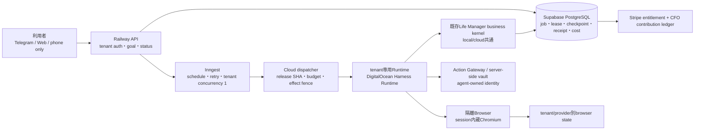
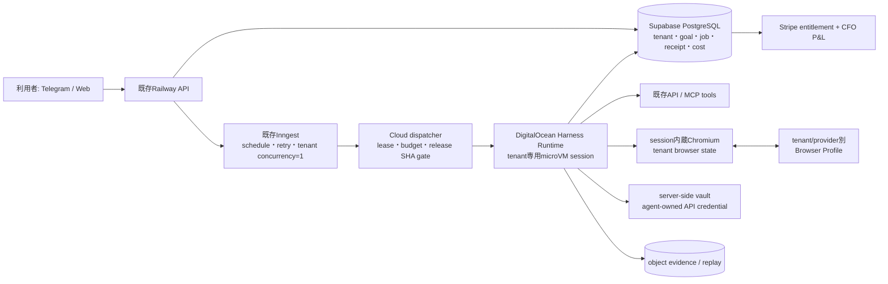

# Life Manager Cloud Runtime Design

**Status:** T11 Cloud版のprovider・実行単位・状態所有・無料導線・販売条件の正本

**Decision:** Cloud architectureは確定済みであり、会話ごとに再設計しない。**出荷するv1 productionはRailway API + Inngest + Supabase PostgreSQL + Stripeの既存control planeと、DigitalOcean Managed Agents Harness Runtime + session内蔵Chromiumのexecution plane**に固定する。AWS Bedrock AgentCoreは利用不能なためlaunch blockerにもpromotion gateにもせず、将来同じprovider-neutral contractで再評価する候補に下げる。Railway Sandbox＋Steelはemergency fallbackであり、通常jobを複数providerへ同時送信しない。既存Life Manager business kernelを複製せず、DigitalOcean adapterから同じrelease SHAを実行する。

**Implementation plan:** `docs/superpowers/plans/2026-09-30-life-manager-digitalocean-cloud.md`. The older AgentCore plan is historical evidence, not the execution cursor.

**Current cursor:** A24。control plane、same-kernel envelope、dispatcher、browser lease、no-human policy、cost ledger、Free onboarding、two-session canary CLI、promotion gate、migration replayはlocal/isolated PostgreSQLで完成している。DigitalOceanはOwner、payment method、auto reload、PAT、Harness environment、Codex sessionまで開通し、sandbox command/outputを実測した。fresh公式APIではaccount=`active`、既存session=`PAUSED`（reason=`idle`）、balance=`0`、blocked=`true`、eligible=`true`、auto prepay有効である。したがって現在cursorはDigitalOcean prepayment gateの公式原因特定と解消であり、その後に2 tenant isolation、内蔵Chromium continuity、pause/resume/remove、active 0、usage/cost、same-kernel parityを実行する。AWSは`PENDING_ACTIVATION`のままでもv1を止めない。

### 0.1 固定済みの完成architecture



- backend/control planeは既存Railway API、Inngest、Supabase PostgreSQLで固定する。
- browserはagent-ownedで、tenantごとにwriter 1つ、cookie/local storageを次の有限jobへ継続する。
- Runtimeは利用者ごとの永久VMではなく、active job中だけ専用container/microVMを持つ。
- durable truthはVMのRAMではなくPostgreSQL、browser state、opaque identity ref、公式receiptに置く。
- productionはDigitalOcean Harness Runtime＋内蔵Chromiumに固定する。Railway Sandbox/Steelはemergency fallback、AWSは将来再評価候補であり、通常jobを複数providerへ同時送信しない。
- 人間credential、approval、resume、CAPTCHA、KYCを通常jobの成功条件にしない。該当jobはterminal `not_applicable`にし、他のeligible jobを継続する。

### 0.2 残りTODO — この順序が正本

1. **[完了] DigitalOcean account/session/PAT gateを実測する。** account active、session READY、sandbox command/output、auto reload設定を公式UI/APIで確認した。
2. **DigitalOcean balance gateを解消する。** auto reload有効なのにbalance 0 / blocked trueである境界をbilling receiptとsession lifecycle readbackで狭め、新規sessionを作れる状態にする。
3. **DigitalOcean production adapterを最小追加する。** create/exec/checkpoint/pause/resume/remove/list/cost、trigger、内蔵Chromium、Action Gateway refだけを既存provider contractへ写像し、business kernelを複製しない。
4. **A24 production infrastructure canaryをlive実行する。** 2 tenant session、workspace/browser隔離、同一tenant continuity、no-ask、人間入力0、pause/resume、両session remove→active 0、前後usage/costを公式readbackする。
5. **A24 agent parityをDigitalOceanでlive実行する。** `HEAD == origin/main == candidate SHA`を満たすreleaseで既存business kernel fixtureを実行し、local/cloudのreceipt hashとevidence hash、replay-zeroを一致させる。
6. **Immutable DigitalOcean releaseをpromoteする。** provider receipt、cost、old session 0、rollback targetをpromotion gateへ渡し、main由来の1 releaseだけを選ぶ。
7. **Production migrationを固定順で適用する。** runtime base → identity refs → no-human browser → cost reservations → Free onboarding。二回目のschema SHA一致と公式DB readbackを得る。
8. **内部tenantでphone-only end-to-endを完走する。** no-card Free onboarding → goal → cloud job → verified result → Telegram report。human input 0、external spend 0、session leak 0を確認する。
9. **A25で5人のFree cohortを完走する。** cross-tenant leak 0、duplicate effect 0、cost cap breach 0、unbounded session 0と、4 journeyのlatency/costを測る。
10. **A26で最初の$49 Founding Proを販売する。** first verified result後だけcheckoutを提示し、Stripe receipt、entitlement、cancel/refund、1 user contributionを公式readbackする。
11. **A27–A28で25人へ拡大し、eval/self-improvementを回す。** activation、retention、conversion、p50/p75/p95、actual cost、settled contributionを基準にcandidateをcanary/rollbackする。
12. **A29でMuse Connectorを追加する。** Life Manager APIとcloud coreが安定した後のdistribution channelであり、runtimeの代替にはしない。

## 1. このspecが固定すること

これまでのT11は「worker pool + Steel Browser」までしか決めておらず、次が未決定だった。

- 利用者ごとに本当に常時VMを持つのか
- loopを誰が起こし、重複実行をどう防ぐのか
- VM停止後に何を正本として再開するのか
- OAuth/CAPTCHAをスマホだけでどう完了するのか
- 無料利用者のクラウド費をどう制限するのか
- Meta Muse本体のSecure VMから何を学び、Muse Connectorをどう分離するのか

本specでこの曖昧さを終わらせる。以後、provider変更は本specのDecision gateを満たす証拠がある場合だけ行い、会話ごとには変更しない。

### 1.1 No-human-loop invariant

Life Managerは通常のjobで利用者に許可・承認・判断を求めない。`ask`、`approve`、`human_wait`はCloud productの通常stateに存在しない。

- effect fenceは人の承認待ちではない。決定的policy、spend cap、idempotency key、最新state、公式receipt/readbackが自動でallow、deny、reconcileを決める。
- policy内のactionは質問せず実行する。policy外のactionは質問せず`policy_denied`として閉じ、別のeligible jobを続ける。
- 人間のcredential、login、OAuth、CAPTCHA、2FA、3DS、KYC、面接、署名を要求する経路は既定product loopへ入れない。agent-owned identity/APIで完結する代替を選び、無ければ`not_applicable: requires_human_principal`でterminalにして別のeligible jobを続ける。
- shared browserの閲覧、emergency stop、利用者が自発的に始めるbreak-glass controlは観測・復旧面として提供できる。ただしagent writerをleaseで停止して単一ownerにし、Life Managerの完了・収益・成功、credential取得、resume条件には数えない。待機state、接続依頼、approve/resume callbackを通常loopに作らない。

## 2. 単一推奨

### 2.1 答え

Life Managerにはクラウド計算機が必要である。ただし、**利用者ごとに24時間起動し続ける1台のVMは不要**である。productionではDigitalOcean Harness Runtimeの隔離microVMを有限job用Cloud Computerにする。

各利用者は1つの「論理Cloud Computer」を持つ。仕事がある間だけtenant専用DigitalOcean sessionをresumeまたはcreateする。同じtenantの仕事は同時に1件だけ実行する。停止中の正本はVMのRAMではなく、Supabase PostgreSQL、object evidence、tenant browser state、Action Gateway/server-side vaultに置く。短いidleではpause/resumeし、長いidleではcheckpoint後にremoveしてimmutable releaseから再構成する。



### 2.2 「ユーザーごとにVMか」の正確な答え

- activeな実行中は、各tenantが専用DigitalOcean microVM sessionを持つ。
- 短いidleはpauseし、長いidleはcheckpoint後にremoveする。pause中もactive-session slotを使うため、永久pauseしない。
- tenantごとに同時active runtimeは最大1つ。同じ利用者の複数loopはqueueで直列化する。
- Browserは同じtenant session内のChromiumを使い、cookie/local storage等をtenant別checkpointへ保存する。異なるtenant間でprofileを共有しない。
- 長時間の仕事は1つのVMに居座らせない。checkpointをPostgreSQL/object storageへ書き、次の有限wakeへ分割する。
- runtime session ID、browser session ID、profile IDは状態の参照であり、business truthではない。

これはGrok BotやMuseの「自分専用クラウドコンピュータ」と同じ利用者体験を与えながら、永続VMのコストと単一障害点を避ける。

Meta Museは比較対象として公式に、各利用者から独立したpersistent isolated Linux VM、full browser、filesystem、terminal、generated tools、Secure Credentials Store、schedule/event driven background workを持つ。ここでいうpersistentは同じ人格、files、browser、memory、taskが継続する利用者契約であり、idle CPUを24時間占有することまでは意味しない。Life Managerはこの利用者契約を採用し、低層computeは有限DigitalOcean sessionと外部durable stateで実装する。

### 2.3 既存loopを作り直さない境界

Cloud版は新しいagentをもう1体作らない。既存Life Managerのloopを、別のhostから呼ぶ。

| 既存のまま再利用するもの | Cloud用に追加する薄い境界 |
|---|---|
| goal、business rule、effect fence、receipt判定、`lm_runtime_jobs` state machine | provider-neutral request/response envelope |
| Inngestのwake/retryとtenant別直列化 | DigitalOcean Harness Runtime adapter |
| PostgreSQLのjob/checkpoint/receipt | tenant→runtime/profile/usageのprovider ID map |
| 既存browser task contract | v1 DigitalOcean Chromium adapter。Steel/Browserbase/AgentCore Browserは同じcontractの代替 |
| Stripe webhook entitlement | `free-v1` / `founding-pro-v1` admission policy |

local版とCloud版の差は「誰が起こすか」「どこで隔離実行するか」「provider IDをどう保存するか」だけにする。business kernelをcopyしない。同じtask capsuleを同じkernel SHAへ渡し、canonical receipt/evidence hashが一致しなければCL01失敗である。

`browser-session-lease`はprovider-neutral contractとしてtenantごとにbrowser writerを1つへ制限する。DigitalOcean内蔵Chromiumを既定にし、実サイト互換性が失敗した対象だけ既存Stagehand/Steel driverを限定fallbackとして使う。AWS解除だけを理由にprovider変更しない。

## 3. 調査した選択肢

### 3.1 一次資料で確認した事実

| 選択肢 | 確認した事実 | 判断 |
|---|---|---|
| [AWS Bedrock AgentCore Runtime](https://docs.aws.amazon.com/bedrock-agentcore/latest/devguide/agents-tools-runtime.html) | 各user sessionは専用microVM。任意framework/model、最大8時間、非同期処理、消費量課金。GAでTokyo対応 | 強い将来候補だが現accountが利用不能。v1 blockerにしない |
| [AgentCore Browser](https://docs.aws.amazon.com/bedrock-agentcore/latest/devguide/browser-tool.html) / [Browser Profiles](https://docs.aws.amazon.com/bedrock-agentcore/latest/devguide/browser-profiles.html) | 隔離browser、agent-owned cookie/local storageをprofileへ保存、CloudTrail/recording | 将来adapter候補 |
| [AgentCore Identity](https://docs.aws.amazon.com/bedrock-agentcore/latest/devguide/identity-overview.html) | inbound identity、outbound OAuth/API keyを一元管理し、credentialをmodel contextへ置かない | 将来adapter候補 |
| [AgentCore pricing](https://aws.amazon.com/bedrock/agentcore/pricing/) | 最低料金・前払いなし。Runtime V2はCPU $0.1276/vCPU-hour、memory $0.0169/GB-hour、BrowserはCPU $0.0895/vCPU-hour、memory $0.00945/GB-hour | 無料枠をhard budgetで実現可能 |
| [Railway Sandboxes](https://railway.com/sandboxes) / [pricing](https://railway.com/pricing) | API/CLI/TypeScript SDKで作る隔離Linux VM。checkpoint、fork、private network、自動破棄、4地域。CPUとmemoryは秒課金で各約$50/month相当、公式例の20分・1GB・平均0.3 vCPUは約$0.03。CLIはexperimental/API変更可能と明記 | provider fallback。単一live sandbox proofはPASS済み |
| [Browserbase Contexts](https://docs.browserbase.com/platform/browser/core-features/contexts) / [pricing](https://www.browserbase.com/pricing) | cookie、localStorage、IndexedDB等を暗号化してsession間で永続化。managed browser、recording、proxy、CAPTCHA対応。100時間後は$0.12/browser-hourのplan例 | Steel実サイト互換性が落ちる場合のmanaged browser代替。Runtimeの代替ではない |
| [DigitalOcean Managed Agents](https://docs.digitalocean.com/products/managed-agents/agent-harness-runtime/concepts/architecture/) | 1 session = 1 microVM、pause/resume、Chromium、Action Gateway、tenantごとにsessionを作れる | **v1 production採用**。account/session/command/PATはPASS、balance gateは未解消 |
| [DigitalOcean limits](https://docs.digitalocean.com/products/managed-agents/agent-harness-runtime/details/limits/) / [triggers](https://docs.digitalocean.com/products/managed-agents/agent-harness-runtime/how-to/run-agents-with-triggers/) / [environment spec](https://docs.digitalocean.com/products/managed-agents/agent-harness-runtime/reference/environment-spec/) | public preview、最大100 active sessions、pause中もslotを使う。fresh/reuse trigger、VPC/subnet、egress allowlist、明示allow/denyを持つ。triggerで`ask`はcreate時拒否されるが、reuse sessionに残ったruntime promptはauto-approvedされ得るため`ask`を安全策にしてはいけない | 5→25 user launchに十分。`allow`＋明示`deny`、HITL reject、idle remove、billing receiptを必須にし、100 active session到達前にlimit increaseまたは同contract移行を実測する |
| [Google Agent Platform](https://docs.cloud.google.com/gemini-enterprise-agent-platform/scale) | managed runtime、sessions、Memory Bank、evaluation、tracing、code/computer-use sandbox、IAMを持つ | 強い全部入り代替。ただしtenant別の永続browser login profile契約と単純なend-to-end原価を確認できずv1不採用 |
| [Microsoft Foundry Agent Service](https://learn.microsoft.com/en-us/azure/ai-foundry/agents/overview) | hosted container、session state、VM-isolated sandbox、managed identityを持つ | 強い代替。ただしmanaged browser profileとagent-owned outbound identityが一体化していないため不採用 |
| [E2B persistence](https://e2b.dev/docs/sandbox/persistence) / [pricing](https://e2b.dev/pricing) | filesystemとmemoryをpause/resume。Hobbyは20 concurrent、Proは$150/月＋usage、100 concurrent、標準2 vCPU＋4GBは約$0.166/hour | compute部品として優秀だが、tenant別identity/browser profile/auditを別途組むため不採用 |
| [Daytona persistence](https://www.daytona.io/docs/en/persistence/) / [pricing](https://www.daytona.io/pricing) | persistent filesystem、VM memory pause/resume、snapshot/fork。vCPU $0.0504/hour、memory $0.0162/GB-hour、秒課金 | 安いcompute部品だが、browser/identity/receipt統合を自作するため不採用 |
| [Modal Sandboxes](https://modal.com/docs/guide/sandboxes) / [pricing](https://modal.com/pricing) | serverless sandbox、CPU/memory秒課金、Starterに月$30 compute | burst computeに強いが、browser profile/identity/product control planeは別途必要 |
| [Fly Machines suspend/resume](https://fly.io/docs/reference/suspend-resume/) | Firecracker snapshotで高速resume、suspend中はstorage課金だけ。ただしsnapshotは保証されずcold start必須 | 運用責任が大きいため不採用 |
| 自前Kubernetes/Firecracker + Steel | 最大の自由度 | isolation、patch、autoscale、browser、viewer、vault、auditを全部所有するためv1では不採用 |
| [Meta Muse](https://ai.meta.com/muse/) / [security architecture](https://www.meta.com/help/1047255454427887/) | 各userに独立したpersistent isolated Linux VM、full shared browser、storage/CPU/memory、terminal/filesystem、自作tool、Secure Credentials Store、schedule/event background work、activity logを持つ | 直接借りるruntimeではないが、Life Managerのlogical computer、credential broker、shared-browser observabilityの主要benchmark |
| [Meta AI / Muse Connectors](https://dev.meta.ai/products/connectors) | 既存REST APIをMeta AIが呼ぶtoolへ変換するdeveloper preview。Meta Muse本体とは別のdistribution interface | Life Manager API完成後のdistribution channel |

### 3.2 推論と決定理由

DigitalOcean Managed Agentsをv1に選ぶのは「一番強いagent model」だからではない。現在使える候補の中でLife Managerの未解決部分を最少の新規部品で埋め、実sessionとcommandが既に動いたからである。

1. 1 session = 1 microVMでtenant実行を隔離できる。
2. Chromium、filesystem、terminal、pause/resume/checkpointを一つのsessionで使える。
3. Action Gatewayとserver-side vaultでagent-owned secretをpromptから隔離できる。
4. webhook/cron triggerとheadless実行でMac Miniなしに起動できる。
5. create/exec/show/logs/checkpoint/pause/resume/remove/balanceをCLI/APIから公式readbackできる。
6. 既存Node business kernel、PostgreSQL job protocol、Inngest、Stripeを捨てず薄いadapterで接続できる。
7. Account、PAT、実session、実commandが既にPASSしており、AWSの解除日を待たない。

AWS AgentCoreは部品の統合度では強い。しかし現在のAWS accountは`PENDING_ACTIVATION`で、S3、CloudFormation、CloudWatch/Cost Explorerを使えない。解除時刻が無いproviderをproduction gateに置くこと自体が最大の可用性リスクなので、v1から外す。将来使えるようになっても、DigitalOceanに対する同一fixtureの隔離、browser continuity、latency、cost、failure recoveryで明確に勝った場合だけ移行する。

Railway Sandbox＋SteelはDigitalOceanにprovider障害がある場合のemergency fallbackであり、通常運用の第三実装を並行稼働させない。

DigitalOceanのpauseはcomputeを止めるがactive-session slotは解放しないため、短いidleだけpause、長いidleはcheckpoint+removeにする。Insightsのtoken/resource値は運用指標であり、正確な支出はbilling recordを正本にする。triggerの`ask`は安全停止ではないため、Life Managerは`ask` 0、`allow`＋明示`deny`、headless HITL rejectだけを許す。Owner、payment、auto reload、PAT、Codex sessionとsandbox commandは実測PASSしたが、公式balanceは0かつblockedなのでproduction canaryの次境界はbilling gateである。

DigitalOcean canaryは二段階にする。第一段は`agent: none`の2つのbare microVMを使い、model credentialなしでAのChromium localStorageを同じprofileから再読し、BからAのworkspaceが見えないこと、両sessionのexact remove→list 0、前後prepayment balanceを測る。第二段だけ実際のLife Manager agentとmodel credentialを使い、同じbusiness kernel receiptを検証する。これによりmodel vendor認証をinfrastructure isolationの前提にせず、自己申告ではないbrowser continuityとtenant isolationの証拠を先に得る。live実行は`billing:read`を含むleast-privilege DigitalOcean tokenがSSOTへ保存されてから一度だけ行い、token未取得のlocal testをprovider PASSと数えない。

競合runtimeの詳細な事実、推定、非公開部分、Life Managerへの採否は[`docs/research/cloud-agent-runtime-benchmark.md`](../../research/cloud-agent-runtime-benchmark.md)を正本とする。Meta Muse本体をMuse ConnectorやMuse Codeと混同しない。

## 4. componentの責任

| Component | 唯一の責任 | 正本にしないもの |
|---|---|---|
| Railway API | Telegram/web ingress、auth済みtenant scope、goal/status/result | job進行、receipt判定 |
| Inngest | cron/event wake、再試行、tenant concurrency=1 | effectが成功したかの判断 |
| Supabase PostgreSQL | tenant、goal、`lm_runtime_jobs`、lease、checkpoint、receipt、entitlement、cost ledger | credential値、browser cookie平文 |
| DigitalOcean Harness Runtime | productionで有限jobを同一business kernel SHAで隔離実行し、pause/resume/checkpoint/removeする | 永久memory、最終receiptの自己申告 |
| DigitalOcean Chromium | job中の自律browser automationとtenant別cookie/local storage継続 | human credential、複数tenant共有、receipt |
| Action Gateway / server-side vault | agent-owned OAuth refresh token/API key、agent identity | human credential、user goal、economic ledger |
| object evidence storage | artifact、screenshot、trace、session replay。DBにはhash/refだけ | query可能なjob state |
| Stripe | subscription/paymentの公式状態 | agent jobの成功 |
| CFO ledger | provider receipt + revenue - 全cost | passログや予測利益 |

## 5. 実行フロー

### 5.1 無料onboarding

1. 利用者がTelegramまたはwebで「何を任せたいか」を1文で入れる。
2. APIがtenantを作り、`free` entitlement、月次cost budget、1つのgoalを割り当てる。カードは要求しない。
3. 最初はAPI/read-onlyで完了できる仕事を選び、10分以内に最初のverified resultを返す。
4. 人間principalを要求する候補は選ばず、agent-owned identity/APIで完結する候補へ自動で切り替える。代替が無ければ`not_applicable`で閉じる。
5. 以後はInngestが自動wakeし、通常結果は静かに保存する。通知はmaterial outcomeだけで、credential、許可、承認、再開を求めない。

### 5.2 scheduled wake

1. Inngestが`tenant_id`だけを含むeventを作る。
2. dispatcherがPostgreSQLからtenant、entitlement、cost、次のeligible jobを再読込する。
3. `tenant_id + job_id + attempt + release_sha`でleaseをclaimする。tenantにactive leaseがあれば起動しない。
4. budgetとrelease gateが通った時だけtenant専用DigitalOcean sessionをresumeまたはcreateする。
5. runtimeは参照だけのtask capsuleを受け、必要なstateをtenant scopeで読む。
6. jobは有限に終わり、checkpoint、usage、provider receipt ref、evidence hashを返す。
7. control planeが公式readbackを行い、PostgreSQLで`completed|retry|reconcile|not_applicable|policy_denied|blocked`を決定する。どの状態も人のcredential・承認・再開を待たず、他のeligible jobを継続する。
8. 短いidleはsessionをpauseし、長いidleはcheckpoint後にremoveする。次のjobは新しいmicroVMでも同じ正本から続く。

### 5.3 browser jobとhuman-free principal selection

1. API toolがあるproviderはGateway/API adapterを優先する。
2. browserしかない場合、tenant session内蔵Chromiumを開始し、tenant別checkpoint/browser stateだけを復元する。
3. 外部作用直前に最新stateとeffect fenceを再読込し、policy内なら質問せず実行する。
4. providerがhuman login、OAuth、CAPTCHA、2FA、3DS、KYC、面接、署名を要求したら外部作用を開始せず、その候補を`not_applicable: requires_human_principal`で閉じてagent-owned/API候補へ移る。
5. user credential input、approve/resume callbackを通常jobに実装しない。read-only Live Viewとemergency stopは許す。任意break-glass takeoverを提供する場合はagent writerを停止し、手動結果をautomated success/revenueから除外し、終了後も元jobを人間待ちでresumeしない。human principalを要求する入力はprovider call 0で拒否する。
6. 作用後はproviderのreceipt/readbackを取得する。取得できない場合は`effect_unknown`へ隔離し、自動再送しない。
7. browser stateをtenant別checkpointへ保存し、sessionをpauseまたはremoveする。

### 5.4 phone-only UXと内部stateの対応

利用者に見せる主画面はTelegramまたはmobile webの1本のtimelineである。cloud provider、session ID、VM、checkpointという用語は通常表示しない。

| 利用者がすること・見るもの | 内部で起きること |
|---|---|
| 「無料で始める」を押す | tenant、`free-v1` entitlement、cost budget、既定daily-life/financial-health goalを作る。カード不要 |
| 望む結果を1文で送る | goalを保存し、既存loop catalogからhuman-freeで実行可能なjobを優先順位付けする |
| アプリを閉じる | Inngestがschedule/eventで起動し続ける。利用者端末、Mac Mini、開いたbrowser tabは不要 |
| 「実行中」を見る | dispatcherがleaseを取得し、tenant専用DigitalOcean sessionをresume/createして同じbusiness kernelを実行する |
| 「今日の結果」を受け取る | 公式receipt/readbackがあるmaterial outcomeだけを収益、節約、予定改善として通知する |
| 詳細を開く | action、時刻、provider receipt ref、収益、全原価、net contribution、次回wakeを表示する。credential/cookieは表示しない |
| 何もしない | sessionはpause/removeされ、durable stateから次回自動再開する。承認待ちにはならない |
| emergency stopを押す | 新規leaseを止め、active writerを終了し、公式readbackを保存する。通常成功条件には使わない |

初回体験は「入力フォームを埋める」ではなく、10分以内に1つのverified resultを返すことを目標にする。日常管理では予定、移動、travel、mental loopのmaterial changeを通知し、financial loopでは`settled revenue - refund - 全cost`だけを利益として表示する。応募、投稿、クリック、モデルの自己申告は収益表示しない。

Life Managerが使うidentityは原則agent-ownedである。人間login、OAuth同意、CAPTCHA、2FA、3DS、KYC、署名が必須の候補は利用者へ質問せず`not_applicable`で閉じ、別のeligible jobを続ける。これにより「質問しない代わりに停止する」のではなく、「人間不要の仕事を途切れず続ける」UXにする。

## 6. tenant隔離

次の境界を全部通らなければCloud版を公開しない。

- すべてのjob/state/receipt/cost queryは`tenant_id`を必須にし、PostgreSQL RLSでも二重に強制する。
- `runtime_session_id`、`browser_session_id`、`browser_profile_id`はtenant mapからだけ取得し、client入力を信用しない。
- 同一tenantのactive runtime leaseは最大1つ。別tenantは別microVM、別browser session、別profileを使う。
- credential値はAction Gatewayまたは既存server-side vaultだけに置き、prompt、job row、trace、Telegramへ出さない。
- Browser checkpointとsecret refはagent-owned principalだけを許可し、人間credential値またはuser-supplied sessionを拒否する。
- artifactは`tenant/<tenant_id>/...` prefixとKMSで分離し、DBにはrefとSHA-256だけ置く。
- release SHAが承認済みSHAと違うruntimeは、state readやeffect前にfail closedする。
- forged cross-tenant refのtestでは、backing provider callが0回であることを確認する。
- shared browser viewerはtenant-bound opaque session refだけを受け取り、credential/cookie/profile raw dataを返さない。viewer、stop、break-glass writerは同じlease generationを検証し、agentとhumanの同時writerを作らない。

## 7. 無料提供と販売

### 7.1 launch時のplan

| Plan | 利用者体験 | deterministic limit |
|---|---|---|
| Free | カード不要。1 active goal。最初のverified resultまでpaywallなし | 初回activation credit $1、その後は月variable cost hard cap $0.50、1日1 scheduled wake、月10 browser-minutes、外部支出なし |
| Founding Pro | $49/月。3 active goals、1日12 scheduled wakeまで、長いjob、優先queue | 月variable cost target $6 / hard cap $12。上限到達時は自動課金せず停止し、翌月または明示upgradeを案内 |

制限値はversioned entitlementとして保存し、UI文言にprovider単位を露出しない。利用者には「1つの目標が無料で動く」と見せる。無料枠を使い切っただけで既存stateやBrowser Profileを消さない。Freeのactivation creditは最初のverified resultを得るためだけに使い、紹介やbot farmで再発行しない。

### 7.2 収益と利用者の利益を分ける

- Life Manager社の収益はStripe subscription receiptで証明する。
- 利用者のincome loopの成果は、各providerの入金・返金・payoutと実測costをjoinして証明する。
- 「loopが動いた」「応募した」「投稿した」は利益ではない。
- 特定loopで`settled revenue - refund - model/browser/cloud/provider cost > 0`が反復して確認されるまで、「稼げる」と販売文言に書かない。
- x402等のagent間支払いは初期subscriptionに使わない。自己資金化gateを通った後だけに限定する。

### 7.3 1 userあたりのunit economics

当社の月次式を次の1本に固定する。

```text
company_contribution_per_user
= subscription_collected
+ attributable_company_owned_settled_revenue
- refunds_and_chargebacks
- Stripe_Payments_fee
- Stripe_Billing_fee
- model_cost
- DigitalOcean_Harness_Runtime_cost
- DigitalOcean_Chromium_and_storage_cost
- tool_and_search_cost
- allocated_Railway_Inngest_Supabase_object_storage_cost
```

ユーザー自身がjob、投資、販売で受け取った金額は`user_outcome`であり、当社売上ではない。初期版でsuccess feeを取らない。会社所有のAffiliate、Apps、Product、x402 loopが受け取った外部入金だけを`attributable_company_owned_settled_revenue`へ入れる。自己送金、含み益、応募、投稿、クリック、未回収請求は0である。

[Stripe Japan pricing](https://stripe.com/jp/pricing)の国内カード3.6%と[Stripe Billing pricing](https://stripe.com/jp/billing/pricing)の0.7%を合わせ、$49 subscriptionの決済費用を4.3% = $2.107として計画する。為替、税、international card surcharge、refund、disputeは別ledger rowにする。

| paid user / month | Subscription | Stripe 4.3% | model + runtime + browser + tools | shared infra allocation | 粗利貢献（人件費・税・広告前） |
|---|---:|---:|---:|---:|---:|
| Best | $49.00 | $2.11 | $3.00 | $1.00 | **$42.89 (87.5%)** |
| Base target | $49.00 | $2.11 | $6.00 | $2.00 | **$38.89 (79.4%)** |
| Cost-cap worst | $49.00 | $2.11 | $12.00 | $2.00 | **$32.89 (67.1%)** |

hard capを越えるjobは開始しないため、1人の暴走がsubscription以上のcomputeを焼かない。refund/chargebackや広告費は上表の外なので、会社全体のnet profitはCFO ledgerで別に差し引く。

Free userは初回$1、以後月$0.50が最大変動原価で、売上は$0である。したがってFree単体は赤字だが、永久VMを持たないので損失上限が明確である。Free portfolioの月次予算は`active_free_users × $0.50 + new_activations × $1`を絶対上限にし、会社全体のFree予算capも重ねる。

DigitalOceanの価格表示だけをforecastの正本にしない。CL00/CL06で各jobのprepayment/billing receipt、session duration、model usage、storageを計測し、上の$3/$6/$12を実測値で置き換える。pricing pageの数字だけで利益達成を主張しない。

### 7.4 scale arithmetic（予測ではなく式）

internal revenueを0としても、Base targetの算術は次になる。

| Paid users | Subscription MRR | Stripe fee | variable cost target | shared infra仮配賦 | 粗利貢献 |
|---:|---:|---:|---:|---:|---:|
| 100 | $4,900 | $211 | $600 | $200 | **$3,889/月** |
| 1,000 | $49,000 | $2,107 | $6,000 | $2,000 | **$38,893/月** |
| 100,000 | $4.9M | $210,700 | $600,000 | $200,000 | **$3.889M/月** |
| 204,082 | $10,000,018 | $430,001 | $1,224,492 | $408,164 | **$7,937,361/月** |
| 1,000,000 | $49M | $2.107M | $6M | $2M | **$38.893M/月** |

100,000人・1,000,000人は売上予測ではなく、$49とBase targetを掛けたcapacity/business modelである。顧客獲得、解約、support、人件費、税、広告費を含まない。実際のforecastは、25人cohortのactivation、D7/D30 retention、Free→Paid conversion、cost/userが揃ってから更新する。

内部収益loopは次のように上乗せする。

```text
portfolio_net_profit
= subscription_contribution
+ verified_company_owned_internal_revenue
- payroll - tax - acquisition_cost - unallocated_shared_cost
```

たとえばcompany-owned loopが100,000 paid usersへ帰属可能なsettled revenueを平均$10/user生み、そのための追加costが$3/userなら、追加貢献は$700,000/月である。しかし現状の統合SSOTでは検証済みsettled net MRRはほぼ0なので、この$10をforecastには入れない。receiptが生まれた分だけCFOが加算する。

### 7.5 $10M MRRへ到達する算術とgrowth gate

`$10,000,000 ÷ $49`を切り上げると、必要なactive paid subscriptionsは**204,082人**で、実際のMRRは`204,082 × $49 = $10,000,018`である。Base targetなら人件費・税・広告費前の月次粗利貢献は約**$7,937,361**である。これは売上予測でも達成保証でもなく、priceとcost capから出る必要顧客数・capacityの式である。

Free→Paid conversionをactivated users基準で置くと、204,082 paidへ必要なactivated usersは次のとおりである。

| Measured conversion | 必要activated users | 解釈 |
|---:|---:|---|
| 5% | 4,081,640 | 20人のactivated userから約1人がpaid |
| 10% | 2,040,820 | 10人のactivated userから約1人がpaid |

成長の順序は`1 paid receipt → 100 paid → 1,000 paid → 10,000 paid → 100,000 paid → 204,082 paid`とする。各段階で先へ進む条件は、MRRの見かけではなく、paid retention、月次churn、verified outcome率、Free→Paid conversion、support負荷、p50/p95 cost/userが計測でき、解約分を補充した後もactive paidが純増していることである。必要な月次新規paid数は常に`目標純増 + 当月churn人数`である。

最初から204,082人分のVMを予約しない。active jobだけmicroVM/browserを作るため、capacityは利用者数ではなく同時実行数と実測job minutesに合わせて増やす。company-owned internal revenueはreceipt-backed settled netだけを上乗せし、$10M subscription MRRの必須条件には含めない。

### 7.6 launch cohort

1. internal tenantでread-only canary。
2. 5人のinvite-only Free cohort。
3. cross-tenant leak 0、effect duplicate 0、cost cap breach 0を確認。
4. 25人へ拡大し、activation、D7 retained、verified outcome、cost/userを計測。
5. 最初の価値を受け取った利用者だけへFounding Proを提示する。
6. Stripeで最初の有料subscription receiptをreadbackしてR01完了。

### 7.7 測定可能なjourneyを自律改善する

[Anthropicのclaude.ai高速化事例](https://claude.dev/blog/how-we-made-claude-ai-faster/)は、利用の95%を占める4journeyへ比較可能なstart/end telemetryを置き、lab benchmark、限定deploy、field readback、benchmark ratchet、rollbackを一つのloopにした。二週間で13測定の幾何平均を約3.1倍改善できた核心は、AIへ「改善して」と頼む抽象目標を、改善対象、再現可能な数値、実利用との相関、退行を防ぐratchetへ分解したことにある。

Life Managerは同じ方法を、人間承認へ依存せず次の4journeyへ適用する。

1. `goal accepted -> first verified result`
2. `scheduled wake -> terminal official receipt/readback`
3. `browser session start -> first policy-allowed useful action`
4. `settled revenue/cost change -> CFO ledger + user report`

各journeyはtenant、release SHA、model/tool version、start/end、p50/p75/p95 latency、model/browser/runtime/tool cost、step count、retry count、effect/readback、verified outcomeを同じschemaで記録する。速度またはcostの改善は、verified outcome率、cross-tenant leak 0、duplicate effect 0、credential exposure 0、effect-unknown率、settled net contributionを悪化させない場合だけ採用する。

改善loopは次で固定する。

```text
field trace -> material bottleneck -> one-variable hypothesis -> deterministic proxy benchmark
  -> real outcomeとの相関確認 -> isolated candidate -> held-out/safety/cost evaluation
  -> one-tenant canary -> field readback -> promote + ratchet、またはrollback
```

- proxy metricは、実利用latency、verified outcomeまたはsettled contributionとの相関を実測できなければ廃棄する。測りやすい数字だけを最適化しない。
- candidateは1 bottleneck、1 owner、1 bounded changeを基本とし、別candidateと同じtenant、browser profile、effect ownerを共有しない。
- fieldで改善を確認した後だけbaseline上限を下げる。ratchetは悪化を防ぐ一方向gateであり、候補自身は変更できない。
- high-risk変更はinternal tenantから段階拡大し、失敗時は自動rollbackする。人間approveは通常promotion条件にしない。
- self-improvementはtelemetry、evaluator、receipt定義、identity、permission、spend cap、tenant isolation、rollback権限を変更できない。
- 新しい測定を作ること自体をagentの仕事に含める。ただし新metricはfield outcomeとの相関を証明するまでpromotion gateにしない。

## 8. acceptance gates

| Gate | 完了条件 |
|---|---|
| CL00 Provider proof | DigitalOceanで2 tenant Harness Runtime、内蔵Chromium、Action Gateway refのcanaryが実環境PASS。公式resource ID、lifecycle、usage/cost receiptを保存 |
| CL01 Kernel parity | localとDigitalOceanが同じ承認済みbusiness-kernel SHA、task capsuleから同じcanonical receipt/evidence hashを作る |
| CL02 Tenant isolation | tenant Aからtenant Bのstate、credential ref、browser profile、session、receipt、artifactへ到達不能。provider call 0 |
| CL03 Lifecycle | tenantごとactive runtime 1、jobごとbrowser session 1。timeout/crash/deploy後もstale leaseをreconcileし、cold startで再開 |
| CL04 Phone-only | Telegram/webでgoal投入後、credential入力・確認・承認・resume 0でagent-owned action、公式readback、session releaseを完走。phoneからread-only live viewとemergency stopが可能。任意break-glass操作はautomated success/revenueに数えず、human principalを要求する候補はprovider call 0で`not_applicable`になり、別jobが継続 |
| CL05 Promotion | main由来immutable releaseだけをdeployし、cloud canary、official readback、replay-zeroを確認 |
| CL06 Cost/Free | Free capで追加computeをfail closedし、既存stateを保持。CFO ledgerでtenant/job単位のmodel/browser/runtime/tool costをjoin |
| CL07 Measured improvement | 4 core journeysのfield baselineをrelease/model/tool別に取得。candidateはproxyとfield outcomeの相関、held-out/safety/cost、one-tenant canaryを通り、verified outcome・effect safety・tenant isolation・settled contributionを悪化させずにp75/p95 latencyまたはcostを改善。失敗candidateは自動rollbackし、成功時だけratchetを下げる |
| R01 Paid | StripeのFounding Pro subscription receiptを1件公式readbackし、entitlement反映とcancel/revokeを確認 |
| R02 Cohort | 25 Free tenantsでcross-tenant leak 0、duplicate effect 0、unbounded session 0、cost cap breach 0 |

local in-memory simulationはunit testであり、CL00〜CL06のcloud完了証拠には数えない。

## 9. provider fallbackと変更条件

provider adapterは`runtime`、`browser`、`identity`の3境界で保つ。ただしv1で複数providerを同時実装しない。

- Browser互換性canaryがDigitalOcean Chromiumで失敗した対象だけ、既存Steel adapterを限定fallbackとして再評価する。
- DigitalOcean outageはjobをretry/reconcileへ戻す。即座に別providerへ二重送信しない。
- AWS等への将来変更は、同一fixtureでtenant別login continuity、lifecycle readback、決定的allow/deny policy、remove後active session 0、billing recordのtenant/job join、latency/costがDigitalOceanより明確に良い場合だけ行う。
- provider変更後もPostgreSQLのjob/receipt/effect contractとbusiness-kernel SHAは変えない。

## 10. 非目標

- Meta MuseのSecure VMをLife Manager runtimeとして借りること。Muse本体は主要benchmarkであり、Muse Connectorは別物のdistribution interfaceとしてLife Manager APIを呼ぶ。
- 利用者ごとの永久起動VM。
- Cloud版だけの別business logic。
- DigitalOcean session storageを唯一の正本にすること。
- v1でKubernetes、Firecracker、独自browser viewer、独自OAuth vaultを作ること。
- 利益を保証すること、またはreceiptなしで「稼いだ」と数えること。

## 11. best / base / worst

- **Best:** DigitalOceanのbalance、2 tenant isolation、Chromium continuity、cost receipt、same-kernel parityが全部通り、5人Free cohortから25人、$49 Founding Proへ進む。
- **Base:** RuntimeはDigitalOceanで通るが一部サイトだけ内蔵Chromiumのcontinuityが不足し、その対象だけ既存Steel adapterへfallbackする。
- **Worst:** DigitalOceanのbilling/lifecycle制約がproduction contractを満たさない。この場合もbusiness kernel、PostgreSQL job、Inngest、Stripeは残り、既にlive proof済みのRailway Sandbox＋Steelへadapterだけ差し替える。

棄却案の最強論拠は、AWS AgentCoreならRuntime、Browser Profile、Identity、CloudWatchを一社で揃えられ、GAで長期部品数が少ないこと。ただし現accountでは標準AWS serviceが使えず解除日も無いため、現在存在しない可用性を前提にする方が大きな妥協になる。

**この判断が間違う最有力の筋:** DigitalOcean public previewのbilling gate、100 active session上限、またはChromium persistenceが想定より不安定なこと。したがってA24でbalance、新規2 session、pause/resume/remove、browser continuity、cost receiptを実測し、100 active session到達前にlimit increaseかprovider移行を決める。
